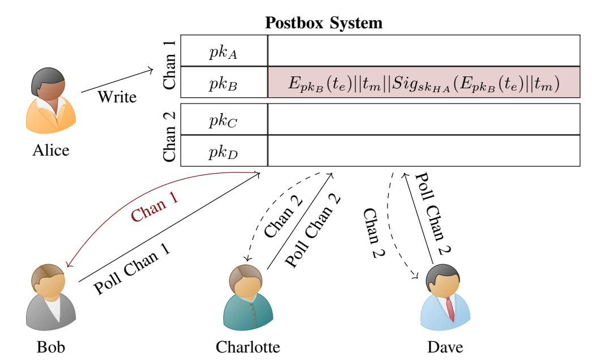
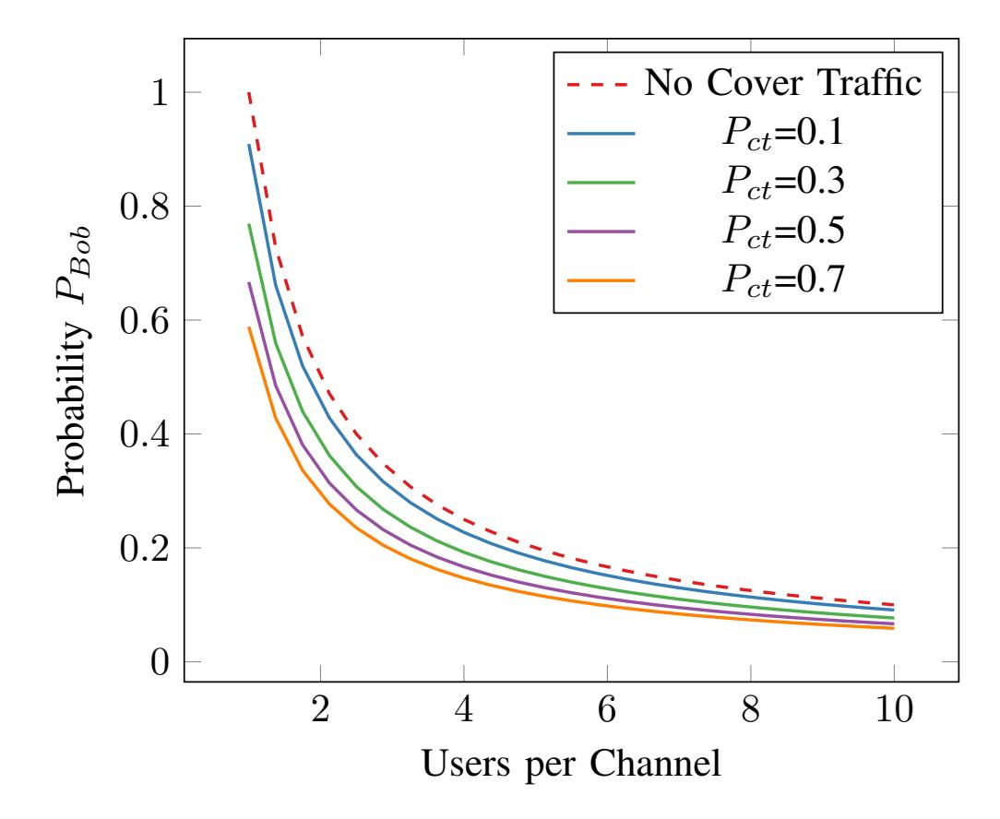

{0}------------------------------------------------

# Ovid: Message-based Automatic Contact Tracing

Leonie Reichert\*, Samuel Brack\*, Björn Scheuermann\*†

\*Humboldt University of Berlin, Department of Computer Science
{leonie.reichert, samuel.brack, scheuermann}@informatik.hu-berlin.de

†Alexander von Humboldt Institute for Internet and Society, Berlin

Abstract—The COVID-19 pandemic created various new challenges for our societies. Quickly discovering new infections using automated contact tracing without endangering privacy of the general public is one of these. Most discussions concerning architectures for contact tracing applications revolved around centralized against decentralized approaches. In contrast, the system proposed in this work builds on the idea of message-based contact tracing to inform users about their risk. Our main contribution is the combination of a blind-signature approach to verify infections with an anonymous postbox service. In our evaluation, we analyze all components in our system for performance and privacy, as well as security. We also derive parameters for operating our system in a pandemic scenario.

Keywords—COVID-19, Contact Tracing, Privacy-Enhancing Technologies, Blind Signatures

#### I. Introduction

The COVID-19 pandemic challenges both emergency capacities of hospitals as well as countries democratic foundations. Contact tracing is a promising tool to combat this ongoing crisis until vaccines are ready or herd immunity is reached [1]. It allows health authorities (HA) to discover new infections by examining people that have been in contact with patients. But manual contact tracing is too slow to combat COVID-19 as it is an airborne disease and people are already infectious days before the first symptoms appear [1]. Therefore, various attempts have been made to automate the process. Some of these require the collection of large amounts of data [2]. For this reason, many activists fear that these systems could be repurposed later and turned into tools for mass surveillance [2], [3]. To address these concerns while fighting the pandemic with modern means, we propose Ovid, an automatic contact tracing (ACT) system. It uses messages to communicate risk and leaks as little information as possible to the HA. Infected users place encrypted messages in postboxes of users they have come in contact with. To provide privacy for the receiver, postboxes are combined into postbox channels and cover traffic is introduced. Message authenticity is ensured through the use of blind signatures. To the knowledge of the authors, Ovid is the first system that combines blind signatures and postbox channels with cover traffic to ensure user privacy against the HA at all times. The parameters upon which we base our evaluation provide a balance between privacy and performance. Ovid extends our work CAUDHT [4]

Workshop on Secure IT Technologies against COVID-19 (CoronaDef) 2021 21 February 2021 ISBN 1-891562-72-X https://dx.doi.org/10.14722/coronadef.2021.23010

https://dx.doi.org/10.14722/coronadef.2021.23010

www.ndss-symposium.org

by addressing new attack vectors and necessary architectural changes.

Our main contributions are:

- Applying blind signatures to verify the authenticity of an infection message while ensuring that the HA does not learn which users interacted.
- A defense mechanism against flooding the system with malicious messages.
- A scalable concept for cover traffic.
- An evaluation of our system.

The remainder of this paper is structured as follows. In Section II, we introduce related work concerning ACT. We explain our attacker model in Section III and our system design in Section IV. In Section V, the proposed system is evaluated. We then conclude by presenting ideas for future work on this topic.

#### II. RELATED WORK

Contact tracing is the process of identifying potentially infected people by analyzing a patient's history of social contacts. This has been done for epidemics such as HIV [5] or Ebola [6]. Stochastic analysis and real world experience have proven its usefulness [5], [6]. For contact tracing to be effective, the number of identified cases has to grow faster than the number of new infections [5]. Due to increasing amounts of new patients and a high transmission rate, to stop the spreading of COVID-19 this process needs to be automated [1].

Bluetooth Low Energy (BLE) is a short-range and energyefficient variant of Bluetooth. It supports different transmission power levels which makes it a good choice for fine-grained sensing [7]. Researchers have therefore used it for various projects revolving around interaction detection [8]. During the course of the pandemic, BLE emerged to be the most promising technology for ACT as it is available in most modern smartphones [9]. Most ACT approaches rely on users exchanging ephemeral pseudonyms (EPs) over BLE with others close by to register encounters and record them on their device. One drawback of using BLE for distance measurements is that calibrating devices can be challenging [10]. The smartphone app *TraceTogether* [10], released by the government of Singapore, has been the first officially running ACT system. Here, risk assessment for users is done by a central server. The server knows which users advertised which specific EP at a certain time. Infected users upload observed EPs. The server can link these to users and can thereby derive who interacted with one-another and who might be at risk. In contrast,

{1}------------------------------------------------

*DP-3T* [11] attempts to solve the problem in a decentralized manner. In this ACT system, infected users upload their own EPs to a blackboard. Other users can check there to see if they encountered one of the published EPs. This means risk assessment is done locally on users' end devices. The blackboard server does not know who used which EPs at what time and does therefore not learn who interacted with oneanother.

More closely related to the approach discussed in this paper are the ideas of Cho et al. [12]. They proposed to use private messaging to warn users who are at risk. Infected users send a warning message to mailboxes of all users they encountered. The mailbox address corresponds to the recorded advertised EP. Mailboxes are located on a central server and are reachable through proxy servers. Users regularly query all mailboxes corresponding to their past EPs for new messages. Messages have to be sent even if the user is not infected to provide cover traffic. The authors do not discuss or evaluate scalability issues of their idea. The authors also do not secure against malicious users sending false warning messages to others. In contrast to the ideas of Cho et al. Ovid's concept of cover traffic requires less overhead. Ovid also has a mechanism to defend against malicious users by employing blind signatures.

TraceSecure proposed by Bell et al. [13] builds on the ideas of Cho et al. mentioned above. Their protocol relies on multiple non-colluding parties: the HA, the government and for some cases a messaging service. When joining the system, users need to register with the government to receive a static pseudonym. An infected user warns others that are at risk by providing their history of encounters to the government. Each collected EP is encrypted individually with the government's private key. All messages created this way are then uploaded to a server belonging to the HA. The HA only accepts messages from individuals who tested positive. It passes them on to a separate government server, thereby hiding the infected user's identity. After decrypting the messages, the government knows which static pseudonyms need to be warned. It places notifications in the messaging service so that the respective users can retrieve them using their static pseudonym. This system requires cover traffic on the path from the government to the user. A related approach using direct messaging is ConTra Corona [14]. Similarly to our system, EPs advertised by users are the public part of an asymmetric key pair. The private key is uploaded to a central server. An infected individual uploads their recorded EPs to the central server using their local medical facility as relay to hide their identity. The server looks up the secret keys corresponding to uploaded private keys and marks them as infected. The server can either publish infected secret keys regularly as a list or allow users to poll. Unlike TraceSecure and ConTra Corona, Ovid does not require multiple non-colluding parties. Instead, blind signatures are used to combine the roles of the HA/medical personnel and the government. Our system also uses end-to-end cover traffic so that the entity responsible for message relay does not learn if a message recipient is at risk.

Another ACT approach is Pronto-C2 [15]. Here, users noninteractively derive a shared key using a Diffi-Hellmann key exchange from the EP they advertised during an encounter and the one they recorded. This key can only be obtained and identified the two users. Infected users upload their shared keys from past encounters to a server which publishes them to all users. Users who see one of their shared keys in the published data will know that they are at risk. This approach requires that the devices of both users see each other to derive meaningful keys. A major difference between Pronto-C2 and Ovid is that the former leaks the EP of the infected person while the latter only reveals the corresponding time period. Also, through the use of postbox channels, users of Ovid do not need to check against all messages that have been uploaded but only against a fraction. Pronto-C2 requires additional servers to support clients during their EP exchange, while Ovid transmits all information necessary over BLE. More ACT approaches are discussed in [8].

# III. ATTACKER MODEL

To understand the security requirements, we discuss several threats for ACT systems.

*Malicious User*: Malicious users of an ACT system can pursue several targets. They have the capability to interact with the protocol using their own client software and are not bound to use the application provided by the system or follow the protocol. One target can be the generation of false alarms to convince other users that they are at risk. Another objective of a malicious user can be attacking the availability of the system and thereby blocking the distribution of information about new infections, i. e., a denial of service (DoS). A malicious user can also be interested in deanonymizing *infected users*, meaning users that are verified COVID-19 cases.

*Curious Stalker*: We call a sophisticated attacker trying to stalk a specific person a curious stalker. The objective of such an attacker is to find out if the target is infected or not. The stalker can follow their victim around, at least during times when they are in a public spaces, and observe the victim's reaction and habitual changes.

*Eavesdropper*: An eavesdropper will try to identify users participating in the system. Its capabilities are the observation of network traffic and/or the collection of BLE beacons. Eavesdroppers can be network providers or entities with an infrastructure of Bluetooth scanners, such as billboard companies. Additionally, by observing metadata like message sizes or frequencies, this attacker can try to derive infection statuses of users.

*Health Authority* (HA): The HA is a government branch responsible for dealing with the COVID-19 pandemic. It manages local efforts by gathering data to contain outbreaks and conducting tests to verify cases. Thus, the HA is interested in identifying and quarantining infected patients. An overambitious HA can try to deanonymize people at risk. As a government entity the HA might also have an interest in creating a database not only containing epidemiologically relevant data but all information about users they can gather. Such a database could later be used by other governmental bodies such as law enforcement.

## IV. SYSTEM DESIGN

Our system is designed to protect user privacy in during all steps of the ACT process. To this end, we propose to limit the HA's responsibility to confirming results of positively 

{2}------------------------------------------------

tested individuals and hosting postboxes. Thus, the amount of information the HA can derive from the protocol is minimized. Users of our system Ovid need to have the corresponding application installed on their local end devices and BLE activated to participate. These devices continuously advertise EPs over BLE so other users can record them. Each EP is a public key belonging to an asymmetric key pair. EPs are freshly generated every *epoch*, i. e., every 20 minutes, and are stored for 14 days. The locally stored *EP history* contains all EP advertised by the user during the last 14 days and the corresponding decryption keys. Recorded EPs of others are saved in the *encounter history* on the end device. When a user is confirmed as infected, they create an encrypted message for each entry in their encounter history. To prove their infection status, the user retrieves a blind signature for each message from the HA. Messages are placed in the corresponding postbox channel using the EP they are addressed to as key. A recipient will receive the message by downloading the content of the postbox channels corresponding to their past EPs. If a message is successfully decrypted and the signature is valid, the recipient knows they have been in contact with a infected user and are *at risk* of being infected.

#### *A. Anonymous Postbox Service*

Building on the ideas of Cho et al. [12], our system requires infected users to send a message for each EP in their encounter history to the corresponding *postbox*. Users periodically check all postboxes relevant to them, i. e., all postboxes corresponding to an EP they advertised during the previous 14 days. Messages in the postbox are encrypted for the user. Therefore neither the server, nor any adversary on the network can read its content. For additional protection, the postbox service needs to be designed in a way so an eavesdropper is not able to deduce a users infection status simply by checking if any messages are addressed to them. It is also important that the mere fact of accessing a specific postbox does not leak one of the user's EPs. To combat these issues, we aggregate multiple postboxes into a *postbox channel*. Messages double as cover traffic for other postboxes. Compared to ACT systems using a blackboard where every user has to download all available data, this approach requires less communication. Postbox channels consist of postboxes sharing the same prefix p, e. g., the first 20 bits of the EP. In our system channels are hosted on a single server, but they can also be distributed between several hosts.

#### *B. Blind Signatures*

Every user can download messages from all postboxes. But writing messages to postboxes needs to be handled differently. Without a verification mechanism, a malicious user can make others believe they are at risk even though no real encounter with an infected person has occurred. Another problem about not having access control is that an attacker can flood the system with invalid messages, stopping genuine messages from being delivered. Therefore, Ovid requires a signature from the HA for messages that are to uploaded to the postbox service. This ensures only users with a verified infection can place messages in postboxes. It is important that the HA does not learn the encounter history or which EPs a user used in the past when confirming someone's infection. Hence, we use *blind* *signatures* [16] as a mechanism for the HA to publicly verify a users infection status. To retrieve a blind signature, a user first blinds their message m which gives them the blinded message b(m). For blinding, the HA's public RSA key is needed. The user then sends b(m) to the HA, who signs it and returns the result sigHA(b(m)). Unblinding this response gives the user a valid signature sigHA(m) over the message. The HA has not learned the contents of message m or signature sigHA(m).

# *C. Token for Retrieving a Blind Signature*

Before signing a blinded message b(m), the HA needs to verify the request originates from a user with a confirmed infection. People with symptoms of COVID-19 visit health care providers to get tested. When a test returns positive, *permission tokens* are passed from the health care provider to the now verified infected person. The tokens allow the infected user to retrieve blind signatures from the HA for the data they intend to upload. Each token authorizes one blind signature.

There are two ways in which these tokens can be designed. For example, the HA could centrally generate random numbers to be used as tokens and distribute them to health care providers who conduct testing. Assuming the HA is not compromised and the space from which tokes are drawn is big enough, it is not feasible for an attacker to generate fake tokens. A downside of this approach is the possible linkability of a token to a specific location or health care provider when a patient uses it to request a blind signature.

A second option is that health care providers generate and sign tokens themselves using a public key infrastructure (PKI) to distribute their public keys. This way, the HA can ensure a token originated from a valid source. To stop the HA from finding out which health care provider a user visited, a ring signature scheme [17] is used. With ring signatures, it can be verified that one of a predefined set of keys was used for signing, but not which specific one. This means the actual signer (here a health care provider) is not linkable to the signature. The ring signature's size grows linearly with the number of signers in the ring [18]. It would become impractical to have one ring of all health care providers, both in terms of signature verification complexity and size of the ring's public key. We propose to form smaller rings consisting of several health care providers each to ensure a balance between signature size and anonymity set. This keeps key sizes manageable and allows for member changes in the system without having to discard the entire signature ring. To prevent a curious HA from estimating the geo-location of an infected patient presenting a token, each ring is filled randomly so that all ring members are distributed over the HA's territory.

Ovid uses this mechanism for token generation. Here, tokens consist of a unique 256 bit random number and a timestamp, as well as a signature. The timestamp has a granularity of 14 days and is used prevent an attacker from replaying recorded tokens to generate additional blind signatures. A signature over random number and timestamp verifies the authenticity of the token to the HA. The token is generated and signed by the health care provider who hands it out using a ring signature scheme. After a token was used by the infected user, it is placed on a blacklist maintained by the HA. Blacklisted entries can be discarded after 14 days have passed because of the timestamp in the tokens.

{3}------------------------------------------------

#### *D. Infection Messages*

An newly-diagnosed infected user needs to spread the news quickly to all users they came across while being contagious (maximum the last 14 days). Assume Alice encountered Bob and recorded Bob's EP pkBob (which is also a public key). Several days later she tests positive for COVID-19. To warn Bob, Alice creates an infection message. She first encrypts the epoch of the encounter te with pkBob and appends the current time tm. Alice then blinds this string to retrieve a blind signature from the HA. The permission token required to retrieve a signature was given to Alice by the health care provider she visited to get tested for COVID-19. Alice appends the signature to the first part, constructing the infection message m. The format for m is as follows:

$$m = E_{pk_{Bob}}(t_e)||t_m||sig_{sk_{HA}}(E_{pk_{Bob}}(t_e)||t_m)$$
 (1)

Alice stores m in the postbox channel corresponding to pkBob, which is given by truncate(pkBob, p) (see Figure 1). The function truncate(x, p) returns the first p bits of x. Alice will warn all other users she encountered during the relevant time period using this pattern. Having tm as part of the infection message gives the postbox server the ability to figure out how old a signature is. The postbox server does not accept infection messages with a timestamp tm in the future and can remove those older than the maximum incubation time. Since the signature covers tm, an attacker can not overload the postbox system by replaying old infection messages.

To hinder an eavesdropper located on the network from figuring out if Bob received an infection message, cover traffic is required. Aggregating postboxes into postbox channels gives Bob plausible deniability, but this might not be enough if there are only few messages in the system. Therefore, when Alice receives her bulk of permission tokens from her health care provider which allows her to retrieve signatures, she might receive more than she asked for. The probability for additional tokens can be either fixed or dependent on the current utilization of the system. After obtaining signatures for all entries in her history of encounters, Alice creates random messages and fetches valid signatures for these by using her remaining permission tokens. These cover messages are addressed to random postboxes. When Alice places all her messages in the postbox system, the server will not be able to differentiate between real infection messages and signed cover traffic. This means only infected users can create cover traffic.

## *E. Postbox Retrieval Mechanism*

Users need to query their postboxes periodically if they want to determine whether they are at risk.

Assume Bob met Alice recently and used the EP pkBob at that time. Alice has now been diagnosed and left a message in Bob's postbox at the channel associated with pkBob. If Bob performs a search for the truncated EP in the postbox service all messages from this postbox channel will be returned. He will attempt to decrypt all returned messages using the private key corresponding to pkBob and succeed with Alice message. To give Bob a fast way to check if the decryption of EpkBob (te) was successful, a fixed amount of zeros can be added to the beginning of te before it is encrypted. This way Bob knows the message was addressed to him. The signature part of the

Fig. 1. An example how messages are uploaded and retrieved for a postbox service with two postboxes per channel. Alice places an infection message for Bob who retrieves it by fetching the contents of the channel corresponding to pkb from the postbox system.

message confirms to him that Alice's test result were indeed positive. The decryption gives Bob the timestamp te of their encounter. He performs a sanity check to verify that pkBob was actually advertised during that time. This stops an attacker who tries to create false warning by collecting EPs in a low-risk area and replaying them later in a high-risk area. Since no part of the message contains any information relating to Alice, Bob will not learn that the message was created by her. It is possibly to include e.g. Alice's EP at te in the infection message. This allows Bob to learn which EP belongs to a person that send him an infection warning. Using the logs, it would make it easier for him to deanonymize Alice.

Users are notified by their end device that they are at risk after a certain threshold of exposure to infected users is exceeded. This threshold needs to be defined by epidemiologists. Since risk assessment is done locally, it is possible to take individual risk factors into account without endangering user privacy. Such factors can be the their medical history or the general infection risk in their area.

#### *F. Operation*

To ensure that the system is operated in a secure and privacy-preserving manner, it is important to consider some implementation details. A theoretically secure system can be dangerous for users if the operator uses outdated cryptographic functions or if the end-user app is contains security vulnerabilities.

Our first consideration is the correct key management and distribution. For the blind signatures to be verifiable and secure against manipulations from a network operator, a secure channel for the HA's public key to the end user is required. The end user app needs to be able to verify the HA's key, which is why the HA needs their key either signed by a widespread SSL certificate provider or directly embedded into the end user app. Theoretically, the connection to the HA doesn't need to be secured itself because the blind signature scheme itself provides a verification mechanism for the receiver of the signature. To prevent a denial of service by the network operator who could block packets with messages containing blind signature requests it can still be beneficial to use an SSL secured connection. To verify tokens, the HA needs the 

{4}------------------------------------------------

public key for all rings of health care providers. This can be either done via direct communication or also using a PKI. On the client side it is important to have a proper key store for managing the secret keys in the app. These keys should be stored in encrypted storage sections if the operating system offers such a service. Alternatively, the app could prompt the user with a password request to encrypt their secret keys. Such a prompt has to be carefully designed however so that usability (and thus usage) is not harmed by a complex user interface.

In case of a high infection risk, users should be notified fast. This requires users to poll the postbox services in short intervals. To support this traffic overhead, a scalable infrastructure is required to handle the load, such as a content delivery network. When sending a request to retrieve a postbox channel, users can send the time stamp of their last request. The server can then return only messages that the user has not received so far. This deceases the network load for users and for the postbox service. Users have to decrypt all messages they receive to find out if they are at risk. Decryption of messages in asymmetric encryption schemes is an CPU intensive task and therefore requires more energy. For this reason, this task should be executed when the user's end device is charging or the battery is reasonably full. But at least once per day, all new messages need to be decrypted to ensure timely notification.

# V. EVALUATION

We evaluated our system with a set of performance experiments and analyzed its security and privacy.

# *A. Security and Privacy Analysis*

There is a wide range of possible attacks against ACT systems. We discuss them with the focus on Ovid.

*1) Malicious Users:* A malicious or non-compliant infected user can always decide to not upload data to the HA. This is due to the voluntary nature of this system. Forcing people to install contact tracing applications and demanding user to upload their data is not an option in many western countries as it would undermine the rights of citizens without (compatible) end devices [19]. We therefore consider participation as voluntary.

Malicious users can check the epoch te for which they received an infection message. Using their memory to remember who they encountered during this time, they can *deanonymize infected users*. Malicious users can not deanonymize infected individuals they did not encounter. To achieve a higher accuracy during deanonymization, a *one-contact attack* can be performed. Here, for each encounter a new profile is generated. This binds each of the attacker's EPs uniquely to a encounter, as well as a (self-recorded) location and time. However, this attack can not be launched retroactively.

In a *replay attack*, the attacker captures BLE beacons from a low-risk location, such as a supermarket, and replays them in a high-risk environment, such as a hospital, to target a specific person or clientele. To limit the impact of such an attack the epoch of the encounter is part of the infection message in Ovid. The only option for the attacker is therefore to *relay* EPs during the same epoch. Proposals to use an active protocol to stop this attack such as [20] are problematic, as this opens new ways to exploit Bluetooth end devices. In [21], the author proposes to broadcast parts of the GPS locations together with the EP. So by revealing some location information to others close by the attack is mitigated.

A *false notification/black market attack* has the goal to send infection messages to users who are not at risk. To do so, an attacker needs to obtain valid EPs to send messages to e. g., through recording advertisements or through black market exchanges. An attacker simply guessing EPs is not considered a threat for Ovid because the space from which EPs are drawn is too big. To execute the attack, the adversary needs a permission token to retrieve a valid signature from the HA (e. g., from an online black market). They then place an infection message in the corresponding postbox. As long as the epoch of the encounter te matches the epoch in which the target used the corresponding EP, the target will falsely assume that the massage is valid. To mitigate false notification attacks the message format could be extended to contain a signature over the EP of the infected user used during the encounter.

- *2) Curious Stalker:* A curious stalker Sam can capture EPs of his target Tiffany and snoop on the corresponding postbox channels. Cover traffic stops him from being sure if there are real infection messages for Tiffany. For rates of cover traffic of at least 10% and more than two users per channel, this attack becomes inefficient (see Figure 2).
- *3) Health Authority:* The HA plays an important role in our system. It is crucial for our privacy goals to ensure that the HA can not use its special position in the system to endanger user privacy. An obvious way for the HA to gain additional knowledge is to *analyze metadata*. An infection message can be matched to an infected user Alice by storing the IP address from where it was uploaded. To mitigate this, Alice needs to use a Tor-like [22] anonymisation network which hides her IP address through multiple indirections. She has to use a new circuit for every infection message to ensure unlinkability. An anonymisation service is also useful when infected users try to retrieve signatures from the HA. When checking postboxes it is not necessary to use this form of anonymisation because of the cover traffic. The HA can also conduct a *timing attack*, as sender will upload messages as soon as they are created. As mitigation, an infected Alice can spread out her uploads over several hours. As this delays the time at which users at risk receive a risk notification the uploads should not be spread out too far.
- *4) Eavesdroppers:* An eavesdropper who listens for BLE traffic can try to *re-identify* and *track users*. For this purpose we set the epoch length to 20 min. A longer period increases the possibility of location tracking [8], a shorter period requires more channels and decryption overhead in Ovid.

An eavesdropper only listing to network traffic can not derive if messages received by a user are infection messages that contain a warning. This is because real messages for a specific user are hidden between real messages for other users and cover traffic. The use of a Tor-like network also hinders this eavesdropper from finding out who is infected, as it becomes difficult to *recognize who sends infection messages to the HA's server*. This does not completely stop this attacker as timing attacks are a general problem of Tor [23]. Instead, mix-nets as described in [24] could be used as anonymisation

{5}------------------------------------------------

Fig. 2. This graph shows the probability if a message in a channel is designated for user Bob who accesses the channel. It is plotted against the number of users m per channel. Each curve illustrates a different probability  $P_{ct}$  representing the likelihood with which a user uploads an additional cover message for each real message. For this purpose the probability of how likely it is for a packet to be addressed to Bob  $\frac{1}{m}$  is combined with the probability that a packet is not considered as cover traffic  $1 - \frac{P_{ct}}{1 + P_{ct}}$ . This gives us:  $P_{Bob} = \frac{1}{m} \cdot (1 - \frac{P_{ct}}{1 + P_{ct}})$ .

service, because they are designed to protect against timing attacks.

A more powerful version of the deanonymization attack presented in Section V-A1 can be conducted by an eavesdropper with access to widely deployed BLE scanners, such as billboard companies or hackers gaining access to their infrastructure. If the network of scanners is tightly knit, the attacker can use recorded data to derive a users location history by linking consecutive EPs. By equipping scanners with cameras this attacker can deanonymize people that become infected at a later point in time. All Bluetooth/BLE-based systems known to the authors are exposed to such attacks [8], [25].

#### B. Performance

To assess the practical feasibility of our approach, we conducted a performance evaluation using a Python REST server. It provides blind signatures, stores infection messages uploaded by infected users and distributes them to requesting users. The server runs on a machine with three dedicated Intel® Xeon® E5-2643v2 cores and 8 GB of RAM. The client is capable of creating infection messages and querying the server for messages using its past EPs.

First, we evaluate the performance needed by the HA server. The server is capable of providing  $4651.16 \pm 259.55$  blind signatures per second (10 runs on localhost). Here and in the following, error intervals represent the standard deviation. Generating blind signatures can be parallelized by sharing the HA secret key with several physical machines. Even in scenarios where a single infected user uploads hundreds of messages the system remains scalable.

Our second focus lies on the performance of the backend

database. To be able to easily discard entries that are older than 14 days, the time-series database influxdb was used. Storing 10,000 messages in influxdb took  $6.33 \pm 0.73s$  (10 runs on localhost).

In our third experiment we asses the system's reporting performance over an 100 MBit fiber Internet connection in a large setup, with a delay of 50 ms. We simulate 3,000 clients on an Intel® Core® i7-8550U and 16 GB of RAM. Clients use encounter histories generated by a script. Each user is assigned a number. Encounters are created by drawing two numbers from a uniform distribution where each number represents a user. The corresponding epoch is derived similarly by drawing a discrete time interval from a uniform distribution. For each encounter the corresponding history files are updated by appending the other side's public key from that epoch. Each history contains 100 encounters on average. During the simulation, clients create and upload infection messages for all of their generated encounters. With a probability of  $P_{ct}$  the client receives an additional permission token per requested token. These additional tokens are the used to create random messages for cover traffic.  $P_{ct}$  is set to 0.1 as Figure 2 shows that higher levels of cover traffic do not come with additional privacy. We do not consider a probability of less than 0.1 for cover traffic, as the parameter ensures that some artificial messages are stored on the server. This is especially relevant in situations with low infection rates and thus few real messages. The average reporting time is  $279.33 \pm 142.27s$  for a client over the previously described Internet connection. Users who do not create infection messages were not simulated as they only query the server but otherwise do not impact the system.

In our final experiment we evaluate the retrieval and decryption performance of a client. Again, we simulate 3,000 clients as described in the previous experiment. We assume that a channel is identified by the first 19 bit of the recipient's public key, resulting in  $2^{19}$  channels. This provides a relatively large anonymity set even in scenarios where infection rates are low and leads to a little more than 5 users per channel on average. As can be seen in Figure 2, such an anonymity level seems reasonable to us, as more users per channel only slightly improves anonymity, but increases load on the network and decryption times on the client. Users have 1008 EPs, which corresponds to a new EP every 20 min over the course of two weeks. This means a user has to query approximately 1008 postbox channels. The level of cover traffic  $P_{ct}$  is set to 0.1. A client retrieves all channels that correspond to its EPs and attempts to decrypt the messages contained in them. If a message is decrypted successfully, the risk score is updated. The average duration to retrieve and decrypt infection messages from postboxes covering the last 14 days was  $79.80 \pm 27.83s$ (100 runs over the Internet). Although decrypting messages for a user is a resource-intensive task, performing it once a day appears to be feasible on mobile devices.

#### VI. CONCLUSION AND FUTURE WORK

In this paper, we presented Ovid, a new approach for automated contact tracing using Bluetooth Low Energy. We combine blind signatures for anonymous infection verification with the idea of anonymous postboxes to warn users that they might be infectious. We ensure that the central health authority does not learn the identity of infected individuals or of people

{6}------------------------------------------------

they encountered. Additionally, our system protects against several attacker types. Most notably, malicious users trying to cause panic by creating false warnings and curious parties interested in learning the risk status of a target are stopped.

In our evaluation, we show parameters for which the system can be operated in a real-world scenario. The biggest performance bottleneck consists of the decryption step on the user's mobile device. Decrypting large amounts of asymmetrically encrypted data requires notable computation time. This results in natural limitations for channel sizes, which also helps to keep networking requirements lower. The steps performed on the central server are scalable and can be distributed in case a single machine becomes unable to serve incoming requests.

We envision our future work in improving client performance and in exploring alternatives to the postbox service. An idea to relieve weak client systems would be to outsource decryption to a more powerful device that is also under the user's control, e. g., their laptop or a server they trust. It should however always be guaranteed that private keys remain under the control of the user who generated them.

#### ACKNOWLEDGMENT

The authors would like to thank Martin Florian, Manuel Herrmann and Marcel Pazelt for their helpful input.

# REFERENCES

- [1] L. Ferretti *et al.*, "Quantifying SARS-CoV-2 transmission suggests epidemic control with digital contact tracing," *Science*, vol. 368, no. 6491, 2020.
- [2] M. Burgess, "Coronavirus contact tracing apps were meant to save us. They won't," www.wired.co.uk/article/contact-tracing-appscoronavirus, 2020, accessed: 02. December 2020.
- [3] J. Larus *et al.*, "Joint statement on contact tracing: Date 19th april 2020," www.esat.kuleuven.be/cosic/sites/contact-tracingjoint-statement/, 2020, accessed: 02. December 2020.
- [4] S. Brack, L. Reichert, and B. Scheuermann, "Decentralized contact tracing using a dht and blind signatures," Cryptology ePrint Archive, Report 2020/398, 2020.
- [5] K. T. Eames and M. J. Keeling, "Contact tracing and disease control," *P ROY SOC B-BIOL SCI*, vol. 270, no. 1533, pp. 2565–2571, 2003.
- [6] G. Webb, C. Browne, X. Huo, O. Seydi, M. Seydi, and P. Magal, "A model of the 2014 Ebola epidemic in West Africa with contact tracing," *PLoS currents*, vol. 7, 2015.
- [7] S. Bertuletti, A. Cereatti, U. D. Croce, M. Caldara, and M. Galizzi, "Indoor distance estimated from bluetooth low energy signal strength: Comparison of regression models," in *IEEE Sensors Applications Symposium*. Catania, Italy: IEEE, 2016, pp. 1–5. [Online]. Available: doi.org/10.1109/SAS.2016.7479899
- [8] L. Reichert, S. Brack, and B. Scheuermann, "A survey of automatic contact tracing approaches," Cryptology ePrint Archive, Report 2020/672, 2020.

- [9] Bluetooth SIG, Inc., "2020 bluetooth market update," 2020, accessed: 02. December 2020. [Online]. Available: www.bluetooth.com/bluetoothresources/2020-bmu/
- [10] Government of Singapore, "TraceTogether," 2020, accessed: 02. December 2020. [Online]. Available: www.tracetogether.gov.sg
- [11] C. Troncoso *et al.*, "Decentralized Privacy-Preserving Proximity Tracing," 2020, accessed: 02. December 2020. [Online]. Available: www.github.com/DP-3T/documents
- [12] H. Cho, D. Ippolito, and Y. W. Yu, "Contact tracing mobile apps for COVID-19: privacy considerations and related trade-offs," *CoRR*, vol. abs/2003.11511, 2020.
- [13] J. Bell, D. Butler, C. Hicks, and J. Crowcroft, "Tracesecure: Towards privacy preserving contact tracing," *CoRR*, vol. abs/2004.04059, 2020. [Online]. Available: arxiv.org/abs/2004.04059
- [14] W. Beskorovajnov, F. Dorre, G. Hartung, A. Koch, J. M ¨ uller-Quade, ¨ and T. Strufe, "ConTra Corona: Contact tracing against the coronavirus by bridging the centralized–decentralized divide for stronger privacy," Cryptology ePrint Archive, Report 2020/505, 2020.
- [15] G. Avitabile, V. Botta, V. Iovino, and I. Visconti, "Towards defeating mass surveillance and sars-cov-2: The Pronto-C2 fully decentralized automatic contact tracing system," Cryptology ePrint Archive, Report 2020/493, 2020.
- [16] D. Chaum, "Blind signatures for untraceable payments," in *CRYPTO*. Plenum Press, New York, 1982, pp. 199–203.
- [17] R. L. Rivest, A. Shamir, and Y. Tauman, "How to leak a secret," in *ASIACRYPT*, ser. Lecture Notes in Computer Science, vol. 2248. Springer, 2001, pp. 552–565.
- [18] J. K. Liu and D. S. Wong, "On the security models of (threshold) ring signature schemes," in *International Conference on Information Security and Cryptology*. Springer, 2004, pp. 204–217.
- [19] A. Jelinek, "EDPB letter concerning the european commission's draft guidance on apps supporting the fight against the covid-19 pandemic," 2020, accessed: 02. December 2020. [Online]. Available: edpb.europa.eu/our-work-tools/our-documents/letters/edpbletter-concerning-european-commissions-draft-guidance-apps en
- [20] S. Vaudenay, "Analysis of DP3T," Cryptology ePrint Archive, Report 2020/399, 2020.
- [21] K. Pietrzak, "Delayed authentication: Preventing replay and relay attacks in private contact tracing," Cryptology ePrint Archive, Report 2020/418, 2020.
- [22] R. Dingledine, N. Mathewson, and P. F. Syverson, "Tor: The secondgeneration onion router," in *USENIX*. San Diego, CA, USA: USENIX, 2004, pp. 303–320.
- [23] R. Nithyanand, O. Starov, P. Gill, A. Zair, and M. Schapira, "Measuring and mitigating as-level adversaries against tor," in *NDSS*. San Diego, CA, USA: The Internet Society, 2016.
- [24] G. Danezis, R. Dingledine, and N. Mathewson, "Mixminion: Design of a type III anonymous remailer protocol," in *IEEE Security and Privacy*. Berkeley, CA, USA: IEEE Computer Society, 2003, pp. 2–15.
- [25] Fraunhofer AISEC, "Pandemic contact tracing apps:DP-3T, PEPP-PT NTK, and ROBERT from a privacy perspective," Cryptology ePrint Archive, Report 2020/489, 2020.