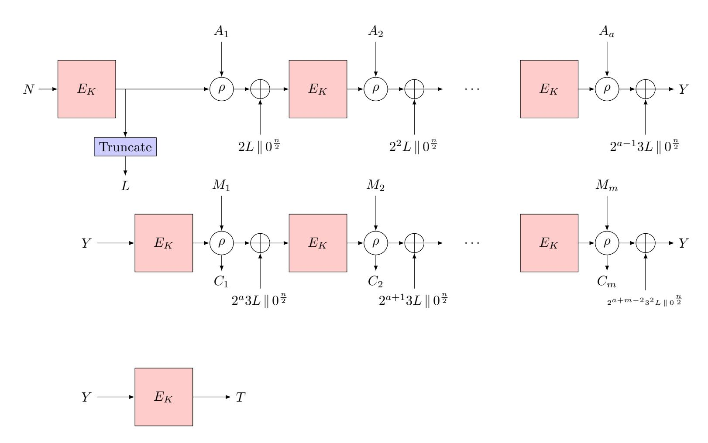

{0}------------------------------------------------

# **Observations on the Tightness of the Security Bounds of GIFT-COFB and HyENA**

### Mustafa Khairallah

Temasek Labs @ NTU School of Physical and Mathematical Sciences Nanyang Technological University, Singapore, Singapore [mustafa.khairallah@ntu.edu.sg](mailto:mustafa.khairallah@ntu.edu.sg)

**Abstract.** In this article, we analyze and investigate two authenticated encryption algorithms: GIFT-COFB and HyENA. The two modes differ in some low levels details in both the design and security proofs. However, they share a lot of similarities. We take a look at the best-known attacks and security proofs of these designs. We show that the best-known attack is not a matching attack to the security bounds provided by the designers in the security proof. Second, we give a new attack that we characterize as an *"almost matching"* attack. It is significantly closer to the provable security bounds. The new attack requires *O*(2*n/*<sup>4</sup> ) encryptions and *O*(2*n/*<sup>2</sup> ) decryptions, as opposed to *O*(2*n/*<sup>2</sup> ) encryptions and *O*(2*n/*<sup>2</sup> ) decryptions shown previously. However, there is still a substantial logarithmic gap between this attack and the corresponding security bound. Next, we analyze why this gap still exists and why it is unlikely to find matching attacks. We give two arguments. The first argument is by analyzing the security proof and showing how it masks a term with non-negligible encryption complexity. The second argument looks at the attacker's point of view. A successful attack requires satisfying a non-trivial linear equation over secret random variables. Satisfying such an equation requires more decryption queries than what is bounded by the security proof. It is worth emphasizing that the analysis and attacks presented in this paper *do not* threaten the security claims made by the designers or the security of these designs within the parameters required by the NIST lightweight cryptography project. The results increase confidence in the security claims of GIFT-COFB and HyENA, while showing the their limitations by relying mostly on bounding the number of unsuccessful forgeries.

**Keywords:** No keywords given.

## **1 Introduction**

COFB is an Authenticated Encryption with Associated Data (AEAD) scheme proposed in CHES 2017 [\[CIMN17\]](#page-7-0). It is secure up to *i*.*e*., *O*(2*n/*<sup>2</sup>*/n*) data complexity using an *n*-bit block cipher. COFB is also the basis for the GIFT-COFB submission to the NIST lightweight cryptography standardization project [\[BCI](#page-7-1)<sup>+</sup>20, [BCI](#page-6-0)<sup>+</sup>19]. It uses the XE tweakable block cipher (TBC) construction using an *n/*2-bit mask and a block cipher (BC) with an *n*-bit block and a *k*-bit key. It also uses a linear feedback function to process the inputs and outputs of the BC, the plaintext blocks and the ciphertext blocks. This function is a member of a class called the combined feedback functions. Essentially, the ciphertext and input to the next BC call are two different linear combinations of the plaintext and the output of the previous BC call. It has several desirable properties, such as the small state size: 1*.*5*n* + *k* bits, the provable security in the standard Pseudo-Random Permutation (PRP) model and the fact that it is inverse-free, *i*.*e*., the decryption circuit of the BC is not needed for decryption.

{1}------------------------------------------------

HyENA[1](#page-1-0) [\[CDJ](#page-7-2)<sup>+</sup>20] is a closely related AEAD scheme that has similar structure to GIFT-COFB, but instead of using combined feedback, it using the so-called hybrid feedback, which reduces the number of linear operations needed on top the underlying block cipher. The plaintext is XORed to the output of the previous BC call to generate the ciphertext. Then, the input to the next BC call consists of one half of the plaintext and one half of the ciphertext.

Provable security is a critical tool in studying the security of new designs. It provides mathematical guarantees for their security. However, it does not always take the attackers point of view and may lead to conservative bounds that cannot be matched by attacks in practice. Besides, analyzing the schemes helps understand and verify the security proofs, and understand the different assumptions that the designers may have used or implied.

**Contributions** In this paper, we study the designers claims for GIFT-COFB and HyENA. We analyze why the best known attack against them is not a matching attack to their security bounds. We provide an *"almost matching"* attack to the security bounds provided by the designers in the single-user setting. A comparison between the relevant security bound, the best known attack and the proposed attack is given in Table [1.](#page-1-1)

<span id="page-1-1"></span>**Table 1:** The designers' claims on the data limits for successful forgery against GIFT-COFB/HyENA

|                           | Decryption<br>Complexity | Encryption<br>Complexity | Offline<br>Complexity |
|---------------------------|--------------------------|--------------------------|-----------------------|
| Claim                     | n/2/n<br>2               | -                        | -                     |
| Weak Key Analysis [Kha20] | n/2<br>2                 | n/2+1<br>2               | -                     |
| Mask Collision            | n/2<br>2                 | n/4<br>2                 | -                     |

We also study what this attack mean in terms forgery in the multi-user setting. We show that the implementation has to enforce the data limits on both the sending and receiving sides, otherwise the adversary can forge a message with data complexity *O*(2*n/*<sup>2</sup> ). This property is not shared by all birthday-bounded schemes, where some schemes can prevent such attacks by bounding the amount of data encrypted under a single key.

Then, we study the challenges facing the attacker to find a matching attack with decryption complexity of *O*(2*n/*2*/n*) and negligible encryption complexity. First, we show that the 1*/n* factor hides non-negligible encryption complexity. We show that one interpretation of the security proof and the *bad event* relevant to this bound leads to encryption complexity *σe*, where 2 *n/*<sup>4</sup> ≤ *σ<sup>e</sup>* ≤ 2 *n/*2 . This already shows that the security bound is unlikely to be tight. Second, we also show that successful forgery requires solving a non-trivial equation of at least *n/*2 independent secret variables, which requires 2 *n/*2 guesses and verifications. Since the only way for the attacker to verify their guess seems to be by successful forgery, it is unlikely for the attacker to find successful forgeries with probabilistic decryption complexity of less than *O*(2*n/*<sup>2</sup> ).

These results and observations do not constituent as security proofs of GIFT-COFB or HyENA, but they identify a gap between the security bounds proven by the designers and the attacks from an attacker point of view. They also identify areas where the proof maybe enhanced or where new attack techniques may be employed to close this gap.

<span id="page-1-0"></span><sup>1</sup> In this paper, we discuss the modified version of HyENA presented in FSE 2020 [\[CDJ](#page-7-2)+20] and not the official submission to the NIST competition [\[CDJN19\]](#page-7-4).

{2}------------------------------------------------

Mustafa Khairallah 3

### 2 Background

The COmbined FeedBack mode (COFB) [CIMN17] is the basis of the GIFT-COFB NIST candidate [BCI<sup>+</sup>19]. It is based on the PRP security of the underlying BC. Given a message of m blocks and AD of a blocks, and assuming the input consists of full blocks, the COFB mode is shown in Figure 1. The output of the first BC call is truncated to  $\frac{n}{2}$  and used as a mask for the subsequent BC inputs. After each cipher call, it is multiplied by a constant over  $GF(2^{64})$ . The  $\rho$  is a linear invertible transformation that operates on 2n bits. It is used to update the internal state of the algorithm and generate the ciphertext block simultaneously. The COFB mode offers a good trade-off for lightweight applications as it requires a state of only 1.5n + k bits. On the flip side, the security is limited to only  $\frac{n}{2} - log(n)$  bits.

<span id="page-2-0"></span>

**Figure 1:** The COFB AEAD mode assuming the message and associated data consist of full blocks.

HyENA [CDJ<sup>+</sup>20] is a similar lightweight BC-based AEAD mode that was proposed by Chakraborti et~al. as a submission to the NIST lightweight cryptography standardization process. The main difference between COFB and HyENA, except for some minor details, is that the feedback function is optimized for linear complexity (number of XORs) as it uses only  $\frac{n}{2}$  XORs as opposed to  $2n+\frac{n}{4}$  in the case of COFB. The functions used in HyENA and COFB are similar to the functions used in mixFeed and COMET, respectively, and it was shown in the attacks in [Kha20] that the difference between the two functions has limited effect on the attack. Hence, the discussion in this paper applies to both HyENA and COFB.

# 3 The security bounds and proofs of GIFT-COFB and HyENA

The designers of both GIFT-COFB and HyENA provide similar security proofs. The security bound of HyENA is given by

{3}------------------------------------------------

$$\mathbf{Adv}_{HyENA}^{AE}(q_e, q_f, \sigma_e, \sigma_v, t) \leq \mathbf{Adv}_{E_K}^{PRP}(q', t') + \frac{2\sigma_e}{2^{n/2}}$$

$$+ \frac{\sigma_e^2}{2^n} + \frac{max\{n, nq_e/2^{n/4}\}}{2^{n/4}} + \frac{nq_e}{2^{n/2}} + \frac{max\{n, nq_e/2^{n/4}\}q_e}{2^{3n/4}} + \frac{3nq_f}{2^{n/2}}$$

$$+ \frac{2max\{n, nq_e/2^{n/4}\}q_f}{2^{3n/4}} + \frac{nq_f}{2^{3n/4}} + \frac{q_f}{2^n} + \frac{2n\sigma_f}{2^{n/2}}$$

while the security bound of GIFT-COFB is given by

$$\mathbf{Adv}_{GIFT-COFB}^{AE}(q_e, q_f, \sigma_e, \sigma_v, t) \leq \mathbf{Adv}_{E_K}^{PRP}(q', t') + \frac{\binom{q'}{2}}{2^n} + \frac{1}{2^{n/2}} + \frac{q_f(n+4)}{2^{n/2+1}} + \frac{3\sigma_e^2 + q_f + (q_e + \sigma_e + \sigma_f)\sigma_f}{2^n}$$

Aside from the computational term  $\mathbf{Adv}_{E_K}^{PRP}(q',t')$ , the bounds depend only on the online complexity of the adversarial queries, i.e., the number and size of encryption and decryption queries. Both designs use an n-bit tag, so it is natural that their security bounds include the term  $\frac{q_f}{2^n}$  which is matched by random tag guessing attacks, i.e., attacks where the adversary tries to randomly find a valid tag. However, an interesting observation is that both bounds include terms on the form of  $\frac{q_f}{2^{n/2}}$  and  $\frac{nq_f}{2^{n/2}}$ . These bounds look like the bounds to be expected in a scheme with  $\frac{n}{2}$ -bit tags. They are particularly interesting as they bound the adversarial advantage solely based on the number of forgery attempts, irrespective of the amount of data encrypted by the encryption oracle. Such distinction is relevant and critical in practice, as it gives an indication on what can be considered as a safe implementation. For example, consider a "faulty" protocol that uses GIFT-COFB and monitors that the amount of data encrypted is below the specified bound, but it does not monitor the amount of forgery attempts. Then, if these bounds are tight, the use of GIFT-COFB in such protocol can have security limitations. Of course, this is a secure implementation aspect of the mode, and not a security issue of the mode itself. However, such issue is still important to study to understand how the mode behaves and how to use it properly. Based on these observations, we formulate to research questions:

- 1. Can we find attacks on GIFT-COFB and HyENA that are predominantly dominated by decryption queries?
- 2. What is the minimum number of encryption queries needed to attack GIFT-COFB and HyENA, given up to birthday bound overall attack complexity?
- 3. Can we find attacks on GIFT-COFB and HyENA with  $\frac{2^{n/2}}{n}$  decryption queries and negligible encryption queries?

In the rest of the paper, we attempt to answer these questions. We answer the first questions in the affirmative, showing that if the encryption queries are limits to  $q_e \leq 2^{n/4}$ , the two modes can be broken with  $2^{n/2}$  decryption queries with high probability, providing a new best known attack. This gives us an indication at what the answer to the second question. The third question remains an open problem, but we give arguments as to why the answer is probably negative.

#### 3.1 Weak Keys attacks on GIFT-COFB and HyENA

To the best of our knowledge, the best known attack against GIFT-COFB and HyENA are provided by Khairallah [Kha20]. The attack exploits two observations:

{4}------------------------------------------------

<span id="page-4-0"></span>Mustafa Khairallah 5

```
for i = 1 to 2^{n/4}
1
2
           (C_i, T_i) \leftarrow AE\_ENC(N_i, A, M_i)
3
      endfor
      for i = 1 to 2^{n/4}
4
           for j = i to 2^{n/4}
5
               C_x \leftarrow M_i \oplus C_i \oplus G(M_i \oplus C_i) \oplus M_j \oplus G(M_j \oplus C_j)
6
               X \leftarrow AE\_DEC(N_i, A, C_x, T_i)
7
8
               if X \neq \perp
9
                    return Success
10
               endif
11
           endfor
12
       endfor
```

Figure 2: Single-key forgery attack on GIFT-COFB.

- 1. The mask L is an  $\frac{n}{2}$ -bit random variable.
- 2. The mask is updated using multiplication over  $GF(2^{n/2})$ , where  $L_{i+1} = 2L_i$  for most blocks. Hence, if  $L_i = 0$ ,  $L_{i+1} = 0$  presenting a fixed point.

The author then defines L=0 as a class of weak keys, that occurs with probability  $2^{-n/2}$ , and forgery is possible with probability 1 if the mask L falls in this class. The attack requires a ciphertext of at least 2 blocks encrypted using a weak mask. Hence, it requires  $2^{64}$  encryption queries in total, with total encryption complexity  $\sigma_e=2^{65}$ . It also requires  $q_f=2^{64}$  as the forgery will be tried on every ciphertext until the weak mask is found. Since the attack requires  $\sigma_e=2^{65}$ , it is enough to bound the amount of encrypted data in order to prevent it with high probability. It also represents a large gap from the security bound on the form  $\frac{nq_f}{2^{n/2}}$ , even though it exploits the bad events relevant to this bound. This is discussed in more details in subsequent sections.

# 4 Forgery attack on GIFT-COFB and HyENA with limited encryption complexity

In this section we present the details and analysis of the forgery attacks on GIFT-COFB and HyENA. The attack on GIFT-COFB is shown in Figure 2, while the attack on HyENA is shown in Figure 3. The difference between the two attacks comes from the use of different feedback functions. Otherwise, the two attacks are identical. The idea behind the attacks is that since the attacks is that since the mask size is small (n/2 bits) the probability of having colliding masks is relatively high,  $O(q_e^2/2^{n/2})$ . Hence, with only  $O(2^{n/4})$  encryptions, the adversary gets two messages encrypted with the same mask. Since the value of the masks is secret, and the adversary selects the plaintexts in the non-adaptive CPA setting, the adversary cannot directly detect such collisions. However, if the adversary is able to guess the colliding pair successfully, it leads to successful forgery with probability 1. The success probability of such guess is  $2^{-n/2}$ .

Forgery attacks in the multi-key setting We notice that in the multi-key setting, a successful attack requires collision between masks generated using the same master key. Hence, collisions between different users are not useful. This relates to the parallelization of the birthday problem. We see that the per-key complexity for  $\mu$  keys drops by  $\sqrt{\mu}$  and  $\mu$  for encryption and decryption, respectively, while the overall complexity become  $O(\sqrt{\mu}2^{n/4})$  encryptions and  $O(2^{n/2})$  decryptions.

{5}------------------------------------------------

```
for i = 1 to 2^{n/4}
1
             (C_i, T_i) \leftarrow AE\_ENC(N_i, A, M_i)
2
3
        endfor
        for i = 1 to 2^{n/4}
4
              for i = i to 2^{n/4}
5
                   (C_i^L, C_i^R) \stackrel{n/2}{\longleftarrow} C_i
6
                   (C_i^L, C_i^R) \stackrel{n/2}{\longleftarrow} C_j
7
                   (M_i^L, M_i^R) \stackrel{n/2}{\longleftarrow} M_i
8
                   (M_j^L, M_j^R) \stackrel{n/2}{\longleftarrow} M_j
C_x \leftarrow C_j^L \| M_i^R \oplus C_i^R \oplus M_j^R
9
10
                   X \leftarrow AE\_DEC(N_i, A, C_x, T_i)
11
12
                   if X \neq \perp
                         return Success
13
                    endif
14
15
              endfor
        endfor
16
```

Figure 3: Single-key forgery attack on HyENA.

Trade-offs between encryption and decryption complexities Given the limited encryption complexity of this attack strategy, the adversary may consider increasing the encryption complexity in order to reduce the decryption complexity. However, in the average case this does not lead to any gain in terms of decryption complexity. Let the number of encryption queries be  $q_e > 2^{n/4}$ , then the expected number of encryption query pairs #C with colliding masks is given by

$$\mathbb{E}[\#C] = \frac{\binom{q_e}{2}}{2^{n/2}}$$

and since the adversary detects collisions by applying forgery, the probability of finding a colliding pair by applying forgery on a random pair is given by

$$\frac{\#C}{\binom{q_e}{2}}.$$

Hence, in the average case, increasing the number of collisions does not seem to increase the advantage of the adversary, as

$$\frac{\mathbb{E}[\#C]}{\binom{q_e}{2}} = \frac{1}{2^{n/2}}$$

In practice, the adversary can reduce the decryption complexity against half the keys by a small factor by increasing the number of encryptions beyond  $2^{n/4}$ . However, such gain is small and is unlikely to match the factor n suggested in the security bound  $\frac{nq_f}{2^{n/2}}$ .

## 5 Relation to the security proof

In the security proof of GIFT-COFB [BCI<sup>+</sup>20], the designers define the bad event B4 as follows: given a forgery attempt with a common suffix to one or more encryption queries, the input to the last block cipher call before the suffix matches the input to one of the block cipher calls in the encryption queries. Similarly, B6 is defined for HyENA [CDJ<sup>+</sup>20].

{6}------------------------------------------------

Mustafa Khairallah 7

The attacks in this paper and in [Kha20] take advantage of this event. In both cases, the designers argue that given the size of the largest multi-collision on the unmasked half of the input R is less than n, the probability of finding is bounded by

$$\frac{nq_f}{2^{n/2}}$$

However, the factor n in the bound comes from the assumption that the size of the largest multi-collision on R is less than n. We define the size of the largest multi-collision on R as  $mcoll(\sigma_e, \frac{n}{2})$ . By removing the assumption on  $mcoll(\sigma_e, \frac{n}{2})$ , the bound becomes

$$\frac{\text{mcoll}(\sigma_e,\frac{n}{2})q_f}{2^{n/2}}.$$

We observe that the bound depends on  $\sigma_e$  or the encryption complexity of the adversary. This indicates that:

- 1. In order to match this bound, the adversary needs a non-negligible amount of encryption queries.
- 2. If we set  $mcoll(\sigma_e, \frac{n}{2}) = 1$ , this becomes similar to finding a simple birthday collision on the mask L.  $Pr[mcoll(\sigma_e, \frac{n}{2}) = 1] \leq \frac{0.5\sigma_e^2}{2^{n/2}}$ .

These two observations show that  $\sigma_e = O(2^{n/4})$  and  $q_f = O(2^{n/2})$  are needed on average in the case of  $mcoll(\sigma_e, \frac{n}{2}) = 1$ . While the attack described in this paper does not take advantage of a collision on the unmasked part of the input in the encryption queries, it matches these attack parameters, which is why we label it as an "almost matching" attack.

The question that poses itself after these observations is whether it is possible to take advantage of the logarithmic term in the bound when  $mcoll(\sigma_e, \frac{n}{2}) > 1$ . While our results on this question are inconclusive, we think it is unlikely. In the security proof the designers apply the union bound where the assume the optimal adversary will take advantage of the multi-collision. This uses a worst-case approach, which can be justified for the security proof. However, from an attacker point of view, even with such multi-collision the attacker still needs to solve an equality function over 2 secret random variables of n/2 bits each. The adversary only as access to the decryption oracle to solve this equation, since the encryption oracle does not leak information about the mask values. Hence, we believe the adversary still needs  $q_f = O(2^{n/2})$  decryptions on average in order to find a successful forgery. It remains an open question whether there is a better proof strategy to remove the logarithmic factor from the security bound or whether there is a better attack strategy to take advantage of such term. Besides, the security bound also includes  $\frac{q_f}{2^{n/2}}$ , so another open question is if there can be an attack with negligible encryption queries. The best attack so far requires  $O(2^{n/4})$  encryption queries, which is small compared to the birthday bound but not-negligible.

## Acknowledgment

The author would like to thank Kazuhiko Minematsu, Tetsu Iwata and Thomas Peyrin for discussions on the COFB algorithm.

#### References

<span id="page-6-0"></span>[BCI<sup>+</sup>19] Subhadeep Banik, Avik Chakraborti, Tetsu Iwata, Kazuhiko Minematsu, Mridul Nandi, Thomas Peyrin, Yu Sasaki, Siang Meng Sim, and Yosuke Todo. GIFT-COFB. NIST Lightweight Cryptography Project, 2019. https://csrc.nist.gov/Projects/Lightweight-Cryptography/Round-1-Candidates.

{7}------------------------------------------------

- <span id="page-7-1"></span>[BCI<sup>+</sup>20] Subhadeep Banik, Avik Chakraborti, Tetsu Iwata, Kazuhiko Minematsu, Mridul Nandi, Thomas Peyrin, Yu Sasaki, Siang Meng Sim, and Yosuke Todo. Gift-cofb. Cryptology ePrint Archive, Report 2020/738, 2020. [https://eprint.iacr.](https://eprint.iacr.org/2020/738) [org/2020/738](https://eprint.iacr.org/2020/738).
- <span id="page-7-2"></span>[CDJ<sup>+</sup>20] Avik Chakraborti, Nilanjan Datta, Ashwin Jha, Snehal Mitragotri, and Mridul Nandi. From combined to hybrid: Making feedback-based ae even smaller. *IACR Transactions on Symmetric Cryptology*, 2020(S1):417–445, Jun. 2020.
- <span id="page-7-4"></span>[CDJN19] Avik Chakraborti, Nilanjan Datta, Ashwin Jha, and Mridul Nandi. HyENA. NIST Lightweight Cryptography Project, 2019. [https://csrc.nist.gov/](https://csrc.nist.gov/Projects/Lightweight-Cryptography/Round-1-Candidates) [Projects/Lightweight-Cryptography/Round-1-Candidates](https://csrc.nist.gov/Projects/Lightweight-Cryptography/Round-1-Candidates).
- <span id="page-7-0"></span>[CIMN17] Avik Chakraborti, Tetsu Iwata, Kazuhiko Minematsu, and Mridul Nandi. Blockcipher-based authenticated encryption: How small can we go? In *International Conference on Cryptographic Hardware and Embedded Systems*, pages 277–298. Springer, 2017. [https://link.springer.com/chapter/10.](https://link.springer.com/chapter/10.1007/978-3-319-66787-4_14) [1007/978-3-319-66787-4\\_14](https://link.springer.com/chapter/10.1007/978-3-319-66787-4_14).
- <span id="page-7-3"></span>[Kha20] Mustafa Khairallah. Weak keys in the rekeying paradigm: Application to comet and mixfeed. *IACR Transactions on Symmetric Cryptology*, 2019(4):272–289, Jan. 2020.