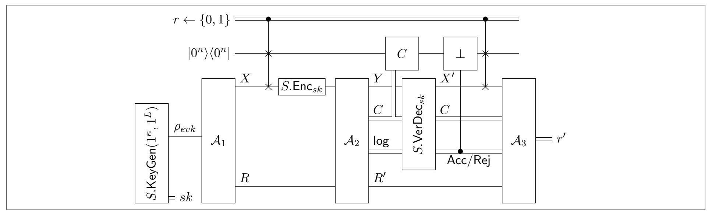

{0}------------------------------------------------

# Round Efficient Secure Multiparty Quantum Computation with Identifiable Abort

Bar Alon∗1, Hao Chung†2, Kai-Min Chung‡3, Mi-Ying Huang§3,4, Yi Lee¶3, and Yu-Ching Shen‖3

1Department of Computer Science, Ariel University, Israel 2Department of Electrical and Computer Engineering, Carnegie Mellon University, USA 3 Institute of Information Science, Academia Sinica, Taiwan 4Department of Computer Science and Information Engineering, National Taiwan University, Taiwan

June 25, 2021

#### **Abstract**

A recent result by Dulek et al. (EUROCRYPT 2020) showed a secure protocol for computing any quantum circuit even without the presence of an honest majority. Their protocol, however, is susceptible to a "denial of service" attack and allows even a single corrupted party to force an abort. We propose the first quantum protocol that admits *security-with-identifiable-abort*, which allows the honest parties to agree on the identity of a corrupted party in case of an abort. Additionally, our protocol is the first to have the property that the number of rounds where quantum communication is required is *independent of the circuit complexity*. Furthermore, if there exists a post-quantum secure classical protocol whose round complexity is independent of the circuit complexity, then our protocol has this property as well. Our protocol is secure under the assumption that classical quantum-resistant fully homomorphic encryption schemes with decryption circuit of logarithmic depth exist. Interestingly, our construction also admits a reduction from quantum fair secure computation to classical fair secure computation.

∗E-mail: alonbar08@gmail.com. This work was supported by ISF grant 152/17 and by the Ariel Cyber Innovation Center in conjunction with the Israel National Cyber directorate in the Prime Minister's Office. Part of the work was done while visiting Academia Sinica.

†E-mail: haochung@andrew.cmu.edu. This research is partially supported by the Young Scholar Fellowship (Einstein Program) of the Ministry of Science and Technology (MOST) in Taiwan, under grant number MOST 108-2636- E-002-014 and Executive Yuan Data Safety and Talent Cultivation Project (ASKPQ-109-DSTCP).

‡E-mail: kmchung@iis.sinica.edu.tw. This research is partially supported by the Air Force Office of Scientific Research under award number FA2386-20-1-4066, MOST, Taiwan, under Grant no. MOST 109-2223-E-001-001- MY3, MOST QC project, under Grant no. MOST 109-2627-M-002-003- and Executive Yuan Data Safety and Talent Cultivation Project (ASKPQ-109-DSTCP).

§E-mail: miyinghuangtw@gmail.com. This work is supported by the Young Scholar Fellowship (Einstein Program) of the Ministry of Science and Technology (MOST) in Taiwan, under grant number MOST 109-2636-E-002-025.

¶E-mail: ethanlee515@gmail.com. This work was done in part while the author was affiliated to National Taiwan University.

‖E-mail: yuching@iis.sinica.edu.tw. This research is partially supported by the Young Scholar Fellowship (Einstein Program) of the Ministry of Science and Technology (MOST) in Taiwan, under grant number MOST 108-2636-E-002-014 and Executive Yuan Data Safety and Talent Cultivation Project (ASKPQ-109-DSTCP).

{1}------------------------------------------------

# **Contents**

| 1 | Introduction 4 |                                                                                      |    |  |
|---|-------------------|--------------------------------------------------------------------------------------|----|--|
|   | 1.1               | Our Results                                                                       | 4  |  |
|   | 1.2               | Our Techniques                                                                    | 5  |  |
|   |                   | 1.2.1 A Warm-Up: Reliable Transmission of Quantum States                       | 5  |  |
|   |                   | 1.2.2 Security With Packet Drops                                               | 7  |  |
|   |                   | 1.2.3 Securely Computing A General Circuit                                     | 9  |  |
|   | 1.3               | Roadmap                                                                           | 13 |  |
| 2 |                   | Preliminaries                                                                        | 13 |  |
|   | 2.1               | Notation                                                                          | 13 |  |
|   | 2.2               | Quantum Computation                                                               | 14 |  |
|   | 2.3               | Useful Concentration Inequalities                                                 | 15 |  |
|   | 2.4               | Magic State Distillation                                                          | 16 |  |
|   | 2.5               | Quantum Error-Correcting Codes                                                    | 17 |  |
|   | 2.6               | Quantum Authentication Schemes                                                    | 17 |  |
|   |                   | 2.6.1 Clifford Authentication Code                                             | 18 |  |
|   |                   | 2.6.2 Trap Authentication Code                                                 | 18 |  |
|   |                   | 2.6.3 Homomorphic Evaluation over Trap Codes                                   | 19 |  |
|   | 2.7               | Verifiable Quantum Fully Homormorphic Encryption                                  | 22 |  |
|   |                   | 2.7.1 A Construction for VQFHE                                                 | 23 |  |
|   |                   |                                                                                      |    |  |
| 3 |                   | The Model of Computation                                                             | 24 |  |
|   | 3.1               | Security With Packet Drops                                                        | 26 |  |
|   | 3.2               | The Hybrid Model                                                                  | 28 |  |
|   |                   | 3.2.1 The Classical MPC Hybrid Model                                           | 28 |  |
| 4 |                   | Statement of Our Main Result                                                         | 29 |  |
| 5 |                   | Sequential Authentication                                                            | 31 |  |
|   | 5.1               | Proof of Lemma 5.1                                                                | 34 |  |
|   | 5.2               | Input-Ciphertext Sequential Authentication                                        | 41 |  |
|   |                   |                                                                                      |    |  |
| 6 |                   | Authenticated Routing                                                                | 43 |  |
|   | 6.1               | The Authenticated Routing Protocol                                                | 43 |  |
|   | 6.2               | Authenticated Routing With Input-Ciphertext                                       | 47 |  |
| 7 |                   | Magic State Preparation                                                              | 48 |  |
|   | 7.1               | Preparing Ancilla and Magic States  P                                       | 49 |  |
|   | 7.2               | Preparing H Magic States                                                    | 50 |  |
|   | 7.3               | Preparing Gadget Magic States                                                     | 51 |  |
|   | 7.4               | Preparing Magic States  T                                                   | 52 |  |
|   |                   | 7.4.1 Homomorphic Evaluation of Classically Controlled Clifford Circuit Over Clif |    |  |
|   |                   | ford Codes                                                                        | 52 |  |
|   |                   | 7.4.2 Magic State Preparation Protocol  T                                   | 54 |  |
|   |                   |                                                                                      |    |  |
| 8 |                   | Secure Delegation of The Computation – Preparation                                   | 60 |  |
|   | 8.1               | The Pre-Computation Protocol                                                      | 61 |  |

{2}------------------------------------------------

| 9 Secure Delegation of The Computation – Computation      | 65 |
|--------------------------------------------------------------|----|
| 10 Secure Computation of a Quantum Circuit With Packet Drops | 74 |
| A Definition of Fairness                                  | 78 |

{3}------------------------------------------------

# **1 Introduction**

In the setting of secure multiparty computation (MPC), the goal is to allow a set of mutually distrustful parties to compute some function of their private inputs in a way that preserves some security properties, even in the face of adversarial behavior by some of the parties. Some of the desired properties of a secure protocol include correctness (cheating parties can only affect the output by choosing their inputs), privacy (nothing but the specified output is learned), fairness (all parties receive an output or none do), and even guaranteed output delivery (meaning that all honestly behaving parties always learn an output). Informally speaking, a protocol *π* computes a functionality *f* with full-security if it provides all of the above security properties.

It is well-known that, assuming an honest majority and a broadcast channel, any functionality can be computed with full-security [[RBO89\]](#page-77-1). However, achieving fairness, and hence full-security, is impossible in general assuming no honest majority [\[Cle86](#page-76-0)]. Instead, one usually settles on a weaker notion called *security-with-abort*, which completely disregards fairness. Roughly, security-withabort guarantees that either the protocol terminates successfully, in which case the honest parties receive their outputs, or the protocol aborts, in which case all honest parties learn that there was an attack. Note that since fairness is not guaranteed, it might be the case where the adversary learns the output of the corrupted parties. In many setting, however, security-with-abort is not enough, as an adversary can cause a *denial-of-service* attack by repeatedly aborting the protocol. Thus, it is highly desirable to consider the stronger security notion called *security-with-identifiable-abort* (SWIA) [[IOZ14\]](#page-77-2). Here, if the protocol is aborted, then all honest parties additionally agree on an identity of a corrupted party. It is well-known that there are protocols admitting SWIA for any number of corrupted parties, e.g., the GMW protocol [[GMW87\]](#page-77-3).

In this work we consider the quantum version of MPC. In the *fully quantum* setting, the functionality – including the inputs and outputs – is quantum. As such, the parties, as well as the adversary attacking the protocol, are quantum. Secure multiparty quantum computation (MPQC) in the fully quantum setting, was first studied by [\[CGS02](#page-76-1)], who constructed a fully secure *n*party protocol tolerating strictly less than *n/*6. The threshold *n/*6 was subsequently improved the more general honest majority setting [[BOCG](#page-76-2)+06], assuming the availability of a classical broadcast channel. Similarly to the classical setting, if there is no honest majority, then full-security is impossible to achieve in general[[ABDR04](#page-75-0), [Kit](#page-77-4)].1 Moreover, [[DNS12](#page-76-3)] presented a secure-withabort protocol in the two-party case, and recently [[DGJ](#page-76-4)+20] extended it to the multiparty case, tolerating any number of corrupted parties.

The protocol of [[DGJ](#page-76-4)+20], however, does not admit *identifiable abort*. This follows from the fact that it is impossible to broadcast a quantum state. Therefore a corrupted party can accuse an honest party of not sending it a message, thus, not only is the quantum state lost, but the other parties cannot identify the corrupted party. When compared to the classical setting, this raises the following natural question.

*Can any multiparty quantum circuit be computed with security-with-identifiable-abort, tolerating any number of corrupted parties?*

### **1.1 Our Results**

In this paper, we answer the above question affirmatively. Additionally, our protocol is the first to have the property that the number of rounds where quantum communication is required is

1The impossibility proof is in the information theoretic setting, where the adversary is unbounded. However, even though Cleve's impossibility result is stated for classical protocols, the proof can still be applied for quantum protocols.

{4}------------------------------------------------

independent of the circuit complexity. Furthermore, if there exists a post-quantum secure classical protocol whose round complexity is independent of the circuit complexity, then our protocol has this property as well.

Similarly to [[DGJ](#page-76-4)+20, [DNS12](#page-76-3)], we present the results and the protocol, assuming the availability of a reactive trusted party, called cMPC, that is able to compute any *classical* multiparty functionality. We refer to this as the cMPC*-hybrid model*. Furthermore, we assume that the parties are able to broadcast classical messages. The implementation of cMPC can be done by first removing the reactive assumption using standard techniques, and then implement each call using a post-quantum secure-with-identifiable-abort protocol. We refer the reader to Section [3.2.1](#page-27-1) for more details. We prove the following.

**Theorem 1.1** (Informal)**.** *Assume the existence of a classical quantum-resistant fully homomorphic encryption scheme with decryption circuit of logarithmic depth. Then any multiparty quantum circuit can be computed with security-with-identifiable-abort tolerating any number of corrupted parties in the* cMPC*-hybrid model. Moreover, the round complexity of the quantum communication of the protocol is independent of the circuit complexity.*

The formal statement of the theorem appears in Section [4](#page-28-0). A few notes are in place. First, Brakerski and Vaikuntanathan [\[BV11](#page-76-5)] showed that the existence of a fully-homomorphic encryption satisfying the conditions stated in Theorem [1.1](#page-4-2) can be reduced to the *learning with errors* assumption.

Second, we note that the protocol can be split into an online phase and an offline phase, where the parties have yet to receive their inputs. In the offline phase, the parties prepare auxiliary magic states in order to compute quantum gates later in the online phase. In fact, it suffices that the parties know only an upper bound on the number of gates in the circuit before interacting in the offline phase.

Third, although the number of rounds requiring quantum information to be sent is independent of the circuit complexity (i.e., independent of the number of gates), it still depends on the number of parties, the number of input-qubits and output-qubits of the circuit, and the security parameter. Specifically, the offline phase consists of *O*(*n* 4 *· κ*) rounds, and the online phase consists of *O*(*n* 3 *·* (*ℓ*in + *ℓ*out)) rounds, where *n* is the number of parties, *κ* is the security parameter, and *ℓ*in and *ℓ*out upper-bound the number of input-qubits and output-qubits of the circuit, respectively.

Fourth, although our protocol admits security-with-identifiable-abort, any single corrupted party can cause it to abort. It is arguably more desirable and an interesting open problem to have a protocol that requires the adversary to corrupt more parties to cause an abort.

Finally, an interesting consequence of our construction is that quantum fair secure computation can be implemented assuming the hybrid functionality cMPC is fair.2

In the following sections, we present the ideas behind the construction.

#### **1.2 Our Techniques**

In this section, we present the main ideas behind the construction of our protocol.

### **1.2.1 A Warm-Up: Reliable Transmission of Quantum States**

Before presenting the general construction, let us consider the following simple task. Suppose that there are *n* parties P1*, . . . ,* P*n*, where P1 – called the sender – holds a quantum state *ρ*. The

2 Intuitively, fair computation means that either all parties receive their respective outputs, or none of them do.

{5}------------------------------------------------

goal of the parties is to send  $\rho$  to  $P_n$  – called the receiver – such that if either the sender or the receiver is corrupted and deviate from the protocol, then the other parties can identify which of them is corrupted. Moreover, this should hold even the corrupted party collude with some of the other parties in  $\{P_2, \ldots, P_{n-1}\}$ .

As stated before, simply having  $P_1$  send  $\rho$  to  $P_n$ , and have  $P_n$  broadcast a complaint in case it did not receive a message, does not work. Indeed, it could be the case where the receiver is corrupted, and falsely accuse the sender of not sending  $\rho$ . Since broadcasting a quantum state is impossible, to the other parties, this scenario is identical to the case where a corrupted sender did not send  $\rho$ . Thus, the desired security property is not met. Moreover, due to the no-cloning theorem, the state  $\rho$  is now permanently lost, making it unclear as to how to proceed the protocol.

**Dealing with false accusations.** As such "packet loss" seems unavoidable, our first idea is to not send  $\rho$  directly, but rather to encode  $\rho$  using a quantum error-correcting code (QECC), that can tolerate d deletions, where d will be determined below. This generates an q-qubit codeword  $(\sigma_k)_{k=1}^q$ , for some q, which will then be transmitted qubit-by-qubit as explained below.3 By doing so,  $P_n$  can still recover  $\rho$  as long as it receives enough qubits of the codeword.

We next explain how the parties can transmit the codeword's qubits in such a way that will allow them to identify the corrupted party, if such exists. For simplicity of the current discussion, let us assume that the adversary can perform one of the following two attacks. Either it does not send a message, or it can falsely accuse a party of not sending a message. Below we will explain how to remove this assumption and how to resist general malicious attackers. Under these simplifying assumptions, we can make the following observation. If  $P_n$  accused  $P_1$  of not sending a message, then all parties know that at least one of them is corrupted. Therefore, they can agree to remove the channel between them, and have  $P_1$  send the next qubit of the codeword via a different path. The parties continue in this fashion until either enough  $\sigma_k$ 's where successfully transmitted to the receiver, or until there is no path from the sender to the receiver. Formally, the parties keep track of a simple and undirected graph G, which represents trust between parties, i.e., an edge between two vertices exists if and only if there was no accusation between the two parties that the vertices represent. Observe that in the above protocol, all honest parties form a clique in G. Thus, if G becomes disconnected, the honest parties can agree on a corrupted party not connected to them. Therefore, using a QECC that can tolerate  $d = \Theta(n^2)$  deletions results in a secure protocol.

Dealing with general malicious behavior. Next, we show to remove the simplifying assumption of the behavior of the adversary, and allow it to tamper with the messages arbitrarily. Here, we utilize quantum authentication codes [BCG $^+$ 02], that allow a party to verify if a quantum state was tampered with. However, in our protocol the parties must know where on the path the message had been tampered with (if any tampered occurred), in order to later remove the corresponding edge. To achieve this, we define a new primitive, which we call sequential authentication (SA), that allows the sender to transmit a qubit to the receiver along some path, so that if the qubit was tampered with, all parties know where on the path the tampering occurred. We then combine SA with the previous protocol that dealt with false accusations, to construct a secure-with-identifiable-abort protocol for the transmission of a quantum state. One subtlety in the final construction, is that any path from  $P_1$  to  $P_n$  must go through all parties, so as to ensure that at least one honest party can verify the integrity of the message.

&lt;sup>3Here we abuse the notation that we denote the  $k^{\text{th}}$  qubit of the codeword  $\sigma_k$ , while these q qubits may be entangled.

{6}------------------------------------------------

We now describe the construction of a protocol for sequential authentication. The construction is inspired by the swaddling notion from [[DNS12](#page-76-3)] and the public authentication test from [\[DGJ](#page-76-4)+20], which are both based on *Clifford authentication codes*. Let us first recall Clifford codes [\[ABOE10\]](#page-75-2). Given a *m*-qubit state *ρ* and a security parameter *κ*, the Clifford encryption4 appends an auxiliary register *|*0 *κ ⟩⟨*0 *κ |*, called *traps*. Then, a random Clifford operator *E* is sampled from the Clifford group acting on *m* + *κ* qubits. Finally, the encryption outputs the ciphertext *E*(*ρ ⊗ |*0 *κ ⟩⟨*0 *κ |*)*E†* , where *E* serves as the secret key. The decryption of a Clifford ciphertext *σ*, simply applies *E†* to *σ* and measures the last *κ* trap qubits. If the measurement outcome is all-zero, then the decoding algorithm outputs the resulting state of the first *m* qubits. Otherwise, it rejects. The security of Clifford codes stems from the fact that any operation that is applied to the ciphertext, will flip each qubit in the trap with noticeable probability upon measurement. Moreover, the secret key of the Clifford code can be sampled efficiently by a classical algorithm[[DLT02](#page-76-6)].

**Constructing a sequential authentication protocol.** We utilize these property to build a protocol for SA. Suppose that a message *ρ* is going to be transmitted through *ℓ* parties. Let us first present a naïve solution. The first party on the path will append *ℓκ* qubits of *|*0*⟩* to *ρ*. Then, using the classical MPC functionality cMPC, the parties will securely sample for P1 a Clifford key *E*1 to encrypt its state. It then sends the encrypted message to P2. To verify the authenticity of the state, the parties will again use cMPC for sampling a Clifford *V*2 = *E*2*E †* 1 , where *E*2 acts only on the first (*ℓ −* 1)*κ* qubits. We then let P2 receive *V*2 and apply it to the encrypted message it received from P1. This allows P2 to measure the last *κ* qubits and compare them to zero. For each party P*i* on the transmitting path, P*i* measures *κ* qubits of traps. The parties can then continue in this fashion. Notice, however, that a corrupt P1 might only append the last *κ* qubits honestly, which will not be immediately detected by P2. This could later result in an honest party accusing another honest party. To overcome this issue, we use a similar trick to the public authentication test [\[DGJ](#page-76-4)+20], and have the Clifford *V*2 that cMPC sampled include a random invertible linear transformation over F2 acting on all traps. Specifically, we let *V*2 = *E*2*G*2*E †* 1 , where we abuse notations and let *G*2 *|x⟩* = *|G*2(*x*)*⟩*. Observe that if P1 did not prepare the traps correctly, then upon measurement with high probability P2 will not obtain all-zero.

#### **1.2.2 Security With Packet Drops**

With the above technique, it is natural to incorporate it into the construction of [\[DGJ](#page-76-4)+20]. This naïve solution, however, does not work. Towards explaining the issue, let us first briefly describe the protocol of [\[DGJ](#page-76-4)+20]. Roughly, their protocol starts with an input encoding phase, such that at the end of the phase each party's input is encrypted under a Clifford code with cMPC holding the secret Clifford key. This is done similarly to the sequential authentication protocol described earlier. The parties then proceed to perform computation over the encrypted inputs. Computation over single-qubit Clifford gates can be done by simply letting cMPC update its key, while CNOT gates require communication since the inputs to CNOT gates are encrypted separately under different Clifford keys.

While the input encoding phase can be modified to admit security-with-identifiable-abort, it is unclear how to modify the computation phase of the protocol. This follows from the fact that the parties are required to use QECC over their inputs in the input encoding phase, thus at the end

4 It is more common to use the term Clifford encoding. However, in the quantum setting authentication implies encryption. Thus, we refer to these as encryptions to remove confusion with the QECC encoding.

{7}------------------------------------------------

of this phase, each party will hold a Clifford encoding of each qubit of its input's codeword. As a result, the parties have to either perform the computation over QECC codewords in some way, or decode the Clifford encrypted codewords and perform computation similarly to [[DGJ](#page-76-4)+20]. We next give an intuitive explanation as to why both solutions fail.

Let us first argue why the second solution fails. That is, suppose the parties decode all QECC encodings before starting to perform any computation. The issue here is that once the parties decode the QECC they lose its protection, hence the protocol cannot tolerate losing quantum states after this step. Since the protocol of [[DGJ](#page-76-4)+20] requires communicating quantum messages to compute CNOT gates, this causes inevitable packet drops *during computation*, causing the honest parties to output incorrect values.

The former solution fails due to the fact that a corrupted party might not encode its qubit correctly using the QECC. Observe that our sequential authentication protocol will not be able to detect such error, since it is able to detect an attack only after a Clifford had been applied. Furthermore, this error might propagate into the evaluation. Indeed, consider the following example.

Suppose that the parties use repetition code as an implementation of the QECC.5 In repetition code, a logical zero *|*¯0*⟩* is encoded as *|*000*⟩* and a logical one *|*¯1*⟩* is encoded as *|*111*⟩*. The decoding is done by taking the majority, e.g., *|*000*⟩*, *|*001*⟩*, *|*010*⟩* and *|*100*⟩* are all decoded to *|*¯0*⟩*. Suppose three parties wish to compute the following circuit, where the CNOTs are applied transversally, and where the inputs *|ψi⟩* are repetition codes of logical *|*¯0*⟩*.

$$|\psi_1\rangle \longrightarrow |\psi_2\rangle \longrightarrow |\psi_3\rangle \longrightarrow |\psi_3\rangle \longrightarrow |\psi_3\rangle \longrightarrow |\psi_3\rangle \longrightarrow |\psi_3\rangle \longrightarrow |\psi_3\rangle \longrightarrow |\psi_3\rangle \longrightarrow |\psi_3\rangle \longrightarrow |\psi_3\rangle \longrightarrow |\psi_3\rangle \longrightarrow |\psi_3\rangle \longrightarrow |\psi_3\rangle \longrightarrow |\psi_3\rangle \longrightarrow |\psi_3\rangle \longrightarrow |\psi_3\rangle \longrightarrow |\psi_3\rangle \longrightarrow |\psi_3\rangle \longrightarrow |\psi_3\rangle \longrightarrow |\psi_3\rangle \longrightarrow |\psi_3\rangle \longrightarrow |\psi_3\rangle \longrightarrow |\psi_3\rangle \longrightarrow |\psi_3\rangle \longrightarrow |\psi_3\rangle \longrightarrow |\psi_3\rangle \longrightarrow |\psi_3\rangle \longrightarrow |\psi_3\rangle \longrightarrow |\psi_3\rangle \longrightarrow |\psi_3\rangle \longrightarrow |\psi_3\rangle \longrightarrow |\psi_3\rangle \longrightarrow |\psi_3\rangle \longrightarrow |\psi_3\rangle \longrightarrow |\psi_3\rangle \longrightarrow |\psi_3\rangle \longrightarrow |\psi_3\rangle \longrightarrow |\psi_3\rangle \longrightarrow |\psi_3\rangle \longrightarrow |\psi_3\rangle \longrightarrow |\psi_3\rangle \longrightarrow |\psi_3\rangle \longrightarrow |\psi_3\rangle \longrightarrow |\psi_3\rangle \longrightarrow |\psi_3\rangle \longrightarrow |\psi_3\rangle \longrightarrow |\psi_3\rangle \longrightarrow |\psi_3\rangle \longrightarrow |\psi_3\rangle \longrightarrow |\psi_3\rangle \longrightarrow |\psi_3\rangle \longrightarrow |\psi_3\rangle \longrightarrow |\psi_3\rangle \longrightarrow |\psi_3\rangle \longrightarrow |\psi_3\rangle \longrightarrow |\psi_3\rangle \longrightarrow |\psi_3\rangle \longrightarrow |\psi_3\rangle \longrightarrow |\psi_3\rangle \longrightarrow |\psi_3\rangle \longrightarrow |\psi_3\rangle \longrightarrow |\psi_3\rangle \longrightarrow |\psi_3\rangle \longrightarrow |\psi_3\rangle \longrightarrow |\psi_3\rangle \longrightarrow |\psi_3\rangle \longrightarrow |\psi_3\rangle \longrightarrow |\psi_3\rangle \longrightarrow |\psi_3\rangle \longrightarrow |\psi_3\rangle \longrightarrow |\psi_3\rangle \longrightarrow |\psi_3\rangle \longrightarrow |\psi_3\rangle \longrightarrow |\psi_3\rangle \longrightarrow |\psi_3\rangle \longrightarrow |\psi_3\rangle \longrightarrow |\psi_3\rangle \longrightarrow |\psi_3\rangle \longrightarrow |\psi_3\rangle \longrightarrow |\psi_3\rangle \longrightarrow |\psi_3\rangle \longrightarrow |\psi_3\rangle \longrightarrow |\psi_3\rangle \longrightarrow |\psi_3\rangle \longrightarrow |\psi_3\rangle \longrightarrow |\psi_3\rangle \longrightarrow |\psi_3\rangle \longrightarrow |\psi_3\rangle \longrightarrow |\psi_3\rangle \longrightarrow |\psi_3\rangle \longrightarrow |\psi_3\rangle \longrightarrow |\psi_3\rangle \longrightarrow |\psi_3\rangle \longrightarrow |\psi_3\rangle \longrightarrow |\psi_3\rangle \longrightarrow |\psi_3\rangle \longrightarrow |\psi_3\rangle \longrightarrow |\psi_3\rangle \longrightarrow |\psi_3\rangle \longrightarrow |\psi_3\rangle \longrightarrow |\psi_3\rangle \longrightarrow |\psi_3\rangle \longrightarrow |\psi_3\rangle \longrightarrow |\psi_3\rangle \longrightarrow |\psi_3\rangle \longrightarrow |\psi_3\rangle \longrightarrow |\psi_3\rangle \longrightarrow |\psi_3\rangle \longrightarrow |\psi_3\rangle \longrightarrow |\psi_3\rangle \longrightarrow |\psi_3\rangle \longrightarrow |\psi_3\rangle \longrightarrow |\psi_3\rangle \longrightarrow |\psi_3\rangle \longrightarrow |\psi_3\rangle \longrightarrow |\psi_3\rangle \longrightarrow |\psi_3\rangle \longrightarrow |\psi_3\rangle \longrightarrow |\psi_3\rangle \longrightarrow |\psi_3\rangle \longrightarrow |\psi_3\rangle \longrightarrow |\psi_3\rangle \longrightarrow |\psi_3\rangle \longrightarrow |\psi_3\rangle \longrightarrow |\psi_3\rangle \longrightarrow |\psi_3\rangle \longrightarrow |\psi_3\rangle \longrightarrow |\psi_3\rangle \longrightarrow |\psi_3\rangle \longrightarrow |\psi_3\rangle \longrightarrow |\psi_3\rangle \longrightarrow |\psi_3\rangle \longrightarrow |\psi_3\rangle \longrightarrow |\psi_3\rangle \longrightarrow |\psi_3\rangle \longrightarrow |\psi_3\rangle \longrightarrow |\psi_3\rangle \longrightarrow |\psi_3\rangle \longrightarrow |\psi_3\rangle \longrightarrow |\psi_3\rangle \longrightarrow |\psi_3\rangle \longrightarrow |\psi_3\rangle \longrightarrow |\psi_3\rangle \longrightarrow |\psi_3\rangle \longrightarrow |\psi_3\rangle \longrightarrow |\psi_3\rangle \longrightarrow |\psi_3\rangle \longrightarrow |\psi_3\rangle \longrightarrow |\psi_3\rangle \longrightarrow |\psi_3\rangle \longrightarrow |\psi_3\rangle \longrightarrow |\psi_3\rangle \longrightarrow |\psi_3\rangle \longrightarrow |\psi_3\rangle \longrightarrow |\psi_3\rangle \longrightarrow |\psi_3\rangle \longrightarrow |\psi_3\rangle \longrightarrow |\psi_3\rangle \longrightarrow |\psi_3\rangle \longrightarrow |\psi_3\rangle \longrightarrow |\psi_3\rangle \longrightarrow |\psi_3\rangle \longrightarrow |\psi_3\rangle \longrightarrow |\psi_3\rangle \longrightarrow |\psi_3\rangle \longrightarrow |\psi_3\rangle \longrightarrow |\psi_3\rangle \longrightarrow |\psi_3\rangle \longrightarrow |\psi_3\rangle \longrightarrow |\psi_3\rangle \longrightarrow |\psi_3\rangle \longrightarrow |\psi_3\rangle \longrightarrow |\psi_3\rangle \longrightarrow |\psi_3\rangle \longrightarrow |\psi_3\rangle \longrightarrow |\psi_3\rangle \longrightarrow |\psi_3\rangle \longrightarrow |\psi_3\rangle \longrightarrow |\psi_3\rangle \longrightarrow |\psi_3\rangle \longrightarrow |\psi_3\rangle \longrightarrow |\psi_3\rangle \longrightarrow |\psi_3\rangle \longrightarrow |\psi_3\rangle \longrightarrow |\psi_3\rangle \longrightarrow |\psi_3\rangle \longrightarrow |\psi_3\rangle \longrightarrow |\psi_3\rangle \longrightarrow |\psi_3\rangle \longrightarrow |\psi_3\rangle \longrightarrow |\psi_3\rangle \longrightarrow |\psi_3\rangle \longrightarrow |\psi_3\rangle \longrightarrow |\psi_3\rangle \longrightarrow |\psi_3\rangle \longrightarrow |\psi_3\rangle \longrightarrow |\psi_3\rangle \longrightarrow |\psi_3\rangle \longrightarrow |\psi_3\rangle \longrightarrow |\psi_3\rangle \longrightarrow |\psi_3\rangle \longrightarrow |\psi_3\rangle \longrightarrow |\psi_3\rangle \longrightarrow |\psi_3\rangle \longrightarrow |\psi_3\rangle \longrightarrow |\psi_3\rangle \longrightarrow |\psi_3\rangle \longrightarrow |\psi_3\rangle \longrightarrow |\psi_3\rangle \longrightarrow |\psi_3\rangle \longrightarrow |\psi_3\rangle \longrightarrow |\psi_3\rangle \longrightarrow |\psi_3\rangle \longrightarrow |\psi_3\rangle \longrightarrow |\psi_3\rangle \longrightarrow |\psi_3\rangle \longrightarrow |\psi_3\rangle \longrightarrow |\psi_3\rangle \longrightarrow |\psi_3\rangle \longrightarrow |\psi_3\rangle \longrightarrow |\psi_3\rangle \longrightarrow |\psi_3\rangle \longrightarrow |\psi_3\rangle \longrightarrow |\psi_3\rangle \longrightarrow |\psi_3\rangle \longrightarrow |\psi_3\rangle \longrightarrow |\psi_3\rangle \longrightarrow |\psi_3\rangle \longrightarrow |\psi_3\rangle \longrightarrow |\psi_3\rangle \longrightarrow |\psi_3\rangle \longrightarrow |\psi_3\rangle \longrightarrow |\psi_3\rangle \longrightarrow |\psi_3\rangle \longrightarrow |\psi_3\rangle \longrightarrow |\psi_3\rangle \longrightarrow |\psi_3\rangle \longrightarrow |\psi_3\rangle \longrightarrow |\psi_3\rangle \longrightarrow |\psi_3\rangle \longrightarrow |\psi_3\rangle \longrightarrow |\psi_3\rangle \longrightarrow |\psi_3\rangle \longrightarrow |\psi_3\rangle \longrightarrow |\psi_3\rangle \longrightarrow |\psi_3\rangle \longrightarrow |\psi_3\rangle \longrightarrow |\psi_3\rangle \longrightarrow |\psi_3\rangle \longrightarrow |\psi_3\rangle \longrightarrow |\psi_3\rangle \longrightarrow |\psi_3\rangle \longrightarrow |\psi_3\rangle \longrightarrow |\psi_3\rangle \longrightarrow |\psi_3$$

Clearly, in an honest execution the value of *|ψ*3*⟩* becomes *|*000*⟩* which decodes to *|*0*⟩*. Now, suppose the two parties holding *|ψ*1*⟩* and *|ψ*2*⟩* are corrupted and prepares *|ψ*1*⟩* = *|*001*⟩* and *|ψ*2*⟩* = *|*010*⟩*. Then the value of *|ψ*3*⟩* under such an attack becomes *|*011*⟩*. Consequently, even if all codewords are of logical 0 at the beginning, the decoding would result in a logical 1.

A possible way to try and fix this issue, would be to try to *correct* the QECC codewords. However, this in particular would require the parties to compute a multi-qubit gate (e.g., CNOT), which as stated before, cannot be done without losing the quantum states due to a potential attack.

With this state of affairs, we aim to construct a protocol that has the property that no adversary can cause qubits to be "dropped" during the computation of the circuit. Thus, we first propose an abstraction of a security notion that allows the adversary to "drop" some of the input-states and output-states. We call this security notion secure-with-identifiable-abort-and-packet-drop (IDPDsecurity). We then show how to reduce the problem of constructing a secure-with-identifiable-abort protocol to the problem of constructing an IDPD-secure protocol.

**Defining IDPD-security.** Let us now define IDPD-security. Similarly to other notions of security in multiparty computation, here we follow the standard ideal vs. real paradigm. Roughly, the ideal-world follows similar instructions to that of the security-with-identifiable-abort ideal-world, with the following two additions. First, when the parties send their inputs to the trusted party, the adversary additionally sends it a bounded-sized set, representing which input-qubits are to be replaced with *|*0*⟩* (modelling "packet drop"). Note that it might be the case where a single party holds several qubits as inputs, and the adversary changes only a subset of them to the 0 state. The second change we make is done after the adversary receives its output from the trusted party. Here,

5Repetition codes only resist bit-flip error (i.e., Pauli *X* attack). However, it is sufficient for the purposes of demonstration here.

{8}------------------------------------------------

the adversary either instructs the trusted party to abort while revealing the identity of a corrupted party, or it instructs the trusted party to continue and drop some qubits from the output.6 In case the adversary instructed to continue, the trusted party then sends to all other parties their respective outputs that remained. Additionally, the trusted party reveals which input-qubits and which output-qubits were dropped. The formal definition of IDPD-security can be found in Section [3.1](#page-25-0).

**Reducing SWIA to IDPD-security.** We now show a simple reduction from SWIA to IDPDsecurity. The reduction makes use of a QECC. Let *C* be the circuit that the parties wish to compute. First, each party encodes its input using the QECC. The parties then use an IDPD-secure protocol in order to compute the circuit *C ′* that first decodes its inputs using the QECC, then applies *C*, and finally re-encodes each output using the QECC. Upon receiving their encoded outputs, each party locally decodes it to obtain their output. To see why this reduction works, observe that the adversary can only drop some of the qubits in the input to *C ′* and some of the qubits in the output. Therefore, by the properties of the QECC and IDPD-security, either the original state can be reconstructed, or the adversary has revealed the identity of a corrupted party.

### **1.2.3 Securely Computing A General Circuit**

We next explain how to achieve a secure protocol for computing a general circuit. With the above reduction, it suffices to construct an IDPD-secure protocol. Unfortunately, previous approaches, such as that of [\[DGJ](#page-76-4)+20], for constructing secure protocols fail to achieve IDPD-security. Indeed, as stated before, the protocol of [\[DGJ](#page-76-4)+20] requires communicating quantum messages to compute CNOT gates, which causes inevitable packet drops during computation and thus fails to achieve IDPD-security.

**Our approach.** To circumvent the aforementioned issue, the parties need a way to perform computation *without* quantum communication. To do so, our main idea is to delegate the computation to some designated party, say P1, and let it perform computation under *verifiable quantum fully homomorphic encryption* (VQFHE) [[ADSS17](#page-75-3)]. More precisely, the first step of our protocol will encrypt all parties' input using the VQFHE scheme of [[ADSS17](#page-75-3)], called TrapTP, send their encrypted inputs to P1, and store the VQFHE classical secret key sk in cMPC. We refer to this step as the *pre-computation* step. This allows us to let P1 perform the computation homomorphically to obtain encrypted output without any quantum communication. Furthermore, the verification of the evaluation can be done using the help of cMPC holding sk. If the verification passes, P1 delivers the output to each party. Note that an additional advantage of our approach is that the round complexity of our protocol is independent of the circuit complexity.

**VQFHE scheme** TrapTP**.** We first review some useful facts about the TrapTP scheme. In TrapTP, the encryption of a 1-qubit state *|ψ⟩* consists of a quantum part and a classical part. The quantum part is a *trap code* encryption of *|ψ⟩*

$$\Pi X^x Z^z(\mathsf{QECC}.\mathsf{Enc}(|\psi\rangle) \otimes |0\rangle^{\otimes \kappa} \otimes |+\rangle^{\otimes \kappa}),$$

where Π is a random permutation over 3*κ* qubits (which is part of the secret key sk) and *x, z ← {*0*,* 1*}* 3*κ* are sampled independent and uniformly at random. The classical part is a classical FHE

6Formally, the ideal-world is parametrized by two polynomial in the security parameter that bound the number input-qubits and number of output-qubits that can be dropped.

{9}------------------------------------------------

encryption of the Pauli key x,z. Homomorphic evaluation requires a quantum evaluation key  $\rho_{\text{evk}}$ , which consists of multiple TrapTP encryptions of magic states, including ancilla zero states, phase (P) states  $|P\rangle := P|+\rangle$ , Hadamard (H) states  $|H\rangle := (H \otimes I)\mathsf{CNOT}(|+\rangle \otimes |0\rangle)$ , T states  $|T\rangle := T|+\rangle$ , and a special gadget state  $|\gamma\rangle$  (see Section 7.3 for a more detailed definition of  $|\gamma\rangle$ ). These (encrypted) states are used to perform computation homomorphically over the underlying trap codes.

The pre-computation step. Recall that the goal is to send TrapTP encrypted inputs to  $P_1$ , with the secret key stored in cMPC. The first step is to let each party send their input to  $P_1$  using the technique we developed in Section 1.2.1. Namely, we let each party to send Clifford encryptions of their input qubits using sequential authentication protocol through paths determined by a trust graph G. We formalize this as an *authenticated routing* (AR) protocol that achieves the following functionality with IDPD-security.

Authenticated Routing (AR): As input, each sender  $P_i$  holds multiple quantum messages  $\rho_1, \ldots, \rho_\ell$  (the "packets") to send to  $P_1$ . As output, the receiver  $P_1$  receives Clifford ciphertexts  $\sigma_j = E_j(\rho_j \otimes |0^t\rangle\langle 0^t|)E_j^{\dagger}$  with trap size t and cMPC receives the Clifford keys  $E_j$  for  $j \in [\ell]$  with at most  $n^2$  packet drop.

We note that in AR, a packet  $\rho_j$  can consist of multiple qubits and the trap size can be set arbitrarily; these properties will be useful later. Here, we let each  $P_i$  send their input qubit-by-qubit to  $P_1$  using AR with trap size  $3\kappa - 1$ . After that,  $P_1$  holds Clifford encodings of all parties' input (with certain packet drops). Note that AR allows to drop at most  $n^2$  input states, while it is acceptable in IDPD-security.

However, in TrapTP, the quantum messages are encrypted under trap code instead of Clifford code. We next use the following simple re-encrypt protocol to turn Clifford codes into trap codes: Let  $\sigma = E(\rho \otimes |0^{3\kappa-1}\rangle\langle 0^{3\kappa-1}|)E^{\dagger}$  be a Clifford encoding of  $\rho$  held by P1 with the corresponding Clifford key E held by cMPC. We simply let cMPC send to P1 the Clifford operator

$$V = X^x Z^z \Pi(U_{\mathsf{Enc}} \otimes I^{\otimes \kappa} \otimes H^{\otimes \kappa}) E^{\dagger},$$

where  $U_{\mathsf{Enc}}$  is an unitary operator maps  $\rho \otimes |0^{\kappa-1}\rangle\langle 0^{\kappa-1}|$  into an QECC codeword. Observe that if  $P_1$  applies V to  $\sigma$ , the result would be a trap-code encryption of  $\rho$ , which is also the quantum part of the TrapTP encryption of  $\rho$ . Also note that since the Clifford key E is uniformly random to  $P_1$ , it serves as a one-time pad, hence  $P_1$  learns nothing about the trap code secret  $\Pi, x, z$  from V. After that, we can let cMPC generate and send the classical part of the TrapTP encryption of  $\rho$  to  $P_1$  so that it obtains a complete TrapTP encryption of  $\rho$ .

It is worth mentioning that a natural alternative is to use trap code to construct SA in AR to avoid using two different codes with re-encryption. However, this does not provide a secure protocol since, unlike Clifford codes, in trap codes each qubit is encrypted individually. If only one qubit has been tampered with, then there is no guarantee that the adversary would be immediately caught.

To conclude the pre-computation step, it is left to prepare the evaluation key  $\rho_{\text{evk}}$  for  $P_1$ , which consists of multiple TrapTP encryptions of auxiliary magic states and a special gadget state. Preparing such states turns out to be involved, which we discuss next.

Magic state preparation (except T). We first note that it suffices to generate Clifford encryption of these states, and we can apply the above re-encryption protocol to turn them into TrapTP encryption.

{10}------------------------------------------------

Let us start with the simplest case of ancilla zero state *|*0*⟩*. For this, we can use the AR protocol to send the the empty state, denoted *ε*, with trap size 3*κ* to prepare it. Indeed, the Clifford encoding outputs

$$E(\varepsilon \otimes |0^{3\kappa}\rangle\langle 0^{3\kappa}|)E^{\dagger} = E(|0\rangle\langle 0| \otimes |0^{3\kappa-1}\rangle\langle 0^{3\kappa-1}|)E^{\dagger},$$

as required. Note that AR protocol takes as input a list of "packets," where *n* 2 packets may be dropped. Since magic state preparation is independent to parties' private states, the parties actually call AR protocol with *n* 2 + 1 packets to make sure that at least one packet can be delivered. Then, the server and cMPC keep the lexicographically first remaining packet. For simplicity, we omit the number of initial packets.

Next, consider preparing a *|P⟩* magic state. Since a *P* gate is a Clifford, we can generate it by preparing encoding of *|*0*⟩* and update the Clifford key held by cMPC. Specifically, if cMPC updates its Clifford *E* to *E*(*PH*) *†* (where *PH* is applied only to the first qubit of the codeword), then decrypting the ciphertext with the updated key would result in

$$(E(PH)^{\dagger})^{\dagger}E(|0\rangle\otimes|0^{3\kappa-1}\rangle) = PH(|0\rangle\otimes|0^{3\kappa-1}\rangle) = |P\rangle\otimes|0^{3\kappa-1}\rangle.$$

The *|H⟩* magic state, is also generated by a Clifford, but consists of two qubits. To generate this, we first use AR to send the the empty state with trap size 6*κ* and view it as

$$E(\ket{0}^{M_1}\otimes\ket{0}^{M_2}\otimes\ket{0^{3\kappa-1}}^{T_1}\otimes\ket{0^{3\kappa-1}}^{T_2}),$$

where the gray superscript denote the registers the qubits are stored in. Then, we let cMPC send to P1 the Clifford operator

$$V = (E_1^{M_1T_1} \otimes E_2^{M_2T_2})(H \otimes I)\mathsf{CNOT}(H \otimes I)^{M_1M_2}E^\dagger,$$

where *E*1 and *E*2 are two Clifford sampled uniformly at random and independently, and where the gray superscript denote the registers on which each operator acts. Observe that upon applying *V* to its codeword, P1 will obtain an encrypted *H* state. Additionally, as *V* is distributed like a uniform random Clifford operator, it follows that a corrupted P1 will gain no new information.

More generally, the above examples suggest that we can prepare any *ℓ*-qubit state in the Clifford group by first preparing Clifford encoding of 3*ℓκ* qubits *E |*0 3*ℓκ⟩* using AR, and letting cMPC send Clifford operator *V* to instruct P1 to prepare the Clifford state and split it into *ℓ* Clifford encodings of each qubit. We note that the special gadget state *|γ⟩* is of this type and therefore can be prepared in this way.

*T* **magic state preparation.** Among all magic states, the preparation of *T* := *T |*+*⟩* magic state is the most difficult, since *T* is not a Clifford operator. We follow a similar approach to that of [\[DGJ](#page-76-4)+20], but with modifications to achieve security-with-identifiable-abort. Here, we give a brief overview of their construction and discuss the required modifications.

At a high-level, the protocol asks a party, say P1, to prepare a large number *N* of (supposedly) *|T⟩* states under Clifford encoding with Clifford keys stored in cMPC. This can be done by, e.g., letting P1 send these states using AR in our context. Then, the parties randomly distribute these encoded states among themselves, and have P2*, . . . ,* P*n* verify that they are indeed *|T⟩* states. This is done by sending the Clifford keys to P*i* , and having P*i* measure the decoded states in the *{|T⟩, |T ⊥⟩}*-basis. If any *|T ⊥⟩* outcome is detected, the protocol aborts. If not, then we know that the states held in P1 contains only a small number of errors with high probability. The protocol then apply a *T* state distillation circuit (over the encoded states) to distill the desired *T* magic 

{11}------------------------------------------------

states.

To achieve security-with-identifiable-abort, we cannot let the protocol be aborted when an error is detected, since the parties cannot distinguish the case where the error was due to a malicious P1 preparing incorrect states, or a malicious party P*i* falsely reporting the error. Thus, to identify the malicious party, we let each party P*i* report its *error rate ϵi* , i.e., the fraction of *|T ⊥⟩* outcomes it obtained, to cMPC with *ϵ*1 set to 0. cMPC then sort these numbers, and check if there are two consecutive numbers with difference greater than a certain threshold *δ* that is larger than expected sampling errors. If so, cMPC finds the smallest such pairs, say, they are *ϵi < ϵj* reported by P*i* and P*j* , respectively, and publish the result. The parties then abort, with an honest party P*k* identifying P*i* (resp., P*j* ) as the malicious party if *ϵk ≥ ϵj* (resp., *ϵk ≤ ϵi*). Intuitively, this works since all honest parties should obtain roughly the same error rate up to a small sampling error, and hence they will belong to the same side and accuse the same party being the malicious party. Also, if the protocol does not abort, it means that all reported error rates are small, since *ϵ*1 = 0 and we still have the guarantee that the error rate of the states held in P1 is small.

The second issue is that we need to be able to apply the *T* state distillation circuit to the (Clifford encrypted) states held by P1, which is a classically-controlled Clifford circuit (A circuit consists of Clifford gates and measurements, and which Clifford gates should be applied depends on all previous measurement outcomes.). If these states are encrypted separately, then we do not know how to compute the distillation circuit without quantum communication, as this is the problem we want to solve to begin with. Fortunately, as discussed above, if these states are encrypted as a single Clifford ciphertext of a multi-qubit message, then we can perform Clifford operation on the underlying message and split it into multiple Clifford ciphertexts of smaller messages by letting cMPC sending proper Clifford instruction to P1. We can further extend it to evaluate classicallycontrolled Clifford circuit. Based on this observation, we let P1 to prepare the *N* copies of *|T⟩* states and send it as a *N*-qubit quantum message *ρ* = *|T⟩ ⊗N* in AR (with a sufficiently large trap size). This allows us to distribute the states to all parties (by splitting the ciphertexts) and apply the *T* state distillation circuit to the states held by P1 later.

**Final issue: re-encryption to Clifford codes.** The computation step is rather straightforward, so we do not discuss the details here but just state that as a result, P1 holds trap code encoding of the output. All that is left is to show how it can distribute each output to its corresponding party. The idea is to reverse the operations done until now. That is, to first re-encrypt the trap codes back to Clifford codes, and then use AR to distribute the outputs. The final issue is that re-encrypting trap code to Clifford cannot be done in the same way as it was done in the other direction. This is because before, we use the randomness of the Clifford key as one-time pad to protect the trap code key, but now the randomness in the trap code key is not enough to protect the Clifford key.

To resolve the issue, we again use AR. Let us say *σ* is a trap code that P1 needs to send to a party P*i* . We let P1 send *ρ* as a 3*κ*-qubit message to itself using AR. As a result, P1 will receive a Clifford encoding *σ* = *E*(*ρ⊗|*0 *t ⟩⟨*0 *t |*)*E†* (with a sufficiently large trap size *t*) for which we can let P1 perform Clifford operation on the underlying message *ρ*. Note that if P1 is malicious, the underlying message *ρ* of *σ* may not be a valid trap code. Thus, we let P1 and cMPC verify and decode the supposedly trap code *ρ*. Specifically, cMPC will check the classical parts of the computation. If the verification rejects, we abort and identify P1 as the malicious party. If it passes, then we obtain a Clifford encoding of the qubit underlying the trap code as desired. Finally, we remind the reader that some of the trap codes in *ρ* may be dropped by AR, but this is allowed since IDPD-security allows to drop part of the output qubits.

{12}------------------------------------------------

### 1.3 Roadmap

In Section 2 we provide the required preliminaries. In Section 3 we explain in detail the model of our computation. Then, in Section 4 we state our main theorem and show the reduction to IDPD-security. In Section 5 we give the construction of sequential authentication, and in Section 6 we use it to construct authenticated routing. These constructions admits information theoretic security. Following that, in Section 7 we show how to prepare all required magic states. In Section 8 we show how to securely compute the pre-computation protocol, Section 9 is dedicated to performing the computation of the circuit, and finally, in Section 10 we show how the parties can distribute the output securely. We note that only the computation protocol from Section 9 has computational security.

## 2 Preliminaries

### 2.1 Notation

For  $n \in \mathbb{N}$ , let  $[n] = \{1, 2 \dots n\}$ . We also let  $\operatorname{Sym}_n$  to denote the symmetric group over n symbols, and let  $\operatorname{GL}(n, \mathbb{F}_2)$  denote the general linear group over  $\mathbb{F}_2^n$ . Given a binary string x, we write |x| to denote the length of x, and w(x) to denote the relative Hamming weight of x which equals to Hamming weight of x divided by |x|. For a string x and a subset  $S \subseteq [|x|]$ , we use  $x_S$  to denote the substring of x indicated by S.

Given a set S, we write |S| to denote the cardinality of S, and write  $s \leftarrow S$  to indicate that s is selected uniformly at random from S. Given a random variable (or a distribution) X, we write  $x \leftarrow X$  to indicate that x is selected according to X. A function  $\mu \colon \mathbb{N} \to [0,1]$  is called negligible, if for every positive polynomial  $p(\cdot)$  and all sufficiently large n, it holds that  $\mu(n) < 1/p(n)$ . We use  $\operatorname{neg}(\cdot)$  to denote an unspecified negligible function.

For  $n \in \mathbb{N}$ , we use  $\mathcal{H}^n$  to denote the Hilbert space of n qubits. A density matrix is a positive semidefinite operator with unit trace. We write  $D(\mathcal{H})$  to denote the set of density matrices over the Hilbert space  $\mathcal{H}$ , and let  $\mathcal{D}^{\ell} := D(\mathcal{H}^{\ell})$ . We define  $\mathcal{D}^* := \bigcup_{\ell=0}^{\infty} D(\mathcal{H}^{\ell})$  to denote the set of the density matrices acting on the Hilbert space of arbitrary number of qubits. We use lowercase Greek alphabets, e.g.,  $\rho, \sigma, \tau$ , to denote quantum state.

A quantum register or quantum system is a physical object that can store quantum information. We use capital Latin alphabets, e.g., A, B, M, T, to denote quantum registers. For a quantum register A, we write |A| to denote the number of qubit in it. The content of a quantum register is called a quantum state and is modelled by a density matrix. We denote the Hilbert space of a quantum register A by  $\mathcal{H}_A$ . The Hilbert space  $\mathcal{H}_{AB}$  of a joint quantum register AB is the tensor product of the Hilbert spaces of each subsystems, that is,  $\mathcal{H}_{AB} = \mathcal{H}_A \otimes \mathcal{H}_B$ . It will be convenient to denote by  $\varepsilon \in \mathcal{D}^0$  the empty state

The trace distance between two quantum states  $\rho$  and  $\sigma$ , denoted as  $\Delta(\rho, \sigma)$ , is define by

$$\Delta(\rho, \sigma) = \frac{1}{2} \|\rho - \sigma\|_1,$$

where  $||M||_1 = \operatorname{tr}\left(\sqrt{M^{\dagger}M}\right)$  is the trace norm of a matrix. Let  $|+\rangle = \frac{1}{\sqrt{2}}(|0\rangle + |1\rangle)$  and  $|-\rangle = \frac{1}{\sqrt{2}}(|0\rangle - |1\rangle)$ . An EPR pair is the two-qubit state  $|\Phi^{+}\rangle = \frac{1}{\sqrt{2}}(|00\rangle + |11\rangle)$ .

A state ensemble  $\rho = \{\rho_{a,\kappa}\}_{a \in \mathcal{D}_{\kappa}, \kappa \in \mathbb{N}}$  is an infinite sequence of quantum states indexed by  $a \in \mathcal{D}_{\kappa}$  and  $\kappa \in \mathbb{N}$ , where  $\mathcal{D}_{\kappa}$  is a domain that might depend on  $\kappa$ . When the domains of a and  $\kappa$  are clear from context, we remove them for brevity. We write  $\rho \approx_{\text{neg}(\kappa)} \sigma$  if there exists a negligible function

{13}------------------------------------------------

 $\mu$ , such that for all  $\kappa \in \mathbb{N}$  and  $a \in \mathcal{D}_{\kappa}$ , it holds that

$$\Delta(\rho_{a,\kappa},\sigma_{a,\kappa}) \le \mu(\kappa).$$

We sometimes abuse notations and write  $\rho_{a,\kappa} \approx_{\text{neg}(\kappa)} \sigma_{a,\kappa}$ .

Let QPT stand for quantum polynomial time. Computational indistinguishability is defined as follows.

**Definition 2.1.** Let  $\rho = \{\rho_{a,\kappa}\}_{a \in \mathcal{D}_{\kappa}, \kappa \in \mathbb{N}}$  and  $\sigma = \{\sigma_{a,\kappa}\}_{a \in \mathcal{D}_{\kappa}, \kappa \in \mathbb{N}}$  be two ensembles. We say that  $\rho$  and  $\sigma$  are computationally indistinguishable, denoted  $\rho \stackrel{\text{C}}{=} \sigma$ , if for every non-uniform QPT distinguisher D, there exists a negligible function  $\mu(\cdot)$ , such that for all  $\kappa \in \mathbb{N}$  and  $\alpha \in \mathcal{D}_{\kappa}$ , it holds that

$$|\Pr[\mathsf{D}(\rho_{a,\kappa}) = 1] - \Pr[\mathsf{D}(\sigma_{a,\kappa}) = 1]| \le \mu(\kappa).$$

### 2.2 Quantum Computation

The Pauli X gate, Pauli Z gate, Hadamard gate H, phase gate P,  $\pi/8$  gate T and CNOT gate are defined as

$$X = \begin{bmatrix} 0 & 1 \\ 1 & 0 \end{bmatrix}, \ Z = \begin{bmatrix} 1 & 0 \\ 0 & -1 \end{bmatrix}, \ H = \frac{1}{\sqrt{2}} \begin{bmatrix} 1 & 1 \\ 1 & -1 \end{bmatrix}, \ P = \begin{bmatrix} 1 & 0 \\ 0 & i \end{bmatrix},$$

$$T = \begin{bmatrix} 1 & 0 \\ 0 & e^{i\frac{\pi}{4}} \end{bmatrix}, \text{ and } \mathsf{CNOT} = \begin{bmatrix} 1 & 0 & 0 & 0 \\ 0 & 1 & 0 & 0 \\ 0 & 0 & 0 & 1 \\ 0 & 0 & 1 & 0 \end{bmatrix}.$$

We let I denote identity operator.

For a quantum operator U, we write  $U^A$  to specify that the quantum operator U acts on register A. Similarly, we write  $\rho^A$  to specify that the quantum state  $\rho$  lies in register A. Here, the register written in gray on the superscript is only for reminder, and whether it is written does not change the meaning of the operator or the state. That is,  $U^A = U$  and  $\rho^A = \rho$ . We write  $\chi^A$  to denote the maximally mixed state  $I^A/|A|$  of register A.

For an  $\ell$ -bit string  $r = r_1 r_2 \dots r_\ell$  and a quantum operator U, we let  $U^r = U^{r_1} \otimes U^{r_2} \otimes \dots \otimes U^{r_\ell}$ . When  $\Pi \in \operatorname{Sym}_{\ell}$  is used as an unitary operator, we say it is to permute  $\ell$  qubits according to  $\Pi$ , for example,

$$\Pi(|\phi_1\rangle \otimes |\phi_2\rangle \otimes \cdots \otimes |\phi_\ell\rangle) = |\phi_{\Pi(1)}\rangle \otimes |\phi_{\Pi(2)}\rangle \otimes \cdots \otimes |\phi_{\Pi(\ell)}\rangle.$$

Let Y = iXZ. We use  $\mathcal{P}_{\ell}$  to denote the set of  $\ell$ -qubit Pauli operators:

$$\mathcal{P}_{\ell} = \{ P = P_1 \otimes P_2 \otimes \cdots \otimes P_{\ell} : P_1, P_2, \dots P_{\ell} \in \{ I, X, Y, Z \} \}.$$

The  $\ell$ -qubit Pauli set  $\mathcal{P}_{\ell}$  forms a complete basis of all  $2^{\ell} \times 2^{\ell}$  complex matrix. That is, any  $U \in \mathbb{C}^{2^{\ell} \times 2^{\ell}}$  can be written as

$$U = \sum_{a,b \in \{0,1\}^{\ell}} \alpha_{a,b} X^a Z^b, \tag{1}$$

where each  $\alpha_{a,b} \in \mathbb{C}$ .

A Clifford operator maps a Pauli operator to a Pauli operator, up to a phase of  $\pm 1$  or  $\pm i$ . We use  $\mathcal{C}_{\ell}$  to denote the set of Clifford operators acting on  $\ell$  qubits. For any  $P \in \mathcal{P}_{\ell}$  and  $C \in \mathcal{C}_{\ell}$ ,

{14}------------------------------------------------

it holds that  $\alpha CPC^{\dagger} \in \mathcal{P}_{\ell}$  for some  $\alpha \in \{\pm 1, \pm i\}$ . The Clifford group can be generated by  $\{X, Z, H, P, \mathsf{CNOT}\}$  [Got98]. The universal quantum circuit can be implemented by Clifford group, T gate and the computational-basis measurement [BMP+00]. It is well known that a uniform random Clifford group element over n qubits can be sampled by a classical algorithm efficiently [DLT02].

The Pauli and Clifford group satisfy the following properties.

**Lemma 2.2** (Quantum one time pad [Chi05]). Let  $\rho^{AR} \in D(\mathcal{H}_A \otimes \mathcal{H}_R)$  be a quantum state lying on a composite system AR, and let n = |A|. Then it holds that

$$\frac{1}{|\mathcal{P}_n|} \sum_{P \in \mathcal{P}_n} P^A \rho^{AR} P^{\dagger} = \chi^A \otimes \operatorname{tr}_A \rho^{AR}. \tag{2}$$

**Lemma 2.3.** Let A be a quantum register of size n. Then for all  $\rho \in D(\mathcal{H}_A)$ , it holds that

$$\frac{1}{|\mathcal{C}_A|} \sum_{C \in \mathcal{C}_{|A|}} C \rho C^{\dagger} = \chi.$$

A quantum channel is a completely positive trace-preserving (CPTP) linear map  $\Xi: D(\mathcal{H}_A) \to D(\mathcal{H}_B)$ . Similarly to operators, we let  $\Xi^{A\to B}$  denote that  $\Xi$  maps from register A to register B. We can also define twirling on a quantum channel. If  $\Xi$  is a quantum channel, we say twirling over S on  $\Xi$  is choosing an unitary operator U uniformly at random from S and applying it on  $\Xi$ . It is equivalently to apply U on the input state  $\rho$  of  $\Xi$ , then to apply the quantum channel  $\Xi$ , and finally to apply the inverse of U.

The diamond norm of a quantum channels is the trace norm of its output state, maximized over all input-states (which can include an reference system).

**Definition 2.4** (Diamond norm). Let  $\Xi: D(\mathcal{H}_A) \to D(\mathcal{H}_B)$  be a quantum channel. The diamond norm of  $\Xi$ , denoted  $\|\Xi\|_{\diamond}$ , is defined as

$$\|\Xi\|_{\diamond} := \max_{\rho} \|(\Xi^{A \to B} \otimes I^{R})(\rho^{AR})\|_{1},$$
 (3)

where the identity operator I acts on an auxiliary Hilbert space  $\mathcal{H}_R$  and  $\rho \in D(\mathcal{H}_A \otimes \mathcal{H}_R)$ .

### 2.3 Useful Concentration Inequalities

The following are some useful concentration bounds.

**Lemma 2.5** (Hoeffding's inequality for the hypergeometric distribution). Let  $x \in \{0,1\}^n$  be an arbitrary string with relative Hamming weight  $\mu = w(x)$ . Let  $S \subseteq [n]$  be a random subset of size k sampled uniformly at random. Let  $X_1, \ldots, X_k$  denote the values of  $x_S$ . Then for all  $\delta > 0$ , it holds that

$$\Pr\left[\left|\frac{1}{k}\sum_{i=1}^{k}X_i - \mu\right| \ge \delta\right] \le 2e^{-2\delta^2 k}.$$

A simple corollary of Hoeffding's bound states that a random substring of half the length as the relative Hamming weight as the complement string.

**Corollary 2.6.** Let  $x \in \{0,1\}^{2n}$  and let  $S \subset [2n]$  be a subset of size n sampled uniformly at random. Let  $S^{\complement} = [2t] \setminus S$ . Then for all  $\delta > 0$ , it holds that

$$\Pr\left[|w(x_S) - w(x_{S^{\complement}})| \ge \delta\right] \le 4e^{-2(\frac{\delta}{2})^2 n}$$

{15}------------------------------------------------

*Proof.* Let *µ* = *w*(*x*). By Lemma [2.5,](#page-14-1) we have that

$$\Pr\left[|w(x_S) - \mu| \ge \frac{\delta}{2}\right] \le 2e^{-2(\frac{\delta}{2})^2 n}.$$

Moreover, observe that *S* and *S* ∁ are identically distributed. Therefore, applying Lemma [2.5](#page-14-1) again yields

Pr [ *|w*(*xS*∁ ) *− µ| ≥ δ* 2 ] *≤* 2*e −*2( *δ* 2 ) 2*n .*

Since *|w*(*xS*) *− w*(*xS*∁ )*| ≤ |w*(*xS*) *− µ|* + *|w*(*xS*∁ ) *− µ|*, it follows that the event *|w*(*xS*) *− w*(*xS*∁ )*| ≥ δ* implies the event *|w*(*xS*) *− µ| ≥ δ/*2 *∨ |w*(*xS*∁ ) *− µ| ≥ δ/*2. Thus, by union bound we get

$$\Pr\left[|w(x_S) - w(x_{S^\complement})| \geq \delta\right] \leq \Pr\left[|w(x_S) - \mu| \geq \frac{\delta}{2}\right] + \Pr\left[|w(x_{S^\complement}) - \mu| \geq \frac{\delta}{2}\right] \leq 4e^{-2(\frac{\delta}{2})^2n}.$$

Bouman and Fehr [[BF10](#page-75-4)] generalized the above to the quantum setting.

**Lemma 2.7** (Application of Theorem 3 of [\[BF10](#page-75-4)])**.** *Let HA be an* 2*n-qubit system, let HR be the reference system, let |ϕ⟩AR ∈ HA ⊗HR be an arbitrary state, and let |v*0*⟩, |v*1*⟩ ∈ HA be orthonormal quantum states. Suppose we randomly sample S ⊆* [2*n*] *of size n uniformly at random, measure the n qubits in register A indicated by S in the {|v*0*⟩, |v*1*⟩}-basis, and get the outcome y ∈ {*0*,* 1*} n . Denote by |ϕ*˜*⟩AR the post-measurement state. For all* 0 *< δ <* 1*, we define*

$$B^{\delta} = \left\{ x \in \{0,1\}^{2n} : x_S = y \land |w(x_{S^{\complement}}) - w(y)| \le \delta \right\}.$$

*Then for all* 0 *< δ <* 1*, there exists |ψ⟩ ∈* span ( *{|x⟩* : *x ∈ Bδ}* ) *⊗ HR such that*

$$\Delta\left(|\tilde{\phi}\rangle_{AR},|\psi\rangle\right) \le 2e^{-(\frac{\delta}{2})^2n}.$$

# **2.4 Magic State Distillation**

The *T* magic state *|T⟩* is defined as *|T⟩* := *T |*+*⟩*. Bravyi and Kitaev [[BK05\]](#page-76-9) proposed a algorithm that generates a single qubit *|T⟩*, given sufficiently many noisy copies of *T* magic states. Specifically, to get a *δ*-close *|T⟩* state, the algorithm requires poly(log(1*/δ*)) copies of *T* magic states with a constant fraction error.

The algorithm of [\[BK05\]](#page-76-9) consists of classically controlled Clifford gates and computational basis measurement, and requires that all qubits of the input state to be identical.

[[DNS12](#page-76-3)] modified the distillation circuit such that this assumption can be weakened. Specifically, they require the states to be close to a subspace spanned by a basis, as stated in Theorem D.1 of [[DNS12](#page-76-3)]. As a corollary, we get the following.

**Theorem 2.8** (Application of Theorem D.1 of [\[DNS12\]](#page-76-3))**.** *Let n ∈* N*, let ℓ* = *⌊*0*.*041*n⌋, and let*

$$V = \operatorname{span}\left(\left\{\Pi(|T\rangle^{\otimes (n-w)} \otimes |T^{\perp}\rangle^{\otimes w}\right) : 0 \le w \le \ell, \Pi \in \operatorname{Sym}_n\right\}\right)$$

*to be a n-qubit Hilbert space, where |T ⊥⟩* := *T |−⟩. There exists a quantum circuit C that consists of classically controlled Clifford gates and computational basis measurement, such that for any n-qubit* 

{16}------------------------------------------------

state  $|\phi\rangle \in V$ , if  $\eta$  is the quantum state of the first qubit of  $C(|\phi\rangle)$ , then it holds that

$$\Delta\left(\eta, |T\rangle\langle T|\right) \le O(n \cdot 0.259^{n^{0.4}}).$$

### 2.5 Quantum Error-Correcting Codes

A quantum error correction code (QECC) allows to encode a quantum state using sufficiently many entangled quantum state, in such a way that any bounded number of tampering or deletions can be corrected. Formally, an [[m,1,d]]-QECC is a pair of QPT algorithms QECC.Enc and QECC.Dec, where QECC.Enc:  $\mathcal{D}^1 \to \mathcal{D}^m$  is called the encoding algorithm, and where QECC.Dec:  $\mathcal{D}^m \to \mathcal{D}^1$  is called the decoding algorithm, such that the following holds. For all quantum channel  $\Lambda$  acting on  $\lfloor \frac{d-1}{2} \rfloor$  qubits and for all  $\rho \in \mathcal{D}^1$ , it holds that

$$(\mathsf{QECC}.\mathsf{Dec} \circ \Lambda \circ \mathsf{QECC}.\mathsf{Enc})(\rho) = \rho.$$

That is, the codeword  $\mathsf{QECC}.\mathsf{Enc}(\rho)$  can tolerate arbitrary errors on at most  $\lfloor \frac{d-1}{2} \rfloor$  qubits.

We remark that evaluating homomorphically Pauli gates, P, H, and CNOT over the codewords of the self-dual CSS code, can be done by applying those gates transversally. Additionally, the homormorphic measurement of a codeword of a CSS code can be done by measuring the codeword transversally, followed by running  $\mathsf{ECC.Dec}(m)$ , where  $\mathsf{ECC.Dec}$  is the classical decoding algorithm of the linear code associated with the CSS code, and where m is the outcome of the measurement on the codeword. Finally, the encoding and the decoding circuit of a CSS code only consists of Clifford gates.

In this paper, we fix QECC to be a self-dual [[m, 1, d]] CSS code, where m is a polynomial in d. This can be achieved by, for example, using [[7, 1, 3]] Steane code in a concatenated structure.

#### 2.6 Quantum Authentication Schemes

A quantum authentication scheme (QAS) is a way to ensure that quantum state was not tampered with. We restate the definition of QAS in [ABOE10] as follows. To remove confusion with the encoding and decoding of QECC, we view QAS as an encryption scheme.

**Definition 2.9.** A quantum authentication scheme is a pair of polynomial time algorithms Enc and Dec together with a set of classical keys  $\mathcal{K}$  such that for any key  $k \in \mathcal{K}$  the following holds.

- $\operatorname{Enc}_k: D(\mathcal{H}_M) \to D(\mathcal{H}_C)$  maps from the message register M to the ciphertext register C.
- $\operatorname{Dec}_k: D(\mathcal{H}_C) \to D(\mathcal{H}_{MF})$  takes a (possibly altered) ciphertext from register C, and outputs a message from register M, and a single qubit from the register F to specify whether the message was tampered with. The basis states of F are called  $|\operatorname{Acc}\rangle$  and  $|\operatorname{Rej}\rangle$ .

Additionally, we require the following correctness property. For all keys  $k \in \mathcal{K}$  and all messages  $\rho \in \mathcal{D}^*$ , it holds that

$$\mathsf{Dec}_k(\mathsf{Enc}_k((\rho)) = \rho \otimes |\mathsf{Acc}\rangle\langle\mathsf{Acc}|$$
.

We now present the security definition for a QAS.

**Definition 2.10** (Security of QAS). Let M be the message resister, C be the QAS ciphertext register, R be a reference system, and let  $\varepsilon > 0$ . A QAS (Enc, Dec) is said to be  $\varepsilon$ -secure, if for all

{17}------------------------------------------------

 $U^{CR}$  there exists two CP maps  $\mathscr{U}_{\mathsf{Acc}}^R$  and  $\mathscr{U}_{\mathsf{Rej}}^R$  satisfying  $\mathscr{U}_{\mathsf{Acc}}^R + \mathscr{U}_{\mathsf{Rej}}^R = I^R$ , such that for any input  $\rho^{MR}$  it holds that

$$\Delta(\frac{1}{|\mathcal{K}|} \sum_{k \in \mathcal{K}} \mathsf{Dec}_{k}(U^{CR} \mathsf{Enc}_{k}(\rho^{MR}) U^{\dagger}), \ \mathscr{U}_{\mathsf{Acc}}^{R}(\rho^{MR}) \otimes |\mathsf{Acc}\rangle \langle \mathsf{Acc}|$$

$$+ |\bot\rangle \langle \bot|^{M} \otimes \mathrm{tr}_{M} \left( \mathscr{U}_{\mathsf{Rej}}^{R}(\rho^{MR}) \right) \otimes |\mathsf{Rej}\rangle \langle \mathsf{Rej}|) \leq \varepsilon, \qquad (4)$$

where  $|\perp\rangle\langle\perp|$  is a predetermined fixed state.

#### 2.6.1 Clifford Authentication Code

Clifford codes are defined as follows.

**Definition 2.11** (Clifford code [ABOE10]). Let M be the message register, and let C = MT be the ciphertext register, where T is a t-qubit register called the trap register. The contents of T are called traps. The set of keys are the Clifford group  $C_{|C|}$ . Define the projectors  $P_{\mathsf{Acc}} := |0^t\rangle\langle 0^t|$  and  $P_{\mathsf{Rej}} := I^{\otimes t} - P_{\mathsf{Acc}}$ . The Clifford authentication code  $\mathsf{CAuth} = (\mathsf{CAuth}.\mathsf{Enc}, \mathsf{CAuth}.\mathsf{Dec})$  is defined as follows.

• Encryption: Append t-qubits from register T in the state  $|0^t\rangle\langle 0^t|$ . Then apply E on register MT. That is

$$\mathsf{CAuth}.\mathsf{Enc}_E(\rho^M) := E(\rho^M \otimes \ket{0^t}\!\bra{0^t}^T)E^\dagger.$$

• **Decryption:** Apply  $E^{\dagger}$  on register MT, then measure register T in the computational basis. If the outcome is all-zero string  $0^t$ , set  $|\mathsf{Acc}\rangle\langle\mathsf{Acc}|$  in F. Otherwise, set  $|\mathsf{Rej}\rangle\langle\mathsf{Rej}|$  in F and replace the state with  $\Omega$  in register M. That is,

$$\begin{split} \mathsf{CAuth.Dec}_E(\sigma^{MT}) := \operatorname{tr}_T \left( P_\mathsf{Acc}^T E^\dagger \sigma^{MT} E \right) \otimes |\mathsf{Acc}\rangle \langle \mathsf{Acc}| \\ + \operatorname{tr}_{MT} \left( P_\mathsf{Rej}^T E^\dagger \sigma^{MT} E \right) |\bot\rangle \langle \bot|^M \otimes |\mathsf{Rej}\rangle \langle \mathsf{Rej}| \,. \end{split}$$

**Theorem 2.12** (Security of Clifford code, Theorem 3.1 of [ABOE10]). A Clifford code (CAuth.Enc, CAuth.Dec) with key set  $\mathcal{C}_{|MT|}$  is a quantum authentication scheme  $(2^{-|T|})$ -secure.

Clifford code supports homomorphic evaluation of Clifford gate by a simple key update. Given a Clifford encryption  $\mathsf{CAuth}.\mathsf{Enc}_E(\rho^M)$ , observe that by decrypting with the key  $E(G^\dagger)^M$  results in

$$\mathsf{CAuth}.\mathsf{Dec}_{EG^\dagger}(\mathsf{CAuth}.\mathsf{Enc}_E(\rho)) = G\rho G^\dagger \otimes |\mathsf{Acc}\rangle \langle \mathsf{Acc}|\,,$$

thus applying G on  $\rho$ .

#### 2.6.2 Trap Authentication Code

We also use trap authentication code [BGS13]. A trap code is a QAS built using a QECC.

**Definition 2.13** (Trap code [BGS13]). For a trap code using [[t, 1, d]]-QECC, the key set of trap code is  $\operatorname{Sym}_{3t} \times \{0, 1\}^{3t} \times \{0, 1\}^{3t}$ . Let M be a single-qubit register, let  $\tilde{M}$  be the register that stores the QECC codewords, and let  $C = \tilde{M}T_XT_Z$  be the ciphertext register, where  $T_X$  and  $T_Z$  are two

{18}------------------------------------------------

t-qubit registers called trap registers. Similarly to Clifford codes, we call the contents of  $T_X$  and  $T_Z$  traps. Define the projectors  $P_{\mathsf{Acc}} := (|0\rangle\langle 0|)^{\otimes t} \otimes (|+\rangle\langle +|)^{\otimes t}$  and  $P_{\mathsf{Rej}} := I^{\otimes 2t} - P_{\mathsf{Acc}}$ . For a single-qubit input message  $\rho \in D(\mathcal{H}_M)$ , the trap authentication code TAuth = (TAuth.Enc, TAuth.Dec) is defined as follows.

• Encryption: Apply QECC.Enc on register M, and append t-qubits from register  $T_X$  in the state  $(|0\rangle\langle 0|)^{\otimes t}$ , and append n-qubits from register  $T_Z$  in the states  $(|+\rangle\langle +|)^{\otimes t}$ . Then permute the qubits of  $\tilde{M}T_XT_Z$  according to  $\Pi$ . Finally, apply  $X^xZ^z$  on register  $\tilde{M}T_XT_Z$ . That is,

$$\mathsf{TAuth}.\mathsf{Enc}_{\Pi,x,z}(\rho) := X^x Z^z \Pi \left( \mathsf{QECC}.\mathsf{Enc}(\rho) \otimes (|0\rangle\langle 0|)^{\otimes n} \otimes (|+\rangle\langle +|)^{\otimes n} \right) (X^x Z^z \Pi)^\dagger.$$

• **Decryption:** Apply  $(X^xZ^z\Pi)^{\dagger}$  onto register  $\tilde{M}T_XT_Z$ , and measure the register  $T_X$  in computational basis, and measure the register  $T_Z$  in Hadamard  $\{|+\rangle, |-\rangle\}$ -basis. If the outcome of  $T_X$  is all zeros and the outcome of  $T_Z$  is all +, then apply QECC.Dec on register  $\tilde{M}$  and set  $|\text{Acc}\rangle\langle\text{Acc}|$  in F. Otherwise, replace the state in M with  $|\pm\rangle\langle\pm|$  and set  $|\text{Rej}\rangle\langle\text{Rej}|$  in F. That is,

$$\begin{split} \mathsf{TAuth.Dec}_{\Pi,x,z}(\sigma) := \mathsf{QECC.Dec}\left(\mathrm{tr}_{T_XT_Z}\left(I^{\otimes t} \otimes P_{\mathsf{Acc}}(X^xZ^z\Pi)^{\dagger}\sigma X^xZ^z\Pi\right)\right) \otimes |\mathsf{Acc}\rangle\langle\mathsf{Acc}| \\ + |\bot\rangle\langle\bot|\,\mathrm{tr}_{\tilde{M}T_XT_Z}\left(I^{\otimes t} \otimes P_{\mathsf{Rej}}(X^xZ^z\Pi)^{\dagger}\sigma X^xZ^z\Pi\right) \otimes |\mathsf{Rej}\rangle\langle\mathsf{Rej}|\,. \end{split}$$

Since  $X^xZ^z$  is a Pauli operator up to a phase  $\pm 1$  or  $\pm i$ , we sometimes write TAuth.Enc $_{\Pi,P}$  and TAuth.Dec $_{\Pi,P}$ , where P is a Pauli operator.

**Theorem 2.14** (Security of trap code [BGS13]). A trap code that uses a [[t, 1, d]]-QECC is a  $(2/3)^{d/2}$ -secure quantum authentication scheme.

We define the trap code partial decryption operation TAuth.PDec, as the unitary part of TAuth.Dec. That is, it decodes the permutation and quantum one time pad, perform the (unitary part of) QECC decoding on the first t qubits, and then apply Hadamards on the last t qubits to map  $|+\rangle$  to  $|0\rangle$ .

**Definition 2.15.** Let  $x, z \in \{0, 1\}^m$ ,  $\Pi \in \operatorname{Sym}_m$ . Then,

$$\mathsf{TAuth.PDec}_{\Pi,x,z} := (U_{\mathsf{Dec}} \otimes I^{\otimes 2t})(I^{\otimes 2t} \otimes H^{\otimes t})(X^x Z^z \Pi)^\dagger,$$

where  $U_{\mathsf{Dec}}$  is the unitary operator corresponding to the QECC.Dec circuit.

Notice that when applied to a TAuth.Enc encoding of  $\rho$  using the same keys, the result is  $\rho \otimes |0^{2t}\rangle\langle 0^{2t}|$ . Similarly, we define the trap code partial encryption operation TAuth.PEnc as the unitary part of TAuth.Enc.

**Definition 2.16.** Let  $x, z \in \{0, 1\}^m$  and  $\Pi \in \operatorname{Sym}_m$ . Then,

$$\mathsf{TAuth.PEnc}_{\Pi,x,z} := X^x Z^z \Pi(U_{\mathsf{Enc}} \otimes I^{\otimes t} \otimes H^{\otimes t}),$$

where  $U_{\mathsf{Enc}}$  is the unitary operator corresponding to the QECC.Enc circuit.

#### 2.6.3 Homomorphic Evaluation over Trap Codes

In this section we explain how to homomorphically evaluate any quantum circuit under trap codes.

{19}------------------------------------------------

**Evaluating Pauli and** CNOT **gates.** First observe that, a the [[*t,* 1*, d*]]-QECC we use evaluates *X*, *Z* and CNOT by transversally applying these gates, it follows that they can be evaluated homomorphically under trap code. Indeed, let (Π*, x, z*) be the key used, where Π *∈* Sym*m*, and *x, z ∈ {*0*,* 1*} m*, and let *⊕* denote addition modular 2. Then applying an *X* gate can be done by updating *x* to *x ⊕* Π(1*t*0 2*t* ). That is, apply permute (1*t*0 2*t* ) according to Π and XOR with *x*. Similarly, applying a *Z* gate can be done by updating *z* to *z ⊕* Π(1*t*0 2*t* ).

Next, if two trap code ciphertext *σ*1 = TAuth*.*EncΠ*,x*1*,z*1 (*ρ*1) and *σ*2 = TAuth*.*EncΠ*,x*2*,z*2 (*ρ*2) share the same permutation Π *∈* Sym*m*, then applying CNOT on *ρ*1 and *ρ*2 can be done as follows. First, execute CNOT transversally on the two trap code ciphertext. Then, update *z*1 to *z*1*⊕z*2 and update *x*2 to *x*1 *⊕ x*2. Correctness follows from the identity

$$\mathsf{CNOT}(X^{x_1}Z^{z_1} \otimes X^{x_2}Z^{z_2}) = (X^{x_1}Z^{z_1 \oplus z_2} \otimes X^{x_1 \oplus x_2}Z^{z_2})\mathsf{CNOT},$$

for all *x*1*, x*2*, z*1*, z*2 *∈ {*0*,* 1*}*. Furthermore, the traps will not be affected by this operation since CNOT*|*0*⟩ |*0*⟩* = *|*0*⟩ |*0*⟩* and CNOT*|*+*⟩ |*+*⟩* = *|*+*⟩ |*+*⟩*.

**Performing measurements.** To perform measurements, we use the fact that the [[*t,* 1*, d*]]-QECC we use can homomorphically measure the encoded qubit by first measuring it and then decoding *classically*. Thus, the measurement outcome of the trap code plaintext can be obtained by measuring before executing a classical decryption procedure as well. Moreover, authenticating the measurement can still be done by checking register *TX*. We next define the classical decryption procedure TAuth*.*VerM that is used after measurement.

**Definition 2.17.** Let *s ∈ {*0*,* 1*}* 3*t* , let Π *∈* Sym3*t* , and let *x ∈ {*0*,* 1*}* 3*t* . The classical procedure TAuth*.*VerMΠ*,x*(*s*) is defined as follows.

- 1. Compute *s ′* = Π(*x ⊕ s*).
- 2. If there exists *i ∈ {t* + 1*, . . . ,* 2*t}* such that *s ′ i ̸*= 0 then return (*⊥,* Rej).
- 3. Otherwise, return (ECC*.*Dec(*s ′* 1 *, . . . , s′ t* )*,* Acc).

We extend TAuth*.*VerM to operate over density matrices in the natural way. That is, for a diagonal density matrix *σ* = ∑ *s∈{*0*,*1*}* 3*t ps |s⟩⟨s|*, let *M*˜ , *TX* and *TZ* be the first, second, and third *t*-qubit registers containing *σ*. We extend the classical procedure TAuth*.*VerMΠ*,x* to be applied on a quantum input *σ* as follows.

$$\begin{split} \mathsf{TAuth.VerM}_{\Pi,x}(\sigma) &= \mathsf{ECC.Dec}(\mathrm{tr}_{T_XT_Z}(P_{\mathsf{Acc}}^{T_X}(X^x\Pi)^\dagger \sigma(X^x\Pi))) \otimes |\mathsf{Acc}\rangle \langle \mathsf{Acc}| \\ &+ |\bot\rangle \langle \bot| \left(\mathrm{tr}_{\tilde{M}T_XT_Z}(P_{\mathsf{Rej}}^{T_X}(X^x\Pi)^\dagger \sigma(X^x\Pi))\right) \otimes |\mathsf{Rej}\rangle \langle \mathsf{Rej}| \,, \end{split}$$

where *P*Acc = (*|*0*⟩⟨*0*|*) *t* , *P*Rej = *I ⊗t − P*Acc, and where

$$\mathsf{ECC.Dec}\left(\sum_{m\in\{0,1\}^t}p_m\,|m\rangle\langle m|\right):=\sum_{m\in\{0,1\}^t}p_m\,|\mathsf{ECC.Dec}(m)\rangle\langle\mathsf{ECC.Dec}(m)|\,.$$

It is showed that the measuring then decoding procedure is *ε*-secure if the trap code is *ε*-secure in Section B of [[BGS13\]](#page-76-10). We have the following lemma.

**Lemma 2.18.** *Let M, C, and R be the message, the ciphertext, and the reference register of a trap code respectively. For A ∈ {M, C} and ρ ∈ D*(*HA*) *let* Λ *A*(*ρ*) = ∑ *m∈{*0*,*1*} |A| |m⟩⟨m| ρ |m⟩⟨m| be the*

{20}------------------------------------------------

measurement in the computational basis on register A. Then for all unitary attacks  $U^{CR}$ , there exists two CP maps  $\mathscr{U}_{\mathsf{Acc}}^R$  and  $\mathscr{U}_{\mathsf{Rej}}^R$  with  $\mathscr{U}_{\mathsf{Acc}}^R + \mathscr{U}_{\mathsf{Rej}}^R = I^R$  such that for all states  $\rho^{MR}$  it holds that

$$\mathbb{E}_{\Pi,x,z} \left[ \mathsf{TAuth.VerM}_{\Pi,x}^{C} \circ \Lambda^{C}(U^{CR}(\mathsf{TAuth.Enc}_{\Pi,x,z}^{M}(\rho^{MR}))U^{\dagger}) \right] \\
\approx_{\operatorname{neg}(\kappa)} \left( \Lambda^{M} \circ \mathscr{U}_{\mathsf{Acc}}^{R}(\rho^{MR}) \right) \otimes |\mathsf{Acc}\rangle \langle \mathsf{Acc}| + |\bot\rangle \langle \bot|^{M} \operatorname{tr}_{M}(\mathscr{U}_{\mathsf{Rej}}^{R}(\rho^{MR})) \otimes |\mathsf{Rej}\rangle \langle \mathsf{Rej}| .$$
(5)

For any attack U and  $\rho^{MR}$ , we can get the accept and reject probability by tracing out MR register on the right hand side of Equation (5). This results in  $q |\text{Acc}\rangle\langle\text{Acc}| + (1-q) |\text{Rej}\rangle\langle\text{Rej}|$ , where q is the accept probability.

Similarly, we can perform Hadamard measurement homomorphically under trap code. This is done by executing above steps, using the Hadamard basis, rather than the computational basis, and consider the trpas in  $T_Z$  rather than  $T_X$ .

**Evaluating** P and H gates. Though the QECC in the trap code evaluates P and H gate transversally, we cannot directly homomorphically evaluate P and H by applying them transversally and updating keys. This is due to the fact that the registers  $T_X$  and  $T_Z$  will be affected.

Instead, we use the so called magic states to computed these gates [BGS13]. The P magic state is defined by  $|P\rangle := P\,|+\rangle$  and the H magic state is defined by  $|H\rangle := (H\otimes I)\,|\Phi^+\rangle$ . The phase gate P and Hadamard gate H can then be implemented by a quantum circuit using these magic states and the procedures described previously to compute Paulis, CNOT, and measurements. The quantum circuit for implementing P and H gate using magic states is showed in Figure 1.

Figure 1: Applying Hadamard and phase gates using magic states

**Evaluating** T gates. With P and H states, we can homomorphically evaluate Clifford gates under trap code. To achieve universal quantum computation, we need to implement T gates.  $[BMP^+99]$  Showed that a T gate can be implemented by a quantum circuit that consists only of classical-controlled Clifford gates and computational measurements, using the T magic state  $|T\rangle := T|+\rangle$  as resource  $[BMP^+99]$ . The circuit is showed in Figure 2.

Figure 2: Applying T gates using magic states

{21}------------------------------------------------

#### **2.7 Verifiable Quantum Fully Homormorphic Encryption**

In this section, we restate the definition and the construction of verifiable quantum fully homormorphic encryption (VQFHE) introduced in [[ADSS17](#page-75-3)]. The original definition characterizes families of circuits that can be homomorphically evaluated. We rephrase this model in the language of leveled homomorphic encryption schemes; that is, said family is determined solely by circuit size. This is also consistent with the construction in [[ADSS17](#page-75-3)], and is enough for our purposes.

**Definition 2.19** (VQFHE scheme)**.** A leveled VQFHE scheme is a 4-tuple of qpt algorithms (KeyGen*,* Enc*,* Eval*,* Dec) such that the following hold.

- 1. **Key Generation.** The algorithm (sk*, ρ*evk) *←* KeyGen(1*κ ,* 1 *L*) takes as input the security parameter and the level parameter, and outputs a classical symmetric key sk and a quantum evaluation key *ρ*evk.
- 2. **Encryption.** The algorithm *ρ*ˆ *←* Encsk(*ρ*) takes a classical secret key sk and an input state *ρ*, and outputs a quantum ciphertext *ρ*ˆ.
- 3. **Homomorphic Evaluation.** The algorithm (ˆ*σ,* log) *←* Eval(*C, ρ*evk*, ρ*ˆ) is given a quantum circuit *C* of size at most *L*, an evaluation key *ρ*evk, and a ciphertext *ρ*ˆ. It outputs a evaluted quantum ciphertext *σ*ˆ and a classical string log.
- 4. **Verified Decryption.** The algorithm (*σ,* flag) *←* VerDecsk(*C, σ,* ˆ log) is given a secret key sk, a ciphertext *σ*ˆ, a circuit description *C*, and a classical string log. It outputs a quantum message *σ* and flag *∈ {*Acc*,* Rej*}*.

Furthermore, the scheme is required to be correct. That is, for (sk*, ρ*evk) *←* KeyGen(1*κ ,* 1 *L*), for all quantum circuit *C* of size at most *L*, and for all *ρ ∈ D*(*HM ⊗ HR*) it holds that

$$\Delta\left(\mathsf{VerDec}_{sk}(C,\mathsf{Eval}(C,\rho_{\mathsf{evk}},\mathsf{Enc}_{\mathsf{sk}}(\rho))),\ C(\rho)\otimes|\mathsf{Acc}\rangle\langle\mathsf{Acc}|\right)\leq \mathrm{neg}(\kappa).$$

**Remark 1.** *In [[ADSS17\]](#page-75-3), a complete definition for a VQFHE scheme should also satisfies the* compactness*, which restricts the complexity of* VerDec*. For brevity, we omit this requirement. However, since our protocol implements the construction given in [[ADSS17](#page-75-3)], our protocol also achieves compactness.*

The security of a VQFHE is defined by the following indistinguishability game. Given an VQFHE scheme *S*, an adversary *A* = (*A*1*, A*2*, A*3), a security parameter *κ*, and a level parameter *L*, the game VerGame*S,A* (*κ, L*) is defined using the following game between the adversary and a challenger C (see Figure [3](#page-22-1)).

### **Game 1** VerGame*S,A* (*κ, L*)

- 1. The challenger C computes (sk*, ρ*evk) *← S.*KeyGen(1*κ ,* 1 *L*) and sends *ρ*evk to the adversary.
- 2. The adversary chooses an input *ρMR* along with its reference system *R*, and sends only the content of register *M* to the challenger.
- 3. The challenger samples a random bit *r ← {*0*,* 1*}*. If *r* = 1 the challenger encrypts *|*0 *n ⟩⟨*0 *n |* using sk. Otherwise, if *r* = 0 it encrypts *ρ*. Let *ρ*ˆ denote the resulting ciphertext. The challenger then sends *ρ*ˆ to the adversary.

{22}------------------------------------------------

Figure 3: The indistinguishability game VerGameS,A  $(\kappa, L)$ , restated from [ADSS17].

- 4. The adversary is now supposed to compute  $S.\mathsf{Eval}(C,\hat{\rho},\rho_\mathsf{evk})$ , for some circuit C of size at most L. Let  $(\hat{\sigma},\log)$  be the purported output of  $S.\mathsf{Eval}$ . The adversary then sends  $(C,\hat{\sigma},\log)$  to the challenger.
- 5. The challenger decrypts  $(\sigma, flag) \leftarrow \mathsf{TrapTP}.\mathsf{VerDec}_{\mathsf{sk}}(\hat{\sigma}, C, \mathsf{log}), \text{ and sends flag and}$

$$\sigma' := \begin{cases} |\bot\rangle\langle\bot| & \text{if flag} = \mathsf{Rej} \\ C(\rho^M) & \text{if flag} = \mathsf{Acc} \text{ and } r = 1 \\ \sigma & \text{if flag} = \mathsf{Acc} \text{ and } r = 0 \end{cases}$$

to the adversary.

6. The adversary outputs a bit  $r' \in \{0, 1\}$ .

Intuitively, a VQFHE scheme is deemed secure if the adversary cannot guess r with probability that is significantly higher than 1/2. Formally, security is defined as follows.

**Definition 2.20** (IND-VER security [ADSS17]). A VQFHE scheme S is IND-VER secure, if for all QPT adversaries A, it holds that

$$\Pr[\mathsf{VerGame}_{S,\mathcal{A}}(\kappa,L)=1] \leq \frac{1}{2} + \operatorname{neg}(\kappa),$$

where we abuse notation and let  $\mathsf{Ver\mathsf{Game}}_{S,\mathcal{A}}(\kappa,L)=1$  denote the event that  $\mathcal{A}$  outputs r in the corresponding game.

#### 2.7.1 A Construction for VQFHE

In this section, we briefly introduce the VQFHE scheme TrapTP proposed by [ADSS17]. The construction uses the fact that trap codes support homormorphic evaluation of a universal circuit with the help of some magic states. The key secret key sk used in TrapTP consists of the classical strings, defined to be a collection of permutations – one is called *global permutation* and the rest are called *local permutations* – the secret key of a message authentication code MAC, and both the public and secret key of a homomorphic encryption HE. Thus, TrapTP.KeyGen first generate these values. Towards homomorphic evaluation, the key generation algorithm must also prepare magic

{23}------------------------------------------------

states, which will be part of the evaluation key *ρ*evk. Therefore, TrapTP*.*KeyGen will further encrypt the magic states using TrapTP*.*Encsk. Specifically, the global permutation will be used to encrypt all magic states described in Section [2.6.3,](#page-18-0) and the local permutation will be used to encrypt special gadget states. We next explain encryption algorithm.

The encryption algorithm TrapTP*.*Enc will first sample a random Pauli and use it to encrypt the input state. Next, to get variability in the decryption, the random Pauli will be encrypted using a the classical HE, and then sign it using MAC.

To preform evaluation, TrapTP*.*Eval uses the techniques we described in Section [2.6.3.](#page-18-0) This is particular updates the Pauli keys that were sampled in the encryption algorithm. To update the Paulis, TrapTP*.*Eval simply uses the properties of HE. Additionally, to achieve variability during the decoding later, TrapTP*.*Eval also generates a classical string log of the of the computation, that includes all the classical messages including randomness, computation steps, and all intermediate results during evaluation. The only issue remained, is the phase introduced by computing *T* gate. To overcome this, the algorithm uses the special gadget states prepared during TrapTP*.*KeyGen.

We now explain the decryption algorithm TrapTP*.*VerDec, that also verifies the evaluation. First, it checks log, using a classical algorithm, denoted CheckLogs. Next, it decrypts all HE ciphertexts, which produces the Paulis. Now, given also the secret key, TrapTP*.*VerDec can now decrypt all ciphertexts by decrypting the trap codes (note that this could also cause TrapTP*.*VerDec to reject the evaluation). We refer the reader to [\[ADSS17\]](#page-75-3) for a detailed construction. They proved that TrapTP is secure with respect to VerGame.

**Theorem 2.21** (Theorem 5 of [[ADSS17](#page-75-3)])**.** *Assuming the existence of a classical fully homomorphic encryption scheme, the VQFHE scheme* TrapTP *is IND-VER secure.*

# **3 The Model of Computation**

The security of multiparty computation protocols is defined using the real vs. ideal paradigm. In this paradigm, we consider the real-world model, in which protocols are executed. Here, an *n*-party quantum protocol *π* for computing a quantum circuit family *C* = *{Cκ}κ∈*N is defined by a set of *n* interactive uniform qpt circuits *P* = *{*P1*, . . . ,* P*n}*. To alleviate notation, we simply write *C* for the circuit. We then formulate an ideal model for executing the task. This ideal model involves a trusted party whose functionality captures the security requirements of the task. Finally, we show that the real-world protocol "emulates" the ideal-world protocol, i.e., for any real-world adversary *A* there exists an ideal-world adversary Sim (called the simulator) such that the global output of an execution of the protocol with *A* in the real-world is distributed similarly to the global output of running Sim in the ideal model.

In the following section we present the formal definitions. We describe the relevant variants of the ideal-world and real-world for the quantum, stand alone, definition of secure multiparty computation. We focus on the definition of *security-with-identifiable-abort* for static quantum adversaries. Additionally, in Section [3.1](#page-25-0) we present a variant of security-with-identifiable-abort that allows the adversary to block some of the inputs and outputs states.

### **The Real Model**

An *n*-party quantum protocol *π* for computing a quantum circuit family *C* = *{Cκ}κ∈*N is defined by a set of *n* interactive uniform qpt circuits *P* = *{*P1*, . . . ,* P*n}*. To alleviate notation, we simply write *C* for the circuit. Each circuit (party) P*i* holds the security parameter 1 *κ* as a joint input and a private input quantum state *ρi* . Throughout the paper, we assume that all of the inputs 

{24}------------------------------------------------

to C are of the same size, and all of its outputs are of the same size as well, respectively. This is without loss of generality as we can simply pad the shorter inputs and outputs with 0's. We denote by  $\ell_{\mathsf{in}} = \ell_{\mathsf{in}}(\cdot)$  and  $\ell_{\mathsf{out}} = \ell_{\mathsf{out}}(\cdot)$  the number of input-qubits and output-qubits, respectively, each party has.

The parties execute the protocol over a synchronous network. That is, the execution proceeds in rounds: each round consists of a *send phase* (where parties send their messages for this round) followed by a *receive phase* (where they receive messages from other parties). We consider a fully connected point-to-point network, where every pair of parties is connected by both a quantum and a classical communication line.

In the setting of secure multiparty computation, we consider a single adversary  $\mathcal{A}$  that controls a subset  $\mathcal{I} \subset \mathcal{P}$ . The adversary has access to the full view of all corrupted parties. A malicious adversary may instruct the corrupted parties to deviate from the protocol in any way it chooses. Furthermore, the adversary is given an auxiliary input  $\rho_{\mathsf{aux}}$ . The adversary is static; that is, it chooses the subset it corrupts prior to the execution of the protocol.

We denote by  $\text{REAL}_{\pi,\mathcal{A}(\rho_{\mathsf{aux}})}(\kappa,\rho_1,\ldots,\rho_n)$  the joint output of the adversary  $\mathcal{A}$  and of the honest parties in an execution of  $\pi$  on security parameter  $\kappa \in \mathbb{N}$ , inputs  $\rho_1,\ldots,\rho_n \in \mathcal{D}^*$ , and auxiliary input  $\rho_{\mathsf{aux}} \in \mathcal{D}^*$ .

### The Ideal Model

We now describe the interaction in the ideal model, which specifies the requirements for a secure-with-identifiable-abort computation of a circuit C with security parameter  $\kappa$ . Let  $\mathcal{A}$  be an adversary in the ideal-world, which is given an auxiliary quantum state  $\rho_{\mathsf{aux}}$  and corrupts a subset  $\mathcal{I}$  of the parties.

#### Security with identifiable abort

- **Inputs:** Each party  $P_i$  holds the security parameter  $1^{\kappa}$  and an input  $\rho_i$ . The adversary  $\mathcal{A}$  is given an auxiliary quantum state  $\rho_{\mathsf{aux}}$ , and  $\rho_i$  for every  $P_i$  controlled by it. The trusted party T holds  $1^{\kappa}$ .
- **Parties send inputs:** Each honest party  $P_j \in \mathcal{P} \setminus \mathcal{I}$  sends  $\rho_j$  as its input to T. The malicious adversary sends a value  $\rho_i^*$  as the input for party  $P_i \in \mathcal{I}$ . Write  $\rho' = (\rho'_1, \dots, \rho'_n)$  for the tuple of inputs received by the trusted party.
- The trusted party performs computation: The trusted party T prepares ancilla zero states  $\rho_0$  and computes  $C(\rho', \rho_0)$ . Let  $(\sigma_1, \ldots, \sigma_n, \sigma_{\mathsf{discard}})$  be the resulting output-states, where  $\sigma_i$  is the output associated with party  $P_i$ . The trusted party sends  $\sigma_{\mathcal{I}}$  to  $\mathcal{A}$ .
- Adversary instructs trusted party to continue or halt: The adversary sends to T either continue or (abort,  $P_i$ ) for some  $P_i \in \mathcal{I}$ . If it sent continue, then for every honest party  $P_j$  the trusted party sends it  $\sigma_j$ . Otherwise, if  $\mathcal{A}$  sent (abort,  $P_i$ ), then T sends (abort,  $P_i$ ) to the each honest party  $P_j$ .
- Outputs: Each honest party outputs whatever output it received from  $\mathsf{T}$ , the parties in  $\mathcal{I}$  output nothing, and the adversary outputs some function of its view.

We denote by  $IDEAL_{C,\mathcal{A}(\rho_{\mathsf{aux}})}(\kappa,\rho_1,\ldots,\rho_n)$  the joint output of the adversary  $\mathcal{A}$  and the honest parties in an execution of the above ideal-world computation of C, on security parameter  $\kappa$ , inputs  $\rho_1,\ldots,\rho_n$ , and auxiliary input  $\rho_{\mathsf{aux}}$ .

{25}------------------------------------------------

Having defined the real and ideal models, we can now define security of protocols according to the real/ideal paradigm.

**Definition 3.1** (security with identifiable abort). Let  $\pi$  be a protocol for computing a circuit C. We say that  $\pi$  computes C with computational security-with-identifiable-abort, if the following holds. For every non-uniform QPT adversary  $\mathcal{A}$ , controlling a set  $\mathcal{I} \subset \mathcal{P}$  in the real-world, there exists a non-uniform QPT adversary  $\mathsf{Sim}_{\mathcal{A}}$ , controlling  $\mathcal{I}$  in the ideal-world, such that

$$\left\{ \text{IDEAL}_{C,\mathsf{Sim}_{\mathcal{A}}(\rho_{\mathsf{aux}})} \left( \kappa, (\rho_i)_{i=1}^n \right) \right\}_{\kappa \in \mathbb{N}, \rho_1, \dots, \rho_n, \rho_{\mathsf{aux}} \in \mathcal{D}^*} \stackrel{\mathbf{C}}{=} \left\{ \text{REAL}_{\pi, \mathcal{A}(\rho_{\mathsf{aux}})} \left( \kappa, (\rho_i)_{i=1}^n \right) \right\}_{\kappa \in \mathbb{N}, \rho_1, \dots, \rho_n, \rho_{\mathsf{aux}} \in \mathcal{D}^*} . \tag{6}$$

Statistical and perfect security are defined similarly, by replacing  $\stackrel{\text{C}}{=}$  in Equation (6) with  $\approx_{\text{neg}(\kappa)}$  and =, respectively, and assuming unbounded adversaries and simulators.

### 3.1 Security With Packet Drops

We now introduce a relaxed security notion of security-with-identifiable-abort that allows the adversary to drop some of the input-qubits and some of the output-qubits. We call this security notion IDPD-security. This security notion is parameterized with two polynomials  $d_{in} = d_{in}(\kappa)$  and  $d_{out} = d_{out}(\kappa)$  representing an upper bound on the number of input-qubits and output-qubits, respectively, the adversary is allowed to drop from the computation. The definition follows the standard ideal vs. real paradigm.

Informally, in the ideal world, in addition to sending inputs, the adversary also instructs the trusted party which single qubits are to be replaced with 0. Then, upon receiving the output, the adversary can decide to either abort the protocol while revealing the identity of a corrupted party, or to instruct the trusted party to discard some of the qubits in the output and distribute it.

We now formally describe the  $(d_{\mathsf{in}}, d_{\mathsf{out}})$ -IDPD ideal model, which specifies the requirements for an IDPD-secure computation of a circuit C with security parameter  $\kappa$ . Unlike the informal discussion from Section 1.2.2, it will be more convenient to have the adversary send to the trusted party the set of *remaining* qubits. Let  $\mathcal{A}$  be an adversary in the ideal-world, which is given an auxiliary quantum state  $\rho_{\mathsf{aux}}$  and corrupts a subset  $\mathcal{I}$  of the parties.

#### Security with identifiable abort and packet drops

**Inputs:** Each honest party  $P_i$  holds the security parameter  $1^{\kappa}$  where  $\kappa \in \mathbb{N}$  and an input  $\rho_i = (\rho_{ij})_{j=1}^{\ell_{\text{in}}}$  where each  $\rho_{ij} \in \mathcal{D}^1$  is single-qubit. The adversary is given  $1^{\kappa}$ , input  $\rho_i$  of every corrupted party  $P_i \in \mathcal{I}$ , and an auxiliary input  $\rho_{\text{aux}}$ . Finally, the trusted party T is given the security parameter  $1^{\kappa}$ .

**Parties send inputs:** Each honest  $P_i$  sends  $\rho_i$  to T. For every corrupted party  $P_i$ , the adversary sends a state  $\rho_i^*$  to T as the input of  $P_i$ .

The adversary instructs T to drop some input-qubits: The adversary sends to T a set  $\mathcal{R}_{\mathsf{in}} \subseteq \{(i,j) \in \mathbb{N}^2 \mid i \in [n], j \in [\ell_{\mathsf{in}}]\}$  of size  $|\mathcal{R}_{\mathsf{in}}| \geq n\ell_{\mathsf{in}} - d_{\mathsf{in}}$  (note that it could be the

{26}------------------------------------------------

case that  $n\ell_{in} < d_{in}$ , in which case no restriction are imposed on  $\mathcal{R}_{in}$ ). Denote

$$\rho'_{ij} = \begin{cases} |0\rangle\langle 0| & \text{if } (i,j) \notin \mathcal{R}_{\text{in}} \\ \rho_{ij} & \text{if } (i,j) \in \mathcal{R}_{\text{in}} \text{ and } i \notin \mathcal{I} \\ \rho^*_{ij} & \text{if } (i,j) \in \mathcal{R}_{\text{in}} \text{ and } i \in \mathcal{I} \end{cases}$$

and let  $\rho' = (\hat{\rho}_{ij})_{i \in [n], j \in [\ell_{in}]}$ .

The trusted party performs the computation: The trusted party T prepares ancilla zero states  $\rho_0$  and computes  $C(\rho', \rho_0)$ . Let  $(\sigma_1, \ldots, \sigma_n, \sigma_{\mathsf{discard}})$  be the resulting output-states, where  $\sigma_i$  is the output associated with party  $P_i$ . The trusted party sends  $\sigma_{\mathcal{I}}$  to  $\mathcal{A}$ .

Adversary instructs T to drop some output-qubits or halt: For every  $i \in [n]$  write  $\sigma_i = (\sigma_{ij})_{j=1}^{\ell_{\text{out}}}$ , where each  $\sigma_{ij} \in \mathcal{D}^1$  is single-qubit. The adversary  $\mathcal{A}$  sends to T either (continue,  $\mathcal{R}_{\text{out}}$ ) where  $\mathcal{R}_{\text{out}} \subseteq \{(i,j) \in \mathbb{N}^2 \mid i \in [n], j \in [\ell_{\text{out}}]\}$  is of size  $|\mathcal{R}_{\text{out}}| \ge \ell_{\text{out}} - d_{\text{out}}$ , or (abort,  $P_i$ ) for some  $P_i \in \mathcal{I}$ . If the adversary sent (continue,  $\mathcal{R}_{\text{out}}$ ), then for every honest party  $P_i \notin \mathcal{I}$ , the trusted party sends it  $(\mathcal{R}_{\text{in}}, \mathcal{R}_{\text{out}}, \sigma_i')$ , where  $\sigma_i' = \left(\sigma_{ij}'\right)_{j=1}^{\ell_{\text{out}}}$  are defined as

$$\sigma'_{ij} = \begin{cases} \sigma_{ij} & \text{if } (i,j) \in \mathcal{R}_{\text{out}} \\ \bot & \text{if } (i,j) \notin \mathcal{R}_{\text{out}} \end{cases}$$

Otherwise, if A sent (abort,  $P_i$ ), then T sends (abort,  $P_i$ ) to all honest parties.

**Outputs:** Each honest party outputs whatever it received from the trusted party, the parties in  $\mathcal{I}$  output nothing, and the adversary outputs some function of its view.

Observe that if  $d_{\text{in}} = d_{\text{out}} = 0$  then the above process is identical to the security-with-identifiable-abort process. We denote by IDEAL $_{C,\mathcal{A}(\rho_{\text{aux}})}^{(d_{\text{in}},d_{\text{out}})\text{-IDPD}}(\kappa,(\rho_i)_{i=1}^n)$  the joint output of the adversary  $\mathcal{A}$  and the honest parties in an execution of the above ideal-world computation of C, on security parameter  $\kappa$ , inputs  $(\rho_i)_{i=1}^n$ , auxiliary input  $\rho_{\text{aux}}$ , and packet-drop bounds  $d_{\text{in}}$  and  $d_{\text{out}}$ . When  $d_{\text{in}}$  and  $d_{\text{out}}$  are clear from context, we remove them from the notations.

We next give the definition of IDPD-security.

**Definition 3.2** (IDPD-security). Let  $\pi$  be a protocol for computing a circuit C, and let  $d_{\mathsf{in}} = d_{\mathsf{in}}(\cdot)$  and  $d_{\mathsf{out}} = d_{\mathsf{out}}(\cdot)$  be two polynomials. We say that  $\pi$  computes C with computational  $(d_{\mathsf{in}}, d_{\mathsf{out}})$ -IDPD-security, if the following holds. For every non-uniform QPT adversary  $\mathcal{A}$ , controlling a set  $\mathcal{I} \subset \mathcal{P}$  in the real-world, there exists a non-uniform QPT adversary  $\mathsf{Sim}_{\mathcal{A}}$ , controlling  $\mathcal{I}$  in the IDPD ideal-world, such that

$$\left\{ \text{IDEAL}_{C,\mathsf{Sim}_{\mathcal{A}}(\rho_{\mathsf{aux}})}^{(d_{\mathsf{in}},d_{\mathsf{out}})\text{-IDPD}} \left( \kappa, (\rho_i)_{i=1}^n \right) \right\}_{\kappa \in \mathbb{N}, \rho_1, \dots, \rho_n, \rho_{\mathsf{aux}} \in \mathcal{D}^*} \stackrel{\mathbf{C}}{=} \left\{ \text{REAL}_{\pi,\mathcal{A}(\rho_{\mathsf{aux}})} \left( \kappa, (\rho_i)_{i=1}^n \right) \right\}_{\kappa \in \mathbb{N}, \rho_1, \dots, \rho_n, \rho_{\mathsf{aux}} \in \mathcal{D}^*}$$

$$(7)$$

Statistical and perfect security are defined similarly to Definition 3.1.

In Section 4, we reduce the problem of constructing a secure-with-identifiable-abort protocol, to the problem of constructing an IDPD-secure protocol.

{27}------------------------------------------------

#### 3.2 The Hybrid Model

The *hybrid model* is a model that extends the real model with a trusted party that provides ideal computation for specific circuits. The parties communicate with this trusted party as specified by the ideal model.

Let C be a quantum circuit. Then, an execution of a protocol  $\pi$  computing a circuit C' in the C-hybrid model involves the parties sending normal messages to each other (as in the real model) and in addition, having access to a trusted party computing C. It is essential that the invocations of C are done sequentially, meaning that before an invocation of C begins, the preceding invocation must finish. In particular, there is at most a single call to C per round, and no other messages are sent during any round in which C is called.

Let type be an ideal world. Let  $\mathcal{A}$  be a non-uniform QPT machine with auxiliary input  $\rho_{\mathsf{aux}}$  controlling a subset  $\mathcal{I} \subset \mathcal{P}$  of the parties. We denote by  $\mathsf{HYBRID}_{\pi,\mathcal{A}(\rho_{\mathsf{aux}})}^{C,\mathsf{type}}(\kappa,\rho_1,\ldots,\rho_n)$  the joint output of the adversary and of the honest parties, following an execution of  $\pi$  with ideal calls to a trusted party computing C according to the ideal model "type," on inputs  $\rho_1,\ldots,\rho_n$ , auxiliary input  $\rho_{\mathsf{aux}}$  given to  $\mathcal{A}$ , and security parameter  $\kappa$ . We call this the  $(C,\mathsf{type})$ -hybrid model. When type is clear from context we remove it for brevity.

### 3.2.1 The Classical MPC Hybrid Model

Following [DNS12, DGJ+20], throughout the paper, we assume the availability of a *trusted party*, denoted cMPC, that is able to compute any efficiently computable *classical* multiparty functionality. Furthermore, we assume cMPC is a *reactive* functionality, i.e., it is allowed to have an internal state that may be taken into account the next time it is invoked. One particular classical functionality we employ is the broadcast functionality. Thus, we implicitly assume that each party can broadcast a classical message at any given round of the protocol.

Similarly to  $[DGJ^+20]$ , we can implement cMPC using a post-quantum secure protocol. Specifically, we first remove the assumption that cMPC is reactive via standard techniques. To maintain security-with-identifiable-abort, this is done as follows. At the end of each call to cMPC, its state s will be shared in an additive n-out-of-n secret sharing scheme. Let  $s_i$  denote the ith share. The functionality then uses a post-quantum secure signature scheme to sign each share. Let  $\sigma_i$  denote the signature of  $s_i$ . The output of  $P_i$  will now additionally include  $s_i$ ,  $\sigma_i$ , and the verification key of the signature scheme (which is the same for all parties). Note that the parties do not keep the signing key. In the next call to cMPC, the parties will additionally send their signed shares and keys to cMPC. If the keys are not all equal, then cMPC sends to party  $P_i$  the output (abort, P), where P is the lexicographically smallest party whose key differs from the key of  $P_i$ . Otherwise, if all the keys are the same, cMPC verifies all shares, sending the identity of a party whose verification failed if such a party exists, and reconstruct the state s and continue with the computation otherwise. Note that since the honest parties forward the output they received from the previous call, in case of abort they all agree on the identity of a corrupted party.

Finally, we can implement each call to cMPC assuming a correlated randomness setup, using the information theoretic UC-secure protocol of [IOZ14] and apply [Unr10]'s lifting theorem, to obtain post-quantum security. Furthermore, pre-computing the randomness in an off-line phase yields a protocol in the pre-processing model [DPSZ12]. Such protocols have an off-line phase which admits computational security, however, assuming no attack was successful during this phase, their online-phase admit information theoretic security.

Furthermore, for the sake of presentation, we sometimes abuse the existence of cMPC, and

{28}------------------------------------------------

construct some of the ideal worlds with the ability to interact with it. Although this cannot happen in the standalone model, such an assumption can be removed using the techniques described above, i.e., each party will hold a signed share of cMPC's input and receive a signed share of its output.

We denote by HYBRIDcMPC $\pi, \mathcal{A}(\rho_{\mathsf{aux}})$   $(\kappa, (\rho_i)_{i=1}^n)$  the joint output of the adversary  $\mathcal{A}$ , cMPC, and of the honest parties in a random execution of  $\pi$  in the cMPC-hybrid model on security parameter  $\kappa \in \mathbb{N}$ , inputs  $\rho_1, \ldots, \rho_n$ , and an auxiliary input  $\rho_{\mathsf{aux}}$ .

# 4 Statement of Our Main Result

In this section we present the main theorem of the paper, namely that any multiparty quantum functionality can be computed with security-with-identifiable-abort against any number of corrupted parties.

**Theorem 4.1.** Assume the existence of a classical quantum-resistant fully homomorphic encryption scheme with decryption circuit of logarithmic depth. Let C be an n-ary quantum circuit. Then C can be computed with computational security-with-identifiable-abort in the cMPC-hybrid model. Moreover, the round complexity of the protocol is independent of the circuit depth.

Toward proving Theorem 4.1 we first show how to reduce the problem to the problem of constructing an IDPD-secure protocol for a related circuit. The following lemma states the existence of such an IDPD-secure protocol.

**Lemma 4.2.** Assume the existence of a classical quantum-resistant fully homomorphic encryption scheme with decryption circuit of logarithmic depth. Let C be an n-ary quantum circuit. Then C can be computed with computational  $(n^2, 2n^2)$ -IDPD security in the cMPC-hybrid model. Moreover, the round complexity of the protocol is independent of the circuit depth.

The proof of Lemma 4.2 is given in Section 10. Toward proving it, in the following sections we construct several building blocks used in the construction of the final protocol. We now use it to prove Theorem 4.1. It suffices to prove the following claim, asserting that security-with-identifiable-abort can be reduced to IDPD-security.

Claim 4.3. Let C be an n-ary quantum circuit and let  $d_{in} = d_{in}(\kappa)$  and  $d_{out} = d_{out}(\kappa)$  be two polynomials. Additionally, let QECC denote a quantum error-correcting code that can tolerate  $\max\{d_{in},d_{out}\}$  errors. Then C can be computed with perfect security-with-identifiable-abort in the  $(C',(d_{in},d_{out})$ -IDPD)-hybrid model, where

$$C' = \mathsf{QECC}.\mathsf{Enc}^{\otimes n\ell_\mathsf{out}} \circ C \circ \mathsf{QECC}.\mathsf{Dec}^{\otimes n\ell_\mathsf{in}}.$$

That is, C' transversely decodes each of its inputs using the QECC, computes C, and then re-encode each output.

*Proof.* The idea is as follows. First, each party encode each of its input-qubits using the QECC. The parties then call  $(C', (d_{in}, d_{out})\text{-IDPD})$ . If the functionality did not abort, then by the properties of the QECC, each party can locally decode its output.

We now present a formal proof. Let  $\rho_i = (\rho_{ij})_{j=1}^{\bar{\ell}_{\text{in}}}$  be the input of  $P_i$ , where each  $\rho_{ij} \in \mathcal{D}^1$  is a single qubit. Similarly, we denote by  $\sigma_i = (\sigma_{ij})_{j=1}^{\ell_{\text{out}}}$  the  $i^{\text{th}}$  output of  $C(\rho_1, \ldots, \rho_n)$ , where each  $\sigma_{ij} \in \mathcal{D}^1$  is a single qubit. Additionally, let q be the number of qubits in each codeword of the QECC.

{29}------------------------------------------------

We construct a protocol in the  $(C', (d_{\mathsf{in}}, d_{\mathsf{out}})\text{-IDPD})$ -hybrid model. For  $k \in [q]$  we let  $\rho_{ijk}$  be the  $k^{\mathsf{th}}$  qubit of the QECC encoding of  $\rho_{ij}$ . Additionally, we let  $\sigma_{ijk}$  be the output of C' given to party  $P_i$  on input  $(\rho_{ijk})_{i \in [n], j \in [\ell_{\mathsf{in}}], k \in [q]}$ , being the  $k^{\mathsf{th}}$  qubit of the QECC applied by C'. We next formally describe our protocol  $\pi$ .

### **Protocol 1** Protocol $\pi$ for computing the circuit C

**Inputs:** Each party  $P_i$  holds an input  $\rho_i = (\rho_{ij})_{j=1}^{\ell_{in}}$ , where each  $\rho_{ij} \in \mathcal{D}^1$  **Common input:** The parties hold the security parameter  $1^{\kappa}$ .

- 1. Each party  $P_i$  encodes each qubit of its input to obtain  $(\rho_{ijk})_{k=1}^q \leftarrow \mathsf{QECC.Enc}(\rho_{ij})$ , for all  $j \in [\ell_{\mathsf{in}}]$ .
- 2. The parties call  $(C', (d_{in}, d_{out})\text{-IDPD})$ .
- 3. If the functionality aborted, then the parties hold the identity of a corrupted party. They output it and halt.
- 4. Otherwise, for all  $i \in [n]$ , party  $P_i$  receives  $(\sigma_{ijk})_{(j,k)\in[\ell_{\text{out}}]\times[q]}$ .7 It then decodes the codeword to obtain  $\sigma_{ij} \leftarrow \mathsf{QECC.Dec}((\sigma_{ijk})_{k=1}^q)$  for all  $j \in [\ell_{\text{out}}]$ , i.e., the  $j^{\text{th}}$  qubit of its output. It then outputs  $(\sigma_{ij})_{j\in\ell_{\text{in}}}$  and halt.

We now show that  $\pi$  admits security-with-identifiable-abort. Fix an adversary  $\mathcal{A}$  corrupting a subset  $\mathcal{I}$  of the parties. The simulator  $\mathsf{Sim}_{\mathcal{A}}$  in the ideal world, does the following.

#### Simulator 1 Simulator SimA

- 1. Query the adversary  $\mathcal{A}$  for its inputs to  $(C', (d_{\mathsf{in}}, d_{\mathsf{out}})\text{-IDPD})$ . Let  $(\rho_{ijk}^*)_{(i,j,k)\in\mathcal{I}\times[\ell_{\mathsf{in}}]\times[q]}$  be the inputs of the corrupted parties and let  $\mathcal{R}_{\mathsf{in}}$  be the set of remaining input-qubits  $\mathcal{A}$  sent. Note that each qubit of the  $i^{\mathsf{th}}$  party is indexed with two numbers j and k to include which of the qubits in each codeword are kept, i.e.,  $\mathcal{R}_{\mathsf{in}} \subseteq \{(i,(j,k)) : i \in [n], j \in [\ell_{\mathsf{in}}], k \in [q]\}$ .
- 2. For all  $i \in \mathcal{I}$  and  $(i, (j, k)) \notin \mathcal{R}_{in}$ , update  $\rho_{ijk}^*$  to  $|0\rangle$ .
- 3. For all  $i \in \mathcal{I}$  and  $j \in \ell_{\mathsf{in}}$  compute  $\rho_{ij}^* \leftarrow \mathsf{QECC.Dec}((\rho_{ijk}^*)_{k=1}^q)$ . Send  $(\rho_{ij}^*)_{(i,j) \in \mathcal{I} \times [\ell_{\mathsf{in}}]}$  to the trusted party T, and receive back  $(\sigma_{ij})_{(i,j) \in \mathcal{I} \times [\ell_{\mathsf{out}}]}$ .
- 4. For each  $(i,j) \in \mathcal{I} \times [\ell_{\mathsf{out}}]$ , encode each output-qubit to obtain  $(\sigma_{ijk})_{k=1}^q \leftarrow \mathsf{QECC}.\mathsf{Enc}(\sigma_{ij})$ . Send  $(\sigma_{ijk})_{(i,j,k)\in\mathcal{I}\times[\ell_{\mathsf{out}}]\times[q]}$  to  $\mathcal{A}$  as the output of C'.
- 5. The adversary sends back either (continue,  $\mathcal{R}_{out}$ ) or (abort, P) where  $P \in \mathcal{I}$ . If it sent (abort, P), then forward it to the trusted party T. Otherwise send continue to T (note that we discard  $\mathcal{R}_{out}$ ).
- 6. Output whatever  $\mathcal{A}$  outputs and halt.

&lt;sup>7Observe that an adversary might cause some of the  $\sigma_{ijk}$ 's to be dropped during the call in Step 2. As this is a QECC codeword, for the sake of simplicity we ignore such technicalities.

{30}------------------------------------------------

First, consider the corrupted parties' inputs to C'. Clearly, in both the ideal and real worlds, the adversary chooses then same  $\rho_{ijk}^*$  and  $\mathcal{R}_{in}$ . Therefore,  $\mathsf{Sim}_{\mathcal{A}}$  and C' will decode the corrupted parties' inputs to the same values. Furthermore, as the QECC can tolerate  $d_{in}$  errors, C' will decode the inputs of the honest parties correctly. Thus, the outputs  $\mathsf{Sim}_{\mathcal{A}}$  sends to  $\mathcal{A}$  upon re-encoding, is the same as whatever C' sent to  $\mathcal{A}$  in the real world. Therefore,  $\mathcal{A}$  replied with the same message. If it sent (continue,  $\mathcal{R}_{out}$ ), then due to the fact that the QECC can tolerate  $d_{out}$  errors, it follows that the output of the honest parties in the real world will be the same as in the ideal world. Finally, conditioned on the output of the honest parties' being the same in both worlds, it is clear that the output of  $\mathcal{A}$  in the real world is the same as  $\mathsf{Sim}_{\mathcal{A}}$  in the ideal world. Thus

$$IDEAL_{C,\mathsf{Sim}_{\mathcal{A}}(\rho_{\mathsf{aux}})}\left(\kappa, (\rho_{i})_{i=1}^{n}\right) = \mathrm{HYBRID}_{\pi,\mathcal{A}(\rho_{\mathsf{aux}})}^{(C',(d_{\mathsf{in}},d_{\mathsf{out}})\text{-}\mathsf{IDPD})}\left(\kappa, (\rho_{i})_{i=1}^{n}\right).$$

# 5 Sequential Authentication

In this section, we present a protocol, called *sequential authentication* (SA), that allows a party – called the sender – to send an encryption of its input along a predetermined path known to everyone, to a designated party called the receiver (not necessarily different from the sender). The security achieved by this protocol roughly guarantees that in case the protocol is aborted, the parties will identify two parties, one of which is guaranteed to be corrupted. Later, in Section 6, using sequential calls to SA we show how to use it in order to augment the security to obtain an IDPD-secure protocol.

Let us first formally define the ideal world of SA. To simplify the presentation, we assume that cMPC is an additional party that will receive an output. Additionally, the parties have two common inputs, in addition to the security parameter. These are a path PATH and number of traps t. The domain of PATH is the set of all (non-simple) paths that goes through all parties, whose length is exactly8  $\ell := n^2$ . To remove confusion with the parties themselves, we call the parties along the path relays and denote by  $Q_i$  the  $i^{th}$  party along the path (note that a single party may be multiple relays on the path). Furthermore, we call  $Q_1$  the sender, and call  $Q_\ell$  the receiver.

#### Ideal world of sequential authentication

Inputs: Each party  $P_i$  and cMPC holds the security parameter  $1^{\kappa}$ , a path description PATH =  $(Q_1, \dots, Q_{\ell})$  that goes through every party at least once, and the number of traps  $t = t(\kappa)$  required for the output ciphertext. The sender  $Q_1$  holds an m-qubit input state  $\rho$ . The adversary  $\mathcal{A}$  is given an auxiliary quantum state  $\rho_{\mathsf{aux}}$ .

The sender sends input: If  $Q_1 \notin \mathcal{I}$ , then it sends  $\rho$  as its input to T. Otherwise, the adversary chooses an input  $\rho^*$  to be given to T. Let  $\rho'$  be the input received by the trusted party.

The trusted party encodes the state and sends  $\mathcal{A}$  its output: T samples a Clifford  $E \leftarrow \mathcal{C}_{m+t}$  and encode  $\rho'$  to obtain  $\sigma \leftarrow \mathsf{CAuth}.\mathsf{Enc}_E(\rho')$ . If  $\mathsf{Q}_\ell \in \mathcal{I}$ , then T sends  $\sigma$  to  $\mathcal{A}$ .

&lt;sup>8The reason for the fixed length is due to a technicality that follows from the way SA is used.

{31}------------------------------------------------

The adversary instructs trusted party to continue or to abort: The adversary  $\mathcal{A}$  sends to T either continue or (abort,  $Q_i, Q_{i+1}$ ) where  $1 \leq i < \ell$  and where either  $Q_i$  or  $Q_{i+1}$  is corrupted. If  $\mathcal{A}$  sent continue, then T sends E to cMPC. Additionally, if the receiver  $Q_{\ell} \notin \mathcal{I}$  is honest, then T sends it  $\sigma$ . Otherwise, if  $\mathcal{A}$  sends (abort,  $Q_i, Q_{i+1}$ ), then T forwards it to the cMPC and all honest parties.

Outputs: The honest parties output whatever they received from T, the corrupted parties in  $\mathcal{I}$  output nothing, and the adversary outputs some function of its view.

We denote by  $\mathsf{SA}_{\mathcal{A}(\rho_{\mathsf{aux}})}(\kappa, \mathsf{PATH}, t, \rho)$  the joint output of  $\mathcal{A}$ , the honest parties, and  $\mathsf{cMPC}$ , in an execution of the above ideal world, on security parameter  $\kappa$ , input  $\rho$ , auxiliary input  $\rho_{\mathsf{aux}}$ , path  $\mathsf{PATH}$ , and the number of traps t.

As mentioned in Section 1.2.1, our construction is similar to swaddling from [DNS12] and the public authentication test from [DGJ+20], both of which are based on Clifford code. Swaddling in [DNS12], is a technique for two parties to check whether each other's ciphertexts are evaluated correctly or not. Public authentication test in [DGJ+20] extends it to the multiparty. Concretely, the ciphertext is transmitted through multiple parties and is only checked at the very end by the final receiver, which only guaranteed that the protocol will abort if the ciphertext was tampered with. However, since the ciphertext is only checked by the last party, the parties will not be able to know who performed the attack.

We next present a high level idea of our protocol, which follows similar ideas to the protocol of  $[DGJ^+20]$ . Let us first show a naïve construction. First, cMPC will generate a secret Clifford key  $E_1$  and send it to the sender  $Q_1$ , who use it to encrypt its input  $\rho$ . Let  $\sigma_1 = E_1 \left(\rho \otimes |0^{(\ell+1)t}\rangle\langle 0^{(\ell+1)t}|\right) E_1^{\dagger}$  be the resulting Clifford ciphertext. It then forwards it to the next relay  $Q_2$ . Following this, cMPC generates another Clifford  $V_2 := E_2 E_1^{\dagger}$  for  $Q_2$  used to check the authenticity of the ciphertext. Here,  $E_2$  acts only on  $\rho$  and the first t traps. Then, upon applying  $V_2$  to its message  $\sigma_1$ ,  $Q_2$  will obtain  $E_2 \left(\rho \otimes |0^{\ell t}\rangle\langle 0^{\ell t}|\right) E_2^{\dagger} \otimes |0^t\rangle\langle 0^t|$ , which can be verified by measuring the last t traps and compare them to  $0^t$ . If  $Q_2$  does not aborts, it sends the post-measurement state  $E_2 \left(\rho \otimes |0^{\ell t}\rangle\langle 0^{\ell t}|\right) E_2^{\dagger}$  to  $Q_3$ , which repeats the same process.

This construction, however, has the following issue. If  $Q_1$  is corrupted, then it may generate the initial traps incorrectly. Such an attack will not be immediately caught by an honest  $Q_2$ , as long as  $Q_1$  prepares the last t traps correctly. To prevent such an attack, cMPC will slightly modify each  $V_i$  as follows. Let  $t_i = (\ell - i + 2) \cdot t$  be the number of traps in the state that  $Q_{i-1}$  sent to  $Q_i$ . Then at round i, cMPC will sample an invertible linear function over  $t_i$  elements from  $\mathbb{F}_2$ , i.e.,  $G_i \leftarrow \mathrm{GL}_{t_i}(\mathbb{F}_2)$ , and set  $V_i := E_i G_i E_{i-1}^{\dagger}$ . Here,  $G_i$  will act only on the traps to be measured by  $Q_i$  (we abuse notation and allow  $G_i$  to act on qubits as  $G_i |x\rangle = |G_i(x)\rangle$ ). Observe that if  $x \in \mathbb{F}_2^{t_i}$  is not the all-zero vector, then each coordinate of  $G_i(x)$  has probability 1/2 to be 0. Thus, if  $Q_{i-1}$  did not prepare the traps correctly, it will be caught by the next party on the path with probability at least  $1-1/2^n$ . Moreover, each  $G_i$  can be realized using Clifford operators. Indeed, one such way is through the LU-decomposition, and implementing the triangular matrices using CNOTs.

We next present our protocol  $\pi_{\mathsf{SA}}$  for computing  $\mathsf{SA}$ . In the following we let M be the m-qubit register holding the input-message  $\rho$ . For all  $2 \leq i \leq \ell$ , let  $T_i$  be a t-qubit register for storing the traps that  $\mathsf{Q}_i$  will verify. Let  $\overline{T}_\ell$  be a t-qubit register for the traps on the output ciphertext, and denote  $\overline{T}_i = \overline{T}_\ell T_\ell \dots T_{i+1}$  for all  $i \in [\ell-1]$ . Finally, for  $i \in \{2, \dots, \ell\}$  let  $t_i = (\ell-i+2) \cdot t$  be the size of register  $\overline{T}_i T_i$ .

#### **Protocol 2** Protocol $\pi_{SA}$ for computing SA

{32}------------------------------------------------

**Inputs:** The sender  $Q_1$  holds an input  $\rho \in \mathcal{D}^m$ .

Common input: All parties hold the security parameter  $1^{\kappa}$ , a path PATH that goes through every party, and the trap-size t.

- 1. cMPC samples a Clifford  $E_1 \leftarrow \mathcal{C}_{m+\ell t}$  uniformly at random and sends it to the sender  $Q_1$ .
- 2.  $\mathsf{Q}_1$  computes  $\sigma_1^{M\overline{T}_1} = E_1\left(\rho^M\otimes|0^{(\ell+1)t}\rangle\langle 0^{(\ell+1)t}|^{\overline{T}_1}\right)E_1^\dagger$  and sends it to  $\mathsf{Q}_2$ .
- 3. For i = 2 to  $\ell$ :
  - (a) cMPC samples a Clifford  $E_i \leftarrow \mathcal{C}_{m+t_i-t}$  and an invertible linear function  $G_i \leftarrow \operatorname{GL}_{t_i}(\mathbb{F}_2)$  independently and uniformly at random. It sets

$$V_i := \left(E_i^{M\overline{T}_i} \otimes I^{\otimes t^{T_i}}\right) \left(I^{\otimes m^M} \otimes G_i^{\overline{T}_i T_i}\right) E_{i-1}^{\dagger}^{M\overline{T}_i T_i}$$

and sends it to  $Q_i$ .

- (b)  $Q_i$  evaluates  $\tau_i^{M\overline{T}_iT_i} = V_i\sigma_{i-1}V_i^{\dagger}$  and measures register  $T_i$  in the computational basis. If the measurement result is  $0^t$  then  $Q_i$  sends Acc to cMPC. Otherwise it sends Rej to cMPC. Let  $\sigma_i^{M\overline{T}_i}$  denote the post-measurement state.
- (c) If cMPC received Rej, then it sends (abort,  $Q_{i-1}, Q_i$ ) to all parties. They then output this message and halt.
- (d) If  $i < \ell$  then  $Q_i$  sends  $\sigma_i$  to the next relay  $Q_{i+1}$ .
- 4. The receiver  $Q_{\ell}$  outputs  $\sigma_{\ell}$ , cMPC outputs  $E_{\ell}$ , and the other parties output nothing.

The following theorem states that  $\pi_{SA}$  securely computes the functionality SA.

**Lemma 5.1.** For every non-uniform QPT adversary  $\mathcal{A}$ , controlling a set  $\mathcal{I} \subset \mathcal{P}$  in the real-world, there exists a non-uniform QPT adversary  $\mathsf{Sim}_{\mathcal{A}}$ , controlling  $\mathcal{I}$  in the ideal-world for  $\mathsf{SA}$ , such that

$$\left\{\mathsf{SA}_{\mathsf{Sim}_{\mathcal{A}}(\rho_{\mathsf{aux}})}\left(\kappa, \mathsf{PATH}, t, \rho\right)\right\}_{\kappa, t, \mathsf{PATH}, \rho, \rho_{\mathsf{aux}}} \approx_{\mathrm{neg}(\kappa)} \left\{_{\mathsf{REAL}_{\pi_{\mathsf{SA}}, \mathcal{A}(\rho_{\mathsf{aux}})}^{\mathsf{cMPC}}\left(\kappa, \rho\right)\right\}_{\kappa, t, \mathsf{PATH}, \rho, \rho_{\mathsf{aux}}}.$$
 (8)

Before proving the security of  $\pi_{SA}$ , we first state a useful property of the linear operators  $G_i$ . The proof of Lemma 5.1 is deferred to Section 5.1. It is shown in  $[DGJ^+20]$  that, if  $T_i$  and  $\overline{T}_i$  are of the same size, then applying a random element of  $GL(m, \mathbb{F}_2)$  on the register  $\overline{T}_iT_i$  followed by measuring  $T_i$  results in the following. If the outcome of the measurement is  $0^t$ , then the post-measurement state on  $\overline{T}_iT_i$  is  $0^m$  with overwhelming probability. In other words, if a corrupted party did not tampered with register  $T_i$ , then with high probability the next party can deduce that the rest of the traps were not tampered with as well. We observe that this can be generalized in a straightforward way to the case where  $T_i$  and  $\overline{T}_i$  are possibly of different sizes. Moreover,  $[DGJ^+20]$  considered a general measurement result that is compared to an arbitrary string r. For our purposes, it suffices to consider only the case where r = 0. To make the above statement precise, we first define the following operators. First, for each projector P, define  $\mathcal{L}^P$  as the quantum channel that replaces the component removed in P with  $\bot$ , that is

$$\mathcal{L}^{P}(\rho) := P\rho P^{\dagger} + \operatorname{tr}(Q\rho Q^{\dagger}) |\bot\rangle\langle\bot|$$

{33}------------------------------------------------

where *Q* = *I − P* and where *|⊥⟩* represents a rejection state that satisfies *P |⊥⟩* = 0. Now define the *partial projector* on 0 *t* as

$$P_{\mathsf{part},i} := I^{\overline{T}_i} \otimes |0\rangle\langle 0|^{T_i},$$

which gives the post-measurement state after measuring 0 *t* on register *Ti* . Observe that applying a random *Gi* followed by checking whether or not *ri* = 0, can be written as *L P*part*,i ◦ T*GL(*tn,*F2) , where *TS* is the *twirling* operation over a set of operators *S*, defined *twirling* as

$$\mathcal{T}_{\mathcal{S}}(\rho) = \frac{1}{|\mathcal{S}|} \sum_{U \in \mathcal{S}} U \rho U^{\dagger}. \tag{9}$$

Additionally, define the *full projector* as

$$P_{\mathsf{full},i} := |0^{t_i}\rangle\langle 0^{t_i}|^{\overline{T}_i T_i}$$

which describes checking all the traps. Using these notations, we can now formally describe the main property of the linear operators that we use.

**Lemma 5.2.** *Applying a random element of* GL(*tn,* F2) *followed by L P*part*,i is equivalent to applying L P*full*,i up to a negligible difference. That is,*

$$\left\|\mathcal{L}^{P_{\mathsf{full},i}} - \mathcal{L}^{P_{\mathsf{part},i}} \circ \mathcal{T}_{\mathrm{GL}(tn,\mathbb{F}_2)}\right\|_{\diamond} \leq \mathrm{neg}(t).$$

The proof follows similar argument to the proof of Lemma 4*.*3 of [[DGJ](#page-76-4)+20] and is therefore omitted.

### **5.1 Proof of Lemma [5.1](#page-32-0)**

We are now ready to prove the security of *π*SA.

*Proof of Lemma [5.1](#page-32-0).* Observe that the correctness directly follows from the correctness of the Clifford encryption and decryption.

Now, fix an adversary *A* corrupting a subset *I* of the parties holding auxiliary input *ρ*aux. We next construct its simulator Sim*A*. Roughly, it will emulate the honest parties and cMPC, replacing Clifford encoding of unknown states with the encoding of the 0 state. In more detail, we first partition the protocol into three parts according to the identities of the corrupted parties. Let *iF* and *iL* be the indexes of the first and last honest parties on the path, respectively (note that it could be the case where *iF* = *iL*). The first part of the protocol, is when the state is held by the corrupted relays Q*i* where *i < iF* . The second part is when *iF ≤ i ≤ iL*, and the third part is when *i > iL*. Note that the first and third parts may be empty, depending on whether the sender or the receiver are corrupted.

For the first part, if the sender Q1 is corrupted, then Sim*A* can reconstruct the adversary's input once the path reaches the honest relay Q*iF* . Indeed, once the state is held by an honest party, the adversary is *committed* to the state being encoded, since any tampering done to it by a subsequent corrupted party will be caught. Simulating the second part is done in the natural way, by emulating the honest parties and cMPC. As for the final part, if the receiver Q*ℓ* is corrupted, then the simulator will receive the output *σ* from the trusted party. To ensure that *σ* will be the last encoding *A* receives from the simulator, Sim*A* will undo the operations done in the last *ℓ − iL* steps of the protocol. That is, it will append to *σ* the traps *|*0 *tiL ⟩* to be measured by Q*iL*+1 to 

{34}------------------------------------------------

 $Q_{\ell}$ , and send to  $\mathcal{A}$  the state obtained from applying  $V_{i_L+1}^{\dagger} \dots V_{\ell}^{\dagger}$  to  $\sigma \otimes |0^{t_{i_L}}\rangle\langle 0^{t_{i_L}}|$ , as the state it expects to receive from  $Q_{i_L}$ .

### Simulator 2 Simulator $Sim_{\mathcal{A}}$ for SA

- 1. Let  $i_F, i_L$  be the indexes of the first and last honest relays on PATH, respectively.
- 2. If  $i_F \neq 1$ , then send to  $\mathcal{A}$  a random uniform Clifford  $E_1 \leftarrow \mathcal{C}_{m+(\ell+1)t}$ .
- 3. For i = 2 to  $i_F$  do the following.
  - (a) Set the Clifford

$$V_{i} = \left(E_{i}{}^{M\overline{T}_{i}} \otimes I^{\otimes t^{T_{i}}}\right) \left(I^{\otimes m^{M}} \otimes G_{i}{}^{\overline{T}_{i}T_{i}}\right) E_{i-1}^{\dagger M\overline{T}_{i}T_{i}}$$

and send it to  $\mathcal{A}$  as what  $Q_i$  expects to receive from cMPC, where  $G_i \leftarrow \operatorname{GL}_{t_i}(\mathbb{F}_2)$  and  $E_i \leftarrow \mathcal{C}_{m+t_i-t}$  are sampled independently and uniformly at random.

- (b) Query  $flag_i$  from  $\mathcal{A}$ . If  $flag_i = Rej$ , send  $(abort, Q_{i-1}, Q_i)$  to the trusted party T, halt, and output whatever  $\mathcal{A}$  outputs. Otherwise, the simulator continues.
- (c) If  $i = i_F 1$ , then  $\mathcal{A}$  also sends a state  $\sigma^*$  from  $Q_{i-1}$ . The simulator decodes it to obtain  $(\rho^*, \mathtt{flag}^*) = \mathsf{CAuth}.\mathsf{Dec}_{E_{i-1}}(\sigma^*)$ . If  $\mathtt{flag}^* = \mathsf{Rej}$ , then send  $(\mathtt{abort}, Q_{i_F-1}, Q_{i_F})$  to  $\mathsf{T}$ , output whatever  $\mathcal{A}$  outputs, and halt. Otherwise, if  $\mathtt{flag}^* = \mathsf{Acc}$ , send  $\rho^*$  to  $\mathsf{T}$ .
- 4. Sample  $E_{i_F} \leftarrow \mathcal{C}_{m+t_{i_F}-t}$  and compute  $\sigma_{i_F} = \mathsf{CAuth}.\mathsf{Enc}_{E_{i_F}}(|0^m\rangle\langle 0^m|)$ .
- 5. For  $i = i_F + 1$  to  $i_L$ , do the following.
  - If  $Q_i \in \mathcal{I}$  is corrupted:
    - (a) If  $Q_{i-1} \notin \mathcal{I}$  is honest, send  $\sigma_{i-1}$  to  $\mathcal{A}$ .
    - (b) Set the Clifford

$$V_i = \left(E_i^{M\overline{T}_i} \otimes I^{\otimes t^{T_i}}\right) \left(I^{\otimes m^M} \otimes G_i^{\overline{T}_i T_i}\right) E_{i-1}^{\dagger M\overline{T}_i T_i}$$

and send it to  $\mathcal{A}$  as what  $Q_i$  expects to receive from cMPC, where  $G_i \leftarrow GL_{t_i}(\mathbb{F}_2)$  and  $E_i \leftarrow \mathcal{C}_{m+t_i-t}$ .

- (c) Query  $flag_i$  from  $\mathcal{A}$ . If  $flag_i = Rej$ , send  $(abort, Q_{i-1}, Q_i)$  to the trusted party  $\mathsf{T}$ , halt, and output whatever  $\mathcal{A}$  outputs. Otherwise, the simulator continues.
- Otherwise, if  $Q_i \notin \mathcal{I}$  is honest:
  - (a) If  $Q_{i-1} \in \mathcal{I}$  is corrupted, receive  $\sigma_{i-1}$  from  $\mathcal{A}$ .
  - (b) The simulator decodes  $\sigma_{i-1}$  to obtain  $(\rho_i, \mathtt{flag}_i) = \mathsf{CAuth}.\mathsf{Dec}_{E_{i-1}}(\sigma_{i-1})$ . If  $\mathtt{flag}_i = \mathsf{Rej}$ , then send  $(\mathtt{abort}, \mathsf{Q}_{i-1}, \mathsf{Q}_i)$  to T, output whatever  $\mathcal{A}$  outputs, and halt. Otherwise if  $\mathtt{flag}_i = \mathsf{Acc}$ , compute  $\sigma_i = \mathsf{CAuth}.\mathsf{Enc}_{E_i}(\rho_i)$  where  $E_i \leftarrow \mathcal{C}_{m+t_i-t}$ .
- 6. If  $i_L = \ell$ , then send continue to T, output whatever  $\mathcal{A}$  outputs, and halt.
- 7. Otherwise, if  $i_L < \ell$ , then do the following.
  - (a) Receive  $\sigma$  from T.

{35}------------------------------------------------

- (b) For all  $i \in \{i_L + 1, ..., \ell\}$ , sample  $V_i \leftarrow \mathcal{C}_{m+t_i}$  independently and uniformly at random.
- (c) Send

$$\sigma_{i_L+1} = V_{i_L+1}^{\dagger} \cdots V_{\ell}^{\dagger} \left( \sigma \otimes |0^{t_{i_L}}\rangle \langle 0^{t_{i_L}}| \right) V_{\ell} \cdots V_{i_L+1}$$

to  $\mathcal{A}$  as what it expects to receive from  $Q_{i_L}$ .

- (d) For  $i = i_L + 1$  to  $\ell$  do the following.
  - i. Send  $V_i$  to  $\mathcal{A}$ .
  - ii. Query  $flag_i$  from  $\mathcal{A}$ . If  $flag_i = Rej$ , send  $(abort, Q_{i-1}, Q_i)$  to the trusted party T, halt, and output whatever  $\mathcal{A}$  outputs. Otherwise, the simulator continues.
- (e) Send continue to T, output whatever A outputs, and halt.

We now analyze the simulator. We denote by R the real-world adversary's internal reference register. We additionally assume without loss of generality that each of the adversary's attacks can be fully described by a unitary  $A_i$  as follows. Upon receiving  $V_i$ , it first writes  $|V_i\rangle\langle V_i|$  into its reference system. It then applies  $V_i$  honestly before applying its chosen attack  $A_i$ . This is also without loss of generality, as any other attack  $A_i'$  applied before  $V_i$ , can be expressed as  $A_i' = V_i^{\dagger} A_i V_i$ , for some unitary  $A_i$ . Finally, to generate  $\mathtt{flag}_i$ , A measures a qubit F in its register R. This is without loss of generality since we can assume that everything the adversary holds is quantum, so a measurement is required to generate a classical bit. Moreover, if the adversary wanted to measure some other qubit or measure in a different basis, this behavior can also be expressed as part of  $A_i$  instead.

Analysis of the first part. We start with analyzing the first part of the protocol, showing that the simulator successfully simulates the  $\mathcal{A}$ 's view. Note that if  $Q_1$  is honest then this part is empty. Now, assuming  $Q_1 \in \mathcal{I}$  is corrupted, the adversary in the real world only receives from cMPC the Cliffords  $E_1$  and  $V_1, \ldots, V_{i_F-1}$ . Clearly, the simulator samples these Cliffords with exactly the same distribution. Thus, the adversary sends the same  $\operatorname{flag}_i$  for all  $i \in [i_F - 1]$ , so both cMPC in the real world and  $\operatorname{Sim}_{\mathcal{A}}$  in the ideal world, will abort at every round with exactly the same probability. Therefore, we may condition on the adversary sending  $\operatorname{flag}_i = \operatorname{Acc}$  for all  $i \in [i_F - 1]$ . Next, when  $i = i_F - 1$  the  $\mathcal{A}$  additionally holds the same state  $\sigma^{*MT_{i_F-1}R}$  in both worlds, and sends  $\sigma^{*MT_{i_F-1}}$ . Write the result of correctly decrypting  $\sigma^*$  as

$$\mathsf{CAuth}.\mathsf{Dec}_{E_{i-1}}\left(\sigma^*\right) = q_{\mathsf{Acc}}\left(\rho^{*MR} \otimes |\mathsf{Acc}\rangle\langle\mathsf{Acc}|\right) + q_{\mathsf{Rej}}\left(|\bot\rangle\langle\bot|^M \otimes \sigma_{\mathsf{Rej}}^R \otimes |\mathsf{Rej}\rangle\langle\mathsf{Rej}|\right),$$

where

$$q_{\mathsf{Acc}} = \operatorname{tr}\left(\langle 0^{t_i - t} | E_{i-1}^{\dagger} \sigma^* E_{i-1} | 0^{t_i - t} \rangle\right)$$

is the accept probability of  $Q_{i_F}$ , where

$$\rho^* = \frac{1}{q_{\mathsf{Acc}}} \left\langle 0^{t_i - t} | E_{i-1}^{\dagger} \sigma^* E_{i-1} | 0^{t_i - t} \right\rangle$$

is the decrypted value conditioned on success, where

$$\begin{split} q_{\mathsf{Rej}} &= 1 - q_{\mathsf{Acc}} \\ &= \operatorname{tr} \left( \left( I - |0^{t_i - t}\rangle \langle 0^{t_i - t}| \right) \left( E_{i-1}^\dagger \sigma^* E_{i-1} \right) \left( I - |0^{t_i - t}\rangle \langle 0^{t_i - t}| \right) \right) \end{split}$$

{36}------------------------------------------------

is the reject probability, and where

$$\sigma_{\mathsf{Rej}}^R = \frac{1}{q_{\mathsf{Rej}}} \left( \sum_{s \neq 0^{t_i - t}} \langle s^{\overline{T}_{i-1}} | E_{i-1}^\dagger \sigma^* E_{i-1} | s \rangle \right)$$

is the post-measurement state held by  $\mathcal{A}$  conditioned on reject.

We now focus on the real world and claim that

$$\mathcal{L}^{P_{\mathsf{part},i}}(V_i \sigma^* V_i^{\dagger}) \approx_{\mathsf{neg}(\kappa)} q_{\mathsf{Acc}}\left(\mathsf{CAuth}.\mathsf{Enc}_{E_i}(\rho^*) \otimes |0^t\rangle\langle 0^t|\right) + q_{\mathsf{Rej}}\left(|\bot\rangle\langle\bot| \otimes \sigma_{\mathsf{Rej}}^R\right). \tag{10}$$

Indeed, observe that

$$\begin{split} \mathcal{L}^{P_{\mathsf{part},i}} \left( V_{i} \sigma^{*} V_{i}^{\dagger} \right) &= \mathcal{L}^{P_{\mathsf{part},i}} \left( E_{i}^{M\overline{T}_{i}} G_{i}^{\overline{T}_{i}T_{i}} \left( E_{i-1}^{\dagger} \right)^{M\overline{T}_{i}T_{i}} \sigma E_{i-1} G_{i}^{\dagger} E_{i}^{\dagger} \right) \\ &= \mathcal{L}^{P_{\mathsf{part},i}} \left( E_{i} \left( \mathcal{T}_{\mathsf{GL}(tn,\mathbb{F}_{2})} \left( E_{i-1}^{\dagger} \sigma^{*} E_{i-1} \right) \right) E_{i}^{\dagger} \right) \\ &= E_{i} \left( \mathcal{L}^{P_{\mathsf{part},i}} \circ \mathcal{T}_{\mathsf{GL}(tn,\mathbb{F}_{2})} \left( E_{i-1}^{\dagger} \sigma^{*} E_{i-1} \right) \right) E_{i}^{\dagger} \\ &\approx_{\mathsf{neg}(\kappa)} E_{i} \left( \mathcal{L}^{P_{\mathsf{full},i}} \left( E_{i-1}^{\dagger} \sigma^{*} E_{i-1} \right) \right) E_{i}^{\dagger}, \end{split}$$

where the third equality follows from the fact that,  $E_i$  and  $P_{\mathsf{part},i}$  act on different registers, and  $E_i |\bot\rangle\langle\bot| E_i^{\dagger} = |\bot\rangle\langle\bot|$ , and the forth transition is due to Lemma 5.2. From the definition of  $\mathcal{L}^{P_{\mathsf{full},i}}$ , it follows that

$$\begin{split} E_{i}\left(\mathcal{L}^{P_{\mathsf{full},i}}\left(E_{i-1}^{\dagger}\sigma^{*}E_{i-1}\right)\right)E_{i}^{\dagger} &= E_{i}\left(\left|0^{t_{i}}\right\rangle\langle0^{t_{i}}\right|^{\overline{T}_{i}T_{i}}E_{i-1}^{\dagger}\sigma^{*}E_{i-1}\left|0^{t_{i}}\right\rangle\langle0^{t_{i}}\right|^{\overline{T}_{i}T_{i}} + q_{\mathsf{Rej}}\left(\left|\bot\right\rangle\langle\bot\left|\otimes\sigma_{\mathsf{Rej}}^{R}\right)\right)E_{i}^{\dagger} \\ &= E_{i}\left(\left|0^{t_{i}}\right\rangle^{\overline{T}_{i}T_{i}}\left(q_{\mathsf{Acc}}\cdot\rho^{*MR}\right)\langle0^{t_{i}}\right|^{\overline{T}_{i}T_{i}} + q_{\mathsf{Rej}}\left(\left|\bot\right\rangle\langle\bot\left|\otimes\sigma_{\mathsf{Rej}}^{R}\right)\right)E_{i}^{\dagger} \\ &= E_{i}\left(q_{\mathsf{Acc}}\left(\rho^{*}\otimes\left|0^{t_{i}}\right\rangle\langle0^{t_{i}}\right|\right) + q_{\mathsf{Rej}}\left(\left|\bot\right\rangle\langle\bot\left|\otimes\sigma_{\mathsf{Rej}}^{R}\right|\right)E_{i}^{\dagger} \\ &= E_{i}\left(q_{\mathsf{Acc}}\left(\rho^{*}\otimes\left|0^{t_{i}}\right\rangle\langle0^{t_{i}}\right|\right)E_{i}^{\dagger} + E_{i}\left(q_{\mathsf{Rej}}\left(\left|\bot\right\rangle\langle\bot\left|\otimes\sigma_{\mathsf{Rej}}^{R}\right|\right)E_{i}^{\dagger} \\ &= q_{\mathsf{Acc}}\left(\mathsf{CAuth}.\mathsf{Enc}_{E_{i}}(\rho^{*})\otimes\left|0^{t}\right\rangle\langle0^{t}\right|\right) + q_{\mathsf{Rej}}\left(\left|\bot\right\rangle\langle\bot\left|\otimes\sigma_{\mathsf{Rej}}^{R}\right|\right). \end{split}$$

We conclude that, up to a negligible difference, Equation (10) states that both worlds have the same reject probability  $q_{\text{Rej}}$  at step  $i_F$ . Moreover, on reject, in both the real and ideal worlds, the adversary holds only  $\sigma_{\text{Rej}}^R$ , and honest parties output (abort,  $Q_{i-1}, Q_i$ ), hence they are indistinguishable. Let us now condition on the event where the protocol does not abort on the first part. In this case, the adversary holds  $\rho^{*R}$  in both worlds. In the real world  $Q_{i_F}$  holds CAuth.Enc $_{E_i}$  ( $\rho^{*M}$ ), where  $E_i$  is held by cMPC, while in the ideal world the simulator (which emulates the honest relay  $Q_{i_F}$ ) generates CAuth.Enc $_{E_i}$  ( $|0\rangle\langle 0|$ ), and send  $\rho^{*M}$  to the trusted party.

Analysis of the second part. We now analyze the simulation of the second part of the protocol. Denote by  $\tau^{MR}$  as the joint message-reference state by the end of the previous part. That is, if  $Q_1 \in \mathcal{I}$  is corrupted, then  $\tau$  is the  $\rho^*$  given by the discussion above, together with the adversary's reference system at the end of the first part. Otherwise if  $Q_1 \notin \mathcal{I}$  is honest, then  $\tau$  is the joint input-reference state given by the input of the sender.

For  $i \in \{i_F + 1, \dots, \ell\}$ , let  $v_{R,i}$  denote the contents of registers  $M\overline{T}_iR$  right after measuring  $T_i$  (and before sending the state). Moreover, these are defined to be contents conditioned on  $Q_i$  sending Acc, and are thus are subnormalized. Similarly, let  $v_{I,i}$  denote the contents in the corresponding

{37}------------------------------------------------

registers in the ideal world.

The next claim asserts that in the second part of the protocol, the view in both worlds can be expressed as an operator applied to the  $i^{\text{th}}$  ciphertext and  $\mathcal{A}$ 's auxiliary reference register. In the following, we say that the protocol aborts at  $Q_i$  if it sent Rej to cMPC.

**Claim 5.3.** For all  $i \in \{i_F, \ldots, i_L\}$  and for all possible sequences  $(V_j)_{j \leq i, j \in \mathcal{I}}$ , the following holds.

- The probability of aborting at  $Q_i$  is the same in both real and ideal worlds. Moreover, if the protocol aborts, then the real and ideal worlds are indistinguishable.
- If the protocol does not abort at  $Q_i$ , then there exists a CP map  $W_i$ , acting on registers M, R, and  $\overline{T}_i$ , such that

$$\text{V}_{\text{R},i}\approx_{\text{neg}(\kappa)}W_i\left(\text{CAuth.Enc}_{E_i}^{M\to M\overline{T}_i}\left(\tau^{MR}\right)\right)$$

where  $E_i$  is the random Clifford sampled by cMPC, and

$$\mathrm{V}_{\mathrm{I},i}\approx_{\mathrm{neg}(\kappa)}W_i\left(\mathsf{CAuth}.\mathsf{Enc}_{E_i}^{M\to M\overline{T}_i}\left(|0^m\rangle\langle 0^m|\right)\otimes\tau^R\right).$$

where  $E_i$  is the random sampled by  $Sim_{\mathcal{A}}$ . Moreover, if  $Q_i \notin \mathcal{I}$ , then  $W_i$  acts on register R alone.

The proof of the claim is done using a simple inductive argument, and is proven below. Let us first use it to argue for the success of simulation of the second part of the protocol. First note that the distributions of  $V_j$  are the same in real and ideal worlds. Therefore, we may fix  $(V_j)_{j \leq i, j \in \mathcal{I}}$ . Moreover, by Claim 5.3 we may assume that the protocol did not abort at the second part.

Let us now consider the case where the receiver  $Q_{\ell}$  is honest, i.e.,  $i_L = \ell$ . By Claim 5.3, the adversary  $\mathcal{A}$  holds the state  $W_{\ell}^R(\tau^R)$  in both worlds. Thus,

$$\operatorname{REAL}_{\pi_{\mathsf{SA}},\mathcal{A}(\rho_{\mathsf{aux}})}^{\mathsf{cMPC}}\left(\kappa,\operatorname{PATH},t,\rho\right) \approx_{\operatorname{neg}(\kappa)} W_{\ell}\left(\operatorname{\mathsf{CAuth.Enc}}_{E_{\ell}}^{M}\left(\tau^{MR}\right)\right) \otimes |E_{\ell}\rangle\langle E_{\ell}|$$

where  $E_{\ell}$  is the output of cMPC. On the other hand, in the ideal world, CAuth. $\operatorname{Enc}_{E_{\ell}}(|0^{m}\rangle)$  and  $E_{\ell}$  are discarded. Instead, cMPC outputs a uniform Clifford key E and the honest receiver  $Q_{\ell}$  outputs CAuth. $\operatorname{Enc}_{E}(\tau^{M})$  as given to them by the trusted party. Therefore

$$\mathsf{SA}_{\mathsf{Sim}_{\mathcal{A}}(\rho_{\mathsf{aux}})}\left(\kappa, \mathsf{PATH}, t, \rho\right) \approx_{\mathsf{neg}(\kappa)} W_{\ell}\left(\mathsf{CAuth}.\mathsf{Enc}_{E}^{M}\left(\tau^{MR}\right)\right) \otimes |E\rangle\langle E| \,.$$

So we conclude that

$$\mathrm{REAL}^{\mathsf{cMPC}}_{\pi_{\mathsf{SA}},\mathcal{A}(\rho_{\mathsf{aux}})}\left(\kappa, \mathtt{PATH}, t, \rho\right) \approx_{\mathrm{neg}(\kappa)} \mathsf{SA}_{\mathsf{Sim}_{\mathcal{A}}(\rho_{\mathsf{aux}})}\left(\kappa, \mathtt{PATH}, t, \rho\right).$$

Now, we consider the case where  $i_L \neq \ell$ .

**Analyzing the third part.** Similarly to Claim 5.3, we can express the view in the third part in both worlds using an appropriate operator.

Claim 5.4. For all  $i \in \{i_L+1, \ldots, \ell\}$  and for all possible sequences  $(V_j)_{j \leq i, j \in \mathcal{I}}$ , the following holds.

• The probability of aborting at  $Q_i$  is the same in real and ideal worlds. Moreover, if the protocol aborts, then the real and ideal worlds are indistinguishable.

{38}------------------------------------------------

• If the protocol does not abort at  $Q_i$ , then there exists a CP map  $W_i$ , acting on registers M, R, and  $\overline{T}_i$ , so that

$$\text{V}_{\text{R},i}\approx_{\text{neg}(\kappa)}W_i\left(\text{CAuth.Enc}_{E_i}^{M\to M\overline{T}_i}\left(\tau^{MR}\right)\right)$$

and

$$V_{I,i} \approx_{neg(\kappa)} W_i \left( U_i^{\dagger} \left( \tilde{\sigma}^{M\overline{T}_{\ell}R} \otimes |0^{(\ell-i)t}\rangle \langle 0^{(\ell-i)t}| \right) U_i \right)$$

where  $\tilde{\sigma}$  is the joint state of output  $\sigma$  and where  $\tau^R$ ,  $U_i = V_{\ell} \dots V_{i+1}$  for  $i < \ell$  and  $U_{\ell} = I$ .

Similarly to Claim 5.3, the proof of the above claim is done using a inductive argument. The analysis is almost identical to that of Claim 5.3 and is therefore omitted. Observe that the distributions of the  $V_j$ 's are uniformly random in both the real and ideal worlds, so we can fix a particular sequence of  $(V_j)_{j \leq i, j \in \mathcal{I}}$ . Now, assuming the protocol terminates successfully, by Claim 5.4, it follows that

$$\operatorname{REAL}^{\mathsf{cMPC}}_{\pi_{\mathsf{SA}},\mathcal{A}(\rho_{\mathsf{aux}})}\left(\kappa,\operatorname{PATH},t,\rho\right) \approx_{\operatorname{neg}(\kappa)} W_{\ell}\left(\mathsf{CAuth}.\mathsf{Enc}_{E_{\ell}}^{M}\left(\tau^{MR}\right)\right) \otimes |E_{\ell}\rangle\langle E_{\ell}| \ .$$

On the other hand, in the ideal world cMPC outputs a uniformly random Clifford E and the output sent to the simulator is  $\sigma^{M\overline{T}_{\ell}} = \mathsf{CAuth}.\mathsf{Enc}_E^M(\tau^M)$ . Therefore,  $\tilde{\sigma} = \mathsf{CAuth}.\mathsf{Enc}_E^M(\tau^{MR})$ , hence

$$\mathsf{SA}_{\mathsf{Sim}_{\mathcal{A}}(\rho_{\mathsf{aux}})}\left(\kappa, \mathsf{PATH}, t, \rho\right) \approx_{\mathsf{neg}(\kappa)} W_{\ell}\left(\mathsf{CAuth}.\mathsf{Enc}_{E}^{M}\left(\tau^{MR}\right)\right) \otimes |E\rangle\langle E|$$

We conclude that

$$\mathsf{SA}_{\mathsf{Sim}_{\mathcal{A}}(\rho_{\mathsf{aux}})}\left(\kappa, \mathsf{PATH}, t, \rho\right) \approx_{\mathsf{neg}(\kappa)} \mathsf{REAL}_{\pi_{\mathsf{SA}}, \mathcal{A}(\rho_{\mathsf{aux}})}^{\mathsf{cMPC}}\left(\kappa, \mathsf{PATH}, t, \rho\right).$$

We now work towards proving the claims used earlier Claims 5.3 and 5.4. First, we show that the adversary has no information on the Clifford key  $E_i$  sampled by cMPC, when it chooses its attack.

Claim 5.5. Let  $n \in \mathbb{N}$  and let  $(t_i)_{i=1}^n$  be a decreasing sequence of positive integers. For  $i \in [n]$ , let  $\mathcal{G}_i$  be a random variables over  $\mathcal{C}_{t_i}$ , and let  $\mathcal{E}_i$  be uniform random variable over  $\mathcal{C}_{t_i}$ . For  $2 \leq i \leq n$ , define the random variable  $\mathcal{V}_i = (\mathcal{E}_i \otimes I^{\otimes (t_{i-1}-t_i)})(I^{\otimes (t_{i-1}-t_i)} \otimes \mathcal{G}_i)\mathcal{E}_{i-1}^{\dagger}$  over  $\mathcal{C}_{t_i}$ . Then, assuming  $\{\mathcal{G}_i, \mathcal{E}_i\}_{i=1}^n$  are independent, for all  $V_i \in \mathcal{C}_{t_{i-1}}$  and  $E_n \in \mathcal{C}_{l_n}$ , it holds that

$$\Pr\left(\mathcal{E}_n = E_n \middle| \bigwedge_{2 \le i \le n} (\mathcal{V}_i = V_i)\right) = \Pr(\mathcal{E}_n = E_n).$$

*Proof.* Equivalently, we may prove that for all  $V_i \in \mathcal{C}_{t_{i-1}}, E_n \in \mathcal{C}_{l_n}$ , it holds that

$$\Pr\left(\bigwedge_{2\leq i\leq n} (\mathcal{V}_i = V_i) \middle| \mathcal{E}_n = E_n\right) = \Pr\left(\bigwedge_{2\leq i\leq n} (\mathcal{V}_i = V_i)\right). \tag{11}$$

First, consider the left-hand side of Equation (11). By the chain rule of probabilities it holds that

$$\Pr\left(\bigwedge_{2\leq i\leq n} (\mathcal{V}_i = V_i) \middle| \mathcal{E}_n = E_n\right) = \prod_{2\leq i\leq n} \Pr\left(\mathcal{V}_i = V_i \middle| \left(\bigwedge_{i+1\leq j\leq n} \mathcal{V}_j = V_j\right) \wedge \mathcal{E}_n = E_n\right). \quad (12)$$

{39}------------------------------------------------

To simplify notation, we denote by  $B_i$  the event that

$$\left( \left( \bigwedge_{i+1 \le j \le n} \mathcal{V}_j = V_j \right) \wedge \mathcal{E}_n = E_n \right).$$

Then it suffices to show that for all  $2 \leq i \leq n$ , it holds that

$$\Pr\left(\mathcal{V}_{i} = V_{i} \mid B_{i}\right) = \frac{1}{\left|\mathcal{C}_{t_{i-1}}\right|}.$$
(13)

Indeed, by the definition of  $V_i$ , it holds that

$$\Pr\left(\mathcal{E}_{i}\mathcal{G}_{i}\mathcal{E}_{i-1}^{\dagger} = V_{i} \mid B_{i}\right) = \Pr\left(\mathcal{E}_{i-1} = V_{i}^{\dagger}\mathcal{E}_{i}\mathcal{G}_{i} \mid B_{i}\right). \tag{14}$$

Therefore, by the law of total probabilities it follows that

$$\Pr\left(\mathcal{E}_{i-1} = V_i^{\dagger} \mathcal{E}_i \mathcal{G}_i \mid B_i\right) = \sum_{E \in \mathcal{C}_{t_{i-1}}} \Pr\left(\mathcal{E}_{i-1} = E \mid V_i^{\dagger} \mathcal{E}_i \mathcal{U}_i = E \land B_i\right) \Pr\left(V_i^{\dagger} \mathcal{E}_i \mathcal{U}_i = E \mid B_i\right)$$

$$= \sum_{E \in \mathcal{C}_{t_{i-1}}} \frac{1}{|\mathcal{C}_{t_{i-1}}|} \Pr\left(V_i^{\dagger} \mathcal{E}_i \mathcal{U}_i = E \mid B_i\right)$$

$$= \frac{1}{|\mathcal{C}_{t_{i-1}}|},$$

where the third equality follows from the assumption that  $\{\mathcal{E}_i, \mathcal{U}_i\}_{i=1}^n$  are independent, hence the events  $\mathcal{E}_{i-1} = E$  and  $V_i^{\dagger} \mathcal{E}_i \mathcal{U}_i = E \wedge B_i$  are independent.

Now consider the right-hand side of Equation (11). By the law of total probabilities it follows that

$$\Pr\left(\bigwedge_{2 \le i \le n} (\mathcal{V}_i = V_i)\right) = \sum_{E \in \mathcal{C}_{l_n}} \Pr\left(\bigwedge_{2 \le i \le n} (\mathcal{V}_i = V_i) \middle| \mathcal{E}_n = E\right) \cdot \Pr\left(\mathcal{E}_n = E\right)$$

$$= \sum_{E \in \mathcal{C}_{l_n}} \prod_{2 \le i \le n} \frac{1}{|\mathcal{C}_{t_{i-1}}|} \cdot \Pr(\mathcal{E}_n = E)$$

$$= \prod_{2 \le i \le n} \frac{1}{|\mathcal{C}_{t_{i-1}}|}.$$

where the second equality follows also from Equations 12 and 13 above.

We now show the invariant in the second part of  $\pi_{SA}$ .

*Proof of Claim 5.3.* We prove this by induction over i. The base case  $i = i_F$  follows from Equation (10) and taking  $W_i = I$ .

Now, let us assume the claim is true for i and let us prove it for i+1. Let us first consider the real world. We assume that  $V_{R,i} \approx_{\text{neg}(\kappa)} W_i^{M\overline{T}_i} \left( \mathsf{CAuth}.\mathsf{Enc}_{E_i} \left( \tau^{MR} \right) \right)$  and  $V_{I,i} \approx_{\text{neg}(\kappa)} W_i^{M\overline{T}_i} \left( \mathsf{CAuth}.\mathsf{Enc}_{E_i} \left( (|0^m\rangle\langle 0^m|) \otimes \tau^R \right) \right)$ . Suppose  $\mathsf{Q}_{i+1}$  is honest. Following the same analysis of Equation (10), it follows that the probability that  $\mathsf{Q}_{i+1}$  sends Rej to cMPC is negligibly close to the

{40}------------------------------------------------

same probability that  $\mathsf{Sim}_{\mathcal{A}}$  aborts. Therefore, by the security of Clifford codes, it follows that the output in the real world is

$$\begin{split} \mathbf{v}_{\mathrm{R},i+1} \approx_{\mathrm{neg}(\kappa)} \mathsf{CAuth}.\mathsf{Enc}_{E_{i+1}}(\mathsf{CAuth}.\mathsf{Dec}_{E_{i}}(\mathbf{v}_{\mathrm{R},i}) \otimes |0^{t}\rangle\langle 0^{t}|) \\ \approx_{\mathrm{neg}(\kappa)} q_{\mathsf{Acc},i+1} \cdot \mathsf{CAuth}.\mathsf{Enc}_{E_{i+1}}(\mathscr{U}^{R}_{\mathsf{Acc},i+1}(\tau^{MR})) + q_{\mathsf{Rej},i+1} \cdot |\bot\rangle\langle\bot| \otimes \mathrm{tr}_{M}(\mathscr{U}^{R}_{\mathsf{Rej},i+1}(\tau^{MR})) \\ = q_{\mathsf{Acc},i+1} \cdot \mathsf{CAuth}.\mathsf{Enc}_{E_{i+1}}(\mathscr{U}^{R}_{\mathsf{Acc},i+1}(\tau^{MR})) + q_{\mathsf{Rej},i+1} \cdot |\bot\rangle\langle\bot| \otimes \mathscr{U}^{R}_{\mathsf{Rej},i+1}(\tau^{R}), \end{split}$$

where  $\mathscr{U}_{Acc,i+1}$  and  $\mathscr{U}_{Rej,i+1}$  are as in Definition 2.10, and where  $q_{Acc,i+1} = 1 - q_{Rej,i+1}$  is the probability that  $Q_{i+1}$  sent Acc to cMPC. On the other hand, in the ideal world it holds that

$$\begin{split} \mathbf{v}_{\mathbf{I},i+1} \approx_{\mathrm{neg}(\kappa)} \mathsf{CAuth}.\mathsf{Enc}_{E_{i+1}}(\mathsf{CAuth}.\mathsf{Dec}_{E_i}(\mathbf{v}_{\mathbf{I},i}) \otimes |0^t\rangle\langle 0^t|) \\ \approx_{\mathrm{neg}(\kappa)} q_{\mathsf{Acc},i+1} \cdot \mathsf{CAuth}.\mathsf{Enc}_{E_{i+1}}(\mathscr{U}^R_{\mathsf{Acc},i+1}(|0\rangle\langle 0|^M \otimes \tau^R)) + q_{\mathsf{Rej},i+1} \cdot |\bot\rangle\langle\bot| \otimes \mathrm{tr}_M(\mathscr{U}^R_{\mathsf{Rej},i+1}(\tau^{MR})) \\ = q_{\mathsf{Acc},i+1} \cdot \mathsf{CAuth}.\mathsf{Enc}_{E_{i+1}}(\mathscr{U}^R_{\mathsf{Acc},i+1}(|0\rangle\langle 0|^M \otimes \tau^R)) + q_{\mathsf{Rej},i+1} \cdot |\bot\rangle\langle\bot| \otimes \mathscr{U}^R_{\mathsf{Rej},i+1}(\tau^R). \end{split}$$

Thus, if the protocol aborts, then the ideal world simulator will abort as well and output negligibly close states. Otherwise, if the protocol continues, then we take  $W_{i+1} = \mathscr{U}_{Acc,i+1}$ .

Now suppose  $Q_{i+1} \in \mathcal{I}$  is corrupted. Let  $A_{i+1}{}^{M\overline{T}_{i+1}T_{i+1}F}$  be the attack  $\mathcal{A}$  instructs  $Q_{i+1}$  to apply after  $V_{i+1}$ . Upon applying these operations, in the real world  $\mathcal{A}$  obtains

$$A_{i+1}V_{i+1}\mathbf{v}_{\mathrm{R},i}(A_{i+1}V_{i+1})^{\dagger} \approx_{\mathrm{neg}(\kappa)} A_{i+1}V_{i+1} \left(W_{i}\left(\mathsf{CAuth}.\mathsf{Enc}_{E_{i}}\left(\tau^{MR}\right)\right)\right) (A_{i+1}V_{i+1})^{\dagger}.$$
Let  $\mathcal{F}_{i+1}{}^{M\overline{T}_{i+1}T_{i+1}R}\left(\cdot\right) = A_{i+1}V_{i+1} \left(W_{i}\left(V_{i+1}^{\dagger}\left(\cdot\right)V_{i+1}\right)\right) V_{i+1}^{\dagger}A_{i+1}^{\dagger}.$  Therefore,  $\mathsf{Q}_{i+1}$  now holds
$$\mathcal{F}_{i+1}\left(V_{i+1}\left(\mathsf{CAuth}.\mathsf{Enc}_{E_{i}}\left(\tau^{MR}\right)\right)V_{i+1}^{\dagger}\right) = \mathcal{F}_{i+1}\left(\mathsf{CAuth}.\mathsf{Enc}_{E_{i+1}}\left(\tau^{MR}\right)\otimes|0^{t}\rangle\langle0^{t}|^{T_{i+1}}\right)$$

Therefore, the contents of register  $T_{i+1}$  is negligibly close to  $|0^t\rangle\langle 0^t|$  before  $\mathcal{F}_{i+1}$  is applied. Moreover, as it is never used again, we can assume without loss of generality that  $\mathcal{F}_{i+1}$  does not act on  $T_i$ . We can then therefore write  $W_{i+1}(\cdot) = \langle \mathsf{Acc}^F | \mathcal{F}_{i+1}{}^{MT_{i+1}R}(\cdot) | \mathsf{Acc} \rangle$  as the projection of  $\mathcal{F}_{i+1}$  to acceptance. Similarly, we can do the same in the ideal world (by replacing the contents of register M with  $|0\rangle\langle 0|$ ).

Clearly, by the security of Clifford code, the probability that  $\mathcal{A}$  aborts is the same in both worlds. Therefore, as the Clifford key is erased, it follows that  $\mathbf{v}_{\mathbf{R},i+1} \approx_{\mathrm{neg}(\kappa)} \mathbf{v}_{\mathbf{I},i+1}$  in case of abort.

#### 5.2 Input-Ciphertext Sequential Authentication

We also make use of a variant of SA, where the input – instead of an arbitrary state – is encrypted under Clifford encryption, with the key being held by cMPC. We call this variant *input-ciphertext* SA (CTSA). The protocol follows the same lines as  $\pi_{SA}$ , with the exception that cMPC does not send to  $Q_1$  the first Clifford. We stress that unlike  $\pi_{SA}$ , this protocol will *not* be secure.

#### **Protocol 3** Input-Ciphertext Sequential Authentication $\pi_{\mathsf{CTSA}}$

Inputs: The sender  $Q_1$  holds an input  $\sigma_1^{M\overline{T}_1}$  and cMPC holds a Clifford  $E_1 \in \mathcal{C}_{m+(\ell+1)t}$ . Common input: All parties hold the security parameter  $1^{\kappa}$ , a path PATH that goes through every 

{41}------------------------------------------------

party, and the trap-size t.

- 1. For i=2 to  $\ell$ :
  - (a) cMPC samples a Clifford  $E_i \leftarrow \mathcal{C}_{m+t_i-t}$  and an invertible linear function  $G_i \leftarrow \operatorname{GL}_{t_i}(\mathbb{F}_2)$  independently and uniformly at random. It sets

$$V_i := \left(E_i^{M\overline{T}_i} \otimes I^{\otimes t^{T_i}}\right) \left(I^{\otimes m^M} \otimes G_i^{\overline{T}_i T_i}\right) E_{i-1}^{\dagger M\overline{T}_i T_i}$$

and sends it to  $Q_i$ .

- (b)  $Q_i$  evaluates  $\tau_i^{MT_iT_i} = V_i\sigma_{i-1}V_i^{\dagger}$  and measures register  $T_i$  in the computational basis. If the measurement result is  $0^t$  then  $Q_i$  sends Acc to cMPC, otherwise it sends Rej to cMPC. Let  $\sigma_i^{M\overline{T}_i}$  denote the post-measurement state.
- (c) If cMPC received Rej, then sends (abort,  $Q_{i-1}$ ,  $Q_i$ ) to all parties. They then output this message and halt.
- (d) If  $i < \ell$ ,  $Q_i$  sends  $\sigma_i$  to the next relay  $Q_{i+1}$ .
- 2. The receiver  $Q_{\ell}$  outputs  $\sigma_{\ell}$ , cMPC outputs  $E_{\ell}$ , and the other parties output nothing.

Although we cannot argue for the security of the protocol, we can translate an attacker of  $\pi_{\mathsf{CTSA}}$  to an attacker of  $\pi_{\mathsf{SA}}$ .

Claim 5.6. For every non-uniform QPT adversary  $\mathcal{A}$ , controlling a set  $\mathcal{I} \subset \mathcal{P}$  in protocol  $\pi_{\mathsf{CTSA}}$ , there exists a non-uniform QPT adversary  $\mathcal{A}_{\mathsf{SA}}$ , controlling  $\mathcal{I}$  in the protocol  $\pi_{\mathsf{SA}}$ , such that

$$\left\{ \operatorname{HYBRID}_{\pi_{\mathsf{SA}}, \mathcal{A}_{\mathsf{SA}}(\rho_{\mathsf{aux}})}^{\mathsf{cMPC}} \left(\kappa, \operatorname{PATH}, t, \rho \right) \right\}_{\kappa, t, \operatorname{PATH}, \rho, \rho_{\mathsf{aux}}} \\ = \left\{ \operatorname{HYBRID}_{\pi_{\mathsf{CTSA}}, \mathcal{A}(\rho_{\mathsf{aux}})}^{\mathsf{cMPC}} \left(\kappa, \operatorname{PATH}, t, \rho \right) \right\}_{\kappa, t, \operatorname{PATH}, \rho, \rho_{\mathsf{aux}}} \\ = \left\{ \operatorname{HYBRID}_{\pi_{\mathsf{CTSA}}, \mathcal{A}(\rho_{\mathsf{aux}})}^{\mathsf{cMPC}} \left(\kappa, \operatorname{PATH}, t, \rho \right) \right\}_{\kappa, t, \operatorname{PATH}, \rho, \rho_{\mathsf{aux}}} \\ = \left\{ \operatorname{HYBRID}_{\pi_{\mathsf{CTSA}}, \mathcal{A}(\rho_{\mathsf{aux}})}^{\mathsf{cMPC}} \left(\kappa, \operatorname{PATH}, t, \rho \right) \right\}_{\kappa, t, \mathsf{PATH}, \rho, \rho_{\mathsf{aux}}} \\ = \left\{ \operatorname{HYBRID}_{\pi_{\mathsf{CTSA}}, \mathcal{A}(\rho_{\mathsf{aux}})}^{\mathsf{cMPC}} \left(\kappa, \operatorname{PATH}, t, \rho \right) \right\}_{\kappa, t, \mathsf{PATH}, \rho, \rho_{\mathsf{aux}}} \\ = \left\{ \operatorname{HYBRID}_{\pi_{\mathsf{CTSA}}, \mathcal{A}(\rho_{\mathsf{aux}})}^{\mathsf{cMPC}} \left(\kappa, \operatorname{PATH}, t, \rho \right) \right\}_{\kappa, t, \mathsf{PATH}, \rho, \rho_{\mathsf{aux}}} \\ = \left\{ \operatorname{HYBRID}_{\pi_{\mathsf{CTSA}}, \mathcal{A}(\rho_{\mathsf{aux}})}^{\mathsf{cMPC}} \left(\kappa, \operatorname{PATH}, t, \rho \right) \right\}_{\kappa, t, \mathsf{PATH}, \rho, \rho_{\mathsf{aux}}} \\ = \left\{ \operatorname{HYBRID}_{\pi_{\mathsf{CTSA}}, \mathcal{A}(\rho_{\mathsf{aux}})}^{\mathsf{cMPC}} \left(\kappa, \operatorname{PATH}, t, \rho \right) \right\}_{\kappa, t, \mathsf{PATH}, \rho, \rho_{\mathsf{aux}}} \\ = \left\{ \operatorname{HYBRID}_{\pi_{\mathsf{CTSA}}, \mathcal{A}(\rho_{\mathsf{aux}})}^{\mathsf{cMPC}} \left(\kappa, \operatorname{PATH}, t, \rho \right) \right\}_{\kappa, t, \mathsf{PATH}, \rho, \rho_{\mathsf{aux}}} \\ = \left\{ \operatorname{HYBRID}_{\pi_{\mathsf{CTSA}}, \mathcal{A}(\rho_{\mathsf{aux}})}^{\mathsf{cMPC}} \left(\kappa, \operatorname{PATH}, t, \rho \right) \right\}_{\kappa, t, \mathsf{PATH}, \rho, \rho_{\mathsf{aux}}} \\ = \left\{ \operatorname{HYBRID}_{\pi_{\mathsf{CTSA}}, \mathcal{A}(\rho_{\mathsf{aux}})}^{\mathsf{cMPC}} \left(\kappa, \operatorname{PATH}, t, \rho \right) \right\}_{\kappa, t, \mathsf{PATH}, \rho, \rho_{\mathsf{aux}}} \\ = \left\{ \operatorname{HYBRID}_{\pi_{\mathsf{CTSA}}, \mathcal{A}(\rho_{\mathsf{aux}})}^{\mathsf{cMPC}} \left(\kappa, \operatorname{PATH}, t, \rho \right) \right\}_{\kappa, t, \mathsf{PATH}, \rho, \rho_{\mathsf{aux}}} \\ = \left\{ \operatorname{HYBRID}_{\pi_{\mathsf{CTSA}}, \mathcal{A}(\rho_{\mathsf{aux}})}^{\mathsf{cMPC}} \left(\kappa, \operatorname{PATH}, t, \rho \right) \right\}_{\kappa, t, \mathsf{PATH}, \rho, \rho_{\mathsf{aux}}} \\ = \left\{ \operatorname{HYBRID}_{\pi_{\mathsf{CTSA}}, \mathcal{A}(\rho_{\mathsf{aux}})}^{\mathsf{cMPC}} \left(\kappa, \operatorname{PATH}, t, \rho \right) \right\}_{\kappa, t, \mathsf{PATH}, \rho, \rho_{\mathsf{aux}}} \\ = \left\{ \operatorname{HYBRID}_{\pi_{\mathsf{CTSA}}, \mathcal{A}(\rho_{\mathsf{aux}})}^{\mathsf{cMPC}} \left(\kappa, \operatorname{PATH}, t, \rho \right) \right\}_{\kappa, t, \mathsf{PATH}, \rho, \rho_{\mathsf{aux}}} \\ = \left\{ \operatorname{HYBRID}_{\pi_{\mathsf{CTSA}}, \mathcal{A}(\rho_{\mathsf{aux}})}^{\mathsf{cMPC}} \left(\kappa, \operatorname{PATH}, t, \rho \right) \right\}_{\kappa, t, \mathsf{PATH}, \rho, \rho_{\mathsf{aux}}} \\ = \left\{ \operatorname{HYBRID}_{\pi_{\mathsf{CTSA}}, \mathcal{A}(\rho_{\mathsf{aux}})}^{\mathsf{cMPC}} \left(\kappa, \operatorname{PATH}, t, \rho \right) \right\}_{\kappa, t, \mathsf{PATH}, \rho, \rho_{\mathsf{aux}}} \\ = \left\{ \operatorname{HYBRID}_{\pi_{\mathsf{CTSA}}, \mathcal{A}(\rho_{\mathsf{aux}})}^{\mathsf{cMPC}} \left(\kappa, \operatorname{PATH}, t, \rho \right) \right\}_{\kappa,$$

In particular, taking  $\mathcal{I} = \emptyset$  results in the receiver  $Q_{\ell}$  outputting  $\mathsf{CAuth}.\mathsf{Enc}_{E_{\ell}}(\rho)$ , and  $\mathsf{cMPC}$  outputting  $E_{\ell}$ ,  $\rho = \mathsf{CAuth}.\mathsf{Dec}_{E_1}(\sigma_1)$  and  $E_{\ell} \in \mathcal{C}_m$ 

*Proof.* Fix an attacker  $\mathcal{A}$  for  $\pi_{\mathsf{CTSA}}$ . If  $\mathsf{Q}_1 \in \mathcal{I}$ , then the adversary  $\mathcal{A}_{\mathsf{SA}}$  will simply interact in  $\pi_{\mathsf{SA}}$  like  $\mathcal{A}$  would on input  $\mathsf{CAuth}.\mathsf{Enc}_{E_1}(\rho)$ , where  $E_1$  is the Clifford received from  $\mathsf{cMPC}$  at the start of the protocol. Otherwise, if  $\mathsf{Q}_1$  is honest, then  $\mathcal{A}_{\mathsf{SA}}$  will act like  $\mathcal{A}$ . Finally,  $\mathcal{A}_{\mathsf{SA}}$  outputs whatever  $\mathcal{A}$  outputs. Clearly, the joint state held by  $\mathcal{A}$  and the honest parties in  $\pi_{\mathsf{CTSA}}$  is the same as the joint state held by  $\mathcal{A}_{\mathsf{SA}}$  and the honest parties in  $\pi_{\mathsf{SA}}$ .

We thus have the following simple corollary asserting that any adversary attacking  $\pi_{CTSA}$  can be simulated in the SA ideal world. Using the construction of our simulation of SA, it further holds that it does not change its input it sends to the trusted party.

Corollary 5.7. For every non-uniform QPT adversary A, controlling a set  $\mathcal{I} \subset \mathcal{P}$  in protocol  $\pi_{\mathsf{CTSA}}$ , there exists a non-uniform QPT adversary  $\mathsf{Sim}_{\mathcal{A}}$ , controlling  $\mathcal{I}$  in the ideal-world for  $\mathsf{SA}$ , such that

$$\left\{\mathsf{SA}_{\mathsf{Sim}_{\mathcal{A}}(\rho_{\mathsf{aux}})}\left(\kappa,\mathsf{PATH},t,\rho\right)\right\}_{\kappa,t,\mathsf{PATH},\rho,\rho_{\mathsf{aux}}} \approx_{\mathsf{neg}(\kappa)} \left\{\mathsf{HYBRID}_{\pi_{\mathsf{CTSA}},\mathcal{A}(\rho_{\mathsf{aux}})}^{\mathsf{cMPC}}\left(\kappa,\mathsf{PATH},t,\rho\right)\right\}_{\kappa,t,\mathsf{PATH},\rho,\rho_{\mathsf{aux}}}.$$

Moreover,  $Sim_A$  does not change the input it sends to its trusted party.

{42}------------------------------------------------

# 6 Authenticated Routing

In this section, we present a protocol, called *authenticated routing* (AR), that allows the parties to securely send an encryption of their inputs to a designated party. The security achieved by this protocol is *IDPD-security* (i.e., security-with-identifiable-abort-and-packet-drops), as was defined in Section 3.1. We extensively use AR as a building block in order to construct a secure-with-identifiable-abort protocol for a general circuit.

We next define the AR functionality. For a polynomial  $t = t(\kappa) \geq \kappa$ , representing trap-size, denote by  $\mathsf{AR} = \mathsf{AR}_t$  the following mapping. Each party  $\mathsf{P}_i$  holds  $\ell_{\mathsf{in}}$  packets  $\rho_i = (\rho_{ij})_{j=1}^{\ell_{\mathsf{in}}}$ , where each  $\rho_{ij} \in \mathcal{D}^m$ . An output is given only to  $\mathsf{P}_1$  – called the receiver – and to cMPC. Specifically, cMPC receives a collection of Cliffords  $(E_{ij})_{i \in [n], j \in [\ell_{\mathsf{in}}]}$ , where  $E_{ij} \leftarrow \mathcal{C}_{m+t}$  are sampled independently and uniformly at random, and the receiver  $\mathsf{P}_1$  receives the Clifford encoding of each packet  $\rho_{ij}$  under  $E_{ij}$ ; that is,  $\mathsf{P}_1$  receives (CAuth. $\mathsf{Enc}_{E_{ij}}(\rho_{ij})_{i \in [n], j \in [\ell_{\mathsf{in}}]}$ . In the following section we present a protocol that computes  $\mathsf{AR}$  with  $(n^2, 0)$ -IDPD-security in the cMPC-hybrid model, i.e., at most  $n^2$  input-packets can be dropped by the adversary while no output-packets can be dropped.

### 6.1 The Authenticated Routing Protocol

In this section, we present our protocol for authenticated routing. Roughly, the idea is as follows. Throughout the entire interaction, we let cMPC maintain a graph G that represents trustfulness. In more details, each vertex in G corresponds to a party and the graph is initialized as the complete graph. Then, whenever a party accuses another party, the corresponding edge will be removed from G. Following the initialization, each party  $P_i$  tries to send its packets  $(\rho_{ij})$ , one by one, to  $P_1$  along a path that goes through all parties. Such a path can be computed, and thus agreed upon, by having cMPC repeatedly applying BFS/DFS to find a path from  $P_i$  to  $P_2$ , then to  $P_3$  until it reaches the last party  $P_n$ , from which it finds a path to  $P_1$ . The parties will send the packets along the path using the SA functionality. If SA aborted, then the parties now hold two identities  $P_a$  and  $P_b$  given to them by SA, one of which is guaranteed to be corrupted. cMPC will then remove the edge ab from the graph G. Now, party  $P_i$  will try to send the rest of its packets using a different route that does not pass through the edge ab. The parties continue in this fashion until either most qubits were sent successfully, or until G becomes disconnected, in which case all honest parties are in the same connected component. Therefore, they can agree to identify a party not connected to them as malicious.

Let us now consider the case where a call SA ended in abort. Here, a single packet had been dropped, and so by the ideal-world definition of IDPD-security, the parties must agree to replace this packet with the 0 state. To do this, the parties will call SA again with the *empty state*  $\varepsilon \in \mathcal{D}^0$  and  $m + \kappa$  traps. To see why this work, notice that the Clifford encoding of the empty state with  $m + \kappa$  traps, is equivalent to a Clifford encoding of  $|0^m\rangle$  with  $\kappa$  traps. Moreover, by the security of Clifford encoding, if the adversary changes the traps from 0 then SA will abort again, which will remove another edge from the graph. Thus, this can be done repeatedly until either G becomes disconnected or the parties successfully encode the 0 state.

The IDPD-security of the protocol described so far can still be breached by a malicious adversary, due to the following difficulty one would encounter while constructing a simulator. Suppose that the adversary corrupted the receiver  $P_1$ , and consider a call to SA, for a packet (1, j) for some  $j \in [\ell_{in}]$ ,

&lt;sup>9We note that this technique, of using the graph to allow honest parties to unanimously agree on the identity of a corrupted party, was independently used in another recent paper by [BMMMQ20].

 $^{10}$ Recall that SA requires the path to be of length  $n^2$ . Note that the way cMPC computes the path always generates a path of length at most  $n^2$ . If the path is shorter, then cMPC can just add the last party repeatedly.

{43}------------------------------------------------

i.e., the receiver sends to itself an encoding of the packet. To generate the corresponding transcript, the simulator in the ideal-world must query the adversary for its input  $\rho$  to the SA functionality and must send to  $\mathcal{A}$  an output in return. Observe that  $\mathcal{A}$  expects to receive  $\sigma = \mathsf{CAuth}.\mathsf{Enc}_E(\rho)$  where the key E is held by the cMPC. Since the simulator does not know the key E, it cannot generate a-priori a value  $\sigma$  that is consistent with the output of cMPC. On the other hand, the simulator may not be ready to send inputs to the trusted party either, as it must hold all input packets from the adversary. Since rewinding the adversary can help the environment to distinguish between the real world and ideal world, it seems to be the case where there are no good ways to generate this output of SA. One possible solution is to modify the AR ideal functionality so it will immediately encode and output each received packet before receiving the next packet. Unfortunately, the resulting ideal functionality would be too weak for our purposes later.

It is possible to overcome this challenge by tweaking the protocol. A simple solution to this issue would be to have the receiver, after it has received all of the packets, to send them to itself again using CTSA (that is, the ciphertext-input version of SAfrom Section 5.2). With this modification, the simulator can send authentication of 0s to the receiver as the outputs of SA. To see why this works, recall that Clifford authentication ciphertexts are identical to maximally mixed states due to Lemma 2.3 (Clifford twirling). Thus, the simulator can then collect all input packets and interact with the trusted party to receive the correct outputs. When the receiver sends the dummy ciphertexts to itself, the simulator collects and verifies them, before replacing them with the correct outputs.

Although this approach works, as CTSA is not secure as a standalone protocol, it hard to formally argue the security of the above protocol. Instead, we slightly modify the protocol and also construct a slightly different simulator. The idea is to have the simulator send halves of EPR pairs as the output of SA, instead of authentications of 0s. Since halves of EPR pairs are indistinguishable from Clifford authentication ciphertexts, the adversary will reply with the same messages in both the real and the ideal world. After the simulator collects all packets and interact with the trusted party, it then replaces these halves of EPR pairs with the correct output via quantum teleportation (see Figure 4). To complete the teleportation, the simulator must send a Pauli operator for the adversary to apply. Thus, we correspondingly add a key-update step at the end of the protocol to provide an opportunity for this.

#### **Protocol 4** Authenticated Routing protocol $\pi_{AR}$

Inputs: Each party  $P_i$  holds private input  $\rho_i = (\rho_{ij})_{j=1}^{\ell_{in}}$  where  $\rho_{ij} \in \mathcal{D}^m$ . Common input: The parties hold these curity parameter  $1^{\kappa}$  and the packet-size m.

- 1. cMPC initializes G as the complete graph with n vertices where each vertex represents a party, and initializes a set  $\mathcal{R}_{in} = \emptyset$ , which will keep track of all packets that were sent successfully.
- 2. For each packet  $(i,j) \in [n] \times [\ell_{\mathsf{in}}]$ :
  - (a) cMPC computes a path  $PATH_{ij}$  in G from  $P_i$  to  $P_1$  that goes through all parties of size exactly  $n^2$ , and send it to all parties.
  - (b) The parties call SA with  $P_i$ 's input being  $\rho_{ij}$ , with  $\kappa$  as the common trap-size, and PATH as the common path.
    - If SA outputs (abort,  $P_a$ ,  $P_b$ ) for some  $a, b \in [n]$ , then cMPC removes the edge ab from the graph G. If G becomes disconnected, then cMPC sends ab to all parties. Each party then outputs (abort, P), where  $P \in \{P_a, P_b\}$  is the party on the edge not connected to it on the graph, and halts.

{44}------------------------------------------------

- Otherwise SA terminates successfully, sending a uniform random Clifford  $F_{ij} \leftarrow \mathcal{C}_{m+\kappa}$  to cMPC, sending  $\sigma_{ij}$  to  $P_1$ , where  $\sigma_{ij} = \mathsf{CAuth}.\mathsf{Enc}_{F_{ij}}(\rho_{ij})$ , and sending continue to all other parties. In this case, cMPC adds (i,j) to  $\mathcal{R}_{\mathsf{in}}$ .
- 3. For each dropped packet  $(i,j) \in ([n] \times [\ell_{in}]) \setminus \mathcal{R}_{in}$ :
  - (a) cMPC finds a path  $PATH'_{ij}$  in G from  $P_1$  to itself that passes through every party and send it to all parties.
  - (b) The parties call SA, trap-size  $m + \kappa$ , no private inputs, and PATH'ij as the common input.
    - If SA outputs (abort,  $P_a, P_b$ ) for some  $a, b \in [n]$ , then, similarly to Step 2b, cMPC removes the edge ab from the graph G. If G becomes disconnected, then cMPC sends ab to all parties. Each party P then outputs (abort, P'), where  $P' \in \{P_a, P_b\}$  is the party on the edge not connected to P, and halt. Otherwise, if the graph is still connected, then the parties go back to Step 3a.
    - Otherwise SA terminates successfully, sending a uniform random Clifford  $F_{ij} \leftarrow \mathcal{C}_{m+\kappa}$  to cMPC, sending  $\sigma_{ij}$  to  $P_1$ , where  $\sigma_{ij} \leftarrow \mathsf{CAuth}.\mathsf{Enc}_{F_{ij}}(\varepsilon)$ , and sending continue to all other parties.
- 4. For all packets  $(i, j) \in [n] \times [\ell_{\mathsf{in}}]$ :
  - (a) cMPC samples a Pauli independently and uniformly at random  $P_{ij} \leftarrow \mathcal{P}_{m+\kappa}$  and sends it to  $P_1$ .
  - (b)  $P_1$  applies  $P_{ij}$  to  $\sigma_{ij}$ , obtaining  $\tau_{ij}$ .
  - (c) cMPC updates its Clifford key to be  $E_{ij} = P_{ij}F_{ij}$ .
- 5. cMPC sends  $\mathcal{R}_{in}$  to all parties.
- 6. Each party outputs (continue,  $\mathcal{R}_{in}$ ), cMPC additionally outputs the Cliffords  $\{E_{ij}\}_{ij \in S_{input}}$ , and  $P_1$  additionally outputs  $\{\tau_{ij}\}_{ij \in S_{input}}$ .

We next state and prove the security of the protocol.

**Lemma 6.1.** Protocol  $\pi_{AR}$  computes the functionality AR with perfect  $(n^2, 0)$ -IDPD-security in the  $\{cMPC, SA\}$ -hybrid model.

*Proof.* Fix an adversary  $\mathcal{A}$  corrupting a subset  $\mathcal{I}$  of the parties holding auxiliary input  $\rho_{\mathsf{aux}}$ . We next construct a simulator  $\mathsf{Sim}_{\mathcal{A}}$  for the adversary in the  $(n^2,0)$ -IDPD ideal world.

Figure 4: Teleportation-inspired circuit for output equivocation

#### **Simulator 3** Simulator $Sim_{\mathcal{A}}$ for authenticated routing

{45}------------------------------------------------

- 1. Initialize G as the complete graph and  $\mathcal{R}_{in} = \emptyset$  as an empty set.
- 2. For all  $(i, j) \in S_{input}$ :
  - (a) Find the path  $PATH_{ij}$  in G from  $P_i$  to  $P_1$  that passes through every party, computed the same as cMPC computed and send it to A.
  - (b) If  $P_i \in \mathcal{I}$  is corrupted, then query  $\mathcal{A}$  for its input  $\rho_{ij}$  to SA.
  - (c) If  $P_1 \in \mathcal{I}$  is corrupted, then prepare  $m + \kappa$  EPR pairs,  $\left(\sigma^{L_{ijk}R_{ijk}}\right)_{k=1}^{m+\kappa} = |\Phi^+\rangle^{\otimes m+\kappa}$ , and send  $\left(\sigma^{R_{ijk}}\right)_{k=1}^{m+\kappa}$  (that is, half of each EPR pair) to  $\mathcal{A}$  as the output of SA.
  - (d) The adversary sends back either continue or  $(abort, (P_a, P_b))$ . If it sent continue, then add (i, j) to  $\mathcal{R}_{in}$ . Otherwise, if it sent  $(abort, (P_a, P_b))$ , then remove the edge e = ab from the graph G. If G becomes disconnected, send (abort, P') to T where  $P' \in \{P_a, P_b\}$  is the party on e not connected to any of the honest parties, 11 output whatever  $\mathcal{A}$  outputs, and halt.
- 3. For all dropped packets  $(i, j) \in S_{\mathsf{input}} \setminus \mathcal{R}_{\mathsf{in}}$ :
  - (a) Find a path  $PATH'_{ij}$  in G from the receiver  $P_1$  to itself that passes through all parties, and send it and the trap-size  $m + \kappa$  to the adversary as a message from SA.
  - (b) If  $P_1 \in \mathcal{I}$  is corrupted, then update  $\left(\sigma^{L_{ijk}R_{ijk}}\right)_{k=1}^{m+\kappa} = |\Phi^+\rangle^{\otimes m+\kappa}$  as fresh EPR pairs, and send  $\left(\sigma^{R_{ijk}}\right)_{k=1}^{m+\kappa}$  to  $\mathcal{A}$  as the output of SA.
  - (c) The adversary sends back either continue or (abort,  $(P_a, P_b)$ ) where either  $P_a \in \mathcal{I}$  or  $P_b \in \mathcal{I}$ . If it sent continue, then add (i, j) to  $\mathcal{R}_{in}$ . Otherwise, if it sent (abort,  $(P_a, P_b)$ ), then remove the edge e = ab from the graph G. If G becomes disconnected, send (abort, P') to T where P'  $\in \{P_a, P_b\}$  is the party on e not connected to any of the honest parties, outputs whatever  $\mathcal{A}$  outputs, and halt. Otherwise, if G is still connected, go back to Step 3a with the same packet (i, j).
- 4. Send  $((\rho_{ij})_{i\in\mathcal{I},j\in[\ell_i]},\mathcal{R}_{in})$  to the trusted party T.
- 5. If  $P_1$  is corrupted, then T sends back to the simulator the ciphertexts  $(\tau_{ij})_{(i,j)\in S_{\text{input}}}$ . Rewrite each  $\tau_{ij}$  qubit-by-qubit, i.e., as  $(\tau_{ijk})_{(i,j,k)\in S_{\text{input}}\times[m+\kappa]}$ . For all  $(i,j)\in S_{\text{input}}$  and  $k\in[m+\kappa]$ , run the portion of Figure 4 in the dashed lines, generating classical bits  $x_{ijk}$  and  $z_{ijk}$ . Send  $P_{ij} = \bigotimes_{k=1}^{m+\kappa} Z^{z_{ijk}} X^{x_{ijk}}$  for all  $(i,j)\in S_{\text{input}}$  to  $\mathcal{A}$ .
- 6. Send continue to T.
- 7. Send  $\mathcal{R}_{in}$  to  $\mathcal{A}$ , output whatever it outputs, and halt.

We now analyze the above simulator, showing that it perfectly simulate the real world. That is, we show that

$$\text{IDEAL}_{\mathsf{AR},\mathsf{Sim}_{\mathcal{A}}(\rho_{\mathsf{aux}})}^{(n^2,0)\text{-}\mathsf{IDPD}}\left(\kappa,(\rho_i)_{i=1}^n\right) = \text{HYBRID}_{\pi_{\mathsf{AR}},\mathcal{A}(\rho_{\mathsf{aux}})}^{\mathsf{cMPC},\mathsf{SA}}\left(\kappa,(\rho_i)_{i=1}^n\right).$$

&lt;sup>11Formally, the simulator should first send inputs to the trusted party. For simplicity, however, we ignore such technicalities, as the simulator can first send arbitrary inputs and then abort.

{46}------------------------------------------------

First, we show that for all  $(i,j) \in S_{\mathsf{input}}$  in Step 2 in the real world and Step 2 in the ideal world, the view of  $\mathcal{A}$  are identical. Clearly, PATHij is the same in both worlds. Moreover, if P1 is corrupted, the adversary receives a Clifford authentication ciphertext in the real world, and halves of EPR pairs in the ideal world, both of which are maximally mixed state (see Lemma 2.3). Thus, the adversary's answer to SA is identical in both worlds, hence the graph G and the set  $\mathcal{R}_{\mathsf{in}}$  of remaining packets are updated the same as well. In particular, if the protocol aborts in this step, then the adversary has the same view in both worlds. Furthermore, the honest parties output the same identity of a corrupted party due to them forming a clique in G. Similarly, assuming the adversary did not abort during Step 2 of the protocol, the view of the adversary during Step 3 of the protocol, is identical to the view generated by the simulator.

Now we assume the protocol has not aborted in the previous steps. Observe that the protocol, by construction, does not have any more chances to abort. Let us first consider the case where the receiver  $P_1$  is honest. Here, the adversary does not receive anymore messages. In the ideal world, the honest receiver receives ciphertexts  $\mathsf{CAuth}.\mathsf{Enc}_{E_{ij}}(\rho_{ij})$  from the trusted party and  $\mathsf{cMPC}$  receives the corresponding keys  $E_{ij}$ . In the real world,  $\mathsf{CAuth}.\mathsf{Enc}_{F_{ij}}(\rho_{ij})$  and  $F_{ij}$  which has the same distribution is given to them by  $\mathsf{SA}$ , then  $F_{ij}$  is shifted by a Pauli  $P_{ij}$  to generate  $E_{ij}$ . Since this uniformly random Pauli shift has no effect on the distribution, the real and ideal worlds are identical.

Now, let us consider the case where the receiver  $P_1 \in \mathcal{I}$  is corrupted. Here, the dropped packets are replaced with Clifford encoding of 0's in both worlds. Furthermore, in both worlds, each survived packets  $\rho_{ij}$  can be written as  $\sigma_{ij} = P_{ij}^{\dagger} \tau_{ij} P_{ij}$ , where  $P_{ij}$  is the Pauli sent to  $\mathcal{A}$ , and  $\tau_{ij} = \mathsf{CAuth}.\mathsf{Enc}_{F_{ij}}(\rho_{ij})$  and  $F_{ij}$  is the encoded packet. Furthermore, by the properties of quantum teleportation, each  $P_{ij}$  is also uniformly random in the ideal world. Thus, joint output of the adversary and cMPC in the real-world is identical to their output in the ideal-world.

Finally, as the trustfulness graph G will become disconnected after at most  $n^2$  edge removal, it follows that the number of remaining input-qubits is  $|\mathcal{R}_{\mathsf{in}}| \geq n \cdot \ell_{\mathsf{in}} - n^2$ , hence

$$\text{IDEAL}_{\mathsf{AR},\mathsf{Sim}_{\mathcal{A}}(\rho_{\mathsf{aux}})}^{(n^2,0)\text{-}\mathsf{IDPD}}\left(\kappa,(\rho_i)_{i=1}^n\right) = \text{HYBRID}_{\pi_{\mathsf{AR}},\mathcal{A}(\rho_{\mathsf{aux}})}^{\mathsf{cMPC},\mathsf{SA}}\left(\kappa,(\rho_i)_{i=1}^n\right).$$

### 6.2 Authenticated Routing With Input-Ciphertext

We also make use of the *input-ciphertext* variant of AR, denoted CTAR. Similarly to CTSA, this is also insecure in general, so we only describe the protocol. Here, unlike in AR, there is only a single sender, denoted  $P_1$ , and multiple receivers. The goal variant is to send each *plaintext* from the  $P_1$  to its designated receiver, encrypted under a new key.

We now describe the protocol. It is similar to  $\pi_{AR}$ , with the following exceptions. First, the dropped packets are not replaced with 0's. Second, the calls to SA are replaced with executions of to  $\pi_{CTSA}$ . Third, there is no need to update the keys held by cMPC at the end. Fourth, the parties hold the size of the plaintexts, denoted m, and the size of traps used in the Cliffords encryption, denoted t, as common input. Note that these might depend on the security parameter  $\kappa$ . Finally, since the ciphertexts may be transmitted through  $n^2$  relays, the initial ciphertexts should have the traps of size  $tn^2$ .

### **Protocol 5** Protocol $\pi_{\mathsf{CTAR}}$ for input-ciphertext authenticated routing

{47}------------------------------------------------

**Inputs:** The sender  $P_1$  has a set of Clifford ciphertexts  $(\sigma_{ij})_{i \in [n], j \in [\ell_{in}]}$ , where cMPC holds the corresponding Clifford keys  $(E_{ij})_{i \in [n], j \in [\ell_{in}]}$ , where each  $E_{ij} \in \mathcal{C}_{m+tn^2}$ .

**Common input:** The parties hold the security parameter  $1^{\kappa}$ , the size of the plaintexts m, and the size of the traps t.

- 1. cMPC initializes G as the complete graph with n vertices where each vertex represents a party, and initializes a set  $\mathcal{R}_{in} = \emptyset$ , which will keep track of all packets that were sent successfully.
- 2. For each packet  $(i, j) \in [n] \times [\ell_{\mathsf{in}}]$ :
  - (a) cMPC computes a path PATHij of the length  $n^2$  in G from P1 to Pi that goes through all parties, and send it to all parties.
  - (b) The parties execute  $\pi_{\mathsf{CTSA}}$  with  $P_1$ 's input being the set of Clifford ciphertext  $\sigma_{ij}$  and  $\mathsf{cMPC}$ 's input being its corresponding Clifford key  $E_{ij}$ , and  $\mathsf{PATH}_{ij}$  and trap size t as the common input.
    - If the output of  $\pi_{\mathsf{CTSA}}$  is (abort,  $P_a, P_b$ ) for some  $a, b \in [n], ^{12}$  then cMPC removes the edge ab from G. If G becomes disconnected, then cMPC sends ab to all parties. Each party then outputs (abort, P), where  $P \in \{P_a, P_b\}$  is the party on the edge not connected to it.
    - Otherwise,  $\pi_{\mathsf{CTSA}}$  terminates successfully, sending to  $P_i$  the ciphertext  $\hat{\sigma}_{ij} \leftarrow \mathsf{CAuth}.\mathsf{Enc}_{F_{ij}}(\rho_{ij})$ , and sending to cMPC the corresponding key  $F_{ij} \in \mathcal{C}_{m+t}$ . In this case, cMPC adds (i,j) to  $\mathcal{R}_{\mathsf{in}}$ .
- 3. Each party  $P_i$  outputs (continue,  $\mathcal{R}_{in}$ ) and  $(\hat{\sigma}_{ij})_{j:(i,j)\in\mathcal{R}_{in}}$ , and cMPC additionally outputs the Cliffords  $(F_{ij})_{(i,j)\in\mathcal{R}_{in}}$ .

By Corollary 5.7, in an honest execution of the above protocol outputs the correct output. That is, we have the following claim.

Claim 6.2. For all  $i \in [n]$  and  $j \in [\ell_{in}]$  let  $\rho_{ij} = \mathsf{CAuth.Dec}_{E_{ij}}(\sigma_{ij})$ . Then in an honest execution of  $\pi_{\mathsf{CTAR}}$ , for all  $i \in [n]$  the output of  $P_i$  is  $(\mathsf{CAuth.Enc}_{F_{ij}}(\rho_{ij}))_{j \in [\ell_{in}]}$ , and the output of cMPC is  $(F_{ij})_{i \in [n], j \in [\ell_{in}]}$ .

# 7 Magic State Preparation

Recall that we aim to have a single designated party to homomorphically evaluate a universal circuit over encrypted values. Towards achieving this, the parties require five kinds of magic states. These include ancilla zero states, P magic states, T magic states, H magic state and gadgets  $\gamma$ . In this section, we show how the parties can prepare these states using a secure-with-identifiable-abort protocol. In all magic state preparation protocols, an output will be given to only two parties: the server  $P_1$  and cMPC. In Section 7.1 we show how to prepare ancilla zero state and P magic state, in Section 7.2 we show how prepare H magic state, in Section 7.3 we show how to prepare gadget states preparation, and in Section 7.4 we show how to prepare T magic states. To simplify the presentation, all protocols will prepare a single magic state. These, however, can be easily generalized to create more magic states using the same number of rounds.

&lt;sup>12Recall that by Corollary 5.7 all parties will agree on the identities in case of abort, one of which is guaranteed to be corrupted.

{48}------------------------------------------------

### **7.1 Preparing Ancilla and** *P* **Magic States**

In this section we show how to prepare ancilla zero states and *P* magic states. Let us first define the mappings. We denote by MSP*Z* the following functionality. It is a no-input functionality that outputs to P1 the Clifford encoding CAuth*.*Enc*E*(*|*0*⟩⟨*0*|*) and outputs to cMPC the corresponding key *E*, where *E ← C*3*κ* is uniform random Clifford. Then the mapping outputs to P1 an encryption of the zero state CAuth*.*Enc*E*(*|*0*⟩⟨*0*|*) and outputs to cMPC the corresponding key *E*. Similarly, We denote by MSP*P* the mapping that outputs to P1 a Clifford encoding of *|P⟩* = *P |*+*⟩*.

We next present the protocols for computing MSP*Z* with security-with-identifiable-abort. The idea is as follows. First, the parties call the functionality AR *without* any input, with trap size 3*κ*, and with the P1 as the receiver. Syntatically, AR takes as input a list of "packets," where *n* 2 of them may be dropped. Thus, the parties actually call AR with *n* 2 + 1 packets, where each packets consists of no input state with trap size 3*κ*. Then, the server and cMPC keep the lexicographically first remaining packet. This result in P1 holding *E*(*ε⊗|*0 3*κ ⟩⟨*0 3*κ |*)*E†* , and cMPC holding the random Clifford *E*. The correctness immediately follows from the fact that

$$E(\varepsilon \otimes |0^{3\kappa}\rangle\langle 0^{3\kappa}|)E^{\dagger} = E(|0\rangle\langle 0| \otimes |0^{3\kappa-1}\rangle\langle 0^{3\kappa-1}|)E^{\dagger}.$$

To generate multiple magic states at once, the parties can call AR with more packets initially. In the following, we omit the number of initial packets and only focus on preparing single magic state each time for simplicity.

To see why the protocol admits security-with-identifiable-abort, observe that there is no interaction, and moreover, there are no inputs to AR hence it either aborts or send to P1 and cMPC their outputs.

Now, to see how the parties can compute MSP*P* , observe that if P1 decrypts with the key *EP H* instead of *E*, where *PH* is applied only to the first bit, then the result would be *|P⟩*. Indeed,

$$(EPH)(|0\rangle\langle 0|\otimes |0^{3\kappa-1}\rangle\langle 0^{3\kappa-1}|)(EPH)^{\dagger} = E(|P\rangle\langle P|\otimes |0^{3\kappa-1}\rangle\langle 0^{3\kappa-1}|)E^{\dagger}.$$

Thus, we let cMPC output *EP H* instead of the key given to it by AR. We next formally describe both protocols. We denote by *π*ms, where ms *∈ {Z, P}*, the protocol that computes MSPms.

**Protocol 6** Protocol *π*ms for preparing ancilla and *P* magic states

**Common input:** The parties hold the security parameter 1 *κ* .

- 1. The parties call (AR*,*(*n* 2 *,* 0))-IDPD without inputs, P1 as the receiver, and trap-size 3*κ*. If AR aborts, then the parties have the identity of a corrupted party, they output it, and halt.
- 2. Otherwise, cMPC receives from AR a Clifford *E ← C*3*κ* sampled uniformly at random, and the server P1 receives *σ* := CAuth*.*Enc*E*(*ε*)*.*
- 3. The server P1 outputs *σ*. If ms = *Z*, cMPC outputs *E*; if ms = *P*, it outputs *EP H*. The other parties output nothing.

The following claim asserts the security the protocol

**Claim 7.1.** *For all* ms *∈ {Z, P} it holds that protocol π*ms *computes the functionality* MSPms *with perfect security-with-identifiable-abort in {*cMPC*,* AR*}-hybrid model.*

{49}------------------------------------------------

### **7.2 Preparing** *H* **Magic States**

We next show how to prepare *H* magic states. Recall that *|H⟩* = (*H ⊗I*)CNOT(*|*+*⟩ ⊗ |*0*⟩*) is a twoqubit system. Define the functionality MSP*H* as follows. This is a no-input functionality whose that outputs to P1 a Clifford encoding for qubit in *H*, i.e., (CAuth*.*Enc*E*1 *⊗* CAuth*.*Enc*E*2 )(*|H⟩⟨H|*), and outputs to cMPC the corresponding keys *E*1 and *E*2, where *E*1*, E*2 *← C*3*κ* are sampled independently and uniformly at random.

We now present our protocol for computing MSP*H*. Roughly, the protocol starts the same as *πZ* and *πP* ; that is, the parties call AR with no inputs. Unlike in the previous protocol, as *H* is a two-state qubit, it is not enough to have cMPC simply update the Clifford it received from AR. Instead, we let cMPC send to the server P1 a carefully chosen Clifford for it to apply over the state it received from AR.

# **Protocol 7** Protocol *πH* for preparing *H* magic states

**Common input:** The parties hold the security parameter 1 *κ* .

- 1. The parties call (AR*,*(*n* 2 *,* 0))-IDPD without inputs, P1 as the receiver, and trap-size 6*κ*. If AR aborts, the parties have the identity of a corrupted party. They output it and halt.
- 2. Otherwise, cMPC receives from AR a Clifford *E ← C*6*κ* sampled uniformly at random, and the server P1 receives

$$\begin{split} \sigma &= \mathsf{CAuth}.\mathsf{Enc}_E\left(\varepsilon\right) \\ &= E(\varepsilon \otimes |0^{6\kappa}\rangle\langle 0^{6\kappa}|)E^\dagger \\ &= E(|0\rangle\langle 0|^{M_1} \otimes |0^{3\kappa-1}\rangle\langle 0^{3\kappa-1}|^{T_1} \otimes |0\rangle\langle 0|^{M_2} \otimes |0^{3\kappa-1}\rangle\langle 0^{3\kappa-1}|^{T_2})E^\dagger. \end{split}$$

- 3. cMPC sets *UM*1*M*2 = (*H ⊗I*)CNOT(*H ⊗I*). Additionally, cMPC samples two random Cliffords *E*1*, E*2 *← C*3*κ* independently and uniformly at random.
- 4. Then, cMPC sends to P1 the Clifford *V* = (*E M*1*T*1 1 *⊗ E M*2*T*2 2 )*UE†* .
- 5. The server outputs *V σV †* , cMPC outputs (*E*1*, E*2), and the other parties outputs nothing.

We next state and prove the security of the protocol.

**Claim 7.2.** *Protocol πH computes the functionality* MSP*H with perfect security-with-identifiableabort in {*cMPC*,* AR*}-hybrid model.*

*Proof.* To see correctness, observe that *U*(*|*0*⟩ ⊗ |*0*⟩*) = *|H⟩*, so we have

*V σV †*

$$= \left( (E_1^{M_1 T_1} \otimes E_2^{M_2 T_2}) U^{M_1 M_2} E^{\dagger} \right) \left( E \left( |0\rangle\langle 0|^{M_1} \otimes |0^{3\kappa-1}\rangle\langle 0^{3\kappa-1}|^{T_1} \otimes |0\rangle\langle 0|^{M_2} \otimes |0^{3\kappa-1}\rangle\langle 0^{3\kappa-1}|^{T_2} \right) E^{\dagger} \right)$$

$$\left( (E_1 \otimes E_2) U E^{\dagger} \right)^{\dagger}$$

= (CAuth*.*Enc*E*1 *⊗* CAuth*.*Enc*E*2 )(*|H⟩⟨H|*)*.*

As for security, notice that the only message sent in the protocol is the Clifford *V* sent from cMPC to P1. As *V* is uniform random Clifford, security follows.

{50}------------------------------------------------

#### 7.3 Preparing Gadget Magic States

We now show how to prepare a gadget magic state  $\gamma$ , which is a multi-qubit state defined below.

Notations. Before formally introducing our protocol, we first present some notations. Let  $\ell_{\mathsf{gad}}$  be the number of qubits in a single gadget state. Recall that in VQFHE scheme TrapTP, the key generation algorithm TrapTP.KeyGen outputs a classical string sk viewed as a secret key. This secret key includes the secret key of a classical message authentication code MAC, the public key and secret key of classical homomorphic encryption scheme HE, a global permutation  $\Pi_0$  for the trap-code encryptions, and local permutations  $(\Pi_d)_{d=1}^L$  for each gadget, where L will represent a bound on the circuit size. Toward creating the gadget states, a classical algorithm  $M^{\mathsf{Gad}}(\mathsf{sk},d)$  that generates all the classical description of the garden-hose gadget is executed. It is given an secret key sk and a permutation index d, and outputs the classical description  $g_d$  of  $d^{\mathsf{th}}$  gadget and a Clifford operator  $U_d$  used for creating the gadget, defined to be  $|\gamma_d\rangle\langle\gamma_d| := U_d \,|0^{\ell_{\mathsf{gad}}}\rangle\langle0^{\ell_{\mathsf{gad}}}|\,U_d^{\dagger}$ . We refer the reader to [ADSS17] for a detailed construction of each classical algorithm.

Our construction. Let us now present the definition of the functionality  $\mathsf{MSP}_{\gamma}$  for preparing gadget states. The parties  $\mathsf{P}_i$  hold no input, and  $\mathsf{cMPC}$  is given the secret key  $\mathsf{sk}$  and the permutation index d. The output given to the server is Clifford encryptions of each qubit in  $d^{\mathsf{th}}$  gadget; that is, it receives  $(\otimes_{j=1}^{\ell_{\mathsf{gad}}}\mathsf{CAuth}.\mathsf{Enc}_{E_j})(|\gamma_d\rangle\langle\gamma_d|)$  where  $E_j\leftarrow\mathcal{C}_{3\kappa}$  for all  $j\in[\ell_{\mathsf{gad}}]$ , and  $\mathsf{cMPC}$  is given the Clifford keys  $(E_j)_{j=1}^{\ell_{\mathsf{gad}}}$  and classical description of the gadget  $g_d\in\{0,1\}^*$ .

We now present our protocol for computing  $\mathsf{MSP}_{\gamma}$ . It is similar to  $\pi_H$  for preparing H magic states.

### **Protocol 8** Protocol $\pi_{\gamma}$ for preparing gadget magic states

Inputs: cMPC holds  $sk \in \{0,1\}^*$  and the permutation index d. Common inputs: The parties hold the security parameter  $1^{\kappa}$ .

- 1. The parties call (AR,  $(n^2, 0)$ )-IDPD without inputs, P1 as the receiver, and trap-size  $3\kappa \cdot \ell_{\mathsf{gad}}$ . If the AR aborts, the parties have the identity of a corrupted party. They output it and halt.
- 2. Otherwise, cMPC receives from AR a Clifford  $E \leftarrow \mathcal{C}_{3\kappa \cdot \ell_{\mathsf{gad}}}$ , sampled uniformly at random, and the  $P_1$  receives

$$\sigma = \mathsf{CAuth}.\mathsf{Enc}_E(\varepsilon) = E(|0^{3\kappa \cdot \ell_{\mathsf{gad}}}\rangle \langle 0^{3\kappa \cdot \ell_{\mathsf{gad}}}|) E^\dagger = E(|0^{\ell_{\mathsf{gad}}}\rangle \langle 0^{\ell_{\mathsf{gad}}}|^M \otimes |0^{(3\kappa-1) \cdot \ell_{\mathsf{gad}}}\rangle \langle 0^{(3\kappa-1) \cdot \ell_{\mathsf{gad}}}|^T) E^\dagger.$$

- 3. cMPC computes  $(U_d^M, g_d) \leftarrow M^{\mathsf{Gad}}(\mathsf{sk}, d)$ .
- 4. Partition the registers M and T into  $\ell_{\mathsf{gad}}$  registers  $M_1, \ldots, M_{\ell_{\mathsf{gad}}}$  and  $T_1, \ldots, T_{\ell_{\mathsf{gad}}}$ , respectively, where  $M_i$  is a single qubit register and  $T_i$  is a  $\kappa$ -qubit register for all  $i \in [\ell_{\mathsf{gad}}]$ . For each  $i \in [\ell_{\mathsf{gad}}]$ , cMPC samples Cliffords  $E_i^{M_i T_i} \leftarrow \mathcal{C}_{3\kappa}$  independently and uniformly at random.
- 5. cMPC sets  $V = (\bigotimes_{i=1}^{\ell_{\mathsf{gad}}} E_i^{M_i T_i}) (EU_d^{\dagger})^{\dagger}$  and sends it to  $P_1$ .
- 6. Party  $P_1$  outputs  $V\sigma V^{\dagger}$ , cMPC outputs the gadget descriptions  $g_d$  and the Clifford keys  $(E_i)_{i=1}^{\ell_{\mathsf{gad}}}$ , and the other parties output nothing.

We next state and prove the security of the protocol.

{51}------------------------------------------------

**Claim 7.3.** *Protocol πγ computes* MSP*γ with perfect security-with-identifiable-abort in the {*cMPC*} hybrid model.*

*Proof.* For correctness, observe that

$$\begin{split} V\sigma V^\dagger &= \left(\bigotimes_{i=1}^{\ell_{\mathsf{gad}}} E_i^{M_i T_i}\right) \left(E(U_\gamma^\dagger)^M\right)^\dagger E \left(|0^{\ell_{\mathsf{gad}}}\rangle \langle 0^{\ell_{\mathsf{gad}}}|^M \otimes \bigotimes_{i=1}^{\ell_{\mathsf{gad}}} |0^\kappa\rangle \langle 0^\kappa|^{T_i}\right) E^\dagger \left(EU_\gamma^\dagger\right) \left(\bigotimes_{i=1}^{\ell_{\mathsf{gad}}} E_i\right)^\dagger \\ &= \left(\bigotimes_{i=1}^{\ell_{\mathsf{gad}}} E_i^{M_i T_i}\right) \left(|\gamma\rangle \langle \gamma|^M \otimes \bigotimes_{i=1}^{\ell_{\mathsf{gad}}} |0^\kappa\rangle \langle 0^\kappa|^{T_i}\right) \left(\bigotimes_{i=1}^{\ell_{\mathsf{gad}}} E_i\right)^\dagger \\ &= \left(\bigotimes_{i=1}^{\ell_{\mathsf{gad}}} \mathsf{CAuth}.\mathsf{Enc}_{E_i}\right) (|\gamma\rangle \langle \gamma|) \,. \end{split}$$

As for security, similarly to *πH*, the only message sent in the protocol is the Clifford *V* that is distributed uniformly.

## **7.4 Preparing** *T* **Magic States**

In this section we show how to prepare *T* magic states, *|T⟩* := *T |*+*⟩*. We define MSP*T* to be a noinput functionality whose output is defined as follows. Let *E ← C*3*κ* be a uniform random Clifford. Then the mapping outputs to P1 a Clifford encryption of the *T* magic state CAuth*.*Enc*E*(*|T⟩⟨T|*) and outputs to cMPC the corresponding key *E*.

Since *T* gates are not Clifford, preparing *T* magic states requires a different approach from the other magic states. Toward constructing such a protocol, we first show how to homomorphically evaluate a classically controlled Clifford circuit over a Clifford ciphertext. We present such a protocol in Section [7.4.1.](#page-51-1) Then, in Section [7.4.2](#page-53-0) we present a secure protocol for preparing *|T⟩* states.

### **7.4.1 Homomorphic Evaluation of Classically Controlled Clifford Circuit Over Clifford Codes**

In this section we present a way for the parties to homomorphically evaluate classically controlled Cliffords over a Clifford authentication code. This is a two-party protocol executed between the server P1 and cMPC. We stress that, similarly to *π*CTSA and *π*CTAR, the protocol we present is not secure on its own, and will be used as a subroutine during the *T* magic state preparation protocol in Section [7.4.2](#page-53-0).

The input of the server P1 is a Clifford ciphertext *σ*0 = *E*(*ρ ⊗ |*0 *t ⟩⟨*0 *t |*)*E†* of an *r*-qubit state *ρ* under the key *E ∈ Cr*+*t* with *t* traps, and the input cMPC is the corresponding Clifford key *E*. The number *t* = *t*(*κ*) is a polynomial in the security parameter *κ*. Roughly, the idea is the following. Let *C* be the circuit to be evaluated and let *d* denote the number of gates in *C*. First, we represent the circuit *C* to be evaluated as *C* = *Gd · · · G*2*G*1, where each *Gi* is either a function for generating a Clifford gate or a measurement on a specific qubit. The server and cMPC will compute the *Gi* 's in order. If *Gi* represents a function, cMPC computes *Gi*(*m*) where *m ∈ {*0*,* 1*} ∗* represents all previous measurement outcomes, and obtain a Clifford *Ei* . Similarly to the protocols for preparing *P* magic states, to emulate P1 applying *Ei* we can simply have cMPC update its key.

{52}------------------------------------------------

Otherwise, *Gi* represents a measurement. Here we aim to have the server measuring the indicated qubits, and send the outcome to cMPC. To perform this task homomorphically over the Clifford ciphertexts, we let the parties *re-arrange* the ciphertext so that the qubit that should be measured will be re-encrypted to a trap authentication code, while the remaining qubits will be encrypted by Clifford code under a new key.

Formally, given an integer *N*, let *S* be a subsequence over [*N*] without repetitions. We define *WN* (*S*) to be the permutation over *N* qubits that moves the qubits indicated by *S* to the end, while keeping the order. For example, suppose we have eight qubits labelled by 1 to 8 in an ascending order. The permutation *W*8((1*,* 3*,* 8)) will move the sequence 12345678 to 24567138. Additionally, given two integers *a < b* we denote by [*a* : *b*] to be the sequence (*a, a* + 1*, · · · , b −* 1*, b*). Now, suppose we have a ciphertext in the form of *σ* = *E*(*ρ ⊗ |*0 *t ⟩⟨*0 *t |*)*E†* , where *ρ* is an *r*-qubit state, and we wish the measure the *j* th qubit of *ρ*. Then cMPC will send to P1 the following Clifford. Let *W* = *Wr*+*t*((*j,* [*r* + 1 : *r* + *κ*])) be the permutation that moves the *j* th qubits and *κ* of the traps to the end. It send to P1 the operator

$$V = (E' \otimes \mathsf{TAuth.PEnc}_{\Pi,x,z})WE^\dagger,$$

where *E′* is the new key of the Clifford code, and Π, *x*, and *z* are the new keys of the trap authentication code. After P1 applies *V* to *σ*, the last *κ* + 1 qubits are encrypted by trap code. Thus, the measurement outcome of the underlying message can be got by measuring the last *κ* + 1 qubits transversally in the computational basis and running TAuth*.*Dec over the encrypted outcome.

We next present the formal description of the protocol.

**Protocol 9** Protocol *π*CCC of Classically Controlled Clifford Circuit and Measurement under Clifford Code

**Inputs:** The server P1 holds a Clifford ciphertext *σ*0 = *E*0(*ρ ⊗ |*0 *t ⟩⟨*0 *t |*)*E †* 0 of an *r*-qubit state *ρ* under the key *E*0 *∈ Cr*+*t* , and cMPC holds the corresponding Clifford key *E*0. **Common inputs:** The parties hold the security parameter 1 *κ* .

- 1. For *i* = 1 to *d*:
  - (a) cMPC initializes count = 0 and an empty string *m∗* , which will include all previous measurement outcomes.
  - (b) If *Gi* is Clifford gate, then cMPC computes *Gi*(*m∗* ) and updates its key *Ei* := *Ei−*1*G † i* , and P1 sets *σi* = *σi−*1.
  - (c) If *Gi* is a measurement on *j* th qubit:
    - i. cMPC Does the following. Sample a Clifford *Ei ← Cr*+*t−*(count+1)(*κ*+1), a permutation Π*i ←* Sym*κ*+1, and strings *xi , zi ← {*0*,* 1*} κ*+1 uniformly at random and independently. Additionally, cMPC sets *Wi* := *Wr*+*t−*count(*κ*+1)(*j,* [*r −* count + 1 : *r −* count + *κ*]).
    - ii. cMPC sends *Vi* := (*Ei ⊗* TAuth*.*PEncΠ*i,xi,zi* )*WiE † i−*1 to P1.
    - iii. P1 applies *Vi* to *σi−*1, measures the last *κ*+ 1 qubits in the computational basis, and sends the measurement outcome *m*˜ *i ∈ {*0*,* 1*} κ*+1 to cMPC. Let *σi* be the remaining unmeasured *r* + *t −* (count + 1)(*κ* + 1) qubits.
    - iv. cMPC evaluates (flag*, mi*) = TAuth*.*DecΠ*i,xi,zi* ( ˜*mi*). If flag = Rej, then cMPC output abort and halt. Otherwise, if flag = Acc, then cMPC appends *mi* to *m∗* .

{53}------------------------------------------------

v.  $\mathsf{cMPC}\ \mathsf{sets}\ \mathsf{count} = \mathsf{count} + 1$ .

2. P1 outputs the state  $\sigma_d$ , and cMPC outputs the corresponding Clifford key  $E_d$ .

Notice that, similarly to  $\pi_{CTSA}$  in Section 5.2, the protocol is insecure since the inputs include secret keys. However, in Section 7.4.2 below, we use  $\pi_{CCC}$  as a subroutine where the keys will be generated honestly, and thus the security will not be compromised. The following claim asserts the correctness of the protocol.

Claim 7.4. In an honest execution of  $\pi_{CCC}$ , the output of  $P_1$  is CAuth. $Enc_{E_d}(C(\rho))$  and the output of cMPC is  $E_d$ .

*Proof.* Fix  $i \in [d]$ . First, if  $G_i$  is a Clifford gate, then the correctness follows from the same argument as in the previous magic state preparation protocols. If  $G_i$  is measurement, then by Lemma 2.18, the authenticity of all measurement outcomes are guaranteed. In other words, if the protocol is not aborted, all measurements are applied honestly, so the Clifford operations can be applied correctly by cMPC via key updating.

### 7.4.2 T Magic State Preparation Protocol

In this section we finally present a secure-with-identifiable-abort protocol for computing  $MSP_T$ . Our protocol is a modification of the protocol of  $[DGJ^+20]$  for preparing T magic states, which achieves only security-with-abort. Let us first give an overview of the protocol of [DGJ+20]. First, recall from Section 2.4, that given  $poly(log(1/\delta_0))$  copies of noisy T magic states with a constant fraction error, using the T distillation circuit we can obtain  $\delta_0$ -close  $|T\rangle$  state. Now, in [DGJ+20], the server P1 prepares  $\kappa n$  copies of  $|T\rangle$ . Then, the parties execute the secure-with-abort input-encoding protocol of [DGJ+20], which generates a Clifford encoding of each  $|T\rangle$  state, i.e.,  $(\mathsf{CAuth}.\mathsf{Enc}_{E_j}(|T\rangle\langle T|))_{j=1}^{\kappa n}$ , and outputs to cMPC the corresponding Clifford keys. Following this, cMPC samples disjoint sets  $S_1, \dots, S_n \subseteq [\kappa n]$ , each of size  $\kappa$ , uniformly at random, and sends them to all parties. For each subset  $S_i$ , the server  $P_1$  sends  $\{\mathsf{CAuth}.\mathsf{Enc}_{E_j}(|T\rangle\langle T|)\}_{j\in S_i}$  to  $P_i$  and cMPC sends  $\{E_j\}_{j\in S_i}$  to  $P_i$ . Then, party  $P_i$  decrypts and measures the received states in the  $\{|T\rangle, |T^{\perp}\rangle\}$ -basis, and broadcast an abort if it gets  $|T^{\perp}\rangle$  in any of the measurements. We refer to this step as the random sampling test. Upon receiving an abort from a party, all parties abort and halt. Otherwise, [DGJ+20] showed that the remaining copies the server holds differ by a constant fraction from  $\{\mathsf{CAuth}.\mathsf{Enc}_{E_j}(|T\rangle\langle T|)\}_{j\in S_1}$  with respect to the trace distance. The server can then get a state of negligible trace distance from CAuth.  $\operatorname{Enc}_E(|T\rangle\langle T|)$  with respect to a new key E, by running the T distillation circuit guaranteed to exist by Theorem 2.8.

Clearly, the above protocol does not admits security-with-identifiable-abort. Indeed, not only is the input-encoding protocol of  $[DGJ^+20]$  does not admit security-with-identifiable-abort, it further holds that a corrupted party may accuse an honest server by lying about the states that it measured. To overcome this two issues, we perform the following modifications to the protocol of  $[DGJ^+20]$ .

First, we make the following observations. Regardless of what the server prepares, assuming all states were successfully sent during the random sampling test, with overwhelming probability all honest parties will have roughly the same number of  $|T^{\perp}\rangle$  states upon measurement. Therefore, instead of broadcasting abort, we consider each party's error rate, defined to be number of  $|T^{\perp}\rangle$  it holds divided by  $\kappa$ . These will be sent to cMPC, who compares them. If there are two parties

{54}------------------------------------------------

whose error rates are significantly far apart, then cMPC can publish them, and the honest parties can agree on which is corrupted.

Second, note that the previous observation holds only if the states were faithfully distributed by during the random sampling test. Indeed, the corrupted parties can bias the error rates by dropping the packets. Consider the following example. Suppose that  $P_1$  is corrupted and  $P_2, \ldots, P_n$  are honest. The server  $P_1$  prepares each state to be  $|T\rangle$  with probability 1/2 and  $|T^{\perp}\rangle$  with probability 1/2. Then, after cMPC sends to  $P_1$  the set  $S_2$ , the adversary drops the all  $|T\rangle$  states that belong to  $S_2$ . As for the the states that belong to  $S_3$ , the adversary will drop the  $|T^{\perp}\rangle$  states. Consequently, the error rate  $\epsilon_2$  will be much higher than 1/2 while  $\epsilon_3$  will be much lower than 1/2. To solve this issue, we would like that for any state that was dropped, the error rate will not include it. We achieve this as follows. The server first prepares  $N_0 := 3n^2 + 1$  copies of  $|T\rangle\langle T|^{\otimes \kappa n}$ . Then, for each copy of  $|T\rangle\langle T|^{\otimes \kappa n}$  a random sampling test is applied, where each party receives  $\kappa$  of the qubits among  $|T\rangle\langle T|^{\otimes \kappa n}$ . Moreover, the qubits will be transmitted to their destination using the AR functionality, to ensure that the adversary cannot drop too many qubits. If there is a state that was lost during the transmission, all parties start the random sampling test for another copy of  $|T\rangle\langle T|^{\otimes \kappa n}$ .

Third, the parties need to be able to sample a subset of the qubits held by  $P_1$ , even if  $|T\rangle\langle T|^{\otimes \kappa n}$  are encrypted under a Clifford code. The idea is to have cMPC update the encryption keys so that they will randomly permute the qubits and re-encrypt using a new key of the form  $(E_1 \otimes \cdots \otimes E_n)$ , where each  $E_i \leftarrow \mathcal{C}_{\kappa+t}$ , where t is the number of traps. Additionally, the permutation must ensure that each  $\kappa$  of the T states have t trap states  $|0\rangle$  appended to. Observe that decrypting using such key would result in n pieces of T states, each of size  $\kappa$  and encrypted under a different key with t traps. The parties can then use  $\pi_{\mathsf{CTAR}}$  (Protocol 5) to distribute the states.

Finally, we encounter the following difficulty when constructing the simulator. The T distillation circuit is not deterministic in the sense that which gates should be applied depend on previous measurement outcomes. To simplify the security proof, after performing the T distillation, the parties execute  $\pi_{\mathsf{CTAR}}$  to have the server  $P_1$  route all ciphertexts generated by the T distillation circuit to itself. Now, similarly to  $\pi_{\mathsf{AR}}$ , we let cMPC updating its key using a random Pauli. Then, similarly to the simulation for AR, the simulator can send halves of EPR pairs as the output during the execution of  $\pi_{\mathsf{CTAR}}$ . Among the remaining packets after  $\pi_{\mathsf{CTAR}}$ , the simulator can teleport the output it got from the trusted party to  $P_1$ .

We now formally describe our protocol in the  $\{\mathsf{cMPC},\mathsf{AR}\}$ -hybrid model. In the following, we let  $\delta = \frac{0.04}{n}$ . The rationale of choosing the number of traps is explained in the security proof.

#### **Protocol 10** Protocol $\pi_T$ for preparing T magic states

Common input: The parties hold the security parameter  $1^{\kappa}$ .

- 1. P1 prepares  $N_0$  copies of  $(|T\rangle\langle T|)^{\otimes \kappa n}$ . Let  $\rho_j \in \mathcal{D}^{\kappa n}$  be the  $j^{\text{th}}$  copy.
- 2. The parties call (AR,  $(n^2, 0)$ )-IDPD with trap-size  $n^3 \cdot (n^2(3\kappa - 1) + \kappa^2)$ , with P1 as the receiver, and with only P1 having an input, being a list of packets  $(\rho_j)_{j=1}^{N_0}$ .
  - If the output is (abort, P), then the parties output (abort, P) and halt.
  - Otherwise, if AR terminated successfully, each party receives (continue,  $\mathcal{R}_{in}$ ), and  $P_1$  additionally gets a list of Clifford ciphertexts  $(\sigma_j)_{j=1}^{N_0}$ , and cMPC gets the corresponding Clifford keys  $(E'_j)_{j=1}^{N_0}$ , where each  $E'_j \in \mathcal{C}_{\kappa n+n^3\cdot(n^2(3\kappa-1)+\kappa^2)}$ . The server  $P_1$  and cMPC discard the packets where  $(1,j) \notin \mathcal{R}_{in}$  and relabel the remaining packets as  $(\sigma_j)_{j=1}^{N_1}$  and  $(E'_j)_{j=1}^{N_1}$ , where  $N_1 = |\mathcal{R}_{in}| \geq 2n^2 + 1$ .

{55}------------------------------------------------

- 3. For all  $j \in [N_1]$ :
  - (a) For all i = 1 to n cMPC does the following:
    - i. Sample a subset  $S_{ij} \subseteq [i\kappa]$  of size  $|S_{ij}| = \kappa$  uniformly at random.
    - ii. Set  $W_{ij} := \mathcal{W}_{\kappa n + n^3 \cdot (n^2(3\kappa 1) + \kappa^2)}(S_{ij}, [i\kappa + 1 : i\kappa + \kappa]).$
    - iii. Sample  $E_{ij} \leftarrow \mathcal{C}_{\kappa+n^2\cdot(n^2(3\kappa-1)+\kappa^2)}$ .
  - (b) cMPC sets

$$V_j = (E_{1j} \otimes \cdots \otimes E_{nj})(W_{nj} \cdots W_{1j})E_j^{\prime \dagger},$$

and sends  $V_j$  to  $P_1$ .

(c)  $P_1$  applies  $V_j$  to  $\sigma_j$  to obtain

$$\tau_{1j} \otimes \tau_{2j} \otimes \cdots \otimes \tau_{nj} = V_j \sigma_j V_j^{\dagger},$$

where 
$$\tau_{ij} = E_{ij}(|T\rangle\langle T|^{\otimes \kappa} \otimes |0\rangle\langle 0|^{\otimes n^2 \cdot (n^2(3\kappa-1)+\kappa^2)}) E_{ij}^{\dagger}$$
 for all  $i \in [n]$ .

- 4. The parties execute  $\pi_{\mathsf{CTAR}}$  (Protocol 5). Here,  $P_1$  is the sender with its input being  $(\tau_{ij})_{(i,j)\in[n]\times[N_1]}$ ,  $\mathsf{cMPC}$ 's input are the corresponding Cliffords  $(E_{ij})_{(i,j)\in[n]\times[N_1]}$ , and  $P_i$  is the receiver of  $(\tau_{ij})_{j\in[N_1]}$  for all  $i\in[n]$ . The common inputs are  $\kappa$  as the size of the plaintext, and  $n^2\cdot(n^2(3\kappa-1)+\kappa^2)$  as the trap-size.
  - If  $\pi_{\mathsf{CTAR}}$  outputs (abort, P), then the parties output (abort, P) and halt.
  - Otherwise, if  $\pi_{\mathsf{CTAR}}$  terminated successfully, each party receives (continue,  $\mathcal{R}'_{\mathsf{in}}$ ), and for all i, party  $P_i$  additionally gets a list of Clifford ciphertexts  $(\tilde{\tau}_{ij})_{ij\in\mathcal{R}'_{\mathsf{in}}}$ , and cMPC gets the corresponding Clifford keys  $(\tilde{E}_{ij})_{ij\in\mathcal{R}'_{\mathsf{in}}}$ .
- 5. cMPC updates  $\mathcal{R}'_{in}$  to ensure each party holds the same list of packets:
  - (a) For each packet  $(i,j) \in \mathcal{R}'_{\mathsf{in}}$ , if there exists  $i^* \in [n]$  such that  $(i^*,j) \notin \mathcal{R}'_{\mathsf{in}}$ , then remove (i,j) from  $\mathcal{R}'_{\mathsf{in}}$  (note that at most  $n^2$  packets can be dropped during the execution of  $\pi_{\mathsf{CTAR}}$ , hence  $\mathcal{R}'_{\mathsf{in}}$  is not empty).
  - (b) Send the updated  $\mathcal{R}'_{in}$  to all parties. Let  $\mathcal{R}_{J}$  be the set of all remaining indices j, i.e.,  $\mathcal{R}_{J} = \{j \in [N_1] : (i,j) \in \mathcal{R}'_{in}\}.$
- 6. For each packet  $j \in \mathcal{R}_J$ :
  - (a) For each non-server party  $i \in \{2, 3, ..., n\}$ :
    - i. cMPC sends  $\tilde{E}_{ij}$  to  $P_i$ .
    - ii.  $P_i$  runs  $\mathsf{CAuth}.\mathsf{Dec}_{\tilde{E}_{ij}}(\tilde{\tau}_{ij})$  and measures the decrypted message in the  $\{|T\rangle, |T^{\perp}\rangle\}$ -basis. Let  $\epsilon_{ij}$  be the error-rate, defined to be the number of  $|T^{\perp}\rangle$  divided by  $\kappa$ .
    - iii.  $P_i$  sends  $\epsilon_{ij}$  to cMPC
  - (b) cMPC check the error-rates for packet j:
    - i. Set  $\epsilon_{1j} = 0$ .
    - ii. Sort the error-rates  $\epsilon_{1j}, \epsilon_{2j}, \dots, \epsilon_{nj}$  of all parties. Let  $\mu_{1j} \leq \dots \leq \mu_{nj}$  be the sorted result.

{56}------------------------------------------------

- iii. For k=1 to n-1, if  $\mu_{(k+1)j}-\mu_{kj}>\delta$ , then do the following. First, cMPC sends  $(\mu_{kj}, P_a, P_b)$  to all parties, where  $P_a$  is the party who sent the error-rate  $\mu_{kj}$ , and where  $P_b$  is the party who sent the error-rate  $\mu_{(k+1)j}$ . Then, each party  $P_i$  then outputs (abort,  $P_a$ ) if  $\epsilon_{ij}>\mu_{kj}$ , and outputs (abort,  $P_b$ ) if  $\epsilon_{ij}\leq\mu_{kj}$ , and halt.
- 7. For each packet  $j \in \mathcal{R}_J$ , cMPC and  $P_1$  execute  $\pi_{CCC}$  (Protocol 9) for the magic state distillation circuit guaranteed to exist by Theorem 2.8, with  $P_1$ 's input being  $\tilde{\tau}_{1j}$ , and cMPC's input being  $\tilde{E}_{1j}$ 
  - If the output of cMPC is abort, then it sends (abort,  $P_1$ ) to all parties, they output it, and halt.
  - Otherwise, if  $\pi_{\mathsf{CCC}}$  terminated successfully,  $P_1$  holds  $\eta_j$  which is the output of distillation under Clifford encoding, and cMPC holds the corresponding Clifford key  $F_j$ .
- 8. The parties execute  $\pi_{\mathsf{CTAR}}$ . Here,  $P_1$  is the sender and the only receiver, with its input being the list of packets  $(\eta_j)_{j\in\mathcal{R}_J}$ , and cMPC holds the corresponding Clifford keys  $(F_j)_{j\in\mathcal{R}_J}$ . The common inputs are 1 as the size of the plaintext, and  $n^2(3\kappa-1)$  as the trap-size.
  - If  $\pi_{\mathsf{CTAR}}$  outputs (abort, P), the parties then outputs (abort, P) and halt.
  - Otherwise, if  $\pi_{\mathsf{CTAR}}$  terminated successfully, each party receives (continue,  $\mathcal{R}''_{\mathsf{in}}$ ), and  $P_1$  additionally gets a list of Clifford ciphertexts  $(\tilde{\eta}_j)_{(1,j)\in\mathcal{R}''_{\mathsf{in}}}$ , and cMPC gets the corresponding Clifford keys  $(\tilde{F}_j)_{(1,j)\in\mathcal{R}''_{\mathsf{in}}}$ .
- 9. Let  $(1, j^*) = \operatorname{argmin}_j \{(1, j) \in \mathcal{R}''_{\mathsf{in}}\}$  with respect to to lexicographic ordering. cMPC and  $P_1$  do the following.
  - (a) cMPC samples a Pauli  $Q \leftarrow \mathcal{P}_{3\kappa}$  and sends it to  $P_1$ .
  - (b)  $P_1$  applies Q to  $\tilde{\eta}_{j^*}$ , to obtain  $\hat{\eta}$ .
  - (c) cMPC updates its Clifford key  $E = Q\tilde{F}_{j^*}$ .
- 10. P1 outputs  $\hat{\eta}$  and cMPC outputs E.

We now state and prove the security of  $\pi_T$ .

**Lemma 7.5.** Protocol  $\pi_T$  computes the functionality  $\mathsf{MSP}_T$  with statistical security-with-identifiable-abort in  $\{\mathsf{cMPC},\mathsf{AR}\}$ -hybrid model.

Proof. Let us first prove correctness. Observe that in an honest execution, all copies that  $P_1$  prepares at the beginning are  $(|T\rangle\langle T|)^{\otimes\kappa n}$ . Observe that at the first execution of  $\pi_{\mathsf{CTAR}}$ , the state  $\tau_{ij}$  that suppose to be routed to  $P_i$  is  $E_{ij}(|T\rangle\langle T|^{\otimes\kappa}\otimes|0\rangle\langle 0|^{\otimes(n^2(3\kappa-1)+\kappa^2)})E_{ij}^{\dagger}$ , because  $(n^2-1)/n^2$  portion of traps are consumed in  $\pi_{\mathsf{CTAR}}$ . Then, by Claim 6.2, each party gets the Clifford encryption of  $(|T\rangle\langle T|)^{\otimes\kappa}$  at the end of Step 4, and each party will report error rate equals to zero at Step 6. Then, for each packet  $j\in\mathcal{R}_J$ , by Claim 7.4 and Theorem 2.8, the state that  $P_1$  holds at Step 7 is a state negligibly close to  $|T\rangle$  with respect to trace distance, under Clifford encryption. Here, the number of traps reduces to  $n^2(3\kappa-1)$  since  $\kappa^2$  traps are used in  $\pi_{\mathsf{CCC}}$ . Finally, by Claim 6.2 the output of  $P_1$  at Step 8 are Clifford encryptions of nearly perfect  $|T\rangle$  states, where the number of traps reduces to  $3\kappa-1$  due to  $\pi_{\mathsf{CTAR}}$ . Because  $|T\rangle$  is a single-qubit state, the total size of the output is  $3\kappa$ , concluding correctness.

{57}------------------------------------------------

We now prove security. Fix an adversary  $\mathcal{A}$  corrupting a subset  $\mathcal{I}$  of the parties holding auxiliary input  $\rho_{\mathsf{aux}}$ . We next show how to construct a simulator  $\mathsf{Sim}_{\mathcal{A}}$ . Roughly, the idea is to emulate the honest parties and cMPC until the second execution of  $\pi_{\mathsf{CTAR}}$ . There, we use the same trick used to simulate  $\pi_{\mathsf{AR}}$ , and send half of EPR pairs as the output, and use quantum teleportation to correct the output of the server (see Figure 4). Additionally, to simulate an execution of  $\pi_{\mathsf{CTAR}}$ , the simulator must also simulate many executions of  $\pi_{\mathsf{CTSA}}$ . For this, we can use the simulator operating in the SA ideal world, denoted  $\mathsf{Sim}_{\mathcal{A}}^{\mathsf{SA}}$ , guaranteed to exists by Corollary 5.7. We now formalize the above intuition.

### Simulator 4 Simulator $\mathsf{Sim}_{\mathcal{A}}$ for T magic state preparation

- 1. Simulate the call to AR at Step 2:
  - (a) If  $P_1 \in \mathcal{I}$  is corrupted, query  $\mathcal{A}$  for its input  $(\rho_j)_{j=1}^{N_0}$  to AR. Otherwise, if  $P_1$  is honest, sets  $\rho_j = (|T\rangle\langle T|)^{\otimes \kappa n}$  for all  $j \in [N_0]$ .
  - (b) Sample  $E'_j \leftarrow \mathcal{C}_{\kappa n + n^3 \cdot (n^2(3\kappa 1) + \kappa^2)}$  for all  $j \in [N_0]$ .
  - (c) Send (CAuth.Enc $E'_j$ ( $|0\rangle\langle 0|$ )) $_{j=1}^{N_0}$  to  $\mathcal{A}$  as the output of AR. If  $\mathcal{A}$  replies with (abort, P), forward it to T, output whatever  $\mathcal{A}$  outputs, and halt. Otherwise, it sent (continue,  $\mathcal{R}_{in}$ ). Let  $N_1 = |\mathcal{R}_{in}|$ .
- 2. For each packet  $j \in [N_1]$ :
  - (a) For all  $i \in [n]$ , sample the subset  $S_{ij} \subseteq [i\kappa]$  and Clifford  $E_{ij} \in \mathcal{C}_{\kappa+n^2\cdot(n^2(3\kappa-1)+\kappa^2)}$ , and set  $V_j$  as cMPC does at Step 3.
  - (b) If  $P_1 \in \mathcal{I}$  is corrupted, send  $V_j$  to  $\mathcal{A}$ .
  - (c) Divide  $\rho_j$  according to  $S_{ij}$  for all i. Let  $\rho_{ij}$  be the states sampled from  $\rho_j$  by  $S_{ij}$ .
- 3. Simulate the execution of  $\pi_{\mathsf{CTAR}}$  (Protocol 5) at Step 4:
  - (a) For all  $i \in [n]$  and  $j \in [N_1]$  sample  $\tilde{E}_{ij} \leftarrow \mathcal{C}_{\kappa + (n^2(3\kappa 1) + \kappa^2)}$ .
  - (b) Initialize G as the complete graph and  $\mathcal{R}'_{\mathsf{in}} = \emptyset$  as an empty set.
  - (c) For all  $(i,j) \in [n] \times [N_1]$ :
    - i. Find the path  $PATH_{ij}$  in G from  $P_1$  to  $P_i$  that passes through every party, computed the same as cMPC computed, and sends it to A.
    - ii. Run  $\mathsf{Sim}^{\mathsf{SA}}_{\mathcal{A}}$  with the following as input. If  $\mathsf{P}_1 \notin \mathcal{I}$  then  $\mathsf{Sim}^{\mathsf{SA}}_{\mathcal{A}}$  has no inputs. Otherwise, the input is  $\rho_{ij}$ . If  $\mathsf{P}_i \in \mathcal{I}$ , then  $\mathsf{Sim}^{\mathsf{SA}}_{\mathcal{A}}$  sends  $\rho_{ij}$  back as input. Send it back  $\mathsf{CAuth}.\mathsf{Enc}_{\tilde{E}_{ij}}(\rho_{ij})$  as the output  $\mathsf{Sim}^{\mathsf{SA}}_{\mathcal{A}}$  receives from the trusted party.
    - iii. If  $Sim_{\mathcal{A}}^{SA}$  replied with continue, then add (i, j) to  $\mathcal{R}'_{in}$ .
    - iv. Otherwise, if it replied with  $(abort, P_a, P_b)$ , then remove the edge ab from G. If G becomes disconnected, send (abort, P) to T where  $P \in \{P_a, P_b\}$  is the party not connected to the honest parties, output whatever A outputs, and halt.
- 4. Update  $\mathcal{R}'_{\mathsf{in}}$  as cMPC does at Step 5, and set  $\mathcal{R}_{\mathsf{J}} = \{j \in [N_1] : (i,j) \in \mathcal{R}'_{\mathsf{in}}\}.$
- 5. For each packet  $j \in \mathcal{R}_J$ :
  - (a) For each malicious non-server party  $P_i \in \mathcal{I} \setminus \{P_1\}$ , send  $\tilde{E}_{ij}$  to  $\mathcal{A}$ , and receive back  $\epsilon_{ij}$  as the error-rate of  $P_i$ .

{58}------------------------------------------------

- (b) For each honest non-server party  $P_i \notin \mathcal{I} \setminus \{P_1\}$ , measure  $\rho_{ij}$  in the  $\{|T\rangle, |T^{\perp}\rangle\}$ -basis and set the error rate  $\epsilon_{ij}$  to be the number of  $|T^{\perp}\rangle$  divided by  $\kappa$ .
- (c) Set  $\epsilon_{1j} = 0$ .
- (d) Sort the error rates  $\epsilon_{1j}, \epsilon_{2j}, \dots, \epsilon_{nj}$  of all parties, and let  $\mu_{1j} \leq \dots \leq \mu_{nj}$  be the sorted result.
- (e) For k = 1 to n 1:
  - i. If  $\mu_{(k+1)j} \mu_{kj} > \delta$  and there exists an error rate  $\epsilon_{ij} \leq \mu_{kj}$  for some  $P_i \notin \mathcal{I}$  is honest, send (abort, P) to T, where P is the corrupted party with the error rate  $\mu_{(k+1)j}$ .
  - ii. If  $\mu_{(k+1)j} \mu_{kj} > \delta$  and there exists an error rate  $\epsilon_{ij} \geq \mu_{(k+1)j}$  for some  $P_i \notin \mathcal{I}$  is honest, send (abort, P) to T, where P is the corrupted party with the error rate  $\mu_{kj}$ .
- 6. If  $P_1 \in \mathcal{I}$  is corrupted, for every  $j \in \mathcal{R}_J$ , simulate the execution of  $\pi_{CCC}$  at Step 7. This is done by emulating cMPC on input  $\tilde{E}_{1j}$ . Let  $F_j$  be the Clifford keys, being the output of cMPC has computed by  $\mathsf{Sim}_{\mathcal{A}}$  in the  $j^{\text{th}}$  execution.
- 7. Simulate the execution of  $\pi_{\mathsf{CTAR}}$  at Step 8:
  - (a) Initialize G as the complete graph and  $\mathcal{R}''_{\mathsf{in}} = \emptyset$  as an empty set.
  - (b) For all  $(i, j) \in \mathcal{R}'_{\mathsf{in}}$ :
    - i. Find the path  $PATH_{ij}$  in G from  $P_1$  to  $P_i$  that passes through every party, computed the same as cMPC computed, and sends it to A.
    - ii. If  $P_1 \in \mathcal{I}$  is corrupted:
      - A. Put  $3\kappa$  EPR pairs  $|\Phi^{+}\rangle^{3\kappa}$  into a  $6\kappa$ -qubit register  $S_{ij}^{LR}$ , where  $S_{ij}^{L}$  and  $S_{ij}^{R}$  represents the  $3\kappa$ -qubit register storing the first and the second qubit of each EPR pair, respectively.
      - B. Run  $\operatorname{Sim}_{\mathcal{A}}^{\mathsf{SA}}$  on the input that  $P_1$  holds after the execution of  $\pi_{\mathsf{CCC}}$ . When  $\operatorname{Sim}_{\mathcal{A}}^{\mathsf{SA}}$  requests for an output from its trusted party, send it the content of register  $S_i^R$ .
    - iii. If  $P_1 \notin \mathcal{I}$  is honest, run  $\mathsf{Sim}_{\mathcal{A}}^{\mathsf{SA}}$  on input  $\mathsf{CAuth}.\mathsf{Enc}_F(|0\rangle\langle 0|)$ , where  $F \leftarrow \mathcal{C}_{3\kappa n^2}$  (note that  $\mathsf{Sim}_{\mathcal{A}}^{\mathsf{SA}}$  never requests for an output if  $P_1$  is honest).
    - iv. If  $Sim_{\mathcal{A}}^{SA}$  replied with continue, then add (i, j) to  $\mathcal{R}''_{in}$ .
    - v. Otherwise, if it replied with  $(abort, P_a, P_b)$ , then remove the edge ab from G. If G becomes disconnected, send (abort, P) to T where  $P' \in \{P_a, P_b\}$  is the party not connected to the honest parties, output whatever A outputs, and halt.
- 8. If  $P_1 \in \mathcal{I}$  is corrupted, receive the ciphertext  $\hat{\eta}$  from the trusted party T, and do the following.
  - (a) Let  $j^*$  be the lexicographically first packet, i.e.,  $(1, j^*) = \operatorname{argmin}_j \{(1, j) \in \mathcal{R}''_{\mathsf{in}}\}.$
  - (b) Put the state  $\hat{\eta}$  into register S'. Run the circuit in the dashed lines of Figure 4 over register S' and  $S_{j^*}^L$ , generating classical strings x and z. This step teleports  $\hat{\eta}$  to register  $S_{j^*}^R$ .
  - (c) Send  $P = Z^z X^x$  to  $\mathcal{A}$ .
- 9. Send continue to T, output whatever  $\mathcal{A}$  outputs, and halt.

{59}------------------------------------------------

We now analyze the above simulator. There are five steps where the protocol can abort. a) During the call to AR at Step 2; b) during the executions of  $\pi_{CTAR}$  at Steps 4 and 8; c) during error estimation at Step 6; d) and during T distillation at Step 7.

Let us first consider the case where  $P_1 \notin \mathcal{I}$  is honest. Observe that in this case, the only messages  $\mathcal{A}$  receives, are during the executions of  $\pi_{\mathsf{CTAR}}$ . By Corollary 5.7, the states of  $\mathcal{A}$  generated by  $\mathsf{Sim}_{\mathcal{A}}^{\mathsf{SA}}$  is indistinguishable from the real world execution of  $\pi_{\mathsf{CTSA}}$ . Moreover, in the first execution of  $\pi_{\mathsf{CTSA}}$ , the output sent to  $\mathsf{Sim}_{\mathcal{A}}^{\mathsf{SA}}$  are Clifford encryptions of  $|T\rangle\langle T|^{\otimes \kappa}$ , which is the same as in the real world. Thus, the adversary replies with the same messages (up to a negligible difference).

Let us now consider the case where  $P_1 \in \mathcal{I}$ . Because at Step 3, the  $V_j$ s that the adversary receives are random Cliffords from the perspective of the adversary, we can assume without loss of generality that the adversary always applies  $V_j$  honestly, and attacks the ciphertexts then. By a similar argument to the previous case, we may condition on the event that there was no abort during the first execution of  $\pi_{\mathsf{CTAR}}$ . Then the error rates  $\mathcal{A}$  sent to  $\mathsf{Sim}_{\mathcal{A}}$  in the ideal world, are statistically close to the error rates it sends to  $\mathsf{cMPC}$  in the real world. Moreover, the error rates of the honest parties computed by  $\mathsf{Sim}_{\mathcal{A}}$  are also statistically close their real world counter parts. By Hoeffding's inequality13 (Lemma 2.5) and the union bound, it follows that except with negligible probability, the error rates of the honest parties are at most  $\delta$  apart. That is,

$$\Pr[\exists i, i' \in [n] \setminus \mathcal{I}, j \in \mathcal{R}_{\mathsf{J}} : |\epsilon_{ij} - \epsilon_{i'j}| > \delta] < 4n^2 N_2 \cdot e^{-2(\delta/2)^2 \kappa},$$

where  $N_2 = |\mathcal{R}_{\mathsf{J}}|$ .

Next, if the error rates are all at most  $\delta$  apart (i.e., there was no abort during Step 6), then in particular the error rates are at most  $n\delta=0.04$ . Therefore, by Lemma 2.7, for all  $j\in\mathcal{R}_J$ , up to trace distance  $2e^{-0.0005^2\kappa}$ , the message of the ciphertext  $\tilde{\tau}_{1j}$  in the real world, lies in span  $(\{|s\rangle_T:s\in B\})$  where  $|0\rangle_T:=|T\rangle$ ,  $|1\rangle_T:=|T^\perp\rangle$  and  $B=\{s\in\{0,1\}^\kappa:|w(s)-n\delta|\leq 0.001\}$ . Therefore, by Theorem 2.8, as long as the distillation protocol terminates successfully, the output state  $\eta_j$  satisfies

$$\Delta\left(\mathsf{CAuth.Dec}_{E_{j}}\left(\eta_{j}\right), |T\rangle\langle T|\right) \leq \operatorname{neg}(\kappa)$$

for all j.

Finally, by the similar argument as the previous execution of  $\pi_{\mathsf{CTAR}}$ , the views at the end of Step 9 are identical in both worlds. To be more precise, if the protocol does not abort, then the output in the ideal world is teleported to the qubits corresponding to the packet  $(1, j^*)$ . Also, all other discarded packets are maximally mixed states from the adversary's view, which do not provide any distinguishing power. Therefore, we conclude that

$$\left\{\mathrm{IDEAL}_{\mathsf{MSP}_T,\mathsf{Sim}_{\mathcal{A}}(\rho_{\mathsf{aux}})}\left(\kappa\right)\right\}_{\kappa\in\mathbb{N},\rho_{\mathsf{aux}}\in\mathcal{D}^*} \overset{\mathrm{C}}{=} \left\{\mathrm{HYBRID}_{\pi_T,\mathcal{A}(\rho_{\mathsf{aux}})}^{\mathsf{cMPC},\mathsf{AR}}\left(\kappa\right)\right\}_{\kappa\in\mathbb{N},\rho_{\mathsf{aux}}\in\mathcal{D}^*}$$

# 8 Secure Delegation of The Computation – Preparation

In this section, we present a protocol, which we call *pre-computation*, that allows the parties to securely delegate the computation to a designated party, called the server. More concretely, at

&lt;sup>13Notice that to compute the error rates, the parties first partition all states and then measure. Clearly, this is equivalent to first measuring and then partitioning.

{60}------------------------------------------------

the end of the protocol, the server will hold an encryption of each of the parties' inputs, while cMPC will hold the keys used for the encryption. Later, in Section 9, we show how the server and cMPC can homomorphically evaluate a quantum circuit over the encrypted inputs. Thus, we require that the encryption used by the parties to be the TrapTP VQFHE scheme of [ADSS17] (see Section 2.7.1). Recall that a VQFHE is four-tuple of QPT algorithms (KeyGen, Enc, Eval, Dec), that generate keys, encrypt plaintext, evaluate a circuit of an encrypted message, and decrypt a ciphertext while verifying the evaluation was performed honestly. Our pre-computation protocol can thus be viewed as a way to implement TrapTP.KeyGen and TrapTP.Enc – the key generation and encryption algorithms of TrapTP, respectively – in a distributed manner. We next present a formal definition of the functionality we wish to compute.

Let  $L=L(\kappa)$  be a polynomial (this will later represent an upper-bound on the size of a circuit to be evaluated and the number of ancilla 0 states it requires). Denote by  $\mathsf{PreComp} = \mathsf{PreComp}_L$  the following mapping. Party  $P_i$  holds an  $\ell_{\mathsf{in}}$ -qubit input  $\rho_i = (\rho_{ij})_{j=1}^{\ell_{\mathsf{in}}}$ , where  $\ell_{\mathsf{in}} = \ell_{\mathsf{in}}(\kappa) \in \mathbb{N}$  is some polynomial. Only the server  $P_1$  and  $\mathsf{cMPC}$  are given outputs, defined as follows. Let  $(\mathsf{sk}, \rho_{\mathsf{evk}}) \leftarrow \mathsf{TrapTP}.\mathsf{KeyGen}(1^\kappa, 1^L)$  (recall that  $\mathsf{sk} \in \{0,1\}^*$  is a classical string and  $\rho_{\mathsf{evk}}$  is a quantum state). Then  $\mathsf{cMPC}$  receives  $\mathsf{sk}$  and  $P_1$  receives the encryptions of each input-qubit, encryptions of 0 states, and the evaluation  $\mathsf{key}\ \rho_{\mathsf{evk}}$ , i.e., it receives  $(\hat{\rho}, \hat{\rho}_0, \rho_{\mathsf{evk}})$  where  $\hat{\rho} = (\mathsf{TrapTP}.\mathsf{Enc}_{\mathsf{sk}}(\rho_{ij}))_{(i,j)\in[n]\times[\ell_{\mathsf{in}}]},$  and  $\hat{\rho}_0 = (\mathsf{TrapTP}.\mathsf{Enc}_{\mathsf{sk}}(|0\rangle\langle 0|))_{i=1}^L$ . In the following section we present a protocol computing  $\mathsf{PreComp}$  with  $(n^2,0)$ -IDPD-security that outputs ciphertexts of size  $3\kappa$ .

### 8.1 The Pre-Computation Protocol

In this section, we present our protocol for pre-computation. Conceptually, the protocol consists of three main steps. First, the private inputs of each party are routed to  $P_1$  by a call to AR. This results in  $P_1$  holding the Clifford ciphertexts of all private inputs, and cMPC holding the keys. Second, the parties call the magic state preparation functionalities. This include  $MSP_Z$  that prepares ancilla 0 states,  $MSP_P$  that prepares magic P states,  $MSP_H$  that prepares magic P states,  $P_T$  that prepares magic  $P_T$  that prepares gadget states. At the end of the call, the server  $P_T$  holds the Clifford ciphertexts of all these magic states, while cMPC holds the Clifford keys. Finally, as we use the TrapTP scheme, the homomorphic evaluation can only be applied to trap-code ciphertexts. Thus, we show how the server and cMPC can re-encrypt all Clifford ciphertexts to trap-code ciphertext.

**Notations.** Before formally introducing our protocol, we first present some notations. First, it will be convenient to denote by  $\mathcal{M} = \{Z, P, H, T, \gamma\}$  and let  $\mathsf{MSP} = \{\mathsf{MSP}_{\mathsf{ms}}\}_{\mathsf{ms} \in \mathcal{M}}$  be the set of corresponding ideal functionalities. Now recall that in the VQFHE scheme TrapTP, both algorithms TrapTP.KeyGen and TrapTP.Enc, are executed by the client, who is an honest party with quantum power. In our case, however, only the hybrid cMPC, which can perform only classical computation, may be viewed as an honest party. Thus, we divide TrapTP.KeyGen and TrapTP.Enc into their classical part and its quantum part Then, we let cMPC perform the classical part and let the server  $P_1$  perform the quantum part.

Formally, the classical part of TrapTP.KeyGen consists of two algorithms. The first algorithm, denoted  $M_1^{\mathsf{KG}}(1^\kappa,1^L)$ , is given the security parameter and outputs a secret key  $\mathsf{sk} \in \{0,1\}^*$ . The secret key  $\mathsf{sk}$  includes the secret key of a classical message authentication code MAC, the public key and secret key of classical homomorphic encryption scheme HE, a global permutation  $\Pi_0$  for the trap-code encodings, and local permutations  $(\Pi_i)_{i=1}^L$  for each gadget. The second algorithm, denoted  $M_2^{\mathsf{KG}}(sk,(g_i)_{i=1}^L)$ , is given the secret key  $\mathsf{sk}$  and a list of gadget descriptions  $(g_i)_{i=1}^L$ . It outputs a classical string  $m_{\mathsf{evk}}$  that  $m_{\mathsf{evk}}$  contains all classical information that the server would later

{61}------------------------------------------------

need for the evaluation. Similarly, we also divide TrapTP*.*Enc into the classical and the quantum parts. Here, there is only a single classical part denoted *M*E . The algorithm *M*E (sk*, P, i*) takes as inputs the secret key sk, a Pauli operator *P* and a permutation index *i*, and outputs a classical string, which includes the encryption HE*.*Enc(*P*) of the Pauli, signed by MAC. We refer the reader to [\[ADSS17\]](#page-75-3) for a detailed construction of each classical algorithm.

**Re-encrypting Clifford Codes to trap code.** We now present a simple *two-party* protocol, between the server P1 and cMPC, that allows the server to re-encrypt a Clifford ciphertext into a trap-code ciphertext.

### **Protocol 11** Re-Encryption *π*ReEnc

**Inputs:** P1 holds a Clifford ciphertext *σ* = CAuth*.*Enc*E*(*ρ*), and cMPC holds the corresponding key *E*, a secret key sk and a permutation index *i*.

**Common input:** Both parties hold the security parameter 1 *κ* .

- 1. cMPC does the following.
  - (a) Sample a random Pauli *P ← P*3*κ*.
  - (b) Compute *m ← M*E (sk*, P, i*). 14
  - (c) Set *V* = TAuth*.*PEncΠ*i,P E†* , where Π*i* is the local permutation for the *i* th gadget in sk if *i >* 0, and Π0 is the global permutation if *i* = 0.
  - (d) Send *m* and *V* to P1.
- 2. P1 applies *V* to *σ*, obtaining *τ* .
- 3. P1 outputs (*m, τ* ) and cMPC outputs sk.

Clearly, if P1 faithfully applies *V* to its input, then the output *τ* is a trap-code of *ρ*.

At the first glance, it seems that the operator *V* that P1 received contains the information about Clifford ciphertext and trapcode ciphertext, so it may potentially harm the security. Here, we sketch the intuition that why it is still secure, and the formal statement is given in Theorem [8.1.](#page-63-0) Initially, the key *E* of the Clifford ciphertext is uniformly random to P1. In this case, *E* acts like the encryption key of one-time pad, where *V* is like the ciphertext of one-time pad and TAuth*.*PEncΠ*i,P* is like the plaintext of one-time pad. As long as *E* is uniformly random to begin with, *V* reveals nothing about TAuth*.*PEncΠ*i,P* by the security of one-time pad. It is the reason why the simulator can simulate cMPC by choosing *V* uniformly at random. Then, without loss of generality, we assume P1 always applies *V* honestly at Step [2](#page-61-0). After this step, P1 holds a quantum state TAuth*.*PEncΠ*i,P* (*ρ*) and a classical information *V* . Because *V* is independent to Π*i , P*, the security holds by the security of trap code.

14Recall that *m* includes an encryption of the Pauli *P* under a key included in sk held by cMPC.

{62}------------------------------------------------

**Protocol's construction.** We are now ready to introduce our protocol  $\pi_{\mathsf{PreComp}}$  for performing the pre-computation task. The protocol has an additional common input  $L = L(\kappa)$  and is described in the {cMPC, AR, MSP}-hybrid model.

### **Protocol 12** Pre-Computation $\pi_{\mathsf{PreComp}}$

**Inputs:** Each party  $P_i$  holds private inputs  $\rho_i = (\rho_{ij})_{j=1}^{\ell_{in}}$ , where each  $\rho_{ij} \in \mathcal{D}^1$  is a single qubit. **Common input:** The parties hold the security parameter  $1^{\kappa}$  and the level parameter L.

- 1. The parties call (AR,  $(n^2, 0)$ -IDPD) with trap-size  $3\kappa 1$ , with  $P_i$ 's input being  $(\rho_{ij})_{j=1}^{\ell_{in}}$ , and with  $P_1$  as the receiver.
  - If AR outputs (abort, P), then the parties output (abort, P) and halt.
  - Otherwise, if AR terminated successfully, each party receives (continue,  $\mathcal{R}_{in}$ ),  $P_1$  additionally gets Clifford ciphertext  $(\sigma_{ij})_{(i,j)\in[n]\times[\ell_{in}]}$ , and cMPC additionally gets the corresponding Clifford keys  $(E_{ij})_{(i,j)\in[n]\times[\ell_{in}]}$ , where each  $E_{ij}\in\mathcal{C}_{3\kappa}$ .
- 2. The parties prepare magic state as follows.
  - (a) cMPC generates a secret key  $\mathsf{sk} \leftarrow M_1^{\mathsf{KG}}(1^\kappa, 1^L)$ .
  - (b) For all  $ms \in \mathcal{M} \setminus \gamma$ , the parties call  $MSP_{ms}$  L times.
    - If at any of the calls, the parties receive the output (abort, P), then they output (abort, P) and halt.
    - Otherwise, from the  $i^{\text{th}}$  call to  $\mathsf{MSP}_{\mathsf{ms}}$  the server  $P_1$  gets  $\sigma_i^{\mathsf{ms}}$  and  $\mathsf{cMPC}$  gets  $F_i^{\mathsf{ms}}$ . Here, we have that if  $\mathsf{ms} \neq H$  then  $\sigma_i^{\mathsf{ms}}$  is a Clifford encryption of a single qubit where  $F_i^{\mathsf{ms}}$  is the Clifford key used. Otherwise,  $\sigma_i^H$  is the encryption of  $|H\rangle$  where each qubit is encrypted independently and  $F_i^H = (F_{i1}^H, F_{i2}^H)$  is the pair of Clifford keys used.
  - (c) For all  $i \in [L]$ :
    - i. The parties prepare gadget states by calling  $\mathsf{MSP}_\gamma$  with  $\mathsf{cMPC}$ 's input being  $\mathsf{sk}$  and the permutation index i.
      - If the protocol outputs (abort, P), then the parties output (abort, P) and halt.
      - Otherwise,  $P_1$  receives  $\sigma_i^{\gamma}$  and cMPC receives  $(g_i, (F_{ij}^{\gamma})_{j=1}^{\ell_{gad}})$ .
  - (d) cMPC computes  $m_{\text{evk}} \leftarrow M_2^{\text{KG}}(\text{sk}, (g_i)_{i=1}^L)$  and sends  $m_{\text{evk}}$  to  $P_1$ .
- 3. The server  $P_1$  and cMPC re-encrypt all Clifford ciphertext as follows.
  - (a) For each private inputs  $(i, j) \in [n] \times [\ell_{\mathsf{in}}]$ , cMPC and  $P_1$  execute  $\pi_{\mathsf{ReEnc}}$  with  $P_1$ 's input being the state  $\sigma_{ij}$ , and cMPC's input being  $E_{ij}$ , sk and gadget index 0. Let  $(m_{ij}, \tau_{ij})$  be the output of  $P_1$ .
  - (b) For all  $\mathsf{ms} \in \{Z, P, T\}$  and  $i \in [L]$ ,  $\mathsf{cMPC}$  and  $P_1$  execute  $\pi_{\mathsf{ReEnc}}$  with  $P_1$ 's input being the state  $\sigma_i^{\mathsf{ms}}$ , and  $\mathsf{cMPC}$ 's input being  $F_i^{\mathsf{ms}}$ ,  $\mathsf{sk}$  and gadget index 0. Let  $(m_i^{\mathsf{ms}}, \tau_i^{\mathsf{ms}})$  be the output of  $P_1$ .
  - (c) For all H magic states  $i \in [L]$ :
    - i. Put the state  $\sigma_i^H$  in register  $R_i^H$  of  $6\kappa$ -qubit system. Partition  $R_i^H$  into two registers  $R_{i,1}^H$  and  $R_{i,2}^H$ , each of size  $3\kappa$ .

{63}------------------------------------------------

- ii. For  $j \in \{1, 2\}$ , cMPC and  $P_1$  execute  $\pi_{\mathsf{ReEnc}}$  with  $P_1$ 's input being the qubits of  $R_{i,j}^H$ , and cMPC's input being  $F_{ij}^H$ , sk and permutation index 0.
- iii. Denote  $m_i^H$  to be the two classical outputs of the executions of  $\pi_{\mathsf{ReEnc}}$ , and let  $\tau_i^H$  be the state held by  $\mathsf{P}_1$  in register  $R_i^H$ .
- (d) For each gadget  $i \in [L]$ :
  - i. Put the state  $\sigma_i^{\gamma}$  in register  $R_i^{\gamma}$  of  $(3\kappa \cdot \ell_{\mathsf{gad}})$ -qubit system. Partition  $R_i^{\gamma}$  into  $\ell_{\mathsf{gad}}$  registers  $R_{i,1}^{\gamma}, \ldots, R_{i,\ell_{\mathsf{gad}}}^{\gamma}$ , each of size  $3\kappa$ .
  - ii. For  $j \in \{1, 2\}$ , cMPC and  $P_1$  execute  $\pi_{\mathsf{ReEnc}}$  with  $P_1$ 's input being the  $j^{\mathsf{th}}$  register  $R_{ij}^{\gamma}$ , and cMPC's input being  $F_{ij}^{\gamma}$ , sk and the permutation index that equals to 0 if  $j \in \{1, 2\}$  and equal to i otherwise.15
  - iii. Denote  $m_i^{\gamma}$  to be the  $\ell_{\sf gad}$  classical outputs of the executions of  $\pi_{\sf ReEnc}$ , and let  $\tau_i^{\gamma}$  be the state held by  $P_1$  in register  $R_i^{\gamma}$ .
- 4. Each party outputs (continue,  $\mathcal{R}_{in}$ ). Additionally, cMPC outputs sk, and  $P_1$  outputs  $(\hat{\rho}, \hat{\rho}_0, \rho_{evk})$ , where

$$\hat{\rho} = (m_{ij}, \tau_{ij})_{i \in [n], j \in [\ell_{\text{in}}]},$$

$$\hat{\rho}_0 = (m_i^Z, \tau_i^Z)_{i=1}^L,$$

$$\rho_{\text{evk}} = \left(m_{\text{evk}}, (m_i^{\text{ms}}, \tau_i^{\text{ms}})_{i \in [L], \text{ms} \in \mathcal{M} \setminus \{Z\}}\right).$$
(15)

**Theorem 8.1.** Protocol  $\pi_{\mathsf{PreComp}}$  computes the functionality  $\mathsf{PreComp}$  with perfect  $(n^2,0)$ -IDPD security in the  $\{\mathsf{cMPC},\mathsf{AR},\mathsf{MSP}\}$ -hybrid model.

Proof. Let us first prove correctness. Observe that in an honest execution,  $P_1$  holds  $m_{\text{evk}}$ , and all encrypted private inputs and encrypted magic states under Clifford code at the end of Step 2. Furthermore, it is clear that executions of  $\pi_{\text{ReEnc}}$  transform transforms all Clifford ciphertexts into trap-code ciphertexts with respect to a new random Pauli one-time pad and a proper permutations (depending on whether it re-encrypts a gadget or not) as the keys. Moreover,  $P_1$  gets all classical information for each re-encrypted ciphertexts from cMPC during the execution of  $\pi_{\text{ReEnc}}$ , and cMPC gets sk, which includes all the keys to the trap-code ciphertext, by running  $M_1^{\text{KG}}(1^\kappa)$ . Since the keys generated by the functionality are distributed the same, we conclude that the output of  $P_1$  and cMPC in the real world is identical.

Let  $\mathcal{A}$  be an adversary corrupting a subset  $\mathcal{I}$  of the parties, holding auxiliary input  $\rho_{\mathsf{aux}}$ . Observe that if  $P_1 \notin \mathcal{I}$  is honest, then  $\mathcal{A}$  receive no messages. Thus simulation in this case is trivial. Now, suppose  $P_1 \in \mathcal{I}$  is corrupted. We next construct the simulator  $\mathsf{Sim}_{\mathcal{A}}$ .

#### Simulator 5 Simulator Sim. 4

- 1. Query the adversary for the inputs  $(\rho_i)_{i\in\mathcal{I}}$  for AR and forwards it to T.
- 2. Let  $(\hat{\rho}, \hat{\rho}_0, \rho_{\text{evk}})$  be the output received from T.

&lt;sup>15Recall that the input and output qubit (labelled by 1st and 2nd respectively) of the gadget are encrypted under the global permutation  $\Pi_0$ , while the other qubits in the gadget are encrypted under the local permutation  $\Pi_i$  for  $i^{\text{th}}$  gadget.

{64}------------------------------------------------

3. Parse each entry in  $(\hat{\rho}, \hat{\rho}_0, \rho_{\text{evk}})$  into its classical part and its quantum part, that is, write

$$\begin{split} \hat{\rho} &= (m_{ij}, \tau_{ij})_{i \in [n], j \in [\ell_{\text{in}}]} \,, \\ \hat{\rho}_0 &= \left(m_i^Z, \tau_i^Z\right)_{i=1}^L \,, \\ \rho_{\text{evk}} &= \left(m_{\text{evk}}, (m_i^{\text{ms}}, \tau_i^{\text{ms}})_{i \in [L], \text{ms} \in \mathcal{M} \setminus \{Z\}}\right) . \end{split}$$

- 4. For each quantum part  $\tau_{ij}$  of  $\hat{\rho}$ , where  $i \in [n]$  and  $j \in [\ell_{in}]$ , sample  $V_{ij} \leftarrow C_{3\kappa}$  and compute  $\sigma_{ij} = V_{ij}^{\dagger} \tau_{ij} V_{ij}$ .
- 5. Similarly, for each quantum part  $\tau_i^{\mathsf{ms}}$ , where  $i \in [L]$  and  $\mathsf{ms} \in \mathcal{M}$ , sample  $V_i^{\mathsf{ms}} \leftarrow \mathcal{C}_{3\kappa}$  and compute  $\sigma_i^{\mathsf{ms}} = (V_i^{\mathsf{ms}})^{\dagger} \tau_i^{\mathsf{ms}} V_i^{\mathsf{ms}}$ .
- 6. Send to  $\mathcal{A}$  the values  $(\sigma_{ij})_{i,\in[n],j\in[\ell_{in}]}$  as the output of AR. If  $\mathcal{A}$  replied with (abort, P), send it to T, output whatever  $\mathcal{A}$  outputs, and halt.
- 7. Otherwise, let  $\mathcal{R}_{\mathsf{in}}$  be the set  $\mathcal{A}$  sends to the AR ideal model.
- 8. For all  $ms \in \mathcal{M}$  and the  $i^{th}$  call to  $MSP_{ms}$ , send  $\sigma_i^{ms}$  to  $\mathcal{A}$  as the output of  $MSP_{ms}$ . If at any of the called,  $\mathcal{A}$  replied with (abort, P), send it to T, output whatever  $\mathcal{A}$  outputs, and halt.
- 9. Send  $m_{\text{evk}}$  to  $\mathcal{A}$ .
- 10. Simulate each execution of  $\pi_{\mathsf{ReEnc}}$ . This is done by simply sending the  $V_{ij}$ 's and  $V_i^{\mathsf{ms}}$ .
- 11. Send (continue,  $\mathcal{R}_{in}$ ) to T, output whatever  $\mathcal{A}$  outputs, and halt.

Clearly, each message  $\mathcal{A}$  receive from  $\mathsf{Sim}_{\mathcal{A}}$  is identical to whatever it received in the real world. Additionally, if no aborts occurred, then in the ideal world, by applying the Cliffords V's sampled by the simulator, the Clifford ciphertexts sent to  $\mathcal{A}$  can be transformed into the correct output, which includes encryptions whose keys are sent to cMPC by T. Moreover, as the only packets that were dropped are those indicated by  $\mathcal{R}_{\mathsf{in}}$ , it follows that

$$\text{IDEAL}_{\mathsf{PreComp},\mathsf{Sim}_{\mathcal{A}}(\rho_{\mathsf{aux}})}^{(n^2,0)\text{-}\mathsf{IDPD}}\left(\kappa,(\rho_i)_{i=1}^n\right) = \text{HYBRID}_{\pi_{\mathsf{PreComp}},\mathcal{A}(\rho_{\mathsf{aux}})}^{\mathsf{cMPC},\mathsf{AR},\mathsf{MSP}}\left(\kappa,(\rho_i)_{i=1}^n\right).$$

# 9 Secure Delegation of The Computation – Computation

In the previous section we introduced the PreComp protocol for generating a key of TrapTP and outputs to the server  $P_1$  encryptions of all inputs. In this section, we present a protocol that securely implements evaluation and verified decryption. This in turn, allows  $P_1$  to perform the circuit evaluation, while ensuring to the other parties that the evaluation was done correctly. Looking ahead, as the server would need to distribute the outputs, unlike in PreComp, the resulting encrypted value held by the server would be under Clifford code. In Section 10 below, we will show how to securely distribute these Clifford ciphertexts.

Formally, let C be an n-ary circuit. Define the functionality  $\mathsf{Comp}$  as follows. Let  $\ell_{\mathsf{in}}$  and  $\ell_{\mathsf{out}}$  be the number of input-qubits and output-qubits, respectively, of each party  $\mathsf{P}_i$ . Denote the input of

{65}------------------------------------------------

 $P_i$  as  $\rho_i$ . An output is given only to the server  $P_1$  and cMPC, as follows. cMPC receives a uniform random Clifford for each output-qubit, namely it receives  $(E_{ij})_{(i,j)\in[n]\times[\ell_{\text{out}}]}$  where  $E_{ij}\leftarrow \mathcal{C}_{1+n^2\kappa}$  are sampled independently and uniformly at random. The server  $P_1$  receives the Clifford encryptions of each of the output-qubits encrypted with the Cliffords given to cMPC. That is,  $P_1$  receives CAuth. $\text{Enc}_{E_{ij}}(\sigma_{ij})$ , where for all  $i\in[n]$  and  $j\in[\ell_{\text{out}}]$  it holds that  $\sigma_{ij}\in\mathcal{D}^1$  is a single qubit, and these are defined as  $(\sigma_{ij})_{(i,j)\in[n]\times[\ell_{\text{out}}]}=C(\rho_1,\ldots,\rho_n)$ .

Roughly, our protocol works as follows. First, the parties prepare the values required to run TrapTP.Eval. That is, they generate keys and ciphertexts of their inputs under TrapTP using PreComp. The server  $P_1$  can now run TrapTP.Eval on the ciphertexts to homomorphically evaluate the circuit, obtaining the outcome  $\hat{\sigma}_{ij}$  for every party i and qubit j (possibly after some qubits where dropped). As  $\hat{\sigma}_{ij}$  is encrypted using TrapTP, the parties now need to re-encrypt it to a Clifford ciphertext. To do this, the parties call AR, to have the server route the encrypted results to itself. This results in a Clifford ciphertext  $\tau_{ij}$  of a trap code ciphertext of the outputs.

We now explain how cMPC can verify the computation. Let us first recall two important properties of TrapTP.Eval and TrapTP.VerDec. Recall that TrapTP.Eval, in addition to performing a computation over trap codes, if further produces a log of the computation, that includes all the classical messages including randomness, computation steps, and all intermediate results during evaluation. Next recall, that although TrapTP.VerDec is a quantum procedure, it includes a classical subroutine that verifies these logs. We denote this subroutine by CheckLogs. It is given a secret key sk (generated from TrapTP.KeyGen used in PreComp) and a log to be checked, and outputs updated Pauli keys and a flag to indicate whether the computation was performed faithfully. We refer the reader to [ADSS17] for a detailed construction of the classical algorithm.

Now,  $P_1$  sends log to cMPC who applies CheckLogs to check validity. Then, the server split the trap registers into  $Z_1$  and  $Z_2$  for each ciphertext  $\tau_{ij}$ , and cMPC sends it the Clifford

$$V_{ij} = (E_{ij}^{MZ_2} \otimes R_{ij}^S \otimes \mathsf{TAuth.PEnc}_{\Pi_{ij},Q_{ij}}^{TZ_1})\mathsf{TAuth.PDec}_{\Pi_0,P_{ij}}^{MST} F_{ij}^\dagger.$$

Here, the first term  $F_{ij}^{\dagger}$  would remove the Clifford encryption added by AR, resulting in a trap code ciphertext. Then the partial decryption of the trap code TAuth.PDec is applied (see Definition 2.15), using the global permutation  $\Pi_0$  (written in sk), and the Pauli  $P_{ij}$  it got from checking the logs using CheckLogs. This converts the trap code ciphertext into a plaintext in register M, traps to be verified in register T, and the syndrome in register S (recall that trap codes use QECC in their construction). The term  $E_{ij}$  is a new Clifford that re-encrypts the plaintexts under a Clifford code, the term  $R_{ij}$  is a random Pauli that overwrites the syndromes to prevent leak of information, and TAuth.PEnc $\Pi_{ij}$ ,  $Q_{ij}$  perform partial encryption of the trap code (see Definition 2.16), to re-encrypt the traps in register T under trap code with a newly sampled key. The server is then asked to homomorphically measure these traps and send the measurement results to cMPC to verify, who aborts if the verification failed. Specifically, the verification compares the measured traps to 0's. If the protocol does not abort, the server outputs the computation results that is now under a Clifford code, and cMPC outputs the corresponding keys.

We now formally present the protocol  $\pi_{\sf Comp}$  in the {cMPC, PreComp, AR}-hybrid model that computes Comp with  $(n^2, n^2)$ -IDPD security.

#### **Protocol 13** Protocol $\pi_{\mathsf{Comp}}$ for computing $\mathsf{Comp}$

**Inputs:** Each party  $P_i$  holds private inputs  $\rho_i = (\rho_{ij})_{j=1}^{\ell_{in}}$ , where each  $\rho_{ij} \in \mathcal{D}^1$ . **Common input:** The parties hold the security parameter  $1^{\kappa}$ .

1. The parties call  $(\mathsf{PreComp}_L, (n^2, 0)\text{-}\mathsf{IDPD})$  with level parameter L taken to be the maximum

{66}------------------------------------------------

between the size of C and number of ancilla  $|0\rangle$  states it uses, and with  $\rho_i$  as the input of  $P_i$ .

- If the output is (abort, P), then the parties output (abort, P) and halt.
- Otherwise, all parties receive (continue,  $\mathcal{R}_{in}$ ), where  $|\mathcal{R}_{in}| \geq n\ell_{in} n^2$ ,  $P_1$  additionally receives encryptions and evaluation key  $(\hat{\rho}, \hat{\rho}_0, \rho_{\text{evk}})$ , and cMPC receives the secret key sk.
- 2. The server  $P_1$  compute  $\mathsf{TrapTP}.\mathsf{Eval}(C, \rho_{\mathsf{evk}}, \hat{\rho} \otimes \hat{\rho}_0)$  and obtains  $((\hat{\sigma}_{ij})_{(i,j) \in [n] \times [\ell_{\mathsf{out}}]}, \mathsf{log})$ . It then sends  $\mathsf{log}$  to  $\mathsf{cMPC}$ .
- 3. The parties call (AR,  $(n^2, 0)$ -IDPD) with trap-size  $t = 6\kappa^2 2\kappa + n^2\kappa$ , with P1 as the receiver and on input  $(\hat{\sigma}_{ij})_{(i,j)\in[n]\times[\ell_{\text{out}}]}$ .
  - If the output is (abort, P), then the parties output (abort, P) and halt.
  - Otherwise, all parties receive (continue,  $\mathcal{R}_{in}^{AR}$ ). Additionally, cMPC receives Cliffords  $(F_{ij})_{(i,j)\in\mathcal{R}_{in}^{AR}}$ , where  $F_{ij}\in\mathcal{C}_{6\kappa^2+(n^2+1)\kappa}^{16}$  for all  $(i,j)\in\mathcal{R}_{in}^{AR}$ , and  $P_1$  receives the Clifford ciphertexts of the trap-code ciphertexts  $(\hat{\sigma}_{ij})_{(i,j)\in\mathcal{R}_{in}^{AR}}$ , denoted  $(\tau_{ij})_{(i,j)\in\mathcal{R}_{in}^{AR}}$ . Note that  $\mathcal{R}_{in}^{AR}$  and will be used to indicated dropped *output-qubits*.
- 4. P1 partitions the trap register of each  $\tau_{ij}$  into two registers  $Z_{i,j,1}$  and  $Z_{i,j,2}$  of sizes  $6\kappa^2 2\kappa$  and  $n^2\kappa$  qubits, respectively. When clear from context we remove the *i*'s and *j*'s from the subscripts to alleviate the notation.
- 5. Define C' as the circuit that first applies C and then discards the qubits outside of  $\mathcal{R}_{\mathsf{in}}^{\mathsf{AR}}$ .
- 6. cMPC creates  $\log'$  for the homomorphic evaluation of C' as follows. Recall that TrapTP.Eval is done gate-by-gate, generating  $\log$  at each step.  $\log'$  is then defined to be the parts in  $\log$  that corresponds to the gates whose output is not discarded by C'. cMPC then computes  $((P_{ij})_{(i,j)\in\mathcal{R}_{\mathrm{in}}^{\mathsf{AR}}}, \mathsf{flag}_{\log}) = \mathsf{CheckLogs}(\mathsf{sk}, \mathsf{log}')$ .
- 7. For every  $(i, j) \in \mathcal{R}_{in}^{AR}$ , cMPC does the following.
  - (a) Sample a permutation  $\Pi_{ij} \leftarrow \operatorname{Sym}_{6\kappa^2}$ , Paulis  $Q_{ij} \leftarrow \mathcal{P}_{6\kappa^2}$  and  $R_{ij} \leftarrow \mathcal{P}_{\kappa-1}$ , and a Clifford  $E_{ij} \leftarrow \mathcal{C}_{1+n^2\kappa}$ , independently and uniformly at random.
  - (b) Send to P1 the Clifford

$$V_{ij} = (E_{ij}^{MZ_2} \otimes R_{ij}^S \otimes \mathsf{TAuth.PEnc}_{\Pi_{ij},Q_{ij}}^{TZ_1})\mathsf{TAuth.PDec}_{\Pi_0,P_{ij}}^{MST} F_{ij}^\dagger,$$

where  $\Pi_0$  is the global permutation of evaluation written in sk.

- 8. For all  $(i, j) \in \mathcal{R}_{in}^{AR}$  the server does the following.
  - (a) Compute  $\tilde{\sigma}_{ij}^{MZ_2STZ_1} = V_{ij}\tau_{ij}V_{ij}^{\dagger}$
  - (b) Transversally measure  $\tilde{\sigma}_{ij}^{TZ_1}$  to obtain  $\tilde{z}_{ij}$  and send it to cMPC.
- 9. cMPC computes  $(flag_{ij}, z_{ij}) = TAuth.Dec_{\Pi_{ij},Q_{ij}}(\tilde{z}_{ij})$  for each  $(i,j) \in \mathcal{R}_{in}^{AR}$ . If  $flag_{ij} = Rej$  or  $z_{ij} \neq 0^{2\kappa}$  for some  $(i,j) \in \mathcal{R}_{in}^{AR}$ , or  $flag_{log} = Rej$ , then it sends (abort,  $P_1$ ) to all parties, they output it, and halt.

&lt;sup>16Recall that each  $\hat{\sigma}_{ij} \in \mathcal{D}^{3\kappa}$ , and that given an *m*-size input and trap-size *t*, AR outputs Cliffords operating over m+t qubits.

{67}------------------------------------------------

10. Otherwise, all parties and cMPC outputs  $\mathcal{R}_{in}$  and  $\mathcal{R}_{in}^{AR}$ . The server  $P_1$  additionally outputs  $\left(\tilde{\sigma}_{ij}^{MZ_2}\right)_{(i,j)\in\mathcal{R}_{in}^{AR}}$ , and cMPC additionally outputs the Clifford keys  $(E_{ij})_{(i,j)\in\mathcal{R}_{in}^{AR}}$ .

**Lemma 9.1.** Protocol  $\pi_{\mathsf{Comp}}$  computes  $\mathsf{Comp}$  with computational  $(n^2, n^2)$ -IDPD security in  $\{\mathsf{cMPC}, \mathsf{PreComp}, \mathsf{AR}\}$ -hybrid model.

*Proof.* We first show that the protocol is correct. Observe that after running PreComp, the server  $P_1$  receives  $(\hat{\rho}, \hat{\rho}_0, \rho_{evk})$  and cMPC receives sk.  $P_1$  then evaluates

$$\left(\hat{\sigma}_{ij}^{MST}\right)_{i\in[n],j\in[\ell_{\mathsf{out}}]} = \mathsf{TrapTP}.\mathsf{Eval}(\hat{\rho},\hat{\rho}_0,\rho_{\mathsf{evk}}).$$

By the correctness of TrapTP.Eval it follows that

$$\left(\left(\sigma_{ij}^{MST}\right)_{i \in [n], j \in [\ell_{\mathsf{out}}]}, \mathsf{Acc}\right) \approx_{\mathsf{neg}(\kappa)} \mathsf{TrapTP.VerDec}_{\mathsf{sk}}\left(\left(\hat{\sigma}_{ij}\right)_{i \in n, j \in \ell_{\mathsf{out}}}\right),$$

where  $(\sigma_{ij})_{i \in [n], j \in [\ell_{out}]} = C(\rho_1, \dots, \rho_n)$  are the outputs of the circuit. Moreover, as TrapTP is trapcode based, there exists a permutation  $\Pi$  and Paulis  $(P_{ij})_{i \in [n], j \in [\ell_{out}]}$  such that for every  $(i, j) \in [n] \times [\ell_{out}]$ , it holds that

$$\hat{\sigma}_{ij} \approx_{\mathrm{neg}(\kappa)} \mathsf{TAuth}.\mathsf{Enc}_{\Pi,P_{ij}}(\sigma_{ij}).$$

Recall that by the definition of PreComp,  $\Pi$  is a part of sk held by cMPC. Furthermore, cMPC can compute the  $P_{ij}$ 's by checking the logs, i.e.,

$$((P_{ij})_{(i,j)\in[n]\times[\ell_{\mathsf{out}}]},\mathsf{Acc})=\mathsf{CheckLogs}(sk,\mathsf{log'}).$$

Following this,  $P_1$  sends  $(\hat{\sigma}_{ij})_{(i,j)\in[n]\times[\ell_{\mathsf{out}}]}$  to AR, and receives

$$\mathsf{CAuth}.\mathsf{Enc}_{F_{ij}}(\hat{\sigma}_{ij}) = F_{ij} \left( \hat{\sigma}_{ij} \otimes |0^{6\kappa^2 - 2\kappa + n^2\kappa}\rangle \langle 0^{6\kappa^2 - 2\kappa + n^2\kappa}|^{Z_1 Z_2} \right) F_{ij}^\dagger$$

for every  $(i, j) \in [n] \times [\ell_{\mathsf{out}}]$ . Then, at Step 7b, cMPC sends to P1 the Cliffords

$$V_{ij} = W_{ij}$$
TAuth.PDec $_{\Pi_0,P_{ij}}^{MST}F_{ij}^{\dagger}$ 

for every  $(i, j) \in [n] \times [\ell_{\mathsf{out}}]$ , where

$$W_{ij} = E_{ij}^{MZ_2} \otimes R_{ij}^S \otimes \mathsf{TAuth.PEnc}_{\Pi_{ij},Q_{ij}}^{TZ_1}.$$

Observe that by applying  $V_{ij}$  to the (i,j)th output of AR results in the following state.

$$\begin{split} \tilde{\sigma}_{ij}^{MSTZ_1Z_2} &= V_{ij} F_{ij} \left( \sigma_{ij}^{MST} \otimes |0^{6\kappa^2 - 2\kappa + n^2\kappa}\rangle \langle 0^{6\kappa^2 - 2\kappa + n^2\kappa}|^{Z_1Z_2} \right) F_{ij}^\dagger V_{ij}^\dagger \\ &= W_{ij} \mathsf{TAuth.PDec}_{\Pi_0, P_{ij}}^{MST} \left( \sigma_{ij}^{MST} \otimes |0^{6\kappa^2 - 2\kappa + n^2\kappa}\rangle \langle 0^{6\kappa^2 - 2\kappa + n^2\kappa}|^{Z_1Z_2} \right) \mathsf{TAuth.PDec}_{\Pi_0, P_{ij}}^\dagger W_{ij}^\dagger \\ &= W_{ij} \left( \sigma_{ij}^M \otimes |0^{\kappa - 1}\rangle \langle 0^{\kappa - 1}|^S \otimes |0^{2\kappa}\rangle \langle 0^{2\kappa}|^T \otimes |0^{6\kappa^2 - 2\kappa + n^2\kappa}\rangle \langle 0^{6\kappa^2 - 2\kappa + n^2\kappa}|^{Z_1Z_2} \right) W_{ij}^\dagger \\ &= E_{ij}^{MZ_2} \left( \sigma_{ij}^M \otimes |0^{n^2\kappa}\rangle \langle 0^{n^2\kappa}|^{Z_2} \right) E_{ij}^\dagger \otimes \left( \chi^{\otimes \kappa - 1} \right)^S \otimes \mathsf{TAuth.PEnc}_{\Pi_{ij}, Q_{ij}} \left( |0^{6\kappa^2}\rangle \langle 0^{6\kappa^2}| \right) \mathsf{TAuth.PEnc}_{\Pi_{ij}, Q_{ij}} \\ &= \mathsf{CAuth.Enc}_{E_{ij}} \left( \sigma_{ij} \right) \otimes \chi^{\otimes \kappa - 1} \otimes \mathsf{TAuth.Enc}_{\Pi_{ij}, Q_{ij}} \left( |0^{2\kappa^2}\rangle \langle 0^{2\kappa^2}| \right), \end{split}$$

{68}------------------------------------------------

where the penultimate equality follows from that fact that  $R_{ij} |0^{\kappa-1}\rangle\langle 0^{\kappa-1}| R_{ij}^{\dagger} = \chi^{\otimes \kappa-1}$  due to Lemma 2.2.

Then,  $P_1$  measures  $\tilde{\sigma}^{TZ_1} = \mathsf{TAuth}.\mathsf{Enc}_{\Pi_{ij},Q_{ij}} \left( |0^{2\kappa^2}\rangle\langle 0^{2\kappa^2}| \right)$  to obtain a classical string  $\tilde{z}_{ij}$  and sends it to cMPC. By the correctness of homomorphic measurement over trap code given in Theorem 2.18, cMPC will obtain

$$(0^{\kappa-1},\mathsf{Acc})=\mathsf{TAuth.Dec}_{\Pi_{ij},Q_{ij}}(\tilde{z}_{ij})$$

at Step 9. Thus, cMPC outputs the Clifford keys of the encryptions that  $P_1$  outputs, concluding correctness.

We now prove the security. Let  $\mathcal{A}$  be an adversary corrupting a subset  $\mathcal{I}$  of the parties, holding auxiliary input  $\rho_{\mathsf{aux}}$ . Observe that if the server is honest, then the adversary receives no messages throughout the whole interaction. By correctness, it follows that simulating this case is trivial. Thus, we focus on the case where  $P_1 \in \mathcal{I}$ . We next construct the simulator  $\mathsf{Sim}_{\mathcal{A}}$ . It roughly does as follows. It begins by collecting the corrupted parties' inputs to  $\mathsf{PreComp}$ , sending them to the trusted party T as inputs, and sending encryptions of  $|0\rangle$ 's to  $P_1$  as the output of  $\mathsf{PreComp}$ . The adversary is then asked to apply the circuit C homomorphically and send its evaluation outcomes to  $\mathsf{AR}$ . Now,  $\mathsf{Sim}_{\mathcal{A}}$  can collect and verify the outcome and abort if needed. The adversary then expects to receive packets  $\tau_{ij}$  from  $\mathsf{AR}$  and Cliffords  $V_{ij}$  from  $\mathsf{cMPC}$ , so that  $V_{ij}\tau_{ij}V_{ij}^{\dagger}$  is a tensor product of its output  $\tilde{\sigma}_{ij}$  together with a trap-code ciphertexts  $\tilde{\tau}_{ij}$  that it is suppose to measure, as well as used qubits  $\chi^{\otimes \kappa-1}$  that should be discarded. Thus, we let the simulator sample the Cliffords  $V_{ij}$  and send them to  $\mathcal{A}$  alongside the states

$$V_{ij}^{\dagger}\left(\tilde{\sigma}_{ij}\otimes\chi^{\otimes\kappa-1}\otimes\mathsf{TAuth}.\mathsf{Enc}_{\Pi_{ij},P_{ij}}(|0^{2\kappa}\rangle\langle0^{2\kappa}|)\right)V_{ij},$$

as the output of AR. Finally,  $Sim_{\mathcal{A}}$  receives  $\tilde{z}_{ij}$  from the server and verifies it similarly to cMPC, and aborts if needed. We now formally state our construction.

#### Simulator 6 $Sim_A$

- 1. Query  $\mathcal{A}$  for its inputs  $(\rho_i)_{i\in\mathcal{I}}$  to PreComp, and the set  $\mathcal{R}_{in}$  of remaining input-qubits, and forward them to T.
- 2. Let  $(\tilde{\sigma}_{ij})_{(i,j)\in\mathcal{R}_{in}}$  be the output received.
- 3. Generate keys  $(\mathsf{sk}, \rho_{\mathsf{evk}}) \leftarrow \mathsf{TrapTP}.\mathsf{KeyGen}(1^\kappa, 1^L), \text{ dummy ciphertexts } \hat{\rho} \leftarrow \mathsf{TrapTP}.\mathsf{Enc}_{\mathsf{sk}}^{\otimes n\ell_{\mathsf{in}}}(|0^{n\ell_{\mathsf{in}}}\rangle\langle 0^{n\ell_{\mathsf{in}}}|),$  and ciphertexts of 0's  $\hat{\rho}_0 \leftarrow \mathsf{TrapTP}.\mathsf{Enc}_{\mathsf{sk}}^{\otimes L}(|0^L\rangle\langle 0^L|).$
- 4. Send  $(\hat{\rho}, \hat{\rho}_0, \rho_{\text{evk}})$  to  $\mathcal{A}$  as the output of PreComp. If  $\mathcal{A}$  replies with (abort, P), send it to T, output whatever  $\mathcal{A}$  outputs, and halt.
- 5. Otherwise,  $\mathcal{A}$  sends continue, and additionally sends log that was purportedly generated by TrapTP.Eval.
- 6. Query the adversary to receive its input  $(\hat{\sigma}_{ij})_{(i,j)\in[n]\times[\ell_{\text{out}}]}$  for AR, and the  $\mathcal{R}_{\text{in}}^{\mathsf{AR}}$  of remaining input-qubits for AR.
- 7. Evaluate TrapTP.VerDec $((\hat{\sigma}_{ij})_{(i,j)\in\mathcal{R}_{in}^{AR}})$ . This returns a flag, denoted flag, and additional states to be discarded.
- 8. For all  $(i,j) \in \mathcal{R}_{in}^{AR}$ , sample a Clifford  $V_{ij} \leftarrow \mathcal{C}_{6\kappa^2 + (n^2 + 1)\kappa}$ , a permutation  $\Pi_{ij} \leftarrow \operatorname{Sym}_{6\kappa^2}$ , and a Pauli  $P_{ij} \leftarrow \mathcal{P}_{6\kappa^2}$ .

{69}------------------------------------------------

9. Send to  $\mathcal{A}$  the Clifford encryptions

$$\tau_{ij} = V_{ij}^\dagger \left( \tilde{\sigma}_{ij} \otimes \chi^{\otimes \kappa - 1} \otimes \mathsf{TAuth.Enc}_{\Pi_{ij}, P_{ij}} (|0^{2\kappa}\rangle\langle 0^{2\kappa}|) \right) V_{ij}$$

as the output of AR. If  $\mathcal{A}$  replies with (abort, P), send it to T, output whatever  $\mathcal{A}$  outputs, and halt.

- 10. Otherwise,  $\mathcal{A}$  replies with set continue.
- 11. The adversary replies with purported measurement results  $(\tilde{z}_{ij})_{(i,j)\in\mathcal{R}_{in}^{AR}}$ .
- 12. For each  $(i,j) \in \mathcal{R}_{\mathsf{in}}^{\mathsf{AR}}$ , compute  $\mathsf{TAuth.Dec}_{\Pi_{ij},P_{ij}}(\tilde{z}_{ij})$ . This returns a flag, denoted  $\mathsf{flag}_{ij}$ , and additional states to be discarded.
- 13. If flag = Rej or any  $flag_{ij} = Rej$ , then send (abort,  $P_1$ ) to T. Otherwise send (continue,  $\mathcal{R}_{in}^{AR}$ ) to T.
- 14. Output whatever  $\mathcal{A}$  outputs and halt.

We now prove that

$$\left\{ \text{IDEAL}_{C,\mathsf{Sim}_{\mathcal{A}}(\rho_{\mathsf{aux}})}^{(n^2,n^2)\text{-IDPD}} \left( \kappa, (\rho_i)_{i=1}^n \right) \right\}_{\kappa,\rho_1,\dots,\rho_n,\rho_{\mathsf{aux}}} \stackrel{\text{C}}{=} \left\{ \text{HYBRID}_{\pi_{\mathsf{Comp}},\mathcal{A}(\rho_{\mathsf{aux}})}^{\mathsf{cMPC},\mathsf{PreComp},\mathsf{AR}} \left( \kappa, (\rho_i)_{i=1}^n \right) \right\}_{\kappa,\rho_1,\dots,\rho_n,\rho_{\mathsf{aux}}}. \tag{16}$$

Fix a non-uniform QPT distinguisher D and inputs  $\rho_1, \ldots, \rho_n$  for  $\pi_{\mathsf{Comp}}$ . We prove Equation (16) by reducing to the security of the VQFHE scheme. Recall that the security of VQFHE is defined using the VerGame. In the following, we denote by  $\mathsf{D}_{\mathsf{H}}$  the probability D outputs 1 when given the output of the protocol, and denote by  $\mathsf{D}_{\mathsf{I}}$  the probability D outputs 1 when given the output of the ideal world. The next claim (proven below) asserts the existence of an attacker for TrapTP with certain properties.

Claim 9.2. There exists an adversary  $A^*$  for TrapTP satisfying

$$\mathsf{D}_{\mathrm{H}} \approx_{\mathrm{neg}(\kappa)} \operatorname{vergame}_{\mathcal{A}^*}\big|_{r=0}$$

and

$$\mathsf{D}_{\mathrm{I}} \approx_{\mathrm{neg}(\kappa)} \mathrm{Vergame}_{\mathcal{A}^*} \big|_{r=1},$$

where  $\operatorname{VerGame}_{\mathcal{A}^*}\big|_{r=r'}$  is the probability  $\mathcal{A}^*$  outputs r in  $\operatorname{VerGame}_{\operatorname{Trap}\mathsf{TP},\mathcal{A}^*}$  conditioned on the challenger  $\mathfrak{C}$  using r=r'.

Clearly, Equation (16) follows from Claim 9.2 and the security of TrapTP stating that 17

$$\left\{ \operatorname{VerGame}_{\mathcal{A}^*} \big|_{r=0} \right\}_{\kappa \in \mathbb{N}, \rho_1, \dots, \rho_n, \rho_{\mathsf{aux}} \in \mathcal{D}^*} \stackrel{\mathbf{C}}{=} \left\{ \operatorname{VerGame}_{\mathcal{A}^*} \big|_{r=1} \right\}_{\kappa \in \mathbb{N}, \rho_1, \dots, \rho_n, \rho_{\mathsf{aux}} \in \mathcal{D}^*}.$$

We now prove the claim.

 $^{17}[ADSS17]$  considered only uniform adversaries. We note that their construction is secure against non-uniform adversaries if there exists a post-quantum classical homomorphic encryption scheme.

{70}------------------------------------------------

Proof of Claim 9.2. Roughly,  $\mathcal{A}^*$  collects the inputs  $(\rho_i^*)_{i\in\mathcal{I}}$  that the protocol's adversary  $\mathcal{A}$  sends to PreComp as well as the set  $\mathcal{R}_{in}$ , and replaces the dropped inputs with  $|0\rangle$ . It then sends the inputs to the challenger  $\mathfrak{C}$ , who replies with encryptions of each input sent to it. Then, to apply the homomorphic evaluation,  $\mathcal{A}^*$  forwards these ciphertexts to  $\mathcal{A}$  who sends back its inputs to AR. These are then forwarded to  $\mathfrak{C}$  to learn whether the outcomes can be decrypted successfully. Finally,  $\mathcal{A}^*$  emulates the rest of  $\pi_{\mathsf{Comp}}$  in a way that is similar to  $\mathsf{Sim}_{\mathcal{A}}$ , and runs the distinguisher D on the outcomes. Formally,  $\mathcal{A}^*$  is described as follows.

### **Algorithm 13** Adversary $A^*$ for $VerGame_{TrapTP}$

1. Upon receiving  $\rho_{\mathsf{evk}}$  from the challenger, query  $\mathcal{A}$  for its inputs  $(\rho_i^*)_{i \in \mathcal{I}}$  to  $\mathsf{PreComp}$ , and the set  $\mathcal{R}_{\mathsf{in}}$  of remaining input qubits. For each  $(i,j) \in [n] \times [\ell_{\mathsf{in}}]$ , send

$$\rho'_{ij} = \begin{cases} |0\rangle & \text{if } (i,j) \notin \mathcal{R}_{\text{in}} \\ \rho_{ij} & \text{if } (i,j) \in \mathcal{R}_{\text{in}} \text{ and } i \notin \mathcal{I} \\ \rho^*_{ij} & \text{if } (i,j) \in \mathcal{R}_{\text{in}} \text{ and } i \in \mathcal{I} \end{cases}$$

and  $|0^L\rangle$  to the challenger.

- 2. Receive  $(\hat{\rho}, \hat{\rho}_0)$  from the challenger and do the following.
  - (a) Forward  $(\hat{\rho}, \hat{\rho}_0, \rho_{\text{evk}})$  to  $\mathcal{A}$  as its outputs of PreComp.
  - (b) The adversary  $\mathcal{A}$  then replies with either (abort, P) or continue. If  $\mathcal{A}$  sent (abort, P), then query it for its output, forward (abort, P) and the output of  $\mathcal{A}$  to D, output whatever D outputs, and halt.
  - (c) Otherwise, if  $\mathcal{A}$  sent continue, query it for log that was purportedly generated by TrapTP.Eval.
  - (d) Query  $\mathcal{A}$  for its inputs  $(\hat{\sigma}_{ij})_{(i,j)\in[n]\times[\ell_{out}]}$  to AR, and the set  $\mathcal{R}_{in}^{AR}$  of remaining input-qubits for the functionality.
  - (e) Define C' and  $\log'$  similarly to the cMPC and  $\operatorname{Sim}_{\mathcal{A}}$ , and send  $((\hat{\sigma}_{ij})_{(i,j)\in\mathcal{R}_{in}^{\mathsf{AR}}}, C', \log')$  to the challenger.
- 3. Receive  $(\sigma, flag)$  from the challenger and do the following.
  - (a) If flag = Rej then set  $\sigma = |0^{|\mathcal{R}_{in}^{AR}|}\rangle\langle 0^{|\mathcal{R}_{in}^{AR}|}|$ .
  - (b) Write  $\sigma = (\sigma_{ij})_{(i,j) \in \mathcal{R}_{in}^{AR}}$ , where each  $\sigma_{ij} \in \mathcal{D}^1$ .
  - (c) For all  $(i,j) \in \mathcal{R}_{\mathsf{in}}^{\mathsf{AR}}$ , sample  $E_{ij} \leftarrow \mathcal{C}_{1+\kappa n^2}$ ,  $\Pi_{ij} \leftarrow \mathrm{Sym}_{6\kappa^2}$ ,  $Q_{ij} \leftarrow \mathcal{P}_{6\kappa^2}$ , and  $V_{ij} \leftarrow \mathcal{C}_{(n^2+1)\kappa+6\kappa^2}$ .
  - (d) Send

$$\tau_{ij} = V_{ij}^{\dagger} \left( \mathsf{CAuth.Enc}_{E_{ij}}(\sigma_{ij}) \otimes \chi^{\otimes \kappa - 1} \otimes \mathsf{TAuth.Enc}_{\Pi_{ij},Q_{ij}}(|0^{2\kappa}\rangle\langle 0^{2\kappa}|) \right) V_{ij}$$

to  $\mathcal{A}$  as outputs of AR, where  $\chi^{\otimes \kappa-1}$  is a  $(\kappa-1)$ -qubit maximally mixed state.

(e) Query  $\mathcal{A}$  for either (abort, P) or continue to AR. If it sends (abort, P), then query it for its outputs, then forward its outputs and (abort, P) to D and output whatever D outputs.

{71}------------------------------------------------

- (f) Otherwise, if  $\mathcal{A}$  sends continue, for each  $(i,j) \in \mathcal{R}_{in}^{AR}$ , send  $(V_{ij})_{(i,j) \in \mathcal{R}_{in}^{AR}}$  to  $\mathcal{A}$
- (g)  $\mathcal{A}$  replies with purported measurements  $\tilde{z}_{ij}$ . Compute  $(\mathtt{flag}'_{ij}, z_{ij}) \leftarrow \mathsf{TAuth.Dec}_{\Pi_{ij}, Q_{ij}}(\tilde{z}_{ij})$ . If any  $\mathtt{flag}'_{ij} = \mathsf{Rej}$  or  $\mathtt{flag} = \mathsf{Rej}$  then send to D the output  $(\mathtt{abort}, P_1)$ , output whatever D outputs, and halt.
- (h) Otherwise, query  $\mathcal{A}$ 's output and forward it and  $(\mathcal{R}_{in}, \mathcal{R}_{in}^{AR}, (E_{ij})_{(i,j) \in \mathcal{R}_{in}^{AR}})$  to D, output whatever D outputs and halt.

Recall that if r=1, then the challenger sends to  $\mathcal{A}^*$  dummy encryptions of 0's. Thus, the output that  $\mathcal{A}^*$  submits to D is the same as in the ideal world, hence  $\mathsf{D}_{\mathrm{I}} = \mathsf{Vergame}_{\mathcal{A}^*}\big|_{r=1}$ . It is left to show that  $\mathsf{D}_{\mathrm{H}} \approx_{\mathrm{neg}(\kappa)} \mathsf{Vergame}_{\mathcal{A}^*}\big|_{r=0}$ . First, recall that the adversary  $\mathcal{A}$  for the protocol, can only do the following. It can change and drop some of the inputs when calling  $\mathsf{PreComp}$ , instruct  $\mathsf{P}_1$  to apply some arbitrary operation over the output it receives from  $\mathsf{PreComp}$  (the honest operation would be applying  $\mathsf{TrapTP.Eval}$ ), change and drop some of the inputs of  $\mathsf{P}_1$  to  $\mathsf{AR}$ , and finally, send to  $\mathsf{cMPC}$  different measurement results.

Notice that the messages  $\mathcal{A}$  see in the protocol, are indistinguishable from the messages it receives from  $\mathcal{A}^*$  in VerGame. Thus, for the sake of simplifying the proof, we assume that  $\mathcal{A}$  replies with the same messages. Moreover, if  $\mathcal{A}$  aborted during either the call to PreComp or to AR, the joint output of it and the honest parties are the same as what  $\mathcal{A}^*$  sent to D. Therefore we condition on the case where  $\mathcal{A}$  did not abort.

Let us now analyze the real world. Recall that  $(\tau_{ij})_{(i,j)\in\mathcal{R}_{in}^{\mathsf{AR}}}$  are the outputs that  $\mathcal{A}$  received from AR. Furthermore, each of these values are encrypted under a Clifford  $F_{ij}$ . We assume without loss of generality that  $\mathcal{A}$  applied the  $V_{ij}$ 's honestly, followed by a unitary of the adversary's choice applied to the register and its auxiliary reference system. Define

$$\tau_{ij}' = \left(\mathsf{TAuth.PDec}_{\Pi_0,P_{ij}} F_{ij}^\dagger \tau_{ij} (\mathsf{TAuth.PDec}_{\Pi_0,P_{ij}} F_{ij}^\dagger)^\dagger \right)^T$$

to be the result in register T after applying the partial decoding to inputs sent to AR. Then for all  $(i,j) \in \mathcal{R}_{\mathsf{in}}^{\mathsf{AR}}$  it holds that

$$\begin{split} & \mathsf{TAuth}.\mathsf{Enc}_{\Pi_{ij},Q_{ij}}^T\tau_{ij}'\left(\mathsf{TAuth}.\mathsf{Enc}_{\Pi_{ij},Q_{ij}}\right)^\dagger \\ &= \mathsf{TAuth}.\mathsf{PEnc}_{\Pi_{ij},Q_{ij}}^{TZ_1}\mathsf{TAuth}.\mathsf{PDec}_{\Pi_{ij},P_{ij}}^{MST}F_{ij}^\dagger\tau_{ij}\left(\mathsf{TAuth}.\mathsf{PEnc}_{\Pi_{ij},Q_{ij}}\mathsf{TAuth}.\mathsf{PDec}_{\Pi_0,P_{ij}}F_{ij}^\dagger\right)^\dagger. \end{split}$$

We can now apply Lemma 2.18 on  $(\tau'_{ij})_{(i,j)\in\mathcal{R}_{\text{in}}^{\text{AR}}}$  with the reference system being  $MSZ_2R$ , where R is  $\mathcal{A}$ 's auxiliary reference system. Therefore, for all  $(i,j)\in\mathcal{R}_{\text{in}}^{\text{AR}}$  there exists  $q\in[0,1]$  and two CPTPs  $A_{\text{Acc}}$  and  $A_{\text{Rej}}$  acting on register  $MZ_2SR$ , such that the joint state held by cMPC and  $\mathcal{A}$  is negligibly close to

$$\begin{split} q \cdot \mathop{\mathbb{E}}_{z_{ij} \leftarrow \Lambda(\tau'_{ij})} \left[ (|\mathtt{flag}_{\mathsf{log}}\rangle \langle \mathtt{flag}_{\mathsf{log}}| \otimes z_{ij}) \otimes A_{\mathsf{Acc}} \left( V_{ij} \tau_{ij} V_{ij}^{\dagger} \right)^{MZ_2S} \otimes \langle z_{ij} | \tau'_{ij} | z_{ij} \rangle \right] \\ + (1-q) \left[ |\mathtt{flag}_{\mathsf{log}}\rangle \langle \mathtt{flag}_{\mathsf{log}}| \otimes |\bot_{\mathsf{H}}\rangle \langle \bot_{\mathsf{H}}| \otimes A_{\mathsf{Rej}} \left( V_{ij} \tau_{ij} V_{ij}^{\dagger} \right)^{MZ_2S} \right], \end{split}$$

where  $|\perp_{\rm H}\rangle\langle\perp_{\rm H}|$  represents the state of cMPC if there exists  $(i,j)\in\mathcal{R}_{\sf in}^{\sf AR}$  such that  ${\sf flag}_{ij}={\sf Rej}$ .

{72}------------------------------------------------

Observe that we can write the expectation as follows.

$$\mathbb{E}_{z_{ij} \leftarrow \Lambda(\tau'_{ij})} \left[ (\mathsf{flag}_{\mathsf{log}} \otimes z_{ij}) \otimes A_{\mathsf{Acc}} \left( V_{ij} \tau_{ij} V_{ij}^{\dagger} \right)^{MZ_{2}S} \otimes \langle z_{ij} | \tau'_{ij} | z_{ij} \rangle \right] \\
= \Pr \left[ \mathsf{flag}_{\mathsf{log}} = \mathsf{Acc} \wedge z_{ij} = 0 \right] |\mathsf{Acc}\rangle \langle \mathsf{Acc}| \otimes |0\rangle \langle 0| \otimes A_{\mathsf{Acc}} \left( V_{ij} \tau_{ij} V_{ij}^{\dagger} \right)^{MZ_{2}S} \\
+ \Pr \left[ \mathsf{flag}_{\mathsf{log}} = \mathsf{Rej} \wedge z_{ij} = 0 \right] |\mathsf{Rej}\rangle \langle \mathsf{Rej}| \otimes |0\rangle \langle 0| \otimes A_{\mathsf{Acc}} \left( V_{ij} \tau_{ij} V_{ij}^{\dagger} \right)^{MZ_{2}S} \\
+ \sum_{z_{ij} \neq 0} \left[ \Pr \left[ \mathsf{flag}_{\mathsf{log}} \wedge z_{\mathsf{log}} \right] |\mathsf{flag}_{\mathsf{log}}\rangle \langle \mathsf{flag}_{\mathsf{log}}| \otimes |z_{ij}\rangle \langle z_{ij}| \otimes A_{\mathsf{Acc}} \left( V_{ij} \tau_{ij} V_{ij}^{\dagger} \right)^{MZ_{2}S} \right]. \tag{17}$$

We now show that in  $\mathsf{Ver\mathsf{Game}}_{\mathsf{Trap}\mathsf{TP},\mathcal{A}^*}$ , the state that  $\mathcal{A}^*$  generates for  $\mathsf{cMPC}$  and  $\mathcal{A}$  (before sending to D) are the same. Indeed, if  $\tau_{ij}$  is the state that  $\mathcal{A}^*$  sent to  $\mathcal{A}$  as the output of AR, then Lemma 2.18 the joint state prepared for  $\mathcal{A}$  and  $\mathsf{cMPC}$  is

$$\begin{split} & \left( q \cdot \left[ (|\mathtt{flag}\rangle \langle \mathtt{flag}| \otimes |0\rangle \langle 0|) \otimes A_{\mathsf{Acc}} \left( V_{ij} \tau_{ij} V_{ij}^\dagger \right)^{MZ_2S} \right] \\ & + (1-q) \left[ (|\mathtt{flag}\rangle \langle \mathtt{flag}| \otimes |\bot_{\mathsf{V}}\rangle \langle \bot_{\mathsf{V}}|) \otimes A_{\mathsf{Rej}} \left( V_{ij} \tau_{ij} V_{ij}^\dagger \right)^{MZ_2S} \right] \right)_{ij}, \end{split}$$

where  $|\bot_{\rm V}\rangle\langle\bot_{\rm V}|$  represent the state generated for cMPC by  $\mathcal{A}^*$  if there exists  $(i,j)\in\mathcal{R}_{\rm in}^{\sf AR}$  such that  ${\sf flag}'_{ij}={\sf Rej}$ . Moreover,  $q,\,A_{\sf Acc}$  and  $A_{\sf Rej}$  are also the same as in the real world, since  $\mathcal{A}$  cannot distinguish the real world output of AR from what  $\mathcal{A}^*$  generated.

Now, recall that the  $(\sigma, \mathtt{flag})$  that the challenger  $\mathfrak C$  sends to  $\mathcal A^*$  at the beginning of Step 3 is computed as follows.  $\mathfrak C$  first decodes the encryptions that  $\mathcal A^*$  sent to it, i.e., it computes TrapTP.VerDec $((\hat{\sigma}_{ij})_{(i,j)\in\mathcal R_{\mathrm{in}}^{\mathsf{AR}}},C',\log')$ . This is done first checking the logs like cMPC does in the real world. Then it computes TAuth.PDec $(\hat{\sigma}_{ij})$ , measures the traps, decodes them using TAuth.Dec, and compares them to 0, for all  $(i,j)\in\mathcal R_{\mathrm{in}}^{\mathsf{AR}}$ . If any of the verifications failed, it outputs  $\mathsf{flag}=\mathsf{Rej}$ . Let  $\mathsf{flag}_{\mathsf{log}}^{\mathfrak C}$  and  $(z_{ij}^{\mathfrak C})_{(i,j)\in\mathcal R_{\mathrm{in}}^{\mathsf{AR}}}$  be the output of CheckLogs and TAuth.Dec, respectively, as computed by  $\mathfrak C$ . Then  $\mathsf{flag}=\mathsf{Acc}$  if and only if  $\mathsf{flag}_{\mathsf{log}}^{\mathfrak C}=\mathsf{Acc}$  and  $z_{ij}^{\mathfrak C}=0$  for all i,j. Therefore

$$\begin{split} &(|\mathtt{flag}\rangle\langle\mathtt{flag}|\otimes|0\rangle\langle0|)\otimes A_{\mathsf{Acc}}\left(V_{ij}\tau_{ij}V_{ij}^{\dagger}\right)^{MZ_{2}S}\\ &=\Pr\left[\mathtt{flag}_{\mathsf{log}}^{\mathfrak{C}}=\mathsf{Acc}\wedge z_{ij}^{\mathfrak{C}}=0\right]|\mathsf{Acc}\rangle\langle\mathsf{Acc}|\otimes|0\rangle\langle0|\otimes A_{\mathsf{Acc}}\left(V_{ij}\tau_{ij}V_{ij}^{\dagger}\right)^{MZ_{2}S}\\ &+\Pr\left[\mathtt{flag}_{\mathsf{log}}^{\mathfrak{C}}=\mathsf{Rej}\wedge z_{ij}^{\mathfrak{C}}=0\right]|\mathsf{Rej}\rangle\langle\mathsf{Rej}|\otimes|0\rangle\langle0|\otimes A_{\mathsf{Acc}}\left(V_{ij}\tau_{ij}V_{ij}^{\dagger}\right)^{MZ_{2}S}\\ &+\sum_{z_{ij}^{\mathfrak{C}}\neq0}\left[\Pr\left[\mathtt{flag}_{\mathsf{log}}^{\mathfrak{C}}\wedge z_{\mathsf{log}}^{\mathfrak{C}}\right]|\mathtt{flag}_{\mathsf{log}}\rangle\langle\mathsf{flag}_{\mathsf{log}}|\otimes|z_{ij}^{\mathfrak{C}}\rangle\langle z_{ij}^{\mathfrak{C}}|\otimes A_{\mathsf{Acc}}\left(V_{ij}\tau_{ij}V_{ij}^{\dagger}\right)^{MZ_{2}S}\right], \end{split}$$

which equals to the expression computed in Equation (17). In particular, the subnormalized accept state is the same in both the real world and the VerGame. Now, as given that state  $|\bot_V\rangle\langle\bot_V|$  would cause  $\mathcal{A}^*$  to abort, it follows that the subnormalized abort state is also the same. Therefore, the state given to D in the real world is negligibly close the the state it gets from  $\mathcal{A}^*$ .

{73}------------------------------------------------

### 10 Secure Computation of a Quantum Circuit With Packet Drops

In this section, we are finally ready to present our protocol for computing an arbitrary quantum circuit C with IDPD-security. That is, we prove the following lemma.

**Lemma 10.1** (Restatement of Lemma 4.2). Assume the existence of a classical quantum-resistant fully homomorphic encryption scheme with decryption circuit of logarithmic depth. Let C be an n-ary quantum circuit. Then C can be computed with computational  $(n^2, 2n^2)$ -IDPD security in the cMPC-hybrid model. Moreover, the round complexity of the protocol is independent of the circuit depth.

We next construct a protocol in the  $\{cMPC, Comp\}$ -hybrid model. Given the functionality Comp from the previous section, the protocol is rather simple. The parties first call Comp, which ensures that  $P_1$  will hold a Clifford encoding of the output of each party, and cMPC will hold the keys. The parties then execute  $\pi_{CTAR}$  to route each output held by  $P_1$  to the correct party. Finally, if the protocol did not yet abort, then cMPC will send the keys to each output to the corresponding party.

We now formally state our protocol in the {cMPC, Comp}-hybrid model.

### **Protocol 14** Protocol $\pi$ for computing a circuit C

**Inputs:** Each party  $P_i$  holds input  $\rho_i \in \mathcal{D}^{\ell_{in}}$ .

**Common input:** The parties hold the security parameter  $1^{\kappa}$ .

- 1. The parties call (Comp,  $(n^2, n^2)$ -IDPD), with the input of  $P_i$  being  $\rho_i$ .
  - If the output is (abort, P), then the parties output (abort, P) and halt.
  - Otherwise, all parties receive (continue,  $\mathcal{R}_{in}$ ,  $\mathcal{R}_{out}$ ). Additionally,  $P_1$  receives Cliffords encoding of the outputs  $(\hat{\sigma}_{ij})_{(i,j)\in\mathcal{R}_{out}}$  and cMPC receives the corresponding Clifford keys  $(E_{ij})_{(i,j)\in\mathcal{R}_{out}}$ ,
- 2. The parties execute  $\pi_{\mathsf{CTAR}}$  (Protocol 5). Here,  $P_1$  is the sender with its input being  $(\hat{\sigma}_{ij})_{(i,j) \in \mathcal{R}_{\mathsf{out}}}$ ,  $\mathsf{cMPC}$ 's input are the Clifford  $(E_{ij})_{(i,j) \in \mathcal{R}_{\mathsf{out}}}$ , and  $P_i$  is the receiver for the content in the registers  $(\hat{\sigma}_{ij})_{(i,j) \in \mathcal{R}_{\mathsf{out}}}$  for all  $i \in [n]$ . The common inputs are 1 as the size of the plaintext, and  $\kappa$  as the trap-size.
  - If the output is (abort, P), then the parties output (abort, P) and halt.
  - Otherwise, all parties receive (continue,  $\mathcal{R}_{\mathsf{in}}^{\mathsf{AR}}$ ), and additionally, for all  $i \in [n]$  party  $\mathsf{P}_i$  receive the Clifford ciphertexts  $(\tilde{\sigma}_{ij})_{(i,j)\in\mathcal{R}_{\mathsf{in}}^{\mathsf{AR}}}$ , and cMPC receives the corresponding Clifford keys  $\left(F'_{ij}\right)_{(i,j)\in\mathcal{R}_{\mathsf{in}}^{\mathsf{AR}}}$ . Note that  $\mathcal{R}_{\mathsf{in}}^{\mathsf{AR}} \supseteq \mathcal{R}_{\mathsf{out}}$  and will be used to indicate dropped output-qubits.
- 3. For all  $i \in [n]$ , cMPC sends to  $P_i$  the Cliffords  $(F_{ij})_{(i,j) \in \mathcal{R}_{\text{in}}^{\mathsf{AR}}}$ , which reconstructs the output  $\sigma_i = (\mathsf{CAuth}.\mathsf{Dec}_{F_{ij}}(\tilde{\sigma}_{ij}))_{j:(i,j) \in \mathcal{R}_{\text{in}}^{\mathsf{AR}}}$ .
- 4. Each party  $P_i$  outputs  $(\sigma_i, \mathcal{R}_{in}, \mathcal{R}_{in}^{AR})$ .

{74}------------------------------------------------

We now state and prove the security of the protocol

**Lemma 10.2.** Protocol  $\pi$  computes C with perfect  $(n^2, 2n^2)$ -IDPD security in the {cMPC, Comp}-hybrid model.

*Proof.* First, observe that correctness directly follows from the definition of Comp, the correctness of  $\pi_{\mathsf{CTAR}}$  as given by Claim 6.2, and the correctness of the Clifford decryption.

We next prove security. Fix an adversary  $\mathcal{A}$  holding auxiliary input  $\rho_{\mathsf{aux}}$ . The construction of the simulator  $\mathsf{Sim}_{\mathcal{A}}$  is roughly as follows. It will forward  $\mathcal{A}$ 's input to  $\mathsf{Comp}$  and send them to the trusted party  $\mathsf{T}$ . Following this, it can prepare Clifford encryptions of the outputs of the corrupted parties that where given to it by  $\mathsf{T}$ , and prepare dummy ciphertext as the output for the honest parties. The simulator then send these ciphertexts to  $\mathcal{A}$  as the output of  $\mathsf{Comp}$ . Then, to simulate  $\pi_{\mathsf{CTAR}}$ , the simulator will emulate  $\mathsf{cMPC}$ , and use the simulator in the  $\mathsf{SA}$  ideal world, guaranteed to exists by Corollary 5.7, to simulate the adversary's view during the executions of  $\pi_{\mathsf{CTSA}}$  inside  $\pi_{\mathsf{CTAR}}$ . Formally, let  $\mathsf{Sim}_{\mathcal{A}}^{\mathsf{SA}}$  be the simulator in ideal world of  $\mathsf{SA}$ , that simulates the adversary's view in  $\pi_{\mathsf{CTSA}}$  as guaranteed by Corollary 5.7. Then  $\mathsf{Sim}_{\mathcal{A}}$  works works as follows.

#### Simulator 7 Sim.A

- 1. Query the adversary  $\mathcal{A}$  for its inputs  $(\rho_i)_{i\in\mathcal{I}}$  and the set  $\mathcal{R}_{in}$  for Comp, and forward these to the trusted party  $\mathsf{T}$ . Let  $(\sigma_{ij})_{i\in\mathcal{I},(i,j)\in\mathcal{R}_{in}}$  be the outputs received.
- 2. For all  $(i,j) \in \mathcal{R}_{in}$ , sample Clifford  $E_{ij} \in \mathcal{C}_{1+n^2\kappa}$  independently and uniformly at random.
- 3. For all  $(i,j) \in \mathcal{R}_{in}$  encrypt dummy 0 states  $\hat{\sigma}_{ij} = \mathsf{CAuth}.\mathsf{Enc}_{E_{ij}}(|0\rangle\langle 0|)$ .
- 4. Send  $(\hat{\sigma}_{ij})_{(i,j)\in\mathcal{R}_{in}}$  to  $\mathcal{A}$  as the output of Comp. If it replies with (abort, P), then send it to T, output whatever  $\mathcal{A}$  outputs, and halt.
- 5. Otherwise,  $\mathcal{A}$  sends (continue,  $\mathcal{R}_{out}$ ).
- 6. Simulate the execution of  $\pi_{\mathsf{CTAR}}$ :
  - (a) Initialize  $G_T$  as the complete graph and  $\mathcal{R}_{\mathsf{in}}^{\mathsf{AR}} = \emptyset$
  - (b) For all  $(i, j) \in \mathcal{R}_{out}$ :
    - i. Find a path  $PATH_{ij}$  in  $G_T$  from  $P_1$  to  $P_i$  that passes through every party, computed the same as cMPC computed, and send it to A.
    - ii. Run  $\mathsf{Sim}^{\mathsf{SA}}_{\mathcal{A}}$ , where the input is  $\sigma_{ij}$  if  $\mathsf{P}_1 \in \mathcal{I}$ , and it has no input otherwise. If  $\mathsf{P}_i \in \mathcal{I}$ , then it sends back the same  $\sigma_{ij}$  as input to the trusted party. Send it back  $\mathsf{CAuth}.\mathsf{Enc}_{F_{ij}}(\sigma_{ij})$  where  $F_{ij} \leftarrow \mathcal{C}_{1+\kappa}$ , as the output.
    - iii. If  $Sim_{\mathcal{A}}^{SA}$  replied with continue, then add (i,j) to  $\mathcal{R}_{in}^{AR}$ .
    - iv. Otherwise, if it replied with  $(abort, P_a, P_b)$ , then remove the edge ab from  $G_T$ . If  $G_T$  becomes disconnected, send (abort, P) to T where  $P' \in \{P_a, P_b\}$  is the party not connected to the honest parties, output whatever A outputs, and halt.
- 7. Send (continue,  $\mathcal{R}_{in}^{AR}$ ) to T.
- 8. Send to  $\mathcal{A}$  the Cliffords  $(F_{ij})_{i\in\mathcal{I},(i,j)\in\mathcal{R}_{\text{in}}^{\mathsf{AR}}}$  and all views that  $\mathsf{Sim}_{\mathcal{A}}^{\mathsf{SA}}$  produced in each iteration, output whatever it outputs, and halt.

{75}------------------------------------------------

Clearly, in the ideal the state given to  $\mathcal{A}$  as the output of Comp are maximally mixed state as in the real world. Thus, it replies with the same answer. Next, consider a single execution of  $\pi_{\mathsf{CTAR}}$ . Since the paths are computed the same in both worlds, by Corollary 5.7, it follows that the state of  $\mathcal{A}$  generated by  $\mathsf{Sim}_{\mathcal{A}}^{\mathsf{SA}}$  is indistinguishable from the state generated in the real world execution of  $\pi_{\mathsf{CTSA}}$ . As the output given to  $\mathsf{Sim}_{\mathcal{A}}^{\mathsf{SA}}$  (when  $\mathsf{P}_i \in \mathcal{I}$ ) is the Clifford encryption of the output given by T, it follows that upon receiving the Cliffords  $F_{ij}$ 's, the joint state of the adversary and the honest parties are the indistinguishable from the real world.

Remark 2. Interestingly, assuming that cMPC sends all Clifford keys to the parties simultaneously, it follows that identifiable fair18 classical MPC is sufficient for identifiable fair quantum MPC (see Appendix A for a formal definition). Indeed, observe that until Step 3 of the above protocol, all quantum states held by each party is encrypted. Therefore, an adversary that causes the protocol to abort gains no information on the output. Thus, if the last call to cMPC is fair, then all parties will receive the keys to their respective encrypted output simultaneously. This results in a fair MPQC protocol in the cMPC-hybrid model.

### Acknowledgements

The authors would like to thank the anonymous reviewers for their useful comments and suggestions, and in particular for pointing out the existence of  $NC^1$  decryption of classical fully homomorphic encryption schemes [BV11]. We would also like to thank Eran Omri for many useful conversations.

# References

- [ABDR04] Andris Ambainis, Harry Buhrman, Yevgeniy Dodis, and Hein Rohrig. Multiparty quantum coin flipping. In *Proceedings. 19th IEEE Annual Conference on Computational Complexity*, 2004., pages 250–259. IEEE, 2004.
- [ABOE10] Dorit Aharonov, Michael Ben-Or, and Elad Eban. Interactive proofs for quantum computations. In Andrew Chi-Chih Yao, editor, *Innovations in Computer Science - ICS 2010, Tsinghua University, Beijing, China, January 5-7, 2010. Proceedings*, pages 453–469. Tsinghua University Press, 01 2010.
- [ADSS17] G. Alagic, Y. Dulek, C. Schaffner, and F. Speelman. Quantum fully homomorphic encryption with verification. 2017.
- [BCG+02] H. Barnum, C. Crepeau, D. Gottesman, A. Smith, and A. Tapp. Authentication of quantum messages. In *The 43rd Annual IEEE Symposium on Foundations of Computer Science*, 2002. Proceedings. IEEE Comput. Soc, 2002.
  - [BF10] Niek J. Bouman and Serge Fehr. Sampling in a quantum population, and applications. In *Proceedings of the 30th Annual Conference on Advances in Cryptology*, CRYPTO'10, page 724–741, Berlin, Heidelberg, 2010. Springer-Verlag.

&lt;sup>18In addition to fairness, identifiable fair computation have the added property that in case the protocol aborts, the honest parties agree on the identity of at least one corrupted party.

{76}------------------------------------------------

- [BGS13] Anne Broadbent, Gus Gutoski, and Douglas Stebila. Quantum one-time programs. In *Advances in Cryptology – CRYPTO 2013*, pages 344–360. Springer Berlin Heidelberg, 2013.
- [BK05] Sergei Bravyi and Alexei Kitaev. Universal quantum computation with ideal clifford gates and noisy ancillas. *Physical Review A*, 2005.
- [BMMMQ20] Nicholas-Philip Brandt, Sven Maier, Tobias Müller, and Jörn Müller-Quade. Constructing secure multi-party computation with identifiable abort. *IACR Cryptol. ePrint Arch.*, 2020:153, 2020.
  - [BMP+99] P. Oscar Boykin, Tal Mor, Matthew Pulver, Vwani Roychowdhury, and Farrokh Vatan. On universal and fault-tolerant quantum computing: A novel basis and a new constructive proof of universality for shor's basis. In *Proceedings of the 40th Annual Symposium on Foundations of Computer Science*, FOCS '99, page 486, USA, 1999. IEEE Computer Society.
  - [BMP+00] P.Oscar Boykin, Tal Mor, Matthew Pulver, Vwani Roychowdhury, and Farrokh Vatan. A new universal and fault-tolerant quantum basis. *Information Processing Letters*, 75(3):101 – 107, 2000.
  - [BOCG+06] Michael Ben-Or, Claude Crepeau, Daniel Gottesman, Avinatan Hassidim, and Adam Smith. Secure multiparty quantum computation with (only) a strict honest majority. In *2006 47th Annual IEEE Symposium on Foundations of Computer Science (FOCS'06)*. IEEE, 2006.
    - [BV11] Zvika Brakerski and Vinod Vaikuntanathan. Efficient fully homomorphic encryption from (standard) LWE. In Rafail Ostrovsky, editor, *IEEE 52nd Annual Symposium on Foundations of Computer Science, FOCS 2011, Palm Springs, CA, USA, October 22-25, 2011*, pages 97–106. IEEE Computer Society, 2011.
    - [CGS02] Claude Crépeau, Daniel Gottesman, and Adam Smith. Secure multi-party quantum computation. In *Proceedings of the thiry-fourth annual ACM symposium on Theory of computing - STOC '02*. ACM Press, 2002.
    - [Chi05] Andrew M. Childs. Secure assisted quantum computation. *Quantum Info. Comput.*, 5(6):456–466, September 2005.
    - [Cle86] Richard Cleve. Limits on the security of coin flips when half the processors are faulty. In *Proceedings of the eighteenth annual ACM symposium on Theory of computing*, pages 364–369, 1986.
    - [DGJ+20] Yfke Dulek, Alex B Grilo, Stacey Jeffery, Christian Majenz, and Christian Schaffner. Secure multi-party quantum computation with a dishonest majority. *Advances in Cryptology - EUROCRYPT 2020.*, 2020.
      - [DLT02] D. P. DiVincenzo, D. W. Leung, and B. M. Terhal. Quantum data hiding. *IEEE Transactions on Information Theory*, 48(3):580–598, 2002.
      - [DNS12] Frédéric Dupuis, Jesper Buus Nielsen, and Louis Salvail. Actively secure two-party evaluation of any quantum operation. In *Annual Cryptology Conference*, pages 794– 811. Springer, 2012.

{77}------------------------------------------------

- [DPSZ12] Ivan Damgård, Valerio Pastro, Nigel Smart, and Sarah Zakarias. Multiparty computation from somewhat homomorphic encryption. In *Annual Cryptology Conference*, pages 643–662. Springer, 2012.
- [GMW87] O. Goldreich, S. Micali, and A. Wigderson. How to play ANY mental game. In *Proceedings of the nineteenth annual ACM conference on Theory of computing - STOC '87*. ACM Press, 1987.
  - [Got98] Daniel Gottesman. Theory of fault-tolerant quantum computation. *Phys. Rev. A*, 57:127–137, Jan 1998.
  - [IOZ14] Yuval Ishai, Rafail Ostrovsky, and Vassilis Zikas. Secure multi-party computation with identifiable abort. In *Advances in Cryptology – CRYPTO 2014*, pages 369–386. Springer Berlin Heidelberg, 2014.
    - [Kit] Alexei Kitaev. Quantum coin-flipping. Talk at QIP 2003 (slides and video at MSRI), December 2002.
- [RBO89] Tal Rabin and Michael Ben-Or. Verifiable secret sharing and multiparty protocols with honest majority. In *Proceedings of the twenty-first annual ACM symposium on Theory of computing*, pages 73–85, 1989.
- [Unr10] Dominique Unruh. Universally composable quantum multi-party computation. In *Annual International Conference on the Theory and Applications of Cryptographic Techniques*, pages 486–505. Springer, 2010.

# **A Definition of Fairness**

The following ideal model specifies the requirements for identifiable fair computation of a quantum circuit *C*. Roughly, it states that either all parties learn the output or non of them do. Moreover, in case of abort, the honest parties agree on the identity of at least one corrupted party.

#### **Security with identifiable fairness**

- **Inputs:** Each honest party P*i* holds the security parameter 1 *κ* where *κ ∈* N and an input *ρi* . The adversary is given 1 *κ* , input *ρi* of every corrupted party P*i ∈ I*, and an auxiliary input *ρ*aux. Finally, the trusted party T is given the security parameter 1 *κ* .
- **Parties send inputs:** Each honest P*i* sends *ρi* to T. The adversary either sends to the trusted party (abort*,*P*i*), for some corrupted party P*i ∈ I*, or for every corrupted party P*i* , the adversary sends a quantum state *ρ ∗ i* .
- **The trusted party performs the computation:** If the adversary sent (abort*,*P*i*), then T forwards it to all honest parties and halt. Otherwise, if the adversary sent continue, set *ρ ′* = (*ρ ′* 1 *, . . . , ρ′ n* ) to be the tuple of inputs received by T. The trusted party T prepares ancilla zero states *ρ*0 and computes the mapping

$$(\sigma_1, \dots, \sigma_n, \sigma_{\mathsf{discard}}) = C(\rho', \rho_0)$$

where *σi* is the output associated with party P*i* . For every honest party P*i ∈ I /* , the 

{78}------------------------------------------------

trusted party sends it *σi* . For every corrupted party P*i ∈ I*, the trusted party sends *σi* to the adversary *A*.

**Outputs:** Each honest party outputs whatever it received from the trusted party, the parties in *I* output nothing, and the adversary outputs some function of its view.