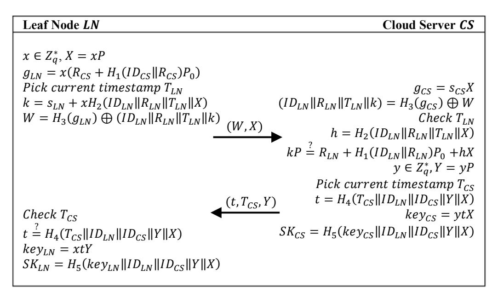
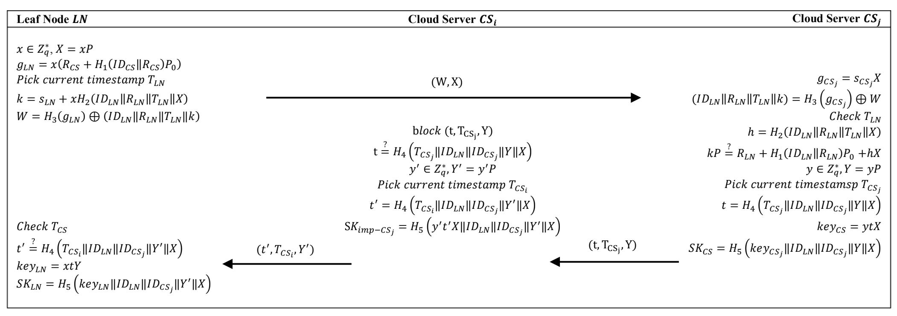

{0}------------------------------------------------

# Cryptanalysis of an Anonymous Authentication and Key Agreement Protocol for Secure Wireless Body Area Network

Mohammad Amin Rakeei and Farokhlagha Moazami

*Abstract***—Recently, Kumar and Chand proposed an anonymous authentication protocol for wireless body area network. They claimed that their scheme meets major security requirements and is able to resist known attacks. However, in this paper we demonstrate that their scheme is prone to traceability attack. Followed by this attack, an attacker can launch a man-inthe-middle attack and share a session key with the victim node, and hence the scheme does not achieve secure authentication. Also, we show that this protocol does not provide perfect forward secrecy which considered as a key security property in the design of any secure key agreement protocol.**

*Index Terms***—Wireless body area network (WBAN), perfect forward secrecy, traceability, man-in-the-middle (MITM), authentication**

## I. INTRODUCTION

HE recent advancements in wireless technology, embedded systems, integrated circuits, wearable devices and nano-technology have led to emergence of a new paradigm in Internet of Things (IoT)-based medical system called Wireless Body Area Networks (WBANs). In a WBAN system, micro/nano sensors are placed in or around human body that collect biological information of a patient and send the collected information involving body temperature, heart rate, blood pressure, etc. to a medical system through wireless communication [1]. T

WBAN technology has a vast range of medical and nonmedical applications that the common goal of all of them is continuous monitoring of a target body [2]. In medical science, multiple low-power sensors implanted in different nodes measure patient's physiological data and send them via a wireless channel to a powerful cloud server for further process. Since the gathered data is the personal attributes of a human body, so the secrecy and privacy of the data should be preserved. This necessitates to make the communication between nodes and servers secure in a WBAN ecosystem.

Although, IEEE 802.15.6 standard has proposed security rules and mechanisms for in/on the body sensor acting in a WBAN communications [3], but the security of its presented protocols has been severely challenged by the researchers and it seems to be far from being accepted in its current form [5], [6].

The main security challenge in WBAN pertains to design secure key agreement protocol. In recent years, numerous key agreement protocols have been designed by the scientists [7]- [12] that either try to improve the security issues of the IEEE 802.15.6 standard, or offer a new scheme suitable for secure WBAN communications. The security analysis of a large number of these schemes are brought in [4].

Recently, an identity-based anonymous authentication and key agreement (IBAAKA) protocol has been presented by Kumar and Chand [13]. Although the scheme provides some major security properties like session key security, anonymity, resilience to many known attacks, etc. coupled with desirable communication and computation costs and also claimed that guarantees mutual authentication, perfect forward secrecy and user revocation, but in this paper we show that it fails to traceability attack followed by man-in-the-middle (MITM) attack that totally breaks mutual authentication. We also observed that their scheme is unable to achieve perfect forward secrecy, one of the main security property a secure key agreement protocol must provide. Besides this weaknesses, it is found that no user revocation facility has been proposed by the authors. In this paper, we cryptanalyzed this scheme and describe the aforementioned attacks in details. We briefly suggest some improvement techniques for future design to prevent these types of attacks.

## II. REVIEW OF KUMAR AND CHAND'S SCHEME

The notations used in Kumar and Chand's scheme are listed in Table I. Generally, there are three entities participating in the scheme with following roles: 1) : a trusted third party that generates and publishes security parameters to and through a registration mechanism. 2) : A resource-constraint sensor that registers with and get security parameters allows it to authenticate with a legitimate cloud server. 3) : A cloud server that registers with to be able to establish authentication session with a legal leaf node . It possesses a high computational power and a large amount of storage space.

Kumar and Chand's scheme consists of three phases as follows:

- 1) *Setup phase*: chooses an -bit random number , a
- F. Moazami is with Cyberspace Research Institute, Shahid Beheshti University, Tehran, Iran (e-mail: f\_moazemi@sbu.ac.ir).

M. A. Rakeei is with the Cyberspace Research Institute, Shahid Beheshti University, Tehran, Iran (e-mail: m.rakeei@mail.sbu.ac.ir).

{1}------------------------------------------------

Fig. 1. Authentication phase of Kumar and Chand's scheme

multiplicative cyclic group  $G_2$  and an additive cyclic group  $G_1$  both of order of q. Let P be the generator of  $G_1$ . NM also selects five secure hash functions  $H_1: \{0,1\}^* \times G_1 \to Z_q^*$ ,  $H_2: \{0,1\}^* \times G_1 \times G_1 \times \{0,1\}^* \to Z_q^*$ ,  $H_3: G_1 \to \{0,1\}^* \times G_1 \times \{0,1\}^* \times Z_q^*$ ,  $H_4: \{0,1\}^* \times \{0,1\}^* \times \{0,1\}^* \times \{0,1\}^* \times \{0,1\}^* \times \{0,1\}^* \times \{0,1\}^* \times \{0,1\}^* \times \{0,1\}^* \times \{0,1\}^* \times \{0,1\}^* \times \{0,1\}^* \times \{0,1\}^* \times \{0,1\}^* \times \{0,1\}^* \times \{0,1\}^* \times \{0,1\}^* \times \{0,1\}^* \times \{0,1\}^* \times \{0,1\}^* \times \{0,1\}^* \times \{0,1\}^* \times \{0,1\}^* \times \{0,1\}^* \times \{0,1\}^* \times \{0,1\}^* \times \{0,1\}^* \times \{0,1\}^* \times \{0,1\}^* \times \{0,1\}^* \times \{0,1\}^* \times \{0,1\}^* \times \{0,1\}^* \times \{0,1\}^* \times \{0,1\}^* \times \{0,1\}^* \times \{0,1\}^* \times \{0,1\}^* \times \{0,1\}^* \times \{0,1\}^* \times \{0,1\}^* \times \{0,1\}^* \times \{0,1\}^* \times \{0,1\}^* \times \{0,1\}^* \times \{0,1\}^* \times \{0,1\}^* \times \{0,1\}^* \times \{0,1\}^* \times \{0,1\}^* \times \{0,1\}^* \times \{0,1\}^* \times \{0,1\}^* \times \{0,1\}^* \times \{0,1\}^* \times \{0,1\}^* \times \{0,1\}^* \times \{0,1\}^* \times \{0,1\}^* \times \{0,1\}^* \times \{0,1\}^* \times \{0,1\}^* \times \{0,1\}^* \times \{0,1\}^* \times \{0,1\}^* \times \{0,1\}^* \times \{0,1\}^* \times \{0,1\}^* \times \{0,1\}^* \times \{0,1\}^* \times \{0,1\}^* \times \{0,1\}^* \times \{0,1\}^* \times \{0,1\}^* \times \{0,1\}^* \times \{0,1\}^* \times \{0,1\}^* \times \{0,1\}^* \times \{0,1\}^* \times \{0,1\}^* \times \{0,1\}^* \times \{0,1\}^* \times \{0,1\}^* \times \{0,1\}^* \times \{0,1\}^* \times \{0,1\}^* \times \{0,1\}^* \times \{0,1\}^* \times \{0,1\}^* \times \{0,1\}^* \times \{0,1\}^* \times \{0,1\}^* \times \{0,1\}^* \times \{0,1\}^* \times \{0,1\}^* \times \{0,1\}^* \times \{0,1\}^* \times \{0,1\}^* \times \{0,1\}^* \times \{0,1\}^* \times \{0,1\}^* \times \{0,1\}^* \times \{0,1\}^* \times \{0,1\}^* \times \{0,1\}^* \times \{0,1\}^* \times \{0,1\}^* \times \{0,1\}^* \times \{0,1\}^* \times \{0,1\}^* \times \{0,1\}^* \times \{0,1\}^* \times \{0,1\}^* \times \{0,1\}^* \times \{0,1\}^* \times \{0,1\}^* \times \{0,1\}^* \times \{0,1\}^* \times \{0,1\}^* \times \{0,1\}^* \times \{0,1\}^* \times \{0,1\}^* \times \{0,1\}^* \times \{0,1\}^* \times \{0,1\}^* \times \{0,1\}^* \times \{0,1\}^* \times \{0,1\}^* \times \{0,1\}^* \times \{0,1\}^* \times \{0,1\}^* \times \{0,1\}^* \times \{0,1\}^* \times \{0,1\}^* \times \{0,1\}^* \times \{0,1\}^* \times \{0,1\}^* \times \{0,1\}^* \times \{0,1\}^* \times \{0,1\}^* \times \{0,1\}^* \times \{0,1\}^* \times \{0,1\}^* \times \{0,1\}^* \times \{0,1\}^* \times \{0,1\}^* \times \{0,1\}^* \times \{0,1\}^* \times \{0,1\}^* \times \{0,1\}^* \times \{0,1\}^* \times \{0,1\}^* \times \{0,1\}^* \times \{0,1\}^* \times \{0,1\}^* \times \{0,1\}^* \times \{0,1\}^* \times \{0,1\}^* \times \{0,1\}^* \times \{0,1\}^* \times \{0,1\}^* \times \{0,1\}^* \times \{0,1\}^* \times \{0,1\}^* \times \{0,1\}^* \times \{0,1\}^* \times \{0,1\}^* \times \{0,1\}^* \times \{0,1\}^* \times \{0,1\}^* \times \{0,1\}^* \times \{0,1\}^* \times \{0,1\}^* \times \{0,1\}^* \times \{0,1\}^$ 

- 2) Registration: NM registers CS and LN as follows:
  - a. LN Registration: LN chooses a random identity  $ID_{LN} \in \{0,1\}^*$  and sends this value and the registration request to NM. NM first checks the availability of this identity. Then it selects a random number  $r_{LN} \in Z_q^*$  and computes  $R_{LN} = r_{LN}P$ ,  $s_{LN} = r_{LN}P$ ,  $s_{LN} = r_{LN}P$ ,  $s_{LN} = r_{LN}P$ ,  $s_{LN} = r_{LN}P$ ,  $s_{LN} = r_{LN}P$ ,  $s_{LN} = r_{LN}P$ ,  $s_{LN} = r_{LN}P$ ,  $s_{LN} = r_{LN}P$ ,  $s_{LN} = r_{LN}P$ ,  $s_{LN} = r_{LN}P$ ,  $s_{LN} = r_{LN}P$ ,  $s_{LN} = r_{LN}P$ ,  $s_{LN} = r_{LN}P$ ,  $s_{LN} = r_{LN}P$ ,  $s_{LN} = r_{LN}P$ ,  $s_{LN} = r_{LN}P$ ,  $s_{LN} = r_{LN}P$ ,  $s_{LN} = r_{LN}P$ ,  $s_{LN} = r_{LN}P$ ,  $s_{LN} = r_{LN}P$ ,  $s_{LN} = r_{LN}P$ ,  $s_{LN} = r_{LN}P$ ,  $s_{LN} = r_{LN}P$ ,  $s_{LN} = r_{LN}P$ ,  $s_{LN} = r_{LN}P$ ,  $s_{LN} = r_{LN}P$ ,  $s_{LN} = r_{LN}P$ ,  $s_{LN} = r_{LN}P$ ,  $s_{LN} = r_{LN}P$ ,  $s_{LN} = r_{LN}P$ ,  $s_{LN} = r_{LN}P$ ,  $s_{LN} = r_{LN}P$ ,  $s_{LN} = r_{LN}P$ ,  $s_{LN} = r_{LN}P$ ,  $s_{LN} = r_{LN}P$ ,  $s_{LN} = r_{LN}P$ ,  $s_{LN} = r_{LN}P$ ,  $s_{LN} = r_{LN}P$ ,  $s_{LN} = r_{LN}P$ ,  $s_{LN} = r_{LN}P$ ,  $s_{LN} = r_{LN}P$ ,  $s_{LN} = r_{LN}P$ ,  $s_{LN} = r_{LN}P$ ,  $s_{LN} = r_{LN}P$ ,  $s_{LN} = r_{LN}P$ ,  $s_{LN} = r_{LN}P$ ,  $s_{LN} = r_{LN}P$ ,  $s_{LN} = r_{LN}P$ ,  $s_{LN} = r_{LN}P$ ,  $s_{LN} = r_{LN}P$ ,  $s_{LN} = r_{LN}P$ ,  $s_{LN} = r_{LN}P$ ,  $s_{LN} = r_{LN}P$ ,  $s_{LN} = r_{LN}P$ ,  $s_{LN} = r_{LN}P$ ,  $s_{LN} = r_{LN}P$ ,  $s_{LN} = r_{LN}P$ ,  $s_{LN} = r_{LN}P$ ,  $s_{LN} = r_{LN}P$ ,  $s_{LN} = r_{LN}P$ ,  $s_{LN} = r_{LN}P$ ,  $s_{LN} = r_{LN}P$ ,  $s_{LN} = r_{LN}P$ ,  $s_{LN} = r_{LN}P$ ,  $s_{LN} = r_{LN}P$ ,  $s_{LN} = r_{LN}P$ ,  $s_{LN} = r_{LN}P$ ,  $s_{LN} = r_{LN}P$ ,  $s_{LN} = r_{LN}P$ ,  $s_{LN} = r_{LN}P$ ,  $s_{LN} = r_{LN}P$ ,  $s_{LN} = r_{LN}P$ ,  $s_{LN} = r_{LN}P$ ,  $s_{LN} = r_{LN}P$ ,  $s_{LN} = r_{LN}P$ ,  $s_{LN} = r_{LN}P$ ,  $s_{LN} = r_{LN}P$ ,  $s_{LN} = r_{LN}P$ ,  $s_{LN} = r_{LN}P$ ,  $s_{LN} = r_{LN}P$ ,  $s_{LN} = r_{LN}P$ ,  $s_{LN} = r_{LN}P$ ,  $s_{LN} = r_{LN}P$ ,  $s_{LN} = r_{LN}P$ ,  $s_{LN} = r_{LN}P$ ,  $s_{LN} = r_{LN}P$ ,  $s_{LN} = r_{LN}P$ ,  $s_{LN} = r_{LN}P$ ,  $s_{LN} = r_{LN}P$ ,  $s_{LN$
  - b. *CS Registration*: In the similar way, *CS* gets its private key  $(s_{CS}, R_{CS})$  from NM.
- 3) *Authentication*: The authentication phase has shown in Fig. 1. In this phase *LN* and *CS* authenticate each other in following steps.
  - a. LN selects a random number  $x \in Z_q^*$  and computes X = xP,  $g_{LN} = x(R_{CS} + H_1(ID_{CS} || R_{CS})P_0)$ . Then it calculates  $W = H_3(g_{LN}) \oplus (ID_{LN} || R_{LN} || T_{LN} || k)$  where  $T_{LN}$  is the current timestamp of LN and  $k = s_{LN} + xH_2(ID_{LN} || R_{LN} || T_{LN} || X)$ . It sends login message (W, X) to CS.
  - b. Upon receiving (W, X), CS computes  $g_{CS} = s_{CS}X$  and extract  $ID_{LN}, R_{LN}$  from  $(ID_{LN} || R_{LN} || T_{LN} || k) = H_3(g_{CS}) \oplus W$ . It checks the timestamp  $T_{LN}$  to be fresh otherwise it aborts the session. Afterwards, CS verifies the equation  $kP = R_{LN} + H_1(ID_{LN} || R_{LN})P_0 + hX$  where  $h = H_2(ID_{LN} || R_{LN} || T_{LN} || X)$ . The equality holds as bellow.

$$kP = (s_{LN} + xh)P$$
  
=  $(r_{LN} + s_0H_1(ID_{LN}||R_{LN}) + xh)P$   
=  $R_{LN} + H_1(ID_{LN}||R_{LN})P_0 + hX$ 

If above equation holds, CS picks a random element  $y \in Z_q^*$  and a fresh timestamp  $T_{CS}$  and sets Y = yP,  $t = H_4(T_{CS}||ID_{LN}||ID_{CS}||Y||X)$ . After computing values  $key_{CS} = ytX$ ,  $SK_{CS} = H_5(key_{CS}||ID_{LN}||ID_{CS}||X|)$ 

TABLE I
PARAMETERS AND NOTATIONS

| TAMAMETERS AND INSTALLAND |                               |
|---------------------------|-------------------------------|
| Notations                 | Description                   |
| LN                        | Leaf node                     |
| CS                        | Cloud server                  |
| NM                        | Network manager               |
| q                         | A large prime number          |
| $G_1$                     | An additive cyclic group      |
| $G_2$                     | A multiplicative cyclic group |
| P                         | Generator of G 1   |
| $s_0$                     | Master key of NM              |
| $P_0$                     | Public key of NM              |
| 1                         | Length of q                   |
| $H_i(i = 1, 2,, 5)$       | Secure hash functions         |
| $T_{CS}$                  | Timestamp of CS               |
| $T_{LN}$                  | Timestamp of LN               |

- ||Y||X), it sends message  $(t, T_{CS}, Y)$  to LN and stores  $SK_{CS}$  as a shared session key.
- c. When LN receives message  $(t, T_{CS}, Y)$ , it checks the timestamp freshness. If it was fresh, LN verifies whether  $t = H_4(T_{CS}||ID_{LN}||ID_{CS}||Y||X)$  holds. If not he abort the session. Otherwise, it sets  $key_{LN} = xtY$  and computes the shared session key with CS by  $SK_{LN} = H_5(key_{LN}||ID_{LN}||ID_{CS}||Y||X)$ .

#### III. CRYPTANALYSIS OF KUMAR AND CHAND'S SCHEME

In this section, we show that how traceability and MITM attacks can be applied on Kumar and Chand's Scheme and as a result it cannot achieve secure authentication. Moreover, we demonstrate that their scheme does not provide perfect forward secrecy which is an essential security property in an authenticated key agreement protocol.

## A. Traceability Attack

The proposed protocol by Kumar and Chand is subject to traceability attack in one of the following scenarios

- 1) A be an external adversary who has obtained leaf node's identity  $ID_{LN}$ .
- 2) A be a cloud server who has established an authentication session with LN at least once.

We show that in both above scenarios, A can trace LN in polynomial time. Without loss of generality, we only discuss the second scenario and the veracity of the first one can be tested in similar way. Let  $CS_i$  establishe an authentication session with LN. So, it knows  $ID_{LN}$ . Also, we assume  $CS_i$  has the full control of the transmitted messages in the channel. We show that  $CS_i$  can easily trace any session initiated by LN. Below steps describe the details of the traceability attack

- **Step 1**: LN sends login message (W, X) to  $CS_j$  where  $j \neq i$ . **Step 2**: In response,  $CS_j$  authenticates LN and sends login response  $(t, T_{CS_j}, Y)$  towards LN.
- **Step 3**:  $CS_i$  intercepts  $(t, T_{CS_j}, Y)$  and checks the correctness of  $t = H_4(T_{CS_j}||ID_{LN}||ID_{CS_j}||Y||X)$ . If equation holds, it means that LN is successfully traced.

#### B. Man-In-The-Middle Attack

Let A be the adversary who has performed a successful traceability attack as described in section III-A. Similar to section III-A, we only investigate the case that A be a cloud

{2}------------------------------------------------

Fig. 2. MITM attack on Kumar and Chand's scheme.

server adversary like  $CS_i$  who has established an authentication session with leaf node LN. The MITM attack procedure is as follows, as is also shown in Fig. 2.

**Step 1**: Let *LN* be traced successfully by  $CS_i$  as described in section III-A. Now,  $CS_i$  selects a random element  $y' \in Z_q^*$ , sets Y' = y'P and picks a new timestamp  $T_{CS_i}$ . Then instead of the message  $(t, T_{CS_j}, Y)$ , it sends  $(t', T_{CS_i}, Y')$  to LN where  $t' = H_4\left(T_{CS_i}\|ID_{LN}\|ID_{CS_j}\|Y'\|X\right)$  and X is an intercepted value from login message. Further,  $CS_i$  computes the shared session key of impersonated  $CS_j$  with LN as  $SK_{imp-CS_j} = H_5\left(y't'X\|ID_{LN}\|ID_{CS_j}\|Y'\|X\right)$ .

**Step 2**: LN receives  $(t', T_{CS_i}, Y')$  and verifies  $t' = H_4\left(T_{CS_i}\|ID_{LN}\|ID_{CS_j}\|Y'\|X\right)$ . Now, it sets the shared session key with impersonated  $CS_j$  as  $SK_{LN} = H_5\left(xt'Y'\|ID_{LN}\|ID_{CS_j}\|Y'\|X\right)$ .

It is obvious that  $CS_i$  is authenticated for LN and both shared the same session key. From now on,  $CS_i$  can securely communicate with LN on behalf of  $CS_j$ . This is a crucial security weakness since by launching this MITM attack, cloud servers can impersonate each other to victim leaf nodes and access sensitive and unauthorized data.

## C. No Perfect Forward Secrecy

A security protocol provides perfect forward secrecy if an adversary A obtains both secret keys of a leaf node LN and a cloud server CS, he cannot get the session key of previous established sessions. Kumar and Chand claimed that their scheme has perfect forward secrecy property. However, we demonstrate that it cannot maintain this security requirement. Let private keys of both parties means  $s_{CS}$  and  $s_{LN}$  be revealed to an adversary A. Also, we assume A has intercepted all transmitted messages in the channel. Since A knows  $s_{CS}$ , he can calculate  $g_{CS} = s_{CS}X$ . Then he extract  $ID_{LN}$ ,  $R_{LN}$ ,  $T_{LN}$ , k from  $(ID_{LN}||R_{LN}||T_{LN}||k) = H_3(g_{CS}) \oplus W$ . Now, A can form the following equation

$$xH_2(ID_{LN}||R_{LN}||T_{LN}||X) = (k - s_{LN})$$
 (1)

Using the Euclidean algorithm, A can properly find  $H_2(ID_{LN}||R_{LN}||T_{LN}||X)^{-1}$  from (1) and then compute x=

 $H_2(ID_{LN}||R_{LN}||T_{LN}||X)^{-1}(k-s_{LN})$ . He also can find  $key_{LN} = xtY$  and  $SK_{LN} = H_5(key_{LN}||ID_{LN}||ID_{CS}||Y||X)$  accordingly. A has obtained the session key that means the scheme does not provide perfect forward secrecy.

#### D. No User Revocation Procedure

Kumar and Chand claimed that their scheme supports user revocation. But in fact, no revocation procedure has been proposed by the authors and the scheme lacks user revocation mechanism.

#### IV. SEVERAL SUGGESTIONS FOR IMPROVEMENT

In section III, we have described security weaknesses of Kumar and Chand's scheme. Here we suggest several countermeasures could be applied to the protocol enable it to withstand the mentioned attacks.

- 1) The main reason the protocol is traceable is that in the authenticator  $t = H_4(T_{CS}||ID_{LN}||ID_{CS}||Y||X)$ , the only anonymous value to an adversary is the leaf node's identity  $ID_{LN}$  and if somehow he gets it, he can trace the leaf node. As a direct way of improvement, one can add a session-dependent value like  $g_{cs}$  in  $H_4$  hash function of t which makes it meaningful only for those who actually participate in the authentication session.
- 2) The MITM attack has shown in section III-B is feasible if an adversary can trace the leaf node. So securing the protocol against the traceability attack will prevents the MITM attack too.
- 3) To the best of our knowledge, there are no straightforward techniques can use to achieve perfect forward secrecy property. But, it is obvious that any improvement should be in the this way that preserves the security of the ephemeral secret *x* in case of revealing long term keys.

#### V. CONCLUSION

In this paper, we have cryptanalyzed the most recently authentication scheme for WBAN by Kumar and Chand. Although authors claimed that their scheme has a high level of security comparing with the prior proposed schemes, but we have shown that it suffers from traceability attack followed by MITM attack which allows cloud servers to impersonate each

{3}------------------------------------------------

other to a common leaf node. Moreover, we have pointed out that unlike the author claims, it fails to provide perfect forward secrecy and also user revocation facility. We have suggested several countermeasures to prevent aforementioned security weaknesses. Further work should concentrate on improving Kumar and Chand's scheme or designing a new anonymous authenticated key agreement protocol for secure WBAN.

#### REFERENCES

- [1] V. Mainanwal, M. Gupta and S. K. Upadhayay, "A survey on wireless body area network: Security technology and its design methodology issue," *2015 International Conference on Innovations in Information, Embedded and Communication Systems (ICIIECS)*, Coimbatore, 2015.
- [2] S. Movassaghi, M. Abolhasan, J. Lipman, D. Smith and A. Jamalipour, "Wireless Body Area Networks: A Survey," in *IEEE Communications Surveys & Tutorials*, vol. 16, no. 3, pp. 1658-1686, Third Quarter 2014.
- [3] K. S. Kwak, S. Ullah and N. Ullah, "An overview of IEEE 802.15.6 standard," *2010 3rd International Symposium on Applied Sciences in Biomedical and Communication Technologies (ISABEL 2010)*, Rome, 2010.
- [4] M. Masdari, S. Ahmadzadeh and M. Bidaki, "Key management in wireless body area network: Challenges and issues", *J. Netw. Comput. Appl.*, vol. 91, pp. 36-51, Aug. 2017.
- [5] M. Toorani, "Cryptanalysis of two PAKE protocols for body area networks and smart environments, Int. J. Netw. Secur., vol. 17, no. 5, pp. 629–636, 2015.
- [6] M. Toorani, "On vulnerabilities of the security association in the IEEE 802.15. 6 Standard," arXiv preprint arXiv:1501.02601, 2015.
- [7] Q. Jiang, S. Zeadally, J. Ma and D. He, "Lightweight three-factor authentication and key agreement protocol for internet-integrated wireless sensor networks," in *IEEE Access*, vol. 5, pp. 3376-3392, 2017.
- [8] D. He, S. Zeadally, N. Kumar and J. Lee, "Anonymous Authentication for Wireless Body Area Networks With Provable Security," in *IEEE Systems Journal*, vol. 11, no. 4, pp. 2590-2601, Dec. 2017.
- [9] P. Vijayakumar, M. S. Obaidat, M. Azees, S. H. Islam and N. Kumar, "Efficient and Secure Anonymous Authentication With Location Privacy for IoT-Based WBANs," in *IEEE Transactions on Industrial Informatics*, vol. 16, no. 4, pp. 2603-2611, Apr.2020.
- [10]V. Odelu, S. Saha, R. Prasath, L. Sadineni, M. Conti and M. Jo, "Efficient privacy preserving device authentication in WBANs for industrial e-health applications", *Comput. Security*, vol. 83, pp. 300-312, Jun. 2019.
- [11] X. Li, J. Peng, M. S. Obaidat, F. Wu, M. K. Khan and C. Chen, "A Secure Three-Factor User Authentication Protocol With Forward Secrecy for Wireless Medical Sensor Network Systems," in *IEEE Systems Journal*, vol. 14, no. 1, pp. 39-50, Mar. 2020.
- [12]S. Jegadeesan, M. Azees, N. Ramesh Babu, U. Subramaniam and J. D. Almakhles, "EPAW: Efficient Privacy Preserving Anonymous Mutual Authentication Scheme for Wireless Body Area Networks (WBANs)," in *IEEE Access*, vol. 8, pp. 48576-48586, 2020.
- [13]M. Kumar and S. Chand, "A Lightweight Cloud-Assisted Identity-Based Anonymous Authentication and Key Agreement Protocol for Secure Wireless Body Area Network," in *IEEE Systems Journal.*