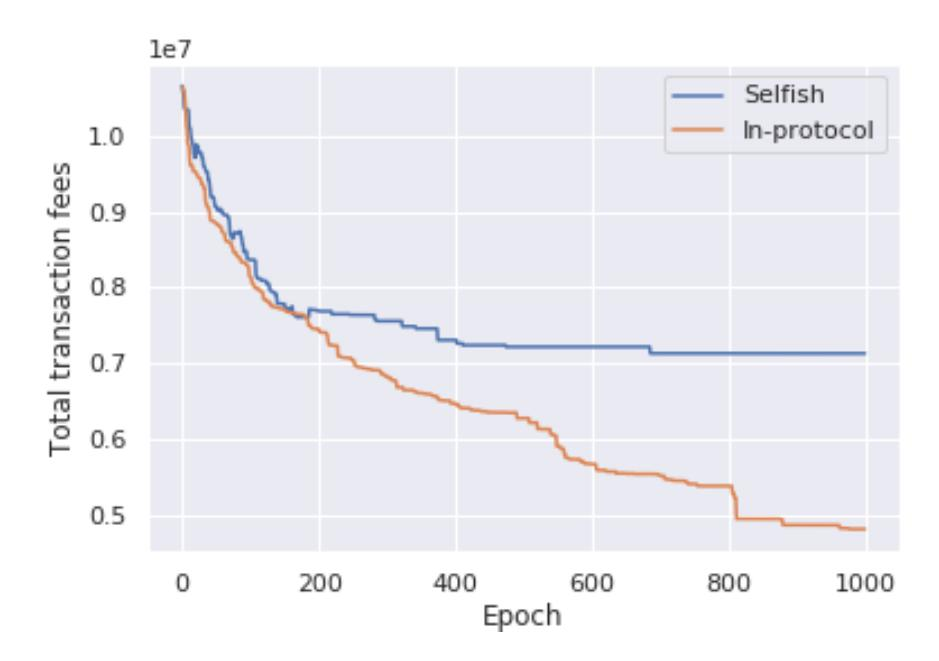
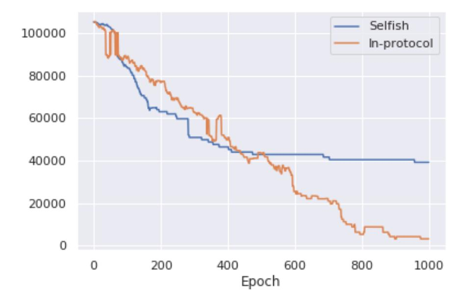
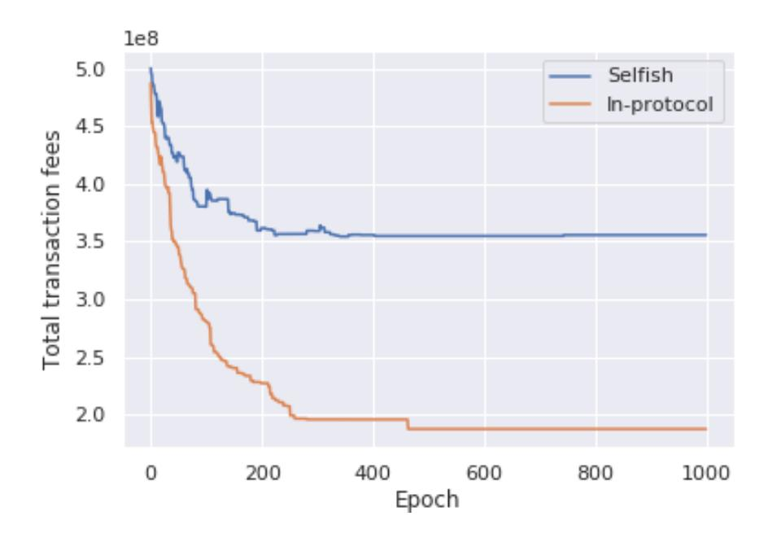
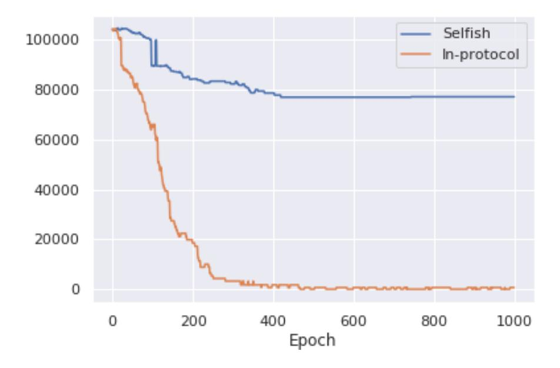

{0}------------------------------------------------

# Load Balancing for Sharded Blockchains

Naoya Okanami1,<sup>2</sup> , Ryuya Nakamura3,<sup>2</sup> , and Takashi Nishide<sup>1</sup>

> University of Tsukuba, Ibaraki, Japan. LayerX Inc., Tokyo, Japan. {naoya.okanami,ryuya.nakamura}@layerx.co.jp The University of Tokyo, Tokyo, Japan.

Abstract. Sharding is an approach to designing a highly scalable blockchain. A sharded blockchain achieves parallelism by dividing consensus nodes (validators) into groups called shards and making them process different transactions in each shard. In this paper, we economically analyze users' behavior on sharded blockchains and identify a phenomenon that users' accounts and smart contracts eventually get concentrated in a few shards, making shard loads unfair. This phenomenon leads to bad user experiences, such as delays in transaction inclusions and increased transaction fees. To solve the above problem, we propose a load balancing framework in sharded blockchains in which accounts and contracts are frequently reassigned into shards to reduce the difference of loads between shards. We formulate the contract reassignment as an optimization problem and present the algorithm to solve it. Further, we apply the framework to an existing sharding design (Ethereum 2.0) and modify the protocol to do load balancing. Finally, we simulate the protocol and observe smaller transaction delays and fees.

Keywords: Sharding, Blockchain, Load balancing, Game theory, Heuristics, Simulated annealing.

## 1 Introduction

Traditional distributed ledgers do not increase transaction processing capacity, no matter how many participants exist in the network. In order to improve the scalability of the distributed ledger, methods such as off-chain protocols and Directed Acyclic Graph (DAG) based blockchains and sharded blockchains have been proposed. One of them, sharding, implements parallelization by dividing validators that verify transactions into different groups and processing different transactions in each shard. Sharding was first proposed at Elastico [12], followed by sharded blockchains such as OmniLedger [11], Chainspace [4], and Rapid-Chain [16]. It will be used in Ethereum [7] in the future.

There are two blockchain transaction models, the Un-spent Transaction-Output (UTXO) model and the account/balance model. The blockchain with the account/balance model is more compatible with implementing smart contract functions, and Ethereum most used among blockchains that currently implement smart contracts adopts the account/balance model.

{1}------------------------------------------------

Sharded blockchains with the account/balance model allow users to choose the shard to which their account belongs freely. Users spend less fee and have less latency when their accounts belong to the same shard as the contracts that frequently trade with them. Therefore, in reality, it is easier to collect accounts for shards to which popular contracts belong. As a result, the load on the shard is increasingly imbalanced. On the other hand, in a shard, the higher the load is, the more the fee increases. Users don't want to use shards with high fees, so no extreme imbalances occur. In other words, when users act to improve their user experience (UX), there is no extreme imbalance that all accounts are concentrated in one shard, and some load balancing is performed. A user can actually have multiple accounts, but so does this.

We thought that, due to these two characteristics, the account behaves selfishly, and the account assignment state converges approximately to a state where all users have no incentive to go to another shard (-Nash equilibrium). The sharding protocol already has a mechanism that performs load balancing when the user acts selfishly. In theoretical computer science and distributed systems, the fact that load balancing is performed by users acting selfishly as described above is called selfish load balancing [14, 5, 3].

If the load on each shard is imbalanced, sharding protocols have the following issues.

- Due to the load imbalance, the hardware specs required for the validator will be higher than when the load is balanced. This prevents new validators from entering.
- The gas price differs across shards and worsen the UX of cross-shard communications.
- Validators favor an environment, e.g., on Amazon Web Services (AWS), which can efficiently scale in/out.
- The incentive analysis around parameterization of rewards or gas costs might become complicated.

Monoxide is one of the sharded blockchains in the account/balance model [15]. When a popular decentralized application (Dapps) exists in a sharded blockchain with smart contract functionality, the load is concentrated in the shard to which the application belongs, which is stated in the Monoxide paper as a "single address hotspot" issue. The Monoxide paper mentions a solution by the upper layers, where application operators create one address for each shard and distribute the load.

However, as explained earlier, there is not only an imbalance because there is a heavily loaded account. If the user is selfish, the imbalance will be more widespread. We show that by modeling users, the load is concentrated in a few shards, and selfish load balancing is performed and converges to the -Nash equilibrium.

Since selfish load balancing is one of the congestion games in terms of game theory, it cannot equalize shard loads. If the shard load is not equal, the overall UX is worse than when the load is equal. To solve the above problem, we 

{2}------------------------------------------------

propose in-protocol load balancing to reduce shard load imbalance by frequently reassigning accounts within the protocol.

With frequent account reassignments, even if a user self-changes a shard, it is immediately reassigned to another shard by the protocol. Since there is a fee for the act of moving the shard itself, the incentive for the user to change the shard themselves becomes very small, and the user does not want to change the shard themselves.

In order to do in-protocol load balancing, we formulate load balancing as an optimization problem. Moreover, as a result of the formulation, it is shown that this problem is NP-hard. Since it is NP-hard, there is no polynomial-time algorithm for finding an exact solution for the load balancing problem. Thus, it is necessary to use an approximation algorithm or heuristics, but it is very computationally expensive to obtain a good solution. Doing the calculation itself on-chain is not worth the cost. Therefore, in-protocol load balancing is done in a competition format where the problem is disclosed and delegated to the outside, and the best solution is adopted. This provides a better solution than on-chain.

We define the objective function of the optimization problem to minimize the load of the shard with the highest load. The reason is that the minimum computer specifications required to become a validator are proportional to the maximum load that can occur in a shard. In addition, it is because the UX of many accounts deteriorates because the commission becomes high, and the delay occurs in the shard where the transaction is concentrated.

Finally, we apply this load balancing framework to Ethereum 2.0 [15] and construct an algorithm that solves the load balancing problem using simulated annealing, which is one of metaheuristics. In addition, comparing selfish load balancing with the proposed algorithm, we show that the total transaction fee and total transaction delay can be smaller.

In summary, our contributions are:

- We show that the load concentrates on a small number of shards when the user acts selfishly in sharded blockchains with the account/balance model.
- We show that shard imbalance increases user transaction fees and latency.
- In order to solve this problem, we propose in-protocol load balancing, which performs load balancing by reassigning accounts in sharded blockchains. Inprotocol load balancing formulates load balancing as an optimization problem, and a blockchain can obtain a good solution by competing players with the solution in a competition.
- We apply this framework to Ethereum 2.0, an existing sharding design, and demonstrate that transaction fees and latencies can be reduced over selfish load balancing.

## 2 Preliminaries

#### 2.1 Task assignment problems (TAPs)

There is a mathematical optimization problem called task assignment problems. For example, there are the following problems.

{3}------------------------------------------------

#### 4 Naoya Okanami, Ryuya Nakamura, and Takashi Nishide

M resources and N tasks are given. It takes c<sup>i</sup> to execute task i. Further, when task i and task j are assigned to different resources, the resources to which task i and task j are assigned cost dij and dji, respectively. Each task can be assigned to one resource. What is the shortest time to complete all the tasks?

TAPs are well-known NP-hard problems in the field of mathematical optimization, and various algorithms for solving them have been proposed [13, 6, 8].

### 2.2 Cross shard transaction

A transaction sent from one shard to another is called a cross-shard transaction. A cross-shard transaction has to go through another shard or parent chain and has a higher fee and latency than a single-shard transaction. For example, the problem of how to handle hotel room reservations and train seat reservations atomically is called the train-and-hotel problem. In sharding, it is a problem of handling contracts in one shard and contracts in another shard atomically.

### 2.3 Ethereum 2.0

The Ethereum community is now actively working on the Ethereum 2.0 project [10], which upgrades the Ethereum protocol to introduce proof-of-stake, sharding, etc. Ethereum 2.0 consists of one beacon chain and multiple shard chains. A shard chain is a sharded blockchain, and a beacon chain is a blockchain that manages the shard chain. Beacon chain mediates cross-shard communications. For simplicity, we assume smart contracts exist on the shard chains but not on the beacon chain.

Yank operation Ethereum 2.0 solves the train-and-hotel problem by introducing an operation called yank [2]. A yank is to delete a contract on one shard, issue a transaction receipt, and instantiate the contract on another shard. Then perform some operation on the shard to which it is yanked. For example, yank a contract to reserve a room for a hotel to a shard that has a contract to reserve a train and make an atomic reservation.

## 3 In-protocol Load Balancing

The process flow of in-protocol load balancing is as follows.

- 1. Competition coordinators collect necessary transaction load information of accounts.
- 2. Coordinators formulate load balancing as an optimization problem.
- 3. Competition participants calculate a good account assignment.
- 4. Coordinators move accounts based on the new assignment.

{4}------------------------------------------------

### 3.1 Problem Definition

We formulate minimizing the highest load among loads of shards as an optimization problem. Let S be a mapping from account to shard id. Let lij be the load of a shard that accounts i and j belong to when they belong to the same shard. Further, let l 0 ij be a load for the shard to which the account i belongs when the accounts i and j belong to different shards. The total load Lk(S) in shard k per unit time is

$$L_k(S) := \sum_{i,j,S(i)=k \land S(j)=k} l_{ij} + \sum_{i,j,S(i)=k \land S(j)\neq k} l'_{ij}$$
 (1)

There is a correlation between shard fees and shard load. Let the overall load of the shard be L, the fee for processing the load l be C(L, l). In reality, the function C cannot be determined exactly because the fees are proposed by users, and the auction determines which transaction is incorporated into the block by validators.

There are several optimization problems that can be used to improve UX while equalizing the load on all users — for example, minimizing the load on the heaviest shard. Shards with heavy loads have higher transaction fees, and reducing them can significantly reduce overall fees. We formulate this as follows.

minimize max k Lk(S) (2)

This optimization problem is a polynomial-time reducible to TAPs with simple formula transformations. If the above optimization problem can be solved in polynomial time, TAPs can be solved in polynomial time using that algorithm. Therefore, this load balancing problem is NP-hard.

Good results can also be obtained by minimizing the overall fee. In order to reduce the overall cost, it is necessary to reduce the load on the shard, which is the bottleneck and has the highest load. Thus, the load on all the shards is equalized, and the overall fee is reduced. In addition, the fee is reduced when the number of cross-shard transactions is reduced. Therefore, that optimization is performed so that the number of cross-shard transactions is reduced. This also reduces latency. We formulate this as follows.

minimize 
$$\sum_{k} C(L_k(S), L_k(S)) \tag{3}$$

This problem is as difficult as the one above.

#### 3.2 Competition

Since the above optimization problem is NP-hard, heuristics and approximate algorithms must be used to find a good solution. However, running such heavy 

{5}------------------------------------------------

processing algorithms on-chain is not worth the cost, so in our design, anyone can submit a solution, and we build a game that rewards the player who submitted the best solution.

For each epoch, the account assignment at the next epoch is determined using the information of the previous epoch. If too old information is used for the past epoch information, load balancing suitable for the transaction in the next epoch is not performed, so it is necessary to use appropriate information of the previous.

If we use transaction load information for all accounts, the amount of information is O(n 2 ), where n is the number of accounts. In operation, transaction load information of a certain percentage of accounts selected at random for each epoch is used.

To host a competition, we have nodes that act as competition coordinators. The coordinators formulate and publicize the account assignment as an optimization problem using past epoch transaction load information. The competition players understand the optimization problem, work on optimization, and submit a solution when the time limit is approaching. After the epoch, the coordinators evaluate the solution and rewards the player who submits the best solution. Since a malicious player may submit a poorly evaluated solution and put unnecessary load on the coordinators, the player must pay a fee when submitting the solution. Also, if there are multiple players who have both submitted the best solution, the winner is the one with the fastest submission time.

Collecting transaction data. Every shard has transaction load information for accounts belonging to that shard. To perform in-protocol load balancing, this information must be passed to the competition coordinators. The method differs depending on the sharding protocol.

For example, in Ethereum 2.0, the coordinators are a beacon chain that manages shard chains. The shard chain and the beacon chain are connected by a method called crosslink, and data is exchanged safely by giving authentication to the data users want to pass. This exchange is engraved in the beacon chain.

Since the transaction load information of all accounts cannot be included in the beacon chain, all shards construct data as follows:

- 1. Every epoch, a shard i randomly samples k contracts A<sup>i</sup> = {ai,1, ai,2, ...., ai,k}.
- 2. Accounts not selected by random sampling are merged as a single virtual account as ai,rest. Let R be the unselected set and C<sup>i</sup>x,j<sup>y</sup> be the cross-shard transaction load from shard i account x to shard j account y.

$$C_{i_{\text{rest}},j_y} = \sum_{x \in R} C_{i_x,i_y}$$

The shard chain sends the information constructed in this way to the beacon chain by crosslink.

{6}------------------------------------------------

Player algorithms. The player selects themselves the algorithm that they will use. Any simple hill-climbing method, simulated annealing, genetic algorithm, etc. can be used. Players can use a mathematical optimization solver or a combination of the solver and their own algorithm. The longer the sharding protocol that introduced in-protocol load balancing operates, the more efficiently the player's algorithm will evolve, and the better the load balancing will be.

Commit-reveal scheme. If the solution is submitted, another player may copy the solution and submit an improved solution starting from that solution. If the commit-reveal scheme is adopted, this problem can be solved by releasing the solution and verifying the best solution after the competition is over. That is, the player submits the commitment of (solution k signature). However, there must be at least one honest player in order for the user to benefit from in-protocol load balancing.

#### 3.3 Security analysis

The above protocol only changes the state transition rules, so it does not affect the safety, liveness, and validity properties of the blockchain. Also, the consensus protocol and validator validation rules have not changed radically.

## 4 Experiments

In this section, we show that applying in-protocol load balancing to Ethereum 2.0, modeling users, and simulating them actually reduces shard imbalance and reduces fees and latency.

#### 4.1 Simulation settings

This subsection describes the user strategy, the algorithm used by the player, and the sharded blockchain model to be simulated.

User strategy. We use Berenbrink's method [5] to model how a user behaves. Let m be the number of accounts, n be the number of shards and m n. In one unit time, a user moves an account with the following strategy.

Let i be a shard to which the user belongs, and j be a destination shard, and j is selected at random. Let C<sup>i</sup> and C<sup>j</sup> are the loads of i and j per unit time, respectively. if C<sup>j</sup> < C<sup>i</sup> , it moves with probability 1 − C<sup>j</sup> C<sup>i</sup> . If not, do not move.

When performing in-protocol load balancing, the shard allocation is changed by the protocol, so the cost of moving the shard cannot be ignored. If C<sup>t</sup> is the cost of moving the shard, and the time until the next allocation, that is, epoch time is T, if C<sup>j</sup> + Ct/T < C<sup>i</sup> , then the probability 1 − Cj+Ct/T C<sup>i</sup> to move. If not, do not move. As T becomes shorter, Ct/T becomes so large that the user has no incentive to change the shard.

{7}------------------------------------------------

Simulated annealing approach. We use the simulated annealing approach for this simulation. Simulated annealing is a generalization of hill climbing and is a metaheuristic used for difficult problems such as NP-hard problems [9]. It is difficult to find the global optimal solution by using hill climbing, but simulated annealing can obtain a value close to the global optimal solution. The algorithm is such that a solution in the neighborhood of the provisional solution is selected at random, and the transition is always made when the score is improved.

The pseudo code is as follows (see Algorithm 1). Let T be the time to execute this algorithm. Neighbor is a function that randomly selects a nearby solution, Score is a function that evaluates the solution, and Gettime is a function that returns how much time has passed since this algorithm was executed. The evaluation value of the score function moves to the better one. Therefore, Score = (whole total fee). The Probability is a function that returns the probability of transition based on the current time t, the current\_assignment score, and the next\_assignment score. The Random function returns a uniform random number between 0 and 1.

#### Algorithm 1 Simulated annealing approach

```
1: t \leftarrow 0
 2: while t < T do
 3:
         next\_assignment \leftarrow Neighbor(current\_assignment)
         s_c \leftarrow \text{Score}(\text{current\_assignment})
 4:
 5:
         s_n \leftarrow \text{Score}(\text{next\_assignment})
         if s_n > s_c then
 6:
 7:
             current\_assignment \leftarrow next\_assignment
 8:
         else
             p \leftarrow \text{Probability}(t, s_c, s_n)
 9:
             if p > \text{RANDOM}() then
10:
11:
                  current\_assignment \leftarrow next\_assignment
12:
              end if
13:
         end if
         t \leftarrow \text{GetTime}()
14:
15: end while
```

Also, no competition will be held, i.e., one person submits one solution.

**Sharded blockchain model.** The amount of account information that can be acquired depends on the number of accounts in the entire blockchain. Thus we set the parameter to q this time. Ethereum 2.0 will generate one block every 12 seconds, with 64 shards planned to be introduced first. Ethereum currently trades 300,000 accounts a day. Simulating all of them requires a lot of computational resources, so this time we set T=0.1 seconds and simulate with 8 shards and 1,000 accounts.

We model how accounts trade with other accounts in a directed graph. The vertex in the graph represents an account, and the directed edge extending from

{8}------------------------------------------------

account i to account j represents the average load on account i in all transactions between account i and account j in one unit time (block). This load includes not only the transaction from account i to account j, but also the load at the time of transaction from account j to account i. In reality, transactions are concentrated on very popular accounts such as Maker DAO, so we set a parameter called account popularity, so that the more popular the account is, the more easily transactions to that account are sent. The popularity of the account is simply a quadratic function. In other words, the popularity of account i is popularity<sup>i</sup> = i 2 . Popularity was used to weight the load when trading. The transaction load between an account i and an account j is popularity<sup>i</sup> + popularity<sup>j</sup> . However, it is impossible in reality that one account is trading with all other accounts. Therefore, considering the total number of accounts 1000, an account accounts for 5% of all accounts.

We believe this setting is sufficient to show the effect of our in-protocol load balancing.

| Parameter                                    | Value      |
|----------------------------------------------|------------|
| Number of shards                             | 8          |
| Number of accounts                           | 1000       |
| Load balancing interval                      | 0.1 second |
| Number of accounts traded by one account 5 % |            |
| Number of epochs                             | 1000       |

Table 1. Simulation parameters

#### 4.2 Results and comparisons

As a result of the simulation, the sum of account fees and the number of crossshard transactions have reduced. Although this setting was small, the effect of in-protocol load balancing was confirmed.

{9}------------------------------------------------



Fig. 1. Decrease of total transaction fees when all accounts selfishly move between shards at each epoch (blue: selfish load balancing, orange: in-protocol load balancing)



Fig. 2. Decrease of number of cross-shard transactions when all accounts selfishly move between shards at each epoch (blue: selfish load balancing, orange: in-protocol load balancing)

Figures 1 and 2 show selfish load balancing and in-protocol load balancing when all accounts selfishly move between shards at each epoch. Both have converged to specific values, but in-protocol load balancing has reached better values. This is a natural result because selfish load balancing converges to - 

{10}------------------------------------------------

Nash equilibrium, while in-protocol load balancing can obtain a Pareto optimal solution.



Fig. 3. Decrease of total transaction fees when half accounts selfishly move between shards at each epoch (blue: selfish load balancing, orange: in-protocol load balancing)



Fig. 4. Decrease of number of cross-shard transactions when half accounts selfishly move between shards at each epoch (blue: selfish load balancing, orange: in-protocol load balancing)

{11}------------------------------------------------

Figures 3 and 4 show selfish load balancing and in-protocol load balancing when all accounts selfishly move between shards at each epoch. Even if the user acts selfishly, in-protocol load balancing achieves better results than selfish load balancing, similarly to the above results. It is thought that the result will depend on the implementation, but it is a result that the effect of in-protocol load balancing has been raised by the user acting selfishly.

## 5 Discussions

In this paper, simulated annealing is used, but it may be possible to find a more efficient solution by using another heuristic algorithm or by using mixed-integer optimization with a mathematical optimization solver. Moreover, the simulated annealing approach used this time does not speed up, such as updating the difference or implementing it with C++ or Rust. The algorithm actually used for in-protocol sharding will be refined as players compete. What is important is not the efficiency of the algorithm used, but the use of our proposed in-protocol load balancing can improve total fees and latency over selfish load balancing.

The settings we tried this time have room for experimentation in modeling the number of shards and accounts, and various settings are possible using statistical distributions, game theory, and more measured data from Ethereum 1.0. A more strict simulation may show that in-protocol load balancing is more effective. It may also indicate cases where in-protocol load balancing is not effective, as well as cases where it is effective. The reality is that we need to deal with even larger data, so the results obtained by in-protocol load balancing may not be worth the cost.

In addition, although one level of sharding was considered, there is room to consider how hierarchical sharding such as CBC Casper [1] should be performed.

## 6 Conclusion

We confirmed the phenomenon by modeling and simulating users with the expectation that a few shard accounts would be concentrated by acting selfishly in sharded blockchains with the account/balance model. We also showed that the shard load imbalance worsens UX, due to higher transaction fees and increased latency. To solve this problem, we proposed a load balancing framework for sharded blockchains. This framework achieves in-protocol load balancing by taking advantage of the incentive to change shards by changing account assignments frequently. We also proposed a method for efficiently obtaining good account assignments in the competition format. Although small, simulations show that transaction fees and latency are lower than the selfish load balancing that occurs when users act on their own with this in-protocol load balancing.

## References

1. cbc-casper/cbc-casper-paper: An Introduction to CBC Casper Consensus Protocols, https://github.com/cbc-casper/cbc-casper-paper

{12}------------------------------------------------

- 2. Cross-shard contract yanking Sharding Ethereum Research, https:// ethresear.ch/t/cross-shard-contract-yanking/1450
- 3. Adolphs, C.P., Berenbrink, P.: Distributed selfish load balancing with weights and speeds. In: Proceedings of the Annual ACM Symposium on Principles of Distributed Computing. pp. 135–144 (2012). https://doi.org/10.1145/2332432.2332460
- 4. Al-Bassam, M., Sonnino, A., Bano, S., Hrycyszyn, D., Danezis, G.: Chainspace: A Sharded Smart Contracts Platform. Internet Society (feb 2018). https://doi.org/10.14722/ndss.2018.23241
- 5. Berenbrink, P., Friedetzky, T., Ann Goldberg, L., Goldberg, P.W., Hu, Z., Martin, R.: Distributed selfish load balancing. SIAM Journal on Computing 37(4), 1163– 1181 (2007). https://doi.org/10.1137/060660345
- 6. Billionnet, A., Costa, M.C., Sutter, A.: An Efficient Algorithm for a Task Allocation Problem An Efficient Algorithm for a Task A [location Problem 503. Journal of the AwocLatlon for Computing Machinery, VOI 39(3), 50–518 (1992)
- 7. Buterin, V.: A NEXT GENERATION SMART CONTRACT & DECENTRAL-IZED APPLICATION PLATFORM. Tech. rep.
- 8. Chaudhary, V., Aggarwal, J.K.: A Generalized Scheme for Mapping Parallel Algorithms. IEEE Transactions on Parallel and Distributed Systems 4(3), 328–346 (1993). https://doi.org/10.1109/71.210815
- 9. Dowsland, K.A., Thompson, J.M.: Simulated annealing. Handbook of Natural Computing 4-4, 1623–1655 (2012)
- 10. Eth2.0: ethereum/eth2.0-specs: Ethereum 2.0 Specifications, https://github. com/ethereum/eth2.0-specs
- 11. Kokoris-Kogias, E., Jovanovic, P., Gasser, L., Gailly, N., Syta, E., Ford, B.: OmniLedger: A Secure, Scale-Out, Decentralized Ledger via Sharding. In: Proceedings - IEEE Symposium on Security and Privacy. vol. 2018-May, pp. 583–598. Institute of Electrical and Electronics Engineers Inc. (jul 2018). https://doi.org/10.1109/SP.2018.000-5
- 12. Luu, L., Chu, D.H., Olickel, H., Saxena, P., Hobor, A.: Making Smart Contracts Smarter. In: Proceedings of the 2016 ACM SIGSAC Conference on Computer and Communications Security - CCS'16. pp. 254–269. ACM Press, New York, New York, USA (2016). https://doi.org/10.1145/2976749.2978309
- 13. Salman, A., Ahmad, I., Al-Madani, S.: Particle swarm optimization for task assignment problem. Microprocessors and Microsystems 26(8), 363– 371 (2002). https://doi.org/10.1016/S0141-9331(02)00053-4, www.elsevier.com/ locate/micpro
- 14. Suri, S., T´oth, C.D., Zhou, Y.: Selfish load balancing and atomic congestion games. Annual ACM Symposium on Parallel Algorithms and Architectures 16, 188–195 (2004). https://doi.org/10.1145/1007912.1007941
- 15. Wang, G., Shi, Z.J., Nixon, M., Han, S.: Sok: Sharding on blockchain. AFT 2019 - Proceedings of the 1st ACM Conference on Advances in Financial Technologies pp. 41–61 (2019). https://doi.org/10.1145/3318041.3355457
- 16. Zamani, M., Movahedi, M., Raykova, M.: RapidChain: Scaling blockchain via full sharding. In: Proceedings of the ACM Conference on Computer and Communications Security. pp. 931–948. Association for Computing Machinery (oct 2018). https://doi.org/10.1145/3243734.3243853