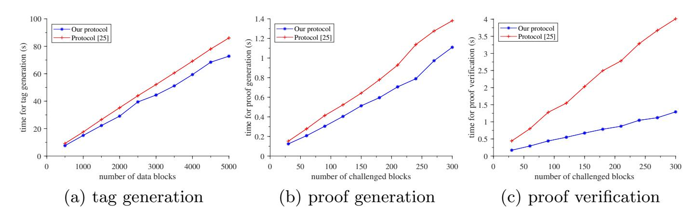
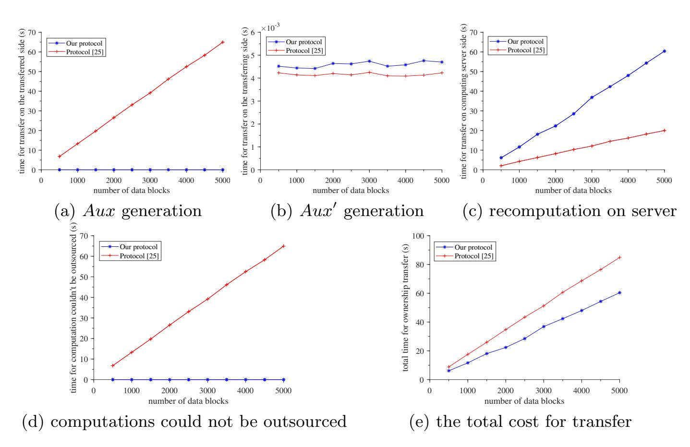

{0}------------------------------------------------

# Secure Cloud Auditing with Efficient Ownership Transfer (Full Version)?

Jun Shen1,2 , Fuchun Guo3 , Xiaofeng Chen1,2 , and Willy Susilo3()

1 State Key Laboratory of Integrated Service Networks (ISN), Xidian University, Xi'an 710071, China demon sj@126.com, xfchen@xidian.edu.cn

2 State Key Laboratory of Cryptology, P. O. Box 5159, Beijing 100878, China 3 Institute of Cybersecurity and Cryptology, School of Computing and Information Technology, University of Wollongong, Wollongong, NSW 2522, Australia {fuchun,wsusilo}@uow.edu.au

Abstract. Cloud auditing with ownership transfer is a provable data possession scheme meeting verifiability and transferability simultaneously. In particular, not only cloud data can be transferred to other cloud clients, but also tags for integrity verification can be transferred to new data owners. More concretely, it requires that tags belonging to the old owner can be transformed into that of the new owner by replacing the secret key for tag generation while verifiability still remains. We found that existing solutions are less efficient due to the huge communication overhead linear with the number of tags. In this paper, we propose a secure auditing protocol with efficient ownership transfer for cloud data. Specifically, we sharply reduce the communication overhead produced by ownership transfer to be independent of the number of tags, making it with a constant size. Meanwhile, the computational cost during this process on both transfer parties is constant as well.

Keywords: Cloud storage · Integrity auditing · Ownership transfer

# 1 Introduction

As cloud computing has developed rapidly, outsourcing data to cloud servers for remote storage has become an attractive trend [\[4](#page-20-0)[,11,](#page-21-0)[16\]](#page-21-1). However, when cloud clients store their data in the cloud, the integrity of cloud data would be threatened due to accidental corruptions or purposive attacks caused by a semi-trusted cloud server. Hence, cloud auditing was proposed as a significant security technology for integrity verification, and has been widely researched [\[12](#page-21-2)[,17](#page-21-3)[,18,](#page-21-4)[20\]](#page-21-5). Concretely, a certain cloud client with secret and public key pair (sk1, pk1) generates tags σi = T (mi , sk1) based on sk1 for data blocks mi , and uploads {(mi , σi)} to the cloud for remote storage. Once audited with chal,

? This is the full version of the paper with the same title published in 25th European Symposium on Research in Computer Security (ESORICS 2020).

{1}------------------------------------------------

the cloud responds with a constant-size proof of possession P generated from (mi , σi , chal), rather than sending back the challenged cloud data for checking directly. The validity of P is checked via pk1 and thereby the integrity of cloud data [\[5](#page-20-1)[,6,](#page-20-2)[17\]](#page-21-3).

Ownership transfer requires that the owner of cloud data is changeable among cloud clients, instead of always being the original uploader. The ownership is usually indicated by signatures. When ownership transfer occurs, signatures of the old owner should be transformed to that of the new one with the old secret key contained in signatures replaced. Consequently, the new owner obtains the ownership and accesses these data without the approval from the old owner.

Cloud auditing with ownership transfer is a provable data possession scheme meeting verifiability and transferability simultaneously. In particular, not only data can be transferred to other cloud clients, but also tags for integrity verification can be transferred to new data owners. Specifically, when the ownership of some data is transferred to a new owner with key pair (sk2, pk2), verifiable tags σi should be σi = T (mi , sk2) instead of σi = T (mi , sk1). Thus, the transferred data belong to the new owner and are verifiable via pk2.

A trivial solution to achieve cloud auditing with ownership transfer follows the "download-upload" mechanism. Specifically, the new owner downloads the cloud data approved and uploads new generated verifiable tags. It is obvious that such a way is not an advisable one for the huge computational overhead of tag generation and the communication cost even up to twice the size of transferred data. In order to relieve the computational burden, Wang et al. [\[25\]](#page-21-6) considered to outsource computations of transfer for the first time, and proposed the concept of "Provable Data Possession with Outsourced Data Transfer" (DT-PDP). However, the communication overhead in their transfer protocol is still linear with the number of tags. To the best of our knowledge, there is no better way to further reduce the communication cost produced during ownership transfer.

### 1.1 Our Contribution

Inspired by the communication overhead, in this work, we are devoted to designing a secure cloud auditing protocol with efficient ownership transfer. Our contributions are summarized as follows.

- We focus on the efficiency of ownership transfer, reducing communications produced by transfer to be with a constant size and independent of the number of tags. Meanwhile, the majority of computational cost during ownership transfer is delegated to the computing server, leaving computations on both transfer parties constant as well.
- We analyze the security of the proposed protocol, demonstrating that it is provably secure under the k-CEIDH assumption in the random oracle model. The protocol achieves properties of correctness, soundness, unforgeability and detectability. In addition, when ownership transfer occurs, the protocol is secure against collusion attacks, making the data untransferred protected.

{2}------------------------------------------------

#### 1.2 Related Work

Extensive researches have been conducted on the integrity verification for cloud storage. Such researches focus on various aspects, including but not limited to dynamic operations, privacy preservation, key-exposure resistance, etc.

In 2007, Ateniese et al. [\[1\]](#page-20-3) proposed the first "Provable Data Possession" (PDP) scheme, making trusted third parties enabled to execute public verifications. The scheme employs random sampling and homomorphic authenticators to achieve the public auditing property. Almost at the same time, Juels and Kaliski [\[10\]](#page-21-7) put forward the concept of "Proofs of Retrievability" (PoRs), which is slightly different from PDP but with the similar purpose of checking the remotely stored data. These data are encoded by error correcting codes to enable retrievability and with several sentinels inserted for data possession verification. Since such sentinels should be responded a few each time when audited, the number of challenge executions is extremely limited. In 2008, Shacham and Waters [\[19\]](#page-21-8) first combined coding technology and PDP together. In this design, the data to be outsourced are divided twice as sectors for the first time, where sectors are equivalent to blocks in previous schemes and several sectors share one data tag, decreasing the size of the processed data storing in the cloud.

Subsequently, more researches were conducted on cloud auditing. In 2008, Ateniese et al. [\[2\]](#page-20-4) first considered data auditing supporting dynamic operations and proposed a PDP scheme with partial dynamics, failing to support data insertion. To solve this problem, Erway et al. [\[7\]](#page-21-9) designed the first PDP scheme with fully dynamic storage, while it suffers from high computational and communication overheads. Later, Wang et al. [\[28\]](#page-22-0) employed the Merkle Hash Tree to establish another dynamic PDP scheme, which is much simpler. This topic is also researched in [\[9,](#page-21-10)[22\]](#page-21-11). Besides, Wang et al. [\[24\]](#page-21-12) focused on the study of privacy preservation in cloud auditing, combining homomorphic linear authenticators and random masking technology together. Later, Worku et al. [\[30\]](#page-22-1) noted that the scheme in [\[24\]](#page-21-12) leaks the identity privacy of data owners, and utilized ring signature to improve privacy preservation. What's more, key-exposure resistance is also considered in cloud auditing. Yu et al. [\[33\]](#page-22-2) first considered the security problem caused by secret key exposure and employed the Merkle Hash Tree to give a solution, of which the efficiency is unsatisfying. Then, they released heavy computations in [\[32\]](#page-22-3) and enhanced key-exposure resilience in [\[34\]](#page-22-4).

Other aspects have also been studied these years. Auditing schemes for shared cloud data are researched in [\[8,](#page-21-13)[21,](#page-21-14)[31\]](#page-22-5). Data sharing with user revocation is achieved in [\[23\]](#page-21-15) through using proxy re-signature to renew tags generated by the revoked user and in [\[15\]](#page-21-16) via Shamir's Secret Sharing. To simplify certificate management, identity-based auditing schemes are proposed [\[14,](#page-21-17)[26,](#page-22-6)[36\]](#page-22-7). Besides, integrity auditing supporting data deduplication [\[13,](#page-21-18)[27,](#page-22-8)[35\]](#page-22-9) has also been studied.

In 2019, it is Wang et al. [\[25\]](#page-21-6) that considered the integrity checking for the remote purchased data with computations of ownership transfer outsourced for the first time, and proposed the concept of DT-PDP. In such a scheme, the computational and communication costs are reduced. Unfortunately, communications are still huge for its linearity with the number of tags. Besides, this scheme only 

{3}------------------------------------------------

achieves partial and one-time ownership transfer. In contrast, we explore how to achieve secure cloud auditing enabling thorough ownership transfer with high efficiency.

### 1.3 Organization

The rest of this paper is organized as follows. Section 2 introduces some preliminaries. Section 3 describes the system model and definition, as well as the security model. Section 4 presents details of the proposed secure cloud auditing protocol with efficient ownership transfer. Section 5 demonstrates the correctness and security of our design. Section 6 shows the performance analysis. Finally, conclusions are drawn in Section 7.

### 2 Preliminaries

To facilitate understandings, we present preliminaries including bilinear pairings, intractable problems in cyclic groups, and homomorphic authenticators.

#### 2.1 Bilinear Pairings

Let  $\mathbb{G}$  and  $\mathbb{G}_T$  be cyclic groups of prime order p, and g is a generator of  $\mathbb{G}$ . The pairing  $e: \mathbb{G} \times \mathbb{G} \to \mathbb{G}_T$  is a bilinear one iff the following conditions are satisfied:

- Bilinear:  $e\left(u^{a}, v^{b}\right) = e\left(u, v\right)^{ab}$  holds for  $\forall a, b \in \mathbb{Z}_{p}$  and  $\forall u, v \in \mathbb{G}$ ;
- Non-degenerate:  $e(g,g) \neq 1_{\mathbb{G}_T}$ ;
- Computable: e(u, v) is efficiently computable for  $\forall u, v \in \mathbb{G}$ .

The following are two intractable problems in  $\mathbb{G}$ .

**Definition 1** (Computational Diffie-Hellman problem). The Computational Diffie-Hellman (CDH) problem in  $\mathbb{G}$  is described as follows: given a tuple  $(g, g^x, g^y)$  for any  $x, y \in_R \mathbb{Z}_p$  as input, output  $g^{xy}$ . Define that the CDH assumption holds in  $\mathbb{G}$  if for any PPT adversary  $\mathcal{A}$ ,

$$\Pr\left[\mathcal{A}\left(1^{\lambda}, g, g^{x}, g^{y}\right) = g^{xy}\right] \leq \mathsf{negl}(\lambda)$$

holds for arbitrary security parameter  $\lambda$ , where  $negl(\cdot)$  is a negligible function.

**Definition 2** (k-Computational Exponent Inverse Diffie-Hellman problem). The k-Computational Exponent Inverse Diffie-Hellman problem (k-CEIDH problem) in  $\mathbb{G}$  is defined as follows: given a (2k+2)-tuple  $(e_1, e_2, \cdots, e_k, g, g^b, g^{\frac{1}{a+e_1}}, g^{\frac{1}{a+e_2}}, \cdots, g^{\frac{1}{a+e_k}})$  as input, where k is a non-negative integer, g is a generator of  $\mathbb{G}$  and  $b, e_1, \cdots, e_k \in_R \mathbb{Z}_p$ , output  $(e_i, g^{\frac{b}{a+e_i}})$  for any  $e_i \in \{e_1, \cdots, e_k\}$ . We define that the k-CEIDH assumption holds in  $\mathbb{G}$  if for all PPT adversaries and arbitrary security parameter  $\lambda$ , there exists a negligible function  $\mathsf{negl}(\cdot)$  s.t.

$$\Pr\left[\mathcal{A}\left(1^{\lambda}, e_1, e_2, \cdots, e_k, g, g^b, g^{\frac{1}{a+e_1}}, g^{\frac{1}{a+e_2}}, \cdots, g^{\frac{1}{a+e_k}}\right) = g^{\frac{b}{a+e_i}}\right] \leq \mathsf{negl}(\lambda).$$

{4}------------------------------------------------

When k=1, the k-CEIDH problem  $\left(e_1,g,g^b,g^{\frac{1}{a+e_1}}\right)$  can be regarded as a CDH instance, which is computationally infeasible for  $\mathcal{A}$  to give the solution  $g^{\frac{b}{a+e_1}}$ . When k>1, the additional elements  $\left(e_2,\cdots,e_k,g^{\frac{1}{a+e_2}},\cdots,g^{\frac{1}{a+e_k}}\right)$  seem to give no assistance to  $\mathcal{A}$  in solving the above problem. Thus, we can assume that the k-CEIDH problem is as difficult as the CDH problem.

### 2.2 Homomorphic Authenticators

The homomorphic authenticator is a homomorphic verifiable signature, allowing public verifiers to check the integrity of remote storage without specific data blocks, which is a significant building block employed in public cloud auditing mechanisms [3,13,19,20,22].

Given a bilinear pairing  $e: \mathbb{G} \times \mathbb{G} \to \mathbb{G}_T$  and a data file  $F = (m_1, m_2, \dots, m_i, \dots, m_n)$ , where  $m_i \in \mathbb{Z}_p$ . Let the signer with key pair  $(sk = a, pk = g^a)$  generate signatures  $\sigma_i = (u^{m_i})^a$  on data blocks  $m_i$  for  $i \in [1, n]$ , where  $a \in_R \mathbb{Z}_p$ , g is a generator of  $\mathbb{G}$  and  $u \in_R \mathbb{G}$ . The signature is a homomorphic authenticator iff the following properties are met:

- Blockless verifiability: the validity of  $\sigma_i$  is able to be batch authenticated via  $\sum_{i\in I} m_i r_i \in \mathbb{Z}_p$  instead of blocks  $\{m_i\}_{i\in I}$ , where I is an integer set and  $m_i r_i \in \mathbb{Z}_p$ . Essentially, the verification equation could be written as

$$e\left(\prod_{i\in I}\sigma_i^{r_i},g\right)\stackrel{?}{=}e\left(u^{\sum_{i\in I}m_ir_i},pk\right).$$

- Non-malleability: given  $\sigma_i$  for  $m_i$  and  $\sigma_j$  for  $m_j$ , the signature on  $m = am_i + bm_j$  can not be derived directly from the combination of  $\sigma_i$  and  $\sigma_j$ , where  $am_i, bm_j \in \mathbb{Z}_p$ .

## 3 System Models and Definitions

#### 3.1 The System Model

Similar to but slightly different from the system model in [25], our model additionally involves a third party auditor since we achieve public verification. Specifically, such a model involves four entities: the cloud server (CS), the old data owner (PO), the new owner (NO) and the third party auditor (TPA).

- The cloud server CS is an entity with seemingly inexhaustible resources. It is responsible for data storage and computing delegations from cloud clients.
- The old data owner PO is the transferred party, being individuals or some organizations. It uploads data files to the cloud for remote storage to release local management burden.
- The new data owner NO is a cloud client being the target of data owner-ship transfer, i.e., the transferring party. Once ownership is transferred, NO inherits the jurisdiction on these data from PO.

{5}------------------------------------------------

- The third party auditor TPA is a trustworthy entity with professional knowledge of integrity verification. It is able to provide convincing results for auditing delegations from cloud clients.

We describe the system architecture in brief here. On the one hand, PO outsources its data to the CS and has on-demand access to these data. The integrity of such data is checked by the TPA with delegations from PO. Once receiving auditing challenges from the TPA, the CS generates corresponding proofs of intact storage. With such proofs, the TPA figures out and sends auditing results to PO. On the other hand, when PO decides to transfer the ownership of some data to NO, it generates and sends auxiliaries to NO. After processing these auxiliaries, NO completes the transfer with the computing service of the CS. Consequently, NO inherits the rights from PO and becomes the data owner currently.

### 3.2 Cloud Auditing with Ownership Transfer

Inspired by the DT-PDP scheme defined in [25], the formal definition for cloud auditing with ownership transfer is given as follows:

**Definition 3.** The cloud auditing protocol with ownership transfer consists of five algorithms defined below.

- SysGen  $(1^{\lambda}) \rightarrow param$ : This algorithm is a probabilistic one run by the system. With the security parameter  $\lambda$  as input, it outputs the system parameter param.
- KeyGen  $(param) \rightarrow (SK, PK)$ : This algorithm is a probabilistic one run by cloud clients. Input param, the client generates secret and public key pair (SK, PK), where SK is kept secret for tag generation and PK is distributed public.
- TagGen  $(F, n, m_i, SK, param) \rightarrow (\sigma_i, t)$ : This algorithm is a deterministic one run by the data owner with SK. Input the file abstract F, number of blocks n, data blocks  $m_i$ , and param, it outputs the file tag t and homomorphic verifiable tags  $\sigma_i$  corresponding to  $m_i$ .
- Audit  $(Q, t, m_i, \sigma_i, PK, param) \rightarrow \{0, 1\}$ : This algorithm is a probabilistic one run by the CS and the TPA in two steps: i) Input a challenge set Q from the TPA and file tag t along with data block and tag pairs  $\{(m_i, \sigma_i)\}_{i \in Q}$ , the CS sends the proof P to the TPA; ii) With P, the data owner's PK and param as inputs, the TPA verifies the validity of P and outputs "1" if succeed and "0" otherwise.
- TagTrans  $(F, SK_a, PK_a, SK_b, PK_b, \sigma_i, param) \rightarrow (\sigma'_i, t')$ : This algorithm is a deterministic one run by the CS, PO and NO in three steps: i) Input the file abstract F, PO's  $SK_a$ , it sends auxiliaries Aux to NO; ii) With Aux, PO's  $PK_a$  and NO's  $SK_b$  as inputs, NO sends Aux' to the CS; iii) With Aux', NO's  $PK_b$ , PO's tags  $\sigma_i$  and param as inputs, it outputs the renewed file tag t' and block tags  $\sigma'_i$  for NO.

The correctness of the protocol is defined as follows:

{6}------------------------------------------------

**Definition 4** (Correctness). The cloud auditing with ownership transfer is correct iff the following conditions are satisfied:

- If PO and the CS execute honestly, then for any challenged data blocks  $m_i$ , there is always Audit  $(Q, t, m_i, \sigma_i, PK_a, param) \rightarrow 1$ .
- If PO, NO and the CS are honest, then  $\sigma'_i$  for NO generated by TagTrans  $(F, SK_a, PK_a, SK_b, PK_b, \sigma_i, param) \rightarrow (\sigma'_i, t')$  matches exactly with  $m_i$  uploaded by PO. Furthermore, for any auditing task from NO, the output of Audit  $(Q, t', m_i, \sigma'_i, PK_b, param) \rightarrow \{0, 1\}$  is always "1".

### 3.3 The Security Model

A secure cloud auditing protocol with efficient ownership transfer should satisfy properties of soundness, unforgeability, secure transferability and detectability, which are defined as follows.

**Definition 5** (Soundness). The cloud auditing with ownership transfer is sound if it is infeasible for the CS to provide a valid proof to pass the integrity verification, when the challenged data  $m_i$  is corrupted to be  $m'_i \neq m_i$ , i.e., for any security parameter  $\lambda$  and negligible function  $negl(\cdot)$ , there is

$$\Pr\left[\mathcal{A}^{\mathcal{O}_{sign}(SK,\cdot)}\left(PK,param\right) \to (\sigma'_i,t') \land m'_i \neq m_i \land (m'_i,\sigma'_i) \notin \{(m,\sigma)\}\right] \land \mathsf{Audit}\left(\{i\},t',m'_i,\sigma'_i,PK,param\right) \to 1:$$

$$(SK,PK) \leftarrow \mathsf{KeyGen}\left(param\right),param \leftarrow \mathsf{SysGen}\left(1^{\lambda}\right) \leq \mathsf{negl}(\lambda),$$

where  $\mathcal{O}_{sign}(\cdot,\cdot)$  is the oracle for signature queries, and  $\{(m,\sigma)\}$  is the set of pairs that  $\mathcal{A}$  had queried, the same below.

**Definition 6** (Unforgeability). The cloud auditing with ownership transfer is unforgeable if the ownership of any block  $m_s$  is infeasible to be forged for all adversaries, i.e., for any security parameter  $\lambda$  and negligible function  $negl(\cdot)$ ,

$$\Pr\left[\mathcal{A}^{\mathcal{O}_{sign}(SK,\cdot)}\left(PK,param\right)\to (\sigma_s,t')\land (m_s,\sigma_s)\notin\{(m,\sigma)\}\right.\\ \land \mathsf{Audit}\left(\{s\},t',m_s,\sigma_s,PK,param\right)\to 1:\\ \left.(SK,PK)\leftarrow \mathsf{KeyGen}\left(param\right),param\leftarrow \mathsf{SysGen}\left(1^\lambda\right)\right]\leq \mathsf{negl}(\lambda).$$

**Definition 7** (Secure transferability). The cloud auditing protocol is with secure ownership transfer iff the following conditions are satisfied:

- If PO is honest, it is resistant to the collusion attack launched by NO and the CS. In another word, such colluding adversaries can not produce any valid tags on PO's behalf. Suppose that the key pair of PO is  $(SK_a, PK_a)$ . We define that for all PPT adversaries and arbitrary security parameter  $\lambda$ ,

$$\begin{split} \Pr\left[\mathcal{A}^{\mathcal{O}_{sign}(SK_a,\cdot),\mathcal{O}_{aux}(\cdot)}\left(PK_a,SK_b,PK_b,param\right) \to (\sigma_s,t') \\ & \wedge (m_s,\sigma_s) \notin \{(m,\sigma)\} \wedge \operatorname{Audit}\left(\{s\},t',m_s,\sigma_s,PK_a,param\right) \to 1: \\ & (SK,PK) \leftarrow \operatorname{KeyGen}\left(param\right),param \leftarrow \operatorname{SysGen}\left(1^{\lambda}\right)\right] \leq \operatorname{negl}(\lambda), \end{split}$$

{7}------------------------------------------------

- where  $negl(\cdot)$  is a negligible function and  $\mathcal{O}_{aux}(\cdot)$  is for auxiliary queries in ownership transfer.
- If NO is honest, it is protected from a colluding CS and PO. That is, even though with the combined ability of the CS and PO, tags belonging to NO cannot be produced. Suppose that the key pair of NO is  $(SK_b, PK_b)$ . We define that for any PPT adversary and security parameter  $\lambda$ ,

$$\begin{split} \Pr\left[\mathcal{A}^{\mathcal{O}_{sign}(SK_b,\cdot),\mathcal{O}_{aux}(\cdot)}\left(PK_b,SK_a,PK_a,param\right) \to (\sigma_s,t') \\ & \wedge (m_s,\sigma_s) \notin \{(m,\sigma)\} \wedge \operatorname{Audit}\left(\{s\},t',m_s,\sigma_s,PK_b,param\right) \to 1: \\ & \left(SK,PK\right) \leftarrow \operatorname{KeyGen}\left(param\right),param \leftarrow \operatorname{SysGen}\left(1^{\lambda}\right)\right] \leq \operatorname{negl}(\lambda). \end{split}$$

**Definition 8** (**Detectability**). The cloud auditing protocol with ownership transfer is  $(\rho, \delta)$ -detectable, where  $0 \le \rho, \delta \le 1$ , if the probability that integrity corruptions of the transferred cloud data can be detected is no less than  $\delta$  when there are a fraction  $\rho$  of corrupted data blocks.

# 4 The Proposed Auditing Protocol

We begin by the overview of the proposed secure auditing protocol with efficient ownership transfer. Then we present it in more details.

#### 4.1 Overview

To achieve cloud auditing with ownership transfer, we argue that it is impractical for the large costs produced, if the new owner downloads cloud data and uploads new generated tags for these data. On the other hand, if we delegate ownership transfer to a third party to reduce computations and improve efficiency, secrets of transfer parties may suffer from collusion attacks launched by the other transfer party and the third party employed. In such a delegation, the communication cost is still a primary concern. To simultaneously improve the security and efficiency, we construct a novel tag structure. With such a structure, ownership transfer is securely outsourced to relieve computations on transfer parties. Apart from that, auditing of the transferred data is consequently executed using the public key of the new owner. Last and most important, the communication cost produced by ownership transfer is constant and independent of the number of tags.

#### 4.2 The Cloud Auditing with Efficient Ownership Transfer

The encoded file with abstract F to be uploaded by PO for remote storage is divided into n blocks, appearing as  $\{m_1, m_2, \cdots, m_n\}$ , where  $m_i \in \mathbb{Z}_p$  for  $i \in [1, n]$ . Similar to [22,24,29],  $\mathcal{S} = \langle \mathsf{Kgen}, \mathsf{Sig}, \mathsf{Vrf} \rangle$  is a signature scheme and  $\mathcal{S}.\mathsf{Sig}(\cdot)_{ssk}$  is a signature under the secret signing key ssk, where  $(ssk, spk) \leftarrow \mathcal{S}.\mathsf{Kgen}(1^{\lambda})$ .

The procedure of the protocol execution is as follows:

{8}------------------------------------------------

- SysGen  $(1^{\lambda}) \to param$ . On input the security parameter  $\lambda$ , the system executes as follows:
  - 1. Select two cyclic multiplicative groups  $\mathbb{G}$  and  $\mathbb{G}_T$  with prime order p and a bilinear pairing  $e: \mathbb{G} \times \mathbb{G} \to \mathbb{G}_T$ .
  - 2. Pick two independent generators  $g, u \in_R \mathbb{G}$ .
  - 3. Choose two cryptographic hash functions  $H_1: \{0,1\}^* \to \mathbb{G}$  and  $H_2: \{0,1\}^* \to \mathbb{Z}_p$ .
  - 4. Return the system parameter  $param = \{\mathbb{G}, \mathbb{G}_T, p, g, u, e, H_1, H_2, \mathcal{S}\}.$
- KeyGen  $(param) \rightarrow (SK, PK)$ . On input the system parameter param, PO and NO generate key pairs as follows:
  - 1. PO selects  $sk_a = \alpha \in_R \mathbb{Z}_p$  and computes  $pk_a = g^{\alpha}$ .
  - 2. NO selects  $sk_b = \beta \in_R \mathbb{Z}_p$  and computes  $pk_b = g^{\beta}$ .
  - 3. PO runs S.Kgen to generate a signing key pair  $(ssk_a, spk_a)$ .
  - 4. NO runs S.Kgen to generate a signing key pair  $(ssk_b, spk_b)$
  - 5. PO obtains key pair:  $(SK_a, PK_a) = ((sk_a, ssk_a), (pk_a, spk_a)),$ NO obtains key pair:  $(SK_b, PK_b) = ((sk_b, ssk_b), (pk_b, spk_b)).$
- TagGen  $(F, n, m_i, SK, param) \rightarrow (\sigma_i, t)$ . On input file abstract F, data blocks  $m_i$  and their amount n, and param, PO with  $SK_a$  executes as follows:
  - 1. Compute  $r = H_2(\alpha||F)$ ,  $h = g^r$ , and  $h_1 = h^{\alpha}$ .
  - 2. Calculate tags for  $\{m_i\}_{i\in[1,n]}$  as

$$\sigma_i = H_1 \left( F||i|^r \cdot (u^{m_i})^{\frac{1}{\alpha + H_2(F||h|)}} \right).$$

- 3. Compute  $t = (F||n||h||h_1) ||\mathcal{S}.\mathsf{Sig}(F||n||h||h_1)_{ssk_a}$  as the file tag.
- 4. Upload  $\{\{(m_i, \sigma_i)\}_{i \in [1,n]}, t\}$  to the cloud for remote storage and delete the local copy.
- Audit  $(Q, t, m_i, \sigma_i, PK, param) \to \{0, 1\}$ . On input the file tag t, a c-element challenge set  $Q = \{(i, \gamma_i \in_R \mathbb{Z}_p)\}$  chosen by the TPA, data blocks  $m_i$  along with tags  $\sigma_i$ ,  $PK_a$  of PO, and param, the TPA interacts with the CS as follows:
  - 1. The CS calculates the data proof and tag proof as

$$PM = \sum_{(i,\gamma_i) \in Q} m_i \gamma_i , \quad P\sigma = \prod_{(i,\gamma_i) \in Q} \sigma_i^{\gamma_i}.$$

- 2. The CS sends the proof  $P = (PM, P\sigma, t)$  to the TPA as the response.
- 3. The *TPA* obtains  $F, h, h_1$  if  $S.Vrf(F||n||h||h_1)_{spk_a} = 1$ , and then checks the validity of P via the verification equation

$$e\left(P\sigma, pk_ag^{H_2(F||h)}\right) \stackrel{?}{=} e\left(\prod_{(i,\gamma_i)\in Q} H_1\left(F||i\right)^{\gamma_i}, h_1h^{H_2(F||h)}\right) \cdot e\left(u^{PM}, g\right).$$

4. The *TPA* outputs "1" iff the equation holds, indicating that these data are correctly and completely stored. Otherwise, at least one of these challenged data blocks must have been corrupted in the cloud.

{9}------------------------------------------------

- TagTrans  $(F, SK_a, PK_a, SK_b, PK_b, \sigma_i, param) \rightarrow (\sigma'_i, t')$ . On input the file abstract F, data tags  $\sigma_i$  generated by PO, and param, PO with key pair  $(SK_a, PK_a)$  and NO with  $(SK_b, PK_b)$  interact with the CS as follows:
  - 1. NO computes  $r' = H_2(\beta||F)$ ,  $h' = g^{r'}$ , and  $h'_1 = h'^{\beta}$ .
  - 2. PO selects  $x \in_R \mathbb{Z}_p$ , computes auxiliaries

$$r = H_2(\alpha||F), \quad aux = -\frac{1}{\alpha + H_2(F||h)} - x, \quad v = u^x,$$

and sends  $Aux = (r||aux||v) ||\mathcal{S}.\mathsf{Sig}(r||aux||v)_{ssk_a}$  to NO.

- 3. NO parses Aux and recovers r, aux, v if  $\mathcal{S}.\mathsf{Vrf}(r||aux||v)_{spk_a}=1$ ; Otherwise, drops it and aborts.
- 4. NO picks  $x' \in_R \mathbb{Z}_p$ , computes auxiliaries for tag recomputation:

$$R = r' - r$$
,  $aux' = \frac{1}{\beta + H_2(F||h')} - x' + aux$ ,  $V = vv' = vu^{x'}$ ,

and sends  $Aux' = (R||aux'||V) ||\mathcal{S}.\mathsf{Sig}(R||aux'||V)_{ssk_b}$  along with the new file tag  $t' = (F||n||h'||h'_1) ||\mathcal{S}.\mathsf{Sig}(F||n||h'||h'_1)_{ssk_b}$  to the CS.

5. The CS parses Aux' and obtains R, aux', V iff  $\mathcal{S}.\mathsf{Vrf}(R||aux'||V)_{spk_b} = 1$ ,

- and stores t' iff  $\mathcal{S}.\mathsf{Vrf}(F||n||h'||h'_1)_{spk_b} = 1$ .
- 6. The CS computes the new tags belonging to NO as

$$\sigma_{i}' = \sigma_{i} \cdot H_{1} \left( F||i \right)^{R} \cdot \left( u^{m_{i}} \right)^{aux'} \cdot V^{m_{i}} = H_{1} \left( F||i \right)^{r'} \cdot \left( u^{m_{i}} \right)^{\frac{1}{\beta + H_{2}(F||h')}}.$$

This completes the description of the cloud auditing with efficient ownership transfer, where data tags before and after transfer are with the same structure. Such a fact enables ownership to be transferred to another cloud client by following algorithm TagTrans  $(F, SK_a, PK_a, SK_b, PK_b, \sigma_i, param) \rightarrow (\sigma'_i, t')$ . Note that Aux' for regenerating tags under the same file is with constant size and independent of the number of tags.

**Remark 1.** In step 1 of algorithm TagGen  $(F, n, m_i, SK, param) \to (\sigma_i, t)$ , the parameter r can be generated in another way. Specifically, the hash function  $H_2$  is replaced by functions  $H_3: \{0,1\}^* \to \mathbb{G}$  and  $H_4: \mathbb{G} \to \mathbb{Z}p$ . PO computes  $s = H_3(F)^{\alpha}$  and generates  $r = H_4(s)$ . In such a construction, the validity of r can be verified by  $e(s,g) \stackrel{?}{=} e(H_3(F),pk_a)$ , indicating that the randomness is for the file with abstract F and generated by PO. Accordingly, in algorithm TagTrans  $(F, SK_a, PK_a, SK_b, PK_b, \sigma_i, param) \rightarrow (\sigma'_i, t'), r'$ should be adjusted as well, which is written as  $r' = H_4(s')$  and verified by  $e(s', g) \stackrel{?}{=} e(H_3(F), pk_b)$ , where  $s' = H_3(F)^{\beta}$ .

#### Correctness and Security Analysis 5

We give proofs of the following several theorems to demonstrate achievements of correctness, soundness, unforgeability, secure transferability and detectability defined.

{10}------------------------------------------------

**Theorem 1.** The proposed protocol is correct. Concretely, if PO uploads its data honestly and the CS preserves them well, then the proof responded by the CS is valid with overwhelming probability.

*Proof.* We demonstrate the correctness of the proposed protocol by proving the equality of the verification equation, since the equation only holds for valid proofs. The correctness of the equation is derived as follows:

$$e\left(P\sigma, pk_{a} \cdot g^{H_{2}(F||h)}\right)$$

$$= e\left(\prod_{(i,\gamma_{i}) \in Q} \sigma_{i}^{\gamma_{i}}, g^{\alpha} \cdot g^{H_{2}(F||h)}\right)$$

$$= e\left(\prod_{(i,\gamma_{i}) \in Q} H_{1}\left(F||i\right)^{r\gamma_{i}} \cdot \prod_{(i,\gamma_{i}) \in Q} (u^{m_{i}})^{\frac{1}{\alpha+H_{2}(F||h)}\gamma_{i}}, g^{\alpha}g^{H_{2}(F||h)}\right)$$

$$= e\left(\prod_{(i,\gamma_{i}) \in Q} H_{1}\left(F||i\right)^{\gamma_{i}}, h_{1} \cdot h^{H_{2}(F||h)}\right) \cdot e\left(u^{\sum_{(i,\gamma_{i}) \in Q} m_{i}\gamma_{i}}, g\right)$$

$$= e\left(\prod_{(i,\gamma_{i}) \in Q} H_{1}\left(F||i\right)^{\gamma_{i}}, h_{1} \cdot h^{H_{2}(F||h)}\right) \cdot e\left(u^{PM}, g\right).$$

If PO and NO calculate and output auxiliaries honestly and the CS stores data honestly as well as renews tags correctly, then the proof for the challenged data belonging to the new owner NO is valid. Similarly, the correctness is derivable from the equality of verification equation, of which the process is omitted here, since structures of verification equations are identical for the same tag structure before and after ownership transfer.

**Theorem 2.** The proposed protocol is sound. Concretely, if the k-CEIDH assumption holds, no adversary can cause the TPA to accept proofs generated from some corrupted data with non-negligible probability in the random oracle model.

*Proof.* Suppose that there exists a PPT adversary  $\mathcal{A}$  who can break the soundness of the protocol. We construct a simulator  $\mathcal{B}$  to break the k-CEIDH assumption and collision resistance of hash functions by interacting with  $\mathcal{A}$ . Given as input a k-CEIDH problem instance  $\left(e_1, e_2, \cdots, e_k, g, g^b, g^{\frac{1}{\alpha+e_1}}, g^{\frac{1}{\alpha+e_2}}, \cdots, g^{\frac{1}{\alpha+e_k}}\right)$ ,  $\mathcal{B}$  controls random oracles and runs  $\mathcal{A}$ .

Let the file with abstract  $F_l$  and blocks  $\{m_{l1}, m_{l2}, \dots, m_{ln}\}$  along with tags  $\{\sigma_{l1}, \sigma_{l2}, \dots, \sigma_{ln}\}$  be challenged. The query set causing the challenger to abort is  $Q = \{(i, \gamma_i)\}$  with |Q| = c, and the proof from  $\mathcal{A}$  is  $P_l^* = (PM_l^*, P\sigma_l^*, t_l^*)$ .

Let the acceptable proof from the honest prover be

$$P_l = (PM_l = \sum_{(i,\gamma_i) \in Q} m_{li} \gamma_i, \ P\sigma_l = \prod_{(i,\gamma_i) \in Q} \sigma_{li}^{\gamma_i}, \ t_l),$$

where  $h_l = g^{r_l} = g^{H_2(\alpha||F_l)}$  and  $h_{1l} = h_l^{\alpha}$  in  $t_l$ .

According to **Theorem 1**, it is required that the expected proof perfectly satisfies the verification equation, i.e.,

$$e\left(P\sigma_{l},pk_{a}g^{H_{2}(F_{l}||h_{l})}\right)=e\left(\prod_{(i,\gamma_{i})\in Q}H_{1}\left(F_{l}||i\right)^{\gamma_{i}},h_{1l}h_{l}^{H_{2}(F_{l}||h_{l})}\right)e\left(u^{PM_{l}},g\right).$$

{11}------------------------------------------------

Since  $\mathcal{A}$  broke the soundness of the protocol, it is obvious that  $P_l \neq P_l^*$  and that

$$e\left(P\sigma_{l}^{*}, pk_{a}g^{H_{2}(F_{l}||h_{l}^{*})}\right) = e\left(\prod_{(i,\gamma_{i})\in Q} H_{1}(F_{l}||i)^{\gamma_{i}}, h_{1l}^{*}h_{l}^{*H_{2}(F_{l}||h_{l}^{*})}\right) e\left(u^{PM_{l}^{*}}, g\right).$$

First, we demonstrate that  $h_l^* = h_l$  and  $h_{1l}^* = h_{1l}$  if hash functions are collision-free. Since  $h_l = g^{r_l} = g^{H_2(\alpha||F_l)}$  and  $h_{1l} = h_l^{\alpha} = g^{r_l\alpha} = (g^{\alpha})^{r_l} = pk_a^{r_l}$ , where g,  $pk_a$  are public parameters,  $h_l^* = h_l$  and  $h_{1l}^* = h_{1l}$  indicate the equality of exponents  $r_l^*$  and  $r_l$ , implying a collision of  $H_2$  occurring with negligible probability 1/p.

Second, we show that  $(PM_l^*, P\sigma_l^*) = (PM_l, P\sigma_l)$  if the assumption of k-CEIDH problem holds. The following are the details:

- Setup. Let  $H_1: \{0,1\}^* \to \mathbb{G}$  and  $H_2: \{0,1\}^* \to \mathbb{Z}_p$  be random oracles controlled by the simulator.  $\mathcal{B}$  sets  $u = g^b$ , where  $b \in_R \mathbb{Z}_p$ .
- H-query. This phase is for hash queries of  $H_1$  and  $H_2$ . Times of queries to  $H_2(F_l||h_l)$  is  $q_{21}$ , to  $H_1(F_l||i)$  is  $q_1$  and to  $H_2(\alpha||F_l)$  is  $q_{22}$ . Such query and response pairs are recorded in empty tables  $T_{H_{21}}$ ,  $T_{H_1}$  and  $T_{H_{22}}$  generated by  $\mathcal{B}$ . For queries of the  $i^{th}$  block in file with abstract  $F_l$ , if they are searchable in tables,  $\mathcal{B}$  returns these recorded values; otherwise, it executes as follows:
  - For query  $(F_l, h_l)$ ,  $\mathcal{B}$  chooses  $e_l \in_R \mathbb{Z}_p$ , sets  $H_2(F_l||h_l) = e_l$ , records  $(l, F_l||h_l, e_l, H_2(F_l||h_l), \mathcal{A})$  in  $T_{H_{21}}$ , and responds the hash query with  $H_2(F_l||h_l)$ .
  - For query  $(F_l, i)$ ,  $\mathcal{B}$  chooses  $x_{li} \in_R \mathbb{Z}_p$ , sets  $H_1(F_l||i) = g^{x_{li}}/u^{m_{li}}$ , records  $(l, i, F_l||i, x_{li}, H_1(F_l||i), \mathcal{A})$  in  $T_{H_1}$ , and responds the hash query with  $H_1(F_l||i)$ .
  - For query  $(\alpha, F_l)$ ,  $\mathcal{B}$  chooses  $r'_l \in_R \mathbb{Z}_p$ , sets  $r_l = H_2(\alpha||F_l) = r'_l + \frac{1}{\alpha + e_l}$ , records  $(l, \alpha||F_l, r'_l, H_2(\alpha||F_l), \mathcal{A})$  in  $T_{H_{22}}$ , and responds the hash query with  $H_2(\alpha||F_l)$ .
- S-query. This phase is for signature queries, which is conducted for  $q_s$  times. Let the  $i^{th}$  block of file with abstract  $F_l$  be queried, we have

$$H_1(F_l||i) = \frac{g^{x_{li}}}{u^{m_{li}}}, \quad H_2(F_l||h_l) = e_l, \quad r_l = r'_l + \frac{1}{\alpha + e_l}.$$

Then,  $\mathcal{B}$  computes  $\sigma_{li}$  by

$$\sigma_{li} = \left(\frac{g^{x_{li}}}{u^{m_{li}}}\right)^{r'_l + \frac{1}{\alpha + e_l}} u^{\frac{m_{li}}{\alpha + e_l}} = \frac{g^{x_{li}r'_l}g^{x_{li}\frac{1}{\alpha + e_l}}}{u^{m_{li}r'_l}u^{m_{li}\frac{1}{\alpha + e_l}}} u^{\frac{m_{li}}{\alpha + e_l}} = \frac{g^{x_{li}r'_l}g^{\frac{1}{\alpha + e_l}x_{li}}}{u^{m_{li}r'_l}}.$$

 $\sigma_{li}$  is the response to signature query on  $m_{li}$ .

- Forgery. Eventually,  $\mathcal{A}$  forges a proof containing the corrupted  $i^{*th}$  block with  $m_{li^*}^* \neq m_{li^*}$ . The verification equation is rearranged as

$$e\left(P\sigma_{l},g^{\alpha+e_{l}}\right)\stackrel{?}{=}e\left(\prod_{(i,\gamma_{i})\in Q}H_{1}\left(F_{l}||i\right)^{\gamma_{i}},h_{l}^{\alpha+e_{l}}\right)\cdot e\left(u^{PM_{l}},g\right).$$

{12}------------------------------------------------

Divide the verification equation for  $(P\sigma_l^*, PM_l^*)$  by that for  $(P\sigma_l, PM_l)$ , i.e.,

$$e\left(\left(P\sigma_l^*/P\sigma_l\right)^{\alpha+e_l},g\right)=e\left(u^{PM_l^*}/u^{PM_l},g\right).$$

Let  $\Delta PM_l = PM_l^* - PM_l = \gamma_{i^*} (m_{li^*}^* - m_{li^*})$ , the division yields the solution to the k-CEIDH problem:

$$u^{\frac{1}{\alpha+e_l}} = (P\sigma_l^*/P\sigma_l)^{\frac{1}{\Delta PM_l}}.$$

This completes the simulation and solution. The correctness is shown below. The simulation is indistinguishable from the real attack because randomnesses including b in setup,  $e_l$ ,  $x_{li}$ ,  $x_{li^*}$ ,  $r'_l$  in hash responses and  $i^*$  in signature generation are randomly chosen and independent in the view of  $\mathcal{A}$ . Different randomnesses in signature and hash queries ensure the success of simulation. For the same file, such randomnesses vary in  $H_1(F_l||i)$  merely with probability of  $1 - \frac{q_1}{p}$ , making the probability of successful simulation and useful attack be  $\left(1 - \frac{q_1}{p}\right)^{q_s}$ . Suppose  $\mathcal{A}$   $(t, q_s, q_1, q_{21}, q_{22}, \epsilon)$ -breaks the protocol. With  $\mathcal{A}$ 's ability,  $\mathcal{B}$  solves the k-CEIDH problem with probability of  $\left(1 - \frac{q_1}{p}\right)^{q_s} \cdot \epsilon \approx \epsilon$ . The time cost of simulation is  $T_S = O\left(q_1 + q_{21} + q_{22} + q_s\right)$ . Therefore,  $\mathcal{B}$  solves the k-CEIDH problem with  $(t + T_S, \epsilon)$ .

**Theorem 3.** The proposed protocol is unforgeable. Concretely, if the k-CEIDH assumption holds, it is computationally infeasible for all adversaries to forge provably valid tags for any data with non-negligible probability in the random oracle model.

*Proof.* Suppose there is an adversary  $\mathcal{A}$  who can break the unforgeability of the proposed protocol. We construct a simulator  $\mathcal{B}$  to break the k-CEIDH assumption by interacting with  $\mathcal{A}$ . With the input of  $\left(e_1, e_2, \cdots, e_k, g, g^b, g^{\frac{1}{\alpha + e_1}}, g^{\frac{1}{\alpha + e_2}}, g^{\frac{1}{\alpha + e_2}}\right)$ 

- $\cdots, g^{\frac{1}{\alpha + e_k}}$ ), the k-CEIDH adversary  $\mathcal{B}$  simulates the security game for  $\mathcal{A}$  below.
- Setup. Hash functions  $H_1$  and  $H_2$  are random oracles controlled by the simulator.  $\mathcal{B}$  sets  $u = g^b$ , where  $b \in_{\mathbb{R}} \mathbb{Z}_p$ .
- *H-query*. Hash queries are made in this phase, which are the same with that described in the proof of **Theorem 2**.
- S-query. Signature queries are made in this phase by  $\mathcal{A}$  for  $q_s$  times. For a query on the  $i^{th}$  block of file with abstract  $F_l$ , we have  $H_1(F_l||i) = g^{x_{li}}/u^{m_{li}}$ ,  $H_2(F_l||h_l) = e_l$ , and  $r_l = r'_l + \frac{1}{\alpha + e_l}$ .  $\mathcal{B}$  computes  $\sigma_{li}$  for  $m_{li}$  by

$$\sigma_{li} = \left(\frac{g^{x_{li}}}{u^{m_{li}}}\right)^{r'_l + \frac{1}{\alpha + e_l}} u^{\frac{m_{li}}{\alpha + e_l}} = \frac{g^{x_{li}r'_l}g^{\frac{1}{\alpha + e_l}x_{li}}}{u^{m_{li}r'_l}}.$$

- Forgery. In this phase,  $\mathcal{A}$  aims to return a forged tag  $\sigma_{li^*}$  of the  $i^{*th}$  block  $m_{li^*}$  that has never been queried in file with abstract  $F_l$ . The corresponding

{13}------------------------------------------------

hash responses from  $\mathcal{B}$  are  $H_1(F_l||i^*) = g^{x_{li^*}}/u^{m_{li^*}}$ ,  $H_2(F_l||h_l) = e_l$ , and  $H_2\left(\alpha||F_l\right)=r_l$ . Then there is

$$\sigma_{li^*} = H_1 \left( F_l || i^* \right)^{r_l} \left( u^{m_{li^*}} \right)^{\frac{1}{\alpha + e_l}} = \left( \frac{g^{x_{li^*}}}{u^{m_{li^*}}} \right)^{r_l} \left( u^{m_{li^*}} \right)^{\frac{1}{\alpha + e_l}} = \frac{g^{r_l x_{li^*}}}{u^{r_l m_{li^*}}} u^{m_{li^*} \frac{1}{\alpha + e_l}}.$$

Now we have found the solution to the k-CEIDH problem:

$$u^{\frac{1}{\alpha + e_l}} = (\sigma_{li^*} u^{r_l m_{li^*}} / g^{r_l x_{li^*}})^{\frac{1}{m_{li^*}}}.$$

This completes the simulation and solution. The correctness is shown below. The simulation is indistinguishable from the real attack because randomnesses including b in setup,  $e_l$ ,  $x_{li}$ ,  $x_{li^*}$ ,  $r'_l$  in hash responses and  $i^*$  in signature generation are randomly chosen. For the same file, such randomnesses vary in  $H_1(F_l||i)$  merely with probability of  $1-\frac{q_1}{p}$ , making the probability of successful simulation and useful attack be  $\left(1-\frac{q_1}{p}\right)^{q_s}$ . Suppose  $\mathcal{A}\left(t,q_s,q_1,q_{21},q_{22},\epsilon\right)$ breaks the protocol. With  $\mathcal{A}$ 's ability,  $\mathcal{B}$  solves the k-CEIDH problem with probability of  $\left(1 - \frac{q_1}{p}\right)^{q_s} \cdot \epsilon \approx \epsilon$ . The time cost of simulation is  $T_S = O\left(q_1 + q_{21} + q_{22}\right)$  $+q_s$ ). Therefore,  $\mathcal{B}$  solves the k-CEIDH problem with  $(t+T_S,\epsilon)$ . 

**Theorem 4.** The proposed protocol is with secure ownership transfer. Concretely, if the k-CEIDH assumption holds, it is computationally infeasible for any colluding adversary to forge provably valid tags on behalf of others with nonnegligible probability in the random oracle model.

*Proof.* First, we demonstrate that PO is secure against collusion attack launched by the CS and NO. Assume that there is a PPT adversary  $\mathcal{A}$  who can break the transfer security of PO. Then, we construct a simulator  $\mathcal{B}$  to break the k-CEIDH assumption by interacting with A. Given as input a problem instance  $\left(e_1,e_2,\cdots,e_k,g,g^b,g^{\frac{1}{\alpha+e_1}},g^{\frac{1}{\alpha+e_2}},\cdots,g^{\frac{1}{\alpha+e_k}}\right)$ ,  $\mathcal{B}$  controls random oracles, runs  $\mathcal{A}$  and works as follows.

- Setup. Since the CS and NO collude,  $\mathcal{B}$  must be able to provide  $\mathcal{A}$  with the secret key  $\beta$  of NO. Set  $u = g^b$ , where  $b \in_R \mathbb{Z}_p$ .
- H-query. Hash queries concerning data file belonging to PO are made as the same as that in **Theorem 2**. For queries of the  $i^{th}$  block in file with abstract  $F_l$ ,  $\mathcal{B}$  sets  $H_2(F_l||h_l) = e_l$ ,  $H_1(F_l||i) = g^{x_{li}}/u^{m_{li}}$  and  $r_l = H_2(\alpha||F_l) = g^{x_{li}}/u^{m_{li}}$  $r'_l + \frac{1}{\alpha + e_l}$ , where  $e_l, x_{li}, r'_l \in_R \mathbb{Z}_p$ . S-query. Signature queries for tags belonging to PO are as the same as that
- \_ in the proof of **Theorem 2**.
- Aux-query. Queries for auxiliaries to regenerate tags are made in this phase for  $q_a$  times.  $r_l = r'_l + \frac{1}{\alpha + e_l}$  for PO is from H-query, and  $aux_l = -\frac{1}{\alpha + e_l} - x_l$ and  $v_l = u^{x_l}$ , where  $x_l$  is chosen by  $\mathcal{B}$ . NO computes  $r_l^N = H_2(\beta||F_l)$ ,  $h_l^N = g^{r_l^N}, h_{1l}^N = h_l^{N\beta}, \text{ and picks } x_l^N \in_R \mathbb{Z}_p, \text{ then there are:}$

$$R = r_l^N - r_l, \quad aux_l^N = \frac{1}{\beta + e_l^N} - x_l^N + aux_l, \quad V_l = v_l u^{x_l^N}.$$

{14}------------------------------------------------

- Forgery. Eventually,  $\mathcal{A}$  forges a valid tag for a block  $m_{l^*i}$  in file with abstract  $F_{l^*}$  of PO that has not been queried. With hash responses  $H_1(F_{l^*}||i) = g^{x_{l^*i}}/u^{m_{l^*i}}$  and  $H_2(F_{l^*}||h_{l^*}) = e_{l^*}$ , along with  $r_{l^*}$  from Aux-query, there is

$$\sigma_{l^*i} = H_1 \left( F_{l^*} || i \right)^{r_{l^*}} \left( u^{m_{l^*i}} \right)^{\frac{1}{\alpha + e_{l^*}}} = \frac{g^{r_{l^*} x_{l^*i}}}{u^{r_{l^*} m_{l^*i}}} u^{m_{l^*i} \frac{1}{\alpha + e_{l^*}}}.$$

Hence, we figure out the solution to the k-CEIDH problem:

$$u^{\frac{1}{\alpha + e_{l^*}}} = (\sigma_{l^*i} u^{r_{l^*} m_{l^*i}} / g^{r_{l^*} x_{l^*i}})^{\frac{1}{m_{l^*i}}}.$$

This completes the simulation and solution. The correctness is shown below. The simulation is indistinguishable from the real attack because randomnesses including b in setup,  $e_l$ ,  $e_{l^*}$ ,  $x_{l^*}$ ,  $x_{l^*i}$ ,  $r_l'$  in hash responses,  $x_l$ ,  $r_{l^*}$  in aux queries and  $l^*$  in signature generation are randomly chosen. For different files, such randomnesses vary in  $H_1\left(F_l||i\right)$  with  $1-\frac{q_1}{p}$ ,  $H_2\left(F_l||h_l\right)$  with  $1-\frac{q_{21}}{p}$  and  $H_2\left(\alpha||F_l\right)$  with  $1-\frac{q_{22}}{p}$ , making the probability of successful simulation and useful attack be  $\left(\left(1-\frac{q_1}{p}\right)\left(1-\frac{q_{21}}{p}\right)\left(1-\frac{q_{22}}{p}\right)\right)^{q_s}$ . Suppose  $\mathcal{A}\left(t,q_s,q_1,q_{21},q_{22},q_a,\epsilon\right)$ -breaks the protocol. With  $\mathcal{A}$ 's ability,  $\mathcal{B}$  solves the k-CEIDH problem with probability of  $\left(\left(1-\frac{q_1}{p}\right)\left(1-\frac{q_{21}}{p}\right)\left(1-\frac{q_{22}}{p}\right)\right)^{q_s}$   $\epsilon \approx \epsilon$ . The time cost of simulation is  $T_S = O\left(q_1+q_{21}+q_{22}+q_s+q_a\right)$ . Therefore,  $\mathcal{B}$  solves the k-CEIDH problem with  $(t+T_S,\epsilon)$ .

Second, we show that NO is secure against collusion attack launched by the CS and PO. We assume that there is a PPT adversary  $\mathcal{A}$  who can break the transfer security of NO. Then, we construct a simulator  $\mathcal{B}$  to break the k-CEIDH assumption by interacting with  $\mathcal{A}$ . On input a k-CEIDH problem instance  $\left(e_1, e_2, \cdots, e_k, g, g^b, g^{\frac{1}{\beta+e_1}}, g^{\frac{1}{\beta+e_2}}, \cdots, g^{\frac{1}{\beta+e_k}}\right)$ ,  $\mathcal{B}$  controls random oracles, runs  $\mathcal{A}$  and works as follows.

- Setup. Since the CS and PO collude,  $\mathcal{B}$  must be able to provide  $\mathcal{A}$  with the secret key  $\alpha$  of PO. Set  $u = g^b$ , where  $b \in_R \mathbb{Z}_p$ .
- H-query. Hash queries are made similar to the above, only with the difference in that for query  $(\beta, F_l)$ ,  $\mathcal{B}$  chooses  $r'_l \in_R \mathbb{Z}_p$ , sets  $r_l = H_2(\beta||F_l) = r'_l + \frac{1}{\beta + e_l}$ , and records  $(l, \beta||F_l, r'_l, H_2(\beta||F_l), \mathcal{A})$  in  $T_{H_{22}}$ .
- S-query. Signature queries for tags of NO are similar to that in the proof of **Theorem 2**, with the difference that the query is for tag belonging to NO. Hence, the tag response for  $m_{li}$  is:

$$\sigma_{li} = \left(\frac{g^{x_{li}}}{u^{m_{li}}}\right)^{r'_l + \frac{1}{\beta + e_l}} u^{\frac{m_{li}}{\beta + e_l}} = \frac{g^{x_{li}r'_l}g^{\frac{1}{\beta + e_l}x_{li}}}{u^{m_{li}r'_l}}.$$

- Aux-query. Queries for auxiliaries to regenerate tags are made in this phase. From NO, there is  $Aux' = \left(r_l = r_l' + \frac{1}{\beta + e_l}, aux_l = -\frac{1}{\beta + e_l} - x_l, v_l = u^{x_l}\right)$ , where  $r_l$  is from H-query and  $x_l$  is chosen by  $\mathcal{B}$ . PO computes  $r_l^P = H_2\left(\alpha||F_l\right)$ ,  $h_l^P = g^{r_l^P}$ ,  $h_{1l}^P = h_l^{P\alpha}$ , and picks  $x_l^P \in_R \mathbb{Z}_p$ , then there are:

$$R = r_l^P - r_l$$
,  $aux_l^P = \frac{1}{\alpha + e_l^N} - x_l^P + aux_l$ ,  $V_l = v_l u^{x_l^P}$ .

{15}------------------------------------------------

- Forgery. Eventually,  $\mathcal{A}$  returns a valid tag for a block  $m_{l^*i}$  in file with abstract  $F_{l^*}$  belonging to NO that has not been queried. With  $H_1(F_{l^*}||i) = g^{x_{l^*i}}/u^{m_{l^*i}}$ ,  $H_2(F_{l^*}||h_{l^*}) = e_{l^*}$ , and  $r_{l^*}$ ,  $\mathcal{B}$  computes

$$\sigma_{l^*i} = H_1 \left( F_{l^*} || i \right)^{r_{l^*}} \left( u^{m_{l^*i}} \right)^{\frac{1}{\beta + e_{l^*}}} = \frac{g^{r_{l^*} x_{l^*i}}}{u^{r_{l^*} m_{l^*i}}} u^{m_{l^*i} \frac{1}{\beta + e_{l^*}}}.$$

Then, the solution to k-CEIDH problem is:

$$u^{\frac{1}{\beta + e_{l^*}}} = (\sigma_{l^*i} u^{r_{l^*} m_{l^*i}} / g^{r_{l^*} x_{l^*i}})^{\frac{1}{m_{l^*i}}}.$$

This completes the simulation and solution. The correctness is analyzed similar to that in the first part, which is omitted here. Consequently,  $\mathcal{B}$  solves the k-CEIDH problem with  $(t + T_S, \epsilon)$ .

**Theorem 5.** The proposed protocol is  $(f_c, 1 - (1 - f_c)^c)$ -detectable, where  $f_c$  is the ratio of corrupted data blocks and c is the number of challenged blocks.

*Proof.* Given a fraction  $f_c$  of corrupted data after ownership transfer, the probability of corruption detectability is no less than  $1 - (1 - f_c)^c$ .

It is obvious that a block is regarded to be intact iff it is chosen from the fraction  $1 - f_c$  of the whole.  $(1 - f_c)^c$  is the probability that all the challenged c blocks are considered to be well-preserved, when the protocol is not detectable. Since the protocol is detectable, at least one of them should be in the  $f_c$  part, ruling out the case with the probability of  $(1 - f_c)^c$ . Hence, the probability that our protocol is detectable is at least  $1 - (1 - f_c)^c$ .

Remark 2. Recall that the secure transferability we proved in Theorem 4 focuses on the security of untransferred data files against collusion attacks launched by the CS and PO/NO when ownership transfer occurs. In another word, tags with respect to the untransferred file with abstract  $F_{l^*}$  cannot be forged, even with the knowledge of transfer auxiliaries corresponding to the transferred file with abstract  $F_l$ . However, there still exists a stronger security model, in which the knowledge of transfer auxiliaries threatens the soundness in auditing of the transferred data.

Looking at the description of the detailed protocol in Section 4, the cloud file with abstract F originally uploaded by PO are with verifiable data tags  $\sigma_i = H_1(F||i)^r \cdot (u^{m_i})^{\frac{1}{\alpha + H_2(F||h)}}$  for  $i \in [1, n]$ .

In order to transfer the ownership of these data to NO, first, PO picks  $x \in_R \mathbb{Z}_p$  and sends auxiliaries to NO as

$$A_1 = \begin{cases} r \\ aux = -\frac{1}{\alpha + H_2(F||h)} - x \\ v = u^x \end{cases},$$

{16}------------------------------------------------

Then, in order to complete ownership transfer via the computing service provided by CS, NO picks  $x' \in_R \mathbb{Z}_p$  and sends auxiliaries to CS as

$$A_{2} = \begin{cases} R = r' - r \\ aux' = \frac{1}{\beta + H_{2}(F||h')} - x' + aux \\ V = vu^{x'} \end{cases}.$$

Finally, tags belonging to NO after ownership transfer is generated as  $\sigma_i' = H_1(F||i)^{r'} \cdot (u^{m_i})^{\frac{1}{\beta + H_2(F||h')}}$ .

Without loss of generality, the stronger security model consists of two cases, i.e. the CS colludes with PO and NO respectively, which is shown as follows:

- The colluding PO and CS can forge the data tag of the i-th block in file with abstract F with  $m_i$  replaced by  $m^*$  for NO. The colluding adversary  $\mathcal{A}_{PC}$  has the knowledge of  $(A_1, A_2, \sigma_i')$ , and it can easily obtain

$$A_{3} = \begin{cases} r' = R - r \\ \frac{1}{\beta + H_{2}(F||h')} - x' = aux' - aux \\ u^{x'} = \frac{V}{v} \end{cases}.$$

Then there are two ways to forge:

1. Using r' to launch the attack:  $\mathcal{A}_{\mathcal{PC}}$  computes

$$\frac{\sigma_i'}{H_1(F||i)^{r'}} = (u^{m_i})^{\frac{1}{\beta + H_2(F||h')}}$$

and outputs the forgery of the *i*-th tag belonging to NO in file with abstract F using the intact block  $m_i$  and the target block  $m^*$  as

$$\sigma_i^{\prime*} = H_1(F||i)^{r'} \cdot \left( (u^{m_i})^{\frac{1}{\beta + H_2(F||h')}} \right)^{\frac{m^*}{m_i}} = H_1(F||i)^{r'} \cdot (u^{m^*})^{\frac{1}{\beta + H_2(F||h')}},$$

which is obviously just a mischief. For the fact that  $m_i$  is well-preserved, a rational adversary would never launch such an attack.

2. Using  $A_3$  to launch the attack:  $\mathcal{A}_{\mathcal{PC}}$  computes

$$u^{\frac{1}{\beta + H_2(F||h')} - x'} \cdot u^{x'} = u^{\frac{1}{\beta + H_2(F||h')}}$$

and outputs the forgery of the i-th tag belonging to NO in file with abstract F using the target block  $m^*$  as

$$\sigma_{i}^{\prime*} = H_{1}\left(F||i\right)^{r'} \cdot \left(u^{\frac{1}{\beta + H_{2}(F||h')}}\right)^{m^{*}} = H_{1}\left(F||i\right)^{r'} \cdot \left(u^{m^{*}}\right)^{\frac{1}{\beta + H_{2}(F||h')}},$$

in which case  $m_i$  is corrupted. Such a collusion attack is possible, because in practice, CS might fail to protect the integrity of NO's challenged data. If these data were transferred from PO, the motivated PO can preserve its auxiliaries, (x, F) pair is enough for the generation of  $A_1$ .

{17}------------------------------------------------

- The colluding NO and CS can forge the data tag of the i-th block in file with abstract F with mi replaced by m∗ for PO. The colluding adversary AN C has the knowledge of (A1, A2, σi), and there are two ways to forge as well:
  - 1. Using r to launch the attack: AN C computes

$$\frac{\sigma_i}{H_1(F||i)^r} = (u^{m_i})^{\frac{1}{\alpha + H_2(F||h)}}$$

and outputs the forgery of the i-th tag belonging to PO in file with abstract F using the intact block mi and the target block m∗ as

$$\sigma_i^* = H_1(F||i)^r \cdot \left( (u^{m_i})^{\frac{1}{\alpha + H_2(F||h)}} \right)^{\frac{m^*}{m_i}} = H_1(F||i)^r \cdot (u^{m^*})^{\frac{1}{\alpha + H_2(F||h)}},$$

in which NO loses more than it gains, because it trades the security of the data it currently possesses for a mischief. In addition, since the ownership of these data is transferred from PO to NO, the forged tags are unnecessary for PO.

2. Using A1 to launch the attack: AN C computes

$$\frac{u^{-aux}}{u^x} = u^{\frac{1}{\alpha + H_2(F||h)}},$$

and outputs the forgery of the i-th tag belonging to PO in file with abstract F using the target block m∗ as

$$\sigma_i^* = H_1(F||i)^r \cdot \left(u^{\frac{1}{\alpha + H_2(F||h)}}\right)^{m^*} = H_1(F||i)^r \cdot (u^{m^*})^{\frac{1}{\alpha + H_2(F||h)}},$$

in which scenario mi is corrupted. However, such an attack is impractical in real word for the same reasons mentioned above.

In summary, only the second attack launched by APC threatens the soundness of auditing. There exists a trivial defense employing a Merkle Hash Tree (MHT) against such an attack. Specifically, whenever a data file is uploaded to the cloud for storage or transferred to a new owner, a MHT will be constructed. The leaves of the tree are hashes of (σi , i) pairs for i ∈ [1, n], and the root is the commitment to all tags in the file. This root is preserved by the auditor and the whole tree is stored in the cloud. As a consequence, in algorithm Audit (Q, t, mi , σi , PK, param) → {0, 1}, the proof corresponding to the challenge set Q responded by CS is {PM,(σi , Ωi)i∈Q}, where PM is the aggregation of data blocks, and Ωi is the Merkle proof of (σi , i). In this way, the protocol is resistant to the collision attack mentioned above.

# 6 Performance Analysis

We show the efficiency of our design through numerical analysis and experimental results compared with the state of the art. Following that, we discuss the performance of ownership transfer among multiple cloud clients.

{18}------------------------------------------------

Table 1: Property and communication cost comparisons

| Protocols                                    |                           | Protocol [25] | Our protocol   |
|----------------------------------------------|---------------------------|---------------|----------------|
| Outsourced computation of ownership transfer |                           | Yes           | Yes            |
| Public verifiability                         |                           | No            | Yes            |
| Thorough transferability                     |                           | No            | Yes            |
| Unlimited times of ownership transfer        |                           | No            | Yes            |
| Data auditing                                | challenges                | 2 q  + log2n  | c(log2n +  p ) |
|                                              | responses                 | 4 q           | 4 p            |
| Ownership transfer                        | the transferred side      | n q           | 3 p            |
|                                              | the transferring side     | q             | 3 p            |
|                                              | the computing server side | (n + 1) q     | 0              |

Table 2: Computational overhead comparison

| Protocols                               | Protocol [25]   | Our protocol                                 |
|-----------------------------------------|-----------------|----------------------------------------------|
| Tag generation                          | (2n + 2)E + 2nM | (2n + 3)E + nM + I                           |
| Proof generation                        | cE + (4c − 1)M  | cE + (2c − 1)M                               |
| Proof verification                      |                 | 4P + (c + 1)E + 4cM 3P + (c + 3)E + (c + 1)M |
| Aux generation on transferred side      | nE + nM + nI    | E + I                                        |
| Aux0 generation on transferring side | E + I           | E + M + I                                    |
| Tag recomputation on server side        | E + 2nM         | 4nE + 3nM                                    |

#### 6.1 Efficiency Analysis

Simulation experiments are conducted on the Ubuntu 12.04.5 (1GB memory) VMware 10.0 in a laptop running Windows 10 with Intel(R) Core(TM) i5-8250U @ 1.6GHZ and 8GB RAM. The codes are written using C programming language with GMP Library (GMP-6.1.2) and PBC Library (pbc-0.5.14), of which the data results are used to draw figures in MATLAB 2019.

The property and communication cost comparisons are presented in Table [1,](#page-18-0) where n is the number of data blocks. Let the number of sectors in [\[25\]](#page-21-6) set to be 1, and q equals to p appearing in our protocol, which is the prime order of G. According to Table [1,](#page-18-0) both protocols enable computation of transfer outsourced, while we provide thorough transferability rather than only the partial one because the secret key of the old owner no longer remains in tags for new owners. In addition, we achieve public verifiability of data and unlimited times of ownership transfer among cloud clients. As for the communication overhead, though [\[25\]](#page-21-6) costs less in data auditing, it trades for more computations in proof generation in turn. In ownership transfer, the communication cost in our protocol is with a smaller and constant size.

The computational overhead analysis is shown in Table [2,](#page-18-1) where c is the number of challenged blocks. For the sake of simplicity, we denote modular exponentiation as E, point multiplication as M, bilinear pairing as P and inverse as I. We ignore hash functions in comparison, for the fact that its cost is negligible when compared with that of the pre-mentioned operations. According to

{19}------------------------------------------------

Fig. 1: Time cost of data outsourcing and auditing

Fig. 2: Time cost of data ownership transfer

Table 2, the computational cost of [25] in data auditing concerning the first three entries is larger than ours. The experimental results are shown in Fig. 1, where n ranges from 500 to 5000 in Fig. 1(a), and n is set to be 1000 in Fig. 1(b)(c). Costs in ownership transfer are described in Fig. 2 with n from 500 to 5000. According to Fig. 2, though computation on the transferring side is more expensive in our protocol, the cost in [25] that could not be outsourced to the computing server is significantly higher than that of a constant size in ours. Besides, the total cost of ownership transfer is lower in our design. Note that, the more computational overhead concerning the last entry in our protocol seems like nothing, since the server is equipped with professional computing power.

{20}------------------------------------------------

#### 6.2 Ownership Transfer Discussion

Recall that in the core part of Section 4, we have introduced the ownership transfer of cloud data from PO to NO. Due to the well-designed novel data tags in our protocol, the regenerated tag for NO is with the same structure with that for PO, except that the secret key embedded in now belongs to NO rather than PO. With such a tag structure, the transferred data looks just like the data originally possessed by NO and can be transferred continuously to other cloud clients. More generally speaking, our protocol supports ownership transfer of any piece of data among multiple clients for numerous times.

# 7 Conclusion

We propose a secure auditing protocol with efficient ownership transfer for cloud data, satisfying verifiability and transferability simultaneously. Compared with the state of the art, the communication cost produced by ownership transfer is constant rather than dependent of the number of tags, and the computational overhead during transfer on both transfer parties is constant as well. In addition, the protocol satisfies properties of correctness, soundness, unforgeability and detectability, which also protects the untransferred data from collusion attacks when ownership transfer occurs.

Acknowledgments. This work is supported by the National Nature Science Foundation of China (No. 61960206014) and the National Cryptography Development Fund (No. MMJJ20180110).

# References

- 1. Ateniese, G., Burns, R., Curtmola, R., Herring, J., Kissner, L., Peterson, Z., Song, D.: Provable data possession at untrusted stores. In: Proceedings of the 14th ACM Conference on Computer and Communications security. pp. 598–609. ACM (2007)
- 2. Ateniese, G., Di Pietro, R., Mancini, L.V., Tsudik, G.: Scalable and efficient provable data possession. In: Proceedings of the 4th International Conference on Security and Privacy in Communication Netowrks. pp. 1–10. ACM (2008)
- 3. Chen, X.: Receipt-free electronic auction schemes using homomorphic encryption. In: Proceedings of International Conference on Information Security and Cryptology. pp. 259–273 (2004)
- 4. Chen, X., Jin, L., Jian, W., Ma, J., Lou, W.: Verifiable computation over large database with incremental updates. In: Proceedings of European Symposium on Research in Computer Security. pp. 148–162 (2014)
- 5. Chen, X., Li, J., Huang, X., Ma, J., Lou, W.: New publicly verifiable databases with efficient updates. IEEE Transactions on Dependable and Secure Computing 12(5), 546–556 (2014)
- 6. Dillon, T., Wu, C., Chang, E.: Cloud computing: issues and challenges. In: Proceedings of the 24th IEEE International Conference on Advanced Information Networking and Applications. pp. 27–33. IEEE (2010)

{21}------------------------------------------------

- 7. Erway, C., K¨up¸c¨u, A., Papamanthou, C., Tamassia, R.: Dynamic provable data possession. In: Proceedings of the 16th ACM Conference on Computer and Communications security. pp. 213–222. ACM (2009)
- 8. Fu, A., Yu, S., Zhang, Y., Wang, H., Huang, C.: Npp: a new privacy-aware public auditing scheme for cloud data sharing with group users. IEEE Transactions on Big Data (2017)
- 9. Jin, H., Jiang, H., Zhou, K.: Dynamic and public auditing with fair arbitration for cloud data. IEEE Transactions on Cloud Computing 6(3), 680–693 (2016)
- 10. Juels, A., Kaliski Jr, B.S.: Pors: proofs of retrievability for large files. In: Proceedings of the 14th ACM Conference on Computer and Communications security. pp. 584–597. ACM (2007)
- 11. Kamara, S., Lauter, K.: Cryptographic cloud storage. In: Proceedings of International Conference on Financial Cryptography and Data Security. pp. 136–149. Springer, Heidelberg (2010)
- 12. Li, J., Tan, X., Chen, X., Wong, D.S., Xhafa, F.: Opor: enabling proof of retrievability in cloud computing with resource-constrained devices. IEEE Transactions on Cloud Computing 3(2), 195–205 (2014)
- 13. Li, J., Li, J., Xie, D., Cai, Z.: Secure auditing and deduplicating data in cloud. IEEE Transactions on Computers 65(8), 2386–2396 (2015)
- 14. Li, Y., Yu, Y., Min, G., Susilo, W., Ni, J., Choo, K.K.R.: Fuzzy identity-based data integrity auditing for reliable cloud storage systems. IEEE Transactions on Dependable and Secure Computing 16(1), 72–83 (2017)
- 15. Luo, Y., Xu, M., Fu, S., Wang, D., Deng, J.: Efficient integrity auditing for shared data in the cloud with secure user revocation. In: Proceedings of 2015 IEEE Trustcom/BigDataSE/ISPA. vol. 1, pp. 434–442. IEEE (2015)
- 16. Mell, P., Grance, T., et al.: The nist definition of cloud computing (2011)
- 17. Ramachandra, G., Iftikhar, M., Khan, F.A.: A comprehensive survey on security in cloud computing. Procedia Computer Science 110, 465–472 (2017)
- 18. Rittinghouse, J.W., Ransome, J.F.: Cloud computing: implementation, management, and security. CRC press (2017)
- 19. Shacham, H., Waters, B.: Compact proofs of retrievability. In: Proceedings of International Conference on the Theory and Application of Cryptology and Information Security. pp. 90–107. Springer, Heidelberg (2008)
- 20. Shen, J., Shen, J., Chen, X., Huang, X., Susilo, W.: An efficient public auditing protocol with novel dynamic structure for cloud data. IEEE Transactions on Information Forensics and Security 12(10), 2402–2415 (2017)
- 21. Shen, J., Zhou, T., Chen, X., Li, J., Susilo, W.: Anonymous and traceable group data sharing in cloud computing. IEEE Transactions on Information Forensics and Security 13(4), 912–925 (2017)
- 22. Tian, H., Chen, Y., Chang, C.C., Jiang, H., Huang, Y., Chen, Y., Liu, J.: Dynamichash-table based public auditing for secure cloud storage. IEEE Transactions on Services Computing 10(5), 701–714 (2015)
- 23. Wang, B., Li, B., Li, H.: Panda: public auditing for shared data with efficient user revocation in the cloud. IEEE Transactions on Services Computing 8(1), 92–106 (2013)
- 24. Wang, C., Chow, S.S., Wang, Q., Ren, K., Lou, W.: Privacy-preserving public auditing for secure cloud storage. IEEE Transactions on Computers 62(2), 362– 375 (2011)
- 25. Wang, H., He, D., Fu, A., Li, Q., Wang, Q.: Provable data possession with outsourced data transfer. IEEE Transactions on Services Computing (2019)

{22}------------------------------------------------

- 26. Wang, H., He, D., Tang, S.: Identity-based proxy-oriented data uploading and remote data integrity checking in public cloud. IEEE Transactions on Information Forensics and Security 11(6), 1165–1176 (2016)
- 27. Wang, J., Chen, X., Li, J., Kluczniak, K., Kutylowski, M.: Trdup: enhancing secure data deduplication with user traceability in cloud computing. International Journal of Web and Grid Services 13(3), 270–289 (2017)
- 28. Wang, Q., Wang, C., Ren, K., Lou, W., Li, J.: Enabling public auditability and data dynamics for storage security in cloud computing. IEEE Transactions on Parallel and Distributed Systems 22(5), 847–859 (2010)
- 29. Wang, Y., Wu, Q., Bo, Q., Shi, W., Deng, R.H., Hu, J.: Identity-based data outsourcing with comprehensive auditing in clouds. IEEE Transactions on Information Forensics and Security 12(4), 940–952 (2017)
- 30. Worku, S.G., Xu, C., Zhao, J., He, X.: Secure and efficient privacy-preserving public auditing scheme for cloud storage. Computers & Electrical Engineering 40(5), 1703–1713 (2014)
- 31. Yang, G., Yu, J., Shen, W., Su, Q., Fu, Z., Hao, R.: Enabling public auditing for shared data in cloud storage supporting identity privacy and traceability. Journal of Systems and Software 113, 130–139 (2016)
- 32. Yu, J., Ren, K., Wang, C.: Enabling cloud storage auditing with verifiable outsourcing of key updates. IEEE Transactions on Information Forensics and Security 11(6), 1362–1375 (2016)
- 33. Yu, J., Ren, K., Wang, C., Varadharajan, V.: Enabling cloud storage auditing with key-exposure resistance. IEEE Transactions on Information Forensics and Security 10(6), 1167–1179 (2015)
- 34. Yu, J., Wang, H.: Strong key-exposure resilient auditing for secure cloud storage. IEEE Transactions on Information Forensics and Security 12(8), 1931–1940 (2017)
- 35. Yuan, H., Chen, X., Jiang, T., Zhang, X., Yan, Z., Xiang, Y.: Dedupdum: secure and scalable data deduplication with dynamic user management. Information Sciences 456, 159–173 (2018)
- 36. Zhang, Y., Yu, J., Hao, R., Wang, C., Ren, K.: Enabling efficient user revocation in identity-based cloud storage auditing for shared big data. IEEE Transactions on Dependable and Secure Computing 17(3), 608–619 (2020)