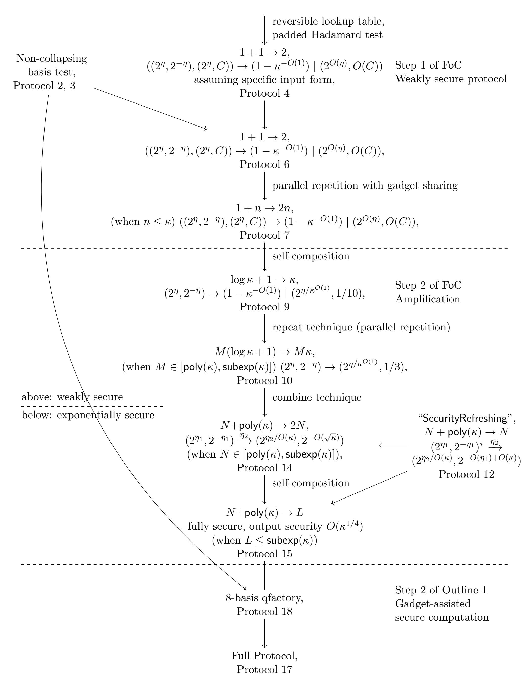
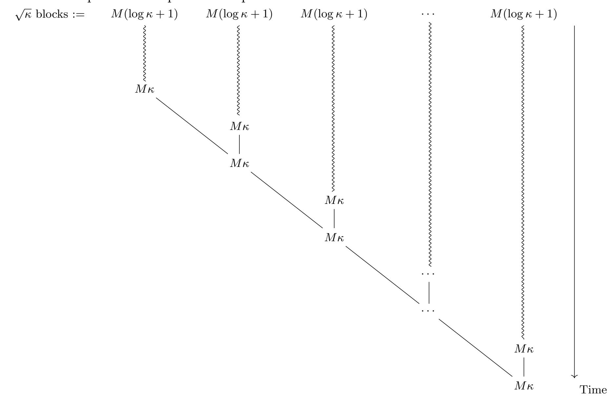
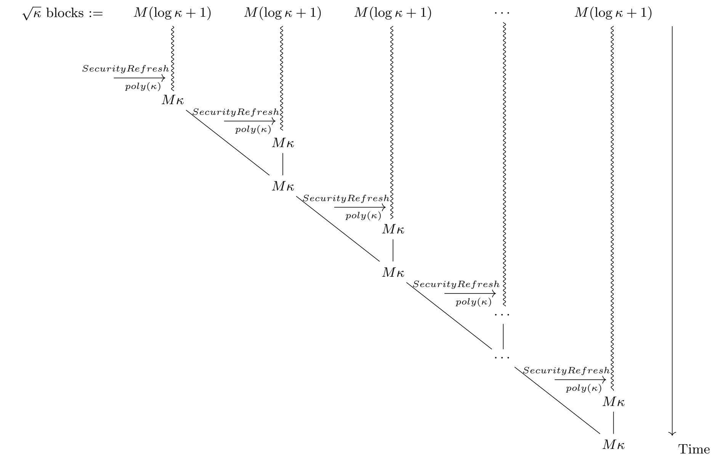

{0}------------------------------------------------

# <span id="page-0-3"></span>Succinct Blind Quantum Computation Using a Random Oracle

Jiayu Zhang<sup>∗</sup>

November 23, 2020

### Abstract

In the universal blind quantum computation problem, a client wants to make use of a single quantum server to evaluate C |0i where C is an arbitrary quantum circuit while keeping C secret. The client's goal is to use as few resources as possible. This problem, first raised by Broadbent, Fitzsimons and Kashefi[\[4\]](#page-128-0), has become fundamental to the study of quantum cryptography, not only because of its own importance, but also because it provides a testbed for new techniques that can be later applied to related problems (for example, quantum computation verification). Known protocols on this problem are mainly either information-theoretically (IT) secure or based on trapdoor assumptions (public key encryptions).

In this paper we study how the availability of symmetric-key primitives, modeled by a random oracle, changes the complexity of universal blind quantum computation. We give a new universal blind quantum computation protocol. Similar to previous works on IT-secure protocols (for example, BFK[\[4\]](#page-128-0)), our protocol can be divided into two phases. In the first phase the client prepares some quantum gadgets with relatively simple quantum gates and sends them to the server, and in the second phase the client is entirely classical — it does not even need quantum storage. Crucially, the protocol's first phase is succinct, that is, its complexity is independent of the circuit size. Given the security parameter κ, its complexity is only a fixed polynomial of κ, and can be used to evaluate any circuit (or several circuits) of size up to a subexponential of κ. In contrast, known schemes either require the client to perform quantum computations that scale with the size of the circuit [\[4\]](#page-128-0), or require trapdoor assumptions [\[18\]](#page-129-0).

# <span id="page-0-1"></span>1 Introduction

# <span id="page-0-2"></span>1.1 Problem Background

In the universal blind quantum computation problem, a client wants to make use of a single quantum server to evaluate a quantum circuit C secretly, where C can be arbitrary (up to a subexponential size). The protocol should at least satisfy the following requirements:

- 1. (Correctness) When the server is honest, the client holds C |0i in the end of the protocol with probability negligibly close to 1.[1](#page-0-0)
- 2. (Security) For any adversarial server, which might be unbounded, polynomial, etc, depending on the setting, it cannot distinguish whether the current protocol is run on input C, or run on input 0|C<sup>|</sup> .

<span id="page-0-0"></span><sup>∗</sup>Boston University, jyz16@bu.edu. Supported by NSF award 1763786.

<sup>1</sup>A more general form is to consider the evaluation of C |ϕi, and in the security requirement both the circuit C and the input state |ϕi should be hidden. Although this paper considers C as the only input of the protocol, it could also handle the slightly more general case.

{1}------------------------------------------------

3. (Efficiency) When the protocol is run honestly, the client and the server should be in polynomial time.

This problem is important for two reasons.

First, the problem itself is very important. The related problems in classical world, like the delegation of computation, multiparty computation or homomorphic encryption, are all very famous and fundamental problems and have a very long history. The blind quantum computation problem is important for the same reasons, and in quantum world there is one more reason to study this problem: It's very possible that the quantum computers will mainly be used as a cloud service. So if a client wants to use the power of a remote quantum server, and simultaneously, wants to keep its data or circuits secret, a blind quantum computation protocol is needed.

Second, the blind quantum computation problem is the testbed for new techniques. Empirically, once a new technique for the blind quantum computation problem is developed, it may be also useful in many other problems, including the quantum computation verification, multiparty quantum computation, certifiable randomness, zero knowledge proof for QMA and so on. For example, the MBQC-based techniques started with the UBQC protocol[\[4\]](#page-128-0) for blind quantum computation, and that work becomes the foundation of the UVBQC protocol for quantum computation verification [\[11\]](#page-128-1); the trapdoor claw-free function techniques started with [\[18\]](#page-129-0) and led to a series of works for quantum computation verification[\[19\]](#page-129-1), certifiable randomness[\[3\]](#page-128-2), zero-knowledge arguments[\[24\]](#page-129-2) and so on.

In classical world, this problem is studied for a long time under the names of two party computation and fully homomorphic encryption. We note that these concepts are not the same, but they are closely related and aiming at the same goal: to delegate the computation while keep it (or the data) secure. There are two fundamental constructions in classical world: one is the garbled circuit, or garbled table, raised by Yao[\[25\]](#page-129-3); another construction is the fully homomorphic encryption[\[12\]](#page-128-3), or FHE.

### <span id="page-1-0"></span>1.2 Previous Works and Motivating Questions

Previous protocols for universal blind quantum computation require either the execution of many quantum gates — proportional to the size of the circuit [\[4\]](#page-128-0) — but not computational assumptions; or the existence of trapdoor cryptographic primitives, such as the quantum hardness of learning with errors (LWE [\[22\]](#page-129-4)) [\[18\]](#page-129-0). (See Table [1](#page-3-0) for some existing works.) There are also some protocols that use two separated quantum servers[\[4\]](#page-128-0) and some protocols that are not universal[\[5,](#page-128-4) [26,](#page-129-5) [17,](#page-129-6) [21\]](#page-129-7); in this paper we focus on the universal protocols using a single quantum server.

- One representative of information-theoretically (IT) secure protocols is the BFK's UBQC protocol [\[4\]](#page-128-0). This protocol is based on the measurement-based quantum computation, and it contains an offline phase and an online phase. In the offline phase the client sends many quantum gadgets to the server. These quantum gadgets can be prepared using single-qubit gates, but the total number of gadgets is linear to the size of the circuit to be evaluated, which is prohibitive. This protocol becomes the basis of many later works.
- Some earlier representatives of computationally-secure protocols include [\[9\]](#page-128-5), which is based on the LWE assumption. Then in [\[18\]](#page-129-0) a classical fully homomorphic encryption for quantum circuits was constructed. That protocol is based on the classical FHE and a new technique based on a primitive called "trapdoor claw-free functions", and both primitives were constructed from the LWE assumption. Later these techniques were applied to many related problems like the quantum computation verification [\[19\]](#page-129-1) and certifiable randomness[\[3\]](#page-128-2).

{2}------------------------------------------------

One way to classify these assumptions are through the "Impagliazzo's Five Worlds"[\[14\]](#page-128-6). IT-secure protocols remain secure in all of these worlds, since it does not rely on any computational assumption; and the trapdoor assumptions, FHE, LWE and many "fancy" cryptographic schemes and protocols are secure only in Cryptomania (a world in which trapdoor primitives exist).

Minicrypt, intuitively, is the world where "symmetric cryptography" (for example, pseudorandom generators) exists but "public key cryptography" (trapdoor functions) is not possible. Our motivation is to understand what sorts of cryptography are possible in the quantum analogue of Minicrypt. We work with an abstraction, the QROM, which assumes (1) all parties have oracle access to a common function which is chosen uniformly at random; (2) the adversary is unbounded, but can only makes polynomial number of quantum random oracle queries. This setting allows for symmetric-type primitives (one-way functions, pseudorandom generators, collision-free hash functions), but excludes "public key primitives". By the "Random Oracle Methodology", once we design a protocol in this setting, we can replace the random oracle by an appropriate hash function or symmetric key encryption scheme. (We note that although this setting itself is formal, the instantiation of protocols proved secure in this setting can be subtle: there do exist some constructions that are not possible to be instantiated[\[6\]](#page-128-7). However, the usage of the random oracle as an ideal model of hash functions or symmetric key encryption schemes is wide-spread, and has greatly helped the design of cryptographic protocols in the past three decades[\[16\]](#page-129-8).)

Besides the theoretical motivation, the protocols in this setting have the following advantage: currently there are few choices for post-quantum secure public key encryption schemes[\[22,](#page-129-4) [15\]](#page-128-8). If we want to instantiate some more specific and stronger primitives, like trapdoor claw-free functions or FHE (which are much stronger than the existence of trapdoor functions), currently the only known way is through the lattice-based cryptography (for example, LWE). On the other hand, there are many choices for symmetric key primitives, and the protocols can remain to be sound even if lattice-based cryptography is broken.

The design of delegation-style quantum protocols in this setting is not well-understood. As far as we know, except the works on IT-secure protocols, the only work is [\[26\]](#page-129-5), which designed a quantum delegation (blind quantum computation) protocol for a useful but specific circuit family. Thus we ask the following question:

How does the availability of symmetric-key cryptographic primitives (modeled by a random oracle) change the complexity of universal blind quantum computation?

Another factor that we will consider is the "client side quantum computation". Existing works assume either the client side quantum gates can be linear to the circuit size (during the whole protocol), or the client is classical; little is known for the setting between them, which is, to allow the client to run succinct quantum operations, which can depend on the security parameter, but should be independent of the circuit size. Thus, we can ask the following question:

How can we design a universal blind quantum computation protocol in which the client side quantum operations are "succinct" (that is, independent of the size of the circuit to be evaluated)?

Thus we want to design a protocol that is more efficient than the IT-secure protocol in terms of the client side quantum operations (here we do not care about the classical computation and communication as long as they are polynomial size), and does not use any public key primitives. None of the existing techniques works for this setting and we need to develop new techniques and a new protocol.

### <span id="page-2-0"></span>1.3 Our Results

In this paper we prove the following:

{3}------------------------------------------------

| Client side |                      | QROM                 | LWE                    |  |
|-------------|----------------------|----------------------|------------------------|--|
| quantum     | IT-secure            | (Idealized symmetric | (Public key encryption |  |
| computation |                      | key primitives)      | with functionalities)  |  |
| Classical   | May be impossible[1] | Unknown              | [18]                   |  |
| Succinct    | Unknown              | This paper           |                        |  |
| Linear      | [4]                  |                      | [9]                    |  |

<span id="page-3-0"></span>Table 1: Different tradeoff between client side quantum operations and assumptions in quantum computation delegation problem. "Succinct" means it's at most a fixed polynomial of the security parameter; and "Linear" means it's linear to the size of the circuit to be evaluated.

<span id="page-3-3"></span>Theorem 1.1. There exists a universal blind quantum computation protocol (Protocol [17](#page-119-0) in Section [14\)](#page-117-0) for circuits of size up to a fixed subexponential function of the security parameter such that

- It contains an offline phase and an online phase. In the offline phase the client prepares and sends some quantum gadgets to the server, and in the online phase the client is completely classical.
- The total number of quantum gates to prepare these quantum gadgets is at most a fixed polynomial of the security parameter, independent to the size of the circuit to be evaluated.
- The classical computation, communication and the server-side quantum computation are bounded by a fixed polynomial of the security parameter and the size of the circuit to be evaluated.
- The protocol is secure in the quantum random oracle model against any unbounded malicious server whose number of queries to the random oracle is bounded by a fixed subexponential function of the security parameter.

Thus, based on our work, together with previous works[\[4,](#page-128-0) [18\]](#page-129-0) we can complete the following table (Table [1\)](#page-3-0) about the different tradeoffs between client side quantum resources and assumptions. Thus we claim our result reveals a more complete cryptographic picture for single-server quantum (blind) delegation problem.

Our result required the development of a set of new techniques for protocol design and security proof. Section [1.4](#page-3-1) provides a brief technical overview. As discussed before, new techniques in blind quantum computation often led to protocols for many related problems. We hope the techniques and protocols developed here will also lead to advances on a range of related problems.

### <span id="page-3-1"></span>1.4 A Top-down Overview of Our Techniques

### <span id="page-3-4"></span>1.4.1 Two-step construction via remote gadget preparation

How can the client allow the server to evaluate O(|C|) gates using only succinct quantum computation? In our protocol, the client will first prepare poly(κ) gadgets (poly is a fixed polynomial), then use classical interactions to allow the server to expand them to O(|C|) gadgets "securely". Here the gadget is defined to be the states in the form of |y0i + |y1i, where y0, y<sup>1</sup> are random different strings, or keys. The client holds the keys, and the server should hold the state.[2](#page-3-2)

This step — the preparation and expansion of gadgets — is called remote gadget preparation. Let's give the correctness and security definition informally below (for the formal definition, see Section [5.1\)](#page-29-0):

<span id="page-3-2"></span><sup>2</sup>This form of states was also previously used in several papers like [\[3\]](#page-128-2).

{4}------------------------------------------------

Definition 1.1 (Correctness of the remote gadget preparation, informal). A protocol is called a remote gadget preparation protocol of output number L and output length κout if: if the server behaves honestly, it passes the protocol and in the end of the protocol (1)the client gets key set {y (i) b }i∈[L],b∈{0,1} where for any i, y (i) b is a string of length κout, y (i) 0 6= y (i) 1 ; (2)the server holds the state ⊗<sup>L</sup> <sup>i</sup>=1(|y (i) 0 i + |y (i) 1 i).

And we say this protocol has input number N if initially the server holds (or equivalently, the client prepares and sends) ⊗<sup>N</sup> <sup>i</sup>=1(|x (i) 0 i + |x (i) 1 i) and the client holds all the keys. We use N → L to denote the honest behavior of a protocol of input number N and output number L.

Note that the protocols in this paper do not require quantum communication in the middle of the protocol. And the security is defined based on the concept of SC-security, which describes the adversary's ability to compute both keys simultaneously.

Definition 1.2 (SC-security, informal). Suppose the client holds a key pair K. Suppose the joint state of all parties, after purification, is described by |ϕi. We say this state is (2<sup>η</sup> , C| |ϕi |)-SC-secure for K given some auxiliary information if for any adversary with query number at most 2<sup>η</sup> , the norm of outputting both keys in K, with access to the auxiliary information and the hash tags of K, is at most C| |ϕi |.

Definition 1.3 (Security definition of the remote gadget preparation, informal). For an N → L protocol, suppose the output key set is Kout. For any unbounded malicious server that makes at most subexp(κ) quantum random oracle queries, for any i ∈ [L], the final state is exponentially SC-secure (which means, (2<sup>η</sup> , 2 −η )-SC-secure, for some η) for K (i) out (the i-th output key pair) given auxiliary information Kout − K (i) out.

The auxiliary information here is necessary to get rid of potential correlations among keys. And it may be surprising that the security condition is about unpredictability (as opposed to simulation). However, it is sufficient for the final indistinguishability-based security of the blind quantum computation protocol.

As an example, we can see the honest final state ⊗<sup>L</sup> <sup>i</sup>=1(|y (i) 0 i + |y (i) 1 i) satisfies the security definition since the server cannot output y (i) 0 ||y (i) 1 from it with high probability, even if {y (j) b }j6=i,b∈{0,1} and the hash values of {y (i) 0 , y (i) 1 } are provided.

Then we will construct our universal blind quantum computation protocol that satisfies Theorem [1.1](#page-3-3) (denoted SuccUBQC) as follows:

### <span id="page-4-0"></span>Outline 1. Design of the SuccUBQC protocol:

- 1. Remote gadget preparation: (1) the client sends some initial gadgets to the server, whose size and length are succinct; (2) the client uses classical interactions to allow the server to expand the number of gadgets securely.
- 2. Blind quantum computation execution: using the gadgets output from the previous step, the client and the server evaluate C using only classical interactions.

The construction of the secure remote gadget preparation protocol (the first step in Outline [1\)](#page-4-0) is the most difficult step. The second step is relatively easier but still non-trivial.

{5}------------------------------------------------

### <span id="page-5-3"></span>1.4.2 Remote gadget preparation via weak security

The first step of Outline [1](#page-4-0) are achieved as follows: we will define the weak security of the remote gadget preparation. We will first construct a weakly-secure protocol, then amplify it to a fully secure one. The first idea of our construction is to develop a framework for the design of different subprotocols. This is (mainly) captured by the notion of weak security and weak security transform parameter. Let's give an informal introduction here, and we will revisit this concept in Section [5.2](#page-31-0) and give the formal definition in Definition [5.9.](#page-33-0)

<span id="page-5-2"></span>Definition 1.4 (Weak security of remote gadget preparation, informal). We say a remote gadget preparation protocol run on key set K is weakly secure with weak security transform parameter (2<sup>η</sup> , C) → p | (2<sup>η</sup> 0 , C<sup>0</sup> ) if a statement in the following form holds:

Suppose the initial (purified joint) state |ϕi satisfies:

- It is (2<sup>η</sup> , C| |ϕi |)-SC-secure for any input key pair K<sup>0</sup> in K given K − K<sup>0</sup> (all the other key pairs) as the auxiliary information;
- The state is not too "ill-behaved". (Informally, the state can be written as a sum of several terms with bounded number of RO queries. Formalized in Definition [5.7,](#page-32-0) Notation [5.2.](#page-34-0))

Then for any unbounded adversary with up to 2<sup>κ</sup> random oracle queries during the protocol, at least one of the following is true:

- The client accepts with at most norm p| |ϕi |;
- For the output state, for any[3](#page-5-0) output key pair, the state is (2<sup>η</sup> 0 , C<sup>0</sup> | |ϕi |)-SC-secure for this output key pair given all the other output keys as the auxiliary information.

Then the overall flow of the construction of the secure remote gadget preparation protocol (step 1 of Outline [1\)](#page-4-0) is as follows [4](#page-5-1) :

<span id="page-5-4"></span>Flow of Construction 1. Protocol construction for the step 1 of Outline [1:](#page-4-0)

- 1. Construct a weakly-secure remote gadget preparation protocol such that it can (asymptotically multiplicatively) generate more gadgets than it consumes.
- 2. Using some amplification techniques to amplify it to a secure remote gadget preparation protocol.

Our work can be seen as the design of a series of subprotocols with different tradeoffs for correctness, (weak) security, etc, and these subprotocols, when combined together, can achieve what we want.

Weakly Secure Protocol Step The goal in this step is to create more gadgets (possibly with weak security) from some input gadgets. First, we consider the simplest case, generating two gadgets using one input gadget, remotely:

$$|x_0\rangle + |x_1\rangle \rightarrow (|y_0\rangle + |y_1\rangle) \otimes (|y_0'\rangle + |y_1'\rangle)$$

<span id="page-5-0"></span><sup>3</sup>The order of quantifiers is good here: it's not "the server can output an index i and the corresponding output keys". This definition seems weak but is on the other hand general enough to be used as the framework.

<span id="page-5-1"></span><sup>4</sup>This is only a construction flow, we don't mean there is a two-step protocol.

{6}------------------------------------------------

And we want the outputs to have some (possibly weak) security in the malicious setting. This quantum-to-quantum transformation can be enabled using a classical primitive called *reversible look-up tables*, or *reversible garbled tables*, discuss in [26].<sup>5</sup> But it's not possible to do that directly. The key idea is, instead of implementing this transformation directly, we seek for a transformation to the following state as an intermediate step:

$$|x_0\rangle + |x_1\rangle \rightarrow perm((|y_0\rangle + |y_1\rangle) \otimes (|y_0'\rangle + |y_1'\rangle))$$

where perm is a random bit-wise permutation sampled by the client, kept secret from the adversary. The secrecy of perm will be a key ingredient on implementing this mapping securely. But the client still needs to reveal it to the server to allow it to de-permute the gadgets in the end, which seems to be a dilemma. Now we introduce the second idea: the realization of the mapping above will make use of an extra helper gadget, and a subprotocol called  $padded\ Hadamard\ test$ . This padded Hadamard test is a padded variant of the Hadamard test in [3]. We observe that, the padded Hadamard test has several powerful properties, one of which informally say, if such a test is executed between the client and the server, if the server wants to pass the test with high probability, it loses the ability to predict the keys from the post-test state — a property that we call proof-of-unpredictability. With this property in mind, we can use this subprotocol as a switch that controls when it's safe to reveal the permutation. Now the transformation goes as follows, where we use  $|a_0\rangle + |a_1\rangle$  to denote the helper gadget:

<span id="page-6-2"></span><span id="page-6-1"></span>
$$(|a_0\rangle + |a_1\rangle) \otimes (|x_0\rangle + |x_1\rangle) \tag{1}$$

<span id="page-6-3"></span>
$$\rightarrow (|a_0\rangle + |a_1\rangle) \otimes perm((|y_0\rangle + |y_1\rangle) \otimes (|y_0'\rangle + |y_1'\rangle)) \quad (2)$$

(Padded Hadamard test on 
$$|a_0\rangle + |a_1\rangle$$
)  $\rightarrow perm((|y_0\rangle + |y_1\rangle) \otimes (|y_0'\rangle + |y_1'\rangle))$  (3)

(Client reveals 
$$perm$$
 if test passes)  $\rightarrow (|y_0\rangle + |y_1\rangle) \otimes (|y_0'\rangle + |y_1'\rangle)$  (4)

Then in each time step something is secret in the adversary's viewpoint. Before the test the bit-wise permutation is hidden, and after the test, the adversary is not able to have good predictability on  $\{a_0, a_1\}$  anymore. And the design of the mapping from (1) to (2) will make use of it.

Now we go to the construction of  $(1)\rightarrow(2)$ . Now we can create a reversible lookup table for it. The first problem here is the mismatch of the input number and output number, but this can be solved by introducing an auxiliary wire, where the two keys are simply provided classically to the server. Now  $(1)\rightarrow(2)$  is replaced by (after a change of notation to match the formal construction):

$$(|x_0^{(1)}\rangle + |x_1^{(1)}\rangle) \otimes |\{x_0^{(2)}, x_1^{(2)}\}\rangle \otimes (|x_0^{(3)}\rangle + |x_1^{(3)}\rangle) \qquad (5)$$

$$\xrightarrow{\text{table encoding } x^{(1)}x^{(2)}x^{(3)} \leftrightarrow x^{(1)}perm(y^{(2)}y^{(3)})} \underbrace{(|x_0^{(1)}\rangle + |x_1^{(1)}\rangle)}_{\text{helper gadget}} \otimes \underbrace{perm((|y_0^{(2)}\rangle + |y_1^{(2)}\rangle) \otimes (|y_0^{(3)}\rangle + |y_1^{(3)}\rangle))}_{\text{reversibly encoded part}} \qquad (6)$$

The underlying gate in this table remains to be determined.

Usually in this type of reversible tables when both keys on some wire are revealed together to the adversary, it's possible that the adversary can break many rows of this table by decrypting back-and-forth. But here the additional bit-wise permutation provides extra protection that prevents this from happening.

However, this is still not sufficient to guarantee the weak security on both of the output keys. Here the final ingredient is, when we encode the mapping above, we design the underlying gate

<span id="page-6-0"></span><sup>&</sup>lt;sup>5</sup>The reversible garbled table in this paper does not carry computation so we also name it as the lookup table.

{7}------------------------------------------------

carefully. We consider two different encodings for the reversibly encoded part, and associate them to different *branches* of the helper gadget. Furthermore, we explore a powerful property of the padded Hadamard test called *proof-of-untestability*. We show that, these properties, when taken together, restrict a cheating server's behavior powerfully.

In this way we can construct a weakly secure protocol, which is a basic subroutine in our paper. We leave the details and a more technical overview to Section 8. Overall speaking, what we have achieved could be understood as follows. With the cost of one gadget (with superscript (1), for padded Hadamard test), the input gadget on the third wire in (5) is "technically teared up" into two gadgets, with securities weaker than the input. (The recovery of the security will be done in the later amplification step.)

But the simple weakly secure protocol above is still not gadget-increasing. The reason is when we save one gadget, we also consume one. But this problem can be solved through a parallel-repetition-style step, and note the helper gadget (consumed in the padded Hadamard test) can be shared in each table. Then we get an  $1 + n \rightarrow 2n$  protocol (in Section 9), which is provable to be both gadget-increasing and weakly-secure.

**Amplification Step** After we complete the first step in Section 8 and 9, we move to the amplification part. We put a detailed overview and description of ideas of this part in Section 10, and in Section 11 and 13 we complete the amplification and get a final remote gadget preparation protocol.

Roughly speaking, we call our technique repeat-and-combine. We notice that in the definition of weak security (Definition 1.4) there are two sources of the weakness: (1)the bound on the accepting probability in the first output case is too weak; (2)in the second output case the adversary's ability of computing both keys is not negligible. We solve the first problem through a procedure called the repeat technique, and solve the second problem through the combine technique.<sup>6</sup> And here we not only need to amplify the security, but also need to ensure the final protocol is still gadget-increasing and everything is still within the scope of our security proof techniques.

The *repeat* part is a parallel repetition of the same protocol on many different blocks, and the server is required to pass on all the blocks. This restricts the adversary's behavior and gives the upper-level protocol better weak security than the underlying protocol.

The main challenge is to go from weak security to exponential security. The *combine* technique combines multiple gadgets into one gadget to reduce the server's ability to compute both keys in a key pair. Let's give a minimal example of our *combine* technique, where only two key pairs are combined.

Suppose the server holds  $(|x_0\rangle + |x_1\rangle) \otimes (|x_0'\rangle + |x_1'\rangle)$ , while the client knows all the keys. Additionally suppose the server knows the hash tags of all the keys. Then it can make a measurement on the xor of the indexes:

$$(|x_0\rangle + |x_1\rangle) \otimes (|x_0'\rangle + |x_1'\rangle) \rightarrow$$

$$(output = 0)(|x_0\rangle |x_0'\rangle + |x_1\rangle |x_1'\rangle) \qquad (output = 1)(|x_0\rangle |x_1'\rangle + |x_1\rangle |x_0'\rangle)$$

then it reports the measurement result to the client, and the client can compute and store the new output key pairs ( $\{x_0x'_0, x_1x'_1\}$  or  $\{x_0x'_1, x_1x'_0\}$ ). Intuitively, if the server can output both keys in the output key pair, intuitively it means it not only know both  $x_0$  and  $x_1$ , but also know  $x'_0$  and  $x'_1$ . Thus we can hope the second parameter in the SC-security (defined to be the bound on the adversary's ability of computing both keys) for the new key pair is proportional to the

<span id="page-7-0"></span><sup>&</sup>lt;sup>6</sup>We note that the upper-level idea of *repeat-and-combine* is not that new since some papers in some other problems use a similar upper-level idea to improve the security, like [10, 13].

{8}------------------------------------------------

multiplication of the corresponding security parameters for the two input key pairs. And if we continue this combination sequentially and combine  $\sqrt{\kappa}$  key pairs one-by-one, we can hope this parameter goes down to an exponentially small value.

However the story is not that simple. As far as we know, such a simple combination does not always imply the multiplicativity of the bounds of the adversary's ability of computing both keys. To solve this problem, we add an additional layer — called SecurityRefreshing layer — in the middle of each round of the combination process. This additional layer can be used to "strengthen the security" in each round. It makes use of (and consumes) some "freshly secure" gadgets, but the consumption is small and it can refresh the security of a large number of key pairs simultaneously. And we can prove, the new protocol, with the *combine* technique and this additional layer, is exponentially secure (in the sense of the second parameter in the SC-security).<sup>7</sup>

This is still not the end of the story. The combination part decreases the number of gadgets multiplicatively and thus we need to do more to make it gadget-increasing again! The solution is, before we do this *repeat* and *combine*, we need to first self-compose the protocol to boost the gadget-expansion ratio from 2 to  $\tilde{\Theta}(\kappa)$ . Then since we only combine  $\sqrt{\kappa}$  gadgets into one gadget the overall gadget-expansion ratio is still  $\tilde{\Theta}(\sqrt{\kappa}) > 2$ .

Finally we get a remote gadget preparation protocol that is gadget-increasing (with gadget expansion ratio > 2) and secure (not just weakly-secure). Intuitively we can simply run this protocol again and again to increase the number of gadgets until we get enough gadgets. Again, we make use of the SecurityRefreshing layer to bypass the obstacles in the security proof.

### <span id="page-8-3"></span>1.4.3 Security proof techniques

Formally proving the security, especially for the *combine* technique part, turns out to be technically challenging. Section 6 contains a collection of lemmas that we need in this paper. Within that, one of the most important idea is a series of *state decomposition lemmas* for the quantum random oracle model in Section 6.3. These lemmas serve as a bridge from weak security to normal security in our setting. As we said before, we will first design a weakly-secure protocol, then amplify it to a fully secure one. Then we will meet an obstacle on the security proof: how can we prove, after we apply the *combine* technique, the security property gets improved? The technique here is the *state decomposition lemmas*: we prove that, if a state has some SC/ANY-security/unpredictability for some key(s) (which appears in, for example, input-output behaviors of weakly-secure protocols), we can decompose it into two states where one state is "exponentially secure" in our definition, and the other state has bounded norm. <sup>8</sup>

Let's give a simple, informal example for that. (See Section 6.3 for more details.) Assume the joint purified state of all the parties is described by  $|\varphi\rangle$  (where the randomness are already purified thus we can use Dirac symbol). And we want to study the server's unpredictability for a key  $x_0$  (which is stored in some client-side register). The condition is, assume for any server-side operation  $\mathcal{U}$  which makes at most  $2^{\kappa}$  queries, there is

<span id="page-8-2"></span>
$$|P_{x_0}\mathcal{U}|\varphi\rangle| \le A||\varphi\rangle| \tag{7}$$

(Again, the server should know some hash tag of  $x_0$ .)

<span id="page-8-0"></span><sup>&</sup>lt;sup>7</sup>One additional key point here is, we don't want to generate all the weakly secure gadgets once and combine them altogether; these two parts are actually interleaved with each other: the sequence is Generate some — Refresh — Combine — Generate some more — Refresh — Combine ⋯. The weakly secure protocol and the amplification are not two separate, independent protocols; instead, the latter uses the former as a subroutine.

<span id="page-8-1"></span><sup>&</sup>lt;sup>8</sup>We note that some LWE-based protocols[19, 7] also use some kinds of state-decomposition, but the state decomposition here is not the same thing. The formalizations, proof techniques and applications in our setting are all different and nontrivial.

{9}------------------------------------------------

Then we can prove, (technically nontrivially,) the state, together with some server-side ancillas, can be decomposed into the linear sum of two states |φi + |χi where

- |φi is (2O(κ) , 2 −O(κ) | |ϕi |)-unpredictable for x<sup>0</sup> — which means, the right hand side of [\(7\)](#page-8-2) becomes exponentially small.
- The norm of |χi can be bounded: | |χi | ≤ ( √ 2 + 1)A| |ϕi |.
- Both states can be written in a well-behaved form using |ϕi.

We consider it as a fundamental property of the random oracle that might be useful in other places. This implies that, if we use |ϕi as the initial state of some subprotocol subPrtl, we can analyze the post-execution state |ϕ 0 i := subPrtl ◦ |ϕi through subPrtl ◦ |φi + subPrtl ◦ |χi. This is called the linear decomposition technique in Section [6.3.2.](#page-46-0)

Furthermore, this decomposition, in some cases, can be iterated. This is the multi-round linear decomposition technique in Section [6.3.3.](#page-46-1) This will be useful in the security proof of the combine technique. Simply speaking, in the decomposition lemma above, when A is not too big, the norm of |χi will decrease multiplicatively compare to the original state. Then if we do this decomposition in each step — and view |χi as the initial state in the next round, etc — this will lead to an exponential decay on the norm of this term. Informally this technique goes as follows. For a protocol Prtl that is an iteration of some subprotocol (which is the case for the combine technique), the post-execution state can be written as:

$$P_{pass} |\varphi'\rangle = P_{pass} \mathsf{Prtl} |\varphi\rangle \tag{8}$$

$$:= P_{pass} \operatorname{PrtI} |\chi^{0}\rangle \text{ (Here we denote } |\chi^{0}\rangle := |\varphi\rangle \text{ to make the notation consistent)}$$
 (9)

$$= P_{pass} \mathsf{Prtl}_{>1} |\phi^1\rangle + P_{pass} \mathsf{Prtl}_{>1} |\chi^1\rangle \tag{10}$$

$$=\cdots$$
 (11)

$$= P_{pass} \mathsf{Prtl}_{>1} \circ |\phi^1\rangle + P_{pass} \mathsf{Prtl}_{>2} \circ |\phi^2\rangle + \dots + P_{pass} |\phi^{\kappa}\rangle + P_{pass} |\chi^{\kappa}\rangle \tag{12}$$

Then we can see the last term is exponentially small and the other terms can be analyzed separately using other techniques. (Note that the actual application can be more complicated and this multiround arguments of decomposition may not be written as this sequence of equations.)

### <span id="page-9-0"></span>1.4.4 From Remote Gadget Preparation to SuccUBQC

Now we give an informal overview of how to reduce the universal blind quantum computation problem to the remote gadget preparation problem. We will give a more detailed description in the beginning of Section [14.](#page-117-0)

Recall that in BFK's UBQC protocol[\[4\]](#page-128-0), to delegate a circuit C, the client needs to prepare the state |+<sup>θ</sup> <sup>i</sup> i, θ <sup>i</sup> ∈<sup>r</sup> {nπ/4 : n = 0, · · · 7} for each gate g i in C. Thus the total number of client side quantum computation is linear in |C|. One natural idea is to delegate the preparation of these states further; such a primitive for preparing secret single qubit states is abstracted and formalized into a concept called 8-basis qfactory [\[8\]](#page-128-12). However there is an important difference of our setting from [\[8\]](#page-128-12) here: we cannot delegate the preparation of these single qubit state "from scratch"; instead, we make use of the output of the remote gadget preparation protocol, for which we have some specific types of security but could not assume it's honest. This raises additional difficulties in the design of our 8-basis qfactory.

Here we only informally describe our protocol using the honest gadget setting, which simplifies the protocol a lot. First, the client and the server run a remote gadget preparation protocol, with 

{10}------------------------------------------------

output number L := Θ(|C|). The honest server will get the gadgets ⊗<sup>L</sup> <sup>i</sup>=1(|y (i) 0 i + |y (i) 1 i). Then our qfactory protocol (simplified due to the assumption that the gadgets are in the honest form) works as follows, which transforms |y (i) 0 i + |y (i) 1 i into a single qubit state (which can then be used in the BFK protocol). One interesting trick is the usage of phase lookup table, which is given in [\[26\]](#page-129-5) and it's convenient to use it for 8-basis qfactory.

$$|y_0^{(i)}\rangle + |y_1^{(i)}\rangle$$

$$(Phase\ lookup\ table) \Rightarrow |0\rangle |y_0^{(i)}\rangle + e^{i\tilde{\theta}^i} |1\rangle |y_1^{(i)}\rangle (\tilde{\theta}^i = \theta_2^i \pi/2 + \theta_3^i \pi/4, \, \theta_2^i, \theta_3^i \in_r \{0, 1\}^2)$$

$$(14)$$

$$(Hadamard\ measurement[19]) \Rightarrow |+_{\theta^i}\rangle \left(\theta^i = \theta_1^i \pi + \theta_2^i \pi/2 + \theta_3^i \pi/4\right)$$

$$\tag{15}$$

# <span id="page-10-0"></span>1.5 Discussions

This result naturally gives rise to the following questions:

- 1. How can we use these techniques on other problems? (for example, quantum computation verification, or zero-knowledge proof.)
- 2. Is it possible to do universal blind quantum computation using completely classical client and quantum random oracle model, and make it secure again any unbounded adversary which only makes polynomial number of queries? Is it possible to do universal blind quantum computation using succinct client side quantum computation without relying on any assumptions? We conjecture the answer is no, but we need a formal proof for it.
- 3. Is it possible to directly base the protocol on standard model assumptions (quantum-secure oneway functions, or hash functions?)

One intuitive way to think about the future direction is through Table [1.](#page-3-0) There are many unknown cells in this table, and the completion of this table will be interesting. And one interesting thing is: similar (although not the same) tradeoffs also appear in many other problems, not restricted to the delegation-style quantum protocols. For example, in the classical world, for the "secure key agreement" problem, symmetric key encryption scheme allows two parties to expand succinct size of pre-shared keys; to achieve key agreement without pre-shared keys, public key encryption is necessary. Thus we wonder how fundamental it is in quantum (or not only quantum) cryptography.

# Acknowledgement

The author would like to give sincere thanks to Prof. Adam Smith for the advisory. And the author would like to thank anonymous reviewers, Hezi Zhang, Thomas Vidick and Tomoyuki Morimae for useful comments.

# <span id="page-10-1"></span>2 Paper Organizations

# <span id="page-10-2"></span>2.1 A Diagram of Flow of Constructions

Below we give a diagram which shows the flow of protocol construction. The arrow shows the dependency among subprotocols. Each node shows the honest behavior (using notation "input number → output number") and security property. The security property is mainly described by 

{11}------------------------------------------------

the weak security transform parameter but not necessarily in the standard form described above, and we will meet different variants of weak security transform parameter definition in the paper. From above to below, the security of the first three protocols use the multi-input-key-set version of the weak security transform parameter (Definition [5.11\)](#page-34-1); Then for Protocol [10](#page-89-0) we use the most basic form of the weak security transform parameter (Definition [5.9\)](#page-33-0) since the input keys all have the same security requirement. Then after the repeat technique the p term is removed (Definition [5.10\)](#page-34-2) and after the combine technique we move to a version that deals with two key sets in a slightly differently way (Definition [13.1\)](#page-100-0). And in the SecurityRefreshing layer the secuity conditions on the input keys are weaker than normal thus we add a star symbol there (see Section [12.1\)](#page-96-0). Finally in Protocol [15](#page-110-0) we don't need to talk about weak security transform parameter anymore.

(FoC below means the Flow of Construction in Section [1.4.2.](#page-5-3))

# <span id="page-11-0"></span>2.2 Paper Outline

This paper is organized as follows.

- In Section [3](#page-18-0) we give some background, preliminaries and notations, including a simple introduction to reversible lookup tables and phase tables in [\[26\]](#page-129-5).
- The setting and notation systems that we use during the whole paper are formalized in Section [4.](#page-23-0)
- In Section [5](#page-29-1) we design a modular framework for tracking the correctness and security properties of different subprotocols.
- In Section [6](#page-35-0) we give some basic lemmas and techniques for the security proofs later. Thus Section [1](#page-0-1) to [6](#page-35-0) are mainly summaries and preparations before we move to the formal construction. The protocol design begins at Section [7.](#page-48-0)
- In Section [7](#page-48-0) we study a class of subprotocols which we call non-collapsing basis test. This class of subprotocols will be useful later, mainly in Section [8](#page-56-0) and Section [14.](#page-117-0)
- Section [8](#page-56-0) and [9](#page-72-0) are for the design of weakly secure gadget increasing protocol. In the end of the Section [9](#page-72-0) we give a remote gadget preparation protocol with weak security, that is gadget increasing (Protocol [7\)](#page-76-0).
- In Section [10](#page-80-0) we give an overview of how to amplify the security to normal security.
- In Section [11](#page-87-0) we give part of the proofs for the amplified protocol (which is the repeat part).
- In Section [12](#page-93-0) we give the SecurityRefreshing protocol that we use to overcome the obstacles in the security proof and make the combine technique really works.
- In Section [13](#page-98-0) we give the formal protocol for the combine part and complete the security proof, and complete the amplification and give a fully secure remote gadget preparation protocol. By this time step 1 of Outline [1](#page-4-0) is completed.
- Finally in Section [14](#page-117-0) we give a universal blind quantum computation protocol and complete the proof of Theorem [1.1.](#page-3-3)

{12}------------------------------------------------



{13}------------------------------------------------

### <span id="page-13-0"></span>2.3 Writing Conventions

For protocols in the mainline, the descriptions of protocols are put into boxes with grey background. Then simple discussions of correctness and efficiency follows them. Then the security statements are given (either in a new subsubsection or not), which are usually in the form of weak security transform parameter. Then security proofs or discussions and pointers of security proofs follows them.

As said before, security statements of subprotocols are usually in the form of weak security transform parameter. But some protocol statements use variants of this notion so it's not necessarily in a form that can be sufficiently encapsulated. The security is discussed using the purified joint state discussed in Section [4.1,](#page-23-1) where the randomness is always purified by the environment. And we use |ϕi  · · · symbol to mean "the client sends some messages to the server (actually the read-only buffer)". This is often used accompanied with the "< Alg >" symbol, which means the output of some algorithm Alg.

# Contents

| 1 |     | Introduction                                                     | 1  |
|---|-----|------------------------------------------------------------------|----|
|   | 1.1 | Problem Background                                               | 1  |
|   | 1.2 | Previous Works and Motivating Questions                          | 2  |
|   | 1.3 | Our Results                                                      | 3  |
|   | 1.4 | A Top-down Overview of Our Techniques<br>                        | 4  |
|   |     | 1.4.1<br>Two-step construction via remote gadget preparation<br> | 4  |
|   |     | 1.4.2<br>Remote gadget preparation via weak security<br>         | 6  |
|   |     | 1.4.3<br>Security proof techniques<br>                           | 9  |
|   |     | 1.4.4<br>From Remote Gadget Preparation to<br>SuccUBQC<br>       | 10 |
|   | 1.5 | Discussions<br>                                                  | 11 |
| 2 |     | Paper Organizations                                              | 11 |
|   | 2.1 | A Diagram of Flow of Constructions<br>                           | 11 |
|   | 2.2 | Paper Outline                                                    | 12 |
|   | 2.3 | Writing Conventions<br>                                          | 14 |
| 3 |     | Preliminaries and Some Basic Notations                           | 19 |
|   | 3.1 | Basics of Quantum Computation<br>                                | 19 |
|   |     | 3.1.1<br>Notations on projections                                | 19 |
|   | 3.2 | Basic Notations                                                  | 19 |
|   |     | 3.2.1<br>Mathematics-level Notations<br>                         | 19 |
|   |     | 3.2.2<br>Notations for string concatenation<br>                  | 20 |
|   |     | 3.2.3<br>Notations for indexing the keys                         | 20 |
|   | 3.3 | The Quantum Random Oracle Model<br>                              | 20 |
|   |     | 3.3.1<br>Blinded Oracle<br>                                      | 20 |
|   | 3.4 | qIND-CPA Security of the Blind Quantum Computation               | 21 |
|   | 3.5 | Lookup Tables, Reversible Lookup Tables and Phase Tables         | 21 |
|   |     | 3.5.1<br>Phase tables<br>                                        | 24 |

{14}------------------------------------------------

| 4 |     | The Problem Setting and Notation System                                               | 24 |
|---|-----|---------------------------------------------------------------------------------------|----|
|   | 4.1 | The Problem Setting, and its Notation System<br>                                      | 24 |
|   |     | 4.1.1<br>CQ-states, purified notation and natural notation                            | 24 |
|   |     | 4.1.2<br>Different steps of a protocol                                                | 25 |
|   |     | 4.1.3<br>Introducing the<br>read-only buffer, and the "" symbol for messages and aux |    |
|   |     | iliary information                                                                    | 26 |
|   |     | 4.1.4<br>Global tags<br>                                                              | 27 |
|   |     | 4.1.5<br>The initial state in the beginning of the whole protocol<br>                 | 28 |
|   |     | 4.1.6<br>Blinded oracles, revisited<br>                                               | 28 |
|   | 4.2 | Notations for Analyzing the Protocols<br>                                             | 29 |
|   |     |                                                                                       |    |
| 5 |     | The Modular Framework for Protocol Design                                             | 30 |
|   | 5.1 | Remote Gadget Preparation: the Stepping Stone towards UBQC<br>                        | 30 |
|   |     | 5.1.1<br>What is the gadget?<br>                                                      | 30 |
|   |     | 5.1.2<br>Correctness of remote state preparation<br>                                  | 31 |
|   |     | 5.1.3<br>Security Definition: introducing the<br>SC-security<br>                      | 31 |
|   |     | 5.1.4<br>A summary<br>                                                                | 32 |
|   | 5.2 | Remote Gadget Preparation with Weak Security:<br>the Stepping Stone towards the       |    |
|   |     | Remote Gadget Preparation                                                             | 32 |
|   | 5.3 | Ruling out the ill-behaved cases:<br>the representable property, and the behavior of  |    |
|   |     | states under padded RO<br>                                                            | 33 |
|   | 5.4 | Complete definition of the weak security of remote gadget preparation<br>             | 34 |
|   |     | 5.4.1<br>Composition of the security statement: From (weak) security of subprotocols  |    |
|   |     | to (weak) security of big protocols<br>                                               | 36 |
|   |     |                                                                                       |    |
| 6 |     | A Collection for Notations, Lemmas and Techniques for Security Proofs                 | 36 |
|   | 6.1 | More State-related security: ANY-security and unpredictability for key(s)<br>         | 36 |
|   | 6.2 | Proving the Security by Adding Auxiliary Information<br>                              | 37 |
|   | 6.3 | State Decomposition Lemmas                                                            | 39 |
|   |     | 6.3.1<br>The lemmas                                                                   | 40 |
|   |     | 6.3.2<br>Linear decomposition technique                                               | 47 |
|   |     | 6.3.3<br>Multi-round linear decomposition technique                                   | 47 |
|   | 6.4 | Other Lemmas<br>                                                                      | 48 |
|   |     |                                                                                       |    |
| 7 |     | Non-collapsing Basis Test                                                             | 49 |
|   | 7.1 | Non-collapsing Basis Test on a Single Pair of Keys<br>                                | 49 |
|   |     | 7.1.1<br>Problem setting                                                              | 49 |
|   |     | 7.1.2<br>Protocol design, single round<br>                                            | 50 |
|   |     | 7.1.3<br>Protocol design, multi-round<br>                                             | 51 |
|   | 7.2 | Security of the<br>BasisTest<br>Protocol for Single Key Pair<br>                      | 52 |
|   |     | 7.2.1<br>Security statement for the single round test<br>                             | 52 |
|   |     | 7.2.2<br>Security statement and proof for multi-round protocol<br>                    | 53 |
|   | 7.3 | BasisTest<br>for Two Pairs of Keys                                                    | 55 |
|   |     |                                                                                       |    |
|   |     | 7.3.1<br>Problem setting and protocol<br>                                             | 55 |
|   |     | 7.3.2<br>Security statement<br>                                                       | 56 |

{15}------------------------------------------------

| 8 |     | Remote Gadget Preparation With Weak Security                                                         | 57 |
|---|-----|------------------------------------------------------------------------------------------------------|----|
|   | 8.1 | Intuition and Formalization for the protocol                                                         | 57 |
|   |     | 8.1.1<br>Formalization of the reversible encoding<br>                                                | 58 |
|   |     | 8.1.2<br>The overview and an informal discussion of the padded Hadamard Test<br>                     | 59 |
|   |     | GdgPrepSimplif ied (Pro<br>8.1.3<br>The first protocol for Remote Gadget Preparation:                |    |
|   |     | tocol Design)<br>                                                                                    | 60 |
|   |     | 8.1.4<br>Understanding the construction and the bit-wise permutation from the clas                   |    |
|   |     | sical adversary viewpoint<br>                                                                        | 61 |
|   | 8.2 | Understanding the Protocol in the Padded Hadamard Test Viewpoint<br>                                 | 62 |
|   |     | 8.2.1<br>Formal security statements of the padded Hadamard test<br>                                  | 62 |
|   |     | 8.2.2<br>An alternative viewpoint from the padded Hadamard test<br>                                  | 64 |
|   | 8.3 | Formal Statement and Security Proof<br>                                                              | 66 |
|   |     | 8.3.1<br>An additional requirement on the initial state: it has to have a specific form .            | 66 |
|   |     | 8.3.2<br>Security statement and proof<br>                                                            | 67 |
|   |     | 8.3.3<br>Intuition behind the security proofs<br>                                                    | 68 |
|   |     | 8.3.4<br>Security proofs for the<br>w<br>= 3 case<br>                                                | 69 |
|   |     | 8.3.5<br>(An overview of) the security proof of the<br>w<br>= 2 case<br>                             | 70 |
|   |     |                                                                                                      |    |
| 9 |     | Weakly Secure Gadget-increasing Protocol                                                             | 73 |
|   | 9.1 | →<br>The 1 + 1<br>2 Gadget Preparation Protocol                                                      | 73 |
|   |     | 9.1.1<br>Protocol design and security statement                                                      | 73 |
|   |     | 9.1.2<br>Security proof                                                                              | 74 |
|   | 9.2 | →<br>An 1 +<br>n<br>2n<br>Gadget Preparation Protocol<br>                                            | 76 |
|   |     | 9.2.1<br>Double (asymptotically) the number of gadgets via parallel repetition and                   |    |
|   |     | gadget sharing<br>                                                                                   | 76 |
|   |     | 9.2.2<br>Protocol design                                                                             | 76 |
|   |     | 9.2.3<br>Security proof                                                                              | 78 |
|   |     |                                                                                                      |    |
|   |     | 10 Overview of the Amplification Techniques                                                          | 81 |
|   |     | 10.1 Simplifying Things to Get Intuitions: General Setting, simplified Adversary Setting             |    |
|   |     | and i.i.d Adversary Setting<br>                                                                      | 81 |
|   |     | 10.1.1<br>Motivations                                                                                | 81 |
|   |     | 10.1.2<br>Settings<br>                                                                               | 81 |
|   |     | 10.2 Amplification: the Repeat-and-combine Technique<br>                                             | 82 |
|   |     | 10.2.1<br>Repeat technique: amplification on the "(square root of the) passing proba                 |    |
|   |     | bility"<br>                                                                                          | 82 |
|   |     | 10.2.2<br>Combine technique: constant-to-negligible amplification on the SC-security                 | 83 |
|   |     | 10.2.3<br>Putting everything together, dealing with both the honest setting and the                  |    |
|   |     | malicious setting<br>                                                                                | 84 |
|   |     | 10.2.4<br>Overcoming the obstacles in the security proof of the<br>combine<br>technique and          |    |
|   |     | really get a secure protocol: the introduction of the "SecurityRefreshing" layer                     | 86 |
|   |     | 10.3 A summary of the whole amplification techniques, and the organizations of the next              |    |
|   |     | two sections                                                                                         | 87 |
|   |     | 10.4 Subtleness in the Security Proof                                                                | 87 |
|   |     |                                                                                                      |    |
|   |     | 11 Amplification, Part I (The Self-composition and<br>Repeat<br>Part)                                | 88 |
|   |     | 11.1 The log<br>κ<br>+ 1<br>→<br>κ<br>Remote Gadget Preparation Protocol (the Self-composition Step) | 88 |
|   |     | 11.1.1<br>Protocol and statement<br>                                                                 | 88 |

{16}------------------------------------------------

|   |     | 11.1.2<br>Proof<br><br>11.2 The<br>Repeat<br>Technique<br><br>11.2.1<br>Protocol and statement<br>               | 89<br>90<br>90 |
|---|-----|------------------------------------------------------------------------------------------------------------------|----------------|
|   |     | 11.2.2<br>Proof<br><br>11.3 A Brief Discussion of the Security of the<br>Combine<br>Technique<br>                | 91<br>93       |
|   |     | 12 The "SecurityRefreshing" Layer                                                                                | 94             |
|   |     | 12.0.1<br>Intuitions and ideas behind Protocol 12<br><br>12.1 Security of the<br>SecurityRefreshing<br>Layer<br> | 96<br>97       |
|   |     | 13 Amplification, Part II (the "combine" part, and the whole protocol for remote                                 |                |
|   |     | gadget preparation)<br>13.1 Formalizing and Completing the "Combine" Technique: Remote Gadget Preparation        | 99             |
|   |     | Protocol with Normal Security<br>                                                                                | 99             |
|   |     | 13.1.1<br>Protocol design                                                                                        | 99             |
|   |     | 13.1.2<br>Security statement<br>                                                                                 | 101            |
|   |     | 13.1.3<br>Security proof                                                                                         | 102            |
|   |     | 13.2 Full Formal Description of the Secure Remote Gadget Preparation Protocol<br>                                | 110            |
|   |     | 13.2.1<br>Protocol design                                                                                        | 110            |
|   |     | 13.2.2<br>Security statement<br>                                                                                 | 112            |
|   |     | 13.2.3<br>Proof of Theorem 13.2                                                                                  | 113            |
|   |     | 14 Universal Blind Quantum Computation from Remote Gadget Preparation                                            | 118            |
|   |     | 14.1 A Review of the UBQC Protocol and 8-basis Qfactory, and an Overview of Our                                  |                |
|   |     | Protocol                                                                                                         | 118            |
|   |     | 14.1.1<br>BFK's universal blind quantum computation protocol[4]                                                  | 118            |
|   |     | 14.1.2<br>The concept of 8-basis qfactory[8], and the adaptation to our setting                                  | 119            |
|   |     | 14.1.3<br>Our<br>SuccUBQC<br>protocol                                                                            | 120            |
|   |     | 14.2 The 8-basis Qfactory Protocol                                                                               | 120            |
|   |     | 14.2.1<br>Protocol design                                                                                        | 120            |
|   |     | 14.2.2<br>Security statement<br>                                                                                 | 121            |
|   |     | 14.3 Security Statement of Our<br>SuccUBQC<br>Protocol<br>                                                       | 122            |
|   |     | 14.4 Security of our 8-basis Qfactory: the Proof of Lemma 14.1                                                   | 122            |
|   |     | 14.4.1<br>Security proof                                                                                         | 123            |
|   |     | 14.5 Security of the<br>SuccUBQC<br>Protocol                                                                     | 127            |
| A |     | Missing Proofs By Section 6.3                                                                                    | 130            |
| B |     | Basic Lemmas in the SC/ANY-security Framework                                                                    | 131            |
|   | B.1 | Security Influence of Adding Lookup Tables                                                                       | 131            |
|   | B.2 | Oneway-to-hiding and Collapsing Property<br>                                                                     | 133            |
|   |     | B.2.1<br>Oneway-to-hiding                                                                                        | 133            |
|   |     | B.2.2<br>Collapsing property<br>                                                                                 | 134            |
|   | B.3 | Lemmas about the Blinded Oracle<br>                                                                              | 134            |
|   |     | B.3.1<br>A blinded oracle does not make the adversary more powerful<br>                                          | 134            |
|   |     | B.3.2<br>The interplay between ANY-security and the blinded oracle                                               | 135            |
|   |     | B.3.3<br>The interplay between SC-security and blinded oracle<br>                                                | 136            |
|   | B.4 | Indistinguishability of Lookup Tables                                                                            | 137            |

{17}------------------------------------------------

| C | Proofs of Lemmas in Section B.1                                                                                                                                                                                                         | 139               |
|---|-----------------------------------------------------------------------------------------------------------------------------------------------------------------------------------------------------------------------------------------|-------------------|
| D | Proof of Lemmas from Section B.2 to the End of Section 6                                                                                                                                                                                | 143               |
| E | Missing Proofs in Section 7.1 to Section 7.2                                                                                                                                                                                            | 145               |
|   | E.0.1<br>Proof for single round protocol<br>                                                                                                                                                                                            | 145               |
| F | Proof of Lemma 7.4                                                                                                                                                                                                                      | 148               |
| G | Proof of Lemmas in Section 8.2                                                                                                                                                                                                          | 153               |
| H | Properties of<br>RobustRLT<br>in Definition 8.1<br>H.1<br>Some Basic Notations and Facts<br><br>tag˜<br>H.1.1<br>Fake keys and<br>                                                                                                      | 155<br>156<br>156 |
|   | ≈Adv∈A<br>H.1.2<br>New notation:<br>, and its variants<br><br><br>H.1.3<br>Basic combinatoric facts<br>K(1) when a<br>H.2<br>SC-security of<br>RobustRLT<br>is provided<br>                                                             | 157<br>157<br>158 |
|   | (1)<br>(1)<br>H.3<br>Security effect of<br>RobustRLT<br>when the adversary knows<br>x<br>, but<br>x<br>is unpredictable159<br>0<br>1<br>H.3.1<br>The usual case (not the "fake keys" case)<br><br>H.3.2<br>The<br>fake keys<br>case<br> | 159<br>160        |
|   | (1)<br>(1)<br>H.4<br>When the Adversary Knows<br>x<br>, and<br>x<br>is Unpredictable<br><br>1<br>0<br>H.4.1<br>Statement                                                                                                                | 165<br>165        |
|   | H.4.2<br>Proof of (342)(343)(344)(345)<br>H.4.3<br>Proof of (346)(347)(348)(349)                                                                                                                                                        | 167<br>171        |
|   | H.4.4<br>Corollaries of Lemma H.6<br>                                                                                                                                                                                                   | 172               |
| I | Proof of the<br>w<br>= 2<br>case of Lemma 8.4                                                                                                                                                                                           | 173               |
| J | Proof of Lemma 12.1                                                                                                                                                                                                                     | 177               |
|   | J.1<br>Preparation<br><br>J.2<br>Overview of the proof<br>                                                                                                                                                                              | 177<br>179        |
|   | J.3<br>Part I: Break Lemma 12.1 into Statement 1 and 2 Through Linear Decomposition                                                                                                                                                     | 179               |
|   | J.4<br>Reduce "Statement 1" to "Security of a temporary protocol<br>TempPrtl"                                                                                                                                                           | 181               |
|   | J.5<br>Part III: proving the "Security of Protocol 19"<br>                                                                                                                                                                              | 186               |
|   | J.5.1<br>Preparation                                                                                                                                                                                                                    | 186               |
|   | J.5.2<br>Overview of the proof of the security of Protocol 19<br>                                                                                                                                                                       | 187               |
|   | J.5.3<br>Proof of "Security of Protocol 19", step 1: decomposition<br><br>A slight simplification of Statement 4: Statement 40                                                                                                          | 188               |
|   | J.5.4<br><br>J.5.5<br>Step 2b of the overview in Section J.5.2<br>                                                                                                                                                                      | 192<br>192        |
|   | J.5.6<br>Step 2c of the overview in Section J.5.2<br>                                                                                                                                                                                   | 196               |
|   | J.6<br>Remaining Steps<br>                                                                                                                                                                                                              | 199               |
| K | Proof of Lemma 14.3                                                                                                                                                                                                                     | 200               |
| L | Proof of Lemma 14.1                                                                                                                                                                                                                     | 201               |
|   | L.1<br>An Overview of Proof of Lemma 14.1<br><br>L.2<br>Statement Reduction:<br>from "Statement-round-i-completed" to "Statement-round-                                                                                                 | 201               |
|   | (i<br>+ 1)-completed"<br><br>L.3<br>Overall Reduction<br>                                                                                                                                                                               | 202<br>209        |

{18}------------------------------------------------

# <span id="page-18-0"></span>3 Preliminaries and Some Basic Notations

# <span id="page-18-1"></span>3.1 Basics of Quantum Computation

We refer to [20] for the introduction of quantum computation. And we refer to [5] and the preliminary section of [26] for an introduction of quantum cryptography. We first clarify some notation here.

<span id="page-18-5"></span>**Notation 3.1.** We write  $|\varphi\rangle \approx_{\epsilon} |\phi\rangle$  if  $||\varphi\rangle - |\phi\rangle| \leq \epsilon$ , where  $|\cdots|$  means the norm of a complex vector.

Note that in the sections later we will give many similar notations, including  $\approx_{\epsilon}^{\mathsf{Adv} \in \mathcal{A}}$ ,  $\approx_{\epsilon}^{st-ind}$  and so on. The notation given in Notation 3.1 is the strongest one.

### <span id="page-18-2"></span>3.1.1 Notations on projections

We will use P... to denote the projections onto some space. The following projections will be used in this paper:

We use  $P_{pass}$  to denote the projection onto the passing space. This is not a server-side operation. (But sometimes the server can also do it on its own, when it gets enough information to do it.)

For key set  $K = \{x_0, x_1\}$ ,  $P_{x_b}^S$  is the projection onto the subspace that the content in S is the same as the client side register that stores  $x_b$ . (We do not say "it's the same as  $x_b$ " to consider the "purified notation setting" discussed later.) And here S is usually a server-side system.

And we use  $P_K^S$  to denote the projection  $P_{x_0}^S + P_{x_1}^S$ , which is the space that "the server outputs one key in K".

For the examples above, the superscript S can be omitted when it's not important.

### <span id="page-18-3"></span>3.2 Basic Notations

### <span id="page-18-4"></span>3.2.1 Mathematics-level Notations

First we clarify that all the log functions are on base 2.

Another concept that we need to clarify is the concept of "polynomial function". In this paper we allow the polynomial poly to have a degree between 0 and 1. So  $\kappa^{1/3}$ ,  $\kappa^{1/3} + \kappa + \kappa^2$  are all seen as polynomial functions.

**Definition 3.1.** Define a positive-value function  $f(\kappa)$  to be a polynomial function if  $f(\kappa) = O(\kappa^{\alpha})$ , where  $\alpha$  is positive. Denote the infimum value of  $\alpha$  that makes this expression true as the degree of this polynomial. Denote it as poly.

And we define "sub-exponential functions" as below:

<span id="page-18-6"></span>**Definition 3.2.** We say a function f is a subexponential function of  $\kappa$  if there exist  $0 < c_1, c_2 \le 1$  such that  $f = \Omega(2^{\kappa^{c_1}})$  and  $f = O(2^{\kappa^{c_2}})$ . Denote it as subexp.

Finally let's clarify what O(1) means in this paper.

**Definition 3.3.** When we use O(1) in a statement, it means there exist some positive constants such that when we replace the O(1)-s in the statement by these constants the statement is true.

{19}------------------------------------------------

### <span id="page-19-0"></span>3.2.2 Notations for string concatenation

When we need to concatenate some strings to form an input to the random oracle (for example, add a random pad before some keys), we use the || symbol. Note that || operation is not limited to the input of the random oracle.

We also use this notation to describe the concatenation of sets of inputs:

<span id="page-19-5"></span>Notation 3.2. Suppose Set1, Set2, Set<sup>3</sup> are three sets where each set contains strings of some fixed length. We use Set1||Set2||Set<sup>3</sup> to denote the set S = {x||y||z}x∈Set1,y∈Set2,z∈Set<sup>3</sup> .

### <span id="page-19-1"></span>3.2.3 Notations for indexing the keys

In this paper we will use lots of pairs of keys. We introduce the following notation to simplify the operation of "slicing" a subset of keys:

Definition 3.4. For K := {x (i) b }i∈[L],b∈{0,1} , we use the following notation that allows us to extract the keys with a specific superscript: K(i) = {x (i) b }b∈{0,1} .

And this can also be applied to multi-dimension superscript: for K := {x (i)(j) b }i∈[L],j∈[J],b∈{0,1} , we can extract a set of keys corresponding to one superscript: K(i) = {x (i)(j) b }j∈[J],b∈{0,1} . And we can use two superscripts to extract a pair of keys: K(i)(j) = {x (i)(j) b }b∈{0,1}

And we use K(≥i) to denote the key set {x (i 0 ) b }b∈{0,1},i0≥<sup>i</sup> .

Suppose K<sup>0</sup> is a pair of keys in K (which contains multiple pairs of keys, and can be multidimensional). We use K − K<sup>0</sup> to denote the set of keys in K other than K<sup>0</sup> .

Note In this paper when we say "key set" or "set of keys", the elements in this "set" are indexed by superscripts and subscripts. (The superscripts or subscripts can be empty.) And they could be the same (although frequently we explicitly avoid it.) So the "set" here is not "set" in math; it's more similar to "tuple".

### <span id="page-19-2"></span>3.3 The Quantum Random Oracle Model

The quantum random oracle model was raised in [\[2\]](#page-127-1), which can be seen as an ideal model of hash functions in quantum world. It allows quantum queries to an oracle of a random function {0, 1} <sup>∗</sup> → {0, 1}∞. In this section we clarify some notations about the quantum random oracle.

The random oracle is denoted as H in this paper. H also represents the query operations to the random oracle.

All the parties can query the random oracle.

### <span id="page-19-3"></span>3.3.1 Blinded Oracle

One common operation when we study the random oracle is the blinded oracle.

<span id="page-19-4"></span>Definition 3.5 (Blinded Oracle). Suppose Set is a set of inputs, we say H<sup>0</sup> is a blinded oracle of H where inputs in Set are blinded to mean (1)H<sup>0</sup> (x), x ∈ Set are independently random to the content of H and each other; (2)H<sup>0</sup> (x), x 6∈ Set are the same as H(x).

For example, we can say H(Set||Kout|| · · ·) is blinded to mean we blind all the entries H(pad||yb||other) where pad ∈ Set, y<sup>b</sup> ∈ Kout, other can be any string (of some fixed length).

{20}------------------------------------------------

### <span id="page-20-0"></span>3.4 qIND-CPA Security of the Blind Quantum Computation

The security of the blind quantum computation can be formalized as the qIND-CPA security, as discussed in [\[5\]](#page-128-4).

<span id="page-20-4"></span>Definition 3.6 (qIND-CPA game). Suppose the protocol that we consider is called SuccUBQC, which takes the security parameter κ and a quantum circuit C as the input. Consider the following game between a challenger and an adversary:

- The adversary chooses a quantum circuit C (whose size is at most a fixed subexponential function of κ).
- The challenger samples b ∈<sup>r</sup> {0, 1}. If b = 1, it runs SuccUBQC(κ, C) with the adversary. If b = 0, it runs SuccUBQC(κ, 0 |C| ) with the adversary.
- The adversary tries to guess b.

The distinguishing advantage is defined to be

$$|Pr(\mathsf{Adv}^{\mathsf{SuccUBQC}}(\kappa, C) = 0) - Pr(\mathsf{Adv}^{\mathsf{SuccUBQC}}(\kappa, 0^{|C|}) = 0)| \tag{16}$$

where the first term inside is the probability that the adversary outputs 0 in the case of b = 1, and the second term inside is the probability that the adversary outputs 0 in the case of b = 0.

In this paper we describe the security using the qIND-CPA security in the quantum random oracle model against unbounded adversaries with up-to subexponential random oracle queries, which is defined as Definition [3.7](#page-20-2) below. (Recall Notation [3.2](#page-18-6) for "subexponential functions")

<span id="page-20-2"></span>Definition 3.7 (qIND-CPA security in QROM). We say a protocol SuccUBQC is qIND-CPA secure in the quantum random oracle model against unbounded adversary with up-to subexponential RO queries if for any Adv with number of RO queries at most subexp<sup>1</sup> (κ), for any quantum circuit C of size at most subexp<sup>2</sup> (κ), there is

$$|Pr(\mathsf{Adv}^{\mathsf{SuccUBQC}}(\kappa,C)=0) - Pr(\mathsf{Adv}^{\mathsf{SuccUBQC}}(\kappa,0^{|C|})=0)| \leq 1/\mathsf{subexp}_3(\kappa) \tag{17}$$

where subexp<sup>1</sup> ,subexp<sup>2</sup> ,subexp<sup>3</sup> are some fixed subexponential functions. [9](#page-20-3)

# <span id="page-20-1"></span>3.5 Lookup Tables, Reversible Lookup Tables and Phase Tables

The garbled table[\[25\]](#page-129-3) is a fundamental primitive for the randomized encoding and two party computation of classical circuits. In this paper we use this primitive heavily, but we do not use it to carry computation, but use it as lookup tables instead. In this construction the client will sample two different keys k w 0 , k<sup>w</sup> 1 for each wire w, where each key is of length poly(κ), k w 0 6= k w 1 , where poly is a fixed polynomial. And for each gate g from the input wires w1, w<sup>2</sup> to the output wire w3, it computes a table, where each row of this table is of the following form, where Enc is some symmetric encryption scheme with a key tag:

$$\mathsf{Enc}_{x_{b_1}^{w_1}||x_{b_2}^{w_2}}(y_{g(b_1,b_2)}^{w_3})$$

<span id="page-20-3"></span><sup>9</sup>We often use subexponential functions in this paper because subexponential functions can upper-bound arbitrary polynomial functions. In cryptography we often discuss security by saying "for any polynomial something, there exists a negligible function, something". But this can lead to complicated order or dependency of quantifiers. We will instead say "for any something less than subexp<sup>1</sup> (κ), the distinguishing advantage (or something) is less than 1/subexp<sup>2</sup> (κ), where subexp<sup>1</sup> ,subexp<sup>2</sup> are fixed subexponential functions and κ is the security parameter". By describing the statement in this way we avoid the complicated dependency-of-quantifiers, since many things are fixed.

{21}------------------------------------------------

(Note that in this paper we use concatenation instead of cascading to deal with the multi-key case.) Here we switch the notation from k to x, y: we use x to denote the input keys and use y to denote output keys.

Let's first introduce a notation for the lookup table. Before that, we give a symmetric encryption scheme with a key tag:

<span id="page-21-2"></span>**Definition 3.8** (Underlying encryption scheme Enc used in this paper).

$$\mathsf{Enc}_k(p; \underbrace{\ell}_{\substack{\mathrm{padding} \\ \mathrm{length}}}, \underbrace{\kappa_{\mathrm{tag}}}_{\substack{\mathrm{tag} \\ \mathrm{length}}})$$

, or  $\mathsf{Enc}_k(p)$  if the parameters are implicit, is defined as follows:

The client samples  $R_1 \leftarrow \{0,1\}^l$ ,  $R_2 \leftarrow \{0,1\}^l$ , output

$$((R_1, H(R_1||k) \oplus p), (R_2, H(R_2||k)))$$

. The first part is the ciphertext and the second part is the key tag. The length of the random oracle output in the first part is the same as the length of p and the length of the random oracle output of the second part is  $\kappa_{tag}$ .

Then we can give a notation for the lookup table:

<span id="page-21-1"></span>Definition 3.9 (Notation for classical lookup tables).

$$\mathsf{LT}(\forall b: x_b \to y_{g(b)}; \underbrace{\ell}_{\substack{\mathsf{padding}\\\mathsf{length}}}, \underbrace{\kappa_{\mathsf{tag}}}_{\substack{\mathsf{tag}\\\mathsf{length}}})$$

is defined as the lookup table that maps  $x_b$  to  $y_{g(b)}$ , where  $\{x_b\}$  and  $\{y_b\}$  are two sets of keys (here two symbols whose only difference is the subscript have the same string length), which means, a table where each row is  $\mathsf{Enc}_{x_b}(y_{g(b)};\ell,\kappa_{tag})$ .

And we also use this notation for multi-input multi-output gates: for example, for a Toffoli gate where the input keys are  $K = \{x_b^{(1)}, x_b^{(2)}, x_b^{(3)}\}_{b \in \{0,1\}}$  and the output keys are  $K_{out} = \{y_b^{(1)}, y_b^{(2)}, y_b^{(3)}\}_{b \in \{0,1\}}$ , the notation for the lookup table is

$$\mathsf{LT}(\forall b_1, b_2, b_3 \in \{0, 1\}^3 : x_{b_1}^{(1)}, x_{b_2}^{(2)}, x_{b_3}^{(3)} \to y_{b_1}^{(1)}, y_{b_2}^{(2)}, y_{b_1 b_2 \oplus b_3}^{(3)}; \underbrace{\ell}_{\substack{\text{padding} \\ \text{length}}}, \underbrace{\kappa_{\text{tag}}}_{\substack{\text{length}}})$$

, and each row in this lookup table is

$$\mathsf{Enc}_{x_{b_1}^{(1)}||x_{b_2}^{(2)}||x_{b_3}^{(3)}}(y_{b_1}^{(1)}||y_{b_2}^{(2)}||y_{b_1b_2\oplus b_3}^{(3)};\ell,\kappa_{tag})$$

The lookup table can be applied in quantum world, as discussed in [26]. First, we note that, the lookup table can be evaluated on quantum superposition of keys. Take the Toffoli gate as an example. When we evaluate the encoding of Toffoli gate on superpositions of the input keys, we get:

$$\sum_{b_1b_2b_3} \alpha_{b_1b_2b_3} \ket{x_{b_1}} \ket{x_{b_2}} \ket{x_{b_3}} \rightarrow \sum_{b_1b_2b_3} \alpha_{b_1b_2b_3} \ket{x_{b_1}} \ket{x_{b_2}} \ket{x_{b_3}} \ket{y_{b_1}} \ket{y_{b_2}} \ket{y_{b_1b_2 \oplus b_3}}$$

<span id="page-21-0"></span><sup>&</sup>lt;sup>10</sup>Compared to the usual garbled table, we do not need to do the row shuffling.

{22}------------------------------------------------

However, in the mapping above the input and the output are entangled. In [\[26\]](#page-129-5), the reversible lookup table is raised, which allows the server to implement the following mapping:

$$\sum_{b_1 b_2 b_3} \alpha_{b_1 b_2 b_3} |x_{b_1}\rangle |x_{b_2}\rangle |x_{b_3}\rangle \to \sum_{b_1 b_2 b_3} \alpha_{b_1 b_2 b_3} |y_{b_1}\rangle |y_{b_2}\rangle |y_{b_1 b_2 \oplus b_3}\rangle$$

while also provides some form of security.

The reversible lookup table contains a forward table and a backward table. Let's define the following notation:

Definition 3.10 (Definition and notation for reversible lookup tables).

$$\mathsf{RevLT}(\forall b: x_b \leftrightarrow y_{g(b)}; \underbrace{\ell}_{\substack{\mathsf{padding} \\ \mathsf{length}}})$$

is defined as the reversible lookup table that maps x<sup>b</sup> to yg(b) and vice versa, which is, the combination of the following two lookup tables:

- Forward table: LT(∀b : x<sup>b</sup> → yg(b) ; `), where the tag length is the same as the length of keys yg(b) .
- Backward table: LT(∀b : yg(b) → xb; `), where the tag length is the same as the length of keys xb.

As Definition [3.9,](#page-21-1) this notation can be applied in the multi-key case and the keys in different wires are concatenated before feeding into the Enc operation. The tag length is the same as the total output length.

<span id="page-22-0"></span>Definition 3.11 (Simplified notations for some reversible lookup tables). For a reversible lookup table on input key set K and the output key set K<sup>0</sup> , if the type of the gate is implicit, when there is no ambiguity, we can use RevLT(K ↔ Kout; `) to denote the reversible lookup table that maps the keys in K to the corresponding keys in Kout, and back.

Example 3.1. A reversible lookup table for Toffoli gate where the input keys are K = {x (1) b , x (2) b , x (3) b }b∈{0,1} and the output keys are Kout = {y (1) b , y (2) b , y (3) b }b∈{0,1} is composed of a forward table and a backward table, where the forward table is

$$\mathsf{LT}(\forall b_1, b_2, b_3 \in \{0, 1\}^3 : x_{b_1}^{(1)}, x_{b_2}^{(2)}, x_{b_3}^{(3)} \to y_{b_1}^{(1)}, y_{b_2}^{(2)}, y_{b_1 b_2 \oplus b_3}^{(3)}; \underbrace{\ell}_{\substack{\text{padding length}}})$$

and the backward table is

$$\mathsf{LT}(\forall b_1, b_2, b_3 \in \{0, 1\}^3: y_{b_1}^{(1)}, y_{b_2}^{(2)}, y_{b_1 b_2 \oplus b_3}^{(3)} \to x_{b_1}^{(1)}, x_{b_2}^{(2)}, x_{b_3}^{(3)}; \underbrace{\ell}_{\substack{\text{padding length}}})$$

And the reversible lookup table can be written compactly as follows:

$$\mathsf{RevLT}(\forall b_1, b_2, b_3 \in \{0, 1\}^3: x_{b_1}^{(1)}, x_{b_2}^{(2)}, x_{b_3}^{(3)} \leftrightarrow y_{b_1}^{(1)}, y_{b_2}^{(2)}, y_{b_1 b_2 \oplus b_3}^{(3)}; \underbrace{\ell}_{\substack{\mathsf{padding} \\ \mathsf{length}}})$$

As we said before, here in K and Kout, two symbols whose only difference is the subscript have the same string length.

{23}------------------------------------------------

### <span id="page-23-2"></span>3.5.1 Phase tables

[26] also provides a encoding technique for phase gates. Suppose a phase gate  $R(\theta) = |0\rangle \langle 0| + e^{i\theta} |1\rangle \langle 1|$ ,  $\theta = \frac{n}{D}\pi$  needs to be applied on a wire, where the key pair on this wire is  $K = \{x_0, x_1\}$ , then the phase table is defined as follows.

### Definition 3.12.

$$\mathsf{PhaseLT}(K, \theta; \underbrace{\ell}_{\substack{\mathsf{padding}\\\mathsf{length}}}, \underbrace{D}_{\substack{\mathsf{Denominator}\\\mathsf{length}}})$$

where  $K = \{x_0, x_1\}$ ,  $\theta = \frac{n}{D}\pi$  is defined as follows: the client samples  $m \leftarrow \{0, \dots D-1\}$ , prepares the table

$$\mathsf{LT}(x_0 \to m, x_1 \to m + n; \underbrace{\ell}_{\substack{\text{padding tag} \\ \text{length length}}}, \underbrace{\ell}_{\substack{\text{length}}})$$

(Note that we simply choose the tag length to be the same as the pad length, which is enough for usage later.)

The phase table allows the server to do the following transform, as described in [26]:

$$\alpha |x_0\rangle + \beta |x_1\rangle \rightarrow \alpha |x_0\rangle + e^{i\theta}\beta |x_1\rangle$$

In this paper we always choose D=4. Thus we can simplify the notation as  $\mathsf{PhaseLT}(K,\theta;\ell)$ .

# <span id="page-23-0"></span>4 The Problem Setting and Notation System

### <span id="page-23-1"></span>4.1 The Problem Setting, and its Notation System

### <span id="page-23-3"></span>4.1.1 CQ-states, purified notation and natural notation

In our protocol, if we temporarily ignore the "read-only buffer" system that will be introduced later, there are four parties: the random oracle, the client, the server and the environment. The first two parties are classical during the protocol, while the last two parties can be in quantum state. Thus at any time during the execution of the protocol, the state of the whole system can be described as a cq-state [20].

<span id="page-23-4"></span>**Definition 4.1.** [20] A cq-state is described as the state ensemble  $\{p_c, c, |\varphi_c\rangle\}$ ,  $c \in \mathcal{C}$ ,  $\sum_c p_c = 1$ . Note that the  $|\varphi_c\rangle$  is not necessarily normalized. And it can be equivalently and simply described as  $\{c, \frac{1}{\sqrt{p_c}} |\varphi_c\rangle\}$ ,  $c \in \mathcal{C}$ .

It's convenient to study a cq-state by studying its purified state:

**Definition 4.2.** [20] The purification of a cq-state given in Definition 4.1 is defined to be  $|\varphi\rangle = \sum_{c \in \mathcal{C}} \frac{1}{\sqrt{p_c}} |c\rangle |\varphi_c\rangle |c\rangle$ , where the first  $|c\rangle$  is held by the parties that are originally considered to be classical (which are the client and the random oracle in our protocols), and the last  $|c\rangle$  is in the environment. And its norm is

$$| |\varphi\rangle | = | \sum_{c \in \mathcal{C}} \frac{1}{\sqrt{p_c}} |c\rangle |\varphi_c\rangle |c\rangle | = | \sum_{c \in \mathcal{C}} \frac{1}{\sqrt{p_c}} |c\rangle |\varphi_c\rangle | = \sqrt{\sum_{c \in \mathcal{C}} \frac{1}{p_c} |\varphi_c\rangle |^2}$$

{24}------------------------------------------------

In our protocol, the client will be completely classical after the first step of the protocol (which is, to send a quantum gadget to the server), and the server will hold a quantum state. So the joint state of the client, the random oracle, the server and the environment will form a cq-state. Temporarily denote such a state as  $|\varphi^{HCSE}\rangle$ , where H is the inner content of the random oracle, C is the memory on the client side, S is the server's system and E is the environment that the state is entangled with. The HC systems are the classical part and the SE systems are the quantum part.

This state can be purified by imagining these classical parts are entangled with the environment. As a simplified example, if we assume the client side memory contains key register K and randomness register R, which are independently random, the purified state will be:

$$|\varphi^{HKRSE}\rangle := \sum_{hkr} \underbrace{\frac{1}{\sqrt{\#h}} |h\rangle}_{\text{Random Oracle}} \otimes \underbrace{\frac{1}{\sqrt{\#k}} |k\rangle \otimes \frac{1}{\sqrt{\#r}} |r\rangle}_{\text{Client side}} \otimes \underbrace{|\varphi^{SE}_{H=h,K=k,R=r}\rangle \otimes |hkr\rangle}_{\text{Server+Environment}}$$

where h is the content of the random oracle, k is the client's keys, and r is the client's randomness, # means the number of possible choices.  $|\varphi_{H=h,K=k,R=r}^{SE}\rangle$  is the server-plus-environment's state when the choice of H,K,R is correspondingly h,k,r.

Natural notation and purified notation We note that in this paper we use two types of notations to describe the state of the whole system during the protocol. The notation described above, where everything is purified, is called purified notation. In this notation the state of the whole system can be simply described as a pure state  $|\varphi\rangle$ . We will call it the purified joint state of the state. This allows us to describe everything using a simple Dirac symbol and is more convenient for the security proofs. On the other hand, in the honest setting, we can use a more natural notation: for example, we can simply write  $|x_0\rangle + |x_1\rangle$ , to means the server's state is  $|x_0\rangle + |x_1\rangle$  when the client side keys are  $\{x_0, x_1\}$ ; if we insist on using the purified notation the expression will be quite long (something like  $\sum_{x_0x_1} \frac{1}{\sqrt{|\mathcal{K}|}} |x_0\rangle |x_1\rangle (|x_0\rangle + |x_1\rangle) |x_0\rangle |x_1\rangle$ ). In this paper we will use the natural notation in the honest setting and use the purified notation when we prove the security, except explicit stated exceptions. And we further emphasize that using purified notation in the security proof is only a security proof technique and does not mean the client has to hold quantum states.

And we note under the purified notation, the key set symbol, like  $K = \{x_0, x_1\}$ , does not carry concrete values, but should be considered as the symbol for the client-side systems that stores these keys. And the projection operators discussed in Section 3.1.1 also becomes some highly-entangled projections onto the system of the purified joint state  $|\varphi\rangle$ .

Finally we note that by now we assume in the protocols there are four parties, HCSE. In the subsubsections below we will introduce the fifth register. Thus there are five parties (HCSE plus the read-only buffer introduced below).

### <span id="page-24-0"></span>4.1.2 Different steps of a protocol

Let's clarify some details on the formalization of *protocol*. Each step of a protocol can be one of the following:

- The client does some local computation.
- The client sends some message to the server. This further contains two possibilities: (1) the client sends some classical messages to the server; and (2) the client sends some quantum gadgets to the server.

{25}------------------------------------------------

- The server does some local computation.
- The server sends some message to the client.

And let's further make some clarifications. For the server-side operation phase, we note that

- The attacker can introduce server-side ancilla qubits. In the later proofs we might make this part implicit and simply write, for example, U |ϕi where U is a server-side operation.
- We assume the server could only do server-side operations from the time it receives some client side messages to the time it sends out the result. (In other words, we assume the client side computation "takes no time", and the adversary could not do anything from the time it sends out the result to the time the client sends the messages in the next round.) The reason for it is, the adversary can always "postpone" the attack until it receives the client's message in the next round thus this assumption does not make it weaker.
- When we discuss the adversary during a protocol, we do not take the server-side operation after the adversary receives the last message into consideration. Instead, we will consider it separately. In the security statement of our protocol, there are usually two adversaries: Adv and D, where Adv is the adversary during the protocol, and D is the adversary's operation after the protocol completes. D is also a server-side operation. And we note that D can be implicit within the "SC-security/ANY-security/unpredictability" (which will be introduced later). (And note that this rule does have exceptions: Definition [3.6,](#page-20-4) [3.7.](#page-20-2))

For later convenience, in the next subsubsection we will further formalize the operation of "the client sends some classical messages to the server". We will introduce the read-only buffer system, and formalize "the client sends some classical messages to the server" as the operation that the client copies the content of some registers in its inner system to the read-only buffer. What's more, in the server-side operation phase, the adversary can read the content of the read-only buffer but could not revise it.

# <span id="page-25-0"></span>4.1.3 Introducing the read-only buffer, and the "" symbol for messages and auxiliary information

Definition 4.3. The read-only buffer is a standalone system, where the client can write to it using classical gates but the server can only read it.

Definition 4.4. In the server-side operation phase, the adversary can read the read-only buffer and the server-side system and can query the random oracle but can only write on the server-side system. Which means the adversary can do a control-operation controlled by the content of the read-only buffer but not the other operations on the read-only buffer.

Note that, if we purify all the randomness, the read-only buffer will also be entangled with the environment. But the definition above still makes sense.

So why do we want to introduce it? The reason is, assuming some information cannot be erased can make the proof much easier. These information allows us to understand what the server can do more clearly.

As we said in Section [4.1.2,](#page-24-0) the read-only buffer will be used to store the client-to-server classical messages of a protocol. But it's not limited to that. In the security proof we will need to add some more information into it and give the server some auxiliary information, or intuitively, assume the adversary can know more than what is given in the honest execution.

{26}------------------------------------------------

Definition 4.5. We write |ϕi  Z to denote the state that starts from |ϕi, the client sends Z to the read-only buffer.

Here Z might be the client's messages during a protocol, part of the client's stored key set K, or the hash values of part of the keys, or the output of some algorithm run by the client. In the security proof we need to frequently assume the client sends some additional information to the buffer (which does not happen in the protocol, but only in the security proof).

Finally we note that introducing the read-only buffer does not make the adversary weaker, thus proving the security in the "HCSE + read-only buffer" model implies the security in the HCSE model described in Section [4.1.1.](#page-23-3)

### <span id="page-26-0"></span>4.1.4 Global tags

In the security proof, one setting that we will use is to introduce the existence of global tags:

Definition 4.6. The global tag of x, which is T ag(x), is defined to be H(tag||x), where tag is a special symbol (which is never used in the honest setting). Note that tag is considered to be a single character, and it can only be used in the beginning of the input of the random oracle. Thus T ag can be seen as a new, independent oracle other than H.

Why do we call it "global tags"? We will see there are a lot of tags (which mean "hash values with paddings") for the keys in the protocol construction, for example, in Enck(x) (Definition [3.8\)](#page-21-2), the output contains two parts, the "ciphertext" and the "key tags". These "ciphertexts" can be further used as the inputs of the computation of some other messages, to achieve some advanced functionalities; however, the "key tags" part is usually simply given to the server as key tags, as the name suggests, and does not carry advanced functionalities. It's simply used and (intuitively) it can only be used on the server side to verify "this is the key".

The global tags also have such properties: it's used in the security proof, but not in the honest setting. In the security proof we frequently assume the client additionally provides the global tags of some key sets to the server as auxiliary information. In most cases, it will not be used in some complicated way.

Why do we need to introduce this concept? The answer is to make the proof simpler. We frequently need to assume the adversary holds a version of key tags for some key sets. Lots of key tags appear in the honest execution of our protocol, but in the security proof it's convenient to have a version of key tags that is consistent during the whole proof. It's not "fair" to choose any of these key tags that appear during the honest execution, and this will make the proof less readable. Thus we choose to introduce the global tag for the security proof.

We note that in this definition we expand the input character tables from {0, 1} to {0, 1, tag}. This does not make the adversary weaker.

We emphasize that these global tags only appear during the security proof, and the client does not give the server such message in the real protocol. So why could we assume this and change the protocol to a different protocol? The reason is simple: "it does not make the adversary weaker". If an adversary cannot break the protocol even if the client provides the global tags, the protocol is certainly secure in its original form, since the adversary with global tags can do anything it can do when it does not have them.

The next question is: what is the length of the output of global tags? For usual random oracle outputs the output length is either described explicitly, or implicit in the protocol description; but for global tags we hardcode it into the definition, which depends on the length of the input.

Definition 4.7. The output length of T ag(x) is 2<sup>2</sup> 2 |x|

{27}------------------------------------------------

(Why is such an ill-looked definition reasonable? The answer is still "it does not make the adversary weaker"! In fact we believe some much smaller functions like 2|x<sup>|</sup> or even polynomial functions are enough, but we choose to write it in this way to (1) emphasize that the actual length of it does not matter (as long as it's long enough) and (2) it makes the descriptions and proofs of some lemmas later a little bit easier. And we note that since it does not appear in the real protocol and is only used as a security proof tools, it does not make the protocol inefficient.

But we do need to make it big enough. The reason is to (approximately) rule out the possibility of collisions of global tags. By making the output length very big T ag becomes almostimpossible to be non-injective. We will formalize this fact in Section [4.1.5.](#page-27-0)

Sometimes the client needs to provide the global tags for all the keys in a set to the server. We introduce a simplified notation for it.

Notation 4.1. T ag(K) is defined to be the tuple of the global tags of all the keys in K.

### <span id="page-27-0"></span>4.1.5 The initial state in the beginning of the whole protocol

Finally let's discuss the initial state of our protocols. Our protocol is composed of several subprotocols and the initial state of these subprotocols might vary. But what we are going to discuss, is the initial state in the very beginning, defined as follows:

Definition 4.8. Define |initi as the state where the systems of the client and the server are all zeros, and the random oracle is not queried, the read-only buffer is empty, and all the parties haven't done any operations. All the randomness are purified by the environment.

Recall that in Section [4.1.4](#page-26-0) we say T ag is almost-impossible to be non-injective. Now we can formalize this fact.

<span id="page-27-2"></span>Fact 1. We have, when κ is bigger than some constant,

$$P_{Tag \ is \ injective \ on \ \{0,1\}^{\kappa}} \left| \mathfrak{init} \right\rangle \approx_{2^{-2^{2^{\kappa/2}}}} \left| \mathfrak{init} \right\rangle$$
 (18)

(where P is the projection onto the corresponding space.) And if a state |ϕi can be written as

$$|\varphi\rangle = \sum_{i \in [2^{\alpha_1}]} \mathcal{P}_i \, |\mathfrak{init}\rangle$$

where each P<sup>i</sup> is some sequence of (client or server side) unitaries, projections and oracle queries, we have

$$P_{Tag \ is \ injective \ on \ \{0,1\}^{\kappa}} |\varphi\rangle \approx_{2^{-2^{2^{\kappa/2}}+\alpha_{1}}} |\varphi\rangle$$
 (19)

### <span id="page-27-1"></span>4.1.6 Blinded oracles, revisited

Let's recall the notation for blinded oracles in Section [3.3.1.](#page-19-3) Note that in Section [3](#page-18-0) we haven't introduce the purified notation and this definition is given under the natural notation. Here Set can also come from some probability distribution and the construction of the blinded oracle actually depends on the actual value of Set.

Let's understand what this definition means in the purified notation. After we purify the system that stores Set, the symbol Set does not refer to a concrete set anymore; it's used as the symbol to describe the content of the system that stores the superposition of different possible Set. However, 

{28}------------------------------------------------

the definition above still works, in the following sense: suppose we are currently studying the following state

$$|\varphi\rangle = \sum_{s \in \text{ all the possible choices of } Set_{\text{system that stores } Set}} \otimes |\varphi_s\rangle$$

for different basis states of the system that stores Set, the blinded oracle constructed out can be different. To make the definition well-behaved, we need to additionally assume the system that stores Set is read-only in the protocol later, defined below:

Definition 4.9. We say a system is read-only after some time if no party writes on it in the remaining protocol. In other words, all the possible operations starting from this time that contain this system are control gates controlled by this system.

<span id="page-28-1"></span>Definition 4.10. Then the "blinded oracle of H where Set is blinded" where Set is stored in superposition in some read-only system is interpreted as follows: first for each basis s of the system that stores Set, (as we said before, s is some set of inputs), define a blinded oracle following Definition [3.5.](#page-19-4) For each application of this blinded oracle, the oracle query is made as follows: controlled on the content of the system Set, apply the corresponding oracle.

Another way is to imagine that the system that stores Set is actually already measured thus Definition [3.5](#page-19-4) makes sense. Since this system is read-only whether it's measured does not affect the protocol execution. In Definition [4.10](#page-28-1) we purify this system and the construction of the blinded oracle takes this system as inputs, which is an equivalent definition.

# <span id="page-28-0"></span>4.2 Notations for Analyzing the Protocols

We introduce the following notations to simplify our security analysis. First, since we are considering the unbounded adversary with limited random oracle queries, the "power" of the adversary is characterized by the number of queries it can make. Thus we introduce the following notations:

Definition 4.11. We use U to denote the server-side operation that can be written as a sequence of unitary operations and random oracle queries: U = HtUtHt−<sup>1</sup> · · · H1U<sup>1</sup> where each U<sup>i</sup> can be applied without RO queries. What's more, we denote |U| = t as the number of oracle queries in U.

We use P to denote server-side operation that contains random oracle queries and projection on some subspace: if P = HtPtHt−<sup>1</sup> · · · H1P<sup>1</sup> where each P<sup>i</sup> can be applied without RO queries, and similarly write |P| = t for the number of RO queries.

We write |Adv| ≤ t to mean the total number of random oracle queries in the execution of the adversary Adv during the whole protocol is at most t. [11](#page-28-2)

Recall that each of U<sup>i</sup> , P<sup>i</sup> can read the read-only buffer.

And recall that U can introduce server-side ancilla qubits that are at the zero state. This part is implicit in "U |ϕi"

We then note that, if the initial state |ϕi (we purify all the randomness as discussed in Section [4.1\)](#page-23-1), the protocol itself, the parameters of the protocol and the code of the adversary is fixed, the post-execution state can be determined uniquely. Thus we can write the post-execution state of the protocol concisely:

<span id="page-28-2"></span><sup>11</sup>We note that | · · · | symbol is used for both the number of RO queries in an operation, and the norm of a state. But it should be easy to distinguish them.

{29}------------------------------------------------

$$ProtocolName(Keys; Parameters)$$
 (20)

to denote a protocol which takes the description of a set of keys Keys and parameters Parameters as the input.

We use

$$|\varphi'\rangle := ProtocolName_{\mathsf{Adv}}(Keys; Parameters) \circ |\varphi\rangle$$

to denote the post-execution state of running protocol ProtocolName(Keys; parameters) on  $|\varphi\rangle$  against adversary Adv. Note that the state contains both the passing space and the failing space. And we use

$$P_{pass} | \varphi' \rangle = P_{pass} ProtocolName_{Adv}(Keys; Parameters) \circ | \varphi \rangle$$

to denote the state projected onto the passing space.

We note that if we do not explicitly add the  $P_{pass}$  operation, the state should contain both the passing part and the failing part. And we note that the initial state is not necessarily normalized, and after the projection  $P_{pass}$ , the state is not automatically normalized either.

Finally we introduce a notation that means the output of some algorithm:

**Notation 4.3.** The output of an algorithm Alg is denoted as  $\langle Alg \rangle$ .

This is often used in company with the  $\odot$  symbol to mean the client computes something and sends to the server.

# <span id="page-29-1"></span>5 The Modular Framework for Protocol Design

# <span id="page-29-0"></span>5.1 Remote Gadget Preparation: the Stepping Stone towards UBQC

To construct a protocol that satisfies Theorem 1.1, our idea is to first construct a protocol for an intermediate problem, which we call the *remote gadget preparation* protocol. We have already discussed this concept informally in the introduction, and here we give a formal definition for it. The correctness and security of the remote gadget preparation protocol are defined as follows.

### <span id="page-29-2"></span>5.1.1 What is the gadget?

We will see, in our construction of the remote gadget preparation protocol, the client needs to first sample a set of initial keys  $K = \{x_b^{(i)}\}_{i \in [N], b \in \{0,1\}}$ , and prepare the gadgets in the form of  $\bigotimes_{i=1}^{N}(|x_0^{(i)}\rangle + |x_1^{(i)}\rangle)$ , and send them to the server; but the initial gadget number N, and the initial key length are succinct. Let's introduce a convenient notation to describe such form of states.

**Notation 5.1.** If 
$$K = \{x_0^{(i)}, x_1^{(i)}\}_{i \in [N]}, \forall i, x_0^{(i)} \neq x_1^{(i)}, \text{ we define } Gadget(K) \text{ to be } \bigotimes_{i=1}^N (|x_0^{(i)}\rangle + |x_1^{(i)}\rangle).$$

The goal of the client is to allow the server to prepare the gadget  $\bigotimes_{i=1}^{L}(|y_0^{(i)}\rangle+|y_1^{(i)}\rangle)$ , where L is an arbitrary polynomial (or even subexponential), while keeps  $K_{out}=\{y_b^{(i)}\}_{i\in[L],b\in\{0,1\}}$  "secure" (in some sense we are going to define). Notice that these initial states have the same form as the final gadgets to be prepared; the only difference is the number of gadgets. (The key lengths are both succinct, although might be different.) Thus our protocol can be seen as a protocol that securely "reproduce" many gadgets on the server side from  $\mathsf{poly}(\kappa)$  gadgets. ( $\mathsf{poly}$  is fixed.)

{30}------------------------------------------------

### <span id="page-30-0"></span>5.1.2 Correctness of remote state preparation

<span id="page-30-2"></span>**Definition 5.1** (Correctness). Suppose  $\kappa$  is the security parameter. We call a protocol a remote gadget preparation protocol with output number  $L(\kappa)$  and output length  $\kappa_{out}(\kappa)$  if: taking  $\kappa$ ,  $L = L(\kappa)$  and  $\kappa_{out} = \kappa_{out}(\kappa)$  as the input parameters, in the end of the protocol, an honest server can pass the protocol with probability  $\geq 1 - \mathsf{negl}(\kappa)$  and hold the state  $\bigotimes_{i=1}^L (|y_0^{(i)}\rangle + |y_1^{(i)}\rangle)$  in the end, where  $y_b^{(i)} \in \{0,1\}^{\kappa_{out}}$  such that  $y_0^{(i)} \neq y_1^{(i)}$ ; and the client gets the description of the output keys  $K_{out} := \{y_b^{(i)}\}_{i \in [L], b \in \{0,1\}}$ .

And we say a protocol is a correct remote gadget preparation protocol if there exist a fixed subexponential function subexp and a fixed polynomial poly such that for any  $0 \le L(\kappa) < \text{subexp}(\kappa)$  and  $\text{poly}(\kappa) < \kappa_{out}(\kappa) < \text{subexp}(\kappa)$ , the protocol is a remote gadget preparation protocol with output number  $L(\kappa)$  and output length  $\kappa_{out}(\kappa)$ .

<span id="page-30-4"></span>**Definition 5.2** (Correctness, with explicit input gadget number). Suppose N, L are functions of  $\kappa$ . A remote gadget preparation protocol is an  $N \to L$  remote gadget preparation protocol if it has output number L and in the honest setting, initially the server holds  $\bigotimes_{i=1}^{N}(|x_0^{(i)}\rangle + |x_1^{(i)}\rangle)$  and the client knows all the keys.

We call L/N the gadget expansion ratio. If L/N > 1 we say it's gadget-inceasing.

And we can define the efficiency requirement for the remote gadget preparation:

<span id="page-30-3"></span>**Definition 5.3** (Efficiency). We call a remote gadget preparation protocol with output number  $L(\kappa)$  and output length  $\kappa_{out}(\kappa)$  efficient if the client and the honest server runs in time  $\mathsf{poly}(\kappa, L, \kappa_{out})$ , where  $\mathsf{poly}$  is a fixed polynomial.

And we additionally assume there is no quantum communication in the middle of the protocol. (The quantum communication can only happen in the very beginning of the protocol, where the client sends the initial gadgets to the server. Or equivalently, we assume the server already holds the gadgets before the protocol, then there is no quantum communication.)

### <span id="page-30-1"></span>5.1.3 Security Definition: introducing the SC-security

To describe this concept more concisely, we will first define the *SC-security*, which means, two keys can't be simultaneously computed with norm bigger than some value. This concept will be used frequently in the following sections.

**Definition 5.4.** We say  $|\varphi\rangle$  is  $(2^{\kappa}, A)$ -SC-secure for keys  $K = \{x_0, x_1\}$  given Z if for any server side operation  $\mathcal{U}$  with query number  $|\mathcal{U}| \leq 2^{\kappa}$ , (note that  $\mathcal{U}$  can introduce server-side ancilla qubits in the zero state, which is inherent in the expression below,)

$$|P_{x_0||x_1}\mathcal{U}(|\varphi\rangle\odot Z\odot Tag(K))|\leq A$$

Recall that we are using the notation in Section 4.

The message Z here can be anything: it might be some other keys, some tags of the keys, or empty.

The auxiliary information Z here is mainly to get rid of some strange correlations among different key pairs. For example, assume  $\{y_0, y_1\}$  is only one key pair in many different key pairs, if we take Z to be the description of all the other key pairs (for example,  $\{y'_0, y'_1\}$ ), the output state will not contain something like  $Enc_{y_0||y_1}(y'_0||y'_1)$ . Such form of "disconnection" is important and will be used frequently in the security proof.

Using this definition, we can re-formalize the security of the remote gadget preparation problem as follows:

{31}------------------------------------------------

<span id="page-31-2"></span>Definition 5.5 (Security, with concise notation). Suppose κ is the security parameter. We say a remote gadget preparation protocol is secure against adversaries of query number ≤ 2 <sup>λ</sup> with output security η (λ, η are all functions of κ) if:

For any adversary Adv with query number |Adv| ≤ 2 λ , denote the post-execution state of the protocol projected onto the passing space as Ppass |ϕ 0 i (assume the randomness is purified by the environment) and the output keys as Kout which contains L key pairs, then for any index i ∈ [L], Ppass |ϕ 0 i is (2<sup>η</sup> , 2 −η )-SC-secure for K (i) out given Kout − K (i) out.

And we say a remote gadget preparation protocol is secure if it is secure against adversaries of query number ≤ 2 <sup>λ</sup> with output security η where λ, η are all fixed polynomials of κ.

### <span id="page-31-1"></span>5.1.4 A summary

Thus we have the following natural requirements on the remote gadget preparation protocol that we want: (1)correctness (Definition [5.1\)](#page-30-2); (2) security (Definition [5.5\)](#page-31-2); (3) efficiency (Definition [5.3\)](#page-30-3); (4) succinct client-side quantum operations.

In step 1 of Outline [1,](#page-4-0) we need to design a protocol that satisfies these properties. As we said before, the idea is to first design a weakly-secure protocol, then amplify it to a fully secure one. Let's formalize the concept of weak security.

# <span id="page-31-0"></span>5.2 Remote Gadget Preparation with Weak Security: the Stepping Stone towards the Remote Gadget Preparation

To introduce the notion of the weak security of remote gadget preparation, we first note that the security of the remote gadget preparation protocol can also be described as follows: (with one difference from Definition [5.5:](#page-31-2) we add the initial state as part the definition and it's not necessarily the all-zero state.)

Suppose the initial state is |ϕi. For the output state of the protocol, denote it as |ϕ 0 i, at least one of the following is true:

- |Ppass |ϕ 0 i | ≤ 2 −η | |ϕi |
- For any index i ∈ [L], Ppass |ϕ 0 i is (2<sup>η</sup> , 2 −η | |ϕi |)-SC-secure for K (i) out given Kout − K (i) out.

It can be interpreted as follows: for any adversary that makes polynomial RO queries, it either can only pass the protocol with very small probability, or it passes and gets both keys on any index with very small probability. The reader may get confused on why we make the statement redundant — this is to introduce the definition of weak security. We note that there are two appearances of the exponentially small function 2−<sup>η</sup> , which stand for correspondingly "the square-root of passing probability" and "the square-root of the probability of computing both keys". Let's introduce an incomplete definition of the weak security of the remote gadget preparation as follows, which comes from replacing these two 2−<sup>η</sup> by some values that are not necessarily negligible:

Definition 5.6. (Incomplete) We say an N → L remote gadget preparation protocol run on security parameter κ has weak security transform parameter (2<sup>η</sup> , C) → p | (2<sup>η</sup> 0 , C<sup>0</sup> ) against adversaries of query number ≤ 2 κ if assuming the input |ϕi satisfies

- For any i ∈ [N], |ϕi is (2<sup>η</sup> , C| |ϕi |)-SC-secure for K(i) given K − K(i) ;
- |ϕi is not too "ill-behaved".

{32}------------------------------------------------

For any adversary Adv of query number ≤ 2 κ , suppose the corresponding post-execution state is

$$|\varphi'\rangle = ProtocolName_{\mathsf{Adv}}(Keys; Parameters) \circ |\varphi\rangle$$

and the output keys are Kout, at least one of the followings is true:

- |Ppass |ϕ 0 i | ≤ p| |ϕi |
- For all i ∈ [L], Ppass |ϕ 0 i is (2<sup>η</sup> 0 , C<sup>0</sup> | |ϕi |)-SC-secure for K (i) out given Kout − K (i) out.

By separating the "passing probability" bound and the SC-security parameters, this concept gives us better control on the behavior of the protocols.

As we can see, the conditions on the input state and the conclusions on the output state have a similar part — they are both talking about the SC-security of the keys. This allows us to compose the security when the subprotocols are composed.

The missing part of this definition is what it means by saying the input state is not too "illbehaved". As an example, we don't want the server to know the xor of all the random oracle output. In the next section we will formalize the representable property, which is what we want.

# <span id="page-32-1"></span>5.3 Ruling out the ill-behaved cases: the representable property, and the behavior of states under padded RO

Let's start to think about what will happen when the random oracle is padded. The lookup table construction, and many protocols in our paper, have the following procedure: the client samples pad ←<sup>r</sup> {0, 1} l , and computes something later using H(pad|| · · ·). Intuitively, if the adversary's state is "nice", if l is long enough, H(pad|| · · ·) should "seems like" a new random oracle that is not queried by the adversary. On the other hand, if the adversary holds the xor of all the outputs in the random oracle, which is intuitively in the "ill cases", such an oracle padding won't work (at least in the simple way). If we want to argue about the security of the protocols abstractly, we need a definition that helps us rule out these "ill cases".

We will define a property called representability, which intuitively means the state can be "represented" from another state via RO queries and linear decomposition:

<span id="page-32-0"></span>Definition 5.7 (Representability of a state). We say |ϕi is (2α<sup>1</sup> , 2 <sup>α</sup><sup>2</sup> )-representable from |ϕiniti if

<span id="page-32-2"></span>
$$|\varphi\rangle = \sum_{i=1}^{2^{\alpha_1}} \mathcal{P}_i |\varphi_{init}\rangle \tag{21}$$

, and ∀i, P<sup>i</sup> can contain unitaries, projections and RO queries, and the query number |P<sup>i</sup> | ≤ 2 α<sup>2</sup> .

We call [\(21\)](#page-32-2) the representation of |ϕi. (This is not related to the "representation" in other fields.)

And we say |ϕi is (2α<sup>1</sup> , 2 <sup>α</sup><sup>2</sup> )-server-side-representable from |ϕiniti if (besides on the definition above) all the P<sup>i</sup> are server side operations.

We note that the server-side representable is defined mainly for other purpose. Here we study the representable property, which allows the client and the server cooperate to prepare this state.

One common choice of the |ϕiniti is the |initi state described in Section [4.1.5.](#page-27-0)

And we have the following lemmas on its properties:

### <span id="page-32-3"></span>Lemma 5.1 (Transitivity of representability). If

{33}------------------------------------------------

- |ϕi is (2α<sup>1</sup> , 2 <sup>α</sup><sup>2</sup> )-representable from |initi;
- |χi is (2<sup>α</sup> 0 <sup>1</sup> , 2 α 0 <sup>2</sup> )-representable from |ϕi

, then |χi is (2α1+<sup>α</sup> 0 <sup>1</sup> , 2 <sup>α</sup><sup>2</sup> + 2<sup>α</sup> 0 <sup>2</sup> )-representable from |initi.

Before we introduce the next lemma, let's briefly discuss what it means by saying a state does not depend on part of the random oracle content.

<span id="page-33-3"></span>Definition 5.8. We say |ϕi does not depend on H(· · · ||P ads|| · · ·) (where · · · means arbitrary strings of a fixed length) if the state components that correspond to different initialization of H(· · · ||P ads|| · · ·) is the same. In more details, we can expand |ϕi:

$$|\varphi\rangle = \sum_{\text{all the possible } pads \text{ of this size and element length}} \underbrace{|pads\rangle}_{Pads} \otimes |\varphi_{pads}\rangle \otimes \underbrace{|pads\rangle}_{\text{in the environment}}$$
 (22)

$$|\varphi_{pads}\rangle = \sum_{h \text{ description of } \{H(\cdots ||pad||\cdots)\}_{pad \in pads}} \otimes |\varphi_{pads,h}\rangle \otimes \underbrace{|h\rangle}_{\text{in the environment}}$$
 (23)

|ϕpads,hi is invariant when h varies.

Now we have the following lemma.

<span id="page-33-2"></span>Lemma 5.2 (Representability implies RO-paddability). If |ϕi is (2α<sup>1</sup> , 2 <sup>α</sup><sup>2</sup> )-representable from |initi, then after the client samples a tuple of strings where each element is sampled independently randomly from {0, 1} l , consider the post-sampling state

$$|\varphi'\rangle = \sum_{pads \in all \ the \ valid \ choices} \frac{1}{\sqrt{2^{l \cdot |Pads|}}} \underbrace{|pads\rangle}_{client \ side \ system \ Pads} \otimes |\varphi\rangle \otimes \underbrace{|pads\rangle}_{environment}$$

where |P ads| is the number of strings in the string tuple

Define |ϕ <sup>00</sup>i as the result of the following: expand |ϕi using its representability property, and replace each oracle query by H(I − P···||P ads||···) (for each query input, projecting out the space that have a prefix appeared in P ads; the "· · · " here has fixed length). Then

- |ϕ <sup>00</sup>i does not depend on H(· · · ||P ads|| · · ·). Which means, for each choices of the content of H(· · · ||P ads|| · · ·), the corresponding component of |ϕ <sup>00</sup>i on this space is a fixed state.
- | |ϕ <sup>00</sup>i − |ϕ 0 i | ≤ 2 α1+α2+log |P ads|−l/2 .

The proof is by a hybrid method and we put it in Appendix [A.](#page-129-9)

### <span id="page-33-1"></span>5.4 Complete definition of the weak security of remote gadget preparation

Since we have defined the SC-security and representable property, we are prepared to introduce the full definition of the weak security.

<span id="page-33-0"></span>Definition 5.9. We say an N → L remote gadget preparation protocol run on security parameter κ has weak security transform parameter (2<sup>η</sup> , C) → p | (2<sup>η</sup> 0 , C<sup>0</sup> ) for input state in F (which is a set of states) against adversaries of query number ≤ 2 κ if a statement in the following form holds for 

{34}------------------------------------------------

the protocol:

Suppose the input keys are K = {x (i) b }i∈[N],b∈{0,1} . Suppose the initial state, described by the purified joint state |ϕi, satisfies the following conditions:

- ∀i ∈ [N], |ϕi is (2<sup>η</sup> , C| |ϕi |)-SC-secure for K(i) given K − K(i)
- |ϕi ∈ F

For any adversary Adv of query number |Adv| ≤ 2 κ , the final state when the protocol completes, denoted as

$$|\varphi'\rangle = ProtocolName_{\mathsf{Adv}}(K; Parameters) \circ |\varphi\rangle$$

, (and correspondingly, output keys are Kout = {y (i) b }i∈[L],b∈{0,1} ) at least one of the followings is true:

- |Ppass |ϕ 0 i | ≤ p| |ϕi |
- ∀i ∈ [L], Ppass |ϕ 0 i is (2<sup>η</sup> 0 , C<sup>0</sup> | |ϕi |)-SC-secure for K (i) out given Kout − K (i) out.

Here p, η, C, η<sup>0</sup> , C<sup>0</sup> can all be viewed as functions of κ. But they can also be constants.

The choice of F The introduction of F is mainly to restrict the initial state to a set of "wellbehaved" states. For most protocols later, F will be taken to be the set of states of the following form:

$$|\varphi\rangle$$
 is  $(2^{\alpha_1}, 2^{\alpha_2})$ -representable from  $|\mathfrak{init}\rangle$ .  $|\varphi\rangle| \leq \text{some upper bound.}$ 

And sometimes we also make some specific requirements on the form of the input state.

Let's introduce the following notation for the set of "well-behaved states", which will be used frequently later.

<span id="page-34-0"></span>Notation 5.2. Define WBS(D) to be the set of joint purified states (denoted as |ϕi) such that:

$$|\varphi\rangle$$
 is  $(2^{\alpha_1}, 2^{\alpha_2})$ -representable from  $|\mathfrak{init}\rangle$ .  $\alpha_1, \alpha_2, \log(1/||\varphi\rangle|) \leq D$ .

Now let's introduce some variants of Definition [5.9.](#page-33-0) We introduce a simplified variant of Definition [5.9,](#page-33-0) where the p variable is small enough to be omitted:

<span id="page-34-2"></span>Definition 5.10. We say an N → L remote gadget preparation protocol run on security parameter κ has weak security transform parameter (2<sup>η</sup> , C) → (2<sup>η</sup> 0 , C<sup>0</sup> ) for input state in F (which is a set of states) against adversaries of query number ≤ 2 κ if a statement in the similar form as Definition [5.9](#page-33-0) holds for the protocol, and the only difference is the first case (|Ppass |ϕ 0 i | ≤ p| |ϕi |) is removed.

And sometimes the protocol is designed to be run on different sets of keys, and the initial conditions might be different for different key sets. So let's introduce a multi-key-set version of Definition [5.9:](#page-33-0)

<span id="page-34-1"></span>Definition 5.11. Suppose the remote gadget preparation protocol is denoted by

$$ProtocolName_{\mathsf{Adv}}(K_1,K_2;Parameters)$$

. We say the protocol has weak security transform parameter ((2<sup>η</sup> , C),(2η<sup>2</sup> , C2)) → p | (2<sup>η</sup> 0 , C<sup>0</sup> ) for input state in F (which is a set of states) against adversaries of query number ≤ 2 κ if a statement 

{35}------------------------------------------------

similar to the one shown in Definition [5.9](#page-33-0) holds, with the following differences: the first condition is replaced by the following conditions:

Suppose K<sup>1</sup> has N<sup>1</sup> pairs of keys and K<sup>2</sup> has N<sup>2</sup> pairs of keys. ∀i ∈ [N1], |ϕi is (2<sup>η</sup> , C| |ϕi |)- SC-secure for K (i) 1 given (K<sup>1</sup> − K (i) 1 ) ∪ K2; and ∀i ∈ [N2], |ϕi is (2η<sup>2</sup> , C2| |ϕi |)-SC-secure for K (i) 2 given (K<sup>2</sup> − K (i) 2 ) ∪ K1.

### <span id="page-35-1"></span>5.4.1 Composition of the security statement: From (weak) security of subprotocols to (weak) security of big protocols

Since our protocol comes from the composition of many small subprotocols, we want the security property of the subprotocols to be "composable", too. Thus we can argue about the security of the big protocol with a series of statements in the form of "the input state of this subprotocol satisfies some properties, so the output state of this subprotocol satisfies some properties". Our proof basically uses such technique, although the details may be different somewhere.

So what kind of properties will we study? As we showed in the definition of the weak security (Definition [5.9\)](#page-33-0), there are three properties that we care about:

- (1) the norm of a state, like | |ϕi |, or |Ppass |ϕi |, etc, which intuitively describes the "passing probability";
- (2) the SC-security of a state for some keys;
- (3) the state is not too "ill-behaved", which is characterized by the representable property.

The first two are already covered by the definition of weak security of protocols; and the third one is easy to deal with: as long as the initial state is not "ill-behaved" and |Adv| is bounded during the whole protocol, the output state will not be "ill-behaved" by Lemma [5.1.](#page-32-3) So to study the security of the subprotocols given later, our main work will be to prove the weak security of the protocols, which is, to study how a subprotocol affect the property (1) and (2) of the server's state. We refer to the definition of weak security (Definition [5.10,](#page-34-2) and the whole Section [5\)](#page-29-1) for more details.

# <span id="page-35-0"></span>6 A Collection for Notations, Lemmas and Techniques for Security Proofs

In this section we give several basic concepts, techniques and lemmas that are useful in the later sections. These lemmas are usually intuitive, but play a fundamental role in the security proofs later.

# <span id="page-35-2"></span>6.1 More State-related security: ANY-security and unpredictability for key(s)

In Section [5.1](#page-29-0) we give the definition of SC-security. We will discuss something more in this subsubsection. Let's first repeat the definition of SC-security:

Definition 6.1 (Definition of SC-security, repeated). We say |ϕi is (2<sup>κ</sup> , A)-SC-secure for keys K = {x0, x1} given Z if for any server side operation U with query number |U| ≤ 2 κ ,

$$|P_{x_0||x_1}\mathcal{U}(|\varphi\rangle\odot Z\odot Tag(K))|\leq A$$

{36}------------------------------------------------

The following definition will be useful in the proof, which is similar to the SC-security, but replace  $P_{x_0||x_1}$  with  $P_{span\{x_0,x_1\}} = P_{x_0} + P_{x_1}$ , which is the projection onto the 2-dimensional space spanned by  $x_0$  and  $x_1$ , and the projection is done on some fixed implicit system. (When the randomness of these keys are purified by the environment it's the projection onto the space whose value is equal to the content of the systems that store  $x_0$  or  $x_1$ .) In other words, if the adversary can compute any one of the keys, it breaks the ANY-security. For comparison, in the definition of SC-security the adversary has to know both.

**Definition 6.2** (Definition of ANY-security). We say  $|\varphi\rangle$  is  $(2^{\kappa}, A)$ -ANY-secure for keys  $K = \{x_0, x_1\}$  given Z if for any server side operation U with at most  $2^{\kappa}$  RO queries,

$$|P_{span\{x_0,x_1\}}\mathcal{U}(|\varphi\rangle\odot Z\odot Tag(K))|\leq A$$

The reason for the existence of auxiliary information Z is similar to the SC-security case discussed in Section 5.1. And we refer to Section 4.1.4 for the global tag Tag.

In the following section we will need the triangle inequality of the SC security, formalized as follows:

**Lemma 6.1** (Triangle Inequality of the SC/ANY-security). • If  $|\varphi_1\rangle$  is  $(2^{\kappa}, A)$ -SC-secure for K given Z,  $|\varphi_2\rangle$  is  $(2^{\kappa}, B)$ -SC-secure for K given Z, then  $|\varphi_1\rangle + |\varphi_2\rangle$  is  $(2^{\kappa}, A + B)$ -SC-secure for K given Z.

• If  $|\varphi_1\rangle$  is  $(2^{\kappa}, A)$ -ANY-secure for K given Z,  $|\varphi_2\rangle$  is  $(2^{\kappa}, B)$ -ANY-secure for K given Z, then  $|\varphi_1\rangle + |\varphi_2\rangle$  is  $(2^{\kappa}, A + B)$ -ANY-secure for K given Z.

SC-security and ANY-security are both for a pair of keys. We can also define the unpredictability for a single key:

<span id="page-36-3"></span>**Definition 6.3** (Definition of unpredictability for a key). We say  $|\varphi\rangle$  is  $(2^{\kappa}, A)$ -unpredictable for a key  $x_b \in K = \{x_0, x_1\}$  given Z if for any server side operation<sup>13</sup>  $\mathcal{U}$  with at most  $2^{\kappa}$  RO queries,

$$|P_{x_b}\mathcal{U}(|\varphi\rangle\odot Z\odot Tag(x_b))|\leq A$$

# <span id="page-36-0"></span>6.2 Proving the Security by Adding Auxiliary Information

In our security proof, one very common technique is to consider the behavior of the protocol when some auxiliary information is provided to the adversary.

The intuition is as follows. If the client provides some auxiliary information to the adversary, it does not make the adversary weaker: an adversary with this auxiliary information can do anything that an adversary without it can do, by simply ignoring it. Thus proving a security statement when such auxiliary information exists implies the same statement when such auxiliary information does not exist.

But why do we want to give extra auxiliary information to the adversary? The reason is, in many cases, sending an auxiliary information to the server (by copying it to the read-only buffer) will make the server's state more "well-behaved". This allows us to analyze the structure of the state in many different ways.

We have the following lemma, which is intuitive, but turns out to be very useful in our security proof:

<span id="page-36-1"></span><sup>&</sup>lt;sup>12</sup>Recall that  $\mathcal{U}$  can introduce server-side ancillas, which is implicit in the expression below.

<span id="page-36-2"></span><sup>&</sup>lt;sup>13</sup>Recall that  $\mathcal{U}$  can introduce server-side ancillas, which is implicit in the expression below.

{37}------------------------------------------------

<span id="page-37-0"></span>Technique 6.2 (Auxiliary-Information technique). The following statements are true when "some property" is replaced by appropriate concrete statements:

1. Suppose a protocol Prtl, initial state |ϕi and auxiliary information < AuxInf > satisfy: for any adversary Adv with query number |Adv| ≤ 2 λ ,

$$\mathsf{PrtI}_{\mathsf{Adv}} \circ (|\varphi\rangle \odot < \mathsf{AuxInf} >)$$

satisfies some property, then for any adversary Adv with query number |Adv| ≤ 2 λ ,

$$\mathsf{Prtl}_{\mathsf{Adv}} \circ |\varphi\rangle$$

satisfies this property.

This is the most basic form of the Auxiliary-Information technique: providing some auxiliary information does not make the adversary weaker.

2. Suppose a protocol Prtl, initial state |ϕi and auxiliary information < AuxInf > satisfy: for any adversary Adv with query number |Adv| ≤ 2 λ ,

$$\mathsf{PrtI}_{\mathsf{Adv}} \circ (|\varphi\rangle \odot < \mathsf{AuxInf} >)$$

satisfies some property, then for any adversary Adv with query number |Adv| ≤ 2 λ ,

$$((\mathsf{PrtI}_{\mathsf{Adv}} \circ |\varphi\rangle) \odot < \mathsf{AuxInf} >)$$

satisfies this property.

Intuitively, it means, if the auxiliary information is provided earlier, it does not make the adversary weaker.

3. Suppose a protocol Prtl, initial state |ϕi and auxiliary information < AuxInf > satisfy: for any adversary Adv with query number |Adv| ≤ 2 λ ,

$$\mathsf{PrtI}_{\mathsf{Adv}} \circ (|\varphi\rangle \odot < \mathsf{AuxInf} >)$$

satisfies some property, and if < AuxInf<sup>0</sup> > can be computed from < AuxInf > using a randomized algorithm that makes at most Q RO-queries, then for any adversary Adv with query number |Adv| ≤ 2 <sup>λ</sup> − Q,

$$\mathsf{Prtl}_{\mathsf{Adv}} \circ (|\varphi\rangle \odot < \mathsf{AuxInf'} >)$$

satisfies this property.

We note that this is not a formal statement, but a technique. This technique can be seen as a simpler way to write the "simulation-based proof" in our setting. Obviously, the "some property" cannot be chosen arbitrarily, for example, it cannot be replaced by the size of the state; but the choices are very general, and it can be replaced by one of the follows, which is general enough for our proof:

- The SC/ANY-security: |ϕi is (B, C)-SC/ANY secure for some keys given something;
- The SC/ANY-security on the passing space: Ppass |ϕi is (B, C)-SC/ANY secure for some keys given something;

{38}------------------------------------------------

• The weak security of remote gadget preparation: |ϕi satisfies either |Ppass |ϕi | ≤ A| |ϕi | or Ppass |ϕi is (B, C)-SC/ANY secure for some keys given something.

The proof of the correctness of the technique is as follows. The proof is similar for all the three cases.

Proof. Note that for all the three cases of the technique, the adversaries in the conclusions (the statement after the word "then") are no more powerful than the adversaries in the conditions (the "suppose" part): For example, in the first case, the adversary in the "suppose" part can simply ignore the auxiliary information. Thus if the statement after the word "then" does not hold, the adversary in the "suppose" part can simply ignore the auxiliary information, run the adversary's code in the "then" part, and break the condition.

In the second case of Technique [6.2,](#page-37-0) if the auxiliary information is provided in advance, the adversary can choose to keep it in a separate register and use it later.

In the third case, the adversary can compute < AuxInf<sup>0</sup> > from < AuxInf > using at most Q queries.

In the following sections we will need to use this method very frequently. We can apply this technique to reduce the statement we want to prove to a new statement where the adversary: (1) gets the auxiliary information; (2)gets the auxiliary information in advance; (3) gets < AuxInf > instead of < AuxInf<sup>0</sup> >.

Finally we give a convenient lemma that combines the auxiliary-information technique and the SC/ANY security. (The "SC/ANY" in the statement below can be replaced by either "SC" or "ANY".)

<span id="page-38-1"></span>Lemma 6.3. Suppose K<sup>1</sup> is a set of keys and K<sup>2</sup> is a pair of keys. The initial purified joint state |ϕi is (B, C)-SC/ANY-secure for K<sup>2</sup> given K1.

A protocol Prtl with non-adaptive structure satisfies: at any time of this protocol, the computation of all the client-side messages only uses algorithms that only takes (1) the description of K1; (2) freshly new random coins; and (3) the server's response before this time during this protocol as the inputs, and the number of queries to prepare these messages is at most Q.

Adv is an adversary with query number |Adv|.

Then

$$\mathsf{Prtl}_{\mathsf{Adv}} \circ |\varphi\rangle \ is \ (B - |\mathsf{Adv}| - Q, C)\text{-}\mathit{SC/ANY} \ secure \ for \ K_2 \ given \ K_1.$$

Furthermore, if |ϕ˜ 0 i can be written as the sum of 2 α<sup>1</sup> terms where each term has the form of PrtlAdv ◦ |ϕi (but for different terms Adv can be different), then

$$|\tilde{\varphi}'\rangle$$
 is  $(B-|\mathsf{Adv}|-Q,2^{\alpha_1}C)$ -SC/ANY secure for  $K_2$  given  $K_1$ .

# <span id="page-38-0"></span>6.3 State Decomposition Lemmas

In this subsection we prove a series of state decomposition lemmas. These lemmas will be useful in our security proof, and we feel they are both nontrivial and general, and are potentially useful in other random oracle problems.

We will first start the state decomposition lemma the SC-security, give a detailed proof. Then we generalize the lemma to ANY-security and unpredictability. Then we give a lemma that has different parameters. Finally we give a multi-key state decomposition lemma.

Then in the following two subsubsections we discuss the linear decomposition technique, which is based on these decomposition lemmas.

{39}------------------------------------------------

### <span id="page-39-0"></span>6.3.1 The lemmas

Compare the weak security with the usual meaning of security, one source of "weak" is: the final state can be (2<sup>κ</sup> , A)-SC-secure for some keys, where A can be a constant or inverse-polynomial instead of exponentially small values. To analyze a protocol that is weakly secure, we need some lemmas to understand the structure of the state |ϕi that is (2<sup>κ</sup> , A)-SC-secure for K. We will show that, such "non-negligibly-secure SC-security" can be related to the SC-security with exponentially small "the second parameter in the SC-security", through some decomposition lemmas. In this section we will give many decomposition lemmas for this (and related) problem, and these lemmas will be useful in the security proof in the later sections.

The intuition is as follows. Suppose a state |ϕi is (2<sup>κ</sup> , A)-SC-secure for K = {x0, x1}. For simplicity let's temporarily assume |ϕi is normalized. Imagine A is a constant less than 1. Intuitively, when the adversary makes more and more queries, it should get more and more power on computing the keys in K. However, if κ is big, it means the "information", or the "ability of outputting both keys" that the adversary can get from querying the random oracle for 2<sup>λ</sup> times, λ < κ, is limited. Let's first understand what the state can be: the most natural construction of such a state is to first find a state |φi that is (2<sup>κ</sup> , 2 −κ )-SC-secure for K (for example, |x0i + |x1i, assuming the key length is long enough), then take | |χi | ≤ A − which can be any state(for example, x0||x1, which simply gives the adversary both keys), and define |ϕi = |φi + |χi. We can see |ϕi constructed in this way is (2<sup>κ</sup> , A)-SC-secure for K: if the adversary wants to get both keys with non-negligible amplitude with small number of queries, it can only make use of the |χi part.

The question is: is the inverse also true? Which means, if |ϕi is (2<sup>κ</sup> , A)-SC-secure for K, could we decompose it as |φi + |χi where |φi is SC-secure for K with the second parameter being exponentially small (instead of putting an "A" there), and |χi has bounded norm? In the following lemma we will show such a decomposition always exists.

### <span id="page-39-1"></span>Lemma 6.4. (State decomposition lemma for SC-security)

The following statement is true for sufficiently large κ:

For a pair of keys K, suppose the global tag T ag(K) is stored in some fixed place of the read-only buffer, if a purified joint state |ϕi satisfies:

- |ϕi is (2<sup>κ</sup> , A)-SC-secure.
- PT ag is not injective on inputs with the same length as keys in <sup>K</sup> |ϕi = 0. (Recall P denotes the projection.)

then we can decompose |ϕi, together with finite number of server-side ancilla qubits (which are all at state zero), into |φi + |χi where

- |φi is (1, 2 κ )-server-side-representable from |ϕi and is (2κ/<sup>5</sup> , 2 <sup>−</sup>κ/6A)-SC-secure for K
- | |χi | ≤ ( √ 2 + 1)A and is (κ/2, 2 κ )-server-side-representable from |ϕi.

A note on the second condition This condition is not a natural condition on |ϕi since in the proofs later we will not meet a state |ϕi that perfectly satisfies this condition. But we can use Fact [1](#page-27-2) to prove many states that we will meet later is close to this condition. Thus we can use this lemma on the injective subspace and use Fact [1](#page-27-2) to deal with the error term. Other lemmas in this subsection are also used in this form.

{40}------------------------------------------------

A note on the second parameter in the SC-security Here the condition is " $|\varphi\rangle$  is  $(2^{\kappa}, A)$ -SC-secure". Note that the second parameter is A, not  $A||\varphi\rangle|$ . And the initial state is not necessarily normalized. For some lemmas and cases we describe the properties of states in a "relative" way (for example, the lemmas in Section B.1), and sometimes we describe it in the "absolute" way, like this lemma.

*Proof of Lemma 6.4.* We can prove the following strengthened lemma: there exist server-side operators  $\mathcal{P}_0, \mathcal{P}_1, \cdots \mathcal{P}_{\kappa/3}$  such that:

- Each  $\mathcal{P}_i$  is a sequence of projections and unitaries and random oracle queries,  $\sum_i \mathcal{P}_i = I$
- $\forall i$ , the query number  $|\mathcal{P}_i| \leq 2^{\kappa}$
- $\mathcal{P}_0 | \varphi \rangle$  is  $(2^{\kappa/5}, A(\sqrt{2})^{-\kappa/3})$ -SC-secure for K
- $|\sum_{i>1} \mathcal{P}_i |\varphi\rangle| \le (\sqrt{2} + 1)A$

Then we can choose  $|\phi\rangle = \mathcal{P}_0 |\varphi\rangle$  and  $|\chi\rangle = \sum_{i>1} \mathcal{P}_i |\varphi\rangle$ .

Ideas for the proof Repeatedly apply an argument to construct a series of server-side operators (which can contain projections)  $\mathcal{P}'_1, \mathcal{P}'_2 \cdots$  one by one. Here  $\mathcal{P}_{i+1}$  is constructed based on the properties of  $|\varphi^i\rangle$ , during which  $|\varphi^{i+1}\rangle$  also gets defined. Each  $|\varphi^{\cdots}\rangle$  has a security property of a similar form. And the exponent on the SC-security of  $|\varphi^{\cdots}\rangle$  decreases only additively by a constant in each round thus we can afford this decrease for  $\kappa/3$  times.

And  $\mathcal{P}_1, \mathcal{P}_2, \cdots$  can be represented using  $\mathcal{P}'_1, \mathcal{P}'_2 \cdots$ .

We will put the argument in the box, and outside the box, we will first use the first round as an example, and then show how to apply this argument recursively to the end.

To construct  $\mathcal{P}'_1$ , we first denote  $|\varphi^0\rangle = |\varphi\rangle$  to make the argument more consistent in each round. Which means

<span id="page-40-1"></span>
$$|\varphi^0\rangle$$
 is  $(2^{\kappa}, A)$ -SC-secure for  $K$ . (24)

The construction is given below.

# Construct $\mathcal{P}'_{i+1}$ from $|\varphi^i\rangle$

The condition is:  $|\varphi^i\rangle$  is  $(2^{\kappa-i\log_2 5.1}, \omega_i)$ -SC-secure for K.  $(\omega_0 := A)$  Discuss by cases:

- (Case 1) If  $|\varphi^i\rangle$  is  $(2^{\kappa-i\log_2 5.1}/5, \omega_i/\sqrt{2})$ -SC-secure for K, choose  $\mathcal{P}'_{i+1} = 0$ .
- (Case 2) Otherwise, there exists a server-side operation  $\mathcal{U}_{i+1}$  with query number  $|\mathcal{U}_{i+1}| \leq 2^{\kappa i \log_2 5.1}/5$  such that  $|P_{x_0||x_1}\mathcal{U}_1|\varphi^i\rangle| > \omega_i/\sqrt{2}$ . Choose  $\mathcal{P}'_{i+1} = \mathcal{U}^{\dagger}_{i+1}P_{x_0||x_1}\mathcal{U}_{i+1}$ . Note here  $|\mathcal{P}'_{i+1}| \leq 2^{\kappa i \log_2 5.1} \cdot 2/5 + 2$ .

In the both cases, we can prove that

<span id="page-40-0"></span>
$$|\varphi^{i+1}\rangle := |\varphi^{i}\rangle - \mathcal{P}'_{i+1} |\varphi^{i}\rangle = \mathcal{U}^{\dagger}_{i+1} (I - P_{x_0||x_1}) \mathcal{U}_{i+1} |\varphi^{i}\rangle$$
\nis  $(2^{\kappa - i \log_2 5.1} / 5 - 1, \omega_i / \sqrt{2})$ -SC-secure for  $K$ . (25)

Equivalently, we can introduce a new variable  $\omega_{i+1}$  and express the statement as:  $|\varphi^{i+1}\rangle$  is  $(2^{\kappa-i\log_2 5.1}/5 - 1, \omega_{i+1})$ -SC-secure for K, for some value  $\omega_{i+1} \leq \omega_i/\sqrt{2}$ .

The proof of (25) follows.

{41}------------------------------------------------

- For Case 1 above it's obvious.
- For Case 2, that's because otherwise (here we use the proof-by-contradiction, and assume there is a server-side operation with  $\leq 2^{\kappa-i\log_2 5.1}/5 1$  queries that can compute  $x_0||x_1 \text{ from } |\varphi^{i+1}\rangle$  with norm at least  $\omega_i/\sqrt{2}$ ), we can construct the following server-side operation on  $|\varphi^i\rangle$  to violate the property that " $|\varphi^i\rangle$  is  $(2^{\kappa-i\log_2 5.1}, \omega_i)$ -SC-secure for K":
  - 1. In  $\mathcal{P}'_{i+1}$ , after applying  $\mathcal{U}_{i+1}$ , instead of making a projection onto  $x_0||x_1$ , purify the projection operator as a unitary (that is, taking an auxiliary qubit to store the result of checking whether the state is in  $x_0||x_1$ .) This can be done with the help of Tag(K).
  - 2. Then controlled by the  $|0\rangle$  part of the auxiliary qubit (which corresponds to  $(I P_{x_0||x_1})\mathcal{U}_{i+1}|\varphi^i\rangle$ ), apply  $\mathcal{U}_{i+1}^{\dagger}$  and continue to apply the operation from the "proof-by-contradiction assumption" that computes both keys from  $|\varphi^{i+1}\rangle$  (which compute  $x_0||x_1|$  with norm at least  $\omega_i/\sqrt{2}$ ).

The whole operation computes  $x_0||x_1|$  with norm  $> \sqrt{(\omega_i/\sqrt{2})^2 + (\omega_i/\sqrt{2})^2} = \omega_i$ , and the query number is at most  $|\mathcal{U}_{i+1}| + 2 + 2(|\mathcal{U}_{i+1}^{\dagger}| + 2^{\kappa - i\log_2 5.1}/5 - 1) \le 2^{\kappa - i\log_2 5.1}$ , which is a contradiction.

Thus (by taking i = 0 in (25))

<span id="page-41-0"></span>
$$|\varphi^1\rangle := (I - \mathcal{P}_1') |\varphi^0\rangle \text{ is } (2^{\kappa - \log_2 5.1}, \omega_1)\text{-SC-secure for } K,$$
 (26)

$$\omega_1 \le A/\sqrt{2}, \ |\mathcal{P}_1'| \le \frac{2}{5}2^{\kappa} + 2$$
 (27)

Note that  $I - \mathcal{P}'_1$  can be implemented using  $\frac{2}{5}2^{\kappa} + 2$  queries. And define

$$\mathcal{P}_1 = \mathcal{P}'_1$$

Thus in the first step  $\mathcal{P}_1$  and  $\mathcal{P}'_1$  are the same. (But later  $\mathcal{P}_i$  and  $\mathcal{P}'_i$  will not be.) Now we complete the construction of  $\mathcal{P}'_1, \mathcal{P}_1$  by analyzing  $|\varphi^0\rangle$ , and define  $|\varphi^1\rangle$ .

Note that (26) has the same form as the condition on  $|\varphi^0\rangle$  (we mean (24)). Thus we can repeat the similar argument on  $|\varphi^1\rangle$  (similar to the "construct  $\mathcal{P}'_1$  from  $|\varphi^0\rangle$ ", with differences on indexes and parameters) and construct  $\mathcal{P}'_2$  such that

<span id="page-41-1"></span>
$$|\varphi^2\rangle = (I - \mathcal{P}_2') |\varphi^1\rangle \text{ is } (2^{\kappa - 2\log_2 5.1}, \omega_2)\text{-SC-secure for } K,$$
 (28)

$$\omega_2 \le \omega_1/\sqrt{2}, \ |\mathcal{P}_2'| \le \frac{2}{5} 2^{\kappa - \log_2 5.1} + 2$$
 (29)

, and  $\mathcal{P}_2$  comes from expanding  $\mathcal{P}'_2 | \varphi^1 \rangle$  until reaching  $| \varphi \rangle$ , which is

$$\mathcal{P}_2 = \mathcal{P}_2'(I - \mathcal{P}_1')$$

Then based on (28), repeat the argument on  $|\varphi^2\rangle$  to get  $\mathcal{P}'_3$ , and

$$\mathcal{P}_3 = \mathcal{P}_3'(I - \mathcal{P}_2')(I - \mathcal{P}_1')$$

. Repeat this process until all the  $\mathcal{P}_i$  are constructed. Then  $\mathcal{P}_0 = I - \sum_{i \geq 1} \mathcal{P}_i$ . Notice for each  $\mathcal{P}_i$ , the query number  $\leq \sum_{t \in [\kappa/3]} (2^{\kappa - t \log_2 5.1} + 2) \leq 2^{\kappa}$ .

{42}------------------------------------------------

And for the security of  $\mathcal{P}_0 | \varphi \rangle$ , we can verify  $\kappa - \frac{\kappa}{3} \log_2 5.1 \ge \kappa/5$ .

To bound  $|\sum_{i\geq 1} \mathcal{P}_i |\varphi\rangle|$ , it's easy to see  $|\mathcal{P}_i |\varphi\rangle|$  can be bounded by a geometric decreasing sequence  $A/(\sqrt{2})^t$  thus their sum converges and can be bounded by  $A/(1-1/\sqrt{2})$ . To get a better bound, we can make use of the relations

$$\omega_0 := A, \forall i \in [0, \kappa/3 - 1], \ \omega_{i+1} \le \omega_i/\sqrt{2} \text{ and } \omega_{i+1}^2 + |\mathcal{P}_{i+1}|\varphi\rangle|^2 \le \omega_i^2$$

. Some elementary calculation (see Appendix A) gives the bound  $|\sum_{i\geq 1} \mathcal{P}_i |\varphi\rangle| \leq (\sqrt{2}+1)A$ .  $\square$ 

Let's explain one subtleness of this lemma. This lemma allows us to decompose a state  $|\varphi\rangle$  that is SC-secure into  $|\phi\rangle + |\chi\rangle$ . However, there is no guarantee that these two states are orthogonal. What's more, the bound on the norm of  $|\chi\rangle$  does not come from the orthogonality either.

Application Scenario We will use this lemma heavily in the protocol design and security proof in the next section. The reason is when we design a subprotocol and state its security, the conditions are usually in the form of " $|\varphi\rangle$  is  $(2^{\mathsf{poly}(\kappa)}, 2^{-\mathsf{poly}(\kappa)})$ -SC-secure for the input keys". (Let's temporarily only consider the normalized state to simplify the expression.) However the conclusions can be " $P_{pass} |\varphi'\rangle$  is  $(2^{\mathsf{poly}(\kappa)}, A)$ -SC-secure for the output keys". Thus when we compose the subprotocols together, the security proofs can't be composed directly. Using this lemma, we can decompose a state that is  $(2^{\mathsf{poly}(\kappa)}, A)$ -SC-secure into two states  $|\phi\rangle$  and  $|\chi\rangle$ . Since  $|\phi\rangle$  is  $(2^{\mathsf{poly}(\kappa)}, 2^{-\mathsf{poly}(\kappa)})$ -SC-secure, when this part is given as the initial state of some other protocols, the security proof goes through. And we can deal with the  $|\chi\rangle$  part using some other techniques.

Using similar techniques we can also prove a similar lemma for ANY-security:

# <span id="page-42-0"></span>Lemma 6.5. (State decomposition for ANY-security)

The following statement is true for sufficiently large security parameter  $\kappa$ .

Consider keys denoted as  $K = \{x_0, x_1\}$ . Suppose the initial state is described by the purified joint state  $|\varphi\rangle$ , and suppose the global tag Tag(K) is stored in some fixed place of the read-only buffer, and the followings are satisfied:

- $|\varphi\rangle$  is  $(2^{\kappa}, A)$ -ANY-secure for K.
- $P_{Tag\ is\ not\ injective\ on\ inputs\ with\ the\ same\ length\ as\ keys\ in\ K}|\varphi\rangle=0$ . (Recall P denotes the projection.)

we can decompose  $|\varphi\rangle$  together with finite number of server-side ancilla qubits (which are all at state zero), into  $|\phi\rangle + |\chi\rangle$  where

- $|\phi\rangle$  is  $(1,2^{\kappa})$ -server-side-representable from  $|\varphi\rangle$  and is  $(2^{\kappa/5},2^{-\kappa/6}A)$ -ANY-secure for K.
- $|\chi\rangle| \leq (\sqrt{2} + 1)A$  and is  $(\kappa/2, 2^{\kappa})$ -server-side-representable from  $|\varphi\rangle$ .

*Proof.* The proof is very similar to the proof above, and the only difference is we need to replace the server-side projection  $P_{x_0||x_1}$  with  $P_{span\{x_0,x_1\}}$ . Both operations can be done given Tag(K).  $\square$ 

And for the unpredictability discussed in Definition 6.3:

### <span id="page-42-1"></span>**Lemma 6.6.** (State decomposition for unpredictability)

The following statement is true when  $\kappa$  is bigger than some constant.

Consider keys denoted as  $K = \{x_0, x_1\}$ . Consider the initial state described by the purified joint state  $|\varphi\rangle$ , and a bit  $b \in \{0, 1\}$ , the global tag  $Tag(x_b)$  is stored in some fixed place of the read-only buffer, and the followings are satisfied:

{43}------------------------------------------------

- |ϕi is (2<sup>κ</sup> , A)-unpredictable for key x<sup>b</sup> ∈ K = {x0, x1};
- PT ag is not injective on inputs with the same length as keys in <sup>K</sup> |ϕi = 0. (Recall P denotes the projection.)

then we can decompose |ϕi together with finite number of server-side ancilla qubits (which are all at state zero), into |φi + |χi where

- |φi is (1, 2 κ )-server-side-representable from |ϕi and is (2κ/<sup>5</sup> , 2 <sup>−</sup>κ/6A)-unpredictable for xb.
- | |χi | ≤ ( √ 2 + 1)A and is (κ/2, 2 κ )-server-side-representable from |ϕi.

Proof. The proof is very similar to the proof above, and the only difference is we need to replace Pspan{x0,x1} with Px<sup>b</sup> . This can be done given T ag(K).

And we also need the following lemma in the later sections, which is similar to the lemma above, but the parameters are different:

<span id="page-43-1"></span>Lemma 6.7. (Another state decomposition for ANY-security) The following statement is true when κ is bigger than some constant:

Consider keys denoted as K = {x0, x1}. Consider initial state described by purified joint state |ϕi. Suppose the global tag T ag(K) is stored in some fixed place of the read-only buffer, and the followings are satisfied:

- |ϕi is (2<sup>κ</sup> ,(1 − 1 T )| |ϕi |)-ANY-secure for K. T > 2.
- PT ag is not injective on inputs with the same length as keys in <sup>K</sup> |ϕi = 0. (Recall P denotes the projection.)

then we can decompose |ϕi together with finite number of server-side ancilla qubits (which are all at state zero), into |φi + |χi where

- |φi is (1, 2 κ )-server-side-representable from |ϕi and is (2(κ−150<sup>T</sup> 2 )/6 , 2 −(κ−150T 2 )/6 | |ϕi |)-ANYsecure for K.
- |χi is (κ, 2 κ )-server-side-representable from |ϕi, | |χi | ≤ (1 − 1 2T )| |ϕi |.

Note that the main difference from the previous lemmas is here the second parameter in the SC-security of the condition, which is (1 − 1/T)| |ϕi |, is very close to | |ϕi |. If we simply use the previous lemma, (<sup>√</sup> 2 + 1)(1 − 1/T) > 1, and the conclusion will become trivial. But this lemma can help us decompose |ϕi in this setting. The burden is the input needs to have higher level of security: (κ − 150T 2 )/6 should be big to make the conclusion non-trivial.

Proof. The proof uses similar ideas as the previous lemma (see the box in the proof of Lemma [6.4\)](#page-39-1), but we need to use different parameters when we construct U<sup>i</sup> (and correspondingly, P 0 i ) in each step. The proof starts by constructing P<sup>1</sup> on |ϕ 0 i := |ϕi.

Starting from U1, instead of considering whether there exists U<sup>1</sup> such that |Pspan{x0,x1}U<sup>1</sup> |ϕ 0 i | > (1 − 1/T)/ √ 2| |ϕ 0 i | (this is what we did in the previous lemmas), we consider whether there exists a server-side operation U<sup>1</sup> with query number |U1| ≤ 2 <sup>κ</sup>/5 such that

<span id="page-43-0"></span>
$$|P_{span\{x_0,x_1\}}\mathcal{U}_1|\varphi^0\rangle| > (1 - 1/T - 1/(50T^2))||\varphi^0\rangle|$$
 (30)

And we can see the difference to the proof of Lemma [6.4:](#page-39-1) In that proof the right hand side of [\(30\)](#page-43-0) is √ 1 2 times the original norm. But in this proof we subtract 1/(50T 2 ) from it.

We will repeat the argument in the following box step-by-step:

{44}------------------------------------------------

# Construct $\mathcal{P}_{t+1}$ on $|\varphi^t\rangle$

The condition is:  $|\varphi^t\rangle$  is  $(2^{\kappa-t\log_2 5.1}, (1-1/T-t/(50T^2))||\varphi\rangle|)$ -ANY-secure for K.

Discuss by whether there exists a server side operation  $\mathcal{U}_{t+1}$  with query number  $2^{\kappa - t \log_2 5.1}/5$  such that  $|P_{span\{x_0,x_1\}}\mathcal{U}_{t+1}|\varphi^t\rangle| > (1 - 1/T - (t+1)/(50T^2))||\varphi\rangle|$ . So there are two cases:

- Exist: take  $\mathcal{P}'_{t+1} = \mathcal{U}^{\dagger}_{t+1} P_{span\{x_0,x_1\}} \mathcal{U}_{t+1}$ , then  $|\varphi^{t+1}\rangle := (I \mathcal{P}'_{t+1}) |\varphi^t\rangle$  is  $(2^{\kappa (t+1)\log_2 5.1}, \frac{1}{5T} ||\varphi\rangle|)$ -ANY-secure for K.
- Not exist: take  $\mathcal{P}'_{t+1} = 0$ , then  $|\varphi^{t+1}\rangle := (I \mathcal{P}'_{t+1}) |\varphi^t\rangle$  is  $(2^{\kappa (t+1)\log_2 5.1}, (1 1/T (t + 1)/(50T^2)) |\varphi\rangle|$ )-ANY-secure for K.

Then correspondingly:

- $\bullet$  "Exist" case: stop this construction, and jump to the argument below starting from "at this time the remaining state  $\cdots$ ".
- "Not exist" case, repeat the same argument on  $|\varphi^{t+1}\rangle$ , and this gives us  $\mathcal{P}'_{t+2}$  and  $|\varphi^{t+2}\rangle$  and so on.

Which means, for the "Exist" case, stop, and jump to the argument below, otherwise continue this process to the next round, with index increased by 1. If we keep meeting the "not exist" case, every time we minus  $1/50T^2$  in the right hand of (30). We note that this process cannot be continued infinitely, and after at most  $50T^2$  steps we can get a non-zero  $\mathcal{P}'_i$  at index i.

Now we have got a non-zero  $\mathcal{P}'_i$  and all the  $\mathcal{P}'_{\dots}$  before it are zero. At this time the "remaining state"  $|\varphi^i\rangle:=(\mathsf{I}-\mathcal{P}'_i)\,|\varphi^{i-1}\rangle=(\mathsf{I}-\mathcal{P}'_i)\,|\varphi\rangle$  is  $(2^{\kappa-150T^2},\frac{1}{5T}|\,|\varphi\rangle\,|)$ -ANY-secure for K. The query number  $|\mathcal{P}'_i|\leq 2^{\kappa-\log_2 5}$ .

Then we apply Lemma 6.5 and decompose  $|\varphi^i\rangle$  we defined just now as  $|\phi\rangle + |\chi'\rangle$  where

- $|\phi\rangle$  is  $(1, 2^{\kappa-150T^2})$ -server-side-representable from  $|\varphi^i\rangle$  and is  $(2^{(\kappa-150T^2)/6}, 2^{-(\kappa-150T^2)/6}||\varphi\rangle|)$ -ANY-secure for K
- $|\chi'\rangle$  is  $(\kappa 150T^2, 2^{\kappa 150T^2})$ -server-side-representable from  $|\varphi^i\rangle$  and  $||\chi'\rangle| \leq \frac{\sqrt{2} + 1}{5} \frac{1}{T} ||\varphi\rangle|$

. Combining these two decompositions (which means, use the  $|\phi\rangle$  just now and define  $|\chi\rangle = |\chi'\rangle + \mathcal{P}'_i|\varphi\rangle$ ) gives the decomposition we need. (Note  $|\mathcal{P}'_i|\varphi\rangle| \leq (1-1/T)||\varphi\rangle|$  and  $||\chi'\rangle| \leq \frac{\sqrt{2}+1}{5}\frac{1}{T}||\varphi\rangle|$  thus  $||\chi\rangle| \leq (1-\frac{1}{2T})||\varphi\rangle|$ .)

The previous lemmas only consider the decomposition for a single pair of keys. The following lemma can help us decompose the state for multiple keys simultaneously:

<span id="page-44-0"></span>**Lemma 6.8.** (Multi-keys state decomposition lemma) The following statement is true for sufficiently large  $\kappa$ :

Consider a purified joint state  $|\varphi\rangle$ . Consider a key set denoted as  $K = \{x_0^{(i)}, x_1^{(i)}\}_{i \in [L]}$ . Suppose the global tag Tag(K) is stored in some fixed place of the read-only buffer, and the following conditions are satisfied:

- $\forall i \in [L], |\varphi\rangle \text{ is } (2^{\kappa}, A)\text{-}SC\text{-}secure for keys } K^{(i)}, \kappa > 4\log(6L).$
- $P_{Tag\ is\ not\ injective\ on\ inputs\ with\ the\ same\ length\ as\ keys\ in\ K}|\varphi\rangle = 0$ . (Recall P denotes the projection.)

then we can decompose  $|\varphi\rangle$  together with finite number of server-side ancilla qubits (which are all at state zero), into  $|\phi\rangle + |\chi\rangle$  where:

{45}------------------------------------------------

- $|\phi\rangle$  is  $(1, 2^{\kappa})$ -server-side-representable from  $|\varphi\rangle$  and  $\forall i \in [L]$ ,  $|\phi\rangle$  is  $(2^{\frac{\kappa}{2\log 6L}}, 2^{-\frac{\kappa}{4\log 6L}}A)$ -SC-secure for  $K^{(i)}$ .
- $|\chi\rangle$  is  $(\kappa L, 2^{\kappa})$ -server-side-representable from  $|\varphi\rangle$ , and  $|\chi\rangle| \leq 4AL$ .

We note that after applying this lemma, in the state  $|\phi\rangle$  the exponent in the security decreases multiplicatively, but the decrease ratio only depends logarithmically on L.

And note that, when we use this lemma — the only application of this lemma is in Section 13 — A is already exponentially small. And AL is also exponentially small (Note that if AL > 1 this lemma will become trivial, but luckily L is not big enough to make it big), thus  $||\chi\rangle|$  is small and can be omitted.

*Proof.* The overall technique is similar to the proof of the single-key decomposition lemma. We need to repeat an argument multiple times, but here in each round of this repetition we construct up to L operators, instead of 1 operator. We will construct  $\mathcal{P}'_{t,1}, \cdots \mathcal{P}'_{t,L}$  from  $|\varphi^{t-1}\rangle$ , and define  $|\varphi^t\rangle$  during this process. Thus we can begin at  $|\varphi^0\rangle$  and repeat the following argument round-by-round.

# Construct $\mathcal{P}'_{t,1}, \cdots \mathcal{P}'_{t,L}$ from $|\varphi^{t-1}\rangle$

The condition is  $|\varphi^{t-1}\rangle$  is  $(2^{\kappa-(t-1)\log_2(6L)}, \omega_{t-1})$ -SC-secure for  $K^{(i)}$ .

Repeat the following for at most L times:

• Suppose this is the *l*-th round.  $(l \in [1, L].)$ 

Consider whether there exists a server-side operation  $\mathcal{U}_{t,l}$  with query number  $|\mathcal{U}_{t,l}| \leq 2^{\kappa - (t-1)\log_2 6L}/(6L)$  such that

<span id="page-45-0"></span>For some 
$$i \in [L]$$
,  $|P_{x_0^{(i)}||x_1^{(i)}} \mathcal{U}_{t,l} |\varphi^{t-1,l-1}\rangle| \ge \frac{\omega_{t-1}}{\sqrt{2}}$ . (31)

(Denote  $|\varphi^{t-1,0}\rangle := |\varphi^{t-1}\rangle$ .) Discuss by cases:

- If it exists, define  $\mathcal{P}'_{t,l} := \mathcal{U}^{\dagger}_{t,l} P_{x_0^{(i)}||x_1^{(i)}} \mathcal{U}_{t,l}$  and  $|\varphi^{t-1,l}\rangle := (I - \mathcal{P}'_{t,l}) |\varphi^{t-1,l-1}\rangle$ , as what we did in the proof of Lemma 6.4.

Then continue to the next round, with l increased by 1. We note that in the next round the right hand side of (31) is the same.

– If we reach a state such that such a server-side operation  $\mathcal{U}_{t,l}$  does not exist, stop the iteration. Define  $\mathcal{P}'_{t,l}, \mathcal{P}'_{t,l+1}, \cdots \mathcal{P}'_{t,L}$  to be all-zero. And define  $|\varphi^{t-1,L}\rangle = |\varphi^{t-1,l-1}\rangle$ .

Now we have completed the iterated construction. And we get  $\mathcal{U}_{t,1}\cdots\mathcal{U}_{t,L}$  and correspondingly  $\mathcal{P}'_{t,1}\cdots\mathcal{P}'_{t,L}$  and  $\mathcal{P}_{t,1}\cdots\mathcal{P}_{t,L}$  (similar to the proof of Lemma 6.4, we define  $\mathcal{P}_{t,l}=\mathcal{P}'_{t,l}(I-\mathcal{P}_{t,l-1})\cdots(I-\mathcal{P}_{t,1})$ ). If the construction above stops because a "not exist" case is reached, we already get a decomposition, and we can skip the argument below and go to the "thus we can decompose ..." in the end of this box. Otherwise, the iterated construction ends when all the  $l \in [1, L]$  rounds have been completed, this means:

$$\forall l \in [L], \exists i \in [L] \text{ such that } |P_{x_0^{(i)}||x_1^{(i)}} \mathcal{P}_{t,l} |\varphi^{t-1}\rangle| \ge \frac{\omega_{t-1}}{\sqrt{2}}. \tag{32}$$

If there is still some server-side operation  $\mathcal{U}'$  with query number  $|\mathcal{U}'| \leq 2^{\kappa - (t-1)\log_2(6L)}/(6L)$  such that  $|P_{x_0^{(i)}||x_1^{(i)}}\mathcal{U}'|\varphi^{t-1,L}\rangle| \geq \frac{\omega_{t-1}}{\sqrt{2}}$  holds for some  $i \in [L]$ , by the pigeonhole principle it's

{46}------------------------------------------------

always possible to choose two operations in  $\{\mathcal{P}_1, \cdots \mathcal{P}_L\} \cup \{\mathcal{U}'\}$  such that they correspond to the same pair of keys. Then by the same technique as the proof of Lemma 6.4  $|\varphi^{t-1}\rangle$  will not be  $(2^{\kappa-(t-1)\log_2 6L}, \omega_{t-1})$ -SC-secure for this pair of keys. Thus we get a contradiction and thus we prove that  $\forall i \in [L], |\varphi^{t-1,L}\rangle$  is  $(2^{\kappa-(t-1)\log_2(6L)}/(6L), \frac{\omega_{t-1}}{\sqrt{2}})$ -SC-secure for  $K^{(i)}$ .

Thus we can decompose  $|\varphi^{t-1}\rangle$  as  $\sum_{l\leq L} \mathcal{P}_{t,l} |\varphi^{t-1}\rangle + |\dot{\varphi}^t\rangle$  where

- $\forall l$ , the query number  $|\mathcal{P}_{t,l}| \leq 2^{\kappa (t-1)\log_2 6L}$ .
- $|\varphi^t\rangle := |\varphi^{t-1,L}\rangle$  is  $(1, 2^{\kappa-(t-1)\log_2 6L})$ -server-side-representable from  $|\varphi^{t-1}\rangle$ , and
- $\forall i \in [L], |\varphi^t\rangle$  is  $(2^{\kappa t \log_2 6L}, \omega_{t-1}/\sqrt{2})$ -SC-secure for  $K^{(i)}$ .

Thus we can repeat this process for  $t \in [1, \kappa/(2\log(6L))]$  and complete the proof. Then we can define  $|\phi\rangle := |\varphi^{\kappa/(2\log(6L))}\rangle$ . And the inequality on the norm of  $|\chi\rangle := \sum_t (\sum_{l \leq L} \mathcal{P}_{t,l} |\varphi^{t-1}\rangle)$  holds from the convergence of the sum of geometric sequence.

### <span id="page-46-0"></span>6.3.2 Linear decomposition technique

Another technique that we will use is the *linear decomposition technique*. This is also why we develop the lemmas in Section 6.3.

For example, suppose the initial state of a subprotocol Prtl is  $|\varphi\rangle$ , and Prtl is some remote gadget preparation protocol with some weak security. And we want to know something about the post-execution state  $|\varphi'\rangle = \operatorname{Prtl} \circ |\varphi\rangle$ . However, sometimes it's hard or impossible to prove the initial state  $|\varphi\rangle$  satisfies the conditions in the security statement of the protocol Prtl. One example is the security statement of Prtl requires the initial state to be  $(2^{\eta}, 2^{-\eta}||\varphi\rangle|)$ -SC-secure for K, while we only have  $|\varphi\rangle$  is  $(2^{\eta}, C||\varphi\rangle|)$ -SC-secure for K where C might be inverse-polynomial, thus the security statement of Prtl cannot be applied directly.

In this case, we can first apply the decomposition lemma (Lemma 6.4) and do the decomposition:  $|\varphi\rangle$ , together with finite number of server-side ancilla qubits (which are all at state zero), into  $|\phi\rangle + |\chi\rangle$ , then we can study  $\mathsf{Prtl} \circ |\varphi\rangle$  through  $\mathsf{Prtl} \circ |\phi\rangle$  and  $\mathsf{Prtl} \circ |\chi\rangle$  separately. Usually we can directly apply the security property of  $\mathsf{Prtl}$  to understand the  $\mathsf{Prtl} \circ |\phi\rangle$  part (since from the decomposition we know  $|\phi\rangle$  is  $(2^{\Theta(\eta)}, 2^{-\Theta(\eta)}||\phi\rangle|)$ -SC-secure for K), and for the  $\mathsf{Prtl} \circ |\chi\rangle$  part, we can study it in some other ways, for example, we can simply bound the norm  $|P_{pass}\mathsf{Prtl}||\chi\rangle| \leq ||\chi\rangle|$  and add it back by triangle inequality.

This technique is used commonly in the sections later. For example, it is used in Section 7, and its "advanced" form is discussed below and used in Section 13.

### <span id="page-46-1"></span>6.3.3 Multi-round linear decomposition technique

The method in the previous subsubsection can be further generalized to a multi-round protocol. As an example, suppose a protocol Prtl is in the following form:

```
Structure of Prtl: For i = 1, \dots \kappa:
```

Run subprotocol subPrtl.

Suppose subPrtl has weak security with security transform parameter  $(2^{\eta}, 2^{-\eta}) \to (2^{\eta'}, 1/3)$ , and the input state is  $(2^{\eta}, 2^{-\eta} | |\varphi\rangle|)$ -SC-secure for some key K. Thus we can argue that after the first round the output state (denoted as  $P_{pass}$ subPrtl $|\varphi\rangle$ ) is  $(2^{\eta'}, 1/3 | |\varphi\rangle|)$ -SC-secure for some key. Then we can decompose the state into  $|\phi^1\rangle + |\chi^1\rangle$ . If the final state of the whole protocol is denoted

{47}------------------------------------------------

as  $|\varphi'\rangle$ , we can write

$$P_{pass} | \varphi' \rangle := P_{pass} \mathsf{Prtl} | \varphi \rangle$$
 (33)

$$= P_{pass} \mathsf{Prtl}_{>1} \mathsf{subPrtl} | \varphi \rangle \tag{34}$$

$$= P_{pass} \mathsf{Prtl}_{>1} |\phi^1\rangle + P_{pass} \mathsf{Prtl}_{>1} |\chi^1\rangle \tag{35}$$

Where  $\mathsf{Prtl}_{>1}$  is the protocol starting from the second round.

If  $\eta'$  is big enough, or the initial state satisfies some other conditions, we can prove either  $|\phi^1\rangle$  or  $|\chi^1\rangle$  still satisfies the conditions in the security statement of subPrtI, which means we can apply the same argument on  $P_{pass} \text{PrtI}_{>1} |\chi^1\rangle$ . (The exact form of how this happens varies in different protocols and proofs.) This suggests that the same argument can be applied repeatedly and the proof will be "induction-style".

For example, if for some reason we can continue the same argument on  $P_{pass} \mathsf{Prtl}_{>1} |\chi^1\rangle$ , continue this argument we can get

$$P_{pass} |\varphi'\rangle = P_{pass} \mathsf{Prtl} |\varphi\rangle \tag{36}$$

$$:= P_{pass} \operatorname{Prtl} |\chi^0\rangle$$
 (Here we denote  $|\chi^0\rangle := |\varphi\rangle$  to make the notation consistent) (37)

$$= P_{pass} \mathsf{Prtl}_{>1} |\phi^1\rangle + P_{pass} \mathsf{Prtl}_{>1} |\chi^1\rangle \tag{38}$$

$$=\cdots$$
 (39)

$$= P_{pass} \mathsf{Prtl}_{>1} \circ |\phi^1\rangle + P_{pass} \mathsf{Prtl}_{>2} \circ |\phi^2\rangle + \dots + P_{pass} |\phi^{\kappa}\rangle + P_{pass} |\chi^{\kappa}\rangle \tag{40}$$

Note that since every time we get a new  $|\chi^t\rangle$  we need to ensure these states have similar properties thus the same argument can be applied repeatedly. When we use this method, we will write down these properties explicitly.

Finally we can argue that each  $P_{pass} \mathsf{Prtl}_{>t} \circ |\phi^t\rangle$  satisfies some properties and the last term is exponentially small, (in each round when we apply the decomposition lemmas in Section 6.3 there is  $||\chi^t\rangle| \leq \frac{2.5}{3} ||\chi^{t-1}\rangle|$ ) and we can prove the properties of  $P_{pass} |\varphi'\rangle$  by combining them through triangle inequality.

This technique is used frequently in Section 13.

### <span id="page-47-0"></span>6.4 Other Lemmas

In Appendix B we give many other lemmas that we need for later usage. Here we give an overview of them.

- 1. In Section B.1 we focus on the following question: how will extra lookup tables affect the SC/ANY-security/unpredictability of a state for some key(s)? Intuitively if a state is secure for some keys, if some extra ciphertexts under this keys is provided to the adversary, it should be "indistinguishable" to some random strings. Formalizing this informal intuition in our framework is a little bit technical, but it's possible to do. We will go through different cases and give several lemmas that will be useful in later sections.
- 2. In Section B.2 we re-phrase the *oneway-to-hiding* lemma and the *collapsing property* in our framework, into a form that is convenient for later usage.
- 3. In Section B.3 we give several lemmas about the blinded oracle, and its interplay with different security notions.

{48}------------------------------------------------

4. Finally in Section [B.4](#page-136-0) we give a lemma about indistinguishability of lookup tables under a state with some security.

We note that later when we use these lemmas we will directly refer to the lemmas in Appendix [B.](#page-130-0) There is no circular proof here.

# <span id="page-48-0"></span>7 Non-collapsing Basis Test

Before we give our weakly secure remote gadget preparation protocol, in this section we will discuss a class of subprotocols called non-collapsing basis test, which will be a component and used very frequently in the remaining sections.

# <span id="page-48-1"></span>7.1 Non-collapsing Basis Test on a Single Pair of Keys

### <span id="page-48-2"></span>7.1.1 Problem setting

Suppose in some subprotocol an honest server is supposed to hold the gadget corresponding to the keys K = {x0, x1}, which is the state |x0i + |x1i. But the server can cheat. So the client wants to verify that the server really holds such a state.

We note that our original problem, the blind quantum computation problem, is only about "blindness", instead of the "verification". Informally, here "blindness" means the server cannot know the client's input; while "verification" means the server has to hold a specific state or messages, otherwise it will not pass the client's verification procedure. (This is only to informally distinguish "blindness" and "verification" and should not be considered a definition.) Our original problem is only about blindness; but during the construction of our protocols, to simplify the construction and security proofs, having some verifiability property in the middle can be very useful. The noncollapsing basis test talks about the verifiability, and will be useful in the construction of the weakly secure remote gadget preparation protocol.

In this setting, the strongest form of verification requires the server to hold the state |x0i+|x1i, otherwise it will make the client reject. However, such a strong form of verification is hard. So we will weaken the problem as follows:

Problem setting for a non-collapsing basis test for key K = {x0, x1}:

• In this protocol, the client wants to verify that, (or more formally, if the server makes the client accept with some probability, then conditioned on the client's acceptance in this protocol,) the server's state can be unitarily transformed into a state close to

<span id="page-48-3"></span>
$$|x_0\rangle |\cdots\rangle + |x_1\rangle |\cdots\rangle$$
 (41)

Or equivalently, a state that can be unitarily transformed into

<span id="page-48-4"></span>
$$|x_0\rangle |\cdots\rangle + |x_1\rangle |\cdots\rangle + |\chi'\rangle$$
, where  $|\chi'\rangle$  is small. (42)

• What's more, as the "non-collapsing" suggests, it should be possible for the honest server (which holds the state |x0i + |x1i) to pass these tests with probability close to 1 without disturbing the state.

We note that if the client asks the server to make a measurement and report the result, (and accept if it is either x<sup>0</sup> or x1,) the state will be destroyed and it's not possible to use it for further tasks. Thus we need to add the "non-collapsing" requirement.

{49}------------------------------------------------

And the description above is under the natural notation instead of the purified notation (where all the randomness are purified, see Section [3.1\)](#page-18-1). In the purified notation [\(41\)](#page-48-3)[\(42\)](#page-48-4) are all entangled with the client-side description of K. Using the purified notation, what we want is, there exists some server-side efficient unitary operation U,

<span id="page-49-1"></span>
$$|(I - P_K)\mathcal{U}P_{pass}|\varphi'\rangle|$$
, or (a different notation)  $|(I - P_{span\{x_0,x_1\}})\mathcal{U}P_{pass}|\varphi'\rangle|$ , is small. (43)

where |ϕ 0 i is the state after the execution of the protocol, PK, or Pspan{x0,x1} , is the projection onto the space where a server-side register holds either x<sup>0</sup> or x1, the keys in K.

We will design some protocols that try to address this question.

Note The protocols given below do not really give us [\(43\)](#page-49-1), but it satisfies [\(43\)](#page-49-1) if the client additionally provides some specific auxiliary information. This is enough for later usage, since the extra auxiliary information can be handled via techniques in Section [6.2.](#page-36-0)

### <span id="page-49-0"></span>7.1.2 Protocol design, single round

We first give a single-round protocol for a single pair of keys. To achieve this task, the client sends a lookup table with the same output keys for both input keys.

<span id="page-49-2"></span>Protocol 1. (BasisTest(K; `, κout)) is defined as follows, where K = {x0, x1}, ` is the padding length, κout is the output key length:

The initial state in the honest setting is (|x0i + |x1i) ⊗ |other parti:

1. The client picks r ←<sup>r</sup> {0, 1} <sup>κ</sup>out and computes and sends

$$\mathsf{LT}(\forall b, x_b \to r; \underbrace{\ell}_{\substack{padding \\ length}}, \underbrace{\kappa_{out}}_{\substack{tag \\ length}})$$

to the server.

2. The honest server should implement the mapping by evaluating the lookup table:

$$|x_0\rangle + |x_1\rangle \to (|x_0\rangle + |x_1\rangle) \otimes |r\rangle$$
 (44)

and send r to the client.

3. The client checks if r is correct, if not, reject.

We can see in the honest setting, since the lookup table is LT(x<sup>0</sup> → r, x<sup>1</sup> → r), and the server holds |x0i + |x1i, it can decrypt the lookup table in superposition and get r with probability 1, without disturbing the gadget.

In the adversarial setting, intuitively, we want to argue that if the server's initial state satisfies some conditions, if the server can pass the test with high probability, it should hold the state that can be unitarily transformed to the state [\(42\)](#page-48-4) (or equivalently, [\(43\)](#page-49-1)). However proving this fact is hard. To study its security, first, we will give an improvement to our protocol below; then, when we discuss their security properties in the next subsection, as we discussed in the end of Section [7.1.1,](#page-48-2) its verifiability is formalized in a way that an extra auxiliary information is introduced.

{50}------------------------------------------------

### <span id="page-50-1"></span>7.1.3 Protocol design, multi-round

The first attack to consider is, the server can choose to only pass the test only with constant probability, for example, 99/100, 2/3, or 1/1000. So there is a tradeoff between the adversary's "passing probability" that the client can stand and the verifiability provided by the protocol (which means, how close the server's state is to the correct state [\(41\)](#page-48-3)). Below we will first revise Protocol [1](#page-49-2) to partially get rid of this tradeoff. We note that we do not mean the original protocol (Protocol [1\)](#page-49-2) is "broken"; it's just because the its property is not good enough for some of our later tasks.

Intuitively, if the client runs this test multiple times and requires the server to pass the test in all the rounds, this test will become more powerful. Thus we get the following test (non-collapsing basis test for single pair of keys, multiple rounds):

<span id="page-50-0"></span>Protocol 2. (BasisTest(K; T, `, κout)), where K = {x0, x1}, T is the number of test rounds, ` is the padding length, κout is the output key length:

The server's initial state in the honest setting is (|x0i + |x1i) ⊗ |other parti.

- 1. For t = 1, · · · T:
  - (a) The client picks r <sup>t</sup> ←<sup>r</sup> {0, 1} <sup>κ</sup>out and sends

$$\mathsf{LT}(\forall b, x_b \to r^t; \underbrace{\ell}_{\substack{padding \\ length}}, \underbrace{\kappa_{out}}_{\substack{tag \\ length}})$$

to the server.

(b) An honest server should implement the mapping

$$|x_0\rangle + |x_1\rangle \to (|x_0\rangle + |x_1\rangle) \otimes |r^t\rangle$$
 (45)

and sends r t to the client.

(c) The client checks if the response from the server is correct, if not, reject.

The following lemma is intuitive. It means, for any adversary, it either can only pass the whole protocol with some probability, or in some of the iteration it has to pass the protocol with high probability:

<span id="page-50-3"></span>Lemma 7.1. In the BasisTest(K; T) protocol, (note that we omit some parameters that are not important here) suppose the initial state is described by the purified joint state[14](#page-50-2) |ϕi and the postexecution state after the t-th round of iterations is |ϕ t i, (additionally define |ϕ 0 i := |ϕi), at least one of the followings is true:

- |Ppass |ϕ T i | ≤ <sup>1</sup> 2 | |ϕi |.
- There exists a t, 1 ≤ t ≤ T, such that |Ppass |ϕ t i | ≥ (1 − 1 T )|Ppass |ϕ t−1 i |

In the second case of the lemma above, intuitively, |ϕ t−1 i should be close to the form that we want ([\(42\)](#page-48-4) or [\(43\)](#page-49-1)). In the next section, we will prove, this is true when some additional auxiliary information is provided to the server. (Note that in Section [6.2](#page-36-0) we discussed the auxiliaryinformation technique. This is one of the examples that adding some auxiliary information can be useful. We further note that since adding this auxiliary information does not affect the SC-security of the state too much, it does not affect the usage of this protocol.)

<span id="page-50-2"></span><sup>14</sup>the randomness are purified by the environment, as discussed in Section [4.1](#page-23-1)

{51}------------------------------------------------

### <span id="page-51-0"></span>7.2 Security of the BasisTest Protocol for Single Key Pair

We give some protocols in the last section. Although it's hard to prove the state can be unitarily transformed by a server-side operation to [\(42\)](#page-48-4), we can prove, when some auxiliary information is provided, it satisfies this property. Let's first give the security statement for the single-round basis test:

### <span id="page-51-1"></span>7.2.1 Security statement for the single round test

<span id="page-51-2"></span>Lemma 7.2. The following statement is true for sufficiently large security parameter κ:

Suppose the keys are denoted as K = {x0, x1}, the initial state is described by the purified joint state |ϕi, and the protocol considered is

$$\mathsf{BasisTest}(K; \underbrace{\ell}_{\substack{padding \ output \\ length}}, \underbrace{\kappa_{out}}_{\substack{length}})$$

, suppose T ag(K) is in some fixed place of the read-only buffer, suppose the following conditions are satisfied, where T is a positive integer:

- (Security of input state) |ϕi is (2<sup>η</sup> , 2 −η | |ϕi |)-SC-secure for K, (η/3 − 150T 2 )/24 > κ.
- (Well-behaveness of input state) |ϕi ∈ WBS(D), D ≤ 2 η .
- 20 < T < 2 √ κ
- (Sufficient padding length, output key length) l > 6D + 4η, κout > l + η

then the following conclusion holds:

For all the adversaries Adv with query number |Adv| ≤ 2 κ , denote the corresponding postexecution state as

$$|\varphi'\rangle = \mathsf{BasisTest}_{\mathsf{Adv}}(K;\ell,\kappa_{out}) \circ |\varphi\rangle$$

at least one of the followings is true:

- (Passing probability) |Ppass |ϕ 0 i | ≤ (1 − 1 T )| |ϕi |.
- (Test result) There exists a server side operation U (whose form deterministically only depends on the code of Adv) with query number |U| ≤ |Adv| + 20 such that:

<span id="page-51-3"></span>
$$|P_{span\{x_0,x_1\}}^S \mathcal{U}(|\varphi\rangle \odot < \mathsf{AuxInf} >)| \ge (1 - \frac{4}{\sqrt{T}})| \, |\varphi\rangle \, | \tag{46}$$

where S is some server-side system, AuxInf is defined as follows: The client samples a pair of different keys Kout = {r0, r1} with key length κout, and computes and uses the reversible lookup table RevLT(K ↔ Kout; `) as the < AuxInf >.

Note that the conclusion in the second case implies |ϕi can be written as follows:

$$\mathcal{U}(|\varphi\rangle \odot < \mathsf{AuxInf} >) = |\psi_0\rangle + |\psi_1\rangle + |\chi'\rangle \tag{47}$$

where for some server-side system S,

$$P_{x_0}^S |\psi_0\rangle = |\psi_0\rangle, \ P_{x_1}^S |\psi_1\rangle = |\psi_1\rangle, \ P_K^S |\chi'\rangle = 0, \ ||\chi'\rangle| \le 3T^{-1/4} ||\varphi\rangle|$$
 (48)

. This form will be useful in the later sections.

{52}------------------------------------------------

How to understand this lemma First we note the conclusion is what we want in the discussion around equation [\(41\)](#page-48-3). And we also note that the form of the theorem is a little bit similar to the weak security definition (Definition [5.9\)](#page-33-0) of the remote state preparation, even if it is a different problem. The conditions say: if the SC-security is good enough, and if the state is not ill-behaved, if the number of "test rounds" (see below) is big enough (but not extraordinarily big), if the pad length and output key length are long enough (intuitively the longer they are the more difficult the server's attack will be), we get the conclusions.

Finally, we point out that in this lemma — the security for the single-round protocol, T can be chosen arbitrarily, as long as the conditions are all satisfied. In the multi-round protocol, T will become the "test round". In this lemma, different T has different influences on the two cases in the conclusion (below "one of the followings is true"). When we make T bigger, the first case will become a weaker statement but the second case will become a stronger statement.

Intuition behind the lemma The reader may wonder how the introduction of RevLT affects the state. The trick inside it is similar to the introduction of "trapdoor-claw-free-function and trapdoorinjection-function pair" in Mahadev's protocol[\[19\]](#page-129-1). We note the lookup table in the protocol is a "2-to-1" table, while the forward part of RevLT is a "2-to-2" table, which is also indistinguishable to the original table — and it enables the server to decrypt coherently, with a similar output norm, without really making the measurement (this step requires some technical proof). Finally the backward part allows the server to map the output back to the input and complete the test.

Then based on this lemma, we get the security for the multiple-round basis test for single pair of keys.

### <span id="page-52-0"></span>7.2.2 Security statement and proof for multi-round protocol

Below we give the security statement and proof for Protocol [2.](#page-50-0)

<span id="page-52-1"></span>Lemma 7.3. The following statement is true for sufficiently large security parameter κ:

Consider a pair of keys denoted as K = {x0, x1} , initial state described by a joint purified state |ϕi, and protocol

$$\mathsf{BasisTest}(K;T,\underbrace{\ell}_{\substack{padding\\length}},\underbrace{\kappa_{out}}_{\substack{output\\length}})$$

, suppose T ag(K) is stored in some fixed place of the read-only buffer, and suppose the following conditions are satisfied:

- (Security of the inputs) |ϕi is (2<sup>η</sup> , 2 −η | |ϕi |)-SC-secure for K, (η/19 − 150T 2 )/24 > κ.
- (Well-behaveness of the inputs) |ϕi ∈ WBS(D), D ≤ 2 η/7 .
- 20 < T < 2 √ κ
- (Sufficient padding length and output key length) l > 6D + 6η, κout > l + η

then the following conclusion holds:

For all the adversaries Adv with query number |Adv| ≤ 2 κ , denote the corresponding postexecution state as

$$|\varphi'\rangle = \mathsf{BasisTest}_{\mathsf{Adv}}(K; T, \ell, \kappa_{out}) \circ |\varphi\rangle$$

and denote the post-execution state after the t-th round as |ϕ t i, |ϕ 0 i := |ϕi, at least one of the followings are true:

{53}------------------------------------------------

- (Passing probability) |Ppass |ϕ 0 i | ≤ <sup>1</sup> 2 | |ϕi |.
- (Test result) There exists an integer t ∈ [0, T), a server side operation U (whose form deterministically only depends on the code of Adv) with query number |U| ≤ |Adv| + 20 such that

<span id="page-53-0"></span>
$$|P_{span\{x_0,x_1\}}\mathcal{U}(P_{pass}|\varphi^t)\odot < \mathsf{AuxInf}>)| \ge (1 - \frac{4}{\sqrt{T}})|P_{pass}|\varphi^t\rangle| \tag{49}$$

where AuxInf is defined as follows: The client samples Kout = {r0, r1} with key length κout such that r<sup>0</sup> 6= r1, and computes and adds the reversible lookup table RevLT(K ↔ Kout; `) into AuxInf.

This lemma is very similar to Lemma [7.2.](#page-51-2) (And we refer to the "How to understand this lemma" under that lemma for an explanation.) One difference is here T is a parameter of the protocol rather than a parameter that can be chosen arbitrarily when we apply the lemma. Again, the second case in the conclusion implies U(Ppass |ϕ t i  < AuxInf >) can be written as

$$\mathcal{U}(P_{pass} | \varphi^t \rangle \odot < \mathsf{AuxInf} >) = |\psi_0\rangle + |\psi_1\rangle + |\chi'\rangle$$

where

$$P_{x_b} |\psi_b\rangle = |\psi_b\rangle, P_K |\chi'\rangle = 0, ||\chi'\rangle| \le 3T^{-1/4} |P_{pass}|\varphi^t\rangle|$$
(50)

The proof is given below. It's basically a combination of Lemma [7.1](#page-50-3) and Lemma [7.2.](#page-51-2)

Proof of Lemma [7.3.](#page-52-1) Apply Lemma [7.1](#page-50-3) and suppose the first case is not true:

<span id="page-53-1"></span>
$$|P_{pass}|\varphi^{T}\rangle| > \frac{1}{2}||\varphi\rangle|$$
 (51)

(Otherwise the statement already holds.) So there exists an 1 ≤ t ≤ T such that

$$|P_{pass}|\varphi^t\rangle| \ge (1 - \frac{1}{T})|P_{pass}|\varphi^{t-1}\rangle|$$

Each single round of BasisTest(K; T) is a BasisTest(K) protocol. (We omit some parameters.) Apply Lemma [7.2](#page-51-2) on initial state Ppass |ϕ t−1 i we get the conclusion we want when t (in [\(49\)](#page-53-0)) chosen to be t − 1 here.

Below is a checklist for the conditions of applying Lemma [7.2](#page-51-2) on Ppass |ϕ t−1 i in the last step.

#### Checklist for applying Lemma [7.2](#page-51-2) on Ppass |ϕ t−1 i

• Ppass |ϕ t−1 i = PpassBasisTestAdv1∼t−<sup>1</sup> (K;t − 1) ◦ |ϕi. First by Lemma [B.1](#page-130-2)

$$|\varphi\rangle$$
  $\odot$  < BasisTest $(K, t - 1) > \text{is } (2^{\eta/6}, 2^{-\eta/6} ||\varphi\rangle|)$ -SC-secure for  $K$  (52)

, thus by Lemma [6.3](#page-38-1)

$$P_{pass} |\varphi^{t-1}\rangle \text{ is } (2^{\eta/6} - 2^{\kappa}, 2^{-\eta/6} ||\varphi\rangle|)\text{-SC-secure for } K.$$
 (53)

Thus by [\(51\)](#page-53-1) Ppass |ϕ t−1 i is (2η/6−<sup>1</sup> , 2 <sup>−</sup>η/6+1|Ppass |ϕ t−1 i |)-SC-secure for K.

• The number of RO queries by both parties during BasisTest(K;t−1) is ≤ |Adv|+O(t) thus Ppass |ϕ t−1 i is (2D, 2 <sup>D</sup>+|Adv|+O(T))-representable from |initi. And |Ppass |ϕ t−1 i | > 1 2 | |ϕi |. Thus when we use |Ppass |ϕ t−1 i | instead of | |ϕi | to check the inequalities in the 4th condition in Lemma [7.2,](#page-51-2) add an additional "η" in the inequality on l is enough.

We can see when we apply Lemma [7.2](#page-51-2) we need to choose η (in Lemma [7.2\)](#page-51-2) to be η/6 − 1.

{54}------------------------------------------------

### <span id="page-54-1"></span>7.3 BasisTest for Two Pairs of Keys

### <span id="page-54-2"></span>7.3.1 Problem setting and protocol

In the previous sections, we are considering the non-collapsing basis test for a single pair of keys. But in the following sections, we will need a non-collapsing basis test protocol for two pairs of keys simultaneously. In other words, for keys  $K^{(1)} = \{x_b^{(1)}\}_{b \in \{0,1\}}$ ,  $K^{(3)} = \{x_b^{(3)}\}_{b \in \{0,1\}}$ , we want to verify the adversary's state is close to a state that is unitarily isomorphic to the following state:

$$\sum_{b_1 \in \{0,1\}} |x_{b_1}^{(1)}\rangle \sum_{b_2 \in \{0,1\}} |x_{b_2}^{(3)}\rangle |\cdots\rangle \tag{54}$$

Or, equivalently, a state that is unitarily isomorphic to the state

<span id="page-54-3"></span>
$$\sum_{b_1 \in \{0,1\}} |x_{b_1}^{(1)}\rangle \left(\sum_{b_2 \in \{0,1\}} |x_{b_2}^{(3)}\rangle |\cdots\rangle + |\chi_{b_1}'\rangle\right) + |\chi'\rangle \tag{55}$$

where  $|\chi_{b_1}\rangle$ ,  $|\chi'\rangle$  are small.

**Note** The reason that we choose 1, 3 as the superscripts is to make it consistent with its usage in Section 8.

Note that similar to the previous case the description above is under the *natural notation* instead of the *purified notation*. If we purify all the randomness, the final state form we want can be described as

$$|\psi_0\rangle + |\psi_1\rangle + |\chi'\rangle \tag{56}$$

$$\forall b_1 \in \{0, 1\}, |\psi_{b_1}\rangle = |\psi_{b_1 0}\rangle + |\psi_{b_1 1}\rangle + |\chi'_{b_1}\rangle \tag{57}$$

where for some server-side system  $S_1$ ,

$$P_{x_0^{(1)}}^{S_1} |\psi_0\rangle = |\psi_0\rangle, \ P_{x_1^{(1)}}^{S_1} |\psi_1\rangle = |\psi_1\rangle, \ P_{K^{(1)}}^{S_1} |\chi'\rangle = 0, \ |\chi'\rangle| \text{ is small}$$

, and furthermore for some server-side system  $S_3$ ,  $\forall b_1 \in \{0, 1\}$ ,

$$P_{x_{b_1}^{(1)}}^{S_1}P_{x_0^{(3)}}^{S_3} |\psi_{b_10}\rangle = |\psi_{b_10}\rangle, \ P_{x_{b_1}^{(1)}}^{S_1}P_{x_1^{(3)}}^{S_3} |\psi_{b_11}\rangle = |\psi_{b_11}\rangle, \ P_{K^{(3)}}^{S_3} |\chi_{b_1}'\rangle = 0, \ ||\chi_{b_1}'\rangle| \text{ is small.}$$

Let's first give the BasisTest protocol for the two key pairs setting:

<span id="page-54-0"></span>**Protocol 3.** BasisTest $(K^{(1)}, K^{(3)}; T, \ell, \kappa_{out})$  where T is the round of tests (for  $K^{(3)}$ ),  $\ell$  is the padding length,  $\kappa_{out}$  is the output key length:

- 1. The client and the server run BasisTest $(K^{(3)}; T, \ell, \kappa_{out});$
- 2. The client and the server run  $\mathsf{BasisTest}(K^{(1)};\ell,\kappa_{out});$

The first step is Protocol 2 on  $K^{(3)}$  where the number of rounds is T, and the second step is Protocol 1 on  $K^{(1)}$ , which is only a single round test. Although in the original problem  $K^{(1)}$  and  $K^{(3)}$  are in the equivalent places, in the protocol and the security statement we will handle these two pairs differently. The reason is, in the next section, when we use this protocol,  $K^{(1)}$  and  $K^{(3)}$  actually play different roles, so here we also need to handle them differently.

For the security statement, we need to consider the case where the state is  $(2^{\eta_2}, C | |\varphi\rangle|)$ -SC-secure for  $K^{(3)}$  and C may be not exponentially small. This will be needed when we use this protocol in Section 8.

{55}------------------------------------------------

### <span id="page-55-0"></span>7.3.2 Security statement

<span id="page-55-1"></span>**Lemma 7.4.** The following statement is true for sufficiently big security parameter  $\kappa$ :

Consider keys denoted as  $K^{(1)} = \{x_b^{(1)}\}_{b \in \{0,1\}}, K^{(3)} = \{x_b^{(3)}\}_{b \in \{0,1\}},$  the initial state described by the purified joint state  $|\varphi\rangle$ , and the protocol

$$\mathsf{BasisTest}(K^{(1)}, K^{(3)}; \underbrace{T}_{test}, \underbrace{\ell}_{padding}, \underbrace{\kappa_{out}}_{length})$$

, suppose  $Tag(K^{(1)},K^{(3)})$  is already stored in some fixed place of the read-only buffer, and if the following conditions are satisfied:

- (Security of the inputs)  $|\varphi\rangle$  is  $(2^{\eta}, 2^{-\eta}||\varphi\rangle|)$ -SC-secure for  $K^{(1)}$  given  $K^{(3)}$ ,  $(\eta/19-150T^2)/24 > \kappa$ .
- (Security of the inputs)  $|\varphi\rangle$  is  $(2^{\eta}, C||\varphi\rangle|)$ -SC-secure for  $K^{(3)}$  given  $K^{(1)}, 2^{-\sqrt{\kappa}/10} \leq C \leq 1/9$ .
- (Well-behaveness of the inputs)  $|\varphi\rangle \in \mathcal{WBS}(D), D \leq 2^{\eta/100}$ .
- (Suitable number of test rounds)  $2/C^4 > T > 1/C^4$
- (Sufficient padding length and output key length)  $l > 6D + 6\eta$ ,  $\kappa_{out} > l + 4\eta$

then the following conclusion holds:

For all the adversaries Adv with query number  $|Adv| \leq 2^{\kappa}$ , denote the corresponding output state as

$$|\varphi'\rangle = \mathsf{BasisTest}_{\mathsf{Adv}}(K^{(1)}, K^{(3)}; T, \ell, \kappa_{out}) \circ |\varphi\rangle$$

at least one of the following two is satisfied:

- 1.  $|P_{pass}|\varphi'\rangle| \leq (1 C^{12})||\varphi\rangle|$
- 2. There exists a server-side operation  $\mathcal{U}$  (whose code depends deterministically on the code of Adv) with query number  $|\mathcal{U}| \leq 2^{\kappa+3}$  such that

<span id="page-55-2"></span>
$$\mathcal{U}(P_{pass} | \varphi' \rangle \odot < \text{AuxInf} >) = |\psi_0\rangle + |\psi_1\rangle + |\chi'\rangle \tag{58}$$

<span id="page-55-3"></span>
$$\forall b_1 \in \{0, 1\}, |\psi_{b_1}\rangle = |\psi_{b_1 0}\rangle + |\psi_{b_1 1}\rangle + |\chi'_{b_1}\rangle \tag{59}$$

where for some server-side system  $S_1$ ,

<span id="page-55-4"></span>
$$P_{x_0^{(1)}}^{S_1} |\psi_0\rangle = |\psi_0\rangle, \ P_{x_1^{(1)}}^{S_1} |\psi_1\rangle = |\psi_1\rangle, \ P_{K^{(1)}}^{S_1} |\chi'\rangle = 0, \ ||\chi'\rangle| \le \frac{2}{3}C^2 ||\varphi\rangle|$$
 (60)

, and furthermore for some server-side system  $S_3$ ,  $\forall b_1 \in \{0, 1\}$ ,

<span id="page-55-5"></span>
$$P_{x_{b_1}^{(1)}}^{S_1} P_{x_0^{(3)}}^{S_3} |\psi_{b_1 0}\rangle = |\psi_{b_1 0}\rangle, \ P_{x_{b_1}^{(1)}}^{S_1} P_{x_1^{(3)}}^{S_3} |\psi_{b_1 1}\rangle = |\psi_{b_1 1}\rangle, \ P_{K^{(3)}}^{S_3} |\chi_{b_1}'\rangle = 0, \ ||\chi_{b_1}\rangle| \le 8C ||\varphi\rangle| \quad (61)$$

, where < AuxInf > in (58) is defined as the concatenation of the followings:

- $< \operatorname{AuxInf}_1 >: the client samples \{r_b^{(3)}\}_{b \in \{0,1\}} \ differently \ with \ key \ length \ \kappa_{out}, \ and \ prepares \ the \ reversible \ lookup \ table \ \operatorname{RevLT}(K^{(3)} \leftrightarrow \{r_0^{(3)}, r_1^{(3)}\}; \ell).$
- $< \text{AuxInf}_2 >: \text{ the client samples } \{r_b^{(1)}\}_{b \in \{0,1\}} \text{ differently with key length } \kappa_{out}, \text{ and pre-pares the reversible lookup table } \text{RevLT}(K^{(1)} \leftrightarrow \{r_0^{(1)}, r_1^{(1)}\}; \ell).$

{56}------------------------------------------------

How to understand this lemma The "natural notation" version of (58)(59)(60)(61) is in (55), which is more intuitive. And we again refer to "How to understand this lemma" under Lemma 7.2. The lemma says: if the security for the keys is good enough (note that the adversary knows the global tags of the keys), the state is not ill-behaved, the test round is suitable (it could be much larger, but it's not needed), the pad length and output key length are enough, we get what we want: the server either has some non-negligible failing probability, or the final state has the form we want.

The proof is given in Appendix F. The proof makes use of the lemmas in the single-key-pair case. Here there are two pairs of keys, we need to apply the previous lemmas (7.2 and 7.3) twice, and analyze the form of the state carefully.

# <span id="page-56-0"></span>8 Remote Gadget Preparation With Weak Security

In this section we give the protocol that achieve remote gadget preparation with weak security. The goal of this section is to construct the first remote gadget preparation protocols (GdgPrep<sup>simplified</sup>) with weak security on a specific class of input states.

# <span id="page-56-1"></span>8.1 Intuition and Formalization for the protocol

In Section 1.4.2 we have given an overview of construction of this protocol. Now we repeat it and explain more details.

As we said in the introduction, our goal is to generate 2 gadgets from 1 input gadget. And we choose to generate the bitwise-permuted output gadgets as an intermediate step. Then we introduce a helper gadget, and consider an interactive protocol as follows:

<span id="page-56-4"></span><span id="page-56-3"></span><span id="page-56-2"></span>
$$(|a_0\rangle + |a_1\rangle) \otimes (|x_0\rangle + |x_1\rangle) \tag{62}$$

$$\rightarrow (|a_0\rangle + |a_1\rangle) \otimes perm((|y_0\rangle + |y_1\rangle) \otimes (|y_0'\rangle + |y_1'\rangle)) \quad (63)$$

(Padded Hadamard test on 
$$|a_0\rangle + |a_1\rangle$$
)  $\rightarrow perm((|y_0\rangle + |y_1\rangle) \otimes (|y_0'\rangle + |y_1'\rangle))$  (64)

(Client reveals 
$$perm$$
 if test passes)  $\rightarrow (|y_0\rangle + |y_1\rangle) \otimes (|y_0'\rangle + |y_1'\rangle)$  (65)

where the first step is achieved using reversible garbled table, or reversible lookup table:

$$\underbrace{(|x_0^{(1)}\rangle + |x_1^{(1)}\rangle)}_{\text{table encoding }x^{(1)}x^{(2)}x^{(3)} \leftrightarrow x^{(1)}perm(y^{(2)}y^{(3)})}_{\text{helper gadget}} \underbrace{(|x_0^{(1)}\rangle + |x_1^{(1)}\rangle)}_{\text{perm}((|y_0^{(2)}\rangle + |y_1^{(2)}\rangle)} \otimes \underbrace{perm((|y_0^{(2)}\rangle + |y_1^{(2)}\rangle)}_{\text{reversibly encoded part}} \underbrace{(|x_0^{(1)}\rangle + |x_1^{(1)}\rangle)}_{\text{helper gadget}} \underbrace{(|x_0^{(1)}\rangle + |x_1^{(1)}\rangle)}_{\text{reversibly encoded part}} \underbrace{(|x_0^{(1)}\rangle + |x_1^{(1)}\rangle)}_{\text{reversibly encoded part}} \underbrace{(|x_0^{(1)}\rangle + |x_1^{(1)}\rangle)}_{\text{reversibly encoded part}} \underbrace{(|x_0^{(1)}\rangle + |x_1^{(1)}\rangle)}_{\text{reversibly encoded part}} \underbrace{(|x_0^{(1)}\rangle + |x_1^{(1)}\rangle)}_{\text{reversibly encoded part}} \underbrace{(|x_0^{(1)}\rangle + |x_1^{(1)}\rangle)}_{\text{reversibly encoded part}} \underbrace{(|x_0^{(1)}\rangle + |x_1^{(1)}\rangle)}_{\text{reversibly encoded part}} \underbrace{(|x_0^{(1)}\rangle + |x_1^{(1)}\rangle)}_{\text{reversibly encoded part}} \underbrace{(|x_0^{(1)}\rangle + |x_1^{(1)}\rangle)}_{\text{reversibly encoded part}} \underbrace{(|x_0^{(1)}\rangle + |x_1^{(1)}\rangle)}_{\text{reversibly encoded part}} \underbrace{(|x_0^{(1)}\rangle + |x_1^{(1)}\rangle)}_{\text{reversibly encoded part}} \underbrace{(|x_0^{(1)}\rangle + |x_1^{(1)}\rangle)}_{\text{reversibly encoded part}} \underbrace{(|x_0^{(1)}\rangle + |x_1^{(1)}\rangle)}_{\text{reversibly encoded part}}$$

We refer to Definition 3.11 for an intuitive meaning of the " $\leftrightarrow$ " notation in a look-up table. And we can change the notation in (62) to (65) to match (66)(67):

<span id="page-56-7"></span><span id="page-56-6"></span><span id="page-56-5"></span>
$$(|x_{0}^{(1)}\rangle + |x_{1}^{(1)}\rangle) \otimes |\{x_{0}^{(2)}, x_{1}^{(2)}\}\rangle \otimes (|x_{0}^{(3)}\rangle + |x_{1}^{(3)}\rangle)$$

$$(68)$$

$$\rightarrow (|x_{0}^{(1)}\rangle + |x_{1}^{(1)}\rangle) \otimes perm((|y_{0}^{(2)}\rangle + |y_{1}^{(2)}\rangle) \otimes (|y_{0}^{(3)}\rangle + |y_{1}^{(3)}\rangle))$$

$$(69)$$

$$(\text{Padded Hadamard test on } |x_0^{(1)}\rangle + |x_1^{(1)}\rangle) \to perm((|y_0^{(2)}\rangle + |y_1^{(2)}\rangle) \otimes (|y_0^{(3)}\rangle + |y_1^{(3)}\rangle))$$
(70)

(Client reveals 
$$perm$$
 if test passes)  $\rightarrow (|y_0^{(2)}\rangle + |y_1^{(2)}\rangle) \otimes (|y_0^{(3)}\rangle + |y_1^{(3)}\rangle)$  (71)

{57}------------------------------------------------

As what we said in the introduction, we need to design the underlying gate in this reversible encoding carefully, for a reason that will be clear in Section 8.2. In more details, for the  $x_0^{(1)}$  branch we implement the mapping with respect to the identity gate and for  $x_1^{(1)}$  branch we implement the mapping with respect to the CNOT gate. In the next subsubsection we first formalize our special reversible encoding of this mapping.

### <span id="page-57-0"></span>8.1.1 Formalization of the reversible encoding

The lookup table used in (68)(69) is defined as follows.<sup>15</sup>

<span id="page-57-1"></span>**Definition 8.1.** RobustRLT $(K_{help}, K_{in} \leftrightarrow K_{out}, perm; \ell)$ , where

- $K_{help} = \{x_b^{(1)}\}_{b \in \{0,1\}}, K_{in} = \{x_b^{(2)}, x_b^{(3)}\}_{b \in \{0,1\}}, K_{out} = \{y_b^{(2)}, y_b^{(3)}\}_{b \in \{0,1\}}, \text{ and the keys with the same symbol and superscript have the same length; } y_b^{(2)} \text{ and } y_b^{(3)} \text{ have the same length.}$
- perm is a bit-wise permutation on the strings of length  $2\kappa_{out}$ ,  $\kappa_{out}$  is the key length of  $y_h^{(2)}$ .
- $\ell$  is the padding length.

is defined as follows.

The forward table part is defined as

$$\mathsf{LT}(x_{b_1}^{(1)} x_{b_2}^{(2)} x_{b_3}^{(3)} \to perm(y_{b_2}^{(2)} || y_{b_3 + b_1 b_2}^{(3)}); \underbrace{\ell}_{\substack{\mathsf{padding tag} \\ \mathsf{length}}}, \underbrace{\ell}_{\substack{\mathsf{length}}} )$$

The backward table is defined as

$$\mathsf{LT}(x_{b_1}^{(1)}perm(y_{b_2}^{(2)}||y_{b_3+b_1b_2}^{(3)}) \to x_{b_2}^{(2)}x_{b_3}^{(3)}; \underbrace{\ell}_{\substack{\text{padding tag} \\ \text{length}}}, \underbrace{\ell}_{\substack{\text{length}}})$$

An intuitively equivalent form is as follows, which shows the table structure on two branches more clearly. One difference is on the encryption structure: Definition 8.1 uses key-concatenation encryption, while Definition 8.2 uses cascading encryption. For intuition description we often use the definition below, but the formal definition uses Definition 8.1 since the encryption structure is easier to deal with in our proof.

<span id="page-57-3"></span>**Definition 8.2** (RobustRLT, intuitively equivalent form). First consider the two reversible encoding between  $K_{in}^{(2,3)}$  and  $K_{out}$ :

$$\mathsf{RevLT}_{b_1=0} : \mathsf{RevLT}(\forall b_2, b_3 \in \{0,1\}^2 : x_{b_2}^{(2)} || x_{b_3}^{(3)} \leftrightarrow perm(y_{b_2}^{(2)} || y_{b_3}^{(3)}); \underbrace{\ell}_{\substack{\text{padding length}}})$$

$$\mathsf{RevLT}_{b_1=1} : \mathsf{RevLT}(\forall b_2, b_3 \in \{0,1\}^2 : x_{b_2}^{(2)} || x_{b_3}^{(3)} \leftrightarrow perm(y_{b_2}^{(2)} || y_{b_2+b_3}^{(3)}); \underbrace{\ell}_{\substack{\text{padding length}}})$$

Then the RobustRLT is defined as

<span id="page-57-4"></span>
$$\mathsf{Enc}_{x_0^{(1)}}(\mathsf{RevLT}_{b_1=0}; \underbrace{\ell}_{\substack{\mathsf{padding} \\ \mathsf{length}}}, \underbrace{\ell}_{\substack{\mathsf{tag} \\ \mathsf{length}}})||\mathsf{Enc}_{x_1^{(1)}}(\mathsf{RevLT}_{b_1=1}; \underbrace{\ell}_{\substack{\mathsf{padding} \\ \mathsf{length}}}, \underbrace{\ell}_{\substack{\mathsf{tag} \\ \mathsf{length}}})$$
 (72)

This construction implements  $(66) \rightarrow (67)$ .

Now we turn to formalize the padded Hadamard test, another ingredient in our construction.

<span id="page-57-2"></span><sup>&</sup>lt;sup>15</sup>The previous versions put  $K^{(1)}$  into the reversibility part. In this version we move it out of the reversibility part.

{58}------------------------------------------------

### <span id="page-58-0"></span>8.1.2 The overview and an informal discussion of the padded Hadamard Test

Another key tool that we need is an updated version of the Hadamard test in the previous Mahadevbased constructions[\[18,](#page-129-0) [3\]](#page-128-2). The test comes from the following formula:

$$\mathsf{H}^{\otimes n}(|x_0\rangle + |x_1\rangle) \propto \sum_{d:d\cdot x_0 = d\cdot x_1} |d\rangle$$

In this test the client will ask for a non-zero d such that d · (x<sup>0</sup> ⊕ x1) = 0.

In these protocols, the standard basis measurement is used to test the form of the server's state, and the Hadamard basis measurement is used to collapse a state of the form |0i |x0i + |1i |x1i to a single qubit. In some sense, if we want to use it for "controlling" the form of the state, the Hadamard test seems not that powerful. In our protocol, what we need is a protocol called padded Hadamard test. It's a revised version of the Hadamard test, and this revision allows us to view the test from a different viewpoint (and allow the corresponding proofs work). We will see, the ability of passing the padded Hadamard test with high probability gives a very strong control on the state of the adversary.

The protocol is as follows:

<span id="page-58-2"></span>Definition 8.3 (Padded Hadamard test). The padded Hadamard test

$$\mathsf{PadHadamard}(K; \underbrace{\ell}_{\substack{\mathsf{padding} \ \mathsf{output} \\ \mathsf{length}}}, \underbrace{\kappa_{\mathsf{out}}}_{\substack{\mathsf{length}}})$$

on K = {x0, x1} is defined as follows:

- 1. The client samples pad ←<sup>r</sup> {0, 1} <sup>l</sup> and sends R to the server.
- 2. The server returns d such that d·(x0||H(pad||x0)) = d·(x1||H(pad||x1)) where H(pad||xb) has length κout, and d is not all zero on the last κout bits. The client checks the server's response.

The honest server can pass this test by making Hadamard measurement on |x0i |H(pad||x0)i+ |x1i |H(pad||x1)i.

Let's first show some intuition behind our technique. Consider an adversary that can pass this test with high probability. And we want to understand what this fact can tell us about the server's state. It seems to be a hard problem: different from the standard basis measurement in [\[19\]](#page-129-1), which directly tells us the state of the server before the measurement, Hadamard basis measurement does not give us anything like that. However, it tells us what the server can not do after the test:

<span id="page-58-1"></span>Lemma 8.1. (Informal)For K = {x0, x1}, suppose (1)the initial state is sufficiently SC-secure for K; (2)the adversary can pass the padded Hadamard test with high probability, then for any b ∈ {0, 1}, the adversary can only compute x<sup>b</sup> from the post-test state with small probability. (Which means, the output state has some level of ANY-security.)

The main idea of the proof is a trick on the time-order-switching of two measurements.

Idea of the proof. Suppose the adversary can pass the padded Hadamard test with high probability. Then it proceeds and try to compute x<sup>0</sup> or x1. Since these two measurements commute (the 

{59}------------------------------------------------

measurement of getting the output for the Hadamard test, and the measurement that tries to compute xb), imagine that this adversary first measures and gets one of x<sup>0</sup> and x<sup>1</sup> and then sends out the result for the padded Hadamard test, the probability of passing the test should not change. On the other hand, if the adversary gets one of x<sup>0</sup> or x1, by the SC-security of the initial state it cannot get the other key, which implies it should be very hard to pass the padded Hadamard test. (Note that the unpadded Hadamard test does not guarantee this!)

Intuitively, this means the padded Hadamard test works as a proof-of-unpredictability of the keys. Below we give the formal definitions and lemmas. Note that these lemmas is actually much more general than the informal description in Lemma [8.1.](#page-58-1) For example, we show in Lemma [8.3](#page-62-0) that, if we already have some control on the form of the initial state, we will have some better control on the post-execution state; and we can even consider the case that some extra auxiliary information is provided, where this auxiliary information can be chosen arbitrarily, which allows us to apply the lemma multiple times on different auxiliary information, even if the post-execution state itself is fixed. This tells us the padded Hadamard test is a powerful tool to test and control the adversary's state.

Certainly, formalizing the security and giving a security proof is still tricky. For example, the padded Hadamard test protocol does not guarantee that the server throws away the keys in K(1) completely: the server can cheat with some probability. But we can see this subprotocol does provide some level of security, which is sufficient for our purpose.

A formal treatment can be found in the next subsection.

# <span id="page-59-1"></span>8.1.3 The first protocol for Remote Gadget Preparation: GdgPrepSimplif ied (Protocol Design)

Now we can describe our first remote gadget preparation protocol formally. We name it as GdgPrepSimplif ied .

<span id="page-59-0"></span>Protocol 4. GdgPrepSimplif ied(K(1), K(3); `, κout), where K(1) = {x (1) b }b∈{0,1} , K(3) = {x (3) b }b∈{0,1} ` is the padding length and κout is the output key length: For an honest server, the initial state is |ϕi = (|x (1) 0 i + |x (1) 1 i) ⊗ (|x (3) 0 i + |x (3) 1 i).

.

- 1. the client samples
  - The bit-wise permutation perm on strings of length 2κout;
  - a pair of different (input) keys K(2) = {x (2) 0 , x (2) 1 } with the same length as x (3) b ;
  - 2 pairs of different (output) keys Kout = {y (2) b , y (3) b }b∈{0,1} with key length κout.
- 2. The client computes

$$\mathsf{RobustRLT}(K^{(1)}, K^{(2,3)} \leftrightarrow K_{out}, perm; \underbrace{\ell}_{\substack{padding \\ length}})$$

and sends it together with K(2) to the server.

{60}------------------------------------------------

3. An honest server should implement the following mapping:

$$|\varphi\rangle = (|x_0^{(1)}\rangle + |x_1^{(1)}\rangle) \otimes (|x_0^{(3)}\rangle + |x_1^{(3)}\rangle) \rightarrow (|x_0^{(1)}\rangle + |x_1^{(1)}\rangle) \otimes perm((|y_0^{(2)}\rangle + |y_1^{(2)}\rangle) \otimes (|y_0^{(3)}\rangle + |y_1^{(3)}\rangle))$$

- 4. The client and the server run the padded Hadamard test on K(1). The server can use |x (1) 0 i+|x (1) 1 i to pass the test, as described in Definition [8.3.](#page-58-2) Reject if the server does not pass this test.
- 5. The client sends out perm.
- 6. The server removes the permutation and gets (|y (2) 0 i + |y (2) 1 i) ⊗ (|y (3) 0 i + |y (3) 1 i).

which formalizes the informal description in the introduction. Now we give a more in-depth discussion for this protocol, and lead to the security statement and security proof ideas.

# <span id="page-60-0"></span>8.1.4 Understanding the construction and the bit-wise permutation from the classical adversary viewpoint

Here we use a simple, quick explanation to informally explain how the bitwise permutation takes effect. we analyze the behavior of our protocol, and the behavior of our protocol with the bit-wise permutation removed, against a specific class of adversaries — adversaries that tries to decrypt the table classically.

Let's see what happens when we remove the bit-wise permutation.

Protocol 5 (Free Lunch Protocol). GdgPrepF reeLunch(K(1), K(3)), where K(1) = {x (1) b }b∈{0,1} , K(3) = {x (3) b }b∈{0,1}

The honest initial state is |ϕi = (|x (1) 0 i + |x (1) 1 i) ⊗ (|x (3) 0 i + |x (3) 1 i).

- 1. The client samples a pair of different keys K(2) = {x (2) 0 , x (2) 1 } and samples 2 pairs of different keys Kout = {y (2) b , y (3) b }b∈{0,1} as the output keys.
- 2. The client computes

$$\mathsf{RevLT}(K^{(1,2,3)}, K_{out}; \underbrace{\ell}_{\substack{padding \\ length}})$$

and sends it together with K(2) to the server. (Here we abuse the notation of RevLT to mean we remove the permutation in [\(72\)](#page-57-4))

3. An honest server should implement the following mapping:

$$|\varphi\rangle = (|x_0^{(1)}\rangle + |x_1^{(1)}\rangle) \otimes (|x_0^{(3)}\rangle + |x_1^{(3)}\rangle) \to (|x_0^{(1)}\rangle + |x_1^{(1)}\rangle) \otimes (|y_0^{(2)}\rangle + |y_1^{(2)}\rangle) \otimes (|y_0^{(3)}\rangle + |y_1^{(3)}\rangle)$$
(73)

Let's understand why this idea based on normal reversible lookup table does not work.

Attack to the "Free lunch protocol" The server can simply break the lookup table as follows:

1. It first makes measurements on the input states that it holds, and gets x (1) b1 , x (3) b3 . Then when b<sup>1</sup> = 1 together with x (2) 0 , x (2) 1 it can decrypt two rows in the forward part of the reversible lookup table:

<span id="page-60-1"></span>
$$x_0^{(2)} x_0^{(3)} \leftrightarrow y_0^{(2)} y_0^{(3)}$$
 (74)

{61}------------------------------------------------

<span id="page-61-2"></span>
$$x_1^{(2)}x_0^{(3)} \leftrightarrow y_1^{(2)}y_1^{(3)}$$
 (75)

2. Then it slices out the different blocks on the right side of [\(74\)](#page-60-1)[\(75\)](#page-61-2), and recombines them, and it can decrypt the other rows (that are shown above) in the backward lookup table:

$$y_0^{(2)}y_1^{(3)} \leftrightarrow \cdots$$
  
 $y_1^{(2)}y_0^{(3)} \leftrightarrow \cdots$ 

and then also break the forward table.

Now as a comparison, an adversary that attacks the Protocol [4,](#page-59-0) will encounter mappings in the following form:

<span id="page-61-3"></span>
$$x_0^{(2)} x_0^{(3)} \leftrightarrow perm(y_0^{(2)} y_0^{(3)})$$
 (76)

<span id="page-61-4"></span>
$$x_1^{(2)}x_0^{(3)} \leftrightarrow perm(y_1^{(2)}y_1^{(3)})$$
 (77)

but it is not aware of perm. Now the right hand side of [\(76\)](#page-61-3)[\(77\)](#page-61-4) seems like two independently random strings, and it's not possible to slice out the correct bits and recombine to get other key combinations. Thus this type of attack is avoided.

# <span id="page-61-0"></span>8.2 Understanding the Protocol in the Padded Hadamard Test Viewpoint

Here we view the Protocol [4](#page-59-0) starting from the padded Hadamard test. Compared to the "classical adversary viewpoint", this viewpoint has the advantage of being more formal and can be used as the guideline for the formal proof.

Before we discuss the protocol, let's first give an in-depth treatment for the padded Hadamard test. We show two properties of the padded Hadamard test, which we call proof-of-unpredictability and proof-of-untestability. Both lemmas are proved using the idea of measurement order switching, described in the informal proof in Section [8.1.2.](#page-58-0)

### <span id="page-61-1"></span>8.2.1 Formal security statements of the padded Hadamard test

In the proof of unpredictability of the padded Hadamard test, we will relate the passing probability with the ANY-security of the post-execution state.

<span id="page-61-5"></span>Lemma 8.2 (Proof-of-Unpredictability of the Padded Hadamard test). The following statement is true for sufficiently big security parameter κ:

Suppose the initial state is described by the purified joint state |ϕi. Suppose:

- (Security of the state) |ϕi is (2<sup>η</sup> , 2 −η | |ϕi |)-SC-secure for K. η > 10κ.
- (Well-behaveness of the state) |ϕi ∈ WBS(D), D ≤ 2 η .
- (Sufficient padding length and output length) l > 6D + 2η, κout > l + η.

then the following conclusion is true for any C > 2 <sup>−</sup>κ/10:

For any adversary Adv with query number |Adv| ≤ 2 κ , consider the post execution state, which is

$$|\varphi'\rangle = \mathsf{PadHadamard}_{\mathsf{Adv}}(K; \underbrace{\ell}_{\substack{padding \\ length}}, \underbrace{\kappa_{out}}_{\substack{output \\ length}}) \circ |\varphi\rangle$$

one of the following two is true:

- |Ppass |ϕ 0 i | ≤ (1 − C 2 )| |ϕi |
- Ppass |ϕ 0 i is (2η/<sup>6</sup> , 2C| |ϕi |)-ANY-secure for K.

{62}------------------------------------------------

**How to understand this lemma** We refer to Definition 5.9, which is for a different problem, but has a similar structure. The lemma says: if the state has sufficient security, and is not ill-behaved, and if the pad length and output key length is enough, the post-execution state has some properties that we want.

And we get the following corollary by choosing an appropriate C, which will be used in some other section (on the SecurityRefreshing layer):

<span id="page-62-2"></span>Corollary 1. The following statement is true for sufficiently large security parameter  $\kappa$ :

Consider the initial state, described by the purified joint state  $|\varphi\rangle$ , satisfies the conditions listed in Lemma 8.2.

Then for any adversary Adv with query number  $|Adv| \leq 2^{\kappa}$ , consider the post execution state, which is

$$|\varphi'\rangle = \mathsf{PadHadamard}_{\mathsf{Adv}}(K; \underbrace{\ell}_{\substack{padding \ output \ length}}, \underbrace{\kappa_{out}}_{\substack{output \ length}}) \circ |\varphi\rangle$$

one of the following two is true:

- $|P_{pass}|\varphi'\rangle| \leq \frac{35}{36}||\varphi\rangle|$
- $P_{pass} |\varphi'\rangle$  is  $(2^{\eta/6}, \frac{1}{3} ||\varphi\rangle|)$ -ANY-secure for K.

If we require the input to have a two-branch form, we can have better control on server's behavior in the padded Hadamard test — what we call *proof of untestability*.

<span id="page-62-0"></span>**Lemma 8.3** (Proof-of-Untestability of the Padded Hadamard test). The following statement is true for sufficiently large security parameter  $\kappa$ :

Suppose the initial state, described by the purified joint state  $|\varphi\rangle$ , satisfies the conditions listed in Lemma 8.2, and additionally, it has the form

$$|\varphi\rangle = |\psi_0\rangle + |\psi_1\rangle \tag{78}$$

$$\forall b \in \{0, 1\}, P_{x_b}^S | \psi_b \rangle = | \psi_b \rangle \tag{79}$$

where S is a system on the server side and  $P_{x_b}^S$  is the projection onto  $x_b \in K$  on system S.

And an algorithm AuxInf is a client-side algorithm on some read-only system, and it does not require random oracle queries.

Then the following conclusion holds for any  $C > 2^{-\kappa/10}$ :

For any adversary Adv of query number  $|Adv| \leq 2^{\kappa}$ , for the post-execution state, which is

$$|\varphi'\rangle = \mathsf{PadHadamard}_{\mathsf{Adv}}(K; \underbrace{\ell}_{\substack{padding \ output \\ length}}, \underbrace{\kappa_{out}}_{\substack{output \\ length}}) \circ |\varphi\rangle$$

at least one of the following is true:

- $|P_{pass}|\varphi'\rangle| \leq (1-C^2)||\varphi\rangle|$ .
- For any fixed standard basis subspace S on some server-side system (here "fixed" means S should not depend on keys in K)<sup>16</sup>, any server-side operation  $\mathcal{D}$  with query number  $|\mathcal{D}| \leq 2^{\eta/4}$ ,  $\forall b \in \{0,1\}$ , define  $|\varphi_b'\rangle$  as the post-execution state of feeding part of the input to the protocol:

$$|\varphi_b'\rangle = \mathsf{PadHadamard}_{\mathsf{Adv}}(K;\ell,\kappa_{out}) \circ |\varphi_b\rangle$$

<span id="page-62-1"></span> $<sup>^{16}</sup>$ In practice S can actually be chosen to be some keys — even if the conditions say it should be fixed, we can bypass this problem using hash tags in practice — which means the server's ability to compute some keys will be small.

{63}------------------------------------------------

Thus |ϕ 0 i = |ϕ 0 0 i + |ϕ 0 1 i. And define

$$p = |P_S \mathcal{D}(|\varphi'\rangle \odot < \mathsf{AuxInf} >)|/||\varphi\rangle|$$

$$p_0 = |P_S \mathcal{D}(|\varphi_0'\rangle \odot < \mathsf{AuxInf} >)|/||\varphi\rangle|$$

$$p_1 = |P_S \mathcal{D}(|\varphi_1'\rangle \odot < \mathsf{AuxInf} >)|/||\varphi\rangle|$$

where P<sup>S</sup> is the projection onto S on some server-side system. [17](#page-63-1)

Then at least one of the following two is true:

<span id="page-63-3"></span>
$$p \le 5C \tag{80}$$

<span id="page-63-2"></span>
$$\min\{p_0, p_1\} \ge \frac{p}{6} \tag{81}$$

How to understand this lemma This lemma can be understood as follows: first, suppose the adversary can pass the test with some high probability, (correspondingly, the first case in the conclusion is false.) then starting from the post-execution state, the adversary wants to use the operation PSD to "separate the behavior" of the two branches in the input: note that p<sup>0</sup> corresponds to the case where the input state is |ψ0i and p<sup>1</sup> corresponds to the case where the input state is |ψ1i, and the adversary wants to make one of p<sup>0</sup> and p<sup>1</sup> big and the other one small. The lemma says it won't succeed, in the following sense: if the adversary can pass the test with high probability, then either p is not big enough, or p<sup>0</sup> and p<sup>1</sup> do not differ too much — which intuitively means the two branches could not be tested apart.

What's more, we allow the adversary to get some auxiliary information. The main condition we need here is |ϕi  < AuxInf > is still SC-secure.

One important thing is < AuxInf > and D can be chosen arbitrarily. This is important and is what makes this lemma powerful: in the following sections, when we analyze a protocol that contains the padded Hadamard test, we will apply this lemma multiple times on different auxiliary information and different D to get multiple inequalities, assuming |Ppass |ϕ 0 i | > (1 − C 2 )| |ϕi |. We will see, these inequalities, together with some other tools, will lead to the result we need.

Finally, we note that this lemma does not say the two branches of the input state are indistinguishable. Actually, we can see, when we use the padded Hadamard test in our GdgPrepsimplif ied protocol, the corresponding two branches are actually distinguishable, what this lemma tells us is the adversary's behavior has to be "coherent" (at least not in a detectable way) in these two branches.

We put the proofs in Appendix [G.](#page-152-0)

### <span id="page-63-0"></span>8.2.2 An alternative viewpoint from the padded Hadamard test

We can view the lookup table with key x (1) 0 and with key x (1) 1 as different branches of this test.Correspondingly, the look-up table can also be divided into two smaller reversible lookup tables: RevLTb1=0 and RevLTb1=1. In this viewpoint, we can get a better understanding on why Toffoli gate, instead of identity gate works here. On both the b<sup>1</sup> = 0 branch and b<sup>1</sup> = 1 branch, the following mapping in the honest setting is encoded (protected under bitwise permutation, which we ignore temporarily):

$$|x_0^{(3)}\rangle + |x_1^{(3)}\rangle \rightarrow (|y_0^{(2)}\rangle + |y_1^{(2)}\rangle) \otimes (|y_0^{(3)}\rangle + |y_1^{(3)}\rangle)$$

<span id="page-63-1"></span><sup>17</sup>We note that S is the abbreviation of "subspace" (for example, |0i) instead of "subsystem".

{64}------------------------------------------------

But it is encoded in different ways in RevLTb1=0 and RevLTb1=1. (See [\(82\)](#page-64-0)-[\(85\)](#page-64-1) below for details.) We can see the structure of these two branches are actually quite different (and actually even distinguishable). Consider an adversary that tried to cheat, then we can consider its behavior on these two branches. Then it is "driven" differently by the different table structure on two branches. On the other hand, the padded Hadamard test is a very powerful tool on controlling the adversary's behavior. Its untestability property intuitively tells us

The predictability of keys, if significant, could not behave too differently in these two branches.

Or in other words, the padded Hadamard test forces the adversary to behave coherently (to some extent) on two branches. And these properties, when combined together, will lead us to the proof of weak security. (Either the adversary could not pass the protocol with very high probability, or it loses the ability to predict the output keys to some extent.)

On the other hand, the possible behaviors on these two branches, although quite different, do have an intersection: the honest mapping. So an honest server can choose to follow the honest mapping, and a malicious server which does not following the honest mapping will be caught by the test. (How could the malicious behavior after the test be caught by a test that happens before it? But it could, and that's part of the reason that we say the padded Hadamard test is powerful!)

Below we give a more detailed intuition, which is also the intuition behind our formal proof. As a preparation, let's imagine the server gets one of x (1) b1 classically. Now the lookup table behaves as follows (and let's ignore the helper gadget; and these two rows correspond to two choices of the pad input gadget):

b<sup>1</sup> = 0 (and without loss of generality, assume b<sup>3</sup> = 0):

<span id="page-64-2"></span><span id="page-64-0"></span>
$$x_0^{(2)}, x_0^{(3)} \leftrightarrow perm(y_0^{(2)}||y_0^{(3)})$$
 (82)

$$x_1^{(2)}, x_0^{(3)} \leftrightarrow perm(y_1^{(2)}||y_0^{(3)})$$
 (83)

b<sup>1</sup> = 1 (and without loss of generality, assume b<sup>3</sup> = 0):

<span id="page-64-3"></span><span id="page-64-1"></span>
$$x_0^{(2)}, x_0^{(3)} \leftrightarrow perm(y_0^{(2)}||y_0^{(3)})$$
 (84)

$$x_1^{(2)}, x_0^{(3)} \leftrightarrow perm(y_1^{(2)}||y_1^{(3)})$$
 (85)

Let's first study the security of output keys on the wires with index "(3)". Assuming the adversary can pass the protocol with high probability, the security is guaranteed by the following sequence of informal properties:

(LT structure on 
$$b_1 = 0$$
 branch (see  $(82)(83)$ )  $\Rightarrow K_{out}^{(3)}$  is SC-secure on  $b_1 = 0$  branch (86)

(then by padded Hadamard test property) 
$$\Rightarrow K_{out}^{(3)}$$
 is SC-secure on both branches (87)

The security on keys with index "(2)" is more subtle. Very informally, the security on wire "(3)" is "partly diffused" to wire wire "(2)" by the permutation. Now the sequence of properties that 

{65}------------------------------------------------

guarantee the security is as follows:

Proof by contradiction: K (2) out could be computed out

(Padded Hadamard test property) ⇒K (2) out could be computed out on branch b<sup>1</sup> = 1 (Then by LT structure on b<sup>1</sup> = 1 branch (see [\(84\)](#page-64-3)[\(85\)](#page-64-1),

permuted terms in RHS are independently random bits)

⇒ when provided a fake (independently sampled) permutation,

many bits in (both keys of ) K (2) out could be computed out on branch b<sup>1</sup> = 1 (Then by padded Hadamard test property) ⇒Many bits in (both keys of )

> K (2) out could be computed out on branch b<sup>1</sup> = 0

(LT structure on b<sup>1</sup> = 0 branch (see [\(82\)](#page-64-0)[\(83\)](#page-64-2)) ⇒ contradiction

As we can see, we use the padded Hadamard test property twice and use the lookup table properties twice. The lookup table structure on b<sup>1</sup> = 0 and b<sup>1</sup> = 1 gives restrictions on the adversary in different ways, which, when combined with the padded Hadamard test property, gives what we want to prove.

Finally note that the proof-by-contradiction-based intuition above is not how we organize the formal proof. The formal proof will use a forward quantitative analysis structure.

# <span id="page-65-0"></span>8.3 Formal Statement and Security Proof

We make use of the weak security transform parameter defined in Definition [5.11](#page-34-1) to describe the security of Protocol [4.](#page-59-0) We note that:

- We need to assume the initial state has a specific form. This form can be verified by the non-collapsing basis test protocol described in Protocol [3.](#page-54-0) Thus although this is an extra requirement, we can remove it later when we further revise the protocol.
- The initial state has different SC-security conditions for different K(i) .

### <span id="page-65-1"></span>8.3.1 An additional requirement on the initial state: it has to have a specific form

We can prove the security of this protocol when the state has a specific form. In more details, the initial state should be

<span id="page-65-3"></span>
$$|\varphi\rangle = \sum_{b_1 \in \{0,1\}} |x_{b_1}^{(1)}\rangle \left(\sum_{b_3 \in \{0,1\}} |x_{b_3}^{(3)}\rangle |\cdots\rangle + |\chi_{b_1}\rangle\right)$$
 (88)

Where the norm of |χb<sup>1</sup> i should be small. The states are not necessarily normalized.

The honest state has this form. We choose to consider this state because, on the one hand, we can still prove the security on this state; on the other hand, we can test whether a state has such form with the BasisTest protocol discussed in Protocol [3,](#page-54-0) Section [7.3.](#page-54-1) Recall that using Protocol [3](#page-54-0) (BasisTest(K(1), K(3); T)) by its security statement (Lemma [7.4\)](#page-55-1) the client can verify the state, after given some auxiliary information, can be transformed to the following state using a server-side operation:

<span id="page-65-2"></span>
$$|\varphi\rangle = \sum_{b_1} |x_{b_1}^{(1)}\rangle \left(\sum_{b_2} |x_{b_2}^{(3)}\rangle |\cdots\rangle + |\chi_{b_1}\rangle\right) + |\chi'\rangle \tag{89}$$

{66}------------------------------------------------

In this subsection we will first ignore the  $|\chi'\rangle$  part, and deal with it in Section 9.1. (After that we can easily adding  $|\chi'\rangle$  back, and the final conclusion will not be affected too much.) We further note that the extra auxiliary information needed for transforming the state into (89) can be easily handled with the auxiliary-information technique (Technique 6.2).

Finally note that (88)(89) are all natural notations, but for the security proof below we need to use the purified notations. It's less intuitive, and the readers can refer to (88) to get the intuition.

### <span id="page-66-0"></span>8.3.2 Security statement and proof

The security statement for  $\mathsf{GdgPrep}^{simplified}$  is given below.

<span id="page-66-1"></span>**Lemma 8.4.** There exist constants  $A, B \ge 1$  such that the following statement is true for sufficiently large security parameter  $\kappa$ :

For keys  $K^{(1)}$ ,  $K^{(3)}$  which are both a pair of keys, Protocol

$$\mathsf{GdgPrep}^{simplified}(K^{(1)},K^{(3)};\underbrace{\ell}_{\substack{padding\\length}},\underbrace{\kappa_{out}}_{\substack{output\\length}})$$

has weak security transform parameter  $((2^{\eta}, 2^{-\eta}), (2^{\eta}, 4C)) \to (1 - C^2) \mid (2^{\eta/B}, AC)$  for states in  $\mathcal{F}$  defined below against adversaries of query number  $\leq 2^{\kappa}$  when the following inequalities are satisfied.

 $\mathcal{F}$  is defined to be the intersection of  $\mathcal{WBS}(D), D > 0$  and states of the following form (see above for an informal description):

<span id="page-66-2"></span>
$$|\varphi\rangle = |\varphi_0\rangle + |\varphi_1\rangle, P_{x_0^{(1)}}^{S_1} |\varphi_0\rangle = |\varphi_0\rangle, P_{x_1^{(1)}}^{S_1} |\varphi_1\rangle = |\varphi_1\rangle, S_1 \text{ is a server-side system}$$
 (90)

<span id="page-66-3"></span>
$$\forall b_{1} \in \{0,1\}, |\varphi_{b_{1}}\rangle = |\varphi_{b_{1}0}\rangle + |\varphi_{b_{1}1}\rangle + |\chi_{b_{1}}\rangle, \forall b_{3} \in \{0,1\}, P_{x_{b_{1}}^{(1)}}^{S_{1}} P_{x_{b_{3}}^{(3)}}^{S_{3}} |\varphi_{b_{1}b_{3}}\rangle = |\varphi_{b_{1}b_{3}}\rangle, P_{K^{(3)}}^{S_{3}} |\chi_{b_{1}}\rangle = 0$$

$$(91)$$

where 
$$S_3$$
 is a server-side system,  $\forall b_1 \in \{0,1\}, ||\chi_{b_1}\rangle| \leq 9C||\varphi\rangle|$  (92)

The inequalities are as follows:

- 1. (Sufficient security on the inputs)  $\eta \geq \kappa \cdot B$ .
- 2. (Well-behaveness of the inputs)  $D \leq 2^{\eta^{0.99}}$ .
- 3. (Sufficient padding length, output key length)  $\ell \geq 6D + 4\eta$ ,  $\kappa_{out} > \ell + 4\eta$
- 4. For simplicity, additionally assume  $\frac{1}{9} > C > 2^{-\sqrt{\kappa}}$

How to understand this lemma One way to understand this statement is to understand in a reverse way. Note that the output properties is parameterized by C. If we want the output has the security properties for some C, we can "trace back" using this lemma and know what conditions we need to require for the initial state. And when we use this subprotocol in an upper-level protocol, we need its pervious steps to be secure enough such that these conditions on the initial states are satisfied.

When we use this lemma the choice of C can vary. And it is usually chosen to be some inverse-polynomial of  $\kappa$ .

Note again that do not be confused by the condition " $C > 2^{-\sqrt{\kappa}}$ " and think  $|\varphi\rangle$  cannot be  $(2^{\eta}, 2^{-\eta} | |\varphi\rangle |)$ -SC-secure for  $K^{(3)}$ . For an initial state that is  $(2^{\eta}, 2^{-\eta} | |\varphi\rangle |)$ -SC-secure,  $\eta >> \kappa$ , we can definitely say it is  $(2^{\eta}, 4C | |\varphi\rangle |)$ -SC-secure for  $K^{(3)}$  thus it satisfies the initial security condition.

{67}------------------------------------------------

### <span id="page-67-0"></span>8.3.3 Intuition behind the security proofs

Let's first give some intuition of why this lemma is true. (In Section 8.2.2 we provide some discussion and here we will discuss it in more details. And one thing that makes this proof much more complicated than the description in Section 8.2.2 is we need to consider the security of each key pair given some auxiliary information — which is not considered explicitly in Section 8.2.2.)

First, let's consider the case of w=3 in Lemma 8.4. The ideas behind the proof are as follows:

- 1. First we assume the first case does not hold (thus  $|P_{pass}|\varphi'\rangle| > (1-C^2)||\varphi\rangle|$ ) thus we need to prove  $P_{pass}|\varphi'\rangle$  is  $(2^{\eta/O(1)}, O(1)C||\varphi\rangle|)$ -SC-secure for  $K_{out}^{(3)}$  given  $K_{out}^{(2)}$ .
- 2. Use the notations in (90)(91). Since  $|\varphi\rangle = |\varphi_0\rangle + |\varphi_1\rangle$ , if we define

<span id="page-67-3"></span>
$$|\varphi_b'\rangle := \mathsf{GdgPrep}_{\mathsf{Adv}}^{simplified}(K^{(1)}, K^{(3)}; \underbrace{\ell}_{\substack{\mathsf{padding output}\\\mathsf{length}}}, \underbrace{\kappa_{\mathsf{out}}}_{\substack{\mathsf{output}\\\mathsf{length}}}) \circ |\varphi_b\rangle, b \in \{0, 1\}$$

$$(93)$$

we have  $|\varphi'\rangle = |\varphi'_0\rangle + |\varphi'_1\rangle$ . Thus we can study these two *branches* separately and draw the conclusion by the triangle inequality of SC-security.

3. First, by analyzing the property of the robust reversible lookup table we can prove the adversary can't compute  $y_0^{(3)}||y_1^{(3)}$  on the  $|\varphi_0\rangle$  branch with big norm. The reason is intuitively as follows: By (91)  $|\varphi_0\rangle \approx_{9C||\varphi\rangle|} |\varphi_{00}\rangle + |\varphi_{01}\rangle$ . On the  $|\varphi_{00}\rangle$  branch of the initial state the adversary can't compute  $y_1^{(3)}$  with big norm, while on the  $|\varphi_{01}\rangle$  part of the initial state the adversary can't compute  $y_0^{(3)}$  with big norm. To see it clearly, consider the following further simplified case, where the input is honest but the adversary is not:

Without loss of generality, assume the initial state is  $|x_0^{(1)}\rangle |x_0^{(3)}\rangle$  (this is using the natural notation, see Section 4.1). The adversary doesn't know  $x_1^{(1)}$  or  $x_1^{(3)}$ .

Then in the next step of the protocol the adversary gets the RobustRLT and  $K^{(2)}$ . In this setting, the adversary can only decrypt the following rows:

<span id="page-67-1"></span>(Given 
$$x_0^{(1)}$$
):  $x_0^{(2)}, x_0^{(3)} \leftrightarrow perm(y_0^{(2)}||y_0^{(3)})$  (94)

(Given 
$$x_0^{(1)}$$
):  $x_1^{(2)}, x_0^{(3)} \leftrightarrow perm(y_1^{(2)}||y_0^{(3)})$  (95)

which means, the adversary can only decrypt two rows in the forward table and two rows in the backward table. Each of the  $\leftrightarrow$  symbol represents two rows:  $\rightarrow$  for the forward table and  $\leftarrow$  for the backward table.

What's more, even if perm is revealed to the adversary, and when  $K_{out}^{(2)}$  is given additionally, the what the adversary knows is still limited to:

<span id="page-67-2"></span>
$$x_0^{(1)}, x_0^{(2)}, x_1^{(2)}, x_0^{(3)}, y_0^{(2)}, y_1^{(2)}, y_0^{(3)}$$

And no matter how the adversary composes them, it cannot decrypt other rows than (94)(95).

Thus we can see the final state corresponding to the  $|\varphi_{00}\rangle$  branch is unpredictable for  $y_1^{(3)}$  given  $K_{out}^{(2)}$  and thus is SC-secure for  $K_{out}^{(3)}$  given  $K_{out}^{(2)}$ . Similarly the final state corresponding

{68}------------------------------------------------

to the  $|\varphi_{01}\rangle$  branch is unpredictable for  $y_1^{(3)}$  given  $K_{out}^{(2)}$  and thus is SC-secure for  $K_{out}^{(3)}$  given  $K_{out}^{(2)}$ . Thus the  $|\varphi_0'\rangle$  is SC-secure for  $K_{out}^{(3)}$  given  $K_{out}^{(2)}$ . <sup>18</sup>

Certainly, this analysis is informal and we omit some important factors here. For example, we are considering an ideal case where the initial state is simply  $|x_0^{(1)}\rangle\,(|x_0^{(3)}\rangle+|x_1^{(3)}\rangle)$ . If we only assume the conditions given in Lemma 8.4, we can still prove it's  $(2^{\Theta(\eta)}, O(1)C||\varphi\rangle|)$ -SC-secure for  $K_{out}^{(3)}$  given  $K_{out}^{(2)}$ . (The second parameter is O(1)C instead of  $2^{-\Theta(\eta)}$ .) And the details are provided later.

4. How can we argue about the whole state  $|\varphi'\rangle$  from the properties of the  $|\varphi'_0\rangle$  branch? Here the property of the padded Hadamard test comes in: by Lemma 8.3 we know if on the  $|\varphi_0\rangle$  part the adversary is hard to compute  $y_0^{(3)}||y_1^{(3)}$ , it's hard to compute it with  $|\varphi_1\rangle$  with big norm either, otherwise it can't pass the test with big enough norm. <sup>19</sup> Then we are done!

We will give a more formal proof for this w=3 case in the next subsubsection.

Then how about the case for w=2? The proof for the w=2 case is more challenging. We need to make use of the permutation in the lookup table: we can prove that, the security of the w=3 case, in some sense, is "mixed" with the w=2 case. Which means, if the adversary can compute the keys on output wire w=2, the property of this permuted lookup table will imply the adversary can also compute some part of the keys at w=3 under some situation. Then we can use a similar argument as the w=3 case above. We will give a more detailed proof in Section 8.3.5.

### <span id="page-68-0"></span>8.3.4 Security proofs for the w = 3 case

The formal proof of Lemma 8.4 for w=3 case is given below. The details are postponed to Appendix H.

Proof of Lemma 8.4 for w=3 case. By the auxiliary-information technique (see Technique 6.2) we can assume  $Tag(K_{out}^{(3)})$  are given to the server.

Suppose  $|P_{pass}|\varphi'\rangle| > (1 - C^2)||\varphi\rangle|$ .

And we choose B to be a big enough constant to make all the arguments below work. (Note that when we apply the lemmas mentioned below, one condition that often appear is the adversary's query number  $2^{\kappa}$  and the security of the initial state  $2^{\eta}$  should satisfy  $\eta > \kappa \cdot O(1)$ . This can be satisfied by choosing a big enough B. We note that choosing B = 10000000 is enough, but it can also be much smaller, although we didn't estimate the exact threshold constant.)

 $|\varphi'\rangle$  can be written as  $|\varphi'_0\rangle + |\varphi'_1\rangle$ , as defined in (93). Recall that  $|\varphi'_0\rangle$  is the output of using the state  $|\varphi_0\rangle$  as the initial state (of the overall  $\mathsf{GdgPrep}^{simplified}$  protocol) and  $|\varphi'_1\rangle$  is defined correspondingly.

Furthermore

$$|\varphi_0'\rangle \approx_{9C||\varphi\rangle|} |\varphi_{00}'\rangle + |\varphi_{01}'\rangle$$

where  $|\varphi'_{00}\rangle$  is the output state of using the state  $|\varphi_{00}\rangle$  as the initial state (of the overall  $\mathsf{GdgPrep}^{simplified}$  protocol) and  $|\varphi'_{01}\rangle$  is defined correspondingly. Then first we have

•  $|\varphi_{00}\rangle$  is  $(2^{\eta}-4,2^{-\eta}||\varphi\rangle|)$ -unpredictable for  $x_1^{(1)}$ .

<span id="page-68-1"></span><sup>&</sup>lt;sup>18</sup>We omit the parameters in the security statement in this informal discussion; we can imagine they are all exponentially small values.

<span id="page-68-2"></span>One note: in Lemma 8.3 we assume the subspace S is "fixed", but here it's not. However, if the adversary knows the global tags of  $K_{out}^{(3)}$ , it can verify whether these keys are  $y_0^{(3)}||y_1^{(3)}||y_1^{(3)}||y_1^{(3)}||y_1^{(3)}||y_1^{(3)}||y_1^{(3)}||y_1^{(3)}||y_1^{(3)}||y_1^{(3)}||y_1^{(3)}||y_1^{(3)}||y_1^{(3)}||y_1^{(3)}||y_1^{(3)}||y_1^{(3)}||y_1^{(3)}||y_1^{(3)}||y_1^{(3)}||y_1^{(3)}||y_1^{(3)}||y_1^{(3)}||y_1^{(3)}||y_1^{(3)}||y_1^{(3)}||y_1^{(3)}||y_1^{(3)}||y_1^{(3)}||y_1^{(3)}||y_1^{(3)}||y_1^{(3)}||y_1^{(3)}||y_1^{(3)}||y_1^{(3)}||y_1^{(3)}||y_1^{(3)}||y_1^{(3)}||y_1^{(3)}||y_1^{(3)}||y_1^{(3)}||y_1^{(3)}||y_1^{(3)}||y_1^{(3)}||y_1^{(3)}||y_1^{(3)}||y_1^{(3)}||y_1^{(3)}||y_1^{(3)}||y_1^{(3)}||y_1^{(3)}||y_1^{(3)}||y_1^{(3)}||y_1^{(3)}||y_1^{(3)}||y_1^{(3)}||y_1^{(3)}||y_1^{(3)}||y_1^{(3)}||y_1^{(3)}||y_1^{(3)}||y_1^{(3)}||y_1^{(3)}||y_1^{(3)}||y_1^{(3)}||y_1^{(3)}||y_1^{(3)}||y_1^{(3)}||y_1^{(3)}||y_1^{(3)}||y_1^{(3)}||y_1^{(3)}||y_1^{(3)}||y_1^{(3)}||y_1^{(3)}||y_1^{(3)}||y_1^{(3)}||y_1^{(3)}||y_1^{(3)}||y_1^{(3)}||y_1^{(3)}||y_1^{(3)}||y_1^{(3)}||y_1^{(3)}||y_1^{(3)}||y_1^{(3)}||y_1^{(3)}||y_1^{(3)}||y_1^{(3)}||y_1^{(3)}||y_1^{(3)}||y_1^{(3)}||y_1^{(3)}||y_1^{(3)}||y_1^{(3)}||y_1^{(3)}||y_1^{(3)}||y_1^{(3)}||y_1^{(3)}||y_1^{(3)}||y_1^{(3)}||y_1^{(3)}||y_1^{(3)}||y_1^{(3)}||y_1^{(3)}||y_1^{(3)}||y_1^{(3)}||y_1^{(3)}||y_1^{(3)}||y_1^{(3)}||y_1^{(3)}||y_1^{(3)}||y_1^{(3)}||y_1^{(3)}||y_1^{(3)}||y_1^{(3)}||y_1^{(3)}||y_1^{(3)}||y_1^{(3)}||y_1^{(3)}||y_1^{(3)}||y_1^{(3)}||y_1^{(3)}||y_1^{(3)}||y_1^{(3)}||y_1^{(3)}||y_1^{(3)}||y_1^{(3)}||y_1^{(3)}||y_1^{(3)}||y_1^{(3)}||y_1^{(3)}||y_1^{(3)}||y_1^{(3)}||y_1^{(3)}||y_1^{(3)}||y_1^{(3)}||y_1^{(3)}||y_1^{(3)}||y_1^{(3)}||y_1^{(3)}||y_1^{(3)}||y_1^{(3)}||y_1^{(3)}||y_1^{(3)}||y_1^{(3)}||y_1^{(3)}||y_1^{(3)}||y_1^{(3)}||y_1^{(3)}||y_1^{(3)}||y_1^{(3)}||y_1^{(3)}||y_1^{(3)}||y_1^{(3)}||y_1^{(3)}||y_1^{(3)}||y_1^{(3)}||y_1^{(3)}||y_1^{(3)}||y_1^{(3)}||y_1^{(3)}||y_1^{(3)}||y_1^{(3)}||y_1^{(3)}||y_1^{(3)}||y_1^{(3)}||y_1^{(3)}||y_1^{(3)}||y_1^{(3)}|$ 

{69}------------------------------------------------

• |ϕ00i is (2<sup>η</sup> − 4, 4C| |ϕi |)-unpredictable for x (3) 1 .

By applying Lemma [H.3,](#page-158-2) we can prove |ϕ 0 <sup>00</sup>i is (2η/<sup>37</sup> , 12C| |ϕi |)-unpredictable for y (3) 1 given K (2) out. (Lemma [H.3](#page-158-2) additionally assumes 4C ≤ 1 3 , but in the case 4C > <sup>1</sup> 3 , this statement already holds.) And similarly |ϕ 0 <sup>01</sup>i is (2η/<sup>37</sup> , 12C| |ϕi |)-unpredictable for y (3) 0 given K (2) out. Thus

$$|\varphi_0'\rangle$$
 is  $(2^{\eta/37}, 33C||\varphi\rangle|)$ -SC-secure for  $K_{out}^{(3)}$  given  $K_{out}^{(2)}$ . (96)

Then applying Lemma [8.3](#page-62-0) and taking the projection P<sup>S</sup> to be the projection onto y (3) 0 ||y (3) 1 (what we mean is actually first using the global tags to check the values then do a projection onto the "yes" space) we know |ϕ 0 i is (2η/<sup>37</sup> , 200C| |ϕi |)-SC-secure for K (3) out given K (2) out. (The condition for applying this lemma is the SC-security of

$$|\varphi\rangle\odot<\mathsf{RobustRLT}>\odot K^{(2)}\odot perm\odot K^{(2)}_{out}\odot Tag(K^{(3)}_{out})$$

for K(1), which comes from Lemma [H.1.](#page-157-1)) This completes the proof.

# <span id="page-69-0"></span>8.3.5 (An overview of) the security proof of the w = 2 case

We already give some upper level intuition of how different steps protect the security of this protocol in Section [8.1.3](#page-59-1) and [8.2.2.](#page-63-0) But these intuitions are not enough for the formal proof of the security statement. In this subsubsection we will give some intuition of how the formal security proof for the w = 2 case works. The detailed formal proof is postponed to Appendix [I.](#page-172-0) The ideas we use in the proof can be informally listed as follows:

- 1. Similar to the w = 2 case, we assume the first case does not hold (thus |Ppass |ϕ 0 i | > (1 − C 2 )| |ϕi |) thus we need to prove Ppass |ϕ 0 i is (2η/O(1), O(1)C| |ϕi |)-SC-secure for K (2) out given K (3) out.
- 2. Let's first introduce some symbols. (In the formal proof we will also use the same symbols.) If an adversary wants to break this SC-security statement, the adversary needs to compute y (2) 0 ||y (2) 1 . Suppose the adversary's operation is U, and denote:

<span id="page-69-1"></span>
$$p := |P_{y_0^{(2)}||y_1^{(2)}} \mathcal{U}(|\varphi'\rangle \odot K_{out}^{(3)} \odot Tag(K_{out}^{(2)}))|/||\varphi\rangle|$$
(97)

We want to get an upper bound for p.

3. [\(97\)](#page-69-1) implies, there exists a server-side operation U <sup>0</sup> with query number O(1) + |U| such that

$$|P_{y_0^{(2)}||y_1^{(2)}} \mathcal{U}'(|\varphi'\rangle \odot K_{out}^{(3)} \odot TAG)|/||\varphi\rangle| \ge p/\sqrt{3}$$
 (98)

T AG is the random shuffling of T ag(K (2) out) and two other fake tags. We temporarily omit the definition of T AG and the explanation of this step here since we want to move to the explanation of the remaining step faster. But this step is indeed an important preparation for the proof later.

4. The first step is to make use of the idea that the padded Hadamard test is a proof of unpredictability for K(1). The lemma is Lemma [8.2,](#page-61-5) and the reason for doing this is discussed informally in Section [8.1.3.](#page-59-1) To formalize these intuitions we will consider the blinded adversary where the adversary's queries in U <sup>0</sup> are replaced by queries to a blinded oracle where 

{70}------------------------------------------------

H(· · · ||K(1)|| · · ·) part are blinded (the prefix padding has length l), and we can prove, the output of using this blinded operation (denoted as U blind) does not differ too much from the output of using U 0 :

<span id="page-70-0"></span>
$$|P_{y_0^{(2)}||y_1^{(2)}} \mathcal{U}^{blind}(|\varphi'\rangle \odot K_{out}^{(3)} \odot TAG)|/||\varphi\rangle| \ge O(1)p - O(1)C$$
 (99)

where O(1)-s are going to be replaced by some fixed constants. Note that this step is not needed in the w = 3 case but is crucial in the w = 2 case.

5. Then, similar to the proof of the w = 3 case, by applying Lemma [8.3](#page-62-0) we know, the adversary should be able to compute y (2) 0 ||y (2) 1 on the |ϕ1i part of the initial state with a not-too-small norm:

<span id="page-70-1"></span>
$$|P_{y_0^{(2)}||y_1^{(2)}} \mathcal{U}^{blind}(|\varphi_1'\rangle \odot K_{out}^{(3)} \odot TAG)|/||\varphi\rangle| \ge O(1)p - O(1)C$$
(100)

Note that different O(1)-s can be different constants. |ϕ 0 1 i is defined as [\(93\)](#page-67-3), the same as the w = 3 case.

A note on the proof structure We will see, in our proof, we keep deriving lower bounds in the form of O(1)p−O(1)C for different expressions. Once we reach an expression that can also be upper-bounded by O(1)C, we get O(1)C ≥ O(1)p − O(1)C thus p ≤ AC for some constant A. We note that the whole structure might be counter-intuitive, since we are not trying to prove the adversary cannot do something in some settings; instead, we are proving the adversary can do something in different settings, assuming [\(97\)](#page-69-1). (Thus [\(99\)](#page-70-0)[\(100\)](#page-70-1) are all "≥" inequalities.) Finally we reach something that can be bounded in the other direction and complete the proof.

6. Where can we go from [\(100\)](#page-70-1)? The next idea is to consider what will happen if the client replaces the perm in the fifth step of the protocol by a random permutation. We would like to prove, if [\(100\)](#page-70-1) holds, which means the adversary can compute the description of K (2) out when the real permutation is provided in the fifth step, the same operation will also compute a set of fake keys when the permutation in the fifth step is a random fake permutation.

Note that in [\(100\)](#page-70-1) we only consider the |ϕ1i branch of the input, and similar to the w = 3 case, |ϕ1i ≈9C||ϕi| |ϕ10i + |ϕ11i. (See [\(90\)](#page-66-2)[\(91\)](#page-66-3) for the meaning of notations.)

Informally and without loss of generality let's consider the case where the input is |ϕ10i. The adversary already knows or can decrypt the followings directly from the lookup table:

<span id="page-70-2"></span>(Given 
$$x_1^{(1)}$$
):  $x_0^{(2)}, x_0^{(3)} \leftrightarrow perm(y_0^{(2)}||y_0^{(3)})$  (101)

<span id="page-70-3"></span>(Given 
$$x_1^{(1)}$$
):  $x_1^{(2)}, x_0^{(3)} \leftrightarrow perm(y_1^{(2)}||y_1^{(3)})$  (102)

[\(101\)](#page-70-2) is what the adversary can get before the 5th step of the lookup table. Since perm is hidden before the 5th step, the server can't extract y (w) b , w ∈ {2, 3} from the right of [\(101\)](#page-70-2), and the right of [\(101\)](#page-70-2) looks (almost) the same as two independently random strings.

In the 5th step of the protocol the client provides perm. Then since the goal of the adversary is to output y (2) 0 ||y (2) 1 , it has to extract y (2) 0 from [\(101\)](#page-70-2) and extract y (2) 1 from [\(102\)](#page-70-3):

<span id="page-70-4"></span>(Given 
$$x_1^{(1)}$$
):  $x_0^{(2)}, x_0^{(3)} \leftrightarrow perm(y_0^{(2)}||y_0^{(3)}) \xrightarrow{perm} y_0^{(2)}$  (103)

{71}------------------------------------------------

<span id="page-71-0"></span>(Given 
$$x_1^{(1)}$$
):  $x_1^{(2)}, x_0^{(3)} \leftrightarrow perm(y_1^{(2)}||y_1^{(3)}) \xrightarrow{perm} y_1^{(2)}$  (104)

Imagine that in the 5th step, instead of providing the real permutation perm, the client provides a different perm'. The key observation is, from (103)(104), the server can't distinguish this  $fake\ permutation\ perm'$  from the real  $perm\ using\ only\ the\ decrypted\ plaintext\ in\ (101)$ . In the server's viewpoint,  $perm(y_0^{(2)}||y_0^{(3)}), perm(y_1^{(2)}||y_1^{(3)})$  are (almost) just two strings whose bits are all independently random. Thus if some adversary can do the extraction shown in (103)(104), if the client chooses to provide a different perm', it should also be able to compute the  $fake\ keys\ K_{out}^{fake-0-(2)}, K_{out}^{fake-0-(3)}$ , defined as the key pairs that have the same length with  $K_{out}^{(2)}, K_{out}^{(3)}$ , and satisfy the following equation:

$$\forall w \in \{2,3\}, K_{out}^{fake-0-(w)} = \{y_b^{fake-0-(w)}\}_{b \in \{0,1\}} \text{ satisfy}:$$

$$\forall b \in \{0,1\}, perm'(y_b^{fake-0-(2)}||y_b^{fake-0-(3)}) = perm(y_b^{(2)}||y_b^{(3)})$$

Writing it in the form of (103)(104), in the server's viewpoint, it gets the following:

$$(\text{Given } x_1^{(1)}): x_0^{(2)}, x_0^{(3)} \leftrightarrow perm(y_0^{(2)}||y_0^{(3)}) \xrightarrow{perm'} y_0^{fake-0-(2)} := \text{first half of } perm'^{-1}(perm(y_0^{(2)}||y_0^{(3)})) \xrightarrow{perm'} y_0^{fake-0-(2)} := \text{first half of } perm'^{-1}(perm(y_0^{(2)}||y_0^{(3)})) \xrightarrow{perm'} y_0^{fake-0-(2)} := \text{first half of } perm'^{-1}(perm(y_0^{(2)}||y_0^{(3)})) \xrightarrow{perm'} y_0^{fake-0-(2)} := \text{first half of } perm'^{-1}(perm(y_0^{(2)}||y_0^{(3)})) \xrightarrow{perm'} y_0^{fake-0-(2)} := \text{first half of } perm'^{-1}(perm(y_0^{(2)}||y_0^{(3)})) \xrightarrow{perm'} y_0^{fake-0-(2)} := \text{first half of } perm'^{-1}(perm(y_0^{(2)}||y_0^{(3)})) \xrightarrow{perm'} y_0^{fake-0-(2)} := \text{first half of } perm'^{-1}(perm(y_0^{(2)}||y_0^{(3)})) \xrightarrow{perm'} y_0^{fake-0-(2)} := \text{first half of } perm'^{-1}(perm(y_0^{(2)}||y_0^{(3)})) \xrightarrow{perm'} y_0^{fake-0-(2)} := \text{first half of } perm'^{-1}(perm(y_0^{(2)}||y_0^{(3)})) \xrightarrow{perm'} y_0^{fake-0-(2)} := \text{first half of } perm'^{-1}(perm(y_0^{(2)}||y_0^{(3)})) \xrightarrow{perm'} y_0^{fake-0-(2)} := \text{first half of } perm'^{-1}(perm(y_0^{(2)}||y_0^{(3)})) \xrightarrow{perm'} y_0^{fake-0-(2)} := \text{first half of } perm'^{-1}(perm(y_0^{(2)}||y_0^{(3)})) \xrightarrow{perm'} y_0^{fake-0-(2)} := \text{first half of } perm'^{-1}(perm(y_0^{(2)}||y_0^{(3)})) \xrightarrow{perm'} y_0^{fake-0-(2)} := \text{first half of } perm'^{-1}(perm(y_0^{(2)}||y_0^{(3)})) \xrightarrow{perm'} y_0^{fake-0-(2)} := \text{first half of } perm'^{-1}(perm(y_0^{(2)}||y_0^{(3)})) \xrightarrow{perm'} y_0^{fake-0-(2)} := \text{first half of } perm'^{-1}(perm(y_0^{(2)}||y_0^{(3)})) \xrightarrow{perm'} y_0^{fake-0-(2)} := \text{first half of } perm'^{-1}(perm(y_0^{(2)}||y_0^{(3)})) \xrightarrow{perm'} y_0^{fake-0-(2)} := \text{first half of } perm'^{-1}(perm(y_0^{(2)}||y_0^{(3)})) \xrightarrow{perm'} y_0^{fake-0-(2)} := \text{first half of } perm'^{-1}(perm(y_0^{(2)}||y_0^{(3)}))$$

$$(\text{Given } x_1^{(1)}): x_1^{(2)}, x_0^{(3)} \leftrightarrow perm(y_1^{(2)}||y_1^{(3)}) \xrightarrow{perm'} y_1^{fake-0-(2)} := \text{first half of } perm'^{-1}(perm(y_1^{(2)}||y_1^{(3)})) \xrightarrow{perm'} y_1^{fake-0-(2)} := \text{first half of } perm'^{-1}(perm(y_1^{(2)}||y_1^{(3)})) \xrightarrow{perm'} y_1^{fake-0-(2)} := \text{first half of } perm'^{-1}(perm(y_1^{(2)}||y_1^{(3)})) \xrightarrow{perm'} y_1^{fake-0-(2)} := \text{first half of } perm'^{-1}(perm(y_1^{(2)}||y_1^{(3)})) \xrightarrow{perm'} y_1^{fake-0-(2)} := \text{first half of } perm'^{-1}(perm(y_1^{(2)}||y_1^{(3)})) \xrightarrow{perm'} y_1^{fake-0-(2)} := \text{first half of } perm'^{-1}(perm(y_1^{(2)}||y_1^{(3)})) \xrightarrow{perm'} y_1^{fake-0-(2)} := \text{first half of } perm'^{-1}(perm(y_1^{(2)}||y_1^{(3)})) \xrightarrow{perm'} y_1^{fake-0-(2)} := \text{first half of } perm'^{-1}(perm(y_1^{(2)}||y_1^{(3)})) \xrightarrow{perm'} y_1^{fake-0-(2)} := \text{first half of } perm'^{-1}(perm(y_1^{(2)}||y_1^{(3)})) \xrightarrow{perm'} y_1^{fake-0-(2)} := \text{first half of } perm'^{-1}(perm(y_1^{(2)}||y_1^{(3)})) \xrightarrow{perm'} y_1^{fake-0-(2)} := \text{first half of } perm'^{-1}(perm(y_1^{(2)}||y_1^{(3)})) \xrightarrow{perm'} y_1^{fake-0-(2)} := \text{first half of } perm'^{-1}(perm(y_1^{(2)}||y_1^{(3)})) \xrightarrow{perm'} y_1^{fake-0-(2)} := \text{first half of } perm'^{-1}(perm(y_1^{(2)}||y_1^{(3)})) \xrightarrow{perm'} y_1^{fake-0-(2)} := \text{first half of } perm'^{-1}(perm(y_1^{(2)}||y_1^{(3)})) \xrightarrow{perm'} y_1^{fake-0-(2)} := \text{first half of } perm'^{-1}(perm(y_1^{(2)}||y_1^{(3)})) \xrightarrow{perm'} y_1^{fake-0-(2)} := \text{first half of } perm'^{-1}(perm(y_1^{(2)}||y_1^{(3)})) \xrightarrow{perm'} y_1^{fake-0-(2)} := \text{first half of } perm'^{-1}(perm(y_1^{(2)}||y_1^{(3)})) \xrightarrow{perm'} y_1^{fake-0-(2)} := \text{first half of } perm'^{-1}(perm(y_1^{(2)}||y_1^{(3)})) \xrightarrow{perm'} y_1^{fake-0-(2)} := \text{first half of } perm'^{-1}(perm(y_1^{(2)}||y_1^{(3)})) \xrightarrow{perm'} y_1^{fake-0-(2)} := \text{first half of } perm'^{-1}(perm(y_1^{(2)}||y_1^{(3)})) \xrightarrow{perm'} y_1^{fake-0-(2)} := \text{first half of } perm'^{-1}(perm(y_1^{(2)}||y_1^{(3)}))$$

Formally speaking, it implies

<span id="page-71-1"></span>
$$q_1^{blind,fake,0} := |P_{y_0^{fake-0-(2)}||y_1^{fake-0-(2)}} \mathcal{U}^{blind}(|\phi_1'\rangle \odot K_{out}^{fake-0-(3)} \odot tag)|/||\varphi\rangle| \ge O(1)p - O(1)C$$

$$(105)$$

where  $|\phi_1'\rangle$  is the output state when the initial state is  $|\varphi_1\rangle$  and the permutation provided is perm'.

Note There is one more detail missing above: in the argument above we implicitly assume the adversary can only decrypt at most two rows in the forward table and two rows in the backward table ((103)(104)). But why is this still true when the perm is provided to the server? The reason is, we have already "blinded" the server's operation  $\mathcal{U}$ ! In other words, before the adversary knows perm, this property is guaranteed by the fact that the adversary does not know perm; after the perm is provided, the adversary has already been blinded, and this property still holds.

7. On the other hand, we can prove, these fake-keys cannot be simultaneously computed in the  $|\varphi_0\rangle$  part of the input:

<span id="page-71-2"></span>
$$q_0^{blind,fake,0} := |P_{y_0^{fake-0-(2)}||y_1^{fake-0-(2)}} \mathcal{U}^{blind}(|\phi_0'\rangle \odot K_{out}^{fake-0-(3)} \odot tag)|/||\varphi\rangle| \le O(1)C \ (106)$$

where  $|\phi'_0\rangle$  is the output state when the initial state is  $|\varphi_0\rangle$  and the permutation provided is perm'. Then using (105)(106) and applying Lemma 8.3 again complete the proof.

We note that this is only an overview of the formal proof and there are a lot of details missing here. In the formal proof we will combine all these details.

We leave the complete proof to Appendix I.

{72}------------------------------------------------

# <span id="page-72-0"></span>9 Weakly Secure Gadget-increasing Protocol

### <span id="page-72-2"></span>9.1 The $1+1 \rightarrow 2$ Gadget Preparation Protocol

### <span id="page-72-3"></span>9.1.1 Protocol design and security statement

In the last section we formalized the protocol that generate two output gadgets from two input gadgets, but we need to assume the input state has a specific form. However, if we want to glue the subprotocols together into a big protocol, the only things we want to assume about the initial state are its norm, the SC-security property and the representable property, as discussed in Section 5.4.1.

So in this section we add a BasisTest step before it. Then we can get rid of the condition on the form of the initial state: using the property of the BasisTest protocol, we can derive that some state in the middle of the execution is close to the state we want, and then we can consider this state as the initial state and apply Lemma 8.4. (The reader can refer to Section 8.3.1 for some discussions on it.)

Then we give the remote gadget preparation protocol of this subsection. Using the notation in Definition 5.2, this protocol is a  $2 \to 2$  protocol. Since the two pairs of keys play different roles, we name it as " $1 + 1 \to 2$  protocol", or  $\mathsf{GdgPrep}^{1+1 \to 2}$ .

<span id="page-72-1"></span>**Protocol 6.** GdgPrep<sup>1+1 $\to$ 2</sup> $(K^{(1)}, K^{(3)}; \ell, \kappa_{out}, T)$  is defined as follows, where  $K^{(1)}, K^{(3)}$  are both single pairs of keys,  $\ell$  is the padding length,  $\kappa_{out}$  is the output key length, T is the number of test rounds in the basis test step:

- 1. The client and the server execute  $\mathsf{BasisTest}(K^{(1)},K^{(3)};T,\ell,\kappa_{out})$ . (Protocol 3)
- 2. The client and the server execute  $\mathsf{GdgPrep}^{Simplified}(K^{(1)},K^{(3)};\ell,\kappa_{out})$ . The client stores the returned output keys.

Now we have the following properties for this protocol:

**Correctness** This protocol transforms 2 gadgets to 2 gadgets.

**Efficiency** Both the client and the server run in polynomial time (on the key size and the parameters).

<span id="page-72-4"></span>**Lemma 9.1.** There exist constants  $A_2, B_2 > 1$  such that the following is true for sufficient large security parameter  $\kappa$ :

Suppose  $K^{(1)}$ ,  $K^{(3)}$  are compatible with the protocol below. Protocol

$$\begin{array}{c} \mathsf{GdgPrep}^{1+1\to 2}(K^{(1)},K^{(3)}; \; \underbrace{\ell}_{\substack{padding \; output \; rounds \\ length \; length \; of \; test}}, \underbrace{\mathcal{K}_{out}}, \underbrace{\mathcal{T}}_{\substack{padding \; output \; rounds \\ length \; length \; of \; test}}$$

has weak security transform parameter  $((2^{\eta}, 2^{-\eta}), (2^{\eta}, C)) \to (1 - C^{12}) \mid (2^{\eta/B_2}, A_2C)$  on inputs in  $\mathcal{WBS}(D)$  against adversaries of query number  $\leq 2^{\kappa}$  when the following inequalities are satisfied:

- (Well-behaveness of the inputs)  $D \leq 2^{\eta^{0.98}}$ .
- $(Range\ of\ C)\ 1/9 > C > 2^{-\sqrt{\kappa}/10}$

{73}------------------------------------------------

- (Suitable rounds of tests)  $2/C^4 > T > 1/C^4$
- (Sufficient security of the inputs)  $\eta > B_2 \kappa$ .  $\eta > 500 \kappa + 2000 T^2$ .
- (Sufficient padding length and output key length)  $\ell > 6D + 10\eta$ ,  $\kappa_{out} \ge \ell + 4\eta$

We add the following note to help the reader understand the conditions in Lemma 9.1.

- The relations between different variables in the statement might seem complicated. One way to understand this statement is to understand it in the "reverse" way: we can view C as a value that decides the properties of the output. If we want the post-execution state to satisfy the conclusion (which is parameterized by C,  $\frac{1}{9} > C > 2^{\sqrt{\kappa}/10}$ , then the protocol parameter should satisfy the condition 4, 5, and the initial state should satisfy the first three conditions.
- In the sections later, 1/C, T are all at most chosen to be a fixed polynomial of  $\kappa$ . Thus  $\eta$  only needs to be a fixed polynomial of  $\kappa$ , thus the size of the initial gadgets is succinct.
- The reader might get confused on the fact that we seem to be requiring C to be "not-too-small": in the conditions we say  $|\varphi\rangle$  is  $(2^{\eta},C|\,|\varphi\rangle\,|)$ -SC-secure for  $K^{(3)}$  given  $K^{(1)}$  and we additionally require  $C>2^{-\sqrt{\kappa}}$ . Intuitively it's better to have  $|\varphi\rangle$  to be  $(2^{\eta},2^{-\eta}|\,|\varphi\rangle\,|)$ -SC-secure, does that mean we want the initial state to be "insecure"? The answer is no: for an input state  $|\varphi\rangle$ , if  $|\varphi\rangle$  is  $(2^{\eta},2^{-\eta}|\,|\varphi\rangle\,|)$ -SC-secure, then we can also say it's  $(2^{\eta},C|\,|\varphi\rangle\,|)$ -SC-secure for  $C=\operatorname{poly}(\kappa)>2^{-\sqrt{\kappa}}>2^{-\eta}!$  Thus the reader should not think the condition 3 means  $|\varphi\rangle$  is "only" SC-secure with that parameter.
- The requirement  $C > 2^{-\sqrt{\kappa}/10}$  is a simple way to cover the all cases where C is a fixed inverse-polynomial function of  $\kappa$ .
- Similar to Lemma 7.4, we need a two-sided constraint on T. We can definitely choose T in a bigger interval, but it's not needed here.

### <span id="page-73-0"></span>9.1.2 Security proof

*Proof.* The problem here is to combine the analysis of the BasisTest protocol and the simplified gadget preparation protocol. Denote the state after the first (BasisTest) step of the protocol as  $|\varphi^1\rangle$ , apply the property of the BasisTest protocol (Lemma 7.4), we know:

Either

<span id="page-73-1"></span>
$$|P_{pass}|\varphi^{1}\rangle| \le (1 - C^{12})||\varphi\rangle| \tag{107}$$

or there exists a server-side operation  $\mathcal{U}$ , query number  $|\mathcal{U}| \leq 2^{\kappa+3}$  such that

<span id="page-73-3"></span>
$$|\tilde{\varphi}^1\rangle := \mathcal{U}(P_{pass} |\varphi^1\rangle \odot < \text{AuxInf} >) = |\psi_0\rangle + |\psi_1\rangle + |\chi'\rangle,$$
 (108)

<span id="page-73-4"></span>for some server-side system 
$$S_1$$
,  $\forall b_1 \in \{0,1\}$ ,  $P_{x_{b_1}^{(1)}}^{S_1} |\psi_{b_1}\rangle = |\psi_{b_1}\rangle$ ,  $P_{K^{(1)}}^{S_1} |\chi'\rangle = 0$  (109)

<span id="page-73-5"></span>
$$\forall b_1 \in \{0, 1\}, |\psi_{b_1}\rangle = |\psi_{b_1 0}\rangle + |\psi_{b_1 1}\rangle + |\chi_{b_3}\rangle, \tag{110}$$

<span id="page-73-6"></span>for some server-side system 
$$S_3$$
,  $\forall b_1, b_3 \in \{0, 1\}^2$ ,  $P_{x_{b_1}^{(1)}}^{S_1} P_{x_{b_3}^{(3)}}^{S_3} |\psi_{b_1 b_3}\rangle = |\psi_{b_1 b_3}\rangle$ ,  $P_{K^{(3)}}^{S_3} |\chi_{b_1}\rangle = 0$  (111)

$$<$$
 AuxInf  $>$  is defined as in Lemma 7.4, (112)

<span id="page-73-2"></span>
$$||\chi'\rangle| \le 2C^2/3||\varphi\rangle|, \forall b_3 \in \{0,1\}, ||\chi_{b_3}\rangle| \le 8C||\varphi\rangle|$$

$$(113)$$

{74}------------------------------------------------

To prove the conclusion in this lemma (the statement below "then the following conclusion holds"), we can instead view  $|\varphi'\rangle$  as the output state of applying the second step of the protocol (which is a  $\mathsf{GdgPrep}^{simplified}$  protocol against  $\mathsf{Adv}_{=2}$ , the adversary for the second step of the protocol) on initial state  $P_{pass} |\varphi^1\rangle$ , and  $P_{pass} |\varphi^1\rangle$  satisfies (107)-(113).

Do a small **discussion by cases.** Note that the first case (we mean (107)) already implies the final conclusion in the lemma. So we need to understand what the second case ((108)-(113)) gives us.

Then by the auxiliary-information technique (Technique 6.2) adding the extra < AuxInf> can only make the conclusion stronger, thus we only need to prove the final conclusion in the lemma (the statement under "then the following conclusion holds") when:

- 1. the initial state is  $|\tilde{\varphi}^1\rangle$
- 2. the bound on the query number of the adversary becomes  $|Adv'| \leq |Adv_{=2}| + |\mathcal{U}| \leq 2^{\kappa+4}$
- 3. the protocol becomes a  $\mathsf{GdgPrep}^{simplified}_{\mathsf{Adv'}}$  protocol with the same parameters (the same key set, pad length and output length, and the "TestRound" parameter is useless here)

We will make use of the security statement of  $\mathsf{GdgPrep}^{simplfied}$  (Lemma 8.4). Note that in Lemma 8.4 the initial state should have a specific form, and here  $|\tilde{\varphi}\rangle$  is already very close but not exactly the same. Denote

<span id="page-74-0"></span>
$$|\psi\rangle := |\psi_0\rangle + |\psi_1\rangle \approx_{\frac{2}{3}C^2||\varphi\rangle|} |\tilde{\varphi}\rangle$$
 (114)

We will first study what happens when the initial state is  $|\psi\rangle$ , and the case when  $|\tilde{\varphi}\rangle$  is the initial state will be close to it. We can verify the conditions of applying Lemma 8.4 as follows:

- 1. Query number of the adversary:  $|\mathsf{Adv}'| \leq 2^{\kappa+4}$
- 2.  $|\psi\rangle$  has the form we need: (109)(110)(111)(114), and  $\forall b_3 \in \{0,1\}, ||\chi_{b_3}\rangle| \leq 8C||\varphi\rangle| \leq 9C||\psi\rangle|$ .
- 3.  $|\psi\rangle$  is  $(2^{\eta/7}, 2^{-\eta/7}||\psi\rangle|)$ -SC-secure for  $K^{(1)}$  given  $K^{(3)}$ . Its proof is given below. To prove it, by (108)(114) this can be reduced to proving

$$|\varphi^1\rangle$$
  $\odot$  < AuxInf > is  $(2^{\eta/7} + |\mathcal{U}|, 2^{-\eta/7-1}||\varphi\rangle|)$ -SC-secure for  $K^{(1)}$  given  $K^{(3)}$ .

By Lemma 6.3 this is reduced to proving

$$\begin{split} |\varphi\rangle\odot<\mathsf{BasisTest}(K^{(1)},K^{(3)};T)>\odot<\mathsf{AuxInf}>is\\ (2^{\eta/7}+|\mathcal{U}|+|\mathsf{Adv}|,2^{-\eta/7-1}|\,|\varphi\rangle\,|)\text{-}\mathit{SC-secure\ for\ }K^{(1)}\ \ \mathit{given\ }K^{(3)}. \end{split}$$

When  $K^{(3)}$  is given beforehand, the < BasisTest $(K^{(1)},K^{(3)};T)>\odot<$  AuxInf> are sets of padded hash values and reversible lookup tables on  $K^{(1)}$  (with pad length  $\ell$ ). Since  $|\varphi\rangle\odot K^{(3)}$  is  $(2^{\eta},2^{-\eta}||\varphi\rangle|)$ -SC-secure for  $K^{(1)}$ , by Lemma B.1  $|\varphi\rangle\odot K^{(3)}\odot<$  BasisTest $(K^{(1)},K^{(3)};T)>\odot<$  AuxInf> is  $(2^{\eta/6},2^{-\eta/6}||\varphi\rangle|)$ -SC-secure for  $K^{(1)}$ , which completes the proof.

4. Applying Lemma B.3 and use a similar argument as above we can prove

$$P_{pass} | \varphi^1 \rangle \odot < \text{AuxInf} > is (2^{\eta/37}, 3C | | \varphi \rangle |) - SC - secure for K^{(3)} given K^{(1)}$$
.

Then  $|\psi\rangle$  is  $(2^{\eta/40}, 4C||\psi\rangle|)$ -SC-secure for  $K^{(3)}$  given  $K^{(1)}$ .

{75}------------------------------------------------

5.  $|\psi\rangle$  is  $(1, |\mathsf{Adv}| + |\mathcal{U}| + O(T))$ -representable from  $|\varphi\rangle$  thus is  $(2^D, 2^D + 2^{\kappa + 5})$ -representable from  $|\mathfrak{init}\rangle$ . Here l is chosen to be bigger than the one given in Lemma 8.4 thus the pad length is enough.

By the security of the  $\mathsf{GdgPrep}^{simplified}$  protocol (Lemma 8.4) we know  $|\psi'\rangle$ , defined as the output when  $|\psi\rangle$  is the initial state, satisfies either

<span id="page-75-3"></span>
$$|P_{pass}|\psi'\rangle| \le (1 - C^2)||\psi\rangle| \tag{115}$$

or

<span id="page-75-4"></span>
$$P_{pass} |\psi'\rangle$$
 is  $(2^{\eta/40B}, 4AC |\psi\rangle|)$ -SC-secure for  $(\forall w \in \{2,3\}) K_{out}^{(w)}$  given  $K_{out} - K_{out}^{(w)}$  (116)

Now we can combine this with (114) to draw the final conclusion. In the first case (we mean (115)) we have  $1 - C^2 + 2/3C^2 < 1 - C^{12}$  and in the second case (116) we only need to choose the constant  $A_2$  to be slightly bigger than 4A.

# <span id="page-75-0"></span>9.2 An $1+n \rightarrow 2n$ Gadget Preparation Protocol

In the previous section we designed the  $\mathsf{GdgPrep}^{1+1\to 2}$  protocol. However, this protocol cannot generate new gadgets, even on an honest server. To solve this problem, we take a parallel repetition of the previous protocol, and make the gadget for the padded Hadamard test being shared:

# <span id="page-75-1"></span>9.2.1 Double (asymptotically) the number of gadgets via parallel repetition and gadget sharing

We note that, the gadget corresponding to  $K^{(1)}$  (for padded Hadamard test) can be shared among different execution of the protocol. If we run n such protocols simultaneously and let them share the  $Gadget(K^{(1)})$  gadget, we get a protocol which can generate 2n gadgets from 1+n gadgets.

Similar to (66)(67), (the mapping of the  $GdgPrep^{simplified}$  protocol in the honest setting) such a construction allows the server to do the following mapping:

$$(|x_0^{(1)}\rangle + |x_1^{(1)}\rangle) \otimes (\otimes_{i=1}^n (|x_0^{(3)(i)}\rangle + |x_1^{(3)(i)}\rangle)) \xrightarrow{n \text{ RobustRLT tables, together with } \{K^{(2)(i)}\}_{i \in [n]}}$$

$$(|x_0^{(1)}\rangle + |x_1^{(1)}\rangle) \otimes (\otimes_{i=1}^n perm^{(i)} ((|y_0^{(i)(2)}\rangle + |y_1^{(i)(2)}\rangle) \otimes (|y_0^{(i)(3)}\rangle + |y_1^{(i)(3)}\rangle))$$

and the corresponding look-up tables are constructed to encode the mapping:

*i*-th table, 
$$i \in [n]$$
, under  $K^{(1)}: K^{(2)(i)}, K^{(3)(i)} \leftrightarrow perm^{(i)}(K^{(i)(2)}_{out}, K^{(i)(3)}_{out})$  (117)

the keys are correspondingly:  $K^{(1)} = \{x_0^{(1)}, x_1^{(1)}\}, K^{(3)(i)} = \{x_0^{(3)(i)}, x_1^{(3)(i)}\}.$   $K_{out}^{(i)(w)} = \{y_0^{(i)(w)}, y_1^{(i)(w)}\}.$ 

Then we need to make one further revision to the idea above: note that the discussion above focuses on running n blocks of  $\mathsf{GdgPrep}^{simplified}$  protocol. But this is not enough: what we will do next is to run n blocks of  $\mathsf{GdgPrep}^{1+1\to 2}$  protocol simultaneously, thus we need to insert the BasisTest part suitably. The formal description of the protocol is given below.

### <span id="page-75-2"></span>9.2.2 Protocol design

Note that in the protocol below we use notation  $\tilde{K}_{out}$  to denote the output keys used in the lookup table, since in the final step there a "change of notation" step, and we will denote the final key set as  $K_{out}$ .

{76}------------------------------------------------

<span id="page-76-0"></span>Protocol 7. GdgPrep1+n→2<sup>n</sup> (K(1), K(3); `, κout, T) is defined below, where

$$K_1 = \{x_b^{(1)}\}_{b \in \{0,1\}}, \ K^{(3)} := \{K^{(3)(i)}\}_{i \in [n]}, \ K^{(3)(i)} = \{x_b^{(3)(i)}\}_{b \in \{0,1\}}.$$

, ` is the padding length, κout is the output key length, T is the number of test round in the basis test step.

In the honest setting the server should hold

$$Gadget(K) = (|x_0^{(1)}\rangle + |x_1^{(1)}\rangle) \otimes (\otimes_{i=1}^n (|x_0^{(3)(i)}\rangle + |x_1^{(3)(i)}\rangle))$$

initially.

1. For i = 1, · · · n, the client and the server execute Protocol [3:](#page-54-0)

$$\mathsf{BasisTest}(K^{(1)},K^{(3)(i)};T,\ell,\kappa_{out})$$

2. The client samples a pair of different keys K(2)(i) for each i ∈ [n] whose length is the same as K(3)(i) .

And it samples {K˜ (i)(2) out , <sup>K</sup>˜ (i)(3) out }i∈[n] , where

<span id="page-76-1"></span>
$$\tilde{K}_{out}^{(i)(w)} = \{y_0^{(i)(w)}, y_1^{(i)(w)}\}, i \in [n], w \in \{2, 3\}$$

and each key pair are sampled differently independently and each key has length κout.

3. For each i, the client samples perm(i) from the bit-wise permutations on strings of length 2κout and sends

$$\mathsf{RobustRLT}(K^{(1)}, \{K^{(2)(i)}, K^{(3)(i)}\} \leftrightarrow \{\tilde{K}_{out}^{(i)(2)}, \tilde{K}_{out}^{(i)(3)}\}, perm^{(i)}; \underbrace{\ell}_{\substack{padding length}})$$

together with the description of K(2)(i) to the server.

The honest server can implement the mapping

$$(|x_0^{(1)}\rangle + |x_1^{(1)}\rangle) \otimes (\otimes_{i=1}^n (|x_0^{(3)(i)}\rangle + |x_1^{(3)(i)}\rangle))$$
(118)

$$\rightarrow (|x_0^{(1)}\rangle + |x_1^{(1)}\rangle) \otimes (\otimes_{i=1}^n (perm^{(i)}((|y_0^{(i)(2)}\rangle + |y_1^{(i)(2)}\rangle) \otimes (|y_0^{(i)(3)}\rangle + |y_1^{(i)(3)}\rangle)))$$
(119)

4. The client and the server run the padded Hadamard test on K(1). The honest server can use |x (1) 0 i + |x (1) 1 i in [\(119\)](#page-76-1) to pass this test. Reject if the server cannot pass the test.

{77}------------------------------------------------

5. The client sends out all the  $perm^{(i)}$ ,  $i \in [n]$ . The honest server can remove the permutation and get the state

$$Gadget(\{\tilde{K}_{out}^{(i)(2)}, \tilde{K}_{out}^{(i)(3)}\}_{i \in [n]}) = \bigotimes_{i=1}^{n} ((|y_0^{(i)(2)}\rangle + |y_1^{(i)(2)}\rangle) \otimes (|y_0^{(i)(3)}\rangle + |y_1^{(i)(3)}\rangle))$$

The protocol outputs  $K_{out}$  on the client side as the returned output keys where  $K_{out}$  is just a change of the notation from  $\{\tilde{K}_{out}^{(i)(2)}, \tilde{K}_{out}^{(i)(3)}\}_{i \in [n]}$  to  $K_{out} = \{K_{out}^{(i)}\}_{i \in [2n]}$  where  $K_{out}^{(i)}$  corresponds to  $\tilde{K}_{out}^{([i/2])(i \mod 2+2)}$ .

Now we have the following properties for this protocol:

**Correctness** This protocol transforms 1 + n gadgets to 2n gadgets, thus allows an honest server to (asymtotically) double the number of states.

**Efficiency** Both the client and the server run in polynomial time (on the key size and the parameters).

To describe its (weak) security, the security lemma is given below.

<span id="page-77-1"></span>**Lemma 9.2** (Security of Protocol 7). There exist constants  $A_3, B_3 > 1$  such that the following is true for sufficiently large  $\kappa$ :

Protocol

$$\mathsf{GdgPrep}^{1+n\to 2n}(K^{(1)},K^{(3)};\underbrace{\ell}_{\substack{padding\\length}},\underbrace{\kappa_{out}}_{\substack{output\\length}},\underbrace{T}_{\substack{rounds\\length}})$$

has weak security transform parameter  $((2^{\eta}, 2^{-\eta}), (2^{\eta}, C)) \to (1 - C^{12}) \mid (2^{\eta/B_3}, A_3C)$  on input states in  $\mathcal{WBS}(D)$  against adversaries of query number  $\leq 2^{\kappa}$  when the following inequalities are satisfied:

- (Limitations on the domain of the protocol)  $n \leq \kappa$
- (Well-behaveness of the inputs)  $D \leq 2^{\eta^{0.97}}$ .
- $(Range\ of\ C)\ 1/9 > C > 2^{-\sqrt{\kappa}/10}$
- (Suitable rounds of tests)  $2/C^4 > T > 1/C^4$
- (Sufficient security on the input)  $\eta \ge \kappa B_3$ ,  $\eta > 2000T^2 + 500\kappa$
- (Sufficient padding length and output key length)  $\ell > 6D + 12\eta$ ,  $\kappa_{out} > \ell + 4\eta$

### <span id="page-77-0"></span>9.2.3 Security proof

**Proof overview** For the proof, we make use of the security statement of  $GdgPrep^{1+1\to 2}$  (Lemma 9.1). Before we go to the proof techniques, let's first "unroll" the security statement by expanding the definition of weak security transform parameter:

### Unrolled version of Lemma 9.2

There exist constants  $A_3, B_3 > 1$  such that the following is true for sufficiently large  $\kappa$ :

{78}------------------------------------------------

Consider a pair of keys  $K^{(1)}$  and n pairs of keys  $K^{(3)}$ . Consider the protocol

$$\mathsf{GdgPrep}^{1+n\to 2n}(K^{(1)},K^{(3)};\underbrace{\ell}_{\substack{\mathsf{padding}\\\mathsf{length}}},\underbrace{\kappa_{\mathsf{out}}}_{\substack{\mathsf{output}\\\mathsf{length}}},\underbrace{T}_{\substack{\mathsf{outst}\\\mathsf{of}}})$$

. Suppose a purified joint state  $|\varphi\rangle$  satisfies:

- $|\varphi\rangle$  is  $(2^{\eta}, 2^{-\eta}||\varphi\rangle|)$ -SC-secure for  $K^{(1)}$  given  $K^{(3)}$ ;
- $\forall i \in [n], |\varphi\rangle$  is  $(2^{\eta}, C||\varphi\rangle|)$ -SC-secure for  $K^{(3)(i)}$  given  $K^{(1)}$  and  $K^{(3)} K^{(3)(i)}$ ;
- $|\varphi\rangle \in \mathcal{WBS}(D)$

And suppose the inequalities in Lemma 9.2 are satisfied.

Then for any adversary Adv with query number  $\leq 2^{\kappa}$ , denote the post-execution state:

<span id="page-78-0"></span>
$$|\varphi'\rangle = \mathsf{GdgPrep}_{\mathsf{Adv}}^{1+n\to 2n}(K^{(1)}, K^{(3)}; \ell, \kappa_{out}, T) \circ |\varphi\rangle \tag{120}$$

at least one of the following two is true:

- $|P_{pass}|\varphi'\rangle| \le (1 C^{12})||\varphi\rangle|$
- For any  $i \in [2n]$ ,  $P_{pass} |\varphi'\rangle$  is  $(2^{\eta/B_3}, A_3C |\varphi\rangle|)$ -SC-secure for  $K_{out}^{(i)}$  given  $K_{out} K_{out}^{(i)}$ .

First, we can prove this statement separately, for each  $i \in [2n]$ . Use the notation before the re-indexing, the second case of the statement becomes: for any  $i \leq n$ ,  $w \in \{2,3\}$ ,  $P_{pass} | \varphi' \rangle$  is  $(2^{\eta/B_3}, A_3C | |\varphi\rangle|)$ -SC-secure for  $\tilde{K}_{out}^{(i)(w)}$  given  $\tilde{K}_{out} - \tilde{K}_{out}^{(i)(w)}$ . For a specific  $i \in [n]$ , such a statement can be reduced to the security of  $\mathsf{GdgPrep}^{1+1\to 2}$  by the auxiliary-information technique (Section 6.2): recall that the protocol can be seen as a simultaneous running of n blocks of subprotocols, and using this technique we can "remove" the part of the subprotocol that is not at index i (by applying Technique 6.2 and Lemma 6.3), and the remaining protocol becomes a  $\mathsf{GdgPrep}^{1+1\to 2}$  protocol. And the new initial state becomes  $|\varphi\rangle \odot < \mathsf{Prtl}_{otherpart} > \mathsf{where} < \mathsf{Prtl}_{otherpart} > \mathsf{comes}$  from applying the auxiliary-information technique.

The formal proof is given below.

*Proof.* Consider a specific  $i \leq n$ , which corresponds to the input keys  $K^{(3)(i)}$  and output keys  $\tilde{K}^{(i)(w)}_{out}$  ( $w \in \{2,3\}$ ). Thus to prove the conclusion (the statement below "then the following conclusion holds"), proving it for i is enough.

We only care about the input, protocol and the output that are applied on the keys at index  $i \in [n]$ . (Note that " $i \in [n]$ " and " $i \in [2n]$ " represent different things. The former one is the index before the change-of-notation, and the later one is the index after the change-of-notation, and will not be used in this proof. See the last step of the protocol.) Applying the auxiliary-information technique (Technique 6.2, Lemma 6.3), proving this is reduced to proving a new statement where:

• The initial state (the right side of equation (120)) is replaced by  $|\varphi\rangle \odot X \odot Y$  where  $X := K^{(3)} - K^{(3)(i)}$ . Y is the client-side messages of the first, third and fifth steps of the protocol, except the index i. In more details, Y contains

$$1. < \mathsf{BasisTest}(K^{(1)}, K^{(3)(i')}; \underbrace{T}_{\substack{\mathsf{test} \\ \mathsf{round}}}, \underbrace{\kappa_{\mathsf{out}}}_{\substack{\mathsf{length}}}) > \text{for all } i' \neq i;$$

{79}------------------------------------------------

2. For all  $i' \neq i$ , the description of  $K^{(2)(i')}$ , and

$$\mathsf{RobustRLT}(K^{(1)}, \{K^{(2)(i')}, K^{(3)(i')}\} \leftrightarrow \{\tilde{K}_{out}^{(i')(2)}, \tilde{K}_{out}^{(i')(3)}\}, perm^{(i')}; \underbrace{\ell}_{\substack{\mathsf{padding} \\ \mathsf{length}}})$$

- 3.  $perm^{(i')}$  for all  $i' \neq i$ .
- Correspondingly, the messages in the protocol that are not on the index i in the first, third and fifth step are removed. And the remaining protocol is just an execution of  $\mathsf{GdgPrep}^{1+1\to 2}$  protocol applied on  $K^{(1)}$ ,  $K^{(3)(i)}$ .
- The adversaries are of query number  $\leq 2|\mathsf{Adv}| + O(\kappa)$

In summary, to prove the original conclusion in Lemma 9.2, we only need to prove the following under the same conditions of Lemma 9.2:

For any adversary  $\mathsf{Adv}'$  with query number  $|\mathsf{Adv}'| \leq 2|\mathsf{Adv}| + O(\kappa) \leq 2^{\kappa+2}$ , denote the post-execution state as (where X, Y are defined above)

<span id="page-79-0"></span>
$$|\tilde{\varphi}'\rangle = \mathsf{GdgPrep}_{\mathsf{Adv}'}^{1+1\to 2}(\{K^{(1)}, K^{(3)(i)}\}; \ell, \kappa_{out}, T) \circ (|\varphi\rangle \odot X \odot Y) \tag{121}$$

, denote the output keys as  $\{\tilde{K}^{(i)(w)}_{out}\}_{w\in\{2,3\}}$ , at least one of the following two is true:

- $|P_{pass}|\tilde{\varphi}'\rangle| \leq (1-C^{12})||\varphi\rangle|$
- $\forall w \in \{2,3\}, P_{pass} | \tilde{\varphi}' \rangle$  is  $(2^{\eta/B_3}, A_3C | |\varphi\rangle|)$ -SC-secure for  $\tilde{K}_{out}^{(i)}$  given  $\tilde{K}_{out}^{(i)} \tilde{K}_{out}^{(i)(w)}$ .

Note that i is already fixed.

We are almost at the place to apply the property of  $\mathsf{GdgPrep}^{1+1\to 2}$  to draw the conclusion. We check the conditions as follows:

• SC-security of  $|\varphi\rangle \odot X \odot Y$  for  $K^{(1)}$  given  $K^{(3)(i)}$ : After  $K^{(3)(i)}$  is given to the server, together with  $X = K^{(3)} - K^{(3)(i)}$ , we can simply assume the adversary gets  $K^{(3)}$  in the beginning. And everything in Y can be simulated using some tables or reversible tables encrypted under  $K^{(1)}$ , with some extra paddings. The total number of (reversible) lookup tables is at most O(nT). Since  $|\varphi\rangle \odot K^{(3)}$  is  $(2^{\eta}, 2^{-\eta}||\varphi\rangle|)$ -SC-secure for  $K^{(1)}$ , by Lemma B.1 we know

$$|\varphi\rangle \odot X \odot Y \text{ is } (2^{\eta/6}, 2^{-\eta/6}||\varphi\rangle|)\text{-SC-secure for } K^{(1)} \text{ given } K^{(3)(i)}.$$
 (122)

• After  $K^{(1)}$  is provided, since Y can be simulated from X and  $K^{(1)}$  with O(nT) queries, and we know  $|\varphi\rangle \odot X \odot K^{(1)}$  is  $(2^{\eta}, C||\varphi\rangle|)$ -SC-secure for  $K^{(3)(i)}$ , by Technique 6.2

$$|\varphi\rangle \odot X \odot Y \text{ is } (2^{\eta} - O(nT), C||\varphi\rangle|)\text{-SC-secure for } K^{(3)(i)} \text{ given } K^{(1)}.$$
 (123)

• Since  $|\varphi\rangle$  is  $(2^D,2^D)$ -representable from  $|\mathfrak{init}\rangle$ , and since X and Y can be prepared using O(nT) queries,

$$|\varphi\rangle$$
 is  $(2^D, 2^D + O(nT))$ -representable from  $|\mathfrak{init}\rangle$ . (124)

Note that the length of l in this lemma is bigger than the one in Lemma 9.1 by  $\kappa$ . Thus the inequalities on the parameters in Lemma 9.1 (the 5th condition) are satisfied.

{80}------------------------------------------------

Thus we can apply Lemma [9.1](#page-72-4) and conclude that the final state |ϕ˜ 0 i in [\(121\)](#page-79-0) satisfies either |Ppass |ϕ˜ 0 i | ≤ (1 − C <sup>12</sup>)| |ϕi | or Ppass |ϕ˜ 0 i is (2η/6B<sup>2</sup> , A2C| |ϕi |)-SC-secure for K˜ (i)(w) out given <sup>K</sup>˜ (i) out − K˜ (i)(w) out (∀w ∈ {2, 3}). Thus we complete the proof.

And in the next section we will see how to amplify it to a fully secure protocol.

# <span id="page-80-0"></span>10 Overview of the Amplification Techniques

In the previous section we get an 1 + n → 2n protocol with weak security of transform parameter (2<sup>η</sup> , C) → (1 − κ <sup>−</sup>O(1)) | (2O(η) , O(C)). (Recall the definition of the weak security (Definition [5.9\)](#page-33-0).) In this section we give an overview of how to amplify the weak security to normal security for the remote state preparation protocol. The formal protocols are given in Sections [11](#page-87-0) and [13.](#page-98-0)

# <span id="page-80-1"></span>10.1 Simplifying Things to Get Intuitions: General Setting, simplified Adversary Setting and i.i.d Adversary Setting

### <span id="page-80-2"></span>10.1.1 Motivations

We will consider a specific class of adversary to gain intuitions. Recall that, as discussed in Section [5.4.1,](#page-35-1) in the security proof, we will focus on (1)the norm of the state (which reflects the "passing probability") and (2)the SC-security of a state. This leads us to the definition of the i.i.d adversaries, as follows. And we emphasize these definitions are just for intuitions and some intuitively quantitive analysis, and the formal proof does not require it.

### <span id="page-80-3"></span>10.1.2 Settings

We first define the simplified adversary, on a single execution of some remote gadget preparation protocol, and then define the i.i.d adversary for multi-round execution of some remote gadget preparation protocol:

<span id="page-80-5"></span>Definition 10.1 (Simplified adversary setting). For initial state |ϕi, and an N → L remote gadget preparation protocol Prtl that has weak security of transform parameter (2<sup>η</sup> , C) → p | (2<sup>η</sup> 0 , C<sup>0</sup> ), we define the simplified adversary setting as follows:

Suppose the input state |ϕi is honest[20](#page-80-4): |ϕi = ⊗<sup>N</sup> <sup>i</sup>=1(|x (i) 0 i + |x (i) 1 i), where {x (i) b }i∈[N],b∈{0,1} are the input keys, and the adversary chooses to do one of the following two:

- Make the client reject with probability 1−p 2 . Then all the keys are revealed to the adversary, no matter the client accepts or rejects.
- With probability C 2 , all the keys are revealed to the adversary. Otherwise (with probability 1−C 2 ), the adversary behaves honestly and generate ⊗<sup>L</sup> <sup>i</sup>=1(|y (i) 0 i+ |y (i) 1 i), where {y (i) b }i∈[L],b∈{0,1} are the output keys. The client gets the output keys.

The simplified adversary captures the case where a single round of some protocol Prtl is executed. We also need to consider the case where multiple rounds of a subprotocol is executed on different blocks of the input. Thus we define the i.i.d adversary setting as a generalization of the simplified adversary setting:

<span id="page-80-4"></span><sup>20</sup>We use the natural notation instead of the jointly purified state.

{81}------------------------------------------------

Definition 10.2 (i.i.d adversary setting). The i.i.d adversary setting is defined as follows. Suppose the initial state is |ϕi = ⊗<sup>M</sup> <sup>m</sup>=1(|Blockmi), and a remote gadget preparation protocol Prtl is applied separately (which might be parallelly or sequentially) on each block of the input. In the i.i.d adversary setting, each block is an honest state (for example, if each block has κ gadgets, it is of the form |Blockmi = ⊗<sup>κ</sup> <sup>i</sup>=1(|x (m)(i) 0 i+|x (m)(i) 1 i)) the adversary behaves independently as a simplified adversary on each block.

These definitions might be counter-intuitive, since the adversary seems to be over-powerful (it can even "control" the client to do something, for example, to reveal the keys), and there is no explicit way to achieve what we assume it can do in practice. Why do we still want to consider such a setting? We argue below that it's a suitable simplification for gaining intuitions.

Recall that in the security proof we focus on the norm (or the "passing probability") of the state, and the SC-security of the output state. Thus in the security proof we only have very limited control on what the adversary actually can do. So the principle behind the design of the simplified adversary setting and the i.i.d setting is: Once during the security proof we lose the control on the SC-security (which reflects how much norm the adversary can compute the keys with), intuitively we can simply imagine the adversary already knows everything, because our security proof technique does not distinguish them.

Correspondingly:

- The first case in the conclusion part of the weak security (Definition [5.9\)](#page-33-0), which is "|Ppass |ϕ 0 i | ≤ p| |ϕi |", we do not know any other thing about the adversary's state except the fact that it at most passes the protocol with probability p 2 , so we simply assume the adversary knows everything.
- For the second case, we further simplify the state with SC-security by a mixture of honest state and a state where the adversary knows everything: When we encounter a state |ϕi that is (2<sup>η</sup> , C| |ϕi |)-SC-secure for {x0, x1}, we can simply assume the server's state is the mixture of the honest state (|x0i + |x1i, with probability 1 − C 2 ) and a state where the adversary already knows everything (x0||x1, with probability C 2 ).

And an advantage of considering such i.i.d setting is: we only need to consider the mixtures of adversaries at the two extreme cases: the adversary that is honest and the adversaries that already break everything for a given block of the protocol.

### <span id="page-81-0"></span>10.2 Amplification: the Repeat-and-combine Technique

Now we discuss our amplification technique using the i.i.d adversary setting.

### <span id="page-81-1"></span>10.2.1 Repeat technique: amplification on the "(square root of the) passing probability"

First, as we showed in the end of Section [8,](#page-56-0) there exists a 1 + n → 2n protocol with weak security transform parameters (2<sup>η</sup> , C) → p | (2<sup>η</sup> 0 , C<sup>0</sup> ) where p = 1 − κ −O(1) , η <sup>0</sup> = η/O(1), C <sup>0</sup> = O(1)C (O(1)-s in the statement should be replaced by constants).

This 1 + n → 2n protocol is only a weak protocol since p, C<sup>0</sup> are all bounded by an inverse polynomial, but we want them to be negligible. First, let's see what we can do for the "(square root of) passing probability" p. We will show a technique to reduce the parameter p in the weak security from 1 − κ <sup>−</sup>O(1) to a constant, and give a protocol with weak security (2<sup>η</sup> , C) → (2<sup>η</sup> 0 , C<sup>0</sup> ), where η 0 is not too small and C 0 is not too big. (See Definition [5.10](#page-34-2) for the notation without p.)

{82}------------------------------------------------

The technique is simple: (Step 1 of this technique) The client and the server run M blocks of the original protocol on (if the input is honest) M blocks of states, and require that the server passes in all the blocks of protocol.

The correctness is obvious. To analyze the security, we temporarily use the i.i.d adversary setting and assume the input is honest and the adversary behaves independently on each block. We will see when the number of blocks is bigger than some *threshold polynomial* (which is  $M > 40\kappa(1-p)^{-1}$ ), such a technique amplifies a protocol with weak security of transform parameter  $(2^{\cdots}, \cdots) \rightarrow p \mid (2^{\cdots}, \cdots)$  to a protocol with weak security of transform parameter  $(2^{\cdots}, \cdots) \rightarrow (2^{\cdots}, \cdots)$ .

We will refer to this technique as the *repeat* technique.

Why it works (in the i.i.d setting): Notice that in the i.i.d setting the adversary needs to choose a choice for each block (see Definition 10.1), and here the server can only choose the first choice in less than  $\kappa(1-p)^{-1}$  number of blocks, otherwise the probability of passing the verification will be negligible! (because  $p^{(1-p)^{-1}} \leq \frac{1}{2}$ .) So if the attacker wants to pass this protocol with nonnegligible probability, it has to choose the second choice (which means it should behave "partially honest") on at least  $M - \kappa(1-p)^{-1}$  blocks. Since we already assume  $M > 10\kappa(1-p)^{-1}$  this means the server has to be partially honest on most of the blocks!

If the client can know in which block the adversary will choose the second choice, and throws away the blocks where the server choose the first choice, this will be a remote gadget preparation protocol with weak security of transform parameter  $(2^{\eta}, C) \to 2^{-\Theta(\kappa)} \mid (2^{\eta'}, C')$ . When C' is not too small we can omit the p term and say it has weak security  $(2^{\eta}, C) \to (2^{\eta'}, C')$ . However, the client doesn't know on which blocks the server will choose so it can't drop the corresponding blocks. The solution is: (Step 2 of this technique) The client does a random shuffling on all the blocks of keys, and asks the server to do the shuffling on the gadgets too. Then for any fixed index, with  $> \frac{9}{10}$  probability the block after the shuffling is an "honest block". (Which means, the adversary behaves honestly here.) Thus this is a protocol with weak security of transform parameter  $(2^{\eta}, C) \to (2^{\eta'}, O(1))$ .

The next problem is, even if we already make p negligibly small and make the protocol weakly-secure under Definition 5.10 instead of 5.9, C' is still inverse-polynomial (actually, becomes a constant). To solve these problems, we will describe the *combine* technique in the next subsubsection.

### <span id="page-82-0"></span>10.2.2 Combine technique: constant-to-negligible amplification on the SC-security

In Section 10.2.1 we describe the *repeat* technique for amplifying the "passing probability" parameter, and raise a problem.

Let's first consider a simplified case. Assume there are only two pairs of keys:  $K_1 = \{x_b\}_{b \in \{0,1\}}$  and  $K_2 = \{x_b'\}_{b \in \{0,1\}}$ . The initial state is  $(|x_0\rangle + |x_1\rangle) \otimes (|x_0'\rangle + |x_1'\rangle)$ . Now a malicious server can choose to break one block and get both keys on this block, and it has to stay honest on the other block. In other words, the malicious server can choose to get one of the followings:

$$(|x_0\rangle + |x_1\rangle) \otimes (|x_0'\rangle + |x_1'\rangle) \otimes x_0||x_1, \quad (|x_0\rangle + |x_1\rangle) \otimes (|x_0'\rangle + |x_1'\rangle) \otimes x_0'||x_1'\rangle + |x_1'\rangle \otimes x_0'||x_1'\rangle \otimes x_0'||x_1'\rangle \otimes x_0'||x_1'\rangle \otimes x_0'||x_1'\rangle \otimes x_0'||x_1'\rangle \otimes x_0'||x_1'\rangle \otimes x_0'||x_1'\rangle \otimes x_0'||x_1'\rangle \otimes x_0'||x_1'\rangle \otimes x_0'||x_1'\rangle \otimes x_0'||x_1'\rangle \otimes x_0'||x_1'\rangle \otimes x_0'||x_1'\rangle \otimes x_0'||x_1'\rangle \otimes x_0'||x_1'\rangle \otimes x_0'||x_1'\rangle \otimes x_0'||x_1'\rangle \otimes x_0'||x_1'\rangle \otimes x_0'||x_1'\rangle \otimes x_0'||x_1'\rangle \otimes x_0'||x_1'\rangle \otimes x_0'||x_1'\rangle \otimes x_0'||x_1'\rangle \otimes x_0'||x_1'\rangle \otimes x_0'||x_1'\rangle \otimes x_0'||x_1'\rangle \otimes x_0'||x_1'\rangle \otimes x_0'||x_1'\rangle \otimes x_0'||x_1'\rangle \otimes x_0'||x_1'\rangle \otimes x_0'||x_1'\rangle \otimes x_0'||x_1'\rangle \otimes x_0'||x_1'\rangle \otimes x_0'||x_1'\rangle \otimes x_0'||x_1'\rangle \otimes x_0'||x_1'\rangle \otimes x_0'||x_1'\rangle \otimes x_0'||x_1'\rangle \otimes x_0'||x_1'\rangle \otimes x_0'||x_1'\rangle \otimes x_0'||x_1'\rangle \otimes x_0'||x_1'\rangle \otimes x_0'||x_1'\rangle \otimes x_0'||x_1'\rangle \otimes x_0'||x_1'\rangle \otimes x_0'||x_1'\rangle \otimes x_0'||x_1'\rangle \otimes x_0'||x_1'\rangle \otimes x_0'||x_1'\rangle \otimes x_0'||x_1'\rangle \otimes x_0'||x_1'\rangle \otimes x_0'||x_1'\rangle \otimes x_0'||x_1'\rangle \otimes x_0'||x_1'\rangle \otimes x_0'||x_1'\rangle \otimes x_0'||x_1'\rangle \otimes x_0'||x_1'\rangle \otimes x_0'||x_1'\rangle \otimes x_0'||x_1'\rangle \otimes x_0'||x_1'\rangle \otimes x_0'||x_1'\rangle \otimes x_0'||x_1'\rangle \otimes x_0'||x_1'\rangle \otimes x_0'||x_1'\rangle \otimes x_0'||x_1'\rangle \otimes x_0'||x_1'\rangle \otimes x_0'||x_1'\rangle \otimes x_0'||x_1'\rangle \otimes x_0'||x_1'\rangle \otimes x_0'||x_1'\rangle \otimes x_0'||x_1'\rangle \otimes x_0'||x_1'\rangle \otimes x_0'||x_1'\rangle \otimes x_0'||x_1'\rangle \otimes x_0'||x_1'\rangle \otimes x_0'||x_1'\rangle \otimes x_0'||x_1'\rangle \otimes x_0'||x_1'\rangle \otimes x_0'||x_1'\rangle \otimes x_0'||x_1'\rangle \otimes x_0'||x_1'\rangle \otimes x_0'||x_1'\rangle \otimes x_0'||x_1'\rangle \otimes x_0'||x_1'\rangle \otimes x_0'||x_1'\rangle \otimes x_0'||x_1'\rangle \otimes x_0'||x_1'\rangle \otimes x_0'||x_1'\rangle \otimes x_0'||x_1'\rangle \otimes x_0'||x_1'\rangle \otimes x_0'||x_1'\rangle \otimes x_0'||x_1'\rangle \otimes x_0'||x_1'\rangle \otimes x_0'||x_1'\rangle \otimes x_0'||x_1'\rangle \otimes x_0'||x_1'\rangle \otimes x_0'||x_1'\rangle \otimes x_0'||x_1'\rangle \otimes x_0'||x_1'\rangle \otimes x_0'||x_1'\rangle \otimes x_0'||x_1'\rangle \otimes x_0'||x_1'\rangle \otimes x_0'||x_1'\rangle \otimes x_0'||x_1'\rangle \otimes x_0'||x_1'\rangle \otimes x_0'||x_1'\rangle \otimes x_0'||x_1'\rangle \otimes x_0'||x_1'\rangle \otimes x_0'||x_1'\rangle \otimes x_0'||x_1'\rangle \otimes x_0'||x_1'\rangle \otimes x_0'||x_1'\rangle \otimes x_0'||x_1'\rangle \otimes x_0'||x_1'\rangle \otimes x_0'||x_1'\rangle \otimes x_0'||x_1'\rangle \otimes x_0'||x_1'\rangle \otimes x_0'||x_1'\rangle \otimes x_0'||x_1'\rangle \otimes x_0'||x_1'\rangle \otimes x_0'||x_1'\rangle \otimes x_0'||x_1'\rangle \otimes x_0'||x_1'\rangle \otimes x_0'||x_1'\rangle \otimes x_0'||x_1'\rangle \otimes x_0'||x_1'\rangle \otimes x_0'||x_1'\rangle \otimes x_0'||x_1'\rangle \otimes x_0'||x_1'\rangle \otimes x_0'||x_1'\rangle \otimes x_0'||x_1'\rangle \otimes x_0'||x_1'\rangle \otimes x_0'||x_1'\rangle \otimes x_0'||x_1'\rangle \otimes x_0'||x_1'\rangle \otimes x_0'||x_1'\rangle \otimes x_0'||x_1'\rangle \otimes x_0'||x_1'\rangle \otimes x$$

the client knows all the keys, but doesn't know which state the server holds.

The client wants to transform it into a state with good SC-security for some output keys, without knowing which block the server chooses to break. To solve this problem, we use a *combine* technique, as follows: the client can ask the server to make a measurement on the xor of the subscripts of the keys; in other words, for the honest server, it's a projection onto states  $|x_0x_0'\rangle + |x_1x_1'\rangle$  and  $|x_0x_1'\rangle + |x_1x_0'\rangle$ . This measurement can be done easily given the hash value of these keys. On the one hand, for an honest server, after it reports the measurement result, the client can update the

{83}------------------------------------------------

output keys  $K_{out}$  as  $\{x_0x'_0, x_1x'_1\}$  (if output is 0) or  $\{x_0x'_0, x_1x'_1\}$  (if output is 1). On the other hand, for a malicious party, if it can only break one of the blocks, it can't get both keys in the updated keys (in other words, output  $x_0x'_0x_1x'_1$  or  $x_0x'_0x_1x'_1$ , depending on the measurement output), even if it can report the measurement output maliciously.

A more formal description is given below. (This will not be used in the formal protocol; we will use a further revised version there.)

<span id="page-83-1"></span>**Protocol 8.** Combine $(K_1, K_2)$ , where  $K_1 = \{x_0, x_1\}$ ,  $K_2 = \{x'_0, x'_1\}$ 

The honest server should hold  $Gadget(K_1) \otimes Gadget(K_2)$ . Suppose the server knows some hash values of these keys.

The server makes a measurement on the xor of the indexes:

$$(|x_0\rangle + |x_1\rangle) \otimes (|x_0'\rangle + |x_1'\rangle) \rightarrow$$

$$(output = 0)(|x_0\rangle |x_0'\rangle + |x_1\rangle |x_1'\rangle) \qquad (output = 1)(|x_0\rangle |x_1'\rangle + |x_1\rangle |x_0'\rangle)$$

and sends the output to the client. The client updates the keys based on the concatenation of the keys in  $K_1$  and  $K_2$ : if output = 0, the client stores  $\{x_0||x_0',x_1||x_1'\}$ ; if output = 1, the client stores  $\{x_0||x_1',x_1||x_0'\}$ .

Generalize the technique above, suppose the initial state is  $\bigotimes_{i=1}^{\kappa}(|Block_i\rangle)$  where  $|Block_i\rangle = \bigotimes_{m=1}^{M}(|x_0^{(i)(m)}\rangle + |x_1^{(i)(m)}\rangle)$ . The server can break each block independently, and in each block, the server can break half of the indexes and get both keys at these places. For a fixed  $m \in [M]$ , the client will run the Combine protocol step by step, as follows: First combine the states in  $|Block_1\rangle$  and  $|Block_2\rangle$  into a new state, then combine this new state with the randomly-chosen state in  $|Block_3\rangle$  into a new state, etc. If the adversary wants to get both keys in the combined key pair, it has to know all the key pairs that the client chose when they do the combination. For each block this probability is at most 1/2 from the original assumption, thus the total probability is exponentially small (in the i.i.d setting).

Another way to understand this *repeat-and-combine* process . Note that in the end of the *repeat* technique, the client does a random shuffling on the indexes within each block, and provides the permutation to the server thus the server can also permute correspondingly. Then both parties run the *combine* technique as described above. Then the random shuffling, together with this *combine* technique, can be seen as a process as follows: the client picks a random subset of all the keys, and ask the server to combine them into one pair of keys.

# <span id="page-83-0"></span>10.2.3 Putting everything together, dealing with both the honest setting and the malicious setting

We have described the *repeat* and *combine* technique separately. Now return to the original problem and see how this technique works.

An overview of our technique by now is as follows. First the *repeat* technique gives us a " $M \times (1+n) \to 2n(M-\kappa(1-p)^{-1})$  remote gadget preparation", which aympototically doubles the number of gadgets. On the other hand, the protocol has weak security transfer parameter  $(2^{\eta}, 2^{-\eta} \to 2^{\eta/O(1)}, 1/3)$ .

Then apply the *combine* technique described above to amplify the constant 1/3 to an exponentially small value. The post-measurement state will only be broken if the client is so unlucky and the corresponding indexes in all the blocks are all broken by the server initially. This probability is exponentially small.

{84}------------------------------------------------

This is still not the end of the story: the honest behavior is affected! The number of gadgets become fewer, since in the repeat step the protocol only doubles the number of gadgets and in the combine step it decreases the number of gadgets by a factor κ. But this can be solved by revising the lower level protocol as follows:

- Previously we are doing the repeat technique based on the 1 + n → 2n protocol, but it's actually possible to first self-compose the protocol to get a log κ + 1 → κ protocol, which asymptotically increase the number of gadgets by a factor of Θ( ˜ κ);
- On the other hand, in the combine technique, we do not need so many blocks: in the formal protocol we will use <sup>√</sup> κ blocks, which is still enough.

Thus the whole protocol will be gadget-increasing and still preserve security (in the i.i.d setting). A good reference is the diagram in Section [1.4:](#page-3-1) we are discussing the "self-composition — repeat — combine" step in the "amplification" part of it.



A picture for the structure of the combine technique by this time, which works in the simplified/i.i.d setting. The number in each node represents the number of gadgets. Initially there are <sup>√</sup> κ blocks of gadgets where each block contains M(log κ + 1) gadgets. The snake line represents the protocol we get after we self-compose the weakly secure protocol and use the repeat technique. The straight line represents the gadgets in two nodes are combined together. Each node contains Mκ gadgets and when they are combined together correspondingly we get Mκ output gadgets. And from the time arrow we can see the execution process is: Generate new gadgets using the 1st block (snake line) — Generate new gadgets using the 2nd block (snake line) — Combine them to the old gadgets — Generate new gadgets using the 3rd block (snake line) — Combine them — · · · .

{85}------------------------------------------------

# <span id="page-85-0"></span>10.2.4 Overcoming the obstacles in the security proof of the *combine* technique and really get a secure protocol: the introduction of the "SecurityRefreshing" layer

As we said before, we use the simplified/i.i.d setting to describe our intuition for the protocol design. But this protocol could not be proven secure in the actual setting. However, we can overcome these obstacles by further revising the protocols: we will design a new protocol, named SecurityRefreshing (Protocol 12), and use it to bypass the obstacles: we will use it before each round of the combine technique. We will explain it in details in Section 12. Let's informally discuss its properties.

If we go through the security properties of the previous protocols, we will see, when we say they have the weak security transform parameters  $(2^{\eta}, C) \to p \mid (2^{\eta'}, C')$ , there is always  $\eta' < \eta$ . When we compose the subprotocols together such decrease will accumulate and make the upper-level protocol insecure. Thus we need to design a "SecurityRefreshing" layer, which is a specially-designed  $N + \mathsf{poly}(\kappa) \to N$  protocol. We will use it as an extra layer when we revise Protocol 11 to overcome the obstacles. This protocol also has some additional properties that helps us do the security proof.

On the one hand, in the honest setting, this SecurityRefreshing layer only uses succinct extra client side quantum computation; (note that this protocol does not generate new gadget; it even consumes gadgets, but the consumption is succinct.) On the other hand, (informally speaking,) it has weak security transform parameters  $(2^{\eta}, C) \to p \mid (2^{\eta'}, C')$  where p, C' are exponentially small, and  $\eta'$  can be much bigger than  $\eta$ . This helps us overcome the obstacles.



A diagram for the protocol execution after we add the SecurityRefreshing layer. In the end we get  $M\kappa$  gadgets from  $\sqrt{\kappa}M(\log\kappa+1)+\sqrt{\kappa}\mathrm{poly}(\kappa)$  gadgets. Here poly is a fixed polynomial but M can be very big thus the whole protocol is gadget-increasing. We can see the execution process is: Generate new gadgets using the 1st block (snake line) — SecurityRefreshing for this part — Generate new gadgets using the 2nd block (snake line) — SecurityRefreshing for this part — Combine them to the old gadgets — Generate new gadgets using the 3rd block (snake line) — SecurityRefreshing for this part — Combine them — · · · · ·

{86}------------------------------------------------

### <span id="page-86-0"></span>10.3 A summary of the whole amplification techniques, and the organizations of the next two sections

Thus the design of the whole amplification part is as follows (and we refer to the diagram in Section [1\)](#page-0-1):

### Outline 2 (Outline of the Amplification Part).

- 1. As the discussion in the previous subsection, we design an M × (log κ + 1) → M × κ protocol by applying the repeat technique on the self-composition of the 1 + n → 2n protocol (given in Protocol [7\)](#page-76-0). This step is given in Section [11.](#page-87-0)
- 2. Use the combine part of the repeat-and-combine technique to design the protocol GdgPrepOneRound , and after each iteration within the combine protocol, add a SecurityRefreshing layer to strengthen and refresh the security. We first discuss the SecurityRefreshing layer in Section [12,](#page-93-0) then discuss the GdgPrepOneRound protocol in Section [13.1.](#page-98-1)
- 3. To get an N → L protocol, both parties repeat the GdgPrepOneRound protocol for log(L/N) times and after each round the number of gadgets doubles (in the honest setting.) And to overcome the difficulties in the security proof, after each iteration, again we add a SecurityRefreshing layer into it. This is given in Section [13.2.](#page-109-0)

# <span id="page-86-1"></span>10.4 Subtleness in the Security Proof

Let's first list the weak security transform parameter for the different protocols in this amplification process, and discuss the subtleness.

- 1. GdgPreplog <sup>κ</sup>+1→<sup>κ</sup> has weak security transform parameter (2<sup>η</sup> , 2 −η ) → (1−κ <sup>−</sup>O(1)) | (2η/κO(1) , 1 10 )
- 2. GdgPrepM×(log <sup>κ</sup>+1)→Mκ has weak security transform parameter (2<sup>η</sup> , 2 −η ) → (2η/κB<sup>4</sup> , 1/3)
- 3. GdgPrepOneRound has weak security transform parameter (2η<sup>1</sup> , 2 <sup>−</sup>η<sup>1</sup> ) Λ:η<sup>2</sup> −−−→ (2η2/350<sup>κ</sup> , 2 − √ κ/10)
- 4. For the security of the final protocol, we directly use the full security: it has output security κ <sup>1</sup>/4/10.

On the technique aspect, the security proofs for 2 → 3 and 3 → 4 above mainly makes use of the multi-round linear decomposition method described in Section [6.3.3.](#page-46-1) But this is not without cost. One cost is, the security is usually described using SC-security for some key pair given all the other keys. When we apply the decomposition lemmas in 2 → 3 above, in the middle of the proof, security properties do not always have this important auxiliary information. That's part of the reason that we need the security refreshing layer in 2 → 3, and with this layer, the security can be recovered.

3 → 4 also has similar subtleness. Additionally, we discuss the following question: why isn't the final protocol a simple self-composition of GdgPrepOneRound? The reason is, in the security statement of GdgPrepOneRound, for the output part, it's in the form of (2η2/O(κ) , 2 − √ κ/10), which is both very secure in terms of the adversary's query bound, and not-that-secure in terms of the adversary's outputting norm. It's not as ideal as (2O(η2) , 2 −O(η2) ). But we can bypass it by applying the multi-key state decomposition lemma (Lemma [6.8\)](#page-44-0) and the properties of the SecurityRefreshing layer.

{87}------------------------------------------------

# <span id="page-87-0"></span>11 Amplification, Part I (The Self-composition and Repeat Part)

# <span id="page-87-2"></span>11.1 The $\log \kappa + 1 \to \kappa$ Remote Gadget Preparation Protocol (the Self-composition Step)

In Section 8 we get an  $1 + n \to 2n$  protocol, whose gadget-increasing ratio is approximately 2. As described in Section 10.2, this is still not enough for later use, since later we will encounter a protocol that combines  $\sqrt{\kappa}$  gadgets into one gadgets.

In Protocol 9 we give a  $\log \kappa + 1 \to \kappa$  protocol by self-composing the  $1 + n \to 2n$  protocol for  $\log \kappa$  times, whose gadget-increasing ratio is approximately  $\tilde{\Theta}(\kappa)$ , and is enough for later use.

### <span id="page-87-3"></span>11.1.1 Protocol and statement

<span id="page-87-1"></span>**Protocol 9.** GdgPrep $^{\log \kappa+1\to\kappa}(K;\ell,\kappa_{out})$  is defined as follows, where  $K=\{K_1,K_2\}$ ,  $K_1=\{K_1^{(i)}\}_{i\in[\log \kappa]}$ , where  $K_1^{(i)}$  (for each i) and  $K_2$  are all single pairs of keys;  $\ell$  is the padding length,  $\kappa_{out}$  is the output key length:

The honest server should hold the state Gadget(K) initially.

- 1. For  $t = 1, \cdots \log \kappa$ :
  - (a) Client and server execute

$$\mathsf{GdgPrep}^{1+n\to 2n}(K_1^{(t)},K_2;\ell,\kappa_{out},\underbrace{1.5\times 10^4A_3^{8(\log\kappa-(t-1))}}_{test\ round})$$

where  $A_3$  is the constant in Lemma 9.2 (the security of the  $1 + n \rightarrow 2n$  protocol). The client updates  $K_2$  as the returned keys of this protocol call.

The client stores the final  $K_2$  as the returned keys of this protocol.

**Correctness** This is a  $\log \kappa + 1 \to \kappa$  protocol. Thus its gadget expansion ratio is asymptotically  $\tilde{\Theta}(\kappa)$ .

**Efficiency** Both parties run in polynomial time (in key size and the parameters). For this protocol, we have the following security statement:

<span id="page-87-4"></span>**Lemma 11.1** (Security of Protocol 9). There exist constants  $A_4 > 1$ ,  $B_4 > 1$  such that the following statement is true for sufficiently large security parameter  $\kappa$ :

Protocol

$$\mathsf{GdgPrep}^{\log \kappa + 1 \to \kappa}(K; \underbrace{\ell}_{\substack{padding \ output \\ length}}, \underbrace{\kappa_{out}}_{\substack{output \\ length}})$$

has weak security transform parameter  $(2^{\eta}, 2^{-\eta}) \to (1 - \kappa^{-A_4}) \mid (2^{\eta/\kappa^{B_4}}, \frac{1}{10})$  for input states in  $\mathcal{WBS}(D), D > 0$  against adversaries of query number  $\leq 2^{\kappa}$  when the following inequalities are satisfied:

- (Well-behaveness of the inputs)  $D \leq 2^{\kappa^{0.95}}$
- (Sufficient security on the inputs)  $2^{\kappa} > \eta > \kappa^{B_4+2}$

{88}------------------------------------------------

• (Sufficient pad length and output key length)  $\ell \geq 6D + 16\eta + 8$ ,  $\kappa_{out} \geq \ell + 4\eta$ 

Intuitively, since within the protocol the composition of the  $1+n \to 2n$  protocol is only repeated by  $\log \kappa$  times, the "exponential blows-up" is actually a polynomial:  $B_3^{\log \kappa} = \kappa^{\log B_3}$ ,  $A_3^{\log \kappa} = \kappa^{\log A_3}$ , where  $A_3, B_3$  are the constants appeared in the security of the  $1+n \to 2n$  protocol. And the test round in each iteration is also succinct (we will see the C we use when we apply Lemma 9.2 can be lower-bounded by a reciprocal of a fixed polynomial of  $\kappa$ ), thus the  $\eta > 2000T^2 + 500\kappa$  condition in the Lemma 9.2 can be satisfied by choosing  $\eta$  to be a big enough **fixed** polynomial function. Thus it's still succinct we can stand it.

### <span id="page-88-0"></span>11.1.2 Proof

The  $\log \kappa + 1 \to \kappa$  protocol is a self-composition of the  $\mathsf{GdgPrep}^{1+n\to 2n}$  protocol, and the proof also uses the security of  $\mathsf{GdgPrep}^{1+n\to 2n}$  (Lemma 9.2) inductively.

Proof of Lemma 11.1. Suppose the initial purified joint state is  $|\varphi\rangle$ , which is in  $\mathcal{WBS}(D)$  and is  $(2^{\eta}, 2^{-\eta} | |\varphi\rangle |)$ -SC-secure for each key pair in K given the other key pairs. And denote the post-execution state (for adversary  $\mathsf{Adv}$ ,  $|\mathsf{Adv}| \leq 2^{\kappa}$ ) as  $|\varphi'\rangle$ .

Define  $A_3, B_3$  as in Lemma 9.2. Denote  $C_{min} = \frac{1}{10} A_3^{-2 \log \kappa}$ . Assume

<span id="page-88-1"></span>
$$|P_{pass}|\varphi'\rangle| > (1 - C_{min}^{12})||\varphi\rangle|$$
(125)

otherwise the first case (which corresponds to the parameter " $(1 - \kappa^{O(1)})$ ") on the output part is already true.

Denote the post-execution state of all the parties' systems after the t-th round of the iteration as  $|\varphi^t\rangle$ . Thus  $|\varphi^{\log \kappa}\rangle = |\varphi'\rangle$ . Additionally define  $|\varphi^0\rangle := |\varphi\rangle$ .

First we have  $|P_{pass}|\varphi^t\rangle| > (1 - C_{min}^{12})|P_{pass}|\varphi^{t-1}\rangle|$  holds for any  $t \in [\log \kappa]$ .

Denote the set of output keys in the t-th round as  $K_{temp\_t}$ .  $K_{temp\_0}$  is defined to be the initial  $K_2$ . We will avoid using  $K_2$  below since it has different meaning in each round.

Each round of the protocol is an execution of the  $1+n\to 2n$  protocol. We will argue about the SC-security of the state for the output keys in each round inductively. The problem is how to write down the argument for the inductive proof. We will show that, inductively for  $\forall t=0,1,\cdots\log\kappa$ :

$$\forall i, \ P_{pass} \ | \varphi^t \rangle \ is \ (2^{\eta/B_3^t}, \frac{1}{10} A_3^{-2(\log \kappa - t)} | P_{pass} \ | \varphi^t \rangle \ |)$$
-SC-secure for  $K_{temp\_t}^{(i)} \ given \ K_{temp\_t} - K_{temp\_t}^{(i)}$  and  $\{K_1^{(t')}\}_{t'>t}$ .

The statement is already true for t=0 by the conditions. (Note that  $\frac{1}{10}A_3^{-2(\log \kappa - t)}$  is only inverse-polynomial in  $\kappa$ .) Assume the statement is true for time t. The protocol in the (t+1)-th round is just an  $1+n\to 2n$  protocol. To apply the security of  $\mathsf{GdgPrep}^{1+n\to 2n}$  (Lemma 9.2) on  $P_{pass}|\varphi^t\rangle$  and argue about the property of the state  $P_{pass}|\varphi^{t+1}\rangle$ , let's first verify that the conditions for applying the lemma are satisfied by the state  $P_{pass}|\varphi^t\rangle$ :

- First we will prove  $P_{pass} | \varphi^t \rangle$  is  $(2^{\eta} |\mathsf{Adv}| \mathsf{poly}(\kappa), 2^{-\eta} | |\varphi\rangle|)$ -SC-secure for  $K_1^{(t+1)}$  given  $K_{temp\_t}$  and  $\{K_1^{(t')}\}_{t'>t+1}$ . This is because
  - 1.  $|\varphi\rangle$  is  $(2^{\eta}, 2^{-\eta} | |\varphi\rangle|)$ -SC-secure for  $K_1^{(t+1)}$  given  $(K_1 K_1^{(t+1)}) \cup K_2$ ;
  - 2. The client's messages by the completion of the t-th round, together with  $K_{temp\_t}$ , can be computed from  $(K K_1^{(t+1)}) \cup K_2$  and random coins with RO queries at most  $poly(\kappa)$ .

{89}------------------------------------------------

By Lemma [6.3](#page-38-1) we get the conclusion.

Then note the fact that |Ppass |ϕ t i | and |ϕi | are almost the same (equation [\(125\)](#page-88-1)). Thus

$$P_{pass} | \varphi^t \rangle \ is \ (2^{\eta-1}, 2^{-\eta+1} | P_{pass} | \varphi^t \rangle |)$$
-SC-secure for  $K_1^{(t+1)} \ given \ K_{temp\_t} \ and \ \{K_1^{(t')}\}_{t'>t+1}$ .

- ∀i, Ppass |ϕ t i is (2η/B<sup>t</sup> 3 , 1 <sup>10</sup>A −2(log κ−t) 3 |Ppass |ϕ t i |)-SC-secure for K (i) temp t given Ktemp <sup>t</sup>−K (i) temp t and {K (t 0 ) 1 }t <sup>0</sup>>t by the inductive hypothesis.
- Ppass |ϕ t i is (1, |Adv| + poly(κ) · t)-representable from |ϕi ∈ WBS(D). We choose the lowerbound of ` to be bigger than the bound in Lemma [9.2](#page-77-1) by η + 1 then the pad length is enough.

Thus we can apply Lemma [9.2.](#page-77-1) Since the first case in the conclusion of Lemma [9.2](#page-77-1) is already ruled out, applying this lemma with C (we mean C in Lemma [9.2\)](#page-77-1) chosen to be <sup>1</sup> <sup>10</sup>A −2(log κ−t) 3 , and η (we mean η in Lemma [9.2\)](#page-77-1) chosen to be η/B<sup>t</sup> 3 , we prove that

<span id="page-89-3"></span>
$$\forall i, \, P_{pass} \, | \varphi^{t+1} \rangle \text{ is } (2^{\eta/B_3^{t+1}}, \frac{1}{10} A_3^{-2(\log \kappa - t) + 1} | P_{pass} \, | \varphi^t \rangle \, |) \text{-SC-secure for } K_{temp\_(t+1)}^{(i)} \text{ given}$$
 (126)  
 $K_{temp\_(t+1)} - K_{temp\_(t+1)}^{(i)} \text{ and } \{K_1^{(t')}\}_{t'>t+1}.$ 

Note that we implicitly use the auxiliary-information technique (Technique [6.2\)](#page-37-0) here: the conclusion of Lemma [9.2](#page-77-1) does not have the "and {K (t 0 ) 1 }t <sup>0</sup>>t+1" term. But Lemma [9.2](#page-77-1) allows us to prove the property of Ppass |ϕ <sup>t</sup>+1i when {K (t 0 ) 1 }t <sup>0</sup>>t+1 is provided in advance (which means, the initial state is Ppass |ϕ t i{K (t 0 ) 1 }t <sup>0</sup>>t+1). Thus by Technique [6.2](#page-37-0) we can conclude about the property of Ppass |ϕ <sup>t</sup>+1i when {K (t 0 ) 1 }t <sup>0</sup>>t+1 is provided after the (t + 1)-th round of the protocol completes, as described here.

Finally |Ppass |ϕ t i | and |Ppass |ϕ <sup>t</sup>+1i | are very close by equation [\(125\)](#page-88-1): in the statement above we have (note that we can choose κ to be bigger than some constant to make it true)

$$\frac{1}{10} A_3^{-2(\log \kappa - t) + 1} |P_{pass}| \varphi^t \rangle | \le \frac{1}{10} A_3^{-2(\log \kappa - (t+1))} |P_{pass}| \varphi^{t+1} \rangle |$$

substituting it into [\(126\)](#page-89-3) proves the inductive hypothesis thus completes the inductive proof. Finally choose t = log κ completes the proof.

### <span id="page-89-1"></span>11.2 The Repeat Technique

In this section we complete the security proof the repeat part of the repeat-and-combine technique, described in Section [10.2.](#page-81-0)

### <span id="page-89-2"></span>11.2.1 Protocol and statement

In the following protocol the client and the server runs many rounds of the previous protocol and do a random permutation on the returned keys. We call the protocol as GdgPrepM×(log <sup>κ</sup>+1)→Mκ:

<span id="page-89-0"></span>Protocol 10. GdgPrepM×(log <sup>κ</sup>+1)→Mκ(K; `, κout) is defined as follows, where K := {K(m)}m∈[M] , and ∀m ∈ [M], the form of K(m) is compatible with the input of GdgPreplog <sup>κ</sup>+1→<sup>κ</sup> (thus each K(i) contains (log κ + 1) pairs of keys); ` is the padding length, κout is the output key length: The honest server should hold the state Gadget(K) initially.

{90}------------------------------------------------

- 1. For m = 1 to M:
  - (a) The client and the server execute  $\mathsf{GdgPrep}^{\log \kappa+1\to\kappa}(K^{(m)};\ell,\kappa_{out})$ . The client stores the output keys of this step as  $\tilde{K}_{out}^{(m)}$ . (Note that  $\tilde{K}_{out}^{(m)}$  contains  $\kappa$  pairs of keys.)
- 2. The client chooses a random permutation perm on [M], permutes the key sets  $\tilde{K}_{out}^{(m)}, m \in [M]$  to  $K_{out}^{(m)}, m \in [M]$ , based on the following relation:

$$K_{out}^{(m)} = \tilde{K}_{out}^{(perm(m))}$$

- . The client sends perm to the server so that the honest server can permute the position of different gadgets correspondingly.
- 3. Change the notation for the output keys from  $K_{out}^{(m)}$ ,  $m \in [M]$  (where each  $K_{out}^{(m)}$  contains  $\kappa$  pairs of keys) to the "flatten notation"  $K_{out}^{(i)}$ ,  $i \in [M\kappa]$  (where each  $K_{out}^{(i)}$  is a single pair of keys).

**Correctness** This protocol transforms  $M(\log \kappa + 1)$  gadgets to  $M\kappa$  gadgets, thus achieves gadget expansion ration  $\tilde{\Theta}(\kappa)$ .

**Efficiency** Both the client and the server run in polynomial time (on the key size and the parameters).

We can prove, in Protocol 10, when M is chosen to be bigger than a fixed polynomial, the p parameter in the weak security will be at most  $\frac{1}{3}$  — thus we can switch the security definition from Definition 5.9 to Definition 5.10. (This protocol has weak security transform parameters  $(2^{\eta}, C) \to (2^{\eta/\kappa^{O(1)}}, \frac{1}{3})$ .) For comparison, in Protocol 9, this parameter is  $1 - \kappa^{-O(1)}$ , which is very close to 1.

The security statement of Protocol 10 is given below.

<span id="page-90-1"></span>**Lemma 11.2.** There exists a fixed polynomial threshold( $\kappa$ ), a constant  $B_4 > 1$  such that the following is true for large enough security parameter  $\kappa$ :

Protocol

$$\mathsf{GdgPrep}^{M \times (\log \kappa + 1) \to M \kappa}(K; \underbrace{\ell}_{\substack{padding \ output \ length}}, \underbrace{\kappa_{out}}_{\substack{output \ length}}), \quad 2^{\sqrt{\kappa}} > M > \mathsf{threshold}(\kappa)$$

has weak security transform parameter  $(2^{\eta}, 2^{-\eta}) \to (2^{\eta/\kappa^{B_4}}, 1/3)$  for input states in  $\mathcal{WBS}(D)$  against adversaries of query number  $\leq 2^{\kappa}$  when the following inequalities are satisfied:

- (Well-behaveness of the inputs)  $D \leq 2^{\kappa^{0.9}}$
- (Sufficient security on the inputs)  $2^{\kappa} > \eta > 2\kappa^{B_4+2}$
- (Sufficient pad length and output key length)  $\ell > 6D + 20\eta + 12$ ,  $\kappa_{out} > \ell + 4\eta$

### <span id="page-90-0"></span>11.2.2 Proof

The proof is given below.

{91}------------------------------------------------

Proof of Lemma 11.2. Suppose the initial purified joint state is  $|\varphi\rangle$ , which is in  $\mathcal{WBS}(D)$  and is  $(2^{\eta}, 2^{-\eta} | |\varphi\rangle |)$ -SC-secure for each key pair in K given the other key pairs. And denote the post-execution state (for adversary  $\mathsf{Adv}$ ,  $|\mathsf{Adv}| \leq 2^{\kappa}$ ) as  $|\varphi'\rangle$ .

Suppose

$$|P_{pass}|\varphi'\rangle| > \frac{1}{3}||\varphi\rangle|$$
 (127)

(otherwise the conclusion is already true).

Then suppose the state after the *m*-th round of the first step is  $|\varphi^m\rangle$ .  $|\varphi^0\rangle := |\varphi\rangle$  and  $|\varphi^M\rangle$  is the state when the first step completes.

 $A_4, B_4$  are the same as the constants in Lemma 11.1.

Consider the quotient  $|P_{pass}|\varphi^m\rangle|/|P_{pass}|\varphi^{m-1}\rangle|$ , the "square-root of the passing probability" in the *m*-th round. Denote S as the set of time m such that this quotient is  $\leq 1 - \kappa^{-A_4}$ . Then

$$|S| \le 4\kappa^{A_4} \le M/10$$

(otherwise  $|P_{pass}|\varphi'\rangle$  | will be too small), and

$$\forall m \notin S, |P_{pass}|\varphi^m\rangle| > (1 - \kappa^{-A_4})|P_{pass}|\varphi^{m-1}\rangle|.$$

Consider an arbitrary  $m \notin S$ , and we are going to prove the keys generated in the m-th round (for example,  $\tilde{K}_{out}^{(m)(i)}$ ) is SC-secure with some parameters given all the other keys (which are  $\tilde{K}_{out} - \tilde{K}_{out}^{(m)(i)}$ ).

We are going to prove the following statement:

(Statement 1)For any 
$$m \in [M]$$
, if  $|P_{pass}|\varphi^m\rangle | > (1 - \kappa^{-A_4})|P_{pass}|\varphi^{m-1}\rangle |$ , then  $\forall i \in [\kappa]$ ,  $P_{pass}|\varphi^M\rangle$  is  $(2^{\eta/\kappa^{B_4}}, \frac{1}{10}||\varphi\rangle|)$ -SC-secure for  $\tilde{K}_{out}^{(m)(i)}$  given  $\tilde{K}_{out} - \tilde{K}_{out}^{(m)(i)}$ 

note that  $P_{pass} | \varphi^M \rangle$  is the state by the beginning of the second step of the protocol onto the passing space. (That is, before the random permutation.)

Let's divide  $\tilde{K}_{out} - \tilde{K}_{out}^{(m)(i)}$  into three parts:

$$Y_{<} = \{\tilde{K}_{out}^{(m')}\}_{m' < m}, \qquad \tilde{K}_{out}^{(m)} - \tilde{K}_{out}^{(m)(i)}, \qquad Y_{>} = \{\tilde{K}_{out}^{(m')}\}_{m' > m}$$

Thus  $\tilde{K}_{out} - \tilde{K}_{out}^{(m)(i)} = Y_{<} \cup (K_{out}^{(m)} - \tilde{K}_{out}^{(m)(i)}) \cup Y_{>}.$ 

Define  $X_{>} = \{K^{(j)}\}_{j \in [M], j > m}$ , the subset of the initial keys after the index m. Note that the client's messages on the rounds after the m-th round, together with  $Y_{>}$ , can all be simulated from  $X_{>}$  using  $O(\mathsf{poly}(\kappa)M)$  RO queries,  $\mathsf{poly}$  is a fixed polynomial. So by the auxiliary-information technique (Technique 6.2) and Lemma 6.3 we only need to prove the following statement:

For any adversary Adv' with query number  $|Ad\overline{v'}| \leq 2^{\kappa+2}$ , the state

$$|\tilde{\varphi}\rangle = \mathsf{GdgPrep}_{\mathsf{Adv'}}^{\log \kappa + 1 \to \kappa}(K^{(m)}; \ell, \kappa_{out}) \circ (P_{pass} \, |\varphi^{m-1}\rangle \odot X_{>} \odot Y_{<})$$

satisfies one of the following two:

- $|P_{pass}|\tilde{\varphi}\rangle| \le (1 \kappa^{-A_4})|P_{pass}|\varphi^{m-1}\rangle|$
- $P_{pass} |\tilde{\varphi}\rangle$  is  $(2^{\eta/\kappa^{B_4}}, \frac{1}{10}||\varphi\rangle|)$ -SC-secure for  $\tilde{K}_{out}^{(m)(i)}$  given  $\tilde{K}_{out}^{(m)} \tilde{K}_{out}^{(m)(i)}$

Once we prove it, we prove Statement 1.

To prove it, first notice that if  $|P_{pass}|\varphi^{m-1}\rangle| \leq \frac{1}{10}||\varphi\rangle|$  the statement is already true. Otherwise we can apply the security property of the  $\log \kappa + 1 \to \kappa$  protocol (Lemma 11.1). We need to verify the conditions for applying this lemma.

{92}------------------------------------------------

### Checklist for conditions for applying Lemma 11.1

1. The main condition that we need to prove is:

For any single pair of keys 
$$K'$$
 in  $K^{(m)}$ ,  $P_{pass} | \varphi^{m-1} \rangle \odot X_{>} \odot Y_{<}$  is  $(2^{\eta} - 2^{\kappa} - O(M \mathsf{poly}(\kappa)), 2^{-\eta+4} | P_{pass} | \varphi^{m-1} \rangle |)$ -SC-secure for  $K'$  given  $K^{(m)} - K'$ 

This is true since first we know

$$|\varphi\rangle$$
 is  $(2^{\eta}, 2^{-\eta}||\varphi\rangle|)$ -SC-secure for  $K'$  given  $X_{\leq}$ ,  $X_{\geq}$  and  $K^{(m)} - K'$ .

$$(X_{\leq} = \{K^{(j)}\}_{j \in [M], j \leq m}$$
. Thus  $X_{\leq} \cup X_{>} \cup (K^{(m)} - K') = K - K'$ .)

Then since the client's messages on the rounds before the m-th round, together with  $Y_{\leq}$ , can all be computed from  $X_{\leq}$  and random coins using  $O(\operatorname{poly}(\kappa)M)$  RO queries, and the number of adversary's queries is at most  $2^{\kappa}$ , applying Lemma 6.3 we know

$$P_{pass}\left|\varphi^{m-1}\right>\odot X_{>}\odot Y_{<}\ is\ (2^{\eta}-2^{\kappa}-O(M\mathrm{poly}(\kappa)),2^{-\eta}|\left|\varphi\right>|)\text{-}SC\text{-}secure\ for\ K'\ given }K^{(m)}-K'.$$

Finally using  $|P_{pass}|\varphi^{m-1}\rangle| > \frac{1}{10}||\varphi\rangle|$  completes the proof of this condition.

2.  $P_{pass} | \varphi^{m-1} \rangle$  is  $(1, 2^{\kappa} + O(\mathsf{poly}(\kappa)M))$ -representable from  $| \varphi \rangle \in \mathcal{WBS}(D)$ . Thus if we choose the pad length lowerbound to be longer than the bound given in Lemma 11.1 by  $2\eta$  the pad length is enough.

Thus we complete the proof of Statement 1 above.

Now we can return to the proof of Lemma 11.2. The conclusion of Statement 1 holds for any  $m \notin S$ . Since  $M \geq 10|S|$ , the number of m that are not in S will occupy at least 9/10 of [M]. Since  $\sqrt{(\sqrt{9/10} \times 1/10)^2 + 1/10} < 1/3$ , after the permutation of the index, for any index  $m \in [M]$ ,  $i \in [\kappa]$ , the final state is  $(2^{\eta/\kappa^{B_4}}, \frac{1}{3}||\varphi\rangle|)$ -SC-secure for  $K_{out}^{(m)(i)}$  given  $K_{out} - K_{out}^{(m)(i)}$ . Then after flattening the notation we complete the proof.

# <span id="page-92-0"></span>11.3 A Brief Discussion of the Security of the Combine Technique

It's premature to discuss the formal version of the *combine* technique, since we haven't introduce the "SecurityRefreshing" layer and could not give a formal description. But we can give a toy version, as discussed in Section 10.2.

<span id="page-92-1"></span>**Protocol 11.** GdgPrep<sup>OneRound-toy</sup> $(K; \ell, \kappa_{out})$  is as follows, where  $K := \{K^{(t)}\}_{t \in [\kappa]}$ , where each  $K^{(t)}$  is compatible with the input of GdgPrep<sup> $M \times (\log \kappa + 1) \to M \kappa$ </sup> (which means,  $K^{(t)}$  contains M sets of keys, where each set is compatible with the input of GdgPrep<sup> $\log \kappa + 1 \to \kappa$ </sup>. Note that each  $K^{(t)}$  contains the same number of sets of keys.);  $\ell$  is the padding length,  $\kappa_{out}$  is the output key length.

The honest server should hold the state Gadget(K) initially. For t=1 to  $\kappa$ :

- 1. The client and the server execute  $\mathsf{GdgPrep}^{M \times (\log \kappa + 1) \to M\kappa}(K^{(t)}; \ell, \kappa_{out})$ . Denote the returned output keys as  $K_{temp\_t}$ .
- 2. If t = 1, skip this step and simply let  $K_{out\_1} = K_{temp\_1}$ . Otherwise do the following: For each  $m \in [M]$ :

{93}------------------------------------------------

(a) The client and the server run Combine(K (m) temp t , K(m) out (t−1)) (Protocol [8\)](#page-83-1). Store the result as K (m) out t .

Denote the returned keys in the last step as Kout.

As we said before, Protocol [11](#page-92-1) is secure in the i.i.d setting, but we don't know how to prove the security in the general setting. But in the next section we will overcome this obstacle by making use of the "SecurityRefreshing" layer. Next we discuss some difficulties of proving the security of Protocol [11](#page-92-1) directly.

From the security lemmas in the previous section, we can observe that, in the statement of the weak security of the protocols, suppose the weak security has transform parameter (2<sup>η</sup> , C) → p | (2<sup>η</sup> 0 , C<sup>0</sup> ), there is always η <sup>0</sup> < η, or even multiplicative decreases. And the other tools that we have now do not help either: for example, we can't improve the η using the decomposition lemmas in Section [6.3.](#page-38-0) Thus, when we try to glue the subprotocols together, this parameter will decrease multiplicatively in each composition and finally "blows up" (to a very small value). This problem does not exist in the i.i.d setting since such a decay is not obvious. We have no idea whether this phenomenon is inherent in our protocol, or it's just because our proof techniques are not powerful enough. However, we can get rid of this problem by revising the protocol as follows: we design a "SecurityRefreshing" layer (Protocol [12\)](#page-93-1), which can help us recover this parameter before it accumulates and blows up. And it also, in some sense, "de-correlates" the keys in different places. We will insert this layer to each round of Protocol [11,](#page-92-1) and get a secure protocol (Protocol [14\)](#page-99-0).

# <span id="page-93-0"></span>12 The "SecurityRefreshing" Layer

In the last section, we have already discuss why we need to design a "SecurityRefreshing" layer in our protocol. In this subsection we will design such a protocol and in the next subsection we will show how to use it to overcome the obstacle in the combine technique (Protocol [11\)](#page-92-1).

Briefly speaking, in this layer, we need to "refresh " and strengthen the security of many key pairs. We will make use of a small number of extra freshly secure gadgets to "refresh" the security of many gadgets.

In more details, this "SecurityRefreshing" layer will satisfy:

- It is a remote gadget preparation protocol with security transform parameter (2<sup>η</sup> , 2 −η ) → (2<sup>η</sup> 0 , 2 −Θ(η) ) where η 0 can be bigger than η. (This is informal, and we will explain it later.)
- What's more, we need this protocol to only use succinct extra client side quantum operations, which means, this protocol will be an L + poly(κ) → L protocol: with the help of a gadget that can be prepared using succinct extra client side quantum computation, the protocol can map L input gadgets to L output gadgets, where L can be very big (an arbitrary polynomial of κ, or even sub-exponential).

The protocol is given below. We will first give the formal definition, then discuss some intuition behind it. We note that it has some additional features (other than improving η): it helps us "disconnect" the output keys on different indexes. The exact meaning of these will become clear later.

<span id="page-93-1"></span>Protocol 12. The protocol SecurityRefreshing(K,Λ; `, κout) is defined as follows, where ` is the padding length, κout is the output key length. Suppose K = {x (i) b }i∈[N],b∈{0,1} , Λ = 

{94}------------------------------------------------

{r (j) b }j∈[J],b∈{0,1} .

The honest server should hold the state (⊗<sup>N</sup> <sup>i</sup>=1(|x (i) 0 i + |x (i) 1 i)) ⊗ (⊗<sup>J</sup> <sup>j</sup>=1(|r (i) 0 i + |r (i) 1 i)). For j = 1, · · · J:

1. For all i ∈ [N], the client samples K (i)(j) temp = {y (i)(j) 0 , y (i)(j) 1 }, which are N pairs of different keys with key length κout. Then for all i ∈ [N], the client computes

<span id="page-94-0"></span>
$$\mathsf{LT}(\forall b, b_2 \in \{0, 1\}^2 : (x_b^{(i)}, r_{b_2}^{(j)}) \to y_b^{(i)(j)}; \underbrace{\ell}_{\substack{padding \\ length}}, \underbrace{\kappa_{out}}_{\substack{tag \\ length}}) \tag{128}$$

and sends them to the server.

Note that in [\(128\)](#page-94-0) different b corresponds to different output keys, but different b<sup>2</sup> corresponds to the same output key.

2. Denote

<span id="page-94-1"></span>
$$\forall b \in \{0,1\}, i \in [N], \qquad x_b^{(i)(0)} := x_b^{(i)}, \qquad x_b^{(i)(j)} := x_b^{(i)} ||y_b^{(i)(1)}||y_b^{(i)(2)} \cdots y_b^{(i)(j)}$$
(129)

The honest server can use the lookup tables from the last step to implement the following mapping

$$(\otimes_{i=1}^{N}(|x_{0}^{(i)(j-1)}\rangle+|x_{1}^{(i)(j-1)}\rangle))\otimes(|r_{0}^{(j)}\rangle+|r_{1}^{(j)}\rangle)\rightarrow(\otimes_{i=1}^{N}(|x_{0}^{(i)(j)}\rangle+|x_{1}^{(i)(j)}\rangle))\otimes(|r_{0}^{(j)}\rangle+|r_{1}^{(j)}\rangle)$$

3. The client and the server run the padded Hadamard test on Λ (j) with pad length ` and output length κout. The honest server uses and measures the |r (j) 0 i + |r (j) 1 i state as the initial state of this step.

After all the J rounds completes, the client and the server do the following:

The client samples {padi}i∈[N] where each pad<sup>i</sup> is sampled independently randomly from {0, 1} l , and sends it to the server. The client stores {pad<sup>i</sup> ||x (i)(J) b }i∈[N],b∈{0,1} as the returned output keys Kout. (Note that there are N pairs of keys.) The honest server can add the random pads to the output states and prepare

$$Gadget(K_{out}) = (\bigotimes_{i=1}^{N} (|pad^{i}||x_{0}^{(i)(J)}\rangle + |pad^{i}||x_{1}^{(i)(J)}\rangle))$$

Correctness We can see the honest server does the following mapping in the whole protocol:

$$(\otimes_{i=1}^{N}(|x_0^{(i)}\rangle + |x_1^{(i)}\rangle)) \otimes (\otimes_{j=1}^{J}(|r_0^{(i)}\rangle + |r_1^{(i)}\rangle)) \rightarrow \otimes_{i=1}^{N}|Gadget(K_{out}^{(i)})\rangle$$

$$(130)$$

where, as defined in [\(129\)](#page-94-1) and what we discussed above,

<span id="page-94-2"></span>
$$K_{out}^{(i)} = \{pad^{i} | |x_{b}^{(i)(J)}\}_{b \in \{0,1\}}, x_{b}^{(i)(J)} := x_{b}^{(i)} | |y_{b}^{(i)(1)}| |y_{b}^{(i)(2)} \cdots y_{b}^{(i)(J)}$$

$$(131)$$

In the beginning of this subsection we say this protocol is an L + poly(κ) → L protocol. Here we use a different symbol N which plays the role of L, which can be an arbitrary polynomial (up to a fixed subexponential). The parameter related to the "poly(κ)" part is the number of "extra" gadgets J and the keys in Λ, which only need to be succinct.

{95}------------------------------------------------

Security For the security, in the beginning of this subsection we say this protocol has security transform parameters (2<sup>η</sup> , 2 −η ) → (2<sup>η</sup> 0 , 2 −Θ(η) ). The left hand side is about the security for K part. And η <sup>0</sup> will depend on the security for Λ. Making the security on Λ explicit in the notation, we can say this protocol has weak security transform parameter (2η<sup>1</sup> , 2 <sup>−</sup>η<sup>1</sup> ) <sup>∗</sup> Λ:η<sup>2</sup> −−−→ (2η2/O(κ) , 2 −Θ(η1) ) which means:

- The left hand side and the arrow part mean the conditions for the security statement of the protocol is in the form of (1)∀i ∈ [N], the initial state is (2η<sup>1</sup> , 2 −η<sup>1</sup> | |ϕi |)-SC-secure for K(i) ; [21](#page-95-1) (2)∀j ∈ [J], the initial state is (2η<sup>2</sup> , 2 −η<sup>2</sup> | |ϕi |)-SC-secure for Λ(j) given the other keys.[22](#page-95-2)
- And the right hand side means the conclusion from the security of the protocol is in the form of "Ppass |ϕ 0 i is (2<sup>η</sup> 0 , 2 −Θ(η1) | |ϕi |)-SC-secure for K (i) out given Kout − K (i) out".

(And we can see η2/O(κ) can be much bigger than η1.)

### <span id="page-95-0"></span>12.0.1 Intuitions and ideas behind Protocol [12](#page-93-1)

Informally, we summaries the ideas of the protocol as follows:

- 1. Initially, the system is in a state that is not-very-secure: the first parameter in its SC-security is 2η<sup>1</sup> . (In other words, the condition on the input is in the form of "|ϕi is (2η<sup>1</sup> , ·)-SC-secure for K(i)".) We want to amplify it to 2η<sup>2</sup> (for some Kout), η<sup>2</sup> > η1. Recall that the first parameter in the definition of the SC-security describes the query number of the adversary. [23](#page-95-3)
- 2. We note that, in the protocol, in step 1 of each round, the client creates lookup tables that are encrypted under rb<sup>2</sup> , b<sup>2</sup> ∈ {0, 1}. (They are also encrypted under xb, but we temporarily focus on the r part.) If the server knows one of r<sup>0</sup> and r1, together with xb, (or, as in the protocol, the honest server holds the superposition of |r0i and |r1i,) the server can decrypt the table and get the output. However, if the server doesn't know any of them, it cannot decrypt the table.

So there seems to be a dilemma: for the correctness the client wants to give the server the values of r, but for the security the client does not want to give the server the value of r. So what if the client first gives server the knowledge of r, then uses some method to "force" the server to "throw away" r? This is what the client does in the protocol! Let's explain it by focusing on a fixed j ∈ [J], and the corresponding temporary output keys K (i)(j) temp :

(a) The honest server initially holds |r (j) 0 i + |r (j) 1 i, and it can use it to do the step 2, which is to decrypt the table.

<span id="page-95-1"></span><sup>21</sup>Here the difference on the auxiliary information provided is why we put a star symbol in the weak security above — and this is still informal.

<span id="page-95-2"></span><sup>22</sup>Let's explain why we put the security for Λ above the arrow instead of the left hand side of the arrow: although in the protocol the two key sets are both part of the initial keys, their functionalities are different. This can be seen more clearly in the following weakened setting: we allow the quantum communication during the protocol, but the total amount of it should be small. Then K will still be considered as part of the initial keys, but Λ can be provided "on the fly". In some sense Λ are freshly new gadgets that are provided additionally to "refresh the security" of K.

<span id="page-95-3"></span><sup>23</sup>Note that simply extending the key length by providing a reversible lookup table RevLT(K ↔ Kout) with longer output key length does not work: although it extends the key length, it does not improve the security, since the adversary can break the input keys using 2Θ(η1) queries, then the reversible lookup table will be broken either.

{96}------------------------------------------------

- (b) In step 3 a padded Hadamard test on  $\Lambda^{(j)} = \{r_0^{(j)}, r_1^{(j)}\}$  is executed. By the discussion in Section 8.2 we know **padded Hadamard test is a** proof-of-unpredictability for the keys being tested. After the third step of the protocol, intuitively, it has to break the  $\Lambda$  part to decrypt the lookup table to get the output keys  $y_b^{(i)(j)}$ . Then the SC-security for  $K_{out}$  will somewhat rely on the security of the initial state for  $\Lambda$ , which has parameter  $\eta_2$ , which can be much bigger than  $\eta_1$ .
- 3. The fact that (informally) the adversary doesn't know the keys in  $\Lambda$  relies on the properties of the padded Hadamard test. As we discussed in Section 8.1.4, after the Hadamard test the server shouldn't be able to learn the keys any more, otherwise it will not be able to pass the test with high probability. But the server can still choose to only pass the test with constant probability, thus there is a random guessing attack: if we simply take J=1, the adversary can try its best to get the keys, and to pass the padded Hadamard test by simply flipping random coins, hoping it can work. Thus we choose J pairs of "extra" gadgets and keys  $\{\Lambda^{(j)}\}_{j\in [J]}$ . We repeat the previous ideas for J times, and if J is a big enough succinct value we avoid this problem. Note that the final output keys are the concatenation of the output keys in each round.
- 4. The final paddings are for the ease of the security proof.

Finally, we note the gadgets on the  $\Lambda$  part are shared: this protocol can let us refresh and strengthen the security on all the N keys simultaneously, but the extra client side quantum resources (we mean the gadgets corresponding to  $\Lambda$ ) are succinct. In other words, we refresh the security for many keys by introducing only a small number of "freshly secure" gadgets. And in the later section we only need to use this protocol for succinct times, each time it consumes succinct number of gadgets.

### <span id="page-96-0"></span>12.1 Security of the SecurityRefreshing Layer

The formal security statement is given below. We note that there are two additional features of this statement: in the conditions, for keys K, we only require the state to be SC-secure for K given the tags (which does not offer the "disconnection" among the keys), but the output state is SC-secure for  $K_{out}^{(i)}$  given all the other keys  $(K_{out} - K_{out}^{(i)})$ ; (2) an extra < AuxInf> can be considered, which will be useful when we use this protocol in some upper level protocols.

<span id="page-96-1"></span>**Lemma 12.1.** The following statement is true for sufficiently large security parameter  $\kappa$ :

Consider two sets of keys  $K = \{x_b^{(i)}\}_{i \in [N], b \in \{0,1\}}$ ,  $\Lambda = \{r_b^{(j)}\}_{j \in [J], b \in \{0,1\}}$ , the initial state described by a purified joint state  $|\varphi\rangle$ , and a randomized algorithm AuxInf applied on some client-side read-only system whose operation is simply to output some client side storage, and the protocol

$$\begin{array}{c} \mathsf{SecurityRefreshing}(K,\Lambda; \;\; \underbrace{\ell}_{\substack{padding \;\; output \\ length \;\; length}}, \; \underbrace{\kappa_{out}}_{\substack{pout \\ length}}) \\ \end{array}$$

, suppose the following conditions are satisfied:

- (Sufficient security for K)  $|\varphi\rangle$  is  $(2^{\eta_1}, 2^{-\eta_1} | |\varphi\rangle|)$ -SC-secure for  $K^{(i)}$  given Tag(K) and  $Tag(\Lambda)$ .  $2^{\kappa} > \eta_1 > 8\kappa$ .  $N < 2^{\sqrt{\kappa}}$ .
- (Sufficient security for  $\Lambda$ ) For any  $j \in [J]$ ,  $|\varphi\rangle$  is  $(2^{\eta_2}, 2^{-\eta_2}||\varphi\rangle|)$ -SC-secure for  $\Lambda^{(j)}$  given K,  $\Lambda \Lambda^{(j)}$ , and < AuxInf >.  $2^{\kappa} > \eta_2 \ge 10000\kappa\eta_1$ ,  $\eta_2^2 > J \ge \eta_2$ .

{97}------------------------------------------------

- (Well-behaveness of the inputs)  $|\varphi\rangle \in \mathcal{WBS}(D), D \leq 2^{\kappa}$ .
- (Sufficient padding length, output length)  $\ell \geq 6D + 8\eta_2$ ,  $\kappa_{out} \geq \ell + 4\eta_2$ .

then the following conclusion holds:

For any adversary Adv with query number  $|Adv| \leq 2^{\kappa}$ , denote the post-execution state as

$$|\varphi'\rangle = \mathsf{SecurityRefreshing}_{\mathsf{Adv}}(K, \Lambda; \underbrace{\ell}_{\substack{padding\\length}}, \underbrace{\kappa_{out}}_{\substack{output\\length}}) \circ |\varphi\rangle$$

and suppose the output keys are  $K_{out}$ , then:  $P_{pass} | \varphi' \rangle$  is  $(2^{\eta_2/100\kappa}, 2^{-\eta_1/4 + 2\kappa + 2} | |\varphi\rangle |)$ -SC-secure for  $K_{out}^{(i)}$  given  $K_{out} - K_{out}^{(i)}$  and < AuxInf >.

How to understand this lemma The parameter inequalities and conditions might seem complicated. We refer to Definition 5.10. Informally speaking, we are proving the weak security of this protocol, and we explicitly write down the conditions (note that there are two initial key sets, and the conditions are not really the same as what is required in the weak security transform parameter — one difference is the first condition does not take the other keys as the auxiliary information. This is important and it helps us use this protocol to overcome the difficulty in the security proof of the *combine* technique.). And we note the inequalities in the first two conditions all have the form of  $[poly(\kappa), subexp(\kappa)]$ . The third condition is to rule out some "ill-behaved" cases, and the final condition just means the pad length and output key length should not be too small — but they don't need to be too big either.

Why the lemma and protocol are very useful later Let's continue the motivation discussion in the beginning of this section. As we said before, one motivation is to "recover the first parameter in the SC-security", which means, in the input part, initially the condition only says the state is  $(2^{\eta_1}, \cdots)$ -SC-secure for the keys in K, but the output state can have a much better resilience on the query number of the attacker. There are two more additional importances: as we said before, the first condition is even weaker than what is required in the definition of the weak security. Furthermore, we can consider an additional auxiliary information < AuxInf>. These two points, in some sense, "de-correlate" different key pairs, and broaden the application scope of this protocol. These properties are important on the road to a provable-secure *combine* technique.

The proof is through a linear decomposition of the adversary's operations. The details are postponed to Appendix J.

And we have the following immediate corollary, which deal with multiple single key pairs simultaneously instead of single key pair. The differences are on the first condition and the conclusion: whether i is fixed in advance, or there are " $\forall i$ ".

<span id="page-97-0"></span>Corollary 2. The statement coming from replacing the first condition in Lemma 12.1 by

$$\forall i \in [N], |\varphi\rangle \text{ is } (2^{\eta_1}, 2^{-\eta_1}||\varphi\rangle|)$$
-SC-secure for  $K^{(i)}$  given  $Tag(K)$  and  $Tag(\Lambda)$ .  $2^{\kappa} > \eta_1 > 8\kappa$ .  $N < 2^{\sqrt{\kappa}}$ . and replacing the result (starting from "then") by

$$\forall i \in [N], \ P_{pass} | \varphi' \rangle \ is \ (2^{\eta_2/100\kappa}, 2^{-\eta_1/4 + 2\kappa + 2} | |\varphi\rangle |)$$
-SC-secure for  $K_{out}^{(i)} \ given \ K_{out} - K_{out}^{(i)} \ and < \text{AuxInf} > is \ also \ true.$ 

{98}------------------------------------------------

Now we can introduce new symbol to describe this statement using the notation of weak security transform parameters. Suppose we say a protocol run on key sets K,  $\Lambda$  has weak security transform parameter  $(2^{\eta_1}, C)^* \xrightarrow{\Lambda:\eta_2} (2^{\eta'_2}, C')$  (for input state in  $\mathcal{F}$  against adversaries of query number  $\leq 2^{\kappa}$ ) to mean the protocol satisfies a security statement with a form similar to Definition 5.10, with the following difference:<sup>24</sup>

The input security condition part is  $(1)\forall i\in[N]$ , the initial state is  $(2^{\eta_1},C||\varphi\rangle|)$ -SC-secure for  $K^{(i)}$  given  $Tag(K,\Lambda)$ ;  $(2)\forall j\in[J]$ , the initial state is  $(2^{\eta_2},C||\varphi\rangle|)$ -SC-secure for  $\Lambda^{(j)}$  given the other keys  $(K,\Lambda-\Lambda^{(j)})$ .

Then we can say the SecurityRefreshing layer has weak security transform parameter  $(2^{\eta_1}, 2^{-\eta_1})^* \xrightarrow{\Lambda:\eta_2} (2^{\eta_2/100\kappa}, 2^{-\eta_1/4+2\kappa+2})$  (for states in a reasonable range). This is not strong enough to capture everything described in the security statement above, but it characterize part of its properties in a way that is more consistent with the other parts of this paper.

# <span id="page-98-0"></span>13 Amplification, Part II (the "combine" part, and the whole protocol for remote gadget preparation)

# <span id="page-98-1"></span>13.1 Formalizing and Completing the "Combine" Technique: Remote Gadget Preparation Protocol with Normal Security

Finally we can give a protocol that allows to at least double (asymtotically) the number of gadgets with normal security (instead of weak security). This protocol basically follows the idea in Section 10.2 and simplified protocols (Protocol 11): we can make the output keys exponentially secure by combining the output keys from different subprotocol calls. Here we add an extra SecurityRefreshing layer in it, and that helps us complete the security proof.

We name it as  $\mathsf{GdgPrep}^{OneRound}$  since the final protocol is from iterations of this protocol.

### <span id="page-98-2"></span>13.1.1 Protocol design

To design such a protocol, we need to first revise the *Combine* protocol a little bit to make it better.

<span id="page-98-4"></span>**Protocol 13.** Combine<sup>improved</sup> $(K_1, K_2; \ell, \kappa_{out})$  is defined as follows, where  $K_1 = \{x_0, x_1\}$ ,  $K_2 = \{x'_0, x'_1\}$ ;  $\ell$  is the pad length,  $\kappa_{out}$  is the tag length.

The honest server should hold  $Gadget(K_1) \otimes Gadget(K_2)$ .

- 1. The client samples  $R_0, R_1, R'_0, R'_1$  independently randomly from  $\{0, 1\}^l$ . And it sends  $H(R_0||x_0), H(R_1||x_1), H(R'_0||x'_0), H(R'_1||x'_1)$  together with these random pads to the server.
- 2. The server makes a measurement on the xor of the indexes:

$$(|x_0\rangle + |x_1\rangle) \otimes (|x_0'\rangle + |x_1'\rangle) \rightarrow$$

$$(output = 0)(|x_0\rangle |x_0'\rangle + |x_1\rangle |x_1'\rangle) \qquad (output = 1)(|x_0\rangle |x_1'\rangle + |x_1\rangle |x_0'\rangle)$$

<span id="page-98-3"></span><sup>&</sup>lt;sup>24</sup>See discussion around Definition 13.1 for why we treat K and  $\Lambda$  differently in the notation.

{99}------------------------------------------------

- and sends the output to the client (which is a single bit). The client updates the keys based on the response from the server: if output = 0, the client temporarily stores  $\{x_0||x_0',x_1||x_1'\}$ ; if output = 1, the client temporarily stores  $\{x_0||x_1',x_1||x_0'\}$ .
- 3. The client samples two random pads  $pad_0$ ,  $pad_1 \leftarrow_r \{0,1\}^l$  and sends it to the server. The client stores the output keys  $K_{out}$  by concatenating pad to the keys stored temporarily in the last step: it stores  $K_{out}$  as  $\{pad_0||x_0||x_0',pad_1||x_1||x_1'\}$  or  $\{pad_0||x_0||x_1',pad_1||x_1||x_0'\}$ , depending on the server's response in the last step. The former one in the output key set is considered to have subscript 0 and the later one is considered to have subscript 1.

The honest server can also pad the gadget and holds  $Gadget(K_{out})$ .

So compare to Protocol 11, in the last step the client samples a new random pad and replaces the keys by the padded keys. The reason for doing this is in the security proof of this protocol the client needs to provide a lot of *global tags*. Such a padding allows us to analyze them more easily. Now we can give our protocol.

# <span id="page-99-0"></span>**Protocol 14** (GdgPrep<sup>OneRound</sup> protocol). Suppose the key sets $K, \Lambda$ satisfy:

- $K := \{K^{(t)}\}_{t \in [\sqrt{\kappa}]}$ , and each  $K^{(t)}$  is compatible with the input of  $\mathsf{GdgPrep}^{M \times (\log \kappa + 1) \to M\kappa}$  and has M sets of keys (thus each  $K^{(t)(m)}(t \in [\sqrt{\kappa}], m \in [M])$  contains  $(\log \kappa + 1)$  pairs of keys);
- $\Lambda := \{\Lambda^{(t)}\}_{t \in [\sqrt{\kappa}]}$ , and each  $\Lambda^{(t)}$  has J pairs of keys.

Then the protocol  $\mathsf{GdgPrep}^{OneRound}(K,\Lambda;\ell,\kappa_{out})$  is defined as follows, where  $\ell$  is the pad length,  $\kappa_{out}$  is the output key length:

Initially the honest server should hold the state  $Gadget(K) \otimes Gadget(\Lambda)$ . For t = 1 to  $\sqrt{\kappa}$ :

- 1. The client and the server execute  $\mathsf{GdgPrep}^{M \times (\log \kappa + 1) \to M\kappa}(K^{(t)}; \ell, \kappa_{out})$ . Denote the returned output keys as  $K_{temp\_t}$ .  $K_{temp\_t}$  has  $M\kappa$  pairs of keys.
- 2. The client and the server execute SecurityRefreshing $(K_{temp\_t}, \Lambda^{(t)}; \ell, \kappa_{out})$ . Denote the returned keys as  $K_{temp'\_t}$ .
- 3. If t = 1, skip this step and simply let  $K_{out\_1} = K_{temp'\_1}$ . Otherwise do the following: For each  $m \in [M\kappa]$ :
  - (a) The client and the server run  $\mathsf{Combine}^{improved}(K_{temp'\_t}^{(m)}, K_{out\_(t-1)}^{(m)}; \ell, \kappa_{out})$ . The client stores the returned keys as  $K_{out\_t}^{(m)}$ .
- 4. Thus by the end of this round the client stores  $K_{out\_t}$  and the honest server holds  $Gadget(K_{out\_t}) \otimes Gadget(K^{(>t)}) \otimes Gadget(\Lambda^{(>t)})$ .

Denote the returned keys in the last step as  $K_{out}$ . And the honest server holds  $Gadget(K_{out})$ .

**Correctness** In summary, this protocol is a  $\sqrt{\kappa}M(\log \kappa + 1) + \sqrt{\kappa}J \to M\kappa$  remote gadget preparation protocol.

**Efficiency** Both parties run in polynomial time (in key size and the parameters)

{100}------------------------------------------------

**Gadget Expansion Ratio** Totally the gadget expansion ratio is  $\tilde{\Theta}(\sqrt{\kappa}) > 2$  (when J is succinct). In the first step of each round, the number of gadgets increases by a factor of  $\tilde{\Theta}(\kappa)$ ; and since the combine technique combines  $\sqrt{\kappa}$  gadgets into one big gadget, the number of gadgets decrease only by a factor of  $\sqrt{\kappa}$  here.

The "extra" gadgets are succinct So compared to Protocol 11, this protocol requires  $\sqrt{\kappa} \times J$  number of "extra" gadgets for the SecurityRefreshing step. (Because in the t-th round  $Gadget(\Lambda^{(t)})$  is consumed, and  $\Lambda^{(t)}$  contains J pairs of keys). The size of K can be as big as an arbitrary polynomial, but  $\Lambda$  is succinct, and the gadgets in  $Gadget(\Lambda)$  are shared thus the total number of extra client side gadgets is still succinct.

### <span id="page-100-1"></span>13.1.2 Security statement

We note that in the security treatment we need to deal with the two key sets K,  $\Lambda$  slightly differently. Let's first generalize the definition of weak security transform parameter (originally Definition 5.10).<sup>25</sup>

<span id="page-100-0"></span>**Definition 13.1.** We say an  $N \to L$  remote gadget preparation protocol run on security parameter  $\kappa$  has weak security transform parameter  $(2^{\eta}, C) \xrightarrow{\Lambda:\eta_2} (2^{\eta'}, C')$  for initial state in  $\mathcal{F}$  (which is a set of states) against adversaries of query number  $\leq 2^{\kappa}$  if a statement in the following form holds for the protocol:

Suppose the input keys are  $K = \{x_b^{(i)}\}_{i \in [N], b \in \{0,1\}}$  and  $\Lambda = \{r_b^{(j)}\}_{j \in [J], b \in \{0,1\}}$ . Suppose the purified joint initial state  $|\varphi\rangle$  satisfies the following conditions:

- $\forall i \in [N], |\varphi\rangle$  is  $(2^{\eta}, C||\varphi\rangle|)$ -SC-secure for  $K^{(i)}$  given  $K K^{(i)}$  and  $Tag(\Lambda)$ .
- $\forall j \in [J], |\varphi\rangle$  is  $(2^{\eta_2}, 2^{-\eta_2}||\varphi\rangle|)$ -SC-secure for  $\Lambda^{(j)}$  given K and  $\Lambda \Lambda^{(j)}$ .
- $|\varphi\rangle\in\mathcal{F}$

For any adversary Adv of query number  $|\mathsf{Adv}| \leq 2^{\kappa}$ , the final state when the protocol completes, denoted as

$$|\varphi'\rangle = ProtocolName_{\mathsf{Adv}}(K, \Lambda; Parameters) \circ |\varphi\rangle$$

, (and correspondingly, output keys are  $K_{out} = \{y_b^{(i)}\}_{i \in [L], b \in \{0,1\}}$ ) there is:

$$\forall i \in [L], P_{pass} | \varphi' \rangle$$
 is  $(2^{\eta'}, C' | | \varphi \rangle |)$ -SC-secure for  $K_{out}^{(i)}$  given  $K_{out} - K_{out}^{(i)}$ .

Note that we use  $(2^{\eta}, C) \xrightarrow{\eta_2} (2^{\eta'}, C')$  in the diagram in Section 1. Below is the security statement for Protocol 14.

<span id="page-100-3"></span>**Lemma 13.1** (Security of GdgPrep<sup>OneRound</sup>). Define threshold( $\kappa$ ), constant  $B_4 > 1$  as in Lemma 11.2. The following statement is true for sufficiently large security parameter  $\kappa$ :

<span id="page-100-2"></span>Let's explain why we put the security for  $\Lambda$  above the arrow instead of the left hand side of the arrow: although in the protocol the two key sets are both part of the initial keys, their functionalities are different. This can be seen more clearly in the following weakened setting: we allow the quantum communication during the protocol, but the total amount of it should be small. Then K will still be considered as part of the initial keys, but  $\Lambda$  can be provided "on the fly". In some sense  $\Lambda$  are "freshly new gadgets" that are provided additionally to "refresh the security" of K.

{101}------------------------------------------------

Protocol

$$\mathsf{GdgPrep}^{OneRound}(K,\Lambda;\underbrace{\ell}_{\substack{padding \ output \\ length}},\underbrace{\kappa_{out}}_{\substack{put \\ length}})$$

has weak security transform parameter (2η<sup>1</sup> , 2 <sup>−</sup>η<sup>1</sup> ) Λ:η<sup>2</sup> −−−→ (2η2/350<sup>κ</sup> , 2 − √ κ/10) for inputs in WBS(D) against adversaries of query number ≤ 2 <sup>κ</sup> when the following inequalities are satisfied:

- (Sufficient security on the inputs) 2 √ <sup>κ</sup> > η<sup>1</sup> > 48κ B4+2 .
- (Suitable number of input keys) 2 √ <sup>κ</sup> ≥ M ≥ threshold(κ) (recall that M is the number of key sets in K(i) ).
- (Sufficient security on the "extra gadgets" Λ) 2 √ κ/<sup>5</sup> ≥ η<sup>2</sup> ≥ 40000κη1. η 2 <sup>2</sup> ≥ J ≥ η2.
- (Well-behaveness of the inputs) D ≤ 2 √ κ
- (Sufficient pad length and output key length) ` ≥ 6D + 24η<sup>2</sup> + 12, κout ≥ ` + 4η2.

We note that the final security statement has parameter (2Θ(η2/κ) , 1/subexp(κ)), while in the security statement of Protocol [9](#page-87-1) and [10,](#page-89-0) the first parameter is 2O(η1) . Here the introduction of SecurityRefreshing layer makes a difference: the first parameter in the SC-security in the security statement depends on η<sup>2</sup> instead of η1. When we use this protocol in an upper level protocol, η<sup>2</sup> can be much bigger than η1.

### <span id="page-101-0"></span>13.1.3 Security proof

The proof is given below. Let's first give a summary for different characters used in this proof.

- i is used for the index of keys.
- t ∈ [ √ κ] denotes the round count of iterations, and is used as the index of the first dimension of Λ.
- j ∈ [J] is used as the index of the second dimension in Λ: for example, Λ(<sup>t</sup> 0 )(j) .

Proof overview We will use the multi-round decomposition method described in Section [6.3.3.](#page-46-1) Overall speaking, we will repeat an argument of the same form for many rounds, and decompose the final state step-by-step. Note that in this protocol we iterate a block of subprotocols for <sup>√</sup> κ rounds, so it has the structure described in Section [6.3.3.](#page-46-1) But the details are more complicated. Note that in each round — for example, at round t — the followings are executed:

- 1. Generate new gadgets;
- 2. Run the security refreshing layer SecurityRefreshing;
- 3. Combine the new gadgets to the old gadgets.

Correspondingly, each round (suppose it's the t-th round) of the proof goes as follows:

Outline 3 (Proof outline of Lemma [13.1,](#page-100-3) for round t). 0. The analysis starts with a state denoted by |χ t i.

{102}------------------------------------------------

- 1. Prove the security properties for the newly-generated gadgets; The tools for this step are the properties of |χ t i and the security lemma for subprotocol (GdgPrepM×(log <sup>κ</sup>+1)→Mκ).
- 1.5. Apply the decomposition lemma to decompose the state into two terms |φ t.1 i and |χ t.1 i, corresponding to |φi and |χi in the state decomposition lemma. (This idea is discussed in Section [6.3.3.](#page-46-1)) Let's discuss these two terms separately:
  - For branch |φ t.1 i: note that the remaining protocols, denoted by Prtl>t.1, contain (1) an execution of SecurityRefreshing layer, (2) a Combineimproved step, (3) several rounds of iterations of the same protocol.
    - 2. The SecurityRefreshing layer refreshes and strengthens the security property.
    - 3. Prove the combination of the old gadgets, and the generation and combination of the future gadgets, do not affect the security too much.
  - For branch |χ t.1 i: the main property we need is the norm of this part decrease multiplicatively compared to the state in the beginning of this round. And the SecurityRefreshing step and the combination step do not increase the norm. So we can simply go to analyze the next round.
  - ... Finally we combine all the terms together:

$$P_{pass} |\varphi'\rangle = P_{pass} \mathsf{Prtl}_{>1.1} \circ |\phi^{1.1}\rangle + P_{pass} \mathsf{Prtl}_{>2.1} \circ |\phi^{2.1}\rangle + \cdots \tag{132}$$

$$+ P_{pass} \mathsf{Prtl}_{>\sqrt{\kappa}.1} \circ |\phi^{\sqrt{\kappa}.1}\rangle + P_{pass} \mathsf{Prtl}_{>\sqrt{\kappa}.1} |\chi^{\sqrt{\kappa}.1}\rangle \tag{133}$$

The |φi terms all have the security properties we want and can be summed up through triangle inequality; and the |χi term in the end is exponentially small.

The following proof will be organized in the following way: we will divide the argument (in round t, for some arbitrary t) into pieces, and put it into boxes; outside the box, we will first show how the argument goes in the first round, as an explicit example, then show how the argument goes in an arbitrary round, and finally gives the decomposition and completes the proof.

Proof of Lemma [13.1.](#page-100-3) Suppose the initial purified joint state is |ϕi, which is in WBS(D) and is (2<sup>η</sup> , 2 −η | |ϕi |)-SC-secure for each key pair in K given the other key pairs. And denote the postexecution state (for adversary Adv, |Adv| ≤ 2 κ ) as |ϕ 0 i.

Without loss of generality, consider the i-th output keys K (i) out. Thus i will be fixed in the following proof.

By the auxiliary-information technique (Technique [6.2\)](#page-37-0) we assume the adversary gets T ag(K,Λ) in the read-only buffer in advance. Additionally assume after the first step of each round of the iteration the client provides T ag(K (i) temp t ) to the read-only buffer. This can only make the adversary more powerful thus proving the lemma under this assumption is enough to prove the original lemma.

To make the symbol consistent in different steps of the induction, we define |χ 1 i := |ϕi. We will consider |χ ···i as the initial state of each round of the proof. And we know |χ 1 i satisfies the following conditions:

{103}------------------------------------------------

Properties of  $|\chi^1\rangle$ , the state before the 1st iteration:

- $|\chi^1\rangle$  is  $(2^{\eta_1}, 2^{-\eta_1}||\varphi\rangle|)$ -SC-secure for any single pair of keys K' given K-K' and  $Tag(K, \Lambda)$ .
- $\forall t' \in [\sqrt{\kappa}], \ \forall j \in [J], \ |\chi^1\rangle$  is  $(2^{\eta_2}, 2^{-\eta_2}| |\varphi\rangle|)$ -SC-secure for  $\Lambda^{(t')(j)}$  given  $\Lambda \Lambda^{(t')(j)}$  and K. (The reason that we use t' instead of t is to make it consistent with the conditions for general  $|\chi^t\rangle$ .)
- $|\chi^1\rangle$  is  $(2^D,2^D)$ -representable from  $|\mathfrak{init}\rangle$ .

Let's first analyze the first round (t = 1) of this protocol.

Let's first analyze the property of the output state after the first step of the first round of the protocol, which can be denoted as  $\mathsf{Prtl}_{=1.1}$ , an execution of  $\mathsf{GdgPrep}^{M \times (\log \kappa + 1) \to M \kappa}$  protocol. We can apply Lemma 11.2 (the security of  $\mathsf{GdgPrep}^{M \times (\log \kappa + 1) \to M \kappa}$ ) and prove the following:

<span id="page-103-0"></span>
$$P_{pass}$$
Prtl<sub>=1.1</sub>  $|\chi^{1}\rangle$  is  $(2^{\eta_{1}/3\kappa^{B_{4}}}, \frac{1}{3}||\varphi\rangle|)$ -SC-secure for  $K_{temp\_1}^{(i)}$  given  $K_{temp\_1} - K_{temp\_1}^{(i)}$  (134)

The details for proving (134) is given below. First note that the following proof is written in a way to support general time step t. In this step we can simply choose t = 1.

How to prove  $P_{pass}$   $\text{Prtl}_{=t.1} |\chi^t\rangle$  is  $(2^{\eta_1/3\kappa^{B_4}}, (\frac{2.5}{3})^{t-1}\frac{1}{3}||\varphi\rangle|)$ -SC-secure for  $K_{temp\_t}^{(i)}$  given  $K_{temp\_t} - K_{temp\_t}^{(i)}$ :

If  $||\chi^t\rangle| \leq 2^{-\kappa} ||\varphi\rangle|$ , the statement is already true.

Otherwise we can get the followings from "properties of  $|\chi^t\rangle$ ":

- $(\frac{2.5}{3})^{t-1} ||\varphi\rangle| \ge ||\chi^t\rangle|$ . And we know  $||\chi^t\rangle| \ge 2^{-\kappa} ||\varphi\rangle|$
- $|\chi^t\rangle$  is  $(2^{\eta_1/2}, 2^{-\eta_1/2}||\chi^t\rangle|)$ -SC-secure for any single pair of keys K' in  $K^{(t)}$  given  $K^{(t)} K'$ . Note  $\eta_1/2 > 6\kappa^{B_4+2}$ , as required in Lemma 11.2.
- $|\chi^t\rangle$  is  $(2^{D+\eta_1}, 2^D + 2^{\eta_1})$ -representable from  $|\mathfrak{init}\rangle$ . We can see the pad length is enough.

Note that we relax some parameters to make these statements invariant in each round of this induction-style proof.

Thus by Lemma 11.2 we know  $P_{pass} \mathsf{Prtl}_{=t.1} | \chi^t \rangle$  is is  $(2^{\eta_1/3\kappa^{B_4}}, \frac{1}{3} | | \chi^t \rangle |)$ -SC-secure for  $K_{temp\_t}^{(i)}$  given  $K_{temp\_t} - K_{temp\_t}^{(i)}$  and this completes the proof.

Then by applying Lemma 6.4 to **decompose the state**:  $P_{pass} \text{PrtI}_{=1.1} | \chi^1 \rangle$  can be decomposed as  $|\phi^{1.1}\rangle + |\chi^{1.1}\rangle$ , as follows. As before, the decomposition below is written under general round count t, and for this step we can simply substitute t = 1:

State Decomposition:  $P_{pass} \text{Prtl}_{=t.1} | \chi^t \rangle$  to  $| \phi^{t.1} \rangle + | \chi^{t.1} \rangle$ :

If  $|P_{pass} \mathsf{Prtl}_{=t.1} |\chi^t\rangle | \leq 2^{-\kappa} |\varphi\rangle$ , simply choose  $|\phi^{t.1}\rangle = 0$ . Otherwise by Fact 1 and Lemma 6.4:

- $||\chi^{t.1}\rangle| \leq (\frac{2.5}{3})|P_{pass}\mathsf{Prtl}_{=t.1}|\chi^t\rangle| \leq (\frac{2.5}{3})^t||\varphi\rangle|$  and is  $(\eta_1/3\kappa^{B_4}, 2^{\eta_1/3\kappa^{B_4}})$ -server-side-representable from  $P_{pass}\mathsf{Prtl}_{=t.1}|\chi^t\rangle$ .
- $|\phi^{t.1}\rangle$  is  $(2^{\eta_1/18\kappa^{B_4}}, 2^{-\eta_1/18\kappa^{B_4}}\frac{1}{3}||\varphi\rangle|)$ -SC-secure for  $K_{temp\_t}^{(i)}$ , and is  $(1, 2^{\eta_1/3\kappa^{B_4}})$ -server-side-representable from  $P_{pass}\mathsf{Prtl}_{=t.1}|\chi^t\rangle$ .

{104}------------------------------------------------

Then the final state can be written as:

$$P_{pass} |\varphi'\rangle = P_{pass} \mathsf{Prtl}_{\geq 1} |\varphi\rangle$$
 (135)

$$=P_{pass}\mathsf{Prtl}_{>1.1}\circ|\phi^{1.1}\rangle+P_{pass}\mathsf{Prtl}_{>1.1}\circ|\chi^{1.1}\rangle\tag{136}$$

$$=P_{pass}\mathsf{Prtl}_{\geq 2}\circ\mathsf{Prtl}_{1.3}\circ\mathsf{Prtl}_{1.2}\circ|\phi^{1.1}\rangle+P_{pass}\mathsf{Prtl}_{\geq 2}\circ|\chi^{2}\rangle\tag{137}$$

<span id="page-104-0"></span>(where we denote 
$$|\chi^2\rangle := \mathsf{Prtl}_{1.3} \circ \mathsf{Prtl}_{1.2} \circ |\chi^{1.1}\rangle$$
) (138)

We first analyze the |φ 1.1 i term in [\(137\)](#page-104-0). Define

<span id="page-104-2"></span>
$$|\phi^{1.2}\rangle := P_{pass} \mathsf{PrtI}_{1.2} \circ |\phi^{1.1}\rangle = P_{pass} \mathsf{SecurityRefreshing}_{\mathsf{Adv}_{1.2}}(K_{temp\_1}, \Lambda^{(1)}) \circ |\phi^{1.1}\rangle \tag{139}$$

. We can apply the security property of the SecurityRefreshing protocol (Lemma [12.1\)](#page-96-1) on initial state |φ 1.1 i: to make the conclusion strong enough for later usage, take

<span id="page-104-3"></span>
$$< \operatorname{AuxInf}^1 > = \Lambda^{(\geq 2)} \cup K^{(\geq 2)} \cup (K_{out\_0} - K_{out\_0}^{(i)})$$
 (140)

(the last term is empty, since in the first round we simply define Kout <sup>1</sup> to be Ktemp<sup>0</sup> <sup>1</sup> and there is no "output keys from the last round". but we add this to make its form consistent with the auxiliary information for general round count t. This will be discussed again later.)

Then we can apply Lemma [12.1](#page-96-1) and conclude that

$$|\phi^{1.2}\rangle$$
 is  $(2^{\eta_2/300\kappa}, 2^{-\kappa}||\varphi\rangle|)$ -SC-secure for  $K_{temp'\_1}^{(i)}$  given  $K_{temp'\_1} - K_{temp'\_1}^{(i)}$  and  $< \mathsf{AuxInf}^1 > (141)$ 

The details for this step is given below. The proof is described for general t. Some notations for general t will be defined later. Substitute t = 1 we get the proof we need currently.

#### How to prove the property of |φ t.2 i

We want to prove

<span id="page-104-1"></span>
$$|\phi^{t.2}\rangle$$
 is  $(2^{\eta_2/300\kappa}, 2^{-\kappa}||\varphi\rangle|)$ -SC-secure for  $K_{temp'\_t}^{(i)}$  given  $K_{temp'\_t} - K_{temp'\_t}^{(i)}$  and  $< \mathsf{AuxInf}^t > (142)$ 

where

$$< \operatorname{AuxInf}^t > := \Lambda^{(\geq t+1)} \cup K^{(\geq t+1)} \cup K_{out_{-}(t-1)}$$
 (143)

$$|\phi^{t.2}\rangle := P_{pass} \mathsf{SecurityRefreshing}_{\mathsf{Adv}_{t.2}}(K_{temp\_t}, \Lambda^{(t)}) \circ |\phi^{t.1}\rangle$$
 (144)

First, if | |φ t.1 i | ≤ 2 −κ | |ϕi |, the final statement is already true. Otherwise, we can verify that |φ t.1 i satisfies the conditions for applying Lemma [12.1,](#page-96-1) as follows:

1. We already proved |φ t.1 i is (2η1/18<sup>κ</sup> B4 , 2 −η1/18κ <sup>B</sup><sup>4</sup> 1 3 | |ϕi |)-SC-secure for K (i) temp t given T ag(Ktemp <sup>t</sup> ,Λ (t) ). (See the box of "State Decomposition".) Thus

$$|\phi^{t.1}\rangle$$
 is  $(2^{\eta_1/18\kappa^{B_4}}, 2^{-\eta_1/18\kappa^{B_4}+\kappa}||\phi^{t.1}\rangle|)$ -SC-secure for  $K_{temp\_t}^{(i)}$  given  $Tag(K_{temp\_t}, \Lambda^{(t)})$ . (145)

2. We can prove

$$\forall j \in [J], |\phi^{t.1}\rangle \text{ is } (2^{\eta_2/3}, 2^{-\eta_2/3}||\phi^{t.1}\rangle|)\text{-SC-secure for } \Lambda^{(t)(j)} \text{ given}$$

{105}------------------------------------------------

<span id="page-105-0"></span>
$$(\Lambda^{(t)} - \Lambda^{(t)(j)}) \cup < \mathsf{AuxInf}^t > \tag{146}$$

. Because:

- (a) From the "Properties of |χ t i" we can know |χ t i is (2η<sup>2</sup> − t2 η2/3 , 2 −η2+tlog η<sup>2</sup> | |ϕi |)- SC-secure for Λ(t)(j) given Λ(≥t) − Λ (t)(j) and Kout (t−1) and K(≥t) .
- (b) The computation of client side messages in Prtl=t.<sup>1</sup> is run only on key set K(t) , Ktemp <sup>t</sup> (sampled randomly in this step) and random coins. The adversary makes queries ≤ 2 κ .
- (c) |φ t.1 i is (1, 2 <sup>η</sup>1/κ)-server-side-representable from PpassPrtl=t.<sup>1</sup> |χ t i.

Applying Lemma [6.3](#page-38-1) and noting | |φ t.1 i | ≥ 2 −κ | |ϕi | give [\(146\)](#page-105-0).

3. Since |χ t i is (2D+tlog <sup>η</sup><sup>1</sup> , 2 <sup>D</sup> +t2 <sup>η</sup><sup>1</sup> )-representable from |initi, by the same reasons as above, we know |φ t.1 i is (2η1+D, 2 <sup>D</sup> + 22η<sup>1</sup> )-representable from |initi. Thus the pad length is enough.

Thus applying Lemma [12.1](#page-96-1) completes the proof.

We note since (informally) Ktemp<sup>0</sup> <sup>1</sup> − K (i) temp<sup>0</sup> 1 and < AuxInf<sup>1</sup> > contain enough information to allow the adversary simulate the protocol after this round, we can apply Lemma [6.3](#page-38-1) and get

<span id="page-105-1"></span>
$$P_{pass} \operatorname{Prtl}_{\geq 2} \circ \operatorname{Prtl}_{1.3} |\phi^{1.2}\rangle \text{ is } (2^{\eta_2/350\kappa}, 2^{-0.9\kappa} ||\varphi\rangle|) - \operatorname{SC-secure for } K_{out}^{(i)} \text{ given } K_{out} - K_{out}^{(i)}.$$
 (147)

The details for this part of the proof are given below. The proof is described for general t. Substitute t = 1 we get the proof we need currently.

How to prove the property of PpassPrtl>t.<sup>1</sup> |φ t.1 i = PpassPrtl≥(t+1) ◦ Prtlt.<sup>3</sup> |φ t.2 i

What we know is (from [\(142\)](#page-104-1)) |φ t.2 i is (2η2/300<sup>κ</sup> , 2 −κ | |ϕi |)-SC-secure for K (i) temp<sup>0</sup> t given Ktemp<sup>0</sup> <sup>t</sup> − K (i) temp<sup>0</sup> t and < AuxInf<sup>t</sup> >. And we want to prove

$$P_{pass} \mathsf{Prtl}_{\geq t+1} \circ \mathsf{Prtl}_{t.3} |\phi^{t.2}\rangle \text{ is } (2^{\eta_2/350\kappa}, 2^{-0.9\kappa} ||\varphi\rangle|) - \mathsf{SC}\text{-secure for } K_{out}^{(i)} \text{ given } K_{out} - K_{out}^{(i)}.$$
 (148)

Define |φ t.3 i := Prtlt.<sup>3</sup> |φ t.2 i. In Prtlt.<sup>3</sup> (which are Combineimproved(K (m) temp<sup>0</sup> t , K(m) out (t−1)) for each m), for index i (not "for any index i"; recall that i ∈ [κM] is already fixed in the beginning of the security proof), the followings are executed (see Protocol [13\)](#page-98-4):

- 1. The client sends some hash values about K (i) temp<sup>0</sup> t and K (i) out (t−1).
- 2. The server sends back a one-bit response.
- 3. The client computes K˜ (i) out t , defined to be the key set by the completion of the second step of the Combineimproved protocol. This is a (deterministic) function of the server's response and K (i) temp<sup>0</sup> t and K (i) out (t−1). And the keys in K (i) temp<sup>0</sup> t and K (i) out (t−1) can be extracted given K˜ (i) out t and the server's response in the last step.
- 4. The client samples pad0, pad<sup>1</sup> ←<sup>r</sup> {0, 1} l , and K (i) out t comes from adding pad0, pad<sup>1</sup> before K˜ (i) out t .

{106}------------------------------------------------

We proceed in two steps.

1. Starting from (142), we will prove

<span id="page-106-0"></span>
$$|\phi^{t.3}\rangle$$
 is  $(2^{\eta_2/300\kappa-20}, 2^{-\kappa+20}||\varphi\rangle|)$ -SC-secure for  $K_{out\_t}^{(i)}$  given
$$K_{out\_t} - K_{out\_t}^{(i)} \text{ and } < \mathsf{AuxInf}^t > \tag{149}$$

Note that there are two things that we need to care about: (1) when we discuss the SC-security of  $K_{out\_t}^{(i)}$ ,  $Tag(K_{out\_t}^{(i)})$  needs to be revealed to the server; (2) the protocol in this step is interactive. But these two issues can be handled, and the proof of (149) is as follows:

Suppose (149) is not true. Notice that no matter what the adversary returns in the *i*-th round of  $\mathsf{Prtl}_{=t.3}$ , if in the end it can compute both keys in  $K_{out\_t}^{(i)}$ , it can also compute both keys in  $K_{temp'\_t}^{(i)}$  by "extracting" the corresponding bits. In other words, if (149) does not hold, the adversary can run the following attack on  $|\phi^{t.2}\rangle$ . when  $K_{temp'\_t} - K_{temp'\_t}^{(i)}$  and  $< \mathsf{AuxInf}^t >$  are given as auxiliary information, to break the SC-security for  $K_{temp'\_t}^{(i)}$ :

- (a) The adversary goes through the operation of  $\mathsf{Prtl}_{t.3}$  and the adversary's operation step-by-step. For each round of  $\mathsf{Prtl}_{t.3}$  that is not at superscript (i), since  $K_{temp'.t} K_{temp'.t}^{(i)}$  and  $K_{out.(t-1)} K_{out.(t-1)}^{(i)}$  (in  $< \mathsf{AuxInf}^t >$ ) are provided as auxiliary information, the adversary can simulate all the client-side messages; thus it can simulate all the steps locally. (When we say "simulate" we do not mean the server can create the same state that we consider in the purified notation; we use the usual meaning: the server can create a state that looks the same if we switch to the non-purified notation (by throwing away the environment).)
- (b) For the *i*-th round inside  $\mathsf{Prtl}_{t.3}$  (which is  $\mathsf{Combine}^{improved}(K_{temp'\_t}^{(i)}, K_{out\_(t-1)}^{(i)})$ , see Protocol 13), the adversary:
  - i. In the first step the adversary asks the client to provide the hash values, as shown in the first step of Protocol 13;
  - ii. The adversary simulates the remaining protocol; this is possible using the information that it can read.
  - iii. And it asks the client to provide  $Tag(K_{out\_t}^{(i)})$ .

So this is not an attack that can be executed completely on the server-side; instead, in this "attack" the attacker can ask the client to provide some padded hash values, which corresponds to the client-side messages in the protocol.

Notice that the client side messages in the step b above include

<span id="page-106-1"></span>Hash tags of 
$$K_{temp'\_t}^{(i)}$$
 shown in the first step of Protocol 13 (150)

<span id="page-106-3"></span>Hash tags of 
$$K_{out_{-}(t-1)}^{(i)}$$
 shown in the first step of Protocol 13 (151)

<span id="page-106-2"></span>
$$Tag(K_{out\_t}^{(i)}) \tag{152}$$

{107}------------------------------------------------

where (150)(152) can be seen as hash tags of  $K_{temp'\_t}^{(i)}$  (with extra paddings), and (151) can be computed on the server-side. Thus by applying Lemma B.2 to handle (150)(152) we get an upper bound on the "norm of outputting both keys in  $K_{temp'\_t}^{(i)}$ " of this attack. On the other hand if (149) is not true we give an attack to break it. Thus we complete the proof of (149).

2. Then we move to study  $\mathsf{Prtl}_{\geq t+1} | \phi^{t.3} \rangle$ . We can study each round in  $\mathsf{Prtl}_{\geq t+1}$  step-by-step. Without loss of generality, suppose this is in the t'-th round.  $t' \in [t+1, \sqrt{\kappa}]$ . We can prove the following statement inductively:

$$\begin{split} P_{pass} \mathsf{PrtI}_{(t+1) \sim t'} \, |\phi^{t.3}\rangle \text{ is } (2^{\eta_2/300\kappa - 20 - 22(t'-t)}, 2^{-\kappa + 20 + 22(t'-t)} |\, |\varphi\rangle \, |) \text{-SC-secure for } K_{out\_t'}^{(i)} \\ \text{given } K_{out\_t'} - K_{out\_t'}^{(i)} \text{ and } < \mathsf{AuxInf}^t >. \end{split}$$

Similar to the proof above, let's assume this is not true for t' and construct an interactive attack for the server and lead to a contradiction.

- (a) First notice that the first and second step of  $\mathsf{Prtl}_{=t'}$  can all be simulated using  $K^{(\geq t+1)}$  and  $\Lambda^{(\geq t+1)}$ ;
- (b) And within the third step of each round, the Combine<sup>improved</sup> protocol on key sets with superscripts that are not (i) can also be simulated;

  And every time we meet a Combine<sup>improved</sup> protocol on key sets with superscript (i)

And every time we meet a Combine<sup>improved</sup> protocol on key sets with superscript (i), we apply a similar argument as above (the step (b) of the arguments below (149)).

And we can construct an interactive attack for the adversary where the client side messages are

<span id="page-107-0"></span>Hash tags of 
$$K_{temp'\_t'}^{(i)}$$
 shown in the first step of Protocol 13 (153)

<span id="page-107-1"></span>Hash tags of 
$$K_{out_{-}(t'-1)}^{(i)}$$
 shown in the first step of Protocol 13 (154)

<span id="page-107-2"></span>
$$Tag(K_{out\_t'}^{(i)}) \tag{155}$$

One difference is we should reduce the SC-security for  $K_{out\_t'}^{(i)}$  to the SC-security of  $K_{out\_(t'-1)}^{(i)}$  (instead of  $K_{temp'\_t}^{(i)}$ ). Here (153) could be computed from the auxiliary information but (154)(155) are handled by Lemma B.2.

Finally taking  $t' = \sqrt{\kappa}$  completes the proof.

Then let's analyze the second term in equation (137). We can view  $|\chi^2\rangle$  as the new initial state and use the same technique above. We only need to verify that  $|\chi^2\rangle$  has the necessary properties. (Note that we want to use the argument "inductively", we will describe the properties of  $|\chi^t\rangle$  directly, which are the states that will appear step-by-step in this proof, and taking t=2 gives the conditions we need for this round:)

Properties of  $|\chi^t\rangle$ , the state we consider before the *t*-th round of iterations: We have

• For any single pair of keys K' in  $K^{(\geq t)}$ ,  $|\chi^t\rangle$  is  $(2^{\eta_1} - t2^{\eta_1/3}, 2^{-\eta_1 + t \log \eta_1} ||\varphi\rangle|)$ -SC-secure

{108}------------------------------------------------

for K<sup>0</sup> given K(≥t) − K<sup>0</sup> and Kout (t−1).

- ∀t <sup>0</sup> ≥ t, j ∈ [J], |χ t i is (2η<sup>2</sup> − t2 η1/3 , 2 −η2+tlog η<sup>1</sup> | |ϕi |)-SC-secure for any Λ(<sup>t</sup> 0 )(j) given K(≥t) , Λ(≥t) − Λ (t 0 )(j) and Kout (t−1).
- |χ t i is (2D+tlog <sup>η</sup><sup>1</sup> , 2 <sup>D</sup> + t2 <sup>η</sup><sup>1</sup> )-representable from |initi.
- | |χ t i | ≤ ( 2.5 3 ) t−1 | |ϕi |

The first three properties can all be proved inductively (through Lemma [6.3\)](#page-38-1), since we can notice the following about the protocol:

- 1. In Prtl(t−1).<sup>1</sup> the computation of all the client-side messages only take K(t−1) and Ktemp (t−1) (sampled randomly in this step) as the input.
- 2. When we do the decomposition, |χ (t−1).1 i is (η1/2κ B<sup>4</sup> , 2 η1/2κ B4 )-server-side-representable from PpassPrtl(t−1).<sup>1</sup> |χ t−1 i.
- 3. In Prtl(t−1).<sup>2</sup> the computation of all the client side messages only take Ktemp (t−1), Λ(t−1) and Ktemp<sup>0</sup> (t−1) (sampled randomly in this step) as the input.
- 4. In Prtl(t−1).<sup>3</sup> , the new keys Kout (t−1) can be computed on the server-side from its response, Kout (t−2) and Ktemp<sup>0</sup> (t−1), and the random pads.
- 5. The query number of the adversary is bounded by 2<sup>κ</sup> .

Then we can complete the proof of the first three properties. The fourth property (norm of |χ t i) appeared during the argument in the last round (see the "State Decomposition" box).

Now we have completed the argument for one round. Let's describe how the argument goes in round t. We have put pieces of this argument into boxes. And the overall structure of the proof is actually the same as what we described in the t = 1 case:

1. From "the conditions on |χ t i" we can prove (which is analogous to [\(134\)](#page-103-0), but is for general t.)

$$P_{pass}\mathsf{Prtl}_{=t.1} |\chi^t\rangle \text{ is } (2^{\eta_1/3\kappa^{B_4}}, (\frac{2.5}{3})^{t-1}\frac{1}{3}||\varphi\rangle|) \text{-SC-secure for } K_{temp\_t}^{(i)} \text{ given } K_{temp\_t} - K_{temp\_t}^{(i)}$$

$$\tag{156}$$

This can be proved using the same argument as described in "How to prove the properties of PpassPrtl=t.<sup>1</sup> |χ t i" before. Here we implicitly use the fact that η<sup>1</sup> − tlog η<sup>1</sup> > η1/2 and η<sup>2</sup> −tlog η<sup>2</sup> > η2/2 hold when t ≤ √ κ. (This is the reason that we cannot do these arguments for t → +∞.)

- 2. Starting from PpassPrtl=t.<sup>1</sup> |χ t i, we can continue to apply the decomposition lemma (as shown in the box "State decomposition PpassPrtl=t.<sup>1</sup> |χ t i to |φ t.1 i + |χ t.1 i").
- 3. Substitute the decomposition back to the protocol, we have

<span id="page-108-0"></span>
$$P_{pass}\mathsf{Prtl}_{\geq t}\left|\chi^{t}\right\rangle = P_{pass}\mathsf{Prtl}_{\geq t+1}\circ\mathsf{Prtl}_{t.3}\circ\mathsf{Prtl}_{t.2}\circ\left|\phi^{t.1}\right\rangle + P_{pass}\mathsf{Prtl}_{\geq t+1}\circ\left|\chi^{t+1}\right\rangle \tag{157}$$

where we denote |χ <sup>t</sup>+1i := Prtlt.<sup>3</sup> ◦ Prtlt.<sup>2</sup> ◦ |χ t.1 i. 

{109}------------------------------------------------

4. For the  $|\phi^{\cdots}\rangle$  part in (157):

Define  $|\phi^{t.2}\rangle$ , < AuxInf<sup>t</sup> > similarly to (139)(140),

$$|\phi^{t.2}\rangle := P_{pass} \mathsf{SecurityRefreshing}_{\mathsf{Adv}_{t.2}}(K_{temp\_t}, \Lambda^{(t)}) \circ |\phi^{t.1}\rangle$$
 (158)

$$< \operatorname{AuxInf}^t > := \Lambda^{(\geq t+1)} \cup K^{(\geq t+1)} \cup K_{out\_(t-1)}$$
 (159)

we can prove the following statement, using the proof described in box "How to prove the property of  $|\phi^{t,2}\rangle$ ":

$$|\phi^{t.2}\rangle$$
 is  $(2^{\eta_2/300\kappa}, 2^{-\kappa}||\varphi\rangle|)$ -SC-secure for  $K_{temp'\_t}^{(i)}$  given  $K_{temp'\_t} - K_{temp'\_t}^{(i)}$  and  $< \text{AuxInf}^t > (160)$ 

And similarly to (147), by the argument in the box "How to prove the properties of  $P_{pass} \mathsf{Prtl}_{>t.1} | \phi^{t.1} \rangle = P_{pass} \mathsf{Prtl}_{\geq (t+1)} \circ \mathsf{Prtl}_{t.3} | \phi^{t.2} \rangle$ , we can get

$$P_{pass} \operatorname{Prtl}_{\geq (t+1)} \circ \operatorname{Prtl}_{t.3} |\phi^{t.2}\rangle$$
 is  $(2^{\eta_2/350\kappa}, 2^{-0.9\kappa} ||\varphi\rangle|)$ -SC-secure for  $K_{out}^{(i)}$  given  $K_{out} - K_{out}^{(i)}$ . (161)

5. Finally we can prove the properties of  $|\chi^{t+1}\rangle$  (using the arguments in the box with the same title) and continue to the next round of this argument.

Continue these arguments inductively and we get

$$P_{pass} |\varphi'\rangle = P_{pass} \mathsf{Prtl}_{>1.1} \circ |\phi^{1.1}\rangle + P_{pass} \mathsf{Prtl}_{>1.1} \circ |\chi^{1.1}\rangle \tag{162}$$

$$=\cdots \tag{163}$$

$$=P_{pass} \text{Prtl}_{>1.1} \circ |\phi^{1.1}\rangle + P_{pass} \text{Prtl}_{>2.1} \circ |\phi^{2.1}\rangle + \cdots$$
 (164)

$$+ P_{pass} \mathsf{Prtl}_{>\sqrt{\kappa}.1} \circ |\phi^{\sqrt{\kappa}.1}\rangle + P_{pass} \mathsf{Prtl}_{>\sqrt{\kappa}.1} |\chi^{\sqrt{\kappa}.1}\rangle \tag{165}$$

And the last term has norm  $\leq (\frac{2.5}{3})^{\sqrt{\kappa}} |\varphi\rangle$ . And each other term is  $(2^{\eta_2/350\kappa}, 2^{-0.9\kappa} |\varphi\rangle)$ -SC-secure for  $K_{out}^{(i)}$  given  $K_{out} - K_{out}^{(i)}$ . We can see  $(\frac{2.5}{3})^{\sqrt{\kappa}} > \sqrt{\kappa} 2^{-0.9\kappa}$ . Combining them together using triangle inequality of SC-security (Lemma 6.2) and doing a slight relaxing using  $\log_2(\frac{2.5}{3}) < -1/10$  gives us the conclusion.

# <span id="page-109-0"></span>13.2 Full Formal Description of the Secure Remote Gadget Preparation Protocol

### <span id="page-109-1"></span>13.2.1 Protocol design

Finally we put all the pieces together and give the final protocol for remote gadget preparation. This will complete Outline 1 and complete the first step in Outline 1.

Since in the last section we have already got a secure protocol that can double the number of gadgets, intuitively we can get an  $N \to L$  protocol by simply repeating it for  $\log L/N$  times: starting from N gadgets, in each step, the number of gadgets becomes  $2N, 4N, \cdots, L$ , with  $\sqrt{\kappa} J \log L/N$  extra gadgets.

However there is some loss on the second parameter of the SC-security of the output keys. (Which means, in Lemma 13.1 the final state is  $(2^{\Theta(\eta_2/\kappa)}, 2^{-\Theta(\sqrt{\kappa})} | |\varphi\rangle|)$ -SC-secure for the output keys, instead of  $(2^{\Theta(\eta_2/\kappa)}, 2^{-\Theta(\eta_2/\kappa)} | |\varphi\rangle|)$ -SC-secure for the output keys.) The first idea to solve this problem is to use the decomposition lemmas (in Section 6.3) and the linear decomposition method (in Section 6.3.2). However there is still some obstacle when we do the security proof. To

{110}------------------------------------------------

solve this problem, we add another SecurityRefreshing layer into the protocol. This layer, together with the decomposition lemmas, helps us get rid of the obstacle and we can prove the final protocol is secure.

The protocol is given below. Note that different from the previous protocols, in this protocol we hardcode the various parameters inside the protocol and only keep the security  $\kappa$  and number of output gadgets L as the parameters of this protocol.

# <span id="page-110-0"></span>Protocol 15. (Remote Gadget Preparation Protocol) The protocol

$$\begin{array}{c} \mathsf{GdgPrep}(\underbrace{\kappa}_{\substack{security\\parameter}},\underbrace{L}_{\substack{output\\number}}) \end{array}$$

is defined as follows:

Define

$$\eta = \kappa^{B_4+6}, N = \kappa \cdot \mathsf{threshold}(\kappa), T = \log(L/N), J = \eta$$

, where  $\mathsf{threshold}(\kappa)$ ,  $B_4$  are the constants given in Lemma 13.1, and everything is rounded to the ceiling.

1. The client samples

$$K = \{K^{(i)}\}_{i \in [N]}, \Lambda_1 = \{\Lambda_1^{(t)(s)(j)}\}_{t \in [T], s \in [\sqrt{\kappa}], j \in [J]}, \Lambda_2 = \{\Lambda_2^{(t)(j)}\}_{t \in [T], j \in [J]}$$

, where

- $K^{(i)} = \{x_0^{(i)}, x_1^{(i)}\}$ , each of them is a single pair of different keys with key length  $\eta$ ;
- $\Lambda_1^{(t)(s)(j)} = \{r_0^{(t)(s)(j)}, r_1^{(t)(s)(j)}\}, \ \Lambda_2^{(t)(j)} = \{g_0^{(t)(j)}, g_1^{(t)(j)}\}, \ each \ of \ them \ is \ a \ single \ pair \ of \ different \ keys \ with \ key \ length \ \eta.$
- 2. The client prepares

<span id="page-110-1"></span>
$$Gadget(K) \otimes Gadget(\Lambda_1) \otimes Gadget(\Lambda_2)$$
 (166)

$$= (\otimes_{i=1}^{N} (|x_0^{(i)}\rangle + |x_1^{(i)}\rangle)) \tag{167}$$

$$\otimes \left( \otimes_{t=1}^{T} \otimes_{s=1}^{\sqrt{\kappa}} \otimes_{j=1}^{J} \left( \left| r_0^{(t)(s)(j)} \right\rangle + \left| r_1^{(t)(s)(j)} \right\rangle \right) \right) \tag{168}$$

<span id="page-110-2"></span>
$$\otimes (\otimes_{t=1}^{T} \otimes_{j=1}^{J} (|g_0^{(t)(j)}\rangle + |g_1^{(t)(j)}\rangle))$$
 (169)

and sends it to the server.

3. For  $t = 1, \dots T$ :

Take the padding length  $\ell^t := 100t\eta$ . Output key length  $\kappa^t_{out} := \ell^t$ .

{111}------------------------------------------------

(a) Organize the keys<sup>a</sup> from the last step (which is K initially and  $K_{out\_(t-1).b}$  if it's not the first round) into a form that is compatible with the input of  $\mathsf{GdgPrep}^{OneRound}$ . Denote it as  $K_{in\_t}$ . The client and the server run

$$\mathsf{GdgPrep}^{OneRound}(K_{in\_t},\Lambda_1^{(t)};\ell^t;\kappa_{out}^t)$$

- . Suppose the returned keys are  $K_{out\_t.a}$ .
- (b) The client and the server run

$$\mathsf{SecurityRefreshing}(K_{out\_t.a}, \Lambda_2^{(t)}; \ell^t; \kappa_{out}^t)$$

. Denote the returned keys as  $K_{out\_t.b}$ .

The client stores the keys from the last execution of the protocol above as the returned keys of the whole protocol. Denote it as  $K_{out}$ . The honest server should get  $Gadget(K_{out})$ .

<span id="page-111-2"></span><sup>a</sup>Let's briefly explain what the "organize the keys" means. The returned keys and the initial keys are organized in the "flatten notation", which is, for example,  $K = \{K^{(i)}\}_{i \in [N]}$  where each  $K^{(i)}$  is a single key pair. However when we call some subprotocols the input key set needs to have some inner structure, for example, in the  $\mathsf{GdgPrep}^{\log \kappa+1\to\kappa}$  protocol the input key set is  $K = \{K_1, K_2\}$  where  $K_1$  is a single key pair while  $K_2$  contains  $\log \kappa$  pairs of keys. Thus we need to "organize" these input keys. (The order of the keys doesn't matter.) This is basically a change of notations.

And we note that the initial state in the very beginning is all-zero for both the client and the server. In the purified notation viewpoint, it's  $|\mathfrak{init}\rangle$ . But in the security proof our analysis starts at the third step, thus  $|\varphi\rangle$  (transformed into purified notation) is the initial state.

### <span id="page-111-0"></span>13.2.2 Security statement

The security statement is given below.

<span id="page-111-1"></span>**Theorem 13.2** (Security of Protocol 15). The following statement is true for sufficiently big security parameter  $\kappa$ :

Suppose the GdgPrep protocol (Protocol 15) is run on security parameter  $\kappa$  and output number L.  $\log L \leq \kappa^{1/5}$ . The initial state on the server side is all-zero.

Then for any adversary Adv with query number  $|Adv| \leq 2^{\sqrt{\kappa}/2}$ , denote the post-execution joint purified state as  $|\varphi'\rangle$ :

$$|\varphi'\rangle = \mathsf{GdgPrep}_{\mathsf{Adv}}(\underbrace{\kappa}_{\substack{security \ parameter \ number}}, \underbrace{L}_{\substack{output \ parameter \ number}}) \circ | \mathfrak{init} \rangle$$

then  $\forall i \in [L]$ ,  $P_{pass} | \varphi' \rangle$  is  $(2^{\kappa}, 2^{-\kappa^{1/4}/10})$ -SC-secure for  $K_{out}^{(i)}$  given  $K_{out} - K_{out}^{(i)}$ , where  $K_{out}$  is the output key set of this protocol.

In other words, using the language from Definition 5.2, Definition 5.5, we can describe the correctness and security of this protocol as follows:

**Theorem 13.3** (Correctness and Security of Protocol 15, concise notation). For sufficiently large security parameter  $\kappa$ , for any  $L \leq 2^{\kappa^{1/5}}$ ,  $\mathsf{GdgPrep}(\kappa, L)$  is an  $N \to L$  remote gadget preparation protocol that is secure against adversaries of query number  $\leq 2^{\sqrt{\kappa}/2}$  with output security  $\kappa^{1/4}/10$ .

Thus once we can prove Theorem 13.2, and complete the first step of Outline 1.

{112}------------------------------------------------

### <span id="page-112-0"></span>13.2.3 Proof of Theorem [13.2](#page-111-1)

The proof is given below. As a comment for the proof, the alphabetical letters are used in the following way:

- i is used for indexing the keys in K (and also Kin <sup>t</sup> , Kout t.a, Kout t.b).
- t is used for different round. t ∈ [T].
- For key sets that have multi-dimensional structure: for Λ<sup>1</sup> we use t ∈ [T], s ∈ [ √ κ], j ∈ [J] as the index, for Λ<sup>2</sup> we use t ∈ [T], j ∈ [J].

We will use the multi-round decomposition method described in Section [6.3.3.](#page-46-1) The organization of the proof is similar to the proof of Lemma [13.1.](#page-100-3) Overall speaking, we will repeat the an argument of the same form for many rounds, and decompose the final state step-by-step. We will divide the argument (in round t, for some arbitrary t) into pieces, and put it into boxes; outside the box, we will first show how the argument goes in the first round, as an explicit example, then show how the argument goes in an arbitrary round, and complete the proof.

But here the detailed structure of arguments in each round is different from the proof of Lemma [13.1.](#page-100-3) First note the protocol in each round of this protocol only has two steps: generate new gadgets, and strengthen the security. And the security analysis for round t goes as follows:

#### Outline 4. 0. The analysis starts with a state denoted by |ϕ t i.

- 1. Prove the security properties for the newly-generated gadgets; The tools for this step are the properties of |ϕ t i and the security lemma for subprotocol (GdgPrepOneRound).
- 1.5. Apply the decomposition lemma to decompose the state into two terms |φ t.1 i and |χ t.1 i, corresponding to |φi and |χi in the state decomposition lemma. (This idea is discussed in Section [6.3.3.](#page-46-1)) Let's discuss these two terms separately:
  - For branch |φ t.1 i:
    - 2. The SecurityRefreshing layer strengthens the security property. And the output state is viewed as |ϕ <sup>t</sup>+1i, which is the initial state for the analysis in the next round.
  - For branch |χ t.1 i: it's already exponentially small.
  - ... Finally we combine all the terms together:

$$\begin{split} P_{pass} \left| \varphi' \right\rangle &= P_{pass} \mathsf{Prtl}_{\geq 1} \left| \varphi^1 \right\rangle \\ &= P_{pass} \mathsf{Prtl}_{> 1.1} \circ \left| \chi^{1.1} \right\rangle + P_{pass} \mathsf{Prtl}_{\geq 2} \circ \mathsf{SecurityRefreshing} \circ \left| \phi^{1.1} \right\rangle \\ &= P_{pass} \mathsf{Prtl}_{> 1.1} \circ \left| \chi^{1.1} \right\rangle + P_{pass} \mathsf{Prtl}_{\geq 2} \circ \left| \varphi^2 \right\rangle \\ &= \cdots \\ &= P_{pass} \mathsf{Prtl}_{> 1.1} \circ \left| \chi^{1.1} \right\rangle + P_{pass} \mathsf{Prtl}_{> 2.1} \circ \left| \chi^{2.1} \right\rangle + \cdots + P_{pass} \mathsf{Prtl}_{> T.1} \left| \chi^{T.1} \right\rangle + \left| \varphi^T \right\rangle \\ &= (174) \end{split}$$

The only |ϕ T i term has the security properties we want and the |χ ···i terms in the end are all exponentially small.

Now let's go to the formal proof.

{113}------------------------------------------------

Proof of Theorem 13.2. Assume  $|P_{pass}|\varphi'\rangle| > 2^{-\kappa^{1/4}}$ , otherwise the statement is already true.

Our goal is to analyze the property of  $|\varphi'\rangle = \operatorname{Prtl} \circ |\varphi^1\rangle$ , where Prtl is an abbreviated notation for the whole protocol starting from the sending of  $|\varphi^1\rangle$ ,  $|\varphi^1\rangle$  is defined to be the purified joint state of (166)(169).

By Technique 6.2 we can assume  $Tag(\Lambda_1, \Lambda_2)$  are additionally stored in the read-only buffer. Additionally assume  $Tag(K_{out\_t.a})$  is revealed to the server after the first step of each round (which will be useful in the arguments later). These auxiliary information will only make the adversary more powerful thus prove the theorem under this assumption will imply the original theorem.

We will use  $|\varphi^{\cdots}\rangle$  to denote the initial state in each round of the argument. Recall that  $|\varphi^1\rangle$  is also previously defined to be the input state **before** the first round. Then we have the following conditions on  $|\varphi^1\rangle$ :

# Properties of $|\varphi^1\rangle$ :

- $\forall i, |\varphi^1\rangle$  is  $(2^{\eta/7}, 2^{-\eta/7})$ -SC-secure for  $K^{(i)}$  given  $K K^{(i)}$  and  $Tag(\Lambda_1, \Lambda_2)$ .
- $\forall t' \in [T], \ \forall s \in [\sqrt{\kappa}], j \in [J], \ |\varphi^1\rangle$  is  $(2^{\eta/7}, 2^{-\eta/7})$ -SC-secure for  $\Lambda_1^{(t')(s)(j)}$  given  $K, \ \Lambda_1 \Lambda_1^{(t')(s)(j)}$ , and  $\Lambda_2$ . (The reason that we use t' instead of t is to make it more consistent with the symbols later.)
- $\forall t' \in [T], \forall j \in [J], |\varphi^1\rangle$  is  $(2^{\eta/7}, 2^{-\eta/7})$ -SC-secure for  $\Lambda_2^{(t')(j)}$  given  $K, \Lambda_1$ , and  $\Lambda_2 \Lambda_2^{(t')(j)}$ .
- $|\varphi^1\rangle$  is  $(1, 2^{\kappa})$ -representable from  $|\mathfrak{init}\rangle$ .

The first step of the first round of the protocol is  $\mathsf{Prtl}_{=1.1}$ , which is a  $\mathsf{GdgPrep}^{OneRound}$  protocol applied on  $K_{in\_1}$ ,  $\Lambda_1^{(1)}$ . Then we can apply its security property (Lemma 13.1) on initial state  $|\varphi^1\rangle$ . Using this lemma we can know the state after the first round of execution of  $3(a)(\text{denoted as }|\varphi^{1.1}\rangle)$  satisfies:

<span id="page-113-0"></span>
$$\forall i, P_{pass} | \varphi^{1.1} \rangle \text{ is } (2^{\eta/\kappa^2}, 2^{-\sqrt{\kappa}/10}) \text{-SC-secure for } K_{out\_1.a}^{(i)} \text{ given } K_{out\_1.a} - K_{out\_1.a}^{(i)}.$$
 (175)

The details for this step is given below. Note that the following proof is written in a way to support general round count t. In the analysis of the first round we can simply choose t = 1 below.

# Details for arguing about the properties of $P_{pass} | \varphi^{t.1} \rangle$ .

If  $||\varphi^t\rangle| \leq 2^{-\kappa}$ , this statement is already true. Otherwise, from "the properties of  $|\varphi^t\rangle$ ", we can loosen the parameters and know the followings:

- $\forall i, |\varphi^t\rangle$  is  $(2^{\eta/\kappa^3}, 2^{-\eta/\kappa^3}||\varphi^t\rangle|)$ -SC-secure for  $K_{in\_t}^{(i)}$  given  $K_{in\_t} K_{in\_t}^{(i)}$  and  $Tag(\Lambda_1)$ . (Note that the exponent  $\eta/\kappa^3 > 48\kappa^{B_4+2}$ .)
- $\forall s \in [\sqrt{\kappa}], j \in [J], |\varphi^t\rangle$  is  $(2^{\eta/20}, 2^{-\eta/20}||\varphi^t\rangle|)$ -SC-secure for  $\Lambda_1^{(t)(s)(j)}$  given  $K_{in\_t}, \Lambda_1^{(t)} \Lambda_1^{(t)(s)(j)}$ .
- $|\varphi^t\rangle$  is  $(1, t2^{\eta})$ -representable from  $|\mathfrak{init}\rangle$ . Which implies the pad length is enough.

Then applying Lemma 13.1 completes the proof.

From (175), we can decompose  $P_{pass} |\varphi^{1.1}\rangle$  as  $|\phi^{1.1}\rangle + |\chi^{1.1}\rangle$ , as follows:

{114}------------------------------------------------

**Decomposition:**  $P_{pass} | \varphi^{t.1} \rangle$  to  $| \phi^{t.1} \rangle + | \chi^{t.1} \rangle$ :

If  $|P_{pass}|\varphi^{t,1}\rangle| \leq 2^{-\sqrt{\kappa}/20}$ , simply take  $|\phi^{t,1}\rangle = 0$ . Otherwise:

Based on the "properties of  $P_{pass} | \varphi^{t.1} \rangle$ ", apply the multi-key decomposition lemma (Lemma 6.8) (together with Fact 1) we can decompose  $P_{pass} | \varphi^{t.1} \rangle$  as  $| \varphi^{t.1} \rangle + | \chi^{t.1} \rangle$  and we have:

- $\bullet \mid |\chi^{t.1}\rangle | \le 4.5L2^{-\sqrt{\kappa}/20}$
- $\forall i, |\phi^{t.1}\rangle$  is  $(2^{\eta/(4\kappa^2 \log 6L)}, 2^{-\eta/(4\kappa^2 \log 6L)})$ -SC-secure for  $K_{out\_t.a}^{(i)}$ . And  $|\phi^{t.1}\rangle$  is  $(1, 2^{\eta/\kappa^2})$ -server-side-representable from  $P_{pass} |\varphi^{t.1}\rangle$ .

We can write

$$P_{pass}\left|\varphi'\right\rangle = P_{pass} \mathsf{Prtl}_{>1.1} \circ \left|\chi^{1.1}\right\rangle + P_{pass} \mathsf{Prtl}_{\geq 2} \circ \mathsf{Prtl}_{=1.2} \circ \left|\phi^{1.1}\right\rangle$$

Note that  $\mathsf{Prtl}_{=1.2}$  is a SecurityRefreshing protocol run on key sets  $K_{out\_1.a}$  and  $\Lambda_2^{(1)}$ . Denote

$$|\varphi^2\rangle := P_{pass} \mathsf{PrtI}_{=1.2} \circ |\phi^{1.1}\rangle$$

, by the security of the SecurityRefreshing protocol (Corollary 2 of Lemma 12.1) we can prove

<span id="page-114-1"></span>
$$\forall i, |\varphi^2\rangle \text{ is } (2^{\eta/\kappa^2}, 2^{-\eta/\kappa^{2.5}})\text{-SC-secure for } K_{out\_1.b}^{(i)} \text{ given } K_{out\_1.b} - K_{out\_1.b}^{(i)}.$$
 (176)

The details are given below. The details are written for general t to support the induction-style proof. For this round just substitute t = 1.

Details for arguing about the properties of  $|\varphi^{t+1}\rangle$  for  $K_{out\_t.b}$  (given the other keys) Recall that

$$|\varphi^{t+1}\rangle := P_{pass} \mathsf{PrtI}_{=t.2} \circ |\phi^{t.1}\rangle = P_{pass} \mathsf{SecurityRefreshing}_{\mathsf{Adv}_{t.2}}(K_{out\_t.a}, \Lambda_2^{(t)}) \circ |\phi^{t.1}\rangle$$

First we can assume

<span id="page-114-0"></span>
$$||\phi^{t.1}\rangle| \ge 2^{-\eta/\kappa^{2.5}} \tag{177}$$

, otherwise the statement is already true.

We will apply Corollary 2 of Lemma 12.1. The checklist for applying Corollary 2 of Lemma 12.1 on  $|\phi^{t.1}\rangle$ :

- From the result in the last step and (177) we know  $\forall i, |\phi^{t.1}\rangle$  is  $(2^{\eta/4\kappa^2 \log 6L}, 2^{-\eta/8\kappa^2 \log 6L} ||\phi^{t.1}\rangle|)$ -SC-secure for  $K_{out\_t.a}^{(i)}$ .  $Tag(K_{out\_t.a})$  and  $Tag(\Lambda_2)$  are already stored in the read-only buffer.
- $\forall j \in [J], |\phi^{t,1}\rangle$  is  $(2^{\eta/30}, 2^{-\eta/30}||\phi^{t,1}\rangle|)$ -SC-secure for  $\Lambda_2^{(t)(j)}$  given  $\Lambda_2^{(t)} \Lambda_2^{(t)(j)}$  and  $K_{out\_t.a}$ . This is because:
  - 1.  $|\phi^{t.1}\rangle$  is  $(1, 2^{\eta/\kappa^2})$ -server-side-representable from  $P_{pass} |\varphi^{t.1}\rangle$ .
  - 2.  $P_{pass} | \varphi^{t.1} \rangle = P_{pass} \mathsf{GdgPrep}_{\mathsf{Adv}_{t.1}}^{OneRound}(K_{in\_t}, \Lambda_1^{(t)}) \circ | \varphi^t \rangle$ . Note that in this part the computation of client side messages does not take  $\Lambda_2^{(t)}$  as the inputs, and all the messages sent to the server in this round can be computed from  $K_{in\_t}$ ,  $\Lambda_1^{(t)}$ ,  $K_{out\_t.a}$  (sampled randomly in this round), the server's response and random coins.

{115}------------------------------------------------

- 3.  $\forall j \in [J], |\varphi^t\rangle$  is  $(2^{\eta/25}, 2^{-\eta/25})$ -SC-secure for  $\Lambda_2^{(t)(j)}$  given  $K_{in\_t}, \Lambda_1^{(\geq t)}, \Lambda_2^{(\geq t)} \Lambda_2^{(t)(j)}$ . This comes from "properties on  $|\varphi^t\rangle$ ". (We will see it later. Since we are doing this induction-style proof on round t this is not a circular-proof.)
- 4. We already assume  $||\phi^{t,1}\rangle| > 2^{-\eta/\kappa^{2.5}}$
- 5. The query number of the adversary is at most  $2^{\sqrt{\kappa}}$ .

Then applying Lemma 6.3 proves it.

• For the same reason described above and "the properties on  $|\varphi^t\rangle$ ", we know  $|\phi^{t,1}\rangle$  is  $(1,2^{\eta})$ -representable from  $|\mathfrak{init}\rangle$ . Thus the pad length and output key length is enough.

Then we can repeat the same argument on  $\operatorname{Prtl}_{\geq 2} \circ |\varphi^2\rangle$ , as what we did from the beginning of this proof to analyze  $\operatorname{Prtl} \circ |\varphi^1\rangle$ . Note that  $|\varphi^2\rangle$  defined above satisfies very similar conditions as what we showed for  $|\varphi^1\rangle$ . Thus we can repeat the same argument above and construct  $|\varphi^t\rangle$  inductively. The following is the properties for  $|\varphi^t\rangle$ , and substituting t=2 gives the conditions we need currently:

# The Properties on $|\varphi^t\rangle$ :

• We have already proved in the last round that

$$\forall i, |\varphi^{t}\rangle \text{ is } (2^{\eta/\kappa^{2}}, 2^{-\eta/\kappa^{2.5}})\text{-SC-secure for } K_{out\_(t-1).b}^{(i)} \text{ given } K_{out\_(t-1).b} - K_{out\_(t-1).b}^{(i)}.$$

$$(178)$$

(Note that (176) is a special case for this statement when t=2.)

In other words,

$$\forall i, |\varphi^t\rangle \text{ is } (2^{\eta/\kappa^2}, 2^{-\eta/\kappa^{2.5}})\text{-SC-secure for } K_{in\_t}^{(i)} \text{ given } K_{in\_t} - K_{in\_t}^{(i)}.$$
 (179)

•  $\forall t' \geq t, \ \forall s \in [\sqrt{\kappa}], j \in [J], \ |\varphi^t\rangle$  is  $(2^{\eta/7} - t2^{\eta/100}, 2^{-\eta/7})$ -SC-secure for  $\Lambda_1^{(t')(s)(j)}$  given  $K_{in\_t}, \ \Lambda_1^{(\geq t)} - \Lambda_1^{(t')(s)(j)}$  and  $\Lambda_2^{(\geq t)}$ .

This comes from the fact that

- 1.  $K_{in\_t}$  is a change of notation of  $K_{out\_(t-1).b}$ .
- 2.  $|\varphi^t\rangle:=P_{pass}\mathsf{SecurityRefreshing}_{\mathsf{Adv}_{(t-1).2}}(K_{out\_(t-1).a},\Lambda_2^{(t-1)})\circ|\phi^{(t-1).1}\rangle,$  where: The query number of the adversary in this round (which is  $\mathsf{Adv}_{(t-1).2}$ ) is at most  $2^{\sqrt{\kappa}}$ ;

In the protocol the computation of the client side messages only use  $K_{out\_(t-1).a}$ ,  $K_{out\_(t-1).b}$  (sampled randomly in this round) and  $\Lambda_2^{(t-1)}$  and random coins. (Especially, the computation does not use  $\Lambda_1^{(t')}$ .)

- 3.  $|\phi^{(t-1).1}\rangle$  is  $(1, 2^{\eta/\kappa^2})$ -server-side-representable from  $P_{pass} |\varphi^{(t-1).1}\rangle$ .
- 4.  $P_{pass} | \varphi^{(t-1).1} \rangle = P_{pass} \mathsf{GdgPrep}_{\mathsf{Adv}_{(t-1).1}}^{OneRound} (K_{in\_(t-1)}, \Lambda_1^{(t-1)}) \circ | \varphi^{t-1} \rangle$ , where: The query number of the adversary in this round (which is  $\mathsf{Adv}_{(t-1).1}$ ) is at most  $2^{\sqrt{\kappa}}$ .

In this protocol the computation of the client side messages only use  $K_{in_{-}(t-1)}$ ,

{116}------------------------------------------------

 $\Lambda_1^{(t-1)}$  and  $K_{out\_(t-1).a}$  (sampled randomly in this round), together with the server's response and the random coins. Especially, it does not use  $\Lambda_1^{(t')}$ .

5. From the last step we know for any  $t' \geq t$ ,  $s \in [\sqrt{\kappa}]$ ,  $j \in [J]$ ,  $|\varphi^{t-1}\rangle$  is  $(2^{\eta/7} - (t-1)2^{\eta/100}, 2^{-\eta/7})$ -SC-secure for  $\Lambda_1^{(t')(s)(j)}$  given  $K_{in_-(t-1)}$ ,  $\Lambda_1^{(\geq t-1)} - \Lambda_1^{(t')(s)(j)}$  and  $\Lambda_2^{(\geq t-1)}$ .

Thus applying Lemma 6.3 completes the proof.

- From (almost) the same reasons,  $\forall t' \geq t$ ,  $\forall j \in [J]$ ,  $|\varphi^t\rangle$  is  $(2^{\eta/7} t2^{\eta/100}, 2^{-\eta/7})$ -SC-secure for  $\Lambda_2^{(t')(j)}$  given  $\Lambda_2^{(\geq t)} \Lambda_2^{(t')(j)}$ ,  $K_{in\_t}$  and  $\Lambda_1^{(\geq t)}$ .
- From (almost) the same reasons  $|\varphi^t\rangle$  is  $(1, t \cdot 2^{\eta/100})$ -representable from  $|\mathfrak{init}\rangle$ .

Thus we can use the same technique on  $|\varphi^2\rangle$  and decompose  $\mathsf{Prtl}_{\geq 2} |\varphi^2\rangle$  into two states.

And we can repeat this argument to the end without changing anything except the time step index. Recall that the proof pieces in the boxes of "Details for arguing about the properties of  $P_{pass} | \varphi^{t.1} \rangle$ " and the "state decomposition" still hold here, since we already write it in a general form. Thus we can repeat the following arguments in an induction-style:

1. Starting from the properties of  $|\varphi^t\rangle$ , we can prove the general form of (175), which is

$$\forall i, P_{pass} | \varphi^{t.1} \rangle (:= P_{pass} \mathsf{Prtl}_{=t.1} | \varphi^t \rangle)$$
\nis  $(2^{\eta/\kappa^2}, 2^{-\sqrt{\kappa}/10})$ -SC-secure for  $K_{out\_t.a}^{(i)}$  given  $K_{out\_t.a} - K_{out\_t.a}^{(i)}$ . (180)

This can be proved using the same arguments shown in the box "Details for arguing about the properties of  $P_{pass} | \varphi^{t,1} \rangle$ ", and one implicit detail, which is also the reason that this argument can't be applied infinitely, is

$$\forall t \le \log(L/N), 2^{\eta/7} - t2^{\eta/100} > 2^{\eta/20}$$

- 2. We can decompose  $P_{pass} | \varphi^{t,1} \rangle$  as  $| \phi^{t,1} \rangle + | \chi^{t,1} \rangle$  as discussed in the box of "state decomposition".
- 3. And we can write

$$\begin{split} P_{pass} \mathsf{PrtI}_{\geq t} \left| \varphi^t \right\rangle &= \left| \varphi' \right\rangle = P_{pass} \mathsf{PrtI}_{>t.1} \circ \left| \chi^{t.1} \right\rangle + P_{pass} \mathsf{PrtI}_{\geq t+1} \circ Prtl_{=t.2} \circ \left| \phi^{t.1} \right\rangle \\ &\quad \quad \mathsf{Denote} \ \left| \varphi^{t+1} \right\rangle := P_{pass} \mathsf{PrtI}_{=t.2} \circ \left| \phi^{t.1} \right\rangle \end{split}$$

And as discussed in the box of "Details for arguing about the properties of  $|\varphi^{t+1}\rangle$  for  $K_{out\_t.b}$ ", we can prove

$$\forall i, |\varphi^{t+1}\rangle \text{ is } (2^{\eta/\kappa^2}, 2^{-\eta/\kappa^{2.5}})\text{-SC-secure for } K_{out\_t.b}^{(i)} \text{ given } K_{out\_t.b} - K_{out\_t.b}^{(i)}.$$
 (181)

4. Finally we can prove "the properties of  $|\varphi^{t+1}\rangle$ " and continue to the next round of this argument.

{117}------------------------------------------------

Continue the whole argument to the end, and we know:

$$P_{pass} |\varphi'\rangle = P_{pass} \mathsf{Prtl}_{\geq 1} |\varphi^1\rangle \tag{182}$$

$$= P_{pass} \mathsf{Prtl}_{>1.1} \circ |\chi^{1.1}\rangle + P_{pass} \mathsf{Prtl}_{\geq 2} \circ \mathsf{SecurityRefreshing} \circ |\phi^{1.1}\rangle \tag{183}$$

$$= P_{pass} \mathsf{Prtl}_{>1.1} \circ |\chi^{1.1}\rangle + P_{pass} \mathsf{Prtl}_{\geq 2} \circ |\varphi^2\rangle \tag{184}$$

$$=\cdots$$
 (185)

$$=P_{pass}\mathsf{Prtl}_{>1.1}\circ|\chi^{1.1}\rangle+P_{pass}\mathsf{Prtl}_{>2.1}\circ|\chi^{2.1}\rangle+\dots+P_{pass}\mathsf{Prtl}_{>T.1}|\chi^{T.1}\rangle+|\varphi^{T}\rangle\quad(186)$$

where each term about  $|\chi\rangle$  has norm  $\leq 4.5L2^{-\sqrt{\kappa}/20}$ . The last term  $|\varphi^T\rangle$  is  $(2^{\eta/\kappa^2}, 2^{-\eta/\kappa^{2.5}})$ -SC-secure for  $K_{out}^{(i)}$  given  $K_{out} - K_{out}^{(i)}$  (for all i). Thus  $P_{pass} |\varphi'\rangle$  is  $(2^{\eta/\kappa^3}, (1 + \log L) \cdot 4.5L2^{-\sqrt{\kappa}/20})$ -SC-secure for  $K_{out}^{(i)}$  given all the other keys. Substitute  $\log L \leq \kappa^{1/5}$  inside completes the proof.  $\square$ 

Notice that Protocol 15 satisfies the correctness and only uses succinct client side quantum computation. Thus by this time we complete the design and proofs of the remote state preparation protocol, thus complete the first step of Outline 1.

# <span id="page-117-0"></span>14 Universal Blind Quantum Computation from Remote Gadget Preparation

In the previous section we design a secure remote gadget preparation protocol using succinct client side quantum gates. In this section we will show how to make use of the remote gadget preparation protocol to design a universal blind quantum computation protocol.

This section is organized as follows. In Section 14.1 we review the work of BFK[4] and give our protocol (Protocol 17, or SuccUBQC protocol). In Section 14.2 we complete the missing piece in Protocol 17, which is an 8-basis qfactory protocol. In Section 14.3 we give the security statement of Protocol 17. In Section 14.4 we study the security of our 8-basis qfactory protocol. And in Section 14.5 we complete the security proof of Protocol 17 (the details are postponed to the appendix).

# <span id="page-117-1"></span>14.1 A Review of the UBQC Protocol and 8-basis Qfactory, and an Overview of Our Protocol

Before we give the full protocol, let's first review the original UBQC protocol[4].

### <span id="page-117-2"></span>14.1.1 BFK's universal blind quantum computation protocol[4]

<span id="page-117-3"></span>Protocol 16. (Universal Blind Quantum Computation)

Input: circuit C to be evaluated, described by the MBQC angles  $\{s_i\}_{i \in [|C|]}$ .

- 1. For  $i = 1, \dots |C|$ , the client samples  $\theta^i = \theta^i_1 \pi + \theta^i_2 \frac{\pi}{2} + \theta^i_3 \frac{\pi}{4}$ ,  $\theta^i_c \leftarrow_r \{0, 1\} (c = 1, 2, 3)$ , prepares the state  $|+_{\theta^i}\rangle$  and sends them to the server.
- 2. The server connects these gadgets as a brickwork state.
- 3. For  $i = 1, \cdots |C|$ :
  - (a) The client computes the measurement angle  $\phi^i$  using:
    - The circuit description;
    - The measurement results of the previous rounds;

{118}------------------------------------------------

- Angles θ, bits r of the previous rounds (or more formally, θ t , r t for t < i).
- (b) The client samples r <sup>i</sup> ←<sup>r</sup> {0, 1}, and computes δ <sup>i</sup> = θ <sup>i</sup> + φ <sup>i</sup> + πr<sup>i</sup> . Send it to the server.
- (c) The server makes the measurement corresponding to δ <sup>i</sup> and reports the result.

We omit some details like the form of the brickwork state and how to compute the angles, and only keep what we need.

Notice that in the UBQC protocol [\[4\]](#page-128-0) the client only needs to prepare some quantum states in the form of |+θi := |0i + e iθ |1i, θ = nπ/4, n = 0, · · · 7, and sends them to the server; then it can instruct the quantum server with classical interactions to do some quantum operations on these gadgets, and it will get the computation result C |0i by decoding the server's measurement results. The problem of this approach is to delegate a circuit C, the client has to prepare one such gadget for each gate in C, thus the client side quantum operations will be linear in |C|. One natural idea is to further delegate the preparation of these states using other protocols. An abstraction of this concept is given in paper [\[8\]](#page-128-12), which is called the 8-basis qfactory.

### <span id="page-118-0"></span>14.1.2 The concept of 8-basis qfactory[\[8\]](#page-128-12), and the adaptation to our setting

The 8-basis qfactory is defined in [\[8\]](#page-128-12) using the unpredictability language in the standard model. We revise the definition in the form of indistinguishability in the quantum random oracle model, which is more suitable in our setting. And we further add one revisions that is important in our setting: we add the initial state |ϕi into the definition. The reason is, in our setting, we can't construct a qfactory protocol "from scratch"; what the protocol can do is to transform some initial gadget (which in our protocols is part of |ϕi) into the state |+θi. We will see, in our protocol, the client and the server can first run the remote state preparation protocol to create the gadgets |ϕi on the server side, then run the 8-basis qfactory protocol using these gadgets as the initial states.

<span id="page-118-1"></span>Definition 14.1 (8-basis qfactory). (Correctness) In an 8-basis qfactory protocol from initial state |ϕi, the client samples θ2, θ<sup>3</sup> ∈<sup>r</sup> {0, 1} 2 in the beginning, and when the protocol completes, the honest server should get |+θi where θ = πθ<sup>1</sup> + π 2 θ<sup>2</sup> + π 4 θ3, θ<sup>1</sup> can be either 0 or 1. The client gets θ1.

(Security) And we say this protocol is secure in the quantum random oracle model against adversaries of query number ≤ 2 <sup>λ</sup> with output security η for initial state in F if:

For any joint purified state |ϕi ∈ F, for any malicious server Adv with query number |Adv| ≤ 2 λ , for any θ2, θ<sup>3</sup> ∈ {0, 1} 2 , suppose the state when the protocol finishes is |ϕ 0 i and the angles that the client gets are θ = πθ<sup>1</sup> + π 2 θ<sup>2</sup> + π 4 θ3, for any server side distinguisher D with query number |D| ≤ 2 η ,

$$|Pr(\mathcal{D}(P_{pass}\varphi'P_{pass},(\theta_2,\theta_3)) = 0) - Pr(\mathcal{D}(P_{pass}\varphi'P_{pass},(\theta_2',\theta_3') \leftarrow_r \{0,1\}^2) = 0)| \le 2^{-\eta} ||\varphi\rangle|$$

$$(187)$$

which means the distinguisher can't distinguish the real (θ2, θ3) from the randomly generated (θ 0 2 , θ0 3 ) given the final server side state of the protocol.

An 8-basis qfactory protocol can be used to replace the quantum operations and quantum communications in the UBQC protocol, and its correctness guarantees such replacement won't affect the correctness of the blind quantum computation protocol.

For the security, one may get confused since we only require two bits of the three bits are indistinguishable from random bits. We will discuss the reason in the end of Section [14.2.](#page-119-3)

After the replacement, we get our SuccUBQC protocol, as follows. In our SuccUBQC protocol, both parties first runs the remote gadget preparation protocol, which gives the server the necessary initial gadgets, and then run the 8-basis qfactory protocol for each gadget to prepare the state |+<sup>θ</sup> <sup>i</sup> i, i ∈ [|C|]. We call the 8-basis qfactory protocol QFac8.

{119}------------------------------------------------

### <span id="page-119-2"></span>14.1.3 Our SuccUBQC protocol

Below we give a top-down description of our protocol. The construction of the QFac8 protocol in it is given later.

### <span id="page-119-0"></span>**Protocol 17.** SuccUBQC $(C; \kappa)$ where $\kappa$ is the security parameter is defined as follows

1. The client and the server run

$$\mathsf{GdgPrep}(\underbrace{\kappa^9}_{security}, \underbrace{|C|}_{output})$$

(Protocol 15). Denote the keys got by the client as  $K_{out} = \{y_b^{(i)}\}_{i \in [|C|], b \in \{0,1\}}$ . The honest server should hold the state  $Gadget(K_{out}) = \bigotimes_{i=1}^{|C|} (|y_0^{(i)}\rangle + |y_1^{(i)}\rangle)$ .

2. For  $i = 1, \dots |C|$ :

Run the protocol

$$\mathsf{QFac8}(K_{out}^{(i)}; \underbrace{100\kappa^3}_{padding}, \underbrace{\kappa}_{security})$$

from initial state  $|y_0^{(i)}\rangle + |y_1^{(i)}\rangle$ . Suppose the client gets angle  $\theta^i$  from this protocol call. Reject if the subprotocol rejects.

3. The client and the server run the UBQC protocol (Prtl 16) from its second step ("the server creates a brickwork state"), and the client uses  $\theta^i$  computed above to do the computation in 3.a and 3.b.

Our remaining work is divided into three steps:

### **Outline 5.** Remaining work to complete the SuccUBQC protocol:

- 1. Design a 8-basis qfactory protocol QFac8 from (in the honest setting)  $|y_0\rangle + |y_1\rangle$  which is secure against adversaries of query number  $\operatorname{subexp}(\kappa)$  with output security  $\kappa^{O(1)}$  from initial state  $|\varphi^1\rangle$  where  $|\varphi^1\rangle$  is the output of the remote gadget preparation protocol described in step 1 of Protocol 17. (Note that in the correctness we can consider the specific server-side state, but for the security we need to consider general output states.)
- 2. Prove the security (under Definition 14.1) of the 8-basis afactory protocol above.
- 3. Prove the security of the full protocol (Protocol 17).

### <span id="page-119-3"></span>14.2 The 8-basis Qfactory Protocol

### <span id="page-119-4"></span>14.2.1 Protocol design

Our 8-basis qfactory protocol is defined as follows.

<span id="page-119-1"></span>**Protocol 18.** (QFac8 $(K; \ell, \kappa)$ ), where  $K = \{y_0, y_1\}$ ,  $\ell$  is the padding length,  $\kappa$  is the security parameter.

The honest server should hold the state  $(|y_0\rangle + |y_1\rangle) \otimes |\phi\rangle$  (where  $(|y_0\rangle + |y_1\rangle)$  is useful here

{120}------------------------------------------------

and  $|\phi\rangle$  just means some unrelated state for other purposes.)

1. The client and the server execute

$$\mathsf{BasisTest}(K;\kappa^2,\underbrace{\ell}_{\substack{padding\\length}},\underbrace{\ell+\kappa^2}_{\substack{output\\length}}) \ (Protocol\ 2)$$

- . The server runs this step with the  $|y_0\rangle + |y_1\rangle$  part in the input.
- 2. The client chooses  $\theta_2, \theta_3 \leftarrow_r \{0,1\}^2$ .
- 3. The client sends  $\mathsf{PhaseLT}(K, \frac{\pi}{2}\theta_2 + \frac{\pi}{4}\theta_3; \ell)$  to the server. (See Section 3.5 for  $\mathsf{PhaseLT}$ .)
- 4. The server first prepares the state

$$|0\rangle |y_0\rangle + e^{i(\frac{\pi}{2}\theta_2 + \frac{\pi}{4}\theta_3)} |1\rangle |y_1\rangle$$

using the phase table (as described in Section 3.5), then makes Hadamard measurements on all the registers of y. Send the results d to the client.

5. The client computes and stores  $\theta_1 = d \cdot (y_0 + y_1)$ . Now an honest server should hold the state  $|+_{\theta}\rangle$  where  $\theta = \theta_1 \pi + \theta_2 \frac{\pi}{2} + \theta_3 \frac{\pi}{4}$ .

The protocol description already proves the correctness of this protocol. Note that the first BasisTest step is non-collapsing and it does not destroy the state in the honest setting. In more details, the step 3 to 4 we make use of the phase table, which is described in Section 2. In step 4 to 5 we make use of the following observation from [19], where  $P_d$  is the projection onto the event that the Hadamard basis measurements output d:

$$P_d(|0\rangle \mathsf{H}^{\otimes n} |y_0\rangle + \beta |1\rangle \mathsf{H}^{\otimes n} |y_1\rangle) \propto |0\rangle + e^{\mathrm{i}\pi d \cdot (y_0 + y_1)} \beta |1\rangle$$

Now we discuss the security.

### <span id="page-120-0"></span>14.2.2 Security statement

Assuming the initial state  $|\varphi\rangle$  satisfies some properties, we can prove this is a secure 8-basis qfactory protocol from  $|\varphi\rangle$ . The lemma is given below.

<span id="page-120-1"></span>**Lemma 14.1.** The following statement holds for sufficiently large security parameter  $\kappa$ . Protocol

$$\mathsf{QFac8}(K; \underbrace{\ell}_{\substack{padding \\ length}}, \underbrace{\kappa}_{\substack{parameter}})$$

is secure in the quantum random oracle model against unbounded adversaries of queries number  $\leq 2^{\kappa}$  with output security  $\kappa$  for initial states in  $\mathcal{F}$  defined below, when the following inequalities on the various parameters are satisfied:

 $\mathcal{F}$  contains the initial states (denote the joint purified state as  $|\varphi^1\rangle$ ) that satisfy:

- (Security on the inputs)  $|\varphi^1\rangle$  is  $(2^{\eta}, 2^{-\eta}||\varphi^1\rangle|)$ -SC-secure for K.
- (Well-behaveness of the inputs)  $|\varphi^1\rangle \in \mathcal{WBS}(D)$ .

{121}------------------------------------------------

Inequalities:

- (Sufficient security on the inputs) , η > 5000κ 2
- (Well-behaveness of the inputs) D ≤ 2 √ κ .
- (Sufficient padding length) l > 6D + 10η

# <span id="page-121-0"></span>14.3 Security Statement of Our SuccUBQC Protocol

Then based on this lemma, we can prove our SuccUBQC protocol (Protocol [17\)](#page-119-0) is secure:

<span id="page-121-2"></span>Theorem 14.2. When κ is bigger than some constant, |C| ≤ 2 κ 1/5 , for any adversary |Adv| ≤ 2 κ ,

$$|Pr(\mathsf{Adv}^{\mathsf{SuccUBQC}}(\kappa,C)=0) - Pr(\mathsf{Adv}^{\mathsf{SuccUBQC}}(\kappa,0^{|C|})=0)| \leq 2^{-\kappa/3}$$

which is the qIND-CPA distinguishing advantage discussed in Section [3.4.](#page-20-0)

We will prove Lemma [14.1](#page-120-1) in Section [14.4](#page-121-1) and prove this theorem in Section [14.5.](#page-126-0) Once we prove this theorem, we complete the security proof of the whole protocol and complete the proof of Theorem [1.1.](#page-3-3)

### Some intuitions for the security of these protocols

Below we will discuss some intuition and subtleness of these protocols and theorems, and why Protocol [17](#page-119-0) is secure when the 8-basis qfactory is defined as above.

Why is the protocol still secure when the qubit preparation in UBQC is replaced by an 8-basis qfactory protocols? The proof is by a hybrid method. We can replace θ i 2 , θ<sup>i</sup> 3 that the client gets in the qfactory protocol by random values one-by-one, and the security of each step is guaranteed by the security of the 8-basis qfactory protocol. As we discussed previously, although the security of the 8-basis qfactory protocol only allows us to change two bits, the most significant bit is hidden by the extra random bit r <sup>i</sup> which is sampled by the client in the UBQC protocol (see Protocol [16\)](#page-117-3). Then the angle used by the client will look completely random on the server side.

There is one more thing to care about: as we showed in Protocol [17,](#page-119-0) to prepare the states we need to repeat the qfactory protocol above for many times, so why is Protocol [18](#page-119-1) composable when it's used on different key pairs? In general, it's not (as far as we know). However, in our case, we note that the initial state of the qfactory protocol, which is |ϕ 1 i, is the output state of a secure remote state preparation protocol, and the security of the remote gadget preparation protocol (Protocol [15,](#page-110-0) Lemma [13.2\)](#page-111-1) says for all i ∈ [L], the output state (|ϕ 1 i here, |ϕ 0 i in Lemma [13.2\)](#page-111-1) is SC-secure for K (i) out even given other keys (Kout − K (i) out), and the auxiliary information Kout − K (i) out here gives us the composability: we can define a series of hybrids, and if an adversary can distinguish two consecutive hybrids, it can simulate the extra messages using the auxiliary information (Kout − K (i) out) and break Lemma [14.1.](#page-120-1)

### <span id="page-121-1"></span>14.4 Security of our 8-basis Qfactory: the Proof of Lemma [14.1](#page-120-1)

In this section we prove Lemma [14.1.](#page-120-1)

First note that the other steps in Protocol [18](#page-119-1) except the BasisTest step follow the informal introduction in Section [1.4.](#page-3-1) Why do we need the extra BasisTest step? The reason is, if we remove the first step of this protocol, the client doesn't have any control on the form of the server's state, 

{122}------------------------------------------------

and proving the security will be difficult. So we add a BasisTest step in the protocol, which gives the client some ability to "verify" server's state.

However, we note that in the analysis of BasisTest in Section [7,](#page-48-0) it does not give us "exponential verifiability", which means, the adversary may cheat with inverse polynomial probability, and we only know the state is close to the state we want by an inverse-polynomial distance. However, we will show, we can get rid of this problem by giving a different analysis of the BasisTest protocol.

Simply speaking, for key pair K = {x0, x1}, in Section [7](#page-48-0) we try to prove the adversary's state, for an adversary that can pass the test with big probability, after adding some auxiliary information, is close to a state in the form of

<span id="page-122-2"></span>
$$\mathcal{U}(|x_0\rangle |\cdots\rangle + |x_1\rangle |\cdots\rangle) \tag{188}$$

by an inverse polynomial distance. (Note that we are using the natural notation, but in the security proof we purify everything, and the server's state will be entangled with the client's keys.)

However the blindness requires exponential security, and such "verifiability with inverse-polynomial distance" is not enough. In this section, we will prove, after the BasisTest step, we can reduce the server's state in the lemma into a state in the following form, after using some auxiliary-information technique:

<span id="page-122-3"></span>
$$\sum_{i \in [\kappa]} \mathcal{P}_i(|x_0\rangle | \cdots \rangle + |x_1\rangle | \cdots \rangle) + \text{some exponentially small value}$$
 (189)

Where each P<sup>i</sup> is an efficient sequence of server-side projection, unitaries and RO queries. Compare to equation [\(188\)](#page-122-2), the main difference is we allow it to be the sum of κ terms. And we also need to consider the server-side operations with projections.

Thus our proof is divided into two steps. First we can prove the security of our 8-basis qfactory for a restricted case where the initial state can be described in this form, assuming the inner part |x0i |· · ·i+|x1i |· · ·i all have some SC-security property. This is done in Lemma [14.3.](#page-122-1) Then making use of Lemma [14.3,](#page-122-1) we complete the proof of Lemma [14.1](#page-120-1) thus prove the security of our 8-basis qfactory protocol.

### <span id="page-122-0"></span>14.4.1 Security proof

We note that the initial state of our 8-basis qfactory protocol should not be understood as the initial state in Protocol [15,](#page-110-0) even if in the security proof some notations are similar. Instead, we will see, when we use this lemma, it is replaced by "the state after the first step of Protocol [18](#page-119-1) completes, projected onto the passing space" (which is the post-execution state of Protocol [15,](#page-110-0) projected onto the passing space).

We divide the proof into two parts. First we prove the statement when the initial state is in the form of equation [\(189\)](#page-122-3):

<span id="page-122-1"></span>Lemma 14.3. The following statement holds for sufficiently large security parameter κ. Protocol

$$\mathsf{QFac8}^{\geq 2}(K;\underbrace{\ell}_{\substack{padding\\length}})$$

where ≥ 2 means the first step (the BasisTest step) is omitted[26](#page-122-4)

is secure in the quantum random oracle model against unbounded adversaries of query number ≤ 2 κ with output security η/9 for initial states in F defined below, when the following inequalities on the various parameters are satisfied:

<span id="page-122-4"></span><sup>26</sup> we omit one parameter from the parameter list of the QFac8 protocol since it has no influence on this lemma

{123}------------------------------------------------

Suppose the key set is K = {x0, x1}, and F contains the jointly purified state |ϕ 1 i with the form

$$|\varphi^1\rangle = \sum_{i \in [\kappa]} \mathcal{P}_i(|\varphi_{i,0}\rangle + |\varphi_{i,1}\rangle), \text{ where } \mathcal{P}_i \text{ is a server-side operation (with projections)},$$

$$\forall i, query \ number \ |\mathcal{P}_i| \leq 2^{\kappa}$$

$$\forall i \in [\kappa], b \in \{0,1\}, P_{x_b}^{S_i} | \varphi_{i,b} \rangle = | \varphi_{i,b} \rangle$$
, where  $S_i$  is some server-side system

and satisfies:

- (Security for the keys) |ϕ 1 i is (2<sup>η</sup> , 2 −η | |ϕ 1 i |)-SC-secure for K
- (Well-behaveness of the inputs) |ϕ 1 i ∈ WBS(D).

And the inequalities include

- (Security for the keys) η > 100κ 2
- (Sufficient padding length) l > 6D + 10η

Note that we do not need to project onto the passing space since there is no client-side checking after the first step of the protocol. Further note that we do not consider the "Security" of the parameter list of QFac8 here since it's not used after the first step.

The proof of Lemma [14.3](#page-122-1) is relatively simpler, and is given in Appendix [K.](#page-199-0)

Below we discuss the overall idea for reducing Lemma [14.1](#page-120-1) to Lemma [14.3.](#page-122-1) The details are given in Appendix [L.](#page-200-0)

Ideas for reducing Lemma [14.1](#page-120-1) to Lemma [14.3](#page-122-1) The keywords are "elimination of test rounds" and "step-by-step reduction". We will construct a series of statements, and reduce the proof of Lemma [14.1](#page-120-1) to these statements step-by-step, and finally reach a statement that has the form of Lemma [14.3.](#page-122-1)

Notice that in Lemma [14.1](#page-120-1) there are κ 2 rounds of the single-key-pair basis test in the original protocol; we will divide it into κ blocks, where each block contains κ rounds; and we we will see, we will analyze and these blocks one-by-one, and since each block is itself a multi-round BasisTest protocol, we can apply Lemma [7.3](#page-52-1) in each block. Every time we do this kind of argument, we eliminate one block of tests and reduce the statement to a new statement whose form is closer to Lemma [14.3.](#page-122-1) And we can do this step-by-step until we reach a statement that is basically Lemma [14.3.](#page-122-1)

The statement we use in each round is as follows. We name it as "Statement-round-i-completed". Lemma [14.1](#page-120-1) is "Statement-round-0-completed". In the 1st round of reduction, we reduce Lemma [14.1](#page-120-1) to "Statement-round-1-completed" — and you can see what the name means. Then we can continue and reduce it to "Statement-round-2-completed", and so on, until s = κ or hitting some stopping condition in the middle.

The "Statement-round-i-completed" has the similar structure of the "expanded form" of Lemma [14.1](#page-120-1) (which means, unroll the the security definition of the qFactory). Let's first write down the "unrolled form" of Lemma [14.1.](#page-120-1)

### Unrolled version of Lemma [14.1](#page-120-1)

The following statement holds for sufficiently large security parameter κ.

{124}------------------------------------------------

Consider the protocol

suppose the initial states, described by the purified joint state  $|\varphi^1\rangle$ , is in  $\mathcal{F}$  defined below, and the following inequalities on the various parameters are satisfied:

- (Security on the inputs)  $|\varphi^1\rangle$  is  $(2^{\eta}, 2^{-\eta}||\varphi^1\rangle|)$ -SC-secure for K.
- (Well-behaveness of the inputs)  $|\varphi^1\rangle \in \mathcal{WBS}(D)$ .

# Inequalities:

- (Sufficient security on the inputs) ,  $\eta > 5000\kappa^2$
- (Well-behaveness of the inputs)  $D \leq 2^{\sqrt{\kappa}}$ .
- (Sufficient padding length)  $l > 6D + 10\eta$

Then for any adversary Adv of query number  $\leq 2^{\kappa}$ , denote the post-execution state as:

$$|\varphi'\rangle = \mathsf{QFac8}(K,\ell,\kappa) \circ |\varphi\rangle$$

then it satisfies: for any server-side operation  $\mathcal{D}$  with query number  $|\mathcal{D}| \leq 2^{\kappa}$ ,

<span id="page-124-0"></span>
$$|Pr(\mathcal{D}(P_{pass}\varphi'P_{pass},(\theta_2,\theta_3)) = 0) - Pr(\mathcal{D}(P_{pass}\varphi'P_{pass},(\theta_2',\theta_3') \leftarrow_r \{0,1\}^2) = 0)| \le 2^{-\kappa} ||\varphi^1\rangle|$$
(190)

### Statement-round-i-completed

The conclusion is the same as Lemma 14.1 , with one difference: the right side of (190) is replaced by  $(2^{-\kappa} - i2^{-2\eta})||\varphi^1\rangle|$ .

The conditions have the following differences:

• The initial state is

<span id="page-124-1"></span>
$$\mathcal{P}_1(|\psi_0^1\rangle + |\psi_1^1\rangle) + \mathcal{P}_2(|\psi_0^2\rangle + |\psi_1^2\rangle) + \dots + \mathcal{P}_i(|\psi_0^i\rangle + |\psi_1^i\rangle)$$
 (191)

$$+\left|\phi^{i}\right\rangle$$
 (192)

where  $||\phi^i\rangle| \leq 2^{-i}||\varphi\rangle|$ . Note that some terms in the middle can be zero.

The notations in equation (191) are as follows:

- $\forall i' \in [i], \mathcal{P}_{i'}$  is a server-side operations with query number  $\leq i \cdot 2^{\kappa+3}$ .
- $-\forall b \in \{0,1\}, \forall i' \in [i], P_{x_b}^{S_{i'}} |\psi_b^{i'}\rangle = |\psi_b^{i'}\rangle, \text{ where } S_{i'} \text{ is some server-side system.}$
- $\forall b \in \{0,1\}, \forall i' \in [i], |\psi_b^{i'}\rangle$  is  $(1,i'2^{\kappa+2})$ -server-side-representable from

<span id="page-124-2"></span>
$$|\phi^0\rangle \odot < \mathsf{AuxInf}_1^{1 \sim i} > \odot < \mathsf{BasisTest}(K; 1 \sim i\kappa) > \odot < tag^{1 \sim i} > \tag{193}$$

{125}------------------------------------------------

where  $|\phi^0\rangle$  is just a change of notation for the initial state  $|\varphi^1\rangle$ , and (note that some notations, for example, the subscript of AuxInf, are chosen to be consistent to the detailed security proof)

- \* < BasisTest $(K; 1 \sim i\kappa)$  > contains the client-side messages in the BasisTest protocol from round 1 to round  $i\kappa$ ; the parameters are the same as the original protocol.
- \*  $< tag^{1 \sim i} >$  is the set of global tags  $Tag(r^t)$  where  $r^t$  is the output key used in the t-th round of < BasisTest $(K; 1 \sim i\kappa) >$ ;
- \*  $< \mathsf{AuxInf}_1^{1\sim i}> = < \mathsf{AuxInf}_1^1> \odot < \mathsf{AuxInf}_1^2> \odot \cdots < \mathsf{AuxInf}_1^i>$ , where each one is the same algorithm as the  $< \mathsf{AuxInf}>$  appeared in Lemma 7.3, but for different superscripts the random coins are independently random.
- $-|\phi^i\rangle$  is also  $(1,i2^{\kappa+2})$ -server-side-representable from (193).
- The BasisTest step is executed for  $(\kappa^2 i\kappa)$  rounds. The parameters of the protocol are the same.
- The RO query number of the adversary is  $\leq 2^{\kappa} + i\kappa$ .

Thus to complete this reduction, what we we need to do is to prove we can reduce the "Statement-round-i-completed" to "Statement-round-(i+1)-completed". We will give the details of such a reduction in Appendix L.2. (Note that this is actually the (i+1)th round of reductions.)

### How to understand this statement Let's explain the statement above.

- 1. The conclusion is (almost) the same as Lemma 14.1, and the extra " $2^{-2\eta}$ " term is small enough to be ignored if you are trying to get an intuitive understanding.
- 2. As we do the inductive reduction step-by-step, the conditions will change step-by-step. For the initial state we consider, the number of terms inside will increase, and the norm of the last  $|\phi^{\cdots}\rangle$  term will decrease.
- 3. If we ignore the last term, the form of the state is the same as what we want in the beginning of Section 14.4.
  - And as we can see, the query number in each  $\mathcal{P}_{...}$  is bounded.
- 4. The different auxiliary information might seem complicated. This comes from the details of the security proof, and they play different roles.
  - One important property is these auxiliary information does not affect the SC-security of each term too much. We can view them as specially designed auxiliary information that both (somewhat) preserves the SC-security and helps the security proof.
  - The reader might get confused when the  $\odot$  symbol and the addition of states are used together. This is allowed. And recall that  $\odot$  symbol means "the client computes this function using its own system and random coins, and sends the result to some fixed place of the read-only buffer as the auxiliary information".
- 5. The number of rounds decreases since one block is removed after one step of this inductive reduction.
- 6. And the query number bound increases slightly, which is small enough to be ignored in an intuitive understanding.

{126}------------------------------------------------

See Appendix L for details.

# <span id="page-126-0"></span>14.5 Security of the SuccUBQC Protocol

Now we will prove the final security statement of our protocol, which is Theorem 14.2.

*Proof of Theorem 14.2.* The proof is via a hybrid method. We will replace the bits that the client uses by random bits step-by-step.

For  $i=0\cdots L$ , define  $Hybrid^i$  as follows: in  $Hybrid^i$ , before the third step of Protocol 17, for each t from i+1 to L, the client replaces  $\theta_2^t$  and  $\theta_3^t$  in its stored angles with two new random bits, and runs the third step using the replaced angles. So  $Hybrid^L = \mathsf{SuccUBQC}$ , the original protocol. Note that we are doing the hybrids in a backward way, in other words, replace the angles from the last to the first.

Then we will prove for any i, under the conditions of Theorem 14.2,

<span id="page-126-1"></span>
$$|Pr(\mathsf{Adv}^{Hybrid^i}(\kappa, C) = 0) - Pr(\mathsf{Adv}^{Hybrid^{i-1}}(\kappa, C) = 0)| \le 2^{-\kappa}$$
(194)

Which means it's hard for the adversary to distinguish whether it's run on  $Hybrid^i$  or  $Hybrid^{i-1}$ . Here C can be assumed to be public. The only difference of  $Hybrid^i$  and  $Hybrid^{i-1}$  is whether the second and third bits of the i-th angle are replaced by random bits. Note that the i-th angle comes from an execution of  $\mathsf{QFac8}(K_{out}^{(i)})$ , which is in the i-th round of the second step of Protocol 17.

First by the security statement (Theorem 13.2) of remote gadget preparation (first step of Protocol 17) we know  $P_{pass} |\varphi^1\rangle$ , defined as the state after the first step (of Protocol 17) projected onto the passing space, either satisfies (Case 1)  $|P_{pass}|\varphi^1\rangle| \leq 2^{-\kappa}$  (then (194) is already true), or (Case 2) it is  $(2^{\eta}, 2^{-\eta}|P_{pass}|\varphi^1\rangle|$ )-SC-secure for  $K_{out}^{(i)}$  given  $K_{out} - K_{out}^{(i)}$ , where  $\eta = 10000\kappa^2$ . (Note that when we need to substitute  $Security = \kappa^9$  when we apply Theorem 13.2.) Then we only need to consider the Case 2.

If some adversary Adv (with query number  $\leq 2^{\kappa}$ ) can distinguish  $Hybrid^{i-1}$  and  $Hybrid^{i}$  from initial state  $P_{pass} |\varphi^{1}\rangle$  with distinguishing advantage

<span id="page-126-2"></span>
$$|Pr(\mathsf{Adv}^{Hybrid^i_{\geq 2}}(\kappa, C, P_{pass} | \varphi^1 \rangle) = 0) - Pr(\mathsf{Adv}^{Hybrid^{i-1}_{\geq 2}}(\kappa, C, P_{pass} | \varphi^1 \rangle) = 0)| = p > 2^{-\kappa} \quad (195)$$

where  $Pr(\mathsf{Adv}^{Hybrid^i_{\geq 2}}(\kappa, C, P_{pass} | \varphi^1 \rangle) = 0)$  is the probability (formalized to be the square of norm) of outputting 0 when the initial state is  $P_{pass} | \varphi^1 \rangle$ , and the protocol is executed from the second step of  $Hybrid^i$ , we can construct an adversary which can break the security (Lemma 14.1) of the protocol  $\mathsf{QFac8}(K_{out}^{(i)})$ . The construction is as follows.

The adversary makes use of the Adv in equation (195). The initial state is  $P_{pass} | \varphi^1 \rangle$  together with some auxiliary information. We need to be careful here because in the protocols shown in (195) many new messages are provided besides what are part of  $\mathsf{QFac8}(K_{out}^{(i)})$ . However, here we assume the circuit C is already public, and the adversary gets the keys at all the other index (which is  $K_{out} - K_{out}^{(i)}$ ) as the auxiliary information, and the new initial state,

$$|\tilde{\varphi}\rangle := P_{pass} |\varphi^1\rangle \odot (K_{out} - K_{out}^{(i)})$$

, is  $(2^{\eta}, 2^{-\eta}|P_{pass}|\varphi^1\rangle|)$ -SC-secure for  $K_{out}^{(i)}$  by the security property of the GdgPrep protocol. (See in the discussion above equation (195).)

Revealing these keys can only make the adversary more powerful. In the other words, the same adversary in (194) can simply ignore these information and distinguish the two hybrids with the same advantage:

<span id="page-126-3"></span>
$$|Pr(\mathsf{Adv}^{Hybrid^i_{\geq 2}}(\kappa, C, |\tilde{\varphi}\rangle) = 0) - Pr(\mathsf{Adv}^{Hybrid^{i-1}_{\geq 2}}(\kappa, C, |\tilde{\varphi}\rangle) = 0)| = p > 2^{-\kappa}$$
(196)

{127}------------------------------------------------

Let's explain why (196) is a contradiction to Lemma 14.1. Note that

- Everything the client sends to the server from the beginning (which is the beginning of the second step of Protocol 17) to the (i-1)-th round of the third step of Protocol 17 can be simulated using  $K_{out} K_{out}^{(i)}$  and an execution of  $\mathsf{QFac8}(K_{out}^{(i)})$  protocol.
- And from the client-side message in the *i*-th round of the third step of Protocol 17 the adversary can recover  $\theta_2, \theta_3$  or  $\theta'_2, \theta'_3$ .
- And everything the client sends to the server after the *i*-th round of the third step of Protocol 17 can be replaced by completely random strings without affecting the distinguishing advantage, since all the  $\theta_{2,3}^j$ , j > i are already replaced by random bits when we do the hybrid, and for  $\theta_1^j$ ,  $j \geq i$ , a random string  $r^j$  is sampled in each round and their sums look random.

Thus we get an adversary of query number  $\leq 2^{\kappa}$  that can break QFac8 on initial state  $|\tilde{\varphi}\rangle$  with distinguishing advantage p and get a contradiction to Lemma 14.1.

Thus

<span id="page-127-2"></span>
$$|Pr(\mathsf{Adv}^{\mathsf{SuccUBQC}}(\kappa, C) = 0) - Pr(\mathsf{Adv}^{Hybrid^0}(\kappa, C) = 0)| \le L \cdot 2^{-\kappa} \le 2^{-\kappa/2}$$
(197)

Similarly we can prove

<span id="page-127-3"></span>
$$|Pr(\mathsf{Adv}^{\mathsf{SuccUBQC}}(\kappa, 0^{|C|}) = 0) - Pr(\mathsf{Adv}^{Hybrid^0}(\kappa, 0^{|C|}) = 0)| \le 2^{-\kappa/2}$$
 (198)

In  $Hybrid^0$ , the computation of messages from the client does not use any of the real  $\theta_2^i$ ,  $\theta_3^i$ . Note that what the server gets in each round is in the form of  $\delta^i = \theta^{i'} + \phi^i + \pi r^i = \theta_1^i \pi + \theta_2^{i'} \frac{\pi}{2} + \theta_3^{i'} \frac{\pi}{4} + \phi^i + \pi r^i$ . Since  $\theta^i + \pi r^i$  is a new random value in  $n\pi/4$ ,  $\phi^i$  is hidden. (Formally, replacing  $\phi^i$  with a random angle is indistinguishable from the original case.) Thus

<span id="page-127-4"></span>
$$|Pr(\mathsf{Adv}^{Hybrid^0}(\kappa, C) = 0) - Pr(\mathsf{Adv}^{Hybrid^0}(\kappa, 0^{|C|}) = 0)| = 0$$
 (199)

Summing up (197)(198)(199) completes the proof.

At this time we complete all the protocol construction and the security proof. Especially, we prove the main theorem (Theorem 1.1).

# References

- <span id="page-127-0"></span>[1] Scott Aaronson, Alexandru Cojocaru, Alexandru Gheorghiu, and Elham Kashefi. Complexity-theoretic limitations on blind delegated quantum computation. In Christel Baier, Ioannis Chatzigiannakis, Paola Flocchini, and Stefano Leonardi, editors, 46th International Colloquium on Automata, Languages, and Programming, ICALP 2019, July 9-12, 2019, Patras, Greece, volume 132 of LIPIcs, pages 6:1–6:13. Schloss Dagstuhl - Leibniz-Zentrum für Informatik, 2019.
- <span id="page-127-1"></span>[2] Dan Boneh, Özgür Dagdelen, Marc Fischlin, Anja Lehmann, Christian Schaffner, and Mark Zhandry. Random oracles in a quantum world. In Dong Hoon Lee and Xiaoyun Wang, editors, Advances in Cryptology – ASIACRYPT 2011, pages 41–69, Berlin, Heidelberg, 2011. Springer Berlin Heidelberg.

{128}------------------------------------------------

- <span id="page-128-2"></span>[3] Zvika Brakerski, Paul Christiano, Urmila Mahadev, Umesh V. Vazirani, and Thomas Vidick. A cryptographic test of quantumness and certifiable randomness from a single quantum device. In 59th IEEE Annual Symposium on Foundations of Computer Science, FOCS 2018, Paris, France, October 7-9, 2018, pages 320–331, 2018.
- <span id="page-128-0"></span>[4] Anne Broadbent, Joseph Fitzsimons, and Elham Kashefi. Universal blind quantum computation. In Proceedings of the 2009 50th Annual IEEE Symposium on Foundations of Computer Science, FOCS '09, pages 517–526, Washington, DC, USA, 2009. IEEE Computer Society.
- <span id="page-128-4"></span>[5] Anne Broadbent and Stacey Jeffery. Quantum homomorphic encryption for circuits of low tgate complexity. In Rosario Gennaro and Matthew Robshaw, editors, Advances in Cryptology – CRYPTO 2015, pages 609–629, Berlin, Heidelberg, 2015. Springer Berlin Heidelberg.
- <span id="page-128-7"></span>[6] Ran Canetti, Oded Goldreich, and Shai Halevi. The random oracle methodology, revisited, 1998. Appeared in the THEORY OF CRYPTOGRAPHY LIBRARY and has been included in the ePrint Archive. shaih@watson.ibm.com 12268 received March 31st, 2003. last revised 3 Aug 2003.
- <span id="page-128-11"></span>[7] Nai-Hui Chia, Kai-Min Chung, and Takashi Yamakawa. Classical verification of quantum computations with efficient verifier. IACR Cryptol. ePrint Arch., 2020:1273, 2020.
- <span id="page-128-12"></span>[8] Alexandru Cojocaru, L´eo Colisson, Elham Kashefi, and Petros Wallden. Qfactory: Classicallyinstructed remote secret qubits preparation. In Steven D. Galbraith and Shiho Moriai, editors, Advances in Cryptology - ASIACRYPT 2019 - 25th International Conference on the Theory and Application of Cryptology and Information Security, Kobe, Japan, December 8-12, 2019, Proceedings, Part I, volume 11921 of Lecture Notes in Computer Science, pages 615–645. Springer, 2019.
- <span id="page-128-5"></span>[9] Yfke Dulek, Christian Schaffner, and Florian Speelman. Quantum homomorphic encryption for polynomial-sized circuits. In Proceedings, Part III, of the 36th Annual International Cryptology Conference on Advances in Cryptology — CRYPTO 2016 - Volume 9816, pages 3–32, Berlin, Heidelberg, 2016. Springer-Verlag.
- <span id="page-128-9"></span>[10] Cynthia Dwork, Moni Naor, and Omer Reingold. Immunizing encryption schemes from decryption errors. In Christian Cachin and Jan L. Camenisch, editors, Advances in Cryptology - EUROCRYPT 2004, pages 342–360, Berlin, Heidelberg, 2004. Springer Berlin Heidelberg.
- <span id="page-128-1"></span>[11] Joseph F. Fitzsimons and Elham Kashefi. Unconditionally verifiable blind quantum computation. Phys. Rev. A, 96:012303, Jul 2017.
- <span id="page-128-3"></span>[12] Craig Gentry. A fully homomorphic encryption scheme. PhD thesis, Stanford University, 2009.
- <span id="page-128-10"></span>[13] Thomas Holenstein. Key agreement from weak bit agreement. In Proceedings of the Thirty-Seventh Annual ACM Symposium on Theory of Computing, STOC 05, page 664673, New York, NY, USA, 2005. Association for Computing Machinery.
- <span id="page-128-6"></span>[14] R. Impagliazzo. A personal view of average-case complexity. In Proceedings of Structure in Complexity Theory. Tenth Annual IEEE Conference, pages 134–147, June 1995.
- <span id="page-128-8"></span>[15] David Jao and Luca De Feo. Towards quantum-resistant cryptosystems from supersingular elliptic curve isogenies. In Bo-Yin Yang, editor, Post-Quantum Cryptography, pages 19–34, Berlin, Heidelberg, 2011. Springer Berlin Heidelberg.

{129}------------------------------------------------

- <span id="page-129-8"></span>[16] Neal Koblitz and Alfred J. Menezes. The random oracle model: a twenty-year retrospective. Designs, Codes and Cryptography, 77(2):587–610, 2015.
- <span id="page-129-6"></span>[17] Ching-Yi Lai and Kai-Min Chung. On statistically-secure quantum homomorphic encryption. Quantum Info. Comput., 18(910):785794, August 2018.
- <span id="page-129-0"></span>[18] Urmila Mahadev. Classical homomorphic encryption for quantum circuits. In Mikkel Thorup, editor, 59th IEEE Annual Symposium on Foundations of Computer Science, FOCS 2018, Paris, France, October 7-9, 2018, pages 332–338. IEEE Computer Society, 2018.
- <span id="page-129-1"></span>[19] Urmila Mahadev. Classical verification of quantum computations. In Mikkel Thorup, editor, 59th IEEE Annual Symposium on Foundations of Computer Science, FOCS 2018, Paris, France, October 7-9, 2018, pages 259–267. IEEE Computer Society, 2018.
- <span id="page-129-10"></span>[20] Michael A. Nielsen and Isaac L. Chuang. Quantum Computation and Quantum Information: 10th Anniversary Edition. Cambridge University Press, New York, NY, USA, 10th edition, 2011.
- <span id="page-129-7"></span>[21] Yingkai Ouyang, Si-Hui Tan, and Joseph F. Fitzsimons. Quantum homomorphic encryption from quantum codes. Phys. Rev. A, 98:042334, Oct 2018.
- <span id="page-129-4"></span>[22] Oded Regev. On lattices, learning with errors, random linear codes, and cryptography. J. ACM, 56:34:1–34:40, 2009.
- <span id="page-129-11"></span>[23] Dominique Unruh. Revocable quantum timed-release encryption. J. ACM, 62(6), December 2015.
- <span id="page-129-2"></span>[24] Thomas Vidick and Tina Zhang. Classical zero-knowledge arguments for quantum computations. TQC Proceedings, 2019.
- <span id="page-129-3"></span>[25] A. C. Yao. How to generate and exchange secrets. In 27th Annual Symposium on Foundations of Computer Science (sfcs 1986), pages 162–167, Oct 1986.
- <span id="page-129-5"></span>[26] Jiayu Zhang. Delegating quantum computation in the quantum random oracle model. In TCC, 2019.

# <span id="page-129-9"></span>A Missing Proofs By Section [6.3](#page-38-0)

Proof of Lemma [5.2.](#page-33-2) First consider the case where 2α<sup>1</sup> = 1. Suppose

$$|\varphi\rangle = \mathcal{P} |\varphi_{init}\rangle, ||\varphi_{init}\rangle| = 1, \mathcal{P} = \mathcal{P}_{2\alpha_2}H\cdots\mathcal{P}_1H\mathcal{P}_0$$
 is a server-side operation

. Consider the states coming from replacing the last i queries by queries to Hpad where Hpad is the blinded oracle where H(· · · ||pad|| · · ·) is blinded:

$$|\varphi^{blind,i}\rangle = \mathcal{P}^{blind,i} |\varphi_{init}\rangle, \mathcal{P}^{blind,i} = \mathcal{P}_{2^{\alpha_2}}H^{pad}\cdots H^{pad}\mathcal{P}_{2^{\alpha_2}-i}H\cdots \mathcal{P}_1H\mathcal{P}_0$$

Then

$$||\varphi^{blind,i}\rangle - |\varphi^{blind,i-1}\rangle| = |\sum_{pad} \frac{1}{\sqrt{2l}} |pad\rangle \otimes (H - H^{pad}) (\mathcal{P}_{2^{\alpha_2} - i}H \cdots \mathcal{P}_1 H \mathcal{P}_0 |\varphi_{init}\rangle)| \leq |Pads| \cdot 2^{-l/2 + 1} ||\varphi^{blind,i}\rangle - ||\varphi^{blind,i-1}\rangle|| \leq |Pads| \cdot 2^{-l/2 + 1} ||\varphi^{blind,i-1}\rangle|| \leq |Pads| \cdot 2^{-l/2 + 1} ||\varphi^{blind,i-1}\rangle|| \leq |Pads| \cdot 2^{-l/2 + 1} ||\varphi^{blind,i-1}\rangle|| \leq |Pads| \cdot 2^{-l/2 + 1} ||\varphi^{blind,i-1}\rangle|| \leq |Pads| \cdot 2^{-l/2 + 1} ||\varphi^{blind,i-1}\rangle|| \leq |Pads| \cdot 2^{-l/2 + 1} ||\varphi^{blind,i-1}\rangle|| \leq |Pads| \cdot 2^{-l/2 + 1} ||\varphi^{blind,i-1}\rangle|| \leq |Pads| \cdot 2^{-l/2 + 1} ||\varphi^{blind,i-1}\rangle|| \leq |Pads| \cdot 2^{-l/2 + 1} ||\varphi^{blind,i-1}\rangle|| \leq |Pads| \cdot 2^{-l/2 + 1} ||\varphi^{blind,i-1}\rangle|| \leq |Pads| \cdot 2^{-l/2 + 1} ||\varphi^{blind,i-1}\rangle|| \leq |Pads| \cdot 2^{-l/2 + 1} ||\varphi^{blind,i-1}\rangle|| \leq |Pads| \cdot 2^{-l/2 + 1} ||\varphi^{blind,i-1}\rangle|| \leq |Pads| \cdot 2^{-l/2 + 1} ||\varphi^{blind,i-1}\rangle|| \leq |Pads| \cdot 2^{-l/2 + 1} ||\varphi^{blind,i-1}\rangle|| \leq |Pads| \cdot 2^{-l/2 + 1} ||\varphi^{blind,i-1}\rangle|| \leq |Pads| \cdot 2^{-l/2 + 1} ||\varphi^{blind,i-1}\rangle|| \leq |Pads| \cdot 2^{-l/2 + 1} ||\varphi^{blind,i-1}\rangle|| \leq |Pads| \cdot 2^{-l/2 + 1} ||\varphi^{blind,i-1}\rangle|| \leq |Pads| \cdot 2^{-l/2 + 1} ||\varphi^{blind,i-1}\rangle|| \leq |Pads| \cdot 2^{-l/2 + 1} ||\varphi^{blind,i-1}\rangle|| \leq |Pads| \cdot 2^{-l/2 + 1} ||\varphi^{blind,i-1}\rangle|| \leq |Pads| \cdot 2^{-l/2 + 1} ||\varphi^{blind,i-1}\rangle|| \leq |Pads| \cdot 2^{-l/2 + 1} ||\varphi^{blind,i-1}\rangle|| \leq |Pads| \cdot 2^{-l/2 + 1} ||\varphi^{blind,i-1}\rangle|| \leq |Pads| \cdot 2^{-l/2 + 1} ||\varphi^{blind,i-1}\rangle|| \leq |Pads| \cdot 2^{-l/2 + 1} ||\varphi^{blind,i-1}\rangle|| \leq |Pads| \cdot 2^{-l/2 + 1} ||\varphi^{blind,i-1}\rangle|| \leq |Pads| \cdot 2^{-l/2 + 1} ||\varphi^{blind,i-1}\rangle|| \leq |Pads| \cdot 2^{-l/2 + 1} ||\varphi^{blind,i-1}\rangle|| \leq |Pads| \cdot 2^{-l/2 + 1} ||\varphi^{blind,i-1}\rangle|| \leq |Pads| \cdot 2^{-l/2 + 1} ||\varphi^{blind,i-1}\rangle|| \leq |Pads| \cdot 2^{-l/2 + 1} ||\varphi^{blind,i-1}\rangle|| \leq |Pads| \cdot 2^{-l/2 + 1} ||\varphi^{blind,i-1}\rangle|| \leq |Pads| \cdot 2^{-l/2 + 1} ||\varphi^{blind,i-1}\rangle|| \leq |Pads| \cdot 2^{-l/2 + 1} ||\varphi^{blind,i-1}\rangle|| \leq |Pads| \cdot 2^{-l/2 + 1} ||\varphi^{blind,i-1}\rangle|| \leq |Pads| \cdot 2^{-l/2 + 1} ||\varphi^{blind,i-1}\rangle|| \leq |Pads| \cdot 2^{-l/2 + 1} ||\varphi^{blind,i-1}\rangle|| \leq |Pads| \cdot 2^{-l/2 + 1} ||\varphi^{blind,i-1}\rangle|| \leq |Pads| \cdot 2^{-l/2 + 1} ||\varphi^{blind,i-1}\rangle|| \cdot 2^{-l/2 + 1} ||\varphi^{blind,i-1}\rangle|| \cdot 2^{-l/2 + 1} ||\varphi^{blind,i-1}\rangle|| \cdot 2^{-l/2 + 1} ||\varphi^{bl$$

Thus take |ϕ 0 i = |ϕ blind,2 α2 i, then | |ϕ 0 i − |ϕi | ≤ |P ads| · 2 α2−l/2+1 .

For the 2α<sup>1</sup> > 1 case, by the triangle inequality taking |ϕ 0 i = P <sup>j</sup> P blind,2 α2 j |ϕiniti completes the proof.

{130}------------------------------------------------

The elementary calculation in Lemma 6.4. The problem is reduced to the following problem:  $\omega_0 = A, \forall i \geq 1, \omega_i \leq \omega_{i-1}/\sqrt{2}$ , maximize  $\sum_{i=1}^{\infty} \sqrt{\omega_{i-1}^2 - \omega_i^2}$ .

Consider it as a function of  $\omega_0 = A$ . Denote it as f. Then f(A) = O(1)A. And we have  $f(A) = \max_{\omega_1 \leq A/\sqrt{2}} (f(\omega_1) + \sqrt{A^2 - \omega_1^2})$ . Substitute and we get  $f(A) = (\sqrt{2} + 1)A$ .

# <span id="page-130-0"></span>B Basic Lemmas in the SC/ANY-security Framework

In this section we give a series of security lemmas for the SC/ANY-security. We refer to Section 6.4 for an overview of this lemmas.

# <span id="page-130-1"></span>**B.1** Security Influence of Adding Lookup Tables

In this section we study how the client providing extra lookup tables to the server will influence the SC-security or ANY-security of the state.

Suppose a state  $|\varphi\rangle$  is SC-secure for K with parameters being exponential. If an extra lookup table, for example,  $\mathsf{LT}(K \to K_{out})$ , is provided, where  $K_{out}$  is sampled randomly, it's still hard for the server to compute two keys simultaneously. Intuitively by the SC-security property the adversary can only get at most one of the keys, thus it can only decrypt one row in the lookup table. And this in turn implies the lookup table does not give the adversary extra power and the state should still be SC-secure for K with similar parameters. The intuition might seem to be a "circular proof", but the result itself is indeed true. Formalizing this under different cases (SC/ANY security, lookup table or reversible lookup table, etc) leads to the following lemmas.

We put the proofs of these lemmas in Appendix C.

<span id="page-130-2"></span>**Lemma B.1.** The following statement is true when  $\eta$  is bigger than some constant.

Suppose the key pair is denoted as  $K = \{x_0, x_1\}$ , and the initial state is described by the purified joint state  $|\varphi\rangle$ . Suppose the following conditions are satisfied:

- (Security of the inputs)  $|\varphi\rangle$  is  $(2^{\eta}, 2^{-\eta}||\varphi\rangle|)$ -SC-secure for K.
- (Well-behaveness of the inputs)  $|\varphi\rangle \in \mathcal{WBS}(D), D \leq 2^{\eta}$ .
- (Sufficient padding length and output length)  $l > 6D + 4\eta$ ,  $\kappa_{out} > l + \eta$ .

A client side algorithm AuxInf is defined as follows, where the choices for each round,  $b^t$ ,  $p_i^t$  are chosen by the adversary non-adaptively:

For  $t = 1, \dots, n$ , the adversary selects one of the followings, and the client adds the result into < AuxInf >:

- The adversary chooses  $b^t \in \{0,1\}$ , and  $p_1^t, p_2^t, p_3^t$  for this round. The client samples  $pad^t \leftarrow_r \{0,1\}^l$ , and computes  $(pad^t, H(pad^t||p_1^t||x_{b^t}||p_2^t) \oplus p_3^t)$  as the result.
- The client computes  $LT(K \to K_{out\_t}; \underbrace{\ell}_{padding}, \underbrace{\kappa_{out}}_{tag})$ , where  $K_{out\_t}$  is sampled randomly from  $\{0,1\}^{\kappa_{out}}$ .
- The client computes  $\mathsf{RevLT}(K \leftrightarrow K_{out\_t}; \underbrace{\ell}_{padding})$  and  $Tag(K_{out\_t})$ , where  $K_{out\_t}$  is sampled  $\underbrace{k_{out\_t}}_{padding}$

randomly differently from  $\{0,1\}^{\kappa_{out}}$ .

{131}------------------------------------------------

Then for all  $n < 2^{\sqrt{\eta}}$ , the choices in each round, and  $b^t, p_i^t$  in each round, we have:  $|\varphi\rangle \odot < \mathsf{AuxInf} > is (2^{\eta/6}, 2^{-\eta/6} | |\varphi\rangle |)$ -SC-secure for K. What's more, suppose in the t-th round the server chooses for the third choice above, we have  $|\varphi\rangle \odot < \mathsf{AuxInf} > is (2^{\eta/6}, 2^{-\eta/6} | |\varphi\rangle |)$ -SC-secure for  $K_{out\_t}$ .

Note that everything is chosen non-adaptively, thus we can view AuxInf as a client-side algorithm, and use the notation as above.

One limit of this lemma is the security decreases multiplicatively. We can prove, when we do not consider the reversible lookup table, the decrease is actually additively:

### <span id="page-131-1"></span>**Lemma B.2.** The following statement is true when $\eta$ is bigger than some constant.

Consider the key set denoted as  $K = \{x_0^{(i)}, x_1^{(i)}\}_{i \in [N]}$ . Suppose the initial state is described by the purified joint state  $|\varphi\rangle$ . Suppose the following conditions are satisfied:

- (Security for the inputs)  $\forall i \in [N], |\varphi\rangle$  is  $(2^{\eta}, 2^{-\eta} | |\varphi\rangle |)$ -SC-secure for  $K^{(i)}$ .
- (Well-behaveness of the inputs)  $|\varphi\rangle \in \mathcal{WBS}(D), D \leq 2^{\eta}$ .
- (Sufficient padding length, output length)  $l > 6D + 2\eta$ ,  $\kappa_{out} > l + \eta$

A client side algorithm AuxInf is defined as follows, where  $i^t$ ,  $b^t$ ,  $p^t_{...}$  in each round are chosen by the adversary non-adaptively:

For 
$$t = 1, \dots n$$
:

• The adversary chooses  $i^t \in [N], b^t \in \{0,1\}$ , strings  $p_0^t, p_1^t, p_2^t, p_3^t$  where each of them has fixed length when t varies. The client samples  $pad^t \leftarrow \{0,1\}^l$ , computes  $(pad^t, H(p_0^t||pad^t||p_1^t||x_{b^t}^{(i^t)}||p_2^t) \oplus p_3^t)$  and adds it to < AuxInf >.

Then for any  $n < \eta^2$ , any adversary, for any  $i \in [N]$ ,  $|\varphi\rangle \odot < \text{AuxInf} > is <math>(2^{\eta-4}, 2^{-\eta+4}||\varphi\rangle|)$ -SC-secure for  $K^{(i)}$ .

**Note** (1) In the conditions we deal with multi-key setting, and we do not require the initial state to be secure "given the other keys"; (2)And the condition  $n < \eta^2$  might seem unnatural. It could be much looser, but we choose to assume it since the more general version is not used later.

The following lemma consider the case where the initial state  $|\varphi\rangle$  is  $(2^{\eta}, C||\varphi\rangle|)$ -SC-secure for K, where C might be non-negligible.

### <span id="page-131-0"></span>**Lemma B.3.** The following statement is true when $\eta$ is bigger than some constant.

Suppose the key pair is denoted as  $K = \{x_0, x_1\}$ , and the initial state is described the purified joint state  $|\varphi\rangle$ . Suppose the following conditions are satisfied:

- (Security of the input)  $|\varphi\rangle$  is  $(2^{\eta}, C||\varphi\rangle|)$ -SC-secure for  $K, C > 2^{-\eta/100}$ .
- (Well-behaveness of the input)  $|\varphi\rangle \in \mathcal{WBS}(D), D \leq 2^{\eta}$ .
- (Sufficient padding length, output length)  $l > 6D + 6\eta$ ,  $\kappa_{out} > l + \eta$ .

A client side algorithm AuxInf is defined as follows, where the choices for each round,  $b^t$ ,  $p_i^t$  are chosen by the adversary non-adaptively:

{132}------------------------------------------------

For t = 1, · · · n, the adversary chooses one choice below, and the client adds the result into < AuxInf >:

- The adversary chooses b <sup>t</sup> ∈ {0, 1}, p t 1 , p<sup>t</sup> 2 , p<sup>t</sup> 3 . The client samples pad<sup>t</sup> ← {0, 1} l , and computes (pad<sup>t</sup> , H(pad<sup>t</sup> ||p t 1 ||x<sup>b</sup> <sup>t</sup> ||p t 2 ) ⊕ p t 3 ) as the result.
- The client computes LT(K → Kout <sup>t</sup> ; ` |{z} padding length , κout |{z} tag length ), where Kout is a pair of keys sampled randomly from {0, 1} κout .
- The client computes RevLT(K ↔ Kout <sup>t</sup> ; ` |{z} padding length ), where Kout is a pair of different keys sampled randomly from {0, 1} κout .

Then for all n < η<sup>2</sup> , the adversary's choices in each round, and b t , p<sup>t</sup> i in each round, we have: |ϕi  < AuxInf > is (2η/<sup>37</sup> , 3C| |ϕi |)-SC-secure for K.

Note The condition C > 2 <sup>−</sup>Θ(η) does not mean the lemma cannot be applied to a initial state that is (2<sup>η</sup> , 2 −η | |ϕi |)-SC-secure for K. We can always relax the parameter before we apply this lemma: if |ϕi is (2<sup>η</sup> , 2 −η | |ϕi |)-SC-secure for K, it's certainly (2<sup>η</sup> , C| |ϕi |)-SC-secure for K for any bigger C. We add this inequality to get rid of the extra exponentially-small terms in the conclusion. Without this condition, the second parameter in the conclusion will be in the form of O(C)+2−Θ(η) , and with this condition this become 3C, which is simpler to understand.

# <span id="page-132-0"></span>B.2 Oneway-to-hiding and Collapsing Property

For the lemmas from Section [B.2](#page-132-0) to the end of Section [6,](#page-35-0) we postpone their proofs to Appendix [D.](#page-142-0)

### <span id="page-132-1"></span>B.2.1 Oneway-to-hiding

The following lemma is a variant of the famous oneway-to-hiding lemma[\[23\]](#page-129-11) of the random oracle, described in a way that is more suitable in our setting. This can be proved by a simple hybrid method.

<span id="page-132-2"></span>Lemma B.4. Suppose the client and the server (adversary) run protocol Prtl on initial purified joint state |ϕi. The adversary is Adv. The number of queries in Adv during the protocol is at most 2 λ . Suppose Set is a set of inputs to the random oracle (which might be a deterministic function of the content of some read-only system). Suppose H<sup>0</sup> is a blinded oracle of H where Set is blinded.

If at any time during the protocol when the adversary is going to make a random oracle query, denote the state as |ϕ t i, there is

<span id="page-132-3"></span>
$$|P_{Set}|\varphi^t\rangle| \le 2^{-\eta}||\varphi\rangle| \tag{200}$$

where the projection is done on the system that is used for the random oracle query, to the space that the query is in Set. And assume the client-side queries does not contain any component in Set. Then denote the final state as |ϕ 0 i, and denote the final state when all the oracle queries by the adversary are replaced by queries to the blinded oracle H<sup>0</sup> as |ϕ˜i, we have

$$|\varphi\rangle \approx_{2^{-\eta+\lambda+1}||\varphi\rangle|} |\tilde{\varphi}\rangle$$
 (201)

The hybrid method can also be done in another direction, and we have:

{133}------------------------------------------------

<span id="page-133-3"></span>**Lemma B.5.** Suppose the client and the server (adversary) run protocol Prtl on initial purified joint state  $|\varphi\rangle$ . The adversary is Adv. The number of queries in Adv during the protocol is at most  $2^{\lambda}$ . Suppose Set is a set of input to the random oracle (that might be a deterministic function of some read-only system). Suppose H' is a blinded oracle of H where Set is blinded.

Suppose  $|\varphi^t\rangle$  is defined as follows: replace all the oracle queries in Adv before the t-th query by queries to H', denote the state just before the t-th query as  $|\varphi^t\rangle$ . If for any t, there is

<span id="page-133-4"></span>
$$|P_{Set}|\varphi^t\rangle| \le 2^{-\eta}||\varphi\rangle| \tag{202}$$

where the projection is done on the system that is used for the random oracle query, to the space that the query is in Set. Then denote the final state as  $|\varphi'\rangle$ , and denote the final state when all the oracle queries are replaced by the queries on the blinded oracle H' as  $|\tilde{\varphi}\rangle$ , we have

$$|\varphi\rangle \approx_{2^{-\eta+\lambda+1}||\varphi\rangle|} |\tilde{\varphi}\rangle$$
 (203)

The difference of Lemma B.4 and B.5 is in (200)  $|\varphi^t\rangle$  comes from queries to the original oracle while in (202) it comes from queries to the blinded oracle. Both lemmas are useful later.

### <span id="page-133-0"></span>B.2.2 Collapsing property

And another lemma is the "collapsing property" of some special input state. We are not sure where it is first used, one appearance of this technique is in [19]. We describe it in a way that is more suitable in our setting.

<span id="page-133-5"></span>**Lemma B.6.** Consider a key pair denoted as  $K = \{x_0, x_1\}$ . The current state is described by the purified joint state  $|\varphi\rangle$ . Suppose  $P_{span\{x_0,x_1\}}^S |\varphi\rangle = |\varphi\rangle$  where  $P_{span\{x_0,x_1\}}^S$  is the server side projection on some system S onto the space of  $\{x_0, x_1\}$ . And  $|\varphi\rangle$  is  $(2^{\eta}, 2^{-\eta}| |\varphi\rangle|)$ -SC-secure for K. Suppose a server-side operation  $\mathcal{D}$  satisfies the query number  $|\mathcal{D}| \leq 2^{\eta-4}$ . Then

$$| |P_0 \mathcal{D} |\varphi\rangle| - |P_0 \mathcal{D} \circ COPY \circ |\varphi\rangle| | | \leq 2^{-\eta/2+2} ||\varphi\rangle|$$
 (204)

where COPY is a operation that copies the system S into a system that is not used by  $\mathcal{D}$ .  $P_0$  is a projection onto  $|0\rangle$  on some bit on the server side.

Intuitively, the first condition means  $|\varphi\rangle$  can be written as  $|x_0\rangle |\cdots\rangle + |x_1\rangle |\cdots\rangle$  (if we use the natural notation instead of the purified notation). This lemma is similar to saying the state is indistinguishable to the mixed state of  $|x_0\rangle |\cdots\rangle$  and  $|x_1\rangle |\cdots\rangle$ . But here we use COPY operator instead of the standard-basis measurement since this form is useful later.

### <span id="page-133-1"></span>B.3 Lemmas about the Blinded Oracle

The proof of lemmas in this section is also in Appendix D.

### <span id="page-133-2"></span>B.3.1 A blinded oracle does not make the adversary more powerful

We also need to give some lemmas about the blinded oracle. Recall the definition of the blinded oracle. For a pair of keys  $K = \{x_0, x_1\}$ , when we talk about blinded oracle H' where  $\cdots ||K|| \cdots$  part of the inputs for the oracle H is blinded, we mean an oracle where on the  $\cdots ||K|| \cdots$  part (which contains  $H(\cdots ||x_0|| \cdots)$  and  $H(\cdots ||x_1|| \cdots)$ ) the output of H is independently random from H but on all the other part it's the same as H. Note that the paddings before and after K are usually fixed-length, whose values depend on the setting when we use the blinding operation.

{134}------------------------------------------------

If we just look at the random oracle itself, H and H<sup>0</sup> are "symmetric", and if the initial state does not depend on the random oracle, giving the adversary H<sup>0</sup> is not stronger or weaker than H; but since when we consider a blinded oracle, the protocol has already be run for some time and the protocol and the adversary all query H instead of H<sup>0</sup> , if during some time in the security proof we need to consider an adversary which can only query the blinded oracle H<sup>0</sup> , it means we temporarily restrict the power of the adversary and do not want it to query the blinded part of H. On the other hand, if the adversary has access to the full oracle H, it can simulate the blinded part with random values, thus giving it access to the blinded oracle does not give it extra power either.

<span id="page-134-2"></span>Lemma B.7. K is a pair of keys, stored in some client side read-only system. If T ag(K) is stored in some fixed place of the read-only buffer, an adversary can simulate H<sup>0</sup> to any finite output length on the space "T ag is injective on the inputs with the same length as the keys in K", where H<sup>0</sup> is defined to be a new blinded oracle of H with · · · ||K|| · · · part being blinded (the input before and after K are arbitrary but have fixed length). Each query to H<sup>0</sup> costs four queries to H.

(Here "· · · " means it's arbitrary strings of a fixed length, but if we replace it with some values that can be computed from the read-only buffer, the statement is still true.)

We note that the adversary does not need to know K itself to do this simulation. Having T ag(K) is enough. We further emphasize H<sup>0</sup> is a new blinded oracle; which means, H<sup>0</sup> does not appear before the time of blinding. Thus this lemma simply says "having an extra blinded oracle is no more powerful than having the original oracle". The nontrivial thing here is the adversary may not know K.

Proof. The simulator samples fresh new random values for the outputs on the · · · ||K|| · · · part of the inputs of the blinded oracle. On each query to H<sup>0</sup> , the simulator checks whether the query input has the form of · · · ||K|| · · · , (note that this checking does not need the description of K; the simulator can use T ag(K) to do it.) stores the checking result (1 for yes and 0 for no) in a separate bit, then behaves as H in the 0 space and uses the sampled randomness as the output in the 1 space. Then use another RO queries to disentangle the bit that stores the checking result.

### <span id="page-134-0"></span>B.3.2 The interplay between ANY-security and the blinded oracle

For these reasons (discussed in the last subsubsection), we can view the blinded oracle as a restricted form of the normal oracle, and the adversary which can only query a (freshly new) blinded oracle is no more powerful than an adversary that can query the original oracle. On the other hand, sometimes we can prove the properties under normal oracle by proving the properties under the blinded oracle, like the lemma below: (before that, we first generalize the SC/ANY-security to the blinded oracle setting.)

<span id="page-134-1"></span>Definition B.1 (SC/ANY security under blinded oracles). Consider a key pair denoted as K = {x0, x1}.

- We say a state |ϕi is (2<sup>η</sup> , A)-ANY-secure for K under a blinded oracle H<sup>0</sup> if for all the serverside operation D that only queries H<sup>0</sup> and the number of oracle queries to H<sup>0</sup> is at most 2<sup>η</sup> , |Pspan{x0,x1}D(|ϕi  T ag(K))| ≤ A.
- We say a state |ϕi is (2<sup>η</sup> , A)-SC-secure for K under a blinded oracle H<sup>0</sup> if for all the serverside operation D that only queries H<sup>0</sup> and the number of oracle queries to H<sup>0</sup> is at most 2<sup>η</sup> , |Px0||x1D(|ϕi  T ag(K))| ≤ A.

{135}------------------------------------------------

<span id="page-135-1"></span>Lemma B.8. The following is true when η is bigger than some constant.

Suppose the key pair is denoted as K = {x0, x1}. The initial state is the purified joint state |ϕi. T ag(K) is stored in some fixed place of the read-only buffer. If:

- |ϕi is (2<sup>η</sup> , 2 −η | |ϕi |)-ANY-secure for K under H<sup>0</sup> where H<sup>0</sup> is a new blinded oracle of H with · · · ||K|| · · · being blinded (paddings have fixed length);
- |PT ag is not injective on inputs with the same length as <sup>K</sup> |ϕi | < 2 −2η | |ϕi |

, then |ϕi is (2η/<sup>2</sup> , 2 <sup>−</sup>η/2+2| |ϕi |)-ANY-secure for K.

Here "· · · " means it's arbitrary strings of a fixed length. If we replace it with some values that can be computed from the read-only buffer, the statement is still true.

This lemma is also intuitive: note that we are talking about the ANY security. Informally speaking, since the adversary is hard to compute the keys in K, it's hard for it to distinguish H and H<sup>0</sup> , which in turn implies the adversary is hard to compute the keys. This sounds like a circular proof, but we can actually prove it in this way via a hybrid method.

The following lemma combines the decomposition lemma (Lemma [6.5\)](#page-42-0) with a generalization of the previous lemma:

<span id="page-135-2"></span>Lemma B.9. The following is true when η is bigger than some constant.

Suppose the key pair is denoted as K = {x0, x1}. The initial state is the purified joint state |ϕi. T ag(K) is stored in some fixed place of the read-only buffer. Suppose:

- |ϕi is (2<sup>η</sup> , C| |ϕi |)-ANY-secure for K. 1 <sup>3</sup> > C > 2 −η/24 .
- |PT ag is not injective on inputs with the same length as <sup>K</sup> |ϕi | < 2 −2η | |ϕi |.

Then for any server-side operation D with query number |D| ≤ 2 η/12, consider Dblind which comes from replacing the oracle queries in H by oracle queries to the blinded oracle H<sup>0</sup> where · · · ||K|| · · · is blinded (the prefix and suffix "· · · " have fixed length), we have

$$\mathcal{D}|\varphi\rangle \approx_{3C||\varphi\rangle|} \mathcal{D}^{blind}|\varphi\rangle \tag{205}$$

Let's compare these two lemmas. Lemma [B.8](#page-135-1) is in the form of unpredictability and Lemma [B.9](#page-135-2) is in the form of indistinguishability (actually even stronger, in the form of trace-distance). What's more, in Lemma [B.9](#page-135-2) C can be inverse-polynomial. These two lemmas are convenient in different cases.

### <span id="page-135-0"></span>B.3.3 The interplay between SC-security and blinded oracle

In the last subsubsection we know how the blinding can affect the ANY-security. In this subsubsection we consider how it affects the SC-security.

When the initial state has SC-security, one technique that we will use commonly is to write the adversary's operation as a sequence of unitaries and queries, insert some projections into them, analyze their properties and combine them back by linearity. Such a method can be used together with the blinded oracle, which leads to the following lemmas that are very useful:

<span id="page-135-3"></span>Lemma B.10. Consider a pair of keys denoted as K = {x0, x1}, the initial purified joint state is |ϕi. T ag(K) is stored in some fixed place of the read-only buffer. Suppose

• |ϕi is (2<sup>η</sup> , 2 −η | |ϕi |)-SC-secure for K. 

{136}------------------------------------------------

•  $|P_{Tag}|$  is not injective on inputs with the same length as  $K |\varphi\rangle| < 2^{-2\eta} ||\varphi\rangle|$ .

Consider state  $|\varphi'\rangle := P_{x_b}\mathcal{U}\,|\varphi\rangle$ ,  $b \in \{0,1\}$ , where  $\mathcal{U}$  is a server-side operation with query number  $|\mathcal{U}| \leq 2^{\eta/3}$ . Suppose  $\mathcal{U}^{blind}$  is the blinded version of  $\mathcal{U}$  by replacing the queries in  $\mathcal{U}$  with queries to H', which is the blinded oracle of H with  $\cdots ||x_{1-b}|| \cdots$  being blinded (the prefix and suffix " $\cdots$ " have fixed lengths), correspondingly define  $|\tilde{\varphi}'\rangle = P_{x_b}\mathcal{U}^{blind}\,|\varphi\rangle$ , then

$$|\tilde{\varphi}'\rangle \approx_{2^{-\eta/3}||\varphi\rangle|} |\varphi'\rangle$$

Intuitively, in the end there is a projection onto  $P_{x_b}$ , thus it should be hard to find a place in the middle of the operation where the adversary can get  $x_{1-b}$ , otherwise the SC-security of the initial state will be broken.

Note that in many previous lemmas they talk about the blinded oracle where  $H(\cdots ||x_b|| \cdots)$  and  $H(\cdots ||x_{1-b}|| \cdots)$  are both blinded; here this lemma only makes one key blinded.

Note that Lemma B.10 is "backward blinded", where we replace the oracle queries before the projection onto  $x_b$  happens. We can also get a "forward blinded" lemma:

<span id="page-136-1"></span>**Lemma B.11.** Suppose the key pair is denoted as  $K = \{x_0, x_1\}$ , the initial state is the purified joint state  $|\varphi\rangle$ . Tag(K) is stored in some fixed place of the read-only buffer. Suppose

- $|\varphi\rangle$  is  $(2^{\eta}, 2^{-\eta}||\varphi\rangle|)$ -SC-secure for K.
- $|P_{Tag} \text{ is not injective on inputs with the same length as } K |\varphi\rangle| < 2^{-2\eta} ||\varphi\rangle|.$

Consider state  $|\varphi'\rangle := \mathcal{U}P_{x_b} |\varphi\rangle$ ,  $b \in \{0,1\}$ , where  $\mathcal{U}$  is a server-side operation and query number  $|\mathcal{U}| \leq 2^{\eta/3}$ . Suppose  $\mathcal{U}^{blind}$  is the blinded version of  $\mathcal{U}$  by replacing the queries in  $\mathcal{U}$  with the queries to H' which is the blinded oracle with  $\cdots ||x_{1-b}|| \cdots$  being blinded (the prefix and suffix " $\cdots$ " have fixed length), correspondingly define  $|\tilde{\varphi}'\rangle = \mathcal{U}^{blind}P_{x_b} |\varphi\rangle$ , then

$$|\tilde{\varphi}'\rangle \approx_{2^{-\eta/3}||\varphi\rangle|} |\varphi'\rangle$$

# <span id="page-136-0"></span>B.4 Indistinguishability of Lookup Tables

The following lemma is also intuitively but will be used several times in the later sections. It says if a key is unpredictable then the ciphertexts and lookup tables encrypted under this key is indistinguishable from random strings.

<span id="page-136-2"></span>**Lemma B.12.** The following statement is true when  $\eta$  is bigger than some constant:

Suppose the key is denoted as  $x_b \in K$  and the initial state is described by the purified joint state  $|\varphi\rangle$ . If the following conditions are satisfied:

- (Security of the input)  $|\varphi\rangle$  is  $(2^{\eta}, 2^{-\eta}||\varphi\rangle|)$ -unpredictable for  $x_b$ .
- (Well-behaveness of the input)  $|\varphi\rangle \in \mathcal{WBS}(D), D \leq 2^{\eta}$ .
- (Sufficient padding length, outut length)  $l > 6D + 4\eta$ ,  $\kappa_{out} > l + \eta$ .

Consider the following protocol between the client and the adversary:

For  $t = 1, \dots, n < \eta^2$ , the adversary chooses to execute one of the followings non-adaptively (which means, the adversary's operation is only to send some pre-computed values to the client and does not do any additional operations between each round):

{137}------------------------------------------------

• The server chooses and sends p t 0 to the client. The client computes and sends

$$\mathsf{Enc}_{x_b}(p_0^t; \underbrace{\ell}_{\substack{padding \ output \ length}}, \underbrace{\kappa_{out}}_{\substack{padding \ length}})$$

to the server.

• The server chooses and sends px<sup>t</sup> , sx<sup>t</sup> , py<sup>t</sup> , sy<sup>t</sup> to the client. Each term has a fixed length when t varies. The client samples y from {0, 1} <sup>κ</sup>out , and if y is already sampled out in some previous round, use the existing y. And the client computes and sends the reversible lookup table

$$\mathsf{RevLT}(px^t||x_b||sx^t \leftrightarrow py^t||y||sy^t; \underbrace{\ell}_{\substack{padding\\length}})$$

to the server.

Denote the post-execution state as |ϕ 0 i. Further denote the post-execution state where the client's responses are all replaced by random strings of the same length as |ϕ <sup>00</sup>i. Then for any server-side operation (distinguisher) D with query number |D| ≤ 2 η/6 , we have

$$|P_0 \mathcal{D} |\varphi'\rangle | - |P_0 \mathcal{D} |\varphi''\rangle | \leq 2^{-\eta/6} |\varphi\rangle |$$

where P<sup>0</sup> is some server-side projection.

Then we can combine (a variant of) this lemma with the decomposition lemma (Lemma [6.6\)](#page-42-1) to get:

<span id="page-137-0"></span>Lemma B.13. The following statement is true when η is bigger than some constant:

Suppose the key is denoted as x<sup>b</sup> ∈ K and the initial state is the purified joint state |ϕi. If the following conditions are satisfied:

- (Security of the input) |ϕi is (2<sup>η</sup> , C| |ϕi |)-unpredictable for xb. C > 2 −η/38 .
- (Well-behavenss of the input) |ϕi ∈ WBS(D), D ≤ 2 η .
- (Sufficient padding length, output length) l > 6D + 4η, κout > l + η.

Consider the following protocol between the client and the adversary:

For t = 1, · · · n < η<sup>2</sup> , the adversary chooses to execute one of the followings non-adaptively (which means, the adversary's operation is only to send some pre-computed values to the client and does not do any additional operations):

• The server chooses and sends p t 0 to the client. The client computes and sends

$$\mathsf{Enc}_{x_b}(p_0^t; \underbrace{\ell}_{\substack{padding \ output \\ length \ length}}, \underbrace{\kappa_{out}}_{\substack{pout}})$$

to the server.

{138}------------------------------------------------

• The server chooses and sends px<sup>t</sup> , sx<sup>t</sup> , py<sup>t</sup> , sy<sup>t</sup> to the client. The client samples y from {0, 1} <sup>κ</sup>out , and if y is already sampled out in some previous round, use the existing y. And the client computes and sends the reversible lookup table

$$\mathsf{RevLT}(px^t||x_b||sx^t \leftrightarrow py^t||y||sy^t; \underbrace{\ell}_{\substack{padding\\length}})$$

to the server.

Denote the post-execution state as |ϕ 0 i. Further denote the post-execution state where the client's responses are all replaced by random strings of the same length as |ϕ˜ 0 i. Then for any server-side operation (distinguisher) D with query number |D| ≤ 2 η/6 , we have

$$|P_0 \mathcal{D} |\varphi'\rangle | - |P_0 \mathcal{D} |\tilde{\varphi}'\rangle | \leq 2.95C |\varphi\rangle |$$

where P<sup>0</sup> is some server-side projection.

We note that this lemma still holds if there is a fixed bit-wise permutation on the output key part. (Which means, the rows in the RevLT is in the form of px<sup>t</sup> ||x||sx<sup>t</sup> ↔ perm(py<sup>t</sup> ||y||sy<sup>t</sup> ). This case is useful in some later sections.)

# <span id="page-138-0"></span>C Proofs of Lemmas in Section [B.1](#page-130-1)

Proof of Lemma [B.1.](#page-130-2) The main technique in this proof is the hybrid method. (This is not the first step below, but it will be used.) However, the backward tables in the reversible lookup tables are one of the obstacles here. To solve this problem, when we define the blinded oracle, we will also make the outputs corresponding to the keys in the backward table blinded. Now let's start the proof.

By Technique [6.2](#page-37-0) we can assume T ag(K) is stored in the read-only buffer.

Define P ads as the set of random paddings used in all the rounds, and for the reversible lookup tables, this include the padding used in both forward tables and backward tables.

The paddings in P ads are all sampled independently randomly. By Lemma [5.2](#page-33-2) if we replace all the oracle queries in the representation (see Definition [5.7\)](#page-32-0) of |ϕi by H · (I − PP ads||···), denote the final state as |ϕ˜i, there is

$$|\tilde{\varphi}\rangle \approx_{2^{-\eta/2}||\varphi\rangle|} |\varphi\rangle$$
 (206)

Thus

<span id="page-138-1"></span>
$$|\tilde{\varphi}\rangle \odot Pads \text{ is } (2^{\eta}, 2^{-\eta/2.1} ||\varphi\rangle|)\text{-SC-secure for } K.$$
 (207)

Let's move to study the SC-security of |ϕ˜i  < AuxInf >. For any server-side operation

$$\mathcal{D} = \mathcal{U}_{2\lambda} H \mathcal{U}_{2\lambda - 1} H \cdots H \mathcal{U}_0, \lambda \le \eta/6$$

applied on |ϕ˜i  < AuxInf >, define Dt,b as the operator that does a projection onto (I − PP ads||K) before each of the first (t − 1) RO queries and does a projection onto PP ads||x<sup>b</sup> before the t-th RO queries. (See Notation [3.2](#page-19-5) for what P ads||K means.) Define D<sup>0</sup> as the operator that does a projection onto (I − PP ads||K) before each of the RO queries. Then

$$\mathcal{D} = \sum_{t \in [2^{\lambda}], b \in \{0,1\}} \mathcal{D}_{t,b} + \mathcal{D}_0 \tag{208}$$

{139}------------------------------------------------

We will prove

<span id="page-139-0"></span>
$$\forall t \in [2^{\lambda}], b \in \{0, 1\}, |P_{x_{1-b}}\mathcal{D}_{t,b}(|\tilde{\varphi}\rangle \odot < \mathsf{AuxInf} >)| \le 2^{-\eta/3 - 2}||\tilde{\varphi}\rangle|. \tag{209}$$

Intuitively, this means: once the adversary knows  $x_b$ , it's hard to know  $x_{1-b}$ . Let's use the hybrid method to prove it. Denote  $K_{out\_rev\_(1-b)}$  is the set of keys used in the reversible lookup tables with subscript 1-b. Consider a blinded oracle H' where

$$H$$
 on inputs  $Pads||x_{1-b}, Pads||K_{out\_rev\_(1-b)}; \quad Tag(K_{out\_rev\_(1-b)})$ 

are blinded. Denote  $\mathcal{D}'_{t,b}$  as the operation where each oracle query in  $\mathcal{D}_{t,b}$  is replaced by H'. To prove (209), first we can prove

<span id="page-139-1"></span>
$$\mathcal{D}_{t,b}(|\tilde{\varphi}\rangle \odot < \mathsf{AuxInf} >) \approx_{2^{-\eta/3-3}||\tilde{\varphi}\rangle|} \mathcal{D}'_{t,b}(|\tilde{\varphi}\rangle \odot < \mathsf{AuxInf} >) \tag{210}$$

The proof is given below.

### **Proof of (210)**

The reason is we can apply the hybrid method and replace H by H' one by one, from the first query to the last query, and bound the difference caused by each step of this replacement. Define the operations by the first q queries in  $\mathcal{D}'_{t,b}$  as  $\mathcal{D}'^q_{t,b}$ . What we need to prove is:

$$\forall q \in [2^{\lambda}], \qquad |P_{Pads||x_{1-b}} \mathcal{D}'^{q}_{t,b}(|\tilde{\varphi}\rangle \odot < \mathsf{AuxInf}>)| \le 2^{-\eta/2-5} ||\tilde{\varphi}\rangle|, \qquad (211)$$

<span id="page-139-3"></span><span id="page-139-2"></span>
$$|P_{K_{out\_rev\_(1-b)}} \mathcal{D}'^{q}_{t,b}(|\tilde{\varphi}\rangle \odot < \mathsf{AuxInf}>)| \le 2^{-\eta/2-5} ||\tilde{\varphi}\rangle| \tag{212}$$

1. If  $q \leq t$ , since the queries never contain the input in the form of Pads||K (recall that we add a projection onto  $I - P_{Pads||K}$  before each query in  $\mathcal{D}_{t,b}^q$ , and add a projection onto  $I - P_{Pads||...}$  for each query in  $|\tilde{\varphi}\rangle$ ) thus (211) holds.

And by the same reasons above we can get, in the adversary's viewpoint, all the cipher-texts of  $K_{out\_rev\_(1-b)}$  can be replaced by random strings without affecting the left hand side of (212), thus (212) holds since it's the same as guessing a random string.

2. If q > t, (211) holds because otherwise the adversary can break (207). And (212) holds by the same reason as before.

Then the difference caused by each step of the replacement in the hybrid method can be bounded by (211)(212), and since  $2^{-\eta/2} \cdot 2^{\eta/6} \le 2^{-\eta/3}$  and we complete the proof of (210).

Then use (207) again we know  $|P_{x_{1-b}}\mathcal{D}'_{t,b}(|\tilde{\varphi}\rangle \odot < \text{AuxInf}>)| \leq 2^{-\eta/3-3}||\tilde{\varphi}\rangle|$ . Thus together with (210) we know (209) is true.

And (209) implies

$$|P_{x_0||x_1}\mathcal{D}_{t,b}(|\tilde{\varphi}\rangle\odot<\operatorname{AuxInf}>)|\leq 2^{-\eta/3-2}|\,|\tilde{\varphi}\rangle\,|$$

And by similar reasons

$$|P_{x_0||x_1}\mathcal{D}_0(|\tilde{\varphi}\rangle\odot<\operatorname{AuxInf}>)|\leq |P_{x_{1-b}}\mathcal{D}_0(|\tilde{\varphi}\rangle\odot<\operatorname{AuxInf}>)|\leq 2^{-\eta/2}|\,|\tilde{\varphi}\rangle\,|$$

. Summing it up for all the t,b we know  $|P_{x_0||x_1}\mathcal{D}(|\tilde{\varphi}\rangle\odot<\operatorname{AuxInf}>)|\leq 2^{-\eta/6-0.5}|\,|\tilde{\varphi}\rangle\,|.$ 

Finally adding back the difference of  $|\widetilde{\varphi}\rangle$  and  $|\varphi\rangle$  we get  $|P_{x_0||x_1}\mathcal{D}(|\varphi\rangle\odot < \mathsf{AuxInf}>)| \le 2^{-\eta/6-0.2}||\varphi\rangle|$ , thus completes the proof. The SC-security of  $K_{out\_t}$  holds because otherwise the adversary can compute K through it.

{140}------------------------------------------------

Proof of Lemma B.2. By Technique 6.2 we can assume Tag(K) is stored in the read-only buffer. Suppose there exist  $i_0 \in [N]$ , a server-side operation  $\mathcal{U}$  with query number  $|\mathcal{U}| \leq 2^{\eta-4}$  such that

$$|P_{x_0^{(i_0)}||x_1^{(i_0)}}\mathcal{U}(|\varphi\rangle\odot\langle AuxInf\rangle)| > 2^{-\eta+4}||\varphi\rangle|$$

Suppose the set of random pads used in < AuxInf > is Pads. Pads is sampled randomly. Applying Lemma 5.2 we know there exists  $|\tilde{\varphi}\rangle$  such that  $|\tilde{\varphi}\rangle \approx_{2^{-\eta}||\varphi\rangle|} |\varphi\rangle$  and  $|\tilde{\varphi}\rangle$  does not depend on  $H(\cdots ||Pads||\cdots)$ . (Recall the definition of "does not depend on" in Definition 5.8) where the prefix " $\cdots$ " has length the same with the length of  $p_0^t$  and the suffix " $\cdots$ " has length the same with the length of  $p_1^t ||x_0|| p_2^t$ . Thus

<span id="page-140-0"></span>
$$|P_{x_0^{(i_0)}||x_1^{(i_0)}}\mathcal{U}(|\tilde{\varphi}\rangle\odot<\operatorname{AuxInf}>\odot Pads)|>2^{-\eta+3}|\,|\tilde{\varphi}\rangle\,| \tag{213}$$

<span id="page-140-1"></span>
$$\forall i, \, |\tilde{\varphi}\rangle \odot Pads \text{ is } (2^{\eta}, 2^{-\eta+1} | |\tilde{\varphi}\rangle|)\text{-SC-secure for } K^{(i)}.$$
 (214)

Our goal is to find some contradiction between these two. In more details, we will make use of the code of the adversary in (213) to construct an adversary that does not satisfy (214).

Since  $|\tilde{\varphi}\rangle$  does not depend on  $H(\cdots ||Pads||\cdots)$ , it looks the same no matter whether the randomness of  $H(\cdots ||Pads||\cdots)$  is sampled beforehand (in the oracle before  $|\tilde{\varphi}\rangle$  appear) or afterwards (after  $|\tilde{\varphi}\rangle$  appear but before the server makes further attack). Thus we can observe that the adversary itself can also sample these randomness by itself and simulate an oracle that looks the same as the original oracle. (When we say "look the same", we do not mean the new random oracle should reuse the random coins; instead, it should sample some freshly new randomness, and since the original oracle has not been queried either these two oracles look the same.) And we note that in the purified notation the description of the system Pads itself is also in superposition; the "does not depend on" is in the sense of Definition 5.8.

Let's first view the idea 1 below, which does not work completely, but takes us to the main proof.

**Idea 1** Consider the following adversary, denoted by  $\mathcal{U}'$ , applied on  $|\tilde{\varphi}\rangle \odot Pads$  (note: it's not  $|\tilde{\varphi}\rangle \odot < \mathsf{AuxInf}>$ ), which make use of the unitary-query sequence of  $\mathcal{U}$  and (213), to break the (214).  $\mathcal{U}'$  is defined as follows:

First  $\mathcal{U}'$  can sample random strings that correspond to all the outputs of  $H(\cdots ||Pads||\cdots)$ . (It does not query H, but sample strings that have the same size and length needed to "imitate" this part.) (Since the output length used by  $\mathcal{U}$  in (213) is finite it only needs to sample finite amount of randomness.)

Then it can create a new oracle  $\tilde{H}$  using these random strings: For query to  $\tilde{H}$  on input e:

- 1. If e has the form  $\cdots ||Pads|| \cdots$  (which means, the "Pads" part of the string are contained in the set pads stored in the system Pads), return the random values sampled just now that are used to "imitate" H(e).
- 2. Otherwise, return H(e).

And replace the oracle queries in  $\mathcal{U}$  by  $\tilde{H}$ . This new oracle should look the same (as freshly random as) the original oracle, if the operation is applied on  $|\tilde{\varphi}\rangle$ . And we note that for different choices of Pads the new random oracle could be different. In other words, this is not a stand-alone oracle, but an oracle whose construction takes Pads as part of the parameter. However, this does not

{141}------------------------------------------------

affect the statement that "this oracle can be used to replace the original oracle without affecting the adversary's ability of computing the keys in  $K^{(i)}$ "

The main problem is, if we compare  $\mathcal{U}'$  and  $\mathcal{U}$ ,  $\mathcal{U}'$  does not have  $< \mathsf{AuxInf}>$ , and since  $\mathcal{U}'$  does not hold the keys, it cannot collect the right values of  $\tilde{H}$  to get a simulated  $< \mathsf{AuxInf}>$ . To solve this problem, we consider the following idea:

**Idea 2:** Let the new oracle  $\tilde{H}$  be actually constructed as follows:

Before the construction of  $\tilde{H}$ , the adversary samples random outputs in the following steps:

- 1. First the random oracle entries that corresponds to  $H(p_0^t||pad^t||p_1^t||x_{b^t}^{(i^t)}||p_2^t)$  ( $\forall t \in [n]$ ) are sampled randomly and stored separately. Note that the adversary doesn't know the actual values of  $x_b^{(i)}$  for any b, i, but it knows their tags, so it can still create a look-up tables to store these values.
- 2. Then it samples a set of random values on input in the form of  $\cdots ||Pads|| \cdots$  as "background values". This step is the same as the idea 1 above, but these background values are not necessarily the output values of  $\tilde{H}$ .

Then  $\tilde{H}$  is defined as follows. For input e:

- 1. Check if e is in the form of  $p_0^t||pad^t||p_1^t||x_{b^t}^{(i^t)}||p_2^t, t \in [n]$ . If so, return the values from the look-up table. Note that the checking can be done using Tag(K).
- 2. Otherwise if e is in the form of  $\cdots ||Pads|| \cdots$  (see Idea 1 for the meaning), return the value from the corresponding background value.
- 3. Otherwise return H(e).

For each query,  $\tilde{H}$  requires at most 3 queries to H to complete the construction.

Now we can construct the attack  $\mathcal{U}'$ :

- 1. As described in the steps below Idea 2, it samples the "background values", and samples the random oracle outputs that correspond to  $H(p_0^t||pad^t||p_1^t||x_{b^t}^{(i^t)}||p_2^t)$  ( $\forall t \in [n]$ ), and collects them into the corresponding places of < AuxInf >. Denote it as < AuxInf $^{fake}>$ . Fill the system that should store < AuxInf> in (213) with this fake version.
- 2. Construct  $\tilde{H}$  as above.
- 3. Run the code of  $\mathcal{U}$ , and replace the oracle queries by queries to  $\tilde{H}$ . Denote the new operation in this step as  $\mathcal{U}^{fake}$ .

Since  $|\tilde{\varphi}\rangle$  does not depend on  $H(\cdots ||Pads||\cdots)$ ,  $\tilde{H}$  and  $< \mathsf{AuxInf}^{fake} > \mathsf{constructed}$  above should look the same as H and  $< \mathsf{AuxInf} > \mathsf{on}$  the ability of outputting the keys in K (on the space that Tag is injective), which means

$$|P_{x_0^{(i_0)}||x_1^{(i_0)}}\mathcal{U}'(|\tilde{\varphi}\rangle\odot Pads)| = |P_{x_0^{(i_0)}||x_1^{(i_0)}}\mathcal{U}^{fake}(|\tilde{\varphi}\rangle\odot < \mathsf{AuxInf}^{fake} > \odot Pads)| \qquad (215)$$

$$\approx_{2^{-\eta}||\varphi\rangle|} |P_{x_0^{(i_0)}||x_1^{(i_0)}} \mathcal{U}(|\tilde{\varphi}\rangle \odot < \mathsf{AuxInf} > \odot Pads)| \tag{216}$$

(the approximation comes from Fact 1). And the query number to H satisfies  $|\mathcal{U}'| \leq 3|\mathcal{U}| \leq 2^{\eta-1}$ , which contradicts (213)(214). This completes the proof.

{142}------------------------------------------------

Proof of Lemma B.3. By Technique 6.2 we can assume Tag(K) is stored in the read-only buffer. First use the decomposition lemma (Lemma 6.4)(together with Fact 1) to decompose  $|\varphi\rangle$  as  $|\phi\rangle + |\chi\rangle$ , where

- $||\chi\rangle| \le 2.5C||\varphi\rangle|$ .
- $|\phi\rangle$  is  $(2^{\eta/6}, 2^{-\eta/6}C||\varphi\rangle|)$ -SC-secure for K and is  $(1, 2^{\eta})$ -server-side-representable from  $|\varphi\rangle$ . Thus  $|\phi\rangle$  is  $(2^{D}, 2^{D} + 2^{\eta})$ -representable from  $|\mathfrak{init}\rangle$ . What's more, since  $||\phi\rangle| \geq ||\varphi\rangle| ||\chi\rangle| \geq \frac{1}{6}||\varphi\rangle|$ , we know  $|\phi\rangle$  is  $(2^{\eta/6}, 2^{-\eta/6+1}||\phi\rangle|)$ -SC-secure for K.

Apply Lemma B.1 on  $|\phi\rangle$  we know  $|\phi\rangle \odot < \mathsf{AuxInf} > \text{is } (2^{\eta/36-1}, 2^{-\eta/36+1} ||\phi\rangle|)$ -SC-secure for K. Add back  $|\chi\rangle$  completes the proof.

# <span id="page-142-0"></span>D Proof of Lemmas from Section B.2 to the End of Section 6

*Proof of Lemma B.4.* This can be proved by a simple hybrid method. Denote  $Adv^t$  as the adversary where the RO queries from the t-th RO query to the last one are replaced by queries to H', then by (200)

$$\mathsf{Adv}^t\ket{\varphi}\approx_{2^{-\eta+1}\ket{\ket{\varphi}}}\mathsf{Adv}^{t-1}\ket{\varphi}$$

. Summing up this inequalities for every t completes the proof.

Proof of Lemma B.5. This can be proved by a simple hybrid method. Denote  $Adv^t$  as the adversary where the RO queries from the first to the t-th RO query are replaced by queries to H', then

$$\mathsf{Adv}^t\ket{\varphi}\approx_{2^{-\eta+1}\ket{\ket{\varphi}}}\mathsf{Adv}^{t-1}\ket{\varphi}$$

. Summing up this inequalities for every t completes the proof.

Proof of Lemma B.6. Define  $|\varphi_b\rangle = P_{x_b}^S |\varphi\rangle$ . Then  $|\varphi\rangle = |\varphi_0\rangle + |\varphi_1\rangle$ . If for some  $b \in \{0, 1\}$ ,  $|\varphi_b\rangle | \leq 2^{-\eta/2} |\varphi\rangle |$ , the statement is already true. Otherwise:

$$||P_0 \mathcal{D} |\varphi\rangle|^2 - |P_0 \mathcal{D} \circ COPY \circ |\varphi\rangle|^2 \quad |$$
 (217)

$$=|tr(P_0\mathcal{D}|\varphi\rangle\langle\varphi|\mathcal{D}^{\dagger}) - tr(P_0\mathcal{D}(|\varphi_0\rangle\langle\varphi_0| + |\varphi_1\rangle\langle\varphi_1|)\mathcal{D}^{\dagger})| \qquad (218)$$

$$= |\langle \varphi_1 | \mathcal{D} P_0 \mathcal{D} | \varphi_0 \rangle + \langle \varphi_0 | \mathcal{D} P_0 \mathcal{D} | \varphi_1 \rangle |$$
(219)

$$\leq (|\langle x_1| \mathcal{D}P_0 \mathcal{D} |\varphi_0\rangle| + |\langle x_0| \mathcal{D}P_0 \mathcal{D} |\varphi_1\rangle|) \cdot 2^{\eta/2} ||\varphi\rangle|$$
(220)

(By SC-security) 
$$\leq 2^{-\eta/2+1} |\varphi\rangle|^2$$
 (221)

This completes the proof.

Proof of Lemma B.8. Suppose  $\mathcal{D} = \mathcal{U}_{2\lambda} H \mathcal{U}_{2\lambda-1} H \cdots H U_0$  where  $\lambda \leq \eta/2$ . We need to give a bound for  $|P_{span\{x_0,x_1\}} \mathcal{D} |\varphi\rangle|$ .

Define  $\mathcal{D}_t$  as the operation where the first t queries in  $\mathcal{D}$  are replaced by queries to H'. Since a freshly new blinded oracle can be simulated by the adversary using Tag(K) (on the space that Tag is injective on inputs with length the same as the keys in K), by the ANY-security of  $|\varphi\rangle$  we know  $|P_{span\{x_0,x_1\}}\tilde{\mathcal{D}}_t|\varphi\rangle| \leq 2^{-\eta+0.5}||\varphi\rangle|$  where  $\tilde{\mathcal{D}}_t$  is the operation in  $\mathcal{D}_t$  from the beginning to the t-th queries. Applying Lemma B.5 completes the proof.

Proof of Lemma B.9. By Lemma 6.5 (and adding the space that Tag is not injective) we can decompose  $|\varphi\rangle$  together with finite number of server-side ancilla qubits (which are all at state zero), into  $|\phi\rangle + |\chi\rangle$  such that

{143}------------------------------------------------

- $|\phi\rangle$  is  $(2^{\eta/6}, 2^{-\eta/6+0.5}||\varphi\rangle|)$ -SC-secure for K;
- $||\chi\rangle| \le 2.9C||\varphi\rangle|$ .

 $\blacktriangle$ 

Since  $C \leq 1/3$  we know  $||\varphi\rangle| \geq ||\phi\rangle| \geq \frac{1}{6}||\varphi\rangle|$  thus  $|\phi\rangle$  is  $(2^{\eta/6}, 2^{-\eta/6+3}||\phi\rangle|)$ -SC-secure for K. Similar to the proof of Lemma B.8, applying Lemma B.5 on  $\mathcal{D}|\phi\rangle$  we know

$$\mathcal{D}\left|\phi\right> \approx_{2^{-\eta/12 + O(1)}\left|\left|\phi\right>\right|} \mathcal{D}^{blind}\left|\phi\right>$$

. Adding  $|\chi\rangle$  back completes the proof.

Proof of Lemma B.10. Define  $\mathcal{U}^t$  as the operation where the first t queries in  $\mathcal{U}$  are replaced by queries to H'. We only need to prove for all t,  $P_{x_b}\mathcal{U}^t|\varphi\rangle \approx_{2^{-2\eta/3}||\varphi\rangle|} P_{x_b}\mathcal{U}^{t-1}|\varphi\rangle$ . This is then reduced to prove  $|P_{x_b}\mathcal{D}_1(H-H')P_{x_{1-b}}\mathcal{D}_2|\varphi\rangle| \leq 2^{-2\eta/3-1}||\varphi\rangle|$  where  $\mathcal{D}_1$ ,  $\mathcal{D}_2$  are the operations after and before the t-th oracle queries in  $\mathcal{U}^t$ . This comes from the SC-security of the initial state thus we complete the proof.

Proof of Lemma B.11. Similar to the proof fo Lemma B.10. Define  $\mathcal{U}^t$  as the operation where the first t queries in  $\mathcal{U}$  are replaced by queries to H'. We only need to prove for all t,  $\mathcal{U}^t P_{x_b} |\varphi\rangle \approx_{2^{-2\eta/3}||\varphi\rangle|} \mathcal{U}^{t-1} P_{x_b} |\varphi\rangle$ . This is then reduced to prove  $|\mathcal{D}_1(H-H')P_{x_{1-b}}\mathcal{D}_2 P_{x_b} |\varphi\rangle| \leq 2^{-2\eta/3-1}||\varphi\rangle|$  where  $\mathcal{D}_1$ ,  $\mathcal{D}_2$  are the operations after and before the t-th oracle queries in  $\mathcal{U}^t$ . This comes from the SC-security of the initial state thus we complete the proof.

Proof of Lemma B.12. Suppose the set of random pads used in the computation of the client's messages is Set. First apply Lemma 5.2 to prove that, if we expand  $|\varphi\rangle$  using its representation and replace all the queries to H by  $H \cdot (I - P_{Set||...})$  (where  $\cdots$  denotes strings of arbitrary length), denote the final state as  $|\tilde{\varphi}\rangle$ , we have

$$|\tilde{\varphi}\rangle \approx_{2^{-\eta}||\varphi\rangle|} |\varphi\rangle$$

And we use the hybrid method to do the remaining steps. Suppose  $\tilde{H}$  is a blinded oracle of H where the following inputs are blinded:

$$Set||\cdots||x||\cdots, Set||\cdots||y||\cdots,$$
 (222)

where the first  $\cdots$  denotes all the possible strings with the same length as  $px^t$ , the second  $\cdots$  denotes all the possible strings with the same length as  $sx^t$ , the third  $\cdots$  denotes all the possible strings with the same length as  $py^t$ , and the fourth  $\cdots$  denotes all the possible strings with the same length as  $sy^t$ .

And define  $|\tilde{\varphi}'\rangle$ ,  $|\tilde{\varphi}''\rangle$  as the result of replacing the initial state by  $|\tilde{\varphi}\rangle$  in the construction of  $|\varphi'\rangle$ ,  $|\varphi''\rangle$ . And use  $\mathcal{D}^{blind}$  to denote the operation that comes from replacing all the queries in  $\mathcal{D}$  by queries to  $\tilde{H}$ . Use  $\mathcal{D}^{blind,t}$  to denote the operation coming from replacing the first to the t-th queries in  $\mathcal{D}$  by queries to  $\tilde{H}$ . And to prove this lemma, we will first prove

<span id="page-143-1"></span>
$$\mathcal{D}^{blind,t} \left| \tilde{\varphi}' \right\rangle \approx_{2^{-\eta+4} \left| \left| \varphi \right\rangle \right|} \mathcal{D}^{blind,t-1} \left| \tilde{\varphi}' \right\rangle \tag{223}$$

This is further reduced to the following two expressions ((224)(225)), where we use  $\tilde{\mathcal{D}}^{blind,t}$  to denote the operation in  $\mathcal{D}^{blind}$  just before the t-th query:

<span id="page-143-0"></span>
$$|P_x \tilde{\mathcal{D}}^{blind,t} | \tilde{\varphi}' \rangle | = |P_x \tilde{\mathcal{D}}^{blind,t} | \tilde{\varphi}'' \rangle | \le 2^{-\eta+2} | |\varphi\rangle |$$
(224)

where the inequality comes from the fact that  $|\tilde{\varphi}\rangle$  is  $(2^{\eta}, 2^{-\eta+1}||\varphi\rangle|)$ -unpredictable for  $x_b$ .

{144}------------------------------------------------

<span id="page-144-2"></span>|PyD˜blind,t |ϕ˜ 0 i | = |PyD˜blind,t |ϕ˜ <sup>00</sup>i | ≤ 2 −η | |ϕi | (225)

where the inequality comes from the fact that this is predicting a random string.

And [\(223\)](#page-143-1) implies

•

$$\mathcal{D} \left| \tilde{\varphi}' \right\rangle \approx_{2^{-\eta/2} \left| \left| \varphi \right\rangle \right|} \mathcal{D}^{blind} \left| \tilde{\varphi}' \right\rangle \tag{226}$$

And from [\(224\)](#page-143-0)[\(225\)](#page-144-2) we get

$$\mathcal{D}\left|\tilde{\varphi}''\right\rangle \approx_{2^{-\eta/2}\left|\left|\varphi\right\rangle\right|} \mathcal{D}^{blind}\left|\tilde{\varphi}''\right\rangle \tag{227}$$

And we also have

$$|P_0 \mathcal{D}^{blind} |\tilde{\varphi}'\rangle| = |P_0 \mathcal{D}^{blind} |\tilde{\varphi}''\rangle|$$
(228)

and these three expressions imply the final lemma.

Proof of Lemma [B.13.](#page-137-0) Apply Lemma [6.6](#page-42-1) we can decompose |ϕi as |φi + |χi. Apply Lemma [B.12](#page-136-2) on |φi and then add |χi by additivity. This completes the proof.

# <span id="page-144-0"></span>E Missing Proofs in Section [7.1](#page-48-1) to Section [7.2](#page-51-0)

### <span id="page-144-1"></span>E.0.1 Proof for single round protocol

The proof of Lemma [7.2](#page-51-2) is given below.

Proof. Suppose

<span id="page-144-4"></span>
$$|P_{pass}|\varphi'\rangle| > (1 - \frac{1}{T})||\varphi\rangle|$$
 (229)

. Otherwise the lemma is already true.

Discuss by cases:

- (Case 1) There exists a server side operation U<sup>1</sup> with query number |U1| ≤ 2 η/3 such that |Pspan{x0,x1}U<sup>1</sup> |ϕi | > (1 − 4 T )| |ϕi |
- (Case 2) |ϕi is (2η/<sup>3</sup> ,(1 − 4 T )| |ϕi |)-ANY-secure for K.

Let's first rule out the Case 2. For Case 2, apply Lemma [6.7](#page-43-1) we know |ϕi can be decomposed as |φi + |χi, where

- | |χi | ≤ (1 − 2 T )| |ϕi |
- |φi is (2(η/3−150<sup>T</sup> 2 )/6 , 2 −(η/3−150T 2 )/6 | |ϕi |)-ANY-secure for K and is (1, 2 η/3 )-representable from |ϕi.

Then we know |φi is (2(η/3−150<sup>T</sup> 2 )/6 , 2 −(η/3−150T 2 )/6+κ | |φi |)-ANY-secure for K and it's (2D, 2 <sup>D</sup>+ 2 η/3 )-representable from |initi. This will be useful below.

Then (use Prtl to denote the protocol)

$$|P_{pass}|\varphi'\rangle| = |P_{pass}(\mathsf{Prtl} \circ |\phi\rangle + \mathsf{Prtl} \circ |\chi\rangle)|$$
 (230)

<span id="page-144-3"></span>
$$\leq |P_{pass}\mathsf{PrtI} \circ |\phi\rangle| + |P_{pass}\mathsf{PrtI} \circ |\chi\rangle| \tag{231}$$

{145}------------------------------------------------

By the properties of |φi, we can prove

$$|P_{pass}\mathsf{PrtI} \circ |\phi\rangle \,| \tag{232}$$

$$(\text{Expand PrtI}) = |P_r \mathsf{Adv}(|\phi\rangle \odot |\mathsf{LT}(\forall b, x_b \to r; \ell, \kappa_{out})\rangle)| \tag{233}$$

(By Lemma B.4) 
$$\leq 2^{-(\eta/3 - 150T^2)/6 + 3\kappa} ||\phi\rangle|$$
 (234)

$$\leq 2^{-\kappa} ||\varphi\rangle| \tag{235}$$

Substitute it back to [\(230\)](#page-144-3), together with | |χi | ≤ (1 − 2 T )| |ϕi |, this leads to a contradiction to [\(229\)](#page-144-4).

For Case 1, the only difference of it from the final conclusion [\(46\)](#page-51-3) is the query number of the server-side operations. We will show the extra < AuxInf > will help the adversary prepares the state more easily. First we can write

<span id="page-145-0"></span>
$$\mathcal{U}_1 | \varphi \rangle = | \psi_0 \rangle + | \psi_1 \rangle + | \chi' \rangle$$

where for some server-side system S,

$$P_{x_0}^S |\psi_0\rangle = |\psi_0\rangle, \ P_{x_1}^S |\psi_1\rangle = |\psi_1\rangle, \ P_K^S |\chi'\rangle = 0$$
 (236)

, and

$$||\psi_0\rangle + |\psi_1\rangle| \ge (1 - \frac{4}{T})||\varphi\rangle|, \quad ||\chi'\rangle| \le \frac{2\sqrt{2}}{\sqrt{T}}||\varphi\rangle|$$
 (237)

Expand the protocol and we have

$$|P_{pass}|\varphi'\rangle| = |P_r(\mathsf{Adv}(|\varphi\rangle \odot < \mathsf{LT}(\forall b : x_b \to r) >))| \tag{238}$$

<span id="page-145-3"></span><span id="page-145-2"></span><span id="page-145-1"></span>
$$= |P_r(\mathsf{Adv}(\mathcal{U}_1^{\dagger}(|\psi_0\rangle + |\psi_1\rangle + |\chi'\rangle) \odot \langle \mathsf{LT}(\forall b : x_b \to r) \rangle))| \tag{239}$$

Then we consider the server-side operation U<sup>2</sup> applied on |ϕi  < AuxInf > defined as follows:

- 1. Take the forward table part of the < AuxInf >, replace the < LT(∀b : x<sup>b</sup> → r) > above (right side of equation [\(238\)](#page-145-0)) by the forward table < LT(∀b : x<sup>b</sup> → rb) >, and run Adv. Instead of outputting r on some system, this operation will output a key in {rb}b∈{0,1} . Do not do the final projection measurement P<sup>r</sup> and keep the register that stores {rb}b∈{0,1} in superposition.
- 2. Use the backward table to map r<sup>b</sup> back to xb.

Let's first analyze the state after the step 1 above. We can prove:

$$|P_r(\mathsf{Adv}(\mathcal{U}_1^{\dagger}(|\psi_0\rangle + |\psi_1\rangle) \odot < \mathsf{LT}(\forall b : x_b \to r) >)|$$
 (240)

$$-\left|P_{span\{r_0,r_1\}}(\mathsf{Adv}(\mathcal{U}_1^{\dagger}(|\psi_0\rangle+|\psi_1\rangle)\odot<\mathsf{LT}(\forall b:x_b\to r_b)>)\right|\quad|\leq 2^{-\eta/24}|\left|\psi_0\rangle+|\psi_1\rangle\right| \tag{241}$$

This comes from applying the collapsing property and Lemma [B.4](#page-132-2) on both terms. (We put the detailed proof in Appendix [E.](#page-144-0))

Thus we get, after summing back U † 1 |χ 0 i,

$$||P_r(\mathsf{Adv}(|\varphi\rangle \odot < \mathsf{LT}(\forall b: x_b \to r) >)| - |P_{span\{r_0, r_1\}}(\mathsf{Adv}(|\varphi\rangle \odot < \mathsf{LT}(\forall b: x_b \to r_b) >))|||$$
(242)

$$\leq 2^{-\eta/24} ||\psi_0\rangle + |\psi_1\rangle| + \frac{2\sqrt{2}}{\sqrt{T}} ||\varphi\rangle| \tag{243}$$

$$\leq (2^{-\eta/24+2} + \frac{2\sqrt{2}}{\sqrt{T}})||\varphi\rangle| \tag{244}$$

{146}------------------------------------------------

From equation [\(229\)](#page-144-4)[\(238\)](#page-145-0) we know the first term in [\(242\)](#page-145-1) is at least (1 − 1 T )| |ϕi |. Thus we get

$$|P_{span\{r_0,r_1\}}(\mathsf{Adv}(|\varphi\rangle\odot<\mathsf{LT}(\forall b:x_b\to r_b)>))|\geq (1-\frac{3.9}{\sqrt{T}})|\,|\varphi\rangle\,|$$

Note that the server does not really do the projection Pspan{r0,r1} , but in the second step in U2, uses the backward table to map {rb}b∈{0,1} back to K = {xb}b∈{0,1} . Thus

$$|P_{span\{x_0,x_1\}}\mathcal{U}_2(|\varphi\rangle\odot<\operatorname{AuxInf}>)|\geq (1-\frac{4}{\sqrt{T}})|\,|\varphi\rangle\,|$$

Finally we can see the query number |U2| ≤ |Adv| + 20. This completes the proof.

Proof of [\(240\)](#page-145-2)[\(241\)](#page-145-3). Let's write U˜ = Adv ◦ U† . The query number is at most 2η/3+1. Then for [\(241\)](#page-145-3) there is (where the ≈ below just means the absolute value of their difference is at most ):

$$|P_{span\{r_{0},r_{1}\}}\tilde{\mathcal{U}}((|\psi_{0}\rangle+|\psi_{1}\rangle)\odot<\mathsf{LT}(\forall b:x_{b}\to r_{b})>)|$$

$$\approx_{2^{-\eta/3}||\varphi\rangle|}\sqrt{|P_{span\{r_{0},r_{1}\}}\tilde{\mathcal{U}}(|\psi_{0}\rangle\odot<\mathsf{LT}(\forall b:x_{b}\to r_{b})>)|^{2}+|P_{span\{r_{0},r_{1}\}}\tilde{\mathcal{U}}(|\psi_{1}\rangle\odot<\mathsf{LT}(\forall b:x_{b}\to r_{b})>)|^{2}}$$
(245)
$$(246)$$

This step is by applying Lemma [B.6.](#page-133-5) Note that the projection does not have the form as required in Lemma [B.6](#page-133-5) (since the projection is not P0); but we can first strengthen the statement by adding r0, r<sup>1</sup> into the auxiliary information and then apply Lemma [B.6.](#page-133-5)

Define T able(x<sup>0</sup> → r0, \$) as the result of replacing the x<sup>1</sup> row in the lookup table by random strings, and T able(\$, x<sup>1</sup> → r1) as the result of replacing the x<sup>0</sup> row in the lookup table by random strings. Then

$$\sqrt{|P_{span\{r_0,r_1\}}\tilde{\mathcal{U}}(|\psi_0\rangle\odot<\mathsf{LT}(\forall b:x_b\to r_b)>)|^2+|P_{span\{r_0,r_1\}}\tilde{\mathcal{U}}(|\psi_1\rangle\odot<\mathsf{LT}(\forall b:x_b\to r_b)>)|^2} \tag{247}$$

$$\approx_{2^{-\eta/3}||\varphi\rangle|}$$
 (248)

$$\sqrt{|P_{span\{r_0,r_1\}}\tilde{\mathcal{U}}(|\psi_0\rangle\odot < Table(x_0 \to r_0,\$) >)|^2 + |P_{span\{r_0,r_1\}}\tilde{\mathcal{U}}(|\psi_1\rangle\odot < Table(\$, x_1 \to r_1) >)|^2}$$
(249)

$$\approx_{2^{-\eta/3}||\varphi\rangle|} \sqrt{|P_{r_0}\tilde{\mathcal{U}}(|\psi_0\rangle \odot \langle Table(x_0 \to r_0, \$) \rangle)|^2 + |P_{r_1}\tilde{\mathcal{U}}(|\psi_1\rangle \odot \langle Table(\$, x_1 \to r_1) \rangle)|^2}$$
(250)

where the first step is by Lemma [B.12](#page-136-2) and the second step is because it's guessing a random values without giving any information.

Similarly for [\(240\)](#page-145-2) there is

<span id="page-146-1"></span><span id="page-146-0"></span>
$$|P_r \tilde{\mathcal{U}}((|\psi_0\rangle + |\psi_1\rangle) \odot \langle \mathsf{LT}(\forall b : x_b \to r) \rangle)| \tag{251}$$

$$\approx_{2^{-\eta/3}||\varphi\rangle|} \sqrt{|P_r \tilde{\mathcal{U}}(|\psi_0\rangle \odot \langle \mathsf{LT}(\forall b: x_b \to r) \rangle)|^2 + |P_r \tilde{\mathcal{U}}(|\psi_1\rangle \odot \langle \mathsf{LT}(\forall b: x_b \to r) \rangle)|^2}$$
 (252)

$$\approx_{2^{-\eta/3}||\varphi\rangle|} \sqrt{|P_r \tilde{\mathcal{U}}(|\psi_0\rangle \odot \langle Table(x_0 \to r, \$) \rangle)|^2 + |P_r \tilde{\mathcal{U}}(|\psi_1\rangle \odot \langle Table(\$, x_1 \to r) \rangle)|^2}$$
 (253)

Notice [\(250\)](#page-146-0) and [\(253\)](#page-146-1) are the same since r, r0, r<sup>1</sup> are all sampled randomly. Thus we can combine these expressions and complete the proof.

{147}------------------------------------------------

### <span id="page-147-0"></span>F Proof of Lemma 7.4

Before we prove this lemma, we introduce a notation. We note that this is only a temporary notation needed for this proof.

**Notation F.1.** Suppose  $K^{(1)}$ ,  $K^{(3)}$  are the key pairs that we are studying.

We write  $|\varphi\rangle =^{st-ind} |\varphi'\rangle$  if for any server-side operation  $\mathcal{D}$  that is unbounded and can make unbounded number of RO queries,  $|P_0\mathcal{D}(|\varphi\rangle \odot K^{(1)} \odot K^{(3)})| = |P_0\mathcal{D}(|\varphi'\rangle \odot K^{(1)} \odot K^{(3)})|$ , where  $P_0$  is the projection onto  $|0\rangle$  on some server-side system.

And we write  $|\varphi\rangle \approx_{\epsilon}^{st-ind} |\varphi'\rangle$  if for any server-side operation  $\mathcal{D}$  that is unbounded and can make unbounded number of RO queries,  $|P_0\mathcal{D}(|\varphi\rangle \odot K^{(1)} \odot K^{(3)})| - |P_0\mathcal{D}(|\varphi'\rangle \odot K^{(1)} \odot K^{(3)})| | \leq \epsilon$ .

Fact 2. If 
$$|\varphi\rangle \approx_{\epsilon_1}^{st-ind} |\varphi'\rangle$$
,  $|\varphi'\rangle \approx_{\epsilon_2}^{st-ind} |\varphi''\rangle$ , there is  $|\varphi\rangle \approx_{\epsilon_1+\epsilon_2}^{st-ind} |\varphi''\rangle$ .

Here we add two key pairs as auxiliary information in the definition. Since we are studying Protocol 3 we can simply assume they are the two input key pairs  $K^{(1)}$  and  $K^{(3)}$ .

We note that we are talking about unbounded adversary with unbounded RO queries. The reader might be confused by wondering what is its difference from saying  $|\varphi\rangle$  and  $|\varphi'\rangle$  are simply the same. The difference comes from the fact that we are using the purified notation instead of natural notation.  $|\varphi\rangle$  and  $|\varphi'\rangle$  describe the state of the whole system, including the client and the server. Intuitively this definition is equivalent to saying "the server-side of these two states are the same" if the  $K^{(1)}$ ,  $K^{(3)}$  terms are removed.

Why do we need to add  $K^{(1)}$  and  $K^{(3)}$  into the auxiliary information? Because this gives us the following property: if  $|\varphi\rangle \approx_{\epsilon}^{st-ind} |\varphi'\rangle$ , even if the client sends some messages that only depends on  $K^{(1)}$  and  $K^{(3)}$ , the server-side states of the final states are still the same:

Fact 3. If  $|\varphi\rangle \approx_{\epsilon_1}^{st-ind} |\varphi'\rangle$ , suppose AuxInf is a randomized algorithm that only takes  $K^{(1)}$ ,  $K^{(3)}$  as inputs where  $K^{(1)}$ ,  $K^{(3)}$  are stored in some client-side read-only system, there is  $|\varphi\rangle \odot < \text{AuxInf} > \approx_{\epsilon_1}^{st-ind} |\varphi'\rangle \odot < \text{AuxInf} >.$ 

Now we can begin our proof of Lemma 7.4. The structure of this proof is as follows:

- 1. In the beginning we assume the first case in the conclusion of Lemma 7.4 is false; in other words, the norm (or informally and intuitively, probability) of passing the protocol for the adversary is big. And all the proofs after this step are under this assumption.
- 2. We first apply the security of single-key-pair basis test on  $K^{(3)}$ , and then  $K^{(1)}$ , and get some intermediate results. One subtle thing here is we do not always apply the lemma on the states that really appear during the protocol execution.
- 3. Then we will give the construction of the server-side operation that the first case in the conclusion of Lemma 7.4 talks about. This construction will use the intermediate results in the previous step.
- 4. Then the remaining work is to prove the server-side operation constructed just now really achieves what we need.

Proof of Lemma 7.4. Suppose

<span id="page-147-1"></span>
$$|P_{pass}|\varphi'\rangle| > (1 - C^{12})||\varphi\rangle|$$
(254)

Thus we need to prove the second case in the conclusion of Lemma 7.4 assuming (254).

First apply the decomposition lemma for SC-security (Lemma 6.4) (together with Fact 1) on  $K^{(3)}$  we know  $|\varphi\rangle$  can be decomposed as  $|\phi\rangle + |\chi\rangle$  where

{148}------------------------------------------------

- $||\chi\rangle| \le 2.45C||\varphi\rangle|$
- $|\phi\rangle$  is  $(2^{\eta/6}, 2^{-\eta/6+0.1}C||\varphi\rangle|)$ -SC-secure for  $K^{(3)}$ , and is  $(1, 2^{\eta})$ -server-side representable from  $|\varphi\rangle$ . We can further get the following for  $|\phi\rangle$ :
  - $|\phi\rangle$  is  $(2^D, 2^D + 2^{\eta})$ -representable from  $|\mathfrak{init}\rangle$ .
  - $-\frac{1}{6}||\varphi\rangle| \le ||\phi\rangle| \le ||\varphi\rangle|.$
  - $-\mid\!\phi\rangle$  is  $(2^{\eta/6},2^{-\eta/6+1}\!\mid\!\phi\rangle\mid)\text{-SC-secure for }K^{(3)}$

Then consider the result of applying the first step of this protocol, which is  $\mathsf{BasisTest}(K^{(3)};T)$ , on  $|\phi\rangle$ . Denote:

<span id="page-148-0"></span>
$$|\phi^i\rangle := \operatorname{PrtI}_{1.1 \sim 1.i} |\phi\rangle := \operatorname{BasisTest}_{\operatorname{Adv}_{1.1 \sim 1.i}}(K^{(3)}; i) \circ |\phi\rangle$$
 (255)

Here  $\mathsf{Prtl}_{1.1 \sim 1.i}$  is an abbreviated notation for the first i rounds of the first step. In the rightmost expression some parameters of the protocol are implicit.

Apply the security property of  $\mathsf{BasisTest}(K^{(3)};T)$  (Lemma 7.3). For the first case in the lemma's conclusion,  $|P_{pass}|\phi^T\rangle| \leq \frac{1}{2}||\phi\rangle|$  thus  $|P_{pass}|\varphi'\rangle| \leq |P_{pass}|\phi^T\rangle| + ||\chi\rangle| \leq (1 - C^2)||\varphi\rangle|$ , contradiction to (254). Thus we only need to consider the second case in the conclusion of Lemma 7.3, which is

There exist an integer  $i \in [0,T)$ , a server-side operation  $\mathcal{U}_1$  (which depends deterministically on  $\mathsf{Adv}_{1.1\sim 1.i}$  where  $\mathsf{Adv}_{1.1\sim 1.i}$  is the code of the adversary in the first i rounds of the first step) with  $query |\mathcal{U}_1| \leq |\mathsf{Adv}| + O(1)$  such that

<span id="page-148-2"></span>
$$|(I - P_{K(3)}^{S_3})(\mathcal{U}_1(P_{pass} \mid \phi^i) \odot < \mathsf{AuxInf}_1 >))| \le 3T^{-1/4}|P_{pass} \mid \phi^i\rangle | \le 3C||\varphi\rangle| \tag{256}$$

where  $P_{K^{(3)}}^{S_3}$  is the projection on  $K^{(3)}$  on some server-side system  $S_3$ .

Recall that  $< AuxInf_1 >$  is defined in the description of this lemma and has the form we need here. Similar to (255) define

$$|\varphi^i\rangle := \operatorname{PrtI}_{1.1 \sim 1.i} |\varphi\rangle := \operatorname{BasisTest}(K^{(3)}; i) \circ |\varphi\rangle$$

Then since  $||\varphi^i\rangle - |\phi^i\rangle| \le ||\varphi\rangle - |\phi\rangle| \le ||\chi\rangle| \le 2.45C||\varphi\rangle|$  we have

<span id="page-148-1"></span>
$$|(I - P_{K^{(3)}}^{S_3})(\mathcal{U}_1(P_{pass} | \varphi^i) \odot < \operatorname{AuxInf}_1 >))| \le 3C ||\varphi\rangle| + ||\chi\rangle| \le 5.45C ||\varphi\rangle|$$

$$(257)$$

Then after the *i*-th round of test on  $K^{(3)}$  completes,  $\mathsf{Prtl}_{1.(i+1)\sim 1.T}$  is applied on  $P_{pass} |\varphi^i\rangle$ , where the adversary is  $\mathsf{Adv}_{1.(i+1)\sim 1.T}$ . This maps the state to (after projected onto the passing space)  $P_{pass} |\varphi^T\rangle$ .

Then  $\mathsf{Prtl}_{=2}$  is executed, which is a single round non-collapsing basis test on  $K^{(1)}$ , and the initial state for this step is  $P_{pass} | \varphi^T \rangle$ . Since

- $|P_{pass}|\varphi'\rangle| > (1 C^{12})||\varphi\rangle| > (1 C^{12})|P_{pass}|\varphi^T\rangle|$
- $P_{pass} | \varphi^T \rangle$  is  $(2^{\eta 10}, 2^{-\eta + 10} | P_{pass} | \varphi^T \rangle |)$ -SC-secure for  $K^{(1)}$  (This comes from Lemma B.2.)

, applying Lemma 7.2 on  $\mathsf{Prtl}_{=2}$  we know

{149}------------------------------------------------

There exists a server-side operation  $U_2$  (which depends deterministically on  $Adv_{=2}$ , the code of the adversary on the second step of the protocol) with query number  $|U_2| \leq |Adv| + O(1)$  such that

<span id="page-149-0"></span>
$$\mathcal{U}_2(P_{pass} | \varphi^T \rangle \odot \langle \mathsf{AuxInf}_2 \rangle) = |\psi_0^{(1)}\rangle + |\psi_1^{(1)}\rangle + |\chi^{(1)'}\rangle \tag{258}$$

<span id="page-149-1"></span>where 
$$\forall b \in \{0,1\}, P_{x_b^{(1)}}^{S_1} |\psi_b^{(1)}\rangle = |\psi_b^{(1)}\rangle, P_{K^{(1)}}^{S_1} |\chi^{(1)\prime}\rangle = 0, |\chi^{(1)\prime}\rangle| \le 3C^3 |\varphi\rangle| \le \frac{1}{2}C^2 |\varphi\rangle| \quad (259)$$

where  $S_1$  is some server-side system.

Note that in (257) and (258)(259) we express the results in different ways. This is for the convenience of later application.

Now we complete the step 1 and 2 in the "structure of this proof" given before this proof. What we know by this time is the properties of the states in different time steps — which are mainly (257) and (258)(259); and next, we will construct the  $\mathcal{U}$  that we claim to exist in the conclusion of this lemma.

Now we will design a server-side operation  $\mathcal{U}$  which maps the state

$$P_{pass} |\varphi'\rangle \odot < \mathsf{AuxInf}_1 > \odot < \mathsf{AuxInf}_2 >$$

into a state of the form of equation (55). The operation  $\mathcal{U}$  is defined as follows:

- 1. Apply  $\mathsf{Adv}_{=2}^\dagger$  on the system corresponding to the server side of  $|\varphi'\rangle$  and  $<\mathsf{Prtl}_{=2}>$  in the read-only buffer. Recall that  $\mathsf{Adv}_{=2}$  is the adversary's operation in the second step of the protocol (the adversary's operation after  $<\mathsf{Prtl}_{=2}>$  is received and before r is sent back. Note that we assume the adversary does not do any operation after r is sent out.). This maps the server-side of the state back to the system corresponding to the server side of  $|\varphi^T\rangle$ .
- 2. Suppose the server side of  $|\varphi^T\rangle$ ,  $< \mathsf{AuxInf}_1>$ ,  $< \mathsf{AuxInf}_2>$  are separately stored in system  $S_{\varphi^T}$ ,  $S_{\mathsf{AuxInf}_1}$ ,  $S_{\mathsf{AuxInf}_2}$ . Then starting from the state coming from step 1 above, apply  $\mathcal{U}_2$  on systems  $S_{\varphi^T}$  and  $S_{\mathsf{AuxInf}_2}$ , and some extra auxiliary qubits (which are initialized to all zeros). Recall that  $\mathcal{U}_2$  is described in equation (258).
- 3. Copy the content of the system  $S_1$  (defined in (259)) that stores  $x_0^{(1)}$  and  $x_1^{(1)}$  (shown in equation (258)(259)) to a separate empty register  $S_1'$ . Denote this step as COPY.
- 4. Apply  $\mathcal{U}_2^{\dagger}$  on the system that stores the output of the second step. The output of  $\mathcal{U}_2^{\dagger}$  is in  $S_{\varphi^T}$ ,  $S_{\mathsf{AuxInf}_2}$ , and some auxiliary system mentioned in step 2. (Note that these auxiliary system is not necessarily in all zero states now).
- 5. Then apply  $\mathsf{Adv}_{1.(i+1)\sim 1.T}^\dagger$  on system  $S_{\varphi^T}$ , where  $\mathsf{Adv}_{1.(i+1)\sim 1.T}$  is the operations in  $\mathsf{Adv}$  from round i+1 to round T. Note that in the real execution of the protocol the client needs to send messages to the read-only buffer, and the adversary needs to send messages back. Here we omit these steps and only do the server-side operation in  $\mathsf{Adv}_{1.(i+1)\sim 1.T}^\dagger$ . The server-side of the output state is stored in systems that corresponds to the server side of  $|\varphi^i\rangle$ , and some other systems.
- 6. Then apply  $\mathcal{U}_1$  on the server side of  $|\varphi^i\rangle$  and  $S_{\mathsf{AuxInf}_1}$ . (Note that  $\mathcal{U}_1$  is described in equation (256)(257).) This operation maps the state to systems  $S_3$  (defined in (256)) and some other systems.
- 7. Now the systems  $S'_1$  and  $S_3$  contain the keys  $x^{(1)}$  and  $x^{(3)}$  we need.  $S'_1$  comes from the 3rd step, and  $S_3$  comes from the 6th step.

{150}------------------------------------------------

First, we analyze the first and second steps in  $\mathcal{U}$ . For the second step we can make use of equation (258). But note that  $\mathcal{U}_2$  in equation (258) is applied on  $P_{pass} | \varphi^T \rangle$ , while in the second step of  $\mathcal{U}$ ,  $\mathcal{U}_2$  is applied on  $\mathsf{Adv}_{=2}^\dagger P_{pass} | \varphi' \rangle$ , we need to first find the relation between  $\mathsf{Adv}_{=2}^\dagger P_{pass} | \varphi' \rangle$  and  $P_{pass} | \varphi^T \rangle$ .

In the original protocol, from  $P_{pass} | \varphi^T \rangle$  to  $P_{pass} | \varphi' \rangle$ , the following operations are executed: the client prepares and sends  $\langle \mathsf{Prtl}_{=2} \rangle$  to the server, which is  $\langle \mathsf{BasisTest}(K^{(1)}) \rangle$ ; the server applies  $\mathsf{Adv}_{=2}$ ; the server sends back a copy of the register that stores r; and finally a projection on the passing space ("r is correct") is applied. Expressing these steps with notations, we have

$$P_{pass} |\varphi'\rangle = P_r Send_{S \to C} \mathsf{Adv}_{=2}(P_{pass} |\varphi^T\rangle \odot < \mathsf{Prtl}_{=2} >)$$

where we use  $Send_{S\to C}$  to mean the server sends back the response r to the client. Then:

$$\mathsf{Adv}_{=2}^{\dagger} P_{pass} | \varphi' \rangle = \mathsf{Adv}_{=2}^{\dagger} Send_{S \to C} P_r \mathsf{Adv}_{=2} (P_{pass} | \varphi^T \rangle \odot \langle \mathsf{Prtl}_{=2} \rangle) \tag{260}$$

<span id="page-150-2"></span><span id="page-150-1"></span><span id="page-150-0"></span>
$$=^{st-ind} \operatorname{Adv}_{=2}^{\dagger} P_r \operatorname{Adv}_{=2}(P_{pass} | \varphi^T \rangle \odot < \operatorname{Prtl}_{=2} >)$$
 (261)

$$(\text{By }(254)) \approx_{C^6||\varphi\rangle|} P_{pass} |\varphi^T\rangle \odot < \mathsf{Prtl}_{=2} > \tag{262}$$

Recall that the  $=^{st-ind}$  symbols are defined just before this proof.  $\approx_{\epsilon}$  is simply Notation 3.1. (260)(261) is because on the server side, no matter it sends a classical message to the client or not, in the server's viewpoint, the system is exactly the same, even if it gets some auxiliary information that depends on the keys later.

Here the  $=^{st-ind}$  and  $\approx_{\epsilon}$  are all describing the relations between adjacent expressions. In summary, (260)(261), (261)(262) implies

<span id="page-150-3"></span>
$$\mathsf{Adv}_{=2}^{\dagger} P_{pass} |\varphi'\rangle \approx_{C^{6}||\varphi\rangle|}^{st-ind} P_{pass} |\varphi^{T}\rangle \odot < \mathsf{Prtl}_{=2} > \tag{263}$$

The next step in  $\mathcal{U}$  is to apply  $\mathcal{U}_2$ . By (258)(263) we have

$$\mathcal{U}_{2}\mathsf{Adv}_{=2}^{\dagger}(P_{pass}\,|\varphi'\rangle\odot<\mathsf{AuxInf}_{2}>)\approx_{C^{6}||\varphi\rangle|}^{st-ind}\,|\psi_{0}^{(1)}\rangle+|\psi_{1}^{(1)}\rangle+|\chi^{(1)\prime}\rangle\tag{264}$$

where the symbols on the right hand side come from equation (258). Thus

<span id="page-150-5"></span>
$$(I - P_{K^{(1)}}^{S_1})\mathcal{U}^{\leq 2\text{th}}(P_{pass} | \varphi' \rangle \odot < \text{AuxInf} >) \leq C^6 | |\varphi \rangle | + | |\chi^{(1)\prime} \rangle | \leq \frac{2}{3}C^2 | |\varphi \rangle |. \tag{265}$$

where  $\mathcal{U}^{\leq 2\text{th}}$  means the first two steps in  $\mathcal{U}$ .

Thus the task of bounding the noise on the  $K^{(1)}$  part has completed. (which corresponds to (60).) Note that in the 3rd step of  $\mathcal{U}$  we COPY the keys from  $S_1$  to  $S'_1$ , and this system is never used in the operations later. Thus the system that stores  $K^{(1)}$  is already prepared. We emphasize we should view  $S'_1$  here as "the  $S_1$  in the description of Lemma 7.4".

The main thing we need to prove is to prove the remaining system (other than  $S'_1$ ) can be transformed to a form that contains some keys in  $K^{(3)}$ . Our method is to first analyze the form of the state if the COPY step is not executed, then prove the normal case (where COPY step is executed) does not differ too much from it.

If the COPY step is skipped, the remaining operation in  $\mathcal{U}$  will be  $\mathcal{U}^{\geq 4\text{th}} = \mathcal{U}_1 \circ \mathsf{Adv}_{1.(i+1)\sim 1.T}^{\dagger} \circ \mathcal{U}_2^{\dagger}$ , applied on the state  $\mathcal{U}_2\mathsf{Adv}_{=2}^{\dagger}(P_{pass}|\varphi'\rangle \odot < \mathsf{AuxInf}>)$ . By (263) we know

<span id="page-150-4"></span>
$$\mathcal{U}^{\geq 4\text{th}}\mathcal{U}_{2}\mathsf{Adv}_{=2}^{\dagger}P_{pass}\left|\varphi'\right\rangle \approx_{C^{6}\left|\left|\varphi\right\rangle\right|}^{st-ind}\mathcal{U}_{1}\mathsf{Adv}_{1.(i+1)\sim1.T}^{\dagger}P_{pass}\left|\varphi^{T}\right\rangle \odot <\mathsf{Prtl}_{=2}> \tag{266}$$

{151}------------------------------------------------

Thus to understand the left hand side of (266), we can analyze the right hand side.

By an argument similar to equation (260) to (262), we have

$$\mathsf{Adv}_{1.(i+1)\sim 1.T}^{\dagger} P_{pass} \left| \varphi^T \right\rangle \approx_{C^6 \left| \left| \varphi \right\rangle \right|}^{st-ind} \mathsf{Adv}_{1.(i+1)\sim 1.(T-1)}^{\dagger} P_{pass} \left| \varphi^{T-1} \right\rangle \odot < \mathsf{PrtI}_{=1.T} > \tag{267}$$

$$\approx_{C^6||\varphi\rangle|}^{st-ind} \mathsf{Adv}_{1.(i+1)\sim 1.(T-2)}^\dagger P_{pass} |\varphi^{T-2}\rangle \odot < \mathsf{Prtl}_{=1.(T-1)} > \odot < \mathsf{Prtl}_{=1.T} > \tag{268}$$

$$\approx_{C^6||\varphi\rangle|}^{st-ind} \cdots$$
 (269)

$$\approx_{C^6||\varphi\rangle|}^{st-ind} P_{pass} |\varphi^i\rangle \odot < \mathsf{Prtl}_{1.(i+1)\sim 1.T} > \tag{270}$$

Note that  $\approx_{C^6}^{st-ind}$  describes the relation between adjacent terms. In summary we have

<span id="page-151-0"></span>
$$\mathsf{Adv}_{1.(i+1)\sim 1.T}^{\dagger} P_{pass} |\varphi^{T}\rangle \approx_{(T-i)\cdot C^{6}||\varphi\rangle|}^{st-ind} P_{pass} |\varphi^{i}\rangle \odot < \mathsf{Prtl}_{1.(i+1)\sim 1.T} > \tag{271}$$

where we have  $(T-i) \cdot C^6 \leq 2C^2$ .

Then we have

$$|(I - P_{K^{(3)}}^{S_3})\mathcal{U}^{\geq 4\text{th}}(|\text{Right of eq }(258)\rangle \odot < \mathsf{AuxInf}_1 >)|$$

$$(272)$$

$$= |(I - P_{K^{(3)}}^{S_3})(|\text{Right of eq }(266)\rangle \odot < \mathsf{AuxInf}_1 > \odot < \mathsf{AuxInf}_2 >)| \tag{273}$$

$$(\mathrm{By}\ (271)) \leq |(I - P_{K^{(3)}}^{S_3})\mathcal{U}_1(|\mathrm{Right}\ \mathrm{of}\ \mathrm{eq}\ (271)) \odot < \mathsf{AuxInf}_1 > \odot < \mathsf{AuxInf}_2 >)| + 2C^2|\,|\varphi\rangle\,|\ (274)$$

$$(By (257)) \le 5.45C ||\varphi\rangle| + 2C^2 ||\varphi\rangle| \le 6C ||\varphi\rangle|$$

$$(275)$$

Define

<span id="page-151-2"></span><span id="page-151-1"></span>
$$|\tilde{\varphi}\rangle = P_K^{S_1} |\text{Right of } (258)\rangle = |\psi_0^{(1)}\rangle + |\psi_1^{(1)}\rangle$$

. Consider the server-side operation that computes keys in  $K^{(3)}$  by applying  $\mathcal{U}^{\geq 4\text{th}}$  on  $|\tilde{\varphi}\rangle$ . (By now the "COPY" step is still not considered yet.) Then because the distance of  $|\tilde{\varphi}\rangle$  to  $|\text{Right of eq }(258)\rangle$  is  $\leq ||\chi^{(1)'}\rangle| \leq \frac{1}{2}C^2||\varphi\rangle|$ , substitute this into (272), by (275) we have

<span id="page-151-3"></span>
$$|(I - P_{K^{(3)}}^{S_3})\mathcal{U}^{\geq 4\text{th}}(|\tilde{\varphi}\rangle \odot < \mathsf{AuxInf}_1 >)| \le 6.5C||\varphi\rangle|$$
(276)

Now with the COPY step, by Lemma B.6 (as the condition for applying this lemma, we can prove  $|\tilde{\varphi}\rangle \odot < \mathsf{AuxInf}_1 > \text{is } (2^{\eta/8}, 2^{-\eta/8} | |\tilde{\varphi}\rangle |)$ -SC-secure for  $K^{(1)}$  since we can prove  $P_{pass} |\varphi^T\rangle \odot < \mathsf{AuxInf} > \text{is } (2^{\eta/8} + 2^{\kappa+1}, 2^{-\eta/7} | |\varphi\rangle |)$ -SC-secure for  $K^{(1)}$ ),

$$| |(I - P_{K^{(3)}}^{S_3})\mathcal{U}^{\geq 4\text{th}}(|\tilde{\varphi}\rangle \odot < \mathsf{AuxInf}_1 >)| - |(I - P_{K^{(3)}}^{S_3})\mathcal{U}^{\geq 4\text{th}}COPY \circ (|\tilde{\varphi}\rangle \odot < \mathsf{AuxInf}_1 >)| |$$

$$(277)$$

$$\leq 2^{-\eta/30} ||\varphi\rangle| \tag{278}$$

Using (276), and adding back  $|\chi^{(1)'}\rangle$  we get

$$|(I - P_{K^{(3)}}^{S_3})\mathcal{U}^{\geq 4\text{th}}COPY \circ (|\text{Right of eq } (258)\rangle \odot < \text{AuxInf}_1 >)| \leq 7C||\varphi\rangle|$$
 (279)

Thus substituting (258) it becomes

$$|(I - P_{K^{(3)}}^{S_3})\mathcal{U}^{\geq 2}(P_{pass} | \varphi^T \rangle \odot < \mathsf{AuxInf} >)| \le 7C | |\varphi \rangle | \tag{280}$$

Finally using equation (263) we get

$$|(I - P_{K^{(3)}}^{S_3})\mathcal{U}(P_{pass} | \varphi' \rangle \odot < \operatorname{AuxInf} >)| \le (7C + C^6)| |\varphi\rangle | \tag{281}$$

This (for  $S_3$ ), together with (265) (for  $S'_1$ ), completes the proof.

{152}------------------------------------------------

#### <span id="page-152-0"></span>Proof of Lemmas in Section 8.2 G

This section contains the proofs for the lemmas about the padded Hadamard test in Section 8.2. Before we prove these lemma, we first prove the following lemma.

<span id="page-152-2"></span>**Lemma G.1.** In the padded Hadamard test on keys denoted as  $K = \{x_0, x_1\}$ ,  $b \in \{0, 1\}$ , if the purified joint state

$$|\tilde{\varphi}\rangle = \sum_{pad \in \{0,1\}^l} \frac{1}{\sqrt{2^l}} \underbrace{|pad\rangle}_{client\ read\ only\ buffer} \underbrace{|pad\rangle}_{buffer} \otimes |\tilde{\varphi}_{pad}\rangle \otimes \underbrace{|pad\rangle}_{environment}$$

does not depend on (in the sense of Definition 5.8)  $H(pad||\cdots)$  where " $\cdots$ " is the set of all strings of the same length as the keys in K, an adversary  $\mathsf{Adv}^{\overline{blind}}$  only queries the blinded oracle H' where  $H(pad||x_b)$  is blinded, (note the  $x_{1-b}$  part is not blinded,) then

$$|P_{pass}\mathsf{PadHadamard}_{\mathsf{Adv}^{blind}}^{\geq 2}(K) \circ |\tilde{\varphi}\rangle\,| \leq \frac{1}{\sqrt{2}}|\,|\tilde{\varphi}\rangle\,|$$

where the superscript "\ge 2" means the first step (sampling a random pad) is already and done thus skipped. The  $\kappa_{out}$  parameter within the protocol is arbitrary.

Proof. Since  $|\tilde{\varphi}\rangle$  does not depend on  $H(pad||\cdots)$  and  $\mathsf{Adv}^{blind}$  does not query  $H(pad||x_b)$ ,  $\mathsf{PadHadamard}^{\geq 2}_{\mathsf{Adv}^{blind}}(K) \circ |\tilde{\varphi}\rangle$  does not depend on  $H(pad||x_b)$ . Suppose the server's response for the test is  $d=(d_1,d_2)$  where  $d_2$  corresponds to the last  $\kappa_{out}$  bits, we can expand the left hand as follows:

$$|P_{pass}\mathsf{PadHadamard}^{\geq 2}_{\mathsf{Adv}^{blind}}(K) \circ |\tilde{\varphi}\rangle \,| \tag{282}$$

$$|P_{pass} \mathsf{PadHadamard}_{\mathsf{Adv}^{blind}}^{\geq 2}(K) \circ |\tilde{\varphi}\rangle |$$

$$= \sqrt{\mathbb{E}_{H(pad||x_b)} |P_{d_1 \cdot x_0 + d_2 \cdot H(pad||x_0) = d_1 \cdot x_1 + d_2 \cdot H(pad||x_1), d_2 \neq 0} \sum_{d_1 d_2} |d_1\rangle \otimes |d_2\rangle \otimes |\chi_{d_1 d_2}\rangle |^2}$$

$$(282)$$

$$\leq \sqrt{\frac{1}{2} |P_{d_2 \neq 0} \sum_{d_1 d_2} |d_1\rangle \otimes |d_2\rangle \otimes |\chi_{d_1 d_2}\rangle |^2} \leq \frac{1}{\sqrt{2}} ||\tilde{\varphi}\rangle|$$
(284)

Now we give the proof for the lemmas in Section 8.2.

Proof of Lemma 8.2. First we can assume Tag(K) is already stored in the read-only buffer in the beginning of the protocol. We still denote the initial state and the post-execution state as  $|\varphi\rangle$ ,  $|\varphi'\rangle$ . By the auxiliary information technique proving the statement in this setting implies the original lemma. Note that this does not fall into the cases listed in Section 6.2, but this is still true: the adversary can simply ignore this auxiliary information.

Proof by contradiction. Suppose there exists a server-side operation  $\mathcal{U}$  with query number  $|\mathcal{U}| \leq 2^{\eta/6}$  such that

<span id="page-152-1"></span>
$$|P_{span\{x_0,x_1\}}\mathcal{U}|\varphi'\rangle| > 2C||\varphi\rangle|$$
 (285)

where  $P_{span\{x_0,x_1\}}$  is a projection onto some server-side system S on outputting either  $x_0$  or  $x_1$ .

Consider the following adversary Adv' for PadHadamard: after it receives the pad from the client, it first runs Adv to get a register that stores d. Now instead of measuring d, it first copies d to some separated register, runs  $\mathcal{U}$  on the remaining registers (which are the server and buffer parts

153

{153}------------------------------------------------

of  $|\varphi'\rangle$ ), and measures to try to get one of  $x_0$  or  $x_1$ , then finally measures the d register and sends it out.

On the one hand, since the measurement on d and the operations on the remaining systems commute, we have

$$|P_{pass} \mathsf{Adv}'(|\varphi\rangle \odot pad)| = |P_{pass} \mathcal{U} |\varphi'\rangle| \ge (1 - C^2)||\varphi\rangle|$$

On the other hand, we can give an upper bound for  $|P_{pass}\mathcal{U}|\varphi'\rangle$  by estimating

$$|P_{pass}P_{span\{x_0,x_1\}}\mathcal{U}|\varphi'\rangle| = |P_{pass}P_{x_0}\mathcal{U}|\varphi'\rangle + P_{pass}P_{x_1}\mathcal{U}|\varphi'\rangle| \le |P_{pass}P_{x_0}\mathcal{U}|\varphi'\rangle| + |P_{pass}P_{x_1}\mathcal{U}|\varphi'\rangle|$$

, where we use  $P_{x_0}$  and  $P_{x_1}$  to denote the projection onto  $x_0$  and  $x_1$  on S (defined below (285)). Define

$$p_0 = |P_{pass}P_{x_0}\mathcal{U}|\varphi'\rangle| = |P_{pass}P_{x_0}\mathcal{U}(\mathsf{PadHadamard}_{\mathsf{Adv}} \circ |\varphi\rangle)|$$
$$p_1 = |P_{pass}P_{x_1}\mathcal{U}|\varphi'\rangle| = |P_{pass}P_{x_1}\mathcal{U}(\mathsf{PadHadamard}_{\mathsf{Adv}} \circ |\varphi\rangle)|$$

Without loss of generality, let's give an upper bound for  $p_0$ . Assume

<span id="page-153-0"></span>
$$|P_{x_0}\mathcal{U}|\varphi'\rangle| \ge 2^{-\eta/4}||\varphi\rangle| \tag{286}$$

(Otherwise we already have a very good upper bound for  $p_0$ . We will merge this case in the end.)

First note that the first step of PadHadamard is to sample a random pad of length l. Denote the state after sampling the pad as  $|\varphi^1\rangle$ . Denote  $|\tilde{\varphi}\rangle$  as the state of replacing all the queries in the representation of  $|\varphi\rangle$  by  $H\cdot (I-P_{pad||\cdots})$ . By Lemma 5.2 we can get  $|\tilde{\varphi}\rangle\approx_{2^{-\eta+1}||\varphi\rangle|}|\varphi^1\rangle$  and  $|\tilde{\varphi}\rangle$  does not depend on  $H(pad||\cdots)$ .

Then consider the blinded version of the padded Hadamard test, where  $\mathcal{U}$  and  $\mathsf{Adv}$  only query H', where  $H(pad||x_1)$  is blinded:

$$|\psi\rangle = P_{x_0}\mathcal{U}^{blind}(\mathsf{PadHadamard}_{\mathsf{Adv}^{blind}}^{\geq 2} \circ |\tilde{\varphi}\rangle)$$

Here  $\mathcal{U}^{blind}$  and  $\mathsf{Adv}^{blind}$  are the blinded version of  $\mathcal{U}$  and  $\mathsf{Adv}$  where all the queries to H are replaced by queries to H'. The  $\geq 2$  superscript means the padding step has already completed.

Since  $|\tilde{\varphi}\rangle$  is  $(2^{\eta}, 2^{-\eta+3}||\tilde{\varphi}\rangle|)$ -SC-secure for K and the last step is a projection on  $x_0$ , by Lemma B.10,

$$|\psi\rangle \approx_{2^{-\eta/3+2}||\tilde{\varphi}\rangle|} P_{x_0} \mathcal{U}(\mathsf{PadHadamard}_{\mathsf{Adv}}^{\geq 2} \circ |\tilde{\varphi}\rangle)$$
 (287)

$$\Rightarrow |\psi\rangle \approx_{2^{-\eta/3+3}||\varphi\rangle|} P_{x_0}\mathcal{U}|\varphi'\rangle \tag{288}$$

Then by Lemma G.1,

$$|P_{pass}|\psi\rangle| \le \frac{1}{\sqrt{2}}||\psi\rangle|$$

. Thus

$$p_0 \le \frac{1}{\sqrt{2}} |P_{x_0} \mathcal{U} |\varphi'\rangle | + 2^{-\eta/3+4} ||\varphi\rangle| \tag{289}$$

Combining it with the case where (286) does not hold, we get

$$p_0 \le \frac{1}{\sqrt{2}} |P_{x_0} \mathcal{U} |\varphi'\rangle | + 2^{-\eta/4} |\varphi\rangle | \tag{290}$$

{154}------------------------------------------------

And similarly the inequality holds if we replace  $p_0$  and  $P_{x_0}$  by  $p_1$  and  $P_{x_1}$ . Combining them we know

<span id="page-154-2"></span>
$$|P_{pass}P_{span\{x_0,x_1\}}\mathcal{U}|\varphi'\rangle| \leq \frac{1}{\sqrt{2}}|P_{span\{x_0,x_1\}}\mathcal{U}|\varphi'\rangle| + 2^{-\eta/4+5}||\varphi\rangle|$$
(291)

Together with equation (285) we know<sup>27</sup>  $|P_{pass}\mathcal{U}|\varphi'\rangle| < (1-C^2)||\varphi\rangle|$ , which gives a contradiction. 

Similarly we can prove Lemma 8.3.

*Proof of Lemma 8.3.* Suppose the conclusion is not true. Consider the following adversary and client: the adversary does not measure d, but sends out the d register in quantum state directly. The client holds d, and sends < AuxInf >, then the server runs  $\mathcal{D}$ ; then the adversary makes a projection on S; finally the client measures d. Since the two measurements (d, and S) commute the norm of the passing part should be the same.

Suppose p > 5C, and without loss of generality, suppose  $p_0 < p/6$ . Thus  $p_1 < 7p/6$ .

Use Prtl to denote the process of the client providing < AuxInf > to the server and the server running  $\mathcal{D}$ . We can prove the following lemma using similar argument as proof of Lemma 8.2 above (we omit the subscript Adv for simplicity):

$$\forall b \in \{0, 1\}, \qquad |P_{pass}P_S(\mathsf{PrtI} \circ \mathsf{PadHadamard}) |\varphi_b\rangle | \tag{292}$$

$$\leq \frac{1}{\sqrt{2}} |P_S(\mathsf{PrtI} \circ \mathsf{PadHadamard}) |\varphi_b\rangle| + 2^{-\eta/4 + 10} ||\varphi\rangle| \tag{293}$$

Then we have

$$|P_{pass}\mathcal{D}(|\varphi'\rangle\odot<\operatorname{AuxInf}>)|/||\varphi\rangle|$$
 (294)

$$\leq \sqrt{1 - (p^2 - |P_{pass}P_S\mathcal{D}(|\varphi'\rangle \odot < \mathsf{AuxInf} >)|/||\varphi\rangle|^2)}$$
 (295)

$$\leq \sqrt{1 - (p^2 - |P_{pass}P_S\mathcal{D}(|\varphi'\rangle \odot < \text{AuxInf} >)|/||\varphi\rangle|^2)}$$

$$<\sqrt{1 - p^2 + (\frac{1}{\sqrt{2}} \cdot (\frac{1}{6}p + \frac{7}{6}p) + 2^{-\eta/4 + 11})^2} < 1 - C^2$$
(295)

which is a contradiction.

#### <span id="page-154-0"></span> $\mathbf{H}$ Properties of RobustRLT in Definition 8.1

In this section we give some security properties of the robust reversible lookup table. Simply speaking, we can think about the problems in the following form: suppose the initial state is secure for some keys with some parameters, if the client computes and sends a RobustRLT to the server, how secure is the final state for these keys? We give detailed study for this problem in this section, and these lemmas will be useful for the proofs in Section 8 and Appendix I.

**Organization of this section** This section is organized as follows.

• In Section H.1 we will give some basic notations and facts, and they will be useful in the proofs later in this section. This can be seen as a preparation for later subsections.

<span id="page-154-1"></span><sup>&</sup>lt;sup>27</sup>The details are as follows: from (291) we know  $|P_{fail}P_{span\{x_0,x_1\}}\mathcal{U}|\varphi'\rangle| \geq \frac{1}{\sqrt{2}}|P_{span\{x_0,x_1\}}\mathcal{U}|\varphi'\rangle| - 2^{-\eta/4+5}|\varphi\rangle|$ . Thus  $|P_{pass}\mathcal{U}|\varphi'\rangle| = \sqrt{|\varphi\rangle|^2 - |P_{fail}\mathcal{U}|\varphi'\rangle|^2} < (\sqrt{1 - (C/\sqrt{2})^2} + exp(-\kappa))|\varphi\rangle| < (1 - C^2)|\varphi\rangle|$ 

{155}------------------------------------------------

- In Section H.2 we study the security for  $K^{(1)}$  when a RobustRLT is provided. This part is relatively easy since  $K^{(1)}$  is not part of the reversible encoding RobustRLT does not introduce complicated structure on it.
- In Section H.3 we study how the RobustRLT affects the security when  $x_1^{(1)}$  is unpredictable (which correspond to the  $b_1 = 0$  branch).
- In Section H.4 we study how the RobustRLT affects the security when  $x_0^{(1)}$  is unpredictable (which correspond to the  $b_1 = 1$  branch).

### <span id="page-155-0"></span>H.1 Some Basic Notations and Facts

# <span id="page-155-1"></span>H.1.1 Fake keys and $t\tilde{a}g$

First, let's formally define the notation for the fake keys and the  $t\tilde{a}g$ . We have already seen these notations in the informal proof of Lemma 8.4, and now we repeat and complete the definitions:

<span id="page-155-5"></span>**Notation H.1.** Suppose  $K_{out}^{(2)}$ ,  $K_{out}^{(3)}$  are the output keys,  $K_{out}^{(w)} = \{y_0^{(w)}, y_1^{(w)}\}$  ( $w \in \{1, 2, 3\}$ ). perm and perm' are bit-wise permutations on strings of length  $2\kappa_{out}$  where  $\kappa_{out}$  is the output key length. perm is called the real permutation and perm' is called the fake permutation. Define the notations for fake keys as follows:

<span id="page-155-3"></span>The "fake keys for 
$$c = 0$$
",  $K_{out}^{fake-0-(w)} = \{y_b^{fake-0-(w)}\}_{b \in \{0,1\}}, w \in \{2,3\}$  (297)

are defined to be the key pairs of the same length with  $K_{out}^{(2)}$ ,  $K_{out}^{(3)}$  that satisfy:

<span id="page-155-2"></span>
$$\forall b \in \{0, 1\}, perm'(y_b^{fake-0-(2)}||y_b^{fake-0-(3)}) = perm(y_b^{(2)}||y_b^{(3)}). \tag{298}$$

And

The "fake keys for 
$$c = 1$$
",  $K_{out}^{fake-1-(w)} = \{y_b^{fake-1-(w)}\}_{b \in \{0,1\}}, w \in \{2,3\}$  (299)

are defined to be the key pairs of the same length with  $K_{out}^{(2)}$ ,  $K_{out}^{(3)}$  that satisfy:

<span id="page-155-4"></span>
$$\forall b \in \{0, 1\}, perm'(y_b^{fake-1-(2)}||y_{1-b}^{fake-1-(3)}) = perm(y_b^{(2)}||y_{1-b}^{(3)})$$
(300)

Recall the intuition behind the definition of fake keys: normally, when the server tries to depermute  $perm(y_b^{(2)}||y_{c+b}^{(3)})$  using the real permutation, it gets the keys in  $K_{out}^{(2)}$ ,  $K_{out}^{(3)}$ . But if it tries to de-permute them using the fake permutation, it gets the fake keys  $K_{out}^{fake-c-(2)}$ ,  $K_{out}^{fake-c-(3)}$ . Note that the letter "c" here will also be used in the same way in the proofs in this section.

Some rules for superscripts and subscripts of fake keys It might be hard to remember and understand the superscripts and subscripts of fake keys when we meet them in the proofs later, here we make some detailed discussion for it.

- Note that (298) actually contains two equations and thus can define four keys. This four keys form the two fake key pairs for  $c = 0, w \in \{2, 3\}$ . (See (297))

  And similar thing is true for (298). (Here c = 1.)
- Notice that (298)(300) do not change the subscripts: the subscripts that come from depermuting  $perm(y_b^{(2)}||y_{b'}^{(3)})$  is still b, b', correspondingly.

{156}------------------------------------------------

• The value of "c" is the xor of the subscripts in the definition equation. (Note that if we view the definition equation as two equations for w = 2 and w = 3, we should first fix w then compute the xor of the subscripts.)

In the proofs below we will need a special "global tag" defined as follows, as the shuffling of three global tags:

<span id="page-156-7"></span>**Notation H.2.** Define  $\tilde{tag}$  as the random shuffling (a random permutation in  $S_3$ ) of  $Tag(K_{out}^{(2)})$ ,  $Tag(K_{out}^{fake-0-(2)})$ ,  $Tag(K_{out}^{fake-1-(2)})$ .

# <span id="page-156-0"></span>**H.1.2** New notation: $\approx_{\epsilon}^{\mathsf{Adv} \in \mathcal{A}}$ , and its variants

Then let's generalize the notation  $\approx$  to contain a set of adversaries as the superscript.

<span id="page-156-4"></span>**Notation H.3.**  $|\varphi\rangle \approx_{\epsilon}^{\mathsf{Adv} \in \mathcal{A}} |\varphi'\rangle$  if for all  $\mathsf{Adv} \in \mathcal{A}$ , the "distinguishing norm", which is defined as

$$| |P_0 \mathsf{Adv} | \varphi_1 \rangle | - |P_0 \mathsf{Adv} | \varphi_2 \rangle | \qquad (301)$$

, is at most  $\epsilon$ .

And we write  $|\varphi\rangle \approx_{\epsilon}^{\text{no query}} |\varphi'\rangle$  if  $\mathcal{A}$  is the set of adversaries that make 0 random oracle queries. And we write  $|\varphi\rangle \approx_{\epsilon}^{\text{st-ind}} |\varphi'\rangle$  if  $\mathcal{A}$  is the set of unbounded adversaries that can make unbounded number of random oracle queries. (Note that this notation appeared temporarily in the proof of Lemma 7.4 but it has different meaning there.)

These notations will be useful in the proofs later in this section.

### <span id="page-156-1"></span>H.1.3 Basic combinatoric facts

The following facts can be proved by basic combinatoric and probability calculation, and will be useful later.

<span id="page-156-3"></span>**Fact 4.** The following statement is true when  $\kappa_{out}$  is bigger than some constant:

Suppose IndexSet<sub>1</sub>, IndexSet<sub>2</sub> are two sets of size  $\kappa_{out}$  which are subsets of  $[2\kappa_{out}]$ . perm, perm' are sampled independently randomly on the bit-wise permutation on strings of length  $2\kappa_{out}$ . Denote IndexSet as the sets of elements that are originally in IndexSet<sub>1</sub> but mapped to IndexSet<sub>2</sub> by perm'<sup>-1</sup>  $\circ$  perm. Then with probability  $> 1 - 2^{-\kappa_{out}/10}$ , the number of elements in IndexSet satisfies  $|IndexSet| > \frac{1}{10}\kappa_{out}$ .

<span id="page-156-2"></span>**Fact 5.** Consider the following game: the client samples  $K = \{x_0, x_1\}$  and  $K' = \{x'_0, x'_1\}$  randomly, which are both pairs of different keys of length  $\kappa_{out}$ . The client samples perm randomly from the bit-wise permutations on strings of length  $2\kappa_{out}$  (but does not reveal it). Then it provides  $\operatorname{perm}(x_0||x'_0)$  and  $\operatorname{perm}(x_1||x'_1)$  to the challenger, and the challenger tries to guess either  $\operatorname{perm}(x_0||x'_1)$  or  $\operatorname{perm}(x_1||x'_0)$ .

The probability that the challenger can win the game above is at most  $2^{-\kappa_{out}/10}$ .

<span id="page-156-6"></span>**Fact 6.** In the same setting with Fact 5, the challenger tries to guess  $x_0$ . Then the probability that the challenger can win the game above is at most  $2^{-\kappa_{out}/10}$ .

<span id="page-156-5"></span>Fact 7. Consider the following game: the client samples  $K = \{x_0, x_1\}$  and  $K' = \{x'_0, x'_1\}$  randomly, which are both pairs of different keys of length  $\kappa_{out}$ , and gives it to the server. The client samples perm randomly from the bit-wise permutations on strings of length  $2\kappa_{out}$  (but does not reveal it). The server tries to guess the first half of  $perm(x_{b_1}||x_{b_2})$  where  $b_1, b_2 \in \{0, 1\}$  can be arbitrary.

The probability that the challenger can win the game above is at most  $2^{-\kappa_{out}/10}$ .

{157}------------------------------------------------

#### <span id="page-157-0"></span>SC-security of $K^{(1)}$ when a RobustRLT is provided H.2

The following lemma says giving a robust reversible lookup table to the adversary (and even many other related information) does not affect the SC-security for  $K^{(1)}$  too much.

<span id="page-157-1"></span>**Lemma H.1.** The following statement is true when the security parameter  $\eta$  is bigger than some constant:

Suppose the input key sets are denoted as  $\{K^{(1)}, K^{(3)}\}$  where each  $K^{(w)}$  is a pair of different keys. The initial state is described by the purified joint state  $|\varphi\rangle$ . Suppose the following conditions are satisfied:

- (Security of the input)  $|\varphi\rangle$  is  $(2^{\eta}, 2^{-\eta}||\varphi\rangle|)$ -SC-secure for  $K^{(1)}$  given  $K^{(3)}$ .
- (Well-behavenss of the input)  $|\varphi\rangle \in \mathcal{WBS}(D), D \leq 2^{\eta}$ .
- (Sufficient padding length, output key length)  $l > 6D + 4\eta$ ,  $\kappa_{out} > l + \eta$

As in the protocol, the client samples  $K_{out} = \{K_{out}^{(2)}, K_{out}^{(3)}\}$  where each  $K_{out}^{(w)}$  is a pair of different keys with key length  $\kappa_{out}$ , samples  $K^{(2)}$  which is a pair of different keys that has the same length as  $K^{(3)}$ , and samples perm from the bit-wise permutation on strings of length  $2\kappa_{out}$ , then

$$|\varphi\rangle\odot \mathsf{RobustRLT}(K^{(1)},K^{(2,3)}\leftrightarrow K_{out},perm;\underbrace{\ell}_{\substack{padding\\length}})\odot K^{(2)}\odot perm\odot K^{(3)}\odot K_{out}^{(2)}\odot K_{out}^{(3)}$$
 (302)

is 
$$(2^{\eta/6}, 2^{-\eta/6} | |\varphi\rangle|)$$
-SC-secure for  $K^{(1)}$ .

*Proof.* Since  $K^{(2)}$ ,  $K_{out}^{(2)}$ ,  $K_{out}^{(3)}$ , perm are all sampled freshly randomly we know  $|\varphi\rangle \odot K^{(2)} \odot K_{out}^{(2)} \odot$ 

 $K_{out}^{(3)} \odot perm$  is  $(2^{\eta}, 2^{-\eta} | |\varphi\rangle|)$ -SC-secure for  $K^{(1)}$  given  $K^{(3)}$ . When  $(K^{(2)}, K^{(3)}, K_{out}^{(2)}, K_{out}^{(3)}, perm)$  are given to the server as auxiliary information, the RobustRLT can be seen as giving some lookup tables (with extra paddings) on  $K^{(1)}$ . (Recall the definition of RobustRLT in Section 8.1.4.) Thus apply Lemma B.1 completes the proof. (Or more formally, if this lemma is not true, we can make use of the adversary to break the result in Lemma B.1. We just need to compute the corresponding  $p_1^t, p_2^t, p_3^t$  in Lemma B.1 based on  $K^{(2)}, K^{(3)}, K_{out}^{(2)}$ ,  $K_{out}^{(3)}$  and perm.) 

Similarly when the auxiliary information is perm' and fake keys, similar statement also holds:

<span id="page-157-2"></span>**Lemma H.2.** Under the same conditions of Lemma H.1, and the client samples  $K_{out}$ ,  $K^{(2)}$ , perm similarly, and samples another permutation perm' independently randomly from the bit-wise permutation on strings of length  $2\kappa_{out}$ , then  $\forall c \in \{0,1\}$ ,

$$|\varphi\rangle\odot\mathsf{RobustRLT}(K^{(1)},K^{(2,3)}\leftrightarrow K_{out},perm;\underbrace{\ell}_{\substack{padding\\length}})\odot K^{(2)}\odot perm'\odot K^{(3)}\odot K_{out}^{fake-c-(2)}\odot K_{out}^{fake-c-(3)}$$

is 
$$(2^{\eta/6}, 2^{-\eta/6} | |\varphi\rangle|)$$
-SC-secure for  $K^{(1)}$ .

The proof is similar to the proof of Lemma H.1: first we know  $|\varphi\rangle \odot K^{(2)} \odot K_{out}^{(2)} \odot K_{out}^{(3)} \odot perm \odot$ perm' is  $(2^{\eta}, 2^{-\eta} | |\varphi\rangle|)$ -SC-secure for  $K^{(1)}$  given  $K^{(3)}$ , then we notice that  $K_{out}^{fake-c-(2)}, K_{out}^{fake-c-(3)}$ can be computed from these auxiliary information. Then the remaining proof is similar.

Lemma H.1 and H.2 discuss the SC-security of  $K^{(1)}$ . These are relatively easier to understand. The following subsections care about the security for keys in the other two wires of the output keys.

{158}------------------------------------------------

# <span id="page-158-0"></span>**H.3** Security effect of RobustRLT when the adversary knows $x_0^{(1)}$ , but $x_1^{(1)}$ is unpredictable

The following lemmas consider the case where  $x_1^{(1)}$  is unpredictable, which corresponds to the  $b_1 = 0$  branch.

# <span id="page-158-1"></span>H.3.1 The usual case (not the "fake keys" case)

What if the adversary can only know  $x_0^{(1)}$  and one key in  $K^{(3)}$  (while  $x_1^{(1)}$  and the other key in  $K^{(3)}$  are both unpredictable)? As discussed in Section 8.3.3, in this case intuitively it cannot get both keys in  $K_{out}^{(3)}$ , even if  $K_{out}^{(2)}$  is given. Formalizing this intuition gives us the following lemma.

<span id="page-158-2"></span>**Lemma H.3.** The following statement is true when the security parameter  $\eta$  is bigger than some constant:

Suppose the input key sets are denoted as  $\{K^{(1)}, K^{(3)}\}$ ,  $K^{(w)} = \{x_0^{(w)}, x_1^{(w)}\}$  ( $w \in \{1, 3\}$ ) which are both a pair of different keys, the initial state described by the purified joint state  $|\varphi\rangle$ , a bit  $c \in \{0, 1\}$  satisfy:

- (Security of the input)  $|\varphi\rangle$  is  $(2^{\eta}, 2^{-\eta}||\varphi\rangle|)$ -unpredictable for  $x_1^{(1)}$  given  $x_0^{(1)}$  and  $K^{(3)}$ .
- (Security of the input)  $|\varphi\rangle$  is  $(2^{\eta}, C||\varphi\rangle|)$ -unpredictable for  $x_{1-c}^{(3)}$  given  $x_{c}^{(3)}$  and  $K^{(1)}$ .  $\frac{1}{3} \geq C \geq 2^{-\sqrt{\eta}}$ .
- (Well-behavenss of the input)  $|\varphi\rangle \in \mathcal{WBS}(D), D \leq 2^{\eta}$ .
- (Sufficient padding length, output length)  $l > 6D + 4\eta$ ,  $\kappa_{out} > l + \eta$

The client samples  $K_{out} = \{K_{out}^{(2)}, K_{out}^{(3)}\}$  where each  $K_{out}^{(w)}$  is a pair of different keys with key length  $\kappa_{out}$ , samples  $K^{(2)}$  which is a pair of different keys with the same key length as  $K^{(3)}$ , and samples perm from the bit-wise permutations on strings of length  $2\kappa_{out}$ , then the following conclusion holds:

<span id="page-158-3"></span>
$$|\varphi\rangle\odot \mathsf{RobustRLT}(K^{(1)}, K^{(2,3)} \leftrightarrow K_{out}, perm; \underbrace{\ell}_{\substack{padding \\ length}})\odot K^{(2)}\odot perm$$
 (304)

is  $(2^{\eta/36}, 3C | |\varphi\rangle|)$ -unpredictable for  $y_{1-c}^{(3)}$  given  $K_{out}^{(2)}$  and  $y_c^{(3)}$ .

Proof of Lemma H.3. For this proof, we can apply Lemma B.12 and B.13.

First by the auxiliary-information technique we can assume  $x_0^{(1)}$ ,  $x_c^{(3)}$  are already stored in the read-only buffer. Then (by the same reason as the proof of Lemma H.1) we know  $|\varphi\rangle \odot x_0^{(1)} \odot x_c^{(3)} \odot K^{(2)} \odot perm \odot K_{out}^{(2)} \odot y_c^{(3)}$  is  $(2^{\eta}, C | |\varphi\rangle |)$ -unpredictable for  $x_{1-c}^{(3)}$ . And the remaining term in (304) is the RobustRLT.

Define RobustRLT<sup>hyb</sup> as the "hybrid" lookup table where we replace everything encrypted under  $x_1^{(1)}$  by random strings of the same length. By Lemma B.12 there is

$$|\varphi\rangle\odot \mathsf{RobustRLT}\odot K^{(2)}\odot perm\odot K_{out}^{(2)}\odot y_c^{(3)}$$
 (305)

$$\approx_{2^{-\eta/6}||\varphi\rangle|}^{|\mathsf{Adv}| \leq 2^{\eta/6}} |\varphi\rangle \odot \mathsf{RobustRLT}^{hyb} \odot K^{(2)} \odot perm \odot K_{out}^{(2)} \odot y_c^{(3)} \tag{306}$$

{159}------------------------------------------------

Further replace the rows in RobustRLT<sup>hyb</sup> that encrypt or are encrypted under  $x_{1-c}^{(3)}$  by random strings of the same length, and denote the result as RobustRLT<sup>hyb2</sup>. By Lemma B.13 we have

$$|\varphi\rangle\odot \mathsf{RobustRLT}^{hyb}\odot K^{(2)}\odot perm\odot K^{(2)}_{out}\odot y^{(3)}_{c}$$
 (307)

$$\approx_{2.95C||\varphi\rangle|}^{|\mathsf{Adv}| \le 2^{\eta/6}} |\varphi\rangle \odot \mathsf{RobustRLT}^{hyb2} \odot K^{(2)} \odot perm \odot K_{out}^{(2)} \odot y_c^{(3)} \tag{308}$$

Finally note that in RobustRLT<sup>hyb2</sup> there is no information about  $y_{1-c}^{(3)}$ . This completes the proof.

### <span id="page-159-0"></span>H.3.2 The fake keys case

And we also have the following lemma, which talks about the unpredictability of the *fake keys*. The reversibility introduces some complicated structure that could not be handle easily using existing lemmas in Section B so we have to use hybrid methods from scratch.

<span id="page-159-1"></span>**Lemma H.4.** Under the same conditions of Lemma H.3, the client samples the same things and additionally samples perm' randomly from the bit-wise permutations on strings of length  $2\kappa_{out}$ , then

$$|\varphi\rangle \odot \mathsf{RobustRLT}(K^{(1)}, K^{(2,3)} \leftrightarrow K_{out}, perm; \underbrace{\ell}_{\substack{padding \\ length}}) \odot K^{(2)}$$
 (309)

$$\odot perm' \odot Tag(K_{out}^{(2)}) \odot Tag(K_{out}^{fake-0-(2)}) \odot Tag(K_{out}^{fake-1-(2)})$$

$$(310)$$

satisfies:  $\forall c' \in \{0,1\}$ , it's  $(2^{\eta/36}, 3C | |\varphi\rangle|)$ -SC-secure for  $K_{out}^{fake-c'-(2)}$  given  $K_{out}^{fake-0-(3)}$  and  $K_{out}^{fake-1-(3)}$ .

Recall that  $K_{out}^{fake-c-(2)}$ ,  $K_{out}^{fake-c-(3)}$  are defined in Notation H.1. And we expand the content of  $t\tilde{a}g$  (which means, in the original  $t\tilde{a}g$  there is a random shuffling, but here we simply provide these global tags without random shuffling.) This makes the argument stronger and cleaner-to-prove.

And we note that this lemma is talking about the security of output keys at wire 2 instead of wire 3. Thus it's actually talking about different thing from Lemma H.3. Intuitively, it says: if the adversary does not know  $x_1^{(1)}$ , and only knows one of the keys in  $K^{(3)}$ , even if it knows both  $K_{out}^{fake-0-(3)}$  and  $K_{out}^{fake-1-(3)}$ , it still cannot compute both keys in  $K_{out}^{fake-c'-(2)}$ , where c' can be any bit in  $\{0,1\}$ .

### Proof of Lemma H.4

Note that to prove Lemma H.4, it's enough to prove one key in  $K_{out}^{fake-c'-(2)}$  is unpredictable. The "unpredictable key" has subscript 1 + c + c' (modular 2). Thus the proof of Lemma H.4 is reduce to prove:

<span id="page-159-2"></span>**Lemma H.5** (Lemma H.4, variant). Under the same conditions of Lemma H.3, the client samples the same things and additionally samples perm' randomly from the bit-wise permutations on strings of length  $2\kappa_{out}$ , then

$$|\varphi\rangle \odot \mathsf{RobustRLT}(K^{(1)}, K^{(2,3)} \leftrightarrow K_{out}, perm; \underbrace{\ell}_{\substack{padding \\ length}}) \odot K^{(2)}$$
 (311)

$$\odot perm' \odot K_{out}^{fake-0-(3)} \odot K_{out}^{fake-1-(3)}$$
(312)

$$\odot Tag(K_{out}^{(2)}) \odot Tag(K_{out}^{fake-0-(2)}) \odot Tag(K_{out}^{fake-1-(2)})$$
 (313)

{160}------------------------------------------------

 $\textit{satisfies: } \forall c' \in \{0,1\}, \textit{ it's } (2^{\eta/36}, 3C | |\varphi\rangle|) \textit{-unpredictable for } y_{1+c'+c}^{fake-c'-(2)}.$ 

The proof of H.5 is relatively long. To prove it, we make use of a hybrid method (Lemma B.5). To make the proof more readable, we will divide the proofs into several parts, and each part starts with a bold font title. The proof contains Part I and Part II. Part II is mainly a hybrid method, and it's further divided to II.1 and II.2. II.2 further contains II.2.2.

# Proof of Lemma H.5. Part I: preparation before the hybrid method

Assume  $x_0^{(1)}$ ,  $x_c^{(3)}$ ,  $Tag(x_1^{(1)})$ ,  $Tag(x_{1-c}^{(3)})$  are given in the read-only buffer. This is reasonable since by Technique 6.2 this only makes the statement stronger.

By the state decomposition lemma (Lemma 6.5, together with Fact 1) on key  $x_{1-c}^{(3)}$ , we can decompose  $|\varphi\rangle$  as  $|\phi\rangle + |\chi\rangle$  such that

- $|\phi\rangle$  is  $(2^{\eta/6-1}, 2^{-\eta/6+1}||\varphi\rangle|)$ -unpredictable for  $x_{1-c}^{(3)}$ , and is  $(1, 2^{\eta-6})$ -server-side-representable from  $|\varphi\rangle$ .
- $||\chi\rangle| \le 2.5C||\varphi\rangle|$ .

Thus we can derive that  $|\phi\rangle$  satisfies:

- $\frac{1}{6} ||\varphi\rangle| \le ||\phi\rangle| \le ||\varphi\rangle|$
- $|\phi\rangle$  is  $(2^{\eta/2}, 2^{\eta/2}||\phi\rangle|)$ -unpredictable for  $x_1^{(1)}$  given  $K^{(3)}$
- $|\phi\rangle$  is  $(2^{\eta/6-1}, 2^{-\eta/6+4}||\phi\rangle|)$ -unpredictable for  $x_{1-c}^{(3)}$
- $|\phi\rangle$  is  $(2^D, 2^D + 2^{\eta-6})$ -representable from  $|\mathfrak{init}\rangle$ .

Then Lemma H.5 is reduced to prove

$$|\phi'\rangle := |\phi\rangle \odot \mathsf{RobustRLT}(K^{(1)}, K^{(2,3)} \leftrightarrow K_{out}, perm; \ell) \odot K^{(2)}$$
 (314)

<span id="page-160-1"></span>
$$\odot perm' \odot K_{out}^{fake-0-(3)} \odot K_{out}^{fake-1-(3)}$$

$$(315)$$

$$\odot Tag(K_{out}^{(2)}) \odot Tag(K_{out}^{fake-0-(2)}) \odot Tag(K_{out}^{fake-1-(2)})$$

$$(316)$$

is 
$$(2^{\eta/36}, 2^{-\eta/36} | |\phi\rangle|)$$
-unpredictable for  $y_{1-c+c'}^{fake-c'-(2)}$ . (317)

Suppose the adversarial server-side operation applied on  $|\phi'\rangle$  is  $\mathcal{D}$ . Query number  $|\mathcal{D}| \leq 2^{\eta/36}$ . Then what we need to prove is

<span id="page-160-4"></span><span id="page-160-2"></span><span id="page-160-0"></span>
$$|P_{y_{1-c+c'}^{fake-c'-(2)}}\mathcal{D}|\phi'\rangle| \le 2^{-\eta/36}||\phi\rangle|$$
 (318)

where the projection is on some server-side system. Once we prove (318), we can add back  $|\chi\rangle$  and complete the proof by triangle inequality.

### Part II: the hybrid method (Lemma B.5)

Suppose the set of random pads used in the computation of RobustRLT is Set. Consider a blinded random oracle H' where

<span id="page-160-3"></span>
$$H \text{ on inputs in } Set||x_1^{(1)}||\cdots, Set||x_0^{(1)}||\cdots||x_{1-c}^{(3)}|$$
 (319)

<span id="page-160-5"></span>
$$H \text{ on inputs in } Set ||x_0^{(1)}|| perm(y_0^{(2)}||y_{1-c}^{(3)}), Set ||x_0^{(1)}|| perm(y_1^{(2)}||y_{1-c}^{(3)})$$

{161}------------------------------------------------

<span id="page-161-2"></span>
$$Tag(y_0^{fake-(1-c)-(2)}), Tag(y_1^{fake-c-(2)})$$
 (321)

are all blinded. The first "· · · " means strings of arbitrary length and the second "· · · " means all the strings with length the same as x (2) .

Denote the blinded inputs as BI.

We will replace the oracle queries appeared in [\(318\)](#page-160-0) by H<sup>0</sup> one-by-one. And finally prove [\(318\)](#page-160-0).

### Part II.1: replace the queries implicitly hidden in |φi

Recall that |φi is (2D, 2 <sup>D</sup> + 2η−<sup>6</sup> )-representable from |initi. Expand |φi using the definition of representability (Definition [5.7\)](#page-32-0), and replace the oracle queries within it by queries to H<sup>0</sup> . Denote the new state as |φ˜i. By Lemma [5.2](#page-33-2) we have

$$|\tilde{\phi}\rangle \approx_{2^{-\eta}||\phi\rangle|} |\phi\rangle$$
 (322)

Similarly define |φ˜<sup>0</sup> i as the output state when we use |φ˜i as the initial state in [\(314\)](#page-160-1)-[\(316\)](#page-160-2). Thus to prove [\(318\)](#page-160-0), we only need to prove

<span id="page-161-0"></span>
$$|P_{y_{1-c+c'}^{fake-c'-(2)}}\mathcal{D}|\tilde{\phi}'\rangle| \le 2^{-\eta/33}|\tilde{\phi}\rangle| \tag{323}$$

### Part II.2

Suppose the operation coming from replacing the oracle queries in D by H<sup>0</sup> as Dblind. To prove [\(323\)](#page-161-0), we are going to prove

<span id="page-161-1"></span>
$$\mathcal{D} |\tilde{\phi}'\rangle \approx_{2^{-\eta/30}|\tilde{\phi}\rangle|} \mathcal{D}^{blind} |\tilde{\phi}'\rangle \tag{324}$$

To prove [\(324\)](#page-161-1), we can apply Lemma [B.5.](#page-133-3) We only need to prove the norm of "computing the blinded inputs shown in [\(319\)](#page-160-3)-[\(321\)](#page-161-2) using a blinded oracle" is small. In other words, we want to prove

For any server-side operation Dblind−by−time−<sup>t</sup> which only queries H<sup>0</sup> and the number of queries is ≤ 2 η/36 ,

<span id="page-161-7"></span><span id="page-161-6"></span><span id="page-161-5"></span><span id="page-161-4"></span>
$$|P_{BI}\mathcal{D}^{blind-by-time-t}|\tilde{\phi}'\rangle| \le 2^{-\eta/15}||\tilde{\phi}\rangle| \tag{325}$$

Denote |φ˜0hybi as the state defined as follows: based on |φ˜i, the client provides the following messages to the read-only buffer: the structure of the messages is the same as [\(314\)](#page-160-1)[\(315\)](#page-160-4)[\(316\)](#page-160-2), but the client replaces the terms that are encrypted under [\(319\)](#page-160-3)[\(320\)](#page-160-5)[\(321\)](#page-161-2) by random strings of the same length. In other words, it's (where \$ means random strings with the same length as the corresponding terms in [\(316\)](#page-160-2))

$$|\tilde{\phi}'^{hyb}\rangle := |\tilde{\phi}\rangle \odot \mathsf{RobustRLT}^{hyb} \odot K^{(2)} \tag{326}$$

$$\odot perm' \odot K_{out}^{fake-0-(3)} \odot K_{out}^{fake-1-(3)}$$

$$(327)$$

$$\odot Tag(K_{out}^{(2)}) \odot \begin{cases} Tag(y_0^{fake-0-(2)}) \odot \$ \odot \$ \odot Tag(y_1^{fake-1-(2)}) & (c=0) \\ \$ \odot Tag(y_1^{fake-0-(2)}) \odot Tag(y_0^{fake-1-(2)}) \odot \$ & (c=1) \end{cases}$$
(328)

where in RobustRLThyb, the remaining rows that are not replaced by random strings are the rows that encode the following map:

<span id="page-161-3"></span>(Given 
$$x_0^{(1)}$$
):  $\forall b \in \{0, 1\}, x_b^{(2)} x_c^{(3)} \leftrightarrow perm(y_b^{(2)} || y_c^{(3)}) = perm'(y_b^{fake-(b+c)-(2)} || y_c^{fake-(b+c)-(3)})$  (329)

so there are two rows in the forward table and two rows in the backward table. (In [\(329\)](#page-161-3) b varies but c is fixed.) (The equality is from the definition of Notation [H.1.](#page-155-5))

And we can observe that, since

{162}------------------------------------------------

- 1. All the oracle queries in  $|\tilde{\phi}\rangle$  have been replaced by queries to the blinded oracle;
- 2. In the definition of  $|\tilde{\phi}'^{hyb}\rangle$  the auxiliary information does not contain anything about the the random oracle outputs in (319)-(321), except a very small probability that the keys in  $K_{out}^{(2)}$ ,  $K_{out}^{fake-0-(2)}$ ,  $K_{out}^{fake-1-(2)}$  have repetitions: this will occupy at most  $2^{-\eta}||\varphi\rangle|$  norm.
- 3. All the oracle queries in  $\mathcal{D}^{blind-by-time-t}$  have also been blinded.

Thus all the entries encrypted under (319)-(321) look (almost) the same as random strings (if the adversary later does not query H, and only queries H'.) Thus to prove (325), we only need to prove

<span id="page-162-0"></span>For any 
$$\mathcal{D}^{blind-by-time-t}$$
 which only queries  $H'$ ,  $|P_{BI}\mathcal{D}^{blind-by-time-t}|\tilde{\phi}'^{hyb}\rangle| \leq 2^{-\eta/14}|\tilde{\phi}\rangle|$  (330)

Now we will discuss by different elements in BI.

# Part II.2.2: BI is hard to compute from $|\tilde{\phi}'^{hyb}\rangle$ and the blinded oracle

The proof of (330) is mostly by existing conditions or some combinatorial arguments. Before we discuss by cases, let's first understand the structure of the auxiliary information in  $|\tilde{\phi}'^{hyb}\rangle$ .

From (326)-(329) we can see what the adversary in (330) gets is only (or more formally, (326)(327)(328) can be computed on the server side from the followings)

<span id="page-162-4"></span>(Server side of) 
$$|\tilde{\phi}\rangle, x_0^{(1)}, x_c^{(3)},$$
 (331)

<span id="page-162-3"></span>
$$K^{(2)}, perm', K_{out}^{(2)}$$
 (332)

<span id="page-162-1"></span>
$$K_{out}^{fake-0-(3)}, K_{out}^{fake-1-(3)}$$
 (333)

<span id="page-162-2"></span>
$$y_0^{fake-c-(2)}, y_1^{fake-(1-c)-(2)}$$
 (334)

Note that  $\forall b \in \{0,1\}, perm(y_b^{(2)}||y_c^{(3)}) = perm'(y_b^{fake-(b+c)-(2)}||y_c^{fake-(b+c)-(3)}),$  which can be computed from (333)(334).

Discuss by different classes of inputs in BI.

• The unpredictability of  $x_1^{(1)}$  in (330) comes from the condition: since (1)we know  $|\tilde{\phi}\rangle$  is  $(2^{\eta/2-2}, 2^{-\eta/2+2}||\tilde{\phi}\rangle|)$ -unpredictable for  $x_1^{(1)}$ ; (2)(332)(333)(334) are all freshly sampled randomly according to some distribution, we know

$$|P_{x_1^{(1)}} \mathcal{D}^{blind-by-time-t} |\tilde{\phi}'^{hyb}\rangle| \le 2^{-\eta/5} |\tilde{\phi}\rangle| \tag{335}$$

(some details: we do not mean (332)(333)(334) are sampled uniformly randomly. There is some restriction on their distribution, for example,  $K_{out}^{fake-0-(3)}$  and  $K_{out}^{fake-1-(3)}$  are highly correlated. But here since we only care about the unpredictability of  $x_1^{(1)}$  we can simplify (332)(333)(334) by strengthening the power of the adversary: we can assume the adversary gets  $K^{(2)}$ ,  $K_{out}^{(2)}$ ,  $K_{out}^{(3)}$ , perm, perm', from which it can recover everything in (332)(333)(334), thus the adversary does not become weaker. However, they can also be sampled on the server side thus the server does not get more ability to predict  $x_1^{(1)}$  than what it can do from (331).)

• Similarly

$$|P_{x_{1-c}^{(3)}} \mathcal{D}^{blind-by-time-t} |\tilde{\phi}'^{hyb}\rangle| \le 2^{-\eta/10} |\tilde{\phi}\rangle| \tag{336}$$

{163}------------------------------------------------

• And we can use a combinatorial argument to prove,  $\forall c' \in \{0, 1\},\$ 

$$|P_{y_{1-c+c'}^{fake-c'-(2)}} \mathcal{D}^{blind-by-time-t} |\tilde{\phi}'^{hyb}\rangle| \le 2^{-\eta/11} |\tilde{\phi}\rangle| \tag{337}$$

or, in other words,

<span id="page-163-0"></span>
$$|P_{y_1^{fake-c-(2)}} \mathcal{D}^{blind-by-time-t} |\tilde{\phi}'^{hyb}\rangle| \le 2^{-\eta/11} |\tilde{\phi}\rangle| \tag{338}$$

<span id="page-163-1"></span>
$$|P_{y_0^{fake-(1-c)-(2)}} \mathcal{D}^{blind-by-time-t} |\tilde{\phi}'^{hyb}\rangle| \le 2^{-\eta/11} |\tilde{\phi}\rangle| \tag{339}$$

Let's first write some intuition here since the subscripts and superscripts of the output keys are already complicated.

# Intuitions for understanding the subscripts and superscripts of the output keys in (338)(339) and (334)

First note that the keys we consider in (338)(339) and (334) form a division of  $K_{out}^{fake-0-(2)}$  and  $K_{out}^{fake-1-(2)}$ . To understand them clearly, first recall how the fake keys are computed: first  $K_{out}^{(2)}$ ,  $K_{out}^{(3)}$ , perm, perm' are sampled, then the fake keys can be computed from them. As what we did in the "unpredictability of  $x_1^{(1)}$ " part, we give the adversary some extra information and prove that the adversary still cannot achieve the tasks in (338)(339). This can simplify our thinking process.

The "extra information" the client will reveal to the server is perm. And perm' is already in the auxiliary information. (This is slightly different from the "unpredictability of  $x_1^{(1)}$ " part, where we also reveal all the output keys; we could not reveal so much here.) We will analyze what the server can learn from (333)(334) and perm, perm' by taking the bit-wise viewpoint on  $K_{out}^{(w)}$ ,  $w \in \{2,3\}$ .

 $perm'^{-1} \circ perm : [2\kappa_{out}] \to [2\kappa_{out}]$  form a mapping from the bits of output keys to the bits of fake keys. Naturally, use "(2)" to denote  $[\kappa_{out}]$  and use "(3)" to denote  $[\kappa_{out}+1, 2\kappa_{out}]$ . Define  $Bit_{(w)\to(w')}$  as the set of bit indexes that is an element of "(w)", but is mapped to "(w')" by  $perm'^{-1} \circ perm$ . (Thus

$$Bit_{(w)\to(2)} \cup Bit_{(w)\to(3)} = \begin{cases} [\kappa_{out}] & (w=2) \\ [\kappa_{out}+1, 2\kappa_{out}] & (w=3) \end{cases}$$

.) Then the following is true:

If the adversary knows  $(1)perm'^{-1} \circ perm$ , (2)the description of  $K_{out}^{(2)}$ , (3) the values of  $K_{out}^{(3)}$  on bit indexes  $Bit_{(3)\to(2)}$ , (4) the values of  $y_c^{(3)} \in K_{out}^{(3)}$  on bit indexes  $Bit_{(3)\to(3)}$ , it can recover everything in (334) deterministically.

And we can see, the server does not know the bit values of  $y_{1-c}^{(3)} \in K_{out}^{(3)}$  on bit indexes  $Bit_{(3)\to(3)}!$  In other words, even if the adversary knows (332)(333)(334), it still does not know the bit values of  $y_{1-c}^{(3)} \in K_{out}^{(3)}$  on bit indexes  $Bit_{(3)\to(3)}$ , which will imply the unpredictability of  $y_1^{fake-c-(2)}$  and  $y_0^{fake-(1-c)-(2)}$ . (Some more details: notice that

{164}------------------------------------------------

- The bit values of  $y_1^{fake-c-(2)}$  correspond to the bit values of  $y_1^{(2)} \in K_{out}^{(2)}$  on bit indexes  $Bit_{(2)\to(3)}$  and the bit values of  $y_{1-c}^{(3)} \in K_{out}^{(3)}$  on bit indexes  $Bit_{(3)\to(3)}$ ;
- The bit values of  $y_0^{fake-(1-c)-(2)}$  correspond to the bit values of  $y_0^{(2)} \in K_{out}^{(2)}$  on bit indexes  $Bit_{(2)\to(3)}$  and the bit values of  $y_{1-c}^{(3)} \in K_{out}^{(3)}$  on bit indexes  $Bit_{(3)\to(3)}$ ;

where for the  $K_{out}^{(3)}$  part both use the bits of  $y_{1-c}^{(3)}$ .)

Now we complete the intuition part and can return to the formal proof. Note that perm, perm' are sampled independently randomly, define a set  $Bit_{(3)\to(2)}$  to be the set of index in  $[\kappa_{out} + 1, 2\kappa_{out}]$  that  $perm'^{-1} \circ perm$  maps it to  $[\kappa_{out}]$ , by Fact 4 with probability  $> (1 - 2^{-\eta/10})$ ,  $|Bit_{(3)\to(2)}| > \frac{1}{10}\kappa_{out}$ . Thus computing  $y_{1-c+c'}^{fake-c'-(2)}$  is at least as hard as predicting a random choice on bits with indexes in  $Bit_{(3)\to(2)}$ . (With the exception of one string.) Thus

$$|P_{y_1^{fake-c-(3)}} \mathcal{D}^{blind-by-time-t} |\tilde{\phi}'^{hyb}\rangle| \le 2^{-\eta/11} |\tilde{\phi}\rangle| \tag{340}$$

$$|P_{y_0^{fake-(1-c)-(3)}} \mathcal{D}^{blind-by-time-t} |\tilde{\phi}'^{hyb}\rangle| \le 2^{-\eta/11} |\tilde{\phi}\rangle| \tag{341}$$

Thus (330) is true.

Thus we complete the proof of (325). Thus we complete the proof of (324). Apply (325) again on  $t = |\mathcal{D}|$ , together with (324), we complete the proof of (323).

Thus we complete the whole proof.

# <span id="page-164-0"></span>**H.4** When the Adversary Knows $x_1^{(1)}$ , and $x_0^{(1)}$ is Unpredictable

The following lemma studies the case where the state is unpredictable for  $x_0^{(1)}$  but the adversary can know  $x_1^{(1)}$ . This corresponds to the  $b_1 = 1$  branch.

The lemmas in this subsection will be crucial for the proof of Lemma 8.4 for the w=2 case.

### <span id="page-164-1"></span>H.4.1 Statement

<span id="page-164-2"></span>**Lemma H.6.** The following lemma is true when  $\eta$  below is bigger than some constant:

Suppose the input key sets are denoted as  $\{K^{(1)}, K^{(3)}\}$ ,  $K^{(w)} = \{x_0^{(w)}, x_1^{(w)}\}$  ( $w \in \{1, 3\}$ ) are pairs of different keys, the input state described by the purified joint state  $|\varphi\rangle$ , some bit  $c \in \{0, 1\}$  satisfy:

- (Security of the input)  $|\varphi\rangle$  is  $(2^{\eta}, 2^{-\eta}||\varphi\rangle|)$ -unpredictable for  $x_0^{(1)}$  given  $x_1^{(1)}$  and  $K^{(3)}$ .
- (Security of the input)  $|\varphi\rangle$  is  $(2^{\eta}, C||\varphi\rangle|)$ -unpredictable for  $x_{1-c}^{(3)}$  given  $x_{c}^{(3)}$  and  $K^{(1)}$ .  $\frac{1}{3} > C > 2^{-\sqrt{\eta}}$ .
- (Well-behaveness of the input)  $|\varphi\rangle \in \mathcal{WBS}(D), D \leq 2^{\eta}$ .
- (Sufficient padding length, output length)  $l > 6D + 4\eta$ ,  $\kappa_{out} > l + \eta$

The client samples

•  $K_{out} = \{K_{out}^{(2)}, K_{out}^{(3)}\}$  where each one is a pair of different keys with key length  $\kappa_{out}$ ;

{165}------------------------------------------------

- $K^{(2)}$ , which is a pair of different keys with key length the same as  $K^{(3)}$ ;
- perm is sampled on the bit-wise permutations of strings of length  $2\kappa_{out}$ ;
- perm' is sampled as the fake permutation independently randomly on the bit-wise permutations of strings of length  $2\kappa_{out}$

then (meanings of notations are given below)

$$|\varphi\rangle \odot \mathsf{RobustRLT}(K^{(1)}, K^{(2,3)} \leftrightarrow K_{out}, perm; \underbrace{\ell}_{\substack{padding \\ length}}) \odot K^{(2)}$$
 (342)

<span id="page-165-2"></span><span id="page-165-1"></span><span id="page-165-0"></span>
$$\odot perm \odot K_{out}^{(3)} \odot Tag(K_{out}^{(2)}) \odot Tag(K_{out}^{fake-0-(2)}) \odot Tag(K_{out}^{fake-1-(2)})$$
(343)

$$\approx_{3C||\varphi\rangle|}^{\mathsf{Adv}\in\mathcal{A}}|\varphi\rangle\odot\mathsf{RobustRLT}^{Hyb}(K^{(1)},K^{(2,3)}\leftrightarrow K_{out},perm;\underbrace{\ell}_{padding})\odot K^{(2)} \tag{344}$$

<span id="page-165-5"></span><span id="page-165-4"></span><span id="page-165-3"></span>
$$\odot perm \odot K_{out}^{(3)} \odot Tag(K_{out}^{(2)}) \odot \$ \odot \$$$
(345)

$$|\varphi\rangle \odot \mathsf{RobustRLT}(K^{(1)}, K^{(2,3)} \leftrightarrow K_{out}, perm; \underbrace{\ell}_{\substack{padding \\ length}}) \odot K^{(2)}$$
 (346)

$$\odot perm' \odot K_{out}^{fake-c-(3)} \odot Tag(K_{out}^{(2)}) \odot Tag(K_{out}^{fake-0-(2)}) \odot Tag(K_{out}^{fake-1-(2)})$$
(347)

$$\approx_{3C||\varphi\rangle|}^{\mathsf{Adv}\in\mathcal{A}}|\varphi\rangle\odot\mathsf{RobustRLT}^{Hyb}(K^{(1)},K^{(2,3)}\leftrightarrow K_{out},perm;\underbrace{\ell}_{padding})\odot K^{(2)} \tag{348}$$

$$\bigcirc perm' \odot K_{out}^{fake-c-(3)} \odot \begin{cases} \$ \odot Tag(K_{out}^{fake-0-(2)}) \odot \$ & (c=0) \\ \$ \odot \$ \odot Tag(K_{out}^{fake-1-(2)}) & (c=1) \end{cases}$$
 (349)

where

- $K_{out}^{fake-c-(w)}$  are defined as in Notation H.1.
- \$ denotes random strings with the same length as the corresponding terms. (Compare (349) with (347), and (345) with (343).)
- $\bullet$  RobustRLT  $^{Hyb}$  is defined as follows. Compared to RobustRLT, replace all the rows other than the rows

<span id="page-165-7"></span><span id="page-165-6"></span>
$$(Under\ x_1^{(1)}): x_b^{(2)} || x_c^{(3)} \leftrightarrow perm(y_b^{(2)} || y_{b+c}^{(3)}), b \in \{0, 1\}$$

with random strings of the same length. Thus only two rows in the forward table and two rows in the backward table remain the same. (c is fixed, and "two" comes from different  $b \in \{0,1\}$ .)

And the notation  $\approx_{\epsilon}^{\mathsf{Adv} \in \mathcal{A}}$  is defined in Notation H.3, where  $\mathcal{A}$  represents the set of adversaries whose attack can be divided into two phases, as follows:

- 1. In the first phase, it only operates on the server and read-only buffer part of  $|\varphi\rangle$ , lookup tables (either RobustRLT or RobustRLT<sup>Hyb</sup>), and  $K^{(2)}$ . (In other words, it only operates on (342)(344)(346)(348).) And it makes at most  $2^{\eta/40}$  queries to H in this phase.
- 2. In the second phase, it operates on all the systems stored in the server and buffer system, including the last five terms shown in the expressions above (we mean (343)(345)(347)(349)). However, it only queries H' which is a new blinded oracle of H where  $\cdots ||K^{(1)}|| \cdots$  part are blinded. The prefix padding has length l and the suffix padding is arbitrary. The adversary makes at most  $2^{\eta/40}$  queries to H' in this phase.

{166}------------------------------------------------

### <span id="page-166-0"></span>H.4.2 Proof of (342)(343)(344)(345)

Let's first prove (342)(343)(344)(345) and the other one is similar.

Proof of (342)(343)(344)(345). Similar to the proof of Lemma H.4, we make the proof more readable by dividing it into several phases.

### Part I: preparation before the hybrid method

First by Technique 6.2 we can assume  $x_1^{(1)}$ ,  $x_c^{(3)}$ ,  $Tag(x_0^{(1)})$ ,  $Tag(x_{1-c}^{(3)})$  are given to the adversary (stored in some fixed place of the read-only buffer), and this is reasonable since it will only make the adversary more powerful, thus prove the statement under this assumption implies the original statement.

Decompose  $|\varphi\rangle$  as  $|\phi\rangle + |\chi\rangle$  by applying Lemma 6.6 (together with Fact 1) for  $x_{1-c}^{(3)}$ . Then similar to the arguments in the proof of Lemma H.4,  $||\chi\rangle| \le 2.5C||\varphi\rangle|$  and  $|\phi\rangle$  satisfies:

- $\frac{1}{6} ||\varphi\rangle| \le ||\phi\rangle| \le ||\varphi\rangle|$
- $|\phi\rangle$  is  $(1, 2^{\eta/2})$ -server-side-representable from  $|\varphi\rangle$ .
- $|\phi\rangle$  is  $(2^{\eta/2}, 2^{-\eta/2+3}||\phi\rangle|)$ -unpredictable for  $x_0^{(1)}$  given  $K^{(3)}$ .
- $|\phi\rangle$  is  $(2^{\eta/12-1}, 2^{-\eta/12+3}||\phi\rangle|)$ -unpredictable for  $x_{1-c}^{(3)}$ .
- $|\phi\rangle$  is  $(2^D, 2^D + 2^{\eta-6})$ -representable from  $|\mathfrak{init}\rangle$ .

Then proving (343)(345) is reduced to prove

$$|\phi\rangle \odot \mathsf{RobustRLT}(K^{(1)}, K^{(2,3)} \leftrightarrow K_{out}, perm; \ell) \odot K^{(2)}$$
 (350)

$$\odot perm \odot K_{out}^{(3)} \odot Tag(K_{out}^{(2)}) \odot Tag(K_{out}^{fake-0-(2)}) \odot Tag(K_{out}^{fake-1-(2)})$$
(351)

$$\approx_{2^{-\eta/40}||\phi\rangle|}^{\mathsf{Adv}\in\mathcal{A}}|\phi\rangle\odot\mathsf{RobustRLT}^{Hyb}(K^{(1)},K^{(2,3)}\leftrightarrow K_{out},perm;\ell)\odot K^{(2)} \tag{352}$$

$$\odot perm \odot K_{out}^{(3)} \odot Tag(K_{out}^{(2)}) \odot \$ \odot \$$$

$$(353)$$

Once we can prove this, using the fact that  $|\phi\rangle \approx_{2.5C||\varphi\rangle|} |\varphi\rangle$  completes the proof.

### Part II: hybrid method

Define Set as the set of random pads used in the computation of RobustRLT.

Consider a blinded oracle  $\tilde{H}$  (we use this notation to distinguish it from H' defined in the statement) of H where

<span id="page-166-7"></span><span id="page-166-6"></span><span id="page-166-5"></span><span id="page-166-4"></span><span id="page-166-1"></span>
$$Set||x_0^{(1)}||\cdots, Set||x_1^{(1)}||\cdots||x_{1-c}^{(3)},$$
 (354)

<span id="page-166-2"></span>
$$Set||x_1^{(1)}||perm(y_0^{(2)}||y_{1-c}^{(3)}), Set||x_1^{(1)}||perm(y_1^{(2)}||y_c^{(3)}),$$
 (355)

<span id="page-166-3"></span>
$$Tag(K_{out}^{fake-0-(2)}), Tag(K_{out}^{fake-1-(2)})$$
 (356)

are all blinded. The first "···" means all the possible strings and the second "···" in (354) means all the possible strings of length equal to the key length in  $K^{(2)}$ .

Define BI as the set of inputs in (354)(355)(356).

We will replace the oracle queries in (350)(351)(352)(353) by  $\tilde{H}$  one by one.

1. Recall that  $|\phi\rangle$  is  $(2^D, 2^D + 2^{\eta-6})$ -representable from  $|\mathfrak{init}\rangle$ . Expand  $|\phi\rangle$  using the definition of the representability (Definition 5.7) and replace the oracle queries to H by queries to  $\tilde{H}$ , and denote the resulting state as  $|\tilde{\phi}\rangle$ . By Lemma 5.2

$$|\tilde{\phi}\rangle \approx_{2^{-\eta}||\phi\rangle|} |\phi\rangle$$

{167}------------------------------------------------

Thus proving [\(350\)](#page-166-4)[\(351\)](#page-166-5)[\(352\)](#page-166-6)[\(353\)](#page-166-7) is further reduced to prove

$$|\tilde{\phi}\rangle \odot \mathsf{RobustRLT}(K^{(1)}, K^{(2,3)} \leftrightarrow K_{out}, perm; \ell) \odot K^{(2)}$$
 (357)

<span id="page-167-2"></span><span id="page-167-1"></span><span id="page-167-0"></span>
$$\odot perm \odot K_{out}^{(3)} \odot Tag(K_{out}^{(2)}) \odot Tag(K_{out}^{fake-0-(2)}) \odot Tag(K_{out}^{fake-1-(2)})$$
 (358)

$$\approx_{2^{-\eta/39}||\tilde{\phi}\rangle|}^{\mathsf{Adv}\in\mathcal{A}}|\tilde{\phi}\rangle\odot\mathsf{RobustRLT}^{Hyb}(K^{(1)},K^{(2,3)}\leftrightarrow K_{out},perm;\ell)\odot K^{(2)} \tag{359}$$

<span id="page-167-3"></span>
$$\odot perm \odot K_{out}^{(3)} \odot Tag(K_{out}^{(2)}) \odot \$ \odot \$$$
(360)

2. For Adv ∈ A, recall that Adv can be divided into Adv<sup>1</sup> and Adv2. In this step we will only consider the Adv<sup>1</sup> part.

Define Adv ˜ <sup>1</sup> as the adversary that replaces all the queries to H by queries to H˜ . Our goal is to make use of Lemma [B.5](#page-133-3) to prove

<span id="page-167-9"></span>
$$\mathsf{Adv}_1 \mid \text{ equation } (357)(358) \rangle \approx_{2^{-\eta/37} \mid \mid \tilde{\phi} \rangle \mid} \tilde{\mathsf{Adv}}_1 \mid \text{ equation } (357)(358) \rangle \tag{361}$$

Recall that BI as the set of inputs in [\(354\)](#page-166-1)[\(355\)](#page-166-2)[\(356\)](#page-166-3). Thus by Lemma [B.5](#page-133-3) we only need to prove

<span id="page-167-8"></span>
$$|P_{\mathrm{BI}}\tilde{\mathsf{Adv}}_{1}^{t}| \text{ equation } (357)(358) \rangle| \leq 2^{-\eta/18} |\tilde{\phi}\rangle|$$
 (362)

where Adv ˜ t 1 is defined to be the operation in Adv ˜ <sup>1</sup> before the time of making the t-th queries. Since (1) |φ˜i does not depend on the RO outputs of H on [\(354\)](#page-166-1)[\(355\)](#page-166-2)[\(356\)](#page-166-3); (2) all the queries by time t to [\(354\)](#page-166-1)[\(355\)](#page-166-2)[\(356\)](#page-166-3) of H have already been blinded, we know

<span id="page-167-4"></span>
$$|P_{\rm BI}\tilde{\mathsf{Adv}}_{1}^{t}| \text{ equation } (357)(358) \rangle | \approx_{2^{-\eta/5}||\tilde{\phi}\rangle|} |P_{\rm BI}\tilde{\mathsf{Adv}}_{1}^{t}| \text{ equation } (359)(360) \rangle |$$
 (363)

and we need to prove

<span id="page-167-7"></span>the right side of (363) is 
$$\leq 2^{-\eta/15} |\tilde{\phi}\rangle|$$
 (364)

To understand Adv ˜ t 1 | equation [\(359\)](#page-167-2)[\(360\)](#page-167-3) i more clearly, recall that the adversary in this phase only operates on the information in [\(359\)](#page-167-2), and what the adversary gets from it can be computed from the followings and random coins:

(Server side of) 
$$|\tilde{\phi}\rangle, x_1^{(1)}, x_c^{(3)},$$
 (365)

<span id="page-167-5"></span>
$$K^{(2)},$$
 (366)

<span id="page-167-6"></span>
$$perm(y_0^{(2)}||y_c^{(3)}), perm(y_1^{(2)}||y_{1+c}^{(3)})$$
 (367)

Then the entries in BI are unpredictable if the adversary only queries H˜ , for the following reasons:

• We know |φ˜i is (2η/<sup>2</sup> , 2 <sup>−</sup>η/2+6| |φ˜i |)-unpredictable for x (1) 0 and (2η/12−<sup>1</sup> , 2 <sup>−</sup>η/12+6| |φ˜i |) unpredictable for x (3) 1−c . And the output keys, permutation and K(2) in [\(366\)](#page-167-5)[\(367\)](#page-167-6) are all sampled randomly (thus can be simulated on the server side), we know

$$|P_{x_0^{(1)}} \tilde{\mathsf{Adv}}_1^t| \text{ equation } (359)(360) \rangle| \le 2^{-\eta/2+10} ||\tilde{\phi}\rangle|$$
 (368)

$$|P_{x_{1-c}^{(3)}} \tilde{\mathsf{Adv}}_1^t | \text{ equation } (359)(360) \rangle| \le 2^{-\eta/12+10} ||\tilde{\phi}\rangle| \tag{369}$$

{168}------------------------------------------------

• We can also prove

$$|P_{perm(y_0^{(2)}||y_{1+c}^{(3)})} \tilde{\mathsf{Adv}}_1^t| \text{ equation } (359)(360) \rangle| \le 2^{-\eta/14} |\tilde{\phi}\rangle|$$
 (370)

This is from a combinatoric argument. Applying Fact 5 completes the proof. (Intuitively, we can understand it as follows: Because (367) looks (almost) the same as two independently sampled strings. Thus for the adversary, computing  $perm(y_0^{(2)}||y_{1-c}^{(3)})$  is as difficult as the following task: the client samples a random subset of size  $\kappa_{out}$  from  $[2\kappa_{out}]$ , and swap the corresponding bits in (367); the adversary predicting the results. Intuitively the success probability is very small.)

By similar reason

$$|P_{perm(y_1^{(2)}||y_c^{(3)})} \tilde{\mathsf{Adv}}_1^t| \text{ equation } (359)(360) \rangle| \le 2^{-\eta/14} |\tilde{\phi}\rangle|$$
 (371)

• For the unpredictability of the fake keys, by Fact 7 we know

$$\forall b \in \{0,1\}, c' \in \{0,1\}, |P_{y_b^{fake-c'-(2)}} \tilde{\mathsf{Adv}}_1^t | \text{ equation } (359)(360) \rangle | \leq 2^{-\eta/14} ||\tilde{\phi}\rangle| \quad (372)$$

Thus we complete the proof of (364). Thus (362) is true. Thus (361) is true.

### 3. For the $Adv_2$ part:

Note that in the queries in the  $Adv_2$  part, the oracle queries are done on H', where the queries to  $\cdots |K^{(1)}| \cdots$  have already been blinded. What we are going to do in this step is to replace the queries to H' by  $\tilde{H}'$ , defined as follows:

For each query on some input:

- (a) If the input falls into the blinded inputs of H', return the values in H'.
- (b) If not, and if the input falls into the blinded inputs of  $\tilde{H}$ , return the output values in  $\tilde{H}$ .
- (c) Otherwise, return the output from H.

Note that  $\tilde{H}'$  can be understood as the result of blinding  $\cdots ||K^{(1)}|| \cdots$  part on  $\tilde{H}$ .

Denote the blinded version (where all the queries have been replaced by queries to  $\tilde{H}'$ ) of the adversary in this phase as  $\tilde{Adv}_2$ , our goal is to prove:

<span id="page-168-2"></span>
$$\mathsf{Adv}_2\tilde{\mathsf{Adv}}_1 \mid \text{ equation } (357)(358) \rangle \approx_{2^{-\eta/37} \mid \mid \tilde{\phi} \rangle \mid} \tilde{\mathsf{Adv}}_2\tilde{\mathsf{Adv}}_1 \mid \text{ equation } (357)(358) \rangle \tag{373}$$

Denote  $\tilde{\mathsf{Adv}}_2^t$  as the operation in  $\tilde{\mathsf{Adv}}_2$  by the time just before making the *t*-th query. Denote the blinded entries in (356) as  $BI_{sub}$ . Then this is reduced to prove:

<span id="page-168-1"></span>
$$|P_{BI_{sub}} \tilde{\mathsf{Adv}}_2^t \tilde{\mathsf{Adv}}_1| \text{ equation } (357)(358) \rangle| \le 2^{-\eta/18} |\tilde{\phi}\rangle|$$
 (374)

(Note that this is how the "blinded part" helps: the entries corresponding to (354)(355) have already been blinded and the only difference of H' and  $\tilde{H}'$  is on the entries shown in (356).) Since  $(1) |\tilde{\phi}\rangle$  does not depend on the RO outputs of H on (354)(355)(356); (2) all the queries by time t to (354)(355)(356) of H have already been blinded, we know

<span id="page-168-0"></span>
$$|P_{BI_{sub}}\tilde{\mathsf{Adv}}_{2}^{t}\tilde{\mathsf{Adv}}_{1}| \text{ equation } (357)(358) \rangle| \approx_{2^{-\eta/5}||\tilde{\phi}\rangle|} |P_{BI_{sub}}\tilde{\mathsf{Adv}}_{2}^{t}\tilde{\mathsf{Adv}}_{1}| \text{ equation } (359)(360) \rangle|$$

$$(375)$$

{169}------------------------------------------------

and what we are going to prove is

<span id="page-169-0"></span>The right side of (375) is 
$$\leq 2^{-\eta/15} ||\tilde{\phi}\rangle|$$
. (376)

Notice that, the adversary knows in  $\mid$  equation (359)(360)  $\rangle$  is (or more formally, what the adversary gets can be computed from the followings and random coins):

(Server side of) 
$$|\tilde{\phi}\rangle, x_1^{(1)}, x_c^{(3)}$$
 (377)

$$K^{(2)}, perm(y_0^{(2)}||y_c^{(3)}), perm(y_1^{(2)}||y_{1+c}^{(3)})$$
 (378)

$$perm, K_{out}^{(3)} \tag{379}$$

$$Tag(K_{out}^{(2)}) \tag{380}$$

which are simplified to

(Server side of) 
$$|\tilde{\phi}\rangle, x_1^{(1)}, x_c^{(3)}$$
 (381)

$$K^{(2)}, K_{out}^{(2)}, K_{out}^{(3)}$$
 (382)

$$perm (383)$$

Then the entries in  $BI_{sub}$  are unpredictable if the adversary only queries H', for the following reasons:

• Since the adversary's state does not contain any information about perm', nor any fake keys, predicting the keys in  $K_{out}^{fake-c-(2)}$  is as hard as winning the game in Fact 7. Thus:

$$\forall b, c' \in \{0, 1\}^2, |P_{y_b^{fake-c'-(2)}} \tilde{\mathsf{Adv}}_2^t \tilde{\mathsf{Adv}}_1| \text{ equation } (359)(360) \rangle | \leq 2^{-\eta/14} ||\tilde{\phi}\rangle| \qquad (384)$$

Thus we complete the proof of (376). Thus we prove (374). Thus we prove (373).

4. In summary we have

$$Adv_2Adv_1 \mid \text{ equation } (357)(358) \rangle$$
 (385)

$$\approx_{2^{-\eta/37}||\tilde{\phi}\rangle|} \operatorname{Adv}_{2} \tilde{\operatorname{Adv}}_{1} | \text{ equation } (357)(358) \rangle$$
 (386)

$$\approx_{2^{-\eta/37}||\tilde{\phi}\rangle|} \tilde{\mathsf{Adv}}_2 \tilde{\mathsf{Adv}}_1 | \text{ equation } (357)(358) \rangle$$
 (387)

By (364)(376) we also get

$$Adv_2Adv_1 \mid \text{ equation } (359)(360) \rangle$$
 (388)

$$\approx_{2^{-\eta/37}||\tilde{\phi}\rangle|} \mathsf{Adv}_2 \tilde{\mathsf{Adv}}_1 \mid \text{ equation } (359)(360) \rangle$$
 (389)

$$\approx_{2^{-\eta/37}||\tilde{\phi}\rangle|} \tilde{\mathsf{Adv}}_2 \tilde{\mathsf{Adv}}_1 | \text{ equation } (359)(360) \rangle$$
 (390)

And we have

$$\tilde{\mathsf{Adv}}_2\tilde{\mathsf{Adv}}_1 \mid \text{ equation } (357)(358) \rangle \approx_0^{st-ind} \tilde{\mathsf{Adv}}_2\tilde{\mathsf{Adv}}_1 \mid \text{ equation } (359)(360) \rangle$$
 (391)

thus we complete the hybrid method and complete the proof of (357)(358)(359)(360).

Thus we prove 
$$(350)(351)(352)(353)$$
. Thus adding back  $|\chi\rangle$  we get  $(343)(345)$ .

{170}------------------------------------------------

# <span id="page-170-0"></span>H.4.3 Proof of (346)(347)(348)(349)

The proof of (346)(347)(348)(349) is similar to the proof of (342)(343)(344)(345). We will skip the steps that are the same and describe their differences.

Proof of (346)(347)(348)(349). The Part I is the same as the proof of (342)(343)(344)(345). In this step we decompose the state by applying the decomposition lemma for  $x_{1-c}^{(3)}$  and reduce the original statement to prove:

$$|\phi\rangle \odot \mathsf{RobustRLT}(K^{(1)}, K^{(2,3)} \leftrightarrow K_{out}, perm; \ell) \odot K^{(2)}$$

$$(392)$$

$$\odot perm' \odot K_{out}^{fake-c-(3)} \odot Tag(K_{out}^{(2)}) \odot Tag(K_{out}^{fake-0-(2)}) \odot Tag(K_{out}^{fake-1-(2)})$$

$$(393)$$

$$\approx_{2^{-\eta/40}||\phi\rangle|}^{\mathsf{Adv}\in\mathcal{A}}|\phi\rangle\odot\mathsf{RobustRLT}^{Hyb}(K^{(1)},K^{(2,3)}\leftrightarrow K_{out},perm;\ell)\odot K^{(2)} \tag{394}$$

$$\bigcirc perm' \odot K_{out}^{fake-c-(3)} \odot \begin{cases} \$ \odot Tag(K_{out}^{fake-0-(2)}) \odot \$ & (c=0) \\ \$ \odot \$ \odot Tag(K_{out}^{fake-1-(2)}) & (c=1) \end{cases}$$
 (395)

Then in Part II the blinded oracle  $\tilde{H}$  is defined to be the oracle where the followings are blinded:

$$Set||x_0^{(1)}||\cdots, Set||x_1^{(1)}||\cdots||x_{1-c}^{(3)},$$
 (396)

$$Set||x_1^{(1)}||perm(y_0^{(2)}||y_{1-c}^{(3)}), Set||x_1^{(1)}||perm(y_1^{(2)}||y_c^{(3)}),$$
 (397)

<span id="page-170-2"></span><span id="page-170-1"></span>
$$Tag(K_{out}^{(2)}), Tag(K_{out}^{fake-(1-c)-(2)})$$
 (398)

Notice that the only difference is on the third row above.

Now the hybrid method starts.

1. The first step is the same, and the problem is reduced to

$$|\tilde{\phi}\rangle \odot \mathsf{RobustRLT}(K^{(1)}, K^{(2,3)} \leftrightarrow K_{out}, perm; \ell) \odot K^{(2)}$$
 (399)

$$\odot perm' \odot K_{out}^{fake-c-(3)} \odot Tag(K_{out}^{(2)}) \odot Tag(K_{out}^{fake-0-(2)}) \odot Tag(K_{out}^{fake-1-(2)})$$

$$(400)$$

$$\approx_{2^{-\eta/40}||\tilde{\phi}\rangle|}^{\mathsf{Adv}\in\mathcal{A}}|\tilde{\phi}\rangle\odot\mathsf{RobustRLT}^{Hyb}(K^{(1)},K^{(2,3)}\leftrightarrow K_{out},perm;\ell)\odot K^{(2)} \tag{401}$$

$$\bigcirc perm' \odot K_{out}^{fake-c-(3)} \odot \begin{cases} \$ \odot Tag(K_{out}^{fake-0-(2)}) \odot \$ & (c=0) \\ \$ \odot \$ \odot Tag(K_{out}^{fake-1-(2)}) & (c=1) \end{cases}$$
 (402)

2. We replace the oracle queries in  $Adv_1$  by queries to  $\tilde{H}$ .

Similarly we can verify  $x_0^{(1)}$ ,  $x_{1-c}^{(3)}$  are unpredictable with the same parameters. And the same holds for  $perm(y_0^{(2)}||y_{1-c}^{(3)})$ ,  $perm(y_1^{(2)}||y_c^{(3)})$  and  $y_b^{fake-(1-c)-(2)}$ . And we need to additionally prove

$$|P_{y_h^{(2)}} \tilde{\mathsf{Adv}}_1^t| \text{ equation } (401)(402) \rangle| \le 2^{-\eta/14} ||\tilde{\phi}\rangle|$$
 (403)

which is true by Fact 6.

{171}------------------------------------------------

3. Then we replace the oracle queries in  $Adv_2$  by queries to  $\tilde{H}'$ , which is defined as shown in the "proof of (342)(343)(344)(345)". We notice the auxiliary information in (401)(402) can be computed from the followings and random coins:

(Server side of) 
$$|\tilde{\phi}\rangle, x_1^{(1)}, x_c^{(3)}$$
 (404)

$$K^{(2)}, perm(y_0^{(2)}||y_c^{(3)}), perm(y_1^{(2)}||y_{1+c}^{(3)})$$
 (405)

$$perm'$$
 (406)

And we need to (additionally) prove the unpredictability of the keys in  $K_{out}^{(2)}$ . Formally, we need to prove

$$\forall b \in \{0,1\}, |P_{y_b^{(2)}} \tilde{\mathsf{Adv}}_2^t \tilde{\mathsf{Adv}}_1 | \text{ equation } (359)(360) \rangle | \leq 2^{-\eta/14} ||\tilde{\phi}\rangle| \tag{407}$$

This is from Fact 6.

4. By the same argument as the "proof of (342)(343)(344)(345)" completes the proof.

### <span id="page-171-0"></span>H.4.4 Corollaries of Lemma H.6

This lemma leads to the following two corollaries, which are useful in our main proof. Recall that  $t\tilde{a}g$  is defined in Notation H.2.

<span id="page-171-4"></span>Corollary 3. Suppose the initial state described by the purified joint state  $|\varphi\rangle$ , pad length l, output length  $\kappa_{out}$ , key sets  $\{K^{(1)}, K^{(3)}\}$ , bit  $c \in \{0, 1\}$  satisfy the same conditions given in Lemma H.6. The client samples  $K^{(2)}$  and  $K_{out}$ , perm, perm' similarly. Then define

$$|\varphi'\rangle := |\varphi\rangle \odot \mathsf{RobustRLT}(K^{(1)}, K^{(2,3)} \leftrightarrow K_{out}, perm; \underbrace{\ell}_{\substack{padding \\ length}}) \odot K^{(2)} \odot perm' \odot K_{out}^{fake-c-(3)} \odot t\tilde{a}g$$

when the adversary  $\mathsf{Adv} \in \mathcal{A}$  is as defined in Lemma H.6, for any key  $k \in K_{out}^{fake-(1-c)-(2)}$ ,  $|P_k\mathsf{Adv}|\varphi'\rangle| \leq 4C||\varphi\rangle|$ .

*Proof.* Otherwise (347)(349) will become distinguishable since the adversary can compute the keys in  $K_{out}^{fake-(1-c)-(2)}$  and check them with the  $Tag(K_{out}^{fake-(1-c)-(2)})$ .

<span id="page-171-3"></span>**Corollary 4.** Suppose the initial state described by the purified joint state  $|\varphi\rangle$ , pad length  $\ell$ , key sets  $K, K_{out}$  etc satisfy the same conditions given in Lemma H.6. Adv  $\in \mathcal{A}$  as defined in Lemma H.6. Then

$$|\varphi\rangle \odot \mathsf{RobustRLT}(K^{(1)}, K^{(2,3)} \leftrightarrow K_{out}, perm; \underbrace{\ell}_{\substack{padding \\ length}}) \odot K^{(2)} \odot perm \odot K_{out}^{(3)} \odot \tilde{tag}$$
 (408)

$$\approx_{6C||\varphi\rangle|}^{\mathsf{Adv}\in\mathcal{A}}|\varphi\rangle\odot\mathsf{RobustRLT}(K^{(1)},K^{(2,3)}\leftrightarrow K_{out},perm;\underbrace{\ell}_{padding})\odot K^{(2)}\odot perm'\odot K_{out}^{fake-c-(3)}\odot t\tilde{a}g$$

<span id="page-171-2"></span><span id="page-171-1"></span>(409)

{172}------------------------------------------------

*Proof.* Applying Lemma H.6 for both sides, and replace the lookup table with RobustRLT<sup>hyb</sup> and replace  $t\tilde{a}g$  with (correspondingly) Shuffle( $K_{out}^{(2)}, \$, \$$ ) and Shuffle( $K_{out}^{fake-c-(2)}, \$, \$$ ), where Shuffle is a random shuffling on three elements, \$ is a random string. This replacement leads to (in total)  $6C||\varphi\rangle|$  error and finally two sides become perfectly indistinguishable.

Note that if the random shufflings in  $t\tilde{a}g$  in (408)(409) are removed, this statement is not true. And this will be important when we use this corollary.

# <span id="page-172-0"></span>I Proof of the w = 2 case of Lemma 8.4

Now we give the proof for Lemma 8.4 for the w=2 case.

The structure of this proof is as follows: the main body is divided into four steps, step 0 to step 3. During the proof we raise a lemma (Lemma I.1) and we put the proof of this lemma in the end of this proof, as "step 4". Thus there are five steps in total.

To prove this lemma, we need to use the lemmas in the previous section.

The proof is given below.

### Proof. Step 0: Preparation

Similar to the proof of the w=3 case, we assume

<span id="page-172-3"></span>
$$|P_{pass}|\varphi'\rangle| \ge (1 - C^2)||\varphi\rangle| \tag{410}$$

, otherwise the statement is already true.

Suppose there exists a server-side operation  $\mathcal{U}$  with query number  $|\mathcal{U}| \leq 2^{\eta/B}$  such that

<span id="page-172-1"></span>
$$|P_{y_0^{(2)}||y_1^{(2)}}\mathcal{U}(|\varphi'\rangle \odot K_{out}^{(3)} \odot Tag(K_{out}^{(2)}))|/||\varphi\rangle| = q \tag{411}$$

where the projection is applied on some server-side system, B is a constant chosen to be big enough to make all the arguments below work. (Explicitly, B = 100000 is enough, but it can be much smaller. We're a little bit lazy here and won't try to get the minimum-possible B. What's more, the lemmas later also contain some constants so writing it in this form will make the form of the statement consistent.)

And our goal is to prove  $q \leq AC$  for some constant A.

Again, we need to make use of Lemma 8.3. Before that, we first choose a random permutation perm' on the bit-wise permutation on strings of length  $2\kappa_{out}$ , and define the fake keys  $K_{out}^{fake-0-(2)}$ ,  $K_{out}^{fake-0-(3)}$  and  $K_{out}^{fake-1-(2)}$ ,  $K_{out}^{fake-1-(3)}$ , which have the same length as  $K_{out}^{(2)}$  and  $K_{out}^{(3)}$ , as discussed in Notation H.1. Recall that, intuitively, if the server tries to de-permutation from  $perm(y_b^{(2)}||y_{c+b}^{(3)})$  using a fake permutation perm', it gets the fake keys  $K_{out}^{fake-c-(w)}$ .

(Let's add a note on the meaning of b, c, w here.  $w \in \{2,3\}$  denote the index of wires. b denotes the bit-value in the second input wire, and c denotes the bit-value in the third input wire. Note that in the lookup table, given  $x_1^{(1)}, x_b^{(2)}||x_c^{(3)}|$  is mapped to  $perm(y_b^{(2)}||y_{c+b}^{(3)})$ .)

Then we will replace the global tags in (411) by  $t\tilde{a}g$ . The motivation of this replacement is not clear now, but it's important for later proof, since it allows us to apply Corollary 4. Then there exists a server-side operation  $\mathcal{U}'$  with query number  $|\mathcal{U}'| \leq |\mathcal{U}| + O(1)$  such that:

<span id="page-172-2"></span>
$$|P_{y_0^{(2)}||y_1^{(2)}} \mathcal{U}'(|\varphi'\rangle \odot K_{out}^{(3)} \odot t\tilde{a}g)|/||\varphi\rangle| \ge q/\sqrt{3}$$
 (412)

This is because  $\mathcal{U}'$  can just guess the correct tags in the  $t\tilde{a}g$  and run  $\mathcal{U}$  above.

{173}------------------------------------------------

# Step 1: make the adversary (after the protocol completes) blind on $K^{(1)}$

Then define a "blinded" version of  $\mathcal{U}'$ , let's denote it as  $\mathcal{U}^{blind}$ . In this operation the RO queries in  $\mathcal{U}$  are replaced by the queries to the blinded oracle H' where  $H(\cdots||K^{(1)}||\cdots)$  are blinded. (Which means we blind both  $H(\cdots||x_0^{(1)}||\cdots)$  and  $H(\cdots||x_1^{(1)}||\cdots)$ . And the prefix has length l and the suffix padding is arbitrary.) These blinded parts cover everything in the table thus if we blind these two parts of the random oracle we "forbid" the decryption of the whole table.

We define  $q^{blind}$  as follows, which replaces the  $\mathcal{U}'$  in (412) by the blinded operation:

<span id="page-173-0"></span>
$$q^{blind} := |P_{y_0^{(2)}||y_1^{(2)}} \mathcal{U}^{blind}(|\varphi'\rangle \odot K_{out}^{(3)} \odot t\tilde{a}g)|/||\varphi\rangle|$$

$$\tag{413}$$

Now we are going to use Lemma 8.2, Lemma B.9 and (412) to get a bound for  $q^{blind}$ . First by Lemma 8.2 and (410) we know  $|\varphi'\rangle \odot K_{out}^{(3)} \odot t\tilde{a}g$  is  $(2^{\eta/36}, 2C||\varphi\rangle|)$ -ANY-secure for  $K^{(1)}$  (the condition for applying Lemma 8.2 is from Lemma H.1). Then apply Lemma B.9 we can relate  $q^{blind}$  with (412) and get:

$$q^{blind} \ge q/\sqrt{3} - 6C. \tag{414}$$

# Step 2: Consider the behavior when the initial state is some branch of $|\varphi\rangle$

As in the proof of the w=3 case, define  $|\varphi_0'\rangle$  and  $|\varphi_1'\rangle$ , the post-execution state of using  $|\varphi_b\rangle$  (in equation (90)) as the initial state. Define  $q_0^{blind}$  and  $q_1^{blind}$  as the quotient when  $|\varphi'\rangle$  in equation (413) is substituted with  $|\varphi_0'\rangle$  and  $|\varphi_1'\rangle$ :

<span id="page-173-2"></span>
$$\forall b \in \{0, 1\}, q_b^{blind} := |P_{y_0^{(2)}||y_1^{(2)}} \mathcal{U}^{blind}(|\varphi_b'\rangle \odot K_{out}^{(3)} \odot t\tilde{a}g)|/||\varphi\rangle|$$
(415)

Then apply Lemma 8.3 we get (the conditions for applying Lemma 8.2 is proved in Lemma H.1. And here we only need to consider the case corresponding to (81), since for the case (80) we already get a bound for  $q: q \leq O(1)C$  for some constant O(1).)

<span id="page-173-4"></span>
$$q_1^{blind} \ge q^{blind}/6 \ge q/6\sqrt{3} - C \tag{416}$$

From now on we need to study what the permutation gives us. Let's first expand  $|\varphi'\rangle$ :

<span id="page-173-5"></span>
$$|\varphi'\rangle = (\mathsf{PadHadamard}_{\mathsf{Adv}_2} \circ (\mathsf{Adv}_1(|\varphi\rangle \odot \mathsf{RobustRLT}(perm) \odot K^{(2)}))) \odot perm$$
 (417)

Here we split the operations of Adv on different phases of the protocol as  $Adv_1$ ,  $Adv_2$ . And we omit the parameters that are not important here. Further note that this characterization of the adversary is enough: for example, we don't need to add another symbol  $Adv_3$  in the leftmost, since it can be "absorbed" into  $\mathcal{U}$ .

Step 3 Let's first describe the overall idea of this step. Below we will consider what happens when the permutation perm in the fifth step of the protocol is replaced by the fake permutation. This technique is less intuitive but turns out to be a key technique in the proof of this lemma. And we will see some of the unexplained step (for example, replacing Tag with tag) is actually the preparation for the proof below.

We define another state  $|\phi'\rangle$  as the post-execution state where in the fifth step of the protocol, the client sends perm' to the server instead of perm:

<span id="page-173-1"></span>
$$|\phi'\rangle := (\mathsf{PadHadamard}_{\mathsf{Adv}_2} \circ (\mathsf{Adv}_1(|\varphi\rangle \odot \mathsf{RobustRLT}(perm) \odot K^{(2)}))) \odot perm'$$
 (418)

Then we define  $|\phi'_0\rangle$  and  $|\phi'_1\rangle$  as the output of replacing  $|\varphi\rangle$  above (equation (418)) with  $|\varphi_0\rangle$  and  $|\varphi_1\rangle$ :

<span id="page-173-3"></span>
$$\forall b \in \{0,1\}, |\phi_b'\rangle := (\mathsf{PadHadamard}_{\mathsf{Adv}_2} \circ (\mathsf{Adv}_1(|\varphi_b\rangle \odot \mathsf{RobustRLT}(perm) \odot K^{(2)}))) \odot perm' \quad (419)$$

{174}------------------------------------------------

So  $|\phi'\rangle = |\phi'_0\rangle + |\phi'_1\rangle$ Then we define  $q_0^{blind,fake,0}$ ,  $q_1^{blind,fake,0}$  and  $q_0^{blind,fake,1}$ ,  $q_1^{blind,fake,1}$ , where  $q_b^{blind,fake,c}$  stands for the following value: in equation (415), using  $|\phi'_b\rangle$  as the initial state, providing  $K_{out}^{fake-c-(3)}$  as the revealed keys, and the adversary is trying to compute the fake keys  $K_{out}^{fake-c-(2)}$  using  $\mathcal{U}^{blind}$ . Formally speaking, they are defined as follows:

<span id="page-174-0"></span>
$$\forall b \in \{0,1\}, c \in \{0,1\}, q_b^{blind, fake, c} := |P_{y_0^{fake-c-(2)}||y_1^{fake-c-(2)}} \mathcal{U}^{blind}(|\phi_b'\rangle \odot K_{out}^{fake-c-(3)} \odot \tilde{tag})|/||\varphi\rangle|$$

$$\tag{420}$$

We will analyze  $q_b^{blind,fake,c}$  below. Note that the b=0 and b=1 cases are very different here. We can prove (either by existing lemmas or using the lemmas whose proof is postponed):

• For the b = 1 case, we relate  $q_1^{blind,fake,c}$  with  $q_1^{blind}$ , and get (see Lemma I.1 below):

<span id="page-174-2"></span>Either 
$$q_1^{blind,fake,0} \ge q_1^{blind}/2 - 54C$$
 or  $q_1^{blind,fake,1} \ge q_1^{blind}/2 - 54C$  (421)

• For the b = 0 case, by Lemma H.4, we know

<span id="page-174-1"></span>
$$\forall c \in \{0, 1\}, q_0^{blind, fake, c} \le 3 \times 4C \times 2 + 9C = 33C \tag{422}$$

The details are as follows:

- 1. We further make use of  $|\varphi_b\rangle \approx_{9C||\varphi\rangle|} |\varphi_{00}\rangle + |\varphi_{01}\rangle$ . Recall (419) and (420); now we can study these two branches separately and combine them by the triangle inequality of unpredictability and get the bound for the left side of (422). And for each one of these two — without loss of generality, let's consider  $|\varphi_{00}\rangle$  — we can define  $|\phi'_{00}\rangle$  as the result of replacing the  $|\varphi_b\rangle$  by  $|\varphi_{00}\rangle$  in (419), and define  $q_{00}^{blind,fake,c}$  as the result of replacing the  $|\phi_b'\rangle$  in (422) by  $|\phi_{00}'\rangle$ . What we need is to prove it's at most  $3 \times 4C$ . (In the right side of (422) " $\times$ 2" and "+9C" come from this step.)
- 2. One issue for applying Lemma H.4 here is the "conditions on  $|\varphi_{00}\rangle$ " are described relative to the norm of  $|\varphi\rangle$ . (For example, we know  $|\varphi_{00}\rangle$  is  $(2^{\eta}-2, 4C||\varphi\rangle|)$ -unpredictable for  $x_1^{(3)}$  given  $K^{(1)}$ , but we need to change the norm  $||\varphi\rangle|$  in this statement to  $||\varphi_{00}\rangle|$ .) We can handle this problem as follows:

(Case 1): If  $||\varphi_{00}\rangle| \leq 2^{-\kappa} ||\varphi\rangle|$  then we automatically have  $||\varphi_{00}\rangle| \leq C||\varphi\rangle|$ .

(Case 2): Otherwise we know  $(1)|\varphi_{00}\rangle$  is  $(2^{\eta}, 2^{-\eta+\kappa}||\varphi_{00}\rangle|)$ -unpredictable for  $x_1^{(1)}$  given  $K^{(3)}$  and  $(2) |\varphi_{00}\rangle$  is  $(2^{\eta}, (4C \frac{||\varphi\rangle|}{||\varphi_{00}\rangle|}) ||\varphi_{00}\rangle|$ )-unpredictable for  $x_1^{(3)}$  given  $K^{(1)}$ . Then we can apply Lemma H.4 and choose C (within Lemma H.4) to be  $4C||\varphi\rangle|/||\varphi_{00}\rangle|$  and get  $q_{00}^{blind,fake,c} \leq 12C$ . Here we implicitly assume  $4C||\varphi\rangle|/||\varphi_{00}\rangle| < \frac{1}{3}$ , since otherwise we still have  $q_{00}^{blind,fake,c} \leq ||\varphi_{00}\rangle|/||\varphi\rangle| \leq 12C$ .

Now let's look at (421) and (422). Note that in (421) there are two possible cases. Luckily (422) holds for both c = 0 and c = 1. Without loss of generality, consider the c = 0 case in (421), and correspondingly take c=0 in (422), which are

<span id="page-174-4"></span><span id="page-174-3"></span>
$$q_1^{blind,fake,0} \ge q_1^{blind}/2 - 54C \ge q/12\sqrt{3} - 55C \text{ (by equation (416))}$$
 (423)

$$q_0^{blind,fake,0} \le 33C \tag{424}$$

, then notice  $q_0^{blind,fake,0}$  and  $q_1^{blind,fake,0}$  can also be seen as the output of running some adversary on a post-execution state of padded Hadamard test, we can apply Lemma 8.3 again: we take

{175}------------------------------------------------

< AuxInf > in Lemma 8.3 to be RobustRLT $(perm) \odot K^{(2)} \odot perm' \odot K_{out}^{fake-c-(3)} \odot \tilde{tag}$ , and the unitary in the lemma as  $\mathcal{U}^{blind}$ , and the conditions for applying Lemma 8.3 come from Lemma H.2. Thus we have

<span id="page-175-4"></span>Either 
$$\min\{q_0^{blind,fake,0},q_1^{blind,fake,0}\} \ge q^{blind,fake,0}/6 \ge |q_1^{blind,fake,0}-q_0^{blind,fake,0}|/6$$
 (425)

<span id="page-175-5"></span>, or 
$$5C \ge q^{blind,fake,0} \ge |q_1^{blind,fake,0} - q_0^{blind,fake,0}|$$
 (426)

Both cases imply  $q \leq 10000C$ . (substitute (423)(424).) Thus we complete the proof of Lemma 8.4. The remaining work is to fill the missing step:

### Step 4: Prove equation (421).

<span id="page-175-0"></span>Lemma I.1 (A repetition of (421)).

$$Either~q_1^{blind,fake,0} \geq q_1^{blind}/2 - 54C~or~q_1^{blind,fake,1} \geq q_1^{blind}/2 - 54C$$

*Proof of (421).* Recall the definition of  $|\varphi_{b_1b_2}\rangle$  in equation (90)(91). Recall that

<span id="page-175-1"></span>
$$|\varphi_1\rangle \approx_{9C||\varphi\rangle|} |\varphi_{10}\rangle + |\varphi_{11}\rangle$$
 (427)

Define  $|\varphi'_{b_1b_2}\rangle$  as the result of replacing the inner  $|\varphi\rangle$  in equation (417) with  $|\varphi_{b_1b_2}\rangle$ :

$$|\varphi_{b_1b_2}'\rangle = (\mathsf{PadHadamard}_{\mathsf{Adv}_2} \circ (\mathsf{Adv}_1(|\varphi_{b_1b_2}\rangle \odot \mathsf{RobustRLT}(perm) \odot K^{(2)}))) \odot perm \tag{428}$$

Then define  $q_{10}^{blind}$ ,  $q_{11}^{blind}$  as the results when  $|\varphi'_{10}\rangle$  and  $|\varphi'_{11}\rangle$  are used in equation (415):

$$q_{1b}^{blind} := |P_{y_0^{(2)}||y_1^{(2)}} \mathcal{U}^{blind}(|\varphi_{1b}'\rangle \odot K_{out}^{(3)} \odot t\tilde{a}g)|/||\varphi\rangle|$$

From (427), we have

<span id="page-175-2"></span>Either 
$$q_{10}^{blind} \ge q_1^{blind}/2 - 5C$$
 or  $q_{11}^{blind} \ge q_1^{blind}/2 - 5C$  (429)

These two cases correspond to the two cases in the final statement.

Without loss of generality, let's consider the  $q_{10}^{blind} \ge q_1^{blind}/2 - 5C$  case and the other case is similar. Now our task is to find a relation between  $q_{10}^{blind}$  and  $q_1^{blind,fake,0}$ .

Then define  $|\phi'_{10}\rangle$  as the result of replacing  $|\varphi\rangle$  in equation (418) with  $|\varphi_{10}\rangle$ , and define  $|\phi'_{11}\rangle$  as the result of replacing  $|\varphi\rangle$  in equation (418) with  $|\varphi_{11}\rangle$ . Then similar to equation (420), replacing  $|\phi'_{b}\rangle$  with  $|\phi'_{10}\rangle$  and  $|\phi'_{11}\rangle$ , and only considering the c=0 case, we define  $q_{10}^{blind,fake,0}$ ,  $q_{11}^{blind,fake,0}$  as follows:

$$q_{10}^{blind,fake,0} := |P_{y_0^{fake-0-(2)}||y_1^{fake-0-(2)}} \mathcal{U}^{blind}(|\phi_{10}'\rangle \odot K_{out}^{fake-0-(3)} \odot \tilde{tag})|/||\varphi'\rangle|$$

$$q_{11}^{blind,fake,0} := |P_{y_0^{fake-0-(2)}||y_1^{fake-0-(2)}} \mathcal{U}^{blind}(|\phi_{11}'\rangle \odot K_{out}^{fake-0-(3)} \odot \tilde{tag})|/||\varphi'\rangle|$$

And we have (also by (427))

<span id="page-175-3"></span>
$$q_1^{blind,fake,0} \ge |q_{10}^{blind,fake,0} - q_{11}^{blind,fake,0}| - 9C$$
 (430)

Now to give a bound for  $q_1^{blind,fake,0}$ , we only need to give a bound for  $q_{10}^{blind,fake,0}$  and  $q_{10}^{blind,fake,0}$ . Now it's time to apply the lemmas in Section H. 

{176}------------------------------------------------

• For  $q_{10}^{blind,fake,0}$ , we apply Corollary 4. From the conditions we know  $|\varphi_{10}\rangle$  is  $(2^{\eta}-5,4C||\varphi\rangle|)$ -unpredictable for  $x_1^{(3)}$ . Thus

By Corollary 4: 
$$|q_{10}^{blind, fake, 0} - q_{10}^{blind}| \le 24C$$
 (431)

(Note that there is one implicit step here, as what we did in the proof of (422): we can assume  $12C||\varphi\rangle| \ge ||\varphi_{10}\rangle| \ge 2^{-\sqrt{\kappa}}||\varphi\rangle|$  because we can discuss the other cases separately. Then when we apply Corollary 4, with the "C" in the corollary chosen to be  $4C||\varphi\rangle|/||\varphi_{10}\rangle|$ .)

Thus substitute (429):

$$q_{10}^{blind,fake,0} \ge q_1^{blind}/2 - 29C$$
 (432)

• For  $q_{11}^{blind,fake,0}$ , we apply Corollary 3. The condition is  $|\phi_{11}\rangle$  is  $(2^{\eta}-5,4C||\varphi\rangle|)$ -unpredictable for  $x_0^{(3)}$ . Thus

By Corollary 3: 
$$q_{11}^{blind,fake,0} \le 16C$$
 (433)

(The implicit step is as above.)

These two inequalities together with (430) complete the proof.

Thus we complete the proof of Lemma 8.4 for the w=2 case.

Let's give a summary on the subtle part of this proof. Notice that we apply Lemma 8.3 twice, by considering different < AuxInf >, and get (416) and (425)(426). And the security provided by the lookup tables gives us the other two inequalities (421)(422). And the whole proof comes from their combinations. The other parts are mostly details when we do hybrid methods on the entries in the lookup tables.

### <span id="page-176-0"></span>J Proof of Lemma 12.1

In this section we give the proof of Lemma 12.1. This section is organized as follows:

- 1. In Section J.1 we give some lemmas that are useful in the main proof.
- 2. In Section J.2 we give an overview of the proof.
- 3. And the main proof is divided into four subsections, in Section J.3 to Section J.6.

So the reader can go to Section J.2 for an overview of the proof techniques.

### <span id="page-176-1"></span>J.1 Preparation

Before we prove Lemma 12.1, first we can prove:

<span id="page-176-2"></span>**Lemma J.1.** Under the conditions of Lemma 12.1,  $|\varphi\rangle \odot <$  SecurityRefreshing > is  $(2^{\eta_1-6}, 2^{-\eta_1+6}||\varphi\rangle|)$ -SC-secure for  $K^{(i)}$ , where < SecurityRefreshing > are the transcripts of all the messages sent by the client during this protocol.

*Proof.* The proof is very similar to the proof of Lemma B.2. First note < SecurityRefreshing > contains the followings:

{177}------------------------------------------------

- The lookup tables sent in the first step of each round of the SecurityRefreshing protocol; Denote it as < GT s >.
- The random pads for padded Hadamard test in the third step of each round of the SecurityRefreshing protocol;
- The random pads in the end of the protocol.

Since in the adversary's viewpoint, these random pads can also be sampled and simulated on the server-side, we only need to prove

$$|\varphi\rangle \odot < GTs > is (2^{\eta_1-6}, 2^{-\eta_1+6} |\varphi\rangle|)$$
-SC-secure for  $K^{(i)}$ .

Then by Technique [6.2](#page-37-0) we can assume the temporary output keys Ktemp = {K (i)(j) temp }i∈[N],j∈[J] are provided as the auxiliary information. Thus what we will prove is

$$|\varphi\rangle \odot < GTs > \odot K_{temp} \text{ is } (2^{\eta_1-6}, 2^{-\eta_1+6} | |\varphi\rangle |) \text{-}SC\text{-}secure for } K^{(i)}.$$

By proof-by-contradiction, assume there is a server-side operation U such that the query number |U| ≤ 2 <sup>η</sup>1−<sup>6</sup> and

$$|P_{x_0^{(i)}||x_1^{(i)}}\mathcal{U}(|\varphi\rangle \odot \langle GTs \rangle \odot K_{temp})| > 2^{-\eta_1 + 6}||\varphi\rangle|$$

$$\tag{434}$$

Suppose the set of random pads used in the computation of < GT s > is Set. By Lemma [5.2](#page-33-2) there exists |ϕ˜i ≈2−η||ϕi| |ϕi that does not depend on H(Set|| · · ·) (in other words, the RO output on the entries whose prefixes are in Set does not have influence on the state). Then

<span id="page-177-0"></span>
$$|P_{x_0^{(i)}||x_1^{(i)}}\mathcal{U}(|\tilde{\varphi}\rangle \odot \langle GTs \rangle \odot K_{temp})| > 2^{-\eta_1 + 5}||\tilde{\varphi}\rangle|$$

$$\tag{435}$$

<span id="page-177-1"></span>(And since Set, Ktemp are sampled randomly) |ϕ˜i  Ktemp  Set is (2η<sup>1</sup> , 2 <sup>−</sup>η1+1| |ϕ˜i |)-SC-secure for K(i) (436)

Let's make use of equation [\(435\)](#page-177-0) to construct a unitary U 0 to break the SC-security shown in [\(436\)](#page-177-1). In more details, we will construct a server-side operation U 0 such that the query number |U<sup>0</sup> | ≤ 2 η1 and

$$|P_{x_0^{(i)}||x_1^{(i)}} \mathcal{U}'(|\tilde{\varphi}\rangle \odot K_{temp} \odot Set)| > 2^{-\eta_1 + 1} ||\tilde{\varphi}\rangle|$$

$$\tag{437}$$

Starting from [\(435\)](#page-177-0), note that when Ktemp is given as the auxiliary information, each term in < GT s > can be seen as the tuple of random pads and the hash outputs in the form of (or more formally, if the followings and the random pads are provided to the adversary instead of < GT s >, the adversary can compute < GT s > by itself)

<span id="page-177-2"></span>
$$H(pad||x_{b_x}^{(i')}||r_{b_r}^{(j)})$$
 for some  $pad \in Set, i' \in [N], j \in [J], b_x, b_r \in \{0, 1\}^2$  (438)

to the adversary. (Note that symbol i has been occupied so we have to use i <sup>0</sup> here. And note for each i 0 , j, bx, br, there are two terms in this form: one for the ciphertext and one for the key tags. See the definition of Enc in Definition [3.8.](#page-21-2))

The remaining steps are very similar to the proof of Lemma [B.2.](#page-131-1)

Values of this form fall into the Set|| · · · part of the inputs (the suffix padding has length equal to the length of keys in K plus the length of keys in Λ), thus the random oracle output values of them do not affect the state |ϕ˜i itself. Thus there is no difference whether the outputs of H on Set|| · · · part of the inputs are sampled before the whole protocol, or is sampled just before the operation of U. Then what U <sup>0</sup> will do is to

{178}------------------------------------------------

- 1. Sample the "background values" for the random outputs of  $Set||\cdots$  part; and it also samples the random values for the terms in (438), and compute the "fake version" of  $\langle GTs \rangle$  from it, denote it as  $\langle GTs^{fake} \rangle$ ;
- 2. It constructs a "simulated oracle"  $\tilde{H}$ ; The detailed construction is similar to the construction in the proof of Lemma B.2 in Appendix C. The only difference is in the construction of  $\tilde{H}$ , the first step is to check whether the input has the form of  $pad||x_b^{(i')}||r_{b'}^{(j)}$ ,  $pad \in Set$ . This can be achieved since Tag(K) and  $Tag(\Lambda)$  are stored in the read-only buffer. (By Fact 1 the space that the Tag is not injective is very small.)
- 3. Suppose the operation that comes from replacing all the queries in  $\mathcal{U}$  by queries to  $\tilde{H}$  as  $\mathcal{U}^{fake}$ .  $\mathcal{U}'$  will put  $< GTs^{fake} >$  onto the place of < GTs > in (435), and run  $\mathcal{U}^{fake}$ .

Then we have

$$|P_{x_0^{(i)}||x_1^{(i)}}\mathcal{U}'(|\tilde{\varphi}\rangle \odot K_{temp} \odot Set)| = |P_{x_0^{(i)}||x_1^{(i)}}\mathcal{U}^{fake}(|\tilde{\varphi}\rangle \odot \langle GTs^{fake}\rangle \odot K_{temp} \odot Set)| \quad (439)$$

(By Fact 1 and discussions above) 
$$\approx_{2^{-\eta}||\varphi\rangle|} |P_{x_0^{(i)}||x_1^{(i)}} \mathcal{U}(|\tilde{\varphi}\rangle \odot \langle GTs \rangle \odot K_{temp})|$$
 (440)

This together with (435) completes the proof.

### <span id="page-178-0"></span>J.2 Overview of the proof

Now let's prove Lemma 12.1. We will split this proof into four subsections.

- 1. In the Section J.3 we will do a linear decomposition and reduce the statement into two smaller problems, we will call them "Statement 1" and "Statement 2". We will prove Statement 1 and the proof of Statement 2 is similar. We will list these two statements in Outline 6.
- 2. For the proof of Statement 1, we first reduce it to a security statement of a *simplified temporary* protocol. We will give this statement in the second subsection (Section J.4).
- 3. Then the third subsection (Section J.5) is for the proof of this security statement of simplified protocol. This is the most difficult part of these four steps. We will give a further overview for this step in the beginning of Section J.5 (Section J.5.2).
- 4. Finally we prove Statement 2 using similar technique (since many steps can be reused the description of the proof is much shorter). Then we combine Statement 1 and 2 via triangle inequality and complete the proof. This is put in the last subsection.

# <span id="page-178-1"></span>J.3 Part I: Break Lemma 12.1 into Statement 1 and 2 Through Linear Decomposition

Proof of Lemma 12.1, Part I. Suppose  $Adv = U_{2^{\kappa}}HU_{2^{\kappa}-1}H\cdots U_1HU_0$ . (We only write down the adversary's operations. There should be some client side "computing and sending lookup tables" operations among these server side operations, thus this expression only has literal meaning. We will give explanations when we use this expression.)

The first step is to decompose the adversary's operation linearly. Define

<span id="page-178-2"></span>
$$\mathsf{Adv}_{t,b} = U_{2^{\kappa}} H U_{2^{\kappa}-1} H \cdots H U_t H P_{x_b^{(i)}} U_{t-1} H (I - P_{K^{(i)}}) \cdots U_1 H (I - P_{K^{(i)}}) U_0 \tag{441}$$

Here a projection is done before each RO query in the first t server side queries:

{179}------------------------------------------------

- $P_{x_b^{(i)}}$  is the server side projection onto the  $\cdots ||x_b^{(i)}|| \cdots$  space of the input to the random oracle queries;
- $I P_{K^{(i)}} = I P_{x_0^{(i)}} P_{x_1^{(i)}}$  is a projection onto the space that excludes  $\cdots ||x_0^{(i)}|| \cdots$  and  $\cdots ||x_1^{(i)}|| \cdots$ .

(The prefix padding has length l and the suffix padding has length equal to the key length in  $\Lambda$ .) And (441) means, in  $Adv_{t,b}$ :

- In each of the first (t-1) RO queries made by the adversary, the  $H(\cdots ||x_0^{(i)}||\cdots)$  and  $H(\cdots ||x_1^{(i)}||\cdots)$  parts of the queries are "removed";
- And for the t-th query we make a projection and only consider the query on the input  $\cdots ||x_b^{(i)}|| \cdots$ .

Then we have:

<span id="page-179-0"></span>
$$Adv = \sum_{t=1}^{2^{\kappa}} (Adv_{t,0} + Adv_{t,1}) + Adv_0$$
 (442)

where  $\mathsf{Adv}_0 = U_{2^{\kappa}} H(I - P_{K^{(i)}}) U_{2^{\kappa} - 1} H(I - P_{K^{(i)}}) \cdots U_T H(I - P_{K^{(i)}}) U_{T - 1} \cdots U_1 H(I - P_{K^{(i)}}) U_0$ so in  $\mathsf{Adv}_0$ ,  $(I - P_{K^{(i)}})$  is applied before each query.

We note that (442) is also literal, as discussed above (441): it means when the client-side operations and message transmission operations are inserted suitably into the description of Adv..., then the equation holds.

We will proceed by proving the following statements one by one:

Outline 6. 1. (Statement 1): Suppose the protocol is run against adversary  $Adv_{t,b}$ . Define

<span id="page-179-1"></span>
$$|\varphi'_{t,b}\rangle = \operatorname{SecurityRefreshing}_{\mathsf{Adv}_{t,b}}(K, \Lambda; \underbrace{\ell}_{\substack{padding \\ length}}, \underbrace{\kappa_{out}}_{\substack{output \\ length}}) \circ |\varphi\rangle \tag{443}$$

Then  $\forall t \in [2^{\kappa}], b \in \{0,1\}, \ P_{pass} | \varphi'_{t,b} \rangle$  is  $(2^{\eta_2/100\kappa}, 2^{-\eta_1/4+\kappa} | |\varphi\rangle|)$ -SC-secure for  $K_{out}^{(i)}$  given  $K_{out} - K_{out}^{(i)}$  and < AuxInf >.

2. (Statement 2) Similarly, suppose the protocol is run against adversary  $Adv_0$ . Define

$$|\varphi_0'\rangle = \text{SecurityRefreshing}_{\text{Adv}_0}(K, \Lambda; \underbrace{\ell}_{\substack{padding \ output \ length}}, \underbrace{\kappa_{out}}_{\substack{output \ length}}) \circ |\varphi\rangle$$
 (444)

 $Then \; P_{pass} \left| \varphi_0' \right\rangle \; is \; (2^{\eta_2/100\kappa}, 2^{-\eta_1/4} | \left| \varphi \right\rangle |) - SC - secure \; for \; K_{out}^{(i)} \; given \; K_{out} - K_{out}^{(i)} \; and < \mathsf{AuxInf} >.$ 

3. Note that  $|\varphi'\rangle = \sum_{t \in [2^{\kappa}], b \in \{0,1\}} |\varphi'_{t,b}\rangle + |\varphi'_{0}\rangle$ . Finally we can combine the Statement 1 and 2 by the triangle inequality of SC-security and draw the conclusion that  $P_{pass} |\varphi'\rangle$  is  $(2^{\eta_2/100\kappa}, 2^{-\eta_1/4+2\kappa+2} ||\varphi\rangle|)$ -SC-secure for  $K_{out}^{(i)}$  given  $K_{out} - K_{out}^{(i)}$  and  $\langle \text{AuxInf} \rangle$ , thus complete the proof of Lemma 12.1.

In the next subsection we will reduce Statement 1 to a new statement which is about the security of a temporary protocol. And in Section J.5 we will see Statement 2 above can also be reduced to it.  $\Box$ 

{180}------------------------------------------------

### <span id="page-180-0"></span>J.4 Reduce "Statement 1" to "Security of a temporary protocol TempPrtl"

Let's first try to prove the "Statement 1" above. To prove it, we will first make use of the technique in Section B.3 and 6.2 to simplify the protocol and reduce it to the security of a temporary protocol. Then in the next subsection we will prove the security of this temporary protocol and complete the proof of Statement 1.

Proof of Statement 1, step 1: reduction. First applying Lemma J.1 we can know  $|\varphi\rangle \odot <$  SecurityRefreshing > is  $(2^{\eta_1-6}, 2^{-\eta_1+6}||\varphi\rangle|)$ -SC-secure for  $K^{(i)}$  given  $Tag(K, \Lambda)$ .

Note that in  $\mathsf{Adv}_{t,b}$  the adversary gets  $x_b^{(i)}$  in the middle of the attack by making a projection. Intuitively by the SC-security proved above the adversary should be hard to compute  $x_{1-b}^{(i)}$ . To formalize this intuition, we can apply Lemma B.11 to switch the oracle queries to H in  $\mathsf{Adv}_{t,b}$  to queries to H' defined as follows:

<span id="page-180-2"></span>
$$H'$$
 is defined to be a new blinded oracle of  $H$  where  $H(\cdots ||x_{1-b}^{(i)}||\cdots)$  is blinded. (445)

("···" represents arbitrary strings of some length. The prefix padding has length l and the suffix padding has length the same as the keys in  $\Lambda$ .)

Then define  $\mathsf{Adv}'_{t,b}$  as the adversary that runs the same operations, but queries H' instead of H. Similar to (443), define

$$|\varphi_{t,b}''\rangle = \mathsf{SecurityRefreshing}_{\mathsf{Adv}_{t,b}'}(K, \Lambda; \ell, \kappa_{out}) \circ |\varphi\rangle$$
 (446)

The difference of  $\mathsf{Adv}_{t,b}$  and  $\mathsf{Adv}'_{t,b}$  starts after the adversary's t-th query. We can prove the state just after the adversary's t-th query is  $(2^{\eta_1-6}, 2^{-\eta_1+7} | |\varphi\rangle|)$ -SC-secure for  $K^{(i)}$  by Lemma J.1. (Since the projection can be simulated using Tag(K) assuming Tag is injective on inputs with the same length as the keys in K, and the space that Tag is not injective on these inputs has very small norm.) Then by Lemma B.11 we have

<span id="page-180-1"></span>
$$|\varphi_{t,b}^{"}\rangle \approx_{2^{-\eta_1/3+3}||\varphi\rangle|} |\varphi_{t,b}^{\prime}\rangle$$
 (447)

(there are some implicit steps here:  $|\varphi'_{t,b}\rangle$ ,  $|\varphi''_{t,b}\rangle$  are defined on real protocol, but Lemma B.11 is talking about a server-side operation. But we note that we can assume all the client-side messages are already stored in the read-only buffer but this adversary uses it step-by-step. Then we can apply Lemma B.11 and get (447).)

Thus to prove Statement 1, we can reduce it to "Statement 3", which is about the SC-security of  $P_{pass} |\varphi_{t,b}''\rangle$  for  $K_{out}^{(i)}$ , defined as follows:

(Statement 3) Suppose the security parameter  $\kappa$  is bigger than some constant. Suppose the initial state  $|\varphi\rangle$  satisfies the conditions listed in Lemma 12.1. For any adversary  $\mathsf{Adv}'$  that only queries H' (see (445)) during the protocol, and the total number of queries to H' is at most  $2^{\kappa+2}$ , the post-execution state,

$$P_{pass} {\sf SecurityRefreshing}_{\sf Adv'}(K,\Lambda;\underbrace{\ell}_{\substack{padding\\length}},\underbrace{\kappa_{out}}_{\substack{output\\length}}) \circ |\varphi\rangle$$

 $is \ (2^{\eta_2/100\kappa}, 2^{-\eta_2/100\kappa} | |\varphi\rangle|)$ -SC- $secure \ for \ K_{out}^{(i)} \ given \ K_{out} - K_{out}^{(i)} \ and < \mathsf{AuxInf} > .$ 

{181}------------------------------------------------

Note that 2−η2/100<sup>κ</sup> + 2−η1/3+O(1) < 2 −η1/4 . The choices of the parameters here are for the convenience of later proofs.

Note that the operation of Adv<sup>0</sup> only happens during the protocol, and after the protocol completes, in the definition of SC-security, there is another implicit adversary D. (Recall that the definition of SC-security says for any server-side operation |D| ≤ · · · there is · · · .) In the definition of SC-security the implicit adversary still queries the original oracle H, not H<sup>0</sup> . In other words, we are considering the following setting: the random oracle is blinded during the protocol, but after the protocol completes, it is not blinded anymore. And we want to prove in this setting the adversary is still hard to output both keys in K (i) out.

We will further reduce Statement 3 to some other statements. During this process we will design a temporary protocol, and reduce Statement 3 to the security property of this temporary protocol. In more details, this reduction process is as follows:

- 1. First we reduce Statement 3 to Statement 3<sup>0</sup> by adding auxiliary information. (See Section [6.2](#page-36-0) for the auxiliary information technique.)
- 2. Then we reduce Statement 3<sup>0</sup> to Statement 3<sup>00</sup> by changing the blinded oracle to another oracle that has fewer blinded part. This does not make the adversary weaker since the adversary can also further blind the oracle by itself. This simplifies the later proofs.
- 3. Finally we make use of the auxiliary information in step 1 to simplify the protocol and reduce Statement 3<sup>00</sup> to the security of a temporary protocol.

Let's start the reduction. We will use bold font to divide different steps.

First, we apply the auxiliary-information technique (Technique [6.2\)](#page-37-0) to reduce Statement 3 to "Statement 3 <sup>0</sup>", where the adversary is given the following auxiliary information in the beginning:

- < AuxInf >
- K
- Kout − K (i) out
- y (i)(j) b (recall it's the keys in K (i)(j) temp with subscript b) for all j ∈ [J].
- The lookup tables (sent in the step 1 of each round) encrypted under the keys in K that are not at index i. (Thus there are J × (N − 1) lookup tables. And the tables that are not provided are the tables encrypted under K(i) and Λ(j) for some j.) Denote it as LTnot <sup>K</sup>(i) .

(We assume the client has already sampled all the random coins needed thus all of them are welldefined.) In other words, we need to prove,

(Statement 3 0 ) Suppose the security parameter κ is bigger than some constant. Suppose the initial state |ϕi satisfies the conditions listed in Lemma [12.1.](#page-96-1) For any adversary Adv<sup>0</sup> that only queries H<sup>0</sup> during the protocol, and the total number of queries to H<sup>0</sup> is at most 2 <sup>κ</sup>+3, the post-execution state, defined as

PpassSecurityRefreshingAdv<sup>0</sup>(K,Λ; `, κout)◦(

$$|\varphi\rangle\odot<\operatorname{AuxInf}>\odot K\odot(K_{out}-K_{out}^{(i)})\odot\{y_b^{(i)(j)}\}_{j\in[J]}\odot\operatorname{LT}_{not\ K^{(i)}})$$
 (448)

is (2η2/100<sup>κ</sup> , 2 −η2/100κ | |ϕi |)-unpredictable for the key in K (i) out with subscript (1 − b). 

{182}------------------------------------------------

(In Protocol 12 we do not have a letter for the final output keys in  $K_{out}^{(i)}$ , we describe it as "the key in  $K_{out}^{(i)}$  with subscript (1-b)"; it is actually " $pad^i||x_{1-b}^{(i)}||y_{1-b}^{(i)(J)}$ " in Protocol 12.)

(Note that in Statement 3 we are talking about SC-security where  $Tag(K_{out}^{(i)})$  are provided as auxiliary information; but in Statement 3' in the definition of unpredictability only  $Tag(pad^i||x_{1-b}^{(i)}||y_{1-b}^{(i)(J)})$  is provided. The reason that we can omit them is: the other global tag (which is  $Tag(pad^i||x_b^{(i)}||y_b^{(i)(J)})$ ) can be computed on the server-side from the auxiliary information and client-side messages when the protocol completes; thus omitting this part does not make the adversary weaker (if we relax the query number bound on the adversary a little bit).)

Let's talk about the motivation of adding so much auxiliary information. We note that if some client side messages can be deterministically computed from the information in the read-only buffer and some public randomness, these steps in the protocol can be removed (since the server can compute it by itself and does not need the client to send it out), thus we can simplify the protocol. This is why we add so much auxiliary information, and we will use it when we reduce "Statement 3"" (not 3') to the "security of a temporary protocol", in the step after the next step.

The next step is to strengthen Statement 3' by reducing the blinded part of the random oracle. Before that, let's give some symbols for the random pads used in the lookup table of this protocol. Notice that the lookup tables sent in the protocol have the following structure:

- 1. There is a lookup table for each key in  $K^{(i)}$  and each pair of keys in  $\Lambda^{(j)}$ ;
- 2. Each table contains two rows;
- 3. And each row is an output of Enc (see Definition 3.8), which contains a ciphertext and a key tag.

Let's use  $pad_{b_x,b_r,\text{"ct"}}^{(i)(j)}$  to denote the random pads used in the computation of the ciphertext part of the row of lookup tables encrypted under  $x_{b_x}^{(i)}$ ,  $r_{b_r}^{(j)}$ ; and use  $pad_{b_x,b_r,\text{"tg"}}^{(i)(j)}$  to denote the random pads used in the computation of the key tag part of the row of lookup tables encrypted under  $x_{b_x}^{(i)}$ ,  $r_{b_r}^{(j)}$ . So each row of the lookup table is in the form of

$$(pad_{b_x,b_r,\text{``ct''}}^{(i)(j)}, H(pad_{b_x,b_r,\text{``ct''}}^{(i)(j)}||x_{b_x}^{(i)}||r_{b_r}^{(j)}) \oplus y_{b_x}^{(i)(j)}), (pad_{b_x,b_r,\text{``tg''}}^{(i)(j)}, H(pad_{b_x,b_r,\text{``tg''}}^{(i)(j)}||x_{b_x}^{(i)}||r_{b_r}^{(j)}))$$

Suppose H'' is a freshly new random oracle where

<span id="page-182-0"></span>
$$H(pad_{1-b,b_r,ct}^{(i)(j)}||x_{1-b}^{(i)}||r_{b_r}^{(j)}), H(pad_{1-b,b_r,tg}^{(i)(j)}||x_{1-b}^{(i)}||r_{b_r}^{(j)}), \forall j \in [J], b_r \in \{0,1\}$$

$$(449)$$

are blinded. (Note that i, 1-b are fixed. Thus we blind 4J entries.)

Since H' can also be understood as the blinded oracle coming from blinding H'', we can reduce Statement 3' to Statement 3'', defined as follows:

(Statement 3") Suppose the security parameter  $\kappa$  is bigger than some constant. Suppose the initial state  $|\varphi\rangle$  satisfies the conditions listed in Lemma 12.1. For any adversary  $\operatorname{Adv}'$  that only queries H'' and the total number of queries made by the adversary is at most  $2^{\kappa+4}$ , the post-execution state, defined as

 $P_{pass}\mathsf{SecurityRefreshing}_{\mathsf{Adv'}}(K,\Lambda;\ell,\kappa_{out}) \circ ($ 

<span id="page-182-1"></span>
$$|\varphi\rangle\odot<\operatorname{AuxInf}>\odot K\odot(K_{out}-K_{out}^{(i)})\odot\{y_b^{(i)(j)}\}_{j\in[J]}\odot\operatorname{LT}_{not\ K^{(i)}})$$
 (450)

is  $(2^{\eta_2/100\kappa}, 2^{-\eta_2/100\kappa} | |\varphi\rangle|)$ -unpredictable for the key in  $K_{out}^{(i)}$  with subscript (1-b).

{183}------------------------------------------------

(One may get confused by the fact that  $pad_{1-b,b_r,ct/tg}^{(i)(j)}$  are sampled during the protocol, but in the security statement we assume the adversary can only query H'' from the beginning of the protocol. How can we define H'' if these random pads are not sampled out yet? The answer is here we can assume these pads have already sampled on the client side in the beginning, but they may not have been given to the server. Thus H'' is still well-defined.)

We note that we give a lot of information to the adversary as public auxiliary information. So what are still not known by the adversary? The following is a list, and these are what are currently protecting the security of the output keys (we mean (131)):

- During the protocol, the adversary can only query the blinded oracle H'' where (449) are blinded.
- $y_{1-b}^{(i)(j)}$ ,  $j \in [J]$  are hidden in the protocol, and they are not given as auxiliary information.
- The keys in  $\Lambda$  are hidden. They can be seen as the keys that protect the security of  $y_{1-b}^{(i)(j)}$ ,  $j \in [J]$ .

And since we already give many auxiliary information to the server in the beginning, we can simplify the protocol (which means, reduce Statement 3" to the security of a simplified protocol) through the following facts and arguments:

1. First let's review the initial state in equation (450):

$$|\varphi\rangle\odot<\operatorname{AuxInf}>\odot K\odot(K_{out}-K_{out}^{(i)})\odot\{y_b^{(i)(j)}\}_{j\in[J]}\odot\operatorname{LT}_{\mathrm{not}\ K^{(i)}}$$

- 2. If in some steps some the client side messages can be computed from the content of read-only buffer and public random coins, these messages can be removed from the protocol. And we only need to slightly relax the query number bound of the adversary to allow it to compute these information by itself, and it does not become weaker during such simplification.
- 3. Note that i, b is already fixed, thus after we complete these simplification, we can define

$$pad_{b_r,\text{``ct/tg''}}^{(j)} := pad_{b_x,b_r,\text{``ct/tg''}}^{(i)(j)}, y^{(j)} := y_{1-b}^{(i)(j)}, pad_{fixed} := x_{1-b}^{(i)}$$

to simplify the notations.

4. We only care about the security and do not need to discuss the server's honest behavior.

Thus to prove Statement 3", we can reduce it to the security statement of the following temporary simplified protocol, described as follows: (below we describe not only the protocol itself but also some of the accompanied settings)

<span id="page-183-0"></span>**Protocol 19** (A temporary protocol TempPrtl for the proof of Lemma 12.1). This protocol is run on key set  $\Lambda = \{r_{b_r}^{(j)}\}_{b_r \in \{0,1\}, j \in [J]}$ .

Below  $pad_{fixed}$  is stored in some fixed place of the read-only buffer of the initial state.

The client samples  $\{pad_{b_r,ct}^{(j)}, pad_{b_r,tg}^{(j)}\}_{j\in[J]}$  ( $b_r \in \{0,1\}$ ) from  $\{0,1\}^l$ . After this is completed, H'' is well-defined.  $(pad_{fixed} := x_{1-b}^{(i)}, \text{ and see the definition around } (449)).$ For each  $j = 1, \dots J$ :

{184}------------------------------------------------

1. The client samples  $y^{(j)}$  from  $\{0,1\}^{\kappa_{out}}$  which is different from a string stored in some fixed place of the read-only buffer of the initial state. Then it computes

<span id="page-184-2"></span>
$$H(pad_{b_r,ct}^{(j)}||pad_{fixed}||r_{b_r}^{(j)}) \oplus y^{(j)}, H(pad_{b_r,tg}^{(j)}||pad_{fixed}||r_{b_r}^{(j)}), \forall b_r \in \{0,1\}$$

$$(451)$$

and sends them together with the random pads  $pad_{b_r,ct}^{(j)}$ ,  $pad_{b_r,tg}^{(j)}$  to the server.

- 2. The server runs some server-side operations as the attack, and it is only allowed to query H'' in this phase.
- 3. The client and the server do a padded Hadamard test on  $\Lambda^{(j)}$  with pad length  $\ell$  and output length  $\kappa_{out}$ . As before, the server can only query H''.

After all these iterations are completed, the client samples pad  $\leftarrow_r \{0,1\}^l$  and sends it to the server. The final output key is

<span id="page-184-0"></span>
$$pad||pad_{fixed}||y^{(1)}|| \cdots y^{(J)} \tag{452}$$

Note that after the protocol completes, the adversary can query H.

Now let's introduce some notations. Define

<span id="page-184-1"></span>
$$|\chi^0\rangle := |\text{equation (450)}\rangle \tag{453}$$

. The superscript "0" is to make it consistent with the notations in the following proofs. And  $|\chi^0\rangle$  satisfies the followings (note that  $\mathsf{LT}_{\mathsf{not}\ K^{(i)}}$  affects the SC-security, and applying Lemma B.2 leads to the first condition below):

- $\forall j' \in [J], |\chi^0\rangle$  is  $(2^{\eta_2-10}, 2^{-\eta_2+10}||\varphi\rangle|)$ -SC-secure for  $\Lambda^{(j')}$  given  $\Lambda \Lambda^{(j')}$ .
- $|\chi^0\rangle$  is  $(2^D, 2^D + 2^{\kappa})$ -representable under H from  $|\mathfrak{init}\rangle$ .  $D, \log(1/||\varphi\rangle|) \leq 2^{\kappa}$ .  $(||\chi^0\rangle| = ||\varphi\rangle|$ .)

Thus the Statement 3" can be reduced to the "Security of TempPrtl", as follows (here we use TempPrtl as the notation for Protocol 19):

Claim J.2 (Security of Protocol 19). Suppose the security parameter  $\kappa$  is bigger than some constant. Suppose the initial state is  $|\chi^0\rangle$ . And suppose the following conditions are satisfied (the first two are the conditions above):

- (Security of the input)  $\forall j' \in [J], |\chi^0\rangle$  is  $(2^{\eta_2-10}, 2^{-\eta_2+10}||\varphi\rangle|)$ -SC-secure for  $\Lambda^{(j')}$  given  $\Lambda \Lambda^{(j')}$ .  $2^{\kappa} > \eta_2$ .  $\eta_2^2 > J \ge \eta_2$ .
- (Well-behaveness of the input)  $|\chi^0\rangle \in \mathcal{WBS}(D)$ .  $D \leq 2^{\kappa} + \kappa$ .
- (Sufficient padding length, output length)  $\ell \geq 6D + 7.9\eta_2$ ,  $\kappa_{out} \geq \ell + 4\eta_2$ .

Then if the protocol TempPrtl and the adversary behaves as described in Protocol 19, and during the protocol the number of adversary's queries to H'' is at most  $2^{\kappa+5}$ , then  $P_{pass}$ TempPrtl  $\circ |\chi^0\rangle$  is  $(2^{\eta_2/100\kappa}, 2^{-\eta_2/100\kappa}||\varphi\rangle|)$ -unpredictable for (452).

Note that we do not want to define  $|\chi^0\rangle$  using (453) but describe its properties using the two conditions just below (453). This is to make this statement more general and later it can be reused to prove the "Statement 2". And we also note that we omit the Adv subscript in " $P_{pass}$ TempPrtl<sub>Adv</sub>  $\circ |\chi^0\rangle$ " since later in the proof we need to use the subscript to denote other things.

{185}------------------------------------------------

### <span id="page-185-0"></span>J.5 Part III: proving the "Security of Protocol 19"

Now the Part III of the proof of Lemma 12.1 will focus on proving "Security of Protocol 19", the temporary simplified protocol. Let's first prove some lemmas for preparation, and the outline for this step is given in Section J.5.2. So the reader can go to Section J.5.2 for an overview.

### <span id="page-185-1"></span>J.5.1 Preparation

Before that, let's do some preparation. Note that in Protocol 19 there is a blinded oracle H'', and to handle the blinded oracle, we need to generalize some lemmas to this setting.

The main task in this subsubsection is to adapt the property of the padded Hadamard test (Corollary 1) to this blinded-oracle setting.

First we generalize the Definition 5.7 to contain both the original oracle and the blinded oracle. This is needed here: recall that there do be two oracles in Protocol 19 (H and H'').

<span id="page-185-2"></span>**Definition J.1.** We say  $|\varphi\rangle$  is  $(2^{\alpha_1}, 2^{\alpha_2})$ -representable under H'' from  $|\varphi_{init}\rangle$  if it can be written as  $|\varphi\rangle = \sum_{i=1}^{2^{\alpha_1}} \mathcal{P}_i |\varphi_{init}\rangle$ , and  $\forall i$ , in  $\mathcal{P}_i$  the total query number to H'' is at most  $2^{\alpha_2}$ . (Only one oracle is queried here.)

We say  $|\varphi\rangle$  is  $(2^{\alpha_1}, 2^{\alpha_2})$ -representable under both H, H'' from  $|\varphi_{init}\rangle$  if it can be written as  $|\varphi\rangle = \sum_{i=1}^{2^{\alpha_1}} \mathcal{P}_i |\varphi_{init}\rangle$ , and  $\forall i$ , in  $\mathcal{P}_i$  the total query number to H and H'' is at most  $2^{\alpha_2}$ . (The queries can contain both oracles.)

Define  $\mathcal{WBS}^{H,H''}(D)$  to be the set of joint purified states (denoted as  $|\varphi\rangle$ ) such that:

 $|\varphi\rangle$  is  $(2^{\alpha_1}, 2^{\alpha_2})$ -representable from  $|\mathfrak{init}\rangle$  under both H, H''.  $\alpha_1, \alpha_2, \log(1/||\varphi\rangle|) \leq D$ .

Similar to Definition 5.7 we call them the representation of  $|\varphi\rangle$ .

And we recall Definition B.1 for the definition of SC-security in this blinded oracle setting, and further generalize it to cover the case where the adversary can query both oracles:

**Definition J.2.** Consider a key pair denoted as  $K = \{x_0, x_1\}$ . We say a purified joint state  $|\varphi\rangle$  is  $(2^{\eta}, A)$ -SC-secure for K under H and H'' together if:

For any the server-side operation  $\mathcal{D}$  that queries H and H'' and the total number of oracle queries to H and H'' is at most  $2^{\eta}$ ,  $|P_{x_0||x_1}\mathcal{D}(|\varphi\rangle\odot Tag(K))| \leq A$ .

Then we can describe our adaptation of Corollary 1 in the current blinded oracle setting.

<span id="page-185-3"></span>**Lemma J.3.** Suppose the security parameter  $\kappa$  is bigger than some constant.  $\Lambda$  is a pair of keys.  $Tag(\Lambda)$  is stored in some fixed place of the read-only buffer.

Suppose H'' is a blinded oracle of H which comes from blinding Set, where Set is a set of entries with size at most  $2^{\kappa}$  and element length bigger than  $(l + the \ length \ of \ keys \ in \ \Lambda)$ . (Remark: this is just a simple way to ensure Set is not too ill-behaved and does not have overlaps with some entries we care about. When we apply this lemma these two conditions are satisfied easily.)

Suppose the initial purified joint state  $|\varphi\rangle$  satisfies:

- (Security of the input)  $|\varphi\rangle$  is  $(2^{\eta}, 2^{-\eta} | |\varphi\rangle |)$ -SC-secure for  $\Lambda$  under H''.  $\eta > 10\kappa$ .
- (Well-behaveness of the input)  $|\varphi\rangle \in \mathcal{WBS}^{H,H''}(D), D \leq 2^{\kappa} + \kappa.$
- (Sufficient padding length and output length)  $l > 6D + 2\eta$ .  $\kappa_{out} > l + \eta$ .

{186}------------------------------------------------

Then the following conclusion holds:

For any adversary Adv' that only queries H'' for less than  $2^{\eta/20}$  times, the post-execution state

$$|\varphi'\rangle = \mathsf{PadHadamard}_{\mathsf{Adv'}}(\Lambda; \underbrace{\ell}_{\substack{padding\\length}}, \underbrace{\kappa_{out}}_{\substack{output\\length}}) \circ |\varphi\rangle$$

one of the following two is true:

- $|P_{pass}|\varphi'\rangle| \leq \frac{35}{36}||\varphi\rangle|$
- $P_{pass} |\varphi'\rangle$  is  $(2^{\eta/6}, \frac{1}{3} |\varphi\rangle)$ -ANY-secure for  $\Lambda$  under H''.

This statement is an analog of Corollary 1 of Lemma 8.2 under a blinded oracle. And the proof is also similar. We just need to adapt some key steps to the current setting.

*Proof.* Recall the proof of Lemma 8.2. The argument by (286) remains the same. Thus what we need to do is to give a bound for

$$p_0 := |P_{pass}P_{x_0}\mathcal{U}|\varphi'\rangle| = |P_{pass}P_{x_0}\mathcal{U}(\mathsf{PadHadamard}_{\mathsf{Adv}} \circ |\varphi\rangle)|$$

The next step is to replace  $|\varphi^1\rangle$  (the state after the random pad pad is sampled out, as given in the proof of Lemma 8.2) by  $|\tilde{\varphi}\rangle$ :

Take the representation (Definition J.1) of  $|\varphi\rangle$ , replace H by  $H(I - P_{pad||...})$  and replace H'' by  $H''(I - P_{pad||...})$ , then we get  $|\tilde{\varphi}\rangle$ .

. The setting here is slightly different but we can still apply Lemma 5.2 since the blinded oracle can be expressed using H and the description of the blinded part. We have  $|\tilde{\varphi}\rangle \approx_{2^{-\eta+1}||\varphi\rangle|} |\varphi^1\rangle$  and it does not depend on  $H(pad||\cdots)$ , where "···" denotes arbitrary strings of length equal to the keys in  $\Lambda$ .

Then we can similarly define

<span id="page-186-1"></span>
$$|\psi\rangle = P_{x_0} \mathcal{U}^{blind}(\mathsf{PadHadamard}_{\mathsf{Adv}^{blind}}^{\geq 2} \circ |\tilde{\varphi}\rangle)$$
 (454)

where  $\mathcal{U}^{blind}$  and  $\mathsf{Adv}^{blind}$  mean, each oracle query in them is replaced by the query to the blinded oracle where  $pad||x_1|$  is blinded. Note that there is a difference: the blinding operation is done on H''. Then we can similarly apply Lemma B.10 and get

$$|\psi\rangle \approx_{2^{-\eta/3+2}||\tilde{\varphi}\rangle|} P_{x_0} \mathcal{U}(\mathsf{PadHadamard}_{\mathsf{Adv}}^{\geq 2} \circ |\tilde{\varphi}\rangle)$$
 (455)

$$\therefore |\psi\rangle \approx_{2^{-\eta/3+3}||\varphi\rangle|} P_{x_0}\mathcal{U}|\varphi'\rangle \tag{456}$$

Finally similarly we can apply Lemma G.1 on (454) and complete the proof.

### <span id="page-186-0"></span>J.5.2 Overview of the proof of the security of Protocol 19

1. Notice the structure of the protocol can be seen as a loop. First, we use a technique similar to the *multi-round decomposition method* described in Section 6.3.3. In more details, we need to apply an argument repeatedly. We will iterate a similar argument for many rounds to decompose the state. The argument in each round has a similar form.

Each round (for example, analysis of the j-th round of the protocol) of argument goes as follows:

{187}------------------------------------------------

- . The initial state is denoted by |χ j−1 i. We note that there is one key difference in our proof here from the technique description in Section [6.3.3:](#page-46-1) in each round of decomposition we will use the auxiliary-information technique to add the keys y (j−1) as the auxiliary information. This step is necessary for the proofs after this multi-round decomposition arguments.
- (a) The post-execution state is decomposed to two states |φ j i and |χ j i. In more details, we will first apply Lemma [J.3](#page-185-3) to analyze the protocol in this round, and do the decomposition based on a discussion-by-cases on the post-execution state.

After this iteration-style proof completes, we reduce the "Security of Protocol [19"](#page-183-0) to a list of statements on |φ j i (j = 1, 2 · · · η2/κ), and |χ <sup>η</sup>2/κi, (see [\(466\)](#page-190-0)-[\(467\)](#page-191-2)) where |φ ···i, |χ ···i are defined round-by-round during the proof. And we will see, since the norm of |χ <sup>η</sup>2/κi is already exponentially small, we only need to prove the following statement on |φ j i:

$$\forall j, \ P_{pass} \mathsf{TempPrtl}_{>j} \circ |\phi^j\rangle \ \text{is} \ (2^{\eta_2/70\kappa}, 2^{-\eta_2/70\kappa} | |\varphi\rangle|)$$
-unpredictable for (452).

We name it as "Statement 4"

- 2. The proof of the "Statement 4" above can be further divided into the following steps:
  - (a) In Section [J.5.4](#page-191-0) we slightly simplify the "Statement 4" to "Statement 40" as a preparation for the further proof. "Statement 40" is "∀j, |φ j i  < TempPrtl>j > is (2η2/70<sup>κ</sup> , 2 −η2/70κ | |ϕi |) unpredictable for [\(452\)](#page-184-0)".
  - (b) We will first prove for each j, |φ j i  < TempPrtl>j > {y (j 0 )}j <sup>0</sup>>j is (2η2/20<sup>κ</sup> , 2 −η2/20κ | |ϕi |)- ANY-secure for Λ(j) ;
  - (c) Then based on it, we prove the unpredictability in [\(452\)](#page-184-0).

We describe the proof in four subsubsections. The first subsubsection (Section [J.5.3\)](#page-187-0) is the first step above. Section [J.5.4](#page-191-0) is the step 2.a above, Section [J.5.5](#page-191-1) is the step 2.b above, and the Section [J.5.6](#page-195-0) is the step 2.c above.

### <span id="page-187-0"></span>J.5.3 Proof of "Security of Protocol [19"](#page-183-0), step 1: decomposition

We will organize different steps in a single round of this "iteration-style" proof using boxes: the argument in each round can be broken into different pieces, and we put them into boxes. For the argument outside the boxes — which is, how different pieces are connected together, we will first describe them using the first round as an example, then describe the argument more generally.

Proof of Lemma [12.1,](#page-96-1) part III.Step 1. We use TempPrtl>i to denote the protocol starting from round (i + 1). The index of round counter starts at 1. Thus the security statement of Protocol [19](#page-183-0) can be re-written as:

$$P_{pass}$$
Temp $\Pr$ tl $_{>0} |\chi^0\rangle$  is  $(2^{\eta_2/100\kappa}, 2^{-\eta_2/100\kappa} | |\varphi\rangle|)$ -unpredictable for (452).

As what we said before, we will first use the first round of the argument as an example, then describe the argument more generally. So the statements outside the boxes use concrete indexes (0, 1, etc) while the statements inside the boxes use letters to denote the indexes.

Recall that |χ 0 i satisfies:

{188}------------------------------------------------

#### Condition on |χ 0 i:

$$\forall j \in [J], |\chi^0\rangle \text{ is } (2^{\eta_2-10}, 2^{-\eta_2+10}||\varphi\rangle|) \text{-SC-secure for } \Lambda^{(j)} \text{ given } \Lambda - \Lambda^{(j)}.$$

And apply Lemma [B.2](#page-131-1) we know

$$|\chi^{0}\rangle \odot < \mathsf{TempPrtl}_{=1.1} > is \left(2^{\eta_{2}-20}, 2^{-\eta_{2}+20} ||\varphi\rangle|\right) - \mathsf{SC}\text{-secure for }\Lambda^{(1)}.$$
 (457)

where < TempPrtl=1.<sup>1</sup> > is the client side message in the first step of the first round. We take it into consideration as the preparation of the following proofs.

Recall H<sup>00</sup> is a freshly new blinded oracle (see [\(449\)](#page-182-0)) and the paddings are sampled randomly and can be added into the auxiliary information without affecting the SC-security, apply Lemma [B.7](#page-134-2) (and use Fact [1](#page-27-2) to show the "T ag is not injective on these inputs" has very small norm) we have

$$|\chi^0\rangle\odot<\mathsf{TempPrtl}_{=1.1}>\mathrm{is}\ (2^{\eta_2-22},2^{-\eta_2+22}|\left|\varphi\right\rangle|)\text{-SC-secure for }\Lambda^{(1)}\ \mathrm{under}\ H\ \mathrm{and}\ H''.\ (458)$$

But if we want to apply a statement inductively sometimes we want a statement that has consistent form in each round; one common technique is to loosen the parameters. Here we loosen the parameters from η<sup>2</sup> to η2/2 here to make the statement consistent. The exact meaning of it will be clear later.

Thus we have:

Property of |χ 0 i for Λ (1) after the relaxation:

<span id="page-188-0"></span>
$$|\chi^0\rangle$$
  $\odot$  < TempPrtl<sub>=1.1</sub> > is  $(2^{\eta_2/2}, 2^{-\eta_2/2}||\varphi\rangle|)$ -SC-secure for  $\Lambda^{(1)}$  under  $H$  and  $H''$ . (459)

Then we need to study the behavior of the state in the next round. Denote

$$|\psi^1\rangle := P_{pass} \mathsf{TempPrtl}_{=1} \, |\chi^0\rangle \tag{460}$$

, the passing part of the post-execution state after the 1-st round of Protocol [19](#page-183-0) completes when the initial state is |χ 0 i.

We can decompose |ψ 1 i into |φ 1 i + |χ 1 i as shown in the following box. Note that (1) below we describe the decomposition for general t to make it consistent in each round of the iteration-style proof. In the first round we can simply substitute j = 1. (2) the reader might get confused on why there is "y (j−1)" below. For j = 1 this term does not exist, but this is needed for the later round of this iteration-style proof. (We will explain the reason for doing it later.)

### State decomposition at round j, which is,

<span id="page-188-1"></span>
$$|\psi^j\rangle$$
 (:=  $P_{pass}$ TempPrtl<sub>=j</sub>( $|\chi^{j-1}\rangle\odot y^{(j-1)}$ ), together with server's ancillas, =  $|\phi^j\rangle + |\chi^j\rangle$  (461)

(Case 0) First, if | |χ j−1 i | ≤ 2 <sup>−</sup>η2/10| |ϕi |, take |φ j i = 0, |χ j i = |ψ j i and the decomposition is completed. Go to the summary of this box in the end ("thus for all the cases there are · · · ").

(Case 1) Otherwise, | |χ j−1 i | > 2 <sup>−</sup>η2/10| |ϕi |. Recall that in the TempPrtl=<sup>j</sup> step of the protocol, the following operations are executed:

1. In the first step (denoted as TempPrtl=j.<sup>1</sup> ) the client computes and sends two ciphertexts (encrypted under Λ(j) ) and two key tags (of Λ(j) );

{189}------------------------------------------------

2. Then a padded Hadamard test on  $\Lambda^{(j)}$  is executed.

Let's first analyze the state after the first step. By "the properties of  $|\chi^{j-1}\rangle$ " and the norm of  $|\chi^{j-1}\rangle$  in the beginning of this case we know:

 $\mathsf{TempPrtl}_{=i,1}(|\chi^{j-1}\rangle \odot y^{(j-1)}) \text{ is } (2^{\eta_2/2.5}, 2^{-\eta_2/2.5}||\chi^{j-1}\rangle|) \text{-SC-secure for } \Lambda^{(j)} \text{ under } H \text{ and } H''.$ 

Then we can apply the property of the padded Hadamard Test. Apply Lemma J.3 and discuss by cases:

- (Case 1.1)  $||\psi^j\rangle| \leq \frac{35}{36}||\chi^{j-1}\rangle|$ . Then take  $|\chi^j\rangle = |\psi^j\rangle$  and  $|\phi^j\rangle = 0$ .
- (Case 1.2)  $|\psi^j\rangle$  is  $(2^{\eta_2/15}, \frac{1}{3}||\chi^{j-1}\rangle|)$ -ANY-secure for  $\Lambda^{(j)}$  under H''.

Then apply the decomposition lemma for ANY-security (Lemma 6.5) and consider H'' as the random oracle, we can decompose  $|\psi^j\rangle$  as  $|\phi^j\rangle + |\chi^j\rangle$  such that

- 1.  $||\chi^j\rangle| \leq \frac{2.5}{3}||\chi^{j-1}\rangle|$ , and is  $(\eta_2/2, 2^{\eta_2/2})$ -server-side representable from  $|\psi^j\rangle$  under H''.
- 2.  $|\phi^j\rangle$  is  $(2^{\eta_2/100}, 2^{-\eta_2/100}||\varphi\rangle|)$ -ANY-secure for  $\Lambda^{(j)}$  under H'', and is  $(1, 2^{\eta_2/2})$ -server-side-representable from  $|\psi^j\rangle$  under H''.

Thus for all the cases there are

- $||\chi^j\rangle| \leq \frac{35}{36}||\chi^{j-1}\rangle| \leq (\frac{35}{36})^j||\varphi\rangle|$ , and is  $(\eta_2/2, 2^{\eta_2/2})$ -server-side representable from  $|\psi^j\rangle$  under H''.
- $|\phi^j\rangle$  is  $(2^{\eta_2/100}, 2^{-\eta_2/100}||\varphi\rangle|)$ -ANY-secure for  $\Lambda^{(j)}$  under H'', and is  $(1, 2^{\eta_2/2})$ -server-side-representable from  $|\psi^j\rangle$  under H''.

After the decomposition, we can reduce "Security of Protocol 19" to two statements:

<span id="page-189-0"></span>
$$P_{pass}$$
TempPrtl<sub>>1</sub>  $|\phi^1\rangle$  is  $(2^{\eta_2/70\kappa}, 2^{-\eta_2/70\kappa} | |\varphi\rangle|)$ -unpredictable for (452). (462)

<span id="page-189-1"></span>
$$P_{pass} \text{TempPrtI}_{>1} |\chi^{1}\rangle \text{ is } (2^{\eta_{2}/100\kappa}, (2^{-\eta_{2}/100\kappa} - 2^{-\eta_{2}/70\kappa}) ||\varphi\rangle|) - \text{unpredictable for } (452).$$
 (463)

For (462), we postpone it and later prove it together with other statements of the similar form. For (463), we first apply the *auxiliary-information technique* to add some auxiliary information to (463) and reduce (463) to the following statement:

$$P_{pass}$$
TempPrtl<sub>>1</sub> $(|\chi^{1}\rangle \odot y^{(1)})$  is  $(2^{\eta_{2}/100\kappa}, (2^{-\eta_{2}/100\kappa} - 2^{-\eta_{2}/70\kappa})||\varphi\rangle|)$ -unpredictable for (452).

Why do we want to add the extra  $y^{(\cdot)}$  as auxiliary information? The reason is, as the previous cases where we apply the *auxiliary-information technique*, adding more information to the readonly buffer helps us analyze the server's state. On the other hand, to analyze the behavior of the states in the protocol TempPrtl<sub>>1</sub>, the conditions we need are only the norm of  $|\chi^1\rangle$  and its security for  $\Lambda^{(j)}$ ,  $j \geq 2$ , and its security for  $\Lambda^{(1)}$  is not needed any more. Thus providing these information does not affect the proof later.

Note that the reason above does not hold for the  $|\phi^{\cdots}\rangle$  branch. We only add this auxiliary information when we do this "iteration-style proof" on the  $|\chi^{\cdots}\rangle$  branch.

Then we can prove  $|\chi^1\rangle \odot y^{(1)}$  satisfies a similar statement as "Properties of  $|\chi^0\rangle$ ". Here we write the arguments below for general  $j \geq 0$ . Note that we can substitute j = 1 to get the conditions for this round.

{190}------------------------------------------------

#### Properties of |χ j i:

We are going to prove:

$$\forall j' \in [j+1,J], \ |\chi^j\rangle \odot y^{(j)} \odot < \mathsf{TempPrtl}_{=(j+1).1} > is \\ (2^{\eta_2-22} - j2^{\eta_2/2} - j2^{\kappa+5}, 2^{-\eta_2+22+j\log\eta_2} |\ |\varphi\rangle\ |) - SC\text{-}secure \ for \ \Lambda^{(j')} \ \ given \ \Lambda^{(\geq j+1)} - \Lambda^{(j')} \ \ under \ H \ \ and \ H''.$$

And we additionally have

<span id="page-190-1"></span>
$$||\chi^{j}\rangle| \le (\frac{35}{36})^{j}||\varphi\rangle| \tag{464}$$

|χ j i is (2D+<sup>j</sup> log <sup>η</sup><sup>2</sup> , 2 <sup>D</sup> + j2 <sup>η</sup><sup>2</sup> )-representable from |initi under H and H<sup>00</sup> .

The proof is given below. Note that [\(464\)](#page-190-1) is already proved inductively in the "state decomposition" box. (And we further note that this box is used step-by-step in an upper-level induction-style proof and we could not use it to get the properties of |χ j i for all j ∈ [J] once. We need to repeat the argument in this box every time when j increases. If we are currently at round j, |χ j 0 i for j <sup>0</sup> > j is not even well-defined yet.)

Proof of the properties of |χ j i. Recall how |χ j i is constructed out.

- 1. |χ j i is (η2/2, 2 η2/2 )-server-side-representable from |ψ j i under H00;
- 2. |ψ j i := PpassTempPrtl=<sup>j</sup> (|χ j−1 i  y (j−1)), where in TempPrtl=<sup>j</sup> the client side messages come from an algorithm on the random paddings, Λ(j) , y (j) (freshly sampled in this step), and random coins.

And the query number of the adversary in this step is at most 2κ+5 .

3. And |χ j−1 i is constructed recursively.

By Lemma [B.2](#page-131-1) and "the condition of |χ 0 i" we know |χ 0 i  < TempPrtl=(j+1).<sup>1</sup> > is (2η2−<sup>22</sup> , 2 <sup>−</sup>η2+22| |ϕi |)-SC-secure for Λ(<sup>j</sup> 0 ) given Λ − Λ (j 0 ) under H and H00. (We implicitly apply Lemma [B.7](#page-134-2) to add H<sup>00</sup> to the statement.) Then by Lemma [6.3](#page-38-1) and the construction of |χ j i listed above we complete the proof of the property on the top of this box. Note that the "−j2 <sup>η</sup>2/2" and the j log η<sup>2</sup> terms come from the decomposition step (step 1 above), and the "−j2 <sup>κ</sup>+5" comes from the adversary's operation.

Then we can relax the parameter and get a statement that has consistent form for any round t, and consistent with [\(459\)](#page-188-0):

The property after relaxation on |χ j i for Λ (j+1):

$$|\chi^{j}\rangle\odot y^{(j)}\odot<\mathsf{TempPrtl}_{=(j+1).1}>\mathrm{is}\ (2^{\eta_{2}/2},2^{-\eta_{2}/2}|\left|\varphi\right\rangle|)\text{-SC-secure for }\Lambda^{(j+1)}\ \mathrm{under}\ H\ \mathrm{and}\ H''. \tag{465}$$

Then similar technique can be applied again on PpassTempPrtl><sup>1</sup> |χ 1 i, and [\(463\)](#page-189-1) can be further reduced to two statements.

And we can repeat this argument round-by-round. And we can continue to apply the same argument for η2/κ rounds (as long as j log η<sup>2</sup> ≤ η2/2, which means we can do the "relaxation" within the box of "properties for |χ ···i") and construct |χ 2 i, |χ 3 i, |χ 4 i etc, and finally we can reduce the proof of "Security of Protocol [19"](#page-183-0) to the following statements:

<span id="page-190-0"></span>
$$P_{pass}$$
TempPrtl<sub>>1</sub>  $|\phi^1\rangle$  is  $(2^{\eta_2/70\kappa}, 2^{-\eta_2/70\kappa}||\varphi\rangle|)$ -unpredictable for (452). (466)

{191}------------------------------------------------

$$P_{pass}$$
TempPrtI $_{>2} |\phi^2\rangle$  is  $(2^{\eta_2/70\kappa}, 2^{-\eta_2/70\kappa}||\varphi\rangle|)$ -unpredictable for (452). . . . . . . . . . . . . . . . . . .

$$P_{pass}$$
TempPrtl $_{>\eta_2/\kappa} |\phi^{\eta_2/\kappa}\rangle$  is  $(2^{\eta_2/70\kappa}, 2^{-\eta_2/70\kappa}||\varphi\rangle|)$ -unpredictable for (452).

<span id="page-191-2"></span>
$$P_{pass}\mathsf{TempPrtl}_{>\eta_2/\kappa}|\chi^{\eta_2/\kappa}\rangle \text{ is } (2^{\eta_2/100\kappa},(2^{-\eta_2/100\kappa}-(\eta_2/\kappa)2^{-\eta_2/70\kappa})||\varphi\rangle|)\text{-unpredictable for } (452). \tag{467}$$

Note that [\(467\)](#page-191-2) is already proved by the "properties on |χ ···i":

<span id="page-191-8"></span>
$$||\chi^{\eta_2/\kappa}\rangle| \le (\frac{35}{36})^{-\eta_2/\kappa}||\chi^0\rangle| = (\frac{35}{36})^{-\eta_2/\kappa}||\varphi\rangle| < (2^{-\eta_2/100\kappa} - (\eta_2/\kappa)2^{-\eta_2/70\kappa})||\varphi\rangle|$$
(468)

So the remaining problem is to study the SC-security of TempPrtl>j ◦ |φ j i. Our goal is to prove:

(Statement 4)
$$\forall j, \ P_{pass} \mathsf{TempPrtl}_{>j} \circ |\phi^j\rangle \ is \ (2^{\eta_2/70\kappa}, 2^{-\eta_2/70\kappa} | |\varphi\rangle|)$$
-unpredictable for (452).

Now we have reduced the proof of "security of Protocol [19"](#page-183-0) to the proof of Statement 4 above. In the next subsubsection we will prove Statement 4.

#### <span id="page-191-0"></span>J.5.4 A slight simplification of Statement 4: Statement 4 0

By Lemma [6.3,](#page-38-1) to prove Statement 4, it's enough to prove

$$(\text{Statement }4') \forall j, \ |\phi^j\rangle \odot < \mathsf{TempPrtl}_{>j} > is \ (2^{\eta_2/70\kappa}, 2^{-\eta_2/70\kappa} | \ |\varphi\rangle \ |) - unpredictable \ for \ (452).$$

. Note that in this statement the unpredictability is defined on the original (unblinded) oracle H.

### <span id="page-191-1"></span>J.5.5 Step 2b of the overview in Section [J.5.2](#page-186-0)

What conditions do we have on |φ j i? From the "state decomposition" box in the previous subsubsection we know

<span id="page-191-3"></span>
$$|\phi^j\rangle$$
 is  $(2^{\eta_2/1000}, 2^{-\eta_2/1000}||\varphi\rangle|)$ -ANY-secure for  $\Lambda^{(j)}$  under  $H''$  (469)

To continue, let's write down a summary for the source of state |φ j i:

<span id="page-191-6"></span>
$$|\phi^j\rangle$$
 is  $(1, 2^{\eta_2/2})$ -server-side representable from  $|\psi^j\rangle$  under  $H''$  (470)

$$\forall j' \leq j, |\psi^{j'}\rangle := P_{pass} \mathsf{TempPrtl}_{=j'}(|\chi^{j'-1}\rangle \odot y^{(j'-1)}) \tag{471}$$

where the adversary queries H<sup>00</sup> for ≤ 2 <sup>κ</sup>+5 queries, y (j <sup>0</sup>−1) is sampled randomly in TempPrtl=<sup>j</sup> <sup>0</sup>−1

<span id="page-191-7"></span>
$$\forall j' \leq j, |\chi^{j'}\rangle$$
 is  $(\eta_2/2, 2^{\eta_2/2})$ -server-side representable from  $|\psi^{j'}\rangle$  under  $H''$  (472)

where |χ 0 i is the initial state, whose properties are given in the security statement of TempPrtl. Thus recall

<span id="page-191-5"></span>
$$|\chi^0\rangle$$
 is  $(2^D, 2^D)$ -representable from  $|\mathfrak{init}\rangle$ . (473)

And the goal of this subsubsection is to prove

<span id="page-191-4"></span>
$$|\phi^{j}\rangle \odot < \mathsf{TempPrtl}_{>j} > \odot \{y^{(j')}\}_{j'>j} \text{ is } (2^{\eta_{2}/20\kappa}, 2^{-\eta_{2}/20\kappa}||\varphi\rangle|) - \mathsf{ANY-secure for } \Lambda^{(j)}.$$
 (474)

What's the difference of [\(469\)](#page-191-3) and [\(474\)](#page-191-4)? There are three differences:

{192}------------------------------------------------

- Whether there is additional auxiliary information < TempPrtl $_{>j}>$ ; note that this part also exists in "Statement 4'";
- We add  $\{y^{(j')}\}_{j'>j}$ , the temporary output key in round [j+1, J], into the auxiliary information; this makes this statement stronger, and is useful for the proofs later;
- Whether the ANY-security is under H or H''. Recall that H'' is the blinded oracle where the entries in the form of

$$pad_{b_r,ct}^{j}||pad_{fixed}||r_{b_r}^{(j)},pad_{b_r,tq}^{j}||pad_{fixed}||r_{b_r}^{(j)},\forall b_r \in \{0,1\}, j \in [J]$$

are blinded, and the adversary can only query H'' during the protocol. However, what we want to prove is the unpredictability under H.

To prove it, we will use a technique that is similar to the proof of Lemma B.2.

# Proof of (474). We first reduce (474) to some simpler-but-stronger statement.

First note that < TempPrtl $_{>j}$  > contains two parts: the client side messages of the third step (the padded Hadamard test) in each round, and the client side messages of the first step in each round, which contain the "ciphertexts" and the "key tags", as shown in (451). Recall that they are

$$H(pad_{b_r,ct}^{j'}||pad_{fixed}||r_{b_r}^{(j')}) \oplus y^{(j')}, H(pad_{b_r,tq}^{j'}||pad_{fixed}||r_{b_r}^{(j')}), \forall b_r \in \{0,1\}, j' \in [j+1,J]$$
 (475)

Since  $\{y^{(j')}\}_{j'>j}$  is also given as the auxiliary information, (474) can be further strengthened and reduced to the following statement:

<span id="page-192-0"></span>
$$|\phi^{j}\rangle \odot \langle HOutput_{>j}\rangle \odot \{y^{(j')}\}_{j'>j} \text{ is } (2^{\eta_2/20\kappa}, 2^{-\eta_2/20\kappa}||\varphi\rangle|) \text{-ANY-secure for } \Lambda^{(j)}.$$
 (476)

where  $\langle HOutput_{>j} \rangle$  is defined to be the random oracle outputs in the form of

<span id="page-192-3"></span>
$$H(pad_{b_r,ct}^{j'}||pad_{fixed}||r_{b_r}^{(j')}), H(pad_{b_r,tg}^{j'}||pad_{fixed}||r_{b_r}^{(j')}), \forall b_r \in \{0,1\}, j' \in [j+1,J]$$

$$(477)$$

which are the oracle outputs of H on the blinded part for  $j' \in [j+1, J]$ .

Then notice that  $y^{(j')}(j'>j)$  are sampled freshly randomly. Thus (476) is reduced to proving

<span id="page-192-1"></span>
$$|\phi^{j}\rangle \odot \langle HOutput_{>j}\rangle \text{ is } (2^{\eta_{2}/20\kappa}, 2^{-\eta_{2}/20\kappa}||\varphi\rangle|)\text{-ANY-secure for }\Lambda^{(j)}.$$
 (478)

### Now the problem of proving (474) boils down to proving (478).

Corresponding to the definition of  $< HOutput_{>j} >$ , define  $< HOutput_{< j} >$  as the random oracle outputs of H for  $j' \in [1, j-1]$ :

<span id="page-192-4"></span>
$$H(pad_{b_r,ct}^{j'}||pad_{fixed}||r_{b_r}^{(j')}), H(pad_{b_r,tg}^{j'}||pad_{fixed}||r_{b_r}^{(j')}), \forall b_r \in \{0,1\}, j' \in [1,j-1]$$

$$(479)$$

and define  $\langle HOutput_{=j} \rangle$  as the random oracle outputs of H when j'=j:

<span id="page-192-2"></span>
$$H(pad_{b_r,ct}^{j'}||pad_{fixed}||r_{b_r}^{(j')}), H(pad_{b_r,tq}^{j'}||pad_{fixed}||r_{b_r}^{(j')}), \forall b_r \in \{0,1\}, j' = j$$
(480)

. We note that these "HOutput" describe the random oracle outputs of H (instead of H''") on the blinded part. And we notice that

{193}------------------------------------------------

- $< HOutput_{< j} >$  can be deterministically recovered from the messages stored in the read-only buffer of  $|\phi^j\rangle$ : recall that in each round of the protocol the client sends out (451), and when we do the statement reduction every time (for each  $j' \in [2, j]$ ) we analyze  $\mathsf{TempPrtl}_{=j'} |\chi^{j'-1}\rangle$ , we first add  $y^{(j'-1)}$  as auxiliary information, as shown in (461). Thus  $< HOutput_{< j} >$  can be recovered from the client-side messages and these auxiliary information.
- For  $< HOutput_{=j} >$ , note that we already have (469), which means the adversary cannot query the corresponding input entries with high norm.
- $< HOutput_{>j} >$  is the main thing that we need to deal with. Notice that the protocol does not use the values of this part before time j.

To "switch" the oracle from H'' to H, we will first switch the oracle from H'' to " $H^{mid}$ ", which the random oracle that

- 1. On the entries in the form of (480), it behaves the same as H''.
- 2. Otherwise it behaves the same as H.

And the structure of the following proof is:

1. We will first prove

<span id="page-193-0"></span>
$$|\phi^{j}\rangle \odot < HOutput_{>j} > \text{is } (2^{\eta_{2}/9\kappa}, 2^{-\eta_{2}/9\kappa} | |\varphi\rangle |) - \text{ANY-secure for } \Lambda^{(j)} \text{ under } H^{mid}$$
 (481)

using a technique similar to the proof of Lemma B.2;

2. Then we make use of Lemma B.8 to complete the proof of (478).

To prove (481), by **proof-by-contradiction** we assume there exists a server-side operation  $\mathcal{U}$  such that the query number to  $H^{mid}$  is at most  $2^{\eta_2/\kappa}$  and

<span id="page-193-1"></span>
$$|P_{\Lambda^{(j)}}\mathcal{U}(|\phi^j\rangle\odot < HOutput_{>j}>)| > 2^{-\eta_2/\kappa}||\varphi\rangle|$$
 (482)

, then assuming (482), our goal is to construct a server-side operation  $\mathcal{U}'$ , operated on  $|\phi^j\rangle$  such that  $\mathcal{U}'$  only queries H'', the number of oracle queries to H'' is at most  $2^{\eta_2/1000}$ , and

<span id="page-193-2"></span>
$$|P_{\Lambda^{(j)}}\mathcal{U}'|\phi^j\rangle| > 2^{-\eta_2/1000}||\varphi\rangle| \tag{483}$$

Which contradicts (469).

Note that  $Tag(\Lambda)$  is already in the read-only buffer thus it does not need to be added into (482)(483).

The first step is to prove the initial state (here we mean  $|\chi^0\rangle$ ) is close to a state that does not depend on  $H(Pads||\cdots)$  (recall Definition 5.8), where Pads is a set of pads as follows:

$$Pads = \{pad_{b_r,ct}^{j'}, pad_{b_r,tg}^{j'} : \forall b_r \in \{0,1\}, j' \in [1,J]\}$$

From (473), the pad length  $\ell$  in Lemma 12.1 and Lemma 5.2 we know, define  $|\tilde{\chi}^0\rangle$  as the result of replacing each oracle query to H in the representation of  $|\chi^0\rangle$  by  $H \cdot (I - P_{Pads||...})$ , (which means, remove the query inputs whose prefixes are contained in the Pads system), there is

$$|\tilde{\chi}^0\rangle \approx_{2^{-\eta_2}||\varphi\rangle|} |\chi^0\rangle \tag{484}$$

{194}------------------------------------------------

Notice that  $H \cdot (I - P_{Pads||\cdots}) = H'' \cdot (I - P_{Pads||\cdots})$ , thus we can also imagine this state is represented (recall Definition J.1) under H''.

Then we view  $|\tilde{\chi}^0\rangle$  instead of  $|\chi^0\rangle$  as the initial state, and based on the same (470)-(472), we can define  $|\tilde{\phi}^{j'}\rangle$ ,  $|\tilde{\chi}^{j'}\rangle$ , etc, inductively and notice that the adversary still only queries H''. Some of the computation of client side messages will query H, but the adversary will not.

And what we want to do (we mean (483)) is reduced to

<span id="page-194-0"></span>
$$|P_{\Lambda^{(j)}}\mathcal{U}'(|\tilde{\phi}^j\rangle \odot Pads)| > 2^{-\eta_2/1000+2} ||\varphi\rangle|$$
(485)

and the condition (we mean (482)) implies

<span id="page-194-1"></span>
$$|P_{\Lambda^{(j)}}\mathcal{U}(|\tilde{\phi}^j\rangle\odot\langle HOutput_{>j}\rangle)| > 2^{-\eta_2/\kappa-2}||\varphi\rangle|$$
 (486)

Let's explain the intuition of what we are going to do. We know one key difference of (485) and (486) is in (486) we "switch back" the oracle from H'' to  $H^{mid}$  (in other words, although  $|\tilde{\phi}^j\rangle$  comes from H'',  $\mathcal{U}$  queries  $H^{mid}$ ,) while in (485) everything is under H''. Note that the difference of  $H^{mid}$  and H'' can be described by  $\langle HOutput_{\geq j} \rangle$  and  $\langle HOutput_{\leq j} \rangle$ , and:

- $\bullet$  <  $HOutput_{< j} >$  could be deterministically recovered from the read-only buffer;
- $< HOutput_{>j} >$  is never used (by neither party) when we represent  $|\tilde{\phi}^j\rangle$  under H''.

In other words,  $H^{mid}$  can be simulated as follows: first sample a "fake" version of  $< HOutput_{>j} >$ , then make use of H'',  $< HOutput_{>j}^{fake} >$  and  $< HOutput_{<j} >$  to simulate it. (Note that we need to be a little bit careful in this simulation to handle the case that some keys in  $\Lambda$  are coincidently the same. The probability is small and does not affect the final result.)

We note that there is one difference from this proof to the proof of Lemma B.2: here  $< HOutput_{>j} >$ , together with  $< HOutput_{< j} >$ , completely describes the differences of H'' and  $H^{mid}$ , thus the operation only needs to sample randomness for the "fake" version of  $< HOutput_{>j} >$ ; while in the proof of Lemma B.2 the operation needs to sample lots of randomness as the "background values".

The construction details for  $\mathcal{U}'$  are as follows.

1.  $\mathcal{U}'$  samples

$$out_{b_r,ct}^{fake-(j')}, out_{b_r,tg}^{fake-(j')}, j' \in [j+1,J], b_r \in \{0,1\}$$

randomly, with length the same as the corresponding terms shown in (477). These are used as the " $< HOutput_{>i}^{fake} >$ ".

- 2. The "fake oracle"  $H^{fake}$  is defined as follows. For each query to  $H^{fake}$ , suppose the input is x,  $H^{fake}$  does the following:
  - (a) It first check whether x has the form shown in the inputs in (477)(479)(480). This can be achieved with  $Tag(\Lambda)$  as long as Tag is injective on inputs with the same length as the keys in  $\Lambda$ , and the space that Tag is not injective on these inputs are very small by Fact 1.
  - (b) If not, or it is in the form of the inputs shown in (480), return H''(x).
  - (c) Otherwise, if it has the form of (479), return the corresponding values from the  $< HOutput_{< j} >$  (recovered in the read-only buffer)
  - (d) Otherwise, if it has the form of (477), return  $out_{b_r,\text{ct}}^{fake-(j')}$  or  $out_{b_r,\text{tg}}^{fake-(j')}$  (correspondingly).

{195}------------------------------------------------

Denote the operation where all the queries in U are replaced by Hfake as U fake .

3. U 0 is defined as the the combination of the two steps above: it samples < HOutputfake >j >, puts it into the system that are used to store < HOutput>j > in [\(486\)](#page-194-1), and runs U fake .

When the < HOutput>j > and the oracle queries in [\(486\)](#page-194-1) are replaced by the fake versions, by the discussion above we will have

$$|P_{\Lambda^{(j)}}\mathcal{U}'(|\tilde{\phi}^{j}\rangle \odot Pads)| = |P_{\Lambda^{(j)}}\mathcal{U}^{fake}(|\tilde{\phi}^{j}\rangle \odot < HOutput_{>j}^{fake} > \odot Pads))| \qquad (487)$$

(By discussions above and Fact 1) 
$$\approx_{2^{-\eta_2}||\varphi\rangle|} |P_{\Lambda^{(j)}}\mathcal{U}(|\tilde{\phi}^j\rangle \odot \langle HOutput_{>j} \rangle)|$$
 (488)

Thus [\(485\)](#page-194-0) is satisfied and we get a contradiction. Thus we complete the proof of [\(481\)](#page-193-0).

Finally apply Lemma [B.8](#page-135-1) we can switch the oracle from Hmid to H and the proof of [\(478\)](#page-192-1) is completed. Thus we complete this step ([\(474\)](#page-191-4), the first part of the proof of Statement 4<sup>0</sup> ).

# <span id="page-195-0"></span>J.5.6 Step 2c of the overview in Section [J.5.2](#page-186-0)

Now we can proceed to the step 2c of the overview in Section [J.5.2,](#page-186-0) which is the second part of the proof of Statement 4 0 . We will move from the security for keys in Λ to the unpredictability of the output keys.

The idea is intuitively as follows:

1. y (j) is encrypted under padf ixed||r (j) 0 and padf ixed||r (j) 1 . And intuitively we can reduce the unpredictability of plaintext (here it's y (j) ) to the unpredictability of keys (ignoring padf ixed, it's Λ(j) = {r (j) br }br∈{0,1} ).

In more details, y (j) is unpredictable because it's encrypted as follows:

- (a) The four random pads pad(j) <sup>b</sup>r,"ct"/"tg", b<sup>r</sup> ∈ {0, 1} are sampled randomly. ("Four" corresponds to two possible choices of b<sup>r</sup> and two choices for "ct"/"tg".)
- (b) During the protocol the adversary queries the blinded oracle H<sup>00</sup> where pad(j) <sup>b</sup>r,"ct"/"tg"||padf ixed||r (j) br are blinded.
- (c) And after the protocol by [\(474\)](#page-191-4) the state is (2η2/20<sup>κ</sup> , 2 −η2/20κ | |ϕi |)-unpredictable for both r (j) 0 and r (j) 1 , by the conclusion in Section [J.5.5.](#page-191-1)
- 2. Note that during Protocol [19,](#page-183-0) y (j) is used as a part of [\(452\)](#page-184-0). Intuitively we can reduce the unpredictability of [\(452\)](#page-184-0) to the unpredictability of y (j) ;

Formalizing the intuition above gives us the second step of the proof of Statement 4<sup>0</sup> .

Let's first study the unpredictability for y (j) , the output key in the j-th round of TempPrtl. The statement we will prove is

<span id="page-195-1"></span>
$$|\phi^{j}\rangle\odot<\mathsf{TempPrtl}_{>j}> \text{ is } (2^{\eta_{2}/70\kappa},2^{-\eta_{2}/70\kappa}||\varphi\rangle|) \text{-unpredictable for } y^{(j)} \text{ given } \{y^{(j')}\}_{j'\in[J],j'\neq j}. \tag{489}$$

Note that one thing we need to be careful of is: in the definition of the unpredictability we need to add T ag(y (j) ) as the auxiliary information. The proof is given below.

Proof of [\(489\)](#page-195-1). Since {y (j 0 )}j <sup>0</sup>∈[J],j0<j is already stored in the read-only buffer, we can assume what we want to prove is the unpredictability for y (j) given {y (j 0 )}j <sup>0</sup>∈[J],j0>j .

{196}------------------------------------------------

Suppose  $\mathcal{D}$  is a server-side operation that tries to compute  $y^{(j)}$  in (489). Note that it only queries H and the query number  $|\mathcal{D}| \leq 2^{\eta_2/30\kappa}$ . (But note that within the definition of  $|\phi^j\rangle$ , which is (470)-(473), there do be queries to H''.)

Let's further define two blinded oracles.

 $\bullet$  Denote  $\tilde{H}$  as a blinded oracle of H where the followings are blinded:

<span id="page-196-0"></span>
$$H(pad_0||pad_{fixed}||r_0^{(j)}), H(pad_1||pad_{fixed}||r_1^{(j)}), Tag(y^{(j)})$$
 (490)

where  $pad_0, pad_1$  are the abbreviation of  $pad_{b_r, \text{"ct"}}^{(j)}, b_r \in \{0, 1\}$ , the random pads used in the computation of ciphertexts that encrypt  $y^{(j)}$ .

- Then define  $\tilde{H}''$  as the blinded oracle of H'' where  $Tag(y^{(j)})$  is blinded using the same output values as  $\tilde{H}$ . (Recall that H'' itself is a blinded oracle; and we further blind  $Tag(y^{(j)})$  on it.) Now we do the followings step by step:
- 1. Expand  $|\phi^j\rangle$  using (470)-(473). Then in the sense of Definition J.1:
  - (a)  $|\phi^j\rangle$  is  $(2^{j\log\eta_2}, j2^{\eta_2})$ -representable from  $|\chi^0\rangle$  under H, H'' (where the queries to H are only from the computation of the client side messages);
  - (b)  $|\chi^0\rangle$ , as (473) says, is  $(2^D, 2^D)$ -representable from  $|\mathfrak{init}\rangle$ .

Let's start from the representation of  $|\chi^0\rangle$  above. Within the representation of  $|\chi^0\rangle$ , before each query to H, do a projection onto  $I - P_{span(pad_0||\cdots, pad_1||\cdots)}$  (removing the queries which have prefix in  $\{pad_0, pad_1\}$ ). Denote the result state as  $|\tilde{\chi}^0\rangle$ . Define  $|\tilde{\phi}^j\rangle$  (similar to  $|\phi^j\rangle$ ) through (470)-(473), using  $|\tilde{\chi}^0\rangle$  (instead of  $|\chi^0\rangle$ ) above as the initial state. By Lemma 5.2,

<span id="page-196-1"></span>
$$|\tilde{\phi}^j\rangle \approx_{2^{-\eta_2/2}||\varphi\rangle|} |\phi^j\rangle$$
 (491)

- 2. Starting from this step, we will replace the oracle queries by queries to  $\tilde{H}$  or  $\tilde{H}''$  step-by-step. The replacement in this step will consider the queries within the definition of  $|\tilde{\phi}^j\rangle$ , and in the next step we will consider the query in  $\mathcal{D}$ . What we will do in this step is as follows:
  - (a) Within the "representation" of  $|\tilde{\chi}^0\rangle$ , we will replace the queries to H by queries to  $\tilde{H}$ . In the previous step we have already "removed" the queries that contain prefixes in  $\{pad_0,pad_1\}$ , which covers the first two in (490). If we compare  $H\cdot(I-P_{span(pad_0||\cdots, pad_1||\cdots)})$  and  $\tilde{H}\cdot(I-P_{span(pad_0||\cdots, pad_1||\cdots)})$ , we still need to use the hybrid method to blind the oracle output on  $Tag(y^{(j)})$ .
  - (b) In the representation of  $|\tilde{\phi}^j\rangle$  from  $|\tilde{\chi}^0\rangle$ , we will replace the queries to H'' by queries to  $\tilde{H}''$ . (Here client side queries to H remain the same.) And when we replace H'' by  $\tilde{H}''$ , we only need to blind the  $Tag(y^{(j)})$  part.

Since  $y^{(j)}$  is sampled randomly, if we do this replacement step by step, we have the following fact on the difference caused by each step of the replacement and the total number of steps of replacement:

• At some step of this replacement, since (1)all the queries to  $Tag(y^{(j)})$  by this time have been replaced, (2) if the server only queries  $\tilde{H}''$ , the client side message in the j-th round looks the same as random strings, and on the server side, predicting  $y^{(j)}$  is as hard as predicting a random string of the same length. Thus we have, each step of the replacement makes at most a difference of  $2^{-\kappa_{out}/2+D+(\eta_2/\kappa)\cdot\log\eta_2}|\varphi\rangle$  on the output state. (D comes from (473) and  $\log\eta_2$  comes from (472). And notice that  $t < \eta_2/\kappa$ .)

{197}------------------------------------------------

• The total number of steps in this replacement is bounded by  $2^D + 2^{\eta_2/\kappa} + 2^{\kappa+5}$ .

Thus if we denote the final state after this step completes as  $|\tilde{\tilde{\phi}}^j\rangle$ , there is

<span id="page-197-4"></span><span id="page-197-0"></span>
$$|\tilde{\tilde{\phi}}^j\rangle \approx_{2^{-\eta_2/2}||\varphi\rangle|} |\tilde{\phi}^j\rangle$$
 (492)

3. In this step we replace the oracle queries in  $\mathcal{D}$  by queries to the blinded oracle. Suppose  $\mathcal{D}^{blind}$  is the operation coming from replacing the oracle queries in  $\mathcal{D}$  by queries to  $\tilde{H}$ . Suppose  $\mathcal{D}^s$  is the operation in  $\mathcal{D}^{blind}$  from the beginning to the time just before the s-th query. By (474)(491)(492) we have<sup>28</sup>

$$\forall s, \quad |P_{\Lambda^{(j)}}\mathcal{D}^s(|\tilde{\tilde{\phi}}^j\rangle \odot < \mathsf{TempPrtl}_{>j} > \odot \{y^{(j')}\}_{j'>j} \odot Tag(y^{(j)}))| \leq 2^{-\eta_2/22\kappa} ||\varphi\rangle| \qquad (493)$$

And we also have

<span id="page-197-2"></span>
$$\forall s, \quad |P_{y^{(j)}}\mathcal{D}^s(|\tilde{\tilde{\phi}}^j\rangle \odot < \mathsf{TempPrtl}_{>j} > \odot \{y^{(j')}\}_{j'>j} \odot Tag(y^{(j)}))| \leq 2^{-\eta_2/22\kappa}|\,|\varphi\rangle\,| \qquad (494)$$

The reason is, after all the queries to (490) have been replaced, the ciphertexts of  $y^{(j)}$ , which is

$$H(pad_{b_r}||pad_{fixed}||r_{b_r}^{(j)}) \oplus y^{(j)}$$

become random strings, and predicting  $y^{(j)}$  is as hard as predicting a freshly-new random string.

By Lemma B.5

$$\mathcal{D}(|\tilde{\tilde{\phi}}^{j}\rangle \odot < \mathsf{TempPrtl}_{>j} > \odot \{y^{(j')}\}_{j'>j} \odot Tag(y^{(j)})) \tag{495}$$

<span id="page-197-3"></span>

$$\approx_{2^{-\eta_{2}/60\kappa}||\varphi\rangle|} \mathcal{D}^{blind}(|\tilde{\tilde{\phi}}^{j}\rangle \odot < \mathsf{TempPrtl}_{>j} > \odot \{y^{(j')}\}_{j'>j} \odot Tag(y^{(j)})) \tag{496}$$

Note that (494) can also be applied on  $\mathcal{D}^{blind}$ . Then summing up the error term in (491)(492)(496) completes the proof of (489).

### Now we can complete the proof of Statement 4':

Proof of Statement 4'. Then we need to reduce the unpredictability of (452) to the unpredictability of  $y^{(j)}$ . We need to be a little bit careful here, since in the definition of the unpredictability of (452), Tag(452) is provided to the adversary, which does not exist in the unpredictability of  $y^{(j)}$ .

Recall that

$$(452) = pad||pad_{fixed}||y^{(1)}|| \cdots ||y^{(j)}|| \cdots ||y^{(J)}||$$

Here pad is sampled randomly, and all the other parts (other than  $y^{(j)}$ ) have already been stored in the read-only buffer or given as the auxiliary information, Tag(452) can be viewed as a hash value of  $y^{(j)}$  with some paddings. Then applying Lemma B.2 completes the proof of Statement 4'.

Then combine Statement 4 and equation (468) and apply the triangle inequality of SC-security (Lemma 6.1), the proof of the Security of Protocol 19 is completed.

<span id="page-197-1"></span><sup>&</sup>lt;sup>28</sup>Details: First note that since all the queries to  $Tag(y^{(j)})$  has been blinded, if we replace the  $Tag(y^{(j)})$  term in (493) by random strings it makes no difference. Then we can simply replace all the queries to the blinded version of  $Tag(y^{(j)})$  by the original  $Tag(y^{(j)})$  since they are both just random strings and there is no difference. This step replace the queries to  $\tilde{H}$  in  $\mathcal{D}$  by queries to a blinded oracle where only the first two terms in (490) are blinded, and replace  $|\tilde{\phi}^j\rangle$  by  $|\tilde{\phi}^j\rangle$ . Then we can apply (491) to replace  $|\tilde{\phi}^j\rangle$  by  $|\phi^j\rangle$ , which introduce a little bit extra noise; finally we can apply (474).

{198}------------------------------------------------

### <span id="page-198-0"></span>J.6 Remaining Steps

Now we combine everything and complete the proof of Lemma [12.1.](#page-96-1)

First we can complete the proof of Statement 1.

Proof of Lemma 10.1, Part III. Recall that we reduce Statement 3 to "Security of Protocol [19"](#page-183-0). Since "Security of Protocol [19"](#page-183-0) is proved in the last subsection, the proof of Statement 3 has been completed.

Summing everything up by the triangle inequality of the SC-security, the 2−η1/3+3| |ϕi | term (in equation [\(447\)](#page-180-1)) dominates (η<sup>2</sup> is much bigger than η1). Thus we complete the proof of Statement 1.

Then we prove the "Statement 2" in Outline [6,](#page-0-3) Section [J.3.](#page-178-1)

Proof of Statement 2. The Statement 2 (about Adv0) can be proved in a similar way. Let's describe the proof in more details. Similar to the proof in Section [J.4,](#page-180-0) we can reduce "Statement 2" to the "Statement 300", as follows:

Note that one difference of "Statement 2" from "Statement 1" is both the x (i) 0 and x (i) 1 parts of the queries are "removed". Thus what the adversary can do during the attack is less than what it can do in the setting of Statement 1, thus proving it is actually easier. To reuse the proof of Statement 1, we strengthen the statement. We choose b ∈ {0, 1} arbitrarily and assume during the protocol execution the adversary can actually query H<sup>00</sup> defined below, where only x (i) 1−b part is blinded.

Same as the proof in Section [J.4,](#page-180-0) define H<sup>00</sup> as the blinded oracle where

$$H(pad_{1-b,b_r,ct}^{(i)(j)}||x_{1-b}^{(i)}||r_{b_r}^{(j)}), H(pad_{1-b,b_r,tg}^{(i)(j)}||x_{1-b}^{(i)}||r_{b_r}^{(j)}), \forall j \in [1, J], b_r \in \{0, 1\}$$

$$(497)$$

are blinded. (Note that i, 1−b are fixed. Thus we blind 4J entries.) Then we can reduce "Statement 2" to the statement below by adding auxiliary information and narrowing the blinded part of the random oracle:

("Statement 3 <sup>00</sup>", repeated) Suppose κ is bigger than some constant and the initial state |ϕi satisfies the conditions listed in Lemma [12.1.](#page-96-1) For any adversary Adv<sup>0</sup> that only queries H<sup>00</sup> during the protocol, and the total number of queries to H<sup>00</sup> is at most 2 <sup>κ</sup>+4, the post-execution state, defined as

PpassSecurityRefreshingAdv<sup>0</sup>(K,Λ; `, κout)◦(

$$|\varphi\rangle \odot < \operatorname{AuxInf} > \odot K \odot (K_{out} - K_{out}^{(i)}) \odot \{y_b^{(i)(j)}\}_{j \in [1, J]} \odot \operatorname{LT}_{not \ K^{(i)}})$$

$$is \ (2^{\eta_2/100\kappa}, 2^{-\eta_2/100\kappa} ||\varphi\rangle|) - unpredictable \ for \ (452).$$

$$(498)$$

And the statement can be further reduced to the "security of Protocol [19"](#page-183-0). Thus we can use the same "security of TempPrtl" to prove the "Statement 2".

Finally we can put everything together and complete the third step of the Outline [6](#page-0-3) thus complete the whole proof.

Proof. By triangle inequality of the SC-security we can combine Statement 1 and Statement 2 to complete the proof of Lemma [12.1.](#page-96-1) See Outline [6](#page-0-3) for more details.

{199}------------------------------------------------

# <span id="page-199-0"></span>K Proof of Lemma 14.3

*Proof.* The idea is to expand everything. It's a little bit similar to the proof of Lemma B.6.

Expand the expression of the distinguishing advantage, we need to prove for any distinguisher  $\mathcal{D}$  run by the server with queries  $|\mathcal{D}| \leq 2^{\kappa}$ ,  $\tilde{\theta} = \theta_2 \pi/2 + \theta_3 \pi/4$ , there is:

$$|tr(P_0(\mathcal{D}(\varphi^1 \odot \mathsf{PhaseLT}(\tilde{\theta}) \odot (\theta_2, \theta_3))\mathcal{D}^{\dagger})) - tr(P_0\mathcal{D}(\varphi^1 \odot \mathsf{PhaseLT}(\tilde{\theta}) \odot (\theta_2', \theta_3' \leftarrow_r \{0, 1\}^2))\mathcal{D}^{\dagger})|$$

$$(499)$$

$$\leq 2^{-\eta/9} ||\varphi^1\rangle| \tag{500}$$

Where  $\varphi^1 := |\varphi^1\rangle \langle \varphi^1|$ ,  $|\varphi^1\rangle = \sum_{i \in [\kappa]} \mathcal{P}_i \sum_b |\varphi_{i,b}\rangle$ . When we substitute it into the trace operations above, each term above has the following form, where  $\theta^?$  can be replaced by  $\theta_2, \theta_3$  or  $\theta'_2, \theta'_3$ :

$$\operatorname{tr}(P_0 \mathcal{D}(\varphi^1 \odot \mathsf{PhaseLT}(\tilde{\theta}) \odot \theta_{2,3}^?) \mathcal{D}^\dagger)$$
 (501)

$$= \sum_{i} \sum_{j} \sum_{b} \operatorname{tr}(P_{0} \mathcal{D}(\mathcal{P}_{i}(|\varphi_{i,b}\rangle \langle \varphi_{j,b}|) \mathcal{P}_{j}^{\dagger} \odot \operatorname{PhaseLT}(\tilde{\theta}) \odot \theta_{2,3}^{?}) \mathcal{D}^{\dagger})$$
(502)

$$+\sum_{i}\sum_{j}\sum_{b}\operatorname{tr}(P_{0}\mathcal{D}(\mathcal{P}_{i}(|\varphi_{i,b}\rangle\langle\varphi_{j,1-b}|))\mathcal{P}_{j}^{\dagger}\odot\operatorname{PhaseLT}(\tilde{\theta})\odot\theta_{2,3}^{?})\mathcal{D}^{\dagger})$$
(503)

We will call (502) "the first term" and (503) "the second term". Notice that the first term is

<span id="page-199-5"></span>
$$\operatorname{tr}(P_0\mathcal{D}(|\varphi_0^1\rangle\,\langle\varphi_0^1|\odot\operatorname{\mathsf{PhaseLT}}(\tilde{\theta})\odot(\theta_2^?,\theta_3^?))\mathcal{D}^\dagger)) + \operatorname{tr}(P_0\mathcal{D}(|\varphi_1^1\rangle\,\langle\varphi_1^1|\odot\operatorname{\mathsf{PhaseLT}}(\tilde{\theta})\odot(\theta_2^?,\theta_3^?)\mathcal{D}^\dagger)\ \ (504)$$

where

<span id="page-199-6"></span><span id="page-199-4"></span><span id="page-199-3"></span><span id="page-199-2"></span><span id="page-199-1"></span>
$$|\varphi_b^1\rangle := \sum_{i \in [\kappa]} \mathcal{P}_i |\varphi_{i,b}\rangle$$

First we can prove each of the second term is exponentially small. That's because, for all  $i \in [\kappa], j \in [\kappa], b \in \{0,1\}$ :

$$\operatorname{tr}(P_0 \mathcal{D}(\mathcal{P}_i(|\varphi_{i,b}\rangle \langle \varphi_{j,1-b}|)) \mathcal{P}_j^{\dagger} \odot \mathsf{PhaseLT}(\tilde{\theta}) \odot \theta_{2,3}^?) \mathcal{D}^{\dagger})$$
 (505)

$$\leq |P_{x_{1-b}} \mathcal{P}_j \mathcal{D} P_0 \mathcal{D} \mathcal{P}_i (|\varphi_{i,b}\rangle | \mathsf{PhaseLT}(\tilde{\theta})\rangle |\theta_{2,3}^?\rangle)| \tag{506}$$

Note that all the operations in  $P_{x_{1-b}}\mathcal{P}_j\mathcal{D}P_0\mathcal{D}\mathcal{P}_i$  are server-side. Since  $|\varphi_{i,b}\rangle \odot \mathsf{PhaseLT}(\tilde{\theta})$  is  $(2^{\eta/8}, 2^{-\eta/8}||\varphi^1\rangle|)$ -SC-secure for  $K = \{x_0, x_1\}$  (by Lemma B.1), and  $P_{x_b}^{S_i}|\varphi_{i,b}\rangle = |\varphi_{i,b}\rangle$ , we know  $|\varphi_{i,b}\rangle \odot \mathsf{PhaseLT}(\tilde{\theta})$  is  $(2^{\eta/8}, 2^{-\eta/8}||\varphi^1\rangle|)$ -unpredictable for  $x_{1-b}$ . And we have the query number  $|\mathcal{P}_j\mathcal{D}P_0\mathcal{D}\mathcal{P}_i| \leq 2^{\eta/8}$ , thus we know (506) is  $\leq 2^{-\eta/8}||\varphi^1\rangle|$ .

Note that equation (503) contains  $2\kappa^2$  such terms thus the norm of (503) is at most  $2^{-\eta/8.5}||\varphi^1\rangle|$ . Thus to bound the distinguishing advantage, we only need to consider the first term in the expansion of (501), which is (504). Substitute (504) into (499), we only need to give a bound for:

<span id="page-199-7"></span>
$$\sum_{b} |\operatorname{tr}(P_{0}\mathcal{D}(|\varphi_{b}^{1}\rangle \langle \varphi_{b}^{1}| \odot \operatorname{\mathsf{PhaseLT}}(\tilde{\theta}) \odot (\theta_{2}, \theta_{3}))\mathcal{D}^{\dagger})) - \operatorname{tr}(P_{0}\mathcal{D}(|\varphi_{b}^{1}\rangle \langle \varphi_{b}^{1}| \odot \operatorname{\mathsf{PhaseLT}}(\tilde{\theta}) \odot (\theta_{2}', \theta_{3}')\mathcal{D}^{\dagger}))$$

$$\tag{507}$$

First we know  $|\varphi_b^1\rangle$  is  $(2^{\eta/2}, 2^{-\eta/2}||\varphi^1\rangle|)$ -unpredictable for  $x_{1-b}$ . Thus consider

$$\operatorname{tr}(P_0\mathcal{D}(|\varphi_b^1\rangle\,\langle\varphi_b^1|\odot\operatorname{PhaseLT}^{hyb}(\tilde{\theta})\odot(\theta_2^?,\theta_3^?))\mathcal{D}^\dagger))$$

{200}------------------------------------------------

where PhaseLT<sup>hyb</sup> comes from replacing the entries in PhaseLT that are encrypted under  $x_{1-b}$  by random values, by Lemma B.12 this causes at most  $2^{-\eta/8}||\varphi^1\rangle|$  difference:

$$|\operatorname{tr}(P_0\mathcal{D}(|\varphi_b^1\rangle\,\langle\varphi_b^1|\odot\operatorname{\mathsf{PhaseLT}}^{hyb}(\tilde{\theta})\odot(\theta_2^?,\theta_3^?))\mathcal{D}^\dagger)) - \operatorname{tr}(P_0\mathcal{D}(|\varphi_b^1\rangle\,\langle\varphi_b^1|\odot\operatorname{\mathsf{PhaseLT}}(\tilde{\theta})\odot(\theta_2^?,\theta_3^?))\mathcal{D}^\dagger))|$$
(508)

$$\leq 2^{-\eta/8} ||\varphi^1\rangle| \tag{509}$$

. And when the phase tables are replaced,  $\theta$  and  $\theta'$  look completely the same:

<span id="page-200-3"></span><span id="page-200-2"></span>
$$\operatorname{tr}(P_0 \mathcal{D}(|\varphi_b^1\rangle \langle \varphi_b^1| \odot \mathsf{PhaseLT}^{hyb}(\tilde{\theta}) \odot (\theta_2, \theta_3)) \mathcal{D}^{\dagger})) \tag{510}$$

$$= \operatorname{tr}(P_0 \mathcal{D}(|\varphi_b^1\rangle \langle \varphi_b^1| \odot \mathsf{PhaseLT}^{hyb}(\tilde{\theta}) \odot (\theta_2', \theta_3')) \mathcal{D}^{\dagger})) \tag{511}$$

Summing up (508)(510) for  $b \in \{0, 1\}$  and  $? \in \{\text{empty}, '\}$  gives a bound for (507). Thus we complete the proof.

# <span id="page-200-0"></span>L Proof of Lemma 14.1

### <span id="page-200-1"></span>L.1 An Overview of Proof of Lemma 14.1

Recall that an overview of this proof is also given in Section 14.4.1.

To make it easier to understand, we give a list for the meaning of different characters:

- $i \in [\kappa]$  is the index of blocks; (recall that we divide the  $\kappa^2$  rounds of tests to  $\kappa$  blocks where each block has  $\kappa$  rounds of tests.) Another viewpoint is it denotes the round count of the induction-style reduction proof. In each round of the reduction we analyze  $\kappa$  rounds of basis test. i-th blocks (i-th round of the reduction) corresponds the  $(i-1)\kappa+1 \sim i\kappa$  rounds of the test in the protocol.
- t denotes the index of round within some block.  $t \in [\kappa]$ . So the t-th test in the i-th block corresponds to the  $((i-1)\kappa + t)$ -th round of test in the original protocol.

**Ideas of the proof, repeated** Note that our proof of Lemma 14.1 is as follows: we reduce Lemma 14.1 to the "Statement-round-1-completed", then reduce it to "Statement-round-2-completed", etc, where the statements are described in Section 14.4.1.

Note that the description above is simplified; during each round of the reduction, we need to add an assumption on the norm of the state; and we will stop this reduction if this assumption does not hold. In Section L.2 we will describe the reduction from "Statement-round-i-completed" to "Statement-round-(i+1)-completed", where  $i \in [\kappa]$  is arbitrary. And we will describe the overall proof in Section L.3.

In each round of this reduction, the structure of the argument is as below. We use the (i+1)-th round of the argument as an example. (Note that i starts from 0 here, thus what we mean is the reduction from "Statement-round-i-completed" to "Statement-round-(i+1)-completed"):

- 1. Starting from the "Statement-round-*i*-completed", we consider a fixed but arbitrary adversary and apply Lemma 7.3 (assuming the norm of the state we consider is not too small). This leads to two cases.
  - $\bullet$  Case 1: there exists a time t in the middle such that the state at this time can be controlled. For this case, we will do the following two step reduction:

{201}------------------------------------------------

- (a) Eliminate the test after time t in this block of test and reduce the statement to "Statement-round-(i + 1).Case1.1",
- (b) Eliminate the test before time t in this block of test and reduce it further to "Statement-round-(i + 1).Case1.2";
- Case 2: the norm of passing space of the final state can be bounded. For this case the analogous two step reduction becomes:
  - (a) Write down a statement that has an analogous form to the statement in Case 1, and name it as "Statement-round-(i + 1).Case2.1",
  - (b) Eliminate the test in this block and reduce the statement to "Statement-round- (i + 1).Case2.2".
- 2. Finally we show how the statements coming out of these two cases can both be covered by a single statement, and this statement exactly has the form of "Statement-round-(i + 1) completed".

# <span id="page-201-0"></span>L.2 Statement Reduction: from "Statement-round-i-completed" to "Statementround-(i + 1)-completed"

Let's consider the (i + 1)-th round, 0 ≤ i ≤ κ − 1. This corresponds to the reduction from "Statement-round-i-completed" to "Statement-round-(i + 1)-completed". And we need to analyze the block of tests with index starting from round iκ + 1. (Which is the first block, or round, in the post-elimination protocol. Here we use the corresponding index before the elimination.)

Reduction from "Statement-round-i-completed" to "Statement-round-(i + 1)-completed". Now we want to reduce the "Statement-round-i-completed" to some other statement. Recall the description of the "Statement-round-i" in Section [14.4.1.](#page-122-0) (Substitute s = i.) Note that in the beginning "Statementround-0-completed" is defined to be Lemma [14.1](#page-120-1) itself.

There are κ <sup>2</sup> − iκ rounds of BasisTest. We can represent the post-execution state after all the κ <sup>2</sup> − iκ rounds of tests as

<span id="page-201-2"></span><span id="page-201-1"></span>
$$P_{pass} \mathsf{BasisTest}_{\mathsf{Adv}}(K; i\kappa + 1 \sim \kappa^2) \circ (\mathcal{P}_1(|\psi_0^1\rangle + |\psi_1^1\rangle) + \dots + \mathcal{P}_i(|\psi_0^i\rangle + |\psi_1^i\rangle)) \tag{512}$$

$$+P_{pass}$$
BasisTest<sub>Adv</sub> $(K; i\kappa + 1 \sim \kappa^2) \circ |\phi^i\rangle$  (513)

Here we use iκ + 1 ∼ κ 2 to mean these remaining basis tests correspond to the iκ + 1-th to κ 2 -th rounds of tests in the original protocol (we mean the "BasisTest(K; κ 2 )" in Lemma [14.1.](#page-120-1)) Note that since each round of the basis test is the same operation, it doesn't matter whether it's the iκ + 1-th to κ 2 -th rounds or 1st to (κ <sup>2</sup> − iκ)-th rounds; we choose this notation because it shows how this single-round reduction is used in the upper-level proof: recall that we need to first analyze the first block, which corresponds to the 1 ∼ κ rounds in the tests, and this reduces Lemma [14.1](#page-120-1) to "Statement-round-1-completed"; and we continue this process to analyze the second block, third block, etc. And currently we are focusing on the (i + 1)-th block, which corresponds to the iκ + 1 ∼ (i + 1)κ rounds in the original protocol.

In other words, here the test round with index iκ + 1 is actually the first round.

Further note that when i = 0 there is no [\(512\)](#page-201-1); and |φ 0 i appeared in [\(513\)](#page-201-2) is defined to be |ϕ 1 i in Lemma [14.1.](#page-120-1)

As we discussed above, consider the first block of κ rounds of tests here, which can be denoted as BasisTest(K;iκ + 1 ∼ (i + 1)κ). Now we use |φ i,ti to denote the post-execution state after time 

{202}------------------------------------------------

 $t \in [0, \kappa]$  (which means, after the basis tests in round  $i\kappa + 1 \sim i\kappa + t$ ) when the protocol is applied on  $|\phi^i\rangle$ :

$$|\phi^{i,t}\rangle = \mathsf{BasisTest}_{\mathsf{Adv}_{BT:i\kappa+1\sim i\kappa+t}}(K;i\kappa+1\sim i\kappa+t)\circ |\phi^i\rangle$$

Here we use  $Adv_{BT:i\kappa+1\sim i\kappa+t}$  to denote the code of the adversary between round  $i\kappa+1\sim i\kappa+t$ . We can apply Lemma 7.3. Let's first give the conditions for applying this lemma. From "Statement-round-*i*-completed" (see Section 14.4.1) we can prove the followings on  $|\phi^i\rangle$ :

# SC-security of $|\phi^i\rangle$ for K

From "Statement-round-i-completed" we know  $|\phi^i\rangle$  is  $(1,i2^{\kappa+2})$ -server-side-representable from

$$|\phi^0\rangle \odot < \mathsf{AuxInf}_1^{1\sim i} > \odot < \mathsf{BasisTest}(K; 1\sim i\kappa) > \odot < tag^{1\sim i} > \tag{514}$$

And we know  $|\phi^0\rangle$  is  $(2^{\eta}, 2^{-\eta}||\varphi^1\rangle|)$ -SC-secure for K. By Lemma B.1 we know

$$|\phi^i\rangle$$
 is  $(2^{\eta/12}, 2^{-\eta/12}||\varphi^1\rangle|)$ -SC-secure for  $K$ . (515)

Which implies, (loosen the parameters to make the statement consistent in each round),

Either 
$$||\phi^i\rangle| < 2^{-\kappa}||\varphi^1\rangle|$$
, or  $|\phi^i\rangle$  is  $(2^{\eta/20}, 2^{-\eta/20}||\phi^i\rangle|)$ -SC-secure for  $K$ . (516)

thus we get, if

<span id="page-202-3"></span>
$$||\phi^i\rangle| \ge 2^{-\kappa}||\varphi^1\rangle| \tag{517}$$

, there is (by applying Lemma 7.3)

• (Case 1): There exists  $t_{i+1} \in [0, \kappa - 1]$ , a server-side operation  $\mathcal{U}_{i+1}$  with query number  $\leq 2^{\kappa} + i\kappa + 20$  (whose form might depend on the code of Adv on the  $(i\kappa + t_{i+1} + 1)$ -th round) such that

<span id="page-202-1"></span>
$$|(I - P_K^{S_{i+1}})\mathcal{U}_{i+1}(P_{pass} |\phi^{i,t_{i+1}}) \odot < \mathsf{AuxInf}_1^{i+1} >)| \le \frac{1}{10} ||\phi^i\rangle|$$
 (518)

$$S_{i+1}$$
 is a server-side system, (519)

the algorithm of  $\mathsf{AuxInf}_1^{i+1}$  is the same as the  $<\mathsf{AuxInf}>$  in Lemma 7.3, but run on freshly new random coins.

• (Case 2):

<span id="page-202-2"></span>
$$|P_{pass}|\phi^{i,\kappa}\rangle| \le \frac{1}{2} ||\phi^i\rangle| \tag{520}$$

Discuss by cases. In both cases the reductions contain two steps. The "first step" of these reductions are to "remove the tests after the time  $t_{i+1}$ ", while the "second step" of these reductions are to "remove the tests by the time  $t_{i+1}$ ". (The meaning of these descriptions will become clear later.)

• Case 1: The first step is to remove the BasisTest from round  $i\kappa + t_{i+1} + 1$  to  $(i+1)\kappa$ . The idea is to replace the real protocol by auxiliary information that contain the client-side messages (and some other things) in the protocol, and prove that this does not make the adversary weaker. Define

<span id="page-202-0"></span>
$$< \mathsf{AuxInf}_{>}^{i+1} > = < \mathsf{BasisTest}(K; (i\kappa + t_{i+1} + 1) \sim (i+1)\kappa) > \odot < tag^{i+1}_{(i\kappa + t_{i+1} + 1) \sim (i+1)\kappa} > \tag{521}$$

, where

{203}------------------------------------------------

- -< BasisTest $(K;(i\kappa+t_{i+1}+1)\sim(i+1)\kappa)>$  is the client side messages from round  $(i\kappa+t_{i+1}+1)\sim(i+1)\kappa.$
- $\langle tag_{(i\kappa+t_{i+1}+1)\sim(i+1)\kappa}^{i+1} \rangle$  contains all the  $Tag(r^{t'}), t' \in [i\kappa+t_{i+1}+1, (i+1)\kappa]$  where  $r^{t'}$  denotes the output key used in the computation of the t'-th round of the BasisTest protocol. (See protocols in Section 7.3, where we use the same symbol r to denote the output keys.)

(The subscript ">" in (521) means ">  $t_{i+1}$ ". Later we will see similar notations with subscript  $\leq$ .)

Now an adversary can simulate the execution of BasisTest from round  $i\kappa + t_{i+1} + 1$  to round  $(i+1)\kappa$  with  $< \mathsf{AuxInf}_>^{i+1} >$ . Note that it can also simulate  $P_{pass}$  with  $TAG_{(i\kappa+t_{i+1}+1)\sim(i+1)\kappa}^{(i+1)}$ , as long as Tag is injective on inputs with that length (by Fact 1 the norm that it's not injective is very small). This implies that, if an adversary can get some distinguishing advantage (defined as equation (190)) in the original statement, where

- the tests from round  $(i\kappa + t_{i+1} + 1)$  to  $(i+1)\kappa$  are really executed;
- the number of RO queries by the adversary is at most  $2^{\kappa} + i\kappa$

there exists an adversary which can distinguish with at least the same advantage minus a very small value (which is the norm that Tag is not injective on inputs with length  $\kappa_{out}$ ), where

- the tests from round  $i\kappa + t_{i+1} + 1$  to round  $(i+1)\kappa$  are not executed, but  $< \mathsf{AuxInf}^{i+1}>$  is provided instead;
- the number of RO queries by the adversary is at most  $2^{\kappa} + i\kappa + (\kappa t_{i+1})$ , where  $(\kappa t_{i+1})$  is for simulating  $P_{pass}$ .

Thus to prove the "statement-round-*i*-completed", for Case 1, we only need to prove the similar statement:

### Statement-round-(i+1).Case1.1

The conclusion is the same as Lemma 14.1 (we mean the statement below "then the following conclusion holds"), with one difference: the right side of (190) is replaced by  $(2^{-\kappa} - i2^{-2\eta} - 2^{-4\eta})||\varphi^1\rangle|$ .

The conditions have the following differences:

- The initial state is

$$P_{pass} |\phi^{i,t_{i+1}}\rangle \odot < \mathsf{AuxInf}_1^{i+1} > \odot < \mathsf{AuxInf}_>^{i+1} > \tag{522}$$

$$=P_{pass}(\mathsf{BasisTest}_{\mathsf{Adv}_{BT:i\kappa+1\sim i\kappa+t_{i+1}}}(K;i\kappa+1\sim i\kappa+t_{i+1})\circ \tag{523}$$

$$\mathcal{P}_1(|\psi_0^1\rangle + |\psi_1^1\rangle) + \dots + \mathcal{P}_i(|\psi_0^i\rangle + |\psi_1^i\rangle)$$
(524)

<span id="page-203-1"></span><span id="page-203-0"></span>
$$)\odot < \mathsf{AuxInf}_1^{i+1} > \odot < \mathsf{AuxInf}_>^{i+1} > \tag{525}$$

$$+ P_{pass}(\mathsf{BasisTest}_{\mathsf{Adv}_{BT:i\kappa+1\sim i\kappa+t_{i+1}}}(K; i\kappa+1\sim i\kappa+t_{i+1}) \circ |\phi^{i}\rangle \tag{526}$$

$$)\odot < \mathsf{AuxInf}_1^{i+1} > \odot < \mathsf{AuxInf}_>^{i+1} > \tag{527}$$

where

{204}------------------------------------------------

- \*  $\mathsf{Adv}_{BT:i\kappa+1\sim i\kappa+t_{i+1}}$  is the code of the adversary from round  $i\kappa+1\sim i\kappa+t_{i+1}$  of the basis test part, which has query number at most  $2^{\kappa}+i\kappa$ .
- \*  $\mathcal{P}_1, \dots, \mathcal{P}_i, |\psi_0^1\rangle, |\psi_1^1\rangle, \dots, |\psi_0^i\rangle, |\psi_1^i\rangle, |\phi^i\rangle$  satisfy the conditions listed in the "statement-round-*i*-completed";
- \*  $< \mathsf{AuxInf}_1^{i+1} >, < \mathsf{AuxInf}_>^{i+1} > \text{ are defined in } (518)(521).$

Note that the (526) is actually  $P_{pass} |\phi^{i,t_{i+1}}\rangle$  and it satisfies (518).

- The protocol is as follows: in the BasisTest step, the tests are executed for  $\kappa^2 (i+1)\kappa$  rounds. The parameters of the protocol (pad length, output key length) are the same.
- The adversary is Adv', and it satisfies  $|Adv'| \leq 2^{\kappa} + (i+1)\kappa$

The second step is: we can do something to "flatten" the

<span id="page-204-0"></span>
$$P_{pass}$$
BasisTest<sub>Adv<sub>BT:i\kappa+1~i\kappa+t<sub>i+1</sub></sub>  $(K; i\kappa+1 \sim i\kappa+t_{i+1})$  (528)</sub>

in (523)(526). This will lead us to a further different statement.

Define

<span id="page-204-1"></span>
$$<\operatorname{AuxInf}_{\leq}^{i+1}> = <\operatorname{BasisTest}(K;(i\kappa+1)\sim i\kappa+t_{i+1})> \odot < tag_{i\kappa+1\sim i\kappa+t_{i+1}}^{i+1}> \tag{529}$$

where  $\langle tag_{\kappa+1\sim\kappa+t_{i+1}}^{i+1} \rangle$  contains all the  $Tag(r^t)$  where  $r^t$  denotes the output keys used in the computation of  $\mathsf{BasisTest}(K;(i\kappa+1)\sim i\kappa+t_{i+1}).$ 

Then if the server holds  $< \mathsf{AuxInf}_{\leq}^{i+1} >$ , it can simulate the protocol execution, the adversary's operation and  $P_{pass}$  in (528) and get a "simulated  $P_{pass} |\phi^{i,t_{i+1}}\rangle$ ". This simulation works as follows: the adversary goes through each step of the protocol in (528), and:

- It can run the code contained in  $\mathsf{Adv}_{BT:i\kappa+1\sim i\kappa+t_{i+1}}$  itself;
- It already gets all the client-side messages from the  $< \mathsf{AuxInf}^{i+1}_{\leq}>$ , and does not need to wait for the client to send the message;
- And it can simulate the projection onto the passing space with the global tags of the output keys, as long as Tag is injective on inputs with length  $\kappa_{out}$ ; (by Fact 1 the norm that this is not true is very small.)
- Finally for the "sending messages to the client" step, it simply initializes some empty qubits and stores the response in it.

Denote the server's operation in this simulation as  $\mathcal{P}_{i+1}$ . Note the query number of  $\mathcal{P}_{i+1}$  is upper bounded by  $2^{\kappa+0.1}$ . We will use  $\mathcal{P}_{i+1}$  to replace (528) in (523)(526). The reason that the adversary does not become weaker is as follows: let's think about what is the difference of this "simulated  $P_{pass} |\phi^{i,t_{i+1}}\rangle$ " from the real  $P_{pass} |\phi^{i,t_{i+1}}\rangle$ . The difference is when the server needs to reply, whether it writes on the client side empty register or it writes on some empty qubits on its own. Thus these two states are actually the same one if we ignore the position of this part of system! And in the simulated case the server holds more system than the real case. Thus replacing the initial state in this way does not make the adversary weaker.

We also notice that an inequality similar to (518) still holds for this "simulated state":

$$|(I - P_K^{S_{i+1}})\mathcal{U}_{i+1}(\mathcal{P}_{i+1}(|\phi^i\rangle \odot < \mathsf{AuxInf}_{\leq}^{i+1} >) \odot < \mathsf{AuxInf}_{1}^{i+1} >)| \le \frac{1}{10} ||\phi^i\rangle|$$
 (530)

Thus to prove the "Statement-round-(i+1).Case1.1", we can prove the following statement:

{205}------------------------------------------------

### Statement-round-(i+1).Case1.2

The conclusion is the same as Lemma 14.1 (we mean the statement below "then the following conclusion holds"), with one difference: the right side of (190) is replaced by  $(2^{-\kappa} - i2^{-2\eta} - 2 \cdot 2^{-4\eta})||\varphi^1\rangle|$ 

The conditions have the following differences:

- The initial state has the following form:

$$\mathcal{P}_{i+1}((\mathcal{P}_1(|\psi_0^1\rangle + |\psi_1^1\rangle) + \dots + \mathcal{P}_i(|\psi_0^i\rangle + |\psi_1^i\rangle) + |\phi^i\rangle) \odot < \mathsf{AuxInf}^{i+1} >)$$
 (531)

$$= \mathcal{P}_{i+1}((\mathcal{P}_1(|\psi_0^1\rangle + |\psi_1^1\rangle) + \dots + \mathcal{P}_i(|\psi_0^i\rangle + |\psi_1^i\rangle)) \odot < \mathsf{AuxInf}^{i+1} >)$$
 (532)

$$+ \mathcal{P}_{i+1}(|\phi^i\rangle \odot < \mathsf{AuxInf}^{i+1} >) \tag{533}$$

where

 $\mathcal{P}_{i+1}$  is a fixed server-side operation (with projection) with query number  $\leq 2^{\kappa+0.1}$ ,

<span id="page-205-5"></span><span id="page-205-0"></span>
$$\mathcal{P}_1, \dots, \mathcal{P}_i, |\psi_b^1\rangle, \dots |\psi_b^i\rangle, |\phi^i\rangle$$
 satisfy the conditions in "statement-round-i-completed",

<span id="page-205-4"></span>
$$<\operatorname{\mathsf{AuxInf}}^{i+1}>:=<\operatorname{\mathsf{AuxInf}}^{i+1}_1>\odot<\operatorname{\mathsf{AuxInf}}^{i+1}>\odot<\operatorname{\mathsf{AuxInf}}^{i+1}>>(534)$$

(see (518)(521)(529)),

and there exists a fixed server-side operation  $\mathcal{U}_{i+1}$  with query number  $\leq 2^{\kappa+0.1}$ , a server-side system  $S_{i+1}$ , define

$$|\chi^{i+1}\rangle := (I - P_K^{S_{i+1}})\mathcal{U}_{i+1} \mid \text{ equation (533)} \rangle$$

$$(535)$$

there is

$$||\chi^{i+1}\rangle| \le \frac{1}{10} ||\phi^i\rangle|$$

- The protocol is as follows: in the BasisTest step, the basis tests on K are executed for  $\kappa^2 (i+1)\kappa$  rounds. The parameters of the protocol (pad length, output key length) are the same.
- The adversary is Adv', and it satisfies  $|Adv'| \leq 2^{\kappa} + (i+1)\kappa$ .

Now define

<span id="page-205-3"></span>
$$|\phi^{i+1}\rangle := \mathcal{U}_{i+1}^{\dagger} |\chi^{i+1}\rangle = \mathcal{U}_{i+1}^{\dagger} (I - P_K^{S_{i+1}}) \mathcal{U}_{i+1} \mathcal{P}_{i+1} (|\phi^i\rangle \odot \langle \mathsf{AuxInf}^{i+1} \rangle) \tag{536}$$

Note that we have

<span id="page-205-1"></span>
$$| \text{ equation (533)} \rangle = \mathcal{U}_{i+1}^{\dagger}(|\psi_0^{i+1}\rangle + |\psi_1^{i+1}\rangle) + |\phi^{i+1}\rangle$$
 (537)

<span id="page-205-2"></span>where 
$$\forall b \in \{0, 1\}, |\psi_b^{i+1}\rangle := P_{x_b}^{S_{i+1}} \mathcal{U}_{i+1} | \text{ equation (533)} \rangle$$
 (538)

We will use (537) when we further reduce this statement to "Statement-round-(i+1)-completed".

• Case 2 (520): In this case, we can reduce "Statement-round-*i*-completed" to a new statement as follows. The analog of the first step of Case 1 can be skipped, but we still write down a similar statement for consistency.

{206}------------------------------------------------

### ${\bf Statement\text{-}round\text{-}}(i+1).{\bf Case 2.1}$

The conclusion is the same as Lemma 14.1 (we mean the statement below "then the following conclusion holds"), but the conditions have the following differences:

- The initial state is

$$P_{pass}$$
BasisTest<sub>Adv<sub>BT:i\kappa+1\sim(i+1)\kappa</sub></sub> $(K; i\kappa+1\sim(i+1)\kappa)\circ($  (539)

$$\mathcal{P}_1(|\psi_0^1\rangle + |\psi_1^1\rangle) + \dots + \mathcal{P}_i(|\psi_0^i\rangle + |\psi_1^i\rangle)) \tag{540}$$

$$+P_{pass}$$
BasisTest<sub>Adv $_{BT:i\kappa+1\sim(i+1)\kappa}$</sub>  $(K;i\kappa+1\sim(i+1)\kappa)\circ|\phi^i\rangle$  (541)

where

- \*  $\mathsf{Adv}_{BT:i\kappa+1\sim i\kappa+t_{i+1}}$  is the code of the adversary from round  $i\kappa+1\sim i\kappa+t_{i+1}$  of the basis test part, which has query number at most  $2^{\kappa}+i\kappa$ .
- \*  $\mathcal{P}_1 \cdots \mathcal{P}_i$ ,  $|\psi_0^1\rangle$ ,  $|\psi_1^1\rangle \cdots |\psi_0^i\rangle$ ,  $|\psi_1^i\rangle$ ,  $|\phi^i\rangle$  satisfy the conditions in "Statement-round-i-completed".
- the BasisTest is executed for  $\kappa^2 (i+1)\kappa$  rounds; the parameters of the protocol are the same.
- The adversary  $\mathsf{Adv}'$  is slightly more powerful than the original adversary:  $|\mathsf{Adv}'| \leq 2^{\kappa} + (i+1)\kappa$ .

Then we do similar thing as the step 2 in Case 1. We reduce the statement-round-(i + 1).Case 2.1 further to the following statement:

### Statement-round-(i+1).Case 2.2

The conclusion is the same as Lemma 14.1 (we mean the statement below "then the following conclusion holds"), with one difference: the right side of (190) is replaced by  $(2^{-\kappa} - i2^{-2\eta} - 2^{-4\eta})||\varphi^1\rangle|$ .

The conditions have the following differences:

- The initial state can be written as

$$\mathcal{P}_{i+1}(\quad (\mathcal{P}_1(|\psi_0^1\rangle + |\psi_1^1\rangle) + \dots + \mathcal{P}_i(|\psi_0^i\rangle + |\psi_1^i\rangle)) + \tag{542}$$

<span id="page-206-1"></span><span id="page-206-0"></span>
$$|\phi^i\rangle) \quad \odot < \mathsf{BasisTest}(K; i\kappa + 1 \sim (i+1)\kappa) > \odot < tag^{i+1} >)$$
 (543)

where

- \*  $\mathcal{P}_1 \cdots \mathcal{P}_i$ ,  $|\psi_b^1\rangle \cdots |\psi_b^i\rangle$ ,  $|\phi^i\rangle$  satisfy the conditions in "Statement-round-*i*-completed".
- \* The query number of  $\mathcal{P}_{i+1}$  is at most  $2^{\kappa+0.1}$ .
- \*  $< tag^{i+1} >$ contains all the  $Tag(r^t)$  where  $r^t$  is the output key used in the t-th round of the tests in  $\mathsf{BasisTest}(K; i\kappa + 1 \sim (i+1)\kappa)$ .
- And the following is satisfied:  $|\mathcal{P}_{i+1}|$  equation  $(543)\rangle | \leq \frac{1}{2} ||\phi^i\rangle|$ .
- the BasisTest is executed for  $\kappa^2 (i+1)\kappa$  rounds; the parameters of the protocol are the same.

{207}------------------------------------------------

- The adversary  $\mathsf{Adv}'$  is slightly more powerful than the original adversary:  $|\mathsf{Adv}'| \leq 2^{\kappa} + (i+1)\kappa$ .

Let's define some symbols that match (538)(536): just choose

<span id="page-207-2"></span>
$$|\psi_0^{i+1}\rangle = |\psi_1^{i+1}\rangle = 0, \quad |\phi^{i+1}\rangle = \mathcal{P}_{i+1} |\text{equation (543)}\rangle$$
 (544)

To summarize, **the third step** is to combine these two cases: we can reduce both "Statement-round-(i+1).Case1.2" and "Statement-round-(i+1).Case2.2" to a new statement (which is the same for both cases). This new statement is called "Statement-round-(i+1)-completed".

And we note that the symbols in this statement may have different meanings as the symbols in the previous statement, and we will explain the difference after giving the statement:

### Statement-round-(i+1)-completed

The conclusion is the same as Lemma 14.1 (we mean the statement below "then the following conclusion holds"), with one difference: the right side of (190) is replaced by  $(2^{-\kappa} - (i + 1)2^{-2\eta})||\varphi^1\rangle|$ .

The conditions have the following differences:

• The initial state is in the form of

<span id="page-207-1"></span>
$$\mathcal{P}_1(|\psi_0^1\rangle + |\psi_1^1\rangle) + \mathcal{P}_2(|\psi_0^2\rangle + |\psi_1^2\rangle) + \dots + \mathcal{P}_{i+1}(|\psi_0^{i+1}\rangle + |\psi_1^{i+1}\rangle) + |\phi^{i+1}\rangle \tag{545}$$

where

- $||\phi^{i+1}\rangle| \le \left(\frac{1}{2}\right)^{i+1} ||\varphi^1\rangle|$
- $-\mathcal{P}_1, \mathcal{P}_2, \cdots \mathcal{P}_{i+1}$  are all server-side operations with query number  $\leq (i+1)2^{\kappa+3}$ .
- $-\forall b \in \{0,1\}, \forall i' \in [1,i+1], P_{x_b}^{S_{i'}} |\psi_b^{i'}\rangle = |\psi_b^{i'}\rangle, \text{ where } S_{i'} \text{ is some server-side system.}$
- $\forall b \in \{0,1\}, \forall i' \in [1,i+1], |\psi_b^{i'}\rangle$  is  $(1,i'2^{\kappa+2})$ -server-side-representable from

<span id="page-207-0"></span>
$$|\phi^0\rangle\odot<\mathrm{AuxInf}_1^{1\sim i+1}>\odot<\mathrm{BasisTest}(K;1\sim(i+1)\kappa)>\odot< tag^{1\sim i+1}> \quad (546)$$

where

- $*\ <\mathsf{AuxInf}_1^{1\sim i+1}>=<\mathsf{AuxInf}_1^1>\odot<\mathsf{AuxInf}_1^2>\odot\cdots\odot<\mathsf{AuxInf}_1^{i+1}>$
- \* < BasisTest $(K; 1 \sim (i+1)\kappa)$  > contains the client side messages from round  $1 \sim (i+1)\kappa$  of the tests.
- \*  $< tag^{1 \sim i+1} >$  are the set of  $Tag(r^t)$  where  $r^t$  is the output key used in the t-th round of  $< \mathsf{BasisTest}(K; 1 \sim (i+1)\kappa) >$ .
- $|\phi^i\rangle$  is  $(1, i2^{\kappa+2})$ -server-side-representable from (546).
- The protocol is as follows: in the BasisTest step, the basis tests are executed for  $\kappa^2 (i+1)\kappa$  rounds. The parameters of the protocol (pad length, output key length) are the same.
- The adversary is Adv, and it satisfies the query number  $|Adv| \leq 2^{\kappa} + (i+1)\kappa$ .

The reduction that we do in this step is as follows:

• Simplify the notation: First notice that in (534) the notation can be simplified as follows:

$$< \mathsf{AuxInf}^{i+1}_{>} > \odot < \mathsf{AuxInf}^{i+1}_{\leq} > = < \mathsf{BasisTest}(K; i\kappa + 1 \sim (i+1)\kappa) > \odot < tag^{i+1} >$$

{208}------------------------------------------------

Thus in the final statement we can combine the auxiliary information in the form of the left hand side above and use the notation in the right hand side.

- Merge the auxiliary information: the auxiliary information in "Statement-round-(i+1).Case2.2" is a subset of the auxiliary information in "Statement-round-(i+1).Case1.2". (See (534) and (543).) In the final statement we simply consider (534). The reason for it is, in the Case 2, by Technique 6.2 adding more auxiliary information does not make the adversary weaker. Thus merging the "auxiliary information" will not make the statement weaker.
- Change the symbol for the server-side operators: We note that  $\mathcal{P}_1, \dots \mathcal{P}_{i+1}$  in (545) should not be understood as the same things as the operations with the same symbols in "Statement-round-i-completed", or "Statement-round-(i+1)-Case1.2", or "Statement-round-(i+1)-Case2.2". Instead:
  - In Case 1,  $\mathcal{P}_1, \dots \mathcal{P}_i$  here should be understood as  $\mathcal{P}_{i+1}\mathcal{P}_1, \dots \mathcal{P}_{i+1}\mathcal{P}_i$  in (532) and  $\mathcal{P}_{i+1}$  here is  $\mathcal{U}_{i+1}^{\dagger}$  in (537).
  - In Case 2 it can be understood as the operations in (542)(543).

Note that in "Statement-round-(i+1)-completed" there is no restriction on the form of these server-side operations, thus this statement can cover both cases.

• Change the meaning of the states: Note that  $|\psi_b^{i'}\rangle$  in the "Statement-round-(i+1)-completed" have different meaning from the intermediate statements in the two cases and the previous rounds. The difference is it contains extra auxiliary information. Note that we add  $< \operatorname{AuxInf}_1^{i+1} > \odot < \operatorname{BasisTest}(K; i\kappa + 1 \sim (i+1)\kappa) > \odot < tag^{i+1} > \text{as the auxiliary information}$  mation in this step. And when we describe the form of the state, this auxiliary information should be appended into all the "basis states" shown in (512). Even if the symbol is the same, the "basis state" in the "Statement-round-(i+1)" contains more auxiliary information.

And we note that  $|\psi_0^{i+1}\rangle$ ,  $|\psi_1^{i+1}\rangle$  come from (538)(544).

- $\bullet$  We still use  $\mathsf{Adv}$  (instead of  $\mathsf{Adv}'$  or  $\mathsf{Adv}'')$  to denote the adversary.
- We loosen some parameters to make the statement looks simpler.

Thus we complete the reduction in this round.

### <span id="page-208-0"></span>L.3 Overall Reduction

Finally we put the argument in Section L.2 to a bigger picture and prove Lemma 14.1. Recall Section 14.4 for the "Statement-round-*i*-completed" used in this induction-style reduction.

Proof of Lemma 14.1. In the last section we show how to reduce "Statement-round-i-completed" to "Statement-round-(i+1)-completed". And the form of the initial statement is Lemma 14.1. Intuitively we can just repeat this reduction process. However, note that in each round of this reduction there is an implicit assumption:  $||\phi^i\rangle| \geq 2^{-\kappa}||\varphi^1\rangle|$ , which is assumed in (517) as a condition of this reduction. If this condition is not satisfied at some step, we need to stop this "statement reduction" process.

Thus the overall reduction process is done as follows. Note that here we also give an explicit explanation on how we deal with the quantifier on the adversary.

{209}------------------------------------------------

- 1. We want to prove Lemma [14.1.](#page-120-1) We only need to prove the conclusion in Lemma [14.1](#page-120-1) for a specific but arbitrarily-chosen adversary Adv.
- 2. To prove it, we can turn to prove "Statement-round-1-completed". Note that in this new statement there is a ∀ quantifier before the adversary in it; and it certainly covers the case where the adversary is Adv that we consider in the last step.
- 3. To prove "Statement-round-1-completed", we only need to prove the conclusion for a specific but arbitrarily-chosen adversary Adv. (We use the same notation since Adv in the step above is already useless here.) Then we consider whether | |φ 1 i | ≥ 2 −κ | |ϕ 1 i | is satisfied. If not, stop. Otherwise, reduce it to "Statement-round-2-completed".
- 4. Similarly consider whether | |φ 2 i | ≥ 2 −κ | |ϕ 1 i | is satisfied. If not, stop. Otherwise, reduce it to "Statement-round-3-completed".

### 5. · · · · · ·

This argument can be repeated as long as | |φ i i | ≥ 2 −κ | |ϕ 1 i | and i ∈ [κ] hold. Then when this repetition of reduction stops, (suppose it stops at round s,) no matter it stops because which one is violated, we always have | |φ s i | ≤ 2 −κ | |ϕ 1 i |. Then the final state has the form we want, except an exponential small additional term, and we can apply Lemma [14.3.](#page-122-1) The conditions for applying Lemma [14.3](#page-122-1) hold because:

- The state form in "statement-round-s-completed" is the same as the requirement in Lemma [14.3.](#page-122-1) And | |φ s i | ≤ 2 −κ | |ϕ 1 i |.
- As we say in the "statement-round-s-completed", |ψ i b i is (1, κ2 <sup>κ</sup>+3)-server-side representable from

<span id="page-209-0"></span>
$$|\phi^0\rangle\odot<{\sf AuxInf}_1^{1\sim s}>\odot<{\sf BasisTest}(K;1\sim s\kappa)>\odot< tag^{1\sim s}> \eqno(547)$$

Since [\(547\)](#page-209-0) is (2η/<sup>7</sup> , 2 −η/7 | |ϕi |)-SC-secure for K (by Lemma [B.1\)](#page-130-2), we know |ψ i b i is (2η/7.<sup>5</sup> , 2 −η/7 | |ϕi |)- SC-secure for K.

Thus applying Lemma [14.3](#page-122-1) we complete the proof.

210