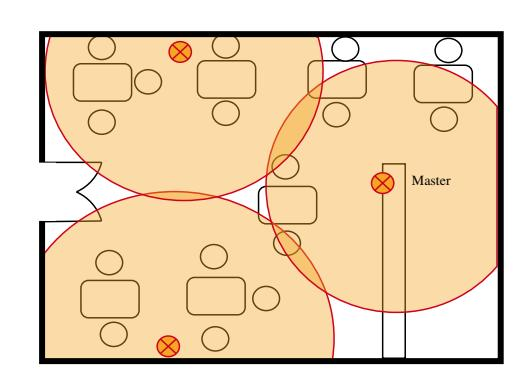
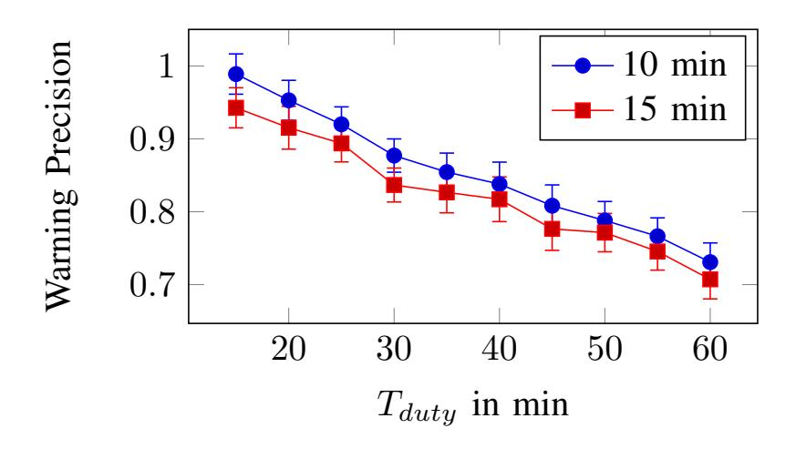

{0}------------------------------------------------

# Lighthouses: A Warning System for Super-Spreader Events

Leonie Reichert<sup>∗</sup> , Samuel Brack<sup>∗</sup> , Bjorn Scheuermann ¨ ∗† <sup>∗</sup>Humboldt University of Berlin, Department of Computer Science {leonie.reichert, samuel.brack, scheuermann}@informatik.hu-berlin.de †Alexander von Humboldt Institute for Internet and Society, Berlin

*Abstract*—Super-spreader events have been a driving force of the COVID-19 pandemic. Such events often take place indoors when many people come together. Various systems for automated contact tracing (ACT) have been proposed which warn users if they have come near an infected person. These generally fail to detect potential super-spreader events as only users who have come in close contact with the infected person, but not others who also visited the same location, are warned. Other ACT approaches allow users to check into locations, but this requires user interaction. We propose two designs how broadcastbased ACT systems can be enhanced by using location-specific information without the need for GPS traces or scanning of QR codes. This makes it possible to alert attendees of a potential super-spreader event while providing privacy. Our idea relies on cooperating "lighthouses" which cover a large area and send out pseudonyms. In our passive design the health authority (HA) publishes location pseudonyms collected by infected users. In the active design, lighthouses communicate with HAs. After retrospectively detecting an infected visitor the lighthouse notifies the HA which users' stay overlapped.

*Index Terms*—COVID-19, Contact Tracing, Privacy-Enhancing Technologies, Super-Spreader Detection, Presence Tracing

## I. INTRODUCTION

During the last months, many apps have been developed and rolled out with the idea to fight the COVID-19 pandemic by improving and speeding up manual contact tracing through automation. The most notable approach GAEN [1] is supported by smartphones running Android or iOS and uses BLE to determine proximity to infected users. While GAEN provides good privacy for users and can not be repurposed to create surveillance infrastructure, it has been criticized as useless for HAs and not making their task easier [2].

Many COVID-19 infections have been traced back to socalled super-spreader events [3]. Here a single, sometimes asymptomatic, person infects many others at the same time. Such events are often reported to happen indoors or in locations with tightly packed crowds, such as rehearsals, weddings, political events or restaurants. Picture a super-spreader event at a restaurant. The infected person Alice uses a GAEN-based contact tracing app. Users of the app who have been in close proximity to Alice will receive a high risk warning by the app when the system is informed about Alice's infection. Users who are seated further away than a certain threshold value (usually 2 m) might receive a weak warning. But due to the indoors situation and, e. g., bad air circulation, their risk might be higher than suggested. Users who are out of reach of Alice's BLE will not receive a warning through the app, even if they might actually be at risk under the given circumstances. Next, assume Alice did not use the GAEN app. This means no warnings are created through the app.

To solve the described problems, we propose two designs for a lighthouse super-spreader warning system that extends the existing GAEN framework with presence tracing. Multiple lighthouses, which are simply BLE-capable smartphones, cooperate to cover a large (indoor or closely-packed) area. Setting up this infrastructure is easy due to the large amount of available old, cheap devices. As distance to lighthouses is not relevant only few devices are necessary to provide coverage. Lighthouses send out lighthouse pseudonyms which are recorded by users. Our first design relies on a simple broadcasting mechanism to notify users about infections. In our second design, lighthouses also collect user pseudonyms and actively check if for any of the past visitors an infection warning is issued. If that is the case, the lighthouses will contact the HA to upload all relevant recorded user pseudonyms. The design focus was placed on user privacy (especially for uninfected users) and usability. It is therefore important that a compatible fallback system exists that can be used to notify visitors who are not using an ACT app.

Our main contributions are

- Two designs to improve GAEN by handling data regarding past visited locations. Users are warned in case they have visited a location during the same time an infected person was there. No interaction from users is required when entering a location.
- Only pseudonymous, ephemeral data is passed from an infected user to the HA which does not reveal the user's location history.
- The distribution of warnings does not require any human interaction from the HA. The HA can also manually trigger warnings for infected persons without app.

The contents of this paper are organized as follows. First, we introduce relevant research and existing systems in Section II. Next, the design based on passive lighthouses is introduced in Section III. Afterwards in Section IV, the more complex approach using active communication is proposed. Section V presents possible attacks against both designs and defense mechanisms. The discussion in Section VI considers improvements to the system, especially regarding usability.

{1}------------------------------------------------

## II. RELATED WORK

Research on contact tracing has greatly evolved during the 2020 COVID-19 pandemic. Many approaches to ACT proposed in literature or deployed by organizations use BLE for proximity detection. In an earlier work [4], we classified approaches to ACT using BLE into multiple classes. Broadcastbased ACT approaches where risk assessment is conducted on the end device have been the most widespread. This is partially due to the involvement of Google and Apple [1], as well as the integration of the *Google Apple Exposure Notification* (GAEN) framework into the respective mobile operating systems. In GAEN, users publish ephemeral pseudonyms over BLE and collect those of others. When a person falls ill, they upload their past pseudonyms to the server of the local HA. This data is then broadcast to all users, which locally check if they have recorded these pseudonyms. Everyone who has been in contact with an infected user will recognize an overlap and thereby learn that they are at risk of being infected. Estimating the transmission probability is done by evaluating the measured distance and exposure time to the infected pseudonym. The decentralized nature of GAEN and its focus on user privacy stops the HA from finding out which locations have been infection hotspots.

There is a range of ACT apps which use GPS data to compare a user's location traces with those of infected individuals to determine who is at risk [4]. These systems generally lack privacy, as they reveal private data of the user and their habits to the HA. Systems that do rely on GPS data but have privacy protection through cryptographic techniques [5] are not yet fast or scalable enough for real world usage.

Another approach to inform people about infection risks is having them check into a place by maintaining physical lists where new arrivals write down their names and contact information. HAs can then later contact the operator of a place to retrieve the list for manual contact tracing. But this requires cooperation of business operators. In Germany, keeping lists has been mandatory for businesses in some states [6]. This approach is time consuming for both visitors and the HA. Visitors have to write down their information frequently and have to be worried that their data is not protected properly from law enforcement or third parties. For HAs, the paper trail is difficult to work with. Precious time is lost by manually requesting logs and notifying people at risk individually. In some case, the logs might not contain useful information if the operator did not enforce the policy or if visitors provided fake data.

Singapore's SafeEntry [7] system also relies on check-ins. Users scan some form of identity proof to enter a location. The corresponding data is stored centrally on a government server for 25 days and used in manual and automatic tracing processes. New Zealand's NZ Tracer app [8] is also a tool to warn people if there has been a COVID-19 case in a location they visited. Here, a location operator generates QR codes which are presented at the entrance. Users can scan the code and store the corresponding information locally. If during manual contact tracing the HA finds that an infected person scanned a QR code, it will publish the corresponding information to all users. The user's app locally checks if an overlapping stay has been recorded and notify the user if that is the case. In case of a warning, the app does not tell users the name of location. But a malicious, tech-savy user would be able to identify it.

Another approach using QR codes is CrowdNotifier [9]. It partially automates the paper-based process used in many European countries. Here, operators of businesses or organizers of events generate three QR codes: one for entry, exit, and tracing. People coming to the location or event can scan the entry code with their app on arrival, which will locally store location and time, protected through encryption. They can also scan the exit code when leaving, although this step is not necessary. If the HA now finds out during interviews that an infected person visited a certain location or event, they contact the operator for both the paper lists and the tracing QR code. Some data inside the tracing QR code is only readable with the private key of the HA. The HA distributes this information to all users, which will check their own history of locations. If they visited the specific location during the relevant time frame, they will be warned by the app. CrowdNotifier cryptographically hides from everyone except the people that have been there during the same time that an infected user visited a specific location or event.

In may 2020, Culler et al. [10] presented a contact tracing approach using BLE beacons called lighthouses to extend the GAEN framework by treating places as people. Possible interactions with manual contact tracing are discussed as well. Our passive approach is very similar to the ideas of Culler et al. Our work provides a formal design as well as a parameter analysis and an extensive security evaluation.

# III. PASSIVE LIGHTHOUSES

A successful super-spreader warning system should be helpful to the HA in containing the outbreaks. It should speed up the HA's contact tracing and help to streamline processes by automating exposure notifications for large amounts of people. To ensure that users do trust the system and do not avoid or circumvent it, user privacy should be one of the main design goals. Tools that can be turned into surveillance infrastructure will lower the adoption rate of such a system [11]. With the principle of data minimization only epidemiologically necessary data should be collected.

The main functionality of the approaches presented in the following is that visitors of *locations* are notified if their stay overlapped with the one of an infected person, even when the GAEN app did not collect the corresponding ephemeral pseudonyms. Locations are places where people gather in groups, e. g., restaurants, bars or sports venues, but also events like demonstrations and outdoor markets. They are operated by an *operator*, who answers to the HA. To receive warnings users need to check into locations. But to facilitate usability, no manual user interaction should be required. The passive lighthouse approach discussed in this section relies on the 

{2}------------------------------------------------

operator to setup BLE beacons called *lighthouses* around their location. These send out pseudonyms which are collected by users and uploaded to the existing ACT infrastructure on infection. The essence of this approach has been first proposed in CoVista [10], but we formalize and extend it in this section.

# *A. Operation*

Operators setup lighthouses, i. e., smartphones with the lighthouse app installed, in their locations. Lighthouses continuously emit ephemeral pseudonyms (lighthouse pseudonyms LPs) over BLE. They are organized in groups to cover areas larger than the reach of a single device. LPs are generated randomly and are distinguishable from BLE pseudonyms broadcast for regular ACT by an additional transmitted prefix. After a certain time Tduty, e. g., 30 min, a new LP is generated and broadcast.

When a visitor arrives at a location, their ACT app will broadcast ephemeral pseudonyms (Ps) and collect those of other users. Visitors will additionally collect LPs transmitted by the lighthouse. In broadcast-based ACT approaches like GAEN, an infected user will upload their used pseudonyms P after being diagnosed. For our super-spreader warning system, the infected user will also upload all LPs they have seen during the relevant time period. Prefixes of LPs are removed before upload. Users can opt-out of uploading certain LPs. The HA will broadcast both Ps and LPs to all users, which locally check this data so see if any of the LPs (and Ps) they have recorded in the past matches. If a match is found, the user is automatically notified that their visit to a location overlapped with that of an infected individual. More specific, the user will learn only the time at which they could have gotten infected. Users who have not gone to the location or visited it at a different time will not receive a warning. Since risk assessment is done locally, the HA does not learn the location history or identity of users at risk.

To mitigate false-positive visits, visitors only store LPs if they have been received for a duration Tthres, e. g., 10 min. This way people simply passing by a location are not warned by accident. Unlike in normal ACT, proximity information can be ignored for LPs during risk assessment.

In case the HA discovers during manual contact tracing that an infected person visited a location, this information can also be fed into the warning system. Using a low-latency, commonly-available channel like telephone, the HA contacts the location operator and asks them to upload the LPs for the corresponding time period to their servers. For uploading the location operator needs a one-time token which can be provided by the HA over the same channel. This process prevents misuse through operators and ensures only locations with confirmed infected persons can upload LPs.

## *B. Combining Multiple Lighthouses*

If an infrastructure only consist of a single lighthouse, not much is gained compared to normal BLE-based ACT. Users that see the lighthouse are also likely to see each other. But especially for indoor locations the affected area can be



Fig. 1. Example setup in a restaurant setting with one master lighthouse and two helpers. Note that two visitors in the top right corner are not covered. This can be solved by improving the layout or adding a lighthouse.

bigger than the the reach of BLE. For this purpose, multiple lighthouses can be used which form a group to synchronize their LPs. One master creates LPs and communicates them to multiple helpers. If an operator wants to cover multiple floors of their restaurant, they can setup one group of lighthouses per floor. For communication between lighthouses the master creates a communication key for a chat protocol which is passed by the operator to all helpers. This channel requires all lighthouses to be connected to the internet. An offline solution using Bluetooth pairings can also be implemented, for example as a backup in case of Internet connection loss. In such a case, the master displays a QR code that is scanned by the helpers to establish a connection over Bluetooth or other local channels, like Wifi Direct. An example scenario for a lighthouse infrastructure with helpers is shown in Figure 1.

## *C. Warning Users Who Entered at a Later Time*

It might be useful to be able to warn people who arrived shortly after the infected person left. Depending on the durability of the virus and the ventilation of the location, new arrivals might still be at risk of getting infected [12]. For this reason, a long duration Tduty is convenient. If an infected person left during the beginning of the duty cycle of an LPt, but stayed long enough for Tthres to be surpassed, users that arrived towards the end of Tduty of LP<sup>t</sup> will receive a warning. In case the infected person left towards the end of Tduty of LPt, users who arrive during the cycle of the following pseudonym LPt+1 will not receive a warning. To fix this problem, duty cycles should overlap, so that for a certain period two LPs are advertised. The overlap has to be at least as long as Tthres.

# *D. False Positives*

One problem with the passive design is that people who have left before the infected person arrived but recorded the same LP, will also receive a warning even though their risk is very limited. The longer Tduty is, the more people will receive a false warning if an infected person arrives towards the end of the duty cycle. Therefore, duration Tduty should be short. As we see, this optimization criterion is contrary to what was written in Section III-C. Figure 2 evaluates the warning precision for different values of Tduty. The precision is given by the fraction of stays which overlapped with the visit of an infected user Alice for at least Tthres divided by all users that have been warned because of Alice.

{3}------------------------------------------------



Fig. 2. Precision for different lengths of Tduty in the passive case. A location was simulated with a maximum capacity of 30 people during an 8 hour day. Inter-arrival times and stay duration were drawn from exponential distributions with means of 10 min and 60 min, respectively. Measurements were repeated 200 times to derive the 95% confidence intervals.

The following section will introduce a different approach for which this false positive rate is expected to be lower.

# IV. ACTIVE LIGHTHOUSES

To only warn people who have not left when the infected user arrived and thereby minimize the false positive rate, lighthouses need to become actively involved in the process.

# *A. Operation*

As above, visitors send out pseudonyms P, due to the functionality of their ACT app. These can be recorded by the lighthouses. Setup and operation is similar as described in Section III-A, with only minor differences. When a lighthouse and a visitor receive the other's pseudonym, they both generate a shared secret S by using P and LP as input for a Diffie-Hellmann key exchange. The lighthouse will store S, P and timestamp T. The visitor only needs to store S.

When a user gets infected, they upload all their own past pseudonyms P to the servers of the HA as done in regular broadcast-based ACT. They additionally upload all secrets S from the time they were contagious. These will not be made public by the HA. Lighthouses regularly check the HA's broadcasts of pseudonyms P that have been uploaded by infected users. If a lighthouse recognizes one P<sup>i</sup> from its history, this means that an infected person has visited the location. The lighthouse then directly contacts the HA. To prove to the HA that it can provide meaningful data, the lighthouse will authenticate itself presenting the corresponding secret S<sup>i</sup> . The HA checks if S<sup>i</sup> was uploaded by an infected user and no corresponding upload has occurred yet. Then, the lighthouse is allowed to upload all pseudonyms P of visitors that had an overlap with the infected person's stay. More specifically, it will check the time when P<sup>i</sup> was recorded first and last, and upload all P that fall into this time period. A pseudocode representation is shown in Algorithm 1. It can be useful to also upload some P that have been recorded shortly after. To ensure that no information is leaked about the location of the lighthouse and thereby about the location history of the infected person, it is necessary that all communication with the HA is conducted through an anonymisation service such as Tor [13]. Users that have been at a location during the same time or shortly after an infected user visited will be informed about their risk. They will not learn the pseudonym of the infected individual that caused the alarm unless they came in close contact and recorded the corresponding pseudonym P. Users that have not visited the location or left before the infected person arrived will not learn that there has been a (possible) outbreak.

It can happen that an infected person visits the location who does not use any ACT app, making them undetectable for lighthouses. If the HA discovers such a case during manual contact tracing, it demands from the relevant location operators that they upload all at-risk pseudonyms. For this purpose, it passes the corresponding time period and an additional secret token to the location operator. The operator manually inserts both in the master lighthouse, which will use the token to authenticate itself with the HA and upload all recorded user pseudonyms from the time period.

#### Algorithm 1 Active Lighthouse Algorithm

```
1: while true do
```

- 2: e ← current epoch
- 3: Advertise Lighthouse Pseudonym LP<sup>e</sup> over BLE
- 4: LP s ← LP s S {LPe}
- 5: P ← Pseudonym received from users
- 6: S ← {Diffie-Hellmann(LPe,P)}
- 7: H ← H S {P,S,Timestamp T}
- 8: I ← Data from HA blackboard
- 9: if ∃i := (P<sup>i</sup> , S<sup>i</sup> , Ti) ∈ H : P<sup>i</sup> ∈ I then
- 10: R ← R S {∀u ∈ H : overlap(i, u) > threshold}
- 11: Send R to HA, use one S<sup>i</sup> for authentication

## *B. Breaking the Link*

If a lighthouse uploads all pseudonyms in one message, the HA can derive that some users might have been at this location together. To break this link between pseudonyms of visitors, a blind signature scheme similar to the one in our work CAUDHT [14] can be used. Instead of directly uploading relevant visitor pseudonyms, the lighthouse fetches a blind signature for each relevant P. Afterwards, the lighthouse holds for each P a signature sigHA(P) from the HA. The HA did not learn the value of P nor of sigHA(P). Now, the lighthouse uploads all tuples (P, sigHA(P)) using different connections through Tor. To mitigate timing attacks, the upload can be spread out as described in [4]. By checking the signature, the HA knows that the uploader is authenticated. Only if the signature is valid, the HA accepts uploaded visitor pseudonyms and publishes them.

## *C. Combining Multiple Lighthouses*

Similarly to the passive design, a private communication channel has to be established between lighthouses as described in Section III-B. This channel is used for lighthouses in the role of a helper to report recorded tuples of (P<sup>i</sup> , S<sup>i</sup> , Ti) back to the master lighthouse. The master lighthouse stores all 

{4}------------------------------------------------

recorded data and takes the responsibility of communicating with the HA.

#### V. SECURITY CONSIDERATIONS

To understand the security threats against the proposed super-spreader warning systems, we now present several attacks. We will not discuss general threats to broadcast-based ACT apps, but only new attack vectors introduced by our lighthouse warning systems.

#### *A. Mapping of Locations to Lighthouse Pseudonyms*

It would be harmful if the HA could find out for arbitrary users which places they have visited. In the passive design only pseudonymous LPs, stripped from all static prefixes, are sent to HA by the infected user. This mitigates the attack mostly. It is important that LPs are derived locally by lighthouses, are changed frequently and do not contain hidden information about their creator. Healthy users never upload any data. In the active design, infected users upload their secrets S. As long as the lighthouse, which also knows S, communicates anonymously with the HA, no information about the nature of the location, and thereby about the infected user's location history, is leaked.

The HA does not know the LP from which S was derived. If the HA wants to map Ss (from anonymous uploads) to locations, it has to actively collect data. With the passive design it could continuously issue requests to locations to upload their LPs. Uploading LPs requires manual interaction from the location operator. Such an attack could therefore be easily detected and would result in a lack of trust and abandonment of the system by location operators. Another way to get access to LPs of locations is eavesdropping on the BLE band. Placing the necessary infrastructure in all possible locations would be rather expensive. But an HA can single out certain locations of interest and record LPs there. This allows it in both designs to identify if an infected individual visited a certain place during a specific time based on the uploads. But since this information is collected about infected individuals during the manual process as well, not much is gained by the HA. The same goes for uploads that do not go through Tor.

## *B. Detecting Closeness on a Social Graph*

In the passive design the HA can identify that visits of two users to the same location overlap if they become infected and upload the same LP. Such an overlap might indicate that they know each other or are in the same social circles. This information about infected individuals is also recorded by the HA during manual contact tracing. But since it can leak private information, users can decide to not upload LPs from certain locations or times. To hide their identity, an infected user can also use Tor for their upload. This works as long as upload tokens, usually required for proving to the HA that the uploader is actually infected, are not directly linkable to the user. Some token schemes are discussed in [4]. In the active design, knowing two secret keys S<sup>A</sup> and SB, the HA can not derive if they were recorded at the same time and location. It can only verify a guess for an LP it possesses.

## *C. Fake Hotspots*

There are multiple reasons an attacker can be interested in faking a hotspot. For example, the HA or a state organization could employ it for crowd control or a competitor of the location operator might want to gain an advantage. To do so, in the passive design the attacker only needs to record LPs of locations and have them published by the HA. An attacker who does not have the capabilities of the HA can sneak the LPs into the uploads of an infected individuals. The active design is not vulnerable, as lighthouses provide a sanity check.

Another goal of fake hotspots can be extortion, as reported in Korea [15]. Infected users demand money for not visiting a location or for not uploading the corresponding LPs (in the passive design) or Ss (in the active design). All systems that have users check into locations can make operators target of such an attack.

#### *D. Network Observer*

A network observer is capable of seeing all data that is communicated over the Internet between lighthouses and the HA as well as between the HA and users. In the passive design, a network observer will be able to tell who is infected as it can see who uploaded data to the HA. This problem is inherent to broadcast-based ACT approaches. The authors of DP3T [16] proposed to introduce probabilistic cover traffic where any user might communicate with the HA in a way that is not distinguishable from real traffic by an observer. In the active design, lighthouses communicate with the HA to upload recorded data. To hide the lighthouse's location, Tor is used which makes cover traffic obsolete. If Tor is not used, lighthouses need to contact the HA at random so that an observer is not able to tell which locations had a recent outbreak.

# VI. DISCUSSION

In the following we discuss operational aspects of our proposed systems.

# *A. Improvements Compared to GAEN*

Due to multiple lighthouses working together, both lighthouse systems can span a larger area than simply having people only use their GAEN app to detect co-location with an infected individual. While the lighthouses themselves also only have limited reach through BLE, these beacons are not used for estimating the distance and are recorded even if the signal is weak but continuous. The lighthouse systems also allow for information flow from infected visitors without an app to visitors that use the app.

## *B. Recording the Correct Lighthouse Pseudonyms*

Assume a location has setup for each of their floors a separate groups of lighthouses. A visitor might detect multiple LPs at the same time, even those from a group on a different floor. In case a past visitor turn out to be infected, this could lead to false warning issued to people who were on a different floor. Therefore, users only record the LP that was the closest 

{5}------------------------------------------------

for at least the duration Tthres. If several lighthouses are equally close or the error of the proximity measurement is too large to make a meaningful decision, pseudonyms of multiple lighthouses can be stored. This ensures that movement between locations is also recorded.

# *C. Integration With Paper Lists*

Since pseudonyms of infected users are published by the HA (as by design of broadcast-basted ACT apps), lighthouses can automatically check if an infected person has visited their location. If a visit of an infected person is detected, the master lighthouse can prompt the operator and inform them that they have to provide their paper trail to the HA. In the first design, this means that lighthouses need to scan LPs published by the HA for their own past LPs. In the setting where lighthouses are active, this detection is already done. This process speeds up detection times for the HA as the operator will approach them instead of the other way around, informing them about an outbreak which might otherwise detected days later.

Lighthouses could also directly contact the HA when the past presence of an infected user is detected and communicate the name of the location and the time. But since it is assumed that the lighthouse system is voluntary, the cooperation of operators is required. Any system which automatically forwards data to the HA and reports locations might not enjoy good trust and widespread utilization.

# *D. Usability and Deployment Costs*

An important feature of the proposed lighthouse system compared to the check-in approaches is usability. Users do not have to do any scanning when entering a location, record or reveal their GPS traces but will still receive location specific warnings. This makes the system accessible for example for people who have difficulties using their phone or who are visually impaired. For usability reasons it is also important that the visitor's application can run in the background. The passive design without prefixes would not require any changes to the current GAEN framework. All other proposals discussed in this paper do require changes.

Setting up the lighthouse system incurs some costs for the location operator. Apart from the software itself, each lighthouse requires a smartphone recent enough so that it is equipped with BLE. There is no requirement for specialized hardware, so even second-hand off-the-shelf phones can be compatible with the lighthouse system. To sync LP generation and rollovers, as well as to facilitate the interaction with the HA, multiple phones in one location need to be interconnected and at least one of them needs to have an Internet connection. Most locations probably have some kind of Internet access, but in some scenarios this might incur additional costs, e. g., in a long-distance bus where a mobile Internet contract is needed. case of ACT and serves as a tool to deliver exposure notifications quicker than with manual notifications after a location

## VII. CONCLUSION AND FUTURE WORK

In this paper, we presented a system for sending locationspecific super-spreader warnings to users by extending existing BLE-based systems for ACT such as GAEN. It extends the use was determined as a potential infection hotspot. No GPS data has to be collected, only BLE is used to exchange pseudonyms between users and lighthouses set up by operators. Lighthouses can cooperate to cover larger areas and warn people about infected users even if they did not see this users' pseudonyms.

We presented two designs with different false positive rates and privacy guarantees. The first one relies on pseudonyms of lighthouses to be recorded and in case of infection to be distributed using the existing broadcast infrastructure. In the second design, lighthouses communicate with the HA when they recognize a past visitor as infected and will upload the recorded pseudonyms of everyone whose visit overlapped. Both designs are compatible with existing contact tracing apps and only require minor changes in the existing infrastructure.

# REFERENCES

- [1] Google and Apple, "Privacy-preserving contact tracing," 2020, Last Accessed: 2021-01-01. [Online]. Available: www.apple.com/covid19/contacttracing
- [2] Washington Post, "Apple and Google are building a virus-tracking system. health officials say it will be practically useless." 2020, accessed: 2020-11-16. [Online]. Available: www.washingtonpost.com/technology/2020/05/15/app-applegoogle-virus/
- [3] L. e. a. Wang, "Inference of person-to-person transmission of COVID-19 reveals hidden super-spreading events during the early outbreak phase," *Nature communications*, vol. 11, no. 1, pp. 1–6, 2020.
- [4] L. Reichert, S. Brack, and B. Scheuermann, "A survey of automatic contact tracing approaches," To appear in ACM Health, 2021.
- [5] ——, "Privacy-preserving contact tracing of COVID-19 patients," Poster Session at the 41st IEEE Symposium on Security and Privacy, 2020.
- [6] P. Roos, "No personal data, no food? The new German COVID-19 regulations and their data-protection relevance for the food and drink industry," 2020, accessed: 2021-01-01. [Online]. Available: https://digital.freshfields.com/post/102g7db/no-personal-datano-food-the-new-german-covid-19-regulations-and-their-data-pro
- [7] Government of Singapore, "SafeEntry," 2020, accessed: 2021-01-01. [Online]. Available: www.safeentry.gov.sg/
- [8] Ministry of Health New Zealand, "NZ COVID Tracer app," 2020, Last Accessed: 2021-01-01. [Online]. Available: www.health.govt.nz/our-work/diseases-and-conditions/covid-19 novel-coronavirus/covid-19-resources-and-tools/nz-covid-tracer-app
- [9] W. Lueks *et al.*, "CrowdNotifier decentralized privacy-preserving presence tracing," 2020, accessed: 2021-01-01. [Online]. Available: github.com/CrowdNotifier/documents
- [10] D. Culler, P. Dutta, G. Fierro, J. E. Gonzalez, N. Pemberton, J. Schleier-Smith, K. Shankari, A. Wan, and T. Zachariah, "Covista: A unified view on privacy sensitive mobile contact tracing effort," 2020.
- [11] F. Buder *et al.*, "Adoption rates for contact tracing app configurations in Germany," 2020, accessed: 2021-01-01. [Online]. Available: www.nim.org/en/research/research-reports/adoptionrates-contact-tracing-app
- [12] G. Correia, L. Rodrigues, M. Silva, and T. Gonc¸alves, "Airborne route and bad use of ventilation systems as non-negligible factors in SARS-CoV-2 transmission," *Medical Hypotheses*, p. 109781, 2020.
- [13] The Tor Project, "Tor," accessed: 2021-01-18. [Online]. Available: www.torproject.org/
- [14] S. Brack, L. Reichert, and B. Scheuermann, "CAUDHT: Decentralized contact tracing using a dht and blind signatures," in *LCN*, 2020.
- [15] N. Kim, "'More scary than coronavirus': South Korea's health alerts expose private lives ," 2020, accessed: 2021-01-01. [Online]. Available: www.theguardian.com/world/2020/mar/06/more-scary-thancoronavirus-south-koreas-health-alerts-expose-private-lives
- [16] C. Troncoso *et al.*, "Decentralized privacy-preserving proximity tracing version: 25 May 2020," 2020, accessed: 2021-01-11. [Online]. Available: github.com/DP-3T/documents/blob/master/DP3T White Paper.pdf