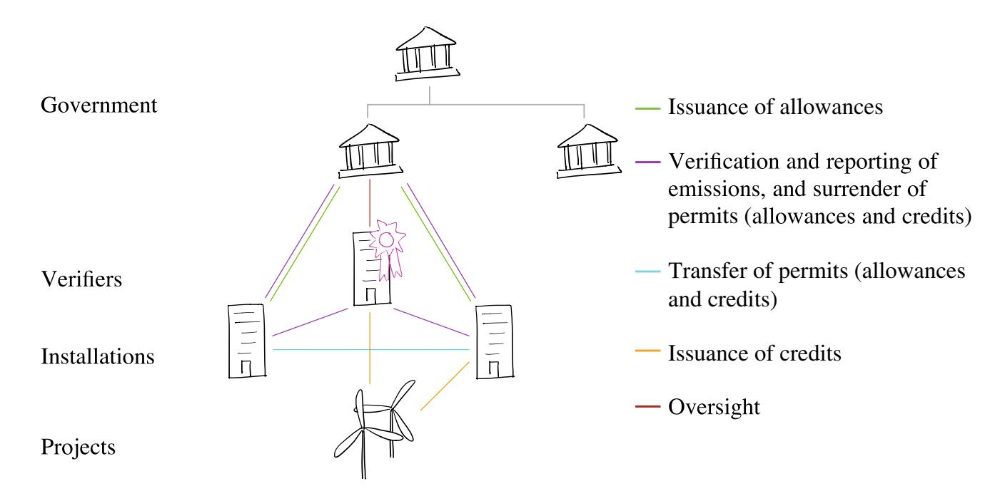
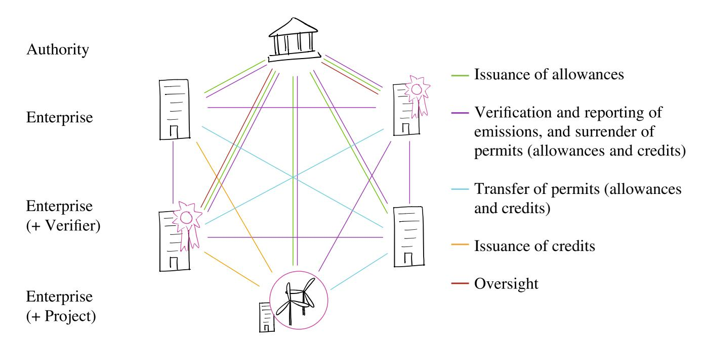
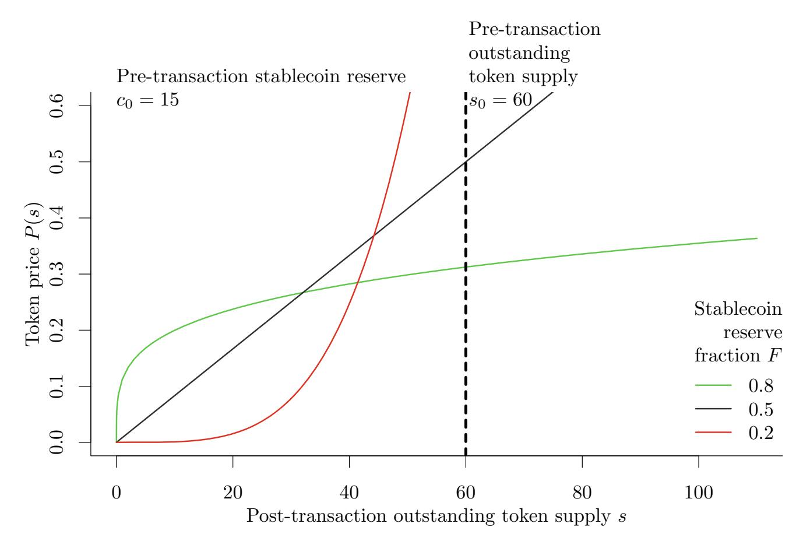

{0}------------------------------------------------

#### **Carbon Trading with Blockchain**

 **Andreas Richardso[n](http://orcid.org/0000-0002-5466-7279) Jiahua Xu**

**Abstract** Blockchain has the potential to accelerate the worldwide deployment of an emissions trading system (ETS) and improve the efficiency of existing systems. In this paper, we present a model for a permissioned blockchain implementation based on the successful European Union (EU) ETS and discuss its potential advantages over existing technology. The proposed ETS model is both backward compatible and future-proof, characterised by interconnectedness, transparency, tamper-resistance and continuous liquidity. Further, we identify key challenges to implementation of blockchain in ETS, as well as areas of future work required to enable a fully decen-tralised blockchain-based ETS.

**Keywords** Blockchain · Carbon trading · ETS · Sustainability · ESG

### **1 Introduction**

 Carbon trading systems, such as the European Union Emissions Trading System (EU ETS), provide a market mechanism to incentivise emissions reduction on the basis of *cap and trade*. An overall *cap* on emissions in tonnes of CO2-equivalent<sup>1</sup> (tCO2e)

#### Reference Format:

Richardson, A., & Xu, J. (2020). Carbon Trading with Blockchain. In P. Pardalos, I. Kotsireas, Y. Guo, & W. Knottenbelt (Eds.), Mathematical Research for Blockchain Economy (pp. 105–124). [https://doi.org/10.1007/978-3-030-53356-4\\_7](https://doi.org/10.1007/978-3-030-53356-4_7)

<sup>1</sup>Scaling factors known as Global Warming Potentials (GWPs) are used to normalise the impact of various Greenhouse Gases (GHGs) emitted against CO<sup>2</sup> (which, by definition, has a GWP of 1).

{1}------------------------------------------------

is imposed by a central authority, which is translated into allowances that are issued to companies. These allowances are surrendered and retired at the end of a reporting period to offset the company's emissions during the period, with the company free to *trade* any surplus allowances on the market [\[28\]](#page-18-0). Importantly, should a company have insufficient allowances to cover their (expected) emissions, they are obliged to either purchase surplus allowances from other market participants, or take measures to reduce their emissions; penalties are imposed for non-compliance [\[28\]](#page-18-0). Naturally, a high price for allowance units incentivises participants to choose the latter option.

On first inspection, this system appears to be suited to an application of blockchain technology, as it involves multiple distributed parties transacting using common currencies and requires transactions to be recorded in an immutable ledger. Indeed, multiple organisations and startups are actively exploring this approach [\[8\]](#page-17-0). However, on closer inspection, the centralised nature of ETSs in their current form and the immaturity of the blockchain industry pose some critical challenges to the adoption of the technology. One of the frequently-cited advantages of blockchain is the "disintermediation of trust" [\[1](#page-17-1), [9](#page-17-2), [10\]](#page-17-3), meaning a central trusted authority is not required for the network to reach consensus. Yet current ETS designs make heavy use of trusted authorities: a central (governmental) authority is responsible for the distribution of allowances under the cap, whether by direct allocation or through an auction process; further, companies must report their emissions to the central authority and seek verification of this figure from a third-party [\[19\]](#page-18-1). More generally, security loopholes and unethical activities permeating the blockchain space continue to act as a barrier against immediate adoption of this still evolving technology [\[11,](#page-17-4) [37,](#page-19-0) [45](#page-19-1)].

As a result, a clear and compelling case must be made to justify the advantages of blockchain over existing technologies. A number of frameworks have been proposed for assessing potential blockchain implementations, considering technical, organisational and legal factors [\[9](#page-17-2), [10,](#page-17-3) [31](#page-18-2)], whilst a series of strategic questions have been raised for business leaders evaluating blockchain's potential [\[11](#page-17-4), [23](#page-18-3)]. The extreme interest shown in blockchain technology over recent years and the resulting disillusionment with its failure to meet over-hyped promises means the technology is treated with caution; its pros and cons must be carefully weighed [\[22](#page-18-4), [33](#page-19-2), [34\]](#page-19-3).

In this paper, we describe the advantages and challenges of implementing a blockchain-based ETS, and sketch out a hybrid model that is both backward compatible and future-proof.

# **2 Background**

We first present the EU ETS as a prime example of a contemporary ETS, using it to introduce a discussion of the weaknesses in current ETSs and highlight areas where blockchain technology has strong potential. We additionally present a review of selected literature in this space.

{2}------------------------------------------------



**Fig. 1** Overview of the EU ETS. Lines represent transactions between parties; the two layers of government represent the European Commission and member states.

### <span id="page-2-1"></span>*2.1 EU ETS*

The EU ETS was launched in 2005 and has become the largest ETS to date, representing the majority of international emissions trading [\[12](#page-17-5), [19](#page-18-1)]. Its coverage extends to over 11,000 installations (power stations and industrial plants) with significant energy usage as well as airlines operating in the EU, together representing about half of the EU's greenhouse gas (GHG) emissions[2](#page-2-0) [\[18](#page-18-5)]. A representative schematic of the different players and transactions in the EU ETS is presented in Fig. [1.](#page-2-1)

**Tradeable instruments** The EU ETS introduces a new tradeable instrument alongside the allowance unit: credits. Whilst allowances are issued by governments of member states through allocation or auction, credits are generated through emissions-reduction projects in other countries under Kyoto Protocol mechanisms. Any allowances or credits surplus to an installation's requirement to offset its emissions may be freely traded for profit [\[19\]](#page-18-1).

**Impact** Relative to a 2005 baseline, the EU ETS is expected to have reduced emissions by 21% in 2020 and by 43% in 2030, indicating that the underlying market mechanism is functioning as expected [\[18\]](#page-18-5).

<span id="page-2-0"></span><sup>2</sup>The GHGs covered by the EU ETS are carbon dioxide (CO2), nitrous oxide (N2O) and perfluorocarbons (PFCs) [\[19\]](#page-18-1).

{3}------------------------------------------------

### *2.2 Potential and Suitability of Blockchain*

Despite their successes, there still exist issues with both the EU ETS and ETS more broadly, which this paper seeks to address. Specifically, we argue that blockchain technology shows great potential to advance the state of the art in a number of key areas of ETS development.

**Coverage** Existing ETSs are restricted in terms of geographical coverage, with large portions of the world currently lacking plans to implement ETS [\[9\]](#page-17-2). A distributed scalable blockchain-based ETS solution could rapidly support new carbon markets by allowing nodes to join the network with ease. Article 6 of the 2018 Paris Agreement already provides a foundation for decentralised cooperative climate action; blockchain is expected to be a key technology to deliver these ambitions, particularly through future carbon markets [\[6,](#page-17-6) [15\]](#page-18-6).

**Linkage** Accounting, auditing and mutual monitoring of emissions between entities in disconnected ETSs are deemed challenging. For example, it is believed that for the UK, an exit from the EU—and consequently the EU ETS—may hinder attempts to meet future carbon budgets [\[24](#page-18-7)]. Although some ETSs have previously implemented links, the process is complex and lengthy, as evidenced by the near decade-long process to link the Swiss and EU ETS [\[13](#page-17-7), [20\]](#page-18-8). In this context, an easily extensible linked ETS solution that can be rapidly deployed in new areas would be highly desirable.

An interlinked web of ETSs would increase market liquidity and size [\[16](#page-18-9), [29](#page-18-10), [36,](#page-19-4) [40\]](#page-19-5), and reduce opacity inherent in siloed systems. Transparently linking multiple ETSs would increase the likelihood of discovery, and hence lower the chance, of fraudulently claiming credits from the same project in multiple systems ("doublecounting") [\[9,](#page-17-2) [10,](#page-17-3) [16](#page-18-9)].

**Cost** A (semi-)automated decentralised system embedding smart contracts can be used to reduce overall transaction cost. For individual enterprises, fixed costs can be further cut especially when spread across a large network. Lower transaction costs reduce barriers to entry, allowing coverage to be extended to smaller enterprises and less-developed geographies.

**Trust** As codified protocols in immutable smart contracts are tamperproof, blockchainbased ETSs are expected to improve trust relative to existing systems [\[7](#page-17-8)]. This could help maintain market confidence and integrity with linked ETSs, for example if one ETS operates in a jurisdiction with an increased risk of corruption [\[16](#page-18-9)].

**Transparency** The shared, distributed nature of a blockchain system underpins transparency. Address anonymity (or pseudonymity) with blockchain would allow transaction data to be made available in much greater detail, without compromising privacy or confidentiality concerning e.g. ETS players' trading positions. Compared to the 

{4}------------------------------------------------

EU ETS transaction log (EUTL), from which relatively little data is made available, increased scrutiny of public data could strengthen systems and reduce the risk of government corruption [\[9,](#page-17-2) [10](#page-17-3), [19](#page-18-1), [21\]](#page-18-11).

**Consensus and fault tolerance** Well-designed consensus mechanisms provide a degree of fault tolerance that allows the system to operate normally even with the presence of misbehaving actors or malfunctioning nodes in the network [\[2](#page-17-9), [5](#page-17-10), [42](#page-19-6)]. This is relevant particularly in the context of linking ETSs, where heterogeneous players with various levels of credibility and reliability are connected to the system.

## *2.3 Existing Work*

Existing attempts to bring the benefits of blockchain to carbon trading have generally had a limited impact and a short lifespan [\[21\]](#page-18-11), being largely predicated on the small voluntary carbon market. As such, any blockchain solution will require significant support from existing ETS regulators to ensure sufficient impetus for further growth and development. Once "critical mass" of usership is achieved however, a solution can be expected to become self-sustaining; the contribution of regulators to facilitate access to the regulatory compliance market is likely to be a significant factor for success. Also of note is that despite favourable press coverage over the past years, blockchain is not a panacea and still suffers from crucial limitations [\[43\]](#page-19-7) (see discussion in Sect. [4\)](#page-12-0).

In Table [1,](#page-5-0) we layout selected existing works related to the present discussion; whilst the concept of a blockchain-based ETS has already been broadly discussed, this study considers the practical implementation of such an ETS.

# **3 Proposal**

Given the challenges involved in the development of a completely decentralised blockchain-based ETS, a more pragmatic approach might be to progressively improve upon existing ETS frameworks. Thus, we sketch out a hybrid model combining some degree of decentralisation whilst maintaining a role for trusted authorities, as illustrated in Fig. [2.](#page-6-0) This does not preclude a future switch to a fully decentralised model, but it is expected to provide an easier transition to blockchain technology for existing ETS players, increasing the practical feasibility of the proposal.

{5}------------------------------------------------

<span id="page-5-0"></span>**Table 1** Overview of selected existing works

| Source | Description                                                                                                                                                                                                                                                       |
|--------|-------------------------------------------------------------------------------------------------------------------------------------------------------------------------------------------------------------------------------------------------------------------|
|        | Discussion papers                                                                                                                                                                                                                                                 |
| [4]    | Presents a systems engineering approach to a decentralised emissions trading<br>infrastructure. Reviews architecture (covering e.g. database type, credit<br>issuance, existence of central authority etc.) of other carbon trading schemes                       |
| [9]    | Outlines blockchain potential for ETS, climate mitigation and climate finance<br>applications in the specific context of Mexico, with discussion of potential<br>implementation (technologies, costs, roadmap etc.)                                               |
| [10]   | Provides an overview of blockchain potential, suitability and challenges for<br>applications including ETS, MRV and climate finance                                                                                                                               |
| [16]   | Describes current climate markets from a technological perspective and<br>discusses improvements. Presents potential and suitability of blockchain                                                                                                                |
| [21]   | Argues for the suitability and potential of blockchain in achieving the<br>commitments of the Paris Agreement and for climate action in general, with<br>discussion of areas of required future work                                                              |
|        | Implementation work                                                                                                                                                                                                                                               |
| [17]   | Discusses general suitability of blockchain for ETS applications, and presents<br>a proof-of-concept implementation for a transportation-specific ETS using<br>Hyperledger Iroha                                                                                  |
| [27]   | Proof-of-concept blockchain for green certificates (proof of electricity<br>generation from renewable sources) in a microgrid electricity trading<br>environment using the Corda platform                                                                         |
| [30]   | Proof-of-concept ETS implementation using "reputation points" to determine<br>market access priority, thus aiming to tackle security issues identified with<br>EU ETS. Includes detailed quantitative analysis of improvement relative to<br>conventional systems |
| [32]   | Develops detailed proof-of-concept blockchain for EU ETS using smart<br>contracts on Ethereum. Discusses software development process<br>(requirements, use cases) and system architecture (implementation) in detail                                             |

## *3.1 Taxonomy*

In this proposal the following definitions are used:

| Organisation | The<br>simplest<br>type<br>of<br>entity<br>in<br>the<br>network,<br>upon<br>which<br>other<br>roles                                                                          |
|--------------|------------------------------------------------------------------------------------------------------------------------------------------------------------------------------|
|              | are<br>built.<br>An<br>organisation<br>provides<br>a<br>framework<br>to<br>manage<br>common                                                                                  |
|              | metadata<br>required<br>to<br>interact<br>with<br>the<br>blockchain<br>(e.g.<br>public/private                                                                               |
|              | key<br>management).                                                                                                                                                          |
| Authority    | Governmental<br>or<br>supranational<br>body,<br>with<br>legislative<br>power<br>over<br>other<br>authorities<br>or<br>enterprises<br>within<br>a<br>certain<br>jurisdiction. |

{6}------------------------------------------------

#### Carbon Trading with Blockchain



<span id="page-6-0"></span>**Fig. 2** Schematic showing potential interactions in the outlined blockchain-based ETS

Enterprise "Legal person" consisting of one or more installations or projects that

uses the network to report and/or offset emissions. An enterprise may be mandated to participate in the network by an authority or access

it voluntarily, and may carry verifier status.

Installation Physical source of GHG emissions—such as factories, manufactur-

ing plants, offices—owned by one or more enterprises.

Project Emissions reduction scheme generating carbon credits under Kyoto

Protocol mechanisms, owned by one or more enterprises.

Verifier Status awarded to an enterprise by an authority, allowing it to perform

verification functions within the network.

### *3.2 Tokens*

Two types of token are envisaged for network, closely mirroring current ETS bookkeeping [\[9,](#page-17-2) [19\]](#page-18-1) (see Sect. [3.5\)](#page-11-0).

Emission 1 tCO2e verified GHG emissions.

Permit Permit to emit 1 tCO2e. Permits can represent both allowances issued

by an authority, or credits granted by a verifier.

{7}------------------------------------------------

### *3.3 Processes*

In this section, we present a basic outline of processes performed on the network, illustrated with smart contract pseudocode required for their execution[.3](#page-7-0) At the scale required of an international ETS, a custom-developed blockchain may be more appropriate; nevertheless, our approach provides a general framework for presenting and debating a proof of concept.

**Role change** An authority can change the role of an enterprise, including promotion of an enterprise to verifier status or removal of an existing status.

### **Algorithm 1** Role change

```
1 Function setRole(address sender, address target, string newRole)
2 require sender.role = authority and target.role -
                                            = newRole // Sender
     must be authorised and request is a change
3 target.role ← newRole
```

**Issuance of permit** Emission permits can represent either allowances issued by an authority, or credits issued by a verifier.

An authority can mint permit tokens typically in an amount corresponding to the desired cap level. The tokens may be issued through direct allocation or auction.

### **Algorithm 2** Mint permit token

```
1 Function mintPermit(address signer, address target, uint amount)
2 require signer.role = authority // Only authorities can mint
     permits
3 target.balance[permit] += amount
4 market.balance[permit] += amount
```

Permit tokens can also represent credits granted by a verifier to an enterprise owning emission-reducing projects.

#### **Algorithm 3** Grant permit token

```
1 Function grantPermit(address signer, address target, uint
  amount)
2 require hasProject(target) and signer.role = verifier // Verifier
     ensures that the enterprise has a carbon-reducing project
3 target.balance[permit] += amount
```

**4** market.balance[permit] += *amount*

Both mintPermit and grantPermit allow permit tokens to be issued "out of thin air", thus increasing the total circulating supply of the token in the market.

<span id="page-7-0"></span><sup>3</sup>Our pseudocode is inspired by the [Solidity](https://github.com/ethereum/solidity) language used to implement smart contracts on the Ethereum blockchain.

{8}------------------------------------------------

In Sect. 3.4 we quantify the effect of this mechanism on the market price of permit tokens.

**Issuance of emissions** Emission tokens may be minted by any enterprise if a verifier co-signs the transaction as a true reflection of the enterprise's emissions.

#### **Algorithm 4** Mint emission token

```
1 Function mintEmission(address sender, address signer, uint
```

**Transfer tokens** Permit tokens which represent emission allowances and credits may be freely transferred among network participants, who may choose to create derivative products such as swaps and options (as in the EU ETS [19, p. 71]) or to send tokens to an exchange.

#### Algorithm 5 Transfer permit tokens

```
1 Function transferPermit(address sender, address target, uint
```

**Burn tokens** Emission tokens are burnt alongside an equal or greater number of permit tokens in a single transaction. This process also allows enterprises to voluntarily surrender excess permit tokens if they so choose (as is possible in the EU ETS [19, p. 131]). Enterprises cannot transact with emission tokens in any other way.

#### Algorithm 6 Burn tokens

```
1 Function burnToken (address sender, uint amount)
2
```

**Token exchange** Organisations can freely trade their permit tokens with the authority, which also acts as a liquidity provider. To ensure liquidity in the market and hence enhance the tradability of tokens, we can implement the Bancor protocol [25,

{9}------------------------------------------------

39] which automates price determination according to the dynamics of supply and demand (see Algorithms 7 and 8, and Appendix "Bancor Algorithm for Token Exchange").

#### Algorithm 7 Trade tokens

```
1 Function tradeToken (address sender, uint amount)
2
      supply ← market.balance[permit]
3
      cashAmount \leftarrow reserve * ((1 + amount/supply)^{(1/fraction)} - 1)
                                           // Based on eq. (7) in Appendix
4
     if amount > 0 then
         require cashAmount \leq sender.cash
5
                                                  // Must have cash to spend
6
         sender.balance[permit] += amount
7
         market.balance[permit] += amount
8
         sender.cash = cashAmount
         reserve += cashAmount
9
10
      else if amount <= 0 then
         require-amount ≤ sender.balance[permit] // Must have token to sell
11
         sender.balance[permit] += amount
12
13
         market.balance[permit] += amount
14
         sender.cash = cashAmount
15
         reserve += cashAmount
```

#### Algorithm 8 Convert cash

```
1 Function convertCash (address sender, unit amount)
2
     supply ← market.balance[permit]
3
     tokenAmount \leftarrow supply * ((amount/reserve + 1)^fraction -1)
                                           // Based on eq. (8) in Appendix
4
     if amount > 0 then
5
         require amount \leq sender.cash
                                                  // Must have cash to spend
         sender.balance[permit] += tokenAmount
6
         market.balance[permit] += tokenAmount
7
8
         sender.cash = amount
9
         reserve += amount
10
     else if amount <= 0 then
         require—tokenAmount ≤ sender.balance[permit] // Must have token to
11
          sel1
12
         sender.balance[permit] += tokenAmount
         market.balance[permit] += tokenAmount
13
         sender.cash = amount
14
15
         reserve += amount
```

{10}------------------------------------------------



**Fig. 3** Token price as a function of supply as specified in [\(4\)](#page-16-1)

## *3.4 Market Adjustment*

With the development of technology, the cost of emissions reduction will decrease over time. As a result, the supply of surplus allowances and credits will increase, whilst demand for them decreases, driving the price of tokens down. Thus it may become cheaper for firms to use credits to offset their emissions rather than reducing the emissions directly.

With the emissions cap being a moving target, the authority may steer the market in order to continuously motivate emission reduction. In addition to having the power to change the cap level and so restrict the supply of allowances the authority can also adjust, the price of tokens through the exchange. According to [\(1\)](#page-15-0), the tokens' market price can be raised in two ways:

- Reducing reserve fraction *F*, allowing for stablecoin (digital cash) to be spent from the exchange and thus enhancing its purchasing power;
- Increasing the total stablecoin reserve *c*0, thus enhancing the purchasing power of the exchange;

Naturally, in order to reduce the token price, the authority can simply do the opposite.

{11}------------------------------------------------

### <span id="page-11-0"></span>3.5 Carbon Bookkeeping on and off Blockchain

We demonstrate the compatibility of our proposed blockchain-based model with the existing ETS frameworks through an illustrative example. In principle, blockchain is underpinned by time-honoured bookkeeping mechanisms including TEA (Triple Entry Accounting) and REA (Resources-Events-Agents) [26]. Therefore, the compatibility between the conventional and the newly proposed ETS record-keeping framework is expected to an extent.

In our illustrative example, the following series of accounting events take place. For simplification purposes, we ignore the slippage effect as the transacted emissions in our example is assumed to account for an insignificant portion of the total market volume.

- 1. On January 1, 2020, the market value for of one permit token was  $20 \in$ .
  - Authority  $\mathscr{A}$  allocated Enterprise  $\mathscr{E}$  with allowances for 100 tCO<sub>2</sub>e by issuing  $\mathscr{E}$  100 permit tokens.
  - Verifier  $\mathscr{V}$  approved Enterprise  $\mathscr{E}$ 's carbon-reducing project in a developing country and granted  $\mathscr{E}$  with credits for  $40 \text{ tCO}_2\text{e}$  by issuing  $\mathscr{E}$  40 permit tokens.
  - Enterprise  $\mathscr E$  transferred 10 permit tokens to Enterprise  $\mathscr F$ .
- 2. On June 30, 2020, the market value of one permit token increased to  $24 \in$ .
  - Enterprise  $\mathscr{E}$  recorded 55 tCO<sub>2</sub>e emissions from January to June.
  - Enterprise  $\mathscr{E}$  cashed out 240  $\in$  by selling 10 tokens to the market.
- 3. On December 31, 2020, the market value of one permit token decreased to  $22 \in$ .
  - Enterprise  $\mathscr{E}$  recorded 70 tCO<sub>2</sub>e emissions from June to December.
  - Enterprise  $\mathscr{E}$  bought 5 permit tokens from the market to cover the emissions.
  - Enterprise & surrenders 125 permit tokens to offset the total emissions of 125 tCO<sub>2</sub>e during year 2020.

In Table 2, we juxtapose smart contract execution with double-entry journalisation from the perspective of Enterprise  $\mathscr{E}$  to show the correspondence of the two systems. We use the fair value method [35, 38] to record.

Conventionally, revaluation gains or losses are only recorded on prescribed financial accounting dates (June 30 and December 31 in our example). However, with a blockchain-based network that connects account books of participating enterprises, equity change due to market movement can be recorded automatically and continuously. This would enable a constantly up-to-date valuation of an enterprise with no additional labour cost on accounting, auditing and reporting.

{12}------------------------------------------------

<span id="page-12-1"></span>**Table 2** Carbon accounting with smart contract execution and journalisation

| Smart contract execution   | Journalisation |                               | Debit | Credit |
|----------------------------|----------------|-------------------------------|-------|--------|
| mintPermit (A , E , 100)   | Asset          | Emission<br>permit—Allowances | 2,000 |        |
|                            | Liability      | Deferred income               |       | 2,000  |
| grantPermit (V , E , 40)   | Asset          | Emission<br>permit—Credits    | 800   |        |
|                            | Liability      | Deferred income               |       | 800    |
| transferPermit (E , F, 10) | Liability      | Deferred income               | 200   |        |
|                            | Asset          | Emission permit               |       | 200    |
|                            | Asset          | Emission permit               | 520   |        |
|                            | Equity         | Gain on revaluation           |       | 520    |
| mintEmission (V , E , 55)  | Liability      | Deferred income               | 1,100 |        |
|                            | Equity         | Income                        |       | 1,100  |
|                            | Equity         | Expenses—Emissions            | 1,320 |        |
|                            | Liability      | Permit surrenderable          |       | 1,320  |
| convertCash (E , −240)     | Asset          | Cash                          | 240   |        |
|                            | Asset          | Emission permit               |       | 240    |
|                            | Liability      | Deferred income               | 200   |        |
|                            | Equity         | Income                        |       | 200    |
|                            | Equity         | Loss on revaluation           | 240   |        |
|                            | Asset          | Emission permit               |       | 240    |
| mintEmission (V , E , 70)  | Liability      | Deferred income               | 1,300 |        |
|                            | Equity         | Income                        |       | 1,300  |
|                            | Equity         | Expenses—Emissions            | 1,430 |        |
|                            | Liability      | Permit surrenderable          |       | 1,430  |
| tradeToken(E , 5)          | Asset          | Emission permit               | 110   |        |
|                            | Asset          | Cash                          |       | 110    |
| burnToken(E , 125)         | Liability      | Permit surrenderable          | 2,750 |        |
|                            | Asset          | Emission permit               |       | 2,750  |

## <span id="page-12-0"></span>**4 Further Challenges and Considerations**

**Implementation** The specific platform chosen to host a blockchain-based ETS is a central consideration. In [\[10\]](#page-17-3), Bitcoin, Ethereum, Hyperledger Fabric and EOS are evaluated for climate policy applications, considering programmability, operating cost, security and usability, with the finding that Ethereum and Hyperledger Fabric are the most promising platforms to date. Similarly, [\[32](#page-18-15)] considers Ethereum and Hyperledger Fabric as strong candidate frameworks for ETS implementation, noting important distinctions between the two: Ethereum is by default public and 

{13}------------------------------------------------

permissionless; Hyperledger Fabric is private and permissioned. A more complete discussion of many other platforms can be found in [\[2\]](#page-17-9).

As discussed previously, both developing a derivative blockchain solution (e.g. using Hyperledger Fabric) and developing an entirely custom implementation should be considered in finding an approach to host an ETS at large scale. The relative benefit of building upon an established system (e.g. pre-existing audited and/or open-source code) must be weighed against the degree of customisation desired. Further, should differing implementations be developed by governments or organisations, standardisation could still enable interoperability [\[14](#page-18-18)].

**Governance and trust** Since the "allocation of allowances, the opening and closing of ETS registry accounts or the recognition of offset credits "still fall under sovereign tasks of the government", a comprehensive carbon network would by default involve governments as central authorities [\[9\]](#page-17-2). The initial delegation of authority in a permissioned blockchain-based ETS requires participants to trust the authority establishing the network and thus the integrity of the tokens issued. With ETS linkage that connects different states and regions, participants may not trust all authorities equally, imposing the need for an on-chain governance design that ensures the integrity of authorities. Importantly, whilst smart contracts may be ideally suited for the rigorous application of defined rules, these rules must first be developed in collaboration with stakeholders [\[16](#page-18-9)].

Further, a potential future shift towards a decentralised blockchain without explicit governmental oversight presents a significant complication: should there exist trust asymmetries between players, the fungibility of tokens issued by different entities will be challenged and could lead to fragmentation of the network. One solution could be standardisation [\[14](#page-18-18)].

**Enforcement** Current ETSs utilise legislation to compel enterprises to participate. Whilst a voluntary carbon market does also exist, it is significantly smaller than the regulatory compliance market [\[41](#page-19-11)]. In a completely decentralised international ETS, it is less clear what would encourage participation (or discourage non-participation). Additionally, defining how criminal activity on the network would be deterred is challenging, potentially requiring a supranational enforcement body to maintain network integrity. Indeed, "new governance systems will be needed to ensure market and environmental integrity in a peer-to-peer environment" [\[16](#page-18-9)].

**Measurement, reporting and verification (MRV)** A critical issue with any blockchain solution is its interface with the real world [\[43](#page-19-7)]; the maxim "garbage in, garbage out" aptly illustrates the consequences of poor input data. The verification and accreditation processes in the EU ETS are complex and potentially burdensome [\[19\]](#page-18-1). Moving beyond the model of trusted verifiers to a truly decentralised approach will require significant effort to develop alternative MRV methodologies.

The internet of things (IoT) will enable a universally trusted mechanism for MRV of real-world data, by automating data flows and processes [\[16,](#page-18-9) [21](#page-18-11)]. IoT technology is expected to reduce the cost and time requirement of MRV, whilst enhancing trust 

{14}------------------------------------------------

through increased reliability and the accessibility of audited code. Real-time sensing will enable a faster compliance cycle than the current yearly process in the EU ETS [\[9](#page-17-2), [21](#page-18-11)], whilst increased trading activity through more frequent reporting and compliance will enhance market liquidity. Additionally, diverse data sources such as earth observation satellites will enable stronger verification of reported emissions or emissions reductions.

**Efficiency** Represented by Bitcoin, existing blockchain networks commonly employ a computationally expensive consensus mechanism, "proof-of-work", and are rather inefficient compared to centralised database systems, especially in terms of electricity usage [\[3](#page-17-13), [16\]](#page-18-9). One study has estimated that the global Bitcoin network consumes approximately as much power as the country of Ireland, and forecasts this consumption increasing more than three-fold in the future [\[44](#page-19-12)]. Consequently, various alternative consensus mechanisms have been proposed to improve efficiency and reduce the environmental impact of the infrastructure itself [\[5,](#page-17-10) [37\]](#page-19-0).

## **5 Conclusion**

In this paper, we investigate the applicability and demonstrate the technicalfeasibility of blockchain technology to carbon trading on ETS. We conclude that despite the potentialfor blockchain to enhance the impact and reach of current ETSsin numerous ways, significant barriers remain, limiting the applicability of the technology today. A basic outline of a permissioned blockchain solution largely mirroring today's EU ETS has been presented as a viable transitional first step towards the development of a fully-decentralised blockchain-based ETS, which could significantly accelerate the deployment of this important emissions reduction tool worldwide. We maintain that significant legislative and legal barriers remain to be overcome for sensible and effective implementation of a decentralised blockchain-based ETS.

**Acknowledgements** The authors thank Chris N. Bayer, Juan Ignacio Ibañez, and Vincent Piscaer for their comments and suggestions.

### **Appendix**

# *Bancor Algorithm for Token Exchange*

As demonstrated with Algorithms [7](#page-9-0) and [8,](#page-9-1) the Bancor exchange protocol [\[25,](#page-18-16) [39\]](#page-19-8) ensures constant tradability of a token, asit prices a token algorithmically, as opposed through matching a buyer and a seller. We use the notation listed in Table [3](#page-15-1) to explain the protocol.

{15}------------------------------------------------

| Notation         | Definition                                                          | Unit    |  |
|------------------|---------------------------------------------------------------------|---------|--|
|                  | Preset hyperparameters, occasionally adjusted                       |         |  |
| F                | Constant fraction of stablecoin reserve                             | —       |  |
| Input variables  |                                                                     |         |  |
| s0               | Pre-transaction outstanding token supply                            | tokens  |  |
| c0               | Pre-transaction stablecoin reserve                                  | e/token |  |
| e                | Tokens to be bought (negative when sold)                            | tokens  |  |
| t                | Stablecoins to be spent (negative when received)                    | e       |  |
| Output variables |                                                                     |         |  |
| s                | Post-transaction outstanding token supply                           | tokens  |  |
| P(.)             | Post-transaction token price, dependent on token supply s           | e/token |  |
| C(.)             | Post-transaction stablecoin reserve, dependent on token<br>supply s | e       |  |

<span id="page-15-1"></span>**Table 3** Mathematical notation for token exchange

For demonstration purposes, we assume that the medium of exchange is a stablecoin, measured in e, that circulates on the same blockchain as the permit tokens.

It holds that, the stablecoin reserve *C* (in e), always equals a fraction, preset as *F* ∈ *(*0*,* 1*)*, of the product of token price *P* (in e/token) and outstanding token supply *s* (in tokens). That is, the following equation is always true:

<span id="page-15-0"></span>
$$C(s) \equiv F \, s \, P(s) \tag{1}$$

Taking the derivative with respect to *s* on both sides:

<span id="page-15-2"></span>
$$\frac{\mathrm{d}C(s)}{\mathrm{d}s} \equiv F\left[P(s) + s\frac{\mathrm{d}P(s)}{\mathrm{d}s}\right] \tag{2}$$

There exists another relationship between *C*, *P* and *s*: if one buys from the exchange an infinitesimal amount of tokens, d*s*, when the outstanding token supply is *s*, then the unit token price at purchase would be *P(s)*. The exchange receives stablecoins and thus its reserve increases according to:

$$\mathrm{d}C(s) = P(s)\,\mathrm{d}s$$

Rearranging:

<span id="page-15-3"></span>
$$P(s) = \frac{\mathrm{d}C(s)}{\mathrm{d}s} \tag{3}$$

Combining [\(2\)](#page-15-2) and [\(3\)](#page-15-3),

{16}------------------------------------------------

Carbon Trading with Blockchain

$$P(s) = F \left[ P(s) + s \frac{dP(s)}{ds} \right]$$
$$\frac{dP(s)}{P(s)} = \left( \frac{1}{F} - 1 \right) \frac{ds}{s}$$

Integrating over *s* ∈ *(s*0*,s)*:

$$\int_{x=P(s_0)}^{P(s)} \frac{dx}{x} = \left(\frac{1}{F} - 1\right) \int_{y=s_0}^{s} \frac{dy}{y}$$

$$\ln P(s) - \ln \frac{c_0}{F s_0} = \left(\frac{1}{F} - 1\right) (\ln s - \ln s_0)$$

Now we can express token price *P(.)* as a function of *s*:

<span id="page-16-1"></span>
$$P(s) = \frac{c_0}{F s} \sqrt[F]{\frac{s}{s_0}} \tag{4}$$

Plugging [\(4\)](#page-16-1) into [\(1\)](#page-15-0), we can derive the exchange's stablecoin reserve *C(.)* as a function of *s*:

$$C(s) = F s \frac{c_0}{F s} \sqrt[F]{\frac{s}{s_0}} = c_0 \sqrt[F]{\frac{s}{s_0}}$$
 (5)

Assume one spends *t* amount of stablecoins in exchange for *e* amount of tokens when the outstanding token supply equal *s*0. After the purchase, the outstanding token supply becomes *s*<sup>0</sup> + *e*, while the stablecoin reserve increases by *t*, i.e.,

$$t + c_0 = C(s_0 + e) \stackrel{\text{according to (5)}}{=} c_0 \sqrt[F]{\frac{s_0 + e}{s_0}} = c_0 \sqrt[F]{1 + \frac{e}{s_0}}$$
 (6)

Rearranging [\(6\)](#page-16-2), we get:

• the amount of stablecoins to be paid (or received when negative), *t*, based on the amount of tokens to be bought (or sold when negative), *e*, and the outstanding token supply *s*<sup>0</sup> (Algorithm [7\)](#page-9-0),

<span id="page-16-2"></span><span id="page-16-0"></span>
$$t = c_0 \left( \sqrt[F]{1 + \frac{e}{s_0}} - 1 \right) \tag{7}$$

• the amount of tokens to be bought (or sold when negative), *e*, based on the amount of stablecoins to be paid (or received when negative), *t*, and the outstanding token 

{17}------------------------------------------------

supply *s*<sup>0</sup> (Algorithm [8\)](#page-9-1).

<span id="page-17-12"></span>
$$e = s_0 \quad \left(\frac{t}{c_0} + 1\right)^F - 1 \tag{8}$$

### **References**

- <span id="page-17-1"></span>1. Adams, R., Parry, G., Godsiff, P., & Ward, P. (2017). The future of money and further applications of the blockchain. *Strategic Change*, *26*(5), 417–422. [https://doi.org/10.1002/jsc.2141.](https://doi.org/10.1002/jsc.2141)
- <span id="page-17-9"></span>2. Aggarwal, S., Chaudhary, R., Aujla, G. S., Kumar, N., Choo, K. K. R., & Zomaya, A. Y. (2019). Blockchain for smart communities: Applications, challenges and opportunities. *Journal of Network and Computer Applications*, *144*(February), 13–48. [https://doi.org/10.1016/j.jnca.](https://doi.org/10.1016/j.jnca.2019.06.018) [2019.06.018.](https://doi.org/10.1016/j.jnca.2019.06.018)
- <span id="page-17-13"></span>3. Aitzhan, N. Z., & Svetinovic, D. (2018). Security and privacy in decentralized energy trading through multi-signatures, blockchain and anonymous messaging streams. *IEEE Transactions on Dependable and Secure Computing*, *15*(5), 840–852. [https://doi.org/10.1109/TDSC.2016.](https://doi.org/10.1109/TDSC.2016.2616861) [2616861.](https://doi.org/10.1109/TDSC.2016.2616861)
- <span id="page-17-11"></span>4. Al Kawasmi, E., Arnautovic, E., & Svetinovic, D. (2015). Bitcoin-based decentralized carbon emissions trading infrastructure model. *Systems Engineering*, *18*(2), 115–130. [https://doi.org/](https://doi.org/10.1002/sys.21291) [10.1002/sys.21291.](https://doi.org/10.1002/sys.21291)
- <span id="page-17-10"></span>5. Andoni, M., Robu, V., Flynn, D., Abram, S., Geach, D., Jenkins, D., McCallum, P., & Peacock, A. (2019). Blockchain technology in the energy sector: A systematic review of challenges and opportunities. *Renewable and Sustainable Energy Reviews*, *100*(November 2018), 143–174. [https://doi.org/10.1016/j.rser.2018.10.014.](https://doi.org/10.1016/j.rser.2018.10.014)
- <span id="page-17-6"></span>6. Asian Development Bank. (2018). Decoding Article 6 of the Paris Agreement. Tech. rep., Asian Development Bank, Manila, Philippines. [https://www.adb.org/publications/decoding-article-](https://www.adb.org/publications/decoding-article-6-paris-agreement)[6-paris-agreement.](https://www.adb.org/publications/decoding-article-6-paris-agreement)
- <span id="page-17-8"></span>7. Banerjee, A. (2018). *Re-engineering the carbon supply chain with blockchain technology*. Infosys. [https://www.infosys.com/Oracle/white-papers/Documents/carbon-supply](https://www.infosys.com/Oracle/white-papers/Documents/carbon-supply-chain-blockchain-technology.pdf)[chain-blockchain-technology.pdf.](https://www.infosys.com/Oracle/white-papers/Documents/carbon-supply-chain-blockchain-technology.pdf)
- <span id="page-17-0"></span>8. Baumann, T. (2017). Using blockchain to achieve climate change policy outcomes. *IETA Insights: Greenhouse Gas Market Report*, *2017*(3), 14–15. [http://www.ieta.org/](http://www.ieta.org/resources/Resources/GHG_Report/2017/Using-Blockchain-to-Achieve-Climate-Change-Policy-Outcomes-Baumann.pdf) [resources/Resources/GHG\\_Report/2017/Using-Blockchain-to-Achieve-Climate-Change-](http://www.ieta.org/resources/Resources/GHG_Report/2017/Using-Blockchain-to-Achieve-Climate-Change-Policy-Outcomes-Baumann.pdf)[Policy-Outcomes-Baumann.pdf.](http://www.ieta.org/resources/Resources/GHG_Report/2017/Using-Blockchain-to-Achieve-Climate-Change-Policy-Outcomes-Baumann.pdf)
- <span id="page-17-2"></span>9. Braden, S. (2019). *Blockchain for Mexican climate instruments: Emissions trading and MRV systems*. Bonn: Deutsche Gesellschaft fur Internationale Zusammenarbeit (GIZ). [https://www.](https://www.giz.de/en/downloads/giz2019-en-blockchain-emissions.pdf) [giz.de/en/downloads/giz2019-en-blockchain-emissions.pdf.](https://www.giz.de/en/downloads/giz2019-en-blockchain-emissions.pdf)
- <span id="page-17-3"></span>10. Braden, S. (2019).*Blockchain potentials and limitations for selected climate policy instruments*. Bonn: Deutsche Gesellschaft fur Internationale Zusammenarbeit (GIZ). [https://www.giz.de/](https://www.giz.de/en/downloads/giz2019-en-blockchain-potentials-for-climate.pdf) [en/downloads/giz2019-en-blockchain-potentials-for-climate.pdf.](https://www.giz.de/en/downloads/giz2019-en-blockchain-potentials-for-climate.pdf)
- <span id="page-17-4"></span>11. Braun, A., Cohen, L. H., & Xu, J. (2019). fidentiaX: The tradable insurance marketplace on blockchain. *Harvard Business School Case 219-116*. [https://www.hbs.edu/faculty/Pages/item.](https://www.hbs.edu/faculty/Pages/item.aspx?num=56189) [aspx?num=56189.](https://www.hbs.edu/faculty/Pages/item.aspx?num=56189)
- <span id="page-17-5"></span>12. Braun, A., Utz, S., & Xu, J. (2019). Are insurance balance sheets carbon-neutral? Harnessing asset pricing for climate change policy. *Geneva Papers on Risk and Insurance - Issues and Practice*, *44*(4): 549–68. [https://doi.org/10.1057/s41288-019-00142-w.](https://doi.org/10.1057/s41288-019-00142-w)
- <span id="page-17-7"></span>13. Council of the EU. (2019). Linking of Switzerland to the EU emissions trading system - entry into force on 1 January 2020. [http://www.consilium.europa.eu/en/press/press-releases/2019/](http://www.consilium.europa.eu/en/press/press-releases/2019/12/09/linking-of-switzerland-to-the-eu-emissions-trading-system-entry-into-force-on-1-january-2020/) [12/09/linking-of-switzerland-to-the-eu-emissions-trading-system-entry-into-force-on-1](http://www.consilium.europa.eu/en/press/press-releases/2019/12/09/linking-of-switzerland-to-the-eu-emissions-trading-system-entry-into-force-on-1-january-2020/) [january-2020/.](http://www.consilium.europa.eu/en/press/press-releases/2019/12/09/linking-of-switzerland-to-the-eu-emissions-trading-system-entry-into-force-on-1-january-2020/)

{18}------------------------------------------------

- <span id="page-18-18"></span>14. Deshpande, A., Stewart, K., Lepetit, L., & Gunashekar, S. (2017). Understanding the landscape of Distributed Ledger Technologies / Blockchain: Challenges, opportunities, and the prospects for standards. *RAND Corporation*. [https://www.rand.org/pubs/research\\_reports/RR2223.html.](https://www.rand.org/pubs/research_reports/RR2223.html)
- <span id="page-18-6"></span>15. Dinakaran, C., Carevic, S., Rogers, S., Srinivasan, S., & Mok, R. (2019). Harnessing blockchain to foster climate markets under the Paris agreement. [https://blogs.worldbank.org/](https://blogs.worldbank.org/climatechange/harnessing-blockchain-foster-climate-markets-under-paris-agreement) [climatechange/harnessing-blockchain-foster-climate-markets-under-paris-agreement.](https://blogs.worldbank.org/climatechange/harnessing-blockchain-foster-climate-markets-under-paris-agreement)
- <span id="page-18-9"></span>16. Dong, X., Mok, R. C. K., Tabassum, D., Guigon, P., Ferreira, E., Sinha, C. S., et al. (2018). Blockchain and emerging digital technologies for enhancing post-2020 climate markets. *The World Bank*. [https://doi.org/10.1596/29499.](https://doi.org/10.1596/29499)
- <span id="page-18-12"></span>17. Eckert, J., López, D., Azevedo, C.L., & Farooq, B. (2019). A blockchain-based user-centric emission monitoring and trading system for multi-modal mobility. [http://arxiv.org/abs/1908.](http://arxiv.org/abs/1908.05629) [05629.](http://arxiv.org/abs/1908.05629)
- <span id="page-18-5"></span>18. European Commission: EU Emissions Trading System (EU ETS). [https://ec.europa.eu/clima/](https://ec.europa.eu/clima/policies/ets_en) [policies/ets\\_en.](https://ec.europa.eu/clima/policies/ets_en)
- <span id="page-18-1"></span>19. European Commission. (2015). *EU ETS handbook*. European Union. [https://ec.europa.eu/](https://ec.europa.eu/clima/sites/clima/files/docs/ets_handbook_en.pdf) [clima/sites/clima/files/docs/ets\\_handbook\\_en.pdf.](https://ec.europa.eu/clima/sites/clima/files/docs/ets_handbook_en.pdf)
- <span id="page-18-8"></span>20. Federal Office for the Environment. (2019). Linking the Swiss and EU Emissions Trading Schemes. [https://www.bafu.admin.ch/bafu/en/home/topics/climate/info-specialists/climate](https://www.bafu.admin.ch/bafu/en/home/topics/climate/info-specialists/climate-policy/emissions-trading/linking-the-swiss-and-eu-emissions-trading-schemes.html)[policy/emissions-trading/linking-the-swiss-and-eu-emissions-trading-schemes.html.](https://www.bafu.admin.ch/bafu/en/home/topics/climate/info-specialists/climate-policy/emissions-trading/linking-the-swiss-and-eu-emissions-trading-schemes.html)
- <span id="page-18-11"></span>21. Fuessler, J., León, F., Mock, R., Hewlett, O., Retamal, C., Thioye, M., Beglinger, N., Braden, S., Hübner, C., Verles, M., & Guyer, M. (2018). Navigating blockchain and climate action. *Climate Ledger Initiative*. [https://climateledger.org/resources/CLI\\_Report-January191.pdf.](https://climateledger.org/resources/CLI_Report-January191.pdf)
- <span id="page-18-4"></span>22. Furlonger, D., & Kandaswamy, R. (2019). *Hype cycle for blockchain business*. Gartner, Inc. [https://www.gartner.com/document/3953756.](https://www.gartner.com/document/3953756)
- <span id="page-18-3"></span>23. Harbert, T. (2019). Blockchain for business starts in the supply chain. [https://mitsloan.mit.edu/](https://mitsloan.mit.edu/ideas-made-to-matter/blockchain-business-starts-supply-chain) [ideas-made-to-matter/blockchain-business-starts-supply-chain.](https://mitsloan.mit.edu/ideas-made-to-matter/blockchain-business-starts-supply-chain)
- <span id="page-18-7"></span>24. Hepburn, C., & Teytelboym, A. (2017). Climate change policy after Brexit. *Oxford Review of Economic Policy*, *33*, S144–S154. [https://doi.org/10.1093/oxrep/grx004.](https://doi.org/10.1093/oxrep/grx004)
- <span id="page-18-16"></span>25. Hertzog, E., Benartzi, G., & Benartzi, G. (2018). Bancor Protocol Continuous Liquidity for Cryptographic Tokens through their Smart Contracts. Tech. rep. [https://storage.googleapis.](https://storage.googleapis.com/website-bancor/2018/04/01ba8253-bancor_protocol_whitepaper_en.pdf) [com/website-bancor/2018/04/01ba8253-bancor\\_protocol\\_whitepaper\\_en.pdf.](https://storage.googleapis.com/website-bancor/2018/04/01ba8253-bancor_protocol_whitepaper_en.pdf)
- <span id="page-18-17"></span>26. Ibañez, J. I., Bayer, C. N., Tasca, P., & Xu, J. (2020). REA, triple-entry accounting and blockchain: Converging paths to shared ledger systems. [https://papers.ssrn.com/sol3/papers.](https://papers.ssrn.com/sol3/papers.cfm?abstract_id=3602207) [cfm?abstract\\_id=3602207.](https://papers.ssrn.com/sol3/papers.cfm?abstract_id=3602207)
- <span id="page-18-13"></span>27. Imbault, F., Swiatek, M., De Beaufort, R., & Plana, R. (2017). The green blockchain: Managing decentralized energy production and consumption. In *Conference Proceedings - 2017 17th IEEE International Conference on Environment and Electrical Engineering and 2017 1st IEEE Industrial and Commercial Power Systems Europe, EEEIC / I and CPS Europe 2017* (pp. 1–5). [https://doi.org/10.1109/EEEIC.2017.7977613.](https://doi.org/10.1109/EEEIC.2017.7977613)
- <span id="page-18-0"></span>28. International Carbon Action Partnership. (2019). What is emissions trading. *ETS Brief*, *1*. [https://icapcarbonaction.com/en/?option=com\\_attach&task=download&id=663.](https://icapcarbonaction.com/en/?option=com_attach&task=download&id=663)
- <span id="page-18-10"></span>29. International Carbon Action Partnership. (2019) On the way to a global carbon market: Linking emissions trading systems. *ETS Brief, 4*. [https://icapcarbonaction.com/en/?option=com\\_](https://icapcarbonaction.com/en/?option=com_attach&task=download&id=666) [attach&task=download&id=666.](https://icapcarbonaction.com/en/?option=com_attach&task=download&id=666)
- <span id="page-18-14"></span>30. Khaqqi, K. N., Sikorski, J. J., Hadinoto, K., & Kraft, M. (2018). Incorporating seller/buyer reputation-based system in blockchain-enabled emission trading application. *Applied Energy*, *209*(July 2017), 8–19. [https://doi.org/10.1016/j.apenergy.2017.10.070.](https://doi.org/10.1016/j.apenergy.2017.10.070)
- <span id="page-18-2"></span>31. Küpper, D., Ströhle, J., Krüger, T., Burchardi, K., & Shepherd, N. (2019). *Blockchain in the factory of the future*. Boston Consulting Group. [http://image-src.bcg.com/Images/BCG-](http://image-src.bcg.com/Images/BCG-Blockchain-in-the-Factory-of-the-Future-July-2019_tcm20-223907.pdf)[Blockchain-in-the-Factory-of-the-Future-July-2019\\_tcm20-223907.pdf.](http://image-src.bcg.com/Images/BCG-Blockchain-in-the-Factory-of-the-Future-July-2019_tcm20-223907.pdf)
- <span id="page-18-15"></span>32. Liss, F. (2018). Blockchain and the EU ETS: An architecture and a prototype of a decentralized emission trading system based on smart contracts. Ph.D. thesis, Technical University ofMunich. [https://doi.org/10.13140/RG.2.2.15751.65448.](https://doi.org/10.13140/RG.2.2.15751.65448)

{19}------------------------------------------------

- <span id="page-19-2"></span>33. Litan, A., & Leow, A. (2019). *Blockchain primer for 2019*. Gartner, Inc. [https://www.gartner.](https://www.gartner.com/document/3920410) [com/document/3920410.](https://www.gartner.com/document/3920410)
- <span id="page-19-3"></span>34. Litan, A., & Leow, A. (2019). *Hype cycle for blockchain technologies*. Gartner, Inc. [https://](https://www.gartner.com/document/code/383155) [www.gartner.com/document/code/383155.](https://www.gartner.com/document/code/383155)
- <span id="page-19-9"></span>35. Öker, F., & Aduzel, H. (2017). Reporting for carbon trading and international accounting standards. In *Accounting and corporate reporting - Today and tomorrow*. InTech. [https://doi.](https://doi.org/10.5772/intechopen.68959) [org/10.5772/intechopen.68959.](https://doi.org/10.5772/intechopen.68959)
- <span id="page-19-4"></span>36. Partnership for Market Readiness, International Carbon Action Partnership: Emissions Trading in Practice: A Handbook on Design and Implementation (2016). [https://icapcarbonaction.com/](https://icapcarbonaction.com/en/?option=com_attach&task=download&id=364) [en/?option=com\\_attach&task=download&id=364.](https://icapcarbonaction.com/en/?option=com_attach&task=download&id=364)
- <span id="page-19-0"></span>37. Perez, D., Xu, J., & Livshits, B. (2020). Revisiting Transactional Statistics of High-scalability Blockchains. In *Proceedings of the ACM Internet Measurement Conference (IMC)*.
- <span id="page-19-10"></span>38. Ratnatunga, J., Jones, S., & Balachandran, K. R. (2011). The valuation and reporting of organizational capability in carbon emissions management. *Accounting Horizons*, *25*(1), 127–147. [http://aaajournals.org/doi/10.2308/acch.2011.25.1.127.](http://aaajournals.org/doi/10.2308/acch.2011.25.1.127)
- <span id="page-19-8"></span>39. Rosenfeld,M. (2017).*Formulas for Bancor system*. [https://drive.google.com/file/d/0B3HPNP-](https://drive.google.com/file/d/0B3HPNP-GDn7aRkVaV3dkVl9NS2M/view)[GDn7aRkVaV3dkVl9NS2M/view.](https://drive.google.com/file/d/0B3HPNP-GDn7aRkVaV3dkVl9NS2M/view)
- <span id="page-19-5"></span>40. Santikarn, M., Li, L., La Hoz Theuer, S., & Haug, C. (2018). *A guide to linking emissions trading systems*. Berlin: ICAP. [https://icapcarbonaction.com/en/?option=com\\_attach&](https://icapcarbonaction.com/en/?option=com_attach&task=download&id=572) [task=download&id=572.](https://icapcarbonaction.com/en/?option=com_attach&task=download&id=572)
- <span id="page-19-11"></span>41. Seeberg-Elverfeldt, C. (2010). 2 carbon markets - Which types exist and how they work. In *Carbon finance possibilities for agriculture, forestry and other land use projects in a smallholder context* (pp. 5–11). Rome: Food and Agriculture Organization of the United Nations. [http://www.fao.org/docrep/012/i1632e/i1632e.pdf.](http://www.fao.org/docrep/012/i1632e/i1632e.pdf)
- <span id="page-19-6"></span>42. Sikorski, J. J., Haughton, J., & Kraft, M. (2017). Blockchain technology in the chemical industry: Machine-to-machine electricity market. *Applied Energy*, *195*, 234–246. [https://doi.org/10.](https://doi.org/10.1016/j.apenergy.2017.03.039) [1016/j.apenergy.2017.03.039.](https://doi.org/10.1016/j.apenergy.2017.03.039)
- <span id="page-19-7"></span>43. Tucker, C., & Catalini, C. (2018). What blockchain can do. *Harvard Business Review* (June). [https://hbr.org/2018/06/what-blockchain-cant-do.](https://hbr.org/2018/06/what-blockchain-cant-do)
- <span id="page-19-12"></span>44. de Vries, A. (2018). Bitcoin's growing energy problem. *Joule*, *2*(5), 801–805. [https://doi.org/](https://doi.org/10.1016/j.joule.2018.04.016) [10.1016/j.joule.2018.04.016.](https://doi.org/10.1016/j.joule.2018.04.016)
- <span id="page-19-1"></span>45. Xu, J., & Livshits, B. (2019). The anatomy of a cryptocurrency pump-and-dump scheme. In *28th USENIX Security Symposium (USENIX Security 19)* (pp. 1609–1625). Santa Clara, CA: USENIX Association. [https://www.usenix.org/system/files/sec19-xu-jiahua\\_0.pdf.](https://www.usenix.org/system/files/sec19-xu-jiahua_0.pdf)