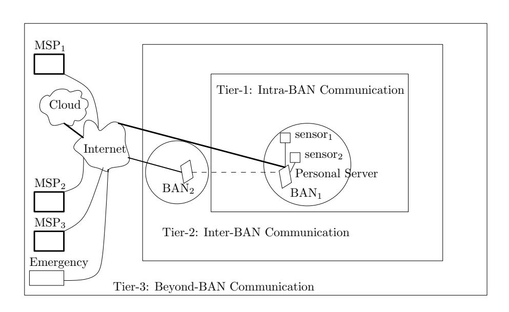
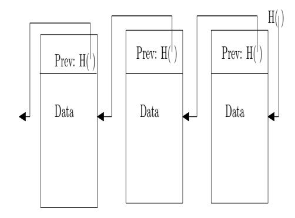
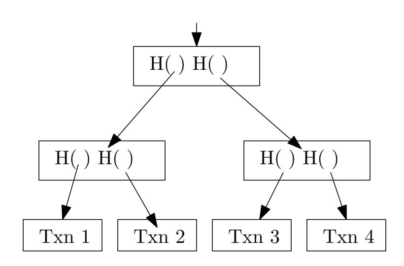
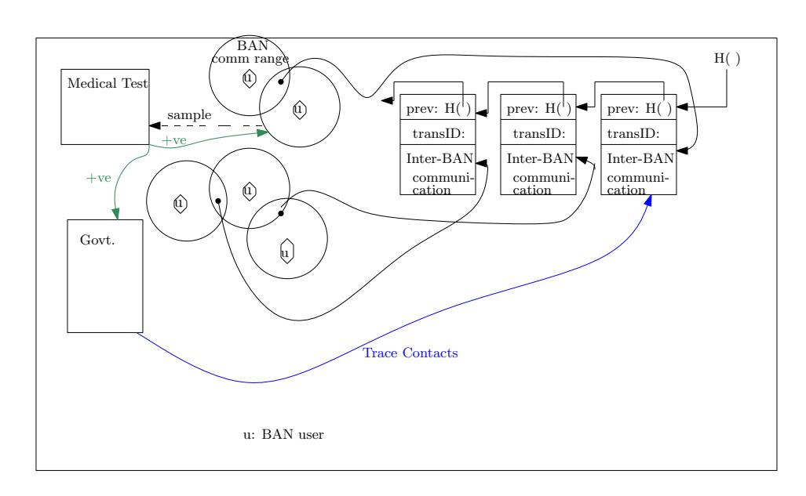

{0}------------------------------------------------

# Automatic Privacy-Preserving Contact Tracing of Novel Coronavirus Infection by Cloud-Enabled WBAN using Blockchain

Anupam Pattanayak, Subhasish Dhal *Department of Computer Science and Engineering Indian Institute of Information Technology Guwahati* Guwahati, India anupam.pk@gmail.com, subhasis.rahul@gmail.com

Sourav Kanti Addya *Department of Computer Science and Engineering National Institute of Technology Karnataka* Surathkal, India souravkaddya@nitk.edu.in

*Abstract*—Governments and policy makers are finding it difficult to curb the enormous spread of pandemic Covid-19 till the vaccine is invented and becomes available for use. When a person is detected to be infected with Novel coronavirus, the task of identifying the persons who have come across the victim in past fortnight is a challenging task. Identifying these contact persons manually is a hilarious task and often yields incomplete data. Some governments have used digital technology for contact tracing but it is prone to compromise privacy of citizens. In this paper, we propose to use blockchain for recording every transaction in a secure manner that involves communications between users who are equipped with cloud-enabled body area networks. Whenever an user is tested coronavirus positive, the health officials and concerned administration immediately finds only those blockchain transaction records corresponding to the infected persons to identify the contact tracings in the past fortnight. Further, if a contact person is suffering from high temparature that is also detected automatically by the proposed system. This proposed system will help authoroties immensely to quickly quarantine the contacts of Covid-19 cases and curb the spread of coronavirus beyond a limit while maintaining the privacy of users.

*Index Terms*—Covid-19, Novel coronavirus, Body Area Network, Cloud, Blockchain.

# I. INTRODUCTION

The 19th and 20th centuries witnessed several epidemic diseases such as smallpox, cholera, plague, typhus , yellow fever, Spanish influenza, Asian influenza, and Hong Kong influenza [2], [6]. Causes of these three types of influenza were later on classified as three subcategories of influenza A virus: H1N1, H2N2, H3N2 [11]. In the present century also some epidemics such as Zika virus, Ebola virus, Nipa virus, Swine flu, Middle East Respiratory Syndrome coronavirus (MERS), Severe acute respiratory syndrome coronavirus (SARS) have out broken in some parts of the world. We are witnessing spectacular progress of medical science in 20th century. Different types of diseases caused by viruses which are responsible for these diseases have been studied extensively. Some viruses have ribonucleic acid (RNA) based genetic structure. Examples of diseases caused by RNA viruses are polio, hepatitis-C, measles, and Covid-19. Covid-19 has the longest RNA sequence amongst all the viruses. Other viruses are deoxyribonucleic acid (DNA) genetic structure. Some examples of diseases that are caused by DNA viruses are smallpox, chickenpox, herpes, and hepatitis B. The viruses causing influenza types diseases are not new, but they mutate their genetic structure and becomes devastating [25]. This change of capability in affecting the human immunity systems in newer form makes scientists worrying. When the researchers get to characterize a new mutated virus, by that time it gets spread over a large area. To prevent the spreading of virus beyond a limit, the existing technologies such as body area network, cloud computing, and blockchain can become very helpful which is explained in our proposed work.

Whenever a person is found Covid-19 positive by clinical test, then it is very important to break the chain of coronavirus spreading. Lockdown is a important to keep the people stay at home and thus reduce the possibility of spreading the coronavirus further. But mere lockdown is not enough. Prompt and effective contact tracing is must as a first step to restrict spread of virus. In present system, whenever a person is diagnosed Covid-19 positive, concerned officials immediately want to know who are the persons came in contact with this person in last fourteen days. Sometimes, the condition of patient is so severe that the infected person can not tell out herself who are the persons she has mingled with recently. Even, if the condition of the patient is not so critical, it is not very easy task to remember each and every individual she has met or come across in a window over last fourteen days. Or, worse, the patient can read out a wrong name unintentionally or maliciously. So best approach to find these persons whomsoever have come in touch with the infected person automatically with the help of technology where one can not tamper with the list of persons and at the same time privacy of those persons who did not come across the infected person should be preserved. Whenever a BAN comes in close proximity of another BAN, they can have inter-BAN communication [26], [10]. To keep the track of every BANpowered user whoever comes across another person powered with BAN, every inter-BAN handshaking communication is 

{1}------------------------------------------------

noted down as a transaction in the blockchain. To reduce huge cost from blind testing huge number of contact samples, we further narrow down the suspected persons for immediate quarantine and test by the Covid-19 symptoms [22] which are reported by BAN and detected by cloud automatically.

### II. PRELIMINARIES

In this section we introduce the preliminary topics that have been used in our current work. In the first sub-section we briefly describe body area network, and in the next sub-section the blockchain is introduced in brief.

*1) Body Area Network:* Different sensors placed in human body forms a network called body area network (BAN). Sensors are resource constrained devices. A handheld portable device such as smart phone acts as base station of BAN. To do continuous and effective monitoring of physiological readings by BAN, cloud is often used.

Several top class survey papers on BAN are there in the literature such as [5], [13], [17], [7], [12], [15], [9].

To mention few BAN based research projects, we can name *CodeBlue*, *AID-N*, *SMART*, and *CareNet* [5], and *MediNet* project launched by Microsoft in Caribbean countries for remote monitoring of diabetes and cardiovascular diseases [14].

As per the world health organization (WHO) report [20], common symptoms of Covid-19 diesease include fever, dry cough, tiredness. Some other symptoms are sore throat, shortness of breath aches and pains. Some patients also suffer from diarrhoea, nausea.

The contact tracing between any two BAN-user is recorded with the help of inter-BAN communication. The communication in BAN is wireless. The three-tier communication architecture of Cloud-enabled BAN has been depicted in the Figure 1. The innermost communication is the tier-1 communication. The tier-2 communication is between BANs. One BAN can communicate with other BAN. In tier-2, the

Fig. 1. Three Tier Communication Architecture

presence of access points assumed as ubiquitous, and not shown in the diagram. The outermost communication is the tier-3 communication, where BANs communicate to Cloud via Internet.

# *A. Blockchain*

Blockchain technology was first introduced by anonymous researcher(s) Nakamoto in [19] while introducing bitcoin. Bitcoin is the first digital currency that is free of many disadvantages existing in traditional banking system. Later on, this blockchain technology has been adopted in wide and diverse field of applications. Blockchain is a ledger of transactions. To be more precise, blockchain is a linked list of blocks. Here the link is maintained by hash pointers. This is depicted in the figure 2.

Fig. 2. Blockchain as linked list of blocks

Every block has transactions from specific time period. These transactions are captured as a binary tree with hash pointers. This type of binary tree is referred as Merkle tree. Root of Merkle tree is pointed by the data of a block. The figure 3 shows a Merkle tree.

Fig. 3. Merkle Tree

Any transaction, recorded in blocks of blockchain are permanent, immutable, and verifiable. A block that is appended in the blockchain is first agreed upon by majority of the peerto-peer network nodes by employing a mechanism known as consensus algorithm. There are many consensus algorithms such as proof-of-work (PoW), proof-of-stake (PoS) etc. In the absence of any centralized server, the resourceful nodes carry out the responsibility of verifying the integrity, authenticity, and correctness of the transactions. This process is known as mining. The miner whose broadcasted block is selected as a valid one and added in the blockchain gets reward for it's efforts on the behalf of total network.

The Blockchain proposed by Nakamoto was smart ledgers that could record only financial transactions. Later on, blockchain evolved to be equipped with smart contracts that 

{2}------------------------------------------------

are executed to perform many desirable functions. As smart contracts could not able to access external data or events, idea of cryptlet has been introduced that permits blockchain to securely access external data.

Besides the bitcoin, several other crypto currencies such as Etherium, Syscoin, Peercoin etc are in circulation. IBM has introduced Hyperledger Fabric that hosts and promotes wide number of blockchain based applications. Several distributed applications such as P2P telemetry ADEPT for IoT, and copyright protection system Binded have been proposed.

# *B. MDERQ*

When BAN-enabled Alice steps out of her home to take part in her outdoor activities, and comes in close proximity within another BAN-enabled user Bob, the inter-BAN communication between Alice and Bob takes place, and this event is stored in Blockchain as a tuple ((x, y, t), Alice Id, Bob Id) where (x, y) represents the location, t represents time, and Alice Id is Alices identifier, Bob Id is Bob's identifier. During the outbreak of a pandemic or epidemic, Alice wishes to be alerted if she had been in close proximity of Bob who has been diagnosed to be Covid-19 positive during the disease was present at a site borne with the during an incubation period, i.e., if (x, y, t) falls within a certain range. Alice is also concerned with her privacy, and she does not want to disclose her trajectory if she has not been to a close proximity of a recently detected Covid-19 positive patient Bob. [24] has proposed multi-dimensional range query over encrypted data (MDERQ) for this purpose. Here, the cloud does the query over encrypted data range without knowing private information of neither Alice nor Bob.

### *C. Key Establishment using Physical Unclonable Function*

[Reference source: Lightweight Key Management for Group Communication in Body Area Networks through Physical Unclonable Functions by Penglin Dong 2017] All hardware objects, whether created by uniform process or non-uniform process, are unique. This uniqueness of hardware devices is the underlying idea behind physical unclonable function (PUF). If same challenge is given to different devices of similar type, the PUF ensures that the responses produced by different devices are not same with high probability. Whereas, a hardware device generates same output when it is given with same input, with high probability. So, PUF acts as fingerprint of the device. This unique response generated by any device has been used for key generation and inter-BAN communication.

The uniqueness of PUF is characterized by challengeresponse pair (CRP). The PUF is considered as a blackbox. Given a challenge c to the PUF, a response r is generated. Every device generates unique CRP (c, r) although the challenge c is the same. PUF can be classified into two categories depending on the number of CRP it can generate: weak PUF and strong PUF. Given a weak PUF, it is capable of generating only a limited number of CRPs. For weak PUF, an adversary may be able enumerate all possible challenges, and this disclosure can be used to launch node impersonation attack. Given a strong PUF, a large number of CRPs can be produced and adversary is then unable to enumerate all possible challenges. So, using a strong PUF, new CRP can be continuously produced for subsequent uses.

# III. RELATED WORK

[23] proposed a cloud-based model for monitoring and controlling Ebola virus outbreak. It has integrated WBAN system and RFIDs with cloud to store and analyse the massive real time dataset generated by the sensors. It automatically categorizes patients into separate categories using J48 decision tree. It allows for change of user category dynamically. It uses RFID technology to detect the close proximity interactions amongst different users. Alert message is generated and is delivered to the uninfected user's mobile phone. It has used Temporal Network Analysis (TNA) to construct a graph depicting the contacts between different users. Identifying critical users who are responsible for spreading Ebola virus is very important step. It has used several statistical parameters such as correlation coefficient, betweenness centrality, and closeness centrality to provide metrics of the proposed system.

[1] proposed a privacy-preserving contact tracing for infection detection. This enables users to upload their privacy data to server securely. Later on if any user gets infected, other users validate if they had come in contact with the infected user in the recent past. The process does not disclose any unnecessary data to the server. This scheme proposes a matching score to represent the result of contact tracing. It uses a weight-based matching to enhance score accuracy. It has further proposed an adaptive scanning method to reduce power consumption.

[21] proposed contact tracing with secure multiparty computation (MPC). This proposed system relies on existence of health authorities (HA) that collects location histories of infected users. It assumes that many individuals use locationbased services which stores location history of users locally. The HA will use the data points of infected patients and corresponding timestamps to start MPC sessions with everybody whoever desires to trace themselves. The HA prepares a circuit that is sent to all these interested individuals. During the evaluation, each individual needs to perform oblivious communication with the HA. In this way, by working together, all the concerned parties determine where trajectories of infected and non-infected users meet.

[4] has proposed a scalable decentralized contact tracing system using distributed hash table (DHT) and blind signature. DHT is operated by every user. The DHT is used for encrypted and signed messaging system amongst users. By this, users get informed about infection status. An infected patient can prove her infection status without disclosing her location history by requesting a blind signature from health authority.

#### IV. OUR PROPOSAL

First, we mention each entity involved in the proposed system. The entities that are components of this system are medical users, government authority, pathological test centre, 

{3}------------------------------------------------

and blockchain. Medical users are the individual human being who are installed with BAN in their body. Every medical user is empowered with one BAN with several sensors to measure physiological parameters. Government authority is the trusted administration that includes all hierarchy in the administration from bottom to top. Pathological test centres are the entitled medical test centres where the medical tests are performed for suspected Covid-19 patients. Blockchain stores the every inter-BAN communication detail. These records of inter-BAN communication is very vital since by inspecting these records in the blockchain the government authority finds the contact tracing for the Covid-19 patients. The proposed system architecture block diagram is shown in the figure 4.

Fig. 4. Proposed System Block Diagram

The sketch of proposed protocol is as follows.

- I. Every user in the system is enabled with BAN.
- II. PUF is used to establish common key for pair-wise communication between BANs in close proximity [16].
- III. Whenever a BAN comes in close contact with another BAN, a inter-BAN communication takes place [8], [18], [3].
- IV. This inter-BAN communication event is stored in Blockchain using Multi-dimensional Range Query over Encrypted Data (MDRQED) [24].
- V. Whenever, a person with BAN is found to be infected with Covid-19, the contact tracing of the patient can be easily retrieved from blockchain using the proposed system.

#### V. CONCLUSION

A privacy preserving contact tracing of patients infected with infectious diseases during epidemic like Covid-19 has been proposed using blockchain for cloud-enabled BAN users. This proposed work can be further extended to deal with symptoms of BAN users who came in touch with Covid-19 patients to prioritize the swab testing or blood test to be performed on the contacts.

#### REFERENCES

[1] Thamer Altuwaiyan, Mohammad Hadian, and Xiaohui Liang. Epic: Efficient privacy-preserving contact tracing for infection detection. In 2018 IEEE International Conference on Communications (ICC), pages 1–6. IEEE, 2018.

- [2] David Arnold. Colonizing the body: State medicine and epidemic disease in nineteenth-century India. Univ of California Press, 1993.
- [3] Nadine Boudargham, Jacques Bou Abdo, Jacques Demerjian, Christophe Guyeux, and Abdallah Makhoul. Collaborative body sensor networks: taxonomy and open challenges. In 2018 IEEE Middle East and North Africa Communications Conference (MENACOMM), pages 1–6. IEEE, 2018.
- [4] Samuel Brack, Leonie Reichert, and Björn Scheuermann. Decentralized contact tracing using a dht and blind signatures, 2020.
- [5] Min Chen, Sergio Gonzalez, Athanasios Vasilakos, Huasong Cao, and Victor C. Leung. Body area networks: A survey. *Mob. Netw. Appl.*, 16(2):171–193, April 2011.
- [6] SR Duncan, Susan Scott, and CJ Duncan. Modelling the dynamics of scarlet fever epidemics in the 19th century. *European journal of epidemiology*, 16(7):619–626, 2000.
- [7] Mark A Hanson, Harry C Powell Jr, Adam T Barth, Kyle Ringgenberg, Benton H Calhoun, James H Aylor, and John Lach. Body area sensor networks: Challenges and opportunities. *Computer*, 42(1):58–65, 2009.
- [8] Stepan Ivanov, Christopher Foley, Sasitharan Balasubramaniam, and Dmitri Botvich. Virtual groups for patient whan monitoring in medical environments. *IEEE transactions on biomedical engineering*, 59(11):3238–3246, 2012.
- [9] Rahat Ali Khan and Al-Sakib Khan Pathan. The state-of-the-art wireless body area sensor networks: A survey. *International Journal of Distributed Sensor Networks*, 14(4):1550147718768994, 2018.
- [10] Rida Khan and Muhammad Mahtab Alam. Joint phy-mac realistic performance evaluation of body-to-body communication in ieee 802.15. 6 and smartban. In 2018 12th International Symposium on Medical Information and Communication Technology (ISMICT), pages 1–6. IEEE, 2018.
- [11] Edwin D Kilbourne. Influenza pandemics of the 20th century. *Emerging infectious diseases*, 12(1):9, 2006.
- [12] Xiaochen Lai, Quanli Liu, Xin Wei, Wei Wang, Guoqiao Zhou, and Guangyi Han. A survey of body sensor networks. *Sensors*, 13(5):5406–5447, 2013.
- [13] Benoît Latré, Bart Braem, Ingrid Moerman, Chris Blondia, and Piet Demeester. A survey on wireless body area networks. *Wirel. Netw.*, 17(1):1–18, January 2011.
- [14] H. Lin, J. Shao, C. Zhang, and Y. Fang. CAM: Cloud-assisted privacy preserving mobile health monitoring. *IEEE Transactions on Information Forensics and Security*, 8(6):985–997, June 2013.
- [15] T. Maitra and S. Roy. Research challenges in BAN due to the mixed WSN features: Some perspectives and future directions. *IEEE Sensors Journal*, 17(17):5759–5766, Sep. 2017.
- [16] Mohammad Masdari, Safiyyeh Ahmadzadeh, and Moazam Bidaki. Key management in wireless body area network: Challenges and issues. *Journal of Network and Computer Applications*, 91:36–51, 2017.
- [17] S. Movassaghi, M. Abolhasan, J. Lipman, D. Smith, and A. Jamalipour. Wireless body area networks: A survey. *IEEE Communications Surveys Tutorials*, 16(3):1658–1686, Third 2014.
- [18] Jiasong Mu, Robert Stewart, Liang Han, and David Crawford. A self-organized dynamic clustering method and its multiple access mechanism for multiple wbans. *IEEE Internet of Things Journal*, 6(4):6042–6051, 2018.
- [19] Satoshi Nakamoto et al. Bitcoin: A peer-to-peer electronic cash system. 2008.
- [20] World Health Organization. Q & A on coronaviruses COVID-19, 2020.
- [21] Leonie Reichert, Samuel Brack, and Björn Scheuermann. Privacy-preserving contact tracing of covid-19 patients.
- [22] Hussin A Rothan and Siddappa N Byrareddy. The epidemiology and pathogenesis of coronavirus disease (covid-19) outbreak. *Journal of autoimmunity*, page 102433, 2020.
- [23] Sanjay Sareen, Sandeep K Sood, and Sunil Kumar Gupta. Iot-based cloud framework to control ebola virus outbreak. *Journal of Ambient Intelligence and Humanized Computing*, 9(3):459–476, 2018.
- [24] Elaine Shi, John Bethencourt, TH Hubert Chan, Dawn Song, and Adrian Perrig. Multi-dimensional range query over encrypted data. In 2007 IEEE Symposium on Security and Privacy (SP'07), pages 350–364. IEEE, 2007.
- [25] Paula Tennant, Gustavo Fermin, and Jerome E Foster. *Viruses: Molecular Biology, Host Interactions, and Applications to Biotechnology*. Academic Press, 2018.
- [26] Hariharasudhan Viswanathan, Baozhi Chen, and Dario Pompili. Research challenges in computation, communication, and context aware-

{4}------------------------------------------------

ness for ubiquitous healthcare. *IEEE Communications Magazine*, 50(5):92–99, 2012.