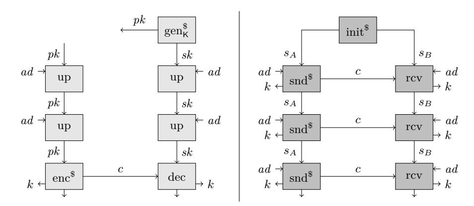
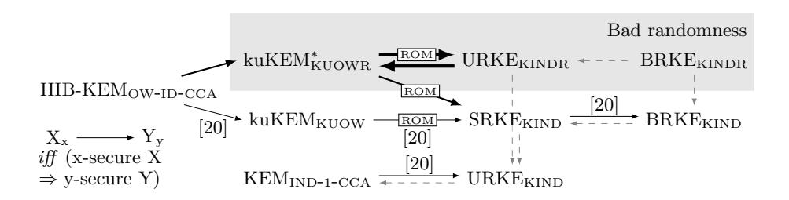
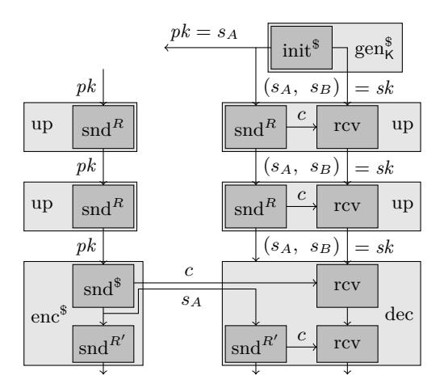

# **Determining the Core Primitive for Optimally Secure Ratcheting**

Fatih Balli<sup>1</sup> , Paul Rösler<sup>2</sup> , Serge Vaudenay<sup>1</sup>

<sup>1</sup> LASEC, École polytechnique fédérale de Lausanne {firstname.lastname}@epfl.ch <sup>2</sup> Chair for Network and Data Security, Ruhr University Bochum paul.roesler@rub.de

**Abstract.** After ratcheting attracted attention mostly due to practical real-world protocols, recently a line of work studied ratcheting as a primitive from a theoretic point of view. Literature in this line, pursuing the strongest security of ratcheting one can hope for, utilized for constructions strong, yet inefficient key-updatable primitives – based on hierarchical identity based encryption (HIBE). As none of these works formally justified utilizing these building blocks, we answer the yet open question under which conditions their use is actually *necessary*.

We revisit these strong notions of ratcheted key exchange (RKE), and propose a more realistic (and slightly stronger) security definition. In this security definition, both the exposure of the communicating parties' local states *and* the adversary's ability to attack the executions' randomness are considered. While these two attacks were partially considered in previous work, we are the first to unify them cleanly in a natural game based notion.

Our definitions are based on the systematic RKE notion by Poettering and Rösler (CRYPTO 2018). Due to slight (but meaningful) changes to regard attacks against randomness, we are ultimately able to show that, in order to fulfill strong security for RKE, public key cryptography with (independently) updatable key pairs is a necessary building block. Surprisingly, this implication already holds for the simplest RKE variant (which was previously instantiated with only standard public key cryptography).

Hence, (1) we model optimally secure RKE under randomness manipulation to cover realistic attacks, (2) we (provably) extract the core primitive that is necessary to realize strongly secure RKE, and (3) our results indicate under which conditions this primitive is necessary for strongly secure ratcheting and which relaxations in security allow for constructions that only rely on standard public key cryptography.

### **1 Introduction**

The term "ratcheting" as well as the underlying concept of continuously updating session secrets for secure long-term communication settings originates from real-world messaging protocols [\[16,](#page-31-0)[18](#page-31-1)[,5,](#page-30-0)[21,](#page-31-2)[17\]](#page-31-3). In these protocols, first forwardsecrecy [\[18,](#page-31-1)[5,](#page-30-0)[21\]](#page-31-2) and later security after state exposures [\[17\]](#page-31-3) (also known as future secrecy, backward secrecy, or post-compromise security) were aimed to be achieved as the exposure of the devices' local states was considered a practical threat. The main motivation behind this consideration is the typical lifetime of sessions in messaging apps. As messaging apps are nowadays usually run on smartphones, the lifetime of messaging sessions is proportional to the ownership duration of a smartphone (typically several years). Due to the long lifetime of sessions and the mobile use of smartphones, scenarios, in which the local storage – containing the messaging apps' secret state – can be exposed to an attacker, are extended in comparison to use cases of other cryptographic protocols.

#### Practical Relevance of Randomness Manipulation

In addition to exposures of locally stored state secrets, randomness for generating (new) secrets is often considered vulnerable. This is motivated by numerous attacks in practice against randomness sources (e.g., [\[11\]](#page-30-1)), randomness generators (e.g., [\[23](#page-31-4)[,7\]](#page-30-2)), or exposures of random coins (e.g., [\[22\]](#page-31-5)). Most theoretic approaches try to model this threat by allowing an adversary to *reveal* attacked random coins of a protocol execution (as it was also conducted in related work on ratcheting). This, however, assumes that the attacked protocol honestly and uniformly samples its random coins (either from a high-entropy source or using a random oracle) and that these coins are only afterwards leaked to the attacker. In contrast, practically relevant attacks against bad randomness generators or low-entropy sources (e.g., [\[11,](#page-30-1)[23,](#page-31-4)[7\]](#page-30-2)) change the distribution from which random coins are sampled. Consequently, this threat is only covered by a security model if considered adversaries are also allowed to *influence* the execution's (distribution of) random coins. Thus, it is important to consider randomness *manipulation* (instead of reveal), if attacks against randomness are regarded practically relevant.

The overall goal of ratcheting protocols is to reduce the effect of any such non-permanent and/or non-fatal attack to a minimum. For example, an ongoing communication under a non-fatal attack should become secure as soon as the adversary ends this attack or countermeasures become effective. Examples for countermeasures are replacing bad randomness generators via software updates, eliminating state exposing viruses, etc. Motivated by this, most widely used messaging apps are equipped with mechanisms to regularly update the local secrets such that only a short time frame of communication is compromised if an adversary was successful due to obtaining local secrets and/or attacking random coins.

#### Real-World Protocols

The most prominent and most widely deployed real-world ratcheting protocol is the Signal protocol (used by the Signal Messenger, WhatsApp, Facebook Messenger, Skype, and others). The analysis of this protocol in a multi-stage key agreement model[1](#page-1-0) [\[8\]](#page-30-3) was the first theoretic treatment of ratcheting in the literature. Cohn-Gordon et al. [\[8\]](#page-30-3), however, focus on grasping the precise security

<span id="page-1-0"></span><sup>1</sup> Please note our distinction between *key agreement* and *ratcheted key exchange* protocols. The former is run by parties to obtain a symmetric key for a subsequent session

that Signal offers rather than generically defining ratcheting as an independent primitive. While the security provided by Signal is sufficient in most real-world scenarios, we focus in this work on the theoretic analysis of the (optimally secure) primitive ratcheting with respect to its instantiability by smaller building blocks.

#### GENERIC TREATMENT OF RATCHETING AS A PRIMITIVE

In the following we shortly introduce and review previous modeling approaches for strongly secure ratcheting. We thereby abstractly highlight modeling choices that crucially affect the constructions, secure according to these models respectively. Specifically, we indicate why some models can be instantiated with only public key cryptography (PKC) – bypassing our implication result – and others cannot. In Table 1 we summarize this overview.

<span id="page-2-0"></span>

**Fig. 1:** Conceptual depiction of kuKEM\* (on the left) and unidirectional RKE (on the right). '\$' in the upper index of an algorithm name denotes that the algorithm runs probabilistically and ad is associated data.

The initial generic work that considers ratcheted key exchange (RKE) as a primitive and defines its syntax, correctness, and security (in a yet impractical variant) is by Bellare et al. [4]. Abstractly, their concept of ratcheted key exchange, depicted in the right part of Figure 1, consist of an initialization that provides two session participants A and B with a state that can then be used by them to repeatedly compute new keys in this session (e.g., for use in higher level protocols). In their restricted communication model, A is allowed to compute new keys with her state and accordingly send ciphertexts to B who can then compute (the same) keys with his state. During these key computations, A's and B's states are updated respectively (to minimize the effect of state exposures). As B can only comprehend key computations from A (on receipt of a ciphertext) but cannot actively initiate the computation of new keys, this variant was

protocol. The latter is the session protocol that might utilize the initial key and that continuously outputs symmetric keys in the session independent of long-term keys.

later called unidirectional RKE [\[20\]](#page-31-6). Beyond this restriction of the communication model, the security definition by Bellare et al. only allows the adversary to expose *A*'s temporary local state secrets, while *B*'s state cannot be exposed (which in turn requires no forward-secrecy with respect to state updates by *B*). Following Bellare et al., Poettering and Rösler [\[20](#page-31-6)[,19\]](#page-31-7) [2](#page-3-0) propose a revised security definition of unidirectional RKE (URKE: allowing also the exposure of *B*'s state) and extend the communication model to define syntax, correctness, and security of *sesqui*directional RKE (SRKE: additionally allows *B* to only send special update ciphertexts to *A* that do not trigger a new key computation but help him to recover from state exposures) and *bi*directional RKE (BRKE: defines *A* and *B* to participate equivalently in the communication). With a similar instantiation as Poettering and Rösler, Jaeger and Stepanovs [\[13\]](#page-31-8) define security for bidirectional channels under state exposures and randomness reveal.

All of the above mentioned works define security *optimally* with respect to their syntax definition and the adversary's access to the primitive execution (modeled via oracles in the security game). This is reached by declaring secrets insecure *iff* the adversary conducted an unpreventable/trivial attack against them (i.e., a successful attack that no instantiation can prevent). Consequently, fixing syntax and oracle definitions, no stronger security definitions exist.

#### Relaxed Security Notions

Subsequent to these strongly secure ratcheting notions, multiple weaker formal definitions for ratcheting were proposed that consider special properties such as strong explicit authentication [\[10\]](#page-30-5), out of order receipt of ciphertexts [\[2\]](#page-30-6), or primarily target on allowing efficient instantiations [\[15](#page-31-9)[,6\]](#page-30-7).

While these works are syntactically similar, we shortly sketch their different relaxations regarding security – making their security notions sub-optimal. Durak and Vaudenay [\[10\]](#page-30-5) and Caforio et al. [\[6\]](#page-30-7) forbid the adversary to perform impersonation attacks against the communication between *A* and *B* during the establishment of a *secure* key. Thus, they do not require recovery from state exposures – which are a part of impersonation attacks – in all possible cases, which we denote as "partial recovery" (see Table [1\)](#page-4-0). Furthermore, both works neglect bad randomness as an attack vector. In the security experiments by Jost et al. [\[15\]](#page-31-9) and Alwen et al. [\[2\]](#page-30-6) constructions can delay the recovery from attacks longer than necessary (Jost et al. therefore temporarily forbid the exposure of the local state). Additionally, they do not require the participants' states to become incompatible (immediately) on active attacks against the communication.

#### Instantiations of Ratcheting

Interestingly, both mentioned *uni*directional RKE instantiations that were defined to depict optimal security [\[4](#page-30-4)[,20\]](#page-31-6) as well as bidirectional real-world exam-

<span id="page-3-0"></span><sup>2</sup> We explicitly cite the extended version [\[19\]](#page-31-7) for results that are not captured in the CRYPTO 2018 proceedings [\[20\]](#page-31-6).

<sup>1</sup> '*Unnecessary*' refers to restrictions beyond those that are immediately implied by optimal security definitions (that only restrict the adversary with respect to unpreventable/trivial attacks).

<span id="page-4-0"></span>

|             |    |                      | (a) Interaction (b) State Exposure (c) Bad Randomness (d) Recovery |             |
|-------------|----|----------------------|--------------------------------------------------------------------|-------------|
| C+ [8]      | ↔  | Always allowed       | Reveal                                                             | Delayed     |
| B+ [4]      | →  | Only allowed for A   | Reveal                                                             | Immediate   |
| PR [20]     | →  | Always allowed       | Not considered                                                     | Immediate   |
|             | 7→ | Always allowed       | Not considered                                                     | Immediate   |
|             | ↔  | Always allowed       | Not considered                                                     | Immediate   |
| JS [13]     | ↔  | Always allowed       | Reveal                                                             | Immediate   |
| DV [10]     | ↔  | Always allowed       | Not considered                                                     | Partial     |
| JMM [15] →  |    | Partially restricted | Reveal                                                             | (Immediate) |
|             | 7→ | Partially restricted | Reveal                                                             | (Immediate) |
|             | ↔  | Partially restricted | Reveal                                                             | (Immediate) |
| ACD [2]     | ↔  | Always allowed       | Manipulation                                                       | Delayed     |
| CDV [6]     | ↔  | Always allowed       | Not considered                                                     | Delayed     |
| This work → |    | Always allowed       | Manipulation                                                       | Immediate   |

**Table 1:** Differences in security notions of ratcheting regarding (a) uni- (→), sesqui- (7→), and bidirectional (↔) interaction between *A* and *B*, (b) when the adversary is allowed to expose *A*'s and *B*'s state (or when this is *unnecessarily* restricted), (c) the adversary's ability to reveal or manipulate algorithm invocations' random coins, and (d) how soon and how complete recovery from these two attacks into a secure state is required of *secure* constructions (or if *unnecessary* delays or exceptions for recovery are permitted).[1](#page-3-0) Recovery from attacks required by Jost et al. [\[15\]](#page-31-9) is *immediate* in so far as their restrictions of state exposures introduce delays implicitly. Gray marked cells indicate the reason (i.e., relaxations in security) why respective instantiations can rely on standard PKC only (circumventing our implication result). Rows without gray marked cells have no construction based on pure PKC.

ples such as the Signal protocol (analyzed in [\[8\]](#page-30-3)), and instantiations of the above named relaxed security notions [\[10,](#page-30-5)[15](#page-31-9)[,2,](#page-30-6)[6\]](#page-30-7) only rely on standard PKC (cf. rows in Table [1](#page-4-0) with gray cells).

In contrast, both mentioned optimally secure bidirectional ratcheting variants (i.e., sesquidirectional and bidirectional RKE [\[20\]](#page-31-6), and bidirectional strongly secure channel [\[13\]](#page-31-8)) are based on a strong cryptographic building block, called *key-updatable public key encryption*, which can be built from hierarchical identity based encryption (HIBE). Intuitively, key-updatable public key encryption is standard public key encryption that additionally allows to update public key and secret key independently with respect to some associated data (a conceptual depiction of this is on the left side of Figure [1\)](#page-2-0). Thereby an updated secret key cannot be used to decrypt ciphertexts that were encrypted to previous (or different) versions of this secret key (where versions are defined over the associated data used for updates).

We emphasize a significant difference between key-updatable public key encryption and HkuPke (introduced by Jost et al. [\[15\]](#page-31-9) and recently used by Alwen et al. [\[3,](#page-30-8)[1\]](#page-30-9)): in HkuPke key updates rely on interactive communication between holders of public key and secret key, and associated data for key updates is not fully adversary-controlled. These two differences make it a strictly weaker primitive, insufficient for optimal security of RKE (on which we further elaborate in Section [3\)](#page-8-0).

#### Necessity for Strong Building Blocks

Natural questions that arise from this line of work are, whether and under which conditions such strong (HIBE-like) building blocks are not only sufficient but also necessary to instantiate the strong security of (bidirectional) RKE. In order to answer these questions, we build key-updatable public key cryptography from ratcheted key exchange. Consequently we affirm the necessity and provide (sufficient) conditions for relying on these strong building blocks. We therefore minimally adjust the syntax of key-updatable key encapsulation mechanism (kuKEM) [\[20\]](#page-31-6) and consider the manipulation of algorithm invocations' random coins in our security definitions of kuKEM and RKE.[2](#page-5-0)

<span id="page-5-1"></span>

**Fig. 2:** The contributions of this paper (bold arrows) and their connection to previous work (thin arrows) involving RKE (uni-, sesqui-, and bidirectional) and KEM (standard, hierarchical-identity-based, and key-updatable) primitives. ROM indicates that the proof holds in the random oracle model. kuKEM<sup>∗</sup> KUOWR ⇒ROM SRKEKIND is not formally proven in this paper, but we point out that the proof of kuKEMKUOW ⇒ROM SRKEKIND from [\[20\]](#page-31-6) can be rewound. Gray dashed connections indicate trivial implications (due to strictly weaker syntax or security definitions).

While, despite these changes of syntax and security towards prior definitions, we prove that RKE can still be built from kuKEM, we also prove that kuKEM can be built from RKE (see Figure [2\)](#page-5-1). As a result we show that:

- **–** kuKEM<sup>∗</sup> (with one-way security under manipulation of randomness)[3](#page-5-2) ⇒ROM Unidirectional RKE (with key indistinguishability under manipulation of randomness),
- **–** Unidirectional RKE (with key indistinguishability under manipulation of randomness) ⇒ kuKEM<sup>∗</sup> (with one-way security under manipulation of randomness).

<span id="page-5-0"></span><sup>2</sup> Recall that randomness manipulation was not considered in a security definition that aimed for optimal security in the literature of ratcheting yet (cf. Table [1\)](#page-4-0).

<span id="page-5-2"></span><sup>3</sup> The asterisk at kuKEM<sup>∗</sup> indicates the minimal adjustment to the kuKEM syntax definition from [\[20\]](#page-31-6). For the kuKEM<sup>∗</sup> we consider one-way security as it suffices to achieve strong security for RKE. It is obvious that the same results hold for key indistinguishability.

Given the security notions established in honest randomness setting and their connections to each other, one would also expect

**–** Group RKE ⇒ Bidirectional RKE ⇒ Sesquidirectional RKE ⇒ Unidirectional RKE

to follow. Hence, our results indicate that stronger RKE variants also likely require building blocks as hard as kuKEM<sup>∗</sup> . Furthermore, due to our results, it becomes clear that: One-way security under manipulation of randomness of kuKEM<sup>∗</sup> ⇒ROM Key indistinguishability of *sesquidirectional* RKE. Interestingly, these results induce that (when considering strong security) ratcheted key exchange requires these strong (HIBE-like) building blocks not only for bidirectional communication settings, but already for the unidirectional case. Both mentioned previous unidirectional RKE schemes can bypass our implication because they forbid exposures of *B*'s state [\[4\]](#page-30-4) or assume secure randomness [\[20\]](#page-31-6) (see Table [1\)](#page-4-0). We describe attacks against each of both constructions in our security definition in Appendix [C.](#page-37-0) Since the mentioned relaxed security definitions of ratcheting [\[8,](#page-30-3)[10](#page-30-5)[,15](#page-31-9)[,2,](#page-30-6)[6\]](#page-30-7) restrict the adversary more than necessary in exposing states, solving (potentially valid) embedded game challenges, manipulating the communication between the session participants, or attacking invocations' random coins (and thus violate either of our security definition's conditions), it remains feasible to instantiate them with standard public key primitives as well (see Table [1\)](#page-4-0). Although our analysis was partially motivated by the use of kuKEM in [\[20,](#page-31-6)[13\]](#page-31-8), we do not ultimately answer whether these particular constructions necessarily relied on it. Rather we provide a clean set of conditions under which RKE and kuKEM clearly imply each other as we do not consider the justification of previous constructions but a clear relation for future work important.

Thus, we show that sufficient conditions for necessarily relying on kuKEM as a building block of RKE are: (a) unrestricted exposure of both parties' local states, (b) consideration of attacks against algorithm invocations' random coins, and (c) required immediate recovery from these two attacks into a secure state by the security definition (i.e., the adversary is only restricted with respect to unpreventable/trivial attacks).[4](#page-6-0)

#### Contributions

The contributions of our work can be summarized as follows:

**–** We are the first who systematically define optimal security of key-updatable KEM and unidirectional RKE under randomness manipulation (in sections [3](#page-8-0) and [4\)](#page-14-0) and thereby consider this practical threat in addition to state exposures in an instantiation-independent notion of RKE. Thereby we substantially enhance the respective models by Poettering and Rösler [\[20\]](#page-31-6).

<span id="page-6-0"></span><sup>4</sup> Note that there may exist further sets of sufficient conditions for relying on kuKEMs since, for example, sesqui- and bidirectional RKE by Poettering and Rösler [\[20,](#page-31-6)[19\]](#page-31-7) violate condition (b) but base on kuKEMs as well. We refer the reader to Appendix B.2 in [\[19\]](#page-31-7) for a detailed explanation of why their scheme presumably also must rely on a kuKEM. We leave the identification of further sets of conditions as future work.

- **–** In Section [5,](#page-18-0) we construct unidirectional RKE generically from a kuKEM<sup>∗</sup> to show that the latter suffices as a building block for the former under manipulation of randomness.
- **–** To show that kuKEM<sup>∗</sup> is not only sufficient but also necessary to build unidirectional RKE (under randomness manipulation), we provide a construction of kuKEM<sup>∗</sup> from a generic unidirectional RKE scheme in Section [6.](#page-21-0)

With our results we distill the core building block of strongly secure ratcheted key exchange down to its syntax and security definition. This allows further research to be directed towards instantiating kuKEM<sup>∗</sup> schemes that are more familiar and easier in terms of security requirements, rather than attempting to construct seemingly more complex RKE primitives.[5](#page-7-0) Simultaneously, our results indicate the cryptographic hardness of ratcheted key exchange and thereby help to systematize and comprehend the security definitions and different dimensions of ratcheting in the literature. As a consequence, our results contribute to a fact-based trade-off between security and efficiency for RKE by providing requirements for relying on heavy building blocks and thereby revealing respective bypasses.

### **2 Preliminaries**

#### **2.1 Notation**

By *x* ← *y* we define the assignment of the value of variable *y* to variable *x* and thus for a function X, *x* ← X(*y*) means that *x* is assigned with the evaluation output of X on input *y*. We define T*,* F as Boolean values for true and false. The shortcut notion *w* ← *x* ? *y* : *z* means that 'if *x* = T, then *w* ← *y*, otherwise *w* ← *z*'. For a probabilistic algorithm Y, *x* ←\$ Y(*y*) denotes the probabilistic evaluation of Y on input *y* with output *x* and *x* ← Y(*y*; *r*) denotes the deterministic evaluation of Y on *y* with output *x* where the evaluation's randomness is fixed to *r*. For a set X , *x* ←\$ X is the uniform random sampling of value *x* from X . We use the shortcut notion X ← Y <sup>∪</sup> to denote the union X ← X ∪ Y of sets X and Y.

Symbol '' denotes an empty string and symbol '⊥' denotes an undefined element or an output that indicates rejections (thus it is not an element of explicitly defined sets).

By X ∗ , we denote the set of all lists of arbitrary size whose elements belong to X . We abuse the notation of empty string '' by writing *L* = for an empty

<span id="page-7-0"></span><sup>5</sup> For example, the bidirectional channel construction in the proceedings version of [\[13\]](#page-31-8) is not secure according to the security definition (but a corrected version is published as [\[14\]](#page-31-10)), in the acknowledgments of [\[19\]](#page-31-7) it is mentioned that an early submitted version of their construction was also flawed, and for an earlier version of [\[10\]](#page-30-5) we detected during our work (and informed the authors) that the construction was insecure under bad randomness such that the updated proceedings version (also available as [\[9\]](#page-30-10)) disregards attacks against randomness entirely. Finally, we detected and reported that the construction of HkuPke in [\[15\]](#page-31-9) is not even correct.

list L. If an element  $x \in \mathcal{X}$  is appended to list L then we denote this by  $L \leftarrow L || x$  (or simply  $L \stackrel{\cdot}{\leftarrow} x$ ). Thus, '||' denotes a special concatenation symbol that is not an element of any of the explicitly defined sets. We define relations prefixor-equal  $\preceq$  and strictly-prefix  $\prec$  over two lists. For instance, for lists  $L, L_0 = L || x, L_1 = L || y$  where  $x, y \in \mathcal{X}, x \neq y$  we have that  $L \preceq L, L \not\prec L, L \prec L_0, L \prec L_1, L_0 \not\preceq L_1, L_1 \not\preceq L_0$  meaning that L is a prefix of  $L_0$  and  $L_1$  but neither of  $L_0, L_1$  is a prefix of the other. By  $X[\cdot]$  we denote an associative array.

In our security experiments, that we denote with **Game**, we invoke adversaries via instruction 'Invoke'. These adversaries are denoted by  $\mathcal{A}, \mathcal{B}$ . Adversaries have access to the security experiment's interface, which is defined by oracles that are denoted by the term **Oracle**. Games are terminated via instructions 'Stop with x' (meaning that x is returned by the game) or 'Reward b' (meaning that the game terminates and returns 1 if b = T). In procedures that we denote by **Proc** and in oracles, we use the shortcut notion 'Require x'. Depending on the procedure's or oracle's number of return values n, that means 'If x = F, then return  $\perp^n$ '.

#### 2.2 Message Authentication Code

We define a message authentication code to be a set of algorithms  $M=(\text{tag}, \text{vfy}_M)$  over a set of symmetric keys  $\mathcal{K}$ , a message space  $\mathcal{M}$ , and a tag space  $\mathcal{T}$ . The syntax is defined as:

$$\begin{array}{l} \mathcal{K} \times \mathcal{M} \to \mathrm{tag} \to \mathcal{T} \\ \mathcal{K} \times \mathcal{M} \times \mathcal{T} \to \mathrm{vfy}_{\mathsf{M}} \to \{\mathtt{T}, \bot\} \end{array}$$

Please note that we define the tag algorithm explicitly deterministic.

For correctness of a MAC we define that for all  $k \in \mathcal{K}$  and all  $m \in \mathcal{M}$  it is required that  $\mathrm{vfy}_{\mathsf{M}}(k, m, \mathrm{tag}(k, m)) = \mathtt{T}$ .

We define a one-time multi-instance strong unforgeability notion SUF for MAC security – that is equivalent with standard strong unforgeability – for which the formal security game is depicted in Appendix E Figure 14. That is, for a game in which an adversary can generate instances i (with independent uniformly random keys  $k_i \leftarrow_s \mathcal{K}$ ) via an oracle Gen, the adversary can query a Tag oracle on a message m from message space  $\mathcal{M}$  for each instance at most once to obtain the respective MAC tag. Additionally, the adversary can verify MAC tags for specified messages and instances via oracle Vfy and obtain an instance's key by querying an Expose oracle for this instance. The adversary wins by providing a forgery  $(m,\tau)$  for an instance i to the Vfy oracle if there was no Tag(i,m) query before with output  $\tau$  and if i's key was not exposed via oracle Expose. We define the advantage of winning the SUF game against a MAC scheme M as  $\mathrm{Adv}_{\mathrm{M}}^{\mathrm{suf}}(\mathcal{A}) = \mathrm{Pr}[\mathrm{SUF}_{\mathrm{M}}(\mathcal{A}) \to 1]$ .

#### <span id="page-8-0"></span>3 Sufficient Security for Key-Updatable KEM

A  $\underline{\underline{k}}\underline{ey}\underline{\underline{u}}\underline{p}$  datable  $\underline{\underline{k}}\underline{ey}$   $\underline{\underline{e}}\underline{n}\underline{c}\underline{p}$  sulation  $\underline{\underline{m}}\underline{e}\underline{c}\underline{h}$  and  $\underline{\underline{k}}\underline{ey}\underline{e}\underline{n}\underline{c}\underline{p}$  with

respect to some associated data respectively. Prior to our work, this primitive was used to instantiate sesquidirectional RKE. In order to allow for our equivalence result, we minimally adjust the original kuKEM notion by Poettering and Rösler [20] and call it kuKEM\*. The small, yet crucial changes comprise allowed updates of public and secret key during encapsulation and decapsulation (in our syntax definition) as well as the adversary's ability to manipulate utilized randomness of encapsulations (in our security definition). In Section 6 the rationales behind these changes are clarified. In order to provide a coherent definition, we not only describe alterations towards previous work but define kuKEM\* entirely (as we consider our changes to be a significant contribution and believe that this strengthens comprehensibility).

Syntax A kuKEM\* is a set of algorithms  $K = (gen_K, up, enc, dec)$  with sets of public keys  $\mathcal{PK}$  and secret keys  $\mathcal{SK}$ , a set of associated data  $\mathcal{AD}$  for updating the keys, a set of ciphertexts  $\mathcal{C}$  (with  $\mathcal{AD} \cap \mathcal{C} = \emptyset$ ), and a set of encapsulated keys  $\mathcal{K}$ . Furthermore we define  $\mathcal{R}$  as the set of random coins used during the encapsulation:

```
\begin{array}{l} \operatorname{gen}_{\mathsf{K}} \to_{\$} \mathcal{PK} \times \mathcal{SK} \\ \mathcal{PK} \times \mathcal{AD} \to \operatorname{up} \to \mathcal{PK} \\ \mathcal{SK} \times \mathcal{AD} \to \operatorname{up} \to \mathcal{SK} \\ \mathcal{PK} \times \mathcal{R} \to \operatorname{enc} \to \mathcal{PK} \times \mathcal{K} \times \mathcal{C} \text{ or } \mathcal{PK} \to \operatorname{enc} \to_{\$} \mathcal{PK} \times \mathcal{K} \times \mathcal{C} \\ \mathcal{SK} \times \mathcal{C} \to \operatorname{dec} \to (\mathcal{SK} \times \mathcal{K}) \cup \{(\bot,\bot)\} \end{array}
```

Please note that the encapsulation and decapsulation may modify the public key and the secret key respectively – as a result, the kuKEM\* is stateful (where the public key is a public state).<sup>6</sup>

Correctness The correctness for kuKEM\* is (for simplicity) defined through game  $CORR_K$  (see Figure 3), in which an adversary  $\mathcal{A}$  can query encapsulation, decapsulation, and update oracles. The adversary (against correctness) wins if different keys are computed during decapsulation and the corresponding encapsulation even though compatible key updates were conducted and ciphertexts from encapsulations were directly forwarded to the decapsulation oracle.

**Definition 1** (kuKEM\* correctness). A kuKEM\* scheme K is correct if for every  $\mathcal{A}$ , the probability of winning game CORR<sub>K</sub> from Figure 3 is  $\Pr[CORR_K(\mathcal{A}) \rightarrow 1] = 0$ .

Security Here we describe KUOWR security of kuKEM\* as formally depicted in Figure 4. KUOWR defines <u>one-way</u> security of <u>kuKEM</u>\* under <u>randomness</u> manipulation in a multi-instance/multi-challenge setting.

<span id="page-9-0"></span> $<sup>^6</sup>$  As kuKEM\* naturally provides no security for encapsulated keys if the adversary can manipulate the randomness for  $\mathrm{gen}_{\mathsf{K}}$  already, we only consider the manipulation of random coins for enc.

```
Game CORRK(A)
00 (pk, sk) ←$ genK
01 key[·] ← ⊥
02 trs ← ; trr ← 
03 Invoke A
04 Stop with 0
Oracle UpS(ad)
05 Require ad ∈ AD
06 pk ← up(pk, ad)
07 trs q← ad
08 Return
                       Oracle UpR(ad)
                       09 Require ad ∈ AD
                       10 sk ← up(sk, ad)
                       11 trr q← ad
                       12 Return
                       Oracle Enc()
                       13 (pk, k, c) ←$ enc(pk)
                       14 trs q← c
                       15 key[trs] ← k
                       16 Return (pk, c)
                                                Oracle Dec(c)
                                                17 Require c ∈ C
                                                18 (sk, k) ← dec(sk, c)
                                                19 trr q← c
                                                20 If trr  trs:
                                                21 Reward k 6= key[trr]
                                                22 Return
```

**Fig. 3:** The correctness notion of kuKEM<sup>∗</sup> captured through game CORR.

Intuitively, the KUOWR game requires that a secret key can only be used for decapsulation of a ciphertext if prior to this decapsulation all updates of this secret key and all decapsulations with this secret key were consistent with the updates of and encapsulations with the respective public key. This is reflected by using the transcript (of public key updates and encapsulations or secret key updates and decapsulations) as a reference to encapsulated "challenge keys" and secret keys.

In order to let the adversary play with the kuKEM<sup>∗</sup> 's algorithms, the game provides oracles Gen, Up*S*, Up*R*, Enc, and Dec. Thereby instances (i.e., key pairs) can be generated via oracle Gen and are referenced in the remaining oracles by a counter that refers to when the respective instance was generated.

For encapsulation via oracle Enc, the adversary can either choose the invocation's random coins by setting *rc* to some value that is not the empty string or let the encapsulation be called on fresh randomness by setting *rc* = (line [16\)](#page-11-1). In the former case, the adversary trivially knows the encapsulated key. Thus, only when called with fresh randomness, the encapsulated key is marked as a challenge key in array CK (line [20\)](#page-11-2).

The variables CK, *SK*, and XP (the latter two are explained below) are indexed via the transcript of operations on the respective key pair part. As public keys and secret keys can uniquely be referenced via the associated data under which they are updated and via ciphertexts that have been encapsulated or decapsulated by them, the concatenation of these values (i.e., sent or received transcripts *trs, trr*) are used as references to them in the KUOWR game.

On decapsulation of a key that is not marked as a challenge, the respective key is output to the adversary. Challenge keys are of course not provided to the adversary as thereby the challenge would be trivially solved (line [36\)](#page-11-3).

Via oracle Expose, the adversary can obtain a secret key of specified instance *i* that results from an operation referenced by transcript *tr*. As described above, the transcript, to which a secret key refers, is built from the associated data of updates to this secret key (via oracle Up*R*) and the ciphertexts of decapsulations with this secret key (via oracle Dec) as these two operations may modify the

```
Game KUOWRK(A)
00 n ← 0
01 Invoke A
02 Stop with 0
Oracle Gen
03 n ← n + 1
04 (pkn, skn) ←$ genK
05 CKn[·] ← ⊥; XPn ← ∅
06 trsn ← ; trrn ← 
07 SKn[·] ← ⊥
08 SKn[trrn] ← skn
09 Return pkn
Oracle UpS(i, ad)
10 Require 1 ≤ i ≤ n ∧ ad ∈ AD
11 pki ← up(pki
                 , ad)
12 trsi
        q← ad
13 Return pki
Oracle Enc(i, rc)
14 Require 1 ≤ i ≤ n
15 · Require rc ∈ R ∪ {}
16 · If rc = : mr ← F; rc ←$ R
17 · Else: mr ← T
18 · (pki
        , k, c) ← enc(pki
                        ; rc)
19 · trsi
        q← c
20 · If mr = F: CKi[trsi] ← k
21 · Return (pki
                , c)
                                    Oracle Solve(i, tr, k)
                                    22 Require 1 ≤ i ≤ n
                                    23 Require tr ∈/ XPi
                                    24 Require CKi[tr] 6= ⊥
                                    25 Reward k = CKi[tr]
                                    26 Return
                                    Oracle UpR(i, ad)
                                    27 Require 1 ≤ i ≤ n ∧ ad ∈ AD
                                    28 ski ← up(ski, ad)
                                    29 trr i
                                            q← ad
                                    30 SKi[trr i] ← ski
                                    31 Return
                                    Oracle Dec(i, c)
                                    32 Require 1 ≤ i ≤ n ∧ c ∈ C
                                    33 · (ski, k) ← dec(ski, c)
                                    34 · trr i
                                            q← c
                                    35 · SKi[trr i] ← ski
                                    36 · If CKi[trr i] 6= ⊥:
                                    37 · Return
                                    38 · Return k
                                    Oracle Expose(i, tr)
                                    39 Require 1 ≤ i ≤ n
                                    40 · Require SKi[tr] ∈ SK
                                    41 · XPi ← { ∪
                                                 tr∗ ∈ (AD ∪ C)
                                                               ∗
                                                                 :
                                          tr ≺ tr∗
                                                 }
                                    42 Return SKi[tr]
```

<span id="page-11-4"></span><span id="page-11-3"></span><span id="page-11-2"></span><span id="page-11-1"></span>**Fig. 4:** Security experiment KUOWR, modeling one-way security of key-updatable KEM in a multi-instance/multi-challenge setting under randomness manipulation. Lines of code tagged with '·' are (substantially) modified with respect to KUOW security in [\[19\]](#page-31-7). Line [41](#page-11-4) is a shortcut notion that can be implemented efficiently. CK: challenge keys, XP: exposed secret keys, *trs, trr*: transcripts.

secret key. As all operations, performed with an exposed secret key, can be traced by the adversary (i.e., updates and decapsulations; note that both are deterministic), all secret keys that can be derived from an exposed secret key are also marked exposed via array XP (line [41\)](#page-11-4).

Finally, an adversary can solve a challenge via oracle Solve by providing a guess for the challenge key that was encapsulated for an instance *i* with the encapsulation that is referenced by transcript *tr*. Recall that the transcript, to which an encapsulation refers, is built from the associated data of updates to the respective instance's public key (via oracle Up*S*) and the ciphertexts of encapsulations with this instance's public key (via oracle Enc) as these two operations may modify the public key for encapsulation. If the secret key for decapsulating the referenced challenge key is not marked exposed (line [23\)](#page-11-5) and the guess for the challenge key is correct (line 24), then game KUOWR stops with '1' (via 'Reward') meaning that the adversary wins.

**Definition 2** (KUOWR **Advantage**). The advantage of an adversary  $\mathcal{A}$  against a kuKEM\* scheme K in game KUOWR from Figure 4 is defined as  $Adv_K^{kuowr}(\mathcal{A}) = Pr[KUOWR_K(\mathcal{A}) \to 1]$ .

We chose to consider one-way security as opposed to key indistinguishability for the kuKEM\* as it suffices to show equivalence with key indistinguishability of RKE (in the ROM). It is evident that all proofs in this work also hold for key indistinguishability of kuKEM\* and one can generically derive key indistinguishability for kuKEM\* via the FO transform by Hofheinz et al. [12].

Differences compared to previous Security Definition In Figure 4 we denote changes from KUOW security (cf., Figure 1 [19]) by adding '·' at the beginning of lines. Below we elaborate on these differences.

The main difference in our definition of KUOWR security compared to KUOW security is that we allow the adversary to manipulate the execution's random coins. As we define encapsulation and decapsulation to (potentially) update the used public key or secret key, another conceptual difference is that we only allow the adversary to encapsulate and decapsulate once under each public and secret key. Thus, we assume that public and secret keys are overwritten on encapsulation and decapsulation respectively. In contrast to our security definition, in the KUOW security game only the current secret key of an instance can be exposed. Even though we assume the secret key to be replaced by its newer versions on updates or decapsulations, there might be, for example, backups that store older secret key versions. As a result we view the restriction of only allowing exposures of the current secret key artificial. An important notational choice is that we index the variables with transcripts trs, trr instead of integer counters. This notation reflects the idea that public key and secret key only stay compatible as long as they are used correspondingly and immediately diverge on different associated data or tampered ciphertexts.

We further highlight the fundamental difference towards HkuPke by Jost et al. [15]. Their notion of HkuPke does not allow (fully adversary-controlled) associated data on public and secret key updates and additionally requires (authenticated) interaction between the holders of the key parts thereby. Looking ahead, this makes this primitive insufficient for diverging the public key from the secret key (in the states) of users A and B during an impersonation of A towards B in (U)RKE (especially under randomness manipulation). This is, however, required in an optimal security definition but explicitly excluded in the sub-optimal RKE notion by Jost et al. [15]. Since the syntax of HkuPke is already inadequate to reflect this security property, we cannot provide a separating attack. Nevertheless, we further expound this weakness in Appendix D.

<span id="page-12-0"></span><sup>&</sup>lt;sup>7</sup> It is important to note that the equivalence between KUOWR security of kuKEM\* and KINDR security of URKE is independent of this definitional choice – if either both definitions allow or both definitions forbid the exposure of also past secret keys or states respectively, equivalence can be shown.

*Instantiation* A kuKEM<sup>∗</sup> scheme, secure in the KUOWR game, can be generically constructed from an OW-CCA adaptively secure hierarchical identity based key encapsulation mechanism (HIB-KEM). The construction – the same as in [\[19\]](#page-31-7) – is provided for completeness in Figure [5.](#page-13-0) The update of public keys is the concatenation of associated data (interpreted as identities in the HIB-KEM) and the update of secret keys is the delegation to lower level secret keys in the identity hierarchy. The reduction is immediate: After guessing for which public key and after how many updates the challenge encapsulation that is solved by the adversary is queried, the challenge from the OW-CCA game is embedded into the respective KUOWR challenge.

```
Proc genK
00 (pkID, skID) ←$ genID
01 id ← 
02 pk ← (pkID, id)
03 sk ← skID
04 Return (pk, sk)
Proc enc(pk)
05 (pkID, id) ← pk
06 (c, k) ←$ encID(pkID, id)
07 id q← c
08 pk ← (pkID, id)
09 Return (pk, k, c)
                              Proc up(sk, ad)
                              10 sk ← delID(sk, ad)
                              11 Return sk
                              Proc up(pk, ad)
                              12 (pkID, id) ← pk
                              13 id q← ad
                              14 pk ← (pkID, id)
                              15 Return pk
                              Proc dec(sk, c)
                              16 k ← decID(sk, c)
                              17 sk ← delID(sk, c)
                              18 Return (sk, k)
```

**Fig. 5:** Generic construction of a kuKEM<sup>∗</sup> from a hierarchical identity based KEM HK = (genID*,* delID*,* encID*,* decID) (slightly differing from construction in [\[19\]](#page-31-7) Figure 2 by adding an internal key update in encapsulation and decapsulation respectively).

*Sufficiency of* KUOWR *for SRKE* Before proving equivalence between security of key-updatable KEM and ratcheted key exchange, we shed a light on implications due to the differences between our notion of kuKEM<sup>∗</sup> and its KUOWR security and the notion of kuKEM and its KUOW security in [\[19\]](#page-31-7).

*Remark 1.* Even though the KUOWR game provides more power to the adversary in comparison to the KUOW game by allowing manipulation of random coins, exposures of past secret keys, and providing an explicit decapsulation oracle (instead of an oracle that only allows for checks of ciphertext-key pairs; cf., Figure 1 [\[19\]](#page-31-7)), the game also restricts the adversary's power by only allowing decapsulations under the current secret key of an instance (as opposed to also checking ciphertext-key pairs for past secret keys of an instance as in the KUOW game). One can exploit this and define protocols that are secure with respect to one game definition but allow for attacks in the other game. Consequently, neither of both security definitions implies the other one.

Despite the above described distinction between both security definitions, KUOWR security suffices to build sesquidirectional RKE according to the KIND definition in [\[20\]](#page-31-6) – which was yet the weakest notion of security of RKE for which a construction was built from a key-updatable public key primitive. The ability to check ciphertext-key pairs under past versions of secret keys of an instance is actually never used in the proof of Poettering and Rösler [\[19\]](#page-31-7). The only case in which this Check oracle is used in their proof is *B*'s receipt of a manipulated ciphertext from the adversary. Checking whether a ciphertext-key pair for the current version of a secret key of an instance is valid, can of course be conducted by using the Dec oracle of our KUOWR notion. For full details on their proof we refer the reader to Appendix C in [\[19\]](#page-31-7).

Consequently, for the construction of KIND secure sesquidirectional RKE (according to [\[20\]](#page-31-6) Figure 8) from Poettering and Rösler [\[20\]](#page-31-6), the used kuKEM must either be KUOW secure (see [\[20\]](#page-31-6) Figure 1) or KUOWR secure (see Figure [4\)](#page-11-0), which is formally depicted in the following observation. Thus, even though these notions are not equivalent, they both suffice for constructing KIND secure sesquidirectional RKE.

**Observation 1** *The sesquidirectional RKE protocol* R *from [\[20\]](#page-31-6) Figure 6 offers* key indistinguishability *according to [\[20\]](#page-31-6) Figure 8 if function* H *is modeled as a random oracle, the* kuKEM<sup>∗</sup> *provides* KUOWR *security according to Figure [4,](#page-11-0) the one-time signature scheme provides* SUF *security according to [\[19\]](#page-31-7) Figure 22, the* MAC *scheme* M *provides* SUF *security according to Figure [14,](#page-39-0) and the symmetric-key space of the* kuKEM<sup>∗</sup> *is sufficiently large.*

### <span id="page-14-0"></span>**4 Unidirectional RKE under Randomness Manipulation**

Unidirectional RKE (URKE) is the simplest variant of ratcheted key exchange. After a common initialization of a session between two parties *A* and *B*, it enables the continuous establishment of keys within this session. In this unidirectional setting, *A* can initiate the computation of keys repeatedly. With each computation, a ciphertext is generated that is sent to *B*, who can then comprehend the computation and output (the same) key. Restricting *A* and *B* to this unidirectional communication setting, in which *B* cannot respond, allows to understand the basic principles of ratcheted key exchange. For the same reasons we provided the whole definition of kuKEM<sup>∗</sup> before (i.e., we see our changes as a significant contribution and aim for a coherent depiction), we fully define URKE under randomness manipulation below.

*Syntax* We recall that URKE is a set of algorithms UR = (init*,*snd*,*rcv) defined over sets of *A*'s and *B*'s states S*<sup>A</sup>* and S*<sup>B</sup>* respectively, a set of associated data AD, a set of ciphertexts C, and a set of keys K established between *A* and *B*. We extend the syntax of URKE by explicitly regarding the utilized randomness of the snd algorithm. Consequently we define R as the set of random coins *rc* ∈ R used in snd. To highlight that *A* only sends and *B* only receives in URKE, we may add 'A' and 'B' as handles to the index of snd, and rcv respectively.

$$\begin{array}{l} \operatorname{init} \to_{\$} \mathcal{S}_A \times \mathcal{S}_B \\ \mathcal{S}_A \times \mathcal{A}\mathcal{D} \times \mathcal{R} \to \operatorname{snd} \to \mathcal{S}_A \times \mathcal{K} \times \mathcal{C} \text{ or } \mathcal{S}_A \times \mathcal{A}\mathcal{D} \to \operatorname{snd} \to_{\$} \mathcal{S}_A \times \mathcal{K} \times \mathcal{C} \\ \mathcal{S}_B \times \mathcal{A}\mathcal{D} \times \mathcal{C} \to \operatorname{rcv} \to \mathcal{S}_B \times \mathcal{K} \cup \{(\bot, \bot)\} \end{array}$$

Please note that de-randomizing (or explicitly considering the randomness of) the initialization of URKE is of little value since an adversary, when controlling the random coins of init, obtains all information necessary to compute all keys between A and B.

Correctness Below we define correctness for URKE. Intuitively a URKE scheme is correct, if all keys produced with send operations of A can also be obtained with the resulting ciphertext by the respective receive operations of B.

**Definition 3** (URKE Correctness). Let  $\{ad_i \in \mathcal{AD}\}_{i\geq 1}$  be a sequence of associated data. Let  $\{s_{A,i}\}_{i\geq 0}$ ,  $\{s_{B,i}\}_{i\geq 0}$  denote the sequences of A's and B's states generated by applying  $\operatorname{snd}(\cdot, ad_i)$  and  $\operatorname{rev}(\cdot, ad_i, \cdot)$  operations iteratively for  $i \geq 1$ , that is,

$$(s_{A,i}, k_i, c_i) \leftarrow_{\$} \operatorname{snd}(s_{A,i-1}, ad_i)$$
$$(s_{B,i}, k'_i) \leftarrow \operatorname{rev}(s_{B,i-1}, ad_i, c_i).$$

We say URKE scheme UR = (init, snd, rcv) is correct if for all  $s_{A,0}$ ,  $s_{B,0} \leftarrow_s$  init, for all associated data sequences  $\{ad_i\}_{i\geq 1}$ , and for all random coins used for snd calls, the key sequences  $\{k_i\}_{i\geq 1}$  and  $\{k_i'\}_{i\geq 1}$  generated as above are equal.

Security For security, we provide the KINDR game for defining key indistinguishability under randomness manipulation of URKE in Figure 6. In this game, the adversary can let the session participants A and B send and receive ciphertexts via SndA and RcvB oracle queries respectively to establish keys between them. By querying the Reveal or Challenge oracles, the adversary can obtain these established keys or receive a challenge key (that is either the real established key or a randomly sampled element from the key space) respectively. Finally, the adversary can expose A's and B's state as the output of a specified send or receive operation respectively via oracles ExposeA or ExposeB.

When querying the SndA oracle, the adversary can specify the random coins for the invocation of the snd algorithm from the set  $\mathcal{R}$  or indicate that it wants the random coins to be sampled uniformly at random by letting  $rc = \epsilon$ . By allowing the adversary to set the randomness for the invocations of the snd algorithm and exposing past states (which was not permitted in the definition of Poettering and Rösler [20]), new trivial attacks arise.

Below we review and explain the trivial attacks of the original URKE KIND game, map them to our version, and then introduce new trivial attacks that arise due to randomness manipulation.

A conceptual difference between our game definition and the games by Poettering and Rösler [20] is the way variables (especially arrays) are indexed.

```
Game KINDR_{\mathsf{UR}}^b(\mathcal{A})
                                                                     Oracle RcvB(ad, c)
00 XP_A \leftarrow \emptyset; MR \leftarrow \emptyset
                                                                     25 Require ad \in \mathcal{AD} \land c \in \mathcal{C} \land s_B \neq \bot
01 KN \leftarrow \emptyset; CH \leftarrow \emptyset
                                                                     26 · If trr || (ad, c) \not \preceq trs
02 trs \leftarrow \epsilon; trr \leftarrow \epsilon
                                                                                \land LCP(trs, trr) \in XP_A:
      S_A[\cdot] \leftarrow \bot; S_B[\cdot] \leftarrow \bot
                                                                                 KN \leftarrow \{trr | (ad, c)\}
       key[\cdot] \leftarrow \bot;
                                                                     28
                                                                             (s_B, k) \leftarrow \text{rcv}(s_B, ad, c)
       (s_A, s_B) \leftarrow_{\$} \text{init}
                                                                     29
                                                                             If k = \bot: Return \bot
      S_A[trs] \leftarrow s_A; S_B[trr] \leftarrow s_B
06
                                                                     30
                                                                             trr \stackrel{\shortparallel}{\leftarrow} (ad, c)
07 b' \leftarrow_{\$} \mathcal{A}
                                                                     31
                                                                             key[trr] \leftarrow k; S_B[trr] \leftarrow s_B
08 · Require KN \cap CH = \emptyset
                                                                     32
                                                                             Return
       Stop with b'
                                                                     Oracle ExposeA(tr)
                                                                     33 Require S_A[tr] \in \mathcal{S}_A
Oracle SndA(ad, rc)
10 Require ad \in \mathcal{AD} \land rc \in \mathcal{R} \cup \{\epsilon\}
                                                                     34 \cdot XP_A \stackrel{\cup}{\leftarrow} \{tr\}
                                                                     35 \circ trace \leftarrow \{tr^* \in \mathcal{TR}^* : \forall tr' \in \mathcal{TR}^* \}
11
       If rc = \epsilon:
                                                                                (tr \prec tr' \preceq tr^* \implies tr' \in MR)
12
            (s_A, k, c) \leftarrow_{\$} \operatorname{snd}(s_A, ad)
                                                                     36 \circ \text{KN} \xleftarrow{\cup} trace; \text{XP}_A \xleftarrow{\cup} trace
13
       Else:
14
            (s_A, k, c) \leftarrow \operatorname{snd}(s_A, ad; rc)
                                                                     37 Return S_A[tr]
150
           MR \leftarrow \{trs || (ad, c)\}
                                                                     Oracle ExposeB(tr)
160
           If trs \in XP_A:
                                                                             Require S_B[tr] \in \mathcal{S}_B
               \mathrm{KN} \xleftarrow{\cup} \{\mathit{trs} \| (\mathit{ad}, c) \}
17 o
                                                                     39 \cdot \text{KN} \leftarrow \{tr^* \in \mathcal{TR}^* : tr \prec tr^*\}
               XP_A \stackrel{\cup}{\leftarrow} \{trs || (ad, c)\}
180
                                                                           Return S_B[tr]
       trs \stackrel{\shortparallel}{\leftarrow} (ad, c)
       key[trs] \leftarrow k; S_A[trs] \leftarrow s_A
                                                                     Oracle Challenge(tr)
                                                                     41 Require key[tr] \in \mathcal{K}
       Return c
                                                                     42 · Require tr \notin CH
Oracle Reveal(tr)
                                                                     43 k \leftarrow b? key[tr]: \$(\mathcal{K})
22 Require key[tr] \in \mathcal{K}
                                                                     44 \cdot \text{CH} \leftarrow \{tr\}
23 \cdot \text{KN} \leftarrow \{tr\}
                                                                     45 Return k
       Return key[tr]
```

<span id="page-16-12"></span><span id="page-16-11"></span><span id="page-16-9"></span><span id="page-16-8"></span><span id="page-16-5"></span><span id="page-16-3"></span><span id="page-16-2"></span><span id="page-16-1"></span>Fig. 6: Games KINDR<sup>b</sup>,  $b \in \{0,1\}$ , for URKE scheme UR. Lines of code tagged with a '·' denote mechanisms to prevent or detect trivial attacks without randomness manipulation; trivial attacks caused by randomness manipulation are detected and prevented by lines tagged with 'o'. We define LCP(X,Y) to return the longest common prefix between X and Y, which are lists of atomic elements  $z_i \in (\mathcal{AD} \times \mathcal{C})$ . By longest common prefix we mean the longest list  $Z = z_0 \| \dots \| z_n$  for which  $Z \leq X \wedge Z \leq Y$ . We further define  $\mathcal{TR} = \mathcal{AD} \times \mathcal{C}$ . Line 39 is a shortcut notion that can be implemented efficiently. XP: exposed states, MR: states and keys affected by manipulated randomness, KN: known keys, CH: challenge keys, trs, trr: transcripts.

While the KIND games of [20] make use of counters (of send and receive operations) to index computed keys and adversarial events, we use the communicated transcripts, sent and received by A and B respectively, as indices. We thereby heavily exploit the fact that synchronicity (and divergence) of the communication between A and B are defined over these transcripts, which results in a more comprehensible (but equivalent) game notation. Please note that, due to our indexing scheme, it suffices for our game definition to maintain a common key

array *key*[·] and common sets of known keys KN and challenged keys CH for *A* and *B* (as opposed to arrays and sets for each party).[8](#page-17-0)

The lines marked with '·' in Figure [6](#page-16-0) denote the handling of trivial attacks without randomness manipulation (as in [\[20\]](#page-31-6)). Lines marked with '◦' introduce modifications that become necessary due the new trivial attacks based on manipulation of randomness.

Trivial attacks without randomness manipulations are:

- (a) If the adversary reveals a key via oracle Reveal, then challenging this key via oracle Challenge is trivial. In order to prevent reveal and challenge of the same key, sets KN and CH trace which keys have been revealed (line [23\)](#page-16-2) and challenged (line [44\)](#page-16-3). The adversary only wins, if the intersection of both sets is empty (line [08\)](#page-16-4). Additionally, a key must only be challenged once as otherwise bit *b* can be obtained trivially (line [42\)](#page-16-5).
  - Example: *c* ← SndA(*,* ); *k* ← Reveal((*, c*)); Return *k* = Challenge((*, c*))
- (b) As keys, that are computed by both parties (because ciphertexts between them have not been manipulated yet), are stored only once in array *key* (due to the indexing of arrays with transcripts instead of pure counters), the adversary cannot reveal these keys on one side of the communication (e.g., at *A*) and then challenge them on the other side (e.g., at *B*). Consequently, this trivial attack (which was explicitly considered in [\[20\]](#page-31-6)) is implicitly handled by our game definition.
- (c) After exposing *B*'s state via oracle ExposeB, the adversary can comprehend all future computations of *B*. Consequently, all keys that can be received by *B* in the future are marked known (line [39\)](#page-16-1). Example: *s<sup>B</sup>* ← ExposeB(); *c* ← SndA(*,* ); RcvB(*, c*); (*sB, k*) ← rcv(*sB, , c*);
  - Return *k* = Challenge((*, c*))
- (d) Exposing *B*'s state, as long as the communication between *A* and *B* has not yet been manipulated by the adversary, allows the adversary also to compute all future keys established by *A* (which is also implicitly handled by our indexing of arrays via transcripts).
- (e) Exposing *A*'s state via oracle ExposeA allows the adversary to impersonate *A* towards *B* by using the exposed state to create and send own valid ciphertexts to *B*. As creating a forged ciphertext reveals the key that is computed by *B* on receipt, such keys are marked known (lines [26-](#page-16-6)[27\)](#page-16-7). The detection of this trivial attack works as follows: As soon as *B* receives a ciphertext that was not sent by *A* (i.e., *B*'s transcript together with the received ciphertext is not a prefix of *A*'s transcript) and *A* was exposed after *A* sent the last ciphertext that was also received by *B* (i.e., after the last common prefix LCP), the adversary is able to create this ciphertext validly on its own.[9](#page-17-1)

Example: *s<sup>A</sup>* ← ExposeA; (*sA, k, c*) ← snd(*sA,* ); RcvB(*, c*); Return *k* = Challenge((*, c*))

<span id="page-17-0"></span><sup>8</sup> This is because a key, computed during the sending of *A* and the corresponding receiving of *B*, only differs between *A* and *B* if the received transcript of *B* diverged from the sent transcript of *A*.

<span id="page-17-1"></span><sup>9</sup> Please note that we need to detect this trivial attack this way (in contrast to the game in [\[20\]](#page-31-6)) because the adversary can forge ciphertexts to *B* without letting the communication between *A* and *B* actually diverge. It can do so by creating

Due to randomness manipulations, the adversary can additionally conduct the following attacks trivially:

- (f) If the randomness for sending is set by the adversary (via SndA(ad, rc),  $rc \neq \epsilon$ ) and the state, used for this sending, is exposed (via ExposeA), then also the next state of A, output by this send operation, will be known (and marked as exposed) as sending is thereby deterministically computed on inputs that are known by the adversary (lines 16,18). Since the adversary can also retrospectively expose A's state, all computations that can be traced, due to continuous manipulated randomness of subsequent SndA oracle queries (unified in set MR) after such an exposure, are also marked as exposed (lines 35-36). Example:  $rc \leftarrow_{\$} \mathcal{R}$ ;  $c' \leftarrow \operatorname{SndA}(\epsilon, rc)$ ;  $\operatorname{RcvB}(\epsilon, c')$ ;  $s_A \leftarrow \operatorname{ExposeA}(\epsilon)$ ;  $(s_A, k', c') \leftarrow \operatorname{snd}(s_A, \epsilon; rc)$ ;  $(s_A, k, c) \leftarrow_{\$} \operatorname{snd}(s_A, \epsilon)$ ;  $\operatorname{RcvB}(\epsilon, c)$ ;  $\operatorname{Return} k = \operatorname{Challenge}((\epsilon, c') || (\epsilon, c))$
- (g) Similarly, if the randomness for sending is set by the adversary and the state that A uses during this send operation is exposed, then the key, computed during sending, is known by the adversary since its computation is thereby deterministic (lines 16-17,35-36).

```
Example: rc \leftarrow_{\$} \mathcal{R}; c \leftarrow \operatorname{SndA}(\epsilon, rc); s_A \leftarrow \operatorname{ExposeA}(\epsilon); (s_A, k, c) \leftarrow \operatorname{snd}(s_A, \epsilon; rc); Return k = \operatorname{Challenge}((\epsilon, c))
```

Based on this game, we define the advantage of an adversary in breaking the security of an URKE scheme as follows.

**Definition 4** (KINDR **Advantage**). The advantage of an adversary  $\mathcal{A}$  against a URKE scheme UR in game KINDR from Figure 6 is defined as  $Adv_{UR}^{kindr}(\mathcal{A}) = |Pr[KINDR_{UR}^{0}(\mathcal{A}) = 1] - Pr[KINDR_{UR}^{0}(\mathcal{A}) = 1]|$ .

We say that an URKE scheme UR is secure if the advantage is negligible for all probabilistic polynomial time adversaries  $\mathcal{A}$ .

Please note that KINDR security of URKE is strictly stronger than both KIND security notions of URKE, defined by Bellare et al. [4] and Poettering and Rösler [20] (which themselves are incomparable among each other).

### <span id="page-18-0"></span>5 kuKEM\* to URKE

Since our ultimate goal is to show that existence of a kuKEM\* primitive is a necessary and sufficient condition to construct a URKE primitive – albeit requiring the help of other common cryptographic primitives such as hash functions (modeled as random oracle) and message authentication codes –, we dedicate this section to proving the latter of these implications.

an own valid ciphertext which it sends to B (via  $s_A \leftarrow \text{ExposeA}(\epsilon)$ ;  $rc \leftarrow_{\$} \mathcal{R}$ ;  $(s_A, k, c) \leftarrow \text{snd}(s_A, \epsilon; rc)$ ;  $\text{RcvB}(\epsilon, c)$ ) but then it lets A compute the same ciphertext (via  $\text{SndA}(\epsilon, rc)$ ). As a result, A and B are still in sync.

*Construction of* URKE *from* kuKEM<sup>∗</sup> We give a generic way to construct a URKE scheme UR from a kuKEM<sup>∗</sup> scheme K with the help of random oracle H and MAC scheme M. This transformation K → UR is fully depicted in Figure [7.](#page-19-0) Below we briefly describe the algorithms of URKE scheme UR = (init*,*snd*,*rcv).

During the state initiation algorithm init, a kuKEM<sup>∗</sup> key pair (*sk, pk*) is generated such that the encapsulation key *pk* is embedded into the sender state *sA*, and the decapsulation key *sk* into the receiver state *sB*. The remaining state variables are exactly same for *A* and *B*. More specifically, two further keys are generated during initialization: the symmetric state key *K* and a MAC key *k.m*. Furthermore the sent or received transcript (initialized with an empty string ) is stored in each state. For brevity, we assume that *K*, *k.m*, and the update key *k.u* (used during sending and receiving; see below) all belong to the same key domain K that is sufficiently large.

```
Proc init
00 (pk, sk) ←$ genK
01 K ←$ K; k.m ←$ K
02 t ← 
03 SA ← (pk, K, k.m, t)
04 SB ← (sk, K, k.m, t)
05 Return (SA, SB)
                         Proc snd(SA, ad)
                         06 (pk, K, k.m, t) ← SA
                         07 (pk, k, c) ←$ enc(pk)
                         08 τ ← tag(k.m,(ad, c))
                         09 C ← (c, τ )
                         10 t
                              q← (ad, c)
                         11 (k.o, K, k.m, k.u) ←
                                        H(K, k, t)
                         12 pk ← up(pk, k.u)
                         13 SA ← (pk, K, k.m, t)
                         14 Return (SA, k.o, C)
                                                   Proc rcv(SB, ad, C)
                                                   15 (sk, K, k.m, t) ← SB
                                                   16 (c, τ ) ← C
                                                   17 Require vfyM(k.m,(ad, c), τ )
                                                   18 (sk, k) ← dec(sk, c)
                                                   19 Require k 6= ⊥
                                                   20 t
                                                        q← (ad, c)
                                                   21 (k.o, K, k.m, k.u) ←
                                                                  H(K, k, t)
                                                   22 sk ← up(sk, k.u)
                                                   23 SB ← (sk, K, k.m, t)
                                                   24 Return (SB, k.o)
```

**Fig. 7:** Construction of a URKE scheme from a kuKEM<sup>∗</sup> scheme K = (gen<sup>K</sup> *,* up*,* enc*,* dec), a message authentication code M = (tag*,* vfyM), and a random oracle H. For simplicity we denote the key space of the MAC and the space of the symmetric key *K* in *s<sup>A</sup>* with the same symbol K.

On sending, public key *pk* in *A*'s state is used by the encapsulation algorithm to generate key *k* and ciphertext *c*. Then, MAC key *k.m*, contained in the current state of *A*, is used to issue a tag *τ* over the tuple of associated data *ad* and encapsulation ciphertext *c*. The finally sent ciphertext, denoted by *C*, is a concatenation of *c* and *τ* . The output key *k.o*, as well as the symmetric keys of the next state of *A* are obtained from the random oracle, on input of the symmetric state key *K*, the freshly encapsulated key *k*, and the history of sent transcript *t*. Finally, a kuKEM<sup>∗</sup> update is applied on *pk* under associated data that is derived from the random oracle output (denoted by *k.u*). Please note that the encapsulation algorithm is the only randomized operation inside snd. Hence the random coins of the latter are only used by the encapsulation.

On receiving, the operations are on par with the sending algorithm. Namely, the received ciphertext *C* is parsed as the encapsulation ciphertext *c* and the MAC tag  $\tau$ . The latter is verified with regards to the MAC key k.m, stored in the state of B. After the key k is decapsulated, the same input to the random oracle H is composed. The symmetric components of the next state and k.o are derived from the random oracle's output. Finally, the secret key sk is updated with k.u, so that it is in-sync with the update of pk.

We remark that our construction in Figure 7 differs from the unidirectional RKE scheme by Poettering and Rösler [20] only in the output of the random oracle and in the subsequent use of the kuKEM\*'s update algorithm (instead they freshly generated a new KEM key pair from the random oracle output). These changes are, nevertheless, significant as their scheme is insecure when the adversary is able to (reveal or) manipulate the random coins for invocations of the snd algorithm. We give a detailed attack description against their scheme in our model in Appendix C.

<span id="page-20-0"></span>**Theorem 1.** If kuKEM\* scheme K is KUOWR secure according to Figure 4, MAC scheme M is SUF secure according to Figure 14, and H is a hash function modeled as random oracle, then URKE scheme UR from Figure 7 is KINDR secure according to Figure 6 with

$$\mathrm{Adv}^{\mathrm{kindr}}_{\mathsf{UR}}(\mathcal{A}) \leq \mathrm{Adv}^{\mathrm{kuowr}}_{\mathsf{K}}(\mathcal{B}_{\mathsf{K}}) + \mathrm{Adv}^{\mathrm{suf}}_{\mathsf{M}}(\mathcal{B}_{\mathsf{M}}) + \frac{q_{\mathrm{H}} \cdot (q_{\mathrm{SndA}} + q_{\mathrm{RcvB}})}{|\mathcal{K}|}$$

where  $\mathcal{A}$  is an adversary against KINDR security,  $\mathcal{B}_{K}$  is an adversary against KUOWR security,  $\mathcal{B}_{M}$  is an adversary against SUF security,  $\mathcal{K}$  is the key domain in the construction UR,  $q_{\mathrm{SndA}}$ ,  $q_{\mathrm{RcvB}}$ , and  $q_{H}$  are the number of SndA, RcvB and H queries respectively by  $\mathcal{A}$ , and the running time of  $\mathcal{A}$  is approximately the running time of  $\mathcal{B}_{K}$  and  $\mathcal{B}_{M}$ .

Proof (Sketch, Theorem 1). We here give the sketch of the full proof that is in Appendix B. Our idea is to design a series of games **Game 0-5**, in which differences between subsequent games are only syntactical and the advantage of the adversary  $\mathcal A$  remains same. From this fifth game we are then ultimately able to reduce either of the following cases, that are explained below, to one of the hardness assumptions.

Consider the following scenarios which lead to a win for the adversary  $\mathcal{A}$ . Since the challenged keys are derived from the random oracle, we argue that, if  $\mathcal{A}$  does not make a random oracle query H(K,k,t) for any of the challenged keys, then its advantage in guessing the challenge bit correctly remains negligible. We do not consider random oracle queries to keys that are trivially revealed to the adversary, as they do not lead to a win in the KINDR game (e.g., if the exposed state of B helps the adversary to trivially query H). Therefore, we regard the following three events in which  $\mathcal{A}$  makes such special random oracle queries:

– The random oracle query H(K, k, t) belongs to one of the keys derived by the sender, in which fresh random coins, unknown to the adversary, are used for sending (and hence for encapsulation). In this case, we can give a reduction to the KUOWR game with respect to kuKEM\* scheme K, in which the

reduction wins the KUOWR game by using the encapsulated key *k* as the solution.

- **–** The random oracle query H(*K, k, t*) belongs to one of the keys, derived from the sender where the used random coins are chosen by the adversary. We know that A did not expose the respectively used states of *A* or *B* as this leads to a trivial win. Therefore, we can show that the symmetric state keys *K* in these cases are independent from the view of A. This implies that making such special H(*K, k, t*) query requires a collision in the key domain K, whose probability is bounded by *q*<sup>H</sup> · (*q*SndA + *q*RcvB)*/*|K|.
- **–** The random oracle query H(*K, k, t*) belongs to one of the keys, derived by the receiver *B*, who reaches to an out-of-sync status (if *B* is still in-sync with *A*, then one of the two cases above are relevant). Since each received ciphertext contains a MAC tag, we can show that the first received ciphertext by *B* that is different from the sent ciphertext by *A* either corresponds to a trivial impersonation or can be used to reduce this event to a forgery in the SUF game with respect to MAC scheme M.

Therefore, by bounding the probability of these three cases, we can deduce the adversary's advantage (which is negligible under the named assumptions). ut

## <span id="page-21-0"></span>**6 URKE to kuKEM\***

In order to show that public key encryption with independently updatable key pairs (in our case kuKEM<sup>∗</sup> ) is a necessary building block for ratcheted key exchange, we build the former from the latter. The major obstacle is that the updates of public key and secret key of a kuKEM<sup>∗</sup> are conducted independently – consequently no communication between holder of the public key and holder of the secret key can be assumed for updates. In contrast, all actions in ratcheted key exchange are based on communication (i.e., sent or received ciphertexts). Another property that public key updates for kuKEM<sup>∗</sup> must fulfill – in contrast to state updates in KIND secure unidirectional RKE as in [\[20\]](#page-31-6) – is that they must not leak any information on the according secret key during the update computation. In the following we first explain these sketched issues (and their origin) in more detail, then describe how we solve it, and present a reduction of KUOWR security to KINDR security of a generic URKE scheme.

*Crucial Properties of* kuKEM<sup>∗</sup> Syntax and KUOWR security of kuKEM<sup>∗</sup> (as well as KUOW security of kuKEM) have several implications that we explain below. As described before, the syntax of kuKEM<sup>∗</sup> does not allow interactions between secret key holder and public key holder(s) to communicate information for the key parts' updates (see Figure [1\)](#page-2-0). This condition originates from the utilization of kuKEM as a building block for the instantiation of sesquidirectional ratcheted key exchange (SRKE) [\[20\]](#page-31-6). This extended RKE notion requires the two communication participants' states to immediately become incompatible as soon as one of the participants receives a ciphertext that was manipulated by the adversary. Public key and secret key of the used kuKEM, as part of the respective state, are therefore updated independently in order to cause an immediate divergence between these key pair parts.[10](#page-22-0)

A second property that immediately follows from the first one is that, for all public keys that are updated equally, a compatible secret key can be used to decapsulate ciphertexts from all these public keys. As a public key update can also be conducted by an adversary, the computation of this update itself must not reveal any information on encapsulated keys – especially not on a compatible secret key. We will further comment on this property when explaining that, even though KINDR security of URKE implies KUOWR security of kuKEM<sup>∗</sup> , one can instantiate URKE KIND securely with standard key encapsulation mechanisms. In Appendix [C,](#page-37-0) we describe why these prior instantiations of KIND secure URKE are insecure according to KINDR security.

When deriving the notion of kuKEM<sup>∗</sup> and its KUOWR security, we take these properties into account, as the goal of this work is not to find the minimal building block for unidirectional RKE, but for RKE in general (e.g., also for sesquidirectional RKE).

*Construction of* kuKEM<sup>∗</sup> *from* URKE The weaker KIND security of URKE (as in [\[20\]](#page-31-6)) already allows that the sender's state *s<sup>A</sup>* can always be exposed without affecting the security of any established keys (as long as this exposed state is not used to impersonate *A* towards *B*). Consequently, *A*'s pure state reveals no information on encapsulated keys nor on *B*'s secret key(s). KIND security of URKE further implies that *B*'s state only reveals information on keys that have not yet been computed by *B* (while earlier computed keys stay secure). One can imagine *A*'s state consequently as the public part of a (stateful) key pair and *B*'s state as the secret counterpart.

The two above mentioned crucial properties of KUOW(R) security are, however, not implied by KIND security when using *s<sup>A</sup>* as the public key and *s<sup>B</sup>* as the secret key of a kuKEM. Firstly, updating *s<sup>B</sup>* (as part of receiving a ciphertext) requires that the ciphertext, generated during sending of *A* (and updating of *sA*), is known by *B* but the syntax of kuKEM does not allow an interaction between public key holder and secret key holder. This issue can be solved by de-randomizing the snd algorithm. If *A*'s state as part of the public key is updated via a de-randomized invocation of snd, the secret key holder can also obtain the ciphertext that *A* would produce for the same update (by invoking the de-randomized/deterministic snd) and then update *s<sup>B</sup>* with this ciphertext via rcv. A conceptional depiction of this is in Figure [8.](#page-23-0) Thereby the secret key is defined to contain *s<sup>A</sup>* in addition to *sB*.

Secondly, in the URKE construction of Poettering and Rösler [\[20\]](#page-31-6) *A* temporarily computes secrets of *B* that match *A*'s updated values during sending. As a result, normal KIND security allows that a de-randomized snd invocation reveals the secrets of *B* to an adversary if *s<sup>A</sup>* is known (see Appendix [C](#page-37-0) for a detailed description of this attack). In order to solve this issue, the security

<span id="page-22-0"></span><sup>10</sup> A full description of the attack that is prevented by independent key updates is in [\[20\]](#page-31-6) Appendix A.2.

<span id="page-23-0"></span>

**Fig. 8:** Conceptual depiction of kuKEM\* construction from generic URKE scheme. The symbol in the upper index of an algorithm name denotes the source of random coins ('\$' indicates uniformly sampled). R is a fixed value. For clarity we omit ad inputs and k outputs (cf. Figure 1).

definition of URKE must ensure that future encapsulated keys' security is not compromised if snd is invoked under a known state  $s_A$  and with random coins that are chosen by an adversary (i.e., KINDR security).

Our generic construction of a KUOWR secure kuKEM\* from a generic KINDR secure URKE scheme is depicted in Figure 9. As described before, the public key contains state  $s_A$  and the secret key contains both states  $(s_A, s_B)$  that are derived from the init algorithm. In order to update the public key, the snd algorithm is invoked on state  $s_A$ , with the update associated data, and fixed randomness. The output key and ciphertext are thereby ignored. Accordingly, the secret key is updated by first invoking the snd algorithm on state  $s_A$  with the same fixed randomness and the update associated data. This time the respective ciphertext from A to B is not omitted but used as input to rcv algorithm with the same associated data under  $s_B$ .

Encapsulation and decapsulation are conducted by invoking snd probabilistically and rcv respectively. In order to separate updates from en-/decapsulation, a '0' or '1' is prepended to the associated data input of snd and rcv respectively. For bounding the probability of a ciphertext collision in the proof, a randomly sampled 'collision key' ck is attached to the associated data of the snd invocation in encapsulation. In order to accordingly add ck to the associated data of rcv as part of the decapsulation, ck is appended to the ciphertext. Since state  $s_A$ , output by the snd algorithm during the encapsulation, is computed probabilistically, it is also attached to the encapsulation ciphertext, so that (the other)  $s_A$ , embedded in the secret key, can be kept compatible with the public key holder's. To bind ck and  $s_A$  to the ciphertext, both are integrity protected by a message authentication code (MAC) that takes one part of the key from the snd invoca-

tion as MAC key (only the remaining key bytes are output as the encapsulated kuKEM\* key). Additionally the whole ciphertext (i.e., URKE ciphertext, collision key, state  $s_A$ , and MAC tag) is used as associated data for an additional 'internal update' of the public key and the secret key in encapsulation and decapsulation respectively. This is done to escalate manipulations of collision key, state  $s_A$ , or MAC tag (as part of the ciphertext) back into the URKE states  $s_A$  and  $s_B$  (as part of public key and secret key). For full details on the rationales behind these two binding steps we refer the reader to the proof.

```
\mathbf{Proc} \ \mathrm{gen}_{\mathsf{K}}
                                                               Proc up(sk, ad)
00 (s_A, s_B) \leftarrow_{\$} init
                                                               12 (s_A, s_B) \leftarrow sk
                                                               13 (s_A, \_, c) \leftarrow \text{snd}(s_A, (0, ad); 0)
01 pk \leftarrow s_A
02 sk \leftarrow (s_A, s_B)
                                                               14 (s_B, \underline{\ }) \leftarrow \operatorname{rcv}(s_B, (0, ad), c)
03 Return (pk, sk)
                                                               15 sk \leftarrow (s_A, s_B)
                                                               16 Return sk
Proc up(pk, ad)
04 \ (pk,\_,\_) \leftarrow \operatorname{snd}(pk,(0,ad);0)
                                                               Proc dec(sk, c)
                                                               17 (s_A, s_B) \leftarrow sk
05 Return pk
                                                               18 (ck, pk, c', \tau) \leftarrow c
Proc enc(pk)
                                                               19 (s_B, (k, k.m)) \leftarrow \text{rcv}(s_B, (1, ck), c')
06 ck \leftarrow_{\$} \mathcal{K}
                                                               20 Require vfy_M(k.m, (ck, pk, c'), \tau)
07 (pk, (k, k.m), c') \leftarrow_{\$} \operatorname{snd}(pk, (1, ck))
                                                               21 (s_A, \_, c'') \leftarrow \operatorname{snd}(pk, (2, c); 0)
08 \tau \leftarrow \text{tag}(k.m, (ck, pk, c'))
                                                               22 (s_B, \_) \leftarrow \text{rcv}(s_B, (2, c), c'')
09 c \leftarrow (ck, pk, c', \tau)
                                                               23 sk \leftarrow (s_A, s_B)
10 (pk, \_, \_) \leftarrow \text{snd}(pk, (2, c); 0)
                                                               24 Return (sk, k)
11 Return (pk, k, c)
```

**Fig. 9:** Construction of a key-updatable KEM from a generic URKE scheme UR = (init, snd, rcv) and one-time message authentication code  $M = (\text{tag}, \text{vfy}_M)$ .

Interestingly, the public key holder can postpone the de-randomized snd invocation for public key updates until encapsulation and instead only remember the updates' associated data without compromising security. However, the updates of the secret key must be performed immediately as otherwise an exposure of the current secret key reveals also information on its past versions. Thereby the computation of snd in the up algorithm must be conducted during the secret key update without interaction between public key holder and secret key holder.

<span id="page-24-1"></span>**Theorem 2.** If URKE scheme UR is KINDR secure according to Figure 6, one-time MAC M is SUF secure according to Figure 14, and for all  $(k, k.m) \in \mathcal{K}_{\mathsf{UR}}$  it holds that  $k \in \mathcal{K}_{\mathsf{K}}$  and  $k.m \in \mathcal{K}_{\mathsf{M}}$ , then kuKEM\* scheme K from Figure 9 is KUOWR secure according to Figure 4 with

$$\begin{aligned} \operatorname{Adv}_{\mathsf{K}}^{\operatorname{kuowr}}(\mathcal{A}) &\leq q_{\operatorname{Gen}} q_{\operatorname{Enc}} \cdot \left( \operatorname{Adv}_{\mathsf{UR}}^{\operatorname{kindr}}(\mathcal{B}_{\mathsf{UR}}) + \operatorname{Adv}_{\mathsf{M}}^{\operatorname{suf}}(\mathcal{B}_{\mathsf{M}}) + \frac{1}{|\mathcal{K}|} \right) \\ &\leq q_{\operatorname{Gen}} q_{\operatorname{Enc}} \cdot \left( 2 \cdot \operatorname{Adv}_{\mathsf{UR}}^{\operatorname{kindr}}(\mathcal{B}_{\mathsf{UR}}) + \frac{1}{|\mathcal{K}|} \right) \end{aligned}$$

*where* A *is an adversary against* KUOWR *security,* BUR *is an adversary against* KINDR *security of* UR*,* B<sup>M</sup> *is an adversary against* SUF *security of* M*, q*Gen *and q*Enc *are the number of* Gen *and* Enc *queries by* A *respectively,* K *is the space from which ck is sampled, and the running time of* A *is approximately the running time of* BUR *and* BM*.*

In Appendix [E](#page-38-0) we show how to construct an SUF secure one-time MAC from a generic KINDR secure URKE scheme, which implies the second term in Theorem [2.](#page-24-1) We prove Theorem [2](#page-24-1) below and provide a formal pseudo-code version of the simulation's game hops in Figure [10.](#page-32-0)

#### *Proof (Theorem [2\)](#page-24-1).*

We conduct the proof in four game hops: In the first game hop we guess for which instance the first valid Solve oracle query is provided by the adversary; in the second game hop, we guess for which Enc oracle query of the previously guessed instance the first valid Solve oracle query is provided; additionally the simulation aborts in this game hop if the adversary crafts this first valid ciphertext and provides it to the Dec oracle before it is output by the Enc oracle; in the third game hop, we replace the key, output by the first snd invocation in this guessed Enc oracle query by a randomly sampled key (which is reduced to KINDR security of UR); in the final game hop, we abort on a MAC forgery, provided to the Dec oracle, that belongs to the ciphertext that is output by the guessed Enc oracle query (which is reduced to the SUF security of M).

**Game 0** This game is equivalent to the original KUOWR game.

**Game 1** The simulation guesses for which instance *n*Gen the first key *k* ∗ is provided to the Solve oracle such that the secret key for decapsulation is not marked exposed (i.e., *tr*<sup>∗</sup> ∈*/* XP*<sup>n</sup>*Gen ) and the provided key equals the indicated challenge key (i.e., *k* <sup>∗</sup> = CK*<sup>n</sup>*Gen [*tr*<sup>∗</sup> ]). Therefore *n*Gen is randomly sampled from [*q*Gen], where *q*Gen is the number of Gen oracle queries by the adversary. The reduction aborts if *n*Gen is not the instance for which the first valid Solve oracle query is provided (see Figure [10](#page-32-0) lines [47,](#page-32-1)[50\)](#page-32-2).

Consequently we have Adv*<sup>G</sup>*<sup>0</sup> = *q*Gen · Adv*<sup>G</sup>*<sup>1</sup> .

**Game 2** The simulation guesses in which of *n*Gen's Enc queries the challenge is created, that is the first valid query to the Solve oracle by the adversary. Therefore *n*Enc is randomly sampled from [*q*Enc] and the simulation aborts if either the randomness for the *n*Enc's Enc query is manipulated as thereby no challenge would be created (lines [28,](#page-32-3)[29\)](#page-32-4), or the first valid query to the Solve oracle is for another challenge than the one created by *n*Gen's *n*Encth Enc query (lines [48](#page-32-5)[,50\)](#page-32-2), or a secret key that helps to trivially solve the challenge from *n*Gen's *n*Encth Enc query is exposed (lines [29](#page-32-4)[,81\)](#page-32-6).

In addition, the simulation aborts if, before the *n*Gen's *n*Encth Enc query was made, Dec was queried on a ciphertext (with the same preceding transcript) that contains the same URKE ciphertext and 'collision key' *ck* as *n*Gen's *n*Encth Enc query (lines [28](#page-32-3)[,29\)](#page-32-4). As the probability of a collision in the URKE transcript (i.e., associated data and ciphertext of the first snd invocation of *n*Gen's *n*Encth Enc query were previously already provided to *n*Gen's *n*Encth Dec query under the same preceding transcript) is bounded by a collision in the key space  $\mathcal{K}$  (as thereby ck as associated data must collide), we have  $\mathrm{Adv}^{G_1} = q_{\mathrm{Enc}} \cdot \left(\mathrm{Adv}^{G_2} + \frac{1}{|\mathcal{K}|}\right)$ .

**Game 3** The simulation replaces the output (k, k.m) from the first snd invocation of  $n_{\text{Gen}}$ 's  $n_{\text{Enc}}$ th Enc query by values randomly sampled.

An adversary that can distinguish between **Game 2** and **Game 3** can be turned into an adversary that breaks KINDR security of URKE scheme UR. We describe the reduction below: The reduction obtains  $n_{\rm Gen}$ 's public key in oracle Gen via oracle ExposeA from the KINDR game. Invocations of snd in Up<sub>S</sub> to  $n_{\rm Gen}$  are replaced by SndA and ExposeA queries. Invocations of snd in Up<sub>R</sub> to  $n_{\rm Gen}$  are processed by the reduction itself and the subsequent rcv invocations are replaced by RcvB queries. The state  $s_B$  in queries to Expose for  $n_{\rm Gen}$  is obtained via ExposeB queries to the KINDR game. For all queries to Enc of  $n_{\rm Gen}$  the snd invocations are replaced by SndA and ExposeA queries. kuKEM\* key and MAC key (k, k.m) for  $n_{\rm Gen}$ 's Enc oracle queries are obtained via Reveal – except for  $n_{\rm Gen}$ 's  $n_{\rm Enc}$ th Enc query, in which these two keys are obtained from the Challenge oracle in the KINDR game. Invocations of rcv in the Dec oracle for  $n_{\rm Gen}$  are replaced by RcvB queries and Reveal queries (in case the respective key was not already computed in the Enc oracle). The snd invocation in oracle Dec is directly computed by the reduction.

In order to show that manipulations of transcripts in the KUOWR game manipulate equivalently the transcripts in the KINDR game (such that the state  $s_A$  in the public key diverges from state  $s_B$  in the secret key iff the transcripts  $trs_{n_{\text{Gen}}}$  and  $trr_{n_{\text{Gen}}}$  diverge), we define the translation array  $\text{TR}[\cdot]$  that maps the transcript of  $n_{\text{Gen}}$  in the KUOWR game to the according transcripts in the KINDR game.

As **Game 2** aborts if  $n_{\rm Gen}$ 's  $n_{\rm Enc}$ th Enc query entails no valid KINDR challenge, or if the respective ciphertext was already crafted by the adversary (and provided to the Dec oracle), an adversary, distinguishing the real key pair (k, k.m) from the randomly sampled one, breaks KINDR security. Formally, the solution for  $n_{\rm Gen}$ 's  $n_{\rm Enc}$ th Enc query to the Solve oracle is compared with the challenge key k from the KINDR Challenge oracle (which is obtained during  $n_{\rm Gen}$ 's  $n_{\rm Enc}$ th Enc query): If the keys equal, the reduction terminates with b'=0 (as thereby the KINDR game's challenge entailed the real key), otherwise it terminates with b'=1.

Consequently we have  $Adv^{G_2} \leq Adv^{G_3} + Adv^{kindr}_{\mathsf{UR}}(\mathcal{B}_{\mathsf{UR}})$ .

Game 4 The only way, the adversary can win in Game 3, is to keep secret key and public key of  $n_{\rm Gen}$  compatible (by updating them equivalently and forwarding all Enc queries to the Dec oracle) and then forwarding only the URKE ciphertext c' of  $n_{\rm Gen}$ 's  $n_{\rm Enc}$ th Enc query to the Dec oracle while manipulating parts of the remaining challenge ciphertext. Thereby the Dec oracle outputs the correct challenge key such that the adversary trivially wins.<sup>11</sup>

<span id="page-26-0"></span><sup>&</sup>lt;sup>11</sup> Please note that after this manipulation, the states  $s_A$  and  $s_B$  in the public key and secret key respectively diverge, but the key, output by the Dec oracle, still equals the challenge key. In case, the URKE ciphertext c' from the challenge ciphertext

We therefore define **Game 4** to let the simulation abort if a forgery of the MAC tag for the challenge ciphertext is provided to the Dec oracle. Distinguishing between Game 3 and Game 4 can hence be reduced to the SUF security of the one-time MAC M. We describe the reduction below: Instead of sampling k.m randomly, the MAC tag for  $n_{\rm Gen}$ 's  $n_{\rm Enc}$ th Enc query is derived from the Tag oracle of the SUF game. Since an abort requires that the URKE challenge ciphertext c' is indeed received in oracle Dec (and also the transcripts prior to this ciphertext equal for  $trs_{n_{\mathrm{Gen}}}$  and  $trr_{n_{\mathrm{Gen}}}$ ), the URKE key (containing k.m) equals. As a consequence, a crafted ciphertext  $(pk, c', \tau)$ , provided to the Dec oracle, is a forgery  $\tau$  for message (pk,c') in the SUF game. Consequently we have  $\mathrm{Adv}^{G_3} \leq \mathrm{Adv}^{G_4} + \mathrm{Adv}^{\mathrm{suf}}_{\mathsf{M}}(\mathcal{B}_{\mathsf{M}})$ .

As the challenge key from  $n_{\rm Gen}$ 's  $n_{\rm Enc}$ th Enc query is randomly sampled and cannot be derived from any other oracle, the advantage of winning in Game 4 is  $Adv^{G_4} = 0$ .

Summing up the advantages above, we have:

$$\begin{split} \operatorname{Adv}^{\operatorname{kuowr}}_{\mathsf{K}}(\mathcal{A}) &\leq q_{\operatorname{Gen}} q_{\operatorname{Enc}} \cdot \left( \operatorname{Adv}^{\operatorname{kindr}}_{\mathsf{UR}}(\mathcal{B}_{\mathsf{UR}}) + \operatorname{Adv}^{\operatorname{suf}}_{\mathsf{M}}(\mathcal{B}_{\mathsf{M}}) + \frac{1}{|\mathcal{K}|} \right) \\ &\leq q_{\operatorname{Gen}} q_{\operatorname{Enc}} \cdot \left( 2 \cdot \operatorname{Adv}^{\operatorname{kindr}}_{\mathsf{UR}}(\mathcal{B}_{\mathsf{UR}}) + \frac{1}{|\mathcal{K}|} \right) \end{split}$$

where the latter follows from an SUF secure one-time MAC construction from a generic KINDR secure URKE scheme UR (which is described in Appendix E).

#### 7 Discussion

Our results clearly show that key-updatable key encapsulation is a necessary building block for optimally secure ratcheted key exchange, if the security definition of the latter regards manipulation of the algorithm invocations' random coins. As unidirectional RKE can naturally be built from sesquidirectional RKE, which in turn can be built from bidirectional RKE (which can be derived from optimally secure group RKE), our results are expected to hold also for the according security definitions under these extended communication settings. In contrast, security definitions of ratcheting that restrict the adversary more than necessary in exposing the local state or in solving embedded game challenges (i.e., by excluding more than unpreventable attacks) allow for instantiations that can dispense with these inefficient building blocks.

However, the two previous security definitions fulfilled by constructions that use kuKEM as a building block (cf. Table 1) consider only randomness reveal [13] or even secure randomness [20]. This raises the question whether using kuKEM in these cases was indeed necessary (or not). The resulting gap between the notions of ratcheting that can be built from only standard PKC and our optimally

is already provided manipulately to the Dec oracle, the challenge key is already independent from the key, computed in the Dec oracle.

secure URKE definition with *randomness manipulation*, implying kuKEM, will be discussed in the following.

*Implications under Randomness Reveal* The core of our proof (showing that URKE implies kuKEM under randomness manipulation) is to utilize URKE's state update in algorithms snd and rcv for realizing public key and secret key updates in kuKEM's up algorithm. In order to remove the otherwise necessary communication between snd and rcv algorithms of RKE, snd is de-randomized by fixing its random coins to a static value. While this de-randomization *trick* is not immediately possible if the reduction to URKE KIND security cannot manipulate the randomness of snd invocations, one can utilize a programmable random oracle to emulate it: instead of fixing the (input) random coins of snd invocations to a static value, one could derive these coins from the output of a random oracle on input of the respective update's associated data (i.e., *ad* input of algorithm up). Additionally, instead of directly forwarding the update's associated data to the associated data input of snd, another random oracle could be interposed between them. The reduction then simply pre-computes all kuKEM up invocations independent of associated data inputs by querying the SndA oracle in the URKE KIND game on random associated data strings. Then the reduction reveals all used random coins in the URKE KIND game and programs them as output into the random oracle lazily (i.e., as soon as the adversary queries the random oracle on update associated data strings). By correctly guessing, which of the adversary's random oracle queries fit its queried kuKEM update invocations, the reduction can perform the same de-randomization trick as in our proof. The probability of guessing correctly is, however, exponential in the number of queried kuKEM updates such that a useful implication may only be derivable for a constant number of queried updates.

In conclusion, we conjecture that URKE under randomness reveal already requires the use of a kuKEM-like building block with a constantly bounded number of public key and secret key updates. Thereby we argue that our proof approach partially carries over to the case of randomness reveal. This would indicate that the use of a kuKEM-like building block in the construction of Jaeger and Stepanovs [\[13\]](#page-31-8) is indeed necessary. The formal analysis of this conjecture is left as an open question for future work.

*Implications under Secure Randomness* For optimal security under secure randomness, Poettering and Rösler [\[20\]](#page-31-6) show that URKE can be instantiated from standard PKC only (cf. Table [1\)](#page-4-0). In contrast, their construction for sesquidirectional RKE (SRKE: a restricted interactive RKE variant) uses kuKEM for satisfying optimal security under secure randomness. Since a reduction towards SRKE (under KIND security with secure randomness) has no access to random coins respectively used in the RKE algorithms, our de-randomization trick seems inapplicable. Furthermore, while the RKE algorithms snd and rcv can use exchanged ciphertexts for their state updates, generically transforming this state update to realize a 'silent', non-interactive key update needed for kuKEM without our trick appears (at least) problematic.

<span id="page-29-0"></span>Nevertheless, it is likely that SRKE KIND security under secure randomness requires kuKEM-like building blocks. This intuition is based on an example attack by Poettering and Rösler [19, Appendix B.2]. It illustrates that a key  $k^*$ , computed by any secure SRKE construction under the following attack, needs to be indistinguishable from a random key according to this security notion. The attack proceeds as follows: 1. Alice's and Bob's states are exposed  $(s_A \leftarrow$  $\operatorname{ExposeA}(\epsilon)$ ;  $s_B \leftarrow \operatorname{ExposeB}(\epsilon)$ ), 2. Bob sends update information to Alice (which is possible in SRKE) to recover from his exposure  $(c \leftarrow \text{SndB}(\epsilon, \epsilon); \text{RcvA}(\epsilon, c))$ . Keys established by Alice after receiving the update information are required to be secure again. Translated to the kuKEM setting, this step corresponds to Bob generating a new key pair and publishing the respective public key. 3. Simultaneously Alice is impersonated towards Bob  $((s'_A, k', c') \leftarrow_{\$} \operatorname{snd}_A(s_A, \epsilon); \operatorname{RcvB}(\epsilon, c'))$ . This requires Bob's state to become incompatible with Alice's state. In the kuKEM setting, this corresponds to the secret key being updated with c' as associated data. Note that c' can be independent of Bob's state update from step 2 via c, and the computation of c' is controlled by the adversary. 4. Afterwards Bob's state is again exposed  $(s'_B \leftarrow \text{ExposeB}((\epsilon, c) || (\epsilon, c')))$ . 5. Finally, Alice sends and establishes key  $k^*$  which is required to be secure  $(c'' \leftarrow \operatorname{SndA}(\epsilon, \epsilon))$ . 6. Exposing Alice's state thereafter should not harm security of  $k^*$  ( $s_A'' \leftarrow \text{ExposeA}((\epsilon, c''))$ ).

We observe that, as with a kuKEM public key, Alice's state is publicly known during the entire attack. Only Alice's random coins when establishing  $k^*$  and updating her state, and Bob's random coins when sending, as well as his resulting state until he receives c' are hidden towards the adversary. We furthermore note that, by computing ciphertext c', the adversary controls Bob's state update. As a consequence, Bob's state update must reach forward-secrecy for key  $k^*$  with respect to adversarially chosen associated update data c' and Bob's resulting (diverged) state  $s'_B$ .

All in all, the security requirements highlighted by this attack emphasize the similarity of kuKEM's and SRKE's security. Nevertheless, we note that all our attempts to apply our proof technique for this case failed due to the above mentioned problems. Therefore, formally substantiating or disproving the intuition conveyed by this attack remains an open question for future work.

Open Questions and Impact With our work we aim to motivate research on another remaining open problem: can key-updatable KEM be instantiated more efficiently than generically from HIBE? It is, in contrast, evident that equivalence between HIBE and RKE is unlikely as constructions of the latter only utilize "one identity path" of the whole "identity tree" of the former.

Conclusively, we note that defining security for, and constructing schemes of interactive ratcheted key exchange variants (i.e., under bidirectional communication) is highly complicated and consequently error-prone.<sup>5</sup> By providing generic constructions (instead of ad-hoc designs) and grasping core components and concepts of ratcheted key exchange, complexity is reduced and sources of errors are eliminated. Additionally, our equivalence result serves as a benchmark for current and future designs of ratcheted key exchange – especially group RKE. For future constructions that only rely on standard public key cryptography either

of the following questions may arise: how far is the adversary restricted such that our implication is circumvented, or how far is the construction secure under the respective security definition?

### **References**

- <span id="page-30-9"></span>1. Alwen, J., Capretto, M., Cueto, M., Kamath, C., Klein, K., Pascual-Perez, G., Pietrzak, K., Walter, M.: Keep the dirt: Tainted treekem, an efficient and provably secure continuous group key agreement protocol. Cryptology ePrint Archive, Report 2019/1489 (2019), <https://eprint.iacr.org/2019/1489>
- <span id="page-30-6"></span>2. Alwen, J., Coretti, S., Dodis, Y.: The double ratchet: Security notions, proofs, and modularization for the Signal protocol. In: Ishai, Y., Rijmen, V. (eds.) EURO-CRYPT 2019, Part I. LNCS, vol. 11476, pp. 129–158. Springer, Heidelberg (May 2019)
- <span id="page-30-8"></span>3. Alwen, J., Coretti, S., Dodis, Y., Tselekounis, Y.: Security analysis and improvements for the IETF MLS standard for group messaging. Cryptology ePrint Archive, Report 2019/1189 (2019), <https://eprint.iacr.org/2019/1189>
- <span id="page-30-4"></span>4. Bellare, M., Singh, A.C., Jaeger, J., Nyayapati, M., Stepanovs, I.: Ratcheted encryption and key exchange: The security of messaging. In: Katz, J., Shacham, H. (eds.) CRYPTO 2017, Part III. LNCS, vol. 10403, pp. 619–650. Springer, Heidelberg (Aug 2017)
- <span id="page-30-0"></span>5. Borisov, N., Goldberg, I., Brewer, E.A.: Off-the-record communication, or, why not to use PGP. In: Atluri, V., Syverson, P.F., di Vimercati, S.D.C. (eds.) Proceedings of the 2004 ACM WPES 2004, Washington, DC, USA, October 28, 2004. pp. 77–84. ACM (2004)
- <span id="page-30-7"></span>6. Caforio, A., Durak, F.B., Vaudenay, S.: On-demand ratcheting with security awareness. Cryptology ePrint Archive, Report 2019/965 (2019), [https://eprint.iacr.](https://eprint.iacr.org/2019/965) [org/2019/965](https://eprint.iacr.org/2019/965)
- <span id="page-30-2"></span>7. Checkoway, S., Niederhagen, R., Everspaugh, A., Green, M., Lange, T., Ristenpart, T., Bernstein, D.J., Maskiewicz, J., Shacham, H., Fredrikson, M.: On the practical exploitability of dual EC in TLS implementations. In: Fu, K., Jung, J. (eds.) USENIX Security 2014. pp. 319–335. USENIX Association (Aug 2014)
- <span id="page-30-3"></span>8. Cohn-Gordon, K., Cremers, C.J.F., Dowling, B., Garratt, L., Stebila, D.: A formal security analysis of the signal messaging protocol. In: 2017 IEEE European Symposium on Security and Privacy, EuroS&P 2017, Paris, France, April 26-28, 2017. pp. 451–466 (2017)
- <span id="page-30-10"></span>9. Durak, F.B., Vaudenay, S.: Bidirectional asynchronous ratcheted key agreement with linear complexity. Cryptology ePrint Archive, Report 2018/889 (2018), <https://eprint.iacr.org/2018/889>
- <span id="page-30-5"></span>10. Durak, F.B., Vaudenay, S.: Bidirectional asynchronous ratcheted key agreement with linear complexity. In: Attrapadung, N., Yagi, T. (eds.) IWSEC 19. LNCS, vol. 11689, pp. 343–362. Springer, Heidelberg (Aug 2019)
- <span id="page-30-1"></span>11. Heninger, N., Durumeric, Z., Wustrow, E., Halderman, J.A.: Mining your ps and qs: Detection of widespread weak keys in network devices. In: Kohno, T. (ed.) USENIX Security 2012. pp. 205–220. USENIX Association (Aug 2012)
- <span id="page-30-11"></span>12. Hofheinz, D., Hövelmanns, K., Kiltz, E.: A modular analysis of the Fujisaki-Okamoto transformation. In: Kalai, Y., Reyzin, L. (eds.) TCC 2017, Part I. LNCS, vol. 10677, pp. 341–371. Springer, Heidelberg (Nov 2017)

- <span id="page-31-8"></span>13. Jaeger, J., Stepanovs, I.: Optimal channel security against fine-grained state compromise: The safety of messaging. In: Shacham, H., Boldyreva, A. (eds.) CRYPTO 2018, Part I. LNCS, vol. 10991, pp. 33–62. Springer, Heidelberg (Aug 2018)
- <span id="page-31-10"></span>14. Jaeger, J., Stepanovs, I.: Optimal channel security against fine-grained state compromise: The safety of messaging. Cryptology ePrint Archive, Report 2018/553 (2018), <https://eprint.iacr.org/2018/553>
- <span id="page-31-9"></span>15. Jost, D., Maurer, U., Mularczyk, M.: Efficient ratcheting: Almost-optimal guarantees for secure messaging. In: Ishai, Y., Rijmen, V. (eds.) EUROCRYPT 2019, Part I. LNCS, vol. 11476, pp. 159–188. Springer, Heidelberg (May 2019)
- <span id="page-31-0"></span>16. Langley, A.: Source code of Pond (05 2016), <https://github.com/agl/pond>
- <span id="page-31-3"></span>17. Marlinspike, M., Perrin, T.: The double ratchet algorithm (11 2016), [https://whispersystems.org/docs/specifications/doubleratchet/](https://whispersystems.org/docs/specifications/doubleratchet/doubleratchet.pdf) [doubleratchet.pdf](https://whispersystems.org/docs/specifications/doubleratchet/doubleratchet.pdf)
- <span id="page-31-1"></span>18. Off-the-Record Messaging. <http://otr.cypherpunks.ca> (2016)
- <span id="page-31-7"></span>19. Poettering, B., Rösler, P.: Asynchronous ratcheted key exchange. Cryptology ePrint Archive, Report 2018/296 (2018), <https://eprint.iacr.org/2018/296>
- <span id="page-31-6"></span>20. Poettering, B., Rösler, P.: Towards bidirectional ratcheted key exchange. In: Shacham, H., Boldyreva, A. (eds.) CRYPTO 2018, Part I. LNCS, vol. 10991, pp. 3–32. Springer, Heidelberg (Aug 2018)
- <span id="page-31-2"></span>21. Raimondo, M.D., Gennaro, R., Krawczyk, H.: Secure off-the-record messaging. In: Atluri, V., di Vimercati, S.D.C., Dingledine, R. (eds.) Proceedings of the 2005 ACM WPES 2005, Alexandria, VA, USA, November 7, 2005. pp. 81–89. ACM (2005)
- <span id="page-31-5"></span>22. Rescorla, E., Salter, M.: Extended random values for tls (2009), [https://tools.](https://tools.ietf.org/html/draft-rescorla-tls-extended-random-02) [ietf.org/html/draft-rescorla-tls-extended-random-02](https://tools.ietf.org/html/draft-rescorla-tls-extended-random-02)
- <span id="page-31-4"></span>23. Yilek, S., Rescorla, E., Shacham, H., Enright, B., Savage, S.: When private keys are public: results from the 2008 debian openssl vulnerability. In: Proceedings of the 9th ACM SIGCOMM Internet Measurement Conference, IMC 2009, Chicago, Illinois, USA, November 4-6, 2009. pp. 15–27 (2009)

### <span id="page-32-5"></span><span id="page-32-4"></span>A Proof Figure for KUOWR Security under KINDR Security

```
Simulation S
                                                                                                   Oracle Solve(i, tr, k)
00 n \leftarrow 0
                                                                                                   43 Require 1 \le i \le n
01 n_{\mathrm{Gen}} \leftarrow_{\$} [q_{\mathrm{Gen}}]
                                                                                        G_{>1} 44 Require tr \notin XP_i
02 n_{\text{Enc}} \leftarrow_{\$} [q_{\text{Enc}}]; e \leftarrow 0
                                                                                        \mathbf{G}_{\geq 2} 45 Require \mathrm{CK}_i[tr] \neq \bot
03 tr^{\circ} \leftarrow \epsilon; c^{\circ} \leftarrow \bot
                                                                                        \mathbf{G}_{\geq 2} 46 Reward k = \mathrm{CK}_i[tr]
                                                                                                                                                                                           G_{<1}
                                                                                                                                                                                          \mathbf{G}_{\geq \mathbf{1}}
                                                                                        G_{\geq 3} 47 If i = n_{Gen}:
04 k^{\bullet} \leftarrow \perp; k.m^{\bullet} \leftarrow \perp; ck^{\bullet} \leftarrow \perp; c^{\bullet} \leftarrow \perp
                                                                                                                                                                                          \mathbf{G}_{\geq \mathbf{2}}
                                                                                                            If tr = tr^{\circ} || c^{\circ}:
05 Invoke A
06 Stop with 0
                                                                                                   49
                                                                                                                 Reward k = CK_i[tr]
                                                                                                                                                                                        \mathbf{G}_{\geq \mathbf{1},\mathbf{2}}
                                                                                                   50 Else if k = CK_i[tr]: Abort
                                                                                                                                                                                           G_{\geq 1}
Oracle Gen
                                                                                                   51 Return
07 n \leftarrow n + 1
                                                                                        G_{=3} Oracle Up_R(i, ad)
08 If n = n_{\text{Gen}}: T[\cdot] \leftarrow \bot
09 (s_A, s_B) \leftarrow_{\$} \text{init}
                                                                                                   52 Require 1 \le i \le n \land ad \in \mathcal{AD}
10 pk_n \leftarrow s_A; sk_n \leftarrow (s_A, s_B)
                                                                                                  53 (s_A, s_B) \leftarrow SK_i[trr_i]
11 CK_n[\cdot] \leftarrow \bot; XP_n \leftarrow \emptyset
                                                                                                  54 (s_A, k, c) \leftarrow \text{snd}(s_A, (0, ad); 0)
12 trs_n \leftarrow \epsilon; trr_n \leftarrow \epsilon
                                                                                                  55 (s_B, k) \leftarrow \text{rcv}(s_B, (0, ad), c)
                                                                                                  56 If i = n_{Gen}:
13 SK_n[\cdot] \leftarrow \bot; SK_n[trr_n] \leftarrow sk_n
                                                                                                                                                                                           G_{=3}
14 Return pk_n
                                                                                                            T[trr_i||ad] \leftarrow T[trr_i]||((0,ad),c)
                                                                                                                                                                                           G_{=3}
                                                                                                  58 trr_i \stackrel{\shortparallel}{\leftarrow} ad
Oracle Up_S(i, ad)
                                                                                                  59 SK_i[trr_i] \leftarrow (s_A, s_B)
15 Require 1 \leq i \leq n \land ad \in \mathcal{AD}
                                                                                                  60 Return
16 (pk_i, k, c) \leftarrow \operatorname{snd}(pk_i, (0, ad); 0)
17 If i = n_{Gen}:
                                                                                        G_{=3} Oracle Dec(i, c)
18 T[trs_i||ad] \leftarrow T[trs_i]||((0,ad),c)
                                                                                        \mathbf{G}_{=3} 61 Require 1 \leq i \leq n \land c \in \mathcal{C}
19 trs_i \stackrel{\shortparallel}{\leftarrow} ad
                                                                                                   62 (s_A, s_B) \leftarrow SK_i[trr_i]
20 Return pk_i
                                                                                                   63 (ck, pk, c', \tau) \leftarrow c
                                                                                                   64 (s_B, (k, k.m)) \leftarrow \text{rcv}(s_B, (1, ck), c')
Oracle Enc(i, rc)
                                                                                                  65 If trr_i = tr^{\circ} \wedge (ck^{\bullet}, c^{\bullet}) = (ck, c') \neq (\bot, \bot):
                                                                                                                                                                                          G_{>3}
21 Require 1 \le i \le n
                                                                                                           (k, k.m) \leftarrow (k^{\bullet}, k.m^{\bullet})
                                                                                                                                                                                           G_{\geq 3}
22 Require rc \in \mathcal{R} \cup \{\epsilon\}
                                                                                                   67 Require vfy_{\mathsf{M}}(k.m,(ck,pk,c'),\tau)
23 If rc = \epsilon: mr \leftarrow F; rc \leftarrow_{\$} \mathcal{R}
                                                                                                  68 If trr_i = tr^{\circ} \wedge c \neq c^{\circ}
24 Else: mr \leftarrow T
                                                                                                            \wedge (ck^{\bullet}, c^{\bullet}) = (ck, c') \neq (\bot, \bot):
                                                                                                                                                                                           G_{>4}
25 ck \leftarrow_{\$} \mathcal{K}
                                                                                                            Abort
                                                                                                                                                                                           \mathbf{G}_{\geq \mathbf{4}}
26 (pk_i, (k, k.m), c') \leftarrow_{\$} \text{snd}(pk_i, (1, ck); rc)
                                                                                                  70 (s_A, k'', c'') \leftarrow \text{snd}(pk, (2, c); 0)
                                                                                        \mathbf{G}_{\geq \mathbf{2}} 71 (s_B, k''') \leftarrow \operatorname{rcv}(s_B, (2, c), c'')
27 If i = n_{\text{Gen}} \wedge e = n_{\text{Enc}}:
        If mr = T \vee (\exists pk' \in \mathcal{PK}, \tau' \in \mathcal{T} :
                                                                                                  72 If i = n_{Gen}:
                                                                                                                                                                                           G_{=3}
             trs_i || (ck, pk', c', \tau') \in XP_i
                                                                                                            T[trr_i||c] \leftarrow T[trr_i]||((1,ck),c')||((2,c),c'') \mathbf{G_{=3}}
                                                                                        \mathbf{G}_{\geq 2} 74 trr_i \stackrel{\text{"}}{\leftarrow} c
             \forall trs_i || (ck, pk', c', \tau') \leq trr_i):
                                                                                        \mathbf{G}_{\geq 2} 75 SK_i[trr_i] \leftarrow (s_A, s_B)
29
                                                                                       G_{\geq 3} 76 If CK_i[trr_i] \neq \bot:
          (ck^{\bullet}, c^{\bullet}) \leftarrow (ck, c')
30
        (k^{\bullet}, k.m^{\bullet}) \leftarrow_{\mathbb{S}} \mathcal{K}_{\mathsf{UR}}; (k, k.m) \leftarrow (k^{\bullet}, k.m^{\bullet}) \quad \mathbf{G}_{\geq \mathbf{3}} \quad {}^{\mathsf{10}} \quad \overset{\mathsf{II}}{\mathsf{Return}}
32 \tau \leftarrow_{\$} tag(k.m, (ck, pk_i, c'))
                                                                                                   78 Return k
33 c \leftarrow (ck, pk_i, c', \tau)
34 (pk_i, c'', k'') \leftarrow \text{snd}(pk_i, (2, c); 0)
                                                                                                   Oracle Expose(i, tr)
35 If i = n_{Gen}:
                                                                                        \mathbf{G}_{\geq \mathbf{2}} 79 Require 1 \leq i \leq n
       If e = n_{\text{Enc}}:
36
                                                                                        \mathbf{G}_{\geq 2} 80 Require SK_i[tr] \in \mathcal{PK} \times \mathcal{SK}
              tr^{\circ} \leftarrow trs_i; c^{\circ} \leftarrow c
37
                                                                                        \mathbf{G}_{\geq 2} 81 If tr \leq tr^{\circ}: Abort
                                                                                                                                                                                           G_{\geq 2}
                                                                                        \mathbf{G}_{\geq 2} 82 \mathrm{XP}_i \xleftarrow{\cup} \{tr^* \in (\mathcal{AD} \cup \mathcal{C})^* : tr \prec tr^*\}
         T[trs_i||c] \leftarrow T[trs_i]||((1,ck),c')||((2,c),c'') G_{=3} 83 (s_A,s_B) \leftarrow SK_i[tr]
                                                                                                  84 Return (s_A, s_B)
41 If mr = F: CK_i[trs_i] \leftarrow k
42 Return (pk_i, c)
```

<span id="page-32-6"></span><span id="page-32-3"></span>Fig. 10: Games of simulation for proof of KUOWR security for construction from Figure 9.

## <span id="page-33-0"></span>**B Full Proof of URKE KINDR Security**

Below we describe the full proof of Theorem [1](#page-20-0) for which a sketch is in Section [5.](#page-18-0)

*Proof (Theorem [1\)](#page-20-0).*

The high-level organization of our proof is as follows: We first expand the KINDR security game by replacing each generic call to URKE's algorithms with their actual instantiation in the UR construction. Then, starting from this game, we insert and remove lines of codes in the game, in such a way that the interaction of A with the game never changes, i.e. the game-hops are merely bridging steps. Therefore, we define new games that look different in code, but are essentially same, and A's advantage does not change from one to another. Our motivation behind these syntactic updates is to prepare the game for reductions to KUOWR and SUF security games of kuKEM<sup>∗</sup> and MAC respectively. Finally, we describe in detail how these reductions work.

Although, the type of transcripts collected by variables *tr* ∈ (AD × C × T ) ∗ (after expansion of the UR construction w.r.t. the original KINDR definition) and *t* ∈ (AD × C) ∗ (from the UR construction) are different, *tr* can be reduced to (AD×C) <sup>∗</sup> by removing the tag part *τ* from each element in the list. Therefore, *t tr*, *t* ≺ *tr* and {*t*} ∈ X ⊆ (AD × C × T ) ∗ should be interpreted as abuse of notation frequently used throughout the proof.

**Game 0** The original KINDR game of URKE where invocation of UR's algorithms are expanded according to Figure [7.](#page-19-0) We also simulate the random oracle with H as described in Figure [12.](#page-35-0)

**Game 1** In order to prepare the game simulation to the KUOWR reduction, we make few syntactical modifications in the game which does not affect the advantage of the adversary. Namely, the new simulation keeps two lists: CK for challengeable keys and NK for non-challengeable keys. Intuitively, CK is synchronized with CK*<sup>i</sup>* list defined in the KUOWR game in Figure [4,](#page-11-0) therefore any (non-trivial) hash query containing a key from CK will lead to a win. CK is updated only when the random coins used by the encapsulation are sampled by the oracle, but not chosen by the adversary. This condition is captured in line [24](#page-34-0) in Figure [11.](#page-34-1)

On the other hand, NK represents the rest of the keys derived in the game and can be thought as complementary to CK. Although the keys from NK might allow the adversary A to win the KINDR game, it does not lead to a winning reduction in the KUOWR game, because the latter only rewards keys that belongs to CK (line [24](#page-11-6) in Figure [4\)](#page-11-0).

**Game 2** We split the random oracle interfaces into two: H works with input (*K, k, t*) and G works only with *t*. The adversary uses H, and the simulator uses G for hash queries. G allows the simulator to produce keys (*k.o, K, k.m, k.u*) by programming the hash output of the yet-unknown key *k* or even the symmetric state key *K*.

More precisely, dictionaries *L*H*, L*<sup>G</sup> are used for bookkeeping, whose all entries are set to ⊥ initially. Query inputs (*K, k, t*) and *t* are directly used as access keys to their corresponding entries in the dictionaries. For repeating queries, oracles return their previous answer for consistency. Otherwise, when a hash query is made with input (*K, k, t*) (resp. *t*), H (resp. G) checks whether there is a matching entry in *L*<sup>G</sup> (resp. *L*H), and if so, it copies the key into *L*H[*K, k, t*] (resp. *L*G[*t*]). Otherwise, a fresh key is sampled for *L*H[*K, k, t*] (resp. *L*G[*t*]).

We now focus on keeping G and H in harmony when queries are intertwined. This boils down to determining whether given (*K, k, t*) tuple matches a transcript *t* with respect to the history of states and keys of the game. This is captured by the Match in Figure [12](#page-35-0) which takes (*K, k, t*) as input and decides whether (*K, k*) and *t* are matching each other, with the help of states *SA, S<sup>B</sup>* and derived key lists CK*,* NK.

Therefore, the game follows exactly same and the advantage of the adversary remains same.

**Game 3** We now isolate *K*, which we call the symmetric state key, that resides in the both states of the sender and the receiver. Our ultimate goal is to show that the adversary cannot recover the symmetric state key *K*, except some trivial state exposures, therefore making a hash query with a matching *K* requires a collision on the domain K.

Our argument is that since keys *K* are never used besides as input to random oracle, the view of A should be independent of choices of *K* values, therefore it has no information over them. This independence works so long as a symmetric state key *K* is not a part of states known by A which are due to state exposure queries and malicious random coins connected to these states. However, A's knowledge is strictly limited

```
Simulation KINDR_{\text{UR}}^b(\mathcal{A})
                                                                                      Oracle RcvB(ad, C)
00 trs \leftarrow \epsilon; trr \leftarrow \epsilon; XP_A \leftarrow \emptyset
                                                                                      35 Require ad \in \mathcal{AD} \land C \in \mathcal{C} \land s_B \neq \bot
01 MR \leftarrow \emptyset; KN \leftarrow \emptyset; CH \leftarrow \emptyset
                                                                                     36 If trr || (ad, C) \not \preceq trs
02 S_A[\cdot] \leftarrow \bot; S_B[\cdot] \leftarrow \bot; key[\cdot] \leftarrow \bot
                                                                                                \land LCP(trs, trr) \in XP_A:
                                                                           G_{\geq 1} 37
                                                                                                 KN \stackrel{\cup}{\leftarrow} \{trr || (ad, C)\}
      NK[\cdot] \leftarrow \bot; CK[\cdot] \leftarrow \bot
04 TK[\cdot] \leftarrow \bot
                                                                           G_{>3} 38
                                                                                              (sk, K, k.m, t) \leftarrow s_B
      MK[\cdot] \leftarrow \bot
                                                                           G_{>4} 39
                                                                                             (c,\tau) \leftarrow C
       kuowr \leftarrow F; suf \leftarrow F; coll \leftarrow F
                                                                           G_{=5} 40
                                                                                             k.m \leftarrow \text{MK}[t]
                                                                                                                                                                     G_{>4}
       (pk, sk) \leftarrow_{\$} \operatorname{gen}_{\mathsf{K}}
                                                                                     41 Require vfy<sub>M</sub>(k.m, (ad, c), \tau)
                                                                                                                                                                     \mathbf{G}_{=\mathbf{5}}
       K \leftarrow_{\$} \mathcal{K}; k.m \leftarrow_{\$} \mathcal{K}; t \leftarrow \epsilon
                                                                                             If trr || (ad, C) \not\preceq trs: suf \leftarrow t \notin KN
       s_A \leftarrow (pk, K, k.m, t)
                                                                                             (sk, k) \leftarrow \operatorname{dec}(sk, c)
       s_B \leftarrow (sk, K, k.m, t)
                                                                                                                                                                     G_{>1}
                                                                                     44
                                                                                             If CK[trr || (ad, C)] = \bot:
        S_A[trs] \leftarrow s_A; S_B[trr] \leftarrow s_B; b' \leftarrow_{\$} \mathcal{A}
                                                                                                 NK[trr || (ad, C)] \leftarrow k
                                                                                                                                                                     G_{>1}
       Require KN \cap CH = \emptyset
                                                                                              Require k \neq \perp; t \stackrel{"}{\leftarrow} (ad, c)
                                                                                     46
       Stop with b'
                                                                                     47
                                                                                              (k.o, K, k.m, k.u) \leftarrow H(K, k, t)
                                                                                                                                                                     G_{<2}
                                                                                             (k.o, K, k.m, k.u) \leftarrow G(t)
                                                                                                                                                                     G_{\geq 2}
Oracle SndA(ad, rc)
                                                                                     49
                                                                                             sk \leftarrow up(sk, k.u)
14 Require ad \in \mathcal{AD} \land rc \in \mathcal{R} \cup \{\epsilon\}
                                                                                             s_B \leftarrow (sk, K, k.m, t)
                                                                                     50
       (pk, K, k.m, t) \leftarrow s_A
                                                                                             If s_B = \bot: Return \bot
      pk' \leftarrow pk
                                                                                             trr \stackrel{\shortparallel}{\leftarrow} (ad, C); key[trr] \leftarrow k.o; S_B[trr] \leftarrow s_B
17 If rc = \epsilon: (pk, k, c) \leftarrow_{\$} \operatorname{enc}(pk)
                                                                                             Return
18 Else: (pk, k, c) \leftarrow \text{enc}(pk; rc)
       k.m \leftarrow \text{MK}[t]
                                                                           G_{\geq 4} Oracle ExposeA(tr) (see Figure 6)
20
       \tau \leftarrow_{\$} tag(k.m, (ad, c))
                                                                                     54 Require S_A[tr] \in \mathcal{S}_A
2.1
       C \leftarrow (c, \tau); t \stackrel{\shortparallel}{\leftarrow} (ad, c)
                                                                                     55
                                                                                             XP_A \stackrel{\cup}{\leftarrow} \{tr\}
       (k.o, K, k.m, k.u) \leftarrow H(K, k, t)
                                                                                             trace \leftarrow \{tr^* \in \mathcal{TR}^* : \forall tr' \in \mathcal{TR}^* \}
22
                                                                           G_{<2} 56
                                                                                                 (tr \prec tr' \preceq tr^* \implies tr' \in MR)
       (k.o, K, k.m, k.u) \leftarrow G(t)
                                                                           \mathbf{G}_{\geq \mathbf{2}}
                                                                           G_{\geq 1} 57
24 If rc = \epsilon: CK[t] \leftarrow k
                                                                                             KN \stackrel{\cup}{\leftarrow} trace; XP_A \stackrel{\cup}{\leftarrow} trace
                                                                                                                                                                     \mathbf{G}_{\geq \mathbf{3}}
       Else: (\_, NK[t], \_) \leftarrow enc(pk'; rc)
                                                                                             If TK[t] = \bot : TK[t] \leftarrow_{\$} \mathcal{K}
                                                                           G_{\geq 1} 58
                                                                                                                                                                     \mathbf{G}_{\geq \mathbf{3}}
                                                                                     59
       pk \leftarrow \text{up}(pk, k.u)
                                                                                             S_A[tr][1] \leftarrow \text{TK}[t]
       s_A \leftarrow (pk, K, k.m, t)
27
                                                                                             S_A[tr][2] \leftarrow \text{MK}[t]
                                                                                                                                                                      G_{>4}
                                                                                     60
28
       If rc \neq \epsilon:
                                                                                     61 Return S_A[tr]
            MR \leftarrow \{trs || (ad, C)\}
29
                                                                                      Oracle ExposeB(tr)
            If trs \in XP_A:
30
                                                                                     62 Require S_B[tr] \in \mathcal{S}_B
31
                KN \leftarrow \{trs || (ad, C)\}
                                                                                     63 · KN \leftarrow {tr^* \in \mathcal{TR}^* : tr \prec tr^*}
32
                XP_A \leftarrow \{trs || (ad, C)\}
                                                                                     64 If TK[t] = \bot : TK[t] \leftarrow_{\$} \mathcal{K}
                                                                                                                                                                     G_{>3}
       trs \xleftarrow{\text{"}} (ad, C); \ key[trs] \leftarrow k.o; \ S_A[trs] \leftarrow s_A \ \ \ 65
                                                                                             S_B[tr][1] \leftarrow \text{TK}[t]
                                                                                                                                                                     G_{\geq 3}
                                                                                             S_B[tr][2] \leftarrow \text{MK}[t]
                                                                                                                                                                      \mathbf{G}_{\geq \mathbf{4}}
                                                                                             Return S_B[tr]
Oracle Reveal(tr) (see Figure 6)
Oracle Challenge(tr) (see Figure 6)
```

<span id="page-34-10"></span><span id="page-34-5"></span><span id="page-34-4"></span><span id="page-34-3"></span><span id="page-34-2"></span><span id="page-34-0"></span>Fig. 11: The simulation of KINDR game, extended with regards to UR construction.  $S_A[t][i]$  refers to *i*-th element of  $S_A[t] = (pk, K, k.m, t)$  tuple where indexing starts from 0, and goes upto 3. Although, the type of transcripts collected by  $tr \in (\mathcal{AD} \times \mathcal{C} \times \mathcal{T})^*$  and  $t \in (\mathcal{AD} \times \mathcal{C})^*$  are different, tr can be reduced to  $(\mathcal{AD} \times \mathcal{C})^*$  by removing the tag part  $\tau$  from each element in the list.

to these chains of states. We utilize KN array introduced by the original game definition to keep track of symmetric state keys K known by A.

In order to show independence of state keys K from rest of the values derived in the game, we use lazy sampling for K. Initially all values of TK are set to  $\bot$ . Then, we ignore K that resides in the state information completely, and always use the corresponding state key from TK[t] for a transcript t.  $\mathcal{A}$  can receive TK[t] values either by exposing the state of A or B; or through querying the hash oracle H. Therefore, we return these symmetric state keys to  $\mathcal{A}$  by overwriting the values of  $S_A[t], S_B[t]$ , in lines 59,65 of Figure 11.

```
Oracle H(K, k, t)
                                                                   G_{>0}
                                                                                  Predicate Match(K, k, t)
                                                                                                                                                      G_{\geq 2}
       (k.o, K, k.m, k.u) \leftarrow_{\$} \mathcal{K}^4
                                                                                         If t = \epsilon: Return F
                                                                                  17
       If L_{\rm H}[K,k,t] \neq \bot:
                                                                                  18
                                                                                         t' || (ad, c) \leftarrow t
                                                                                         If t \leq trs: K' \leftarrow S_A[t][1]
                                                                                                                                                     G_{<3}
02
           (k.o, K, k.m, k.u) \leftarrow L_{\rm H}[K, k, t]
                                                                                  19
03
       Else if L_{G}[t] \neq \bot \wedge \operatorname{Match}(K, k, t):
                                                                 \mathbf{G}_{\geq \mathbf{2}}
                                                                                  20
                                                                                         Else: K' \leftarrow S_B[t][1]
                                                                                                                                                     G_{<3}
04
           (k.o, K, k.m, k.u) \leftarrow L_{G}[t]
                                                                                  21
                                                                                         If TK[t] = \bot:
                                                                  G_{\geq 2}
                                                                                                                                                     G_{>3}
           K \leftarrow \text{TK}[t]
                                                                  G_{>3}
                                                                                  22
                                                                                              \mathrm{TK}[t] \leftarrow_{\$} \mathcal{K}; \ K' \leftarrow \mathrm{TK}[t]
                                                                                                                                                     G_{\geq 3}
                                                                  \mathbf{G}_{\geq \mathbf{4}}
           k.m \leftarrow \text{MK}[t]
                                                                                  23
                                                                                         If K' = K:
                                                                                                                                                     G_{=5}
07
       L_{\rm H}[K,k,t] \leftarrow (k.o,K,k.m,k.u)
                                                                                  24
                                                                                              kuowr \leftarrow \text{CK}[t] = k \land t \notin \text{KN}
       Return (k.o, K, k.m, k.u)
                                                                                  25
                                                                                              coll \leftarrow t \notin KN
                                                                                                                                                     G_{=5}
                                                                                              Return CK[t] = k \vee NK[t] = k
                                                                                  26
Oracle G(t)
                                                                   G_{\geq 2}
                                                                                  27
                                                                                         Return F
       (k.o, K, k.m, k.u) \leftarrow_{\$} \mathcal{K}^4
       If L_G[t] \neq \bot:
           (k.o, K, k.m, k.u) \leftarrow L_G[t]
11
       Else if \exists k, K L_{\rm H}[K, k, t] \neq \bot
                    \wedgeMatch(K, k, t):
13
           (k.o, K, k.m, k.u) \leftarrow L_{\rm H}[K, k, t]
                                                                  \mathbf{G}_{\geq \mathbf{4}}
14
       Else: MK[t] \leftarrow_{\$} \mathcal{K}
       L_{\rm G}[t] \leftarrow (k.o, K, k.m, k.u)
      Return (k.o, K, k.m, k.u)
```

Fig. 12: The simulation of the random oracle during KINDR security game of UR construction through separate interfaces H (accessible by the adversary) and G (accessible by the game oracles). We assume there is mapping from the type of tr to the type of t, as explained in the caption of Figure 11.

Lastly, before returning TK[t] to A, we also make sure that its value is initialized. This initialization is handled in lines 58,64 in Figure 11 and line 22 in Figure 12.

These changes are again syntactical and does not affect A's advantage.

**Game 4** We perform the similar changes of **Game 3** for MAC keys. We add a new array MK for  $\underline{M}AC$  keys. In SUF game, we recall that the adversary can request the generation of multiple MAC keys, and expose a subset of them adaptively. Its final goal is to forge a message and a MAC for one of the unexposed keys.

For ExposeA and ExposeB, we again overwrite k.m keys from the array MK. For G(t) queries, we treat k.m keys specially. Namely, for each fresh G(t) query, we initialize a new MAC key as MK[t]. We again use the array KN to keep track of revealed MAC keys.

**Game 5** We introduce three boolean flags, all of which are initially set to F. Conditioned on  $\mathcal{A}$  making a special hash query, i.e. a hash query that reveals one of the challengeable keys, then these flags will assume the following meanings:

- kuowr flag in line 24 of Figure 12 captures whether the adversary made a special hash query, from which we can recover the key k to win the KUOWR game.
- coll flag in line 25 of Figure 12 captures  $\mathcal{A}$ 's correct guess on K for one of the states not exposed to  $\mathcal{A}$  in one of its hash queries, which leads to a collision in  $\mathcal{K}$ .
- suf flag in line 42 of Figure 11 captures the RKE ciphertext forgery which contains a MAC forgery, and leads to a win in the SUF game.

Finally we classify all cases for which  $\mathcal{A}$  wins the KINDR game by making a special hash query H(K, k, t) such that its matching G(t) query was made by the game simulation to derive either CK[t] or NK[t] with  $t \notin KN$ . Suppose that a special hash query is made for one of:

- CK[t] where  $t \leq trs$ . This sets the flag *kuowr* to T during the game, because the special hash query provides the correct key k of the underlying encapsulation.
- NK[t] where t ≤ trs. This implies that the last encapsulation query leading to NK[t] used malicious random coins chosen by  $\mathcal{A}$ , and t \notin XP<sub>A</sub>. This query sets the flag coll to T.

- NK[t] where  $t \not \leq trs$ . This implies that  $t \leq trr$  and  $t \notin KN$ . Then, either the forgery flag *suf* or the collision flag *coll* is set to T during the game. The reason is that either B receives a MAC whose key is not exposed (meaning *coll* = F), or a previous hash query exposed the MAC key (meaning *coll* = T).

We should treat the ordering of these flags with care, as they will determine the order of abortion. By the definition of **Game 5**, since  $kuowr \implies coll$  (i.e. whenever the former is triggered, the latter is also triggered), we consider  $coll \land \neg kuowr$  as collisions over  $\mathcal{K}$ . Secondly, since a MAC forgery requires coll = F (otherwise the MAC key is exposed, so the forgery becomes trivial) besides suf = T, we consider  $suf \land \neg coll \land \neg kuowr$  for MAC forgeries. Thereby, we bound the probability of events, each of which is disjoint to the others.

 $\mathcal{B}_{\mathsf{K}}$ : Reduction to KUOWR. We define the reduction  $\mathcal{B}_{\mathsf{K}}$  which replaces kuKEM\* operations with the oracles of KUOWR game. More precisely, the difference between  $\mathcal{B}_{\mathsf{K}}$  and  $\mathbf{G}_{\mathsf{5}}$  are as follows:

- Instead of generating key pairs,  $\mathcal{B}_{\mathsf{K}}$  receives the public key from KUOWR and assigns  $\bot$  to the secret key. The line 07 is replaced by  $sk \leftarrow \bot$ ;  $pk \leftarrow \mathrm{Gen}()$ .
- In SndA, encapsulation and key update operations are passed to the KUOWR game. Lines 17,18 are updated as  $(pk, c) \leftarrow \text{Enc}(1, rc)$ ; and line 26 is replaced with  $pk \leftarrow \text{Up}_S(1, ku)$ .
- In RcvB, decapsulation and key update operations are passed to the KUOWR game. Line 43 is updated as  $k \leftarrow \text{Dec}(1, c)$ ; and line 49 is updated as  $\text{Up}_R(1, k.u)$ .
- When  $\mathcal{A}$  requests ExposeB with tr, Expose(1, tr') query is made in KUOWR, where tr' is an array of c and k.u values that matches the corresponding key in KUOWR, and its value is extracted from tr and the table of internal hash queries  $L_{\rm G}$ .  $\mathcal{B}_{\rm K}$  stores the recovered secret key sk in  $S_A[tr]$  (which might previously contain  $sk = \bot$ ).
- − The predicate Match is also updated. Specifically, we only expand the condition in line 26 of Figure 12. If  $t \in KN$ ,  $\mathcal{B}_{K}$  can compute the key CK[t] by iteratively applying dec algorithm by using the state information contained in  $S_B$ . If  $t \notin KN$ , then  $\mathcal{B}_{K}$  uses the Solve oracle of KUOWR. If Solve does not abort with rewarding a win, then it can be deduced that  $CK[t] \neq k$ .
- If A terminates with failure,  $\mathcal{B}_{\mathsf{K}}$  aborts with failure.

Bounding collisions over  $\mathcal{K}$ . The total number of keys stored in TK array is bounded by the number of states that can be generated through send and receive calls, i.e.  $q_{\text{SndA}} + q_{\text{SndB}}$  at most. If  $\mathcal{A}$  makes  $q_{\text{H}}$  hash queries, then the probability of guessing the key TK[t] for some  $t \notin \text{KN}$  is bounded by  $\frac{q_{\text{H}} \cdot (q_{\text{SndA}} + q_{\text{RevB}})}{|\mathcal{K}|}$ . If we treat collision finding over  $\mathcal{K}$  as a game, then this reduction would abort with failure either if kuowr is triggered or if  $\mathcal{A}$  terminates with failure. Therefore the success is captured by  $coll \land \neg kuowr$ .

 $\mathcal{B}_M$ : Reduction to SUF. We define the reduction  $\mathcal{B}_M$  which replaces MAC key generation, tagging and verification operations with the oracles of the SUF game. More precisely, the difference between  $\mathcal{B}_M$  and  $\mathbf{G_5}$  are as follows:

- During the initialization, instead of generating a MAC key, the Gen oracle of the SUF game is called, and  $\perp$  is assigned to MK[ $\epsilon$ ].
- In the SndA oracle, the tagging algorithm tag is replaced with a Tag oracle of SUF.
- In the RcvB oracle, the tag verification algorithm  $vfy_M$  is replaced with a Vfy oracle of SUF.
- In the ExposeA, ExposeB oracles, the MAC keys are first revealed via oracle Expose of the SUF game, and then the updated state is returned.
- For any update in KN, we also expose the added keys.
- Inside G(t), we request the generation of a new MAC key from the SUF game, instead of sampling a fresh k.m.
- $-\mathcal{B}_{\mathsf{M}}$  aborts with failure if  $kuowr \lor coll$  is set to T at any point, or  $\mathcal{A}$  terminates with failure.

Since a special forgery implies  $kuowr \lor coll \lor suf$ , we conclude that:

$$\mathrm{Adv}^{\mathrm{kindr}}_{\mathsf{UR}}(\mathcal{A}) \leq \Pr[kuowr] + \Pr[coll \wedge \neg kuowr] + \Pr[suf \wedge \neg kuowr \wedge \neg coll]$$

therefore:

$$\mathrm{Adv}^{\mathrm{kindr}}_{\mathsf{UR}}(\mathcal{A}) \leq \mathrm{Adv}^{\mathrm{kuowr}}_{\mathsf{K}}(\mathcal{B}_{\mathsf{K}}) + \frac{q_{\mathrm{H}} \cdot (q_{\mathrm{SndA}} + q_{\mathrm{RcvB}})}{|\mathcal{K}|} + \mathrm{Adv}^{\mathrm{suf}}_{\mathsf{M}}(\mathcal{B}_{\mathsf{M}})$$

### <span id="page-37-0"></span>C Insufficiency of Previous URKE Schemes

As described before, both previous unidirectional RKE security definitions are slightly weaker than ours, allowing the instantiations to bypass our equivalence result. In the following we describe (non-trivial) attacks according to our security definition against both schemes.

As Poettering and Rösler already described [20], due to only allowing exposures of A in the unidirectional RKE security definition of Bellare et al. [4], no forward secure state update for B is required during invocations of the rcv algorithm. Accordingly, when exposing the state of B (which contains a static secret key) in the scheme by Bellare et al., all established keys between A and B become insecure (as opposed to only keys established with this exposed or future states).

```
Example: c \leftarrow \operatorname{SndA}(\epsilon, \epsilon); \operatorname{RcvB}(\epsilon, c); c' \leftarrow \operatorname{SndA}(\epsilon, \epsilon); \operatorname{RcvB}(\epsilon, c'); s_B \leftarrow \operatorname{ExposeB}((\epsilon, c) || (\epsilon, c')); (X, \sigma) \leftarrow c; (hk, y, i, \ldots) \leftarrow s_B; k \leftarrow \operatorname{H}(hk, (i, \sigma, X, X^y)); \operatorname{Return} k = \operatorname{Challenge}((\epsilon, c))
```

While allowing the adversary to expose B's state in their unidirectional RKE security definition, Poettering and Rösler [20] do not consider randomness reveal (nor manipulation of randomness) in their model. Their unidirectional RKE scheme exploits this in the state update of A and B during the invocation of snd and rcv respectively. The new state of A during the snd invocation is derived by generating a new KEM key pair based on the randomness of this invocation together with the secrets in the previous state of A. The secret key of this KEM key pair is immediately discarded and only the public key is stored in A's state. B derives the corresponding secret key from the ciphertext that he receives from A and his previous state secrets. As a consequence, an adversary obtains B's current secret key (and thereby all his future secret keys) as soon as it once knows the current state of A and then manipulates randomness for the subsequent invocation of snd.

```
Example: s_A \leftarrow \text{ExposeA}(\epsilon); (rc_0 || rc_1) \leftarrow_{\$} \mathcal{R}; c' \leftarrow \text{SndA}(\epsilon, rc_0 || rc_1); c \leftarrow \text{SndA}(\epsilon, \epsilon); (pk, K, k_m, t) \leftarrow s_A; (k'_e, c'_e) \leftarrow \text{enc}(pk; rc_0); t \leftarrow (\epsilon, c') (k', K, k_m, sk) \leftarrow \text{H}(K, k_e, t); (c_e, \tau) \leftarrow c; k_e \leftarrow \text{dec}(sk, c_e); t \stackrel{\text{\tiny "}}{\leftarrow} (\epsilon, c); (k, K, k_m, sk) \leftarrow \text{H}(K, k_e, t); Return k = \text{Challenge}((\epsilon, c') || (\epsilon, c))
```

### <span id="page-37-1"></span>D Insufficiency of Weakly Updatable PKE

Apart from the kuKEM notion by Poettering and Rösler [20] (similar to kuPKE by Jaeger and Stepanovs [13]) and our enhanced kuKEM\* notion, Jost et al. [15] introduced the notion of healable and key-updating public-key encryption (HkuPke). The former three are instantiated from HIBE and the latter can be derived from efficient building-blocks based on Diffie-Hellman assumptions.

Intuitively, the key update mechanism in kuKEM\* (and kuKEM) depicts a one-way function that can be applied independently on secret key and public key with respect to some associated data. It is yet unclear, how to implement this mechanism without relying on HIBE primitives.

In contrast, the intuition behind the update mechanism in HkuPke depicts a merging of an old key pair with some update key pair (implemented via multiplying public Diffie-Hellman shares and adding their secret exponents respectively), and a deterministic deriving of new key pairs. Problems with this mechanism are that the merging is not one-way (i.e., it can be inverted) and it either requires interaction from secret key holder to public key holder (for transmitting the update public key), or the public key holder learns the secret update exponent during the update (the former is the case for their first public key  $ek^{upd}$  which is transmitted, and the latter is the case for their second public key  $ek^{eph}$  which is derived together with its secret key on the sender side).

Why One-Wayness is Needed in URKE It is essential for KINDR security of URKE that the following attack is harmless with respect to the security of key k for all random coins  $rc, rc^* \in \mathcal{R}, rc \neq rc^*$ :

```
s_A^0 \leftarrow \operatorname{ExposeA}(\epsilon); \ ad \leftarrow \epsilon; \ c^1 \leftarrow \operatorname{SndA}(ad, rc); \ (s_A^1, k^1, c^1) \leftarrow \operatorname{snd}(s_A^0, ad; rc); \ (s_A^*, k^*, c^*) \leftarrow \operatorname{snd}(s_A^0, ad; rc^*); \\ \operatorname{RcvB}(ad, c^*); \ s_B^* \leftarrow \operatorname{ExposeB}((ad, c^*)); \ c^2 \leftarrow \operatorname{SndA}(ad, \epsilon); \ s_A^2 \leftarrow \operatorname{ExposeA}((ad, c^1) \| (ad, c^2)); \ k \leftarrow \operatorname{Challenge}(ad, c^1) \| (ad, c^2))
```

The state updates due to oracle queries  $\operatorname{SndA}(ad, rc)$  and  $\operatorname{RcvB}(ad, c^*)$  (i.e., in the respective algorithm invocations of snd and rcv) must diverge states  $s_A^1$  and  $s_B^*$  such that they cannot be used by an adversary to derive the key encapsulated in  $c^2$ . Note that the random coins  $rc^*$  can be arbitrarily chosen (e.g., similar

to rc) in order to let  $c^*$  differ from  $c^1$  only in few bits. Since any difference between  $c^1$  and  $c^*$  must result in a divergence of  $s_B^*$  from a state that can be used to derive the key encapsulated in  $c^2$ , the secrets in B's state must be updated on the entire incoming ciphertext. This requires a 'one-way' update of the secrets in B's state that takes  $c^*$  as respected (associated) data. Furthermore, all computations for deriving  $s_A^1$  and  $s_A^*$  can be traced and determined by the adversary, since rc and  $rc^*$  are chosen by it. Hence, the public key update (in this state derivation) is computed publicly (and cannot rely on any inputs from B), and the secret key update (in the derivation of  $s_B^*$ ) must respect all incoming ciphertext bits.

Consequently, the public key update is deterministic (or probabilistic on adversarially chosen random coins) and based on public inputs, and a secret key update is based on adversarially chosen (ciphertext as) associated data, which is what the notion of KUOWR secure kuKEM\* (and KUOW secure kuKEM) reflects but the syntax of HkuPku does not allow.

We finally have two remarks: (1) Jost et al. [15] explicitly make it transparent that they do not aim to protect against such attacks as their main goal is an efficient protocol but not optimal security (hence we do not label it a weakness of their primitive but only an important and notable difference), but (2) their construction of HkuPke itself is actually not correct – we reported this problem to the authors.

#### <span id="page-38-0"></span>E One-Time MAC from URKE

<span id="page-38-1"></span>Here we describe the construction of a one-time message authentication code from a generic URKE scheme. The symmetric key can be thought of as the random coins for the state initialization (and the tag algorithm) of the URKE scheme. A tag is generated by taking the message as associated data for the snd algorithm (which is invoked on randomness that is derived from key k). The MAC tag then contains the resulting ciphertext as well as the output key. For verification, the rcv algorithm is invoked on the message as associated data and the ciphertext from the tag. The resulting key is then compared to the key from the MAC tag. We depict this scheme in Figure 13.

```
Proc tag(k,m) Proc vfy<sub>M</sub>(k,m,\tau)

00 rc_i || rc_s \leftarrow k 05 rc_i || rc_s \leftarrow k

01 (s_A, s_B) \leftarrow \operatorname{init}(rc_i) 06 (s_A, s_B) \leftarrow \operatorname{init}(rc_i)

02 (s_A, \kappa, c) \leftarrow \operatorname{snd}(s_A, m; rc_s) 07 (\kappa, c) \leftarrow \tau

03 \tau \leftarrow (\kappa, c) 08 (s_B, \kappa') \leftarrow_{\$} \operatorname{rcv}(s_B, m, c)

04 Return \tau 09 Require \kappa = \kappa'

10 Return T
```

Fig. 13: One-time MAC scheme M from generic URKE scheme UR = (init, snd, rcv).

Corollary 1. If URKE scheme UR is KINDR secure, then one-time MAC scheme M from Figure 13 is SUF secure with  $Adv_{M}^{suf}(\mathcal{A}) \leq q_{Gen}q_{Vfy}Adv_{UR}^{kindr}(\mathcal{B})$  where  $q_{Gen}$  is the number of Gen queries and  $q_{Vfy}$  is the number of Vfy queries in the multi-instance SUF notion.

Please note that in the proof of Theorem 2, only one instance and one tag verification are necessary, resulting in a tight proof to URKE KINDR security.

The proof of single-instance SUF security with one Vfy oracle query is immediate: The Tag oracle of the SUF game is simulated by the KINDR's SndA and Challenge oracles to produce the MAC tag  $\tau = (\kappa, c)$ . When the (successful) adversary eventually provides a valid tag forgery  $\tau^* = (\kappa^*, c^*)$  to the Vfy oracle, two cases are considered:

- 1. If  $c \neq c^*$ , then the KINDR's RcvB oracle is invoked on  $c^*$  and the Challenge oracle is queried on the resulting key. If this challenge key  $\kappa'$  equals  $\kappa^*$ , then b' = 0 is returned to the KINDR game. Otherwise b' = 1 is returned.
- 2. If  $c = c^* \wedge \kappa \neq \kappa^*$ , then b' = 1 is returned.

Please note that the reduction looses tightness linearly in the number of Gen and Vfy queries. As queries to Vfy either contain a known tag, an invalid tag, or a tag forgery, the simulation is straight forward: the reduction guesses, which unknown tag is the first correct tag forgery (and uses it to solve the KINDR game) and treats all remaining queries with unknown tags as invalid tags.

<span id="page-39-0"></span>Below in Figure [14](#page-39-0) we define the one-time multi-instance strong unforgeability security game SUF (which is adopted from [\[19\]](#page-31-7) Figure 20).

| Game SUF(A)                                                                   | Oracle Tag(i, m)                                                                                                       |  |  |
|-------------------------------------------------------------------------------|------------------------------------------------------------------------------------------------------------------------|--|--|
| 00 n ← 0; XP ← ∅                                                              | 10 Require 1 ≤ i ≤ n                                                                                                   |  |  |
| 01 Invoke A                                                                   | 11 Require m ∈ M                                                                                                       |  |  |
| 02 Stop with 0                                                                | 12 Require mti<br>= ⊥                                                                                                  |  |  |
| Oracle Gen<br>03 n ← n + 1<br>04 kn<br>←\$<br>K                               | 13 τ ← tag(ki, m)<br>← (m, τ )<br>14 mti<br>15 Return τ                                                                |  |  |
| 05 mtn<br>← ⊥                                                                 | Oracle Vfy(i, m, τ )                                                                                                   |  |  |
| 06 Return                                                                     | 16 Require 1 ≤ i ≤ n                                                                                                   |  |  |
| Oracle Expose(i)<br>07 Require 1 ≤ i ≤ n<br>08 XP ← { ∪<br>i}<br>09 Return ki | 17 Require m ∈ M ∧ τ ∈ T<br>18 b ← vfyM(ki, m, τ )<br>19 If i /∈ XP ∧ (m, τ ) 6= mti:<br>Reward b<br>20<br>21 Return b |  |  |

**Fig. 14:** Security game SUF for a MAC scheme M, defining one-time multi-instance strong unforgeability.