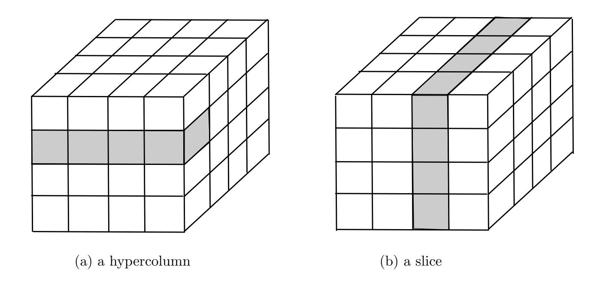

{0}------------------------------------------------

# Design and implementation of **HElib**: a homomorphic encryption library

Shai Halevi<sup>1</sup> Victor Shoup<sup>2</sup>

<sup>1</sup>Algorand Foundation <sup>2</sup>NYU, IBM Research

November 25, 2020

# 1 Introduction

HElib is a C++ open source library (see https://github.com/homenc/HElib) that implements both the BGV [3] and CKKS [4] fully homomorphic encryption (FHE) schemes. This document summarizes some of the basic design principles of HElib, and describes some of its fundamental algorithms and data structures in significant detail. It is a work in progress, and currently focuses exclusively on the BGV scheme. It is *not* intended to be an HElib "user manual". This document focuses on the design of HElib's core — we refer the reader to the papers [6], [7], and [8] for more details on higher-level algorithms in HElib.

# 2 Mathematical background and notation

We denote by  $\mathbb{Z}$  the ring of integers, by  $\mathbb{Q}$  the field of rational numbers, by  $\mathbb{R}$  the field of real numbers, and by  $\mathbb{C}$  the field of complex numbers.

For a positive integer m, we denote by  $\mathbb{Z}_m$  the quotient ring  $\mathbb{Z}/(m)$ , i.e., the ring of integers modulo m. We denote by  $\mathbb{Z}_m^*$  the group of units (i.e., elements with multiplicative inverses) in  $\mathbb{Z}_m$ . Recall that  $\mathbb{Z}_m^*$  consists of those residue classes whose representatives are relatively prime to m. We have  $|\mathbb{Z}_m^*| = \phi(m)$ , where  $\phi$  is Euler's totient function.

For a positive integer m we denote by [m] the set of integers  $\{0, \ldots, m-1\}$ . Note that  $\mathbb{Z}_m$  and [m] are not the same thing: the former is a set of residue classes, which forms a ring, and the latter is a subset of the integers, which does not form a ring.

# 2.1 Roots of unity and cyclotomic polynomials

Let m be a positive integer and F a field. An element  $\omega \in F$  is called an mth root of unity if  $\omega^m = 1$ , which is the same as saying that  $\omega$  is a root of the polynomial  $X^m - 1 \in F[X]$ . Such an mth root of unity  $\omega$  is called **primitive** if no smaller positive power of  $\omega$  is equal to 1.

Suppose that  $\omega \in F$  is an mth root of unity. Note that if  $k \equiv \ell \pmod{m}$ , then  $\omega^k = \omega^\ell$ . This means that if  $j = [k \mod m] \in \mathbb{Z}_m$ , where  $k \in \mathbb{Z}$ , we can unambiguously define  $\omega^j := \omega^k$ .

<span id="page-0-0"></span>If  $\omega \in F$  is a primitive mth root of unity, then

<sup>&</sup>lt;sup>1</sup> [ $k \mod m$ ] denotes the residue class  $k + m\mathbb{Z} \in \mathbb{Z}_m$ , i.e., the residue class modulo m containing k. The same notation for residue classes is also used for other rings.

{1}------------------------------------------------

- every mth root of unity in F can be written as  $\omega^j$  for a unique  $j \in \mathbb{Z}_m$ , and
- every primitive mth root of unity in F can be written as  $\omega^j$  for a unique  $j \in \mathbb{Z}_m^*$ .

As a special case, consider  $\omega := e^{2\pi \mathbf{i}/m} \in \mathbb{C}$ , which is a primitive mth root of unity in  $\mathbb{C}$ . Define the polynomial

$$\Phi_m(X) := \prod_{j \in \mathbb{Z}_m^*} (X - \omega^j) \in \mathbb{C}[X].$$

The polynomial  $\Phi_m(X)$  is called the *m*th cyclotomic polynomial. Clearly,  $\Phi_m(X)$  is monic and has degree  $\phi(m)$ .

The following are well-known facts:

- $\Phi_m(X) \in \mathbb{Z}[X]$ , and
- $\Phi_m(X)$  is irreducible over  $\mathbb{Q}$ .

The following formula is also well known:

$$X^m - 1 = \prod_{d|m} \Phi_d(X).$$

This formula gives a recursive formulation for  $\Phi_m(X)$ : we have  $\Phi_1(X) = X - 1$ , and for m > 1, we have

$$\Phi_m(X) = \frac{X^m - 1}{\prod_{\substack{d \mid m \\ d < m}} \Phi_d(X)}.$$

# 2.2 The cyclotomic rings $\mathcal{A},\,\mathcal{A}_q,\,\mathcal{A}_\mathbb{Q},\,$ and $\mathcal{A}_\mathbb{R}$

Let m > 1 be an integer. Let  $\Phi_m(X) \in \mathbb{Z}[X]$  denote the mth cyclotomic polynomial.

We shall be working with the quotient ring  $\mathcal{A} := \mathbb{Z}[X]/(\Phi_m(X))$ , i.e., the ring of polynomials with integer coefficients modulo the polynomial  $\Phi_m(X)$ .

Let q > 1 be an integer. We shall also be working with the quotient ring  $\mathcal{A}_q := \mathcal{A}/(q)$ . Equivalently,  $\mathcal{A}_q = \mathbb{Z}_q[X]/(\overline{\Phi}_m(X))$ , where  $\overline{\Phi}_m(X)$  is the image of  $\Phi_m(X)$  in  $\mathbb{Z}_q[X]$  (that is, the integer coefficients of  $\Phi_m(X)$  are mapped to their corresponding residue classes in  $\mathbb{Z}_q$ ).

We will sometimes assume that q is relatively prime to m. The restriction that q is relatively prime to m avoids some algebraic awkwardness. For example, with this restriction, the polynomial  $X^m - 1$  has m distinct roots in the algebraic closure  $\overline{\mathbb{Z}}_q$  of  $\mathbb{Z}_q$ , and the polynomial  $\overline{\Phi}_m(X) \in \mathbb{Z}_q[X]$  has  $\phi(m)$  distinct roots in  $\overline{\mathbb{Z}}_q$ , all of which are primitive mth roots of unity.

We will also occasionally work with the rings  $\mathcal{A}_{\mathbb{Q}} := \mathbb{Q}[X]/(\Phi_m(X))$  and  $\mathcal{A}_{\mathbb{R}} := \mathbb{R}[X]/(\Phi_m(X))$ . These are the same as  $\mathcal{A}$ , but where the coefficients are allowed to lie, respectively, in  $\mathbb{Q}$  and  $\mathbb{R}$ , instead of  $\mathbb{Z}$ .

# 2.3 The canonical embedding and associated infinity norm

Let  $\omega := e^{2\pi \mathbf{i}/m} \in \mathbb{C}$ , which is a primitive mth root of unity.

Consider two polynomials  $f(X), g(X) \in \mathbb{Z}[X]$  such that  $f(X) \equiv g(X) \pmod{\Phi_m(X)}$ . Consider a primitive mth root of unity  $\omega^j$ , where  $j \in \mathbb{Z}_m^*$ . Since  $\omega^j$  is a root of  $\Phi_m(X)$ , it follows that  $f(\omega^j) = g(\omega^j)$ . This means that if  $\mathbf{a} = [f(X) \mod \Phi_m(X)] \in \mathcal{A}$  for some  $f(X) \in \mathbb{Z}[X]$ , we can unambiguously define  $\mathbf{a}(\omega^j) := f(\omega^j)$  (and the specific choice of f(X) does not matter).

{2}------------------------------------------------

The **canonical embedding** of  $a \in A$  is the vector obtained by evaluating a at all primitive mth roots of unity:

$$\operatorname{canon}(\boldsymbol{a}) := \left( \boldsymbol{a}(\omega^j) \right)_{j \in \mathbb{Z}_m^*}.$$

We will often use the infinity norm  $\|\operatorname{canon}(\boldsymbol{a})\|_{\infty}$  as the measure of the "size" of  $\boldsymbol{a} \in \mathcal{A}$ , so we define

$$\|\boldsymbol{a}\| := \|\operatorname{canon}(\boldsymbol{a})\|_{\infty}.$$

That is,

$$\|\boldsymbol{a}\| = \max\{|\boldsymbol{a}(\omega^j)| : j \in \mathbb{Z}_m^*\},$$

where  $|a(\omega^j)| \in \mathbb{R}$  denotes the usual absolute value (or norm) of the complex number  $a(\omega^j)$ . We call  $\|\cdot\|$  the **canonical norm**.

The canonical norm satisfies the usual properties satisfied by any norm:

- $\|\boldsymbol{a} + \boldsymbol{b}\| \le \|\boldsymbol{a}\| + \|\boldsymbol{b}\|$  (i.e., subadditivity), and
- $\bullet ||c\boldsymbol{a}|| = |c|||\boldsymbol{a}||,$

for all  $a, b \in A$  and  $c \in \mathbb{Z}$ . In addition, it is *sub-multiplicative*:

•  $\|ab\| \leq \|a\|\|b\|$ 

for all  $a, b \in A$ . This sub-multiplicativity property is what makes this norm especially convenient to use.

The notions of the canonical embedding and corresponding norm apply equally well to elements of  $\mathcal{A}_{\mathbb{Q}}$  or  $\mathcal{A}_{\mathbb{R}}$ , and we shall use the same notation  $\|\boldsymbol{a}\| = \|\mathrm{canon}(\boldsymbol{a})\|_{\infty}$  for  $\boldsymbol{a}$  in  $\mathcal{A}_{\mathbb{Q}}$  or  $\mathcal{A}_{\mathbb{R}}$ .

# <span id="page-2-0"></span>2.4 Standard and powerful bases

It is useful to make a syntactic distinction between the indeterminate X and its image  $\mathbf{x} := [X \mod \Phi_m(X)]$  in the cyclotomic ring  $\mathcal{A} = \mathbb{Z}[X]/(\Phi_m(X))$ . We can write  $\mathcal{A} = \mathbb{Z}[\mathbf{x}]$ . That is,  $\mathcal{A} = \{f(\mathbf{x}) : f(X) \in \mathbb{Z}[X]\}$ .

The element  $\boldsymbol{x} \in \mathcal{A}$  satisfies the equation  $\Phi_m(\boldsymbol{x}) = 0$ . Moreover, every element of  $\mathcal{A}$  can be expressed uniquely as  $f(\boldsymbol{x})$  where  $f(X) \in \mathbb{Z}[X]$  has degree less than  $\phi(m)$ . This follows from division with remainder for polynomials: for  $f(X) \in \mathbb{Z}[X]$ , there exists a unique polynomial r(X) of degree less than  $\phi(m)$  such that  $f(X) \equiv r(X) \pmod{\Phi_m(X)}$ , and since  $\Phi_m(\boldsymbol{x}) = 0$ , we have  $f(\boldsymbol{x}) = r(\boldsymbol{x})$ .

It follows that every element of  $a \in \mathcal{A}$  can be expressed uniquely as

$$\bm{a} = \sum_{i \in [\phi(m)]} a_i \bm{x}^i.$$

Put another way,

$$\{\boldsymbol{x}^i\}_{i\in[\phi(m)]}$$

forms a  $\mathbb{Z}$ -basis for  $\mathcal{A}$ . This is called the **standard basis** for  $\mathcal{A}$  (it is also sometimes called the **power basis**).

Suppose  $m = m_1 \cdots m_k$  is the factorization of m into prime powers. We next define a new quotient ring

$$\mathcal{B} := \mathbb{Z}[Y_1, \dots, Y_k]/(\Phi_{m_1}(Y_1), \dots, \Phi_{m_k}(Y_k)).$$

{3}------------------------------------------------

For t = 1, ..., k, let  $\mathbf{y}_t$  be the image of  $Y_t$  in  $\mathcal{B}$ . Then we have  $\mathcal{B} = \mathbb{Z}[\mathbf{y}_1, ..., \mathbf{y}_k]$ . That is, every element of  $\mathcal{B}$  can be expressed as  $g(\mathbf{y}_1, ..., \mathbf{y}_k)$  for some polynomial  $g(Y_1, ..., Y_k) \in \mathbb{Z}[Y_1, ..., Y_k]$ . Moreover, every element of  $\mathcal{B}$  can be expressed uniquely as  $g(\mathbf{y}_1, ..., \mathbf{y}_k)$  for some polynomial  $g(Y_1, ..., Y_k) \in \mathbb{Z}[Y_1, ..., Y_k]$  where the degree of  $Y_t$  is less than  $\phi(m_t)$  for t = 1, ..., k. Put another way,

$$\left\{\bm{y}_{1}^{i_{1}}\cdots\bm{y}_{k}^{i_{k}}\right\}_{i_{1}\in[\phi(m_{1})],...,i_{k}\in[\phi(m_{k})]}$$

forms a  $\mathbb{Z}$ -basis for  $\mathcal{B}$ .

The rings  $\mathcal{A}$  and  $\mathcal{B}$  are in fact isomorphic. Let  $\boldsymbol{x}_t := \boldsymbol{x}^{m/m_t} \in \mathcal{A}$  for  $t = 1, \ldots, k$ . Then isomorphism is given by the map that sends  $g(\boldsymbol{y}_1, \ldots, \boldsymbol{y}_k) \in \mathcal{B}$  to  $g(\boldsymbol{x}_1, \ldots, \boldsymbol{x}_k) \in \mathcal{A}$  for  $g(Y_1, \ldots, Y_k) \in \mathbb{Z}[Y_1, \ldots, Y_k]$ .

This isomorphism determines another  $\mathbb{Z}$ -basis for  $\mathcal{A}$ , namely,

$$\big\{\bm{x}_1^{i_1}\cdots\bm{x}_k^{i_k}\big\}_{i_1\in [\phi(m_1)],...,i_k\in [\phi(m_k)]}$$
 .

Following [9], we call this the **powerful basis** for A.

Besides the norm based on the canonical embedding, other norms on  $\mathcal{A}$  that are useful to consider are defined in terms of the standard and powerful bases. For  $\mathbf{a} \in \mathcal{A}$ , we denote by  $\mathrm{std}(\mathbf{a})$  its coordinate vector on the standard basis, and by  $\mathrm{pwfl}(\mathbf{a})$  its coordinate vector on the powerful basis. Such a coordinate vector has  $\phi(m)$  components, where each component is an integer. The norms of most interest are the infinity norms on these bases,  $\|\mathrm{std}(\cdot)\|_{\infty}$  and  $\|\mathrm{pwfl}(\cdot)\|_{\infty}$ .

Unlike the canonical norm  $\|\cdot\|$ , the norms  $\|\mathrm{std}(\cdot)\|_{\infty}$  and  $\|\mathrm{pwfl}(\cdot)\|_{\infty}$  are not (in general) submultiplicative.

We can also consider the rings  $\mathcal{A}_{\mathbb{Q}}$ ,  $\mathcal{A}_{\mathbb{R}}$ , and  $\mathcal{A}_q$ . Each of these rings has a corresponding standard and powerful basis (over  $\mathbb{Q}$ ,  $\mathbb{R}$ , and  $\mathbb{Z}_q$ , respectively). We can also naturally extend the norms  $\|\operatorname{std}(\cdot)\|_{\infty}$  and  $\|\operatorname{pwfl}(\cdot)\|_{\infty}$  to  $\mathcal{A}_{\mathbb{Q}}$  and  $\mathcal{A}_{\mathbb{R}}$ .

The rings  $\mathcal{B}_{\mathbb{Q}}$ ,  $\mathcal{B}_{\mathbb{R}}$ , and  $\mathcal{B}_q$  are defined in the same was as  $\mathcal{B}$ , except the underlying ring of coefficients is  $\mathbb{Q}$ ,  $\mathbb{R}$ , and  $\mathbb{Z}_q$ , respectively, rather than  $\mathbb{Z}$ . We also have corresponding ring isomorphisms  $\mathcal{A}_{\mathbb{Q}} \cong \mathcal{B}_{\mathbb{Q}}$ ,  $\mathcal{A}_{\mathbb{R}} \cong \mathcal{B}_{\mathbb{R}}$ , and  $\mathcal{A}_q \cong \mathcal{B}_q$  for every  $q \in \mathbb{Z}, q > 1$ .

#### 2.5 Relations between norms

#### 2.5.1 Bounding the powerful basis infinity norm in terms of the canonical norm

We can nicely bound  $\|pwfl(\cdot)\|_{\infty}$  in terms of the canonical norm  $\|\cdot\|$ , as established in the following lemma (see [7] for a proof). To state this lemma, for a real number x, define

$$P(x) := \frac{2}{x \cdot \tan(\pi/2x)}.$$

Below we use the values of P(x) at prime numbers x. One can verify that P(x) approaches  $4/\pi \approx 1.273$  from below as  $x \to \infty$ , and the (approximate) values of P(x) for the first few primes are:

$$\begin{array}{c|ccccccccccccccccccccccccccccccccccc$$

<span id="page-3-0"></span>**Lemma 1.** For all  $a \in A$ , we have

$$\|\operatorname{pwfl}(\boldsymbol{a})\|_{\infty} \leq D_m \cdot \|\boldsymbol{a}\|,$$

where

$$D_m := \prod_{\text{prime } x \mid m} P(x).$$

{4}------------------------------------------------

Lemma 1 holds for  $\mathcal{A}_{\mathbb{Q}}$  and  $\mathcal{A}_{\mathbb{R}}$  as well.

# <span id="page-4-0"></span>2.5.2 Bounding the standard basis infinity norm in terms of the canonical norm

We saw above that we can bound the powerful basis infinity norm in terms of the canonical norm with a fairly simple explicit formula that gives a reasonably tight bound. It would be nice to get a similar result for the *standard* basis infinity norm. Unfortunately, we know of no simple tight formula. While we are able to compute explicit bounds, these bounds are not nearly as tight as the bounds for the powerful basis.

**Lemma 2.** For all  $a \in A$ , we have

$$\|\operatorname{std}(\boldsymbol{a})\|_{\infty} \leq E_m \cdot \|\boldsymbol{a}\|$$

where  $E_m$  is the infinity norm of the inverse Vandermonde matrix, that is,

$$E_m = ||V_m^{-1}||_{\infty}, \quad where \quad V_m := \left(\omega^{ij}\right)_{i \in \mathbb{Z}_m^*, j \in [\phi(m)]}.$$

Here,  $\omega := e^{2\pi \mathbf{i}/m} \in \mathbb{C}$ , and denoting  $V_m^{-1} = (a_{ij})$  we have  $||V_m^{-1}||_{\infty} := \max_i \sum_j |a_{ij}|$ .

When m is a prime power, then  $E_m = D_m$ , where  $D_m$  is as in Lemma 1. We have computed  $E_m$  for all other m up to 64,000. We found the following:

- If m is the product of 2 distinct prime powers,  $E_m$  ranges between (roughly) 1.6 and 6.8.
- If m is the product of 3 distinct prime powers,  $E_m$  ranges between (roughly) 3.5 and 130.
- If m is the product of 4 distinct prime powers,  $E_m$  ranges between (roughly) 18 and 1,900.
- If m is the product of 5 distinct prime powers,  $E_m$  ranges between (roughly) 820 and 81,000.

See Appendix A for some implementation details.

#### 2.6 Probabilistic norm bounds

We consider here probabilistic bounds on randomly generated elements of  $\mathcal{A}_{\mathbb{R}}$ . Suppose

$$\boldsymbol{a} = \sum_{i \in I} a_i \boldsymbol{x}^i,$$

where  $\{a_i\}_{i\in I}$  is a mutually independent family of real-values random variables, where each  $a_i$  has zero mean and variance  $\sigma_i^2$ . Let  $\omega \in \mathbb{C}$  be a primitive mth root of unity, and consider the complex random variable  $\boldsymbol{a}(\omega)$ . A simple calculation shows that  $\boldsymbol{a}(\omega)$  has zero mean and variance  $\sigma^2 := \sum_i \sigma_i^2$ . Indeed,

$$\sigma^2 = E[\boldsymbol{a}(\omega) \cdot \overline{\boldsymbol{a}(\omega)}] = E\left[\sum_{i,j} a_i a_j \omega^{i-j}\right] = \sum_i E[a_i^2] = \sum_i \sigma_i^2.$$

{5}------------------------------------------------

#### <span id="page-5-3"></span>2.6.1 The circularly-symmetric case

In the above setting, if

- I = [m], or
- m is a power of two and I = [φ(m)],

then we will heuristically model a(ω) as a complex Gaussian with variance σ 2 . The heuristic aspect of this is the fact that we are using the Central Limit Theorem here qualitatively, without any quantitative error terms. This heuristic is reasonable provided |I| is large. We may also heuristically model a(ω) as a complex Gaussian with variance σ 2 if I is chosen as a random subset of [m] (or [φ(m)] if m is a power of two). We require that the complex numbers ω <sup>i</sup> are well distributed around the unit circle.

Now, a complex Gaussian with variance σ <sup>2</sup> has the same distribution as a 2-D Gaussian with variance σ <sup>2</sup>/2. It follows[2](#page-5-0) that for any B > 0, we have the following heuristic tail bound:

$$\Pr[|\boldsymbol{a}(\omega)| > B] = \exp(-B^2/\sigma^2). \tag{1}$$

Setting

<span id="page-5-1"></span>
$$B := \sigma \sqrt{\log(\phi(m))},\tag{2}$$

we have

$$\Pr[|\boldsymbol{a}(\omega)| > B] = \frac{1}{\phi(m)}.$$

Furthermore, kak > B iff |a(ω)| > B for some primitive mth root of unity ω ∈ C. However, since the coefficients of a are real, we have a(¯ω) = a(ω). Thus, to bound the probability that kak > B, we can apply the Union Bound to the φ(m)/2 conjugate pairs of primitive roots, rather than all φ(m) primitive roots. Therefore, with B defined as in [\(2\)](#page-5-1), we obtain the heuristic bound

<span id="page-5-4"></span>
$$\Pr\left[\|\boldsymbol{a}\| > B\right] \le \frac{1}{2}.\tag{3}$$

#### <span id="page-5-5"></span>2.6.2 The general case

Now suppose that the above assumptions on the index set I are not necessarily met. A typical example of this is the setting where I = [φ(m)] but m is not a power of two.

For any B > 0, we have the following heuristic tail bound:

<span id="page-5-2"></span>
$$\Pr[|\boldsymbol{a}(\omega)| > B] = \operatorname{erfc}(B / \sigma \sqrt{2}). \tag{4}$$

Here, erfc is the standard complementary error function

$$\operatorname{erfc}(z) := 1 - \frac{2}{\sqrt{\pi}} \int_0^z \exp(-t^2) dt.$$

Note that erfc(B/σ<sup>√</sup> 2) is the probability that a real Gaussian with zero mean and variance σ 2 exceeds B in absolute value. The bound [\(4\)](#page-5-2) is a conservative estimate, as it rather pessimistically assumes that the roots of unity ω <sup>i</sup> are concentrated near the real axis. The following table gives an idea of how the erfc function behaves:

<span id="page-5-0"></span><sup>2</sup>See, for example, [M. Brown, "A Generalized Error Function in](https://apps.dtic.mil/dtic/tr/fulltext/u2/401722.pdf) n Dimensions", 1963.

{6}------------------------------------------------

$$B/\sigma$$
 |  $-\log_2(\text{erfc}(B/\sigma\sqrt{2}))$   
 $8$  |  $49.5$   
 $9$  |  $61.9$   
 $10$  |  $75.8$   
 $11$  |  $91.1$   
 $12$  |  $107.8$ 

Again, applying the Union Bound, we have

<span id="page-6-1"></span>
$$\Pr\left[\|\boldsymbol{a}\| > B\right] \le \operatorname{erfc}(B/\sigma\sqrt{2}) \cdot \phi(m)/2. \tag{5}$$

# <span id="page-6-0"></span>2.6.3 The symmetric distribution mod M

In applying the above bounds, as well as in other settings, it is convenient to introduce a special distribution.

Let M ≥ 2 be an integer, and consider the following probability distribution over the integers in the range [−M/2, +M/2] called the symmetric distribution mod M:

If M is odd, then the symmetric distribution mod M is simply the uniform distribution on the set of M integers {−bM/2c, . . . , +bM/2c}. If M is even, then the symmetric distribution mod M assigns probability mass 1/2M to the integers ±M/2, while the integers of magnitude strictly smaller than M/2 are each assigned probability mass 1/M.

Note that for the symmetric distribution mod M, each residue class mod M is equally likely, and the distribution is symmetric about zero (and in particular, its mean is zero). Instead of the variance M2/12 for the continuous distribution on [−M/2, +M/2], we have:

<span id="page-6-2"></span>Lemma 3. Let M ≥ 2 be an integer and X be a random variable that is symmetrically distributed mod M. If σ 2 <sup>M</sup> is the variance of X, then

$$\sigma_M^2 \le \frac{M^2}{12}$$
 if  $M$  is odd,

and

$$\sigma_M^2 = \frac{M^2}{12} \cdot \left(1 + \frac{2}{M^2}\right)$$
 if  $M$  is even.

Proof. Let N = bM/2c. If M is odd then we have

$$\sigma_M^2 = \frac{2}{2N+1} \cdot \sum_{i=1}^N i^2 \le \frac{M^2}{12},$$

and if M is even then

$$\sigma_M^2 = \frac{N^2}{2N} + \frac{2}{2N} \cdot \sum_{i=1}^{N-1} i^2 = \frac{M^2}{12} \left( 1 + \frac{2}{M^2} \right).$$

{7}------------------------------------------------

#### <span id="page-7-2"></span>2.6.3.1 Symmetric reduction mod M

Related to the notion of the symmetric distribution mod M is the notion of **symmetric reduction** of an integer  $a \mod M$ . If M is odd, this is the unique integer  $b \equiv a \pmod M$  in the interval (-M/2, +M/2). If M is even, then:

- if  $a \not\equiv M/2 \pmod{M}$ , then this is the unique integer  $b \equiv a \pmod{M}$  in the interval (-M/2, +M/2);
- otherwise, if  $a \equiv M/2 \pmod{M}$ , then this is an integer b chosen uniformly at random from the set  $\{\pm M/2\}$ .

#### <span id="page-7-1"></span>2.7 The Galois automorphisms

Let  $\mathcal{A} = \mathbb{Z}[X]/(\Phi_m(X))$ , and recall that  $\mathcal{A} = \mathbb{Z}[\boldsymbol{x}]$  where  $\boldsymbol{x} := [X \mod \Phi_m(X)]$  is the image of the indeterminate X in  $\mathcal{A}$ .

For  $j \in \mathbb{Z}_m^*$ , the jth Galois automorphism  $\theta_j$  is a ring automorphism:

<span id="page-7-0"></span>
$$\theta_j: \quad \mathcal{A} \longrightarrow \mathcal{A}$$

$$f(\boldsymbol{x}) \longmapsto f(\boldsymbol{x}^j) \qquad (\text{for } f(X) \in \mathbb{Z}[X]).$$

$$(6)$$

To see why  $\theta_j$  is well defined, note that over  $\mathbb{Z}[X]$ , we have  $\Phi_m(X^j)$  is divisible by  $\Phi_m(X)$ . This follows from the fact that  $\omega := e^{2\pi \mathbf{i}/m} \in \mathbb{C}$  is a primitive mth root of unity, and so is  $\omega^j$ . Therefore,  $\omega$  is a root of  $\Phi_m(X^j)$ . Since  $\Phi_m(X)$  is the minimal polynomial of  $\omega$  over  $\mathbb{Z}$ , it must be the case that  $\Phi_m(X^j)$  is divisible by  $\Phi_m(X)$ . This means that if  $f(\mathbf{x}) = g(\mathbf{x})$ , then  $f(\mathbf{x}^j) = g(\mathbf{x}^j)$ , and so the map (6) is well defined. Note that if for  $j, j' \in \mathbb{Z}_m^*$ , we have

$$\theta_j \circ \theta_{j'} = \theta_{jj'} = \theta_{j'} \circ \theta_j.$$

In particular, if  $j' = j^{-1} \in \mathbb{Z}_m^*$ , then  $\theta_{j'}$  is the inverse of  $\theta_j$ , and so we see that  $\theta_j$  is bijective.

For any  $\boldsymbol{a} \in \mathcal{A}$ , observe that  $\operatorname{canon}(\theta_j(\boldsymbol{a}))$  is just a permutation of  $\operatorname{canon}(\boldsymbol{a})$ , from which it follows that  $\|\theta_j(\boldsymbol{a})\| = \|\boldsymbol{a}\|$ .

The Galois automorphisms are defined in exactly the same way for the rings  $\mathcal{A}_q$ ,  $\mathcal{A}_{\mathbb{Q}}$ , and  $\mathcal{A}_{\mathbb{R}}$ .

# 3 The plaintext algebra

Again, let  $\mathcal{A} = \mathbb{Z}[X]/(\Phi_m(X))$ . In HElib, plaintexts can be viewed as elements of the ring  $\mathcal{A}_P$ , where  $P = p^r$  is a prime power and p does not divide m. This ring is actually a  $\mathbb{Z}_P$ -algebra, which means that it contains a copy (or, really, an isomorphic copy) of the ring  $\mathbb{Z}_P$  as a subring.

We will initially focus of the case where r = 1, so P = p is a prime, and  $\mathbb{Z}_p$  is a field. Since  $\mathcal{A}_p$  is a  $\mathbb{Z}_p$ -algebra and contains the field  $\mathbb{Z}_p$  as a subring, we can naturally view  $\mathcal{A}_p$  as a vector space over  $\mathbb{Z}_p$ .

Recall that  $\mathcal{A}_p = \mathbb{Z}_p[X]/(\overline{\Phi}_m(X))$ , where  $\overline{\Phi}_m(X)$  is the image of the cyclotomic polynomial  $\Phi_m(X)$  in  $\mathbb{Z}_p[X]$ . We are assuming that p does not divide m. We define  $\boldsymbol{x} := [X \mod \overline{\Phi}_m(X)]$ , so that  $\mathcal{A}_p = \mathbb{Z}_p[\boldsymbol{x}]$ , which means that every element of  $\mathcal{A}_p$  can be expressed as  $f(\boldsymbol{x})$  for some  $f(X) \in \mathbb{Z}_p[X]$ .

The following are well-known facts:

{8}------------------------------------------------

• The polynomial  $\overline{\Phi}_m(X) \in \mathbb{Z}_p[X]$  factors as

<span id="page-8-3"></span>
$$\overline{\Phi}_m(X) = F_1(X) \cdots F_n(X), \tag{7}$$

where the polynomials  $F_i(X) \in \mathbb{Z}_p[X]$  are distinct irreducible polynomials, each of the same degree d; in particular,  $\phi(m) = nd$ .

• The value d is the multiplicative order of p modulo m; that is, d is the smallest positive integer such that  $p^d \equiv 1 \pmod{m}$ .

By the Chinese Remainder Theorem for polynomials, we have a  $\mathbb{Z}_p$ -algebra isomorphism<sup>3</sup>

<span id="page-8-1"></span>
$$\mathcal{A}_p \longrightarrow \mathbb{Z}_p[X]/(F_1(X)) \times \cdots \times \mathbb{Z}_p[X]/(F_n(X))$$

$$f(\boldsymbol{x}) \longmapsto \left( [f(X) \bmod F_1(X)], \ldots, [f(X) \bmod F_n(X)] \right) \quad (\text{for } f(X) \in \mathbb{Z}_p[X]).$$
(8)

Another way to look at  $\mathcal{A}$  is as follows. Let  $E = \mathbb{Z}_p[X]/(F_1(X))$ . The choice of the polynomial  $F_1(X)$  from among the irreducible factors of  $\overline{\Phi}_m(X)$  is quite arbitrary. Let  $\eta := [X \mod F_1(X)] \in E$ . Now, since  $F_1(X)$  is irreducible, it follows that E is a field — it is a finite field of cardinality  $p^d$ . We also have  $E = \mathbb{Z}_p[\eta]$ , which means that every element of E can be expressed as  $f(\eta)$  for some  $f(X) \in \mathbb{Z}_p[X]$ . We naturally view  $\mathbb{Z}_p$  as a subfield of E. By definition,  $\eta$  is a root of  $F_1(X)$ . It is also a well-known fact that  $\eta \in E$  is a primitive mth root of unity.

Now consider the group  $\mathbb{Z}_m^*$ . It is a well-known fact that the polynomial  $\overline{\Phi}_m(X)$  has  $\phi(m)$  roots in E, namely,  $\eta^j$  for  $j \in \mathbb{Z}_m^*$ . Thus, these  $\phi(m)$  roots must be partitioned among the irreducible factors of  $\overline{\Phi}_m(X)$ , so that each irreducible factor  $F_i(X)$  has d roots in E.

We can say a bit more about how these roots are partitioned among these factors. Consider the subgroup H of  $\mathbb{Z}_m^*$  generated by  $\bar{p} := [p \mod m] \in \mathbb{Z}_m^*$ . This subgroup consists of the d distinct elements  $\bar{1}, \bar{p}, \ldots, \bar{p}^{d-1}$ . We can form the quotient group  $\mathbb{Z}_m^*/H$ , which consists of  $n = \phi(m)/d$  distinct cosets. Each such coset is of the form

$$kH = \{kh : h \in H\} \subseteq \mathbb{Z}_m^*$$

for some  $k \in \mathbb{Z}_m^*$ . Such a k is called a *representative* of the coset. Any other element of a coset can also act as a representative of the same coset.

Now suppose we choose one representative from each coset, obtaining a complete set of representatives  $k_1, \ldots, k_n \in \mathbb{Z}_m^*$  for the cosets of H in  $\mathbb{Z}_m^*$ . Then the cosets of H in  $\mathbb{Z}_m^*$  are

$$k_1H,\ldots,k_nH.$$

Every element of  $\mathbb{Z}_m^*$  lies in exactly one of these cosets.

The following is a well-known fact:

• For any set of representatives  $k_1, \ldots, k_n \in \mathbb{Z}_m^*$  of H in  $\mathbb{Z}_m^*$ , we can order them in such a way that for  $i = 1, \ldots, n$ , the polynomial  $F_i(X)$  has d roots in E, namely,  $\eta^k$  for  $k \in k_iH$ .

Because of this, for each i = 1, ..., n, we have a  $\mathbb{Z}_p$ -algebra isomorphism

<span id="page-8-2"></span>
$$\mathbb{Z}_p[X]/(F_i(X)) \longrightarrow E$$

$$[f(X) \bmod F_i(X)] \longmapsto f(\eta^{k_i}) \quad (\text{for } f(X) \in \mathbb{Z}_p[X]). \tag{9}$$

<span id="page-8-0"></span> $<sup>^{3}</sup>$ A B-algebra isomorphism is a ring isomorphism that acts as the identity function on the subring B.

{9}------------------------------------------------

Combining (8) and (9), we obtain a  $\mathbb{Z}_p$ -algebra isomorphism

<span id="page-9-0"></span>
$$A_p \longrightarrow E^n$$

$$f(\mathbf{x}) \longmapsto (f(\eta^{k_1}), \dots, f(\eta^{k_n})) \quad (\text{for } f(X) \in \mathbb{Z}_p[X]).$$
(10)

We call E the **slot algebra**. The isomorphism (10) allows us to perform component-wise addition and multiplications on vectors in  $E^n$  by performing corresponding operations on elements of  $\mathcal{A}_p$ . If  $\mathbf{a} \in \mathcal{A}_p$  corresponds to  $(\alpha_1, \ldots, \alpha_n) \in E^n$  and  $\mathbf{b} \in \mathcal{A}_p$  corresponds to  $(\beta_1, \ldots, \beta_n) \in E^n$ , then  $\mathbf{a} + \mathbf{b}$  corresponds to  $(\alpha_1 + \beta_1, \ldots, \alpha_n + \beta_n) \in E^n$ , and  $\mathbf{a} \cdot \mathbf{b}$  corresponds to  $(\alpha_1 \cdot \beta_1, \ldots, \alpha_n \cdot \beta_n) \in E^n$ .

It is also computationally easy to map (in both directions) between a concrete representation of an element of  $\mathcal{A}_p$  (represented, say, as a coefficient vector with respect to the standard basis for  $\mathcal{A}_p$  over  $\mathbb{Z}_p$ ), and a concrete representation of  $E^n$  (where each entry in the vector is represented, say, as a coefficient vector with respect to the standard basis for E over  $\mathbb{Z}_p$ ).

# 3.1 Galois automorphisms and intra-slot data movement

Using isomorphism (10), we can implement simple SIMD operations on vectors of slots. However, it also very useful to be able to move data between the slots within a vector. This can be achieved using the Galois automorphisms on  $\mathcal{A}_p$ , which were introduced in Section 2.7

Recall that for  $j \in \mathbb{Z}_m^*$ , the jth Galois automorphism  $\theta_j$  is the  $\mathbb{Z}_p$ -algebra automorphism:

<span id="page-9-1"></span>
$$\theta_j: \quad \mathcal{A}_p \longrightarrow \mathcal{A}_p$$

$$f(\boldsymbol{x}) \longmapsto f(\boldsymbol{x}^j) \qquad (\text{for } f(X) \in \mathbb{Z}_p[X]).$$

$$(11)$$

Under the correspondence

$$f(\boldsymbol{x}) \in \mathcal{A}_p \longleftrightarrow (f(\eta^{k_1}), \dots, f(\eta^{k_n})) \in E^n,$$

as in (10), we have

$$\theta_j(f(\boldsymbol{x})) \in \mathcal{A}_p \longleftrightarrow (f(\eta^{jk_1}), \dots, f(\eta^{jk_n})) \in E^n.$$

Thus,  $\theta_j$  acts on the slots in a certain way. By carefully choosing representatives  $k_1, \ldots, k_n$ , we can use certain Galois mappings to perform useful operations on the slots, including various permutations on the slots.

#### 3.1.1 The Frobenius automorphism

The map

<span id="page-9-2"></span>
$$\sigma: E \longrightarrow E$$

$$f(\eta) \longmapsto f(\eta^p) \qquad (\text{for } f(X) \in \mathbb{Z}_p[X]). \tag{12}$$

is a  $\mathbb{Z}_p$ -algebra automorphism, which is called the **Frobenius automorphism**. The Frobenius automorphism plays a central role in the theory of finite fields. One key fact is that for all  $\alpha \in E$ , we have  $\sigma(\alpha) = \alpha^p$ . Another key fact is that for all  $\alpha \in E$ , we have

$$\alpha \in \mathbb{Z}_p \iff \sigma(\alpha) = \alpha.$$

Under the correspondence

$$f(\boldsymbol{x}) \in \mathcal{A}_p \longleftrightarrow (f(\eta^{k_1}), \dots, f(\eta^{k_n})) \in E^n,$$

as in (10), we have

$$\theta_{\bar{p}}(f(\boldsymbol{x})) \in \mathcal{A}_p \longleftrightarrow (f(\eta^{pk_1}), \dots, f(\eta^{pk_n})) = (\sigma(f(\eta^{k_1})), \dots, \sigma(f(\eta^{k_n}))) \in E^n,$$

where  $\bar{p} = [p \mod m] \in \mathbb{Z}_m^*$ . Thus, the map  $\theta_{\bar{p}}$  acts slot-wise as the Frobenius map on E.

{10}------------------------------------------------

#### <span id="page-10-0"></span>3.1.2 Rotations on a hypercube

As we have seen, the automorphism  $\theta_{\bar{p}}$  just applies the Frobenius map to each slot, but does not induce any data movement between slots. We now discuss how we can use other automorphisms  $\theta_j$  to implement various permutations on the slots.

We start with some simple cases.

#### 3.1.2.1 One-dimensional rotations

Let  $g \in \mathbb{Z}_m^*$  and suppose that  $1, g, g^2, \ldots, g^{n-1}$  is a complete system of representatives for the cosets of H in  $\mathbb{Z}_m^*$ . It must be the case that  $g^n \in H$ . To see why, observe that we must have  $g^n = g^e h$  for some  $e \in \{0, \ldots, n-1\}$  and some  $h \in H$ . Moreover, we must have e = 0 (as otherwise,  $g^{n-e} \in H$  would imply that two distinct representatives among  $1, \ldots, g^{n-1}$  lie in H, which is impossible). So we have  $g^n = h \in H$ .

Suppose that we are lucky, and that  $g^n = 1$ . For the isomorphism (10), let us use the complete system of representatives  $1, g, \ldots, g^{n-1} \in \mathbb{Z}_m^*$  for the cosets of H in  $\mathbb{Z}_m^*$ . Then we have the correspondence

$$f(\boldsymbol{x}) \in \mathcal{A}_p \longleftrightarrow (f(\eta^1), f(\eta^g), \dots, f(\eta^{g^{n-2}}), f(\eta^{g^{n-1}})) \in E^n.$$

Applying  $\theta_g$  to  $f(\boldsymbol{x})$ , we have the correspondence

$$\theta_g(f(\boldsymbol{x})) \in \mathcal{A}_p \longleftrightarrow (f(\eta^g), f(\eta^{g^2}), \dots, f(\eta^{g^{n-1}}), f(\eta^{g^n})) \in E^n.$$

Moreover, since we are assuming  $g^n = 1$ , we have the correspondence

$$\theta_g(f(\boldsymbol{x})) \in \mathcal{A}_p \longleftrightarrow (f(\eta^g), f(\eta^{g^2}), \dots, f(\eta^{g^{n-1}}), f(\eta^1)) \in E^n.$$

Thus, we see that applying  $\theta_g$  to  $\mathbf{a} \in \mathcal{A}$  effectively rotates the slots of  $\mathbf{a}$  to the *left* by one position.

More generally, for  $e=1,\ldots,n-1$ , applying  $\theta_{g^e}$  rotates the slots to the left by e positions; moreover, applying  $\theta_{g^{-e}}$  rotates the slots to the right by e positions.

Now suppose we are not so lucky:  $g^n \in H$  but  $g^n \neq 1$ . This means that  $g^n = \bar{p}^s \in \mathbb{Z}_m^*$  for some  $s \in \{1, \ldots, d-1\}$ . Then we have the correspondence

$$\theta_g(f(\boldsymbol{x})) \in \mathcal{A}_p \longleftrightarrow (f(\eta^g), f(\eta^{g^2}), \dots, f(\eta^{g^{n-1}}), \sigma^s(f(\eta^1))) \in E^n.$$

Thus, applying  $\theta_g$  to  $\boldsymbol{a}$  effectively rotates the slots of  $\boldsymbol{a}$  one position to the left, and then "perturbs" the last slot by applying the Frobenius-power  $\sigma^s$  to that slot. So, in general, we do not get a true rotation. However, if the first slot of  $\boldsymbol{a}$  happens to lie in  $\mathbb{Z}_p$ , then as  $\sigma^s$  is the identity on  $\mathbb{Z}_p$ , we do get a true rotation.

More generally, for e = 1, ..., n-1, applying  $\theta_{g^e}$  rotates the slots to the left by e positions, and then perturbs the last e slots with the Frobenius-power  $\sigma^s$ ; moreover, applying  $\theta_{g^{-e}}$  perturbs the last e slots with the Frobenius-power  $\sigma^s$ , and then rotates the slots to the right by e positions.

If the slots do contain elements outside of  $\mathbb{Z}_p$ , we can still effectively implement rotations as follows. To rotate the slots of  $\boldsymbol{a}$  to the left e positions, we can form a "masking element"  $\boldsymbol{M}_e$  with the correspondence

$$M_e \in \mathcal{A}_p \longleftrightarrow (\underbrace{1,\ldots,1}_{n-e},\underbrace{0,\ldots,0}_{e \text{ 0's}}) \in E^n.$$

Note that we also have the correspondence

$$1 - \mathbf{M}_e \in \mathcal{A}_p \longleftrightarrow (\underbrace{0, \dots, 0}_{n-e \text{ 0's}}, \underbrace{1, \dots, 1}_{e \text{ 1's}}) \in E^n.$$

{11}------------------------------------------------

If we have the correspondence

$$\boldsymbol{a} \in \mathcal{A}_p \longleftrightarrow (\alpha_0, \dots, \alpha_{n-1}) \in E^n$$

then

$$\mathbf{M}_e \cdot \theta_{g^e}(\mathbf{a}) \in \mathcal{A}_p \longleftrightarrow (\alpha_e, \dots, \alpha_{n-1}, \underbrace{0, \dots, 0}_{e \text{ 0's}}) \in E^n.$$

and

$$(1 - \mathbf{M}_e) \cdot \theta_{g^{e-n}}(\mathbf{a}) \in \mathcal{A}_p \longleftrightarrow (\underbrace{0, \dots, 0}_{n-e \ 0's}, \alpha_0, \dots, \alpha_{e-1}) \in E^n.$$

Therefore,

<span id="page-11-0"></span>
$$M_e \cdot \theta_{g^e}(\boldsymbol{a}) + (1 - M_e) \cdot \theta_{g^{e-n}}(\boldsymbol{a}).$$
 (13)

yields an element of  $A_p$  whose slots are obtained by rotating the slots of a to the left e positions. Instead of rotating and then masking, as in (13), we can achieve exactly the same effect masking

Instead of rotating and then masking, as in (13), we can achieve exactly the same effect masking and then rotating:

$$\theta_{g^e}((1 - \boldsymbol{M}_{n-e}) \cdot \boldsymbol{a}) + \theta_{g^{e-n}}(\boldsymbol{M}_{n-e} \cdot \boldsymbol{a}). \tag{14}$$

#### 3.1.2.2 Two-dimensional rotations

Now suppose that  $n = n_1 n_2$  and we choose a complete system of representatives for the cosets of H in  $\mathbb{Z}_m^*$  of the form

<span id="page-11-1"></span>
$$g_1^{e_1}g_2^{e_2}$$
 (for  $e_1 \in [n_1], e_2 \in [n_2]$ ). (15)

Organizing these representatives in a natural way as a two-dimensional array, we can write the correspondence arising from (10) as follows:

$$f(\boldsymbol{x}) \in \mathcal{A}_{p} \longleftrightarrow \begin{pmatrix} f(\eta^{1}) & f(\eta^{g_{2}}) & \cdots & f(\eta^{g_{2}^{n_{2}-2}}) & f(\eta^{g_{2}^{n_{2}-1}})) \\ f(\eta^{g_{1}}) & f(\eta^{g_{1}g_{2}}) & \cdots & f(\eta^{g_{1}g_{2}^{n_{2}-2}}) & f(\eta^{g_{1}g_{2}^{n_{2}-1}})) \\ \vdots & & \vdots & & \\ f(\eta^{g_{1}^{n_{1}-2}}) & f(\eta^{g_{1}^{n_{1}-2}g_{2}}) & \cdots & f(\eta^{g_{1}^{n_{1}-2}g_{2}^{n_{2}-2}}) & f(\eta^{g_{1}^{n_{1}-2}g_{2}^{n_{2}-1}})) \\ f(\eta^{g_{1}^{n_{1}-1}}) & f(\eta^{g_{1}^{n_{1}-1}g_{2}}) & \cdots & f(\eta^{g_{1}^{n_{1}-1}g_{2}^{n_{2}-2}}) & f(\eta^{g_{1}^{n_{1}-1}g_{2}^{n_{2}-1}})) \end{pmatrix} \in E^{n_{1} \times n_{2}}.$$

Applying the automorphism  $\theta_{g_2}$  to  $f(\boldsymbol{x})$ , we have:

$$\theta_{g_{2}}(f(\boldsymbol{x})) \in \mathcal{A}_{p} \longleftrightarrow \begin{pmatrix} f(\eta^{g_{2}}) & f(\eta^{g_{2}^{2}}) & \cdots & f(\eta^{g_{2}^{n_{2}-1}}) & f(\eta^{g_{1}^{n_{2}}}) \\ f(\eta^{g_{1}g_{2}}) & f(\eta^{g_{1}g_{2}^{2}}) & \cdots & f(\eta^{g_{1}g_{2}^{n_{2}-1}}) & f(\eta^{g_{1}g_{2}^{n_{2}}}) \end{pmatrix} \in E^{n_{1} \times n_{2}}.$$

$$\vdots \qquad \qquad \vdots \qquad \qquad \vdots \qquad \qquad \vdots \qquad \qquad \vdots \qquad \qquad \vdots \qquad \qquad \vdots \qquad \qquad \vdots \qquad \qquad \vdots \qquad \qquad \vdots \qquad \qquad \vdots \qquad \qquad \vdots \qquad \qquad \vdots \qquad \qquad \vdots \qquad \qquad \vdots \qquad \qquad \vdots \qquad \qquad \vdots \qquad \qquad \vdots \qquad \qquad \vdots \qquad \qquad \vdots \qquad \qquad \vdots \qquad \qquad \vdots \qquad \qquad \vdots \qquad \qquad \vdots \qquad \qquad \vdots \qquad \qquad \vdots \qquad \qquad \vdots \qquad \qquad \vdots \qquad \qquad \vdots \qquad \qquad \vdots \qquad \qquad \vdots \qquad \qquad \vdots \qquad \qquad \vdots \qquad \qquad \vdots \qquad \qquad \vdots \qquad \qquad \vdots \qquad \qquad \vdots \qquad \qquad \vdots \qquad \qquad \vdots \qquad \qquad \vdots \qquad \qquad \vdots \qquad \qquad \vdots \qquad \qquad \vdots \qquad \qquad \vdots \qquad \qquad \vdots \qquad \qquad \vdots \qquad \qquad \vdots \qquad \qquad \vdots \qquad \qquad \vdots \qquad \qquad \vdots \qquad \qquad \vdots \qquad \qquad \vdots \qquad \qquad \vdots \qquad \qquad \vdots \qquad \qquad \vdots \qquad \qquad \vdots \qquad \qquad \vdots \qquad \qquad \vdots \qquad \qquad \vdots \qquad \qquad \vdots \qquad \qquad \vdots \qquad \qquad \vdots \qquad \qquad \vdots \qquad \qquad \vdots \qquad \qquad \vdots \qquad \qquad \vdots \qquad \qquad \vdots \qquad \qquad \vdots \qquad \qquad \vdots \qquad \qquad \vdots \qquad \qquad \vdots \qquad \qquad \vdots \qquad \qquad \vdots \qquad \qquad \vdots \qquad \qquad \vdots \qquad \qquad \vdots \qquad \qquad \vdots \qquad \qquad \vdots \qquad \qquad \vdots \qquad \qquad \vdots \qquad \qquad \vdots \qquad \qquad \vdots \qquad \qquad \vdots \qquad \qquad \vdots \qquad \qquad \vdots \qquad \qquad \vdots \qquad \qquad \vdots \qquad \qquad \vdots \qquad \qquad \vdots \qquad \qquad \vdots \qquad \qquad \vdots \qquad \qquad \vdots \qquad \qquad \vdots \qquad \qquad \vdots \qquad \qquad \vdots \qquad \qquad \vdots \qquad \qquad \vdots \qquad \qquad \vdots \qquad \qquad \vdots \qquad \qquad \vdots \qquad \qquad \vdots \qquad \qquad \vdots \qquad \qquad \vdots \qquad \qquad \vdots \qquad \qquad \vdots \qquad \qquad \vdots \qquad \qquad \vdots \qquad \qquad \vdots \qquad \qquad \vdots \qquad \qquad \vdots \qquad \qquad \vdots \qquad \qquad \vdots \qquad \qquad \vdots \qquad \qquad \vdots \qquad \qquad \vdots \qquad \qquad \vdots \qquad \qquad \vdots \qquad \qquad \vdots \qquad \qquad \qquad \vdots \qquad \qquad \vdots \qquad \qquad \qquad \vdots \qquad \qquad \qquad \vdots \qquad \qquad \qquad \vdots \qquad \qquad \qquad \vdots \qquad \qquad \qquad \vdots \qquad \qquad \qquad \vdots \qquad \qquad \qquad \qquad \vdots \qquad \qquad \qquad \qquad \vdots \qquad \qquad \qquad \qquad \vdots \qquad \qquad \qquad \qquad \vdots \qquad \qquad \qquad \qquad \qquad \qquad \vdots \qquad \qquad \qquad \qquad \qquad \qquad \qquad \qquad \qquad \qquad \qquad \qquad \qquad \qquad \qquad \qquad \qquad \qquad \qquad \qquad$$

If we are lucky, we have  $g_2^{n_2} = 1$ , in which case:

$$\theta_{g_{2}}(f(\boldsymbol{x})) \in \mathcal{A}_{p} \longleftrightarrow \begin{pmatrix} f(\eta^{g_{2}}) & f(\eta^{g_{2}^{2}}) & \cdots & f(\eta^{g_{2}^{n_{2}-1}}) & f(\eta^{1}) \\ f(\eta^{g_{1}g_{2}}) & f(\eta^{g_{1}g_{2}^{2}}) & \cdots & f(\eta^{g_{1}g_{2}^{n_{2}-1}}) & f(\eta^{g_{1}}) \end{pmatrix} \\ \vdots & \vdots & \vdots & \vdots \\ f(\eta^{g_{1}^{n_{1}-2}g_{2}}) & f(\eta^{g_{1}^{n_{1}-2}g_{2}^{2}}) & \cdots & f(\eta^{g_{1}^{n_{1}-2}g_{2}^{n_{2}-1}}) & f(\eta^{g_{1}^{n_{1}-2}}) \\ f(\eta^{g_{1}^{n_{1}-1}g_{2}}) & f(\eta^{g_{1}^{n_{1}-1}g_{2}^{2}}) & \cdots & f(\eta^{g_{1}^{n_{1}-1}g_{2}^{n_{2}-1}}) & f(\eta^{g_{1}^{n_{1}-1}}) \end{pmatrix} \in E^{n_{1} \times n_{2}}.$$

{12}------------------------------------------------

In this case, the effect of  $\theta_{g_2}$  is to rotate the slots of each row one position to the left. More generally, for  $e_2 = 1, \ldots, n_2 - 1$ , applying  $\theta_{g_2^{e_2}}$  rotates the slots of each row to the left by  $e_2$  positions, and applying  $\theta_{g^{-e_2}}$  rotates the slots of each row to the *right* by  $e_2$  positions.

Suppose we are unlucky, and  $g_2^{n_2} \neq 1$  but  $g_2^{n_2} \in H$ . If  $g_2^{n_2} = \bar{g}^s$ , then we have:

$$\theta_{g_{2}}(f(\boldsymbol{x})) \in \mathcal{A}_{p} \longleftrightarrow \begin{pmatrix} f(\eta^{g_{2}}) & f(\eta^{g_{2}^{2}}) & \cdots & f(\eta^{g_{1}^{n_{2}-1}}) & \sigma^{s}(f(\eta^{1})) \\ f(\eta^{g_{1}g_{2}}) & f(\eta^{g_{1}g_{2}^{2}}) & \cdots & f(\eta^{g_{1}g_{2}^{n_{2}-1}}) & \sigma^{s}(f(\eta^{g_{1}^{1}})) \\ \vdots & & \vdots & & \\ f(\eta^{g_{1}^{n_{1}-2}g_{2}}) & f(\eta^{g_{1}^{n_{1}-2}g_{2}^{2}}) & \cdots & f(\eta^{g_{1}^{n_{1}-2}g_{2}^{n_{2}-1}}) & \sigma^{s}(f(\eta^{g_{1}^{n_{1}-2}})) \\ f(\eta^{g_{1}^{n_{1}-1}}) & f(\eta^{g_{1}^{n_{1}-1}g_{2}}) & \cdots & f(\eta^{g_{1}^{n_{1}-1}g_{2}^{n_{2}-1}}) & \sigma^{s}(f(\eta^{g_{1}^{n_{1}-1}})) \end{pmatrix} \in E^{n_{1} \times n_{2}}.$$

This is not a true rotation. Rather, applying  $\theta_{g_2}$  to  $\boldsymbol{a} \in \mathcal{A}$  effectively rotates the slots in each row of  $\boldsymbol{a}$  to the left by one position, and then the slots in the last column are perturbed by powers of Frobenius. However, if the slots of the first column of  $\boldsymbol{a}$  happen lie in  $\mathbb{Z}_p$ , this is a true rotation.

More generally, for  $e_2 = 1, ..., n_2 - 1$ , applying  $\theta_{g_2^{e_2}}$  rotates the slots of each row to the left by  $e_2$  positions, and then the slots in the last  $e_2$  columns are perturbed by powers of Frobenius, applying  $\theta_{g^{-e_2}}$  rotates the slots of each row to the *right* by  $e_2$  positions, and then the slots in the first  $e_2$  columns are perturbed by powers of Frobenius.

Now suppose we are even more unlucky, and  $g_2^{n_2} \notin H$ . We claim that for every  $i \in [n_1]$ , we must have  $g_1^i g_2^{n_2} = g_1^{t_i} \cdot \bar{p}^{s_i}$  for some  $t_i \in [n_1]$  and  $s_i \in [d]$ . To see why, observe that we must have  $g_1^i g_2^{n_2} = g_1^{t_i} g_2^{t_i} \cdot \bar{p}^{s_i}$  for some  $t_i \in [n_1]$ ,  $t_i' \in [n_2]$ , and  $s_i \in [d]$ , since the group elements (15) form a complete system of representatives for the cosets of H in  $\mathbb{Z}_m^*$ . Moreover, if we had  $t_i' \neq 0$ , then  $g_1^i g_2^{n_2 - t_i'} = g_1^{t_i} \cdot \bar{p}^{s_i}$ , contradicting the fact that the group elements (15) lie in distinct cosets of H in  $\mathbb{Z}_m^*$ . It is also not hard to see that  $(t_0, \ldots, t_{n_1-1})$  is a permutation of  $(0, \ldots, n-1)$ .

So we have

$$\theta_{g_{2}}(f(\boldsymbol{x})) \in \mathcal{A}_{p} \longleftrightarrow \begin{pmatrix} f(\eta^{g_{2}}) & f(\eta^{g_{2}^{2}}) & \cdots & f(\eta^{g_{2}^{n_{2}-1}}) & \sigma^{s_{0}}(f(\eta^{g_{1}^{t_{0}}})) \\ f(\eta^{g_{1}g_{2}}) & f(\eta^{g_{1}g_{2}^{2}}) & \cdots & f(\eta^{g_{1}g_{2}^{n_{2}-1}}) & \sigma^{s_{1}}(f(\eta^{g_{1}^{t_{1}}})) \\ \vdots & \vdots & & \vdots \\ f(\eta^{g_{1}^{n_{1}-2}g_{2}}) & f(\eta^{g_{1}^{n_{1}-2}g_{2}^{2}}) & \cdots & f(\eta^{g_{1}^{n_{1}-2}g_{2}^{n_{2}-1}}) & \sigma^{s_{n_{1}-2}}(f(\eta^{g_{1}^{t_{n_{1}-2}}})) \\ f(\eta^{g_{1}^{n_{1}-1}}) & f(\eta^{g_{1}^{n_{1}-1}g_{2}}) & \cdots & f(\eta^{g_{1}^{n_{1}-1}g_{2}^{n_{2}-1}}) & \sigma^{s_{n_{2}-1}}(f(\eta^{g_{1}^{t_{n_{1}-1}}})) \end{pmatrix} \in E^{n_{1} \times n_{2}}.$$

This is not a true rotation. Rather, applying  $\theta_{g_2}$  to  $\mathbf{a} \in \mathcal{A}$  effectively rotates the slots in each row of  $\mathbf{a}$  to the left by one position, and then the slots in the last column are perturbed by powers of Frobenius and permuted. However, if the slots of the first column of  $\mathbf{a}$  happen to be some constant in  $\mathbb{Z}_p$ , this is a true rotation.

More generally, for  $e_2 = 1, \ldots, n_2 - 1$ , applying  $\theta_{g_2^{e_2}}$  rotates the slots of each row to the left by  $e_2$  positions, and then the slots in the last  $e_2$  columns are perturbed by powers of Frobenius and permuted, applying  $\theta_{g^{-e_2}}$  rotates the slots of each row to the *right* by  $e_2$  positions, and then the slots in the first  $e_2$  columns are permuted and perturbed by powers of Frobenius.

Just as we did in the one-dimensional case, we can use masking to implement true rotations, even if  $g_2^{n_2} \neq 1$ . To rotate the slots in each row to the left  $e_2$  positions, we can form a "masking

{13}------------------------------------------------

element"  $M_{e_2}^{(2)}$  with the correspondence

$$\boldsymbol{M}_{e_2}^{(2)} \in \mathcal{A}_p \longleftrightarrow \begin{pmatrix} 1 & \cdots & 1 & 0 & \cdots & 0 \\ 1 & \cdots & 1 & 0 & \cdots & 0 \\ \vdots & & \vdots & & \vdots \\ 1 & \cdots & 1 & 0 & \cdots & 0 \end{pmatrix} \in E^{n_1 \times n_2}.$$

Then, we can rotate the slots in each row of  $a \in A$  to the left by  $e_2$  positions by either computing

$$M_{e_2}^{(2)} \cdot \theta_{g_2^{e_2}}(\boldsymbol{a}) + (1 - M_{e_2}^{(2)}) \cdot \theta_{g_2^{e_2 - n_2}}(\boldsymbol{a}).$$
 (16)

or

$$\theta_{g_2^{e_2}}((1 - \boldsymbol{M}_{n_2 - e_2}^{(2)}) \cdot \boldsymbol{a}) + \theta_{g_2^{e_2 - n_2}}(\boldsymbol{M}_{n_2 - e_2}^{(2)} \cdot \boldsymbol{a}). \tag{17}$$

Rotating the slots in each column. Besides rotating the slots in each row by a given amount, we can also use Galois automorphisms to rotate the slots in each column by a given amount. Specifically, applying  $\theta_{g_1}$  to  $\mathbf{a} \in \mathcal{A}$  rotates the slots in each column up one position. If  $g_1^{n_1} = 1$ , then this results in a true rotation. Otherwise, this results in a rotation, followed by a Frobenius perturbation and possibly a permutation of the slots in the last row. Just as we did above, we can combine Galois automorphisms and masking to implement true rotations, even if  $g_1^{n_1} \neq 1$ . If we define the masking element  $\mathbf{M}_{e_1}^{(1)} \in \mathbf{a}$  to have all 1's in the slots in its first  $n_1 - e_1$  rows and all 0's in the slots in its last  $e_1$  rows, then we can rotate the slots in each column up  $e_1$  positions by computing either

$$M_{e_1}^{(1)} \cdot \theta_{g_1^{e_1}}(\boldsymbol{a}) + (1 - M_{e_1}^{(1)}) \cdot \theta_{g_1^{e_1 - n_1}}(\boldsymbol{a}).$$
 (18)

or

$$\theta_{g_1^{e_1}}((1 - \boldsymbol{M}_{n_1 - e_1}^{(1)}) \cdot \boldsymbol{a}) + \theta_{g_1^{e_1 - n_1}}(\boldsymbol{M}_{n_1 - e_1}^{(1)} \cdot \boldsymbol{a}). \tag{19}$$

#### <span id="page-13-0"></span>3.1.2.3 The general hypercube

Now suppose that  $n = n_1 \cdots n_\ell$  and we choose a complete system of representatives for the cosets of H in  $\mathbb{Z}_m^*$  of the form

<span id="page-13-1"></span>
$$g_1^{e_1} \cdots g_\ell^{e_\ell}$$
 (for  $e_1 \in [n_1], \dots, e_\ell \in [n_\ell]$ ). (20)

We can organize these representatives in a natural way as an  $\ell$ -dimensional hypercube. Figure 1 shows a 3-dimensional hypercube.

Let  $i \in \{1, ..., \ell\}$ . A **hypercolumn in the** *i***th dimension** is a one-dimensional sub-cube specified by fixed indices  $e_1, ..., e_{i-1}$  and  $e_{i+1}, ..., e_{\ell}$ , and consists of the  $n_i$  slots

$$(e_1, \dots, e_{i-1}, e_i, e_{i+1}, \dots, e_{\ell})$$
 for  $e_i \in [n_i]$ .

We denote such a hypercolumn by

$$(e_1,\ldots,e_{i-1}, *, e_{i+1},\ldots,e_{\ell}).$$

Figure 1(a) shows a hypercolumn. A slice orthogonal to the *i*th dimension is an  $(\ell - 1)$ -dimensional sub-cube specified by a fixed index  $e_i \in [n_i]$  and consists of the  $n/n_i$  slots

$$(e_1, \dots, e_{i-1}, e_i, e_{i+1}, \dots, e_{\ell})$$
 for  $e_j \in [n_j]$  where  $j \neq i$ .

Figure 1(b) shows a slice.

We call  $g_1, \ldots, g_\ell$  **generators** of the hypercube.

Fix  $i \in \{1, ..., \ell\}$ . We say  $n_i$  is the **order of**  $g_i$ .

{14}------------------------------------------------



Figure 1: A 3-dimensional hypercube

- <span id="page-14-0"></span>• If g ni <sup>i</sup> = 1, we say that i is a good dimension. In this case, applying θg<sup>i</sup> to a ∈ A effectively rotates the slots in each hypercolumn in the ith dimension by one position. One can also say that it rotates the slices orthogonal to the ith dimension by one position.
- If gn<sup>i</sup> 6= 1 but gn<sup>i</sup> ∈ H, then we say that i is a bad dimension. In this case, applying θg<sup>i</sup> to a ∈ A effectively rotates the slots in each hypercolumn in the ith dimension by one position, and then perturbs the slot that wrapped around by a power of Frobenius.
- If gn<sup>i</sup> ∈/ H, then we say that i is a very bad dimension. In this case, applying θg<sup>i</sup> to a ∈ A effectively rotates the slots in each hypercolumn in the ith dimension by one position, and then perturbs the slot that wrapped around by a power of Frobenius, and in addition, permutes the slots within the corresponding slice.

If i is a bad (or very bad) dimension, we can still implement rotations and masks, analogous to what we did in the case of one or two dimensions by using the formula

$$\boldsymbol{M}_{e_i}^{(i)} \cdot \boldsymbol{\theta}_{g_i^{e_i}}(\boldsymbol{a}) + (1 - \boldsymbol{M}_{e_i}^{(i)}) \cdot \boldsymbol{\theta}_{g_i^{e_i - n_i}}(\boldsymbol{a}). \tag{21}$$

or

$$\theta_{g_i^{e_i}}((1 - \boldsymbol{M}_{n_i - e_i}^{(i)}) \cdot \boldsymbol{a}) + \theta_{g_i^{e_i - n_i}}(\boldsymbol{M}_{n_i - e_i}^{(i)} \cdot \boldsymbol{a}).$$
 (22)

Here, M(i) <sup>e</sup><sup>i</sup> denotes the element of A that has 1 in the first n<sup>i</sup> − e<sup>i</sup> slots of each hypercolumn in the ith dimension, and 0 in the last e<sup>i</sup> slots of each hypercolumn in the ith dimension.

So for each dimension i and each e<sup>i</sup> ∈ [n<sup>i</sup> ], we get a permutation on the slots of the hypercube. The collection of all of these permutations is sharply transitive, which means that for every two slots, there is a unique permutation that moves the first slot to the second.

Note that it is always possible to choose a set of generators where each generator is either good or bad — but not very bad. This follows from the Fundamental Theorem of Finite Abelian Groups, applied to the group Z ∗ <sup>m</sup>/H. See Appendix [B](#page-40-0) for more details on the default procedure used by HElib used to find generators. However, HElib also allows for very bad generators (which are currently used for bootstrapping).

{15}------------------------------------------------

#### <span id="page-15-0"></span>3.2 Working in subfields of E

Instead of working with the slot algebra E, we can work in any subfield E' of E. Such a subfield may be specified by an arbitrary polynomial  $G(X) \in \mathbb{Z}_p[X]$  whose degree d' divides d, and E' is isomorphic to  $\mathbb{Z}_p[X]/(G(X))$ .

Working in such a subfield does not change at all the algebra for performing intra-slot data movement. It only affects how data gets encoded and decoded in the slots.

# 3.3 Prime-power plaintext modulus

The plaintext modulus can also be of the form  $P = p^r$ , where p is prime and r > 1. In this case, the factorization of  $\Phi_m(X)$  modulo p in (7) can be "lifted", via a procedure known as Hensel lifting, to a corresponding factorization mod P. The number of factors and their degrees remain the same. In fact, the isomorphisms (8), (9), and (10) are all still valid (just replace p by P everywhere). Note that the subgroup H that we use in these definitions is still the subgroup generated by  $\bar{p} \in \mathbb{Z}_m^*$  (and not the subgroup generated by  $\bar{P}$ ). The field E is now a ring (actually, a  $\mathbb{Z}_P$ -algebra). We also have Galois automorphisms  $\theta_j$  on  $\mathcal{A}_P$ , just as in (11).

We still have a Frobenius automorphism  $\sigma$  on E, corresponding to (12):

$$\sigma: E \longrightarrow E$$

$$f(\eta) \longmapsto f(\eta^p) \qquad (\text{for } f(X) \in \mathbb{Z}_P[X]).$$

$$(23)$$

Note that this map sends  $\eta$  to  $\eta^p$  (and not  $\eta^P$ ). (Also note that unlike the case when r=1, it is not the case that  $\sigma(\alpha)=\alpha^p$  for  $\alpha\in E$ .)

The Galois automorphism  $\theta_{\bar{p}}$  still effectively applies the Frobenius automorphism to each slot, and all of the techniques discussed in Section 3.1.2 still work without any modification.

If r > 1, then unlike in Section 3.2, HElib does not allow one to work in any subring of E other that E itself and  $\mathbb{Z}_P$ . (Currently, there are no compelling applications to do so, and the math for doing so is much more complicated.)

# 4 Secret keys and ciphertexts: basic structure and operations

Recall the cyclotomic ring  $\mathcal{A} := \mathbb{Z}[X]/(\Phi_m(X))$ , and for q > 1, the ring  $\mathcal{A}_q := \mathcal{A}/(q)$ .

Secret keys and ciphertexts in the BGV/CKKS cryptosystems are essentially vectors of elements over  $\mathcal{A}$  or  $\mathcal{A}_q$ , and BGV/CKKS decryption is essentially an inner-product between them followed by some rounding operations. HElib uses a more flexible structure, where ciphertext objects contain a changing set of  $\mathcal{A}_q$ -elements, and each element carries a descriptor of which secret-key element it should multiply upon decryption. Below we use an abstract "index set I" to refer to the information needed to match elements in the ciphertext to those in the secret key.

A secret-key object in HElib is a family of elements of  $\mathcal{A}$ , indexed by some index set I, which we write as  $\mathbf{S} := \{\mathbf{s}_i\}_{i \in I}$  with each  $\mathbf{s}_i \in \mathcal{A}$ . A ciphertext object in HElib, relative to this secret key, includes a corresponding family of elements of  $\mathcal{A}_q$  for some integer q > 1 and relatively prime to m, indexed by the same index set I, which we write as  $\mathbf{C} := \{\bar{\mathbf{c}}_i\}_{i \in I}$ , with each  $\bar{\mathbf{c}}_i \in \mathcal{A}_q$ . We sometimes refer to the family  $\mathbf{C}$  as the **enciphering family** of this ciphertext. The integer q is called the **ciphertext modulus** associated with this ciphertext. Note that the value of q is not fixed, and may change over the course of a homomorphic computation.

For a given  $\mathbb{Z}$ -basis for  $\mathcal{A}$  (which will typically be either the standard basis or the powerful basis), an element  $a \in \mathcal{A}$  is called q-reduced on that basis if every coefficient of a on that basis

{16}------------------------------------------------

lies in the interval [-q/2, q/2). For every  $\bar{c} \in \mathcal{A}_q$ , there is a unique  $c \in \mathcal{A}$  such that  $\bar{c} = [c \mod q]$  and  $c \in \mathcal{A}$  is q-reduced on that basis (this is just the usual division with remainder property over  $\mathbb{Z}$ ). We call  $c \in \mathcal{A}$  the **canonical representative** on that basis of  $\bar{c}$ .

In addition to the enciphering family  $\{\bar{c}_i\}_{i\in I}$ , an HElib ciphertext  $\psi$  holds also some bookkeeping information:

- a descriptor that identifies the secret key,
- an indicator of the *ciphertext modulus q*,
- the **plaintext modulus** P, which is a prime power of the form  $P = p^r$  (and relatively prime to both m and q),
- a correction factor  $\kappa \in \mathbb{Z}_{P}^{*}$ ,
- and an upper bound  $\epsilon$  on the noise (which is defined below).

Some quantities related to the process of decrypting  $\psi$  with the secret key  $\{s_i\}_{i\in I}$  are:

- the **pre-decryption** of  $\psi$  is the canonical representative  $e \in \mathcal{A}$  on the *powerful* basis of  $\bar{e} := \sum_{i \in I} \bar{c}_i s_i \in \mathcal{A}_q$ ;<sup>5</sup>
- the decryption of  $\psi$  is  $\tilde{e} \cdot \kappa^{-1} \in \mathcal{A}_P$ , where  $\tilde{e} = [e \mod P] \in \mathcal{A}_P$ ;
- the **noise** of  $\psi$  is  $\|e\|$ .

It is convenient to define the **capacity** of such a ciphertext as  $q/\epsilon$ , which intuitively represents how much more noise can be tolerated before all information about the plaintext is lost.

# <span id="page-16-4"></span>4.1 Modulus switching

We describe the modulus-switching procedure, which is a crucial maintenance-type operation in the BGV/CKKS cryptosystems. Modulus switching converts a ciphertext relative to one ciphertext modulus Q into an equivalent ciphertext (i.e., one the decrypts to the same plaintext), but with respect to a smaller ciphertext modulus q < Q, and whose noise is reduced by a factor of nearly Q/q. (This operation requires that both Q,q are co-prime with the plaintext modulus P.)

Consider a ciphertext  $\psi$ , with enciphering family  $C = \{\bar{c}_i\}_{i \in I}$ , ciphertext modulus Q, plaintext modulus P, and a correction factor  $\kappa \in \mathbb{Z}_P^*$ , defined with respect to a secret key  $S = \{s_i\}_{i \in I}$ .

Let  $c_i \in \mathcal{A}$  be the canonical representative of  $\bar{c}_i$  on the *standard* basis for each  $i \in I$ .<sup>6</sup> Consider scaling down each coefficient (on the standard basis) in each  $c_i$  by a q/Q factor and rounding the resulting rational number to the nearest integer. Denoting the  $\mathcal{A}$ -element so obtained by  $a_i := \lceil \frac{q}{Q} \cdot c_i \rfloor \in \mathcal{A}$ , and the "rounding error element"  $b_i := qc_i - Qa_i \in \mathcal{A}$ , we can write

<span id="page-16-3"></span>
$$q\mathbf{c}_i = Q\mathbf{a}_i + \mathbf{b}_i, \tag{24}$$

where the coefficients of  $b_i$  on the standard basis lie in the interval [-Q/2, Q/2].

<span id="page-16-0"></span><sup>&</sup>lt;sup>4</sup>The choice of interval [-q/2, q/2) rather than (-q/2, q/2) is quite arbitrary. In fact, in HElib, the ciphertext modulus q is typically odd, in which case, there is no difference at all.

<span id="page-16-1"></span><sup>&</sup>lt;sup>5</sup>The choice of basis is somewhat arbitrary, but in HElib, the powerful basis is used here, rather than the standard basis, because of the tighter relationship between the canonical norm and the powerful basis infinity norm.

<span id="page-16-2"></span> $<sup>^6</sup>$ The choice of  $\mathbb{Z}$ -basis here is somewhat arbitrary and may change in the future. In fact HElib, mod switches on the powerful basis in the bootstrapping routine.

{17}------------------------------------------------

For each  $i \in I$ , we construct  $d_i \in A$  so that

$$Qd_i \equiv b_i \pmod{P}$$

and the coefficients of  $d_i$  on the standard basis lie in the interval [-P/2, P/2].

- If P is odd, each coefficient of  $d_i$  is uniquely determined.
- If P is even, for some coefficients, we may have a choice between -P/2 and P/2 (note that  $-P/2 \equiv P/2 \pmod{P}$ ); for such a coefficient, then the one that is chosen has the same sign as the corresponding coefficient of  $\boldsymbol{b}_i$  (or is chosen at random if the corresponding coefficient of  $\boldsymbol{b}_i$  is zero).

For each  $i \in I$ , we set

$$c_i' := a_i + d_i \in \mathcal{A}, \quad \text{and} \quad \bar{c}_i' := [c_i' \mod q] \in \mathcal{A}_q.$$

The new ciphertext  $\psi'$  consists of the enciphering family  $\{\bar{c}'_i\}_{i\in I}$ , and its correction factor  $\kappa' \in \mathbb{Z}_P$  is set to

$$\kappa' := \left[\frac{q}{Q} \bmod P\right] \cdot \kappa.$$

Note that by construction, we have

<span id="page-17-0"></span>
$$q\mathbf{c}_i = Q\mathbf{a}_i + \mathbf{b}_i \equiv Q\mathbf{c}_i' \pmod{P}. \tag{25}$$

Let us denote the pre-decryption of  $\psi$  by  $e \in \mathcal{A}$ , which means that

$$\boldsymbol{e} = \sum_i \boldsymbol{c}_i \boldsymbol{s}_i - Q \boldsymbol{f},$$

where  $f \in \mathcal{A}$  and e is Q-reduced on the powerful basis. Now let

$$\boldsymbol{e}' := \sum_i \boldsymbol{c}_i' \boldsymbol{s}_i - q \boldsymbol{f}.$$

It is evident from (25) that  $qe \equiv Qe' \pmod{P}$ . To show that  $\psi'$  decrypts to the same plaintext as  $\psi$ , it suffices to show that e' is itself q-reduced on the powerful basis. To do that, it suffices to show that  $\|e'\|$  is sufficiently small.

To this end, observe that

$$e' = \sum_{i} c'_{i} s_{i} - q f = \sum_{i} (a_{i} + d_{i}) s_{i} - q f = \sum_{i} \left( \frac{q}{Q} c_{i} - b_{i}/Q + d_{i} \right) s_{i} - q f$$

$$= \frac{q}{Q} e + \sum_{i} (d_{i} - b_{i}/Q) s_{i} = \frac{q}{Q} e + \sum_{i} \hat{e}_{i} s_{i},$$

where

$$\hat{\bm{e}}_i \coloneqq \bm{d}_i - \bm{b}_i/Q$$

for  $i \in I$ . In particular,

<span id="page-17-1"></span>
$$\|e'\| \le \frac{q}{Q}\|e\| + \left\| \sum_{i} \hat{e}_{i} s_{i} \right\|. \tag{26}$$

{18}------------------------------------------------

We call the first term in (26) the **mod-switch scaled noise**, and the second term the **mod-switch** added noise. Given upper bounds  $\tau_i$  on  $\|s_i\|$ , we can bound the added noise by

<span id="page-18-2"></span>
$$\left\| \sum_{i} \hat{e}_{i} s_{i} \right\| \leq \sum_{i} \|\hat{e}_{i}\| \tau_{i}. \tag{27}$$

Note that the values  $\|\hat{e}_i\|$  can be computed explicitly.

Finally, if  $\epsilon$  is an upper bound on the noise  $\|e\|$  of  $\psi$ , let

$$\epsilon' := \frac{q}{Q}\epsilon + \sum_{i} \|\hat{\boldsymbol{e}}_{i}\|_{\tau_{i}}. \tag{28}$$

With  $D_m$  as in Lemma 1, if  $D_m \epsilon' < q/2$ , then  $\|\text{pwfl}(\mathbf{e}')\|_{\infty} < q/2$ , and hence  $\mathbf{e}'$  is q-reduced on the powerful basis, as required. It follows that  $\psi'$  decrypts to the same plaintext as  $\psi$ , and, moreover,  $\epsilon'$  is an upper bound on the noise of  $\psi'$ .

# <span id="page-18-0"></span>4.1.1 Typical settings for Q and q

In HElib, except for mod switching that occurs during bootstrapping, the ciphertext modulus Q is a multiple of q, both Q and q are odd, and  $R := Q/q \in \mathbb{Z}$  is relatively prime to q. In the equation (24), we see that since  $q \mid Q$ , we must have  $q \mid b_i$ . So we can rewrite (24) as

$$\boldsymbol{c}_i = R\boldsymbol{a}_i + \boldsymbol{b}_i', \tag{29}$$

where  $b'_i = b_i/q$  and each coefficient of  $b'_i$  lies in the interval [-R/2, R/2].

We then have

$$c_i' = a_i + d_i = \frac{c_i - b_i'}{R} + d_i.$$

Let  $\nu : \mathcal{A} \to \mathcal{A}_q$  be the natural map from  $\mathcal{A}$  to  $\mathcal{A}_q$  (which sends  $\mathbf{a} \in \mathcal{A}$  to  $[\mathbf{a} \mod q] \in \mathcal{A}_q$ ), and let  $\rho := [R \mod q] \in \mathbb{Z}_q^*$ . Then we have

$$\bar{\boldsymbol{c}}_i' = \nu(\boldsymbol{c}_i - \boldsymbol{b}_i') \cdot \rho^{-1} + \nu(\boldsymbol{d}_i) = (\nu(\boldsymbol{c}_i) - \nu(\boldsymbol{b}_i' + R\boldsymbol{d}_i)) \cdot \rho^{-1} \in \mathcal{A}_q.$$

Recall that  $q \mid Q$ , and let  $\nu' : \mathcal{A}_Q \to \mathcal{A}_q$  is the natural map from  $\mathcal{A}_Q$  to  $\mathcal{A}_q$  (which sends  $[\boldsymbol{a} \mod Q] \in \mathcal{A}_Q$  to  $[\boldsymbol{a} \mod q] \in \mathcal{A}_q$ ), then we also have

<span id="page-18-1"></span>
$$\bar{\boldsymbol{c}}_i' = \left(\nu'(\bar{\boldsymbol{c}}_i) - \nu(\boldsymbol{b}_i' + R\boldsymbol{d}_i)\right) \cdot \rho^{-1} \in \mathcal{A}_q. \tag{30}$$

The advantage of this formulation is that we do not have to explicitly compute  $a_i$ , which allows for certain optimizations that we shall discuss later.

#### <span id="page-18-3"></span>4.1.2 On the coefficients of $\hat{e}_i$ and $\bar{c}'_i$

Recall that  $\hat{e}_i := d_i - b_i/Q$ . We know that each coefficient of  $b_i/Q$  lies in the interval [-1/2, 1/2]. Moreover, because of the procedure used to choose the coefficients of  $d_i$  (specifically, the tie-breaking rule for  $\pm P/2$  when P is even), each coefficient of  $\hat{e}_i$  lies in the interval [-P/2, P/2].

For example, suppose that P=3 and consider a single coefficient  $z\in\mathbb{Z}$  of  $\hat{\boldsymbol{e}}_i$ . We know that  $z=z_1-z_2$ , where  $z_1$  is the corresponding coefficient of  $\boldsymbol{d}_i$  and  $z_2$  the corresponding coefficient of  $\boldsymbol{b}_i/Q$ . We know that  $z_1\in\{-1,0,1\}$  and  $z_2\in[-1/2,1/2]$ , and so  $z\in[-1.5,1.5]$ , as claimed.

As another example, suppose P=4. We know that  $z_1 \in \{-2,-1,0,1,2\}$  and  $z_2 \in [-1/2,1/2]$ . Moreover, we know that if  $z_1=\pm 2$ , then the sign of  $z_1$  agrees with the sign of  $z_2$ , which means that  $z=z_1-z_2\in [-2,2]$ .

{19}------------------------------------------------

Assuming that the coefficients of  $\bar{c}_i$  are independently and uniformly distributed over  $\mathbb{Z}_Q$ , we can also say something about the distributions of the coefficients of  $\bar{c}'_i$  and  $\hat{e}_i$ .

First, consider the distribution of the coefficients of  $\bar{c}'_i$ .

- For the settings in Section 4.1.1, it is easy to see that the coefficients of  $\bar{c}'_i$  are independently and uniformly distributed over  $\mathbb{Z}_q$ . In (30), each coefficient u of  $\nu'(\bar{c}_i)$  is uniformly distributed over  $\mathbb{Z}_q$ . Moreover, the corresponding coefficient v of  $\nu(b'_i + Rd_i)$  depends only on the corresponding coefficient of  $b_i$ , which by the Chinese Remainder Theorem, is independent of u. It follows that  $w = (u v)\rho^{-1}$  is uniformly distributed over  $\mathbb{Z}_q$ .
- More generally (and, in particular, in the mod switching that occurs during bootstrapping), we have  $\mathbf{c}'_i = \mathbf{a}_i + \mathbf{d}_i$ . In this case, assuming  $Q \gg q$ , then the distribution of each coefficient u of  $[\mathbf{a}_i \mod q] \in \mathcal{A}_q$  will be close to the uniform distribution over  $\mathbb{Z}_q$ . Moreover, assuming  $Q/q \gg P$ , then conditioned on a fixed value of u, the distribution of the corresponding coefficient v of  $\mathbf{d}_i$  is close to the symmetric distribution mod P (see Section 2.6.3). Thus, u and v can be reasonably modeled as independent random variables. It follows that the coefficients of  $\mathbf{c}'_i$  are independently distributed, and assuming that  $Q/q \gg P$ , each coefficient of  $\mathbf{c}'_i$  has a distribution that is close to the uniform distribution over  $\mathbb{Z}_q$ .

Thus, in either case, we see that the coefficients of  $\bar{c}'_i$  are independently distributed; in the first case, each coefficient is uniformly distributed over  $\mathbb{Z}_q$ ; in the second case, each coefficient has a distribution that is close to the uniform distribution over  $\mathbb{Z}_q$ , assuming  $Q/q \gg P$ .

Second, consider the distribution of the coefficients of  $\hat{\boldsymbol{e}}_i$ . Assume that Q is odd.<sup>7</sup> Let  $t = \gcd(Q,q)$ , and set  $\tilde{Q} := Q/t$  and  $\tilde{q} := q/t$ , so that  $\gcd(\tilde{Q},\tilde{q}) = 1$ .<sup>8</sup> In (24), we have  $t \mid \boldsymbol{b}_i$ , and setting  $\tilde{\boldsymbol{b}}_i := \boldsymbol{b}_i/t$ , we can rewrite (24) as

$$\tilde{q}\boldsymbol{c}_i = \tilde{Q}\boldsymbol{a}_i + \tilde{\boldsymbol{b}}_i.$$

It follows that each coefficient of  $\tilde{\boldsymbol{b}}_i$  is symmetrically distributed mod  $\tilde{Q}$ . From this, it follows that if  $\tilde{Q} \gg P$ , each coefficient of  $\boldsymbol{d}_i$  is close to the symmetric distribution mod P, and that  $\hat{\boldsymbol{e}}_i$  can be reasonably modeled by the uniform distribution over [-P/2, P/2].

#### <span id="page-19-2"></span>4.2 Scaling up

The scaling-up operation is in some sense "the opposite of mod switching", in that it converts a ciphertext modulo q into another ciphertext modulo a larger modulus Q (which has to be a multiple of q), with the noise growing by a factor Q/q.

Suppose we have a ciphertext with:

- a plaintext modulus  $P = p^r$ ,
- a ciphertext modulus q,
- $\bullet$  an enciphering family C, relative to a corresponding secret key S,
- a correction factor  $\kappa \in \mathbb{Z}_p^*$ ,
- a bound  $\epsilon$  on the noise.

<span id="page-19-0"></span><sup>&</sup>lt;sup>7</sup>This is always the case in HElib and avoids some corner cases.

<span id="page-19-1"></span><sup>&</sup>lt;sup>8</sup>When bootstrapping, we usually have t=1, and when not bootstrapping, we have t=q.

{20}------------------------------------------------

Let Q := Rq, where R is a positive integer, not divisible by p. We can define the scale-by-R map

$$\operatorname{scale}_R: \quad \mathbb{Z}_q \longrightarrow \mathbb{Z}_Q$$

$$[a \bmod q] \longmapsto [Ra \bmod Q] \quad (\text{for } a \in \mathbb{Z}).$$

This map is well defined. Moreover, it extends naturally to a map from  $\mathcal{A}_q$  to  $\mathcal{A}_Q$ , applying it coordinate-wise on any  $\mathbb{Z}$ -basis for  $\mathcal{A}$  (the choice does not matter). We can further extend this map element-wise to families of elements of  $\mathcal{A}_q$ .

Using this map, we can define a new ciphertext with:

- plaintext modulus  $P = p^r$  (same as before),
- $\bullet$  ciphertext modulus Q,
- the enciphering family  $\operatorname{scale}_R(\mathbf{C})$  which encrypts the same plaintext as the original ciphertext relative to  $\mathbf{S}$  using correction factor  $\kappa' := [R \mod P] \cdot \kappa$ ,
- noise bound  $\epsilon' := R\epsilon$ .

# <span id="page-20-2"></span>4.3 Key switching (or re-linearization)

Another important maintenance-type operation in BGV/CKKS is key-switching, converting a ciphertext relative to one key S' into an equivalent ciphertext relative to another secret key S. (This operation needs access to additional gadgets (called *key-switching matrices*), which would typically be included with the public key.)

Suppose we have a ciphertext  $\psi$  defined with respect to a secret key  $S' := \{s_i\}_{i \in I}$ . Suppose that the ciphertext modulus is q, the plaintext modulus is  $P = p^r$ . Such a ciphertext consists of an enciphering family  $\{\bar{c}_i\}_{i \in I}$ , with each  $\bar{c}_i \in \mathcal{A}_q$ , along with a correction factor  $\kappa \in \mathbb{Z}_P^*$ .

- The pre-decryption of  $\psi$  is the canonical representative  $e \in \mathcal{A}$  of  $\sum_i \bar{c}_i s_i \in \mathcal{A}_q$  on the powerful basis.
- The decryption of  $\psi$  is  $\tilde{e} \cdot \kappa^{-1} \in \mathcal{A}_P$ , where  $\tilde{e} = [e \mod P] \in \mathcal{A}_P$ .
- The noise of  $\psi$  is  $\|e\|$ .

The process of key switching, or re-linearization, allows us to compute a new ciphertext  $(\bar{c}'_0, \bar{c}'_1)$  that decrypts to same plaintext under a different secret key of the form S := (1, s). To do this, we will need access to so-called *key-switching matrices*, whose structure is described below.

We shall always ensure that the ciphertext modulus q can be factored as  $q = \prod_{j=1}^{\ell} D_j$ , where the "digits"  $D_j$  are coprime and odd. For  $j = 1, \ldots, \ell$ , let  $D_j^*$  be the product of all the digits up to but not including  $D_j$ ,

$$D_j^* := D_1 \cdots D_{j-1}.$$

For  $i \in I$ , let  $c_i \in \mathcal{A}$  be the canonical representative of  $\bar{c}_i \in \mathcal{A}_q$  on the standard basis,<sup>9</sup> so each coefficient of  $c_i$  on the standard basis lies in the interval [-q/2, q/2).

Recall that  $\mathbf{S} := (1, \mathbf{s})$ , let  $T \subseteq I$  be the set of "trivial" indices i such that  $\mathbf{s}_i \in \{1, \mathbf{s}\}$ . The indices  $i \in T$  will be treated in a special, simplified manner (see below). Consider  $i \in I \setminus T$ . We

<span id="page-20-1"></span><span id="page-20-0"></span><sup>&</sup>lt;sup>9</sup>The choice of Z-basis here is somewhat arbitrary.

<sup>&</sup>lt;sup>10</sup>In the computation, the actual values  $s_i$  are never used, but it is enough to know when (by construction)  $s_i = 1$  or  $s_i = s$ .

{21}------------------------------------------------

decompose each coefficient of  $c_i$  into "digits", using the mixed-radix system  $D_1, \ldots, D_\ell$ , so that

$$\boldsymbol{c}_i = \sum_{j=1}^{\ell} D_j^* \boldsymbol{c}_{ij},$$

where each coefficient of  $c_{ij} \in \mathcal{A}$  lies in the interval  $(-D_j/2, +D_j/2)$ .

The key-switching matrix for  $\mathbf{s}_i \mapsto \mathbf{s}$  is a  $2 \times \ell$  matrix whose jth column is essentially an encryption of  $RD_j^*\mathbf{s}_i$  under  $\mathbf{s}$ , but with respect to a larger ciphertext modulus of the form Q = Rq, where R is also odd and coprime to q. More precisely, for  $j = 1, \ldots, \ell$ , the jth column consists of two elements  $\mathbf{a}_{ij}^{(0)}, \mathbf{a}_{ij}^{(1)} \in \mathcal{A}$  such that

$$\boldsymbol{a}_{ij}^{(0)} + \boldsymbol{a}_{ij}^{(1)} \boldsymbol{s} \equiv RD_j^* \boldsymbol{s}_i + P \boldsymbol{e}_{ij} \pmod{Q}.$$

Using this key-switching matrix, we can compute  $(c_i^{(0)}, c_i^{(1)}) \in A^2$  such that

$$(\bm{c}_i^{(0)}, \bm{c}_i^{(1)}) \equiv \sum_{j=1}^\ell (\bm{c}_{ij} \bm{a}_{ij}^{(0)}, \bm{c}_{ij} \bm{a}_{ij}^{(1)}) \pmod{Q}.$$

Working mod Q, observe that

$$\begin{aligned} \boldsymbol{c}_i^{(0)} + \boldsymbol{c}_i^{(1)} \boldsymbol{s} &= \sum_j (\boldsymbol{a}_{ij}^{(0)} + \boldsymbol{a}_{ij}^{(1)} \boldsymbol{s}) \boldsymbol{c}_{ij} &= \sum_j (RD_j^* \boldsymbol{s}_i + P\boldsymbol{e}_{ij}) \boldsymbol{c}_{ij} &= R\boldsymbol{c}_{ij} \boldsymbol{c}_{ij} \\ &= R\boldsymbol{c}_i \boldsymbol{s}_i + P \sum_j \boldsymbol{e}_{ij} \boldsymbol{c}_{ij} \\ &= R\boldsymbol{c}_i \boldsymbol{s}_i + P \sum_j \boldsymbol{e}_{ij} \boldsymbol{c}_{ij}. \end{aligned}$$

Now consider the "trivial" indexes  $i \in T$ . If  $s_i = 1$ , we define

$$(\boldsymbol{c}_{i}^{(0)}, \boldsymbol{c}_{i}^{(1)}) = (R\boldsymbol{c}_{i}, 0).$$

If  $s_i = s$ , we define

$$(\boldsymbol{c}_{i}^{(0)}, \boldsymbol{c}_{i}^{(1)}) = (0, R\boldsymbol{c}_{i}).$$

Finally, we compute  $(c'_0, c'_1) \in \mathcal{A}^2$  such that

$$(c_0', c_1') \equiv \sum_{i \in I} (c_i^{(0)}, c_i^{(1)}) \pmod{Q}.$$

From the above calculations, we see that

$$c'_0 + c'_1 s \equiv Re + P \sum_{i,j} e_{ij} c_{ij} \pmod{Q},$$

where in the sum over i, j, index i ranges over  $I \setminus T$ . Thus, if  $(\bar{c}'_0, \bar{c}'_1)$  is the image of  $(c'_0, c'_1)$  in  $\mathcal{A}^2_Q$ , and we set the correction factor  $\kappa' := [R \mod P] \cdot \kappa \in \mathbb{Z}_P^*$ , we get a ciphertext  $\psi'$  with ciphertext modulus Q that decrypts to the same thing as the original ciphertext, provided that the noise in

{22}------------------------------------------------

ψ 0 is not too large relative to Q. If the noise kek in the original ciphertext ψ is bounded by , and we have bounds ij on the canonical norms keijk, then the noise in ψ 0 is bounded by

<span id="page-22-0"></span>
$$\epsilon' := R\epsilon + P \sum_{i,j} \epsilon_{ij} \| \boldsymbol{c}_{ij} \|. \tag{31}$$

This first term R is the key-switch scaled noise, and the second term P P i,j ijkcijk is the key-switch added noise. Parameters are typically selected so that the key-switch added noise is dominated by the key-switch scaled noise. See Section [5.3.4](#page-33-0) for more details.

# 4.4 Homomorphic addition

Suppose we are given two ciphertexts to add, which, for ` = 1, 2, comprise the following:

- a plaintext modulus P` = p r` ,
- a ciphertext modulus q` ,
- an enciphering family C` relative to a corresponding secret key S` ,
- a correction factor κ` ∈ Z ∗ P` ,
- a bound ` on the noise.

Before we can add these two ciphertexts, we have to adjust them so that the plaintext moduli, ciphertext moduli, and correction factors match.

- 1. First, we make the plaintext moduli match by making them both equal to P := gcd(P1, P2) = p min(r1,r2) .
- 2. Second, we make the ciphertext moduli match by making them both equal to Q := lcm(Q1, Q2). To do this, we apply the up-scaling procedure in Section [4.2.](#page-19-2)
- 3. Third, to make the correction factors match, we choose integers e1, e2, relatively prime to P, such that

$$[e_1 \bmod P] \cdot \kappa_1 = \kappa = [e_2 \bmod P] \cdot \kappa_2.$$

The values e<sup>1</sup> and e<sup>2</sup> are chosen using a heuristic procedure, based on the extended Euclidean algorithm, that attempts to make |e1|<sup>1</sup> + |e2|<sup>2</sup> as small as possible.

Specifically, we compute an integer ratio ∈ Z such that

$$[ratio \bmod P] = \kappa_2/\kappa_1 \quad \text{and} \quad ratio \in [P],$$

and then run the extended Euclidean algorithm on inputs P and ratio. This generates a list of pairs of integers (e (i) 1 , e (i) 2 ), where

$$e_1^{(i)} \equiv e_2^{(i)} \cdot ratio \pmod{P}, \quad e_1^{(i)}, e_2^{(i)} \in [-P/2, +P/2], \quad \text{and}$$
 
$$\gcd(e_1^{(i)}, P) = \gcd(e_2^{(i)}, P) = 1.$$

Among these, a pair (e (i) 1 , e (i) 2 ) that minimizes the value |e (i) 1 |<sup>1</sup> + |e (i) 2 |<sup>2</sup> is chosen, and we set (e1, e2) := (e (i) 1 , e (i) 2 ).

{23}------------------------------------------------

Then, for  $\ell = 1, 2$ , we replace

- $C_\ell$  by  $e_\ell C_\ell$ ,
- $\kappa_{\ell}$  by  $\kappa = [e_{\ell} \mod P] \cdot \kappa$ , and
- $\epsilon_{\ell}$  by  $|e_{\ell}|\epsilon_{\ell}$ .

So now both ciphertexts have the same plaintext modulus P, the same ciphertext modulus Q, and the same correction factor  $\kappa$ . Suppose that

$$\boldsymbol{S}_1 = \{\boldsymbol{s}_i\}_{i \in I} \quad \text{and} \quad \boldsymbol{S}_2 = \{\boldsymbol{s}_j\}_{j \in J}.$$

Note that we are assuming that the secret keys for the two ciphertexts are indexed in a consistent way, so that if two indices are equal, then the components themselves are equal. The secret key for the resulting ciphertext is the union of the two keys,

$$S := \{s_k\}_{k \in K}$$
, where  $K := I \cup J$ .

Now suppose that

$$C_1 = \{\bar{c}_i\}_{i \in I} \text{ and } C_2 = \{\bar{c}'_j\}_{j \in J}.$$

Then enciphering family for the resulting ciphertext is

$$\boldsymbol{C} := \{\bar{\boldsymbol{c}}_k''\}_{k \in K},$$

where

$$\bar{\bm{c}}_k'' = \begin{cases} \bar{\bm{c}}_k & \text{for } k \in I \setminus J, \ \bar{\bm{c}}_k' & \text{for } k \in J \setminus I, \ \bar{\bm{c}}_k + \bar{\bm{c}}_k' & \text{for } k \in I \cap J. \end{cases}$$

The noise bound in the resulting ciphertext is  $\epsilon := \epsilon_1 + \epsilon_2$ . The resulting ciphertext decrypts to the same plaintext as the sum of the decryptions of the two given plaintexts (with respect to the new plaintext modulus P).

# <span id="page-23-0"></span>4.5 Homomorphic multiplication

Suppose we are given two ciphertexts to multiply, which, for  $\ell = 1, 2$ , comprise the following:

- a plaintext modulus  $P_{\ell} = p^{r_{\ell}}$ ,
- a ciphertext modulus  $q_{\ell}$ ,
- an enciphering family  $C_{\ell}$  relative to a corresponding secret key  $S_{\ell}$ ,
- a correction factor  $\kappa_{\ell} \in \mathbb{Z}_{P_{\ell}}^*$ ,
- a bound  $\epsilon_{\ell}$  on the noise.

Before we can multiply two ciphertexts, we have to adjust them so that the plaintext moduli and ciphertext moduli match.

1. First, we make the plaintext moduli match by making them both equal to  $P := \gcd(P_1, P_2) = p^{\min(r_1, r_2)}$ .

{24}------------------------------------------------

2. Second, we make the ciphertext moduli match by applying appropriate upscaling and mod switching to bring them to a common ciphertext modulus Q. In selecting Q, an attempt is made to reduce the noise in each ciphertext somewhat. See Section 5.3.2 for details.

So now both ciphertexts have the same plaintext modulus P and the same ciphertext modulus Q. Suppose that

$$S_1 = \{s_i\}_{i \in I}$$
 and  $S_2 = \{s_j\}_{j \in J}$ .

Note that we are assuming that the secret keys for the two ciphertexts are indexed in a consistent way, so that if two indices are equal, then the components themselves are equal. The secret key for the resulting ciphertext is

$$\boldsymbol{S} := \{\boldsymbol{s}_i\boldsymbol{s}_j\}_{(i,j)\in I\times J}.$$

Now suppose that

$$C_1 = \{\bar{c}_i\}_{i \in I} \text{ and } C_2 = \{\bar{c}'_j\}_{j \in J}.$$

The enciphering family of the resulting ciphertext is

$$\boldsymbol{C} \coloneqq \{\bar{\boldsymbol{c}}_i\bar{\boldsymbol{c}}_j'\}_{(i,j)\in I\times J}.$$

The correction factor of the resulting ciphertext is  $\kappa := \kappa_1 \kappa_2$ . The noise bound of the resulting ciphertext is  $\epsilon := \epsilon_1 \epsilon_2$ .

Note that if there are known identities among the components  $s_i s_j$  of S, then identical secret key components may be replaced a single component, and the corresponding components of the C are added together to form a single component.

**Example.** Suppose the input ciphertexts are both defined with respect to a secret key of the form (1, s). Let  $C_1 = (\bar{c}_0, \bar{c}_1)$  and  $C_2 = (\bar{c}'_0, \bar{c}'_1)$ . The product ciphertext is defined with respect to the secret key  $(1, s, s^2)$ , and its enciphering tuple is  $(\bar{c}_0\bar{c}'_0, \bar{c}_0\bar{c}'_1 + \bar{c}_1\bar{c}'_0, \bar{c}_1\bar{c}'_1)$ . After such a multiplication, if a key-switching matrix for  $s^2 \mapsto s$  is available, then the product ciphertext can be key-switched back to a ciphertext relative to the secret key (1, s).

# 4.6 Homomorphic Galois automorphisms

Suppose we are given a ciphertext  $\psi$ , which comprises

- a plaintext modulus  $P = p^r$ ,
- a ciphertext modulus q,
- $\bullet$  an enciphering family C relative to a corresponding secret key S,
- a correction factor  $\kappa \in \mathbb{Z}_P^*$ ,
- a bound  $\epsilon$  on the noise.

Now suppose we want to homomorphically apply a Galois automorphism  $\theta_j$ , where  $j \in \mathbb{Z}_m^*$  (see Section 2.7), to  $\psi$ .

Suppose that  $C = \{\bar{c}_i\}_{i \in I}$  and  $S = \{s_i\}_{i \in I}$ . The enciphering tuple for the resulting ciphertext  $\psi'$  is  $C' = \{\theta_j(\bar{c}_i)\}_{i \in I}$ . The secret key for  $\psi'$  is  $S' = \{\theta_j(s_i)\}_{i \in I}$ . The plaintext modulus, ciphertext modulus, correction factor, and noise bound for  $\psi'$  are the same as for  $\psi$ . One can verify that if  $\psi$  decrypts to  $\bar{e} \in \mathcal{A}_P$ , then  $\psi'$  decrypts to  $\theta_j(\bar{e}) \in \mathcal{A}_P$ .

{25}------------------------------------------------

#### 4.7 Key generation and encryption

#### 4.7.1 Secret key generation

A generated secret key is always in the canonical form (1, s), where s ∈ A. Recall that A = Z[x] where x := [X mod Φm(X)] is the image of the indeterminate X in A.

Define

<span id="page-25-0"></span>
$$\hat{m} := \phi(m)$$
, if m is a power of two, and  $\hat{m} := m$ , otherwise. (32)

The value s ∈ A, with coefficients 0, ±1, is generated using one of two methods, depending on an application-defined parameter.

# 4.7.1.1 Bounded Hamming weight

In this method, an application-defined parameter h is specified. The value h is a "Hamming weight bound". A random subset I ⊆ [ ˆm] of cardinality h is chosen. Then

$$\bm{s} := \sum_{i \in I} a_i \bm{x}^i,$$

where each a<sup>i</sup> is chosen at random from the set {±1}. A bound Bsk is computed such that ksk ≤ Bsk with probability at least 1/2, and the above procedure for generating s is repeated until ksk ≤ Bsk.

# <span id="page-25-1"></span>4.7.1.2 Unbounded Hamming weight

A subset I ⊆ [ ˆm] is chosen, where each index i ∈ [ ˆm] is selected with probability

$$\alpha := \frac{\phi(m)}{2\hat{m}}.$$

Then

$$\boldsymbol{s} := \sum_{i \in I} a_i \boldsymbol{x}^i,$$

where each a<sup>i</sup> is chosen at random from the set {±1}. A bound Bsk is computed such that ksk ≤ Bsk with probability at least 1/2, and the above procedure for generating s is repeated until ksk ≤ Bsk.

The only difference between the two methods is in the selection of the set of indices I and in the value of the bound Bsk.

#### <span id="page-25-3"></span>4.7.1.3 Establishing the bounds Bsk

For the bounds Bsk, we use the heuristic analysis in Section [2.6.1.](#page-5-3) We can apply that analysis as follows. For the bounded Hamming weight method, we may apply [\(2\)](#page-5-1) and [\(3\)](#page-5-4) with σ <sup>2</sup> = h, so that the bound Bsk is estimated as

<span id="page-25-4"></span>
$$B_{\rm sk} = \sqrt{h \log(\phi(m))}. \tag{33}$$

For the unbounded Hamming weight method, we may apply [\(2\)](#page-5-1) and [\(3\)](#page-5-4) with σ <sup>2</sup> = φ(m)/2, so that the bound Bsk is estimated as

<span id="page-25-2"></span>
$$B_{\rm sk} = \sqrt{\phi(m)\log(\phi(m))/2}.$$
 (34)

The bound Bsk is called the secret-key noise bound, and is stored with the secret key, as well as with the corresponding public key.

{26}------------------------------------------------

These bounds have also been experimentally validated to ensure that the probability that  $\Pr[\|\mathbf{s}\| > B_{\rm sk}]$  for a randomly sampled  $\mathbf{s}$  is at least roughly 1/2. One advantage of generating  $\mathbf{s}$  via this type of "rejection sampling", rather than just generating a single  $\mathbf{s}$ , is that we can use a smaller bound  $B_{\rm sk}$ , rather than a significantly larger high-probability bound  $B_{\rm sk}$ . Another advantage is that we are guaranteed that  $\|\mathbf{s}\| \leq B_{\rm sk}$  with probability 1, rather than with high probability. The disadvantage is that we lose, essentially, one bit of security.

# <span id="page-26-3"></span>4.7.2 Public key generation

Let  $(1, \mathbf{s})$  be a secret key as generated above, where  $\mathbf{s} \in \mathcal{A}$ .

When a public-key is generated, a plaintext modulus  $P = p^r$  is specified. A public key essentially comprises a ciphertext that encrypts zero (modulo P), relative to the secret key  $(1, \mathbf{s})$ . An appropriate ciphertext modulus q is chosen (see below in Section 5.3.1).

- First, we generate a random element  $\bar{c}_1^* \in A_q$ .
- Second, we generate a random element  $e^* \in \mathcal{A}$  with small norm and Gaussian coefficients, in a manner to be described below (see Section 4.7.3).
- Third, we set  $\bar{c}_0^* := Pe^* s\bar{c}_1^* \in \mathcal{A}_q$ .

One can see that of  $\bar{c}_0^* + \bar{c}_1^* s = [Pe^* \mod q]$ . That is,  $(\bar{c}_0^*, \bar{c}_1^*)$  is an encryption of zero with respect to the secret key (1, s). We also set

$$B_{\rm pk} = P \cdot B_{\rm gauss},$$

where  $B_{\text{gauss}}$  is a bound on  $\|e^*\|$  (see Section 4.7.3 below). The bound  $B_{\text{pk}}$  is called the **public-key** noise bound, and is stored with the public key, along with the specified plaintext modulus P.

#### <span id="page-26-0"></span>4.7.3 Generating e with a Gaussian distribution

Let  $\sigma_0$  be a given standard deviation ( $\sigma_0 = 3.2$  by default). Let  $\hat{\sigma}_0 := \sigma_0$ , if m is a power of two, and  $\hat{\sigma}_0 := \sqrt{m} \cdot \sigma_0$ , otherwise. Let  $\hat{m}$  be defined as in (32). Let  $I := [\hat{m}]$ . For each  $i \in I$ , we choose  $c_i \in \mathbb{R}$  according to a continuous Gaussian distribution with mean 0 and variance  $\hat{\sigma}_0^2$ , and then round  $c_i$  to the nearest integer  $a_i$ . Then

$$\boldsymbol{e} := \sum_{i \in I} a_i \boldsymbol{x}^i.$$

A bound  $B_{\text{gauss}}$  is computed such that  $\|e\| \le B_{\text{gauss}}$  with probability at least 1/2, and the above procedure for generating e is repeated until  $\|e\| \le B_{\text{gauss}}$ .

To estimate  $B_{\text{gauss}}$ , we use (2) and (3) with  $\sigma := \sqrt{\hat{m}} \cdot \hat{\sigma}_0$ . Based on this, we get the bound

<span id="page-26-2"></span>
$$B_{\text{gauss}} = \hat{\sigma}_0 \cdot \sqrt{\hat{m} \log(\phi(m))}. \tag{35}$$

Again, these bounds have also been experimentally validated to ensure that the probability that  $\Pr[\|e\| > B_{\text{gauss}}]$  for a randomly sampled e is at least roughly 1/2.

<span id="page-26-1"></span>Here, we are using a rounded Gaussian distribution, which instead of having a variance of  $\hat{\sigma}_0^2$ , actually has a variance that is a bit larger, namely  $\approx \hat{\sigma}_0^2 + 1/12$ . See, for example, https://mathoverflow.net/questions/178964/estimating-the-variance-of-a-discrete-normal-distribution. Hopefully, we can find a better reference.

{27}------------------------------------------------

#### <span id="page-27-0"></span>4.7.4 Encryption using the public key

Let  $(\bar{\boldsymbol{c}}_0^*, \bar{\boldsymbol{c}}_1^*)$  be a public key as above, so that  $\bar{\boldsymbol{c}}_0^*, \bar{\boldsymbol{c}}_1^* \in \mathcal{A}_q$  and  $\bar{\boldsymbol{c}}_0^* + \bar{\boldsymbol{c}}_1^* \boldsymbol{s} = [P\boldsymbol{e}^* \mod q]$ , where  $P = p^r$  is the plaintext modulus associated with the public key. Let  $B_{\rm pk}$  be the public-key noise bound, which is a bound on  $\|P\boldsymbol{e}^*\|$ .

In addition to the public key, the encryption routine takes as input a polynomial  $a \in \mathcal{A}$ , representing the plaintext, along with a plaintext modulus  $P' \mid P$  (by default, P' = P, but it is possible to override this default behavior).

The ciphertext  $\psi$  produced will have a ciphertext modulus q (the same q used in the public key). For historical reasons (see Section 5.4.1), the correction factor  $\kappa$  associated with  $\psi$  will be  $\kappa := [q \mod P'] \in \mathbb{Z}_{P'}$ .

As a first step, the input a is replaced by an element  $b \in \mathcal{A}$  such that

- $\boldsymbol{b} \equiv q \cdot \boldsymbol{a} \pmod{P'}$ ,
- the coefficients of  $\boldsymbol{b}$  on the standard basis are symmetrically reduced mod P' (see Section 2.6.3.1).

It is assumed that  $\|\boldsymbol{b}\| \leq B_{\text{ptxt}}$ , where  $B_{\text{ptxt}}$  is a high-probability bound computed based on the analysis in Sections 2.6.2 and 2.6.3. Specifically, we estimate the probability that  $\|\boldsymbol{b}\| > B_{\text{ptxt}}$  assuming (heuristically) that the coefficients of  $\boldsymbol{b}$  on the standard basis are symmetrically distributed mod P'. We apply (5) with  $\sigma = \phi(m)\sigma_{P'}$ , where  $\sigma_{P'}$  is bounded as in Lemma 3, and estimate the probability that  $\|\boldsymbol{b}\| > B_{\text{ptxt}}$  as in (5). By default, HElib chooses  $B_{\text{ptxt}} = 10\sigma$ , so that this probability is (heuristically) bounded by  $\approx 2^{-75.8} \cdot \phi(m)/2$ . In the current implementation, HElib will print a warning if  $\|\boldsymbol{b}\| > B_{\text{ptxt}}$ . Another strategy under consideration is a randomized sampling and rejection strategy.

Next, the enciphering tuple  $(\bar{c}_0, \bar{c}_1) \in \mathcal{A}_q \times \mathcal{A}_q$  of  $\psi$  is computed as follows:

$$(\bar{\boldsymbol{c}}_0, \bar{\boldsymbol{c}}_1) := \boldsymbol{r} \cdot (\bar{\boldsymbol{c}}_0^*, \bar{\boldsymbol{c}}_1^*) + P' \cdot (\boldsymbol{e}_0, \boldsymbol{e}_1) + (\boldsymbol{b}, 0),$$

where

• r is generated with coefficients  $0, \pm 1$  as in Section 4.7.1.2, where

$$\|\boldsymbol{r}\| \le B_{\text{small}} := \sqrt{\phi(m)\log(\phi(m))/2},$$
 (36)

corresponding to (34), and

• each of  $e_0$  and  $e_1$  are generated with small norm and Gaussian coefficients as in Section 4.7.3, so that

$$\|\boldsymbol{e}_i\| \le B_{\text{gauss}}$$
 (for  $i = 0, 1$ ),

with  $B_{\text{gauss}}$  as in (35).

We have

$$\bar{c}_0 + \bar{c}_1 s = [Pe^*r + P'(e_0 + e_1 s) + b \mod q].$$

It follows that the noise of  $\psi$  is bounded by

$$B_{\text{pkenc}} := B_{\text{pk}} B_{\text{small}} + P' B_{\text{gauss}} (1 + B_{\text{sk}}) + B_{\text{ptxt}}.$$

{28}------------------------------------------------

#### <span id="page-28-0"></span>4.7.5 Encryption using the secret key

In some applications, the encrypting entity make have access to the secret key (1, s). In this case, the above encryption procedure can be modified to produce a ciphertext with somewhat less noise.

The first steps of the encryption procedure are identical. The enciphering tuple  $(\bar{c}_0, \bar{c}_1)$  is computed as follows:

- $\bar{c}_1$  is chosen at random from  $\mathcal{A}_q$ ,
- $\bullet \ \bar{\boldsymbol{c}}_0 \vcentcolon= \boldsymbol{b} + P'\boldsymbol{e} s\bar{\boldsymbol{c}}_1.$

where e is generated with small norm and Gaussian coefficients as in Section 4.7.3, so that  $||e|| \le B_{\text{gauss}}$ , with  $B_{\text{gauss}}$  as in (35).

We have

$$\bar{\boldsymbol{c}}_0 + \bar{\boldsymbol{c}}_1 \boldsymbol{s} = [\boldsymbol{b} + P' \boldsymbol{e} \bmod q].$$

It follows that the noise of the resulting ciphertext  $\psi$  is bounded by

$$B_{\text{skenc}} := B_{\text{ptxt}} + P'B_{\text{gauss}}.$$

# <span id="page-28-1"></span>4.7.6 Generating key-switching matrices

The generation of key-switching matrices (see Section 4.3) is very similar to the process of encrypting using a secret key (see Section 4.7.5). Recall from Section 4.3 that a key-switching matrix for  $s_i \mapsto s$  is a  $2 \times \ell$  matrix whose jth column, for  $j = 1, \ldots, \ell$ , is an encryption of  $RD_j^*s_i$  under s, with respect to a ciphertext modulus of the form Q = qR, where q and R are coprime. We also have  $q = \prod_{j=1}^{\ell} D_j$ , where the  $D_j$  are coprime, and  $D_j^* = D_1 \cdots D_{j-1}$  for  $j = 1, \ldots, \ell$ . For each  $j = 1, \ldots, \ell$ , we compute  $\bar{a}_{ij}^{(0)}, \bar{a}_{ij}^{(1)} \in \mathcal{A}_Q$  such that

$$\bar{a}_{ij}^{(0)} + \bar{a}_{ij}^{(1)} s = [RD_j^* s_i + Pe_{ij} \mod Q]$$

as follows:

- $\bar{a}_{ij}^{(1)}$  is chosen at random from  $\mathcal{A}_Q$ ,
- $\bar{a}_{ij}^{(0)} := RD_j^* s_i + Pe_{ij} s\bar{a}_{ij}^{(1)},$

where  $e_{ij}$  is generated with small norm and Gaussian coefficients as in Section 4.7.3, so that  $||e_{ij}|| \le B_{\text{gauss}}$ , with  $B_{\text{gauss}}$  as in (35). Thus, the bounds  $\epsilon_{ij}$  appearing in (31) are all set to  $B_{\text{gauss}}$ . See Section 5.3.4 for more details on the values of q, R, and P.

# 5 Managing ciphertext moduli

Again, let  $\mathcal{A} = \mathbb{Z}[X]/(\Phi_m(X))$ . Recall that a ciphertext is defined in terms of several quantities, including a ciphertext modulus q and an enciphering family  $\{\bar{c}_i\}_{i\in I}$ , where each  $\bar{c}_i \in \mathcal{A}_q$ .

Over the course of a computation, the ciphertext modulus associated with a ciphertext may change over time, through a sequence up mod switching (or "down-scaling") operations (see Section 4.1) or up-scaling operations (see Section 4.2).

This section provides more details over how different values of q are chosen.

{29}------------------------------------------------

#### <span id="page-29-2"></span>5.1 Ciphertext prime sets

A ciphertext modulus q is always defined as a product of word-sized primes. On a 64-bit machine, such a word-sized prime π is typically at most 60 bits, so as to allow for efficient modular arithmetic modulo π. [12](#page-29-0)

For reasons to be described below (see Section [5.2\)](#page-29-1), we will always choose word-sized primes π with π ≡ 1 (mod m). In addition, for different reasons, also to be described below (see Section [5.2\)](#page-29-1), we will attempt to choose π such that π ≡ 1 (mod 2<sup>t</sup> ) for t as large as possible.

When initialized on a given set of parameters, HElib defines three disjoint sets of word-sized primes: smallPrimes, normalPrimes, specialPrimes. The set of normalPrimes are also ordered:

$$normalPrimes = \{\pi_1, \dots, \pi_K\}.$$

A ciphertext modulus q is always of the form

$$q = \prod_{\pi \in S} \pi,$$

where S is a set of word-sized primes of the form

$$S = S_{\text{small}} \cup \{\pi_1, \dots, \pi_k\}$$

or

$$S = S_{\text{small}} \cup \{\pi_1, \dots, \pi_k\} \cup specialPrimes,$$

where Ssmall ⊆ smallPrimes and k ∈ {0, . . . , K}. That is, S consists of

- any number of primes in smallPrimes,
- an initial sequence π1, . . . , π<sup>k</sup> of the primes in normalPrimes, and
- either all of the primes in specialPrimes, or none of them.

We call S a ciphertext prime set. In HElib, every ciphertext carries with it a ciphertext prime set, which defines a corresponding ciphertext modulus.

Each of the primes in normalPrimes are chosen to be of the same bit length. In contrast, the bit lengths of the primes in smallPrimes are of a variety of sizes, all of which are smaller than the length of the normalPrimes, and chosen in a manner so that various subsets of smallPrimes can be utilized to form ciphertext moduli of a wide variety of bit lengths. This is discussed in more detail below in Section [5.3.2.2.](#page-32-0)

# <span id="page-29-1"></span>5.2 Standard and Double-CRT representation of A<sup>q</sup>

Suppose that q is a ciphertext modulus as above, so that

$$q = \prod_{\pi \in S} \pi,$$

where S is a set of word-sized primes.

<span id="page-29-0"></span><sup>12</sup>This is an NTL-imposed restriction. It is possible to configure NTL (and hence HElib) to allow 62-bit word-sized primes. Also, on 32-bit machines, the limit on a word-sized prime is 30 bits. Finally, note that when we say "64-bit machine" or '32-bit machine", the bit count refers to the size of a long int.

{30}------------------------------------------------

An element  $\bar{c} \in \mathcal{A}_q$  can be represented in a number of ways. One natural way is as a vector over  $\mathbb{Z}_q$  representing the coefficients of  $\bar{c}$  on the standard basis (see Section 2.4). We call this the standard representation of  $\mathcal{A}_q$ .

HElib generally uses a different representation of  $\mathcal{A}_q$ , which we call the **Double-CRT representation**, defined as follows. For each  $\pi \in S$ , we choose a primitive mth root of unity  $\omega_{\pi} \in \mathbb{Z}_{\pi}$  (recall that we are assuming that  $\pi \equiv 1 \pmod{m}$ , which guarantees the existence of such an  $\omega_{\pi}$ ). We also have a natural map from  $\mathbb{Z}_q$  to  $\mathbb{Z}_{\pi}$ , which we can extend to a natural map from  $\mathcal{A}_q$  to  $\mathcal{A}_{\pi}$ . For  $\bar{c} \in \mathcal{A}_q$  and  $j \in \mathbb{Z}_m$ , we define  $\bar{c}(\omega_{\pi}^j) \in \mathbb{Z}_{\pi}$  to be the element in  $\mathbb{Z}_{\pi}$  obtained by evaluating the image of  $\bar{c}$  in  $\mathcal{A}_{\pi}$  at the value  $\omega_{\pi}^j$ . The *Double-CRT representation* of  $\bar{c} \in \mathcal{A}_q$  is defined to be the collection of values

<span id="page-30-1"></span>
$$\left\{ \bar{\boldsymbol{c}}(\omega_{\pi}^{j}) \right\}_{(\pi,j)\in S\times\mathbb{Z}_{m}^{*}}.$$
 (37)

In the Double-CRT representation, elements of  $\mathcal{A}_q$  can be added and multiplied very efficiently, indeed, in linear time.

One can convert between the standard and Double-CRT representations. Conversion from standard to Double-CRT essentially consists of doing the following:

- for each  $\pi \in S$ , reduce modulo  $\pi$  the coefficients of  $\bar{c} \in \mathcal{A}_q$  on the standard basis to get an element  $\bar{c}_{\pi} \in \mathcal{A}_q$ , represented on the standard basis;
- for each  $\pi \in S$ , evaluate  $\bar{c}_{\pi} \in \mathcal{A}_q$  at the values  $\omega_{\pi}^j$  for  $j \in \mathbb{Z}_m^*$ .

Conversion from Double-CRT to standard representation essentially reverses these steps:

- for each  $\pi \in S$ , interpolate the values  $\bar{c}_{\pi}(\omega_{\pi}^{j})$  for  $j \in \mathbb{Z}_{m}^{*}$  to obtain  $\bar{c}_{\pi} \in \mathcal{A}_{\pi}$ , represented on the standard basis;
- for each coefficient on the standard basis, apply the Chinese Remainder Theorem (CRT) to the corresponding coefficient of  $\bar{c}_{\pi} \in \mathcal{A}_{\pi}$ , for each  $\pi \in S$ , to obtain the corresponding coefficient of  $\bar{c} \in \mathcal{A}_q$ .

The polynomial evaluation and interpolation steps are done using an FFT. When m is a power of two, since each  $\pi$  is  $\equiv 1 \mod m$ , these steps can be implemented (essentially) directly using an m/2-point radix-2 FFT over  $\mathbb{Z}_{\pi}$ . When m is not a power of two, Bluestein's technique [2] is used to reduce each of these steps to that of *convolution*, which itself can be implemented using radix-2 FFT's provided  $\mathbb{Z}_{\pi}$  contains the necessary roots of unity. This is why we always try to choose  $\pi$  so that  $\pi \equiv 1 \mod 2^t$  for t as large as possible. If t is not large enough, these convolutions are implemented using the Chinese Remainder Theorem and a small number (usually 2 or 3) of FFT's modulo other primes that do contain the necessary roots of unity.

These conversions are somewhat expensive computationally, even when using FFTs.

# 5.3 Prime set evolution

We next discuss how the prime set S associated with a ciphertext evolves over the lifetime of the ciphertext.

#### <span id="page-30-0"></span>5.3.1 Freshly encrypted ciphertexts

A freshly encrypted ciphertext has a prime set S = normalPrimes. That is,

$$q = \prod_{\pi \in normalPrimes} \pi$$

{31}------------------------------------------------

is the modulus used to form the public key (see Section 4.7.2) and in the encryption routines (see Sections 4.7.4 and 4.7.5).

# <span id="page-31-0"></span>5.3.2 Homomorphic multiplication

Recall from Section 4.5 that in order to multiply two ciphertexts, with ciphertext moduli  $q_{\ell}$  for  $\ell=1,2$ , the two ciphertexts were made to have a common ciphertext modulus q, by applying appropriate upscaling and mod switching to each of the input ciphertexts. One goal was to reduce the noise of each as much as possible.

To start with, we compute a high-probability bound on the *added noise* from mod switching  $B_{\text{ams}}^{(\ell)}$  for  $\ell = 1, 2$ . See Section 4.1, and in particular (26). We discuss the computation of these bounds below.

Now suppose the two ciphertexts originally have noise bounds  $\epsilon_{\ell}$  for  $\ell = 1, 2$ . After mod switching to q, according to (26), the noise in the  $\ell$ th ciphertext, for  $\ell = 1, 2$ , will be bounded by

$$(q/q_{\ell})\epsilon_{\ell} + B_{\rm ams}^{(\ell)}$$
.

We would like to choose q so that for each  $\ell = 1, 2$ , the first term  $(q/q_{\ell})\epsilon_{\ell}$  is about the same as (or perhaps a bit smaller than) the second term  $B_{\rm ams}^{(\ell)}$ . So the logic attempts to choose a common ciphertext modulus q such that

$$\log_2(q) \approx target := \min \left( \log_2(B_{ams}^{(1)}) + \log_2(q_1) - \log_2(\epsilon_1), \log_2(B_{ams}^{(2)}) + \log_2(q_2) - \log_2(\epsilon_2) \right).$$

The logic to determine such a q is essentially performs a brute-force search among all possible ciphertext moduli that are the product of normalPrimes and smallPrimes, but not specialPrimes, as defined in Section 5.1. The number of such moduli is bounded by

$$(|normalPrimes| + 1) \cdot 2^{|smallPrimes|}.$$

The cardinality of *smallPrimes* is chosen by design to be small enough so that this quantity is not outrageously large. In addition, for each such moduli q, the quantity  $\log_2(q)$  is pre-computed and stored in a table (along with the corresponding prime set), and the table is sorted in order of increasing  $\log_2(q)$ . Given the value target, a search for a value of  $\log_2(q)$  is done in a small interval

$$[target - a, target - b].$$

Typically, there will be several values of  $\log_2(q)$  to choose from, and among these one is chosen that (heuristically) minimizes the cost of the mod switching operation (and ties are broken in favor of the largest  $\log_2(q)$  value in the interval). If no such value is found, a  $\log_2(q)$  value is chosen that is as large as possible while still being bound from above by target - a.

The current values used in HElib for a and b are a = 4 and b = 1.

#### <span id="page-31-1"></span>5.3.2.1 Mod-switch added noise bound estimation

As we saw in Section 4.1, specifically, in (27), the added noise from mod switching is bounded by

$$\sum_{i\in I}\|\hat{e}_i\|\tau_i.$$

Here, each  $\tau_i$  is a bound on  $||s_i||$ , which can be derived from the bound  $B_{\rm sk}$  in Section 4.7.1.3.

{32}------------------------------------------------

While each value  $\|\hat{e}_i\|$  can be computed at the time we do the mod switching, in determining which modulus to switch to, it is convenient to use an easy-to-compute high-probability bound on  $\|\hat{e}_i\|$ , rather than the value  $\|\hat{e}_i\|$  itself. As discussed in Section 4.1.2, the coefficients of  $\hat{e}_i$  on the standard basis lie in the interval [-P/2, +P/2], where P is the plaintext modulus, and can be reasonably be modeled as independently and uniformly distributed over this same interval. We therefore use a high-probability bound  $B_{\text{round}}$  on  $\|\hat{e}_i\|$  based on the analysis in Section 2.6.2. Specifically, we estimate the probability that  $\|\hat{e}_i\| > B_{\text{round}}$  assuming (heuristically) that the coefficients of  $\hat{e}_i$  on the standard basis are uniformly distributed over the interval [-P/2, +P/2]. We apply (5) with  $\sigma = \phi(m) \cdot P^2/12$ , and estimate the probability that  $\|\hat{e}_i\| > B_{\text{round}}$  as in (5). By default, HElib chooses  $B_{\text{round}} = 10\sigma$ , so that this probability is (heuristically) bounded by  $\approx 2^{-75.8} \cdot \phi(m)/2$ .

#### <span id="page-32-0"></span>5.3.2.2 How small primes are chosen

The set *smallPrimes* is chosen so that we can always find a ciphertext modulus q such that  $\log_2(q)$  is fairly close to any desired target value. A "precision parameter"  $\delta$  is chosen — by default  $\delta=3$ . The idea is that we want to be able to always construct a ciphertext modulus whose bit length is within (about)  $\delta/2$  of any given target value. To this end, the primes  $\pi$  in *smallPrimes* should have a diversity of sizes. However, we require that  $\pi \equiv 1 \pmod{m}$  (and for efficiency reasons, we want that  $\pi-1$  is divisible by large power of 2), and so the size of  $\pi$  cannot be too small.

Here is how the current logic in HElib works (which is subject to change). On a 64-bit machine, the primes in normalPrimes will always be b-bit primes, for some  $b \in \{54, \ldots, 60\}$ . The logic for generating smallPrimes then chooses a bound  $c := \lceil 2b/3 \rceil$  on the bit length of the smallest prime in smallPrimes. So c will always be at least 36. The set smallPrimes consists of two primes of size c, along with one prime of each size  $b - \delta 2^t$  for  $t = 0, 1, \ldots$ , with the restriction that  $b - \delta 2^t > c$ .

The design principle here is that any integer should be congruent mod b to some integer that is within (about)  $\delta/2$  of an integer that can be expressed as a sum of the bit lengths of primes in *smallPrimes*. So to get close to any given target value for  $\log_2(q)$ , we can combine an initial segment of the primes in *normalPrimes* whose bit length adds up to an appropriate multiple of b, together with a corresponding subset of primes in *smallPrimes*, to get a set of primes whose bit lengths add up to a number within (about)  $\delta/2$  of the target value. This is a bit heuristic, as the bit length of the product will not (in general) be the same as the sum of the bit lengths. Nevertheless, experimentally, it works well enough.

#### <span id="page-32-1"></span>5.3.3 Dropping small and special primes

In some situations, we need to take a ciphertext and drop all of the small and special primes from the prime set associated with a ciphertext. In so doing, we also want to add a suitable number of normal primes so as to preserve (to the extent possible) the *capacity* of the ciphertext, i.e., the quantity  $q/\epsilon$ , where q is the ciphertext modulus and  $\epsilon$  is the noise bound.

This is done as follows. Suppose

$$q = \prod_{\pi \in S} \pi,$$

where S is the prime set associated with the ciphertext. Let  $S' := S \cap normalPrimes$ , and suppose

$$S' = \{\pi_1, \dots, \pi_k\}.$$

First, we compute a high-probability bound  $B_{ams}$  on the mod-switching added noise, as in Section 5.3.2.1. Next, we choose k' to be the smallest integer greater than or equal to k such that

$$\epsilon_{\text{scaled}} := \epsilon \cdot q'/q \gg B_{\text{ams}},$$

{33}------------------------------------------------

where

$$q' := \prod_{i=1}^{k'} \pi_i.$$

We then scale up, as in Section [4.2,](#page-19-2) adding the primes πk+1, . . . , π<sup>k</sup> <sup>0</sup>, and then mod switch down to the prime set π1, . . . , π<sup>k</sup> <sup>0</sup>, as in Section [4.1,](#page-16-4) dropping the small and special primes in S. After this is done, the noise in the ciphertext will be bounded by

$$\epsilon_{\text{scaled}} + B_{\text{ams}},$$

and the choice of k 0 ensures that the second term is smaller than the first term, which ensures that very little capacity is lost. In fact, when we actually perform the mod switching operation, the bound Bams is replaced by a more precise and somewhat smaller probability-1 bound.

Note that in some circumstances, there might not be enough normal primes to allow us to find a k 0 so that scaled is large enough. In this case (which is very atypical in practice), some capacity will be lost.

# <span id="page-33-0"></span>5.3.4 Key switching

We now consider the key-switching operation (see Section [4.3\)](#page-20-2).

As a first step, we drop all small and special primes, as in Section [5.3.3.](#page-32-1)

Next, suppose the ciphertext modulus is q, which is itself a product of normal primes. In Section [4.3,](#page-20-2) we work with a larger ciphertext modulus of the form Q = Rq. The factor R will always be the product of all the special primes.

We now discuss the decomposition of q into "digits", q = Q` <sup>j</sup>=1 D<sup>j</sup> . Suppose the set of all normal primes is

$$\{\pi_1,\ldots,\pi_K\}.$$

At system initialization, we partition this set into corresponding "digit sets"

$$DS_1, \ldots, DS_L,$$

where

$$DS_1 = \{\pi_1, \dots, \pi_{k_1}\}, \ DS_2 = \{\pi_{k_1+1}, \dots, \pi_{k_2}\}, \dots, \ DS_L = \{\pi_{k_{L-1}+1}, \dots, \pi_{k_L}\},\$$

where

$$0 < k_1 < k_2 < \dots < k_L = K.$$

This defines corresponding digits

$$\widehat{D}_j := \prod_{\pi \in DS_j} \pi \quad (j = 1, \dots, L).$$

We know that q is of the form q = Q<sup>k</sup> <sup>i</sup>=1 π<sup>i</sup> , which means we can factor q as

$$q = D_1 \cdots D_\ell,$$

where

$$D_1 = \widehat{D}_1, \dots, D_{\ell-1} = \widehat{D}_{\ell-1}, \text{ and } D_{\ell} \mid \widehat{D}_{\ell}.$$

{34}------------------------------------------------

The significance of this is that the values

$$D_j^* := D_1 \cdots D_{j-1} \quad (j = 1, \dots, \ell)$$

only depend on the values  $\widehat{D}_j$ , for  $j=1,\ldots,L$ . Recall that a key-switching matrix for  $s_i\mapsto s$  consists of encryptions of  $RD_j^*s_i$  under s, for  $j=1,\ldots,\ell$ , and so these key-switching matrices can be computed at key-generation time, independent of the particular value of the current ciphertext modulus q.

In more detail, at key-generation time, key-switching matrices are computed using the digits  $\widehat{D}_1, \ldots, \widehat{D}_L$ , and the ciphertext modulus  $\widehat{Q} = R\widehat{q}$ , where R is the product of all of the special primes, and  $\widehat{q}$  is the product of all of the normal primes. When performing key switching on a ciphertext with modulus  $q \mid \widehat{q}$ , we simply drop the primes dividing  $\widehat{q}/q$  from the key-switching matrices. Indeed, if the we have an encryption modulo  $\widehat{Q}$  of  $RD_j^*s_i$  under s, just reducing everything mod Q = Rq gives us an encryption modulo Q (with the same noise). Note also that at key-generation time, the key-switching matrices must be generated using a value of  $P = p^r$  for the plaintext modulus that is at least as large as any plaintext modulus that may arise during the lifetime of the public key.

At public-key generation time, the normal primes are decomposed in digit sets  $DS_1, \ldots, DS_L$  of roughly equal cardinality, so that each resulting digit has roughly the same bit length. The *number* of digits L is a parameter than can be selected at system initialization. The default is L=3.

The special primes are chosen so that their product R is large enough so that in (31) the first term  $R\epsilon$ , which represents the key-switching scaled noise, will likely dominate the second term  $P\sum_{i,j}\epsilon_{ij}\|c_{ij}\|$ , which represents the key-switching added noise. One sees that as the parameter L increases, the bit-length of the digits will decrease, and hence the values  $\|c_{ij}\|$  in (31) will decrease, and hence we can get by with a smaller value of R, which will imply a higher level of security (which degrades as  $\hat{Q}$  increases). In the current implementation of HElib, the bit-length of R is determined by default using a somewhat heuristic formula that depends on (among other things) the bit-length of the digits. This default behavior can be overridden, so that the a user can specify the bit-length of R explicitly. Indeed, experimentally, we have found that in many applications, it is possible to use a somewhat smaller bit-length for R, resulting in a higher security level, but without degrading capacity significantly.

As we saw above, by increasing the value of L, we can increase the security level. However, this comes at a cost: larger values of L increase the space consumed by the key-switching matrices, and increase the running time of the key-switching operation. These space and time costs increase linearly in L.

#### 5.3.4.1 Heuristic calculation of the bit-length of R

As stated above, we want to choose R so that  $R\epsilon \gg P \sum_{i,j} \epsilon_{ij} \|\mathbf{c}_{ij}\|$ , in the context of (31). Let us focus on key-switch added noise

<span id="page-34-0"></span>
$$\alpha := P \sum_{i,j} \epsilon_{ij} \| \boldsymbol{c}_{ij} \|. \tag{38}$$

As discussed in Section 4.7.6, each  $\epsilon_{ij}$  is  $B_{\text{gauss}}$  as in (35), which is bound on  $\|e_{ij}\|$ , where  $e_{ij}$  generated with small norm and Gaussian coefficients as in Section 4.7.3. As per (35), we have

$$B_{\text{gauss}} = \hat{\sigma}_0 \cdot \sqrt{\hat{m} \log(\phi(m))},$$

where if m is a power of two then  $\hat{\sigma}_0 = \sigma_0$  and  $\hat{m} = \phi(m)$ , and otherwise  $\hat{\sigma}_0 = \sigma_0 \sqrt{m}$  and  $\hat{m} = m$ . Now consider the terms  $\|\boldsymbol{c}_{ij}\|$  appearing in (38). If we heuristically model the coefficients of  $\boldsymbol{c}_{ij}$  as 

{35}------------------------------------------------

uniformly distributed on the interval  $[-D_j/2, D_j/2]$ , then we can use the heuristic estimate (5) with  $\sigma^2 = \phi(m) \cdot D_j^2/12$ . From this, we can bound the size of the j'th digit  $\|\boldsymbol{c}_{ij}\|$  with high probability by

$$B_j = k \cdot D_j \sqrt{\phi(m)/12},$$

where k is a suitable parameter (see the table of values in Section 2.6.2 — we typically use k = 10). Thus, if  $D = \max_j D_j$ , we have the following bound on the key-switch added noise  $\alpha$ :

$$\alpha \leq (\# \text{terms}) \cdot P \cdot \hat{\sigma}_0 \sqrt{\hat{m} \log(\phi(m))} \cdot k \cdot D \sqrt{\phi(m)/12}$$
$$= D \cdot \sqrt{\hat{m} \cdot \phi(m) \cdot \log(\phi(m))} \cdot \frac{P \hat{\sigma}_0 k}{\sqrt{12}} \cdot (\# \text{terms}).$$

Here, #terms denotes the number of terms in the summation (38). Therefore,

$$\alpha \leq \begin{cases} D \cdot \phi(m) \sqrt{\log(\phi(m))} \cdot \frac{P\sigma_0 k}{\sqrt{12}} \cdot (\text{\#terms}), & \text{if } m \text{ is a power of two,} \\ D \cdot m \sqrt{\phi(m) \log(\phi(m))} \cdot \frac{P\sigma_0 k}{\sqrt{12}} \cdot (\text{\#terms}), & \text{otherwise.} \end{cases}$$

As discussed above, we want to choose the special primes so that their product R satisfies  $R\epsilon \gg \alpha$ , where  $\alpha$  is the key-switch added noise (38) and  $\epsilon$  is the noise in a ciphertext before key switching. Of course, we have to choose R ahead of time, and we will not know the relevant value of  $\epsilon$  at this time. We instead choose to estimate  $\epsilon = \beta^2$ , where  $\beta$  is an estimate of the mod-switch added noise.

The reasons for estimating  $\epsilon$  in this way is is as follows. First, key switching often happens right after a ciphertext multiplication. As a part of the multiplication process, the noise in each multiplicand is reduced to roughly  $\beta$ , and after multiplication, it becomes  $\beta^2$ . Second, even for key switching operations performed after other operations (such as automorphisms), in which the ciphertext has less noise than  $\beta^2$  (and typically, it will be about  $\beta$ ), choosing R as we do may cause the key switching operation to decrease the capacity a bit, but this is a "self correcting" process: if repeated, since the noise is larger, subsequent key switches will decrease the capacity less substantially.

As per (27), The mod-switch added noise is bounded by

$$\sum_i \|\hat{\bm{e}}_i\|\tau_i.$$

Here, each  $\tau_i$  is a bound on the norm of the relevant secret key, and as discussed in Section4.1.2 the coefficient of each  $\hat{e}_i$  can be modeled as uniformly and independently distributed over [-P'/2, P'/2]. Note that we use P' here to distinguish it from P above — in general,  $P \geq P'$ , and while in some applications, we may have P = P', in others (for example, when bootstrapping), we may have P > P'.

As we did above, we can use the heuristic estimate (5) with  $\sigma^2 = \phi(m) \cdot (P')^2/12$ . From this, we can bound  $\|\hat{e}_i\|$  with high probability by

$$k \cdot P' \sqrt{\phi(m)/12}$$
.

As for the terms  $\tau_i$  appearing above, we use the results of Section 4.7.1.3, and specifically, (33) and (34), obtaining a bound of

$$\sqrt{h\log(\phi(m))}$$

{36}------------------------------------------------

for  $\tau_i$ . Here, h is the specified Hamming weight, or  $h = \phi(m)/2$  in the unbounded Hamming weight case.

So we will use the estimate

$$\beta = k \cdot P' \sqrt{\phi(m)/12} \cdot \sqrt{h \log(\phi(m))}.$$

While this estimate is really an upper bound, it is actually a very tight upper bound, and so it is not so bad.

So we want R at least as big as  $\alpha/\beta^2$ .

In the case where m is a power of two, we have

$$\alpha/\beta^{2} = \frac{D \cdot \phi(m)\sqrt{\log(\phi(m))} \cdot \frac{P\sigma_{0}k}{\sqrt{12}} \cdot (\text{\#terms})}{k^{2} \cdot (P')^{2} \cdot (\phi(m)/12) \cdot (h\log(\phi(m)))}$$
$$= \frac{D \cdot P \cdot \sigma_{0} \cdot \sqrt{12} \cdot (\text{\#terms})}{\sqrt{\log(\phi(m))} \cdot (P')^{2} \cdot h \cdot k}.$$

In the case where m is not a power of two, we have to multiply this by  $F(m) = m/\sqrt{\phi(m)}$ , obtaining

$$\alpha/\beta^2 = \frac{D \cdot m \cdot P \cdot \sigma_0 \cdot \sqrt{12} \cdot (\text{\#terms})}{\sqrt{\phi(m)\log(\phi(m))} \cdot (P')^2 \cdot h \cdot k}.$$

# 5.4 Some implementation details

Generally speaking, each element  $\bar{c}_i \in \mathcal{A}_q$  of an enciphering family  $\{\bar{c}_i\}_{i \in I}$  is represented in Double-CRT format.

Similarly, elements  $\bar{a}_{ij}^{(0)}, \bar{a}_{ij}^{(1)} \in \mathcal{A}_Q$  of a key-switching matrix are also represented in Double-CRT format. As a space optimization, since  $\bar{a}_{ij}^{(1)}$  is chosen at random from  $\mathcal{A}_Q$  (see Section 4.7.6), instead of storing the element  $\bar{a}_{ij}^{(1)} \in \mathcal{A}_Q$ , a seed to a PRG is stored, which is expanded into an element of  $\mathcal{A}_Q$  when necessary.

#### <span id="page-36-0"></span>5.4.1 The correction factor: stored and implied

For historical reasons, the correction factor  $\kappa$  associated with a ciphertext with ciphertext modulus q is always of the form  $\kappa = [q \bmod P] \cdot \tilde{\kappa}$ . It is the value  $\tilde{\kappa}$  that is actually stored with the ciphertext. We call  $\tilde{\kappa}$  the *stored* correction factor, and  $\kappa$  the *implied* correction factor. For a freshly encrypted ciphertext, the stored correction factor  $\tilde{\kappa}$  is set to 1, which is why the implied correction factor  $\tilde{\kappa}$  is initially  $[q \bmod P]$  (as discussed in Section 4.7.4).

This is really an artifact of the implementation, and is subject to change.

#### 5.4.2 Mod switching

Consider the mod-switching operation, described in Section 4.1. As discussed in Section 4.1.1, there are certain optimizations that can be implemented when mod-switching from a ciphertext modulus Q to a ciphertext modulus q, where Q = Rq.

We are starting with a ciphertext with an enciphering family  $\{\bar{c}_i\}_{i\in I}$ , each  $\bar{c}_i \in \mathcal{A}_Q$ , and are computing an enciphering family  $\{\bar{c}'_i\}_{i\in I}$ , with each  $\bar{c}'_i \in \mathcal{A}_q$ . As discussed above, all of these ring elements  $\bar{c}_i$  and  $\bar{c}'_i$  are represented in Double-CRT format.

{37}------------------------------------------------

We compute  $\bar{c}'_i \in \mathcal{A}_q$  according to the formula (30):

$$\bar{\boldsymbol{c}}_i' = (\nu'(\bar{\boldsymbol{c}}_i) - \nu(\boldsymbol{b}_i' + R\boldsymbol{d}_i))\rho^{-1} \in \mathcal{A}_q.$$

Here,  $b'_i \in \mathcal{A}$  is the canonical representative on the standard basis of the image of  $c_i$  under the natural map from  $\mathcal{A}_Q$  to  $\mathcal{A}_R$ . Computationally speaking, this requires a conversion of the Double-CRT representation of an element in  $\mathcal{A}_R$  to its corresponding standard representation. The value  $d_i \in \mathcal{A}$  is easily derived from  $b'_i$  with negligible computational cost. The computation of  $\nu(b'_i + Rd_i)$ , where  $\nu$  is the natural map from  $\mathcal{A}$  to  $\mathcal{A}_q$ , requires a conversion of the standard representation of an element in  $\mathcal{A}_q$  to its corresponding Double-CRT representation.

Thus, the cost of mod-switching from Q to q is dominated by these two operations:

- Double-CRT to standard conversion in  $A_R$ ;
- standard to Double-CRT conversion in  $\mathcal{A}_q$ .

Note the savings over a more straightforward implementation in which the first operation would instead be a Double-CRT to standard conversion in  $\mathcal{A}_Q$ .

*Note:* We do not the modify *stored* correction factor  $\tilde{\kappa}$ , but the *implied* correction factor  $\kappa$  gets divided by  $[R \mod P]$ .

# 5.4.3 Scaling up

The up-scaling operation described in Section 4.2, which scales up a ciphertext with modulus q to one with modulus Q = Rq, is trivial to implement.

We are starting with a ciphertext with an enciphering family  $\{\bar{c}_i\}_{i\in I}$ , each  $\bar{c}_i \in \mathcal{A}_q$ , and are computing an enciphering family  $\{\bar{c}_i'\}_{i\in I}$ , with each  $\bar{c}_i' \in \mathcal{A}_Q$ . As discussed above, all of these ring elements  $\bar{c}_i$  and  $\bar{c}_i'$  are represented in Double-CRT format.

Consider one such ring element  $\bar{c}_i \in \mathcal{A}_q$ , and suppose its Double-CRT representation, as in (37) is

$$\left\{ \bar{\boldsymbol{c}}_i(\omega_{\pi}^j) \right\}_{(\pi,j)\in S\times\mathbb{Z}_m^*},$$

where S is the associated prime set, i.e.,  $q = \prod_{\pi \in S} \pi$ . To get the Double-CRT representation of  $\bar{c}'_i$ , we simply

- add to S all the primes  $\pi$  dividing R,
- for each  $\pi$  dividing R and each  $j \in \mathbb{Z}_m^*$ , we set the value  $\bar{c}_i(\omega_\pi^j)$  to 0, and
- for each  $\pi$  dividing q and each  $j \in \mathbb{Z}_m^*$ , we multiply the value  $\bar{c}_i(\omega_{\pi}^j)$  by  $[R \mod \pi]$ .

*Note:* We do not the modify *stored* correction factor  $\tilde{\kappa}$ , but the *implied* correction factor  $\kappa$  gets multiplied by  $[R \mod P]$ .

# <span id="page-37-0"></span>A Computing $E_m$

With notation as in Section 2.5.2, we discuss techniques to efficiently compute  $E_m$  in time  $O(\phi(m)^2)$  with satisfactory accuracy.<sup>13</sup>

<span id="page-37-1"></span><sup>&</sup>lt;sup>13</sup>The algorithm presented here is similar to the Parker-Traub algorithm in [5]. However, it is specialized to take advantage of the fact that the evaluation points are the roots of  $\Phi_m(X)$ .

{38}------------------------------------------------

First, observe that if we index the columns of  $V_m^{-1}$  by  $j \in \mathbb{Z}_m^*$ , then the jth column is the coefficient vector of the Lagrange basis polynomial

$$\frac{1}{\Phi'_m(\omega^j)} \cdot \frac{\Phi_m(X)}{(X - \omega^j)}.$$

We also have

$$\Phi'_m(\omega^j) = \prod_{\substack{k \in \mathbb{Z}_m^* \\ k \neq j}} (\omega^j - \omega^k).$$

To compute  $E_m$ , we only need the absolute values  $|\Phi'_m(\omega^j)|$ , and using the standard formula  $2\sin(\theta/2)$  for the length of a chord of angle  $\theta$  on the unit circle, we have

$$|\Phi'_m(\omega^j)| = \prod_{\substack{k \in \mathbb{Z}_m^* \\ k \neq j}} 2|\sin((j-k)\pi/m)|.$$

By computing a table of all relevant values  $|\sin(k\pi/m)|$  for  $|k| \in [m]$ , we can compute each value  $|\Phi'_m(\omega^j)|$  using roughly  $\phi(m)$  multiplications. Some care must be taken to avoid floating point overflow/underflow, however. With this approach, the relative error of the result is guaranteed to be at most  $\approx (\epsilon + \delta)\phi(m)$ , where  $\epsilon$  is the machine precision (usually  $2^{-53}$ ) and  $\delta$  is the relative precision to which the values  $|\sin((k-j)\pi/m)|$  are computed (which should also be very close to  $2^{-53}$  if the computation is done in extended double precision and then rounded to double precision). The total cost of computing all of the values  $|\Phi'_m(\omega^j)|$  is therefore  $O(\phi(m)^2)$ .

To compute the polynomials  $\Phi_m(X)/(X-\omega^j)$ , one can first compute the polynomial  $\Phi_m(X)$  exactly.<sup>14</sup> If

$$\Phi_m(X) = X^{\phi(m)} + \sum_{i \in [\phi(m)]} a_i X^i,$$

then one can compute the coefficients of the polynomial

$$\frac{\Phi_m(X)}{(X - \omega^j)} = \sum_{i \in [\phi(m)]} q_i X^i$$

by the Horner scheme:

$$q_{\phi(m)-1} = 1$$
,  $q_i = q_{i+1}\omega^j + a_{i+1}$  for  $i = \phi(m) - 2$  down to 0.

Computing all of these coefficients for all  $j \in \mathbb{Z}_m^*$  takes time  $O(\phi(m)^2)$ . Experimentally, if computed in double precision, this formula yields accurate results with relative error at most  $5 \times 10^{-7}$  for all m up to  $32{,}000$ , at most  $5 \times 10^{-6}$  for all m up to  $44{,}000$ , and at most  $44{,}000$ , and at most  $44{,}000$ , and  $44{,}000$ , and  $44{,}000$ , and  $44{,}000$ , and  $44{,}000$ , and  $44{,}000$ , and  $44{,}000$ , and  $44{,}000$ , and  $44{,}000$ , and  $44{,}000$ , and  $44{,}000$ , and  $44{,}000$ , and  $44{,}000$ , and  $44{,}000$ , and  $44{,}000$ , and  $44{,}000$ , and  $44{,}000$ , and  $44{,}000$ , and  $44{,}000$ , and  $44{,}000$ , and  $44{,}000$ , and  $44{,}000$ , and  $44{,}000$ , and  $44{,}000$ , and  $44{,}000$ , and  $44{,}000$ , and  $44{,}000$ , and  $44{,}000$ , and  $44{,}000$ , and  $44{,}000$ , and  $44{,}000$ , and  $44{,}000$ , and  $44{,}000$ , and  $44{,}000$ , and  $44{,}000$ , and  $44{,}000$ , and  $44{,}000$ , and  $44{,}000$ , and  $44{,}000$ , and  $44{,}000$ , and  $44{,}000$ , and  $44{,}000$ , and  $44{,}000$ , and  $44{,}000$ , and  $44{,}000$ , and  $44{,}000$ , and  $44{,}000$ , and  $44{,}000$ , and  $44{,}000$ , and  $44{,}000$ , and  $44{,}000$ , and  $44{,}000$ , and  $44{,}000$ , and  $44{,}000$ , and  $44{,}000$ , and  $44{,}000$ , and  $44{,}000$ , and  $44{,}000$ , and  $44{,}000$ , and  $44{,}000$ , and  $44{,}000$ , and  $44{,}000$ , and  $44{,}000$ , and  $44{,}000$ , and  $44{,}000$ , and  $44{,}000$ , and  $44{,}000$ , and  $44{,}000$ , and  $44{,}000$ , and  $44{,}000$ , and  $44{,}000$ , and  $44{,}000$ , and  $44{,}000$ , and  $44{,}000$ , and  $44{,}000$ , and  $44{,}000$ , and  $44{,}000$ , and  $44{,}000$ , and  $44{,}000$ , and  $44{,}000$ , and  $44{,}000$ , and  $44{,}000$ , and  $44{,}000$ , and  $44{,}000$ , and  $44{,}000$ , and  $44{,}000$ , and  $44{,}000$ , and  $44{,}000$ , and  $44{,}000$ , and  $44{,}000$ , and  $44{,}000$ , and  $44{,}000$ , and  $44{,}000$ , and  $44{,}000$ , and  $44{,}000$ , and  $44{,}000$ , and  $44{,}000$ , and  $44{,}000$ , and  $44{,}000$ , and  $44{,}000$ , and  $44{,}000$ , and  $44{,}000$ , and  $44{,}000$ , and  $44{,}000$ , and  $44{,}000$ , and  $44{,}000$ , and  $44{,}000$ , and  $44{$ 

The above computations are trivially parallelized, as the columns of  $V_m^{-1}$  can be computed independently of one another. The computation can be further simplified, based on the following.

**Lemma 4.** If m is a positive integer and n is the product of the distinct primes dividing m, then  $E_m = E_n$ .

<span id="page-38-0"></span>These algorithms for computing  $\Phi_m(X)$  may be found, for example, in [1]. These algorithms run much faster than  $O(\phi(m)^2)$ .

<span id="page-38-1"></span><sup>&</sup>lt;sup>15</sup>This was verified by computing each value  $|q_i|$  in both double precision and extended double precision. With little additional cost, one can get better accuracy by performing the computation in extended double precision, if the hardware supports it.

{39}------------------------------------------------

*Proof.* Let q := m/n. Then we have the following well-known identity:

$$\Phi_m(X) = \Phi_n(X^q).$$

Based on this, if  $\omega$  is a primitive mth root of unity and  $j \in \mathbb{Z}_m^*$ , then we have

$$\frac{\Phi_m(X)}{X - \omega^j} = \frac{\Phi_n(X^q)}{X - \omega^{jq}} \sum_{i \in [q]} \omega^{j(q-1-i)} X^i.$$

Moreover,

$$\Phi'_m(X) = \Phi'_n(X^q) \cdot qX^{q-1}$$

and so

$$|\Phi'_m(\omega^j)| = q|\Phi'_n(\omega^{jq})|.$$

Also note that  $\omega^q$  is a primitive *n*th root of unity, and that as *j* runs over  $\mathbb{Z}_m^*$ , the value  $\omega^{jq}$  runs over all primitive *n*th roots of unity, each repeated *q* times.

Based on the above observations, it is not hard to see that we can permute rows and columns of  $V_m^{-1}$  and  $V_n^{-1}$ , respectively, to obtain matrices  $(a_{i,j})$  and  $(b_{i,j})$ , such that for each  $(i,j) \in [\phi(m)] \times [\phi(m)]$ , we have

$$q|a_{i,j}| = |b_{|i/q|,|j/q|}|.$$

It follows that  $E_m = E_n$ .

**Lemma 5.** If m is an odd positive integer, then  $E_{2m} = E_m$ .

*Proof.* If m = 1, then  $E_2 = E_1 = 1$ . So suppose m > 1 and m is odd. Then we have the following well-known identity:

$$\Phi_{2m}(X) = \Phi_m(-X).$$

Note that if  $\omega$  is a primitive mth root of unity, then as j runs over  $\mathbb{Z}_m^*$ , the value  $-\omega^j$  runs over all primitive 2mth roots of unity.

Based on the above observations, it is not hard to see that we can permute rows and columns of  $V_m^{-1}$  and  $V_{2m}^{-1}$ , respectively, to obtain matrices  $(a_{i,j})$  and  $(b_{i,j})$ , such that for each  $(i,j) \in [\phi(m)] \times [\phi(m)]$ , we have

$$|a_{i,j}| = |b_{i,j}|.$$

It follows that  $E_m = E_{2m}$ .

Combining the above two lemmas, we have:

**Theorem 1.** Let m be a positive integer and let n be the product of the distinct odd primes dividing m. Then  $E_m = E_n$ .

Using the above theorem, instead of computing  $E_m$ , we can just compute  $E_n$ , where n is the product of the distinct odd primes dividing m.

{40}------------------------------------------------

# <span id="page-40-0"></span>B Selecting generators for the hypercube

With notation as in Section 3.1.2.3, by default, HElib will construct generators  $g_1, \ldots, g_\ell$  of orders  $n_1, \ldots, n_\ell$  for the hypercube as in (20) using the following procedure.

```
H_0 \leftarrow H
i \leftarrow 1
while H_{i-1} \neq \mathbb{Z}_m^* do
let n_i be the maximal order of any element in the quotient group \mathbb{Z}_m^*/H_{i-1}
choose g_i \in \mathbb{Z}_m^* such that

(a) the order of g_i \mod H_{i-1} is n_i, and
(b) g_i^{n_i} \in H (and, if possible, g_i^{n_i} = 1)
let H_i be the subgroup generated by H_{i-1} \cup \{g_i\}
i \leftarrow i+1
```

If we ignore condition (b) in the choice of  $g_i$ , it is clear that the algorithm succeeds in producing  $g_1, \ldots, g_\ell$  that give us a complete set of representatives as required. However, by always choosing  $n_i$  maximal, we can be assured of the existence of an element  $g_i$  that also satisfies both conditions (a) and (b).

To see why, first notice that, in fact,  $n_i$  is the exponent of the group  $\mathbb{Z}_m^*/H_{i-1}$ : this follows from the well-known fact that any finite abelian group contains an element whose order is equal to the exponent of the group. Because of this, it follows from elementary properties of exponents and quotient groups that

$$n_i \mid n_{i-1} \mid \cdots \mid n_1$$
.

Now suppose we choose  $g_i$  satisfying (a), which we can always do. We can modify  $g_i$ , if necessary, to satisfy (b) as follows. If i = 1, there is nothing to do, so assume  $i \geq 2$ . We know  $g_i^{n_i} \in H_{i-1}$ , which means  $g_i^{n_i} = g_{i-1}^s h$  for some  $s \in \mathbb{Z}$  and  $h \in H_{i-2}$ . Because  $n_{i-1}$  is the exponent of  $\mathbb{Z}_m^*/H_{i-2}$ , we know that  $g_i^{n_{i-1}} \in H_{i-2}$ . Therefore,

$$H_{i-2} \ni g_i^{n_{i-1}} = g_i^{n_i \frac{n_{i-1}}{n_i}} = g_{i-1}^{s \frac{n_{i-1}}{n_i}} h'$$
 for some  $h' \in H_{i-2}$ .

Since  $g_{i-1}$  has order  $n_{i-1} \mod H_{i-2}$ , we must have  $n_i \mid s$ . So let  $g'_i := g_i \cdot g_{i-1}^{-n_i/s}$ . Observe that  $g'_i$  is in the same coset of  $H_{i-1}$  as  $g_i$ , and therefore  $g'_i$  also has order  $n_i \mod H_{i-1}$ . However,  $(g'_i)^{n_i} \in H_{i-2}$ . So we replace  $g_i$  by  $g'_i$ . If i = 2, we are done. Otherwise, we can repeat the same procedure to replace  $g_i$  by an element whose order mod  $H_{i-1}$  is  $n_i$  but with  $g_i^{n_i} \in H_{i-3}$ . Continuing in this way, we arrive at an element  $g_i$  that satisfies both (a) and (b).

The above procedure is basically just a proof the Fundamental Theorem of Finite Abelian Groups, applied to the group  $\mathbb{Z}_m^*/H$ . Recall that in Section 3.1.2.3, in discussing the hypercube, we can have good, bad, or very bad dimensions. Good means  $g_i^{n_i}=1$ , bad means  $g_i^{n_i}\neq 1$  but  $g_i^{n_i}\in H$ , and very bad means  $g_i^{n_i}\notin H$ . The routine used in HElib will always try to choose a generator that yields a good dimension, if that is possible. Nevertheless, it may produce bad dimensions. However, it will never produce a very bad dimension.

# References

<span id="page-40-1"></span>[1] A. Arnold and M. Monagan. Calculating cyclotomic polynomials. *Mathematics of Computation*, 80(276):2359–2379, 2011. Available at https://www.ams.org/journals/mcom/2011-80-276/S0025-5718-2011-02467-1.

{41}------------------------------------------------

- <span id="page-41-6"></span>[2] L. I. Bluestein. A linear filtering approach to the computation of the discrete fourier transform. Northeast Electronics Research and Engineering Meeting Record 10, 1968.
- <span id="page-41-0"></span>[3] Z. Brakerski, C. Gentry, and V. Vaikuntanathan. Fully homomorphic encryption without bootstrapping. In Innovations in Theoretical Computer Science (ITCS'12), 2012. Available at <http://eprint.iacr.org/2011/277>.
- <span id="page-41-1"></span>[4] J. H. Cheon, A. Kim, M. Kim, and Y. S. Song. Homomorphic encryption for arithmetic of approximate numbers. In T. Takagi and T. Peyrin, editors, Advances in Cryptology - ASI-ACRYPT 2017 - 23rd International Conference on the Theory and Applications of Cryptology and Information Security, Hong Kong, China, December 3-7, 2017, Proceedings, Part I, volume 10624 of Lecture Notes in Computer Science, pages 409–437. Springer, 2017.
- <span id="page-41-7"></span>[5] I. Gohberg and V. Olshevsky. The fast generalized parkertraub algorithm for inversion of vandermonde and related matrices. Journal of Complexity, 13(2):208 – 234, 1997. Available at <https://pdfs.semanticscholar.org/9233/77ec0483df93af85eb60d108e16cd648f273.pdf>.
- <span id="page-41-2"></span>[6] S. Halevi and V. Shoup. Algorithms in helib. Cryptology ePrint Archive, Report 2014/106, 2014. <https://eprint.iacr.org/2014/106>.
- <span id="page-41-3"></span>[7] S. Halevi and V. Shoup. Bootstrapping for helib. Cryptology ePrint Archive, Report 2014/873, 2014. Available at <https://eprint.iacr.org/2014/873>.
- <span id="page-41-4"></span>[8] S. Halevi and V. Shoup. Faster homomorphic linear transformations in helib. Cryptology ePrint Archive, Report 2018/244, 2018. <https://eprint.iacr.org/2018/244>.
- <span id="page-41-5"></span>[9] V. Lyubashevsky, C. Peikert, and O. Regev. On ideal lattices and learning with errors over rings. In H. Gilbert, editor, Advances in Cryptology - EUROCRYPT'10, volume 6110 of Lecture Notes in Computer Science, pages 1–23. Springer, 2010.