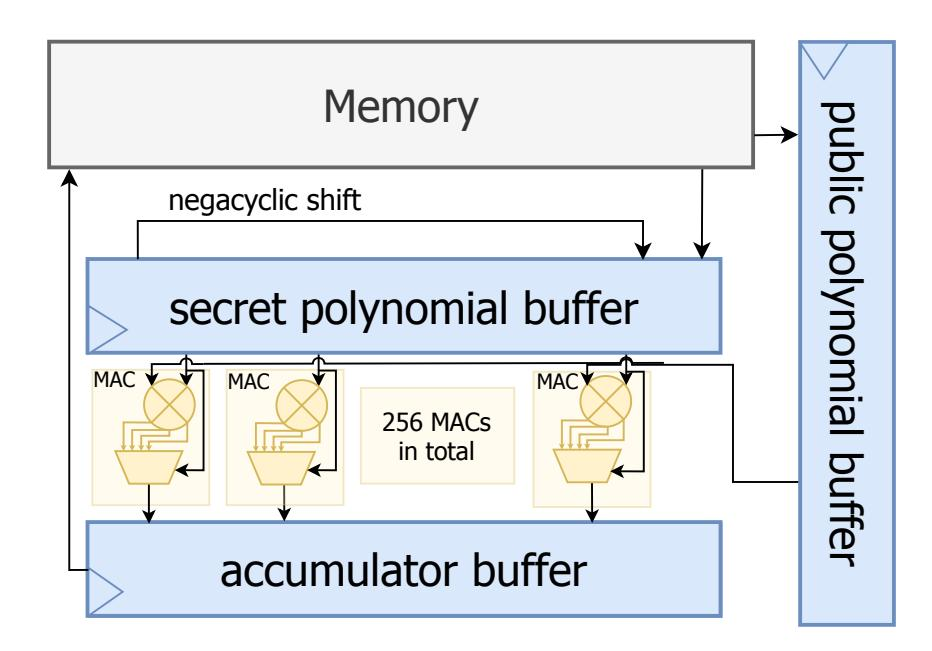
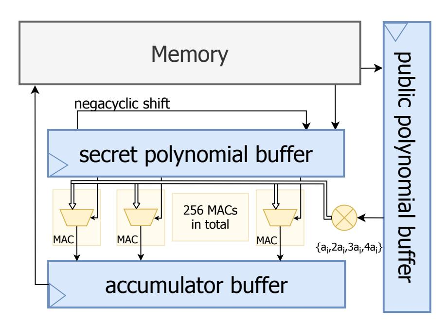
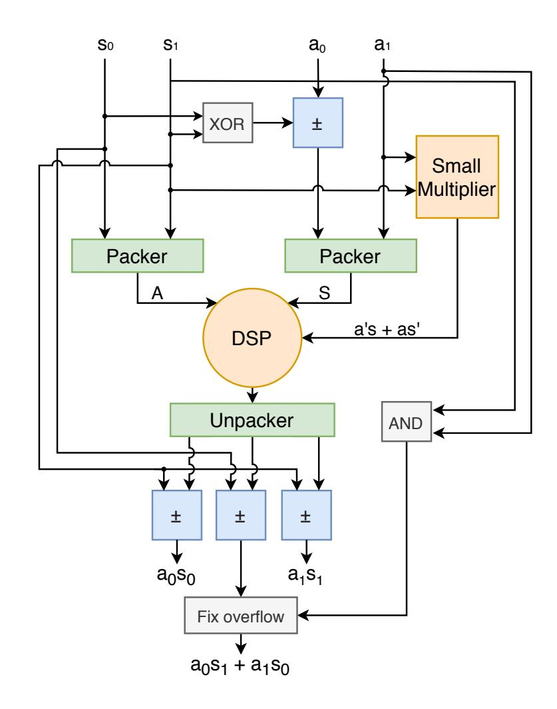
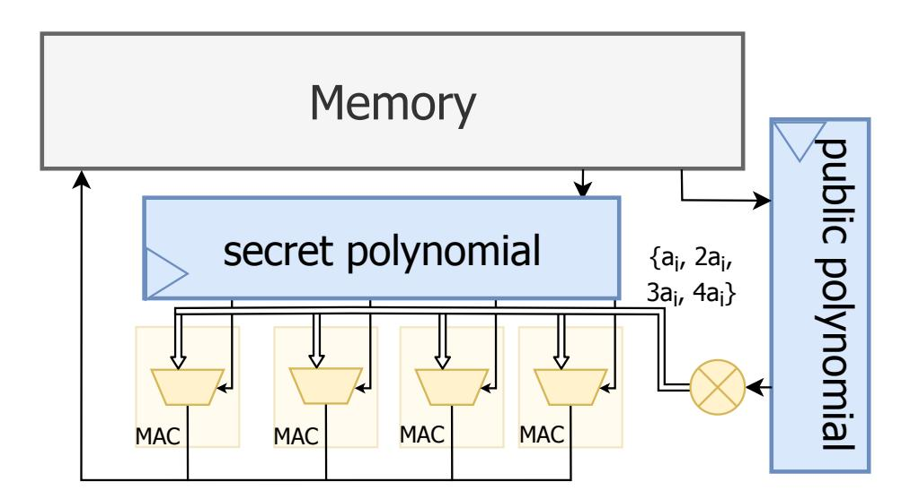

{0}------------------------------------------------

# **Optimized Polynomial Multiplier Architectures for Post-Quantum KEM Saber**

**– authors' version –**

Andrea Basso<sup>1</sup> and Sujoy Sinha Roy<sup>2</sup>

<sup>1</sup> University of Birmingham, UK <sup>2</sup> Graz University of Technology, Austria

**Abstract.** Saber is one of the four finalists in the ongoing NIST post-quantum cryptography standardization project. A significant portion of Saber's computation time is spent on computing polynomial multiplications in polynomial rings with powers-of-two moduli. We propose several optimization strategies for improving the performance of polynomial multiplier architectures for Saber, targeting different hardware platforms and diverse application goals. We propose two high-speed architectures that exploit the smallness of operand polynomials in Saber and can achieve great performance with a moderate area consumption. We also propose a lightweight multiplier that consumes only 541 LUTs and 301 FFs on a small Artix-7 FPGA.

**Keywords:** Lattice-based Cryptography · Post-Quantum Cryptography · Hardware Implementation · Lightweight Implementation · Saber KEM

## **1 Introduction**

Quantum computers pose a threat against the majority of currently used cryptosystems, and the rapid pace of technological development urges a transition to quantum-resistant cryptographic protocols. In 2016, the American National Institute of Standards and Technology (NIST) started a post-quantum cryptography standardization process for key encapsulation mechanisms (KEM) and digital signature schemes. After several rounds, the four KEM finalists–Classic-McEliece, Kyber, NTRU, and Saber–were announced in July 2020.

Saber bases its security on the Module-Learning-With-Rounding problem, which is a lattice-based problem and is believed to be quantum-resistant. One of the main defining characteristics of Saber is the choice of using powers-of-two moduli. This greatly simplifies public-key generation, scaling and rounding operations, and modular reduction. However, such a choice prevents implementations of Saber from directly using the asymptotically fastest number theoretic transform (NTT)-based polynomial multiplication, since the NTT algorithm requires the modulus to be prime. Thus improving the efficiency of polynomial multiplications in polynomial rings with powers-of-two moduli have recently received significant attention.

Indeed, efficient implementations of Saber have improved across a wide range of platforms. The original publication of Saber [\[DKSRV18\]](#page-12-0) proposed a fast polynomial multiplier based on the Toom-Cook algorithm [\[Knu97\]](#page-12-1) targeting high-end software platforms. Then, [\[KBMSRV18\]](#page-12-2) proposed speed and memory-efficient polynomial multiplication and other software optimization techniques for implementing Saber on resource-constrained microcontrollers. The latest software optimization techniques for Saber rely on a combined Toom-Cook/Karatsuba/schoolbook-based multiplier [\[BMKV20\]](#page-11-0).

{1}------------------------------------------------

On hardware platforms, there are two possible approaches: hardware/software codesigns and fully-in-hardware implementations. The former only outsources the most demanding tasks to hardware platforms and are thus more flexible and easier to develop, but offer relatively worse performance. Among these, the first hardware implementation of Saber relied on a Toom-Cook-based polynomial multiplier [\[MTK](#page-12-3)<sup>+</sup>20]. A second HW/SW codesign is reported in [\[DFAG19\]](#page-11-1), which reports an implementation that can provide good performance, at the cost of a large area consumption. They use a schoolbook-based multiplier, where each coefficient-wise multiplier is implemented with a single DSP, and thus it requires 256 DSPs in total. Recently, RISQ-V [\[FSS\]](#page-12-4) was introduced, which is a RISC-V accelerator for post-quantum cryptography. It reuses an NTT module to compute polynomial multiplication in Saber through field extensions and the Chinese Remainder Theorem. On the other hand, fully-in-hardware implementations are less flexible but can offer very high levels of performance. The first such implementation is reported in [\[SRB20\]](#page-12-5), which uses a schoolbook-based polynomial multiplier and can offer a high computation speed, while still remaining flexible and only requiring a moderate area consumption. More recently, [\[ZZY](#page-12-6)<sup>+</sup>] proposed a fully-in-hardware implementation whose polynomial multiplier uses a parallel 8-level Karatsuba algorithm and leads to a small cycle count. In their work, the preprocessing and postprocessing steps needed by the Karatsuba algorithm, together with its iterative nature, require a large area consumption and a longer critical path (hence slower clock).

#### **Contributions**

On hardware platforms, the Saber KEM algorithm spends most of its time in computing polynomial multiplications. Previous implementations, such as [\[SRB20\]](#page-12-5), report that polynomial multiplication takes up to 56% of the overall computation time. Naturally, any improvement in its efficiency would have a direct impact on the efficiency of Saber overall. In this paper we focus on improving the area/performance trade-offs of the polynomial multiplication of Saber on hardware platforms, and we propose optimizations for both lightweight and high-speed implementations. In greater detail, we make the following contributions:

- 1. We propose a technique that reduces the area consumption by centralizing coefficientwise multiplication. This streamlines the implementation, avoids the repetition of the same computations, and significantly reduces the overall area consumption with no impact on performance.
- 2. We propose a second technique that offloads coefficient-wise multiplications to DSPs while still exploiting the small secret coefficients. Comparing to the architecture in [\[DFA](#page-11-2)<sup>+</sup>], we obtain 4× the performance by fitting four coefficient-wise multiplications inside a single DSP. Our design uses 128 DSPs to compute a full multiplication in 128 cycles.
- 3. We also propose a lightweight polynomial multiplier that targets area and power reduction. To realize a simple lightweight architecture, we rely on a variant of the simple schoolbook multiplication algorithm. To reduce power consumption and cycle count, we minimize the number of memory read/write accesses and do as much computation as possible on the read operand data before writing the result back into the memory. Additionally, we carefully schedule the reading and writing of data to memory within the lightweight multiplier to vastly reduce the number of idle cycles. Overall, our proposed multiplier can compute a full polynomial multiplication in 19*,* 471 cycles, while consuming 541 LUTs and 301 flip-flops.
- 4. The source code of all the proposed optimizations is available at [https://github.](https://github.com/andreavico/saber-optimized-multipliers) [com/andreavico/saber-optimized-multipliers](https://github.com/andreavico/saber-optimized-multipliers)

{2}------------------------------------------------

#### **Paper Outline**

We introduce the Saber protocol and schoolbook-based architectures in Section 2. We first propose two techniques to reduce area consumption in high-speed implementations by exploiting the limited range of the secret coefficients in Section 3. We then present a lightweight architecture for a low-power polynomial multiplier in Section 4. Lastly, we report the implementation results for all target-specific variants in Section 5.

## <span id="page-2-0"></span>2 Preliminaries

#### 2.1 The Saber protocol in brief

The Saber public-key encryption (PKE) scheme is composed of three algorithms: key generation, encryption, and decryption. The first generates a public matrix of polynomials  $\bf A$  and a secret vector of polynomials  $\bf s$ . Then, it computes the vector  $\bf b$  by scaling and rounding the product  $\bf A \bf s$ . The public key then consists of  $\bf A$  and  $\bf b$ , while the secret key is the vector  $\bf s$ . A message can be encrypted by embedding it into the polynomial  $v = \bf s' \bf b$ , where  $\bf s'$  is a vector generated specifically for encryption. The ciphertext also includes the vector  $\bf b'$  obtained by scaling and rounding the product  $\bf A \bf s'$ . The message can then be decrypted by recovering an approximation of v, which is given by the product  $\bf s \bf b'$ . The key encapsulation mechanism is then obtained by wrapping the PKE functions with a mechanism that ensures correctness and guarantees private key reusability. All polynomials have degree 255; thus 256-coefficient polynomial arithmetic, and specially multiplication, plays a critical role in the performance of Saber. We refer the reader to the original Saber proposal [BMD+20] for more details.

## 2.2 Architectural design principles

All proposed multiplier architectures are implemented considering a 64-bit memory. Hence, they have 64-bit data exchange ports. The proposed multipliers can be thought as a drop-in replacement for the multiplier in the complete Saber architecture reported in [SRB20]. We refer to the original paper for a top-level description of the complete architecture.

The optimized implementations for both low-power and high-speed multipliers are based on the schoolbook algorithm. This is because such an approach is conceptually simple and highly flexible. Its flexibility makes it an ideal candidate for providing very different performance/area trade-off levels and for being quickly adaptable to different low-level implementations. Furthermore, previous schoolbook-based implementations ([DFA<sup>+</sup>, SRB20]) show that such an approach is particularly fruitful in hardware implementations.

The schoolbook algorithm is described in Algorithm 1. Each coefficient of one polynomial is multiplied by every coefficient of the other polynomial and their result is added to an accumulator. At the end of the inner for loop, the second polynomial is multiplied by x. Since the polynomials live in the ring modulo  $\langle x^N + 1 \rangle$ , such an operation can be implemented by a simple negacyclic shift.

Following [SRB20], a schoolbook-based polynomial multiplier architecture has four main components:

- The first polynomial module loads the first polynomial and provides one of its coefficient at a time.
- The *second polynomial module* loads the second polynomial and provides all or some of its coefficients to be multiplied by the coefficient provided by the first module.
- The *multiplier block* computes the coefficient-wise multiplications. It is usually composed of several multiply-and-accumulate (MAC) units, which each compute one coefficient-wise multiplication and update the accumulator with the new result.

{3}------------------------------------------------

#### <span id="page-3-0"></span>**Algorithm 1** Schoolbook polynomial multiplication.

```
Input: Two polynomials a(x) and b(x) in Rq of degree N.
Output: The product a(x) · b(x) of degree N.
 1: acc(x) ← 0
 2: for i = 0; i < N; i = i + 1 do
 3: for j = 0; j < N; j = j + 1 do
 4: acc[j] = acc[j] + b[j] · a[i] mod Zq // MAC op.
 5: b = b · x mod Rq.
 6: return acc
```

• The *accumulator module* stores the partial values and provides the final result at the end of the polynomial multiplication.

In Saber implementations, the first polynomial module loads the public polynomial, while the second polynomial module loads the secret one. This is because the smaller coefficients of the secret polynomial make it more efficient to store it its entirety.

The most performant schoolbook-based hardware multiplier for Saber in the literature is reported in [\[SRB20\]](#page-12-5). We briefly recall their hardware architecture since our proposed architecture shares the general approach. Since the coefficients of the secret polynomial are short (only 4-bit long), the entire secret polynomial is stored in a 256 × 4 = 1024-bit long buffer. Similarly, the accumulator is stored entirely in a buffer, which is 13×256 = 3328-bit long. The multiplier is also equipped with 256 MAC units. Despite the high number of MACs, the area consumption is kept moderate because each MAC unit uses bitshift operations and additions to implement coefficient-wise multiplication (see Alg [2\)](#page-4-1). Each MAC unit is connected to one coefficient of the secret and one coefficient of the accumulator. In each cycle, each MAC unit is fed a coefficient of the public polynomial, computes a coefficient-wise multiplication, and updates the accumulator. Thus, by using 256 MACs, the inner loop of Algorithm [1](#page-3-0) (lines 3 and 4) can be computed in one cycle. Concurrently, a negacyclic shift is applied to the secret polynomial buffer. Thus, a complete multiplication between two 256-coefficient polynomials can be computed in only 256 cycles (without counting reading and writing operations). Special attention needs to be paid to the public polynomial buffer. To reduce the area consumption, the entire public polynomial cannot be loaded at once. However, partial loading is made complicated by the fact that several coefficients are stored across two BRAM words, since the length of the coefficients (13 bits) does not divide that of the BRAM words (64 bits). Thus, 64 coefficients need to be loaded at once, since they cumulatively take 13 full words and there is no coefficient

<span id="page-3-1"></span>

**Figure 1:** Schoolbook polynomial multiplier, based on Fig. 4 of [\[SRB20\]](#page-12-5).

{4}------------------------------------------------

split among the 13th and 14th word. However, with the use of a multiplexer, it is possible to read and use the coefficients while they are being loaded. In this way, the size of the polynomial buffer can be reduced to 676 bits (since 12 coefficients are used during loading and 676 = 13×64−13×12) and the loading overhead is only 1 cycle per entire polynomial multiplication. The overall architecture of the polynomial multiplier is depicted in Figure [1.](#page-3-1)

# <span id="page-4-0"></span>**3 Optimizations for high-speed polynomial multiplier**

In the Saber protocol, during any polynomial multiplication, one operand polynomial has small coefficients (in the range -4 to +4), while the other polynomial has 10-bit or 13-bit coefficients. This smallness of one operand polynomial was exploited in [\[SRB20\]](#page-12-5) to design a small-area coefficient multiplier. Several MAC units were instantiated in parallel to compute the inner loop of schoolbook polynomial multiplication in Alg. [1.](#page-3-0) Alg. [2](#page-4-1) shows the way a coefficient multiplication is performed inside a MAC unit in [\[SRB20\]](#page-12-5).

#### <span id="page-4-1"></span>**Algorithm 2** Coefficient-wise shift-and-add multiplier [\[SRB20\]](#page-12-5).

```
Input: ai: 13-bit number, sj : 3-bit number with 0 ≤ sj ≤ 5.
Output: ai · sj modulo q = 213
                               .
  r0 ← 0
  r1 ← ai,
  r2 ← ai  1,
  r3 ← ai + (ai  1),
  r4 ← ai  2,
  return rk, where k = sj . // Select right multiple
```

In this section, we introduce two techniques to optimize the polynomial multiplier in high-speed implementations. Both techniques exploit the limited range of the secret coefficients either to reduce the area consumption of the coefficient-wise multipliers or to improve their performance, if the area consumption is kept the same.

### <span id="page-4-2"></span>**3.1 Centralized multiplier architecture**

The high-speed Saber architecture of [\[SRB20\]](#page-12-5) instantiates 256 parallel MAC units, each containing a coefficient-wise multiplier based on Alg. [2.](#page-4-1) Thus, the area of the computational logic in their schoolbook polynomial multiplier is roughly 256 times the area of one MAC unit.

In Algorithm [2,](#page-4-1) the value of *s<sup>j</sup>* only comes in at the very end, as a selector of the multiplexer that chooses the correct multiple of the other coefficient *a<sup>i</sup>* . When parallel MACs are instantiated to parallelize the inner j-loop of Alg. [1,](#page-3-0) all MACs will receive the same coefficient *a<sup>i</sup>* as one input operand, whereas the other operand *s<sup>j</sup>* can be different for the parallel MACs.

Based on this observation, and furthermore benefiting from the fact that the absolute magnitude of *s<sup>j</sup>* can be 0-to-4, we apply a precomputation-based approach in which we compute all five multiples of *a<sup>i</sup>* (i.e., 0 × *a<sup>i</sup>* , 1 × *a<sup>i</sup>* , 2 × *a<sup>i</sup>* , 3 × *a<sup>i</sup>* , and 4 × *ai*) only once and then forward these multiples to the parallel MAC instances. Next, the MAC instances choose their right multiple of *a<sup>i</sup>* depending on their corresponding *s<sup>j</sup>* and add that to the accumulator. With this approach, multiplication inside a MAC becomes a simple select operation, thus reducing the area of the MAC unit significantly. The optimized architecture is shown in Fig. [2.](#page-5-0)

Moreover, we note that the gains are directly correlated to the number of coefficient-wise multipliers used. Since the schoolbook multiplication (Alg. [1\)](#page-3-0) is highly parallelizable, one can reduce the cycle count further by instantiating more MAC units in parallel. For

{5}------------------------------------------------

example, by using 512 coefficient multipliers instead of 256, it is possible reduce the cycle count of schoolbook multiplication by a factor of two. As the precomputation approach that we have proposed results in a much smaller MAC unit, a higher-speed implementation that employs 512 (or more) coefficient multipliers sees more benefits from this optimization. Lastly, note that such a change is only positive and has virtually no trade-offs. It significantly reduces the area consumption without impacting the performance of the implementation. Furthermore, from a side-channel security perspective, the proposed architecture is still constant-time (similar to [\[SRB20\]](#page-12-5)) and does not offer any additional attack surface. This is because this optimization only centralizes the computation of public coefficient multiples, while the secret-dependent selection remains inside the MAC units. Thus, this technique only changes the location of the computation of non-sensitive information (the public coefficient multiples).

<span id="page-5-0"></span>

**Figure 2:** High-speed polynomial multiplier architecture with centralized multiplier architecture. There is a single shift-and-add multiplier for all MAC units, so that each MAC is composed of only a multiplexer and an accumulator adder.

#### <span id="page-5-1"></span>**3.2 Coefficient-wise multiplication in DSPs**

Digital Signal Processing (DSP) blocks are arithmetic logic units embedded into the fabric of most FPGAs and can be used to compute multiply-and-add operations. The DSPs in modern Xilinx Ultrascale+ FPGAs can compute signed multiplication between a 27-bit operand and a 18-bit operand, and post-multiplication addition with a 48-bit operand. For unsigned multiplication, as in our case, an Ultrascale+ DSP can compute the product between 26 and 17-bit long operands.

Since each MAC unit computes a coefficient-wise multiplication and updates the accumulator, a straightforward approach would offload each MAC computation to a single DSP. Since the public polynomial coefficients are 13-bit long and the secret polynomial coefficients are 3-bit long (plus sign), they easily fit inside a DSP. This appears to be the approach used by [\[DFA](#page-11-2)<sup>+</sup>] in their Saber implementation where 256 DSP multipliers are instantiated.

In this section, we propose one technique to offload coefficient-wise multiplication to DSPs, while still exploiting the smallness of the secret coefficients. Our technique uses a single DSP to compute 4 coefficient-wise multiplications. We thus propose an architecture based on the schoolbook method that fits a single DSP within each MAC unit. If the multiplier uses 256 DSPs, it could compute 1,024 coefficient-wise multiplication per cycle and thus compute a full multiplication in 64 cycles. However, that would require a fairly high area consumption, both because of the 256 DSPs and because of the LUTs around

{6}------------------------------------------------

them. We thus propose an architecture with 128 DSPs that can compute a multiplication of 256-coefficient polynomials in 128 cycles. The architecture follows the approach of the 512-MAC multiplier of [\[SRB20\]](#page-12-5) and unrolls the outer loop of the schoolbook algorithm (line 2 of Alg. [1\)](#page-3-0), such that it computes two iterations of the outer loop in each cycle.

Our technique packs two public-polynomial coefficients and two secret coefficients in each operand, so that each DSP can compute *four* coefficient-wise multiplications per cycle. Indeed, let *a*<sup>0</sup> and *a*<sup>1</sup> denote two consecutive public polynomial coefficients, and *s*<sup>0</sup> and *s*<sup>1</sup> two consecutive secret polynomial coefficients. If we write *A* = *a*<sup>0</sup> + *a*12 *<sup>n</sup>* and *S* = *s*<sup>0</sup> + *s*12 *<sup>n</sup>*, the multiplication *A* × *S* outputs

$$A \times S = a_0 s_0 + (a_0 s_1 + a_1 s_0) 2^n + a_1 s_1 2^{2n}.$$

This works well because in the schoolbook algorithm we need to sum all the coefficient-wise multiplications, and we need the sum *a*0*s*<sup>1</sup> + *a*1*s*<sup>0</sup> more than the individual products. However, such an approach has two problems. It needs to handle secret coefficients of different signs, and it needs to determine the correct packing value *n*. Such a value must guarantee that the results do not overflow while the multiplication is still computable with a DSP.

Our proposed technique inverts the sign of one of public polynomial coefficients if needed. If the signs of *s*<sup>0</sup> and *s*<sup>1</sup> are different, we replace *a*<sup>0</sup> with −*a*0. This ensures that *a*0*s*<sup>1</sup> and *a*1*s*<sup>0</sup> are subtracted rather than added. Then, regardless of whether we inverted *a*0, we obtain the right result by inverting *a*0*s*<sup>1</sup> + *a*1*s*<sup>0</sup> if *s*<sup>0</sup> *<* 0 and by inverting *a*0*s*<sup>0</sup> and *a*1*s*<sup>1</sup> if *s*<sup>1</sup> *<* 0. This can be verified by checking all four cases depending on the sign of *s*<sup>0</sup> and *s*1.

While secret coefficients are three bits long, their highest values is 4, and multiplicationby-four adds only two bits of length. So, we can use a packing width of 15 without risking that *a*0*s*<sup>0</sup> overflows into the next partial result. However, the sum in *a*0*s*<sup>1</sup> + *a*1*s*<sup>0</sup> can bring the length of the second partial result to 16-bit long. Thus, to compensate when the second result overflows onto the third by one bit, we check whether the lowest bit of *a*1*s*<sup>1</sup> is correct (by checking whether *a*1*s*1[0] == *a*1[0]&*s*1[0]) and subtract one if not.

Hence, our technique requires computing the product of *A* = ±*a*<sup>0</sup> + *a*12 <sup>15</sup> and *S* = *s*<sup>0</sup> + *s*12 <sup>15</sup>. The first is 28 bit long, while the second is 18 bit long. Since the DSP can compute only between 26 and 17 bit long operands, if we write *A* = *a* + *a* 02 <sup>26</sup> and *S* = *s* + *s* 02 <sup>17</sup>, we have

$$A \times S = as + as'2^{17} + a's2^{26} + a's'2^{43}.$$

The first product *as* can be computed via the DSP, while *as*<sup>0</sup> and *a* 0 *s* can be computed with small LUT-based multipliers. These involve a 2-to-1 and a 4-to-1 multiplexer, since *s* <sup>0</sup> and *a* <sup>0</sup> are 1 and 2 bit long, and some bit-shift operations and additions. There is no need to compute *a* 0 *s* 0 since that only affects bits that are removed by the modular reduction. The accumulator can be updated with LUT-based adders, since the adder functionality of the DSP is used to add *a* 0 *s* and *as*<sup>0</sup> . Note that, since each DSP computes four coefficient-wise operations, some accumulator coefficients are updated by two DSPs each cycle and thus a three-way adder is needed.

This optimization does not impact security. Indeed, it partially reduces the sidechannel leakage due to its convoluted nature (hence more noise). Moreover, it might reduce leakage due to the DSP circuit being more compact than the 'LUT-based multipliers'. However, experimental evaluations would be needed to confirm this.

# <span id="page-6-0"></span>**4 Optimizations for lightweight polynomial multiplier**

In this section, we present a lightweight architecture for computing polynomial multiplications in Saber. The architecture requires a minimal amount of LUTs and flip-flops, as well

{7}------------------------------------------------



**Figure 3:** Architecture of the DSP-based multiplier. Orange blocks are multipliers: the main one is the DSP and the small multiplier is LUT-based and computes *a* 0 *s* + *as*<sup>0</sup> using bit-shift operations and additions. Blue blocks invert the sign of their input based on the signs of *s*<sup>0</sup> and *s*1. Green blocks pack and unpack the coefficients into the input and output of the DSP block.

as reduces the number of memory writings, thus resulting in low power consumption.

#### **4.1 The lightweight architecture**

The architecture implements the schoolbook algorithm described in Alg. [1,](#page-3-0) but only relies on one 64-bit block of each polynomial to limit the number of flip-flops used. The architecture uses only 4 MACs to keep the number of LUTs to a minimum. It also employs the centralized-multiplier optimization described in the previous section, but due to the small number of MACs, the advantages of such a change are limited. The full architecture is represented in Fig. [4.](#page-8-0)

The implementation starts by loading two 64-bit blocks of the secret polynomial, the first with coefficients 0 to 15 and the last with coefficients 240 to 255. It is thus possible to negate the coefficients during shifting when needed. Note that following [\[SRB20\]](#page-12-5), we pack 16 coefficients of a secret polynomial in a 64-bit memory-word. The implementation multiplies all the coefficients of the public polynomial by the 16 coefficients in a single block of the secret polynomial before moving on to the next secret polynomial block.

Then, the first two 64-bit blocks of the public polynomial are loaded. Every time one coefficient is consumed, the buffer is shifted right by 13-bits and whenever there are at least 64 empty bits in the buffer, a new block is loaded. This approach leads to some coefficients having some empty bits in between. The problem is solved by a multiplexer that loads the lowest 24 bits of the buffer and–depending on the coefficient number–extracts the right bits, ignoring possible gaps in between.

Each clock cycle, four MAC units compute four coefficient-wise multiplications. The proposed architecture uses four MAC units because they offer a good compromise between

{8}------------------------------------------------

performanceand area consumption. Since there are 16 coefficients in a single secret polynomial block, it takes four cycles to consume one coefficient of the public polynomial. This means that to fully consume one 64-bit word of the secret polynomial, the multiplier takes 4×256 = 1*,* 024 cycles. Thus, since the entire secret polynomial is stored in 16 words, one full multiplication with this approach requires 16*,* 384 cycles, without considering the memory access overhead.

The architecture described so far can compute all the operations of Alg. [1](#page-3-0) except for the accumulator update in line 4 of the algorithm. High-speed implementations can implement the accumulator as a long buffer (256 × 13 = 3328-bit long), but it can be hard to replace it with a smaller buffer in lightweight implementations. That is because polynomial multiplication is a convolution of all coefficients and each input coefficient affects every output coefficient. Indeed, in the schoolbook multiplication, the entire accumulator is updated by the end of the inner for loop (line 3-5 of Alg. [1\)](#page-3-0). We solve the problem by reading and writing the accumulator directly to memory. This means that each clock cycle, while the multiplication is being computed, the multiplier stores the previous cycle results in the BRAM while alsoreading the accumulator values needed for the next cycle. We are working with a 64-bit data bus and a single BRAM with only one read and one write port, so the number of MAC units to four since a higher number of MAC units would produce more than 64 bits of data each cycle. Since the memory data bus is constantly used to read and update the accumulator data, the multiplication needs to pause during the loading of the input polynomials data. This causes a minor memory overhead access, but the approach still has the advantage of not needing to explicitly read the computation results at the end of the multiplication because the results are already stored in memory.

Indeed, this lightweight architecture achieves better memory overheads compared to the high-speed architecture because it can read and write to memory while the multiplication is being computed. This is partially due to the size of the input and output polynomials not changing, but the lightweight architecture also requires multiple readings of the same data to save on buffer space. Indeed, a complete polynomial multiplication–including read and write operations–takes 19,471 cycles. Since the pure multiplication cycle count with 4 MAC units is 16,384 cycles, the read/write overhead is 3,087 cycles, or less than 16%. For comparison, the high-speed implementation with 512 multipliers requires 128 cycles for the pure multiplication, or 213 cycles with the memory overhead (39%).

#### **4.2 Different area/performance trade-offs**

<span id="page-8-0"></span>The main goal of the proposed architecture is to achieve minimal power consumption and extremely small area requirements. This clearly has substantial consequences on the



**Figure 4:** Lightweight polynomial multiplier architecture. Each secret block is of 64 bits, thus containing 16 secret coefficients.

{9}------------------------------------------------

overall cycle count. It is also possible to target different area/performance trade-offs by increasing the number of MAC units to 8 or 16. Such a change would only have minor consequences on the LUTs requirements but would drastically reduce the cycle count to about a half or a quarter of the current cycle count.

However, using 8 or 16 MAC units would prevent the current approach from reading and writing the accumulator directly to BRAM. Possible solutions include using a buffer to temporarily store a part of the accumulator or increasing the amount of data that can be stored to BRAM per cycle, either by changing the data bus or by working with more BRAMs in parallel.

# <span id="page-9-0"></span>**5 Results**

The proposed target-specific architectures were described in Verilog by integrating them in the open-source code provided in [\[SRB20\]](#page-12-5). The resulting architecture was implemented using Xilinx Vivado 2020.1 for the target platform Xilinx ZCU102 board, containing an UltraScale+ XCZU9EG-FFVB1156-2 FPGA. An additional implementation was realized on Artix-7 XC7A12TLCSG325-2L.

In Table [1,](#page-10-0) we report the cycle count and the area consumption of the polynomial multipliers when implemented with area-optimization strategies. There is, as expected, great differences between the lightweight implementation and the high-speed ones. Note that the lightweight multiplier results also include its memory overhead since it performs read and write operations during the computations. The high-speed results do not include the overhead, since there is no need to read the results from the accumulator after each multiplication when the multiplier is used to compute an inner product, as in Saber. We can see that the lightweight polynomial multiplier only requires very few LUTs and flip-flops, making it ideal for resource-constrained devices. Its power consumption is also very low. On a low-power Artix-7 board, the multiplier consumes 0.106 W, of which only 0.048 W comes from the dynamic consumption. Note, however, that the multiplier is designed to be part of a larger architecture. It has thus many inputs and outputs, and when it is implemented by itself on the board, its ports are directly connected to the FPGA IO pins. The vast majority (89%) of the dynamic power consumption comes from driving the IO pins, and the power consumption of the logic is only 0.001 W. This, however, comes at the expense of performance, since a full multiplication between polynomials with 256 coefficients requires 19,471 cycles.

We then report three high-speed implementations. 'High Speed I' refers to the centralized multiplier optimization presented in Section [3.1,](#page-4-2) where 256 and 512 refer to the number of coefficient-wise multipliers, while 'High Speed II' refers to the DSP-offloaded optimization described in Section [3.2.](#page-5-1) The 'High Speed I - 256' implementation achieves a low cycle count while requiring only a moderate area consumption, especially considering that the LUTs and FFs reported only make up 6*.*87% and 1*.*92% of those available in the Ultrascale+ FPGA. The 'High Speed I - 512' and 'High Speed II' implementations achieve virtually the same cycle count, with the slight difference due to the pipelining inside the DSPs. The lower usage of LUTs in the second implementation is clearly due to the offloading to the DSP blocks. Note that the proposed optimization targets exclusively modern FPGAs with 27x18 DSP splices and cannot work on lower-end FPGAs with smaller DSPs. As future generations of FPGAs are expected to bring larger DSPs, this optimization might bring even better results on future FPGAs.

#### **5.1 Comparisons with existing low-power implementations**

The proposed low-power multiplier is the first dedicated lightweight architecture for Saber. Thus, comparisons with the previous implementations are not straightforward.

{10}------------------------------------------------

<span id="page-10-0"></span>**Table 1:** Implementation results of several target-specific polynomial multipliers. LW refers to the lightweight multiplier. HS-I (High Speed I) refers to the centralized multiplier optimization, with either 256 or 512 MAC units, while HS-II refers to the DSP optimized multiplier. A7 refers to Artix-7, while U+ refers to Ultrascale+.

|                  | FPGA | Cycles | Clock Freq.<br>(MHz) | LUT     | FF     | DSP |
|------------------|------|--------|----------------------|---------|--------|-----|
| Lightweight      | A7   | 19,471 | 100                  | 541     | 301    | 0   |
| High Speed I 256 | U+   | 256    | 250                  | 10,844  | 5,150  | 0   |
| High Speed I 512 | U+   | 128    | 250                  | 22,118  | 4,920  | 0   |
| High Speed II    | U+   | 131    | 250                  | 15,625  | 14,136 | 128 |
| [MTK+20]         | A7   | 8,1761 | 125                  | 2,927   | 1,279  | 38  |
| [SRB20]          | U+   | 256    | 250                  | 13,8692 | 5,150  | 0   |
| [SRB20]          | U+   | 128    | 250                  | 29,1412 | 4,907  | 0   |

The RISQ-V accelerator [\[FSS\]](#page-12-4) proposed an NTT-based hardware co-processor for several post-quantum algorithms including Saber. It is reported that a single multiplication in hardware takes 71,349 cycles of the RISC-V processor, but without knowing the clock cycles of the processor and co-processor, it is not possible to obtain the hardware cycle count.

We can also compare the results with SW implementations on lightweight ARM platforms. [\[BMKV20\]](#page-11-0) reports about 317,000 cycles for a matrix-vector multiplication in Saber. We can thus estimate a single polynomial multiplication requiring about ∼35,000 cycles. Very recently, significant improvements have been reported [\[CHK](#page-11-4)<sup>+</sup>] using an NTT-based multiplier that can work with Saber. The authors report that computing the inner product requires 57,000 cycles, with a clock speed of 24 MHz. Considering the NTT overhead is spread across multiple computations, the SW implementation can result in shorter computation times, especially in matrix-vector multiplications. We remark that the proposed lightweight implementation is a proof-of-concept that demonstrates the feasibility of such a minimal resource consumption. Indeed, when implemented on a small and low-power Artix-7 FPGA (XC7A12TLCSG325-2L), our implementation consumes less than 7% of the LUTs, less than 2% of the flip-flops and minimal power. A similar architecture with twice as many MAC units can reduce the computation times in half with only a small increase in resource consumption.

### **5.2 Comparisons with existing high-speed implementations**

The fairest comparison is with the 256 and 512 multiplier implementations of [\[SRB20\]](#page-12-5), given the similarities in approaches. Indeed, the cycle count for the corresponding multipliers is virtually the same, with small differences due to the pipelining in the DSPs. However, the area consumption of the proposed architecture is noticeably lower while guaranteeing the same performance levels. The 'High Speed I - 256' optimization reduces the LUT count by 22%, with a comparable flip-flop count. Similarly, we see that the 'High Speed I - 512' optimization reduces the LUT count by 24% when compared to the 512 multiplier implementation of [\[SRB20\]](#page-12-5). The proposed DSP-reliant implementation reduces the LUT count (-46%) while requiring 128 DSP blocks and significantly more FFs. It is also

<sup>1</sup>This value is obtained by multiplying the cycle count reported in section IV.A (1168) by 7, which is compatible with the cycle count (∼7.7K) obtained by comparing the cycle counts of the optimized and non-optimized implementations, after accounting for the frequency differences.

<sup>2</sup>To guarantee a fairer comparison, we re-implemented the open-source code of [\[SRB20\]](#page-12-5) with the same software and implementation strategy as those used for the implementation of the proposed architectures. The reported numbers thus differ from the original paper.

{11}------------------------------------------------

interesting to compare the 'High Speed I - 512' multiplier with the 256-MAC multiplier in [\[SRB20\]](#page-12-5). The former requires only a moderate increase in LUT consumption (27%) but can compute a full polynomial multiplication in half the time, ignoring memory overhead.

Other Saber implementations ([\[MTK](#page-12-3)<sup>+</sup>20, [DFA](#page-11-2)<sup>+</sup>, [ZZY](#page-12-6)<sup>+</sup>]) do not report multiplierspecific results. However, the implementation proposed in [\[SRB20\]](#page-12-5) offers better areaperformance trade-offs than the implementations reported in [\[MTK](#page-12-3)<sup>+</sup>20] and [\[DFA](#page-11-2)<sup>+</sup>], and our high-speed multipliers significantly improve on the multiplier of [\[SRB20\]](#page-12-5). Thus, a complete Saber implementation with any of our high-speed polynomial multipliers would offer better area/performance trade-offs than the implementations in [\[MTK](#page-12-3)<sup>+</sup>20, [DFA](#page-11-2)<sup>+</sup>]. Note that while specific area comparisons are not possible with [\[DFA](#page-11-2)<sup>+</sup>], our DSP-based multiplier uses half of the DSPs used in [\[DFA](#page-11-2)<sup>+</sup>] and achieves twice the performance. It would also be interesting to compare the proposed architectures with the Karatsuba-based multiplier proposed in [\[ZZY](#page-12-6)<sup>+</sup>]. Given the overall results, it is expected that their multiplier can achieve a very low cycle count, while probably requiring a higher area consumption than our multipliers. However, their multiplier seems to require a much lower clock frequency (100 MHz vs 250 MHz) and lacks the flexibility as well as the ease of implementation of our proposed architectures.

# **6 Conclusion**

We proposed two techniques to significantly reduce the area consumption of high-speed schoolbook-based polynomial multipliers in Saber. Compared to the literature, our multipliers reduce the LUT consumption by 22 to 46% and can achieve 4 times the performance for each DSP included. We also proposed the first lightweight polynomial multiplier for Saber that achieves minimal power consumption and consumes less than 6% of the LUTs on the smallest FPGA in the Artix-7 family.

## **References**

- <span id="page-11-3"></span>[BMD<sup>+</sup>20] Andrea Basso, Jose Maria Bermudo Mera, Jan-Pieter D'Anvers, Sujoy Sinha Roy Angshuman Karmakar, Michiel Van Beirendonck, and Frederik Vercauteren. SABER: Mod-LWR based KEM (Round 3 Submission to NIST PQC), 2020.
- <span id="page-11-0"></span>[BMKV20] Jose Maria Bermudo Mera, Angshuman Karmakar, and Ingrid Verbauwhede. Time-memory trade-off in Toom-Cook multiplication: an Application to Module-lattice based Cryptography, Mar. 2020.
- <span id="page-11-4"></span>[CHK<sup>+</sup>] Chi-Ming Marvin Chung, Vincent Hwang, Matthias J. Kannwischer, Gregor Seiler, Cheng-Jhih Shih, and Bo-Yin Yang. NTT Multiplication for NTTunfriendly Rings. Cryptology ePrint Archive, Report 2020/1397.
- <span id="page-11-2"></span>[DFA<sup>+</sup>] Viet Ba Dang, Farnoud Farahmand, Michal Andrzejczak, Kamyar Mohajerani, Duc Tri Nguyen, and Kris Gaj. Implementation and Benchmarking of Round 2 Candidates in the NIST Post-Quantum Cryptography Standardization Process Using Hardware and Software/Hardware Co-design Approaches. Cryptology ePrint Archive, Report 2020/795.
- <span id="page-11-1"></span>[DFAG19] Viet B. Dang, Farnoud Farahmand, Michal Andrzejczak, and Kris Gaj. Implementing and Benchmarking Three Lattice-Based Post-Quantum Cryptography Algorithms Using Software/Hardware Codesign. In *International Conference on Field-Programmable Technology, FPT 2019, Tianjin, China, December 9-13, 2019*, pages 206–214. IEEE, 2019.

{12}------------------------------------------------

- <span id="page-12-0"></span>[DKSRV18] Jan-Pieter D'Anvers, Angshuman Karmakar, Sujoy Sinha Roy, and Frederik Vercauteren. *Saber: Module-LWR Based Key Exchange, CPA-Secure Encryption and CCA-Secure KEM*, volume 10831, page 282–305. Springer International Publishing, 2018.
- <span id="page-12-4"></span>[FSS] Tim Fritzmann, Georg Sigl, and Johanna Sepúlveda. RISQ-V: Tightly Coupled RISC-V Accelerators for Post-Quantum Cryptography. Cryptology ePrint Archive, Report 2020/446.
- <span id="page-12-2"></span>[KBMSRV18] Angshuman Karmakar, Jose Maria Bermudo Mera, Sujoy Sinha Roy, and Ingrid Verbauwhede. Saber on ARM: CCA-secure module lattice-based key encapsulation on ARM. *IACR Transactions on Cryptographic Hardware and Embedded Systems*, 2018(3):243–266, Aug. 2018.
- <span id="page-12-1"></span>[Knu97] Donald Knuth. The art of computer programming, volume 2. third edition, 1997.
- <span id="page-12-3"></span>[MTK<sup>+</sup>20] J. Maria Bermudo Mera, F. Turan, A. Karmakar, S. Sinha Roy, and I. Verbauwhede. Compact domain-specific co-processor for accelerating module lattice-based KEM. In *2020 57th ACM/IEEE Design Automation Conference (DAC)*, pages 1–6, 2020.
- <span id="page-12-5"></span>[SRB20] Sujoy Sinha Roy and Andrea Basso. High-speed Instruction-set Coprocessor for Lattice-based Key Encapsulation Mechanism: Saber in Hardware. *IACR Transactions on Cryptographic Hardware and Embedded Systems*, 2020(4):443–466, Aug. 2020.
- <span id="page-12-6"></span>[ZZY<sup>+</sup>] Yihong Zhu, Min Zhu, Bohan Yang, Wenping Zhu, Chenchen Deng, Chen Chen, Shaojun Wei, and Leibo Liu. A High-performance Hardware Implementation of Saber Based on Karatsuba Algorithm. Cryptology ePrint Archive, Report 2020/1037.