{0}------------------------------------------------

# A Low-Depth Homomorphic Circuit for Logistic Regression Model Training\*

Eric Crockett Amazon Web Services [ericcro@amazon.com](mailto:ericcro@amazon.com)

January 8, 2021

#### Abstract

Machine learning is an important tool for analyzing large data sets, but its use on sensitive data may be limited by regulation. One solution to this problem is to perform machine learning tasks on encrypted data using homomorphic encryption, which enables arbitrary computation on encrypted data. We take a fresh look at one specific task: training a logistic regression model on encrypted data. The most important factor in the efficiency of a solution is the multiplicative depth of the homomorphic circuit. Two prior works have given circuits with multiplicative depth of five per training iteration. We optimize one of these solutions, by Han et al. [\[Han+18\]](#page-27-0), and give a circuit with *half* the multiplicative depth per iteration on average, which allows us to perform twice as many training iterations in the same amount of time.

In the process of improving the state-of-the-art circuit for this task, we identify general techniques to improve homomorphic circuit design for two broad classes of algorithms: iterative algorithms, and algorithms based on linear algebra over real numbers. First, we formalize the encoding scheme from [\[Han+18\]](#page-27-0) for encoding linear algebra objects as plaintexts in the CKKS homomorphic encryption scheme. We also show how to use this encoding to homomorphically compute many basic linear algebra operations, including novel operations not discussed in prior work. This "toolkit" is generic, and can be used in any application based on linear algebra. Second, we demonstrate how generic compiler techniques for loop optimization can be used to reduce the multiplicative depth of iterative algorithms.

<sup>\*</sup>This is the full version of a paper that appeared at WAHC 2020 [\[Cro20\]](#page-27-1)

{1}------------------------------------------------

# Contents

| 1 | 1.1 | Introduction<br>Contributions<br>                           | 3<br>3   |  |  |  |  |  |  |  |
|---|-----|-------------------------------------------------------------|----------|--|--|--|--|--|--|--|
|   | 1.2 | Related Work<br>                                            | 4        |  |  |  |  |  |  |  |
| 2 |     | CKKS Homomorphic Encryption Scheme                          | 5        |  |  |  |  |  |  |  |
| 3 |     | Homomorphic Linear Algebra                                  | 6        |  |  |  |  |  |  |  |
|   | 3.1 | Basic Encoding<br>                                          | 6        |  |  |  |  |  |  |  |
|   | 3.2 | Linear Algebra Operations<br>                               | 7        |  |  |  |  |  |  |  |
|   | 3.3 | Row Vector/Matrix Products<br>                              | 8        |  |  |  |  |  |  |  |
|   | 3.4 | Column Vector/Matrix Products<br>                           | 9        |  |  |  |  |  |  |  |
|   | 3.5 | Encoding Objects of Arbitrary Dimension<br>                 | 10       |  |  |  |  |  |  |  |
|   |     | 3.5.1<br>Encoding Small Objects<br>                         | 10       |  |  |  |  |  |  |  |
|   |     | 3.5.2<br>Encoding Large Objects<br>                         | 11       |  |  |  |  |  |  |  |
|   | 3.6 | Matrix/Matrix Products                                      | 11       |  |  |  |  |  |  |  |
|   | 3.7 | Operations with Mixed Encoding Units<br>                    | 12       |  |  |  |  |  |  |  |
|   |     | 3.7.1<br>Transposing Encoding Units<br>                     | 12       |  |  |  |  |  |  |  |
|   |     | 3.7.2<br>Matrix/Matrix Multiplication                       | 13       |  |  |  |  |  |  |  |
|   |     | 3.7.3<br>Multiplication by Column Vector<br>                | 14       |  |  |  |  |  |  |  |
|   |     | 3.7.4<br>Multiplication by Row Vector<br>                   | 15       |  |  |  |  |  |  |  |
| 4 |     | Training a Logistic Regression Model                        | 15       |  |  |  |  |  |  |  |
|   | 4.1 | Training Data<br>                                           | 15       |  |  |  |  |  |  |  |
|   | 4.2 | Training Parameters                                         | 16       |  |  |  |  |  |  |  |
|   | 4.3 | Activation Function                                         | 16       |  |  |  |  |  |  |  |
| 5 |     | Homomorphic Logistic Regression Training: Prior Art         |          |  |  |  |  |  |  |  |
|   | 5.1 | Optimized Circuit                                           | 16<br>17 |  |  |  |  |  |  |  |
|   | 5.2 | Use in Logistic Regression Training<br>                     | 17       |  |  |  |  |  |  |  |
|   |     |                                                             |          |  |  |  |  |  |  |  |
| 6 |     | Depth 4 Logistic Regression Training                        | 19       |  |  |  |  |  |  |  |
| 7 |     | Depth 2.5 Logistic Regression Training                      | 20       |  |  |  |  |  |  |  |
|   | 7.1 | Adding Parallelism<br>                                      | 20       |  |  |  |  |  |  |  |
|   | 7.2 | Loop Unrolling<br>                                          | 24       |  |  |  |  |  |  |  |
|   | 7.3 | Pipelining<br>                                              | 24       |  |  |  |  |  |  |  |
|   | 7.4 | Using Mixed Encoding Units for Compactness<br>              | 24       |  |  |  |  |  |  |  |
|   | 7.5 | Use in Logistic Regression Training<br>                     | 25       |  |  |  |  |  |  |  |
| 8 |     | Evaluation                                                  | 25       |  |  |  |  |  |  |  |
| A |     | Circuit Diagrams for Low-Depth Logistic Regression Training | 30       |  |  |  |  |  |  |  |

{2}------------------------------------------------

# <span id="page-2-0"></span>1 Introduction

Cloud computing allows anyone–from individuals to enterprises–to migrate on-premise workloads to a third-party. Although it can greatly increase the computing power available to users with limited budgets and computational capability, cloud computing may not be possible in all settings. For example, the European Union's (EU) General Data Protection Regulation (GDPR) regulates data protection and privacy in the EU, and also restricts what information can be transferred outside the EU. Outsourcing computation to the cloud could violate the GDPR if the data to be processed is sensitive and the cloud provider is based outside the EU. One way to maintain data privacy and GDPR compliance is to encrypt the data before sending it to the cloud. By utilizing *homomorphic encryption* (HE), which enables arbitrary computation on encrypted data, the data owner can outsource the computation while ensuring that the cloud provider learns nothing about the sensitive data.

While the use case is simple, actually deploying such a solution is a complex task. The main challenge is designing the homomorphic version of the function to be evaluated. First, the input data must be encoded as homomorphic plaintexts. There are many possible ways to encode the same data, but the encoding will impact the efficiency of the resulting circuit. Next, the function must be implemented using only the native operations (or "gates") of the homomorphic encryption scheme. Since homomorphic encryption schemes only define basic functionality like adding or multiplying plaintexts, it can be challenging to implement high-level operations like rounding, evaluation of non-polynomial functions, and many other operations. Finally, the circuit must be optimized to reduce its *multiplicative depth*, the maximum number of multiplications along any path through the circuit. A circuit's multiplicative depth determines the homomorphic encryption parameters which must be used; lower depth leads to smaller parameters and ciphertexts, which reduces evaluation time and bandwidth.

In this work, we examine these steps for a particular function, *logistic regression model training*, a basic task in supervised machine learning. The logistic regression (LR) model type is used in myriad applications including genomics [\[Ban+18\]](#page-27-2), medical imaging [\[Rym+19\]](#page-28-0), cancer diagnosis [\[Chh+09\]](#page-27-3), tax compliance [\[AG20\]](#page-27-4), credit scores [\[Bol10\]](#page-27-5), and more. These applications all involve sensitive data, making logistic regression a good target for homomorphic implementation.

Prior work on this problem shows how to encode training data into homomorphic ciphertexts and how to evaluate the training algorithm on encrypted data in a scalable way. Our work improves the model training efficiency, cutting training time in half compared to the best previous result [\[Han+18\]](#page-27-0). In the process of improving the state-of-the-art circuit for this task, we identify general techniques to improve homomorphic circuit design for two broad classes of algorithms: iterative algorithms, and algorithms based on linear algebra over real numbers.

### <span id="page-2-1"></span>1.1 Contributions

Using the foundation laid out in prior work, we formalize a "toolkit" for linear algebra encodings and operations based on the CKKS homomorphic encryption scheme. The toolkit includes a formal treatment of techniques from [\[Kim+18a;](#page-27-6) [Han+18\]](#page-27-0) as well as novel techniques and observations to increase efficiency and functionality. By formalizing these techniques, we separate them from the specifics of logistic regression training as presented in prior work, which enables these techniques to be used in other applications.[1](#page-2-2) This type of formalization is a necessary step along the way to *automating* the creation of homomorphic functions based on linear algebra. For example, our techniques could be included in a framework like RAMPARTS [\[Arc+19\]](#page-27-7)

<span id="page-2-2"></span><sup>1</sup>An implementation of this toolkit is available as part of the Homomorphic Implementor's Toolkit [\[20a\]](#page-27-8).

{3}------------------------------------------------

to reduce programmer burden. We demonstrate the benefits of a generalized linear algebra toolkit by using it to reduce communication during logistic regression model training compared to [\[Han+18\]](#page-27-0).

As a second contribution, we use the novel algorithms and techniques in the toolkit, combined with general techniques from compilers for loop optimization, to give a low-depth circuit for homomorphic logistic regression model training. Designing low-depth circuits for homomorphic evaluation is a crucial part of making homomorphic encryption practical. [\[Han+18\]](#page-27-0) shows how to evaluate a single iteration of the logistic regression training algorithm using a circuit with multiplicative depth five.[2](#page-3-1) We improve this result by giving a circuit for a logistic regression training iteration with an average multiplicative depth of 2.5, effectively doubling the number of training iterations that can be achieved in the same amount of time. This circuit is a drop-in replacement for [\[Han+18\]](#page-27-0); in particular it can be combined with the bootstrapping techniques described in that paper to achieve a scalable training algorithm capable of training large models for hundreds of iterations.

We achieve the depth reduction using a combination of *generic* techniques that are applicable to any iterative algorithm. First, we eliminate data dependencies (and therefore reduce depth) by duplicating work. This trades circuit depth for circuit *width*, and results in more overall work. However, this wide circuit turns out to be faster to evaluate in practice because lower circuit depth leads to more efficient operations and because, on highly parallel hardware, wider circuits do not necessarily impact runtime. We also use loop unrolling and pipelining, well-known techniques from compilers, to optimize over multiple iterations of the training algorithm. All of these techniques can be applied to homomorphic circuits for any iterative algorithm.

As with prior works, our circuit is designed for the CKKS approximate homomorphic encryption scheme [\[Che+16\]](#page-27-9) because of the natural fit between its plaintext space and the inputs to the logistic regression training algorithm. We demonstrate the practical benefits of low-depth, wide circuits using a parallel evaluator based on the SEAL homomorphic encryption library.

# <span id="page-3-0"></span>1.2 Related Work

The importance of privacy preserving logistic regression, especially in biomedical applications, has resulted in a significant amount of research on the problem. One of the first attempts to train logistic regression models on encrypted data was [\[Aon+16\]](#page-27-10), which used an additive homomorphic encryption scheme. To compensate for the server's limited computational power, this solution requires significant client precomputation. [\[Cra+18\]](#page-27-11) uses BGV homomorphic encryption, which required the authors to encrypt individual bits of the training data. This solution leaks information about the training data to the model decryptor beyond what can be learned from the model itself. [\[BV18\]](#page-27-12) used the FV homomorphic encryption scheme [\[FV12\]](#page-27-13). This solution uses the w-NIBNAF encoding [\[Bon+17\]](#page-27-14) to encode real numbers as cyclotomic ring elements, and gives a depth-five circuit for computing a single iteration. These solutions all use HE schemes which are exactly homomorphic: homomorphic operations do not incur any plaintext error. However, due to the complexity of the logistic regression training function and the limited functionality provided by native HE operations, they all use various approximations in the computation, meaning the resulting model is different than if the model were trained on plaintexts.

From a performance perspective, the most promising results for logistic regression model training on encrypted data are from a series of papers which utilize the CKKS approximate homomorphic encryption scheme, in which homomorphic operations add a small amount of noise to the plaintext computation. Here, even an exact computation would produce a noisy model; fortunately [\[Aon+16;](#page-27-10) [Cra+18;](#page-27-11) [Bon+17\]](#page-27-14) demonstrate

<span id="page-3-1"></span><sup>2</sup> Independently, [\[BV18\]](#page-27-12) achieved a depth-five circuit for a single iteration of training using a very different approach. To our knowledge, this is the lowest-depth circuit known for this task.

{4}------------------------------------------------

that approximate models can be used effectively for machine learning tasks. In [\[Kim+18b\]](#page-28-1) Kim et al. give a circuit for binary classification logistic regression model training using an inefficient linear algebra encoding. This encoding was improved in [\[Kim+18a\]](#page-27-6), which also replaces the basic gradient descent step of the training algorithm with a more advanced method call *Nesterov's Accelerated Gradient* (NAG). NAG guarantees faster model convergence, hence fewer training iterations. This solution was the winner of the 2017 Genomic data privacy and security protection competition at the iDash Workshop on Privacy and Security. This work was further improved by Han et al. in [\[Han+18\]](#page-27-0), who showed how to scale homomorphic logistic regression training for large data sets by utilizing a fundamental homomorphic encryption technique called bootstrapping. They also used *local* circuit optimization techniques (e.g., re-arranging gates within a training iteration) to improve the multiplicative depth of the circuit. All of these works use the CKKS homomorphic encryption scheme [\[Che+16\]](#page-27-9), which yields efficient operations on floating point data at the cost of producing an approximate result.

# <span id="page-4-0"></span>2 CKKS Homomorphic Encryption Scheme

This section includes relevant background for the CKKS approximate homomorphic encryption scheme [\[Che+16\]](#page-27-9). CKKS is based on the *ring learning with errors* (RLWE) problem, which uses structured polynomial rings called *cyclotomic rings* for efficiency. The plaintext space is R t , where t is related to the primary CKKS parameter; see [\[Che+16\]](#page-27-9) for details. The value t denotes the number of "plaintext slots", on which homomorphic addition and multiplication work component-wise. Throughout this work, we assume that t is a power of two.

The CKKS homomorphic encryption scheme has a symmetric-key variant and a public-key variant. Both of these schemes can be used with our application, but we focus on the symmetric-key version for simplicity. We give a simplified encryption API for a security parameter n, and denote the encryption of a plaintext m ∈ R <sup>t</sup> by m .

$$k_{\mathsf{eval}}, k_{\mathsf{sk}} \leftarrow \mathsf{HE}.\mathsf{Keygen}(n)$$

$$\boxed{m} \leftarrow \mathsf{HE}.\mathsf{Encrypt}(k_{\mathsf{sk}}; m)$$

$$m \leftarrow \mathsf{HE}.\mathsf{Decrypt}(k_{\mathsf{sk}}; \boxed{m})$$

Here, ksk is the usual symmetric key, while keval is called the *evaluation key*. The evaluation key is an abstraction of several different public keys required to perform homomorphic computation, including *relinearization keys* and *Galois keys*. Note that the encoding process from R t to a cyclotomic ring element is itself approximate, so unlike most encryption schemes,

$$\mathsf{HE.Decrypt}(k_{\mathsf{sk}}; \mathsf{HE.Encrypt}(k_{\mathsf{sk}}; m)) \approx m$$

rather than exact equality.

In addition to the standard encryption API, homomorphic encryption schemes include additional functions to enable computation on encrypted data. Let x, y, and z be plaintexts in R t , and c ∈ R. Let x<sup>i</sup> denote the i th component of the plaintext x. The native CKKS operations include:

• 
$$x \oplus y = z$$
, where  $z_i = x_i + y_i$ 

• 
$$x \oplus y = \overline{z}$$
, where  $z_i = x_i + y_i$ 

• 
$$x \oplus c = z$$
, where  $z_i = x_i + c$ 

{5}------------------------------------------------

- x  y = z , where z<sup>i</sup> = x<sup>i</sup> · y<sup>i</sup>
- x  y = z , where z<sup>i</sup> = x<sup>i</sup> · y<sup>i</sup>
- x  c = z , where z<sup>i</sup> = c · x<sup>i</sup>
- Lrot(k, x ) = z where z is the left cyclic rotation of x by k positions, i.e., z<sup>i</sup> = xi+<sup>k</sup> mod <sup>t</sup>
- Rrot(k, x ) = z where z is the right cyclic rotation of x by k positions, i.e., z<sup>i</sup> = xi−<sup>k</sup> mod <sup>t</sup>

Each of these operations also incurs a small error, beyond the standard loss from floating point arithmetic. To simplify notation, we reuse this notation on plaintext operands as well.

Like all other "fully homomorphic" encryption schemes, CKKS is more accurately described as a *leveled* HE scheme. This means that it can be parameterized to allow evaluation of any circuit whose *multiplicative depth* is below a certain bound. The multiplicative depth of a circuit is the maximum number of multiplications along any path through the circuit.

In order to transform a leveled HE scheme into a fully homomorphic scheme (i.e., one which can evaluate functions of a priori unbounded multiplicative depth), we need to use *bootstrapping*, the process of homomorphically evaluating the encryption system's decryption circuit to refresh the ciphertext. This option leads to two evaluation strategies for any particular target function: a direct method that does not use bootstrapping, and an iterative evaluation using bootstrapping. This work does not utilize bootstrapping; it focuses on circuit optimization to reduce multiplicative depth, which is important for evaluation with and without bootstrapping.

This work focuses on circuit optimization and plaintext operations rather than implementation details. As such, we do not address topics such as the CKKS plaintext scale parameter (used to control the precision of the homomorphic computation), secure instantiations, or other parameters. See [\[Che+16\]](#page-27-9) for details.

All circuits take plaintexts as inputs and produce plaintext outputs. We do not include "ciphertext maintenance" operations such as rescaling and relinearization. We reuse the ciphertext operations from [Section 2](#page-4-0) on plaintext arguments to simplify notation.

# <span id="page-5-0"></span>3 Homomorphic Linear Algebra

This section provides a formal treatment of the novel linear algebra encoding techniques given in [\[Kim+18a;](#page-27-6) [Han+18\]](#page-27-0). We also extend these techniques with algorithms for homomorphic matrix-matrix multiplication, and algorithms which operate on objects encoded in previously incompatible ways (see [Section 3.7\)](#page-11-0).[3](#page-5-2)

Notation We denote a column vector as b, and denote row vectors as the transpose of a column vector, i.e., b | . We will encode these objects as CKKS plaintexts, which we denote by a tuple of real numbers, e.g., (a, b, c, d). Throughout this section, we let t = 2<sup>k</sup> denote the number of CKKS plaintext slots.

# <span id="page-5-1"></span>3.1 Basic Encoding

All vectors and matrices, regardless of their dimension or shape, will be encoded as one or more *encoding units*, where an encoding unit is an m × n matrix such that m · n = t. Since t = 2<sup>k</sup> , note that the encoding unit will *always* have two-power dimensions. We denote the encoding of an object B into a CKKS plaintext

<span id="page-5-2"></span><sup>3</sup>Note that the encodings discussed in this section actually constitute a *second* layer of encoding during encryption, since we treat the CKKS encoding from a vector of real numbers to a cyclotomic ring element as implicit. See [\[Che+16\]](#page-27-9) for details.

{6}------------------------------------------------

relative to an an  $m \times n$  encoding unit by  $\langle B \rangle^{[m \times n]}$ , where we omit the encoding unit when it is clear from context.

Define the matrix A, column vector  $\vec{x}$ , and row vector  $\vec{y}^{\mathsf{T}}$  as

$$A = \begin{bmatrix} 1 & 2 & 3 & 4 \\ 5 & 6 & 7 & 8 \end{bmatrix}, \quad \vec{x} = \begin{bmatrix} 1 \\ -1 \\ 1 \\ -1 \end{bmatrix}, \quad \vec{y}^{\intercal} = \begin{bmatrix} 1 & 0 \end{bmatrix}.$$

**Matrix Encoding** Assume that we want to encode a matrix which has exactly as many elements as there are plaintext slots for the chosen CKKS parameters, i.e., we wish to encode a matrix in  $\mathbb{R}^{m \times n}$  where  $m \cdot n = t$  and m, n are powers of two. In this case, we choose the encoding unit to coincide with the matrix dimension, and encode the matrix in row-major order, so for t = 8:

$$\langle A \rangle^{[2 \times 4]} = (1, 2, 3, 4, 5, 6, 7, 8).$$

**Vector Encoding** We encode a column vector  $\vec{x} \in \mathbb{R}^n$  with respect to a single  $m \times n$  encoding unit by first creating a  $m \times n$  matrix where each row is  $\vec{x}^{\mathsf{T}}$ , and then encoding the matrix as above. For example, the encoding of  $\vec{x}$  is

$$\langle \vec{x} \rangle^{[2 \times 4]} = \left\langle \begin{bmatrix} 1 & -1 & 1 & -1 \\ 1 & -1 & 1 & -1 \end{bmatrix} \right\rangle^{[2 \times 4]} = (1, -1, 1, -1, 1, -1, 1, -1).$$

Similarly, we encode  $\vec{b}^{\intercal} \in \mathbb{R}^m$  as [the encoding of] an  $m \times n$  matrix where each column is  $\vec{b}$ . For example, the encoding of  $\vec{y}^{\intercal}$  is

$$\langle \vec{y}^{\mathsf{T}} \rangle^{[2 \times 4]} = \left\langle \begin{bmatrix} 1 & 1 & 1 & 1 \\ 0 & 0 & 0 & 0 \end{bmatrix} \right\rangle^{[2 \times 4]} = (1, 1, 1, 1, 0, 0, 0, 0).$$

### <span id="page-6-0"></span>3.2 Linear Algebra Operations

<span id="page-6-1"></span>When combined with the encodings given above, the component-wise operations induced by  $\oplus$  and  $\odot$  lead to a natural homomorphic implementation for many linear algebra operations. Let  $A, B \in \mathbb{R}^{m \times n}, c \in \mathbb{R}$ ,  $\vec{x}, \vec{y} \in \mathbb{R}^n, \vec{w}^\intercal, \vec{z}^\intercal \in \mathbb{R}^m$ , and define  $\mathbf{1}_{\bullet}$  as the matrix/vector of all 1s whose shape is the same as  $\bullet$ . The following equations show how homomorphic operations induce simple linear algebra operations on encoded objects, all encoded with respect to the  $m \times n$  encoding unit. Note that we do not encode the constant c because we assume this value is public, and therefore is never represented as an encrypted value. On the other hand, matrices and vectors are always encoded, even if not encrypted.

$$\langle A \rangle \oplus \langle B \rangle = \langle A + B \rangle \tag{3.1}$$

$$\langle A \rangle \oplus c = \langle A + c \cdot \mathbf{1}_A \rangle$$
 (3.2)

<span id="page-6-2"></span>
$$\langle A \rangle \odot \langle B \rangle = \langle A \circ B \rangle \tag{3.3}$$

$$c \odot \langle A \rangle = \langle c \cdot A \rangle \tag{3.4}$$

{7}------------------------------------------------

<span id="page-7-2"></span>
$$\langle \vec{x} \rangle \oplus \langle \vec{y} \rangle = \langle \vec{x} + \vec{y} \rangle \tag{3.5}$$

$$\langle \vec{x} \rangle \oplus c = \langle \vec{x} + c \cdot \mathbf{1}_{\vec{x}} \rangle$$
 (3.6)

$$\langle \vec{x} \rangle \odot \langle \vec{y} \rangle = \langle \vec{x} \circ \vec{y} \rangle \tag{3.7}$$

$$c \odot \langle \vec{x} \rangle = \langle c \cdot \vec{x} \rangle \tag{3.8}$$

$$\langle \vec{w}^{\mathsf{T}} \rangle \oplus \langle \vec{z}^{\mathsf{T}} \rangle = \langle \vec{w}^{\mathsf{T}} + \vec{z}^{\mathsf{T}} \rangle \tag{3.9}$$

$$\langle \vec{w}^{\mathsf{T}} \rangle \oplus c = \langle \vec{w}^{\mathsf{T}} + c \cdot \mathbf{1}_{\vec{w}^{\mathsf{T}}} \rangle$$
 (3.10)

$$\langle \vec{w}^{\mathsf{T}} \rangle \odot \langle \vec{z}^{\mathsf{T}} \rangle = \langle \vec{w}^{\mathsf{T}} \circ \vec{z}^{\mathsf{T}} \rangle$$
 (3.11)

$$c \odot \langle \vec{w}^{\mathsf{T}} \rangle = \langle c \cdot \vec{w}^{\mathsf{T}} \rangle \tag{3.12}$$

<span id="page-7-3"></span>Matrix/vector multiplication is more complex, and is covered in the following sections.

# <span id="page-7-0"></span>3.3 Row Vector/Matrix Products

We now turn to the fundamental linear algebra task of multiplying a row vector x <sup>|</sup> ∈ R <sup>m</sup> by a matrix A ∈ R m×n . Homomorphically, the inputs are an encoded row vector and an encoded matrix, and the output should be an encoded row vector (all with respect to an m × n encoding unit). We do not quite achieve this; instead we will compute the *transpose* of the desired result, a column vector encoded with an m × n unit.

The homomorphic computation is a two-step process. The first step multiplies each row by the appropriate scalar in a single homomorphic operation, while the second step sums the scaled rows *and* ensures that the output is the encoding of (the transpose of) this sum.

When m is a power of two, [Algorithm 1](#page-8-1) gives an algorithm SumRows (first described in [\[Kim+18b\]](#page-28-1)) that outputs the encoding of a column vector which is the (transpose of) the sum of the rows of the input matrix, e.g.,

$$\operatorname{SumRows}\left(\left\langle \begin{bmatrix} a & b \\ c & d \end{bmatrix} \right\rangle\right) = \left\langle \begin{bmatrix} a+c & b+d \\ a+c & b+d \end{bmatrix} \right\rangle = \left\langle \begin{bmatrix} a+c \\ b+d \end{bmatrix} \right\rangle.$$

Since it only involves rotating and adding plaintexts, we can also view [Algorithm 1](#page-8-1) as a homomorphic circuit with multiplicative depth zero.

We formalize this algorithm with the following fact:

Fact 3.1. *Let* x <sup>|</sup> ∈ R <sup>m</sup>*, and* A ∈ R m×n *. Then*

$$\mathsf{SumRows}(\langle \vec{x}^{\intercal} \rangle \odot \langle A \rangle) = \langle (\vec{x}^{\intercal} \cdot A)^{\intercal} \rangle = \langle A^{\intercal} \cdot \vec{x} \rangle ,$$

*where all encodings are relative to an* m × n *encoding unit.*

<span id="page-7-1"></span>The SumRows instruction is also a linear map:

{8}------------------------------------------------

#### <span id="page-8-1"></span>Algorithm 1 SumRows: summation of matrix rows

Input: hAi [m×n] for A ∈ R m×n and m, n powers of two

Output: An n-dimensional column vector encoded with an m × n encoding unit

- 1: R = hAi
- 2: for 0 ≤ i < log<sup>2</sup> m do
- 3: R = Lrotn·<sup>2</sup> <sup>i</sup> (R) ⊕ R
- 4: end for
- 5: return R

Fact 3.2. *Let* A*,* B ∈ R m×n *. Then*

$$\mathsf{SumRows}(\langle A \rangle) \oplus \mathsf{SumRows}(\langle B \rangle) = \mathsf{SumRows}(\langle A \rangle \oplus \langle B \rangle),$$

*where all encodings are relative to an* m × n *encoding unit.*

# <span id="page-8-0"></span>3.4 Column Vector/Matrix Products

Multiplying a matrix by a column vector is similar: we multiply the encoded matrix and encoded column vector component-wise, then sum the columns of the product. [Algorithm 2](#page-8-2) defines the SumCols algorithm (first described in [\[Kim+18b\]](#page-28-1)) for summing the columns of a matrix and outputting the result as an (encoded) row vector.

### <span id="page-8-2"></span>Algorithm 2 SumCols: summation of matrix columns

Input: hAi [m×n] for A ∈ R m×n and m, n powers of two

Output: An m-dimensional vector row encoded with an m × n unit

- 1: R = hAi
- 2: for 0 ≤ i < log<sup>2</sup> n do
- 3: R = Lrot<sup>2</sup> <sup>i</sup> (R) ⊕ R
- 4: end for
- 5: D ∈ R <sup>m</sup>×<sup>n</sup> = {di,j}, where di,j = 1 if j = 0 and 0 otherwise.
- 6: R = R  hDi [m×n]
- 7: for 0 ≤ i < log<sup>2</sup> n do
- 8: R = Rrot<sup>2</sup> <sup>i</sup> (R) ⊕ R
- 9: end for
- 10: return R

We formalize this algorithm with the following fact:

**Fact 3.3.** Let 
$$\vec{x} \in \mathbb{R}^n$$
 and  $A \in \mathbb{R}^{m \times n}$ . Then

$$\mathsf{SumCols}(\langle A \rangle \odot \langle \vec{x} \rangle) = \langle (A \cdot \vec{x})^{\mathsf{T}} \rangle = \langle \vec{x}^{\mathsf{T}} \cdot A^{\mathsf{T}} \rangle,$$

*where all encodings are relative to an* m × n *encoding unit.*

The SumCols instruction is also a linear map:

{9}------------------------------------------------

**Fact 3.4.** Let  $A, B \in \mathbb{R}^{m \times n}$ . Then

$$\mathsf{SumCols}(\langle A \rangle) \oplus \mathsf{SumCols}(\langle B \rangle) = \mathsf{SumCols}(\langle A \rangle \oplus \langle B \rangle),$$

where all encodings are relative to an  $m \times n$  encoding unit.

This simple identity has major performance implications: it turns out that while cyclic rotation does not consume any HE levels, it is still the most computationally intense operation. This identity allows us to replace multiple calls to SumCols (or SumRows, using Fact 3.2) with a single call.

# <span id="page-9-0"></span>3.5 Encoding Objects of Arbitrary Dimension

So far, we have described how to operate on  $m \times n$  matrices where  $m \cdot n = t$ , m-dimensional row vectors, and n-dimensional column vectors. In this section, we extend these operations to include vectors and matrices of arbitrary dimensions. These techniques were used in prior work [Kim+18b; Kim+18a; Han+18]; we formalize them here.

#### <span id="page-9-1"></span>3.5.1 Encoding Small Objects

**Encoding Small Matrices** Given an  $f \times g$  matrix A where  $f \cdot g <= t$  and f, g are arbitrary (i.e., not necessarily powers of two), m, n such that  $f \leq m, g \leq n$ , we can embed A with respect to an  $m \times n$  encoding unit by extending each row of the matrix with n-g 0s and then add m-f all-0 rows below:

$$\begin{bmatrix} A & \mathbf{0} \\ \mathbf{0} & \mathbf{0} \\ g & n-q \end{bmatrix} \} m - f$$

To encode the matrix A, we first embed into an  $m \times n$  matrix as above, and then encode that matrix using the basic row-major encoding:

$$\langle A \rangle = \left\langle \begin{bmatrix} A & \mathbf{0} \\ \mathbf{0} & \mathbf{0} \end{bmatrix} \right\rangle$$

Note that when f = m and g = n, this encoding coincides with the basic matrix encoding described above. It is simple to verify that Equation (3.1)—Equation (3.4) still hold with this encoding.

**Encoding Small Vectors** There is a corresponding generalized encoding for row vectors of dimension  $f \le m$  or column vectors of dimension  $g \le n$ : first pad the vector with zeros to length m or n, respectively, and then use the normal vector encoding. It is easy to verify that Equation (3.5)—Equation (3.12) still hold with this encoding.

**Matrix/Vector Multiplication** By pairing these encodings for matrices and vectors, we see that matrix-vector multiplication works as expected: for  $A \in \mathbb{R}^{f \times g}$ ,  $\vec{b} \in \mathbb{R}^g$  and  $\vec{c}^\intercal \in \mathbb{R}^f$ ,

- $\bullet \ \operatorname{SumCols}(\langle A \rangle \odot \left\langle \vec{b} \right\rangle) = \left\langle \vec{b}^{\mathsf{T}} \cdot A^{\mathsf{T}} \right\rangle$
- SumRows $(\langle \vec{c}^{\mathsf{T}} \rangle \odot \langle A \rangle) = \langle A^{\mathsf{T}} \cdot \vec{c} \rangle$

where all encodings are with respect to an  $m \times n$  encoding unit.

{10}------------------------------------------------

#### <span id="page-10-0"></span>3.5.2 Encoding Large Objects

**Encoding Large Matrices** Given an  $f \times g$  matrix A for arbitrary f, g (i.e., not necessarily powers of two), choose an arbitrary  $m \times n$  encoding unit. We can embed A into (several) plaintexts by dividing it into  $m \times n$  submatrices and encoding each piece independently. Thus,

$$\langle A \rangle = \{ \langle A \rangle_{i,j} \}_{ \substack{0 \leq i < \lceil f/m \rceil \\ 0 \leq j < \lceil g/n \rceil}}$$

This is equivalent to padding A with 0s to have a multiple of m rows and a multiple of n columns, and then dividing it into  $m \times n$  submatrices.

It is straightforward to extend Equation (3.1)—Equation (3.4) to this encoding by applying them to each encoded submatrix, i.e., for  $A, B \in \mathbb{R}^{f \times g}$  and  $c \in \mathbb{R}$ :

- $\langle A \rangle \oplus \langle B \rangle = \{C_{i,j}\}, \text{ where } C_{i,j} = \langle A \rangle_{i,j} \oplus \langle B \rangle_{i,j}$
- $\langle A \rangle \oplus c = \{C_{i,j}\}, \text{ where } C_{i,j} = \langle A \rangle_{i,j} \oplus c$
- $\langle A \rangle \odot \langle B \rangle = \{C_{i,j}\}$ , where  $C_{i,j} = \langle A \rangle_{i,j} \odot \langle B \rangle_{i,j}$
- $\langle A \rangle \odot c = \{C_{i,j}\}$ , where  $C_{i,j} = c \odot \langle A \rangle_{i,j}$

**Encoding Large Vectors** The same technique can be extended to a row (or column) vector  $\vec{b}$  of arbitrary dimension f (or g) by zero-extending the vector to a multiple of m (n) and then dividing the vector into  $\lceil f/m \rceil$  ( $\lceil g/n \rceil$ ) chunks  $\{\vec{b}_i\}$  of size m (n). Each  $\vec{b}_i$  is then encoded with an  $m \times n$  encoding unit as usual.

**Matrix/Vector Multiplication** We can also extend matrix/vector multiplication to work for these large objects. For  $A \in \mathbb{R}^{f \times g}$ ,  $\vec{b} \in \mathbb{R}^g$ ,

$$\left\langle \vec{b}^{\intercal} \cdot A^{\intercal} \right\rangle = \{C_i\}, \text{ where } C_i = \mathsf{SumCols}(\sum_j \left\langle A \right\rangle_{i,j} \odot \left\langle \vec{b} \right\rangle_j).$$

Similarly, for  $A \in \mathbb{R}^{f \times g}, \vec{b} \in \mathbb{R}^f$ ,

$$\left\langle A^{\mathsf{T}} \cdot \vec{b} \right\rangle = \{C_j\}, \text{ where } C_j = \mathsf{SumRows}(\sum_i \left\langle \vec{b}^{\mathsf{T}} \right\rangle_i \odot \left\langle A \right\rangle_{i,j}).$$

**Extending the** SumRows and SumCols Maps We can extend the SumRows and SumCols maps to work on matrices which do not have the same dimensions, and which we are therefore not able to add. For example, consider  $A \in \mathbb{R}^{f \times g_1}$  and  $B \in \mathbb{R}^{f \times g_2}$ . SumCols $(\langle A \rangle^{[m \times n]} \oplus \text{SumCols}(\langle B \rangle^{[m \times n]})$  is well defined as the sum of two f-dimensional vectors, but the sums A + B and  $\langle A \rangle \oplus \langle B \rangle$  are not. Nevertheless, we can still define an "linear map" by first summing the horizontal encoding units of  $\langle A \rangle$  and  $\langle B \rangle$  into a single column of units, then adding them together, and then applying SumCols. The same approach allows us to extend the map onto matrices with the same width and different heights using SumRows.

#### <span id="page-10-1"></span>3.6 Matrix/Matrix Products

Given  $A \in \mathbb{R}^{f \times g}$ ,  $B \in \mathbb{R}^{g \times h}$ , and  $c \in \mathbb{R}$ , we can compute the product  $c \cdot AB$  in two different ways, either viewing the matrix product as the rows of A times the matrix B, or as the matrix A times the columns B. The mathematical algorithm for matrix/matrix multiplication does not distinguish between these views, but due to the encodings used for homomorphic encryption, these two algorithms accept different inputs.

First we examine Algorithm 3, which takes an encryptions of  $A^{T}$  and B, and multiplies the rows of A by B. Each of the f loop iterations (Line 1) can be performed in parallel. Within each iteration:

{11}------------------------------------------------

# <span id="page-11-2"></span>Algorithm 3 MatProd : RowMajor: product of matrices viewing first matrix as a set of rows

```
Input: hA|
         i
          [m×n]
               ,hBi
                   [m×n]
                       , for A ∈ R
                                 f×g
                                    , B ∈ R
                                          g×h
                                             , and c ∈ R
Output: hc · A · Bi
                [m×n]
 1: for 0 ≤ k < f do
 2: D ∈ R
            m×n = {di,j}, where di,j =
                                   (
                                    1 if j ≡ k mod n
                                    0 otherwise
                                                                 . Mask for k
                                                                           th col of hA|
                                                                                     i
 3: Ak = {Ak,i}0≤i<d
                      g
                     m e
                        , where Ak,i = hDi
                                       [m×n]  hA|
                                                  i
                                                   i,b
                                                     k
                                                    n
                                                      c
                                                                         . Extract k
                                                                                  th col
 4: Ak = Lrotk mod n(Ak) . Shift to first col
 5: for 0 ≤ j < log2
                    (n) do
 6: Ak = Rrot2
                   j (Ak) ⊕ Ak . Replicate across all cols of the unit
 7: end for
 8: Rk = SumRows(Ak  hBi) . kth row of A times B
 9: E ∈ R
            m×n = {ei,j}, where ei,j =
                                   (
                                    c if i ≡ k mod m
                                    0 otherwise
                                                                 . Scaled mask for k
                                                                                 th row
10: Sk = {Sk,j}0≤j<d
                     h
                     n
                      e
                       , where Sk,j = Rk,j  hEi
                                             [m×n]
                                                                         . Isolate k
                                                                                 th row
11: end for
12: return T = {Ti}0≤i<d
                      f
                      m e
                        , where Ti =
                                   Pmin(f−1,i·m+m−1)
                                     k=i·m Sk . Sum m rows to fill rows of one unit
```

- <span id="page-11-10"></span><span id="page-11-9"></span><span id="page-11-8"></span><span id="page-11-7"></span>• [Line 3](#page-11-4) involves d g m e parallel multiplications
- [Line 4](#page-11-5) involves d g m e parallel rotations
- [Line 5](#page-11-6) involves log<sup>2</sup> (n) sequential rotations
- [Line 8](#page-11-7) involves d g m e · d <sup>h</sup> n e parallel multiplications and log<sup>2</sup> (m) sequential rotations
- [Line 10](#page-11-8) involves d h n e parallel multiplications

Overall, given a processor with ≈ f·g·h m·n cores, we can compute MatProd : RowMajor for the cost of three multiplications and 1 + log<sup>2</sup> (m) + log<sup>2</sup> (n) rotations.

Alternately, viewing the algorithm as a series of matrix/column-vector products, we obtain [Algorithm 4.](#page-12-1) This algorithm has identical performance characteristics to [Algorithm 3,](#page-11-2) but accepts transposed inputs.

# <span id="page-11-0"></span>3.7 Operations with Mixed Encoding Units

All of the linear algebra operations we have seen so far work between objects encoded relative to the same unit. However, [Section 3.5](#page-9-0) introduces ambiguity into how objects are encoded, which means it is plausible to need to operate on objects with *different* encoding units. This section introduces a novel techniques for matrix-matrix and matrix-vector multiplication with mixed encoding units, when the operands meet specific dimensional requirements.

### <span id="page-11-1"></span>3.7.1 Transposing Encoding Units

We introduce a new operation on encoded matrices called *logical transpose* which takes a linear algebra object encoded with an m×n unit and produces a new ciphertext encoded with an n×m unit. This operation

{12}------------------------------------------------

### <span id="page-12-1"></span>Algorithm 4 MatProd: ColMajor: product of matrices viewing second matrix as a set of columns

Input: 
$$\langle A \rangle^{[m \times n]}, \langle B^{\mathsf{T}} \rangle^{[m \times n]}$$
, for  $A \in \mathbb{R}^{f \times g}, B \in \mathbb{R}^{g \times h}$ , and  $c \in \mathbb{R}$ 

Output:  $\langle c \cdot A \cdot B \rangle^{[m \times n]}$ 

1: for  $0 \le k < h$  do

2:  $D \in \mathbb{R}^{m \times n} = \{d_{i,j}\}, \text{ where } d_{i,j} = \begin{cases} 1 & \text{if } i \equiv k \bmod m \\ 0 & \text{otherwise} \end{cases}$ 
 $\Rightarrow \text{Mask for } k^{\text{th}} \text{ row of } \langle B^{\mathsf{T}} \rangle$ 

3:  $B_k = \{B_{k,j}\}_{0 \le j < \lceil \frac{g}{n} \rceil}, \text{ where } B_{k,j} = \langle D \rangle^{[m \times n]} \odot \langle B^{\mathsf{T}} \rangle_{\lfloor \frac{k}{m} \rfloor, j}$ 
 $\Rightarrow \text{Extract } k^{\text{th}} \text{ row } k^{\text{th}} \text{ row } k^{\text{th}} \text{ row } k^{\text{th}} \text{ row } k^{\text{th}} \text{ row } k^{\text{th}} \text{ row } k^{\text{th}} \text{ row } k^{\text{th}} \text{ row } k^{\text{th}} \text{ row } k^{\text{th}} \text{ row } k^{\text{th}} \text{ row } k^{\text{th}} \text{ row } k^{\text{th}} \text{ row } k^{\text{th}} \text{ row } k^{\text{th}} \text{ row } k^{\text{th}} \text{ row } k^{\text{th}} \text{ row } k^{\text{th}} \text{ row } k^{\text{th}} \text{ row } k^{\text{th}} \text{ row } k^{\text{th}} \text{ row } k^{\text{th}} \text{ row } k^{\text{th}} \text{ row } k^{\text{th}} \text{ row } k^{\text{th}} \text{ row } k^{\text{th}} \text{ row } k^{\text{th}} \text{ row } k^{\text{th}} \text{ row } k^{\text{th}} \text{ row } k^{\text{th}} \text{ row } k^{\text{th}} \text{ row } k^{\text{th}} \text{ row } k^{\text{th}} \text{ row } k^{\text{th}} \text{ row } k^{\text{th}} \text{ row } k^{\text{th}} \text{ row } k^{\text{th}} \text{ row } k^{\text{th}} \text{ row } k^{\text{th}} \text{ row } k^{\text{th}} \text{ row } k^{\text{th}} \text{ row } k^{\text{th}} \text{ row } k^{\text{th}} \text{ row } k^{\text{th}} \text{ row } k^{\text{th}} \text{ row } k^{\text{th}} \text{ row } k^{\text{th}} \text{ row } k^{\text{th}} \text{ row } k^{\text{th}} \text{ row } k^{\text{th}} \text{ row } k^{\text{th}} \text{ row } k^{\text{th}} \text{ row } k^{\text{th}} \text{ row } k^{\text{th}} \text{ row } k^{\text{th}} \text{ row } k^{\text{th}} \text{ row } k^{\text{th}} \text{ row } k^{\text{th}} \text{ row } k^{\text{th}} \text{ row } k^{\text{th}} \text{ row } k^{\text{th}} \text{ row } k^{\text{th}} \text{ row } k^{\text{th}} \text{ row } k^{\text{th}} \text{ row } k^{\text{th}} \text{ row } k^{\text{th}} \text{ row } k^{\text{th}} \text{ row } k^{\text{th}} \text{ row } k^{\text{th}} \text{ row } k^{\text{th}} \text{ row } k^{\text{th}} \text{ row } k^{\text{th}} \text{ row } k^{\text{th}} \text{ row } k^{\text{th}} \text{ row } k^{\text{th}} \text{ row } k^{\text{th}} \text{ row } k^{\text{th}} \text{ row } k^{\text{th}} \text{ row } k^{\text{th}} \text{ row } k^{\text{th}} \text{ row } k^{\text{th}} \text{ row } k^{\text{th}} \text{ row } k^{\text{th}} \text{ row } k^{\text{th}} \text{ row }$ 

requires only a mental shift in how an object is encoded; it does not involve any computation or manipulation of the encoded object: we interpreting the encoded input as a flat CKKS ciphertext, and then reinterpreting it as an encoded object with the transpose of the input encoding unit.

For example, let  $A \in \mathbb{R}^{m \times m}$  and  $t = m \cdot n$  where  $f, g \leq m \leq n$ . Then  $\langle A \rangle^{[m \times n]} = \lceil A | \mathbf{0} \rceil$ , and

$$\operatorname{LogTrans}(\langle A \rangle^{[m \times n]}) = \begin{bmatrix} - \vec{a}_0^\mathsf{T} - \\ \mathbf{0} \\ - \vec{a}_1^\mathsf{T} - \\ \mathbf{0} \\ \vdots \\ - \vec{a}_{m-1}^\mathsf{T} - \\ \mathbf{0} \end{bmatrix},$$

where  $\vec{a}_i^{\mathsf{T}}$  is the  $i^{\mathsf{th}}$  row of A and each  $\mathbf{0}$  is  $(\frac{n}{m}-1)\times m$ . This is not a valid encoding of any relevant linear algebra object, but it satisfies the following useful identity:

<span id="page-12-2"></span>**Fact 3.5.** Let 
$$A \in \mathbb{R}^{f \times g}$$
 and  $t = m \cdot n$  where  $f, g \leq m \leq n$ . Then

$$\mathsf{LogTrans}(\mathsf{LogTrans}(\langle A \rangle^{[m \times n]})) = \langle A \rangle^{[m \times n]} \,.$$

#### <span id="page-12-0"></span>3.7.2 Matrix/Matrix Multiplication

As a first application of this technique, we will show how to modify Algorithm 3 so that when the inputs are encoded with an  $n \times m$  unit, the output is encoded with an  $m \times n$  unit. This special functionality comes

{13}------------------------------------------------

with restrictions: it only applies in the case where  $A \in \mathbb{R}^{f \times g}$  and  $B \in \mathbb{R}^{g \times h}$  are both encoded with an  $m \times n$  encoding unit where  $f, h \leq m \leq n$ . At a high level, our goal is to arrange for the sum on Line 12 of Algorithm 3 to be LogTrans( $\langle c \cdot AB \rangle^{[m \times n]}$ ). Then by Fact 3.5, a final application of LogTrans produces  $\langle c \cdot AB \rangle^{[m \times n]}$ .

Given  $\langle A^{\mathsf{T}} \rangle^{[n \times m]}$  and  $\langle B \rangle^{[n \times m]}$  meeting the above dimensional restrictions, we can modify the mask on Line 9 of Algorithm 3 so that rather than masking out m consecutive rows, we instead distribute those rows evenly across the n rows of the encoding unit:

$$E \in \mathbb{R}^{m \times n} = \{e_{i,j}\}, \text{ where } e_{i,j} = \begin{cases} c & \text{if } i = k, j < m \\ 0 & \text{otherwise} \end{cases}$$

With this mask, the sum on Line 12 becomes

$$\begin{bmatrix} -c \cdot \vec{a}_0^\intercal B - \\ \mathbf{0} \\ -c \cdot \vec{a}_1^\intercal B - \\ \mathbf{0} \\ \vdots \\ -c \cdot \vec{a}_{m-1}^\intercal B - \\ \mathbf{0} \end{bmatrix},$$

(with 0-padding on the right if h < m), where  $\vec{a}_i^{\mathsf{T}}$  is the  $i^{\mathsf{th}}$  row of A. This is precisely LogTrans( $\langle c \cdot AB \rangle^{[m \times n]}$ ), as desired.

We call this modified algorithm (using the mask above, and where we apply LogTrans to the output) MatProd<sup>T</sup>, and we capture its functionality in the following fact:

**Fact 3.6.** Let 
$$A \in \mathbb{R}^{f \times g}$$
,  $B \in \mathbb{R}^{g \times h}$ ,  $c \in \mathbb{R}$  and  $m, n$  such that  $t = m \cdot n$  and  $f, h \leq m \leq n$ . Then  $\mathsf{MatProd}^\intercal(\langle A^\intercal \rangle^{[n \times m]}, \langle B \rangle^{[n \times m]}, c) = \langle c \cdot AB \rangle^{[m \times n]}$ .

#### <span id="page-13-0"></span>3.7.3 Multiplication by Column Vector

Section 3.5 shows how to multiply a matrix by a column vector when both inputs use the same encoding unit. Here, we show how to multiply these objects when the inputs have *different* encoding units. Let  $A \in \mathbb{R}^{f \times g}$  and  $\vec{x} \in \mathbb{R}^g$ . The problem is: given  $\langle A \rangle^{[m \times n]}$  and  $\langle \vec{x} \rangle^{[n \times m]}$ , compute  $\langle \vec{x}^\intercal \cdot A^\intercal \rangle^{[m \times n]}$ . As with matrix-matrix multiplication, the solution requires only a simple application of LogTrans. First, note that  $\langle A \rangle^{[m \times n]}$  looks like  $[A|\mathbf{0}]$ , and recall that  $\langle \vec{x} \rangle^{[n \times m]}$  is encoded as rows of an  $n \times m$  matrix. Thus

$$\operatorname{LogTrans}(\langle \vec{v} \rangle^{[n \times m]}) = \begin{bmatrix} -\vec{v}^\intercal - & -\vec{v}^\intercal - & \dots & -\vec{v}^\intercal - \\ -\vec{v}^\intercal - & -\vec{v}^\intercal - & \dots & -\vec{v}^\intercal - \\ \vdots & \vdots & \vdots & \vdots \\ -\vec{v}^\intercal - & -\vec{v}^\intercal - & \dots & -\vec{v}^\intercal - \end{bmatrix}.$$

The homomorphic product is:

$$\langle A \rangle^{[m \times n]} \odot \operatorname{LogTrans}(\langle \vec{v} \rangle^{[n \times m]}) = \begin{bmatrix} -\vec{a}_0^\mathsf{T} \circ \vec{v}^\mathsf{T} - & \mathbf{0} & \dots & \mathbf{0} \\ -\vec{a}_1^\mathsf{T} \circ \vec{v}^\mathsf{T} - & \mathbf{0} & \dots & \mathbf{0} \\ \vdots & & \vdots & \vdots & \vdots \\ -\vec{a}_{m-1}^\mathsf{T} \circ \vec{v}^\mathsf{T} - & \mathbf{0} & \dots & \mathbf{0} \end{bmatrix},$$

{14}------------------------------------------------

where a | i is the i th row of A. Invoking SumCols produces hv | · A<sup>|</sup> i [m×n] as desired. This process is captured by the following fact:

**Fact 3.7.** Let 
$$A \in \mathbb{R}^{f \times g}$$
,  $\vec{x} \in \mathbb{R}^g$ , and and  $t = m \cdot n$  where  $g \leq m \leq n$ . Then

$$\mathsf{SumCols}(\langle A \rangle^{[m \times n]} \odot \mathsf{LogTrans}(\langle \vec{x} \rangle^{[n \times m]})) = \mathsf{SumCols}(\langle A \rangle^{[m \times n]} \odot \langle \vec{x} \rangle^{[m \times n]}) = \langle \vec{x}^\intercal \cdot A^\intercal \rangle^{[m \times n]} \,.$$

#### <span id="page-14-0"></span>3.7.4 Multiplication by Row Vector

The goal for row-vector/matrix products is similar to matrix/matrix multiplication with mixed units: the inputs will have the same encoding unit, and the output will have a different unit. We begin with an identity for SumRows:

**Fact 3.8.** Let 
$$A \in \mathbb{R}^{f \times g}$$
 and  $t = m \cdot n$  where  $f, g \leq m \leq n$ , and let  $\langle \vec{c} \rangle^{[m \times n]} = \mathsf{SumRows}(\langle A \rangle^{[m \times n]})$ . Then

$$\mathsf{SumRows}(\mathsf{LogTrans}(\langle A \rangle^{[m \times n]})) = \langle \vec{c} \rangle^{[n \times m]}.$$

This fact is obvious from the example in [Section 3.7.1.](#page-11-1) Mixed-unit arithmetic for row-vectors and matrices is a straightforward corollary:

**Corollary 3.9.** Let 
$$A \in \mathbb{R}^{f \times g}$$
,  $\vec{x}^\intercal \in \mathbb{R}^f$  and  $t = m \cdot n$  where  $f, g \leq m \leq n$ . Then

$$\mathsf{SumRows}(\mathsf{LogTrans}(\langle \vec{x}^{\mathsf{T}} \rangle^{[m \times n]} \odot \langle A \rangle^{[m \times n]})) = \mathsf{SumRows}(\langle \vec{x}^{\mathsf{T}} \rangle^{[n \times m]} \odot \langle A \rangle^{[n \times m]}) = \langle A^{\mathsf{T}} \cdot \vec{x} \rangle^{[n \times m]}.$$

# <span id="page-14-1"></span>4 Training a Logistic Regression Model

This section describes the basic binary-classification mini-batch logistic regression training algorithm. In supervised machine learning, pre-classified data is used to train a model, which can then be used to classify samples not used to train the model. We only consider the training phase of this process, in which we use a training algorithm to train a logistic regression model.

The training algorithm is iterative; each iteration integrates more labeled training samples to produce a more accurate model. When training on plaintexts, the training process terminates when the model converges. When training on encrypted data, convergence is hard to detect and too expensive to wait for in most applications. Instead, we fix the number of training iterations in advance to trade off between training time and the resulting model's accuracy. The authors of [\[Han+18\]](#page-27-0) improve the situation with encrypted training data by modifying the basic training algorithm to use *Nesterov's Accelerated Gradient* (NAG) [\[Nes83\]](#page-28-2) for the gradient descent step of the optimization process. NAG guarantees faster convergence than basic gradient descent, which means we can train for fewer iterations while still producing a good model. We also adopt NAG for logistic regression model training. The full algorithm is given in [Algorithm 5.](#page-15-3)

# <span id="page-14-2"></span>4.1 Training Data

Training data is formatted as *mini-batches*. Each mini-batch is a collection of f data points, each with g − 1 features, formatted as a matrix X<sup>i</sup> ∈ R f×g , where the first column of the matrix consists of the labels for each data point (either 0 or 1), and the other columns correspond to a specific feature.[4](#page-14-3)

<span id="page-14-3"></span><sup>4</sup>Note that it is not necessary for each mini-batch to have exactly f data points (e.g., the last mini-batch may have fewer than f data points), so f need not exactly divide the total number of labeled training data points.

{15}------------------------------------------------

Rather than taking the mini-batches  $X_i$  as inputs, Algorithm 5 expects tweaked mini-batches  $Z_i$ . Let  $\vec{x}_{ij}^{\mathsf{T}} = (\ell, \vec{x}_{ij}^{\mathsf{T}} \in \mathbb{R}^{f-1})$  denote the  $j^{\mathsf{th}}$  row of  $X_i$  where  $\ell \in \{0, 1\}$  is the label. Let  $\ell' = 2\ell - 1$ , and set the  $j^{\mathsf{th}}$  row of  $Z_i$  to

$$\vec{z}_{ij}^{\intercal} = (\ell', \ell' \cdot \overrightarrow{x'}_{ij}).$$

# <span id="page-15-0"></span>**4.2 Training Parameters**

The training algorithm also takes additional training parameters, such as the number of iterations k and the learning rate  $\alpha$ , which controls how far to move in the direction of the gradient. These values, as well as the internal constants  $\epsilon_i$ , are transmitted and used in-the-clear, without being encrypted.

#### <span id="page-15-1"></span>4.3 Activation Function

The logistic regression training algorithm utilizes the *sigmoid* function  $\sigma(x) = \frac{1}{1+\exp{(-x)}}$ . Let  $\vec{\sigma}(\bullet)$  denote the application of the sigmoid approximation to each component of the input vector. The sigmoid function is difficult to compute homomorphically, so we instead use a least-squares low-degree polynomial approximation over a target range, following [Kim+18b; Kim+18a; Han+18]. As in those works, we use a cubic polynomial approximation of the form  $c_3 \cdot x^3 + c_1 \cdot x + c_0$ .

### <span id="page-15-3"></span>Algorithm 5 Mini-batch training algorithm

Input: Tweaked mini-batches  $Z_i \in \mathbb{R}^{f \times g}$  for  $0 \le i < k$ , learning rate  $\alpha$  Output:  $\vec{v}_k \in \mathbb{R}^g$ 

```
1: \epsilon_{0} = 1

2: \overrightarrow{w}_{0} = \overrightarrow{v}_{0} = \overrightarrow{0} \in \mathbb{R}^{g}

3: \gamma = \alpha/f

4: for 0 \le i < k do

5: \epsilon_{i+1} = \frac{1+\sqrt{4\epsilon_{i}^{2}+1}}{2}

6: \eta_{i} = \frac{1-\epsilon_{i}}{\epsilon_{i+1}}

7: \overrightarrow{\ell}_{i} = Z_{i} \cdot \overrightarrow{v}_{i}

8: \overrightarrow{b}_{i} = \overrightarrow{\sigma}(-\overrightarrow{\ell}_{i})

9: \overrightarrow{\Delta}_{i} = Z_{i}^{\mathsf{T}} \cdot \overrightarrow{b}_{i}

10: \overrightarrow{w}_{i+1} = \overrightarrow{v}_{i} + \gamma \cdot \overrightarrow{\Delta}_{i}

11: \overrightarrow{v}_{i+1} = (1-\eta_{i})\overrightarrow{w}_{i+1} + \eta_{i}\overrightarrow{w}_{i}

12: end for

13: return \overrightarrow{v}_{k}
```

# <span id="page-15-5"></span><span id="page-15-2"></span>5 Homomorphic Logistic Regression Training: Prior Art

The efficiency of logistic regression training on encrypted data is primarily a function of the homomorphic circuit used to implement a single iteration of lines 7—11 of Algorithm 5. This circuit is chained together to achieve multiple iterations of the training loop. In this section, we revisit and generalize the depth-five circuit for a single iteration given in [Han+18, Figure 3].

{16}------------------------------------------------

In order to focus on the relevant portion of Algorithm 5 and move one step closer to the [Han+18] circuit, we give a "homomorphic-friendly" version of lines 7—11 in Algorithm 6. Note that this version uses the sigmoid approximation  $\sigma'$  rather than the true sigmoid, since the approximation is used for efficient homomorphic evaluation.

### <span id="page-16-2"></span>**Algorithm 6** Mini-batch training iteration (Mathematical view)

**Input:** Tweaked mini-batch  $Z_i \in \mathbb{R}^{f \times g}$ ,  $\vec{w}_i$ ,  $\vec{v}_i \in \mathbb{R}^g$ , and parameters  $\gamma$ ,  $\eta_i$ 

Output:  $\vec{w}_{i+1}, \vec{v}_{i+1} \in \mathbb{R}^g$ 

- 1:  $\vec{\ell}_i = Z_i \cdot \vec{v}_i$
- <span id="page-16-5"></span>2:  $\vec{c}_i = \gamma \cdot Z_i^{\mathsf{T}} \cdot \overrightarrow{\sigma'}(-\vec{\ell}_i)$
- 3:  $\vec{w}_{i+1} = \vec{v}_i + \vec{c}_i$
- 4:  $\vec{v}_{i+1} = (1 \eta_i)\vec{w}_{i+1} + \eta_i\vec{w}_i$
- 5: **return**  $\vec{w}_{i+1}, \vec{v}_{i+1}$

#### <span id="page-16-0"></span>**Optimized Circuit 5.1**

We give the homomorphic equivalent of Algorithm 6 in Algorithm 7.5 The full circuit for this algorithm is give in Figure 1, which is the same as [Han+18, Figure 3]. The key optimization from that work is a low-depth circuit for computing  $\gamma \cdot Z_i^{\mathsf{T}} \cdot \overrightarrow{\sigma'}(-\vec{\ell}_i)$  on line 2 of Algorithm 6.

# <span id="page-16-3"></span>**Algorithm 7** Mini-batch training iteration (Homomorphic view)

**Input:** Tweaked mini-batch  $\langle Z_i \rangle$  and vectors  $\langle \vec{w}_i \rangle$ ,  $\langle \vec{v}_i \rangle$ , all encoded with an (arbitrary)  $m \times n$  unit **Output:**  $\langle \vec{w}_{i+1} \rangle$  and  $\langle \vec{v}_{i+1} \rangle$ , both encoded with an  $m \times n$  unit

- 1:  $\left\langle \vec{\ell}_i^{\mathsf{T}} \right\rangle = \mathsf{SumCols}(\left\langle Z_i \right\rangle \odot \left\langle \vec{v}_i \right\rangle)$
- 2:  $M_i^{\mathsf{T}} = \left\langle \vec{\ell}_i^{\mathsf{T}} \right\rangle \odot \left\langle \vec{\ell}_i^{\mathsf{T}} \right\rangle \oplus \frac{c_1}{c_3}$
- 3:  $\langle \vec{c}_i \rangle = \operatorname{SumRows}(((-\gamma c_3 \odot \langle Z_i \rangle) \odot \left\langle \vec{\ell}_i^{\mathsf{T}} \right\rangle) \odot M_i^{\mathsf{T}} \oplus (\gamma c_0 \odot \langle Z_i \rangle))$
- 4:  $\langle \overrightarrow{w}_{i+1} \rangle = \langle \overrightarrow{v}_i \rangle \oplus \langle \overrightarrow{c}_i \rangle$ 5:  $\langle \overrightarrow{v}_{i+1} \rangle = (1 \eta_i) \odot \langle \overrightarrow{w}_{i+1} \rangle \oplus \eta_i \odot \langle \overrightarrow{w}_i \rangle$ 6: **return**  $\langle \overrightarrow{w}_{i+1} \rangle$  and  $\langle \overrightarrow{v}_{i+1} \rangle$

#### <span id="page-16-1"></span>Use in Logistic Regression Training **5.2**

The client encrypts each mini-batch  $Z_i$  to be used for training and sends them to the server along with evaluation keys. The learning rate  $\alpha$  is a public parameter sent in-the-clear. If asymmetric CKKS encryption is used, the server can generate fresh encryptions of  $\vec{0}$  for  $\langle \vec{w} \rangle$  and  $\langle \vec{v} \rangle$ , otherwise the client must generate

<span id="page-16-4"></span><sup>&</sup>lt;sup>5</sup>Note that we treat each mini-batch as a single component for simplicity, whereas [Han+18, Algorithm 4] is explicit about the use of multiple encoding units.

{17}------------------------------------------------

<span id="page-17-0"></span>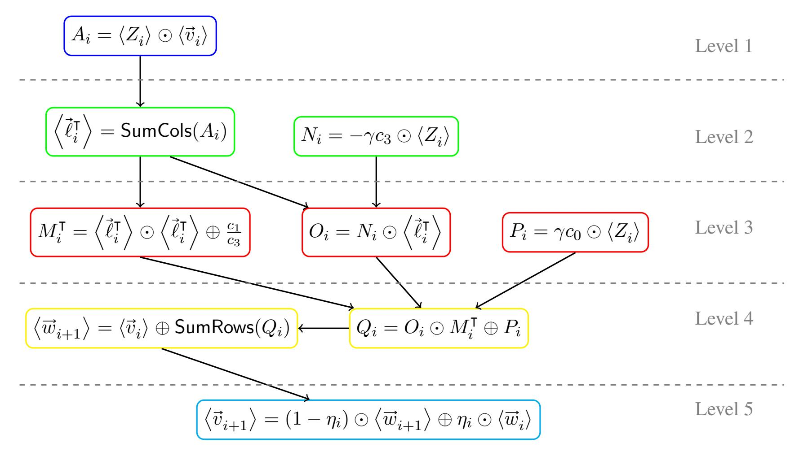

Figure 1: Depth-5 circuit for the computation of wi+1 and vi+1 , corresponding to [Algorithm 7.](#page-16-3) Inputs are γ, η<sup>i</sup> , hZ<sup>i</sup> i, hw<sup>i</sup> i, and hv<sup>i</sup> i. Operations at level 1 are in blue, level 2 in green, level 3 in red, level 4 in yellow, and level 5 in light blue. Encoded variables correspond to [Algorithm 7.](#page-16-3) Compare to [\[Han+18,](#page-27-0) Figure 3]. All values are encoded with respect to an arbitrary m × n unit.

these ciphertexts and sends them along with the mini-batches.[6](#page-17-1)

Encodings In [\[Han+18\]](#page-27-0), the mini-batch size f was always chosen to be the first dimension of the encoding unit (which must be a power of two), while the second dimension of the encoding unit depended on the exact CKKS parameters selected (i.e., the number of plaintext slots) and the number of features in the training set. Using the generalized linear algebra operations and encodings from [Section 3,](#page-5-0) we can decouple the encoding unit from the mini-batch size and use an *arbitrary* encoding unit as in [Algorithm 7](#page-16-3) and [Figure 1,](#page-17-0) and an arbitrary mini-batch size f (not necessarily a power of two). One benefit is that since m must be a power of two, [\[Han+18\]](#page-27-0) only worked for mini-batches which contained a power of two number of training samples; our generalization has no such restriction. A second benefit is that we can divide mini-batches along both dimensions, giving even more encoding flexibility. As an example, consider training on mini-batches of size 64×128 using CKKS parameters with 4096 plaintext slots. Using the techniques of [\[Han+18\]](#page-27-0), we must use a 64 × 64 encoding unit, meaning each mini-batch is split between two ciphertexts, and each 128-dimensional column vector (e.g., v) is also split into two ciphertexts. However, [Section 3](#page-5-0) allows us to use a 32 × 128 encoding unit, which results in two ciphertexts for the minibatch, but only one ciphertext for the vector. Thus by using the generalized encoding structure, we are able to reduce the number of ciphertexts involved in the computation, which can reduce communication overhead and improve performance.

<span id="page-17-1"></span><sup>6</sup>Using symmetric encryption also enables some ciphertext compression. It therefore may be more space efficient to use symmetric encryption, despite having to send extra ciphertexts.

{18}------------------------------------------------

# <span id="page-18-0"></span>6 Depth 4 Logistic Regression Training

[Han+18, Figure 3] achieves a single training iteration with multiplicative depth five. In this section, we show how to reduce the depth to four by removing a dependency and duplicating some work. Specifically, we remove the dependency in Algorithm 7 of  $\langle \vec{v}_{i+1} \rangle$  on  $\langle \vec{w}_{i+1} \rangle$  by observing:

$$\langle \vec{v}_{i+1} \rangle = (1 - \eta_i) \odot \langle \vec{w}_{i+1} \rangle \oplus \eta_i \odot \langle \vec{w}_i \rangle = (1 - \eta_i) \odot \langle \vec{v}_i \rangle \oplus (1 - \eta_i) \langle \vec{c}_i \rangle \oplus \eta_i \odot \langle \vec{w}_i \rangle .$$

Due to the linearity of SumRows, we can define

$$\begin{split} \left\langle \overrightarrow{c'}_i \right\rangle = & (1 - \eta_i) \left\langle \overrightarrow{c}_i \right\rangle \\ = & \mathsf{SumRows}(((-(1 - \eta_i) \gamma c_3 \odot \left\langle Z_i \right\rangle) \odot \left\langle \overrightarrow{\ell}_i^\mathsf{T} \right\rangle) \odot M_i^\mathsf{T} \oplus ((1 - \eta_i) \gamma c_0 \odot \left\langle Z_i \right\rangle)) \end{split}$$

Thus at the cost of some additional computation, we can remove the dependency of  $\vec{w}_{i+1}$  when computing  $\vec{v}_{i+1}$ . This allows us to compute  $\langle \vec{c'}_i \rangle$  in parallel with  $\langle \vec{c}_i \rangle$  and reduce the depth of the circuit to four, as shown in Figure 2. This reduction in circuit *depth* comes at the cost of an increase in the number of gates, however using a parallel evaluator there need not be a corresponding increase in evaluation time. This circuit has exactly the same inputs, and therefore the same usage considerations, as the circuit from Section 5; see Section 5.2 for details.

<span id="page-18-1"></span>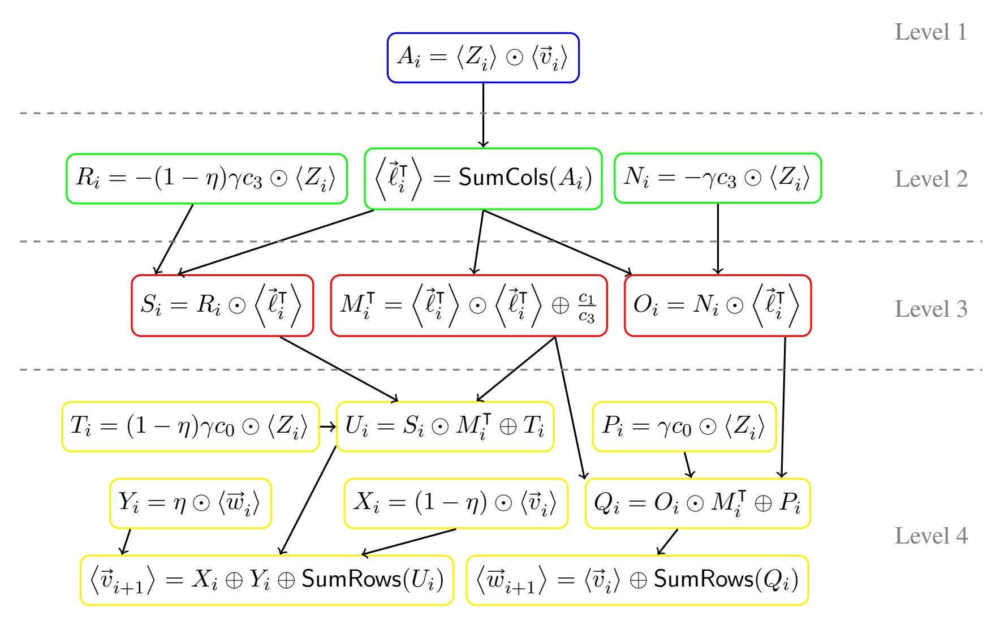

Figure 2: Depth-4 circuit for the computation of  $\langle \vec{w}_{i+1} \rangle$  and  $\langle \vec{v}_{i+1} \rangle$ . Inputs are  $\gamma, \eta_i, \langle Z_i \rangle, \langle \vec{w}_i \rangle$ , and  $\langle \vec{v}_i \rangle$ . Operations at level 1 are in blue, level 2 in green, level 3 in red, and level 4 in yellow. Encoded variables correspond to Algorithm 7. All values are encoded with respect to an arbitrary  $m \times n$  unit.

{19}------------------------------------------------

# <span id="page-19-0"></span>7 Depth 2.5 Logistic Regression Training

In this section, we will further reduce the multiplicative depth of a training iteration using two techniques from compilers. First, we increase the parallelism of the circuit by removing the dependency of  $\vec{\ell}_i$  on  $\vec{v}_i$  from the previous iteration (see Algorithm 6). We can therefore treat  $\vec{\ell}_i$  as an *input* to each training iteration and instead compute  $\vec{\ell}_{i+1}$  in parallel with  $\vec{v}_{i+1}$  and  $\vec{w}_{i+1}$ . As a side effect, this introduces asymmetry in the homomorphic circuit between even and odd training iterations, so we utilize *loop unrolling* to compute two training iterations in each iteration of the for loop. By carefully designing the circuit for the unrolled loop, the first level of multiplications is independent of the outputs of the previous for loop iteration. This allows us to employ *pipelining* to start the next unrolled loop iteration before completing the previous iteration. Finally, we show how to use the algorithms from Section 3.7 for working with mixed encoding units to reduce the number of operations and encryptions required.

We give a depth-five circuit for computing two training iterations, yielding an average depth of 2.5 per iteration. We can "short-circuit" to compute an odd number of iterations, where the final iteration has multiplicative depth two. As with the previous two circuits, all homomorphic values are encoded with respect to one arbitrary encoding unit, and the circuit works for training with arbitrary-size mini-batches.

# <span id="page-19-1"></span>7.1 Adding Parallelism

In Section 6 we removed the dependency of  $\vec{v}_{i+1}$  on  $\vec{w}_{i+1}$ , allowing us to compute these values in parallel. We use a similar trick here: we substitute the definition of  $\vec{v}_{i+1}$  into  $\vec{\ell}_{i+1}$  to remove the dependency, thereby allowing us to compute  $\vec{\ell}_{i+1}$  in parallel with  $\vec{w}_{i+1}$  and  $\vec{v}_{i+1}$ . Expanding out the definition of  $\vec{\ell}_{i+1}$  from Algorithm 6, we see:

$$\vec{\ell}_{i+1} = Z_{i+1} \cdot \vec{v}_{i+1} \tag{7.1}$$

$$= Z_{i+1} \cdot ((1 - \eta_i)(\vec{v}_i + \gamma \cdot Z_i^{\mathsf{T}} \cdot \overrightarrow{\sigma'}(-\vec{\ell}_i)) + \eta_i \vec{w}_i)$$

$$(7.2)$$

$$= Z_{i+1} \cdot ((1 - \eta_i) \cdot \vec{v}_i + (1 - \eta_i)\gamma \cdot Z_i^{\mathsf{T}} \cdot \overrightarrow{\sigma'}(-\vec{\ell}_i) + \eta_i \vec{w}_i)$$

$$(7.3)$$

$$= (1 - \eta_i) \cdot Z_{i+1} \cdot \vec{v}_i + (1 - \eta_i)\gamma \cdot Z_{i+1} Z_i^{\mathsf{T}} \cdot \overrightarrow{\sigma'}(-\vec{\ell}_i) + \eta_i \cdot Z_{i+1} \cdot \vec{w}_i$$
 (7.4)

The key to reducing the multiplicative depth is to compute (or precompute) a multiple of  $Z_{i+1}Z_i^\mathsf{T}$ , which has no computational dependencies, rather than sequentially multiplying by the two mini-batch matrices as in previous circuits. Homomorphically, our goal is to compute  $\left\langle \vec{\ell}_{i+1}^\mathsf{T} \right\rangle$ , since this is the value needed in the computation of  $\left\langle \vec{v}_{i+2} \right\rangle$  and  $\left\langle \vec{w}_{i+2} \right\rangle$  (cf. Figure 1 and Figure 2).

The homomorphic computation, however, apparently results in a paradox:  $\vec{v}_i$  is encoded as a column vector, so the result of homomorphically computing the first term is an encoded row vector. On the other hand, given  $\left\langle \vec{\ell}_i^\mathsf{T} \right\rangle$  as in previous circuits, the middle term is the product of a (single) matrix and a row vector, which results in a column vector; we cannot add these two encoded vectors.

To solve this problem, we will instead homomorphically compute  $\langle \vec{\ell}_{i+1}^{\mathsf{T}} \rangle$  by taking the transpose of (only) the middle term in Equation (7.4):

<span id="page-19-2"></span>
$$(1 - \eta_i)\gamma \cdot \overrightarrow{\sigma'}(-\overrightarrow{\ell}_i^{\mathsf{T}}) \cdot Z_i Z_{i+1}^{\mathsf{T}}.$$

Note that mathematically, transposing this term corresponds to mixing row and column vectors, but homomorphically, each term will be an (encoded) row vector. The middle term is similar to the homomorphic

{20}------------------------------------------------

computation of  $\langle \vec{c}_i \rangle$  from Algorithm 7, except that we need to compute sigmoid on the row vector  $\vec{\ell}_i^\mathsf{T}$ , and we use the square matrix  $Z_i Z_{i+1}^\mathsf{T}$  rather than  $Z_i$ . If we treat the matrix product as an input, we can transpose each piece of the computation of  $\langle \vec{c}_i \rangle$  to compute this term. First, define  $M_i = \langle \vec{\ell}_i \rangle \odot \langle \vec{\ell}_i \rangle \oplus \frac{c_1}{c_3}$ . Then:

$$\left\langle (1 - \eta_i) \gamma \cdot \overrightarrow{\sigma'} (-\vec{\ell}_i^{\mathsf{T}}) \cdot Z_i Z_{i+1}^{\mathsf{T}} \right\rangle \tag{7.5}$$

$$= \operatorname{SumCols}(((-(1-\eta_i)\gamma c_3 \odot \langle Z_{i+1}Z_i^{\mathsf{T}}\rangle) \odot \langle \vec{\ell}_i \rangle) \odot M_i \oplus ((1-\eta_i)\gamma c_0 \odot \langle Z_{i+1}Z_i^{\mathsf{T}}\rangle))$$
(7.6)

**Computing**  $\langle \vec{\ell}_{i+1}^{\mathsf{T}} \rangle$  We now return to the problem of computing  $\langle \vec{\ell}_{i+1}^{\mathsf{T}} \rangle$ . We have seen how to compute the middle term, so we just need to add the outer terms of Equation (7.4):

$$\begin{split} \left\langle \vec{\ell}_{i+1}^{\mathsf{T}} \right\rangle &= \ (1-\eta_i) \odot \mathsf{SumCols}(\left\langle Z_{i+1} \right\rangle \odot \left\langle \vec{v}_i \right\rangle) \\ &\oplus \ \mathsf{SumCols}(((-(1-\eta_i)\gamma c_3 \odot \left\langle Z_{i+1} Z_i^{\mathsf{T}} \right\rangle) \odot \left\langle \vec{\ell}_i \right\rangle) \odot M_i \oplus ((1-\eta_i)\gamma c_0 \odot \left\langle Z_{i+1} Z_i^{\mathsf{T}} \right\rangle)) \\ &\oplus \ \eta_i \odot \mathsf{SumCols}(\left\langle Z_{i+1} \right\rangle \odot \left\langle \vec{w}_i \right\rangle) \end{split}$$

For now, we assume that  $F_i = \langle -(1 - \eta_i) \gamma c_3 Z_{i+1} Z_i^{\mathsf{T}} \rangle$  is available as an input to this computation; we explore this assumption in Section 7.5. Overall, this leads to a depth three circuit for computing  $\langle \vec{\ell}_{i+1}^{\mathsf{T}} \rangle$ , given in Figure 3.

<span id="page-20-0"></span>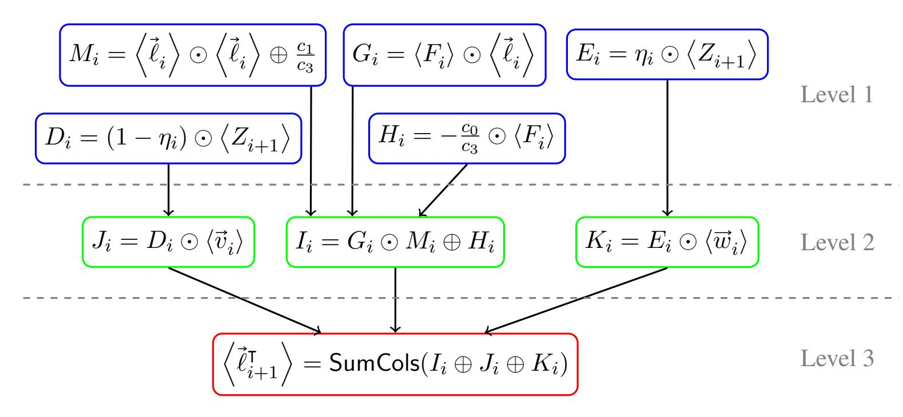

Figure 3: Depth-3 circuit for the computation of  $\langle \vec{\ell}_{i+1}^\mathsf{T} \rangle$ . Inputs are  $\langle F_i \rangle$ ,  $\langle Z_{i+1} \rangle$ ,  $\langle \vec{w}_i \rangle$ ,  $\langle \vec{v}_i \rangle$ , and  $\langle \vec{\ell}_i \rangle$ . Operations at level 1 are in blue, level 2 in green, and level 3 in red. Note the use of SumCols as an additive homomorphism. All values are encoded with respect to an arbitrary encoding unit.

**Computing**  $\langle \vec{v}_{i+1} \rangle$  and  $\langle \vec{w}_{i+1} \rangle$  Treating  $\langle \vec{\ell}_i^\mathsf{T} \rangle$  as an input, we can modify Figure 2 to compute  $\langle \vec{v}_{i+1} \rangle$  and  $\langle \vec{w}_{i+1} \rangle$  in depth three, simply by removing the temporary value  $\langle A_i \rangle$ . This circuit is shown in Figure 4.

{21}------------------------------------------------

<span id="page-21-0"></span>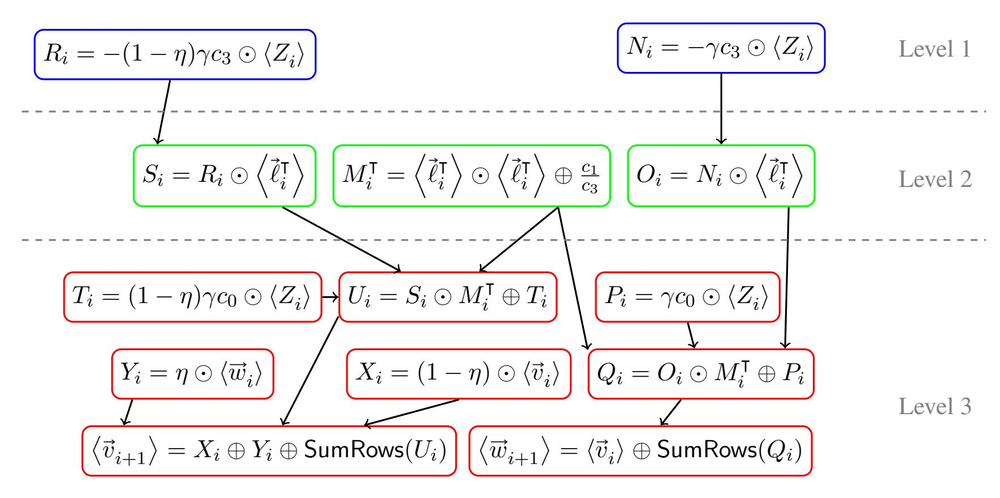

Figure 4: Depth-three circuit layout for computing  $\left\langle \overrightarrow{w}_{i+1} \right\rangle^{[m \times n]}$  and  $\left\langle \overrightarrow{v}_{i+1} \right\rangle^{[m \times n]}$ . Inputs are  $\left\langle Z_i \right\rangle^{[m \times n]}$ ,  $\left\langle \overrightarrow{\ell}_i \right\rangle^{[m \times n]}$ ,  $\left\langle \overrightarrow{w}_i \right\rangle^{[m \times n]}$ , and  $\left\langle \overrightarrow{v}_i \right\rangle^{[m \times n]}$ . Operations at level 1 are in blue, level 2 in green, and level 3 in red.

**Computing Dependencies** In the process of creating a low-depth circuit for  $\langle \vec{\ell}_{i+1}^\mathsf{T} \rangle$  (Figure 3), we have introduced additional dependencies. At first glance, Figure 3 requires  $\langle \vec{\ell}_i \rangle$ , which can be computed by taking the transpose of Figure 3; see Figure 5. However, the transpose circuit requires  $\langle \vec{w}^\mathsf{T} \rangle$  and  $\langle \vec{v}^\mathsf{T} \rangle$  which are computed in Figure 6. This essentially doubles our circuit size: rather than just computing  $\langle \vec{v} \rangle$ ,  $\langle \vec{w} \rangle$ , and  $\langle \vec{\ell} \rangle$  in each iteration, we must also compute their transposes, which increases the amount of overall computation required. Table 1 provides a summary of these four circuit components.

<span id="page-21-1"></span>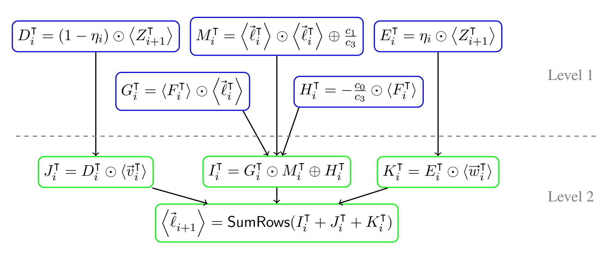

Figure 5: Depth-2 circuit layout for the computation of  $\left\langle \vec{\ell}_{i+1} \right\rangle^{[n \times m]}$ . Inputs are  $\left\langle F_i^\mathsf{T} \right\rangle^{[m \times n]}$ ,  $\left\langle Z_{i+1}^\mathsf{T} \right\rangle^{[n \times m]}$ ,  $\left\langle \vec{w}_i^\mathsf{T} \right\rangle^{[n \times m]}$ , and  $\left\langle \vec{\ell}_i^\mathsf{T} \right\rangle^{[m \times n]}$ . Operations at level 1 are in blue, and level 2 in green. Note the use of SumRows as an additive homomorphism.

{22}------------------------------------------------

<span id="page-22-0"></span>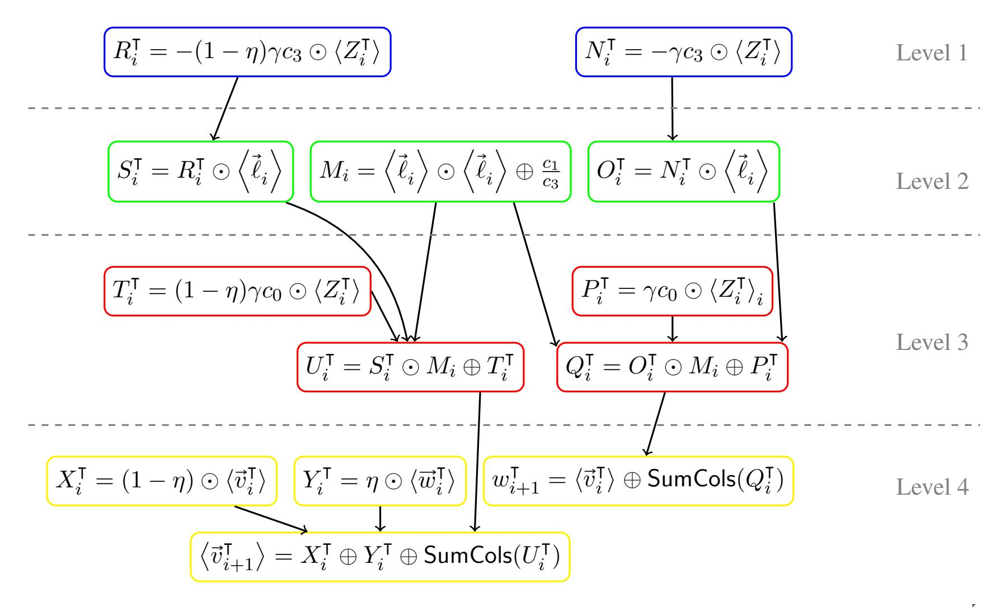

<span id="page-22-1"></span>Figure 6: Depth-four circuit for computing  $\langle \vec{w}_{i+1}^\mathsf{T} \rangle^{[n \times m]}$  and  $\langle \vec{v}_{i+1}^\mathsf{T} \rangle^{[n \times m]}$ . Inputs are  $\langle Z_i^\mathsf{T} \rangle^{[n \times m]}$ ,  $\langle \vec{\ell}_i \rangle^{[n \times m]}$ ,  $\langle \vec{w}_i^\mathsf{T} \rangle^{[n \times m]}$ , and  $\langle \vec{v}_i^\mathsf{T} \rangle^{[n \times m]}$ . Operations at level 1 are in blue, level 2 in green, level 3 in red, and level 4 in yellow.

| Circuit  | Depth | Inputs                                                                                                                                                                                                                                                | Outputs                                                                                         |  |  |  |
|----------|-------|-------------------------------------------------------------------------------------------------------------------------------------------------------------------------------------------------------------------------------------------------------|-------------------------------------------------------------------------------------------------|--|--|--|
| Figure 4 | 3     | $\begin{array}{c} \langle \overrightarrow{w}_i \rangle, \langle \overrightarrow{v}_i \rangle, \\ \Big\langle \overrightarrow{\ell}_i^{T} \Big\rangle, \langle Z_i \rangle \end{array}$                                                                | $\langle \overrightarrow{w}_{i+1} \rangle, \langle \overrightarrow{v}_{i+1} \rangle$            |  |  |  |
| Figure 6 | 4     | $\begin{split} &\langle \overrightarrow{w}_i^{T} \rangle,  \langle \overrightarrow{v}_i^{T} \rangle, \\ &\langle \overrightarrow{\ell}_i \rangle,  \langle Z_i^{T} \rangle \end{split}$                                                               | $\langle \overrightarrow{w}_{i+1}^{T} \rangle, \! \langle \overrightarrow{v}_{i+1}^{T} \rangle$ |  |  |  |
| Figure 5 | 2     | $\begin{split} \langle F_i^{T} \rangle, \left\langle \vec{\ell}_i^{T} \right\rangle, \left\langle Z_{i+1}^{T} \right\rangle, \\ \left\langle \overrightarrow{w}_i^{T} \right\rangle, \left\langle \overrightarrow{v}_i^{T} \right\rangle \end{split}$ | $\left<\vec{\ell}_{i+1}\right>$                                                                 |  |  |  |
| Figure 3 | 3     | $ \langle F_i \rangle, \left\langle \vec{\ell}_i \right\rangle, \left\langle Z_{i+1} \right\rangle, \\ \left\langle \vec{w}_i \right\rangle, \left\langle \vec{v}_i \right\rangle $                                                                   | $\left\langle \vec{\ell}_{i+1}^{\intercal}\right\rangle$                                        |  |  |  |

Table 1: Low-depth circuits for individual components of the logistic regression training circuit.

{23}------------------------------------------------

# <span id="page-23-0"></span>7.2 Loop Unrolling

Unfortunately, these components in Table 1 are misaligned in terms of multiplicative depth. In isolation, these circuits can be run in parallel, but the overall depth is still four per iteration. By unrolling the loop to look at two consecutive iterations, we can achieve much better alignment and lower depth. Appendix A shows how to align the four figures in the table so that all required inputs are computed in time. By running these four circuits in parallel<sup>7</sup> (the "full" circuit), we can compute two consecutive iterations of the training loop with depth six, giving an average of depth three per training iteration.

# <span id="page-23-1"></span>7.3 Pipelining

Notice that the Figures 8, 10, and 11 have depth five, while the first computation level in Figure 9 (depth six) involves only computing scalar multiples of  $Z_i^{\mathsf{T}}$ . By pipelining multiple iterations of the training algorithm, we can start evaluating the circuit for the next two training iterations prior to finishing the evaluation of the circuit for the previous two training iterations, bringing the depth for two iterations to five. The values computed in the first level of the full circuit are  $R_i^{\mathsf{T}} := -\gamma c_3 (1 - \eta_i) \odot \langle Z_i^{\mathsf{T}} \rangle$  and  $N_i^{\mathsf{T}} := -\gamma c_3 \odot \langle Z_i^{\mathsf{T}} \rangle$ .

# <span id="page-23-2"></span>7.4 Using Mixed Encoding Units for Compactness

The "uniform-unit" circuit described thus far uses the same encoding unit to encode a value *and* its transpose. As a result, it is not optimal in terms of the number of ciphertexts used to encode objects and total number of operations performed. For example, in [Han+18], the row vector  $\vec{\ell}_i^{\mathsf{T}} \in \mathbb{R}^m$  is encoded as the columns of an  $m \times n$  encoding unit. The circuit described above *also* uses this encoding unit for  $\vec{\ell}_i$ , which is encoded as the rows of an  $m \times n$  unit. This may result in padding or multiple ciphertexts depending on the number of training features; see Section 8 for analysis.

We can achieve a more compact encoding by using *different* encoding units for certain values, which then requires the techniques of Section 3.7 to compute homomorphic operations on inputs with different encoding units. The compact encoding uses an  $m \times n$  encoding unit for  $D_i$ ,  $E_i$ ,  $J_i$ ,  $K_i$ ,  $\ell_i^{\mathsf{T}}$ ,  $M_i^{\mathsf{T}}$ ,  $N_i$ ,  $O_i$ ,  $P_i$ ,  $Q_i$ ,  $R_i$ ,  $S_i$ ,  $T_i$ ,  $U_i$ ,  $\overrightarrow{v_i}$ ,  $\overrightarrow{w_i}$ ,  $X_i$ ,  $Y_i$ , and  $Z_i$ , and an  $n \times m$  encoding unit for the transpose of these values. The values  $F_i$ ,  $G_i$ ,  $H_i$ ,  $I_i$ , and their transposes are always encoded with an  $m \times n$  unit.

With this change, all computations in the circuit except  $G_i$ ,  $I_i$ , and  $\ell_i$  still involve a single encoding unit (for all inputs and the output). We show how to compute the exceptions below:

$$\bullet \ \langle G_i \rangle^{[m \times n]} = \langle F_i \rangle^{[m \times n]} \odot \operatorname{LogTrans} \left( \left\langle \vec{\ell}_i \right\rangle^{[n \times m]} \right).$$

$$\bullet \ \, \langle I_i \rangle^{[m \times n]} = \langle G_i \rangle^{[m \times n]} \odot \operatorname{LogTrans}\left(\langle M_i \rangle^{[n \times m]}\right) \oplus \langle H_i \rangle^{[m \times n]}$$

$$\bullet \ \left<\vec{\ell}_{i+1}\right>^{[n\times m]} = \mathsf{SumCols}(\mathsf{LogTrans}\left(\left< I_i \right>^{[m\times n]}\right) \oplus \left< J_i \right>^{[m\times n]} \oplus \left< K_i \right>^{[m\times n]})$$

**Limitations** Due to the use of the mixed encoding unit algorithms, this "compact" version of the circuit can only be used when certain conditions apply. In particular, for  $f \times g$  mini-batches and an  $m \times n$  encoding unit, the compact circuit can only be used when  $f \leq m \leq n$ . For example, with CKKS parameters with  $2^{15}$  plaintext slots, we can use the compact circuit when the mini-batch size (f) is  $\leq 128$ . In practice, this

<span id="page-23-3"></span><sup>&</sup>lt;sup>7</sup>Note that a naïve implementation results in duplicate computation for some values; an efficient implementation would overlap these four circuits to eliminate duplication.

{24}------------------------------------------------

restriction may not be important since mini-batches tend to be small (e.g., 32). When the conditions for the compact circuit are not met, the uniform-unit circuit can still be used, since it has no restrictions on batch size or encoding unit dimensions.

# <span id="page-24-0"></span>7.5 Use in Logistic Regression Training

In [Han+18] and Section 6, clients must encrypt each mini-batch  $Z_i$ . However, the low-depth circuit described in this section requires additional inputs. In particular, the first level of Figures 8—11 require  $F_0$ ,  $N_0$ ,  $R_0$ , and their transposes, and  $Z_i^{\mathsf{T}}$  are needed throughout the computation. There are many possible tradeoffs between which of these values are computed by the client, and which are computed by the server. We describe two of these options below.

Client Computation Circuit In this version of the circuit, the client encrypts  $Z_i, Z_i^{\mathsf{T}}$ , the matrix products  $F_i, F_i^{\mathsf{T}}$  and, in the case of symmetric encryption, the all-0 vectors  $\vec{w}_0, \vec{w}_0^{\mathsf{T}}, \vec{v}_0, \vec{v}_0^{\mathsf{T}}, \vec{\ell}_0$ , and  $\vec{\ell}_0^{\mathsf{T}}$ . The server computes the initial loop variables  $N_0, N_0^{\mathsf{T}}, R_0$ , and  $R_0^{\mathsf{T}}$ . With this version, the client sends about 4k encrypted inputs<sup>8</sup> for k iterations. Nominally, this results in a circuit where the first iteration of Figures 8—11 have depth six (since the server must compute  $R_0^{\mathsf{T}}$ , etc.), while subsequent iterations have depth five (by applying pipelining), giving an overall circuit depth of 2.5k+1 for k iterations.<sup>9</sup>

Server Computation Circuit As an alternative, we can use Algorithm  $3^{10}$  to have the server compute most of the  $F_i$  and  $F_i^{\mathsf{T}}$  (not depicted in Figures 8—11). This dramatically increases the server computation, while simultaneously reducing the client computation and communication overhead. Concretely, the client encrypts  $Z_i, Z_i^{\mathsf{T}}, F_0, F_0^{\mathsf{T}}$ , and, in the case of symmetric encryption, the all-0 vectors  $\vec{w}_0, \vec{w}_0^{\mathsf{T}}, \vec{v}_0, \vec{v}_0^{\mathsf{T}}, \vec{\ell}_0$ , and  $\vec{\ell}_0^{\mathsf{T}}$ . Again, this circuit has depth 2.5k+1 for k iterations. As the number of training iterations increases, the amount of client computation saved increases, and the communication savings increase as well. As long as there is sufficient parallelism available on the evaluator, this approach offers reduced client computation and communication at no runtime cost.

# <span id="page-24-1"></span>8 Evaluation

We implemented the circuit from [Han+18] and four variations of the Section 7 circuit with the HIT toolkit [20a], based on the SEAL homomorphic encryption library [20b] and circuit-level parallelism. Encryption parameters were selected to conform to the 128-bit security level as standardized in [Alb+18], or were extrapolated from this standard for larger rings at the 128-bit target security level. We tested our circuits by training a logistic regression model on the MNIST data set [LC10]. This data set consists of images of hand-written digits. For our binary classification problem, we restricted the training set and test set to images of the digits 3 and 8. After downsampling, each image is 14x14 pixels, each of which becomes a feature in the model. We evaluated the performance on an Amazon EC2 c5.24xlarge instance, which has 96 CPU threads.

In practice, an implementation of encrypted logistic regression training would fix the number of training iterations performed by a single circuit and then use bootstrapping as in [Han+18] to achieve a larger number

<span id="page-24-3"></span><span id="page-24-2"></span> $<sup>^{8}</sup>$ There may be more than 4k ciphertexts, depending on the encoding unit and the number of features.

 $<sup>^9</sup>$ By carefully arranging the first few levels of either version of the circuit described here, we can save one level and create a circuit with depth exactly  $2.5 \cdot k$  for k iterations on average.

<span id="page-24-4"></span> $<sup>^{10}</sup>$ With the compact circuit, the mixed-unit matrix/matrix multiplication algorithm from Section 3.7.2 must be used since the inputs are encoded with an  $m \times n$  unit but the output must be encoded with an  $n \times m$  unit.

{25}------------------------------------------------

of iterations. Our implementation does not include bootstrapping, but we emphasize that our circuits are drop-in replacements for the circuit from [\[Han+18\]](#page-27-0), and therefore their bootstrapping technique is trivially applicable to this work. Our performance improvements in the leveled-HE setting also carry over to the bootstrapped setting. We therefore evaluate the circuits for a fixed number of iterations and consider the following properties:

- Encryptions. Number of ciphertexts (not linear algebra objects) encrypted by the client.
- Encrypted Input Size. Total size of ciphertexts send to server. While a naïve implementation would encrypt each ciphertext at the maximum possible level and let the server reduce the levels when necessary, this unnecessarily wastes bandwidth and server computation. Our implementation instead encrypts inputs at the first level where they are needed, meaning each input has a different size, and the total input size is a weighted sum where the weights are the HE levels of the inputs. We also note that we used a public-key variant of CKKS encryption; using a symmetric-key variant can result in more compact ciphertexts resulting in a significant reduction in bandwidth.
- Circuit Depth. Multiplicative depth of the circuit.
- Circuit Width. We define the *multiplicative width* of a circuit to be the total number of multiplications performed in a circuit evaluation divided by the multiplicative depth of the circuit. Roughly, this is an indicator of the multiplications that can be performed in parallel.
- Runtime. Runtime of the circuit evaluation. This only includes server-side operations.

[Table 2](#page-25-0) compares four variations of the circuits from [Section 7](#page-19-0) to the circuit from [\[Han+18\]](#page-27-0). We refer to the circuits from [Section 7](#page-19-0) using a shorthand notation of the form [encoding unit method] × [party computing F<sup>i</sup> ] where [encoding unit method] ∈ {Uniform, Compact} and [party computing F<sup>i</sup> ] ∈ {Client, Server}. For example, Compact × Client refers to the compact version of the circuit where the F<sup>i</sup> are computed on the client.

<span id="page-25-0"></span>

| Circuit                     | Encryptions | Input Size | Depth | Width |       | Runtime (s) |      |       |       |
|-----------------------------|-------------|------------|-------|-------|-------|-------------|------|-------|-------|
|                             |             | (MB)       |       | 32    | 64    | 128         | 32   | 64    | 128   |
| [Han+18]                    | 8           | 177        | 30    |       | 1.8   |             |      | 79.2  |       |
| This work: Uniform × Client | 33          | 413        | 15    |       | 14.9  |             |      | 13.1  |       |
| This work: Compact × Client | 26          | 323        | 15    |       | 11.4  |             |      | 12.6  |       |
| This work: Uniform × Server | 28          | 386        | 15    | 89.5  | 164.2 | 313.5       | 70.2 | 137.4 | 273.6 |
| This work: Compact × Server | 20          | 275        | 15    | 56.2  | 101   | 190.6       | 46.5 | 82.8  | 165   |

Table 2: Comparison of logistic regression training circuits for six training iterations with an encoding unit of 128 × 256 for mini-batches of size 32, 64, and 128. Each configuration use CKKS parameters with 2 15 plaintext slots.

Multiplicative Depth Comparing the runtime of the Compact × Client circuit to the [\[Han+18\]](#page-27-0) circuit shows that cutting multiplicative depth in half results in even greater benefits at runtime.

{26}------------------------------------------------

Compact Circuits [Table 2](#page-25-0) shows that the compact version of the circuit is better than the uniform-unit version in every metric. In particular, the compact circuit uses 25%-50% fewer operations than the uniformunit circuit. The compact circuits also require at least 20% fewer encryptions, which corresponds to reduced client computation and bandwidth requirements. The compact circuits have a lower width, which means that they can still achieve good performance on a computer with fewer cores.

Client-side vs Server-side Computation Computing matrix products on the server incurs extra computational cost during evaluation. The table shows that this cost is affected by the mini-batch size, which is not true when the client computes the matrix products. This is because [Algorithm 3](#page-11-2) performs operations based on the size of the mini-batches directly, whereas all other operations perform operations based on the size of the *encoded* mini-batches.

Parameters Affecting Performance Given parameters for the logistic regression model (e.g., mini-batch size and number of training iterations), there are still several circuit parameters which can affect performance, including number of plaintext slots and the encoding unit. Doubling the number of plaintext slots doubles the size of ciphertexts and makes all operations slower, but can give additional flexibility in selecting the encoding unit with the compact circuit. The circuits are so large (even for six iterations) that it is difficult to predict how the encoding unit affects performance. We leave this as future work.

<span id="page-26-0"></span>Model Accuracy Since all of the circuits compared in [Table 2](#page-25-0) evaluate the same algorithm, they should produce identical models. The accuracy of the model produced by the logistic regression training algorithm is affected by the accuracy and validity of the sigmoid approximation and the noise introduced by homomorphic computation. [Figure 7](#page-26-0) shows that neither of these potential sources of error have much affect on model accuracy.

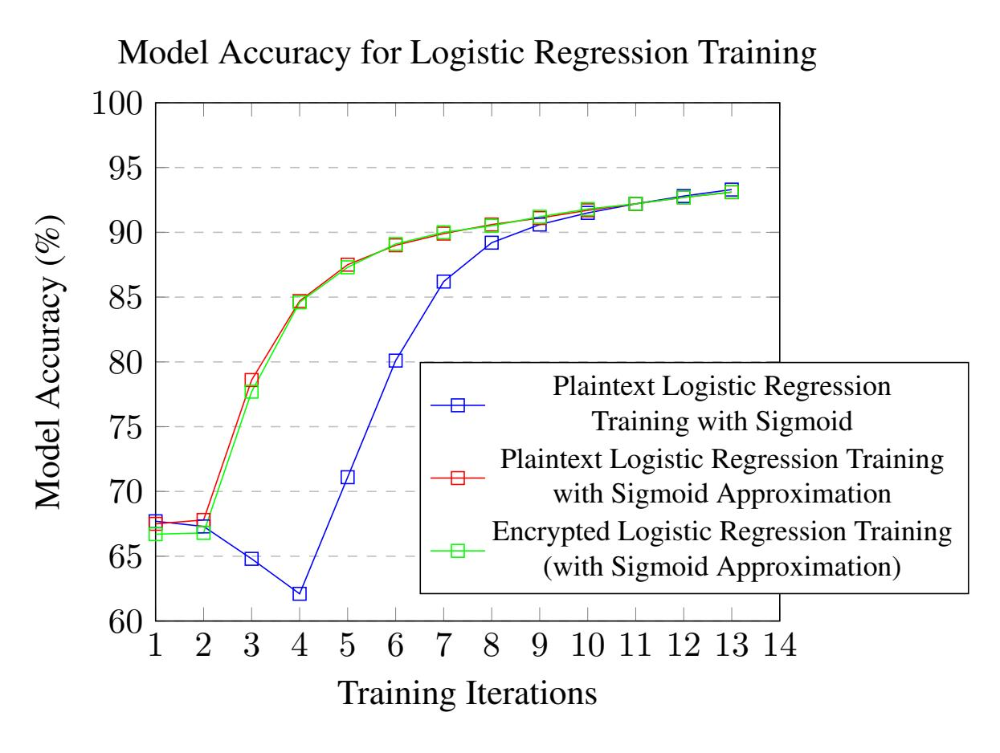

Figure 7: Average model accuracy (over 1000 models) of a logistic regression model trained on the MNIST data set. Model accuracy is computed as basic *classification accuracy*: the percentage of correctly predicted test samples.

{27}------------------------------------------------

# References

- <span id="page-27-8"></span>[20a] *AWS HIT*. <https://github.com/awslabs/homomorphic-implementors-toolkit>. Amazon Web Services. Nov. 2020.
- <span id="page-27-15"></span>[20b] *Microsoft SEAL (release 3.5)*. <https://github.com/Microsoft/SEAL>. Microsoft Research, Redmond, WA. Apr. 2020.
- <span id="page-27-4"></span>[AG20] Oluwafadekemi Areo and Obindah Gershon. "Personal Income Tax Compliance in Nigeria: A Generalised Ordered Logistic Regression". In: *Research in World Economy* 11 (June 2020), p. 261.
- <span id="page-27-16"></span>[Alb+18] Martin Albrecht et al. *Homomorphic Encryption Security Standard*. Tech. rep. Toronto, Canada: HomomorphicEncryption.org, Nov. 2018.
- <span id="page-27-10"></span>[Aon+16] Yoshinori Aono et al. *Scalable and Secure Logistic Regression via Homomorphic Encryption*. Cryptology ePrint Archive, Report 2016/111. <https://eprint.iacr.org/2016/111>. 2016.
- <span id="page-27-7"></span>[Arc+19] David W. Archer et al. *RAMPARTS: A Programmer-Friendly System for Building Homomorphic Encryption Applications*. Cryptology ePrint Archive, Report 2019/988. [https://eprint.iacr.](https://eprint.iacr.org/2019/988) [org/2019/988](https://eprint.iacr.org/2019/988). 2019.
- <span id="page-27-2"></span>[Ban+18] Saikat Banerjee et al. "Bayesian multiple logistic regression for case-control GWAS". In: *PLOS Genetics* 14 (Dec. 2018), e1007856.
- <span id="page-27-5"></span>[Bol10] Christine Bolton. "Logistic regression and its application in credit scoring". In: 2010.
- <span id="page-27-14"></span>[Bon+17] Charlotte Bonte et al. *Faster Homomorphic Function Evaluation using Non-Integral Base Encoding*. Cryptology ePrint Archive, Report 2017/333. [https://eprint.iacr.org/2017/](https://eprint.iacr.org/2017/333) [333](https://eprint.iacr.org/2017/333). 2017.
- <span id="page-27-12"></span>[BV18] Charlotte Bonte and Frederik Vercauteren. *Privacy-Preserving Logistic Regression Training*. Cryptology ePrint Archive, Report 2018/233. <https://eprint.iacr.org/2018/233>. 2018.
- <span id="page-27-9"></span>[Che+16] Jung Hee Cheon et al. *Homomorphic Encryption for Arithmetic of Approximate Numbers*. Cryptology ePrint Archive, Report 2016/421. <https://eprint.iacr.org/2016/421>. 2016.
- <span id="page-27-3"></span>[Chh+09] Jagpreet Chhatwal et al. "A Logistic Regression Model Based on the National Mammography Database Format to Aid Breast Cancer Diagnosis". In: *AJR. American journal of roentgenology* 192 (May 2009), pp. 1117–27.
- <span id="page-27-11"></span>[Cra+18] Jack L.H. Crawford et al. *Doing Real Work with FHE: The Case of Logistic Regression*. Cryptology ePrint Archive, Report 2018/202. <https://eprint.iacr.org/2018/202>. 2018.
- <span id="page-27-1"></span>[Cro20] Eric Crockett. *A Low-Depth Homomorphic Circuit for Logistic Regression Model Training*. To appear in WAHC 2020. 2020.
- <span id="page-27-13"></span>[FV12] Junfeng Fan and Frederik Vercauteren. *Somewhat Practical Fully Homomorphic Encryption*. Cryptology ePrint Archive, Report 2012/144. <https://eprint.iacr.org/2012/144>. 2012.
- <span id="page-27-0"></span>[Han+18] Kyoohyung Han et al. *Efficient Logistic Regression on Large Encrypted Data*. Cryptology ePrint Archive, Report 2018/662. <https://eprint.iacr.org/2018/662>. 2018.
- <span id="page-27-6"></span>[Kim+18a] Andrey Kim et al. *Logistic Regression Model Training based on the Approximate Homomorphic Encryption*. Cryptology ePrint Archive, Report 2018/254. [https://eprint.iacr.org/2018/](https://eprint.iacr.org/2018/254) [254](https://eprint.iacr.org/2018/254). 2018.

{28}------------------------------------------------

- <span id="page-28-1"></span>[Kim+18b] Miran Kim et al. *Secure Logistic Regression Based on Homomorphic Encryption: Design and Evaluation*. Cryptology ePrint Archive, Report 2018/074. [https://eprint.iacr.org/2018/](https://eprint.iacr.org/2018/074) [074](https://eprint.iacr.org/2018/074). 2018.
- <span id="page-28-3"></span>[LC10] Yann LeCun and Corinna Cortes. "MNIST handwritten digit database". In: (2010).
- <span id="page-28-2"></span>[Nes83] Y. E. Nesterov. "A method for solving the convex programming problem with convergence rate O(1/k<sup>2</sup> )". In: *Dokl. Akad. Nauk SSSR* 269 (1983), pp. 543–547.
- <span id="page-28-0"></span>[Rym+19] Tomasz Rymarczyk et al. "Logistic Regression for Machine Learning in Process Tomography". In: *Sensors* 19 (Aug. 2019), p. 3400.

{29}------------------------------------------------

# <span id="page-29-0"></span>A Circuit Diagrams for Low-Depth Logistic Regression Training

This section shows how to align the subcircuits (Figures 3—6) into a full circuit. By linking Figures 8—11 (the right panel of Figure 8 coincides with the right panel of Figure 11, the left panel of Figure 11 coincides with the left panel of Figure 10, and so on), we obtain a depth six circuit for two training iterations. This circuit can be iterated with pipelining to get a depth five circuit. Recall that we define  $F_i := -\gamma c_3(1 - \eta_i) \cdot Z_{i+1} Z_i^{\mathsf{T}}$ .

<span id="page-29-1"></span>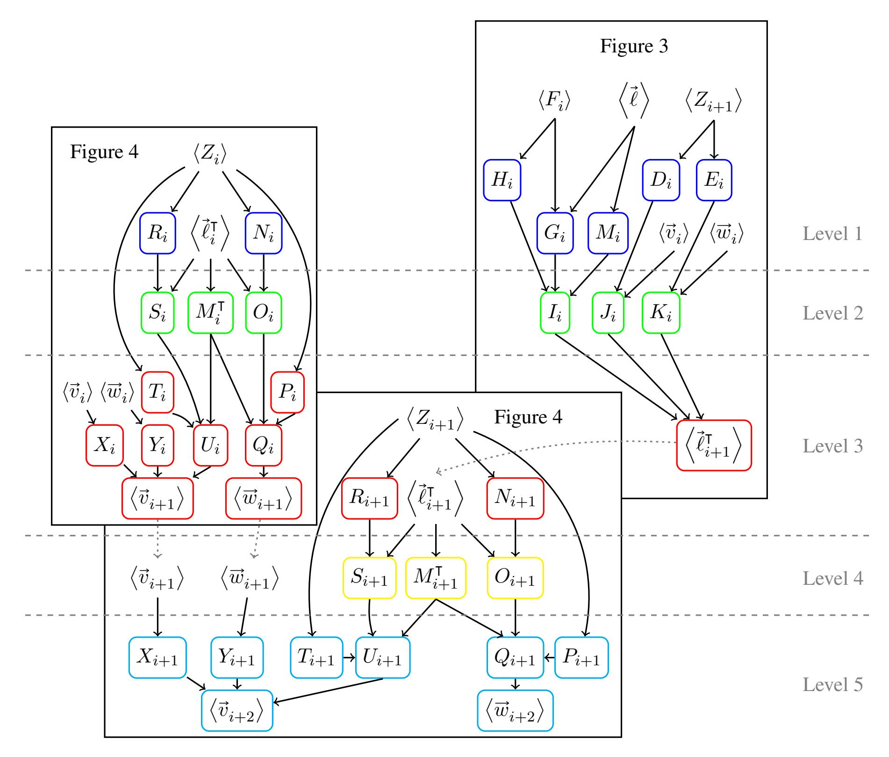

Figure 8: Operations at level 1 are in blue, level 2 in green, level 3 in red, level 4 in yellow, and level 5 in light blue.

{30}------------------------------------------------

<span id="page-30-0"></span>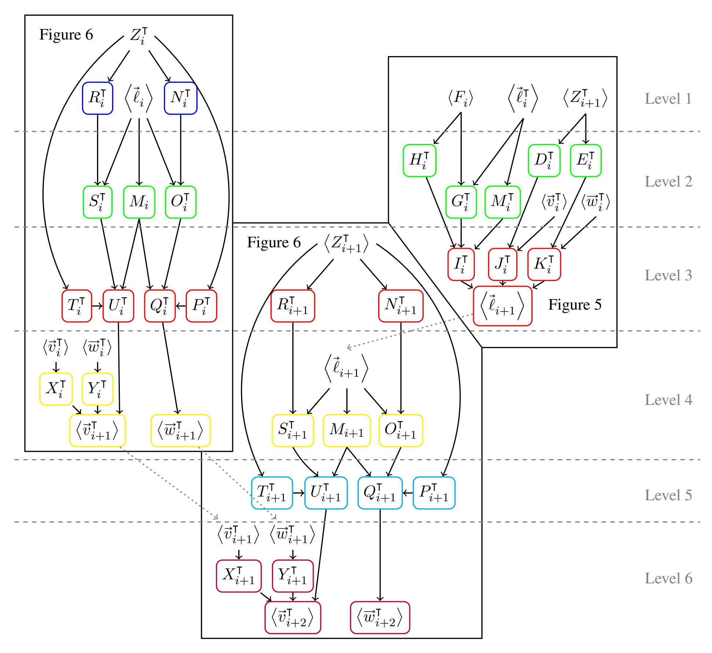

Figure 9: Operations at level 1 are in blue, level 2 in green, level 3 in red, level 4 in yellow, level 5 in light blue, and level 6 in purple.

{31}------------------------------------------------

<span id="page-31-0"></span>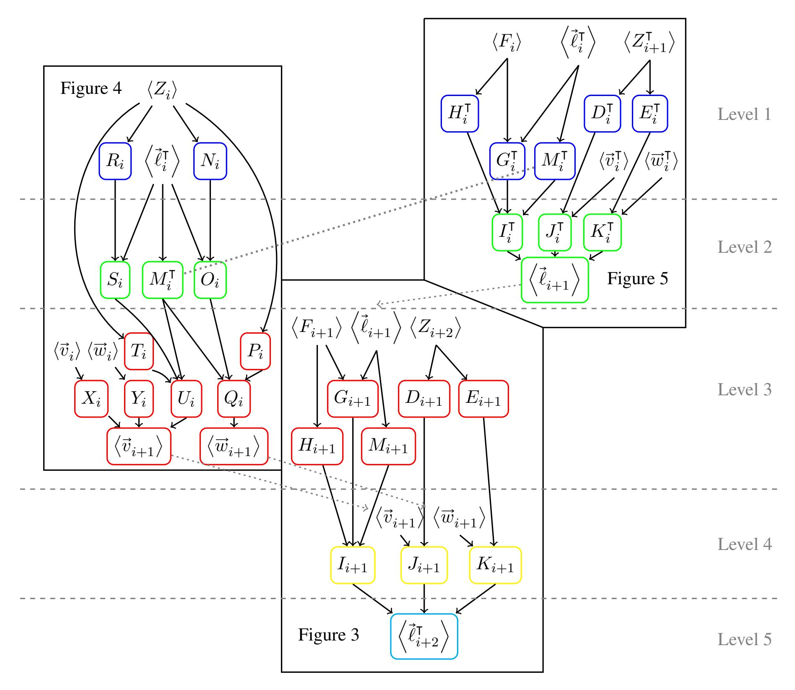

Figure 10: Operations at level 1 are in blue, level 2 in green, level 3 in red, level 4 in yellow, and level 5 in light blue.

{32}------------------------------------------------

<span id="page-32-0"></span>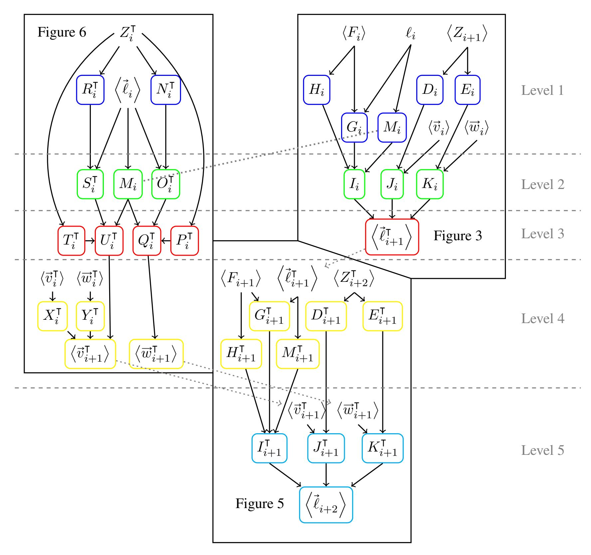

Figure 11: Operations at level 1 are in blue, level 2 in green, level 3 in red, level 4 in yellow, and level 5 in light blue.