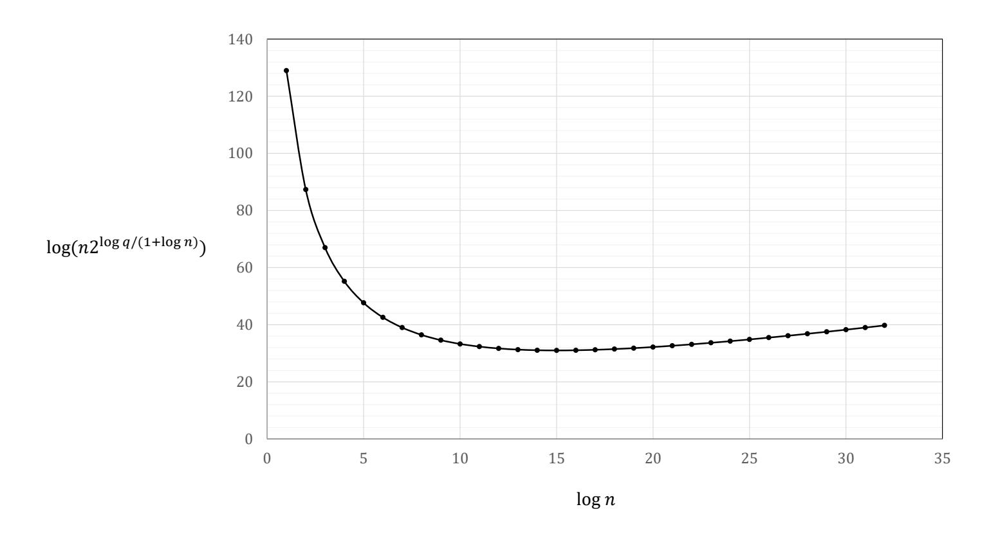

{0}------------------------------------------------

### Cryptanalysis of Aggregate Γ-Signature and Practical Countermeasures in Application to Bitcoin

Goichiro Hanaoka National Institute of Advanced Industrial Science and Technology (AIST) Tokyo, Japan

Kazuo Ohta The University of Electro-Communications Tokyo, Japan and National Institute of Advanced Industrial Science and Technology (AIST) Tokyo, Japan

Yusuke Sakai National Institute of Advanced Industrial Science and Technology (AIST) Tokyo, Japan

Bagus Santoso The University of Electro-Communications Tokyo, Japan

Kaoru Takemure The University of Electro-Communications Tokyo, Japan and National Institute of Advanced Industrial Science and Technology (AIST) Tokyo, Japan

Yunlei Zhao Fudan University Shanghai, China

#### ABSTRACT

We present a sub-exponential forger by using a -sum algorithm against the aggregate Γ-signature, which was proposed at AsiaCCS 2019 by Zhao. Our forger is a universal forger under a key-only attack and effective in the knowledge of secret key model. We also discuss the real impact of this attack in reality with Bitcoin applications. The discussions on the real impact of the attack also highlight the significant differences between the usage of individual signatures like EC-DSA and that of aggregate signatures in the blockchain systems like Bitcoin, which might be of independent interest and could bring forth interesting questions for future investigations.

#### CCS CONCEPTS

• Security and privacy → Cryptanalysis and other attacks.

#### KEYWORDS

-sum algorithm, aggregate signature, universal forgery, blockchain

#### ACM Reference Format:

Goichiro Hanaoka, Kazuo Ohta, Yusuke Sakai, Bagus Santoso, Kaoru Takemure, and Yunlei Zhao. 2018. Cryptanalysis of Aggregate Γ-Signature and

Permission to make digital or hard copies of all or part of this work for personal or classroom use is granted without fee provided that copies are not made or distributed for profit or commercial advantage and that copies bear this notice and the full citation on the first page. Copyrights for components of this work owned by others than ACM must be honored. Abstracting with credit is permitted. To copy otherwise, or republish, to post on servers or to redistribute to lists, requires prior specific permission and/or a fee. Request permissions from permissions@acm.org.

Woodstock '18, June 03–05, 2018, Woodstock, NY © 2018 Association for Computing Machinery. ACM ISBN 978-1-4503-XXXX-X/18/06. . . \$15.00 <https://doi.org/10.1145/1122445.1122456>

Practical Countermeasures in Application to Bitcoin. In Woodstock '18: ACM Symposium on Neural Gaze Detection, June 03–05, 2018, Woodstock, NY . ACM, New York, NY, USA, [6](#page-5-0) pages.<https://doi.org/10.1145/1122445.1122456>

#### 1 INTRODUCTION

Blockchain is one of the technologies for realizing Bitcoin which is a cryptocurrency scheme introduced by Satoshi Nakamoto [\[10\]](#page-5-1). This allows managing a ledger, guaranteeing unforgeability, and achieving decentralization. Namely, nobody can tamper with transactions that are managed by a publicly verifiable distributed ledger without reliable administers. Blockchain is gathering attention globally in recent years due to the increasing popularity of Bitcoin and is applied not only to a cryptocurrency but also to other industries.

In Bitcoin, the EC-DSA signature scheme [\[7\]](#page-5-2) over the secp256k1 curve [\[13\]](#page-5-3) is used to authenticate transactions. The size of signatures and verification time are important terms for designing the Bitcoin system because Bitcoin nodes need to verify all updates to the ledger. Because of the non-linearity of the EC-DSA signature, it is hard to combine signatures into a compact one while keeping verifiability, and thus transactions contain a concatenation of all individual signatures. Namely, the signature size depends on the number of signatures and the signatures occupy a large part of the size of Bitcoin transactions. Recently, there are interests in deploying the Schnorr signature scheme [\[15\]](#page-5-4) in Bitcoin instead of the EC-DSA signature scheme in terms of linearity, well-established security, and small computational complexity. Specifically, the linearity of the Schnorr signature helps extensions to multi-signatures [\[1,](#page-5-5) [3,](#page-5-6) [9\]](#page-5-7).

Aggregate signatures (AS) are a cryptographic primitive which allows combining individual signatures on different messages into a compact one, and it can also overcome the above bottlenecks. 

{1}------------------------------------------------

Boneh et al. introduced the notion of AS and proposed a pairing-based AS scheme which achieves a constant signature size [4]. In general, pairing-based AS schemes require pairing computation to verify a signature, and the security of them is based on the computational assumption in groups with bilinear maps which is stronger than the discrete logarithm assumption in the elliptic curve (EC) groups. Deploying pairing-based AS schemes in existing applications, e.g., blockchain, is expensive because it requires not only replacing the algorithms of a signature scheme with the those of the pairing-based scheme but also replacing an EC with pairing friendly ones. AS from general EC groups are attractive in terms of the computational complexity and the cost of deployment.

Zhao showed the subtlety in constructing a secure AS scheme from general groups and proposed an AS scheme from general EC groups without bilinear maps by extending the  $\Gamma$ -signature [17], which is called the aggregate  $\Gamma$ -signature [18]. He also proved that it is secure in the plain public-key (PK) model [1] based on the new assumption, named the non-malleable discrete logarithm (NMDL) assumption.

In the Bitcoin forum [11], a sub-exponential time universal forger under a key-only attack1 [6] against the aggregate  $\Gamma$ -signature scheme was proposed anonymously by the name of ncklr. This forger generates cosigners' public keys by using the public key of an honest signer (namely, this is a rogue-key attack [14]), and finds a desirable set of cosigners' messages by using the k-sum algorithm [16]. Note that we can practically prevent this forger from finding such a set together with a set of malicious public keys by using a proof-of-possession of secret key [14], where all the signers need to submit a certification to prove that the corresponding public keys are generated honestly. Also, in the blockchain systems like Bitcoin, it is hard to apply such a rogue-key attack because each signer's message commits to one's public key.

In this paper, we propose a stronger forger. Specifically, our forger is a universal forger under a key-only attack in the knowledge of secret key (KOSK) model [2, 8]. Since our attack is effective even in the KOSK model, we cannot circumvent our attack even if a trusted key-setup is executed. This forger runs in sub-exponential time due to the k-tree algorithm [16]. Although our proposed attack is not fatal theoretically since it is a sub-exponential time attack, it affects the practical performance of Zhao's scheme. More concretely, in order to guarantee the security against our attack, the aggregate  $\Gamma$ -signature scheme requires the bit-length of the order of an underlying group to be approximately  $\log n$  times the security parameter where n is the number of signers. In contrast, for most other schemes based on general EC groups, the bit-length of the order of the underlying group is only twice as long as the security parameter (due to the  $\rho$  method [12]).

The aggregate  $\Gamma$ -signature was introduced in [18] with the motivation for applications to the Bitcoin system. We then discuss the real impact of this attack in reality in the blockchain systems like Bitcoin in Section 5. Though the attack is itself quite effective, we show that it is actually infeasible in reality in the blockchain systems like Bitcoin, and is economically meaningless. The discussions on the real impact of the attack also highlight the significant

differences between the usage of individual signatures like EC-DSA and that of aggregate signatures in the blockchain systems, which might be of independent interest and could bring forth interesting questions for future investigations.

#### **2 PRELIMINARIES**

The following is notations and some definitions which are used in this paper.

#### 2.1 Notation

For a prime integer q, we denote the ring of integers modulo q by  $Z_q$  and the multiplicative group of  $Z_q$  by  $Z_q^*$ . Let G be an additive cyclic group of order q and let P be a generator of G. For a set A, we write  $a \stackrel{\$}{\leftarrow} A$  to mean that a is chosen uniformly at random from A.

#### 2.2 k-sum Problem

We recall the definition of the k-sum problem.

Definition 2.1 (k-sum problem). The k-sum problem in group  $(Z_q;+)$  for an arbitrary q provides k lists  $L_1,\ldots,L_k$  of equal sizes, each list containing  $s_L$  elements sampled uniformly and independently from  $Z_q$ , and requires to find  $x_1 \in L_1,\ldots,x_k \in L_k$  s.t.  $\sum_{i=1}^k x_i \equiv 0 \pmod{q}$ .

In [16], Wagner proposed the k-tree algorithm which can solve the k-sum problem for  $s_L = 2^{\log q/(1+\log k)}$  in time at most  $O(k2^{\log q/(1+\log k)})$  with non-negligible probability.

#### 2.3 Aggregate Signatures

In this section, we show definitions of aggregate signatures and a security model of it.

Definition 2.2. An aggregate signature scheme consists of the following six algorithms. Let n be the number of signers.

- Setup( $1^{\lambda}$ )  $\rightarrow pp$ . The public parameter generation algorithm takes as input a security parameter  $1^{\lambda}$ , then it outputs a public parameter pp.
- **KeyGen**(pp)  $\rightarrow$  (pk, sk). The key generation algorithm takes as input a public parameter pp, then it outputs a public key pk and a secret key sk.
- Sign(pp, pk, sk, m)  $\rightarrow \sigma$ . The signing algorithm takes as input a public parameter pp, a public key pk, a secret key sk, and a message m, then it outputs a individual signature  $\sigma$ .
- **Verify** $(pp, pk, m, \sigma) \rightarrow \{0, 1\}$  The verification algorithm takes as input a public parameter pp, a public key pk, a message m, and a signature  $\sigma$ , then it outputs 0 (REJECT) or 1 (ACCEPT).
- Agg(pp,  $\{(pk_i, m_i, \sigma_i)\}_{i=1}^n) \to \sigma_a$ . The aggregation algorithm takes as input a public parameter pp, and a set of all signers' public keys, messages, and signatures  $\{(pk_i, m_i, \sigma_i)\}_{i=1}^n$ , then it outputs an aggregate signature  $\sigma_a$ .
- **AggVer** $(pp, \{(pk_i, m_i)\}_{i=1}^n, \sigma_a) \rightarrow \{0, 1\}$ . The aggregate signature verification algorithm takes as input a public parameter pp, a set of all signers' public keys and messages  $\{(pk_i, m_i)\}_{i=1}^n$ , and an aggregate signature  $\sigma_a$ , then it outputs 0 (REJECT) or 1 (ACCEPT).

&lt;sup>1Universal forgeability is that there is a forger who can generate a forgery on an arbitrary message and is more serious than existential forgeability. A key-only attack does not allow a forger to make a signing query.

{2}------------------------------------------------

For any set of messages  $\{m_i\}_{i=1}^n$ , if a public parameter pp, all signers' public keys  $\{pk_i\}_{i=1}^n$ , and an aggregate signature  $\sigma_a$  are generated honestly by the above algorithms, then we require that  $\Pr[\mathbf{AggVer}(pp, \{(pk_i, m_i)\}_{i=1}^n, \sigma_a) = 1] = 1$ .

2.3.1 Security Game. For aggregate signatures, we define universal unforgeability under key-only attacks in the knowledge of secret key (KOSK) model. In this security model, a forger who corrupts an aggregator and signers except one honest signer is given an honest signer's public key and a message and is required to generate a forgery on the given message by making hash queries. When outputting a forgery, it must output cosigners' secret keys corresponding to cosigners' public keys which are chosen arbitrarily.

If, for all  $m^*$ , a forger  $\mathcal{F}$  wins the following game with non-negligible probability, then we say that  $\mathcal{F}$  is a universal forger under a key-only attack in the KOSK model.

**Setup**( $1^{\lambda}$ ,  $m^*$ ). The challenger chooses a public parameter  $pp \xleftarrow{\$}$ **Setup**( $1^{\lambda}$ ), an honest signer's key pair (pk, sk)  $\xleftarrow{\$}$  **KeyGen**(pp). It runs a forger  $\mathcal{F}$  on input pp, pk and a message  $m^*$ .

**Output.**  $\mathcal{F}$  outputs n key pairs  $\{(pk_i, sk_i, m_i^*)\}_{i=1}^n$  and a forgery  $\sigma_a^*$  where the following holds.

- $(pk_1, m_1^*), \ldots, (pk_n, m_n^*)$  are mutually distinct.
- $(pk, m^*) \in \{(pk_i, m_i^*)\}_{i=1}^n$ .
- $sk_l$  is  $\perp$  where l satisfies s.t.  $pk_l = pk$ .
- $sk_i$  is a correct secrete key corresponding to  $pk_i$  for  $i \in [1, n] \setminus \{l\}$ .

If  $AggVer(pp, \{(pk_i, m_i^*)\}_{i=1}^n, \sigma_a^*) = 1$  holds, then  $\mathcal{F}$  wins.

#### 3 AGGREGATE Γ-SIGNATURE SCHEME

In [18], the aggregate  $\Gamma$ -signature scheme is proposed by Zhao. This scheme consists of the following six algorithms.

**Setup**( $1^{\lambda}$ )  $\rightarrow$  ( $G, q, P, H_0, H_1$ ). It chooses (G, q, P), hash functions  $H_0: G \rightarrow Z_q$  and  $H_1: G \times M \rightarrow Z_q$  where M is the set of messages, then it outputs  $pp = (G, q, P, H_0, H_1)$ .

**KeyGen**(pp)  $\rightarrow$  (X, x). It computes  $x \leftarrow Z_q^*$  and  $X \leftarrow xP$ , then it outputs a public key X and a secret key x.

Sign $(pp, X, x, m) \to \sigma$ . It computes  $r \leftarrow Z_q^*$ ,  $A \leftarrow rP$ ,  $d \leftarrow H_0(A)$ , and  $e \leftarrow H_1(X, m)$ . It computes  $z \leftarrow rd - ex \mod q$ , then it outputs  $\sigma = (z, d)$  as a signature.

**Verify** $(pp, X, m, \sigma) \rightarrow \{0, 1\}$  It computes  $e \leftarrow H_1(X, m)$  and  $A \leftarrow zd^{-1}P + ed^{-1}X$ . If  $H_0(A) \neq d$  holds, then it outputs 0. Otherwise it outputs 1.

Agg(pp,  $\{(X_i, m_i, \sigma_i)\}_{i=1}^n) \to (\hat{T}, \hat{A}, z)$ . It initializes  $\hat{T} = \emptyset$ ,  $\hat{A} = \emptyset$ , and z = 0. For i = 1 to n, if  $\text{Verify}(pp, X_i, m_i, \sigma_i) = 1 \land (X_i, m_i) \notin \hat{T} \land A_i \notin \hat{A} \text{ holds, it sets } \hat{T} \leftarrow \hat{T} \cup \{(X_i, m_i)\} \text{ and } \hat{A} \leftarrow \hat{A} \cup \{A_i\} \text{ and computes } z \leftarrow z + z_i \mod q$ . Finally, it outputs  $(\hat{T}, \hat{A}, z)$ .

**AggVer** $(pp, (\hat{T}, \hat{A}, z)) \rightarrow \{0, 1\}$ . If the elements in  $\hat{T}$  are not mutually distinct, the elements in  $\hat{A}$  are not mutually distinct, or  $|\hat{T}| \neq |\hat{A}|$  holds, then outputs 0. It sets  $n' \leftarrow |\hat{T}|$ , and for j = 1 to n', it computes  $d_j \leftarrow H_0(A_j)$  and  $e_j \leftarrow H_1(X_j, m_j)$ . If  $\sum_{j=1}^{n'} d_j A_j = zP + \sum_{j=1}^{n'} e_j X_j$  holds, it outputs 1, Otherwise it outputs 0.

Zhao presented the ephemeral rouge-key attack against an intuitive AS scheme built from the Schnorr signature which combines

only the response components of the  $\Sigma$ -protocol [5] and showed that the above AS scheme can prevent this attack. Also the security of this scheme is proved based on the non-malleable discrete logarithm (NMDL) assumption. We review the definition of this assumption.

Definition 3.1 (non-malleable discrete logarithm (NMDL) assumption). Let  $H_1, \ldots, H_K : \{0,1\}^* \to Z_q^*$  be cryptographic hash functions, which may not be distinct. On input (G, P, q, X) where X = xP for  $x \leftarrow Z_q^*$  a PPT algorithm  $\mathcal{A}$  (called an NMDL solver) succeeds in solving the NMDL problem, if it outputs  $(\{b_i, Y_i, m_i\}_{i=1}^K, z)$  satisfying:

- $z \in Z_q$ , and for any  $i, 1 \le i \le K$ ,  $Y_i \in G$ ,  $m_i \in \{0, 1\}^*$  that can be the empty string, and  $b_i \in \{0, 1\}$ .
- For any  $1 \le i$ ,  $j \le K$ , it holds that  $(Y_i, m_i) \ne (Y_j, m_j)$ . It might be the case that  $Y_i = Y_j$  or  $m_i = m_j$ .
- $X \in \{Y_i\}_1^K$ , and  $zP = \sum_{i=1}^K (-1)^{b_i} e_i Y_i$  where  $e_i = H_i(Y_i, m_i)$ . The NMDL assumption means that there are no PPT algorithm which succeeds in solving the NMDL problems with non-negligible probability in  $\log q$ .

For more detail of this assumption, see Section 5.1 of [18].

# 4 SUB-EXPONENTIAL UNIVERSAL FORGERY UNDER A KEY-ONLY ATTACK AGAINST AGGREGATE Γ-SIGNATURE IN THE KOSK MODEL

Here we present a sub-exponential universal forger under a keyonly attack against the aggregate  $\Gamma$ -signature in the KOSK model. The cause of this cryptanalysis is that there is an algorithm that can solve the NMDL problem in sub-exponential time by using a k-sum algorithm.

The input and the goal of a forger against aggregate  $\Gamma$ -signature in the security game in Section 2.3.1 are as follows:

**Input:** A challenge key  $X_1$  and a target message  $m_1^*$ .

**Goal:** To output a forgery  $(z^*, \{A_i\}_{i=1}^n)$  and a set of cosigners' keys and messages  $\{(X_i, x_i, m_i^*)\}_{i=2}^n$  s.t. the following holds:

$$\sum_{i=1}^{n} d_i A_i = z^* P + \sum_{i=1}^{n} e_i X_i \tag{1}$$

where  $X_i = x_i P$  for  $i \in [2, n]$ ,  $d_i = H_0(A_i)$ , and  $e_i = H_1(X_i, m_i^*)$  for  $i \in [1, n]$ .

Now, we explain an overview of our forger. To achieve the above goal, our forger generates ephemeral rogue-keys by exploiting a n-sum algorithm. Specifically, it chooses uniformly  $r_i \stackrel{\$}{\leftarrow} Z_q^*$  and computes an ephemeral rogue-key  $A_i \leftarrow r_i P + X_1$  for each signer, respectively. In this case, for the equation (1), when we assume that (i)  $\sum_{i=1}^n d_i = e_1$  holds, the terms related to  $X_1$  are canceled out. Then this forger can compute a consistent  $z^*$  because it knows discrete logarithms corresponding to remaining terms. Thus, to achieve the goal, it is sufficient for the forger to obtain a set of ephemeral rogue-keys  $\{A_i\}_{i=1}^n$  which make (i) hold. A n-sum algorithm is used for such a purpose. Concretely, the forger prepares many ephemeral keys and finds a set of such keys  $\{A_i\}_{i=1}^n$  by using an n-sum algorithm.

Below, we show the procedure of our proposed forger  $\mathcal{F}$ .

{3}------------------------------------------------

#### **Main Procedure**

(1) Choose arbitrary cosigners' secret keys  $\{x_i\}_{i=2}^n \in (Z_q^*)^{(n-1)}$  and assign the public keys as follows:

$$X_2 \leftarrow x_2 P, \dots, X_n \leftarrow x_n P.$$
 (2)

(2) Launch an n-sum attack via  $n \cdot s_L$  times hash computations to obtain  $\{(d_i, r_i, A_i)\}_{i=1}^n$  s.t. the following holds:

$$\sum_{i=1}^{n} d_i \equiv e_1 \pmod{q} \tag{3}$$

where  $A_i = r_i P + X_1$ ,  $d_i = H_0(A_i)$  for  $i \in [1, n]$  and  $e_1 = H_1(X_1, m_1^*)$ .

(3) Choose any messages  $\{m_i^*\}_{i=2}^n$  and assign the followings:

$$e_2 \leftarrow H_1(X_2, m_2^*), \dots, e_n \leftarrow H_1(X_n, m_n^*),$$
 (4)

$$z^* \leftarrow -\sum_{i=2}^n x_i e_i + \sum_{i=1}^n r_i d_i. \tag{5}$$

(4) Output  $(z^*, \{A_i\}_{i=1}^n)$  and  $\{(X_i, x_i, m_i^*)\}_{i=2}^n$ .

In Step 2 of the above,  $\mathcal{F}$  executes the n-sum algorithm according to the following.

n-sum Attack Procedure.

(1) Choose  $\{r_{i,j}\}_{i=1,j=1}^{n,s_L} \in (Z_q^*)^{n \times s_L}$  and computes  $\{A_{i,j}\}_{i=1,j=1}^{n,s_L}$  where

$$A_{i,j} = r_{i,j}P + X_1. (6)$$

- (2) Compute  $d_{i,j} \leftarrow H_0(A_{i,j})$  for  $i \in [1, n], j \in [1, s_L]$ .
- (3) Make lists as follows:

$$L_1 \leftarrow \{d_{1,j} - e_1\}_{j=1}^{s_L},$$
  
and  $L_i \leftarrow \{d_{i,j}\}_{j=1}^{s_L} \text{ for } i \in [2, n].$ 

- (4) Run the *n*-sum algorithm on input the n-1 lists  $\{L_i\}_{i=1}^n$  to obtain  $\{d_{i,j_i}\}_{i=1}^n$  s.t. Eq. (3) holds.
- (5) Output  $\{(d_{i,j_i}, r_{i,j_i}, A_{i,j_i})\}_{i=1}^n$ .

#### Correctness

Now we confirm the correctness of the above attack procedure. For an output of  $\mathcal{F}$ ,  $(z^*, \{A_i\}_{i=1}^n)$  and  $\{(X_i, x_i, m_i^*)\}_{i=2}^n$ , we have the following equations hold:

$$z^*P + \sum_{i=1}^{n} e_i X_i$$

$$= \left(-\sum_{i=2}^{n} x_i e_i + \sum_{i=1}^{n} r_i d_i\right) P + e_1 X_1 + \sum_{i=2}^{n} e_i x_i P \quad \text{(from, Eq.(5))}$$

$$= \sum_{i=1}^{n} r_i d_i P + e_1 X_1$$

$$= \sum_{i=1}^{n} r_i d_i P + \left(\sum_{i=1}^{n} d_i\right) X_1 \quad \text{(from Eq.(3))}$$

$$= \sum_{i=1}^{n} d_i (r_i P + X_1)$$

$$= \sum_{i=1}^{n} d_i A_i \quad \text{(from Eq.(6))}.$$

#### **Computational Complexity**

By using Wagner's k-tree algorithm, Step 4 of n-sum Attack Procedure takes at most  $O\left(n2^{\log q/(1+\log n)}\right)$  time. In addition, in Main Procedure, there are n-1 exponentiations and n computations of the hash function in Steps 1 and 3, respectively. Also, in n-sum Attack Procedure, there are respectively  $n \times s_L$  exponentiations and  $n \times s_L$  computations of the hash function in Steps 1 and 2 where  $s_L$  is  $2^{\log q/(1+\log n)}$ .

A value of  $n2^{\log q/(1+\log n)}$  is minimized when  $n=2^{\sqrt{\log q}-1}$ . In particular, assuming that the bit-length of q is 256-bits, the running time of the above forger is minimized to  $O(2^{31})$  when n is approximately  $2^{15}$ . In this parameter (i.e.,  $n=2^{15}$ ), the number of cosigners should be fixed to  $2^{15}-1$  and cannot be chosen flexibly. Instead, if we want to reduce the number of cosigners, we can mount the above attack with a smaller n at the cost of much time and space complexity. In the reality of the Bitcoin system, n is about  $2^{12}$  and the time complexity is about  $O(2^{32})$ . Note that this complexity is almost the same as the optimal. Fig. 1 shows the relation between  $n2^{\log q/(1+\log n)}$  and  $\log n$ , namely, the one between the complexity of an n-sum algorithm and the number of signers.

## 5 ON THE REAL IMPACT OF THE ATTACK IN BITCOIN APPLICATION

The aggregate  $\Gamma$ -signature was introduced in [18] with the motivation for applications to the Bitcoin system. We review some key facts about the attack, the real Bitcoin system, and the application of aggregate  $\Gamma$ -signature in the Bitcoin system, and discuss the real impact of the attack in reality in the blockchain systems like Bitcoin.

In a nutshell, though the forging attack proposed in the foregoing section is quite effective on its own, it is far ineffective in reality with a real blockchain system like Bitcoin. Briefly, the attack can only be launched by a malicious miner. Unlike the forging of the individual signature like EC-DSA or the  $\Gamma$ -signature that is indistinguishable from signatures honestly generated, the forge of the aggregated  $\Gamma$ -signature can always be detected in reality. Moreover, for the forged aggregated signature to cause real damage to the Bitcoin system, the attacker needs to succeed in the mining of the current block containing the forged aggregated signature and to make sure that the malicious block to be confirmed with six subsequent blocks. The following facts and discussions show that the attack is impossible in reality with the Bitcoin system, and is also economically meaningless. These facts and discussions also highlight the significant differences between the usage of individual signatures like EC-DSA and that of aggregate signature in the blockchain systems, which might be of independent interest and could bring forth interesting questions for future investigations.

**Fact-1:** The attack can only be mounted by a malicious miner in the real system of blockchain, who creates all the public keys and transactions  $\{X_j, m_i^*\}$ ,  $2 \le j \le n$ .

**Fact-2:** The transaction and valid signature of the victim user  $\{X_1, m_1^*, \sigma_1 = (z_1, d_1)\}$  cannot be generated by the attacker, and thus they will not be broadcasted into the Bitcoin system. Consequently, all the honest users in the system will never receive this victim transaction and signature. But for the

{4}------------------------------------------------

Figure 1: Complexity of an *n*-sum algorithm where  $\log q = 256$ .

attack to succeed, the block containing the victim transaction must be confirmed and be followed by at least six subsequent blocks.

**Fact-3:** The attack can always be detected. In the real Bitcoin system, for each individual transaction and signature to be broadcast, each full node (where the miners are a special kind of full nodes) verifies the validity of each individual signature and stores them into its own transaction pool.2 When applying the aggregate  $\Gamma$ -signature into the Bitcoin system, transactions and signatures are stored in the transaction pool with the data structure of Merkle-Patricia tree for performing duplication check. For each block mined to be broadcast, each full node in the Bitcoin system will check the validity of each individual signature contained in that block. This is typically implemented by checking whether the transaction and signature contained in the mined block appear in the transaction pool, where the validity of all the transactions and signatures in the pool has already been verified. As the transaction and signature of the victim user were never broadcast into the system and thus will not appear in the transaction pool of any honest full node. This means that the attack can always be detected.

**Fact-4:** The attack is uncontrollable. To minimize the detection probability, the attacker at least needs to broadcast most of the transactions  $\{(X_j, m_j^*)\}$  for  $j \geq 2$  together with the signatures honestly generated by itself. Then, the attacker needs to pray for that none of the  $\{(X_j, m_j^*)\}$  for  $j \geq 2$  will be collected and written into the blockchain by other competitive miners before the attack succeeds; otherwise,

the attack fails. This is out of control through the competitive proof-of-work (POW) hashing.

Fact-5: The attack is costly and infeasible in reality. For the attack to succeed, besides the sub-exponential-time calculations, the attacker needs also to succeed through the competitive POW hashing. Specifically, besides making sure the forgery attack succeeds, the attacker also needs to ensure that: (1) it succeeds in the current block mining with the competitive POW hashing; and (2) that the mined block is finally confirmed with six subsequent blocks. However, as mentioned, the attack can always be detected, and no honest miners will follow the malicious block. This means that the attacker should own the majority of the POW hashing power, but this is as hard as a successful double-spending attack against the Bitcoin system that never happens in reality.

Fact-6: The attack can actually cause significantly more serious damage and loss to the attackers themselves. Specifically, the fact that only a malicious miner can perform such an attack may already be a more serious concern, and this fact itself may make the attack economically meaningless. Concretely, for the miners in the Bitcoin system, their most important benefit is to keep the Bitcoin system healthy and safe. An attack, which only gains one bitcoin (with the following upper bound mechanism to be specified) even if it succeeds, fortunately, can be easily detected and can then cause significantly more serious damage and loss to the miner attacker itself.

As discussed above, though the attack is itself quite effective, it is actually infeasible in reality in the blockchain systems like Bitcoin. In practice, we can make the attack even harder and economically more meaningless.

One simple countermeasure against the attack is to put an upper bound (e.g., one bitcoin) to be transferred for each transaction that

 $^2$ We stress that for each block being confirmed in the blockchain, the validity of all the transactions included in that block is verified only w.r.t. the aggregated signature, which does indeed save the verification time with the aggregated Γ-signature. But before that, the validity of the individual transactions and signatures and that of the mined blocks are verified by each full node in the Bitcoin system.

{5}------------------------------------------------

is allowed to be aggregated; otherwise, such transactions cannot be aggregated. This will make the attack economically more meaningless. Specifically, an honest miner can earn much more than performing the attack. Currently, a miner can earn about seven bitcoins with each successful block mining. However, if the miner is malicious and performs the attack that can always be detected, it has the risk of paying much more but earning nothing. On the other hand, note that honest mining with signature aggregation can actually help the miners to earn more than the traditional mining with individual signatures.

To make the attack even harder, in reality, another approach is to include some unpredictable values into the input of  $e_i$ . For example, the random nonce appeared in the last confirmed block of the Bitcoin system that can be publicly available from the Bitcoin system, together with some other information (e.g., time stamp and the confirmed blockchain length), is also input to  $e_i$ . In addition, we can specify a short time window such that only relatively fresh transactions can be aggregated. For example, suppose the last confirmed block is of blocklength k, i.e, the k-th block, the transactions conveying the random nonce of the k-th block can only be aggregated within the subsequent k+12 blocks, which amounts for an about two-hour time window for aggregating relatively fresh transactions.

#### **REFERENCES**

- [1] Mihir Bellare and Gregory Neven. 2006. Multi-signatures in the plain public-Key model and a general forking lemma. In *CCS 2006*. 390–399.
- [2] Alexandra Boldyreva. 2003. Threshold Signatures, Multisignatures and Blind Signatures Based on the Gap-Diffie-Hellman-Group Signature Scheme. In *PKC* 2003. 31–46.
- [3] Dan Boneh, Manu Drijvers, and Gregory Neven. 2018. Compact Multi-signatures for Smaller Blockchains. In *ASIACRYPT 2018*. 435–464.
- [4] Dan Boneh, Craig Gentry, Ben Lynn, and Hovav Shacham. 2003. Aggregate and Verifiably Encrypted Signatures from Bilinear Maps. In *EUROCRYPT 2003*. 416–432.
- [5] R. Cramer. 1996. *Modular design of secure, yet practical cryptographic protocols*. Ph.D. Dissertation. University of Amsterdam.
- [6] Shafi Goldwasser, Silvio Micali, and Ronald L. Rivest. 1988. A Digital Signature Scheme Secure Against Adaptive Chosen-Message Attacks. *SIAM J. Comput.* 17, 2 (1988), 281–308.
- [7] Don Johnson, Alfred Menezes, and Scott A. Vanstone. 2001. The Elliptic Curve Digital Signature Algorithm (ECDSA). *Int. J. Inf. Sec.* 1, 1 (2001), 36–63.
- [8] Steve Lu, Rafail Ostrovsky, Amit Sahai, Hovav Shacham, and Brent Waters. 2006. Sequential Aggregate Signatures and Multisignatures Without Random Oracles. In *EUROCRYPT 2006*. 465–485.
- [9] Gregory Maxwell, Andrew Poelstra, Yannick Seurin, and Pieter Wuille. 2018. Simple Schnorr Multi-Signatures with Applications to Bitcoin. *IACR Cryptol. ePrint Arch.* 2018 (2018), 68.
- [10] Satoshi Nakamoto. 2008. *Bitcoin: A Peer-to-Peer Electronic Cash System.* https://bitcoin.org/bitcoin.pdf.
- [11] ncklr. 2018. Re: Aggregation Of Gamma-Signatures and Applications to Bitcoin. Bitcoin Forum. https://bitcointalk.org/index.php?topic=3833738.msg48660327# msg48660327.
- [12] John M. Pollard. 1978. Monte Carlo methods for index computation mod *p. Math. Comp.* 32 (1978), 918–924.
- [13] Certicom Research. 2010. SEC 2: Recommended Elliptic Curve Domain Parameters. http://www.secg.org/sec2-v2.pdf http://www.secg.org/sec2-v2.pdf.
- [14] Thomas Ristenpart and Scott Yilek. 2007. The Power of Proofs-of-Possession: Securing Multiparty Signatures against Rogue-Key Attacks. In *EUROCRYPT 2007*. 228–245.
- [15] Claus-Peter Schnorr. 1989. Efficient Identification and Signatures for Smart Cards. In *CRYPTO '89*. 239–252.
- [16] David A. Wagner. 2002. A Generalized Birthday Problem. In *CRYPTO 2002*. 288–303.
- [17] Andrew Chi-Chih Yao and Yunlei Zhao. 2013. Online/Offline Signatures for Low-Power Devices. *IEEE Trans. Information Forensics and Security* 8, 2 (2013), 283–294.

[18] Yunlei Zhao. 2019. Practical Aggregate Signature from General Elliptic Curves, and Applications to Blockchain. In *AsiaCCS 2019*. 529–538.