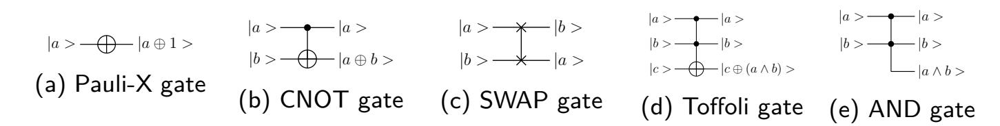
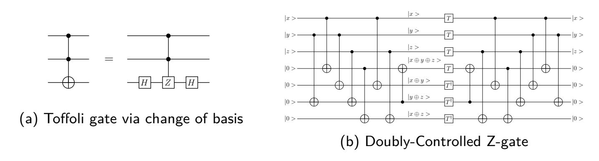
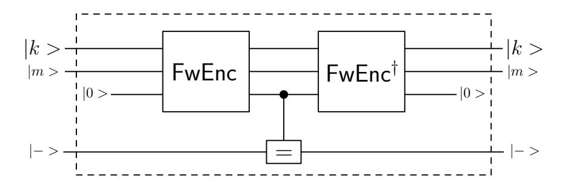
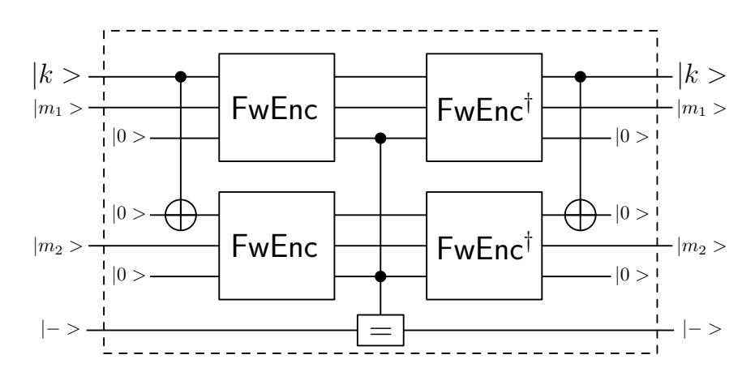
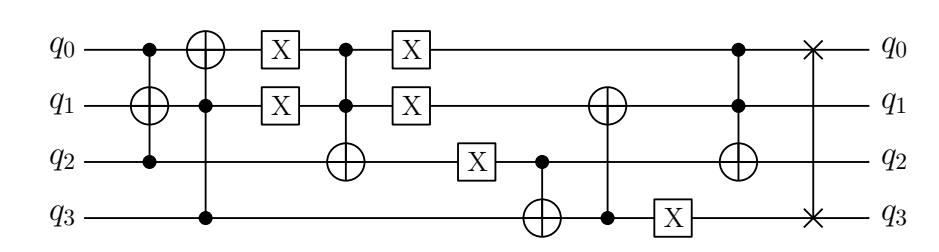
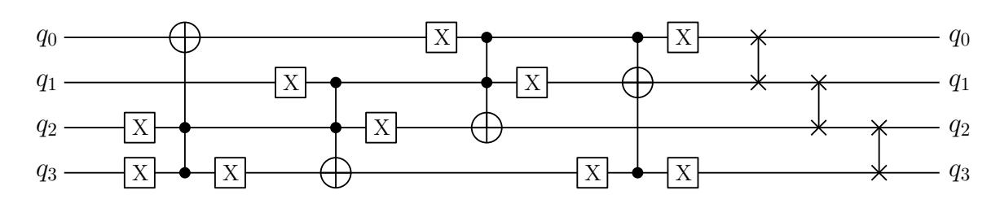
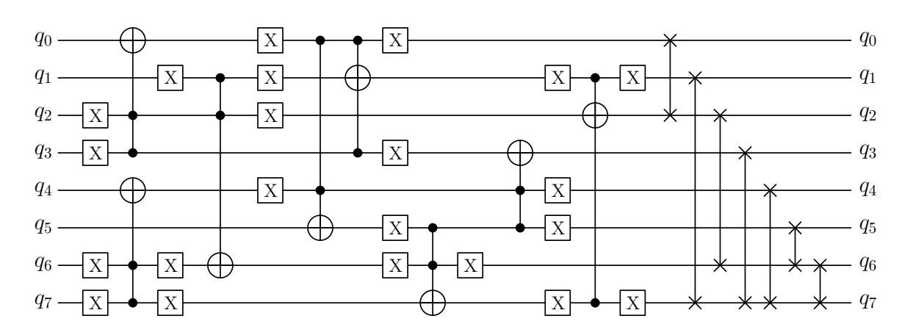
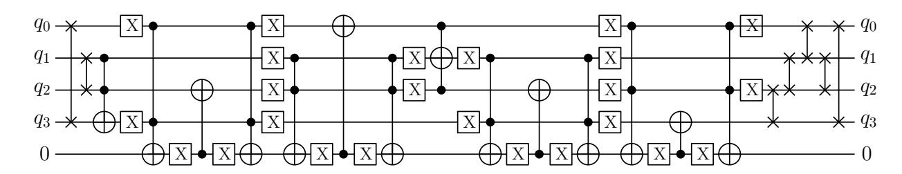
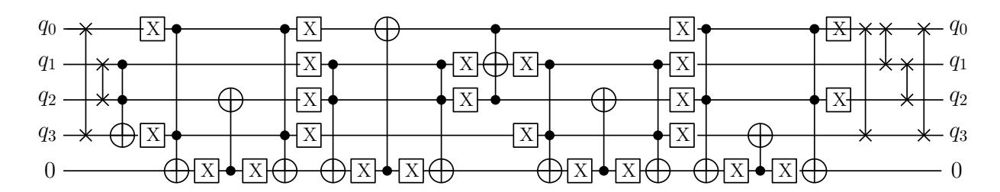

{0}------------------------------------------------

# **Quantum Search for Lightweight Block Ciphers: GIFT, SKINNY, SATURNIN**

Subodh Bijwe1 , Amit Kumar Chauhan1 , and Somitra Kumar Sanadhya2

> 1 Indian Institute of Technology Ropar, India {2019aim1011, 2017csz0008}@iitrpr.ac.in

**Abstract.** Grover's search algorithm gives a quantum attack against block ciphers with query complexity *O*( √ *N*) to search a keyspace of size *N*, when given a sufficient number of plaintext-ciphertext pairs. A recent result by Jaques et al. (EUROCRYPT 2020) presented the cost estimates of quantum key search attacks against AES under different security categories as defined in NIST's PQC standardization process. In this work, we extend their approach to lightweight block ciphers for the cost estimates of quantum key search attacks under circuit depth restrictions. We present quantum circuits for the lightweight block ciphers GIFT, SKINNY, and SATURNIN. We give overall cost in both the gate count and depth-times-width cost metrics, under NIST's maximum depth constraints. We also provide Q# implementation of the full Grover oracles for all versions of GIFT, SKINNY, and SATURNIN for unit tests and automatic resource estimations.

**Keywords:** Quantum cryptanalysis, quantum search, lightweight block ciphers, GIFT, SKINNY, SATURNIN, Q# programming language.

# **1 Introduction**

Recent advances in quantum computing technologies has prompted the viability of a large-scale quantum computer. Shor's seminal work [\[16\]](#page-25-0) showed that a sufficiently large quantum computer would allow to factor numbers and compute discrete logarithms in polynomial time, which can be devastating to many traditional public-key schemes such as RSA, ECDSA, ECDH. On the other hand, symmetric cryptosystems like block ciphers and hash functions are generally believed to be quantum-immune. The only known principle is the quadratic speed-up over the exhaustive search attacks due to Grover's algorithm [\[9\]](#page-23-0) when attacking symmetric ciphers, and thus doubling the key length addresses the concern.

In 2016, Grassl et al. [\[8\]](#page-23-1) studied the quantum circuits of AES and estimated the cost of quantum resources with minimizing the overall circuit width, i.e., the number of qubits needed needed when applying Grover's algorithm to break AES. Almazrooie et al. [\[1\]](#page-21-0) improved the quantum circuit of AES-128 by reducing the number of Toffoli gates. Amy et al. [\[2\]](#page-21-1) also estimated the cost of generic quantum pre-image attacks on SHA-2 and SHA-3. Later, Langenberg et al. [\[13\]](#page-25-1) proposed an

2 Indian Institute of Technology Jodhpur, India somitra@iitj.ac.in

{1}------------------------------------------------

optimized quantum circuit of S-box based on the different S-box design approach by Boyar and Peralta [\[5\]](#page-22-0), which improved the previous works [\[1,](#page-21-0) [8\]](#page-23-1) by reducing the total number of Toffoli gates. Recently, Zou et al. [\[20\]](#page-25-2) improved greatly the required number of qubits in designing quantum circuit of AES by introducing an optimized implementation of inverse S-box operation.

Since quantum computers are still in the early stage of its development, it is difficult to decide the exact cost for each gate. The previous works [\[1,](#page-21-0) [8,](#page-23-1) [13,](#page-25-1) [19,](#page-25-3) [20\]](#page-25-2) focused on reducing the number of *T* gates and the number of qubits in their circuit construction. In contrast, Kim et al. [\[12\]](#page-24-0) discussed the time-space trade-offs for quantum resources needed for key search on block ciphers. They also proposed various parallelization strategies for Grover's algorithm to address the depth constraint. Nevertheless, NIST has also initiated a process to solicit, evaluate, and standardize one or more quantum-resistant public-key cryptographic algorithms [\[14\]](#page-25-4). NIST also suggests various security categories where quantum attacks are restricted to a fixed quantum circuit depth, by a parameter named MAXDEPTH. The limitations from NIST motivated the need to provide better resource estimations for the number of qubits, the number of Clifford+*T* gates required to break either AES or SHA-3.

Recently, Jaques et al. [\[10\]](#page-24-1) studied the quantum key-search attacks against AES under NIST's MAXDEPTH constraint [\[14\]](#page-25-4) at the cost of few qubits. As a working example, they implemented the full Grover's oracle for key search on AES and LowMC in Q# quantum programming language. They offer a specific implementation that gives precise cost estimates of resources that would be required to run the algorithm on quantum computer. They also reviewed the time-space trade-offs of parallelization strategies to overcome the MAXDEPTH constraint from NIST. They proposed quantum circuits of AES and LowMC while minimizing the gate-count depth-times-width cost metrics, under the MAXDEPTH constraint.

**Our contributions.** In this work, we present quantum circuits for lightweight block ciphers – GIFT, SKINNY, and SATURNIN. To implement the full quantum circuits of these ciphers, we separately present the quantum circuits for S-box, SboxLayer, and the permutation layer. For the invertible linear maps, we adopt an in-place PLU decomposition method as implemented in SageMath [\[18\]](#page-25-5). We derive the lower cost estimates for the number of qubits, the number of Clifford+*T* gates, the T-depth and overall circuit depth. We also provide the precise cost estimates for quantum key search attacks in both the gate count and depth-times-width cost metrics.

We implement the full Grover oracles for GIFT-64, GIFT-128, SKINNY-64, SKINNY-128, and SATURNIN-256 in Q# quantum programming language [\[17\]](#page-25-6) for unit tests and automatic resource estimations. We then derive the Grover based key-search cost estimates against all the versions of these ciphers under different security categories as defined by the NIST-PQC standardization process. The source code of Q# implementations of Grover oracles for GIFT-64, GIFT-128, SKINNY-64, SKINNY-128 and SATURNIN-256 is publicly available[3](#page-1-0) under a free

3 <https://github.com/amitcrypto/LWC-Q>

{2}------------------------------------------------

license to allow independent verification of our results.

**Organization.** In Section 2, we review basic facts concerning quantum computation and quantum search. In Section 2.3, we examine how the Grover search works with parallelization improving upon the generic Grover-based attacks. Sections 3, 4 and 5 describe the quantum circuits for block ciphers GIFT, SKINNY and SATURNIN, and also provide the cost estimates for each of their components. In Section 6, we estimate the resources needed for quantum key search attack against GIFT, SKINNY and SATURNIN in both the gate count and depth-time-width cost models. In Section 7, we conclude this work.

### 2 Preliminaries

### 2.1 Quantum computation

A quantum computer acts on quantum states by applying quantum gates to its quantum bits (qubits). A qubit ( $|0\rangle$  or  $|1\rangle$ ) is a quantum system defined over a finite set  $B=\{0,1\}$ . The state of a 2-qubit quantum system  $|\psi\rangle$  is the superposition defined as  $|\psi\rangle=\alpha\,|0\rangle+\beta\,|1\rangle$ , where  $\alpha,\beta\in\mathbb{C}$  and  $|\alpha|^2+|\beta|^2=1$ . In general, the states of an n-qubit quantum system can be described as unit vectors in  $\mathbb{C}^{2^n}$  under the orthonormal basis  $\{|0\dots00\rangle,|0\dots01\rangle,\dots|1\dots11\rangle\}$ , alternatively written as  $\{|i\rangle:0\leq i<2^n\}$ . Any quantum algorithm is described by a sequence of gates in the form of a quantum circuit, and all quantum computations are reversible. The algorithms we analyze are considered in a fault-tolerant era of quantum computing, where quantum error correction enables large computations. As surface codes are the most promising error correction candidate today [7], we focus on costs relevant to surface codes. We pay special attention to the number of T-gates, which are the most expensive gate on surface codes.

We use the universal fault-tolerant Clifford+T gate set. The Clifford group for any number of qubits can be generated by the Hadamard gate H, the phase gate  $S=T^2$ , the controlled not-gate (CNOT), and unit scalars. As usual, we write X, Y, and Z for the Pauli operators.

$$H = \frac{1}{\sqrt{2}} \begin{pmatrix} 1 & 1 \\ 1 & -1 \end{pmatrix}, \qquad S = \begin{pmatrix} 1 & 0 \\ 0 & i \end{pmatrix},$$
$$X = \begin{pmatrix} 0 & 1 \\ 1 & 0 \end{pmatrix}, \qquad Y = \begin{pmatrix} 0 & -i \\ i & 0 \end{pmatrix}, \qquad Z = \begin{pmatrix} 1 & 0 \\ 0 & -1 \end{pmatrix}.$$

To design quantum circuits for block ciphers, we use only Pauli-X (NOT), CNOT, SWAP, Toffoli, and AND gates, together with measurements (denoted throughout as M gates). These gates act like classical bit operations on bitstrings, hence they are efficient to simulate. A SWAP gate can be implemented using three CNOT gates, though we assume that its implementation is free as it can be executed via rewiring only. A quantum AND gate has the same functionality as a Toffoli gate, except the target qubit is assumed to be in the state  $|0\rangle$ , rather than an arbitrary state. The Toffoli and AND gates are further decomposed into Clifford+T gates, and only

{3}------------------------------------------------

Toffoli and AND require T gates. Figure 1 illustrates the quantum gates we use to implement reversible classical circuits.

Fig. 1: Quantum gates used in quantum implementations of classical circuits

For the implementation of Toffoli gate, we adopt Selinger's approach [15] which considers that the Toffoli gate is equivalent to a doubly-controlled Z-gate via a basis change (see Figure 2a). Let  $|xyz\rangle$  be a computational basis state, where  $x,y,z\in\{0,1\}$ . The effect of the doubly-controlled Z-gate is to map  $|xyz\rangle$  to  $(-1)^{xyz}|xyz\rangle$ . Figure 2 shows the implementation of Toffoli gate of T-depth 1 and overall depth 7 with 7 T gates, 16 CNOT gates, 2 single-qubit Clifford gates and 4 ancillas.

Fig. 2: T-depth 1 representation of the Toffoli gate [15]

We use Q# programming language [17] to implement the block ciphers. For the Q# simulator to run, we are required to use the Microsoft QDK standard library's Toffoli gate for evaluating both Toffoli and AND gates, which results in deeper than necessary circuits. The AND gate designs we chose use measurements, hence CNOT, single-qubit Clifford, measurement and depth counts are probabilistic. As mentioned in [10], we remark that Q# simulator does not currently support PRNG seeding for de-randomizing the measurements (see https://github.com/microsoft/qsharp-runtime/issues/30), which means that estimating differently sized circuits with the same or similar depth (or re-estimating the same circuit multiple times) may result in slightly different numbers.

### 2.2 The key-search problem for block ciphers

Let  $E: \{0,1\}^k \times \{0,1\}^n \to \{0,1\}^n$  be a block cipher with block size n and a key size k for a key  $K \in \{0,1\}^k$ . Given a sufficient number of plaintext-ciphertext pairs,

{4}------------------------------------------------

our goal is to recover the unknown key *K* by exhaustive search methods. Formally, these plaintext-ciphertext pairs are given in the following set:

$$\{(P_1, C_1), \dots, (P_r, C_r) \in \{0, 1\}^n \times \{0, 1\}^n : E(K, P_i) = C_i\}$$
 (1)

for some unknown user's key *K* ∈ {0*,* 1} *k* . The exhaustive search method can be modelled by a special Boolean function *f* : {0*,* 1} *k* → {0*,* 1} which is defined as

$$f_r(K) = \begin{cases} 1, & \text{if } E(K, P_i) = C_i \text{ for all } 1 \le i \le r \\ 0, & \text{otherwise.} \end{cases}$$
 (2)

so that we can evaluate *fr* upon elements of the domain {0*,* 1} *k* until we find the unique element (the user's key) for which we are searching.

For a fixed plaintext *P*, the encryption function *E*(·*, P*) : {0*,* 1} *k* → {0*,* 1} is expected to act as a pseudorandom function. Now let *K* be the correct key that is used for the encryption. It follows that for a single plaintext block of length *n*, we have Pr[*E*(*K, P*) = *E*(*K*0 *, P*)] = 2−*n*. For *r* plaintext blocks given in equation [\(1\)](#page-4-1), we have

$$\Pr[(E(K, P_1), \dots, E(K, P_r)) = (E(K', P_1), \dots, E(K', P_r))] = \prod_{i=0}^{r-1} \frac{1}{2^n - i}$$
 (3)

which is 2 −*rn* for *r* 2 ≤ 2 *n*. Since the number of keys different from *K* is 2 *k* − 1, we expect number of spurious keys for an *t*-block plaintext to be (2*k*−1)*.*2 −*rn* ≈ 2 *k*−*rn*. Therefore, we must choose *r* such that the chance of obtaining such a spurious key is negligible if we are performing a search via evaluating *fr*. The probability that *K* is the unique key consistent with *r* plaintext-ciphertext pairs is *e* −2 *k*−*rn* (see Section 2.2 of [\[10\]](#page-24-1)). Thus, if *rn* = *k* + 10 gives the probability 0*.*999 for correctly identifying the key. When *rn* = *k*, the probability for identifying a unique key is 1 *e* ≈ 0*.*37. Hence, *r* must be at least d *k n* e.

The classical exhaustive search for the user's key would require on average *O*(2*k* ) classical evaluations of *fr* : {0*,* 1} *k* → {0*,* 1}. On the other hand, Grover's quantum search algorithm [\[9\]](#page-23-0) gives us the user's key with high probability if we implement *fr* : {0*,* 1} *k* → {0*,* 1} as a quantum circuit and then we need to execute this quantum circuit *O*(2*k/*2 ) times. This quantum circuit is referred as a quantum oracle and has a non-trivial cost to implement, and can be constructed out of *r* quantum circuits which each evaluate GIFT, SKINNY, and SATURNIN.

### **2.3 Grover's search algorithm**

We briefly recall the interface that we need to provide for realizing a key search, namely Grover's algorithm [\[9\]](#page-23-0). Given a search space of 2 *k* elements, say {*x* : *x* ∈ {0*,* 1} *k*} and a Boolean function or predicate *f* : {0*,* 1} *n* → {0*,* 1}, the Grover's algorithm requires about *O*( √ 2 *k*) evaluations of the quantum oracle U*f* that outputs 

{5}------------------------------------------------

 $\sum_x a_x |x\rangle |y \oplus f(x)\rangle$  upon input of  $\sum_x a_x |x\rangle |y\rangle$ . First, we construct a uniform superposition of states

$$|\psi\rangle = \frac{1}{\sqrt{2^k}} \sum_{x \in \{0,1\}^k} |x\rangle,$$

by applying the Hadamard transformation  $H^{\otimes k}$  to  $|0\rangle^{\otimes k}$ . We prepare the joint state  $|\psi\rangle\otimes|\phi\rangle$  with  $|\psi\rangle$  and  $|\phi\rangle=(|0\rangle-|1\rangle)/\sqrt{2}$ . We define the Grover operator G as

$$G = (2 |\psi\rangle \langle \psi| - I) U_f,$$

where  $(2|\psi\rangle\langle\psi|-I)$  can be viewed as an inversion about the mean amplitude. We then iteratively apply the Grover operator  $(2|\psi\rangle\langle\psi|-I)\mathcal{U}_f$  to  $|\psi\rangle$  such that the amplitudes of those values x with f(x)=1 are amplified. Each iteration can be viewed as a rotation of the state vector in the plane spanned by two orthogonal vectors; the superposition of all indices corresponding to solutions and non-solutions, respectively. The operator G rotates the vector by a constant angle towards the superposition of solution indices. Let  $1 \leq M \leq N$  be the number of solutions and let  $0 < \theta \leq \pi/2$  such that  $\sin^2(\theta) = M/N$ .

When measuring the first qubits after j>0 iterations of G, the success probability p(j) for obtaining one of the solutions is  $p(j)=\sin^2((2j+1)\theta)$ , which is close to 1 for  $j\approx\frac{\pi}{4\theta}$ . Hence, after  $\left\lceil\frac{\pi}{4}\sqrt{\frac{N}{M}}\right\rceil$  iterations, measurement yields a solution with overwhelming probability of at least  $1-\frac{N}{M}$ . The exact complexity of the Grover search can be estimated by implementing the oracle circuit efficiently. It is thus essential to have a precise estimate of the quantum resources needed to implement the oracle.

### 2.4 Grover oracle

As explained above in subsections 2.2 and 2.3, we need to design a Grover oracle to implement the Grover's algorithm and we also need a sufficient number of known plaintext-ciphertext pairs to recover the key successfully. The Grover oracle encrypts r plaintext blocks under the same candidate key and computes a Boolean value that encodes whether all r resulting ciphertext blocks match the given classical results. A circuit for the block cipher allows us to build an oracle for any r by simply fanning out the key qubits to the r instances and running the r block cipher circuits in parallel. Then a comparison operation with the classical ciphertexts conditionally flips the result qubit and the r encryptions are uncomputed. The constructions of such an oracle are shown in Figures 3 and 4 for r=1 and r=2 respectively.

### 2.5 Cost metrics for quantum circuits

In this work, we consider the two cost metrics proposed by Jaques and Schanck [11]. The fist cost metric is the G-cost as the total number of gates. The second cost metric is the DW-cost as the product of circuit depth and width.

{6}------------------------------------------------

Fig. 3: Grover oracle construction for block cipher using single message-ciphertext pair. FwEnc represents the ForwardEncryption operator. The middle operator (=) compares the output of Encryption operation with the provided ciphertexts and flips the target qubit if they are equal.

Fig. 4: Grover oracle construction for block cipher using two message-ciphertext pairs. FwEnc represents the ForwardEncryption operator. The middle operator (=) compares the output of Encryption operation with the provided ciphertexts and flips the target qubit if they are equal.

From the recent work by Jaques et al. [10], we briefly recall the following discussion on the cost of Grover's algorithm with or without depth restriction.

The cost of Grover's algorithm. Let the search space have size  $N=2^k$ . Suppose we use an oracle G such that a single Grover iteration costs  $\mathsf{G}_g$  gates, has depth  $\mathsf{G}_d$ , and uses  $\mathsf{G}_w$  qubits. Let  $S=2^s$  be the number of parallel machines that are used with the inner parallelization method by dividing the search space in S disjoint parts. In order to achieve a certain success probability p, the required number of iterations can be deduced from  $p \leq \sin^2((2j+1)\theta)$  which yields  $j_p = \lceil (\sin^{-1}(\sqrt{p})/\theta - 1)/2 \rceil \approx \sin^{-1}(\sqrt{p})/2 \cdot \sqrt{N/S}$ . Let  $c_p = \sin^{-1}(\sqrt{p})/2$ , then the total depth of a  $j_p$ -fold Grover iteration is

$$D = j_p \mathsf{G}_d \approx c_p \sqrt{N/S}.\mathsf{G}_d = c_p 2^{\frac{k-s}{2}} \mathsf{G}_d \text{ cycles.} \tag{4}$$

Each machines uses  $j_p \mathsf{G}_g \approx c_p \sqrt{N/S}.\mathsf{G}_g = c_p 2^{\frac{k-s}{2}} \mathsf{G}_g$  gates, i.e., the total G-cost over all S machines is

$$G = S.j_p \mathsf{G}_g \approx c_p \sqrt{N.S}.\mathsf{G}_g = c_p 2^{\frac{k+s}{2}} \mathsf{G}_g \text{ cycles.}$$
 (5)

{7}------------------------------------------------

Finally the total width is *W* = *S.*G*w* = 2*s*G*w* qubits, which leads to a DW-cost

$$DW \approx c_p \sqrt{N.S}.\mathsf{G}_d\mathsf{G}_w = c_p 2^{\frac{k+s}{2}}\mathsf{G}_d\mathsf{G}_w$$
 qubit-cycles. (6)

These cost expressions show that minimizing the number *S* = 2*s* of parallel machines minimizes both G-cost and DW-cost. Thus, under fixed limits on depth, width, and the number of gates, an adversary's best course of action is to use the entire depth budget and parallelize as little as possible. Under this premise, the depth limit fully determines the optimal attack strategy for a given Grover oracle.

**Optimizing the oracle under a depth limit.** Grover's full algorithm does not parallelize well; thus it is generally preferable to parallelize it within the oracle circuit. Reducing its depth allows more iterations within the depth limit, hence reducing the necessary parallelization.

Let *Dmax* be a fixed depth limit. Given the depth G*d* of the oracle, we are able to run *jmax* = b*Dmax/*G*d*c Grover iterations of the oracle *G*. For a target success probability *p*, we obtain the number *S* of parallel instances to achieve this probability in the instance whose keyspace partition contains the key from

$$S = \left\lceil \frac{N \cdot \sin^{-1}(\sqrt{p})}{(2 \cdot \lfloor D_{max}/\mathsf{G}_d \rfloor + 1)^2} \right\rceil \approx c_p^2 2^k \frac{\mathsf{G}_d^2}{D_{max}^2}.$$
 (7)

Using this in equation [\(5\)](#page-6-2) give the total gate count of

$$G = c_p^2 2^k \frac{\mathsf{G}_d \mathsf{G}_g}{D_{max}^2} \text{ gates.} \tag{8}$$

The total DW-cost under the depth constraint is

$$DW = c_p^2 2^k \frac{\mathsf{G}_d^2 \mathsf{G}_w}{D_{max}^2} \text{ qubit-cycles.} \tag{9}$$

Therefore, our goal is to minimize G2 *d*G*w* cost of the oracle circuit to minimize total DW-cost. In its call for proposals to the post-quantum cryptography standardization effort [\[14\]](#page-25-4), NIST introduces the parameter MAXDEPTH as such a bound and suggests that reasonable values are between 2 40 and 2 96. Whenever an algorithm's overall depth exceeds this bound, parallelization becomes necessary. We assume that MAXDEPTH constitutes a hard upper bound on the total depth of a quantum attack, including possible repetitions of a Grover instance.

# **3 A quantum circuit for GIFT-128**

GIFT [\[3\]](#page-22-1) is family of lightweight block ciphers with SPN structure consists of two ciphers, namely GIFT-64/128 and GIFT-128/128. GIFT-64/128 uses 64-bit plaintext, 128-bit initial key and consists of 28 rounds. Whereas GIFT-128/128 uses 128-bit plaintext, 128-bit initial key and consists of 40 rounds. We implement GIFT in Q# programming language and provide the cost for full quantum circuits 

{8}------------------------------------------------

of GIFT-64/128 and GIFT-128/128.

**Round function.** Each round of GIFT-64/128 and GIFT-128/128 consists of there major subroutines: SubCells, PermBits and AddRoundKey, which are described as follows:

- **Initialization:** The cipher receives an *n*-bit plaintext *bn*−1*bn*−2 *. . . b*0 as the cipher state *S*, where *n* = 64*,* 128 and *b*0 being the least significant bit. The cipher state can also be expressed as *s* many 4-bit nibbles *S* = *ws*−1||*ws*−2|| *. . .* ||*w*0, where *s* = 16*,* 32. The cipher also receives a 128-bit key *K* = *k*7||*k*6|| *. . .* ||*k*0 as the key state, where *ki* is a 16-bit word.
- **SubCells:** The S-box is applied to each nibble of the cipher state *X*. The GIFT S-box is given in Table [1.](#page-8-0)

| x       | 0 | 1  | 2 | 3  | 4 | 5  | 6 | 7 | 8 | 9  | 10 | 11 | 12 | 13 | 14 | 15 |
|---------|---|----|---|----|---|----|---|---|---|----|----|----|----|----|----|----|
| GS(x) 1 |   | 10 | 4 | 12 | 6 | 15 | 3 | 9 | 2 | 13 | 11 | 7  | 5  | 0  | 8  | 14 |

Table 1: Specifications of 4-bit S-box of GIFT.

The quantum circuit implementation of GIFT S-box requires 4 Toffoli gates, 2 CNOT gates, and 6 Pauli-X gates. We ignore the SWAP gate as it can be implemented freely via reshuffling of wires. The quantum circuit for 4-bit S-box is shown in Figure [5.](#page-8-1)

Fig. 5: In-place implementation of 4-bit S-box of GIFT.

• **PermBits:** The bit permutations used in GIFT-64/128 and GIFT-128/128 maps bits from bit position *i* of the cipher state to bit position *P*(*i*). As given in [\[3\]](#page-22-1), the permutation *P*64(*i*) and *P*128(*i*) are defined as

$$\begin{split} P_{64}(i) &= 4 \left \lfloor \frac{i}{16} \right \rfloor + 16 \left( \left( 3 \left \lfloor \frac{i \bmod 16}{4} \right \rfloor + (i \bmod 4) \right) \bmod 4 \right) + (i \bmod 4) \\ P_{128}(i) &= 4 \left \lfloor \frac{i}{16} \right \rfloor + 32 \left( \left( 3 \left \lfloor \frac{i \bmod 16}{4} \right \rfloor + (i \bmod 4) \right) \bmod 4 \right) + (i \bmod 4) \end{split}$$

{9}------------------------------------------------

The quantum circuit implementation of PermBits operation requires no quantum gates, since it is just a permutation of qubits which can be taken care of during the code implementation of wires.

• **AddRoundKey:** This step consists of adding the round key and round constants. An *n/*2-bit round key *RK* is extracted from the key state, it is further partitioned into 2 *s*-bit words *RK* = *U*||*V* = *u*31 *. . . u*0||*v*31 *. . . v*0, where *s* = 16*,* 32 for GIFT-64/128 and GIFT-128/128 respectively.

For GIFT-64/128, *U* and *V* are xored to *b*4*i*+1 and *b*4*i* of the cipher state.

$$b_{4i+1} \leftarrow b_{4i+1} \oplus u_i, b_{4i} \leftarrow b_{4i} \oplus v_i, \forall i \in \{0, \dots, 15\}.$$

For GIFT-128/128, *U* and *V* are xored to *b*4*i*+2 and *b*4*i*+1 of the cipher state.

$$b_{4i+2} \leftarrow b_{4i+2} \oplus u_i, b_{4i+1} \leftarrow b_{4i+1} \oplus v_i, \forall i \in \{0, \dots, 31\}.$$

Furthermore, a single bit "1" and a 6-bit round constant *C* = *c*5 *. . . c*0 are xored into the cipher state at bit position 127, 23, 19, 15, 11, 7 and 3 respectively.

The quantum circuit implementation of AddRoundKey operation requires 32 CNOT gates for one round of GIFT-64/128. While the quantum circuit implementation of AddRoundKey operation requires 64 CNOT gates for one round of GIFT-128/128.

**Key schedule and round constants.** The key schedule and round constants are the same for both versions of GIFT, the only difference is the round key extraction. A round key is first extracted from the key state before updating the key state.

For GIFT-64, two 16-bit words of the key state are extracted as *RK* = *U*||*V* .

$$U \leftarrow k_1, V \leftarrow k_0.$$

For GIFT-128, four 16-bit words of the key state are extracted as *RK* = *U*||*V* .

$$U \leftarrow k_5 || k_4, V \leftarrow k_1 || k_0.$$

The key state is then updated as follows:

$$k_7||k_6||\dots||k_0 \leftarrow k_1 \gg 2||k_0 \gg 12||k_7||\dots||k_2,$$

where ≫ *i* is an *i* bits right rotation within a 16-bit word.

The round constants are generated using the same 6-bit affine LFSR as Skinny-128, whose state is denoted as (*c*5*, c*4*, c*3*, c*2*, c*1*, c*0). Its update function is defined as:

$$(c_5, c_4, c_3, c_2, c_1, c_0) \leftarrow (c_4, c_3, c_2, c_1, c_0, c_5 \oplus c_4 \oplus 1).$$

{10}------------------------------------------------

The quantum circuit implementation of updating the key state requires no quantum gates since it is just a permutation of wires which can be taken care of during the code implementation of wires. We precompute the round constants, and thus adding them to proper qubits in each round requiring only Pauli-X gates. The number of Pauli-X gates depends on the number of ones in round constants.

### **3.1 Quantum resource estimates of GIFT-128**

Here, we give the precise cost estimates for the quantum circuits of GIFT-64/128 and GIFT-128/128. The GIFT S-box can be naturally implemented using Toffoli gates. We use the Toffoli gate implementation with no measurements from Selinger's work [\[15\]](#page-25-7), i.e., a Toffoli gate can be implemented using 7 *T* gates, 16 CNOT gates, 2 single-qubit Clifford gates, and 4 ancillas with having *T*-depth one and overall depth 7. We implement all the subroutines: SubCells, PermBits, AddRoundKey, KeySchedule, and AddRoundConstants operations implemented in Q# programming language. The cost estimates for one round of GIFT-64/128 and GIFT-128/128 are given in Tables [2](#page-10-1) and [3](#page-11-0) respectively. We remark that the number of single-qubit Clifford gates for AddConstants may vary depending on the number of ones in round constants. The total cost estimates of full GIFT-64/128 and GIFT-128/128 encryption circuits are given in Table [4.](#page-11-1) We emphasize that the numbers given in Table [4](#page-11-1) includes the cost estimates for two encryption calls made in Grover oracle since we need to reverse all the operations executed on the wires (see Figure [3\)](#page-6-0).

| Operation      |      |     |     |   |   |    | #CNOT #1qClifford #T #M T-depth full depth initial width ancillas |   |
|----------------|------|-----|-----|---|---|----|-------------------------------------------------------------------|---|
| In-place S-box | 66   | 14  | 28  | 0 | 4 | 32 | 4                                                                 | 4 |
| SubCells       | 1056 | 224 | 448 | 0 | 4 | 32 | 64                                                                | 4 |
| PermBits       | 0    | 0   | 0   | 0 | 0 | 0  | 64                                                                | 0 |
| AddRoundKey    | 32   | 0   | 0   | 0 | 0 | 1  | 192                                                               | 0 |
| KeySchedule    | 0    | 0   | 0   | 0 | 0 | 0  | 128                                                               | 0 |
| AddConstants   | 0    | 4   | 0   | 0 | 0 | 1  | 128                                                               | 0 |
| Total cost     | 1088 | 228 | 448 | 0 | 4 | 33 | 192                                                               | 4 |

Table 2: Cost of in-place circuits implementing one round of GIFT-64/128.

# **4 A quantum circuit for SKINNY-128**

SKINNY [\[4\]](#page-22-2) is a family of lightweight tweakable block ciphers, with several block sizes and tweakey sizes, namely SKINNY-64/64, SKINNY-64/128, SKINNY-64/192 and SKINNY-128/128, SKINNY-128/256, SKINNY-128/384. The internal state of SKINNY can be viewed as a (4 × 4) square array of cells, where each cell is a nibble (in the *n* = 64 case) or a byte (in *n* = 128 case). The number of rounds depends upon the tweakey size, for example, SKINNY-64/64 has 32 rounds, and

{11}------------------------------------------------

| Operation      |      |     |     |   |   |    | #CNOT #1qClifford #T #M T-depth full depth initial width ancillas |   |
|----------------|------|-----|-----|---|---|----|-------------------------------------------------------------------|---|
| In-place S-box | 66   | 14  | 28  | 0 | 4 | 32 | 4                                                                 | 4 |
| SubCells       | 2112 | 448 | 896 | 0 | 4 | 32 | 128                                                               | 4 |
| PermBits       | 0    | 0   | 0   | 0 | 0 | 0  | 128                                                               | 0 |
| AddRoundKey    | 64   | 0   | 0   | 0 | 0 | 1  | 256                                                               | 0 |
| KeySchedule    | 0    | 0   | 0   | 0 | 0 | 0  | 128                                                               | 0 |
| AddConstants   | 0    | 4   | 0   | 0 | 0 | 1  | 128                                                               | 0 |
| Total cost     | 2176 | 452 | 896 | 0 | 4 | 33 | 256                                                               | 4 |

Table 3: Cost of in-place circuits implementing one round of GIFT-128/128.

| Operation           |       | #CNOT #1qClifford | #T    |   |     | #M T-depth full depth width |     |
|---------------------|-------|-------------------|-------|---|-----|-----------------------------|-----|
| GIFT-64/128         | 61056 | 12768             | 25088 | 0 | 224 | 1851                        | 260 |
| GIFT-128/128 174336 |       | 36160             | 71680 | 0 | 320 | 2643                        | 388 |

Table 4: Cost estimates for the full encryption circuits of GIFT.

SKINNY-128/128 has 40 rounds. We implement SKINNY in Q# programming language and provide the cost full quantum circuits of all versions of SKINNY-64 and SKINNY-128.

**Round function.** Each round of Skinny-128 is composed of five operations: SubCells (SC), AddConstants (AC), AddRoundTweakey (ART), ShiftRows (SR) and MixColumns (MC).

• **SubCells:** A *s*-bit S-box is applied to every cell of the cipher internal state. For *s* = 4*,* 8, SKINNY cipher uses a S-box *S*4 and *S*8 respectively. The Sbox is applied to every cell of the internal state *X*.

The S-box *S*4 can be described with four NOR and four XOR operations. If *x*0*, . . . , x*3 represent the eight input bits of the S-box, it basically applies the following transformation on the 4-bit state:

$$(x_3, x_2, x_1, x_0) \to (x_3, x_2, x_1, x_0 \oplus (\overline{x_3 \vee x_2})),$$

followed by a left shift bit rotation.

An 8-bit Sbox is applied to every cell of the internal state *X*. If *x*0*, . . . , x*7 represent the eight input bits of the Sbox, it basically applies the following transformation on the 8-bit state:

$$(x_7, x_6, x_5, x_4, x_3, x_2, x_1, x_0) \to (x_7, x_6, x_5, x_4 \oplus (\overline{x_7 \vee x_6}), x_3, x_2, x_1, x_0 \oplus (\overline{x_3 \vee x_2})),$$

followed by the bit permutation:

$$(x_7, x_6, x_5, x_4, x_3, x_2, x_1, x_0) \rightarrow (x_2, x_1, x_7, x_6, x_4, x_3, x_3, x_5),$$

{12}------------------------------------------------

repeating this process 4 times, except the last iteration where there is just a bit swap between *x*1 and *x*2.

The quantum circuit for 4-bit S-box and 8-bit S-box are shown in Figures [6](#page-12-0) and [7](#page-12-1) respectively. The quantum circuit implementation of 4-bit S-box operation requires 4 Toffoli gates and 10 Pauli-X gates. The quantum circuit implementation of 8-bit S-box operation requires 8 Toffoli gates and 22 Pauli-X gates. We ignore the count of SWAP gates as these can be implemented freely via simple reshuffling of wires.

Fig. 6: In-place implementation of 4-bit S-box of SKINNY-64.

Fig. 7: In-place implementation of 8-bit S-box of SKINNY-128.

• **AddConstants:** A 6-bit affine LFSR, whose state is denoted as (*rc*5*, rc*4*, rc*3*, rc*2*, rc*1*, rc*0) and is used to generate round constants. Its update function is defined as

$$(rc_5, rc_4, rc_3, rc_2, rc_1, rc_0) \rightarrow (rc_4, rc_3, rc_2, rc_1, rc_0, rc_4 \oplus rc_4 \oplus 1).$$

The six bits are initialized to zero, and updated before use in a given round. The bits from LFSR are arranged into one 4 × 4 array (only the first column of the state is affected by the LFSR bits), depending on the internal state's size.

$$\begin{pmatrix}
c_0 & 0 & 0 & 0 \\
c_1 & 0 & 0 & 0 \\
c_2 & 0 & 0 & 0 \\
0 & 0 & 0 & 0
\end{pmatrix}$$

{13}------------------------------------------------

with *c*2 = 0x2 and

$$(c_0, c_1) = (0||0||0||0||rc_3||rc_2||rc_1||rc_0, 0||0||0||0||0||0||rc_5||rc_4).$$

The round constants are combined with the state, respecting array positioning, using bitwise exclusive-or. We precompute all the round constants, and thus adding constants to proper qubits in each round requires only Pauli-X gates. The number of Pauli-X gates depends on the the number of ones in each round constant.

- **AddRoundTweakey:** The first and second rows of all tweakey arrays are extracted and bitwise exclusive-xored to the cipher internal state *X*. More formally, for *i* = {0*,* 1} and *j* = {0*,* 1*,* 2*,* 3}, we have:
  - *Xi,j* = *Xi,j* ⊕ *TK*1*i,j* when *z* = 1
  - *Xi,j* = *Xi,j* ⊕ *TK*1*i,j* ⊕ *TK*2*i,j* when *z* = 2
  - *Xi,j* = *Xi,j* ⊕ *TK*1*i,j* ⊕ *TK*2*i,j* ⊕ *TK*3*i,j* when *z* = 3.

Tweakey arrays are updated according to a fixed permutation as given in [\[4\]](#page-22-2).

The quantum circuit implementation of AddRoundTweakey operation for SKINNY-128 with 128-bit tweakey size requires (8 × 6) = 48 CNOT gates.

• **ShiftRows:** The rows of the cipher state cell array are rotated to the right. The second, third, and fourth cell rows are rotated by 1, 2, and 3 positions to the right, respectively. This operation is similar to AES.

The quantum circuit implementation of ShiftRows operation is free, since it is just a permutation of qubits which can be taken care of during the code implementation of wires.

• **MixColumns:** Each column of the cipher internal state array is multiplied by the following binary matrix *M* :

$$M = \begin{pmatrix} 1 & 0 & 1 & 1 \\ 1 & 0 & 0 & 0 \\ 0 & 1 & 1 & 0 \\ 1 & 0 & 1 & 0 \end{pmatrix}$$

The PLU decomposition of matrix *M* implemented in SageMath [\[18\]](#page-25-5) gives

$$\begin{pmatrix} 1 & 0 & 1 & 1 \\ 1 & 0 & 0 & 0 \\ 0 & 1 & 1 & 0 \\ 1 & 0 & 1 & 0 \end{pmatrix} = \begin{pmatrix} 1 & 0 & 0 & 0 \\ 0 & 0 & 1 & 0 \\ 0 & 1 & 0 & 0 \\ 0 & 0 & 0 & 1 \end{pmatrix} \cdot \begin{pmatrix} 1 & 0 & 0 & 0 \\ 0 & 1 & 0 & 0 \\ 1 & 0 & 1 & 0 \\ 1 & 0 & 0 & 1 \end{pmatrix} \cdot \begin{pmatrix} 1 & 0 & 1 & 1 \\ 0 & 1 & 1 & 0 \\ 0 & 0 & 1 & 1 \\ 0 & 0 & 0 & 1 \end{pmatrix}$$

The permutation *P* does not require any quantum gates and instead, is realized by appropriately keeping track of the necessary rewiring. While the lower- and upper-triangular components *L* and *U* of the decomposition can be implemented 

{14}------------------------------------------------

using the appropriate CNOT gate. The quantum circuit implementation of binary matrix *M* requires 4 × 6 = 24 CNOT gates and 8 × 6 = 48 CNOT gates for SKINNY-64 and SKINNY-128 respectively. As for the full MixColumns operation, we need to apply *M* four times on each column, therefore, we need (4×24) = 96 and (4×48) = 192 CNOT gates for SKINNY-64 and SKINNY-128 respectively to implement MixColumns operation.

### **4.1 Quantum resource estimates of SKINNY**

Here, we give the cost estimates of the quantum circuits of SKINNY-64 and SKINNY-128 with various tweakey sizes. The SKINNY S-boxes can naturally be implemented using Toffoli gates. We use the Toffoli gate implementation with no measurements from Selinger's work [\[15\]](#page-25-7). We implement all the subroutines: SubCells, AddConstants, AddRoundTweakey, TweakeyUpdate, ShiftRows, and MixColumns in Q# programming language for automatic resource computations. The complete cost estimates of one round and full quantum circuits of SKINNY-64/64 and SKINNY-128/128 are given in Tables [5,](#page-14-1) [6](#page-15-0) and [7](#page-15-1) respectively. We remark that the number of single-qubit Clifford gates for AddConstants may vary depending on the number of ones in round constants. We also emphasize that the numbers given in Table [7](#page-15-1) includes the cost estimates for two encryption calls made in Grover oracle since we need to reverse all the operations executed on the wires (see Figure [3\)](#page-6-0).

| Operation       |      |     |     |   |   |    | #CNOT #1qClifford #T #M T-depth full depth initial width ancillas |   |
|-----------------|------|-----|-----|---|---|----|-------------------------------------------------------------------|---|
| In-place S-box  | 64   | 18  | 28  | 0 | 4 | 32 | 4                                                                 | 4 |
| SubCells        | 1024 | 288 | 448 | 0 | 4 | 32 | 64                                                                | 4 |
| AddConstants    | 0    | 4   | 0   | 0 | 0 | 1  | 64                                                                | 0 |
| AddRoundTweakey | 32   | 0   | 0   | 0 | 0 | 1  | 128                                                               | 0 |
| TweakeyUpdate   | 0    | 0   | 0   | 0 | 0 | 0  | 64                                                                | 0 |
| ShiftRows       | 0    | 0   | 0   | 0 | 0 | 0  | 64                                                                | 0 |
| MixColumns      | 96   | 0   | 0   | 0 | 0 | 5  | 64                                                                | 0 |
| Total cost      | 1152 | 292 | 448 | 0 | 4 | 41 | 128                                                               | 4 |

Table 5: Cost of in-place circuits implementing one round of SKINNY-64/64.

# **5 A quantum circuit for SATURNIN-256**

SATURNIN-256 [\[6\]](#page-23-3) is an SPN based block cipher with an even number of rounds, numbered with 0. The composition of two consecutive rounds is called super-round. It uses a 256-bit internal state *X* and a 256-bit key state *K*, and both are represented as a (4 × 4 × 4)-cube of nibbles. Two additional 16-bit words RC0 and RC1 are also used for generating the successive round constants.

{15}------------------------------------------------

| Operation       |      |     |     |   |   |    | #CNOT #1qClifford #T #M T-depth full depth initial width ancillas |   |
|-----------------|------|-----|-----|---|---|----|-------------------------------------------------------------------|---|
| In-place S-box  | 128  | 38  | 56  | 0 | 4 | 33 | 8                                                                 | 4 |
| SubCells        | 2048 | 608 | 896 | 0 | 4 | 33 | 128                                                               | 4 |
| AddConstants    | 0    | 4   | 0   | 0 | 0 | 1  | 128                                                               | 0 |
| AddRoundTweakey | 64   | 0   | 0   | 0 | 0 | 1  | 256                                                               | 0 |
| TweakeyUpdate   | 0    | 0   | 0   | 0 | 0 | 0  | 128                                                               | 0 |
| ShiftRows       | 0    | 0   | 0   | 0 | 0 | 0  | 128                                                               | 0 |
| MixColumns      | 192  | 0   | 0   | 0 | 0 | 5  | 128                                                               | 0 |
| Total cost      | 2304 | 612 | 896 | 0 | 4 | 42 | 256                                                               | 4 |

Table 6: Cost of in-place circuits implementing one round of SKINNY-128/128.

| Operation             |       | #CNOT #1qClifford | #T    |   |     | #M T-depth full depth width |     |
|-----------------------|-------|-------------------|-------|---|-----|-----------------------------|-----|
| SKINNY-64/64          | 73792 | 18720             | 28672 | 0 | 256 | 2537                        | 196 |
| SKINNY-64/128         | 85888 | 21054             | 32256 | 0 | 288 | 2851                        | 260 |
| SKINNY-64/192         | 98624 | 23396             | 35840 | 0 | 320 | 3176                        | 324 |
| SKINNY-128/128 184448 |       | 48996             | 71680 | 0 | 320 | 3243                        | 388 |
| SKINNY-128/256 228224 |       | 58772             | 86016 | 0 | 384 | 3891                        | 516 |
| SKINNY-128/384 254720 |       | 63666             | 93184 | 0 | 416 | 4215                        | 644 |

Table 7: Cost estimates for full encryption circuits of SKINNY.

**Round function.** Round 0 starts by xoring *K* to the internal state *X*. Then each round applies the internal state by the following transformations:

• **Sbox layer:** An Sbox layer applies a 4-bit S-box *σ*0 to all nibbles with an even index, and a 4-bit S-box *σ*1 to all nibbles with an odd index. These two S-boxes are defined in Table [8,](#page-15-2) and their quantum circuit implementations are shown in Figures [8](#page-16-0) and [9.](#page-16-1)

| x       | 0 | 1 | 2  | 3 | 4  | 5 | 6  | 7  | 8 | 9 | 10 | 11 | 12 | 13 | 14 | 15 |
|---------|---|---|----|---|----|---|----|----|---|---|----|----|----|----|----|----|
| σ0(x) 0 |   | 6 | 14 | 1 | 15 | 4 | 7  | 13 | 9 | 8 | 12 | 5  | 2  | 10 | 3  | 11 |
| σ1(x) 0 |   | 9 | 13 | 2 | 15 | 1 | 11 | 7  | 6 | 4 | 5  | 3  | 8  | 12 | 10 | 14 |

Table 8: Specifications of SATURNIN-256 S-boxes

The quantum circuit implementation SATURNIN S-boxes requires 10 Toffoli gates, 4 CNOT gates, and 24 Pauli-X gates. Additionally, we need 4 qubits and 1 ancilla to implement S-boxes. We ignore the count of SWAP gates as these can be implemented freely via simple reshuffling of wires.

• **Nibble permutation:** A nibble permutation SR*r* depends on the round number *r*. For all even rounds, SR*r* is an identity function. For odd rounds of index

{16}------------------------------------------------

Fig. 8: In-place implementation of 4-bit S-box *σ*0 of SATURNIN-256.

Fig. 9: In-place implementation of 4-bit S-box *σ*1 of SATURNIN-256.

*r* with *r* mod 4 = 1, SR*r* = SRslice maps each nibble with with coordinates (*x, y, z*) to (*x* + *y* mod 4*, y, z*). For odd rounds of index *r* with *r* mod 4 = 3, SR*r* = SRsheet maps each nibble with with coordinates (*x, y, z*) to (*x, y, z* + *y* mod 4).

No quantum gate is required to implement the nibble permutation since it is just a reshuffling of the wires which can be taken care of during the implementation.

• **Linear layer:** A linear layer MC is composed of 16 copies of a linear operation *M* over (F 4 2 ) 4 which is applied in parallel to each column of the internal state. The transformation *M* is defined as

$$M: \begin{pmatrix} a \\ b \\ c \\ d \end{pmatrix} \mapsto \begin{pmatrix} \alpha^2(a) \oplus \alpha^2(b) \oplus \alpha(b) \oplus c \oplus d \\ a \oplus \alpha(b) \oplus b \oplus \alpha^2(c) \oplus c \oplus \alpha^2(d) \oplus \alpha(d) \oplus d \\ a \oplus b \oplus \alpha^2(c) \oplus \alpha^2(d) \oplus \alpha(d) \\ \alpha^2(a) \oplus a \oplus \alpha^2(b) \oplus \alpha(b) \oplus b \oplus c \oplus \alpha(d) \oplus d \end{pmatrix}$$

where *a* is the nibble with the lowest index, and *α* transforms the four bits *x*0*, x*1*, x*2*, x*3 of each nibble by the following multiplication

$$\alpha: \begin{pmatrix} x_0 \\ x_1 \\ x_2 \\ x_3 \end{pmatrix} \mapsto \begin{pmatrix} 0 & 1 & 0 & 0 \\ 0 & 0 & 1 & 0 \\ 0 & 0 & 0 & 1 \\ 1 & 1 & 0 & 0 \end{pmatrix} \begin{pmatrix} x_0 \\ x_1 \\ x_2 \\ x_3 \end{pmatrix}$$

The PLU decomposition of the above binary matrix gives

$$\begin{pmatrix} 0 & 1 & 0 & 0 \\ 0 & 0 & 1 & 0 \\ 0 & 0 & 0 & 1 \\ 1 & 1 & 0 & 0 \end{pmatrix} = \begin{pmatrix} 0 & 1 & 0 & 0 \\ 0 & 0 & 1 & 0 \\ 0 & 0 & 0 & 1 \\ 1 & 0 & 0 & 0 \end{pmatrix} \cdot \begin{pmatrix} 1 & 0 & 0 & 0 \\ 0 & 1 & 0 & 0 \\ 0 & 0 & 1 & 0 \\ 0 & 0 & 0 & 1 \end{pmatrix} \cdot \begin{pmatrix} 1 & 1 & 0 & 0 \\ 0 & 1 & 0 & 0 \\ 0 & 0 & 1 & 0 \\ 0 & 0 & 0 & 1 \end{pmatrix}$$

{17}------------------------------------------------

One CNOT gate is required to implement the transformation  $\alpha$  and two CNOT gates are required to implement the transformation  $\alpha^2$ . Overall, only  $(8\times 4+2\times 1+2\times 2)=38$  CNOT gates are required to implement one transformation M. As linear layer needs 16 parallel copies of the linear transformation M, we need a total of  $(16\times 38)=608$  CNOT gates to implement the linear layer MC.

 $\bullet$  Inverse of nibble permutation: Apply the inverse of the previous nibble permutation  ${\rm SR}_r^{-1}.$ 

The quantum circuit implementation of the inverse of nibble permutation is free as well, i.e., no quantum gate is required.

• AddRoundKey: The sub-key addition is performed at odd rounds only.

The quantum circuit implementation of key addition requires 256 CNOT gates for every two consecutive rounds (one super-round) of SATURNIN-256.

**Key schedule and round constants.** The subkey is composed of the XOR of a round constant and either master key or a rotated version of master key:

• Round constant: The round constants  $RC_0$  and  $RC_1$  are updated by clocking 16 times two independent LFSR of length 16 in Galois mode with respective feedback polynomial  $X^{16} + X^5 + X^3 + X^2 + 1$  and  $X^{16} + X^6 + X^4 + X + 1$ . In other words, we repeat 16 times the following operation: if the most significant bit of  $RC_i$  is 0, then  $RC_i$  is replaced by  $RC_i \ll 1$ , otherwise it is replaced by  $(RC_i \ll 1) \land \text{poly}_i$  with  $\text{poly}_0 = 0 \times 1002 \text{d}$  and  $\text{poly}_1 = 0 \times 10053$ . The two words  $RC_0$ ,  $RC_1$  are then xored to the internal state. Bit number i in  $RC_0$  is added to bit 0 of the nibble with index 4i for  $0 \le i \le 15$ , and bit number i in  $RC_1$  is added to bit 0 of the nibble with index 4i for  $0 \le i \le 15$ .

We precompute the round constants on a classical computer. Thus, the quantum circuit implementation of adding round constants to the current states requires 16 Pauli-X gates only.

• Round key: If the round index r is such that  $r \mod 4 = 3$ , the master key is xored to the internal state; otherwise a rotated version of the key is added instead. The nibble with index i receives the key nibble with index  $(i+20) \mod 64$  for  $0 \le i \le 63$ .

The quantum circuit implementation of subkey generation requires no quantum gates, since it is simply a rotation of key bits.

#### 5.1 Quantum resource estimates of SATURNIN-256

Here, we give the precise cost estimates for the quantum circuits of SATURNIN-256. The SATURNIN S-boxes can naturally be implemented using Toffoli gates. We use

{18}------------------------------------------------

the Toffoli gate implementation with no measurements from Selinger's work [\[15\]](#page-25-7). We implement SATRUNIN's subroutines: SboxLayer, (Inverse) NibblePermutation, MixColumns, AddRoundConstants and SubKeyGeneration operations implemented in Q# programming language. The complete cost estimates for one round and full SATURNIN-256 are given in Tables [9](#page-18-1) and [10](#page-18-2) respectively. We emphasize that the numbers given in Table [10](#page-18-2) includes the cost estimates for two encryption calls made in Grover oracle since we need to reverse all the operations executed on the wires (refer to Figure [3\)](#page-6-0).

| Operation         |       | #CNOT #1qClifford #T |      |   |    |    | #M T-depth full depth initial width ancillas |   |
|-------------------|-------|----------------------|------|---|----|----|----------------------------------------------|---|
| In-place S-box    | 164   | 44                   | 70   | 0 | 10 | 86 | 4                                            | 5 |
| SboxLayer         | 10496 | 2816                 | 4480 | 0 | 10 | 86 | 256                                          | 5 |
| NibblePerm        | 0     | 0                    | 0    | 0 | 0  | 0  | 256                                          | 0 |
| MixColumns        | 608   | 0                    | 0    | 0 | 0  | 7  | 256                                          | 0 |
| InverseNibblePerm | 0     | 0                    | 0    | 0 | 0  | 0  | 256                                          | 0 |
| AddRoundKey       | 256   | 0                    | 0    | 0 | 0  | 1  | 512                                          | 0 |
| AddConstants      | 0     | 16                   | 0    | 0 | 0  | 1  | 256                                          | 0 |
| SubKeyGeneration  | 0     | 0                    | 0    | 0 | 0  | 0  | 256                                          | 0 |
| Total cost        | 11360 | 2832                 | 4480 | 0 | 10 | 94 | 512                                          | 5 |

Table 9: Cost of quantum circuits implementing one round of SATURNIN-256.

| Operation           | #CNOT #1qClifford | #T     |   |     | #M T-depth full depth width |     |
|---------------------|-------------------|--------|---|-----|-----------------------------|-----|
| SATURNIN-256 455168 | 112960            | 179200 | 0 | 400 | 3763                        | 773 |

Table 10: Cost estimates of full encryption circuit of SATURNIN-256.

# **6 Quantum key search resource estimates**

In this section, we describe the implementations of full Grover oracles for lightweight block ciphers: GIFT, SKINNY, and SATURNIN. Since Q# implementation provides cost estimates automatically for these Grover oracles, we provide quantum resource estimates for full key search attacks via Grover's algorithm. Similar to the work by Jaques et al. [\[10\]](#page-24-1), we also consider NIST's MAXDEPTH limit to evaluate the cost of our algorithms by inner parallelization via splitting up the search space.

### **6.1 Cost of Grover oracles**

As discussed in subsection [2.4,](#page-5-0) we need a sufficient number of known plaintext-ciphertext pairs to recover the key successfully. Moreover, the explicit 

{19}------------------------------------------------

computation of the probabilities in Equation [\(3\)](#page-4-2) shows that using *r* = 2 for GIFT-128 guarantees a unique key with overwhelming probability. If we consider the key recovery with a success probability lower than 1, it suffices to use *r* = d*k/n*e blocks of plaintext-ciphertext pairs. In this case, it is enough to use *r* = 1 for GIFT-64/64, GIFT-128/128, SKINNY-64/64, SKINNY-128/128, SATURNIN-256. For GIFT-64/128, SKINNY-64/128, SKINNY-128/256, we need *r* = 2 plaintext-ciphertext pairs., while we need *r* = 3 plaintext-ciphertext pairs for SKINNY-64/192, SKINNY-128/384.

**Grover oracle cost for GIFT.** The resources for the implementation of full GIFT-64 and GIFT-128 Grover oracles for the relevant values of *r* ∈ {1*,* 2} are shown in Table [11.](#page-19-0)

| Operation             |   |          | r #CNOT #1qClifford | #T         |     |     | #M T-depth full depth width |       |
|-----------------------|---|----------|---------------------|------------|-----|-----|-----------------------------|-------|
| GIFT-64/128           | 1 | 61567    | 13288               | 25340      | 63  | 224 | 1850                        | 2049  |
| GIFT-128/128 1 175365 |   |          | 37204               | 72188      | 127 | 320 | 2642                        | 5505  |
| GIFT-64/128           |   | 2 123387 | 26560               | 50684      | 127 | 224 | 1851                        | 4097  |
| GIFT-128/128 2 350951 |   |          | 74328               | 144380 255 |     | 320 | 2644                        | 11009 |

Table 11: Cost estimates for the GIFT Grover oracle operator for *r* = 1 and 2 plaintext-ciphertext pairs. All operations are performed in-place.

**Grover oracle cost for SKINNY.** The resources for the implementation of full SKINNY-64 and SKINNY-128 Grover oracles for the relevant values of *r* ∈ {1*,* 2*,* 3} are shown in Table [12.](#page-20-0)

**Grover oracle cost for SATURNIN.** The resources for the implementation of full SATURNIN Grover oracle for the relevant values of *r* ∈ {1*,* 2} are shown in Table [13.](#page-20-1)

### **6.2 Cost estimates for lightweight block cipher key search**

Using the cost estimates for the GIFT-128, SKINNY-128, and SATURNIN-256 Grover oracles from Section 7.1, this section provides cost estimates for full key search attacks on lightweight block ciphers. Firstly, we provide cost estimates without any depth limit and parallelization requirements. Table [14](#page-20-2) shows cost estimates for a full run of Grover's algorithm when using *π* 4 2 *k/*2 iterations of the GIFT-128 Grover operator without parallelization. We only consider the costs imposed by the unitary operator *Uf* and ignore the cost of the operator 2 |*ψ*i h*ψ*| − *I*. The *G*-cost is the total number of gates, which is the sum of the first three columns in the table, corresponding to the numbers of 1-qubit Clifford and CNOT gates, *T* gates, and measurements. The *DW*-cost is the product of full circuit depth and width, corresponding to columns 6 and 7 in the table.

Tables [15](#page-21-3) and [16](#page-21-4) show cost estimates for SKINNY-128 and SATURNIN-256 respectively in the same setting as GIFT-128.

{20}------------------------------------------------

| Operation      | r | #CNOT  | #1qClifford | #T     | #M  | T-depth | full depth | width |
|----------------|---|--------|-------------|--------|-----|---------|------------|-------|
| SKINNY-64/64   | 1 | 74289  | 19212       | 28924  | 63  | 256     | 2536       | 2241  |
| SKINNY-64/128  | 1 | 86381  | 21538       | 32508  | 63  | 288     | 2850       | 2561  |
| SKINNY-64/192  | 1 | 99113  | 23872       | 36092  | 63  | 320     | 3176       | 2881  |
| SKINNY-128/128 | 1 | 185487 | 50060       | 72188  | 127 | 320     | 3242       | 5505  |
| SKINNY-128/256 | 1 | 229245 | 59800       | 86524  | 127 | 384     | 3890       | 6657  |
| SKINNY-128/384 | 1 | 275311 | 69560       | 100860 | 127 | 448     | 4538       | 7809  |
| SKINNY-64/64   | 2 | 148731 | 38464       | 57852  | 127 | 256     | 2536       | 4481  |
| SKINNY-64/128  | 2 | 173027 | 43084       | 65020  | 127 | 288     | 2850       | 5121  |
| SKINNY-64/192  | 2 | 198657 | 47828       | 72188  | 127 | 320     | 3176       | 5761  |
| SKINNY-128/128 | 2 | 371195 | 100040      | 144380 | 255 | 320     | 3242       | 11009 |
| SKINNY-128/256 | 2 | 458999 | 119584      | 173052 | 255 | 384     | 3890       | 13313 |
| SKINNY-128/384 | 2 | 551421 | 139172      | 201724 | 255 | 448     | 4538       | 15617 |
| SKINNY-64/64   | 3 | 223175 | 57720       | 86780  | 191 | 256     | 2536       | 6721  |
| SKINNY-64/128  | 3 | 259693 | 64670       | 97532  | 191 | 288     | 2850       | 7681  |
| SKINNY-64/192  | 3 | 298137 | 71656       | 108284 | 191 | 320     | 3176       | 8641  |
| SKINNY-128/128 | 3 | 556909 | 150032      | 216572 | 383 | 320     | 3242       | 16503 |
| SKINNY-128/256 | 3 | 688749 | 179360      | 259580 | 383 | 384     | 3890       | 19969 |
| SKINNY-128/384 | 3 | 827499 | 208720      | 302588 | 383 | 448     | 4538       | 23425 |

Table 12: Cost estimates for the SKINNY Grover oracle operator for r=1,2,3 plaintext-ciphertext pairs. All operations are performed in-place.

| Operation    | $\overline{r}$ | #CNOT  | #1qClifford | #T     | #M  | $T\operatorname{\!-depth}$ | full depth | width |
|--------------|----------------|--------|-------------|--------|-----|----------------------------|------------|-------|
| SATURNIN-256 | 1              | 457197 | 114980      | 180220 | 255 | 400                        | 3762       | 5889  |
| SATURNIN-256 | 2              | 914655 | 229960      | 360444 | 511 | 400                        | 3764       | 11777 |

Table 13: Cost estimates for the SATURNIN Grover oracle operator for r=1 and 2 plaintext-ciphertext pairs. All operations are performed in-place.

|              | r #CNOT               |                     |                     |                     |                     |                     |       |                     |                     |     |
|--------------|-----------------------|---------------------|---------------------|---------------------|---------------------|---------------------|-------|---------------------|---------------------|-----|
| GIFT-64/128  |                       |                     |                     |                     |                     |                     |       |                     |                     |     |
| GIFT-64/128  | $21.47 \cdot 2^{80}$  | $1.27 \cdot 2^{78}$ | $1.21 \cdot 2^{79}$ | $1.55 \cdot 2^{70}$ | $1.37 \cdot 2^{71}$ | $1.41 \cdot 2^{74}$ | 4097  | $1.19 \cdot 2^{81}$ | $1.41 \cdot 2^{86}$ | 1   |
| GIFT-128/128 | $11.05 \cdot 2^{81}$  | $1.78 \cdot 2^{78}$ | $1.73 \cdot 2^{79}$ | $1.55 \cdot 2^{70}$ | $1.96 \cdot 2^{71}$ | $1.01 \cdot 2^{75}$ | 5505  | $1.70 \cdot 2^{81}$ | $1.35 \cdot 2^{88}$ | 1/e |
| GIFT-128/128 | $321.05 \cdot 2^{82}$ | $1.78 \cdot 2^{79}$ | $1.73\cdot 2^{80}$  | $1.56 \cdot 2^{71}$ | $1.96 \cdot 2^{71}$ | $1.01 \cdot 2^{75}$ | 11009 | $1.70\cdot 2^{82}$  | $1.35 \cdot 2^{88}$ | 1   |

Table 14: Cost estimates for Grover's algorithm with  $\lfloor \frac{\pi}{4} 2^{k/2} \rfloor$  GIFT oracle iterations for attacks with high success probability, without a depth restriction.

#### 6.3 Cost of Grover search under NIST's MAXDEPTH limit

Tables 17, 18, 19 and 20 show cost estimates for running Grover's algorithm against GIFT, SKINNY-64, SKINNY-128, and SATURNIN-256 under a given depth limit, respectively. This restriction is proposed in the NIST call for proposals for standardization of post-quantum cryptography [14]. We use the notation and example values for MAXDEPTH from the call. Imposing a depth limit forces the parallelization of Grover's algorithm, which we assume uses inner parallelization.

{21}------------------------------------------------

| Scheme         | r   | #CNOT                | #1qClifford          | #T                   | $\overline{\#M}$     | T-depth              | full depth           | width | G-cost               | $\overline{DW}$ -cost $p_s$ |
|----------------|-----|----------------------|----------------------|----------------------|----------------------|----------------------|----------------------|-------|----------------------|-----------------------------|
| SKINNY-64/64   | 1   | $1.78 \cdot 2^{47}$  | $1.84 \cdot 2^{45}$  | $1.38 \cdot 2^{46}$  | $1.54 \cdot 2^{37}$  | $1.57 \cdot 2^{39}$  | $1.94 \cdot 2^{42}$  | 2241  | $1.46 \cdot 2^{48}$  | $1.06 \cdot 2^{54} \ 1/e$   |
| SKINNY-64/64   | 2   | $1.78 \cdot 2^{48}$  | $1.84 \cdot 2^{46}$  | $1.38 \cdot 2^{47}$  | $1.55 \cdot 2^{38}$  | $1.57 \cdot 2^{39}$  | $1.94 \cdot 2^{42}$  | 4481  | $1.46 \cdot 2^{49}$  | $1.06 \cdot 2^{55}$ 1       |
| SKINNY-64/128  | 2   | $1.03 \cdot 2^{81}$  | $1.03 \cdot 2^{79}$  | $1.55 \cdot 2^{79}$  | $1.55 \cdot 2^{70}$  | $1.76 \cdot 2^{71}$  | $1.09 \cdot 2^{75}$  | 5121  | $1.67 \cdot 2^{81}$  | $1.36 \cdot 2^{87} \ 1/e$   |
| SKINNY-64/128  |     |                      |                      |                      |                      |                      |                      |       |                      |                             |
| SKINNY-64/192  |     |                      |                      |                      |                      |                      |                      |       |                      |                             |
| SKINNY-64/192  | 3   | $1.78 \cdot 2^{113}$ | $1.71 \cdot 2^{111}$ | $1.29 \cdot 2^{112}$ | $1.17 \cdot 2^{103}$ | $1.96 \cdot 2^{103}$ | $1.21 \cdot 2^{107}$ | 8641  | $1.42 \cdot 2^{113}$ | $1.27 \cdot 2^{120}$ 1      |
| SKINNY-128/128 | 3 1 | $1.11 \cdot 2^{81}$  | $1.19 \cdot 2^{79}$  | $1.73 \cdot 2^{79}$  | $1.55 \cdot 2^{70}$  | $1.96 \cdot 2^{71}$  | $1.24 \cdot 2^{75}$  | 5505  | $1.84 \cdot 2^{81}$  | $1.66 \cdot 2^{87} \ 1/e$   |
| SKINNY-128/128 |     |                      |                      |                      |                      |                      |                      |       |                      |                             |
| SKINNY-128/256 | 5 2 | $1.37 \cdot 2^{146}$ | $1.43 \cdot 2^{144}$ | $1.03 \cdot 2^{145}$ | $1.56 \cdot 2^{135}$ | $1.17 \cdot 2^{136}$ | $1.49 \cdot 2^{139}$ | 13313 | $1.12 \cdot 2^{147}$ | $1.21 \cdot 2^{153} \ 1/e$  |
| SKINNY-128/256 |     |                      |                      |                      |                      |                      |                      |       |                      |                             |
| SKINNY-128/384 |     |                      |                      |                      |                      |                      |                      |       |                      |                             |
| SKINNY-128/384 | 13  | $1.23 \cdot 2^{211}$ | $1.25 \cdot 2^{209}$ | $1.81 \cdot 2^{209}$ | $1.17 \cdot 2^{200}$ | $1.37 \cdot 2^{200}$ | $1.74 \cdot 2^{203}$ | 23425 | $1.99 \cdot 2^{211}$ | $1.23 \cdot 2^{218}$ 1      |

Table 15: Cost estimates for Grover's algorithm with  $\lfloor \frac{\pi}{4} 2^{k/2} \rfloor$  SKINNY oracle iterations for attacks with high success probability, without a depth restriction.

| Scheme       |   | "                    | //                   | "                    | #M                   | •                    | •                    |       |                      | DW-cost              | 1                |
|--------------|---|----------------------|----------------------|----------------------|----------------------|----------------------|----------------------|-------|----------------------|----------------------|------------------|
| SATURNIN-256 | 1 | $1.37 \cdot 2^{146}$ | $1.38 \cdot 2^{144}$ | $1.08 \cdot 2^{145}$ | $1.56 \cdot 2^{135}$ | $1.22 \cdot 2^{136}$ | $1.44 \cdot 2^{139}$ | 5889  | $1.13 \cdot 2^{147}$ | $1.03 \cdot 2^{152}$ | $\overline{1/e}$ |
| SATURNIN-256 | 2 | $1.37 \cdot 2^{147}$ | $1.38 \cdot 2^{145}$ | $1.08 \cdot 2^{146}$ | $1.56 \cdot 2^{136}$ | $1.22\cdot 2^{136}$  | $1.44 \cdot 2^{139}$ | 11777 | $1.13 \cdot 2^{148}$ | $1.03 \cdot 2^{153}$ | 1                |

Table 16: Cost estimates for Grover's algorithm with  $\lfloor \frac{\pi}{4} 2^{k/2} \rfloor$  SATURNIN oracle iterations for attacks with high success probability, without a depth restriction.

# 7 Conclusion

We explored the Grover key search resource estimates for lightweight block ciphers GIFT, SKINNY, and SATURNIN under MAXDEPTH limitations as proposed by NIST's PQC standardization process. First, we implemented the Grover oracle for GIFT-64, GIFT-128, SKINNY-64, SKINNY-128, and SATURNIN-256 in Q# quantum programming language. We then presented the concrete cost of quantum circuits of these ciphers. We also provided the concrete cost estimations for all ciphers with parallelization of Grover's algorithm under NIST's MAXDEPTH limit.

As future work, it would be interesting to explore other lightweight schemes submitted to NIST-LWC standardization process for quantum resource estimates using exhaustive search methods. Since we have studied key search problems for a single target only, it will be interesting to explore the resource cost of multi-target attacks. Further, implementing quantum circuits for other block ciphers in any quantum programming language for concrete cost estimation will be worthwhile to increase confidence in the post-quantum security of lightweight schemes.

### References

- 1. Mishal Almazrooie, Azman Samsudin, Rosni Abdullah, and Kussay N. Mutter. Quantum reversible circuit of AES-128. *Quantum Information Processing*, 17(5):112, 2018.
- 2. Matthew Amy, Olivia Di Matteo, Vlad Gheorghiu, Michele Mosca, Alex Parent, and John M. Schanck. Estimating the cost of generic quantum pre-image attacks on

{22}------------------------------------------------

| scheme       | MD $r$           | S                  | $\log_2{(SKP)}$ |                     |                     | G-cost              |                      |
|--------------|------------------|--------------------|-----------------|---------------------|---------------------|---------------------|----------------------|
| GIFT-64/128  | $2^{40} 1 1$     | $.01 \cdot 2^{69}$ |                 |                     |                     |                     | $1.01 \cdot 2^{120}$ |
| GIFT-128/128 | $2^{40} 1 1$     | $.03 \cdot 2^{70}$ |                 |                     |                     |                     | $1.38 \cdot 2^{122}$ |
| GIFT-64/128  | $2^{64} 1 1$     | $.01 \cdot 2^{21}$ |                 |                     |                     |                     | $1.01 \cdot 2^{96}$  |
| GIFT-128/128 | $2^{64} 1 1$     | $.03 \cdot 2^{22}$ |                 |                     |                     | $1.73 \cdot 2^{92}$ |                      |
| GIFT-64/128  | $2^{96} \ 2 \ 1$ |                    |                 |                     |                     | $1.20 \cdot 2^{81}$ |                      |
| GIFT-128/128 | $2^{96} \ 2 \ 1$ | $.00 \cdot 2^0$    | -128.00         | $1.01 \cdot 2^{75}$ | $1.34 \cdot 2^{13}$ | $1.71 \cdot 2^{82}$ | $1.36 \cdot 2^{88}$  |

### (a) The depth cost metric is the full depth D.

| scheme       | MD $r$           | S                 |         |                     |                     |                     | $T$ - $DW$ - $\cos$ t |
|--------------|------------------|-------------------|---------|---------------------|---------------------|---------------------|-----------------------|
| GIFT-64/128  | $2^{40} 1 1$ .   | $89 \cdot 2^{62}$ |         |                     |                     |                     | $1.89 \cdot 2^{113}$  |
| GIFT-128/128 | $2^{40} 1 1$ .   | $93 \cdot 2^{63}$ |         |                     |                     |                     | $1.30 \cdot 2^{116}$  |
| GIFT-64/128  | $2^{64} 2 1$ .   | $89 \cdot 2^{14}$ |         |                     |                     |                     | $1.89 \cdot 2^{90}$   |
| GIFT-128/128 | $2^{64} 2 1$ .   | $93 \cdot 2^{15}$ |         |                     |                     | $1.68 \cdot 2^{90}$ |                       |
| GIFT-64/128  | $2^{96} \ 2 \ 1$ |                   |         |                     |                     | $1.20 \cdot 2^{81}$ |                       |
| GIFT-128/128 | $2^{96} \ 2 \ 1$ | $.00 \cdot 2^0$   | -128.00 | $1.96 \cdot 2^{71}$ | $1.34 \cdot 2^{13}$ | $1.71 \cdot 2^{82}$ | $1.32 \cdot 2^{85}$   |

(b) The depth cost metric is the T-depth T-D only.

Table 17: Circuit sizes for parallel Grover key search against GIFT-64 and GIFT-128 under a depth limit MAXDEPTH with *inner* parallelization. MD is MAXDEPTH, r is the number of plaintext-ciphertext pairs used in the Grover oracle, S is the number of subsets in which the key-space is divided into, SKP is the probability that spurious keys are present in the subset holding the target key, W is the qubit width of the full circuit, D is the full depth, T-D is the T depth, DW cost uses the full depth and T-DW-cost uses the T-depth. After the Grover oracle is completed, each of the S measured candidate keys is classically checked against 2 plaintext-ciphertext pairs.

- SHA-2 and SHA-3. In Roberto Avanzi and Howard M. Heys, editors, *Selected Areas in Cryptography SAC 2016 23rd International Conference, St. John's, NL, Canada, August 10-12, 2016, Revised Selected Papers*, volume 10532 of *Lecture Notes in Computer Science*, pages 317–337. Springer, 2016.
- 3. Subhadeep Banik, Sumit Kumar Pandey, Thomas Peyrin, Yu Sasaki, Siang Meng Sim, and Yosuke Todo. GIFT: A small present - towards reaching the limit of lightweight encryption. In Wieland Fischer and Naofumi Homma, editors, *Cryptographic Hardware and Embedded Systems - CHES 2017 - 19th International Conference, Taipei, Taiwan, September 25-28, 2017, Proceedings*, volume 10529 of *Lecture Notes in Computer Science*, pages 321–345. Springer, 2017.
- 4. Christof Beierle, Jérémy Jean, Stefan Kölbl, Gregor Leander, Amir Moradi, Thomas Peyrin, Yu Sasaki, Pascal Sasdrich, and Siang Meng Sim. The SKINNY family of block ciphers and its low-latency variant MANTIS. In Matthew Robshaw and Jonathan Katz, editors, Advances in Cryptology - CRYPTO 2016 - 36th Annual International Cryptology Conference, Santa Barbara, CA, USA, August 14-18, 2016, Proceedings, Part II, volume 9815 of Lecture Notes in Computer Science, pages 123–153. Springer, 2016.
- 5. Joan Boyar and René Peralta. A small depth-16 circuit for the AES s-box. In Dimitris Gritzalis, Steven Furnell, and Marianthi Theoharidou, editors, *Information Security and Privacy Research - 27th IFIP TC 11 Information Security and Privacy Conference, SEC 2012, Heraklion, Crete, Greece, June 4-6, 2012. Proceedings*, volume 376 of *IFIP*

{23}------------------------------------------------

| scheme        | MD $r$           | S                  | $\log_2{(SKP)}$ |                     | W                   |                      | DW-cost              |
|---------------|------------------|--------------------|-----------------|---------------------|---------------------|----------------------|----------------------|
| SKINNY-64/64  | $2^{40} 1 1$     | $1.91 \cdot 2^5$   | -69.93          |                     |                     |                      | $1.03 \cdot 2^{57}$  |
| SKINNY-64/128 | $2^{40} 1 1$     | $.19 \cdot 2^{70}$ | -70.26          |                     |                     | $1.84 \cdot 2^{115}$ |                      |
| SKINNY-64/192 | $2^{40} 1 1$ .   | $48 \cdot 2^{134}$ | -70.57          |                     |                     | $1.16 \cdot 2^{180}$ |                      |
| SKINNY-64/64  | $2^{64} \ 1 \ 1$ | $1.00 \cdot 2^0$   | -64.00          |                     |                     | $1.47 \cdot 2^{48}$  |                      |
| SKINNY-64/128 | $2^{64} 1 1$     | $.19 \cdot 2^{22}$ | -22.26          | $1.00 \cdot 2^{64}$ | $1.49 \cdot 2^{33}$ | $1.84 \cdot 2^{91}$  | $1.49 \cdot 2^{97}$  |
| SKINNY-64/192 |                  | $.48 \cdot 2^{86}$ | -22.57          |                     |                     | $1.16 \cdot 2^{156}$ |                      |
| SKINNY-64/64  | $2^{96} 1 1$     | $1.00 \cdot 2^0$   | -64.00          |                     |                     | $1.47 \cdot 2^{48}$  |                      |
| SKINNY-64/128 | $2^{96} 2$ 1     | $1.00 \cdot 2^0$   | -128.00         |                     |                     | $1.69 \cdot 2^{81}$  |                      |
| SKINNY-64/192 | $2^{96} \ 2 \ 1$ | $.48 \cdot 2^{22}$ | -86.57          | $1.00\cdot 2^{96}$  | $1.04 \cdot 2^{35}$ | $1.16 \cdot 2^{125}$ | $1.04 \cdot 2^{131}$ |

### (a) The depth cost metric is the full depth D.

| scheme        | MD $r$ $S$                | $\log_2\left(SKP\right)$ | ) <i>T-D</i>        | W                    | G-cost               | $T$ - $DW$ - $\cos$ t |
|---------------|---------------------------|--------------------------|---------------------|----------------------|----------------------|-----------------------|
| SKINNY-64/64  | $2^{40} 1 1.00$           | $2^0$ $-64.00$           |                     |                      | $1.47 \cdot 2^{48}$  |                       |
| SKINNY-64/128 | $2^{40} \ 1 \ 1.56 \cdot$ |                          |                     |                      | $1.49 \cdot 2^{112}$ | $1.95 \cdot 2^{114}$  |
| SKINNY-64/192 | $2^{40} 1 1.93 \cdot 3$   | $2^{127} -63.95$         | $1.00 \cdot 2^{40}$ | $1.36 \cdot 2^{139}$ | $1.87 \cdot 2^{176}$ | $1.36 \cdot 2^{179}$  |
| SKINNY-64/64  | $2^{64} \ 1 \ 1.00 \cdot$ | $2^0 -64.00$             |                     |                      | $1.47 \cdot 2^{48}$  |                       |
| SKINNY-64/128 | $2^{64} \ 2 \ 1.56 \cdot$ |                          |                     | $1.95 \cdot 2^{27}$  |                      | $1.95 \cdot 2^{91}$   |
| SKINNY-64/192 | $2^{64} \ 2 \ 1.93 \cdot$ | $2^{79} -143.95$         | $1.00 \cdot 2^{64}$ | $1.36 \cdot 2^{92}$  | $1.88 \cdot 2^{153}$ | $1.36 \cdot 2^{156}$  |
| SKINNY-64/64  | $2^{96} \ 1 \ 1.00 \cdot$ | $2^0 -64.00$             |                     | $1.09 \cdot 2^{11}$  |                      | $1.72 \cdot 2^{50}$   |
| SKINNY-64/128 | $2^{96} \ 2 \ 1.00 \cdot$ | $2^0 -128.00$            |                     | $1.25 \cdot 2^{12}$  |                      | $1.10 \cdot 2^{84}$   |
| SKINNY-64/192 | $2^{96} \ 2 \ 1.93 \cdot$ | $2^{15}$ $-79.95$        | $1.00 \cdot 2^{96}$ | $1.36 \cdot 2^{28}$  | $1.88 \cdot 2^{121}$ | $1.36 \cdot 2^{124}$  |

(b) The depth cost metric is the T-depth T-D only.

Table 18: Circuit sizes for parallel Grover key search against SKINNY-64 under a depth limit MAXDEPTH with *inner* parallelization. MD is MAXDEPTH, r is the number of plaintext-ciphertext pairs used in the Grover oracle, S is the number of subsets in which the key-space is divided into, SKP is the probability that spurious keys are present in the subset holding the target key, W is the qubit width of the full circuit, D is the full depth, T-D is the T depth, DW cost uses the full depth and T-DW-cost uses the T-depth. After the Grover oracle is completed, each of the S measured candidate keys is classically checked against 2 plaintext-ciphertext pairs.

Advances in Information and Communication Technology, pages 287–298. Springer, 2012.

-  Anne Canteaut, Sébastien Duval, Gaëtan Leurent, María Naya-Plasencia, Léo Perrin, Thomas Pornin, and André Schrottenloher. Saturnin: a suite of lightweight symmetric algorithms for post-quantum security. *IACR Trans. Symmetric Cryptol.*, 2020(S1):160–207, 2020.
- 7. Austin G. Fowler, Matteo Mariantoni, John M. Martinis, and Andrew N. Cleland. Surface codes: Towards practical large-scale quantum computation. *Phys. Rev. A*, 86:032324, Sep 2012.
- 8. Markus Grassl, Brandon Langenberg, Martin Roetteler, and Rainer Steinwandt. Applying grover's algorithm to AES: quantum resource estimates. In Tsuyoshi Takagi, editor, Post-Quantum Cryptography - 7th International Workshop, PQCrypto 2016, Fukuoka, Japan, February 24-26, 2016, Proceedings, volume 9606 of Lecture Notes in Computer Science, pages 29–43. Springer, 2016.
- 9. Lov K. Grover. A fast quantum mechanical algorithm for database search. In Gary L. Miller, editor, *Proceedings of the Twenty-Eighth Annual ACM Symposium on the*

{24}------------------------------------------------

| scheme         | MD $r$ $S$                        | $\log_2\left(SKP\right)$ |                    | W                    |                      | $\overline{DW}$ -cost |
|----------------|-----------------------------------|--------------------------|--------------------|----------------------|----------------------|-----------------------|
| SKINNY-128/128 | $2^{40} \ 1 \ 1.55 \cdot 2^{70}$  | -70.63                   |                    |                      |                      | $1.04 \cdot 2^{123}$  |
| SKINNY-128/256 | $2^{40} \ 1 \ 1.11 \cdot 2^{199}$ | -71.15                   |                    |                      | $1.68 \cdot 2^{245}$ |                       |
| SKINNY-128/384 | $2^{40} \ 1 \ 1.51 \cdot 2^{327}$ | -71.60                   |                    |                      | $1.16 \cdot 2^{374}$ |                       |
| SKINNY-128/128 | $2^{64} \ 1 \ 1.55 \cdot 2^{22}$  | -22.63                   |                    |                      | $1.15 \cdot 2^{93}$  |                       |
| SKINNY-128/256 | $2^{64} \ 1 \ 1.11 \cdot 2^{151}$ | -23.15                   |                    |                      | $1.68 \cdot 2^{221}$ |                       |
| SKINNY-128/384 | $2^{64} \ 1 \ 1.51 \cdot 2^{279}$ | -23.60                   |                    |                      | $1.16 \cdot 2^{350}$ |                       |
| SKINNY-128/128 | $2^{96} \ 2 \ 1.00 \cdot 2^{0}$   | -128.00                  |                    |                      |                      | $1.67 \cdot 2^{88}$   |
| SKINNY-128/256 | $2^{96} \ 2 \ 1.11 \cdot 2^{87}$  | -87.15                   |                    |                      | $1.68 \cdot 2^{190}$ |                       |
| SKINNY-128/384 | $2^{96} \ 2 \ 1.51 \cdot 2^{215}$ | -87.60                   | $1.00\cdot 2^{96}$ | $1.44 \cdot 2^{229}$ | $1.16 \cdot 2^{319}$ | $1.44 \cdot 2^{325}$  |

### (a) The depth cost metric is the full depth $\,D.\,$

| scheme         | MD $r$ $S$                        | $\log_2{(SKP)}$ |                     | W                    |                      | T- $DW$ -cost        |
|----------------|-----------------------------------|-----------------|---------------------|----------------------|----------------------|----------------------|
| SKINNY-128/128 | $2^{40} \ 1 \ 1.93 \cdot 2^{63}$  | -63.95          |                     |                      |                      | $1.30 \cdot 2^{116}$ |
| SKINNY-128/256 | $2^{40} \ 1 \ 1.14 \cdot 2^{192}$ | -64.19          |                     |                      | $1.20 \cdot 2^{242}$ | $1.85 \cdot 2^{244}$ |
| SKINNY-128/384 | $2^{40} \ 1 \ 1.89 \cdot 2^{320}$ | -64.92          |                     |                      |                      | $1.80 \cdot 2^{373}$ |
| SKINNY-128/128 | $2^{64} \ 2 \ 1.93 \cdot 2^{15}$  | -143.95         |                     |                      | $1.81 \cdot 2^{90}$  | $1.30 \cdot 2^{93}$  |
| SKINNY-128/256 | $2^{64} \ 2 \ 1.14 \cdot 2^{144}$ |                 |                     |                      | -                    | $1.85 \cdot 2^{221}$ |
| SKINNY-128/384 | $2^{64} \ 2 \ 1.89 \cdot 2^{272}$ | -144.92         |                     |                      | $1.84 \cdot 2^{347}$ | $1.80 \cdot 2^{350}$ |
| SKINNY-128/128 | $2^{96} \ 2 \ 1.00 \cdot 2^{0}$   | -128.00         |                     | $1.34 \cdot 2^{13}$  |                      | $1.32 \cdot 2^{85}$  |
| SKINNY-128/256 | $2^{96} \ 2 \ 1.14 \cdot 2^{80}$  |                 |                     |                      | $1.20 \cdot 2^{187}$ | $1.85 \cdot 2^{189}$ |
| SKINNY-128/384 | $2^{96} \ 2 \ 1.89 \cdot 2^{208}$ | -80.92          | $1.00 \cdot 2^{96}$ | $1.80 \cdot 2^{222}$ | $1.84 \cdot 2^{315}$ | $1.80 \cdot 2^{318}$ |

(b) The depth cost metric is the T-depth T-D only.

Table 19: Circuit sizes for parallel Grover key search against SKINNY-128 under a depth limit MAXDEPTH with *inner* parallelization. MD is MAXDEPTH, r is the number of plaintext-ciphertext pairs used in the Grover oracle, S is the number of subsets in which the key-space is divided into, SKP is the probability that spurious keys are present in the subset holding the target key, W is the qubit width of the full circuit, D is the full depth, T-D is the T depth, DW cost uses the full depth and T-DW-cost uses the T-depth. After the Grover oracle is completed, each of the S measured candidate keys is classically checked against S plaintext-ciphertext pairs.

- Theory of Computing, Philadelphia, Pennsylvania, USA, May 22-24, 1996, pages 212–219. ACM, 1996.
- 10. Samuel Jaques, Michael Naehrig, Martin Roetteler, and Fernando Virdia. Implementing grover oracles for quantum key search on AES and lowmc. In Anne Canteaut and Yuval Ishai, editors, Advances in Cryptology - EUROCRYPT 2020 - 39th Annual International Conference on the Theory and Applications of Cryptographic Techniques, Zagreb, Croatia, May 10-14, 2020, Proceedings, Part II, volume 12106 of Lecture Notes in Computer Science, pages 280–310. Springer, 2020.
- 11. Samuel Jaques and John M. Schanck. Quantum cryptanalysis in the RAM model: Claw-finding attacks on SIKE. In Alexandra Boldyreva and Daniele Micciancio, editors, Advances in Cryptology - CRYPTO 2019 - 39th Annual International Cryptology Conference, Santa Barbara, CA, USA, August 18-22, 2019, Proceedings, Part I, volume 11692 of Lecture Notes in Computer Science, pages 32–61. Springer, 2019.
- 12. Panjin Kim, Daewan Han, and Kyung Chul Jeong. Time-space complexity of quantum search algorithms in symmetric cryptanalysis: applying to AES and SHA-2. *Quantum Information Processing*, 17(12):339, 2018.

{25}------------------------------------------------

| scheme       | MD       | r | S                    | $\log_2(SKP)$ | D                   | $\overline{W}$       | G-cost               | $\overline{DW}$ -cost |
|--------------|----------|---|----------------------|---------------|---------------------|----------------------|----------------------|-----------------------|
| SATURNIN-256 | $2^{40}$ | 1 | $1.04 \cdot 2^{199}$ | -199.06       | $1.00 \cdot 2^{40}$ | $1.50 \cdot 2^{211}$ | $1.63 \cdot 2^{246}$ | $1.50 \cdot 2^{251}$  |
| SATURNIN-256 | $2^{64}$ | 1 | $1.04 \cdot 2^{151}$ | -151.06       | $1.00 \cdot 2^{64}$ | $1.50 \cdot 2^{163}$ | $1.63 \cdot 2^{222}$ | $1.50 \cdot 2^{227}$  |
| SATURNIN-256 | $2^{96}$ | 1 | $1.04 \cdot 2^{87}$  | -87.06        | $1.00 \cdot 2^{96}$ | $1.50 \cdot 2^{99}$  | $1.63 \cdot 2^{190}$ | $1.50 \cdot 2^{195}$  |

### (a) The depth cost metric is the full depth D.

|              |          |   |                      | 1 (CI(D)        | <i>T</i> . D        | T T 7                | <u> </u>             | T DIII               |
|--------------|----------|---|----------------------|-----------------|---------------------|----------------------|----------------------|----------------------|
| scheme       |          |   | S                    | $\log_2(SKP)$   | T- $D$              | W                    | G-cost               | T- $DW$ -cost        |
| SATURNIN-256 | $2^{40}$ | 1 | $1.51 \cdot 2^{192}$ | $-\bar{1}92.59$ | $1.00 \cdot 2^{40}$ | $1.08 \cdot 2^{205}$ | $1.38 \cdot 2^{243}$ | $1.08 \cdot 2^{245}$ |
| SATURNIN-256 | $2^{64}$ | 1 | $1.51 \cdot 2^{144}$ | -144.59         | $1.00 \cdot 2^{64}$ | $1.08 \cdot 2^{157}$ | $1.38 \cdot 2^{219}$ | $1.08 \cdot 2^{221}$ |
| SATURNIN-256 | $2^{96}$ | 1 | $1.51 \cdot 2^{80}$  | -80.59          | $1.00 \cdot 2^{96}$ | $1.08 \cdot 2^{93}$  | $1.38 \cdot 2^{187}$ | $1.08 \cdot 2^{189}$ |

(b) The depth cost metric is the T-depth T-D only.

Table 20: Circuit sizes for parallel Grover key search against SATURNIN-256 under a depth limit MAXDEPTH with *inner* parallelization. MD is MAXDEPTH, r is the number of plaintext-ciphertext pairs used in the Grover oracle, S is the number of subsets in which the key-space is divided into, SKP is the probability that spurious keys are present in the subset holding the target key, W is the qubit width of the full circuit, D is the full depth, T-D is the T depth, DW cost uses the full depth and T-DW-cost uses the T-depth. After the Grover oracle is completed, each of the S measured candidate keys is classically checked against S plaintext-ciphertext pairs.

- 13. B. Langenberg, H. Pham, and R. Steinwandt. Reducing the cost of implementing the advanced encryption standard as a quantum circuit. *IEEE Transactions on Quantum Engineering*, 1:1–12, 2020.
- 14. NIST. Submission requirements and evaluation criteria for the post-quantum cryptography standardization process, 2016. Available at https://csrc.nist.gov/CSRC/media/Projects/Post-Quantum-Cryptography/documents/call-for-proposals-final-dec-2016.pdf/.
- 15. Peter Selinger. Quantum circuits of t-depth one. Phys. Rev. A, 87:042302, Apr 2013.
- 16. Peter W. Shor. Polynominal time algorithms for discrete logarithms and factoring on a quantum computer. In Leonard M. Adleman and Ming-Deh A. Huang, editors, Algorithmic Number Theory, First International Symposium, ANTS-I, Ithaca, NY, USA, May 6-9, 1994, Proceedings, volume 877 of Lecture Notes in Computer Science, page 289. Springer, 1994.
- 17. Krysta M. Svore, Alan Geller, Matthias Troyer, John Azariah, Christopher E. Granade, Bettina Heim, Vadym Kliuchnikov, Mariia Mykhailova, Andres Paz, and Martin Roetteler. Q#: Enabling scalable quantum computing and development with a high-level DSL. In *Proceedings of the Real World Domain Specific Languages Workshop, RWDSL@CGO 2018, Vienna, Austria, February 24-24, 2018*, pages 7:1–7:10. ACM, 2018.
- 18. William Stein et al. Sagemath, the Sage Mathematics Software System Version 8.1, 2017. https://www.sagemath.org.
- 19. Jian Zou, Yongyang Liu, Chen Dong, Wenling Wu, and Le Dong. Observations on the quantum circuit of the sbox of AES. Cryptology ePrint Archive, Report 2019/1245, 2019. https://eprint.iacr.org/2019/1245.
- 20. Jian Zou, Zihao Wei, Siwei Sun, Ximeng Liu, and Wenling Wu. Quantum circuit implementations of aes with fewer qubits. 2020.