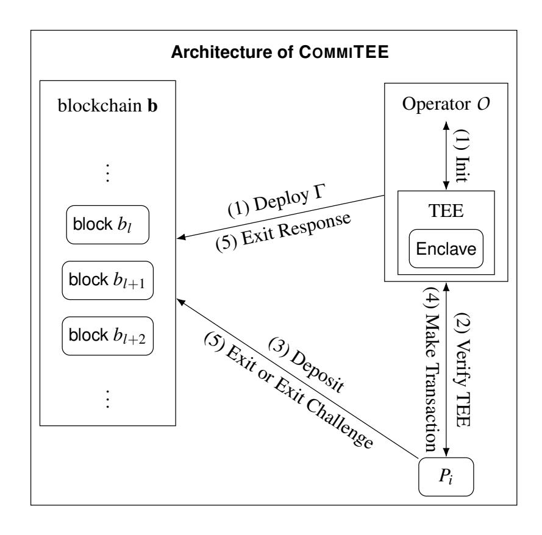

{0}------------------------------------------------

## <span id="page-0-1"></span>COMMITEE : An Efficient and Secure Commit-Chain Protocol using TEEs

Andreas Erwig *TU Darmstadt andreas.erwig@tu-darmstadt.de*

Siavash Riahi *TU Darmstadt siavash.riahi@tu-darmstadt.de*

Sebastian Faust *TU Darmstadt sebastian.faust@tu-darmstadt.de*

Tobias Stöckert *TU Darmstadt tobias.stoeckert@stud.tu-darmstadt.de*

## Abstract

Permissionless blockchain systems such as Bitcoin or Ethereum are slow and expensive, since transactions are processed in a distributed network by a large set of parties. To improve on these shortcomings, a prominent approach is given by so-called 2nd-layer protocols. In these protocols parties process transactions off-chain directly between each other, thereby drastically reducing the costly and slow interaction with the blockchain. In particular, in the optimistic case, when parties behave honestly, no interaction with the blockchain is needed. One of the most popular off-chain solutions are Plasma protocols (often also called commit-chains). These protocols are orchestrated by a so-called operator that maintains the system and processes transactions between parties. Importantly, the operator is trustless, i.e., even if it is malicious users of the system are guaranteed to not lose funds. To achieve this guarantee, Plasma protocols are highly complex and require involved and expensive dispute resolution processes. This has significantly slowed down development and deployment of these systems.

In this work we propose COMMITEE – a simple and efficient Plasma system leveraging the power of trusted execution environments (TEE). Besides its simplicity, our protocol requires minimal interaction with the blockchain, thereby drastically reducing costs and improving efficiency. An additional benefit of our solution is that it allows for switching between operators, in case the main operator goes offline due to system failure, or behaving maliciously. We implemented and evaluated our system over Ethereum and show that it is at least 2 times (and in some cases more than 16 times) cheaper in terms of communication complexity when compared to existing Plasma implementations. Moreover, for protocols using zero-knowledge proofs (like NOCUST-ZKP), COM-MITEE decreases the on-chain gas cost by a factor ≈ 19 compared to prior solution.

## 1 Introduction

Over the past decade cryptocurrencies such as Bitcoin [\[31\]](#page-14-0) and Ethereum [\[38\]](#page-14-1) have gained increasing popularity by introducing a new financial paradigm. Unlike traditional financial systems these cryptocurrencies do not rely on a central authority for transaction validation and accounting, but instead build upon a decentralized consensus protocol which maintains a distributed ledger that tracks each single transaction. However, maintaining such a ledger in a distributed fashion comes at the cost of poor transaction throughput and confirmation time. For example, in Ethereum the transaction throughput is limited to a few dozen transactions per second and final confirmation of a transaction can take up to 6 minutes. On the contrary, traditional centralized payment providers offer almost instantaneous transaction confirmation while being able to support orders of magnitude higher throughput. These scalability issues hinder cryptocurrencies from being used at larger scale.

One particularly promising solution to address these scalability problems are off-chain protocols. Off-chain protocols work by taking the massive bulk of transactions off-chain, and at a high-level proceed as follows. After an initial on-chain transaction to join the system, transactions between participants can be carried out off-chain (without interaction with the underlying blockchain). Only when a user wants to exit the system, or when other parties of the system try to cheat, honest users need to carry out on-chain transactions again. Important examples of this concept include payment channel networks (or hubs) [\[1,](#page-13-0) [28,](#page-14-2) [34\]](#page-14-3), and more recently Plasma protocols, where the latter is the focus of this work.

The original idea of Plasma protocols (often also known as commit-chains[1](#page-0-0) ) was first introduced by Poon et al. in 2017 [\[33\]](#page-14-4). Soon after, countless variants of Plasma emerged such as Loom, Bankex, NOCUST and OmiseGO (see, e.g., [\[24,](#page-14-5) [30,](#page-14-6) [36\]](#page-14-7)). While all these systems differ in certain aspects, at a high-level they all follow the off-chain approach described above and outsource transaction execution to a second layer

<span id="page-0-0"></span><sup>1</sup> In this work we use the terms Plasma and commit-chain interchangeably.

{1}------------------------------------------------

(we will explain in more detail how Plasma systems work in Sec. [3\)](#page-3-0). A key role in any Plasma system plays the *operator*, who maintains the system, and ensures that all offchain transactions among the users are processed correctly. It is important to note, however, that the operator is not assumed to be trusted, and merely ensures an efficient and well-functioning system. Since the operator is not trusted, but essentially "confirms" all transaction processing, Plasma protocols use a highly involved mechanism which ensures that the user's funds remain secure even when the operator is malicious.

The design of such mechanism poses non-trivial challenges that existing Plasma systems attempt to solve by employing either heavy cryptographic machinery such as zero-knowledge proofs or complex challenge-response protocols for resolving disputes on-chain. Neither of these approaches is optimal for the following two reasons: (1) both approaches significantly increase the communication complexity with the blockcahin which increases costs and undermines the original purpose of Plasma as an off-chain protocol; (2) the security analysis of the resulting protocols becomes cumbersome, and hence to-date there is no Plasma-like system that has been formally proven secure. While there has been significant research efforts to address these problems [\[9\]](#page-13-1), [\[8\]](#page-13-2), [\[21\]](#page-13-3), the community has not yet come up with a suitable solution that can readily be implemented.

In this paper, we address the before mentioned shortcomings. To this end, we first propose a general security model for Plasma systems, and introduce COMMITEE – a simple and efficient Plasma-like protocol. COMMITEE leverages trusted execution environments (TEE) in order to overcome the above mentioned downsides of existing Plasma systems. In COMMI-TEE, the operator uses a TEE for all necessary computation, which limits the operator's role in the protocol to merely relaying messages between the TEE and the outside world (blockchain, users of the system, etc.). This significantly limits the operator's ability to misbehave, which in turn allows for a simpler protocol design. An immediate consequence of COMMITEE's simplicity is that it becomes easier to analyze and verify its security. We analyze COMMITEE in our model and show that it achieves the three security properties *deposit security*, *balance security* and *operator security*, which in a nutshell guarantee that no honest party in the system loses her coins even if *all* other parties are malicious.

Another crucial benefit of our simple protocol design is that COMMITEE requires minimal interaction with the blockchain, which significantly reduces on-chain costs and improves efficiency. Unlike payment channels, all existing Plasma/commit-chain protocols require periodic commitments to the blockchain and logarithmic size messages to withdraw coins from the system. COMMITEE overcomes these two drawbacks of conventional commit-chains, which brings the efficiency on par with payment channel networks/hubs [\[1,](#page-13-0) [28,](#page-14-2) [34\]](#page-14-3).

We evaluated our system over Ethereum and compared the results to the two most common (and partially in prototypestatus available) Plasma protocols, namely Plasma MVP [\[15\]](#page-13-4) and Plasma Cash [\[20\]](#page-13-5), as well as to the most prominent commit-chain protocol NOCUST and NOCUST-ZKP [\[24\]](#page-14-5). The evaluation shows that COMMITEE is between 2 to 16 times cheaper in terms of communication complexity when compared to Plasma MVP and Cash. For systems using zeroknowledge proofs (e.g., NOCUST-ZKP), COMMITEE outperforms previous work with respect to on-chain communication by a factor of ≈ 19. Furthermore, asymptotically the on-chain communication complexity of COMMITEE is *O*(1), while for all the above mentioned protocols the communication complexity grows logarithmically in the number of users.

Finally, we propose two extensions for COMMITEE, namely (1) to support multiple operators, and (2) to handle TEE compromise. The first extension to a multi-operator system allows to switch between operators, in case the main operator behaves maliciously or goes offline, which is a highly desirable feature for Plasma systems as it makes them more robust to operator failures, and thus increases their reliability significantly. We emphasize that until now there has not been any full specification of a Plasma-like system that supports multiple operators due to the complexity of designing such a system. This gap is closed by our work leveraging again the power of TEEs. Likewise, our second extension to handle TEE compromise significantly increases the reliability and practicality of COMMITEE as it guarantees the security of user's funds even in case a malicious party is able to influence the computation inside the TEE.

## 1.1 Our Contribution

In a nutshell, our contributions can be summarized as follows:

- Secure and Efficient Plasma with TEE: We propose COMMITEE – a simple and efficient Plasma protocol, which minimizes costly communication with the blockchain. To this end, we are the first to leverage TEE for Plasma in order to achieve improved efficiency and security guarantees.
- Extensions to COMMITEE: Our protocol can be extended to support multiple operators and to handle TEE corruptions, which are both highly desirable features to ensure reliability and practicality of COMMITEE. The multi-operator extension allows users to swap operators in case the main operator behaves maliciously, while the extension of handling TEE compromise allows users to detect and publicly prove that the TEE has been corrupted, such that users can switch to the next operator.
- Evaluation: We provide an evaluation of our protocol and compare the results to NOCUST, NOCUST-ZKP [\[24\]](#page-14-5) and other prominent Plasma solutions. We show that our protocol is more efficient than these solutions in

{2}------------------------------------------------

terms of communication complexity and gas cost, when implemented over Ethereum.

• Plasma Framework and Model: We propose a generic framework for analyzing the security of Plasma protocols, and formaly prove the security of our construction. Our model gives an abstract design specifcation of a Plasma protocol, as well as an appropriate adversarial model and desirable properties that Plasma systems should fulfill. We believe that our modeling approach is of independent interest and may be useful to analyze other existing Plasma systems.

## 1.2 Outline

In Section [2](#page-2-0) we recall the necessary background. In Section [3](#page-3-0) we give a high level overview of our solution and discuss the challenges which COMMITEE must overcome. Afterwards in Section [4](#page-5-0) we introduce our model and in Section [5](#page-6-0) we describe our protocol and discuss its security. In Section [6](#page-9-0) we compare our experimental implementation of COMMITEE in terms of communication and computation complexity with other state-of-the-art Plasma protocols, while we we discuss how to extend COMMITEE in order to support multiple operators and to handle TEE compromise in Section [7.](#page-10-0) Finally, in Section [8](#page-12-0) we discuss related work, before concluding in Section [9.](#page-12-1)

## <span id="page-2-0"></span>2 Preliminaries

In this section we give a brief overview of the main concepts our protocol depends on, namely digital signatures, blockchain and trusted execution environment.

## 2.1 Digital Signature Scheme

Transactions that are sent to the blockchain and smart contract must be digitally signed in order to determine the identity of the sender of the transaction. To this end digital signature schemes are used. A digital signature scheme is a tuple of algorithms Σ = (Gen,Sign,Vrfy) where Gen gets as input the security parameter 1 κ and outputs the public and secrecy keys (*sk*, *pk*), Sign gets as input the secret key *sk* and a message *m* and outputs a signature σ and Vrfy gets as input the public key *pk*, a message *m* and a signature σ and outputs 1 if σ is a valid signature for *m* under public key *pk* and 0 otherwise. A signature scheme must be correct i.e. Vrfy(*pk*;*m*,Sign(*sk*;*m*)) = 1 and secure i.e. it must be computationally hard for an adversary to forge a signature σ on a fresh message *m* without knowing the secret key *sk* even after seeing multiple signatures on messages of her choice.

## <span id="page-2-2"></span>2.2 Blockchain and Cryptocurrencies

Blockchain Structure A blockchain is a data structure that enables all parties in a distributed network to obtain a consistent view on the state of the system. It is maintained by all or a subset of the parties in the network and the correctness of its state is agreed upon using a consensus protocol. On a high level, a blockchain consists of data chunks (blocks) which store information about the state of the system (e.g. transactions in cryptocurrencies). These blocks are chained together using a cryptographic hash function, i.e. each block contains the hash value that results from hashing the previous block. The blockchain plays a central role in cryptocurrencies, where it serves as a distributed ledger which accounts for all issued transactions in the system.

Blockchain Model Throughout this paper we model a blockchain b as a sequence of individual blocks (*b*1,··· ,*bm*) where *b<sup>m</sup>* is the latest confirmed block, meaning that it is the latest block that the network reached consensus on. We use the terms *blockchain* and *ledger* (denoted by *L*) interchangeably in this paper. Users participating in the blockchain network have an account which stores their current balance in the system. The account of a party *P<sup>i</sup>* is identified by her public key *pk<sup>i</sup>* and it consists of a tuple (*pk<sup>i</sup>* , *vi*) where *v<sup>i</sup>* is the current balance of *P<sup>i</sup>* . Furthermore, the blockchain network can execute Turing complete programs referred to as smart contracts. Similar to parties, a smart contract has an account which is identified by a unique address addr, however in contrast to parties, each contract consists of a set of functions (*f*1,··· , *fl*) which might optionally take parameters param as input.

In order to transfer funds from a party *P<sup>i</sup>* to another party *P<sup>j</sup>* , *P<sup>i</sup>* must submit a transaction *tx* of the form to the blockchain network: *tx* := (*pk<sup>i</sup>* , *pk <sup>j</sup>* , *v*). Such a transaction is valid if it is signed under the public key *pk<sup>i</sup>* , and *Pi*'s balance exceeds *v*.

A party *P<sup>i</sup>* can call a function *f* on input param of a smart contract with the address addr by submitting a transaction *tx* of the form: *tx* := (*pk<sup>i</sup>* ,addr, *v*, *f*,param). A transaction of this form is valid if it is signed under the public key of the sender, i.e., *pk<sup>i</sup>* , *Pi*'s balance exceeds *v* and a smart contract with the address addr with function *f* exists on the blockchain.

A smart contract can send transactions of the above forms as well, with the difference that the sender's public key *pk<sup>i</sup>* is replaced by the contract's address addr. Since the smart contract does not maintain a signing secret key, a signature is not required in order for the transaction to be valid.

A blockchain maintains an internal block counter *c* which is increased on average after *t* time units[2](#page-2-1) . A new block is produced and added to b every time *c* is increased and parties in the network are notified about the new block. Upon a party *P<sup>i</sup>* sending a valid transaction to the blockchain network, *P<sup>i</sup>* is guaranteed that the transaction will be included in one of the next *l* blocks. Furthermore, the blockchain offers the following functionalities:

post(*tx*): this functionality gets as input a transaction *tx* and checks if it is valid. If so *tx* is included in one of the

<span id="page-2-1"></span><sup>2</sup>A time unit can be any measure of time like seconds, minutes, hours etc.

{3}------------------------------------------------

blocks  $(b_c, \dots, b_{c+l})$ .

get(k): this functionality gets as input an index k and returns the latest k blocks of **b** i.e.,  $(b_{m-k+1}, \dots, b_m)$ .

Modeling Blockchain Validation Any blockchain system inherently requires a validation algorithm that allows to check if a sequence of blocks was computed correctly. This validation includes checks for the validity of transactions in individual blocks and checks that two consecutive blocks form a valid chain. In order to verify the whole blockchain a user has to start the verification with the very first block (genesis block) of the blockchain. This results in a potentially huge amount of storage and computation cost since the user has to download and store the entire blockchain. Therefore, in practice nodes often verify new blocks based on so-called checkpoints instead of the entire blockchain. A checkpoint is a confirmed block on the chain. Let us define the notation for the validation algorithm we use in this work.

Let  $\mathbf{b} = (b_1, \dots, b_m)$  be a blockchain and let  $b_{cp} \in \mathbf{b}$  be a single block serving as a verification checkpoint. The validation algorithm VrfyChain on input the checkpoint and a chain of blocks  $\bar{\mathbf{b}} = (\bar{b}_1, \dots, \bar{b}_k)$ , outputs 1 if  $\bar{\mathbf{b}}$  is a valid blockchain extending the checkpoint  $b_{cp}$  and 0 otherwise.

Note that throughout this paper we assume that a polynomially time bounded adversary can forge a chain of blocks  $\bar{\mathbf{b}}$  with  $|\bar{\mathbf{b}}| \geq k$  such that  $\mathsf{VrfyChain}(b_{cp}, \bar{\mathbf{b}}) = 1$  at most with negligible probability.

### <span id="page-3-1"></span>2.3 Trusted Execution Environments

**Modeling the TEE** Our TEE modeling follows the one of Das et al. [18] and Pass et al. [32]. As in [18], we only explain a simplified version of the model and refer the reader to Figure 1 in [32] for the complete formal definition. When the TEE is initialized it creates a signing keypair (msk, mpk)called master public key and master secret key of the TEE. The master keypair is used to authenticate the installation of a program on the TEE. The TEE functionality offers two operations for an enclave: install and resume. Calling an operation on the TEE is denoted as TEE.operation name. The operation TEE.install stores a given program p under the enclave identifier eid. A program that is stored on an enclave is executed via the enclave operation TEE.resume. It takes the identifier of the enclave *eid*, a function f, and the function input in as input. TEE.resume returns the output of the program operation denoted as *out* and the quote  $\rho$  over the tuple (eid, p, out). This quote serves as the verifiable statement in the remote attestation process (see below for further details). As our protocol will only use one enclave instance E of the program p, we use a simplified version of the resume command  $[out, \rho] := \text{TEE.resume}(eid, f, in)$  and replace it with the following definition:  $[out, \rho] := E.f(in)$ 

In order to model remote attestation, there has to exist a function  $VrfyQuote(mpk, p, out, \rho)$  for every attestable TEE.

The function outputs 1 if the quote is correct and the output *out* was created by an enclave with the master public key mpk that loaded the program p. A TEE is considered secure if an adversary cannot forge a valid quote  $\rho$  such that  $VrfyQuote(mpk, p, out, \rho)$  outputs 1.

We note that making TEEs secure against side-channel [37], memory-corruption [12] and architectural vulnerabilities [14] is an ongoing research direction which is orthogonal to our work [10], [37], [35]. In COMMITEE we consider a TEE which is secure against such vulnerabilities. However, in Section 7.2, we propose an extension to COMMITEE, that allows users to detect TEE corruption such that user's funds remain secure even in case a malicious party can influence the computation inside the TEE.

## <span id="page-3-0"></span>**3 Solution Overview**

In this section, we provide a brief overview of our solution and discuss its main design challenges that had to be overcome.

Plasma protocols have first been introduced in order to mitigate the issues of payment channel hubs (PCHs), namely the problem that intermediaries in PCHs are required to lock a significant amount of collateral. This is needed in payment channel hubs in order to punish the intermediary in case of malicious behavior. In contrast, Plasma protocols do not utilize a punishment mechanism but instead require the operator to periodically submit a short commitment of the latest state of the system to the blockchain. This avoids the need for collateralization. In case the operator behaves maliciously, users can simply exit the system based on the last commitment.

In a nutshell, users in a Plasma protocol can dynamically join and leave the system by making deposits or exiting their funds from the Plasma contract. They can submit their transactions off-chain to the operator, who collects these transactions and updates the balances of the users accordingly. In addition, the operator stores these transactions and balances in a data structure, which enables her to generate a short commitment to the state of the system. The operator can then publish this commitment on the blockchain and provide a proof of balance to each user, which is required if the user wishes to exit the system. Traditionally, the data structure used by the operator in order to store balances and transactions is a Merkle tree, and the commitment is the root of this tree. In order to exit the system, users must prove to the contract that they own some coins in the system. This proof is in fact a Merkle proof where the leaves store the balances of the users in the system.

As it can be seen, a malicious operator can misbehave by publishing an incorrect commitment (i.e. Merkle root). As an example, the operator can allow users to double spend or "print money" by maliciously increasing the balance of users. In order to mitigate such attacks, existing Plasma protocols employ either of the following two strategies: (1) a complex challenge-response mechanism or (2) a zero-knowledge proof of the operator's correct behavior. These approaches require

{4}------------------------------------------------

additional communication or expensive computation on the blockchain, which undermines the original goal of designing an off-chain solution.

Our protocol mitigates the above mentioned issues in two ways: (1) the operator employs a TEE which does all the necessary computation while the operator simply has to relay messages between the TEE and the users and the blockchain and (2) our protocol allows for efficient extension to a multioperator system, in which a different operator can take over as soon as the current operator acts maliciously.

Since by definition the TEE executes all computations correctly, neither expensive zero-knowledge proofs nor complex challenge-response mechanisms are required in order to guarantee correct behavior of the operator. Instead, a single signature from the TEE is sufficient as a proof of correct computation. In a bit more detail, the proof of balance consists merely of a message signed by the TEE, which is not only much shorter than a Merkle proof but also less expensive to verify on the blockchain. Note that asymptotically the size of a Merkle proof grows logarithmically in the number of users, while a signature size is constant. This difference shows itself clearly in Section [6](#page-9-0) where we present the evaluation of our protocol. Furthermore, other Plasma systems require periodic commitments of the operator to the blockchain such that users can verify their balance proof. Conventionally, this commitment is a Merkle root. Yet we observe that in order to verify signatures from the TEE, only the TEE's public key is required and hence there is no need for the operator to publish a commitment. Instead, the public key of the TEE is part of the public parameters of the contract.

This efficiency improvement directly translates to the challenge-response mechanism of our protocol. Due to the use of a TEE, many of the scenarios where the operator can act maliciously are mitigated (e.g., changing balances, double spending etc.) and hence the only possible way for the operator to misbehave is by withholding data, i.e., balances signed by the TEE. Due to this limited attack vector, we only need a simple challenge-response mechanism to deal with data unavailability. Note that even this challenge-response mechanism is more efficient compared to traditional Plasma systems, since only a signature needs to be published on the blockchain (instead of a Merkle proof).

## 3.1 Design Challenges

In the following, we describe the design challenges for Plasma protocols. Even when utilizing a TEE the operator acts as a relay between the TEE and the Plasma system and hence can still act maliciously by dropping the messages sent to and from the TEE. The aim of our protocol is to ensure security even in presence of a malicious operator.

Malicious Operator Since the operator runs the TEE, she controls all interactions with it. This implies that she may send false requests to the enclave or refuse to forward requests made by users. The operator may also abort executions on the enclave or delay inputs and outputs.

At the very beginning, an operator can set up the TEE in a malicious way which would compromise the Plasma system right from the start. Hence, before joining the Plasma network, it is crucial that the users verify the correct initialization of the TEE via remote attestation. This ensures that the correct program has been loaded into the enclave and hence the initialization has indeed been correct.

Since an operator may go offline, crash or act maliciously at any point, users must always be able to withdraw their coins from the system. To this end all users receive a message signed by the TEE which informally says "this user owns *v* coins in epoch *e* [3](#page-4-0) " and can be sent to the ledger *L* if they wish to exit. However, a malicious operator can avoid delivering this message to the users. Yet, the fact that these users did not receive this message from the operator does not have digital footprint and hence they cannot prove to the contract that the operator misbehaved. Even worse the operator can avoid forwarding the messages produced by the TEE to only a subset of users. This would fragment the system into users who have the latest state of the system and users who do not. This means that from the point of view of some users the balances are updated yet for others this is not the case. Since users cannot have two different balances at the same time, our solution must provide a method in order to solve this fragmentation. To this end, the affected users can challenge the operator on the ledger *L* and request an exit.

If the operator responds honestly to the on-chain challenge the user will receive her funds via *L*. Otherwise, the contract switches to a "malicious" state indicating that the operator acts dishonestly. In this state all users withdraw their funds based on the last epoch (for which all users do have an exit message signed by the TEE, since otherwise they would have started a challenge in the previous epoch).

A natural question would be whether or not one can extend Plasma protocols in order to support multiple operators and mitigate this single point of failure. Unfortunately, this is not possible in a straightforward way since all operators must be aware of the latest state of the system and agree on it. This would require them to run a consensus algorithm which would hinder the efficiency of the system. We take a different approach by allowing the users to switch to a new operator in presence of a malicious one. A trivial solution to do so would be posting the latest state of the system on-chain in order to inform the new operator of the user's latest balances. Yet this approach would require huge communication with the blockchain and is not much different than users exiting and depositing their coins in a new Plasma system. COMMI-TEE offers a cheap solution in order to switch operators. In a nutshell, instead of sending the exit message to the contract,

<span id="page-4-0"></span><sup>3</sup>An epoch is a time interval where the duration is defined by a fixed number of blocks.

{5}------------------------------------------------

the users submit the same message to the backup operator. We emphasize that this solution is not applicable to other Plasma systems that do not offer valid state transition since exit messages in such protocols can be invalid. We further note that in our solution, the backup operator does not need to communicate with the original operator at all and only takes an active role if the main operator is proven to be malicious.

**Blockchain Verification** In order to process deposits or exits that happen on-chain, the TEE must be informed about the latest state of the ledger every epoch. Hence, we need a secure blockchain verification algorithm on the TEE to ensure that the operator cannot provide incorrect or tampered blocks. We tackle this challenge similar to [18] in the following way.

In order to verify that a deposit (or exit) has been included in the smart contract, the block in which the deposit list is stored, has to be confirmed k-times on-chain. The parameter k is part of the security parameter in the enclave. This requirement ensures that it is computationally infeasible for a malicious operator to forge a valid chain of blocks which prevents potentially malicious deposit attempts by the operator.<sup>4</sup>

Furthermore, in order to make the verification algorithm more efficient, the TEE uses checkpoints in order to avoid validating the entire blockchain each time.

Minimizing Blockchain Interaction Since interacting with the blockchain is slow and expensive, it is crucial to minimize all communication with the blockchain. In Plasma protocols, the operator has to prove at the end of every epoch to all users that she processed all transactions correctly. This is often done by requiring the operator to provide a zeroknowledge proof on-chain such that every user can verify the operator's computation or by allowing users to challenge the operator's behavior on-chain. In our protocol, we make use of the fact that all computation done in the TEE is by definition correct. As mentioned before a user's exit message is of the form "this user owns v coins in epoch e" which is signed by the TEE. As we can see, a single signature verification is sufficient in order to verify this statement and no additional Merkle proof or zero-knowledge proof validation is required. In other words, the only on-chain communication happens when a party wishes to join (deposit) or leave (exit) the system<sup>5</sup>. This is a significant efficiency improvement compared to other Plasma solutions.

Mass actions and exit size In case the operator is behaving maliciously by performing a data unavailability attack and not responding (or responding incorrectly) to on-chain challenges, users have to exit the system. This often requires the need

for mass actions, where all users exit the system at the same time. In COMMITEE we do not remove the possibility for mass actions, but the users do not need to exit immediately (unlike Plasma MVP). We achieve this via a smart contract which detects data unavailability attacks when the malicious operator is challenged and does not respond to this challenge with valid values. In this case the contract enters a "malicious" state, which halts the entire Plasma system such that users can withdraw their last valid balance at any time or switch to a backup operator. This implies that a user does not have to exit immediately to ensure its balance security.

### <span id="page-5-0"></span>4 The Plasma Framework Model

In a nutshell, a Plasma protocol  $\Pi$  is a protocol executed between a set of users  $\mathcal{P}$ , an operator  $\mathcal{O}$  and the ledger  $\mathcal{L}$  which executes the Plasma contract. The execution of the Plasma protocol consist essentially of three phases i.e., deposit, transaction and exit phase. In the deposit phase users can deposit coins on the ledger into the Plasma contract, in the transaction phase users can transfer coins (off-chain) to one another and in the exit phase users can withdraw coins from the Plasma contract on-chain. These phases are executed in order and after the exit phase the protocol continues by executing the deposit phase again. Each consecutive execution of these three phases is referred to as an epoch. More formally, the following messages are exchanged during each epoch:

**Deposit phase:** In this phase any user  $P_i$  can send a message of the form (deposit, v) to the contract, where v denotes the amount of coins that the user wants to deposit into the Plasma contract.  $P_i$  eventually outputs (deposited, v',  $P_i$ ) where either v' = v if the deposit was successful or v' = 0 otherwise. If the deposit was successful and  $P_i \notin \mathcal{P}$ , then set  $\mathcal{P} = \mathcal{P} \cup \{P_i\}$ .

**Transaction phase:** In this phase each user  $P_i \in \mathcal{P}$  can send a message of the form  $(P_i, P_j, v)$  to the operator O. This message indicates that  $P_i$  wants to send v coins to user  $P_j$ . At the end of this phase each user receives a message which indicates its balance in the current epoch from the operator. A protocol might (optionally) require O to send the message (submit,  $commit_e$ ) to the contract. The contract eventually outputs a message  $m \in \{success, failed\}$ .

**Exit phase:** In this phase each user  $P_i \in \mathcal{P}$  can send a message of the form (exit) to the contract. The contract eventually outputs (exited,  $P_i$ , v), where v denotes the user's latest balance in the Plasma system.  $P_i$  is then removed from  $\mathcal{P}$ , i.e.  $\mathcal{P} = \mathcal{P} \setminus \{P_i\}$ .

Intuitively, a transaction is valid if the sender owns more coins than the transaction amount and the transaction is authorized by the sender (which is commonly checked using digital signatures). The operator is responsible for processing

<span id="page-5-1"></span><sup>&</sup>lt;sup>4</sup>Additionally, this ensures that the block containing the deposit list is not part of a fork on the blockchain.

<span id="page-5-2"></span><sup>&</sup>lt;sup>5</sup>Note that in Ethereum contracts do not activate on their own and in order to indicate that an epoch or phase has ended, a single transaction must be sent to the contract.

<span id="page-5-3"></span> $<sup>^6</sup>$ *commit<sub>e</sub>* is a commitment to the updated balances in epoch *e*, e.g., it can be a Merkle root or a zero-knowledge proof.

{6}------------------------------------------------

the transactions and updating the balances of the users. In addition, *O* might need to submit a short digest (also called commitment) of all transactions (or the new balances of the users) in one epoch to the Plasma contract.

## <span id="page-6-1"></span>4.1 Communication and adversarial assumptions

We now discuss the communication and adversarial assumptions in our modeling. In our model, all parties have access to a ledger *L* which supports the execution of Turing complete programs as described in Section [2.2.](#page-2-2)

A Plasma protocol is executed in presence of an adversary who can corrupt parties. The corrupted parties are "controlled" by the adversary and can deviate from the protocol description. Furthermore, the adversary can delay messages sent by honest users to the ledger by up to *t* −1 time units.

All parties are connected via authenticated channels i.e., the adversary can read the messages sent between parties and can drop them, yet the adversary is not able to modify the messages that are being sent.

## 4.2 Properties

We now discuss the properties that a Plasma protocol must fulfill. These properties can be divided into three categories, namely *correctness*, *security* and *efficiency*. The correctness properties describe the protocol's behavior in the optimistic case where parties behave honestly and the security properties describe what the protocol guarantees to honest parties in the pessimistic case, i.e., in presence of malicious parties.

Deposit and Transaction Phase Correctness During the deposit phase if an honest user successfully deposits *v* coins in the Plasma contract and the operator is honest, the balance of this user in the Plasma system is increased by *v*. During the transaction phase if the sender and the receiver of a transaction and the operator are honest, the transaction is processed correctly, i.e., upon making a transaction of the form (*P<sup>i</sup>* ,*P<sup>j</sup>* , *v* 0 ) the balance of the sender *P<sup>i</sup>* is decreased by the amount *v* 0 and the receiver's balance is increased by *v* 0 . We note that a user might send/receive coins to/from multiple users during this phase. Naturally, all these transactions must be processed correctly if the parties involved are honest. We note that balances of the users must be updated by the end of the transaction phase and not immediately. This feature is usually referred to as *late finality* or *eventual finality*.

Exit Phase Correctness If an honest user exits the Plasma system, her balance and the user set *P* are updated accordingly. For simplicity we assume that a user always exits with all her coins, and hence her balance is set to 0 and the user is removed from the Plasma user set.

Deposit Security In presence of malicious parties, an honest user does not lose the coins she deposited. In other words, an honest user is able to get her deposits back if they are not processed correctly and her balance is not updated accordingly.

Balance Security In presence of malicious parties, an honest user does not lose any coins at any stage of the protocol, i.e., an honest user is able to always exit her entire balance. We note that due to the late finality feature, this property essentially states that users will either be able to exit with their balance from the previous or current epoch.

Operator Balance Security An honest operator does not lose the coins she deposited in the Plasma contract, even in presence of malicious users.

Efficiency Let δ denote the duration of an epoch. A Plasma protocol is efficient if δ ∈ *O*(1), i.e., the duration of an epoch is independent of the number of users or transactions.

We note that in practice the duration of an epoch can be dynamically changed based on the number of transactions that are received. For instance, if none of the users issues any transaction, the duration of an epoch can be extended. However, asymptotically the duration of an epoch will always be constant.

## <span id="page-6-0"></span>5 COMMITEE Protocol

We now give a description of our Plasma protocol which makes use of the fact that the operator runs a TEE. Let us first give an overview of the protocol execution.

## 5.1 Architecture and Protocol Overview

On a high level, the execution of COMMITEE can be separated into the following phases: (1) Initialization of the system, (2) Verification of the TEE, (3) Depositing coins into the system, (4) Transferring coins off-chain between the participants and (5) Exiting the system (see Figure [1\)](#page-7-0). Note that the phases (3), (4) and (5) occur repeatedly. The execution of the protocol starts with *O* initializing the TEE by installing the program *pCT* and calling its GENKEYS function. This function will initialize all the necessary variables and generates the key pair (*skE*, *pkE*). *pk<sup>E</sup>* is hard coded on the contract Γ and is used to verify messages which are signed by the TEE. At this point the contract Γ is deployed on the blockchain and users can join the system by depositing coins on-chain on the contract. However, before joining, users first verify that the TEE and Γ are initialized correctly. After a successful verification users can deposit coins on Γ which will increase their balance offchain in the system at the end of this epoch. Users who have already deposited some coins can make off-chain transactions by submitting their transactions to *O*. The operator gathers these transactions and submits them to the TEE, which then updates the balances of the users according to the issued transactions. Furthermore, the TEE signs the updated balances of the users and outputs the list of signed balances which the

{7}------------------------------------------------

<span id="page-7-0"></span>

Figure 1: The architecture of COMMITEE.

operator forwards to the users. This signed message can be used as evidence of user's balance, if a party wishes to exit the system. Finally, users who wish to leave the system can submit the signed balance to  $\Gamma$ .

However, if the users did not receive their signed balance from O, they will not be able to exit the system. To mitigate this, users can request an exit (called exit challenge) on  $\Gamma$ . This challenge essentially forces the operator to submit the signed balance to the blockchain. If the request is correctly responded to, the user exits normally with her latest balance. However, if the operator continues to behave maliciously and resists responding to the challenges, the affected users do not have any possibility of exiting their latest balance. In this case  $\Gamma$  will deem O as malicious and all users must exit according to their balance from the previous epoch. We note that all users have indeed received their signed balance from the previous epoch, otherwise they would have challenged the operator during the exit phase of the previous epoch.

### <span id="page-7-1"></span>**5.2** Protocol Description

We now give the description of COMMITEE. Due to lack of space, we present the pseudo-code of the protocol and the enclave program in Appendix A, Figures 2 and 3.

**Notation** In the rest of this work we use the value  $epoch_X$  which denotes the current epoch counter stored by party  $X \in \mathcal{P} \cup \{O\} \cup \{\Gamma\}$ . The term epoch refers to the duration of executing the phases (3), (4) and (5). In our protocol an epoch has a fixed duration which is measured by the number of blocks produced on the blockchain. Furthermore each phase of the protocol has a fixed duration. For simplicity we assume that this duration is the same for all three phases and is equal to the time required to publish t blocks. We refer

to the protected memory in the TEE where the program is installed and executed as enclave which we denote as E. For simplicity, from this point on, we use the terms enclave and TEE interchangeably. When we say that a tuple of values is valid, we mean that the tuple has been created according to an honest protocol execution.

Initialization The first step of our protocol is the initialization of the TEE by the operator O. In this stage the TEE first creates its master (signing) key pair (msk, mpk) and outputs the master public key mpk. Afterwards, the operator installs the enclave program  $p_{CT}$  with the parameters  $(\kappa, \Gamma, b_{cp})$  on the TEE, where  $\kappa$  is the security parameter used by the enclave,  $\Gamma$  is the address of the Plasma contract on  $\mathcal{L}$  and  $b_{cp}$  is the latest block on  $\mathcal{L}$ . This block acts as checkpoint for the verification of future blocks. In order to prevent O from submitting forged blocks or unconfirmed blocks to the enclave, the enclave also derives the parameter k from the security parameter  $\kappa$ . Essentially, the enclave only considers a block  $b_l$  as confirmed if it receives a valid chain of blocks  $\bar{\mathbf{b}} := (b_l, \dots, b_{l+k})$ .

Upon the completion of the initialization step, the operator calls the key generation function in the enclave, in order to create a second key pair and to initialize internal values specific to the program  $p_{CT}$ . The TEE returns  $((pk_E, \sigma), \rho)$  where  $(pk_E,\sigma)$  is the generated public key and  $\sigma$  is a signature for this public key under the TEE's master secret key msk. Finally, the value  $\rho$  is the quote from the enclave which allows other users to verify the correct initialization of the installed program. We note that the public key  $pk_E$  is hard coded on the contract  $\Gamma$ . The generation of the additional key pair guarantees that even if a malicious O re-installs the program on the TEE,  $\Gamma$  will reject messages signed under the new key pair and therefore O cannot reset the system or revert the balances of the users to 0. This is because the key generation algorithm is probabilistic and will not generate the same key pair except with negligible probability.

Verifying the Enclave Before joining the Plasma system, the users must get convinced that the correct program is installed on the TEE of the operator and that it is registered with the Plasma contract. Otherwise the operator might have installed a different program on the TEE which maliciously increases or decreases the balances of the users. To this end, the user verifies the quote  $\rho$  which ensures that the program  $p_{CT}(\kappa, \Gamma, b_{cp})$  has been initialized correctly on the TEE. Afterwards, the signature  $\sigma$  is verified using the master public key mpk of the TEE. Naturally, the users check that the public key stored on the contract is the same public key as the one that the enclave has created for the program  $p_{CT}$ .

If all verification steps were successful, the user proceeds to the deposit phase. Otherwise, the user aborts and does not participate in the Plasma protocol.

**Deposit Phase** In order to deposit coins a user  $P_i$  with public key  $pk_i$  sends a transaction to the Plasma smart contract (let  $v_i$ 

{8}------------------------------------------------

be the amount of coins sent by this transaction). The contract adds the tuple (deposit, *pk<sup>i</sup>* , *vi*) to a list *D*Γ, called *deposit list*, which stores all deposits made in the current epoch.

At the end of the deposit phase the operator sends the newly confirmed blocks to the enclave. The enclave processes the deposits, signs the deposit list *D*<sup>Γ</sup> and outputs both, the list and its signature. The operator forwards the signed list to all parties who deposited coins in the current epoch. If a user who made a deposit does not receive a valid tuple at the end of the deposit phase, she will exit in the following exit phase.

Transaction Phase In order to transfer coins, a user *P<sup>i</sup>* only needs to submit a transaction *tx* = (*pk<sup>i</sup>* , *pk<sup>j</sup>* , *v*, *epochP<sup>i</sup>* ) with a signature σ*pk<sup>i</sup>* ← Sign(*sk<sup>i</sup>* ,*tx*), off-chain to the operator, where *pk<sup>i</sup>* , *pk <sup>j</sup>* are the public keys of the sender and receiver, respectively, *v* is the transaction's value and *epochP<sup>i</sup>* is the current epoch counter. The operator collects all received transactions during this phase and then executes the transaction processing function on the enclave by giving the set of received transactions as input (see the enclave program [5.3](#page-8-0) for more details). At the end of the transaction phase the enclave processes all transactions and returns a list of signed balances *vE*, where *vE*[*i*] is the new, signed balance of user *P<sup>i</sup>* . The operator sends *vE*[*i*] = ((*v<sup>i</sup>* , *epochE*, *pki*),σ*i*) to user *P<sup>i</sup>* where σ*<sup>i</sup>* is a signature for the tuple (*v<sup>i</sup>* , *epochE*, *pki*) under the TEE's public key *pkE*. If a user does not receive a correct tuple from the operator, she will exit in the next exit phase.

Exit Phase In order to withdraw money from the system a user *P<sup>i</sup>* sends the signed balance value ((*v<sup>i</sup>* , *epochE*, *pki*),σ*i*) that she received at the end of the transaction phase to Γ. The contract verifies that the received values are valid and that the user did not exit before, i.e., *pk<sup>i</sup>* 6∈ *e*Γ, where *e*<sup>Γ</sup> is the *exit list*, which stores the public keys of all users who exited in the last two epochs. If the verification was successful the contract stores the exit in *e*Γ. At the end of the exit phase the contract returns *v<sup>i</sup>* coins to the exiting user *P<sup>i</sup>* .

Exit Challenge If the user did not receive a valid tuple of the form ((*v<sup>i</sup>* , *epochE*, *pki*),σ*i*) at the end of the transaction phase, she has to challenge the operator by sending the message (exit\_challenge, *pki*) to the contract. The contract stores this message which indicates that the operator has been challenged and adds the user to the list of challenging parties *c*Γ. In order to respond to the challenge, the operator sends the balance value ((*v<sup>i</sup>* , *epochE*, *pki*),σ*i*) to the contract. This tuple is in fact the message which a user sends when she wishes to exit the system. Therefore, upon receiving this response from the operator, the contract processes this message as a regular exit made by *P<sup>i</sup>* and removes the challenge from the list *c*Γ.

However, if the operator does not post a valid response from the TEE until the end of the exit phase, the contract deems the operator malicious and halts the system[7](#page-8-1) . Parties can then only send exit based on messages of the previous epoch. In a bit more detail, the contract reverts its state to the previous epoch by decrementing the epoch-counter and it announces a message indicating that the operator is malicious. The contract also returns all deposited values from the latest epoch stored in the deposit list *D*<sup>Γ</sup> back to the depositing parties.

Simplifying Assumptions In our protocol description we assumed that the contract can actively check if a phase has ended or not (which is done by checking the number of blocks produced by the blockchain). Yet in Ethereum a contract must be manually called for it to get activated and be able to check the time. Naturally, the contract checks whether or not a phase has ended whenever it receives a message but one must also add a function which can be called by any party and which checks the current time and determines if the current phase or epoch has ended.

In our protocol when a user challenges the operator in case of data unavailability, she will exit the system even if the operator responds to the challenge correctly. We note that the valid response to a challenge is in fact the signed balance which the user did not receive from *O*. Hence, we can extend our protocol in order to allow users to stay in the system if *O* responds to the challenge correctly i.e., a user *P<sup>i</sup>* can indicate in her challenge message whether or not she wishes to exit upon *O* publishing ((*v<sup>i</sup>* , *epochE*, *pki*),σ*i*).

## <span id="page-8-0"></span>5.3 Enclave Program

Let us now describe the enclave program *pCT* executed on the TEE. As mentioned above, the TEE is initialized with a master key pair (*msk*,*mpk*). To install the program on the TEE and to initialize the enclave, the operator provides the contract address Γ, the security parameter κ and the checkpoint of the ledger *bcp* as parameters. In the following, we give an overview of the functions in the enclave program.

Generating Keys This procedure is used for the initialization of the enclave. It generates the program-specific key pair (*skE*, *pkE*) for the TEE which the enclave uses to authenticate all messages with regard to *pCT* . The key pair is also signed with the master secret key *msk*, which allows parties to verify it under the master public key *mpk*. Additionally, all internal variables, such as the list of deposits *D*, list of balances *v*, list of signed balances *v<sup>E</sup>* etc., are initialized. We note that the program does not allow to execute KEYGEN again after this point in order to prevent the operator from resetting the system. The function returns the tuple (*pkE*,σ*E*) where σ*<sup>E</sup>* := Sign(*msk*; *pkE*).

Deposit In this procedure, the TEE adds the deposits made on-chain to the balances of the users on the enclave. This function receives as input a list of blocks b, which is the chain of blocks since the last checkpoint.

<span id="page-8-1"></span><sup>7</sup>Note that the operator needs to be given enough time to reply to all challenges. In practice this can be achieved by dividing the exit phase into

two subphases, a challenge and a response phase.

{9}------------------------------------------------

The enclave verifies that (1) the chain b is a valid extension of the checkpoint and (2) the chain consists of *t* +*k* blocks. We require *t* +*k* blocks, since *t* is the duration of the phase and *k* are the necessary blocks to confirm the last block of the phase. If both conditions are met, the enclave extracts the deposit list from the last bock of the deposit phase, i.e., the *t*-th block and updates the balances of the parties. Finally, the enclave signs and returns the list of deposits (*D*Γ,σ*E*) to *O*.

Process Transactions This procedure is used to process transactions made by the users and to update the balances of the affected users. The parameter passed to this function is the list of transactions *TO*.

For each transaction the enclave verifies that the transaction is of the form (*pk<sup>i</sup>* , *pk<sup>j</sup>* , *v*, *epochP<sup>i</sup>* ,σ*pk<sup>i</sup>* ) and that σ*pk<sup>i</sup>* is a valid signature under *pk<sup>i</sup>* . In addition, *epochP<sup>i</sup>* must be the current epoch and the balance of the sender must be greater or equal to *v*. If all these conditions are satisfied the balances of the sender and the receiver are updated according to the transaction amount.

At this point the latest balance of the users in this epoch can be updated and the epoch must be *finalized*. To this end, the TEE creates and returns the list *v<sup>E</sup>* which consists per user of a tuple of the form ((*v<sup>i</sup>* , *epochE*, *pki*),σ*i*), where σ*<sup>i</sup>* is a signature under the public key of the enclave and *epoch<sup>E</sup>* is the enclave's epoch counter.

Exit The exit procedure is used to set the balance of the users who exited to 0. The operator provides a chain of blocks b. If the chain is valid, extends the last checkpoint and has 2*t* +*k* blocks (the last checkpoint was made at the end of the deposit phase, therefore at this point both transaction and exit phase are finished and hence 2*t* + *k* blocks must be sent to the enclave), the enclave extracts the exit list from the 2*t*th block, removes all exiting parties from the system and sets their balance to 0.

## 5.4 COMMITEE Security Analysis

Due to the limited space we present the formal security properties and prove that COMMITEE is secure in Appendix [B](#page-15-1) and [C.](#page-18-0) Here, we briefly discuss why our protocol achieves the security properties from Section [4.](#page-5-0)

Theorem 5.1 (informal). *The* COMMITEE *protocol as described in Section [5](#page-6-0) satisfies the correctness, security and efficiency properties as described in Section [4.](#page-5-0)*

The most challenging property to prove is security as it involves a malicious operator who can behave arbitrarily. We first shortly discuss why correctness and efficiency are satisfied.

It is easy to see that COMMITEE satisfies correctness, since in case the operator is honest, she will honestly provide the list of deposits, transactions and exits to her TEE which honestly updates and returns the signed balances of the users. All users receive their respective signed balances since the operator is honest. Hence, deposit, transaction and exit phase correctness is satisfied. Further, as each phase of the protocol has a constant duration, the efficiency property is satisfied.

Let us now discuss the three security properties. Due to the usage of a TEE which acts as a trusted entity, a malicious operator can only mount data unavailability attacks, i.e., refuse to forward data between users and the TEE. The problem of data unavailability is a general issue in Plasma protocols and can never be prevented. However, we show that COMMI-TEE provides sufficient mechanisms to protect honest parties in this case. Assume an operator who does not send the signed balances from the TEE to users after a transaction phase. In this case, the users will challenge the operator on-chain and exit the system. If the operator responds to the challenge with a signed balance tuple generated by the TEE, the user exits based on her latest balance. Otherwise, the users exit based on their balance from the previous epoch. In this case, the contract returns all coins which were deposited in this epoch. Note that as commit-chain protocols satisfy late finality, users should be able to exit either with their balance from the previous or current epoch. Hence, balance and deposit security are satisfied. Finally, as our protocol does not require the operator to lock any collateral, operator balance security is satisfied.

## <span id="page-9-0"></span>6 Evaluation

We evaluated COMMITEE's costs both in terms of gas costs and on-chain communication complexity. In order to evaluate the gas costs we used Ganache-cli [\[3\]](#page-13-10) to simulate full client behaviour. The contract itself is written for Solidity version 0.5.3. Our implementation can be found at [\[2\]](#page-13-11). To evaluate the communication complexity we analyzed the size (in bytes) of the parameters sent for each function call of the contract. In this evaluation (Table [2\)](#page-11-1), we did not include the size overhead of sending a transaction, i.e., for function calls without any parameters we assume a size of 0 bytes.

We compare the results of our evaluation with the most widely known commit-chain protocol namely NOCUST and NOCUST-ZKP [\[24\]](#page-14-5) and with the most common Plasma protocols, namely Plasma MVP and Plasma Cash.[8](#page-9-1) We use the evaluation results from [\[24\]](#page-14-5) in order to compare COMMI-TEE with NOCUST/NOCUST-ZKP in terms of gas costs. On the other hand most implementations of Plasma MVP and Plasma Cash are experimental and neither optimized in terms of gas cost nor do they execute flawlessly without errors. Therefore our comparison with Plasma Cash and MVP is with respect to the message size of all (potential) interaction that occurs during the protocol execution. Note that our protocol is fundamentally different to both Plasma MVP and Plasma Cash. In Plasma MVP and Plasma Cash, a malicious user

<span id="page-9-1"></span><sup>8</sup>For comparison we used the omiseGO and loom network implementation respectively [\[4,](#page-13-12) [5\]](#page-13-13).

{10}------------------------------------------------

can attempt to exit another user's coins by sending an exit request of an already spent UTXO or coin respectively. Hence, users must constantly observe the blockchain and challenge malicious behavior on-chain which might be expensive or problematic in case of blockchain congestion. On the other hand, in our protocol users only challenge the operator in case of data unavailability (which is unavoidable according to the work of Dziembowski et.al., [\[19\]](#page-13-14)), i.e., in case the operator does not provide the signed balances to all users. We would like to point out that there are many different proposals (other than Plasma MVP and Cash) on how to design a Plasma protocol such as Plasma Snapp [\[8\]](#page-13-2), Plasma Debit [\[7\]](#page-13-15), More Viable Plasma [\[6\]](#page-13-16) etc. Yet these are only proposals mentioned on [https://ethresear](https://ethresear.ch).ch forums which are not fully specified. Therefore, we do not compare our protocol with them.

## 6.1 Comparison with NOCUST(-ZKP)

Let us first compare COMMITEE with the most well known commit-chain protocol namely NOCUST and NOCUST-ZKP [\[24\]](#page-14-5). The main difference between NOCUST and NOCUST-ZKP is that NOCUST-ZKP utilizes zero knowledge proofs in order to guarantee valid state transitions where NOCUST allows users to challenge the operator in case the state transaction is invalid. Therefore, NOCUST-ZKP is from a design perspective closer to COMMITEE. However, since COMMI-TEE uses a TEE there is no need to submit and verify expensive zero knowledge proofs on-chain in order to guarantee that the state transition is valid. The full comparison can be found in Table [1.](#page-11-2) As we can see COMMITEE is almost 3 times cheaper when finalizing an epoch compared to NOCUST and more than 19 times cheaper than NOCUST-ZKP. We would like to point out that our evaluated gas cost does not increase with the number of users *n* or transactions *v*. Furthermore, the reported gas cost for NOCUST is with respect to a system where there are only 10 users in the system and the users make 20 transaction i.e., *n* = 10 and *v* = 20.

## 6.2 Comparison with Plasma MVP and Cash

Table [2](#page-11-1) shows the comparison of the message size in bytes for each of the protocols COMMITEE, Plasma MVP and Plasma Cash and for each respective phase of an epoch. We give a more detailed explanation on how Plasma MVP and Cash work in comparison to COMMITEE in Appendix [D.](#page-20-0)

## <span id="page-10-0"></span>7 Extensions to COMMITEE

In this section, we discuss two extensions to COMMITEE, namely we show how to add support for multiple operators and how to deal with TEE compromise. This increases security and applicability of COMMITEE, as users can continue

using the system even in presence of a malicious operator or a compromised TEE.

## 7.1 Supporting Multiple Operators

Most previous works on commit-chain or Plasma protocols [\[15,](#page-13-4) [16,](#page-13-17) [24\]](#page-14-5) assume that only one operator maintains the system. This, however, creates a single point of failure, i.e., once the operator turns malicious or unresponsive, all parties are required to exit the system. The reason why most Plasma protocols do not consider a system with multiple operators is that this would either require to establish consensus among all operators on the latest state of the system, or it would require users to publish the latest state of the system (e.g., their individual latest balances) on-chain. The first approach introduces huge communication overhead on the operators and also requires an honest majority assumption among the operators. The second approach, however, is not much different to requiring all users to exit the protocol and deposit their coins into a new Plasma system.

By leveraging a TEE, COMMITEE can support multiple operators and avoid the above mentioned challenges. In our solution the backup operators (i.e., all operators except for the currently active one) remain idle until the active operator is deemed malicious by the contract Γ.

We now elaborate on how to extend our system to a multioperator setting. For simplicity, we consider the setting of two operators, as it is straightforward to extend our approach to more than two operators. Assume *O*<sup>1</sup> is the active operator, while *O*<sup>2</sup> is a passive backup operator. Upon setup of the contract Γ, *O*<sup>1</sup> and *O*<sup>2</sup> register their public keys in a list *L* in the contract, such that *O*1's public key is the first element in *L*. *O*<sup>1</sup> acts as described in our protocol description from Section [5;](#page-6-0) *O*<sup>2</sup> on the other hand only needs to monitor Γ every epoch and check if Γ marks *O*<sup>1</sup> as malicious. As long as *O*<sup>1</sup> is not marked as malicious, *O*<sup>2</sup> can stay inactive.[9](#page-10-1)

However, when Γ announces *O*<sup>1</sup> as malicious, it extracts the public key of *O*<sup>2</sup> from *L* (i.e., the next element in *L*) and registers *O*<sup>2</sup> as the next active operator. The contract additionally removes the public key of *O*<sup>1</sup> from *L*. Upon being announced as the new active operator, *O*<sup>2</sup> first has to send a confirmation message to Γ within a pre-defined time period ∆. If Γ does not receive this confirmation from *O*<sup>2</sup> within ∆ time, then all users have to exit the system as described in the exit protocol of COMMITEE by submitting the message (exit,(*v<sup>i</sup>* , *epochE*, *pki*),σ*i*)) to Γ. [10](#page-10-2)

Otherwise, if *O*<sup>2</sup> confirms the operator switch, users have two options, namely either to exit or stay in the system. In the latter case, users first verify that the enclave in *O*2's TEE has been initialized correctly (i.e., that the correct pro-

<span id="page-10-1"></span><sup>9</sup>We emphasize that *O*<sup>2</sup> does not need to interact with *O*<sup>1</sup> at any stage of the protocol.

<span id="page-10-2"></span><sup>10</sup>Note that if there was a third operator in *L*, the contract would register her as the next active operator.

{11}------------------------------------------------

<span id="page-11-2"></span>

| Function                      | Gas Cost |              | Paid By           | Complexity |                   |
|-------------------------------|----------|--------------|-------------------|------------|-------------------|
|                               | COMMITEE | NOCUST(-ZKP) |                   | COMMITEE   | NOCUST(-ZKP)      |
| Deposit                       | 69 815   | 64 720       | User              | O(1)       | O(1)              |
| Exit                          | 118 601  | 169 238      | User              | O(1)       | O(log(n))         |
| Exit Challenge                | 66 548   | 225 642      | User              | O(1)       | O(log(n) +log(v)) |
| Exit Response                 | 74 580   | 68 152       | Operator          | O(1)       | O(log(n) +log(v)) |
| Total Exit Challenge/Response | 141 128  | 293 794      | User and Operator | O(1)       | O(log(n) +log(v)) |
| Finalization                  | 32 363   | 96 073       | Operator          | O(1)       | O(1)              |
| ZK-proof                      | -        | >523 618     | Operator          | -          | O(1)              |
| Total Finalization cost       | 32 363   | >619 691     | Operator          | O(1)       | O(1)              |
| State Challenge               | -        | 281 786      | User              | -          | O(log(n))         |
| State Response                | -        | 80 769       | Operator          | -          | O(log(n))         |

Table 1: Comparison of COMMITEE with NOCUST and NOCUST-ZKP with regard to gas cost and on-chain communication complexity. The gas cost in row "ZK-proof" is only relevant for NOCUST-ZKP, while the gas costs in rows "State Challenge" and "State Response" are only relevant for NOCUST. The parameters *n* and *v* represent the amount of users and the amount of transactions respectively. The evaluated gas cost for NOCUST(-ZKP) are for *n* = 10 and *v* = 20.

<span id="page-11-1"></span>

| Function       | COMMITEE | MVP   | Cash      |
|----------------|----------|-------|-----------|
| Deposit        | 0        | 0     | 105       |
| Exit           | 117      | ≥ 266 | ≥ 449 · n |
| Exit Challenge | 20       | ≥ 323 | ≥ 253     |
| Exit Response  | 117      | -     | ≥ 285     |
| Epoch Finalize | 0        | 32    | 64        |

Table 2: Sizes in bytes. Only counting function parameters, while abstracting from constant transaction size. *n* represents the balance of a user in Plasma Cash.

gram is installed on the TEE of *O*2), which can be done in the same way as described in Section [5.2.](#page-7-1) Upon successful verification, each user *P<sup>i</sup>* signs and sends the message ((swap*O*,(*v<sup>i</sup>* , *epochE*, *pki*),σ*i*),σ*pk<sup>i</sup>* ) to *O*2, where the tuple ((*v<sup>i</sup>* , *epochE*, *pki*),σ*i*) represents the user's balance in epoch *epoch<sup>E</sup>* and σ*pk<sup>i</sup>* is a signature under *Pi*'s public key *pk<sup>i</sup>* . Note that this tuple also contains a valid signature σ*<sup>i</sup>* of *O*1's TEE which serves as proof for *Pi*'s balance.

Upon receiving these messages, *O*<sup>2</sup> (by using its TEE) checks if the signatures σ*<sup>i</sup>* and σ*pk<sup>i</sup>* are valid under the public key of *O*1's TEE and *pk<sup>i</sup>* respectively. If so, the TEE stores the balance of this user and outputs a message ((*v<sup>i</sup>* , *epochE*, *pki*),σ*<sup>i</sup>* 0 ) to *P<sup>i</sup>* , where σ*<sup>i</sup>* 0 is a valid signature with respect to the public key of *O*2's TEE. Naturally, if the user does not receive this message from *O*<sup>2</sup> (i.e., *O*<sup>2</sup> is also malicious), she submits the exit message (exit,(*v<sup>i</sup>* , *epochE*, *pki*),σ*i*) to Γ.

At the end of this epoch, *O*<sup>2</sup> forwards the list of parties who exited on Γ to its TEE. The TEE checks if any of the users who agreed to swap the operator have exited and if so deletes their information. Note that a party cannot exit twice (by submitting both ((*v<sup>i</sup>* , *epochE*, *pki*),σ*i*) and ((*v<sup>i</sup>* , *epochE*, *pki*),σ*<sup>i</sup>* 0 ))

because Γ does not allow the same *pk<sup>i</sup>* to exit twice.

We note that in our security model all operators may be malicious, hence it is important to allow a user to exit in case the backup operator does not provide a signature for her most recent balance. However, in case the backup operator is honest, changing the operator can be done without any additional on-chain transaction by the users.

## <span id="page-11-0"></span>7.2 Handling TEE Compromise

This extension requires that a transaction in COMMITEE is signed by both, the sender and the receiver. Under this requirement an honest user *P<sup>i</sup>* can compute her finale balance *vi*,*<sup>e</sup>* after the transaction phase of an epoch *e*, since she knows the list of transactions *T Xi*,*<sup>e</sup>* consisting of all transactions that she sent and received in epoch *e* and she knows her starting balance *vi*,*e*−<sup>1</sup> from the previous epoch. As such, if *P<sup>i</sup>* receives a finale balance *v*˜*i*,*<sup>e</sup>* 6= *vi*,*<sup>e</sup>* from the operator after the transaction phase, she can draw one of the following conclusions: (1) the operator did not forward some of the transactions in *T Xi*,*<sup>e</sup>* to the TEE or (2) the integrity of the TEE has been compromised. As mentioned before, the former case is a form of data unavailability attack from the operator, which cannot be prevented. However, *P<sup>i</sup>* can distinguish cases (1) and (2), as she is able to compute all possible combinations of transactions in *T Xi*,*<sup>e</sup>* and check if any of these combinations results in the balance *v*˜*i*,*e*. In case she finds such a combination, she concludes that case (1) happened (notice that even if this was a result of a compromised TEE, the effect is the same as in case of a data unavailability attack). Otherwise, *P<sup>i</sup>* concludes that the TEE must be corrupted.[11](#page-11-3) In this case, the user can challenge the operator on-chain, which requires the operator

<span id="page-11-3"></span><sup>11</sup>This follows from the fact that the operator cannot forge signatures under the *Pi*'s public key.

{12}------------------------------------------------

to publish the set of transactions which results in the finale balance *v*˜*i*,*<sup>e</sup>* as output by the TEE. If the operator cannot do so, the contract Γ announces that the TEE has been compromised and users can switch to another operator as previously described. If the operator can answer the challenge correctly, it is evident that the user is malicious.

While this solution works well for applications with moderate transaction rate per epoch, it does not scale to use cases with high transaction frequency per epoch as the computation of all possible finale balances grows significantly with large transaction sets.

## <span id="page-12-0"></span>8 Related Work

We briefly discuss the most important related works on commit-chains and off-chain solutions using TEEs.

Plasma protocols There are many different variants of Plasma protocols. Some of the most well known are Plasma MVP [\[15\]](#page-13-4), Plasma Cash [\[20\]](#page-13-5) Plasma Debit [\[7\]](#page-13-15) and Plasma Snapp [\[8\]](#page-13-2). Yet most of these protocols are mentioned and discussed only on some forums, e.g., the [https://](https://ethresear.ch) [ethresear](https://ethresear.ch).ch website and there has not been any academic work that formalizes them. One of the other well known commit-chain/Plasma protocols are NOCUST and NOCUST-ZKP by Khalil et al. [\[24\]](#page-14-5), where the latter provides provably correct executions via zero-knowledge proofs. As we have argued in the previous section, COMMITEE is a simple yet efficient Plasma system which offers significant benefits in terms of on-chain computation and communication. In a recent work, Dziembowski et al. [\[19\]](#page-13-14) give a lower bound for the communication complexity in Plasma protocols, showing that any secure Plasma protocol requires significant communication with the blockchain. Our protocol does not violate this lower bound, but shows how to significantly reduce the concrete communication complexity with the blockchain. As we show in this work such a system can be quite efficient and cheap in terms of blockchain interaction and on-chain computation complexity.

Off-Chain TEE Solutions In a recent work, Das et al. [\[18\]](#page-13-6) proposed the FastKitten protocol which allows parties to execute arbitrary complex smart contracts off-chain even if the underlying blockchain does not support smart contracts. To this end they use an operator who has access to a TEE which allows efficient and correct execution of smart contracts offchain. Yet the set of parties who participate in the smart contract is fixed for the entire lifetime of the contract execution. In addition, the operator must make a security deposit called collateral which is as large as the initial balance of all users combined. In contrast our Plasma protocol allows users to dynamically join and leave the system and the operator does not need to deposit any collateral. A similar solution to [\[18\]](#page-13-6) has been proposed by Cheng et al. [\[17\]](#page-13-18), which considers confidentiality preserving off-chain smart contract executions using a

TEE. Similarly, [\[13\]](#page-13-19), [\[23\]](#page-14-11) propose solutions for private offchain function execution with the help of TEEs. However, the main goal of these works is to move complex contract executions off the chain, while they do not focus on reducing the communication complexity with the blockchain. In fact, they publish the encrypted state of a contract execution on the blockchain after each function call, which results in significant interaction with the blockchain. Our work on the other hand aims at reducing on-chain communication complexity. Two other works [\[25\]](#page-14-12), [\[22\]](#page-14-13) present privacy preserving off-chain executions of contracts using TEEs, yet both of them rely on zero-knowledge proofs which we avoid in our solution.

Lind et al. [\[27\]](#page-14-14) proposed the Teechain in order to improve the transaction throughput of payment channels and payment channel networks. They utilize TEEs in order to process transactions and reduce blockchain interaction in case of disputes. In order to deal with TEE failures or compromises, a committee of TEEs is used who must agree on the latest state of the balances. As this work focuses on payment channel networks, parties that do not have a direct channel must find a path in the network through some intermediaries who must have enough balance in order to facilitate such transaction.

There has been a considerable amount of work on the usage of TEEs in conjunction with a blockchain in order to enhance existing blockchain applications ( [\[11,](#page-13-20) [29,](#page-14-15) [39](#page-14-16)[–41\]](#page-14-17) and many more), which, however, does not focus on off-chain applications and is hence not closely related to our work.

## <span id="page-12-1"></span>9 Conclusion

In this work we have designed COMMITEE, an efficient and secure Plasma protocol which requires minimum on-chain interaction. By using zero-knowledge proofs, the on-chain cost of the most prominent existing Plasma solution NOCUST-ZKP increases by a factor of 19 when compared to our protocol. Furthermore, compared to other well-known protocols such as Plasma MVP or Cash our protocol reduces the onchain communication complexity by at least 2 times (and in some cases more than 16 times). As an additional contribution, we present the first model for Plasma/Commit-Chain protocols, which paves the way for rigorous security analyses of existing and future Plasma protocols.

Finally, we have shown how to extend COMMITEE in order to incorporate multiple operators in the system, which allows users to switch from a malicious operator to an honest one. Our approach does not require the operators to run a consensus mechanism, in fact the backup operators do not need to communicate with the active operator at all. This extension improves the usability of COMMITEE in case the active operator acts maliciously, crashes or loses connection.

There are multiple directions in which our work can be extended. As the technology of TEEs gets more and more mature and ready for widespread use, it might be interesting to consider a Plasma protocol where not only the operators 

{13}------------------------------------------------

but also all users operate a TEE. This might be a great way to reduce blockchain interaction even further or to provide even stronger security guarantees.

## Acknowledgments

This work is funded by the German Research Foundation (DFG) Emmy Noether Program FA 1320/1-1, by the German Research Foundation DFG - SFB 1119 - 236615297 (CROSSING Projects S7), by the German Federal Ministry of Education and Research (BMBF) *iBlockchain Project* (grant nr. 16KIS0902), by the German Federal Ministry of Education and Research and the Hessian Ministry of Higher Education, Research, Science and the Arts within their joint support of the *National Research Center for Applied Cybersecurity ATHENE*.

## References

- <span id="page-13-0"></span>[1] Bitcoin wiki: Payment channels. [https:](https://en.bitcoin.it/wiki/Payment_channels) //en.bitcoin.[it/wiki/Payment\\_channels](https://en.bitcoin.it/wiki/Payment_channels).
- <span id="page-13-11"></span>[2] Commitee. [https://github](https://github.com/CommiTee-Commit-Chain/CommiTEE).com/CommiTee-[Commit-Chain/CommiTEE](https://github.com/CommiTee-Commit-Chain/CommiTEE).
- <span id="page-13-10"></span>[3] Ganache-cli. https://github.[com/trufflesuite/](https://github.com/trufflesuite/ganache-cli) [ganache-cli](https://github.com/trufflesuite/ganache-cli).
- <span id="page-13-12"></span>[4] loom network. https://github.[com/loomnetwork/](https://github.com/loomnetwork/plasma-cash) [plasma-cash](https://github.com/loomnetwork/plasma-cash).
- <span id="page-13-13"></span>[5] omisego. https://github.[com/omgnetwork/](https://github.com/omgnetwork/plasma-mvp) [plasma-mvp](https://github.com/omgnetwork/plasma-mvp).
- <span id="page-13-16"></span>[6] More viable plasma, June 2018. [https:](https://ethresear.ch/t/more-viable-plasma/2160) //ethresear.[ch/t/more-viable-plasma/2160](https://ethresear.ch/t/more-viable-plasma/2160).
- <span id="page-13-15"></span>[7] Plasma debit: Arbitrary-denomination payments in plasma cash, June 2018. [https:](https://ethresear.ch/t/plasma-debit-arbitrary-denomination-payments-in-plasma-cash/2198) //ethresear.[ch/t/plasma-debit-arbitrary](https://ethresear.ch/t/plasma-debit-arbitrary-denomination-payments-in-plasma-cash/2198)[denomination-payments-in-plasma-cash/2198](https://ethresear.ch/t/plasma-debit-arbitrary-denomination-payments-in-plasma-cash/2198).
- <span id="page-13-2"></span>[8] Plasma snapp - fully verified plasma chain, September 2018. https://ethresear.[ch/t/plasma-snapp](https://ethresear.ch/t/plasma-snapp-fully-verified-plasma-chain/3391)[fully-verified-plasma-chain/3391](https://ethresear.ch/t/plasma-snapp-fully-verified-plasma-chain/3391).
- <span id="page-13-1"></span>[9] Zk rollups, Febraury 2020. [https://medium](https://medium.com/plutusdefi/zk-rollup-scaling-ethereum-for-the-long-term-287aa95e3ba9).com/ [plutusdefi/zk-rollup-scaling-ethereum-for](https://medium.com/plutusdefi/zk-rollup-scaling-ethereum-for-the-long-term-287aa95e3ba9)[the-long-term-287aa95e3ba9](https://medium.com/plutusdefi/zk-rollup-scaling-ethereum-for-the-long-term-287aa95e3ba9).
- <span id="page-13-9"></span>[10] Martín Abadi, Mihai Budiu, Úlfar Erlingsson, and Jay Ligatti. Control-flow integrity principles, implementations, and applications. *ACM Transactions on Information and System Security (TISSEC)*, 13(1):1–40, 2009.

- <span id="page-13-20"></span>[11] Iddo Bentov, Yan Ji, Fan Zhang, Lorenz Breidenbach, Philip Daian, and Ari Juels. Tesseract: Real-time cryptocurrency exchange using trusted hardware. In *Proceedings of the 2019 ACM SIGSAC Conference on Computer and Communications Security*, CCS '19, page 1521–1538, New York, NY, USA, 2019. Association for Computing Machinery.
- <span id="page-13-7"></span>[12] Andrea Biondo, Mauro Conti, Lucas Davi, Tommaso Frassetto, and Ahmad-Reza Sadeghi. The guard's dilemma: Efficient code-reuse attacks against intel {SGX}. In *27th* {*USENIX*} *Security Symposium (*{*USENIX*} *Security 18)*, pages 1213–1227, 2018.
- <span id="page-13-19"></span>[13] Mic Bowman, Andrea Miele, Michael Steiner, and Bruno Vavala. Private data objects: an overview. *ArXiv*, abs/1807.05686, 2018.
- <span id="page-13-8"></span>[14] Ferdinand Brasser, Urs Müller, Alexandra Dmitrienko, Kari Kostiainen, Srdjan Capkun, and Ahmad-Reza Sadeghi. Software grand exposure:{SGX} cache attacks are practical. In *11th* {*USENIX*} *Workshop on Offensive Technologies (*{*WOOT*} *17)*, 2017.
- <span id="page-13-4"></span>[15] Vitalik Buterin. Minimal viable plasma, January 2018. https://ethresear.[ch/t/minimal-viable](https://ethresear.ch/t/minimal-viable-plasma/426)[plasma/426](https://ethresear.ch/t/minimal-viable-plasma/426).
- <span id="page-13-17"></span>[16] Vitalik Buterin. Plasma cash: Plasma with much less per-user data checking, March 2018. [https:](https://ethresear.ch/t/plasma-cash-plasma-with-much-less-per-user-data-checking/1298) //ethresear.[ch/t/plasma-cash-plasma-with](https://ethresear.ch/t/plasma-cash-plasma-with-much-less-per-user-data-checking/1298)[much-less-per-user-data-checking/1298](https://ethresear.ch/t/plasma-cash-plasma-with-much-less-per-user-data-checking/1298).
- <span id="page-13-18"></span>[17] Raymond Cheng, Fan Zhang, Jernej Kos, Warren He, Nicholas Hynes, Noah M. Johnson, Ari Juels, Andrew Miller, and Dawn Xiaodong Song. Ekiden: A platform for confidentiality-preserving, trustworthy, and performant smart contracts. *2019 IEEE European Symposium on Security and Privacy*, pages 185–200, 2019.
- <span id="page-13-6"></span>[18] Poulami Das, Lisa Eckey, Tommaso Frassetto, David Gens, Kristina Hostáková, Patrick Jauernig, Sebastian Faust, and Ahmad-Reza Sadeghi. Fastkitten: Practical smart contracts on bitcoin. Cryptology ePrint Archive, Report 2019/154, 2019. [https://eprint](https://eprint.iacr.org/2019/154).iacr.org/ [2019/154](https://eprint.iacr.org/2019/154).
- <span id="page-13-14"></span>[19] Stefan Dziembowski, Grzegorz Fabianski, Sebastian ´ Faust, and Siavash Riahi. Lower bounds for off-chain protocols: Exploring the limits of plasma.
- <span id="page-13-5"></span>[20] Karl Floersch. Plasma cash simple spec, March 2018. https://karl.[tech/plasma-cash-simple-spec/](https://karl.tech/plasma-cash-simple-spec/).
- <span id="page-13-3"></span>[21] Madhumitha Harishankar, Dimitrios-Georgios Akestoridis, Sriram V. Iyer, Aron Laszka, Carlee Joe-Wong, and Patrick Tague. Payplace: A scalable sidechain protocol for flexible payment mechanisms in blockchain-based marketplaces, 2020.

{14}------------------------------------------------

- <span id="page-14-13"></span>[22] Ari Juels, Ahmed Kosba, and Elaine Shi. The ring of gyges: Investigating the future of criminal smart contracts. pages 283–295, 10 2016.
- <span id="page-14-11"></span>[23] Gabriel Kaptchuk, Matthew Green, and Ian Miers. Giving state to the stateless: Augmenting trustworthy computation with ledgers. In *26th Annual Network and Distributed System Security Symposium, NDSS 2019, San Diego, California, USA, February 24-27, 2019*. The Internet Society, 2019.
- <span id="page-14-5"></span>[24] Rami Khalil, Pedro Moreno-Sanchez, Alexei Zamyatin, Arthur Gervais, and Guillaume Felley. Commit-chains: Secure, scalable off-chain payments.
- <span id="page-14-12"></span>[25] A. Kosba, A. Miller, E. Shi, Z. Wen, and C. Papamanthou. Hawk: The blockchain model of cryptography and privacy-preserving smart contracts. In *2016 IEEE Symposium on Security and Privacy (SP)*, pages 839–858, 2016.
- <span id="page-14-18"></span>[26] Leslie Lamport, Robert Shostak, and Marshall Pease. The byzantine generals problem. In *Concurrency: the Works of Leslie Lamport*, pages 203–226. 2019.
- <span id="page-14-14"></span>[27] Joshua Lind, Oded Naor, Ittay Eyal, Florian Kelbert, Emin Gün Sirer, and Peter Pietzuch. Teechain: A secure payment network with asynchronous blockchain access. In *Proceedings of the 27th ACM Symposium on Operating Systems Principles*, SOSP '19, page 63–79, New York, NY, USA, 2019. Association for Computing Machinery.
- <span id="page-14-2"></span>[28] Giulio Malavolta, Pedro Moreno-Sanchez, Aniket Kate, Matteo Maffei, and Srivatsan Ravi. Concurrency and privacy with payment-channel networks. In Bhavani M. Thuraisingham, David Evans, Tal Malkin, and Dongyan Xu, editors, *ACM CCS 17*, pages 455–471. ACM Press, October / November 2017.
- <span id="page-14-15"></span>[29] Sinisa Matetic, Karl Wüst, Moritz Schneider, Kari Kostiainen, Ghassan Karame, and Srdjan Capkun. BITE: bitcoin lightweight client privacy using trusted execution. In Nadia Heninger and Patrick Traynor, editors, *28th USENIX Security Symposium, USENIX Security 2019, Santa Clara, CA, USA, August 14-16, 2019*, pages 783–800. USENIX Association, 2019.
- <span id="page-14-6"></span>[30] Rajarshi Mitra. Plasma breakthrough: Omisego (omg) announces the launch of ari. [https:](https://www.fxstreet.com/cryptocurrencies/news/plasma-breakthrough-omisego-omg-announces-the-launch-of-ari-201904120245) //www.fxstreet.[com/cryptocurrencies/news/](https://www.fxstreet.com/cryptocurrencies/news/plasma-breakthrough-omisego-omg-announces-the-launch-of-ari-201904120245) [plasma-breakthrough-omisego-omg-announces](https://www.fxstreet.com/cryptocurrencies/news/plasma-breakthrough-omisego-omg-announces-the-launch-of-ari-201904120245)[the-launch-of-ari-201904120245](https://www.fxstreet.com/cryptocurrencies/news/plasma-breakthrough-omisego-omg-announces-the-launch-of-ari-201904120245). (Accessed on 02/08/2020).
- <span id="page-14-0"></span>[31] Satoshi Nakamoto. Bitcoin: A peer-to-peer electronic cash system. 2008.

- <span id="page-14-8"></span>[32] Rafael Pass, Elaine Shi, and Florian Tramer. Formal abstractions for attested execution secure processors. In *Annual International Conference on the Theory and Applications of Cryptographic Techniques*, pages 260– 289. Springer, 2017.
- <span id="page-14-4"></span>[33] Joseph Poon and Vitalik Buterin. Plasma: Scalable autonomous smart contracts. 2017.
- <span id="page-14-3"></span>[34] Joseph Poon and Thaddeus Dryja. The Bitcoin Lightning Network: Scalable Off-Chain Instant Payments, January 2016. Draft version 0.5.9.2, available at https://lightning.[network/lightning](https://lightning.network/lightning-network-paper.pdf)[network-paper](https://lightning.network/lightning-network-paper.pdf).pdf.
- <span id="page-14-10"></span>[35] Ming-Wei Shih, Sangho Lee, Taesoo Kim, and Marcus Peinado. T-sgx: Eradicating controlled-channel attacks against enclave programs. In *NDSS*, 2017.
- <span id="page-14-7"></span>[36] Trustnodes. Ethereum transactions fall off the cliff, three plasma projects close to release says buterin, 2018.
- <span id="page-14-9"></span>[37] Jo Van Bulck, Marina Minkin, Ofir Weisse, Daniel Genkin, Baris Kasikci, Frank Piessens, Mark Silberstein, Thomas F Wenisch, Yuval Yarom, and Raoul Strackx. Foreshadow: Extracting the keys to the intel {SGX} kingdom with transient out-of-order execution. In *27th* {*USENIX*} *Security Symposium (*{*USENIX*} *Security 18)*, pages 991–1008, 2018.
- <span id="page-14-1"></span>[38] Gavin Wood. Ethereum: A secure decentralised generalised transaction ledger. *Ethereum project yellow paper*, 151:1–32, 2014.
- <span id="page-14-16"></span>[39] Karl Wüst, Sinisa Matetic, Moritz Schneider, Ian Miers, Kari Kostiainen, and Srdjan Capkun. Zlite: Lightweight clients for shielded zcash transactions using trusted execution. In Ian Goldberg and Tyler Moore, editors, *Financial Cryptography and Data Security - 23rd International Conference, FC 2019, Frigate Bay, St. Kitts and Nevis, February 18-22, 2019, Revised Selected Papers*, volume 11598 of *Lecture Notes in Computer Science*, pages 179–198. Springer, 2019.
- [40] Fan Zhang, Ethan Cecchetti, Kyle Croman, Ari Juels, and Elaine Shi. Town crier: An authenticated data feed for smart contracts. In *Proceedings of the 2016 ACM SIGSAC Conference on Computer and Communications Security*, CCS '16, page 270–282, New York, NY, USA, 2016. Association for Computing Machinery.
- <span id="page-14-17"></span>[41] Fan Zhang, Philip Daian, Iddo Bentov, Ian Miers, and Ari Juels. Paralysis proofs: Secure dynamic access structures for cryptocurrency custody and more. In *Proceedings of the 1st ACM Conference on Advances in Financial Technologies*, AFT '19, page 1–15, New York, NY, USA, 2019. Association for Computing Machinery.

{15}------------------------------------------------

### <span id="page-15-0"></span>**A** Protocol and Enclave Code

In this section we present the protocol and enclave program pseudo-code corresponding to the explanation in section 5.3. The protocol code can be found in Figure 2 and the enclave pseudo-code can be found in Figure 3.

We note that in order to prevent a user who exited in epoch  $epoch_{\Gamma}-1$  from exiting again if the operator is deemed malicious in epoch  $epoch_{\Gamma}$  (as we just explained) the contract must store the list of users who exited in the previous epoch and stop such exits. Yet after epoch  $epoch_{\Gamma}$  is successfully concluded, the users who exited in epoch  $epoch_{\Gamma}-1$  can be removed from the exiting list since they cannot exit again by submitting their balance from  $epoch_{\Gamma}-1$ . This reduces the size of the list which is stored on the contract and allows such users to later rejoin the system by making a deposit. For simplicity, we did not mention this in the protocol code.

## <span id="page-15-1"></span>**B** Formal Properties

## **B.1** Formal Properties

In this section we formally define the properties that a Plasma protocol must satisfy.

First let us define some notation. We denote the set of honest parties as  $\mathcal{H} \subseteq \mathcal{P} \cup \{O\}$ , the set of all finished epochs is referred to as  $\mathcal{E}$  and a single epoch from the set in the set of finished epochs is denoted as  $\varepsilon \in \mathcal{E}$ . The formal definition of the properties depend on the input and output of the users during each phase of the epochs. Therefore, we use the following notation for a protocol execution. Note that for the protocol description we omitted mentioning these input output behavior (which is only required in our security analysis) for clarity and in order to be concise.

### **Protocol execution**

A protocol is executed between the users, the operator, and the contract. Therefore, we consider every protocol as a n+2 party protocol  $\pi$  where n denotes the total number of users. For every protocol we first define an input domain  $\mathcal{D}_{in-\pi}$ . This domain specifies which values may be used as inputs to the protocol. Similarly we use an output domain  $\mathcal{D}_{out-\pi}$  which specifies the possible outputs for a protocol execution.

In order to model the presence of an adversary  $\mathcal{A}$  who can corrupt parties, we introduce the following notation for a protocol execution during an epoch  $\varepsilon$  similar to the notation used in [18].

$$(\mathbf{O},\mathbf{acc}^{\textit{new}},\mathcal{P}^{\textit{new}}) \leftarrow \textit{REAL}_{\pi,\mathcal{A},\epsilon}(\mathbf{I},\mathbf{acc}^{\textit{old}},\mathcal{P}^{\textit{old}})$$

 $\mathbf{I} \in \mathcal{D}^n_{in-\pi}$  is the input vector and  $\mathbf{I}[i]$  is the input of  $P_i \in \mathcal{P}$ .  $\mathbf{O} \in \mathcal{D}^{n+2}_{out-\pi}$  is defined analogously where  $\mathbf{O}[\mathcal{O}]$  and  $\mathbf{O}[\Gamma]$  defines the output of the operator and contract respectively. Note that parties may have a set of inputs or outputs (e.g., a party

might make multiple transactions in an epoch).  $\mathbf{acc}^{new}$ ,  $\mathbf{acc}^{old}$  denote the balance vectors before and after the protocol execution. Concretely  $\mathbf{acc}^{old}[i]$  defines the balance of  $P_i$  before the protocol execution. The values  $\mathcal{P}^{old}$  and  $\mathcal{P}^{new}$  denote the set of parties in the Plasma network before and after the protocol execution.

Let us now define the input and the output behavior for the deposit, transaction, and exit phases.

**Deposit Phase** The input domain  $\mathcal{D}_{in-d} := \{\varnothing, (\text{deposit}, v)\}$  denotes the input values each user may provide.  $\varnothing$  indicates that a user did not deposit coins during the protocol execution. (deposit, v) specifies the amount v which was requested as deposit. The output domain is denoted as  $\mathcal{D}_{out-d} := \{\varnothing, (\text{deposited}, P_i, v)\}$  where (deposited,  $P_i, v$ ) indicates that the deposit of  $P_i$  with the amount v was processed. For simplicity we assume that a user makes at most one deposit during the deposit phase.

**Transaction Phase** The input domain for the transaction phase is defined as  $\mathcal{D}_{in-t} := \{\varnothing, \{tx\}\}$  where  $tx := (pk_i, pk_j, v)$  denotes the transaction that party  $pk_i$  submitted to O and  $\varnothing$  indicates that no transaction was submitted. The output domain is denoted as  $\mathcal{D}_{out-t} := \{\varnothing, \{tx\}\}$  where  $\{tx\}$  is the set of transactions that were processed.

**Exit Phase** The input domain for the exit phase is defined as  $\mathcal{D}_{in\text{-}e} := \{\varnothing, (\mathsf{exit})\}$  where exit indicates that an exit was requested. The output domain is defined as  $\mathcal{D}_{out\text{-}e} \subseteq \{(\mathsf{exited}, P_i, v), (\mathsf{deposit\text{-}returned}, P_i, v')\}$  with the output  $(\mathsf{exited}, P_i, v)$  indicating that  $\Gamma$  processed an exit by  $P_i$  and sent the amount v to  $P_i$  on  $\mathcal{L}$  and  $(\mathsf{deposit\text{-}returned}, P_i, v')$  indicating that  $\Gamma$  returned the deposit that was made on  $\mathcal{L}$ . The output domain of  $\Gamma$  can be a set of exited and deposit-returned messages.

## **Correctness Properties**

The correctness properties describe how the balances of the users are updated. There are two correctness properties, namely (1) deposit and transaction phase correctness (2) exit phase correctness

### **B.1.1** Deposit and Transaction Phase Correctness

Intuitively deposit phase correctness ensures that if an honest party deposits coins on the contract and the operator is honest, the balance and the set of users is updated accordingly. Transaction phase correctness ensures that if the sender of a transaction and the operator are honest, the transaction is included and the user's balance are updated accordingly. Since Plasma protocols achieve late finality, both these properties must hold at the end of the transaction phase. More formally we have:

{16}------------------------------------------------

## <span id="page-16-0"></span>**COMMITEE Protocols Enclave Verification Protocol** $P_i$ verifying the Enclave 1. Send the message (Verify\_enclave) to O O upon (Verify\_enclave) from $P_i$ 2. Send the message $(mpk, pk_E, \sigma, \rho)$ to $P_i$ $P_i$ upon $(mpk, pk_E, \sigma, \rho)$ from O3. Abort **if** VrfyQuote( $mpk, p_{CT}(\kappa), (pk_E, \sigma), \rho$ ) $\neq$ 1 or $Vrfy(mpk, pk_E, \sigma) \neq 1$ or $\Gamma.pk_{TEE} \neq pk_E$ **Deposit Phase Protocol** $P_i$ depositing $v_i$ coins 1. Send (deposit, $pk_i$ , $v_i$ ) to $\Gamma$ O at the end of deposit phase 2. Let $\bar{\mathbf{b}} := \mathbf{b}. get(t+k)$ 3. $(\mathcal{D}_{\Gamma}, \sigma_E) \leftarrow \mathsf{E.DEPOSIT}(\mathbf{b})$ 4. Send $(\mathcal{D}_{\Gamma}, \sigma_E)$ to all parties enlisted in $\mathcal{D}_{\Gamma}$ $P_i$ at the end of the deposit phase

## **Transaction Phase Protocol**

 $\Gamma$  upon (deposit,  $pk_i, v_i$ ) from  $P_i$ 

5. Exit during the exit phase If  $(\mathcal{D}_{\Gamma}, \sigma_{E})$  is not received or

### $P_i$ sending v coins to $P_i$

 $Vrfy(pk_E, \mathcal{D}_{\Gamma}, \sigma_E) \neq 1$ 

1. Let  $tx := (pk_i, pk_j, v, epoch_{P_i})$  and sign  $\sigma_{pk_i} \leftarrow \mathsf{Sign}(sk_i, tx)$ 

If  $pk_i \notin e_{\Gamma}$  then add  $\mathcal{D}_{\Gamma} := \mathcal{D}_{\Gamma} \cup \{(\mathsf{deposit}, pk_i, v_i)\}$ 

2. Send (transaction, tx,  $\sigma_{pk_i}$ ) to O

*O* upon (transaction, tx,  $\sigma_i$ ) from  $P_i$ 

3. Store (transaction, tx,  $\sigma_i$ ) in the list of transactions made in this epoch, denoted as  $\mathcal{T}_O$ 

### O at the end of transaction phase

- 4. Execute the process transactions function on the enclave and let  $(v_E) \leftarrow$ E.PROCESS\_TX( $\mathcal{T}_O$ )
- 5. Send  $(v_E[i])$  to each  $P_i \in P$

#### $P_i$ at the end of transaction phase

6. If  $((v_i, epoch_E, pk_i), \sigma_i)$  is not received or  $epoch_E \neq epoch_{P_i} + 1$  or  $Vrfy(pk_E,(v_i,epoch_E,pk_i),\sigma_i) \neq 1$  **then** execute the challenge dure during the exit phase

**else** store the tuple  $((v_i, epoch_E, pk_i), \sigma_i)$  and set  $epoch_{P_i} := epoch_E$ 

### $\Gamma$ at the end of transaction phase

Set  $epoch_{\Gamma} := epoch_{\Gamma} + 1$ ,  $\mathcal{D}_{\Gamma} := \emptyset$ announce and (new block submitted)

| Variable                | Description                                               |
|-------------------------|-----------------------------------------------------------|
| mpk                     | TEE master public key                                     |
| $pk_E$                  | Enclave public key used in COMMITEE (stored on $\Gamma$ ) |
| $pk_i$                  | User $P_i$ 's public key                                  |
| $\mathscr{D}_{\Gamma}$  | List of deposits stored on $\Gamma$                       |
| $c_{\Gamma}$            | List of challenges stored on $\Gamma$                     |
| $e_{\Gamma}$            | List of submitted exits stored on $\Gamma$                |
| $\mathtt{state}_\Gamma$ | State of $\Gamma$ (set to malicious if $O$ misbehaves)    |
| $\bar{\mathbf{b}}$      | Subset of blocks from the blockchain <b>b</b>             |
| $v_E$                   | List of signed user's balances (generated by E)           |
| $epoch_E$               | E's epoch counter                                         |
| $epoch_{\Gamma}$        | Γ's epoch counter                                         |
| $epoch_{P_i}$           | $P_i$ 's epoch counter                                    |
| t                       | Duration of a phase                                       |
| k                       | Required number of confirmed blocks                       |
| ρ                       | Quote generated by the the enclave                        |

#### **Exit Protocol**

### $P_i$ requesting an exit

1. Send (exit,  $((v_i, epoch_E, pk_i), \sigma_i)$ ) to  $\Gamma$ 

O at the end of exit phase

- 2. Let  $\bar{\mathbf{b}} := \mathbf{b}. \mathbf{get}(2t + k)$
- 3. Execute E.EXIT( $\bar{\mathbf{b}}$ )

### $\Gamma$ **upon** (exit, $((v_i, epoch_E, pk_i), \sigma_i)$ ) **from** $P_i$

If  $epoch_E = epoch_\Gamma$  and  $Vrfy(pk_E, (v_i, epoch_E, pk_i), \sigma_i) = 1$  and  $pk_i \notin$  $e_{\Gamma}$  then Set  $e_{\Gamma} = e_{\Gamma} \cup \{(pk_i, v_i)\}$ 

#### $\Gamma$ at the end of exit phase

If  $c_{\Gamma} \neq \emptyset$  then set state<sub>\Gamma</sub> := malicious and  $epoch_{\Gamma} := epoch_{\Gamma} - 1$ , remove all the exit requests made in this phase from  $e_{\Gamma}$ , announce the message malicious and repeat the exit phase

else, if state<sub>\(\Gamma\)</sub> = malicious then send  $v_i + v_i'$  via \(\Lambda\) to  $P_i$  for every tuple  $(pk_i, v_i) \in e_{\Gamma}$  which was added to  $e_{\Gamma}$  in the current epoch where  $(\mathsf{deposit}, pk_i, v_i') \in \mathcal{D}_{\Gamma}$ 

else If state $\Gamma \neq$  malicious then send  $v_i$  via  $\mathcal{L}$  to  $P_i$  for every tuple  $(pk_i, v_i) \in e_{\Gamma}$  which was added to  $e_{\Gamma}$  in the current epoch

### **Exit Challenge Protocol**

### $P_i$ requesting an exit challenge

1. Send (challenge\_exit) to  $\Gamma$ 

*O* upon (exit\_challenge,  $pk_i$ ) announced by  $\Gamma$ 

2. Send (respond,  $v_E[i]$ ) to  $\Gamma$ 

 $\Gamma$  upon (respond,  $v_E[i]$ ) from O during exit phase

- 3. Parse  $v_E[i]$  as  $((v_i, epoch, pk_i), \sigma_i)$ .
- 4. If  $epoch_E = epoch_\Gamma$  and  $Vrfy(pk_E, (v_i, epoch, pk_i), \sigma_i) = 1$  then  $c_\Gamma :=$  $c_{\Gamma} \setminus \{pk_i\}$  and  $e_{\Gamma} := e_{\Gamma} \cup \{(pk_i, b_i)\}$

### $\Gamma$ upon (challenge\_exit) from $P_i$ during the exit phase

If state $\Gamma \neq \text{malicious}$  and  $pk_i \notin c_{\Gamma}$  and  $pk_i \notin e_{\Gamma}$  then  $c_{\Gamma} \coloneqq c_{\Gamma} \cup c_{\Gamma}$  $\{pk_i\}$  and announce (exit\_challenge,  $pk_i$ )

Figure 2: Description of COMMITEE protocols.

{17}------------------------------------------------

```
COMMITEE 's Enclave Code
 Variable
                 Description
                 TEE master secret and public keys
 msk, mpk
                                                                                    28: procedure PROCESS TX(T_O)
                 Enclave secret and public keys for COMMITEE
 sk_E, pk_E
                                                                                              if s = transaction then
                                                                                    29:
                 Name of the next function that can be called
 S
                                                                                    30:
                                                                                                   for each tx in T_O do
                 List of user's balances
 \nu
                                                                                                       Parse tx as (pk_i, pk_i, v, epoch_{P_i}, \sigma_{pk_i})
                                                                                    31:
                 List of signed user's balances
 v_E
                                                                                    32:
                                                                                                       if Vrfy(pk_i, (pk_i, pk_i, v, epoch_{P_i}), \sigma_{pk_i}) = 1
 P
                 Set of users
                                                                                         and epoch_{P_i} + 1 = epoch_E and v \le v[i] then
 epoch_E
                 E's Epoch counter
                                                                                                            v[i] := v[i] - v
                                                                                    33:
                 Blockchain checkpoint stored on E
 b_{cp}
                                                                                                            v[j] := v[j] + v
                                                                                    34:
Algorithm 1 Enclave Program p_{CT} Key Generation, Deposit
                                                                                                       end if
                                                                                    35:
Transaction and Exit Phases
                                                                                                   end for
                                                                                    36:
 1: s = keyGen
                                                                                                   epoch_E := epoch_E + 1
                                                                                    37:
 2: procedure GENKEYS(κ)
                                                                                                   v_E := \emptyset
                                                                                    38:
         if s = keyGen then
 3:
                                                                                                   D := \emptyset
                                                                                    39:
              (sk_E, pk_E) \leftarrow \mathsf{Gen}(1^{\kappa})
 4:
                                                                                                   for each P_i \in P do
                                                                                    40:
              \sigma_E \leftarrow \mathsf{Sign}(msk; pk_E)
 5:
                                                                                                       \sigma_i \leftarrow \mathsf{Sign}(sk_E; (v[i], epoch_E, pk_i))
                                                                                    41:
              v := []
 6:
                                                                                                       v_E := v_E \cup \{((v[i], epoch_E, pk_i), \sigma_i)\}
                                                                                    42:
              v_E \coloneqq ||
 7:
                                                                                                   end for
                                                                                    43:
              P := \emptyset
 8:
                                                                                                   s := exit
                                                                                    44:
              epoch_E := 0
 9:
                                                                                                   return (v_E)
                                                                                    45:
              s := deposit
10:
                                                                                              end if
                                                                                    46:
              return (pk_E, \sigma_E)
11:
                                                                                    47: end procedure
                                                                                    48: procedure EXIT((\bar{\mathbf{b}} = (b_l, ..., b_{l+2t}, ..., b_{l+2t+k})))
          end if
12:
13: end procedure
                                                                                              if VrfyChain(b_{cp}, \bar{\mathbf{b}}) = 1 and \mathbf{s} = \text{exit then}
                                                                                    49:
14: procedure DEPOSIT(\bar{\mathbf{b}} = (b_l, ..., b_{l+t}, ..., b_{l+t+k}))
                                                                                                  Extract the exit list e_{\Gamma} from b_{l+2t}
                                                                                    50:
         if VrfyChain(b_{cp}, \bar{\mathbf{b}}) = 1 and \mathbf{s} = \text{deposit then}
15:
                                                                                    51:
                                                                                                   for each (pk_i, \cdot) in e_{\Gamma} do
16:
              Extract the deposit list \mathcal{D}_{\Gamma} from b_{l+t}
                                                                                                       v[i] := 0
                                                                                    52:
              for each d \in \mathcal{D}_{\Gamma} do
17:
                                                                                                       P := P \setminus \{pk_i\}
                                                                                    53:
                   parse d as (deposit, pk_i, v_i)
18:
                                                                                                   end for
                                                                                    54:
19:
                   P := P \cup \{pk_i\}
                                                                                    55:
                                                                                                   b_{cp} \coloneqq b_{l+2t+k}
                   v[i] = v[i] + v_i
20:
                                                                                                   s := deposit
                                                                                    56:
              end for
21:
                                                                                              end if
                                                                                    57:
              \sigma_E \leftarrow \mathsf{Sign}(sk_E, \mathcal{D}_{\Gamma})
22:
                                                                                    58: end procedure
              b_{cp} \coloneqq b_{l+t+k}
23:
24:
               s := transaction
25:
              return (\mathcal{D}_{\Gamma}, \sigma_E)
          end if
26:
27: end procedure
```

Figure 3: Pseudo-code of COMMITEE 's Enclave program.

{18}------------------------------------------------

For all epochs  $\varepsilon \in \mathcal{E}$ , input vectors  $\mathbf{I}_d \in \mathcal{D}_{in-d}^n$  and  $\mathbf{I}_t \in \mathcal{D}_{in-t}^n$  and balance vectors  $\mathbf{acc}^{old}$ , let the output of the deposit protocol be  $(\cdot, \mathbf{acc}^{old}, \mathcal{P}^{new}) \leftarrow REAL_{\pi_d, \mathcal{A}, \varepsilon}(\mathbf{I}_d, \mathbf{acc}^{old}, \mathcal{P}^{old})$  and the output of the transaction protocol be  $(\mathbf{O}, \mathbf{acc}^{new}, \mathcal{P}^{new}) \leftarrow REAL_{\pi_t, \mathcal{A}, \varepsilon}(\mathbf{I}, \mathbf{acc}^{old}, \mathcal{P}^{new})$ . Furthermore let  $\mathsf{Tx}_{P_i}^s \subseteq \mathbf{O}[\mathcal{O}]$  be the set of transaction of the form  $(pk_i, \cdot, v)$  (i.e., transaction sent by  $P_i$ ) and let  $\mathsf{Tx}_{P_i}^r \subseteq \mathbf{O}[\mathcal{O}]$  be the set of transaction of the form  $(\cdot, pk_i, v)$  (i.e., transaction received by  $P_i$ ). If  $P_i, \mathcal{O} \in \mathcal{H}$  the following must hold:

$$\mathbf{I}[i] = \mathbf{O}[i] = \mathsf{T} \times_{P_i}^{s}$$

$$\mathbf{acc}^{new}[i] = \mathbf{acc}^{old}[i] + x + \sum_{(\cdot, \cdot, v) \in \mathsf{T} \times_{P_i}^{r}} v - \sum_{(\cdot, \cdot, v') \in \mathsf{T} \times_{P_i}^{s}} v'$$

where if  $\mathbf{I}_d[i] = (\mathsf{deposit}, d)$  then x = d and otherwise x = 0.

### **B.1.2** Exit Phase Correctness

On a high level exit phase correctness states that if an honest party exits and the operator is also honest the balance and the user set will be updated accordingly. This means that balance of the exiting party is set to 0 and that the party is removed from the user set. More formally we have:

For all epochs  $\varepsilon \in \mathcal{E}$ , input vectors  $\mathbf{I} \in \mathcal{D}^n_{in\text{-}e}$  and balance vectors  $\mathbf{acc}^{old}$ , let the protocol output be  $(\mathbf{O}, \mathbf{acc}^{new}, \mathcal{P}^{new}) \leftarrow REAL_{\pi_e, \mathcal{A}, \varepsilon}(\mathbf{I}, \mathbf{acc}^{old}, \mathcal{P}^{old})$ , then  $\forall P_i \in \mathcal{H} : \mathbf{I}[i] = \text{exit if } O \in \mathcal{H}$  it must hold that:

$$\mathbf{acc}^{new}[i] = 0$$
  $\mathcal{P}^{new} = \mathcal{P}^{old} \setminus \{P_i\}$ 

### **Security**

We now describe the security properties that a plasma protocol must satisfy.

### **B.1.3** Deposit Security

Intuitively, deposit security states that if the deposit of an honest user is not processed correctly, then the user receives the deposited value at the end of the exit phase.

For all epochs  $\varepsilon \in \mathcal{E}$ , input vectors  $\mathbf{I} \in \mathcal{D}_{in-d}^n$  and balance vectors  $\mathbf{acc}^{old}$ , let the protocol output be  $(\mathbf{O}, \mathbf{acc}^{old}, \mathcal{P}^{new}) \leftarrow REAL_{\pi_d, \mathcal{A}, \varepsilon}(\mathbf{I}, \mathbf{acc}^{old}, \mathcal{P}^{old})$ , then  $\forall P_i \in \mathcal{H} : \mathbf{I}[i] = (\mathsf{deposit}, v)$  where  $\mathbf{O}[i] \neq (\mathsf{deposited}, P_i, v)$ , it must hold that:

$$(\mathsf{deposit}\text{-returned}, P_i, v) \in \mathbf{O}e[i] \ \land (\mathsf{deposit}\text{-returned}, P_i, v) \in \mathbf{O}e[\Gamma]$$

where  $\mathbf{O}e$  is the output of the protocol at the of the exit phase.

### **B.1.4** Balance Security

On a high level Balance Security states that an honest user can always either exit her balance from the current epoch or the previous epoch. We note that if the user exits accordion to her balance from the previous epoch, she will also receive the amount of coins that she deposited in this epoch.

For all epochs  $\varepsilon \in \mathcal{E}$ , input vectors  $\mathbf{I} \in \mathcal{D}^n_{in\text{-}e}$  and balance vectors  $\mathbf{acc}^{old} \in \mathbb{N}^n$ , let the exit protocol output be  $(\mathbf{O}, \mathbf{acc}^{new}, \mathcal{P}^{new}) \leftarrow REAL_{\pi_e, \mathcal{A}, \varepsilon}(\mathbf{I}, \mathbf{acc}^{old}, \mathcal{P}^{old})$ , the  $\forall P_i \in \mathcal{H} : \mathbf{I}[i] = \text{exit one of the following holds:}$ 

$$(\mathsf{exited}, P_i, \mathbf{acc}^{old}[i]) = \mathbf{O}[i] \in \mathbf{O}[\Gamma]$$

or

$$\mathsf{exited}, P_i, \mathbf{acc}^{old'}[i]) \in \mathbf{O}[i] \ \land (\mathsf{exited}, P_i, \mathbf{acc}^{old'}[i]) \in \mathbf{O}[\Gamma]$$

where  $\mathbf{acc}^{old'}[i]$  is the balance of the user at the beginning of the depost phase of epoch  $\varepsilon$ .

### **B.1.5** Operator Security

Operator Security states that an honest operator does not lose the money she deposited on the contract. This implies that for any protocol where the operator has to provide a collateral an exit mechanism to withdraw that collateral has to be provided.

More formally, let  $\varepsilon_0$  denote the first epoch and let v denote the initial balance stored on  $\Gamma$  in  $\varepsilon_0$ , then for all epochs  $\varepsilon \in \mathcal{E}$ , input vectors  $\mathbf{I} \in \mathcal{D}^n_{in\text{-}e}$  and balance vector,  $\mathbf{acc}^{old} \in \mathbb{N}^n$ , let the exit protocol output be  $(\mathbf{O},\mathbf{acc}^{new},\mathcal{P}^{new}) \leftarrow REAL_{\pi_e,\mathcal{A},\varepsilon}(\mathbf{I},\mathbf{acc}^{old},\mathcal{P}^{old})$ , then if  $O \in \mathcal{H}$ ,  $\mathbf{I}[O] = \text{exit}$  and  $\mathcal{P}^{new} = \emptyset$ , the following holds:

$$\mathbf{O}[\mathcal{O}] = (\mathsf{exited}, \mathcal{O}, v') \in \mathbf{O}[\Gamma]$$

Where  $v' \geq v$ .

### **Efficiency**

### **B.1.6** Protocol Efficiency

Let the duration of an epoch  $\varepsilon \in \mathcal{E}$  be denoted as  $\delta$ . A Plasma protocol is efficient if it holds that  $\delta \in O(1)$  for every  $\varepsilon \in \mathcal{E}$ .

## <span id="page-18-0"></span>C Proof of Plasma Properties (formal version)

### **C.1** Security Analysis

In this section we argue that COMMITEE as described in section 5 satisfies the properties defined in Appendix B. We show that the correctness, security, efficiency, properties are satisfied (except with negligible probability) in our model.

We analyze the relevant steps of each protocol and argue why these steps result in satisfying the required properties.

{19}------------------------------------------------

## **Assumptions**

Let us shorty recall our assumptions and model. First we assume the adversarial model of the Plasma framework which we introduced in section 4.1. I other words we consider a byzantine adversary [26], a secure underlying ledger which can execute smart contracts and a stable network in which the parties are connected via authenticated channels.

We assume that the TEE is secure as described in section 2.3. This implies that it is infeasible for an adversary to forge a valid quote  $\rho$  or mount any attacks which would compromise the TEE.

Furthermore, we assume that the signature scheme  $\Sigma = (\mathsf{Gen}, \mathsf{Sign}, \mathsf{Vrfy})$  used in the protocol is existentially unforgeable under chosen message attack.

### **Correctness**

In order to prove that our protocol satisfies correctness, we show that deposit and transaction phase correctness and exit phase correctness are satisfied.

### **C.1.1** Deposit and Transaction Phase Correctness

We will go through the execution of deposit and transaction phases and show that deposit and transaction phase correctness is satisfied.

When an honest user  $P_i$  deposits coins, the deposit will be included in the list of deposits  $\mathcal{D}_{\Gamma}$  on the contract. At the end of the deposit phase the honest operator will wait until k blocks have been published on  $\mathcal{L}$ . k is the parameter derived from the security parameter  $\kappa$  ensuring that a chain of k blocks cannot be forged by an adversary. The honest operator will provide all blocks since the last phase to the enclave. The enclave then stores all deposits in D and updates the set of parties as  $P \cup \{pk_i\}$  for each depositing user.

An honest user  $P_i$  only submits transactions of the form  $tx := ((pk_i, pk_j, v, epoch_{P_i}), \sigma_{pk_i})$  if she has enough balance and also signs the transactions correctly. Furthermore the honest operator stores all valid transactions in the list  $\mathcal{T}_O$  and will forward them to the TEE. Therefore the set of transactions made by the user  $P_i$  in this phase is a subset of the transaction which the operator outputs, in other words it holds that  $\mathbf{I}[i] = \mathbf{O}[i] = \mathsf{Tx}_{P_i}^s$ . Furthermore since the operator is honest, the set of transactions outputted by her are all processed by the TEE. Hence we have  $\mathbf{acc}^{new}[i] = \mathbf{acc}^{old}[i] + x + \sum_{(\cdot,\cdot,v) \in \mathsf{Tx}_{P_i}^r} v - \sum_{(\cdot,\cdot,v') \in \mathsf{Tx}_{P_i}^s} v'$  where x is the amount of coins deposited by this user during this epoch. Therefore transaction phase correctness holds

### **C.1.2** Exit Phase Correctness

If an hones user submits an exit message to  $\Gamma$ , the exit is added to the list  $e_{\Gamma}$  by  $\Gamma$ . At the end of the exit phase an honest operator will forward  $e_{\Gamma}$  and the chain **b** confirming the exit

list to the enclave. Note that in case of an honest operator non of the challenges will remain un answered at the end of the exit phase and therefore the operator ill not be announced malicious by  $\Gamma$ . The balance on the enclave is then updated such that v[i] = 0 for each exiting user  $P_i$ . Furthermore, the enclave will also update the set of participating parties as  $P = P \setminus \{pk_i\}$ . Therefore, the requirements for exit phase correctness are fulfilled and exit phase correctness holds.

## **Security**

In order to prove that our protocol satisfies security, we show that Deposit Security and Balance Security are satisfied.

### **C.1.3** Deposit Security

According to the enclave program, the operator must provide t + k blocks to the deposit function of the enclave in order to proceed to the next phase (see deposit function of 1). If the operator does so the deposit is processed correctly. However, the operator can refuse to forward the blocks to the enclave which would effectively halt the system since the enclave program would not proceed to the transaction phase or exit phase. This means that the users will not receive their balance at the end of the transaction phase i.e., the message  $v_E[i] = ((v_i, epoch_E, pk_i), \sigma_i)$ , since it will not be produced by the enclave and the operator cannot forge such a message (except with negligible probability) because of the unforgeability of the underlying signature scheme. Therefore the honest users will challenge the operator on-chain (see the transaction phase and exit challenge protocol of COM-MITEE in Figure 2) and the operator cannot answer to the challenges of the honest users since she cannot forge a message of the form  $((v_i, epoch_E, pk_i), \sigma_i)$  (except with negligible probability). Finally the contract will deem the operator malicious and therefore the users will be able to exit their deposit and balance. In other words an honest user  $P_i$  will receive  $v_i + v_i'$ , where  $v_i$  is the initial balance of the user at the beginning of this epoch and  $v'_i$  is the value  $P_i$  deposited in this epoch. Hence, it hold that (deposit-returned,  $P_i, v$ )  $\in \mathbf{O}e[i]$ and (deposit-returned,  $P_i, v$ )  $\in \mathbf{O}e[\Gamma]$  if user  $P_i$  made a deposit in this epoch.

### **C.1.4** Balance Security

For balance security we assume that the user  $P_i$  is honest and we require that this user receives her whole balance from the contract when exiting. We separate our analysis in to two cases, (1) Honest operator and (2) dishonest operator. Furthermore we do not assume that other users are honest.

<span id="page-19-0"></span>**Remark 1.** The total amount of balances stored on the enclave after a successful transaction phase is never greater than the funds deposited on the Plasma contract  $\Gamma$ .

{20}------------------------------------------------

In order to increase the total amount of balances, the enclave has to process a deposit. To this end at the end of the deposit phase, the operator submits the chain  $\bar{\mathbf{b}}$  which consisting of the last t+k blocks on the ledger where the tth block of  $\bar{\mathbf{b}}$  has to contain the requested deposit list. The security parameter k ensures that it is infeasible for the operator to provide a valid forged chain except with negligible probability. The enclave can hence extract all deposits from  $\bar{\mathbf{b}}$  and include them in the deposit list  $\mathcal{D}_{\Gamma}$ . The enclave does not include the same list of deposits more than once in the same epoch. Therefore, the total balance on the enclave cannot be greater than the funds on the contract at the end of the transaction phase.

<span id="page-20-1"></span>**Remark 2.** If an honest user requests an exit from the Plasma contract  $\Gamma$  i.e., by submitting the message (exit,  $(v_i, epoch_E, pk_i), \sigma_i$ ), she will receive the value she deposited in this epoch as part of the exit procedure.

The contract stores the deposits of the current epoch epoch in the list D. If the operator is honest the deposits of each honest user were included in the Plasma system and are part of the balance value  $v_i$  that the user receives when exiting. If the operator is malicious the contract sends additionally the stored deposits of the exiting user via the ledger. Altogether an honest user  $P_i$  will receive the correct deposit amount when exiting. In order to show that balance security is satisfied, we analyze the case of an honest and a malicious operator.

**Case 1 Honest Operator** In case the operator is honest, the user  $P_i$  receives the tuple  $((v_i, epoch_E, pk_i), \sigma_i)$  at the end of the transaction phase. In order to exit the user forwards this value to the contract which adds the exit request to the list  $e_{\Gamma}$ . At the end of the exit phase the contract will send the amount  $v_i$  to  $P_i$  for each exiting user. The correctness of  $v_i$ follows from Remark 2 and the fact that TEE processes the transactions made in this epoch correctly. As discussed in remark 1,  $\Gamma$  has enough funds to send  $v_i$  to  $P_i$  (note that the sum of all balances signed by the TEE is not greater than the total balance of the contract). Lastly, since the operator is honest she will answer all challenges submitted by other (malicious) users. Altogether we can conclude that  $v_i$  coins will be retired to the user on the ledger and  $v_i = \mathbf{acc}^{old}[i]$  and therefore balance security is satisfied in the honest operator case.

**Case 2 Malicious Operator** In case of a malicious operator, the operator may deviate from the COMMITEE protocol.

If the operator does not send the balance value to an honest user  $P_i$ , this user will start an exit challenge. Consequently, if the operator responds to the challenge correctly,  $P_i$  will exit as in case 1. Therefore balance security is satisfied.

However, if the operator does not respond with valid values to this or any other challenge she is deemed malicious by the contract  $\Gamma$ . In this case the users exit based on their balance from the previous epoch i.e., by submitting  $((v_i',epoch_E-1,pk_i),\sigma_i)$ . We note that the users do have this value since otherwise they would have challenged the operator in the previous epoch. Therefore, the amount of coins returned to the users is  $v_i' = \mathbf{acc}^{old'}[i] = \mathrm{out}[i]$  and hence balance security is satisfied.

### **C.1.5** Operator Security

Since the operator does not deposit money on the Plasma contract, operator security is trivially satisfied.

### C.1.6 Efficiency

Since all protocol phases, (namely deposit, transaction and exit phases) of COMMITEE have a fixed constant length on  $\Gamma$  and the honest parties will challenge the operator and exit the system if the operator does not proceed to the next phases on the enclave in any epoch (i.e., by not submitting the transaction list in the transaction phase or the new blocks in the deposit and exit phase to the enclave), the duration of an epoch,  $\delta$  is constant ( $\delta \in O(1)$ ) and efficiency is satisfied. Note that in the situation described above users will not receive their balance value (since it must be produced by the enclave) and as discussed before honest users will challenge and exit the system. In other words the off-chain execution of the system is synchronized with the epoch length that is enforced by  $\Gamma$  (otherwise the users challenge and exit) and hence the duration of an epoch is constant time.

# <span id="page-20-0"></span>D Detailed Comparison with Plasma MVP and Cash

**Deposit** For depositing in Plasma MVP and COMMITEE, a party only has to send a transaction with the amount of coins that it wants to deposit into the contract, which then can extract and store the sender identifier and the transaction value. On the other hand, when depositing in Plasma Cash, a user must send some additional information such as a coin identifier and a user address to the contract, resulting in an overhead of 105 bytes.

**Exit and Finalize Exits** In order to implement the exit mechanism, Plasma contracts require two functions, namely an initiating and finalizing Exit function.

1. **Initiating Exit.** In order to initiate an exit, a user first has to send an exit request to the Plasma contract. In COMMITEE the user sends the signed balance value to the contract to request an exit. In contrast, in Plasma MVP to initialize an exit the user needs to send the position of the UTXO, the UTXO itself, the signature of the UTXO, a signature confirming the inclusion of

{21}------------------------------------------------

the UTXO and a Merkle proof for this inclusion. In Plasma Cash the exit request consists of the token to be exited, two Merkle proofs (for the current owner of the token and the previous owner of the token [\[20\]](#page-13-5)) together with two signatures and the position in the Plasma chain, i.e., the epoch counter. This exit request is stored in the contract and can be challenged while the exit phase is running.

2. Finalizing Exit. At the end of the exit phase the contract is called again, in order to process all stored exit requests. In COMMITEE the exit finalization does not require any additional information, however Plasma MVP and Cash require an additional list which indicates the exit requests that should be finalized in this epoch. This is because in Plasma MVP and Cash an exit request does not need to be processed in the same epoch. In fact, the challenge period is usually set to 7 days [\[15\]](#page-13-4) in order to give honest users enough time to challenge malicious exit requests.

Exit Challenge and Response As mentioned before, all three Plasma systems allow parties to submit a challenge in case they suspect malicious behavior. We emphasize that there is a fundamental difference between the challenges in COM-MITEE and Plasma MVP or Cash. In COMMITEE the users challenge the operator in case of data unavailability, in order

to exit the system. In comparison, in Plasma MVP or Plasma Cash users issue a challenge when a malicious user attempts to steal their coins. Furthermore, in both Plasma MVP and Plasma Cash parties need to exit in case of data unavailability, where in Plasma MVP this must be done immediately while in Plasma Cash users do not need to rush and it suffices to eventually exit. Hence, in practice our protocol does not require users to monitor other user's exits in order to save their coins, which is a significant improvement over the other variants of Plasma.

Finalize Finally, in both Plasma MVP and Cash the operator must submit additional information such as the Merkle root (of the Merkle tree which commits to the transactions or coins) on the ledger. In contrast, in COMMITEE the operator does not have to submit such a message to the contract, thus saving additionally on communication with the ledger.

Overall, our protocol substantially reduces the communication complexity with the ledger. In order to evaluate our implementation, we estimated the gas costs for deposits, exits in the honest and malicious cases and for the finalization. We also analyzed the size of the parameters that are needed to call the different functions on the contract and compared them to other implementations (Plasma MVP and Plasma Cash). The overview of our results can be found in tables [1](#page-11-2) and [2.](#page-11-1)