{0}------------------------------------------------

# On the (Ir)Replaceability of Global Setups, or How (Not) to Use a Global Ledger

Christian Badertscher∗1 [,](https://orcid.org/0000-0002-1353-1922) Julia Hesse2 , and Vassilis Zikas†3

1 *IOHK, Switzerland,* christian.badertscher@iohk.io 2 *IBM Research Europe – Zurich, Switzerland,* jhs@zurich.ibm.com 3*Purdue University, USA,* vzikas@cs.purdue.edu

#### **Abstract**

In universally composable (UC) security, a global setup is intended to capture the ideal behavior of a primitive which is accessible by multiple protocols, allowing them to share state. A representative example is the Bitcoin ledger. Indeed, since Bitcoin—and more generally blockchain ledgers—are known to be useful in various scenarios, it has become increasingly popular to capture such ledgers as global setup. Intuitively, one would expect UC to allow us to make security statements about protocols that use such a global setup, e.g., a global ledger, which can then be automatically translated into the setting where the setup is replaced by a protocol implementing it, such as Bitcoin.

We show that the above reasoning is flawed and such a generic security-preserving replacement can only work under very (often unrealistic) strong conditions on the global setup and the security statement. For example, the UC security of Bitcoin for realizing a ledger proved by Badertscher *et al.* [CRYPTO'17] is *not* sufficient per se to allow us to replace the ledger by Bitcoin when used as a global setup. In particular, we cannot expect that all security statements in the global ledger-hybrid world would be preserved when using Bitcoin as a ledger.

On the positive side, we provide characterizations of security statements for protocols that make use of global setups, for which the replacement is sound. Our results can be seen as a first guide on how to navigate the very tricky question of what constitutes a "good" global setup and how to use it in order to keep the modular protocol-design approach intact.

∗Work done in part while the author was visiting the *Simons Institute for the Theory of Computing*, UC Berkeley. †Work done in part while the author was at the University of Edinburgh and at the *Simons Institute for the Theory of Computing*, UC Berkeley. Research supported in part by Sunday Group and by the NSF grant no. 2055599.

{1}------------------------------------------------

# **Contents**

| 1 | Introduction                                                                                     | 3              |
|---|--------------------------------------------------------------------------------------------------|----------------|
| 2 | Preliminaries: Global Subroutines in UC 2.1 UC Basics 2.2 UC with Global Subroutines | 10 10 12 |
| 3 | Replacement Theorems for a Global Subroutine                                                     | 13             |
|   | 3.1 Common Preconditions of our Theorems                                                      | 13             |
|   | 3.2 Warm-Up: Replacing Real-World Global Setups                                               | 14             |
|   | 3.3 Full Replacement of the Global Subroutine                                              | 16             |
|   | 3.4 Case study: Comparable Constructions and Random Oracles                                | 23             |
| 4 | Generalization to many Global Subroutines                                                        | 24             |
| 5 | Acknowledgements                                                                                 | 26             |
| A | Overview of the UC Framework                                                                     | 30             |
|   | A.1 Basics                                                                                 | 30             |
|   | A.2 Technical Definitions                                                                     | 32             |

{2}------------------------------------------------

# **1 Introduction**

Universally Composable (UC) security [\[Can01\]](#page-26-0) ensures strong composability guarantees: Informally, a UC secure protocol remains secure no matter what environment it is placed in, i.e., no matter what other protocols might be executed alongside. This powerful security definition enables a constructive approach to protocols, where protocols can be designed and proved secure assuming access to idealized primitives/functionalities, and instantiating the idealized functionalities with UC-secure protocols does not affect the proven guarantees.

Canetti and Rabin [\[CR03\]](#page-27-0) pointed out a limitation of the standard universal composition theorem. In a nutshell, the issue is as follows: Assume that a protocol *π* securely realizes a functionality F in the public-key infrastructure (PKI) model. The UC composition theorem ensures that F can be replaced by *π* (and its PKI) in *any* context. However, if a context protocol makes calls to two independent instances of F, then any replacing instance of *π* needs to come with its own independent (local to *π*) PKI; in other words, the two replaced instances of *π* cannot share the same PKI[1](#page-2-1) . This is a clear mismatch with reality, where we would not create a different PKI for each protocol (instance), but rather people would have one public-key/private-key pair which they would use in multiple – and beyond this example, even different – protocols.

The first attempt to augment composable frameworks to realistically capture shared setups was the JUC (Universal Composition with Joint State, [\[CR03\]](#page-27-0)) model. However, JUC is limited to settings where we know in advance (the number and even the session identifiers of) the protocols that will be using a shared setup. Lifting this restriction, *UC with global setups* was proposed by Canetti et al. [\[CDPW07\]](#page-26-1), often referred to as the *GUC* framework. Intuitively, a global setup can be accessed by arbitrary (unknown) protocols, and due to those protocols the setup may be in any possible state at the point it gets accessed by another protocol. Subsequently, a recent work [\[BCH](#page-25-1)+20] casts the notion of global setups within the plain UC framework, eliminating the need for a new model and thus enabling re-use of the vast literature about UC-secure protocols. Both models come with a composition theorem that allows secure replacement of protocols *in the presence* of a global setup.

Replacing Global Setups. In all the above models, the global setup is treated as a functionality with fixed code that will eventually be implemented by a trusted authority. In this paper, we investigate whether we can change this code without affecting security of the context. More detailed, we analyze whether we can *replace a global setup* with a (globally accessible) protocol that UC-emulates the setup, and to which extent such a replacement preserves security statements of protocols jointly using the global setup[2](#page-2-2) . At first sight, it might be surprising that none of the existing composition theorems solve this question. Intuitively, as we depict a bit more formally in Figure [1,](#page-3-0) composition theorems allow us to argue when we can replace some protocol *φ* by its UC-realization *π*. If *π* calls a local setup *S*, then in any context any call to *φ* can be replaced by a call to *π S* by the UC composition theorem. However, the UC composition theorem cannot argue about *φ* and *π* anymore if any of these protocols call a setup that is not local to them, i.e., that is also called by other protocols and hence *global*.

But why is considering global setups interesting? Indeed, until recently, global setups such as an ideal PKI were intended to be replaced by trusted authorities implementing the exact same functionality as the global PKI [\[CSV16\]](#page-27-1). But with the rise of blockchain technology, more and more

1The statement applies also to any non-trivial type of hybrid functionalities whose use might correlate the views of the protocols calling them, e.g., the common reference string (CRS).

2The terms *setup* and *subroutine* are synonyms in the context of UC and refer to a protocol instance that is called by another protocol. Subroutines can be any type of protocol: interactive such as Bitcoin, or trusted parties ("ideal functionalities") such as the ideal ledger.

{3}------------------------------------------------

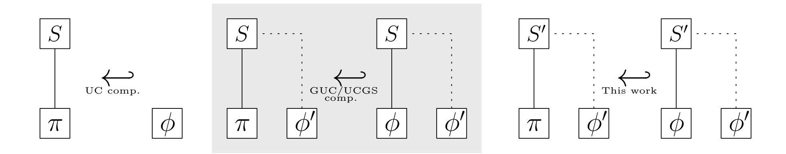

Figure 1: Applying composition theorems in the UC literature. Here,  $X \leftarrow Y$  denotes that X can replace Y in arbitrary contexts.  $\pi, \phi, \phi'$  denote protocols potentially calling setup S. Assume  $\pi$  UC-emulates  $\phi$  (with access to S) and that S' UC-emulates S.

**UC composition (left):** If S is only called by  $\pi$ , then  $\pi^S$  can replace  $\phi$  in arbitrary contexts. **GUC/UCGS composition (middle):**  $\pi^S$  can replace  $\phi^S$  even if the setup S is called by other protocols, too, and hence is global. **This work (right):**  $\pi^{S'}$  can replace  $\phi^{S'}$  (under certain conditions), i.e., replacing  $\phi$  by  $\pi$  works, even when the global setup S (that both protocols call) is replaced by its realization S'.

interactive protocols are proposed to securely implement a global PKI [Bd94, RY16, MR17, GKLP18, KKM19, PSKR20], a global clock [BGK+21], or a global ledger [BMTZ17]. Suddenly, the above question of global setup replacement becomes highly relevant! Does a protocol's claimed security in the presence of an ideal global PKI such as, e.g., [CSV16, PS18, DPS19] still hold when the protocol is deployed with an interactive PKI protocol instead? Does a security analysis carried out w.r.t an ideal global ledger functionality [KZZ16, CGL+17, DFH18, DEFM19, DEF+19, EMM19, CGJ19, ACKZ20, KL20] remain valid when the global ledger is replaced by, e.g., the Bitcoin blockchain? The same question can be asked for protocols using a global clock [KZZ16, BGK+18, DFH18, DEF+19] or a global CRS [CKWZ13]. Our findings towards answering such questions are manifold. On the positive side, we give several simple conditions on the global setup, or both the global setup and the security statement, under which global replacement preserves a security statement. On the negative side, our results indicate that global setups need to be designed with care in order to not render the setup "irreplaceable". Unless such irreplaceable setups are hard-coded as trusted third parties, security results stated with respect to them are mainly of theoretical interest.

Technical challenges of global replacement. Let us first explain the general topology of a security statement in the presence of a global setup in its most common schenario. In Figure 2, protocol  $\pi$  securely realizes functionality  $\mathcal{F}$  in the presence of a global ideal PKI functionality. Being globally accessible by protocols that are part of the distinguishing environment, the global PKI exists in *both* the real execution with  $\pi$  and the ideal execution with  $\mathcal{F}$ . The adversarial interface at the global PKI is marked with \* in Figure 2, and it might allow the adversary to, e.g., read public keys of others and register his own keys.

To understand why the global PKI in the above illustration might not be replaceable by some protocol  $\Phi_{\mathsf{PKI}}$  that securely realized an ideal PKI, we need to review what "realization" (or UC-emulation, as it is often called) means here.  $\Phi_{\mathsf{PKI}}$  UC-realizes an ideal PKI if it is at least as strong

{4}------------------------------------------------

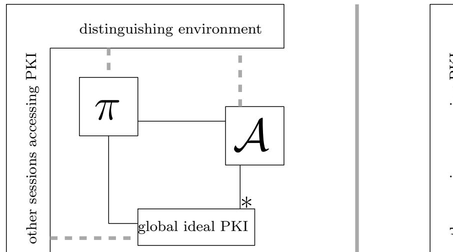

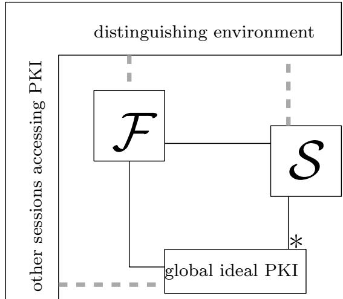

Figure 2: Topology of a security statement with a global setup.

as the ideal PKI. Hence, intuitively, UC realization draws the "upper bound" of the attack surface against  $\Phi_{PKI}$  in the following sense: protocol  $\Phi_{PKI}$  does not admit more attacks than the ideal PKI. We use the notion of an "attack" to describe something that the adversary can achieve via the adversarial interface. However, UC realization does not imply a lower bound on attacks:  $\Phi_{PKI}$  can have arbitrarily strong guarantees, thereby preventing several attacks that the ideal PKI admits3. And this lack of a lower bound causes trouble in replacing a global protocol with its realization: under replacement, the adversarial interface \* becomes restricted in an arbitrary way, causing failure in the simulation carried out by  $\mathcal{S}$ . If there is no way to rescue the simulation (i.e., to work with the restricted interface), the security statement witnessed by  $\mathcal{S}$  is void and  $\pi$  does indeed not emulate  $\mathcal{F}$  anymore in the presence of the interactive PKI protocol  $\Phi_{PKI}$ .

With the above explanation, it should become clear that an extensive adversarial interface at the global setup hinders its replacement. For example, the ideal PKI might allow the adversary to register an unlimited amount of (fresh) public keys without delays, while a blockchain-based PKI protocol might protect against such "flooding" of the PKI simply because transaction throughput is limited. A security statement in the presence of a global PKI with a simulation that exploits the public key flooding of the global PKI thus fails under replacement. Along these lines we can further give examples of ideal ledgers from the literature that require care when cast as global ledgers. For example, consider an ideal transaction ledger that allows the adversary to arbitrarily reorder transactions [BMTZ17]. A blockchain-based protocol realizing this ledger, however, might enforce a transaction order that is partially determined by honest miners. Thus, simulators exploiting adversarial reordering would not work with access to the blockchain-based protocol instead of the ideal transaction ledger. Another example is a global account ledger that allows the adversary to transfer arbitrary amounts of his own money (i.e., money owned by corrupted parties) with arbitrary delays [DEFM19]. Any security statement exploiting this weakness of the ledger in its simulation is not preserved when, instead of accessing the global account ledger, parties run a cryptocurrency protocol instead that, e.g., employs a monetary transaction limit or prevents large and sudden stake shift.4

&lt;sup>3As an example, it is possible that a PKI protocol that disallows registration of duplicate or non-wellformed public keys UC-emulates an ideal PKI that allows the adversary to register arbitrary public keys. Intuitively, the larger the gap in the guarantees, the easier is the UC realization to prove.

&lt;sup>4Our results, on the positive side, can be used to state the conditions such that a security proof is not jeopardized. For example, in the aforementioned work [DEFM19], this could be achieved by letting the protocol's security be oblivious of how exactly the base ledger settles an account balance, as long as it is eventually settled to the value the protocol (or the ideal functionality) demands. Since this only depends on the black-box properties of persistence and liveness of the underlying ledger, such an approach would admit a replacement by known blockchain protocols.

{5}------------------------------------------------

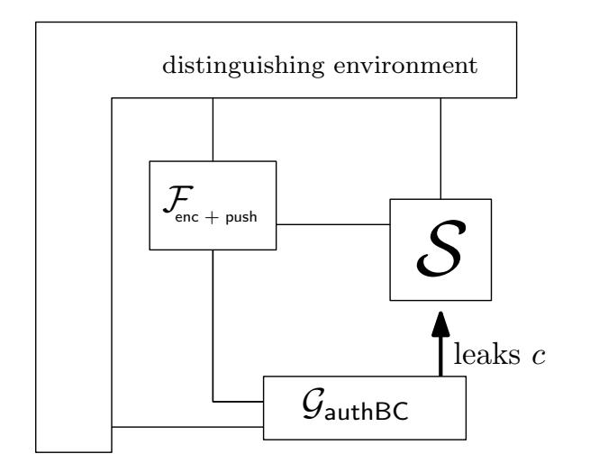

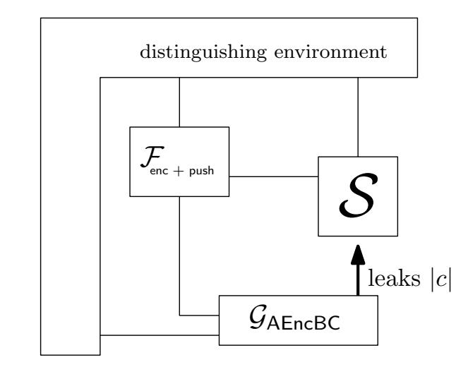

Figure 3: When simulation fails under global replacement: simulator S works with ciphertext c (left), but might fail when only receiving ciphertext length |c| (right) from the *stronger* global setup  $\mathcal{G}_{\mathsf{AEncBC}}$  that replaces the weaker  $\mathcal{G}_{\mathsf{authBC}}$ .

When replacement voids security I. One might be tempted to say that in the above examples, simulation can be adjusted to work with the stronger global protocol since, intuitively, the stronger global protocol also allows less attacks in the real world. However, this intuition can fail as we demonstrate now. We give a constructed but not overly artificial example of a global setup replacement that voids the underlying security statement, in the sense that there cannot exist any simulator witnessing the emulation statement. Consider the following "secure data distribution" protocol  $\pi_{\text{secDD}}$  run by some user U. The protocol needs access to a global repository  $\mathcal{G}_{\text{authBC}}$  where U can store data records:  $\mathcal{G}_{\text{authBC}}$  records (U, x) if user U provides input x and allows the adversary to read out any recorded pair from its storage. Such a repository could be realized by authenticated broadcast. Now, U first generates a key pair (pk, sk) and sends pk to the repository. It then takes an input message m and pushes an encryption  $c := \operatorname{Enc}_{pk}(m)$  to  $\mathcal{G}_{\text{authBC}}$  and additionally sends c on a network to a list of receiving parties  $R_i$ . It also internally stores m and returns the activation to the caller.

The ideal functionality this simple protocol  $\pi_{\mathsf{secDD}}$  realizes is an "encrypt-then-push" service that we call  $\mathcal{F}_{\mathsf{enc+push}}$ .  $\mathcal{F}_{\mathsf{enc+push}}$  takes input m from U and asks the simulator for a public key pk (m is never leaked). Upon receiving pk,  $\mathcal{F}_{\mathsf{enc+push}}$  encrypts m and provides the ciphertext as input to the repository in the name of U. To prove that the protocol realizes  $\mathcal{F}_{\mathsf{enc+push}}$  (under adaptive corruption of U), we come up with a proper simulator: the simulator simulates a public-private key pair (for U), provides  $\mathcal{F}_{\mathsf{enc+push}}$  with the public key, and simply reads out the ciphertext that the functionality created (in the name of U) from  $\mathcal{G}_{\mathsf{authBC}}$  to simulate the ciphertext on the network to be sent to the receivers. This is a perfect simulation of the real world. In case U is corrupted, the simulator provides the secret key to the adversary which is consistent with the encrypted input message m.

Now, assume we replace  $\mathcal{G}_{authBC}$  by a stronger version  $\mathcal{G}_{AEncBC}$  that works identically except that the adversary only receives the length |x| when reading any of the user's records, which corresponds to encrypted broadcast to a list of receivers. Intuition says that working with a stronger repository, i.e., using encrypted and authenticated broadcast rather than authenticated only, cannot be of harm and improves security for everyone. But this change does not only make the above simulation strategy impossible; in fact, no simulator exists to prove the same statement, i.e., that  $\pi_{secDD}$  realizes  $\mathcal{F}_{enc+push}$  anymore. The simulator does not have access to the ciphertext anymore which is now kept secret by  $\mathcal{G}_{AEncBC}$ , and hence must simulate a ciphertext without knowing the underlying message m. Figure 3 illustrates the issue. The simulation is trapped in the well-known commitment

{6}------------------------------------------------

problem [\[Nie02\]](#page-28-7) [5](#page-6-0) . We conclude that *π*secDD as defined fails in realizing Fenc+push when running with GAEncBC (which implies the weaker GencBC). This means that we must change the protocol (e.g., use non-committing encryption) to again realize Fenc+push, or if we stick to protocol *π*secDD, we must weaken the security guarantees of Fenc+push (e.g., leak message *m*).

While this example is arguably constructed, the problem's core translates directly to more serious situations, such as protocols (e.g., state-channels) proven secure with respect to a global ledger abstraction that is instantiated with a concrete blockchain protocol that is typically stronger (i.e., offers less adversarial capabilities) than its abstraction.

We now sketch another technically easy example that shows that security statements can fail completely, once a global setup is replaced by another one that UC-emulates it. Again, we replace the global setup by a stronger variant to achieve the contradiction. The example also illustrates how security guarantees can be blurred when exploiting adversarial capabilities of the global setup, and it does not rely on adaptive corruptions in doing so.

When replacement voids security II. Assume a simple protocol *φ* for some party *P* that works as follows: it expects as input transactions of a certain type. Before submitting them to a global transaction ledger, *φ* orders the transactions according to size and submits this list to the ledger. Assume that the ledger is a transaction ledger similar to the one in [\[BMTZ17\]](#page-26-4) that allows the adversary to re-order transactions before a block is formed and added to the immutable ledger state.

The ideal functionality F*φ* that this protocol realizes can be the following: it takes as input the list of transactions provided by *P*, and orders them *differently*, say according to lexicographic order, and submits this list to the global transaction ledger. This is of course weird, but possible to simulate: to prove this construction, we observe that the simulator has the freedom to reorder freely (before the transactions are appended to the ledger state) and chooses the ordering that equals the one induced by the actions of the real-world adversary, which even yields a perfect simulation!

Now assume we use a stronger transaction ledger that does not allow to reorder the transaction list in the ledger and hence makes the adversarial capabilities less powerful. However, since no simulator can now change the order, the order of transactions in the transaction ledger directly signals to the environment, whether it interacts with the ideal world (lexicographic order) or the real world (size). Therefore, using a stronger ledger (which UC-realizes the weaker one) renders the construction invalid as no simulator does exist. The point here is that every simulator must crucially carry out a reordering attack and that there is no other strategy to rectify the ideal world if re-ordering is impossible. This shows how the usage of a global ideal ledger can create false impressions of obtained guarantees, since F*φ* is impossible to realize w.r.t any real transaction ledger protocol which disallows arbitrary reordering.

**Our Results.** We provide various conditions under which replacement of a global setup by a protocol realizing it does not affect the validity of the underlying security statement. Our results of [Section 3](#page-12-0) give a partial guide on how to navigate the very tricky question of what constitutes a "good" global setup. More concretely, we provide three theorems for soundly replacing global setups by their emulation in existing security statements. We note that only the first replacement strategy is conditioned on solely the global setup and its emulation, and is hence oblivious of the underlying security statement. Contrary, the latter replacement strategies require us to put conditions on the

5 In order to conclude the proof, the environment can perform a standard trick: after seeing the ciphertext on the network (either real or simulated), the distinguisher can afterwards instruct the (dummy) adversary to corrupt the user *U* to obtain the secret key and check that the ciphertext contains the right message. For ordinary encryption schemes, this test will always succeed in the real world, and with substantial probability fail in the ideal world [\[Nie02\]](#page-28-7).

{7}------------------------------------------------

simulator of the underlying security statement.

Replacement with equivalent setup. A setup can be replaced with its realization if the realization is actually equivalent to the setup, including adversarial capabilities. The notion of equivalence of adversarial capabilities is formalized using the simulation argument: after replacing, there must be an efficient way to emulate all queries that were available before. This is formalized in [Theorem 3.3](#page-16-0) and recovers the, to our knowledge, only pre-existing result about global setup replacement in the literature [\[CSV16\]](#page-27-1) (see related work below for details). However, replacement with equivalent protocols is only of limited interest in practise, and thus [Theorem 3.3](#page-16-0) merely constitutes a sanity check of our chosen methodology of considering global replacement using the UCGS terminology [\[BCH](#page-25-1)+20].

Replacements for agnostic simulations. We show that the replacement of a global setup G in a protocol *π* UC-realizing *φ* is sound if the simulator S witnessing this construction fulfills one of the following two conditions.

- S is *agnostic* of the adversarial capabilities of G and the only dependence is on exported capabilities that are available also to honest parties. This is formalized in [Theorem 3.5.](#page-17-0)
- The interaction of S with the global setup can be characterized by a set *I* of adversarial queries that are *admissible*, a concrete technical condition that formalizes the idea that adversarial capabilities and their actions will be preserved once G is going to be replaced. This is formalized in [Theorem 3.10.](#page-21-0) A generalization of the results to the case of several global subroutines is given in [Section 4.](#page-23-0)

The first condition on the simulator is appealing as it is simple to check. As an example, [\[KZZ16\]](#page-28-4) gives a security statement in the presence of a global ledger that allows reordering, but their simulation is agnostic of this particular adversarial capability. Similarly, the simulation of the lightning network in [\[KL20\]](#page-28-6) works by only assuming that the simulator can access capabilities of honest parties to read the ledger state and submit transactions. We point out that since F can communicate with G naturally via an ordinary party identifier (see [\[BCH](#page-25-1)+20]) or in its own "name", the simulator S can indeed perform those tasks via F and hence use G just like an honest caller of the protocol (and importantly without making use of the adversarial interface of G).[6](#page-7-0)

The second condition brings more flexibility to protocol designers since S can use certain capabilities *I* at the adversarial interface. Formally, we introduce the concept of *filtering* adversarial queries [Definition 3.8](#page-19-0) that would hinder replacement, leaving only a set *I* of adversarial queries which are fine to use relative to an implementation (or a set of implementations) that is going to replace the setup.

Our theorems further follow by applications of the UCGS and UC composition theorems at a level of abstraction which seems to share a lot of similarities with other frameworks and their composition theorems. For example, the exact corruption model is irrelevant, as long as the behavior of and upon corruption can be formulated via an "adversarial" interface, where the above conditions can be evaluated on (such as the backdoor tape in UC). Our results are formulated using terminology and composition theorem of [\[BCH](#page-25-1)+20], which equips the standard UC model with a definition for global subroutines and composition in the presence of such. In doing so, we refrain from introducing a new variant of UC in order to state our results. We further believe that our results are natural and can be adapted to other simulation-based frameworks than UC.

6We note that prior works often leave it unspecified how exactly the simulator performs those tasks in the name of honest parties and how it will get the replies. The way we suggested, namely via F, is actually the only admissible way without directly running into the replacement problem again.

{8}------------------------------------------------

Implications on the Global Random Oracle Model. Often, a global setup is modeled as a pure setup assumption for proofs. The probably most prominent example is the global random oracle model (RO) [\[CJS14,](#page-27-8) [BGK](#page-26-6)+18, [CDG](#page-26-7)+18]. While our results are presented in a rather *constructive* way that help to evaluate protocol designers what impact their choice of global setup has as a building block to-be-replaced, our results are general and hence applicable to the global RO setting as well. For global random oracles, different versions of different (adversarial) strengths exist and the question about comparability and unification has been brought up by Camenisch et al. [\[CDG](#page-26-7)+18]. In fact, composing different constructions w.r.t different global random oracles is unfortunate, since the main reason to switch to global RO (vs. local RO) is that in practice, all random oracles are instantiated by a single hash function anyway. If composing constructions forces us to again have a couple of different global random oracles (which are supposedly replaced by a single hash function) we are back at square one. As we present in [Section 3.4,](#page-22-0) our results provide a general framework to evaluate whether different RO assumptions can be unified across a set of constructions, which is very vital for the global RO model and nicely complements the study of [\[CDG](#page-26-7)+18] (in the sense outlined described in the related work section).

Why replacing the setup in both worlds? Looking back at Figure [2](#page-4-0) and the described issues of simulation failing under a replaced and restricted adversarial interface, one can ask the following question: why can't we replace the global PKI just in the real world, hence restricting only the real-world adversary? Indeed, we formally prove (using only standard UC composition) that we can just let *π* make subroutine calls to the replacement of global setup G, and leave the ideal world to be F in combination with context G. However, such replacement is not very useful: the different contexts allow to obscure the achieved level of security as formalized by F. The high-level reason is that F is misleading in its role as idealization of *π* if we ignore the context. For example, F can offer much better security guarantees (for example, less powerful adversarial interface) *because of* the weak context that offers more influence to an adversary. In the sum, the real world is stronger and the ideal world is weaker (hence the statement must go through) but the exact idealization of *π* remains unclear because the context is not equal and cannot be "factored out". The second example above (the re-ordering example with a global ledger) is of this type.

Why not simply using a stronger ideal setup to begin with? To circumvent the replaceability issues that we deal with in this paper, we could simply prove our security statements with respect to a stronger global functionality that is very close or even UC-equivalent to the protocol. This way, we can likely argue that the simulator of our security statement works equally well with both setups, and we can allow for replacement of the global setup (cf. Theorem 3). What is the downside of this approach? The strengthened functionality no longer abstracts an "ideal service" to be used in a modular protocol analysis or design. For example, one could strengthen the ideal global ledger to exactly match the guarantees and adversarial interfaces of Bitcoin. But then the security analysis with respect to that ledger remains valid *only* when replacing it with Bitcoin, while an analysis with respect to an abstracted global ledger functionality can (if carried out as suggested in our paper) remain valid when replacing the global ledger with *any* blockchain that UC-realizes it. This idea of modular composition is at the core of universal composability frameworks and our paper shows how to preserve it for global functionalities.

Conclusion - what is a "good" global setup? Our results indicate that care has to be taken when global setups are used as building blocks intended to be replaced with interactive protocols. Since replacement requires conditions on both setup and security proof, "good" global setups cannot be identified as such by just looking at the setup. Of course, to be instantiable by another protocol at all, a "good" global ideal building block needs to be UC-realizable (in a non-trivial manner) in the first place. But it also matters that such a global building block is *used in a good way* in a

{9}------------------------------------------------

security statement, meaning that the simulation does not overly exploit the adversarial interface, as otherwise it would be doomed to fail under replacement. We believe that our work provides good intuition and formal guidance on how to design *and use* global building blocks in modular protocol design.

**Related Work.** To our knowledge, there is very limited work on the replaceability of a global UC setup. In fact, the only work that has looked at the question in general is [\[CSV16\]](#page-27-1). However, the treatment there is in GUC which requires considerable effort to even define "global" protocols, and even then, the treatment inherits the inconsistencies of the GUC model. [\[CSV16\]](#page-27-1) identifies emulation equivalence as a sufficient condition on the global setup and protocol replacing it, to allow a generic preservation of security properties. However, these conditions are too strict to be applied on more complicated primitives, such as blockchain ledgers, which have recently become a standard example of global subroutines. Nonetheless, we recover their result ("General Functionality Composition", Theorem 3.1 [\[CSV16\]](#page-27-1)) in [Theorem 3.5.](#page-17-0)

While our results are described using the recent UCGS modelling [\[BCH](#page-25-1)+20], they can easily be adapted to any framework which supports universal composition and global setups.

Finally, an investigation of replaceability targeted to special variants of global random oracles was recently made in [\[CDG](#page-26-7)+18]; in a nutshell, their approach is contrary to ours in the sense that their work investigates the replacement of a stronger by a weaker random oracle (i.e., one that gives the simulator more power). Such a replacement can only be sound for specific definitions of random oracles (ones that are defined to take away leverage from the real-world adversary, but not the simulator) and need to be accompanied by a protocol transformation. As we outline in [Section 3.4,](#page-22-0) our most general theorem nicely complements their study on unifying different global RO assumptions.

**Organization of this paper.** While our ideas are formulated in a generality such that they can be applied to several composable frameworks that support global setup [\[KMT20,](#page-28-8) [MR11\]](#page-28-9), when it comes to proofs, we must fix a particular model which we choose to be UC [\[Can20\]](#page-26-8) and its treatment of global subroutines as recently established in [\[BCH](#page-25-1)+20]. We provide a brief introduction to UC and UCGS in [Section 2,](#page-9-0) which should suffice to follow the ideas of our proofs. For convenience, we further provide an overview of all relevant UC concepts in [Appendix A.](#page-29-0) In [Section 3](#page-12-0) we provide global subroutine replacement theorems for protocols accessing only a single global setup. We generalize our concepts to many global subroutines in [Section 4.](#page-23-0)

# **2 Preliminaries: Global Subroutines in UC**

In this section we recap how to formalize global setups in the UC framework using the language of UCGS [\[BCH](#page-25-1)+20]. We first provide the minimal background on the UC model that is necessary to understand the concepts.

### **2.1 UC Basics**

Formally, a protocol *π* is an algorithm for a distributed system and formalized as an interactive Turing machine. An ITM has several tapes, for example an identity tape (read-only), an activation tape, or input/output tapes to pass values to its program and return values back to the caller. A machine also has a backdoor tape where (especially in the case of ideal functionalities) interaction with an adversary is possible or corruption messages are handled. While an ITM is a static object, 

{10}------------------------------------------------

UC defines the notion of an ITM instance (denoted ITI), which is defined by the extended identity eid = (M, id), where M is the description of an ITM and id = (sid, pid) is a string consisting of a session identifier sid and a party identifier  $pid \in \mathcal{P}$ . An instance, also called a session, of a protocol  $\pi$  (represented as an ITM  $M_{\pi}$ ) with respect to a session number sid is defined as a set of ITIs  $\{(M_{\pi}, id_{pid})\}_{pid \in \mathcal{P}}$  where  $id_{pid} = (sid, pid)$ .

The real process can now be defined by an environment  $\mathcal{Z}$  (a special ITI) that spawns exactly one session of the protocol in the presence of an adversary  $\mathcal{A}$  (also a special ITI), where  $\mathcal{A}$  is allowed to interact with the ITIs via the *backdoor tape*, e.g., to corrupt them or to obtain information from the hybrid functionalities, e.g. authenticated channels, that the protocol is using. The adversary ITI can only communicate with the backdoor tapes of the protocol machines. An environment can be restricted by a so-called identity bound  $\xi \in \Xi$  which formalizes which external parties the environment might claim when interacting as input provider to the protocol. The less restrictive the bound, the more general the composition guarantees are. The UC theorem is quantified by such a predicate.

The output of the execution is the bit output by  $\mathcal{Z}$  and is denoted by  $\text{EXEC}_{\pi,\mathcal{A},\mathcal{Z}}(k,z,r)$  where k is the security parameter,  $z \in \{0,1\}^*$  is the input to the environment, and randomness r for the entire experiment. Let  $\text{EXEC}_{\pi,\mathcal{A},\mathcal{Z}}(k,z)$  denote the random variable obtained by choosing the randomness r uniformly at random and evaluating  $\text{EXEC}_{\pi,\mathcal{A},\mathcal{Z}}(k,z,r)$ . Let  $\text{EXEC}_{\pi,\mathcal{A},\mathcal{Z}}$  denote the ensemble  $\{\text{EXEC}_{\pi,\mathcal{A},\mathcal{Z}}(k,z)\}_{k\in\mathbb{N},z\in\{0,1\}^*}$ .

Ideal-world process The ideal process is formulated with respect to an another protocol  $\phi$ , which in its most familiar form is a protocol IDEAL $_{\mathcal{F}}$  for an ITM  $\mathcal{F}$  which is called an ideal functionality for which we describe the situation. In the ideal process, the environment  $\mathcal{Z}$  interacts with  $\mathcal{F}$ , an ideal-world adversary (often called the simulator)  $\mathcal{S}$  and a set of trivial, i.e., dummy ITMs representing the protocol machines of IDEAL $_{\mathcal{F}}$  that forward to the functionality whatever is provided as inputs to them by the environment (and return back whatever received from the functionality). In the ideal world, the ideal-world adversary (aka the simulator) can decide to corrupt parties and can interact via the backdoor tape with the functionality. For example, via the backdoor tape, the functionality could for example leak certain values about the inputs, or allow certain influence on the system. We denote the output of this ideal-world process by  $\text{EXEC}_{\mathcal{F},\mathcal{A},\mathcal{Z}}(k,z,r)$  where the inputs are as in the real-world process. Let  $\text{EXEC}_{\mathcal{F},\mathcal{S},\mathcal{Z}}(k,z)$  denote the random variable obtained by choosing the randomness r uniformly at random and evaluating  $\text{EXEC}_{\mathcal{F},\mathcal{S},\mathcal{Z}}(k,z,r)$ . Let  $\text{EXEC}_{\mathcal{F},\mathcal{S},\mathcal{Z}}$  denote the ensemble  $\{\text{EXEC}_{\mathcal{F},\mathcal{S},\mathcal{Z}}(k,z)\}_{k\in\mathbb{N},z\in\{0,1\}^*}$ .

Secure Realization and Composition In a nutshell, a protocol  $\pi$   $\xi$ -UC-emulates (ideal) protocol  $\phi$  if the "real-world" process (where  $\pi$  is executed) is indistinguishable from the ideal-world process (where  $\phi$  is executed), i.e., if for any (efficient) adversary  $\mathcal{A}$  there exists an (efficient) ideal-world adversary (the simulator)  $\mathcal{S}$  such that for every (efficient)  $\xi$ -bounded environment  $\mathcal{Z}$  it holds that  $\text{EXEC}_{\pi,\mathcal{A},\mathcal{Z}} \approx \text{EXEC}_{\phi,\mathcal{S},\mathcal{Z}}$ .

The emulation notion is composable, i.e., if  $\pi$  UC-emulates  $\phi$ , then in a larger context protocol  $\rho$ , the subroutine  $\phi$  can be safely replaced by  $\pi$ , denoted by  $\rho^{\phi \to \pi}$ . For this replacement to be well-defined, a few technical preconditions must be satisfied. First, the protocols must be compliant, which ensures that in case  $\pi$  and  $\phi$  might both be subroutines in  $\rho$  they do not share the same session (ensuring that the replacement operator works as intended). Furthermore, compliance also makes sure that the protocol is invoked properly, i.e., with the correct identities specified in  $\xi$ . The definitions of these UC concepts relevant to our work are given in Appendix A. The second major precondition is that protocols should be subroutine respecting, meaning that each session of  $\pi$ 

{11}------------------------------------------------

can run in parallel with other sessions of protocols without interfering with them (in order for the UC-emulation notion which considers a single challenge session to be a reasonable precondition for the composition theorem). For details we refer to [Appendix A.](#page-29-0)

**Theorem 2.1** (UC Theorem)**.** *Let ρ, π, φ be protocols and let ξ be a predicate on extended identities, such that ρ is* (*π, φ, ξ*)*-compliant, both φ and π are subroutine exposing and subroutine respecting, and π UC-emulates φ with respect to ξ-identity-bounded environments. Then ρ φ*→*π UC-emulates protocol ρ.*

# **2.2 UC with Global Subroutines**

A global subroutine can be imagined as a module that a protocol uses as a subroutine, but which might be available to more than this protocol only. While initial formalizations to capture when a module is available to everyone, i.e., to the environment, defined a UC-variant [\[CDPW07\]](#page-26-1), it was recently shown that capturing this can be fully accommodated within UC [\[BCH](#page-25-1)+20]. In a nutshell, if *π* is proven to realize *φ* in the presence of a global subroutine *γ*, then the environment can access this subroutine in both, the ideal and the real world, which must be taken care of by the protocol. As a rule of thumb, proving that *π* realizes *φ* in the presence of global *γ* is harder than when *γ* is a local subroutine, i.e., not visible by the environment.

The framework presented in [\[BCH](#page-25-1)+20] defines a new UC-protocol M[*π, γ*] that is an execution enclave of *π* and *γ*. M[*π, γ*] provides the environment access to the main parties of *π* and *γ* in a way that does not change the behavior of the protocol or the set of machines. The clue is that M[*π, γ*] itself is a normal UC protocol and the emulation is perfect under certain conditions on *π* and *γ*. We first state the definition from [\[BCH](#page-25-1)+20].

**Definition 2.2** (UC emulation with global subroutines)**.** Let *π*, *φ* and *γ* be protocols. We say that *π ξ-UC-emulates φ in the presence of γ* if protocol M[*π, γ*] *ξ*-UC-emulates protocol M[*φ, γ*].

The first condition is the following and expresses the fact that *γ* might communicate with protocols outside of *π*'s realm:

**Definition 2.3** (*γ*-subroutine respecting)**.** A protocol *π* is called *γ*-subroutine respecting if the four conditions of [Definition A.6](#page-33-0) required from any (sub-)party of some instance of *π* are relaxed as follows:

- the conditions do not apply to those sub-parties of instance *s* that also belong to some extended session *s* 0 of protocol *γ*;
- (sub-)parties of *s* may pass input to machines that belong to some extended session *s* 0 of protocol *γ*, even if those machines are not yet part of the extended instance of *s* (cf. [Definition A.6,](#page-33-0) item 4).

The second condition is a technical condition on the global subroutine which is called *regularity*. The condition says that (a) a shared subroutine does not spawn new ITIs by providing subroutine output to them, and (b) that the shared subroutine may not invoke the outside protocol as a subroutine. It is usually not a problem for global setups to satisfy this, since most of the time, we can model functionalities to be reactive and assume "signaling events" to happen out-of-band.

The formal definition is taken from [\[BCH](#page-25-1)+20].

**Definition 2.4** (Regular setup)**.** Let *φ, γ* be protocols. We say that *γ* is a *φ-regular setup* if, in any execution, the main parties of an instance of *γ* do not invoke a new ITI of *φ* via a message destined for the subroutine output tape, and do not have an ITI with code *φ* as subsidiary.

{12}------------------------------------------------

In [BCH+20, Proposition 3.5], the authors show that if the protocol  $\pi$  is  $\gamma$ -subroutine respecting, where  $\gamma$  itself is  $\pi$ -regular and subroutine respecting, then the interaction between  $\pi$  and the global subroutine  $\gamma$  is very structured without unexpected artifacts. We state the proposition here for completeness. Here,  $\alpha$  is an arbitrary protocol and  $\hat{\alpha}$  is a version of  $\alpha$  that makes use of M[[] $\pi$ ,  $\gamma$ ] instead of  $\pi$  and has an indistinguishable behavior. We refer to [BCH+20] and just state the proposition.

**Proposition 2.5.** Let  $\gamma$  be subroutine respecting and  $\pi$  be  $\gamma$ -subroutine respecting. Then the protocol  $M[\pi, \gamma]$  is subroutine respecting. In addition, let  $\gamma$  be  $\pi$ -regular, and let  $\alpha$  be a protocol that invokes at most one subroutine with code  $\pi$ . Denote by  $\widehat{\alpha}$  the transformed protocol described above. Then the transcript established by the set of virtual ITIs in an execution of some environment with  $\widehat{\alpha}$  is identical to the transcript established by the set of ITIs induced by the environment that has the same random tape but interacts with  $\alpha$ .

The UCGS theorem is then the composition theorem for protocols that are defined with respect to a global subroutine  $\gamma$ . Note that not  $\gamma$  is replaced, but  $\phi$  by its implementation  $\pi$ .

**Theorem 2.6** (Universal Composition with Global Subroutines – UCGS Theorem). Let  $\rho, \phi, \pi, \gamma$  be subroutine-exposing protocols, where  $\gamma$  is a  $\phi$ -regular setup and subroutine respecting,  $\phi, \pi$  are  $\gamma$ -subroutine respecting and  $\rho$  is  $(\pi, \phi, \xi)$ -compliant and  $(\pi, \mathsf{M}[\mathsf{code}, \gamma], \xi)$ -compliant for  $\mathsf{code} \in \{\phi, \pi\}$ . Assume  $\pi$   $\xi$ -UC-emulates  $\phi$  in the presence of  $\gamma$ , then  $\rho^{\phi \to \pi}$  UC-emulates  $\rho$ .

# 3 Replacement Theorems for a Global Subroutine

In this section, we consider a setting where protocols access only one global subroutine, e.g., a global CRS, or a global ledger, but not both of them. That is, we only consider protocols whose shared setup is formulated as a single protocol. For this simplest global setting, we start by exploring which replacement of the global subroutine follows already from application of the UC composition theorem. Then, we recover the replacement theorem of [CSV16], which preserves security statements if the global subroutine is replaced by an equivalent protocol. And finally, we give conditions for security-preserving replacement of non-equivalent global subroutines.

### 3.1 Common Preconditions of our Theorems

Throughout this section, we assume the following preconditions for our theorems. Recall that we are interested in replacing a global subroutine while preserving security statements made with respect to this subroutine. We assume the security statement to be the following: protocol  $\pi$  (potentially with access to further local hybrids  $\mathcal{H}$ ) UC-emulates an ideal functionality  $\mathcal{F}$  in the presence of global subroutine  $\mathcal{G}$ , with respect to dummy adversary  $\mathcal{A}$ . Simulator  $\mathcal{S}_{\mathcal{A}}$  is a witness for this emulation. The statement is depicted below and referred to in the text as precondition (1).

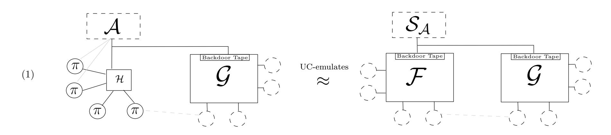

{13}------------------------------------------------

Recall that simulation for the dummy adversary is equivalent to the standard UC-realization notion in the sense that a simulator  $\mathcal{S}_{\mathcal{A}}$  for the dummy adversary  $\mathcal{A}$  implies a (black-box) simulator  $\mathcal{S}_{\mathcal{A}'}$  for any non-dummy adversary  $\mathcal{A}'$  [Can20] (and the reverse direction is obviously true).

Second, since our aim is to investigate how UC emulation of global subroutines can be useful for context protocols, we assume that the global subroutine is emulated as follows:  $\psi$  UC-emulates  $\mathcal{G}$ , with respect to dummy adversary  $\mathcal{D}$  (where  $\psi$  potentially makes use of other hybrids  $\mathcal{H}'$ ). We call a simulator witnessing this statement  $\mathcal{S}_{\mathcal{D}}$ . We refer to this emulation as precondition (2).

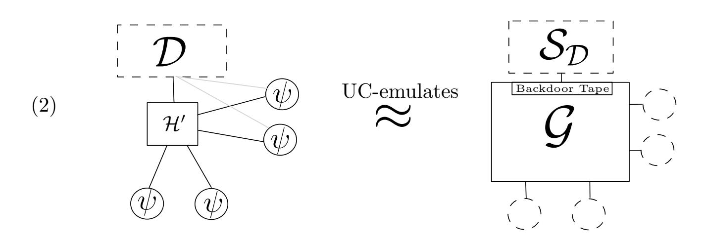

Given this notation, the core question of our work can be stated as follows: given preconditions (1) and (2), under which additional conditions does it hold that

 $\pi$  UC-emulates  $\mathcal{F}$  in the presence of global  $\psi$ ?

Simplifying notation. We note that, while our theorems hold for arbitrary UC protocols, to ease understanding, we formulate them with the special protocols IDEAL $_{\mathcal{F}}$  and IDEAL $_{\mathcal{G}}$ . Intuitively,  $\mathcal{F}$  is a "target" functionality that is to be realized and  $\mathcal{G}$  a global ideal setup. To further simplify, we slightly abuse notation and write  $\mathcal{G}$  instead of IDEAL $_{\mathcal{G}}$ , e.g., we write " $\psi$  UC-emulates  $\mathcal{G}$ " instead of " $\psi$  UC-emulates IDEAL $_{\mathcal{G}}$ ".

### 3.2 Warm-Up: Replacing Real-World Global Setups

Our first lemma states that under precondition (2) we can replace the shared subroutine by the construction that UC emulates it. Another way to view this is that "lifting" to global subroutines (w.r.t any application protocol  $\pi$ ) preserves UC emulation. An important feature of this statement is that it follows from standard UC composition thanks to the embedding of global setups in standard UC. Throughout the section, we will maintain a running example to illustrate all our statements.

Running Example. Let  $\mathcal{G} = \mathcal{G}_{\mathsf{ledger}}$  be an ideal ledger and  $\pi$  a lottery protocol requiring a ledger. Further, let  $\psi = \mathsf{FunCoin}$  be a cryptocurrency implementing the ledger  $\mathcal{G}_{\mathsf{ledger}}$ . By UC emulation, all manipulation and attacks allowed on FunCoin must also be allowed against  $\mathcal{G}_{\mathsf{ledger}}$ . In particular, this holds for any manipulation or attack carried out while running a lottery.

**Lemma 3.1.** Assume a protocol  $\pi$  makes subroutine calls to global subroutine  $\mathcal{G}$  and that  $\psi$  is a protocol that UC-emulates  $\mathcal{G}$ . Then  $\pi$  invoking  $\psi$  instead of  $\mathcal{G}$  UC-emulates protocol  $\pi$ .

*Proof.* On a high level, the argument is as follows: if an environment could tell a run of  $\pi$  with  $\psi$  from a run of  $\pi$  with  $\mathcal{G}$ , then running  $\pi$  internally would already let the environment distinguish a run of  $\psi$  from a run of  $\mathcal{G}$ , violating the precondition of the lemma.

{14}------------------------------------------------

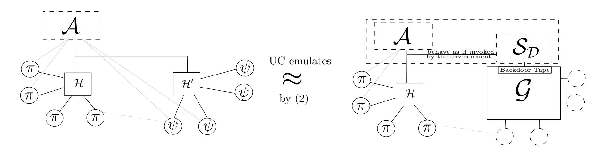

Since for the technical argument, we have to stick to a particular model, we have use the UC language in a more precise way: hence, we assume that  $\pi$ ,  $\psi$ ,  $\mathcal{G}$  be protocols and let  $\xi \in \Xi$  be a predicate on extended identities, such that  $\pi$  is  $(\psi, \mathcal{G}, \xi)$ -compliant,  $\pi$ ,  $\mathcal{G}$ ,  $\psi$  are subroutine exposing,  $\mathcal{G}$  and  $\psi$  are subroutine respecting, and  $\pi$  is subroutine respecting except via calls to  $\mathcal{G}$ . We note that these technical conditions are as they appear in UC in order to guarantee that the UC-operator is well defined. To formalize emulation in the presence of a shared setup, we use the terminology of UCGS [BCH+20] (see Section 2.2 for a short recap), where global access to  $\mathcal{G}$  is granted by an overlay  $M[\cdot, \mathcal{G}]$ . In order for this overlay to be opaque to the execution of  $\pi$  with  $\mathcal{G}$ , we need to assume  $\mathcal{G}$  to be  $\pi$ -regular (see Definition 2.4 and Proposition 2.5).

With this terminology, it remains to show that if  $\psi$  UC-emulates  $\mathcal{G}$  with respect to  $\xi$ -identity-bounded environments, then  $\mathsf{M}[\pi^{\mathcal{G}\to\psi},\psi]$  UC-emulates protocol  $\mathsf{M}[\pi,\mathcal{G}]$  (with respect to  $\xi$ -identity bounded environments). This follows from the UC composition theorem: First, observe that  $\mathsf{M}[\pi,\mathcal{G}]$  is an ordinary UC-protocol, mimicking all effects that the global (and hence shared) subroutine might have with the environment. Similarly,  $\mathsf{M}[\pi^{\mathcal{G}\to\psi},\psi]$  is an ordinary UC-protocol where subroutine  $\mathcal{G}$  is replaced by  $\psi$ . Note that, similar to the role of the control function in UC, the embedding  $\mathsf{M}[\cdot]$  does not reveal the code of the main instances when interacting with the environment, and therefore we have that  $\mathsf{M}[\pi,\mathcal{G}]^{\mathcal{G}\to\psi}$  and  $\mathsf{M}[\pi^{\mathcal{G}\to\psi},\psi]$  are equivalent protocols. Since  $\psi$  UC-emulates  $\mathcal{G}$  w.r.t. all environments that are bounded by  $\xi$ , the UC composition theorem implies that  $\mathsf{M}[\pi^{\mathcal{G}\to\psi},\psi]$  UC-emulates  $\mathsf{M}[\pi,\mathcal{G}]$ .

Lemma 3.1 will serve mainly as a tool in proving the upcoming theorems. Next, we can apply the UC composition theorem to our two preconditions. This yields the following theorem. It says that, in any UC emulation statement w.r.t a global setup, we can safely strengthen the *real-world* setup, while leaving the setup in the ideal world unchanged. The intuition behind it is illustrated with the following example.

Running Example. Back to our lottery. The lottery's provider wants to create trust in his product. He therefore proves that, when run with the global ideal ledger, the lottery protocol UC-emulates some ideal functionality  $\mathcal{F}_{lottery}$  which enforces a fair lottery. In his proof, both the lottery protocol and  $\mathcal{F}_{lottery}$  may exploit weaknesses of  $\mathcal{G}_{ledger}$ . Since FunCoin is at least as secure as  $\mathcal{G}_{ledger}$ , the provider can safely advertise that running the lottery with FunCoin is as secure as  $\mathcal{F}_{lottery}$  with  $\mathcal{G}_{ledger}$ , since this replacement can only decrease the number of possible attacks on the global setup while running the lottery.

**Lemma 3.2.** Assume a protocol  $\pi$  UC-emulates  $\mathcal{F}$  in the presence of global subroutine  $\mathcal{G}$  and that  $\mathcal{G}$  is UC-emulated by  $\psi$ , then replacing  $\pi$ 's subroutine  $\mathcal{G}$  by  $\psi$  UC-emulates  $\mathcal{F}$  that has access to global subroutine  $\mathcal{G}$ .

*Proof.* We again need some technical conditions from standard UC and UCGS: Let  $\pi$ ,  $\mathcal{F}$ ,  $\psi$ ,  $\mathcal{G}$  be protocols and let  $\xi$ ,  $\xi' \in \Xi$  be predicates on extended identities, such that  $\pi$  is  $(\psi, \mathcal{G}, \xi)$ -compliant,  $\pi$ ,  $\mathcal{F}$ ,  $\mathcal{G}$ ,  $\psi$  are subroutine exposing,  $\mathcal{G}$  and  $\psi$  are subroutine respecting,  $\pi$  and  $\mathcal{F}$  are subroutine

{15}------------------------------------------------

respecting except via calls to G and G is *π*-regular. If *ψ* UC-emulates G with respect to *ξ*-identitybounded environments, and if *π* UC-emulates F in the presence of G w.r.t. *ξ* 0 -identity-bounded environments, then what we have to prove is that M[*π* G→*ψ, ψ*] UC-emulates protocol M[F*,* G] w.r.t. *ξ* 0 -identity-bounded environments. This however follows from standard composition: Recall that protocols M[*π* G→*ψ, ψ*] and M[*π,* G] from [Lemma 3.1](#page-13-1) are embeddings of protocols with global setup as normal UC protocols. Therefore, we can apply the UC composition theorem: M[*π* G→*ψ, ψ*] UC-emulates M[*π,* G], and by our assumption M[*π,* G] UC-emulates M[F*,* G].

The conclusion of this subsection is that under both conditions (1) and (2) it follows that both *π* and *ψ* running together are indistinguishable from the ideal world, where both components are idealized. This is often assurance enough that the protocol in combination with a particular implementation of the global setup achieves a good level of security. However, note that the security is stated in terms of abstractions of *both* real-world components. The overall guarantees are thus hard to tell, and false impressions of security might be created. Let us illustrate this issue with the following.

*Running Example.* Assume that the provider does not have a strong cryptographic background and that he actually struggled conducting the aforementioned proof. But suddenly, he realized that the proof is easy when he assumes that Gledger, which is used by both the poker game and Flottery, admits arbitrarily many adversarial ledger entries. He calls this new setup GweakLedger and is delighted when he finds out that it is still emulated by FunCoin (since UC emulation is transitive). He then happily applies [Lemma 3.2](#page-14-0) and rightfully advertises that his lottery (together with FunCoin) is as secure as Flottery (together with GweakLedger).

With this example we see that [Lemma 3.2](#page-14-0) falls short in examining the security of the challenge protocol when proven w.r.t. an (even slight) abstraction of the setup and not its implementation. In the above example, Flottery might provide very strong fairness guarantees, that however can only be achieved with a simulation that crucially exploits introduction of adversarial entries into GweakLedger. Thus, when looking only at Flottery, false impressions of security guarantees are created. In particular, with the stronger global Gledger or the actual protocol FunCoin, which do not have this weakness, Flottery might not even be realizable by the lottery – to say the least, the existing simulation is likely to fall short in witnessing such an emulation statement.

To remedy the situation (and to blow our provider's cover), we need to understand the implications of replacing the global setup in the ideal world. In particular, preventing a security proof from exploiting weaknesses in the abstraction of the setup seems to be crucial to arrive at a plausible and realistic level of security. In the remainder of this section, we ask under which conditions a security proof might be preserved when replacing the global setup in both worlds.

# **3.3 Full Replacement of the Global Subroutine**

We now turn our attention to "full" replacement strategies, where the global subroutine is replaced by a protocol UC-emulating it in both the real and the ideal world. Of course, this is to be understood w.r.t an existing security statement, that is, our precondition (1). Let us emphasize again that we are only interested in replacement strategies that preserve the underlying security statement.

#### **3.3.1 Equivalence Transformations of the Global Subroutine.**

Canetti et al. demonstrated, using the terminology of GUC, that replacing the global subroutine by an equivalent procedure preserves protocol emulation w.r.t the subroutine. The replacement theorem is proven in [\[CSV16\]](#page-27-1), and we recover it here for completeness. Thanks to the embedding 

{16}------------------------------------------------

within plain UC that UCGS achieves, our proof is able to capture the arguments at a more abstract level, essentially reducing all steps to standard UC-emulation. Let us first illustrate how and why equivalence replacement works with the lottery.

*Running Example.* The provider keeps receiving calls from cryptographers who find it suspicious that his simulation exploits the weaknesses of GweakLedger. Since FunCoin does not offer introduction of arbitrary adversarial blocks, the provider however cannot carry out his simulation with FunCoin. Searching the internet, the provider learns about a shady cryptocurrency called DarkCoin. Further investigating, the provider can prove that DarkCoin admits the exact same attacks as GweakLedger, i.e., is UC-equivalent to GweakLedger [7](#page-16-1) . Thus, the provider can run his simulation with DarkCoin instead of GweakLedger, since DarkCoin allows for all adversarial queries that are possible with GweakLedger. Moreover, the provider can be assured that his simulation is still good for the now modified real world, since DarkCoin does not admit more attacks than GweakLedger. Relieved, he announces that, when using the globally available DarkCoin, his lottery protocol emulates Flottery.

**Theorem 3.3** (Full Replacement via Equivalence Transformations)**.** *Assume π UC-emulates* F *in the presence of a global subroutine* G*. If ψ UC-emulates* G *and vice-versa, i.e., their adversarial interfaces are equivalent, then π, invoking ψ instead of* G*, UC-emulates* F*, invoking ψ instead of* G*, and where ψ is the global subroutine.*

*Proof.* We again have to phrase our theorem in the language of UCGS: Let *π*, F, *ψ*, G be protocols and let *ξ*, *ξ* 0 ∈ Ξ be predicates on extended identities, such that *π* is (*ψ,* G*, ξ*)-compliant, *π*, F, G, *ψ* are subroutine exposing, G and *ψ* are subroutine respecting, *π* and F are subroutine respecting except via calls to G and G is *π*-regular. If *ψ* UC-emulates G with respect to *ξ*-identity-bounded environments and vice-versa— and if *π* UC-emulates F in the presence of G w.r.t. *ξ* 0 -identity-bounded environments, then M[*π* G→*ψ, ψ*] UC-emulates protocol M[F G→*ψ, ψ*] w.r.t. *ξ* 0 -identity-bounded environments.

The sequence of steps needed in this proof are the following hybrid protocols.

- The real protocol *H*0 := M[*π* G→*ψ, ψ*].
- The first intermediate step *H*1 := M[*π,* G].
- The second intermediate step *H*2 := M[F*,* G].
- The destination protocol *H*3 := M[F G→*ψ, ψ*].

As in the proof of [Lemma 3.1](#page-13-1) , *H*0 is equivalent to M[*π,* G] G→*ψ* and hence *H*1 = *H ψ*→G 0 . By standard composition, *H*0 UC-emulates *H*1 since the embedding is an normal UC-protocol and subroutine *ψ* UC-emulates G. Next, the transition from *H*1 to *H*2 is trivial: *H*1 UC-emulates *H*2 by the theorem assumption. Finally, we go the "reverse" direction as in the argument of the first step thanks to the fact that we know that G UC-emulates *ψ*. More formally, we have *H*3 = M[F*,* G] G→*ψ* and again, *H*3 is obtained by normal subroutine replacement within protocol *H*2. Therefore, *H*2 UC-emulates *H*3 by the theorem assumption and we have that *H*0 UC-emulates *H*3 which concludes the proof.

To the best of our knowledge, Theorem [3.3](#page-16-0) is the only composition theorem allowing for replacement of global subroutines with their UC emulation that already exists in the literature [\[CSV16\]](#page-27-1). It can be applied to soundly replace, e.g., a globally available ideal PKI with its implementation at a trusted PKI provider. However, it falls short in replacing global setups with protocols, which are likely to be stronger than their abstraction as a UC functionality. In the remainder of this section we discuss solutions for such replacements.

7Formally, *ψ* and *ψ* 0 are UC-equivalent if *ψ* UC-emulates *ψ* 0 and *ψ* 0 UC-emulates *ψ*.

{17}------------------------------------------------

#### **3.3.2 Global-agnostic Simulations of the Challenge Protocol.**

The condition discussed in this section is useful for protocols designers to check whether their proof remains valid when a global subroutine is replaced, by means of checking the structure of the simulator. Intuitively, a sufficient condition is if the simulator can simulate without accessing the adversarial interface of the global setup. More generally speaking, for all UC-adversaries A the corresponding simulation strategy SA should only externally-write onto the backdoor tape of the global subroutine session(s) if the real-world adversary did so (which as we see below can be tested by examining the simulator for the dummy adversary). An easy way to achieve this is to have the ideal functionality F communicate with the global setup G directly and if needed, provide the simulator (simulating the actions of *π* when having access to the backdoor tape of F) with the necessary information. Intuitively, the reason this is sound is that the only way F can interact with the global setup just like an honest party would do (and in particular, not via the backdoor tape). Since replacing F by a protocol that implements it can never change the behavior for honest parties in a noticeable way (otherwise, it is obviously distinguishable) the replacement is unproblematic. We first formally capture what it means for a simulator to not use the adversarial interface of the global subroutine.

**Definition 3.4** (G-agnostic)**.** An adversary S interacting with subroutine G is G*-agnostic* if the only external write requests (made by S's shell) destined for (the backdoor tape) of parties and subparties of any session of G are those instructed by the environment directly and any messages via the backdoor tapes of (sub-)parties of any session of G are delivered directly to the environment without activating the body of S.

The above definition is directly applicable to the simulator for the fixed dummy adversary. Such a simulator always exists if UC-realization is achieved (cf. [Section 3.1\)](#page-12-1) and thus the condition can to be tested whenever a UC-realization statement is proven. We recall that from any simulator S for the dummy adversary, one obtains a simulator for any adversary. If S satisfies definition [Definition 3.4,](#page-17-1) then the constructed simulator S 0 for any adversary [\[Can20\]](#page-26-8)[Claim 11] has the property that it only calls the global subroutine if the real-world adversary does, and therefore does not rely on the availability of adversarial capabilities at the backdoor tape of the global setup.

*Running Example.* Recently, numbers of users participating in the provider's lottery dropped significantly. Being sure that this is because of his recent recommendation to use DarkCoin, the provider desperately hires a team of cryptographers. Examining the provider's simulation carried out with respect to GweakLedger, the team finds a better simulation strategy that only requires legitimate use of the ledger by sending transaction requests to it. The new simulator thus acts like an honest party using the ledger. In particular it does not exploit any of the adversarial interfaces of GweakLedger. Since FunCoin allows to submit transactions, replacing GweakLedger by FunCoin in the proof does not hinder the new simulation. With FunCoin back in the picture, user statistics begin to slowly recover and the provider is delighted.

**Theorem 3.5** (Full Replacement due to Agnostic Simulations I)**.** *Assume π UC-emulates* F *in the presence of a global subroutine* G *such that the simulator* S *for this construction is* G*-agnostic. Let further ψ UC-emulate* G*. Then π, invoking ψ instead of* G*, UC-emulates* F*, invoking ψ instead of* G*, and where ψ is the global subroutine.*

*Proof.* We first state the theorem in the language of UCGS as before. Let *π*, F, *ψ*, G be protocols and let *ξ*, *ξ* 0 ∈ Ξ be predicates on extended identities, such that *π* is (*ψ,* G*, ξ*)-compliant, *π*, F, G, *ψ* are subroutine exposing, G and *ψ* are subroutine respecting, *π* and F are subroutine respecting

{18}------------------------------------------------

except via calls to  $\mathcal{G}$  and  $\mathcal{G}$  is  $\pi$ -regular. Let  $\psi$  UC-emulate  $\mathcal{G}$  with respect to  $\xi$ -identity-bounded environments and let  $\pi$  UC-emulate  $\mathcal{F}$  in the presence of  $\mathcal{G}$  w.r.t.  $\xi'$ -identity-bounded environments. Let  $\mathcal{S}_{\mathcal{A}}$  denote a simulator for the latter emulation that satisfies Definition 3.4. Then  $\mathsf{M}[\pi^{\mathcal{G}\to\psi},\psi]$  UC-emulates protocol  $\mathsf{M}[\mathcal{F}^{\mathcal{G}\to\psi},\psi]$  w.r.t.  $\xi'$ -identity-bounded environments.

The proof strategy is as follows:

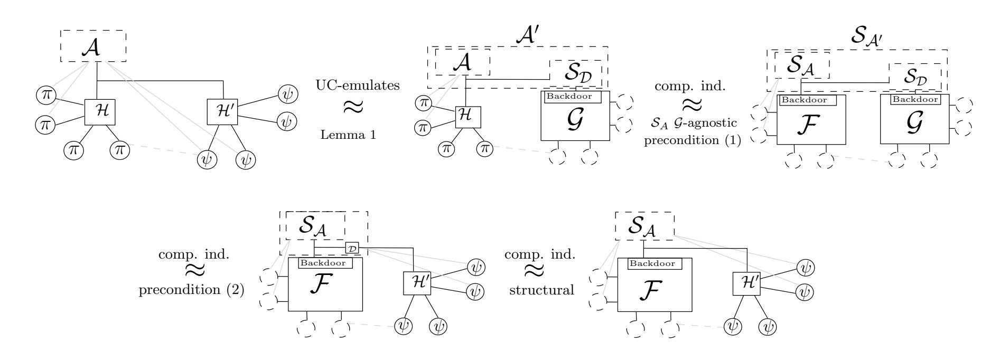

More formally, we make the following transitions, going from top left to bottom right in the picture.

 $M[\pi^{\mathcal{G}\to\psi},\psi]$  **UC-emulates**  $M[\pi,\mathcal{G}]$ . This directly follows from Lemma 3.1 and the precondition of  $\psi$  UC-emulating  $\mathcal{G}$ . Let  $\mathcal{A}'$  denote the simulator of this emulation.

EXEC $_{\pi,\mathcal{A}',\mathcal{Z}} \approx \text{EXEC}_{\mathcal{F},\mathcal{S}_{\mathcal{A}'},\mathcal{Z}}$ . We show how to simulate for the specific adversary  $\mathcal{A}'$ .  $\mathcal{S}_{\mathcal{A}'}$  works as  $\mathcal{S}_{\mathcal{A}}$ , but lets the (dummy) adversary  $\mathcal{A}$  on  $\pi$  issue its external write requests to the global subroutine directly to  $\mathcal{S}_{\mathcal{D}}$ , which overall has the effect as if  $\mathcal{A}$  and  $\mathcal{S}_{\mathcal{D}}$  were combined when talking to the global subroutine. The simulator  $\mathcal{S}_{\mathcal{A}}$  (simulating  $\pi$  while interacting with  $\mathcal{F}$ ) performs a good simulation even against this combined attacker, because  $\mathcal{S}_{\mathcal{A}}$  does not care about this interaction due to the agnostic property, i.e.,  $\mathcal{S}_{\mathcal{A}}$  is oblivious to any such queries to  $\mathcal{G}$  and acts as a relay between  $\mathcal{G}$  and  $\mathcal{Z}$ . Assume  $\mathcal{Z}$  distinguishes both distributions. Then, the modification of  $\mathcal{Z}$  that runs  $\mathcal{S}_{\mathcal{D}}$  internally (and submitting requests to the global subroutine as allowed by Definition 3.4) instead of sending requests to  $\mathcal{S}_{\mathcal{D}}$  (and otherwise mimics the actions of  $\mathcal{Z}$ ) is a successful distinguisher of  $\pi$ ,  $\mathcal{A}$  and  $\mathcal{F}$ ,  $\mathcal{S}_{\mathcal{A}}$ . Since  $\mathcal{S}_{\mathcal{A}}$  is  $\mathcal{G}$ -agnostic, the distributions are not affected by that change of order of  $\mathcal{S}_{\mathcal{A}}$  and  $\mathcal{S}_{\mathcal{D}}$  (or by the order of  $\mathcal{A}$  and  $\mathcal{S}_{\mathcal{D}}$ ). Since such an environment would hence violate precondition (1), we conclude that both distributions are indistinguishable.

EXEC $_{\mathcal{F},\mathcal{S}_{\mathcal{A}'},\mathcal{Z}} \approx \text{EXEC}_{\mathcal{F},\mathcal{S}',\mathcal{Z}}$ , where  $\mathcal{S}'$  denotes the simulator  $\mathcal{S}_{\mathcal{A}}$  sending requests to  $\psi$  via dummy adversary  $\mathcal{D}$ . Recall that  $\mathcal{S}_{\mathcal{A}'}$  combines  $\mathcal{S}_{\mathcal{A}}$  and  $\mathcal{S}_{\mathcal{D}}$ . If both executions are distinguishable, an environment running  $\mathcal{S}_{\mathcal{A}}$  and  $\mathcal{F}$  could distinguish an execution of  $\psi$  and  $\mathcal{D}$  from an execution of  $\mathcal{S}_{\mathcal{D}}$  with  $\mathcal{G}$ , violating the precondition that  $\psi$  UC-emulates  $\mathcal{G}$ , i.e., precondition (2).

 $\text{EXEC}_{\mathcal{F},\mathcal{S}',\mathcal{Z}} \approx \text{EXEC}_{\mathcal{F},\mathcal{S}_{\mathcal{A}},\mathcal{Z}}$ . Since the dummy adversary  $\mathcal{D}$  is just a relay, we can safely remove it from the execution.

{19}------------------------------------------------

#### **3.3.3 General Condition for Global-Functionality Replacement.**

With the previous theorem, we showed that a global subroutine can be safely replaced by its emulation in all security statements which are proven via a simulator who does not access the global subroutine. This however not only means that the simulator cannot manipulate the state of the global setup, but is also completely oblivious of it. This is often too strong of a condition. For example, consider a simulator witnessing a protocol's security in the presence of a global CRS. Such a simulator should at least be allowed to *read* out the CRS, since, intuitively, the CRS is publicly available information. Similarly, a simulator in a global ledger world should at least be allowed to read the state of the ledger. And indeed, our next replacement theorem admits global replacements that do not interfere with such simulators, as long as the power of the simulator is reflected in the real world even with respect to the stronger emulation of the global subroutine.

To ease the technical presentation of the condition on the simulator, for the next theorem we restrict ourselves to the special case of functionalities as global subroutines. The treatment could be generalized to arbitrary global subroutines. Let us start with introducing some technical tools which help us formalize interaction between adversaries and global functionalities.

**Definition 3.6** (Ordered interaction)**.** Let *I* be a set of queries. An ideal functionality G is called *I-ordered* if *G* answers to inputs *x* ∈ *I* on the backdoor tape with (*x, y*), and uses format (⊥*,* ·) otherwise.

The definition simply demands that ITM G, in his answers to the adversary, repeats what query it responds to if the query belongs to some set *I*. Note that quite often in the literature, such an association is necessary but left implicit in the description, since it is obvious which query will result in which answer (by repeating the input and maintaining a clear order when answering adversarial requests). Next, we define some useful notation when running two programs in one machine. Essentially, we define a wrapper that routes incoming queries to the program which they are intended for.

**Definition 3.7** (Parallel composition of adversaries)**.** Let S1 and S2 be two ITMs. Then [S1*,* S2] denotes the adversary with the following shell: whenever activated with value (*x, y*) on the backdoor tape, it activates S*i* if *x* was issued by S*i* and in any other case activates S2 by default. Conversely, if activated with input (*i, x*) on the input tape (for any *x*), the shell activates S*i* on input *x*.

**Definition 3.8** (Admissible backdoor-tape filter)**.** Let SD be the simulator of condition (2), i.e., the construction of G from *ψ*. Let *I* be a subset of adversarial queries allowed by G, and let G be *I*-ordered. Let further *fI* denote a simple program which takes inputs *x* ∈ *I* and writes them on the backdoor tape of G, and if provided with input (*x, y*) on the backdoor tape, returns *y* to the caller that provided the corresponding input *x* (other values on the subroutine output tape are ignored by *f*). We say that *fI* is an *admissible backdoor-tape filter for* (SD*, ψ,* G) if there exists a simulator [S*fI ,* D] such that execG*,*[*fI ,*SD]*,*Z ≈ exec*ψ,*[S*fI ,*D]*,*Z. We omit (SD*, ψ,* G) if it is clear from the context.

Pictorially, *fI* is an admissible filter if there is a simulator S*fI* such that:

{20}------------------------------------------------

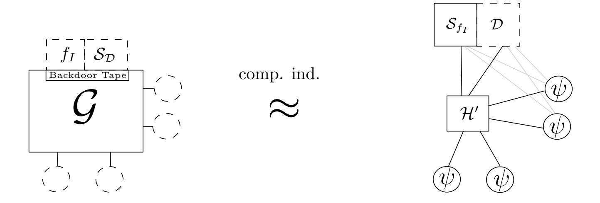

Note that a filter is nothing else than a program making the adversarial interface of G less powerful while not interfering with the assumed simulator.

*Running Example.* Let us assume that the ledger GweakLedger has adversarial interfaces *J* := {readState*,* permute*,* putEntry }. DarkCoin UC-emulates GweakLedger with simulator SD that, say, only uses interface putEntry. Thus, *f*{readState} is admissible for (SD*,* DarkCoin*,* GweakLedger) since SD does not depend on how often GweakLedger outputs the state. The simulator S*f*{readState} simply collects the state of the DarkCoin ledger from publicly available information. On the other hand, *f*{permute} (and *f*{permute*,*readState} ) can only be admissible if SD performs a good simulation regardless of the order in which entries (including adversarial ones) appear on the ledger, and if there exists an attacker S*f*{permute} that can carry out a permuting attack against DarkCoin.

The next definition restricts the simulator's usage of the global functionality. Essentially, the simulator is not allowed to query the global G except for queries in some set *I*.

**Definition 3.9** (G \*I*-agnostic)**.** Let S denote an adversary interacting with global subroutine G and let *I* denote a subset of the adversarial queries allowed by G, and let G be *I*-ordered. S is called G \*I-agnostic* if the only external write requests (made by the simulator's shell) destined for G are either requests *x* ∈ *I* or those instructed by the environment directly, and any messages via the backdoor tapes from the (sub-)parties of G are delivered directly to the environment without activating the body of S, except when they are of the form (*x,* ·) where the query *x* ∈ *I* has been issued by the body of S.

Analogously to [Definition 3.4](#page-17-1) this condition can be evaluated for any UC statement by considering the simulator for the dummy adversary, which again implies that any adversary can be simulated without relying on the availability of adversarial capabilities which are not in *I*.

We are now ready to state our most general replacement theorem for global subroutines for simulators that are global-agnostic except for queries in some set *I* that pass the backdoor-tape filter of the shared subroutine. Those queries can be asked by the simulator any time. The intuition is that, due to the admissible property, we know how to "attack" an instantiation of G to extract information from it that is indistinguishable from what the filtered adversarial interface of G offers.

*Running Example.* Bitcoin is known to UC-emulate a ledger functionality Gledger [\[BMTZ17\]](#page-26-4), which we assume to offer an adversarial interface readState[8](#page-20-0) . Let SD denote the simulator of this emulation statement. Since any permissionless blockchain, and in particular Bitcoin, publicly encodes the ledger state, it holds that *f*{readState} is admissible for (SD*,* Bitcoin*,* Gledger) (the simulator S*f*{readState} that witnesses admissibility is interacting with Bitcoin and obtains the state the same way an honest miner would do). Now if some blockchain application *π* proven w.r.t Gledger comes with a simulation that only queries Gledger with readState, the security statement remains valid when

8 In [\[BMTZ17\]](#page-26-4), any party, including the adversary, can obtain the ledger state by sending (READ*,*sid) to Gledger.

{21}------------------------------------------------

 $\mathcal{G}_{\mathsf{ledger}}$  is replaced with Bitcoin. That is,  $\pi$  is guaranteed to realize the *same* functionality, regardless of whether  $\mathcal{G}_{\mathsf{ledger}}$  or Bitcoin is used as global ledger.

**Theorem 3.10** (Full Replacement due to Agnostic Simulations II). Assume  $\text{EXEC}_{\psi,\mathcal{D},\mathcal{Z}} \approx \text{EXEC}_{\mathcal{G},\mathcal{S}_{\mathcal{D}},\mathcal{Z}}$  and let I be a subset of adversarial queries allowed by  $\mathcal{G}$  such that  $f_I$  is an admissible backdoor-tape filter for  $(\mathcal{S}_{\mathcal{D}}, \psi, \mathcal{G})$ . Let further  $\pi$  UC-emulate  $\mathcal{F}$  in the presence of the global subroutine  $\mathcal{G}$  such that the simulator  $\mathcal{S}_{\mathcal{A}}$  for this precondition is  $\mathcal{G} \setminus I$ -agnostic. Then,  $\pi$ , invoking  $\psi$  instead of  $\mathcal{G}$ , UC-emulates  $\mathcal{F}$ , invoking  $\psi$  instead of  $\mathcal{G}$ , and where  $\psi$  is the global subroutine.

Proof. We first state the theorem in the language of UCGS as before. Let  $\pi$ ,  $\mathcal{F}$ ,  $\psi$ ,  $\mathcal{G}$  be protocols and let  $\xi$ ,  $\xi' \in \Xi$  be predicates on extended identities, such that  $\pi$  is  $(\psi, \mathcal{G}, \xi)$ -compliant,  $\pi$ ,  $\mathcal{F}$ ,  $\mathcal{G}$ ,  $\psi$  are subroutine exposing,  $\mathcal{G}$  and  $\psi$  are subroutine respecting,  $\pi$  and  $\mathcal{F}$  are subroutine respecting except via calls to  $\mathcal{G}$  and  $\mathcal{G}$  is  $\pi$ -regular. Let  $\psi$  UC-emulate  $\mathcal{G}$  with respect to  $\xi$ -identity-bounded environments. Let  $\mathcal{S}_{\mathcal{D}}$  denote the simulator of this condition, and be I a subset of adversarial queries allowed by  $\mathcal{G}$  such that  $f_I$  is admissible for  $(\mathcal{S}_{\mathcal{D}}, \psi, \mathcal{G})$ . Let further  $\pi$  UC-emulate  $\mathcal{F}$  in the presence of  $\mathcal{G}$  w.r.t.  $\xi'$ -identity-bounded environments. Let  $\mathcal{S}_{\mathcal{A}}$  denote a simulator for this emulation, and let  $\mathcal{S}_{\mathcal{A}}$  be  $\mathcal{G}\setminus I$ -agnostic. Then  $\mathsf{M}[\pi^{\mathcal{G}\to\psi},\psi]$  UC-emulates protocol  $\mathsf{M}[\mathcal{F}^{\mathcal{G}\to\psi},\psi]$  w.r.t.  $\xi'$ -identity-bounded environments.

The sequence of steps needed in this proof are the following.

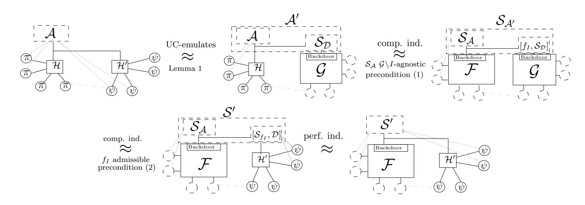

More formally, we make the following transitions, going from top left to bottom right in the picture.

 $M[\pi^{\mathcal{G}\to\psi},\psi]$  **UC-emulates**  $M[\pi,\mathcal{G}]$ . This directly follows from Lemma 3.1 and the precondition of  $\psi$  UC-emulating  $\mathcal{G}$ . Let  $\mathcal{A}'$  denote the simulator of this emulation.

EXEC $_{\pi,\mathcal{A}',\mathcal{Z}} \approx \text{EXEC}_{\mathcal{F},\mathcal{S}_{\mathcal{A}'},\mathcal{Z}}$ . We show how to simulate for the specific adversary  $\mathcal{A}'$ .  $\mathcal{S}_{\mathcal{A}'}$  works as  $\mathcal{S}_{\mathcal{A}}$ , but lets the dummy adversary  $\mathcal{A}$  on  $\pi$  issue its external write requests to the global subroutine directly to  $[f_I, \mathcal{S}_{\mathcal{D}}]$  (using the adressing mechanism described in Definition 3.7), which overall has the effect as if  $\mathcal{A}$  and  $[f_I, \mathcal{S}_{\mathcal{D}}]$  were combined when talking to the global subroutine. We need to argue that the simulator  $\mathcal{S}_{\mathcal{A}}$  (simulating  $\pi$  while interacting with  $\mathcal{F}$ ) still performs a good simulation even against this combined attacker. Due to  $\mathcal{S}_{\mathcal{A}}$  being  $\mathcal{G} \setminus I$ -agnostic,  $\mathcal{S}_{\mathcal{A}}$ 's requests reach  $\mathcal{G}$  unmodified since they pass  $f_I$ . Definition 3.9 further ensures that  $\mathcal{S}_{\mathcal{A}}$  acts as a dummy adversary regarding all requests between  $\mathcal{Z}$  and  $[f_I, \mathcal{S}_{\mathcal{D}}]$ . A distinguisher  $\mathcal{Z}$  between both distributions can thus be turned into a distinguisher between executions  $\pi$ ,  $\mathcal{A}$  and  $\mathcal{F}$ ,  $\mathcal{S}_{\mathcal{A}}$  which runs program  $[f_i, \mathcal{S}_{\mathcal{D}}]$  internally, violating precondition (1).

{22}------------------------------------------------

EXEC $_{\mathcal{F},\mathcal{S}_{\mathcal{A}'},\mathcal{Z}} \approx \text{EXEC}_{\mathcal{F},\mathcal{S}',\mathcal{Z}}$ , where  $\mathcal{S}'$  denotes the simulator  $\mathcal{S}_{\mathcal{A}}$  sending requests to  $\psi$  via adversary  $[\mathcal{S}_{f_I},\mathcal{D}]$ . Recall that  $\mathcal{S}_{\mathcal{A}'}$  combines  $\mathcal{S}_{\mathcal{A}}$  and  $\mathcal{S}_{\mathcal{D}}$ . If both executions are distinguishable, an environment running  $\mathcal{S}_{\mathcal{A}}$  and  $\mathcal{F}$  could distinguish an execution of  $\psi$  and  $[\mathcal{S}_{f_I},\mathcal{D}]$  from an execution of  $[f_I,\mathcal{S}_{\mathcal{D}}]$  with  $\mathcal{G}$ , violating the precondition that  $f_I$  is an admissible backdoor-tape filter for  $(\mathcal{S}_{\mathcal{D}},\psi,\mathcal{G})$ .

### 3.4 Case study: Comparable Constructions and Random Oracles

The benefit of composable security is that it enables a secure modular design of protocols. When one tries to achieve a new functionality, then one can rely on already realized functionalities as a setup, being assured that those can modularly be replaced by their already known implementations at any time. As we showed in this paper, this idea generally fails for global (hybrid) setups, but is partly restored by the above theorems by giving conditions on when such a replacement of a global setup is possible.

Still, the following mismatch might occur in such a modular protocol design which motivates another important aspect of Theorem 3.10. Assume two protocols are proven with respect to different global setups,  $\pi_1$  realizes  $\mathcal{F}_1$  in the GRO setting, and  $\pi_2$ , which makes (local) calls to  $\mathcal{F}_1$  and realizes  $\mathcal{F}_2$  w.r.t. a GRO that allows the adversary upon request to program random points of the function table and otherwise is identical to GRO. Therefore, obtaining a combined security claim w.r.t. a single RO assumption is in general not clear and might not be possible because they assume different global setups the realization of  $\mathcal{F}_1$  w.r.t. the observable RO has never been formally realized. Applying the UCGS theorem is not possible and replacing, within  $\pi$ , the functionality  $\mathcal{F}_1$  by  $\pi_1$  can only be a heuristic in the best case. This situation is of course unfortunate. As pointed out in [CDG+18] obtaining a common RO for both constructions is very vital for the global RO model: the main reason to switch to global RO (vs. local RO) is that in practice, all random oracles are instantiated by a single hash function anyway. If composing constructions forces us to again have a couple of different global random oracles in the end (which we replace by a single hash function) we are back at square one.

Luckily, Theorem 3.10 gives us a tool to figure out whether  $\pi_2$  actually achieves  $\mathcal{F}_2$  in the presence of the plain GRO (which in turn would allow us to apply the UCGS composition theorem): For protocol  $\pi_2$  UC-emulating  $\mathcal{F}_2$  in the presence of a global RO that supports, say, adversarial queries I (e.g., including random-points programmability), it is therefore enough to specify the set  $I' \subseteq I$  of filter requests for which the preconditions of Theorem 3.10 is satisfied. In this case, it follows that the very same construction can be proven with respect to any stronger version of the assumed GRO that blocks inputs from any subset of  $I \setminus I'$  and hence preserving the queries that are necessary for this simulator. The reason is that the simulator in the UC-emulation proof of the construction  $\pi_2$  is agnostic to what happens aside of its filter requests, and this includes the possibility that no request aside of its filter requests of queries in I' are made (and on the other hand, the protocol in the real world is not disturbed by the exact set of queries since it is proven w.r.t. the rpGRO).

The final conclusion is that incomparable constructions can become comparable by general security-preservation results, such as the one in Theorem 3.10: if I' does not contain the programmability request, then the two protocol  $\pi_1$  and  $\pi_2$  work for the same GRO as established by Theorem 3.10. Hence, for those two constructions,  $\pi_2$  can replace hybrid  $\mathcal{F}_1$  by  $\pi_1$ , which is then not a heuristic argument, but a sound composition step that is formally backed by the UCGS composition theorem.

{23}------------------------------------------------

We note that the study of [CDG+18] goes into the other direction by performing a transformation on  $\pi_1$  in order to be secure w.r.t. some weaker oracle  $\mathcal{G}_2$ . Such transformations can only exist for specific choices of RO's (since generic composition results fail when using a weaker setup due to increased attack surface for the real attacker), and our results applied to global RO constructions gives a tool to go the other way in certain cases.

# 4 Generalization to many Global Subroutines

We now consider protocols that use more than one global setup. Such a situation often appears in the literature, e.g., when a protocol makes use of a global ledger and a global clock, or a global PKI and a global random oracle. Formally, such a protocol is subroutine respecting except via calls to subroutines  $\gamma_i$ ,  $i \in [n]$ . In this section, we show how to leverage the results from the previous section to replace one, or several, or all of the global subroutines  $\gamma_i$ . A bit more formally, we now assume precondition (1) be as follows:

(1)  $\pi$  UC-emulates  $\mathcal{F}$  in the presence of global  $\gamma_1, \ldots, \gamma_n$ .

Looking ahead, we will have to make some assumptions on the global subroutines  $\gamma_1, \ldots, \gamma_n$  and the corresponding protocols  $\psi_1, \ldots, \psi_n$  to realize them. Roughly speaking,  $\psi_n$  will not depend on any other global subroutine to realize  $\gamma_n$ , while  $\psi_{n-1}$  (and hence also  $\gamma_{n-1}$ ) is allowed to depend  $\gamma_n$  but on no other global subroutine. We will be more formal about how to define "depend" in this context.

Before formalizing our results, let us describe the idea behind them. Essentially, we will interpret the setups  $\gamma_1, \ldots, \gamma_n$  as a single global setup  $\widehat{\gamma}$ .  $\widehat{\gamma}$  simply runs all  $\gamma_i$  internally and dispatches messages correspondingly. For this single global setup  $\widehat{\gamma}$ , we can interpret precondition (1) above as precondition (1) from the previous section with single setup  $\widehat{\gamma}$ , and apply the replacement theorems from the previous section. The only open question is: which protocol realizes the single global setup  $\widehat{\gamma}$ ? Note that this emulation is needed to replace precondition (2) in Section 3.1. So let  $\psi_1, \ldots, \psi_n$  denote the protocols we want to replace the global subroutines with, i.e.,  $\psi_i$  UC-emulates  $\gamma_i$  for all i. We show that, under the condition that all setups form a hierarchy regarding who gives input to whom,  $\widehat{\psi}$  UC-emulates  $\widehat{\gamma}$ .

We first state a general program structure:

**Definition 4.1** (Merging subroutines.). Let  $\hat{\rho}_{\rho_1,...,\rho_n} := [\rho_1,...,\rho_n]$  be a program that accepts inputs of the form (query, sid, i, x) and invokes subroutine  $\rho_i$  with input x, all with respect to the same session sid.

In UC, we must ensure that this simple program structure can be made a compliant protocol (and subroutine exposing) as we are going to replace its subroutines later. For two protocols  $\gamma_i$ ,  $\psi_i$ , the above program becomes  $(\psi_i, \gamma_i, \xi)$  compliant if it never relays inputs not satisfying the bound  $\xi$  by its caller. The remaining, more technical conditions for compliance can be trivially satisfied. In order not to overload notation, we assume such a predicate is known and enforced by  $\widehat{\rho}_{\rho_1,\ldots,\rho_n}$ . We identify UC-realization with multiple setups with the single global subroutine case as follows:

**Definition 4.2** (UC emulation with multiple global setups). Let  $\pi$ ,  $\phi$  and  $\gamma_1, \ldots, \gamma_n$  be protocols. We say that  $\pi$   $\xi$ -UC-emulates  $\phi$  in the presence of global subroutines  $\gamma_1, \ldots, \gamma_n$  if protocols  $\pi$  and

&lt;sup>9The remaining conditions are technicalities such as setting the forced-write flag and not calling  $\psi_i$  and  $\gamma_i$  with the same session sid which obviously can be satisfied. For the UCGS theorem, this protocol is compliant if it additionally never invokes a model element, which is obvious.

{24}------------------------------------------------

 $\phi$  are formulated with respect to a global subroutine  $\widehat{\gamma}_{\gamma_1,\dots,\gamma_n}$  and  $\mathsf{M}[\pi,\widehat{\gamma}_{\gamma_1,\dots,\gamma_n}]$   $\xi$ -UC-emulates protocol  $\mathsf{M}[\phi,\widehat{\gamma}_{\gamma_1,\dots,\gamma_n}]$ .

Note that the overlay we define is just a dispatching service. Hence, a protocol designer might still define  $\pi$  in the way of having  $\pi$  directly access each  $\gamma_i$ . This transition is straightforward.10

We hence obtained a reduction between the single global-subroutine world and the multiple global-subroutine world.

Remark. The following theorem makes the hierarchy idea formal that we discussed at the onset of this section. In order to express that  $\gamma_i$  does not depend on other subroutines  $\gamma_j$ , j < i we use the concept of regularity to ensure that  $\gamma_i$  does only invoke global subroutines that presumably already have been replaced (by condition 1. below, only the  $\gamma_i$ 's and no other protocol can be seen as global). This facilitates that for any subroutine  $\gamma_i$  we can make use of precondition 3. that  $\psi_i$  realizes  $\gamma_i$  in the presence of global subroutines  $\gamma_j$ , j < i, and be sure this is independent of what is yet to be replaced later. This gives a sound order of replacements.

**Theorem 4.3** (Reduction Theorem). Let  $\gamma_1, \ldots, \gamma_n$  and  $\psi_1, \ldots, \psi_n$  be protocols.  $\widehat{\psi}_{\psi_1, \ldots, \psi_n}$  UC-emulates  $\widehat{\gamma}_{\gamma_1, \ldots, \gamma_n}$  if for each protocol  $\rho_i \in \{\gamma_i, \psi_i\}$  the following conditions hold:

- 1.  $\rho_i$ , when i < n, is subroutine respecting except for calls to  $\gamma_{i+1}, \ldots, \gamma_n$ .  $\rho_n$  is subroutine respecting. All  $\rho_i$  are subroutine exposing.
- 2.  $\rho_i$ , when i > 1, is  $\gamma_j$ -regular and  $\psi_j$ -regular for all  $j \in \{1, \ldots, i-1\}$ .
- 3.  $\psi_i \xi$ -UC-emulates  $\gamma_i$ , for i < n, in the presence of global subroutines  $\gamma_{i+1}, \ldots, \gamma_n$ . And  $\psi_n$  UC-emulates  $\gamma_n$ .

*Proof.* We again use the transitivity of indistinguishability of ensembles. The sequence of hybrid worlds that are needed to conclude are depicted below for the case of three global subroutines.

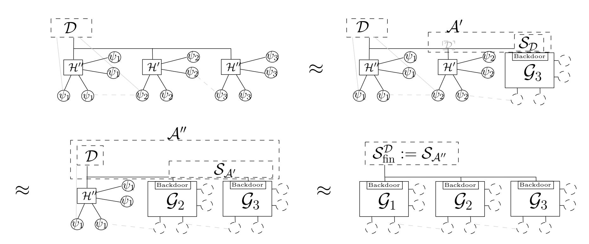

Each step is characterized by two elements: a single context protocol  $\mu_i$ , and the number i which protocol is to be replaced. Let  $\mu_i := [\psi_1, \dots, \psi_i, \gamma_{i+1}, \dots, \gamma_n], i = 1, \dots, n$  and  $\mu_0 := \widehat{\gamma}_{\gamma_1, \dots, \gamma_n}$ . We start with  $\mu_n := \widehat{\psi}_{\psi_1, \dots, \psi_n}$ .

&lt;sup>10Whether the transition is also trivial is a different question. In frameworks that have a complex runtime structure, introducing such an intermediate dispatching machine might be costly and would require  $\pi$  to request more runtime-resources. In UC, this would cost k import more for  $\pi$ , where k denotes a security parameter.

{25}------------------------------------------------

- Step 1: In the context protocol  $\mu_{n-1}$  we perform the replacement  $\mu_{n-1}^{\gamma_n \to \psi_n}$ , resulting in  $\mu_n$ . By the Theorem's precondition, we can invoke the UC composition theorem, since  $\gamma_n$  and  $\psi_n$  are subroutine respecting and subroutine exposing and  $\mu_n$  is compliant. Therefore, the UC composition theorem implies  $\text{EXEC}_{\mu_n,\mathcal{D},\mathcal{Z}} \approx \text{EXEC}_{\mu_{n-1},\mathcal{S}_n,\mathcal{Z}}$ .
- Step  $2 \leq i \leq n$ : starting with context protocol  $\mu_{n-i}$  we replace  $\mu_{n-i}^{\gamma_n \to \psi_n}$  which results in  $\mu_{n-i+1}$ . For this step, we can invoke the UCGS theorem since the preconditions of the UCGS theorem are satisfied:  $\gamma_i$  resp.  $\psi_i$  can be treated as protocols that are subroutine respecting except with calls to  $\gamma_{i+1}, \ldots, \gamma_n$  and hence Definition 4.2 applies. Furthermore, all protocols are subroutine exposing, and formally, the "global setup" of this construction, i.e., the subsystem consisting of  $\gamma_{i+1}, \ldots, \gamma_n$ , is  $\gamma_i$  and  $\psi_i$ -regular as demanded by the precondition, i.e., they never send input to any of the subroutine prior to i that have not yet been replaced. Hence, the UCGS theorem yields that  $\mu_{n-i}$  UC-emulates  $\mu_{n-i+1}$  and in other words,  $\text{EXEC}_{\mu_{n-i+1},\mathcal{A},\mathcal{Z}} \approx \text{EXEC}_{\mu_{n-i},\mathcal{S}_{n-i+1},\mathcal{Z}}$ .

The final step follows by applying transitivity to obtain the final simulator  $\mathcal{S}_{\text{fin}}$  for the overall construction. Since we started with the dummy real-world adversary for  $\widehat{\psi}_{\psi_1,...,\psi_n}$  this formally yields a simulator for the dummy adversary that proves  $\text{EXEC}_{\widehat{\psi},\mathcal{D},\mathcal{Z}} \approx \text{EXEC}_{\widehat{\gamma},\mathcal{S}_{\text{fin}}^{\mathcal{D}},\mathcal{Z}}$ .

We now set  $\psi := \widehat{\psi}_{\psi_1,\dots,\psi_n}$ ,  $\mathcal{G} := \widehat{\gamma}_{\gamma_1,\dots,\gamma_n}$  and  $\mathcal{S}_{\mathcal{D}} := \mathcal{S}_{\text{fin}}^{\mathcal{D}}$  in precondition (2) in Section 3.1. This yields a precondition that lets us replace all global subroutines using the various replacement theorems from the previous section.

Remark. In some situations, we might want to replace only one global subroutine but not all of them. As an example, consider a protocol accessing a global PKI functionality  $\gamma_1$ , which in turn uses a global RO  $\gamma_2$ . In an instantiation, the global PKI is likely replaced by an interactive protocol  $\psi_1$  (potentially involving a certificate authority, but still using the global RO). To ensure that the protocol's security proof remains valid under this replacement, we need to replace only  $\gamma_1$  but not  $\gamma_2$ . However, due to the fact that every protocol trivially UC-emulates itself, we can apply Theorem 4.3 with  $\psi_2 := \gamma_2$ , which will leave the global RO as a proof element.

# 5 Acknowledgements

We would like to thank the anonymous reviewers for their thoughtful feedback on this work. In particular, the idea of describing the technical issue that arises with global replacement in terms of lack of lower bounds in UC statements is due to one anonymous EUROCRYPT 2021 reviewer, to which we are very thankful.

# References

- [ACKZ20] Aydin Abadi, Michele Ciampi, Aggelos Kiayias, and Vassilis Zikas. Timed signatures and zero-knowledge proofs—timestamping in the blockchain era—. In Mauro Conti, Jianying Zhou, Emiliano Casalicchio, and Angelo Spognardi, editors, ACNS 20: 18th International Conference on Applied Cryptography and Network Security, Part I, volume 12146 of Lecture Notes in Computer Science, pages 335–354, Rome, Italy, October 19–22, 2020. Springer, Heidelberg, Germany.
- [BCH+20] Christian Badertscher, Ran Canetti, Julia Hesse, Björn Tackmann, and Vassilis Zikas. Universal composition with global subroutines: Capturing global setup within plain UC.

{26}------------------------------------------------

- In Rafael Pass and Krzysztof Pietrzak, editors, *TCC 2020: 18th Theory of Cryptography Conference, Part III*, volume 12552 of *Lecture Notes in Computer Science*, pages 1–30, Durham, NC, USA, November 16–19, 2020. Springer, Heidelberg, Germany.
- [Bd94] Josh Cohen Benaloh and Michael de Mare. One-way accumulators: A decentralized alternative to digital sinatures (extended abstract). In Tor Helleseth, editor, *Advances in Cryptology – EUROCRYPT'93*, volume 765 of *Lecture Notes in Computer Science*, pages 274–285, Lofthus, Norway, May 23–27, 1994. Springer, Heidelberg, Germany.
- [BGK+18] Christian Badertscher, Peter Gazi, Aggelos Kiayias, Alexander Russell, and Vassilis Zikas. Ouroboros genesis: Composable proof-of-stake blockchains with dynamic availability. In David Lie, Mohammad Mannan, Michael Backes, and XiaoFeng Wang, editors, *ACM CCS 2018: 25th Conference on Computer and Communications Security*, pages 913–930, Toronto, ON, Canada, October 15–19, 2018. ACM Press.
- [BGK+21] Christian Badertscher, Peter Gazi, Aggelos Kiayias, Alexander Russell, and Vassilis Zikas. Dynamic ad hoc clock synchronization. In Anne Canteaut and François-Xavier Standaert, editors, *Advances in Cryptology – EUROCRYPT 2021, Part III*, volume 12698 of *Lecture Notes in Computer Science*, pages 399–428, Zagreb, Croatia, October 17–21, 2021. Springer, Heidelberg, Germany.
- [BMTZ17] Christian Badertscher, Ueli Maurer, Daniel Tschudi, and Vassilis Zikas. Bitcoin as a transaction ledger: A composable treatment. In Jonathan Katz and Hovav Shacham, editors, *Advances in Cryptology – CRYPTO 2017, Part I*, volume 10401 of *Lecture Notes in Computer Science*, pages 324–356, Santa Barbara, CA, USA, August 20–24, 2017. Springer, Heidelberg, Germany.
- [Can01] Ran Canetti. Universally composable security: A new paradigm for cryptographic protocols. In *42nd Annual Symposium on Foundations of Computer Science*, pages 136–145, Las Vegas, NV, USA, October 14–17, 2001. IEEE Computer Society Press.
- [Can20] Ran Canetti. Universally composable security. Journal of the ACM, Vol. 67, No. 5, 2020.
- [CDG+18] Jan Camenisch, Manu Drijvers, Tommaso Gagliardoni, Anja Lehmann, and Gregory Neven. The wonderful world of global random oracles. In Jesper Buus Nielsen and Vincent Rijmen, editors, *Advances in Cryptology – EUROCRYPT 2018, Part I*, volume 10820 of *Lecture Notes in Computer Science*, pages 280–312, Tel Aviv, Israel, April 29 – May 3, 2018. Springer, Heidelberg, Germany.
- [CDPW07] Ran Canetti, Yevgeniy Dodis, Rafael Pass, and Shabsi Walfish. Universally composable security with global setup. In Salil P. Vadhan, editor, *TCC 2007: 4th Theory of Cryptography Conference*, volume 4392 of *Lecture Notes in Computer Science*, pages 61–85, Amsterdam, The Netherlands, February 21–24, 2007. Springer, Heidelberg, Germany.
- [CGJ19] Arka Rai Choudhuri, Vipul Goyal, and Abhishek Jain. Founding secure computation on blockchains. In Yuval Ishai and Vincent Rijmen, editors, *Advances in Cryptology – EUROCRYPT 2019, Part II*, volume 11477 of *Lecture Notes in Computer Science*, pages 351–380, Darmstadt, Germany, May 19–23, 2019. Springer, Heidelberg, Germany.

{27}------------------------------------------------

- [CGL+17] Alessandro Chiesa, Matthew Green, Jingcheng Liu, Peihan Miao, Ian Miers, and Pratyush Mishra. Decentralized anonymous micropayments. In Jean-Sébastien Coron and Jesper Buus Nielsen, editors, *Advances in Cryptology – EUROCRYPT 2017, Part II*, volume 10211 of *Lecture Notes in Computer Science*, pages 609–642, Paris, France, April 30 – May 4, 2017. Springer, Heidelberg, Germany.
- [CJS14] Ran Canetti, Abhishek Jain, and Alessandra Scafuro. Practical UC security with a global random oracle. In Gail-Joon Ahn, Moti Yung, and Ninghui Li, editors, *ACM CCS 2014: 21st Conference on Computer and Communications Security*, pages 597–608, Scottsdale, AZ, USA, November 3–7, 2014. ACM Press.
- [CKWZ13] Seung Geol Choi, Jonathan Katz, Hoeteck Wee, and Hong-Sheng Zhou. Efficient, adaptively secure, and composable oblivious transfer with a single, global CRS. In Kaoru Kurosawa and Goichiro Hanaoka, editors, *PKC 2013: 16th International Conference on Theory and Practice of Public Key Cryptography*, volume 7778 of *Lecture Notes in Computer Science*, pages 73–88, Nara, Japan, February 26 – March 1, 2013. Springer, Heidelberg, Germany.
- [CR03] Ran Canetti and Tal Rabin. Universal composition with joint state. In Dan Boneh, editor, *Advances in Cryptology – CRYPTO 2003*, volume 2729 of *Lecture Notes in Computer Science*, pages 265–281, Santa Barbara, CA, USA, August 17–21, 2003. Springer, Heidelberg, Germany.
- [CSV16] Ran Canetti, Daniel Shahaf, and Margarita Vald. Universally composable authentication and key-exchange with global PKI. In Chen-Mou Cheng, Kai-Min Chung, Giuseppe Persiano, and Bo-Yin Yang, editors, *PKC 2016: 19th International Conference on Theory and Practice of Public Key Cryptography, Part II*, volume 9615 of *Lecture Notes in Computer Science*, pages 265–296, Taipei, Taiwan, March 6–9, 2016. Springer, Heidelberg, Germany.
- [DEF+19] Stefan Dziembowski, Lisa Eckey, Sebastian Faust, Julia Hesse, and Kristina Hostáková. Multi-party virtual state channels. In Yuval Ishai and Vincent Rijmen, editors, *Advances in Cryptology – EUROCRYPT 2019, Part I*, volume 11476 of *Lecture Notes in Computer Science*, pages 625–656, Darmstadt, Germany, May 19–23, 2019. Springer, Heidelberg, Germany.
- [DEFM19] Stefan Dziembowski, Lisa Eckey, Sebastian Faust, and Daniel Malinowski. Perun: Virtual payment hubs over cryptocurrencies. In *2019 IEEE Symposium on Security and Privacy*, pages 106–123, San Francisco, CA, USA, May 19–23, 2019. IEEE Computer Society Press.
- [DFH18] Stefan Dziembowski, Sebastian Faust, and Kristina Hostáková. General state channel networks. In David Lie, Mohammad Mannan, Michael Backes, and XiaoFeng Wang, editors, *ACM CCS 2018: 25th Conference on Computer and Communications Security*, pages 949–966, Toronto, ON, Canada, October 15–19, 2018. ACM Press.
- [DPS19] Phil Daian, Rafael Pass, and Elaine Shi. Snow white: Robustly reconfigurable consensus and applications to provably secure proof of stake. In Ian Goldberg and Tyler Moore, editors, *FC 2019: 23rd International Conference on Financial Cryptography and Data Security*, volume 11598 of *Lecture Notes in Computer Science*, pages 23–41, Frigate Bay, St. Kitts and Nevis, February 18–22, 2019. Springer, Heidelberg, Germany.

{28}------------------------------------------------

- [EMM19] Christoph Egger, Pedro Moreno-Sanchez, and Matteo Maffei. Atomic multi-channel updates with constant collateral in bitcoin-compatible payment-channel networks. In Lorenzo Cavallaro, Johannes Kinder, XiaoFeng Wang, and Jonathan Katz, editors, *ACM CCS 2019: 26th Conference on Computer and Communications Security*, pages 801–815. ACM Press, November 11–15, 2019.
- [GKLP18] Juan A. Garay, Aggelos Kiayias, Nikos Leonardos, and Giorgos Panagiotakos. Bootstrapping the blockchain, with applications to consensus and fast PKI setup. In Michel Abdalla and Ricardo Dahab, editors, *PKC 2018: 21st International Conference on Theory and Practice of Public Key Cryptography, Part II*, volume 10770 of *Lecture Notes in Computer Science*, pages 465–495, Rio de Janeiro, Brazil, March 25–29, 2018. Springer, Heidelberg, Germany.
- [GMR85] Shafi Goldwasser, Silvio Micali, and Charles Rackoff. The knowledge complexity of interactive proof-systems (extended abstract). In *17th Annual ACM Symposium on Theory of Computing*, pages 291–304, Providence, RI, USA, May 6–8, 1985. ACM Press.
- [KKM19] Murat Yasin Kubilay, Mehmet Sabir Kiraz, and Haci Ali Mantar. Certledger: A new PKI model with certificate transparency based on blockchain. *Comput. Secur.*, 85:333–352, 2019.
- [KL20] Aggelos Kiayias and Orfeas Stefanos Thyfronitis Litos. A composable security treatment of the lightning network. In Limin Jia and Ralf Küsters, editors, *CSF 2020: IEEE 33st Computer Security Foundations Symposium*, pages 334–349, Boston, MA, USA, jun 22-26 2020. IEEE Computer Society Press.
- [KMT20] Ralf Küsters and Daniel Rausch Max Tuengerthal. The IITM model: a simple and expressive model for universal composability. Journal of Cryptology, 2020.
- [KZZ16] Aggelos Kiayias, Hong-Sheng Zhou, and Vassilis Zikas. Fair and robust multi-party computation using a global transaction ledger. In Marc Fischlin and Jean-Sébastien Coron, editors, *Advances in Cryptology – EUROCRYPT 2016, Part II*, volume 9666 of *Lecture Notes in Computer Science*, pages 705–734, Vienna, Austria, May 8–12, 2016. Springer, Heidelberg, Germany.
- [MR11] Ueli Maurer and Renato Renner. Abstract cryptography. In *Innovations in Computer Science*, 2011.
- [MR17] Stephanos Matsumoto and Raphael M. Reischuk. IKP: Turning a PKI around with decentralized automated incentives. In *2017 IEEE Symposium on Security and Privacy*, pages 410–426, San Jose, CA, USA, May 22–26, 2017. IEEE Computer Society Press.
- [Nie02] Jesper Buus Nielsen. Separating random oracle proofs from complexity theoretic proofs: The non-committing encryption case. In Moti Yung, editor, *Advances in Cryptology – CRYPTO 2002*, volume 2442 of *Lecture Notes in Computer Science*, pages 111–126, Santa Barbara, CA, USA, August 18–22, 2002. Springer, Heidelberg, Germany.
- [PS18] Rafael Pass and Elaine Shi. Thunderella: Blockchains with optimistic instant confirmation. In Jesper Buus Nielsen and Vincent Rijmen, editors, *Advances in Cryptology – EUROCRYPT 2018, Part II*, volume 10821 of *Lecture Notes in Computer Science*, pages 3–33, Tel Aviv, Israel, April 29 – May 3, 2018. Springer, Heidelberg, Germany.

{29}------------------------------------------------

- [PSKR20] Chris Patsonakis, Katerina Samari, Aggelos Kiayias, and Mema Roussopoulos. Implementing a smart contract pki. *IEEE Transactions on Engineering Management*, PP:1–19, 2020.
- [RY16] Leonid Reyzin and Sophia Yakoubov. Efficient asynchronous accumulators for distributed PKI. In Vassilis Zikas and Roberto De Prisco, editors, *SCN 16: 10th International Conference on Security in Communication Networks*, volume 9841 of *Lecture Notes in Computer Science*, pages 292–309, Amalfi, Italy, August 31 – September 2, 2016. Springer, Heidelberg, Germany.

# **Appendix**

# **A Overview of the UC Framework**

This section gives a summary of the main concepts of the UC framework by Canetti [\[Can01\]](#page-26-0). Since its introduction in 2001, the UC framework has undergone a sequence of versions, and this work is based on the UC version of 2020 as specified in [\[Can20\]](#page-26-8), which for compactness, we refer to as *UC 2020* in this work. While we assume some familiarity with the general concepts of universal composition, we introduce the definitions used in this work for the sake of self-containment and, along the way, point out some of the key differences of UC 2020 with the previous versions of the framework.

To give the reader an overview which notions she should be familiar with, and to provide a glossary of terms for conveniently accessing them, we list the notions and results from UC 2020 that are restated in this section:

**Def. [A.1:](#page-32-0)** ITI configuration, extended identity **Def. [A.7:](#page-34-0)** Structured protocol

**Def. [A.2:](#page-32-1)** External-write request **Def. [A.8:](#page-35-0)** Subroutine-exposing protocol

**Def. [A.3:](#page-32-2)** Identity-bound environment **Def. [A.10:](#page-35-1)** UC Emulation

**Def. [A.5:](#page-33-1)** Compliant protocol **Def. [A.11:](#page-36-0)** UC Operator

**Def. [A.6:](#page-33-0)** Subroutine-respecting protocol **Thm. [A.12:](#page-36-1)** UC Composition Theorem

# **A.1 Basics**

The UC framework aims to capture what it means for a protocol to securely carry out a task and to guarantee this statement in any context in which the protocol is used. To achieve this, UC defines the *real process* of executing a protocol in some environment and in the presence of an adversary. Along the same lines, an *ideal process* is defined to capture what the protocol should achieve. A security proof consists of showing that no (efficient) environment can distinguish the real process and the ideal process. The core defining element of the ideal process is the ideal functionality that specifies what guarantee each party obtains from the protocol. If a protocol execution is indistinguishable from its ideal process, then we say that the protocol UC-emulates the ideal process.

**Protocol and protocol instances.** A protocol *π* is an algorithm for a distributed system and is formalized as an interactive Turing machine (ITM). An ITM has several tapes; the basic tapes are the identity tape (read-only), an activation tape (to encode whether this ITM is active) and the 

{30}------------------------------------------------

outgoing message tape that is used to store external-write requests (these are instructions to allow a program to give input to another program).

An ITM has three externally writable tapes for holding information that is considered as input from other programs. The input tape intuitively holds the information from the calling program and the subroutine-output tape holds return values from called programs. Last but not least, there is the backdoor tape which formalizes the interaction of an ITM, e.g., a functionality, with the adversary. The backdoor tape is also used by the adversary to send corruption messages to parties to take control over them. (In earlier versions of the UC framework the backdoor tapes were called the *communication tapes;* however they functioned in the same way.)

While an ITM is a static object, UC defines the notion of an ITM instance (denoted ITI), which is defined as the pair *M* = (*µ,* id), where *µ* is the description of an ITM and id = (sid||pid) is its identity, consisting of a session identifier sid and a party identifier pid. Each instance is associated with a Turing machine configuration, which is as usual the contents of all of its tapes and positions of its heads, and the state of the Turing machine. The identity tape of ITI *M* contains an encoding of *M* = (*µ,* id). An *instance of a protocol µ*, also called a *session* (of the protocol), with respect to a session identifier sid, is defined as a set of ITIs (*µ,* id1)*,*(*µ,* id2)*, . . .* with id*i* = sid||pid*i* . Each such ITI in a given protocol instance is called a *party* or *main party* of that instance. The *extended instance s* of protocol *µ* is then the transitive closure of machines spawned as a consequence of running *µ*, i.e., each newly invoked ITI *M* becomes part of the extended instance if (a) *M* is a main party of this instance, or (b) *M* is a subroutine of an ITI that is already in the extended instance, or (c) *M* was invoked by an ITI that is already a sub-party of this extended instance. An ITI is a *sub-party* of an extended instance if it is in the extended instance but is not a main party of the instance.[11](#page-30-0)

**Executions.** An execution of a system of ITMs is formally a pair (*I, C*), where *I* is the initial ITM and *C* is the control function. The initial configuration of *I* (which has identity 0) is the first ITI that gets activated by definition. Using the *external-write* mechanism, any ITI can pass input to another ITI. (If the target ITI does not yet exist, a new instance is spawned using the code and identity specified in the request.) An external-write request specifies, amongst other elements, the message as well as source and destination ITI, including whether this is a subroutine output or an input to the destination ITI. The control function is responsible for writing the message (and possibly the identity of the source ITI) on the respective tape of the destination ITI. The control function also defines which ITI is activated next; typically, the destination ITI of the last processed external write request is activated next. An execution consists of a sequence of activations. An activated ITI can change its configuration according to the rules of its code. An activation ends by issuing one external-write request (in case an ITI halts without issuing an external-write request, the initial ITI is activated). The control function guarantees that all invoked ITIs have unique values on their identity tapes, i.e., there are never two ITIs with identical pairs (*µ,* id) with code *µ* and identity id.

**Execution of a protocol, adversary, and corruption models.** In the context of executing a protocol, say *π*, the above general idea of an execution is instantiated by having the initial ITI be called the environment and defining a specific control function [\[Can20\]](#page-26-8) to capture a meaningful notion of execution of a protocol: the environment is allowed to only spawn one session of *π*, i.e., only issue external-write requests that specify a destination ITI with code *π* and all having the

11The extended session includes the transitive closure of the invocation relation when viewed as rooted at the main ITIs of the instance and disregarding invocations made by the main ITIs via their subroutine output tapes.

{31}------------------------------------------------

same session identifier. In UC 2020, one can further specify which identities an environment can set as source identities in an input to the protocol. This mechanism can be used to model flexible context restrictions. Note that prior to UC 2020, all source identities except for those that share the session identifier with the test session *π* were allowed.

Additionally, the environment is allowed to invoke an adversary. Within this execution, the adversary, typically denoted by A, is simply another ITI just with the special identity (⊥*,* ⊥) on its identity tape. The adversary can communicate with other ITIs by writing (only) on their respective backdoor tapes. This tape can therefore be used to model security properties provided by functionalities (e.g., a secure channel could leak the length of the message via the backdoor tape). The backdoor tapes are also used to model party corruption: The adversary can, at any time, issue special corruption messages in order to corrupt ITIs. The exact model of corruption—passive/active, static/adaptive—is specified by how ITIs react to these messages on the backdoor tape. The plain UC model does not prescribe or require any specific corruption model. It is instructive to keep in mind the standard interpretation: when an ITI gets corrupted, it tells the adversary the contents of all tapes, inform the adversary upon any input, and allow the adversary to decide on the next output (in the name of this ITI). This corruption dynamics corresponds to active and adaptive. By default, ideal functionalities cannot be corrupted.

Compared to its previous versions, the UC model does not include a built-in form of communication. If one wants to model potentially insecure communication within a protocol, such as messages sent between different protocol parties (in the sense that an adversary could interrupt, read, and modify the message), then one should specify a channel functionality that the parties use for this communication.

**UC emulation.** The concept of emulation induces a relation among protocols. Intuitively, a protocol *π* UC-emulates another protocol *φ* if for any adversary A against *π* there is another adversary S against *φ* such that no (efficient) environment can tell, from the observed input-output behavior, whether it is running with *π* and A or with *φ* and S. This indicates that any attack on *π* can be translated to attacks on *φ*, and thus, *π* does not admit more attacks than *φ*.

The typical incarnation of this notion is when *φ* is an ideal protocol: More specifically, the ideal protocol is formulated with respect to an ITM F which is called an ideal functionality and captures "a trusted third party" implementing a protocol task. In the ideal process, the environment Z interacts with an ideal-world adversary (simulator) S and a set of trivial, i.e., dummy ITIs representing the protocol machines that only relay inputs to the functionality and forward the outputs. These dummy ITIs are the "access points" of a calling program; they give the environment the impression of interacting with structured protocol ITIs of a party and not an ideal functionality. (The dummy protocol for ideal functionality F is denoted as idealF .) F has to specify all outputs generated for each party, and the amount of information the ideal-world adversary learns (via the backdoor tape) and what its active influence is via its interaction with F. Functionalities directly handle the corruption requests by an adversary via the backdoor tape in UC 2020 (and can adjust their behavior based on this information). Note that one always assumes that a corruption mechanism exposes towards the environment enough information about who is corrupted to enforce that the real and ideal world adversaries corrupt, for example, the same parties—identified by the party identifier. If a protocol *π* UC emulates the ideal process with F, then one says that *π* securely realizes F.

### **A.2 Technical Definitions**

We now state the formal definitions from [\[Can20\]](#page-26-8) that are used in this work.

{32}------------------------------------------------

### **A.2.1 Executions**

We state the definition of ITI configuration and the extended identity of an ITI.

**Definition A.1** (ITI configuration, extended identity)**.** Let *M* denote an instance of an ITM *µ*, i.e., the pair *M* = (*µ,* id), where id = sid||pid is an identity string consisting of two parts. A Turing machine configuration of *µ* is a *configuration of an ITI M* if the contents of the identity tape contains *M*—which is henceforth referred to as the *extended identity* eid = *M*. Let further an *activation of an ITI M* refer to a sequence of configurations of *M*, i.e., state transitions that follow the rules described by *µ* starting from an active configuration of *M* until an inactive configuration is reached in which case the ITI waits for the next activation.

ITIs can write to each other's writable tapes via external-write requests that are interpreted by the control function that "delivers" the message.

**Definition A.2** (External-write request)**.** An *external-write request* is a message written by an ITI onto its outgoing message tape. It must have the format (*f,* eid*dest, t, r,* eid*src, m*). In this vector, eid*dest* = (*πdest,*sid*dest*kpid*dest*) is the *destination ITI* with *target code π* and *target session identifier* sid*dest*, and *t* ∈ {input*,*subroutine-output*,* backdoor} is the tape that message *m* shall be written to. If the *reveal-sender flag r* is set, then eid*src* is written on *t* as well. Finally, the *forced-write mode f* = 1 indicates that if ITI eid*dest* does not exist yet, then one is created in its initial configuration.

The UC control function requires that the field eid*src* in the external write request match the contents of the identity tape of the ITI creating the request, unless the initial ITI with identity 0 is creating the request.

When the environment Z provides input to an ITI in the system, it can choose an arbitrary value for the source identifier eid*src* it uses in the external-write request. We refer to the source identifiers chosen by the environment in a particular execution as *external identities*. The latest revision of the UC paper [\[Can20\]](#page-26-8) specifies a method to restrict the external identities that the environment is allowed to choose in an execution, based on a predicate *ξ*. Predicate *ξ* is evaluated on the complete view of the environment, namely all inputs and outputs the environment provides to or obtains from other ITIs in the system. One natural predicate is the one that disallows Z to use as external identity the extended identity of any ITI that it provides input to in the system. Other choices of predicates may be helpful in various scenarios.

Of course, the more relaxed the predicate *ξ*, the more general the security statement. More restrictive predicates in turn lead to more restrictions on the contexts in which the protocols proved secure with respect to those predicates can be executed.

**Definition A.3** (Identity-bounded environment)**.** Let *ξ* be a predicate on the view of an environment. A *ξ-identity-bounded environment* is an environment Z that only claims external identities eid (as the source of an input to an ITI eid0 ) such that the predicate *ξ* on the view of each execution of Z evaluates to 1. *ξ* is then also called the *identity bound*.

It is often handy and realistic to assume that the universe of identity bounds has the property that if one proves an UC-emulation statement with no restriction, then this implies the same UCemulation statement with respect to any more restrictive predicate *ξ* in the universe of predicates, more precisely:

**Definition A.4** (Special class of identity-bound predicates.)**.** The class Ξ of *ξ*-identity-bounded environments for predicates *ξ* are defined on the sequence of values appearing on the *outgoing message tape* and the *subroutine output tape* of the initial ITI Z (instead of the entire view of each execution of Z).

{33}------------------------------------------------

The definition of run-time changed significantly in recent versions of the UC framework (see [\[Can20\]](#page-26-8), Section 3.2, for the most recent definition). Each message sent between ITIs contains an explicit field called *import*, which encodes a natural number. The number of computation steps performed by an ITI must be, at any point in time, bounded by a polynomial in the accumulated import received by the ITI minus the accumulated import sent by this ITI. In a system of ITMs that is *parameterized* by *k* ∈ N, each ITI only starts executing after it received import at least *k*.

### **A.2.2 Protocol Properties**

The composition theorem makes certain preconditions on the protocol it applies to. We start by introducing some nomenclature from [\[Can20\]](#page-26-8). In a given execution that includes two ITIs *M* and *M*0 , ITI *M*0 is a *subroutine* of *M* if *M* has passed input to *M*0 or *M*0 passed subroutine output to *M*. ITI *M*0 is a *subsidiary* of *M* if it is a subroutine of *M* or a subroutine of another subsidiary of *M*.

For the composition theorem to work, the parent protocol (often called *ρ*) must adhere to certain restrictions. For instance, *ρ* should not call both *π* and *φ* with the same session identifier: this would clearly make *ρ* and *ρ φ*→*π* distinguishable, since the latter protocol would then only invoke one instance of *π* (this follows from the uniqueness requirement on extended identities in an execution of ITIs). Also, if there exists an identity-bound *ξ* on the environment when proving a protocol, say *π* secure, then any protocol using *π* must use it in the way allowed by *ξ*.

The following condition, which in this form was introduced in UC 2020, formalizes a restriction to prevent such cases together with restrictions that ensure that the input-output communication between different ITIs is trustworthy:

**Definition A.5** (Compliant protocols [\[Can20\]](#page-26-8))**.** Let *ρ*, *π*, and *φ* be protocols, and let *ξ* be a predicate on extended identities. Protocol *ρ* is called (*π, φ, ξ*)−*compliant* if the following holds in any execution with a (potentially *ξ*-identity-bounded) environment:

- 1. All external-writes made by parties and sub-parties of *ρ*, where the target tape is the input tape, use the forced-write mode as in [Definition A.2.](#page-32-1) Similarly, all messages received on the subroutine-output tapes of these ITIs are expected to have reveal-sender-id flag on; other subroutine-outputs are rejected.
- 2. No two external-write instructions, out of all external-write instructions made by the members of an extended instance of *ρ*, where one instruction has target code *π*, and the other instruction has target code *φ*, have the same target session identifier.
- 3. The extended identities of all the ITIs in any extended instance of *ρ* (in any execution) that pass inputs to ITIs with code either *π* or *φ* satisfy the predicate *ξ* (based on the view of the interaction with those subroutines with code either *π* or *φ*).

Composition has a further precondition that is referred to as *subroutine respecting*. On a high level, this condition means that all sub-protocols of a protocol *π* receive all their inputs and provide all their outputs through *π*. This condition is a natural requirement for composition: if sub-protocols of *π* interacted with protocols outside of *π*, then the ideal protocol *φ* that is to be realized by *π* would have to resemble the same structure. Subroutine respecting is the requirement that these inner workings of the protocols remain hidden from the outside.

**Definition A.6** (Subroutine respecting [\[Can20\]](#page-26-8))**.** Protocol *π* is subroutine respecting if each session *s* of *π*, occurring within an execution of any protocol with any environment satisfies the following four requirements, in any execution of any protocol *ρ* with any adversary and environment (as per 

{34}------------------------------------------------

the definition of protocol execution; it is stressed that these requirements must be satisfied even when session *s* of *π* is a subroutine of *ρ*, and in particular when the execution involves ITIs which are not members of that extended session *s*):

- 1. The sub-parties of session *s* reject all inputs passed from an ITI which is not already a main party or subsidiary of session *s* (note that rejecting a message means that the recipient ITI returns to its state prior to receiving the message and ends the activation without sending any message; see [\[Can20,](#page-26-8) Section 3.1.2]).
- 2. The main parties and sub-parties of session *s* reject all incoming subroutine outputs passed from an ITI which is not already a main party or subsidiary of session *s*.
- 3. No sub-party of session *s* passes subroutine output to an existing ITI that is not already a main party or sub-party of session *s*.
- 4. No main party or sub-party of session *s* passes input to an existing ITI that is not already a main party or sub-party of session *s*.

A protocol *ρ* making calls to a subroutine *π* can be subroutine respecting even if *π* is not. Consider a case where *ρ* provides input to subroutines of *π*, which means that *π* is not subroutine respecting. At the same time, protocol *π* and all of its subroutines ignore all inputs from protocols outside of the session of *ρ* and also do not provide subroutine output to any protocol outside of *ρ*.

It is convenient to consider protocols that consist of two parts: a *shell* part that takes care of model functionality such as corruption or subroutine replacement, and a *body* part that encodes the actual cryptographic protocol. One advantage of this modeling is that the body is not cluttered with model formalism such as addressing and communication mechanisms. Furthermore, different corruption models can be formalized by using different shells, while leaving the body with the core protocol untouched. It is important to note that the shell mechanism lies at the core of many important definitions in [\[Can20\]](#page-26-8) and that a protocol body can again consist of a protocol (consisting of shell and body) which yields a sequence of shells (with a clear distinction into inner shells and outer shells). This hierarchy of shells is quite vital to many definitions in UC (for example, the shell introduced by the UC operator is outer to the corruption shell and hence the corruption model does not interfere with the subroutine replacement mechanism). We refer the reader to [\[Can20,](#page-26-8) Section 5.1] for further details.

A protocol that follows this structure is called a *structured protocol*.

**Definition A.7** (Structured protocol [\[Can20\]](#page-26-8))**.** A *structured protocol*[12](#page-34-1) consists of a shell and a body. The shell can read and modify the state of the body, but the body does not have access to the state of the shell. An activation of a structured protocol starts by running the shell, which may (or may not) execute the body sub-process. In case the body executes, it keeps executing until it reaches a special "end of activation state", at which point the shell resumes executing. The body may prepare all the information necessary for executing an external-write operation, but it may not execute this operation. Only the shell executes external-write instructions.

In the model of execution described above, parties of a protocol can generate subroutines with arbitrary codes and identities. Upon the first external-write request to an extended identity, the ITI with that identity is created and will start following its instructions. One effect of this modeling is that the adversary is not necessarily aware of all subroutines that exist in the system as, for instance, session identities may be chosen at random. This is usually undesired, as it renders those

12This property was called *compliant* in previous versions of UC.

{35}------------------------------------------------

subroutines effectively incorruptible. This undesired effect is countered in UC 2020 by the definition of *subroutine exposing*, in which specific ITIs that are readable by the adversary hold a directory of all existing members of an extended instance. We give here a direct constructive definition of this property as it is sufficient to follow this work and refer to [Can20] for a deeper discussion on the subroutine-exposure property.

**Definition A.8** (Exposure mechanism of subroutines). A protocol  $\pi$  implements the *subroutine* exposing mechanism if for each instance s of  $\pi$  there exists a special directory ITI with identity tape  $(\pi, s||\top)$  that contains the list of the extended identities of all parties and sub-parties of this (extended) instance of  $\pi$ , and returns this list to the adversary upon request. More precisely, this list is a sequence of eid's ordered according to invocation. Each ITI that is a main- or sub-party of this instance notifies the directory ITI of its extended identity immediately upon its invocation, and also of each newly invoked ITI before invoking it. When notified by an ITI M that it has been invoked, the directory ITI adds M to its database if M is a main party of session s, or if some ITI already in the database invoked it.

### A.2.3 Emulation and Composition

We are now ready to state the UC security definition—which is protocol emulation—the composition operation, and finally the composition theorem. The security notion targets computational security and is based on the computational indistinguishability of random variables.

The output of the execution of protocol  $\pi$  in presence of adversary  $\mathcal{A}$  and in environment  $\mathcal{Z}$  is the output of  $\mathcal{Z}$ , which we assume to be a binary value  $v \in \{0,1\}$ . We denote this output by  $\text{EXEC}_{\pi,\mathcal{A},\mathcal{Z}}(k,z,r)$  where k is the security parameter,  $z \in \{0,1\}^*$  is the input to the environment, and randomness r for the entire experiment. Let  $\text{EXEC}_{\pi,\mathcal{A},\mathcal{Z}}(k,z)$  denote the random variable obtained by choosing the randomness r uniformly at random and evaluating  $\text{EXEC}_{\pi,\mathcal{A},\mathcal{Z}}(k,z,r)$ . Let  $\text{EXEC}_{\pi,\mathcal{A},\mathcal{Z}}(k,z)$  denote the ensemble  $\{\text{EXEC}_{\pi,\mathcal{A},\mathcal{Z}}(k,z)\}_{k\in\mathbb{N},z\in\{0,1\}^*}$ .

**Definition A.9.** Denote by  $\mathcal{X} = \{X(k,z)\}_{k \in \mathbb{N}, z \in \{0,1\}^*}$  and  $\mathcal{Y} = \{Y(k,z)\}_{k \in \mathbb{N}, z \in \{0,1\}^*}$  two distribution ensembles over  $\{0,1\}$ . We say that  $\mathcal{X}$  and  $\mathcal{Y}$  are (computationally) indistinguishable if for any  $c,d \in \mathbb{N}$  there exists a  $k_0 \in \mathbb{N}$  such that  $|\Pr[X(k,z)=1] - \Pr[Y(k,z)=1]| < k^{-c}$  for all  $k > k_0$  and all  $z \in \bigcup_{\kappa \leq k^d} \{0,1\}^{\kappa}$ . We use the shorthand notation  $\mathcal{X} \approx \mathcal{Y}$  to denote two indistinguishable ensembles.

**UC-realization.** The UC security definition is stated in terms of emulation of protocols. Intuitively, a protocol  $\pi$  emulates another protocol  $\phi$  if  $\pi$  is at least as secure as  $\phi$ . This is formalized following the simulation paradigm [GMR85], by showing that for every adversary  $\mathcal{A}$  against  $\pi$  there exists an ideal adversary (or simulator)  $\mathcal{S}$  against  $\phi$  that emulates  $\mathcal{A}$ 's attack. The additional strength of UC comes from the requirement that the statement hold true in presence of every environment  $\mathcal{Z}$ .

**Definition A.10.** Let  $n \in \mathbb{N}$ , Let  $\pi$  and  $\phi$  be subroutine respecting protocols. We say that  $\pi$  UC-emulates  $\phi$  if for any (efficient) adversary  $\mathcal{A}$  there exists an (efficient) ideal-world adversary (the simulator)  $\mathcal{S}$  such that for every (efficient and balanced13) environment  $\mathcal{Z}$  it holds that  $\text{EXEC}_{\pi,\mathcal{A},\mathcal{Z}} \approx \text{EXEC}_{\phi,\mathcal{S},\mathcal{Z}}$ . If  $\mathcal{Z}$  is  $\xi$ -identity-bounded then we say  $\pi$   $\xi$ -UC-emulates  $\phi$ .

 $^{13}$ An environment is *balanced* if it, intuitively speaking, allocates to the adversary at least as much runtime as it allocates to the honest parties. As this notion is not crucial for this work, we refer to [Can20] for details.

{36}------------------------------------------------

**Composition.** Let *π* be a protocol that presumably UC-emulates another protocol *φ*. The composition operation in UC is then defined as replacing, in a given protocol *ρ*, all subroutine calls to protocols with code *φ* by subroutine calls to protocols with code *π*. The underlying idea here is that one designs protocol *ρ* with an idealized, simple and abstract protocol *φ* in mind, and later realizes *φ* with the concrete protocol *π*.

We first state the definition of the UC operator that formalizes the operation on protocols described above [\[Can20\]](#page-26-8).

**Definition A.11** (UC Operator)**.** The UC-operator is a transformation denoted by

$$\rho^{\phi \to \pi} := \mathrm{UC}(\rho, \pi, \phi)$$

and maps a (context) protocol *ρ*, which presumably makes subroutine calls to *φ*, to a (context) protocol *ρ φ*→*π* that makes subroutine calls (i.e., provides input) to *π* whenever *ρ* (or a sub-party of an extended instance of *ρ*) makes a call to *φ* (more precisely, gives input to any top-level instance of *φ* in an extended instance of *ρ*). For the technical definition, we refer to [\[Can20,](#page-26-8) Section 6.1].

It is important to note that the UC-operator replaces *φ* by *π* in a code-oblivious fashion, meaning that the transformed protocol has only a different input-output behavior due to the fact that *π* and *φ* might have a different behavior, and not by the fact that the source eid on the subroutine-output tape denotes *π* instead of *φ*. The technical definition in [\[Can20\]](#page-26-8) basically rewrites the shell instructions of the context protocol to ensure a proper replacement (and is overall similar to the approach taken in this paper).

We are finally ready to state the composition theorem. It basically states that if protocol *π* emulates protocol *φ*, then protocol *ρ φ*→*π* emulates protocol *ρ*, for any protocol *ρ* fulfilling certain preconditions.

**Theorem A.12** (UC Theorem)**.** *Let ρ, π, φ be protocols and let ξ be a predicate on extended identities, such that ρ is* (*π, φ, ξ*)*-compliant, both φ and π are subroutine exposing and subroutine respecting, and π UC-emulates φ with respect to ξ-identity-bounded environments. Then ρ φ*→*π UC-emulates protocol ρ.*