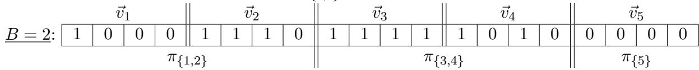
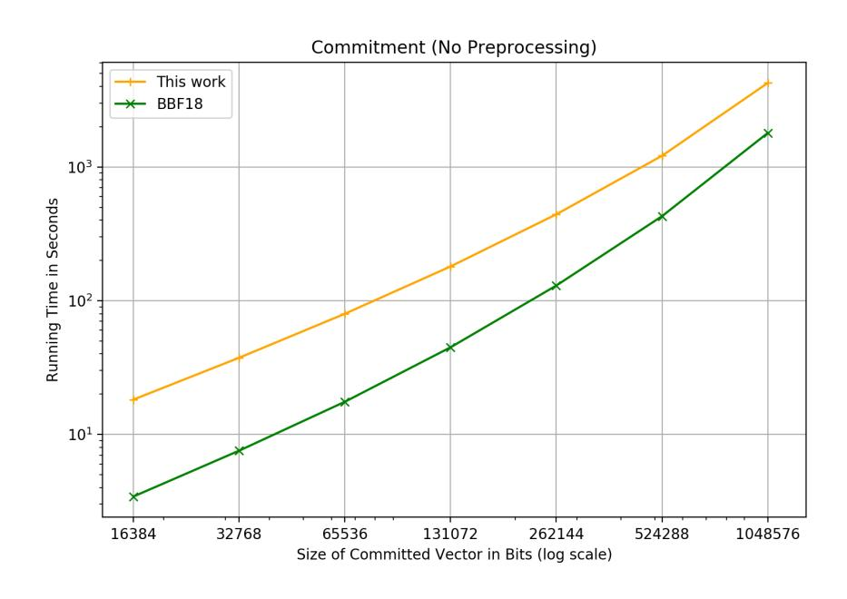
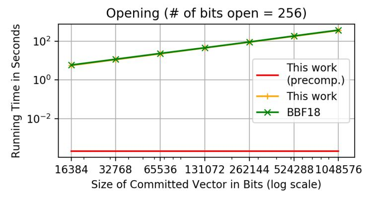
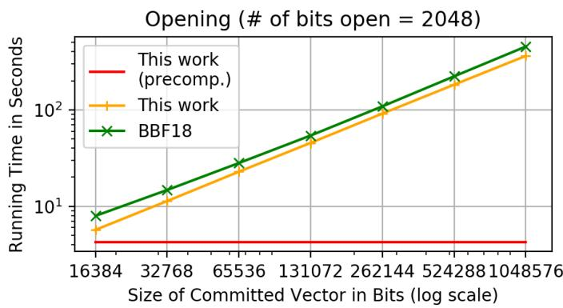
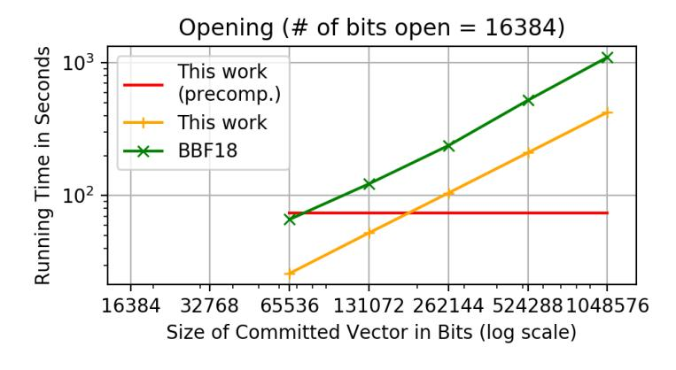
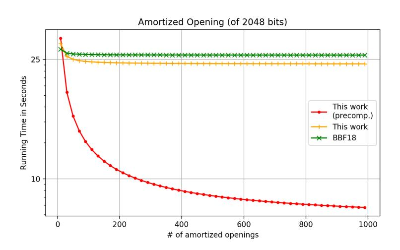

# Incrementally Aggregatable Vector Commitments and Applications to Verifiable Decentralized Storage?

Matteo Campanelli<sup>1</sup> , Dario Fiore<sup>1</sup> , Nicola Greco<sup>3</sup> , Dimitris Kolonelos1,<sup>2</sup> , and Luca Nizzardo<sup>3</sup>

> 1 IMDEA Software Institute, Madrid, Spain {matteo.campanelli,dario.fiore,dimitris.kolonelos}@imdea.org <sup>2</sup> Universidad Politecnica de Madrid, Spain <sup>3</sup> Protocol Labs {nicola,luca}@protocol.ai

Abstract. Vector commitments with subvector openings (SVC) [Lai-Malavolta, Boneh-Bunz-Fisch; CRYPTO'19] allow one to open a committed vector at a set of positions with an opening of size independent of both the vector's length and the number of opened positions.

We continue the study of SVC with two goals in mind: improving their efficiency and making them more suitable to decentralized settings. We address both problems by proposing a new notion for VC that we call incremental aggregation and that allows one to merge openings in a succinct way an unbounded number of times. We show two applications of this property. The first one is immediate and is a method to generate openings in a distributed way. For the second one, we use incremental aggregation to design an algorithm for faster generation of openings via preprocessing.

We then proceed to realize SVC with incremental aggregation. We provide two constructions in groups of unknown order that, similarly to that of Boneh et al. (which supports only one-hop aggregation), have constant-size public parameters, commitments and openings. As an additional feature, for the first construction we propose efficient arguments of knowledge of subvector openings which immediately yields a keyless proof of storage with compact proofs.

Finally, we address a problem closely related to that of SVC: storing a file efficiently in completely decentralized networks. We introduce and construct verifiable decentralized storage (VDS), a cryptographic primitive that allows to check the integrity of a file stored by a network of nodes in a distributed and decentralized way. Our VDS constructions rely on our new vector commitment techniques.

<sup>?</sup> This article is the full version of the paper that appears in the proceedings of ASIACRYPT 2020, © IACR 2020.

## Table of Contents

| 1 | Introduction                                                                                                                                                                                                                                                                       | 4                          |  |  |
|---|------------------------------------------------------------------------------------------------------------------------------------------------------------------------------------------------------------------------------------------------------------------------------------|----------------------------|--|--|
|   | 1.1<br>A new notion for SVCs: incremental aggregation<br><br>1.2<br>Verifiable Decentralized Storage<br><br>1.3<br>Concurrent Work<br>                                                                                                                                             | 4<br>7<br>10               |  |  |
| 2 | Preliminaries<br>10<br>2.1<br>Groups of Unknown Order and Computational Assumptions<br>11<br>2.2<br>Arguments of Knowledge<br><br>12                                                                                                                                               |                            |  |  |
| 3 | Vector Commitments with Incremental Aggregation<br>3.1<br>Vector Commitments with Subvector Openings<br><br>3.2<br>Incrementally Aggregatable Subvector Openings<br>                                                                                                               | 13<br>13<br>15             |  |  |
| 4 | Applications of Incremental Aggregation<br>4.1<br>Divide-and-Conquer Extensions of Aggregation and Disaggregation<br><br>4.2<br>Committing and Opening with Precomputation<br>                                                                                                     | 17<br>17<br>18             |  |  |
| 5 | Our Realizations of Incrementally Aggregatable Vector Commitments<br>5.1<br>Our First SVC Construction<br>5.2<br>Our Second SVC Construction<br><br>5.3<br>Comparison with Related Work<br>                                                                                        | 20<br>20<br>31<br>36       |  |  |
| 6 | Arguments of Knowledge for Our First SVC<br>6.1<br>Building block: A Stronger Proof of Product<br>6.2<br>A Succinct AoK of Opening for our VC Construction<br><br>6.3<br>An AoK for commitments with common subvector<br><br>6.4<br>A Succinct AoK for Commitment on Subvector<br> | 38<br>38<br>39<br>42<br>42 |  |  |
| 7 | Verifiable Decentralized Storage                                                                                                                                                                                                                                                   | 43                         |  |  |
|   | 7.1<br>Syntax<br>7.2<br>Correctness and Efficiency of VDS<br><br>7.3<br>Security of VDS<br>                                                                                                                                                                                        | 44<br>46<br>48             |  |  |
| 8 | Our Realizations of VDS in Hidden-Order Groups                                                                                                                                                                                                                                     | 49                         |  |  |
|   | 8.1<br>Our First VDS Construction<br><br>8.2<br>Our Second VDS Construction<br>8.3<br>Efficiency and Comparison<br>                                                                                                                                                                | 49<br>56<br>59             |  |  |
| 9 | Experimental Evaluation                                                                                                                                                                                                                                                            | 60                         |  |  |
| A | PoProd<br>protocol for Union of RSA Accumulators<br>64                                                                                                                                                                                                                             |                            |  |  |
| B | Committing and Opening with Precomputation for the [BBF19] SVC<br>65                                                                                                                                                                                                               |                            |  |  |
| C | Succinct Arguments of Knowledge for VDS<br>66                                                                                                                                                                                                                                      |                            |  |  |
| D | VDS Proof of Storage<br>D.1 Proof of Retrievability for any VDS<br><br>D.2 Proof of Data Possession for our first VDS scheme<br>                                                                                                                                                   | 67<br>69<br>70             |  |  |
| E | A Variant VDS Construction with Strong Security<br>E.1<br>Strong Security<br>                                                                                                                                                                                                      | 71<br>71                   |  |  |

|   | E.2<br>A VDS Construction with Strong Security<br> | 71 |
|---|----------------------------------------------------|----|
| F | Experimental Results                               | 72 |

## <span id="page-3-0"></span>1 Introduction

Commitment schemes are one of the most fundamental cryptographic primitives. They can be seen as the digital equivalent of a sealed envelop: committing to a message m is akin to putting m in the envelop; opening the commitment is like opening the envelop and revealing the value inside. They have two basic properties. Hiding guarantees that a commitment reveals no information about the underlying message. Binding instead ensures that one cannot change its mind about the committed message; namely, it is not possible to open a commitment to two distinct values m 6= m<sup>0</sup> .

Vector commitments (VC) [\[LY10,](#page-62-0) [CF13\]](#page-62-1) are a special class of commitment schemes in which one can commit to a vector ~v of length n and to later open the commitment at any position i ∈ [n]. The distinguishing feature of VCs is that both the commitment and an opening for a position i have size independent of n. In terms of security, VCs should be position binding, i.e., one cannot open a commitment at position i to two distinct values v<sup>i</sup> 6= v 0 i .

VCs were formalized by Catalano and Fiore [\[CF13\]](#page-62-1) who also proposed two constructions based on the CDH assumption in bilinear groups and the RSA assumption respectively. Both schemes have constant-size commitments and openings but suffer from large public parameters that are O(n 2 ) and O(n) for the CDH- and RSA-based scheme respectively. Noteworthy is that Merkle trees [\[Mer88\]](#page-62-2) are VCs with O(log n)-size openings.

Two recent works [\[BBF19,](#page-61-0) [LM19\]](#page-62-3) proposed new constructions of vector commitments that enjoy a new property called subvector openings (also called batch openings in [\[BBF19\]](#page-61-0)). A VC with subvector openings (called SVC, for short) allows one to open a commitment at a collection of positions I = {i1, . . . , im} with a constant-size proof, namely of size independent of the vector's length n and the subvector length m. This property has been shown useful for reducing communication complexity in several applications, such as PCP/IOP-based succinct arguments [\[LM19,](#page-62-3) [BBF19\]](#page-61-0) and keyless Proofs of Retrievability (PoR) [\[Fis18\]](#page-62-4).

In this work we continue the study of VCs with subvector openings with two main goals: (1) improving their efficiency, and (2) enabling their use in decentralized systems.

With respect to efficiency, although the most attractive feature of SVCs is the constant size of their opening proofs, a drawback of all constructions is that generating each opening takes at least time O(n) (i.e., as much as committing). This is costly and may harm the use of SVCs in applications such as the ones mentioned above.

When it comes to decentralization, VCs have been proposed as a solution for integrity of a distributed ledger (e.g., blockchains in the account model [\[BBF19\]](#page-61-0)): the commitment is a succinct representation of the ledger, and a user responsible for the i-th entry can hold the corresponding opening and use it to prove validity of v<sup>i</sup> . In this case, though, it is not obvious how to create a succinct subvector opening for, say, m positions held by different users each responsible only of its own position/s in the vector. We elaborate more on the motivation around this problem in Section [1.2.](#page-6-0)

### <span id="page-3-1"></span>1.1 A new notion for SVCs: incremental aggregation

To address these concerns, we define and investigate a new property of vector commitments with subvector openings called incremental aggregation. In a nutshell, aggregation means that different subvector openings (say, for sets of positions I and J) can be merged together into a single concise (i.e., constant-size) opening (for positions I∪J). This operation must be doable without knowing the entire committed vector. Moreover, aggregation is incremental if aggregated proofs can be further aggregated (e.g., two openings for  $I \cup J$  and K can be merged into one for  $I \cup J \cup K$ , and so on an unbounded number of times) and disaggregated (i.e., given an opening for set I one can create one for any  $K \subset I$ ).

While a form of aggregation is already present in the VC of Boneh et al. [BBF19], in [BBF19] this can be performed only once. In contrast, we define (and construct) the first VC schemes where openings can be aggregated an unbounded number of times. This incremental property is key to address efficiency and decentralized applications of SVCs, as we detail below.

Incremental aggregation for efficiency. To overcome the barrier of generating each opening in linear time<sup>4</sup>  $O_{\lambda}(n)$ , we propose an alternative preprocessing-based method. The idea is to precompute at commitment time an auxiliary information consisting of n/B openings, one for each batch of B positions of the vector. Next, to generate an opening for an arbitrary subset of m positions, one uses the incremental aggregation property in order to disaggregate the relevant subsets of precomputed openings, and then further aggregate for the m positions. Concretely, with this method, in our construction we can do the preprocessing in time  $O_{\lambda}(n \log n)$  and generate an opening for m positions in time roughly  $O_{\lambda}(mB \log n)$ .

With the VC of [BBF19], a limited version of this approach is also viable: one precomputes an opening for each bit of the vector in  $O_{\lambda}(n \log n)$  time; and then, at opening time, one uses their one-hop aggregation to aggregate relevant openings in time roughly  $O_{\lambda}(m \log n)$ . This however comes with a huge drawback: one must store one opening (of size  $p(\lambda) = \text{poly}(\lambda)$  where  $\lambda$  is the security parameter) for every bit of the vector, which causes a prohibitive storage overhead, i.e.,  $p(\lambda) \cdot n$  bits in addition to storing the vector  $\vec{v}$  itself.

With incremental aggregation, we can instead tune the chunk size B to obtain flexible timememory tradeoffs. For example, with  $B = \sqrt{n}$  one can use  $p(\lambda)\sqrt{n}$  bits of storage to get  $O_{\lambda}(m\sqrt{n}\log n)$ opening time. Or, by setting  $B = p(\lambda)$  as the size of one opening, we can obtain a storage overhead of exactly n bits and opening time  $O_{\lambda}(m\log n)$ .

Incremental aggregation for decentralization. Essentially, by its definition, incremental aggregation enables generating subvector openings in a distributed fashion. Namely, consider a scenario where different parties each hold an opening of some subvector; using aggregation they can create an opening for the union of their subvectors, moreover the incremental property allows them to perform this operation in a non-coordinated and asynchronous manner, i.e. without the need of a central aggregator. We found this application of incrementally aggregatable SVCs to decentralized systems worth exploring in more detail. To fully address this application, we propose a new cryptographic primitive called verifiable decentralized storage which we discuss in Section 1.2.

Constructing VCs with incremental aggregation. Turning to realizing SVC schemes with our new incremental aggregation property, we propose two SVC constructions that work in hidden-order groups [DK02] (instantiatable using classical RSA groups, class groups [BH01] or the recently proposed groups from Hyperelliptic Curves [DG20]).

Our first SVC has constant-size public parameters and constant-size subvector openings, and its security relies on the Strong RSA assumption and an argument of knowledge in the generic group model. Asymptotically, its efficiency is similar to the SVC of Boneh et al. [BBF19], but concretely

<span id="page-4-0"></span><sup>&</sup>lt;sup>4</sup> We use the notation  $O_{\lambda}(\cdot)$  to include the factor depending on the security parameter  $\lambda$ . Writing " $O_{\lambda}(t)$ " essentially means "O(t) cryptographic operations".

we outperform [BBF19]. We implement<sup>5</sup> our new SVC and show it can obtain very fast opening times thanks to the preprocessing method described earlier: opening time reduces by several orders of magnitude for various choices of vector and opening sizes, allowing us to obtain practical opening times—of the order of seconds—that would be impossible without preprocessing—of the order of hundred of seconds. In a file of 1 Mibit ( $2^{20}$  bits), preprocessing reduces the time to open 2048 bits from one hour to less than 5 seconds!

For the second construction, we show how to modify the RSA-based SVC of [LM19] (which in turn extends the one of [CF13] to support subvector openings) in order to make it with *constant-size* parameters and to achieve incremental aggregation. Compared to the first construction, it is more efficient and based on more standard assumptions, in the standard model.

Efficient Arguments of Knowledge of Subvector Opening. As an additional result, we propose efficient arguments of knowledge (AoK) with constant-size proofs for our first VC. The first AoK can prove knowledge of the subvector that opens a commitment at a public set of positions, and it extends to proving that two commitments share a common subvector. The second AoK is similar except that the subvector one proves knowledge of is also committed; essentially one can create two vector commitments C and C' together with a short proof that C' is a commitment to a subvector of the vector committed in C.

An immediate application of our first AoK is a keyless proof of storage (PoS) protocol with compact proofs. PoS allows a client to verify that a server is storing intactly a file via a short-communication challenge-response protocol. A PoS is said keyless if no secret key is needed by clients, a property useful in open systems where the client is a set of distrustful parties (e.g., verifiers in a blockchain) and the server may even be one of these clients. A classical keyless PoS is based on Merkle trees and random spot-checks [JK07], recently generalized to work with vector commitments [Fis18]. A drawback of this construction is that proofs grow with the number of spot-checks (and the size of the tree) and become undesirably large in some applications, e.g., if need to be stored in a blockchain. With our AoK we can obtain openings of fixed size, as short as 2KB, which is 40x shorter than those based on Merkle trees in a representative setting without relying on SNARKs (that would be unfeasible in terms of time and memory)<sup>6</sup>.

From Updatable VCs to Verifiable Decentralized Storage. In their seminal work on VCs, Catalano and Fiore [CF13] also defined updatable VCs. This means that if one changes the *i*-th value of a vector from  $v_i$  to  $v'_i$  it is possible to update: a commitment C to  $\vec{v}$  into a commitment C' to  $\vec{v}'$ , a valid opening for C (at any position) into a valid opening for C'. And importantly, these updates can be done without knowing the entire vector and in time that depends only on the number of modified positions. As an application, in [CF13] it is shown how updatable VCs can be used to realize verifiable databases (VDB) [BGV11], a primitive that enables a client to outsource a database to an untrusted server in such a way that the client can retrieve (and update) a DB record and be assured that it has not been tampered with by the server.

In this work we study how to extend this model to a scenario where storage is distributed across different nodes of a decentralized network. This problem is motivated by the emerging trend of decentralized storage networks (DSNs), a decentralized and open alternative to traditional cloud

<span id="page-5-0"></span><sup>&</sup>lt;sup>5</sup> Code publicly available at https://github.com/nicola/rust-yinyan

<span id="page-5-1"></span><sup>&</sup>lt;sup>6</sup> We provide further details in Section 6

storage and hosting services. Filecoin (which is built on top of IPFS), Storj, Dat, Freenet and general-purpose blockchains like Ethereum[7](#page-6-1) are some emerging projects in this space.

Our contribution is to put forward a new cryptographic primitive called verifiable decentralized storage (VDS) that can be used to obtain data integrity guarantees in DSNs. We propose a definition of VDS and a construction obtained by extending the techniques of our VC scheme; in particular, both incremental aggregation and the arguments of knowledge are key ingredients for building a cost-effective VDS solution.

In the following section we elaborate on the VDS problem: we begin by discussing the requirements imposed by DSNs, and then give a description of our VDS primitive and realization.

## <span id="page-6-0"></span>1.2 Verifiable Decentralized Storage

Decentralized Storage Networks. Openness and decentralization are the main characteristics of DSNs: anyone can enter the system (and participate as either a service provider or a consumer) and the system works without any central management or trusted parties. Abstracting from the details of each system, a DSN consists of participants called nodes that can be either a storage provider (aka storage node) or a client node. Akin to centralized cloud storage, a client can outsource the storage of large data; the key difference of DSN however is that storage is provided by, and distributed across, a collection of nodes that can enter and leave the system at their wish. Also, DSNs can have some reward mechanism to economically incentivize storage nodes.

The openness and the presence of economic incentives raise a number of security questions that need to be solved in order to make these systems viable. In this work, we focus on the basic problem of ensuring that the storage nodes of the DSN are doing their job properly, namely:

> How can any client node check that the whole DSN is storing correctly its data (in a distributed fashion)?

While this question is well studied in the centralized setting where the storage provider is a single server, for decentralized systems the situation is less satisfactory. In what follows we elaborate on the problem and the desired requirements, and then on our solution.

The Problem of Verifiable Decentralized Storage in DSNs. Consider a client who outsources the storage of a large file F, consisting of blocks (F1, . . . , F<sup>N</sup> ), to a collection of storage nodes. A storage node can store a portion of F and the network is assumed to be designed in order to self-coordinate so that the whole F is stored, and to be fault-resistant (e.g., by having the same data block stored on multiple nodes). Once the file is stored, clients can request to the network to retrieve or modify a data block F<sup>i</sup> (or more), as well as to append (resp. delete) blocks to (resp. from) the file.

In this scenario, our goal is to formalize a cryptographic primitive that can provide clients with the guarantee of integrity of the outsourced data and its modifications. The basic idea of VDS is that: (i) the client retains a short digest δ<sup>F</sup> that "uniquely" points to the file F; (ii) any operation performed by the network, be it a retrieval or a file modification, can be proven by generating a short certificate that is publicly verifiable given δ<sup>F</sup> .

This problem is similar in scope to the one addressed by authenticated data structures (ADS) [\[Tam03\]](#page-63-1). But while ADS is centralized, VDS is not. In VDS nodes act as storage in a distributed

<span id="page-6-1"></span><sup>7</sup> <https://filecoin.io>, <https://storj.io>, <https://datproject.org>, <https://freenetproject.org>, [https://](https://www.ethereum.org) [www.ethereum.org](https://www.ethereum.org)

and uncoordinated fashion. This is more challenging as VDS needs to preserve some basic properties of the DSN:

Highly Local. The file is stored across multiple nodes and no node is required to hold the entire F: in VDS every node should function with only its own local view of the system, which should be much smaller than the whole F, e.g., logarithmic or constant in the size of F. Another challenge is dynamic files: in VDS both the digest and the local view must be locally updatable, possibly with the help of a short and publicly verifiable update advice that can be generated by the node who holds the modified data blocks.

Decentralized Keyless Clients. In a decentralized system the notion of a client who outsources the storage of a file is blurry. It may for example be a set of mutually distrustful parties (even the entire DSN in the most extreme case, e.g., the file is a blockchain), or a collection of storage nodes themselves that decide to make some data available to the network. This comes with two implications:

- 1. VDS must work without any secret key on the clients side, so that everyone in the network can delegate and verify storage. This keyless setting captures not only clients requiring no coordination, but also a stronger security model. Here the attacker may control both the storage node and the client, yet it must not be able to cheat when proving correctness of its storage. The latter is crucial in DSNs with economic rewards to well-behaving storage nodes[8](#page-7-0) .
- 2. In VDS a file F exists as long as some storage nodes provide its storage and a pointer to the file is known to the network through its digest. When a file F is modified into F <sup>0</sup> and its digest δ<sup>F</sup> is updated into δF<sup>0</sup>, both versions of the file may coexist. Forks are possible and it is left to each client (or the application) to choose which digest to track: the old one, the new one, or both.

Non-Coordinated Certificates Generation. There are multiple ways in which data retrieval queries can be answered in a DSN. In some cases, e.g., IPFS, after executing a P2P protocol to discover the storage nodes holding the desired data blocks, one gets such blocks from these nodes. In other cases (e.g., Freenet [\[CSWH01\]](#page-62-8) or the original Gnutella protocol), data retrieval is also answered in a peer-to-peer non-coordinated fashion. When a query for blocks i1, . . . , i<sup>m</sup> propagates through the network, every storage node replies with the blocks that it owns and these answers are aggregated and propagated in the network until they reach the client who asked for them. Notably, data aggregation and propagation may follow different strategies.[9](#page-7-1) To accommodate flexible aggregation strategies, in VDS we consider the incremental aggregation of query certificates in an arbitrary and bandwidth-efficient fashion. For example, short certificates for file blocks F<sup>i</sup> and F<sup>j</sup> should be mergeable into a short certificate for (F<sup>i</sup> , F<sup>j</sup> ) and this aggregation process should be carried on and on. Noteworthy that having certificates that stay short after each aggregation keeps the communication overhead of the VDS integrity mechanism at a minimum.[10](#page-7-2)

Defining VDS. We define VDS as a collection of algorithms that capture all the properties above; these are the algorithms that can be executed by clients and storage nodes to maintain the system. A client for a file F is anyone who holds a digest δ<sup>F</sup> with which it can: verify retrieval queries, verify and apply updates of F (that result in forks of δ<sup>F</sup> into some other δF<sup>0</sup>). A storage node for

<span id="page-7-0"></span><sup>8</sup> Since in a decentralized system a storage node may also be a client, an attacker could "delegate storage to itself" and use the client's secret key to cheat in the proof in order to steal rewards (akin to the so-called "generation attack" in Filecoin [\[Lab17\]](#page-62-9)).

<span id="page-7-1"></span><sup>9</sup> E.g., in Freenet data is sent back along the same route the query came through, with the goal of providing anonymity between who requests and who delivers data.

<span id="page-7-2"></span><sup>10</sup> The motivation of this property is similar to that of sequential aggregate signatures, see e.g., [\[LMRS04,](#page-62-10) [BGR12\]](#page-61-3).

some blocks F<sup>I</sup> = {Fi}i∈<sup>I</sup> of a file F is anyone that in addition to F<sup>I</sup> stores the digest δ<sup>F</sup> and a local state stF<sup>I</sup> with which it can: answer and certify retrieval queries for any subset of F<sup>I</sup> ; push and certify updates of F that involve blocks in F<sup>I</sup> ; verify and apply updates of F from other nodes. Finally, any node can aggregate retrieval certificates for different blocks of the same file.

In our VDS notion, an update of F can be: (i) a modification of some blocks, (ii) appending new blocks, or (iii) deleting some blocks (from the end). In all cases, an update of F results into a file F <sup>0</sup> and a new digest δF<sup>0</sup>.

In terms of efficiency, in VDS the digests and every certificate (for both retrieval queries or modifications) are required to be of size at most O(log |F|); similarly, the storage node's local state stF<sup>I</sup> has size at most O(|F<sup>I</sup> | + log |F|). In a nutshell, no node should run linearly in the size of the file (unless it is explicitly storing it in full).

The main security property of a VDS scheme intuitively requires that no efficient adversary can create a certificate for falsified data blocks (or updates) that passes verification. As an extra security property, we also consider the possibility that anyone holding a digest δ<sup>F</sup> can check if the DSN is storing correctly F without having to retrieve it. Namely, we let VDS provide a Proof of Storage mechanism, which we define similarly to Proof of Retrievability [\[JK07\]](#page-62-7) and Proof of Data Possession [\[ABC](#page-61-4)+07]. Similarly to the case of data retrieval queries, the creation of these proofs of storage must be possible while preserving the aforementioned properties of locality and no-central-coordination.

Constructing VDS. We propose two constructions of VDS in hidden-order groups. Both our VDS schemes are obtained by extending our first and second SVC scheme respectively, in order to handle updates and to ensure that all such update operations can be performed locally. In particular we show crucial use of the new properties of our construction: subvector openings, incremental aggregation and disaggregation, and arguments of knowledge for sub-vector commitments (the latter for the first scheme only).

Our two VDS schemes are based on the Strong RSA [\[BP97\]](#page-61-5) and Strong distinct-prime-product root [\[LM19\]](#page-62-3), and Low Order [\[BBF18\]](#page-61-6) assumptions and have similar performances. The second scheme has the interesting property that the storage node can perform and propagate updates by running in time that is independent of even its total local storage. Our first scheme instead supports an additional type of update that we call "CreateFrom". In it, a storage node holding a prefix F 0 of a file F can publish a new digest δF<sup>0</sup> corresponding to F <sup>0</sup> as a new file and convince any client about its correctness without the need for the client to know neither F nor F 0 . [11](#page-8-0) As a potential use case for this feature, consider a network that is supposed to store the entire editing history of some data (e.g., one or more files of a Git project); namely the i-th block of the VDS file contains the data value after the i-th edit (e.g., the i-th Git commit). Then "CreateFrom" can be used to verifiably create a digest of any past version of the data (e.g., of a fork at any point in the past). Finally, our approach is not limited to a prefix of the file but to whatever subset of indices we want to create the new file from.

It is worth noting that by abstracting the ideas of our constructions, other VDS schemes can be obtained using Merkle trees or RSA accumulators.[12](#page-8-1) Compared to a Merkle-tree based solution, we can achieve constant-size certificates for every operation as well as to (efficiently) support compact

<span id="page-8-0"></span><sup>11</sup> This can be seen as a deletion that can be performed without holding the blocks to be deleted and is more efficient to verify when the prefix F 0 is much smaller than F.

<span id="page-8-1"></span><sup>12</sup> In fact, a similar idea from RSA accumulators was discussed in [\[BBF19\]](#page-61-0).

proofs of storage without expensive SNARKs[13](#page-9-2). Compared to RSA Accumulators, our first VDS scheme takes advantage of our AoK thanks to which it supports CreateFrom updates and compact proofs of storage.

Finally, we note that VDS shares similarities with the notion of updatable VCs [\[CF13\]](#page-62-1) extended with incrementally aggregatable subvector openings. There are two main differences. First, in VDS updates can be applied with the help of a short advice created by the party who created the update, whereas in updatable VC this is possible having only the update's description. The second difference is that in VDS the public parameters must be short, otherwise nodes could not afford storing them. This is not necessarily the case in VCs and in fact, to the best of our knowledge, there exists no VC construction with short parameters that is updatable (according to the updatability notion of [\[CF13\]](#page-62-1)) and has incrementally aggregatable subvector openings. We believe this is an interesting open problem.

## <span id="page-9-0"></span>1.3 Concurrent Work

In very recent concurrent works, Gorbunov et al. [\[GRWZ20\]](#page-62-11) and Tomescu et al. [\[TAB](#page-63-2)+20] study similar problems related to aggregation properties of vector commitments. In [\[TAB](#page-63-2)+20], Tomescu et al. study a vector commitment scheme based on the Kate et al. polynomial commitment [\[KZG10\]](#page-62-12): they show how it can be made both updatable and aggregatable, and propose an efficient Stateless Cryptocurrency based on it. In Pointproofs [\[GRWZ20\]](#page-62-11) they propose the notion of Cross-Commitment Aggregation, which enables aggregating opening proofs for different commitments, and show how this notion is relevant to blockchain applications. The VC schemes in both [\[TAB](#page-63-2)+20] and [\[GRWZ20\]](#page-62-11) work in bilinear groups and have linear-size public parameters. Also, these constructions do not support incremental aggregation or disaggregation. In contrast, our VCs work in hidden-order groups, which likely makes them concretely less efficient, but they have constant-size parameters, and they support incremental aggregation and disaggregation. Finally, we note that by using techniques similar to [\[GRWZ20\]](#page-62-11) we can extend our constructions to support cross-commitment aggregation; we leave formalizing this extension for future work.

## <span id="page-9-1"></span>2 Preliminaries

In this section we describe notation and definitions used throughout the paper.

Notation. We denote the security parameter by λ and the set of all polynomial functions by poly(λ). A function (λ) is said negligible – denoted (λ) ∈ negl(λ) – if it vanishes faster than the inverse of any polynomial. An algorithm A is said PPT if it is modeled as a probabilistic Turing machine that runs in time poly(λ). We denote by y ← A(x) the process of running A on input x and assigning the output to y. For a set S, |S| denotes its cardinality, and x ←\$ S denotes selecting x uniformly at random over S. For a positive integer n ∈ N we let [n] := {1, . . . , n}. We denote vectors ~v in bold, and for ~v ∈ M<sup>n</sup> v<sup>i</sup> is its entry at position i. We let Primes(λ) be the set of all prime integers less than 2<sup>λ</sup> .

<span id="page-9-2"></span><sup>13</sup> In Merkle trees certificates depend logarithmically on the file size and linearly on the number of blocks (since they are not aggregatable).

#### <span id="page-10-0"></span>2.1 Groups of Unknown Order and Computational Assumptions

Our constructions use a group  $\mathbb{G}$  of unknown (aka hidden) order, in which the Low Order assumption [BBF18] and the Strong RSA assumption [BP97] or the Strong Distinct-Prime-Product Root assumption [LM19] (defined below) hold.

We let  $\mathsf{Ggen}(1^{\lambda})$  be a probabilistic algorithm that generates such a group  $\mathbb{G}$  with order in a specific range  $[\mathsf{ord}_{min}, \mathsf{ord}_{max}]$  such that  $\frac{1}{\mathsf{ord}_{min}}, \frac{1}{\mathsf{ord}_{max}}, \frac{1}{\mathsf{ord}_{max}-\mathsf{ord}_{min}} \in \mathsf{negl}(\lambda)$ .

**Definition 2.1 (Low Order Assumption** [BBF18]). We say that the low order assumption holds for Ggen if for any PPT adversary A:

$$\Pr\begin{bmatrix} u^{\ell} = 1 & & \mathbb{G} \leftarrow \mathsf{Ggen}(\lambda) \\ \wedge u \neq 1 & : \\ \wedge 1 < \ell < 2^{\mathsf{poly}(\lambda)} & : \\ (u,\ell) \leftarrow \mathcal{A}(\mathbb{G}) \end{bmatrix} = \mathsf{negl}(\lambda)$$

Remark 2.1. The Low Order Assumption is implied by the more commonly known Adaptive Root assumption, which is defined below. For the reduction we refer to [BBF18]. We also notice that the definition of the Low Order assumption given in [BBF18] is for smaller  $\ell$ ,  $1 < \ell < 2^{\lambda}$ , which was sufficient for the application in the paper, whereas ours is for any polynomial-size  $\ell$ . We note that the same reduction to the Adaptive Root assumption described in [BBF18] also holds for our definition of the problem.

**Definition 2.2 (Adaptive Root Assumption [Wes18]).** We say that the adaptive root assumption holds for Ggen if for any PPT adversary  $(A_1, A_2)$ :

$$\Pr \begin{bmatrix} u^{\ell} = w & (w, \mathsf{state}) \leftarrow \mathcal{A}_1(\mathbb{G}) \\ \wedge w \neq 1 & \ell \leftarrow_{\$} \mathsf{Primes}(\lambda) \\ u \leftarrow \mathcal{A}_2(\ell, \mathsf{state}) \end{bmatrix} = \mathsf{negl}(\lambda)$$

**Definition 2.3 (Strong-RSA Assumption [BP97]).** We say that the strong RSA assumption holds for Ggen if for any PPT adversary A:

$$\Pr\begin{bmatrix} u^e = g & \mathbb{G} \leftarrow \mathsf{Ggen}(\lambda) \\ \wedge e \text{ is prime } & : g \leftarrow_{\$}\mathbb{G} \\ & (u,e) \leftarrow \mathcal{A}(\mathbb{G},g) \end{bmatrix} = \mathsf{negl}(\lambda)$$

**Definition 2.4 (Strong Distinct-Prime-Product Root assumption [LM19]).** We say that the Strong Distinct-Prime-Product Root assumption holds for Ggen if for any PPT adversary A:

$$\Pr \begin{bmatrix} u^{\prod_{i \in S} e_i} = g & \mathbb{G} \leftarrow \mathsf{Ggen}(\lambda) \\ \wedge \forall i \, e_i \in \mathsf{Primes}(\lambda) \, : \, g \leftarrow_{\$} \mathbb{G} \\ \wedge \forall i \neq j, e_i \neq e_j & (u, \{e_i\}_{i \in S}) \leftarrow \mathcal{A}(\mathbb{G}, g) \end{bmatrix} = \mathsf{negl}(\lambda)$$

The assumption is implied by the strong RSA assumption over RSA groups.

As discussed in [BBF18, BBF19, LM19], two concrete instantiations of  $\mathbb{G}$  are class groups [BH01] and the quotient group  $\mathbb{Z}_N^*/\{1,-1\}$  of an RSA group [Wes18]. The reason why we cannot directly

use the RSA group is that the order of  $-1 \in \mathbb{Z}_N^*$  is known, and thus the adaptive root assumption does not hold. In the quotient group,  $\{-1,1\}$  is the identity element; hence, knowing the order of -1 does not help in finding a root for a non-identity element and thus solving the adaptive root assumption.

Shamir's Trick. Informally speaking, Shamir's trick [Sha83] is a way to compute an xy-root of a group element g given an x-root and a y-root of it in groups of unknown order, when x and y are co-prime. That is, given  $\rho_x = g^{\frac{1}{x}}$ ,  $\rho_y = g^{\frac{1}{y}}$ , x and y, one can compute a, b st ax + by = 1 using the extended gcd algorithm. Then  $g^{\frac{1}{xy}} = g^{\frac{ax+by}{xy}} = g^{\frac{a}{y} + \frac{b}{x}} = \rho_y^a \cdot \rho_x^b$ . More formally, we recall the following algorithm:

```
ShamirTrick(\rho_x, \rho_y, x, y)\nif \rho_x^x \neq \rho_y^y then return \bot
Use the extended Euclidean Algorithm to compute a, b, d s.t. ax + by = d = \gcd(x, y)\nif d \neq 1 then return \bot
return \rho_x^b \rho_y^a
```

## <span id="page-11-0"></span>2.2 Arguments of Knowledge

Let  $R: \mathcal{X} \times \mathcal{W} \to \{0,1\}$  be an NP relation for a language  $\mathcal{L} = \{x: \exists w \text{ s.t. } R(x,w) = 1\}$ . An argument system for R is a triple of algorithms (Setup, P, V) such that: Setup( $1^{\lambda}$ ) takes as input a security parameter  $\lambda$  and outputs a common reference string crs; the prover P(crs, x, w) takes as input the crs, the statement x and witness w; the verifier V(crs, x) takes in the crs, the statement x, and after interacting with the prover outputs 0 (reject) or 1 (accept). An execution between the prover and verifier is denoted with  $\langle P(\text{crs}, x, w), V(\text{crs}, x) \rangle = b$ , where  $b \in \{0, 1\}$  is the output of the verifier. If V uses only public randomness, we say that the protocol is public coin.

**Definition 2.5 (Completeness).** We say that an argument system (Setup, P, V) for a relation  $R: \mathcal{X} \times \mathcal{W} \to \{0,1\}$  is complete if, for all  $(x,w) \in \mathcal{X} \times \mathcal{W}$  such that R(x,w) = 1 we have

$$\Pr\left[\langle \mathsf{P}(\mathsf{crs}, x, w), \mathsf{V}(\mathsf{crs}, x) \rangle = 1 : \mathsf{crs} \leftarrow \mathsf{Setup}(1^\lambda)\right] = 1.$$

Consider an adversary  $\mathcal{A} = (\mathcal{A}_0, \mathcal{A}_1)$  modeled as a pair of algorithms such that  $\mathcal{A}_0(\mathsf{crs}) \to (x, \mathsf{state})$  (i.e. outputs an instance  $x \in \mathcal{X}$  after  $\mathsf{crs} \leftarrow \mathsf{Setup}(\lambda)$  is run) and  $\mathcal{A}_1(\mathsf{crs}, x, \mathsf{state})$  interacts with a honest verifier. We want an argument of knowledge to satisfy the following properties:

**Soundness.** We say that an argument (Setup, P, V) is sound if for all PPT adversaries  $\mathcal{A} = (\mathcal{A}_0, \mathcal{A}_1)$  we have

$$\Pr\left[ \begin{array}{c|c} \langle \mathcal{A}_1(\mathsf{crs}, x, \mathsf{state}), \mathsf{V}(\mathsf{crs}, x) \rangle = 1 & \mathsf{crs} \leftarrow \mathsf{Setup}(\lambda) \\ \text{and } \nexists w : R(x, w) = 1 & (x, \mathsf{state}) \leftarrow \mathcal{A}_0(\mathsf{crs}) \end{array} \right] \in \mathsf{negl}(\lambda).$$

Knowledge Extractability. We say that (Setup, P, V) is an argument of knowledge if for all polynomial time adversaries  $A_1$  there exists an extractor  $\mathcal{E}$  running in polynomial time such that, for all adversaries  $A_0$  it holds

$$\Pr\left[ \begin{array}{c} \langle \mathcal{A}_1(\mathsf{crs}, x, \mathsf{state}), \mathsf{V}(\mathsf{crs}, x) \rangle = 1 \\ \mathrm{and} \ (x, w') \notin \mathcal{R} \end{array} \middle| \begin{array}{c} \mathsf{crs} \leftarrow \mathsf{Setup}(\lambda) \\ (x, \mathsf{state}) \leftarrow \mathcal{A}_0(\mathsf{crs}) \\ w' \leftarrow \mathcal{E}(\mathsf{crs}, x, \mathsf{state}) \end{array} \right] \in \mathsf{negl}(\lambda).$$

Succinctness. Finally we informally recall the notion of succinct arguments, which requires the communication and verifier's running time in a protocol execution to be independent of the witness length.

Succinct Arguments of Knowledge for Hidden Order Groups. We recall two succinct AoK protocols for the exponentiation relation in groups of unknown order that have been recently proposed by Boneh et. al. [\[BBF19\]](#page-61-0). Both protocols work for a hidden order group G generated by Ggen in which the adaptive root assumption holds. Also, they are public-coin protocols that can be made non-interactive in the random oracle model using the Fiat-Shamir [\[FS87\]](#page-62-13) heuristic and its generalization to multi-round protocols [\[BCS16\]](#page-61-7).

1. Protocol PoE: is an argument system for the following relation:

$$R_{\mathsf{PoE}} = \left\{ ((u, w, x) \in \mathbb{G}^2 \times \mathbb{Z}, \varnothing) \ : \ u^x = w \in \mathbb{G} \quad \right\}$$

PoE is a sound argument system under the adaptive root assumption for Ggen. It is neither zeroknowledge nor knowledge sound. Its main feature is succinctness, as the verifier can get convinced about u <sup>x</sup> = w without having to execute the exponentiation herself. Moreover the information sent by the prover is only 1 group element.[14](#page-12-2)

2. Protocol PoKE<sup>∗</sup> : is an argument of knowledge for the following relation, parametrized by a generator g ∈ G:

$$R_{\mathsf{PoKE}^*} = \big\{ (w, x) \in \mathbb{G} \times \mathbb{Z} \ : \ g^x = w \in \mathbb{G} \quad \big\}$$

PoKE<sup>∗</sup> is an argument of knowledge that in [\[BBF19\]](#page-61-0) is proven secure in the generic group model for hidden order groups [\[DK02\]](#page-62-5). This protocol is also succinct consisting of only 1 group element and 1 field element in Z<sup>2</sup> λ .

3. Protocol PoKE2: is an argument of knowledge for the following relation, parametrized by a generator g ∈ G:

$$R_{\mathsf{PoKE2}} = \left\{ ((w,u) \in \mathbb{G}^2, x \in \mathbb{Z}) \ : \ u^x = w \in \mathbb{G} \quad \right\}$$

PoKE2 is similar to PoKE<sup>∗</sup> but it is secure for arbitrary bases u chosen by the adversary, instead of bases randomly sampled a priori as in PoKE<sup>∗</sup> . Similarly, it is an argument of knowledge in the generic group model for hidden order groups and is also succinct, with a proof consisting of 2 group elements and 1 element of Z<sup>2</sup> λ .

## <span id="page-12-0"></span>3 Vector Commitments with Incremental Aggregation

In this section, we recall the notion of vector commitment with subvector openings [\[CF13,](#page-62-1) [LM19,](#page-62-3) [BBF19\]](#page-61-0) and then we formally define our new incremental aggregation property.

#### <span id="page-12-1"></span>3.1 Vector Commitments with Subvector Openings

A vector commitment (VC) [\[LY10,](#page-62-0) [CF13\]](#page-62-1) is a primitive that allows one to commit to a vector ~v of length n in such a way that it can later open the commitment at any position i ∈ [n]. For

<span id="page-12-2"></span><sup>14</sup> Technically, this protocol is not succinct as there is no witness and the verifier must read and process the exponent x; however, verification is still more efficient than running the full exponentiation.

security, a VC should be position binding in the sense that it is not possible to open a commitment to two different values at the same position. Also, what makes VC interesting is conciseness, which requires commitment and openings to be of fixed size, independent of the vector's length.

In our work we consider a generalization of vector commitments proposed by Lai and Malavolta [\[LM19\]](#page-62-3) that is called VCs with subvector openings, [15](#page-13-0) which is in turn a specialization of the notion of functional vector commitments by Libert et al. [\[LRY16\]](#page-62-14). In a nutshell, a functional VC is like a VC with the additional possibility of opening the commitment to a function of the committed vector, i.e., f(~v). Subvector openings are a specific class of functions in which one can open the commitment to an ordered collection of positions (with a short proof).

In this section we recall this generalization of vector commitments with subvector openings (that for brevity we call SVC). It is easy to see that the original notion of Catalano and Fiore [\[CF13\]](#page-62-1) is a special case when the opened subvector includes one position only.

We begin by recalling the notion of subvectors from [\[LM19\]](#page-62-3).

Definition 3.1 (Subvectors [\[LM19\]](#page-62-3)). Let M be a set, n ∈ N be a positive integer and I = {i1, . . . , i|I|} ⊆ [n] be an ordered index set. For a vector ~v ∈ M<sup>n</sup> , the I-subvector of ~v is ~v<sup>I</sup> := (vi<sup>1</sup> , . . . , vi|I<sup>|</sup> ).

Let I, J ⊆ [n] be two sets, and let ~v<sup>I</sup> , ~v<sup>J</sup> be two subvectors of some vector ~v ∈ M<sup>n</sup> . The ordered union of ~v<sup>I</sup> and ~v<sup>J</sup> is the subvector ~vI∪<sup>J</sup> := (vk<sup>1</sup> , . . . , vkm), where I∪J = {k1, . . . , km} is the ordered sets union of I and J.

<span id="page-13-1"></span>Definition 3.2 (Vector Commitments with Subvector Openings). A vector commitment scheme with subvector openings (SVC) is a tuple of algorithms VC = (VC.Setup, VC.Com, VC.Open, VC.Ver) that work as follows and satisfy correctness, position binding and conciseness defined below.

VC.Setup(1<sup>λ</sup> ,M) → crs Given the security parameter λ, and description of a message space M for the vector components, the probabilistic setup algorithm outputs a common reference string crs.

VC.Com(crs, ~v) → (C, aux) On input crs and a vector ~v ∈ M<sup>n</sup> , the committing algorithm outputs a commitment C and an auxiliary information aux.

VC.Open(crs, I, ~y, aux) → π<sup>I</sup> On input the CRS crs, a vector ~y ∈ Mm, an ordered index set I ⊂ N and auxiliary information aux, the opening algorithm outputs a proof π<sup>I</sup> that ~y is the I-subvector of the committed message.

VC.Ver(crs, C, I, ~y, π<sup>I</sup> ) → b ∈ {0, 1} On input the CRS crs, a commitment C, an ordered set of indices I ⊂ N, a vector ~y ∈ M<sup>m</sup> and a proof π<sup>I</sup> , the verification algorithm accepts (i.e., it outputs 1) only if π<sup>I</sup> is a valid proof that C was created to a vector ~v = (v1, . . . , vn) such that ~y = ~v<sup>I</sup> .

Correctness. A SVC scheme VC is (perfectly) correct if for all λ ∈ N, any vector length n any ordered set of indices I ⊆ [n], and any ~v ∈ M<sup>n</sup> , we have:

$$\Pr \begin{bmatrix} \mathsf{VC.Ver}(\mathsf{crs}, C, I, \vec{v}_I, \pi_I) = 1 & : & \mathsf{crs} \leftarrow \mathsf{VC.Setup}(1^\lambda, \mathcal{M}) \\ \mathsf{VC.Ver}(\mathsf{crs}, C, I, \vec{v}_I, \pi_I) = 1 & : & (C, \mathsf{aux}) \leftarrow \mathsf{VC.Com}(\mathsf{crs}, \vec{v}) \\ \pi_I \leftarrow \mathsf{VC.Open}(\mathsf{crs}, I, \vec{v}_I, \mathsf{aux}) \end{bmatrix} = 1$$

<span id="page-13-0"></span><sup>15</sup> This is also called VCs with batchable openings in an independent work by Boneh et al. [\[BBF19\]](#page-61-0).

**Position Binding.** A SVC scheme VC satisfies position binding if for all PPT adversaries A we have:

$$\Pr\begin{bmatrix} \mathsf{VC.Ver}(\mathsf{crs}, C, I, \vec{y}, \pi) = 1 \\ \land \ \vec{y} \neq \vec{y}' \land \\ \mathsf{VC.Ver}(\mathsf{crs}, C, I, \vec{y}', \pi') = 1 \end{bmatrix} : \frac{\mathsf{crs} \leftarrow \mathsf{VC.Setup}(1^\lambda, \mathcal{M})}{(C, I, \vec{y}, \pi, \vec{y}', \pi') \leftarrow \mathcal{A}(\mathsf{crs})} \end{bmatrix} \in \mathsf{negl}(\lambda)$$

Conciseness. A vector commitment is concise if there is a fixed polynomial  $p(\lambda)$  in the security parameter such that the size of the commitment C and the outputs of VC.Open are both bounded by  $p(\lambda)$ , i.e., they are independent of n.

Vector Commitments with Specializable Universal CRS. The notion of VCs defined above slightly generalizes the previous ones in which the generation of public parameters (aka common reference string) depends on a bound n on the length of the committed vectors. In contrast, in our notion VC.Setup is length-independent. To highlight this property, we also call this primitive vector commitments with universal CRS.

Here we formalize a class of VC schemes that lies in between VCs with universal CRS (as defined above) and VCs with length-specific CRS (as defined in [CF13]). Inspired by the recent work of Groth et al. [GKM<sup>+</sup>18], we call these schemes VCs with *Specializable* (Universal) CRS. In a nutshell, these are schemes in which the algorithms VC.Com, VC.Open and VC.Ver work on input a length-specific CRS crs<sub>n</sub>. However, this crs<sub>n</sub> is generated in two steps: (i) a *length-independent*, *probabilistic* setup crs  $\leftarrow$  VC.Setup(1<sup> $\lambda$ </sup>,  $\mathcal{M}$ ), and (ii) a *length-dependent*, *deterministic* specialization crs<sub>n</sub>  $\leftarrow$  VC.Specialize(crs, n). The advantage of this model is that, being VC.Specialize deterministic, it can be executed by anyone, and it allows to re-use the same crs for multiple vectors lengths.

**Definition 3.3 (VCs with Specializable CRS).** A VC scheme VC has a specializable CRS if there exists a DPT algorithm VC.Specialize(crs, n) that, on input a (universal) CRS crs generated by VC.Setup( $1^{\lambda}$ ,  $\mathcal{M}$ ) and an integer  $n = \text{poly}(\lambda)$ , produces a specialized CRS crs<sub>n</sub> such that the algorithms VC.Com, VC.Open and VC.Ver can be defined in terms of algorithms VC.Com\*, VC.Open\* and VC.Ver\* as follows:

- $\ \mathsf{VC.Com}(\mathsf{crs}, \vec{v}) \ sets \ n := |\vec{v}|, \ runs \ \mathsf{crs}_n \leftarrow \mathsf{VC.Specialize}(\mathsf{crs}, n) \ and \ (C^\star, \mathsf{aux}^\star) \leftarrow \mathsf{VC.Com}^\star(\mathsf{crs}_n, \vec{v}), \\ and \ returns \ C := (C^\star, n) \ and \ \mathsf{aux} := (\mathsf{aux}^\star, n).$
- VC.Open(crs,  $I, \vec{y}$ , aux) parses aux := (aux\*, n), runs crs<sub>n</sub>  $\leftarrow$  VC.Specialize(crs, n) and returns  $\pi_I \leftarrow$  VC.Open\*(crs<sub>n</sub>,  $I, \vec{y}$ , aux\*).
- VC.Ver(crs,  $C, I, \vec{y}, \pi_I$ ) parses  $C := (C^{\star}, n)$ , runs crs<sub>n</sub>  $\leftarrow$  VC.Specialize(crs, n) and returns VC.Ver<sup>\*</sup>(crs<sub>n</sub>,  $C^{\star}, I, \vec{y}, \pi_I$ ).

Basically, for a VC with specializable CRS it is sufficient to describe the algorithms VC.Setup, VC.Specialize, VC.Com\*, VC.Open\* and VC.Ver\*. Furthermore, a concrete advantage is that when working on multiple commitments, openings and verifications that involve the same length n, one can execute  $crs_n \leftarrow VC.Specialize(crs, n)$  only once.

#### <span id="page-14-0"></span>3.2 Incrementally Aggregatable Subvector Openings

In a nutshell, aggregation means that different proofs of different subvector openings can be merged together into a single *short* proof which can be created *without* knowing the entire committed vector.

Moreover, this aggregation is composable, namely aggregated proofs can be further aggregated. Following a terminology similar to that of aggregate signatures, we call this property incremental aggregation (but can also be called multi-hop aggregation). In addition to aggregating openings, we also consider the possibility to "disaggregate" them, namely from an opening of positions in the set I one can create an opening for positions in a set K ⊂ I.

We stress on the two main requirements that make aggregation and disaggregation non-trivial: all openings must remain short (independently of the number of positions that are being opened), and aggregation (resp. disaggregation) must be computable locally, i.e., without knowing the whole committed vector. Without such requirements, one could achieve this property by simply concatenating openings of single positions.

<span id="page-15-0"></span>Definition 3.4 (Aggregatable Subvector Openings). A vector commitment scheme VC with subvector openings is called aggregatable if there exists algorithms VC.Agg, VC.Disagg working as follows:

VC.Agg(crs,(I, ~v<sup>I</sup> , π<sup>I</sup> ),(J, ~v<sup>J</sup> , π<sup>J</sup> )) → π<sup>K</sup> takes as input two triples (I, ~v<sup>I</sup> , π<sup>I</sup> ),(J, ~v<sup>J</sup> , π<sup>J</sup> ) where I and J are sets of indices, ~v<sup>I</sup> ∈ M|I<sup>|</sup> and ~v<sup>J</sup> ∈ M|J<sup>|</sup> are subvectors, and π<sup>I</sup> and π<sup>J</sup> are opening proofs. It outputs a proof π<sup>K</sup> that is supposed to prove opening of values in positions K = I ∪ J. VC.Disagg(crs, I, ~v<sup>I</sup> , π<sup>I</sup> , K) → π<sup>K</sup> takes as input a triple (I, ~v<sup>I</sup> , π<sup>I</sup> ) and a set of indices K ⊂ I, and

The aggregation algorithm VC.Agg must guarantee the following two properties:

it outputs a proof π<sup>K</sup> that is supposed to prove opening of values in positions K.

Aggregation Correctness. Aggregation is (perfectly) correct if for all λ ∈ N, all honestly generated crs ← VC.Setup(1<sup>λ</sup> ,M), any commitment C and triple (I, ~v<sup>I</sup> , π<sup>I</sup> ) s.t. VC.Ver(crs, C, I, ~v<sup>I</sup> , π<sup>I</sup> ) = 1, the following two properties hold:

1. for any triple (J, ~v<sup>J</sup> , π<sup>J</sup> ) such that VC.Ver(crs, C, J, ~v<sup>J</sup> , π<sup>J</sup> ) = 1,

$$\Pr\left[\mathsf{VC}.\mathsf{Ver}(\mathsf{crs},C,K,\vec{v}_K,\pi_K) = 1 \ : \pi_K \leftarrow \mathsf{VC}.\mathsf{Agg}(\mathsf{crs},(I,\vec{v}_I,\pi_I),(J,\vec{v}_J,\pi_J))\right] = 1$$

where K = I ∪ J and ~v<sup>K</sup> is the ordered union ~vI∪<sup>J</sup> of ~v<sup>I</sup> and ~v<sup>J</sup> ;

2. for any subset of indices K ⊂ I,

$$\Pr\left[\mathsf{VC}.\mathsf{Ver}(\mathsf{crs}, C, K, \vec{v}_K, \pi_K) = 1 \ : \ \pi_K \leftarrow \mathsf{VC}.\mathsf{Disagg}(\mathsf{crs}, I, \vec{v}_I, \pi_I, K)\right] = 1$$

where 
$$\vec{v}_K = (v_{i_l})_{i_l \in K}$$
, for  $\vec{v}_I = (v_{i_1}, \dots, v_{i_{|I|}})$ .

Aggregation Conciseness. There exists a fixed polynomial p(·) in the security parameter such that all openings produced by VC.Agg and VC.Disagg have length bounded by p(λ).

We remark that the notion of specializable CRS can apply to aggregatable VCs as well. In this case, we let VC.Agg? (resp. VC.Disagg? ) be the algorithm that works on input the specialized crs<sup>n</sup> instead of crs.

### <span id="page-16-0"></span>4 Applications of Incremental Aggregation

We discuss two general applications of the incremental aggregation property of vector commitments.

One application is generating subvector openings in a distributed and decentralized way. Namely, assume a set of parties hold each an opening of some subvector. Then it is possible to create a (concise) opening for the union of their subvectors by using the VC.Agg algorithm. Moreover, the incremental (aka multi-hop) aggregation allows these users to perform this operation in an arbitrary order, hence no coordination or a central aggregator party are needed. This application is particularly useful in our extension to verifiable decentralized storage.

The second application is to generate openings in a faster way via preprocessing. As we mentioned in the introduction, this technique is useful in the scenario where a user commits to a vector and then must generate openings for various subvectors, which is for example the use case when the VC is used for proofs of retrievability and IOPs [BBF19].

So, here the goal is to achieve a method for computing subvector openings in time sub-linear in the total size of the vector, which is the barrier in all existing constructions. To obtain this speedup, the basic idea is to (A) compute and store openings for all the position at commitment time, and then (B) use the aggregation property to create an opening for a specific set of positions. In order to obtain efficiency using this approach it is important that both steps (A) and (B) can be computed efficiently. In particular, step (A) is challenging since typically computing one opening takes linear time, hence computing all of them would take quadratic time.

In this section, we show how steps (A) and (B) can benefit from disaggregation and aggregation respectively. As a preliminary for this technique, we begin by describing two generic extensions of (incremental) aggregation (resp. disaggregation) that support many inputs (resp. outputs). Then we show how these extended algorithms can be used for committing and opening with preprocessing.

#### <span id="page-16-1"></span>4.1 Divide-and-Conquer Extensions of Aggregation and Disaggregation

We discuss how the incremental property of our aggregation and disaggregation can be used to define two extended versions of these algorithms. The first one is an algorithm that can aggregate many openings for different sets of positions into a single opening for their union. The second one does the opposite, namely it disaggregates one opening for a set I into many openings for partitions of I.

Aggregating Many Openings We consider the problem of aggregating several openings for sets of positions  $I_1, \ldots, I_m$  into a single opening for  $\bigcup_{j=1}^m I_j$ . Our syntax in Definition 3.4 only considers pairwise aggregation. This can be used to handle many aggregations by executing the pairwise aggregation in a sequential (or arbitrary order) fashion. Sequential aggregation might however be costly since it would require executing VC.Agg on increasingly growing sets. If  $f_a(k)$  is the complexity of VC.Agg on two sets of total size k, then the total complexity of the sequential method is  $\sum_{j=2}^m f(\sum_{l=1}^{j-1} |I_l| + |I_j|)$ , which for example is quadratic in m, for  $f_a(k) = \Theta(k)$ .

In Fig. 1, we show an algorithm, VC.AggManyToOne, that is a nearly optimal solution for aggregating m openings based on a divide-and-conquer methodology. Assuming for simplicity that all  $I_j$ 's have size bounded by some s, then the complexity of VC.AggManyToOne is given by the following recurrence relation:

$$T(m) = 2T\left(\frac{m}{2}\right) + f_a(s \cdot m)$$

| ${\sf VC.AggManyToOne}({\sf crs},(I_j,\vec{v}_{I_j},\pi_j)_{j\in[m]})$                      | ${\sf VC.DisaggOneToMany}({\sf crs},B,I,\vec{v}_I,\pi_I)$                     |
|---------------------------------------------------------------------------------------------|-------------------------------------------------------------------------------|
| 1: <b>if</b> $m=1$ <b>return</b> $\pi_1$                                                    | 1: <b>if</b> $n =  I  = B$ <b>return</b> $\pi_I$                              |
| $2: m' \leftarrow m/2$                                                                      | $2: n' \leftarrow n/2$                                                        |
| $3: L \leftarrow \bigcup_{j=1}^{m'} I_j,  R \leftarrow \bigcup_{j=m'+1}^m I_j,$             | $3: L \leftarrow \cup_{j=1}^{n'} i_j, R \leftarrow \cup_{j=n'+1}^{m} i_j,$    |
| $4:  \pi_L \leftarrow VC.AggManyToOne(crs, (I_j, \vec{v}_{I_j}, \pi_j)_{j=1,\dots,m'})$     | $4:  \pi_L' \leftarrow VC.Disagg(crs, I, \vec{v}_I, \pi_I, L)$                |
| $5:  \pi_R \leftarrow VC.AggManyToOne(crs, (I_j, \vec{v}_{I_j}, \pi_j)_{j=m'+1, \dots, m})$ | $5:  \pi_R' \leftarrow VC.Disagg(crs,I,\vec{v}_I,\pi_I,R)$                    |
| $6:  \pi_{L \cup R} \leftarrow VC.Agg(crs, (L, \vec{v}_L, \pi_L), (R, \vec{v}_R, \pi_R))$   | $6:  \vec{\pi}_L \leftarrow VC.DisaggOneToMany(crs, B, L, \vec{v}_L, \pi'_L)$ |
| 7: return $\pi_{L \cup R}$                                                                  | 7: $\vec{\pi}_R \leftarrow VC.DisaggOneToMany(crs, B, R, \vec{v}_R, \pi'_R)$  |
|                                                                                             | $8: \ \ \mathbf{return} \ \vec{\pi}_L    \vec{\pi}_R$                         |

<span id="page-17-1"></span>Fig. 1. Extensions of Aggregation and Disaggregation

which for example solves to  $\Theta(s \cdot m \log m)$  if  $f_a(n) \in \Theta(n)$ , or to  $\Theta(s \cdot m \log(sm) \log m)$  if  $f_a(n) \in \Theta(n \log n)$ .

Disaggregating from One to Many Openings We consider the problem that is dual to the one above, namely how to disaggregate an opening for a set I into several openings for sets  $I_1, \ldots, I_m$  that form a partition of I. Our syntax in Definition 3.4 only considers disaggregation from one set I to one subset K of I. Similarly to the aggregation case, disaggregating from one set to many subsets can be trivially obtained via a sequential application of VC.Disagg on all pairs  $(I, I_j)$ . This however can be costly if the number of partitions approaches the size of I, e.g., if we want to disaggregate to all the elements of I.

In Fig. 1, we show an algorithm, VC.DisaggOneToMany, we show a divide-and-conquer algorithm for disaggregating an opening for a set I of size m into m' = m/B openings, each for a partition of size B. For simplicity, we assume that m is a power of 2, and  $B \mid m$ .

Let  $f_d(|I|)$  be the complexity of VC.Disagg. Then the complexity of VC.DisaggOneToMany is given by the following recurrence relation:

$$T(m) = 2T\left(\frac{m}{2}\right) + 2f_d(m/2)$$

which for example solves to  $\Theta(m \log(m/B))$  if  $f_d(n) \in \Theta(n)$ , or to  $\Theta(m \log m \log(m/B))$  if  $f_d(n) \in \Theta(n \log n)$ .

### <span id="page-17-0"></span>4.2 Committing and Opening with Precomputation

We present a construction of committing and opening algorithms (denoted VC.PPCom and VC.FastOpen respectively) that works generically for any SVC with incremental aggregation and that, by relying on preprocessing, can achieve fast opening time.

Our preprocessing method works with a flexible choice of a parameter B that allows for different time-memory tradeoffs. In a nutshell, ranging from 1 to n, a larger B reduces memory but increases opening time while a smaller B (e.g., B=1) requires larger storage overhead but gives the fastest opening time.

Let B be an integer that divides n, and let n' = n/B. The core of our idea is that, during the commitment stage, one can create openings for n' = n/B subvectors of  $\vec{v}$  that cover the all

vector (e.g., B contiguous positions). Let  $\pi_{P_1}, \ldots, \pi_{P_{n'}}$  be such openings; these elements are stored as advice information.

Next, in the opening phase, in order to compute the opening for a subvector  $\vec{v}_I$  of m positions, one should: (i) fetch the subset of openings  $\pi_{P_j}$  such that, for some S,  $I \subseteq \cup_{j \in S} P_j$ , (ii) possibly disaggregate some of them and then aggregate in order to compute  $\pi_I$ .

To give a very general example of the above process, assume one has stored  $\pi_{\{1,2\}}$  and  $\pi_{\{3,4,5\}}$  and is asked for  $\pi_{\{2,3\}}$ , then she has to compute first  $\pi_2$  and  $\pi_3$  by disaggregating  $\pi_{\{1,2\}}$  and  $\pi_{\{3,4,5\}}$  respectively, and then aggregate them to  $\pi_{\{2,3\}}$ . Below are two more examples in picture:



 $\approx p(\lambda) \cdot n/2$  bits in opening advice


 $p(\lambda)$  bits in opening advice

The two algorithms VC.PPCom and VC.FastOpen are described in detail in Fig. 2.

| ${\sf VC.PPCom}({\sf crs},B,\vec{v})$                                     | ${\sf VC.FastOpen}({\sf crs},B,{\sf aux}^*,I)$                                        |
|---------------------------------------------------------------------------|---------------------------------------------------------------------------------------|
| $1:  (C, aux) \leftarrow VC.Com(crs, \vec{v})$                            | 1: Let $P_j := \{(j-1)B + i : i \in [B]\}, \forall j \in [n']$                        |
| $2:  \pi^* \leftarrow VC.Open(crs,[n],\vec{v},aux)$                       | 2: Let $I := \{i_1, \ldots, i_m\}$                                                    |
| $3: \vec{\pi} \leftarrow VC.DisaggOneToMany(crs, B, [n], \vec{v}, \pi^*)$ | 3: Let S minimal set s.t. $\bigcup P_j \supseteq I$                                   |
| $4:  aux^* := (\pi_1, \dots, \pi_{n'}, \vec{v})$                          | $j\bar{\in}S$                                                                         |
| $5:$ $\mathbf{return}\ C, aux^*$                                          | 4: for $j \in S$ do:                                                                  |
|                                                                           | $5: I_j \leftarrow I \cap P_j$                                                        |
|                                                                           | $6: \qquad \pi_j' \leftarrow VC.Disagg(crs, P_j, \vec{v}_{P_j}, \pi_j, I_j)$          |
|                                                                           | 7: endfor                                                                             |
|                                                                           | $8:  \pi_I \leftarrow VC.AggManyToOne(crs, ((I_j, \vec{v}_{I_j}, \pi'_j))_{j \in S})$ |
|                                                                           | 9: return $\pi_I$                                                                     |

<span id="page-18-0"></span>Fig. 2. Generic algorithms for committing and opening with precomputation.

In terms of auxiliary storage, in addition to the vector  $\vec{v}$  itself, one needs at most  $(n/B)p(\lambda)$  bits, where  $p(\lambda)$  is the polynomial bounding the conciseness of the SVC scheme. In terms of time complexity, VC.PPCom requires one execution of VC.Com, one execution of VC.Open, and one execution of VC.DisaggOneToMany, which in turn depends on the complexity of VC.Disagg; VC.FastOpen requires to perform (at most) |S| disaggregations (each with a set  $|I_j|$  such that their sum is  $|I|)^{16}$ , and one execution of VC.AggManyToOne on |S| openings. Note that VC.FastOpen's running time

<span id="page-18-1"></span><sup>&</sup>lt;sup>16</sup> Note that for B=1 the disaggregation step can be skipped.

depends only on the size m of the set I and size B of the buckets  $P_j$ , and thus offers various tradeoffs by adjusting B.

More specific running times depend on the complexity of VC.Com, VC.Open, VC.Agg, and VC.Disagg of the given SVC scheme. See Appendix B for these results for our construction.

## <span id="page-19-0"></span>5 Our Realizations of Incrementally Aggregatable Vector Commitments

In this section we describe our new SVC realizations.

#### <span id="page-19-1"></span>5.1 Our First SVC Construction

An overview of our techniques. The basic idea underlying our VC can be described as a generic construction from any accumulator with union proofs. Consider a vector of bits  $\vec{v} = (v_1, \dots, v_n) \in \{0,1\}^n$ . In order to commit to this vector we produce two accumulator,  $\mathsf{Acc}_0$  and  $\mathsf{Acc}_1$ , on two partitions of the set  $S = \{1, \dots, n\}$ . Each accumulator  $\mathsf{Acc}_b$  compresses the set of positions i such that  $v_i = b$ . In other words,  $\mathsf{Acc}_b$  compresses the set  $S_{=b} := \{i \in S : v_i = b\}$  with  $b \in \{0,1\}$ . In order to open to bit b at position i, one can create an accumulator membership proof for the statement  $i \in \tilde{S}_b$  where we denote by  $\tilde{S}_b$  the alleged set of positions that have value b.

However, if the commitment to  $\vec{v}$  is simply the pair of accumulators  $(\mathsf{Acc}_0, \mathsf{Acc}_1)$  we do not achieve position binding as an adversary could for example include the same element i in both accumulators. To solve this issue we set the commitment to be the pair of accumulators plus a succinct non-interactive proof  $\pi_S$  that the two sets  $\tilde{S}_0, \tilde{S}_1$  they compress constitute together a partition of S. Notably, this proof  $\pi_S$  guarantees that each index i is in either  $\tilde{S}_0$  or  $\tilde{S}_1$ , and thus prevents an adversary from also opening the position i to the complement bit 1-b.

The construction described above could be instantiated with any accumulator scheme that admits an efficient and succinct proof of union. We, though, directly present an efficient construction based on RSA accumulators [Bd94, BP97, CL02, Lip12, BBF19] as this is efficient and has some nice extra properties like aggregation and constant-size parameters. Also, part of our technical contribution to construct this VC scheme is the construction of efficient and succinct protocols for proving the union of two RSA accumulators built with different generators.

<span id="page-19-2"></span>Succinct AoK Protocols for Union of RSA Accumulators Let  $\mathbb{G}$  be a hidden order group as generated by Ggen, and let  $g_1, g_2, g_3 \in \mathbb{G}$  be three honestly sampled random generators. We propose a succinct argument of knowledge for the following relation

$$R_{\mathsf{PoProd}_2} = \left\{ ((Y, C), (a, b)) \in \mathbb{G}^2 \times \mathbb{Z}^2 \ : \ Y = g_1^a g_2^b \wedge C = g_3^{a \cdot b} \quad \right\}$$

Our protocol (described in Fig. 3) is inspired by a similar protocol of Boneh et al. [BBF19], PoDDH, for a similar relation in which there is only one generator (i.e.,  $g_1 = g_2 = g_3$ , namely for DDH tuples  $(g^a, g^b, g^{ab})$ ). Their protocol has a proof consisting of 3 groups elements and 2 integers of  $\lambda$  bits.

As we argue later  $\mathsf{PoProd}_2$  is still sufficient for our construction, i.e., for the goal of proving that  $C = g_3^c$  is an accumulator to a set that is the union of sets represented by two accumulators  $A = g_1^a$  and  $B = g_2^b$  respectively. The idea is to invoke  $\mathsf{PoProd}_2$  on (Y,C) with  $Y = A \cdot B$ .

<span id="page-19-3"></span>To prove the security of our protocol we rely on the adaptive root assumption and, in a non-black-box way, on the knowledge extractability of the PoKRep and PoKE\* protocols from [BBF19]. The latter is proven in the generic group model for hidden order groups (where also the adaptive root assumption holds), therefore we state the following theorem.

<span id="page-20-0"></span>Fig. 3. PoProd<sub>2</sub> protocol

**Theorem 5.1.** The PoProd<sub>2</sub> protocol is an argument of knowledge for  $R_{PoProd_2}$  in the generic group model.

**Proof** For ease of exposition we show a security proof for a slight variant of the protocol PoProd<sub>2</sub>. Then, towards the end of this proof we show that security of this variant implies security for our protocol. We let PoProd<sub>2</sub>' be the same protocol as PoProd<sub>2</sub> with only difference that the prover computes also  $r_c \leftarrow r_a \cdot r_b \pmod{\ell}$  and sends  $r_c$  in the proof, and the verifier V checks in the verification if  $r_c = r_a \cdot r_b \pmod{\ell}$ .

Let  $\mathcal{A}' = (\mathcal{A}'_0, \mathcal{A}'_1)$  be an adversary of the Knowledge Extractability of  $\mathsf{PoProd}_2'$  such that:  $((Y,C),\mathsf{state}) \leftarrow \mathcal{A}'_0(\mathsf{crs}), \, \mathcal{A}'_1(\mathsf{crs},(Y,C),\mathsf{state})$  executes with  $\mathsf{V}(\mathsf{crs},(Y,C))$  the protocol  $\mathsf{PoProd}_2'$  and the verifier accepts with a non-negligible probability  $\epsilon$ . We will construct an extractor  $\mathcal{E}'$  that having access to the internal state of  $\mathcal{A}'_1$  and on input  $(\mathsf{crs},(Y,C),\mathsf{state})$ , outputs a witness (a,b) of  $R_{\mathsf{PoProd}_2'}$  with overwhelming probability and runs in (expected) polynomial time.

To prove knowledge extractability of PoProd<sub>2</sub>' we rely on the knowledge extractability of the protocol PoKRep from [BBF19], which is indeed implicit in our protocol. More precisely, given a PoProd<sub>2</sub>' execution between  $\mathcal{A}'$  and V,  $(\ell, Q_Y, Q_C, r_a, r_b, r_c)$ ,  $\mathcal{E}'$  constructs an adversary  $\mathcal{A}_Y = (\mathcal{A}_{Y,0}, \mathcal{A}_{Y,1})$  of PoKRep Knowledge Extractability and, by using the input and internal state of  $\mathcal{A}'_1$ , simulates an execution between  $\mathcal{A}_Y$  and V:  $\mathcal{A}_{Y,0}$  outputs  $(\operatorname{crs}_Y, Y, \operatorname{state}) \coloneqq ((\mathbb{G}, g_1, g_2), Y, \operatorname{state})$ ,  $\mathcal{A}_{Y,1}$  outputs  $(Q_Y, r_a, r_b)$ . It is obvious that if the initial execution is accepted by V so is the PoKRep execution. From Knowledge Extractability of PoKRep we know that there exists an extractor  $\mathcal{E}_Y$  corresponding to  $\mathcal{A}_{Y,1}$  that outputs (a,b) such that  $g_1^a g_2^b = Y$ . Additionally, it is implicit from the extraction that  $a = r_a \pmod{\ell}$  and  $b = r_b \pmod{\ell}$  (for more details we refer to the Knowledge Extractability proof of PoKRep in [BBF19]). So,  $\mathcal{E}'$  uses  $\mathcal{E}_Y$  and gets (a,b). Similarly, it simulates PoKE\* for  $g_3^c = C$ , uses the extractor  $\mathcal{E}_c$  and gets c.

As one can see, the expected running time of  $\mathcal{E}'$  is the (expected) time to obtain a successful execution of the protocol plus the running time of the 2 extractors:  $\frac{1}{\epsilon} + t_{\mathcal{E}_Y} + t_{\mathcal{E}_c} = \mathsf{poly}(\lambda)$ .

Now what is left to prove to conclude our theorem is to show that the extracted a, b, c are such that  $a \cdot b = c$  with all but negligible probability. To this end, we observe that we could run  $\mathcal{E}'$  a second time using a different random challenge  $\ell'$ ; by using again  $\mathcal{E}_Y, \mathcal{E}_c$  (after simulating the corresponding PoKRep and PoKE\* executions) we would get a', b', c' such that  $g_1^{a'}g_2^{b'} = Y = g_1^ag_2^b$ ,  $g_3^{c'} = C = g_3^c$ . We argue that a = a', b = b' and c = c' holds over the integers with overwhelming probability under the assumption that computing a multiple of the order of the group  $\mathbb{G}$  is hard (such assumption is in turn implied by the adaptive root assumption). If such event does not hold

one can make a straightforward reduction to this problem. Therefore, we proceed by assuming that from the two executions we have  $a=a',\ b=b',\ \text{and}\ c=c'$  over the integers. Moreover, since both executions are accepted we have  $r'_c=r'_a\cdot r'_b\ (\text{mod}\ \ell')\Rightarrow c'=a'\cdot b'\ (\text{mod}\ \ell')\Rightarrow c=a\cdot b\ (\text{mod}\ \ell'),$  but  $\ell'$  was sampled uniformly at random from  $\text{Primes}(\lambda)$  after a,b,c were determined. So  $a\cdot b=c$  over the integers, unless with a negligible probability  $\leq \frac{\#\{\text{factors of}\ ab-c\}}{|\text{Primes}(\lambda)|} \leq \frac{\text{poly}(\lambda)}{|\text{Primes}(\lambda)|} = \text{negl}(\lambda).$  Finally, it is trivial to reduce the Knowledge Extractability of  $\text{PoProd}_2$  to Knowledge Ex-

Finally, it is trivial to reduce the Knowledge Extractability of PoProd<sub>2</sub> to Knowledge Extractability of PoProd<sub>2</sub>'. Let a generic adversary  $\mathcal{A}$  against the Knowledge Extractability of protocol PoProd<sub>2</sub> such that the verifier accepts with a non-negligible probability  $\epsilon$ , we can construct a generic adversary  $\mathcal{A}'$  against Knowledge Extractability of PoProd<sub>2</sub>', so that the verifier accepts with the same probability.  $\mathcal{A}'$  runs the crs  $\leftarrow$  Setup(1 $^{\lambda}$ ) algorithm and sends crs to  $\mathcal{A}$ . The adversary  $\mathcal{A}$  outputs  $((Y,C),\text{state}) \leftarrow \mathcal{A}_0(\text{crs})$  and sends it to  $\mathcal{A}'_0$ , which outputs as it is. Then  $\mathcal{A}'_1$  interacts with V in the protocol PoProd<sub>2</sub>' (as a prover) and at the same time with  $\mathcal{A}_1$  in PoProd<sub>2</sub> (as a verifier). After receiving  $\ell$  from V it forwards it to  $\mathcal{A}_1$ .  $\mathcal{A}_1$  answers with  $\pi := ((Q_Y, Q_C), r_a, r_b)$ .  $\mathcal{A}'_1$  computes  $r_c \leftarrow r_a r_b \mod \ell$  and sends  $\pi' := ((Q_Y, Q_C), r_a, r_b, r_c)$  to V. The verifier V accepts  $\pi'$  with the same probability that a verifier of PoProd<sub>2</sub> would accept  $\pi$  since  $r_c = r_a r_b \mod \ell$  in both cases. From Knowledge Extractability of PoProd<sub>2</sub>' we know that there is an extractor  $\mathcal{E}'$  that outputs a witness (a,b). Then  $\mathcal{E} = \mathcal{E}'$  is a valid extractor for PoProd<sub>2</sub>.

In Appendix A we give a protocol PoProd that proves  $g_1^a = A \wedge g_2^b = B$  instead of  $g_1^a g_2^b = Y$  (i.e., a version of PoDDH with different generators). Despite being conceptually simpler, it is slightly less efficient than PoProd<sub>2</sub>, and thus use the latter in our VC construction.

HASH TO PRIME FUNCTION AND NON-INTERACTIVE PoProd<sub>2</sub>. Our protocols can be made non-interactive by applying the Fiat-Shamir transform. For this we need an hash function that can be modeled as a random oracle and that maps arbitrary strings to prime numbers, i.e.,  $\mathsf{H}_{\mathsf{prime}}$ :  $\{0,1\}^* \to \mathsf{Primes}(2\lambda)^{17}$ . A simple way to achieve such a function is to apply a standard hash function  $\mathsf{H}: \{0,1\}^* \to \{0,1\}^{2\lambda}$  to an input  $\vec{y}$  together with a counter i, and if  $p_{y,i} = \mathsf{H}(\vec{y},i)$  is prime then output  $p_{y,i}$ , otherwise continue to  $\mathsf{H}(\vec{y},i+1)$  and so on, until a prime is found. Due to the distribution of primes, the expected running time of this method is  $O(\lambda)$ , assuming that  $\mathsf{H}$ 's outputs are uniformly distributed. We do not insist, though, in the previous or any other specific instantiation of  $\mathsf{H}_{\mathsf{prime}}$  in this work. For more discussion on hash-to-prime functions we refer to  $[\mathsf{GHR99}, \mathsf{CMS99}, \mathsf{CS99}, \mathsf{BBF19}, \mathsf{OWB19}]$ .

Our First SVC Construction Now we are ready to describe our SVC scheme. For an intuition we refer the reader to the beginning of this section. Also, we note that while the intuition was given for the case of committing to a vector of bits, our actual VC construction generalizes this idea to vectors where each item is a *block of k bits*. This is done by creating 2k accumulators, each of them holding sets of indices i for specific positions inside each block  $v_i$ .

Notation and Building Blocks. To describe our scheme we use the notation below:

- Our message space is  $\mathcal{M} = \{0,1\}^k$ . Then for a vector  $\vec{v} \in \mathcal{M}^n$ , we denote with  $i \in [n]$  the vector's position, i.e.,  $v_i \in \mathcal{M}$ , and with  $j \in [k]$  the position of its j'th bit. So  $v_{ij}$  denotes the j-th bit in position i.

<span id="page-21-0"></span><sup>&</sup>lt;sup>17</sup> As pointed out in [BBF18], although for the interactive version of such protocols the prime can be of size  $\lambda$ , the non-interactive version requires at least a double-sized prime  $2\lambda$ , as an explicit square root attack was presented. Notably, even in the interactive version a  $2^{\lambda/2}$ -attacker would still be able to succeed in breaking knowledge-soundness with  $2^{-\lambda/2}$  probability, with a  $\lambda$ -sized prime.

- We make use of a deterministic collision resistant function PrimeGen that maps integers to primes.
   In our construction we do not need its outputs to be random (see e.g., [BBF19] for possible instantiations).
- As a building block, we use the PoProd<sub>2</sub> AoK from the previous section.
- PartndPrimeProd $(I, \vec{y}) \to ((a_{I,1}, b_{I,1}), \dots, (a_{I,k}, b_{I,k}))$ : given a set of indices  $I = \{i_1, \dots, i_m\} \subseteq [n]$  and a vector  $\vec{y} \in \mathcal{M}^m$ , this function computes

$$(a_{I,j}, b_{I,j}) := \left(\prod_{l=1: y_{lj}=0}^{m} p_{i_l}, \prod_{l=1: y_{lj}=1}^{m} p_{i_l}\right) \quad \text{for } j = 1, \dots, k$$

where  $p_i \leftarrow \mathsf{PrimeGen}(i)$  for all i.

Basically, for every bit position  $j \in [k]$ , the function computes the products of primes that correspond to, respectively, 0-bits and 1-bits.

In the special case where I = [n], we omit the set of indices from the notation of the outputs, i.e., PartndPrimeProd([n],  $\vec{v}$ ) outputs  $a_j$  and  $b_j$ .

- PrimeProd $(I) \to u_I$ : given a set of indices I, this function outputs the product of all primes corresponding to indices in I. Namely, it returns  $u_I := \prod_{i \in I} p_i$ . In the special case I = [n], we denote the output of PrimeProd([n]) as  $u_n$ .

Notice that by construction, for any I and  $\vec{y}$ , it always holds  $a_{I,j} \cdot b_{I,j} = u_I$ .

SVC Scheme. Below we describe our SVC scheme and then we show its incremental aggregation.

 $\mathsf{VC.Setup}(1^\lambda, \{0,1\}^k) \to \mathsf{crs}$  generates a hidden order group  $\mathbb{G} \leftarrow \mathsf{Ggen}(1^\lambda)$  and samples three generators  $g, g_0, g_1 \leftarrow \mathbb{G}$ . It also determines a deterministic collision resistant function PrimeGen that maps integers to primes.

Returns  $crs = (\mathbb{G}, g, g_0, g_1, PrimeGen)$ 

VC.Specialize(crs, n)  $\to$  crs<sub>n</sub> computes  $u_n \leftarrow \mathsf{PrimeProd}([n])$  and  $U_n = g^{u_n}$ , and returns  $\mathsf{crs}_n \leftarrow (\mathsf{crs}, U_n)$ . One can think of  $U_n$  as an accumulator to the set [n].

 $VC.Com^*(crs_n, \vec{v}) \to (C^*, aux^*)$  does the following:

1. Compute  $((a_1,b_1),\ldots,(a_k,b_k)) \leftarrow \mathsf{PartndPrimeProd}([n],\vec{v});$  next,

for all 
$$j \in [k]$$
 compute  $A_j = g_0^{a_j}$  and  $B_j = g_1^{b_j}$ 

One can think of each  $(A_j, B_j)$  as a pair of RSA accumulators for two sets that constitute a partition of [n] done according to the bits of  $v_{1j}, \ldots, v_{nj}$ . Namely  $A_j$  and  $B_j$  accumulate the sets  $\{i \in [n] : v_{ij} = 0\}$  and  $\{i \in [n] : v_{ij} = 1\}$  respectively.

2. For all  $j \in [k]$ , compute  $C_j = A_j \cdot B_j \in \mathbb{G}$  and a proof  $\pi_{\mathsf{prod}}^{(j)} \leftarrow \mathsf{PoProd}_2.\mathsf{P}(\mathsf{crs}, (C_j, U_n), (a_j, b_j))$ . Such proof ensures that the sets represented by  $A_j$  and  $B_j$  are a partition of the set represented by  $U_n$ . Since  $U_n$  is part of the CRS (i.e., it is trusted), this ensures the well-formedness of  $A_j$  and  $B_j$ .

Return 
$$C^{\star} := \left( \left\{ A_1, B_1, \dots, A_k, B_k \right\}, \left\{ \pi_{\mathsf{prod}}^{(1)}, \dots, \pi_{\mathsf{prod}}^{(k)} \right\} \right)$$
 and  $\mathsf{aux}^{\star} := \vec{v}$ .

 $VC.\mathsf{Open}^{\star}(\mathsf{crs}_n, I, \vec{y}, \mathsf{aux}^{\star}) \to \pi_I \; \mathsf{proceeds} \; \mathsf{as} \; \mathsf{follows}$ :

- let  $J = [n] \setminus I$  and compute  $((a_{J,1}, b_{J,1}), \dots, (a_{J,k}, b_{J,k})) \leftarrow \mathsf{PartndPrimeProd}(J, \vec{v}_J);$ 

– for all  $j \in [k]$  compute

$$\Gamma_{I,j} := g_0^{a_{J,j}}$$
 and  $\Delta_{I,j} = g_1^{b_{J,j}}$ 

Notice that  $a_{J,j}=a_j/a_{I,j}$  and  $b_{J,j}=b_j/b_{I,j}$ . Also  $\Gamma_{I,j}$  is a membership witness for the set  $\{i_l \in I: y_{lj}=0\}$  in the accumulator  $A_j$ , and similarly for  $\Delta_{I,j}$ .

Return  $\pi_I \coloneqq \{\pi_{I,1}, \dots, \pi_{I,k}\} \leftarrow \{(\Gamma_{I,1}, \Delta_{I,1}), \dots, (\Gamma_{I,k}, \Delta_{I,k})\}$ 

 $VC.Ver^*(crs_n, C^*, I, \vec{y}, \pi_I) \to b$  computes  $((a_{I,1}, b_{I,1}), \dots, (a_{I,k}, b_{I,k}))$  using

PartndPrimeProd $(I, \vec{y})$ , and then returns  $b \leftarrow b_{acc} \wedge b_{prod}$  where:

<span id="page-23-1"></span>
$$b_{acc} \leftarrow \bigwedge_{j=1}^{k} \left( \Gamma_{I,j}^{a_{I,j}} = A_j \wedge \Delta_{I,j}^{b_{I,j}} = B_j \right)$$
 (1)

$$b_{prod} \leftarrow \bigwedge_{j=1}^{k} \left( \mathsf{PoProd}_2.\mathsf{V}(\mathsf{crs}, (A_j \cdot B_j, U_n), \pi_{\mathsf{prod}}^{(j)}) \right) \tag{2}$$

<span id="page-23-0"></span>Remark 5.1. For more efficient verification, VC.Open\* can be changed to include 2k (non-interactive) proofs of exponentiation PoE (which using the PoKCR aggregation from [BBF19] add only k elements of  $\mathbb{G}$ ). This reduces the exponentiations cost in VC.Ver\*. As noted in [BBF19], although the asymptotic complexity is the same, the operations are in  $\mathbb{Z}_{2^{2\lambda}}$  instead of  $\mathbb{G}$ , which concretely makes up an improvement.

The correctness of the vector commitment scheme described above is obvious by inspection (assuming correctness of  $PoProd_2$ ).

Incremental Aggregation. Here we show that our SVC scheme is incrementally aggregatable.

VC.Disagg(crs,  $I, \vec{v}_I, \pi_I, K$ )  $\to \pi_K$ . Let  $L := I \setminus K$ , and  $\vec{v}_L$  be the subvector of  $\vec{v}_I$  at positions in L. Then compute  $\{a_{L,j}, b_{L,j}\}_{j \in [k]} \leftarrow \mathsf{PartndPrimeProd}(L, \vec{v}_L)$ , and for each  $j \in [k]$  set:

$$\Gamma_{K,j} \leftarrow \Gamma_{I,j}^{a_{L,j}}, \quad \Delta_{K,j} \leftarrow \Delta_{I,j}^{b_{L,j}}$$

and return  $\pi_K := \{\pi_{K,1}, \dots, \pi_{K,k}\} := \{(\Gamma_{K,1}, \Delta_{K,1}), \dots, (\Gamma_{K,k}, \Delta_{K,k})\}$ 

 $\mathsf{VC.Agg}(\mathsf{crs}, (I, \vec{v}_I, \pi_I), (J, \vec{v}_J, \pi_J)) \to \pi_K := \{(\varGamma_{K,1}, \varDelta_{K,1}), \dots, (\varGamma_{K,k}, \varDelta_{K,k})\}.$ 

- 1. Let  $L := I \cap J$ . If  $L \neq \emptyset$ , set  $I' := I \setminus L$  and compute  $\pi_{I'} \leftarrow \mathsf{VC.Disagg}(\mathsf{crs}, I, \vec{v}_I, \pi_I, I')$ ; otherwise let  $\pi_{I'} = \pi_I$ .
- $2. \ \ \text{Compute} \ \{a_{I',j},b_{I',j}\}_{j \in [k]} \leftarrow \mathsf{PartndPrimeProd}(I',\vec{v}_{I'}) \ \text{and} \ \{a_{J,j},b_{J,j}\}_{j \in [k]} \leftarrow \mathsf{PartndPrimeProd}(J,\vec{v}_J).$
- 3. Parse  $\pi_{I'} \coloneqq \left\{ (\varGamma_{I',j}, \varDelta_{I',j}) \right\}_{j=1}^k, \, \pi_J \coloneqq \left\{ (\varGamma_{J,j}, \varDelta_{J,j}) \right\}_{j=1}^k, \, \text{and for all } j \in [k], \, \text{compute } i \in [k], \, i \in [k], \, i \in [k], \, i \in [k], \, i \in [k], \, i \in [k], \, i \in [k], \, i \in [k], \, i \in [k], \, i \in [k], \, i \in [k], \, i \in [k], \, i \in [k], \, i \in [k], \, i \in [k], \, i \in [k], \, i \in [k], \, i \in [k], \, i \in [k], \, i \in [k], \, i \in [k], \, i \in [k], \, i \in [k], \, i \in [k], \, i \in [k], \, i \in [k], \, i \in [k], \, i \in [k], \, i \in [k], \, i \in [k], \, i \in [k], \, i \in [k], \, i \in [k], \, i \in [k], \, i \in [k], \, i \in [k], \, i \in [k], \, i \in [k], \, i \in [k], \, i \in [k], \, i \in [k], \, i \in [k], \, i \in [k], \, i \in [k], \, i \in [k], \, i \in [k], \, i \in [k], \, i \in [k], \, i \in [k], \, i \in [k], \, i \in [k], \, i \in [k], \, i \in [k], \, i \in [k], \, i \in [k], \, i \in [k], \, i \in [k], \, i \in [k], \, i \in [k], \, i \in [k], \, i \in [k], \, i \in [k], \, i \in [k], \, i \in [k], \, i \in [k], \, i \in [k], \, i \in [k], \, i \in [k], \, i \in [k], \, i \in [k], \, i \in [k], \, i \in [k], \, i \in [k], \, i \in [k], \, i \in [k], \, i \in [k], \, i \in [k], \, i \in [k], \, i \in [k], \, i \in [k], \, i \in [k], \, i \in [k], \, i \in [k], \, i \in [k], \, i \in [k], \, i \in [k], \, i \in [k], \, i \in [k], \, i \in [k], \, i \in [k], \, i \in [k], \, i \in [k], \, i \in [k], \, i \in [k], \, i \in [k], \, i \in [k], \, i \in [k], \, i \in [k], \, i \in [k], \, i \in [k], \, i \in [k], \, i \in [k], \, i \in [k], \, i \in [k], \, i \in [k], \, i \in [k], \, i \in [k], \, i \in [k], \, i \in [k], \, i \in [k], \, i \in [k], \, i \in [k], \, i \in [k], \, i \in [k], \, i \in [k], \, i \in [k], \, i \in [k], \, i \in [k], \, i \in [k], \, i \in [k], \, i \in [k], \, i \in [k], \, i \in [k], \, i \in [k], \, i \in [k], \, i \in [k], \, i \in [k], \, i \in [k], \, i \in [k], \, i \in [k], \, i \in [k], \, i \in [k], \, i \in [k], \, i \in [k], \, i \in [k], \, i \in [k], \, i \in [k], \, i \in [k], \, i \in [k], \, i \in [k], \, i \in [k], \, i \in [k], \, i \in [k], \, i \in [k], \, i \in [k], \, i \in [k], \, i \in [k], \, i \in [k], \, i \in [k], \, i \in [k], \, i \in [k], \, i \in [k], \, i \in [k], \, i \in [k], \, i \in [k], \, i \in [k], \, i \in [k], \, i \in [k], \, i \in [k], \, i \in [k], \, i \in [k], \, i \in [k], \, i \in [k], \, i \in [k], \, i \in [k], \, i \in [k], \, i \in [k], \, i \in [k], \, i \in [k], \, i \in [k], \, i \in [k], \, i \in [k], \, i \in [k], \, i \in$

$$\Gamma_{K,j} \leftarrow \mathbf{ShamirTrick}(\Gamma_{I',j}, \Gamma_{J,j}, a_{I',j}, a_{J,j}), \quad \Delta_{Kj} \leftarrow \mathbf{ShamirTrick}(\Delta_{I',j}, \Delta_{J,j}, b_{I',j}, b_{J,j}).$$

Note that our algorithms above can work directly with the universal CRS crs, and do not need the specialized one  $\mathsf{crs}_n$ .

**Aggregation Correctness.** The second property of aggregation correctness (the one about VC.Disagg) is straightforward by construction:

if we let  $\{a_{K,j},b_{K,j}\}_{j\in[k]}$   $\leftarrow$  PartndPrimeProd $(K,\vec{v}_K)$ , then  $a_{I,j}=a_{L,j}\cdot a_{K,j}$ , and thus  $A_j=\Gamma_{I,j}^{a_{I,j}}=\Gamma_{I,j}^{a_{L,j}\cdot a_{K,j}}=\Gamma_{K,j}^{a_{K,j}}$  (and similarly for  $\Delta_{K,j}$ ).

The first property instead follows from the correctness of Shamir's trick if the integer values provided as input are coprime; however since I <sup>0</sup> ∩ J = ∅, a<sup>I</sup> 0 ,j and aJ,j (resp. b<sup>I</sup> 0 ,j and bJ,j ) are coprime unless a collision occurs in PrimeGen.

Efficiency. We summarize the efficiency of our construction in terms of both the computational cost of the algorithms and the communication (CRS, commitment and openings size). For this analysis we consider an instantiation of PrimeGen with a deterministic function that maps every integer in [n] into a unique prime number, which can be of α = log n bits.

Our scheme is presented in order to support vectors of length n of k-bits-long strings. We summarize efficiency in terms of k and n. However, we note that k is actually only a parameter and our scheme can work with any setting of vectors ~v of length N of `-bits long strings. In this case, it is sufficient to fix an arbitrary k that divides ` and to spread each v<sup>i</sup> ∈ {0, 1} ` over `/k positions. For example, for k = 1 with have n = N ` and thus the prime size is α = log(N `).

Setup. In terms of computation, VC.Setup generates the group description and samples 3 generators, while VC.Specialize computes one exponentiation in G with an (nα)-long integer. The CRS consists of 3 elements of G, and the specialized CRS (for any n) is one group element.

Committing. Committing to a vector ~v ∈ ({0, 1} k ) n requires about k exponentiations with an (nα)-long integer each. A commitment consists of 4k elements of G and 2k integers in Z<sup>2</sup> <sup>2</sup><sup>λ</sup> .

Opening. Creating an opening for a set I of m positions has about the same cost of committing, and the opening consists of 2k group elements. Using the PoE to make verification more efficient (see Remark [5.1\)](#page-23-0) would (naively) result to 4k elements. However, as described in [\[BBF19\]](#page-61-0), many PoE's for coprime exponents can be aggregated into a single group element. In our case, applying this optimization would result to k group elements for all the PoE's, which totally gives 3k group elements for an opening.

Verification. Verifying an opening for set I requires about k exponentiations with (m · α) bit integers (resp. 4k exponentiations with λ-bit integers, 2k multiplications in G and O(kmα) multiplications in Z<sup>2</sup> <sup>2</sup><sup>λ</sup> , when using PoE) to check equation [\(1\)](#page-23-1), plus 5k exponentiations with 2λ-bit integers and 3k multiplications in G to verify PoProd<sup>2</sup> proofs in equation [\(2\)](#page-23-1).

Aggregation and Disaggregation. Disaggregation requires 2k exponentiations with ((|I| − |K|)α)-bit integers, while aggregation requires 2k computations of ShamirTrick that amount to O(k(|I|+|J|)α) operations in G. From this, we obtain that VC.AggManyToOne and VC.DisaggOneToMany take time O(ksm log mα) G and O(km log(m/B)α) G, respectively.

Commitment and Opening with Precomputation. Finally, let us summarize the costs of committing and opening with preprocessing obtained by instantiating our method of Section [4.2.](#page-17-0) The preprocessing VC.PPCom takes time O(knα log(n/B)). The opening requires computing at most |S| ≤ m disaggregation, each taking time O(kα(|P<sup>j</sup> | − |I<sup>j</sup> |)), for a total of O(kα(|S|B − |I|)), followed by the aggregation step that counts O(kα|S| log |S|). So, in the worst case VC.FastOpen takes O(k · m · α(log(m) + B − 1)) operations of G.

Security. The security of our SVC scheme, i.e., position binding, can be reduced to the Strong RSA and Adaptive root assumptions in the hidden order group G used in the construction and to the knowledge extractability of PoProd2.

A bit more in detail the steps of the proof are as follows. Let an adversary to the position binding output (C, I, ~y, π, ~y<sup>0</sup> , π<sup>0</sup> ). First from knowledge extractability of PoProd<sup>2</sup> it comes that AjB<sup>j</sup> = g aj 1 g bj 2 and g <sup>a</sup><sup>j</sup> <sup>b</sup><sup>j</sup> = U<sup>n</sup> = g <sup>u</sup><sup>n</sup> . However, this does not necessarily means that a<sup>j</sup> b<sup>j</sup> = u<sup>n</sup> over the integers and to prove it we need the Low Order assumptions, under which it holds. Afterwards we prove that since AjB<sup>j</sup> = g aj 1 g bj 2 no different proofs π, π<sup>0</sup> for the same positions can pass the verification under the strong RSA assumption, which is the core of our proof. The main caveat of the proof is that instead of knowing that A<sup>j</sup> = g aj 1 and B<sup>j</sup> = g bj <sup>2</sup> we know only that AjB<sup>j</sup> = g aj 1 g bj 2 . The former case would directly reduce to RSA Accumulator's security (strong RSA assumption). For this we first need to prove an intermediate lemma (lemma [5.5\)](#page-28-0) which shows that specifically for our case AjB<sup>j</sup> = g aj 1 g bj 2 is enough, since the choice of the primes p<sup>i</sup> in the exponent is restricted to a polynomially bounded set.

Theorem 5.2 (Position-Binding). Let Ggen be the generator of hidden order groups where the Strong RSA and Low Order assumptions hold, and let PoProd<sup>2</sup> be an argument of knowledge for RPoProd<sup>2</sup> . Then the subVector Commitment scheme defined above is position binding.

Proof To prove the theorem we use a hybrid argument. We start by defining the game G<sup>0</sup> as the actual position binding game of Definition [3.2,](#page-13-1) and our goal is to prove that for any PPT A, Pr[G<sup>0</sup> = 1] ∈ negl(λ).

## Game G0:

```
G0 = PosBindA
                  VC(λ)
crs ← VC.Setup(1λ
                    ,M)
(C, I, ~y, π, ~y0
             , π
                0
                 ) ← A(crs)
b ← VC.Ver(crs, C, I, ~y, π) = 1 ∧ ~y 6= ~y0 ∧ VC.Ver(crs, C, I, ~y0
                                                                 , π
                                                                    0
                                                                     ) = 1
return b
```

Lemma 5.1. For any PPT A in game G<sup>0</sup> there exists an algorithm E and an experiment G<sup>1</sup> such that

$$\Pr[G_0 = 1] \le \Pr[G_1 = 1] + \mathsf{negl}(\lambda)$$

Proof By construction of VC.Com, the commitment C returned by the adversary A in game G<sup>0</sup> contains k proofs of PoProd2, and by construction of VC.Ver if G<sup>0</sup> returns 1 all these proofs verify. It is not hard to argue that for any adversary A playing in game G<sup>0</sup> there is an extractor E that outputs the k witnesses {a<sup>j</sup> , bj}j∈[k] .

Game G1: is the same as G<sup>0</sup> except that we also execute E, which outputs {a<sup>j</sup> , bj}j∈[k] , and we additionally check that U<sup>n</sup> = g a<sup>j</sup> b<sup>j</sup> for all j ∈ [k]. Below is a detailed description of G<sup>1</sup> in which we "open the box" of the VC algorithms.

G

 $\mathbf{return}\ b$ 

$$\begin{array}{l} \operatorname{crs} \leftarrow \operatorname{VC.Setup}(1^{\lambda},\mathcal{M}); \operatorname{bad}_1 \leftarrow \operatorname{false} \\ (\{A_j,B_j,\pi_{\operatorname{prod}}^{(j)}\}_{j\in[k]},n),I,\vec{y},\{\Gamma_{I,j},\Delta_{I,j}\}_{j\in[k]},\vec{y}',\{\Gamma_{I,j}',\Delta_{I,j}'\}_{j\in[k]}) \leftarrow \mathcal{A}(\operatorname{crs}) \\ \{a_j,b_j\}_{j\in[k]} \leftarrow \mathcal{E}(\operatorname{crs}) \\ u_n \leftarrow \operatorname{PrimeProd}(n); U_n \leftarrow g^{u_n} \\ b_{prod} \leftarrow \bigwedge_{j=1}^k \left(\operatorname{PoProd}_2.\operatorname{V}(\operatorname{crs},(A_j\cdot B_j,U_n),\pi_{\operatorname{prod}}^{(j)})\right) \\ b_{wit} \leftarrow \bigwedge_{j=1}^k A_j \cdot B_j = g_0^{a_j}g_j^{b_j} \wedge U_n = g^{a_j \cdot b_j} \\ \text{if } b_{prod} = 1 \wedge b_{wit} = 0 \text{ then } \operatorname{bad}_1 \leftarrow \operatorname{true} \\ \{a_{I,j},b_{I,j}\}_{j\in[k]} \leftarrow \operatorname{PartndPrimeProd}(I,\vec{y}); \ \{a_{I,j}',b_{I,j}'\}_{j\in[k]} \leftarrow \operatorname{PartndPrimeProd}(I,\vec{y}') \\ b \leftarrow b_{prod} \wedge \bigwedge_{j=1}^k \left(\Gamma_{I,j}^{a_{I,j}} = A_j \wedge \Delta_{I,j}^{b_{I,j}} = B_j\right) \wedge \vec{y} \neq \vec{y}' \wedge \\ \bigwedge_{j=1}^k \left(\Gamma_{I,j}'^{a_{I,j}} = A_j \wedge \Delta_{I,j}'^{b_{I,j}} = B_j\right) \\ \text{if } \operatorname{bad}_1 = \operatorname{true} \text{ then } b \leftarrow 0 \end{array}$$

Clearly, the games  $G_0$  and  $G_1$  are identical except if the flag bad<sub>1</sub> is raised true, i.e.,  $\Pr[G_0 = 1] - \Pr[G_1 = 1] \leq \Pr[\mathsf{bad}_1 = \mathsf{true}]$ . However, the event in which bad<sub>1</sub> is set true is the event in which one of the witnesses returned by the extractor is not correct. By the knowledge extractability of  $\mathsf{PoProd}_2$  we immediately get that  $\Pr[\mathsf{bad}_1 = \mathsf{true}] \in \mathsf{negl}(\lambda)$ .

**Game**  $G_2$ : is the same as  $G_1$  except that  $G_2$  outputs 0 if there is an index j such that  $U_n = g^{a_j \cdot b_j}$  but  $u_n \neq a_j \cdot b_j$ . Precisely, if this happens a flag bad<sub>2</sub> is set true and the outcome of the experiment is 0. See below for the detailed description of  $G_2$ .

$$G_2$$

$$\begin{aligned} &\operatorname{crs} \leftarrow \operatorname{VC.Setup}(1^{\lambda}, \mathcal{M}); \operatorname{bad}_1, \operatorname{bad}_2 \leftarrow \operatorname{false} \\ &(\{A_j, B_j, \pi_{\operatorname{prod}}^{(j)}\}_{j \in [k]}, n), I, \vec{y}, \{\Gamma_{I,j}, \Delta_{I,j}\}_{j \in [k]}, \vec{y}', \{\Gamma'_{I,j}, \Delta'_{I,j}\}_{j \in [k]}) \leftarrow \mathcal{A}(\operatorname{crs}) \\ &\{a_j, b_j\}_{j \in [k]} \leftarrow \mathcal{E}(\operatorname{crs}) \\ &u_n \leftarrow \operatorname{PrimeProd}(n); U_n \leftarrow g^{u_n} \\ &b_{prod} \leftarrow \bigwedge_{j=1}^k \left(\operatorname{PoProd}_2 \cdot \operatorname{V}(\operatorname{crs}, (A_j \cdot B_j, U_n), \pi_{\operatorname{prod}}^{(j)})\right) \\ &b_{wit} \leftarrow \bigwedge_{j=1}^k A_j \cdot B_j = g_0^{a_j} g_j^{b_j} \wedge U_n = g^{a_j \cdot b_j} \\ &\text{if } b_{prod} = 1 \wedge b_{wit} = 0 \text{ then } \operatorname{bad}_1 \leftarrow \operatorname{true} \\ &b_{col} \leftarrow \bigwedge_{j=1}^k u_n = a_j \cdot b_j \\ &\text{if } b_{prod} = 1 \wedge b_{col} = 0 \text{ then } \operatorname{bad}_2 \leftarrow \operatorname{true} \\ &\{a_{I,j}, b_{I,j}\}_{j \in [k]} \leftarrow \operatorname{PartndPrimeProd}(I, \vec{y}); \ \big\{a'_{I,j}, b'_{I,j}\big\}_{j \in [k]} \leftarrow \operatorname{PartndPrimeProd}(I, \vec{y}') \\ &b \leftarrow b_{prod} \wedge \bigwedge_{j=1}^k \left(\Gamma_{I,j}^{a_{I,j}} = A_j \wedge \Delta_{I,j}^{b_{I,j}} = B_j\right) \wedge \vec{y} \neq \vec{y}' \wedge \\ & \qquad \qquad \bigwedge_{j=1}^k \left(\Gamma'_{I,j}^{a'_{I,j}} = A_j \wedge \Delta'_{Ij}^{b'_{I,j}} = B_j\right) \\ &\text{if } \operatorname{bad}_1 = \operatorname{true} \vee \operatorname{bad}_2 = \operatorname{true} \text{ then } b \leftarrow 0 \end{aligned}$$

**Lemma 5.2.** If the Low Order assumption holds for Ggen, then  $\Pr[G_1 = 1] - \Pr[G_2 = 1] \leq \operatorname{negl}(\lambda)$ .

**Proof** Clearly,  $G_1$  and  $G_2$  proceed identically except if  $\mathsf{bad}_2$  is set true. We claim that  $\mathsf{Pr}[\mathsf{bad}_2 = \mathsf{true}]$  is negligible for any  $\mathcal{A}, \mathcal{E}$  running in  $G_2$ . If this event happens, one indeed obtains an integer  $v = u_n - a_j \cdot b_j$  such that  $g^v = 1 \in \mathbb{G}$ , where  $g \neq 1$  and  $1 < v < 2^{\mathsf{poly}(\lambda)}$ , and solves the Low Order problem.

**Game**  $G_3$ : is an experiment that can be seen as a simplification of  $G_2$ .

$$\begin{aligned} &\frac{G_3}{\mathsf{crs}} \leftarrow \mathsf{VC.Setup}(1^\lambda, \mathcal{M}) \\ &(\vec{v}, \{A_j, B_j\}_{j \in [k]}, I, \vec{y}, \{\Gamma_{I,j}, \Delta_{I,j}\}_{j \in [k]}, \vec{y'}, \{\Gamma'_{I,j}, \Delta'_{I,j}\}_{j \in [k]}) \leftarrow \mathcal{A}'(\mathsf{crs}) \\ &\{a_j, b_j\}_{j \in [k]} \leftarrow \mathsf{PartndPrimeProd}([n], \vec{v}) \\ &\{a_{I,j}, b_{I,j}\}_{j \in [k]} \leftarrow \mathsf{PartndPrimeProd}(I, \vec{y}); \ \left\{a'_{I,j}, b'_{I,j}\right\}_{j \in [k]} \leftarrow \mathsf{PartndPrimeProd}(I, \vec{y'}) \\ &b \leftarrow \bigwedge_{j=1}^k (A_j \cdot B_j = g_0^{a_j} \cdot g_1^{b_j}) \bigwedge_{j=1}^k \left(\Gamma_{I,j}{}^{a_{I,j}} = A_j \wedge \Delta_{I,j}{}^{b_{I,j}} = B_j\right) \wedge \vec{y} \neq \vec{y'} \wedge \\ & \qquad \qquad \bigwedge_{j=1}^k \left(\Gamma'_{I,j}{}^{a'_{I,j}} = A_j \wedge \Delta'_{I,j}{}^{b'_{I,j}} = B_j\right) \end{aligned}$$

return b

return b

First, we show the following lemma that relates the probability of winning in  $G_3$  with that of winning in  $G_2$ .

**Lemma 5.3.** For any  $(A, \mathcal{E})$  running in  $G_2$  there is an A' running in  $G_3$  such that  $\Pr[G_2 = 1] =$  $\Pr[G_3=1].$ 

**Proof** We build  $\mathcal{A}'$  from  $(\mathcal{A}, \mathcal{E})$  as follows. On input crs,  $\mathcal{A}'$  executes  $(\{A_j,B_j,\pi_{\mathsf{prod}}^{(j)}\}_{j\in[k]},n),I,\vec{y},\{\Gamma_{I,j},\Delta_{I,j}\}_{j\in[k]},\vec{y}',\{\Gamma_{I,j}',\Delta_{I,j}'\}_{j\in[k]})\leftarrow\mathcal{A}(\mathsf{crs}) \text{ and } \{a_j,b_j\}_{j\in[k]}\leftarrow\mathcal{E}(\mathsf{crs}).$  Next,  $\mathcal{A}'$  reconstructs a vector  $\vec{v}\in(\{0,1\}^k)^n$  from the set  $\{a_j,b_j\}_{j\in[k]}$ . This can be done by setting  $v_{ij} = 0$  if  $p_i \mid a_j$  and  $v_{ij} = 1$  if  $p_i \mid b_j$ , where  $p_i \leftarrow \mathsf{PrimeGen}(i)$  (in case both or neither cases occur, abort). Finally,  $\mathcal{A}'$  runs all the checks as in game  $G_2$ , and if  $G_2$  would output 1, then  $\mathcal{A}'$  outputs  $(\vec{v}, \{A_j, B_j\}_{j \in [k]}, I, \vec{y}, \{\Gamma_{I,j}, \Delta_{I,j}\}_{j \in [k]}, \vec{y}', \{\Gamma'_{I,j}, \Delta'_{I,j}\}_{j \in [k]})$ , otherwise  $\mathcal{A}'$  aborts. To claim that  $\Pr[G_2 = 1] = \Pr[G_3 = 1]$ , we observe that whenever  $G_2$  returns 1 it is the case

that  $a_j \cdot b_j = u_n = \prod_{i=1}^n p_i$  for all  $j \in [k]$ ; therefore  $\mathcal{A}'$  never aborts.

**Game**  $G_4$ : this is the same as game  $G_3$  except that the game outputs 0 if during any computation of lines 3 and 4 it happens that  $\mathsf{PrimeGen}(i) = \mathsf{PrimeGen}(i')$  for distinct  $i \neq i'$ . It is straightforward to show that the probability of this event is bounded by the probability of finding collisions in PrimeGen, i.e., that under the collision resistance of PrimeGen it holds  $\Pr[G_3 = 1] - \Pr[G_4 = 1] \in$  $\mathsf{negl}(\lambda)$ .

To conclude the proof of our Theorem, we prove that any PPT adversary can win in  $G_4$  with only negligible probability assuming that the strong RSA assumption holds in G.

**Lemma 5.4.** If the strong RSA assumption holds for Ggen, then for every PPT adversary A'running in game  $G_4$  we have that  $Pr[G_4 = 1] \in \mathsf{negl}(\lambda)$ .

**Proof** For the proof, we rely on the following lemma that defines a computational problem that we prove it is implied by the Strong RSA assumption.

**Lemma 5.5.** Let Ggen be a hidden order group generation algorithm where the strong RSA assumption holds and PrimeGen a deterministic collision resistant function that maps integers to primes. Then for any PPT adversary A and any  $n = poly(\lambda)$ , the probability below is negligible:

<span id="page-28-0"></span>
$$\Pr \begin{bmatrix} u^p = g_0^a \cdot g_1^b & \mathbb{G} \leftarrow \mathsf{Ggen}(\lambda) \\ \wedge (p \nmid a \lor p \nmid b) & : & g_0, g_1 \leftarrow \mathbb{G} \\ \wedge u \in \mathbb{G} \land (a,b) \in \mathbb{Z}^2 \land p \in S & : & S = \{p_i \leftarrow \mathsf{PrimeGen}(i)\}_{i=1}^n \\ (u,p,a,b) \leftarrow \mathcal{A}(\mathbb{G},g_0,g_1,S) \end{bmatrix} \in \mathsf{negl}(\lambda)$$

We proceed assuming that the lemma holds; its proof is deferred to the end.

Suppose by contradiction the existence of a PPT adversary  $\mathcal{A}'$  such that  $\Pr[G_4 = 1] = \epsilon$  with  $\epsilon$ non-negligible. Below we show how to construct an adversary  $\mathcal{B}$  that uses  $\mathcal{A}'$  in order to solve the problem of Lemma 5.5 with probability  $\epsilon$ .

- $-\mathcal{B}(\mathbb{G},g_0,g_1)$  samples a random  $g \leftarrow \mathbb{G}$ , determines a PrimeGen as in VC.Setup, sets  $\mathsf{crs} \leftarrow (\mathbb{G}, g, g_0, g_1, \mathsf{PrimeGen}), \text{ and runs } \mathcal{A} \text{ on input crs.}$
- $\mathcal{A}(\mathsf{crs})$  responds with a tuple  $(\vec{v}, \{A_j, B_j\}_{j \in [k]}, I, \vec{y}, \pi, \vec{y}', \pi')$ .
- $\ \mathcal{B} \ \text{computes} \ \{a_j, b_j\}_{j \in [k]} \leftarrow \mathsf{PartndPrimeProd}([n], \vec{v}),$  $\{a_{I,j},b_{I,j}\}_{i\in[k]} \leftarrow \mathsf{PartndPrimeProd}(I,\vec{y}) \text{ and }$  $\{a'_{I,j}, b'_{I,j}\}_{j \in [k]} \leftarrow \mathsf{PartndPrimeProd}(I, \vec{y}') \text{ as in game } G_3.$

– If  $\mathcal{A}'$  wins the game then we have that all the following conditions holds:

$$\vec{y} \neq \vec{y}', \bigwedge_{j=1}^{k} \left( \Gamma_{I,j}{}^{a_{I,j}} = A_j \wedge \Delta_{I,j}{}^{b_{I,j}} = B_j \right) = 1, \bigwedge_{j=1}^{k} \left( \Gamma'_{I,j}{}^{a'_{I,j}} = A_j \wedge \Delta'_{I,j}{}^{b'_{I,j}} = B_j \right) = 1$$

 $\bigwedge_{j=1}^{k} (A_j \cdot B_j = g_0^{a_j} \cdot g_1^{b_j}).$ 

From  $\vec{y} \neq \vec{y}'$  we get that there is at least one pair of indices  $l \in [m]$  and  $j \in [k]$  such that  $y_{lj} \neq y'_{lj}$ . Say wlog that  $y_{lj} = 0$  and  $y'_{lj} = 1$ . Also, if we parse  $I = \{i_1, \ldots, i_m\}$ , we let  $i = i_l \in [m]$ . So we fix these indices i and j, and let  $p_i = \mathsf{PrimeGen}(i)$  be the corresponding prime.

Notice that by construction of PartndPrimeProd (and since we assumed no collision occurs in PrimeGen) we have that either  $p_i \nmid a_j$  or  $p_i \nmid b_j$  holds. Additionally, by our assumption that  $y_{lj} = 0$  and  $y'_{lj} = 1$ , the following holds:  $p_i \mid a_{I,j}, p_i \nmid b_{I,j}, p_i \nmid a'_{I,j}, p_i \mid b'_{I,j}$ .

From the other condition on the validity of the proofs,  $\mathcal{B}$  can compute two group elements  $\hat{\Gamma}, \hat{\Delta}$  such that  $\hat{\Gamma}^{p_i} = A_j$  and  $\hat{\Delta}^{p_i} = B_j$ .

Combining this with the condition  $A_j \cdot B_j = g_0^{a_j} \cdot g_1^{b_j}$ , we have that  $(\hat{\Gamma} \cdot \hat{\Delta})^{p_i} = g_0^{a_j} \cdot g_1^{b_j}$ .

 $-\mathcal{B}$  sets  $w = \hat{\Gamma} \cdot \hat{\Delta}$  and outputs the tuple  $(w, p_i, a_j, b_j)$ .

From all the above observations, if  $\mathcal{A}'$  makes game  $G_4$  return 1, then the tuple returned by  $\mathcal{B}$  is a suitable solution for the problem of Lemma 5.5, which in turn reduces to the Strong RSA assumption.

By combining all the lemmas we have that any PPT adversary has at most negligible probability of breaking the position binding of our SVC scheme.  $\Box$ 

**Proof** [Proof of Lemma 5.5] Suppose that for a PPT adversary  $\mathcal{A}$  the above probability is a non-negligible value  $\epsilon$ . We will construct an adversary  $\mathcal{B}$  that breaks strong RSA assumption with a non-negligible probability.  $\mathcal{B}$  takes as input  $(\mathbb{G}, g)$ . We denote as  $G_{\mathcal{A}}$  the game defined in lemma (parametrized by an adversary  $\mathcal{A}$ ). We define two different reductions:

REDUCTION 1. In reduction 1 the adversary  $\mathcal{B}$  breaks strong RSA assumption only in case where the adversary  $\mathcal{A}$  outputs a tuple (u, p, a, b) such that  $p \mid a$  (and thus from assumption  $p \nmid b$ ) and fails otherwise.  $\mathcal{B}$  proceeds as follows.

 $\mathcal{B}(\mathbb{G},g)$  samples  $\gamma \leftarrow \mathbb{I}[1,2^{\lambda} \text{ord}_{max}]$ , where  $\text{ord}_{max}$  is the upper bound of the order of  $\mathbb{G}$  outputted by  $\mathsf{Ggen}(1^{\lambda})$  (see section 2.1), and sets  $g_0 \leftarrow g^{\gamma}, g_1 \leftarrow g$ .  $\mathcal{B}$  runs  $\mathcal{A}$  on input  $(\mathbb{G},g_0,g_1)$ .  $\gamma$  is sampled from a large enough domain so that  $g^{\gamma}$  is statistically close to a uniformly distributed  $g_0$  from  $\mathbb{G}$  hence  $g_0, g_1$  are indistinguishable to two uniformly random elements of  $\mathbb{G}$ .  $\mathcal{A}(\mathbb{G},g_0,g_1,S)$  responds with a tuple (u,p,a,b) and sends it to  $\mathcal{B}$ . We condition our analysis on the event  $p \mid a$ , meaning that  $\mathcal{B}$  stops in case  $p \nmid a$ .

Assume that  $u^p = g_0^a \cdot g_1^b \wedge (p \mid a \wedge p \nmid b) \wedge u \in \mathbb{G} \wedge (a,b) \in \mathbb{Z}^2 \wedge p \in S$  then we will show that  $\mathcal{B}$  can break the strong RSA assumption. We argue that  $p \mid a$  leads to  $\gcd(p, \gamma a + b) = 1$ . Let  $\gcd(p, \gamma a + b) \neq 1$ , meaning that  $\gcd(p, \gamma a + b) = p$ , then  $p \mid \gamma a + b \Rightarrow \gamma a + b = 0 \pmod{p}$ . However,  $p \mid a \Rightarrow a = 0 \pmod{p}$ . From the two previous facts we infer that  $b = 0 \pmod{p} \Rightarrow p \mid b$ , hence  $p \mid a \wedge p \mid b$ , which is a contradiction. Therefore, assuming that  $\gcd(p, \gamma a + b) = 1$ ,  $\mathcal{B}$  uses

the extended Euclidean algorithm to compute  $(\alpha, \beta)$  such that  $\alpha p + \beta(a\gamma + b) = 1$ . We know that  $u^p = g_0^a g_1^b = g^{a\gamma + b} \Rightarrow u = g^{\frac{a\gamma + b}{p}}$  hence it follows that  $g^{1/p} = g^{\frac{\alpha p + \beta(a\gamma + b) = 1}{p}} = g^{\alpha + \beta \frac{a\gamma + b}{p}} = g^{\alpha} \cdot u^{\beta}$ . Finally,  $\mathcal{B}$  outputs  $(g^{\alpha} \cdot u^{\beta}, p)$  which is a valid strong-RSA solution.

REDUCTION 2. In reduction 2 the adversary  $\mathcal{B}$  breaks strong RSA assumption only in case where the adversary  $\mathcal{A}$  outputs a tuple (u, p, a, b) such that  $p \nmid a$  and fails otherwise.

 $\mathcal{B}(\mathbb{G},g)$  samples  $\gamma \leftarrow s[1,2^{\lambda} \text{ord}_{max}]$ , where  $\text{ord}_{max}$  is the upper bound of the order of  $\mathbb{G}$  outputted by  $\text{Ggen}(1^{\lambda})$  (see section 2.1), defines  $S := \{p_i \leftarrow \text{PrimeGen}(i)\}_{i=1}^n$  and  $\text{prod} \leftarrow \prod_{i=1}^n p_i$  and sets  $g_0 \leftarrow g, g_1 \leftarrow g^{\gamma \cdot \text{prod}}$ .  $\mathcal{B}$  sends  $(\mathbb{G}, g_0, g_1)$  to  $\mathcal{A}$ .  $\gamma$  is sampled from a large enough domain so that  $g^{\gamma}$  is statistically close to a uniformly distributed  $g_1$  from  $\mathbb{G}$  hence  $g_0, g_1$  are indistinguishable to two uniformly random elements of  $\mathbb{G}$ .  $\mathcal{A}(\mathbb{G}, g_0, g_1, S)$  responds with a tuple (u, p, a, b) and sends it to  $\mathcal{B}$ . We condition our analysis on the event  $p \nmid a$ , meaning that  $\mathcal{B}$  stops in case  $p \mid a$ .

Assume that  $u^p = g_0^a \cdot g_1^b \wedge p \nmid a \wedge u \in \mathbb{G} \wedge (a,b) \in \mathbb{Z}^2 \wedge p \in S$  then we will show that  $\mathcal{B}$  can break the strong RSA assumption. We argue that  $\gcd(p,a+b\gamma\mathsf{prod})=1$ . Let  $\gcd(p,a+b\gamma\mathsf{prod})\neq 1$ , meaning that  $\gcd(p,a+b\gamma\mathsf{prod})=p$ , then  $p\mid a+b\gamma\mathsf{prod}\Rightarrow a+b\gamma\mathsf{prod}=0\pmod{p}$ . However,  $\mathsf{prod}$  includes  $p\mid p\in S$  we know that  $p\mid b\gamma\mathsf{prod}\Rightarrow b\gamma\mathsf{prod}=0\pmod{p}$ . From the two previous facts we infer that  $a=0\pmod{p}\Rightarrow p\mid a$  which is a contradiction.  $\mathcal{B}$  uses the extended Euclidean algorithm to compute  $(\alpha,\beta)$  such that  $\alpha p+\beta(a+b\gamma\mathsf{prod})=1$ . We know that  $u^p=g_0^ag_1^b=g^{a+b\gamma\mathsf{prod}}\Rightarrow u=g^{a+b\gamma\mathsf{prod}}$  hence it follows that  $g^{1/p}=g^{\frac{\alpha p+\beta(a+b\gamma\mathsf{prod})=1}{p}}=g^{\alpha+\beta\frac{a+b\gamma\mathsf{prod}}{p}}=g^{\alpha}\cdot u^{\beta}$ . Finally,  $\mathcal{B}$  outputs  $(g^{\alpha}\cdot u^{\beta},p)$  which is a valid strong-RSA solution.

To conclude the proof, notice that:

$$Pr[G_{\mathcal{A}} = 1] = Pr[G_{\mathcal{A}} = 1|p \mid a] Pr[p \mid a] + Pr[G_{\mathcal{A}} = 1|p \nmid a] Pr[p \nmid a]$$

$$\leq Pr[G_{\mathcal{A}} = 1|p \mid a] + Pr[G_{\mathcal{A}} = 1|p \nmid a]$$

The reductions 1 and 2 described above show that under the strong RSA assumption  $\Pr[G_{\mathcal{A}} = 1|p \mid a]$  and  $\Pr[G_{\mathcal{A}} = 1|p \nmid a]$  respectively are negligible. Hence, we have that  $\Pr[G_{\mathcal{A}} = 1] \in \mathsf{negl}(\lambda)$ , which concludes the proof.

On concrete instantiation. Our SVC construction is described generically from a hidden order group  $\mathbb{G}$ , an AoK PoProd<sub>2</sub>, and a mapping to primes PrimeGen. The concrete scheme we analyze is the one where PoProd<sub>2</sub> is instantiated with the non-interactive version of the PoProd<sub>2</sub> protocol described in Sec. 5.1. The non-interactive version needs a hash-to-prime function  $H_{prime}$ . We note that the same function can be used to instantiate PrimeGen, though for the sake of PrimeGen we do not need its randomness properties. One can choose a different mapping to primes for PrimeGen and even just a bijective mapping (which is inherently collision resistant) would be enough: this is actually the instantiation we consider in our efficiency analysis. Finally, see Section 2.1 for a discussion on possible instantiations of  $\mathbb{G}$ .

We note that by using the specific  $PoProd_2$  protocol given in Sec. 5.1 we are assuming adversaries that are generic with respect to the group  $\mathbb{G}$ . Therefore, our SVC is ultimately position binding in the generic group model.

#### <span id="page-30-0"></span>5.2 Our Second SVC Construction

In this section we propose another SVC scheme with constant-size parameters and incremental aggregation. This scheme builds on the SVC of [LM19] based on the RSA assumption, which in

turn extends the VC of [CF13] to support subvector openings. Our technical contribution is twofold. First, we show that the SVC of [CF13, LM19] can be modified in order to have public parameters and verification time independent of the vector's length. Second, we propose new algorithms for (incremental) aggregation and disaggregation for this SVC.

Our second SVC Construction. Let us start by giving a brief overview of the [CF13] VC scheme and of the basic idea to turn it into one with succinct parameters and verification time. In brief, in [CF13] a commitment to a vector  $\vec{v}$  is  $C = S_1^{v_1} \cdots S_n^{v_n}$ , where each  $S_i := g^{\prod_{j \in [n] \setminus \{i\}} e_j}$  with  $g \in \mathbb{G}$  a random generator and  $e_j$  being distinct prime numbers (which can be deterministically generated using a suitable map-to-primes). The opening for position i is an element  $\Lambda_i$  such that  $\Lambda_i^{e_i} \cdot S_i^{v_i} = C$  and the key idea is that such  $\Lambda_i$  is an  $e_i$ -th root that can be publicly computed as long as one does it for the correct position i and value  $v_i$ . Also, as it can be seen, the element  $S_i$  is necessary to verify an opening of position i, and thus  $(S_1, \ldots, S_n)$  were included in the public parameters. Catalano and Fiore observed that it might be possible to remove the  $S_i$ -s from crs if the verifier opts for recomputing  $S_i$  at verification time at the price of linear-time verification.

Our goal is to obtain constant-size parameters and constant-time verification. To do that we let the prover compute  $S_i$  and include it in the opening for position i. To prevent adversaries from providing false  $S_i$ 's, we store in the public parameters  $U_n = g^{\prod_{i \in [n]} e_i}$  (i.e., an accumulator to all positions) so that the verifier can verify the correctness of  $S_i$  in constant-time by checking  $S_i^{e_i} = U_n$ . This technique easily generalizes to subvector openings.

In the following, we describe the scheme in details and then propose our incremental aggregation algorithms. To simplify our exposition, we use the following notation: for a set of indices  $I \subseteq [n]$ ,  $e_I := \prod_{i \in I} e_i$  denotes the product of all primes corresponding to the elements of I, and  $S_I := g^{\prod_{i \in [n] \setminus I} e_i} = g^{e_{[n] \setminus I}} = U_n^{1/e_I}$  (which is a generalization of the former  $S_i$ ), where, we recall, the  $e_i$ 's are defined from the crs.

VC.Setup $(1^{\lambda}, \ell, n) \to \text{crs}$  generates a hidden order group  $\mathbb{G} \leftarrow \text{Ggen}(1^{\lambda})$  and samples a generator  $g \leftarrow_{\$} \mathbb{G}$ . It also determines a deterministic collision resistant function PrimeGen that maps integers to primes.

Returns  $crs = (\mathbb{G}, g, PrimeGen)$ 

VC.Specialize(crs, n)  $\to$  crs<sub>n</sub> computes n ( $\ell+1$ )-bit primes  $e_1, \ldots, e_n, e_i \leftarrow \mathsf{PrimeGen}(i)$  for each  $i \in [n]$ , and  $U_n = g^{e_{[n]}}$  and returns  $\mathsf{crs}_n \leftarrow (\mathsf{crs}, U_n)$ . One can think of  $U_n$  as an accumulator to the set [n].

 $\mathsf{VC.Com}(\mathsf{crs}, \vec{v}) \to (C, \mathsf{aux})$  Computes for each  $i \in [n], S_i \leftarrow g^{e_{[n] \setminus \{i\}}}$  and then  $C \leftarrow S_1^{v_1} \dots S_n^{v_n}$  and  $\mathsf{aux} \leftarrow (v_1, \dots, v_n)$ .

 $\mathsf{VC.Open}(\mathsf{crs},I,\vec{y},\mathsf{aux}) \to \pi_I \text{ Computes for each } j \in [n] \setminus I, \ S_j^{1/e_I} \leftarrow g^{e_{[n] \setminus \{I \cup \{j\}\}}} \text{ and } S_I \leftarrow g^{e_{[n] \setminus I}} \text{ and then } g^{e_{[n] \setminus \{I \cup \{j\}\}}} \text{ and } g^{e_{[n] \setminus \{I \cup \{j\}\}}} \text{ and } g^{e_{[n] \setminus \{I \cup \{j\}\}}} \text{ and } g^{e_{[n] \setminus \{I \cup \{j\}\}}} \text{ and } g^{e_{[n] \setminus \{I \cup \{j\}\}}} \text{ and } g^{e_{[n] \setminus \{I \cup \{j\}\}}} \text{ and } g^{e_{[n] \setminus \{I \cup \{j\}\}}} \text{ and } g^{e_{[n] \setminus \{I \cup \{j\}\}}} \text{ and } g^{e_{[n] \setminus \{I \cup \{j\}\}}} \text{ and } g^{e_{[n] \setminus \{I \cup \{j\}\}}} \text{ and } g^{e_{[n] \setminus \{I \cup \{j\}\}}} \text{ and } g^{e_{[n] \setminus \{I \cup \{j\}\}}} \text{ and } g^{e_{[n] \setminus \{I \cup \{j\}\}}} \text{ and } g^{e_{[n] \setminus \{I \cup \{j\}\}}} \text{ and } g^{e_{[n] \setminus \{I \cup \{j\}\}}} \text{ and } g^{e_{[n] \setminus \{I \cup \{j\}\}}} \text{ and } g^{e_{[n] \setminus \{I \cup \{j\}\}}} \text{ and } g^{e_{[n] \setminus \{I \cup \{j\}\}}} \text{ and } g^{e_{[n] \setminus \{I \cup \{j\}\}}} \text{ and } g^{e_{[n] \setminus \{I \cup \{j\}\}}} \text{ and } g^{e_{[n] \setminus \{I \cup \{j\}\}}} \text{ and } g^{e_{[n] \setminus \{I \cup \{j\}\}}} \text{ and } g^{e_{[n] \setminus \{I \cup \{j\}\}}} \text{ and } g^{e_{[n] \setminus \{I \cup \{j\}\}}} \text{ and } g^{e_{[n] \setminus \{I \cup \{j\}\}}} \text{ and } g^{e_{[n] \setminus \{I \cup \{j\}\}}} \text{ and } g^{e_{[n] \setminus \{I \cup \{j\}\}}} \text{ and } g^{e_{[n] \setminus \{I \cup \{j\}\}}} \text{ and } g^{e_{[n] \setminus \{I \cup \{j\}\}}} \text{ and } g^{e_{[n] \setminus \{I \cup \{j\}\}}} \text{ and } g^{e_{[n] \setminus \{I \cup \{j\}\}}} \text{ and } g^{e_{[n] \setminus \{I \cup \{j\}\}}} \text{ and } g^{e_{[n] \setminus \{I \cup \{j\}\}}} \text{ and } g^{e_{[n] \setminus \{I \cup \{j\}\}}} \text{ and } g^{e_{[n] \setminus \{I \cup \{j\}\}}} \text{ and } g^{e_{[n] \setminus \{I \cup \{j\}\}}} \text{ and } g^{e_{[n] \setminus \{I \cup \{j\}\}}} \text{ and } g^{e_{[n] \setminus \{I \cup \{j\}\}}} \text{ and } g^{e_{[n] \setminus \{I \cup \{j\}\}}} \text{ and } g^{e_{[n] \setminus \{I \cup \{j\}\}}} \text{ and } g^{e_{[n] \setminus \{I \cup \{j\}\}}} \text{ and } g^{e_{[n] \setminus \{I \cup \{j\}\}}} \text{ and } g^{e_{[n] \setminus \{I \cup \{j\}\}}} \text{ and } g^{e_{[n] \setminus \{I \cup \{j\}\}}} \text{ and } g^{e_{[n] \setminus \{I \cup \{j\}\}}} \text{ and } g^{e_{[n] \setminus \{I \cup \{I \cup \{j\}\}\}}} \text{ and } g^{e_{[n] \setminus \{I \cup \{I \cup \{I \cup \{I \cup \{I \cup \{I \cup \{I \cup \{I$ 

$$\Lambda_I \leftarrow \prod_{j=1, j \notin I}^n \left( S_j^{1/e_I} \right)^{y_j} = \left( \prod_{j=1, j \notin I}^n S_j^{y_j} \right)^{1/e_I}$$

Returns  $\pi_I := (S_I, \Lambda_I)$ 

VC.Ver(crs,  $C, I, \vec{y}, \pi_I$ )  $\to b$  Parse  $\pi_I := (S_I, \Lambda_I)$ , and compute  $S_i = S_I^{e_{I \setminus \{i\}}} = U_n^{1/e_i}$  for every  $i \in I$ . Return 1 (accept) if both the following checks hold, and 0 (reject) otherwise:

$$S_I^{e_I} = U_n \ \wedge \ C = \varLambda_I^{e_I} \prod_{i \in I} S_i^{y_i}$$

The correctness of the above construction holds essentially the same as the one of the SVC of [CF13, LM19] with the addition of the  $S_I$  elements of the openings, whose correctness can be seen by inspection (and is the same as for RSA accumulators).

**Incremental Aggregation.** Let us now show that the SVC above has incremental aggregation. Note that our algorithms also implicitly show that the RSA-based SVC of [LM19] is incrementally aggregatable.

VC.Disagg(crs,  $I, \vec{v}_I, \pi_I, K$ )  $\to \pi_K$  Parse  $\pi_I := (S_I, \Lambda_I)$ . First compute  $S_K$  from  $S_I, S_K \leftarrow S_I^{e_{I \setminus K}}$ , and then, for every  $j \in I \setminus K$ ,  $\chi_j = S_K^{1/e_j}$ , e.g., by computing  $\chi_j \leftarrow S_I^{e_{I \setminus (K \cup \{j\})}}$ . Return  $\pi_K := (S_K, \Lambda_K)$  where

$$\Lambda_K \leftarrow \Lambda_I^{e_{I \setminus K}} \cdot \prod_{j \in I \setminus K} \chi_j^{v_j}$$

VC.Agg(crs,  $(I, \vec{v}_I, \pi_I), (J, \vec{v}_J, \pi_J)$ )  $\to \pi_K$  Parse  $\pi_I := (S_I, \Lambda_I)$  and similarly  $\pi_J$ . Also, let  $K = I \cup J$ , and assume for simplicity that  $I \cap J = \emptyset$  (if this is not the case, one could simply disaggregate  $\pi_I$  (or  $\pi_J$ ) to  $\pi_{I \setminus J}$  (or  $\pi_{J \setminus I}$ ).

First, compute  $S_K \leftarrow \mathbf{ShamirTrick}(S_I, S_J, e_I, e_J)$ . Next, compute  $\phi_j \leftarrow S_K^{e_{J\setminus\{j\}}} = S_I^{1/e_j}$  for every  $j \in J$ , and similarly  $\psi_i \leftarrow S_K^{e_{I\setminus\{i\}}} = S_J^{1/e_i}$  for every  $i \in I$ . Then compute

$$\rho_I \leftarrow \frac{\Lambda_I}{\prod_{j \in J} \phi_j^{v_j}} \quad \text{and} \quad \sigma_J \leftarrow \frac{\Lambda_J}{\prod_{i \in I} \psi_i^{v_i}}$$

Return  $\pi_K := (S_K, \Lambda_K)$  where  $\Lambda_K \leftarrow \mathbf{ShamirTrick}(\rho_I, \sigma_J, e_I, e_J)$ .

**Aggregation Correctness.** It follows from the correctness of Shamir's trick and by construction. In Aggregation and disaggregation  $S_K$ 's correctness is straightforward, so we emphasize on  $\Lambda_K$ . For the disaggregation algorithm:

$$\begin{aligned} \varLambda_K := \varLambda_I^{e_{I \setminus K}} \cdot \prod_{j \in I \setminus K} \chi_j^{v_j} &= \left(\prod_{j=1, j \notin I}^n S_j^{v_j}\right)^{\frac{1}{e_I}e_{I \setminus K}} \cdot \prod_{j \in I \setminus K} \left(S_j^{1/e_K}\right)^{v_j} \ &= \left(\prod_{j=1, j \notin I}^n S_j^{v_j}\right)^{\frac{1}{e_K}} \cdot \left(\prod_{j \in I \setminus K} S_j^{v_j}\right)^{1/e_K} \ &= \left(\prod_{j=1, j \notin K}^n S_j^{v_j}\right)^{1/e_K} \end{aligned}$$

which is a valid opening for the K-subvector. And for the aggregation algorithm:

$$\rho_I := \frac{\Lambda_I}{\prod_{j \in J} \phi_j^{v_j}} = \left(\prod_{j=1, j \notin I \cup J}^n S_j^{v_j}\right)^{1/e_I} \text{ and } \sigma_J := \frac{\Lambda_J}{\prod_{j \in I} \psi_j^{v_j}} = \left(\prod_{j=1, j \notin J \cup I}^n S_j^{v_j}\right)^{1/e_J}$$

SO

$$\begin{split} & \Lambda_K := \mathbf{ShamirTrick}(\rho_I, \sigma_J, e_I, e_J) \\ & = \mathbf{ShamirTrick}\left(\left(\prod_{j=1, j \notin I \cup J}^n S_j^{v_j}\right)^{1/e_I}, \left(\prod_{j=1, j \notin J \cup I}^n S_j^{v_j}\right)^{1/e_J}, e_I, e_J\right) \\ & = \left(\prod_{j=1, j \notin I \cup J}^n S_j^{v_j}\right)^{\frac{1}{e_I e_J}} = \left(\prod_{j=1, j \notin I \cup J}^n S_j^{v_j}\right)^{\frac{1}{e_I \cup J}} \end{split}$$

which is a valid opening for the  $(I \cup J)$ -subvector.

Efficiency. We summarize the efficiency of this construction in terms of both the computational cost of each algorithm and the communication. For the analysis we consider an instantiation of PrimeGen with a deterministic function that maps every integers in [n] into an  $\ell$ -bit prime number. Also, we observe that the algorithms described above may have different implementations: while straightforward instantiations may lead to a complexity quadratic in the (sub)vector's length, in what follows we discuss more efficient ways that keeps the complexity quasilinear. For this, we often rely on the **MultiExp** algorithm described in [BBF19]. On input an integer n, and two vectors  $\vec{\alpha} \in \mathbb{G}^n$  and  $\vec{x} \in \mathbb{Z}^n$ , **MultiExp** $(n, \vec{\alpha}, \vec{x})$  is a divide-and-conquer algorithm that computes  $\prod_{i=1}^n \alpha_i^{x^*/x_i}$  where  $x^* = \prod_{i=1}^n x_i$ , and it does it in time  $O(n \log n)$ , instead of a naive  $O(n^2)$ .

SETUP. VC.Setup generates a group description and samples one random group element, while VC.Specialize computes one exponentiation with an  $(\ell \cdot n)$ -bits integer. Both the universal and the specialized CRS consist each of 1 element of  $\mathbb{G}$ .

COMMITTING. Committing to a vector  $\vec{v} \in (\{0,1\}^{\ell})^n$  can be done in time  $O(\ell \ n \log n)$  by using the **MultiExp** algorithm from [BBF19], i.e.,  $C \leftarrow \mathbf{MultiExp}(n, \vec{\alpha}, \vec{e})$  where  $\alpha_i = g^{v_i}$  and  $e_i = \mathsf{PrimeGen}(i)$ . The commitment is a single element of  $\mathbb{G}$ .

OPENING. An opening for a set I of m positions consists of two group elements, and it can be computed as follows. First, compute  $S_I$  through the exponentiation  $g^{e_{[n]\setminus I}}$  which requires  $O(\ell(n-m))$  group operations, and then compute  $\Lambda_I$  in a way similar to committing, i.e.,  $\Lambda_I \leftarrow \mathbf{MultiExp}(n', \vec{\alpha}, \vec{x})$ , where n' = n - m,  $\vec{\alpha} = (g^{v_j})_{j \in [n] \setminus I}$ ,  $\vec{x} = (e_j)_{j \in [n] \setminus I}$ , which takes time  $O(\ell(n-m)\log(n-m))$ .

VERIFICATION. Verifying an opening for I of size m requires two exponentiations with an  $(\ell m)$ -bits long integer  $(S_I^{e_I} \text{ and } A_I^{e_I})$ , and the computation of  $\prod_{i \in I} S_i^{y_i}$  can be done in time  $O(\ell m \log m)$  by running  $\mathbf{MultiExp}(m, \vec{\alpha}, \vec{x})$  with  $\vec{\alpha} = (S_I^{y_1}, \dots, S_I^{y_m})$  and  $\vec{x} = (e_i)_{i \in I}$ .

AGGREGATION AND DISAGGREGATION. Disaggregation can be computed in time  $O(\ell(|I|-|K|)\log(|I|-|K|))$  in a way similar to verification: two exponentiations with an  $\ell(|I|-|K|)$ -bits long integer each, and an invocation of  $\mathbf{MultiExp}((|I|-|K|),\vec{\alpha},\vec{x})$ , with  $\vec{\alpha}=(S_I^{v_j})_{j\in I\setminus K}$  and  $\vec{x}=(e_j)_{j\in I\setminus K}$ , to compute  $\prod_{j\in I\setminus K} S_I^{e_{I\setminus (K\cup\{j\})}\cdot v_j}$ .

Aggregation can be computed in time  $O(\ell m \log m)$  where  $m = \max(|I|, |J|)$  as follows. Two invocations of **ShamirTrick**, each requiring two exponentiations with  $(\ell m)$ -bits long integers, to compute  $S_K$  and  $\Lambda_K$ , and two invocations of **MultiExp** to compute  $\prod_{j \in J} \phi_j^{v_j}$  and  $\prod_{i \in I} \psi_i^{v_i}$  respectively. From this, we obtain that VC.AggManyToOne and VC.DisaggOneToMany take time  $O(\ell m \log^2 m)$   $\mathbb G$  and  $O(\ell m \log m \log(m/B))$   $\mathbb G$ , respectively.

COMMITMENT AND OPENING WITH PRECOMPUTATION. Finally, let us summarize the costs of committing and opening with preprocessing obtained by instantiating our method of Section 4.2.

The preprocessing VC.PPCom, with parameter B, requires  $O(\ell n \log n \log(n/B))$  operations of  $\mathbb{G}$  and produces a storage advice of 2n/B group elements. The opening requires computing at most  $|S| \leq m$  disaggregation, each taking time  $O(\ell(|P_j| - |I_j|) \log((|P_j| - |I_j|)))$ , for a total of  $O(\ell(|S|B - |I|) \log(|S|))$ , followed by the aggregation step that counts  $O(\ell|S|\log^2|S|)$ . So, in the worst case VC.FastOpen takes  $O(\ell \cdot m \cdot (\log^2(m) + B - 1))$  operations of  $\mathbb{G}$ .

**Security.** For the security of the above SVC scheme we observe that the difference with the corresponding [LM19] lies in the generation of  $S_i$ 's. In [LM19] they are generated in the trusted setup phase, thus they are considered "well-formed" in the security proof. In our case, the  $S_i$ 's are reconstructed during verification time from the  $S_I$  that comes in the opening  $\pi_I$  which can (possibly) be generated in an adversarial way. However, in the verification it is checked that  $S_I^{e_I} = U$ , where  $U = g^{e_{[n]}}$  is computed in the trusted setup. So under the Low Order assumption we get that  $S_I$  has the correct form,  $S_I = g^{e_{[n]/e_I}} = g^{e_{[n]\setminus I}}$ , with overwhelming probability. Except for this change, the rest reduces to the position binding of the [LM19] SVC.

**Theorem 5.3 (Position-Binding).** Let Ggen be the generator of hidden order groups where the Low Order assumption holds and the [LM19] SVC is position binding. Then the SVC scheme defined above is position binding.

**Proof** We start by defining the game  $G_0$  as the actual position binding game of Definition 3.2, and our goal is to prove that for any PPT  $\mathcal{A}$ ,  $\Pr[G_0 = 1] \in \mathsf{negl}(\lambda)$ :

## Game $G_0$ :

$$\begin{split} &G_0 = \mathsf{PosBind}_{\mathsf{VC}}^{\mathcal{A}}(\lambda) \\ &\mathsf{crs} \leftarrow \mathsf{VC.Setup}(1^{\lambda}, \mathcal{M}) \\ &(C, I, \vec{y}, \pi, \vec{y}', \pi') \leftarrow \mathcal{A}(\mathsf{crs}) \\ &b \leftarrow \mathsf{VC.Ver}(\mathsf{crs}, C, I, \vec{y}, \pi) = 1 \land \vec{y} \neq \vec{y}' \land \mathsf{VC.Ver}(\mathsf{crs}, C, I, \vec{y}', \pi') = 1 \\ &\mathbf{return} \ b \end{split}$$

More specifically  $\operatorname{crs} := (\mathbb{G}, g, \operatorname{PrimeGen}), \ \pi := (S_I, \Lambda_I), \ \pi' := (S_I', \Lambda_I') \ \operatorname{and}$ 

$$b = S_I^{e_I} = U_n \wedge C = \Lambda_I^{e_I} \prod_{i \in I} S_i^{y_i} \wedge \vec{y} = \vec{y}' \wedge S_I'^{e_I} = U_n \wedge C = \Lambda_I'^{e_I} \prod_{i \in I} S_i'^{y_i'}$$

where  $S_i = S_I^{e_{I \setminus \{i\}}}$  and  $S_i' = S_I^{e_{I \setminus \{i\}}}$  for each  $i \in I$ .

Now let  $G_1$  be the same as above except for the outputted by the adversary  $S_I$  and  $S'_I$  it holds that  $S_I = g^{e_{[n]} \setminus I} = S'_I$ . The  $S_I^{e_I} = U_n = S_I'^{e_I}$  checks are not done in the verification (as they are redundant):

#### Game $G_1$ :

$$\begin{split} &\frac{G_1}{\mathsf{crs} \leftarrow \mathsf{VC.Setup}(1^\lambda, \mathcal{M})} \\ &(C, I, \vec{y}, (S_I, \Lambda_I), \vec{y}', (S_I', \Lambda_I')) \leftarrow \mathcal{A}(\mathsf{crs}) \\ &\mathbf{if} \ S_I \neq g^{e_{[n]} \backslash I} \ \mathbf{or} \ S_I' \neq g^{e_{[n]} \backslash I} \ \mathbf{then} \ \mathbf{abort} \\ &b \leftarrow C = \Lambda_I^{e_I} \prod_{i \in I} \left( S_I^{e_{I \backslash \{i\}}} \right)^{y_i} \wedge \vec{y} = \vec{y}' \wedge C = \Lambda_I'^{e_I} \prod_{i \in I} \left( S_I'^{e_{I \backslash \{i\}}} \right)^{y_i'} \end{split}$$

Then  $\Pr[G_0=1] \leq \Pr[G_1=1] + \mathsf{negl}(\lambda)$ . In  $G_0$ ,  $S_I^{e_I}=U_n=g^{e_{[n]}}$ . Assume that  $S_I \neq g^{e_{[n]}\setminus I}$  then  $g^{e_{[n]}\setminus I}=S_I^*$ , hence  $S_I^{e_I}=S_I^{*e_I}\Rightarrow \left(S_I^{-1}S_I^*\right)^{e_I}=1$ . Since  $S_I^*$  is efficiently computable and

 $e_I < 2^{\mathsf{poly}(\lambda)}$  this constitutes a solution to the Low Order problem for the hidden order group. The previous happens only with negligible probability under the Low Order assumption. The same holds for  $S_I'$ . Notice that it follows that  $S_i = S_i' = g^{e_{[n] \setminus \{i\}}}$ .

Let  $G_2$  be the same as above except the adversary receives  $e_i \leftarrow \mathsf{PrimeGen}(i)$  and  $S_i = g^{e_{[n] \setminus \{i\}}}$  for each  $i \in [n]$ , together with the parameters:

## Game $G_2$ :

$$\begin{split} &\frac{G_2}{(\mathbb{G},g,\mathsf{PrimeGen})} \leftarrow \mathsf{VC.Setup}(1^\lambda,\mathcal{M}) \\ &e_i \leftarrow \mathsf{PrimeGen}(i); S_i = g^{\prod_{i \in [n] \setminus \{i\}} e_i} \text{ for each } i \in [n] \\ &(C,I,\vec{y},\Lambda_I,\vec{y}',\Lambda_I') \leftarrow \mathcal{A}\left(\mathbb{G},g,\mathsf{PrimeGen},\{S_i\}_{i \in [n]}\right) \\ &b \leftarrow C = \Lambda_I^{e_I} \prod_{i \in I} S_i^{y_i} \wedge \vec{y} = \vec{y}' \wedge C = \Lambda_I'^{e_I} \prod_{i \in I} S_i^{y_i'} \end{split}$$
 return  $b$ 

It is straightforward that  $\Pr[G_1 = 1] = \Pr[G_2 = 1]$  and furthermore  $G_2$  is identical to the position binding game of the [LM19] SVC scheme and according to the hypothesis  $\Pr[G_2 = 1] = \mathsf{negl}(\lambda)$ .  $\square$ 

As showed in [LM19], their SVC is position binding under the strong Distinct-Prime-Product Root assumption in the standard model. We conclude that the above SVC is position binding in hidden order groups where the Low Order and the Strong Distinct-Prime-Product Root assumptions hold.

## <span id="page-35-0"></span>5.3 Comparison with Related Work

We compare our two SVC schemes with the recent scheme proposed by Boneh et al. [BBF19] and the one by Lai and Malavolta [LM19], which extends [CF13] to support subvector openings.<sup>18</sup> We present a detailed comparison in Table 1, considering to work with vectors of length N of  $\ell$ -bit elements and security parameter  $\lambda$ . In particular we consider an instantiation of our first SVC with k = 1 (and thus  $n = N \cdot \ell$ ).

SETUP MODEL. [BBF19] works with a fully universal CRS, whereas our schemes have both a universal CRS with deterministic specialization, which however, in comparison to [CF13, LM19], outputs *constant-size* parameters instead of linear.

AGGREGATION. The VC of [BBF19] supports aggregation only on openings created by VC.Open (i.e., it is one-hop) and does not have disaggregatable proofs (unless in a different model where one works linearly in the length of the vector or knows the full vector). In contrast, we show the first schemes that satisfy incremental aggregation (also, our second one immediately yields a method for the incremental aggregation of [LM19]). As we mention later, incremental aggregation can be very useful to precompute openings for a certain number of vector blocks allowing for interesting time-space tradeoffs that can speedup the running time of VC.Open.

EFFICIENCY. From the table, one can see that our first SVC has: slightly worse commitments size than all the other schemes, computational asymptotic performances similar to [BBF19], and opening size slightly better than [BBF19]. Our second SVC is the most efficient among the schemes with constant-size parameters; in particular, it has faster asymptotics than our first SVC and [BBF19]

<span id="page-35-1"></span><sup>&</sup>lt;sup>18</sup> We refer to [BBF19] to see how these schemes compare with Merkle trees.

for having a smaller logarithmic factor (e.g.,  $\log(N-m)$  vs.  $\log(\ell N)$ ), which is due to the avoidance of using one prime per bit of the vector. In some cases, [CF13, LM19] is slightly better, but this is essentially a benefit of the linear-size parameters, namely the improvement is due to having the  $S_i$ 's elements already precomputed.

When considering applications in which a user creates the commitment to a vector and (at some later points in time) is requested to produce openings for various subvectors, our incremental aggregation property leads to use preprocessing to achieve more favorable time and memory costs. In a nutshell, The idea of preprocessing is that one can precompute and store information that allows to speedup the generation of openings, in particular by making opening time less dependent on the total length of the vector. Our method in Section 4.2 works generically for any SVC that has incremental aggregation. A similar preprocessing solution can also be designed for the SVC of [BBF19] by using its one-hop aggregation; we provide a detailed description of the method in Appendix B. The preprocessing for [BBF19] however has no flexibility in choosing how much auxiliary storage can be used, and one must store (a portion of) a non-membership witness for every bit of the vector.

Even in the simplest case of B=1 (shown in Table 1) both our SVCs save a factor  $\ell$  in storage, which concretely turns into  $3\times$  less storage.

Furthermore we support flexible choices of B thus allowing to tune the amount of auxiliary storage. For instance, we can choose  $B = \sqrt{N}$  so as to get  $2\sqrt{N}|\mathbb{G}|$  bits of storage, and opening time about  $O(\ell m \log n(\sqrt{n} + \log m))$  and  $O(m(\sqrt{n} + \log^2 m))$  in the first and second scheme respectively. Our flexibility may also allow one to choose the buckets size B and their distribution according to applications-dependent heuristics; investigating its benefit may be an interesting direction for future work.

| Metric                                         | Our First SVC                                                                          | Our Second SVC                                   | [BBF19]                                                                                | [CF13, LM19]                                    |
|------------------------------------------------|----------------------------------------------------------------------------------------|--------------------------------------------------|----------------------------------------------------------------------------------------|-------------------------------------------------|
|                                                | Setup                                                                                  |                                                  |                                                                                        |                                                 |
| VC.Setup                                       | O(1)                                                                                   | O(1)                                             | O(1)                                                                                   | O(1)                                            |
| crs                                            | 3  G                                                                                   | 1  G                                             | 1  G                                                                                   | 1  G                                            |
| VC.Specialize                                  | $O(\ell \cdot N \cdot \log(\ell N)) \mathbb{G}$                                        | $O(\ell \cdot N)$ G                              | _                                                                                      | $O(\ell \cdot N \cdot \log N) \mathbb{G}$       |
| $ crs_N $                                      | 1  G                                                                                   | 1  G                                             | _                                                                                      | $N \mid \mathbb{G} \mid$                        |
| Commit a vector $\vec{v} \in (\{0,1\}^\ell)^N$ |                                                                                        |                                                  |                                                                                        |                                                 |
| VC.Com                                         | $O(\ell \cdot N \cdot \log(\ell N))$ G                                                 | $O(\ell \cdot N \cdot \log N)$ G                 | $O(\ell \cdot N \cdot \log(\ell N))$ G                                                 | $O(\ell \cdot N)$ G                             |
| C                                              | $4  \mathbb{G}  + 2  \mathbb{Z}_{2^{2\lambda}} $                                       | 1  G                                             | 1  G                                                                                   | 1  G                                            |
|                                                | Opening and Verification for $\vec{v}_I$ with $ I =m$                                  |                                                  |                                                                                        |                                                 |
| VC.Open                                        | $O(\ell \cdot (N-m) \cdot \log(\ell N)) \mathbb{G}$                                    | $O(\ell \cdot (N-m) \cdot \log(N-m)) \mathbb{G}$ | $O(\ell \cdot (N-m) \cdot \log(\ell N)) \mathbb{G}$                                    | $O(\ell \cdot (N-m) \cdot m \log m) \mathbb{G}$ |
| $ \pi_I $                                      | 3  G                                                                                   | 2  G                                             | $5  \mathbb{G}  + 1  \mathbb{Z}_{2^{2\lambda}} $                                       | 1  G                                            |
| VC.Ver                                         | $O(\ell \cdot m \cdot \log(\ell N)) \mathbb{Z}_{2^{2\lambda}} + O(\lambda) \mathbb{G}$ | $O(\ell \cdot m \log m)  \mathbb{G} $            | $O(m \cdot \ell \cdot \log(\ell N)) \mathbb{Z}_{2^{2\lambda}} + O(\lambda) \mathbb{G}$ | $O(\ell \cdot m)$ G                             |
|                                                | Commitment and Opening with Precomputation                                             |                                                  |                                                                                        |                                                 |
| VC.Com                                         | $O(\ell \cdot N \cdot \log(\ell \cdot N) \cdot \log(N))$ G                             | $O(\ell \cdot N \log^2(N)) \mathbb{G}$           | $O(\ell \cdot N \cdot \log(\ell \cdot N) \cdot \log(N)) \mathbb{G}$                    | $O(\ell \cdot N \log^2(N))$                     |
| aux                                            | $2N$ $ \mathbb{G} $                                                                    | $2N  \mathbb{G} $                                | $2N  \mathbb{G}  + O(\ell \cdot N \log(\ell N))$                                       | $2N  \mathbb{G} $                               |
| VC.Open                                        | $O(m \cdot \ell \cdot \log(m) \log(\ell N)) \mathbb{G}$                                | $O(\ell \cdot m \log^2 m) \mathbb{G}$            | $O(m \cdot \ell \cdot \log(m) \log(\ell N)) \mathbb{G}$                                | $O(m \cdot \ell \cdot \log^2(m)) \mathbb{G}$    |
| Aggregation                                    | Incremental                                                                            | Incremental                                      | One-hop                                                                                | Incremental                                     |
| Disaggregation                                 | Yes                                                                                    | Yes                                              | No                                                                                     | Yes                                             |

<span id="page-36-0"></span>**Table 1.** Comparison between the SVC's of [BBF19], [LM19] and this work; our contributions are highlighted in gray. We consider committing to a vector  $\vec{v} \in (\{0,1\}^{\ell})^N$  of length N, and opening and verifying for a set I of m positions. By 'O(x)  $\mathbb{G}$ ' we mean O(x) group operations in  $\mathbb{G}$ ;  $|\mathbb{G}|$  denotes the bit length of an element of  $\mathbb{G}$ . An alternative algorithm for VC.Open in [LM19] costs  $O(\ell \cdot (N-m) \cdot \log(N-m))$ . Our precomputation is for B=1.

```
Setup(1λ
         ) : run G ←$ Ggen(1λ
                               ), g ←$ G, set crs∗
                                                   := (G, g).
Prover's input: (crs∗
                     ,(A, B, C, Γ, ∆),(a, b)). Verifier's input: (crs∗
                                                                    ,(A, B, C, Γ, ∆)).
 V → P: h ←$ G
 P → V: z := (za, zb) computed as za ← h
                                            a
                                              , zb ← h
                                                      b
 V → P: ` ←$ Primes(λ) and α ←$ [0, 2
                                        λ
                                          )
 P → V: π := ((QA, QB, QC ), ra, rb) computed as follows
  – (qa, qb, qab) ← (ba/`c, bb/`c, bab/`c)
  – (ra, rb) ← (a mod `, b mod `)
  – (QA, QB, QC ) := (Γ
                          qa h
                              αqa , ∆qb h
                                        αqb
                                           , gqab )
 V(crs,(A, B, C), za, zb, `, α, π):
  – Compute rc ← ra · rb mod `
  – Output 1 iff ra, rb ∈ [`] ∧ Q
                                   `
                                   AΓ
                                      ra h
                                          αra = Azα
                                                    a ∧ Q
                                                           `
                                                           B∆rb h
                                                                  αrb = Bzα
                                                                            b ∧ Q
                                                                                   `
                                                                                   C g
                                                                                      rc = C
```

Fig. 4. PoProd<sup>∗</sup> protocol

## <span id="page-37-0"></span>6 Arguments of Knowledge for Our First SVC

We propose three Arguments of Knowledge (AoK) related to our vector commitment scheme presented in section [5.1.](#page-19-1) More specifically, the first AoK allows one to prove knowledge of an opening of a subvector. The second AoK, is a direct outcome of the first and allows one to prove that two given commitments share a common subvector. Finally, the third protocol allows one to commit to a prefix-subvector of a vector and prove the knowledge of it succinctly.

Similarly to section [5.1,](#page-19-2) our protocols build on the techniques for succinct proofs in groups of unknown order from [\[BBF19\]](#page-61-0). Furthermore, these arguments of knowledge are not zero knowledge and they serve efficiency purposes. Interestingly, one can prove knowledge of a portion of a vector committed without having to send the actual vector values. The proofs are constant-size which leads to an improvement of communication complexity linear in the size of the opening.

#### <span id="page-37-1"></span>6.1 Building block: A Stronger Proof of Product

Before proceeding to describing the main protocols, we introduce another one that is used as building block. This is an argument of knowledge, called PoProd<sup>∗</sup> , for the relation RPoProd<sup>∗</sup> described below, which uses a common reference string consisting of a hidden order group G ← Ggen(1<sup>λ</sup> ) and a random generator g ∈ G:

$$R_{\mathsf{PoProd}^*} = \left\{ ((A,B,C,\varGamma,\varDelta),(a,b)) \in \mathbb{G}^5 \times \mathbb{Z}^2 \ : \ A = \varGamma^a \wedge B = \varDelta^b \wedge C = g^{a \cdot b} \quad \right\}$$

The relation RPoProd<sup>∗</sup> is similar to RPoProd defined in Section [5.1](#page-19-2) with the difference that now the first two bases Γ and ∆ are not part of the common reference string, but part of the statement instead. As argued in [\[BBF19\]](#page-61-0) the PoKE<sup>∗</sup> protocol is not secure anymore for adversarially chosen bases, therefore we cannot use PoProd protocol which assumes knowledge extractability of PoKE<sup>∗</sup> . To deal with this problem, we thus modify the protocol by using the protocol PoKE2, which is secure for arbitrary bases. This comes with some cost: in our PoProd<sup>∗</sup> a proof consists of 5 group elements and 2 field elements, that is 2 group elements more comparing to proofs of PoProd. The protocol is in Fig. [6.1.](#page-37-1)

Theorem 6.1. The PoProd<sup>∗</sup> protocol in Fig. [6.1](#page-37-1) is an argument of knowledge for RPoProd<sup>∗</sup> in the generic group model.

The proof of the theorem above is similar to the proof of Theorem 5.1, except that we use the extractor  $\mathcal{E}_{\mathsf{PoKE2}}$  of the protocol PoKE2 from [BBF19] in order to extract integers a and b and  $\mathcal{E}_{\mathsf{PoKE}^*}$  in order to extract the exponent of C.

## <span id="page-38-0"></span>6.2 A Succinct AoK of Opening for our VC Construction

We show an argument of knowledge of an I-opening with respect to a commitment C to a vector, where I is a set of positions. We emphasize that the goal of this protocol is not to keep the opening secret (i.e., the protocol is not zero knowledge, also our vector commitment scheme is not hiding). The goal is to reduce the communication complexity of an opening by proving knowledge of the subvector at positions I without having to actually send the values  $\vec{v}_I$ . Even though the argument of knowledge itself adds an overhead it is independent of the number of the positions. Hence, the protocol makes more sense for large sets of positions I as for a small number of positions the overhead of the AoK would exceed the size of the opening values.

Let VC = (VC.Setup, VC.Specialize, VC.Com, VC.Open, VC.Ver) be our SVC scheme from Section 5.1, and let us define the following relation

$$R_{\mathsf{PoKOpen}} = \{(\,(C,I),(\vec{y},\pi_I)\,) : \mathsf{VC.Ver}(\mathsf{crs},C,I,\vec{y},\pi_I) = 1\}$$

that is parametrized by a CRS crs  $\leftarrow \mathsf{VC.Setup}(1^\lambda, \mathcal{M})$ , and where the statement consists of a commitment C and a set of indices  $I \subseteq [n]$ , and the witness consists of a vector  $\vec{y} \in \mathcal{M}^{|I|}$  and an opening  $\pi_I$ .

For simplicity we present a protocol PoKOpen for the case when k=1 in our VC (see section 5.1); extension to larger k is immediate. The idea of our protocol is that, given a commitment  $C:=((A,B),\pi_{\mathsf{prod}})$  and a set of indices I, the prover, holding  $\pi_I:=(\Gamma_I,\Delta_I)$ , first sends  $\pi_I$  to the verifier and then provides an AoK of  $(a_I,b_I)$  such that  $\Gamma_I^{a_I}=A\wedge\Delta_I^{b_I}=B\wedge g^{a_I\cdot b_I}=U_I$ , where  $U_I\leftarrow g^{u_I}$  with  $u_I\leftarrow \mathsf{PrimeProd}(I)$ . This can be proven by using the  $\mathsf{PoProd}^*$  protocol presented above. Finally the verifier should also verify the  $\pi_{\mathsf{prod}}$  proof as in the normal verification of an opening algorithm.

We state the following theorem.

**Theorem 6.2.** If PoProd\* is a succinct argument of knowledge for  $R_{PoProd^*}$ , then protocol PoKOpen is a succinct argument of knowledge for relation  $R_{PoKOpen}$  with respect to algorithm VC.Ver of our construction of Section 5.1.

**Proof** Let  $\mathcal{A}$  be an adversary of the Knowledge Extractability of PoKOpen such that:  $((C, I), \text{state}) \leftarrow \mathcal{A}_0(\mathsf{pp})$ ,  $\mathcal{A}_1(\mathsf{pp}, (C, I), \text{state})$  executes with  $\mathsf{V}(\mathsf{pp}, (C, I))$  the protocol PoKOpen and the verifier accepts with a non-negligible probability  $\epsilon$ . We will construct an extractor  $\mathcal{E}$  that having access to the internal state of  $\mathcal{A}_1$  and on input  $(\mathsf{pp}, (C, I), \text{state})$ , outputs a witness  $(\vec{y}, \pi_I)$  of  $R_{\mathsf{PoKOpen}}$  with overwhelming probability and runs in (expected) polynomial time.

To prove knowledge extractability of PoKOpen we rely on the knowledge extractability of PoProd\*. More precisely, given a PoKOpen execution between  $\mathcal{A}$  and V,  $(\Gamma_I, \Delta_I, \pi_{\mathsf{PoProd'}})$ ,  $\mathcal{E}$  constructs an adversary  $\mathcal{A}' = (\mathcal{A}'_0, \mathcal{A}'_1)$  of PoProd\* Knowledge Extractability and, by using the input and internal state of  $\mathcal{A}_1$ , simulates an execution between  $\mathcal{A}'$  and V:  $\mathcal{A}'_0$  outputs  $(((\mathbb{G}, g), (A, B, U_I, \Gamma_I, \Delta_I))$ , state),  $\mathcal{A}'_1$  outputs tuple

 $(z_a, z_b, (Q_A, Q_B, Q_C), r_a, r_b)$ . It is obvious that if the initial execution is accepted by V so is the PoProd\* execution. From Knowledge Extractability of PoProd we know that there exists an extractor  $\mathcal{E}'$  corresponding to  $\mathcal{A}'_1$  that outputs  $(a_I, b_I)$  such that  $A = \Gamma_I^{a_I} \wedge B = \Delta_I^{b_I} \wedge U_I = g^{a_I \cdot b_I}$ . Since

```
PoKOpen protocol
Prover's input: (crs, (C, I), (\vec{y}, \pi_I)). Verifier's input: (crs, (C, I)).
     \underline{\mathsf{V}} Compute u_I \leftarrow \mathsf{PrimeProd}(I) and then U_I \leftarrow g^{u_I}.
       Similarly compute u_n \leftarrow \mathsf{PrimeProd}([n]) and then U_n \leftarrow g^{u_n}
     \underline{\mathsf{P}} \colon \mathsf{Parse} \ \mathsf{crs} \ := \ (\mathbb{G}, g, g_0, g_1, \mathsf{PrimeGen}, U_n), \ C \ := \ (\{A, B\}, \pi_{\mathsf{prod}}), \ \pi_I \ := \ (\Gamma_I, \Delta_I). \ \mathsf{Compute} \ (a_I, b_I) \ \leftarrow \ \mathsf{PrimeGen} \ \mathsf{PrimeGen} \ \mathsf{PrimeGen} \ \mathsf{PrimeGen} \ \mathsf{PrimeGen} \ \mathsf{PrimeGen} \ \mathsf{PrimeGen} \ \mathsf{PrimeGen} \ \mathsf{PrimeGen} \ \mathsf{PrimeGen} \ \mathsf{PrimeGen} \ \mathsf{PrimeGen} \ \mathsf{PrimeGen} \ \mathsf{PrimeGen} \ \mathsf{PrimeGen} \ \mathsf{PrimeGen} \ \mathsf{PrimeGen} \ \mathsf{PrimeGen} \ \mathsf{PrimeGen} \ \mathsf{PrimeGen} \ \mathsf{PrimeGen} \ \mathsf{PrimeGen} \ \mathsf{PrimeGen} \ \mathsf{PrimeGen} \ \mathsf{PrimeGen} \ \mathsf{PrimeGen} \ \mathsf{PrimeGen} \ \mathsf{PrimeGen} \ \mathsf{PrimeGen} \ \mathsf{PrimeGen} \ \mathsf{PrimeGen} \ \mathsf{PrimeGen} \ \mathsf{PrimeGen} \ \mathsf{PrimeGen} \ \mathsf{PrimeGen} \ \mathsf{PrimeGen} \ \mathsf{PrimeGen} \ \mathsf{PrimeGen} \ \mathsf{PrimeGen} \ \mathsf{PrimeGen} \ \mathsf{PrimeGen} \ \mathsf{PrimeGen} \ \mathsf{PrimeGen} \ \mathsf{PrimeGen} \ \mathsf{PrimeGen} \ \mathsf{PrimeGen} \ \mathsf{PrimeGen} \ \mathsf{PrimeGen} \ \mathsf{PrimeGen} \ \mathsf{PrimeGen} \ \mathsf{PrimeGen} \ \mathsf{PrimeGen} \ \mathsf{PrimeGen} \ \mathsf{PrimeGen} \ \mathsf{PrimeGen} \ \mathsf{PrimeGen} \ \mathsf{PrimeGen} \ \mathsf{PrimeGen} \ \mathsf{PrimeGen} \ \mathsf{PrimeGen} \ \mathsf{PrimeGen} \ \mathsf{PrimeGen} \ \mathsf{PrimeGen} \ \mathsf{PrimeGen} \ \mathsf{PrimeGen} \ \mathsf{PrimeGen} \ \mathsf{PrimeGen} \ \mathsf{PrimeGen} \ \mathsf{PrimeGen} \ \mathsf{PrimeGen} \ \mathsf{PrimeGen} \ \mathsf{PrimeGen} \ \mathsf{PrimeGen} \ \mathsf{PrimeGen} \ \mathsf{PrimeGen} \ \mathsf{PrimeGen} \ \mathsf{PrimeGen} \ \mathsf{PrimeGen} \ \mathsf{PrimeGen} \ \mathsf{PrimeGen} \ \mathsf{PrimeGen} \ \mathsf{PrimeGen} \ \mathsf{PrimeGen} \ \mathsf{PrimeGen} \ \mathsf{PrimeGen} \ \mathsf{PrimeGen} \ \mathsf{PrimeGen} \ \mathsf{PrimeGen} \ \mathsf{PrimeGen} \ \mathsf{PrimeGen} \ \mathsf{PrimeGen} \ \mathsf{PrimeGen} \ \mathsf{PrimeGen} \ \mathsf{PrimeGen} \ \mathsf{PrimeGen} \ \mathsf{PrimeGen} \ \mathsf{PrimeGen} \ \mathsf{PrimeGen} \ \mathsf{PrimeGen} \ \mathsf{PrimeGen} \ \mathsf{PrimeGen} \ \mathsf{PrimeGen} \ \mathsf{PrimeGen} \ \mathsf{PrimeGen} \ \mathsf{PrimeGen} \ \mathsf{PrimeGen} \ \mathsf{PrimeGen} \ \mathsf{PrimeGen} \ \mathsf{PrimeGen} \ \mathsf{PrimeGen} \ \mathsf{PrimeGen} \ \mathsf{PrimeGen} \ \mathsf{PrimeGen} \ \mathsf{PrimeGen} \ \mathsf{PrimeGen} \ \mathsf{PrimeGen} \ \mathsf{PrimeGen} \ \mathsf{PrimeGen} \ \mathsf{PrimeGen} \ \mathsf{PrimeGen} \ \mathsf{PrimeGen} \ \mathsf{PrimeGen} \ \mathsf{PrimeGen} \ \mathsf{PrimeGen} \ \mathsf{PrimeGen} \ \mathsf{PrimeGen} \ \mathsf{PrimeGen} \ \mathsf{PrimeGen} \ \mathsf{PrimeGen} \ \mathsf{PrimeGen} \ \mathsf{PrimeGen} \ \mathsf{PrimeGen} \ \mathsf{PrimeGen} \ \mathsf{PrimeGen} \ \mathsf{P
       PartndPrimeProd(I, \vec{y}) and then u_I \leftarrow \text{PrimeProd}(I) and U_I \leftarrow g^{u_I}.
     P \rightarrow V: (\Gamma_I, \Delta_I)
Finally a PoProd* protocol (with an additional check of the commitment) between P((G, g), (A, B, U_I, \Gamma_I, \Delta_I), (a_I, b_I))
and V((\mathbb{G}, g), (A, B, U_I, \Gamma_I, \Delta_I)) is executed:
     V \to P: h \leftarrow \mathbb{G}
     P \rightarrow V: z := (z_a, z_b) computed as z_a \leftarrow h^{a_I}, z_b \leftarrow h^{b_I}
     V \to P: \ell \leftarrow \$ \text{Primes}(\lambda) \text{ and } \alpha \leftarrow \$ [0, 2^{\lambda})
     \underline{\mathsf{P}} \to \mathsf{V}: \pi := ((Q_A, Q_B, Q_C), r_a, r_b) computed as follows
        - (q_a, q_b, q_{ab}) \leftarrow (\lfloor a_I/\ell \rfloor, \lfloor b_I/\ell \rfloor, \lfloor a_I b_I/\ell \rfloor)
        -(r_a, r_b) \leftarrow (a_I \mod \ell, b_I \mod \ell)
        - (Q_A, Q_B, Q_C) := (\Gamma_I^{q_a} h^{\alpha q_a}, \Delta_I^{q_b} h^{\alpha q_b}, g^{q_{ab}})
     \underline{\mathsf{V}}: Parse \mathsf{crs} := (\mathbb{G}, g, g_0, g_1, \mathsf{PrimeGen}, U_n) \text{ and } C := (\{A, B\}, \pi_{\mathsf{prod}}).
             - Compute r_c \leftarrow r_a \cdot r_b \mod \ell
        - \text{ Output 1 iff } r_a, r_b \in [\ell] \ \land \ Q_A^\ell \Gamma_I^{r_a} h^{\alpha r_a} = A z_a^\alpha \ \land \ Q_B^\ell \Delta_I^{r_b} h^{\alpha r_b} = B z_b^\alpha \ \land \ Q_C^\ell g^{r_c} = U_I \land \mathsf{PoProd}_2.\mathsf{V}(\mathsf{crs}, (A \lor \mathsf{PoProd}_2) )
```

Fig. 5. PoKOpen protocol

 $U_I$  is also computed from V it holds that  $U_I = g^{u_I}$ , unless with a negligible probability that  $\mathcal{A}'$  can find an  $x \neq u_I$  such that  $g^x = U_I = g^{u_I}$  (which implies finding a multiple of the order of  $\mathbb{G}$ ). Therefore  $g^{u_I} = U_I = g^{a_I \cdot b_I}$  and using the same argument we know that  $u_I = a_I \cdot b_I$  (unless with negligible probability).

So,  $\mathcal{E}$  uses  $\mathcal{E}'$  and gets a  $(a_I, b_I)$  such that  $A = \Gamma_I^{a_I} \wedge B = \Delta_I^{b_I} \wedge U_I = g^{a_I \cdot b_I}$ . Then computes  $u_I \leftarrow \mathsf{PrimeProd}(I)$  and works as follows: for each  $i \in I$  computes  $p_i \leftarrow \mathsf{PrimeGen}(i)$  and if  $p_i \mid a_I$  then sets  $y_i = 0$ , otherwise if  $p_i \mid a_I$  then sets  $y_i = 1$ . It is clear that  $p_i$  divides exactly one of  $a_I, b_I$  since  $a_I \cdot b_I = u_I = \prod_{i \in I} p_i := \prod_{i \in I} \mathsf{PrimeGen}(i)$  (unless with a negligible probability that a collision happened in  $\mathsf{PrimeGen}$ ). Finally sets the subvector  $\vec{y} = (y_i)_{i \in I}$  and  $\pi_I = (\Gamma_I, \Delta_I)$ . As stated above  $\Gamma_I^{a_I} = A \wedge \Delta_I^{b_I} = B$  and also since  $\mathsf{V}$  verifies the  $\mathsf{PoKOpen}$  protocol it holds that  $\mathsf{PoProd}_2.\mathsf{V}(\mathsf{pp}, (A \cdot B, U_n), \pi_{\mathsf{prod}})$  which means that  $\mathsf{VC.Ver}(\mathsf{pp}, C, I, \vec{y}, \pi_I) = 1$ .

As one can see, the expected running time of  $\mathcal{E}$  is the (expected) time to obtain a successful execution of the protocol plus the running time to obtain  $\vec{y}$  plus the running time of  $\mathcal{E}'$ . To obtain  $\vec{y}$  it will need to make |I| divisibility checks which takes time  $\tilde{O}(|I|)$  plus |I| calls of PrimeGen, which takes  $\mathsf{poly}(\lambda)$  time. So overall the expected time is  $\frac{1}{\epsilon} + t_{\mathcal{E}'} + \tilde{O}(|I|) + \mathsf{poly}(\lambda) = \mathsf{poly}(\lambda)$ .

Non-interactive PoKOpen. A non-interactive version of the protocol PoKOpen after applying the generalized Fiat-Shamir transform [BCS16] is shortly presented below:

```
PoKOpen.P(crs, (C, I), (\vec{y}, \pi_I)) \to \pi: Parse crs := (\mathbb{G}, g, g_0, g_1, \text{PrimeGen}, U_n), C := (\{A, B\}, \pi_{\text{prod}}), \pi_I := (\Gamma_I, \Delta_I). Compute (a_I, b_I) \leftarrow \text{PartndPrimeProd}(I, \vec{y}) and then u_I \leftarrow \text{PrimeProd}(I) and U_I \leftarrow g^{u_I}. Finally compute a proof \pi_{\text{PoProd}^*} \leftarrow \text{PoProd}^*.P((\mathbb{G}, g), (A, B, U_I, \Gamma_I, \Delta_I), (a_I, b_I)).
```

```
Return \pi \leftarrow (\Gamma_I, \Delta_I, \pi_{\mathsf{PoProd}^*})

PoKOpen.V(crs, (C, I), \pi_{\mathsf{PoProd}^*}) \rightarrow b: Parse crs := (\mathbb{G}, g, g_0, g_1, \mathsf{PrimeGen}, U_n), C := (\{A, B\}, \pi_{\mathsf{prod}})

and \pi := (\Gamma_I, \Delta_I, \pi_{\mathsf{PoProd}^*}). Compute u_I \leftarrow \mathsf{PrimeProd}(I) and then U_I \leftarrow g^{u_I}.

Return 1 if both \mathsf{PoProd}_2.\mathsf{V}(\mathsf{crs}, (A \cdot B, U_n), \pi_{\mathsf{prod}}) and \mathsf{PoProd}^*.\mathsf{V}((\mathbb{G}, g), (A, B, \Gamma_I, \Delta_I, U_I), \pi_{\mathsf{PoProd}^*}) output 1, and 0 otherwise.
```

Remark 6.1 (Achieving sub-linear verification time). For ease of exposition we presented the case of k=1 in the above. For the case of arbitrary k one should prove knowledge of  $(a_{Ij},b_{Ij})$  such that  $\bigwedge_{j=1}^k \Gamma_{Ij}^{a_{Ij}} = A_j \bigwedge_{j=1}^k \Delta_{Ij}^{b_{Ij}} = B \wedge g^{a_{Ij} \cdot b_{Ij}} = U_I$ , where  $U_I \leftarrow g^{u_I}$  and  $u_I \leftarrow \mathsf{PrimeProd}(I)$ . Using the same technique as above the size of the AoK is O(k) (as is the commitment and the opening proof). However, since the  $U_I$  is the same for each j, the verification is done in  $O(|I|/k + \lambda \cdot k)$  time. Interestingly, if  $k = \sqrt{|I|}$  the verification time gets  $O(\sqrt{|I|})$ , which is sublinear in the size of the opening. Essentially, in cases where the opening queries are (approximately) fixed, one can trade a larger commitment size  $O(\sqrt{|I|})$  in order to achieve an argument of knowledge of subvectors that has sublinear size and sublinear verification time  $O(\sqrt{|I|})$ .

Applications to Compact Proofs of Storage. We observe that the protocol PoKOpen for our VC immediately implies a keyless proof of storage, or more precisely a proof of retrievable commitment (PoRC) [Fis18] with non-black-box extraction. In a nutshell, a PoRC is a proof of retrievability [JK07] of a committed file. In [Fis18] Fisch defines PoRC and proposes a construction based on vector commitments – called VC-PoRC – which abstracts away a classical proof of retrievability based on Merkle trees. A bit more in detail, in the VC-PoRC scheme the prover uses a VC to commit to a file (seen as a vector of blocks); then at every audit the verifier chooses a challenge by picking a set of  $\lambda_{pos}$  randomly chosen positions  $I = \{i \leftarrow s[n]\}$ , and the prover responds by sending the subvector  $\vec{v}_I$  and an opening  $\pi_I$ . Here  $\lambda_{pos}$  is a statistical parameter that governs the probability of catching an adversary that deletes (or corrupts) a fraction of the file. For example, if the file is first encoded using an erasure code with constant rate  $\mu$  (i.e., one where a  $\mu$ -fraction of blocks suffices to decode and such that the encoded file has size roughly  $\mu^{-1} \cdot |F|$ ), then an erasing adversary has probability at most  $\mu^{\lambda_{pos}}$  of passing an audit.

Our PoRC scheme is obtained by modifying the VC-PoRC of [Fis18] in such a way that the VC opening is replaced by a PoKOpen AoK. This change saves the cost of sending the  $\lambda_{pos}$  vector values, which gives us *proofs of fixed size*, 7 elements of  $\mathbb{G}$  and 2 values of  $\mathbb{Z}_{2^{2\lambda}}$ . As drawback, our scheme is not black-box extractable; strictly speaking, this means it is not a PoR in the sense of [JK07] since the extractor does not exist in the real world.<sup>19</sup>

We note that another solution with fixed-size proofs can be achieved by using a SNARK to prove knowledge of the VC openings so that the VC-PoRC verifier would accept. For the Merkle tree VC, this means proving knowledge of  $\lambda_{pos}$  Merkle tree openings, which amounts to proving correctness of about  $\lambda_{pos} \log n$  hash computations. On a file of  $2^{20}$  bits with 128 spot-checks, this solution would reduce proof size from 80KB to less than 1KB. But its concrete proving costs are high (more than 20 minutes and hundreds of GB of RAM).

In contrast we can estimate our AoK to be generated in less than 20 seconds and of size roughly 2KB.

<span id="page-40-0"></span><sup>&</sup>lt;sup>19</sup> The notion of PoR with non-black-box extractability is close to that of robust proof of data possession [ABC<sup>+</sup>07, ABC<sup>+</sup>11].

Since our PoRC scheme is a straightforward modification of Fisch's VC-PoRC construction, a complete description is omitted. We stress that our technical contribution here is the design of the AoK.

Finally, we note that we can apply the observation of the previous remark in order to also achieve verification time sub-linear in the size |I| of the challenged subvector at the expense of slightly larger commitments (of size  $\sqrt{|I|}$ ).

#### <span id="page-41-0"></span>6.3 An AoK for commitments with common subvector

We note that a simple AND composition of two PoKOpen arguments of knowledge on two different vector commitments can serve as a protocol proving knowledge of a common subvector of the two vectors committed. More specifically given two vector commitments,  $C_1, C_2$  on two different vector  $\vec{v}_1, \vec{v}_2$  respectively, one can prove knowledge of a common subvector  $\vec{v}_I$  with a succinct (constant sized) argument without having to send the actual subvector. The two commitments should share the same CRS crs  $\leftarrow$  VC.Setup( $1^{\lambda}, \mathcal{M}$ ) though they can have distinct specialized CRSs crs<sub>n1</sub> and crs<sub>n2</sub> respectively (i.e.,  $\vec{v}_1$  and  $\vec{v}_2$  may have different length). The underlying relation is:

$$\begin{split} R_{\mathsf{PoKComSub}} = \{ & (\,(C_1, C_2, I), (\vec{v}_I, \pi_{I,1}, \pi_{I,2})\,) : \mathsf{VC.Ver}^\star(\mathsf{crs}_{n_1}, C_1, I, \vec{v}_I, \pi_{I,1}) = 1 \\ & \wedge \mathsf{VC.Ver}^\star(\mathsf{crs}_{n_2}, C_2, I, \vec{v}_I, \pi_{I,2}) = 1 \} \end{split}$$

As mentioned above, it is straightforward to show that an AND composition of PoKOpen on different vector commitments  $C_1$  and  $C_2$  is a protocol for the above relation. That is the prover, holding  $\pi_{I,1} := (\Gamma_{I,1}, \Delta_{I,1})$  and  $\pi_{I,2} := (\Gamma_{I,2}, \Delta_{I,2})$ , first sends  $\pi_{I,1}, \pi_{I,2}$  to the verifier and then provides an argument of knowledge of  $(a_I, b_I)$  such that  $\Gamma_{I,1}^{a_I} = A_1 \wedge \Delta_{I,1}^{b_I} = B_1 \wedge g^{a_I \cdot b_I} = U_I \wedge \Gamma_{I,2}^{a_I} = A_2 \wedge \Delta_{I,2}^{b_I} = B_2$ , where  $U_I \leftarrow g^{u_I}$  and  $u_I \leftarrow \mathsf{PrimeProd}(I)$ .

#### <span id="page-41-1"></span>6.4 A Succinct AoK for Commitment on Subvector

Here we present a protocol which succinctly proves that a commitment C' opens to an I-subvector  $\vec{v}_I$  of the opening  $\vec{v}$  of another commitment C. Since C' is a vector commitment  $\vec{v}_I$  should be a normal vector instead of a general subvector, i.e. I should be a set of consecutive positions starting from  $1, I = \{1, \ldots, n'\}$  for some  $n' \in \mathbb{N}$ . We note though that both commitments should share the same crs (but not the same specialized CRS). Below is the relation of the AoK that is parametrized by the two specialized CRSs  $\operatorname{crs}_n \leftarrow \operatorname{VC.Specialize}(\operatorname{crs}, n)$  and  $\operatorname{crs}_{n'} \leftarrow \operatorname{VC.Specialize}(\operatorname{crs}, n')$  where  $\operatorname{crs} \leftarrow \operatorname{VC.Setup}(1^{\lambda}, \mathcal{M})$  is common.

$$\begin{split} R_{\mathsf{PoKSubV}} = \{ (\,(C,C',I),(\vec{v}_I,\pi_I,\pi_I')\,) : \mathsf{VC.Ver}^\star(\mathsf{crs}_n,C,I,\vec{v}_I,\pi_I) = 1 \\ & \wedge \mathsf{VC.Ver}^\star(\mathsf{crs}_{n'},C',I,\vec{v}_I,\pi_I') = 1 \wedge |\vec{v}_I| = n' \} \end{split}$$

The idea of our protocol is that since the opening  $\vec{v}_I$  is the I-subvector of  $\vec{v}$  one can provide a succinct proof of knowledge of the opening at these positions using the PoKOpen protocol presented above. However this is not enough as one should bind the opening proof with C'. This concretely can happen if one embeds a proof of product for the two components, A' and B', of C' inside the proof of opening. More specifically the prover provides an opening proof  $\pi_I := (\Gamma_I, \Delta_I)$  then computes  $(a_I, b_I) \leftarrow \mathsf{PartndPrimeProd}(I, \vec{v}_I)$  and proves that  $g_0^{a_I} = A' \wedge g_1^{b_I} = B' \wedge U_{n'} = g^{a_I \cdot b_I} \wedge \Gamma_I^{a_I} = A \wedge \Delta_I^{b_I} = B$ . Notice that the last three equalities correspond to the proof of opening protocol

and the first three to the proof of product. So a conjunction of PoKOpen and PoProd protocol is sufficient. Lastly  $g, g_0, g_1$  and  $U_{n'}$  are part of  $\operatorname{crs}_{n'}$  and (A, B), (A', B') part of the C and C' commitments respectively.

<span id="page-42-1"></span>Fig. 6. PoKSubV protocol

We state the following theorem for the security of the protocol above.

**Theorem 6.3.** If PoProd\* and PoKOpen are succinct arguments of knowledge for  $R_{\mathsf{PoProd}^*}$  and  $R_{\mathsf{PoKOpen}}$ , then protocol PoKSubV in Fig. 6 is a succinct argument of knowledge for relation  $R_{\mathsf{PoKSubV}}$  with respect to algorithm VC.Ver of our construction of Section 5.1.

The intuition of the proof is that one proves knowledge of an opening I for C, namely that  $\vec{v}_I$  is an I-subvector of C, where  $(a_I,b_I) \leftarrow \mathsf{PartndPrimeProd}(I,\vec{v}_I)$ , with a normal proof of subvector opening. This is equivalent to  $\mathsf{VC.Ver}^\star(\mathsf{crs}_n,C,I,\vec{v}_I,\pi_I)=1$ . Then in the same proof proves that the accumulators of C' are composed by the same  $(a_I,b_I)$  which results to proving that C' commits to  $\vec{v}_I$ . The last point is equivalent to  $\mathsf{VC.Ver}^\star(\mathsf{crs}_{n'},C',I,\vec{v}_I,\pi'_I)=1 \land |\vec{v}_I|=n'$ .

### <span id="page-42-0"></span>7 Verifiable Decentralized Storage

In this section we introduce verifiable decentralized storage (VDS). We recall that in VDS there are two types of parties (called nodes): the generic *client nodes* and the more specialized *storage nodes* (a storage node can also act as a client node). The main goal of client nodes is to retrieve some blocks (i.e., a portion) of a given file. The role of a storage node is instead to store a portion of a file (or more files) and to answer to the retrieval queries of clients that are relevant to the portion it stores. In terms of security, VDS guarantees that malicious storage nodes cannot send to the clients blocks of the file that have been tampered with.

We refer the reader to Section 1.2 for a discussion on the motivation and requirements of VDS. In Table 2 we summarize the main roles/capabilities of VDS nodes.

| All Participating Nodes                                                                                  |                                                   |  |
|----------------------------------------------------------------------------------------------------------|---------------------------------------------------|--|
|                                                                                                          |                                                   |  |
|                                                                                                          | Storage Nodes                                     |  |
| Store current digest.                                                                                    | Store a portion of the file.                      |  |
| Can retrieve blocks of the file and verify responses.                                                    | Can answer and certify retrievals of subportions. |  |
| Can aggregate proofs they received.                                                                      | Can produce and publish updates to their view.    |  |
| Can update the digest following updates from other nodes Can apply updates from other nodes efficiently. |                                                   |  |

<span id="page-43-1"></span>Table 2. Roles in a decentralized verifiable database.

### <span id="page-43-0"></span>7.1 Syntax

Here we introduce the syntax of VDS. A VDS scheme is defined by a collection of algorithms that are to be executed by either storage nodes or client nodes. The only exception is the Bootstrap algorithm that is used to bootstrap the entire system and is assumed to be executed by a trusted party, or to be implemented in a distributed fashion (which is easy if it is public coin).

The syntax of VDS reflects its goal: guaranteeing data integrity in a highly dynamic and decentralized setting (the file can change and expend/shrink often and no single node stores it all). In VDS we create both parameters and an initial commitment for an empty file at the beginning (through the probabilistic Bootstrap algorithm, which requires a trusted execution). From then on this commitment is changed through incremental updates (of arbitrary size). Updating is divided in two parts. A node can carry out an update it and "push" it to all the other nodes, i.e. providing auxiliary information (that we call "update hint") other nodes can use to update their local certificates (if affected by the change) and a new digest[20](#page-43-2). These operations are done respectively trough StrgNode.PushUpdate and StrgNode.ApplyUpdate. Opening and verifying are where VC (with incremental aggregation) and VDS share the same mechanism. To respond to a query, a storage node can produce (possibly partial) proofs of opening via the StrgNode.Retrieve algorithm.. If these proofs need to be aggregated, any node can use algorithm AggregateCertificates. Anyone can verify a proof through ClntNode.VerRetrieve.

In VDS we model the files to be stored as vectors in some message space M (e.g., M = {0, 1} or {0, 1} ` ), i.e., F = (F1, . . . , F<sup>N</sup> ). Given a file F, we define a portion of it as a pair (I, F<sup>I</sup> ) where F<sup>I</sup> is essentially the I-subvector of F.

### <span id="page-43-3"></span>Definition 7.1 (Verifiable Decentralized Storage).

Algorithm to bootstrap the system:

Bootstrap(1<sup>λ</sup> ) → (pp, δ0,st0) Given the security parameter λ, the probabilistic bootstrap algorithm outputs public parameters pp, initial digest δ<sup>0</sup> and state st0. δ<sup>0</sup> and st<sup>0</sup> correspond to the digest and storage node's local state respectively for an empty file.

All the algorithms below implicitly take as input the public parameters pp.

The algorithms for storage nodes are:

StrgNode.AddStorage(δ, n,st, I, F<sup>I</sup> , Q, FQ, πQ) → (st<sup>0</sup> , J, F<sup>J</sup> ) This algorithm allows a storage node to add more blocks of a given file F to its local storage. Its first inputs are the local view of the storage node that is defined by a digest δ, a length n, a state st, and a file portion (I, F<sup>I</sup> ). Then it takes

<span id="page-43-2"></span><sup>20</sup> One can also see this update hint as a certificate to check that a new digest is consistent with some changes. This issue does not arise in our context at all but the Bootstrap algorithms are deterministic.

as input a file subportion  $(Q, \mathsf{F}_Q)$  together with a valid retrieval certificate  $\pi_Q$ . The output is an updated view of the storage node, that is a new state  $\mathsf{st}'$  and file portion  $(J, \mathsf{F}_J) := (I, \mathsf{F}_I) \cup (Q, \mathsf{F}_Q)$ . Note that this algorithm can be used to enable anyone who holds a valid retrieval certificate for a file portion  $\mathsf{F}_Q$  to become a storage node of such portion.

StrgNode.RmvStorage( $\delta$ , n, st, I,  $F_I$ , K)  $\rightarrow$  (st', J,  $F_J$ ) This algorithm allows a storage node to remove blocks of a given file F from its local storage. Its first inputs are the local view of the storage node that is defined by a digest  $\delta$ , a length n, a state st, and a file portion  $(I, F_I)$ . Then it takes as input a set of positions  $K \subseteq I$ , and the output is an updated view of the storage node, that is a new state st' and file portion  $(J, F_J) := (I, F_I) \setminus (K, \cdot)$ .

StrgNode.CreateFrom $(\delta, n, \operatorname{st}, I, \operatorname{F}_I, J) \to (\delta', n', \operatorname{st}', J, \operatorname{F}_J, \Upsilon_J)$  This algorithm allows a storage node for a file subportion  $\operatorname{F}_I$  to create a new file containing only a subset  $\operatorname{F}_J$  of  $\operatorname{F}_I$  along with the corresponding digest  $\delta'$  and length n' and a hint to help other nodes generate their own digest. The algorithm takes as input the local view of the storage node, i.e., digest  $\delta$ , length n, local state st and file portion  $(I,\operatorname{F}_I)$ , and a set of indices  $J\subseteq I$ . The algorithm returns a new digest  $\delta'$ , length n', a local state st', a file portion  $(J,\operatorname{F}_J)$  and an advice  $\Upsilon$ . This advice can be used by a client holding only the former digest  $\delta$  to obtain the new digest  $\delta'$ , by using the ClntNode.GetCreate algorithm described below.

StrgNode.PushUpdate( $\delta$ , n, st, I,  $F_I$ , op,  $\Delta$ )  $\rightarrow$  ( $\delta'$ , n', st', J,  $F'_J$ ,  $\Upsilon_\Delta$ ) This algorithm allow a storage node of a file subportion  $F_I$  to perform an update on the file and to generate a corresponding digest, length and local view, along with a hint other nodes can use to accordingly update their digests and local views. The inputs include the local view of the storage node, i.e., digest  $\delta$ , length n, local state st and file portion  $(I, F_I)$ , an update operation op  $\in$  {mod, add, del} and an update description  $\Delta$ . The outputs are a new digest  $\delta'$  and length n', a new local state st', an updated file portion  $(J, F'_J)$  and an update hint  $\Upsilon_\Delta$ . If op = mod, then  $\Delta$  contains a file portion  $(K, F'_K)$  such that  $K \subseteq I$  and  $F'_K$  represents the new content to be written in positions K. If op = add, it is also  $\Delta = (K, F'_K)$  except that K is a set of new (sequential) positions  $K \cap I = \emptyset$  that start from n+1 (and end to n+|K|). If op = del, then  $\Delta$  only contains a set of positions  $K \subseteq I$ , which are the ones to be deleted (and are ought to be the |K| last sequential positions). The proof  $\Upsilon_\Delta$  can be used by client nodes holding  $\delta$  in order to check the validity of the new digest  $\delta'$ , and by other storage nodes, holding additionally the length n, in order to check the validity of the changes and to update their local views accordingly.

StrgNode.ApplyUpdate $(\delta, n, \operatorname{st}, I, \operatorname{F}_I, \operatorname{op}, \Delta, \Upsilon_\Delta) \to (b, \delta', n', \operatorname{st}', J, \operatorname{F}'_J)$  This algorithm allows a storage node to incorporate changes in a file pushed by another node. The inputs include the local view of the storage node, i.e., digest  $\delta$ , length n, local state  $\operatorname{st}$  and file portion  $(I, \operatorname{F}_I)$ , an update operation  $\operatorname{op} \in \{\operatorname{mod}, \operatorname{add}, \operatorname{del}\}$ , an update description  $\Delta$  and an update hint  $\Upsilon_\Delta$ . The algorithm returns a bit b (to accept/reject the update) and (if b=1) a new digest  $\delta'$ , a new length n', a new (local) state  $\operatorname{st}'$  and an updated file subportion  $(J, \operatorname{F}'_J)$ . If  $\operatorname{op} \in \{\operatorname{mod}, \operatorname{add}\}$  we have that J=I, i.e., the node keeps storing the same indices; if  $\operatorname{op} = \operatorname{del}$  then J is I minus the deleted indices.

StrgNode.Retrieve( $\delta$ , n, st, I,  $F_I$ , Q)  $\rightarrow$  ( $F_Q$ ,  $\pi_Q$ ) This algorithm allows a storage node to answer a retrieval query for blocks with indices in Q and to create a certificate vouching for the correctness of the returned blocks. The inputs include the local view of the storage node, i.e., digest  $\delta$ , length n local state st and file portion (I,  $F_I$ ), and a set of indices Q. The output is a file portion  $F_Q$  and a retrieval certificate  $\pi_Q$ .

The algorithms for clients nodes are:

ClntNode.GetCreate(δ, J, Υ<sup>J</sup> ) → (b, δ<sup>0</sup> ) On input a digest δ, a set of indices J and a creation advice Υ<sup>J</sup> , this algorithm returns a bit b (to accept/reject) and (if b = 1) a new digest δ 0 that corresponds to a file F 0 that is the prefix with indices J of the file represented by digest δ.

ClntNode.ApplyUpdate(δ, op, ∆, Υ∆) → (b, δ<sup>0</sup> ) On input a digest δ, an update operation op ∈ {mod, add, del}, an update description ∆ and an update hint Υ∆, it returns a bit b (to accept/reject update) and (if b = 1) a new digest δ 0 .

ClntNode.VerRetrieve(δ, Q, FQ, πQ) → b On input a digest δ, a file portion (Q, FQ) and a certificate πQ, this algorithm accepts (i.e. it outputs 1) only if π<sup>Q</sup> is a valid proof that δ corresponds to a file F with length n of which F<sup>Q</sup> is the portion corresponding to indices Q.

AggregateCertificates(δ,(I, F<sup>I</sup> , π<sup>I</sup> ),(J, F<sup>J</sup> , π<sup>J</sup> )) → π<sup>K</sup> On input a digest δ and two certificated retrieval outputs (I, F<sup>I</sup> , π<sup>I</sup> ) and (J, F<sup>J</sup> , π<sup>J</sup> ), this algorithm aggregates their certificates into a single certificate π<sup>K</sup> (with K := I ∪ J). In a running VDS system, this algorithm can be used by any node to aggregate two (or more) incoming certified data blocks into a single certified data block.

Remark 7.1 (On CreateFrom). For completeness, our VDS syntax also includes the functionalitis (StrgNode.CreateFrom, ClntNode.GetCreate) that allow a storage node to initialize storage (and corresponding digest) for a new file that is a subset of an existing one, and a client node to verify such resulting digest. Although this feature can be interesting in some application scenarios (see the Introduction), we still see it as an extra feature that may or may not be satisfied by a VDS construction.

## <span id="page-45-0"></span>7.2 Correctness and Efficiency of VDS

Intuitively, we say that a VDS scheme is efficient if running VDS has a "small" overhead in terms of the storage required by all the nodes and the bandwidth to transmit certificates. More formally, a VDS scheme is said efficient if there is a fixed polynomial p(·) such that p(λ, log n) (with λ the security parameter and n the length of the file) is a bound for all certificates and advices generated by the VDS algorithms as well as for digests δ and the local state st of storage nodes. Note that combining this bound with the requirement that all algorithms are polynomial time in their input, we also get that no VDS algorithm can run linearly in the size of the file (except in the trivial case that the file is processed in one shot, e.g., in the first StrgNode.AddStorage).

Efficiency essentially models that running VDS is cost-effective for all the nodes in the sense that it does not require them to store significantly more data then they would have to store without. Notice that by requiring certificates to have a fixed size implies that they do not grow with aggregation.

For correctness, intuitively speaking, we want that for any (valid) evolution of the system in which the VDS algorithms are honestly executed we get that any storage node storing a portion of a file F can successfully convince a client holding a digest of F about retrieval of any portion of F. And such (intuitive notion of) correctness is also preserved when updates, aggregations, or creations of new files are done.

Turning this intuition into a formal correctness definition turned out to be nontrivial. This is due to the distributed nature of this primitive and the fact that there could be many possible ways in which, at the time of answering a retrieval query, a storage node may have reached its state starting from the empty node state. The basic idea of our definition is that an empty node is "valid", and then any "valid" storage node that runs StrgNode.PushUpdate "transfers" such validity to both itself and to other nodes that apply such update. A bit more precisely, we model "validity" as the ability to correctly certify retrievals of any subsets of the stored portion. A formal definition correctness follows. To begin with, we define the notion of validity for the view of a storage node.

**Definition 7.2 (Validity of storage node's view).** Let pp be public parameters as generated by Bootstrap. We say that a local view  $(\delta, n, \text{st}, I, \mathsf{F}_I)$  of a storage node is valid if  $\forall Q \subseteq I$ :

<span id="page-46-0"></span>
$$\mathsf{CIntNode}.\mathsf{VerRetrieve}(\delta,Q,\mathsf{F}_Q,\pi_Q)=1$$

```
where \; (\mathsf{F}_Q, \pi_Q) \leftarrow \mathsf{StrgNode}.\mathsf{Retrieve}(\delta, n, \mathsf{st}, I, \mathsf{F}_I, Q)
```

Remark 7.2. By Definition 7.2 the output of a bootstrapping algorithm  $(pp, \delta_0, st_0) \leftarrow \mathsf{Bootstrap}(1^{\lambda})$  is always such that  $(pp, \delta_0, 0, st_0, \emptyset, \emptyset)$  is valid. This provides a "base case" for Definition 7.4.

Second, we define the notion of admissible update, which intuitively models when a given update can be meaningfully processed, locally, by a storage node.

**Definition 7.3 (Admissible Update).** An update  $(op, \Delta)$  is admissible for  $(n, I, F_I)$  if:

```
- for op = mod, K \subseteq I and |F'_K| = |K|, where \Delta := (K, F'_K).
```

$$-\text{ for op} = \operatorname{add}, \ K \cap I = \emptyset \ \text{ and } \ |\mathsf{F}_K'| = |K| \ \text{ and } K = \{n+1, n+2, \dots, n+|K|\}, \ \text{ where } \Delta := (K, \mathsf{F}_K').$$

- for op = del, 
$$K \subseteq I$$
 and  $K = \{n - |K| + 1, \dots, n\}$ , where  $\Delta := K$ .

In words, the above definition formalizes that: to push a modification at positions K, the storage node must store those positions; to push an addition, the new positions K must extend the currently stored length of the file; to push a deletion of position K, the storage node must store data of the positions to be deleted and those positions must also be the last |K| positions of the currently stored file (i.e., the file length is reduced).

<span id="page-46-1"></span>**Definition 7.4 (Correctness of VDS).** A VDS scheme VDS is correct if for all honestly generated parameters  $(pp, \delta_0, st_0) \leftarrow Bootstrap(1^{\lambda})$  and any storage node's local view  $(\delta, n, st, I, F_I)$  that is valid, the following conditions hold.

UPDATE CORRECTNESS. For any update  $(op, \Delta)$  that is admissible for  $(n, I, F_I)$  and for any  $(\delta', n', st', J, F'_I, \Upsilon_\Delta) \leftarrow \mathsf{StrgNode.PushUpdate}(\delta, n, st, I, F_I, op, \Delta)$ :

```
1. (pp, \delta', n', st', J, F'_J) is valid;
```

 $\begin{array}{l} \textit{2. for any valid } (\delta, n, \mathsf{st}_s, I_s, \mathsf{F}_{I_s}), \ \textit{if } (b_s, \delta_s', n', \mathsf{st}_s', I_s', \mathsf{F}_s') \leftarrow \mathsf{StrgNode}. \\ \mathsf{ApplyUpdate}(\delta, n, \mathsf{st}_s, I_s, \mathsf{F}_{I_s}, \mathsf{op}, I_s, I_s', I_s', I_s'), \ \textit{if } (b_s, \delta_s', n', \mathsf{st}_s', I_s', I_s', I_s', I_s', I_s', I_s', I_s', I_s', I_s', I_s', I_s', I_s', I_s'), \ \textit{if } (b_s, \delta_s', n', \mathsf{st}_s', I_s', I_s', I_s', I_s', I_s', I_s', I_s', I_s', I_s', I_s', I_s', I_s', I_s', I_s', I_s', I_s', I_s', I_s', I_s', I_s', I_s', I_s', I_s', I_s', I_s', I_s', I_s', I_s', I_s', I_s', I_s', I_s', I_s', I_s', I_s', I_s', I_s', I_s', I_s', I_s', I_s', I_s', I_s', I_s', I_s', I_s', I_s', I_s', I_s', I_s', I_s', I_s', I_s', I_s', I_s', I_s', I_s', I_s', I_s', I_s', I_s', I_s', I_s', I_s', I_s', I_s', I_s', I_s', I_s', I_s', I_s', I_s', I_s', I_s', I_s', I_s', I_s', I_s', I_s', I_s', I_s', I_s', I_s', I_s', I_s', I_s', I_s', I_s', I_s', I_s', I_s', I_s', I_s', I_s', I_s', I_s', I_s', I_s', I_s', I_s', I_s', I_s', I_s', I_s', I_s', I_s', I_s', I_s', I_s', I_s', I_s', I_s', I_s', I_s', I_s', I_s', I_s', I_s', I_s', I_s', I_s', I_s', I_s', I_s', I_s', I_s', I_s', I_s', I_s', I_s', I_s', I_s', I_s', I_s', I_s', I_s', I_s', I_s', I_s', I_s', I_s', I_s', I_s', I_s', I_s', I_s', I_s', I_s', I_s', I_s', I_s', I_s', I_s', I_s', I_s', I_s', I_s', I_s', I_s', I_s', I_s', I_s', I_s', I_s', I_s', I_s', I_s', I_s', I_s', I_s', I_s', I_s', I_s', I_s', I_s', I_s', I_s', I_s', I_s', I_s', I_s', I_s', I_s', I_s', I_s', I_s', I_s', I_s', I_s', I_s', I_s', I_s', I_s', I_s', I_s', I_s', I_s', I_s', I_s', I_s', I_s', I_s', I_s', I_s', I_s', I_s', I_s', I_s', I_s', I_s', I_s', I_s', I_s', I_s', I_s', I_s', I_s', I_s', I_s', I_s', I_s', I_s', I_s', I_s', I_s', I_s', I_s', I_s', I_s', I_s', I_s', I_s', I_s', I_s', I_s', I_s', I_s', I_s', I_s', I_s', I_s', I_s', I_s', I_s', I_s', I_s', I_s', I_s', I_s', I_s', I_s', I_s', I_s', I_s', I_s', I_s', I_s', I_s', I_s', I_s', I_s', I_s', I_s', I_s', I_s', I_s', I_s', I_s', I_s', I_s', I_s', I_s', I_s', I_s', I_s', I_s', I_s', I_s', I_s', I_s', I_s', I_s$ 

3.  $if(b_c, \delta'_c) \leftarrow \mathsf{CIntNode}.\mathsf{ApplyUpdate}(\delta, \mathsf{op}, \Delta, \varUpsilon_\Delta), \ then \ \delta'_c = \delta' \ \ and \ b_c = 1.$ 

ADD-STORAGE CORRECTNESS. For any  $(Q, \mathsf{F}_Q, \pi_Q)$  such that

CIntNode.VerRetrieve $(\delta, Q, \mathsf{F}_Q, \pi_Q) = 1$ ,  $if(\mathsf{st}', J, \mathsf{F}_J) \leftarrow \mathsf{StrgNode}.\mathsf{AddStorage}(\delta, \mathsf{st}, I, \mathsf{F}, Q, \mathsf{F}_Q, \pi_Q)$  then  $(\delta, n, \mathsf{st}', J, \mathsf{F}_J)$  is valid.

Remove-Storage Correctness. For any  $K \subseteq I$ ,

 $\textit{if} \; (\mathsf{st}', J, \mathsf{F}_J) \leftarrow \mathsf{StrgNode}.\mathsf{RmvStorage}(\delta, \mathsf{st}, I, \mathsf{F}, K) \; \textit{then} \; (\delta, n, \mathsf{st}', J, \mathsf{F}_J) \; \textit{is valid}.$ 

CREATE CORRECTNESS. For any  $J \subseteq I$ , if  $(\delta', n', \mathsf{st}', J, \mathsf{F}_J, \Upsilon_J)$  is output of

 $\mathsf{StrgNode}.\mathsf{CreateFrom}(\delta, n, \mathsf{st}, I, \mathsf{F}_I, J) \ \ and \ \ (b, \delta'') \leftarrow \mathsf{CIntNode}.\mathsf{GetCreate}(\delta, J, \varUpsilon_J), \ \ then \ b = 1, \ n' = |J|, \ \delta'' = \delta' \ \ and \ (\mathsf{pp}, \delta', n', \mathsf{st}', J, \mathsf{F}_J) \ \ is \ \ valid.$ 

Aggregate Correctness. For any pair of triples  $(I, \mathsf{F}_I, \pi_I)$  and  $(J, \mathsf{F}_J, \pi_J)$  such that

 $\mathsf{CIntNode.VerRetrieve}(\delta, I, \mathsf{F}_I, \pi_I) = 1 \ \ and \ \ \mathsf{CIntNode.VerRetrieve}(\delta, J, \mathsf{F}_J, \pi_J) = 1,$ 

 $if \ \pi_K \leftarrow \mathsf{AggregateCertificates}((I,\mathsf{F}_I,\pi_I),(J,\mathsf{F}_J,\pi_J)) \ \ and \ (K,\mathsf{F}_K) := (I,\mathsf{F}_I) \cup (J,\mathsf{F}_J), \ then \ \mathsf{CIntNode.VerRetrieve}(\delta,K,\mathsf{F}_K,\pi_K) = 1.$ 

Remark 7.3 (Relation with Updatable VCs). Our notion of VDS is very close to the notion of updatable VCs [CF13] extended to support subvector openings and incremental aggregation. On a syntactical level, in comparison to updatable VCs, our VDS notion makes more evident the decentralized nature of the primitive, which is reflected in the definition of our algorithms where for example it is clear that no one ever needs to store/know the entire file. One major difference is that in VDS the public parameters must necessarily be short since no node can run linearly in the size of the file (nor it can afford such storage), whereas in VCs this may not be necessarily the case. Another difference is that in updatable VCs [CF13] updates can be received without any hint, which is instead the case in VDS. Finally, it is interesting to note that, as of today, there exists no VC scheme that is updatable, incrementally aggregatable and with subvector openings, that enjoys short parameters and has the required short verification time. So, in a way, our two VDS realizations show how to bypass this barrier of updatable VC by moving to a slightly different (and practically motivated) model.

## <span id="page-47-0"></span>7.3 Security of VDS

In this section we define the security of VDS schemes. Intuitively speaking, we require that a malicious storage node (or a coalition of them) cannot convince a client of a false data block in a retrieval query. To formalize this, we let the adversary fully choose a *history* of the VDS system that starts from the empty state and consists of a sequence of steps, where each step is either an update (addition, deletion, modification) or a creation (from an existing file) and is accompanied by an advice. A client's digest  $\delta$  is updated following such history and using the adversarial advices, and similarly one gets a file F corresponding to such digest. At this point, the adversary's goal is to provide a tuple  $(Q, \pi_Q, \mathsf{F}_Q^*)$  that is accepted by a client with digest  $\delta$  but where  $\mathsf{F}_Q^* \neq \mathsf{F}_Q$ .

**Definition 7.5 (History for Decentralized Storage).** Let VDS be a verifiable decentralized storage scheme. A history for VDS is a sequence  $\mathcal{H} = (\mathsf{op}^i, \Delta^i, \Upsilon^i_\Delta)_{i \in [\ell]}$  of tuples, where  $\mathsf{op}^i$  is either in  $\{\mathsf{mod}, \mathsf{add}, \mathsf{del}\}$  (i.e., it is an update of the file), or  $\mathsf{op}^i = \mathsf{cfrom}$  (i.e., it is the creation of a new file related to the current one), in which case  $\Delta^i$  is a set of indices. In order to define valid histories we define the function  $\mathsf{EvalHistory}(\mathsf{pp}, \delta_0, \mathsf{st}_0, \mathcal{H})$  as follows

```
EvalHistory(pp, \delta_0, st<sub>0</sub>, \mathcal{H})
                                                                                                                       FileChange(F, op, \Delta)
                                                                                                                           if op \in \{ \text{mod}, \text{add} \}  parse \Delta = (K, F'_K)
    F_0 \leftarrow \emptyset; b \leftarrow 1
                                                                                                                                \forall i \in K : \mathsf{F}_i^* \leftarrow \mathsf{F}_i'; \forall i \in [|\mathsf{F}|] \setminus K : \mathsf{F}_i^* \leftarrow \mathsf{F}_i,
    for i \in [\ell]
         F_i \leftarrow FileChange(F_{i-1}, op^i, \Delta^i)
                                                                                                                           elseif op = del parse \Delta = K
                                                                                                                                \forall i \in [|\mathsf{F}|] \setminus K : \mathsf{F}_i^* \leftarrow \mathsf{F}_i,
         if op^i \in \{mod, add, del\} then
                                                                                                                           elseif op = cfrom parse \Delta = K
              (b_i, \delta_i) \leftarrow \mathsf{CIntNode.ApplyUpdate}(\delta_{i-1}, \mathsf{op}^i, \Delta^i, \Upsilon_\Delta^i)
                                                                                                                                \forall i \in K : \mathsf{F}_i^* \leftarrow \mathsf{F}_i,
         elseif op^i = cfrom then
                                                                                                                            endif return F*
              (b_i, \delta_i) \leftarrow \mathsf{CIntNode}.\mathsf{GetCreate}(\delta_{i-1}, \Delta^i, \Upsilon^i_\Delta)
         endif
        b \leftarrow b \wedge b_i
    endfor
    return (b, \delta_{\ell}, \mathsf{F}_{\ell})
```

<span id="page-47-1"></span>We say that a history  $\mathcal{H}$  is valid w.r.t. public parameters pp and initial digest  $\delta_0$  and state  $st_0$  if  $EvalHistory(pp, \delta_0, st_0, \mathcal{H})$  returns bit b = 1.

Definition 7.6 (Security for Verifiable Decentralized Storage). Consider the experiment VDS-Security  $_{VDS}^{A}(\lambda)$  below. Then we say that a VDS scheme VDS is secure if for all PPT  $\mathcal{A}$  we have  $\Pr[VDS\text{-Security}_{VDS}^{A}(\lambda) = 1] \in \mathsf{negl}(\lambda)$ .

```
\begin{split} & \frac{\mathsf{VDS\text{-}Security}^{\mathcal{A}}_{\mathsf{VDS}}(\lambda)}{(\mathsf{pp}, \delta_0, \mathsf{st}_0) \leftarrow \mathsf{Bootstrap}(1^{\lambda})} \\ & (\mathcal{H}, Q, \mathsf{F}_Q^*, \pi^*) \leftarrow \mathcal{A}(\mathsf{pp}, \delta_0, \mathsf{st}_0) \\ & (b, \delta, \mathsf{F}) \leftarrow \mathsf{EvalHistory}(\mathsf{pp}, \delta_0, \mathsf{st}_0, \mathcal{H}) \\ & b \leftarrow b \wedge \mathsf{F}_Q^* \neq \mathsf{F}_Q \wedge \\ & \mathsf{CIntNode.VerRetrieve}(\mathsf{pp}, \delta, Q, \mathsf{F}_Q^*, \pi^*) \\ & \mathbf{return} \ b \end{split}
```

VDS PROOF OF STORAGE. As an additional security mechanism we consider the possibility to ensure a client that a given file is stored by the network at a certain point of time without having to retrieve it. To this end, we extend the VDS notion to provide a proof of storage mechanism in the form of a proof of retrievability (PoR) [JK07] or a proof of data possession (PDP) [ABC<sup>+</sup>07]. Our proof of storage model for VDS is such that proofs are publicly verifiable given the file's digest. Also, in order to support the decentralized and open nature of DSNs, the entire proof mechanism should not use any secret, and proofs should be generatable in a distributed fashion (this is a main distinguishing feature compared to existing PoRs/PDPs) while staying compact. The formalization of this property is in Appendix D.

## <span id="page-48-0"></span>8 Our Realizations of VDS in Hidden-Order Groups

In this section, we present two constructions of VDS that work in hidden-order groups. The two schemes are presented in Sections 8.1 and 8.2 respectively, and we discuss a comparison in Section 8.3.

#### <span id="page-48-1"></span>8.1 Our First VDS Construction

We build our first scheme by extending the techniques used to construct our first SVC scheme from Section 5.1. In particular, we start from a modified version of our SVC that achieves a weaker position binding property (in which the adversary reveals the full vector, yet its goal is to find two distinct openings for the same position) and then show how to make this scheme dynamic (i.e., to change vector values or its length) and fully distributed (i.e., updates can be performed without knowing the entire vector).

**Preliminaries.** We begin by describing the simplified version of our SVC, considering the case of k=1, which fits best our VDS construction, regarding efficiency and communication complexity. For convenience of the reader we describe again shortly the algorithms and functions (and variations of them) from section 5.1 that are used in the scheme (for more details we refer to the corresponding section):

- PrimeGen, a deterministic collision resistant function that maps integers to primes.
- PartndPrimeProd $(I, \vec{y}) \to (a_I, b_I)$ : given a set of indices  $I = \{i_1, \dots, i_m\} \subseteq [n]$  and a vector  $\vec{y} \in \mathcal{M}^m$ , the function computes  $(a_I, b_I) \coloneqq \left(\prod_{l=1:y_l=0}^m p_{i_l}, \prod_{l=1:y_l=1}^m p_{i_l}\right)$ , where  $p_i \leftarrow \mathsf{PrimeGen}(i)$  for all  $i \in \mathbb{N}$ .

- $\operatorname{VC.Setup}(1^{\lambda},\{0,1\}^{k}) \to \operatorname{crs} \, := (\mathbb{G},g,g_{0},g_{1},\operatorname{PrimeGen}).$
- $\mathsf{VC.Com'}(\mathsf{crs}, \vec{v}) \to C \text{ compute } (a, b) \leftarrow \mathsf{PartndPrimeProd}([n], \vec{v}), \text{ where } n \leftarrow |\vec{v}|; \text{ next compute } A = g_0^a \text{ and } B = g_1^b. \text{ Return } C := (C^\star, n) := ((A, B), |\vec{v}|).$
- $\mathsf{VC}.\mathsf{Ver}'(\mathsf{crs},C,I,\vec{y},\pi_I) \to b \ \text{compute} \ (a_I,b_I) \leftarrow \mathsf{PartndPrimeProd}(I,\vec{y}), \ \text{and then parse} \ \pi_I := (\Gamma_I,\Delta_I) \ \text{and return} \ b \leftarrow (\Gamma_I^{a_I} = A) \land (\Delta_I^{b_I} = B).$
- VC.Disagg'(crs,  $I, \vec{v}_I, \pi_I, K$ )  $\to \pi_K$  let  $L := I \setminus K$ , and  $\vec{v}_L$  be the subvector of  $\vec{v}_I$  at positions in L. Then compute  $a_L, b_L \leftarrow \mathsf{PartndPrimeProd}(L, \vec{v}_L)$  parse  $\pi_I := (\Gamma_I, \Delta_I)$  and set  $(\Gamma_K, \Delta_K) \leftarrow (\Gamma_I^{a_L}, \Delta_I^{b_L})$ . Return  $\pi_K \leftarrow (\Gamma_K, \Delta_K)$ .
- $VC.Agg'(crs, (I, \vec{v}_I, \pi_I), (J, \vec{v}_J, \pi_J)) \rightarrow \pi_K :$
- 1. Let  $L := I \cap J$ . If  $L \neq \emptyset$ , set  $I' := I \setminus L$  and compute  $\pi_{I'} \leftarrow \mathsf{VC.Disagg}(\mathsf{crs}, I, \vec{v}_I, \pi_I, I')$ ; otherwise let  $\pi_{I'} = \pi_I$ .
- 2. Compute  $(a_{I'}, b_{I'}) \leftarrow \mathsf{PartndPrimeProd}(I, \vec{v}_{I'}) \text{ and } \{a_J, b_J\} \leftarrow \mathsf{PartndPrimeProd}(J, \vec{v}_J).$
- 3. Parse  $\pi_{I'} := (\Gamma_{I'}, \Delta_{I'}), \ \pi_{J} := (\Gamma_{J}, \Delta_{J})$  and compute  $\Gamma_{K} \leftarrow \mathbf{ShamirTrick}(\Gamma_{I'}, \Gamma_{J}, a_{I'}, a_{J})$  and  $\Delta_{K} \leftarrow \mathbf{ShamirTrick}(\Delta_{I'}, \Delta_{J}, b_{I'}, b_{J})$
- 4. Return  $\pi_K \leftarrow (\Gamma_K, \Delta_K)$

Finally, let PoKSubV' be the same protocol as in section 6 but adjusted according to the above algorithms. That is the CRS of is simply crs instead of the two specialized CRSs. Furthermore, since C is not accompanied with  $PoProd_2$  the verifier does not have to check the validity of it. The rest of the protocol remains the same and the underlying relation is:

$$\begin{split} R_{\mathsf{PoKSubV'}} = \{ & \big( \left. (C,C',I), (\vec{v}_I,\pi_I,\pi_I') \right. \big) : \mathsf{VC.Ver'}(\mathsf{crs},C,I,\vec{v}_I,\pi_I) = 1 \\ & \wedge \mathsf{VC.Ver'}(\mathsf{crs},C',I,\vec{v}_I,\pi_I') = 1 \wedge |\vec{v}_I| = n' \} \end{split}$$

Finally, we note that for simplicity in the following we abuse the notation for Shamir's trick by writing e.g.  $(\Gamma_I', \Delta_I') \leftarrow (\mathbf{ShamirTrick}(\Gamma_I, \Gamma_K, \mathsf{F}_I, \mathsf{F}_K)^{a_K'}, \mathbf{ShamirTrick}(\Delta_I, \Delta_K, \mathsf{F}_I, \mathsf{F}_K)^{b_K'})$  instead of writing, more precisely,

$$(\Gamma_I', \Delta_I') \leftarrow (\mathbf{ShamirTrick}(\Gamma_I, \Gamma_K, a_I, a_K)^{a_K'}, \mathbf{ShamirTrick}(\Delta_I, \Delta_K, b_I, b_K)^{b_K'}).$$

Our scheme  $VDS_1$ . The algorithms of the VDS scheme  $VDS_1$  are the following:<sup>21</sup>

Bootstrap $(1^{\lambda}) \to (\mathsf{pp}, \delta_0, n_0, \mathsf{st}_0)$  Execute VC.Setup $(1^{\lambda}, \{0, 1\}^k)$  and get  $\mathsf{pp} := (\mathbb{G}, g, g_0, g_1, \mathsf{PrimeGen})$ . Set  $n_0 \leftarrow 0$ ,  $\delta_0 \leftarrow ((g_0, g_1), n_0)$  and  $\mathsf{st}_0 \leftarrow (g_0, g_1)$ .

The algorithms for storage nodes are:

StrgNode.AddStorage $(\delta, n, \mathsf{st}, I, \mathsf{F}_I, Q, \mathsf{F}_Q, \pi_Q) \to (\mathsf{st}', J, \mathsf{F}_J)$  If  $I = \emptyset$  then set  $\mathsf{st}' \leftarrow \pi_Q$ , otherwise  $\mathsf{st} := \pi_I$ . Then compute  $\mathsf{st}' \leftarrow \mathsf{VC}.\mathsf{Agg}'(\mathsf{pp}, (I, \mathsf{F}_I, \pi_I), (Q, \mathsf{F}_Q, \pi_Q))$ . The computation of J and  $\mathsf{F}_J$  is straightforward:  $(J, \mathsf{F}_J) \leftarrow (I \cup Q, \mathsf{F}_I \cup \mathsf{F}_Q)$ .

StrgNode.RmvStorage( $\delta, n, \text{st}, I, \mathsf{F}_I, K$ )  $\to (\text{st}', J, \mathsf{F}_J)$  Compute  $J \leftarrow I \setminus K$  and the corresponding  $\mathsf{F}_J$ . Then  $\pi_J \leftarrow \mathsf{VC.Disagg}'(\mathsf{pp}, I, \mathsf{F}_I, \pi_I, J)$  and set  $\mathsf{st}' \leftarrow \pi_J$ .

<span id="page-49-0"></span><sup>&</sup>lt;sup>21</sup> Since the scheme has several parts in common with the above VC algorithms, we use those algorithms as shorthands in the description.

- StrgNode.CreateFrom $(\delta, n, \operatorname{st}, I, \mathsf{F}_I, J) \to (\delta', n', \operatorname{st}', J, \mathsf{F}_J, \varUpsilon_J)$  The new digest  $\delta'$  of  $\mathsf{F}_J$  is computed with the commitment algorithm  $\delta' \leftarrow \mathsf{VC.Com'}(\mathsf{pp}, \mathsf{F}_J)$ . The new length gets  $n' \leftarrow |J|$ . The previous local state is  $\operatorname{st} = \pi_I$  and the new local state gets  $\operatorname{st}' \leftarrow \mathsf{VC.Disagg}(\mathsf{pp}, I, \mathsf{F}_I, \pi_I, J)$ . Finally, for  $\varUpsilon_J$  it computes an argument of knowledge of subvector (see section 6),  $\pi_{\mathsf{PoKSubV}'} \leftarrow \mathsf{PoKSubV'}.\mathsf{P}(\mathsf{pp}, (\delta, \delta', J), (\vec{v}_J, \pi_I))$  and sets  $\varUpsilon_J \leftarrow (\delta', \pi_{\mathsf{PoKSubV}'})$ .
- StrgNode.PushUpdate( $\delta, n, \text{st}, I, \mathsf{F}_I, \mathsf{op}, \Delta$ )  $\rightarrow (\delta', n', \text{st}', J, \mathsf{F}'_J, \Upsilon_\Delta)$  The algorithm works according to the type of update operation op:
  - op = mod: parse  $\Delta := (K, \mathsf{F}'_K)$  and st  $:= \pi_I$ . Execute  $\pi_K \leftarrow \mathsf{VC.Disagg'}(\mathsf{pp}, I, \mathsf{F}_I, \pi_I, K)$  and parse  $\pi_K := (\varGamma_K, \Delta_K)$ . Then compute  $(a'_K, b'_K) \leftarrow \mathsf{PartndPrimeProd}(K, \mathsf{F}'_K)$  and set  $\delta' \leftarrow ((\varGamma_K^{a'_K}, \Delta_K^{b'_K}), n)$  (i.e., n' = n remains the same). st' is the new opening of  $I, \pi'_I \leftarrow \pi_I$ , which is the same so the local state does not change st'  $\leftarrow$  st. Since it is a modification operation  $(J, \mathsf{F}'_J) \leftarrow (I, \mathsf{F}'_I)$ , where  $\mathsf{F}'_I$  is simply the modified file  $\mathsf{F}'_I = (\mathsf{F}_I \setminus \mathsf{F}_K) \cup \mathsf{F}'_K$ . Finally, set  $\varUpsilon_\Delta \leftarrow (\mathsf{F}_K, \pi_K)$ .
  - op = add: parse  $\Delta := (K, \mathsf{F}'_K)$ , st :=  $\pi_I$ , and the old digest  $\delta := ((A, B), n)$ . Then compute  $(a'_K, b'_K) \leftarrow \mathsf{PartndPrimeProd}(K, \mathsf{F}'_K)$  and the new digest gets  $\delta' \leftarrow ((A^{a'_K}, B^{b'_K}), n')$  where  $n' \leftarrow n + |K|$ . The new state refers to the new file subportion  $(J, \mathsf{F}'_J) \leftarrow (I \cup K, \mathsf{F}_I \cup \mathsf{F}_K)$ , st' :=  $\pi'_J$ , and is the same as the old one st'  $\leftarrow$  st since  $\pi_I = \pi'_J$ . Finally, set  $\Upsilon_\Delta \leftarrow \varnothing$ .
  - op = del: parse  $\Delta := K$  and st  $:= \pi_I$ . Execute  $\pi_K \leftarrow \mathsf{VC.Disagg'}(\mathsf{pp}, I, \mathsf{F}_I, \pi_I, K)$  and parse  $\pi_K := (\Gamma_K, \Delta_K)$ . Then the new digest is  $\delta' \leftarrow ((\Gamma_K, \Delta_K), n')$  where  $n' \leftarrow n |K|$ . The new state refers to the new file subportion  $(J, \mathsf{F}'_J) \leftarrow (I \setminus K, \mathsf{F}_I \setminus \mathsf{F}_K)$  and is the same as the old one st'  $\leftarrow$  st since  $\pi_I = \pi'_J$ . Finally set  $\Upsilon_\Delta \leftarrow (\mathsf{F}_K, \pi_K)$ .
- StrgNode.ApplyUpdate $(\delta, n, \operatorname{st}, I, \mathsf{F}_I, \operatorname{op}, \Delta, \Upsilon_\Delta) \to (b, \delta', n', \operatorname{st}', J, \mathsf{F}'_J)$  Again, it works according to the type of update operation op:
  - op = mod: parse  $\Delta := (K, \mathsf{F}'_K)$ , st :=  $\pi_I$  and  $\Upsilon_\Delta := (\mathsf{F}_K, \pi_K)$ . Compute acceptance bit  $b \leftarrow \mathsf{VC.Ver}'(\mathsf{pp}, \delta, K, \mathsf{F}_K, \pi_K)$ . Then, if b = 1 parse  $\pi_K := (\Gamma_K, \Delta_K)$ , compute  $(a'_K, b'_K) \leftarrow \mathsf{PartndPrimeProd}(K, \mathsf{F}'_K)$  and set  $\delta' \leftarrow ((\Gamma_K^{a'_K}, \Delta_K^{b'_K}), n')$  where  $n' \leftarrow n$ . It is clear that in the case of a modify operation  $(J, \mathsf{F}'_J) \leftarrow (I, \mathsf{F}'_I)$ , where  $\mathsf{F}'_I$  is simply the modified file  $\mathsf{F}'_I = (\mathsf{F}_I \setminus \mathsf{F}_K) \cup \mathsf{F}'_K$ . For the new local state st' that we discern three cases:
    - $I \cap K = \emptyset$ : then compute  $(\Gamma'_I, \Delta'_I) \leftarrow \left( \mathbf{ShamirTrick}(\Gamma_I, \Gamma_K, \mathsf{F}_I, \mathsf{F}_K)^{a'_K}, \mathbf{ShamirTrick}(\Delta_I, \Delta_K, \mathsf{F}_I, \mathsf{F}_K)^{b'_K} \right)$  and set  $\mathsf{st}' \leftarrow \pi'_I := (\Gamma'_I, \Delta'_I)$ .
    - $I \cap K = K$ : compute  $(\Gamma_I', \Delta_I') \leftarrow (\Gamma_I, \Delta_I)$  and set  $\mathsf{st}' \leftarrow \pi_I' := (\Gamma_I', \Delta_I')$ .
    - For the case where neither  $I \cap K = \emptyset$  nor  $I \cap K = K$ , i.e.  $I \cap K = L \notin \{K,\emptyset\}$  we partition K as  $K = L \cup \bar{L}$  and apply two sequential updates to  $\pi_I$ , one with L' (s.t.  $I \cap \bar{L} = \emptyset$ ) and one with L (s.t.  $I \cap L = L$ ). That is, compute  $(a'_{\bar{L}}, b'_{\bar{L}}) \leftarrow \mathsf{PartndPrimeProd}(\bar{L}, F'_{\bar{L}})$  and then  $(\Gamma'_I, \Delta'_I) \leftarrow \left(\mathsf{ShamirTrick}(\Gamma_I, \Gamma_{\bar{L}}, \mathsf{F}_I, \mathsf{F}_{\bar{L}})^{a'_{\bar{L}}}, \mathsf{ShamirTrick}(\Delta_I, \Delta_{\bar{L}}, \mathsf{F}_I, \mathsf{F}_{\bar{L}})^{b'_{\bar{L}}}\right)$ . Then  $(\Gamma''_I, \Delta''_I) \leftarrow (\Gamma'_I, \Delta''_I)$ . Finally, set  $\mathsf{st}' \leftarrow (\Gamma''_I, \Delta''_I)$ . Essentially, since the case of  $I \cap L = L$  doesn't cause any change to the state, computationally it is as a single update.
  - op = add: parse  $\Delta := (K, \mathsf{F}'_K)$ , st :=  $\pi_I$  and the old digest as  $\delta := ((A, B), n)$ . Set b = 1 iff  $K = \{n + 1, ..., n + |K|\}$ . Then if b = 1 compute  $(a'_K, b'_K) \leftarrow \mathsf{PartndPrimeProd}(K, \mathsf{F}'_K)$  and the new digest becomes  $\delta' \leftarrow ((A^{a'_K}, B^{b'_K}), n')$  where  $n' \leftarrow n + |K|$ . For the new local state, first parse the old one st :=  $\pi_I := (\Gamma_I, \Delta_I)$  and the new one gets st' ←  $\pi'_I$  where  $\pi'_I \leftarrow (\Gamma_I^{a'_K}, \Delta_I^{b'_K})$ . Finally set  $(J, \mathsf{F}'_J) \leftarrow (I, \mathsf{F}_I)$ , i.e., the file remains unchanged.

- op = del: parse  $\Delta := K$ , st :=  $\pi_I$ , and  $\Upsilon_\Delta := (\mathsf{F}_K, \pi_K)$ . Set b = 1 iff  $K = \{n - |K| + 1, ..., n\} \land \mathsf{VC.Ver'}(\mathsf{pp}, \delta, K, \mathsf{F}_K, \pi_K) = 1$ . Then if b = 1 sets  $\delta' \leftarrow ((\varGamma_K, \Delta_K), n')$  where  $n' \leftarrow n - |K|$ . For the new local state, similarly to the modify operation, we discern three cases. If  $I \cap K = \emptyset$  then  $(\varGamma_I', \Delta_I') \leftarrow (\mathbf{ShamirTrick}(\varGamma_I, \varGamma_K, \mathsf{F}_I, \mathsf{F}_K), \mathbf{ShamirTrick}(\Delta_I, \Delta_K, \mathsf{F}_I, \mathsf{F}_K))$  and set st' ←  $\pi_K := (\varGamma_I', \Delta_I')$ ; else if  $I \cap K = K$  st' = st, else if  $I \cap K = L$  then (let  $\bar{L} = K \setminus L$ )  $(\varGamma_I', \Delta_I') \leftarrow (\mathbf{ShamirTrick}(\varGamma_I, \varGamma_{\bar{L}}, \mathsf{F}_I, \mathsf{F}_{\bar{L}}), \mathbf{ShamirTrick}(\Delta_I, \Delta_{\bar{L}}, \mathsf{F}_I, \mathsf{F}_{\bar{L}}))$  and set st' ←  $\pi_I := (\varGamma_I', \Delta_I')$  (similarly to the op = mod case). Finally  $(J, \mathsf{F}_I') \leftarrow (I \setminus L, \mathsf{F}_I \setminus \mathsf{F}_L)$ .

StrgNode.Retrieve $(\delta, n, \mathsf{st}, I, \mathsf{F}_I, Q) \to (\mathsf{F}_Q, \pi_Q)$  Compute both portion  $\mathsf{F}_Q \subseteq \mathsf{F}_I$  as well as proof  $\pi_Q \leftarrow \mathsf{VC.Disagg'}(\mathsf{pp}, I, \mathsf{F}_I, \mathsf{st}, Q)$ .

The algorithms for client nodes are:

 $\mathsf{CIntNode}.\mathsf{GetCreate}(\delta,J,\varUpsilon_J) \to (b,\delta') \ \mathsf{Parse} \ \varUpsilon_J := (\delta',\pi_{\mathsf{PoKSubV'}}), \ \mathsf{set} \ n' = |J| \ \mathsf{and} \ \mathsf{output} \ b \leftarrow \mathsf{PoKSubV'}.\mathsf{V}(\mathsf{pp},(\delta,\delta',J),\pi_J) \land J = \{1,\dots,|J|\} \ \mathsf{and} \ \delta'.$ 

ClntNode.VerRetrieve $(\delta, Q, \mathsf{F}_Q, \pi_Q) \to b$  Output  $b \leftarrow \mathsf{VC.Ver'}(\mathsf{pp}, \delta, Q, \mathsf{F}_Q, \pi_Q)$ 

ClntNode.ApplyUpdate $(\delta, \mathsf{op}, \Delta, \Upsilon_{\Delta}) \to (b, \delta')$  This algorithm is almost identical to the first part of the Storage Node algorithm StrgNode.ApplyUpdate $(\delta, n, \mathsf{st}, I, \mathsf{F}_I, \mathsf{op}, \Delta, \Upsilon_{\Delta})$ . The difference is that it executes only the parts that are related to the output of b and  $\delta$ .

AggregateCertificates $(\delta, (I, \mathsf{F}_I, \pi_I), (J, \mathsf{F}_J, \pi_J)) \to \pi_K$ Return  $\pi_K \leftarrow \mathsf{VC.Agg'}(\mathsf{pp}, (I, \vec{\mathsf{F}}_I, \pi_I), (J, \vec{\mathsf{F}}_J, \pi_J)).$ 

Correctness. Here we state and prove the correctness of  $VDS_1$ .

**Theorem 8.1.** The scheme  $VDS_1$  presented above is a correct verifiable decentralized storage scheme.

**Proof** In the following we will always assume that  $\mathsf{st} := (\mathsf{st}_1, \mathsf{st}_2)$  and  $\delta := (\delta^\star, n) := ((\delta_1, \delta_2), n)$ . Furthermore, whenever  $(a_I, b_I)$  appear, we assume that they are the outputs of  $\mathsf{PartndPrimeProd}(I, \mathsf{F}_I)$ , for each set of indices I. Finally for each set of indices I we assume  $\pi_I := (\Gamma_I, \Delta_I)$ .

First we note that in our construction it is sufficient for a local view  $(pp, \delta, n, st, I, F_I)$  of a storage node to be valid that

CIntNode.VerRetrieve $(\delta, I, \mathsf{StrgNode}.\mathsf{Retrieve}(\delta, n, \mathsf{st}, I, \mathsf{F}_I, I)) = 1$  holds. More concretely this translates to  $\mathsf{st}_1^{a_I} = \delta_1 \wedge \mathsf{st}_2^{b_I} = \delta_2$  and due to the correctness of disaggregation property  $\mathsf{st}_1'^{a_Q} = \delta_1 \wedge \mathsf{st}_2'^{b_Q} = \delta_2$  holds where  $\mathsf{st}' \leftarrow \mathsf{StrgNode}.\mathsf{Retrieve}(\delta, n, \mathsf{st}, I, \mathsf{F}_I, Q)$  for each  $Q \subseteq I$ . To put things clear, a local view of a storage node  $(\mathsf{pp}, \delta, n, \mathsf{st}, I, \mathsf{F}_I)$  is valid if  $\mathsf{st}_1^{a_I} = \delta_1 \wedge \mathsf{st}_2^{b_I} = \delta_2$ .

Let  $(\mathsf{pp}, \delta, n, \mathsf{st}, I, \mathsf{F}_I)$  be a valid local view of a storage node: UPDATE CORRECTNESS. Let  $(\mathsf{op}, \Delta)$  be an admissible update for  $(I, \mathsf{F}_I, n)$  and  $(\delta', n', \mathsf{st}', J, \mathsf{F}_J', \Upsilon_\Delta)$  be the output of  $\mathsf{StrgNode.PushUpdate}(\delta, n, \mathsf{st}, I, \mathsf{F}_I, \mathsf{op}, \Delta)$ . We discern three cases depending on the type of update:

- op = mod:

1. According to our construction  $\delta^{\star'} = (\Gamma_K^{a_K'}, \Delta_K^{b_K'})$ , where  $(\Gamma_K, \Delta_K) = (\Gamma_I^{a_{I \setminus K}}, \Delta_I^{b_{I \setminus K}}) = (\operatorname{st}_1^{\frac{a_I}{a_K}}, \operatorname{st}_2^{\frac{b_I}{b_K}})$  (due to VC.Disagg'). So  $\delta' = (\operatorname{st}_1^{\frac{a_I}{a_K}} a_K', \operatorname{st}_2^{\frac{b_I}{b_K}} b_K')$ . Furthermore  $\operatorname{st}' = \operatorname{st}$  and J = I, so

$$(\mathsf{st}_1'^{a'_J},\mathsf{st}_1'^{b'_J}) = (\mathsf{st}_1^{\frac{a_I}{a_K}a'_K},\mathsf{st}_2^{\frac{b_I}{b_K}b'_K}) = (\delta'_1,\delta'_2)$$

2. Let  $(\delta, n, \mathsf{st}_s, \mathsf{I}_s, \mathsf{F}_{I_s})$  be valid and  $(b_s, \delta_s', n_s', \mathsf{st}_s', J_s, \mathsf{F}_{J_s}')$  be the output of StrgNode.ApplyUpdate $(\delta, n, \text{st}, I, \mathsf{F}_I, \mathsf{op}, \Delta, \varUpsilon_\Delta)$ .  $b_s = 1, \delta_s' = \delta'$  and  $n_s' = n'$  come from inspection. If  $I \cap K = \emptyset$  then

$$(\mathsf{st}'_{s,1},\mathsf{st}'_{s,2}) \leftarrow \left(\mathbf{ShamirTrick}(\mathsf{st}_{s,1},\varGamma_K,\mathsf{F}_I,\mathsf{F}_K)^{a'_K},\,\mathbf{ShamirTrick}(\mathsf{st}_{s,2},\varDelta_K,\mathsf{F}_I,\mathsf{F}_K)^{b'_K}\right) = 0$$

$$=(\operatorname{\mathsf{st}}_{s,1}^{\frac{a_K'}{a_K}},\operatorname{\mathsf{st}}_{s,2}^{\frac{b_K'}{b_K}})$$
 and  $(a_I',b_I')=(a_I,b_I)$  remains the same. So

$$(\mathsf{st}_{s,1}^{\prime a_I^\prime},\mathsf{st}_{s,2}^{\prime b_I^\prime}) = (\mathsf{st}_{s,1}^{\frac{a_K^\prime}{a_K}a_I},\mathsf{st}_{s,2}^{\frac{b_K^\prime}{b_K}b_I}) = (\delta_{s,1},\delta_{s,2})$$

If  $I \cap K = K$  then  $\mathsf{st}_s$  doesn't change and  $(a_I', b_I') = (\frac{a_I}{a_K} a_K', \frac{b_I}{b_K} b_K')$ , hence

$$(\mathsf{st}_{s,1}^{\prime a_I^\prime},\mathsf{st}_{s,2}^{\prime b_I^\prime}) = (\delta_{s,1}^\prime,\delta_{s,2}^\prime)$$

The validity of  $(pp, \delta'_s, n'_s, st'_s, J_s, F'_{J_s})$  in the case of  $I \cap K = L \notin \{\emptyset, K\}$  is covered by the above two, since it essentially is a sequence of the two above cases.

- 3. Let  $(b_c, \delta_c)$  be the output of ClntNode.ApplyUpdate $(\delta, op, \Delta, \Upsilon_{\Delta})$ . It follows directly from the definition of ClntNode.ApplyUpdate (and its similarity with StrgNode.ApplyUpdate) that  $b_c =$  $b_s = 1$  and  $\delta'_c = \delta'_s = \delta'$ .
- op = add:
- 1. According to our construction  $\delta^{\star'} = (\delta_1^{a_K'}, \delta_2^{b_K'})$  and  $\mathsf{st}' = \mathsf{st}$ . Also,  $J = I \cup K$  and  $(a_J', b_J') = \mathsf{st}$  $(a_I a'_K, b_I b'_K)$  and so

$$(\mathsf{st}_1'^{a'_J},\mathsf{st}_1'^{b'_J}) = (\mathsf{st}_1^{a_Ia'_K},\mathsf{st}_2^{b_Ib'_K}) = (\delta_1^{a'_K},\delta_2^{b'_K}) = (\delta_1',\delta_2')$$

2. Let  $(\delta, n, \mathsf{st}_s, I_s, \mathsf{F}_{I_s})$  be valid and  $(b_s, \delta'_s, n'_s, \mathsf{st}'_s, J_s, \mathsf{F}'_{J_s})$  be the output of StrgNode.ApplyUpdate $(\delta, n, \mathsf{st}, I, \mathsf{F}_I, \mathsf{op}, \Delta, \varUpsilon_\Delta)$ .  $b_s = 1, \delta'_s = \delta'$  and  $n'_s = n'$  come from inspection. Also J = I so  $(a'_J, b'_J) = (a_I, b_I)$ .  $\mathsf{st}' = (\mathsf{st}_1^{a'_K}, \mathsf{st}_2^{b'_K})$  and  $\delta^{\star'} = (\delta_1^{a'_K}, \delta_2^{b'_K})$  so

$$(\mathsf{st}_1'^{a'_J},\mathsf{st}_1'^{b'_J}) = (\mathsf{st}_1^{a'_Ka_I},\mathsf{st}_2^{b'_Kb_I}) = (\delta'_1,\delta'_1)$$

- 3. Let  $(b_c, \delta_c)$  be the output of ClntNode.ApplyUpdate $(\delta, \mathsf{op}, \Delta, \Upsilon_\Delta)$ . Again correctness comes directly from the definition of ClntNode.ApplyUpdate.
- op = del:
- 1. According to our construction  $(\delta_1', \delta_2') = (\Gamma_K, \Delta_K) = (\delta_1^{\frac{1}{a_K}}, \delta_2^{\frac{1}{b_K}})$ , st' = st and  $J = I \setminus K$ . Furthermore,  $(a_J', b_J') = (\frac{a_I}{a_K}, \frac{b_I}{b_K})$

$$(\mathsf{st}_1'^{a'_J},\mathsf{st}_1'^{b'_J}) = (\mathsf{st}_1^{\frac{a_I}{a_K}},\mathsf{st}_2^{\frac{b_I}{b_K}}) = (\delta_1^{\frac{1}{a_K}},\delta_2^{\frac{1}{b_K}}) = (\delta_1',\delta_2')$$

2. Let  $(\delta, n, \mathsf{st}_s, I_s, \mathsf{F}_{I_s})$  be valid and  $(b_s, \delta'_s, n'_s, \mathsf{st}'_s, J_s, \mathsf{F}'_{J_s})$  be the output of StrgNode.ApplyUpdate $(\delta, n, \text{st}, I, \mathsf{F}_I, \mathsf{op}, \Delta, \varUpsilon_\Delta)$ .  $b_s = 1, \delta_s' = \delta'$  and  $n_s' = n'$  come from inspection. Also let  $L = I \cap K$  then  $J = I \setminus L$  and if  $\overline{L} = K \setminus L$  then

 $(\mathsf{st}_1',\mathsf{st}_2') \leftarrow (\mathbf{ShamirTrick}(\mathsf{st}_1,\varGamma_{\bar{L}},\mathsf{F}_I,\mathsf{F}_{\bar{L}})\,,\,\mathbf{ShamirTrick}(\mathsf{st}_2,\varDelta_{\bar{L}},\mathsf{F}_I,\mathsf{F}_{\bar{L}})) = (\mathsf{st}_1^{\frac{1}{a_{\bar{L}}}},\mathsf{st}_2^{\frac{1}{b_{\bar{L}}}})$ 

$$(\mathsf{st}_1'^{a'_J},\mathsf{st}_1'^{b'_J}) = (\mathsf{st}_1^{\frac{a_J}{a_{\bar{L}}}},\mathsf{st}_2^{\frac{b_J}{b_{\bar{L}}}}) = (\mathsf{st}_1^{\frac{a_I/a_L}{a_K/a_L}},\mathsf{st}_1^{\frac{b_I/b_L}{b_K/b_L}}) = (\delta_1^{\frac{1}{a_K}},\delta_2^{\frac{1}{b_K}}) = (\delta_1',\delta_2')$$

3. Let  $(b_c, \delta_c)$  be the output of ClntNode.ApplyUpdate $(\delta, \mathsf{op}, \Delta, \Upsilon_\Delta)$ .  $b_c = b_s = 1$  and  $\delta'_c = \delta'_s = \delta'$  from inspection.

ADD STORAGE CORRECTNESS. It comes directly from aggregation correctness of VC.Agg' (see section 5.1).

REMOVE STORAGE CORRECTNESS. It comes directly from disaggregation correctness of VC.Disagg' (see section 5.1).

CREATE CORRECTNESS. Let  $J \subseteq I$  and  $(\delta', n', \mathsf{st}', J, \mathsf{F}_J, \Upsilon_J)$  be the output of

StrgNode.CreateFrom $(\delta, n, \mathsf{st}, I, \mathsf{F}_I, J)$  and  $(b, \delta'')$  the output of ClntNode.GetCreate $(\delta, J, \Upsilon_J)$ , then n' = |J| comes from inspection of StrgNode.CreateFrom,  $\delta'' = \delta'$  comes from inspection of ClntNode.GetCreate algorithm and validity of  $(\mathsf{pp}, \delta', n', \mathsf{st}', J, \mathsf{F}_J)$  comes from correctness of VC.Com' and VC.Agg. Finally, b = 1 comes from correctness of PoKSubV' protocol.

AGGREGATE CORRECTNESS. It comes directly from aggregation correctness of VC.Agg' (see section 5.1).

**Security.** Below we state and prove the security of our  $VDS_1$  scheme.

**Theorem 8.2 (Security).** Let  $\mathbb{G} \leftarrow \mathsf{Ggen}(1^{\lambda})$  be a hidden order group where the strong RSA assumption holds, then the scheme  $\mathsf{VDS}_1$  presented above is a secure Verifiable Decentralized Storage scheme in the generic group model.

**Proof** First we observe that in our scheme, for every valid history  $\mathcal{H}$ , with  $\mathsf{Bootstrap}(1^\lambda) \to (\mathsf{pp}, \delta_0, \mathsf{st}_0) := ((\mathbb{G}, g, g_0, g_1, \mathsf{PrimeGen}), ((g_0, g_1), 0), (g_0, g_1))$ , the digest that arises is the same as a commitment of the file with VC.Com'. Concretely, let  $(b, \delta, \mathsf{F}) \leftarrow \mathsf{EvalHistory}(\mathsf{pp}, \delta_0, \mathsf{st}_0, \mathcal{H})$  then if b = 1 it holds that  $\delta = \mathsf{VC.Com'}(\mathsf{pp}, \mathsf{F})$  or  $\delta^\star = (\delta_1, \delta_2) = (g_0^a, g_1^b)$ , where  $(a, b) \leftarrow \mathsf{PartndPrimeProd}([|\mathsf{F}|], \mathsf{F})$ . Particularly this is central to our construction and one can validate that it holds by inspecting all the algorithms that alter the digest.

To prove the theorem we use a hybrid argument. We start by defining the game  $G_0$  as the actual VDS security game of Definition 7.6, and our goal is to prove that for any PPT  $\mathcal{A}$ ,  $\Pr[G_0 = 1] \in \mathsf{negl}(\lambda)$ .

#### Game $G_0$ :

```
G_0 = \mathsf{VDS}\text{-Security}_{\mathsf{VDS}}^{\mathcal{A}}(\lambda)
                                                                                                  EvalHistory(pp, \delta_0, st<sub>0</sub>, \mathcal{H})
     (\mathsf{pp}, \delta_0, \mathsf{st}_0) \leftarrow \mathsf{Bootstrap}(1^{\lambda})
                                                                                                       \mathsf{F}_0 \leftarrow \emptyset; b \leftarrow 1
                                                                                                       for i \in [\ell]
     (\mathcal{H}, Q, \mathsf{F}_Q^*, \pi^*) \leftarrow \mathcal{A}(\mathsf{pp}, \delta_0, \mathsf{st}_0)
     (b, \delta, \mathsf{F}) \leftarrow \mathsf{EvalHistory}(\mathsf{pp}, \delta_0, \mathsf{st}_0, \mathcal{H})
                                                                                                            F_i \leftarrow FileChange(F_{i-1}, op^i, \Delta^i)
     b \leftarrow b \land \mathsf{F}_Q^* \neq \mathsf{F}_Q \land
                                                                                                            if op^i \in \{mod, add, del\} then
           ClntNode.VerRetrieve(pp, \delta, Q, F_Q^*, \pi^*)
                                                                                                                  (b_i, \delta_i) \leftarrow \mathsf{CIntNode.ApplyUpdate}(\delta_{i-1}, \mathsf{op}^i, \Delta^i, \Upsilon_\Delta^i)
     return b
                                                                                                             elseif op^i = cfrom then
                                                                                                                  (b_i, \delta_i) \leftarrow \mathsf{CIntNode}.\mathsf{GetCreate}(\delta_{i-1}, \Delta^i, \Upsilon^i_{\Delta})
                                                                                                             endif
                                                                                                             b \leftarrow b \wedge b_i
                                                                                                        endfor
                                                                                                       return (b, \delta_{\ell}, \mathsf{F}_{\ell})
```

Recall that  $\mathcal{H} = (\mathsf{op}^i, \Delta^i, \Upsilon^i_{\Delta})_{i \in [\ell]}$  where:

- $\begin{array}{l} -\text{ for op}^i = \mathsf{mod} \colon \varDelta^i := (K^i, \mathsf{F}^i_{K^i}), \ \varUpsilon^i_{\Delta} := (\mathsf{F}^{i-1}_{K^i}, \pi^{i-1}_{K^i}) \ \text{ and } \ \mathsf{CIntNode.ApplyUpdate}(\delta^{i-1}, \mathsf{op}^i, \varDelta^i, \varUpsilon^i_{\Delta}) \\ \text{ outputs } b^i = 1 \ \text{if } \ \mathsf{VC.Ver'}(\mathsf{pp}, \delta^{i-1}, K^i, \mathsf{F}^{i-1}_{K^i}, \pi^{i-1}_{K^i}) = 1 \ \text{or } \ (\varGamma^{a_{K^i}}_{K^i} = \delta^{i-1}_1) \wedge (\varDelta^{b_{K^i}}_{K^i} = \delta^{i-1}_2). \end{array}$
- $\begin{array}{ll} -\text{ for op}^i = \mathsf{add} \colon \varDelta^i := (K, \mathsf{F}^i_{K^i}), \ \varUpsilon^i_{\varDelta} := \varnothing \ \text{ and } \ \mathsf{CIntNode}. \\ \mathsf{ApplyUpdate}(\delta^{i-1}, \mathsf{op}^i, \varDelta^i, \varUpsilon^i_{\varDelta}) \ \text{ outputs } \\ b^i = 1 \text{ if } K^i = \{n^{i-1}+1, \dots, n^{i-1}+|K^i|\}. \end{array}$
- $\begin{array}{l} \ \mathsf{op}^i \ = \ \mathsf{del} \colon \varDelta^i \ := \ K^i, \ \varUpsilon^i_{\varDelta} \ := \ (\mathsf{F}^{i-1}_{K^i}, \pi^{i-1}_{K^i}) \ \ \mathrm{and} \ \ \mathsf{CIntNode.ApplyUpdate}(\delta^{i-1}, \mathsf{op}^i, \varDelta^i, \varUpsilon^i_{\varDelta}) \ \ \mathsf{outputs} \\ b^i \ = \ 1 \ \mathrm{if} \ (K^i \ = \ \{n^{i-1} |K^i| + 1, \dots, n^{i-1}\}) \land \mathsf{VC.Ver'}(\mathsf{pp}, \delta^{i-1}, K^{i-1}, \mathsf{F}^{i-1}_{K^i}, \pi^{i-1}_{K^i})) \ \mathrm{or} \ (K^i \ = \ \{n^{i-1} |K^i| + 1, \dots, n^{i-1}\} \land (\varGamma^{a_{K^i}}_{K^i} \ = \ \delta^{i-1}_1) \land (\varDelta^{b_{K^i}}_{K^i} \ = \ \delta^{i-1}_2). \end{array}$
- $\begin{array}{l} \ \mathsf{op}^i = \mathsf{cfrom} \colon \varDelta^i := K^i, \varUpsilon^i_{\varDelta} := (\delta^i, \pi^i_{\mathsf{PoKSubV'}}) \ \mathrm{and} \ \mathsf{CIntNode}. \\ \mathsf{GetCreate}(\delta^{i-1}, \varDelta^i, \varUpsilon^i_{\varDelta}) \ \mathrm{outputs} \ b^i = 1 \\ \mathrm{if} \ \mathsf{PoKSubV'}. \\ \mathsf{V}(\mathsf{pp}, (\delta^{i-1}, \delta^i, |K^i|, K^i), \pi^i_{K^i}) = 1. \end{array}$

**Game**  $G_i$ : define  $G_i$  be the same as  $G_{i-1}$  except for the update i:

- if  $\operatorname{op}^i = \operatorname{mod}: \Delta^i := (K^i, \mathsf{F}^i_{K^i}), \ \varUpsilon^i_\Delta := (\mathsf{F}^{i-1}_{K^i}, \pi^{i-1}_{K^i})$  but in the i-th step of EvalHistory  $b^i$  is instead output of:

$$b^i \leftarrow (a_{K^i}|a) \wedge (b_{K^i}|b)$$

where  $(a, b) \leftarrow \mathsf{PartndPrimeProd}([|\mathsf{F}^{i-1}|], \mathsf{F}^{i-1})$ 

In case  $b^i=0$  aborts  $(\mathsf{abort}_i)$ . Otherwise  $\delta^i$  is computed normally from  $\mathsf{CIntNode}.\mathsf{ApplyUpdate}(\delta^{i-1},\mathsf{op}^i,\Delta^i,\varUpsilon^i_{\Lambda})$ .

- for  $\operatorname{\sf op}^i = \operatorname{\sf add} : \Delta^i := (K, \mathsf{F}^i_{K^i}), \ \varUpsilon^i_\Delta := \varnothing \ \text{and everything is the same as in } G_{i-1}.$  I.e.  $(b^i, \delta^i)$  is the output of  $\operatorname{\sf CIntNode}.\mathsf{ApplyUpdate}(\delta^{i-1}, \operatorname{\sf op}^i, \Delta^i, \varUpsilon^i_\Delta).$
- $\operatorname{\mathsf{op}}^i = \operatorname{\mathsf{del}} \colon \Delta^i := K^i, \, \varUpsilon_\Delta^i := (\mathsf{F}_{K^i}^{i-1}, \pi_{K^i}^{i-1}).$  Similarly to the mod case  $b^i$  is the output of:

$$b^{i} \leftarrow (a_{K^{i}}|a) \wedge (b_{K^{i}}|b) \wedge (K^{i} = \{n^{i-1} - |K^{i}| + 1, \dots, n^{i-1}\})$$

where  $(a,b) \leftarrow \mathsf{PartndPrimeProd}([|\mathsf{F}^{i-1}|],\mathsf{F}^{i-1})$ 

In case  $b^i=0$  aborts  $(\mathsf{abort}_i)$ . Otherwise  $\delta^i$  is computed normally from  $\mathsf{CIntNode}.\mathsf{ApplyUpdate}(\delta^{i-1},\mathsf{op}^i,\Delta^i,\varUpsilon^i_{\Lambda})$ .

 $- \ \mathsf{op}^i = \mathsf{cfrom} \colon \varDelta^i := K^i, \ \varUpsilon^i_\varDelta := (\delta^i, \pi^i_{\mathsf{PoKSubV'}}) \ \text{but in the $i$-th step of EvalHistory } b^i \ \text{is instead:}$ 

$$b^i \leftarrow (\mathsf{F}_{K^i}^{i-1} \subseteq \mathsf{F}^{i-1}) \wedge \delta^i = \mathsf{VC}.\mathsf{Com}'(\mathsf{pp}, \mathsf{F}_{K^i}^{i-1}) \wedge J = \{1, \dots, |J|\}$$

In case  $b^i = 0$  aborts (abort<sub>i</sub>).

**Lemma 8.1.** Let  $\operatorname{op}^i = \operatorname{mod}$  then if the strong RSA assumption holds for  $\operatorname{Ggen}$ ,  $\Pr[G_{i-1} = 1] \leq \Pr[G_i = 1] + \operatorname{negl}(\lambda)$ .

**Proof** It is straightforward that the only difference between  $G_{i-1}$  and  $G_i$  is in the computation of  $b^i$  inside the EvalHistory. That is in  $G_{i-1}:b^i=(\Gamma_{K^i}^{a_{K^i}}=\delta_1^{i-1})\wedge(\Delta_{K^i}^{b_{K^i}}=\delta_2^{i-1})$  and in  $G_i:b^i=(a_{K^i}|a)\wedge(b_{K^i}|b)$ . Since  $\mathsf{abort}_1, \mathsf{abort}_2, \ldots, \mathsf{abort}_{i-2}$  have not happen, from correctness of the VDS scheme it comes that  $(\delta_1^{i-1},\delta_2^{i-1})=(g_0^a,g_1^b)$ , where  $(a,b)\leftarrow\mathsf{PartndPrimeProd}([|\mathsf{F}^{i-1}|],\mathsf{F}^{i-1})$ .

 $|\Pr[G_{i-1}=1] - \Pr[G_i=1]| = \Pr[\mathsf{abort}_i] = \Pr[b^i=0] = \Pr[(a_{K^i}|a) \land (b_{K^i}|b)].$  But since  $\mathsf{abort}_{i-1}$  didn't happen  $(\varGamma_{K^i}^{a_{K^i}}=g_0^a) \land (\varDelta_{K^i}^{b_{K^i}}=g_1^b).$  Therefore it is straightforward to  $\mathsf{abort}_i$  to the strong RSA assumption, i.e.  $\Pr[\mathsf{abort}_i] = \mathsf{negl}(\lambda).$ 

**Lemma 8.2.** Let  $\operatorname{op}^i = \operatorname{del}$  then if the strong RSA assumption holds for  $\operatorname{Ggen}$ ,  $\Pr[G_{i-1} = 1] \leq \Pr[G_i = 1] + \operatorname{negl}(\lambda)$ .

**Proof** The same as the above case of  $op^i = mod$  holds.

**Lemma 8.3.** Let op<sup>i</sup> = add then  $Pr[G_{i-1} = 1] = Pr[G_i = 1]$ .

**Proof**  $G_{i-1}$  and  $G_i$  are identical.

**Lemma 8.4.** Let  $\operatorname{\sf op}^i = \operatorname{\sf cfrom}$  then for any PPT  $\mathcal A$  in  $G_i$  there exists an algorithm  $\mathcal E$  such that  $\Pr[G_{i-1}=1] \leq \Pr[G_i=1] + \operatorname{\sf negl}(\lambda)$  of the strong RSA assumption holds.

**Proof** Let  $\mathcal{E}$  be the extractor of PoKSubV' protocol that corresponds to  $\mathcal{A}$ . Since PoKSubV' is knowledge sound,  $\mathcal{E}$  outputs  $(\vec{\mathsf{F}}_{K^i}^{i-1},\pi_{K^i},\pi_{K^i}')$  such that  $\mathsf{VC.Ver'}(\mathsf{pp},\delta^{i-1},K^i,\vec{\mathsf{F}}_{K^i}^{i-1},\pi_{K^i})=1 \land \mathsf{VC.Ver'}(\mathsf{pp},\delta^i,K^i,\vec{\mathsf{F}}_{K^i}^{i-1},\pi_{K^i}')=1 \land |\vec{\mathsf{F}}_{K^i}^{i-1}|=n', \text{ where } \delta^i=(\delta^{\star i},n^i).$  Since  $\mathsf{abort}_1,\mathsf{abort}_2,\ldots,\mathsf{abort}_{i-2}$  have not happen, from correctness of the  $\mathsf{VDS}$  scheme it comes that  $\delta^{i-1}=\mathsf{VC.Com'}(\mathsf{pp},\mathsf{F}^{i-1}).$  From the first verification equation above we get that under strong RSA assumption  $\mathsf{F}_{K_i}^{i-1}\subseteq\mathsf{F}^{i-1}.$  From the second verification equation above we get that  $\mathsf{F}_{K_i}^{i-1}$  is an opening of  $\delta^i$ . From the third equation above we get that  $\delta^i$  is a digest for a file of size  $|\mathsf{F}_{K_i}^{i-1}|$ . From the last two points we get that  $\delta^i=\mathsf{VC.Com'}(\mathsf{pp},\mathsf{F}_{K_i}^{i-1}).$ 

So 
$$\Pr[G_{i-1}=1] \leq \Pr[G_i=1] + \operatorname{negl}(\lambda)$$
.

We conclude that in any case  $\Pr[G_{i-1}=1] \leq \Pr[G_i=1] + \mathsf{negl}(\lambda)$ . Since  $|\mathcal{H}| = \ell = \mathsf{poly}(\lambda)$  with a hybrid argument we get that  $\Pr[G_0=1] \leq \Pr[G_\ell=1] + \mathsf{negl}(\lambda)$ . But clearly  $G_\ell=0$  always (since no abort has happened), and thus  $\Pr[\mathsf{VDS\text{-}Security}_{\mathsf{VDS}}^{\mathcal{A}}(\lambda)=1] = P[G_0=1] = \mathsf{negl}(\lambda)$ .  $\square$ 

#### <span id="page-55-0"></span>8.2 Our Second VDS Construction

To construct our second VDS scheme, denoted VDS<sub>2</sub>, we build on our second SVC scheme from section 5.2. The main difficulty that we face in turning our SVC into a VDS is the specialization phase of the CRS, i.e. the trusted generation of  $U = g^{\prod_{i \in [n]} e_i}$ . Although VDS schemes can support a trusted setup phase, it can only be done once by the Bootstrap algorithm. However, U depends on the current size of the file (though not on its content), meaning that normally at each addition (or deletion) to the file it should be updated<sup>22</sup>. To solve this problem, we attach U to the VDS's digest (together with n for technical reasons),  $\delta = (U, C), n$ .

Then, U can be built progressively while the file is extended or reduced. Namely, when adding new positions from the set K to the file, all  $e_i$ 's in K are added to the accumulator, i.e.  $U' \leftarrow U^{\prod_{i \in K} e_i}$ . The definition of VDS security (def. 7.6) ensures that the digest is evaluated honestly which ensures that U has the correct form  $U = g^{\prod_{i \in n} e_i}$ .

Finally, we make use of the dynamic properties of the [CF13, LM19] scheme (in which our SVC builds) and the RSA Accumulator, to construct the VDS scheme. The latter is important if

<span id="page-55-1"></span> $<sup>^{22}</sup>$  Another solution would be to recompute it at the verification time, but it would require linear work, which contradicts VDS requirements.

one notice that  $U = g^{\prod_{i \in [n]} e_i}$ ,  $S_I = g^{\prod_{i \in [n] \setminus I} e_i}$  resemble an RSA Accumulator value and witness respectively.

Our scheme VDS<sub>2</sub>. In the following  $\delta := ((U,C),n)$ , st  $:= \pi_I$ , where  $\pi_I := (S_I,\Lambda_I)$ . Also, each  $e_i$  is computed as  $e_i \leftarrow \mathsf{PrimeGen}(i)$ ; so  $\mathsf{PrimeGen}(i)$  is omitted for simplicity in the description. VC.Agg, VC.Disagg are the aggregation and disaggregation algorithms defined in section 5.2. We highlight that possession of  $S_I$  allows anyone to compute  $S_J \leftarrow S_I^{\prod_{j \in I \setminus J} e_j}$  for each  $J \subseteq I$ , thus for simplicity we omit explicitly refer to the procedure of computing any such  $S_J$ .

Bootstrap $(1^{\lambda}, \ell) \to (pp, \delta_0, n_0, st_0)$  generates a hidden order group  $\mathbb{G} \leftarrow \mathsf{Ggen}(1^{\lambda})$  and samples a generator  $g \leftarrow_{\$} \mathbb{G}$ . It also determines a deterministic collision resistant function PrimeGen that maps integers to primes of  $\ell + 1$  bits. Set  $n_0 \leftarrow 0$ ,  $\delta_0 \leftarrow ((1, g), n_0)$  and  $\mathsf{st}_0 \leftarrow g$ .

 $\mathsf{StrgNode}.\mathsf{AddStorage}(\delta, n, \mathsf{st}, I, \mathsf{F}_I, Q, \mathsf{F}_Q, \pi_Q) \to (\mathsf{st}', J, \mathsf{F}_J)$  aggregates the parameters and the opening proofs

$$S_{I \cup Q} \leftarrow \mathbf{ShamirTrick}(S_I, S_Q, \prod_{i \in I} e_i, \prod_{i \in Q} e_i) \text{ and } \Lambda_{I \cup Q} \leftarrow \mathsf{VC.Agg}((S_I, S_J), (I, \mathsf{F}_I, \Lambda_I), (J, \mathsf{F}_J, \Lambda_J))$$

 $\mathsf{StrgNode}.\mathsf{RmvStorage}(\delta, n, \mathsf{st}, I, \mathsf{F}_I, K) \to (\mathsf{st}', J, \mathsf{F}_J) \ \mathrm{disaggregates}$ 

$$S_J \leftarrow S_I^{\prod_{i \in I \cap K} e_i} \text{ and } \Lambda_J \leftarrow \mathsf{VC.Disagg}(S_J, I, \mathsf{F}_I, \Lambda_I, J)$$

StrgNode.PushUpdate $(\delta, n, \text{st}, I, \mathsf{F}_I, \mathsf{op}, \Delta) \to (\delta', n', \text{st}', J, \mathsf{F}'_J, \Upsilon_\Delta)$  the algorithm works according to the type of update operation op:

$$- \ \mathsf{op} = \mathsf{mod} \colon \varDelta := (K, \mathsf{F}'_K).$$

$$C' \leftarrow C \cdot \prod_{i \in K} S_i^{\mathsf{F}_i' - \mathsf{F}_i}, \qquad U' \leftarrow U, \qquad \Lambda_I' \leftarrow \Lambda_I, \qquad S_I' \leftarrow S_I \qquad \Upsilon_\Delta \leftarrow (\mathsf{F}_K, S_K)$$

$$- \ \operatorname{op} = \operatorname{add} \colon \varDelta := (K, \mathsf{F}'_K).$$

$$C' \leftarrow C \cdot \prod_{j \in K} S_j^{\mathsf{F}_j}, \qquad U' \leftarrow U^{\prod_{i \in K} e_i}, \qquad \Lambda_I' \leftarrow \Lambda_I, \qquad S_I' \leftarrow S_I, \qquad \Upsilon_\Delta \leftarrow S_K$$

 $- \text{ op} = \text{del} : \Delta := K.$ 

$$C' \leftarrow \frac{C}{\prod_{j \in K} S_j^{\mathsf{F}_j}}, \qquad U' \leftarrow S_I^{\prod_{i \in I \setminus K} e_i} = S_K, \qquad \Lambda'_I \leftarrow \Lambda_I^{\prod_{j \in K} e_j}, \qquad S'_I \leftarrow S_I, \qquad \varUpsilon_\Delta \leftarrow (\mathsf{F}_K, S_K)$$

StrgNode.ApplyUpdate $(\delta, n, \operatorname{st}, I, \mathsf{F}_I, \operatorname{op}, \Delta, \Upsilon_\Delta) \to (b, \delta', n', \operatorname{st}', J, \mathsf{F}'_J)$  Again, it works according to the type of update operation op:

- op = mod: 
$$\Delta := (K, \mathsf{F}'_K)$$
 and  $\Upsilon_{\Delta} := S_K$ . Compute  $b \leftarrow (S_K^{\prod_{j \in K} e_j} = U)$  and if  $b = 1$ :

$$C' \leftarrow C \cdot \prod_{i \in K} S_i^{\mathsf{F}_i' - \mathsf{F}_i}, \quad U' \leftarrow U, \quad \Lambda_I' \leftarrow \Lambda_I \cdot \prod_{j \in K \setminus I} \left( S_j^{1/\prod_{i \in I} e_i} \right)^{\mathsf{F}_j' - \mathsf{F}_j}, \ S_I' \leftarrow S_I$$

- op = add: 
$$\Delta := (K, \mathsf{F}'_K)$$
 and  $\Upsilon_{\Delta} := S_K$ . Compute  $b \leftarrow (S_K^{\prod_{j \in K} e_j} = U)$  and if  $b = 1$ :

$$C' \leftarrow C \cdot \prod_{j \in K} S_j^{\mathsf{F}_j}, \quad U' \leftarrow U^{\prod_{i \in K} e_i}, \quad \Lambda_I' \leftarrow \Lambda_I \cdot \prod_{j \in K} \left( S_j^{1/\prod_{i \in I} e_i} \right)^{\mathsf{F}_j}, \qquad S_I' \leftarrow S_I^{\prod_{i \in K} e_i}$$

where  $S_j^{1/\prod_{i\in I}e_i} = \mathbf{ShamirTrick}(S_I, S_j, \prod_{i\in I}e_i, e_j)$  for each  $j\in K$ .

- op = del: 
$$\Delta := K$$
 and  $\Upsilon_{\Delta} := (\mathsf{F}_K, S_K)$ . Compute  $b \leftarrow (S_K^{\prod_{j \in K} e_j} = U)$  and if  $b = 1$ :

$$\begin{split} C' \leftarrow \frac{C}{\prod_{j \in K} S_{j}^{\mathsf{F}_{j}}}, & U' \leftarrow S_{K}, \\ \Lambda'_{I} \leftarrow \frac{\Lambda_{I}^{\prod_{i \in K \cap I} e_{i}}}{\prod_{j \in K \setminus I} \left(S_{j}^{1/\prod_{i \in K \cap I} e_{i}}\right)^{\mathsf{F}_{j}}}, & S'_{I} \leftarrow \mathbf{ShamirTrick}(S_{I}, S_{K \setminus I}, \prod_{i \in I} e_{i}, \prod_{i \in K \setminus I} e_{i}) \end{split}$$

 $\mathsf{StrgNode}.\mathsf{Retrieve}(\delta, n, \mathsf{st}, I, \mathsf{F}_I, Q) \to (\mathsf{F}_Q, \pi_Q) \ \operatorname{disaggregates}$ 

$$S_Q \leftarrow S_I^{\prod_{i \in I \setminus Q} e_i} \text{ and } \varLambda_Q \leftarrow \mathsf{VC.Disagg}(S_Q, I, \mathsf{F}_I, \varLambda_I, Q)$$

The algorithms for client nodes are:

ClntNode.VerRetrieve $(\delta, Q, \mathsf{F}_Q, \pi_Q) \to b$  output

$$b \leftarrow \mathsf{VC.Ver}(\mathsf{pp}, C, Q, \mathsf{F}_Q, \varLambda_Q) \land S_Q^{\prod_{i \in Q} e_i} = U$$

ClntNode.ApplyUpdate $(\delta, \mathsf{op}, \Delta, \Upsilon_{\Delta}) \to (b, \delta')$  This algorithm is almost identical to the first part of the Storage Node algorithm StrgNode.ApplyUpdate $(\delta, n, \mathsf{st}, I, \mathsf{F}_I, \mathsf{op}, \Delta, \Upsilon_{\Delta})$ . The difference is that it executes only the parts that are related to the output of b and  $\delta$ .

 $\mathsf{AggregateCertificates}(\delta, (I, \mathsf{F}_I, \pi_I), (J, \mathsf{F}_J, \pi_J)) \to \pi_K \ \mathrm{return}$ 

$$S_{I \cup J} \leftarrow \mathbf{ShamirTrick}(S_I, S_J, \prod_{i \in I} e_i, \prod_{i \in J} e_i) \text{ and } \Lambda_K \leftarrow \mathsf{VC.Agg}\left((S_I, S_J), (I, \vec{\mathsf{F}}_I, \Lambda_I), (J, \vec{\mathsf{F}}_J, \Lambda_J)\right)$$

We note that we do not define an efficient StrgNode.CreateFrom operation for the VDS<sub>2</sub> construction. While general-purpose SNARKs would work to achieve this result, they would be extremely expensive. We leave it as an open problem to find an efficient arguments of knowledge of subvector opening for this scheme.

<span id="page-57-0"></span>**Theorem 8.3** (VDS<sub>2</sub>). Let  $\mathbb{G} \leftarrow \mathsf{Ggen}(1^{\lambda})$  be a hidden order group where the strong Distinct-Prime-Product Root and the Low Order assumptions hold. Then the VDS scheme presented above is a correct and secure Verifiable Decentralized Storage scheme.

The intuition of the above theorem is as follows: the VDS scheme can be seen as preserving and updating a vector commitment C and an RSA Accumulator U. So correctness of VDS comes from correctness of the updatable vector commitment SVC and correctness of updates of the RSA Accumulator (see [BBF19]). Similarly, security comes from security of SVC and the RSA accumulator's security, which in turn rely on the strong distinct-prime-product root assumption and the

strong RSA assumption respectively. Note that strong Distinct-Prime-Product Root implies strong RSA (the opposite also holds in RSA groups).

Recall that U is an RSA accumulator of all  $e_i$ 's and is used to verify  $S_I$ 's. The RSA accumulator's security demands that the accumulated value U is honestly computed, which is ensured in the VDS setting since we assume a valid history. So given a valid history one knows that U is of correct form (i.e.  $U = g^{\prod_{i \in [n]} e_i}$ ) and then can securely check that  $S_I$  is of correct form (by checking  $S_I^{\prod_{i \in I} e_i} = U$ ), which is ensured from RSA Accumulator's security. After checking the validity of  $S_I$  it all boils down to position binding of the vector commitment. To conclude, the gap between position binding of the original VC and security of our VDS construction is to ensure that  $S_I$  is well formed, which in turn relies on the correct form of U.

## <span id="page-58-0"></span>8.3 Efficiency and Comparison

In Table 3 we provide a detailed efficiency analysis and comparison of the two VDS schemes, VDS<sub>1</sub> and VDS<sub>2</sub>, proposed in the two earlier sections.

In terms of performances, the two schemes do similarly, though VDS<sub>2</sub> outperforms the first one by a logarithmic factor. Its efficiency advantage comes from the fact that operations are not bit-by-bit as in the first one. More in detail, in VDS<sub>1</sub> most of the operations require one exponentiation with an  $\alpha$ -bit prime for each bit and each position of the subfile, roughly  $O(\ell \cdot |I| \cdot \alpha)$  group operations. In VDS<sub>2</sub>, the main overhead is related to handling the distributed parameters  $\{S_i\}$ . In fact, computing  $S_i$  for each  $i \in I$ , given  $S_I$  takes  $O(I \log |I|)$  exponentiations with  $(\ell + 1)$ -bit primes, roughly  $O(\ell \cdot |I| \cdot \log |I|)$  group operations.

To compare the two methods, recall that  $\alpha$  is at least  $\log(\ell n)$  (since we need at least  $\ell n$  distinct primes), which means that  $\mathsf{VDS}_1$  has a (logarithmic) dependence on the size of the file. On the other hand,  $\mathsf{VDS}_2$ 's cost depends only on the size of the subfile that is processed. Hence, since  $\alpha > \log(\ell n) > \log(n) \ge \log(|I|)$  the  $\mathsf{VDS}_2$  always outperforms  $\mathsf{VDS}_1$  (see Table 3).

Another notable difference regards the StrgNode.PushUpdate algorithm for op = mod. In  $VDS_2$ , the running time depends solely on the size of the update, whereas in  $VDS_1$  it depends on the size of the entire subfile stored locally. This can be a huge difference for nodes that decide to store large portions, and it constitutes a major theoretical (and practical) improvement of  $VDS_2$  over  $VDS_1$ .

In terms of security,  $VDS_1$  is based on a weaker assumption<sup>23</sup>, over groups of unknown order, than  $VDS_2$  (although for the specific case of RSA groups the two assumptions are equivalent). Finally, in terms of functionality,  $VDS_1$  is the only scheme that can support efficiently the StrgNode.CreateFrom functionality and the (compact) Proofs of Data Possession; this is thanks to its compatibility with the efficient succinct arguments of knowledge that we propose in section 6.

<span id="page-58-1"></span> $<sup>^{23}</sup>$  This holds when considering the basic scheme without the StrgNode.CreateFrom functionality.

| Metric                                            |                                        | VDS1                                     | VDS2                                                       |  |
|---------------------------------------------------|----------------------------------------|------------------------------------------|------------------------------------------------------------|--|
| Bootstrap                                         |                                        | O(1)                                     | O(1)                                                       |  |
| pp                                                |                                        | G <br>3                                  | G <br>1                                                    |  |
| Digest                                            | δ                                      | G <br>2<br>+ log<br> F                   | G <br>2<br>+ log<br> F                                     |  |
|                                                   | Storage Node storing<br>(I,<br>FI<br>) |                                          |                                                            |  |
| State                                             | stI<br>                                | G <br>2                                  | G <br>2                                                    |  |
| StrgNode.AddStorage<br>(K)                        |                                        | O(`<br>·<br>α<br>·<br>( I <br>+<br> K )) | O(`<br>·<br>( I <br>log<br> I <br>+<br> K <br>log<br> K )) |  |
| StrgNode.RmvStorage                               | (K)                                    | O(`<br>·<br>α<br>·  K )                  | O(`<br>·  K <br>log<br> K )                                |  |
| StrgNode.CreateFrom<br>(J)                        |                                        | ·<br>·  I )<br>O(`<br>α                  | 1                                                          |  |
|                                                   | ΥJ<br>                                 | G <br> Z2<br>9<br>+ 2<br>λ               | no                                                         |  |
|                                                   | mod                                    | O(`<br>·<br>α<br>·  I )                  | O(`<br>·  ∆ <br>log<br> ∆ )                                |  |
| StrgNode.PushUpdate<br>(∆)                        | add                                    | O(`<br>·<br>α<br>·  ∆ )                  | O(`<br>·  ∆ <br>log<br> ∆ )                                |  |
|                                                   | del                                    | ·<br>·<br>( I  −  ∆ ))<br>O(`<br>α       | ·<br>( I  −  ∆ <br> ∆ <br> ∆ ))<br>O(`<br>+<br>log         |  |
| mod,                                              | del                                    | ·  G <br>O( ∆ ) + 2                      | ·  G <br>O( ∆ ) + 1                                        |  |
| Υ∆                                                | add                                    | ∅                                        | 1                                                          |  |
|                                                   | mod                                    | ·<br>·<br>( I <br> ∆ ))<br>O(`<br>α<br>+ | ·<br>( I <br> ∆ <br> ∆ ))<br>O(`<br>+<br>log               |  |
| StrgNode.ApplyUpdate<br>(∆)                       | add                                    | ·<br>·  ∆ )<br>O(`<br>α                  | ·<br>( I <br> ∆ <br> ∆ ))<br>O(`<br>+<br>log               |  |
|                                                   | del                                    | O(`<br>·<br>α<br>·<br>( I <br>+<br> ∆ )) | O(`<br>·<br>( I <br>+<br> ∆ <br>log<br> ∆ ))               |  |
| StrgNode.Retrieve                                 | (Q)                                    | O(`<br>·<br>α<br>·<br>( I  −  Q ))       | O(`<br>·<br>( I  −  Q ) log( I  −  Q ))                    |  |
|                                                   | πQ                                     | G <br>2                                  | G <br>2                                                    |  |
|                                                   |                                        | Client Node                              |                                                            |  |
| ClntNode.GetCreate                                | (J)                                    | O(`<br>·<br>α<br>·  J )                  | 1<br>no                                                    |  |
| ClntNode.VerRetrieve<br>(Q)                       |                                        | O(`<br>·<br>α<br>·  Q )                  | O(`<br>·  Q <br>log<br> Q )                                |  |
| ClntNode.ApplyUpdate<br>(∆) (mod,<br>add,<br>del) |                                        | ·<br>·  ∆ )<br>O(`<br>α                  | ·  ∆ <br> ∆ )<br>O(`<br>log                                |  |
| AggregateCertificates<br>(I, J)                   |                                        | O(`<br>·<br>α<br>·<br>( I <br>+<br> J )) | O(`<br>·<br>( I <br>log<br> I <br>+<br> J <br>log<br> J )) |  |
|                                                   | PoR                                    | yes                                      | yes                                                        |  |
|                                                   | PDP                                    | yes                                      | 1<br>no                                                    |  |

<span id="page-59-1"></span>Table 3. Comparison between our two VDS schemes. The running time is expressed in number of G-group operations. Notation for the sets of positions: I are the ones held by the storage node, K the ones added or removed from local storage by the storage node, J the ones used to create the file in StrgNode.CreateFrom, ∆ the updated ones, and Q the ones of a retrieval query. In VDS1, α denotes the size of the primes (returned by PrimeGen); so α ≥ log(n`) where n is the size of the file and ` the bit-size of each position (i.e. F ∈ ({0, 1} ` ) n ).

## <span id="page-59-0"></span>9 Experimental Evaluation

We have implemented in Rust our new SVC scheme of section [5.1](#page-19-1) (with and without preprocessing) and the recent SVC of [\[BBF19\]](#page-61-0) (referred as BBF in what follows). Here we discuss an experimen-

<sup>1</sup> Such a protocol exists but it is either inefficient for the prover (SNARKs) or it has a large overhead in communication complexity (Σ-protocols or PoKE<sup>∗</sup> -based ones).

tal evaluation of these three schemes.  $^{24}$  Below is a summary of the comparison, details of the experiments are in Appendix F.

- Our SVC construction is faster in opening and verification than BBF (up to  $2.5 \times$  and  $2.3 \times$  faster respectively), but at the cost of a slower commitment stage (up to  $6 \times$  slower). These differences tend to flatten for larger vectors and opening sizes.
- Our SVC construction with preprocessing allows for extremely fast opening times compared to non-preprocessing constructions. Namely, it can reduce the running time by several orders of magnitude for various choices of vector and opening sizes, allowing to obtain practical opening times—of the order of seconds—that would be impossible without preprocessing—of the order of hundred of seconds. In a file of 1 Mibit (2<sup>20</sup> bits), preprocessing reduces the time to open 2048 bits from one hour to less than 5 seconds! This efficient opening, however, comes at the cost of a one-time preprocessing (during commitment) and higher storage requirements. We discuss how to mitigate these space requirements by trading for opening time and/or communication complexity later in this section. We stress that it is thanks to the incremental aggregation property of our construction that allows these tradeoffs (they are not possible in BBF with preprocessing).
- Although our SVC construction with preprocessing has an expensive commitment stage, this tends to be amortized throughout very few openings<sup>25</sup>, as few as 30 (see Figure 9 in Appendix F). These effects are particularly significant over a higher number of openings: over 1000 openings our SVC construction with preprocessing has an amortized cost of less than 6 seconds, while our SVC construction and BBF have amortized openings above 90 seconds.

Mitigating Space Requirements for Preprocessing Construction Our experiments show that preprocessing improves opening time. This comes at the cost of storing an auxiliary information—N openings—which, in spite of being much smaller than in BBF, can still be quite large. Here we discuss two general ways to mitigate this storage cost, which can be used either separately or together.

- Hashing in blocks. Let us recall that by selecting a block size  $\ell = 2\lambda$  (e.g., 256) one can combine our VC with a collision-resistant hash function and support larger vectors at virtually the same cost. Concretely, given a vector  $\vec{v}$  of N blocks, each of  $\ell_H$  bits, one can obtain a vector  $\vec{v}' \in (\{0,1\}^\ell)^N$  by hashing each  $\ell_H$ -bits block into a  $\ell$ -bits one. The downside of this approach is that subvector openings with respect to the original vector  $\vec{v}$  are less fine grained. On the good side, though, one gets that the efficiency of a VC for a vector of size  $N \cdot \ell_H$  is virtually the same <sup>26</sup> as the one for a VC for a vector of size  $N2\lambda$ . For example, by selecting  $\ell_H = 2$  Kibit our timings for a vector of 262 144 bits would work for one of 1 Mibit. This would yield a committing/preprocessing time of roughly 10 minutes. These advantages also translate opening times: for example, if we expect openings of roughly  $M = 2^{11}$  bits we can expect a virtually instantaneous opening time (as we just need to look up a cached precomputed proof). A larger opening size such as  $M = 2^{14}$  (resp.  $M = 2^{17}$ ) bits, would yield a running time of roughly 4 seconds (resp. 70 seconds).

<span id="page-60-0"></span> $<sup>^{24}</sup>$  We did not include BBF with precomputation in our experimental evaluation because this scheme has worse performances than our preprocessing construction in terms of both required storage and running time. We elaborate on this in Appendix F

<span id="page-60-1"></span>Amortized opening time roughly represents how computationally expensive a scheme is "in total" throughout all its operations. Amortized opening time for m openings is the cost of one commitment plus the cost of m openings, all averaged over the m openings.

<span id="page-60-2"></span><sup>&</sup>lt;sup>26</sup> This is because the cost of hashing is negligible compared to group operations.

– Selecting larger precomputed chunks. Another possibility to reduce storage is to precompute less openings by storing more aggregated openings, namely instead of an opening for every chunk of ` bits, store one opening for every chunk of B · ` bits. This technique requires a bit more computation in order to compute disaggregations—about m(B − 1) G operations in the worst case for m positions (cf. Section [B\)](#page-64-0)—but opens the way to various tradeoffs to be explored. For instance, one could use certain application-dependent heuristics to choose which positions to precompute aggregated. As an example in the VC application to proofs of space and replication [\[Fis19\]](#page-62-22) one opens a set of randomly chosen positions, and for each of them, also a set of predetermined positions.[27](#page-61-10)

## Acknowledgements

We thank Ben Fisch for valuable clarifications about the notions of Proof of Retrievable Commitment and Proof of Replication, and Justin Drake for pointing out the need (due to the attack discussed in [\[BBF18\]](#page-61-6)) of using a hash function mapping into Primes(2λ) in the Fiat-Shamir transformation when making our succinct arguments of knowledge non-interactive.

Research leading to these results has been partially supported by the Spanish Government under projects SCUM (ref. RTI2018-102043-B-I00), CRYPTOEPIC (refs. ERC2018-092822, EUR2019- 103816), and SECURITAS (ref. RED2018-102321-T), by the Madrid Regional Government under project BLOQUES (ref. S2018/TCS-4339), and by research gifts from Protocol Labs.

## References

- <span id="page-61-4"></span>ABC<sup>+</sup>07. G. Ateniese, R. C. Burns, R. Curtmola, J. Herring, L. Kissner, Z. N. J. Peterson, and D. Song. Provable data possession at untrusted stores. In P. Ning, S. De Capitani di Vimercati, and P. F. Syverson, editors, ACM CCS 2007, pages 598–609. ACM Press, October 2007.
- <span id="page-61-9"></span>ABC<sup>+</sup>11. G. Ateniese, R. Burns, R. Curtmola, J. Herring, O. Khan, L. Kissner, Z. Peterson, and D. Song. Remote Data Checking Using Provable Data Possession. ACM Trans. Inf. Syst. Secur., 14(1):12:1–12:34, June 2011.
- <span id="page-61-6"></span>BBF18. D. Boneh, B. B¨unz, and B. Fisch. A Survey of Two Verifiable Delay Functions. Cryptology ePrint Archive, Report 2018/712, 2018. <https://eprint.iacr.org/2018/712>.
- <span id="page-61-0"></span>BBF19. D. Boneh, B. B¨unz, and B. Fisch. Batching Techniques for Accumulators with Applications to IOPs and Stateless Blockchains. In A. Boldyreva and D. Micciancio, editors, CRYPTO 2019, Part I, volume 11692 of LNCS, pages 561–586. Springer, Heidelberg, August 2019.
- <span id="page-61-7"></span>BCS16. E. Ben-Sasson, A. Chiesa, and N. Spooner. Interactive Oracle Proofs. In M. Hirt and A. D. Smith, editors, TCC 2016-B, Part II, volume 9986 of LNCS, pages 31–60. Springer, Heidelberg, October / November 2016.
- <span id="page-61-8"></span>Bd94. J. C. Benaloh and M. de Mare. One-Way Accumulators: A Decentralized Alternative to Digital Sinatures (Extended Abstract). In T. Helleseth, editor, EUROCRYPT'93, volume 765 of LNCS, pages 274–285. Springer, Heidelberg, May 1994.
- <span id="page-61-3"></span>BGR12. K. Brogle, S. Goldberg, and L. Reyzin. Sequential Aggregate Signatures with Lazy Verification from Trapdoor Permutations - (Extended Abstract). In X. Wang and K. Sako, editors, ASIACRYPT 2012, volume 7658 of LNCS, pages 644–662. Springer, Heidelberg, December 2012.
- <span id="page-61-2"></span>BGV11. S. Benabbas, R. Gennaro, and Y. Vahlis. Verifiable Delegation of Computation over Large Datasets. In P. Rogaway, editor, CRYPTO 2011, volume 6841 of LNCS, pages 111–131. Springer, Heidelberg, August 2011.
- <span id="page-61-1"></span>BH01. J. Buchmann and S. Hamdy. A Survey on {IQ} Cryptography, 2001.
- <span id="page-61-5"></span>BP97. N. Bari and B. Pfitzmann. Collision-Free Accumulators and Fail-Stop Signature Schemes Without Trees. In W. Fumy, editor, EUROCRYPT'97, volume 1233 of LNCS, pages 480–494. Springer, Heidelberg, May 1997.

<span id="page-61-10"></span><sup>27</sup> There, each vector entry is the node of a DAG and one opens a set of randomly chosen nodes and for each of them a given number of parents.

- <span id="page-62-1"></span>CF13. D. Catalano and D. Fiore. Vector Commitments and Their Applications. In K. Kurosawa and G. Hanaoka, editors, PKC 2013, volume 7778 of LNCS, pages 55–72. Springer, Heidelberg, February / March 2013.
- <span id="page-62-16"></span>CL02. J. Camenisch and A. Lysyanskaya. Dynamic Accumulators and Application to Efficient Revocation of Anonymous Credentials. In M. Yung, editor, CRYPTO 2002, volume 2442 of LNCS, pages 61–76. Springer, Heidelberg, August 2002.
- <span id="page-62-19"></span>CMS99. C. Cachin, S. Micali, and M. Stadler. Computationally Private Information Retrieval with Polylogarithmic Communication. In J. Stern, editor, EUROCRYPT'99, volume 1592 of LNCS, pages 402–414. Springer, Heidelberg, May 1999.
- <span id="page-62-20"></span>CS99. R. Cramer and V. Shoup. Signature Schemes Based on the Strong RSA Assumption. In J. Motiwalla and G. Tsudik, editors, ACM CCS 99, pages 46–51. ACM Press, November 1999.
- <span id="page-62-8"></span>CSWH01. I. Clarke, O. Sandberg, B. Wiley, and T. W. Hong. Freenet: A Distributed Anonymous Information Storage and Retrieval System, pages 46–66. Springer Berlin Heidelberg, Berlin, Heidelberg, 2001.
- <span id="page-62-6"></span>DG20. S. Dobson and S. D. Galbraith. Trustless Groups of Unknown Order with Hyperelliptic Curves. Cryptology ePrint Archive, Report 2020/196, 2020. <https://eprint.iacr.org/2020/196>.
- <span id="page-62-5"></span>DK02. I. Damg˚ard and M. Koprowski. Generic Lower Bounds for Root Extraction and Signature Schemes in General Groups. In L. R. Knudsen, editor, EUROCRYPT 2002, volume 2332 of LNCS, pages 256–271. Springer, Heidelberg, April / May 2002.
- <span id="page-62-4"></span>Fis18. B. Fisch. PoReps: Proofs of Space on Useful Data. Cryptology ePrint Archive, Report 2018/678, 2018. <https://eprint.iacr.org/2018/678>.
- <span id="page-62-22"></span>Fis19. B. Fisch. Tight Proofs of Space and Replication. In Y. Ishai and V. Rijmen, editors, EUROCRYPT 2019, Part II, volume 11477 of LNCS, pages 324–348. Springer, Heidelberg, May 2019.
- <span id="page-62-13"></span>FS87. A. Fiat and A. Shamir. How to Prove Yourself: Practical Solutions to Identification and Signature Problems. In A. M. Odlyzko, editor, CRYPTO'86, volume 263 of LNCS, pages 186–194. Springer, Heidelberg, August 1987.
- <span id="page-62-18"></span>GHR99. R. Gennaro, S. Halevi, and T. Rabin. Secure Hash-and-Sign Signatures Without the Random Oracle. In J. Stern, editor, EUROCRYPT'99, volume 1592 of LNCS, pages 123–139. Springer, Heidelberg, May 1999.
- <span id="page-62-15"></span>GKM<sup>+</sup>18. J. Groth, M. Kohlweiss, M. Maller, S. Meiklejohn, and I. Miers. Updatable and Universal Common Reference Strings with Applications to zk-SNARKs. In H. Shacham and A. Boldyreva, editors, CRYPTO 2018, Part III, volume 10993 of LNCS, pages 698–728. Springer, Heidelberg, August 2018.
- <span id="page-62-11"></span>GRWZ20. S. Gorbunov, L. Reyzin, H. Wee, and Z. Zhang. Pointproofs: Aggregating Proofs for Multiple Vector Commitments. Cryptology ePrint Archive, Report 2020/419, 2020. <https://eprint.iacr.org/2020/419>.
- <span id="page-62-7"></span>JK07. A. Juels and B. S. Kaliski Jr. Pors: proofs of retrievability for large files. In P. Ning, S. De Capitani di Vimercati, and P. F. Syverson, editors, ACM CCS 2007, pages 584–597. ACM Press, October 2007.
- <span id="page-62-12"></span>KZG10. A. Kate, G. M. Zaverucha, and I. Goldberg. Constant-Size Commitments to Polynomials and Their Applications. In M. Abe, editor, ASIACRYPT 2010, volume 6477 of LNCS, pages 177–194. Springer, Heidelberg, December 2010.
- <span id="page-62-9"></span>Lab17. P. Labs. Filecoin: A Decentralized Storage Network, 2017. <https://filecoin.io/filecoin.pdf>.
- <span id="page-62-17"></span>Lip12. H. Lipmaa. Secure Accumulators from Euclidean Rings without Trusted Setup. In F. Bao, P. Samarati, and J. Zhou, editors, ACNS 12, volume 7341 of LNCS, pages 224–240. Springer, Heidelberg, June 2012.
- <span id="page-62-3"></span>LM19. R. W. F. Lai and G. Malavolta. Subvector Commitments with Application to Succinct Arguments. In A. Boldyreva and D. Micciancio, editors, CRYPTO 2019, Part I, volume 11692 of LNCS, pages 530–560. Springer, Heidelberg, August 2019.
- <span id="page-62-10"></span>LMRS04. A. Lysyanskaya, S. Micali, L. Reyzin, and H. Shacham. Sequential Aggregate Signatures from Trapdoor Permutations. In C. Cachin and J. Camenisch, editors, EUROCRYPT 2004, volume 3027 of LNCS, pages 74–90. Springer, Heidelberg, May 2004.
- <span id="page-62-14"></span>LRY16. B. Libert, S. C. Ramanna, and M. Yung. Functional Commitment Schemes: From Polynomial Commitments to Pairing-Based Accumulators from Simple Assumptions. In I. Chatzigiannakis, M. Mitzenmacher, Y. Rabani, and D. Sangiorgi, editors, ICALP 2016, volume 55 of LIPIcs, pages 30:1–30:14. Schloss Dagstuhl, July 2016.
- <span id="page-62-0"></span>LY10. B. Libert and M. Yung. Concise Mercurial Vector Commitments and Independent Zero-Knowledge Sets with Short Proofs. In D. Micciancio, editor, TCC 2010, volume 5978 of LNCS, pages 499–517. Springer, Heidelberg, February 2010.
- <span id="page-62-2"></span>Mer88. R. C. Merkle. A Digital Signature Based on a Conventional Encryption Function. In C. Pomerance, editor, CRYPTO'87, volume 293 of LNCS, pages 369–378. Springer, Heidelberg, August 1988.
- <span id="page-62-21"></span>OWB19. A. Ozdemir, R. S. Wahby, and D. Boneh. Scaling Verifiable Computation Using Efficient Set Accumulators. Cryptology ePrint Archive, Report 2019/1494, 2019. <https://eprint.iacr.org/2019/1494>.

- <span id="page-63-4"></span>Sha83. A. Shamir. On the Generation of Cryptographically Strong Pseudorandom Sequences. *ACM Trans. Comput. Syst.*, 1(1):38–44, 1983.
- <span id="page-63-5"></span>STY01. T. Sander, A. Ta-Shma, and M. Yung. Blind, Auditable Membership Proofs. In Y. Frankel, editor, FC 2000, volume 1962 of LNCS, pages 53–71. Springer, Heidelberg, February 2001.
- <span id="page-63-2"></span>TAB<sup>+</sup>20. A. Tomescu, I. Abraham, V. Buterin, J. Drake, D. Feist, and D. Khovratovich. Aggregatable Subvector Commitments for Stateless Cryptocurrencies. Cryptology ePrint Archive, Report 2020/527, 2020. https://eprint.iacr.org/2020/527.
- <span id="page-63-1"></span>Tam<br/>03. R. Tamassia. Authenticated Data Structures. In G. Di Battista and U. Zwick, editors, *Algorithms - ESA*<br/>2003, pages 2–5, Berlin, Heidelberg, 2003. Springer Berlin Heidelberg.
- <span id="page-63-3"></span>Wes18. B. Wesolowski. Efficient verifiable delay functions. Cryptology ePrint Archive, Report 2018/623, 2018. https://eprint.iacr.org/2018/623.

## <span id="page-63-0"></span>A PoProd protocol for Union of RSA Accumulators

Let  $\mathbb{G}$  be a an hidden order group as generated by Ggen, and let  $g_1, g_2, g_3 \in \mathbb{G}$  be three honestly sampled random generators. A more straightforward succinct argument of knowledge for the union of RSA Accumulators is for the following relation

$$R_{\mathsf{PoProd}} = \left\{ ((A,B,C),(a,b)) \in \mathbb{G}^3 \times \mathbb{Z}^2 \ : \ A = g_1^a \wedge B = g_2^b \wedge C = g_3^{a \cdot b} \quad \right\}$$

Our protocol PoProd is described below.

```
\begin{aligned} \operatorname{PoProd\ protocol} \\ \operatorname{Setup}(1^{\lambda}) : \operatorname{run} \ \mathbb{G} & \leftarrow_{\$} \operatorname{\mathsf{Ggen}}(1^{\lambda}), \ g_1, g_2, g_3 \leftarrow_{\$} \mathbb{G}, \ \operatorname{set\ crs} := (\mathbb{G}, g_1, g_2, g_3). \\ \underline{\operatorname{Prover's\ input:}} \ (\operatorname{crs}, (A, B, C), (a, b)). \ \underline{\operatorname{Verifier's\ input:}} \ (\operatorname{crs}, (A, B, C)). \\ \underline{V \rightarrow \operatorname{P:}} \ \ell \leftarrow_{\$} \operatorname{Primes}(\lambda) \\ \underline{P \rightarrow \operatorname{V}:} \ \pi := ((Q_A, Q_B, Q_C), r_a, r_b) \ \operatorname{computed\ as\ follows} \\ - \ (q_a, q_b, q_c) \leftarrow (\lfloor a/\ell \rfloor, \lfloor b/\ell \rfloor, \lfloor ab/\ell \rfloor) \\ - \ (r_a, r_b) \leftarrow (a \ \operatorname{mod} \ \ell, b \ \operatorname{mod} \ \ell) \\ - \ (Q_A, Q_B, Q_C) := (g_1^{q_a}, g_2^{q_b}, g_3^{q_c}) \\ \underline{\operatorname{V}(\operatorname{crs}, (A, B, C), \ell, \pi):} \\ - \ \operatorname{Compute} \ r_c \leftarrow r_a \cdot r_b \ \operatorname{mod} \ \ell \\ - \ \operatorname{Output} \ 1 \ \operatorname{iff} \ r_a, r_b \in [\ell] \ \wedge \ Q_A^{\ell} g_1^{r_a} = A \ \wedge \ Q_B^{\ell} g_2^{r_b} = B \ \wedge \ Q_C^{\ell} g_3^{r_c} = C \end{aligned}
```

To prove the security of our protocol we rely on the adaptive root assumption and, in a non-black-box way, on the knowledge extractability of the PoKE\* protocol from [BBF19]. The latter is proven in the generic group model for hidden order groups (where also the adaptive root assumption holds).

**Theorem A.1.** The PoProd protocol is an argument of knowledge for  $R_{PoProd}$  in the generic group model.

The proof is quite similar to the one of theorem 5.1 only instead of using the extractor if PoKRep protocol we use the extractors of two PoKE\* protocols (one for  $g_1^a = A$  and one for  $g_2^b = B$ ).

## <span id="page-64-0"></span>B Committing and Opening with Precomputation for the [\[BBF19\]](#page-61-0) SVC

We discuss how the preprocessing technique can also be applied to the SVC scheme of [\[BBF19\]](#page-61-0) (instantiated for binary vectors of length n = N `). In this case, however, we will not use the incremental disaggregation and aggregation but only one-hop aggregation.

Let us recall that in [\[BBF19\]](#page-61-0) a commitment to ~v ∈ {0, 1} n is Acc = g <sup>b</sup> with b = Q <sup>j</sup>∈[n],vj=1 p<sup>j</sup> . When asked for opening of some positions in the set I, the vector owner has to provide a batched membership proof for all {p<sup>j</sup> : j = (i − 1)` + l, i ∈ I, l ∈ [`], v<sup>j</sup> = 1} and a batched non-membership proof for all {p<sup>j</sup> : j = (i − 1)` + l, i ∈ I, l ∈ [`], v<sup>j</sup> = 0}.

For the membership proofs, we can use ideas similar to the ones discussed earlier. In the commitment phase one can precompute {W<sup>i</sup> = g b/b<sup>i</sup> : i ∈ [N]} where b<sup>i</sup> = Q <sup>l</sup>∈[`],vil=1 p(i−1)`+<sup>l</sup> , which can be done in time O(N log N ·` log(`N)) using the RootFactor algorithm from [\[STY01,](#page-63-5) [BBF19\]](#page-61-0). This adds at most N elements of G to the advice information. Next, in the opening phase, in order to compute a membership witness for a set of positions I one can use the aggregation property to compute a witness W<sup>I</sup> from all W<sup>i</sup> with i ∈ I, which is doable in time O(m log m).

For the non-membership proof, there are instead two options:

- 1. Compute the batch-nonmembership witness from scratch
- 2. Precompute and store (unbatched) non-membership witnesses for all 0's of the vector and then aggregate the necessary ones to provide the opening asked.

We argue that an intermediate solution of precomputing a fraction of non-membership witnesses and computing the rest from scratch does not provide any benefit since even if a single non-membership witness needs to be computed, it requires the whole vector and computing the corresponding product of primes. So, in the end the intermediate solution will be more costly than both the above ones.

- 1. Compute non-membership witness from scratch. To compute a non-membership witness one needs the product b of all the primes in the accumulator (i.e., all primes that correspond to 1's in ~v). There are in turn two possible ways to deal with this:
- Precompute and store b, which requires O(log(N `)·N ·`) computation and |b| = O(N ·`·log(N `)) bits of storage.
- Compute b online from all p<sup>i</sup> 's, which requires O(log(N `) · N · `) computing power.

The computations needed to obtain a single non-membership witness is proportional to the size of b, which is O(` · N · log(`N)) G. Hence, virtually there is no big improvement in the opening time by precomputing b, since the group exponentiations are more costly (although concretely it saves the online computation of it). Furthermore, keeping |b| = O(N · ` · log(N `)) bits of storage may get impractical for big N.

2. Precompute non-membership witnesses and then aggregate. The idea is similar to the aggregation technique mentioned above for membership witnesses. However, a crucial difference is that, as stated in [\[BBF19\]](#page-61-0), for non-membership witnesses one has only one-hop aggregation. This means one must precompute and store non-membership witnesses for each block of the vector. However these non-membership witnesses have size proportional to the number of bits of each block (plus one group element).

This technique requires storage of O(N) group elements plus  $O(N \cdot \ell \log(N\ell))$  field elements on average. Precisely, the size of a non-membeship witness for each block is  $|\mathbb{G}| + \log(N\ell) \times \#\{0\text{-bits in the block}\}$ , hence the total size of non-membership witnesses is  $N|\mathbb{G}| + N\ell \log(N\ell)$  in the worst case and  $N|\mathbb{G}| + N\ell \log(N\ell)/2$  in an average case where half of the bits of the vector are 0. To conclude, with the VC of [BBF19], one would need, on average, to precompute and store  $2N|\mathbb{G}| + N\ell \log(N\ell)/2$  bits.

**Comparison.** To conclude, even if we consider the case B=1, both our solutions require much less storage than in [BBF19]:  $2N|\mathbb{G}|$  vs.  $2N|\mathbb{G}|+N\ell\log(N\ell)/2$  bits. In terms of computing time, the preprocessing has roughly the same complexity in all three solutions, although our second scheme is slightly less favorable due to the  $\log^2 m$  factor in the opening. Comparing [BBF19] and our first scheme, in [BBF19] the computing time for an opening of m blocks requires at least 50% more time than in our first scheme due to the handling of non-membership witnesses (which leads to 25% more time in the average case).

## <span id="page-65-0"></span>C Succinct Arguments of Knowledge for VDS

All the protocols below are for simplicity presented for the case of k = 1.

## AoK of correct change

$$R_{\mathsf{PoKChange}} = \left\{ \begin{split} \big( \, (C,C',I), (\pi_I,\vec{v}_I,\vec{v}_I') \, \big) : \mathsf{VC.VerUpdate}(\mathsf{crs},C,(I,\pi_I,\vec{v}_I,\vec{v}_I')) = 1 \\ \wedge C' &= \mathsf{VC.ComUpdate}(\mathsf{crs},C,(I,\pi_I,\vec{v}_I,\vec{v}_I')) \end{split} \right\}$$

In case of an update the new commitment is normally  $C' := (A', B') = (\Gamma_I^{b_I}, \Delta_I^{a_I})$ . Therefore the prover first sends the proof  $\pi_I := (\Gamma_I, \Delta_I)$  to the verifier. Then provides knowledge of the opening of positions I with respect to C and further that  $\Gamma_I^{b_I} = A' \wedge \Delta_I^{a_I} = B'$ . Putting all together the prover proves knowledge of  $(a_I, b_I)$  such that  $\Gamma_I^{a_I} = A \wedge \Delta_I^{b_I} = B \wedge g^{a_I \cdot b_I} = U_I \wedge \Gamma_I^{b_I} = A' \wedge \Delta_I^{a_I} = B'$ , where  $U_I \leftarrow g^{u_I}$  and  $u_I \leftarrow \mathsf{PrimeProd}(I)$ .

### AoK of correct add

$$R_{\mathsf{PoKAdd}} = \left\{ \begin{split} (\,(C,C',I),\vec{v}_I'\,) : \mathsf{VC.VerUpdate}(\mathsf{crs},C,(I,\varnothing,\varnothing,\vec{v}_I')) &= 1 \\ \land C' &= \mathsf{VC.ComUpdate}(\mathsf{crs},C,(I,\varnothing,\varnothing,\vec{v}_I')) \end{split} \right\}$$

The prover provides an argument of knowledge of  $(a'_I, b'_I)$  such that  $A^{a'_I} = A' \wedge B^{b'_I} = B' \wedge g^{a_I \cdot b_I} = U_I$ , where  $U_I \leftarrow g^{u_I}$  and  $u_I \leftarrow \mathsf{PrimeProd}(I)$ . Also, C := (A, B) and C' = (A', B') are part of the statement.

#### AoK of correct delete

$$R_{\mathsf{PoKDelete}} = \left\{ \begin{split} (\: (C, C', I), (\pi_I, \vec{v}_I)\:) : \mathsf{VC.VerUpdate}(\mathsf{crs}, C, (I, \pi_I, \vec{v}_I, \varnothing)) = 1 \\ \wedge C' = \mathsf{VC.ComUpdate}(\mathsf{crs}, C, (I, \pi_I, \vec{v}_I, \varnothing)) \end{split} \right\}$$

Recall that in case of deletion the new commitment C' is simply the proof  $\pi_I$  of the subvector deleted. So the prover has only to provide an argument of knowledge of opening in the deleted positions I. That is  $(a_I, b_I)$  such that  $A'^{a_I} = A \wedge B'^{b_I} = B \wedge g^{a_I \cdot b_I} = U_I$ , where  $U_I \leftarrow g^{u_I}$  and  $u_I \leftarrow \mathsf{PrimeProd}(I)$ . Also, C := (A, B) and C' = (A', B') are part of the statement.

#### <span id="page-66-0"></span>D VDS Proof of Storage

For a VDS scheme we additionally consider the possibility to ensure a client that a given file is stored by the network at a certain point of time without having to retrieve it. To this end, we extend the VDS notion to provide a proof of storage mechanism in the form of a proof of retrievability (PoR) [JK07] or a proof of data possession (PDP) [ABC<sup>+</sup>07]. Our proof of storage model for VDS is such that proofs are publicly verifiable given the file's digest. Also, in order to support the decentralized and open nature of DSNs, the entire proof mechanism should not use any secret. Finally, a main distinguishing feature compared to existing PoRs/PDPs is that proofs are generated in a distributed fashion by a collection of storage nodes and remain compact regardless of the number of nodes involved in the their generation.

Below we begin by defining the syntax and correctness of proof of storage for a VDS scheme; these are defined the same for modeling both retrievability and data possession. The difference between the two is only in the security notion.

A VDS scheme VDS as in Definition 7.1 admits proofs of storage if there exist algorithms (ClntNode.PoS-Challenge, StrgNode.PoS-Prove, ClntNode.PoS-Ver) that work as follows.

ClntNode.PoS-Challenge( $\delta$ )  $\to r$  This is a probabilistic algorithm that, given a file's digest  $\delta$ , outputs a challenge r.

StrgNode.PoS-Prove $(\delta, n, \operatorname{st}, I, \mathsf{F}_I, r) \to \pi_r$  This algorithm allows a storage node to (partially) answer a PoS challenge r. The inputs include the local view of the storage node, i.e., digest  $\delta$ , length n local state st and file portion  $(I, \mathsf{F}_I)$ , and a challenge  $r \in \mathcal{C}$ . The output is a proof  $\pi_r$ .

StrgNode.PoS-Aggregate $(\delta, r, \pi_{r,1}, \pi_{r,2}) \to (b, \pi_r)$  On input a digest  $\delta$ , a challenge  $r \in \mathcal{C}$  and two partial proofs  $\pi_{r,1}, \pi_{r,2}$ , this algorithm outputs an aggregated proof  $\pi_r$  and a bit b such that b = 1 iff  $\pi_r$  is a "complete" proof for challenge r (i.e., it can be verified).

ClntNode.PoS-Ver $(\delta, r, \pi_r) \to b$  On input a digest  $\delta$ , a challenge  $r \in \mathcal{C}$  and a "complete" proof  $\pi_r$ , this algorithm accepts (outputs 1) or rejects (outputs 0).

**Definition D.1 (Correctness of VDS PoS).** A VDS scheme VDS has a correct PoS mechanism if VDS is correct and if for all honestly generated parameters  $(pp, \delta_0, st_0) \leftarrow Bootstrap(1^{\lambda})$ , any file F of length n and any set of  $\ell$  valid storage node's local views  $(\delta, n, st_j, I_j, \mathsf{F}_{I_j})$  such that  $\bigcup_{j=1}^{\ell} (I_j, \mathsf{F}_{I_j}) = ([n], \mathsf{F})$ , the following holds:

if  $r \leftarrow_{\mathbb{S}} \mathsf{CIntNode.PoS\text{-}Challenge}(\delta)$ ,  $\pi_{r,j} \leftarrow \mathsf{StrgNode.PoS\text{-}Prove}(\delta, n, \mathsf{st}_j, I_j, \mathsf{F}_{I_j}, r)$  for all  $j \in [\ell]$ , and  $\pi_r$  is obtained by aggregating  $\{\pi_{r,j}\}_{j \in [\ell]}$  in an arbitrary order using repeated usage of  $\mathsf{StrgNode.PoS\text{-}Aggregate}$  until getting b = 1, then  $\mathsf{CIntNode.PoS\text{-}Ver}(\delta, r, \pi_r) = 1$ .

**PoS Security.** Here we define two security properties for the above PoS mechanism: retrievability and data possession. Similarly to [JK07, ABC<sup>+</sup>07], the idea is to ask that from any adversary, controlling all storage nodes, who creates a proof  $\pi_r$  that is accepted with sufficiently high probability it is possible to extract the entire file. In the retrievability case, this is formalized through requiring the existence of an extractor that extracts the file by interacting multiple times with such prover (via rewinding). In the data possession case, it is the same except that the extractor is non-black-box, i.e., we assume that for any adversary there is an extractor; in other words, the extractor is a cryptographic one that does not exist in the real world, and for this reason the data possession notion is weaker than retrievability.

We build our definitions inspired to the one of Proof of Retrievable commitment (PoRC) soundness in [Fis18]. To this end, we define the following two experiments.

```
\mathsf{VDSPoSAdm}_{\mathsf{VDS}}^{\mathcal{A}}(\lambda)
       (pp, \delta_0, st_0) \leftarrow Bootstrap(1^{\lambda})
       (\mathcal{H}^*,\mathsf{aux}_\mathcal{A}) \leftarrow \mathcal{A}_1(\mathsf{pp},\delta_0,\mathsf{st}_0)
       (b^*, \delta^*, \mathsf{F}^*) \leftarrow \mathsf{EvalHistory}(\mathsf{pp}, \delta_0, \mathsf{st}_0, \mathcal{H}^*)
```

if  $b^* = 0$  abort, else  $r \leftarrow$ \$ CIntNode.PoS-Challenge $(\delta^*)$ ;

 $\pi_r^* \leftarrow \mathcal{A}_2(\mathsf{pp}, \delta_0, \mathsf{st}_0, \delta^*, \mathsf{aux}_\mathcal{A}, r)$ 

**return** ClntNode.PoS-Ver $(\delta^*, r, \pi_r^*)$ 

```
VDSPoSExtr_{VDS}^{\mathcal{A},\mathcal{E}}(\lambda)
```

```
(\mathsf{pp}, \delta_0, \mathsf{st}_0) \leftarrow \mathsf{Bootstrap}(1^{\lambda})
(\mathcal{H}^*,\mathsf{aux}_\mathcal{A}) \leftarrow \mathcal{A}_1(\mathsf{pp},\delta_0,\mathsf{st}_0)
(b^*, \delta^*, \mathsf{F}^*) \leftarrow \mathsf{EvalHistory}(\mathsf{pp}, \delta_0, \mathsf{st}_0, \mathcal{H}^*)
\widehat{\mathsf{F}} \leftarrow \mathcal{E}^{\mathcal{A}_2(\mathsf{pp},\delta_0,\mathsf{st}_0,\delta^*,\mathsf{aux}_{\mathcal{A}},\cdot)}(\mathsf{pp},\delta_0,\mathsf{st}_0,\delta^*)
return 1 iff \hat{F} \neq \bot \land F^* \not\equiv_{\delta} \hat{F}
```

Above, given two files  $F \in \mathcal{M}^n$  and  $F' \in \mathcal{M}^{n'}$  and a parameter  $\mu \in [0,1]$  we say that F agrees on a  $\mu$ -fraction with F', denoted  $\mathsf{F} \equiv_{\mu} \mathsf{F}'$ , if and only if n = n' and  $|\{i \in [n] : \mathsf{F}_i = \mathsf{F}_i'\}| \geq \mu \cdot n$ .

The experiment VDSPoSAdm<sub>VDS</sub>( $\lambda$ ) is parametrized by a two-stage adversary  $\mathcal{A} = (\mathcal{A}_1, \mathcal{A}_2)$ and models the interaction between an adversarial prover that creates a (valid) VDS history which results into a digest  $\delta^*$  and then replies to one honestly generated challenge. This experiment is used to formalize the notion of  $\epsilon$ -admissible adversaries, which in brief are adversaries that in this game answer successfully to the challenge with probability at least  $\epsilon$ . The second experiment VDSPoSExtr<sub>VDS</sub>( $\lambda$ ) is again parametrized by a two-stage adversary  $\mathcal{A} = (\mathcal{A}_1, \mathcal{A}_2)$ , and additionally by an extractor  $\mathcal{E}$  having oracle access to  $\mathcal{A}_2$ . The goal of the extractor is to return a file  $\widehat{\mathsf{F}}$  which agrees on a  $\mu$ -fraction of indices with the file  $\mathsf{F}^*$  implicitly returned by  $\mathcal{A}_1$ .

Definition D.2 (Admissible VDS PoS Adversary). A VDS adversary  $A = (A_1, A_2)$  is  $\epsilon$ admissible if and only if the experiment VDSPoRAdm $_{\text{VDS}}^{\mathcal{A}}(\lambda)$  does not abort with probability 1 –  $\operatorname{negl}(\lambda)$  and  $\Pr[VDSPoRAdm_{VDS}^{\mathcal{A}}(\lambda, \mathsf{F}) = 1] \geq \epsilon$ .

**Definition D.3** (Retrievability for VDS). A VDS scheme VDS is  $(\mu, \epsilon)$ -retrievable if it is secure and for some  $\lambda_{\epsilon,\mu} \in O(\log \epsilon / \log \mu)$  and every  $\lambda > \lambda_{\epsilon,\mu}$  there exists an extractor  $\mathcal{E}$  that runs in time poly $(\lambda, n, 1/\epsilon)$  such that for any adversary  $\mathcal{A}$  which is  $\epsilon$ -admissible we have  $\Pr[\mathsf{VDSPoSExtr}_{\mathsf{VDS}}^{\mathcal{A}, \mathcal{E}}(\lambda) =$  $1 \in \mathsf{negl}(\lambda)$ .

Definition D.4 (Data Possession for VDS). A VDS scheme VDS has  $\epsilon$ -data-possession if it is secure and for some  $\lambda_{\epsilon,\mu} \in O(\log \epsilon / \log \mu)$  and every  $\lambda > \lambda_{\epsilon,\mu}$  and every adversary  $\mathcal{A}$  which is  $\epsilon$  $admissible \ there \ is \ an \ extractor \ \mathcal{E} \ that \ runs \ in \ time \ \mathsf{poly}(\lambda,n,1/\epsilon) \ such \ that \ \Pr[\mathsf{VDSPoSExtr}_{\mathsf{VDS}}^{\mathcal{A},\mathcal{E}}(\lambda) = 0]$  $1] \in \mathsf{negl}(\lambda)$ .

Parallel Proof of Storage. We extend our PoS notion for VDS to a setting where one can simultaneously check storage of k different files of the same length with a single challenge. The syntactical change we do is to assume that one can generate a challenge by only knowing the length of the files. Informally, the parallel version of retrievability (resp. data possession) is a parallel repetition of the protocol, and then from any adversary that answers successfully for all files it is possible to extract files so that each is consistent with at least a  $\mu$ -fraction of the original one.

The parallel security experiments are as follows.

```
\mathsf{VDSPoS\text{-}Par\text{-}Adm}^{\mathcal{A}}_{\mathsf{VDS}}(\lambda)
```

# $\mathsf{VDSPoS\text{-}Par\text{-}Extr}^{\mathcal{A},\mathcal{E}}_{\mathsf{VDS}}(\lambda)$

```
\begin{split} &(\mathsf{pp}, \delta_0, \mathsf{st}_0) \leftarrow \mathsf{Bootstrap}(1^\lambda) \\ &\{(\mathcal{H}_i^*, \mathsf{aux}_{\mathcal{A},i})\}_{i=1}^k \leftarrow \mathcal{A}_1(\mathsf{pp}, \delta_0, \mathsf{st}_0) \\ &\{(b_i^*, \delta_i^*, \mathsf{F}_i^*) \leftarrow \mathsf{EvalHistory}(\mathsf{pp}, \delta_0, \mathsf{st}_0, \mathcal{H}_i^*)\}_{i=1}^k \\ &\mathbf{if} \ \exists i \in [k] : b_i^* = 0 \lor \neg (\land_{i \in [k-1]} | \mathsf{F}_i^*| = | \mathsf{F}_{i+1}^*|) \ \mathbf{abort}, \\ &\mathbf{else} \ r \leftarrow \$ \ \mathsf{CIntNode.PoS-Challenge}(| \mathsf{F}_1^*|); \\ &\{\pi_{r,i}^*\}_{i=1}^k \leftarrow \mathcal{A}_2(\mathsf{pp}, \delta_0, \mathsf{st}_0, \{\delta_i^*, \mathsf{aux}_{\mathcal{A},i}\}_{i=1}^k, r) \\ &\mathbf{return} \ 1 \ \mathbf{iff} \ \mathsf{CIntNode.PoS-Ver}(\delta_i^*, r, \pi_{r,i}^*) \ \forall i \in [k] \end{split}
```

```
\begin{split} &(\mathsf{pp}, \delta_0, \mathsf{st}_0) \leftarrow \mathsf{Bootstrap}(1^\lambda) \\ &\{(\mathcal{H}_i^*, \mathsf{aux}_{\mathcal{A},i})\}_{i=1}^k \leftarrow \mathcal{A}_1(\mathsf{pp}, \delta_0, \mathsf{st}_0) \\ &\{(b_i^*, \delta_i^*, \mathsf{F}_i^*) \leftarrow \mathsf{EvalHistory}(\mathsf{pp}, \delta_0, \mathsf{st}_0, \mathcal{H}_i^*)\}_{i=1}^k \\ &\{\widehat{\mathsf{F}}_i\}_{i=1}^k \leftarrow \mathcal{E}^{\mathcal{A}_2(\mathsf{pp}, \delta_0, \mathsf{st}_0, \delta_i^*, \mathsf{aux}_{\mathcal{A},i}, \cdot)}(\mathsf{pp}, \delta_0, \mathsf{st}_0, \{\delta_i^*\}_{i=1}^k) \\ &\mathbf{return} \ 1 \ \mathrm{iff} \ \forall i \in [k] : \widehat{\mathsf{F}}_i \neq \bot \land \exists j \in [k] : \mathsf{F}_j^* \not\equiv_{\delta} \widehat{\mathsf{F}}_j \end{split}
```

Definition D.5 (Admissible VDS PoS Parallel Adversary). A VDS adversary  $\mathcal{A} = (\mathcal{A}_1, \mathcal{A}_2)$  is parallel  $\epsilon$ -admissible if and only if the experiment VDSPoS-Par-Adm $^{\mathcal{A}}_{\text{VDS}}(\lambda)$  does not abort with probability  $1 - \text{negl}(\lambda)$  and  $\Pr[\text{VDSPoS-Par-Adm}^{\mathcal{A}}_{\text{VDS}}(\lambda, \mathsf{F}) = 1] \geq \epsilon$ .

**Definition D.6 (Parallel Retrievability for VDS).** A VDS scheme VDS is parallel  $(\mu, \epsilon)$ retrievable if it is secure and for some  $\lambda_{\epsilon,\mu} \in O(\log \epsilon/\log \mu)$  and every  $\lambda > \lambda_{\epsilon,\mu}$  there exists an\nextractor  $\mathcal{E}$  that runs in time  $\operatorname{poly}(\lambda, n, 1/\epsilon)$  such that for any adversary  $\mathcal{A}$  which is parallel  $\epsilon$ admissible we have

 $\Pr[\mathsf{VDSPoS\text{-}Par\text{-}Extr}_{\mathsf{VDS}}^{\mathcal{A},\mathcal{E}}(\lambda) = 1] \in \mathsf{negl}(\lambda).$ 

Definition D.7 (Parallel Data Possession for VDS). A VDS scheme VDS has parallel  $\epsilon$ -data-possession if it is secure and for some  $\lambda_{\epsilon,\mu} \in O(\log \epsilon/\log \mu)$  and every  $\lambda > \lambda_{\epsilon,\mu}$  and every adversary  $\mathcal A$  which is  $\epsilon$ -admissible there is an extractor  $\mathcal E$  that runs in time  $\mathsf{poly}(\lambda,n,1/\epsilon)$  such that  $\mathsf{Pr}[\mathsf{VDSPoS-Par-Extr}^{\mathcal A,\mathcal E}_{\mathsf{VDS}}(\lambda)=1] \in \mathsf{negl}(\lambda)$ .

With the following theorem we show that it is enough to prove security in the nonparallel setting. The idea of the proof is that one can construct an extractor for the parallel game by running k extractors of the nonparallel game. The analysis of this reduction is rather simple and is therefore omitted.

**Theorem D.1.** A VDS scheme that has  $(\mu, \epsilon)$ -retrievability (resp. data possession) also achieves parallel  $(\mu, \epsilon)$ -retrievability (resp. data possession).

### <span id="page-68-0"></span>D.1 Proof of Retrievability for any VDS

In this section we show that any VDS scheme admits a PoR mechanism. We describe the algorithms generically from the VDS algorithms.

 $\begin{aligned} & \mathsf{CIntNode.PoS-Challenge}(n) \to r \ \, \mathsf{samples} \ \, \lambda_{\mathsf{pos}} \ \, \mathsf{integers} \ \, r_1, \ldots, r_{\lambda_{\mathsf{pos}}} \leftarrow \mathsf{s} \ \, [n] \ \, \mathsf{and} \ \, \mathsf{define} \ \, r = \{r_1, \ldots, r_{\lambda_{\mathsf{pos}}}\}. \\ & \mathsf{StrgNode.PoS-Prove}(\delta, n, \mathsf{st}, I, \mathsf{F}_I, r) \to \pi_r \ \, \mathsf{Parse} \ \, r := \{r_1, \ldots, r_{\lambda_{\mathsf{pos}}}\} \ \, \mathsf{and} \ \, \mathsf{let} \ \, Q := I \cap r, \ \, \mathsf{compute} \\ & (\mathsf{F}_Q, \pi_Q) \leftarrow \mathsf{StrgNode.Retrieve}(\delta, n, \mathsf{st}, I, \mathsf{F}_I, Q) \ \, \mathsf{and} \ \, \mathsf{return} \ \, \pi_{r,Q} := (Q, \mathsf{F}_Q, \pi_Q, Q). \\ & \mathsf{StrgNode.PoS-Aggregate}(\delta, r, \pi_{r,1}, \pi_{r,2}) \to (b, \pi_r) \ \, \mathsf{Parse} \ \, \pi_{r,1} := (Q_1, \mathsf{F}_{Q_1}, \pi_{Q_1}) \ \, \mathsf{and} \ \, \pi_{r,2} := (Q_2, \mathsf{F}_{Q_2}, \pi_{Q_2}). \\ & \mathsf{If} \ \, \exists i \in \{1, 2\} \ \, \mathsf{such} \ \, \mathsf{that} \ \, Q_i = r \ \, \mathsf{set} \ \, b := 1 \ \, \mathsf{and} \ \, \pi_r := \pi_{r,i}. \\ & \mathsf{Otherwise}, \ \, \mathsf{compute} \ \, (Q, \mathsf{F}_Q) := (Q_1, \mathsf{F}_{Q_1}) \cup (Q_2, \mathsf{F}_{Q_2}) \ \, \mathsf{and} \\ & \pi_Q \leftarrow \mathsf{AggregateCertificates}(\delta, (Q_1, \mathsf{F}_{Q_1}, \pi_{Q_1}), (Q_2, \mathsf{F}_{Q_2}, \pi_{Q_2})), \ \, \mathsf{and} \ \, \mathsf{set} \ \, \pi_r := (Q, \mathsf{F}_Q, \pi_Q). \ \, \mathsf{If} \ \, Q = r, \\ & \mathsf{set} \ \, b := 1, \ \, \mathsf{otherwise} \ \, \mathsf{set} \ \, b := 0. \\ & \mathsf{Return} \ \, (b, \pi_r) \end{aligned}$ 

ClntNode.PoS-Ver(δ, r, πr) → b parse π<sup>r</sup> := (Q, FQ, πQ) and return 1 iff Q = r and ClntNode.VerRetrieve(δ, Q, FQ, πQ) = 1.

Correctness is easy by inspection and by the correctness of VDS.

For security we state the following theorem. The proof is omitted since it is almost identical to the proof of the VC-PoRC construction in [\[Fis18\]](#page-62-4); the only difference is that instead of reducing to the position binding of the VC we reduce to the security of the VDS scheme.[28](#page-69-1)

Theorem D.2. If VDS is a secure VDS scheme then its extension with the PoS algorithms described above is a (µ, )-retrievable VDS for any > 0 such that − µ <sup>λ</sup>pos is non-negligible in λ.

## <span id="page-69-0"></span>D.2 Proof of Data Possession for our first VDS scheme

Here we show that our first VDS scheme from Section [8.1](#page-48-1) admits a proof of storage mechanism that satisfies the PDP notion. This extension works the same as the PoR described above for any VDS, except that the last step of aggregation "compacts" the proof by generating an AoK of opening (see Section [6\)](#page-37-0). More precisely, let PoKOpen<sup>0</sup> be the same as protocol PoKOpen but adjusted for the simpler version of our VC scheme given in Section [8.1.](#page-48-1) Namely, the one where the commitment is (A, B) and the verification is the VC.Ver<sup>0</sup> algorithm. So, the relation proven by PoKOpen<sup>0</sup> is:

$$R_{\mathsf{PoKOpen'}} = \{ (\,(C,I),(\vec{y},\pi_I)\,) : \mathsf{VC.Ver'}(\mathsf{pp},C,I,\vec{y},\pi_I) = 1 \}.$$

Then, the PDP aggregation algorithm works as follows.

```
StrgNode.PoS-Aggregate(δ, r, πr,1, πr,2) → (b, πr) Parse πr,1 := (Q1, FQ1
                                                                        , πQ1
                                                                             ) and πr,2 := (Q2, FQ2
                                                                                                   , πQ2
                                                                                                        ).
 If ∃i ∈ {1, 2} such that Qi = r set b := 1 and (Q, FQ, πQ) := πr,i.
 Otherwise, compute (Q, FQ) := (Q1, FQ1
                                           ) ∪ (Q2, FQ2
                                                       ) and
 πQ ← AggregateCertificates(δ,(Q1, FQ1
                                         , πQ1
                                              ),(Q2, FQ2
                                                        , πQ2
                                                             )).
 If Q 6= r, set πr := (Q, FQ, πQ) and return (0, πr). Otherwise, proceed to compute an AoK of
 opening, i.e., compute πr ← PoKOpen0
                                         .P((δ, Q),(FQ, πQ)), and then return (1, πr)
ClntNode.PoS-Ver(δ, r, πr) → b return PoKOpen0
                                                  .V((δ, r), πr).
```

Correctness is easy by inspection and by the correctness of VDS.

For security we state the following theorem. The proof is essentially the same as the one for retrievability except that in this case we define a non-black-box extractor which is build from the extractor for PoKOpen<sup>0</sup> .

Theorem D.3. If PoKOpen<sup>0</sup> is a secure AoK for relation RPoKOpen<sup>0</sup> and the VDS scheme VDS from Section [8.1](#page-48-1) is secure, then its extension with the PoS algorithms described above satisfies (µ, )-data possession for any > 0 such that − µ <sup>λ</sup>pos is non-negligible in λ.

Parallel PDP. We observe that in the case of executing the PDP protocol in parallel for k different digests, our construction has an interesting efficiency property. While verifying one PDP takes time O(λpos) due to the computation of the group element U<sup>r</sup> := g <sup>u</sup><sup>r</sup> with u<sup>r</sup> := PrimeProd(r), in the case of verifying k PDPs with the same challenge the element U<sup>r</sup> can be reused. This yields a total verification time O(λpos + k) instead of O(k · λpos).

<span id="page-69-1"></span><sup>28</sup> For this we also observe that Fisch's proof could go through even assuming a weaker notion of position binding in which the adversary declares the whole committed vector in addition to the two discording openings for one position.

### <span id="page-70-0"></span>E A Variant VDS Construction with Strong Security

We define a stronger notion of security for VDS schemes where the digest is chosen adversarially, namely without having the verifier need to check the corresponding history. Also, we show that a variant of our second VDS construction can be proven secure under this strong notion; this however comes at the price of dropping one of the efficiency requirements as now the verifier may sometimes run in time linear in the size of the file (still all proofs remain short).

## <span id="page-70-1"></span>E.1 Strong Security

In this notion the digest can diverge from a valid history, meaning that the VDS scheme is secure independently of the corresponding history: an adversary cannot convince a client of a false data block in a retrieval query for any arbitrary digest  $\delta$  (that is possibly not an EvalHistory). This notion is analogous to the position binding of vector commitments. This allows a client that has not followed the complete history of the VDS to make certain that for the given digest no invalid retrieval answers can be given.

**Definition E.1** (Strong Security for Verifiable Decentralized Storage). Consider the experiment VDS-strongSecurity  $^{\mathcal{A}}_{VDS}(\lambda)$  below. Then we say that a VDS scheme VDS is strongly-secure if for all PPT  $\mathcal{A}$  we have  $\Pr[VDS\text{-strongSecurity}^{\mathcal{A}}_{VDS}(\lambda) = 1] \in \mathsf{negl}(\lambda)$ .

```
\begin{split} & \frac{\mathsf{VDS\text{-}strongSecurity}^{\mathcal{A}}_{\mathsf{VDS}}(\lambda)}{(\mathsf{pp}, \delta_0, \mathsf{st}_0) \leftarrow \mathsf{Bootstrap}(1^{\lambda})} \\ & (\delta^*, Q, \mathsf{F}_Q, \pi, \mathsf{F}_Q', \pi') \leftarrow \mathcal{A}(\mathsf{pp}, \delta_0, \mathsf{st}_0) \\ & b \leftarrow \mathsf{CIntNode.VerRetrieve}(\mathsf{pp}, \delta^*, Q, \mathsf{F}_Q', \pi') \land \\ & \mathsf{CIntNode.VerRetrieve}(\mathsf{pp}, \delta^*, Q, \mathsf{F}_Q, \pi) \land \mathsf{F}_Q' \neq \mathsf{F}_Q \\ & \mathbf{return} \ b \end{split}
```

#### <span id="page-70-2"></span>E.2 A VDS Construction with Strong Security

Our second VDS scheme from Section 8.2 is built upon the [CF13, LM19] SVC. This scheme is not strongly secure although it inherits the standard position binding of VC (differently from our other construction). This property states that, even for adversarially chosen C's, which possibly do not come from a valid history, no PPT adversary can provide openings  $\pi_Q$ ,  $\pi'_Q$  for different subfiles.

What prevents our VDS scheme to be strongly secure is the U-part of the digest. For U it must be ensured that it has the correct form  $U \leftarrow g^{\prod_{i \in [n]} e_i}$ . There are two ways to ensure this, either one follows the history of the VDS or it computes it from scratch when necessary. The first case leads to the VDS scheme of Section 8.2, while the second one leads to a strongly-secure VDS scheme, let us call it VDS', that however has the drawback of having linear-time (in the size of the file) verification of a retrieval.

We note that in practice a client may not need to check U at each retrieval. Observe that it only depends on the size of the file and not on its context, meaning that only addition and deletion updates affect it. So one may keep  $U_n = g^{\prod_{i \in [n]} e_i}$  stored and at the time of the query verification update it with the new file length n'. This gives an O(|n-n'|) computational cost for verification at the cost of storing a single group element, U.

Let the alternative verification algorithm be:

ClntNode.VerRetrieve'
$$(\delta, Q, \mathsf{F}_Q, \pi_Q) \to b$$
 compute  $U \leftarrow g^{\prod_{i \in [n]} e_i}$  and output acceptance bit  $b \leftarrow \mathsf{VC.Ver}(\mathsf{pp}, C, Q, \mathsf{F}_Q, \pi_Q) \land S_Q^{\prod_{i \in Q} e_i} = U$ 

and the corresponding VDS scheme be the same as the one in Section 8.2 except for the verification of retrieval query algorithm, i.e.,

VDS' = (Bootstrap, StrgNode.AddStorage, StrgNode.RmvStorage, StrgNode.PushUpdate, StrgNode.RmvStorage, StrgNode.RmvStorage, StrgNode.RmvStorage, StrgNode.RmvStorage, StrgNode.RmvStorage, StrgNode.RmvStorage, StrgNode.RmvStorage, StrgNode.RmvStorage, StrgNode.RmvStorage, StrgNode.RmvStorage, StrgNode.RmvStorage, StrgNode.RmvStorage, StrgNode.RmvStorage, StrgNode.RmvStorage, StrgNode.RmvStorage, StrgNode.RmvStorage, StrgNode.RmvStorage, StrgNode.RmvStorage, StrgNode.RmvStorage, StrgNode.RmvStorage, StrgNode.RmvStorage, StrgNode.RmvStorage, StrgNode.RmvStorage, StrgNode.RmvStorage, StrgNode.RmvStorage, StrgNode.RmvStorage, StrgNode.RmvStorage, StrgNode.RmvStorage, StrgNode.RmvStorage, StrgNode.RmvStorage, StrgNode.RmvStorage, StrgNode.RmvStorage, StrgNode.RmvStorage, StrgNode.RmvStorage, StrgNode.RmvStorage, StrgNode.RmvStorage, StrgNode.RmvStorage, StrgNode.RmvStorage, StrgNode.RmvStorage, StrgNode.RmvStorage, StrgNode.RmvStorage, StrgNode.RmvStorage, StrgNode.RmvStorage, StrgNode.RmvStorage, StrgNode.RmvStorage, StrgNode.RmvStorage, StrgNode.RmvStorage, StrgNode.RmvStorage, StrgNode.RmvStorage, StrgNode.RmvStorage, StrgNode.RmvStorage, StrgNode.RmvStorage, StrgNode.RmvStorage, StrgNode.RmvStorage, StrgNode.RmvStorage, StrgNode.RmvStorage, StrgNode.RmvStorage, StrgNode.RmvStorage, StrgNode.RmvStorage, StrgNode.RmvStorage, StrgNode.RmvStorage, StrgNode.RmvStorage, StrgNode.RmvStorage, StrgNode.RmvStorage, StrgNode.RmvStorage, StrgNode.RmvStorage, StrgNode.RmvStorage, StrgNode.RmvStorage, StrgNode.RmvStorage, StrgNode.RmvStorage, StrgNode.RmvStorage, StrgNode.RmvStorage, StrgNode.RmvStorage, StrgNode.RmvStorage, StrgNode.RmvStorage, StrgNode.RmvStorage, StrgNode.RmvStorage, StrgNode.RmvStorage, StrgNode.RmvStorage, StrgNode.RmvStorage, StrgNode.RmvStorage, StrgNode.RmvStorage, StrgNode.RmvStorage, StrgNode.RmvStorage, StrgNode.RmvStorage, StrgNode.RmvStorage, StrgNode.RmvStorage, StrgNode.RmvStorage, StrgNode.RmvStorage, StrgNode.RmvStorage, StrgNode.RmvStorage, StrgNode.RmvStorage, StrgNode.RmvStorage, StrgNode.StrgNode.ApplyUpdate, StrgNode.Retrieve, ClntNode.VerRetrieve', ClntNode.ApplyUpdate, AggregateCertificates)

**Theorem E.1 (Security).** Let  $\mathbb{G} \leftarrow \mathsf{Ggen}(1^{\lambda})$  be a hidden order group where the Strong Distinct-Prime-Product Root assumption, then the VDS' scheme presented above is a strongly-secure Verifiable Decentralized Storage scheme in the standard model.

The proof is almost the same to the one of Theorem 8.3 and is omitted.

## <span id="page-71-0"></span>Experimental Results

In this section we include complete tables and plots for our benchmarks of our first VDS construction.

In some of the tables and plots we show only results for openings of size at most 25% of the vector size as this is often the case in practice. We remark that the timings for verification of our SVC construction and BBF do not use proofs of knowledge of exponent, thus both timings can in practice be reduced through the use of this technique. Finally, although we show amortized openings (Figure 9) for only openings of size 2048 bits, we stress that different choices of file and opening size show very similar patterns.

We exclude BBF with precomputation from our experiments as its storage requirements and running times dominate those of our construction with preprocessing. In terms of storage it is linear in the number of the bits in the vector. For our choice of security parameters and block size, it would require 3× more memory independently of the size of the vector. In terms of time, the running times of BBF with preprocessing always dominate those of our preprocessing scheme. Concretely opening and verification of each zero bit requires one more group exponentiation. Finally, the lack of incremental aggregation makes this scheme less flexible than ours as it does not allow to choose different tradeoffs in terms of memory/running time.

The Experimental Setting We implemented our VC, its preprocessing variant and BBF<sup>29</sup> in Rust. We executed our experiments on a virtual machine running Debian GNU/Linux with 8 Xeon Gold 6154 cores and 30 GB of RAM.

We measured running times for the commitment stage (including or not a preprocessing), opening and verification for different choices of vector length (N) and subvector openings (m). Vectors have blocks of  $\ell = 256$  bits (which is representative of vectors where blocks are hash outputs) and their total size  $n = N\ell$  range from 16 kibibit (Kibit) to 1 mebibit (Mibit)<sup>30</sup>. For preprocessing we considered the basic case in which we precompute one proof per block, i.e., a total of  $n/\ell$  proofs is

<span id="page-71-2"></span><span id="page-71-1"></span>

 $<sup>\</sup>overline{^{29}}$  https://github.com/nicola/rust-yinyan  $^{30}$  1 Kibit =  $2^{10}$  bits; 1 Mibit =  $2^{10}$  Kibit. We choose powers of two for convenience.

precomputed. We chose m, the opening size to be of 1, 8 or 64 blocks (i.e. 256, 2048 or 16536 bits). On security parameters: our experiments always used an RSA modulus of 2048 bits and primes of 64 bits for accumulation.

| Running Time |
|--------------|
| 52s          |
| 1m 56s       |
| 4m 23s       |
| 10m 7s       |
| 24m 5s       |
| 1h 1m        |
| 2h 54m       |
|              |

Table 4. Commitment times for our preprocessing construction (block size ` = 256).

| n (size in bits) This work |         | BBF     |
|----------------------------|---------|---------|
| 16 384                     | 18s     | 3s      |
| 32 768                     | 37s     | 8s      |
| 64 536                     | 1m 19s  | 18s     |
| 131 072                    | 3m 0s   | 45s     |
| 262 144                    | 7m 22s  | 2m 29s  |
| 524 288                    | 20m 12s | 7m 8s   |
| 1 048 576                  | 1h 10m  | 29m 54s |

Table 5. Commitment Times (no preprocessing)

|           | n (size in bits) This work (precomp.) This work BBF |        |        |
|-----------|-----------------------------------------------------|--------|--------|
| 16 384    | 2 · 10−4                                            | 5.56   | 5.86   |
| 32 768    | 2 · 10−4                                            | 11.17  | 11.69  |
| 64 536    | 2 · 10−4                                            | 22.44  | 23.26  |
| 131 072   | 2 · 10−4                                            | 44.68  | 45.49  |
| 262 144   | 2 · 10−4                                            | 88.98  | 90.72  |
| 524 288   | 2 · 10−4                                            | 178.94 | 184.86 |
| 1 048 576 | 2 · 10−4                                            | 357.50 | 370.82 |

Table 6. Opening Times (in s) for openings of 256 bits

|           | n (size in bits) This work (precomp.) This work BBF |        |        |
|-----------|-----------------------------------------------------|--------|--------|
| 16 384    | 4.27                                                | 5.70   | 7.96   |
| 32 768    | 4.27                                                | 11.34  | 14.75  |
| 64 536    | 4.27                                                | 22.84  | 28.10  |
| 131 072   | 4.27                                                | 45.44  | 54.17  |
| 262 144   | 4.27                                                | 91.45  | 108.69 |
| 524 288   | 4.27                                                | 182.29 | 222.47 |
| 1 048 576 | 4.27                                                | 362.50 | 453.28 |

Table 7. Opening Times (in s) for openings of 2048 bits

|           | n (size in bits) This work (precomp.) This work |        | BBF     |
|-----------|-------------------------------------------------|--------|---------|
| 64 536    | 73.57                                           | 25.96  | 66.16   |
| 131 072   | 73.57                                           | 52.42  | 122.68  |
| 262 144   | 73.57                                           | 104.63 | 238.07  |
| 524 288   | 73.57                                           | 210.40 | 521.89  |
| 1 048 576 | 73.57                                           | 423.48 | 1100.10 |

Table 8. Opening Times (in s) for openings of 16384 bits

| m · ` (opening in bits) This work BBF |        |        |
|---------------------------------------|--------|--------|
| 256                                   | 3.31   | 7.72   |
| 2048                                  | 8.97   | 13.28  |
| 16384                                 | 309.82 | 314.28 |

Table 9. Verification Times (in ms)



Fig. 7. Commitment Experiments







Fig. 8. Opening Experiments



<span id="page-75-0"></span>Fig. 9. Amortized Opening Experiments for a file of size 128 Kibib.