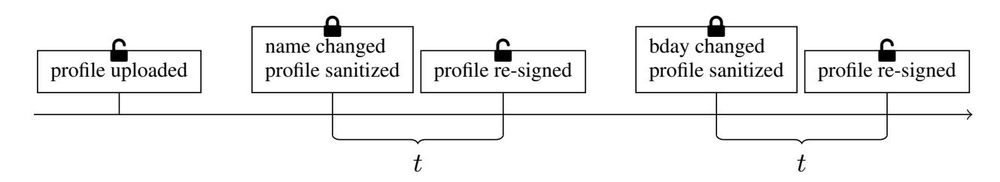

{0}------------------------------------------------

# Unlinkable and Invisible γ-Sanitizable Signatures?

Angele Bossuat ` 1 and Xavier Bultel<sup>2</sup>

<sup>1</sup> Univ Rennes 1, CNRS, IRISA <sup>2</sup> LIFO, INSA Centre Val de Loire, Universite d'Orl ´ eans, Bourges, France ´

Abstract. Sanitizable signatures (SaS) allow a (single) sanitizer, chosen by the signer, to modify and re-sign a message in a somewhat controlled way, that is, only editing parts (or blocks) of the message that are admissible for modification. This primitive is an efficient tool, with many formally defined security properties, such as unlinkability, transparency, immutability, invisibility, and unforgeability. An SaS scheme that satisfies these properties can be a great asset to the privacy of any field it will be applied to, *e.g.*, anonymizing medical files.

In this work, we look at the notion of γ*-sanitizable signatures* (γSaS): we take the sanitizable signatures one step further by allowing the signer to not only decide which blocks can be modified, but also how many of them at most can be modified within a single sanitization, setting a limit, denoted with γ. We adapt the security properties listed above to γSaS and propose our own scheme, ULISS (Unlinkable Limited Invisible Sanitizable Signature), then show that it verifies these properties. This extension of SaS can not only improve current use cases, but also introduce new ones, *e.g.*, restricting the number of changes in a document within a certain timeframe.

### 1 Introduction

One of the main properties of digital signatures is integrity – indeed, it is important that any modification made to a message after it was signed would invalidate said signature. However, one might wish to modify a signed message without altering its core meaning, for example to anonymize a document, while not wanting (or not being able) to take the time necessary to get the original signer to sign again.

*Sanitizable signatures*, as introduced in [1] can serve such a purpose by allowing a form of controlled malleability, where a signer will sign a message along with a list of *admissible modifications* with respect to a second entity called the *sanitizer*. That sanitizer will be allowed to re-sign a message, producing a valid signature as long as the message was only modified within the limits defined by the list.

The relationship between the signer and the sanitizer will depend on the use case (*e.g.* they can be a boss and their employee, or a service provider and their client) and for this reason the means and content of any communication between those two entities (including credentials used to sign/sanitize) is out of scope of this paper.

A frequent usage example for such a signature scheme would be the anonymization of medical data destined to be analyzed: the name of the patients is – with a high probability – not relevant for the analysis, neither is their email address or phone number;

<sup>?</sup> An extended abstract of this work appeared at ACNS 2021. This is the full version.

{1}------------------------------------------------

however, it is important to know that the data is authentic, hence the need for it to still be verifiable once it has been anonymized.

However, we do believe that this still leaves too great a latitude to the sanitizer, and that this latitude should be somewhat narrowed down, which is the aim of this work.

Contribution. In this paper, we look at a variant of sanitizable signatures, that we refer to as γ*-Sanitizable Signatures*. This variant restricts the sanitizer to only modify a certain number of blocks at once, a number which is referred to as the *limit*, and denoted with γ. In this variant, even if a signature has been sanitized multiple times, the number of blocks that differ between the *original* message and this one should not be above the limit. When the signer signs the original message, they will thus also set that limit.

We detail some applications for this limit in Section 5, all of which are inachievable with regular sanitizable signatures: for example, we show how to use γ-Sanitizable Signatures to limit the number of changes a user can make to their social media profile over a certain period of time, similar to what Facebook currently does with birthdays<sup>3</sup> .

This idea of adding a limit was first introduced as an important research problem by Klonowski and Lauks [24] and later applied by Canard and Jambert in [13], but as we detail below in related works, the scheme they proposed satisfies less security properties and is not practical compared to this work. Our first contribution is to adapt the various security properties of sanitizable signatures by taking the limit into account, namely:

Unforgeability: the users cannot produce a valid signature without the secret keys.

Immutability: the sanitizer cannot sanitize on an unauthorized modification.

Transparency: the verifier cannot tell whether a given signature was sanitized or not.

Unlinkability: the verifier cannot link a sanitized signature with its original.

Invisibility: the verifier cannot tell what (or how many) modifications are authorized on a signature without knowledge of any secret key.

In this work, we do not focus on accountability, which ensures that the signer can cancel the transparency *a posteriori*, as this property does not depend on the limit and achieved for any sanitizable signature scheme by using the generic transformation of [11]. Our second contribution is the scheme ULISS (Unlinkable Limited Invisible Sanitizable Signature), for which we prove all of the above properties in the random oracle model (ROM).

Our scheme. Our aim when creating ULISS was to build a signature that is originally issued by a signer and that can be modified by the sanitizer, who has to prove that it was done within the authorized limits (*i.e.*, the blocks that were modified are admissible *and the number of blocks that were modified is below the limit*). We also want the resulting signatures to not leak whether they come from the signer or the sanitizer. We focused on the idea that the sanitizer must *prove* that the sanitization was done properly, as allowed, and for this we base our scheme on the use of (non-interactive) zero-knowledge proofs.

The signer first computes commitments pertaining to the authorized modifications and the limit, and signs them, then encrypts some necessary information for the sanitizer. To edit the signature, the sanitizer will retrieve the encrypted data and use it to build some new proofs related to the original commitments, and sign everything (along

<sup>3</sup> facebook.com/help/563229410363824/

{2}------------------------------------------------

with the modified message, of course) using the ring signature. Since the information about the modifications and the limit is committed, it cannot be deduced from the signature, which makes ULISS invisible.

Reaching both invisibility and unlinkability is a difficult task; to the best of our knowledge, the scheme presented in Bultel et al. [11] is the only one that achieves these two properties together, thanks to class-equivalence signatures. We use a similar trick for ULISS: a sanitized signature uses the same signed commitments as the original signature. This could be used by an adversary to link these two signatures, however, we use a class-equivalence signature to sign the commitments, which allows the sanitizer to randomize the commitments and the signature in such a way that the messages in the signed commitments are *not* modified.

Related Work. Sanitizable signatures were, as cited above, first introduced by Ateniese et al. [1], proposing applications, among others, in the medical field. This primitive is related to (but should not be confused with) redactable signatures [7], where a sanitizer can erase some parts of the message but not modify it. The security properties were originally presented in [1], but formalized later on by Brzuska et al. in [8] and [9], the latter adding the idea of *unlinkability*. Invisibility was formalized in [12], and invisible constructions are proposed in [12] and [3]. In [11], the authors propose a scheme that is both unlinkable and invisible, using class-equivalent signatures. To the best our knowledge, this scheme is the only one that achieves these two properties together. They also provide a generic way to add accountability on any sanitizable signature scheme, using verifiable ring signatures [10]. Note that these schemes allow the sanitizer modify parts of the message in an unlimited way.

On the other hand, related primitives with a more general application can be used to achieve γ-Sanitizable Signatures, including functional signatures [6] and delegatable functional signatures [2], which allows a user to sign messages that verify some functions or predicate, policy-based signatures [4], where signers are authorized to sign a message if it satisfies some policy, and homomorphic signatures [23]. All of these offer much more variety on what (the equivalent of) the sanitizer can do compared to traditional sanitizable signatures, while being generally much less efficient specifically because of their fine-grained possibilities, using heavy generic primitives (*e.g.*, generic zero-knowledge proofs for garbled boolean circuits or homomorphic encryption). We believe our work lies somewhere in between, offering more control on the sanitizations while remaining practical.

The γ-sanitizable signature schemes were introduced in [24] and revisited by Canard and Jambert in [13], the latter proposing the first security model for γ-sanitizable signatures. To the best of our knowledge, there is no other such scheme in the literature – moreover, these two works are neither invisible nor unlinkable. Adding unlinkability to these schemes is not straightforward, as they use chameleon hashes [25] on modifiable parts of the signatures, which implies that these hashes are the same for both the sanitized signature and the original one. Moreover, adding invisibility does not seem trivial either, as the size of the public parameters of the sanitizer is linear in the limit γ (which must be secret in invisible schemes). Furthermore, the design of the schemes in [13, 24] has inherent limitations making them unsuitable for practical applications:

{3}------------------------------------------------

- The signer must use a new public key (of size linear in γ) generated by the sanitizer at each new signature, implying that the signature algorithm is interactive and requires the presence of the sanitizer.
- If the same signature is sanitized several times such that the *total* number of modified parts is greater than γ, then the key of the sanitizer is leaked to anybody, even if the sanitized signatures considered separately are within the limit γ, which drastically restricts the number of sanitizations of a signature.
- To verify that the limit γ is respected on a sanitized signature, the verifier must also have the original signature. However, if the verifier knows the original signature and the original message, sanitizable signatures are useless by design.

For these reasons, we believe that security notions and constructions of γ-Sanitizable Signatures must be revisited, to produce a more *practical* and more *secure* scheme. As explained above, this cannot be achieved by modifying the proposed schemes: we must instead get our inspiration from a regular sanitizable signature scheme that satisfies both unlinkability and invisibility – i.e., [11]. We will show that the cost of introducing a new feature to sanitizable signatures is acceptable, especially since compared to Canard and Jambert's scheme, we obtain a much more practical scheme, and satisfy more security properties.

Outline. This work is organized as follows: in Section 2, we present the different cryptographic tools that we use, along with the security definitions, then in Section 3 we describe our security model. Our scheme is explained and analysed in Section 4. Some applications are presented in Section 5. The complete proofs are given in Appendix A.

# 2 Cryptographic Tools

In this section, we give or recall the definitions of various cryptographic tools that will be used when building our scheme, or when proving its security properties.

Definition 1 (DDH). *Let* G *be a multiplicative group of order* p *generated from a security parameter* λ *(with* blog(p)c = λ*) with generator* g*, the* Decisional Diffie-Hellman *(DDH) assumption states that for* a, b *and* c *randomly chosen in* Z ∗ p *, it is difficult for a polynomial-time adversary* A *to decide whether he has been given* (g a , g<sup>b</sup> , ga·<sup>b</sup> ) *or* (g a , g<sup>b</sup> , g<sup>c</sup> )*, i.e., the following function is negligible:*

$$\mathsf{Adv}^{\mathit{DDH}}_{\mathbb{G}}(\lambda) = |\Pr[1 \leftarrow \mathcal{A}(g^a, g^b, g^c)] - \Pr[1 \leftarrow \mathcal{A}(g^a, g^b, g^{a \cdot b})]|.$$

Definition 2 (NIZKP [16]). *A* non-interactive zero-knowledge proof *(NIZKP) for a language* L *is a pair of algorithms* (Prove, Verify) *such that:*

Prove(s, w): *It outputs a proof* π *that* s ∈ L *using witness* w*,*

Verify(s, π): *It checks whether* π *is a valid proof that* s ∈ L*.*

*A NIZKP must satisfy the following properties:*

Soundness *No adversary* A *(possibly unbounded in time) is such that* A(L) *can, with non-negligible probability, output* (x, π) *where* Verify(x, π) = 1 *and* x /∈ L*.*

Completeness *For any statement* s ∈ L *and its witness* w*,* Verify(s, Prove(s, w)) = 1*.*

{4}------------------------------------------------

(**Perfect**) **Zero-Knowledge** The proof  $\pi$  does not leak any information, in other words, there exists a probabilistic polynomial-time (PPT) simulator Sim (which has the ability to program the outputs of the random oracle in the random oracle model) such that Sim(s) follows the same probability distribution as Prove(s, w).

**Definition 3** (2-Ring Signature (2RS) [5]). A 2-Ring Signature scheme R is a tuple of 4 PPT algorithms defined as follows:

 $\mathsf{R.ini}(1^{\lambda})$ : *It returns a setup value set.* 

R.gen(set): It returns a pair of public/private keys (pk, sk).

R.sig(sk, {pk<sub>0</sub>, pk<sub>1</sub>}, m): This algorithm computes a signature  $\sigma$  from the message m using the secret key sk and two public keys ( $pk_0$ ,  $pk_1$ ) (such that sk is the private key corresponding to one of them).

 $\mathsf{R.ver}(\{\mathsf{pk}_0,\mathsf{pk}_1\},m,\sigma)$ : This algorithm returns a bit d.

A 2RS scheme R is said to be correct if for all  $(\mathbf{pk}_0, \mathbf{sk}_0), (\mathbf{pk}_1, \mathbf{sk}_1)$  output by the algorithm  $R.gen(\mathbf{set})$  where  $\mathbf{set}$  was output by  $R.ini(1^{\lambda})$ , for any message m, and for  $b \in \{0,1\}$ :

$$\textit{R.ver}(\{\textit{pk}_0, \textit{pk}_1\}, m, \textit{R.sig}(\textit{sk}_b, \{\textit{pk}_0, \textit{pk}_1\}, m)) = 1.$$

We use two security notions for 2-Ring Signatures: strong unforgeability, and anonimity, formally defined below.

**Definition 4 (Strong Unforgeability).** Let P be a 2-ring signature, then P is strongly unforgeable if for any polynomial-time adversary A, the probability  $\Pr[\mathsf{Exp}_{P,\mathcal{A}}^{\mathsf{SUF}}(\lambda) = 1]$  that A wins the experiment in Figure 1 is negligible.

**Definition 5** (Anonymity). Let P be a 2-ring signature, then P is (perfectly) anonymous if for any polynomial-time adversary A, the probability  $\Pr[\mathsf{Exp}_{P,\mathcal{A}}^{\mathsf{anon}}(\lambda)=1]$  that A wins the experiment in Figure 1 is negligibly close to 1/2.

**Definition 6** (Equivalence-Class Signature (EQS) [22]). An Equivalence-Class Signature scheme S on a bilinear group of prime order p generated from a security parameter  $\lambda$  (described as  $\mathcal{BG} = (\mathbb{G}_1, \mathbb{G}_2, \mathbb{G}_t, g_1, g_2, g_T, e, q)$ ) is a tuple of 5 algorithms defined as follows:

S.ini( $1^{\lambda}$ ): It returns a setup value set which contains the bilinear group  $\mathcal{BG}$ .

S.gen(set): It returns a public/private key pair (pk, sk).

S.sig(sk, m): It computes and returns a signature  $\sigma$  on the equivalence class [m] of the message m using the private key sk.

S.ver(pk,  $\sigma$ , m): It verifies the signature  $\sigma$  under the key pk on the equivalence class [m] of the message m.

S.ChRep(pk,  $\sigma$ , m, t): It computes and returns a signature  $\sigma'$  on (the same) equivalence class  $[m^t] = [m]$  of message  $m^t$ .

An EQS scheme is said to be correct if for all (pk, sk) output by S.gen(set) where set was output by  $S.ini(1^{\lambda})$ , for any message m, any scalar  $t \in \mathbb{Z}_p^*$ :

$$S.ver(pk, S.sig(sk, m), m) = 1, \ and$$
  
 $S.ver(pk, S.ChRep(pk, S.sig(sk, m), m, t), m^t) = 1$ 

{5}------------------------------------------------

```
\operatorname{Exp}^{\operatorname{SUF}}_{P,\mathcal{A}}(\lambda):
                                                                                             \operatorname{Exp}_{P,\mathcal{A}}^{\operatorname{EUF-CMA}}(\lambda):
                                                                                                                                                                      \mathbf{Exp}^{\mathrm{class-hid}}_{\mathcal{M},\mathcal{A}}(\lambda) :
                                                                                             set \leftarrow S.ini(1^{\lambda});
set \leftarrow \mathsf{R.ini}(1^{\lambda});
                                                                                                                                                                      b \stackrel{\$}{\leftarrow} \{0, 1\};
                                                                                             (pk, sk) \leftarrow S.gen(set);
(\mathsf{pk}_0, \mathsf{sk}_0) \leftarrow \mathsf{R.gen}(\mathsf{set});
                                                                                                                                                                      set \leftarrow S.ini(1^{\lambda});
(\mathsf{pk}_1, \mathsf{sk}_1) \leftarrow \mathsf{R.gen}(\mathsf{set});
                                                                                             \mathcal{S} \leftarrow \{ \};
                                                                                            (m,\sigma) \leftarrow \mathcal{A}^{\mathsf{S.sig}(\mathsf{sk},\cdot)}.
                                                                                                                                                                       m, m_0 \stackrel{\$}{\leftarrow} \mathcal{M}^2;
\mathcal{S} \leftarrow \{ \};
(m,\sigma) \leftarrow \mathcal{A}^{\mathsf{R.sig}(\cdot,\{\mathsf{pk}_0,\mathsf{pk}_1\},\cdot)}(\mathsf{pk}_0,\mathsf{pk}_1); \text{if } (m,\sigma) \notin \mathcal{S}
                                                                                                                                                                       m_1 \stackrel{\$}{\leftarrow} [m];
                                                                                            then return S.ver(pk, m, \sigma);
                                                                                                                                                                      b_* \leftarrow \mathcal{A}(\mathsf{set}, m, m_b);
if (m, \sigma) \notin \mathcal{S} then
return R.ver(\{pk_0, pk_1\}, m, \sigma), else 0;
                                                                                            else return 0;
                                                                                                                                                                       return b_* = b;
                                                                                                                                                                      \mathbf{Exp}^{\mathbf{IND\$\text{-}CCA}}_{\mathsf{E},\mathcal{A}}(\lambda) \colon
Oracle R.sig(i, \{\mathsf{pk}_0, \mathsf{pk}_1\}, m):
                                                                                             Oracle S.sig(sk, m):
\sigma \leftarrow \mathsf{R.sig}(\mathsf{sk}_i, \{\mathsf{pk}_0, \mathsf{pk}_1\}, m);
                                                                                             \sigma \leftarrow \mathsf{S.sig}(\mathsf{sk}, m);
                                                                                                                                                                       set \leftarrow \mathsf{E}.\mathsf{ini}(1^{\lambda});
                                                                                             \mathcal{S} \leftarrow \mathcal{S} \cup (m, \sigma);
\mathcal{S} \leftarrow \mathcal{S} \cup (m, \sigma);
                                                                                                                                                                       b \stackrel{\$}{\leftarrow} \{0,1\};
return \sigma;
                                                                                             return \sigma;
                                                                                                                                                                       (pk, sk) \leftarrow E.gen(set);
                                                                                             \mathbf{Exp}^{\mathrm{adapt}}_{P,\mathcal{A}}(\lambda) :
                                                                                                                                                                       b_* \leftarrow \mathcal{A}^{\mathsf{RREnc}(\mathsf{pk},b,\cdot),\mathsf{Dec}(\mathsf{sk},\cdot)}(\mathsf{pk});
\mathsf{Exp}^{\mathsf{anon}}_{P,\mathcal{A}}(\lambda):
                                                                                                                                                                      return b = b_*;
                                                                                             set \leftarrow S.ini(1^{\lambda});
b \stackrel{\$}{\leftarrow} \{0, 1\};
                                                                                             (pk, sk) \leftarrow S.gen(set);
set \leftarrow \mathsf{R.ini}(1^{\lambda});
                                                                                             b_* \leftarrow \mathcal{A}^{\text{S.Ch/Sig}(b,\cdot,\cdot,\cdot,\cdot,\cdot)}(\text{pk, sk}); \text{ if } b=1 \text{ then return E.enc}(\text{pk},m);
(\mathsf{pk}_0, \mathsf{sk}_0) \leftarrow \mathsf{R.gen}(\mathsf{set});
                                                                                             if b_* = b then return 1;
(\mathsf{pk}_1, \mathsf{sk}_1) \leftarrow \mathsf{R.gen}(\mathsf{set});
                                                                                                                                                                       m' \stackrel{\$}{\leftarrow} \{0,1\}^{|m|}:
                                                                                             else return 0;
b_* \leftarrow \mathcal{A}^{\mathsf{R.sig}(\mathsf{sk}_b, \{\mathsf{pk}_0, \mathsf{pk}_1\}, \cdot)}(\mathsf{pk}_0, \mathsf{pk}_1);
                                                                                                                                                                       return E.enc(pk, m');
return b = b_*:
                                                                                              Oracle
                                                                                                                                                                      Oracle Dec(sk, c):
                                                                                             S.Ch/Sig(b, (sk, pk), s, t, m):
Oracle \mathsf{R.sig}(\mathsf{sk}_b, \{\mathsf{pk}_0, \mathsf{pk}_1\}, m):
                                                                                                                                                                       if c was output by RRenc
                                                                                             if b = 0
return \mathsf{R.sig}(\mathsf{sk}_b, \{\mathsf{pk}_0, \mathsf{pk}_1\}, m);
                                                                                                                                                                      then return \perp;
                                                                                             then return S.sig(sk, m^t);
                                                                                                                                                                      return Dec(sk, c);
                                                                                             return S.ChRep(pk, s, m, t);
```

Fig. 1: Security experiments and oracles of our cryptographic tools.

**Definition 7 (EUF-CMA).** An equivalence-class signature scheme P is said to be existentially unforgeable under chosen message attacks (EUF-CMA) if for any polynomial-time adversary A, the probability  $\Pr[\textit{Exp}_{P,\mathcal{A}}^{\textit{EUF-CMA}}(\lambda)=1]$  that A wins the EUF-CMA experiment given in Figure 1 is negligible.

**Definition 8** ((**Perfect**) **Signature Adaptation**). An equivalence-class signature scheme P is said to (perfectly) adapt signatures if, for all tuples (pk, sk,  $\sigma$ , m, t) such that (pk, sk) is a public/private key pair and  $S.ver(pk, \sigma, m) = 1$ , it holds that  $S.sig(sk, m^t)$  and  $S.ChRep(pk, \sigma, m, t)$  are identically distributed. Formally, this translates into the fact that for any polynomial-time adversary A, the probability  $Pr[Exp_{P,A}^{adapt}(\lambda) = 1]$  of winning the adapt experiment given in Figure 1 is negligibly close to 1/2.

**Definition 9** (Class-Hiding). A message space  $\mathcal{M} = \mathbb{G}^{\ell}$  (with  $\ell > 1$ ) of an equivalence-class signature scheme is said to be class-hiding if for all polynomial-time adversary  $\mathcal{A}$ , the probability  $\Pr[\mathsf{Exp}^{\mathsf{class-hid}}_{\mathcal{M},\mathcal{A}}(\lambda) = 1]$  of winning the class-hid experiment given in Figure 1, in which [m] is the equivalence class of m, is negligibly close to 1/2.

**Lemma 1.** [22] A message space  $\mathcal{M} = \mathbb{G}^{\ell}$  is class-hiding if and only if the DDH assumption holds in  $\mathbb{G}$ .

**Definition 10** (**IND\$-CCA**). An encryption scheme E=(E.ini, E.gen, E.enc, E.dec) with security parameter  $\lambda$  is said to be indistinguishable from random under adaptive chosen ciphertext attack (IND\$-CCA) if for any polynomial-time adversary A, the probability  $\Pr[Exp_{E,A}^{|ND$-CCA}(\lambda)=1]$  that A wins the experiment in Figure 1 is negligibly close to 1/2. Note that this notion is equivalent to its more classic version, IND-CCA, in which the adversary must guess which of the two messages sent to the challenger was encrypted.

{6}------------------------------------------------

# 3 Security Model

In this section, we define our notion of γ-Sanitizable Signature, as well as the various security properties of our model.

Definition 11 (γ-Sanitizable Signature (γ**SaS**)). *A* γ-Sanitizable Signature *scheme is a tuple of* 6 *algorithms defined as follows:*

Init(1<sup>λ</sup> ): *It returns a setup value set.*

SiGen(set): *It returns a pair of signer public/private keys* (*pk*, *sk*)*.*

SaGen(set): *It returns a pair of sanitizer public/private keys* (*spk*, *ssk*)*.*

Sig(m, sk, spk, ADM, γ): *This algorithm computes a signature* σ *from the message* m *using the secret key sk, the sanitizer public key spk, the admissible function* ADM *and the limit* γ*. Note that we assume that* ADM *can be efficiently recovered from any signature as in the definition of Fleischhacker et al. [19]. Moreover, for a modification* MOD *we write that* ADM(MOD) = 1 *to signify that the modification is allowed, and for a block number* i*, we write* i ∈ ADM *to say that the* i*th block can be modified.*

San(m, MOD, σ, pk, ssk, spk): *Let* ADM *be the admissible function according to the signature* σ*. If* ADM(MOD) = 1 *and Ver*(m, σ, *pk*, *spk*) = 1 *then this algorithm returns a signature* σ <sup>0</sup> *of the message* m<sup>0</sup> = MOD(m) *using the signature* σ*, the signer public key pk and the sanitizer public/private key pair* (*ssk*, *spk*)*. Else it returns* ⊥*.*

Ver(m, σ, pk, spk): *It returns a bit* b*: if the signature* σ *of* m *is valid for the two public keys pk and spk then* b = 1*, else* b = 0*. This algorithm is deterministic.*

*A* γ*-SaS is said to be correct if for all set output by Init*(1<sup>λ</sup> )*, all Sig and San key pairs* (*pk*, *sk*),(*spk*, *ssk*) *output by SiGen*(*set*) *and SaGen*(*set*)*, respectively, all admissible functions* ADM*, limits* γ*, modifications* MOD*, messages* m*, we have:*

$$Ver(m, Sig(m, sk, spk, ADM, \gamma), pk, spk) = 1,$$

*and for all* σ *such that Ver*(m, σ, *pk*, *spk*) = 1*, and for all* σ <sup>0</sup> *output by San*(m, MOD, σ, *pk*, *ssk*, *spk*) *such that* σ <sup>0</sup> 6=⊥*:*

$$Ver(Mod(m), \sigma', pk, spk) = 1.$$

We now adapt the security properties of sanitizable signatures to fit our notion. In most cases, the limit must be treated in a similar way as the admissible function – however, it is important to consider this additional feature carefully, as it does of course introduce new *trivial* attacks. The detailed meaning and formal definition of each adapted property is given below.

*Strong Unforgeability:* The (strong) unforgeability property ensures that an adversary cannot create a valid message-signature pair without knowing the corresponding private key (*i.e.*, sk for the signer and ssk for the sanitizer). The adversary has access to the signing oracle and the sanitizing oracle, and must provide a message- signature pair. Of course, the adversary cannot be allowed to trivially win the experiment by sending a pair produced by either of the oracles to the challenger – but can, however, produce a pair containing a message that had been signed by either of the oracles.

{7}------------------------------------------------

**Definition 12** (Strong Unforgeability). Let P be a  $\gamma$ SaS of security parameter  $\lambda$ , then P is strongly unforgeable if for any polynomial-time adversary A, the probability  $\Pr[\mathsf{Exp}^{\mathsf{SUF}}_{\mathsf{ULISS},\mathcal{A}}(\lambda)=1]$  that A wins the SUF experiment given in Figure 2 is negligible.

*Immutability:* A  $\gamma$ SaS is immutable when no adversary is able to sanitize a signature without the corresponding sanitizer secret key or to sanitize a signature using a modification function that is not admissible (*i.e.*, ADM(MOD) = 0 or the number of modifications is higher that the limit  $\gamma$ ). The adversary has access to a signature oracle.

**Definition 13** (**Immutability [8]**). Let P be a  $\gamma$  SaS. P is Immut-secure (or immutable) when for any polynomial time adversary A, the probability  $\Pr[\mathsf{Exp}_{ULISS,\mathcal{A}}^{immut}(\lambda) = 1]$  that A wins the immut experiment given in Figure 2 is negligible, where  $q_{\mathsf{Sig}}$  is the number of calls to the oracle  $\mathsf{Sig}(\cdot,\mathsf{sk},\cdot,\cdot,\cdot)$ ,  $(m_i,\mathsf{ADM}_i,\gamma_i,\mathsf{spk}_i)$  is the  $i^{th}$  query to the oracle  $\mathsf{Sig}(\cdot,\mathsf{sk},\cdot,\cdot,\cdot)$  and  $\sigma_i$  is the corresponding response.

*Transparency:* The transparency property guarantees that no adversary is able to distinguish whether a signature is sanitized. In addition to the signature oracle, the adversary has access to a sanitize oracle  $San(\cdot, \cdot, \cdot, \cdot, ssk)$ . Moreover, the adversary has access to a challenge oracle Sa/Si(b, pk, spk, sk, ssk,  $\cdot$ ,  $\cdot$ ,  $\cdot$ ,  $\cdot$ ) that depends on a randomly chosen bit b: this oracle signs a given message and sanitizes it, if b = 0 then it outputs the original signature, otherwise it outputs the sanitized signature. To succeed in winning the experiment, the adversary must guess b. In order to exclude trivial attacks, we must keep track of the outputs of the challenge oracle. Indeed, the adversary can easily determine whether the Sa/Si called Sig or San by sanitizing the output signature and figuring out how many modifications are allowed. The limit does indeed introduce some new and somewhat tricky trivial attacks for the transparency property. For example, let us consider a message m of length 2, with both blocks being admissible for modifications, and a limit of  $\gamma = 1$ . The adversary can query Sa/Si with a modification MoD<sub>1</sub> on the first block, then query San on the output with a modification Mod<sub>2</sub> on the second block. If Sa/Si queried Sig, *i.e.*, if the ouput is an original signature on  $Mod_1(m)$ , then the modification would be allowed, as  $Mod_1(m)$  and  $Mod_2(Mod_1(m))$  only have one difference, but if Sa/Si queried San, i.e., if the ouput is a sanitized signature of m on  $Mod_1(m)$ , then the sanitization is not allowed, since m and  $Mod_2(Mod_1(m))$  have two differences.

**Definition 14** (**Transparency**). Let P be a  $\gamma$ SaS. P is Trans-secure (or transparent) when for any polynomial time adversary A, the probability  $\Pr[\mathsf{Exp}_{ULISS,\mathcal{A}}^{\mathsf{trans}}(\lambda)=1]$  that A wins the trans experiment given in Figure 2 is negligible.

Unlinkability: The unlinkability property ensures that a sanitized signature cannot be linked with the original one. We consider an adversary that has access to the signature and the sanitize oracles. Moreover, the adversary has access to a challenge oracle LRSan(b, pk, ssk, spk,  $\cdot$ ,  $\cdot$ ) that depends on a bit b: this oracle takes as input two signatures  $\sigma_0$  and  $\sigma_1$ , the two corresponding messages  $m_0$  and  $m_1$  and two modification functions MOD<sub>0</sub> and MOD<sub>1</sub> chosen by the adversary. If the two signatures have the same admissible function ADM, if MOD<sub>0</sub> and MOD<sub>1</sub> are admissible according to ADM and if MOD<sub>0</sub>( $m_0$ ) = MOD<sub>1</sub>( $m_1$ ) then the challenge oracle sanitizes  $\sigma_b$  using MOD<sub>b</sub> and returns it. The goal of the adversary is to guess the bit b. The adversary is allowed

{8}------------------------------------------------

to query LRSan on two signatures with different limits, thus to prevent trivial attacks the resulting output will artificially be limited to the smaller of the two. This means that the challenger must keep track of the outputs of all three oracles.

**Definition 15** (Unlinkability). Let P be a  $\gamma$  SaS of security parameter  $\lambda$ . P is Unlinksecure (or unlinkable) when for any polynomial time adversary  $\mathcal{A}$ , the probability  $\Pr[\mathsf{Exp}^{\mathsf{unlink}}_{\mathsf{ULISS},\mathcal{A}}(\lambda)=1]$  that  $\mathcal{A}$  wins the unlink experiment given in Figure 2 is negligibly close to 1/2.

Invisibility: The invisibility property ensures that an adversary who does not know any private key can neither decide whether a block is admissible for modification or not, nor how many blocks can be modified. The adversary we consider has access to the sign oracle, the sanitize oracle, and a left-or-right admissible oracle LRADM that depends on the bit b chosen by the challenger. The adversary will give a message m along with two ADM functions  $ADM_0$ ,  $ADM_1$  and two  $\gamma$  values  $\gamma_0$ ,  $\gamma_1$  as input to this oracle, which will output a signature with  $ADM_b$  as its admissible function, and  $\gamma_b$  as a limit. The adversary will try to guess the value of b. To exclude trivial attacks, we must artificially limit the number of modified blocks to  $\min(\gamma_0, \gamma_1)$  on any signature created by LRADM no matter the value of b, and we must also prevent the adversary from querying a sanitization with a MOD function that is admissible by  $ADM_0$  but not by  $ADM_1$  or vice-versa.

**Definition 16** (Invisibility). Let P be a  $\gamma$ SaS of security parameter  $\lambda$ , then P is said to be Invis-secure (or invisible) if for any polynomial-time adversary A, the probability  $\Pr[\mathsf{Exp}_{ULISS,\mathcal{A}}^{\mathsf{invis}}(\lambda)=1]$  that  $\mathcal{A}$  wins the invis experiment given in Figure 2 is negligibly close to 1/2.

#### 4 Scheme

We now present our scheme, ULISS, and detail the role of each of its building blocks. We first give an idea of the aim of the centerpiece of our scheme, *i.e.*, the zero-knowledge proofs, and more specifically, their commitments, before giving the formal definition of our scheme, after which we detail the goal of each primitive.

Recall that whoever signs a message must be able to prove that it was done within the authorized bounds. When a message is signed, the signer also computes some commitments that will be used in the  $zero-knowledge\ proofs$ . Each commitment is a hash of some value concatenated with the public parameters. All commitments are initially elevated to an identical, random exponent x, and signed by the signer. To avoid traceability, the sanitizer will present them elevated to another, random exponent t in each sanitization. This resulting exponent is used as a witness in the zero-knowledge proof. The implications of this (change of) exponent are detailed after the definition of our scheme, at the end of this subsection. For simplicity, we omit both the exponent and the public parameters in the following explanation.

Commitments are divided in two categories: those meant to show that only admissible blocks are modified, and those meant to show that the number of modifications is

{9}------------------------------------------------

```
\mathsf{Exp}^{\mathsf{immut}}_{P,\mathcal{A}}(\lambda):
 set \leftarrow Init(1^{\lambda}); (pk, sk) \leftarrow SiGen(set);
 (\operatorname{spk}_*, m_*, \sigma_*) \leftarrow \mathcal{A}^{\operatorname{Sig}(\cdot, \operatorname{sk}, \cdot, \cdot, \cdot)}(\operatorname{pk}):
\text{if } (\mathsf{Ver}(m_*, \sigma_*, \mathsf{pk}, \mathsf{spk}_*) = 1) \text{ and } (\forall \ i \in \llbracket 1, q_{\mathsf{Sig}} \rrbracket, (\mathsf{spk}_* \neq \mathsf{spk}_i) \text{ or } (\forall \ \mathsf{Mod} \text{ such that } \mathsf{ADM}_i(\mathsf{Mod}) = 1,
            m_* \neq \text{Mod}(m_i)) or D(m_i, m_*) > \gamma_i) (where D(m_i, m_j) is the number of different blocks)
then return 1, else return 0;
\operatorname{Exp}^{\operatorname{SUF}}_{P,\mathcal{A}}(\lambda):
                                                                                                                                      \mathsf{Exp}^{\mathsf{invis}}_{P,\mathcal{A}}(\lambda):
\mathsf{set} \leftarrow \mathsf{Init}(1^{\lambda}); (\mathsf{pk}, \mathsf{sk}) \leftarrow \mathsf{SiGen}(\mathsf{set});
                                                                                                                                      \mathsf{set} \leftarrow \mathsf{Init}(1^{\lambda}); (\mathsf{pk}, \mathsf{sk}) \leftarrow \mathsf{SiGen}(\mathsf{set});
(spk, ssk) \leftarrow SaGen(set);
                                                                                                                                      (spk, ssk) \leftarrow SaGen(set);
 \mathcal{S} \leftarrow \{\};
                                                                                                                                     \begin{split} b &\overset{\$}{\leftarrow} \{0,1\}; \mathcal{L} \leftarrow [\,]; \\ \mathcal{O} &\leftarrow \left\{ \begin{aligned} &\operatorname{Sig}(\cdot,\operatorname{sk},\cdot,\cdot,\cdot), \operatorname{San}(\cdot,\cdot,\cdot,\cdot,\operatorname{ssk}), \\ &\operatorname{LRADM}(b,\operatorname{sk},\operatorname{spk},\cdot,\cdot,\cdot) \end{aligned} \right\}; \end{split}
 \mathcal{O} \leftarrow \{ \mathsf{Sig}(\cdot, \mathsf{sk}, \cdot, \cdot, \cdot), \mathsf{San}(\cdot, \cdot, \cdot, \cdot, \mathsf{ssk}) \};
 (m,\sigma) \leftarrow \mathcal{A}^{\mathcal{O}}(\mathsf{pk},\mathsf{spk});
if (m, \sigma) \notin \mathcal{S}
                                                                                                                                      b' \leftarrow \mathcal{A}^{\mathcal{O}}(\mathsf{pk}, \mathsf{spk}); if (b = b') then return 1, else return 0;
then return Ver(m, \sigma, pk, spk), else return 0;
\mathsf{Exp}^{\mathsf{trans}}_{P,\mathcal{A}}(\lambda):
                                                                                                                                      \mathsf{Exp}^{\mathsf{unlink}}_{P,\mathcal{A}}(\lambda):
set \leftarrow Init(1^{\lambda}); (pk, sk) \leftarrow SiGen(set);
                                                                                                                                      \mathsf{set} \leftarrow \mathsf{Init}(1^{\lambda}); (\mathsf{pk}, \mathsf{sk}) \leftarrow \mathsf{SiGen}(\mathsf{set});
 (spk, ssk) \leftarrow SaGen(set);
                                                                                                                                      (spk, ssk) \leftarrow SaGen(set);
b \stackrel{\$}{\leftarrow} \{0,1\}; \mathcal{L} \leftarrow [\ ];
                                                                                                                                     \begin{split} b & \stackrel{\$}{\leftarrow} \{0,1\}; \mathcal{L} \leftarrow [\,]; \\ \mathcal{O} & \leftarrow \left\{ \begin{aligned} &\operatorname{Sig}(\cdot,\operatorname{sk},\cdot,\cdot,\cdot), \operatorname{San}(\cdot,\cdot,\cdot,\cdot,\operatorname{ssk},\cdot), \\ &\operatorname{LRSan}(b,\operatorname{pk},\operatorname{ssk},\operatorname{spk},\cdot,\cdot) \end{aligned} \right\}; \end{split}
 \mathcal{O} \leftarrow \left\{ \begin{array}{l} \mathsf{Sa/Si}(b,\mathsf{pk},\mathsf{spk},\mathsf{sk},\mathsf{ssk},\cdot,\cdot,\cdot) \\ \mathsf{Sig}(\cdot,\mathsf{sk},\cdot,\cdot,\cdot), \mathsf{San}(\cdot,\cdot,\cdot,\cdot,\mathsf{ssk},\cdot) \end{array} \right\}
 b' \leftarrow \mathcal{A}^{\mathcal{O}}(\mathsf{pk}, \mathsf{spk});
                                                                                                                                      b' \leftarrow \mathcal{A}^{\mathcal{O}}(\mathsf{pk}, \mathsf{spk});
if (b = b') then return 1, else return 0;
                                                                                                                                      if (b = b') then return 1, else return 0;
                                                                                    SUF oracles:
immut oracles:
                                                                                    Sig(m, sk, ADM, spk, \gamma):
 Sig(m, sk, ADM, spk, \gamma):
                                                                                                                                                                      San(m, Mod, \sigma, pk, ssk):
return Sig(m, sk, spk, ADM, \gamma);
                                                                                    \sigma \leftarrow \mathsf{Sig}(m,\mathsf{sk},\mathsf{ADM},\mathsf{spk},\gamma);
                                                                                                                                                                      \sigma' \leftarrow \mathsf{San}(m, \mathsf{Mod}, \sigma, \mathsf{pk}, \mathsf{ssk});
                                                                                    S = S \cup (m, \sigma);
                                                                                                                                                                      \mathcal{S} = \mathcal{S} \cup (m, \sigma);
                                                                                    return \sigma;
                                                                                                                                                                      return \sigma';
invis oracles:
                                                                                                                                  San(m, Mod, \sigma, pk, ssk):
 \overline{\mathsf{Sig}}(m,\mathsf{sk},\mathsf{ADM},\mathsf{spk},\gamma):
                                                                                                                                  if \mathcal{L}[\sigma] = \perp
return Sig(m, sk, spk, ADM, \gamma);
                                                                                                                                  then return San(m, MOD, \sigma, pk, ssk, spk);
                                                                                                                                  (\bar{m}, \gamma, \text{ADM}) \leftarrow \mathcal{L}[\sigma];
LRADM(b, \mathsf{sk}, \mathsf{spk}, m, (\mathsf{ADM}_0, \gamma_0), (\mathsf{ADM}_1, \gamma_1)):
                                                                                                                                  if D(\operatorname{Mod}(m), \bar{m}) \leq \gamma and \operatorname{ADM}(\operatorname{Mod}) = 1
\sigma \leftarrow \mathsf{Sig}(m, \mathsf{sk}, \mathsf{spk}, \mathsf{ADM}_b, \gamma_b);
                                                                                                                                  then \sigma' = San(m, Mod, \sigma, pk, ssk);
 \mathcal{L}[\sigma] \leftarrow (m, \min(\gamma_0, \gamma_1), ADM_0 \cap ADM_1);
                                                                                                                                             \mathcal{L}[\sigma'] = \mathcal{L}[\sigma];
return \sigma;
                                                                                                                                             return \sigma';
                                                                                                                                  else return \perp;
trans oracles:
                                                                                                                                  Sa/Si(b, pk, spk, sk, ssk, m, ADM, MOD, \gamma):
Sig(m, sk, ADM, spk, \gamma):
                                                                                                                                  if ADM(MOD) = 0 then return \perp;
\sigma \leftarrow \mathsf{Sig}(m,\mathsf{sk},\mathsf{spk},\mathsf{ADM},\gamma);
                                                                                                                                  If b = 0 then \sigma \leftarrow Sig(Mod(m), sk, spk, Adm, <math>\gamma);
\mathcal{L}[\sigma] \leftarrow (m, \gamma)
                                                                                                                                  else \sigma \leftarrow Sig(m, sk, spk, ADM);
return \sigma;
                                                                                                                                             \sigma \leftarrow \mathsf{San}(m, \mathsf{Mod}, \sigma, \mathsf{pk}, \mathsf{ssk}, \mathsf{spk});
                                                                                                                                  \mathcal{L}[\sigma] \leftarrow (m, \gamma);
San(m, Mod, \sigma, pk, ssk):
                                                                                                                                  returns \sigma;
if \mathcal{L}[\sigma] = \perp then return San(m, Mod, \sigma, pk, ssk, spk);
(\bar{m}, \gamma) \leftarrow \mathcal{L}[\sigma];
if D(\bar{m}, \text{Mod}(m)) > \gamma then return \perp;
\sigma' \leftarrow \mathsf{San}(m, \mathsf{Mod}, \sigma, \mathsf{pk}, \mathsf{ssk}, \mathsf{spk});
 \mathcal{L}[\sigma'] \leftarrow \mathcal{L}[\sigma];
returns \sigma';
unlink oracles:
 Sig(m, sk, ADM, spk, \gamma):
                                                                                                       LRSan(b, \mathsf{pk}, \mathsf{ssk}, \mathsf{spk}, (m_0, \mathsf{Mod}_0, \sigma_0)(m_1, \mathsf{Mod}_1, \sigma_1)):
\sigma \leftarrow \mathsf{Sig}(m,\mathsf{sk},\mathsf{spk},\mathsf{ADM},\gamma);
                                                                                                      for i \in \{0, 1\}, if Ver(m_i, \sigma_i, pk, spk) \neq 1 or ADM_0 \neq ADM_1
\mathcal{L}[\sigma] \leftarrow (m, \gamma);
                                                                                                                or ADM_0(MOD_0) \neq ADM_1(MOD_1)
return \sigma;
                                                                                                                or MOD_0(m_0) \neq MOD_1(m_1) or \mathcal{L}[\sigma_i] = \perp
                                                                                                      then return 0;
San(m, Mod, \sigma, pk, ssk):
                                                                                                        (\bar{m}_i, \gamma_i) \leftarrow \mathcal{L}[\sigma_i];
if \mathcal{L}[\sigma] = \perp
                                                                                                      for i \in \{0,1\}, if D(\operatorname{Mod}_0(m_0), \bar{m}_0) \leq \gamma_0
then return San(m, Mod, \sigma, pk, ssk, spk);
                                                                                                                  and D(\text{Mod}_1(m_1), \bar{m}_1) \leq \gamma_1
(\bar{m}, \gamma) \leftarrow \mathcal{L}[\sigma];
                                                                                                       then \sigma' \leftarrow \mathsf{San}(m_b, \mathsf{Mod}_b, \sigma_b, \mathsf{pk}, \mathsf{ssk}, \mathsf{spk});
if D(Mod(m), \bar{m}) > \gamma then return \bot;
                                                                                                                  \mathcal{L}[\sigma'] \leftarrow (\bar{m}_b, \min(\gamma_0, \gamma_1));
\sigma' \leftarrow \mathsf{San}(m, \mathsf{Mod}, \sigma, \mathsf{pk}, \mathsf{ssk}, \mathsf{spk});
                                                                                                                  return \sigma';
 \mathcal{L}[\sigma'] \leftarrow \mathcal{L}[\sigma];
                                                                                                      else return \perp;
returns \sigma';
```

Fig. 2: Security experiments and oracles for  $\gamma$ SaS properties.

{10}------------------------------------------------

below the limit. For the first kind, they are as follows: if a block i can be modified, then its corresponding commitment is a hash of its index, otherwise it is a hash of its index concatenated with its content. The sanitizer will thus have to show that for each block of the modified message, the commitment is either equal to the hash of the index or the hash of the index concatenated with its content – if at least one unauthorized block was modified, then the sanitizer cannot produce a valid proof. We also add to this batch a commitment of the public parameters, to authenticate them.

The second kind is slightly more intricate: one commitment is the hash of the limit  $\gamma$ , then for each block, the commitment is the concatenation of the index and the content of that block. The sanitizer will have to show that there exists a value v such that the hash of v is equal to the first commitment, and, considering there are n message blocks, at least n-i blocks of the modified message are such that the hash of their index and their content is equal to their corresponding commitment.

**Scheme 1 (ULISS)** Let  $\mathbb{G}$  be a group of prime order p, and g be a generator of  $\mathbb{G}$ . Let E be a public key encryption scheme such that E = (E.ini, E.gen, E.enc, E.dec), S be an Equivalence-Class Signature such that S = (S.ini, S.gen, S.sig, S.ver, S.ChRep), R be a 2-Ring Signature scheme such that R = (R.ini, R.gen, R.sig, R.ver), and F and H be two hash functions (of domain  $\{0,1\}^*$  and codomain  $\mathbb{G}$ ). Our scheme instantiated with  $(\mathbb{G}, E, S, F, H)$  is a  $\gamma$ -sanitizable signature scheme defined by the following algorithms:

```
\mathsf{Init}(1^{\lambda}): It runs \mathsf{set}_E \leftarrow \mathsf{E.ini}(1^{\lambda}), \mathsf{set}_R \leftarrow \mathsf{R.ini}(1^{\lambda}) and \mathsf{set}_S \leftarrow \mathsf{S.ini}(1^{\lambda}), then it
        returns the setup set = (set_E, set_R, set_S).
```

SiGen(set): It parses 
$$set = (set_E, set_R, set_S)$$
, runs  $(pk_S, sk_S) \leftarrow S.gen(set_S)$ ,  $(pk_R, sk_R) \leftarrow R.gen(set_R)$ , and returns  $(pk, sk) = ((pk_S, pk_R), (sk_S, sk_R))$ .

SaGen(set): It parses set, runs 
$$(spk_E, ssk_E) \leftarrow E.gen(set_E)$$
,  $(spk_R, ssk_R) \leftarrow R.gen(set_R)$ , and  $returns(spk, ssk) = ((spk_E, spk_R), (ssk_E, ssk_R))$ .

Sig
$$(m, \mathsf{sk}, \mathsf{spk}, \mathsf{ADM}, \gamma)$$
: It parses  $\mathsf{sk}$  as  $(\mathsf{sk}_S, \mathsf{sk}_R)$ ,  $\mathsf{spk}$  as  $(\mathsf{spk}_E, \mathsf{spk}_R)$  and  $m$  as  $m_1 \| \dots \| m_n$  and sets  $\mathsf{pp} = \mathsf{pk} \| \mathsf{spk}$ . It picks  $x \overset{\$}{\leftarrow} \mathbb{Z}_p^*$ , sets  $V \leftarrow F(\mathsf{pp})^x$  and  $C = H(\gamma \| \mathsf{pp})^x$ , then for all  $i$  in  $[n]$ :

- It computes  $A_i \leftarrow H(i||m_i||pp)^x$ .
- If  $i \in ADM$ , it computes  $B_i \leftarrow F(i\|pp)^x$ , else it computes  $B_i \leftarrow F(i\|m_i\|pp)^x$ .

It then computes the two following proofs: 
$$\pi_1 \leftarrow \mathsf{NIZK} \left\{ x : \bigwedge_{i=1}^n \left( \begin{array}{c} (B_i = F(i \| \mathbf{pp})^x \land V = F(\mathbf{pp})^x) \\ \lor (B_i = F(i \| m_i \| \mathbf{pp})^x \land V = F(\mathbf{pp})^x) \end{array} \right) \right\}$$
$$\pi_2 \leftarrow \mathsf{NIZK} \left\{ x : \bigvee_{i=1}^n \left( \begin{array}{c} \exists J \subseteq [n], (|J| = n - i) \land (\forall j \in J, \\ (A_j = H(j \| m_j \| \mathbf{pp})^x) \land (C = H(i \| \mathbf{pp})^x)) \end{array} \right) \right\}$$
Finally, it generates the following values:

Finally, it generates the following values:

- $s \leftarrow S.sig(sk_S, (A_1, B_1, \dots, A_n, B_n), C, V)$
- $e \leftarrow \textit{E.enc}(\textit{spk}_E, (x, (A_i, B_i)_{i \in [n]}, C, V, s)),$
- $\ r \leftarrow \textit{R.sig}(\textit{sk}_R, \{\textit{pk}_R, \textit{spk}_R\}, (\overset{\cdot}{m}, (A_i, B_i)_{i \in [n]}, C, V, \pi_1, \pi_2, s, e)),$ and returns  $\sigma = ((A_i, B_i)_{i \in [n]}, C, V, \pi_1, \pi_2, s, e, r).$

 $\mathsf{San}(m,\mathsf{Mod},\sigma,\mathsf{pk},\mathsf{ssk},\mathsf{spk})$ : This algorithm computes  $m_1'\|\ldots\|m_n'\leftarrow \mathsf{Mod}(m)$ , sets pp = pk||spk, parses pk as  $(pk_S, pk_R)$  and ssk as  $(ssk_E, ssk_R)$ , parses  $\sigma$  as  $((A_i,B_i)_{i\in[n]},C,V,\pi_1,\pi_2,s,e,r), \textit{picks } t \overset{\$}{\leftarrow} \mathbb{Z}_p^*, \textit{runs } (x,(\tilde{A}_i,\tilde{B}_i)_{i\in[n]},\tilde{C},\tilde{V},\tilde{s}) \leftarrow$  $\textit{E.dec}(\textit{ssk}_E, e)$ , sets  $x' = x \cdot t$ ,  $V' = F(\textit{pp})^{x'}$  and  $C' = H(\gamma || \textit{pp})^{x'}$ , and runs  $e' \leftarrow \textit{E.enc}(\textit{spk}_E, (x, (\tilde{A}_i, \tilde{B}_i)_{i \in [n]}, \tilde{C}, \tilde{V}, \tilde{s}))$ . The algorithm verifies that

{11}------------------------------------------------

the signatures (s and r) are valid, and verifies that ADM(MOD) = 1, else it aborts. For all i in [n], it sets  $A_i' = \tilde{A}_i^t$ ,  $B_i' = \tilde{B}_i^t$ , then it computes the signature  $s' \leftarrow S.ChRep(pk_S, \tilde{s}, (\tilde{A}_1, \tilde{B}_1, \dots, \tilde{A}_n, \tilde{B}_n, \tilde{C}, \tilde{V}), t)$ . It then computes the two following proofs:

```
\pi'_{1} \leftarrow \mathsf{NIZK}\left\{x': \bigwedge_{i=1}^{n} \left( (B'_{i} = F(i\|pp)^{x'} \wedge V' = F(pp)^{x'}) \\ \vee \left( (B'_{i} = F(i\|m'_{i}\|pp)^{x'} \wedge V' = F(pp)^{x'}) \right) \right\}
\pi'_{2} \leftarrow \mathsf{NIZK}\left\{x': \bigvee_{i=1}^{n} \left( (A'_{j} = H(j\|m'_{j}\|pp)^{x'}) \wedge (C' = H(i\|pp)^{x'}) \right) \right\}
Finally, it \ computes \ r' \leftarrow R. \ sig(ssk_{R}, \{pk_{R}, spk_{R}\}, (\mathsf{MOD}(m), (A'_{i}, B'_{i})_{i \in [n]}, C', V', \pi'_{1}, \pi'_{2}, s', e') \right) \ and \ returns \ \sigma' = ((A'_{i}, B'_{i})_{i \in [n]}, C', V', \pi'_{1}, \pi'_{2}, s', e', r').
\mathsf{Ver}(m, \sigma, \mathsf{pk}, \mathsf{spk}): \ It \ parses \ \sigma \ as \ ((A_{i}, B_{i})_{i \in [n]}, C, V, \pi_{1}, \pi_{2}, s, e, r), \ pk \ as \ (pk_{S}, pk_{R}) \ and \ spk \ as \ (spk_{E}, spk_{R}), \ then \ if \ \pi_{1} \ and \ \pi_{2} \ are \ valid, \ and:
- \ S. \ ver((A_{1}, B_{1}, \ldots, A_{n}, B_{n}, C, V), pk_{S}, s) = 1,
- \ R. \ ver((m, (A_{i}, B_{i})_{i \in [n]}, C, V, \pi_{1}, \pi_{2}, s, e), \{pk_{R}, spk_{R}\}, r) = 1,
then \ it \ returns \ 1, \ else \ 0.
```

From the definition of the Verify algorithm, we see that the correctness of our scheme relies on the correctness of the NIZKP, as well as the correctness of the 2-Ring Signature and the Equivalence-Class Signature.

Having now introduced all notations, we can give a more in-depth description.

Non-Interactive ZKPs. The commitments denoted as V and  $\{B_i\}_{i\in[n]}$  are linked to the admissible function, with  $B_i$  being the ith block's commitment, and V being the public parameter's commitment. We see that it serves its purpose: the prover must show that for each block (denoted by  $\bigwedge_{i=1}^n$ ) in the (modified) message, the corresponding commitment is either equal to the hash of the index, or (denoted by  $\vee$ ) the hash of the index and the content.

The C and  $\{A_j\}_{j\in[n]}$  commitments are linked to the limit  $\gamma$ , with C committing the limit and  $A_j$  committing the original content of block j. Again, they follow the idea described at the beginning of the section: the prover must show that there is a value  $i\in[n]$  (denoted by  $\bigvee_{i=1}^n$ ), for which there exists a subset  $J\subseteq[n]$  such that  $[n]\setminus J$  has a size i, such that i is committed in C, and such that for all indices  $j\in J$ , the hash of j and the content of block j is equal to  $A_j$ . The soundness of these proofs implies the immutability.

Recall that, to compute a sanitization, the sanitizer will generate its own random value t and elevate all commitments to the power of t in order to produce a signature with different commitments, using  $x' = x \cdot t$  as its witness in the proofs.

All information about the admissibility or the limits are hidden by the commitments. Since the proofs are zero-knowledge, they do not leak this information to the verifier, which ensures that ULISS is invisible. Moreover, since all the other parts of the signature are computed in the same way by the signer and the sanitizer, ULISS is transparent.

Class-Equivalence Signature. The signer first signs the commitments using a class-equivalence signature. Indeed, as mentioned above, the sanitizer will modify the commitments by elevating them all to the same power, *i.e.*, using different elements from the same equivalence class. Thus, using class-equivalence signature allows the sanitizer

{12}------------------------------------------------

to authenticate this change by changing the representative. Thanks to the adaptability, the sanitizer can randomize all the commitments and update the class-equivalence signature accordingly. Since the other parts of the sanitizable signature are re-generated by the sanitizer (the ciphertext, the 2-ring signature, and the proofs), the verifier cannot link the sanitized signature to the original one, making our scheme unlinkable.

Encryption Scheme. Each sanitization will be done on the original commitments and not on the (potentially) sanitized ones. Thus, the signer must include an encryption of the commitments along with the exponent x in the signature. In order for the signatures to remain unlinkable, the sanitizer will re-encrypt the commitments and their exponent when it sanitizes a signature instead of simply keeping the same ciphertext.

2-Ring Signature. The actual signature of the message itself is done with a 2-Ring Signature, which has the interesting property of taking one secret key and two public keys as input, and does not give the information of which public key verifies the signature when it is checked. This allows us to verify the transparency property, as the signer and the sanitizer will input both of their public keys when signing the message, and everything else that was computed, *i.e.*, commitments, proofs, the equivalence-class signature, and the encryption.

**Instantiation of the Zero-Knowledge Proofs.** ULISS uses two NIZKP for discrete logarithm relations, as detailed above.

| Prover P                                     | Verifier $V$                                                    |
|----------------------------------------------|-----------------------------------------------------------------|
| x                                            | $(g_1, g_2, h_1, h_2)$                                          |
| $r \stackrel{\$}{\leftarrow} \mathbb{Z}_p^*$ |                                                                 |
| $R_1 = g_1^r$                                |                                                                 |
| $R_2 = g_2^r \qquad \frac{(R_1, R_2)}{R_2}$  | $\xrightarrow{R_2)} c \stackrel{\$}{\leftarrow} \mathbb{Z}_p^*$ |
| $z = r + x \cdot c \xleftarrow{c}$           |                                                                 |
| z                                            | $\longrightarrow \text{If } g_1^z = R_1 \cdot h_1^c$            |
|                                              | and $g_2^z = R_2 \cdot h_2^c$                                   |
|                                              | then return 1, else 0                                           |

Fig. 3: LogEq protocols.

Even if the languages of these proofs seem non-trival, we show how to efficiently instantiate them without heavy generic zero-knowledge proofs by using specific Schnorr-like protocols only, which guarantees that our signature is practical. We use the interactive proof of two discrete logarithms equality given in [14] by Chaum and Pederson as a building block, which we recall in Figure 3. We use the technique given in [15] to transform a proof that *an instance belongs to some language* into a proof that *k-out-of-n instances belong to some languages*. This transformation works on sigma protocols, like the Chaum and

Pederson proof. The proof  $\pi_1$  is an AND-proof of n 1-out-of-2 discrete logarithm equality proofs: we can obtain such a proof by performing n 1-out-of-2 discrete logarithm equality proofs separately. Since each discrete logarithm equality uses the same pair of basis/element of the group  $(V = F(pp)^x)$  in our protocol), the proof that each discrete logarithm is the same x is implicit.

The proof  $\pi_2$  is a 1-out-of-n proof, where each of the n instances is actually i-out-of-n discrete logarithm equality proof instances, for each i such that  $1 \le i \le n$ . This proof can be obtained by using the transformation of [15] on the Chaum and Pederson proof twice. We applied the Fiat-Shamir transformation [18], in order to obtain non-interactive versions of these proofs, by using the commitments hash as a challenge.

{13}------------------------------------------------

Performance. We now look at the complexity of  $\pi_1$  and  $\pi_2$ . More precisely, we study the number of exponentiations performed by the prover and by the verifier, and we deduce the size of the proof by counting the number of group elements. The size of a k-out-of-n proof is n times the size of the original proof, and the verification algorithm requires n times the computation time of the original proof verification. The proof algorithm uses a simulator of the original proof: since the Chaum and Pederson proof is zero-knowledge, there exists at least one simulator that perfectly simulates the proof. We can use the simulator  $\text{Sim}(g_1,g_2,h_1,h_2)$  that picks  $(c,z) \stackrel{\$}{\leftarrow} (\mathbb{Z}_p^*)^2$ , computes  $R_1 = g_1^z/h_1^c$  and  $R_2 = g_2^z/h_2^c$ , and return  $(R_1,R_2,c,z)$ . The proof algorithm of a k-out-of-n proof requires k times the computation time of the original proof algorithm, and n-k times the computation time of the simulator. We recap the performances of our zero-knowledge proofs in Table 1.

|                       | Prove                   | Verify        | Size          |
|-----------------------|-------------------------|---------------|---------------|
| Chaum Pederson [14]   | 2                       | 4             | 3             |
| k-out-of- $n$ on [14] | $4 \cdot n - 2 \cdot k$ | $4 \cdot n$   | $3 \cdot n$   |
| $\pi_1$               | $6 \cdot n$             | $8 \cdot n$   | $6 \cdot n$   |
| $\pi_2$               | $3 \cdot n^2 - n$       | $4 \cdot n^2$ | $3 \cdot n^2$ |

Table 1: NIZKP Performance

**Scheme complexity.** We use the NIZKPs previously given, the class-equivalence signature presented in Fuchsbauer et al. [20], the Fujisaki-Okamoto CCA-transformation [21] on El Gamal [17] as a Public-Key Encryption, and the Ring-Signature presented in Bultel and Lafourcade [10]. Note that this ring-signature is not the most efficient one, however this scheme is verifiable, meaning it makes our scheme accountable according to the generic transformation given in [11]. We provide the size of our parameters with these choices in Table 2, as well as the number of exponentiations and pairings in Table 3. For the sake of simplicity, we don't differentiate elements of group  $\mathbb G$  of prime order p where DDH holds, and elements of  $\mathbb Z_p^*$ . The number of message blocks is denoted by p. In average, the computational and size cost of having the limit is a factor p in comparison with [11].

| Size of the parameters (group elements). |         |         |         |         |                   |
|------------------------------------------|---------|---------|---------|---------|-------------------|
| Scheme                                   | Sig. sk | Sig. pk | San. sk | San. pk | Signature         |
| ULISS                                    | 2       | 2       | 2       | 2       | $3n^2 + 10n + 22$ |
| [11]                                     | n+1     | n+1     | 2       | 2       | 4n + 18           |

Table 2: Parameter size comparison.

**Security proofs.** In this section, we list the conditions under which our scheme verifies the security properties defined in Section 3. We give brief sketches of the proofs of each theorem, for which complete versions can be found in Appendix A.

**Theorem 1** (**Strong Unforgeability**). For any underlying strongly unforgeable 2-Ring Signature scheme R, our scheme ULISS is strongly unforgeable.

{14}------------------------------------------------

| Complexity (exponentiations and pairings). |         |                      |                |            |
|--------------------------------------------|---------|----------------------|----------------|------------|
| Scheme                                     |         | Sign                 | Sanitize       | Verify     |
| ULISS                                      | exp.    | 2<br>3n<br>+9n+16 3n | 2<br>+7n+12 4n | 2<br>+8n+8 |
|                                            | pairing | 0                    | 0              | 2n + 5     |
| [11]                                       | exp.    | 5n + 13              | 3n + 16        | 8          |
|                                            | pairing | 0                    | 0              | 4n + 6     |

Table 3: Complexity comparison.

*Proof.* The complete proof is given in Appendix A.1.

We show that if ULISS is not unforgeable, then neither is the 2-Ring Signature Scheme R. This is done by building an adversary B against the SUF property of R who simulates the experiment for A by computing everything but signatures from R. B can simply forward A's forgery to its challenger.

Theorem 2 (Immutability). *If the underlying class-equivalence signature scheme* S *is existentially unforgeable under chosen-message attack, and proofs* π<sup>1</sup> *and* π<sup>2</sup> *are sound, then our scheme ULISS is immutable.*

*Proof.* The complete proof is given in Appendix A.2.

We show that ULISS is immutable by first listing how A could win the experiment and then show how (un)likely these events are to occur. In order to produce a sanitized signature that either (1) uses a previously unseen public key spk<sup>∗</sup> , (2) has modifications on inadmissible blocks, or (3) has too many modifications, the adversary A must: exploit a collision in the commitments that would match two signatures, if there are none, it must fake the zero-knowledge proofs, and if that is not possible, then it must forge the equivalence-class signature. We thus show how the advantage of A against the immutability of ULISS is related to these three events.

Theorem 3 (Unlinkability). *If our scheme is strongly unforgeable, and for any IND*\$*- CCA underlying encryption scheme, any class-hiding and adaptable underlying classequivalence signature, any zero-knowledge NIZKP, and under the DDH assumption, our scheme ULISS is unlinkable in the random-oracle model.*

*Proof.* The complete proof is given in Appendix A.3.

The general idea of this proof is to follow a classical game-hops strategy where we replace some elements with random, progressively, to show that the adversary A cannot distinguish which signature was sanitized if the final result is indistinguishable from random. In the beginning, we ensure the signatures input by A using the challenger's signer and sanitizer keys are not forgeries, *i.e.*, were computed by the challenger. We then use the IND\$-CCA property of the encryption to replace its input with random, then we use the adaptability of the class-equivalence signature to replace every change of representative (from m to m<sup>t</sup> ) to a signature (of m<sup>t</sup> ), breaking that link between a sanitization and its original signature, then we use the zero-knowledge property of the NIZKP to replace them with simulations, in order to afterwards replace the original commitments with random (using DDH), so that we can finally use the class-hiding property of the message space used in the class-equivalence signature to replace the commitments with random in the sanitizations, thus breaking the final relevant link with the original signature.

{15}------------------------------------------------

Theorem 4 (Transparency). *If our scheme ULISS is strongly unforgeable, then for any underlying class-equivalence signature scheme with perfect signature adaptation S, any zero-knowledge NIZKP, any underlying anonymous 2-Ring Signature scheme R, any IND*\$*-CCA underlying encryption scheme, and under the DDH assumption, ULISS is transparent in the random oracle model.*

*Proof.* The complete proof is given in Appendix A.4.

The idea of this proof is that an adversary A can either distinguish who signed via the equivalence-class signature S ("is it a signature on m<sup>t</sup> , or a change of representative on a signature of m?"), via the commitments ("are these hashes of m or MOD(m) ?"), or via the 2-Ring Signature R ("was it signed by pk<sup>R</sup> or spkR?"), or by replacing the signature with a forgery whose properties are the same but whose γ is not artificially controlled by the challenger. If our scheme is strongly unforgeable, if S has perfect signature adaptation, if DDH holds, the proofs are zero-knowledge, if the encryption is IND\$-CCA, and if R is anonymous, then A cannot answer any of these questions.

The proof first ensures no forgery can happen, then replaces the commitments with random (also replacing the input to the encryption and the NIZKP), then the proof uses a hybrid argument, with experiment 1 (E1) being the b = 1 experiment, then hybrid experiment H which is like E<sup>1</sup> except the 2-Ring signatures are all signed with the signer's key, and experiment 0 (E0) is the b = 0 experiment. Differentiating E<sup>1</sup> from H implies breaking the anonymity of the 2RS, and differentiating H from E<sup>0</sup> implies breaking the perfect adaptation of the class-equivalent signature.

Theorem 5 (Invisibility). *If our scheme ULISS is strongly unforgeable, for any IND\$- CCA underlying encryption scheme, any zero-knowledge NIZKP, and under the DDH assumption, ULISS is invisible in the random oracle model.*

*Proof.* The complete proof is given in Appendix A.5.

Using the same logic as for the unlinkability, we first ensure that the adversary does not produce and use forgeries, then we progressively replace elements with random and show that the resulting signature is indistinguishable from the real one. The only commitments linked to the limit and the admissible function are C and {Bi}i∈[n] , thus we first use the IND\$-CCA property of the encryption to replace its input with random, then we replace the zero-knowledge proofs with simulated ones, so that we can ultimately use the DDH property to replace the C and {Bi}i∈[n] commitments with random instead of generating them honestly.

#### 5 Application

In this Section, we detail several examples of how γ-Sanitizable Signatures could be used in practice. All scenarios below follow the same basic idea: someone (the signer) wishes to allow another person (the sanitizer) to modify pre-specified blocks of some authenticated data without losing the authentication, but not all of these pre-specified blocks at once. Recall that this limit (the "not *all* allowed blocks at once") is not present in regular SaS, hence the need for γSaS in the following examples.

{16}------------------------------------------------

*Medical data.* To keep the usual application on medical data, we believe that it is both important to anonymize – hiding personal information and perhaps uncommon diseases – and censor whatever is irrelevant to the data analysis, while also preventing a too large modification that would allow dishonest results, *e.g.*, linking two unrelated medical conditions. In this example, the signer would be anyone from the medical staff, while someone who is more on the administrative side would be a sanitizer.

In [11], the authors highlight the importance of having both invisibility and unlinkability in sanitizable signature using the following example: a physician signs the medical record of a patient in such a way that the sanitizer can (1) remove the personal information and send the anonymized record for analysis, and (2) remove everything *except* for the personal information, for financing purposes. Unlinkability ensures that the two sanitized signatures cannot be linked, which would mean reconstructing the full medical record. Invisibility maintains secrecy about what has been modified or not, preventing the verifier from assuming anything about the patient's possible pathology. However, without limitation, the sanitizer can modify both medical *and* personal data in the record, and can therefore create just about any false record. Our primitive corrects this flaw: by preventing the sanitizer from modifying more than half of the modifiable parts, we strongly reduce its capacities of generating false records.

*Identity theft.* Another (completely different) angle could be usurpation-resistance on websites, mostly social media: some information about a user may change (name, address, phone number, etc) but usually not all of them at once... unless the user was pretending to be someone else.

Thus, a website moderator could sign a profile with γSaS, allowing a user to modify γ elements at once. After some time has passed since the last modification, the moderator will re-sign the current profile state, allowing the user to change "new" things. This ensures that the profile will remain close to the original even when changes are made.

A similar control is done on Facebook, where you can only change your birthday or the name of your page<sup>4</sup> every once in a while.

Figure 4 explains how our scheme could be used, in a simple case where a user can edit their name and their birthday, *but only one of them each time*, with the moderator re-signing every time t days pass without a modification. In this case, we use a 1SaS scheme (more generally, a γSaS scheme where the user is allowed to modify γ pieces of information). Assume that the information of the user is info<sup>0</sup> = "name : Alice; bday : 01/01/01". The social media generates the signature

$$\sigma_0 \leftarrow \mathsf{Sig}(\mathtt{info_0}, \mathsf{sk}, \mathsf{spk}, \mathtt{ADM}, 1)$$

to validate Alice's information, where ADM accepts the messages of the form "name : ∗; bday : ∗" where \* can be replaced by any word. If Alice want to change her name to Bob, she can sanitize σ by computing:

$$\sigma_0' \leftarrow \mathsf{San}(\mathsf{info_0}, \mathsf{Mod}, \sigma_0, \mathsf{pk}, \mathsf{ssk}, \mathsf{spk}),$$

where MOD(info0) = "name : Bob; bday : 01/01/01". The sanitized signature still authenticates the social network, and thanks to the transparency and the unlinkability

<sup>4</sup> facebook.com/help/271607792873806

{17}------------------------------------------------

properties, no user can guess what information has been modified to obtain σ 0 0 , even when having access to σ0. After t days, the social network generates a new signature on info<sup>1</sup> = "name : Alice; bday : 01/01/01":

$$\sigma_1 \leftarrow \mathsf{Sig}(\mathtt{info_1}, \mathsf{sk}, \mathsf{spk}, \mathtt{ADM}, 1).$$

Alice can then modify the parameters to further change her profile.



Fig. 4: A timeline of our proposed application.

*Contracts.* Yet another angle is that of contracts, with a focus on employment contracts. Regulations may differ within a company from branch to branch, compared to what the country's law dictates and what the company's headquarters decide (*e.g.*, in France, trade unions may negotiate with management to obtain better deals, for example on paid leave) and : the director (the signer) could issue and sign a basic contract that can be edited afterwards by the branches (sanitizers), within specified bounds. In this case, we only wish to allow modifications to cover exceptions to the contract while staying as close as possible to the original: SaS are not fine-grained enough to obtain this, which is why we need γSaS.

*Takeaway.* Ultimately, we simply wish to trust the sanitizer as little as possible: in a broader consideration, we can argue that this limit allows the sanitizer to correct potential mistakes made on a signed document while not being able to act dishonestly, *i.e.*, the signer could write something incorrect at n potential places, but will probably not be wrong more than γ different times.

### 6 Conclusion

In this work, we looked at an interesting feature for Sanitizable Signatures that we call γ*-Sanitizable Signatures*, which allows to not only control which blocks of a message a sanitizer can modify, but how many of them can be changed at once. We extended the security properties of unlinkability, invisibility, transparency, (strong) unforgeability, and immutability to these γ-Sanitizable Signatures. We proposed our scheme, ULISS, (which stands for Unlinkable Limited Invisible Sanitizable Signature), whose basic building blocks are class-equivalence signatures, 2-ring signatures, and zero-knowledge proofs, and showed that it verifies all of the properties listed above. In the future, we aim to design a scheme as efficient as the ones without limits, *i.e.*, with linear complexity and signature size. We also intend to work on designing unlinkable and invisible schemes for other restrictions, such as limiting the set of possible messages for each modifiable parts, in a hidden way.

{18}------------------------------------------------

# Acknowledgements

We thank Chris Bruska for his very helpful comments and suggestions. This work was supported by the French ANR, grants 16-CE39-0012 (SafeTLS).

### References

- 1. Giuseppe Ateniese, Daniel H. Chou, Breno de Medeiros, and Gene Tsudik. Sanitizable signatures. In Sabrina de Capitani di Vimercati, Paul Syverson, and Dieter Gollmann, editors, *Computer Security – ESORICS 2005: 10th European Symposium on Research in Computer Security, Milan, Italy, September 12-14, 2005. Proceedings*, pages 159–177. Springer Berlin Heidelberg, 2005.
- 2. Michael Backes, Sebastian Meiser, and Dominique Schroder. Delegatable functional signa- ¨ tures. In *Public-Key Cryptography - PKC 2016 - 19th IACR International Conference on Practice and Theory in Public-Key Cryptography, Taipei, Taiwan, March 6-9, 2016, Proceedings, Part I*, pages 357–386, 2016.
- 3. Michael Till Beck, Jan Camenisch, David Derler, Stephan Krenn, Henrich C. Pohls, Kai ¨ Samelin, and Daniel Slamanig. Practical strongly invisible and strongly accountable sanitizable signatures. In Josef Pieprzyk and Suriadi Suriadi, editors, *Information Security and Privacy*, pages 437–452. Springer International Publishing, 2017.
- 4. Mihir Bellare and Georg Fuchsbauer. Policy-based signatures. In *Public-Key Cryptography - PKC 2014 - 17th International Conference on Practice and Theory in Public-Key Cryptography, Buenos Aires, Argentina, March 26-28, 2014. Proceedings*, pages 520–537, 2014.
- 5. Adam Bender, Jonathan Katz, and Ruggero Morselli. Ring signatures: Stronger definitions, and constructions without random oracles. In Shai Halevi and Tal Rabin, editors, *TCC 2006*, volume 3876 of *LNCS*, pages 60–79. Springer, March 2006.
- 6. Elette Boyle, Shafi Goldwasser, and Ioana Ivan. Functional signatures and pseudorandom functions. In *Public-Key Cryptography - PKC 2014 - 17th International Conference on Practice and Theory in Public-Key Cryptography, Buenos Aires, Argentina, March 26-28, 2014. Proceedings*, pages 501–519, 2014.
- 7. Chris Brzuska, Heike Busch, Oezguer Dagdelen, Marc Fischlin, Martin Franz, Stefan Katzenbeisser, Mark Manulis, Cristina Onete, Andreas Peter, Bertram Poettering, and Dominique Schroder. Redactable signatures for tree-structured data: Definitions and construc- ¨ tions. In *Applied Cryptography and Network Security: 8th International Conference, ACNS 2010*. Springer Berlin Heidelberg, 2010.
- 8. Chris Brzuska, Marc Fischlin, Tobias Freudenreich, Anja Lehmann, Marcus Page, Jakob Schelbert, Dominique Schroder, and Florian Volk. Security of sanitizable signatures revis- ¨ ited. In Stanislaw Jarecki and Gene Tsudik, editors, *PKC 2009*, volume 5443 of *LNCS*, pages 317–336. Springer, March 2009.
- 9. Chris Brzuska, Marc Fischlin, Anja Lehmann, and Dominique Schroder. Unlinkability of ¨ sanitizable signatures. In *Public Key Cryptography - PKC 2010, 13th International Conference on Practice and Theory in Public Key Cryptography, Paris, France, May 26-28, 2010. Proceedings*, pages 444–461, 2010.
- 10. Xavier Bultel and Pascal Lafourcade. Unlinkable and strongly accountable sanitizable signatures from verifiable ring signatures. In *Cryptology and Network Security - 16th International Conference, CANS 2017, Hong Kong, China, November 30 - December 2, 2017, Revised Selected Papers*, pages 203–226, 2017.

{19}------------------------------------------------

- 11. Xavier Bultel, Pascal Lafourcade, Russell W. F. Lai, Giulio Malavolta, Dominique Schroder, ¨ and Sri Aravinda Krishnan Thyagarajan. Efficient invisible and unlinkable sanitizable signatures. In *Public-Key Cryptography - PKC 2019 - 22nd IACR International Conference on Practice and Theory of Public-Key Cryptography, Beijing, China, April 14-17, 2019, Proceedings, Part I*, pages 159–189, 2019.
- 12. Jan Camenisch, David Derler, Stephan Krenn, Henrich C. Pohls, Kai Samelin, and Daniel ¨ Slamanig. Chameleon-hashes with ephemeral trapdoors - and applications to invisible sanitizable signatures. In *Public-Key Cryptography - PKC 2017 - 20th IACR International Conference on Practice and Theory in Public-Key Cryptography, Amsterdam, The Netherlands, March 28-31, 2017, Proceedings, Part II*, pages 152–182, 2017.
- 13. Sebastien Canard and Amandine Jambert. On extended sanitizable signature schemes. In ´ *Topics in Cryptology - CT-RSA 2010, The Cryptographers' Track at the RSA Conference 2010, San Francisco, CA, USA, March 1-5, 2010. Proceedings*, pages 179–194, 2010.
- 14. David Chaum and Torben P. Pedersen. Wallet databases with observers. In Ernest F. Brickell, editor, *CRYPTO'92*, volume 740 of *LNCS*, pages 89–105. Springer, August 1993.
- 15. Ronald Cramer, Ivan Damgard, and Berry Schoenmakers. Proofs of partial knowledge and ˚ simplified design of witness hiding protocols. In Yvo Desmedt, editor, *CRYPTO'94*, volume 839 of *LNCS*, pages 174–187. Springer, August 1994.
- 16. Alfredo De Santis, Silvio Micali, and Giuseppe Persiano. Non-interactive zero-knowledge proof systems. In Carl Pomerance, editor, *CRYPTO'87*, volume 293 of *LNCS*, pages 52–72. Springer, August 1988.
- 17. Taher ElGamal. A public key cryptosystem and a signature scheme based on discrete logarithms. *IEEE Transactions on Information Theory*, 31:469–472, 1985.
- 18. Amos Fiat and Adi Shamir. How to prove yourself: Practical solutions to identification and signature problems. In Andrew M. Odlyzko, editor, *CRYPTO'86*, volume 263 of *LNCS*, pages 186–194. Springer, August 1987.
- 19. N. Fleischhacker, J. Krupp, G. Malavolta, J. Schneider, D. Schrder, and M. Simkin. Efficient unlinkable sanitizable signatures from signatures with re-randomizable keys. In *Public-Key Cryptography PKC 2016*, LNCS. Springer, 2016.
- 20. Georg Fuchsbauer, Christian Hanser, and Daniel Slamanig. Structure-preserving signatures on equivalence classes and constant-size anonymous credentials. *J. Cryptology*, 32(2):498– 546, 2019.
- 21. Eiichiro Fujisaki and Tatsuaki Okamoto. Secure integration of asymmetric and symmetric encryption schemes. In Michael J. Wiener, editor, *CRYPTO'99*, volume 1666 of *LNCS*, pages 537–554. Springer, August 1999.
- 22. Christian Hanser and Daniel Slamanig. Structure-preserving signatures on equivalence classes and their application to anonymous credentials. In Palash Sarkar and Tetsu Iwata, editors, *ASIACRYPT 2014, Part I*, volume 8873 of *LNCS*, pages 491–511. Springer, December 2014.
- 23. Robert Johnson, David Molnar, Dawn Song, and David Wagner. *Homomorphic Signature Schemes*, pages 244–262. Springer Berlin Heidelberg, Berlin, Heidelberg, 2002.
- 24. Marek Klonowski and Anna Lauks. Extended sanitizable signatures. In *Information Security and Cryptology - ICISC 2006, 9th International Conference, Busan, Korea, November 30 - December 1, 2006, Proceedings*, pages 343–355, 2006.
- 25. H. Krawczyk and T. Rabin. Chameleon hashing and signatures. In *NDSS*, 1997.

{20}------------------------------------------------

### **A** Complete Proofs

#### A.1 Proof of Theorem 1

*Proof.* Let  $\mathcal{A}$  be an adversary that wins the strong unforgeability game for ULISS and let  $\mathcal{B}$  be an adversary against the strong unforgeability of the underlying 2-Ring Signature R. Let  $\mathcal{C}$  be  $\mathcal{B}$ 's challenger. We show how  $\mathcal{B}$  can perfectly simulate the experiment for  $\mathcal{A}$  to win its own experiment.

Indeed, to simulate  $\mathcal{A}$ 's experiment,  $\mathcal{B}$  can compute everything on its own (the encryption, the class-equivalence signatures) except for the 2-ring signature.

At the beginning of the experiment,  $\mathcal{B}$  generates the necessary key pairs  $(pk_E, sk_E)$  and  $(pk_S, sk_S)$  to simulate the encryption and the equivalence-class signatures.  $\mathcal{B}$  also creates an empty set  $\mathcal{S} \leftarrow \{\}$ .  $\mathcal{C}$  sends  $(pk_0, pk_1)$  to  $\mathcal{B}$ , who can set  $pk \leftarrow (pk_S, pk_0)$  and  $spk \leftarrow (pk_E, pk_1)$  and send that to  $\mathcal{A}$ .

Upon receiving a query for a signature (or sanitization) of a message m (or a modified message Mod(m)),  $\mathcal B$  acts as follows:

Sig $(\cdot, \mathsf{sk}, \cdot, \cdot, \cdot)$   $\mathcal{A}$  sends  $(m, \mathsf{ADM}, \mathsf{spk}, \gamma)$ ,  $\mathcal{B}$  parses m into n blocks, generates  $x \overset{\$}{\leftarrow} \mathbb{Z}_p^*$ , sets  $\mathsf{pp} = \mathsf{pk} \| \mathsf{spk}$ , then computes  $V \leftarrow F(\mathsf{pp})^x$  and  $C \leftarrow H(\gamma | | \mathsf{pp})^x$  as well as the  $(A_i, B_i)_{i \in [n]}$  and the two proofs  $\pi_1$  and  $\pi_2$  as described in Def. 1.  $\mathcal{B}$  then computes  $s \leftarrow \mathsf{S.sig}(\mathsf{sk}_S, (A_i, B_i)_{i \in [n]}, C, V)$  and  $e \leftarrow \mathsf{E.enc}(\mathsf{spk}_E, x, (A_i, B_i)_{i \in [n]}, C, V, s)$ , and queries  $\mathcal{C}$  for  $(0, (m, (A_i, B_i)_{i \in [n]}, C, V, \pi_1, \pi_2, s, e))$ , receiving s as an answer.  $\mathcal{B}$  finally outputs  $\sigma \leftarrow ((A_i, B_i)_{[n]}, C, V, \pi_1, \pi_2, s, e, r)$  to  $\mathcal{A}$ , and adds  $(m, \sigma)$  to  $\mathcal{S}$ .

At the end of the experiment,  $\mathcal{A}$  will produce a pair  $(m, \sigma)$ . If this pair is in  $\mathcal{S}$ , then  $\mathcal{B}$  returns 0, as this is considered a trivial win and thus excluded. Otherwise,  $\mathcal{B}$  parses  $\sigma$  as  $((A_i, B_i)_{[n]}, C, V, \pi_1, \pi_2, s, e, r)$ , sets  $\bar{m} = (m, (A_i, B_i)_{[n]}, C, V, \pi_1, \pi_2, s, e)$  and sends  $(\bar{m}, r)$  as its answer to  $\mathcal{C}$ .

Note that the winning conditions for  $\mathcal{B}$  and for  $\mathcal{A}$  actually coincide: if  $(m, (\star, r))$  is in  $\mathcal{S}$ , then  $\mathcal{C}$  has the pair  $((m, \star), r)$  in its own set, and vice-versa. There is a direct correspondence between the sets.

To be thorough, let  $(m,\sigma)=(m,((A_i,B_i)_{[n]},C,V,\pi_1,\pi_2,s,e,r))$  be  $\mathcal{A}$ 's answer. If there exists  $(m,\sigma')=(m,((A_i',B_i')_{[n]},C',V',\pi_1',\pi_2',s',e',r'))$  with  $\sigma'\neq\sigma$  in  $\mathcal{S}$  (and the corresponding  $(\bar{m}_0,r')=((m,(A_i',B_i')_{[n]},C',V',\pi_1',\pi_2',s',e'),r')$  in  $\mathcal{C}$ 's set), then the pair  $(\bar{m}_1,r)=((m,(A_i,B_i)_{[n]},C,V,\pi_1,\pi_2,s,e),r)$  that  $\mathcal{B}$  forwards to  $\mathcal{C}$  can be such that r=r' or  $\bar{m}_0=\bar{m}_1$ , but not both, since  $\sigma'$  and  $\sigma$  differ by at least one variable, and thus  $(\bar{m}_0,r')$  is not in  $\mathcal{C}$ 's set.

{21}------------------------------------------------

For the other way around, we apply the same logic to the case where the pair  $(m', \sigma)$  such that  $m' \neq m$  is in S to see that  $(\bar{m}_0, r')$  is not in C's set in this case either. Thus:

$$\mathsf{Adv}^{\mathsf{SUF}}_{\mathsf{ULISS},\mathcal{A}}(\lambda) \leq \mathsf{Adv}^{\mathsf{SUF}}_{R,\mathcal{B}}(\lambda).$$

#### A.2 Proof of Theorem 2

We show the conditions under which our scheme is immutable.

*Proof.* An adversary  $\mathcal{A}$  can win the immutability experiment in three different ways: either by (1) producing a sanitized signature that uses a sanitizer secret key whose corresponding public key was not sent as an input to the Sig oracle, by (2) producing a sanitized signature on an inadmissible message modification, or by (3) producing a sanitized signature on a message with more modified blocks than the accepted limit. We will first analyze each case separately then give a general game-based proof.

A new  $\operatorname{spk}_* \neq \operatorname{spk}_i$ . If  $\mathcal A$  is using a key that wasn't input to the oracle, then  $\mathcal A$  did not receive a signature "meant" to be sanitized with this key. Using the generic notations for a signature  $\sigma_* = ((A_i, B_i)_{i \in [n]}, C, V, \pi_1, \pi_2, s, e, r)$ ,  $\mathcal A$  can always produce a valid r, and e is not used in the verification, so these two elements are not interesting here.  $\mathcal A$  needs  $((A_i, B_i)_{i \in [n]}, C, V, \pi_1, \pi_2, s)$  such that s is a valid signature, and such that s is a valid proofs. We will refer to  $((A_i, B_i)_{i \in [n]}, C, V)$  as the *commitments*.

If there exists a collision on the commitments such that one tuple of commitments would work for two pairs of message-public key  $(m, \operatorname{spk})$  and  $(m', \operatorname{spk}')$ , then  $\mathcal A$  can query the oracle for a signature on the first and reuse the commitments and the s signature, while making new proofs  $\pi'_1, \pi'_2$  for the correct discrete log.

If there are no collisions, then either  $\mathcal{A}$  wants to reuse a commitments-s signature pair even though it does not match the message, in which case it must forge the NIZKPs, or  $\mathcal{A}$  does not want to forge the proofs, in which all that is left is to forge the s signature.

If  $\mathcal{A}$  cannot forge anything -i.e., neither the proofs nor the signature – then there is no option left and  $\mathcal{A}$  cannot use a new public key  $\mathsf{spk}_*$ .

Inadmissible blocks. Now, to fit the second condition in the immutability experiment, the message  $m_*$  submitted by  $\mathcal{A}$  as an answer must not correspond to any acceptable modification of any message queried to the oracle. As mentioned above, elements e and r in the signature are of no interest here.

For the same reasons as above, if there exists a collision on the commitments for two message-signature pairs, then  $\mathcal{A}$  can reuse the corresponding s signature (and submit what queries it needs to make the answered message inadmissible). Note that, if  $m_*$  has modifications on inadmissible blocks for a previously submitted message m, but the number of modifications is within the admissible limit, then commitments  $A_i$  and C for m could be valid for  $m_*$  (and thus proof  $\pi_2$  also works). The "important" collision to find here would be a collision on F.

Once again, if there are no collisions (on F), then A can try to forge s. If A cannot forge s, then all that is left to forge is the NIZKPs – or at least the first one, involving C and the  $A_i$  values.

If  $\pi_1$  cannot be forged, then  $\mathcal{A}$  has no possibility left for a valid signature on a message with modifications on inadmissible blocks.

{22}------------------------------------------------

Over the limit. Finally, to fit the third and last condition, we fall into a very similar situation as the previous paragraph.  $\mathcal{A}$  must submit a message  $m_*$  which has more different blocks than allowed when compared to any previously submitted messages. We set r and e aside again and focus on the rest.

As above, collisions on commitments would allow  $\mathcal{A}$  to reuse them along with their signature s. Once again, if the message  $m_*$  has too many modifications compared to previously-submitted message m but only on admissible blocks, then the  $B_i$  and V of m are valid (and so is its  $\pi_1$  proof). The really important collision thus concerns the H function for the  $A_i$  values, and C.

Using the same logic as above, if no collision exists,  $\mathcal A$  can only win by forging s or by forging the NIZKPs.

General proof. We show that:

$$\mathsf{Adv}^{\mathsf{immut}}_{\mathsf{ULISS}}(\lambda) \leq \frac{2q_H^3}{p} + \frac{2q_F^3}{p} + \mathsf{Adv}^{\mathsf{EUF\text{-}CMA}}_S(\lambda)$$

In the following sequence, we write as  $S_i$  the event that A is wins in Game i. Let abort i be the event that the challenger aborts at Game i.

**Game 0.** This is the original  $\mathsf{Exp}^{\mathsf{immut}}_{\mathsf{ULISS},\mathcal{A}}(\lambda)$  experiment.

$$\mathsf{Adv}^{\mathsf{immut}}_{\mathsf{ULISS},\mathcal{A}}(\lambda) = \Pr[S_0]$$

**Game 1.** This is the same as Game 0 except that the challenger aborts if the random oracle for hash function H returned values  $h_1, h_2, h_3, h_4$  as answers to the respective distinct queries  $q_1, q_2, q_3, q_4$  such that  $\log_{h_1}(h_2) = \log_{h_3}(h_4)$ . For a given set of pairs  $\{(h_1, h_2), (h_3, h_4)\}$ , there's a 1/p probability that the logs are equal (as the group  $\mathbb G$  is of prime order p). If we denote with  $q_H$  the number of queries, then there are  $q_H(q_H-1)$  pairs of distinct queries, and for a given pair  $(h_i, h_j)$  there are  $4q_H - 2$  pairs  $(h_k, h_l)$  with  $h_k \neq h_i, h_j$  and  $h_l \neq h_i, h_j$ , and thus there are  $q_H(q_H-1)(4q_H-2)/2$  sets of 2 pairs with distinct elements, each of them having a probability 1/p of verifying the log relation, thus  $\Pr[abort_1] = q_H(q_H-1)(2q_H-1)/p$ , and

$$|\Pr[S_1] - \Pr[S_0]| \le q_H(q_H - 1)(2q_H - 1)/p.$$

After this game there are no possible collisions on commitments that use hash function H, i.e., let V,  $\{B_i\}_{i\in[n]}$  be the commitments for the signature of m, ADM with public parameters  $\gamma$  (the limit  $\gamma$  does not matter here), there exists no tuple (m', ADM', pp') distinct from (m, ADM, pp) for which there exists  $t \in \mathbb{Z}_p^*$  such that  $V^t$ ,  $\{B_i^t\}_{i\in[n]}$  are valid commitments.

**Game 2.** This is the same as Game 1 except that the challenger aborts if the random oracle for hash function F returned values  $h_1, h_2, h_3, h_4$  as answers to the respective distinct queries  $q_1, q_2, q_3, q_4$  such that  $\log_{h_1}(h_2) = \log_{h_3}(h_4)$ . Following the same logic as above, and if we denote with  $q_F$  the number of queries, we have:

$$|\Pr[S_2] - \Pr[S_1]| \le q_F(q_F - 1)(2q_F - 1)/p.$$

After this game, there are no possible collisions on commitments that use hash function F, and due to the previous game, there are no possible collisions on commitments at all.  $\mathcal{A}$  can thus not "re-use" them.

{23}------------------------------------------------

**Game 3.** This is the same as Game 2 except that the challenger aborts if  $\mathcal{A}$  returns a signature  $\sigma_*$  containing a valid NIZKP  $\pi_1$  or  $\pi_2$  on a statement that is not in the language. The probability of this event is bound by the soundness of the proofs, thus:

$$|\Pr[S_3] - \Pr[S_2]| \leq \mathsf{Adv}^{\mathsf{sound}}_{\pi_1,\pi_2}(\lambda).$$

Indeed, if there exists an adversary  $\mathcal{A}$  such that the challenger aborts at game 3 (event denoted abort<sub>3</sub>, and we have  $|\Pr[S_3] - \Pr[S_2]| \leq \Pr[\mathsf{abort_3})$ , then we show how to build an adversary  $\mathcal{B}$  against the soundness of  $\pi_1$  and  $\pi_2$ .

Let C be B's challenger, to whom B must output  $\pi_1$  and  $\pi_2$  such that one or both proofs are valid and on a statement that is not in the language.

At the beginning of the experiment,  $\mathcal{B}$  generates a signer key pair  $(pk, sk) = ((pk_R, pk_S), (sk_R, sk_R))$  and sends pk to  $\mathcal{A}$ .

 $\mathcal{B}$  answers  $\mathcal{A}$ 's queries as follows:

$$\begin{split} \operatorname{Sig}(\cdot,\operatorname{sk},\cdot,\cdot,\cdot) &: \text{ on input } (m,\operatorname{ADM},\operatorname{spk},\gamma), \ \mathcal{B} \text{ parses } m \text{ as } n \text{ blocks, parses } \operatorname{spk} \text{ as } \\ &(\operatorname{pk}_E,\operatorname{spk}_R) \text{ sets } \operatorname{pp} = \operatorname{pk} \|\operatorname{spk},\operatorname{picks} x \overset{\$}{\leftarrow} \mathbb{Z}_p^* \text{ and computes the } \{A_i,B_i\}_{i\in[n]}, C \\ & \text{ and } V \text{ commitments and the } \pi_1,\pi_2 \text{ proofs as described in } 1.\ \mathcal{B} \text{ computes the class-equivalence signature on } (\{A_i,B_i\}_{i\in[n]},C,V) \text{ to obtain } s. \text{ To complete the signature, } \mathcal{B} \text{ computes the ciphertext } e \leftarrow \operatorname{E.enc}(\operatorname{pk}_E,x,(A_i,B_i)_{i\in[n]},C,V,s,d)) \text{ and } \\ & \text{ the } 2\text{-Ring Signature } r \leftarrow \operatorname{R.sig}(\operatorname{sk}_R,\{\operatorname{pk}_R,\operatorname{spk}_R\},(m,(A_i,B_i)_{i\in[n]},C,V,\pi_1,\pi_2,s,e,r), \text{ and returns } \sigma. \end{split}$$

At the end of the experiment,  $\mathcal{A}$  returns a tuple ( $\operatorname{spk}^*, m^*, \sigma^*$ ).  $\mathcal{B}$  extracts  $\pi_1^*$  and  $\pi_2^*$  and sends them to  $\mathcal{C}$ .

If  $\mathcal{A}$  successfully forged the proofs then  $\mathcal{B}$  wins, thus:  $\Pr[\mathsf{abort}_3] = \mathsf{Adv}^{\mathsf{sound}}_{\pi_1,\pi_2,\mathcal{B}}(\lambda)$ , which yields our inequality.

After this game, signatures output by  $\mathcal{A}$  can only contain sound NIZKPs, preventing  $\mathcal{A}$  from winning this way by faking the proofs.

**Game 4.** This is the same as Game 3, except that the challenger aborts if  $\mathcal{A}$  returns a valid signature  $\sigma_*$  containing an equivalence-class signature s that was not in any of the signatures output by the challenger. We have  $|\Pr[S_4] - \Pr[S_3]| \leq \Pr[\mathsf{abort_4}]$ , we claim that

$$\Pr[\mathsf{abort_4}] \leq \mathsf{Adv}_S^{\mathsf{EUF\text{-}CMA}}(\lambda)$$

and to prove it, we show how to build a PPT adversary  $\mathcal{B}$  such that  $\Pr[\mathsf{abort_4}] = \mathsf{Adv}^{\mathsf{EUF-CMA}}_{S,\mathcal{B}}(\lambda)$ .

Let  $\mathcal{C}$  be  $\mathcal{B}$ 's challenger. At the beginning of the experiment,  $\mathcal{C}$  generates a signing key pair  $(\mathsf{pk}_S, \mathsf{sk}_S)$  and sends  $\mathsf{pk}_S$  to  $\mathcal{B}$ .  $\mathcal{B}$  generates a signing key pair  $(\mathsf{pk}_R, \mathsf{sk}_R)$ , sets  $(\mathsf{pk}, \mathsf{sk}) = ((\mathsf{pk}_S, \mathsf{pk}_R), (\mathsf{sk}_S, \mathsf{sk}_R))$  and sends it to  $\mathcal{A}$ .  $\mathcal{B}$  also creates an empty set  $\mathcal{S}$  to keep track of  $\mathcal{A}$ 's public keys.  $\mathcal{B}$  will answer  $\mathcal{A}$ 's queries as follows:

$$\begin{split} \operatorname{Sig}(\cdot,\operatorname{sk},\cdot,\cdot,\cdot) &: \text{ on input } (m,\operatorname{ADM},\operatorname{spk},\gamma), \mathcal{B} \text{ parses } m \text{ as } n \text{ blocks, sets } \operatorname{pp} = \operatorname{pk} \| \operatorname{spk}, \\ & \operatorname{picks } x \overset{\$}{\leftarrow} \mathbb{Z}_p^* \text{ and computes the } \{A_i,B_i\}_{i\in[n]}, C \text{ and } V \text{ commitments and the } \\ & \pi_1,\pi_2 \text{ proofs as described in } 1. \ \mathcal{B} \text{ queries } \mathcal{C} \text{ for a class-equivalence signature on } \\ & (\{A_i,B_i\}_{i\in[n]},C,V) \text{ and receives } s \text{ as an answer. } \mathcal{B} \text{ computes the ciphertext } e \leftarrow \\ & \operatorname{E.enc}(\operatorname{pk}_E,x,(A_i,B_i)_{i\in[n]},C,V,s,d)) \text{ and the 2-Ring Signature } r \leftarrow \operatorname{R.sig}(\operatorname{sk}_R,\{\operatorname{pk}_R,\operatorname{spk}_R\},(m,(A_i,B_i)_{i\in[n]},C,V,\pi_1,\pi_2,s,e)), \text{ sets } \sigma \leftarrow ((A_i,B_i)_{i\in[n]},C,V,\pi_1,\pi_2,s,e)), \text{ sets } \sigma \leftarrow ((A_i,B_i)_{i\in[n]},C,V,\pi_1,\pi_2,s,e), \\ & \pi_1,\pi_2,s,e,r), \text{ adds } \operatorname{spk} \text{ to } \mathcal{S}, \text{ and returns } \sigma. \end{split}$$

{24}------------------------------------------------

In the end,  $\mathcal{A}$  submits  $(m_*,\operatorname{spk}_*,\sigma_*)$  as its answer. If  $\sigma_*$  is not valid or if  $\operatorname{spk}_*$  is in  $\mathcal{S}$ , then  $\mathcal{B}$  returns 0, else it parses  $\sigma_*$  as  $((A_i^*,B_i^*)_{i\in[n]},C_*,V_*,\pi_1^*,\pi_2^*,s_*,e_*,r_*)$  and sends  $(((A_i^*,B_i^*)_{i\in[n]},C_*,V_*),s_*)$  as its answer to  $\mathcal{C}$ .

The winning conditions of  $\mathcal{A}$  and  $\mathcal{B}$  coincide – if  $\operatorname{spk}_*$  was not in  $\mathcal{S}$ , then, because it is included in the  $A_i^*, B_i^*, C_*$  and  $V_*$  commitments, the signature  $s_*$  on these commitments cannot have been output by  $\mathcal{C}$  already. Conversely,  $\mathcal{B}$  will not reject an answer that  $\mathcal{C}$  would have accepted, simply because of how  $\mathcal{S}$  is built, *i.e.*, with  $\mathcal{C}$ 's outputs. Thus, if  $\mathcal{C}$  returns 1, and  $\mathcal{B}$  wins, it is because  $\mathcal{A}$  successfully produced a valid sanitized signature using a sanitizer key whose public key was not given as an input to the signer.

By the changes in the previous games, following the arguments given before the games, A is unable to produce a valid answer, thus  $\Pr[S_4] = 0$ .

#### A.3 Proof of Theorem 3

*Proof.* An adversary  $\mathcal{A}$  wins the unlinkability experiment by distinguishing which of two signatures  $\sigma_0$  or  $\sigma_1$  was sanitized. We exclude trivial ways of winning by asking for *valid* signatures with the same admissible function  $ADM_0 = ADM_1$ , identically admissible modification functions  $(ADM_0(MOD_0) = ADM_1(MOD_1))$ , sanitized such that the signed message is identical  $(MOD_0(m_0) = MOD_1(m_1))$ . Note that all calls to H and F are implicitly simulated by a random oracle.

We show that

$$\begin{split} \mathsf{Adv}^{\mathsf{unlink}}_{ULISS,\mathcal{A}}(\lambda) \leq & q_{\mathsf{Sig}}q_{\mathsf{LRSan}}\mathsf{Adv}^{\mathsf{class-hid}}_S(\lambda) + \mathsf{Adv}^{\mathsf{adapt}}_S(\lambda) + \mathsf{Adv}^{\mathsf{IND\$-CCA}}_E(\lambda) \\ & + q_{\mathsf{Sig}}(q_H + q_F) \cdot \mathsf{Adv}^{\mathsf{DDH}}_{\mathbb{G}}(\lambda) + \mathsf{Adv}^{\mathsf{SUF}}_{ULISS}(\lambda). \end{split}$$

In the following sequence of games, let  $S_i$  be the event that  $\mathcal{A}$  wins at Game i. Game 0. This is the original  $\mathsf{Exp}^{\mathsf{unlink}}_{\mathsf{ULISS},\mathcal{A}}(\lambda)$  experiment, hence:

$$\mathsf{Adv}_{\mathsf{ULISS},\mathcal{A}}^{\mathsf{unlink}}(\lambda) = \Pr[S_0] - 1/2$$

**Game 1.** This game is the same as Game 1 except the challenger aborts and returns a random bit if  $\mathcal{A}$  queries LRSan on a forgery. Denoting with abort<sub>1</sub> the event that the challenger aborts in this game, we have that

$$\Pr[\mathsf{abort}_1] \leq \mathsf{Adv}^{\mathsf{SUF}}_{ULISS}(\lambda),$$

and since  $|\Pr[S_1] - \Pr[S_0]| = \Pr[abort_1]$ ,

$$|\Pr[S_1] - \Pr[S_0]| \le \mathsf{Adv}_{ULISS}^{\mathsf{SUF}}(\lambda).$$

After this game, the adversary can only query LRSan on signatures output by the challenger.

**Game 2.** This game is identical to Game 1 except the input to the encryption scheme is replaced with random. We claim that :

$$|\Pr[S_2] - \Pr[S_1]| = \mathsf{Adv}_E^{\mathsf{IND\$\text{-CCA}}}(\lambda)$$

*Proof.* We show that if there exists a PPT adversary  $\mathcal{A}$  capable of distinguishing between Games 2 and 1 then we can build an adversary  $\mathcal{B}$  against the IND\$-CCA security of the encryption scheme.

{25}------------------------------------------------

Let  $\mathcal{C}$  be  $\mathcal{B}$ 's challenger, we show how  $\mathcal{B}$  can simulate  $\mathcal{A}$ 's challenges. At the beginning,  $\mathcal{C}$  generates the encryption key pair  $(\mathsf{pk}_E, \mathsf{sk}_E)$ , picks a bit b, forwards  $\mathsf{pk}_E$  to  $\mathcal{B}$  and whenever  $\mathcal{B}$  sends a message m,  $\mathcal{C}$  answers with the encryption of a random message if b=0, and with the encryption of m if b=1.  $\mathcal{B}$  will embed its challenges into  $\mathcal{A}$ 's challenges.

 $\mathcal{B}$  picks a random bit b'.  $\mathcal{B}$  generates key pairs  $(\mathsf{pk}_S, \mathsf{sk}_S)$  for the equivalence-class signature S, then two key pairs  $(\mathsf{pk}_R, \mathsf{sk}_R)$ , $(\mathsf{spk}_R, \mathsf{ssk}_R)$  for the 2-Ring Signature, then sets  $(\mathsf{pk}, \mathsf{sk}) \leftarrow ((\mathsf{pk}_S, \mathsf{pk}_R), (\mathsf{sk}_S, \mathsf{sk}_R))$  and  $(\mathsf{spk}, \mathsf{ssk}) \leftarrow ((\mathsf{pk}_E, \mathsf{spk}_R), \mathsf{ssk}_R)$ .  $\mathcal{B}$  then forwards  $(\mathsf{pk}, \mathsf{spk})$ , to  $\mathcal{A}$ , sets  $\mathcal{L} \leftarrow [\ ]$  to keep track of the limits,  $\mathcal{Q} \leftarrow [\ ]$  to keep track of the commitments (indeed,  $\mathcal{B}$  won't be able to query  $\mathcal{C}$  for decryptions on the challenges), and answers  $\mathcal{A}$ 's queries as follows:

- Sig $(\cdot, \mathsf{sk}, \cdot, \cdot, \cdot)$ :  $\mathcal{A}$  sends  $(m, \mathsf{ADM}, \mathsf{spk}, \gamma)$ ,  $\mathcal{B}$  computes the signature as described in Scheme 1, except if  $\mathsf{spk} = \mathsf{spk}$ , instead of encrypting  $c = (x, (A_i, B_i)_{i \in [n]}, C, V)$  itself, it sends c to  $\mathcal{C}$  and receives e in exchange, sets  $\mathcal{Q}[e] = c$ , then continues normally to obtain a signature  $\sigma$ , then sets  $\mathcal{L}[\sigma] = (m, \gamma)$ , and returns  $\sigma$ .
- LRSan(b', pk, ssk, spk,  $\cdot$ ,  $\cdot$ ): on input  $((m_0, \text{MoD}_0, \sigma_0)(m_1, \text{MoD}_1, \sigma_1))$ , this oracle returns  $\bot$  if for  $i \in \{0, 1\}$ , any of the following conditions do not hold: (1)  $\text{Ver}(m_i, \sigma_i, \text{pk}, \text{spk}) = 1$ , (2)  $\text{ADM}_0 = \text{ADM}_1$ , (3)  $\text{ADM}_0(\text{MoD}_0) = \text{ADM}_1(\text{MoD}_1)$  and (4)  $\text{MoD}_0(m_0) = \text{MoD}_1(m_1)$ , else it gets  $(\bar{m}_i, \gamma_i) \leftarrow \mathcal{L}[\sigma_i]$  for  $i \in \{0, 1\}$ , then if  $D(\text{MoD}_0(m_0), \bar{m}_0) \le \gamma_0$  and  $D(\text{MoD}_1(m_1), \bar{m}_1) \le \gamma_1$ , it computes the sanitization of  $\sigma_{b'}$ :
  - $\mathcal{B}$  follows all of the sanitization as described in Scheme 1 to sanitize  $\sigma_{b'}$  except for the decryption/encryption; let  $e_{b'}$  be the encryption in  $\sigma_{b'}$ , then  $\mathcal{B}$  retrieves  $c \leftarrow \mathcal{Q}[e_{b'}]$ , queries  $\mathcal{C}$  for a new encryption e' of c, then continues normally, producing a sanitized signature  $\sigma'$  using e' as its encryption. finally,  $\mathcal{B}$  sets  $\mathcal{L}[\sigma'] \leftarrow (\bar{m}_b, \min(\gamma_0, \gamma_1), \text{ and } \mathcal{Q}[e'] \leftarrow c$ , and returns  $\sigma'$ ,

else it returns  $\perp$ .

- San $(\cdot, \cdot, \cdot, \cdot, ssk, spk)$ : on input  $(m, Mod, \sigma, p\bar{k})$ ,  $\mathcal{B}$  gets  $(\bar{m}, \gamma) \leftarrow \mathcal{L}[\sigma]$ , then if we have  $D(Mod(m), \bar{m}) \leq \gamma$  it computes the sanitization:
  - $\mathcal{B}$  computes the sanitized signature normally except for the encryption/decryption; let e be the encryption in  $\sigma$ , if  $p\bar{k} \neq pk$ , then  $\mathcal{B}$  queries  $\mathcal{C}$  for a decryption of e and obtains e then re-encrypts it to obtain e', else if  $p\bar{k} = pk$ ,  $\mathcal{B}$  gets e0 gets e1 then queries e2 on e2 for an encryption e3, setting e3 then uses the content of e4 to follow the steps and compute the sanitized signature e3, then sets e4 for e5, and returns e5, and returns e6, and returns e7, then

else it returns  $\perp$ .

At the end of the experiment,  $\mathcal{A}$  returns a bit  $b_*$ . If  $b_* = b'$ , then  $\mathcal{B}$  returns 1, else it returns 0.

Analysis: If b=0 then  $\mathcal{B}$  perfectly simulates Game 2 to  $\mathcal{A}$ , else it perfectly simulates Game 1. If  $\mathcal{B}$  returns 1, it means  $\mathcal{A}$  wins  $(b_*=b')$ , thus:

$$\begin{split} \Pr[\mathcal{B} \to 1 | b = 1] &= \Pr[b_* = b' | b = 1] = \Pr[\mathcal{A} \text{ wins} | b = 1] = \Pr[S_1] \\ \text{and } \Pr[\mathcal{B} \to 1 | b = 0] &= \Pr[b_* = b' | b = 0] = \Pr[\mathcal{A} \text{ wins} | b = 0] = \Pr[S_2] \\ \text{so } |\Pr[S_1] - \Pr[S_2]| &= |\Pr[\mathcal{B} \to 1 | b = 1] - \Pr[\mathcal{B} \to 1 | b = 0]| = \mathsf{Adv}_E^{\mathsf{IND\$-CCA}}(\lambda) \end{split}$$

{26}------------------------------------------------

After this game, the content of the encryption cannot be used to link the sanitization with the signature.

**Game 3.** This game is the same as the previous one, except every occurrence of S.ChRep( $pk_S, s, m, t$ ) is replaced with  $S.sig(pk_S, m^t)$ . We argue that

$$|\Pr[S_3] - \Pr[S_2]| = \mathsf{Adv}_S^{\mathsf{adapt}}(\lambda).$$

*Proof.* Indeed, we show that if there exists a PPT adversary  $\mathcal{A}$  capable of distinguishing between Games 3 and 2, then we can build a PPT adversary  $\mathcal{B}$  against the adaptability of the underlying equivalence-class signature, S.

Let  $\mathcal{C}$  be  $\mathcal{B}$ 's challenger. At the beginning of the experiment,  $\mathcal{C}$  picks a random bit b and generates a signing key pair  $(\mathsf{pk}_S, \mathsf{sk}_S)$ , which is sent to  $\mathcal{B}$ .  $\mathcal{B}$  generates the remaining key pairs to complete  $(\mathsf{pk}, \mathsf{sk})$  and  $(\mathsf{spk}, \mathsf{ssk})$  (*i.e.*, the pairs for the 2-Ring Signature, and the pair for the encryption scheme), and forwards  $\mathsf{pk}$  and  $\mathsf{spk}$  to  $\mathcal{A}$ .  $\mathcal{B}$  also picks a random bit b'.

 $\mathcal{B}$  answers  $\mathcal{A}$ 's queries as follows:

Sig $(\cdot, \mathsf{sk}, \cdot, \cdot, \cdot)$ :  $\mathcal{A}$  sends  $(m, \mathsf{ADM}, \mathsf{spk}, \gamma)$ ,  $\mathcal{B}$  computes the signature as described in Scheme 1 and returns it, except if  $\mathsf{spk} = \mathsf{spk}$ , instead of encrypting  $c = (x, (A_i, B_i)_{i \in [n]}, C, V)$ , it encrypts a random string to obtain e, sets  $\mathcal{Q}[e] = c$ , then continues normally to obtain a signature  $\sigma$ , then sets  $\mathcal{L}[\sigma] = (m, \gamma)$ , and returns  $\sigma$ .

LRSan(b', pk, ssk, spk,  $\cdot$ ,  $\cdot$ ): on input  $((m_0, \text{MoD}_0, \sigma_0)(m_1, \text{MoD}_1, \sigma_1))$ , this oracle returns  $\bot$  if for  $i \in \{0, 1\}$ , any of the following conditions do not hold: (1)  $\text{Ver}(m_i, \sigma_i, \text{pk}, \text{spk}) = 1$ , (2)  $\text{ADM}_0 = \text{ADM}_1$ , (3)  $\text{ADM}_0(\text{MoD}_0) = \text{ADM}_1(\text{MoD}_1)$  and (4)  $\text{MoD}_0(m_0) = \text{MoD}_1(m_1)$ , else it gets  $(\bar{m}_i, \gamma_i) \leftarrow \mathcal{L}[\sigma_i]$  for  $i \in \{0, 1\}$ , then if  $D(\text{MoD}_0(m_0), \bar{m}_0) \le \gamma_0$  and  $D(\text{MoD}_1(m_1), \bar{m}_1) \le \gamma_1$ , it computes the sanitization of  $\sigma_{b'}$ :

- $\mathcal{B}$  follows all of the sanitization as described in Scheme 1 to sanitize  $\sigma_{b'}$  except for the decryption/encryption and the change of representative for the equivalence-class signature s:
  - let  $e_{b'}$  be the encryption in  $\sigma_{b'}$ , then  $\mathcal{B}$  retrieves  $c \leftarrow \mathcal{Q}[e_{b'}]$ , encrypts a random string to obtain e', and sets  $c \leftarrow \mathcal{Q}[e']$ , then
  - after computing everything else normally (using the content of c),  $\mathcal{B}$  queries  $\mathcal{C}$  for a signature s' with  $((\mathsf{pk}_S, \mathsf{sk}_S), s, ((A_i, B_i)_{i \in [n]}, C, V), t)$ ,

then  $\mathcal{B}$  continues ordinarily, producing a sanitized signature  $\sigma'$  using e' as its encryption and s' as its equivalence-class signature. Finally,  $\mathcal{B}$  sets  $\mathcal{L}[\sigma'] \leftarrow (\bar{m}_b, \min(\gamma_0, \gamma_1))$ , and returns  $\sigma'$ ,

else it returns  $\perp$ .

San $(\cdot, \cdot, \cdot, \cdot, ssk, spk)$ : on input  $(m, Mod, \sigma, pk)$ , if  $pk \neq pk$  it computes the sanitization normally, else  $\mathcal{B}$  gets  $(\bar{m}, \gamma) \leftarrow \mathcal{L}[\sigma]$ , then if  $D(Mod(m), \bar{m}) \leq \gamma$  it computes the sanitization:

-  $\mathcal{B}$  computes the sanitized signature as above, *i.e.*, normally except for the decryption/encryption for which it uses  $\mathcal{Q}$  and encrypts a random string, respectively, and for the equivalence-class signature, for which it queries  $\mathcal{C}$ ,

else it returns  $\perp$ .

At the end of the experiment,  $\mathcal{A}$  returns a bit  $b_*$ : if  $b_* = b'$ , then  $\mathcal{B}$  answers 1 (guessing that  $\mathcal{C}$  used S.ChRep), else it answers 0.

{27}------------------------------------------------

*Analysis:* If b = 0 then B is perfectly simulating Game 3 (every change of representative is actually a new signature), and if b = 1 then B is perfectly simulating Game 2. Using the same justification as in the previous game, we have:

$$|\Pr[S_3] - \Pr[S_2]| = |\Pr[\mathcal{B} \to 1|b=1] - \Pr[\mathcal{B} \to 1|b=0]| = \mathsf{Adv}_S^{\mathsf{adapt}}(\lambda).$$

This game "unlinks" the class-equivalence signature in the sanitization from the one in the original signature.

Game 4. This game is the same as the previous one except that the NIZKPs are faked by the simulator Sim. As the simulator is "perfect", we argue that: Pr[S4] = Pr[S3].

*Proof.* Indeed, if there exists a PPT adversary A capable of distinguishing between Games 4 and 3, then we can build an adversary B against the zero-knowledge property of the NIZKP π1, π2.

Let C be B's challenger, we show how B can simulate A's challenges. At the beginning, C picks a random bit b, and C will answer queries with a fake NIZKP if b = 0, and a real one if b = 1.

B generates all key pairs for the encryption E, the 2-Ring Signature scheme R, and the class-equivalence signature scheme S, and forwards the public keys to A. B picks a random bit b 0 and embeds its challenges into A's challenges by answering the queries as follows:

Sig(·, sk, ·, ·, ·): A sends (m, ADM, ¯spk, γ), if ¯spk 6= spk, B computes everything normally, else B computes the signature as described in the previous game (including adding elements to L and Q) except instead of computing π<sup>1</sup> and π<sup>2</sup> itself, they are queried from C.

LRSan(b 0 , pk, ssk, spk, ·, ·): on input ((m0, MOD0, σ0)(m1, MOD1, σ1)), this oracle returns ⊥ if for i ∈ {0, 1}, any of the following conditions do not hold: (1) Ver(m<sup>i</sup> , σi , pk, spk) = 1, (2) ADM<sup>0</sup> = ADM1, (3) ADM0(MOD0) = ADM1(MOD1) and (4) MOD0(m0) = MOD1(m1), else it gets ( ¯m<sup>i</sup> , γi) ← L[σ<sup>i</sup> ] for i ∈ {0, 1}, then if D(MOD0(m0), m¯ <sup>0</sup>) ≤ γ<sup>0</sup> and D(MOD1(m1), m¯ <sup>1</sup>) ≤ γ1, it computes the sanitization of σ<sup>b</sup> <sup>0</sup> as in the previous game (again, including for L and Q), except it uses S.sig((, c) t ) instead of S.ChRep(c, t) to get s 0 , and queries C for the proofs π1, π<sup>2</sup> instead of computing them; then finally returns the obtained sanitized signature σ 0 , else it returns ⊥.

San(·, ·, ·, ·, ssk, spk): on input (m, MOD, σ, ¯pk), if ¯pk 6= pk, it computes the sanitizations normally, else B gets ( ¯m, γ) ← L[σ], then if D(MOD(m), m¯ ) ≤ γ it computes the sanitization as in the previous game (once more, including for L and Q), except it uses S.sig(,i)nstead of S.ChRep as described for LRSan, and queries C for the proofs π<sup>1</sup> and π2, finally returning the obtained sanitized signature σ 0 , else it returns ⊥.

In the end A returns a bit b∗, if b<sup>∗</sup> = b <sup>0</sup> B sends 1 to C (guessing that the proofs are real) else it answers 0.

*Analysis:* If b = 0 then B is perfectly simulating Game 4 (the proofs are simulated), and if b = 1 then B is perfectly simulating Game 3. Using the same justification as in the previous games, we have: Pr[S4] = Pr[S3].

{28}------------------------------------------------

After this game, the commitments and the proofs are not linked.

**Game 5.** This game is the same as the previous one except we replace the commitments with random elements when computing a signature (*i.e.*, when generating them). We argue that :

$$|\Pr[S_5] - \Pr[S_4] \le (q_H + q_F) \cdot \mathsf{Adv}_{\mathbb{G}}^{\mathsf{DDH}}(\lambda),$$

where  $q_H$  (resp.  $q_F$ ) is the number of queries made to the random oracle for hash function H (resp. F).

*Proof.* First, we propose the definition of fixed n-DDH, based on the n-DDH:

**Definition 17** (fixed n-**DDH**). Let  $\mathbb{G}$  be a multiplicative group of prime order q, with g a generator. For an instance  $\{(g^a, g^{b_i}, g^{c_{b,i}})\}_{1 \leq i \leq n}$  such that for  $i \in [n]$ ,  $b_i \stackrel{\$}{\leftarrow} \mathbb{Z}_p^*$ , and  $a \stackrel{\$}{\leftarrow} \mathbb{Z}_p^*$  and  $b \stackrel{\$}{\leftarrow} \{0, 1\}$  such that  $c_{0,i} \stackrel{\$}{\leftarrow} \mathbb{Z}_p^*$  and  $c_{1,i} = a \cdot b_i$ , the fixed n-**DDH** problem is guessing b, and the fixed n-**DDH** assumption states than no PPT algorithm can solve this problem with a non-negligible advantage.

**Lemma 2.** For any  $n \in \mathbb{N}$ , fixed n-DDH holds under the DDH assumption, with

$$\mathsf{Adv}^{fn\text{-}DDH}_{\mathbb{G}}(\lambda) \leq n \cdot \mathsf{Adv}^{DDH}_{\mathbb{G}}(\lambda).$$

*Proof.* We use a hybrid argument. Consider the following problem:

**Definition 18** (fixed (j,n)-**DDH:**). let  $\mathbb{G}$  be a multiplicative group of prime order p with generator g, let  $j \in [n]$ . Given an instance  $\{(g^a, g^{b_i}, g^{c_{b,i}})\}_{i \in [n]}$ , with  $a \stackrel{\$}{\leftarrow} \mathbb{Z}_p^*$ ,  $b_i \stackrel{\$}{\leftarrow} \mathbb{Z}_p^*$  for  $i \in [n]$  and  $b \stackrel{\$}{\leftarrow} \{0,1\}$  such that if  $i \leq j$   $c_{0,i} \stackrel{\$}{\leftarrow} \mathbb{Z}_p^*$  and  $c_{1,i} = a \cdot b_i$ , else  $c_{0,i} = a \cdot b_i$  and  $c_{1,i} \stackrel{\$}{\leftarrow} \mathbb{Z}_p^*$ . The fixed (j,n)-Decisional Diffie-Hellman problem, or fixed (j,n)-DDH, is to guess the value of b.

Let j,n be integers such that  $1 \leq j \leq n-1$ , for any adversary  $\mathcal A$  solving the fixed (j,n)-DDH problem with advantage  $\mathsf{Adv}_{\mathbb G,\mathcal A}^{\mathsf{f}(j,n)\text{-DDH}}(\lambda)$ , we show how to build an adversary  $\mathcal B$  against DDH.

Let  $\mathcal{C}$  be  $\mathcal{B}$ 's challenger.  $\mathcal{C}$  begins by picking a random bit b, then sends  $\mathcal{B}$  an instance  $(A,B,C)=(g^a,g^b,g^c)$  of DDH.  $\mathcal{B}$  will embed this challenge in  $\mathcal{A}$ 's challenges by picking a random bit  $b' \stackrel{\$}{\leftarrow} \{0,1\}$  and sending the following instance of fixed (j,n)-DDH: for all  $i \in [n] \setminus \{j+1\}$ ,  $\mathcal{B}$  picks  $b_i \stackrel{\$}{\leftarrow} \mathbb{Z}_p^*$  and sets  $g_i = g^{b_i}$ , and if  $i \leq j$   $h_{i,0} \stackrel{\$}{\leftarrow} \mathbb{G}$  and  $h_{i,1} = A^{b_i}$ , else  $h_{i,0} = A^{b_i}$  and  $h_{i,1} \stackrel{\$}{\leftarrow} \mathbb{G}$ .  $\mathcal{B}$  then sets  $g_{i,2} = B, h_{i,0} = h_{i,1} = C$ .  $\mathcal{B}$  sends  $\{(A,g_{i,2},h_{i,b'})\}_{i\in[n]}$  to  $\mathcal{A}$ , who answers with a bit  $b_*$  that  $\mathcal{B}$  forwards to  $\mathcal{C}$ . Analysis: if b' = b then  $\mathcal{B}$  perfectly simulates (j,n), otherwise it simulates (j+1,n). Let  $\operatorname{Exp}^{\operatorname{prob}}_{\mathcal{T},\beta}$  be the experiment for problem prob conducted with bit  $\beta$  with adversary  $\mathcal{T}$ , e.g.,  $\operatorname{Exp}_{\mathcal{A},0}^{f(j,n)\text{-DDH}}$  is the experiment of fixed (j,n)-DDH with bit 0, and adversary  $\mathcal{A}$ . We thus have that:

$$\begin{split} \mathsf{Adv}_{\mathcal{A},\mathbb{G}}^{\mathsf{f}(j,\,n)\text{-}\mathsf{DDH}}(\lambda) = &|\Pr[\mathsf{Exp}_{\mathcal{A},1}^{\mathsf{f}(j,\,n)\text{-}\mathsf{DDH}} \to 1] - \Pr[\mathsf{Exp}_{\mathcal{A},0}^{\mathsf{f}(j,\,n)\text{-}\mathsf{DDH}} \to 1]| \\ = &|\Pr[(\mathsf{Exp}_{\mathcal{B},1}^{\mathsf{DDH}} \to 1) \cap b' = 1] - \Pr[(\mathsf{Exp}_{\mathcal{B},0}^{\mathsf{DDH}} \to 1) \cap b' = 0]| \\ \mathsf{Adv}_{\mathcal{A},\mathbb{G}}^{\mathsf{f}(j+1,\,n)\text{-}\mathsf{DDH}}(\lambda) = &|\Pr[\mathsf{Exp}_{\mathcal{A},1}^{\mathsf{f}(j+1,\,n)\text{-}\mathsf{DDH}} \to 1] - \Pr[\mathsf{Exp}_{\mathcal{A},0}^{\mathsf{f}(j+1,\,n)\text{-}\mathsf{DDH}} \to 1]| \\ = &|\Pr[(\mathsf{Exp}_{\mathcal{B},0}^{\mathsf{DDH}} \to 1) \cap b' = 1] - \Pr[(\mathsf{Exp}_{\mathcal{B},1}^{\mathsf{DDH}} \to 1) \cap b' = 0]| \end{split}$$

{29}------------------------------------------------

$$\Rightarrow \qquad \mathsf{Adv}^{\mathsf{DDH}}_{\mathcal{B},\mathbb{G}}(\lambda) \geq |\mathsf{Adv}^{\mathsf{f}(j,\,n)\text{-}\mathsf{DDH}}_{\mathcal{A},\mathbb{G}}(\lambda) - \mathsf{Adv}^{\mathsf{f}(j\,+\,1,\,n)\text{-}\mathsf{DDH}}_{\mathcal{A},\mathbb{G}}(\lambda)|.$$

Following the same logic of decomposition-recomposition, and summing the "hybrids", we obtain, concluding the proof:

$$n \cdot \mathsf{Adv}^{\mathsf{DDH}}_{\mathbb{G}}(\lambda) \geq |\mathsf{Adv}^{\mathsf{f}(0,\,n)\text{-}\mathsf{DDH}}_{\mathcal{A},\mathbb{G}}(\lambda) - \mathsf{Adv}^{\mathsf{f}(n,\,n)\text{-}\mathsf{DDH}}_{\mathcal{A},\mathbb{G}}(\lambda)| = \mathsf{Adv}^{\mathsf{f}n\text{-}\mathsf{DDH}}_{\mathcal{A},\mathbb{G}}(\lambda)$$

We now show the indistinguishability of Games 5 and 4 using a hybrid argument.

Let  $q_{\mathrm{Sig}}$  be the number of queries made to the Sig oracle, let  $\mathsf{H}_i$  be the experiment such that the i first queries to the Sig oracle use honest commitments, and the  $q_{\mathrm{Sig}}-i$  last queries use random commitments. Suppose there exists an PPT adversary  $\mathcal A$  capable of distinguishing  $\mathsf{H}_i$  from  $\mathsf{H}_{i+1}$  for  $0 \le i < q_{\mathrm{Sig}}$ , then we show how to build an adversary  $\mathcal B$  against fixed  $q_H + q_F$ -DDH in  $\mathbb G$ .

Let  $\mathcal C$  be  $\mathcal B$ 's challenger, we now show how  $\mathcal B$  simulates  $\mathcal A$ 's challenges.  $\mathcal C$  starts by picking a random bit b.  $\mathcal C$  will send  $\mathcal B$  tuples that will amount into a fixed  $(q_H+q_F)$ . DDH instance, *i.e.*, tuples of the form  $(g,X=g^x,Y=g^y,Z=g^z)$  with a different Y,Z in each tuple.  $\mathcal B$  generates all necessary keys to build the pair  $(\mathsf{pk},\mathsf{sk})$  for the signer and  $(\mathsf{spk},\mathsf{ssk})$  for the sanitizer, then picks a random bit b\*, and forwards  $(\mathsf{pk},\mathsf{spk})$  to  $\mathcal A$ .  $\mathcal B$  also initiates empty lists  $\mathcal L$  and  $\mathcal Q$  as above, along with a new list  $\mathcal D$ , to keep track of the DDH queries, and a counter  $c_{\mathsf{Sig}}$  initated to 0, counting the number of calls to  $\mathsf{Sig}$ . For clarity, we separate the random oracles by expliciting them, as they are the ones affected by the change:

 $H(\cdot)$  (resp.  $F(\cdot)$  upon a query u, if H[u] (resp. F[u]) exists,  $\mathcal{B}$  returns H[u] (resp. F[u]), else if u is of the form  $u'||\mathsf{pp}$ ,  $\mathcal{B}$  queries  $\mathcal{C}$  for a challenge (g,X,Y,Z), sets H[u] = Y (resp. F[u] = Y),  $\mathcal{D}[Y] = Z$ , and returns Y, else it generates a random hash h, set H[u] = h (resp. F[u] = h), and returns h.

In the beginning,  $\mathcal{B}$  sets F(pp) = g.  $\mathcal{B}$  will embed its challenges in  $\mathcal{A}$ 's challenges by answering its queries as follows:

- $\operatorname{Sig}(\cdot,\operatorname{sk},\cdot,\cdot,\cdot)$ :  $\mathcal A$  sends  $(m,\operatorname{ADM},\operatorname{spk},\gamma)$ , if  $\operatorname{spk}\neq\operatorname{spk}$ , then  $\mathcal B$  computes everything normally, else  $\mathcal B$  computes the signature as described in the previous game (including adding elements to  $\mathcal L$  and  $\mathcal Q$ ) except it always fakes the NIZKP, and when generating the commitments, it proceeds as follows:
  - if  $c_{Sig} \leq i$ , it generates the commitments honestly,
  - else if  $c_{Sig} = i + 1$ , first,  $\mathcal{B}$  generates a random t and sets  $V = X^t (= (g^x)^t = F(pp)^{xt})$ , then for all other commitments, if we denote with u their corresponding input to H or F (e.g., for C,  $u = \gamma || pp$ ) then we get a hash h = F(u) (for  $B_i$ ) or h = H(u) (for  $A_i$  and C), and the "actual" commitment is then  $\mathcal{D}[h]^t$  (so if  $\mathcal{C}$ 's bit is 1, the commitment is  $Z^t = (Y^x)^t = h^{xt}$ , otherwise it is random)
  - else (so, if  $c_{Sig} > i + 1$ ),  $\mathcal{B}$  generates random commitments,

then  $\mathcal{B}$  continues, to obtain a signature  $\sigma$  in the end, which it returns after incrementing  $c_{\text{Sig}}$ .

LRSan(b', pk, ssk, spk,  $\cdot$ ,  $\cdot$ ): on input  $((m_0, \text{MoD}_0, \sigma_0)(m_1, \text{MoD}_1, \sigma_1))$ , this oracle returns  $\bot$  if for  $i \in \{0, 1\}$ , any of the following conditions do not hold: (1)  $\text{Ver}(m_i, \sigma_i, \text{pk}, \text{spk}) = 1$ , (2)  $\text{ADM}_0 = \text{ADM}_1$ , (3)  $\text{ADM}_0(\text{MoD}_0) = \text{ADM}_1(\text{MoD}_1)$  and (4)  $\text{MoD}_0(m_0) = \text{MoD}_1(m_1)$ , else it gets  $(\bar{m}_i, \gamma_i) \leftarrow \mathcal{L}[\sigma_i]$  for  $i \in \{0, 1\}$ , then

{30}------------------------------------------------

if D(MOD0(m0), m¯ <sup>0</sup>) ≤ γ<sup>0</sup> and D(MOD1(m1), m¯ <sup>1</sup>) ≤ γ1, it computes the sanitization of σ<sup>b</sup> <sup>0</sup> as in the previous game (again, including for L and Q), returning a sanitized signature σ 0 ; else it returns ⊥.

San(·, ·, ·, ·, sskR, ·): on input (m, MOD, σ, pk, spk), B gets ( ¯m, γ) ← L[σ], then if D(MOD(m), m¯ ) ≤ γ it computes the sanitization as in the previous game (once more, including for L and Q), finally returning a sanitized signature σ 0 ; else it returns ⊥.

In the end A returns a bit b∗, if b<sup>∗</sup> = b <sup>0</sup> B sends 1 to C (guessing that the DDH elements are real) else it answers 0.

*Analysis:* In the case where b = 1, as explained in LRSan above, B simulates H<sup>i</sup> . Now if b = O, there is no relation between x and the y and z values, and thus the commitments are completely random, simulating Hi+1. Hence, following the same logic as in the previous games:

$$|\Pr[\mathsf{H}_{i+1}] - \Pr[\mathsf{H}_i]| = \mathsf{Adv}_{\mathbb{G}}^{\mathsf{f}(q_H + q_F)\text{-}\mathsf{DDH}}(\lambda) \leq (q_H + q_F) \cdot \mathsf{Adv}_{\mathbb{G}}^{\mathsf{DDH}}(\lambda)$$

Moreover, in HqSig the commitments are done honestly, meaning H<sup>0</sup> is identical to Game 4, and in H<sup>0</sup> all commitments are random, meaning HqSig is identical to Game 5. Summing the hybrids yields the following inequality :

$$\begin{aligned} |\Pr[S_5] - \Pr[S_4]| &= |\Pr[\mathsf{H}_0] - \Pr[\mathsf{H}_{q_{\mathsf{Sig}}}]| \\ &\leq q_{\mathsf{Sig}}(q_H + q_F) \cdot \mathsf{Adv}_{\mathbb{G}}^{\mathsf{DDH}}(\lambda) \end{aligned}$$

After this game, the commitments are not linked to each other. This step is a necessary setup for the next game.

Game 6. This game is the same as the previous one except the commitments are replaced with random elements when sanitizing a signature.

We argue that :

$$|\Pr[S_6] - \Pr[S_5]| \le q_{\mathsf{LRSan}} q_{\mathsf{Sig}} \cdot \mathsf{Adv}_S^{\mathsf{class-hid}}(\lambda),$$

where qSig is the number of calls to the Sig oracle and qLRSan is the number of calls to the LRSan oracle.

*Proof.* We show the indistinguishability of Games 6 and 5 using a hybrid argument.

Let H<sup>i</sup> be the experiment such that the first i queries to LRSan have honestly computed commitments, while the qLRSan − i last queries are computed using random commitments.

We show that if there exists a PPT adversary A capable of distinguishing Hi+1 from H<sup>i</sup> , for 0 ≤ i < qLRSan, then we can build an adversary B against the classhiding property of the message space of S. Let C be B's challenger, we now show how B simulates A's challenges. C starts by picking a random bit b. C will send B pairs of the form (C, C<sup>0</sup> ) ∈ (G` ) 2 such that C 0 is in the equivalence class of C if b = 1, and randomly sampled otherwise. B generates all necessary keys to build the key pair (pk, sk) for the signer and (spk, ssk) for the sanitizer, then picks a random bit b∗, and forwards pk and spk to A. B also initiates, as before, empty lists L and Q. It also 

{31}------------------------------------------------

generates an empty list  $\mathcal{T}$  to remember  $\mathcal{C}$ 's queries, and a counter  $c_{\mathsf{LRSan}}$  counting the queries to LRSan.

 $\mathcal{B}$  will embed its challenges in  $\mathcal{A}$ 's challenges by answering its queries as follows:

- Sig $(\cdot, \mathsf{sk}, \cdot, \cdot, \cdot)$ :  $\mathcal{A}$  sends  $(m, \mathsf{ADM}, \mathsf{spk}, \gamma)$ , as usual, if  $\mathsf{spk} \neq \mathsf{spk}$ ,  $\mathcal{B}$  acts normally, else  $\mathcal{B}$  computes the signature as described in the previous game (including adding elements to  $\mathcal{L}$  and  $\mathcal{Q}$ ) except when generating the commitments, it queries  $\mathcal{C}$  to get a pair (M, M') and uses M as the commitments (which are thus random), to obtain a signature  $\sigma$  in the end, which it returns, and sets  $\mathcal{T}[\sigma] = (M, M')$ .
- LRSan(b', pk, ssk, spk,  $\cdot$ ,  $\cdot$ ): on input  $((m_0, \text{MoD}_0, \sigma_0)(m_1, \text{MoD}_1, \sigma_1))$ , this oracle returns  $\bot$  if for  $i \in \{0, 1\}$ , any of the following conditions do not hold: (1)  $\text{Ver}(m_i, \sigma_i, \text{pk}, \text{spk}) = 1$ , (2)  $\text{ADM}_0 = \text{ADM}_1$ , (3)  $\text{ADM}_0(\text{MoD}_0) = \text{ADM}_1(\text{MoD}_1)$  and (4)  $\text{MoD}_0(m_0) = \text{MoD}_1(m_1)$ , else it gets  $(\bar{m}_i, \gamma_i) \leftarrow \mathcal{L}[\sigma_i]$  for  $i \in \{0, 1\}$ , then if  $D(\text{MoD}_0(m_0), \bar{m}_0) \le \gamma_0$  and  $D(\text{MoD}_1(m_1), \bar{m}_1) \le \gamma_1$ , it computes the sanitization of  $\sigma_{b'}$  as in the previous game (again, including for  $\mathcal{L}$  and  $\mathcal{Q}$ ), except the commitments are computed as follows, first  $\mathcal{B}$  gets  $(M, M') \leftarrow \mathcal{T}[\sigma_{b'}]$ , then
  - if  $c_{LRSan} \leq i$ , it compute the commitments normally, *i.e.* using M
  - else if  $c_{LRSan} = i+1$ , it generates a random t and uses  $(M')^t$ , i.e., the elements of M' elevated to the power of t, as the commitments (which will thus be in the class of M if M' also is, otherwise they will be random),
  - else (if  $c_{\mathsf{LRSan}} > i+1$ ), it computes random commitments, then finally returns the obtained sanitized signature  $\sigma'$  and sets  $\mathcal{T}[\sigma'] = (M, M')$ ; else it returns  $\bot$ .
- San $(\cdot, \cdot, \cdot, \cdot, ssk, spk)$ : on input  $(m, Mod, \sigma, pk)$ , if  $pk \neq pk$ , then  $\mathcal{B}$  computes the sanitization normally, else  $\mathcal{B}$  gets  $(\bar{m}, \gamma) \leftarrow \mathcal{L}[\sigma]$ , then if  $D(Mod(m), \bar{m}) \leq \gamma$  it computes the sanitization as in the previous game (once more, including for  $\mathcal{L}$  and  $\mathcal{Q}$ ), except it computes commitments as described honestly for LRSan, *i.e.*, gets  $(M, M') \leftarrow \mathcal{T}[\sigma]$ , generates a random t and uses  $M^t$  as commitments, finally computing the sanitized signature  $\sigma'$  and returning it, then setting  $\mathcal{T}[\sigma'] = (M, M')$ ; else it returns  $\bot$ .

In the end A returns a bit  $b_*$ , if  $b_* = b' \mathcal{B}$  sends 1 to  $\mathcal{C}$  (guessing that the elements are in the same equivalence-class) else it answers 0.

Analysis: If b = 1, then  $\mathcal{B}$  perfectly simulates  $\mathsf{H}_{i+1}$ , as explained in LRSan above, since the first i+1 queries are answered honestly, else if if b=0, then  $\mathcal{B}$  perfectly simulates  $\mathsf{H}_i$ , as  $(M')^t$  is not linked to M and thus the i+1st query uses random commitments. Using the same justification as in the previous games, we have:

$$|\Pr[\mathsf{H}_{i+1}] - \Pr[\mathsf{H}_i]| = |\Pr[\mathcal{B} \to 1|b=1] - \Pr[\mathcal{B} \to 1|b=0]| = q_{\mathsf{Sig}}\mathsf{Adv}_S^{\mathsf{class-hid}}(\lambda).$$

In  $H_0$  all commitments are computed randomly, which makes it identical to Game 6, and in  $H_{q_{LRSan}}$  all commitments are honest, which makes it identical to Game 5. Summing the hybrids, we get

$$\begin{split} |\Pr[S_5] - \Pr[S_6]| &= |\Pr[\mathsf{H}_{q_{\mathsf{LRSan}}}] - \Pr[\mathsf{H}_0]| \\ &\leq q_{\mathsf{LRSan}} q_{\mathsf{Sig}} \mathsf{Adv}_S^{\mathsf{class-hid}}(\lambda) \end{split}$$

{32}------------------------------------------------

At this point, there is no link between the original signature and its sanitization, that would differentiate the sanitization of  $\sigma_0$  from that of  $\sigma_1$ , thus the adversary cannot do any better than just guessing. Thus:  $\Pr[S_6] = 1/2$ .

#### A.4 Proof of Theorem 4

*Proof.* We show that

$$\begin{split} \mathsf{Adv}^{\mathsf{trans}}_{\mathsf{ULISS}}(\lambda) & \leq \mathsf{Adv}^{\mathsf{adapt}}_S(\lambda) + \mathsf{Adv}^{\mathsf{Anon}}_R(\lambda) + \mathsf{Adv}^{\mathsf{IND\$-CCA}}_E(\lambda) \\ & + (q_H + q_F) \cdot \mathsf{Adv}^{\mathsf{DDH}}_{\mathbb{G}}(\lambda) + \mathsf{Adv}^{\mathsf{SUF}}_{\mathsf{ULISS}}(\lambda). \end{split}$$

We write as  $S_i$  the event "A wins at game i". In the following, the hash functions H and F are simulated by a random oracle.

Game 0. This is the original transparency experiment:

$$\mathsf{Adv}^{\mathsf{trans}}_{\mathsf{ULISS},\mathcal{A}}(\lambda) = |\Pr[S_0] - 1/2|$$

**Game 1.** This game is the same as game 0 except the challenger aborts and returns a random bit if  $\mathcal{A}$  queries the San oracle on a forged signature. We showed in A.1 that this event has negligible probability.

$$|\Pr[S_1] - \Pr[S_0]| \le \mathsf{Adv}_{\mathsf{ULISS},\mathcal{A}}^{\mathsf{SUF}}(\lambda).$$

After this game, all signatures input to San were generated by the challenger. This means, in particular, that  $\mathcal{A}$  cannot try to guess if a signature was sanitized or not by trying to "copy" the output of Sa/Si into a new forged signature with limit  $\gamma$  to try and see how many times it can be sanitized, thus differentiating the case where b=0, and where b=1.

**Game 2.** This game is the same as game 1 except the input to the encryption scheme is replaced with random. We claim that:

$$|\Pr[S_2] - \Pr[S_3]| \leq \mathsf{Adv}_{E,\mathcal{A}}^{\mathsf{IND\$-CCA}}(\lambda)$$

We show that if there exists a PPT adversary  $\mathcal{A}$  capable of distinguishing games 1 and 2, then we can build a successful adversary  $\mathcal{B}$  against the IND\$-CPA security of the encryption scheme E.

Let  $\mathcal{C}$  be  $\mathcal{B}$ 's challenger, who, at the beginning of the experiment, picks a random bit b and generates a key pair  $(\mathsf{pk}_E, \mathsf{sk}_E)$ , forwarding  $\mathsf{pk}_E$  to  $\mathcal{B}$ .  $\mathcal{B}$  will also pick a random bit b', then generate a key pair  $(\mathsf{pk}_S, \mathsf{sk}_S)$  for the Class-Equivalent Signature and two key pairs  $(\mathsf{pk}_0, \mathsf{sk}_0)$ ,  $(\mathsf{pk}_1, \mathsf{sk}_1)$  for the 2-Ring Signatures, set  $(\mathsf{pk}, \mathsf{sk}) = ((\mathsf{pk}_S, \mathsf{pk}_1), (\mathsf{sk}_S, \mathsf{sk}_1))$  and  $(\mathsf{spk}, \mathsf{ssk}) = ((\mathsf{pk}_E, \mathsf{pk}_0), \mathsf{sk}_0)$ , and forward  $(\mathsf{pk}, \mathsf{spk})$  to  $\mathcal{A}$ .  $\mathcal{B}$  initiates an empty list  $\mathcal{L}$  to keep track of the "real" limit for each signature, and also initiates two empty list  $\mathcal{L}_C$  to store the content of the encryption, as it cannot decrypt its challenges.

 ${\cal B}$  answers  ${\cal A}$ 's queries as follows:

 $\operatorname{Sig}(\cdot,\operatorname{sk},\cdot,\cdot,\cdot)$  on input  $(m,\operatorname{spk},\operatorname{ADM},\gamma)$ ,  $\mathcal B$  parses m as n blocks, generates  $x \stackrel{\$}{\leftarrow} \mathbb Z_p^*$ , then sets  $\operatorname{pp}=\operatorname{pk}||\operatorname{spk}$ , and computes  $V \leftarrow F(\operatorname{pp})^x$ ,  $C \leftarrow H(\gamma||\operatorname{pp})^x$  and the

{33}------------------------------------------------

 $(A_i, B_i)_{i \in [n]}$  as described in Def. 1. With these,  $\mathcal{B}$  can compute the two proofs  $\pi_1$  and  $\pi_2$ , again as described in Def. 1.

 $\mathcal{B}$  then computes  $s \leftarrow \mathsf{S.sig}(\mathsf{sk}_S, (A_i, B_i)_{i \in [n]}, C, V)$ , sets  $c = x, (A_i, B_i)_{i \in [n]}, C, V, s$ , computes  $e \leftarrow \mathsf{E.enc}(\mathsf{spk}_E, c)$ , and finally  $r \leftarrow \mathsf{R.sig}(\mathsf{sk}_R, \{\mathsf{pk}_R, \mathsf{spk}_R\}, (m, (A_i, B_i)_{i \in [n]}, C, V, \pi_1, \pi_2, s, e))$ .  $\mathcal{B}$  outputs  $\sigma \leftarrow ((A_i, B_i)_{[n]}, C, V, \pi_1, \pi_2, s, e, r)$  to  $\mathcal{A}$ .

 $\begin{aligned} & \operatorname{San}(\cdot,\cdot,\cdot,\cdot,\operatorname{ssk}) \ \mathcal{A} \ \operatorname{sends} \ (m,\operatorname{Mod},\sigma,\bar{\operatorname{pk}}), \ \mathcal{B} \ \operatorname{parses} \ \operatorname{Mod}(m) \ \operatorname{as} \ n \ \operatorname{blocks}, \ \operatorname{parses} \\ & \sigma \ \operatorname{as} \ ((A_i,B_i)_{[n]},C,V,\pi_1,\pi_2,s,e,r), \ \operatorname{picks} \ t \overset{\$}{\leftarrow} \mathbb{Z}_p^*, \ \operatorname{if} \ L_C[e] \ \operatorname{exists} \ \operatorname{it} \ \operatorname{sets} \ c \leftarrow \\ & L_C[e], \ \operatorname{otherwise} \ \operatorname{it} \ \operatorname{queries} \ \mathcal{C} \ \operatorname{for} \ \operatorname{the} \ \operatorname{decryption} \ c, \ \operatorname{to} \ \operatorname{obtain} \ c = x, (\tilde{A}_i,\tilde{B}_i)_{i\in[n]}, \\ & \tilde{C},\tilde{V},\tilde{s},\tilde{d} \ \operatorname{and} \ \operatorname{computes} \ x' = x \cdot t. \ \operatorname{If} \ c \ \operatorname{was} \ \operatorname{not} \ \operatorname{in} \ L_C[e], \ \operatorname{then} \ \mathcal{B} \ \operatorname{computes} \ e' \leftarrow \\ & \operatorname{E.enc}(\operatorname{pk}_E,c), \ \operatorname{else} \ \operatorname{it} \ \operatorname{queries} \ \mathcal{C} \ \operatorname{for} \ \operatorname{a} \ \operatorname{challenge} \ \operatorname{on} \ c \ \operatorname{to} \ \operatorname{get} \ e', \ \operatorname{setting} \ L_C[e'] = c. \\ & \mathcal{B} \ \operatorname{then} \ \operatorname{sets} \ \operatorname{pp} = |\bar{\operatorname{pk}}| |\operatorname{spk} \ \operatorname{and} \ \operatorname{computes} \ V' \leftarrow F(\operatorname{pp})^{x'}, \ C' \leftarrow H(\gamma||\operatorname{pp})^{x'} \ \operatorname{and} \ \operatorname{all} \\ & A_i', \ B_i' \ \operatorname{as} \ \operatorname{described} \ \operatorname{in} \ 1, \ \operatorname{then} \ \operatorname{computes} \ \operatorname{the} \ \operatorname{signature} \ s' \ \operatorname{as} \ \operatorname{S.ChRep}(\operatorname{pk}_S,s,(\tilde{A}_i,\tilde{B}_i)_{i\in[n]},\tilde{C},\tilde{V},t). \end{aligned}$ 

 $\mathcal{B}$  can then compute the proofs  $\pi'_1$  and  $\pi'_2$  as described in Def. 1.  $\mathcal{B}$  then computes  $r' \leftarrow \mathsf{R.sig}(\mathsf{ssk}_R, \{\mathsf{pk}_R, \mathsf{spk}_R\}, (\mathsf{MoD}(m), (A'_i, B'_i)_{i \in [n]}, C', V', \pi'_1, \pi'_2, s', e')),$  and sets  $\sigma' \leftarrow ((A'_i, B'_i)_{i \in [n]}, C', V', \pi'_1, \pi'_2, s', e', r')$ .  $\mathcal{B}$  then checks the winning conditions: if  $\mathcal{L}[\sigma]$  is null, it returns  $\sigma'$ , else for  $(\bar{m}, \gamma) \leftarrow \mathcal{L}[\sigma]$ , it checks that  $D(\bar{m}, \mathsf{MoD}(m)) \geq \gamma$ , in which case it sets  $\mathcal{L}[\sigma'] = \mathcal{L}[\sigma]$ , and returns  $\sigma'$ , else it returns 0.

$$\label{eq:Sa/Si} \begin{split} \mathsf{Sa/Si}(b',\mathsf{pk},\mathsf{spk},\mathsf{sk},\mathsf{ssk},\cdot,\cdot,\cdot) \text{:} \ \ \text{on input} \ (m,\mathsf{ADM},\mathsf{MOD},\gamma), \text{if} \ \mathsf{ADM}(\mathsf{MOD}) = 0, \mathcal{B} \\ \text{returns} \ \bot. \end{split}$$

If b'=1, then  $\mathcal B$  proceeds as follows:  $\mathcal B$  first obtains a signature  $\sigma$  by computing Sig on the message m, except instead of encrypting normally, it sets:  $c=x, (A_i, B_i)_{i\in[n]}, C, V, s$ , queries  $\mathcal C$  for a challenge encryption on c, receiving e and setting  $L_C[e]=c$ . Then,  $\mathcal B$  computes San normally, except instead of decrypting e it simply uses the content of c (either having kept it or extracting it from  $L_C$ ), and then instead of re-encrypting it, it queries it to  $\mathcal C$  as a challenge, obtaining e' as an answer and setting  $L_C[e']=c$ .  $\mathcal B$  finally obtains a sanitization  $\sigma'$ .

 $\mathcal{B}$  sets  $\mathcal{L}[\sigma'] \leftarrow (m, \gamma)$ , and finally returns  $\sigma'$  to  $\mathcal{A}$ .

Else, if b'=0, then  $\mathcal{B}$  obtains a signature  $\sigma$  by computing Sig on the message Mod(m), and, as above, instead of encrypting normally, it sets  $c=x, (A_i, B_i)_{i\in[n]}, C, V, s$ , queries  $\mathcal{C}$  for a challenge encryption on c, receiving e and setting  $L_C[e]=c$ .  $\mathcal{B}$  then sets  $\mathcal{L}[\sigma]\leftarrow(m,\gamma)$ , and return  $\sigma$  to  $\mathcal{A}$ .

At the end of the experiment,  $\mathcal{A}$  returns a bit  $b_*$ . If  $b'=b^*$ , then  $\mathcal{B}$  forwards 1 to  $\mathcal{C}$ , else it returns 0. If b=0, *i.e.*,  $\mathcal{C}$  encrypts a random message, then  $\mathcal{B}$  simulated game 2, else it simulated game 1, which yields our inequality. After this game, the encryption cannot be of any help to  $\mathcal{A}$  in the experiment.

**Game 3.** This game is the same as game 2 except that the NIZKPs are "faked" by the simulator We claim that:

$$\Pr[S_3] = \Pr[S_4].$$

Indeed, of there exists a PPT adversary  $\mathcal{A}$  capable of distinguishing games 2 and 3, then we can build a successful adversary  $\mathcal{B}$  against the zero-knowledge property of  $\pi_1$  and  $\pi_2$ .

{34}------------------------------------------------

Let  $\mathcal{C}$  be  $\mathcal{B}$ 's challenger, who, at the beginning of the experiment, picks a random bit b.  $\mathcal{B}$  will also pick a random bit b', then generates the two key pairs (pk, sk) and (spk, ssk) adequately, forwarding pk and spk to  $\mathcal{A}$ .  $\mathcal{B}$  initiates an empty list  $\mathcal{L}$  to keep track of the limit of each signature, and an empty list  $L_R$  to keep track of what should have been encrypted, as the encryptions in Sa/Si are random.

 ${\cal B}$  answers  ${\cal A}$ 's queries as follows:

 $\operatorname{Sig}(\cdot,\operatorname{sk},\cdot,\cdot,\cdot)$  on input  $(m,\operatorname{spk},\operatorname{ADM},\gamma)$ ,  $\mathcal B$  acts as in the above game. The lists are handled as above.

 $\mathsf{San}(\cdot,\cdot,\cdot,\cdot,\mathsf{ssk})$   $\mathcal{A}$  sends  $(m,\mathsf{Mod},\sigma,\mathsf{pk})$ , acts as above except: if c was in  $L_C$ , it encrypts a random message to compute e', setting  $L_C[e']$  (otherwise it uses  $\mathsf{sk}_E$  to decrypt and then re-encrypt with  $\mathsf{pk}_E$ ), then it queries  $\mathcal C$  for the proofs  $\pi_1$  and  $\pi_2$ , else the proofs are computed normally. The lists are handled as above.

Sa/Si(b', pk, spk, sk, ssk,  $\cdot$ ,  $\cdot$ ,  $\cdot$ ): on input  $(m, \text{ADM}, \text{MOD}, \gamma)$ , if ADM(MOD) = 0,  $\mathcal{B}$  returns  $\bot$ .

If b'=1, then  $\mathcal B$  proceeds as follows:  $\mathcal B$  first obtains a signature  $\sigma$  by computing Sig on the message m, except instead of encrypting normally, it sets:  $c=x, (A_i, B_i)_{i\in[n]}, C, V, s$ , and  $L_C[e]=c$ , then generates a random message  $\bar c$  and sets  $e\leftarrow \mathsf{E.enc}(\mathsf{pk}_E,\bar c)$ , and the proofs  $\pi_1$  and  $\pi_2$  are queried from  $\mathcal C$ . Then,  $\mathcal B$  computes San normally, except instead of decrypting e it simply uses the content of e (either having kept it or extracting it from e), computes e as a random encryption, sets e0 and then it queries e1 for e2 for e3 finally obtains a sanitization e4. e5 sets e5 for e6 for e7, and finally returns e7 to e8.

Else, if b'=0, then  $\mathcal B$  obtains a signature  $\sigma$  by computing Sig on the message  $\mathrm{Mod}(m)$ , and, again, as above, sets  $c=x, (A_i,B_i)_{i\in[n]}, C,V,s$ , encrypts a random message to get e, sets  $L_C[e]=c$ , and queries  $\mathcal C$  for the proofs  $\pi_1,\pi_2$ .  $\mathcal B$  then sets  $\mathcal L[\sigma]\leftarrow(m,\gamma)$ , and return  $\sigma$  to  $\mathcal A$ .

At the end of the experiment,  $\mathcal{A}$  returns a bit  $b_*$ .  $\mathcal{B}$  returns 1 to  $\mathcal{C}$  if  $b'=b^*$ , else it returns 0. If b=0, *i.e.*, the proofs are fake, then  $\mathcal{B}$  simulated game 3, else it simulated game 2, which yields our equality. After this game, the proofs cannot be used by  $\mathcal{A}$  to win the experiment.

**Game 4.** This game is the same as game 3, except that the commitments are replaced with random. We show that:

$$|\Pr[S_3] - \Pr[S_4]| \le q_{\mathsf{Sa/Si}}(q_F + q_H) \cdot \mathsf{Adv}_{\mathbb{G},\mathcal{A}}^{\mathsf{DDH}}(\lambda),$$

where  $q_{Sa/Si}$  is the number of calls to the Sa/Si oracle.

*Proof.* To prove this, we reuse the notion of fixed *n*-DDH defined in Def. 17. We show the indistinguishability of Games 4 and 3 using a hybrid argument.

Let  $H_i$  be the experiment such that the first i calls to Sa/Si use honest commitments and the  $q_{Sa/Si} - i$  last ones use random commitments.

Then, we show that if there is a PPT adversary  $\mathcal{A}$  capable of distinguishing  $\mathsf{H}_i$  and  $\mathsf{H}_{i+1}$ , then we can build an adversary  $\mathcal{B}$  against fixed  $(q_F+q_H)$ -DDH in  $\mathbb{G}$ , where  $q_H$  is the number of queries to the random oracle for hash function H, and  $q_F$  is the number of queries to the random oracle for F. To make things clearer, we write these random oracles separately instead of implicitly including them in the signing oracles.

{35}------------------------------------------------

Let  $\mathcal{C}$  be  $\mathcal{B}$ 's challenger, who picks a random bit b at the beginning of the experiment.  $\mathcal{B}$  also picks a random bit b' and computes all necessary key material to obtain (pk, sk) and (spk, ssk), forwarding pk, spk to  $\mathcal{A}$ , and setting pp = pk||spk.  $\mathcal{B}$  initiates empty lists  $\mathcal{L}$ ,  $L_E$ , as above, to keep track of the limit and the encryptions, respectively, and a list  $L_D$ , which will be used to inject the fixed DDH challenges into  $\mathcal{A}$ 's queries, as well as a counter  $c_{\text{Sa/Si}}$  counting the queries to Sa/Si.

Recall that C sends B challenges of the form  $(g, X = g^x, Y = g^y, Z = g^z)$ , with a different Y, Z every time, such that if b = 0, then z is random, else  $z = x \cdot y$ . First, B sets F(pp) = g, then handles the random oracles as follows:

 $H(\cdot)$  (resp.  $F(\cdot)$ ) upon a query u, if H[u] (resp. F[u]) exists,  $\mathcal{B}$  returns H[u] (resp. F[u]), else if u is of the form  $u'||\mathsf{pp}$ ,  $\mathcal{B}$  queries  $\mathcal{C}$  for a challenge (g,X,Y,Z), sets H[u] = Y (resp. F[u] = Y),  $L_D[Y] = Z$ , and returns Y, else generate a random hash h, set H[u] = h (resp. F[u] = h), and return h.

Other oracles are handled as follows:

- $\operatorname{Sig}(\cdot,\operatorname{sk},\cdot,\cdot,\cdot)$  on input  $(m,\operatorname{spk},\operatorname{ADM},\gamma)$ ,  $\mathcal B$  acts as in the above game (even when computing the commitments, recall that we simply explicited the random oracles as they are different from usual: thus, if  $\operatorname{spk} = \operatorname{spk}$ , we get commitments coming from a DDH challenge, otherwise simply random hashes).
- $San(\cdot, \cdot, \cdot, \cdot, ssk)$   $\mathcal{A}$  sends  $(m, Mod, \sigma, \overline{pk})$ , acts as above except it queries a simulator for the proofs if c was in  $L_E$  (still encrypting a random message to compute e' in this case).
- Sa/Si(b', pk, spk, sk, ssk,  $\cdot$ ,  $\cdot$ ,  $\cdot$ ): on input  $(m, \text{ADM}, \text{MOD}, \gamma)$ , if ADM(MOD) = 0,  $\mathcal{B}$  returns  $\bot$ .
  - If b'=1, then  $\mathcal B$  proceeds as follows:  $\mathcal B$  first obtains a signature  $\sigma$  by computing Sig on the message m as follows:
    - if  $c_{Sa/Si} \leq i$ , the commitments are computed normally,
    - else if  $c_{\text{Sa/Si}} = i + 1$ ,  $\mathcal{B}$  generates a random t, sets  $V = X^t$ , then for all other commitments, if we denote with u the corresponding input for H or F (e.g., for  $A_i$ ,  $u = i||m_i||pp$ ), then we get a hash h = F(u) (for  $B_i$ ) or h = H(u) (for  $A_i$  or C), and the final commitment will be  $(L_D[h])^t$ ,
    - else (if  $c_{Sa/Si} > i + 1$ ), it just computes random commitments.

They are then signed normally with the class-equivalent signature to obtain s, then a random message is encrypted to obtain e, setting  $L_E[e]$  as  $c=t, (A_i,B_i)_{i\in[n]},$  C,V,s.  $\mathcal{B}$  queries the simulator for the proofs  $\pi_1,\pi_2$  before signing the whole with  $\mathsf{sk}_R$  to obtain r, and thus  $\sigma$ .

Then,  $\mathcal{B}$  computes San normally, except instead of decrypting e it simply uses the content of c (either having kept it or extracting it from  $L_E$ ), computes e' as a random encryption, and  $\mathcal{B}$  queries the simulator for  $\pi_1$  and  $\pi_2$ .  $\mathcal{B}$  finally obtains a sanitization  $\sigma'$ .

 $\mathcal{B}$  sets  $\mathcal{L}[\sigma'] \leftarrow (m, \gamma)$ , and returns  $\sigma'$  to  $\mathcal{A}$ .

Else, if b'=0, then  $\mathcal B$  obtains a signature  $\sigma$  by computing Sig on the message  $\mathrm{Mod}(m)$  the same way as described above for a signature on m if b'=1.

 $\mathcal{B}$  then sets  $\mathcal{L}[\sigma] \leftarrow (m, \gamma)$ , and returns  $\sigma$  to  $\mathcal{A}$ .

{36}------------------------------------------------

In the end,  $\mathcal{A}$  returns a bit  $b^*$ , and if  $b' = b^*$ , then  $\mathcal{B}$  sends 1 to  $\mathcal{C}$ , else it sends 0.

Analysis. If b=0, then the commitments are random, and  $\mathcal{B}$  simulates  $H_i$ , else it simulates  $H_{i+1}$ , which yields our inequality, as  $H_0$  is Game 4 (commitments are random), and  $H_{q_{Sa/Si}}$  is Game 3 (all commitments are honest).

$$\begin{aligned} |\Pr[S_3] - \Pr[S_4]| &= |\Pr[\mathsf{H}_{q_{\mathsf{Sa/Si}}}] - \Pr[\mathsf{H}_0]| \\ &\leq q_{\mathsf{Sa/Si}}(q_H + q_F) \mathsf{Adv}_S^{\mathsf{class-hid}}(\lambda) \end{aligned}$$

At this point, the commitments can no longer be used by  $\mathcal A$  to answer the Sa/Si challenge.

The only differences between the signature of  $\mathrm{Mod}(m)$  (b=0) and the sanitization of m into  $\mathrm{Mod}(m)$  (b=1) are now in s and r: if b=1, s has had a change of representative and r was signed with  $\mathrm{Ssk}_R$ , and if b=0 then s is an "original" and r is signed with  $\mathrm{Sk}_R$ .

We use a hybrid argument to show that these are indistinguishable.

Let  $E_1$  be the experiment for b=1, let  $E_0$  be the experiment for b=0. Let H be a hybrid experiment where the challenger does everything as in  $E_1$ , except the 2-Ring Signature is signed with the Signer's key,  $sk_R$ .

We argue that

$$|\Pr[1 \leftarrow \mathsf{E}_1] - \Pr[1 \leftarrow \mathsf{H}]| \leq \mathsf{Adv}_R^{\mathsf{anon}}(\lambda).$$

Indeed, if there exists a PPT adversary  $\mathcal{A}$  able to distinguish between the two experiments with non-negligible probability, we can build an adversary  $\mathcal{B}$  who wins the Anon experiment of the 2-Ring Signature scheme R with non-negligible probability.

Let  $\mathcal{C}$  be the challenger for  $\mathcal{B}$ , we show how  $\mathcal{B}$  simulates the experiment for  $\mathcal{A}$ .

At the beginning,  $\mathcal{C}$  picks a random bit b, and gets two public/private key pairs  $(\mathsf{pk}_0, \mathsf{sk}_0)$  and  $(\mathsf{pk}_1, \mathsf{sk}_1)$ , which it forwards to  $\mathcal{B}$ .  $\mathcal{B}$  sets  $(\mathsf{pk}_R, \mathsf{sk}_R) \leftarrow (\mathsf{pk}_1, \mathsf{sk}_1)$  and  $(\mathsf{spk}_R, \mathsf{ssk}_R) \leftarrow (\mathsf{pk}_0, \mathsf{sk}_0)$ , then generates two key pairs  $(\mathsf{pk}_E, \mathsf{sk}_E)$  and  $(\mathsf{pk}_S, \mathsf{sk}_S)$  for the encryption and class-equivalence signature, respectively.  $\mathcal{B}$  also initiates, as usual, a list  $\mathcal{L}$  for the limits, and a list  $L_E$  for the encryptions.  $\mathcal{B}$  can then set  $(\mathsf{pk}, \mathsf{sk}) = ((\mathsf{pk}_S, \mathsf{pk}_R), \mathsf{sk}_S)$  and  $(\mathsf{spk}, \mathsf{ssk}) = ((\mathsf{pk}_E, \mathsf{pk}_R), \mathsf{sk}_E)$  and send  $(\mathsf{pk}, \mathsf{spk})$  to  $\mathcal{A}$ .  $\mathcal{B}$ 's answers to  $\mathcal{A}$ 's queries are as follows:

 $\operatorname{Sig}(\cdot,\operatorname{sk},\cdot,\cdot,\cdot)$  on input  $(m,\operatorname{spk},\operatorname{ADM},\gamma)$ ,  $\mathcal B$  parses m as n blocks. If  $\operatorname{spk}\neq\operatorname{spk}$ , it computes the signature normally, except for the 2-Ring Signature, as  $\mathcal B$  doesn't know  $\operatorname{sk}_R/\operatorname{ssk}_R$ , and must thus query  $\mathcal C$  for the signature r "with key 1". Otherwise, if  $\operatorname{spk}=\operatorname{spk}$  it acts as described in Sig for  $\mathcal B$  against fixed-DDH (including the list additions), except the commitments are always random, and, as above, r is queried to  $\mathcal C$ .

San $(\cdot, \cdot, \cdot, \cdot, ssk)$   $\mathcal{A}$  sends  $(m, Mod, \sigma, pk)$ ,  $\mathcal{B}$  acts as described in the fixed-DDH above, except it must query  $\mathcal{C}$  to obtain r' using "key 0" (i.e., that of the sanitizer), and finally obtains  $\sigma'$ .  $\mathcal{B}$  still checks the winning conditions : if  $\mathcal{L}[\sigma]$  is null, it returns  $\sigma'$ , else for  $(\bar{m}, \gamma) \leftarrow \mathcal{L}[\sigma]$ , it checks that  $D(\bar{m}, Mod(m)) \geq \gamma$ , in which case it sets  $\mathcal{L}[\sigma'] = \mathcal{L}[\sigma]$ , and returns  $\sigma'$ , else it returns 0.

{37}------------------------------------------------

Sa/Si(1, pk, spk, sk, ssk,  $\cdot$ ,  $\cdot$ ): on input  $(m, \text{ADM}, \text{MOD}, \gamma)$ , if ADM(MOD) = 0,  $\mathcal{B}$  returns  $\bot$ .

Then,  $\mathcal B$  first obtains a signature  $\sigma$  by computing Sig on the message m as described above, then  $\mathcal B$  computes San on modification MOD of m using signature  $\sigma$ , querying  $\mathcal C$  for the 2-Ring Signature r', resulting into signature  $\sigma'$ .

 $\mathcal{B}$  sets  $\mathcal{L}[\sigma'] \leftarrow (m, \gamma)$ , and finally returns  $\sigma'$  to  $\mathcal{A}$ .

At the end of the experiment,  $\mathcal{A}$  returns a bit  $b_*$ , which  $\mathcal{B}$  forwards to  $\mathcal{C}$ . We can see that if  $\mathcal{C}$ 's bit b is 1, then in Sa/Si r' is signed with  $\mathsf{ssk}_R$  and thus  $\mathcal{B}$  simulates  $\mathsf{E}_1$ , else if b is 0, then r' is signed with  $\mathsf{sk}_R$ , and  $\mathcal{B}$  is simulating H. The probability that  $\mathcal{B}$  wins is exactly the same as  $\mathcal{A}$ , which yields our inequality.

In this hybrid, the 2-Ring Signature cannot be of any help to  $\mathcal A$  in the experiment. Next, we argue that

$$|\Pr[1 \leftarrow \mathsf{E}_0] - \Pr[1 \leftarrow \mathsf{H}]| \leq \mathsf{Adv}_S^{\mathsf{Adapt}}(\lambda).$$

Indeed, if there exists a polynomial-time adversary  $\mathcal{A}$  able to distinguish between the two experiments with non-negligible probability, we can build an adversary  $\mathcal{B}$  who wins the Adaptation experiment of the class-equivalence signature scheme S with non-negligible probability.

Let  $\mathcal{C}$  be  $\mathcal{B}$ 's challenger. At the beginning of the experiment,  $\mathcal{C}$  picks a random bit b and generates a signing key pair  $(\mathsf{pk}_S, \mathsf{sk}_S)$ , which is sent to  $\mathcal{B}$ .  $\mathcal{B}$  generates the remaining key pairs to complete  $(\mathsf{pk}, \mathsf{sk})$  and  $(\mathsf{spk}, \mathsf{ssk})$  (*i.e.*, the pairs for the 2-Ring Signature, and the pair for the encryption scheme), and forwards  $\mathsf{pk}$  and  $\mathsf{spk}$  to  $\mathcal{A}$ .  $\mathcal{B}$  also picks a random bit b'.

 $\mathcal{B}$  answers  $\mathcal{A}$ 's queries as follows:

- $\operatorname{Sig}(\cdot,\operatorname{sk},\cdot,\cdot,\cdot)$  on input  $(m,\operatorname{spk},\operatorname{ADM},\gamma)$ , if  $\operatorname{spk} \neq \operatorname{spk}$ ,  $\mathcal B$  computes the signature normally except it queries  $\mathcal C$  for the class-equivalent signature, as it doesn't know the key. Otherwise, it acts as described in the anon game above, except it can sign r itself, but queries  $\mathcal C$  for the s signature. The lists are handled as before.
- $San(\cdot, \cdot, \cdot, \cdot, ssk)$   $\mathcal{A}$  sends  $(m, Mod, \sigma, pk)$ , then if  $pk \neq pk$  it computes the sanitization normally, querying  $\mathcal{C}$  for the change of representative on s to obtain s', otherwise if pk = pk, it acts as described in the anon game above, except: if  $\sigma$  was output by Sa/Si, it queries  $\mathcal{C}$  for the signature s', and signs r' itself with  $sk_R$ , and otherwise it queries  $\mathcal{C}$  for the change of representative on s to get s', and signs r' itself with  $sk_R$ . The lists are handled as before.
- Sa/Si(1, pk, spk, sk, ssk,  $\cdot$ ,  $\cdot$ ,  $\cdot$ ): on input  $(m, \text{ADM}, \text{MOD}, \gamma)$ , if ADM(MOD) = 0,  $\mathcal{B}$  returns  $\bot$ .

Then,  $\mathcal B$  first computes signature  $\bar\sigma$  on m by following the steps of Sig described above, then follows all the steps for San with modification MOD on m for  $\bar\sigma$ , except:

- it queries C for a *challenge* on the class-equivalence signature s', and
- the 2-Ring Signature r' is signed with  $sk_R$ .

 $\mathcal{B}$  then returns the obtained signature  $\sigma'$ .

The lists are handled as before.

At the end of the experiment,  $\mathcal{A}$  returns a bit  $b_*$ , which  $\mathcal{B}$  forwards to  $\mathcal{C}$ .

{38}------------------------------------------------

If b=0, then in Sa/Si the class-equivalence signature s' is a fresh signature, thus  $\mathcal{B}$  simulates  $\mathsf{E}_0$  perfectly, and if b=1, then s' is a signature that was "sanitized", *i.e.*, on a changed representative, thus  $\mathcal{B}$  simulates H perfectly. The probability that  $\mathcal{B}$  wins is the same as  $\mathcal{A}$ , proving our inequality.

Finally, we have that:

$$\begin{split} \Pr[S_4] &= |\Pr[1 \leftarrow \mathsf{E}_1] - \Pr[1 \leftarrow \mathsf{E}_0] \mid \\ &= |\Pr[1 \leftarrow \mathsf{E}_1] - \Pr[1 \leftarrow \mathsf{H}] + \Pr[1 \leftarrow \mathsf{H}] - \Pr[1 \leftarrow \mathsf{E}_0] \mid \\ &\leq |\Pr[1 \leftarrow \mathsf{E}_1] - \Pr[1 \leftarrow \mathsf{H}] \mid + |\Pr[1 \leftarrow \mathsf{H}] - \Pr[1 \leftarrow \mathsf{E}_0] \mid \\ &\leq \mathsf{Adv}_R^{\mathsf{Anon}}(\lambda) + \mathsf{Adv}_S^{\mathsf{Adapt}}(\lambda) \end{split}$$

#### A.5 Proof of Theorem 5

*Proof.* Upon querying the LRADM oracle on  $(m, (ADM_0, \gamma_0), (ADM_1, \gamma_1))$ , the adversary  $\mathcal{A}$  receives a signature  $\sigma = ((A_i, B_i)_{i \in [n]}, C, V, \pi_1, \pi_2, s, e, r)$ , on m with  $ADM_b, \gamma_b$ , where b is the challenger's bit. In  $\sigma$ , the C value is directly linked to  $\gamma_b$ , and the  $B_i$  values are directly linked to  $ADM_b$ . No other value depends on them. The idea of this proof is thus to randomize C and  $B_i$  in an indistinguishable way.

We show that:

$$\mathsf{Adv}_{\mathsf{ULISS},\mathcal{A}}^{\mathsf{invis}}(\lambda) \leq \!\! \mathsf{Adv}_{ULISS}^{\mathsf{SUF}}(\lambda) + \mathsf{Adv}_{E}^{\mathsf{IND\$-CCA}}(\lambda) + (q_H + q_F) \cdot \mathsf{Adv}_{\mathbb{G}}^{\mathsf{DDH}}(\lambda),$$

where  $q_H$  and  $q_F$  are the number of queries to the random oracle simulating H and F, respectively. We follow a logic very similar to the proof for the unlinkability and will thus refer to this proof for the straightforward game hops.

**Game 0.** This is the original  $\mathsf{Exp}^{\mathsf{invis}}_{\mathsf{ULISS},\mathcal{A}}(\lambda)$  experiment, hence:

$$\mathsf{Adv}^{\mathsf{invis}}_{\mathsf{ULISS},\mathcal{A}}(\lambda) = |\Pr[S_0] - 1/2|$$

**Game 1.** This game is the same as the previous one except the challenger aborts and returns a random bit if A queries the San oracle on a forged signature.

$$|\Pr[S_1] - \Pr[S_0]| \le \mathsf{Adv}_{\mathsf{ULISS},\mathcal{A}}^{\mathsf{SUF}}(\lambda).$$

We showed in A.1 that this is negligible. After this game, all signatures input to San were generated by the challenger. This means, in particular, that  $\mathcal{A}$  cannot try to guess if a signature was sanitized or not by trying to "copy" the output of LRADM into a new forged signature to test the limit or admissibility.

**Game 2.** This game is the same as the previous one, except the challenger replaces the input to the encryption scheme with random. We claim that:

$$|\Pr[S_2] - \Pr[S_1]| \leq \mathsf{Adv}_E^{\mathsf{IND\$-CCA}}(\lambda).$$

*Proof.* Follows the idea of the proof of Game 2 in the proof of unlinkability, *i.e.*, we construct a secondary adversary  $\mathcal{B}$  against IND\$-CCA who injects its challenges by using them as the encryptions in  $\mathcal{A}$ 's queries to LRADM, and in San if  $\mathcal{A}$  wishes to sanitize a signature that was output by LRADM. As in previous proofs,  $\mathcal{B}$  must keep track of what should have been encrypted, as it cannot decrypt its challenges.

**Game 3.** This game is the same as the previous one, except that the NIZKPs are faked by the Simulator. We argue that:  $\Pr[S_3] = \Pr[S_2]$ .

{39}------------------------------------------------

*Proof.* Follows the idea of the proof of Game 4 in the proof of unlinkability. We construct a secondary adversary  $\mathcal{B}$  against the zero-knowledge property of the NIZKPs. Now, in LRADM and in calls to San for signatures output by LRADM,  $\mathcal{B}$  encrypts random messages instead of the commitments, to apply game 2 above, and queries its challenger for the proofs  $\pi_1$  and  $\pi_2$ .

**Game 4.** This game is the same as the previous one, except that the commitments that are computed when creating a signature are generated randomly. We argue that:

$$|\Pr[S_4] - \Pr[S_3]| \le q_{\mathsf{LRADM}}(q_F + q_H) \cdot \mathsf{Adv}_{\mathbb{G}}^{\mathsf{DDH}}(\lambda).$$

*Proof.* Follows the idea of the proof of Game 5 in the proof of unlinkability. As in that game, we use hybrids, *i.e.* in experiment  $\mathsf{H}_i$  the first i queries to LRADM have honest commitments and the rest are random, from which we construct an adversary  $\mathcal{B}$  against fixed  $(q_H+q_F)$ -DDH, as defined in 17. Recall that a challenger for  $(q_H+q_F)$ -DDH outputs tuples  $(g,X=g^x,Y_i=g^{y_i},Z_i=g^{z_i})$  for  $i\in[n]$ , with the same x every time but a different  $y_i$ , and such that either every  $z_i$  is equal to  $x\cdot y_i$ , or they are all random. As in the proof of unlinkability (and transparency), we set  $F(\mathsf{pp})=g$ , and  $\mathcal{B}$  uses the random oracles as described in these proofs, setting hashes of values ending with  $\mathsf{pp}$  as the  $Y_i$  challenges. In LRADM, as in the unlinkability and transparency,  $\mathcal{B}$  will use the  $Z_i$  values as commitments in the i+1st query, which will be legit if  $\mathcal{B}$ 's challenger is giving real DH elements, thus simulating hybrid  $\mathsf{H}_{i+1}$ , and random otherwise, thus simulating  $\mathsf{H}_i$ . As all elements of the signatures output by LRADM linked to ADM or  $\gamma$  are random, we have that  $\Pr[S_4]=1/2$ .