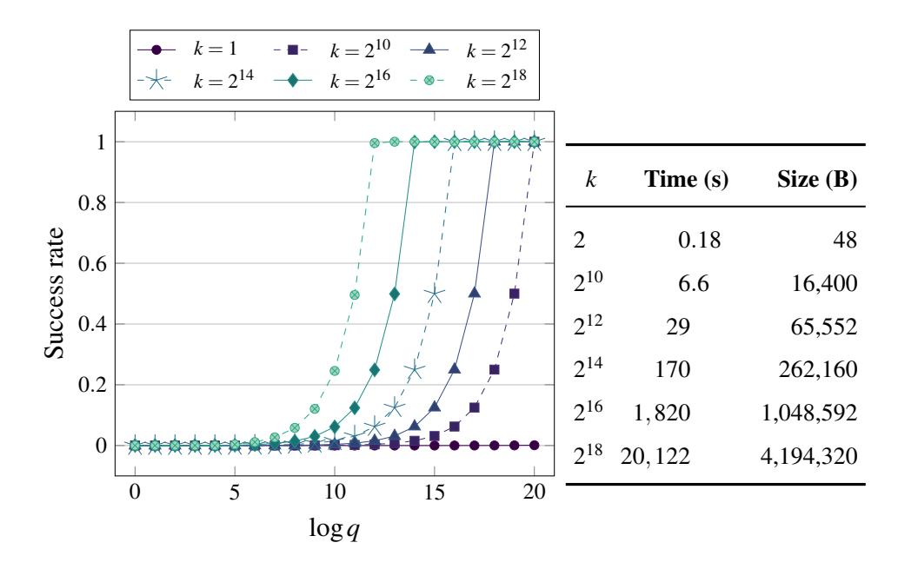
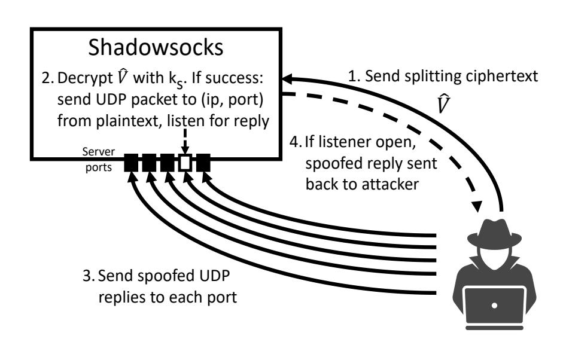
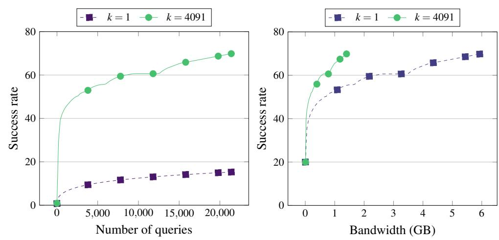
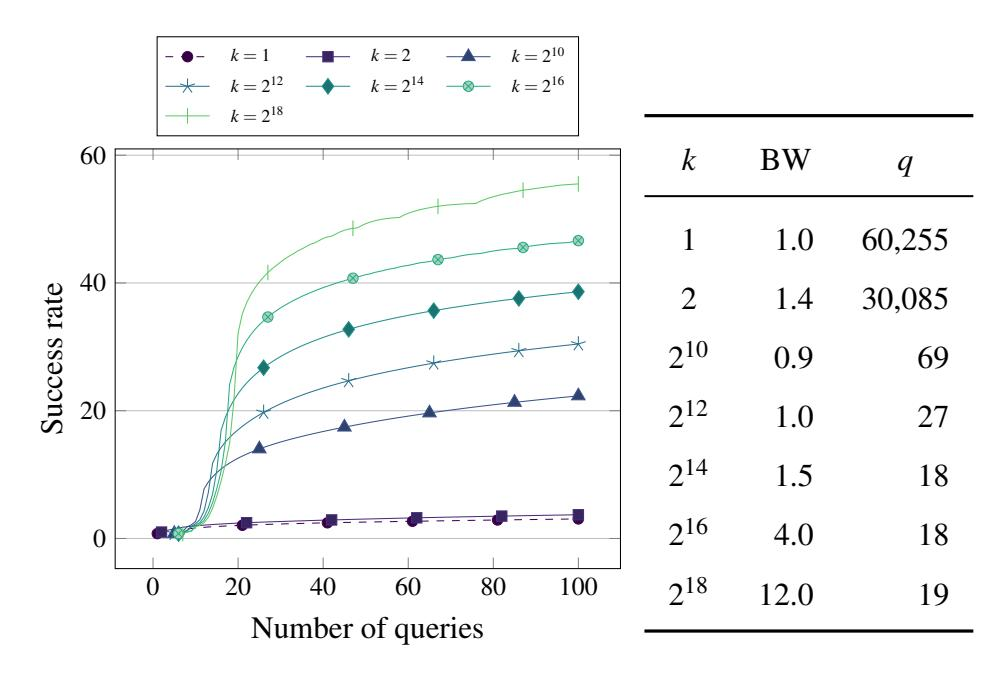
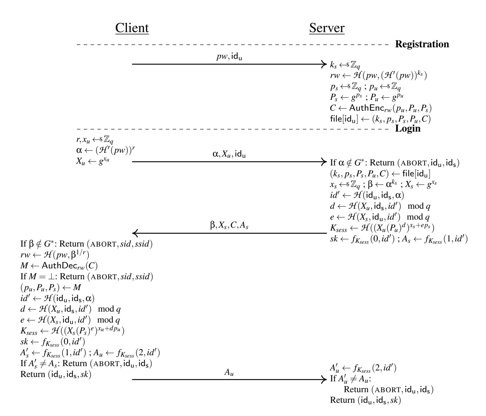

{0}------------------------------------------------

# Partitioning Oracle Attacks

Julia Len Paul Grubbs Thomas Ristenpart *Cornell Tech*

## Abstract

<span id="page-0-0"></span>In this paper we introduce *partitioning oracles*, a new class of decryption error oracles which, conceptually, take a ciphertext as input and output whether the decryption key belongs to some known subset of keys. We introduce the first partitioning oracles which arise when encryption schemes are not committing with respect to their keys. We detail novel adaptive chosen ciphertext attacks that exploit partitioning oracles to efficiently recover passwords and deanonymize anonymous communications. The attacks utilize efficient key multi-collision algorithms — a cryptanalytic goal that we define — against widely used authenticated encryption with associated data (AEAD) schemes, including AES-GCM, XSalsa20/Poly1305, and ChaCha20/Poly1305.

We build a practical partitioning oracle attack that quickly recovers passwords from Shadowsocks proxy servers. We also survey early implementations of the OPAQUE protocol for password-based key exchange, and show how many could be vulnerable to partitioning oracle attacks due to incorrectly using non-committing AEAD. Our results suggest that the community should standardize and make widely available committing AEAD to avoid such vulnerabilities.

# 1 Introduction

The design of encryption historically separated the goals of confidentiality and authenticity, which led to widespread deployment of encryption schemes vulnerable to chosenciphertext attacks (CCAs) [\[16,](#page-16-0) [95\]](#page-18-0). Subsequently, researchers showed how to exploit CCAs to recover plaintext data, most notably via padding [\[3,](#page-15-0) [4,](#page-15-1) [16,](#page-16-0) [95\]](#page-18-0) and format [\[10,](#page-15-2) [27\]](#page-16-1) oracle attacks. As a result, cryptographers now advocate the use of authenticated encryption with associated data (AEAD) schemes and CCA-secure public key encryption. There has since been a shift to adopt fast CCA-secure schemes, notably AES-GCM [\[64\]](#page-17-0), XSalsa20/Poly1305 [\[12,](#page-15-3) [14\]](#page-16-2), and (in the public key setting) hybrid encryption that makes use of the aforementioned AEAD schemes.

Such schemes do not target being robust [\[1,](#page-15-4) [24\]](#page-16-3), also called committing [\[30\]](#page-16-4). While exact formal notions vary, committing schemes ensure that attackers cannot construct a ciphertext that decrypts without error under more than one key. Thus far, robustness has not been considered an essential security goal for most cryptographic applications. This is perhaps because attacks exploiting lack of robustness have arisen in relatively niche applications like auction protocols [\[23\]](#page-16-5) or recently as an integrity issue in moderation for encrypted messaging [\[22,](#page-16-6) [30\]](#page-16-4).

We introduce partitioning oracle attacks, a new type of CCA. These are similar to previous attacks considered in the password-authenticated key exchange (PAKE) literature [\[11,](#page-15-5) [72,](#page-17-1) [98\]](#page-18-1); we provide a unifying attack framework that transcends PAKE and show partitioning oracle attacks that exploit weaknesses in widely used non-committing AEAD schemes. Briefly, a partitioning oracle arises when an adversary can: (1) efficiently craft ciphertexts that successfully decrypt under a large number of potential keys, and (2) submit such ciphertexts to a system that reveals whether decryption under a target secret key succeeds. This enables learning information about the secret key.

The main cryptanalytic step for our attacks is constructing (what we call) key multi-collisions, in which a single AEAD ciphertext can be built such that decryption succeeds under some number *k* of keys. We formalize this cryptanalytic goal and give an algorithm for computing key multi-collisions for AES-GCM. It builds key multi-collision ciphertexts of length *O*(*k*) in *O*(*k* 2 ) time using polynomial interpolation from off-the-shelf libraries, making them reasonably scalable even to large *k*. An algorithm that executes in time *O*(*k* log<sup>2</sup> *k*) is possible using a different polynomial interpolation technique [\[17\]](#page-16-7), although it is not available in standard library implementations to our knowledge. We give more limited attacks against XSalsa20/Poly1305 (and ChaCha20/Poly1305) and AES-GCM-SIV.

Given access to an oracle that reveals whether decryption succeeds, our key multi-collisions for AES-GCM enable a partitioning oracle attack that recovers the secret key in roughly *m*+log*k* queries in situations where possible keys fall in a set of size *d* = *m*· *k*. This will not work to recover much information about, e.g., random 128-bit keys where *d* = 2 <sup>128</sup>, but we show that it suffices to be damaging in settings where keys are derived from user-selected passwords or where key anonymity is important.

We explore partitioning oracles via two case studies. First we show how to build a practical partitioning oracle attack against Shadowsocks proxy servers [\[85\]](#page-18-2). Shadowsocks was first built to help evade censorship in China, and it underlies other tools such as Jigsaw's Outline VPN [\[70\]](#page-17-2). In Shadowsocks, the connections are secured via password-based

{1}------------------------------------------------

AEAD with a user-chosen password shared between a client and the proxy server. We show how an attacker can turn the proxy server into a partitioning oracle, despite it being designed to silently drop incorrect ciphertexts.

Simulations using password breach data show that 20% of the time the attacker recovers the user's password by sending 124 ciphertexts to the server — several orders of magnitude fewer than the  $\sim\!60,\!000$  required by a standard remote guessing attack. The latter requires less overall bandwidth because our attack ciphertexts are large, but to succeed 70% of the time our attack requires fewer queries and less overall bandwidth than the remote guessing attack. We responsibly disclosed our attacks to the Shadowsocks community, and helped them mitigate the vulnerability.

We then turn to password-authenticated key exchange (PAKE). Here we focus on incorrect implementations of the OPAQUE [42] protocol, which was recently chosen by the IETF's Crypto Forum Research Group (CFRG) as a candidate for standardization. OPAQUE makes use of an AEAD scheme in its protocol and both the original paper and the (rapidly evolving) standard [52, 53] mandate that the AEAD used be committing. We consider what happens when implementations deviate from the standard by using a non-committing AEAD scheme. Indeed, early implementations (some of which predate the standardization effort) use AES-GCM, XSalsa20/Poly1305, or AES-GCM-SIV. As we discuss, these implementations would be hard to use without giving rise to partitioning oracles. Our simulations show that a partitioning oracle here would enable successful password recovery 20% of the time using just 18 man-in-the-middle impersonations against a vulnerable client implementation. Our results therefore reinforce the importance of using committing AEAD by quantifying the danger of failing to do so.

In addition to these in-depth case studies, we discuss other potentially vulnerable cryptographic tools and protocols. Some of these, such as the file encryption tool called age [93] and the internet-draft of the Hybrid Public Key Encryption scheme [8], have already made updates to mitigate our attacks.

Our findings join prior ones [22,30] in a growing body of evidence that using non-committing AEAD as a default choice can lead to subtle vulnerabilities. We suggest considering a shift towards committing AEAD being the default for general use, and using non-committing AEAD only for applications shown to *not* require robustness. This will require some work, however, as existing committing AEAD scheme designs [22,30] are slower than non-committing ones and not yet supported by standards. We believe future work should target fast, committing AEAD schemes suitable for standardization and widespread deployment.

## <span id="page-1-0"></span>**2 Partitioning Oracle Attacks**

Here we provide an overview of the abstract partitioning oracle attack setting. In addition to our new attacks, our attack abstraction captures some previously known attacks in the PAKE setting [72,99], as we will discuss.

**Attack abstraction.** We consider settings in which an attacker seeks to recover a secret  $pw \in \mathcal{D}$  from some set of possible values  $\mathcal{D}$ . The attacker has access to an interface that takes as input a bit string V, and uses it plus pw to output the result of some boolean function  $f_{pw}: \{0,1\}^* \to \{0,1\}$ . Here  $f_{pw}$  is an abstraction of some cryptographic operations that may succeed or fail depending on pw and V. We use  $f_{pw}(V) = 1$  for success and  $f_{pw}(V) = 0$  for failure. We give examples of  $f_{pw}$  below; in this work  $f_{pw}$  usually indicates success or failure of decrypting a ciphertext using password pw.

Given oracle access to adaptively query  $f_{pw}$  on chosen values, the question is: Can an attacker efficiently recover pw? This of course will depend on f. We refer to f as a partitioning oracle if it is computationally tractable for an adversary, given any set  $S \subseteq \mathcal{D}$ , to compute a value  $\hat{V}$  that partitions S into two sets  $S^*$  and  $S \setminus S^*$ , with  $|S^*| \leq |S \setminus S^*|$ , such that  $f(pw,\hat{V}) = 1$  for all  $pw \in S$  and  $f(pw,\hat{V}) = 0$  for all  $pw \in S \setminus S^*$ . We call such a  $\hat{V}$  a splitting value and refer to  $k = |S^*|$  as the degree of a splitting value  $\hat{V}$ . We say that a splitting value is targeted if the adversary can select the secrets in  $S^*$ , in contrast to untargeted attacks that, e.g., compute a splitting value that results in a random partition of S.

For most  $f_{pw}$  of practical interest it will be trivial to compute splitting values with degree k=1. In this case, a partitioning oracle attack coincides with a traditional online brute-force guessing strategy for recovering pw. The adversary has nothing other than black-box oracle access to  $f_{pw}$  and knowledge of an ordering  $pw_1, pw_2, \ldots$  of  $\mathcal{D}$  according to decreasing likelihood. First compute a splitting value  $\hat{V}_1$  that partitions  $\mathcal{S} = \mathcal{D}$  into  $\mathcal{S}_1^* = \{pw_1\}$  and the rest of  $\mathcal{S}$ . Query  $f_{pw}(\hat{V}_1)$ . The resulting bit indicates whether  $\mathcal{S}_1^* = \{pw_1\} = \{pw\}$ . Assuming not, compute a splitting value  $\hat{V}_2$  that partitions  $\mathcal{D} \setminus \mathcal{S}_1^*$  into  $\mathcal{S}_2^* = \{pw_2\}$  and the remainder, query  $f_{pw}(\hat{V}_2)$ , and so on. The attacker will learn pw in worst case  $d = |\mathcal{D}|$  oracle queries. Notice that in this case the best possible attack is non-adaptive, meaning the attacker can pre-compute all of its splitting values.

Partitioning oracles become more interesting when we can efficiently build splitting values of degree k > 1. In the limit, we can perform a simple adaptive binary search for pw if we can compute splitting values of degree up to  $k = \lceil d/2 \rceil$ . Initially set  $S = \mathcal{D}$  and compute a value  $\hat{V}_1$  that splits S into two halves of (essentially) the same size. Query  $f_{pw}(\hat{V}_1)$  to learn which half of  $\mathcal{D}$  the value pw lies within. Recurse on that half. Like all binary searches, this provides an exponential speed-up over the brute-force strategy because we can recover pw in  $\lceil \log d \rceil$  queries. We provide more details about this attack, in particular taking into account non-uniform distributions of the secret pw, in Sections 4 and 5.

**Example: Password-based AEAD.** Consider a server that accepts messages encrypted using a password pw. To send an encrypted message m, a client derives a key  $K \leftarrow \mathsf{PBKDF}(sa, pw)$  using a uniformly random per-message salt sa. Here  $\mathsf{PBKDF}$  is a password-based key derivation function (e.g., one of those specified in  $\mathsf{PKCS\#5}$  [47]). The

{2}------------------------------------------------

client then uses K to encrypt m according to an authenticated encryption with associated data (AEAD) scheme, resulting in a ciphertext C. It sends V = (sa, C) to the server, which re-derives K and decrypts the ciphertext. This represents a standardized and widely used way to perform password-based AEAD, and it is standard practice now to use fast AEAD schemes such as Galois Counter Mode (GCM) [64] or XSalsa20/Poly1305 [12, 14].

Nevertheless, if the server reveals just whether or not decryption succeeds (e.g., due to an attacker-visible error message), one can construct a partitioning oracle with  $f_{pw}(sa,C)=1$  if and only if decryption of (sa,C) succeeds. A priori, the authenticity (ciphertext unforgeability) of modern AEAD schemes might seem to prevent efficiently computing splitting ciphertexts for degree k>1, but it does not. In fact a simple extension of prior work already gives an attack for k=2: Dodis et al. [22] showed how, for any two keys, one can build an AES-GCM ciphertext such that decryption succeeds under both keys. This is possible because AES-GCM is not committing (also called robust) [24].

In more detail, our adversary can check membership in a set  $S_1^* = \{pw', pw''\}$  of two passwords by sending a splitting value  $\hat{V}_1$  to the server. First, it computes keys  $K \leftarrow \mathsf{PBKDF}(sa, pw')$  and  $K' \leftarrow \mathsf{PBKDF}(sa, pw'')$  for some arbitrary sa. Then, it uses the Dodis et al. approach to construct a ciphertext  $\hat{C}_1$  that successfully decrypts under both K and K'. Finally, it sends splitting value  $\hat{V}_1 = (sa, \hat{C}_1)$  to the server. If the server's response indicates decryption succeeded,  $f_{pw}(sa, \hat{C}_1) = 1$  and  $pw \in S_1^*$ . Else,  $f_{pw}(sa, \hat{C}_1) = 0$  and  $pw \notin S_1^*$ . Iterating this procedure allows finding pw in at most  $|\mathcal{D}|/2+1$  queries, beating brute-force by almost a factor of two.

We will achieve more significant speed-ups in recovering pw by showing how to build splitting ciphertexts  $\hat{C}$  with degree k proportional to  $|\hat{C}|$ .

**Example:** password-authenticated key exchange. An attack proposed by Patel [72] against a variant of the Diffie-Hellman Encrypted Key Exchange (DH-EKE) [11], a predecessor of PAKEs, can be viewed as a simple, nonadaptive, untargeted partitioning oracle attack. It enables an adversary impersonating one of the honest parties to eliminate in expectation half of the attacker's password dictionary, although the adversary does not choose which half. Furthermore, a classical attack against an early version of the Secure Remote Password (SRP) password-authenticated key exchange (PAKE) protocol [98,99] can also be viewed as a partitioning oracle attack. This attack gives an adversary who engages in the SRP protocol without knowledge of the victim's password the ability to check two password guesses in one run of the protocol. In the parlance of partitioning oracles, the attack turns an SRP client into a partitioning oracle with degree k = 2. We describe both attacks in more detail in Appendix D.

We note that Bellovin and Merritt's partition attacks against EKE schemes [11] also partition password sets but because they rely on intercepting honest traffic to do this partitioning, we do not consider them partitioning oracle attacks. We describe them further later in this section.

We will show in later sections a "k-for-one" (for  $k \gg 2$ ) partitioning oracle attack against incorrect implementations of the OPAQUE PAKE protocol. OPAQUE mandates use of committing AEAD, and the designers clearly specified that using non-committing AEAD leads to vulnerabilities [42]. Nevertheless we found prototype implementations that use AES-GCM and other non-committing AEAD schemes. Our results demonstrate how damaging exploits can be should implementers not abide by the protocol specification.

**Example: hybrid encryption.** Partitioning oracles can also arise in hybrid encryption. For example, some KEM-DEM constructions, like the HPKE scheme [8] currently being standardized, support authenticating senders based on a pre-shared key (PSK) from a dictionary  $\mathcal{D}$  by mixing the PSK into DEM key derivation and using an AEAD scheme as the DEM.

If the sender can learn whether the receiver successfully decrypted a ciphertext, a trivial brute-force attack can recover the PSK with enough queries. However, if the DEM is a non-committing AEAD, a malicious sender can gain an exponential speedup by crafting splitting DEM ciphertexts similarly to the password-based AEAD example above. See Appendix A for an example of this attack for HPKE.

**Example: anonymity systems.** Partitioning oracles against hybrid encryption can also arise in anonymity systems. Prior work showed a link between robustness and anonymous encryption [1,23,66]. By exploiting a lack of robustness, our partitioning oracle attacks could be used to perform de-anonymization.

As an example scenario consider anonymous end-to-end encrypted messaging, in which a recipient has a key pair (pk,sk) for receiving encrypted messages that are delivered via an anonymous channel. A modern choice for encryption would be the crypto\_box KEM-DEM scheme in the widely-used libsodium library [15,58]. An adversary wants to determine if the recipient is using one of many possible public keys  $\{pk_1,\ldots,pk_d\}$  (possibly gleaned from the web or a public-key directory). The adversary has some way of inferring when an encrypted message is successfully received (e.g., due to a reply message or lack thereof). As above, a brute-force attack over the set of public keys can find the right one in d messages; this could be prohibitive if d is large.

Instead, one can build a partitioning oracle attack against  $crypto\_box$  in this setting requiring only log d messages. Here  $\mathcal{D} = \{1, \ldots, d\}$ , that is, the partitioning oracle's secret is which of the keys is used. While we do not know of any deployed system that is vulnerable to this attack scenario, it is possible this vulnerability will arise with growing adoption of non-committing AEAD for E2E encryption.

**Discussion.** An interesting aspect of our attack settings is that the attacker has no information about the target secret beyond access to the partitioning oracle and, perhaps, some information about the set  $\mathcal{D}$  and how the secret was sampled from it. In particular, our adversaries will not have to break in to some system or observe network communications to obtain a hash or ciphertext derived from this

{3}------------------------------------------------

target secret. We do note, however, that an attacker will need to know the set of possible secrets. For example, in the password-based setting, the attack we describe assumes that attackers have good estimates of password distributions. If an attacker wishes to compromise the password of a particular user whose password has never been breached, the attack would fail. However, prior work [71] shows that attackers do indeed have good estimates.

We further note that we have framed partitioning oracles as outputting binary values, but it could be possible that there exist oracles that output one of many values. A partitioning oracle that returns one of r values could be used to identify a secret chosen from  $\mathcal{D}$  in  $\log_r |\mathcal{D}|$  queries. We do not know of any examples of such a partitioning oracle.

**Relationship to partition attacks.** Bellovin and Merritt introduced partition attacks against EKE [11]. An attacker that can intercept traffic between two parties obtains a ciphertext sent between them and then, given a dictionary of possible passwords, trial decrypts with each password's derived key. Decryption with the incorrect key can return an invalid value (based on the underlying number-theoretic properties of the key exchange scheme); based on this, the attacker can eliminate some number of the passwords from the dictionary. With each interception, the adversary can rule out more passwords, until it finds the correct one. Our attacks similarly involve partitioning the set of possible passwords, but do so via careful chosen-ciphertext construction and involve potentially adaptive querying of an oracle (hence the name). Partition attacks instead rely on trial decryption of intercepted traffic, thereby more closely resembling dictionary attacks. We recall partition attacks in more detail in Appendix D.

Relationship to padding oracles. Partitioning oracle attacks are analogous to, but distinct from, padding oracle attacks [95] or other format oracle attacks [5,27]. Partitioning oracles can be exploited to reveal information about secret keys, whereas format oracles can only reveal information about plaintexts. That said, there is some overlap conceptually in the underlying techniques, as classic padding oracle attacks like Bleichenbacher's [16] or Vaudenay's [95] can also be viewed as adaptive attacks that provide exponential speed-ups in recovering unknown values.

Additionally, padding oracles may be useful in helping construct partitioning oracles. For example, consider our password-based AEAD example, but replace the AEAD scheme with a scheme such as HMAC-then-Encrypt which is well known to give rise to padding oracle attacks that recover plaintext data [3,4,95]. We can use the padding oracle to construct a partitioning oracle where  $f_{pw}(\hat{C}) = 1$  if and only if the padding check succeeds. Even if the check succeeds, decrypting  $\hat{C}$  will fail, but the padding oracle will reveal f's output and thereby enable recovery of pw.

**Relationship to side-channels.** Side-channel attacks that exploit timing or other aspects of a computation may help in constructing partitioning oracle attacks. Many padding oracle attacks exploit timing side-channels (e.g., [3]) and they can analogously aid partitioning oracle attacks. One of

our attacks against Shadowsocks, for example, exploits a side-effect of correct decryption that is remotely observable. In Section 6 we discuss how timing side-channels that may arise in decryption can enable partitioning oracle attacks, even if a nominally committing scheme is used. But partitioning oracles do not necessarily rely on side channels.

Timing side-channels have also been used recently to learn information about passwords [94] from implementations of the PAKE protocol Dragonfly [35]. We discuss this in more detail in Section 7.

# <span id="page-3-0"></span>3 Key Multi-Collision Attacks

Our partitioning oracle attacks will utilize the ability to efficiently compute a ciphertext that decrypts under a large number k of keys. We refer to this as a key multi-collision, a cryptanalytic target for encryption schemes that is, to the best of our knowledge, new. Our primary focus will be on key multi-collision attacks against widely used AEAD schemes, including AES-GCM and XSalsa20/Poly1305.

**Key multi-collision attacks.** We formalize our cryptanalytic goal as follows. Let AEAD = (AuthEnc, AuthDec) be an authenticated encryption with associated data scheme, and let its key space be the set  $\mathcal{K}$ . We write encryption AuthEnc $_K(N,AD,M)$  to denote running the encryption algorithm with secret key  $K \in \mathcal{K}$ , nonce N (a bit string), associated data AD (a bit string), and message M (a bit string). Decryption is written analogously, as AuthDec $_K(N,AD,C)$  where C is a ciphertext. Decryption may output a distinguished error symbol  $\bot$ . We require of our AEAD scheme that AuthDec $_K(N,AD,AU)$ , AuthEnc $_K(N,AD,M)$ ) = M for all N,AD,M not exceeding the scheme's length restrictions. We formalized AEAD as nonce-based [77], but our treatment and results easily extend to randomized AEAD.

We define targeted multi-key collision resistance (TMKCR) security by the following game. It is parameterized by a scheme AEAD and a target key set  $\mathbb{K} \subseteq \mathcal{K}$ . A possibly randomized adversary  $\mathcal{A}$  is given input a target set  $\mathbb{K}$  and must produce nonce  $N^*$ , associated data  $AD^*$ , and ciphertext  $C^*$  such that  $\operatorname{AuthDec}_K(N^*,AD^*,C^*) \neq \bot$  for all  $K \in \mathbb{K}$ . We define the advantage via

$$\mathbf{Adv}^{tmk\text{-}cr}_{\mathsf{AEAD},\mathbb{K}}(\mathcal{A}) = \Pr \left[ \left. \mathsf{TMKCR}^{\mathcal{A}}_{\mathsf{AEAD},\mathbb{K}} \Rightarrow \mathsf{true} \, \right] \right]$$

where "TMKCR $_{\mathsf{AEAD},\mathbb{K}}^{\mathcal{A}} \Rightarrow$  true" denotes the event that  $\mathcal{A}$  succeeds in finding  $N^*, AD^*, C^*$  that decrypt under all keys in  $\mathbb{K}$ . The event is defined over the coins used by  $\mathcal{A}$ .

We can define a similar untargeted multi-key collision resistance goal, called simply MKCR. The associated security game is the same except that the adversary gets to output a set  $\mathbb{K}$  of its choosing in addition to the nonce  $N^*$ , associated data  $AD^*$ , and ciphertext  $C^*$ . For  $k = |\mathbb{K}|$ , the adversary wins if  $k \ge \kappa$  for some parameter  $\kappa > 1$  and decryption of  $N^*$ ,  $AD^*$ ,  $C^*$  succeeds for all  $K \in \mathbb{K}$ . We define the advantage as

$$\mathbf{Adv}^{\mathrm{mk\text{-}cr}}_{\mathsf{AEAD},\kappa}(\mathcal{A}) = \Pr \left[ \, \mathsf{MKCR}^{\mathcal{A}}_{\mathsf{AEAD},\kappa} \Rightarrow \mathsf{true} \, \right]$$

{4}------------------------------------------------

```
GCM-Enc(K,N,AD,M):
                                                                                   \mathsf{GCM}\text{-}\mathsf{Dec}(K,AD,N \parallel C \parallel T):
                                                                                                                                                                      Multi-Collide-GCM(\mathbb{K}, N, T):
H \leftarrow E_K(0^{128}) ; P \leftarrow E_K(N \parallel 0^{31}1)
                                                                                   H \leftarrow E_K(0^{128}) ; P \leftarrow E_K(N \parallel 0^{31}1)
                                                                                                                                                                      L \leftarrow \mathsf{encode}_{64}(0) \parallel \mathsf{encode}_{64}(|\mathbb{K}| \times 128)
L \leftarrow \mathsf{encode}_{64}(|AD|) \parallel \mathsf{encode}_{64}(|M|)
                                                                                   L \leftarrow \mathsf{encode}_{64}(|AD|) \parallel \mathsf{encode}_{64}(|C|)
                                                                                                                                                                      \mathbf{pairs}[\cdot] \leftarrow \bot \; ; C \leftarrow \varepsilon
T \leftarrow (L \cdot H) \oplus P
                                                                                   T' \leftarrow (L \cdot H) \oplus P
                                                                                                                                                                      For i = 1 to |\mathbb{K}|:
                                                                                                                                                                            H \leftarrow E_{\mathbb{K}[i]}(0^{128}) ; P \leftarrow E_{\mathbb{K}[i]}(N||0^{31}1)
m \leftarrow |M|/128; a \leftarrow |AD|/128
                                                                                   m \leftarrow |C|/128; a \leftarrow |AD|/128
                                                                                   b \leftarrow m + a
                                                                                                                                                                             y \leftarrow ((L \cdot H) \oplus P \oplus T) \cdot H^{-2}
b \leftarrow m + a
                                                                                                                                                                             \mathbf{pairs}[i] \leftarrow (H, y)
For i = 1 to a:
                                                                                   For i = 1 to a:
      T \leftarrow T \oplus (AD[i] \cdot H^{b+2-i})
                                                                                          T' \leftarrow T' \oplus (AD[i] \cdot H^{b+2-i})
                                                                                                                                                                      f \leftarrow \mathsf{Interpolate}(\mathbf{pairs}) \; ; \; \mathbf{x} \leftarrow \mathsf{Coeffs}(f)
For i = 1 to m:
                                                                                   For i = 1 to m:
                                                                                                                                                                      For i = 1 to |\mathbb{K}|:
                                                                                          M[i] \leftarrow E_K(N+1+i) \oplus C[i]
                                                                                                                                                                             C \leftarrow C \parallel \mathbf{x}[i]
      C[i] \leftarrow E_K(N+1+i) \oplus M[i]
                                                                                         T' \leftarrow T' \oplus (C[i] \cdot H^{b+2-i-a})
      T \leftarrow T \oplus (C[i] \cdot H^{b+2-i-a})
                                                                                                                                                                      Return N \parallel C \parallel T
Return N \parallel C \parallel T
                                                                                   If T' \neq T then return \perp
                                                                                   Return M
```

Figure 1: (**Left**) The Galois Counter mode (GCM) encryption and (**middle**) decryption algorithms. (**Right**) The Multi-Collide-GCM algorithm, which takes a set  $\mathbb{K}$  of keys, a nonce N, and a tag T and computes a nonce-ciphertext-tag triple  $N\|C\|T$  such that it decrypts correctly under every key in  $\mathbb{K}$ . The function  $\operatorname{encode}_{64}(\cdot)$  returns a 64-bit representation of its integer input. The function  $\operatorname{Interpolate}(\cdot)$  is a polynomial interpolation algorithm that accepts a vector of data pairs and returns a polynomial, while  $\operatorname{Coeffs}(\cdot)$  returns the coefficients of this polynomial. We denote  $\cdot$  as multiplication and  $\oplus$  as addition in  $\operatorname{GF}(2^{128})$ .

where "MKCR $_{\mathsf{AEAD},\kappa}^{\mathcal{A}} \Rightarrow$  true" denotes the event that  $\mathcal{A}$  succeeds in finding  $\mathbb{K}, N^*, AD^*, C^*$  such that  $N^*, AD^*, C^*$  decrypts to non- $\bot$  under all keys in  $\mathbb{K}$ . The event is defined over the coins used by  $\mathcal{A}$ .

A TMKCR adversary trivially gives an MKCR adversary, but not vice versa. Both targeted and untargeted MKCR attacks will enable partitioning oracle attacks, as both provide the ability to compute splitting values that work for some subset  $\mathbb{K}$  of the key space. But targeted attacks are better for adversaries, since it will allow, for example, generating sets for the most probable keys (e.g., due to a non-uniform distribution over the passwords used to derive them).

Our attacks will require that decryption fails for  $K \notin \mathbb{K}$ . This will hold except with tiny probability for the target schemes of interest. We therefore focus on the cryptanalytically hard task of computing the key multi-collisions.

Committing AEAD and MKCR. Informally, a committing encryption scheme is one for which it is computationally intractable to find a pair of keys and a ciphertext that decrypts under both keys. Security goals for committing AE were first formalized by Farshim et al. [24]. Grubbs et al. [30] later formalized committing AEAD, with slightly different semantics than usual for AEAD to capture a goal of compact commitments. Compactness is relevant in the moderation settings they considered, but not here. Committing AEAD may also be referred to as "key-committing AEAD" in other literature; we use committing AEAD in this work.

The Farshim et al. full robustness (FROB) notion is closest to our MKCR notion: once translated to the nonce-based AEAD setting (by adding nonces and associated data), it is a special case of MKCR in which  $|\mathbb{K}|=2$ . We use committing AEAD to refer to schemes that meet this FROB notion, which, in turn, rule out MKCR attacks. The converse is not true, since being MKCR for  $\kappa$  does not imply being MKCR for  $\kappa' < \kappa$ .

**Related security goals.** Multi-collision resistance has been treated in the context of hash functions, but here we are interested in multi-collisions over keys and not over messages. In particular the attacks of Joux [46] are not applicable to our setting, even if one were to focus on keyed Merkle-Damgård hash functions, since applying his attack technique would rely on very long multi-block keys.

One can also formalize and investigate key multicollision security for other symmetric and asymmetric primitives, including message authentication schemes, digital signatures, and public-key encryption. We leave doing so to future work.

## <span id="page-4-1"></span>3.1 Key Multi-collisions for AES-GCM

At a high level, our multi-collision attack against AES-GCM reduces the task of finding key multi-collisions to solving a system of linear equations. This is possible because of the algebraic properties of the universal hashing underlying integrity protection in AES-GCM [64,65].

AES-GCM is an AEAD scheme that composes AES in counter mode with a specially designed Carter-Wegman MAC [96]. The latter uses an XOR-universal hash function called GHASH. Detailed pseudocode is provided in Figure 1. Encryption takes in a nonce N, an AES key K, associated data AD, and plaintext M. It outputs a ciphertext  $C_1, \ldots, C_m, T$ ; here T is the authentication tag and m = $\lceil M/n \rceil$  for n=128 the block size of the underlying AES block cipher denoted by E. The ciphertext blocks  $C_1, \ldots, C_m$ are generated using counter mode with E, and the tag Tis computed by applying GHASH to AD and  $C_1, \ldots, C_m$  to obtain a value h. Finally  $T = h \oplus E_K(N \parallel 0^{31}1)$ . Decryption re-computes the tag, compares it with T, and, if successful, outputs the counter-mode decryption of the ciphertext blocks. To disambiguate, we consider the message authentication tag T as separate from the ciphertext blocks.

We now explain GHASH, but for simplicity omit associated data. For a key *K*, GHASH first derives a hash key

{5}------------------------------------------------

 $H = E_K(0^n)$ . It then hashes by computing

$$h = C_1 \cdot H^{m+1} \oplus \cdots \oplus C_{m-1} \cdot H^3 \oplus C_m^* \cdot H^2 \oplus L \cdot H \qquad (1)$$

where  $C_m^*$  is  $C_m$  concatenated with enough zeros to get an n-bit string and L is an n-bit encoding of the length of the message (equivalently, the length of the ciphertext). The maximum plaintext length is  $2^{39} - 256$ . The multiplications are performed over the finite field  $GF(2^{128})$  with a particular fixed irreducible polynomial.

For a set  $\mathbb{K} = \{K_1, \dots, K_k\}$  and nonce N, one can compute a single ciphertext  $(C_1, \dots, C_{k-1}, T)$  that decrypts correctly under every key in  $\mathbb{K}$ . For each  $K_i$ , derive the associated GHASH key  $H_i = E_{K_i}(0^n)$  and then construct the linear equation

$$T = C_1 \cdot H_i^{k-1} \oplus \cdots \oplus C_{k-1} \cdot H_i^2 \oplus L \cdot H_i \oplus E_{K_i}(N \parallel 0^{31}1)$$

which one arrives at by assigning  $H_i$  to H in (1) and then substituting the result into the equation  $T = h \oplus E_{K_i}(N \parallel 0^{31}1)$ . Note that we have fixed the number of the ciphertext blocks to be k-1. The result is then a system of k equations in k unknowns:

<span id="page-5-1"></span>
$$\begin{bmatrix} 1 & H_1^2 & H_1^3 & \cdots & H_1^{k+1} \\ 1 & H_2^2 & H_2^3 & \cdots & H_2^{k+1} \\ \vdots & \vdots & \vdots & \ddots & \vdots \\ 1 & H_k^2 & H_k^3 & \cdots & H_k^{k+1} \end{bmatrix} \cdot \begin{bmatrix} T \\ C_{k-1} \\ \vdots \\ C_1 \end{bmatrix} = \begin{bmatrix} B_1 \\ B_2 \\ \vdots \\ B_k \end{bmatrix}$$
(2)

where  $B_i = (L \cdot H_i) \oplus E_{K_i}(N \parallel 0^{31}1)$ . At this point, one can solve the linear equations using Gaussian elimination to produce the desired ciphertext. This will require  $O(k^3)$  time, which may be prohibitive for very large k.

The polynomial matrix in (2) is almost a Vandermonde matrix, whose structured form allows for finding solutions more efficiently. The difference is the missing column  $[H_1, H_2, \ldots, H_k]^{\mathsf{T}}$  that is omitted because of the fixed length value L (which we cannot treat as a variable). We can, however, treat T as a fixed value (e.g., a randomly chosen constant) instead of a variable and add one block of ciphertext as a new variable. We then solve for the following system of equations

$$\begin{bmatrix} 1 & H_1 & H_1^2 & \cdots & H_1^{k-1} \\ 1 & H_2 & H_2^2 & \cdots & H_2^{k-1} \\ \vdots & \vdots & \vdots & \ddots & \vdots \\ 1 & H_k & H_k^2 & \cdots & H_k^{k-1} \end{bmatrix} \cdot \begin{bmatrix} C_k \\ C_{k-1} \\ \vdots \\ C_1 \end{bmatrix} = \begin{bmatrix} B'_1 \\ B'_2 \\ \vdots \\ B'_k \end{bmatrix}$$
(3)

where  $B_i' = ((L \cdot H_i) \oplus E_{K_i}(N+1) \oplus T) \cdot H_i^{-2}$  and where now L is larger by one block. We can solve this special system of equations in time  $O(k^2)$  and space O(k) using off-the-shelf polynomial interpolation algorithms, a factor of k improvement. The resulting solution will have one extra ciphertext block. While ideally an adversary wants multicollision ciphertexts to be as compact as possible, one extra block will not significantly impact attacks. Detailed pseudocode for this procedure, denoted Multi-Collide-GCM, appears in in Figure 1.

Let  $\mathcal{A}_{gcm}$  be the TMKCR adversary that picks N, T arbitrarily and runs Multi-Collide-GCM. The adversary is guar-

<span id="page-5-0"></span>anteed to succeed assuming the system of linear equations is solvable, which is equivalent to the matrix having a non-zero determinant. A well-known fact about Vandermonde matrices is that their determinant is non-zero if and only if all the  $H_i$  values are pairwise distinct, i.e.,  $H_i \neq H_j$  for  $1 \leq i < j \leq k$ . In the ideal cipher model we can therefore directly compute the probability of success (over the coins of the ideal cipher), because in this case the  $H_i$  values are chosen uniformly at random. Thus,  $\mathbf{Adv}_{\mathrm{GCM}}^{\mathrm{tmk-cr}}(\mathcal{A}_{\mathrm{gcm}}) \geq 1 - \frac{k^2}{2^n}$ . This is essentially one for the values of k we will consider and n = 128.

We conjecture that, up to additive constant terms, our attack is "tight" in its trade-off between ciphertext size and runtime: namely, any attack that (w.h.p.) constructs degree-k AES-GCM ciphertexts with fewer than k-1 ciphertext blocks should require at least birthday-bound complexity. Finding this "short" colliding AES-GCM ciphertext means solving an overdetermined system of equations (i.e., one which has more equations than variables). For such a system to be solvable, there have to be rows that are linear combinations of other rows. Since each row is increasing powers of a random field element (i.e., the hash key) this dependence between rows should be rare as long as the block cipher acts like an ideal cipher. We leave confirming or disproving our conjecture to future work.

**Performance.** We implemented Multi-Collide-GCM using the Python-based mathematics library SageMath [91] and the Magma computational algebra system [18]. We used SageMath for its convenient integration with Python and its cryptography libraries (specifically, Py-Cryptodome [74]). While SageMath can be used directly, we found Magma's polynomial interpolation algorithm to be significantly faster. Our proof-of-concept code is publicly available. We note that SageMath and Magma implement an algorithm that interpolates a degree-k polynomial in time  $O(k^2)$ , but there exists an algorithm that can do this in time  $O(k \log^2 k)$  using FFTs [17]. Thus, while the times we report here work for existing library implementations, one could compute key multi-collisions far more quickly with known specialized algorithms.

Timing experiments were performed on a desktop with an Intel Core i9 processor and 128 GB RAM, running Linux x86-64. We present the results in the table in Figure 2, which shows both the time in seconds to generate a k-way key multi-collision for AES-GCM and the size in bytes of the resulting ciphertext, including the tag. There was little variance in timing when generating multi-collisions, so we report the times for just one execution for each k. Most of the multi-collision ciphertexts could be computed relatively quickly. Colliding ciphertexts for  $k = 2^{16}$  keys, for instance, took less than thirty minutes. For smaller k it is much faster. We note that SageMath's interface with Magma returns a segmentation fault when polynomial interpolation is used with value  $k = 2^{18}$ . In Figure 2 for this k value, we therefore report the time to perform polynomial interpolation for  $2^{18}$ 

<sup>1</sup>https://github.com/julialen/key\_multicollision

{6}------------------------------------------------

<span id="page-6-0"></span>

Figure 2: (**Left**) Success rate of identifying a key uniformly chosen from a set of size  $d=2^{30}$  as a function of the number of queries q for brute-force attack (k=1) and partitioning oracle attack (k>1). (**Right**) Time in seconds to generate key multi-collisions for AES-GCM and the resulting ciphertext size in bytes (including the tag). For  $k=2^{18}$  the time is just for Magma's polynomial interpolation.

randomly-generated points using Magma itself; the timing for the actual attack will be essentially the same.

To illustrate the power of key multi-collisions, we return to the simple password-based AEAD partitioning oracle scenario described in Section 2. Assume a partitioning oracle that returns  $f_K(N,C,T) = 1$  if and only if AES-GCM decryption  $\operatorname{AuthDec}_K(N, C \parallel T) \neq \bot$ . We omit associated data for simplicity. Then, consider an attacker attempting to discover a key chosen uniformly from a set  $\mathcal{D}$  of size  $d=2^{30}$  (i.e., the approximate size of a large password dictionary). We simulate the brute-force attack (k = 1) assuming the oracle works for plaintexts as small as one byte. We also simulate our adaptive partitioning oracle attack that constructs splitting ciphertexts of size k iteratively for different sets of keys until the oracle returns one. At this point the adversary performs a binary search in  $\log k$ queries to find the secret. We perform these simulations for  $k \in \{2^{10}, 2^{12}, 2^{14}, 2^{16}, 2^{18}\}.$ 

The graph in Figure 2 shows the attacks' success rates — how often they succeed in uniquely identifying the key — as a function of the number of queries made. In this context brute-force attacks do poorly, achieving negligible performance even for large numbers of queries. The partitioning oracle attack can search the space much more efficiently, even for moderate k.

We also measured total bandwidth cost (total number of bytes sent to the oracle) used by each attack to achieve a certain success rate. We omitted the nonces from the bandwidth calculations, which can only make the brute-force attack look more competitive with the partitioning oracle attacks. For a 20% success rate, the brute force attack (k = 1) has a bandwidth cost of 3.65 GB, while the other values of k require about 3.44 GB. For a 60% success rate, the difference is greater, with the brute force attack accumulating a bandwidth cost of about 11 GB, while the other values of k require only about 10.3 GB. Thus, partitioning oracle at-

tacks provide a significant speed up over brute-force search when queries are the limiting factor.

## 3.2 Other AEAD Schemes

Schemes that use Poly1305. The XSalsa20/Poly1305 [12, 14] and ChaCha20/Poly1305 [13] are widely used AEAD schemes due to their speed, ease of constant-time software implementations, and security properties. Both schemes have a high-level structure similar to AES-GCM, combining a stream cipher (XSalsa20 or ChaCha20) with a Carter-Wegman style MAC called Poly1305. Here we outline a key multi-collision attack against it, and defer the details to Appendix B.

The core of the attack is against Poly1305 [12], which is similar to GHASH except that it: (1) encodes an input (a ciphertext in the context of its use within the AEAD schemes here) as a sequence of blocks with 0x01 appended; (2) performs the polynomial evaluation over  $\mathbb{F}_p$  for prime  $p = 2^{130} - 5$  (hence the name); and (3) adds the result to a pseudorandom pad modulo  $2^{128}$  to provide a tag value. The way Poly1305 encodes its inputs breaks the algebraic structure of the collision-finding problem, necessitating a more complex and less scalable attack. Concretely, we were not able to compute splitting ciphertexts with degree greater than ten with our current techniques; this still gives a factor-of-ten speedup in partitioning oracle attacks.

Misuse-resistant AEAD. Many schemes, including those described above, leak information about plaintexts should nonces (IVs) be accidentally reused. Misuse-resistant AEAD [78] provides security even in the presence of nonce reuse. This security goal fundamentally rules out online encryption, meaning one must process the entire plaintext before outputting any ciphertext bits. One popular suggested scheme is AES-GCM-SIV [32], which instantiates the SIV mode of operation [78] using primitives borrowed from AES-GCM (specifically, AES counter mode and a variant of GHASH called POLYVAL).

Nonce misuse-resistance is different than robustness, and in Appendix C we show that AES-GCM-SIV is vulnerable to key multi-collision attacks. (A variant of this attack, limited to only two keys, was discovered by Schmieg in concurrent work [83].) One interesting point is that our attack against AES-GCM-SIV is not targeted, meaning we cannot precisely control the set of keys that end up in a collision set. As mentioned previously untargeted key multi-collisions suffice for partitioning oracle attacks.

## <span id="page-6-1"></span>3.3 Passing Plaintext Format Checks

Our MKCR attacks so far ensure that decryption succeeds, but the resulting plaintexts are random. In some cases this suffices, for example when a decryption implementation aborts with an error message when decryption outputs  $\bot$ . However in some situations — including one of our attacks against Shadowsocks — building partitioning oracles will

{7}------------------------------------------------

require MKCR attacks that result in plaintexts that satisfy some format checks.

**MKCR with plaintext format checks.** We formalize the resulting cryptanalytic goal by extending the MKCR security definition as follows. Let  $\mathcal{M}$  be the set of possible plaintexts. We generalize the MKCR game by parameterizing it with a predicate  $pr \colon \mathcal{M} \cup \{\bot\} \to \{0,1\}$  that determines whether a message M is valid (i.e., pr(M) = 1) or invalid (pr(M) = 0). We assume  $pr(\bot) = 0$  and pr is fast to compute.

Then we change the MKCR game to be parameterized by pr, written MKCR<sub>AEAD, $\kappa$ ,pr</sub>. The adversary wins by producing a set  $\mathbb{K}$ , associated data  $AD^*$ , and ciphertext  $C^*$  such that  $|\mathbb{K}| \geq \kappa$  and for all  $K \in \mathbb{K}$  it holds that  $pr(\operatorname{AuthDec}_K(AD^*,C^*)) = 1$ . This strictly generalizes the prior definition, since we can set pr(M) = 1 for all  $M \in \mathcal{M}$  and thus arrive at the original same definition. We define the advantage via

$$\mathbf{Adv}^{\mathrm{mk\text{-}cr}}_{\mathsf{AEAD},\kappa,pr}(\mathcal{A}) = \Pr\left[\left.\mathsf{MKCR}^{\mathcal{A}}_{\mathsf{AEAD},\kappa,pr} \Rightarrow \mathsf{true}\right.\right]$$

where "MKCR $_{\mathsf{AEAD},\kappa,pr}^{\mathcal{A}} \Rightarrow$  true" denotes the event that  $\mathcal{A}$  wins. The event is defined over the coins used by  $\mathcal{A}$ .

**A rejection sampling approach.** Consider a predicate pr and let  $p_1 = \Pr[pr(M) = 1]$  for message M sampled randomly from  $\mathcal{M}$ . When  $p_1$  is not very small, one simple approach is to use rejection sampling. Consider a target set of keys  $\mathbb{K}$ . We can choose a random nonce N and tag T and run our MKCR algorithm using  $\mathcal{S}, N, T$  to obtain a solution ciphertext  $N \parallel C \parallel T$ . We then check that  $pr(\text{AuthDec}_K(C,T)) = 1$  for all  $K \in \mathcal{S}$ . If not, then repeat the attack using a fresh choice of nonce. Each attempt will succeed with probability (negligibly far from)  $p_1^k$  for  $k = |\mathcal{S}|$ , because changing the nonce leads to fresh pseudorandom plaintexts for each key.

Most format checks will make  $p_1$  too small for this basic approach to work. For example, one of our attacks against Shadowsocks will require the first byte to be a fixed value, making  $p_1 = 1/256$ . So unless k is small, rejection sampling alone will be too inefficient.

**Exploiting structure.** We can instead take advantage of the fact that many format predicates will be structured, e.g., checking just the first few bytes of a header. This allows us to extend our AES-GCM attack (and others) in an efficient way. Intuitively, we will set aside the ciphertext blocks whose underlying plaintext must satisfy format checks, and we will then leave the rest as free variables to define a system of linear equations.

As a concrete example, assume a predicate pr that only compares the first byte of the plaintext M to some arbitrary fixed byte. We extend our AES-GCM MKCR attack as follows. Consider a potential set of multi-collision keys S. First, choose a nonce N arbitrarily and compute for each  $K \in S$  the first byte of AES-GCM ciphertext. We then determine the largest subset  $\mathbb{K} \subseteq S$  that have the same ciphertext byte value. Applying known results [75] on balls-and-bins problems gives us that  $E[|\mathbb{K}|] \approx |\mathcal{D}|/256 + 8\sqrt{|\mathcal{D}|/256}$ . Then

run the targeted TMKCR attack against AES-GCM using N, but fixing the first block of ciphertext to a constant equal to the byte value plus some arbitrary 15 bytes to get a full fixed ciphertext block  $C_1$ . Then the system of equations is defined by taking the corresponding contribution to the GHASH equation, namely  $C_1 \cdot E_{K_i}(0^{128})^{k+1}$  as a constant and adding it to the right hand side of each equation. One can generalize this to n bits of plaintext, for which  $E[|\mathbb{K}|] \approx |\mathcal{D}|/2^n + \sqrt{2n|\mathcal{D}|/2^n}$ .

This extension is efficient, running in time O(S). One could also combine it with the rejection sampling approach by having the first phase try multiple random nonces to look for fortuitous multi-collisions in the first byte, but we did not need to do this for practical attacks.

One can easily extend the approach to other kinds of format checks, though if the check is too constrained it may become inefficient (e.g., if plaintexts must have many fixed bytes). The technique also extends to other stream-cipher based AEAD schemes in a straightforward manner.

# <span id="page-7-0"></span>4 Password Recovery for Shadowsocks

The prior section showed how to build partitioning oracle attacks against non-committing AEAD schemes. Now we turn to case studies that surface how partitioning oracles arise in practice. We start with Shadowsocks and show how to build a partitioning oracle that efficiently recovers user-chosen passwords.

**Background on Shadowsocks.** Originally written by a pseudonymous developer, Shadowsocks [85] is an encrypted proxy for TCP and UDP traffic, based on SOCKS5 [55]. It is used both as a standalone proxy and as the core of other censorship evasion tools such as Google Jigsaw's Outline VPN [70]. The original GitHub repository has been "starred" by more than 32,000 users and forked by nearly 20,000 [84].

To use Shadowsocks, a user first deploys the Shadowsocks proxy server on a remote machine (typically hosted in a cloud service), provisions it with a static password<sup>2</sup> *pw*, and chooses an encryption scheme to use for all connections. Originally, only AES-CFB was supported, but cipher choices were modernized after a series of integrity attacks on the protocol [86]. Current documentation recommends either AES-GCM or ChaCha20/Poly1305, which are the only two AEAD schemes supported. Clients given *pw* can then forward TCP or UDP traffic from their machine to the Shadowsocks proxy. Our attack targets UDP and use of AES-GCM, and so we restrict our explanation to this setup.

**The Shadowsocks protocol.** The client starts by hashing the user password to obtain a key  $K_r = H(pw)$ . The hash is currently MD5, but our attacks would still work should it be replaced with a modern password hashing algorithm. The client then samples a random sixteen-byte salt sa and computes a session key  $K_s$  using HKDF [51],

<sup>&</sup>lt;sup>2</sup>Using high-entropy symmetric keys instead of passwords became possible recently [89]; this feature does not appear to be widely used.

{8}------------------------------------------------

as  $K_s \leftarrow \text{HKDF}(K_r, sa, "ss-subkey")$ . A new salt and session key are generated for every message. The client encrypts its plaintext payload pl by computing  $C \leftarrow \text{AuthEnc}(K_s, Z, \epsilon, 01 \parallel ip \parallel port \parallel pl)$  where Z denotes a nonce that is set to a string of sufficiently many zero bytes (12 for AES-GCM); the value  $\epsilon$  indicates empty associated data; and 01 is a one-byte header indicating that ip is an IPv4 address. The client sends (sa, C) to the server.

When the Shadowsocks server receives (sa, C), it extracts the salt and uses it together with pw to re-derive the session key  $K_s$ . It decrypts the remainder of the ciphertext with  $K_s$ . If decryption fails, no error message is sent back to the client. Silently dropping invalid or malformed requests is an explicit countermeasure against active probing attacks [97]; we will see it also complicates building partitioning oracles.

If decryption succeeds, the plaintext's format is checked by verifying that its first byte is equal to 01.<sup>3</sup> If that check passes, the next six bytes are interpreted as a four-byte IPv4 address *ip* and two-byte port number *port*. Finally, the rest of the payload is sent to the remote server identified by *ip* and *port*. The proxy then listens on an ephemeral source UDP port assigned by the kernel networking stack for a reply from the remote server.

When Shadowsocks receives a reply on the ephemeral port, the server generates a random salt and uses it with *pw* to generate a new session key. It then encrypts the response, and sends the resulting salt and ciphertext back to the client. The same encryption algorithm is used in both directions.

**Threat model.** We focus on remote password recovery attacks, meaning a malicious client that knows the IP address of a Shadowsocks server seeks to recover the password(s) it uses. We do not assume the ability to monitor network traffic from honest clients. Capturing honest traffic would enable offline brute-force dictionary attacks against the password-based encryption — future versions of Shadowsocks might consider using password-authenticated public-key encryption instead to mitigate this [20].

A basic attack that works in our threat model is online brute-force, in which the adversary enumerates a sequence of guesses  $pw_1, pw_2, \ldots$  and sends an encryption under each guess to the server. By having the encrypted plaintext pl encode a request back to the malicious client, the adversary can determine if decryption succeeds by seeing if it obtains a forwarded request from the proxy. The Shadowsocks designers recommend using rate limits to make remote guessing attacks more difficult, and several of the libraries implement them.

Shadowsocks would be considered secure in our threat model if online brute-force attacks were the best possible attack. We demonstrate how adversaries can do better via partitioning oracles.

<span id="page-8-0"></span>

Figure 3: Diagram of the Shadowsocks partitioning oracle. Values  $\hat{V}$  and  $K_s$  defined in the text. Solid lines indicate actions that always occur, and dashed lines indicate actions that occur only if  $\hat{V}$  decrypts correctly, begins with byte 01, and contains a valid (ip, port) pair.

## 4.1 The Attack

We now show how to turn a Shadowsocks proxy server into a partitioning oracle. This would be simple if the proxy server responded with an error message when decryption fails, in which case the basic partitioning oracle attack described in Section 2 would apply. But the active probing countermeasure prevents this simple approach. A key insight is that we can exploit the fact that the proxy server opens an ephemeral UDP port in response to a valid request (and does not otherwise). One can view this as a remotely observable, logical side-channel that reveals whether decryption succeeds. See Figure 3 for a diagram of our attack, which we now explain in detail.

The attacker starts with knowledge of a password dictionary  $\mathcal{D}$  and an estimate  $\hat{p}$  of the probability distribution over passwords in the dictionary. That is,  $\hat{p}(pw_i)$  is the probability that  $pw_i \in \mathcal{D}$  is the correct password. (We will use password leak data to derive  $\hat{p}$ , as discussed below.) The attack has two steps, a pre-computation phase and an active querying phase.

Pre-computation phase: In a pre-computation phase, the attacker generates a splitting value  $(sa^*, C^*)$ , as follows. Given  $\hat{p}$  and  $\mathcal{D}$  with  $d = |\mathcal{D}|$ , the attacker uses the MKCR attack that handles format checks from Section 3.3. It derives  $K_s^i \leftarrow \text{HKDF}(H(pw_i), sa, "ss-subkey")$  for all  $pw_i \in \mathcal{D}$ , uses the resulting set  $S = \{K_s^1, \ldots, K_s^d\}$  as the target keys, sets the nonce to be the zero byte string Z, and sets the format check predicate pr to output one if the first byte is equal to 01. The algorithm outputs a subset of keys  $\mathbb{K} \subset S$  and a ciphertext  $C^*$  such that decrypting  $C^*$  under each of the keys in  $\mathbb{K}$  results in a plaintext with a leading byte equal to 01.

Applying this directly will not quite work, because Shadowsocks servers will only accept UDP packets whose length is less than or equal to 65,507 bytes. This means we can at best use a key-colliding ciphertext for a key set of size k = 4,091. We therefore modify slightly the procedure above to find a size-k subset  $\mathbb{K}_{\text{max}} \subset \mathbb{K}$  that has maximum aggregate probability under  $\hat{p}$ . Fixing a salt sa, we abuse notation and let  $\hat{p}(K_s) = \hat{p}(pw)$  for  $K_s$ , the key derived from

<sup>&</sup>lt;sup>3</sup>In fact Shadowsocks supports ASCII domain names and IPv6 addresses, indicated by other byte values, but we ignore these for simplicity.

{9}------------------------------------------------

pw using sa. Then we solve the optimization problem defined by

$$\mathbb{K}_{\max} = \underset{\mathbb{S} \subseteq \mathbb{K}, |\mathbb{S}| \leq k}{\operatorname{argmax}} \sum_{K_s \in \mathbb{S}} \hat{p}(K_s) .$$

We compute the key-colliding ciphertext  $C^*$  that decrypts under that subset using the first block fixed to ensure the format check is passed. Let  $\mathbb{P} \subseteq \mathcal{D}$  be the set of passwords associated to the subset of colliding keys  $\mathbb{K}_{\max}$  (for salt  $sa^*$ ). Recall that since we must fix a block of  $C^*$ , it will have k+1 16-byte blocks, which does not include the message tag.

Querying phase: Having done the pre-computation, the attacker can then submit to the proxy server  $(sa^*, C^*)$  and it will decrypt correctly for any of the 4,091 passwords in  $\mathbb{P}$ . This is shown as step (1) in Figure 3. Should  $pw \in \mathbb{P}$ , the server will interpret the decrypted plaintext as a 01 byte followed by a random IPv4 address, destination port, and payload. The IPv4 and destination port will be accepted by the server's network protocol stack with high probability, and so the server will send the payload as a UDP packet to the IP address ip and destination port port. It will also open a UDP source port to listen for a response. This is step (2) in the figure.

The attacker does not a priori know the listening port the server uses, and modern operating systems randomize this port. The traditional range used for ephemeral source ports is 49,152 through 65,535, though some systems use slightly larger ranges. The attacker can simply send a UDP probe to every port in that range — the port is left open for five minutes by default for the Shadowsocks server implementations we inspected. This is shown as step (3) in the figure. Should the system respond with ICMP error messages on closed ports, this will already be sufficient for the attacker to learn if a port was opened. If there is no other activity on the system, this suffices to construct a partitioning oracle.

But in fact we observed that Shadowsocks server implementations will accept arbitrary response data. Thus, upon receiving the UDP probe the server believes this to be the valid response and proceeds to encrypt it and send it back to the attacker.<sup>4</sup> This is marked as step (4) in the diagram. At this point, the attacker can simply perform trial decryption for each  $pw \in \mathbb{P}$  and recover the password.

The attacker can repeat steps (1)–(3) multiple times, focusing iteratively on the set of remaining passwords. The attacker can also amortize the cost of the UDP port scan across multiple attempts, by simply sending a sequence of pre-computed key colliding ciphertexts to the server (for distinct subsets of keys), and then performing the port scan.

## 4.2 Experimental Evaluation

**Success rate simulations.** To evaluate the efficacy of the attack in recovering a target password, we perform simulations using a sanitized version of a large breach compilation [21] obtained from the authors of [71]. The sanitized dataset contains 377 million unique passwords together

<span id="page-9-0"></span>

Figure 4: The (**left**) number of queries versus success rate and (**right**) bandwidth versus success rate for simulations of the brute-force attack (k = 1) and partitioning oracle attack (k = 4091).

with the frequency with which they occurred, totaling 1.1 billion passwords overall. To perform password simulation experiments, we partitioned the password dataset randomly into two halves: a training set ( $\mathbb{P}_{train}$ ) used by the attacker to estimate  $\hat{p}$  and a testing set ( $\mathbb{P}_{test}$ ) used as an empirical distribution for sampling a target password pw. This represents an attacker having a good, but not exact, estimate of the distribution from which a password is drawn. The maximum success rate achievable for the simulations is 70%, because the test set has many passwords not found in the training set.

We wrote a program that uses the training set  $\mathbb{P}_{train}$  to determine a sequence of password sets  $\mathbb{P}_1, \mathbb{P}_2, \ldots$  according to the maximization approach described earlier. This was run on the same Linux desktop we used for our multicollision timing experiments in Section 3. The probability of success of the first set is 0.9%. In contrast, the brute-force attack achieves a 0.76% success rate with its first ciphertext. The reason for the mild improvement is that the formatting check for Shadowsocks means that  $\mathbb{P}_1$  contains one of the most popular passwords plus many lower probability passwords. One could improve this with further precomputation effort by repeating the process until a higher performing  $\mathbb{P}_1$  is found.

Even without such embellishments, the success rate as a function of the number of ciphertext queries made goes up rapidly. The left graph of Figure 4 shows how the partitioning oracle attack outperforms brute force for all query budgets. As examples: the partitioning oracle attack achieves a success rate of 20% with just 124 queries while brute-force achieves only 3% with the same number. A success rate of 70% would require 21,503 partitioning oracle queries while the brute-force attack would require 87.8 million queries.

We also estimated bandwidth usage for both attacks, shown in the right graph of Figure 4. A single query in the partitioning oracle attack is 65,532 bytes total, including an 8-byte UDP header, 20-byte IP header, 16-byte salt, and 65,488-byte ciphertext. For the simple brute-force attack a single query is 68 bytes, including the UDP header, IP header, salt, and 24-byte ciphertext. The ciphertext itself includes a 16-byte authentication tag and encrypted 7-byte header and 1-byte payload. For success rates below 25% the brute-force attack requires less total bandwidth than the partitioning oracle attack, but the latter uses less bandwidth above 25%.

<sup>&</sup>lt;sup>4</sup>This seems to be a vulnerability in its own right, as it could potentially allow attackers to inject malicious responses to honest client UDP requests.

{10}------------------------------------------------

Concretely, the total bandwidth of all the submitted ciphertexts in the partitioning oracle attack to achieve 20% success rate would be 8.1 MB across 124 UDP packets. The total bandwidth of submitted ciphertexts to achieve 70% success rate, the maximum possible, would be 1.4 GB across 21,503 UDP packets. The simple online brute-force attack achieves success rate of 20% using 4.1 MB of data sent over 60,250 requests. For 70%, this increases to 5.97 GB of data sent over 87.8 million requests. Note that these calculations do not include the up to 28,231 UDP packets for the port scan of the partitioning oracle attack, but these can potentially be sent once for multiple (or even all of the) ciphertexts.

**Proof of concept.** We implemented a full proof of concept of the attack. Our adversary used the same Linux desktop for the pre-computation step as the one used in the simulation experiments, and an EC2 micro instance running Ubuntu 18.04 to send queries in the online portion of the attack. The target Shadowsocks server was an EC2 micro instance running Ubuntu 18.04 and go-shadowsocks2 [29]. We used a default configuration for the target EC2 instance, except that we allowed UDP inbound traffic on the server's ephemeral port range (32,768–60,999). Without opening those ports, Amazon's firewall will by default block the UDP port scan.

Using this setup, we verified steps (1)–(4) of the attack work as expected and measured its performance. Because our simulations above show that 20% of the training set  $\mathbb{P}_{train}$  can be recovered within 200 queries, we chose to demonstrate the end-to-end time and bandwidth of an attack requiring 200 queries. To complete the offline precomputation phase of the attack performed by the malicious client, we wrote a program that uses  $\mathbb{P}_{train}$  to determine a sequence of 200 password sets  $\mathbb{P}_1, \mathbb{P}_2, \dots, \mathbb{P}_{200}$  according to the maximization approach described earlier. Our unoptimized implementation took approximately 33 hours, for an average of about 10 minutes per password set, and then took 92 minutes to compute the 200 multi-key colliding ciphertexts for each of the resulting password sets. One could speed up this precomputation step via parallelization and by focusing on only higher probability passwords (instead of the entire set, as these timings reflect). We then randomly chose a target password from the set of passwords covered by the 200 ciphertexts and registered it with the Shadowsocks server.

Lastly, we used the EC2 client to send the 200 ciphertexts and perform a port scan of the Shadowsocks server. Our program waited 100 ms between each ciphertext to avoid overloading the server, so the total time to send the ciphertexts was 20 seconds and required 13.1 MB of bandwidth. For the port scan, we used the python3 scapy library to send a 20-byte payload to every port in the range 32,768 to 60,999. This took 97 seconds and required 1.36 MB of bandwidth. Once the correct port was probed, we verified that the encrypted payload was sent back to the client. Knowing the set of 818,200 passwords associated with the 200 ciphertexts, the client derived the key for each password and then trial decrypted with this set of keys to find the tar-

get password. We confirmed that the correct password was indeed found by the client. This required 392,179 decryptions, which took 58 seconds. Altogether the entire attack required a total of 14.5 MB of bandwidth.

**Comparison to brute-force.** We also implemented a brute-force attack and ran it using the desktop client. Our attack went through each password in  $\mathbb{P}_{train}$  to derive the key and encrypt a Shadowsocks packet whose destination IP address is the adversarial EC2 instance. Meanwhile, the adversarial EC2 instance was setup to run a simple echo server. If the adversarial client submitted a ciphertext using the correct password, the Shadowsocks server would forward the decrypted payload to the echo server, and the echo server would send it back to the Shadowsocks server. The latter would encrypt the echo reply and send it back to the desktop client. Thus, once the desktop client received a payload from the Shadowsocks server, it would know it chose the correct password. When the same password as above was registered with the Shadowsocks server, this brute-force attack found it in about 30 minutes, using 60,305 queries and 4.1 MB of bandwidth.

Thus, both our simulations and proof of concept implementations show that if an adversary wants to minimize its queries (e.g., because of rate limiting by the target server), the partitioning oracle attack is strictly better than the bruteforce attack. While pre-computation for the partitioning oracle is expensive, the online phase is fast. Finally, our attack may require more total bandwidth than brute-force to find the most popular passwords, but for less popular passwords it will use less bandwidth.

## **4.3** Further Attack Settings

**A multi-user variant.** One limitation of using a port scan to learn the output of the partitioning oracle is that strict firewall rules can disrupt or prevent port scanning. Here we describe another attack that does not require port scanning, but works only in certain multi-user settings.

There are two ways of implementing multi-user support in a Shadowsocks server. The first, used by most major implementations, is giving each user its own dedicated port, and attempting to decrypt that port's inbound traffic only with that user's password. This method is not vulnerable to our attack.

The second way, used by Jigsaw's Outline server, is allowing multiple passwords to be specified for a single port [88]; when the server receives a packet, it tries to decrypt the ciphertext with every possible user password. There are ongoing discussions on whether to make this a standard feature for all Shadowsocks servers [87]. Our attack is effective on this latter method, and is a kind of cross-user partitioning oracle attack: a user already having a credential for a Shadowsocks server can learn the credentials of other users on the same port, without the need to scan ports or pass format checks.

To see why, assume there are two users  $u_0$  and  $u_1$  on the same port with passwords  $pw_0$  and  $pw_1$  (assume

{11}------------------------------------------------

 $pw_0 \neq pw_1$ ), and every ciphertext received on that port is decrypted first with  $pw_0$  then  $pw_1$ . To learn  $u_0$ 's password,  $u_1$  can build a partitioning oracle as follows: first, construct a splitting ciphertext  $(sa^*, C^*)$  that decrypts under  $pw_1$  to a chosen (IP, port) pair where  $u_1$  has a UDP listener, and decrypts to an arbitrary random plaintext under some set of guesses  $S \subseteq \mathcal{D}$ . Upon sending this ciphertext, if the Shadowsocks server sends a UDP packet to  $u_1$ 's listener we have that  $f_{pw_0}(sa^*, C^*) = 0$ , and otherwise  $f_{pw_0}(sa^*, C^*) = 1$ . This holds because the server *only* decrypts under  $pw_1$  if  $pw_0$  decryption fails.

Though theoretically sound, mounting this attack on a real multi-user deployment of Jigsaw's server would likely be challenging due to a performance optimization present in their implementation. To decrease the latency of future trial decryptions, Jigsaw's server changes the ordering of passwords in the list each time a correct decryption happens. This means that the assumption about decryption happening first with  $pw_0$  holds only for the first partitioning oracle query — if this one fails,  $pw_1$  is moved to the top of the list, and  $u_1$  cannot make another query until  $pw_0$  is put back at the top of the list. If  $u_1$  can cause  $u_0$  to send traffic through Shadowsocks,  $pw_0$  will be put at the top of the list, and  $u_1$  can make more queries. This attack is therefore likely to be useful only in quite narrow threat models.

Shadowsocks TCP mode. We were not able to build a working attack on Shadowsocks's protocol for TCP connections. The main challenge is that in this setting Shadowsocks servers expect two ciphertexts, first an encryption of the payload length and then an encryption of the payload. The former only allows ciphertexts including 2-byte plaintexts, which seems too small for efficiently constructing splitting ciphertexts — our attacks can only construct splitting ciphertexts of at least one full block. There may be more advanced algorithms for finding short splitting ciphertexts; we leave to future work the question of building such an algorithm or proving it cannot be done. As mentioned above, deployments use the same password across TCP and UDP, so our UDP attack affects both.

## <span id="page-11-0"></span>5 Password-Authenticated Key Exchange

We turn to partitioning oracles in the context of password-authenticated key exchange (PAKE). As mentioned earlier, a version of the PAKE secure remote password (SRP) protocol [98] has long been known to be vulnerable to a "two-forone" attack (c.f., [99]). A network adversary impersonates a server response to a client, and based on the client's subsequent behavior can rule out two possible passwords. This provides a modest speedup over standard brute-force. We want to know if our techniques enable attacks with bigger speedups against PAKE implementations.

We explore this question in the context of a modern PAKE protocol called OPAQUE [42]. It is undergoing a standardization process currently, having been suggested by the IETF CFRG as a good candidate for next generation PAKE. OPAQUE uses as a component an AEAD scheme,

and its designers and the (evolving) draft standards [52, 53] make clear the necessity of using committing AEAD.

We perform a case study focusing on what happens when implementations incorrectly deviate from the specification, and instead use a non-committing AEAD. Indeed some early prototype implementations of OPAQUE use AES-GCM or XSalsa20/Poly1305, as we detail below.

**Background on OPAQUE.** OPAQUE is meant to replace existing password authentication protocols on the web, which today is done by having the client send the server its password through TLS. This approach requires the server to handle the client's plaintext password, and also relies on public-key infrastructure (PKI) for authentication.

In contrast, OPAQUE is an asymmetric PAKE (aPAKE) that keeps the client's password hidden from the server and does not need PKI to authenticate the server to the client. Asymmetric here means the server only stores the equivalent of a (salted) hash of the password, while the client uses the password directly. OPAQUE provides mutual authentication based on the password. While one can integrate OPAQUE with certificates or PKI, we focus on password-only authentication.

OPAQUE works by composing an oblivious PRF (OPRF) [26] with authenticated key exchange (AKE) using a committing AEAD. For ease of reference the OPAQUE pseudocode is provided in Figure 9 in the appendix, where the AKE scheme used is HMQV [50]. Here we follow the OPAQUE description from [42]; recent internet drafts differ in some details that do not affect the attack (should non-committing AEAD be used).

The protocol begins with the server holding an oblivious pseudorandom function (OPRF) key  $k_s$  and the user holding password pw. A user registers by sending pw to the server over a secure channel such as TLS. The server computes  $rw \leftarrow \mathcal{H}(pw, \mathcal{H}'(pw)^{k_s})$  where  $\mathcal{H}'$  hashes strings into a group and  $\mathcal{H}$  is any hash function. (This is a standard OPRF construction [43].) The server then chooses a long-term key pair for itself and for the client, uses AEAD with key rw to encrypt the client's key pair and its own public key, and stores its key pair, the client's public key, and ciphertext C.

After the user has registered, they can initiate a login with the server. The client first chooses an ephemeral public key  $X_u$ , computes a blinded OPRF input  $\alpha \leftarrow \mathcal{H}'(pw)^r$  for random r, and then sends both values to the server. The server retrieves the client's keys and C, and computes a blinded OPRF output  $\beta \leftarrow \alpha^{k_s}$ . It chooses its own ephemeral public key  $X_s$  and computes the HMQV session key  $K_{sess}$ . It sends  $(\beta, X_s, C, A_s)$  to the client, where  $A_s$  is a PRF output using  $K_{sess}$  (used for session key confirmation). The client can then compute  $rw \leftarrow \mathcal{H}(pw, \beta^{1/r})$  and use that to decrypt C to get its long-term key pair. It can then derive the session key  $K_{sess}$  as per HMQV and confirm that  $A_s$  is correct. The OPAQUE protocol immediately aborts should the client's decryption of C fail.

As discussed in [42], the AEAD must be committing because otherwise the client's decryption of *C* could reveal information about more than one password, similar to the Patel attack and SRP two-for-one attack. Various

{12}------------------------------------------------

<span id="page-12-0"></span>

| Implementation          | AEAD Scheme       | MKCR attacks? | Emit errors? |
|-------------------------|-------------------|---------------|--------------|
| libsphinx [62]          | XSalsa20/Poly1305 | $\checkmark$  | Χ            |
| threshold-OPAQUE [67]   | XSalsa20/Poly1305 | $\checkmark$  | $\checkmark$ |
| Opaque [60]             | XSalsa20/Poly1305 | $\checkmark$  | $\checkmark$ |
| opaque-rs [59]          | AES-GCM           | $\checkmark$  | Χ            |
| gustin/opaque [34]      | AES-GCM-SIV       | $\checkmark$  | $\checkmark$ |
| gopaque [76]            | Encrypt-then-HMAC | Χ             | _            |
| frekui/opaque [54]      | Encrypt-then-HMAC | Χ             | _            |
| opaque-ke [57]          | AEAD-then-HMAC    | Χ             | _            |
| noisat-labs/opaque [69] | NORX              | Χ             | _            |

Figure 5: A summary of early prototype implementations of OPAQUE and the AEAD scheme they use. The right-hand column specifies whether the vulnerable implementations emit distinct, explicit error messages during decryption.

instantiations of the AEAD have been proposed, including Encrypt-then-HMAC, modifying AES-GCM to add a zeros check, and more.

**Early implementations.** Despite this guidance, a survey of prototype OPAQUE implementations revealed that a majority use non-committing AEAD. See Figure 5. Many of these prototypes predate the standard drafts, the most recent version of which provides more specific guidance on allowed AEAD schemes. Only one implementation is from a commercial product (opaque-ke [57]); most do not appear to have been reviewed by cryptographers. We therefore expect that future implementations will do better in terms of correctly selecting a committing AEAD. Nevertheless, this indicates that developers need strong, specific guidance about committing AEAD. For instance, Figure 5 shows that XSalsa20/Poly1305, the default authenticated encryption scheme in popular cryptography library libsodium [58], is one of the most popular choices for an AEAD scheme. However, it is not committing, and while versions of the OPAQUE documentation explicitly mention that AES-GCM should not be used, no warnings about XSalsa20/Poly1305 have been given. Developers seem unclear about its security properties: one implementation has source code comments stating that a committing scheme is necessary right where it uses XSalsa20/Poly1305 [67].

To quantify the danger of such confusion about what AEAD to use, we turn to building partitioning oracles against implementations that use non-committing AEAD.

Building partitioning oracles. We assume the implementation runs the OPRF and AKE in parallel, as in Figure 9, and that an adversary that can somehow trigger client requests (e.g., via appropriate client-side JavaScript [3, 6, 9]), intercept the requests, and respond to them. Upon intercepting a login request, the attacker acts as the OPAQUE server to turn the client into a partitioning oracle  $f_{pw}$ . It chooses its own OPRF key  $k_s^*$ , and then constructs a splitting value  $(\beta, X_s, C^*, A_s)$ . It sets  $\beta \leftarrow \alpha^{k_s^*}$ , lets  $A_s$  be arbitrary, and generates an ephemeral key  $X_s$ . Finally it generates a key-multicollision ciphertext  $C^*$  for  $\mathbb{K} = \{\mathcal{H}(pw, \mathcal{H}'(pw)^{k_s^*})) \mid pw \in \mathbb{K} \}$ 

 $\mathcal{S}$  for some target set of passwords  $\mathcal{S}$ . We discuss selecting passwords for  $\mathcal{S}$  below. Note that, save  $\beta$ , the splitting value can be pre-computed.

The adversary sends  $(\beta, X_s, C^*, A_s)$  to the client, who will unblind  $\beta$  to obtain a key rw, hash it to derive an AEAD key, and then decrypt  $C^*$ . If decryption fails, the client will abort immediately and  $f_{pw}(\beta, X_s, C^*, A_s) = 0$ ; if it succeeds, the client will use the key pair from the plaintext to derive the shared secret k. Then, the client will re-compute  $A_s'$  and abort if  $A_s' \neq A_s$ . If this abort occurs,  $f_{pw}(\beta, X_s, C^*, A_s) = 1$ .

The difference between the two errors must be visible to the server impersonator to realize the partitioning oracle. We note that the OPAQUE security model [42] and specification allow for distinct error messages (which should be fine when using committing AEAD, but is dangerous here). In Figure 5 the last column marks which vulnerable prototype implementations emit distinct error messages — three of five do. If these messages reach the server impersonator, a partitioning oracle is immediate.

Even without distinct messages, the protocol specifies aborting if decryption fails, then having a separate abort later if the  $A_s$  check fails. If implemented with this "early abort", side channels like memory accesses, branch predictors, or timing could reveal which of the two errors occurred.

Measuring the timing channel. To determine whether the potential timing side channel is exploitable, we performed an experiment with libsphinx [62], a more mature prototype that does not emit distinct error messages but does abort early on decryption failure. Most of libsphinx's code is similar to our diagram in Figure 9, with two changes that impact timing: (1) it uses a triple-DH handshake instead of HMQV, and (2) it uses the memory- and time-hard Argon2 hash on rw to derive the AEAD key. By default, libsphinx accepts a  $C^*$  only up to length 4 MB due to a memory management bug — it crashes for larger ciphertexts due to a statically allocated buffer. <sup>5</sup> Once fixed, it accepts ciphertexts of up to 2 GB. This would enable splitting ciphertexts with degree up to  $k = 1.25 \times 10^8$ .

We performed timings for 1000 trials each on a Mac-Book Pro with a 2.5 GHz Intel Core i7 processor using a static 1 MB key multi-collision ciphertext. The median and mean time were both 119 ms for server responses that did not decrypt properly and 124 ms for server responses that decrypted properly but failed the  $A_s$  check. The standard deviation in both cases was 2 ms. A previous version of this work reports different numbers due to an error we found in libsphinx we have since fixed, and which has separately also been fixed in the most recent version of the library. The times we report here were measured on a noise-free system, and exploiting the attack in practice may be harder. Ultimately, our results suggest that remote timing attacks could be feasible, though they may require multiple samples per partitioning oracle query to reduce noise, which would reduce attack efficiency.

<sup>&</sup>lt;sup>5</sup>More recent versions of libsphinx check for length to prevent the issue with crashing. The library has also changed to reflect the updated OPAQUE internet draft.

{13}------------------------------------------------

<span id="page-13-1"></span>

Figure 6: (**Left**) Success rate achieved for different numbers q of partitioning oracle queries. (**Right**) The maximum total bandwidth (BW) in megabytes and number of queries required to guarantee a 20% success rate.

An adaptive partitioning oracle attack. Given the ability to construct a partitioning oracle, the question becomes how to build an attack that extracts the target password pw from the client in as few oracle queries as possible. As for the Shadowsocks attack, consider an attacker that starts with knowledge of a password dictionary  $\mathcal{D}$  and an estimate  $\hat{p}$  of the password probabilities. Assume k is the maximum multi-collision feasible from our attack, given an implementation's constraint on ciphertext size (e.g.,  $1.25 \times 10^8$  for bug-free libsphinx).

The algorithmic challenge is to develop a search strategy that minimizes the expected number of queries to recover the password. Given input  $\mathcal{D}$ , q, and k the attacker proceeds as follows. First it finds a subset  $\mathbb{P} \subset \mathcal{D}$  that maximally balances the aggregate probability mass of the partition. In other words it solves the following optimization problem:

$$\underset{\mathbb{P}\subset\mathcal{D},\,|\mathbb{P}|\leq k}{\operatorname{argmin}}\left|\left(\sum_{pw\in\mathbb{P}}\hat{p}(pw)\right)\right)-\left(\sum_{pw\in\mathcal{D}\setminus\mathbb{P}}\hat{p}(pw)\right)\right|\,.$$

This is exactly the optimization version of the partitioning problem, which is known to be NP-hard but relatively easy to solve (q.v., [49]). Pragmatically for the k, q, and  $\hat{p}$  we found that the following simple heuristic works well. First check if the top k passwords by probability have aggregate mass less than 50%. If so, set  $\mathbb{P}$  to those top k passwords. Otherwise, perform the classic greedy heuristic that starts with two empty sets  $\mathbb{P}, \mathbb{P}'$ . Then in order of decreasing probability, add each password to whichever of the two sets has smaller aggregate mass, initially starting with  $\mathbb{P}$  and stopping when  $|\mathbb{P}| = k$ .

The attacker can then use the partitioning oracle with  $\mathbb{P}$  as described above to learn if  $pw \in \mathbb{P}$ . If so it recurses by setting  $\mathcal{D} = \mathbb{P}$  and otherwise  $\mathcal{D} = \mathcal{D} \setminus \mathbb{P}$ .

Attack performance. We run simulations using the datasets described in Section 4 to evaluate the efficacy of the attack and to compare with brute force. We compute up to q = 100 the set of passwords that will be successfully recovered by the attack for  $k \in \{1, 2, 2^{10}, 2^{12}, 2^{14}, 2^{16}, 2^{18}\}$ . We then calculate their aggregate probability according to their distribution in  $\mathbb{P}_{test}$ , yielding the success rate (the per-

centage of times the attack will succeed). Again note that the maximum success rate is 70% for these simulations.

Figure 6 summarizes the simulation results. The graph (left) shows that in a brute-force search (k = 1), only 3% of passwords can be found with 100 queries. The partitioning oracle attack does significantly better. The curves for k > 2 exhibit an initial exponential growth in success rate, which then tapers off to a logarithmic growth. This shift occurs at around  $\log_2(k)$  for each value of k because: (1) the first set  $\mathbb P$  almost always contains the most probable k passwords, and (2) the attack needs around  $\log_2(k)$  queries to recover passwords from this set. Growth afterwards tapers off because the popularity of passwords found with further queries decreases.

What this means is that for, e.g.,  $k = 2^{10}$  which corresponds to a ciphertext length of 16.4 kB, an attacker can achieve 20% success with just 100 queries. For  $k = 2^{18}$ , the attack obtains 20% with only 19 queries and 57% with only 100 queries.

The right table in Figure 6 shows the total bandwidth and number of queries used by each attack to guarantee a 20% success rate. Despite the linear dependence of k on ciphertext length, partitioning oracles can use about the same bandwidth ( $k = 2^{12}$ ) compared to brute-force search, while decreasing the query cost by  $2,228 \times$ .

**Attack viability with TLS integration.** We must impersonate the server to build a partitioning oracle, which is complicated when OPAQUE is integrated with TLS as discussed by the paper [42] and a later internet-draft [90]. One suggested integration approach is to run OPAQUE login within an outer TLS session. The server is authenticated to the client (via TLS's cert auth) before the client begins the OPAQUE login protocol, preventing server impersonation. If the PKI is compromised or circumvented the attack can still work. Another suggested integration approach [90] is different, and uses the server's OPAQUE private key for its TLS signature. The server public key is sent to the client as part of the plaintext underlying C. (The document notes "there is no need to send a regular TLS certificate".) Because the client must decrypt C before it can check the signature, our attack should work against this integration approach.

#### <span id="page-13-0"></span>6 Countermeasures

The partitioning oracle attacks against Shadowsocks and non-compliant OPAQUE implementations represent just two examples of a broader problem. We discuss more vulnerable or possibly vulnerable cryptographic tools and protocols in Appendix A, including the age file encryption tool [93], the draft HPKE RFC [8], IKEv1 with passwords as pre-shared secrets [36], password-based encryption in the Java Web Encryption standard [45], and proposed Kerberos extensions [39, 40]. We responsibly disclosed our results to relevant parties, and in several cases worked with developers to explore remediations. Here we discuss these efforts as well as longer-term fixes.

{14}------------------------------------------------

**Immediate mitigations.** In many cases partitioning oracle vulnerabilities can be mitigated by: (1) length limitations on ciphertexts and/or (2) entropy requirements on shared secrets. For example, in response to our disclosure, the developer of the age tool enforced ciphertext length limits to ensure that splitting ciphertexts generated by our attack can have degree at most k = 2 [2]. This limits a partitioning oracle attack to a factor-2 speedup over brute force. The HPKE draft RFC [8], after we disclosed to the authors, was updated to require use of high-entropy secrets, effectively barring human-chosen passwords. This makes the attack infeasible.

When we disclosed our attack to several prominent members of the Shadowsocks community and Outline's tech lead, the Shadowsocks developers took immediate action to disable UDP proxying where enabled by default. We discussed possible mitigations at length; because all require non-backwards-compatible changes, the developers chose not to deploy them.

The most recent OPAQUE draft standard specifies an ad hoc committing AEAD scheme, obviating the concern that future (compliant) implementations will choose a non-committing AEAD scheme. With the current parameter recommendations, the OPAQUE protocol only needs a sixblock AE ciphertext; thus, implementations could also limit the ciphertext size as a defense-in-depth measure.

Modifying schemes to be committing. The mitigations above are application-specific, and in some cases they do not completely prevent partitioning oracle attacks. This leaves open the question of how to fix the root cause of vulnerability, the use of non-committing encryption.

One approach would be to attempt to retrofit existing popular AEAD schemes to render them committing. A transform suggested by NIST [92] and an early OPAQUE draft appends an all-zeros block to a message before encrypting with AES-GCM, and, during decryption, checks that resulting plaintext includes the zeros block. This technique can be formally shown to be committing when used with AES-GCM as well as XSalsa20/Poly1305 and ChaCha20/Poly1305. However, security relies on implementations avoiding timing side-channels that allow distinguishing between decryption failure (the authentication tag is wrong) and a zeros-check failure.

Avoiding such timing channels will be difficult given current cryptographic library interfaces. The natural implementation approach is to call a decryption API and only perform the zeros check should that API call succeed. But this may give rise to an observable timing difference, reenabling the attack: a splitting ciphertext  $\hat{C}$  would pass the decryption API and trigger a (failed) zeros check if  $f_{pw}(\hat{C}) = 1$  while the zero check would be skipped should  $f_{pw}(\hat{C}) = 0$ . We performed an experiment to test such a side-channel in the context of a modified OPAQUE implementation. The experiment was ultimately inconclusive due to noise. We give more detail in Appendix F.

Side channels can be avoided if the zeros check happens in decryption before checking the authentication tag. Current APIs for AES-GCM and other schemes cannot par-

tially decrypt a ciphertext (in other contexts this would be dangerous), so libraries will need to be rewritten.

Moving to committing AEAD. Unfortunately no current standards specify a committing AEAD scheme, such as single-key<sup>6</sup> Encrypt-then-HMAC [30]. We therefore suggest standardizing suitable committing AEAD schemes, including zeros-check variants of AES-GCM and XSalsa20/Poly1305. For general purpose AEAD where the danger of partitioning oracles or other non-committing vulnerabilities (e.g., [22]) cannot be a priori ruled out, we believe committing AEAD should be the default. In particular, this means that all password-based encryption should use committing AEAD.

#### <span id="page-14-0"></span>7 Related Work

A few prior attacks on PAKE protocols are relevant to our work. The first are partition attacks, which were introduced by Bellovin and Merritt in their seminal work on PAKEs [11]. While these attacks also involve partitioning password dictionaries, they most closely resemble dictionary attacks in that they rely on intercepting honest traffic to do this partitioning. In contrast, our attacks rely on crafting malicious ciphertexts to query to an oracle, hence the name *partitioning oracle* attacks. We describe partition attacks and compare them to partitioning oracle attacks in more detail in Appendix D.

The second is the Patel attack [72], mentioned in Section 2, on the Diffie-Hellman Encrypted Key Exchange (DH-EKE) scheme proposed by Bellovin and Merritt in [11]. Patel proposes an ad hoc variant of DH-EKE which enables an attack where an adversary can eliminate half of the password dictionary in expectation with one impersonation. We describe this in more depth and relate it to the general partitioning oracle framework in Appendix D.

Another is the two-for-one attack [99] on an early version of SRP, mentioned in Section 2. The attack allowed an adversary to check two passwords with one server impersonation. This can be viewed as a partitioning oracle attack, and falls into the more general framework we introduce. We describe this in more depth in Appendix D.

Mackenzie [61] gave a PAKE relaxation where a bounded number of guesses can be checked in each impersonation and proved a SPEKE variant [41] allows testing only two passwords per impersonation. This can be viewed as a formal approach for allowing (limited) partitioning oracle attacks.

A PAKE protocol by Gentry, MacKenzie, and Ramzan [28] introduced the use of password-based encryption to protect protocol secrets in asymmetric PAKEs. Unlike OPAQUE, which begins with an OPRF, their protocol begins with a symmetric PAKE. The security of the symmetric PAKE rules out our attack.

<sup>&</sup>lt;sup>6</sup>Using a single key is important: a draft standard [63] for AES-CBC-then-HMAC uses distinct AES and HMAC keys, making it non-committing [30].

{15}------------------------------------------------

Dragonblood [\[94\]](#page-18-5), an attack on the Dragonfly PAKE used in WPA3 [\[35\]](#page-16-10), also relates to our work. Their attack uses side channels to recover passwords against a WPA3 server, due to a non-constant-time hash-to-curve algorithm that is applied to passwords. They take (remote) measurements and then use that to refine an offline brute force attack against the password, and do not use adaptive attacks with specially crafted protocol messages to elicit certain behaviors. One could potentially turn the Dragonfly side-channel into a partitioning oracle, which we leave to future work.

Our attacks fall into a broader class of decryption error oracle attacks, which also includes padding oracle attacks [\[3,](#page-15-0) [4,](#page-15-1) [16,](#page-16-0) [80,](#page-18-21) [95\]](#page-18-0) and format oracle attacks [\[5,](#page-15-7) [27\]](#page-16-1). All of these types of attacks involve adaptive CCAs that enable speeding up recovery of some secret data. Partitioning oracle attacks, however, recover information about decryption keys, rather than plaintexts.

Also related to our work are a series of passwordrecovery attacks against APOP, an authentication protocol for email, that showed that with server impersonation MD5 collisions can be used to recover a user's APOP password [\[56,](#page-17-26) [81\]](#page-18-22). Their techniques are specific to MD5.

Finally, our multi-collision attacks against AES-GCM can be seen as a generalization of the two-key multicollision used in the invisible salamander attack [\[22\]](#page-16-6) against Facebook's message franking protocol (q.v., [\[30\]](#page-16-4)). Our results extend this to show how to collide more than two keys, and identify new places where non-committing encryption leads to subtle vulnerabilities.

# 8 Conclusion

We introduced partitioning oracle attacks, which exploit a new type of decryption error oracle to learn information about secret keys. We showed how to build AES-GCM ciphertexts that decrypt under a large number of keys, what we call a key multi-collision attack. We gave more limited attacks against XSalsa20/Poly1305, ChaCha20/Poly1305, and AES-GCM-SIV. In case studies of Shadowsocks and early, non-compliant implementations of the OPAQUE protocol, we demonstrate partitioning oracle attacks that can efficiently recover passwords. We responsibly disclosed the vulnerabilities, and helped practitioners with mitigations.

The non-committing AEAD schemes exploited by our attacks are in wide use, and more tools and protocols are likely to have vulnerabilities. Looking ahead, our results suggest that future work should design, standardize, and add to libraries schemes designed to be committing. A starting point would be to improve the performance of, and work towards standardizing, existing committing AEAD designs [\[22,](#page-16-6) [30\]](#page-16-4).

# Acknowledgements

The authors thank Hugo Krawczyk for helping us design an early version of the partitioning oracle attack in Section [5](#page-11-0) and giving extensive feedback on early drafts of the paper. We also thank Mihir Bellare, Scott Fluhrer, David McGrew, Kenny Paterson, Chris Wood, and Steven Bellovin for helpful feedback on early drafts. We thank Samuel Neves for pointing us to FFT-based polynomial interpolation algorithms, and giving us a proof-of-concept implementation. Lastly, we thank the anonymous reviewers of USENIX Security for their constructive feedback. This material is based upon work supported by NSF grant CNS-1704296 and the National Science Foundation Graduate Research Fellowship under Grant No. NSF DGE-1650441.

## References

- <span id="page-15-4"></span>[1] Michel Abdalla, Mihir Bellare, and Gregory Neven. Robust encryption. In *TCC*, 2010.
- <span id="page-15-10"></span>[2] age: mitigate multi-key attacks on ChaCha20Poly1305. [https://](https://github.com/FiloSottile/age/commit/2194f6962c8bb3bca8a55f313d5b9302596b593b) [github.com/FiloSottile/age/commit/](https://github.com/FiloSottile/age/commit/2194f6962c8bb3bca8a55f313d5b9302596b593b) [2194f6962c8bb3bca8a55f313d5b9302596b593b](https://github.com/FiloSottile/age/commit/2194f6962c8bb3bca8a55f313d5b9302596b593b), 2020.
- <span id="page-15-0"></span>[3] Nadhem J Al Fardan and Kenneth G Paterson. Lucky thirteen: Breaking the TLS and DTLS record protocols. In *IEEE S&P*, 2013.
- <span id="page-15-1"></span>[4] Martin R Albrecht and Kenneth G Paterson. Lucky microseconds: a timing attack on Amazon's s2n implementation of TLS. In *EUROCRYPT*, 2016.
- <span id="page-15-7"></span>[5] Martin R Albrecht, Kenneth G Paterson, and Gaven J Watson. Plaintext recovery attacks against SSH. In *IEEE S&P*, 2009.
- <span id="page-15-8"></span>[6] Nadhem J. AlFardan, Daniel J. Bernstein, Kenneth G. Paterson, Bertram Poettering, and Jacob C. N. Schuldt. On the security of RC4 in TLS. In *USENIX Security*, 2013.
- <span id="page-15-11"></span>[7] Guillaume Amringer. Chacha derived AEAD algorithms in JSON Object Signing and Encryption (JOSE), 2020. [https://tools.ietf.org/html/](https://tools.ietf.org/html/draft-amringer-jose-chacha-02) [draft-amringer-jose-chacha-02](https://tools.ietf.org/html/draft-amringer-jose-chacha-02).
- <span id="page-15-6"></span>[8] R.L. Barnes, K. Bhargavan, and C. Wood. Hybrid public key encryption, 2020. [https://tools.ietf.](https://tools.ietf.org/html/draft-irtf-cfrg-hpke-04) [org/html/draft-irtf-cfrg-hpke-04](https://tools.ietf.org/html/draft-irtf-cfrg-hpke-04).
- <span id="page-15-9"></span>[9] Here come the ⊕ ninjas. [https://tlseminar.](https://tlseminar.github.io/docs/beast.pdf) [github.io/docs/beast.pdf](https://tlseminar.github.io/docs/beast.pdf), 2011. ekoparty.
- <span id="page-15-2"></span>[10] Gabrielle Beck, Maximilian Zinkus, and Matthew Green. Automating the development of chosen ciphertext attacks. In *USENIX Security*, 2020.
- <span id="page-15-5"></span>[11] Steven M. Bellovin and Michael Merritt. Encrypted key exchange: password-based protocols secure against dictionary attacks. In *IEEE S&P*, 1992.
- <span id="page-15-3"></span>[12] Daniel J. Bernstein. The Poly1305-AES Message-Authentication Code. In *IACR FSE*, 2005.

{16}------------------------------------------------

- <span id="page-16-12"></span>[13] Daniel J Bernstein. ChaCha, a variant of Salsa20. In *Workshop Record of SASC*, volume 8, pages 3–5, 2008.
- <span id="page-16-2"></span>[14] Daniel J. Bernstein. The Salsa20 Family of Stream Ciphers. In *New Stream Cipher Designs - The eSTREAM Finalists*. 2008.
- <span id="page-16-9"></span>[15] Daniel J Bernstein, Tanja Lange, and Peter Schwabe. The security impact of a new cryptographic library. In *LATINCRYPT*, 2012.
- <span id="page-16-0"></span>[16] Daniel Bleichenbacher. Chosen ciphertext attacks against protocols based on the RSA encryption standard PKCS# 1. In *CRYPTO*, 1998.
- <span id="page-16-7"></span>[17] A. Borodin and R. Moenck. Fast modular transforms. *Journal of Computer and System Sciences*, 1974.
- <span id="page-16-11"></span>[18] Wieb Bosma, John Cannon, and Catherine Playoust. The Magma algebra system. I. The user language. *J. Symbolic Comput.*, 1997.
- <span id="page-16-30"></span>[19] Colin Boyd, Paul Montague, and Khanh Quoc Nguyen. Elliptic curve based password authenticated key exchange protocols. In *ACISP*, 2001.
- <span id="page-16-14"></span>[20] Tatiana Bradley, Jan Camenisch, Stanislaw Jarecki, Anja Lehmann, Gregory Neven, and Jiayu Xu. Password-authenticated public-key encryption. In *ACNS*, 2019.
- <span id="page-16-15"></span>[21] Julio Casal. 1.4 Billion Clear Text Credentials Discovered in a Single Database. 2017.
- <span id="page-16-6"></span>[22] Yevgeniy Dodis, Paul Grubbs, Thomas Ristenpart, and Joanne Woodage. Fast message franking: From invisible salamanders to encryptment. In *CRYPTO*, 2018.
- <span id="page-16-5"></span>[23] Pooya Farshim, Benoît Libert, Kenneth G Paterson, and Elizabeth A Quaglia. Robust encryption, revisited. In *PKC*, 2013.
- <span id="page-16-3"></span>[24] Pooya Farshim, Claudio Orlandi, and Razvan Ro¸sie. ˘ Security of symmetric primitives under incorrect usage of keys. In *IACR FSE*, 2017.
- <span id="page-16-27"></span>[25] Dennis Felsch, Martin Grothe, Jörg Schwenk, Adam Czubak, and Marcin Szymanek. The dangers of key reuse: practical attacks on IPsec IKE. In *USENIX Security*, 2018.
- <span id="page-16-17"></span>[26] Michael J. Freedman, Yuval Ishai, Benny Pinkas, and Omer Reingold. Keyword search and oblivious pseudorandom functions. In *TCC*, 2005.
- <span id="page-16-1"></span>[27] Christina Garman, Matthew Green, Gabriel Kaptchuk, Ian Miers, and Michael Rushanan. Dancing on the lip of the volcano: Chosen ciphertext attacks on Apple iMessage. In *USENIX Security*, 2016.
- <span id="page-16-24"></span>[28] Craig Gentry, Philip MacKenzie, and Zulfikar Ramzan. A method for making password-based key exchange resilient to server compromise. In *CRYPTO*, 2006.

- <span id="page-16-16"></span>[29] go-shadowsocks2. [https://github.com/](https://github.com/shadowsocks/go-shadowsocks2) [shadowsocks/go-shadowsocks2](https://github.com/shadowsocks/go-shadowsocks2), 2020.
- <span id="page-16-4"></span>[30] Paul Grubbs, Jiahui Lu, and Thomas Ristenpart. Message franking via committing authenticated encryption. In *CRYPTO*, 2017.
- <span id="page-16-29"></span>[31] Shay Gueron, Adam Langley, and Yehuda Lindell. AES-GCM-SIV: specification and analysis. *IACR eprint*, 2017, 2017.
- <span id="page-16-13"></span>[32] Shay Gueron, Adam Langley, and Yehuda Lindell. AES-GCM-SIV: Nonce Misuse-Resistant Authenticated Encryption. *RFC*, 8452, 2019.
- <span id="page-16-28"></span>[33] Shay Gueron and Yehuda Lindell. GCM-SIV: full nonce misuse-resistant authenticated encryption at under one cycle per byte. In *ACM CCS*, 2015.
- <span id="page-16-19"></span>[34] opaque. [https://github.](https://github.com/gustin/opaque/tree/8be97af05742569462c4ec40b1cc787c09b62ddb) [com/gustin/opaque/tree/](https://github.com/gustin/opaque/tree/8be97af05742569462c4ec40b1cc787c09b62ddb) [8be97af05742569462c4ec40b1cc787c09b62ddb](https://github.com/gustin/opaque/tree/8be97af05742569462c4ec40b1cc787c09b62ddb), 2019.
- <span id="page-16-10"></span>[35] Dan Harkins. Dragonfly key exchange (RFC 7664), 2015. <https://tools.ietf.org/html/rfc7664>.
- <span id="page-16-20"></span>[36] Dan Harkins, Dave Carrel, et al. The internet key exchange (IKE). Technical report, RFC 2409, november, 1998.
- <span id="page-16-26"></span>[37] S Hartman and L Zhu. A generalized framework for Kerberos pre-authentication. In *RFC 6113*, 2011.
- <span id="page-16-25"></span>[38] Heimdal. [https://github.com/heimdal/](https://github.com/heimdal/heimdal) [heimdal](https://github.com/heimdal/heimdal), 2020.
- <span id="page-16-21"></span>[39] L. Howard. AEAD encryption types for Kerberos 5. [https://tools.ietf.org/html/](https://tools.ietf.org/html/draft-howard-gssapi-aead-00) [draft-howard-gssapi-aead-00](https://tools.ietf.org/html/draft-howard-gssapi-aead-00), 2015.
- <span id="page-16-22"></span>[40] L. Howard. AEAD modes for Kerberos GSS-API. [https://tools.ietf.org/html/](https://tools.ietf.org/html/draft-howard-gssapi-aead-00) [draft-howard-gssapi-aead-00](https://tools.ietf.org/html/draft-howard-gssapi-aead-00), 2015.
- <span id="page-16-23"></span>[41] David P. Jablon. Strong password-only authenticated key exchange. *Computer Communications Review*, 1996.
- <span id="page-16-8"></span>[42] Stanislaw Jarecki, Hugo Krawczyk, and Jiayu Xu. OPAQUE: an asymmetric PAKE protocol secure against pre-computation attacks. In *EUROCRYPT*, 2018.
- <span id="page-16-18"></span>[43] Stanislaw Jarecki and Xiaomin Liu. Efficient oblivious pseudorandom function with applications to adaptive OT and secure computation of set intersection. In *TCC*, 2009.
- <span id="page-16-31"></span>[44] Barry Jaspan. Dual-workfactor encrypted key exchange: Efficiently preventing password chaining and dictionary attacks. In *USENIX Security*, 1996.

{17}------------------------------------------------

- <span id="page-17-23"></span>[45] Michael Jones and Joe Hildebrand. JSON web encryption (JWE). *Internet Requests for Comments, RFC*, 7516, 2015.
- <span id="page-17-9"></span>[46] Antoine Joux. Multicollisions in iterated hash functions. application to cascaded constructions. In *CRYPTO*, 2004.
- <span id="page-17-5"></span>[47] Burt Kaliski. PKCS5: Password-based cryptography specification version 2.0. Technical report, IETF, 2000.
- <span id="page-17-27"></span>[48] Charlie Kaufman, Paul Hoffman, Yoav Nir, Pasi Eronen, and Tero Kivinen. Internet key exchange protocol version 2 (IKEv2). Technical report, RFC 5996, September, 2010.
- <span id="page-17-22"></span>[49] Richard E. Korf. A Complete Anytime Algorithm for Number Partitioning. *Artif. Intell.*, 106(2):181–203, 1998.
- <span id="page-17-14"></span>[50] Hugo Krawczyk. HMQV: A high-performance secure diffie-hellman protocol. In *CRYPTO*, 2005.
- <span id="page-17-13"></span>[51] Hugo Krawczyk. Cryptographic extraction and key derivation: The HKDF scheme. In *CRYPTO*, 2010.
- <span id="page-17-3"></span>[52] Hugo Krawczyk. The OPAQUE asymmetric PAKE protocol. Technical report, Internet-Draft draftkrawczyk-cfrg-opaque-03. Internet Engineering Task Force, 2019.
- <span id="page-17-4"></span>[53] Hugo Krawczyk. The OPAQUE asymmetric PAKE protocol. Technical report, Internet-Draft draftkrawczyk-cfrg-opaque-05. Internet Engineering Task Force, 2019.
- <span id="page-17-19"></span>[54] Fredrik Kuivinen. opaque. [https:](https://github.com/frekui/opaque/tree/e3899aad3efe6200ea8e65d4c486c25ca2bc0b93) [//github.com/frekui/opaque/tree/](https://github.com/frekui/opaque/tree/e3899aad3efe6200ea8e65d4c486c25ca2bc0b93) [e3899aad3efe6200ea8e65d4c486c25ca2bc0b93](https://github.com/frekui/opaque/tree/e3899aad3efe6200ea8e65d4c486c25ca2bc0b93), 2018.
- <span id="page-17-12"></span>[55] Marcus Leech, Matt Ganis, Y Lee, Ron Kuris, David Koblas, and L Jones. RFC1928: SOCKS protocol version 5, 1996.
- <span id="page-17-26"></span>[56] Gaëtan Leurent. Message freedom in MD4 and MD5 collisions: Application to APOP. In *FSE*, 2007.
- <span id="page-17-20"></span>[57] Kevin Lewi and François Garillot. opaque-ke. [https://github.](https://github.com/novifinancial/opaque-ke/tree/ab1b1d620939a93579b75e07809bd23fdc405d99) [com/novifinancial/opaque-ke/tree/](https://github.com/novifinancial/opaque-ke/tree/ab1b1d620939a93579b75e07809bd23fdc405d99) [ab1b1d620939a93579b75e07809bd23fdc405d99](https://github.com/novifinancial/opaque-ke/tree/ab1b1d620939a93579b75e07809bd23fdc405d99), 2020.
- <span id="page-17-7"></span>[58] Libsodium. [https://github.com/jedisct1/](https://github.com/jedisct1/libsodium) [libsodium](https://github.com/jedisct1/libsodium), 2020.
- <span id="page-17-18"></span>[59] opaque-rs. [https://github.com/](https://github.com/Lldenaurois/opaque-rs/tree/baf07c220e85416db222edb9038aefc9cea33354) [Lldenaurois/opaque-rs/tree/](https://github.com/Lldenaurois/opaque-rs/tree/baf07c220e85416db222edb9038aefc9cea33354) [baf07c220e85416db222edb9038aefc9cea33354](https://github.com/Lldenaurois/opaque-rs/tree/baf07c220e85416db222edb9038aefc9cea33354), 2020.

- <span id="page-17-17"></span>[60] George Lyon. Opaque. [https://](https://github.com/GeorgeLyon/Opaque/tree/5e8712fdce83f5a0b464b3a6cd51144e3d0e3d77) [github.com/GeorgeLyon/Opaque/tree/](https://github.com/GeorgeLyon/Opaque/tree/5e8712fdce83f5a0b464b3a6cd51144e3d0e3d77) [5e8712fdce83f5a0b464b3a6cd51144e3d0e3d77](https://github.com/GeorgeLyon/Opaque/tree/5e8712fdce83f5a0b464b3a6cd51144e3d0e3d77), 2019.
- <span id="page-17-24"></span>[61] Philip MacKenzie. On the security of the SPEKE password-authenticated key exchange protocol. IACR eprint, 2001. [https://eprint.iacr.org/2001/](https://eprint.iacr.org/2001/057) [057](https://eprint.iacr.org/2001/057).
- <span id="page-17-15"></span>[62] Stefan Marsiske. libsphinx. [https:](https://github.com/stef/libsphinx/tree/8be21c9814b99662fb386bca851a0b9a1cf75a9e) [//github.com/stef/libsphinx/tree/](https://github.com/stef/libsphinx/tree/8be21c9814b99662fb386bca851a0b9a1cf75a9e) [8be21c9814b99662fb386bca851a0b9a1cf75a9e](https://github.com/stef/libsphinx/tree/8be21c9814b99662fb386bca851a0b9a1cf75a9e), 2018.
- <span id="page-17-25"></span>[63] David McGrew and Kenny Paterson. Authenticated Encryption with AES-CBC and HMAC-SHA. Technical report, Internet-Draft draft-mcgrew-aead-aes-cbchmac-sha2-05. Internet Engineering Task Force, 2014.
- <span id="page-17-0"></span>[64] David McGrew and John Viega. The Galois/Counter mode of operation (GCM). *submission to NIST Modes of Operation Process*, 20, 2004.
- <span id="page-17-10"></span>[65] David A. McGrew and John Viega. The security and performance of the Galois/Counter Mode (GCM) of Operation. In *INDOCRYPT*, 2004.
- <span id="page-17-6"></span>[66] Payman Mohassel. A closer look at anonymity and robustness in encryption schemes. In *ASIACRYPT*, 2010.
- <span id="page-17-16"></span>[67] M. Ember Mou. Opaque. [https:](https://github.com/mmou/threshold-OPAQUE/tree/f04269853ee05b7244551c1629acf0bd68f99fde) [//github.com/mmou/threshold-OPAQUE/tree/](https://github.com/mmou/threshold-OPAQUE/tree/f04269853ee05b7244551c1629acf0bd68f99fde) [f04269853ee05b7244551c1629acf0bd68f99fde](https://github.com/mmou/threshold-OPAQUE/tree/f04269853ee05b7244551c1629acf0bd68f99fde), 2019.
- <span id="page-17-28"></span>[68] Yoav Nir and Adam Langley. RFC 8439: ChaCha20 and Poly1305 for IETF protocols. Technical report, Internet Engineering Task Force, 2018.
- <span id="page-17-21"></span>[69] opaque. [https://github.](https://github.com/noisat-labs/opaque/tree/2948717a0ebb50e1e8467ec0af07241df7abee18) [com/noisat-labs/opaque/tree/](https://github.com/noisat-labs/opaque/tree/2948717a0ebb50e1e8467ec0af07241df7abee18) [2948717a0ebb50e1e8467ec0af07241df7abee18](https://github.com/noisat-labs/opaque/tree/2948717a0ebb50e1e8467ec0af07241df7abee18), 2019.
- <span id="page-17-2"></span>[70] Jigsaw Outline Shadowsocks server. [https://](https://getoutline.org/en/home) [getoutline.org/en/home](https://getoutline.org/en/home), 2020.
- <span id="page-17-8"></span>[71] Bijeeta Pal, Tal Daniel, Rahul Chatterjee, and Thomas Ristenpart. Beyond credential stuffing: Password similarity models using neural networks. In *IEEE S&P*, 2019.
- <span id="page-17-1"></span>[72] Sarvar Patel. Number theoretic attacks on secure password schemes. In *IEEE S&P*, 1997.
- <span id="page-17-29"></span>[73] Gordon Procter. A security analysis of the composition of ChaCha20 and Poly1305. *IACR ePrint*, 2014.
- <span id="page-17-11"></span>[74] PyCryptodome. [https://pypi.org/project/](https://pypi.org/project/pycryptodome/) [pycryptodome/](https://pypi.org/project/pycryptodome/).

{18}------------------------------------------------

- <span id="page-18-11"></span>[75] Martin Raab and Angelika Steger. "Balls into bins"—a simple and tight analysis. In *RANDOM*, 1998.
- <span id="page-18-18"></span>[76] Chad Retz. gopaque. [https://](https://github.com/cretz/gopaque/tree/d151eb14ce6f48cf07178ad3fd658c343aec4ddd) [github.com/cretz/gopaque/tree/](https://github.com/cretz/gopaque/tree/d151eb14ce6f48cf07178ad3fd658c343aec4ddd) [d151eb14ce6f48cf07178ad3fd658c343aec4ddd](https://github.com/cretz/gopaque/tree/d151eb14ce6f48cf07178ad3fd658c343aec4ddd), 2019.
- <span id="page-18-6"></span>[77] Phillip Rogaway. Nonce-based symmetric encryption. In *FSE*, 2004.
- <span id="page-18-9"></span>[78] Phillip Rogaway and Thomas Shrimpton. A provablesecurity treatment of the key-wrap problem. In Serge Vaudenay, editor, *EUROCRYPT*, 2006.
- <span id="page-18-24"></span>[79] Phillip Rogaway and Thomas Shrimpton. The SIV Mode of Operation for Deterministic Authenticated-Encryption (Key Wrap) and Misuse-Resistant Nonce-Based Authenticated-Encryption. 2007.
- <span id="page-18-21"></span>[80] Eyal Ronen, Kenneth G Paterson, and Adi Shamir. Pseudo constant time implementations of TLS are only pseudo secure. In *CCS*, 2018.
- <span id="page-18-22"></span>[81] Yu Sasaki, Lei Wang, Kazuo Ohta, and Noboru Kunihiro. Security of MD5 challenge and response: Extension of APOP password recovery attack. In *CT-RSA*, 2008.
- <span id="page-18-23"></span>[82] Jim Schaad and Russ Housley. RFC3394: advanced encryption standard (AES) key wrap algorithm, 2002.
- <span id="page-18-10"></span>[83] Sophie Schmieg. Invisible salamanders in AES-GCM-SIV. [https://keymaterial.net/2020/09/](https://keymaterial.net/2020/09/07/invisible-salamanders-in-aes-gcm-siv/) [07/invisible-salamanders-in-aes-gcm-siv/](https://keymaterial.net/2020/09/07/invisible-salamanders-in-aes-gcm-siv/), 2020.
- <span id="page-18-12"></span>[84] Shadowsocks server. [https://github.com/](https://github.com/shadowsocks/shadowsocks) [shadowsocks/shadowsocks](https://github.com/shadowsocks/shadowsocks), 2020.
- <span id="page-18-2"></span>[85] Shadowsocks. [https://shadowsocks.org/en/](https://shadowsocks.org/en/index.html) [index.html](https://shadowsocks.org/en/index.html), 2020.
- <span id="page-18-13"></span>[86] SIP004: Support for AEADs implemented by large libraries. [https://github.com/shadowsocks/](https://github.com/shadowsocks/shadowsocks-org/issues/30) [shadowsocks-org/issues/30](https://github.com/shadowsocks/shadowsocks-org/issues/30), 2017.
- <span id="page-18-17"></span>[87] [SIP] authentication based multi-user-singleport. [https://github.com/shadowsocks/](https://github.com/shadowsocks/shadowsocks-org/issues/130) [shadowsocks-org/issues/130](https://github.com/shadowsocks/shadowsocks-org/issues/130), 2020.
- <span id="page-18-16"></span>[88] Jigsaw Outline Shadowsocks server. [https://](https://github.com/Jigsaw-Code/outline-ss-server) [github.com/Jigsaw-Code/outline-ss-server](https://github.com/Jigsaw-Code/outline-ss-server), 2020.
- <span id="page-18-14"></span>[89] SIP006: Getting rid of key derivation once and for all. [https://github.com/shadowsocks/](https://github.com/shadowsocks/shadowsocks-org/issues/35) [shadowsocks-org/issues/35](https://github.com/shadowsocks/shadowsocks-org/issues/35), 2017.
- <span id="page-18-19"></span>[90] Nick Sullivan, Hugo Krawczyk, Owen Friel, and Richard Barnes. Usage of OPAQUE with TLS 1.3. Technical report, Internet-Draft draft-sullivantls-opaque-00. Internet Engineering Task Force, 2019.

- <span id="page-18-8"></span>[91] The Sage Developers. *SageMath, the Sage Mathematics Software System (Version 9.0)*, 2020. https://www.sagemath.org.
- <span id="page-18-20"></span>[92] Meltem Sönmez Turan, Elaine Barker, William Burr, and Lily Chen. Recommendation for password-based key derivation part 1: Storage applications. *NIST Special Publication*, 800(132), 2010.
- <span id="page-18-3"></span>[93] Filippo Valsorda and Ben Cartwright-Cox. age. <https://github.com/FiloSottile/age>, 2019.
- <span id="page-18-5"></span>[94] Mathy Vanhoef and Eyal Ronen. Dragonblood: Analyzing the Dragonfly handshake of WPA3 and EAPpwd. In *IEEE S&P*, 2020.
- <span id="page-18-0"></span>[95] Serge Vaudenay. Security flaws induced by CBC padding—applications to SSL, IPSEC, WTLS... In *EUROCRYPT*, 2002.
- <span id="page-18-7"></span>[96] Mark N. Wegman and Larry Carter. New hash functions and their use in authentication and set equality. *Journal of Computer and System Sciences*, 1981.
- <span id="page-18-15"></span>[97] Philipp Winter and Stefan Lindskog. How the Great Firewall of China is Blocking Tor. In *USENIX FOCI*, 2012.
- <span id="page-18-1"></span>[98] Thomas D Wu. The secure remote password protocol. In *NDSS*, 1998.
- <span id="page-18-4"></span>[99] Tim Wu. SRP-6: Improvements and refinements to the secure remote password protocol. Technical report, Submission to the IEEE P1363 Working Group, 2002.

{19}------------------------------------------------

## <span id="page-19-0"></span>**A** More (Possible) Partitioning Oracles

We survey several other protocols that may be vulnerable to partitioning oracle attacks. Actual exploitability will depend on implementation and deployment details.

# A.1 Password-based and Hybrid Encryption

**Kerberos.** Two internet-drafts suggested the inclusion of AES-GCM and ChaCha20/Poly1305 as available encryption types in Kerberos [39] and GSS-API [40]. They do not appear to have been adopted as RFCs, but the Heimdal library [38] implemented the GSS-API draft. Using these non-committing AE schemes in Kerberos would enable a partitioning oracle attack on Kerberos's encrypted timestamp pre-authentication [37], leading to recovery of the client's password.

In encrypted timestamp pre-authentication, the Kerberos client proves knowledge of its password pw by deriving a key  $K_s$  with a server-supplied salt sa, and using  $K_s$  to encrypt the current time. It then sends the ciphertext C to the server, which derives its version of the key with sa and the stored pw, then decrypts C and checks the timestamp. If the server sends different error codes for decryption failure and timestamp check failure, it is trivial for an attacker to learn any user's password pw. To build the oracle, the attacker crafts a splitting ciphertext  $\hat{V}$  for any  $S \subseteq \mathcal{D}$  of its choice, sends  $\hat{V}$  to the server, then uses the error code to learn the value of  $f(pw,\hat{V})$ . Without explicit error codes, response timing could also help differentiate failures.

This is a notable example of how migrating to state-of-the-art AE schemes would, counter-productively, drastically *reduce* security — our attacks don't seem to work against the current Kerberos cipher suites.

Age file encryption tool. Age is a file encryption CLI tool [93] that has a password-based encryption mode. The mode is a KEM-DEM scheme: it uses a password-derived key with ChaCha20/Poly1305 to encapsulate a file key, then computes an HMAC over the KEM (and some metadata) with a key derived from the file key, and then encrypts the plaintext using the file key with ChaCha20/Poly1305. The ciphertext is the KEM and metadata, then the HMAC, then the DEM.

This scheme could be vulnerable to a partitioning oracle attack. Observe that there are three ways for decryption to fail: (1) KEM decryption fails, (2) the HMAC check fails, or (3) DEM decryption fails. If failures (1) and (2) are distinguishable, using a multi-colliding ChaCha20/Poly1305 ciphertext as a KEM could let an attacker check multiple passwords in one decryption. Before we reported this issue, the age implementation did not limit the KEM ciphertext length, thereby allowing key multi-collisions for large key sets. After we reported the issue, the age maintainers limited the KEM ciphertext length and cited this work.

JavaScript Object Signing and Encryption. JOSE is a set of standards for encrypting and authenticating autho-

rization data, such as cookies and access control information. One part of JOSE, the Java Web Encryption (JWE) standard [45], specifies two password-based encryption modes which may be vulnerable to partitioning oracles. The first mode encrypts using a supported AEAD keyed with a password-derived key directly, similar to Shadow-socks. The current JWE standard mandates support for AES-CBC-then-HMAC-SHA256 and AES-GCM; adding ChaCha20/Poly1305 has been suggested [7] and is already supported by some implementations. If decryption success and failure are distinguishable, our key multi-collision attacks on AES-GCM or ChaCha20/Poly1305 can be used to build a partitioning oracle.

The second, and seemingly more common, supported mode for password-based encryption in JWE is to use a password-derived key  $K_s$  for a KEM in a symmetric KEM-DEM transform. In this transform, one of the supported AEADs can be the DEM and AES-KW [82] keyed with  $K_s$  is the KEM, though a recent proposal [7] has suggested using ChaCha20/Poly1305 as both KEM and DEM.

This mode is similar to age's KEM-DEM scheme described above, except without the header HMAC; thus, if ChaCha20/Poly1305 is used as a KEM in this mode, it is vulnerable to similar attacks. If the KEM is AES-KW, it is unclear if multi-collisions are possible; AES-KW's security as a committing AE scheme is an open problem.

**Hybrid Public-Key Encryption (HPKE).** Recently, the IETF has been evaluating a new standard for hybrid publickey encryption, HPKE [8]. It uses an ECIES-like KEM to derive a DEM (AEAD) key, which is used to encrypt the message. HPKE only supports AES-GCM and ChaCha20/Poly1305. It supports a pre-shared secret key (PSK) sender authentication mode by (roughly speaking) hashing the PSK together with the KEM output in AEAD key derivation. The draft permits short PSKs, but says the scheme is not suitable for use with passwords. If decryption failures are observable to the sender, a partitioning oracle attack can recover the PSK. To craft a splitting ciphertext for set  $S^*$ , an attacker can run the KEM with the receiver's key to get the DH shared secret, then derive the set of AEAD keys  $\mathbb{K}$  for each  $pw \in \mathcal{S}^*$ , then finally craft a ciphertext  $\hat{V}$ which decrypts correctly for all keys in  $\mathbb{K}$ .

Interestingly, the draft anticipates a decryption oracle being used to learn the PSK. The authors observe that with "access to an oracle that allows to distinguish between a good and a wrong PSK, [the sender] can perform a dictionary attack on the PSK". Though correct, this belies the fact that because the AEADs are non-committing, an exponential speedup over a naive dictionary attack is possible using our attacks. We reported this issue to HPKE's authors; they changed the draft to disallow short or low-entropy PSKs and cited this work.

## A.2 Authenticated Key Exchange and PSKs

Many widely-used authenticated key exchange (AKE) protocols support PSK authentication. Prominent examples include TLS, the Internet Key Exchange (IKE) used in IPSec,

{20}------------------------------------------------

WiFi security protocols like WEP and WPA, WireGuard, and many more. Support for low-entropy PSKs varies between protocols, but none disallows them completely. Next we show that partitioning oracle attacks resulting in PSK recovery could arise on the legacy IKEv1 protocol. Our attack does not extend to more modern AKEs used in IPSec or TLS.

Internet Key Exchange (IKE) v1 PSK. IKEv1 [\[36\]](#page-16-20) is the first version of the IPSec protocol suite's handshake protocol, and is officially deprecated in favor of version 2 [\[48\]](#page-17-27), but it is still supported and used for compatibility with legacy devices.

The IKEv1 handshake has three full rounds between the client (called the initiator in IKEv1 parlance) and the server (responder), comprising six messages. After the first two rounds, the client and server have established the shared DH value for the session, but have not yet authenticated each other. Authentication occurs in the fifth and sixth protocol messages; these are the first to be encrypted. The fifth message authenticates the client to the server.

In PSK mode, the client derives the encryption and authentication keys *Ke*,*K<sup>a</sup>* for the fifth message by computing a PRF, keyed via the PSK, on the shared DH value. Then, it computes the "authentication payload", which is a hash of the transcript keyed with *Ka*, encrypts the payload with plain CBC and *Ka*, and sends the resulting ciphertext to the server. The server re-derives the keys using the shared DH value and the PSK, decrypts the CBC ciphertext, and checks the authentication payload. If this check passes, the server crafts and sends the sixth message to authenticate itself to the client.

Because the server has to decrypt the client's message with a PSK-derived key before authenticating the client, a partitioning oracle attack is theoretically possible. An adversary can initiate an IKEv1 handshake and use the fifth protocol message as a splitting value input to the oracle, and use the server's response as the oracle's output.

One way this could work is by repurposing a CBC padding oracle vulnerability. Since encryption is done via CBC, the adversary could craft the splitting value so that some decryptions have valid padding and others don't. Then, the padding check success/failure signal could be used as the partitioning oracle's output. If there is no padding oracle, other parts of the response could be used as the oracle's output — for example, if the server's responses are different for authentication payload check failure versus packet parsing failures. We have not surveyed IKEv1 implementations or found examples of vulnerable servers; as such, this attack is purely theoretical.

Other AKEs. IKEv1's successor IKEv2 is not vulnerable because the encryption key for the first encrypted packet is derived only as a function of the shared DH value and not the PSK. Thus, in IKEv2 it appears necessary to collide the transcript hash to build a partitioning oracle. If a PSK was reused or correlated across both IKEv1 and IKEv2, a partitioning oracle on IKEv1 would allow the IKEv2 PSK to be recovered. We do not know of any settings where this

happens, but prior work showed that RSA keys were re-used across IKEv1 and IKEv2 in many implementations [\[25\]](#page-16-27).

We also examined the new PSK mode in TLS1.3. As in IKEv2, a seemingly small design choice prevents partitioning oracles. In a TLS1.3 PSK exchange, clients can send PSK-encrypted data in their first message to the server, but the first message must also include (in plaintext) a PSK identifier along with a PSK binder computed as the HMAC of the identifier with a PSK-derived key. As long as the binders are verified before decrypting the payload, the PSK binder commits the client to a single guess for the PSK and prevents partitioning oracles.

As with IKEv2's transcript hash, TLS1.3's PSK binders seem to act as an implicit (pre-shared) key confirmation. OPAQUE's committing AEAD envelope could also be viewed as an implicit key confirmation — decryption only succeeds if the key is correct. In contrast, IKEv1 does not perform key confirmation before decrypting with a PSKderived key, which makes an attack theoretically possible. This raises interesting theoretical questions about the relationship between key confirmation in AKE and partitioning oracles. We leave exploring these questions to future work.

# <span id="page-20-0"></span>B Poly1305-Based Schemes

Here we explain how to craft key multi-collisions for the widely-used AEADs that are built around the Poly1305 [\[12\]](#page-15-3) message authentication scheme. There are at least four such schemes in common use: Salsa20/Poly1305, XSalsa20/Poly1305 [\[14\]](#page-16-2) (used in libsodium [\[58\]](#page-17-7)), ChaCha20/Poly1305, and XChaCha20/Poly1305. All four are similar; for concreteness, we focus on the composition of ChaCha20 and Poly1305 standardized in RFC 7539 (updated in 8439) [\[68\]](#page-17-28) and analyzed by Procter [\[73\]](#page-17-29), but our attack should work on any of the four.

Background on ChaCha20/Poly1305. Pseudocode for the scheme is provided in Figure [7,](#page-21-0) where it is denoted as CHP. This scheme is, at a high level, very similar to AES-GCM. It is an EtM composition of a stream cipher (ChaCha20 [\[13\]](#page-16-12)) with a polynomial MAC (Poly1305). Importantly, all internal lengths are measured in *bytes* (AES-GCM instead uses bits); we will adhere to this convention and treat all lengths as bytes in this appendix.

Encryption takes in a 12-byte nonce *N*, a 32-byte ChaCha20 key *K*, associated data *AD* and plaintext *M*. It outputs ciphertext *C*1,...,*Cm*,*T*, where *m* = d|*M*|/64e and |*T*| = 16. The block size of ChaCha20's block function, denoted *E*, is *n* = 64. The ciphertext blocks *C*1,...,*C<sup>m</sup>* are generated using counter mode with *E*, and the tag *T* is computed by applying Poly1305 to *AD* and *C*1,...,*Cm*. Decryption re-computes the tag, compares it with *T*, and, if successful, outputs the counter-mode decryption of the ciphertext blocks.

Poly1305 in detail. Let encodele *x* (·) be a function that takes an integer and outputs an x-byte little-endian encoding of its input. For a key *K* and nonce *N*, Poly1305 first derives two sixteen-byte values *r*,*s* from computing

{21}------------------------------------------------

```
\mathsf{CHP}\text{-}\mathsf{Enc}(K,N,AD,M):
                                                                                                                     \mathsf{ChaCha}(K,N,M):
                                                                                                                                                                                                                     Multi-Collide-CHP(\mathbb{K}, N, T, m):
C \leftarrow \mathsf{ChaCha}(K, N, M)
                                                                                                                     m \leftarrow |M|/64
                                                                                                                                                                                                                    L \leftarrow \mathsf{encode}_{64}(0) \parallel \mathsf{encode}_{64}(|\mathbb{K}| - 1)
B_0 \leftarrow \mathsf{encode}_4^{\mathsf{le}}(0)
                                                                                                                     For i = 1 to m:
                                                                                                                                                                                                                    \mathbf{A}[\cdot,\cdot] \leftarrow \perp \; ; \; \mathbf{b}[\cdot] \leftarrow \perp
                                                                                                                            B_i \leftarrow \mathsf{encode}_4^{\mathsf{le}}(i)
\tilde{r} \parallel s \leftarrow \mathsf{trunc}_{32}(E_K(B_0)) \; ; \; r \leftarrow \mathsf{clamp}(\tilde{r})
                                                                                                                                                                                                                    For i = 1 to |\mathbb{K}|:
L \leftarrow \mathsf{encode}_8^{\mathrm{le}}(|AD|) \parallel \mathsf{encode}_8^{\mathrm{le}}(|M|)
                                                                                                                            C \leftarrow C \parallel (E_K(B_i) \oplus M[i])
                                                                                                                                                                                                                            \tilde{r}_i \parallel s_i \leftarrow \mathsf{trunc}_{32}(E_{\mathbb{K}[i]}(0^{32} \parallel N))
T \leftarrow \mathsf{Poly1305}(r, s, \mathsf{Split}_{16}(AD) \parallel \mathsf{Split}_{16}(C) \parallel L)
                                                                                                                     Return C
                                                                                                                                                                                                                            r_i \leftarrow \mathsf{clamp}(r_i^0)
                                                                                                                                                                                                                            For j = 1 to m:
                                                                                                                     Poly1305(r, s, \vec{M}):
CHP-Dec(K, N, AD, C \parallel T):
                                                                                                                                                                                                                                   \mathbf{A}[i,j] \leftarrow r^{|m|-j+1}
B_0 \leftarrow \mathsf{encode}_4^{\mathsf{le}}(0)
                                                                                                                                                                                                                           \mathbf{b}[i] \leftarrow ([T - s_i \mod 2^{128}] - L \cdot r_i)
                                                                                                                     b \leftarrow |\vec{M}|
\tilde{r} \parallel s \leftarrow \mathsf{trunc}_{32}(E_K(B_0)) \; ; \; r \leftarrow \mathsf{clamp}(\tilde{r})
                                                                                                                                                                                                                    x \leftarrow \mathsf{SolveSystem}(\mathbf{A}, \mathbf{b})
                                                                                                                     h \leftarrow 0 \; ; \; p \leftarrow (2^{130} - 5)
L \leftarrow \mathsf{encode}_8^{\mathsf{le}}(|AD|) \parallel \mathsf{encode}_8^{\mathsf{le}}(|M|)
                                                                                                                     For i = 1 to b:
                                                                                                                                                                                                                       If !InRange(x):
T' \leftarrow \mathsf{Poly1305}(r, s, \mathsf{Split}_{16}(AD) \parallel \mathsf{Split}_{16}(C) \parallel L)
                                                                                                                            X_i \leftarrow \vec{M}[i] \parallel \mathsf{encode}_1^{\mathsf{le}}(1)
                                                                                                                                                                                                                               For z in ker A: (*)
If T' \neq T then Return \perp
                                                                                                                            h \leftarrow h + X_i \cdot r^{b+1-i} \mod p
                                                                                                                                                                                                                                     If InRange(x+z):
M \leftarrow \mathsf{ChaCha}(K, N, C)
                                                                                                                     h \leftarrow h + s \mod 2^{128}
                                                                                                                                                                                                                                            \mathbf{x} \leftarrow \mathbf{x} + \mathbf{z}; break
Return M
                                                                                                                     Return h
                                                                                                                                                                                                                    If !InRange(x):
                                                                                                                                                                                                                            Return \perp
                                                                                                                                                                                                                    For i = 1 to |\mathbf{x}|:
                                                                                                                                                                                                                            C_i \leftarrow \mathsf{trunc}_{16}(\mathbf{x}[i])
                                                                                                                                                                                                                     Return N \parallel C \parallel T
```

Figure 7: (**Left**) The ChaCha20-Poly1305 encryption and decryption algorithms. (**Middle**) ChaCha20 encryption and Poly1305 helper functions. (**Right**) The Multi-Collide-CHP algorithm, which takes a set  $\mathbb{K}$  of keys, nonce N, length  $m > |\mathbb{K}|$  and tag T and computes a ciphertext C such that  $N \parallel C \parallel T$  decrypts correctly under every key in  $\mathbb{K}$ . The function  $\operatorname{encode}_x^{\operatorname{le}}(\cdot)$  returns an x-byte little-endian representation of its integer input. The function  $\operatorname{trunc}_x$  truncates its input to x bytes. The function  $\operatorname{Split}_x$  splits its input into a vector of blocks of at most x bytes. We omit a description of the function  $\operatorname{clamp}$  — it is inconsequential for our attacks; we include it only for completeness. All arithmetic is done mod  $2^{130} - 5$  unless otherwise noted. The function  $\operatorname{lnRange}$  takes a vector and returns true if each of its entries is in the range  $[2^{128}, 2^{129} - 1]$ , and false otherwise. The boxed code represents the sieving step which is not performed in our basic attack; see the text for more explanation. The loop marked (\*) is aborted after thirty seconds in our implementation.

 $E_K(\mathsf{encode}_4^{\mathsf{le}}(0) \parallel N)$  and then truncating the resulting output to 32 bytes. It then "clamps" the value r, setting some of its bits to zero. (The details of this are not important for our purposes.) Then, it breaks the AD and ciphertext into a sequence of blocks  $AD_1, \ldots, AD_{a^*}, C_1, \ldots, C_{m^*}, L$  of at most sixteen bytes, where  $m^* = \lceil |M|/16 \rceil$  and  $a^* = \lceil |AD|/16 \rceil$  and  $L = \mathsf{encode}_8^{\mathsf{le}}(a) \parallel \mathsf{encode}_8^{\mathsf{le}}(m)$  is the concatenation of encodings of the AD and ciphertext lengths, respectively.

To compute the polynomial, Poly1305 must encode each of the  $\ell = a^* + m^* + 1$  blocks as an integer modulo the titular  $2^{130} - 5$ . It does this by appending 0x01 to each block, right-padding with zeros up to sixteen bytes if necessary, then interpreting the resulting block as a little-endian integer  $X_i$ . It then hashes by computing the polynomial

$$h = \sum_{i=1}^{\ell} X_i \cdot r^{\ell - i + 1} \mod (2^{130} - 5). \tag{4}$$

Lastly, h is added with s modulo  $2^{128}$  to produce the final 128-bit tag.

**Challenges in finding multi-collisions.** Poly1305 is quite similar to GHASH; however, a few subtle differences between the two make Poly1305 multi-collisions much more difficult. Most important is the way Poly1305 appends 0x01 to each block before hashing it. Unlike with GHASH, this means that not every element of  $\mathbb{F}_{2^{130}-5}$  can be a polynomial coefficient —in fact, only a little more than a quarter of the field elements can be (namely, those in the range  $[2^{128}, 2^{129} - 1]$ ). This complicates solving for a multi-collision using a straightforward linear system of equations over the field—we must either express this constraint in the

system of equations (difficult, as it is not a linear function) or ignore it and hope the solution is in the correct range.

Another subtlety is the final reduction mod  $2^{128}$ , which breaks the algebraic structure of the field of integers mod  $p=2^{130}-5$ . This makes it more challenging to express the multi-collision problem as simple linear algebra, as in our other MKCR attacks. It could, however, benefit collision finding: before the final reduction, any of the three or four values of h which are congruent mod  $2^{128}$  lead to the same tag. Intuitively, this increases the number of multi-colliding ciphertexts for a given key set and nonce; however, we do not know how to express this in the linear-algebraic framework of our attacks. We will ignore this additional flexibility below, and force all equations to hold mod p.

**The two-key case.** As a warm-up, we will walk through a simplified algorithm for two keys. The algorithm 2-Collide-CHP takes as input two keys  $K_1, K_2$  and a nonce N and outputs a sixteen-byte ciphertext block C and tag T. The (N, C, T) triple decrypts to non- $\bot$  under both keys with probability about one-quarter.

First write the equation representing the Poly1305 tag of a sixteen-byte ciphertext C. Defining L, r, s as in Figure 7, and  $X_0 \leftarrow C \parallel \text{encode}_1^{\text{le}}(1)$  and  $X_\ell \leftarrow L \parallel \text{encode}_1^{\text{le}}(1)$  it is

$$\left(\left(\left(X_0\cdot r^2+X_\ell\cdot r\right)\bmod p\right)+s\right)\bmod 2^{128}.$$

If we want to choose C so that this equation is satisfied for two keys, we must solve

$$((X_0 \cdot r_1^2 + X_{\ell} \cdot r_1) \bmod p) + s_1$$
  

$$\equiv ((X_0 \cdot r_2^2 + X_{\ell} \cdot r_2) \bmod p) + s_2 \pmod{2^{128}}.$$

{22}------------------------------------------------

We can rewrite to obtain

$$(X_0 \cdot (r_1^2 - r_2^2) + X_\ell \cdot (r_1 - r_2)) \mod p \equiv s_2 - s_1 \pmod{2^{128}}$$

and since  $2^{128} < 2^{130} - 5$ , solving for  $X_0 \mod 2^{130} - 5$  implies this equation is satisfied as well, as long as the right-hand side  $s_2 - s_1$  is computed mod  $2^{128}$ . Let  $rhs = s_2 - s_1 \mod 2^{128}$ . Thus, we can solve for  $X_0$  as

$$X_0 \equiv [\mathsf{rhs} - X_\ell \cdot (r_1 - r_2)] \cdot (r_1^2 - r_2^2)^{-1} \pmod{p}$$
.

At this point  $X_0$  is an integer mod  $2^{130} - 5$ . Letting  $C = X_0 \mod 2^{128}$  gives a suitable sixteen-byte ciphertext block. Finally, we can compute  $T \leftarrow \text{Poly1305}(r_1, s_1, C \parallel L)$  and then output C and T.

As mentioned above, 2-Collide-CHP only works for about one-quarter of possible  $(K_1, K_2, N)$  inputs, if the ChaCha20 block function acts like an ideal random function and we ignore bias in the hash key. This is because truncating  $X_0 \mod 2^{128}$  only preserves the collision if  $2^{128} \le X_0 \le 2^{129} - 1$ . Otherwise, during CHP-Dec, when the tag is recomputed, the value  $X_0$  will not be a solution to the equation above: instead, it will be different by some multiple of  $2^{128}$ , and the tags will no longer collide.

The general case. Next, we describe the algorithm Multi-Collide-CHP, with pseudocode given in Figure 7, for constructing collisions under more than two keys. It works in two steps: first, it derives the key material used by Poly1305 and constructs a system of linear equations. This step is straightforward, and we will describe it first below. Then, it solves the equation to find the ciphertext blocks. As we shall see, this step is substantially more complicated than in our other MKCR attacks: the ciphertext truncation/padding problem described above is compounded with more than two keys, necessitating new techniques. We will first describe an approach to this step with a low success probability (corresponding to the Multi-Collide-CHP pseudocode without the code in the box), then explain how to increase the success probability efficiently.

Constructing the linear system. Let the keyset  $\mathbb{K}$  and nonce N be as in Figure 7, and  $k \leftarrow |\mathbb{K}|$ . Let  $r_i, s_i$  be as computed in CHP-Dec for input key  $K_i$  and nonce N. Let C be a ciphertext with  $m \geq k$  blocks. Then if C decrypts correctly under all  $K_i \in \mathbb{K}$  with tag T it must satisfy the following equation for each key, where  $X_i$  and  $X_\ell$  are as defined above:

$$\left[\left(\sum_{i=0}^{m-1} X_i \cdot r_i^{m-i+1} + X_\ell \cdot r_i\right) \bmod p\right] + s_i \equiv T \pmod{2^{128}}$$

Taking each of these equations as a row of a matrix/vector equation with ciphertext blocks as unknowns, and defining  $B_i = ([T - s_i \mod 2^{128}] - X_\ell \cdot r_i) \mod p$ , we get this system of k equations in m unknowns, denoted as the matrix  $\mathbf{A}$  and vector  $\mathbf{b}$  in the pseudocode:

$$\begin{bmatrix} r_1^{m+1} & r_1^m & \cdots & r_1^2 \ r_2^{m+1} & r_2^m & \cdots & r_2^2 \ \vdots & \vdots & \ddots & \vdots \ r_k^{m+1} & r_k^m & \cdots & r_k^2 \end{bmatrix} \cdot \begin{bmatrix} X_0 \ X_1 \ \vdots \ X_1 \ \vdots \ X_{m-1} \end{bmatrix} = \begin{bmatrix} B_1 \ B_2 \ \vdots \ B_k \end{bmatrix} \ .$$

**Finding the ciphertext blocks.** This linear system is similar to the one we obtained for GCM in Section 3.1 above. We can solve it using polynomial interpolation or Gaussian elimination; this is what Multi-Collide-CHP does without the boxed code. This will fail to give a valid multi-collision if any of the field elements in the solution vector of the linear system are outside the range  $[2^{128}, 2^{129} - 1]$ . We can compute the failure probability analytically: if we model the vector **x** output from SolveSystem as random in  $\mathbb{F}_{2^{130}-5}^m$  and disregard the effect of the final truncation modulo  $2^{128}$ , the probability  $InRange(\mathbf{x})$  is true is only  $\approx 1/4^m$ . If this fails, we can run Multi-Collide-CHP again with a new nonce, which gives us another  $1/4^m$  probability of success, but at the cost of  $O(m^2)$  field operations: each new nonce requires computing new values of **A** and **b** and solving a new system of equations.

We can do better than this using a simple sieving heuristic that seems to work with reasonable probability when k is small. (The heuristic corresponds to the boxed code in the Multi-Collide-CHP description in Figure 7.) To use the heuristic, it must be the case that m > k. This in particular means the matrix  $\mathbf{A}$  has more variables than constraints, and therefore also has a nontrivial kernel. (It is of dimension m - k with high probability.)

The heuristic works as follows. First, we take the solution  $\mathbf{x} \in \mathbb{F}_{2^{130}-5}^m$  output by SolveSystem $(\mathbf{A},\mathbf{b})$  and check if it obeys the constraint for every block. If it does not, we compute a basis for the kernel of  $\mathbf{A}$  and do a limited bruteforce search: for each  $\mathbf{z} \in \ker \mathbf{A}$ , add it to  $\mathbf{x}$  and check if the resulting vector obeys the constraint. If it does, output it as the ciphertext. This works because  $\mathbf{A}\mathbf{z} = \vec{\mathbf{0}}$ , so  $\mathbf{x} + \mathbf{z}$  is a different solution to our system. After some time bound is exceeded (we used 30 seconds in our implementation) abort the brute-force search and output  $\bot$ .

Under the assumption that each vector in the kernel is individually uniformly random and we can sieve through n vectors per second, the overall success probability of our heuristic is  $\approx (30n+1)/4^m$ . This is still relatively poor for large m, but saves a factor of m over the naive method: each new solution checked only costs O(m) field operations, whereas generating a new solution by starting over with a new nonce costs  $O(m^2)$  field operations.

**Implementation and analysis.** We implemented Multi-Collide-CHP using Sage 9.0 [91] and Python 3.7.7, and successfully constructed colliding ciphertexts for k = 10. Our implementation tried 100 nonces with the same  $\mathbb{K}$  (and T as the all-zeros string for simplicity) and Multi-Collide-CHP succeeded for five of them. We tried fifteen and twenty keys with one hundred nonces each, but did not succeed.

{23}------------------------------------------------

```
Multi-Collide-2Key-GCM-SIV(\mathbb{K}, N, T):
2Key-GCM-SIV-Enc(K_1, K_2, N, AD, M):
                                                                                           2Key-GCM-SIV-Dec(K_1, K_2, N, AD, C \parallel T):
                                                                                                                                                                              lens \leftarrow encode_{64}(0) \parallel encode_{64}(|\mathbb{K}| \cdot 128)
lens \leftarrow encode_{64}(|AD|) \parallel encode_{64}(|M|)
                                                                                           m \leftarrow |C|/128
                                                                                           For i = 0 to m - 1:
R \leftarrow \mathsf{GHASH}(K_1, AD \parallel M \parallel \mathsf{lens})
                                                                                                                                                                               pairs[\cdot] \leftarrow \bot ; C \leftarrow \varepsilon
T \leftarrow E_{K_2}(0 || (N \oplus R)[: 126])
                                                                                                                                                                              For i = 1 to |\mathbb{K}|:
                                                                                                  B_i \leftarrow 1 || T[32:126] || encode_{32}(i)
m \leftarrow |M|/128
                                                                                                                                                                                    K_1, K_2 \leftarrow \mathbb{K}[i]
                                                                                                  M \leftarrow M \parallel E_{K_2}(B_i) \oplus C_i
For i = 0 to m - 1:
                                                                                           \mathsf{lens} \leftarrow \mathsf{encode}_{64}(|AD|) \parallel \mathsf{encode}_{64}(|M|)
                                                                                                                                                                                    X \leftarrow E_{K_2}^{-1}(T)
      B_i \leftarrow 1 || T[32:126] || encode_{32}(i)
                                                                                           R \leftarrow \mathsf{GHASH}(K_1, AD \parallel M \parallel \mathsf{lens})
                                                                                                                                                                                    y \leftarrow (\mathsf{lens} \cdot K_1) \oplus X \oplus N
                                                                                           T' \leftarrow E_{K_2}(0 || (N \oplus R)[: 126])
                                                                                                                                                                                     For j = 0 to |\mathbb{K}| - 1:
      C \leftarrow C \parallel E_{K_2}(B_i) \oplus M_i
                                                                                           If T \neq T' then return \perp
                                                                                                                                                                                           S_i \leftarrow E_{K_2}(1 || T[32:126] || encode_{32}(i))
Return C \parallel T
                                                                                                                                                                                          y \leftarrow y \oplus (S_i \cdot K_1^{|\mathbb{K}|+1-j})
                                                                                           Return M
                                                                                                                                                                                     \mathbf{pairs}[i] \leftarrow (K_1, y \cdot K_1^{-2})
                                                                                                                                                                               f \leftarrow \mathsf{Interpolate}(\mathbf{pairs}) \; ; \; \mathbf{x} \leftarrow \mathsf{Coeffs}(f)
                                                                                                                                                                              For i = 1 to |\mathbf{x}|:
                                                                                                                                                                                    C \leftarrow C \parallel \mathbf{x}[i]
                                                                                                                                                                               Return N \parallel C \parallel T
```

Figure 8: The Two-Key GCM-SIV mode of operation from [33], with k = 32 (left and middle), and our MKCR attack, Multi-Collide-2Key-GCM-SIV against the scheme (right). Here we assume E has a 128-bit block size. The Multi-Collide-2Key-GCM-SIV algorithm takes a set  $\mathbb{K}$  of keys, a nonce N, and a message tag T and computes a nonce-ciphertext-tag triple  $N\|C\|T$ ; in expectation  $N\|C\|T$  will decrypt correctly under half the keys in  $\mathbb{K}$ . The function  $\operatorname{encode}_{64}(\cdot)$  returns a 64-bit representation of its integer input. We denote  $\cdot$  as multiplication and  $\oplus$  as addition in  $\operatorname{GF}(2^{128})$ .

Our results here are, admittedly, much more modest than those for GCM or GCM-SIV, and the failure rate appears high even with our heuristic. This is probably due to the limitations of our algorithmic techniques — while multicolliding ciphertexts are likely to exist, new algorithmic ideas are needed to find them reliably.

We can argue this more quantitatively: with a few reasonable assumptions, we can show that for any k, a multicolliding ciphertext exists (in expectation) as long as  $m > (129/127) \cdot k$ . First, observe that ker  $\mathbf{A}$  is isomorphic to  $\mathbb{F}_{2^{130}-5}^{m-k}$ , and therefore  $|\ker \mathbf{A}| > 2^{129(m-k)}$ . If we again assume that for each  $\mathbf{z} \in \ker \mathbf{A}$ ,  $\mathbf{x} + \mathbf{z}$  is uniform in  $\mathbb{F}_{2^{130}-5}^m$ , the expected number of solutions to our system in the right range is  $|\ker \mathbf{A}|/4^m > 2^{129(m-k)}/4^m$ , which is greater than one whenever m > (129/127)k. (This argument ignores the final truncation mod  $2^{128}$ ; as explained above, this truncation further increases the number of multi-colliding ciphertexts.) Thus, our attack's scaling difficulties should not be taken as evidence that ChaCha20/Poly1305 inherently resists multi-collision attacks.

# <span id="page-23-0"></span>C Key Multi-Collisions for AES-GCM-SIV

GCM-SIV [33] and the closely-related AES-GCM-SIV [31, 32] are two instantiations of the SIV construction [79] using AES-GCM. They are misuse-resistant AEAD schemes [78] that provide security in the case of accidental nonce reuse. By necessity, they are two-pass schemes that must cryptographically process the entire message before outputting any block of ciphertext.

Their security as committing AEAD is an open problem we resolve in the negative,<sup>7</sup> by presenting efficient MKCR attacks on both. For the sake of brevity we focus on the "Two-Key GCM-SIV" scheme from the original paper. The attack also works on the one-key variant from that paper, with only one minor change — in line four of Multi-Collide-2Key-GCM-SIV in Figure 8,  $K_1$ ,  $K_2$  are derived as encryptions of zero and one instead of specified directly. The three-key variant requires only minor changes as well.

**Description of** 2Key-GCM-SIV. Here we give a brief description of the scheme, accompanied by pseudocode in Figure 8. GCM-SIV uses a block cipher *E* with 128-bit inputs and outputs in counter mode, and the GHASH universal hash function used by GCM. Our pseudocode assumes that the plaintext and associated data are block-aligned; when this is not the case the associated data and plaintext can simply be padded by zeros.

Encryption takes as input two keys  $K_1$ ,  $K_2$  and nonce N. The message tag T is computed on plaintext blocks, instead of ciphertext blocks as in GCM. Furthermore, GHASH is keyed with  $K_1$  and the first 96 bits of the resulting output is XORed with N, after which the most significant bit is set to zero; the result of a block cipher call on this value again with key  $K_2$  is the message tag. This tag is then used as a counter value in the counter mode encryption of the plaintext blocks. Decryption uncovers the message blocks, runs GHASH on the message and AD, encrypts it, and compares to T.

Multi-Collide-2Key-GCM-SIV. The multi-collision algorithm is shown in Figure 8. It takes in a set  $\mathbb{K}$  of keys, a nonce N, and a tag T and computes a ciphertext C with  $|\mathbb{K}|$  blocks. At a high level, Multi-Collide-2Key-GCM-SIV builds a set of input/output pairs, one per key, then interpolates a polynomial having those inputs and outputs. The coefficients are the ciphertext blocks.

However, a few things make this multi-collision more complicated than Multi-Collide-GCM. Recall that GHASH is computed on the plaintext blocks, not the ciphertext blocks. Thus the algorithm must compute the pad  $E_{K_2}(B_i)$  (in Multi-Collide-2Key-GCM-SIV,  $S_i$  is the pad), and then multiply by the appropriate exponentiation of key  $K_1$ . The equation is simplified by XORing the result to the y value,

<sup>&</sup>lt;sup>7</sup>While this paper was in submission, a two-key collision attack on GCM-SIV was demonstrated by Schmieg [83].

{24}------------------------------------------------

leaving only the ciphertext blocks with their coefficients on the left side. This "trick" works because counter-mode encryption is a linear function of the message blocks, and it therefore respects the algebraic structure we use to build the multi-collision.

Further, the tag T itself is not the output of GHASH so it must be decrypted by  $E_{K_2}^{-1}(T)$ , then the first 96 bits must be XORed by N and the result assigned to y. The tag recomputation in 2Key-GCM-SIV-Dec always sets the high-order bit of its input to zero, so to succeed it must be the case that the decryption of T under each key begins with a zero. This means the multi-collision algorithm as depicted succeeds on all keys in  $\mathbb K$  only with probability about  $1/2^{|\mathbb K|}$ . For any single key the probability is 1/2, though, so in expectation  $|\mathbb K|/2$  keys decrypt correctly. Thus, an MKCR adversary can still win with high probability by just outputting the subset of  $\mathbb K$  for which decryption succeeds.

**AES-GCM-SIV.** Multi-Collide-2Key-GCM-SIV extends to AES-GCM-SIV [31], a recently-standardized variant of GCM-SIV which uses the POLYVAL universal hash instead of GHASH and a nonce-based KDF. To build an MKCR attack against AES-GCM-SIV, the following changes are required: (1) derive  $K_1, K_2$  using the correct KDF, (2) replace  $K_1$  with  $K_1 \cdot x^{-128}$ , (3) change how field elements are mapped to ciphertext blocks. See [31] for a detailed comparison between GCM-SIV and AES-GCM-SIV.

# <span id="page-24-0"></span>**D** Other Attacks Partitioning Password Sets

In this section, we compare partitioning oracle attacks with other attacks that partition password dictionaries.

**Partition attacks.** We begin by formalizing partition attacks [11], which can be considered a variant of a dictionary attack. In this setting, an attacker seeks to recover a secret  $pw^* \in \mathcal{D}$  known only to two honest parties from some set of possible values  $\mathcal{D}$ . The attacker is given a transcript  $\tau$  of the communication between these two parties and some boolean function  $g: \{0,1\}^* \times \{0,1\}^* \to \{0,1\}$ . The function g takes as input  $\tau$  and  $pw \in \mathcal{D}$  and returns whether some cryptographic property of  $\tau$  holds for pw. We use  $g(\tau, pw) = 1$  to indicate success and  $g(\tau, pw) = 0$  to indicate failure. The goal of the attacker is to recover  $pw^*$ .

For a traditional brute-force dictionary attack, the function g derives the key K from pw, attempts to decrypt the ciphertext in the transcript using K, and returns 1 if decryption was successful and 0 otherwise. For this attack,  $g(\tau, \cdot)$  returns 1 only for a single password in  $\mathcal{D}$ . The attacker can then compute  $g(\tau, pw)$  for every  $pw \in \mathcal{D}$  to recover  $pw^*$ . In this case, only a single transcript is sufficient for the attacker to succeed. In contrast, during a partition attack,  $g(\tau, \cdot)$  returns 1 for some subset of  $\mathcal{D}$ . For example, if for each transcript the attacker reduces its dictionary in half, then  $\log(|\mathcal{D}|)$  transcripts are needed to find  $pw^*$ .

Bellovin and Merritt give an example partition attack for their RSA-based encrypted key exchange (EKE) scheme. In this scheme, two honest parties share a password and the first party has a public key, which it wants to send to the second party. The public key is (e,n), where e is the RSA encryption exponent and n is the RSA modulus. The first party uses the password to derive a key K and sends  $(\mathsf{Enc}_K(e),n)$  to the second party, where  $\mathsf{Enc}_K(\cdot)$  is some unauthenticated encryption algorithm with corresponding decryption algorithm  $\mathsf{Dec}_K(\cdot)$ . Unlike for the dictionary attack,  $\mathsf{Dec}$  will return a value even if decrypting with the wrong key. An attacker could instead utilize the information that the RSA encryption exponent e must be odd to eliminate passwords. For transcript  $\tau \leftarrow (\mathsf{Enc}_K(e),n)$ , the function  $g(\tau,pw)$  can then derive a key K' from pw and return 1 if  $\mathsf{Dec}_{K'}(\mathsf{Enc}_K(e))$  is odd. In expectation this will reduce  $\mathcal{D}$  by half.

While the partition attack described by Bellovin and Merritt is passive, variants have been suggested in which an attacker can impersonate one of the parties and choose malicious protocol parameters that aid in the attack, such as sending a non-safe prime modulus [41,72]. We can model this variant by additionally giving the attacker access to an initialization function that enables the attacker to set the protocol parameters before receiving the transcripts.

Both partitioning oracle attacks and partition attacks rely on partitioning a password dictionary to recover a target password, but they differ in a few crucial ways. In particular, partitioning oracle attacks are a CCA and, therefore, an active attack. The original attack described by Bellovin and Merritt is passive and offline. Although later variants do involve an active attacker, the attacker only initializes the protocol with malicious parameters and then continues the attack passively. Indeed, partition attacks are considered by some a special class of dictionary attack [19,41,44]. Furthermore, for the case studies we discuss, partition attacks are irrelevant. For Shadowsocks, an attacker only needs a single transcript to execute a dictionary attack and discover the target password. For OPAQUE, an attacker could not perform a dictionary attack with the transcript alone; if, however, the server and its OPRF key were compromised, only a single transcript would be required to perform a dictionary attack.

**Patel attack.** Patel [72] considered a variant of Bellovin and Merritt's Diffie-Hellman Encrypted Key Exchange (DH-EKE) protocol [11]. The Patel variant introduces a vulnerability that Patel then exploits via an attack; the attack can be viewed as a partitioning oracle attack. In DH-EKE, two honest parties Alice and Bob share a password  $pw^*$ , from which they derive key  $K_p$ . The scheme proceeds like classic Diffie-Hellman key exchange except that Alice and Bob encrypt the values,  $g^a \mod p$  and  $g^b \mod p$ , respectively, that they send to each other using  $K_p$ . They then derive shared secret key K from  $g^{ab} \mod p$ . DH-EKE includes a subsequent challenge-response step where Bob chooses random value  $C_B$ , encrypts this using K, and sends it to Alice. Alice decrypts the ciphertext to learn  $C_B$ , chooses random value  $C_A$ , encrypts  $C_A$  and  $C_B$  together using K, and sends this to Bob. Bob decrypts the ciphertext to learn  $C_A$ , verifies that  $C_B$  is correct, and sends Alice an encryption of  $C_A$  by itself, which Alice can then verify.

{25}------------------------------------------------

Bellovin and Merritt claimed that it is possible to omit encryption of one of the exponentials in DH-EKE and still be secure against both passive and active attacks. Patel describes an active attack against DH-EKE where the second message sent between Alice and Bob is unencrypted, although we highlight that the attack only works because Patel includes an ad hoc redundancy in the challenge-response step. Indeed, Bellovin and Merritt explicitly warn against using a redundancy for the challenge. Patel's variant includes a bit in the challenge to indicate the sender: Alice now sends an encryption of  $C_A \parallel 0$  and Bob sends an encryption of  $C_B \parallel 1$ .

In the attack, the attacker impersonates Bob, receives  $\operatorname{Enc}_{K_p}(g^a \mod p)$  from Alice, and sends  $g^b \mod p$  in plaintext back to Alice. Having password dictionary  $\mathcal{D}$ , for each password  $pw \in \mathcal{D}$  the attacker derives encryption key  $K'_p$ , decrypts  $\operatorname{Enc}_{K'_p}(g^a \mod p)$  to get some value A, and then knowing b computes candidate secret key K'. For the challenge-response step, the attacker chooses some random value X and sends this to Alice. Alice decrypts with K and accepts or rejects the result depending on whether it ends with bit 0. For each candidate key computed, the attacker can also decrypt X, check whether it matches Alice's result, and eliminate all passwords that result in the wrong bit. In expectation, the attacker can eliminate half of  $\mathcal{D}$ .

We can formalize Patel's attack as a partitioning oracle attack by setting  $\hat{V} \leftarrow X$  with degree  $k \approx |\mathcal{D}|/2$ . The function  $f_{pw^*}(X) = 1$  if and only if decryption of X with K results in a value that ends with bit 0. The attack is untargeted, since the attacker does not control the partition. Notably, this attack requires constant time to generate the splitting value with respect to its degree but requires time  $O(|\mathcal{D}|)$  after the response from the partitioning oracle to choose the correct partition, as Patel describes the attack. In contrast, the partitioning oracle attacks we present require a large upfront computational cost in generating the key multi-collisions used for the splitting value, but choosing the correct partition is immediate after the query response. Patel's attack could be modified to have a similar large upfront computational cost by performing the trial decryption of X first and partitioning  $\mathcal{D}$  before sending X to Alice and observing her response.

**SRP two-for-one attack.** We now describe the SRP two-for-one attack in our framework, using the notation in [98]. Impersonating the server, the attacker chooses two passwords  $pw_1$  and  $pw_2$  from its password dictionary  $\mathcal{D}$  and a salt s. The attacker then computes  $v_1 \leftarrow g^{H(s,pw_1)}$  and  $v_2 \leftarrow g^{H(s,pw_2)}$  and sends  $B \leftarrow v_1 + v_2$  in the second message the server sends back to the client, instead of  $g^b$  for random value b. For target password  $pw^*$ , the client subtracts  $g^{H(s,pw^*)}$  from B, so if either  $pw_1$  or  $pw_2$  is  $pw^*$  the protocol will proceed correctly, with the incorrect password becoming the basis for b. In this way, the attacker can check two passwords with only one impersonation. In terms of the partitioning oracle attack, B is the splitting value with degree k=2. The attack is targeted, since the attacker can choose the passwords it wants to compute B.

# **E** Diagram of OPAQUE

Figure 9 depicts the OPAQUE protocol [42] instantiated with HMQV.

# <span id="page-25-0"></span>F Measuring the Zeros-Check Transform

In this appendix we describe an experiment we performed with the "zeros-check" transform applied to AES-GCM. The purpose of the transform, discussed in Section 6, is to turn AES-GCM into a committing AEAD. It works by adding a block of zeros to the plaintext before encryption, and checking the zeros during decryption.

A major benefit of the zeros-check transform is that it does not require changing libraries or APIs that only support AES-GCM: during decryption, the zeros check can be performed on the plaintext returned from (non-transformed) AES-GCM decryption. In Section 6, we explained that because of the way AES-GCM and other AEAD APIs are currently designed, the most natural way to implement the transform could result in a timing difference between the two different kinds of decryption failures: (1) AEAD decryption failing, and (2) the zeros check failing after AEAD decryption succeeds. The purpose of our experiment was twofold: first, we wanted to validate our intuition and confirm a timing difference exists; second, we wanted to measure its exploitability.

Experiment setup. We modified the C implementation of OPAQUE in libsphinx [62] so that it uses the GCM-with-zeros-check construction rather than XSalsa20-Poly1305. We used libsodium's implementation of AES256-GCM and appended a 16-byte all-zeros string to the plaintext. After the client decrypts the envelope ciphertext, we use libsodium's constant-time memory comparison function sodium\_memcmp to compare the last 16-bytes of the decrypted ciphertext to an all-zeros string.

To produce an AES-GCM ciphertext decryption failure, we chose a password  $pw_0$  and, as the client, initiated the OPAQUE registration sequence with the server. The server derives key  $rw_0$  and 128-byte AES-GCM envelope ciphertext  $C_0$ . Then when performing the login sequence with the server, we provide a different password which derives incorrect key rw' that fails to decrypt  $C_0$ .

To produce a zeros check failure, we use the same process as above except that a 16-byte all-ones string is appended to the plaintext instead. In particular, the client again registered  $pw_0$  as their password, but during login the server returned the AES-GCM envelope  $C_1$ , for which the last 16 bytes of its associated plaintext is all ones. When the client decrypts  $C_1$ , we confirmed that libsodium's AES-GCM decryption succeeds but the zeros check fails. Thus, we are measuring the time difference between two different failure cases of libsphinx's implementation of the OPAQUE client login: the first is AES-GCM decryption failing and the second is failing after comparing the last 16-bytes of the successfully decrypted plaintext to a 16-byte all-zeros string using sodium\_memcmp.

{26}------------------------------------------------

<span id="page-26-0"></span>

Figure 9: The OPAQUE protocol instantiated with key exchange formula HMQV.

{27}------------------------------------------------

Results. We timed the AES-GCM decryption failure and zeros check failure 1,000 times each using the time stamp counter rdtsc, on a MacBook Pro 2017 with a 2.5 GHz Intel Core i7 running macOS Mojave. Our results showed that the timing difference is difficult to exploit: the mean and median time for both decryption failure and the zeros check failure was 118 ms with a standard deviation of 1 ms. This was mainly due to variation in the execution time of the Argon2 key derivation function adding noise that made the timing difference negligible.

While these results show exploiting a timing side channel for libsphinx, and other similar OPAQUE implementations, may be challenging, this does not mean that more sophisticated side-channel attacks cannot exploit this construction. Further research is needed to understand the side channels that may potentially arise in implementations of committing AEAD.