{0}------------------------------------------------

# **Automated cyphertext-only attack on the Wheatstone Cryptograph and related devices**

Thomas Kaeding xnrqvat@oynpxfjna.qhpxqaf.bet (email ROT13'ed to fight spam)

August-September, 2020

We examine some historical proto-mechanical cryptographic devices, such as the Wheatstone Cryptograph, that employ revolving clock hands or rotating concentric disks. The action of these "cipher clocks" can be factored into a stream cipher followed by a monoalphabetic substitution. This allows us to perform a stochastic hill-climbing attack to break the substitution. The attack maximizes a fitness that measures how well a decryption of the substitution cipher resembles an encryption of the stream cipher alone.

keywords: Wheatstone Cryptograph, Wadsworth cipher disk, Urkryptografen, cipher clock, hill-climbing attack

{1}------------------------------------------------

There is a category of cryptographic devices that existed in the late classical era, at the dawn of the mechanical era of cryptography. These devices are characterized either by revolving hands, like a clock, or by rotating concentric disks. The two types are equivalent; the choice to move hands over a disk or disks under a pointer is irrelevant to the resulting cipher.

In this article we describe three of these "cipher clocks": the Wheatstone Cryptograph, the Wadsworth cipher disk, and Urkryptografen. We can generalize these devices, since they differ only in the lengths of the plaintext and ciphertext alphabets. Because the action of such a device can be factored into a simple stream cipher and a monoalphabetic substitution, we are able to implement a two-stage ciphertext-only attack that works backwards toward the plaintext. In the first stage, the attack seeks to recover the key of the monoalphabetic substitution by maximizing a fitness which measures how closely a stream of characters resembles text encrypted by the stream cipher alone. In the second stage, we rotate the key recovered in the first stage until we find an acceptable decryption under the full cipher. We test the attack on the three historical devices mentioned above and find that we can achieve a success rate above 90% for ciphertexts even in the neighborhood of 125 characters for the Wheatstone Cryptograph and Urkryptografen, and in the neighborhood of 250 characters for the Wadsworth device.

## **Descriptions of three known cipher clocks**

*Wheatstone Cryptograph*

The Wheatstone Cryptograph (Wheatstone 1879) holds a plaintext alphabet in standard order on its outer ring, and a mixed ciphertext alphabet (the cipher's key) on its inner ring. The plaintext alphabet includes the space character, while the ciphertext alphabet only contains the twenty-six letters of the English alphabet. Characters are indicated by two clock hands that are geared to move the same number of steps (the same number of characters) along their respective alphabets. The hands always revolve in the clockwise sense. See Figure 1 for a schematic sketch of the device.

Before enciphering a text, the two hands are moved to an initial position (at 12 o'clock) where they point to the space character in the plaintext alphabet and to the first letter of the mixed ciphertext alphabet. The procedure for enciphering each character of the plaintext is to rotate the longer hand clockwise until it points to that character on the outer ring. The gearing in the device moves the shorter hand the same number of steps along the inner ring. The character to which the shorter hand points is now the next letter in the ciphertext. The hands begin from their current positions when the next character is enciphered.

Because the ciphertext alphabet contains one character fewer than the plaintext alphabet, we do not turn the plaintext hand a full revolution when decrypting a text. Therefore it is impossible to decrypt two adjacent letters in a ciphertext to two of the same letter in the plaintext. For this reason, double letters in the plaintext must be disguised before encipherment. This is done by replacing the second by Q, per Wheatstone's suggestions. Of course, we must be careful not to accidentally create a new double Q.

The interested reader can work through the encipherment of a sample message. If we begin with the message

{2}------------------------------------------------

we need to disguise the double SS as SQ. We must also remember that spaces are enciphered as well as letters. Furthermore, Wheatstone recommends adding a space to the end of each plaintext as a sort of check. Before encipherment, the plaintext becomes

#### SECRET\_MESQAGE\_

We can use the key from an example in Wheatstone (1879) (the same key shown in Figure 1):

# SCQEDRBFUAGVHWTIXOJYPKZMLN

The hands begin pointing to space (\_) in the plaintext alphabet and S, the first letter in the key. The first letter of the plaintext is S, which is nineteen steps clockwise from \_ on the plaintext ring. Therefore, both hands move nineteen steps, and the ciphertext hand lands on Y. The second plaintext letter is E, which is thirteen steps from our current position on the plaintext ring (always moving clockwise), so both hands must advance by thirteen steps. The next ciphertext letter is thus B. Encipherment continues in this manner, and the resulting ciphertext is

#### YBRPUMDOGLMUTWA

#### *Wadsworth cipher disk*

The only information we have about the Wadsworth cipher disk is from a declassified file from the National Security Agency (NSA 1951), and there may have only ever been one such device. It was invented by Decius Wadsworth and has the date 1817 engraved on it. It holds an unmixed plaintext alphabet of twenty-six letters on its inner ring, and a mixed ciphertext alphabet of thirty-three characters on its outer ring, with the letters A-Z and digits 2-8. Rather than hands, the Wadsworth device has a single pointer under which the two ring rotate in the counterclockwise sense. The rings are geared so that they both advance by the same number of characters. See Figure 2 for a schematic sketch of the device.

We can only speculate on how the device is initialized. But it is reasonable to believe that to encipher a double letter the device is advanced by twenty-six steps between them, in order not to have a double letter in the ciphertext (which leaks some information). Double letters in the plaintext do not need to be disguised as they are for the Wheatstone Cryptograph, and double letters never appear in the ciphertext if we use the device in this way.

#### *Urkryptografen*

Leading up to and during World War II, the Danes used a device called Urkryptografen (Danish for "the clock cryptograph") (Mellen 1984, Faurholt 2003). Like the Wheatstone Cryptograph, it has a ciphertext that holds one character fewer than the plaintext alphabet. And like the Wadsworth cipher disk, it has two rotating rings that turn counterclockwise under a single pointer, with the ciphertext alphabet on the outer ring. See Figure 3 for a schematic sketch of Urkryptografen.

Because the ciphertext alphabet holds one character fewer than the plaintext alphabet, double letters in the plaintext must be disguised. The letter X is used for this purpose. Furthermore, Q is

{3}------------------------------------------------

reserved for indicating digits or punctuation, as a shift-lock on a typewriter might be used, as each letter on the plaintext ring also has a digit or punctuation mark. (The letters Q and X do not appear in native Danish words.) Both alphabets are augmented with the letters Æ, Ø, and Ü. At the time of its use, the letter Å had not yet been added to the Danish alphabet, and it is likely that Ü was included on the device so that both Danish and German could be enciphered, with the natural identification of Æ=Ä and Ø=Ö.

The mixed plaintext alphabet is chosen from a set of preprinted inner rings, while the ciphertext alphabet (the key) is written onto a paper ring that is placed onto the device's outer ring. Before encipherment, the plaintext ring is positioned with the space character under the pointer and the ciphertext ring's position is specified by an indicator letter, which is transmitted along with the ciphertext. Encipherment proceeds as with the Wadsworth device, as the inner ring is rotated counterclockwise until each plaintext letter is under the pointer, and the outer ring moves the same number of steps to reveal the corresponding ciphertext letter.

Unfortunately for the cryptanalyst, Urkryptografen uses a mixed plaintext alphabet. However, since the plaintext alphabet is preprinted and kept in the device, while the ciphertext alphabet is penciled in and changed often, it is reasonable to think that if such a device is captured, then its plaintext alphabet is fully known. Therefore, to attack only the ephemeral ciphertext key is also reasonable. Our attack can easily be modified to accommodate any known plaintext alphabet.

## **Generalized cipher clock**

We can generalize the class of cipher clocks, in which the plaintext alphabet has *m* characters, while the ciphertext alphabet has *n* characters. We could also set the number of steps for the ciphertext hand to be an integral multiple *r* of the number of steps taken by the plaintext hand (for the obvious reason, *r* and *n* must be coprime); however, this is equivalent to a reordering of the key, so without loss of generality we set *r* = 1.

The nature of the cipher varies according to the relationship between *m* and *n*. We can identify five main categories of devices:

- *n* = *m*: In this case, the cipher degenerates to a monoalphabetic substitution. This case is not interesting to us, since its solution is already available (Jakobsen 1995). Such a device would have only one pointer (if any). Examples of single-handed cipher clocks are the Hicks cipher disk (Brisson 2020), the Regensburg Verschlusselung disk (Simpson 2020), and a disk used during the American Civil War. There is even a two-handed disk (the relative position of the hands is locked), patented by Lewis (1903).
- *n* = *m*−1: The Wheatstone Cryptograph and Urkryptografen fall into this category. It is impossible for two adjacent characters in the ciphertext to be deciphered to two of the same letter in the plaintext, so we must disguise all double letters before encryption. While inconvenient, this is not an unreasonable complication. This case has the weakness that when double letters appear in the ciphertext, it indicates that the plaintext letters are adjacent in the plaintext alphabet, since decrypting the second of two of the same letter requires turning the hands *n* steps, so that the plaintext hand then points one letter earlier on its ring (Friedman 1918).

{4}------------------------------------------------

- *n* < *m*−1: When *n* is too small, we not only need to avoid double letters, but there are additional constraints on the plaintext, such as a proscription on alphabetically adjacent pairs. This renders the cipher impractical, and this case should not be used by cipher-clock designers. We also do not test our attack with this class of device.
- *n* = *m*+1: In this case, double letters do not occur in the ciphertext but are permitted in the plaintext. All other digrams are possible in the ciphertext. We are unaware of any historical devices in this category.
- *n* > *m+1*: The Wadsworth cipher disk is in this catergory. Here also, double letters in the plaintext are not a worry, and we do not have to disguise them as we did with the Wheatstone Cryptograph, but double letters cannot occur in ciphertexts. However, there is a new weakness: other digrams are also not allowed in the ciphertext. When encrypting a letter, the hands of the device move at most *m* steps, so that some letters on the ciphertext ring cannot be reached. For a sufficiently long ciphertext (a few times *m*×*n*) we can use this fact to reconstruct the mixed alphabet key, by tabulating the digrams present and noting which are missing; the missing digrams give us information about consecutive letters in the key. For shorter ciphertexts, this weakness puts constraints on the key and can help with a pen-andpaper attack. Our attack, as we see below, is effective for ciphertexts as short as 250 characters.

The cipher for any of these devices can be factored into an asynchronous stream cipher followed by a monoalphabetic substitution. Because the stream cipher is the action of a device with an unmixed ciphertext alphabet (i.e., is keyless), the mixed ciphertext alphabet used on the device is the key for the monoalphabetic substitution. To make this idea clear, if the encryption function for the device is *E*, which acts on a plaintext *P*, then the factorization into a stream cipher *S* and monoalphabetic substitution *M* is

$$E(P) = M(S(P)) \tag{1}$$

For Urkryptografen, the use of a mixed plaintext alphabet is a complication that requires an additional monoalphabetic substitution *M*′ with its own key, which is the inverse of the mixed plaintext alphabet. We can write

$$E(P) = M(S(M'(P)))$$
(2)

However, when the mixed plaintext is known (as we assume it is), *M*′ can be absorbed into the stream cipher, and the analysis is the same as for the device with an unmixed plaintext alphabet.

The stream cipher has an internal state that simply counts the total number of steps through which the hands of the device have turned. The state is initialized to zero, of course. If we call the internal state *I*, and identify the characters of our (unmixed) alphabets with integers (such as space=0, A=1, B=2, ...), we can understand the action of the stream cipher's encryptor as a function that implements these operations for each character *pi* in *P* that it encrypts:

- 1. Calculate *xi* = (*pi* − *I*) modulo *m*
- 2. If *xi* = 0, then set *xi* = *m*
- 3. Add *xi* to *I*
- 4. Output *yi* = *I* modulo *n*

{5}------------------------------------------------

Step 2 handles double letters when *n* > *m* and is not used in the case *n* = *m*−1, where double letters are disguised and hence *x* is never zero. Note that the output of the stream cipher can be viewed as an integer in the set {0, 1, ..., *n*} or as the *y* th letter of the *unmixed* ciphertext alphabet. The full cipher for the device adds this step:

#### 5. Calculate and output *ci* = *M*(*yi*)

It should be obvious from this viewpoint that starting the cipher from an initial state that is not zero is equivalent to rotating the mixed ciphertext alphabet. This means that if we cut a ciphertext at any point, then from that point onward it is as if it had been enciphered with a rotated key. This is a weakness in the cipher that will help in our attack.

The device's key is only used in step 7, and the action of the stream cipher (steps 1-6) is well understood and independent of the key. These facts enable our attack, in which we attempt to find the key of the substitution cipher *M* by searching for an acceptable intermediate text *Y* = (*y*0, *y*1, *y*2, ...).

#### **The attack**

Our attack has two stages. As we saw above, the cipher can be factored into a keyless stream cipher and a monoalphabetic substitution, so we can attack the substitution to find the key; this is our first stage. Attacking a monoalphabetic substitution ciphers is a mature subject (for example, Jakobsen 1995). However, such attacks rely on underlying linguistic data. The stream cipher of a cipher clock obfuscates that data, and therefore the main thrust of this work is to describe a modification to such attacks that can overcome this difficulty. This approach is similar to an attack (Lyons 2012a) on the fractional Morse cipher (ACA 2005), in which fractional Morse is also factored into a keyless cipher followed by a substitution. Our case, however, is complicated by the fact that any given piece of text can be enciphered from a starting point that can be anywhere around the plaintext ring. The stochastic hill-climbing attack that we will use on the monoalphabetic substitution is a modification of the attack of Jakobsen (1995). The function that we will be maximizing is a fitness function that measures how well a deciphered text matches a sample text. The sample text in our case is a large text of natural language that has been enciphered with the keyless stream cipher, rather than an unmodified corpus in that language; this differs from Jakobsen. Since a polygram used in our measurement of fitness can be enciphered from any starting point around the ciphertext ring, we shift all polygrams to a single starting point. In the discussion below, we call this function the "outer fitness," because the substitution is in a real sense the outer part of the device's cipher. Another modification is needed in order to avoid becoming trapped in a local maximum. This we do by allowing a downward step some fraction of the time.

When we define the outer fitness in this way, with a shift to bring all polygrams to a single starting point, the global maximum has an *n*-fold degeneracy, i.e., there are *n* points in the fitness space that all share the same maximum value. Therefore, once the first stage of the attack finds a key, we need to resolve the degeneracy in the second stage. For this purpose, we evaluate an "inner fitness" that measures how well the fully deciphered text resembles natural language. The final key is simply a rotation of the key found by stage one.

Let us examine each of the components of the attack. We look at the inner fitness first, since the outer fitness is derived from it.

{6}------------------------------------------------

#### Inner fitness

The inner fitness is a function that gives a numerical value meant to represent how well a given text resembles the underlying natural language of the encrypted message. There are many choices for the definition of this function. We choose to use the average of the natural logarithms (base e) of the tetragram (four-letter) frequencies, where these frequencies are calculated from a large corpus of text (similar to Lyons (2012b), who does not take the average). Many of these frequencies are zero, and to avoid problems of calculating a logarithm of zero, we use a small finite number  $\varepsilon_{\text{inner}}$  as a minimum input to the logarithm function. As there are m letters in the plaintext alphabet, the table contains  $m^4$  entries. For a text  $T=\{t_0, t_1, t_2, ..., t_{L-1}\}$  of length L, the inner fitness  $F_{\text{inner}}$  in terms of the frequencies f of tetragrams in our corpus is

$$F_{inner}(T) = \frac{1}{L-3} \sum_{i=0}^{L-4} \log_e \left( \max \left[ f_{corpus}(t_i, t_{i+1}, t_{i+2}, t_{i+3}), \varepsilon_{inner} \right] \right)$$
(3)

Defined this way, the average fitness of English texts (with small  $\varepsilon_{inner}$ ) is very close to -9.5 (logarithms of numbers less than one are negative, and all frequencies are less than one). Because the inner fitness is only used to discriminate among degenerate solutions from the hill-climbing attack (see below),  $\varepsilon_{inner}$  needs to be small, but its exact value is mostly irrelevant.

It might be worth mentioning that in the limit of very long text (and small  $\varepsilon_{\text{inner}}$ ), the fitness tends to

$$F(T) = \sum f \log f \tag{4}$$

which is simply the negative of the entropy (Shannon 1948) of the corpus, as measured with tetragram frequencies.

#### Outer fitness

While the inner fitness measures the suitability of text compared to the natural language, the outer fitness measures the suitability of a string of characters compared to a ciphertext that was created from a corpus of text in that language using the keyless stream cipher. The formula is similar; however, before using any tetragram, we first apply a Caesar shift that brings its first character to the letter A; i.e., each character in the tetragram is shifted along the unmixed set of ciphertext symbols until the first one arrives at A. The table of tetragram frequencies is compiled with this rule from an enciphered copy of the corpus, and each tetragram in a candidate text is shifted before it is used in the formula. Our table will contain  $n^3$  entries, rather than  $n^4$ , due to this shift. While one may think that this will reduce the algorithm's effectiveness, it constrains more of the key, since no part of the ciphertext ring is preferred in the way that some letters are preferred in a solitary monoalphabetic substitution cipher: in the usual attack on monoalphabetic substitution ciphers (Jakobsen 1995), infrequent letters like X and J are often unconstrained and their corresponding characters in the key may be swapped. With cipher clocks, constraints on the key are more evenly spread over it, and we can expect fewer errors.

As an equation, in which the text  $T=\{t_0, t_1, t_2, ..., t_{L-1}\}$  and frequency table f compiled from the enciphered corpus (E(corpus)), the outer fitness is

{7}------------------------------------------------

$$F_{outer}(T) = \frac{1}{L-3} \sum_{i=0}^{L-4} \log_e \left( max \left[ f'_{E(corpus)} \left( t_{i+1} - t_i, t_{i+2} - t_i, t_{i+3} - t_i \right), \varepsilon_{outer} \right] \right)$$
 (5)

Comparing to equation 5 we see that this frequency table (f) is indexed by three values rather than four, since the first letter of each tetragram after the shift is A. Also notice that to avoid infinities in evaluating the logarithm of zero, we once again require a minimum input,  $\varepsilon_{\text{outer}}$ , to the logarithm function. The choice of its value has a significant impact on the effectiveness of the attack, as we shall see.

#### Hill-climbing attack on the key

Our hill-climbing algorithm is a modified version of Jakobsen's attack on monoalphabetic substitutions (1995) that uses a "child" key derived from its "parent" key. Initially we choose a parent key as the standard alphabet or as a random alphabet. The fitness of the parent key is evaluated as the fitness of the decipherment of the ciphertext using that key. The parent key is then modified to form a child key. In Jakobsen's attack, two randomly chosen characters in the child are swapped. In our attack, we add the possibility of pulling one randomly chosen character from the key and moving it to another position, while being careful that the move does not result in merely rolling the key by one letter; this change is necessary for cases when n > m. The ciphertext is decrypted with the child key and the child's fitness is evaluated. If the child's fitness exceeds the parent's fitness, then the child replaces the parent. This process repeats until the fitness does not improve within the last few thousand iterations (we call this number N). The fitness function that we maximize in this part of the attack is the outer fitness defined above in equation 5. The key we seek is the key of the monoalphabetic substitution in equation 1.

To avoid becoming trapped in a local maximum, we have to add another modification and allow the occasional possibility of taking a downward step. Rather than use the simulated annealing technique of Cowan (2008) that gradually reduces a simulated temperature that allows us to bounce out of inverted valleys in the fitness landscape, we allow downward steps 5% of the time if the downward distance is less than a fixed value  $\delta$ . We choose this distance to be large enough to allow us to jump out of a local maximum, but too small to escape from the global maximum. This method of avoiding local maxima has an advantage over the simulated annealing approach in that we are not frozen into a local maximum and required to restart the attack. A good value for  $\delta$  depends on the length of the ciphertext. For longer texts a smaller  $\delta$  allows the algorithm to finish sooner (fewer steps are needed); for shorter texts a larger  $\delta$  helps the algorithm navigate a rougher terrain in the fitness space, at the expense of longer running times. We will see below how the value of  $\delta$  affects the success rate of the attack.

For the sake of clarity, here is the full algorithm. Notice that there are three explicit parameters: N,  $\delta$ , and  $\varepsilon_{\text{outer}}$ .

- 1. Set the parent key  $k_{parent}$  equal to the unmixed ciphertext alphabet
- 2. Set the parent's fitness  $F_{\text{parent}}$  equal to the outer fitness of the undeciphered ciphertext C
- 3. Set the counter to 0
- 4. While the counter is less than *N*...
  - a. Increment the counter
  - b. Set the child key  $k_{\text{child}}$  equal to  $k_{\text{parent}}$

{8}------------------------------------------------

- c. Swap two randomly selected characters in *k*child
- d. Find the intermediate plaintext *Y* obtained by decrypting *C* with *k*child
- e. Set the child's fitness *F*child equal to the outer fitness of *Y*
- f. If (*F*child > *F*parent) or [(*F*child > *F*parent − *δ*) and (we roll a 20 on a 20-sided die)]...
  - i. Copy *k*child into *k*parent
  - ii. Copy *F*child into *F*parent
  - iii. Set the counter to 0
- 5. Output *k*parent

In the case that *n* > *m*, we replace step 4c with

- c. Flip a coin...
  - i. If heads, then swap two randomly selected characters in *k*child
  - ii. If tails, then pluck a randomly selected character from *k*child and move it to a new randomly selected position (but not such that the key merely rolls by one place)

#### *Resolving the degeneracy*

The output of the hill-climbing algorithm is one of *n* possibilities, due to our method of calculating the outer fitness in which we shift each tetragram to the same starting point. However, the key is only one of these possibilities. The second stage of our attack is to resolve this degeneracy by rotating the output of the hill-climbing attack until we find the true key, which is discriminated by using the inner fitness function on the deciphered text.

#### **Tests**

#### *Wheatstone Cryptograph*

We need a corpus of English text, and we choose the Brown University corpus (Brown 1979). After removing linguistic tags, line numbers, and punctuation, and converting newline characters that are not preceded by hyphens into spaces, we are left with 5,704,048 characters, of which 4,700,509 are letters and 1,003,539 are spaces. We compile a tetragram-frequency table that includes tetragrams with spaces, for use by the inner fitness function.

For the outer fitness function, we enciphered the corpus with an unmixed ciphertext alphabet and using the convention that double letters are disguised by replacing the second letter with Q, as prescribed by Wheatstone himself (no QQ digrams appeared). A tetragram-frequency table was compiled from the enciphered corpus. The lowest nonzero frequency in the table is 1.75 × 10−7 (this value corresponds to a single occurrence of a tetragram in the corpus).

We implemented the attack in C language. For the attack on the devices in the *n*=*m*−1 class, such as the Cryptograph, we modify child keys by randomly swapping two characters. The initial parent key is taken as the unmixed alphabet. Recall that we allow downward steps in climbing the hill 

{9}------------------------------------------------

with a probability of 5%, if the step down does not exceed some value *δ*. When the algorithm can no longer find a higher fitness after trying a large number *N* of child keys in succession, the first stage terminates. For each trial, we randomly selected a piece of text with a given length from the corpus. We are not concerned if the text begins in the middle of a word, but we do not allow the text to begin with a space (such a text leads to a ciphertext that cannot be deciphered, since the initial space forms the second of a double character, with the first being the implicit space from the initial state of the device). Each trial has its own randomly generated key. The attack is considered successful if it reconstructs this key exactly. A key that differs by even one exchange of characters leads to a plaintext that may begin with some recognizable text, but quickly deteriorates to unrecognizability.

The algorithm is parameterized by three numbers: *N*, the maximum number of sequential child keys generated without an increase in fitness before the first stage terminates; *δ*, the maximum allowed downward step while climbing the hill of outer fitness; and *ε*outer, the smallest allowed frequency in the tetragram table used in the outer fitness function. It should not be surprising that as *N* increases, the success rate also increases (as does the running time). See Figure 4 for a plot of the success rate as a function of the length of the ciphertext for various values of *N*. Less intuitive are the dependences on *δ* and *ε*outer. In Figure 5 and Figure 6, see plots of the success rate versus ciphertext length for several values of these two parameters. As either of these two parameters increases, the chance of success for short ciphertexts also increases. To understand this behavior, we can think of *ε*outer as being a leveling of the low-lying terrain in fitness space that leaves the peaks we seek intact, and of *δ* as a partial immunity to the dangers of that terrain; so the dependence of the success on these parameters is actually not surprising. Unfortunately, for *δ* more than about 0.175 or *ε*outer more than about 10−5 , the algorithm does not converge or does so after an unreasonable length of time; we can imagine that either the peaks have been submerged by the rising *ε*outer or that the algorithm is jumping too far down to stay on the peak. For these reasons, decrypting a ciphertext shorter than about 100 characters is very difficult; looking at Figures 5 and 6 we see a virtual wall at that length.

One might ask why we do not always choose the values for our three parameters to maximize our chances of success. Quite simply, the running times become outrageous. For example, with *N*= 20,000, *δ*=0.15, and *ε*outer=10−5 , we were able to run ten trials on ciphertexts of length 100 in 48 hours, with one failure. For *N*=100,000, the algorithm needed twelve hours for one trial on a 3.6 GHz processor (it succeeded, by the way).

#### *Urkryptografen*

Danish has some letters not present in English, and it would be a shame to waste them. We built a corpus of Danish text from seven novels (from the Gutenberg Project at [gutenberg.org\)](http://www.gutenberg.org/), all of which were written before Å was introduced to the language. Title pages, lists of contents, and chapter headings were stripped. The remaining corpus contains 1,989,636 characters, of which 365,363 are spaces. From it, we built a tetragram-frequency table for use by the inner fitness function. The smallest nonzero frequency in it is 5 × 10−7 . Although Urkryptografen has the feature of being able to encrypt digits and punctuation by using Q like the shift-lock key of a keyboard, we removed all digits and punctuation from our corpus. Perhaps when we have some actual Danish military messages to use we can improve our table.

Recall that Urkryptografen has a set of mixed plaintext alphabets, and that one is likely assigned permanently to a particular device. Our attack does not address this issue; instead, we assume that those mixed alphabets are known, and so we can simply repeat the attack for each. With that in mind, we

{10}------------------------------------------------

implement our attack with the unmixed alphabet, taken from the photo in Faurholt's (2003) article (also on the cover of the issue containing Mellon's (1984) article:

# \_ABCDEFGHIJKLMNOPQRSTUÜVWXYZÆØ

With this plaintext alphabet and the ciphertext alphabet lacking the initial space character, we enciphered the corpus and built a tetragram-frequency table from the ciphertext for use by the outer fitness function. Recall that all tetragrams in this table are shifted so that they begin with A.

Tests were performed by encrypting randomly selected texts from our corpus with randomly generated keys. Plaintexts were not allowed to begin with a space, and double letters were disguised with Q. The results are qualitatively similar to those for the Wheatstone Cryptograph. See Figure 7 for the rate of success as a function of the length of the ciphertext for various values of *N*, Figure 8 for various values of *δ*, and Figure 9 for various values of *ε*outer. Notice that for some values of the parameters there is a good chance of a successful decryption for ciphertexts even in the neighborhood of 100 characters.

# *Wadsworth cipher disk*

For the inner fitness function, we recompiled the tetragram-frequency table for English and remove spaces. For the outer fitness function, we enciphered the corpus (after deleting spaces) with the key

# ABCDEFGHIJKLMNOPQRSTUVWXYZ2345678

and built a new frequency table from the ciphertext. Since *n*>*m* for this device, in this attack we need to allow the option of plucking a random character from the key and moving to another position (recall step 4c in the algorithm). Without this option, the algorithm can get trapped in a cycle with submaximal fitness.

Results are again similar in shape to the other devices. However, we find that it is more difficult to break short ciphertexts for the Wadsworth cipher disk. Increasing *δ* or *ε*outer has a greater effect on the running time, compared to the devices in the *n*=*m*−1 category. With some choices of the parameters' values, we are able to get reasonable success rates for ciphertexts in the vicinity of 200 characters. See Figure 10 for a plot of the success rate as a function of the length of the ciphertext for a few values of *N*, Figure 11 for a few values of *δ*, and Figure 12 for a few values of *ε*outer.

At this point, we wonder if the added difficulty in breaking ciphertexts encrypted by the Wadsworth cipher disk is due to the large value of *n*, the length of the ciphertext alphabet. To test this, we ran trials for hypothetical devices with several values of *n*. As we can see in Figure 13, it is actually *easier* as *n* increases.

Perhaps the difference in performance is due to the inclusion or exclusion of spaces in plaintexts. To test this, we simulated two additional devices that accommodate spaces and compared them to the Wadsworth cipher disk. In the first device, we added a space to the plaintext alphabet and merged J into I so that *m* and *n* remained the same. In the second, we added the space character to the plaintext alphabet and one more digit to the ciphertext alphabet, so that the difference *n*−*m* remained the same. The results are in Figure 14. It appears that there is only a small difference in performance, and that including spaces results in a lower success rate for a given length of text. This was a bit

{11}------------------------------------------------

surprising, since spaces in the plaintext increase the amount of information stored in the ciphertext, and we expected that this would make it easier to break.

#### **Concluding remarks**

We now have an automated attack on cipher clocks like the Wheatstone Cryptograph that has a healthy success rate for ciphertexts as short as 100 or 200 characters, depending on the design of the device. Since this is a stochastic attack, a failure is not final; the attack can be retried until it succeeds. And while the parameters of the attack can be increased in order to increase the success rate, if the ciphertext is too short, or we set the parameters of the attack too high, we run the risk that the algorithm does not converge and the attack does not finish.

While we tried the attack on ciphertexts encrypted from literature and from the Brown corpus, we were also able to break the example ciphertext from Wheatstone's (1879) article quite easily. Wheatstone prescribes that each sentence should be encrypted anew, with the device reset to its initial position. This is only a minor complication, since the three tetragrams that overlap two sentences form only a small fraction of the full set of tetragrams in the ciphertext. With an adjustment of the attack's parameters, we were also able to break this ciphertext's first sentence alone; it contains 124 letters. We await the discovery of actual ciphertexts from history on which we can apply our attack.

The main weakness of historical cipher clocks is that they primarily relied on a mixed ciphertext alphabet for their security. Urkryptografen used a mixed plaintext alphabet also, but it was more permanent and likely was not changed once a device was deployed. To overcome this weakness, Friedman (1918) suggests that the Cryptograph be modified to use two mixed alphabets, and he gives an example of a pen-and-paper attack on such a device. His attack relies on knowing the method by which the alphabets are mixed from keywords, and would not fare well with random keys. A weakness of our attack is that it cannot break such a device; perhaps this can be the focus of some future work.

Another weakness in our attack is in the difficulty of breaking ciphertexts encrypted by devices that have 1 ≤ *n*−*m* ≤ 3 (recall that *m* is the length of the plaintext alphabet and *n* the length of the ciphertext alphabet). See Figure 13 again. In that plot, the curve *n*=30 was the most difficult and timeconsuming to construct. For smaller *n* we have not yet had a trial that has finished in a reasonable length of time, even for a very long ciphertext. With that in mind, and considering the weakness of the Cryptograph mentioned above, it would seem that the most secure cipher clock would be the Cryptograph run in the inverse, i.e., with plaintext and ciphertext alphabets exchanged, and with both alphabets mixed. (The space character would need to be represented by some other visible character.)

We are pleased that for the historical cipher clocks, we have an attack that can break ciphertexts that are shorter than a typical military message from their time period, and we welcome the opportunity to apply it to authentic messages, if and when any are discovered.

{12}------------------------------------------------

#### **References**

American Cryptogram Association (ACA) (2005), "The ACA and You," [http://www.cryptogram.org/](http://www.cryptogram.org/cdb/aca.info/aca.and.you/aca.and.you.pdf) [cdb/aca.info/aca.and.you/aca.and.you.pdf,](http://www.cryptogram.org/cdb/aca.info/aca.and.you/aca.and.you.pdf) archived at [archive.org;](http://web.archive.org/web/*/http://www.cryptogram.org/cdb/aca.info/aca.and.you/aca.and.you.pdf) the relevant page is available at <http://www.cryptogram.org/downloads/aca.info/ciphers/FractionatedMorse.pdf>

Brisson, Richard (2020), Cryptographic Artifacts, [http://www.campx.ca/crypto.html,](http://www.campx.ca/crypto.html) last modified 2020-01-30.

Brown University (1979) Brown Corpus Manual, [http://listings.lib.msu.edu/public-corpora/cd421/](http://listings.lib.msu.edu/public-corpora/cd421/manuals/brown/INDEX.HTM) [manuals/brown/INDEX.HTM](http://listings.lib.msu.edu/public-corpora/cd421/manuals/brown/INDEX.HTM)

Cowan, Michael J. (2008) Breaking Short Playfair Ciphers with the Simulated Annealing Algorithm, *Cryptologia*, 32:1, 71-83, DOI: [10.1080/01611190701743658](https://doi.org/10.1080/01611190701743658)

Faurholt, Niels (2003) Urkryptografen (The Clock Cryptograph), Cryptologia 27:3, 206-208, DOI: [10.1080/0161-110391891874](https://doi.org/10.1080/0161-110391891874)

Friedman, William F. (1918) Several Machine Ciphers and Methods for their Solution, Riverbank Laboratories, Publication No. 20, available at [http://www.marshallfoundation.org/library/wp-content/](http://www.marshallfoundation.org/library/wp-content/uploads/sites/16/2014/06/Methods_II_watermark.pdf) [uploads/sites/16/2014/06/Methods\\_II\\_watermark.pdf](http://www.marshallfoundation.org/library/wp-content/uploads/sites/16/2014/06/Methods_II_watermark.pdf)

Jakobsen, Thomas (1995) A fast method for cryptanalysis of substitution ciphers, *Cryptologia* 19:3, 265-274, DOI: [10.1080/0161-11959188394](http://doi.org/10.1080/0161-119591883944)

Lewis, Harry South (1903) Cipher-key for cryptographic codes, U.S. Patent 723,288, 1903-03-24, archived at<http://patentimages.storage.googleapis.com/8d/8f/dd/c652cf5a78825c/US723288.pdf>

Lyons, James (2012a) Fractionated Morse Cipher, Practical Cryptography website, [http://](http://practicalcryptography.com/ciphers/fractionated-morse-cipher/) [practicalcryptography.com/ciphers/fractionated-morse-cipher,](http://practicalcryptography.com/ciphers/fractionated-morse-cipher/) accessed 2020-08-01.

Lyons, James (2012b) Quadgram Statistics as a Fitness Measure, Practical Cryptography website, [http://www.practicalcryptography.com/cryptanalysis/text-characterisation/quadgrams,](http://www.practicalcryptography.com/cryptanalysis/text-characterisation/quadgrams/) accessed 2020- 08-01.

Mellen, Greg (1984) Cryptanalyst's Corner, *Cryptologia* 8:1, 55-57, DOI: [10.1080/0161-](https://doi.org/10.1080/0161-118491858773) [118491858773](https://doi.org/10.1080/0161-118491858773)

National Security Agency (NSA) (1951) declassified file 41788379082740, [www.nsa.gov/Portals/70/documents/news-features/declassified-documents/friedman-documents/patent](https://www.nsa.gov/Portals/70/documents/news-features/declassified-documents/friedman-documents/patent-equipment/FOLDER_515/41788379082740.pdf)[equipment/FOLDER\\_515/41788379082740.pdf](https://www.nsa.gov/Portals/70/documents/news-features/declassified-documents/friedman-documents/patent-equipment/FOLDER_515/41788379082740.pdf)

Shannon, Claude E. (1948) A mathematical theory of communication, Bell System Technical Journal 27:3, 379-423.

Simpson, Ralph (2020) Cipher Machines: Vigenère Cipher Disk, [http://ciphermachines.com/vigenere,](http://ciphermachines.com/vigenere) accessed 2020-09-01.

{13}------------------------------------------------

Wheatstone, Charles (1879) Instructions for the Employment of Wheatstone's Cryptograph, *The Scientific Papers of Sir Charles Wheatstone*, The Physical Society of London, 342-347; available at [http://books.google.to/books?id=CtGEAAAAIAAJ](https://books.google.to/books?id=CtGEAAAAIAAJ)

{14}------------------------------------------------

Figure 1. Schematic sketch of the Wheatstone Cryptograph. The mixed ciphertext alphabet is the one used in an example in Wheatstone's article (1879). The two hands always turn clockwise by the same number of steps, but not through the same angle.

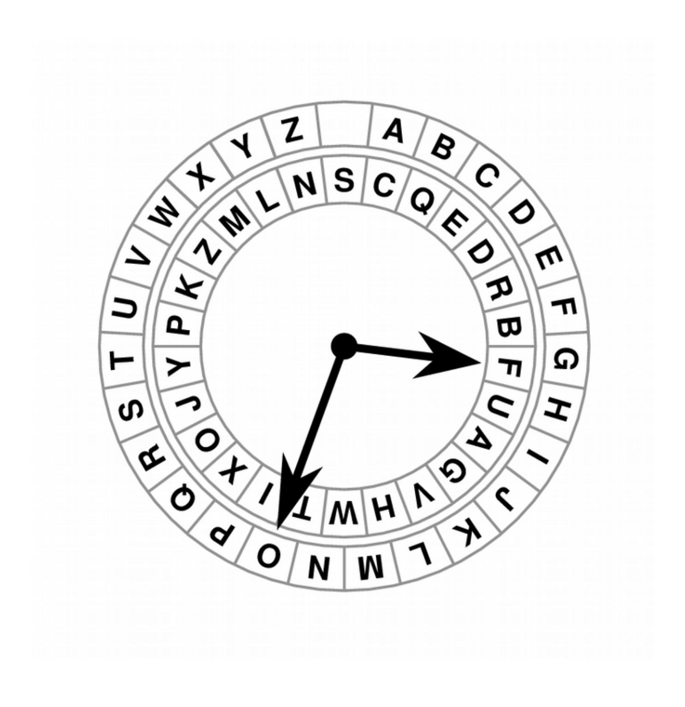

{15}------------------------------------------------

Figure 2. Schematic sketch of the Wadsworth cipher disk. The mixed ciphertext alphabet is taken from the example found in the NSA file (1951). The rings of characters rotate counterclockwise under a fixed pointer by the same number of steps, but not through the same angle.

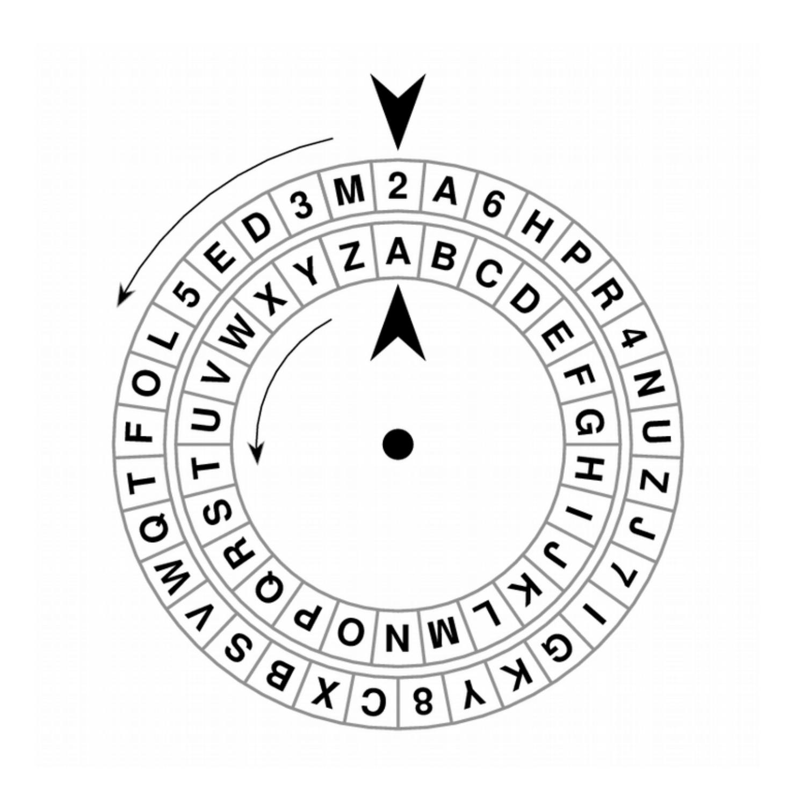

{16}------------------------------------------------

Figure 3. Schematic sketch of Urkryptografen. The mixed alphabet shown here is from the photograph found in Faurholt's article (2003). The rings of characters rotate counterclockwise under a fixed pointer by the same number of steps, but not through the same angle.

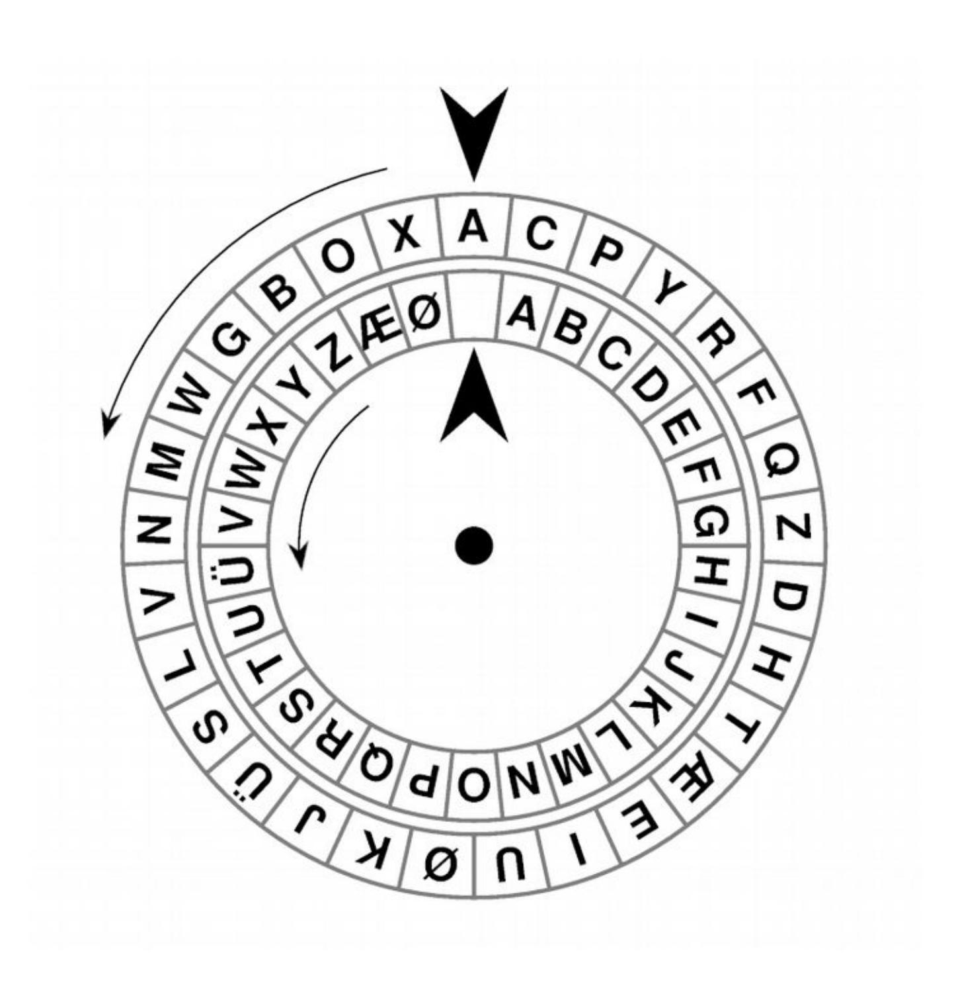

{17}------------------------------------------------

Figure 4. Rate of success as a function of the length of the ciphertext for the Wheatstone Cryptograph. In this graph *δ*=0.1 and *ε*outer=10−7 . Several values of *N* are plotted. For *N*=20,000, each point (●) represents 250 trials; for *N*=10,000 (▲), *N*=5,000 (■), and *N*=2,000 (**×**), each point represents 500 trials.

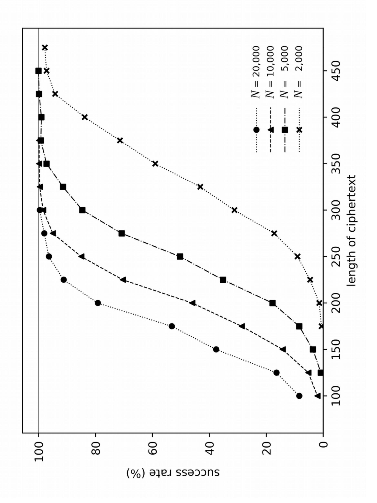

{18}------------------------------------------------

Figure 5. Rate of success as a function of the length of the ciphertext for the Wheatstone Cryptograph.In this graph *N*=10,000 and *ε*outer=10−7 . Three values of *δ* are plotted. For *δ*=0.1, each point (■) represents 500 trials; for *δ*=0.125, each point (▲) represents 300 trials; for *δ*=0.15, each point (●) represents 100 trials.

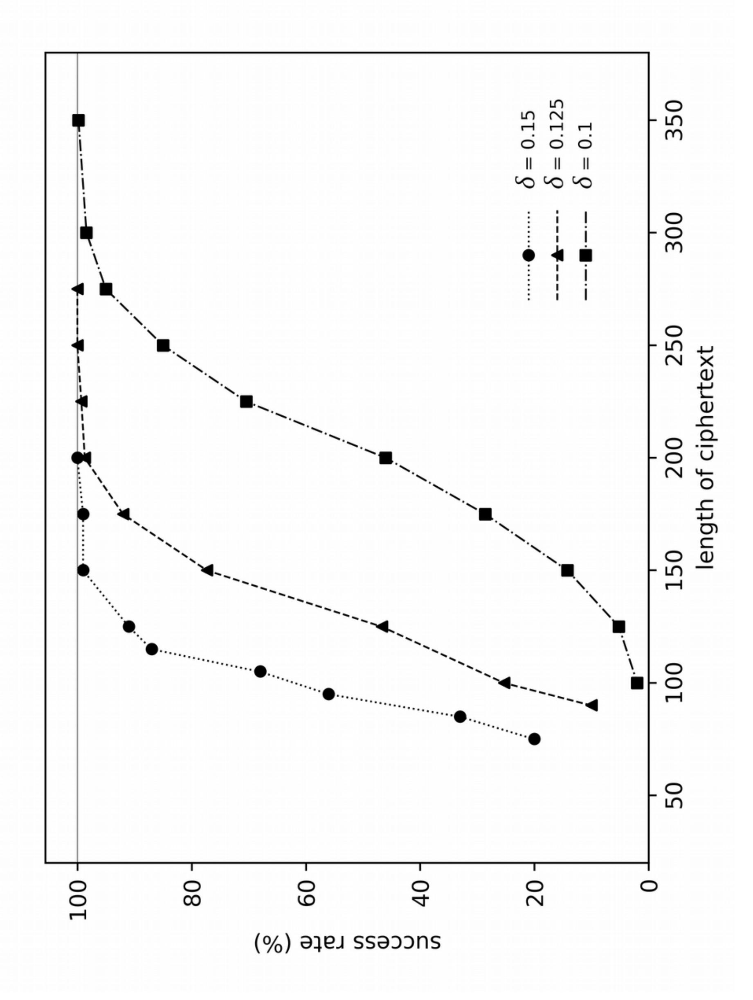

{19}------------------------------------------------

Figure 6. Rate of success as a function of the length of the ciphertext for the Wheatstone Cryptograph. In this graph *N*=10,000 and *δ*=0.1. Four values of *ε*outer are plotted: 10−5 (●), 10−6 (▲), 10−7 (■), and 10−9 (**×**). Each point represents 300 or more trials.

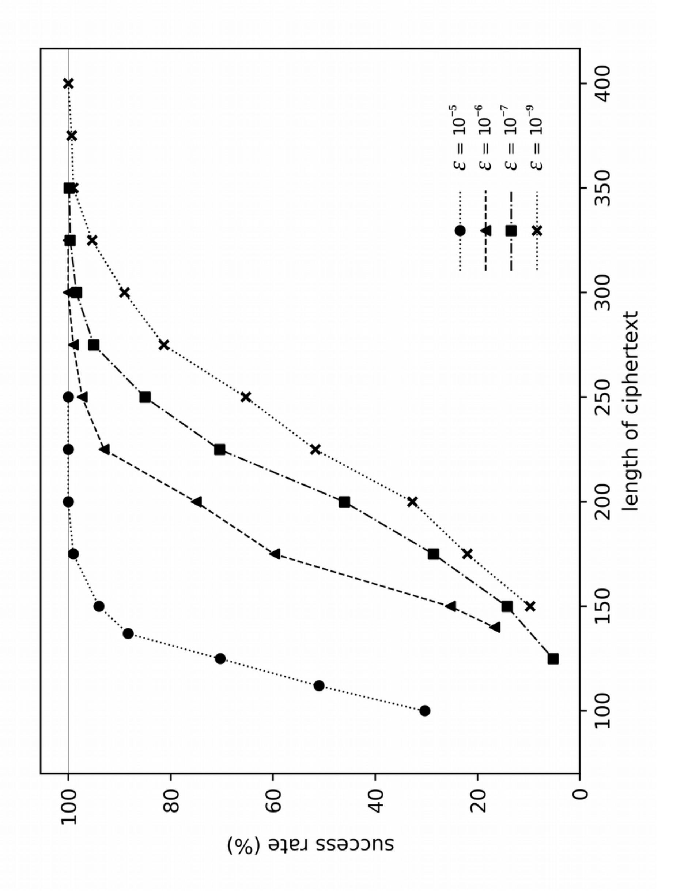

{20}------------------------------------------------

Figure 7. Rate of success as a function of the length of the ciphertext for Urkryptografen. In this graph *δ*=0.1 and *ε*outer=10−7 . Several values of *N* are plotted. For *N*=20,000, each point (●) represents 250 trials; for *N*=10,000 (▲), *N*=5,000 (■), and *N*=2,000 (**×**), each point represents 500 or more trials.

{21}------------------------------------------------

Figure 8. Rate of success as a function of the length of the ciphertext for Urkryptografen. In this graph *N*=10,000 and *ε*outer=10−7 . Three values of *δ* are plotted. For *δ*=0.1, each point (■) represents 500 or more trials; for *δ*=0.125, each point (▲) represents 300 or more trials; for *δ*=0.15, each point (●) represents 100 trials.

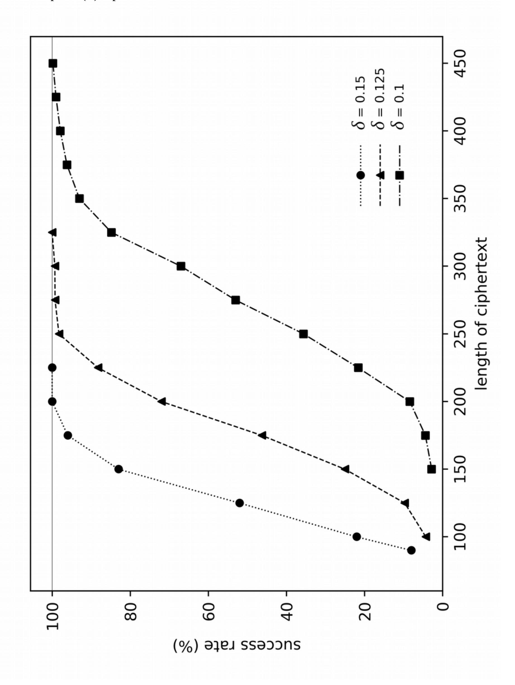

{22}------------------------------------------------

Figure 9. Rate of success as a function of the length of the ciphertext for Urkryptografen. In this graph *N*=10,000 and *δ*=0.1. Four values of *ε*outer are plotted: 10−5 (●), 10−6 (▲), 10−7 (■), and 10−8 (**×**). Each point represents 300 or more trials.

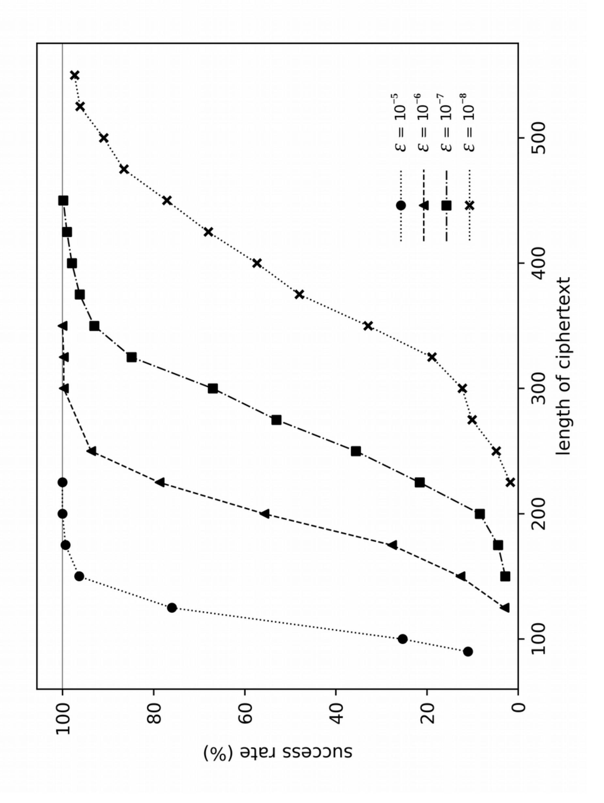

{23}------------------------------------------------

Figure 10. Rate of success as a function of the length of the ciphertext for the Wadsworth cipher disk. In this graph *δ*=0.1 and *ε*outer=10−7 . Several values of *N* are plotted. For *N*=20,000, each point (●) represents 50 or more trials; for *N*=10,000 (▲), 250 or more trials; for *N*=5,000 (■), 500 trials; and for *N*=2,000 (**×**), 750 or more trials.

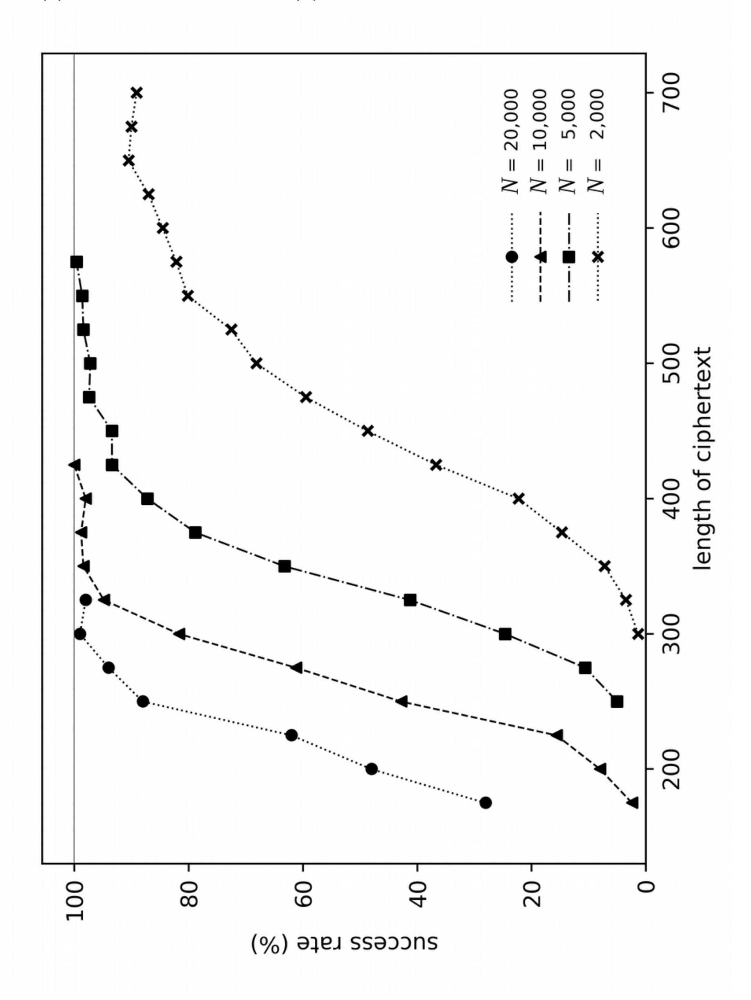

{24}------------------------------------------------

Figure 11. Rate of success as a function of the length of the ciphertext for the Wadsworth cipher disk. In this graph *N*=5,000 and *ε*outer=10−7 . Four values of *δ* are plotted. For *δ*=0.075 (**×**) and *δ*=0.1 (■), each point represents 500 trials; for *δ*=0.125 (▲), each point represents 150 trials; for *δ*=0.15 (●), each point represents 50 or more trials.

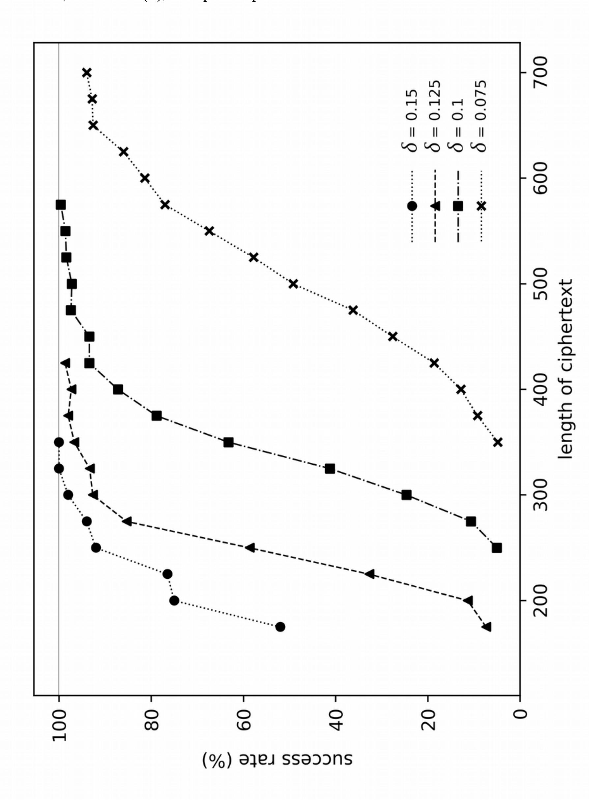

{25}------------------------------------------------

Figure 12. Rate of success as a function of the length of the ciphertext for the Wadsworth cipher disk. In this graph *N*=5,000 and *δ*=0.1. Three values of *ε*outer are plotted. For *ε*outer=10−6 (●), each point represents 200 trials; for *ε*outer=10−7 (▲) and *ε*outer=10−8 (■), each point represents 500 trials.

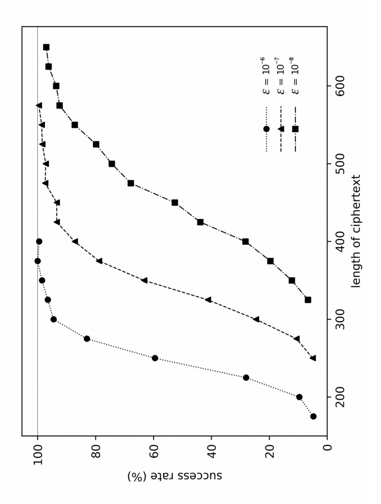

{26}------------------------------------------------

Figure 13. Rate of success as a function of the length of the ciphertext for three cipher clocks that differ in the length of the ciphertext alphabet. In this graph *N*=5,000, *δ*=0.1, and *ε*outer=10−7 . Each device has *m*=26. Three values of *n* are plotted. For *n*=30 (■), each point represents 150 trials; for *n*=33 (the Wadsworth cipher disk) (▲) and *n*=36 (●), each point represent 500 trials.

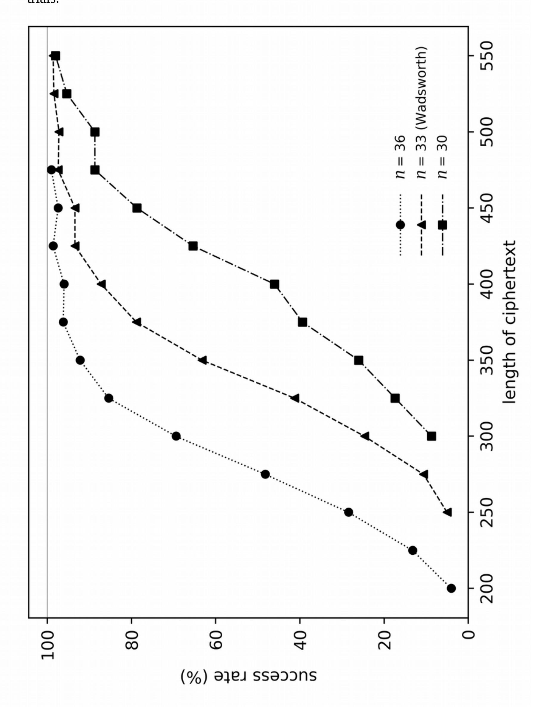

{27}------------------------------------------------

Figure 14. Rate of success as a function of the length of the ciphertext for three cipher clocks that differ in how spaces are handled: the Wadsworth cipher disk (●), a modified device that allows spaces in plaintexts but merges I and J (▲), and a modified device that accommodates spaces by adding one character to both the plaintext and ciphertext alphabets (■). In this graph *N*=5,000, *δ*=0.1, and *ε*outer=10−7. Each point represents 500 trials.

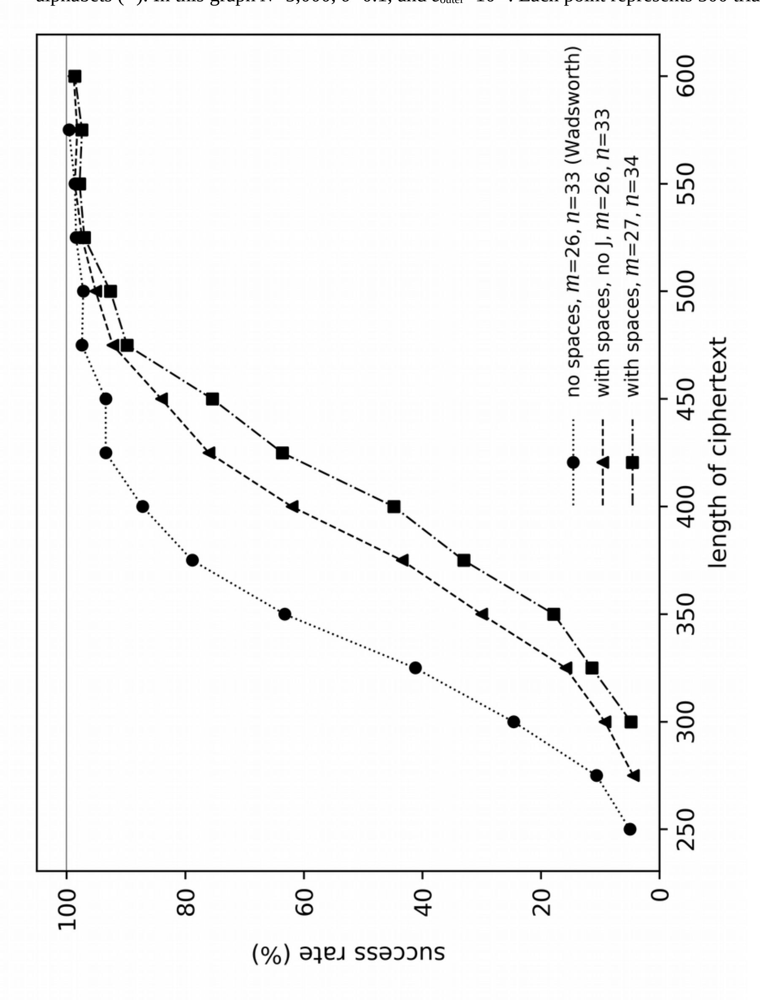

{28}------------------------------------------------

#### **Appendix: Not getting published**

The paper was submitted to *Cryptologia*. Here are the responses that it received. They are reproduced here verbatim; punctuation is as it appears (or does not appear) in the originals.

#### Reviewer's first comment:

The concept is interesting, although not novel. The main issue with this paper is the amount of space spent on explaining how to solve a monoalphabetic substitution. All those parts should be removed altogether, and the paper should only focus on dividing the problem into two stages, a stream cipher (which can be computed without knowing the key), and the M.S. which can be solved with known/previously published methods , for which is it is enough to provide references

Reviewer's second comment, after minor revisions to the paper:

It seems that the author(s) have completely ignored the primary and critical feedback. Assuming the plaintext alphabet is not mixed, it is possible to very easily map the problem to solving a simple substitution. Not just a simple substitution, but one with spaces preserved, which is an extremely easy problem. The paper allocates extensive space on how to solve this trivial problem, and in a highly inefficient way (windecrypto, for example, finds solutions for 30 letters only, compared to hundreds(!) required in this paper).

instead, the authors should have attempted to solve the more interesting case of mixed cipher alphabet combined with mixed plaintext alphabet. An efficient method to solve this scenario would have justified a Cryptologia paper.

#### My first email to the editor:

Hi, Prof. Bauer,

I have some serious concerns about the reviewer of our paper, MS number UCRY-2020-0107. Reviewer waited until the deadline (4 months) before submitting a first report. In it, reviewer made comments on only the first half of the text. We placed a bad joke (removed in the revision) in the penultimate paragraph of the paper, but reviewer made no mention of it. Furthermore, reviewer seems not to understand the problem, but rather to rely on his/her own prejudices about classical ciphers; in the second report, reviewer says this:

"Assuming the plaintext alphabet is not mixed, it is possible to very easily map the problem to solving a simple substitution. Not just a simple substitution, but one with spaces preserved, which is an extremely easy problem. The paper allocates extensive space on how to solve this trivial problem, and in a highly inefficient way (windecrypto, for example, finds solutions for 30 letters only, compared to hundreds(!) required in this paper)."

Anyone who knows how attacks on monoalphabetic substitution ciphers work can tell you

{29}------------------------------------------------

that they rely on underlying linguistic data. Anyone who has worked in cryptography can also tell you that preceding the mono sub with another cipher confounds such attacks. Following his thinking, one would believe that quagmire ciphers, for example, could be broken with one application of windecrypto followed by an attack on the shift cipher. Finally, reviewer suggests that our time be better spent on a harder problem, one which we already mention in our concluding remarks.

All of the above strongly suggest that the reviewer gave the manuscript only a superficial and incomplete reading, and that reviewer did not invest any effort into understanding the problem that the paper addresses. We believe that the reviewer has handled our manuscript unprofessionally and incompetently. We humbly ask that you intercede as editor and assign a new reviewer.

I ask that you respond to this message, so that I know that it has been read. Thank you.

Thank you very much for your time.

Thomas Kaeding

#### Prof. Bauer's response:

If you knew who the reviewer was, I don't think you would have made some of the statements that appear in this email. You are making several incorrect assumptions. The most productive use of your time would be to either make the changes the reviewer asks for or send the paper to a different journal. Cryptologia receives a large volume of submissions and I must reject most of them, even after expanding the journal from 4 to 6 issues per year.

Best Wishes, Craig

An email I sent but should not have:

Hi, Craig,

I believe that the reviewer does not understand the complexity of the problem. He assumes that it is a simple matter of solving a monoalphabetic substitution cipher.

If the reviewer can demonstrate that he can easily solve the cryptogram from Wheatstone's original paper describing his device, then I will gladly withdraw my paper. Here is the first sentence of that cryptogram. Reviewer claims to be able to do so with as few as 30 characters.

PZLSPQREQAJDITFBUFZOHQOSUQUDIKITORTWEZACMTPLER AUESKGSOFGFDKHLSJIRKHFHMFADAYIVUOHAOBLNOGREJAI BKMPJZTMJABQCNFPOMYHYRCZDCWBXUBZ

{30}------------------------------------------------

Alternatively, I would ask for a different reviewer.

Thank you.

Thomas Kaeding, PhD

#### Editor's response:

The reviewer is one of the very best when it comes to cryptanalysis of classical and machine ciphers. He has proven himself many times over, so I don't think that it is appropriate of me to demand that he solve the cipher you provided to prove that he is correct in this instance. I will respond to your second email separately.

Best Wishes, Craig

# My reply:

Prof. Bauer,

Thank you for responding.

If I make the changes requested by the reviewer, the article would no longer be truthful, and I would be embarrassed to have my name on it.

Thanks again.

Thomas

#### Editor's final decision:

Dear Dr Kaeding:

It appears that you resubmitted the paper, with a minor change, before receiving a response from me to the emails you sent Saturday. If you had waited, it would have saved you the trouble, as the email exchange shows that we are not in agreement on what is needed to make the paper a nice fit for Cryptologia. To get this revision out of the system, I have to send a formal rejection email. Hence, this message. You are of course now free to submit the paper elsewhere should you choose to do so.

Thank you for considering Cryptologia. I hope the outcome of this specific submission will not discourage you from the submission of future manuscripts.

Sincerely, Craig P. Bauer Editor in Chief, Cryptologia