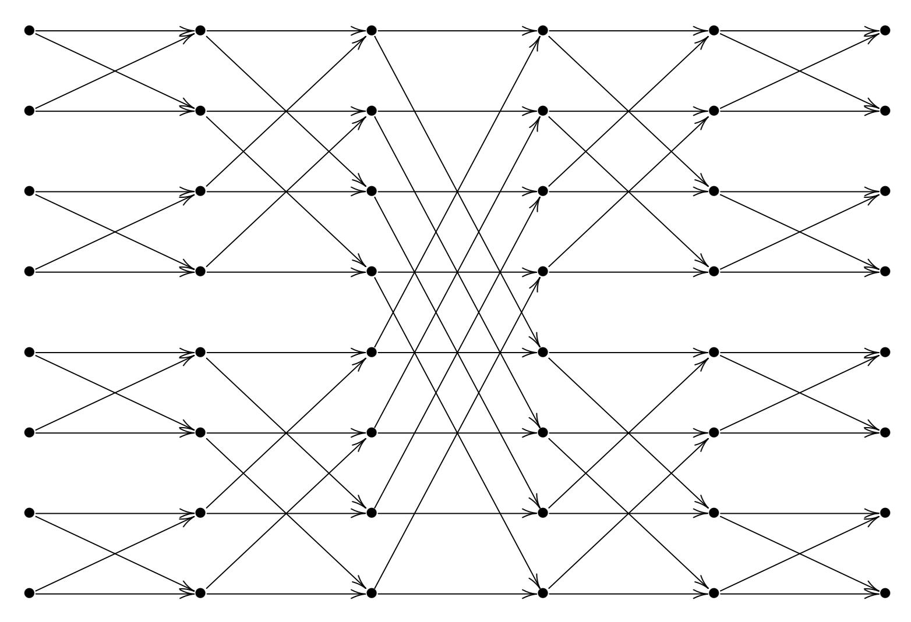
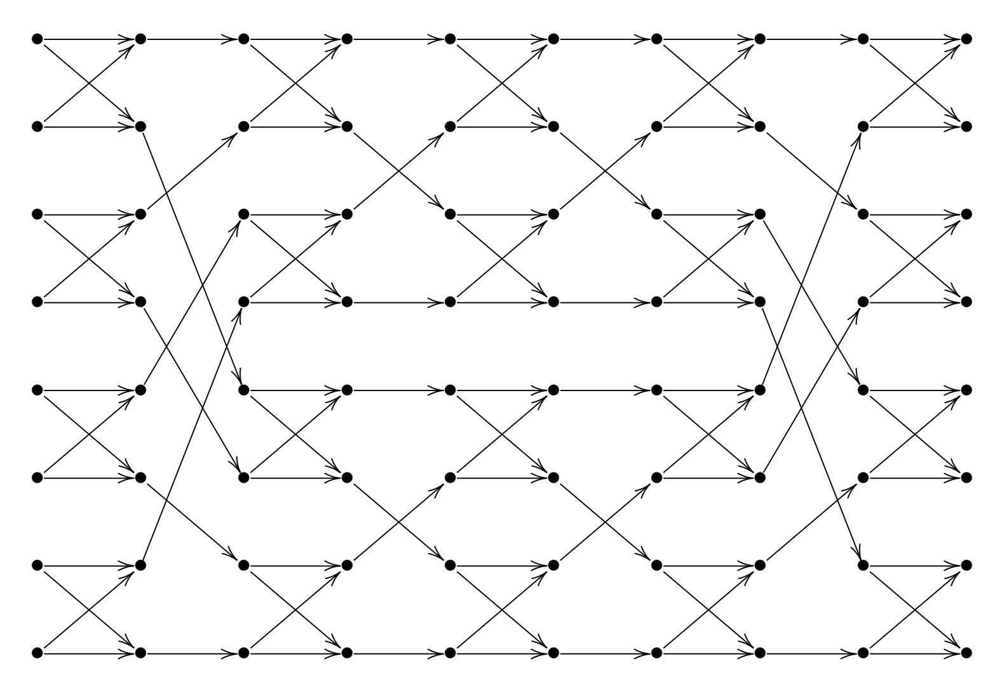

{0}------------------------------------------------

# Verified fast formulas for control bits for permutation networks

Daniel J. Bernstein<sup>1,2</sup>

Department of Computer Science, University of Illinois at Chicago, USA
 Horst Görtz Institute for IT Security, Ruhr University Bochum, Germany
 djb@cr.yp.to

**Abstract.** This paper presents detailed and computer-verified proofs of formulas that, given a permutation  $\pi$  of  $2^m$  indices with  $m \geq 1$ , produce control bits for a standard permutation network that uses  $2^m(m-1/2)$  swaps to apply  $\pi$  to a list. The formulas match the control bits computed by a serial algorithm of Stone (1968) and a parallel algorithm of Nassimi–Sahni (1982). The proofs are a step towards computer-verified correctness proofs for efficient implementations of these algorithms.

**Keywords:** sorting networks, permutation networks, Beneš networks, Clos networks, Stone's algorithm, Nassimi–Sahni algorithm, constant-time algorithms, parallelization, vectorization

#### 1 Introduction

If  $\pi$  is a permutation of  $\{0, 1, \dots, n-1\}$  then sorting the n pairs

$$(\pi(0),0),(\pi(1),1),\ldots,(\pi(n-1),n-1)$$

into increasing order produces the n pairs

$$(0, \pi^{-1}(0)), (1, \pi^{-1}(1)), \dots, (n-1, \pi^{-1}(n-1)).$$

The problem of inverting a permutation of  $\{0, 1, ..., n-1\}$  thus reduces to the problem of sorting a size-n list of pairs.

More generally, sorting the pairs  $(\pi(0), a_0), (\pi(1), a_1), \ldots, (\pi(n-1), a_{n-1})$  for any array  $(a_0, a_1, \ldots, a_{n-1})$  gives  $(0, a_{\pi^{-1}(0)}), (1, a_{\pi^{-1}(1)}), \ldots, (n-1, a_{\pi^{-1}(n-1)})$ . Sorting the pairs  $(\pi^{-1}(0), a_0), (\pi^{-1}(1), a_1), \ldots, (\pi^{-1}(n-1), a_{n-1})$  into increasing order produces the pairs  $(0, a_{\pi(0)}), (1, a_{\pi(1)}), \ldots, (n-1, a_{\pi(n-1)})$ . The problem of applying a permutation to a size-n array thus also reduces to the sorting problem.

This work was supported by the German Research Foundation under EXC 2092 CASA 390781972 "Cyber Security in the Age of Large-Scale Adversaries", by the U.S. National Science Foundation under grant 1913167, and by the Cisco University Research Program. "Any opinions, findings, and conclusions or recommendations expressed in this material are those of the author(s) and do not necessarily reflect the views of the National Science Foundation" (or other funding agencies). Permanent ID of this document: 782136154c6ea5bb93257e2a5f667a579df7a48e. Date: 2020.09.23.

{1}------------------------------------------------

Wait a minute. Why not simply run through each i, using π(i) as an index into the RAM storing the input array to obtain the desired output aπ(i)? If the objective is to compute π −1 (i) or more generally aπ−1(i) , why not simply run through each j, storing a<sup>j</sup> at position π(j) in the output array? Here are two answers:

- Security: On many popular computer architectures, RAM leaks information about indices through timings. If π is secret then one has to figure out whether too much information is leaked, whereas there are sorting algorithms that avoid this issue.
- Speed: RAM uses more and more transistors as n grows to look up a single array element, and n lookups occupy RAM for many cycles. There are much faster ways to sort n items using that amount of hardware.

So let's return to the sorting approach.

A comparator sorts two items in place. Given two inputs p, q, let's say 64-bit integers, the comparator overwrites p, q with min{p, q}, max{p, q} respectively. It is easy to build a fast comparator that takes time independent of p and q.

<span id="page-1-1"></span>Assume for simplicity that n = 2<sup>m</sup> is a power of 2. Batcher's bitonic sorting network sorts n items using (m<sup>2</sup> + m)n/4 comparators. Even better, Batcher's odd-even sorting network sorts n items using (m<sup>2</sup> − m + 4)n/4 − 1 comparators. Each network consists of m(m + 1)/2 stages, where each stage applies ≤n/2 comparators in parallel. See Batcher's original paper [[5](#page-16-0)]. Readers interested in the non-power-of-2 case should see Knuth's merge-exchange sort [[16](#page-17-0), Algorithm 5.2.2M]; this is a simple sorting network that works for any size, and aside from data layout it is equivalent to the odd-even sorting network for power-of-2 sizes.

There are at least three ways in which this method of permuting a list is known to be suboptimal:

- <span id="page-1-3"></span><span id="page-1-2"></span><span id="page-1-0"></span>• The AKS sorting network [[4](#page-16-1)] and its descendants have only Θ(m) stages. However, the survey in [[13](#page-17-1), Section 5] indicates that the hidden Θ constant is above 1000, whereas competing with Batcher's networks for any reasonable value of m would require a Θ constant far below 100.
- Some marginally smaller sorting networks are known for reasonable values of m, for example using 60 comparators for m = 4 where Batcher's odd-even sorting network uses 63. However, this generally seems outweighed by the relatively simple structure of Batcher's networks.
- Often a permutation π is going to be applied to many lists. There is a standard technique that saves time in each application of π, at the expense of a one-time precomputation that depends only on π. Specifically, for m ≥ 1, one can permute a list using a standard permutation network containing just 2m − 1 stages, where each stage has n/2 conditional swaps controlled by π.

This paper focuses on the last point, and more specifically on algorithms that, given π, compute (2m−1)n/2 control bits for conditional swaps in the standard permutation network.

There are various algorithms of this type in the literature, including fast parallel algorithms. The parallel algorithms are usually stated in terms of parallel 

{2}------------------------------------------------

RAM accesses, which in turn can be converted into sorting steps.<sup>3</sup> There are various reports of software and hardware implementations computing the desired control bits, such as fast vectorized constant-time software introduced as part of McBits [[10](#page-17-2)], and modified software introduced as part of Classic McEliece [[9](#page-17-3)] using the sorting library from [[8](#page-17-4)] to save time in the sorting steps.

<span id="page-2-2"></span><span id="page-2-1"></span><span id="page-2-0"></span>Could there be bugs in the algorithms, or in the implementations? Perhaps testing some random inputs is adequate, or perhaps not; the literature has not studied what sort of bugs happen here, and the probability of triggering each bug. A bug that triggers only occasional failures will not be caught by typical tests. The computations are not very complicated, but the broader history of computing shows disastrous bugs appearing in simpler computations.

Testing control bits immediately after they are computed is relatively cheap, and can be recommended in any case as protection against hardware faults. But does the application have the flexibility to try another permutation if one permutation fails? Even if it does, perhaps the distribution of permutations in that application triggers constant failures, or frequent enough failures to be a performance problem. If failures are not common then experience shows that implementors often omit tests for failures, even when the tests are cheap, simply because the tests require nonzero implementor effort.

Probably the most convincing way forward, for a reviewer interested in high assurance, would be computer-verified proofs of

- theorems saying that the implementations, given a permutation π as input, compute control bits defined by particular mathematical formulas; and
- theorems saying that the control bits defined by those formulas are control bits for π.

Today it is surprisingly difficult to find theorems of the second type—never mind the first, and never mind computer verification. An algorithm statement is not conceptually different from a formula, but the algorithm statements in the literature are generally intertwined with descriptions of how the algorithms were developed, usually have layers that distract from verification, and are rarely accompanied by proofs.

The goals of this paper are (1) to present mathematical formulas that convert a permutation π into control bits, and (2) to present computer-verified proofs that the control bits produced by those formulas are control bits for π. Sections 2 through 5 of this paper present the formulas and detailed proofs in a traditional mathematical format. Appendix A presents computer-verified proofs. Sections 6 and 7 present further material that has not been similarly verified.

<span id="page-2-5"></span><span id="page-2-4"></span><span id="page-2-3"></span>The formulas were derived from, and produce the same control bits as, a 1968 algorithm [[24](#page-17-5)] by Stone and a 1982 parallel algorithm [[19](#page-17-6)] by Nassimi–Sahni. (If I've correctly understood a 1981 parallel algorithm [[18](#page-17-7)] by Lev–Pippenger– Valiant then that algorithm often produces different control bits for the same permutation, as explained below.) The core ideas used in the proofs are also not new—although I doubt that the core ideas are where bugs are likely to occur!

<sup>3</sup> Sorting is thus used some number of times to compute control bits that are in turn used to avoid sorting, like an employee training the employee's replacement.

{3}------------------------------------------------

# 2 Cycles

This section defines "cycle  $\pi$ ", which maps x to the cycle of x under permutation  $\pi$ , and "cyclemin  $\pi$ ", which maps x to the minimum element of the cycle of x under  $\pi$ . This section also defines intermediate results in a fast parallel algorithm to compute cyclemin  $\pi$ .

**Definition 2.1.** Let S be a set. Let  $\pi$  be a permutation of S. Then "cycle  $\pi$ " means the function from S to  $2^S$  that maps x to  $\{\pi^k(x): k \in \mathbf{Z}\}$ .

**Theorem 2.2.** Let S be a set. Let  $\pi$  be a permutation of S. Define  $C = \operatorname{cycle} \pi$ . Then  $C(\pi(x)) = C(x)$  for each  $x \in S$ .

*Proof.* 
$$\{\pi^k(\pi(x)) : k \in \mathbf{Z}\} = \{\pi^{k+1}(x) : k \in \mathbf{Z}\} = \{\pi^k(x) : k \in \mathbf{Z}\}.$$

**Definition 2.3.** Let S be a set of nonnegative integers. Let  $\pi$  be a permutation of S. Then "cyclemin  $\pi$ " means the function from S to S that maps x to  $\min((\operatorname{cycle} \pi)(x))$ .

This definition can be generalized from subsets of  $\{0, 1, 2, \ldots\}$  to subsets of any well-ordered set.

**Theorem 2.4.** Let S be a set of nonnegative integers. Let  $\pi$  be a permutation of S. Define functions  $c_0, c_1, \dots : S \to S$  as follows:  $c_0(x) = x$ ;  $c_{i+1}(x) = \min\{c_i(x), c_i(\pi^{2^i}(x))\}$ . Then  $c_i(x) = \min\{x, \pi(x), \dots, \pi^{2^{i-1}}(x)\}$ .

Proof. Induct on i.

Case 0: i = 0. Then  $\{x, \pi(x), \dots, \pi^{2^{i-1}}(x)\} = \{x\}$  and  $c_i(x) = x = \min\{x\}$  as claimed.

Case 1:  $i \geq 1$ . By the inductive hypothesis,

$$c_{i-1}(x) = \min\{x, \pi(x), \dots, \pi^{2^{i-1}-1}(x)\}$$

for all x, so

$$c_{i-1}(\pi^{2^{i-1}}(x)) = \min\{\pi^{2^{i-1}}(x), \pi^{2^{i-1}+1}(x), \dots, \pi^{2^{i-1}}(x)\},\$$

so

$$c_i(x) = \min\{x, \pi(x), \dots, \pi^{2^i - 1}(x)\}\$$

as claimed.  $\Box$ 

**Theorem 2.5.** In the situation of Theorem 2.4, let x be an element of S, and assume that  $\#((\operatorname{cycle} \pi)(x)) \leq 2^i$ . Then  $c_i(x) = (\operatorname{cyclemin} \pi)(x)$ .

Proof. Write  $x_k = \pi^k(x)$  for each  $k \in \mathbf{Z}$ . Then  $\{x_0, x_1, \dots, x_{2^i}\} \subseteq \{x_k : k \in \mathbf{Z}\}$ , so  $\#\{x_0, x_1, \dots, x_{2^i}\} \leq 2^i$ , so  $x_a = x_b$  for some distinct  $a, b \in \{0, 1, \dots, 2^i\}$ . Without loss of generality assume a < b.

Now  $x_0 = \pi^{-a}(x_a) = \pi^{-a}(x_b) = x_{b-a}$ . By induction  $x_k = x_{k \mod (b-a)}$  for every  $k \in \mathbf{Z}$ . Now  $k \mod (b-a) \in \{0, 1, \dots, b-a-1\} \subseteq \{0, 1, \dots, 2^i-1\}$ . By Theorem 2.4,  $c_i(x) = \min\{x_k : 0 \le k < 2^i\} = \min\{x_k : 0 \le k < b-a\} = \min\{x_k : k \in \mathbf{Z}\} = (\operatorname{cyclemin} \pi)(x)$ .

{4}------------------------------------------------

#### 3 Controlled swaps

Given a b-bit sequence s = (s0, s1, . . . , sb−1), this section defines an involution "Xif s" of {0, 1, . . . , 2b − 1}. The involution swaps 0 and 1 if the first bit s<sup>0</sup> is 1, else leaves 0 and 1 in place; swaps 2 and 3 if the next bit s<sup>1</sup> is 1, else leaves 2 and 3 in place; etc. The bits in s are called control bits for this involution.

Theorem 3.1. If b is a nonnegative integer and x ∈ {0, 1, . . . , 2b − 1} then x ⊕ 1 ∈ {0, 1, . . . , 2b − 1} and b(x ⊕ 1)/2c = bx/2c.

Proof. Case 0: x is even. Then 0 ≤ x ≤ 2b − 2; x ⊕ 1 = x + 1 ≤ 2b − 1; and b(x ⊕ 1)/2c = b(x + 1)/2c = bx/2c.

Case 1: x is odd. Then 1 ≤ x ≤ 2b − 1; x ⊕ 1 = x − 1 ≥ 0; and b(x ⊕ 1)/2c = b(x − 1)/2c = bx/2c. ut

Definition 3.2. Let b be a nonnegative integer. Let s = (s0, s1, . . . , sb−1) be an element of {0, 1} b . Define a function S on {0, 1, . . . , 2b − 1} as follows: S(x) = x ⊕ s<sup>b</sup>x/2<sup>c</sup>. Then "Xif s" means S.

Theorem 3.3. Let b be a nonnegative integer. Let s be an element of {0, 1} b . Then Xif s is an involution of {0, 1, . . . , 2b − 1}.

```
Proof. Write s as (s0, s1, . . . , sb−1), and write S = Xif s.
  Fix x ∈ {0, 1, . . . , 2b − 1}, and write y = S(x) = x ⊕ sbx/2c.
  Case 0: sbx/2c = 0. Then y = x so y ∈ {0, 1, . . . , 2b − 1} and S(y) = S(x) = x.
  Case 1: sbx/2c = 1. Then y = x ⊕ 1. By Theorem 3.1, y ∈ {0, 1, . . . , 2b − 1}
and by/2c = bx/2c, so S(y) = y ⊕ sby/2c = (x ⊕ sby/2c
                                                     ) ⊕ sby/2c = x.
  Either way y ∈ {0, 1, . . . , 2b − 1} and S(y) = x. ut
```

#### 4 Back and forth

This section defines, for each permutation π of {0, 1, . . . , 2b − 1}, a permutation "XbackXforth π" of the same set.

Definition 4.1. Let b be a nonnegative integer. Let π be a permutation of {0, 1, . . . , 2b − 1}. Then "XbackXforth π" is the function from {0, 1, . . . , 2b − 1} to {0, 1, . . . , 2b − 1} that maps x to π(π −1 (x ⊕ 1) ⊕ 1).

Theorem 4.2. Let b be a nonnegative integer. Let π be a permutation of {0, 1, . . . , 2b − 1}. Then XbackXforth π is a permutation of {0, 1, . . . , 2b − 1}.

Proof. By definition π is a composition of the following four permutations: x 7→ x⊕1, which is a permutation of {0, 1, . . . , 2b − 1} by Theorem 3.1; π −1 ; x 7→ x⊕1 again; and π. ut

Theorem 4.3. Let b be a nonnegative integer. Let π be a permutation of {0, 1, . . . , 2b − 1}. Define π = XbackXforth π. Fix x ∈ {0, 1, . . . , 2b − 1}, and define x<sup>k</sup> = π k (x) for all k ∈ Z. Then π k (x<sup>k</sup> ⊕ 1) = x ⊕ 1; x<sup>j</sup> 6= x<sup>k</sup> ⊕ 1 for all j, k ∈ Z; and #{x<sup>k</sup> : k ∈ Z} ≤ b.

{5}------------------------------------------------

In other words, for each cycle  $x_0 \to x_1 \to \cdots \to x_{c-1} \to x_c = x_0$  of  $\overline{\pi}$ , there is a cycle  $x_c \oplus 1 \to x_{c-1} \oplus 1 \to \cdots \to x_1 \oplus 1 \to x_0 \oplus 1 = x_c \oplus 1$  of  $\overline{\pi}$ , and these cycles are disjoint, each of length  $c \leq b$ .

*Proof.* By definition  $x_{k+1} = \overline{\pi}(x_k) = \pi(\pi^{-1}(x_k \oplus 1) \oplus 1)$  and  $\overline{\pi}(x_{k+1} \oplus 1) = \pi(\pi^{-1}(x_{k+1}) \oplus 1)$  so  $\overline{\pi}(x_{k+1} \oplus 1) = \pi(\pi^{-1}(x_k \oplus 1)) = x_k \oplus 1$ . Iterate to see that  $\overline{\pi}^k(x_k \oplus 1) = x \oplus 1$ .

Suppose there are pairs (j, k) with  $x_j = x_k \oplus 1$ . If  $x_j = x_k \oplus 1$  then  $x_k = x_j \oplus 1$  so there are pairs (j, k) with  $x_j = x_k \oplus 1$  and  $j \leq k$ . Take some such pair (j, k) with k - j minimal.

If k = j then  $x_j = x_j \oplus 1$ , contradiction. If k = j + 1 then  $x_j = x_{j+1} \oplus 1$  so  $\pi^{-1}(x_{j+1}) = \pi^{-1}(x_j \oplus 1) \oplus 1 = \pi^{-1}(x_{j+1}) \oplus 1$ , contradiction. If  $k \geq j + 2$  then  $x_{j+1} = \overline{\pi}(x_j) = \overline{\pi}(x_k \oplus 1) = x_{k-1} \oplus 1$  so there is a pair with smaller k - j, contradiction. Hence  $x_j$  never equals  $x_k \oplus 1$ .

Write  $S_0 = \{x_k : k \in \mathbf{Z}\}$  and  $S_1 = \{x_k \oplus 1 : k \in \mathbf{Z}\}$ . Then  $S_0 \cup S_1 \subseteq \{0, 1, \dots, 2b-1\}$ , so  $\#(S_0 \cup S_1) \leq 2b$ . Also  $S_0$  and  $S_1$  are disjoint, so  $\#(S_0 \cup S_1) = \#S_0 + \#S_1$ ; and  $\#S_0 = \#S_1$ , since  $\oplus 1$  is a permutation. Hence  $2\#S_0 \leq 2b$ ; i.e.,  $\#S_0 \leq b$ .

**Theorem 4.4.** Let b be a nonnegative integer. Let  $\pi$  be a permutation of  $\{0,1,\ldots,2b-1\}$ . Define  $\overline{\pi}=\mathrm{XbackXforth}\,\pi$ . Define  $c=\mathrm{cyclemin}\,\overline{\pi}$ . Then  $c(x\oplus 1)=c(x)\oplus 1$  for each  $x\in\{0,1,\ldots,2b-1\}$ .

*Proof.* Write  $x_k = \overline{\pi}^k(x)$  for  $k \in \mathbf{Z}$ . Find j that minimizes  $x_j$ . By definition  $c(x) = x_j$ .

Also write  $y_k = \overline{\pi}^k(x \oplus 1)$  for  $k \in \mathbf{Z}$ . Then  $y_{-k} = x_k \oplus 1$  by Theorem 4.3.

By definition  $c(x \oplus 1) = \min\{y_k : k \in \mathbf{Z}\}$ . One of the entries in the min is  $y_{-j} = x_j \oplus 1 = c(x) \oplus 1$ , so  $c(x \oplus 1) \leq c(x) \oplus 1$ .

If  $c(x \oplus 1) < c(x) \oplus 1$  then  $y_k < c(x) \oplus 1$  for some k, so  $x_{-k} \oplus 1 < x_j \oplus 1$ , but  $x_j \leq x_{-k}$ , forcing  $x_j = x_{-k} \oplus 1$ , which contradicts Theorem 4.3. Hence  $c(x \oplus 1) = c(x) \oplus 1$  as claimed.

# 5 Control bits from permutations

This section writes any permutation  $\pi$  of  $\{0, 1, \dots, 2b-1\}$  as

Xif firstcontrol  $\pi \circ \text{middleperm } \pi \circ \text{Xif lastcontrol } \pi$ ,

where middle perm  $\pi$  is a permutation that preserves the parity of its inputs. The functions first control, middleperm, and last control are defined below.

**Definition 5.1.** Let b be a nonnegative integer. Let  $\pi$  be a permutation of  $\{0, 1, \dots, 2b-1\}$ . Define

- $c = \text{cyclemin XbackXforth } \pi;$
- $f_j = c(2j) \mod 2$  for each  $j \in \{0, 1, \dots, b-1\}$ ;
- $F = Xif f where f = (f_0, f_1, \dots, f_{b-1});$

{6}------------------------------------------------

- `<sup>k</sup> = F(π(2k)) mod 2 for each k ∈ {0, 1, . . . , b − 1}; and
- L = Xif ` where ` = (`0, `1, . . . , `b−1).

#### Then

- "firstcontrol π" means the sequence f ∈ {0, 1} b ;
- "lastcontrol π" means the sequence ` ∈ {0, 1} b ; and
- "middleperm π" means the function F π L : {0, 1, . . . , 2b − 1} → {0, 1, . . . , 2b − 1}.

Theorem 5.2. Let b be a nonnegative integer. Let π be a permutation of {0, 1, . . . , 2b − 1}. Define f = firstcontrol π. Then f<sup>0</sup> = 0.

Proof. Write π = XbackXforth π. By definition π is a permutation of {0, 1, . . . , 2b − 1}.

Write C = cycle π. By definition 0 ∈ C(0) ⊆ {0, 1, . . . , 2b − 1}.

Write c = cyclemin π. By definition c(0) = min C(0) = 0.

By definition f<sup>0</sup> = c(0) mod 2, so f<sup>0</sup> = 0. ut

Theorem 5.3. Let b be a nonnegative integer. Let π be a permutation of {0, 1, . . . , 2b − 1}. Define c = cyclemin XbackXforth π. Define F = Xif firstcontrol π. Then F(x) ≡ c(x) (mod 2) for each x ∈ {0, 1, . . . , 2b − 1}.

Proof. Write firstcontrol π as (f0, . . . , fb−1). By definition F(x) = x + f<sup>b</sup>x/2<sup>c</sup>. Case 0: x = 2j for some j ∈ {0, 1, . . . , b − 1}. Then F(x) ≡ x + f<sup>j</sup> ≡ f<sup>j</sup> ≡ c(2j) = c(x) (mod 2).

Case 1: x = 2j + 1 for some j ∈ {0, 1, . . . , b − 1}. By Theorem 4.4, c(x) = c(2j) ⊕ 1, so F(x) ≡ x + f<sup>j</sup> ≡ 1 + f<sup>j</sup> ≡ 1 + c(2j) ≡ c(x) (mod 2). ut

Theorem 5.4. Let b be a nonnegative integer. Let π be a permutation of {0, 1, . . . , 2b − 1}. Define F = Xif firstcontrol π and L = Xif lastcontrol π. Then L(x) ≡ F(π(x)) (mod 2) for each x ∈ {0, 1, . . . , 2b − 1}.

Proof. Define π = XbackXforth π; c = cyclemin π; f = firstcontrol π; and ` = firstcontrol π. By definition f<sup>j</sup> = c(2j) mod 2 and `<sup>k</sup> = F(π(2k)) mod 2.

Case 0: x = 2k for some k ∈ {0, 1, . . . , b − 1}. By definition L(x) = L(2k) ≡ `<sup>k</sup> ≡ F(π(2k)) = F(π(x)) (mod 2) as claimed.

Case 1: x = 2k + 1 for some k ∈ {0, 1, . . . , b − 1}. Write u = π(2k). By definition π(u ⊕ 1) = π(π −1 (u) ⊕ 1) = π(2k + 1) = π(x), so c(u ⊕ 1) = c(π(x)) by Theorem 2.2, so c(u) ⊕ 1 = c(π(x)) by Theorem 4.4, so F(u) + 1 ≡ F(π(x)) (mod 2) by Theorem 5.3, so L(x) = L(2k + 1) ≡ 1 + `<sup>k</sup> ≡ 1 + F(u) ≡ F(π(x)) (mod 2) as claimed. ut

Theorem 5.5. Let b be a nonnegative integer. Let π be a permutation of {0, 1, . . . , 2b − 1}. Define M = middleperm π. Then M is a permutation of {0, 1, . . . , 2b − 1}, and M(x) ≡ x (mod 2) for each x ∈ {0, 1, . . . , 2b − 1}.

Proof. Define c, f, F, `, L as in Definition 5.1. By Theorem 3.3, F and L are involutions of {0, 1, . . . , 2b − 1}. M is a permutation since it is the composition of permutations F, π, L.

By Theorem 5.4, F(π(x)) ≡ L(x) (mod 2) for each x. Substitute L(x) for x to see that M(x) = F(π(L(x))) ≡ L(L(x)) = x (mod 2). ut

{7}------------------------------------------------

#### 6 Permutation networks

Consider the problem of using a permutation π of {0, 1, . . . , n − 1} to permute a list (a0, a1, . . . , an−1) in place, overwriting the list with (aπ(0), aπ(1), . . . , aπ(n−1)). For example, applying such an algorithm to the list (0, 1, . . . , n − 1) obtains (π(0), π(1), . . . , π(n − 1)).

Assume n = 2b. Section 5 constructed sequences f = firstcontrol π ∈ {0, 1} b and ` = lastcontrol π ∈ {0, 1} b , and another permutation M = middleperm π of {0, 1, . . . , 2b − 1}, with the following properties:

- π decomposes as F M L, where F is the involution Xif f and L is the involution Xif `.
- M(x) has the same parity as x. Consequently M permutes {0, 2, . . . , 2b − 2} and separately permutes {1, 3, . . . , 2b − 1}.

One can rewrite M(2x) as 2M0(x), and rewrite M(2x+ 1) as 2M1(x) + 1, where M<sup>0</sup> and M<sup>1</sup> are permutations of {0, 1, . . . , b − 1}.

These properties can be used to permute a list (a0, a1, . . . , a2b−1) in place as follows:

- First stage, using the control bits f: Overwrite (a0, a1) with (a<sup>F</sup> (0), a<sup>F</sup> (1)), overwrite (a2, a3) with (a<sup>F</sup> (2), a<sup>F</sup> (3)), etc. (Now a<sup>i</sup> is what was a<sup>F</sup> (i) at the beginning.)
- Middle stage, using the permutation M: Overwrite (a0, a2, . . . , a2b−2) with (aM(0), aM(2), . . . , aM(2b−2)), and overwrite (a1, a3, . . . , a2b−1) with (aM(1), aM(3), . . . , aM(2b−1)). (Now a<sup>i</sup> is what was aM(i) before this stage, i.e., what was a<sup>F</sup> (M(i)) at the beginning.)
- Last stage, using the control bits `: Overwrite (a0, a1) with (aL(0), aL(1)), overwrite (a2, a3) with (aL(2), aL(3)), etc. (Now a<sup>i</sup> is what was aL(i) before this stage, i.e., what was a<sup>F</sup> (M(L(i))) at the beginning.)

This pattern of operations is sometimes called a "three-stage Clos network", although this is a misnomer; see Section 6.5.

An in-place Beneˇs network for b = 2<sup>m</sup> uses the same technique recursively to handle the two half-size permutations in the middle stage. Overall an in-place Beneˇs network has 2m−1 stages, each stage consisting of n/2 parallel conditional swaps. The conditional swaps use indices at distance 1 in the first stage, distance 2 in the second stage, distance 4 in the third stage, and so on up through 2<sup>m</sup>−<sup>1</sup> , and then back down through 1. See Figure 6.1 for m = 3.

It is most convenient to organize the control bits here as being from top to bottom in each of the 2m − 1 stages. The control bits in the first stage are f; the control bits in the last stage are `; the control bits in the remaining stages interleave the control bits for M<sup>0</sup> and M1.

The first control bit f<sup>0</sup> is 0 by Theorem 5.2, so the corresponding conditional swap can be eliminated from the Beneˇs network, producing a slightly smaller permutation network. Applying the same observation recursively saves 2<sup>m</sup>−<sup>1</sup> −1

{8}------------------------------------------------



Fig. 6.1. Data flow in an in-place Beneš network for permuting 8 inputs.

control bits, reducing the total number of control bits from  $(2m-1)2^{m-1}$  to  $(2m-2)2^{m-1}+1=(m-1)2^m+1$ .

**6.2. Data layout.** The long-distance conditional swaps in Figure 6.1 are more expensive than nearby conditional swaps in models of computation that assign costs to distance. One can reduce this cost with a **shuffled Beneš network**, as illustrated in Figure 6.3 for m = 3. This network shuffles the positions of intermediate results so that each stage applies its control bits to conditionally swap  $(a_0, a_1), (a_2, a_3), \ldots$  Beware that the top-to-bottom order of control bits in Figure 6.1 corresponds to a different order of control bits in Figure 6.3 for the middle stages.

The shuffling here still involves long-distance data movement, even if not as much as before. One obtains somewhat better scalability with "cache-oblivious" algorithms, and further improvements with "cache-tuned" algorithms. Some long-distance data movement is unavoidable given that each input position could end up at any output position.

**6.4. Inversion and mirroring.** Some applications naturally follow the pattern above: after constructing a permutation  $\pi$  they naturally move position  $\pi(i)$  in the input to position i in the output. Other applications, after constructing a permutation  $\pi$ , naturally move position i in the input to position  $\pi(i)$  in the output.

Mirroring the control bits from left to right in the Beneš network replaces the permutation with its inverse. This means exchanging stage 0 with stage 2m-2, exchanging stage 1 with stage 2m-3, etc., while preserving the order of control bits from top to bottom in each stage.

{9}------------------------------------------------



Fig. 6.3. Data flow in a shuffled Beneš network for permuting 8 inputs.

One can instead replace  $\pi$  with  $\pi^{-1}$  in Section 5 to compute control bits for  $\pi^{-1}$ . This usually produces different control bits from mirroring; note that for b > 0 there are multiple sequences of control bits computing the same permutation. Concretely, Section 5 always produces  $f_0 = 0$  for  $\pi$  (and not necessarily  $\ell_0 = 0$ ) by Theorem 5.2, so mirroring always produces  $\ell_0 = 0$  for  $\pi^{-1}$  (and not necessarily  $f_0 = 0$ ), whereas replacing  $\pi$  with  $\pi^{-1}$  produces  $f_0 = 0$  for  $\pi^{-1}$ . One can replace  $\pi$  with  $\pi^{-1}$  and mirror to produce  $\ell_0 = 0$  for  $\pi$  if desired.

Often the literature defines control bits as being for  $\pi^{-1}$  where this paper defines the same control bits as being for  $\pi$ . Perhaps there is an equal split of applications in both directions, but it would be useful to synchronize notation, and there is an advantage of setting up definitions so that applying a permutation network for  $\pi$  to a standard input produces the list of  $\pi$  values as output.

<span id="page-9-1"></span>**6.5.** Network history. Beneš presented the shuffled Beneš network in 1965 [7, pages 123–125]—except for merging the middle three stages out of 2m-1, which was an improvement in some of the cost metrics that Beneš considered.

<span id="page-9-2"></span>Waksman pointed out in 1968 [24], modulo mirroring, that one can always take  $f_0 = 0$ , and so on recursively, eliminating  $2^{m-1} - 1$  conditional swaps from the network. The simplest proof is as follows: if  $f_0 = 1$ , flip all f and  $\ell$  bits and exchange  $M_0$  with  $M_1$ .

Beneš's 1962 paper [6] had already considered the following more general structure, calling it a **three-stage Clos network**:

<span id="page-9-0"></span>• First stage: The n inputs are distributed across r networks  $F_0, \ldots, F_{r-1}$ , each mapping n/r inputs to  $\mu$  outputs.

{10}------------------------------------------------

- Middle stage: The rµ outputs are then distributed across µ middle networks M0, . . . , Mµ−1, each mapping r inputs to r outputs.
- Last stage: The rµ outputs from the subpermutations are then distributed across r networks L0, . . . , Lr−1, each mapping µ inputs to n/r outputs.

Specializing to µ = 2 and r = n/2, and then recursively decomposing the middle stage in the same way, produces the Beneˇs network.

<span id="page-10-3"></span>What Clos's 1953 paper [[12](#page-17-8)] had actually proposed was networks with µ = 2(n/r) − 1. These networks were developed in the context of telephone calls, connecting caller π(i) to callee i by setting control bits as physical switches. Working in place, which requires µ = n/r, is meaningless in this context, whereas there are good reasons to take µ larger than n/r: Clos observed that, with µ = 2(n/r)−1, a new call could be routed immediately through the network. In other words, one can decide on control bits compatible with (π(0), 0), and then decide on control bits compatible with (π(1), 1), and then decide on control bits compatible with (π(2), 2), and so on, never having to change a previous decision.

<span id="page-10-0"></span>Followup papers observed that with smaller µ one could still handle a new call (π(i), i) by changing a limited number of previous decisions. In particular, Beneˇs's paper [[6](#page-16-3)] (using the names "m" and "n" and "r" for µ and n/r and r here) showed that at most r − 1 existing calls need to be rearranged, assuming µ ≥ n/r. For example, at most 1 existing call needs to be rearranged if r = 2 and µ = n/2. Beneˇs credited Paull [[21](#page-17-9)] with the special case µ = r = √ n.

<span id="page-10-5"></span>A weaker statement is simply that one can handle a new call—never mind the number of previous decisions that need to be changed. In other words, for every permutation π of n items, there exists a sequence of control bits for π for the three-stage Clos network (and hence for the Beneˇs network, when n is a power of 2). Beneˇs credited Slepian and Duguid with proving this fact, as an application of Hall's matching theorem. Beneˇs also stated that the proof in [[6](#page-16-3)] was "not depending on the Hall combinatorial result".

<span id="page-10-4"></span><span id="page-10-2"></span><span id="page-10-1"></span>Would specializing Hall's proof [[14](#page-17-10)] to this context produce the proof from [[6](#page-16-3)]? Would it produce the proof of Theorem 4.4? I have not found such comparisons in the literature.

6.6. Fast sequential algorithms. Stone introduced an algorithm that, given any permutation π, uses Θ(m2 <sup>m</sup>) RAM operations to compute Beneˇs-network control bits for π, Perhaps one can extract an algorithm running at the same speed from Hall's theorem (or Beneˇs's theorem), and simplify the algorithm down to Stone's algorithm, but Stone's algorithm was introduced as an algorithm directly handling the power-of-2 case, without reference to other constructions.

Stone's algorithm first chooses f<sup>0</sup> = 0; equivalently, it chooses F(0) = 0. It then visits each other x in the cycle of 0 under π, choosing each f<sup>b</sup>x/2<sup>c</sup> so that F(x) ≡ 0 (mod 2). Note that these control bits match Theorem 5.3 for each x in the cycle of 0, i.e., each x where c(x) = 0; the only other possibility is to flip all of these control bits.

Obtaining each x as a value of π naturally passes through computing π −1 (x)⊕ 1. Stone's algorithm chooses `<sup>b</sup>π−1(x)/2<sup>c</sup> so that L(π −1 (x)) ≡ F(x) (mod 2), as in Theorem 5.4.

{11}------------------------------------------------

This is not the complete algorithm yet, unless the cycle was long enough to set all the control bits. The complete algorithm to compute f and  $\ell$  is as follows:

- Search for the smallest even c for which  $f_{c/2}$  has not yet been chosen. If there is no such c, stop.
- For each x in the cycle of c under  $\overline{\pi}$ , choose  $f_{\lfloor x/2 \rfloor}$  so that  $F(x) \equiv 0 \pmod{2}$ . These control bits again match Theorem 5.3, since c is even.
- <span id="page-11-8"></span>• Also, for each such x, choose  $\ell_{\lfloor \pi^{-1}(x)/2 \rfloor}$  so that  $L(\pi^{-1}(x)) \equiv F(x) \pmod{2}$ , matching Theorem 5.4.

This takes  $\Theta(2^m)$  RAM operations. Handling  $M_0$  and  $M_1$  in the same way recursively takes, in total,  $\Theta(m2^m)$  RAM operations to set all  $\Theta(m2^m)$  control bits in the complete Beneš network.

Stone's algorithm was first published as part of Waksman's paper [24, page 161, "constructive proof"], Waksman's paper credits Stone only in a footnote, and says little about Beneš's results, so it is not surprising that Waksman is often miscredited for (1) the algorithm and (2) the fact that the Beneš network can apply any permutation. The same algorithm is also sometimes miscredited to Opferman and Tsao-Wu [20], who presented this "looping algorithm" as if it were new, despite citing Waksman's paper from three years earlier.

<span id="page-11-7"></span><span id="page-11-4"></span><span id="page-11-2"></span>**6.7. Fast parallel algorithms.** Parallel versions of Stone's algorithm were introduced by Lev-Pippenger-Valiant [18], independently Nassimi-Sahni [19], and later Lee-Liew [17].

<span id="page-11-0"></span>Each of these algorithms takes  $\Theta(m)$  steps to find control bits  $f_0, \ldots, f_{2^{m-1}-1}$  and  $\ell_0, \ldots, \ell_{2^{m-1}-1}$  for the first and last stages of a  $2^m$ -input Beneš network, and thus  $\Theta(m^2)$  steps to find all control bits for a Beneš network, where each step involves  $\Theta(2^m)$  RAM operations. Overall there are  $\Theta(m^2 2^m)$  RAM operations. This is a factor  $\Theta(m)$  more than Stone's algorithm, but now the RAM operations are parallel accesses to distinct locations, and can thus be implemented by a fast parallel sorting network.

The main idea in these parallel algorithms is Theorem 2.4, which computes cyclemin  $\pi$  with a number of stages logarithmic in the maximum cycle length: the first stage computes  $(c_1, \pi^2)$ , the second stage computes  $(c_2, \pi^4)$ , the third stage computes  $(c_3, \pi^8)$ , etc. These  $\Theta(m)$  stages, each with  $\Theta(2^m)$  RAM operations, explain the extra  $\Theta(m)$  factor in the number of RAM operations.

<span id="page-11-5"></span><span id="page-11-3"></span>The Nassimi–Sahni [19] algorithm applies this idea to compute cyclemin  $\overline{\pi}$  in parallel, and then sets the same control bits as Stone. The Lev–Pippenger–Valiant [18] algorithm is obscured by unnecessary layers of abstraction but seems to compute cyclemin  $\sqrt{\overline{\pi}}$ , where  $\sqrt{\overline{\pi}}$  is the double-size permutation that maps (x,0) to  $(\pi^{-1}(x\oplus 1),1)$  and maps (x,1) to  $(\pi(x\oplus 1),0)$ . Sometimes the minimum of a cycle of  $\sqrt{\overline{\pi}}$  has the form (x,1) rather than (x,0), and this can change  $x \mod 2$ , producing control bits for the cycle that are the opposite of Stone's control bits.

<span id="page-11-6"></span><span id="page-11-1"></span>The Lee–Liew [17] algorithm was introduced as being more general than [19], for example in allowing the input to be a partial permutation. The Lee–Liew algorithm works with edges  $\lfloor x/2 \rfloor \mapsto \lfloor \overline{\pi}(x)/2 \rfloor$  between just n/2 vertices

{12}------------------------------------------------

 $\{0, 1, \ldots, n/2 - 1\}$ , compared to the permutation of n elements in Nassimi–Sahni and the permutation of 2n elements in Lev–Pippenger–Valiant; and follows edges only to smaller positions, removing the factor 2 redundancy between x and  $x \oplus 1$ . However, there can now be two edges out of one vertex, complicating and slowing down the composition of edges in the inner loop.

**6.8. Using sorting inside fast parallel algorithms.** As noted in Section 1, starting with the list of values of a function a and the list of values of  $\pi$ , one can compute the list of values of  $a \circ \pi^{-1}$  by sorting the pairs  $(\pi(x), a(x))$ . One can, as a special case, compute  $\pi^{-1}$  with one sorting step, and then compute  $a \circ \pi$  with another sorting step.

To compose two functions a, b with the same  $\pi$ , one can compose the pair (a, b) with  $\pi$ . In other words, first sort the pairs  $(\pi(x), x)$ , obtaining pairs  $(x, \pi^{-1}(x))$ ; and then sort the triples  $(\pi^{-1}(x), a(x), b(x))$ , obtaining triples  $(x, a(\pi(x)), b(\pi(x)))$ . This is typically somewhat more efficient than sorting  $(\pi^{-1}(x), a(x))$  and separately sorting  $(\pi^{-1}(x), b(x))$ .

Recall that the cyclemin  $\pi$  computation in Theorems 2.4 and 2.5 starts with the identity map  $c_0$  and computes successively

$$c_1 = \min\{c_0, c_0 \circ \pi_0\},\$$

$$c_2 = \min\{c_1, c_1 \circ \pi_1\},\$$

$$c_3 = \min\{c_2, c_2 \circ \pi_2\},\$$

etc., where  $\pi_i$  means  $\pi^{2^i}$ . Each iteration then composes  $(c_{i-1}, \pi_{i-1})$  with  $\pi_{i-1}$ , except that the first iteration can simply compute  $c_1 = \min\{c_0, \pi_0\}$ , and the last iteration can skip its  $\pi_i$  computation.

One can reduce latency by computing  $\pi_i^{-1}$  in preparation for the next iteration as  $\pi_{i-1}^{-1} \circ \pi_{i-1}^{-1}$  at the same time as computing  $\pi_i$ , rather than computing  $\pi_i^{-1}$  by inverting  $\pi_i$ . Each iteration, except near the beginning and end, then involves, in parallel,

- sorting pairs  $(\pi_{i-1}(x), \pi_{i-1}^{-1}(x))$  to obtain pairs  $(x, \pi_i^{-1}(x))$ , and
- sorting triples  $(\pi_{i-1}^{-1}(x), c_{i-1}(x), \pi_{i-1}(x))$  to obtain  $(x, c_{i-1}(\pi_{i-1}(x)), \pi_i(x))$ ,

or optionally splitting the sorting of triples into sorting pairs  $(\pi_{i-1}^{-1}(x), c_{i-1}(x))$  and sorting pairs  $(\pi_{i-1}^{-1}(x), \pi_{i-1}(x))$ . By Theorem 2.5, i iterations handle cycle lengths as large as  $2^i$ .

This is not asymptotically optimal. One can, for example, compute  $\pi^{-1}, \pi^2, \pi^{-3}, \pi^5, \pi^{-8}, \pi^{13}, \ldots$  with just one sorting step per iteration, while redefining  $c_i$  accordingly. Each iteration then gains a factor asymptotically  $(1+\sqrt{5})/2\approx 1.61803$  instead of 2, so the number of iterations grows by a factor asymptotically  $\log_{(1+\sqrt{5})/2}2\approx 1.44042$ , but each iteration costs only one step of sorting triples, without the extra step of sorting pairs. This makes each iteration  $1.5\times$  cheaper in the worst case that sorting triples costs twice as much as sorting pairs. The advantage is larger if sorting triples is cheaper than this.

{13}------------------------------------------------

# 7 Software

Three Python functions are shown in Figure 7.1: permutation, composeinv, and controlbits.

The permutation function takes as input a list of (2m−1)2<sup>m</sup>−<sup>1</sup> bits, where m is a positive integer. The function outputs a permutation π of {0, 1, . . . , 2 <sup>m</sup> − 1}, represented as a list whose entries are π(0), π(1), . . . , π(2<sup>m</sup> −1). The list starts as 0, 1, . . . , 2 <sup>m</sup> −1, and then each input bit controls a conditional swap of list entries at a power-of-2 distance. The structure of the function, simply exchanging pairs of list entries without otherwise inspecting the entries, implies that generalizing 0, 1, . . . , 2 <sup>m</sup> − 1 to an arbitrary list a0, a1, . . . , a2m−<sup>1</sup> at the beginning would produce aπ(0), aπ(1), . . . , aπ(2m−1) as output. This generalization can be taken as a formal definition of an in-place Beneˇs network.

The controlbits function takes as input a permutation π of {0, 1, . . . , 2 <sup>m</sup> − 1}. The function outputs a list of (2m − 1)2<sup>m</sup>−<sup>1</sup> bits. The correctness goal for this function is for permutation ◦ controlbits to be the identity map, returning the same permutation π that was provided as input. Beware that controlbits ◦ permutation is not the identity map: as noted earlier, each permutation is represented by multiple sequences of bits.

The composeinv function is a subroutine in controlbits, computing c ◦ π −1 given a function c on {0, 1, . . . , 2 <sup>m</sup> − 1} and a permutation π of {0, 1, . . . , 2 <sup>m</sup> − 1}. The idea, as explained in Section 1, is to sort pairs (π(x), c(x)) to see pairs (x, c(π −1 (x))). Outside the calls to composeinv, all array accesses in controlbits are local, implementable in hardware with short wire lengths independent of m.

The computation inside controlbits for m ≥ 2 matches the definitions in Section 5. First c is computed as cyclemin π where π = XbackXforth π; this is the bulk of the computation, and is explained in more detail below. Then f = firstcontrol π, F = Xif f, ` = lastcontrol π, L = Xif `, M = F ◦ π ◦ L are computed as in Definition 5.1. Then subM[0] and subM[1] are set to the permutations M0, M<sup>1</sup> of 0, 1, . . . , 2 <sup>m</sup>−<sup>1</sup> − 1 ; control bits subz[0] and subz[1] for M<sup>0</sup> and M<sup>1</sup> respectively are set by recursive calls to controlbits; these control bits are then interleaved, and sandwiched between f and l.

The initial computation of XbackXforth π works as follows. First p is set to x 7→ π(x⊕1), and q is set to x 7→ π(x)⊕1; then p is overwritten with p◦q <sup>−</sup><sup>1</sup> = π. Meanwhile q is overwritten with q ◦ p <sup>−</sup><sup>1</sup> = π −1 , and an invariant q = p −1 holds after each of the subsequent computations.

At the same time π −1 is computed. One could delay this until the last iteration of the main loop without any latency impact, simplifying space allocation for π −1 . Alternatively, one can view a computation of π −1 at this moment as a computation of the initial p −1 , since π −1 (x) = p −1 (x) ⊕ 1. The computation of p −1 , in turn, can be merged with the initial q ◦ p −1 computation into an (identity, q) ◦ p −1 computation as explained in Section 6.8. Figure 7.1 omits this refinement for readability.

The main loop computes cyclemin π as follows. By Theorem 4.3, each cycle of π has length at most 2<sup>m</sup>−<sup>1</sup> . Define c<sup>i</sup> as in Theorem 2.4, substituting π for

{14}------------------------------------------------

```
def permutation(c):
  m = 1
  while (2*m-1)<<(m-1) < len(c): m += 1
  assert (2*m-1)<<(m-1) == len(c)
  n = 1<<m
  pi = list(range(n))
  for i in range(2*m-1):
    gap = 1<<min(i,2*m-2-i)
    for j in range(n//2):
      if c[i*n//2+j]:
        pos = (j%gap)+2*gap*(j//gap)
        pi[pos],pi[pos+gap] = pi[pos+gap],pi[pos]
  return pi
def composeinv(c,pi):
  return [y for x,y in sorted(zip(pi,c))]
def controlbits(pi):
  n = len(pi)
  m = 1
  while 1<<m < n: m += 1
  assert 1<<m == n
  if m == 1: return [pi[0]]
  p = [pi[x^1] for x in range(n)]
  q = [pi[x]^1 for x in range(n)]
  piinv = composeinv(range(n),pi)
  p,q = composeinv(p,q),composeinv(q,p)
  c = [min(x,p[x]) for x in range(n)]
  p,q = composeinv(p,q),composeinv(q,p)
  for i in range(1,m-1):
    cp,p,q = composeinv(c,q),composeinv(p,q),composeinv(q,p)
    c = [min(c[x],cp[x]) for x in range(n)]
  f = [c[2*j]%2 for j in range(n//2)]
  F = [x^f[x//2] for x in range(n)]
  Fpi = composeinv(F,piinv)
  l = [Fpi[2*k]%2 for k in range(n//2)]
  L = [y^l[y//2] for y in range(n)]
  M = composeinv(Fpi,L)
  subM = [[M[2*j+e]//2 for j in range(n//2)] for e in range(2)]
  subz = map(controlbits,subM)
  z = [s for s0s1 in zip(*subz) for s in s0s1]
  return f+z+l
```

Fig. 7.1. Python functions to compute the permutation for an in-place Beneˇs network given control bits, and to compute control bits given a permutation. See text for details.

{15}------------------------------------------------

 $\pi$ ; then  $c_{m-1} = \operatorname{cyclemin} \overline{\pi}$  by Theorem 2.5. The loop invariant is that c, p, q are  $c_i, \overline{\pi}^{2^i}, \overline{\pi}^{-2^i}$ . Then  $c \circ p$  is computed as  $c \circ q^{-1}$ , and  $c_{i+1}(x)$  is computed as  $\min\{c(x), c(p(x))\}$ .

The i=0 iteration is handled before the loop, so as to skip the redundant composition  $c_0 \circ \overline{\pi} = \overline{\pi}$  as in Section 6.8; the loop thus starts with i=1. Some further refinements from Section 6.8 are, like the initial  $p^{-1}$  refinement above, omitted for readability: merging composeinv(c,q) and composeinv(p,q) into composeinv(zip(c,p),q); skipping the computations of p and q in the final iteration i=m-2; skipping the computation of p in the previous iteration i=m-3.

**7.2. Small values of m.** Figure 7.1 special-cases m=1, taking  $\pi(0)$  as the output control bit. This is adequate for the base case of the recursion, but one can also special-case larger values of m for efficiency.

For m=2, the following sequence of 11 bit operations (7 XORs and 4 ANDs) computes the same control bits  $c_0, c_1, c_2, c_3, c_4, c_5$  as above given the high and low bits of  $\pi(0), \pi(1), \pi(2)$ :

$$c_{0} = 0$$

$$t_{0} = \pi(1)_{0} \oplus \pi(0)_{0}$$

$$t_{1} = \pi(1)_{1} \oplus \pi(0)_{1}$$

$$t_{2} = t_{1} \cdot t_{0}$$

$$c_{1} = t_{2} \oplus t_{1}$$

$$t_{3} = c_{1} \cdot \pi(0)_{1}$$

$$t_{4} = c_{1} \cdot \pi(2)_{1}$$

$$c_{4} = t_{3} \oplus \pi(0)_{0}$$

$$c_{5} = t_{4} \oplus \pi(2)_{0}$$

$$t_{5} = c_{4} \cdot t_{1}$$

$$c_{2} = t_{5} \oplus \pi(0)_{1}$$

$$c_{3} = t_{5} \oplus \pi(1)_{1}$$

This sequence was found by a straightforward combinatorial search through instruction sequences ("superoptimization"), applied to all 24 permutations in bitsliced form. The search did not find any shorter sequences, even when ORs were allowed, even when the bits of  $\pi(3)$  were considered as two further inputs. (The low bits of  $\pi(0), \pi(1), \pi(2), \pi(3)$  sum to 0 modulo 2, as do the high bits, so it is not surprising that  $\pi(3)$  is unnecessary.) Perhaps the flexibility of taking a different sequence of control bits for the same permutation would allow a shorter sequence.

Could similar techniques handle larger values of m? The search for m=2 took on the scale of a day on one core, so much more searching is possible; skipping ORs would have saved time; searching for each output bit separately would have produced somewhat worse results but would have saved more time. For m=3 one can easily enumerate all 40320 permutations; for m=4 one can enumerate

{16}------------------------------------------------

all 20922789888000 permutations; to handle larger m one would need to be able to verify an instruction sequence in much less time than trying the sequence on all permutations. Presumably superoptimization using a random selection of 64 permutations would have very few false positives—although it is obviously important to verify the results for all permutations. The main question for m = 3 and m = 4 is whether each output bit has a short enough sequence to be found by a search.

7.3. Space allocation. One can squeeze all temporary variables into a 2<sup>m</sup>-entry array, each entry having 4m bits. The inner loop sorts (p, identity) in half of the space, obtaining (identity, p<sup>−</sup><sup>1</sup> ), while remembering (p, c) in the other half; then sorts (p −1 , p), obtaining (identity, p<sup>2</sup> ), while remembering (p −1 , c); then sorts (p −1 , c), obtaining (identity, c ◦ p), while remembering (p 2 , c). For comparison, the input permutation π is stored in an untouched array having 2<sup>m</sup> entries, each entry having m bits.

Other steps in the computation are easy to fit into the same space. This space can also be used for the recursion and for the output. This amount of space is also compatible with merging two pair-sorting steps into a triple-sorting step: sort (p −1 , p, c) in 3/4 of the space while remembering c in the other 1/4.

Fast sorting software typically expects input words having 8 bits, 16 bits, 32 bits, etc.—although it is not clear that this is essential for performance; most time is spent sorting relatively small subarrays, and the rest of the array can be stored in packed form. To reuse word-oriented sorting software inside control-bit computation, one can expand 2m or 3m bits to full words. For example, the fast 32-bit sorting software from [[8](#page-17-4)] handles triples for m as large as 10, and pairs for m as large as 16.

### <span id="page-16-8"></span>References

- <span id="page-16-7"></span>[1] — (no editor), AFIPS conference proceedings, volume 32: 1968 Spring Joint Computer Conference, Reston, Virginia, Thompson Book Company, 1968. See [\[5\]](#page-16-4).
- <span id="page-16-6"></span>[2] — (no editor), Proceedings of the 25th annual ACM symposium on theory of computing, Association for Computing Machinery, New York, 1983. See [\[4\]](#page-16-5).
- <span id="page-16-9"></span>[3] — (no editor), Proceedings IEEE INFOCOM '96, the Conference on Computer Communications, fifteenth annual joint conference of the IEEE Computer and Communications Societies, networking the next generation, San Francisco, CA, USA, March 24–28, 1996, IEEE Computer Society, 1996. ISBN 0-8186-7292-7. See [[17\]](#page-17-13).
- <span id="page-16-5"></span><span id="page-16-1"></span>[4] Mikl´os Ajtai, J´anos Koml´os, Endre Szemer´edi, An O(n log n) sorting network, in [[2](#page-16-6)] (1983), 1–9. Citations in this document: §[1.](#page-1-0)
- <span id="page-16-4"></span><span id="page-16-0"></span>[5] Kenneth E. Batcher, Sorting networks and their applications, in [[1](#page-16-7)] (1968), 307– 314. URL: <https://www.cs.kent.edu/~batcher/conf.html>. Citations in this document: §[1](#page-1-1).
- <span id="page-16-3"></span>[6] V´aclav E. Beneˇs, On rearrangeable three-stage connecting networks, Bell System Technical Journal 41 (1962), 1481–1492. Citations in this document: §[6.5](#page-9-0), §[6.5,](#page-10-0) §[6.5,](#page-10-1) §[6.5.](#page-10-2)
- <span id="page-16-2"></span>[7] V´aclav E. Beneˇs, Mathematical theory of connecting networks and telephone traffic, Academic Press, 1965. ISBN 0-12-087550-0. Citations in this document: §[6.5.](#page-9-1)

{17}------------------------------------------------

- <span id="page-17-4"></span>[8] Daniel J. Bernstein, djbsort (2018). URL: <https://sorting.cr.yp.to>. Citations in this document: §[1,](#page-2-0) §[7.3.](#page-16-8)
- <span id="page-17-3"></span>[9] Daniel J. Bernstein, Tung Chou, Tanja Lange, Ingo von Maurich, Rafael Misoczki, Ruben Niederhagen, Edoardo Persichetti, Christiane Peters, Peter Schwabe, Nicolas Sendrier, Jakub Szefer, Wen Wang, Classic McEliece: conservative codebased cryptography, "Supporting Documentation" (2019). URL: [https://csrc.](https://csrc.nist.gov/projects/post-quantum-cryptography/round-2-submissions) [nist.gov/projects/post-quantum-cryptography/round-2-submissions](https://csrc.nist.gov/projects/post-quantum-cryptography/round-2-submissions). Citations in this document: §[1.](#page-2-1)
- <span id="page-17-15"></span><span id="page-17-2"></span>[10] Daniel J. Bernstein, Tung Chou, Peter Schwabe, McBits: fast constant-time codebased cryptography, in CHES 2013 [[11](#page-17-14)] (2013), 250–272. URL: [https://cr.yp.](https://cr.yp.to/papers.html#mcbits) [to/papers.html#mcbits](https://cr.yp.to/papers.html#mcbits). Citations in this document: §[1](#page-2-2).
- <span id="page-17-14"></span>[11] Guido Bertoni, Jean-S´ebastien Coron (editors), Cryptographic hardware and embedded systems—CHES 2013—15th international workshop, Santa Barbara, CA, USA, August 20–23, 2013, proceedings, Lecture Notes in Computer Science, 8086, Springer, 2013. ISBN 978-3-642-40348-4. See [[10\]](#page-17-15).
- <span id="page-17-8"></span>[12] Charles Clos, A study of non-blocking switching networks, Bell System Technical Journal 32 (1953), 406–424. Citations in this document: §[6.5.](#page-10-3)
- <span id="page-17-18"></span><span id="page-17-1"></span>[13] Michael T. Goodrich, Zig-zag sort: a simple deterministic data-oblivious sorting algorithm running in O(n log n) time, in STOC 2014 [[22](#page-17-16)] (2014), 684–693. URL: <https://arxiv.org/abs/1403.2777>. Citations in this document: §[1.](#page-1-2)
- <span id="page-17-10"></span>[14] Philip Hall, On representatives of subsets, Journal of the London Mathematical Society 1 (1935), 26–30. Citations in this document: §[6.5.](#page-10-4)
- <span id="page-17-20"></span><span id="page-17-19"></span>[15] John Harrison, HOL Light: A tutorial introduction, in FMCAD 1996˜[[23](#page-17-17)] (1996), 265–269. Citations in this document: §[A](#page-18-0).
- <span id="page-17-0"></span>[16] Donald E. Knuth, The art of computer programming, volume III: sorting and searching (1973). ISBN 0-201-03803-X. Citations in this document: §[1.](#page-1-3)
- <span id="page-17-13"></span><span id="page-17-12"></span>[17] Tony T. Lee, Soung-Yue Liew, Parallel routing algorithms in Benes-Clos networks, in INFOCOM 1996 [[3](#page-16-9)] (1996), 279–286. Citations in this document: §[6.7](#page-11-0), §[6.7](#page-11-1).
- <span id="page-17-7"></span>[18] Gavriela Freund Lev, Nicholas Pippenger, Leslie G. Valiant, A fast parallel algorithm for routing in permutation networks, IEEE Transactions on Computers C-30 (1981), 93–100. Citations in this document: §[1](#page-2-3), §[6.7,](#page-11-2) §[6.7.](#page-11-3)
- <span id="page-17-6"></span>[19] David Nassimi, Sartaj Sahni, Parallel algorithms to set up the Benes permutation network, IEEE Transactions on Computers C-31 (1982), 148–154. Citations in this document: §[1,](#page-2-4) §[6.7,](#page-11-4) §[6.7,](#page-11-5) §[6.7](#page-11-6).
- <span id="page-17-11"></span>[20] David C. Opferman, Nelson T. Tsao-Wu, On a class of rearrangeable switching networks, part I: control algorithm, Bell System Technical Journal 50 (1971), 1579–1600. Citations in this document: §[6.6.](#page-11-7)
- <span id="page-17-9"></span>[21] M. C. Paull, Reswitching of connection networks, Bell System Technical Journal 41 (1962), 833–855. Citations in this document: §[6.5.](#page-10-5)
- <span id="page-17-16"></span>[22] David B. Shmoys (editor), Symposium on theory of computing, STOC 2014, New York, NY, USA, May 31–June 03, 2014, ACM, 2014. ISBN 978-1-4503-2710-7. See [[13\]](#page-17-18).
- <span id="page-17-17"></span>[23] Mandayam K. Srivas, Albert John Camilleri (editors), Formal methods in computer-aided design, first international conference, FMCAD '96, Palo Alto, California, USA, November 6–8, 1996, proceedings, Lecture Notes in Computer Science, 1166, Springer, 1996. ISBN 3-540-61937-2. See [[15\]](#page-17-19).
- <span id="page-17-5"></span>[24] Abraham Waksman, A permutation network, Journal of the ACM 15 (1968), 159–163. Citations in this document: §[1](#page-2-5), §[6.5](#page-9-2), §[6.6.](#page-11-8)

{18}------------------------------------------------

# A Computer verification of theorems

There are several tools available for computers to verify—and, to some extent, construct—mathematical proofs. A reviewer still has to check each theorem statement used, along with the underlying definitions, but can skip checking the proofs in favor of checking the verifier.

<span id="page-18-0"></span>The following proofs are written in the HOL Light [[15](#page-17-20)] language and have passed the August 2020 version of the HOL Light verifier. This verifier is often described as small. Beware that the verifier depends on a large stack of software for a general-purpose programming language (OCaml), and on the hardware running that software; one hopes that bugs in these tools do not interfere with the correctness of the verifier.

The time for the verifier to check all of the proofs below is under 1 minute on a 1.7GHz CPU core, and the human time to write the proofs below was an unrecorded fraction of a two-week period. Surely these times can be reduced— I'm still learning the tools available for constructing HOL Light proofs—but both times are fast enough to not be problematic.

A.1. Permutations in HOL Light. For each set S, permutations of S can be identified with permutations of the whole universe that leave the rest of the universe alone. For example, for each n, a permutation π of {0, 1, . . . , n − 1} corresponds to a permutation π 0 of {0, 1, . . .} that fixes {n, n + 1, . . .}: define π 0 (x) = π(x) for x < n and π 0 (x) = x for x ≥ n; conversely, define π as the restriction of π 0 . In the HOL Light language, it is easy to talk about functions such as π 0 from {0, 1, . . .} to {0, 1, . . .}, whereas it is considerably harder to talk about functions such as π from {0, 1, . . . , n − 1} to {0, 1, . . . , n − 1}, since the language is type-theoretic without "dependent types". The theorems below thus talk about π 0 rather than π. This puts a small burden on the reviewer to translate π 0 theorems into π theorems.

Modulo this translation, XbackXforth\_cyclemin\_xor1 below is Theorem 4.4. As stated, it is more general than Theorem 4.4, since it does not require π to fix {2b, 2b + 1, . . .}.

Similarly, a function from {0, 1, . . . , n − 1} to {0, 1} is most easily expressed as HOL Light as a function from {0, 1, . . .} to {False, True} that is supported on {0, 1, . . . , n − 1}, i.e., takes {n, n + 1, . . .} to False. The string s ∈ {0, 1} b in Theorem 3.3 is then translated to a function s : {0, 1, . . .} → {False, True} supported on {0, 1, . . . , b − 1}. If one identifies subsets of T with functions T → {False, True}, as is conventional in HOL Light, then saying that s is supported on {0, 1, . . . , b − 1} is the same as saying that s is a subset of {0, 1, . . . , b − 1}.

Xif s below is defined as a function from {0, 1, . . .} to {0, 1, . . .} for each subset s of {0, 1, . . .}; xif\_involution below says that this is an involution of {0, 1, . . .}. If s is a subset of {0, 1, . . . , b − 1} then xif\_fixesge below says that Xif s fixes all x ≥ 2b, so Xif s can be viewed as an involution of {0, 1, . . . , 2b − 1}, exactly the involution Xif s in Theorem 3.3.

To simplify spot checks that what is being proven is what is desired, Table A.2 is an index mapping further definitions and theorem statements in this appendix

{19}------------------------------------------------

| xor1 n                            | n ⊕<br>1 for n ∈ {0,<br>1, 2,}                              |
|-----------------------------------|-------------------------------------------------------------|
| involution π                      | π ◦<br>π = identity                                         |
| bijection π                       | π is a bijection                                            |
| inverse π                         | −1<br>π                                                     |
| π pow_num n                       | n<br>π<br>for n ∈ {0,<br>1, 2,}                             |
| π pow_int k                       | k<br>π<br>for k ∈<br>Z                                      |
| cycle π                           | k<br><br>x 7→<br>(x) : k ∈<br>π<br>Z<br>; Definition 2.1    |
| cyclemin π                        | k<br>min<br>x 7→<br>(x) : k ∈<br>π<br>Z<br>; Definition 2.3 |
| part2powcycle                     | k<br>i<br><br>(i, π, x) 7→<br>π<br>(x) : 0 ≤<br>k < 2       |
| fastcyclemin                      | (i, π, x) 7→<br>ci(x) in Theorem 2.4                        |
| π fixesge n                       | π(x) = x for each x ≥<br>n                                  |
| Xif s                             | x 7→<br>x ⊕<br>sbx/2c; Definition 3.2                       |
| XbackXforth π                     | −1<br>x 7→<br>π(π<br>(x ⊕<br>1) ⊕<br>1); Definition 4.1     |
| firstcontrol π                    | firstcontrol π in Definition 5.1                            |
| lastcontrol π                     | lastcontrol π in Definition 5.1                             |
| middleperm π                      | middleperm π in Definition 5.1                              |
| cycle_shift                       | Theorem 2.2                                                 |
| fastcyclemin_part2powcycle        | Theorem 2.4                                                 |
| fastcyclemin_works                | Theorem 2.5                                                 |
| xor1_lteven                       | x ⊕<br>1 ∈ {0,<br>1, , 2b −<br>1}<br>in Theorem 3.1         |
| xor1_div2                         | b(x<br>⊕<br>1)/2c<br>= bx/2c<br>in Theorem 3.1              |
| xif_fixesge                       | Xif s fixes ≥2b<br>in Theorem 3.3                           |
| xif_involution                    | Xif s is an involution in Theorem 3.3                       |
| XbackXforth_fixesge               | XbackXforth π fixes ≥2b<br>in Theorem 4.2                   |
| XbackXforth_bijection             | XbackXforth π is a permutation in Theorem 4.2               |
| XbackXforth_powpow_xor1           | k<br>π<br>(xk<br>⊕<br>1) = x ⊕<br>1 in Theorem 4.3          |
| XbackXforth_powpow_avoids_xor1 xj | 6=<br>xk<br>⊕<br>1 in Theorem 4.3                           |
| XbackXforth_cycle_size            | #{xk<br>: k ∈<br>Z} ≤<br>b in Theorem 4.3                   |
| XbackXforth_cyclemin_xor1         | Theorem 4.4                                                 |
| firstcontrol_subsetrange          | b<br>f ∈ {0,<br>1}<br>in Definition 5.1                     |
| lastcontrol_subsetrange           | b<br>` ∈ {0,<br>1}<br>in Definition 5.1                     |
| firstcontrol_0                    | Theorem 5.2                                                 |
| firstcontrol_parity               | Theorem 5.3                                                 |
| lastcontrol_first                 | Theorem 5.4                                                 |
| middleperm_fixesge                | M fixes ≥2b<br>in Theorem 5.5                               |
| middleperm_bijection              | M is a permutation in Theorem 5.5                           |
| middleperm_parity                 | M(x) ≡<br>x (mod 2) in Theorem 5.5                          |

Table A.2. Index of definitions and theorem statements.

to definitions and theorem statements in the main body of the paper. To simplify re-running the verifier, all of the following HOL Light proofs also appear at <https://cr.yp.to/2020/controlbits-20200923.ml> for easy download.

{20}------------------------------------------------

```
1 (* ----- Definitions *)
2
3 let xor1 = new_definition
4 'xor1 (n:num) = if EVEN n then n+1 else n-1';;
5 (* "num" in HOL Light is the type {0,1,2,...}. *)
6 (* Could have simply said "xor1 n = ...";
7 type-checker will take n:num since EVEN wants num. *)
8 (* Warning: If n:num is 0 then n-1 is 0 in HOL Light.
9 This definition uses n-1 only for positive n. *)
10
11 let involution = new_definition
12 'involution (f:A->A) <=> !x. f(f x) = x';;
13 (* "!x" in HOL Light is "for all x of this type".
14 Type-checker automatically chooses type of x here
15 as A since x is an f input (and an f output). *)
16
17 (* Simpler special case of built-in SURJ. *)
18 let surjection = new_definition
19 'surjection (f:A->B) <=> !y. ?x. f x = y';;
20 (* "?x" in HOL Light is "there exists x of this type". *)
21
22 (* Simpler special case of built-in INJ. *)
23 let injection = new_definition
24 'injection (f:A->B) <=> !x y. f x = f y ==> x = y';;
25
26 (* Simpler special case of built-in BIJ. *)
27 let bijection = new_definition
28 'bijection (f:A->B) <=> surjection f /\ injection f';;
29 (* /\ in HOL Light is "and". *)
30
31 (* Same as "inverse" in permutations.ml. *)
32 let inverse = new_definition
33 'inverse (f:A->B) = \y. @x. f x = y';;
34 (* \y.f(y) in HOL Light is lambda notation
35 for the function y|->f(y). *)
36 (* @x.P(x) in HOL Light is some x such that P(x).
37 Warning: returns an arbitrary element if P(x) is never true. *)
38
39 parse_as_infix("pow_num",(24,"left"));;
40 let pow_num = define
41 '((p:A->A) pow_num n) =
42 if n = 0 then (I:A->A) else (p o (p pow_num(n-1)))';;
43 (* "I" in HOL Light is the identity map. *)
44 (* "define" is like "new_definition" but allows recursion. *)
45
```

{21}------------------------------------------------

```
46 parse_as_infix("pow_int",(24,"left"));;
47 let pow_int = new_definition
48 '(p:A->A) pow_int (k:int)
49 = if (&0 <= k) then (p pow_num(num_of_int k))
50 else (inverse p pow_num(num_of_int(--k)))';;
51 (* "&" in HOL Light maps naturals to integers.
52 Or to real numbers! Important to declare k as an int. *)
53 (* "--k" in HOL Light is the negative of k. *)
54 (* "num_of_int k" is @n. &n = k.
55 Warning: returns an arbitrary natural if k is negative. *)
56
57 let cycle = new_definition
58 'cycle (p:A->A) x = { y | ?k:int. y = (p pow_int k)(x) }';;
59
60 let cyclemin = new_definition
61 'cyclemin p x = (minimal) (cycle p x)';;
62 (* HOL Light defines minimal only for sets of naturals,
63 so this definition forces p:num->num. *)
64
65 let partcycle = new_definition
66 'partcycle (i:num) (p:A->A) x =
67 { y | ?k:num. k < i /\ y = (p pow_num k)(x) }';;
68
69 let part2powcycle = new_definition
70 'part2powcycle (i:num) (p:A->A) x = partcycle (2 EXP i) p x';;
71
72 let fastcyclemin = define
73 'fastcyclemin i p x =
74 if i = 0 then x else
75 MIN (fastcyclemin (i-1) p x)
76 (fastcyclemin (i-1) p ((p pow_num (2 EXP (i-1))) x))';;
77
78 parse_as_infix("vanishesifonbothsidesof",(12,"right"));;
79 let vanishesifonbothsidesof = new_definition
80 '(p:A->A) vanishesifonbothsidesof (q:A->A) <=> p o q o p = q';;
81
82 let range = new_definition
83 'range n = {m:num | m < n}';;
84
85 parse_as_infix("subsetrange",(12,"right"));;
86 let subsetrange = new_definition
87 '(s:num->bool) subsetrange n <=> !x. s x ==> x < n';;
88
```

{22}------------------------------------------------

```
89 (* Part of "permutes" from permutations.ml. *)
90 (* There isn't a type {0,1,...,n-1} in HOL Light;
91 easiest way to describe a permutation of {0,1,...,n-1}
92 is as a permutation of the integers that fixes {n,n+1,...}. *)
93 parse_as_infix("fixesge",(12,"right"));;
94 let fixesge = new_definition
95 '(p:num->num) fixesge n <=> !x. x >= n ==> p(x) = x';;
96
97 let xif = new_definition
98 'Xif s n = if s(n DIV 2) then xor1 n else n';;
99
100 let XbackXforth = new_definition
101 'XbackXforth p = p o xor1 o inverse p o xor1';;
102
103 let firstcontrol = new_definition
104 'firstcontrol p j = ODD(cyclemin(XbackXforth p)(2*j))';;
105
106 let lastcontrol = new_definition
107 'lastcontrol p k = ODD(Xif (firstcontrol p) (p(2*k)))';;
108
109 let middleperm = new_definition
110 'middleperm p = Xif(firstcontrol p) o p o Xif(lastcontrol p)';;
111
112 (* ----- involution *)
113
114 let involution_I = prove(
115 'involution (I:A->A)',
116 MESON_TAC[I_DEF;involution]);;
117
118 let involution_o = prove(
119 '!f:A->A. involution f <=> f o f = I',
120 REWRITE_TAC[FUN_EQ_THM;o_THM;I_THM;involution]);;
121
122 (* ----- surjection *)
123
124 let surjection_ifinvolution = prove(
125 '!p:A->A. involution p ==> surjection p',
126 REWRITE_TAC[involution;surjection] THEN
127 REPEAT STRIP_TAC THEN
128 EXISTS_TAC '(p:A->A)(y)' THEN
129 ASM_MESON_TAC[]);;
130
131 let surjection_I = prove(
132 'surjection (I:A->A)',
133 MESON_TAC[involution_I;surjection_ifinvolution]);;
134
```

{23}------------------------------------------------

```
135 let surjection_composes = prove(
136 '!p:A->B q:B->C. surjection p /\ surjection q ==> surjection(q o p)',
137 REWRITE_TAC[surjection;o_THM] THEN
138 MESON_TAC[]);;
139
140 (* ----- injection *)
141
142 let injection_ifinvolution = prove(
143 '!(p:A->A). involution p ==> injection p',
144 REWRITE_TAC[involution;injection] THEN
145 MESON_TAC[]);;
146
147 let injection_I = prove(
148 'injection (I:A->A)',
149 MESON_TAC[involution_I;injection_ifinvolution]);;
150
151 let injection_composes = prove(
152 '!p:A->B q:B->C. injection p /\ injection q ==> injection(q o p)',
153 REWRITE_TAC[injection] THEN
154 REWRITE_TAC[o_THM] THEN
155 MESON_TAC[]);;
156
157 (* ----- bijection *)
158
159 let bijection_ifinvolution = prove(
160 '!p:A->A. involution p ==> bijection p',
161 MESON_TAC[surjection_ifinvolution;injection_ifinvolution;bijection]);;
162
163 let bijection_I = prove(
164 'bijection (I:A->A)',
165 MESON_TAC[involution_I;bijection_ifinvolution]);;
166
167 let bijection_composes = prove(
168 '!p:A->B q:B->C. bijection p /\ bijection q ==> bijection(q o p)',
169 REWRITE_TAC[bijection] THEN
170 MESON_TAC[surjection_composes;injection_composes]);;
171
172 let bijection_inverseisinjection = prove(
173 '!p:A->B. bijection p ==> injection(inverse p)',
174 REWRITE_TAC[bijection;surjection;injection;inverse] THEN
175 MESON_TAC[]);;
176
177 let bijection_inverseissurjection = prove(
178 '!p:A->B. bijection p ==> surjection(inverse p)',
179 REWRITE_TAC[bijection;surjection;injection;inverse] THEN
180 MESON_TAC[]);;
181
```

{24}------------------------------------------------

```
182 let bijection_inverseisbijection = prove(
183 '!p:A->B. bijection p ==> bijection(inverse p)',
184 MESON_TAC[bijection_inverseisinjection;
185 bijection_inverseissurjection;bijection]);;
186
187 let bijection_inverse_composition1 = prove(
188 '!p:A->B x. bijection p ==> p((inverse p)x) = x',
189 REWRITE_TAC[bijection;surjection;injection;inverse] THEN
190 MESON_TAC[]);;
191
192 let bijection_inverse_composition2 = prove(
193 '!p:A->B x. bijection p ==> (inverse p)(p x) = x',
194 REWRITE_TAC[bijection;surjection;injection;inverse] THEN
195 MESON_TAC[]);;
196
197 let bijection_inverse_composition3 = prove(
198 '!p:A->B. bijection p ==> !x. (p o inverse p)x = x',
199 MESON_TAC[bijection_inverse_composition1;o_THM]);;
200
201 let bijection_inverse_composition4 = prove(
202 '!p:A->B. bijection p ==> !x. (inverse p o p)x = x',
203 MESON_TAC[bijection_inverse_composition2;o_THM]);;
204
205 let bijection_inverse_composition5 = prove(
206 '!p:A->B. bijection p ==> p o inverse p = I',
207 MESON_TAC[bijection_inverse_composition3;I_THM;EQ_EXT]);;
208
209 let bijection_inverse_composition6 = prove(
210 '!p:A->B. bijection p ==> inverse p o p = I',
211 MESON_TAC[bijection_inverse_composition4;I_THM;EQ_EXT]);;
212
213 let bijection_frominverse = prove(
214 '!p:A->B q:B->A. q o p = I /\ p o q = I ==>
215 bijection p /\ q = inverse p',
216 REWRITE_TAC[bijection;surjection;injection;inverse] THEN
217 MESON_TAC[I_THM;o_THM;EQ_EXT]);;
218
219 let bijection_matchinverse = prove(
220 '!p:A->B. bijection p ==> !q:B->A. p o q = I ==> q = inverse p',
221 REWRITE_TAC[bijection;surjection;injection;inverse] THEN
222 MESON_TAC[I_THM;o_THM;EQ_EXT]);;
223
224 let bijection_matchinverse2 = prove(
225 '!p:A->B. bijection p ==> !q:B->A. q o p = I ==> q = inverse p',
226 REWRITE_TAC[bijection;surjection;injection;inverse] THEN
227 MESON_TAC[I_THM;o_THM;EQ_EXT]);;
228
```

{25}------------------------------------------------

```
229 let bijection_inverse_inverse = prove(
230 '!p:A->B. bijection p ==> inverse(inverse p) = p',
231 MESON_TAC[bijection_inverse_composition5;
232 bijection_inverse_composition6;bijection_frominverse]);;
233
234 (* ----- EVEN, ODD *)
235
236 let suc_isadd1 = prove(
237 '!n. SUC n = n+1',
238 MESON_TAC[ONE;ADD_SUC;ADD_0]);;
239
240 let nonzero_sub1add1 = prove(
241 '!n. ~(n = 0) ==> (n-1)+1 = n',
242 MESON_TAC[LTE_CASES;LE_1;SUB_ADD]);;
243
244 let nonzero_subsuc = prove(
245 '!n. ~(n = 0) ==> SUC(n-1) = n',
246 MESON_TAC[nonzero_sub1add1;suc_isadd1]);;
247
248 let nonzero_pre_le_suc = prove(
249 '!n. ~(n = 0) ==> n-1 <= SUC(n-1)',
250 MESON_TAC[LE_REFL;LE]);;
251
252 let pre_le_ifnonzero = prove(
253 '!n. ~(n = 0) ==> n-1 <= n',
254 MESON_TAC[nonzero_pre_le_suc;nonzero_subsuc]);;
255
256 let pre_le_ifzero = prove(
257 '!n. n = 0 ==> n-1 <= n',
258 CONV_TAC ARITH_RULE);;
259
260 let pre_le = prove(
261 '!n. n-1 <= n',
262 MESON_TAC[pre_le_ifzero;pre_le_ifnonzero]);;
263
264 let even_odd_add1 = prove(
265 '!n. EVEN n ==> ODD(n+1)',
266 REWRITE_TAC[ODD_ADD;ODD;EVEN;ONE;NOT_ODD]);;
267
268 let even_add1_odd = prove(
269 '!n. EVEN(n+1) ==> ODD n',
270 MESON_TAC[ONE;NOT_EVEN;EVEN_ADD;EVEN;ODD]);;
271
272 let odd_even_sub1 = prove(
273 '!n. ODD n ==> EVEN(n-1)',
274 MESON_TAC[EVEN_SUB;ODD;EVEN;NOT_EVEN;ONE;LTE_CASES]);;
275
```

{26}------------------------------------------------

```
276 let odd_sub1add1 = prove(
277 '!n. ODD n ==> (n-1)+1 = n',
278 MESON_TAC[nonzero_sub1add1;ODD]);;
279
280 let odd_sub1distinct = prove(
281 '!n. ODD n ==> ~(n-1 = n)',
282 GEN_TAC THEN
283 ASSUME_TAC(ARITH_RULE '~(n-1 = (n-1)+1)') THEN
284 ASM_MESON_TAC[odd_sub1add1]);;
285
286 let odd_isdoubleplus1 = prove(
287 '!n. ODD n ==> ?m. n = 2*m+1',
288 MESON_TAC[ODD_EXISTS;suc_isadd1]);;
289
290 let sandwich_suc = prove(
291 '!m n. m < n /\ n <= SUC m ==> SUC m = n',
292 MESON_TAC[LE_ANTISYM;LE_SUC_LT]);;
293
294 let sandwich_add1 = prove(
295 '!m n. m < n /\ n <= m+1 ==> m+1 = n',
296 MESON_TAC[sandwich_suc;suc_isadd1]);;
297
298 let sandwich_even_add1_odd = prove(
299 '!n b. n < 2*b /\ 2*b <= n+1 ==> ODD n',
300 MESON_TAC[EVEN_DOUBLE;sandwich_add1;even_add1_odd;NOT_EVEN]);;
301
302 (* ----- range *)
303
304 let empty_ifnever = prove(
305 '!s:A->bool. (!x. ~(x IN s)) ==> s = EMPTY',
306 REWRITE_TAC[IN;FUN_EQ_THM;EMPTY;IN_ELIM_THM]);;
307
308 let range_in = prove(
309 '!k n. k IN range n <=> k < n',
310 MESON_TAC[range;IN_ELIM_THM]);;
311
312 let range_in_flip = prove(
313 '!k n. k < n <=> k IN range n',
314 MESON_TAC[range_in]);;
315
316 let range_0_lemma = prove(
317 '!x. ~(x IN range 0)',
318 REWRITE_TAC[range;IN_ELIM_THM] THEN
319 ARITH_TAC);;
320
321 let range_0 = prove(
322 'range 0 = EMPTY',
323 MESON_TAC[empty_ifnever;range_0_lemma]);;
324
```

{27}------------------------------------------------

```
325 let range_suc = prove(
326 '!n. range(SUC n) = n INSERT range n',
327 REWRITE_TAC[range;INSERT;FUN_EQ_THM;IN_ELIM_THM;LT] THEN
328 MESON_TAC[]);;
329
330 let range_plus1 = prove(
331 '!n. range(n+1) = n INSERT range n',
332 MESON_TAC[range_suc;suc_isadd1]);;
333
334 let range_finite = prove(
335 '!n. FINITE(range n)',
336 INDUCT_TAC THEN
337 ASM_MESON_TAC[FINITE_RULES;range_0;range_suc]);;
338
339 let range_card_0 = prove(
340 'CARD(range 0) = 0',
341 MESON_TAC[range_0;CARD_CLAUSES]);;
342
343 let range_card_lemma = prove(
344 '!n. ~(n IN range n)',
345 REWRITE_TAC[range;IN;IN_ELIM_THM] THEN
346 ARITH_TAC);;
347
348 let range_card = prove(
349 '!n. CARD(range n) = n',
350 INDUCT_TAC THEN
351 REWRITE_TAC[range_card_0] THEN
352 REWRITE_TAC[range_suc] THEN
353 ASM_MESON_TAC[CARD_CLAUSES;range_finite;range_card_lemma]);;
354
355 (* ----- xor1 *)
356
357 let xor1_double = prove(
358 '!n. xor1 (2*n) = 2*n+1',
359 ASM_SIMP_TAC[xor1;EVEN_DOUBLE]);;
360
361 let xor1_distinct = prove(
362 '!n. ~(xor1 n = n)',
363 REWRITE_TAC[xor1] THEN
364 GEN_TAC THEN
365 ASSUME_TAC(ARITH_RULE '~(n+1 = n)') THEN
366 ASSUME_TAC(SPEC 'n:num' odd_sub1distinct) THEN
367 DISJ_CASES_TAC (SPEC 'n:num' EVEN_OR_ODD) THEN
368 ASM_SIMP_TAC[] THEN
369 ASM_MESON_TAC[NOT_ODD]);;
370
371 let xor1_oneven_isadd1 = prove(
372 '!n. EVEN n ==> xor1 n = n+1',
373 MESON_TAC[xor1]);;
374
```

{28}------------------------------------------------

```
375 let xor1_oneven_isodd = prove(
376 '!n. EVEN n ==> ODD(xor1 n)',
377 MESON_TAC[even_odd_add1;xor1]);;
378
379 let xor1_onodd_issub1 = prove(
380 '!n. ODD n ==> xor1 n = n-1',
381 MESON_TAC[NOT_EVEN;xor1]);;
382
383 let xor1_onodd_iseven = prove(
384 '!n. ODD n ==> EVEN(xor1 n)',
385 MESON_TAC[xor1_onodd_issub1;odd_even_sub1]);;
386
387 let xor1_parity = prove(
388 '!n. ODD(xor1 n) <=> ~ODD n',
389 MESON_TAC[xor1_onodd_iseven;xor1_oneven_isodd;NOT_EVEN]);;
390
391 let xor1xor1_ifeven = prove(
392 '!n. EVEN n ==> xor1(xor1 n) = n',
393 MESON_TAC[xor1_oneven_isodd;xor1_onodd_issub1;
394 xor1_oneven_isadd1;ARITH_RULE '(n+1)-1 = n']);;
395
396 let xor1xor1_ifodd = prove(
397 '!n. ODD n ==> xor1(xor1 n) = n',
398 MESON_TAC[xor1_onodd_iseven;xor1_onodd_issub1;
399 xor1_oneven_isadd1;odd_sub1add1]);;
400
401 let xor1xor1 = prove(
402 '!n. xor1(xor1 n) = n',
403 MESON_TAC[xor1xor1_ifodd;xor1xor1_ifeven;EVEN_OR_ODD]);;
404
405 let xor1_involution_o = prove(
406 'xor1 o xor1 = I',
407 REWRITE_TAC[I_DEF;o_DEF;xor1xor1]);;
408
409 let xor1_involution = prove(
410 'involution xor1',
411 MESON_TAC[xor1xor1;involution]);;
412
413 let xor1_lteven = prove(
414 '!n b. n < 2*b ==> xor1 n < 2*b',
415 REWRITE_TAC[xor1] THEN
416 ASM_CASES_TAC('EVEN n') THEN
417 MESON_TAC[LTE_CASES;sandwich_even_add1_odd;
418 pre_le;NOT_EVEN;LET_TRANS]);;
419
420 let xor1_geeven = prove(
421 '!n b. n >= 2*b ==> xor1 n >= 2*b',
422 MESON_TAC[xor1xor1;xor1_lteven;NOT_LT;GE]);;
423
```

{29}------------------------------------------------

```
424 let xor1_lemma101 = prove(
425 '!m n. EVEN m ==> EVEN n ==> ~(n = m + 1)',
426 MESON_TAC[even_odd_add1;NOT_ODD]);;
427
428 let xor1_lemma102 = prove(
429 '!m n. EVEN m ==> EVEN n ==> n <= m + 1 ==> n <= m',
430 REPEAT STRIP_TAC THEN
431 ASSUME_TAC(SPEC 'm:num' suc_isadd1) THEN
432 ASM_MESON_TAC[xor1_lemma101;LE_LT;LT_SUC_LE]);;
433
434 let xor1_lemma103 = prove(
435 '!m n. EVEN m ==> EVEN n ==> m < xor1 n /\ n <= xor1 m ==> m = n',
436 REWRITE_TAC[xor1] THEN
437 REPEAT STRIP_TAC THEN
438 ASM_SIMP_TAC[] THEN
439 ASSUME_TAC(ARITH_RULE 'n <= m /\ m < n + 1 ==> m = n') THEN
440 ASM_MESON_TAC[xor1_lemma102]);;
441
442 let xor1_lemma104 = prove(
443 '!m n. ~EVEN m ==> ~EVEN n ==> m < xor1 n ==> xor1 m < n',
444 REPEAT GEN_TAC THEN DISCH_TAC THEN DISCH_TAC THEN
445 REWRITE_TAC[xor1] THEN
446 ASM_SIMP_TAC[] THEN
447 ARITH_TAC);;
448
449 let xor1_lemma105 = prove(
450 '!m n. ~EVEN m ==> EVEN n ==> m < xor1 n /\ n <= xor1 m ==> m = n',
451 REPEAT GEN_TAC THEN DISCH_TAC THEN DISCH_TAC THEN
452 REWRITE_TAC[xor1] THEN
453 ASM_SIMP_TAC[] THEN
454 ARITH_TAC);;
455
456 let xor1_lemma106 = prove(
457 '!m n. EVEN m ==> ~EVEN n ==> m < xor1 n ==> xor1 m < n',
458 REPEAT GEN_TAC THEN DISCH_TAC THEN DISCH_TAC THEN
459 REWRITE_TAC[xor1] THEN
460 ASM_SIMP_TAC[] THEN
461 ARITH_TAC);;
462
463 let xor1_lemma107 = prove(
464 '!m n. m < xor1 n /\ n <= xor1 m ==> m = n',
465 REPEAT GEN_TAC THEN
466 DISJ_CASES_TAC (TAUT 'EVEN m \/ ~EVEN m') THEN
467 DISJ_CASES_TAC (TAUT 'EVEN n \/ ~EVEN n') THEN
468 ASM_MESON_TAC[NOT_LT;xor1_lemma103;xor1_lemma104;
469 xor1_lemma105;xor1_lemma106]);;
470
```

{30}------------------------------------------------

```
471 let xor1_sandwich = prove(
472 '!m n. m <= xor1 n /\ n <= xor1 m /\ ~(m = n) ==> m = xor1 n',
473 MESON_TAC[xor1_lemma107;LE_LT]);;
474
475 (* ----- DIV 2 *)
476
477 let double_div2 = prove(
478 '!n. (2*n) DIV 2 = n',
479 MESON_TAC[DIV_MULT;ARITH_RULE '~(2 = 0)']);;
480
481 let double_flip_plus1_div2 = prove(
482 '!n. (n*2+1) DIV 2 = n',
483 MESON_TAC[DIVMOD_UNIQ;ARITH_RULE '(1 < 2)']);;
484
485 let double_plus1_div2 = prove(
486 '!n. (2*n+1) DIV 2 = n',
487 MESON_TAC[double_flip_plus1_div2;ARITH_RULE '2*n = n*2']);;
488
489 let double_orplus1_div2 = prove(
490 '!n. (2*n+1) DIV 2 = (2*n) DIV 2',
491 MESON_TAC[double_div2;double_plus1_div2]);;
492
493 let double_plus1_orminus1_div2 = prove(
494 '!n. (2*n+1) DIV 2 = ((2*n+1)-1) DIV 2',
495 MESON_TAC[double_orplus1_div2;ARITH_RULE '(2*n+1)-1 = 2*n']);;
496
497 let double_suc_orminus1_div2 = prove(
498 '!n. SUC(2*n) DIV 2 = (SUC(2*n)-1) DIV 2',
499 MESON_TAC[suc_isadd1;double_plus1_orminus1_div2]);;
500
501 let xor1_div2 = prove(
502 '!n. xor1 n DIV 2 = n DIV 2',
503 REWRITE_TAC[xor1] THEN
504 GEN_TAC THEN
505 ASM_CASES_TAC 'EVEN n' THEN
506 ASM_SIMP_TAC[] THENL
507 [
508 ASSUME_TAC(SPEC 'n:num' EVEN_EXISTS) THEN
509 ASM_MESON_TAC[double_orplus1_div2]
510 ;
511 ASSUME_TAC(SPEC 'n:num' EVEN_EXISTS_LEMMA) THEN
512 ASM_MESON_TAC[double_suc_orminus1_div2]
513 ]);;
514
515 let div2_lt_doubling = prove(
516 '!x b. x DIV 2 < b ==> x < 2*b',
517 MESON_TAC[RDIV_LT_EQ;ARITH_RULE '~(2 = 0)']);;
518
```

{31}------------------------------------------------

```
519 let div2_lt_doubling_ge = prove(
520 '!x b. x DIV 2 < b ==> ~(x >= 2*b)',
521 MESON_TAC[div2_lt_doubling;NOT_LT;GE]);;
522
523 (* ----- pow_num: natural powers of a function from A to A *)
524
525 let pow_num_eval = prove(
526 '!p:A->A. !n. ~(n = 0) ==> !x. (p pow_num n)x = p((p pow_num(n-1))x)',
527 ASM_MESON_TAC[pow_num;o_DEF]);;
528
529 let pow_num_0 = prove(
530 '!p:A->A. p pow_num 0 = I',
531 REWRITE_TAC[pow_num]);;
532
533 let pow_num_0_eval = prove(
534 '!p:A->A. !x. (p pow_num 0)x = x',
535 REWRITE_TAC[pow_num_0;I_DEF]);;
536
537 let pow_num_11 = prove(
538 '!p:A->A. p pow_num (1-1) = I',
539 REWRITE_TAC[ARITH_RULE '1-1=0';pow_num_0]);;
540
541 let pow_num_111 = prove(
542 '!p:A->A. p o (p pow_num (1-1)) = p',
543 REWRITE_TAC[pow_num_11;I_O_ID]);;
544
545 let pow_num_1 = prove(
546 '!p:A->A. p pow_num 1 = p',
547 ASM_MESON_TAC[pow_num;pow_num_111;ARITH_RULE '~(1 = 0)']);;
548
549 let pow_num_1_eval = prove(
550 '!p:A->A. !x. (p pow_num 1) x = p x',
551 REWRITE_TAC[pow_num_1]);;
552
553 let pow_num_n11 = prove(
554 '!n p:A->A. p pow_num(n+1) = p o (p pow_num((n+1)-1))',
555 ASM_MESON_TAC[pow_num;ARITH_RULE '~(n+1 = 0)']);;
556
557 let pow_num_plus1 = prove(
558 '!n p:A->A. p pow_num(n+1) = p o (p pow_num n)',
559 ASM_MESON_TAC[pow_num_n11;ARITH_RULE '(n+1)-1 = n']);;
560
561 let pow_num_plus1_eval = prove(
562 '!n p:A->A. !x. (p pow_num(n+1)) x = p((p pow_num n) x)',
563 ASM_MESON_TAC[pow_num_plus1;o_DEF]);;
564
```

{32}------------------------------------------------

```
565 let pow_num_plus_flip = prove(
566 '!m n p:A->A. p pow_num(n+m) = (p pow_num m) o (p pow_num n)',
567 INDUCT_TAC THENL [
568 REWRITE_TAC[pow_num_0;I_O_ID;ARITH_RULE 'n+0 = n']
569 ;
570 REWRITE_TAC[suc_isadd1;ARITH_RULE 'n+m+1 = (n+m)+1';
571 pow_num_plus1] THEN
572 ASM_MESON_TAC[o_ASSOC]
573 ]);;
574
575 let pow_num_plus_flip_eval = prove(
576 '!m n p:A->A. !x. (p pow_num(n+m))x = (p pow_num m)((p pow_num n) x)',
577 ASM_MESON_TAC[pow_num_plus_flip;o_DEF]);;
578
579 let pow_num_plus = prove(
580 '!m n p:A->A. p pow_num(m+n) = (p pow_num m) o (p pow_num n)',
581 MESON_TAC[pow_num_plus_flip;ARITH_RULE 'n+m = m+n']);;
582
583 let pow_num_plus_eval = prove(
584 '!m n p:A->A. !x. (p pow_num(m+n))x = (p pow_num m)((p pow_num n) x)',
585 MESON_TAC[pow_num_plus_flip_eval;ARITH_RULE 'n+m = m+n']);;
586
587 let pow_num_plus1_right = prove(
588 '!n p:A->A. p pow_num(n+1) = (p pow_num n) o p',
589 MESON_TAC[pow_num_plus;pow_num_1]);;
590
591 let pow_num_plus1_right_eval = prove(
592 '!n p:A->A. !x. (p pow_num(n+1))x = (p pow_num n)(p x)',
593 MESON_TAC[pow_num_plus1_right;o_DEF]);;
594
595 let pow_num_bijection = prove(
596 '!p:A->A. bijection p ==> !n. bijection (p pow_num n)',
597 GEN_TAC THEN DISCH_TAC THEN
598 INDUCT_TAC THENL
599 [ REWRITE_TAC[pow_num_0;bijection_I]
600 ; REWRITE_TAC[suc_isadd1] THEN
601 ASM_MESON_TAC[pow_num_plus1;bijection_composes]
602 ]);;
603
604 let pow_num_plus1_bijection = prove(
605 '!n p:A->A. bijection p ==>
606 inverse p o (p pow_num(n+1)) = p pow_num n',
607 REWRITE_TAC[pow_num_plus1] THEN
608 MESON_TAC[bijection_inverse_composition6;o_ASSOC;I_O_ID]);;
609
```

{33}------------------------------------------------

```
610 let pow_num_plus1_inverse = prove(
611 '!n p:A->A. bijection p ==>
612 p o ((inverse p) pow_num(n+1)) = (inverse p) pow_num n',
613 MESON_TAC[pow_num_plus1_bijection;
614 bijection_inverseisbijection;bijection_inverse_inverse]);;
615
616 (* ----- pow_int: integer powers of a permutation of A *)
617
618 let pow_int_num = prove(
619 '!p:A->A n. p pow_num n = p pow_int &n',
620 REWRITE_TAC[pow_int] THEN
621 REPEAT GEN_TAC THEN
622 SIMP_TAC[INT_ARITH '((&0):int) <= &n'] THEN
623 MESON_TAC[NUM_OF_INT_OF_NUM] THEN
624 ASM_SIMP_TAC[]);;
625
626 let pow_int_0 = prove(
627 '!p:A->A. p pow_int &0 = I',
628 REWRITE_TAC[pow_int;NUM_OF_INT_OF_NUM;pow_num_0] THEN
629 SIMP_TAC[INT_ARITH '&0:int <= &0']);;
630
631 let pow_int_1 = prove(
632 '!p:A->A. p pow_int &1 = p',
633 REWRITE_TAC[pow_int;NUM_OF_INT_OF_NUM;pow_num_1] THEN
634 SIMP_TAC[INT_ARITH '&0:int <= &1']);;
635
636 let pow_int_bijection_nonnegative = prove(
637 '!p:A->A. bijection p ==> !k:int. &0 <= k ==> bijection (p pow_int k)',
638 REPEAT STRIP_TAC THEN
639 REWRITE_TAC[pow_int] THEN
640 ASM_SIMP_TAC[] THEN
641 ASM_MESON_TAC[pow_num_bijection]);;
642
643 let pow_int_bijection_negative = prove(
644 '!p:A->A. !k:int. bijection p /\ k < &0 ==> bijection (p pow_int k)',
645 REPEAT STRIP_TAC THEN
646 REWRITE_TAC[pow_int] THEN
647 ASM_MESON_TAC[pow_num_bijection;bijection_inverseisbijection]);;
648
649 let pow_int_bijection = prove(
650 '!p:A->A. !k:int. bijection p ==> bijection (p pow_int k)',
651 REPEAT STRIP_TAC THEN
652 DISJ_CASES_TAC(INT_ARITH 'k:int < &0 \/ &0 <= k') THENL
653 [ ASM_MESON_TAC[pow_int_bijection_negative]
654 ; ASM_MESON_TAC[pow_int_bijection_nonnegative]
655 ]);;
656
```

{34}------------------------------------------------

```
657 let pow_int_cancel = prove(
658 '!p:A->A k x y. bijection p ==>
659 (p pow_int k) x = (p pow_int k) y ==> x = y',
660 REPEAT GEN_TAC THEN
661 ASSUME_TAC(SPEC 'p:A->A' pow_int_bijection) THEN
662 ASM_MESON_TAC[bijection;injection]);;
663
664 let pow_int_plus1_nonnegative = prove(
665 '!p:A->A. !k:int. &0 <= k ==> p pow_int(k + &1) = p o (p pow_int k)',
666 REWRITE_TAC[pow_int] THEN
667 REPEAT STRIP_TAC THEN
668 ASSUME_TAC(INT_ARITH '&0 <= k:int ==> &0 <= k + &1') THEN
669 ASSUME_TAC(SPEC 'p:A->A'(SPEC 'num_of_int(k:int)' pow_num_plus1)) THEN
670 ASSUME_TAC(INT_ARITH '(&0:int) <= &1') THEN
671 ASSUME_TAC(SPEC '1' NUM_OF_INT_OF_NUM) THEN
672 ASSUME_TAC(SPECL['k:int';'&1:int']NUM_OF_INT_ADD) THEN
673 SUBGOAL_THEN '&0 <= (k:int) + &1' ASSUME_TAC THEN
674 ASM_SIMP_TAC[] THEN
675 ASM_MESON_TAC[]);;
676
677 let int_negative_num_towards0 = prove(
678 '!k:int. k < &0 ==> num_of_int(--(k + &1)) + 1 = num_of_int(--k)',
679 REPEAT STRIP_TAC THEN
680 ASSUME_TAC(SPECL['--((k:int) + &1)';'&1:int']NUM_OF_INT_ADD) THEN
681 ASSUME_TAC(INT_ARITH 'k:int < &0 ==> &0 <= --(k + &1)') THEN
682 ASSUME_TAC(INT_ARITH '--((k:int) + &1) + &1 = --k') THEN
683 ASSUME_TAC(INT_ARITH '(&0:int) <= &1') THEN
684 ASSUME_TAC(SPEC '1' NUM_OF_INT_OF_NUM) THEN
685 ASM_MESON_TAC[]);;
686
```

{35}------------------------------------------------

```
687 let pow_int_plus1_negative = prove(
688 '!p:A->A. bijection p ==> !k:int. k < &0 ==>
689 p pow_int(k + &1) = p o (p pow_int k)',
690 REWRITE_TAC[pow_int] THEN
691 REPEAT STRIP_TAC THEN
692 DISJ_CASES_TAC(INT_ARITH '-- &1 <= k:int \/ k < -- &1') THENL
693 [
694 ASSUME_TAC(INT_ARITH '-- &1 <= (k:int) /\ k < &0 ==> k = -- &1') THEN
695 ASSUME_TAC(INT_ARITH 'k:int = -- &1 ==> ~(&0 <= k)') THEN
696 ASSUME_TAC(INT_ARITH 'k:int = -- &1 ==> &0 <= k + &1') THEN
697 ASSUME_TAC(INT_ARITH '-- -- &1:int = &1') THEN
698 ASSUME_TAC(INT_ARITH '-- (&1:int) + &1 = &0') THEN
699 ASSUME_TAC(SPEC '1' NUM_OF_INT_OF_NUM) THEN
700 ASSUME_TAC(SPEC '0' NUM_OF_INT_OF_NUM) THEN
701 ASSUME_TAC(SPEC 'p:A->A' pow_num_0) THEN
702 ASSUME_TAC(SPEC 'inverse(p:A->A)' pow_num_1) THEN
703 ASM_SIMP_TAC[] THEN
704 ASM_MESON_TAC[bijection_inverse_composition5]
705 ;
706 ASSUME_TAC(INT_ARITH 'k:int < -- &1 ==> ~(&0 <= k)') THEN
707 ASSUME_TAC(INT_ARITH 'k:int < -- &1 ==> ~(&0 <= k + &1)') THEN
708 ASSUME_TAC(SPEC 'k:int' int_negative_num_towards0) THEN
709 ASSUME_TAC(SPECL['num_of_int(--((k:int) + &1))';
710 'p:A->A']pow_num_plus1_inverse) THEN
711 ASM_MESON_TAC[]
712 ]);;
713
714 let pow_int_plus1 = prove(
715 '!p:A->A. bijection p ==> !k:int.
716 p pow_int(k + &1) = p o (p pow_int k)',
717 REPEAT STRIP_TAC THEN
718 DISJ_CASES_TAC(INT_ARITH 'k:int < &0 \/ &0 <= k')
719 THENL[ASM_MESON_TAC[pow_int_plus1_negative];
720 ASM_MESON_TAC[pow_int_plus1_nonnegative]]);;
721
```

{36}------------------------------------------------

```
722 let pow_int_plusnum = prove(
723 '!p:A->A. bijection p ==> !m. !k:int.
724 p pow_int(k + &m) = (p pow_num m) o (p pow_int k)',
725 GEN_TAC THEN DISCH_TAC THEN
726 INDUCT_TAC THENL
727 [
728 ASSUME_TAC(INT_ARITH '(k:int) + &0 = k') THEN
729 ASM_SIMP_TAC[] THEN
730 REWRITE_TAC[pow_num_0;I_O_ID]
731 ;
732 GEN_TAC THEN
733 REWRITE_TAC[suc_isadd1;pow_num_plus1] THEN
734 ASSUME_TAC(INT_ARITH '(k:int) + (&m + &1) = (k + &m) + &1') THEN
735 ASSUME_TAC(SPECL['m:num';'1:num']INT_OF_NUM_ADD) THEN
736 ASM_MESON_TAC[o_ASSOC;pow_int_plus1]
737 ]);;
738
739 let pow_int_plus_nonnegative = prove(
740 '!p:A->A. bijection p ==> !j:int. &0 <= j ==>
741 !k:int. p pow_int(k + j) = (p pow_int j) o (p pow_int k)',
742 REPEAT STRIP_TAC THEN
743 ASSUME_TAC(SPEC 'j:int' NUM_OF_INT) THEN
744 ASM_MESON_TAC[pow_int_plusnum;pow_int]);;
745
746 let pow_int_inverse_lemma1 = prove(
747 '!p:A->A. bijection p ==> !j:int. &0 <= j ==>
748 p pow_int(--j + j) = (p pow_int j) o (p pow_int --j)',
749 MESON_TAC[pow_int_plus_nonnegative]);;
750
751 let pow_int_inverse_lemma2 = prove(
752 '!p:A->A. bijection p ==> !j:int. &0 <= j ==>
753 p pow_int &0 = (p pow_int j) o (p pow_int --j)',
754 REPEAT STRIP_TAC THEN
755 ASSUME_TAC(INT_ARITH '--j + (j:int) = &0') THEN
756 ASM_MESON_TAC[pow_int_inverse_lemma1]);;
757
758 let pow_int_inverse_lemma3 = prove(
759 '!p:A->A. bijection p ==> !j:int. &0 <= j ==>
760 (p pow_int j) o (p pow_int --j) = I',
761 MESON_TAC[pow_int_inverse_lemma2;pow_int_0]);;
762
763 let pow_int_inverse_nonnegative = prove(
764 '!p:A->A. bijection p ==> !j:int. &0 <= j ==>
765 p pow_int --j = inverse(p pow_int j)',
766 MESON_TAC[pow_int_bijection;bijection_matchinverse;
767 pow_int_inverse_lemma3]);;
768
```

{37}------------------------------------------------

```
769 let pow_int_inverse_negative = prove(
770 '!p:A->A. bijection p ==> !j:int. j < &0 ==>
771 p pow_int --j = inverse(p pow_int j)',
772 REPEAT STRIP_TAC THEN
773 ASSUME_TAC(ARITH_RULE '(j:int) < &0 ==> &0 <= --j') THEN
774 ASSUME_TAC(ARITH_RULE '(j:int) = -- --j') THEN
775 ASM_MESON_TAC[pow_int_bijection;
776 bijection_inverse_inverse;pow_int_inverse_nonnegative]);;
777
778 let pow_int_inverse = prove(
779 '!p:A->A. !j:int. bijection p ==>
780 p pow_int --j = inverse(p pow_int j)',
781 REPEAT STRIP_TAC THEN
782 DISJ_CASES_TAC(INT_ARITH 'j:int < &0 \/ &0 <= j') THENL
783 [ ASM_MESON_TAC[pow_int_inverse_negative]
784 ; ASM_MESON_TAC[pow_int_inverse_nonnegative]
785 ]);;
786
787 let pow_int_plus_lemma1 = prove(
788 '!p:A->A. bijection p ==> !j:int. j < &0 ==>
789 !k:int. p pow_int(k + --j) = (p pow_int --j) o (p pow_int k)',
790 REPEAT STRIP_TAC THEN
791 ASSUME_TAC(ARITH_RULE '(j:int) < &0 ==> &0 <= --j') THEN
792 ASM_MESON_TAC[pow_int_plus_nonnegative]);;
793
794 let pow_int_plus_lemma2 = prove(
795 '!p:A->A. !j:int. !k:int. bijection p /\ j < &0 ==>
796 p pow_int(k - j) = (p pow_int --j) o (p pow_int k)',
797 REPEAT STRIP_TAC THEN
798 REWRITE_TAC[ARITH_RULE '(k:int)-(j:int) = k + --j'] THEN
799 ASM_MESON_TAC[pow_int_plus_lemma1]);;
800
801 let pow_int_plus_lemma3 = prove(
802 '!p:A->A. !j:int. !k:int. bijection p /\ j < &0 ==>
803 p pow_int(k-j) = inverse(p pow_int j) o (p pow_int k)',
804 MESON_TAC[pow_int_plus_lemma2;pow_int_inverse;pow_int_bijection]);;
805
806 let pow_int_plus_lemma4 = prove(
807 '!p:A->A j:int k:int. bijection p /\ j < &0 ==>
808 (p pow_int j) o (p pow_int(k-j)) = p pow_int k',
809 REPEAT STRIP_TAC THEN
810 ASSUME_TAC(SPECL['p:A->A';'j:int';'k:int']pow_int_plus_lemma3) THEN
811 ASSUME_TAC(SPECL['p:A->A';'j:int']pow_int_bijection) THEN
812 ASSUME_TAC(ISPEC '(p:A->A) pow_int (j:int)'
813 bijection_inverse_composition5) THEN
814 ASM_MESON_TAC[o_ASSOC;I_O_ID]);;
815
```

{38}------------------------------------------------

```
816 let pow_int_plus_negative = prove(
817 '!p:A->A. bijection p ==> !j:int. j < &0 ==>
818 !k:int. (p pow_int j) o (p pow_int k) = p pow_int (k+j)',
819 REPEAT STRIP_TAC THEN
820 ASSUME_TAC(SPECL['p:A->A';'j:int';'(k:int)+j']
821 pow_int_plus_lemma4) THEN
822 ASSUME_TAC(ARITH_RULE '((k:int)+(j:int))-j=k') THEN
823 ASM_MESON_TAC[]);;
824
825 let pow_int_plus_swap = prove(
826 '!p:A->A j:int k:int. bijection p ==>
827 p pow_int(k+j) = (p pow_int j) o (p pow_int k)',
828 REPEAT STRIP_TAC THEN
829 DISJ_CASES_TAC(INT_ARITH 'j:int < &0 \/ &0 <= j') THENL
830 [ ASM_MESON_TAC[pow_int_plus_negative]
831 ; ASM_MESON_TAC[pow_int_plus_nonnegative]
832 ]);;
833
834 let pow_int_plus = prove(
835 '!p:A->A j:int k:int. bijection p ==>
836 p pow_int(j+k) = (p pow_int j) o (p pow_int k)',
837 REPEAT STRIP_TAC THEN
838 ASSUME_TAC(ARITH_RULE '(k:int)+(j:int)=j+k') THEN
839 ASM_MESON_TAC[pow_int_plus_swap]);;
840
841 let pow_int_plus_eval = prove(
842 '!p:A->A j:int k:int x. bijection p ==>
843 (p pow_int(j+k))x = (p pow_int j)((p pow_int k)x)',
844 MESON_TAC[pow_int_plus;o_THM]);;
845
846 let pow_int_cancel2 = prove(
847 '!p:A->A x j k. bijection p ==>
848 (p pow_int j) x = (p pow_int k) x ==> x = (p pow_int (k-j)) x',
849 REPEAT STRIP_TAC THEN
850 ASSUME_TAC(ISPECL['p:A->A';'j:int';'k:int-j:int']
851 pow_int_plus_eval) THEN
852 ASSUME_TAC(ARITH_RULE '(j:int)+(k-j)=(k:int)') THEN
853 ASSUME_TAC(ISPECL['p:A->A';'j:int';'x:A';
854 '((p:A->A) pow_int (k-j)) (x:A)']
855 pow_int_cancel) THEN
856 ASM_MESON_TAC[]);;
857
858 let pow_int_cancel_num = prove(
859 '!p:A->A x j k. bijection p ==>
860 (p pow_num j) x = (p pow_num k) x ==>
861 x = (p pow_int (&k - &j)) x',
862 MESON_TAC[pow_int_num;pow_int_cancel2]);;
863
```

{39}------------------------------------------------

```
864 let pow_int_cancel_num2 = prove(
865 '!p:A->A x j k. bijection p ==>
866 (p pow_num j) x = (p pow_num k) x /\ j <= k
867 ==> x = (p pow_num (k-j)) x',
868 MESON_TAC[pow_int_cancel_num;INT_OF_NUM_SUB;pow_int_num]);;
869
870 (* ----- cycle *)
871
872 let cycle_contains_start = prove(
873 '!p:A->A x. x IN cycle p x',
874 REPEAT GEN_TAC THEN
875 REWRITE_TAC[cycle;IN_ELIM_THM] THEN
876 EXISTS_TAC '&0:int' THEN
877 REWRITE_TAC[pow_int_0;I_THM]);;
878
879 let cycle_lemma1 = prove(
880 '!p:A->A x y k. bijection p /\ y = (p pow_int k) (p x) ==>
881 y = (p pow_int (k + &1)) x',
882 REPEAT STRIP_TAC THEN
883 ASM_SIMP_TAC[pow_int_plus_eval;pow_int_1]);;
884
885 let cycle_lemma2 = prove(
886 '!p:A->A x y k. bijection p /\ y = (p pow_int k) (p x) ==>
887 y IN cycle p x',
888 REPEAT STRIP_TAC THEN
889 REWRITE_TAC[cycle;IN_ELIM_THM] THEN
890 EXISTS_TAC '(k:int) + &1' THEN
891 ASM_MESON_TAC[cycle_lemma1]);;
892
893 let cycle_lemma3 = prove(
894 '!p:A->A x y. y IN cycle p x ==> ?k:int. y = (p pow_int k)(x)',
895 REWRITE_TAC[cycle;IN_ELIM_THM]);;
896
897 let cycle_lemma4 = prove(
898 '!p:A->A x y k. bijection p /\ y = (p pow_int k) x ==>
899 y = (p pow_int (k - &1)) (p x)',
900 REPEAT STRIP_TAC THEN
901 ASSUME_TAC(INT_ARITH '(k:int) = (k - &1) + &1') THEN
902 ASM_MESON_TAC[pow_int_plus_eval;pow_int_1]);;
903
904 let cycle_lemma5 = prove(
905 '!p:A->A x y k. bijection p /\ y = (p pow_int k) x ==>
906 y IN cycle p (p x)',
907 REPEAT STRIP_TAC THEN
908 REWRITE_TAC[cycle;IN_ELIM_THM] THEN
909 EXISTS_TAC '(k:int) - &1' THEN
910 ASM_MESON_TAC[cycle_lemma4]);;
911
```

{40}------------------------------------------------

```
912 let cycle_shift_forward = prove(
913 '!p:A->A x y. bijection p ==> y IN cycle p (p x) ==> y IN cycle p x',
914 REPEAT STRIP_TAC THEN
915 MATCH_MP_TAC cycle_lemma2 THEN
916 ASM_MESON_TAC[cycle_lemma3]);;
917
918 let cycle_shift_backward = prove(
919 '!p:A->A x y. bijection p ==> y IN cycle p x ==> y IN cycle p (p x)',
920 REPEAT STRIP_TAC THEN
921 MATCH_MP_TAC cycle_lemma5 THEN
922 ASM_MESON_TAC[cycle_lemma3]);;
923
924 let cycle_shift = prove(
925 '!p:A->A x. bijection p ==> cycle p (p x) = cycle p x',
926 MESON_TAC[cycle_shift_backward;cycle_shift_forward;EXTENSION]);;
927
928 let cycle_ifpow = prove(
929 '!p:A->A x y k. y = (p pow_int k) x ==> y IN cycle p x',
930 REWRITE_TAC[cycle;IN_ELIM_THM] THEN
931 MESON_TAC[]);;
932
933 let cycle_aspow = prove(
934 '!p:A->A x y. y IN cycle p x ==> ?k. y = (p pow_int k) x',
935 REWRITE_TAC[cycle;IN_ELIM_THM]);;
936
937 (* ----- cyclemin *)
938
939 let cyclemin_in_cycle = prove(
940 '!p x. cyclemin p x IN cycle p x',
941 REPEAT GEN_TAC THEN
942 REWRITE_TAC[IN] THEN
943 REWRITE_TAC[cyclemin] THEN
944 MATCH_MP_TAC(prove('!P. (?n. P n) ==> P((minimal) P)',
945 MESON_TAC[MINIMAL])) THEN
946 ASSUME_TAC(ISPECL['p:num->num';'x:num']cycle_contains_start) THEN
947 ASM_MESON_TAC[IN]);;
948
949 let cyclemin_le = prove(
950 '!p x. cyclemin p x <= x',
951 REPEAT GEN_TAC THEN
952 REWRITE_TAC[cyclemin] THEN
953 MATCH_MP_TAC MINIMAL_UBOUND THEN
954 MESON_TAC[cycle_contains_start;IN]);;
955
956 let cyclemin_0 = prove(
957 '!p. cyclemin p 0 = 0',
958 MESON_TAC[cyclemin_le;LE_0;LE_ANTISYM]);;
959
```

{41}------------------------------------------------

```
960 let cyclemin_shift = prove(
961 '!p x. bijection p ==> cyclemin p (p x) = cyclemin p x',
962 MESON_TAC[cycle_shift;cyclemin]);;
963
964 let cyclemin_aspow = prove(
965 '!p x. ?k. cyclemin p x = (p pow_int k) x',
966 REPEAT STRIP_TAC THEN
967 MATCH_MP_TAC cycle_aspow THEN
968 ASM_MESON_TAC[cyclemin_in_cycle]);;
969
970 (* ----- MIN and minimal *)
971
972 let min_le_first = prove(
973 '!m n. MIN m n <= m',
974 REWRITE_TAC[MIN] THEN
975 MESON_TAC[LE_REFL;NOT_LE;LT_LE]);;
976
977 let min_le_second = prove(
978 '!m n. MIN m n <= n',
979 REWRITE_TAC[MIN] THEN
980 MESON_TAC[LE_REFL;NOT_LE;LT_LE]);;
981
982 let minimal_union_le = prove(
983 '!s:num->bool t:num->bool.
984 ~(s = EMPTY) ==> (minimal) (s UNION t) <= (minimal) s',
985 MESON_TAC[CHOICE_DEF;MINIMAL;IN;IN_UNION;MINIMAL_UBOUND]);;
986
987 let minimal_union_le_min = prove(
988 '!s:num->bool t:num->bool.
989 ~(s = EMPTY) ==> ~(t = EMPTY) ==>
990 (minimal) (s UNION t) <= MIN ((minimal) s) ((minimal) t)',
991 REWRITE_TAC[MIN] THEN
992 MESON_TAC[minimal_union_le;UNION_COMM]);;
993
994 let nonempty_union = prove(
995 '!s:A->bool t:A->bool.
996 ~(s = EMPTY) ==> ~(s UNION t = EMPTY)',
997 MESON_TAC[CHOICE_DEF;MINIMAL;IN;IN_UNION;MEMBER_NOT_EMPTY]);;
998
999 let minimal_union_lemma = prove(
1000 '!s:num->bool t:num->bool.
1001 (minimal) (s UNION t) IN s ==>
1002 (minimal) s <= (minimal) (s UNION t)',
1003 MESON_TAC[MINIMAL_UBOUND;IN]);;
1004
```

{42}------------------------------------------------

```
1005 let minimal_union_lemma2 = prove(
1006 '!s:num->bool t:num->bool.
1007 (minimal) (s UNION t) IN t ==>
1008 (minimal) t <= (minimal) (s UNION t)',
1009 MESON_TAC[MINIMAL_UBOUND;IN]);;
1010
1011 let minimal_union_lemma3 = prove(
1012 '!s:num->bool t:num->bool.
1013 (minimal) (s UNION t) IN s ==>
1014 MIN ((minimal) s) ((minimal) t) <= (minimal) (s UNION t)',
1015 MESON_TAC[minimal_union_lemma;IN;min_le_first;LE_TRANS]);;
1016
1017 let minimal_union_lemma4 = prove(
1018 '!s:num->bool t:num->bool.
1019 (minimal) (s UNION t) IN t ==>
1020 MIN ((minimal) s) ((minimal) t) <= (minimal) (s UNION t)',
1021 MESON_TAC[minimal_union_lemma2;IN;min_le_second;LE_TRANS]);;
1022
1023 let minimal_union_lemma5 = prove(
1024 '!s:num->bool t:num->bool.
1025 ~(s = EMPTY) ==> ~(t = EMPTY) ==>
1026 MIN ((minimal) s) ((minimal) t) <= (minimal) (s UNION t)',
1027 MESON_TAC[nonempty_union;CHOICE_DEF;MINIMAL;IN;IN_UNION;
1028 minimal_union_lemma3;minimal_union_lemma4]);;
1029
1030 let minimal_union = prove(
1031 '!s:num->bool t:num->bool.
1032 ~(s = EMPTY) ==> ~(t = EMPTY) ==>
1033 (minimal) (s UNION t) = MIN ((minimal) s) ((minimal) t)',
1034 MESON_TAC[minimal_union_lemma5;minimal_union_le_min;LE_ANTISYM]);;
1035
1036 (* ----- pigeonhole principle for range *)
1037
1038 let range_pigeonhole_lemma1 = prove(
1039 '!f:num->A n.
1040 (!j k. j IN range n /\ k IN range n /\ f j = f k ==> j = k)
1041 ==> CARD(IMAGE f (range n)) = CARD(range n)',
1042 MESON_TAC[CARD_IMAGE_INJ;range_finite]);;
1043
1044 let range_pigeonhole_lemma2 = prove(
1045 '!f:num->A n.
1046 (!j k. j IN range n /\ k IN range n /\ f j = f k ==> j = k)
1047 ==> CARD(IMAGE f (range n)) = n',
1048 MESON_TAC[range_pigeonhole_lemma1;range_card]);;
1049
```

{43}------------------------------------------------

```
1050 let range_pigeonhole_lemma3 = prove(
1051 '!f:num->A n.
1052 (!j k. j IN range n /\ k IN range n /\ f j = f k ==> j = k)
1053 ==> CARD { y | ?k. k IN range n /\ y = f k } = n',
1054 REPEAT STRIP_TAC THEN
1055 ASSUME_TAC(ISPECL['f:num->A';'n:num']
1056 range_pigeonhole_lemma2) THEN
1057 ASSUME_TAC(ISPECL['range n';'f:num->A']IMAGE) THEN
1058 ASM_MESON_TAC[]);;
1059
1060 let range_pigeonhole_lemma4 = prove(
1061 '!f:num->A n.
1062 (!j k. j < n /\ k < n /\ f j = f k ==> j = k)
1063 ==> CARD { y | ?k. k < n /\ y = f k } = n',
1064 REWRITE_TAC[range_in_flip] THEN
1065 MESON_TAC[range_pigeonhole_lemma3]);;
1066
1067 let range_pigeonhole = prove(
1068 '!f:num->A n.
1069 CARD { y | ?k. k < n /\ y = f k } < n ==>
1070 (?j k. j < n /\ k < n /\ f j = f k /\ ~(j = k))',
1071 MESON_TAC[range_pigeonhole_lemma4;LT_REFL]);;
1072
1073 (* ----- partcycle *)
1074
1075 let partcycle_subsetcycle = prove(
1076 '!p:A->A x m. partcycle m p x SUBSET cycle p x',
1077 REWRITE_TAC[partcycle;cycle;SUBSET;IN_ELIM_THM] THEN
1078 MESON_TAC[pow_int_num]);;
1079
1080 let partcycle_monotonic = prove(
1081 '!p:A->A x m n. m <= n ==> partcycle m p x SUBSET partcycle n p x',
1082 REWRITE_TAC[partcycle;SUBSET;IN_ELIM_THM] THEN
1083 MESON_TAC[LTE_TRANS]);;
1084
1085 let partcycle_lemma1 = prove(
1086 '!p:A->A x n j k. bijection p ==>
1087 (p pow_num j) x = (p pow_num k) x /\ j < k /\ k < n
1088 ==> ?m. 0 < m /\ m < n /\ x = (p pow_num m) x',
1089 REPEAT STRIP_TAC THEN
1090 EXISTS_TAC 'k-j' THEN
1091 ASSUME_TAC(ARITH_RULE 'j < k ==> 0 < k - j') THEN
1092 ASSUME_TAC(ARITH_RULE 'k < n ==> k - j < n') THEN
1093 ASM_MESON_TAC[pow_int_cancel_num2;LT_LE]);;
1094
```

{44}------------------------------------------------

```
1095 let partcycle_lemma2 = prove(
1096 '!p:A->A x n j k. bijection p ==>
1097 (p pow_num j) x = (p pow_num k) x /\ j < n /\ k < n /\ ~(j = k)
1098 ==> ?m. 0 < m /\ m < n /\ x = (p pow_num m) x',
1099 REPEAT STRIP_TAC THEN
1100 ASM_CASES_TAC 'j < k' THENL
1101 [
1102 ASM_MESON_TAC[partcycle_lemma1]
1103 ;
1104 ASSUME_TAC(SPECL['j:num';'k:num']LT_CASES) THEN
1105 ASM_MESON_TAC[partcycle_lemma1]
1106 ]);;
1107
1108 let partcycle_lemma3 = prove(
1109 '!p:A->A x n.
1110 CARD { y | ?k. k < n /\ y = (p pow_num k) x } < n ==>
1111 (?j k. j < n /\ k < n /\
1112 (p pow_num j) x = (p pow_num k) x /\ ~(j = k))',
1113 REPEAT STRIP_TAC THEN
1114 ASSUME_TAC(ISPECL['\m. ((p:A->A) pow_num m) (x:A)';'n:num']
1115 range_pigeonhole) THEN
1116 ASM_MESON_TAC[BETA_THM]);;
1117
1118 let partcycle_lemma4 = prove(
1119 '!p:A->A x n. bijection p ==>
1120 CARD(partcycle n p x) < n ==>
1121 ?m. 0 < m /\ m < n /\ x = (p pow_num m) x',
1122 REPEAT STRIP_TAC THEN
1123 ASSUME_TAC(ISPECL['p:A->A';'x:A';'n:num']
1124 partcycle_lemma3) THEN
1125 ASSUME_TAC(ISPECL['p:A->A';'x:A';'n:num']
1126 partcycle_lemma2) THEN
1127 ASM_MESON_TAC[partcycle]);;
1128
1129 let partcycle_lemma5 = prove(
1130 '!p:A->A x m k.
1131 0 < m /\ x = (p pow_num m) x ==> x = (p pow_num (k*m)) x',
1132 GEN_TAC THEN GEN_TAC THEN GEN_TAC THEN
1133 INDUCT_TAC THENL
1134 [
1135 MESON_TAC[pow_num_0_eval;ARITH_RULE '0*m = 0']
1136 ;
1137 ASM_MESON_TAC[pow_num_plus_eval;
1138 ARITH_RULE '(SUC k * m) = m + (k * m)']
1139 ]);;
1140
```

{45}------------------------------------------------

```
1141 let partcycle_lemma6 = prove(
1142 '!p:A->A x m k.
1143 0 < m /\ x = (p pow_num m) x ==> x = (p pow_int (&k * &m)) x',
1144 MESON_TAC[partcycle_lemma5;INT_OF_NUM_MUL;pow_int_num]);;
1145
1146 let partcycle_lemma7 = prove(
1147 '!p:A->A x m k. bijection p ==>
1148 0 < m /\ x = (p pow_num m) x ==> x = (p pow_int (--(&k) * &m)) x',
1149 REPEAT STRIP_TAC THEN
1150 ASSUME_TAC(ISPEC 'p:A->A' pow_int_0) THEN
1151 ASSUME_TAC(INT_ARITH '--(&k) * ((&m):int) + &k * &m = &0') THEN
1152 ASSUME_TAC(ISPECL['p:A->A';'--(&k) * ((&m):int)';
1153 '&k * ((&m):int)';'x:A']pow_int_plus_eval) THEN
1154 ASSUME_TAC(ISPECL['p:A->A';'x:A';'m:num';'k:num']
1155 partcycle_lemma6) THEN
1156 ASM_MESON_TAC[I_THM]);;
1157
1158 let partcycle_lemma8 = prove(
1159 '!p:A->A x m k. bijection p ==>
1160 0 < m /\ x = (p pow_num m) x ==> x = (p pow_int (k * &m)) x',
1161 REPEAT STRIP_TAC THEN
1162 ASM_CASES_TAC '&0 <= (k:int)' THENL
1163 [
1164 ASM_MESON_TAC[INT_OF_NUM_OF_INT;partcycle_lemma6]
1165 ;
1166 ASSUME_TAC(INT_ARITH '~(&0 <= (k:int)) ==> &0 <= --k') THEN
1167 ASSUME_TAC(INT_ARITH '(k:int) = -- (--k)') THEN
1168 ASSUME_TAC(SPEC '--k:int' INT_OF_NUM_OF_INT) THEN
1169 ASM_MESON_TAC[partcycle_lemma7]
1170 ]);;
1171
1172 let partcycle_lemma9 = prove(
1173 '!p:A->A x m j. bijection p ==>
1174 0 < m /\ x = (p pow_num m) x ==>
1175 (p pow_int j) x = (p pow_int (j rem &m)) x',
1176 REPEAT STRIP_TAC THEN
1177 ASSUME_TAC(SPECL['j:int';'&(m:num):int']INT_DIVISION) THEN
1178 ASSUME_TAC(ARITH_RULE '0 < m ==> ~(m = 0)') THEN
1179 ASSUME_TAC(SPECL['m:num';'0']INT_OF_NUM_EQ) THEN
1180 ASSUME_TAC(ARITH_RULE
1181 'j div &m * &m + j rem &m =
1182 j rem &m + j div &m * &m') THEN
1183 ASSUME_TAC(ISPECL['p:A->A';'x:A';'m:num';'j div &m']
1184 partcycle_lemma8) THEN
1185 ASSUME_TAC(ISPECL['p:A->A';'j rem &m';'j div &m * &m';'x:A']
1186 pow_int_plus_eval) THEN
1187 ASM_MESON_TAC[]);;
1188
```

{46}------------------------------------------------

```
1189 let partcycle_lemma10 = prove(
1190 '!p:A->A x m j. bijection p ==>
1191 0 < m /\ x = (p pow_num m) x ==>
1192 (p pow_int j) x IN partcycle m p x',
1193 REPEAT STRIP_TAC THEN
1194 REWRITE_TAC[partcycle;IN_ELIM_THM] THEN
1195 EXISTS_TAC 'num_of_int(j rem &m)' THEN
1196 ASSUME_TAC(ARITH_RULE '0 < m ==> ~(m = 0)') THEN
1197 ASSUME_TAC(SPECL['m:num';'0']INT_OF_NUM_EQ) THEN
1198 ASSUME_TAC(SPECL['m:num']INT_ABS_NUM) THEN
1199 ASSUME_TAC(SPECL['j rem &m']INT_OF_NUM_OF_INT) THEN
1200 ASSUME_TAC(SPECL['j:int';'&(m:num):int']INT_DIVISION) THEN
1201 ASSUME_TAC(SPECL['p:A->A';'x:A';'m:num';'j:int']
1202 partcycle_lemma9) THEN
1203 ASSUME_TAC(SPECL['p:A->A';'num_of_int(j rem &m)']pow_int_num) THEN
1204 ASSUME_TAC(SPECL['num_of_int(j rem &m)';'m:num']INT_OF_NUM_LT) THEN
1205 ASM_MESON_TAC[]);;
1206
1207 let partcycle_lemma11 = prove(
1208 '!p:A->A x m. bijection p ==>
1209 0 < m /\ x = (p pow_num m) x ==>
1210 cycle p x SUBSET partcycle m p x',
1211 MESON_TAC[cycle_aspow;partcycle_lemma10;SUBSET]);;
1212
1213 let partcycle_lemma12 = prove(
1214 '!p:A->A x m n. bijection p ==>
1215 0 < m /\ m <= n /\ x = (p pow_num m) x ==>
1216 cycle p x = partcycle n p x',
1217 MESON_TAC[partcycle_subsetcycle;partcycle_lemma11;
1218 SUBSET_ANTISYM;SUBSET_TRANS;partcycle_monotonic]);;
1219
1220 let partcycle_lemma13 = prove(
1221 '!p:A->A x n. bijection p ==>
1222 CARD(partcycle n p x) < n ==> cycle p x = partcycle (n-1) p x',
1223 MESON_TAC[partcycle_lemma4;
1224 partcycle_lemma12;
1225 ARITH_RULE 'm < n ==> m <= n-1']);;
1226
1227 let partcycle_ifcyclelt = prove(
1228 '!p:A->A x n. bijection p ==> FINITE(cycle p x) ==>
1229 CARD(cycle p x) < n ==> cycle p x = partcycle (n-1) p x',
1230 MESON_TAC[partcycle_subsetcycle;CARD_SUBSET;LET_TRANS;
1231 partcycle_lemma13]);;
1232
1233 let partcycle_ifcyclele = prove(
1234 '!p:A->A x n. bijection p ==> FINITE(cycle p x) ==>
1235 CARD(cycle p x) <= n ==> cycle p x = partcycle n p x',
1236 MESON_TAC[partcycle_ifcyclelt;LT_SUC_LE;
1237 ARITH_RULE '(n+1)-1 = n';suc_isadd1]);;
1238
```

{47}------------------------------------------------

```
1239 (* ----- part2powcycle *)
1240
1241 let part2powcycle_hasstart = prove(
1242 '!i p:A->A x. x IN part2powcycle i p x',
1243 REWRITE_TAC[part2powcycle;partcycle;IN_ELIM_THM] THEN
1244 REPEAT GEN_TAC THEN
1245 EXISTS_TAC '0' THEN
1246 REWRITE_TAC[pow_num_0_eval] THEN
1247 MESON_TAC[EXP_EQ_0;ARITH_RULE '~(2 = 0)';
1248 ARITH_RULE '~(n = 0) ==> 0 < n']);;
1249
1250 let part2powcycle_nonempty = prove(
1251 '!i p:A->A x. ~(part2powcycle i p x = EMPTY)',
1252 MESON_TAC[part2powcycle_hasstart;MEMBER_NOT_EMPTY]);;
1253
1254 let part2powcycle_0_lemma = prove(
1255 '!p:num->num x. { x } = { y | ?k. k = 0 /\ y = (p pow_num k)(x) }',
1256 REWRITE_TAC[EXTENSION;IN_ELIM_THM;IN_SING] THEN
1257 MESON_TAC[pow_num_0_eval]);;
1258
1259 let part2powcycle_0_lemma2 = prove(
1260 '!x m. m < x ==> ~{x} m',
1261 MESON_TAC[LT_REFL;IN_SING;IN]);;
1262
1263 let part2powcycle_0_lemma3 = prove(
1264 '!x. x = (minimal) {x}',
1265 MESON_TAC[part2powcycle_0_lemma2;MINIMAL_UNIQUE;IN_SING;IN]);;
1266
1267 let part2powcycle_0 = prove(
1268 '!p x. x = (minimal) (part2powcycle 0 p x)',
1269 SIMP_TAC[part2powcycle;partcycle] THEN
1270 REWRITE_TAC[ARITH_RULE '2 EXP 0 = 1'] THEN
1271 REWRITE_TAC[ARITH_RULE 'k < 1 <=> k = 0'] THEN
1272 MESON_TAC[part2powcycle_0_lemma;part2powcycle_0_lemma3]);;
1273
1274 let part2powcycle_plus1_lemma1 = prove(
1275 '!i. 2 EXP i <= 2 EXP (i+1)',
1276 MESON_TAC[LE_EXP;ARITH_RULE 'i <= i+1';ARITH_RULE '~(2 = 0)']);;
1277
1278 let part2powcycle_plus1_lemma2 = prove(
1279 '!i k. k < 2 EXP i ==> k < 2 EXP (i+1)',
1280 MESON_TAC[part2powcycle_plus1_lemma1;LTE_TRANS]);;
1281
1282 let part2powcycle_plus1_lemma3 = prove(
1283 '!i p:A->A x. part2powcycle i p x SUBSET
1284 part2powcycle (i+1) p x',
1285 REWRITE_TAC[part2powcycle;partcycle;SUBSET;IN_ELIM_THM] THEN
1286 MESON_TAC[part2powcycle_plus1_lemma2]);;
1287
```

{48}------------------------------------------------

```
1288 let part2powcycle_plus1_lemma4 = prove(
1289 '!i. 2 EXP i + 2 EXP i = 2 EXP (i+1)',
1290 MESON_TAC[EXP;suc_isadd1;ARITH_RULE '2*n = n+n']);;
1291
1292 let part2powcycle_plus1_lemma5 = prove(
1293 '!i k. k < 2 EXP i ==> k + 2 EXP i < 2 EXP (i+1)',
1294 MESON_TAC[part2powcycle_plus1_lemma4;
1295 ARITH_RULE 'm < n ==> m + p < n + p']);;
1296
1297 let part2powcycle_plus1_lemma6 = prove(
1298 '!i p:A->A x.
1299 part2powcycle i p ((p pow_num (2 EXP i)) x)
1300 SUBSET part2powcycle (i+1) p x',
1301 REWRITE_TAC[part2powcycle;partcycle;SUBSET;IN_ELIM_THM] THEN
1302 MESON_TAC[part2powcycle_plus1_lemma5;pow_num_plus_eval]);;
1303
1304 let part2powcycle_plus1_lemma7 = prove(
1305 '!k n. k < n+n ==> k < n \/ (k-n < n /\ k = (k-n)+n)',
1306 REPEAT STRIP_TAC THEN
1307 ASM_CASES_TAC 'k<n' THEN
1308 ASM_MESON_TAC[NOT_LT;SUB_ADD;LT_ADD_RCANCEL]);;
1309
1310 let part2powcycle_plus1_lemma8 = prove(
1311 '!i k. k < 2 EXP(i+1) ==>
1312 k < 2 EXP i \/
1313 (k-2 EXP i < 2 EXP i /\ k = (k-2 EXP i)+2 EXP i)',
1314 MESON_TAC[part2powcycle_plus1_lemma7;part2powcycle_plus1_lemma4]);;
1315
1316 let part2powcycle_plus1_lemma9 = prove(
1317 '!i p:A->A x k. k < 2 EXP (i+1) ==> ~(k < 2 EXP i) ==>
1318 (p pow_num k) x IN
1319 part2powcycle i p ((p pow_num (2 EXP i)) x)',
1320 REWRITE_TAC[part2powcycle;partcycle;IN;IN_ELIM_THM] THEN
1321 REPEAT STRIP_TAC THEN
1322 EXISTS_TAC 'k - 2 EXP i' THEN
1323 ASM_MESON_TAC[part2powcycle_plus1_lemma8;pow_num_plus_eval]);;
1324
1325 let part2powcycle_plus1_lemma10 = prove(
1326 '!i p:A->A x k. k < 2 EXP i ==>
1327 (p pow_num k) x IN part2powcycle i p x',
1328 REWRITE_TAC[part2powcycle;partcycle;IN;IN_ELIM_THM] THEN
1329 MESON_TAC[]);;
1330
```

{49}------------------------------------------------

```
1331 let part2powcycle_plus1_lemma11 = prove(
1332 '!i p:A->A x.
1333 {y | ?k. k < 2 EXP (i+1) /\ y = (p pow_num k) x}
1334 SUBSET part2powcycle i p x UNION
1335 part2powcycle i p ((p pow_num (2 EXP i)) x)',
1336 REWRITE_TAC[SUBSET;UNION;IN_ELIM_THM] THEN
1337 MESON_TAC[part2powcycle_plus1_lemma9;part2powcycle_plus1_lemma10]);;
1338
1339 let part2powcycle_plus1_lemma12 = prove(
1340 '!i p:A->A x.
1341 part2powcycle (i+1) p x
1342 = {y | ?k. k < 2 EXP (i+1) /\ y = (p pow_num k) x}',
1343 SIMP_TAC[part2powcycle;partcycle]);;
1344
1345 let part2powcycle_plus1_lemma13 = prove(
1346 '!i p:A->A x.
1347 part2powcycle (i+1) p x
1348 SUBSET part2powcycle i p x UNION
1349 part2powcycle i p ((p pow_num (2 EXP i)) x)',
1350 REWRITE_TAC[part2powcycle_plus1_lemma12] THEN
1351 MESON_TAC[part2powcycle_plus1_lemma11]);;
1352
1353 let part2powcycle_plus1_lemma14 = prove(
1354 '!i p:A->A x.
1355 part2powcycle i p x UNION
1356 part2powcycle i p ((p pow_num (2 EXP i)) x)
1357 SUBSET part2powcycle (i+1) p x',
1358 MESON_TAC[UNION_SUBSET;part2powcycle_plus1_lemma3;
1359 part2powcycle_plus1_lemma6]);;
1360
1361 let part2powcycle_plus1 = prove(
1362 '!i p:A->A x.
1363 part2powcycle (i+1) p x =
1364 part2powcycle i p x UNION
1365 part2powcycle i p ((p pow_num (2 EXP i)) x)',
1366 MESON_TAC[SUBSET_ANTISYM;part2powcycle_plus1_lemma13;
1367 part2powcycle_plus1_lemma14]);;
1368
1369 let part2powcycle_ifcyclele = prove(
1370 '!p:A->A x i. bijection p ==> FINITE(cycle p x) ==>
1371 CARD(cycle p x) <= 2 EXP i ==> cycle p x = part2powcycle i p x',
1372 MESON_TAC[partcycle_ifcyclele;part2powcycle]);;
1373
1374 (* ----- fastcyclemin *)
1375
1376 let fastcyclemin_part2powcycle_0 = prove(
1377 '!p x. fastcyclemin 0 p x = (minimal) (part2powcycle 0 p x)',
1378 MESON_TAC[fastcyclemin;part2powcycle_0]);;
1379
```

{50}------------------------------------------------

```
1380 let fastcyclemin_lemma1 = prove(
1381 '!i p x.
1382 fastcyclemin (i+1) p x =
1383 if i+1 = 0 then x else
1384 MIN (fastcyclemin ((i+1)-1) p x)
1385 (fastcyclemin ((i+1)-1) p ((p pow_num (2 EXP ((i+1)-1))) x))',
1386 MESON_TAC[fastcyclemin]);;
1387
1388 let fastcyclemin_lemma2 = prove(
1389 '!i p x. fastcyclemin (i+1) p x =
1390 MIN (fastcyclemin i p x)
1391 (fastcyclemin i p ((p pow_num (2 EXP i)) x))',
1392 REPEAT GEN_TAC THEN
1393 ASSUME_TAC(ARITH_RULE '~(i+1 = 0)') THEN
1394 ASSUME_TAC(ARITH_RULE '(i+1)-1 = i') THEN
1395 ASM_SIMP_TAC[fastcyclemin_lemma1]);;
1396
1397 let fastcyclemin_part2powcycle = prove(
1398 '!i p x. fastcyclemin i p x = (minimal) (part2powcycle i p x)',
1399 INDUCT_TAC THENL
1400 [
1401 MESON_TAC[fastcyclemin_part2powcycle_0]
1402 ;
1403 REWRITE_TAC[suc_isadd1] THEN
1404 REWRITE_TAC[part2powcycle_plus1] THEN
1405 ASSUME_TAC(ISPECL['i:num';'p:num->num';'x:num']part2powcycle_nonempty)
1406 THEN
1407 ASSUME_TAC(ISPECL['i:num';'p:num->num';
1408 '(p pow_num (2 EXP i)) x:num']part2powcycle_nonempty) THEN
1409 ASM_SIMP_TAC[minimal_union] THEN
1410 ASM_MESON_TAC[fastcyclemin_lemma2]
1411 ]);;
1412
1413 let fastcyclemin_works = prove(
1414 '!p:num->num x i. bijection p ==> FINITE(cycle p x) ==>
1415 CARD(cycle p x) <= 2 EXP i ==> cyclemin p x = fastcyclemin i p x',
1416 REWRITE_TAC[cyclemin;fastcyclemin_part2powcycle] THEN
1417 MESON_TAC[part2powcycle_ifcyclele]);;
1418
1419 (* ----- Xif *)
1420
1421 let xif_parity = prove(
1422 '!s n. ODD(Xif s n) = ~(s(n DIV 2) = ODD n)',
1423 REWRITE_TAC[xif] THEN
1424 MESON_TAC[xor1_parity]);;
1425
```

{51}------------------------------------------------

```
1426 let xif_double_parity = prove(
1427 '!s j. ODD(Xif s (2*j)) = s j',
1428 REWRITE_TAC[xif_parity;double_div2] THEN
1429 MESON_TAC[NOT_EVEN;EVEN_DOUBLE]);;
1430
1431 let xif_double_plus1_parity = prove(
1432 '!s j. ODD(Xif s (2*j+1)) = ~(s j)',
1433 REWRITE_TAC[xif_parity;double_plus1_div2] THEN
1434 MESON_TAC[ODD_DOUBLE;suc_isadd1]);;
1435
1436 let xif_involution = prove(
1437 '!s. involution(Xif s)',
1438 REWRITE_TAC[involution;xif] THEN
1439 REPEAT GEN_TAC THEN
1440 ASM_CASES_TAC '(s:num->bool)(x DIV 2)' THEN
1441 ASM_SIMP_TAC[xor1_div2;xor1xor1]);;
1442
1443 let xif_fixesge = prove(
1444 '!s b. s subsetrange b ==> Xif s fixesge(2*b)',
1445 REWRITE_TAC[subsetrange;fixesge;xif] THEN
1446 MESON_TAC[div2_lt_doubling_ge]);;
1447
1448 (* ----- vanishesifonbothsidesof *)
1449
1450 let vanishesifonbothsidesof_eval = prove(
1451 '!p:A->A q:A->A. p vanishesifonbothsidesof q <=> !x. p(q(p x)) = q x',
1452 REWRITE_TAC[vanishesifonbothsidesof] THEN
1453 MESON_TAC[o_DEF;EQ_EXT]);;
1454
1455 let vanishesifonbothsidesof_pow_num_eval = prove(
1456 '!p:A->A q:A->A. p vanishesifonbothsidesof q ==>
1457 !n. !x. (p pow_num n)(q((p pow_num n)x)) = q x',
1458 REWRITE_TAC[vanishesifonbothsidesof_eval] THEN
1459 REPEAT GEN_TAC THEN DISCH_TAC THEN INDUCT_TAC THENL
1460 [
1461 REWRITE_TAC[pow_num_0;I_DEF]
1462 ;
1463 REWRITE_TAC[suc_isadd1] THEN
1464 ASSUME_TAC(SPECL['n:num';'p:A->A']pow_num_plus1_eval) THEN
1465 ASSUME_TAC(SPECL['n:num';'p:A->A']pow_num_plus1_right_eval) THEN
1466 ASM_MESON_TAC[]
1467 ]);;
1468
1469 let vanishesifonbothsidesof_pow_num_lemma = prove(
1470 '!p:A->A q:A->A. p vanishesifonbothsidesof q ==>
1471 !n. (p pow_num n) o q o (p pow_num n) = q',
1472 REPEAT GEN_TAC THEN DISCH_TAC THEN
1473 ASM_MESON_TAC[vanishesifonbothsidesof_pow_num_eval;o_DEF;EQ_EXT]);;
1474
```

{52}------------------------------------------------

```
1475 let vanishesifonbothsidesof_pow_num = prove(
1476 '!p:A->A q:A->A. p vanishesifonbothsidesof q ==>
1477 !n. (p pow_num n) vanishesifonbothsidesof q',
1478 MESON_TAC[vanishesifonbothsidesof_pow_num_lemma;
1479 vanishesifonbothsidesof]);;
1480
1481 let vanishesifonbothsidesof_inverse = prove(
1482 '!p:A->A. bijection p ==> !q:A->A. p vanishesifonbothsidesof q ==>
1483 inverse p vanishesifonbothsidesof q',
1484 REWRITE_TAC[vanishesifonbothsidesof_eval] THEN
1485 REPEAT STRIP_TAC THEN
1486 ASSUME_TAC(ISPEC 'p:A->A' bijection_inverse_composition1) THEN
1487 ASSUME_TAC(ISPEC 'p:A->A' bijection_inverse_composition2) THEN
1488 ASM_MESON_TAC[]);;
1489
1490 let vanishesifonbothsidesof_pow_int = prove(
1491 '!p:A->A. bijection p ==> !q:A->A. p vanishesifonbothsidesof q
1492 ==> !k:int. p pow_int k vanishesifonbothsidesof q',
1493 REWRITE_TAC[pow_int] THEN
1494 REPEAT STRIP_TAC THEN
1495 ASSUME_TAC(INT_ARITH 'k < &0 ==> ~(&0 <= k)') THEN
1496 ASM_MESON_TAC[vanishesifonbothsidesof_pow_num;
1497 vanishesifonbothsidesof_inverse]);;
1498
1499 (* ----- fixesge *)
1500
1501 let fixesge_double_odd = prove(
1502 '!p b x. p fixesge(2*b) ==> x >= b ==> ~ODD(p(2*x))',
1503 MESON_TAC[fixesge;LE_MULT_LCANCEL;GE;EVEN_DOUBLE;NOT_ODD]);;
1504
1505 let fixesge_inverts_1 = prove(
1506 '!p n. bijection p ==> p fixesge n ==> inverse p fixesge n',
1507 REWRITE_TAC[bijection;surjection;injection;inverse;fixesge] THEN
1508 MESON_TAC[]);;
1509
1510 let fixesge_inverts_2 = prove(
1511 '!p n. bijection p /\ (!x. x >= n ==> p x = x) ==>
1512 !x. x >= n ==> inverse p x = x',
1513 MESON_TAC[fixesge_inverts_1;fixesge]);;
1514
1515 let fixesge_lemma1 = prove(
1516 '!p n m. bijection p ==> p fixesge n ==> p m >= n ==> m >= n',
1517 REPEAT STRIP_TAC THEN
1518 ASSUME_TAC(SPECL['p:num->num';'n:num']fixesge_inverts_1) THEN
1519 ASSUME_TAC(ISPECL['p:num->num';'m:num']
1520 bijection_inverse_composition2) THEN
1521 ASM_MESON_TAC[GE;NOT_LT;fixesge]);;
1522
```

{53}------------------------------------------------

```
1523 let fixesge_lt = prove(
1524 '!p n m. bijection p ==> p fixesge n ==> m < n ==> p m < n',
1525 MESON_TAC[fixesge_lemma1;GE;NOT_LT]);;
1526
1527 let fixesge_I = prove(
1528 '!n. I fixesge n',
1529 REWRITE_TAC[fixesge;I_DEF]);;
1530
1531 let fixesge_composes = prove(
1532 '!f g n. f fixesge n /\ g fixesge n ==> f o g fixesge n',
1533 REWRITE_TAC[fixesge] THEN
1534 MESON_TAC[o_DEF]);;
1535
1536 let fixesge_pow_lemma1 = prove(
1537 '!f n m. f fixesge n ==> f pow_num m fixesge n
1538 ==> f o (f pow_num m) fixesge n',
1539 REPEAT STRIP_TAC THEN
1540 ASM_MESON_TAC[fixesge_composes]);;
1541
1542 let fixesge_pow_lemma2 = prove(
1543 '!f n m. f fixesge n ==> f pow_num m fixesge n
1544 ==> f o (f pow_num ((m+1)-1)) fixesge n',
1545 REPEAT STRIP_TAC THEN
1546 ASSUME_TAC(ARITH_RULE '(m+1)-1 = m') THEN
1547 ASM_MESON_TAC[fixesge_pow_lemma1]);;
1548
1549 let fixesge_pow_lemma3 = prove(
1550 '!f n m. f fixesge n ==> f pow_num m fixesge n
1551 ==> f pow_num (m+1) fixesge n',
1552 REPEAT STRIP_TAC THEN
1553 ASSUME_TAC(ARITH_RULE '~(m+1 = 0)') THEN
1554 ASM_MESON_TAC[pow_num;fixesge_pow_lemma2]);;
1555
1556 let fixesge_pow_num = prove(
1557 '!f n m. f fixesge n ==> f pow_num m fixesge n',
1558 GEN_TAC THEN GEN_TAC THEN
1559 INDUCT_TAC THENL
1560 [
1561 ASM_MESON_TAC[pow_num;fixesge_I]
1562 ;
1563 REWRITE_TAC[suc_isadd1] THEN
1564 ASM_MESON_TAC[fixesge_pow_lemma3]
1565 ]);;
1566
1567 let fixesge_pow_int = prove(
1568 '!p n k. bijection p ==> p fixesge n ==> p pow_int k fixesge n',
1569 MESON_TAC[fixesge_pow_num;pow_int;fixesge_inverts_1]);;
1570
```

{54}------------------------------------------------

```
1571 let fixesge_cyclemin = prove(
1572 '!p n. bijection p ==> p fixesge n ==> cyclemin p fixesge n',
1573 MESON_TAC[fixesge_pow_int;cyclemin_aspow;fixesge]);;
1574
1575 (* ----- XbackXforth *)
1576
1577 let XbackXforth_forward = prove(
1578 '!p x. bijection p ==> (XbackXforth p)(xor1(p x)) = p(xor1 x)',
1579 REWRITE_TAC[XbackXforth] THEN
1580 REWRITE_TAC[o_DEF] THEN
1581 MESON_TAC[xor1xor1;bijection_inverse_composition2]);;
1582
1583 let XbackXforth_fixesge = prove(
1584 '!p b. bijection p ==> p fixesge(2*b) ==> XbackXforth p fixesge(2*b)',
1585 REWRITE_TAC[XbackXforth;fixesge;o_THM] THEN
1586 REPEAT STRIP_TAC THEN
1587 SUBGOAL_THEN '!x. x >= 2*b ==> xor1 x >= 2*b' ASSUME_TAC
1588 THENL [MESON_TAC[xor1_geeven];ALL_TAC] THEN
1589 SUBGOAL_THEN '!x. x >= 2*b ==> p(xor1 x) = xor1 x' ASSUME_TAC
1590 THENL [ASM_MESON_TAC[];ALL_TAC] THEN
1591 SUBGOAL_THEN '!x. x >= 2*b ==> xor1(p(xor1 x)) = x' ASSUME_TAC
1592 THENL [ASM_MESON_TAC[xor1xor1];ALL_TAC] THEN
1593 SUBGOAL_THEN '!x. x >= 2*b ==>
1594 inverse p(xor1(p(xor1 x))) = x' ASSUME_TAC
1595 THENL [ASM_MESON_TAC[fixesge_inverts_2];ALL_TAC]
1596 THEN ASM_MESON_TAC[]);;
1597
1598 let XbackXforth_bijection = prove(
1599 '!p. bijection p ==> bijection(XbackXforth p)',
1600 REWRITE_TAC[XbackXforth] THEN
1601 MESON_TAC[xor1_involution;bijection_ifinvolution;
1602 bijection_inverseisbijection;bijection_composes]);;
1603
1604 let XbackXforth_cyclemin_twist = prove(
1605 '!p x. bijection p ==>
1606 cyclemin(XbackXforth p) (xor1(p(x)))
1607 = cyclemin(XbackXforth p) (p(xor1(x)))',
1608 MESON_TAC[XbackXforth_bijection;XbackXforth_forward;
1609 cyclemin_shift]);;
1610
1611 let XbackXforth_lemma1 = prove(
1612 '!i:A->A p:A->A q:A->A.
1613 (!x. (i o i)x = x) /\ (!x. (q o p)x = x) /\ (!x. (p o q)x = x) ==>
1614 !x. ((p o i o q o i) o i o (p o i o q o i))x = i x',
1615 REWRITE_TAC[o_DEF] THEN
1616 MESON_TAC[]);;
1617
```

{55}------------------------------------------------

```
1618 let XbackXforth_lemma2 = prove(
1619 '!i:A->A p:A->A q:A->A. i o i = I /\ q o p = I /\ p o q = I ==>
1620 (!x. (i o i)x = x) /\ (!x. (q o p)x = x) /\ (!x. (p o q)x = x)',
1621 REWRITE_TAC[I_DEF;o_DEF] THEN
1622 MESON_TAC[]);;
1623
1624 let XbackXforth_lemma3 = prove(
1625 '!i:A->A p:A->A q:A->A. i o i = I /\ q o p = I /\ p o q = I ==>
1626 !x. ((p o i o q o i) o i o (p o i o q o i))x = i x',
1627 REPEAT GEN_TAC THEN DISCH_TAC THEN
1628 ASSUME_TAC(SPECL['i:A->A';'p:A->A';'q:A->A']
1629 XbackXforth_lemma1) THEN
1630 ASSUME_TAC(SPECL['i:A->A';'p:A->A';'q:A->A']
1631 XbackXforth_lemma2) THEN
1632 ASM_MESON_TAC[]);;
1633
1634 let XbackXforth_lemma4 = prove(
1635 '!i:A->A p:A->A q:A->A. i o i = I /\ q o p = I /\ p o q = I ==>
1636 (p o i o q o i) o i o (p o i o q o i) = i',
1637 MESON_TAC[XbackXforth_lemma3;EQ_EXT]);;
1638
1639 let XbackXforth_lemma5 = prove(
1640 '!i:A->A p:A->A q:A->A. i o i = I /\ q o p = I /\ p o q = I ==>
1641 p o i o q o i vanishesifonbothsidesof i',
1642 MESON_TAC[XbackXforth_lemma4;vanishesifonbothsidesof]);;
1643
1644 let XbackXforth_lemma6 = prove(
1645 '!i:A->A. i o i = I ==> !p:A->A. bijection p ==>
1646 p o i o inverse p o i vanishesifonbothsidesof i',
1647 MESON_TAC[XbackXforth_lemma5;
1648 bijection_inverse_composition5;
1649 bijection_inverse_composition6]);;
1650
1651 let XbackXforth_vanishesifonbothsidesof_xor1 = prove(
1652 '!p. bijection p ==> XbackXforth p vanishesifonbothsidesof xor1',
1653 REWRITE_TAC[XbackXforth] THEN
1654 MESON_TAC[xor1_involution_o;XbackXforth_lemma6]);;
1655
1656 let XbackXforth_power_vanishesifonbothsidesof_xor1 = prove(
1657 '!p k:int. bijection p ==>
1658 (XbackXforth p pow_int k) vanishesifonbothsidesof xor1',
1659 MESON_TAC[XbackXforth_bijection;
1660 XbackXforth_vanishesifonbothsidesof_xor1;
1661 vanishesifonbothsidesof_pow_int]);;
```

{56}------------------------------------------------

```
1663 let XbackXforth_powpow_xor1 = prove(
1664 '!p k:int x. bijection p ==>
1665 (XbackXforth p pow_int k)
1666 (xor1((XbackXforth p pow_int k) x)) = xor1 x',
1667 REPEAT STRIP_TAC THEN
1668 ASSUME_TAC(SPECL['p:num->num';'k:int']
1669 XbackXforth_power_vanishesifonbothsidesof_xor1)
1670 THEN ASM_MESON_TAC[vanishesifonbothsidesof;o_THM]);;
1671
1672 let XbackXforth_even_avoids_xor1 = prove(
1673 '!p k:int x. bijection p ==>
1674 ~((XbackXforth p pow_int (k+k)) x = xor1 x)',
1675 REPEAT STRIP_TAC THEN
1676 ASSUME_TAC(SPECL['p:num->num';'k:int';'x:num']
1677 XbackXforth_powpow_xor1) THEN
1678 ASSUME_TAC(SPEC 'p:num->num' XbackXforth_bijection) THEN
1679 ASSUME_TAC(ISPECL['XbackXforth p';'k:int';'k:int']
1680 pow_int_plus) THEN
1681 ASSUME_TAC(ISPECL['XbackXforth p';'k:int';
1682 '(XbackXforth p pow_int (k:int))(x:num)';
1683 'xor1((XbackXforth p pow_int (k:int))(x:num))'
1684 ]pow_int_cancel) THEN
1685 ASSUME_TAC(SPEC '(XbackXforth p pow_int (k:int)) (x:num)'
1686 xor1_distinct) THEN
1687 ASM_MESON_TAC[o_THM]);;
1688
1689 let XbackXforth_1_avoids_xor1 = prove(
1690 '!p x. bijection p ==> ~(XbackXforth p x = xor1 x)',
1691 REWRITE_TAC[XbackXforth;o_DEF] THEN
1692 MESON_TAC[xor1_distinct;bijection_inverse_composition2]);;
```

{57}------------------------------------------------

```
1694 let XbackXforth_odd_avoids_xor1 = prove(
1695 '!p k:int x. bijection p ==>
1696 ~((XbackXforth p pow_int ((k + &1) + k)) x = xor1 x)',
1697 REPEAT GEN_TAC THEN DISCH_TAC THEN
1698 ASSUME_TAC(SPEC 'p:num->num' XbackXforth_bijection) THEN
1699 ASM_SIMP_TAC[ISPECL['XbackXforth p';
1700 '(k:int)+ &1';'k:int']pow_int_plus] THEN
1701 ASM_SIMP_TAC[o_THM] THEN
1702 ASM_SIMP_TAC[ISPECL['XbackXforth p';
1703 'k:int';'&1:int']pow_int_plus] THEN
1704 ASM_SIMP_TAC[o_THM] THEN
1705 ASM_SIMP_TAC[ISPECL['XbackXforth p']pow_int_1] THEN
1706 ASSUME_TAC(SPECL['p:num->num';'k:int';'x:num']
1707 XbackXforth_powpow_xor1) THEN
1708 ASSUME_TAC(ISPECL['XbackXforth p';'k:int']pow_int_bijection) THEN
1709 ASSUME_TAC(ISPECL['XbackXforth p:num->num';'k:int';
1710 '(XbackXforth p)((XbackXforth p pow_int k)(x:num))';
1711 'xor1((XbackXforth p pow_int k)(x:num))'
1712 ]pow_int_cancel) THEN
1713 ASSUME_TAC(SPECL['p:num->num';'(XbackXforth p pow_int k) (x:num)']
1714 XbackXforth_1_avoids_xor1) THEN
1715 ASM_MESON_TAC[o_THM]);;
1716
1717 let XbackXforth_pow_avoids_xor1 = prove(
1718 '!p n:int x. bijection p ==>
1719 ~((XbackXforth p pow_int n) x = xor1 x)',
1720 REPEAT STRIP_TAC THEN
1721 ASSUME_TAC(SPECL['n:int';'&2:int']INT_DIVISION_SIMP) THEN
1722 DISJ_CASES_TAC(SPEC 'n:int' INT_REM_2_CASES) THENL
1723 [
1724 ASSUME_TAC(INT_ARITH
1725 '(n:int) div &2 * &2 + &0 = n div &2 + n div &2')
1726 THEN ASM_MESON_TAC[XbackXforth_even_avoids_xor1]
1727 ;
1728 ASSUME_TAC(INT_ARITH
1729 '(n:int) div &2 * &2 + &1 = (n div &2 + &1) + n div &2')
1730 THEN ASM_MESON_TAC[XbackXforth_odd_avoids_xor1]
1731 ]);;
```

{58}------------------------------------------------

```
1733 let XbackXforth_powpow_avoids_xor1 = prove(
1734 '!p n:int m:int x. bijection p ==>
1735 ~((XbackXforth p pow_int n) x =
1736 xor1 ((XbackXforth p pow_int m) x))',
1737 REPEAT STRIP_TAC THEN
1738 ASSUME_TAC(SPEC 'p:num->num' XbackXforth_bijection) THEN
1739 ASSUME_TAC(ISPECL['XbackXforth p';'m:int']pow_int_bijection) THEN
1740 ASSUME_TAC(ISPECL['XbackXforth p';'(n:int)-(m:int)';'m:int']
1741 pow_int_plus) THEN
1742 ASSUME_TAC(INT_ARITH '((n:int)-(m:int))+m = n') THEN
1743 ASSUME_TAC(SPECL['p:num->num';'(n:int)-(m:int)';
1744 '((XbackXforth p pow_int m) x)'
1745 ]XbackXforth_pow_avoids_xor1) THEN
1746 ASM_MESON_TAC[o_THM]);;
1747
1748 let XbackXforth_powpow2_avoids_xor1 = prove(
1749 '!p n:int m:int x. bijection p ==>
1750 ~((XbackXforth p pow_int n) x =
1751 (XbackXforth p pow_int m) (xor1 x))',
1752 REPEAT STRIP_TAC THEN
1753 ASSUME_TAC(SPEC 'p:num->num' XbackXforth_bijection) THEN
1754 ASSUME_TAC(ISPECL['XbackXforth p';'m:int']pow_int_bijection) THEN
1755 ASSUME_TAC(ISPECL['XbackXforth p';'m:int';
1756 '(n:int)-(m:int)']pow_int_plus) THEN
1757 ASSUME_TAC(INT_ARITH 'm+((n:int)-(m:int)) = n') THEN
1758 ASSUME_TAC(ISPECL['XbackXforth p';'m:int';
1759 '(XbackXforth p pow_int(n-m))x';'xor1 x:num'
1760 ]pow_int_cancel) THEN
1761 ASSUME_TAC(SPECL['p:num->num';'(n:int)-(m:int)';'x:num'
1762 ]XbackXforth_pow_avoids_xor1) THEN
1763 ASM_MESON_TAC[o_THM]);;
1764
1765 let XbackXforth_pow_xor1 = prove(
1766 '!p k:int x. bijection p ==>
1767 xor1((XbackXforth p pow_int k) x) =
1768 (XbackXforth p pow_int --k)(xor1 x)',
1769 REPEAT STRIP_TAC THEN
1770 ASSUME_TAC(ISPECL['p:num->num']XbackXforth_bijection) THEN
1771 ASM_SIMP_TAC[ISPECL['XbackXforth p';'k:int']pow_int_inverse] THEN
1772 ASSUME_TAC(ISPECL['XbackXforth p';'k:int']pow_int_bijection) THEN
1773 ASSUME_TAC(SPECL['p:num->num';'k:int';'x:num']
1774 XbackXforth_powpow_xor1) THEN
1775 ASSUME_TAC(ISPECL['XbackXforth p pow_int k';
1776 'xor1 x:num']bijection_inverse_composition1) THEN
1777 ASSUME_TAC(ISPECL['XbackXforth p';'k:int';
1778 'inverse(XbackXforth p pow_int k)(xor1 x)';
1779 'xor1((XbackXforth p pow_int k)x)'
1780 ]pow_int_cancel) THEN
1781 ASM_MESON_TAC[]);;
```

{59}------------------------------------------------

```
1783 let XbackXforth_pow_xor1_incycle = prove(
1784 '!p k:int x. bijection p ==>
1785 xor1((XbackXforth p pow_int k) x) IN
1786 cycle (XbackXforth p) (xor1 x)',
1787 REPEAT STRIP_TAC THEN
1788 MATCH_MP_TAC(ISPECL['XbackXforth p';'xor1 x';
1789 'xor1((XbackXforth p pow_int k) x)';'--k:int'
1790 ]cycle_ifpow) THEN
1791 ASM_MESON_TAC[XbackXforth_pow_xor1]);;
1792
1793 let XbackXforth_pow_xor1_gecyclemin = prove(
1794 '!p x k:int. bijection p ==>
1795 cyclemin (XbackXforth p) (xor1 x) <=
1796 xor1((XbackXforth p pow_int k) x)',
1797 REPEAT STRIP_TAC THEN
1798 REWRITE_TAC[cyclemin] THEN
1799 MATCH_MP_TAC MINIMAL_UBOUND THEN
1800 ASM_MESON_TAC[XbackXforth_pow_xor1_incycle;IN]);;
1801
1802 let XbackXforth_cyclemin_xor1_gecyclemin = prove(
1803 '!p x. bijection p ==>
1804 cyclemin (XbackXforth p) (xor1 x) <=
1805 xor1(cyclemin (XbackXforth p) x)',
1806 REPEAT STRIP_TAC THEN
1807 ASSUME_TAC(SPECL['XbackXforth p:num->num';
1808 'x:num']cyclemin_aspow) THEN
1809 ASSUME_TAC(SPECL['p:num->num';'x:num']
1810 XbackXforth_pow_xor1_gecyclemin) THEN
1811 ASM_MESON_TAC[]);;
1812
1813 let XbackXforth_cyclemin_xor1_gecyclemin_reverse = prove(
1814 '!p x. bijection p ==>
1815 cyclemin (XbackXforth p) x <=
1816 xor1(cyclemin (XbackXforth p) (xor1 x))',
1817 MESON_TAC[xor1xor1;XbackXforth_cyclemin_xor1_gecyclemin]);;
1818
1819 let XbackXforth_cyclemin_xor1_ne = prove(
1820 '!p x k:int. bijection p ==>
1821 ~(cyclemin(XbackXforth p) (xor1 x) = cyclemin(XbackXforth p) x)',
1822 MESON_TAC[XbackXforth_powpow2_avoids_xor1;cyclemin_aspow]);;
1823
1824 let XbackXforth_cyclemin_xor1 = prove(
1825 '!p x. bijection p ==>
1826 cyclemin (XbackXforth p) (xor1 x) =
1827 xor1(cyclemin (XbackXforth p) x)',
1828 MESON_TAC[xor1_sandwich;XbackXforth_cyclemin_xor1_ne;
1829 XbackXforth_cyclemin_xor1_gecyclemin_reverse;
1830 XbackXforth_cyclemin_xor1_gecyclemin]);;
1831
```

{60}------------------------------------------------

```
1832 let XbackXforth_cyclemin_xor1_double = prove(
1833 '!p j. bijection p ==>
1834 cyclemin (XbackXforth p) (2*j+1) =
1835 xor1(cyclemin (XbackXforth p) (2*j))',
1836 MESON_TAC[XbackXforth_cyclemin_xor1;xor1_double]);;
1837
1838 let XbackXforth_cyclemin_xor1_double_parity = prove(
1839 '!p j. bijection p ==>
1840 ODD(cyclemin (XbackXforth p) (2*j+1)) =
1841 ~ODD(cyclemin (XbackXforth p) (2*j))',
1842 MESON_TAC[XbackXforth_cyclemin_xor1_double;xor1_parity]);;
1843
1844 let XbackXforth_cyclemin_twist2 = prove(
1845 '!p x. bijection p ==>
1846 xor1(cyclemin(XbackXforth p) (p x))
1847 = cyclemin(XbackXforth p) (p(xor1 x))',
1848 MESON_TAC[XbackXforth_cyclemin_twist;XbackXforth_cyclemin_xor1]);;
1849
1850 let XbackXforth_cyclemin_twist2_parity = prove(
1851 '!p x. bijection p ==>
1852 ~ODD(cyclemin(XbackXforth p) (p x))
1853 = ODD(cyclemin(XbackXforth p) (p(xor1 x)))',
1854 MESON_TAC[XbackXforth_cyclemin_twist2;xor1_parity]);;
1855
1856 let XbackXforth_cyclemin_twist2_parity_double = prove(
1857 '!p j. bijection p ==>
1858 ~ODD(cyclemin(XbackXforth p) (p(2*j)))
1859 = ODD(cyclemin(XbackXforth p) (p(2*j+1)))',
1860 MESON_TAC[XbackXforth_cyclemin_twist2_parity;xor1_double]);;
1861
1862 (* ----- XbackXforth cycle lengths *)
1863
1864 let XbackXforth_cycle_lemma1 = prove(
1865 '!p x y k. bijection p ==>
1866 y = ((XbackXforth p) pow_int k) x ==>
1867 ~(y IN cycle (XbackXforth p) (xor1 x))',
1868 MESON_TAC[cycle_aspow;XbackXforth_powpow2_avoids_xor1]);;
1869
1870 let XbackXforth_cycle_lemma2 = prove(
1871 '!p x y. bijection p ==>
1872 y IN cycle (XbackXforth p) x ==>
1873 ~(y IN cycle (XbackXforth p) (xor1 x))',
1874 MESON_TAC[cycle_aspow;XbackXforth_cycle_lemma1]);;
1875
1876 let XbackXforth_cycle_lemma3 = prove(
1877 '!p x. bijection p ==>
1878 DISJOINT (cycle (XbackXforth p) x)
1879 (cycle (XbackXforth p) (xor1 x))',
1880 MESON_TAC[IN_DISJOINT;XbackXforth_cycle_lemma2]);;
1881
```

{61}------------------------------------------------

```
1882 let XbackXforth_cycle_lemma4 = prove(
1883 '!p x. bijection p ==>
1884 cycle (XbackXforth p) x INTER
1885 cycle (XbackXforth p) (xor1 x) = EMPTY',
1886 MESON_TAC[DISJOINT;XbackXforth_cycle_lemma3]);;
1887
1888 let XbackXforth_cycle_lemma5 = prove(
1889 '!p n k x. bijection p ==> p fixesge n ==> x < n ==>
1890 (p pow_int k) x < n',
1891 MESON_TAC[fixesge_pow_int;pow_int_bijection;fixesge_lt]);;
1892
1893 let XbackXforth_cycle_lemma6 = prove(
1894 '!p b x y. bijection p ==> p fixesge (2*b) ==> x < 2*b ==>
1895 y IN cycle (XbackXforth p) x ==> y < 2*b',
1896 MESON_TAC[XbackXforth_bijection;XbackXforth_fixesge;
1897 XbackXforth_cycle_lemma5;cycle_aspow]);;
1898
1899 let XbackXforth_cycle_lemma7 = prove(
1900 '!p b x. bijection p ==> p fixesge (2*b) ==> x < 2*b ==>
1901 cycle (XbackXforth p) x SUBSET range(2*b)',
1902 REWRITE_TAC[SUBSET;range;IN_ELIM_THM] THEN
1903 MESON_TAC[XbackXforth_cycle_lemma6]);;
1904
1905 let XbackXforth_cycle_lemma8 = prove(
1906 '!p b x. bijection p ==> p fixesge (2*b) ==> x < 2*b ==>
1907 FINITE(cycle (XbackXforth p) x)',
1908 MESON_TAC[XbackXforth_cycle_lemma7;FINITE_SUBSET;range_finite]);;
1909
1910 let XbackXforth_cycle_lemma9 = prove(
1911 '!p b x. bijection p ==> p fixesge (2*b) ==> x < 2*b ==>
1912 cycle (XbackXforth p) (xor1 x) SUBSET range(2*b)',
1913 MESON_TAC[xor1_lteven;XbackXforth_cycle_lemma7]);;
1914
1915 let XbackXforth_cycle_lemma10 = prove(
1916 '!p b x. bijection p ==> p fixesge (2*b) ==> x < 2*b ==>
1917 cycle (XbackXforth p) x UNION
1918 cycle (XbackXforth p) (xor1 x) SUBSET range(2*b)',
1919 MESON_TAC[XbackXforth_cycle_lemma7;XbackXforth_cycle_lemma9;
1920 UNION_SUBSET]);;
1921
1922 let XbackXforth_cycle_lemma11 = prove(
1923 '!p b x. bijection p ==> p fixesge (2*b) ==> x < 2*b ==>
1924 CARD(cycle (XbackXforth p) x
1925 UNION cycle (XbackXforth p) (xor1 x))
1926 <= 2*b',
1927 MESON_TAC[XbackXforth_cycle_lemma10;range_card;
1928 range_finite;CARD_SUBSET]);;
1929
```

{62}------------------------------------------------

```
1930 let XbackXforth_cycle_lemma12 = prove(
1931 '!p b x. bijection p ==> p fixesge (2*b) ==> x < 2*b ==>
1932 CARD(cycle (XbackXforth p) x
1933 UNION cycle (XbackXforth p) (xor1 x))
1934 = CARD(cycle (XbackXforth p) x)
1935 + CARD(cycle (XbackXforth p) (xor1 x))',
1936 MESON_TAC[CARD_UNION;XbackXforth_cycle_lemma4;
1937 XbackXforth_cycle_lemma8;xor1_lteven]);;
1938
1939 let XbackXforth_cycle_lemma13 = prove(
1940 '!p b x. bijection p ==> p fixesge (2*b) ==> x < 2*b ==>
1941 CARD(cycle (XbackXforth p) x)
1942 + CARD(cycle (XbackXforth p) (xor1 x)) <= 2*b',
1943 MESON_TAC[XbackXforth_cycle_lemma11;XbackXforth_cycle_lemma12]);;
1944
1945 let XbackXforth_cycle_lemma14 = prove(
1946 '!p x. bijection p ==>
1947 IMAGE xor1 (cycle (XbackXforth p) x) SUBSET
1948 cycle (XbackXforth p) (xor1 x)',
1949 REWRITE_TAC[IMAGE;SUBSET;IN_ELIM_THM] THEN
1950 MESON_TAC[cycle_aspow;XbackXforth_pow_xor1_incycle]);;
1951
1952 let XbackXforth_cycle_lemma15 = prove(
1953 '!p x. bijection p ==>
1954 cycle (XbackXforth p) (xor1 x) SUBSET
1955 IMAGE xor1 (cycle (XbackXforth p) x)',
1956 REWRITE_TAC[IMAGE;SUBSET;IN_ELIM_THM] THEN
1957 MESON_TAC[cycle_aspow;XbackXforth_pow_xor1_incycle;xor1xor1]);;
1958
1959 let XbackXforth_cycle_lemma16 = prove(
1960 '!p x. bijection p ==>
1961 cycle (XbackXforth p) (xor1 x) =
1962 IMAGE xor1 (cycle (XbackXforth p) x)',
1963 MESON_TAC[XbackXforth_cycle_lemma14;
1964 XbackXforth_cycle_lemma15;SUBSET_ANTISYM]);;
1965
1966 let XbackXforth_cycle_lemma17 = prove(
1967 '!p x b. bijection p ==> p fixesge (2*b) ==> x < 2*b ==>
1968 CARD(IMAGE xor1 (cycle (XbackXforth p) x)) =
1969 CARD(cycle (XbackXforth p) x)',
1970 REPEAT STRIP_TAC THEN
1971 MATCH_MP_TAC CARD_IMAGE_INJ THEN
1972 ASM_MESON_TAC[xor1_involution;injection_ifinvolution;
1973 injection;XbackXforth_cycle_lemma8]);;
1974
```

{63}------------------------------------------------

```
1975 let XbackXforth_cycle_lemma18 = prove(
1976 '!p x b. bijection p ==> p fixesge (2*b) ==> x < 2*b ==>
1977 CARD(cycle (XbackXforth p) (xor1 x)) =
1978 CARD(cycle (XbackXforth p) x)',
1979 MESON_TAC[XbackXforth_cycle_lemma16;XbackXforth_cycle_lemma17]);;
1980
1981 let XbackXforth_cycle_lemma19 = prove(
1982 '!p b x. bijection p ==> p fixesge (2*b) ==> x < 2*b ==>
1983 2*CARD(cycle (XbackXforth p) x) <= 2*b',
1984 MESON_TAC[XbackXforth_cycle_lemma18;XbackXforth_cycle_lemma13;
1985 ARITH_RULE '2*n = n+n']);;
1986
1987 let XbackXforth_cycle_size = prove(
1988 '!p b x. bijection p ==> p fixesge (2*b) ==> x < 2*b ==>
1989 CARD(cycle (XbackXforth p) x) <= b',
1990 MESON_TAC[XbackXforth_cycle_lemma19;LE_MULT_LCANCEL;
1991 ARITH_RULE '~(2 = 0)']);;
1992
1993 (* ----- firstcontrol *)
1994
1995 let firstcontrol_0 = prove(
1996 '!p. ~(firstcontrol p 0)',
1997 MESON_TAC[ODD;firstcontrol;cyclemin_0;ARITH_RULE '2*0 = 0']);;
1998
1999 let firstcontrol_subsetrange = prove(
2000 '!p b. bijection p ==> p fixesge(2*b) ==>
2001 firstcontrol p subsetrange b',
2002 MESON_TAC[subsetrange;firstcontrol;XbackXforth_fixesge;
2003 XbackXforth_bijection;fixesge_cyclemin;
2004 fixesge_double_odd;GE;NOT_LT]);;
2005
2006 let firstcontrol_even = prove(
2007 '!p j. bijection p ==>
2008 ODD(Xif(firstcontrol p) (2*j)) =
2009 ODD(cyclemin(XbackXforth p)(2*j))',
2010 MESON_TAC[firstcontrol;xif_double_parity]);;
2011
2012 let firstcontrol_odd_lemma1 = prove(
2013 '!p j. (firstcontrol p) ((2*j+1) DIV 2) =
2014 ODD(cyclemin(XbackXforth p)(2*j))',
2015 MESON_TAC[firstcontrol;double_plus1_div2]);;
2016
2017 let firstcontrol_odd_lemma2 = prove(
2018 '!p j. bijection p ==>
2019 (firstcontrol p) ((2*j+1) DIV 2) =
2020 ~ODD(cyclemin(XbackXforth p)(2*j+1))',
2021 REWRITE_TAC[firstcontrol_odd_lemma1] THEN
2022 MESON_TAC[XbackXforth_cyclemin_xor1_double_parity]);;
2023
```

{64}------------------------------------------------

```
2024 let firstcontrol_odd = prove(
2025 '!p j. bijection p ==>
2026 ODD(Xif(firstcontrol p) (2*j+1)) =
2027 ODD(cyclemin(XbackXforth p)(2*j+1))',
2028 MESON_TAC[firstcontrol_odd_lemma2;xif_parity;
2029 ODD_DOUBLE;suc_isadd1]);;
2030
2031 let firstcontrol_parity = prove(
2032 '!p x. bijection p ==>
2033 ODD(Xif(firstcontrol p) x) =
2034 ODD(cyclemin(XbackXforth p) x)',
2035 REPEAT STRIP_TAC THEN
2036 DISJ_CASES_TAC (SPEC 'x:num' EVEN_OR_ODD) THENL
2037 [
2038 ASM_MESON_TAC[EVEN_EXISTS;firstcontrol_even]
2039 ;
2040 ASM_MESON_TAC[odd_isdoubleplus1;firstcontrol_odd]
2041 ]);;
2042
2043 (* ----- lastcontrol *)
2044
2045 let lastcontrol_lemma1 = prove(
2046 '!p b. bijection p ==> p fixesge(2*b) ==>
2047 Xif (firstcontrol p) o p fixesge(2*b)',
2048 MESON_TAC[firstcontrol_subsetrange;xif_fixesge;fixesge_composes]);;
2049
2050 let lastcontrol_lemma2 = prove(
2051 '!p b x. bijection p ==> p fixesge(2*b) ==> x >= b ==>
2052 ~ODD(Xif (firstcontrol p) (p(2*x)))',
2053 MESON_TAC[lastcontrol_lemma1;fixesge_double_odd;o_THM]);;
2054
2055 let lastcontrol_subsetrange = prove(
2056 '!p b. bijection p ==> p fixesge(2*b) ==>
2057 lastcontrol p subsetrange b',
2058 REWRITE_TAC[subsetrange;lastcontrol] THEN
2059 MESON_TAC[lastcontrol_lemma2;GE;NOT_LT]);;
2060
2061 let lastcontrol_first_even = prove(
2062 '!p k. bijection p ==>
2063 ODD(Xif(firstcontrol p) (p(2*k))) =
2064 ODD(Xif(lastcontrol p) (2*k))',
2065 REWRITE_TAC[xif_double_parity;lastcontrol]);;
2066
```

{65}------------------------------------------------

```
2067 let lastcontrol_first_odd = prove(
2068 '!p k. bijection p ==>
2069 ODD(Xif(firstcontrol p) (p(2*k+1))) =
2070 ODD(Xif(lastcontrol p) (2*k+1))',
2071 REWRITE_TAC[xif_double_plus1_parity;lastcontrol] THEN
2072 REPEAT STRIP_TAC THEN
2073 ASM_MESON_TAC[XbackXforth_cyclemin_twist2_parity_double;
2074 firstcontrol_parity]);;
2075
2076 let lastcontrol_first = prove(
2077 '!p x. bijection p ==>
2078 ODD(Xif(firstcontrol p) (p x)) =
2079 ODD(Xif(lastcontrol p) x)',
2080 REPEAT STRIP_TAC THEN
2081 DISJ_CASES_TAC (SPEC 'x:num' EVEN_OR_ODD) THENL
2082 [
2083 ASM_MESON_TAC[EVEN_EXISTS;lastcontrol_first_even]
2084 ;
2085 ASM_MESON_TAC[odd_isdoubleplus1;lastcontrol_first_odd]
2086 ]);;
2087
2088 (* ----- middleperm *)
2089
2090 let middleperm_bijection = prove(
2091 '!p. bijection p ==> bijection(middleperm p)',
2092 REWRITE_TAC[middleperm] THEN
2093 MESON_TAC[xif_involution;bijection_ifinvolution;
2094 bijection_composes]);;
2095
2096 let middleperm_fixesge = prove(
2097 '!p b. bijection p ==> p fixesge(2*b) ==>
2098 middleperm p fixesge(2*b)',
2099 REWRITE_TAC[middleperm] THEN
2100 MESON_TAC[firstcontrol_subsetrange;lastcontrol_subsetrange;
2101 xif_fixesge;fixesge_composes]);;
2102
2103 let middleperm_parity = prove(
2104 '!p x. bijection p ==> ODD(middleperm p x) = ODD(x)',
2105 REWRITE_TAC[middleperm;o_DEF] THEN
2106 MESON_TAC[xif_involution;involution;lastcontrol_first]);;
2107
2108 (* ----- review public definitions and theorems *)
2109
```

{66}------------------------------------------------

```
2110 let xor1 = xor1;;
2111 let involution = involution;;
2112 let surjection = surjection;;
2113 let injection = injection;;
2114 let bijection = bijection;;
2115 let inverse = inverse;;
2116 let pow_num = pow_num;;
2117 let pow_int = pow_int;;
2118 let cycle = cycle;;
2119 let cyclemin = cyclemin;;
2120 let partcycle = partcycle;;
2121 let part2powcycle = part2powcycle;;
2122 let fastcyclemin = fastcyclemin;;
2123 let subsetrange = subsetrange;;
2124 let fixesge = fixesge;;
2125 let xif = xif;;
2126 let XbackXforth = XbackXforth;;
2127 let firstcontrol = firstcontrol;;
2128 let lastcontrol = lastcontrol;;
2129 let middleperm = middleperm;;
2130 let cycle_shift = cycle_shift;;
2131 let fastcyclemin_part2powcycle = fastcyclemin_part2powcycle;;
2132 let fastcyclemin_works = fastcyclemin_works;;
2133 let xor1_lteven = xor1_lteven;;
2134 let xor1_div2 = xor1_div2;;
2135 let xif_fixesge = xif_fixesge;;
2136 let xif_involution = xif_involution;;
2137 let XbackXforth_fixesge = XbackXforth_fixesge;;
2138 let XbackXforth_bijection = XbackXforth_bijection;;
2139 let XbackXforth_powpow_xor1 = XbackXforth_powpow_xor1;;
2140 let XbackXforth_powpow_avoids_xor1 = XbackXforth_powpow_avoids_xor1;;
2141 let XbackXforth_cycle_size = XbackXforth_cycle_size;;
2142 let XbackXforth_cyclemin_xor1 = XbackXforth_cyclemin_xor1;;
2143 let firstcontrol_subsetrange = firstcontrol_subsetrange;;
2144 let lastcontrol_subsetrange = lastcontrol_subsetrange;;
2145 let firstcontrol_0 = firstcontrol_0;;
2146 let firstcontrol_parity = firstcontrol_parity;;
2147 let lastcontrol_first = lastcontrol_first;;
2148 let middleperm_bijection = middleperm_bijection;;
2149 let middleperm_fixesge = middleperm_fixesge;;
2150 let middleperm_parity = middleperm_parity;;
```