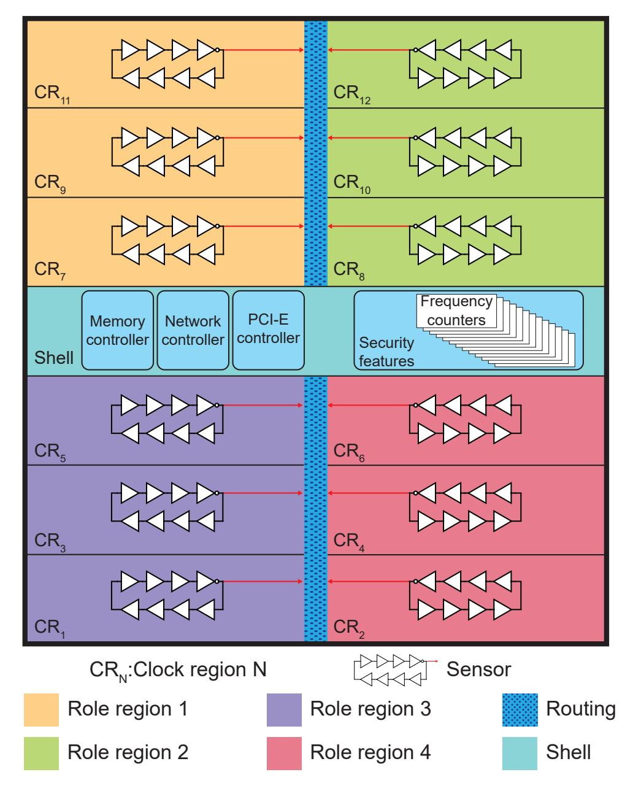
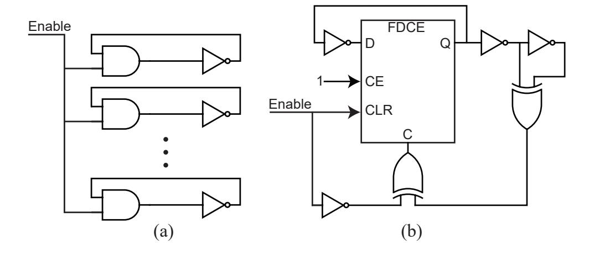
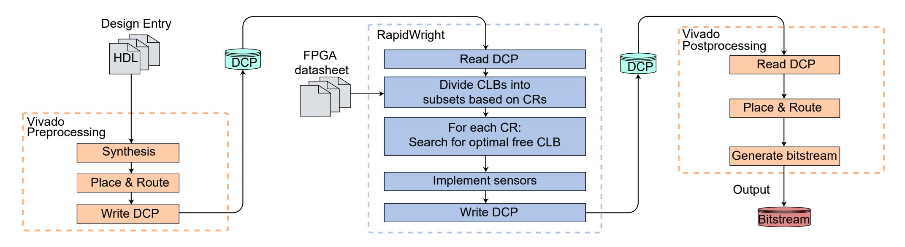
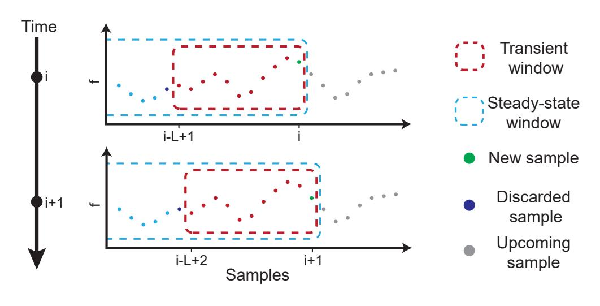
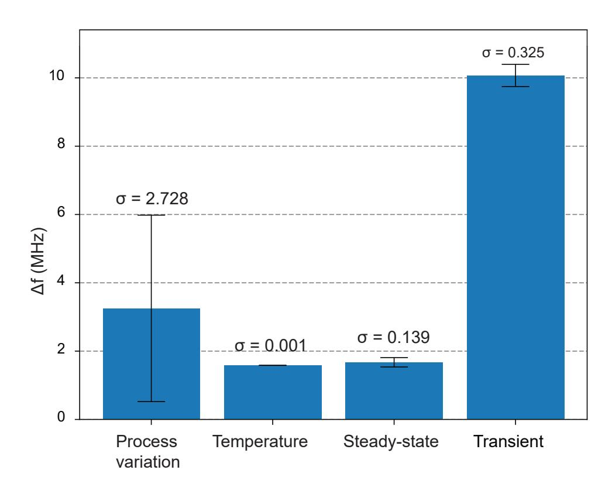
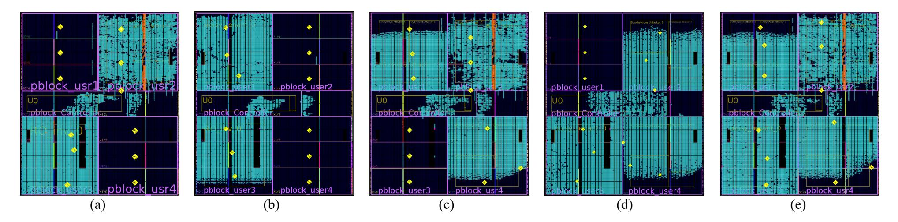
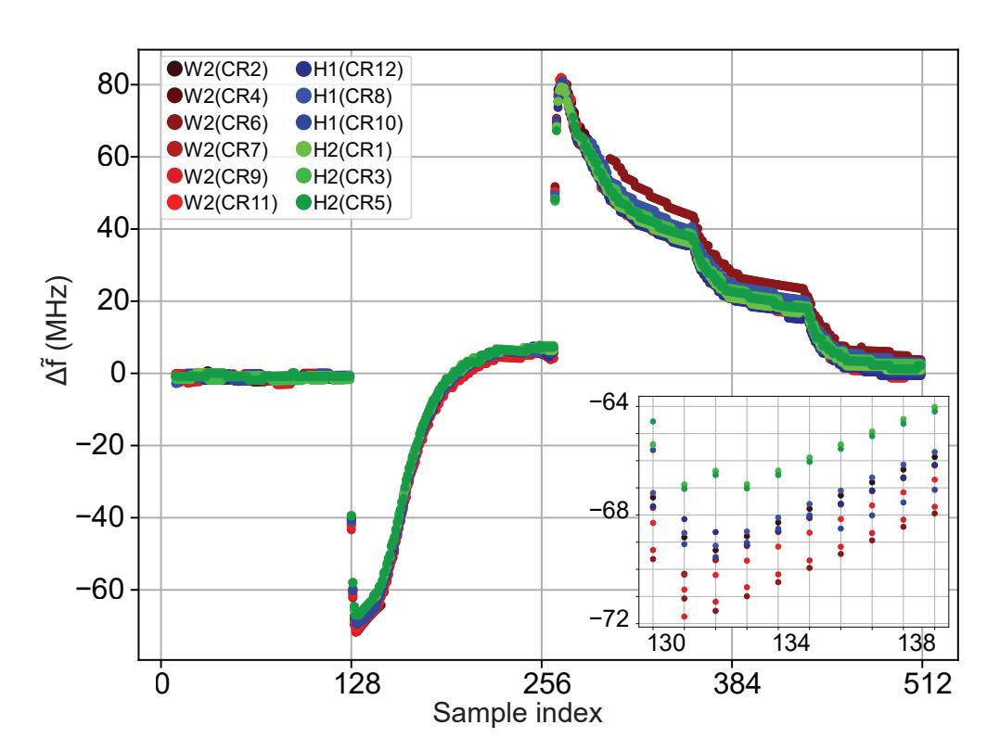
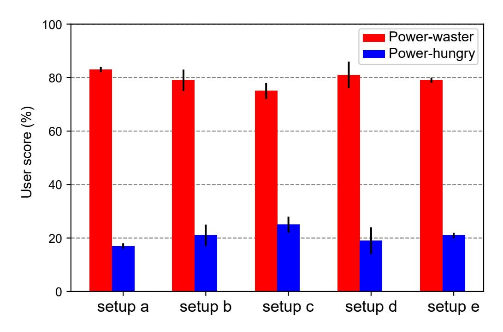

{0}------------------------------------------------

# Nonintrusive and Adaptive Monitoring for Locating Voltage Attacks in Virtualized FPGAs

Seyedeh Sharareh Mirzargar, Gaietan Renault, Andrea Guerrieri and Mirjana Stojilovi ¨ c´ School of Computer and Communication Sciences, EPFL, Lausanne, Switzerland Email: mirjana.stojilovic@epfl.ch

With every new generation, high-end FPGAs are becoming richer in features and resources, making the usage model of single-user per FPGA decreasingly cost-efficient. Although virtualized FPGAs enable multiple users to share the same FPGA, this multi-tenancy is not employed in practice because of potential security threats, such as voltage attacks. These attacks use power-wasting circuits to exercise excessive switching activity on the target FPGA to cause extreme voltage fluctuations, which produce timing faults in collocated circuits or, in extreme cases, reset target FPGA. In this work, we present the idea of automated embedding of the on-chip voltage sensors into the virtualized FPGAs and continuous monitoring of the core voltage for suspected fluctuations caused by a voltage attacker. Our sensors are nonintrusive and placement-adaptive because we implement them immediately after placing and routing the user design with resources that are left unused. We devise a novel measurement technique to continuously analyze the sensor outputs and locate the power-wasting circuits. Additionally, we are the first to use a synchronous power-wasting attacker, capable of producing timing faults, on Xilinx 7-series FPGAs and to successfully locate it. Hence, our proposed monitoring system enables the virtualized FPGA to identify the voltage attackers, at minimal cost, and prevent them from repeating the attack.

## I. INTRODUCTION

Each new generation of high-end FPGAs is richer than the previous in terms of programmable resources, routing, embedded memories, and versatile hardened modules. The traditional usage model of the FPGA assumes a single user having the control over all the FPGA resources, but with the current trend of enlarging FPGAs, soon, this model will be replaced with multi-tenant virtualized FPGA to avoid hardware underutilization [1]. Virtualized FPGAs let multiple users run their circuits (also known as *roles*) on the same FPGA. In the virtualized setting, a part of the FPGA is reserved for the *shell*, which handles the resource management and sharing [2], [3].

The main obstacles in the way of deployment of virtualized FPGAs are new security threats [4]. Interactions between different roles, distrusted outsiders as well as malicious insiders, may violate data confidentiality, the correctness of execution, or even the availability of services in the colocated roles [5]– [7]. Voltage attacks are among the most effective and concrete security threats of virtualized FPGAs [8]–[14]. A voltage attacker uses power-wasting circuits to overaggressively exercise switching activity to drop the core supply voltage and cause timing failures in the colocated roles (timing fault injection) or, in the extreme case, reset the whole FPGA (denial-of-service attack).

Many industrial FPGAs benefit from embedded sensors and detect sudden increases in the temperature and voltage with high resolution (±4 ◦C max error for temperature and 1% max error for voltage, respectively [15]). However, these sensors have limited spatial resolution [16]. Each FPGA contains only a single embedded voltage sensor for monitoring the core voltage and a single embedded temperature sensor for monitoring the FPGA temperature. In the case of a voltage attack, these embedded sensors can detect the attack but cannot be used to locate the source of it and ban the malicious role.

A network of on-chip voltage sensors would provide sufficient spatial resolution to locate the source of voltage attack at the cost of reserving some of the programmable logic and routing resources inside the role for implementing these sensors [9]. In this work, we improve this approach by proposing nonintrusive and adaptive on-chip voltage sensors. Our approach does not reserve any resources and instead utilizes the programming logic and routing resources that are left unused inside each role. The feasibility requirement of our approach is exceptionally lightweight: a single free configurable logic block (CLB) inside each clock region (CR). We move all the logic required to read and understand the sensor outputs from the user space to the shell, which already contains all the management logic. We minimize the sensor intrusion and constraints on the user by introducing a new design step immediately after the placement and routing, to embed the sensors adaptively into the role. Our design flow is fully automated and entirely compatible with the design flow employed by cloud FPGA providers (e.g., Amazon AWS [39]).

The main contributions of our work are the following:

- Nonintrusive sensing: minimized use of the FPGA logic resources for the implementation of the network of sensors (12 eight-stage sensors versus 40 19-stage sensors in the state of the art [9]) with no constraints on the role.
- Adaptive sensing: placement-adaptive embedding of sensors into the design after it has been placed and routed.
- A novel measurement technique for spatially-distributed voltage sensors that can be used to reliably locate the voltage attackers.

In our experiments, we successfully embed the sensors into two variants of the power-wasting and the power-hungry cir-

{1}------------------------------------------------



Fig. 1. Virtualization scheme. From a total of 14 CRs, two are reserved for the shell, and the remaining 12 are divided between four role regions equally. For illustration, the sensors are placed in the center of each CR. In practice, the sensor placement is adapted to the roles.

cuits and, in all the test cases, reliably locate the power-wasting circuit. Hence, we provide the operators offering virtualized FPGAs with the ability to identify the voltage attackers at low cost and take preventive measures.

The remainder of this paper is organized as follows. Section II describes the background on virtualized FPGAs, onchip voltage sensing, power-wasting circuits, and the threat model. Related work is discussed in Section III. We give a detailed description of our proposed sensors and the design procedure in Section IV. We introduce our novel measurement technique in Section V. Section VI contains the experimental evaluation and Section VII concludes the paper.

#### II. BACKGROUND

#### A. Virtualized FPGAs

A computing resource is virtualized if it can host applications from multiple users, accept new applications without disruption, and share resources among them by an easy-to-use interface. Virtualizing the FPGAs is possible because, firstly, modern high-end FPGAs have enough resources for running several roles; secondly, partial reconfiguration makes it possible to program a set of CRs without disrupting the rest; finally, the shell provides an easy-to-use interface for external peripherals and manages the shared resources.

A shell abstracts away the details of external peripherals (such as network, memory, and PCIe), contains their controllers, arbitrates external IO bandwidth between different roles, and keeps track of the presence of the roles on the FPGA. Several recent works propose to extend the shell with security features such as memory and network access isolation and data encryption [3], [17], [18]. Various schemes for partitioning the FPGA between the role space and the shell exist [2], [3], [17], [18]. Yazdanshenas et al. [3] propose to reserve the central clock regions for the shell and split the remaining space equally among four roles; this is illustrated in Fig. 1 on an example FPGA with 14 CRs. We follow the same partitioning scheme.

## B. On-Chip Voltage Sensing

On-chip voltage sensors can be built on a modern FPGA using its programming logic and routing resources. Process, voltage, and temperature (PVT) variations affect the delay of the sensor elements and, consequently, the sensor output. There are two main on-chip sensor designs: time-to-digital converters (TDCs) and ring oscillators (ROs).

TDC consists of a chain of buffers whose input is connected to a reference clock. The outputs of all buffers are captured in a register, driven by a clock signal of the same frequency (but a different phase) as the reference clock. The register thus captures the propagation delay of the reference clock. To implement TDCs on FPGAs, one can use the carry chain primitives such as Xilinx *CARRY4* [19]–[21].

RO-based sensors consist of a ring oscillator that feeds a frequency counter [22]. The counter is read every sampling period and the RO frequency,  $f_{RO}$ , equals

$$f_{RO} = \frac{pulse\ count + truncation\ error}{sampling\ period},$$
 (1)

where the truncation error is associated with the partial clock pulse at the end of the sampling period. The RO frequency depends on the sensor design and the delay of the elements in the RO (buffers, latches, or flip-flops). Several previous works have experimentally and theoretically proved that there is an approximate linear relation between the FPGA supply voltage and the frequency of the RO-based sensors [7], [9], [23].

Even though the TDCs can capture voltage fluctuations with high resolution (in nanoseconds), they do not comply with the requirements of a nonintrusive adaptive voltage-monitoring setting for several reasons. The placement and routing of a TDC need frequent and careful online calibration [24]. For accuracy, TDCs require special resources, such as carry chains. In addition, they need several flip-flops and a priority encoder to convert the output to a binary value. Gnad et al. performed an experimental analysis of transient voltage fluctuations in a Xilinx Virtex-6 FPGA using TDCs and reported the resources utilization of these sensors as 214 flip-flops and 147 LUTs [25].

#### C. Voltage Attacker

As a result of their switching activity, FPGA circuits draw current from the power distribution network (PDN) and pro-

{2}------------------------------------------------



Fig. 2. Two power-wasting circuits: (a) asynchronous [26] and (b) synchronous [29].

duce fluctuations in the supply voltage. These fluctuations depend on resistive, capacitive, and inductive components of the PDN and can be classified as steady-state and transient voltage fluctuations, respectively, the latter being more critical [25]. Combinational delay in typical CMOS gates is inversely proportional to supply voltage; therefore, the transient supply voltage fluctuations can produce timing failures in the circuits that share the same PDN, or, in the extreme case, cause permanent damage [26]. Voltage attackers intentionally exercise sudden excessive switching activity to produce transient voltage drops. A variety of circuits capable of performing power-wasting activities exist: LUT-based shift registers, intentional short circuits, glitch-generators, asynchronous RO loops, and synchronous oscillators without combinational loops [10], [27]– [31]. Fig. 2 illustrates the latter two types. Some computing platforms with virtualized FPGAs require the roles not to have any combinational loops to prevent voltage attacks [32]. However, they are still vulnerable to more sophisticated powerwasting circuits [29], [30].

# *D. Virtualized FPGA Threat Model*

While the shell provides the functionality to share single FPGA between multiple roles, currently this potential is not exploited by operators because of security threats, such as voltage attacks. The threat model used in this work is very similar to what state-of-the-art virtualized FPGAs follow [3], [9], [17], [18], [33]: Multiple roles run on the same FPGA simultaneously. The roles share the same PDN, but their programming logic and routing resources may be isolated. Each role spans one or more clock regions. The role regions are assigned and managed by the shell; therefore, in case of an attack, one can identify the malicious role by locating its region. Users do not have physical access to the FPGA, and they use a remote interface for submitting their designs to the virtualized setting.

## III. RELATED WORK

Quentot et al. were the first to use ROs to measure on-chip ´ voltage and temperature in VLSI circuits [22]. Krishnamoorthy et al. and Conn Jr. patented the procedure and methods of measuring frequency changes in ROs and translating it to variations in voltage and temperature [34], [35]. Zick et al. used a network of RO-based sensors to measure delay, temperature, and voltage on single-user FPGAs [36]. Several studies utilize the RO-based sensors to measure the crosstalk effect [5], [30], [37]–[40]. Provelengios et al. characterized the magnitude of disturbance of an asynchronous powerwaster attacker and proposed to reserve resources for a grid of 40 19-stage RO-based sensors for locating the center of power-wasting circuits [9]. We extend this work and utilize the unused resources of the roles to embed 12 eight-stage RO-based sensors adaptively and without any constraints on the roles. Therefore, our approach minimizes the number of sensors and their resource utilization, and eliminates the constraints of preallocating resources. We also develop a novel measurement technique for spatially-distributed sensors and a simplified method for locating the attacker.

For mitigating the threat of power-wasting circuits, Matas et al. take a different approach; they develop a tool (FPGADEFENDER [41]) to automatically inspect the FPGA bitstreams for the presence of circuits that could be used in a malicious way [8], [31]. Unfortunately, such tools are not the ultimate solution as they can be tricked by normal circuits transforming into voltage attackers [42].

## IV. NONINTRUSIVE ADAPTIVE SENSORS

To implement spatially-distributed sensors, one needs spatially-distributed resources. In previous works, it was common to reserve resources for implementing sensors on different parts of the FPGA [9], [25], [36]. While possible, doing this enforces tight constraints to the user for design placement, and violates the desired isolation between the role space and the shell [44]. In this section, we present our sensor design and the methodology for inserting our sensors in a nonintrusive way while adapting their placement to the user designs.

# *A. Proposed On-Chip Sensors*

Design parameters that affect the RO-based sensor frequency include the number, functionality (inverting or not), and placement of its stages. Increasing the number of stages decreases the average RO frequency, but also reduces its standard deviation [45]. The placement of stages is important because the delays of the wires connecting the stages contribute to the RO frequency. To keep the wire delay minimal, it is desirable to fit all the stages into small programmable units (SLICE or CLB).

In this work, we opt for eight-stage ROs, which can fit inside a single CLB of 7-series Xilinx FPGAs, and we configure only one of the RO stages as inverting [45]. To keep the temperature impact minimal, we do not use any latches inside the RO [36]. And, we place the frequency counters inside the shell (outside of the user space). Table I gives the details of our RO-based sensor implementation and Fig. 1 illustrates the sensors embedded into a virtualized FPGA.

## *B. Nonintrusive Sensor Insertion*

For the best design performance, no unnecessary placement or routing constraints should be imposed by the shell. Therefore, the voltage sensors should ideally (i) be implemented

{3}------------------------------------------------



Fig. 3. Final and fully-automated design flow, entirely compatible with the design flow employed by cloud FPGA providers (e.g., Amazon AWS [43]). The first and the third step are standard. Between them, RapidWright is used to find free CLBs, select the optimal sensor location, and insert the sensors.

#### TABLE I SENSOR SPECIFICATION

| Hardware resources | 8 LUTs (Virtex-7)       |
|--------------------|-------------------------|
| Data size          | 9 bits                  |
| Inverting stages   | One                     |
| Stage type         | Buffers                 |
| Sampling period    | 1.28 µs                 |
| Resolution         | Less than 1 part in 100 |
| Average frequency  | 143.35 MHz              |
|                    |                         |

after the user design is successfully placed and routed and (ii) use only the free (unused) resources. To that purpose, we add an intermediate step to the standard FPGA design flow. Fig. 3 illustrates the final fully-automated design flow.

- *1) Vivado Preprocessing:* This first step is entirely standard. Here, the role is synthesized, placed and routed, and the design checkpoint (DCP) is saved.
- *2) RapidWright:* The second step is where we update the DCP by inserting the sensors into the already placed and routed user design. We are able to automate this step only thanks to the the availability of RapidWright, an opensource platform from Xilinx Research Labs with a gateway to backend tools in Vivado [46]. So far, post-implementation debug insertion has been the most popular use case for Rapid-Wright [47]. However, we show in this work that RapidWright can also be used to address FPGA security issues.

We use the JavaAPI interface of RapidWright to, firstly, read all the CLBs in the user design and cluster them by their corresponding CRs. Then, for each CR, we compute the boundaries of the minimum bounding box covering all the used CLBs. Inside those boundaries is where we search for the optimal CLB to insert the sensor (the algorithm describing the exact procedure is presented in Section IV-C). Finally, once the location for the sensor placement is chosen, we use RapidWright again to modify the DCP by adding the sensor resources and connections among them.

*3) Vivado Postprocessing:* This last step is, again, entirely standard. We feed the updated design checkpoint back to Vivado, to resume the standard design flow by routing the connections between the RO stages and connecting the RO outputs to the frequency counters inside the shell. Finally, the integrity checks are performed and the partial bitstream is generated.

# *C. Adaptive Placement*

In this work, without loss of generality, we limit the number of sensors to the number of CRs inside the role region, and insert only one sensor into each CR. To maximize the impact of voltage fluctuations in the role region on the sensor frequency, we search for a free CLB, into which to embed the sensor, starting from the center of the minimum bounding box enclosing all the used CLBs in the target CR.

To insert the sensors, we first import the DCP file of the user design into RapidWright, which we use to read all the CLBs in the role regions assigned to the user (Fig. 3). RapidWright labels CLBs with several tags, of which the coordinates and occupancy are of our interest. We use this information along with the boundaries of CRs (publicly available in the FPGA datasheets) to divide the CLBs into groups corresponding to their CRs.

Algorithm 1 explains the next step, in which we decide in which unused CLB to place the sensor. Firstly, we iterate over all the CRs, and for each CR, find the minimum bounding box enclosing all the used CLBs (function MinBoundBox). The center of this bounding box is the starting point for the search algorithm. The search returns the center CLB, if it is free; if not, the search space expands from a 1 × 1 CLB to a square of 3 × 3 CLBs (one CLB expansion to the right, left, top, and bottom) and we check if any of the CLBs in this expanded search space is free. For efficiency, each time we encounter one used CLB, we remove it from the search space. The search space expansion continues until a free CLB is found (if multiple candidates are available, we choose any of them), or until all the CR boundaries are reached. In the unlikely case that the user design does not contain a single free CLB, the operators offering virtualized FPGAs may want to increase the number of role regions assigned to the user or transfer the user to another FPGA with bigger role regions.

{4}------------------------------------------------

Algorithm 1: Function FindFreeCLB, which takes CLBs of the same clock region to find optimal free CLB

```
Input: Set C = \{c_i\}, i = 1, ..|N| of CLBs in the CR
Output: A free CLB as the candidate
Variables: x_{min}, y_{min}, x_{max}, y_{max}, x_{start}, and y_{start}
               as coordinates
Variables: Integer variable: iteration, C_s
Variables: Set U = \{u_i\}, i = 1, ..|U| of used CLBs
Variables: Integer variable MaxIterations, which
               controls the rounds of the search
foreach c_i \in C do
     if IsUsed(c_i) = TRUE then
      \bigcup U.add(c_i)
if U = Empty then
 \lfloor (x_{min}, y_{min}, x_{max}, y_{max}) \leftarrow \text{GetCenter}(CR)
else
 \  \  \  \  \, \big\lfloor\ (x_{min},y_{min},x_{max},y_{max})\leftarrow \texttt{MinBoundBox}\,(\texttt{U})
x_{start} \leftarrow \lfloor \frac{x_{max} - x_{min}}{2} \rfloory_{start} \leftarrow \lfloor \frac{y_{max} - y_{min}}{2} \rfloor
C_s \leftarrow 0
iteration \leftarrow 0
while C_s = 0 & iteration < MaxIterations do
     foreach c_i \in C do
          x_{CLB} \leftarrow \text{GetXCoordinate}(c_i)
         y_{CLB} \leftarrow \text{GetYCoordinate}(c_i)
         if x_{start} - iteration < x_{CLB} <
           x_{start} + iteration then
              if y_{start} - iteration < y_{CLB} <
                y_{start} + iteration then
                   if IsUsed(c_i) = False then
                        Candidate \leftarrow c_i
                        C_s \leftarrow 1
                        break
         Remove(c_i)
     iteration \leftarrow iteration + 1
```

#### V. DISTRIBUTED VOLTAGE SENSING

While distributed on-chip sensors can monitor the voltage fluctuations in different parts of the FPGA to locate power-wasting circuits, collecting and comparing the frequency output of these sensors is not trivial, and we need a proper measurement metric and technique to understand the sensor outputs and draw conclusions.

## A. Metric

As the supply line impedance varies from one region to another region on IC [34] and considering the variable placement of the proposed sensors, we aim at a metric that is resilient to sensor location. To devise it, let us start by looking at the relationship between the sensor frequency and the supply voltage [7], [9], [23], which can be modeled as

$$f(x, y, t) = k(x, y) \cdot V(x, y, t) + f_O(x, y).$$
 (2)

Here, V(x,y,t) is the supply voltage at time t and at the location (x,y) of the FPGA. Parameters that affect the location-dependent offset  $f_O(x,y)$  and slope k(x,y) are the RO design and the process and temperature variations [7]. To reduce the impact of RO design, we use an identical and very compact implementation for all the sensors (described in Section IV-A). To improve the resilience to temperature changes, we do not use any latches in the sensor design [19].

Let us now assume that we collect the frequency outputs of sensors  $s_i$  and  $s_j$ , located at coordinates  $(x_i, y_i)$  and  $(x_j, y_j)$ , respectively. Comparing their frequencies at time instant t, we obtain

$$\frac{f(x_i, y_i, t)}{f(x_j, y_j, t)} = \frac{k(x_i, y_i) \cdot V(x_i, y_i, t) + f_O(x_i, y_i)}{k(x_j, y_j) \cdot V(x_j, y_j, t) + f_O(x_j, y_j)}.$$
 (3)

If coefficients k and  $f_O$  were location independent, it would be possible to derive a relationship between supply voltages at two different locations by observing the frequency output of two sensors and by using the above relation. However, that is not the case.

The extent at which k(x,y) and  $f_O(x,y)$  vary with the sensor location can be found experimentally. To that effect, we perform an extensive set of experiments, which show that  $f_O(x,y)$  is far more location-dependent than k(x,y) (these experiments are discussed in detail in Section VI-A). Therefore, for a metric to be as resilient to variable sensor location as possible, it must not contain the highly-variable offset  $f_O(x,y)$ .

Let us now compute the deviation of sensor frequency from its average value:

$$\Delta \tilde{f}(x_{i}, y_{i}, t) = f(x_{i}, y_{i}, t) - f_{\text{avg}}(x_{i}, y_{i}, t) =$$

$$= k(x_{i}, y_{i}) \cdot (V(x_{i}, y_{i}, t) - V_{\text{avg}}(x_{i}, y_{i}, t)) =$$

$$= k(x_{i}, y_{i}) \cdot \Delta \tilde{V}(x_{i}, y_{i}, t).$$
(4)

Comparing  $\Delta \tilde{f}$  for two spatially-distant sensors gives:

$$\frac{\Delta \tilde{V}(x_i, y_i, t)}{\Delta \tilde{V}(x_j, y_j, t)} = \frac{\Delta \tilde{f}(x_i, y_i, t)}{\Delta \tilde{f}(x_j, y_j, t)} \cdot \frac{k(x_j, y_j)}{k(x_i, y_i)}.$$
 (5)

This expression does not depend on the highly-variable factor  $f_O$ . Additionally, it shows that the relationship between voltage variations at different locations can be inferred by measuring and comparing the change in sensor frequency caused by those variations, provided that the coefficients k depend minimally on the sensor location. We experimentally confirm that the latter holds (Section VI-A).

Therefore, we use  $\Delta \tilde{f}(x_i, y_i, t)$  as our metric for comparing the transient voltage fluctuations at different sensor locations. In the next section we describe how we compute it.

### B. Measurement Technique

In voltage attacks, the magnitude of voltage drop is significant, but the duration of this drop is as short as  $10 \mu s$  [9], [11]. To locate such an attack, we need (i) to read continuously the sensor outputs and (ii) to choose a sampling period that

{5}------------------------------------------------



Fig. 4. We use two types of measurement windows: a sliding window of length L to measure the impact of transient voltage on sensor frequency, f(x, y, t), and an extending window to find the average frequency,  $f_{\text{avg}}(x, y, t)$ .

allows the sensor outputs to be most affected by the transient voltage changes and not accumulate the voltage changes from different parts of the PDN.

To meet the requirements of transient voltage sensing, we devise a novel measurement technique which analyses the sensor outputs in two granularities: transient and steady-state windows. The choice of using these two types of windows is directly derived from the requirements of our metric  $\Delta \tilde{f}$ . Each window covers a set of samples, and its size is set based on the voltage change that should impact the window output. Fig. 4 illustrates these windows at two moments: i and i+1 for a sliding transient window of size L and an extending steady-state window. The transient window reports the impact of transient voltage fluctuations on the sensor frequency, f(x,y,t) in Eq. (4). With each new sample, we report the worst-case (the lowest) recorded f(x,y,t) within the transient window. The steady-state window is used to compute the average sensor frequency  $f_{\text{avg}}(x,y,t)$  in Eq. (4).

There are general guidelines for setting the window size. The transient window size is set to the number of samples that cover the effective transient voltage drop (about  $10~\mu s$ ). The size of the steady-state window is not fixed; as we receive more sensor outputs, we increase the number of samples in it to improve the estimation of the average sensor frequency. To ease the online computation, one can limit the size of this window to a reasonably large number of samples.

### VI. EXPERIMENTAL SETUP AND RESULTS

In all our experiments, we use the Vivado Design Suite ver. 2019.1, RapidWright ver. 2019.1, and Xilinx Virtex-7 FPGA VC707 Evaluation Kit. We do not perform the experiments on a cloud FPGA because we need to access the embedded temperature sensor to measure the impact of PVT variations on the proposed metric. We use virtual IOs and logic analyzer (ILA) to instrument the design, simulate the shell, trigger the sensors, and retrieve their outputs. The virtual IOs and the ILA are instantiated as IP cores inside the shell. We repeat all the experiments ten times. In all of them, the sensor sampling period is 1.28  $\mu$ s, and the transient window size L is ten samples. The clock frequency is set to 200 MHz.



Fig. 5. PVT variability results: The difference in the frequency of RO-based sensor from variation in the manufacturing process, temperature, and steady-state or transient voltage fluctuations.

#### A. PVT Variability

To quantify the impact of PVT variations on the sensor output under controlled conditions, we perform a set of experiments and report the mean and standard deviation of all measured sensor frequency changes in Fig. 5.

In the process variation experiment, we place 1320 sensors (approx. one in the center of every  $5 \times 5$  square of CLBs) in the role space of an idle FPGA, read their frequencies and report the absolute frequency difference between every pair of these spatially-distributed sensors.

We investigate two aspects of the temperature change. First, we place a single sensor in the center of each CR and let them run for 15 minutes and monitor the FPGA temperature (using the embedded on-chip temperature sensor) to see if their switching activity causes any heating. Our results show no consistent temperature increase and the average temperature change of 1.03°C. Then, we place a self-heating circuit consisting of 12,500 instances of three-stage ROs, similar to Tian et al. [48], and four of our sensors near the FPGA temperature sensor. We let the self-heater run for 15 minutes; this, on average, results in a temperature increase of 18°C. We read the sensor outputs before enabling the self-heater and also one millisecond after disabling it. Assuming a linear relationship between the FPGA temperature and RO frequencies [49], we can infer that a one-degree increase in the temperature can, on average, result in 0.06 MHz of frequency drop, which is less than 0.1% of the idle sensor frequency (Table I).

We investigate two types of voltage fluctuations: steady-state and transient. In both experiments, we use a synthetic workload, similar to Gnad et al. [25]: an array of flip-flops whose outputs are connected to their inputs through an inverter and toggle at the clock frequency of 200 MHz. We place this workload evenly in the CRs of the role regions to produce an equal amount of steady-state or transient voltage fluctuation

{6}------------------------------------------------

for the spatially-distributed sensors. For the steady-state voltage experiment, we configure 1.8% of all the flip-flops (as a realistic amount of toggling flip-flops of a circuit [25]); for the transient, we increase this number to 6% (a number sufficient for causing timing faults in a colocated 128-bit ripple-carry adder). In the steady-state voltage experiment, we let the workload run for 15 minutes and read the sensor outputs once while the workload is running and once one millisecond after the workload deactivation. We report the mean and standard deviation of the difference in sensor frequencies between these two points. In the transient voltage fluctuation experiment, we let the sensors run alone for 15 minutes, read their outputs, and then suddenly enable all the toggling flip-flops; the worst-case frequency drop caused by the transient voltage fluctuation is then reported.

Fig. 5 shows the impact of PVT variations on the sensor frequency. As expected, the impact of temperature on our compact LUT-based sensors is minimal. The impact of the steady-state voltage fluctuation follows closely. The transient voltage fluctuations have the highest impact on the sensor frequencies, although the variation of this impact across all the sensors is low. This low variability of the sensor response to the steady-state voltage fluctuations and the transient voltage fluctuations means that the coefficient k in Eq. (2) is relatively constant across different sensor locations. In contrast, looking at the results of the process variation experiment, we see high variation in the sensor frequencies. Given that the coefficient k is relatively constant, the source of the variability observed in the process variation experiment lies primarily in the offset  $f_O$  in Eq. (2). Hence the need for a metric that is not affected by the offset  $f_O$ .

## B. Monitoring Voltage Fluctuations to Locate Attacker

In this section, we present a proof-of-concept implementation of our monitoring system in a virtualized FPGA setting with four roles. Each role may contain two types of circuits: power-hungry (H) and power-wasting (W).

1) Circuits Under Monitoring: We embed the sensors into five setups, each containing at least one power-waster and one (or more) legitimate power-hungry circuits. We test two power-waster circuits. The first, W1, is 70,000 instances of an asynchronous single-stage ring oscillator (Fig. 2a). The second power-waster, W2, is 24,000 instances of a synchronous power-wasting circuit (Fig. 2b). With W2, we successfully perform the timing-fault attack on a 128-bit ripple-carry adder [11], [29]. To observe the timing faults, we colocate W2 with a 64-bit and a 128-bit ripple-carry adder. Both adders repeatedly perform two types of operations to propagate the carry through the worst-case-delay path: adding 1 to -1 and subtracting 1 from 0 in two's complement. Similar to the approach of Krautter et al. [11], we use the 64-bit adder as the golden model, showing the correct output of the operations, and we use the 128-bit adder as the circuit under attack. We compare their 64 most significant bits to detect a timing failure in the 128-bit adder.

#### TABLE II

FIVE EXPERIMENTAL SETUPS AND THEIR PLACEMENT ON THE FPGA. EACH ROLE MAY CONTAIN ONE OF THE POWER-WASTERS (W1, W2), ONE (OR SEVERAL) POWER-HUNGRY CIRCUITS (H1, H2), OR NOTHING (-). THE PLACEMENT OF ROLES ON THE FPGA IS ILLUSTRATED IN FIG. 1

| <u> </u> | <u> </u>     | D 1 1 1       | D 1 1 0       | D 1 1 2       | D 1 1 4       |
|----------|--------------|---------------|---------------|---------------|---------------|
| Setup    | Circuits     | Role region I | Role region 2 | Role region 3 | Role region 4 |
| a        | W1 & H1      | -             | H1            | W1            | -             |
| b        | W1 & H2      | H2            | -             | W1            | -             |
| c        | W2 & H1      | W2            | H1            | -             | W2            |
| d        | W2 & H2      | -             | W2            | H2            | W2            |
| e        | W2 & H1 & H2 | W2            | H1            | H2            | W2            |

As power-hungry circuits, we choose a real image processing application, H1, and a synthetic noise generator, H2. Beside DSP slices and logic, H1 makes an extensive use of DDR memory, MicroBlaze, AXI4 interfaces and AXI GPIOs. H2 is inspired by the implementation of a noise generator circuit by Giechaskiel et al. [37]: 1,000 instances of a 32-bit linear feedback shift registers (LFSRs), where each two are paired with a 32-bit counter. We enable two of these LFSRs with an initial seed and then add their outputs to generate the seed for the next two paired LFSR; this pattern is repeated.

2) Locating Attacker: To demonstrate the locating functionality, we embed the sensors into five experimental setups listed in Table II. Fig. 6 illustrates the floorplan of each setup; all setups follow the role placement in Fig. 1. As W2 requires more resources than what is available in a single role region, we assign two role regions to W2 (Table II). In all the experiments, we monitor the FPGA voltage for a period of 655.36 µs (512 sensor samples). To simulate a continuous measurement in which we do not know when an attack occurs, we let the system run for 163.84 µs before enabling the attacker. Fig. 7 reports the sensors outputs in terms of  $\Delta f$ over time for the setup with W2, H1, and H2 (setup e in Table II and Fig. 6e). This figure shows that before activating the attacker, all  $\Delta f$  are almost zero, suggesting no significant transient voltage fluctuations. During the attack, all  $\Delta f$  drop by more than 60 MHz. Therefore, the change in  $\Delta f$  can signal the sudden transient voltage drop and can be used as a trigger for the location analysis. The inset of Fig. 7 focuses on the transient sliding windows that cover the first 10 µs of the attack, which is when the highest transient voltage drop occurs (sample 130 to 139). The outputs of these windows show that, while all the sensors are affected by the transient voltage drop, the sensors that are inside the CRs with the power-wasting circuit have the highest  $\Delta f$  (CRs 6, 7, 9, and 11 in Fig. 7). After the attack, the FPGA experiences a voltage overshoot as it takes time for the PDN to decrease the supplied voltage in response to the deactivation of the attacker; hence,  $\Delta f$  changes the polarity. After this recovery period, all  $\Delta \tilde{f}$  converge back to zero.

To locate the user with power-wasting activity, we use a weighted score analysis of the  $\Delta \tilde{f}$  measurements. To locate the attacker in a setup with N occupied CRs and multiple roles, we first identify the N corresponding sensors. Then, we create a list  $S = [s_0, s_1, ..., s_i, ..., s_{N-1}], (s_i \neq s_j \ \forall (i \neq j) \in \{0, 1, ..., N-1\})$ , where  $s_0$  has the lowest  $\Delta \tilde{f}$  and  $s_{N-1}$  has

{7}------------------------------------------------



Fig. 6. The floor plan of five experimental setups that are used in the demonstration of locating the power-wasting circuit. Setups (a), (b), (c), (d), and (e) contain the circuits (*W1*, *H1*), (*W1*, *H2*), (*W2*, *H1*), (*W2*, *H2*), and (*W2*, *H1*, *H2*) respectively and their placement is shown in Table II. The CLBs marked as yellow diamonds are the sensors, one per clock region.



Fig. 7. The ∆f˜ of the sensors in the setup in Fig. 6e (*W2*, *H1*, *H2*). Transient voltage drop affects all the sensors. However, if we focus on the sliding windows that cover the initial 10 µs of the attack (inset of the figure), we observe stronger impact on the sensors inside the power-waster role.



Fig. 8. User score for five setups in Fig. 6, averaged across ten experimental runs. In all setups, the user with the higher score contains the power-wasting circuits. Moreover, in all the runs, the score of the attacker is considerably higher than the score of the power-hungry users (2.21–7.40× higher).

the highest<sup>1</sup> . Finally, we compute the user scores, Score<sup>U</sup> , based on the index of their sensors in the list S, giving a higher weight to sensors that come earlier in the list:

$$Score_{U} = \frac{\sum_{s_{i} \in S} \left( \left( N - i \right) \cdot I_{U} \right)}{\sum_{s_{i} \in S} \left( N - i \right)}.$$
 (6)

In Eq. (6), variable I<sup>U</sup> is set to one for user *U*, if sensor s<sup>i</sup> is inside their role region; otherwise, it is zero. Fig. 8 shows the user score averaged across ten runs for all the setups in Fig. 6. In all the runs, the score of the power-wasting user is considerably higher than the score of the power-hungry user (2.21–7.40× higher), which shows, as expected, that the majority of the sensors with low ∆ ˜f are inside the attacker.

## VII. CONCLUSION

With the capacity of the high-end FPGAs increasing, the current single-user per FPGA usage model will soon be replaced with multi-tenant virtualized FPGAs vulnerable to voltage attacks. To resolve this vulnerability, we intercept the standard design flow after the role is placed and routed to insert a nonintrusive adaptive network of spatially-distributed on-chip voltage sensors into the role. We propose a metric that is minimally affected by process variations and a novel measurement technique for sensing transient voltage drops. We are the first to use a synchronous power-wasting circuit, capable of performing timing faults, on 7-series Xilinx FP-GAs, and successfully locate it. Our technique can be easily customized to other FPGA families and virtualized FPGA partitioning schemes. Our monitoring system allows the multitenant virtualized FPGAs to use spatially-distributed on-chip voltage sensors with no overhead in terms of user space to locate power-wasting circuits and take preventive measures. Future work will integrate our monitoring system into an opensource shell and add elastic sensing and real time decision making.

# REFERENCES

[1] M. Asiatici, N. George, K. Vipin, S. A. Fahmy, and P. Ienne, "Virtualized Execution Runtime for FPGA Accelerators in the Cloud," *IEEE Access*, pp. 1900–1910, Feb. 2017.

<sup>1</sup>The lower the ∆f˜, the higher the transient voltage drop.

{8}------------------------------------------------

- [2] A. Putnam, A. M. Caulfield, E. S. Chung, D. Chiou, K. Constantinides, J. Demme, H. Esmaeilzadeh, J. Fowers, G. P. Gopal, J. Gray, M. Haselman, S. Hauck, S. Heil, A. Hormati, J.-Y. Kim, S. Lanka, J. Larus, E. Peterson, S. Pope, A. Smith, J. Thong, P. Y. Xiao, and D. Burger, "A reconfigurable fabric for accelerating large-scale datacenter services," in *2016 International Conference on Field-Programmable Technology (FPT)*, Minneapolis, MN, USA, Jun. 2014, pp. 13–24.
- [3] S. Yazdanshenas and V. Betz, "The Costs of Confidentiality in Virtualized FPGAs," *IEEE Transactions on Very Large Scale Integration (VLSI) Systems*, pp. 2272–83, Oct. 2019.
- [4] S. S. Mirzargar and M. Stojilovic, "Physical side-channel attacks and ´ covert communication on FPGAs: A survey," in *Proceedings of the 29th International Conference on Field Programmable Logic and Applications*, Barcelona, Spain, Sep. 2019, pp. 202–10.
- [5] M. Gag, T. Wegner, A. Waschki, and D. Timmermann, "Temperature and on-chip crosstalk measurement using ring oscillators in FPGA," in *Proceedings of the 15th IEEE International Symposium on Design and Diagnostics of Electronic Circuits & Systems*, Tallinn, Estonia, Apr. 2012, pp. 1–4.
- [6] P. C. Kocher, "Timing attacks on implementations of Diffie-Hellman, RSA, DSS, and other systems," in *Advances in Cryptology—CRYPTO '96*, ser. Lecture Notes in Computer Science, N. I. Koblitz, Ed. Berlin: Springer, Sep. 1996, vol. 1109, pp. 104–13.
- [7] M. Zhao and G. E. Suh, "FPGA-Based Remote Power Side-Channel Attacks," in *2018 IEEE Symposium on Security and Privacy (SP)*, San Francisco, CA, May 2018, pp. 229–244.
- [8] K. Matas, T. La, N. Grunchevski, K. Pham, and D. Koch, "Invited Tutorial: FPGA Hardware Security for Datacenters and Beyond," in *The 2020 ACM/SIGDA International Symposium on Field-Programmable Gate Arrays*, Seaside CA USA, Feb. 2020, pp. 11–20.
- [9] G. Provelengios, D. Holcomb, and R. Tessier, "Characterizing Power Distribution Attacks in Multi-User FPGA Environments," in *Proceedings of the 29th International Conference on Field Programmable Logic and Applications*, Barcelona, Spain, Sep. 2019, pp. 194–201.
- [10] D. Mahmoud and M. Stojilovic, "Timing Violation Induced Faults in ´ Multi-Tenant FPGAs," in *2019 Design, Automation & Test in Europe Conference & Exhibition (DATE)*, Florence, Italy, Mar. 2019, pp. 1745– 50.
- [11] J. Krautter, D. R. E. Gnad, and M. B. Tahoori, "FPGAhammer: Remote voltage fault attacks on shared FPGAs, suitable for DFA on AES," *IACR Transactions on Cryptographic Hardware and Embedded Systems*, pp. 44–68, Aug. 2018.
- [12] C. Jin, V. Gohil, R. Karri, and J. Rajendran, "Security of cloud fpgas: A survey," *arXiv preprint arXiv:2005.04867*, 2020.
- [13] O. Glamocanin, L. Coulon, F. Regazzoni, and M. Stojilovi ˇ c, "Are cloud ´ FPGAs really vulnerable to power analysis attacks?" in *Proceedings of the Design, Automation and Test in Europe Conference and Exhibition*, Grenoble, France, Mar. 2020, pp. 1–4.
- [14] D. G. Mahmoud, W. Hu, and M. Stojilovic, "X-Attack: Remote activa- ´ tion of satisfiability don't-care hardware Trojans on shared FPGAs," in *Proceedings of the 30th International Conference on Field Programmable Logic and Applications*, Gothenburg, Sweden, Aug. 2020, pp. 185–92.
- [15] Xilinx, *7 Series FPGAs Data Sheet: Overview*, Xilinx, San Jose, CA, USA, 2018.
- [16] E. Peterson, *Developing Tamper Resistant Designs with Xilinx Virtex-6 and 7 Series FPGAs*, Xilinx, San Jose, CA, USA, 2017.
- [17] O. Knodel, P. Lehmann, and R. G. Spallek, "RC3E: Reconfigurable Accelerators in Data Centres and Their Provision by Adapted Service Models," in *2016 IEEE 9th International Conference on Cloud Computing (CLOUD)*, San Francisco, CA, USA, Jun. 2016, pp. 19–26.
- [18] S. Byma, J. G. Steffan, H. Bannazadeh, A. L. Garcia, and P. Chow, "FPGAs in the Cloud: Booting Virtualized Hardware Accelerators with OpenStack," in *2014 IEEE 22th Annual International Symposium on Field-Programmable Custom Computing Machines (FCCM)*, Boston, MA, USA, May 2014, pp. 109–16.
- [19] K. M. Zick, M. Srivastav, W. Zhang, and M. French, "Sensing nanosecond-scale voltage attacks and natural transients in FPGAs," in *Proceedings of the ACM/SIGDA international symposium on Field programmable gate arrays - FPGA '13*, Monterey, California, USA, Feb. 2013, p. 101.
- [20] D. R.E.Gnad, F. Oboril, S. Kiamehr, and M. B. Tahoori, "Analysis of transient voltage fluctuations in FPGAs," in *2016 International*

- *Conference on Field-Programmable Technology (FPT)*, Xi'an, China, Dec. 2016, pp. 12–19.
- [21] Xilinx, *7 Series FPGAs Configurable Logic Block*, Xilinx, San Jose, CA, USA, 2016.
- [22] G. M. Quenot, N. Paris, and B. Zavidovique, "A temperature and voltage ´ measurement cell for VLSI circuits," in *Proceedings of Europe ASIC*, Paris, France, May 1991, pp. 1–5.
- [23] R. Chaudhry, R. Panda, T. Edwards, and D. Blaauw, "Design and analysis of power distribution networks with accurate RLC models," in *VLSI Design 2000. Wireless and Digital Imaging in the Millennium. Proceedings of 13th International Conference on VLSI Design*, Calcutta, India, 2000, pp. 151–155.
- [24] J. Wu, "Several Key Issues on Implementing Delay Line Based TDCs Using FPGAs," *IEEE Transactions on Nuclear Science*, pp. 1543–48, Jun. 2010.
- [25] D. R. E. Gnad, F. Oboril, S. Kiamehr, and M. B. Tahoori, "An Experimental Evaluation and Analysis of Transient Voltage Fluctuations in FPGAs," *IEEE Transactions on Very Large Scale Integration (VLSI) Systems*, pp. 1817–30, Oct. 2018.
- [26] D. R. E. Gnad, F. Oboril, and M. B. Tahoori, "Voltage drop-based fault attacks on FPGAs using valid bitstreams," in *Proceedings of the 27th International Conference on Field Programmable Logic and Applications*, Ghent, Belgium, Sep. 2017, pp. 1–7.
- [27] D. Ziener, F. Baueregger, and J. Teich, "Using the power side channel of FPGAs for communication," in *2010 IEEE 18th Annual International Symposium on Field-Programmable Custom Computing Machines (FCCM)*, Charlotte, NC, USA, Jun. 2010, pp. 237–44.
- [28] K. M. Zick and J. P. Hayes, "On-line sensing for healthier FPGA systems," in *Proceedings of the 18th annual ACM/SIGDA international symposium on Field programmable gate arrays - FPGA '10*, Monterey, California, USA, Feb. 2010, p. 239.
- [29] T. Sugawara, K. Sakiyama, S. Nashimoto, D. Suzuki, and T. Nagatsuka, "Oscillator without a combinatorial loop and its threat to FPGA in data centre," *Electronics Letters*, pp. 640–42, May 2019.
- [30] I. Giechaskiel, K. Rasmussen, and J. Szefer, "Measuring long wire leakage with ring oscillators in cloud FPGAs," in *Proceedings of the 29th International Conference on Field Programmable Logic and Applications*, Barcelona, Spain, Sep. 2019, pp. 1–8.
- [31] K. Matas, T. M. La, K. P. Dang, and D. Koch, "Power-hammering through Glitch Amplification – Attacks and Mitigation," in *2020 IEEE 28th Annual International Symposium on Field-Programmable Custom Computing Machines (FCCM)*. Fayetteville, AR, USA: IEEE, May 2020, pp. 65–69.
- [32] A. W. S. (AWS), "Combinational loops disabled," Amazon Web Services, Seatle, WA, USA, 2017. [Online]. Available: forums.aws.amazon.com/message.jspa?messageID=806151
- [33] F. Schellenberg, D. R. Gnad, A. Moradi, and M. B. Tahoori, "An inside job: Remote power analysis attacks on FPGAs," in *2018 Design, Automation & Test in Europe Conference & Exhibition (DATE)*, Dresden, Mar. 2018, pp. 1111–16.
- [34] R. O. Conn Jr, "Method and apparatus for measuring localized temperatures and voltages on integrated circuits," Aug. 18 1998, US Patent 5,795,068.
- [35] A. Krishnamoorthy and A. M. Detofsky, "Mapping variations in local temperature and local power supply voltage that are present during operation of an integrated circuit," US Patent US 7,071,723, Jul. 2006.
- [36] K. M. Zick and J. P. Hayes, "Low-cost sensing with ring oscillator arrays for healthier reconfigurable systems," *ACM Transactions on Reconfigurable Technology and Systems*, pp. 1–26, Mar. 2012.
- [37] I. Giechaskiel, K. B. Rasmussen, and K. Eguro, "Leaky wires: Information leakage and covert communication between FPGA long wires," in *Proceedings of 13th ACM ASIA Conference on Information, Computer and Communications Security*, Songdo, Incheon, Republic of Korea, Jun. 2018, pp. 15–27.
- [38] G. Provelengios, C. Ramesh, S. B. Patil, K. Eguro, R. Tessier, and D. Holcomb, "Characterization of Long Wire Data Leakage in Deep Submicron FPGAs," in *Proceedings of the 2019 ACM/SIGDA International Symposium on Field-Programmable Gate Arrays*. Seaside CA USA: ACM, Feb. 2019, pp. 292–297.
- [39] I. Giechaskiel, K. Eguro, and K. B. Rasmussen, "Leakier Wires: Exploiting FPGA Long Wires for Covert- and Side-channel Attacks," *ACM Transactions on Reconfigurable Technology and Systems*, pp. 1–29, Sep. 2019.

{9}------------------------------------------------

- [40] Z. Seifoori, S. S. Mirzargar, and M. Stojilovic, "Closing leaks: Rout- ´ ing against crosstalk side-channel attacks," in *Proceedings of the ACM/SIGDA International Symposium on Field Programmable Gate Arrays*, Seaside, CA, USA, Feb. 2020, pp. 197–203.
- [41] T. La, K. Matas, N. Grunchevski, K. Pham, and D. Koch, ¨ "FPGADEFENDER: Malicious self-oscillator scanning for Xilinx Ultra-Scale+ FPGAs," *ACM Transactions on Reconfigurable Technology and Systems*, May 2020.
- [42] G. Provelengios, D. Holcomb, and R. Tessier, "Power wasting circuits for cloud FPGA attacks," in *Proceedings of the 30th International Conference on Field Programmable Logic and Applications*, Gothenburg, Sweden, Aug. 2020, pp. 231–235.
- [43] *Amazon EC2 F1*, Amazon AWS, 2019. [Online]. Available: https://aws.amazon.com/ec2/instance-types/f1/
- [44] S. Trimberger and S. McNeil, "Security of FPGAs in data centers," in *2017 IEEE 2nd International Verification and Security Workshop (IVSW)*, Thessaloniki, Greece, Jul. 2017, pp. 117–122.
- [45] M. Barbareschi, G. D. Natale, and L. Torres, *Implementation and Analysis of Ring Oscillator Circuits on Xilinx FPGAs*. Cham: Springer, 2017, pp. 237–51.
- [46] C. Lavin and A. Kaviani, "RapidWright: Enabling custom crafted implementations for FPGAs," in *2018 IEEE 26th Annual International Symposium on Field-Programmable Custom Computing Machines (FCCM)*, Boulder, CO, USA, Apr. 2018, pp. 133–140.
- [47] B. L. Hutchings and J. Keeley, "Rapid Post-Map Insertion of Embedded Logic Analyzers for Xilinx FPGAs," in *2014 IEEE 22th Annual International Symposium on Field-Programmable Custom Computing Machines (FCCM)*, Boston, MA, USA, May 2014, pp. 72–79.
- [48] S. Tian and J. Szefer, "Temporal Thermal Covert Channels in Cloud FPGAs," in *Proceedings of the 2019 ACM/SIGDA International Symposium on Field-Programmable Gate Arrays*, Seaside CA USA, Feb. 2019, pp. 298–303.
- [49] R. O. C. Jr., "Method and apparatus for measuring localized temperatures on integrated circuits," US Patent 6,067,508, May 2000.