{0}------------------------------------------------

# CloudMoles: Surveillance of Power-Wasting Activities by Infiltrating Undercover Sensors

Seyedeh Sharareh Mirzargar, Andrea Guerrieri and Mirjana Stojilovic´ School of Computer and Communication Sciences, EPFL, Lausanne, Switzerland Email: mirjana.stojilovic@epfl.ch

*Abstract*—An important security risk in cloud Field-Programmable Gate Arrays (FPGAs) is power wasting, occurring when a design exercises excessive switching activity with the intention to cause voltage-drop related faults in the host FPGA or, in the extreme case, FPGA reset and denial-of-service.

In this paper, we introduce the idea of infiltrating undercover sensors for monitoring the fluctuations of FPGA core voltage. Our approach ensures that the shell has full control over sensor placement, done so that FPGA users do not have to sacrifice an inch of their design space nor to be aware that the voltage-fluctuations caused by their design are being monitored. Additionally, we describe how to design voltage-drop sensors that have higher coverage than the state-of-the-art alternatives and experimentally demonstrate that our sensors are indeed able to accurately monitor voltage fluctuations across the entire FPGA. Finally, we propose a novel metric which, after applied on sensor measurements, reveals the location of the source of the highest activity on the FPGA.

# I. INTRODUCTION

Latest generations of Field Programmable Gate Arrays (FPGAs), extremely rich in programmable logic, routing, embedded memories and versatile hardened modules, allow digital designers almost limitless flexibility in designing programmable hardware accelerators. And, they are made available to almost anyone thanks to Cloud computing; for instance, one can rent Xilinx Virtex UltraScale+ VU9P Xilinx chips Amazon AWS cloud and design and employ custom FPGA hardware accelerators remotely.

In cloud FPGAs, each FPGA is normally divided into two partitions: one that is commonly referred to as shell and one for custom logic. The shell implements external FPGA peripherals, such as PCIe, DRAM, DMA, and interrupts. In Catapult, FPGA-accelerated datacenters of Microsoft, shell even implements and control networking and communication. Custom logic partition is left available to hardware designed by remote FPGA users. Shell and the custom logic interact using well defined communication interfaces, which could be extended to allow for two or more unrelated FPGA users (tenants). However, prior to enabling multitenancy, security risks must be identified and addressed.

One of the known security risks is power wasting, caused by excessive circuit switching activity. It has been demonstrated that power-wasting attack can put FPGA to reset [1], which would cause denial-of-service in Cloud environments. To reduce the likelihood of power-wasting attacks, AWS prevents combinational loops in custom logic [2]. Yet, this does not remove all the risks, as excessive switching activity may be created even without combinational loops [3]. A powerwasting attack does not have to always lead to denial-ofservice; it can create timing errors in logic that shares the same FPGA die, be it the shell itself or a different tenant. Timing faults result in unpredictable results of FPGA computations, with an unlimited range of consequences, from breaking the secret key [4], [5], to sending erroneous information and making erroneous decisions and actions. Therefore, cloud providers need efficient mechanisms for protecting themselves and their users from power-wasting attacks.

Embedded system monitors on FPGAs provide information on power supply voltage, but not as frequently and not with a resolution that would allow observing fast-changing variations in voltage across the FPGA. To overcome these limitations, researchers have proposed designing voltage-fluctuation sensors using FPGA logic and employing a network of such sensors across the entire FPGA [6], [7]. This is acceptable and feasible if one is the sole user of an FPGA. However, in cloud environments, imposing on the users to waste some of the logic to instantiate these sensors and, moreover, trusting them not to tamper with the sensors, does not seem a viable solution in the long term.

In this paper, we introduce a method for embedding sensors undercover: our solution ensures that the shell has full control over where and how the sensors are placed, without tenants sacrificing any of their design space and without them even being aware that their design contain sensors. Moreover, we relax the extremely tight sensor design constraints and experimentally demonstrate that our sensors are able to reliably monitor voltage fluctuations across FPGA.

This paper's main contributions can be summarized as follows:

- Undercover sensing: secretly embedding sensors into tenant design after it has been placed and routed.
- Low cost sensing: minimized use of FPGA logic resources for sensor implementation.
- Parametric and flexible design of sensor topology.
- A novel metric that can, using the sensor data, reliably indicate the location of the center of power-wasting activity.

We evaluate how feasible it is to insert undercover sensors on the real-size industrial circuits from VTR benchmark suite. We analyze the relation between sensor topology and the measurement resolution and accuracy, and compare it to the existing design alternatives. Finally, we evaluate both voltage-

{1}------------------------------------------------

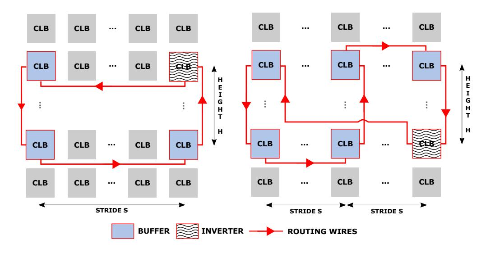

Fig. 1. Sensor topology definition.

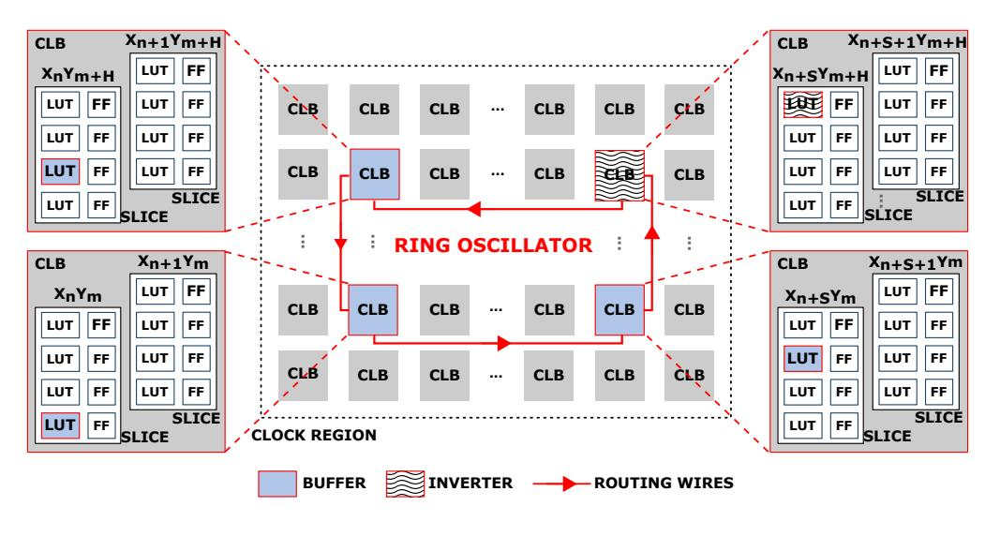

Fig. 2. Sensor topology definition.

measurement accuracy and the accuracy in locating the center of the attack in realistic power-wasting scenario.

Our proposed sensors are able to successfully detect all the clock regions of a large-scale attacker and detect the placement of an ordinary tenant with acceptable power consumption patter and make a difference between these two. Additionally, in a challenging and realistic set-up where a large-scale attacker and an ordinary tenant are collocated on the same FPGA, our sensors correctly select 5 clock region (out of 6 clock regions with the attacker in them) and point to the center of the power wasting activities. In all experiments, we compare the results of our proposed sensors with those of the state-of-the-art sensors. The results show that our sensors are not only comparable, but also outperform in some cases.

#### II. DISTRIBUTED VOLTAGE SENSING

Conventional sensors for characterizing voltage noise or thermal hotspots on FPGAs are based on a ring oscillator that feeds a frequency counter. The oscillator is enabled during a fixed period of time and the number of pulses counted. The frequency of oscillation is then computed and related to the physical quantity being monitored: voltage or temperature.

Although these sensors have been very successfully used to characterize the FPGA behavior [7], [6], The utility of these sensors for online monitoring of spatial variations of voltage or temperature is limited by the associated hardware overhead. For instance, to characterize on-chip voltage variations, Provelengios et al. [6], used a network of 46 sensors, each composed of a 19-stage ring oscillator and 20-bit counter. Embedding a

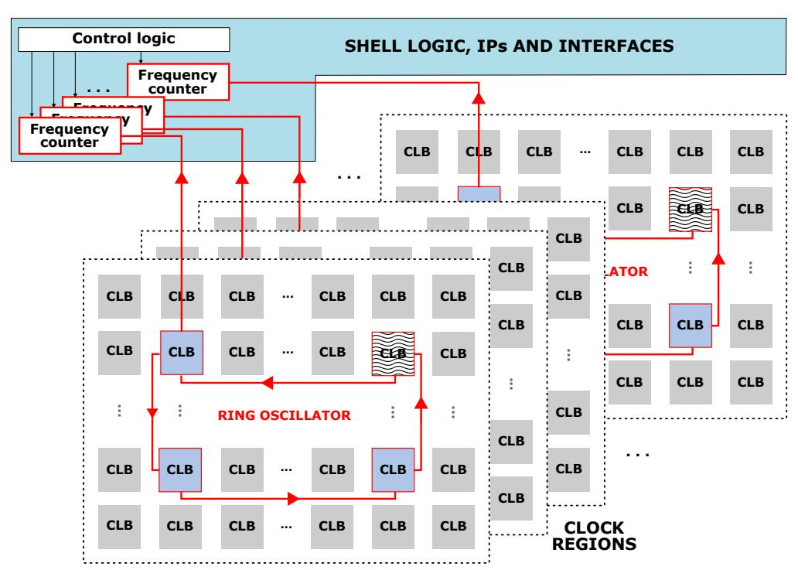

Fig. 3. Block architecture of the voltage-sensor network.

number of those sensors inside a tenant circuit incurs a non-negligible loss of resources for the tenant and, most certainly, is not easy to hide from the tenant.

Knowing that it is cloud shell that, ultimately, is controlling the sensors, reading the sensor data, processing it or sending it for offline processing, we decide to place only the ring oscillators, the core of the sensors, in different chip locations, and to move all frequency counters inside the shell. This simple strategy significantly reduces the use of logic resources by the sensors in the out-of-the-shell area.

In the following subsections, we describe our novel approach to ring-oscillator design and the way our network of spatially distributed sensors is designed.

#### A. Ring Oscillators as Voltage Sensors

In FPGAs, both LUT-dominated and routing-dominated paths are sensitive to voltage variations [8]. Yet, so far, researchers focused solely on LUT variations and tried to pack ring oscillator logic in as small area as possible. As a consequence, they would increase the total number of sensors on the chip, to increase the *coverage*. However, we take a different approach, in which we take advantage of the routing-path sensitivity to voltage variations to create ring oscillators that, instead of measuring very local variations, cover a much larger surface. Therefore, we build a our ring oscillators using distant LUTs and long routing paths that connect them.

By definition, a ring oscillator is a sequence of an odd number of inverters closed in a loop. However, this definition can be quite relaxed. For instance, not all elements in the sequence need to be inverters; as long as there is an odd number of inversions on the signal path, that circuit will oscillate. Minimizing the number of inversions in the oscillator loop is advantageous as it reduces sensor power consumption. However, lowering the number of inversions, lowers the measurement resolution. Aware of that risk, we configure only one of the LUTs in the ring oscillator loop as inverter and all the remaining ones as buffers.

{2}------------------------------------------------

To define ring oscillator architecture in FPGA, it suffices to specify which LUTs are in use (their location), which function each LUT performs (inverting or noninverting), and in which order they should be connected to form a loop. Figure 1 illustres two sample ROs out of very many possible topologies. The RO on the left contains only four LUTs, whereas the RO on the right contains six LUTs. In both configurations in the Figure, only one LUT inverts the signal polarity. Red lines symbolize routing wires and the arrows indicate the direction in which signals propagate. The location of every LUT can be almost arbitrary, as well as the order in which they are connected. Consequently, the number of ways one LUT-based RO can be built is very high.

In this paper, for simplicity, we choose to define the topology of ring oscillators using the following three parameters:

- N, the number of unique x-coordinates among all the LUTs that take part in the ring oscillator loop. In Figure 1, N = 2 for the loop on the left side, whereas N = 3, for the loop on the right side.
- Stride S, the distance between every two neighboring sensor columns.
- H, the height of sensor column, corresponding to the the distance between the two RO LUTs in the same column. All columns have the same height.

Additionally, we choose to connect the LUTs in the following order: starting from the top LUT in the column with the lowest x-coordinate and continuing downwards, right, upwards, right, downwards, right, etc, until the last LUT. The last LUT in the sequence is configured to perform signal inversion. To close the loop, signal exiting the last LUT is routed back to the input of the first LUT.

# *B. Spatially-Distributed Sensing*

Reconfigurable partitions in FPGAs often have constraints linked to the use of clock signals and clock regions. For example, in Xilinx FPGAs, a clock region cannot be shared by two reconfigurable partition blocks if one of them (or both) have a global clock source [9]. Moreover, for best quality of results, it is advised to align the placement blocks with clock region boundaries. This suggests that, in a multitenant scenario, cloud providers may find it pragmatic to assign to FPGA users reconfigurable partitions composed of an integer multiple of clock regions, in which case it would be particularly beneficial to have at least one sensor per clock region. Consequently, and unlike in other related works where an arbitrary number of sensors is placed on the FPGA [6], [10], we choose to instantiate only one sensor per FPGA clock region.

Sensor accuracy depends on how much of the signal it picks up is generated within its clock region and how much is generated in the remaining parts of the FPGA [7]. To increase sensor accuracy and have it pick up the disturbances caused by the activity in the left, right, upper, and bottom half of the clock region, we align the center of the ring oscillator loop with the center of the clock region. Figure 2 illustrates the placement of a ring oscillator with two columns inside one clock region. Figure 3 shows the block architecture of the entire sensor network, composed of one ring oscillator per clock region, one frequency counter per ring oscillator, and logic to enable, read, and control the data acquisition. The latter is to be placed inside the FPGA shell, together with the IPs and interfaces.

# III. INFILTRATING UNDERCOVER SENSORS

Embedding our sensors undercover means that the users should not be aware of some of the logic and wiring in their design space being occupied and used by the shell. Hence, the user design should be placed and routed, and only then, before partial-bitstream is generated, should our sensors be implanted (placed and routed). This, somewhat unusual procedure, requires the use of tools that allow modifications to the already placed and routed designs, such as, for instance, RapidWright tool. In this section, we explain the steps towards infiltrating sensors undercover: specifying sensor location and shape, design flow, and the algorithm for finding free LUTs to be allocated to the sensors.

## *A. Describing Sensor Topology and Location*

As a first step towards infiltrating sensors, one needs to describe their topology and location, for example by listing all LUTs to be used, the desired location of every LUT (in x and y coordinates), and the LUT functionality (inverting or noninverting). The following two lines give an example of how we describe one ring oscillator having N = 2, S = 20, and H = 10, spanning from x = 150 to x = 175, and from y = 320 to y = 330:

```
"[155,320 'Unisim.AND2']",
"[155,330,'Unisim.AND2']",
"[175,320,'Unisim.AND2']",
"[175,330,'Unisim.NAND2']".
```

Implicitly, we assume that the order in which intra-LUT signals should be routed corresponds to the order of the LUTs in the sensor description. Being extremely flexible, this topology and location description format allows specifying almost arbitrary sensor shapes.

#### *B. Design Flow*

Figure 4 illustrates the tools and the steps for embeding sensors undercover. The procedure begins and ends with standard FPGA design flow performed by Xilinx Vivado Design Suite. However, in our modified design flow, we intercept the conventional procedure to use RapidWright [11], an opensource gateway to backend tools of Vivado, and manipulate the FPGA design by injecting the sensors.

*1) Vivado Pre-Processing:* The first phase of the design flow is entirely standard. No special directive or setting is required to ensure compatibility with the rest of the flow. User design is synthesized, placed and routed, and the design checkpoint (DCP) is saved.

{3}------------------------------------------------

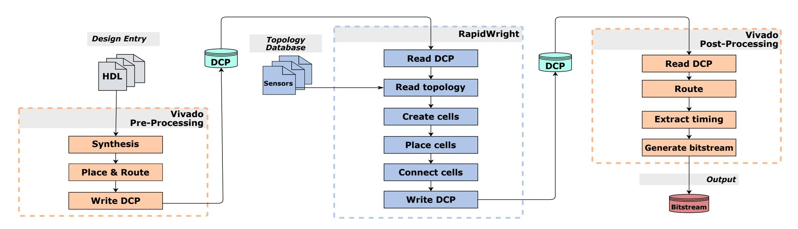

Fig. 4. Steps in the procedure for infiltrating undercover sensors.

*2) RapidWright:* In the second phase, we make use of RapidWright [11], a Xilinx open-source framework, which allows FPGA users to customize their implementations beyond the limits and constraints imposed by commercial EDA tools. Post-implementation debug insertion [12] is a popular target for these custom tools.

As a first step, we import the design checkpoint, with userdesign placed and routed. Then, from the database of sensor topologies, we retrieve the details of the desired sensor placement (coordinates of sensor LUTs and their functionality). At this point, Rapidwright could be asked to place the sensors. However, conflicts with the user design space may likely occur, which is why we implement an algorithm that, for every sensor LUT, searches for and returns an unused LUT at a location closest to the desired.

The search for the closest free LUT starts at the desired location; if not found, the search proceeds by inquiring Rapid-Wright if any of the LUTs at Manhattan distance MD = 1 from the desired location are free. If not, the search distance is incremented. This iterative search stops either when the free LUT is found or when the user-defined maximum search radius is exceeded. In our experimental explorations, the maximum search radius is set to 2, corresponding to 10−20% of the sensor height. Once all sensor cells are successfully mapped to free LUTs, RapidWright is called to place the sensor cells and connects them.

This entire procedure is repeated, until all sensors are inserted. As the last step, new design checkpoint is created.

*3) Vivado Post-Processing:* In the third (and last) phase, we revert to the standard FPGA design flow. Vivado reads the design check point after it was modified by RapidWright, routes the connections to and from the sensors, and performs design integrity checks, before it generates the bitstream.

#### IV. EXPERIMENTAL SETUP AND RESULTS

In all our experiments, we use Vivado Design Suite ver. 2019.1, RapidWright ver. 2019.1, and Xilinx Virtex-7 FPGA VC707 Evaluation kit. The clock frequency is set to 200 MHz and we sample the output of the monitors every 2 9 clock cycles, or 2.56µs. We use our novel metric, to be explained in Section IV-A, to interpret and compare sensor readings. Depending on the experiment, we might report the absolute sensor output or normalized with respect to the maximum obtained across all sensors.

The duration of every measurement is set to 2 <sup>18</sup> clock periods (or 1.3 ms), during which time 512 samples per sensor are recorded. Each experiement is repeated 10 times. To offload the data from the board, we use Integrated Logic Analyzer (ILA).

In this section we use an attacker composed of 135000 instances of the one-inverter power wasting circuits [6]. According to our experiments for an attacker size of 135 k, the longest activation period is 10 µs and the board needs at least 40 µs to stabilize so that it does not go into a reset if the attacker is enabled again.

# *A. Comparing Sensor Readings*

In this section we explain how to compare data collected by different sensors. To this end, we devise a novel metric, which, as it will be demonstrated experimentally, can accurately and reliably capture and compare the voltage fluctuations recorded by the different sensors.

The output of a ring oscillator based sensor is the number of counts that a digital counter, clocked by the output of the ring oscillator, has made during a fixed period of time (Figure 3. We refer to this fixed time interval as the sensor sampling period. The sensor output varies over time and it is mostly affected by the changes in the voltage. Even though other environmental factors, such as temperature, affect the frequency of the oscillation (and, consequently, the number of the counts), according to previous works, voltage effects dominate [13].

To filter out noise and outliers—caused by non-linear response of the voltage distribution system to sudden disturbances—we compute *trimean* T and a *custom* standard deviation:

$$T = \frac{(Q_1 + 2Q_2 + Q_3)}{4} \tag{1}$$

and

$$S_T = \sqrt{\frac{\sum_{i=1}^{N} (x_i - T)^2}{N - 1}}.$$
 (2)

{4}------------------------------------------------

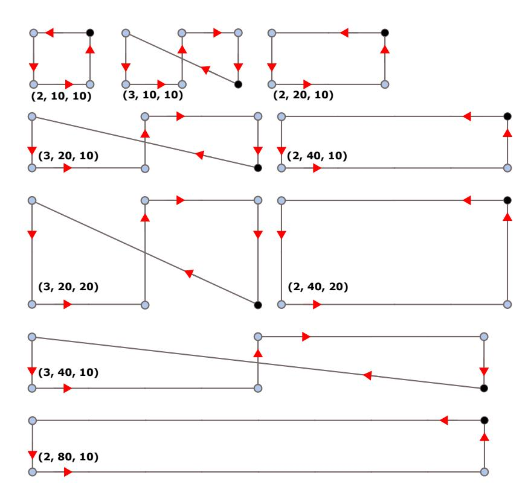

Fig. 5. Sensor topologies tested in the experiment described in Section IV-B. Every sensor is described by a triple (N, S, H). Black dots are LUTs performing signal inversion, while the hollow dots are LUTs acting as delay elements.

Instead of mean, which is very susceptible to outliers, we choose trimean: a robust measure of central tendency of a set of numbers. In Eq. (1), Q<sup>2</sup> is the dataset mean, while Q<sup>1</sup> and Q<sup>3</sup> are the upper and lower quartiles, respectively. In Eq. (2), N is the number of sensor samples while x<sup>i</sup> are their values. In statistics, standard deviation is commonly used to quantify the amount of variation or dispersion of a set of data. However, given that we use trimean to compute the central value of all samples—and not the mean—we compute the standard deviation with respect to the trimean as well.

Finally, our novel metric that allows comparing the entire data sets, where each data set contains readings collected by the corresponding sensor, is the following ratio

$$NDT = \frac{S_T}{T}. (3)$$

We will refer to it as normalized deviation with respect to trimean or *NDT*. The logic behind this metric is the following: we expect that the sensors located in places with higher voltage fluctuation produce RO frequency counts that highly vary over time or, in other words, produce data with higher standard deviation. However, as different regions of the FPGA might be supplied by different voltage or be affected by different environmental factors, one needs to scale the amount of variation in the data set recorded by each sensor with the central tendency of all the samples of the corresponding sensor (trimean). Only then can one make the comparison between the data collected by different sensors.

# *B. Sensor Configuration*

To compare various sensor topologies and find good values for the sensor topology variables N, H, S, we conduct a set of experiments. In all of them, sensors are centered with respect to the corresponding clock region, and one clock region is reserved for the controller inside the shell (Figure 3).

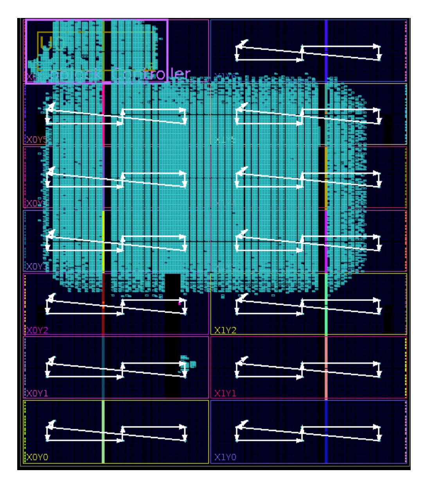

Fig. 6. Vivado placement of an attacker of 135,000 fast ring oscillator units, and the placement of undercover sensors. The topology is one among those illustrated in Figure 5: N = 3, S = 40, and H = 10.

For topology parameter N, defined in Section II-A, we consider two values: N = 2 and N = 3. When N = 2, sensors may work at higher frequency but cover only four LUTs of the clock region. When N = 3, sensors may work at lower frequency, but have a potentially higher coverage as they use more (six) LUTs and longer routing.

Before choosing sensor stride S and height H, one needs to take into account the dimensions of the FPGA. In our Xilinx Virtex-7 FPGA, clock regions have a total height of 50 slices and a total width of 108 (left half) and 110 (right half) slices.

To have a comprehensive analysis, we explore three values for S (10, 20, 40) and two values for H (10, 20). Figure 5 illustrates all combinations of N, S, and H we tested; some of these topologies should result in similar oscillation frequencies, but different coverage, allowing us to evaluate the effect of coverage on sensor accuracy.

Sensor placement and routing may vary depending on the density of the user design. Therefore, instead of running the experiments on an entirely unused FPGA, we choose to design what can be a real power-wasting attacker circuit: 135,000 instances of a single, extremely fast, ring oscillator. The attacker size is deliberately chosen to be just a bit smaller than 140,000, as an attacker of size 140,000 ring oscillator units, once activated, infallibly puts our FPGA board to reset. We let Vivado freely place the attacker circuit and enable it using a periodic activation signal pattern [4].

{5}------------------------------------------------

TABLE I

MINIMUM, MAXIMUM, AND AVERAGE SENSOR FREQUENCY ACROSS FPGA CLOCK REGIONS. SENSOR TOPOLOGIES ARE ILLUSTRATED IN FIGURE 5. THESE DATA CORRESPOND TO TOPOLOGIES WITH N=2.

| N=2   | H = 10    | H = 10    | H = 10    | H=20      | H = 10    |
|-------|-----------|-----------|-----------|-----------|-----------|
|       | S = 10    | S = 20    | S = 40    | S = 40    | S = 80    |
| min   | 212.5 MHz | 175.4 MHz | 134.6 MHz | 132.7 MHz | 109.3 MHz |
| max   | 320.9 MHz | 218.0 MHz | 189.8 MHz | 170.0 MHz | 147.9 MHz |
| mean  | 271.5 MHz | 198.1 MHz | 168.5 MHz | 157.3 MHz | 131.6 MHz |
| stdev | 34.6 MHz  | 14.1 MHz  | 17.3 MHz  | 13.0 MHz  | 14.2 MHz  |

TABLE II

Minimum, maximum, and average sensor frequency across FPGA clock regions. Sensor topologies are illustrated in Figure 5. These data correspond to topologies with N=3.

| N=3   | H = 10    | H = 10    | H = 20    | H = 10    |
|-------|-----------|-----------|-----------|-----------|
|       | S = 10    | S = 20    | S = 20    | S = 40    |
| min   | 130.1 MHz | 112.9 MHz | 101.0 MHz | 88.5 MHz  |
| max   | 187.2 MHz | 140.3 MHz | 124.5 MHz | 117.9 MHz |
| mean  | 161.5 MHz | 131.7 MHz | 116.9 MHz | 104.9 MHz |
| stdev | 18.5 MHz  | 8.1 MHz   | 7.3 MHz   | 8.9 MHz   |

Figure 6 shows the design placement; the attacker circuit is densely placed across six clock regions: X0Y5, X1Y5, X0Y4, X1Y4, X0Y3, and X1Y3. In the same figure, white connected lines show the placement and topology of one of the sensors from our test set.

Tables I and II list the minimum, maximum, and average sensor frequencies; sensor frequencies are computed as the ratio of the number of counts registered during the sampling period and the sampling period. We observe that the lowest sensor frequencies are always measured in the FPGA area densely occupied by the attacker, as expected, given the attacker activity. Standard deviation of the measured frequencies is  $\approx 10\%$  of the average sensor frequency, due to slight variations between sensor actual placement and routing and, mostly, due to attacker activity. From the collected data, we can compute the measurement accuracy; it ranges from 1.2 to 4.4 parts per thousand.

To compare all the data collected by different sensors, we compute the value of our normalized robust metric NDT defined in Eq. (3) for every sensor and draw color maps shown in Figure 7 and Figure 8. The higher the NDT value, the darker the color shade. Sensor placement is described using clock region names, on y-axis. Above each column, the H and S values of the sensor topology are indicated.

These results suggest that the sensors with shorter total length, and thus higher frequency, are more accurate: using their readings and metric in Eq. (3), one can accurately locate not only one but all clock regions occupied by the attacker. Comparing the sensors with different N, those with configuration (N=2, S=40, and H=20) and (N=3, S=20, and H=20) suggest that frequency is not the only factor impacting the accuracy in locating the source of high activity: sensor coverage might come into the play and affect the accuracy.

The conclusion from this experiment is that as the total length and therefore the total delay of the sensors increases, the frequency measurement accuracy drops. Moreover, the

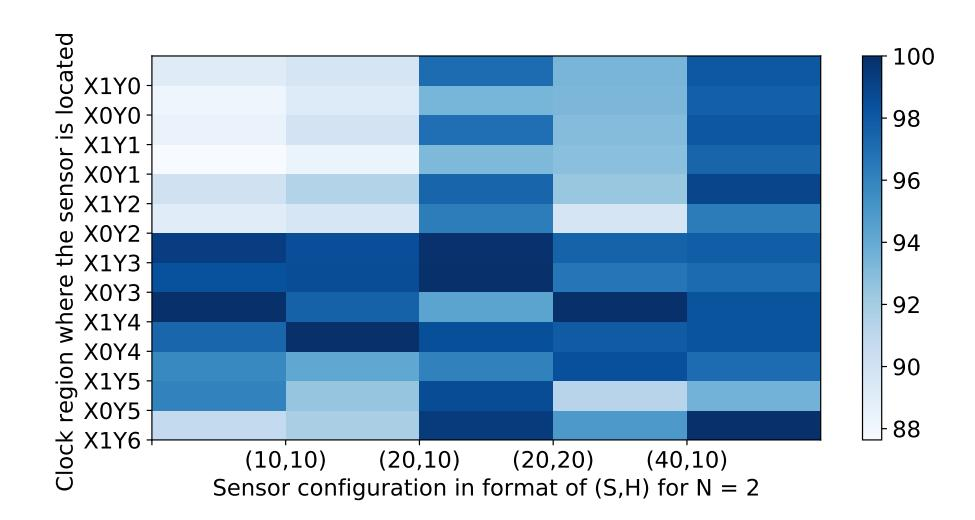

Fig. 7. Color map plot for N=2. The attacker is placed in the clock regions X0Y5, X1Y5, X0Y4, X1Y4, X0Y3, and X1Y3. Darker squares correspond to higher NDT, while lighter squares correspond to lower NDT. This figure demonstrates that the sensors with smaller delay and higher coverage over the clock region help achieve higher accuracy in locating high power-wasting activities.

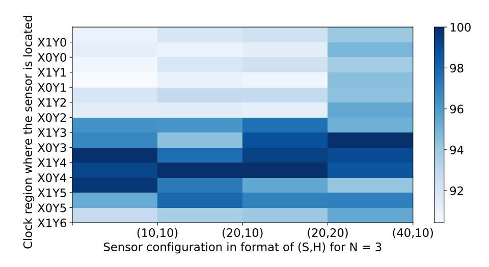

Fig. 8. Color map plot for N=3. The attacker is placed in the clock regions X0Y5, X1Y5, X0Y4, X1Y4, X0Y3, and X1Y3. Darker squares correspond to higher NDT, while lighter squares correspond to lower NDT. This figure demonstrates that the sensors with smaller delay and higher coverage over the clock region help achieve higher accuracy in locating high power-wasting activities.

possibility to locate the clock regions with high-activity decreases as well. This is clearly visible in Figures 7 and 8 by the concentration of the dark blue cells where the attacker is placed, or the dark blue cells being dispersed across all clock regions.

Finally, in the rest of experimental evaluation, we will keep two of the optimal sensor topologies:

1) 
$$N = 2$$
,  $S = 20$ ,  $H = 10$ , and

2) 
$$N = 3$$
,  $S = 20$ ,  $H = 20$ .

#### C. Feasibility of Undercover Sensing

Success in finding free LUTs and free routing resources is not granted; it is important to test how likely it is to successfully embed sensors inside a typical user design. To that purpose, we pick twelve circuits from VTR benchmark set [14], covering various application domains (finance, math, computer vision, etc.). Function TestFeasibility, described in Algorithm 1, is designed to traverse the input benchmark set and run the entire design flow (Figure 4) on every benchmark. Maximum search radius  $r_{\text{MAX}}$ , in our experiments, is set to 2. Function TestFeasibility reads sensor topology, and tries to find placement for all sensor

{6}------------------------------------------------

Algorithm 1: Function TestFeasibility, which takes benchmark circuits, a set of sensor topologies, and maximum search radius, to attempt to infiltrate sensors into the user design.

```
Input: Set B = {bi}, i = 1, ..|B| of benchmark circuits.
Input: Sensor topology t.
Input: Maximum search radius rMAX.
Output: Feasibility.
Variables: Design checkpoints dIN, dRW, and dOUT.
Variables: Boolean variable Success.
BS ← 0
foreach benchmark bi ∈ B do
   Vivado.Sytnhesis(bi)
   Vivado.Implementation(bi)
   dIN ←
    Vivado.ExportDesignCheckpoint(bi)
   dRW ←
```

```
r ← 0
while radius r < rMAX do
   Success ← False
   NS ← 0
   if EmbedUndercover(dRW, t, r) = True then
      foreach successfully embedded sensor s do
         dOUT ← dRW ∪ s
         NS ← NS + 1
      if Vivado.Implementation(dOUT) =
       True then
         Success ← True
         BS ← BS + 1
   Feasibility[r][i] ← Success
   r ← r + 1
```

RapidWright.ImportDesignCheckpoint(dIN)

LUTs and in all the clock regions occupied by the benchmark. Initially, search radius r (equivalent to Manhattan distance from the desired location) is set to zero. If placement fails for at least one sensor LUT, new search iteration starts, this time with r incremented. The function terminates once all sensor cells are successfully placed (by RapidWright) and routed (by Vivado), or when the maximum search radius is exceeded.

The results of this experiment are summarized in Table III. First and last column list circuit names and application domains. These benchmarks, albeit among the largest in VTR suite, are spreaded in 1–6 clock regions on our Virtex-7 FPGA. The Manhattan distance between the desired and the feasible location of all sensor cells, averaged across all clock regions in use by the corresponding benchmark, is shown in the central two columns. Two sensor topologies were tested: (1) N = 2, S = 20, H = 10 and (2) N = 3, S = 20, H = 20. Every experiment succeeded at search radius exactly 2 (in all of them, at least one sensor cell was placed at MD = 2 away from the desired location). The median of all averaged displacements is, interestingly, the same for both sensor topologies: 1.50.

#### TABLE III

RESULTS OF THE FEASIBILITY TESTS ON TWELVE LARGE VTR BENCHMARKS. FIRST AND THE LAST COLUMN LIST CIRCUIT NAMES AND APPLICATION DOMAINS. NUMBER OF CLOCK REGIONS OCCUPIED BY THE BENCHMARKS, AFTER VIVADO PLACEMENT AND ROUTING, RANGE BETWEEN 1 AND 6. CENTRAL TWO COLUMNS SHOW THE AVERAGE MANHATTAN DISTANCE BETWEEN THE DESIRED AND THE FEASIBLE LOCATION OF ALL SENSOR CELLS AND ACROSS ALL CLOCK REGIONS IN USE BY THE CORRESPONDING BENCHMARK.

| Benchmark<br>Name | No. clock<br>regions | (2,20,10)<br>AVG MD | (3,20,20)<br>AVG MD | Application<br>Domain |
|-------------------|----------------------|---------------------|---------------------|-----------------------|
| bgm               | 2                    | 1.50                | 1.75                | Finance               |
| blob merge        | 2                    | 1.50                | 1.08                | Image Proc.           |
| boundtop          | 1                    | 1.25                | 1.67                | Ray Tracing           |
| LU32PEEng         | 1                    | 1.50                | 1.83                | Math                  |
| LU64PEEng         | 1                    | 1.75                | 1.67                | Math                  |
| LU8PEEng          | 1                    | 1.50                | 1.50                | Math                  |
| or1200            | 2                    | 1.25                | 1.50                | Soft Processor        |
| raygentop         | 1                    | 1.00                | 1.67                | Ray Tracing           |
| sha               | 1                    | 2.00                | 1.33                | Cryptograhy           |
| stereovision0     | 4                    | 1.56                | 1.29                | Comp. Vision          |
| stereovision1     | 2                    | 2.00                | 1.50                | Comp. Vision          |
| stereovision2     | 6                    | 1.54                | 1.47                | Comp. Vision          |
| median            |                      | 1.50                | 1.50                |                       |

# *D. Sensor Functionality*

In this section we demonstrate the ability of our proposed sensors to detect the ongoing power wasting activities on the board, to locate where an attacker is, and to make a difference between a normal user and a user with powerwasting activities.

In order to test the functionality of our sensors we have used the largest attacker size that does not put the board into reset (135,000 single-stage ring oscillators). In these experiments, we activate the attacker for the longest period of time which does not result in board reset (10 µs) and then deactivate it for the shortest period of time that allows the board to recover (40 µs). We assume an attacker repeatedly gets activated and deactivated throughout the experiments to make the worst-case voltage fluctuations.

As a representative of a normal user, which we call the *Tenant*; we have used the bgm circuit from VTR benchmark suite. This circuit is a Monte Carlo simulation for a financial application and it models the price derivatives using BGM interest rates. It has eight 32-bit inputs and one 32-bit output. It uses 30,089 6-LUTs, 5,362 FFs, and 11 multipliers [14]. We generate the inputs of the circuit using eight 32-bit linear-feedback shift registers (LFSRs) to maximize its power consumption.

In the following, We will focus on four cases:

- Sensors are located on the board and they are alone (sensors alone);
- An attacker is working alone on the board and sensors are inserted into it (attacker alone);
- An ordinary tenant is working alone on the board and sensors are inserted into it (tenant alone);
- Both an ordinary tenant and an attacker are running on the board and the sensors are inserted into them (tenant and the attacker collocated).

{7}------------------------------------------------

In addition to collecting the sensor outputs for these scenarios, we experiment with one of the state-of-the-art sensors that researchers use to measure on-chip voltage fluctuations. For instance, Provelengios et. al. [15] have used a 19-stage ringoscillator based sensor to find the center of the power-wasting circuit. We developed a very similar sensor (18 buffers and one inverter in a loop connected to a 20-bit counter). According to our experiments, this sensor has a frequency of 106 MHz, very similar to 104 MHz, frequency reported by Provelengios et. al. [6]. However, the 19-stage sensor, if instantiated only once in the center of a clock region, turned out to be less successful in detecting an attacker compared to our sensors. In our experiments, this state-of-the-art sensor reported one false positive alert while detecting the clock regions with the attacker in them, whereas our sensors detected all clock regions occupied by the attacker correctly. Therefore, we try reducing the number of stages in the state-of-the art sensor, until we found one that is able to detect all clock regions with the attacker circuit equally well as ours: 5-stage ring-oscillator based sensor, oscillating at 335 MHz.

In all the experiments, we report the results for 2 type of sensors:

- our proposed sensors
  - 1) N=2, S=20, H=10
  - 2) N=3, S=20, H=20
- state-of-the-art
  - 1) 5-stage
- *1) Sensors Alone:* We need a baseline with which to compare all the following experimental results and therefore in this section we collect the sensor readings when no design is running on the board except the controller. The results are illustrated in Figure 9. We will use the results of this experiment in the next two subsections to show how precise is the output of our sensors.
- *2) Attacker Alone:* In this experiment, we limit the controller to a single clock region and let the attacker be freely placed by Vivado (Figure 6). We let the attacker and the sensors run for 1.31 ms and gather 512 samples of the sensors output. The attacker is located in clock regions X0Y 5, X1Y 5, X0Y 4, X1Y 4, X0Y 3, and X1Y 3. The results of this experiment are reported in Figure 10. The clock regions on the x-axis are sorted so that those with the attacker in them are sequential (we have started from the first free clock region in the top and iterated to the last free clock region). Figure 10 suggests that both sensor configurations—(2,20,10) and (3, 20, 20) (represented based on our convention of (N,S,H))—coupled with our NDT metric, can successfully detect where the attacker is located. The six highest data points in Figure 10 are located precisely in the clock regions which contain attacker in them. The results of the state-of-the-art 5 stage RO sensor, shown in red, agree with those of our sensors.
- *3) Tenant Alone:* Until now we have demonstrated the correctness of the sensor outputs when an attacker is present and active. Here we will go one step further and show how

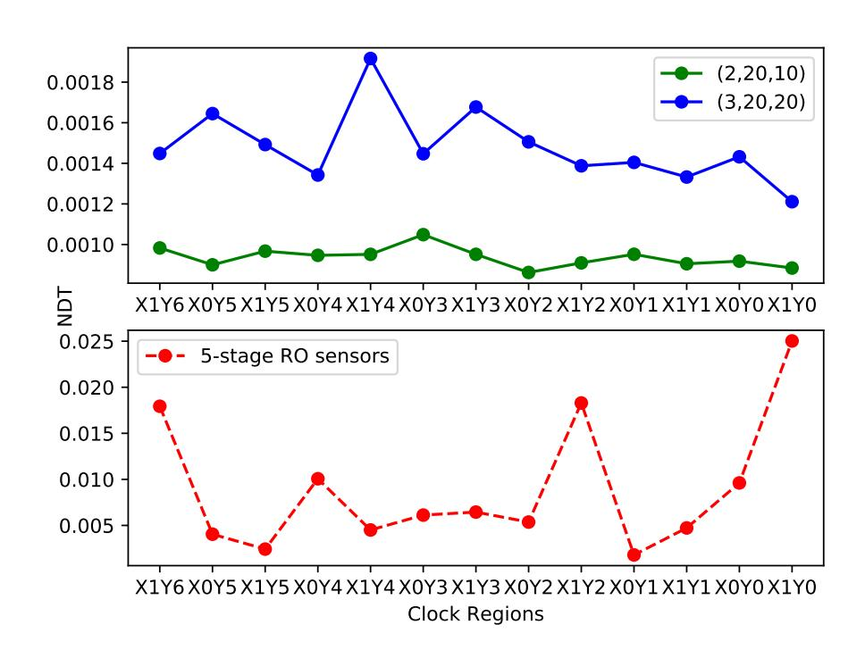

Fig. 9. Sensors output (NDT) when no other circuit except the sensors and the controller are working on the FPGA. Axis x shows the clock region where the sensor is located and the Y axis reports the sensor output in NDT. Sensors configuration has been indicated in the format of (N,S,H).

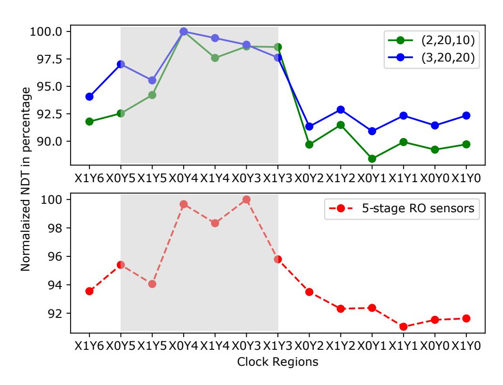

Fig. 10. Sensors output (NDT normalized with respect to the maximum output in NDT) when the attacker is running on the FPGA alone. Axis x shows the clock region where the sensor is located and the Y axis reports the normalized NDT outputs in percentage. Sensors configuration has been indicated in the format of (N,S,H). The attacker is located in clock regions X0Y 5, X1Y 5, X0Y 4, X1Y 4, X0Y 3, and X1Y 3.

the sensors react to a circuit which has an ordinary pattern of power consumption. As we are making the experimental setup realistic we will reserve top two clock regions of the board for the shell and divide the remaining clock regions between the tenant and an attacker in a way that both of them have the same access to the shell. We keep the controller in the same place as before to minimize the changes in the design between different experiments. The results of this experiment are illustrated in Figure 11. On the x-axis, we have again sorted the clock regions so that those containing the circuit are sequential. The x axis starts with the clock regions on the left and it continues to the clock regions on the right. In the

{8}------------------------------------------------

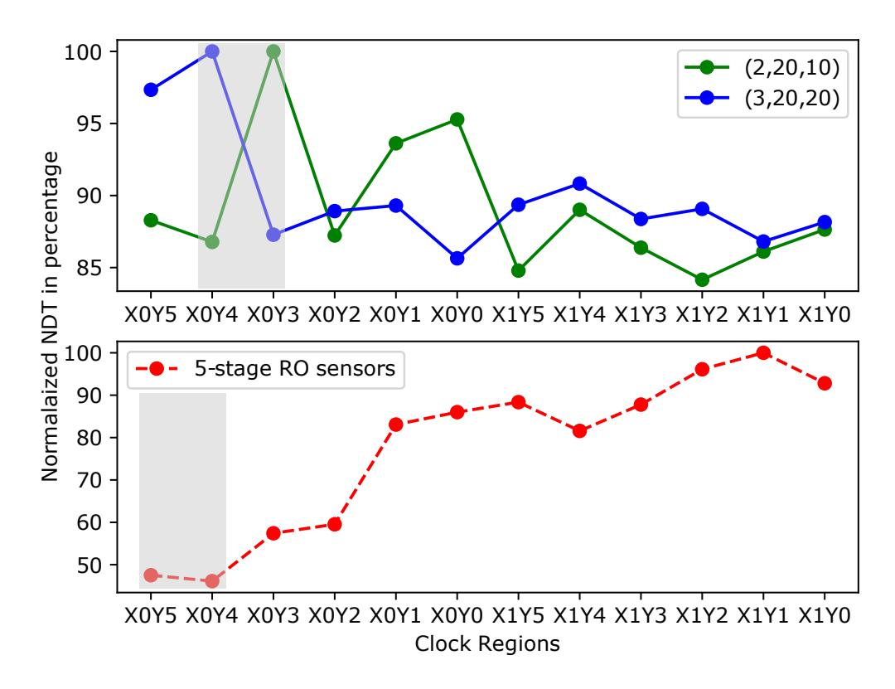

Fig. 11. Sensors output (NDT normalized with respect to the maximum output in NDT) when the tenant is running on the FPGA alone. Axis x shows the clock region where the sensor is located and the Y axis reports the normalized NDT outputs in percentage. Sensors configuration has been indicated in the format of (N,S,H). For the graph in the top, the tenant is located in clock regions X0Y4 and X0Y3. For the graph in bottom, the tenant is located in clock regions X0Y5 and X0Y4

top graph, values reported for our proposed sensors are in blue and green and the tenant is located in clock regions X0Y4 and X0Y3. In the below graph, values reported for the 5-stage RO sensor in red and the tenant is located in clock regions X0Y5and X0Y4. As shown in Figure 11, our proposed sensors detect the location of the tenant correctly (the highest data point in the graph for sensor with configuration (3,20,20) is in region X0Y4 and the highest data point for the sensor with the configuration (2,20,10) is in region X0Y3). Both of them locate one of the clock regions of the tenant. On the other hand, the 5-stage state-of-the-art sensors fail to detect the tenant. The highest data point in the corresponding plot lies in region X1Y1, yet no circuit is active there. One possible reason for this result is due to the effective coverage of the state-of-theart sensors being very low, as they are densely packed (it is composed of 5 LUTs in 5 consecutive SLICEs of the FPGA). Consequently, having a single such sensor in the center of the region is not sufficient.

Figure 12 illustrates the ratio of sensor output of an attacker with power wasting activities or a tenant with normal power consumption to the sensor output when they are running alone. The values reported in y axis shows how much the sensor output in NDT is higher in two experiments (Tenant alone and attacker alone) compared to when nobody is running on the board. The dashed line show the ratio for the board with only the attacker and continuous line shows the ratio for when only the tenant is on the board. As the values for the two configuration is very similar in the case of tenant alone experiment, the continuous blue line and continues green line almost overlap. Even though the maximum gap for the state of the art sensor is much higher (800X) but for our sensors this gap is more predictable and steady, suggesting that the

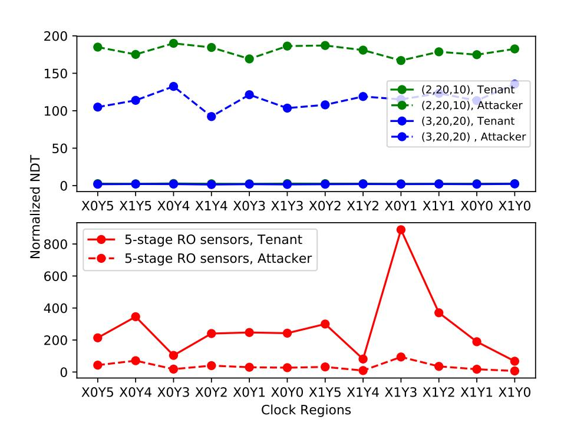

Fig. 12. Sensors output (NDT normalized with respect to the sensor outputs in NDT when they are alone) for two experiments: when an attacker is alone on the board and when a tenant is alone on the board. Axis x shows the clock region where the sensor is located and the Y axis reports the normalized NDT outputs. Sensors configuration has been indicated in the format of (N,S,H).

results of our proposed sensors are more precise and reliable compared to the state of the art sensors.

4) Tenant and the attacker collocated: In this experiment we demonstrate the ability of our sensors to be used in a real setting. We co-locate the attacker and the tenant on the FPGA (as described in the previous section, tenant on the right and the attacker on the left). In order to 1) fit both the circuits on the FPGA and 2) have a symmetric placement, we are forced to decrease the size of the attacker to fit it in 6 clock regions. The attacker size in this experiment is 120,000 inverters. The set-up of this experiment is illustrated in Figure 13. The orange LUTs are chosen to implement our proposed sensor with configuration (2,20,10) and the blue LUTs are used in the attacker and the tenant. Please note that the orange LUTs were initially unused and therefore we have not enforced any constraints on the tenant and the attacker to monitor their activity. The pblocks of the controller, tenant, and the attacker are shown in purple. As shown in Figure 13, the attacker is located in clock region X0Y5, X0Y4, X0Y3, X0Y2, and X0Y1. The tenant is mostly located in clock region X1Y5 and X1Y6. This set-up is a challenging design where the density of the used LUTs is high and it shown the feasibility of our proposed free LUT search algorithm. The results of this experiment is illustrated in Figure 14. We sort the clock region on the x axis based on their locations. The x axis starts with the clock regions on the left and it continues to the clock regions on the right so that the clock regions of the same design are sequential. The results show our proposed senors are able to correctly detect 5 clock regions out of the total 6 clock regions with the attacker. The sensors with configuration (2,20,10) misses to selects clock region X0Y0instead of clock region X0Y1 as the 6th clock region with high sensor outputs. Similarly, the sensor with configuration

{9}------------------------------------------------

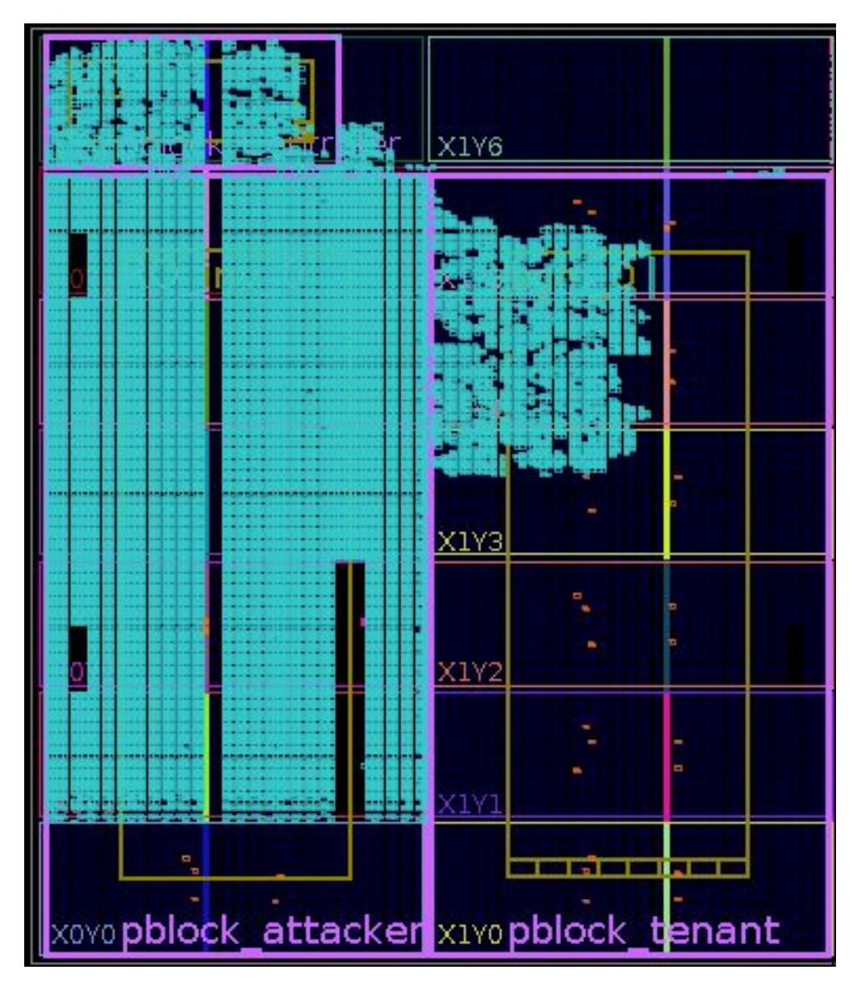

Fig. 13. Colocation of the tenant and the attacker on the FPGA

(3,20,20) select clock region X1Y 4 instead of X0Y 1 as the 6th clock region with high values. In both cases only the lowest value of the top 6 sensor output is a false alarm. If one is to decide either to revoke a suspecting tenant or not, she will make the correct decision when using the outputs of our proposed sensor because 5 regions out of 6 regions of the tenant are detected to have power wasting attacks. On the other hand, the output of state of the art sensor is not as accurate as us. The top 6 sensor outputs of the 5-stage RO sensor is located in clock regions X0Y 3, X0Y 2, X1Y 2, X0Y 1, X1Y 1 and X0Y 0. We have two false positive alerts here and even though the center of the attacker is located in X0Y 3, state of the art sensor suggest that the attacker is centered in the bottom of the board.

# V. RELATED WORK

The idea to use ring oscillators to measure voltage and temperature across a VLSI circuit dates back to an early paper by Quentot et al. [16]. Associated measurement procedures ´ for detecting variations in local temperature and voltage of an IC were later described in the patent by Krishnamoorthy and Detofsky [17]; there, the authors suggest embedding 96 sensors across the IC die. Later, Zick et al. [7] designed an experimental FPGA-based system, instrumented it with 112 sensor nodes, and used it for detailed characterization of delay, temperature, and voltage variations. Zick et al. favored transistor-dominated paths over wire-dominated paths in their ring oscillators, to enhance the sensor sensitivity to

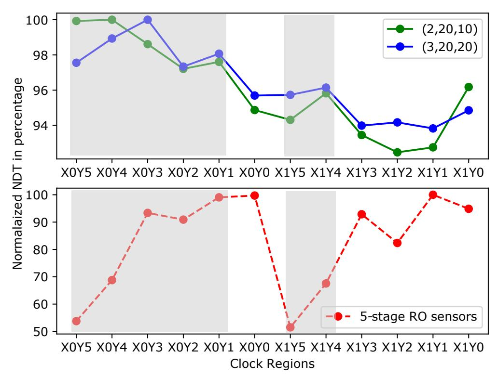

Fig. 14. Sensors output (NDT normalized with respect to the maximum output in NDT) when both the attacker and the tenant are running on the FPGA. Axis x shows the clock region where the sensor is located and the Y axis reports the normalized NDT outputs in percentage. Sensors configuration has been indicated in the format of (N,S,H).The attacker is located in clock region X0Y 5, X0Y 4, X0Y 3, X0Y 2, and X0Y 1. The tenant is mostly located in clock region X1Y 4 and X1Y 5.

temperature changes. In contrast, in this work we demonstrate that the above is not a true requirement when ring-oscillators are used to sense fast voltage transients.

Gnad et al. [10] performed a detailed experimental analysis of transient voltage fluctuations in FPGAs using delayline based sensors instead of ring oscillators. Those sensors, although allowing higher measurement resolution than ring oscillators, are subject to extremely tight placement constraints, can be implemented only on FPGAs that have embedded carry-chain logic, and incur higher resource overhead, because every sensor uses a priority encoder to transform the delay-line output to a binary number. This makes them highly impractical for undercover embedding.

Most recently, Provelengios et al. [6] used a network of 40 ring-oscillator sensors, distributed in grid-like fashion, to characterize the relationship between sudden high-amplitude voltage droops and the number of delay faults in Cyclone V FPGAs. Additionally, they show that approximating the gradient of voltage changes (as a replacement for missing sensor readings) can result in a map pointing towards the center of the attack. The procedure or algorithm to compute gradients is not explained, nor is the complexity of that procedure analyzed. In this paper, we show that using only one sensor per clock region, together with the novel statistical metric we propose, one can locate not only the center of the attack but also the clock regions occupied by the attacker, while the amount of resources inside the user-logic region of the FPGA is considerably reduced. Moreover, we experimentally compare our sensors to that of Provelengios et al. [6] and find that we can distinguish between used and unused FPGA clock regions with 10× higher confidence, when the same number of sensors is used.

{10}------------------------------------------------

#### VI. CONCLUSIONS

This paper introduces the idea of embedding undercover sensors across the FPGA to monitor on-chip voltage fluctuations and demonstrates the feasibility and the functionality of these sensors. These undercover sensors are by no means malicious: they do not interfere with the circuits running on FPGA in any way, nor they occupy any otherwise required space. Their purpose is to allow the centralized FPGA controller (shell) to monitor FPGA tenant activity, signal excessive activity, and take countermeasures. In addition, we design new sensor topologies that have better coverage at significantly lower resource usage than the state-of-the-art alternatives. Finally, a novel metric for analyzing the sensor readings is introduced. This metric, as detailed experimental evaluation demonstrates, enables to reliably and accurately locate not only the center of the highest on-chip activity but the entire FPGA regions in which this activity is taking place. We believe these contributions to be of great interest to cloud-providers and researchers, for real-time monitoring, alarming, and forensics.

#### REFERENCES

- [1] D. R. Gnad, F. Oboril, and M. B. Tahoori, "Voltage drop-based fault attacks on FPGAs using valid bitstreams," in *Proceedings of the 27th International Conference on Field-Programmable Logic and Applications*, Ghent, Belgium, Sep. 2017, pp. 1–7.
- [2] A. W. S. (AWS), "Combinational loops disabled," Amazon Web Services, Seatle, WA, USA, 2017. [Online]. Available: forums.aws.amazon.com/message.jspa?messageID=806151
- [3] I. Giechaskiel, K. Rasmussen, and J. Szefer, "Measuring long wire leakage with ring oscillators in cloud FPGAs," in *Proceedings of the 29th International Conference on Field-Programmable Logic and Applications*, Barcelona, Spain, Sep. 2019, pp. 1–8.
- [4] D. Mahmoud and M. Stojilovic, "Timing violation induced faults in ´ multi-tenant FPGAs," in *Proceedings of the Design, Automation and Test in Europe Conference and Exhibition*, Florence, Italy, Mar. 2019, pp. 1745–1750.
- [5] J. Krautter, D. R. E. Gnad, and M. B. Tahoori, "FPGAhammer: Remote voltage fault attacks on shared FPGAs, suitable for DFA on AES," *IACR Transactions on Cryptographic Hardware and Embedded Systems*, vol. 2018, no. 3, pp. 44–68, Aug. 2018.
- [6] G. Provelengios, D. Holcomb, and R. Tessier, "Characterizing power distribution attacks in multi-user FPGA environments," in *Proceedings of the 29th International Conference on Field-Programmable Logic and Applications*, Barcelona, Spain, Sep. 2019, pp. 194–201.
- [7] K. M. Zick and J. P. Hayes, "Low-cost sensing with ring oscillator arrays for healthier reconfigurable systems," *ACM Transactions on Reconfigurable Technology and Systems (TRETS)*, vol. 5, no. 1, pp. 1:1– 1:26, Mar. 2012.
- [8] I. Ahmed, L. L. Shen, and V. Betz, "Becoming more tolerant: Designing FPGAs for variable supply voltage," in *Proceedings of the 29th International Conference on Field-Programmable Logic and Applications*, Barcelona, Spain, Sep. 2019, pp. 1–8.
- [9] Xilinx, *Vivado Design Suite User Guide: Partial Reconfiguration*, Xilinx, San Jose, CA, USA, 2018.
- [10] D. R. Gnad, F. Oboril, S. Kiamehr, and M. B. Tahoori, "An experimental evaluation and analysis of transient voltage fluctuations in FPGAs," vol. 26, no. 10, pp. 1817–1830, Oct. 2018.
- [11] C. Lavin and A. Kaviani, "RapidWright: Enabling custom crafted implementations on FPGAs," in *Proceedings of the 26th IEEE Symposium on Field-Programmable Custom Computing Machines*, Boulder, CO, USA, May 2018, pp. 133–140.
- [12] B. L. Hutchings and J. Keeley, "Rapid post-map insertion of embedded logic analyzers for xilinx FPGAs," in *Proceedings of the 22nd IEEE Symposium on Field-Programmable Custom Computing Machines*, Boston, MA, USA, May 2014, pp. 72–79.

- [13] D. R. Gnad, F. Oboril, S. Kiamehr, and M. B. Tahoori, "Analysis of transient voltage fluctuations in FPGAs," in *Proceedings of the IEEE International Conference on Field Programmable Technology*, Xi'an, China, Dec. 2016, pp. 1–8.
- [14] J. Rose, J. Luu, C. W. Yu, O. Densmore, J. Goeders, A. Somerville, K. B. Kent, P. Jamieson, and J. Anderson, "The VTR project: Architecture and CAD for FPGAs from verilog to routing," Monterey, Calif., Feb. 2012, pp. 77–86.
- [15] G. Provelengios, C. Ramesh, S. B. Patil, K. Eguro, R. Tessier, and D. Holcomb, "Characterization of long wire data leakage in deep submicron FPGAs," in *Proceedings of the ACM/SIGDA International Symposium on Field Programmable Gate Arrays*, Seaside, CA, USA, Feb. 2019, pp. 292–297.
- [16] G. M. Quenot, N. Paris, and B. Zavidovique, "A temperature and voltage ´ measurement cell for VLSI circuits," in *Proceedings of Europe ASIC*, Paris, France, May 1991, pp. 1–5.
- [17] A. Krishnamoorthy and A. M. Detofsky, "Mapping variations in local temperature and local power supply voltage that are present during operation of an integrated circuit," US Patent US 7,071,723, Jul. 2006.