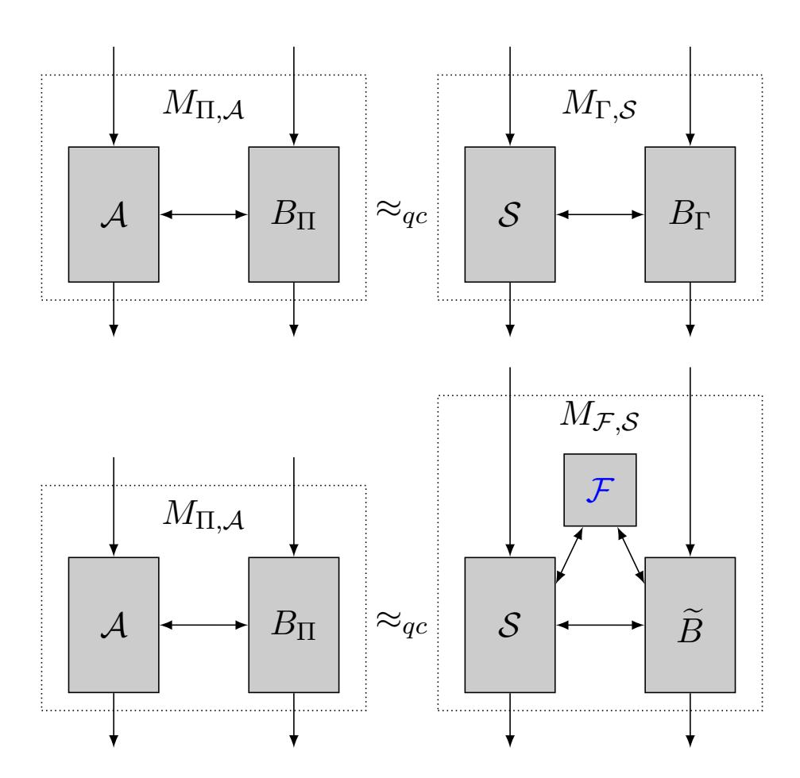
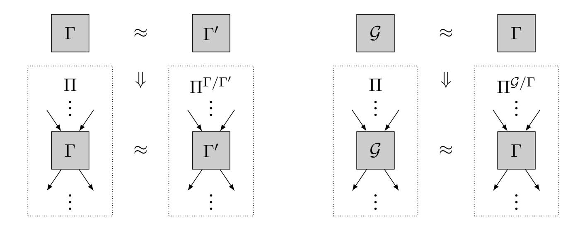

{0}------------------------------------------------

# Oblivious Transfer is in MiniQCrypt

Alex B. Grilo<sup>∗</sup> Huijia Lin† Fang Song‡ Vinod Vaikuntanathan¶ November 30, 2020

#### **Abstract**

MiniQCrypt is a world where quantum-secure one-way functions exist, and quantum communication is possible. We construct an oblivious transfer (OT) protocol in MiniQCrypt that achieves simulation-security in the plain model against malicious quantum polynomial-time adversaries, building on the foundational work of Bennett, Brassard, Cr´epeau and Skubiszewska (CRYPTO 1991). Combining the OT protocol with prior works, we obtain secure two-party and multi-party computation protocols also in MiniQCrypt. This is in contrast to the classical world, where it is widely believed that one-way functions alone do not give us OT.

In the common random string model, we achieve a *constant-round* universally composable (UC) OT protocol.

{1}------------------------------------------------

# **Contents**

| 1 | Introduction                                                               | 1  |
|---|----------------------------------------------------------------------------|----|
|   | 1.1<br>Technical Overview<br>                                              | 5  |
|   | 1.1.1<br>Organization of the Paper.<br>                                    | 11 |
| 2 | Quantum Stand-alone Security Model                                         | 11 |
|   | 2.1<br>Modular Composition Theorem<br>                                     | 13 |
| 3 | Parallel OT with Unbounded Simulation from OWF                             | 13 |
|   | Fso-com-hybrid model<br>3.1<br>Stand-Alone-secure OT in<br>                | 14 |
|   | 3.2<br>Parallel Repetition for Protocols with Straight-Line Simulation<br> | 14 |
|   | Fso-com<br>3.3<br>Implementing<br>with unbounded Simulation<br>            | 14 |
| 4 | Extractable Commitment from Unbounded Simulation OT                        | 16 |
|   | 4.1<br>Verifiable Conditional Disclosure of Secrets (vCDS)<br>             | 16 |
|   | 4.2<br>CDS Protocol from Unbounded Simulation OT<br>                       | 17 |
|   | 4.3<br>Extractable Commitment from CDS<br>                                 | 21 |
| 5 | Multiparty (Quantum) Computation in MiniQCrypt                             | 24 |
| A | Preliminaries                                                              | 30 |
|   | A.1<br>Basic ideal functionalities<br>                                     | 30 |
|   | A.2<br>Cryptographic constructions<br>                                     | 31 |
|   | A.2.1<br>Naor's commitment scheme<br>                                      | 31 |
|   | A.2.2<br>Zero knowledge protocols<br>                                      | 32 |
|   | A.2.3<br>Yao's garbled circuits<br>                                        | 32 |
|   | A.3<br>Quantum information basics<br>                                      | 33 |
|   | A.4<br>Quantum machine model and quantum indistinguishability<br>          | 33 |
|   |                                                                            |    |
| B | Proof of Theorem<br>3.2                                                    | 34 |
|   | B.1<br>Security against a Malicious Sender<br>                             | 35 |
|   | B.2<br>Security against malicious receiver<br>                             | 36 |
| C | Proof of Theorem<br>3.3                                                    | 38 |
| D | Proof of Theorem<br>3.6                                                    | 39 |

{2}------------------------------------------------

# <span id="page-2-0"></span>**1 Introduction**

Quantum computing and modern cryptography have enjoyed a highly productive relationship for many decades ever since the conception of both fields. On the one hand, (large-scale) quantum computers can be used to break many widely used cryptosystems based on the hardness of factoring and discrete logarithms, thanks to Shor's algorithm [\[Sho94\]](#page-30-0). On the other hand, quantum information and computation have helped us realize cryptographic tasks that are otherwise impossible, for example quantum money [\[Wie83\]](#page-31-2) and generating certifiable randomness [\[Col09,](#page-27-0)[VV12,](#page-30-1)[BCM](#page-26-0)+18].

Yet another crown jewel in quantum cryptography is the discovery, by Bennett and Brassard [\[BB84\]](#page-26-1), of a key exchange protocol whose security is unconditional. That is, they achieve information-theoretic security for a cryptographic task that classically necessarily has to rely on unproven computational assumptions. In a nutshell, they accomplish this using the uncloneability of quantum states, a bedrock principle of quantum mechanics. What's even more remarkable is the fact that their protocol makes minimalistic use of quantum resources, and consequently, has been implemented in practice over very large distances [\[DYD](#page-28-0)+08,[LCH](#page-29-0)+18]. This should be seen in contrast to large scale quantum *computation* whose possibility is still being actively debated.

Bennett and Brassard's groundbreaking work raised a *tantalizing* possibility for the field of cryptography:

> *Could* every *cryptographic primitive be realized unconditionally using quantum information?*

A natural next target is oblivious transfer (OT), a versatile cryptographic primitive which, curiously, had its origins in Wiesner's work in the 1970s on quantum information [\[Wie83\]](#page-31-2) before being rediscovered in cryptography by Rabin [\[Rab81\]](#page-30-2) in the 1980s. Oblivious transfer (more specifically, 1-out-of-2 OT) is a two-party functionality where a receiver Bob wishes to obtain one out of two bits that the sender Alice owns. The OT protocol must ensure that Alice does not learn which of the two bits Bob received, and that Bob learns only one of Alice's bits and no information about the other. Oblivious transfer lies at the foundation of secure computation, allowing us to construct protocols for the secure multiparty computation (MPC) of any polynomial-time computable function [\[GMW87a,](#page-28-1)[Kil88,](#page-29-1)[IPS08\]](#page-29-2).

Bennett, Brassard, Cr´epeau and Skubiszewska [\[BBCS92\]](#page-26-2) constructed an OT protocol given an *ideal* bit commitment protocol and quantum communication. In fact, the only quantum communication in their protocol consisted of Alice sending several so-called "BB84 states" to Bob. Unfortunately, *unconditionally secure* commitment [\[May97,](#page-29-3) [LC97\]](#page-29-4) and *unconditionally secure* OT [\[Lo97,](#page-29-5)[CGS16\]](#page-27-1) were soon shown to be impossible even with quantum resources.

However, given that bit commitment can be constructed from one-way functions (OWF) [\[Nao90,](#page-30-3) [HILL99\]](#page-28-2), the hope remains that OT, and therefore a large swathe of cryptography, can be based on only *OWF* together with (practically feasible) quantum communication. Drawing our inspiration from Impagliazzo's five worlds in cryptography [\[Imp95\]](#page-29-6), we call such a world, where post-quantum secure one-way functions (pqOWF) exist and quantum computation and communication are possible, Mini**Q**Crypt. The question that motivates this paper is:

*Do OT and MPC exist in MiniQCrypt?*

Without the quantum power, this is widely believed to be impossible. That is, given only OWFs, there are no *black-box* constructions of OT or even key exchange protocols [\[IR89,](#page-29-7)[Rud92\]](#page-30-4). 

{3}------------------------------------------------

The fact that [\[BB84\]](#page-26-1) overcome this barrier and construct a key exchange protocol with quantum communication (even without the help of OWFs) reinvigorates our hope to do the same for OT.

**Aren't We Done Already?** At this point, the reader may wonder why we do not have an affirmative answer to this question already, by combining the OT protocol of [\[BBCS92\]](#page-26-2) based on bit commitments, with a construction of bit commitments from pqOWF [\[Nao90,](#page-30-3)[HILL99\]](#page-28-2). Although this possibility was mentioned already in [\[BBCS92\]](#page-26-2), where they note that ". . . computational complexity based quantum cryptography is interesting since it allows to build oblivious transfer around one-way functions.", attaining this goal remains elusive as we explain below.

First, proving the security of the [\[BBCS92\]](#page-26-2) OT protocol (regardless of the assumptions) turns out to be a marathon. After early proofs against limited adversaries [\[MS94,](#page-30-5)[Yao95\]](#page-31-3), it is relatively recently that we have a clear picture with formal proofs against arbitrary quantum polynomial-time adversaries [\[DFR](#page-27-2)+07,[DFL](#page-27-3)+09,[BF10,](#page-26-3)[Unr10\]](#page-30-6). Based on these results, we can summarize the state of the art as follows.

- *Using Ideal Commitments:* If we assume an *ideal* commitment protocol, formalized as universally composable (UC) commitment, then the quantum OT protocol can be proven secure in strong simulation-based models, in particular the quantum UC model that admits sequential composition or even concurrent composition in a network setting [\[DFL](#page-27-3)+09,[FS09,](#page-28-3)[BF10,](#page-26-3)[Unr10\]](#page-30-6). However, UC commitments, in contrast to vanilla computationally-hiding and statisticallybinding commitments, are powerful objects that do not live in Minicrypt. In particular, UC commitments give us key exchange protocols and are therefore black-box separated from Minicrypt.[1](#page-3-0)
- *Using Vanilla Commitments:* If in the [\[BBCS92\]](#page-26-2) quantum OT protocol we use a *vanilla* statisticallybinding and computationally hiding commitment scheme, which exists assuming a pqOWF, the existing proofs, for example [\[BF10\]](#page-26-3), fall short in two respects.

First, for a malicious receiver, the proof of [\[BF10\]](#page-26-3) constructs only an *in*efficient simulator. Roughly speaking, this is because the OT receiver in [\[BBCS92\]](#page-26-2) acts as a committer, and vanilla commitments are not extractable. Hence, we need an inefficient simulator to extract the committed value by brute force. Inefficient simulation makes it hard, if not impossible, to use the OT protocol to build other protocols (even if we are willing to let the resulting protocol have inefficient simulation). Our work will focus on achieving the standard ideal/real notion of security [\[Gol09\]](#page-28-4) with efficient simulators.

Secondly, it is unclear how to construct a simulator (even ignoring efficiency) for a malicious sender. Roughly speaking, the issue is that simulation seems to require that the commitment scheme used in [\[BBCS92\]](#page-26-2) be secure against selective opening attacks, which vanilla commitments do not guarantee [\[BHY09\]](#page-26-4).

• *Using Extractable Commitments:* It turns out that the first difficulty above can be addressed if we assume a commitment protocol that allows *efficient extraction* of the committed value

<span id="page-3-0"></span><sup>1</sup>The key exchange protocol between Alice and Bob works as follows. Bob, playing the simulator for a malicious sender in the UC commitment protocol, chooses a common reference string (CRS) with a trapdoor T D and sends the CRS to Alice. Alice, playing the sender in the commitment scheme, chooses a random K and runs the committer algorithm. Bob runs the straight-line simulator-extractor (guaranteed by UC simulation) using the T D to get K, thus ensuring that Alice and Bob have a common key. An eavesdropper Eve should not learn K since the above simulated execution is indistinguishable from an honest execution, where K is hidden.

{4}------------------------------------------------

– called extractable commitments. Constructing extractable commitments is surprisingly challenging in the quantum world because of the hardness of rewinding. Moreover, to plug into the quantum OT protocol, we need a strong version of extractable commitments from which the committed values can be extracted efficiently *without destroying or even disturbing the quantum states of the malicious committer,*[2](#page-4-0) a property that is at odds with quantum unclonability and rules out several extraction techniques used for achieving arguments of knowledge such as in [\[Unr12\]](#page-30-7). In particular, we are not aware of a construction of such extractable commitments without resorting to strong assumptions such as LWE [\[BS20,](#page-27-4)[AP19\]](#page-26-5), which takes us out of minicrypt. Another standard way to construct extractable commitments is using public-key encryption in the CRS model, which unfortunately again takes us out of minicrypt.

To summarize, we would like to stress that before our work, the claims that quantum OT protocols can be constructed from pqOWFs [\[BBCS92,](#page-26-2)[FUW](#page-28-5)+20] were rooted in misconceptions.

**Why MiniQCrypt.** Minicrypt is one of five Impagliazzo's worlds [\[Imp95\]](#page-29-6) where OWFs exist, but public-key encryption schemes do not. In Cryptomania, on the other hand, public-key encryption schemes do exist.

Minicrypt is robust *and* efficient. It is robust because there is an abundance of candidates for OWFs that draw from a variety of sources of hardness, and most do not fall to quantum attacks. Two examples are (OWFs that can be constructed from) the advanced encryption standard (AES) and the secure hash standard (SHA). They are "structureless" and hence typically do not have any subexponential attacks either. In contrast, cryptomania seems fragile and, to some skeptics, even endangered due to the abundance of subexponential and quantum attacks, except for a handful of candidates. It is efficient because the operations are combinatorial in nature and amenable to very fast implementations; and the key lengths are relatively small owing to OWFs against which the best known attacks are essentially brute-force key search. We refer the reader to a survey by Barak [\[Bar17\]](#page-26-6) for a deeper perspective.

Consequently, much research in (applied) cryptography has been devoted to minimizing the use of public-key primitives in advanced cryptographic protocols [\[Bea96,](#page-26-7)[IKNP03\]](#page-29-8). However, complete elimination seems hard. In the classical world, in the absence of quantum communication, we can construct pseudorandom generators and digital signatures in Minicrypt, but not key exchange, public-key encryption, oblivious transfer or secure computation protocols. With quantum *communication* becoming a reality not just academically [\[DYD](#page-28-0)+08, [HRP](#page-28-6)+06, [PKB](#page-30-8)+17] but also commercially [\[LCH](#page-29-0)+18], we have the ability to reap the benefits of robustness and efficiency that Minicrypt affords us, *and* construct powerful primitives such as oblivious transfer and secure computation that were so far out of reach.

**Our results.** In this paper, we finally show that the longstanding (but previously unproved) claim is true.

**Theorem 1.1** (Informal)**.** *Oblivious transfer protocols in the plain model that are simulation-secure against malicious quantum polynomial-time adversaries exist assuming that post-quantum one-way functions exist and that quantum communication is possible.*

Our main technical contribution consists of showing a construction of an extractable commitment scheme based solely on pqOWFs and using quantum communication. Our construction involves

<span id="page-4-0"></span><sup>2</sup>This is because when using extractable commitment in a bigger protocol, the proof needs to extract the committed value and continue the execution with the adversary.

{5}------------------------------------------------

three ingredients. The first is vanilla post-quantum commitment schemes which exist assuming that pqOWFs exist [\[Nao90\]](#page-30-3). The second is post-quantum zero-knowledge protocols which also exist assuming that pqOWFs exist [\[Wat09\]](#page-30-9). The third and final ingredient is a special multiparty computation protocol called conditional disclosure of secrets (CDS) constructing which in turns requires OT. This might seem circular as this whole effort was to construct an OT protocol to begin with! Our key observation is that the CDS protocol is only required to have a mild type of security, namely *unbounded simulation*, which *can* be achieved with a slight variant of the [\[BBCS92\]](#page-26-2) protocol. Numerous difficulties arise in our construction, and in particular proving consistency of a protocol execution involving quantum communication appears difficult: how do we even write down an statement (e.g., NP or QMA) that encodes consistency? Overcoming these difficulties constitutes the bulk of our technical work. We provide a more detailed discussion on the technical contribution of our work in Section [1.1.](#page-6-0)

We remark that understanding our protocol requires only limited knowledge of quantum computation. Thanks to the composition theorems for (stand-alone) simulation-secure quantum protocols [\[HSS15\]](#page-28-7), much of our protocol can be viewed as a *classical* protocol in the (unbounded simulation) OT-hybrid model. The only quantumness resides in the instantiation of the OT hybrid with [\[BBCS92\]](#page-26-2).

We notice that just as in [\[BB84,](#page-26-1)[BBCS92\]](#page-26-2), the honest execution of our protocols does not need strong quantum computational power, since one only needs to create, send and measure "BB84" states, which can be performed with current quantum technology. [3](#page-5-0) Most notably, creating the states does not involve creating or maintaining long-range correlations between qubits.

In turn, plugging our OT protocol into the protocols of [\[IPS08,](#page-29-2)[Unr10,](#page-30-6)[DNS12,](#page-28-8)[DGJ](#page-27-5)+20] (and using the sequential composition theorem [\[HSS15\]](#page-28-7)) gives us secure two-party computation and multi-party computation (with a dishonest majority) protocols, even for quantum channels.

**Theorem 1.2** (Informal)**.** *Assuming that post-quantum one-way functions exist and quantum communication is possible, for every classical two-party and multi-party functionality* F*, there is a quantum protocol in the plain model that is simulation-secure against malicious quantum polynomial-time adversaries. Under the same assumptions, there is a quantum two-party and multi-party protocol for any quantum circuit* Q*.*

Finally, we note that our OT protocol runs in poly(λ) number of rounds, where λ is a security parameter, and that is only because of the zero-knowledge proof. Watrous' ZK proof system [\[Wat09\]](#page-30-9) involves repeating a classical ZK proof (such as that graph coloring ZK proof [\[GMW87b\]](#page-28-9) or the Hamiltonicity proof [\[Blu86\]](#page-27-6)) *sequentially*. A recent work of Bitansky and Shmueli [\[BS20\]](#page-27-4) for the first time constructs a *constant-round* quantum ZK protocol (using only classical resources) but they rely on a strong assumption, namely learning with errors, which does not live in minicrypt. Nevertheless, in the common random string (CRS) model, we can instantiate the zero-knowledge protocol using a WI protocol and a Pseudo-Random Generator (PRG) with additive λ bit stretch as follows: To prove a statement x, the prover proves using the WI protocol that either x is in the language or the common random string is in the image of the PRG. To simulate a proof, the simulator samples the CRS as a random image of the PRG, and proves using the WI protocol that it belongs to the image in a straight-line. Moreover, this modification allows us to achieve *straight-line simulators*, leading

<span id="page-5-0"></span><sup>3</sup>A BB84 state is a single-qubit state that is chosen uniformly at random from {|0i, |1i, |+i, |−i}. Alternatively, it can be prepared by computing H<sup>h</sup>X x |0i where X is the bit-flip gate, H is the Hadamard gate, and h, x ∈ {0, 1} are random bits.

{6}------------------------------------------------

to *universally-composable* (UC) security [CanO1]. Therefore, this modification would give us the following statement.

**Theorem 1.3** (Informal). Constant-round oblivious transfer protocols in the common random string (CRS) model that are UC-simulation-secure against malicious quantum poly-time adversaries exist assuming that post-quantum one-way functions exist and that quantum communication is possible.

Plugging the above UC-simulation-secure OT into the protocol of [IPS08] gives constant-round multi-party computation protocols for classical computation in the common random string model that are UC-simulation-secure against malicious quantum poly-time adversaries.

**Going Below MiniQCrypt?** We notice that all of the primitives that we implement in our work *cannot* be implemented unconditionally, even in the quantum setting [May97, LC97, Lo97, CGS16]. Basing their construction on pqOWFs seems to be the next best thing, but it does leave with the intriguing question if they could be based on weaker assumptions. More concretely, assume a world with quantum communication as we do in this paper. Does the existence of quantum OT protocols imply the existence of pqOWFs? Or, does a weaker *quantum* notion of one-way functions suffice? We leave the exploration of other possible cryptographic worlds below MiniQCrypt to future work.

**Other Related Work.** Inspired by the quantum OT protocol [BBCS92], a family of primitives, named k-bit cut-and-choose, has been shown to be sufficient to realize OT statistically by quantum protocols [FKS $^+$ 13, DFLS16] which is provably impossible by classical protocols alone [MPR10]. These offer further examples demonstrating the power of quantum cryptographic protocols.

There has also been extensive effort on designing quantum protocols OT and the closely related primitive of *one-time-memories* under *physical* rather than *computational* assumptions, such as the bounded-storage model, noisy-storage model, and isolated-qubit model, which restrict the quantum memory or admissible operations of the adversary [Sal98,Liu14a,Liu14b,DFR+07,DFSS08,KWW12]. They provide important alternatives, but the composability of these protocols are not well understood. Meanwhile, there is strengthening on the impossibility for quantum protocols to realize secure computation statistically from scratch [BCS12,SSS15].

Finally, we note that there exist classical protocols for two-party and multi-party computation that are quantum-secure assuming strong assumptions such as post-quantum dense encryption and superpolynomial quantum hardness of the learning-with-errors problem [HSS15, LN11, ABG<sup>+</sup>20]. And prior to the result in [DGJ<sup>+</sup>20], there is a long line of work on secure multi-party *quantum* computation (Cf. [CGS02, BOCG<sup>+</sup>06, DNS10, DNS12]).

#### <span id="page-6-0"></span>1.1 Technical Overview

We give an overview of our construction of post-quantum OT protocol in the plain model from post-quantum one-way functions. In this overview, we assume some familiarity with post-quantum MPC in the stand-alone, sequential composition, and UC models, and basic functionalities such as  $\mathcal{F}_{\text{ot}}$  and  $\mathcal{F}_{\text{com}}$ . We will also consider *parallel versions* of them, denoted as  $\mathcal{F}_{\text{p-ot}}$  and  $\mathcal{F}_{\text{so-com}}$ . The parallel OT functionality  $\mathcal{F}_{\text{p-ot}}$  enables the sender to send some polynomial number of pairs of strings  $\{s_0^i, s_1^i\}_i$  and the receiver to choose one per pair to obtain  $s_{c_i}^i$  in parallel. The commitment with selective opening functionality  $\mathcal{F}_{\text{so-com}}$  enables a sender to commit to a string m while hiding it, and a receiver to request opening of a subset of bits at locations  $T \subseteq [|m|]$  and obtain  $m_T = (m_i)_{i \in T}$ . We refer the reader to Section 2 for formal definitions of these functionalities.

{7}------------------------------------------------

BBCS OT in the  $\mathcal{F}_{\text{so-com}}$ -Hybrid Model. We start by describing the quantum OT protocol of [BBCS92] in the  $\mathcal{F}_{\text{so-com}}$  hybrid model.

**BBCS OT protocol:** The sender ot.S has strings  $s_0, s_1 \in \{0, 1\}^{\ell}$ , the receiver ot.R has a choice bit  $c \in \{0, 1\}$ .

- 1. **Preamble.** ot.S sends  $n \gg \ell$  BB94 qubits  $|x^A\rangle_{\theta^A}$  prepared using random bits  $x^A \in_R \{0,1\}^n$  and random basis  $\theta^A \in_R \{+,\times\}^n$ . ot.R measures these qubits in randomly chosen bases  $\theta^B \in_R \{+,\times\}^n$  and commits to the measured bits together with the choice of the bases, that is  $\{\theta_i^B, x_i^B\}_i$ , using  $\mathcal{F}_{\text{so-com}}$ .
- 2. **Cut and Choose.** ot.S requests to open a random subset T of locations, of size say n/2, and gets  $\{\theta_i^B, x_i^B\}_{i \in T}$  from  $\mathcal{F}_{\mathtt{so-com}}$ . Importantly, it aborts if for any i  $\theta_i^B = \theta_i^A$  but  $x_i^B \neq x_i^A$ . Roughly speaking, this is because it's an indication that the receiver has not reported honest measurement outcomes.
- 3. **Partition Index Set.** ot.S reveals  $\theta_{\bar{T}}^A$  for the unchecked locations  $\bar{T}$ . ot.R partitions  $\bar{T}$  into a subset of locations where it measured in the same bases as the sender  $I_c := \{i \in \bar{T} : \theta_i^A = \theta_i^B\}$  and the rest  $I_{1-c} := \bar{T} I_c$ , and sends  $(I_0, I_1)$  to the sender.
- 4. **Secret Transferring**. ot.S hides the two strings  $s_i$  for i=0,1 using randomness extracted from  $x_{I_i}^A$  via a universal hash function f and sends  $m_i:=s_i\oplus f(x_{I_i}^A)$ , from which ot.R recovers  $s:=m_c\oplus f(x_{I_c}^B)$ .

Correctness follows from that for every  $i \in I_c$ ,  $\theta_i^A = \theta_i^B$  and  $x_{I_c}^A = x_{I_c}^B$ , hence the receiver decodes  $s_c$  correctly.

The security of the BBCS OT protocol relies crucially on two important properties of the  $\mathcal{F}_{\text{so-com}}$  commitments, namely extractability and equivocability, which any protocol implementing the  $\mathcal{F}_{\text{so-com}}$  functionality must satisfy.

Equivocability: To show the receiver's privacy, we need to efficiently simulate the execution with a malicious sender ot.S\* without knowing the choice bit c and extract both sender's strings  $s_0, s_1$ . To do so, the simulator ot.SimS would like to measure at these unchecked locations  $\bar{T}$  using exactly the same bases  $\theta_{\bar{T}}^A$  as ot.S\* sends in Step 3. In an honest execution, this is impossible as the receiver must commit to its bases  $\theta^B$  and pass the cut-and-choose step. However, in simulation, this can be done by invoking the equivocability of  $\mathcal{F}_{\text{so-com}}$ . In particular, ot.SimS can simulate the receiver's commitments in the preamble phase without committing to any value. When it is challenged to open locations at T, it measures qubits at T in random bases, and equivocates commitments at T to the measured outcomes and bases. Only after ot.S\* reveals its bases  $\theta_{\bar{T}}^A$  for the unchecked locations, does ot.SimS measure qubits at  $\bar{T}$  in exactly these bases. This ensures that it learns both  $x_{I_0}^A$  and  $x_{I_1}^A$  and hence can recover both  $s_0$  and  $s_1$ .

Extractability: To show the sender's privacy, we need to efficiently extract the choice bit c from a malicious receiver ot.R\* and simulate the sender's messages using only  $s_c$ . To do so, the simulator ot.SimR needs to extract efficiently from the  $\mathcal{F}_{\mathtt{so-com}}$  commitments all the bases  $\theta^B$ , so that, later given  $I_0, I_1$  it can figure out which subset  $I_c$  contains more locations i where the bases match  $\theta^B_i = \theta^A_i$ , and use the index of that set as the extracted choice bit. Observe that it is important that extraction does not "disturb" the quantum state of ot.R\* at all, so that ot.SimR can continue simulation with ot.R\*. This is easily achieved using  $\mathcal{F}_{\mathtt{so-com}}$  as extraction is done in a straight-line fashion, but challenging to achieve in the plain model as rewinding a quantum adversary is tricky.

{8}------------------------------------------------

Indeed, the argument of knowledge protocol of [Unr12] can extract a witness but disturbs the state of the quantum adversary due to measurement. To the best of our knowledge, such strong extractable commitment is only known assuming post-quantum FHE in the plain model [BS20,AP19] using non-black-box simulation techniques, or assuming public key encryption in the CRS model.

It turns out that equivocability *can* be achieved using zero-knowledge protocols, which gives a post-quantum OT protocol with an inefficient simulator ot.SimR against malicious receivers (and efficient ot.SimS). Our main technical contribution lies in achieving efficient extractability while assuming only post-quantum one-way functions. In particular, we will use the OT with unbounded simulation as a tool for this. We proceed to describing these steps in more detail.

Achieving Equivocability Using Zero-Knowledge. The idea is to let the committer commit  $c = com(\mu; \rho)$  to a string  $\mu \in \{0, 1\}^n$  using any statistically binding computationally hiding commitment scheme com whose decommitment can be verified classically, for instance, Naor's commitment scheme [Nao90] from post-quantum one-way functions. For now in this overview, think of com as non-interactive. (Jumping ahead, later we will also instantiate this commitment with a multi-round extractable commitment scheme that we construct.)

Any computationally hiding commitment can be simulated by simply committing to zero,  $\widetilde{c} = \text{com}(0; \rho)$ . The question is how to equivocate  $\widetilde{c}$  to any string  $\mu'$  later in the decommitment phase. With a post-quantum ZK protocol, instead of asking the committer to reveal its randomness  $\rho$  which would statistically bind  $\widetilde{c}$  to the zero string, we can ask the committer to send  $\mu'$  and give a zero-knowledge proof that  $\widetilde{c}$  indeed commits to  $\mu'$ . As such, the simulator can cheat and successfully open to any value  $\mu'$  by simulating the zero-knowledge argument to the receiver.

**Equivocable Commitment:** The sender com.S has a string  $\mu \in \{0,1\}^n$ , the receiver com.R has a subset  $T \subseteq [n]$ .

- 1. **Commit Phase.** com.S commits to  $\mu$  using a statistically binding commitment scheme com using randomness  $\rho$ . Let c be the produced commitment.
  - NOTE: Simulation against malicious receivers commits to  $0^n$ . Simulation against malicious senders is inefficient to extract  $\mu$  by brute force.
- 2. **Decommit Phase.** Upon com.R requesting to open a subset T of locations, com.S sends  $\mu'$  and gives a single zero knowledge argument that c commits to  $\mu$  such that  $\mu' = \mu_T$ .
  - NOTE: To equivocate to  $\mu' \neq \mu_T$ , the simulator sends  $\mu'$  and simulates the zero-knowledge argument (of the false statement).

The above commitment protocol implements  $\mathcal{F}_{\text{so-com}}$  with efficient simulation against malicious receivers, but inefficient simulation against malicious senders. Plugging it into BBCS OT protocol, we obtain the following corollary:

**Corollary 1.4** (Informal). Assume post-quantum one-way functions. In the plain model, there is:

- a protocol that securely implements the OT functionality  $\mathcal{F}_{ot}$ , and
- a protocol that securely implements the parallel OT functionality  $\mathcal{F}_{p-ot}$ ,

in the sequential composition setting, and with efficient simulation against malicious senders but inefficient simulation against malicious receivers.

{9}------------------------------------------------

The second bullet requires some additional steps, as parallel composition does not automatically apply in the stand-alone (as opposed to UC) setting (e.g., the ZK protocol of [\[Wat09\]](#page-30-9) is not simulatable in parallel due to rewinding). Instead, we first observe that the BBCS OT UC-implements Fot in the Fso-com hybrid model, and hence parallel invocation of BBCS OT UC-implements Fp-ot in the Fso-com hybrid model. Note that parallel invocation of BBCS OT invokes Fso-com in parallel, which in fact can be merged into a single invocation to Fso-com. Therefore, plugging in the above commitment protocol gives an OT protocol that implements Fp-ot. In particular, digging deeper into the protocol, this ensures that we are invoking a *single* ZK protocol for all the parallel copies of the parallel OT, binding the executions together.

**Achieving Extractability Using OT with Unbounded Simulation.** Interestingly, we show that OT with (even 2-sided) unbounded simulation plus zero-knowledge is sufficient for constructing extractable commitments, which when combined with zero-knowlege again as above gives an implementation of Fso-com in the sequential composition setting in the plain model.

The initial idea is to convert the power of simulation into the power of extraction via two-party computation, and sketched below.

**Initial Idea for Extractable Commitment:** The sender com.S has µ ∈ {0, 1} n.

- 1. **Trapdoor setup:** The receiver com.R sends a commitment c of a statistically binding commitment scheme com, and gives a zero-knowledge proof that c commits to 0.
- 2. **Conditional Disclosure of Secret (CDS):** com.S and com.R run a two-party computation protocol implementing the CDS functionality Fcds for the language Lcom = {(c 0 , b0 ) : ∃r 0 s.t. c <sup>0</sup> = com(b 0 ; r 0 )}, where the CDS functionality Fcds for Lcom is defined as below:

```
Fcds : Sender input (x, µ), Receiver input w
      Sender has no output, Receiver outputs x and µ
                                                      0 =
                                                         (
                                                           µ if RLcom
                                                                       (x, w) = 1
                                                           ⊥ otherwise
```

com.S acts as the CDS sender using input (x = (c, 1), µ) while com.R acts as the CDS receiver using witness w = 0.

It may seem paradoxical that we try to implement commitments using the much more powerful tool of two-party computation. The *key observation* is that the hiding and extractability of the above commitment protocol only relies on the *input-indistinguishability property* of the CDS protocol, which is *implied by unbounded simulation*.

- *Hiding:* A commitment to µ can be simulated by simply commiting to 0 <sup>n</sup> honestly, that is, using (x = (c, 1), 0 n ) as the input to the CDS. The simulation is indistinguishable as the soundness of ZK argument guarantees that c must be a commitment to 0 and hence the CDS statement (c, 1) is false and should always produce µ <sup>0</sup> = ⊥. Therefore, the unbounded-simulation security of the CDS protocol implies that it is indistinguishable to switch the sender's input from µ to 0 n .
- *Extraction:* To efficiently extract from a malicious sender com.S ∗ , the idea (which however suffers from a problem described below) is to let the simulator-extractor com.SimS set up a trapdoor by committing to 1 (instead of 0) and simulate the ZK argument; it can then use the decommitment (call it r) to 1 as a valid witness to obtain the committed value from the output of the CDS protocol. Here, the unbounded-simulation security of CDS again implies

{10}------------------------------------------------

that interaction with an honest receiver who uses w = 0 is indistinguishable from that with com.SimS who uses w = r as com.S ∗ receives no output via CDS.

The advantage of CDS with unbounded simulation is that it can be implemented using OT with unbounded simulation: Following the work of [\[Kil88,](#page-29-1)[IPS08,](#page-29-2)[Unr10\]](#page-30-6), post-quantum MPC protocols exist in the Fot-hybrid model, and instantiating them with the unbounded-simulation OT yields unbounded simulation MPC and therefore CDS.

NP-VERIFIABILITY AND THE LACK OF IT. Unfortunately, the above attempt has several problems: how do we show that the commitment is binding? how to decommit? and how to guarantee that the extracted value agrees with the value that can be decommitted to? We can achieve binding by having the sender additionally commit to µ using a statistically binding commitment scheme com, and send the corresponding decommitment in the decommitment phase. However, to guarantee that the extractor would extract the same string µ from CDS, we need a way to verify that the same µ is indeed used by the CDS sender. Towards this, we formalize a verifiability property of a CDS protocol:

*A CDS protocol is verifiable if*

- The honest CDS sender cds.S additionally outputs (x, µ) and a "proof" π (on a special output tape) at the end of the execution.
- There is an efficient *classical* verification algorithm Ver(τ, x, µ, π) that verifies the proof, w.r.t. the transcript τ of the *classical* messages exchanged in the CDS protocol.
- *Binding:* No malicious sender cds.S ∗ after interacting with an honest receiver cds.R(w) can output (x, µ, π), such that the following holds simultaneously: (a) Ver(τ, x, µ, π) = 1, (b) cds.R did not abort, and (c) cds.R outputs µ 0 inconsistent with the inputs (x, µ) and w, that is,

$$\mu' \neq \begin{cases} \mu & \text{if } \mathcal{R}_{\mathcal{L}}(x, w) = 1 \\ \bot & \text{otherwise} \end{cases}$$

We observe first that classical protocols with perfect correctness have verifiability for free: The proof π is simply the sender's random coins r, and the verification checks if the honest sender algorithm with input (x, µ) and random coins r produces the same messages as in the transcript τ . If so, perfect correctness guarantees that the output of the receiver must be consistent with x, µ. However, verifiability cannot be taken for granted in the Fot hybrid model or in the quantum setting. In the Fot hybrid model, it is difficult to write down an NP-statement that captures consistency as the OT input is *not* contained in the protocol transcript and is unconstrained by it. In the quantum setting, protocols use quantum communication, and consistency cannot be expressed as an NP-statement. Take the BBCS protocol as an example, the OT receiver receives from the sender ` qubits and measures them locally; there is no way to "verify" this step in NP.

**Implementing Verifiable CDS.** To overcome the above challenge, we implement a verifiable CDS protocol in the Fp-ot hybrid model assuming only post-quantum one-way functions. We develop this protocol in a few steps below.

Let's start by understanding why the standard two-party comptuation protocol is not verifiable. The protocol proceeds as follows: First, the sender cds.S locally garbles a circuit computing the following function into <sup>G</sup><sup>b</sup> with labels {` j b }j∈[m],b∈{0,1} where m = |w|.

<span id="page-10-0"></span>
$$G_{x,\mu}(w) = \mu' = \begin{cases} \mu & \text{if } \mathcal{R}_{\mathcal{L}}(x,w) = 1\\ \bot & \text{otherwise} \end{cases}$$
 (1)

{11}------------------------------------------------

Second, cds.S sends the pairs of labels  $\{\ell_0^j, \ell_1^j\}_j$  via  $\mathcal{F}_{p-ot}$ . The receiver cds.R on the other hand chooses  $\{w_j\}_j$  to obtain  $\{\widetilde{\ell}_{w_j}^j\}_j$ , and evaluates  $\widehat{G}$  with these labels to obtain  $\mu'$ . This protocol is not NP-verifiable because consistency between the labels of the garbled circuit and the sender's inputs to  $\mathcal{F}_{p-ot}$  cannot be expressed as a NP statement.

To fix the problem, we devise a way for the receiver to verify the OT sender's strings. Let cds. S additionally commit to all the labels  $\{c_b^j = \operatorname{com}(\ell_b^j; r_b^j)\}_{j,b}$  and the message  $c = \operatorname{com}(\mu; r)$  and prove in ZK that  $\widehat{G}$  is consistent with the labels and message committed in the commitments, as well as the statement x. Moreover, the sender sends both the labels and decommitments  $\{(\ell_0^j, r_0^j), (\ell_1^j, r_1^j)\}_j$  via  $\mathcal{F}_{\text{p-ot}}$ . The receiver after receiving  $\{\widetilde{\ell}_{w_j}^j, \widetilde{r}_{w_j}^j\}_j$  can now verify their correctness by verifying the decommitment w.r.t.  $c_{w_j}^j$ , and aborts if verification fails. This gives the following new protocol:

A Verifiable but Insecure CDS Protocol: The sender cds. S has  $(x, \mu)$  and the receiver cds. R has w.

- 1. Sender's Local Preparation: cds.S generate a garbled circuits  $\widehat{G}$  for the circuit computing  $G_{x,\mu}$  (Equation (1)), with labels  $\{\ell_b^{i,j}\}_{j,b}$ . Moreover, it generates commitments  $c=\mathrm{com}(\mu,r)$  and  $c_b^j=\mathrm{com}(\ell_b^j;r_b^j)$  for every j,b.
- 2. **OT:** cds.S and cds.R invoke  $\mathcal{F}_{p-ot}$ . For every j, the sender sends  $(\ell_0^j, r_0^j), (\ell_1^j, r_1^j)$ , and the receiver chooses  $w_j$  and obtains  $(\widetilde{\ell}_{w_j}^j, \widetilde{r}_{w_j}^j)$ .
- 3. **Send Garbled Circuit and Commitments:** cds.S sends  $\widehat{G}$ , c, and  $\{c_b^j\}_{j,b}$  and proves via a ZK protocol that they are all generated consistently w.r.t. each other and x.
- 4. **Receiver's Checks:** cds.R aborts if ZK is not accepting, or if for some j,  $c_{w_j}^j \neq \text{com}(\widetilde{\ell}_{w_j}^j, \widetilde{r}_{w_j}^j)$ . Otherwise, it evaluates  $\widehat{G}$  with the labels and obtain  $\mu' = G_{x,\mu}(w)$ .

We argue that this protocol is NP-verifiable. The sender's proof is simply the decommitment r of c, and  $\operatorname{Ver}(\tau,(x,\mu),r)=1$  iff r is a valid decommitment to  $\mu$  of the commitment c contained in the transcript  $\tau$ . To show the binding property, consider an interaction between a cheating sender cds.S\* and cds.R(w). Suppose cds.R does not abort, it means that 1) the ZK argument is accepting and hence  $\widehat{G}$  must be consistent with x,  $\{c_b^j\}$ , c, and 2) the receiver obtains the labels committed in  $c_{w_j}^j$ 's. Therefore, evaluating the garbled circuit with these labels must produce  $\mu' = G_{x,\mu}(w)$  for the  $\mu$  committed to in c.

Unfortunately, the checks that the receiver performs render the protocol insecure. A malicious sender com.S\* can launch the so-called selective abort attack to learn information of w. For instance, to test if  $w_1 = 0$  or not, it replaces  $\ell_0^1$  with zeros. If  $w_1 = 0$  the honest receiver would abort; otherwise, it proceeds normally.

The Final Protocol To circumvent the selective abort attack, we need a way to check the validity of sender's strings that is independent of w. Our idea is to use a variant of cut-and-choose. Let cds. Screate  $2\lambda$  copies of garbled circuits and commitments to their labels,  $\{\widehat{G}^i\}_{i\in[2\lambda]}$  and  $\{c_b^{i,j}=\mathrm{com}(\ell_b^{i,j};r_b^{i,j})\}_{i,j,b}$  and prove via a ZK protocol that they are all correctly generated w.r.t. the same c and x. Again, cds. S sends the labels and decommitment via  $\mathcal{F}_{\mathrm{p-ot}}$ , but cds. R does not choose w universally in all copies. Instead, it secretly samples a random subset  $\Lambda \in [2\lambda]$  by including each i with probability 1/2; for copy  $i \in \Lambda$ , it chooses random string  $s^i \leftarrow \{0,1\}^m$  and obtains  $\{\widetilde{\ell}_{s_j^i}^{i,j}, \widetilde{r}_{s_j^i}^{i,j}\}_j$ , whereas for copy  $i \notin \Lambda$ , it choose w and obtains  $\{\widetilde{\ell}_{w_j}^{i,j}, \widetilde{r}_{w_j}^{i,j}\}_j$ . Now, in the checking step, cds. R only

{12}------------------------------------------------

verifies the validity of  $\{\widetilde{\ell}_{s_j^i}^{i,j}, \widetilde{r}_{s_j^i}^{i,j}\}_{i \in \Lambda, j}$  received in copies in  $\Lambda$ . Since the check is now completely independent of w, it circumvents the selective abort attack.

Furthermore, NP-verifiability still holds. The key point is that if the decommitments cds.R receives in copies in  $\Lambda$  are all valid, with overwhelming probability, the number of *bad copies* where the OT sender's strings are not completely valid is bounded by  $\lambda/4$ . Hence, there must exist a copy  $i \notin \Lambda$  where cds.R receives the right labels  $\ell_{w_j}^{i,j}$  committed to in  $c_{w_j}^{i,j}$ . cds.R can then evaluate  $\widehat{G}^i$  to obtain  $\mu'$ . By the same argument as above,  $\mu'$  must be consistent with the  $(x,\mu)$  and w, for  $\mu$  committed in c, and NP-verifiability follows. The final protocol is described in Figure 5.

### <span id="page-12-0"></span>1.1.1 Organization of the Paper.

We review the quantum stand-alone security model introduced by [HSS15] in Section 2. In section Section 3, we construct a quantum parallel-OT protocol with one-sided, unbounded simulation. In more detail, we review in Section 3.1 the quantum OT protocol from [BBCS92] based on ideal commitments with selective opening security. Then in Section 3.2, we show how to boost it to construct a *parallel* OT protocol from the same assumptions. And finally, we provide a classical implementation of the commitment scheme with selective opening security in Section 3.3 which gives us ideal/real security except with unbounded receiver simulation. This result will be fed into our main technical contribution in Section 4 where we show how to construct extractable commitments from unbounded-simulation parallel-OT. In Section 4.2, we show how to construct (the intermediate primitive of) CDS from parallel-OT and one-way functions, and then in Section 4.3 we construct extractable commitments from CDS. Finally, in Section 5 we lift our results to achieve quantum protocols for multi-party (quantum) computation from one-way functions.

Throughout work, we assume familiarity with basic notions in quantum computation and cryptography. For completeness, we provide a brief review on the relevant concepts in Appendix A.

# <span id="page-12-1"></span>2 Quantum Stand-alone Security Model

We adopt the quantum stand-alone security model from the work of Hallgren, Smith and Song [HSS15], tailored to the two-party setting.

Let  $\mathcal{F}$  denote a functionality, which is a classical interactive machine specifying the instructions to realize a cryptographic task. A two-party protocol  $\Pi$  consists of a pair of quantum interactive machines (A,B). We call a protocol efficient if A and B are both quantum poly-time machines. If we want to emphasize that a protocol is classical, i.e., all computation and all messages exchanged are classical, we then use lower-case letters (e.g.,  $\pi$ ). Finally, an adversary A is another quantum interactive machine that intends to attack a protocol.

When a protocol  $\Pi=(A,B)$  is executed under the presence of an adversary  $\mathcal{A}$ , the state registers are initialized by a security parameter  $1^{\lambda}$  and a joint quantum state  $\sigma_{\lambda}$ . Adversary  $\mathcal{A}$  gets activated first, and may either **deliver** a message, i.e., instructing some party to read the proper segment of the network register, or **corrupt** a party. We assume all registers are authenticated so that  $\mathcal{A}$  cannot modify them, but otherwise  $\mathcal{A}$  can schedule the messages to be delivered in any arbitrary way. If  $\mathcal{A}$  corrupts a party, the party passes all of its internal state to  $\mathcal{A}$  and follows the instructions of  $\mathcal{A}$ . Any other party, once receiving a message from  $\mathcal{A}$ , gets activated and runs its machine. At the end of one round, some message is generated on the network register. Adversary  $\mathcal{A}$  is activated again and controls message delivery. At some round, the party generates some output and terminates.

{13}------------------------------------------------

We view  $\Pi$  and  $\mathcal{A}$  as a whole and model the composed system as another QIM, call it  $M_{\Pi,\mathcal{A}}$ . Then executing  $\Pi$  in the presence of  $\mathcal{A}$  is just running  $M_{\Pi,\mathcal{A}}$  on some input state, which may be entangled with a reference system available to a distighuisher.

**Protocol emulation and secure realization of a functionality.** A secure protocol is supposed to "emulate" an idealized protocol. Consider two protocols  $\Pi$  and  $\Gamma$ , and let  $M_{\Pi,\mathcal{A}}$  be the composed machine of  $\Pi$  and an adversary  $\mathcal{A}$ , and  $M_{\Gamma,\mathcal{S}}$  be that of  $\Gamma$  and another adversary  $\mathcal{S}$ . Informally,  $\Pi$  emulates  $\Gamma$  if the two machines  $M_{\Pi,\mathcal{A}}$  and  $M_{\Gamma,\mathcal{S}}$  are indistinguishable.

Given the general form of protocol emulation, it is of particular interest to emulate the so-called *ideal-world* protocol  $\widetilde{\Pi}_{\mathcal{F}}$  for a functionality  $\mathcal{F}$  which captures the security properties we desire. In this protocol, two (dummy) parties  $\widetilde{A}$  and  $\widetilde{B}$  have access to an additional "trusted" party that implements  $\mathcal{F}$ . We abuse notation and call the trusted party  $\mathcal{F}$  too. Basically  $\widetilde{A}$  and  $\widetilde{B}$  invoke  $\mathcal{F}$  with their inputs, and then  $\mathcal{F}$  runs on the inputs and sends the respective outputs back to  $\widetilde{A}$  and  $\widetilde{B}$ . An execution of  $\widetilde{\Pi}$  with an adversary  $\mathcal{S}$  is as before, except that  $\mathcal{F}$  cannot be corrupted. We denote the composed machine of  $\mathcal{F}$  and  $\widetilde{\Pi}_{\mathcal{F}}$  as  $M_{\mathcal{F},\mathcal{S}}$ .

**Definition 2.1** (Computationally Quantum-Stand-Alone Emulation). Let  $\Pi$  and  $\Gamma$  be two poly-time protocols. We say  $\Pi$  computationally quantum-stand-alone (C-QSA) emulates  $\Gamma$ , if for any poly-time QIM  $\mathcal A$  there exists a poly-time QIM  $\mathcal S$  such that  $M_{\Pi,\mathcal A}\approx_{qc}M_{\Gamma,\mathcal S}$ .

**Definition 2.2** (C-QSA Realization of a Functionality). Let  $\mathcal{F}$  be a poly-time two-party functionality and  $\Pi$  be a poly-time two-party protocol. We say  $\Pi$  computationally quantum-stand-alone realizes  $\mathcal{F}$ , if  $\Pi$  C-QSA emulates  $\widetilde{\Pi}_{\mathcal{F}}$ . Namely, for any poly-time  $\mathcal{A}$ , there is a poly-time  $\mathcal{S}$  such that  $M_{\Pi,\mathcal{A}} \approx_{qc} M_{\mathcal{F},\mathcal{S}}$ .



Figure 1: Quantum stand-alone emulation between protocols (above) and realization of a functionality (below).

**Definition 2.3** (Statistically Quantum-Stand-Alone Emulation). Let  $\Pi$  and  $\Gamma$  be two poly-time protocols. We say  $\Pi$  statistically quantum-stand-alone (S-QSA) emulates  $\Gamma$ , if for any QIM A there exists an

{14}------------------------------------------------

QIM S that runs in poly-time of that of A, such that  $M_{\Pi,A} \approx_{\diamond} M_{\Gamma,S}$ .

We assume *static* corruption only in this work, where the identities of corrupted parties are determined before protocol starts. The definitions above consider computationally bounded (polytime) adversaries, including simulators. Occasionally, we will work with *inefficient* simulators, which we formulate as unbounded simulation of corrupted party P.

**Definition 2.4** (Unbounded Simulation of Corrupted P). Let  $\Pi$  and  $\Gamma$  be two poly-time protocols. For any poly-time QIM A corrupting party P, we say that  $\Pi$  C-QSA-emulates  $\Gamma$  against corrupted P with unbounded simulation, if there exists a QIM S possibly unbounded such that  $M_{\Pi,A} \approx_{qc} M_{\Gamma,S}$ .

## <span id="page-14-0"></span>2.1 Modular Composition Theorem

It's shown that protocols satisfying the definitions of stand-alone emulation admit a modular composition [HSS15]. Specifically, let  $\Pi$  be a protocol that uses another protocol  $\Gamma$  as a subroutine, and let  $\Gamma'$  be a protocol that QSA emulates  $\Gamma$ . We define the *composed* protocol, denoted  $\Pi^{\Gamma/\Gamma'}$ , to be the protocol in which each invocation of  $\Gamma$  is replaced by an invocation of  $\Gamma'$ . We allow multiple calls to a subroutine and also using multiple subroutines in a protocol  $\Pi$ . However, quite importantly, we require that at any point, only one subroutine call be in progress. This is more restrictive than the "network" setting, where many instances and subroutines may be executed *concurrently*.

In a *hybrid* model, parties can make calls to an ideal-world protocol  $\Pi_{\mathcal{G}}$  of some functionality  $\mathcal{G}^4$ . We call such a protocol a  $\mathcal{G}$ -hybrid protocol, and denote it  $\Pi^{\mathcal{G}}$ . The execution of a hybrid-protocol in the presence of an adversary  $\mathcal{A}$  proceeds in the usual way. Assume that we have a protocol  $\Gamma$  that realizes  $\mathcal{G}$  and we have designed a  $\mathcal{G}$ -hybrid protocol  $\Pi^{\mathcal{G}}$  realizing another functionality  $\mathcal{F}$ . Then the composition theorem allows us to treat sub-protocols as equivalent to their ideal versions.

If the secure emulation involves unbounded simulation against a party, the proof in [HSS15] can be extended to show that the composed protocol also emulates with unbounded simulation against the corresponding corrupted party.

**Theorem 2.5** (Modular Composition). *All of the following holds.* 

- Let  $\Pi$ ,  $\Gamma$  and  $\Gamma'$  be two-party protocols such that  $\Gamma'$  C-QSA-emulates  $\Gamma$ , then  $\Pi^{\Gamma/\Gamma'}$  C-QSA emulates  $\Pi$ . If  $\Gamma'$  C-QSA emulates  $\Gamma$  against corrupted P with unbounded simulation, then  $\Pi^{\Gamma/\Gamma'}$  C-QSA emulates against corrupted P with unbounded simulation.
- Let  $\mathcal{F}$  and  $\mathcal{G}$  be poly-time functionalities. Let  $\Pi^{\mathcal{G}}$  be a  $\mathcal{G}$ -hybrid protocol that C-QSA realizes  $\mathcal{F}$ , and  $\Gamma$  be a protocol that C-QSA realizes  $\mathcal{G}$ , then  $\Pi^{\mathcal{G}/\Gamma}$  C-QSA realizes  $\mathcal{F}$ . If  $\Gamma$  C-QSA realizes  $\mathcal{G}$  against corrupted P with unbounded simulation then  $\Pi^{\mathcal{G}/\Gamma}$  C-QSA realizes  $\mathcal{F}$  against corrupted P with unbounded simulation.

### <span id="page-14-1"></span>3 Parallel OT with Unbounded Simulation from OWF

The goal of this section is to prove the following theorem.

<span id="page-14-2"></span><sup>&</sup>lt;sup>4</sup>In contrast, we call it the *plain model* if no such trusted set-ups are available.

{15}------------------------------------------------



Figure 2: Illustration of modular composition theorem: the general case (left) and in hybrid model (right).

**Theorem 3.1.** Assuming the existence of pqOWF, there exists a protocol  $\Pi_{p-ot}$  that C-QSA-emulates  $\mathcal{F}_{p-ot}$  with unbounded simulation against a malicious receiver.

We prove this theorem as follows. In Section 3.1, we review the protocol of [BBCS92] that implies stand-alone-secure OT in  $\mathcal{F}_{\text{so-com}}$ -hybrid model. Then, in Section 3.2, we show how to build  $\mathcal{F}_{\text{p-ot}}$  from  $\mathcal{F}_{\text{so-com}}$ . Finally in Section 3.3, we construct  $\mathcal{F}_{\text{so-com}}$  with unbounded simulation against malicious sender.

## <span id="page-15-0"></span>3.1 Stand-Alone-secure OT in $\mathcal{F}_{so-com}$ -hybrid model

In this section we present the quantum OT protocol assuming a selective opening-secure commitment scheme, that is, in the  $\mathcal{F}_{\text{so-com}}$  hybrid model. We would like to stress that the results in this section are not novel; they consist of a straightforward adaptation of previous results [BBCS92, DFL+09, Unr10] to our setting/language, and our goal in this presentation is to to provide a self-contained proof of its security. We describe the protocol  $\Pi_{QOT}$  in Section 1.1 and we have the following.

<span id="page-15-2"></span>**Theorem 3.2.**  $\Pi_{QOT}$  C-QSA-realizes  $\mathcal{F}_{ot}$  in the  $\mathcal{F}_{so-com}$  hybrid model.

Due to space restrictions and since it closely follows the proof in previous results, we defer the proof of Theorem 3.2 to Appendix B.

### <span id="page-15-1"></span>3.2 Parallel Repetition for Protocols with Straight-Line Simulation

We show now that if  $\pi$  implements  $\mathcal{F}$  in the  $\mathcal{G}$ -hybrid model with an (efficient/unbounded) *straight-line* simulator, then a parallel repetition of  $\pi$ , denoted  $\pi^{||}$  implements  $\mathcal{F}^{||}$  in the  $\mathcal{G}^{||}$ -hybrid model with an (efficient/unbounded) simulator. As a corollary, we get that a parallel repetition of the  $\mathcal{F}_{ot}$  protocol from the previous section is a secure implementation of parallel OT in the  $\mathcal{F}_{so-com}$  hybrid model.

<span id="page-15-3"></span>**Theorem 3.3** (Parallel Repetition). Let  $\mathcal{F}$  and  $\mathcal{G}$  be two-party functionalities and let  $\pi$  be a secure implementation of  $\mathcal{F}$  in the  $\mathcal{G}$ -hybrid model with a straight-line simulator. Then,  $\pi^{||}$  is a secure implementation of  $\mathcal{F}^{||}$  in the  $\mathcal{G}^{||}$ -hybrid model with straight-line simulation as well.

{16}------------------------------------------------

The proof of Theorem [3.3](#page-15-3) is deferred to Appendix [C.](#page-39-0) We immediately get the following by observing that parallel-Fso-com is exactly Fso-com.

**Corollary 3.4.** *The parallel repetition of any protocol that* C-QSA*-realizes* Fot *in the* Fso-com*-hybrid model with a straight-line simulator achieves* Fp-ot *in the* Fso-com*-hybrid model.*

# <span id="page-16-0"></span>**3.3 Implementing** Fso-com **with unbounded Simulation**

In this section we provide an implementation of Fso-com from Naor's commitment scheme and ZK protocols. Our protocol Πso-com is described in Figure [3](#page-16-2) and we prove the following result.

<span id="page-16-3"></span>**Theorem 3.5.** *Assuming the existence of pqOWF,* Πso-com C-QSA*-realizes* Fso-com*. with unbounded simulation against malicious committer.*

<span id="page-16-2"></span>Parties: The committer C and the receiver R.

Inputs: C gets k `-bit strings m1,...m<sup>k</sup> and R gets a subset I ⊆ [k] of messages to be decommited

### Commitment Phase

- 1. R sends ρ for Naor's commitment scheme
- 2. For i ∈ [k], C generates the commitments c<sup>i</sup> = comρ(m<sup>i</sup> , ri), where r<sup>i</sup> is some private randomness.
- 3. C sends c1, ..., c<sup>k</sup> to R

#### Decommitment Phase

- 1. R sends I to C
- 2. C sends (mi)i∈<sup>I</sup> to R and they run a ZK protocol to prove that there exists (m<sup>e</sup> <sup>i</sup>)i6∈<sup>I</sup> ,(ri)i∈[k] ) such that <sup>c</sup><sup>i</sup> <sup>=</sup> comρ(m<sup>e</sup> <sup>i</sup> , ri)

Figure 3: Protocol for selective-opening commitment scheme Πso-com.

We prove Theorem [3.5](#page-16-3) by showing security against malicious committer with unbounded simulator in Theorem [3.6](#page-16-1) and security against malicious receiver in Theorem [3.7.](#page-17-2)

<span id="page-16-1"></span>**Lemma 3.6.** *Assuming the existence of pqOWF,* Πso-com C-QSA*-emulates* Fso-com *against corrupted committer* A *with unbounded simulation.*

*Proof.* The unbounded simulator S works as follows:

- 1. In the commitment phase, S runs the honest protocol with A and when receives the commitments <sup>b</sup>c1, ..., <sup>b</sup>c<sup>k</sup> from <sup>A</sup> and <sup>S</sup> finds the messages <sup>m</sup><sup>b</sup> <sup>1</sup>, ..., <sup>m</sup><sup>b</sup> <sup>k</sup> by brute force. If there is a <sup>b</sup>c<sup>i</sup> that does not decommit to any message or decommits to more than one message S aborts. Finally, <sup>S</sup> inputs <sup>m</sup><sup>b</sup> <sup>1</sup>, ..., <sup>m</sup><sup>b</sup> <sup>k</sup> to <sup>F</sup>so-com
- 2. In the Decommitment phase, <sup>S</sup> receives <sup>I</sup> from <sup>F</sup>so-com, forwards it to <sup>A</sup>. <sup>S</sup> receives (m<sup>e</sup> <sup>i</sup>)i∈<sup>I</sup> from A runs the honest verifier in the ZK protocol with A, and rejects iff the ZK rejects or if for any <sup>i</sup> <sup>∈</sup> <sup>I</sup>, <sup>m</sup><sup>b</sup> <sup>i</sup> <sup>6</sup><sup>=</sup> <sup>m</sup><sup>e</sup> <sup>i</sup> .

{17}------------------------------------------------

The proof follows the statistically-binding property of Naor's commitment scheme, so we can ignore commitments that open to more than one message, and by the ZK soundness property, which ensures that, up to negligible probability, if the commitments are not well-formed or if the sender tries to open then to a different value, both the simulator and the original receiver abort.

Due to space restrictions, we leave the details to Appendix [D](#page-40-0)

We now show security against malicious receiver.

<span id="page-17-2"></span>**Lemma 3.7.** *Assuming the existence of pqOWF,* Πso-com C-QSA*-realizes* Fso-com *against corrupted receiver* A*.*

*Proof.* The simulator S works as follows:

- 1. In the commitment phase, S sends c<sup>i</sup> = comρ(0, ri) to A
- 2. In the decommitment phase, S receives I from A, uses it as input of Fso-com. S receives back the messages (mi)i∈<sup>I</sup> , sends them to A and runs the ZK simulator of the proof that (ci)i∈<sup>I</sup> open to (mi)i∈<sup>I</sup> and that (ci)i6∈<sup>I</sup> are valid commitments.

The fact that MΠso-com,<sup>A</sup> ≈qc MFso-com,<sup>S</sup> follows from the computational zero-knowledge of the protocol and the computatinally-hiding property of Naor's commitment scheme. We defer the details of the proof to Appendix [E](#page-41-0)

<span id="page-17-0"></span>**4 Extractable Commitment from Unbounded Simulation OT**

In this section, we construct an extractable commitment scheme using the unbounded simulation OT from section [3.](#page-14-1) We do this in two steps. First, we define a new primitive, namely *verifiable* conditional disclosure of secrets (vCDS) in section [4.1,](#page-17-1) and we construct a (unbounded simulation) vCDS protocol in section [4.2](#page-19-0) from the unbounded simulation OT. We then show how to use vCDS to construct an extractable commitment protocol that implements Fso-com with efficient simulators in section [4.3.](#page-22-0)

## <span id="page-17-1"></span>**4.1 Verifiable Conditional Disclosure of Secrets (vCDS)**

We define the primitive of (verifiable) conditional disclosure of secrets. Conditional disclosure of secrets [\[GIKM98\]](#page-28-12) (CDS) for an NP-language L is a two-party protocol where a sender (denoted cds.S) and a receiver (denoted cds.R) have a common input x, the sender has a message µ, and the receiver (purportedly) has a witness w for the NP-relation RL. At the end of the protocol, cds.R gets µ if RL(x, w) = 1 and ⊥ otherwise, and the sender gets nothing. In a sense, this can be viewed as a *conditional* version of oblivious transfer, or as an interactive version of witness encryption.

The CDS functionality is defined in Figure [4.](#page-18-0) We will construct a protocol Π = hcds.S, cds.Ri that securely realizes the CDS functionality in the quantum stand-alone model. We will consider protocols with either efficient or unbounded simulators.

**Verifiability.** We will, in addition, also require the CDS protocol to be *verifiable*. Downstream, when constructing our extractable commitment protocol in Section [4.3,](#page-22-0) we want to be able to prove consistency of the transcript of a CDS sub-protocol. It is not a-priori clear how to do this since the

{18}------------------------------------------------

### <span id="page-18-0"></span>The Conditional Disclosure of Secret (CDS) Functionality $\mathcal{F}_{CDS}$ for an NP language $\mathcal{L}$ .

Security Parameter:  $\lambda$ .

Parties: Sender S and Receiver R, adversary A.

**Sender Query:**  $\mathcal{F}_{CDS}$  receives (Send, sid,  $(x, \mu)$ ) from S, where  $x \in \mathcal{L} \cap \{0, 1\}^{n_1(\lambda)}$  and  $m \in \{0, 1\}^{n_2(\lambda)}$  for polynomials  $n_1$  and  $n_2$ , records  $(sid, (x, \mu))$  and sends (Input, sid, x) to R and A.

 $\mathcal{F}_{CDS}$  ignores further send messages from S with sid.

**Receiver Query:**  $\mathcal{F}_{CDS}$  receives (Witness, sid, w) from party R, where  $w \in \{0, 1\}^{m(\lambda)}$  for a polynomial m.  $\mathcal{F}_{CDS}$  ignores the message if no  $(sid, \star)$  was recorded. Otherwise  $\mathcal{F}_{CDS}$  sends (Open,  $sid, x, \mu'$ ) to R where

$$\mu' = \begin{cases} \mu & \text{if } \mathcal{R}_{\mathcal{L}}(x, w) = 1\\ \perp & \text{if } \mathcal{R}_{\mathcal{L}}(x, w) = 0 \end{cases}$$

 $\mathcal{F}_{CDS}$  sends (Open, sid, x) to  $\mathcal{A}$  and ignores further messages from R with sid.

Figure 4: The Conditional Disclosure of Secrets (CDS) Functionality

CDS protocol we construct will either live in the OT-hybrid model, in which case the OT input is *not* contained in the protocol transcript and is unconstrained by it; or it uses quantum communication, in which case, again consistency cannot be expressed as an NP-statement.

<span id="page-18-1"></span>**Definition 4.1** (Verifiability). Let  $\mathcal{L}$  be an NP language, and  $\Pi = \langle \mathsf{cds.S}, \mathsf{cds.R} \rangle$  be a CDS protocol between a sender cds.S and a receiver cds.R.  $\Pi$  is verifiable (w.r.t. cds.S) if there is a polynomial time classical algorithm Ver, such that, the following properties are true:

**Correctness:** For every  $(x,\mu)$  and every w,  $\operatorname{cds.S}(x,\mu)$  after interacting with  $\operatorname{cds.R}(w)$ , outputs on a special output tape a proof  $\pi$ , such that,  $\operatorname{Ver}(\tau,x,\mu,\pi)=1$  where  $\tau$  is the transcript of classical messages exchanged in the interaction.

**Binding:** For every  $\lambda \in \mathbb{N}$ , every (potentially unbounded) adversary  $\mathcal{A} = \{\mathcal{A}_{\lambda}\}_{{\lambda} \in \mathbb{N}}$ , every sequence of witnesses  $\{w_{\lambda}\}_{\lambda}$ , the probability that  $\mathcal{A}_{\lambda}$  wins in the following experiment is negligible.

- $A_{\lambda}$  after interacting with cds.R(1 $^{\lambda}$ , w), outputs  $(x, \mu, \pi)$ . Let  $\tau$  be the transcript of classical messages exchanged in the interaction.
- $\mathcal{A}_{\lambda}$  wins if (a)  $\mathrm{Ver}(\tau,x,\mu,\pi)=1$ , (b) cds.R did not abort, and (c) cds.R outputs  $\mu'$  inconsistent with inputs  $(x,\mu)$  and w, that is,

$$\mu' \neq \begin{cases} \mu & \text{if } \mathcal{R}_{\mathcal{L}}(x, w) = 1 \\ \bot & \text{otherwise} \end{cases}$$

**Definition 4.2** (Verifiable CDS). Let  $\mathcal{L}$  be an NP language, and  $\Pi = \langle \mathsf{cds.S}, \mathsf{cds.R} \rangle$  be a protocol between a sender cds.S and a receiver cds.R.  $\Pi$  is a verifiable CDS protocol if (a) it C-QSA-emulates  $\mathcal{F}_{\mathsf{cds}}$  with an efficient simulator; and (b) it is verifiable according to Definition 4.1.

{19}------------------------------------------------

#### <span id="page-19-0"></span>4.2 CDS Protocol from Unbounded Simulation OT

<span id="page-19-1"></span>**Theorem 4.3.** Assume the existence of pqOWF. For every NP language  $\mathcal{L}$ , there is a verifiable CDS protocol  $\Pi = \langle \mathsf{cds.S}, \mathsf{cds.R} \rangle$  that C-QSA-emulates  $\mathcal{F}_{\mathsf{cds}}$  for  $\mathcal{L}$  in the  $\mathcal{F}_{\mathsf{p-ot}}$  hybrid model.

**Corollary 4.4.** Assume the existence of pqOWF, and a protocol that C-QSA-emulates  $\mathcal{F}_{p-ot}$  with unbounded simulation. Then, for every NP language  $\mathcal{L}$ , there is a verifiable CDS protocol  $\Pi = \langle cds.S, cds.R \rangle$  that C-QSA-emulates  $\mathcal{F}_{cds}$  for  $\mathcal{L}$  with unbounded simulation.

**Proof of Theorem 4.3.** The verifiable CDS protocol is described in Figure 5. The protocol uses Naor's classical statistically binding commitment protocol, Yao's garbled circuits, and post-quantum zero knowledge proofs, all of which can be implemented from pqOWF. For a more detailed description of these ingredients, see Section A.2.

In lemma 4.5, we show that the protocol has an efficient simulator for a corrupted receiver, and in lemma 4.6, an efficient simulator for a corrupted sender (both in the OT hybrid model). Lemma 4.7 shows that the protocol is verifiable.

<span id="page-19-2"></span>**Lemma 4.5.** There is an efficient simulator against a malicious receiver.

*Proof.* The simulator S interacts with cds.R\*, receives a string  $\rho$  from cds.R\* in Step 1, and intercepts the OT queries  $(\sigma^1, \ldots, \sigma^{2\lambda})$  in Step 4.

- Case 1.  $R_{\mathcal{L}}(x, \sigma^i) = 1$  for some *i*. Send (Witness,  $sid, \sigma^i$ ) to the CDS functionality and receive  $\mu$ . Simulate the rest of the protocol honestly using the CDS sender input  $(x, \mu)$ .
- Case 2.  $R_{\mathcal{L}}(x, \sigma^i) = 0$  for all i. Simulate the rest of the protocol honestly using the CDS sender input (x, 0).

We now show, through a sequence of hybrids, that this simulator produces a view that is computationally indistinguishable from that in the real execution of  $cds.S(x,\mu)$  with  $cds.R^*$ .

*Hybrid* 0. This corresponds to the real execution of the protocol where the sender has input (x, m). The view of cds. $\mathbb{R}^*$  consists of

$$\left[\rho, \{\widehat{G}^i, \widetilde{\ell}^{i,j}, \widetilde{r}^{i,j}, c_b^{i,j}\}_{i \in [2\lambda], j \in [m], b \in \{0,1\}}, c^*, \tau_{\mathsf{ZK}}\right]$$

where  $\rho$  is the message sent by cds.R\* in Step 1, the strings  $\widetilde{\ell}^{i,j}$  and  $\widetilde{r}^{i,j}$  are received by cds.R\* from the OT functionality in Step 4, the garbled circuits  $\widehat{G}^i$  and the commitments  $c_b^{i,j}$  and  $c^*$  in Step 5, and  $\tau_{\sf ZK}$  is the transcript of the ZK protocol between cds.S and cds.R\* in Step 6. (See the protocol in Figure 5).

Hybrid 1. This is identical to hybrid 0 except that we run the simulator to intercept the OT queries  $(\sigma^1, \ldots, \sigma^{2\lambda})$  of cds.R\*. The rest of the execution remains the same. Of course, the transcript produced is identical to that in hybrid 0.

*Hybrid* 2. In this hybrid, we replace the transcript  $\tau_{\sf ZK}$  of the zero-knowledge protocol with a simulated transcript. This is indistinguishable from hybrid 1 by (post-quantum) computational zero-knowledge. Note that generating this hybrid does not require us to use the randomness underlying the commitments  $c_{1-\sigma^{i,j}}^{i,j}$  and  $c^*$ . (The randomness underlying  $c_{\sigma^{i,j}}^{i,j}$  are revealed as part of the OT responses to cds.R\*.)

{20}------------------------------------------------

<span id="page-20-0"></span>Parties: The sender cds.S and the receiver cds.R. Inputs: cds.S has input  $(x, \mu)$  and cds.R has input w.

- 1. **Preamble**: cds.R sends a random string  $\rho$  as the first message of Naor's commitment scheme to cds.S and cds.S sends x to cds.R
- 2. Compute Garbled Circuits: cds.S generates  $2\lambda$  garbled circuits, for the circuit computing

$$G_{x,\mu}(w) = \mu' = \begin{cases} \mu & \text{if } \mathcal{R}_{\mathcal{L}}(x,w) = 1 \\ \bot & \text{otherwise} \end{cases}$$

That is, for every  $i \in [2\lambda]$ ,

$$(\widehat{G}^{i}, \{\ell_{b}^{i,j}\}_{j \in [m], b \in \{0,1\}}) = \mathsf{Garb}(G_{x,\mu}; \gamma_{i})$$

where m is the length of the witness,  $\widehat{G}^i$  are the garbled circuits, and  $\ell$ 's are its associated labels.

3. **Cut-and-Choose:** cds.R samples a random subset  $\Lambda \subseteq [2\lambda]$ , by including each  $i \in [2\lambda]$  with probability 1/2. For every  $i \in [2\lambda]$ , set

$$\sigma^{i} = \begin{cases} s^{i} \leftarrow \{0, 1\}^{m} & i \in \Lambda \\ w & i \notin \Lambda \end{cases}$$

4. OT: For every  $i \in [2\lambda], j \in [m], b \in \{0,1\}$ , cds.S samples  $r_b^{i,j}$ , the random coins for committing to the labels  $\ell_b^{i,j}$  via Naor's commitment scheme.

cds.S and cds.R invokes  $\mathcal{F}_{p-ot}$  for  $2\lambda \times m$  parallel OT, where the (i,j)'th OT for  $i \in [2\lambda], j \in [m]$  has sender's input strings  $(\ell_0^{i,j}, r_0^{i,j})$  and  $(\ell_1^{i,j}, r_1^{i,j})$ , and receiver's choice bit  $\sigma^{i,j}$  (which is the j-th bit of  $\sigma^i$ ) and cds.R receives  $(\widetilde{\ell}^{i,j}, \widetilde{r}^{i,j})$ .

We refer to the OTs with index  $(i, \star)$  as the i'th batch. as they transfer labels of the i'th garbled circuit  $\widehat{G}_i$ .

- 5. Send Garbled Circuits and Commitments to the Labels and  $\mu$ : cds.S samples  $r^*$  and computes  $c^* = \text{com}_{\rho}(\mu; r^*)$  and  $c_b^{i,j} = \text{com}_{\rho}(\ell_b^{i,j}; r_b^{i,j})$ .
  - Send  $\{\widehat{G}^i\}_{i\in[2\lambda]}$  and  $(c^*,\{c_b^{i,j}\}_{i\in[2\lambda],j\in[m],b\in\{0,1\}})$  to the receiver cds.R.
- 6. **Proof of Consistency:** cds.S proves via ZK protocol that (a)  $c^*$  is a valid commitment to  $\mu$ , (b) every  $\widehat{G}^i$  is a valid garbling of  $G_{x,\mu}$  with labels  $\{\ell_b^{i,j}\}_{j\in[m],b\in\{0,1\}}$ , and (c)  $c_b^{i,j}$  is a valid commitment to  $\ell_b^{i,j}$ .
- 7. **Checks:** cds.R performs the following checks:
  - If the ZK proof in the previous step is not accepting, cds.R aborts.
  - If there is  $i \in \Lambda$  and  $j \in [m]$ , such that,  $c_{\sigma^{i,j}}^{i,j} \neq \text{com}_{\rho}(\widetilde{\ell}^{i,j}, \widetilde{r}^{i,j})$ , cds.R aborts and outputs err<sub>1</sub>.
  - If for every  $i \notin \Lambda$ , there exists  $j \in [m]$ , such that,  $c_{\sigma^{i,j}}^{i,j} \neq \text{com}_{\rho}(\widetilde{\ell}^{i,j}, \widetilde{r}^{i,j})$ , cds.R aborts and outputs err<sub>2</sub>.
- 8. **Output:** If cds.R does not abort, there must exist  $i \notin \Lambda$  such that, for all  $j \in [m]$ ,  $c_{\sigma^{i,j}}^{i,j} = \text{com}_{\rho}(\widetilde{\ell}^{i,j},\widetilde{r}^{i,j})$ . Evaluate the i'th garbled circuit  $\widehat{G}^i$  to get  $\mu' = \mathsf{GEval}(\widehat{G}^i,\{\widetilde{\ell}^{i,j}\}_{j\in[m]})$ , and output  $x',\mu'$ .

Figure 5: The verifiable CDS Scheme in  $\mathcal{F}_{p-ot}$ -hybrid model. The steps in color involve communication while the others only involve local computation.

{21}------------------------------------------------

*Hybrid* 3. In this hybrid, we replace half the commitments, namely  $c_{1-\sigma^{i,j}}^{i,j}$ , as well as  $c^*$  with commitments of 0. This is indistinguishable from hybrid 2 by (post-quantum) computational hiding of Naor commitments.

Hybrid 4. In this hybrid, we proceed as follows. If the simulator is in case 1, that is  $R_{\mathcal{L}}(x,\sigma^i)=1$  for some i, proceed as in hybrid 3 with no change. On the other hand, if the simulator is in case 2, that is  $R_{\mathcal{L}}(x,\sigma^i)=0$  for all i, replace the garbled circuits with simulated garbled circuits that always output  $\bot$  and let the commitments  $c_{\sigma^{i,j}}^{i,j}$  be commitments of the simulated labels. This is indistinguishable from hybrid 3 where the garbled circuits are an honest garbling of  $G_{x,\mu}$  because of the fact that all the garbled evaluations output  $\bot$  in hybrid 3, and because of the post-quantum security of the garbling scheme.

Hybrids 5–7 undo the effects of hybrids 2–4 in reverse.

Hybrid 5. In this hybrid, we replace the simulated garbled circuit with the real garbled circuit for the circuit  $G_{x,0}$ . This is indistinguishable from hybrid 4 because of the fact that all the garbled evaluations output  $\bot$  in this hybrid, and because of the post-quantum security of the garbling scheme.

*Hybrid* 6. In this hybrid, we let all commitments be to the correct labels and messages. This is indistinguishable from hybrid 5 by (post-quantum) computational hiding of Naor commitments.

*Hybrid* 7. In this hybrid, we replace the simulated ZK transcript with the real ZK protocol transcript. This is indistinguishable from hybrid 7 by (post-quantum) computational zero-knowledge.

This final hybrid matches exactly the simulator. This finishes the proof.

<span id="page-21-0"></span>Lemma 4.6. There is an inefficient statistical simulator against a malicious sender.

*Proof.* The simulator S interacts with cds.S\* as follows:

- Sending a string  $\rho$  to cds.S\* in Step 1, as in the protocol;
- Intercept the OT messages  $(\ell_0^{i,j}, r_0^{i,j})$  and  $(\ell_1^{i,j}, r_1^{i,j})$  from cds.S\* in Step 4.
- Run the rest of the protocol as an honest receiver cds.R would. If the verifier of the ZK proof rejects, send  $(x, \bot)$  to the ideal functionality and halt.
- Label the *i*-th garbled instance bad if for some  $j \in [m]$  and  $b \in \{0,1\}$ , the label  $\ell_b^{i,j}$  together with the decommitment  $r_b^{i,j}$  is not consistent with the commitment  $c_b^{i,j}$ .
  - If more than  $\lambda$  garbled instances are bad, send  $(x, \perp)$  to the ideal functionality and halt.
  - If not, extract  $\mu$  from  $c^*$  using unbounded time, and send  $(x,\mu)$  to the ideal functionality and halt.

The transcript generated by S is identical to the one generated in the real world where cds.R on input w interacts with cds.S\*. It remains to analyze the output distribution of cds.R in the simulation vis-a-vis the real world.

We split the analysis into two cases.

1. If more than  $\lambda$  garbled instances are bad,  $\mathcal{S}$  will send  $(x, \perp)$  to the ideal functionality; on the other hand, the receiver will also output  $\perp$  except with probability at most  $2^{-\lambda/2}$ , since the expected number of bad garbled circuits in  $\Lambda$  is at least  $\lambda/2$  and the probability that all of them check out is  $(1/2)^{\lambda/2}$ .

{22}------------------------------------------------

2. If fewer than λ garbled instances are bad, S will extract µ and send (x, µ) to the ideal functionality; on the other hand, in the real world, (1) at least one garbled instance is not bad; (2) since the ZK proof checked out, we know that all garbled circuits contain the same circuit Gx,µ with the correct labels committed in c i,j b ; and (3) if all the commitment checks pass, the output of the garbled evaluation must be µ.

Thus, we have that the output distributions of the receiver are negligibly close between the simulation and the real world, finishing up the proof.

<span id="page-22-1"></span>**Lemma 4.7.** *The protocol is verifiable.*

*Proof.* We first construct a verification algorithm Ver.

- The transcript <sup>τ</sup> of classical messages consists of ρ, x, {Gbi}i∈[2λ] , c<sup>∗</sup> , {c i,j b }i∈[2λ],j∈[m],b∈{0,1} .
- At the end of the protocol, cds.S outputs (x, µ, r<sup>∗</sup> ) on its special output tape.
- The verification algorithm Ver(τ, x, µ<sup>0</sup> , r0 ) = 1 iff c <sup>∗</sup> = comρ(µ 0 ; r 0 ).

We first claim that for honest cds.S and cds.R with (x, w) ∈ RL, we have that Ver(τ, x, µ, r) = 1. Since all parties in the protocol are honest the input x in τ is the same as the one output by cds.S and we have that c ∗ is the commitment to the honest message using the correct randomness, so Ver outputs 1.

To show binding, assume that the verification passes and the receiver does not abort. Then, we know that there is at least one i /∈ Λ such that the i-th garbled circuit+input pair is correct and the circuit is the garbling of Gx,µ. The verifier will evaluate the circuit on input w and obtain either ⊥ when RL(x, w) = 0 or µ when RL(x, w) = 1, exactly as required.

## <span id="page-22-0"></span>**4.3 Extractable Commitment from CDS**

**Theorem 4.8.** *Assume the existence of pqOWF. There is a commitment protocol* hC, Ri *that* C-QSA*emulates* Fso-com *with efficient simulators.*

*Proof.* The construction of our extractable commitment scheme is given in Figure [6.](#page-23-0) The protocol uses Naor's classical statistically binding commitment protocol and a verifiable CDS protocol Π = hcds.S, cds.Ri that C-QSA-emulates Fcds (with unbounded simulation) for Lcom, the language consisting of all Naor's commtiments (ρ, c) to a bit b:

$$\mathcal{R}_{\mathcal{L}_{\text{com}}}((\rho,c,b),r) = 1 \text{ iff } c = \text{com}_{\rho}(b;r) \ .$$

For a more detailed description of these ingredients, see Section [A.2](#page-32-0) and [4.2.](#page-19-0)

In Theorem [4.9](#page-22-2) (resp. Theorem [4.10,](#page-24-0) we show that the protocol has an efficient simulator for a corrupted sender (resp. receiver).

<span id="page-22-2"></span>**Lemma 4.9.** *There is an efficient simulator against a malicious sender.*

*Proof.* The simulator S against a malicious committer C <sup>∗</sup> works as follows.

- 1. In step 1, proceed as an honest receiver would.
- 2. In step 2, send a Naor commitment c = comρ(1; r) (instead of 0) and simulate the ZK proof.

{23}------------------------------------------------

<span id="page-23-0"></span>Parties: The committer C and the receiver R.

Inputs: C gets a message vector ~µ = (µ1, . . . , µ`(n) ) and R gets 1 n .

#### Commitment Phase

- 1. **Preamble.** C sends a random string ρ to R, and R sends a random string ρ ∗ to C, as the first message of the Naor commitment scheme.
- 2. **Set up a Trapdoor Statement.**
  - R sends a Naor commitment c = comρ(0; r).
  - R proves to C using a ZK protocol that c is a commitment to 0, that is, ((c, ρ, 0), r) ∈ RLcom . If the ZK verifier rejects, C aborts.
- 3. **CDS.** C and R run the CDS protocol hcds.S, cds.Ri for the language Lcom where C acts as cds.S with input x = (c, ρ, 1) and message ~µ, and R acts as cds.R with input 0.

C aborts if cds.S aborts, else C obtains the protocol transcript τ and cds.S's proof π. R aborts if cds.R aborts, or if cds.R outputs (x 0 , ~µ<sup>0</sup> ) but x <sup>0</sup> 6= (ρ, c, 1).

- 4. **Commit and Prove Consistency.**
  - C sends a Naor commitment c <sup>∗</sup> = com<sup>ρ</sup> <sup>∗</sup> (~µ; r ∗ ).
  - C proves to R using a ZK protocol there exists a ~µ such that (x = (ρ, c, 1), ~µ) is the input that C used in the CDS protocol and ~µ is committed in c ∗ , that is:

$$\operatorname{Ver}(\tau, x, \vec{\mu}, \pi) = 1 \text{ and } c^* = \operatorname{com}_{\rho^*}(\vec{\mu}, r^*)$$

5. R accepts this commitment if the ZK proof is accepting.

#### Decommitment Phase

- 1. R sends I ⊆ [`].
- 2. C sends ~µ|<sup>I</sup> and proves via a ZK protocol that c ∗ |<sup>I</sup> commits to ~µ|<sup>I</sup> .
- 3. R accepts this decommitment if the ZK proof is accepting.

Figure 6: Extractable Selective-Opening-Secure Commitment Scheme

- 3. In step 3, run the honest CDS protocol with r as witness, gets ~µ and sends it to the ideal functionality Fso-com.
- 4. Run the rest of the protocol as an honest receiver would.

We now show, through a sequence of hybrids, that this simulator produces a joint distribution of a view of C ∗ together with an output of R that is computationally indistinguishable from that in the real execution of C <sup>∗</sup> with R. In order to show this we consider the following sequence of hybrids.

{24}------------------------------------------------

Hybrid 0. This corresponds to the protocol  $\Pi_{\rm H_0}^{\rm ECom}$ , where  $\mathcal{S}_0$  sits between  $C^*$  and the honest receiver in the real protocol and just forwards their messages. It follows trivially that  $M_{\Pi_{\rm ECom},C^*} \approx_{qc} M_{\Pi_{\rm H_0}^{\rm ECom},\mathcal{S}_0}$ .

Hybrid 1.  $S_1$  interacts with  $C^*$  following the protocol  $\Pi^{\mathsf{ECom}}_{\mathsf{H}_1}$ , which is the same as  $\Pi^{\mathsf{ECom}}_{\mathsf{H}_0}$  except that  $S_1$  uses the ZK simulator instead of the proof that  $((c,\rho,0),r)\in\mathcal{R}_{\mathcal{L}_{\mathsf{com}}}$ . From the computational zero-knowledge property of the protocol, we have that  $M_{\Pi^{\mathsf{ECom}}_{\mathsf{H}_0},\mathcal{S}_0} \approx_{qc} M_{\Pi^{\mathsf{ECom}}_{\mathsf{H}_1},\mathcal{S}_1}$ .

Hybrid 2.  $S_2$  interacts with  $C^*$  following the protocol  $\Pi_{\mathrm{H}_2}^{\mathsf{ECom}}$ , which is the same as  $\Pi_{\mathrm{H}_1}^{\mathsf{ECom}}$  except that  $S_2$  sends  $c' = \mathsf{com}_{\rho}(1;r)$  instead of the (honest) commitment of 0. When  $S_2$  simulates  $\mathcal{F}_{\mathsf{zk}}$ , she still sends a message that c' is a valid input. It follows from computationally hiding property of Naor's commitment scheme that  $M_{\Pi_{\mathrm{H}_1}^{\mathsf{ECom}}, \mathcal{S}_1} \approx_{qc} M_{\Pi_{\mathrm{H}_2}^{\mathsf{ECom}}, \mathcal{S}_2}$ .

Hybrid 3.  $S_3$  interacts with  $C^*$  following the protocol  $\Pi_{H_3}^{\mathsf{ECom}}$ , which is the same as  $\Pi_{H_2}^{\mathsf{ECom}}$  except that  $S_3$  now uses the private randomness r as a witness that c' is a commitment of 1.

Since our protocol realizes  $\mathcal{F}_{CDS}$ , cds.S\* (controlled by  $C^*$ ) does not behave differently depending on the input of cds.R, so the probability of abort in step 3 does not change. Notice also that  $\text{Ver}(\tau, x, \vec{\mu}, \pi)$  is independent of cds.R's message, so the acceptance probability of the ZK proof does not change either.

Then, if the ZK proof leads to acceptance, by the soundness of the protocol, we know that  $\text{Ver}(\tau, x, \vec{\mu}, \pi) = 1$  and by the binding of the commitment  $c^*$ , such a  $\vec{\mu}$  is uniquely determined.

Finally, by the verifiability of the CDS protocol, we know that the receiver either aborts or outputs the specified  $\vec{\mu}$ . Thus, the outputs of the receiver R in the simulated execution and the real execution must be the same in this case.

<span id="page-24-0"></span>**Lemma 4.10.** There is an efficient simulator against a malicious receiver.

*Proof.* The simulator S against a malicious receiver  $R^*$  proceeds as follows.

- In steps 1 and 2, proceed as an honest sender would.
- In step 3, run the CDS protocol using a message vector  $\vec{\mu} = \vec{0}$  of all zeroes.
- In step 4, commit to the all-0 vector and produce a simulated ZK proof.
- During decommitment, send  $I \subseteq [\ell]$  to the ideal functionality and receive  $\vec{\mu}|_I$ . Send  $\vec{\mu}|_I$  to  $R^*$ , and simulate the ZK proof.

We now show, through a sequence of hybrids, that this simulator produces a view that is computationally indistinguishable from that in the real execution of  $C(\vec{\mu})$  with  $R^*$ .

Hybrid 0. This corresponds to the protocol  $\Pi_{\mathrm{H}_0}^{\mathsf{ECom}}$ , where  $\mathcal{S}_0$  sits between the honest commiter C and  $R^*$ , and it just forwards their messages. It follows trivially that  $M_{\Pi_{\mathsf{ECom}},C^*} \approx_{qc} M_{\Pi_{\mathsf{H}_0}^{\mathsf{ECom}},\mathcal{S}_0}$ .

Hybrid 1.  $\mathcal{S}_1$  interacts with  $R^*$  following the protocol  $\Pi^{\mathsf{ECom}}_{\mathtt{H}_1}$ , which is the same as  $\Pi^{\mathsf{ECom}}_{\mathtt{H}_0}$  except that  $\mathcal{S}_1$  uses the ZK simulator in Step 4 and the decommitment phase. From the computational zero-knowledge property, we have that  $M_{\Pi^{\mathsf{ECom}}_{\mathtt{H}_0},\mathcal{S}_0} \approx_{qc} M_{\Pi^{\mathsf{ECom}}_{\mathtt{H}_1},\mathcal{S}_1}$ .

{25}------------------------------------------------

Hybrid 2.  $\mathcal{S}_2$  interacts with  $R^*$  following the protocol  $\Pi^{\mathsf{ECom}}_{\mathsf{H}_2}$ , which is the same as  $\Pi^{\mathsf{ECom}}_{\mathsf{H}_1}$  except that  $\mathcal{S}_2$  sets  $c^*$  to be a commitment to 0. It follows from the computationally-hiding property of the commitment scheme that  $M_{\Pi^{\mathsf{ECom}}_{\mathsf{H}_1},\mathcal{S}_1} \approx_{qc} M_{\Pi^{\mathsf{ECom}}_{\mathsf{H}_2},\mathcal{S}_2}$ .

Hybrid 3.  $S_3$  interacts with  $R^*$  following the protocol  $\Pi_{H_3}^{\sf ECom}$ , which is the same as  $\Pi_{H_2}^{\sf ECom}$  except that  $S_3$  uses  $\vec{\mu} = 0^\ell$  as the cds.S message.

From the soundness of the ZK proof in Step 2, we have that c is not a commitment of 1. In this case, by the security of CDS,  $R^*$  does not receive  $\vec{\mu}$ , so the change of the message cannot be distinguished.

Notice that Hybrid 3 matches the description of the simulator  $\mathcal{S}$ , and therefore  $M_{\Pi^{\mathsf{ECom}}_{\mathsf{H}_2},\mathcal{S}_2} \approx_{qc} M_{\mathcal{F}_{\mathsf{so-com}},\mathcal{S}}$ . and this finishes the proof of the first part of our lemma.

# <span id="page-25-0"></span>5 Multiparty (Quantum) Computation in MiniQCrypt

Our quantum protocol realizing  $\mathcal{F}_{\text{so-com}}$  from quantum-secure OWF allows us to combine existing results and realize secure computation of any two-party or multi-party classical functionality as well as quantum circuit in MiniQCrypt.

**Theorem 5.1.** Assuming that post-quantum secure one-way functions exist, for every classical two-party and multi-party functionality  $\mathcal{F}$ , there is a quantum protocol C-QSA-emulates  $\mathcal{F}$ .

*Proof.* By Theorem 3.2, we readily realize  $\mathcal{F}_{ot}$  in MiniQCrypt. In the  $\mathcal{F}_{ot}$ -hybrid model, any classical functionality  $\mathcal{F}$  can be realized statistically by a classical protocol in the universal-composable model [IPS08]. The security can be lifted to the quantum universal-composable model as shown by Unruh [Unr10]. As a result, we also get a classical protocol in the  $\mathcal{F}_{ot}$ -hybrid model that S-QSAemulates  $\mathcal{F}$ . Plugging in the quantum protocol for  $\mathcal{F}_{ot}$ , we obtain a quantum protocol that C-QSA-emulates  $\mathcal{F}$  assuming existence of quantum-secure one-way functions.

Now that we have a protocol that realizes any classical functionality in MiniQCrypt, we can instantiate  $\mathcal{F}_{mpc}$  used in the work of [DGJ<sup>+</sup>20] to achieve a protocol for secure multi-party quantum computation where parties can jointly evaluate an arbitrary quantum circuit on their private quantum input states. Specifically consider a quantum circuit Q with k input registers. Let  $\mathcal{F}_Q$  be the ideal protocol where a trusted party receives private inputs from k parties, evaluate Q, and then send the outputs to respective parties. We obtain the following.

**Theorem 5.2.** Assuming that post-quantum secure one-way functions exist, for any quantum circuit Q, there is a quantum protocol that C-QSA-emulates the  $\mathcal{F}_Q$ .

**Acknowledgements.** We thank the Simons Institute for the Theory of Computing for providing a meeting place where the seeds of this work were planted. VV thanks Ran Canetti for patiently answering his questions regarding universally composable commitments.

Most of this work was done when AG was affiliated to CWI and QuSoft. HL was supported by NSF grants CNS-1528178, CNS-1929901, CNS-1936825 (CAREER), CNS-2026774, a Hellman Fellowship, a JP Morgan AI Research Award, the Defense Advanced Research Projects Agency (DARPA) and Army Research Office (ARO) under Contract No. W911NF-15-C-0236, and a subcontract No. 2017-002

{26}------------------------------------------------

through Galois. FS was supported by NSF grants CCF-2041841, CCF-2042414, and CCF-2054758 (CAREER). VV was supported by DARPA under Agreement No. HR00112020023, a grant from the MIT-IBM Watson AI, a grant from Analog Devices, a Microsoft Trustworthy AI grant, and a DARPA Young Faculty Award. The views expressed are those of the authors and do not reflect the official policy or position of the Department of Defense, DARPA, the National Science Foundation, or the U.S. Government.

# **References**

- <span id="page-26-9"></span>[ABG+20] Amit Agarwal, James Bartusek, Vipul Goyal, Dakshita Khurana, and Giulio Malavolta. Post-quantum multi-party computation in constant rounds. arXiv:2005.12904, 2020. <https://arxiv.org/abs/2005.12904>.
- <span id="page-26-5"></span>[AP19] Prabhanjan Ananth and Rolando L. La Placa. Secure quantum extraction protocols. *CoRR*, abs/1911.07672, 2019.
- <span id="page-26-6"></span>[Bar17] Boaz Barak. The complexity of public-key cryptography. Cryptology ePrint Archive, Report 2017/365, 2017. <https://eprint.iacr.org/2017/365>.
- <span id="page-26-1"></span>[BB84] Charles H. Bennett and Gilles Brassard. Quantum cryptography: Public key distribution and coin tossing. In *EEE International Conference on Computers, Systems and Signal Processing*, volume 175, page 8, 1984.
- <span id="page-26-2"></span>[BBCS92] Charles H. Bennett, Gilles Brassard, Claude Cr´epeau, and Marie-H´el`ene Skubiszewska. Practical quantum oblivious transfer. In Joan Feigenbaum, editor, *CRYPTO'91*, volume 576 of *LNCS*, pages 351–366. Springer, Heidelberg, August 1992.
- <span id="page-26-0"></span>[BCM+18] Zvika Brakerski, Paul Christiano, Urmila Mahadev, Umesh V. Vazirani, and Thomas Vidick. A cryptographic test of quantumness and certifiable randomness from a single quantum device. In Mikkel Thorup, editor, *FOCS 2018*, pages 320–331. IEEE Computer Society, 2018.
- <span id="page-26-8"></span>[BCS12] Harry Buhrman, Matthias Christandl, and Christian Schaffner. Complete insecurity of quantum protocols for classical two-party computation. *Physical review letters*, 109(16):160501, 2012.
- <span id="page-26-7"></span>[Bea96] Donald Beaver. Correlated pseudorandomness and the complexity of private computations. In Gary L. Miller, editor, *Proceedings of the Twenty-Eighth Annual ACM Symposium on the Theory of Computing*, pages 479–488. ACM, 1996.
- <span id="page-26-3"></span>[BF10] Niek J. Bouman and Serge Fehr. Sampling in a quantum population, and applications. In Tal Rabin, editor, *CRYPTO 2010*, volume 6223 of *LNCS*, pages 724–741. Springer, Heidelberg, August 2010.
- <span id="page-26-4"></span>[BHY09] Mihir Bellare, Dennis Hofheinz, and Scott Yilek. Possibility and impossibility results for encryption and commitment secure under selective opening. In Antoine Joux, editor, *EUROCRYPT 2009*, volume 5479 of *LNCS*, pages 1–35. Springer, Heidelberg, April 2009.

{27}------------------------------------------------

- <span id="page-27-6"></span>[Blu86] Manuel Blum. How to prove a theorem so no one else can claim it. Proceedings of the International Congress of Mathematicians, 1986.
- <span id="page-27-11"></span>[BOCG+06] Michael Ben-Or, Claude Cr´epeau, Daniel Gottesman, Avinatan Hassidim, and Adam Smith. Secure multiparty quantum computation with (only) a strict honest majority. In *47th Annual IEEE Symposium on Foundations of Computer Science*, pages 249–260. IEEE, 2006.
- <span id="page-27-4"></span>[BS20] Nir Bitansky and Omri Shmueli. Post-quantum zero knowledge in constant rounds. In Konstantin Makarychev, Yury Makarychev, Madhur Tulsiani, Gautam Kamath, and Julia Chuzhoy, editors, *STOC 2020*, pages 269–279. ACM, 2020.
- <span id="page-27-12"></span>[Can00] Ran Canetti. Security and composition of multiparty cryptographic protocols. *J. Cryptology*, 13(1):143–202, 2000.
- <span id="page-27-7"></span>[Can01] Ran Canetti. Universally composable security: A new paradigm for cryptographic protocols. In *FOCS*, pages 136–145. IEEE, 2001.
- <span id="page-27-10"></span>[CGS02] Claude Cr´epeau, Daniel Gottesman, and Adam Smith. Secure multi-party quantum computation. In *Proceedings of the thiry-fourth annual ACM symposium on Theory of computing*, pages 643–652, 2002.
- <span id="page-27-1"></span>[CGS16] Andr´e Chailloux, Gus Gutoski, and Jamie Sikora. Optimal bounds for semi-honest quantum oblivious transfer. *Chic. J. Theor. Comput. Sci.*, 2016, 2016.
- <span id="page-27-0"></span>[Col09] Roger Colbeck. Quantum and relativistic protocols for secure multi-party computation. Ph.D. Thesis, Trinity College, University of Cambridge, 2009.
- <span id="page-27-3"></span>[DFL+09] Ivan Damgard, Serge Fehr, Carolin Lunemann, Louis Salvail, and Christian Schaffner. ˚ Improving the security of quantum protocols via commit-and-open. In *Advances in Cryptology – CRYPTO 2009*, pages 408–427. Springer, 2009.
- <span id="page-27-8"></span>[DFLS16] Fr´ed´eric Dupuis, Serge Fehr, Philippe Lamontagne, and Louis Salvail. Adaptive versus non-adaptive strategies in the quantum setting with applications. In *Advanced in Cryptology – CRYPTO 2016*, pages 33–59. Springer, 2016.
- <span id="page-27-2"></span>[DFR+07] Ivan B Damgard, Serge Fehr, Renato Renner, Louis Salvail, and Christian Schaffner. A ˚ tight high-order entropic quantum uncertainty relation with applications. In *Advanced in Cryptology – CRYPTO 2007*, pages 360–378. Springer, 2007.
- <span id="page-27-9"></span>[DFSS08] Ivan B Damgard, Serge Fehr, Louis Salvail, and Christian Schaffner. Cryptography in ˚ the bounded-quantum-storage model. *SIAM Journal on Computing*, 37(6):1865–1890, 2008.
- <span id="page-27-5"></span>[DGJ+20] Yfke Dulek, Alex B. Grilo, Stacey Jeffery, Christian Majenz, and Christian Schaffner. Secure multi-party quantum computation with a dishonest majority. In Anne Canteaut and Yuval Ishai, editors, *EUROCRYPT 2020, Part III*, volume 12107 of *LNCS*, pages 729–758. Springer, Heidelberg, May 2020.

{28}------------------------------------------------

- <span id="page-28-11"></span>[DNS10] Fr´ed´eric Dupuis, Jesper Buus Nielsen, and Louis Salvail. Secure two-party quantum evaluation of unitaries against specious adversaries. In *Advances in Cryptology – CRYPTO 2010*, pages 685–706. Springer, 2010.
- <span id="page-28-8"></span>[DNS12] Fr´ed´eric Dupuis, Jesper Buus Nielsen, and Louis Salvail. Actively secure two-party evaluation of any quantum operation. In *Advances in Cryptology – CRYPTO 2012*, pages 794–811. Springer, 2012.
- <span id="page-28-0"></span>[DYD+08] A. R. Dixon, Z. L. Yuan, J. F. Dynes, A. W. Sharpe, and A. J. Shields. Gigahertz decoy quantum key distribution with 1 mbit/s secure key rate. *Optics Express*, 16(23):18790, Oct 2008.
- <span id="page-28-10"></span>[FKS+13] Serge Fehr, Jonathan Katz, Fang Song, Hong-Sheng Zhou, and Vassilis Zikas. Feasibility and completeness of cryptographic tasks in the quantum world. In *Theory of Cryptography Conference, TCC 2013*, pages 281–296. Springer, 2013.
- <span id="page-28-3"></span>[FS09] Serge Fehr and Christian Schaffner. Composing quantum protocols in a classical environment. In *Theory of Cryptography Conference – TCC 2009*, pages 350–367. Springer, 2009.
- <span id="page-28-5"></span>[FUW+20] Junbin Fang, Dominique Unruh, Jian Weng, Jun Yan, and Dehua Zhou. How to base security on the perfect/statistical binding property of quantum bit commitment? *IACR Cryptol. ePrint Arch.*, 2020:621, 2020.
- <span id="page-28-12"></span>[GIKM98] Yael Gertner, Yuval Ishai, Eyal Kushilevitz, and Tal Malkin. Protecting data privacy in private information retrieval schemes. In Jeffrey Scott Vitter, editor, *STOC 1998*, pages 151–160. ACM, 1998.
- <span id="page-28-1"></span>[GMW87a] Oded Goldreich, Silvio Micali, and Avi Wigderson. How to play any mental game or A completeness theorem for protocols with honest majority. In Alfred Aho, editor, *19th ACM STOC*, pages 218–229. ACM Press, May 1987.
- <span id="page-28-9"></span>[GMW87b] Oded Goldreich, Silvio Micali, and Avi Wigderson. How to prove all NP-statements in zero-knowledge, and a methodology of cryptographic protocol design. In Andrew M. Odlyzko, editor, *CRYPTO'86*, volume 263 of *LNCS*, pages 171–185. Springer, Heidelberg, August 1987.
- <span id="page-28-4"></span>[Gol09] Oded Goldreich. *Foundations of Cryptography: Volume 2, Basic Applications*. Cambridge University Press, USA, 1st edition, 2009.
- <span id="page-28-2"></span>[HILL99] Johan Hastad, Russell Impagliazzo, Leonid A. Levin, and Michael Luby. A pseudoran- ˚ dom generator from any one-way function. *SIAM Journal on Computing*, 28(4):1364– 1396, 1999.
- <span id="page-28-6"></span>[HRP+06] P A Hiskett, D Rosenberg, C G Peterson, R J Hughes, S Nam, A E Lita, A J Miller, and J E Nordholt. Long-distance quantum key distribution in optical fibre. *New Journal of Physics*, 8(9):193–193, Sep 2006.
- <span id="page-28-7"></span>[HSS15] Sean Hallgren, Adam Smith, and Fang Song. Classical cryptographic protocols in a quantum world. *International Journal of Quantum Information*, 13(04):1550028, 2015. Preliminary version in Crypto 2011.

{29}------------------------------------------------

- <span id="page-29-8"></span>[IKNP03] Yuval Ishai, Joe Kilian, Kobbi Nissim, and Erez Petrank. Extending oblivious transfers efficiently. In Dan Boneh, editor, *CRYPTO 2003*, volume 2729 of *Lecture Notes in Computer Science*, pages 145–161. Springer, 2003.
- <span id="page-29-6"></span>[Imp95] R. Impagliazzo. A personal view of average-case complexity. In *Structure in Complexity Theory Conference, Annual*, page 134, Los Alamitos, CA, USA, jun 1995. IEEE Computer Society.
- <span id="page-29-2"></span>[IPS08] Yuval Ishai, Manoj Prabhakaran, and Amit Sahai. Founding cryptography on oblivious transfer - efficiently. In David Wagner, editor, *CRYPTO 2008*, volume 5157 of *LNCS*, pages 572–591. Springer, Heidelberg, August 2008.
- <span id="page-29-7"></span>[IR89] Russell Impagliazzo and Steven Rudich. Limits on the provable consequences of one-way permutations. In David S. Johnson, editor, *STOC 1989*, pages 44–61. ACM, 1989.
- <span id="page-29-1"></span>[Kil88] Joe Kilian. Founding cryptography on oblivious transfer. In *20th ACM STOC*, pages 20–31. ACM Press, May 1988.
- <span id="page-29-12"></span>[KWW12] Robert Konig, Stephanie Wehner, and Jurg Wullschleger. Unconditional security from ¨ noisy quantum storage. *IEEE Transactions on Information Theory*, 58(3):1962–1984, 2012.
- <span id="page-29-4"></span>[LC97] Hoi-Kwong Lo and H. F. Chau. Is quantum bit commitment really possible? *Physical Review Letters*, 78(17):3410–3413, Apr 1997.
- <span id="page-29-0"></span>[LCH+18] Sheng-Kai Liao, Wen-Qi Cai, Johannes Handsteiner, Bo Liu, Juan Yin, Liang Zhang, Dominik Rauch, Matthias Fink, Ji-Gang Ren, Wei-Yue Liu, and et al. Satellite-relayed intercontinental quantum network. *Physical Review Letters*, 120(3), Jan 2018.
- <span id="page-29-10"></span>[Liu14a] Yi-Kai Liu. Building one-time memories from isolated qubits. In *Proceedings of the 5th conference on Innovations in theoretical computer science*, pages 269–286, 2014.
- <span id="page-29-11"></span>[Liu14b] Yi-Kai Liu. Single-shot security for one-time memories in the isolated qubits model. In *Advanced in Cryptology – CRYPTO 2014*, pages 19–36. Springer, 2014.
- <span id="page-29-13"></span>[LN11] Carolin Lunemann and Jesper Buus Nielsen. Fully simulatable quantum-secure coinflipping and applications. In *International Conference on Cryptology in Africa*, pages 21–40. Springer, 2011.
- <span id="page-29-5"></span>[Lo97] Hoi-Kwong Lo. Insecurity of quantum secure computations. *Physical Review A*, 56(2):1154–1162, Aug 1997.
- <span id="page-29-3"></span>[May97] Dominic Mayers. Unconditionally secure quantum bit commitment is impossible. *Physical review letters*, 78(17):3414, 1997.
- <span id="page-29-9"></span>[MPR10] Hemanta K Maji, Manoj Prabhakaran, and Mike Rosulek. A zero-one law for cryptographic complexity with respect to computational uc security. In *Advances in Cryptology – CRYPTO 2010*, pages 595–612. Springer, 2010.

{30}------------------------------------------------

- <span id="page-30-5"></span>[MS94] D. Mayers and L. Salvail. Quantum oblivious transfer is secure against all individual measurements. In *Proceedings Workshop on Physics and Computation. PhysComp '94*, pages 69–77, 1994.
- <span id="page-30-3"></span>[Nao90] Moni Naor. Bit commitment using pseudo-randomness. In Gilles Brassard, editor, *CRYPTO'89*, volume 435 of *LNCS*, pages 128–136. Springer, Heidelberg, August 1990.
- <span id="page-30-12"></span>[NC02] Michael A Nielsen and Isaac Chuang. Quantum computation and quantum information, 2002.
- <span id="page-30-8"></span>[PKB+17] Christopher J Pugh, Sarah Kaiser, Jean-Philippe Bourgoin, Jeongwan Jin, Nigar Sultana, Sascha Agne, Elena Anisimova, Vadim Makarov, Eric Choi, Brendon L Higgins, and et al. Airborne demonstration of a quantum key distribution receiver payload. *Quantum Science and Technology*, 2(2):024009, Jun 2017.
- <span id="page-30-2"></span>[Rab81] Michael Rabin. How to exchange secrets by oblivious transfer. Technical Memo TR-81, Aiken Computation Laboratory, Harvard University, 1981.
- <span id="page-30-13"></span>[RK05] Renato Renner and Robert Konig. Universally composable privacy amplification against ¨ quantum adversaries. In Joe Kilian, editor, *TCC 2005*, volume 3378 of *LNCS*, pages 407–425. Springer, Heidelberg, February 2005.
- <span id="page-30-4"></span>[Rud92] Steven Rudich. The use of interaction in public cryptosystems. In Joan Feigenbaum, editor, *Advances in Cryptology — CRYPTO '91*, pages 242–251, Berlin, Heidelberg, 1992. Springer Berlin Heidelberg.
- <span id="page-30-10"></span>[Sal98] Louis Salvail. Quantum bit commitment from a physical assumption. In *Adances in Cryptology – CRYPTO 1998*, pages 338–353. Springer, 1998.
- <span id="page-30-0"></span>[Sho94] Peter W. Shor. Algorithms for quantum computation: Discrete logarithms and factoring. In *FOCS 1994*, pages 124–134. IEEE Computer Society, 1994.
- <span id="page-30-11"></span>[SSS15] Louis Salvail, Christian Schaffner, and Miroslava Sotakov ´ a. Quantifying the leakage ´ of quantum protocols for classical two-party cryptography. *International Journal of Quantum Information*, 13(04):1450041, 2015.
- <span id="page-30-6"></span>[Unr10] Dominique Unruh. Universally composable quantum multi-party computation. In Henri Gilbert, editor, *EUROCRYPT 2010*, volume 6110 of *LNCS*, pages 486–505. Springer, Heidelberg, May / June 2010.
- <span id="page-30-7"></span>[Unr12] Dominique Unruh. Quantum proofs of knowledge. In David Pointcheval and Thomas Johansson, editors, *EUROCRYPT 2012*, volume 7237 of *LNCS*, pages 135–152. Springer, Heidelberg, April 2012.
- <span id="page-30-1"></span>[VV12] Umesh Vazirani and Thomas Vidick. Certifiable quantum dice: Or, true random number generation secure against quantum adversaries. In *STOC '12*, page 61–76. Association for Computing Machinery, 2012.
- <span id="page-30-9"></span>[Wat09] John Watrous. Zero-knowledge against quantum attacks. *SIAM J. Comput.*, 39(1):25– 58, 2009. Preliminary version in STOC 2006.

{31}------------------------------------------------

- <span id="page-31-2"></span>[Wie83] Stephen Wiesner. Conjugate coding. *SIGACT News*, 15(1):78–88, January 1983.
- <span id="page-31-5"></span>[Yao86] Andrew Chi-Chih Yao. How to generate and exchange secrets. In *FOCS 1986*, pages 162–167. IEEE, 1986.
- <span id="page-31-6"></span>[Yao93] Andrew Chi-Chih Yao. Quantum circuit complexity. In *FOCS '93*, pages 352–361. IEEE, 1993.
- <span id="page-31-3"></span>[Yao95] Andrew Chi-Chih Yao. Security of quantum protocols against coherent measurements. In *27th ACM STOC*, pages 67–75. ACM Press, May / June 1995.
- <span id="page-31-4"></span>[Zha12] Mark Zhandry. How to construct quantum random functions. In *FOCS 2012*, pages 679–687. IEEE Computer Society, 2012.

# <span id="page-31-0"></span>**A Preliminaries**

## <span id="page-31-1"></span>**A.1 Basic ideal functionalities**

In this section, we define the ideal functionalities for commitment with selective opening Fso-com and (batch) oblivious transfer Fot (resp. Fp-ot).

{32}------------------------------------------------

#### Ideal commitment with selective opening $\mathcal{F}_{\mathtt{so-com}}$

Security parameter:  $\lambda$ .

Parties: Committer C, Receiver R and Adversary A.

**Commit phase:**  $\mathcal{F}_{\mathtt{so-com}}$  receives a query (Commit,  $sid, C, R, (m_1, ..., m_{r(\lambda)})$  from the committer C, for some function r.  $\mathcal{F}_{\mathtt{so-com}}$  records  $(sid, C, R, (m_1, ..., m_{r(\lambda)}))$  and sends (Receipt, sid, C, R) to R and A.  $\mathcal{F}_{\mathtt{so-com}}$  ignore further commit messages.

**Decommit phase:**  $\mathcal{F}_{\mathtt{so-com}}$  receives a query (Reveal, sid, C, R, I), where I is an index set of size  $|I| \leq r(\lambda)$ .  $\mathcal{F}_{\mathtt{so-com}}$  either ignores the message if no  $(sid, C, R, (m_1, ..., m_{r(\lambda)}))$  is recorded; otherwise  $\mathcal{F}_{\mathtt{so-com}}$  records I and sends a message (Open,  $sid, C, R, \widehat{m} = \{m_i : i \in I\}$ ) to R and A and a message (Choice, sid, C, R, I) to C and A.

## Ideal oblivious-transfer functionality $\mathcal{F}_{\text{ot}}$

Security parameter:  $\lambda$ .

Parties: Sender S and receiver R, adversary A.

**Sender query:**  $\mathcal{F}_{ot}$  receives a query (Sender, sid,  $x_0$ ,  $x_1$ ) from S, where  $x_b \in \{0,1\}^{\ell(\lambda)}$  for b = 0, 1 and  $\ell(\cdot)$  is polynomial-bounded.  $\mathcal{F}_{ot}$  records  $(sid, x_0, x_1)$ .

**Receiver query:**  $\mathcal{F}_{ot}$  receives a query (Receiver, sid, b) from R and either ignores the message if no  $(x_0, x_1)$  is recorded; otherwise  $\mathcal{F}_{ot}$  sends (Reveal, sid,  $x_b$ ) to R via the control of A.

# Ideal parallel oblivious-transfer functionality $\mathcal{F}_{\text{p-ot}}$

Security parameter:  $\lambda$ .

Parties: Sender S and receiver R, adversary A.

**Sender query:**  $\mathcal{F}_{p\text{-ot}}$  receives a query (Sender, sid,  $\mathbf{x} = (x_0^i, x_1^i)_{i=1}^{\kappa(\lambda)}$ ) from S, where  $\ell(\cdot)$ ,  $\kappa(\cdot)$  are polynomial-bounded and  $x_b^i \in \{0,1\}^{\kappa(\lambda)}$  for all  $i=1,\ldots,\ell$  and  $b\in\{0,1\}$ .  $\mathcal{F}_{p\text{-ot}}$  records  $(sid,\mathbf{x}=(x_0^i,x_1^i)_{i=1}^\ell)$ .

**Receiver query:**  $\mathcal{F}_{p-ot}$  receives a query (Receiver,  $sid, c \in \{0,1\}^{\ell}$ ) from R and either ignores the message if no  $\mathbf{x}$  is recorded; otherwise  $\mathcal{F}_{p-ot}$  sends (Reveal,  $sid, (x_{c_i}^i)_{i=1}^{\ell}$ ) to R via the control of  $\mathcal{A}$ .

# <span id="page-32-0"></span>A.2 Cryptographic constructions

#### <span id="page-32-1"></span>A.2.1 Naor's commitment scheme

We recall Naor's classical statistically binding commitment protocol [Nao90] from post-quantum one-way functions. The *bit commitment* protocol between a committer C and receiver R, using a post-quantum pseudorandom generator  $G: \{0,1\}^{\lambda} \to \{0,1\}^{3\lambda}$ , proceeds as follows.

{33}------------------------------------------------

- 1. R chooses a uniformly random string  $\rho \leftarrow \{0,1\}^{3\lambda}$  and sends it to C. (Note that the receiver R of the protocol is public coin.)
- 2. C chooses a uniformly random string  $r \leftarrow \{0,1\}^{\lambda}$  and sends  $G(r) \oplus m \cdot \rho$  to R.

We will sometimes succinctly describe the protocol by only referring to the committer's message and denote it as  $com_{\rho}(m;r)$ . The opening of the commitment is simply the committer's private random coins r.

**Theorem A.1** ( [Nao90]). The protocol (C,R) is statistically binding and computationally hiding against quantum polynomial-time adversaries assuming that G is a post-quantum secure pseudorandom generator.

We remark that post-quantum pseudorandom generators can be constructed from post-quantum secure one-way functions [HILL99, Zha12]. Finally, we remark that the receiver can reuse  $\rho$  across many commitments sent to it.

### <span id="page-33-0"></span>A.2.2 Zero knowledge protocols

**Definition A.2.** A post-quantum zero-knowledge protocol for an NP relation  $\mathcal{R}$ , is an interactive protocol between P and V that are given some input x and P is also given some w such that  $(x, w) \in \mathcal{R}$ , if such w exists. We require that

**Completeness:** If there exists w such that  $(x, w) \in \mathcal{R}$ , then  $\Pr[V \text{ accepts }] \geq 1 - \operatorname{negl}(|x|)$ .

**Soundness:** If for all  $w(x, w) \notin \mathcal{R}$ , then for all  $P^*$  interacting with V, we have that  $\Pr[V \text{ accepts }] \leq \operatorname{negl}(|x|)$ .

**Computational zero-knowledge:** For any x such that there exists w such that  $(x, w) \in \mathcal{R}$  and any polynomial-time  $V'_x$ , there exists a polynomial-time quantum channel  $\mathcal{S}_{x,V'}$  we have that

$$\mathcal{P}_{V_x'} \approx_c \mathcal{S}_{s,V'}(\cdot),$$

where  $\mathcal{P}_{V'_x}$  is the quantum channel corresponding to the interaction of V' with the honest prover, and both  $\mathcal{P}_{V'_x}(\cdot)$  and  $\mathcal{S}_{s,V'}(\cdot)$  receive some (polynomially-large) quantum state that represents the side information of  $V'_x$ .

**Theorem A.3** ([Wat09]). Assuming the existence of post-quantum secure one-way functions, there is a post-quantum zero-knowledge protocol for all NP relations.

#### <span id="page-33-1"></span>A.2.3 Yao's garbled circuits

**Definition A.4.** A garbling scheme  $\mathcal{G}$  for some family of circuits  $\mathcal{C}$  consists of a tuple of algorithms (Garb, Enc, Eval) where

- $\mathsf{Garb}(1^\lambda,C)$  for some  $C\in\mathcal{C}$  with input length  $\ell=\ell(\lambda)$  returns a garbled circuit  $\widehat{C}$  and  $2\ell$  labels  $e=\left(\ell_b^i\in\{0,1\}^\lambda\right)_{i\in[\ell],b\in\{0,1\}}$ .
- $\bullet \ \operatorname{Enc}(e,x) \ \operatorname{outputs} \ \widehat{x} = \left(\ell^i_{x_i}\right)_{i \in [\lambda]}.$

{34}------------------------------------------------

• Eval $(\widehat{C}, \widehat{x})$  takes as input the garbled circuit  $\widehat{C}$  and the garbled input  $\widehat{x}$  and outputs y.

We require the following properties of G:

**Correctness:** 
$$\Pr[\mathsf{Garb}(1^{\lambda}, C) \to (\widehat{C}, e), \mathsf{Eval}(\widehat{C}, \mathsf{Enc}(e, x)) = f(x)] = 1$$

**Security:** There is a polynomial-time simulator GarbSim such that for all circuits  $C \in \mathcal{C}$  and all input  $x \in \{0,1\}^{\ell}$ , the following two distributions are computationally indistinguishable:

$$\left((\widehat{C},\widehat{e}):(\widehat{C},e)\leftarrow\mathsf{Garb}(1^{\lambda},C);\widehat{e}\leftarrow\mathsf{Enc}(e,x)\right)\overset{c}{\approx}\left((\widehat{C},\widehat{e})\leftarrow\mathsf{GarbSim}(1^{\lambda},1^{|C|},C(x))\right)$$

**Lemma A.5** ([Yao86]). Assuming the existence of post-quantum secure one-way functions, there is a post-quantum secure garbling scheme for the family of all polynomial-size circuits.

## <span id="page-34-0"></span>A.3 Quantum information basics

We review now the concepts and notation of Quantum Computation that are used in this work. We refer to Ref. [NC02] for a detailed introduction of these topics.

A pure quantum state of n qubits is a unit vector in the Hilbert space  $\{\mathbb{C}^2\}^{\otimes n}$ , where  $\otimes$  is the Kroeneker (or tensor) product. The basis for such Hilbert space is  $\{|i\rangle\}_{i\in\{0,1\}^n}$ . For some quantum state  $|\psi\rangle$ , we denote  $\langle\psi|$  as its conjugate transpose. The inner product between two vectors  $|\psi\rangle$  and  $|\phi\rangle$  is denoted by  $\langle\psi|\phi\rangle$  and their outer product as  $|\psi\rangle\langle\phi|$ . A mixed state is a (classical) probabilistic distribution of pure quantum states. The mixed state corresponding to having the quantum state  $|\psi_i\rangle$  with probability  $p_i$  (with  $\sum_i p_i = 1$ ) is represented by its density matrix  $\rho = \sum_i p_i |\psi_i\rangle\langle\psi_i|$ .

Specifically for qubits, there are two important basis that we consider in this work. The computational (or +) basis consists of  $\{|0\rangle, |1\rangle\}$  and the Hadamard (or  $\times$ ) basis consists of  $\{|+\rangle = 1/\sqrt{2}(|0\rangle + |1\rangle), |-\rangle = 1/\sqrt{2}(|0\rangle - |1\rangle)\}$ . For  $b \in \{0,1\}$  and  $\theta \in \{+,\times\}$ , we define  $|b\rangle_{\theta} = \begin{cases} |b\rangle, & \text{if } \theta = +\\ 1/\sqrt{2}(|0\rangle + (-1)^b|1\rangle), & \text{if } \theta = \times \end{cases}$ .

We describe now the operations that can be performed on quantum states. If we measure a quantum state  $\rho$  with some projective measurement  $\Pi_0 I - \Pi_1$ , we have that the output is b with probability  $Tr(\Pi_0\rho)$ .

# <span id="page-34-1"></span>A.4 Quantum machine model and quantum indistinguishability

We review the quantum machine model and notions of indistinguishability as described in [HSS15]. A quantum interactive machine (QIM) M is an ensemble of interactive circuits  $\{M_x\}_{x\in I}$ . The index set I is typically the natural numbers  $\mathbb N$  or a set of strings  $I\subseteq\{0,1\}^*$ . For each value  $\lambda$  of the security parameter,  $M_\lambda$  consists of a sequence of circuits  $\{M_\lambda^{(i)}\}_{i=1,\dots,\ell(\lambda)}$ , where  $M_\lambda^{(i)}$  defines the operation of M in one round i and  $\ell(\lambda)$  is the number of rounds for which  $M_\lambda$  operates (we assume for simplicity that  $\ell(\lambda)$  depends only on  $\lambda$ ). We omit the scripts when they are clear from the context or are not essential for the discussion. Machine  $M_\lambda$  (i.e., each of the its constituent circuits) operates on three registers: a state register  $\mathbb N$  used for input and workspace; an output register  $\mathbb N$ ; and a network register  $\mathbb N$  for communicating with other machines. The size (or running time)  $t(\lambda)$  of  $M_\lambda$  is the sum of the sizes of the circuits  $M_\lambda^{(i)}$ . We say a machine is polynomial time if  $t(\lambda) = \operatorname{poly}(\lambda)$  and there is a deterministic classical Turing machine that computes the description of  $M_\lambda^{(i)}$  in polynomial time on input  $t(\lambda)$  in polynomial time on input  $t(\lambda)$  in polynomial time on input  $t(\lambda)$  in polynomial time on input  $t(\lambda)$  in polynomial time on input  $t(\lambda)$  in polynomial time on input  $t(\lambda)$  in polynomial time on input  $t(\lambda)$  in polynomial time on input  $t(\lambda)$  in polynomial time on input  $t(\lambda)$  in polynomial time on input  $t(\lambda)$  in polynomial time on input  $t(\lambda)$  in polynomial time on input  $t(\lambda)$  in polynomial time on input  $t(\lambda)$  in polynomial time on input  $t(\lambda)$  in polynomial time on input  $t(\lambda)$  in polynomial time in the polynomial time in the polynomial time in the polynomial time in the polynomial time in the polynomial time in the polynomial time in the polynomial time in the polynomial time in the polynomial time in the polynomial time in the polynomial time in the polynomial time in the polynomial time in the polynomial time in the poly

{35}------------------------------------------------

When two QIMs M and M' interact, they share network register N. The circuits  $M_{\lambda}^{(i)}$  and  $M'_{\lambda}^{(i)}$  are executed alternately for  $i=1,2,...,\ell(\lambda)$ . When three or more machines interact, the machines may share different parts of their network registers (for example, a private channel consists of a register shared between only two machines; a broadcast channel is a register shared by all machines). The order in which machines are activated may be either specified in advance (as in a synchronous network) or adversarially controlled.

A non-interactive quantum machine (referred to as QTM hereafter) is a QIM  $\lambda$  with network register empty and it runs for only one round (for all  $\lambda$ ). This is equivalent to the *quantum Turing machine* model (see [Yao93]). A classical interactive Turing machine (ITM) is a special case of a QIM, where the registers only store classical strings and all circuits are classical (Cf. [Can00, Can01]).

**Quantum indistinguishability.** Let  $\rho = \{\rho_{\lambda}\}_{{\lambda} \in \mathbb{N}}$  and  $\eta = \{\eta_{\lambda}\}_{{\lambda} \in \mathbb{N}}$  be ensembles of mixed states indexed by  ${\lambda} \in \mathbb{N}$ , where  $\rho_{\lambda}$  and  $\eta_{\lambda}$  are both  $r({\lambda})$ -qubit states for some polynomial-bounded function r.

We state the indistinguishability of quantum states proposed by Watrous [Wat09, Definition 2].

**Definition A.6**  $((t,\varepsilon)$ -indistinguishable states). We say two quantum state ensembles  $\rho = \{\rho_{\lambda}\}_{{\lambda} \in \mathbb{N}}$  and  $\eta = \{\eta_{\lambda}\}_{{\lambda} \in \mathbb{N}}$  are  $(t,\varepsilon)$ -indistinguishable, denoted  $\rho \approx_{qc}^{t,\varepsilon} \eta$ , if for every  $t(\lambda)$ -time QTM  $\mathcal{Z}$  and any mixed state  $\sigma_{\lambda}$ ,

$$|\Pr[\mathcal{Z}(\rho_{\lambda} \otimes \sigma_{\lambda}) = 1] - \Pr[\mathcal{Z}(\eta_{\lambda} \otimes \sigma_{\lambda}) = 1]| \leq \varepsilon(\lambda).$$

The states  $\rho$  and  $\eta$  are called *quantum computationally indistinguishable*, denoted  $\rho \approx_{qe} \eta$ , if for every polynomial  $t(\lambda)$ , there exists a negligible  $\varepsilon(\lambda)$  such that  $\rho_{\lambda}$  and  $\eta_{\lambda}$  are  $(t,\varepsilon)$ -indistinguishable. The definition subsumes classical distributions as a special case, which can be represented by density matrices that are diagonal in the standard basis.

Then we recall indistinguishability of QTMs [HSS15], which is equivalent to quantum computationally indistinguishable super-operators proposed by Watrous [Wat09, Definition 6].

**Definition A.7** ( $(t, \varepsilon)$ -indistinguishable QTMs). We say two QTMs  $M_1$  and  $M_2$  are  $(t, \varepsilon)$ -indistinguishable, denoted  $M_1 \approx_{qc}^{t,\varepsilon} M_2$ , if for any  $t(\lambda)$ -time QTM  $\mathcal Z$  and any mixed state  $\sigma_{\lambda} \in D(S \otimes R)$ , where R is an arbitrary reference system,

$$\left|\Pr[\mathcal{Z}((M_1 \otimes \mathbb{I}_{L(\mathsf{R})})\sigma_{\lambda}) = 1] - \Pr[\mathcal{Z}((M_2 \otimes \mathbb{I}_{L(\mathsf{R})})\sigma_{\lambda}) = 1]\right| \leq \varepsilon(\lambda).$$

Machines  $M_1$  and  $M_2$  are called quantum computationally indistinguishable, denoted  $M_1 \approx_{qc} M_2$ , if for every polynomial  $t(\lambda)$ , there exists a negligible  $\varepsilon(\lambda)$  such that  $M_1$  and  $M_2$  are  $(t, \varepsilon)$ -computationally indistinguishable.

### <span id="page-35-0"></span>B Proof of Theorem 3.2

We split our proof into two steps. In Appendix B.1, we prove security against adversaries corrupting the sender, and in Appendix B.2 we prove security against adversaries corrupting the receiver. As we previously mentioned, our proofs consist of a straightforward adaptation of previous results [BBCS92, DFL+09, Unr10] to our setting/language.

{36}------------------------------------------------

<span id="page-36-1"></span>Inputs: Environment generates inputs: chosen bit c is given to honest (dummy) R; and input to A is passed through S.

- 1. (Initialization) S behaves as an honest R does in the real protocol.
- 2. (Checking) Simulate  $\mathcal{F}_{\mathtt{so-com}}$  and commitment to a dummy message. Once receiving the checking set T, measure them and run  $\mathcal{A}$  on the outcome.  $\mathcal{S}$  aborts if  $\mathcal{A}$  aborts.
- 3. (Partition Index Set) Let  $\widehat{\theta}^A$  be the basis received from  $\mathcal{A}$ .  $\mathcal{S}$  measures the remaining qubits under  $\theta^A$ , and obtains  $\widehat{x}^B$ .  $\mathcal{S}$  then randomly partitions the indices into  $I_0$  and  $I_1$  and sends them to  $\mathcal{A}$ .
- 4. (Secret Transferring) Once receiving  $(f, m_0, m_1)$ ,  $\mathcal{S}$  computes  $s'_0 := m_0 \oplus f(\widehat{x}^B|_{I_0})$  and  $s'_1 := m_1 \oplus f(\widehat{x}^B|_{I_1})$ .  $\mathcal{S}$  gives  $\mathcal{F}_{\text{ot}}$  the pair  $(s'_0, s'_1)$ . Outputs whatever  $\mathcal{A}$  outputs in the end.

Figure 7: Simulator for malicious sender in  $\Pi_{QOT}$ .

## <span id="page-36-0"></span>**B.1** Security against a Malicious Sender

**Lemma B.1.**  $\Pi_{QOT}$  C-QSA-realizes  $\mathcal{F}_{ot}$  in the  $\mathcal{F}_{so-com}$  hybrid model against a malicious sender.

*Proof.* Given an adversary  $\mathcal A$  that corrupts S, we construct a simulator  $\mathcal S$  as described in Figure 7. Our goal is to show that

<span id="page-36-2"></span>
$$M_{\Pi_{QOT}, \mathcal{A}} \approx_{qc} M_{\mathcal{F}_{ot}, \mathcal{S}}.$$
 (2)

In order to prove Equation (2), we provide four hybrids.

Hybrid 0.  $S_0$  interacts with A following the protocol  $\Pi_{QOT}^{H_0}$ , where  $S_0$  simulates honest R and  $\mathcal{F}_{so-com}$  in  $\Pi_{QOT}$ . It follows trivially that

<span id="page-36-3"></span>
$$M_{\Pi_{QOT},\mathcal{A}} \approx_{qc} M_{\Pi_{DOT}^{H_0},\mathcal{S}_0}.$$
 (3)

*Hybrid* 1.  $S_1$  interacts with A following the protocol  $\Pi_{QOT}^{H_1}$ , which is the same as  $\Pi_{QOT}^{H_0}$  the following differences:

- 1.  $S_1$  waits the subset T, measures the corresponding qubits on the basis  $\tilde{\theta}^B$  with outcome  $\tilde{x}^B$  and then simulates the opening of  $\mathcal{F}_{\text{ot}}$  with  $\tilde{\theta}^B$  and  $\tilde{x}^B$ .
- 2. After receiving  $\widehat{\theta}^A$ ,  $\mathcal{S}_1$  measures the remaining qubits on basis  $\widehat{\theta}^B$  and continue as  $\Pi_{\mathtt{QOT}}^{\mathtt{H_0}}$ .

Since the only difference here is that  ${\cal R}$  delays the measurements, but since such operations commute, we have that

$$M_{\Pi_{\text{QOT}}^{\text{H}_0}, \mathcal{S}_0} \approx_{qc} M_{\Pi_{\text{QOT}}^{\text{H}_1}, \mathcal{S}_1}.$$
 (4)

Hybrid 2.  $S_2$  interacts with A following the protocol  $\Pi_{QOT}^{H_2}$ , which is the same as  $\Pi_{QOT}^{H_1}$  except that  $S_2$  measures the remaining qubits (not in T) on basis  $\widehat{\theta}^A$  and continue as  $\Pi_{QOT}^{H_2}$ .

{37}------------------------------------------------

The only difference here is that the basis used by  $S_2$  to measure the qubits not in T are not the same. Since these values are never revealed to A, we have that

$$M_{\Pi_{\mathsf{OOT}}^{\mathsf{H}_1}, \mathcal{S}_1} \approx_{qc} M_{\Pi_{\mathsf{OOT}}^{\mathsf{H}_2}, \mathcal{S}_2}. \tag{5}$$

*Hybrid* 3. Interaction of S from Figure 7 with  $\widetilde{\Pi}_{\mathcal{F}_{ot}}$ .

Notice that S performs the exact same operations as  $S_2$  in  $\Pi_{QOT}^{H_2}$ , and the only difference is that S uses the information (that the  $S_2$  already had) to extract the two bits and inputs them into  $\mathcal{F}_{ot}$ . Therefore

$$M_{\Pi_{\mathsf{QOT}}^{\mathsf{H}_2}, \mathcal{S}_2} \approx_{qc} M_{\mathcal{F}_{\mathsf{ot}}, \mathcal{S}}$$
 (6)

<span id="page-37-1"></span>

Equation (2) follows from Equations (3) to (6).

## <span id="page-37-0"></span>**B.2** Security against malicious receiver

As a standard proof technique, we first describe a variant  $\Pi_{QOT}^{EPR}$  based on EPR-pairs. Then a sampling framework by Bouman and Fehr [BF10] ensures a min-entropy bound that is the core of establishing simulation.

## Equivalent protocol $\Pi_{QOT}^{EPR}$

Inputs: S gets input two  $\ell$ -bit strings  $s_0$  and  $s_1$ , R gets a bit c.

- 1. (Initialization) S generates n pairs of EPR  $|\Psi\rangle^{\otimes n} = [\frac{1}{\sqrt{2}}(|00\rangle + |11\rangle)]^{\otimes n}$ , and sends R n halves of these EPR pairs. S chooses  $\widetilde{\theta}^A \in \{+, \times\}^n$  at random, but doesn't measure her shares of the EPR pairs.
- 2. (Checking) As in  $\Pi_{QOT}$ , S picks the random subset T and obtains  $\{\widetilde{\theta}_i^B, \widetilde{x}_i^B\}$  from  $\mathcal{F}_{\text{so-com}}$ . Then for each  $i \in [T]$  where S measures her ith share of EPR under bases  $\widetilde{\theta}_i^A$ . If the outcome  $\widetilde{x}_i^A \neq \widetilde{x}_i^B$  but  $\widetilde{\theta}_i^A = \widetilde{\theta}_i^B$ , abort. Once the checking is done, S continues and measures her remaining qubits under  $\widehat{\theta}^A$  to obtain  $\widehat{x}^A$ .
- 3. (Partition Index Set) Same as  $\Pi_{QOT}$ .
- 4. (Secret Transferring) Same as  $\Pi_{QOT}$ .

Notice that this protocol is equivalent to  $\Pi_{QOT}$  from receiver's perspective, and therefore we have the following implication.

<span id="page-37-2"></span>**Lemma B.2.**  $\Pi_{QOT}^{EPR}$  C-QSA-implements  $\Pi_{QOT}$  in the  $\mathcal{F}_{so-com}$  hybrid model against corrupted receiver.

The high-level approach is:

- Interpret the checking phase in  $\Pi_{\mathtt{QOT}}^{\mathtt{EPR}}$  as a sampling game over qubits.
- Analysis of the sampling game shows that if *R* passes the checking phase, then the *real* joint state of *S* and *R* after the checking phase in the protocol will be negligibly close to an *ideal* state.

{38}------------------------------------------------

• Finally we argue that if one measured systems by S in the *ideal* state and gets a string x, then no matter how R partitions the index sets  $(I_0, I_1)$ , there exists a c such that a large amount of min-entropy is preserved in  $x|_{I_{1-c}}$ . In addition, this bit c can be derived efficiently.

Thus we see that if R indeed passes the checking phase in the real protocol,  $f(\widehat{x}^A|_{I_{1-c}})$  will be statistically close to uniform, except with negligible probability. This enables us to construct a simulator when the receiver is corrupted below, and we can prove the following.

<span id="page-38-1"></span>**Proposition B.3.**  $\Pi_{QOT}^{EPR}$  C-QSA-realizes  $\mathcal{F}_{ot}$  in the  $\mathcal{F}_{so-com}$  hybrid model against corrupted receiver.

### Simulator S (when receiver is corrupted)

Inputs: Environment generates inputs:  $s_0$  and  $s_1$  are given to honest (dummy) S; and input to A is passed through S.

- 1. (Initialization) S initializes an execution with corrupted R, just as in  $\Pi_{QOT}$ .
- 2. (Checking)  $\mathcal S$  does the checking procedure as in  $\Pi^{\text{EPR}}_{\text{QOT}}$ , and the commitment is simulated internally. Therefore  $\mathcal S$  sees all  $(\widetilde x_i^B,\widetilde \theta_i^B)$  that corrupted R sent to  $\mathcal F_{\text{so-com}}$ .
- 3. (Partition Index Set) S expects to receive  $(I_0, I_1)$  from A.
- 4. (Secret Transferring) S sends  $(s_0, s_1)$  to the ideal functionality  $\mathcal{F}_{\text{ot}}$ .  $\mathcal{S}$  sets  $c \in \{0, 1\}$  to be such that  $wt(\widehat{\theta}^A|_{I_c} \oplus \widehat{\theta}^B|_{I_c}) \leq wt(\widehat{\theta}^A|_{I_{1-c}} \oplus \widehat{\theta}^B|_{I_{1-c}})$ . (That is, the Hamming distance between  $\widehat{\theta}^A$  and  $\widehat{\theta}^B$ , restricted to  $I_{1-c}$ , is larger.) Send c to the (external)  $\mathcal{F}_{\text{ot}}$  and obtain  $s_c$ .  $\mathcal{S}$  then sends  $f \in_R \mathbf{F}$ ,  $m_c := s_c \oplus f(x^A|_{I_c})$  and  $m_{1-c} \in_R \{0, 1\}\ell$  to  $\mathcal{A}$ . Output whatever  $\mathcal{A}$  outputs in the end.

*Proof.* Observe that the simulation of S differs from the real-world execution only in the last *secret* transferring phase: in both cases  $m_c = s_c \oplus f(\widehat{x}^A|_{I_c})$ , but  $m_{1-c} = s_{1-c} \oplus f(\widehat{x}^A|_{I_{1-c}})$  in  $\Pi_{\mathsf{QOT}}^{\mathsf{EPR}}$ , while during simulation S sets  $m_{1-c} \in_R \{0,1\}^\ell$ . However, as we argue below in Theorem B.2, after the checking phase, system A of S restricted to  $I_{1-c}$  has high min-entropy even conditioned on the adversary's view. Hence f will effectively extract  $\ell$  uniformly random bits.

**Corollary B.4.**  $\Pi_{QOT}$  C-QSA-realizes  $\mathcal{F}_{ot}$  in the  $\mathcal{F}_{so-com}$  hybrid model against corrupted receiver.

*Proof.* Follows directly from Theorems B.2 and B.3.

<span id="page-38-0"></span>**Theorem B.5.** Let  $M_0$  and  $M_1$  be the two message systems generated by S in  $\Pi_{QOT}^{EPR}$ . Then, there exists  $c \in \{0,1\}$  such that  $M_{1-c}$  is close to uniformly random and independent of the receiver's view. Namely, let  $\rho_{M_{1-c}M_cB}$  be the final state of R, there exists a state  $\sigma_{M_cB}$  such that

$$TD(\rho_{M_{1-c}M_cB}, \frac{1}{2^{\ell}}\mathbb{I}\otimes\sigma_{M_cB})\leq negl(\lambda)$$
.

*Proof.* This theorem follows from [BF10, Theorem 4] by observing that bit c determined by the simulator S is the correct one. For completeness, we present here some details.

{39}------------------------------------------------

Consider the joint state  $|\phi_{AE}\rangle$  right before the checking phase of  $\Pi_{\rm QOT}^{\rm EPR}$ , consisting of the n EPR pairs plus potentially some additional quantum system on the receiver's side. This checking corresponds exactly to a sampling game on quantum states analyzed in [BF10]. It is shown that for any constant  $\delta>0$ , the real state, after S has measured the selected qubits, is  $\varepsilon_{samp}$ -close to an ideal state with  $\varepsilon_{samp}\leq \sqrt{6}\exp(-\alpha n\delta^2/100)$ . The ideal state is a superposition over basis vectors  $|x\rangle_{\widehat{\theta}^B}$  of relative hamming weight at most  $\delta$  with respect to the basis  $\widehat{\theta}^B$ . This remains the case after R announces the sets  $I_0$  and  $I_1$ , and we can also view the qubits  $A_{I_c}$  as part of the adversarial system E, where  $c\in\{0,1\}$  is such that  $wt(\widehat{\theta}^A|_{I_c}\oplus\widehat{\theta}^B|_{I_c})\leq wt(\widehat{\theta}^A|_{I_{1-c}}\oplus\widehat{\theta}^B|_{I_{1-c}})$ . Note that (by Hoeffding's inequality) except with probability  $\varepsilon_{hof}\leq \exp(-2\eta^2(1-\alpha)n)$ , the number of positions  $i\in I_{1-c}$  with  $\widehat{\theta}_i^A\neq\widehat{\theta}_i^B$  is at least  $(\frac{1}{2}-\eta)(1-\alpha)n$ .

It follows from Fact B.6 below that (for the ideal state)

$$\mathbf{H}_{min}(\widehat{X}_{1-c}|A_{I_c}E) \ge (\frac{1}{2} - \delta)(1 - \alpha)n - h(\delta)n,$$

except with negligible probability, where  $\widehat{X}_{1-c}=\widehat{X}^A|_{I_{1-c}}$  and the left hand side should be understood as conditioned on all the common classical information,  $\widehat{\theta}^A, \widehat{\theta}^B$  etc. By basic properties of the min-entropy, the same bound also applies to  $\mathbf{H}_{min}(\widehat{X}_{1-c}|\widehat{X}_cE)$ . It then follows from privacy amplification [RK05] that if  $(\frac{1}{2}-\eta)(1-\alpha)n-h(\delta)n-\ell\geq \gamma n$ , then the extracted string  $S_{1-c}$  is  $\varepsilon_{pa}\leq 2^{-\frac{1}{2}\gamma n}$  to uniform given  $X_c$  (and hence also given  $S_c$ ), the quantum system E, and all common classical information. Collecting all the "errors" encountered on the way, the distance to uniform becomes

$$\varepsilon := \varepsilon_{samp} + \varepsilon_{hof} + \varepsilon_{pa} \le \sqrt{6} \exp(-\alpha n \delta^2 / 100) + \exp(-2\eta^2 (1 - \alpha)n) + 2^{-\frac{1}{2}\gamma n} = \operatorname{negl}(\lambda),$$
by setting  $\alpha = 0$ ,  $\eta = 0$ ,  $\gamma = 0$ ,  $\delta = 0$ .

<span id="page-39-1"></span>**Fact B.6** ( [BF10, Corollary 1]). Let  $|\phi_{AE}\rangle$  be a superposition on states of the form  $|x\rangle_{\theta'}|\phi_{E}\rangle$  with  $|w(x)| \leq \delta$  and  $\delta < 1/2$ , and let the random variable X be the outcome of measuring A in basis  $\theta \in \{+, \times\}^n$ . Then

$$\mathbf{H}_{min}(X|E) \ge wt(\theta \oplus \theta') - h(\delta)n.$$

where  $h(p) := -p \log p - (1-p) \log (1-p)$  is the Shannon binary entropy.

**Fact B.7** (Privacy Amplification [RK05, Theorem 1]). Let  $\rho_{XE}$  be a hybrid state with classical X with the form  $\rho_{XE} = \sum_{x \in \mathcal{X}} P_X |x\rangle \langle x| \otimes \rho_E^x$ . Let  $\mathbf{F}$  be a family of universal hash functions with range  $\{0,1\}^\ell$ , and F be chosen randomly from  $\mathbf{F}$ . Then K = F(X) satisfies

$$D(\rho_{KFE}, \frac{1}{2^{\ell}} \mathbb{I}_K \otimes \rho_{FE}) \leq \frac{1}{2} \cdot 2^{-\frac{1}{2}(\mathbf{H}_{min}(X|E) - \ell)}.$$

### <span id="page-39-0"></span>C Proof of Theorem 3.3

*Proof.* Let  $\pi$  be the protocol realizing  $\mathcal F$  between two parties. In each round, the parties A and B either compute a message on the network register or make a call to the functionality  $\mathcal G$ . The parallel repetition of  $\pi$ , assuming it is repeated  $\ell$  times, is denoted by  $\pi^{||}$  and works as expected. In each

{40}------------------------------------------------

round,  $A^{\parallel}$  and  $B^{\parallel}$  either run A and B to compute the messages in each execution of  $\pi$ , or make a call to the ideal functionality  $\mathcal{G}^{\parallel}$ .

The simulator  $\mathcal{S}^{||} = (\mathcal{S}_A^{||}, \mathcal{S}_B^{||})$  for  $\pi^{||}$  works as follows. We will describe  $\mathcal{S}_A^{||}$  for an adversary  $\mathcal{A}$  corrupting  $A^{||}$  for simplicity;  $\mathcal{S}_B^{||}$  works in a completely analogous way. In each round  $\mathcal{S}_A^{||}$  receives a tuple of registers from  $\mathcal{A}$  and applies the simulator  $\mathcal{S}$  for  $\pi$  on each of them. Also the calls to  $\mathcal{G}^{||}$  will be simulated by  $\mathcal{S}$  in each execution. When  $\mathcal{S}$  sends a message to  $\mathcal{F}$ ,  $\mathcal{S}_A^{||}$  collects all of them, and forward to  $\mathcal{F}^{||}$ . Likewise, any message  $\mathcal{F}^{||}$  returns,  $\mathcal{S}_A^{||}$  will split them and forward to each  $\mathcal{S}$ . Because of straight-line simulation, the actions of  $\mathcal{S}_A^{||}$  are well-defined and moreover  $\mathcal{S}^{||}$  is efficient if  $\mathcal{S}$  is efficient (with an unavoidable multiplicative factor of  $\ell$ ).

We show that  $M_{\pi^{\parallel},\mathcal{A}} \approx_{qc} M_{\mathcal{F}^{\parallel},\mathcal{S}^{\parallel}_{A}}^{5}$ . This is done by a simple hybrid argument. Let  $M_{0} = M_{\pi^{\parallel},\mathcal{A}}$ , and for  $i = 1, \ldots, \ell$ , let  $M_{i}$  be as  $M_{i-1}$  except that the ith execution of  $\pi$  with  $\mathcal{A}$  is simulated by  $\mathcal{S}$ . We can see that  $M_{i-1} \approx_{qc} M_{i}$  holds for all  $i \in [\ell]$ . This is because one can think of  $\mathcal{A}$  and all executions other than the ith as another adversary  $\mathcal{A}'$  attacking  $\pi$ . Note that the first i-1 executions involve simulator  $\mathcal{S}$ , and it is crucial that  $\mathcal{S}$  is straight-line to ensure  $\mathcal{A}'$  is well-defined. Then  $M_{i-1} \approx_{qc} M_{i}$  follows by the security of  $\pi$ . Note that  $M_{\ell}$  is exactly  $M_{\mathcal{F}^{\parallel},\mathcal{S}^{\parallel}_{A}}$ , and hence we conclude that  $M_{\pi^{\parallel},\mathcal{A}} \approx_{qc} M_{\mathcal{F}^{\parallel},\mathcal{S}^{\parallel}_{A}}$ .

# <span id="page-40-0"></span>D Proof of Theorem 3.6

In the original protocol, after the first message from the C to R, the joint state is

<span id="page-40-2"></span>
$$\frac{1}{|\mathcal{R}|} \sum_{\rho} \sum_{\widehat{c}_1,...,\widehat{c}_k} p_{\widehat{c}_1,...,\widehat{c}_k} |\widehat{c}_1,...,\widehat{c}_k| \langle \widehat{c}_1,...,\widehat{c}_k | \otimes \rho_{\widehat{c}_1,...,\widehat{c}_k},$$

for some quantum states  $\rho_{\widehat{c}_1,...,\widehat{c}_k}$ . Notice that  $\widehat{c}_i$ 's depend on  $\rho$ , but we leave such a dependence implicit.

Let  $\mathcal{P}$  be the quantum channel corresponding to the honest behaviour of the receiver and the malicious behaviour of  $\mathcal{A}$ , and  $\mathcal{S}$  is the output of the simulator after interacting with  $\mathcal{A}$ . Our goal is to show that

$$\frac{1}{|\mathcal{R}|} \sum_{\rho} \sum_{\widehat{c}_1, \dots, \widehat{c}_k} p_{\widehat{c}_1, \dots, \widehat{c}_k} |\widehat{c}_1, \dots, \widehat{c}_k| \langle \widehat{c}_1, \dots, \widehat{c}_k | \otimes \left( \mathcal{P}(\rho_{\widehat{c}_1, \dots, \widehat{c}_k}) - \mathcal{S}'(\rho_{\widehat{c}_1, \dots, \widehat{c}_k}) \right) \leq \operatorname{negl}(\lambda), \tag{7}$$

Let  $\mathcal{B}$  be the set of r such that there exists some  $\widetilde{c} = \mathsf{com}_{\rho}(m,r) = \mathsf{com}_{\rho}(m',r')$ , for  $m \neq m'$ . We have from Naor's commitment scheme that  $|\mathcal{B}| \leq \mathsf{negl}(\lambda)|\mathcal{R}|$ , so we now focus on proving

$$\frac{1}{|\mathcal{R}|} \sum_{\rho \notin \mathcal{B}} \sum_{\widehat{c}_1, \dots, \widehat{c}_k} p_{\widehat{c}_1, \dots, \widehat{c}_k} |\widehat{c}_1, \dots, \widehat{c}_k\rangle \langle \widehat{c}_1, \dots, \widehat{c}_k | \otimes \left( \mathcal{P}(\rho_{\widehat{c}_1, \dots, \widehat{c}_k}) - \mathcal{S}'(\rho_{\widehat{c}_1, \dots, \widehat{c}_k}) \right) \leq \operatorname{negl}(\lambda), \tag{8}$$

which will imply Equation (7).

Since we fix  $\rho$  and the first register is held by the Receiver, we can assume that the latter is measured and we proceed with the analysis for each of the values individually: we show that for each  $r \notin \mathcal{B}$  and  $\widehat{c}_1, ..., \widehat{c}_k$ , we have that

<span id="page-40-4"></span><span id="page-40-3"></span>
$$|\widehat{c}_1,...,\widehat{c}_k\rangle\langle\widehat{c}_1,...,\widehat{c}_k|\otimes\left(\mathcal{P}(\rho_{\widehat{c}_1,...,\widehat{c}_k})-\mathcal{S}'(\rho_{\widehat{c}_1,...,\widehat{c}_k})\right)\leq \operatorname{negl}(\lambda),$$
 (9)

<span id="page-40-1"></span><sup>&</sup>lt;sup>5</sup>If  $\pi$  S-QSA emulates  $\mathcal{F}$ , the indistinguishability here becomes statistical too.

{41}------------------------------------------------

and by convexity we have Equation (8).

We split our argument in two cases.

**Invalid commitment.** Let us assume that there exists some  $\widehat{c}_i$  that is not a valid commitment. In this case, by the soundness of ZK protocol, R aborts with probability  $1 - \varepsilon$ , for some  $\varepsilon = \operatorname{negl}(\lambda)$ . In this case, the final state would be

$$|\widehat{c}_1,...,\widehat{c}_k\rangle\langle\widehat{c}_1,...,\widehat{c}_k|\otimes ((1-\varepsilon)|\perp\rangle\langle\perp|+\varepsilon\gamma_{\widehat{c}_1,...,\widehat{c}_k}),$$

for some quantum state  $\gamma_{\widehat{c}_1,\dots,\widehat{c}_k}$ .

On the other hand,  $\mathcal S$  always aborts since she is not able to extract all messages and the final state is also

$$|\widehat{c}_1,...,\widehat{c}_k\rangle\langle\widehat{c}_1,...,\widehat{c}_k|\otimes|\perp\rangle\langle\perp|,$$

which implies that Equation (9) holds in this case.

All commitments are valid. We now assume that all commitments are valid, i.e., for each  $i \in [m]$ , there exists exactly a single string  $\widetilde{m}_i$  such that  $\widehat{c}_i$  is a commitment of  $\widetilde{m}_i$ . We consider two subcases here. First, for all  $i \in I$ ,  $\widetilde{m}_i = \widehat{m}_i$ . Notice that in this case, when interacting with  $\mathcal{A}$ ,  $\mathcal{S}$  has the exact same behaviour as the honest R in the original protocol. Therefore, for such  $\rho$  and  $\widehat{c}_1, ..., \widehat{c}_k$  we have that

$$\mathcal{P}(\rho_{\widehat{c}_1,\dots,\widehat{c}_k}) = \mathcal{S}'(\rho_{\widehat{c}_1,\dots,\widehat{c}_k}),$$

and therefore Equation (9) holds trivially.

In the second subcase, there exists some  $i \in I$  s.t.  $\widetilde{m}_i \neq \widehat{m}_i$ . By the soundness of the ZK protocol, the final state would be

$$|\widehat{c}_1,...,\widehat{c}_k\rangle\langle\widehat{c}_1,...,\widehat{c}_k|\otimes\left((1-\varepsilon)|\perp\rangle\langle\perp|+\varepsilon\gamma'_{\widehat{c}_1,...,\widehat{c}_k}\right),$$

for some quantum state  $\gamma'_{\widehat{c}_1,\dots,\widehat{c}_k}$ , whereas the final state of the simulation is

$$|\widehat{c}_1,...,\widehat{c}_k\rangle\langle\widehat{c}_1,...,\widehat{c}_k|\otimes|\perp\rangle\langle\perp|,$$

and therefore Equation (9) follows.

# <span id="page-41-0"></span>E Proof of Theorem 3.7

Hybrid 0. We first consider a protocol  $\Pi_{\text{so-com}}^{\text{H}_0}$  where  $\mathcal{S}_0$  sits in between  $\mathcal{A}$  and honest C in the protocol, just passing the information back and forth between the parties. It follows trivially that  $M_{\Pi_{\text{so-com}},\mathcal{A}} \approx_{qc} M_{\Pi_{\Pi_{\text{so-com}}}^{\text{H}_0},\mathcal{S}_0}$ .

Hybrid 1. Now, the protocol  $S_1$  proceeds in  $\Pi_{so-com}^{H_1}$ , which is the same as  $\Pi_{so-com}^{H_0}$  except that in the decommitment phase,  $S_1$  runs the ZK simulator instead of running the ZK protocol.

By the computational zero-knowledge property of the protocol, we have that  $M_{\Pi_{\Pi_{\text{so-com}}^{\text{H}_0}},\mathcal{S}_0} \approx_{qc} M_{\Pi_{\Pi_{\text{so-com}}^{\text{H}_1}},\mathcal{S}_1}$ .

Hybrid 2. Finally, we consider our final simulator S, that interacts with A and  $F_{so-com}$ . Notice in this hybrid, A receives commitments of 0 instead of the real messages  $m_i$  and then A answers with a set I. By the computationally hiding property of Naor's commitment scheme, A cannot distinguish

{42}------------------------------------------------

between the commitment of 0 and commitment of m<sup>i</sup> in the first message, so the distribution of I is the same, up to negligible factors.

S then inputs I to the ideal functionality to be able to retrieve the messages (mi)i∈<sup>I</sup> , and runs the ZK simulator to prove that the commitments (ci)i∈<sup>I</sup> are commitments of (mi)i∈<sup>I</sup> and that the other commitments are valid. The two ZK simulation, the first one with commitments to (mi) and the second one with commitments to 0, cannot be distinguished, otherwise the ZK simulator could be used to break the computational hiding property of Naor's commitment scheme.

It follows that <sup>M</sup>Π<sup>Π</sup> H1 so-com ,S<sup>1</sup> ≈qc MFso-com,S, which finishes the proof.