{0}------------------------------------------------

# **PANCAKE: Frequency Smoothing for Encrypted Data Stores\***

<span id="page-0-0"></span>Paul Grubbs<sup>†</sup> Anurag Khandelwal\* Marie-Sarah Lacharité\*<sup>‡</sup> Lloyd Brown Cornell Tech Yale University Royal Holloway, University of London UC Berkeley

Lucy Li Rachit Agarwal Thomas Ristenpart
Cornell Tech Cornell University Cornell Tech

#### **Abstract**

We present PANCAKE, the first system to protect key-value stores from access pattern leakage attacks with small constant factor bandwidth overhead. PANCAKE uses a new approach, that we call *frequency smoothing*, to transform plaintext accesses into uniformly distributed encrypted accesses to an encrypted data store. We show that frequency smoothing prevents access pattern leakage attacks by passive persistent adversaries in a new formal security model. We integrate PANCAKE into three key-value stores used in production clusters, and demonstrate its practicality: on standard benchmarks, PANCAKE achieves 229× better throughput than non-recursive Path ORAM — within 3–6× of insecure baselines for these key-value stores.

## 1 Introduction

High-performance data stores, such as key-value stores [1, 20, 34], document stores [46], and graph stores [35, 50], are a building block for many applications. For ease of management and scalability, many organizations have recently transitioned from on-premise to cloud-hosted data stores (e.g., [20]), and from server-attached to disaggregated storage [22, 30, 37, 69]. While beneficial, these deployment settings lead to significant security concerns: data accesses that used to be contained within a trusted domain (an organization's premises or within a server) are now visible to potentially untrusted entities.

A now-long line of work has shown that, even if the data is encrypted, the observed data access patterns can be exploited to learn damaging information about the data, through access pattern attacks such as frequency analysis (e.g., [13,26,31,33,40]). These attacks require only a passive persistent adversary, that is, one that observes access patterns but does not actively performs accesses. Existing techniques that are secure against access pattern attacks, such as oblivious RAMs [24], target stronger security models where the adversary can actively perform data accesses; as we discuss in detail in §2, these techniques have fundamental performance overheads [11,42,43,52,53,70] making them impractical for most settings. Thus, the problem of building high-performance data stores that are secure against access pattern attacks by persistent passive adversaries remains open.

We make three core contributions towards resolving this open problem. First, we introduce a formal security model that

captures (just) passive persistent adversaries in encrypted data store settings. Specifically, we model honest users' queries to the data store as a sequence of data access requests sampled from a time-varying distribution. The encryption mechanism can obtain an estimate of the distribution; the adversary both knows the distribution and obtains the transcript of (encrypted) queries and responses. Informally, we say that a mechanism is secure if the adversary is unable to distinguish the transcript from a sequence of uniformly distributed accesses to random bit strings. We capture this security goal in what we call real-or-random indistinguishability under chosen dynamic-distribution attack (ROR-CDDA).

Our second contribution is *frequency smoothing*, a mechanism that is ROR-CDDA secure, that is, provides security against access pattern attacks by passive persistent adversaries. The key insight underlying frequency smoothing is that, for passive persistent adversaries, data access requests being chosen from a distribution provides a source of "uncertainty" that can be leveraged in a principled manner. For instance, if requests were sampled from a uniform distribution, it is easy to see that the adversary gains no additional information from observing accesses patterns. However, most real world distributions are not uniform. Frequency smoothing uses the estimate of the data access distribution to transform a sequence of requests into uniform accesses over encrypted objects (hereafter, key-value pairs) in the data store.

Frequency smoothing carefully combines four techniques: selective replication, fake accesses, batching of queries, and dynamic adaptation. Selective replication creates "replicas" of key-value pairs that have high access probability relative to others in the data store. This serves to partially smooth the distribution over (replicated) key-value pairs. For the remaining non-uniformity, we combine selective replication with the idea of "fake" queries [45]. These are sampled from a carefully crafted fake access distribution to boost the likelihood of accessing replicated key-value pairs until the resulting distribution is entirely uniform. Security requires ensuring that fake and real queries be indistinguishable; to achieve this, we issue small batches of encrypted queries, where each query is either real or fake with equal probability. Finally, we show how one can dynamically adapt to changes in the underlying data access distribution by opportunistically adapting the replica creation as well as the fake access distribution.

Our third contribution is the design, implementation, and evaluation of an end-to-end system — PANCAKE— that realizes frequency smoothing, and can be used with existing data stores. PANCAKE builds upon the encryption proxy sys-

<sup>\*</sup>An abridged version of this work appeared at Usenix Security 2020. This is the full version.

<sup>&</sup>lt;sup>†</sup>The first three authors contributed equally to the work.

<sup>&</sup>lt;sup>‡</sup>Portions of this work were done while visiting Cornell University.

{1}------------------------------------------------

tem model used in many deployment settings, where a proxy acts as an intermediary between clients and the data store. PANCAKE uses this proxy to maintain an estimate of the timevarying access distribution (based on incoming requests from the clients), as well as securely execute read/write queries by using pseudorandom functions for keys and authenticated encryption for values. Assuming the distribution estimates are sufficiently good (we make this precise in [§4\)](#page-3-0), PANCAKE achieves ROR-CDDA security.

We analyze PANCAKE's performance both analytically and empirically. Specifically, we show that PANCAKE's serverside storage and bandwidth overheads are within a constant factor of insecure data stores; while the proxy storage can be large in the worst-case (depending on the underlying data access distributions), our empirical evaluation demonstrates minimal overheads for heavy-tailed, real-world distributions.

We integrate PANCAKE with two key-value stores used in production clusters — a main-memory based key-value store Redis [\[57\]](#page-14-14) and an SSD-based key-value store RocksDB [\[59\]](#page-14-15). Evaluation over a variety of workloads demonstrates that PAN-CAKE consistently achieves throughput within 3−6× of the respective key-value store that does not protect against access pattern leakage attacks. Sensitivity analysis against various workloads, deployment scenarios (within a cloud and across wide-area networks), query loads, and more, demonstrates that PANCAKE maintains its performance across a diversity of evaluated contexts. We also compare PANCAKE performance against Path ORAM [\[67\]](#page-15-2), a representative system from the ORAM literature. Across various workloads, PANCAKE achieves significantly better throughput (sometimes by as much as 229×) than PathORAM. Of course, ORAMs are designed to prevent a broader range of attacks (e.g., active injection attacks); our comparison should be interpreted as highlighting the huge efficiency gap between countermeasures in the two threat models. An end-to-end implementation of PANCAKE along with all the details to reproduce our results is available at <https://github.com/pancake-security>.

PANCAKE is a first step toward designing high-performance data stores that are secure against access pattern attacks by passive persistent adversaries. We outline limitations, open research questions, and future research avenues in [§7.](#page-12-0)

## <span id="page-1-0"></span>2 The PANCAKE Security Model

We introduce a new security model for capturing passive persistent attacks against encrypted data stores. We also discuss prior approaches for resisting access pattern attacks.

System model. We focus on key-value (KV) stores that support (single-key) get, put, and delete operations on KV pairs (*k*, *v*) submitted by one or more clients. Our results can, however, be applied to any data store that supports read/write/delete operations.

We consider outsourced storage settings where one or more clients want to utilize a KV store securely. PANCAKE employs a proxy architecture commonly used by encrypted data stores in practice [\[16,](#page-13-7) [48,](#page-14-16) [54,](#page-14-17) [64\]](#page-15-3) and in the academic literature [\[56,](#page-14-18) [61,](#page-15-4) [66\]](#page-15-5). This deployment setting assumes multiple client applications route query requests through a single trusted proxy. The proxy manages the execution of these queries on behalf of the clients, sending queries to some storage service. Our security model and results apply equally well to a setting with a single client and no proxy.

We assume all communication channels are encrypted, e.g., using TLS. This does not prevent the storage service from seeing requests. The proxy therefore encrypts each KV pair (*k*, *v*) by applying a pseudorandom function (PRF) to the key, denoted *F*(*k*), and symmetrically encrypting the value, denoted *E*(*v*). We assume that the values are all the same size, perhaps via padding —i.e., there is no length leakage. The secret keys needed for *F* and *E* are stored at the proxy. Because *F* is deterministic, the proxy can perform operations for key *k* by instead requesting *F*(*k*). This standard approach is used in a variety of commercial products [\[5,](#page-13-8) [16,](#page-13-7) [48,](#page-14-16) [54,](#page-14-17) [64\]](#page-15-3).

Security model. Our security model captures passive persistent adversaries in such encrypted data store settings. The adversary observes all (encrypted) accesses but does not actively perform its own (e.g., via a compromised client).

We model honest client requests as queries sampled from a distribution π over keys: for each key *k*, the probability of a query (get, put, or delete) on that key is denoted π(*k*). The distribution may change over time. While we primarily focus on the case where queries are independent draws from π, we discuss correlated queries and how this relates to ORAM security in Appendix [D.](#page-19-0)

In our model, the adversary does not have access to cryptographic keys, but can observe all encrypted queries to, and corresponding responses from, the storage server. The adversary does not change the client queries, the responses, or the stored data. The adversary knows π, but the random draws from π that constitute individual accesses are (initially) hidden. The adversary wins if it can infer *any* information about the resulting sequence of accessed plaintext KV pairs; we formalize this further in [§4.3.](#page-5-0) We do not target hiding the time at which a query is made; fully obfuscating timing requires a constant stream of accesses to the data store, which is prohibitively expensive in many contexts. (Our approaches can nevertheless be extended to hide timing in this way.) See [§7](#page-12-0) for more discussion on the limitations of our security model.

Access pattern attacks. Without further mechanisms, the basic PRF and encryption approach leaks the pattern of accesses to the adversary. In various contexts an attacker can combine this leakage with knowledge about π [\[8,](#page-13-9) [13,](#page-13-3) [31,](#page-14-6) [49\]](#page-14-19) to mount damaging attacks like frequency analysis: order the KV pairs by decreasing likelihood of being accessed *k*1, *k*2,..., and guess that the most frequently accessed encrypted value is *k*1, the second most frequently accessed is *k*2, etc. In general, in our security model the adversary can use knowledge

{2}------------------------------------------------

of the distribution  $\pi$  to:

- infer key identities,
- identify when specific keys are accessed, and,
- detect and identify changes in key popularities over time.

Our goal is to protect against such access pattern attacks.

**Prior approaches.** Access pattern and related attacks have been treated in the literature before; we briefly overview three lines of work related to our results.

Oblivious RAMs (ORAMs): Existing ORAM designs provide security against access pattern attacks even in settings where the adversary can actively inject its own queries. The core challenge with ORAM based approaches is their overheads — several recent results [11, 42, 43, 52, 53, 70] have established strong lower bounds on ORAM overheads: for a data store with n key-value pairs, any ORAM design must either: (1) use constant proxy storage but incur  $\Omega(\log n)$ bandwidth overheads; or, (2) must use  $\Theta(n)$  storage at the proxy and incur constant bandwidth overheads. Unfortunately, both of these design points are inefficient for data stores that store billions of key-value pairs [4, 12, 21, 25, 68]. At such a scale,  $\Omega(\log n)$  bandwidth overheads result in orders-of-magnitude throughput reduction [15]. State-of-theart ORAM designs that achieve constant bandwidth overheads in theory [3] have large constants hidden within the asymptotics (e.g.,  $> 2^{100}$  [3]). Some works achieve constant bandwidth overhead with concrete efficiency by only supporting writes [10,29,58]. For many applications needing full ORAM functionality, ORAM overheads may be unacceptable.

Snapshot attacks: Another recent line of work has targeted what's called a snapshot threat model, where the adversary does not persistently observe queries and only obtains a one-time copy (snapshot) of the encrypted data store [41,51,55]. One of these [41] propose frequency-smoothed encryption, a technique similar to our selective replication mechanism. It, like other schemes built for the snapshot model, does not resist attacks by passive persistent adversaries. Further, the snapshot model is unrealistic for existing storage systems [27].

Fake queries: Mavroforakis et al. [45] explore the idea of injecting fake queries to obfuscate access patterns in the context of range queries and (modular) order-preserving encryption. In a security model where boundaries between the queries are not known to the adversary, this can provide security albeit with high bandwidth overheads. However, if query boundaries are known to the adversary (as in our model and in practice), the adversary can trivially distinguish between real and fake queries because the last query sent is always the real one. That said, our work uses the idea of fake queries from [45], adapting it to our KV store setting (see §4.2) and combining it with further techniques to ensure security.

#### 3 PANCAKE Overview

We now provide a brief overview of PANCAKE's core technique — frequency smoothing. We relegate the discussion of PANCAKE's design details to subsequent sections.

**Frequency smoothing.** Most data stores already gather statistics about data access patterns for load balancing, debugging and performance tuning [2,4]. PANCAKE's design exploits that all clients route their queries via the proxy; thus, the proxy can learn information about the frequency of plaintext accesses. We provide intuition on frequency smoothing technique assuming perfect estimates, i.e.,  $\hat{\pi} = \pi$ . We start with the case that  $\pi$  does not change over time, and discuss the dynamic case at the end of the section.

PANCAKE uses the estimate of  $\pi$  to perform frequency smoothing. The key technical challenge is how to efficiently transform accesses distributed according to  $\pi$  over (plaintext) keys to a uniform distribution over encrypted keys. PANCAKE achieves this through a combination of three techniques: *selective replication*, *fake queries*, and *batching*. In fact, either selective replication or fake queries along with batching could be used to smooth frequency, but with prohibitive performance overheads as we explain below. The trick will be combining the three together in order to achieve an efficient solution.

Selective replication creates a number of copies of a key k (called  $replicas^1$ ) proportional to their likelihood of access: the more likely, the more replicas. When accessing a key, one of its replicas is chosen at random. Theoretically, a value  $\alpha$  can be selected such that each  $\pi(k) = R(k) \cdot \alpha$  for some integer R(k). Key k would get R(k) replicas. This would smooth the distribution to uniform. However, it leads to impractical storage overheads for typical distributions — the overhead for the YCSB workload (§6) would be  $15 \times$ .

Instead, PANCAKE creates R(k) replicas of k, just enough to ensure only that  $\pi(k)/R(k) \leq 1/n$  where n is the number of items in the data store. We refer to  $\alpha = 1/n$  as the replica threshold. As we will show in §4.1, this ensures the total number of replicas n', although dependent on the distribution  $\pi$  itself, is always  $\leq 2n$ . Since an adversary may learn some distributional information from n', we add a dummy key D with 2n - n' replicas, so that the total number of replicas is always exactly 2n, regardless of  $\pi$ . For example, given the distribution (1/2, 1/3, 1/6) over n = 3 keys a, b, c and threshold 1/3, selective replication creates two replicas of key a (denoted as (a, 1), (a, 2)), one replica each of b and c (denoted as (b, 1) and (c, 1), respectively) and two replicas for the dummy key D (denoted as (D, 1) and (D, 2)). Figure 1 plots the frequencies.

The resulting distribution over replicas is not quite uniform. In our example, the distribution over (a, 1), (a, 2), (b, 1), (c, 1), (D, 1), (D, 2) is (1/4, 1/4, 1/3, 1/6, 0, 0). PANCAKE therefore uses an equal proportion of fake queries mixed in with real ones in order to ensure a uniform distribution over accesses.

<sup>&</sup>lt;sup>1</sup>We use the term *replica* to refer to both the original key and its copies.

{3}------------------------------------------------

<span id="page-3-2"></span>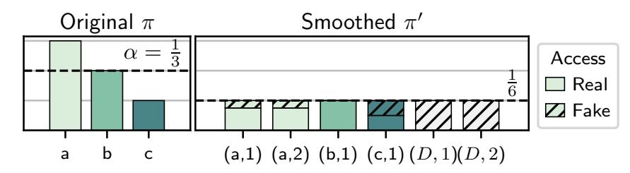

Figure 1: Frequency smoothing example. (Left) Original distribution over keys. (Right) Distribution over replicas after frequency smoothing. Ratio of real to fake accesses is the ratio of their areas.

To do so, PANCAKE computes a complementary fake access distribution over replicas so that the sum of the probability of a fake access and real access for any given replica is equal to 1/2*n*, where 2*n* is the total number of replicas. Every time an access is made, it is chosen to be either fake or real with probability 1/2. In our example, using a fake access distribution of (1/12, 1/12, 0, 1/6, 1/3, 1/3) across the four replicas ensures each replica has a total access probability of exactly 1/6. We will show that adding fake queries in this manner always ensures equal probability for any key being accessed.

To support updates to values, every access is a read followed by a write of a freshly encrypted value. For keys with many replicas, we cannot change all replicas immediately as this would leak that these encrypted values are linked. Instead PANCAKE updates one of the replicas, caches the new value, and opportunistically updates the remaining replicas using subsequent fake or real queries to the replica. This could require a large cache in the worst case, but we show empirically in [§6](#page-8-0) that the cache remains small for typical workloads.

To service a (real) query from a client, PANCAKE performs a sequence of *B* accesses randomly chosen from either the real or the fake distribution, inserting the actual request into one of those chosen to be real. There is a small chance that the client's request cannot be served, in which case PANCAKE puts the query into a queue until the next client request arrives. (The write-only ORAM of [\[10\]](#page-13-16) uses batching in a similar way, though the exact mechanism is specific to their design.) We show that with *B* = 3, PANCAKE can ensure delivery of client requests in a timely manner (we make this precise in the next section), while maintaining that the probability of accessing any sequence of *B* encrypted keys is equally likely.

One could achieve security without selective replication by increasing the ratio of fake queries to real queries, but a larger value of *B* will be needed to ensure client requests are not stalled for arbitrarily long time. This, in turn, would result in high bandwidth overheads for many distributions. Thus, the combination of selective replication and fake queries, as in frequency smoothing, is necessary to ensure small overheads. With our chosen parameters, we will prove a storage overhead of 2× and a bandwidth overhead of 3× of insecure KV stores, independent of the underlying distribution. Moreover, we will prove that PANCAKE's protocol is secure if the estimate πˆ is sufficiently good.

Dynamic query distributions. To allow PANCAKE to maintain its security and performance guarantees even when access

distributions change, we extend the above design using an efficient algorithm that dynamically updates the fake query probabilities and replica allocations across keys. Recall that the total number of replicas in PANCAKE is always 2*n*, regardless of the distribution. This means that when the distribution changes, for every key that must lose a replica, another must gain a replica. Therefore, handling distribution changes simply requires reassigning replicas for all such key-pairs.

PANCAKE uses a specialized replica swapping protocol to efficiently adjust the allocation of replicas in parallel with servicing client requests. The key challenge is that a request must be serviced by one of the old replicas, not a newly allocated one, until all the new replicas have the appropriate value propagated to them. We show that we can temporarily lower the ratio of real to fake queries, which, combined with appropriate temporary caching of values during the transition, maintains the invariant that every access to the store is uniformly distributed, guaranteeing security ([§5\)](#page-6-0).

## <span id="page-3-0"></span>4 PANCAKE Design: Static Distribution Case

We now provide details on the design and implementation of PANCAKE. In this section, we focus on the case of a static distribution, and extend PANCAKE's design to efficiently handle dynamic changes in the next section. We start the section with the data storage ([§4.1\)](#page-3-1) and frequency smoothing ([§4.2\)](#page-4-0) mechanisms in PANCAKE, and then provide a formal security analysis for PANCAKE's design ([§4.3\)](#page-5-0). We close the section with performance analysis of PANCAKE's storage requirements and bandwidth overheads for query execution ([§4.4\)](#page-6-1).

## <span id="page-3-1"></span>4.1 Data Storage

PANCAKE is backward-compatible with existing data stores — it requires no modifications on how data is sharded across multiple cores or machines, and how queries are executed in the underlying data store. Thus, PANCAKE naturally benefits from the many properties of existing data store, e.g., elasticity, fault tolerance, data persistence, etc. The core of the PANCAKE design is a proxy, which we describe below.

The PANCAKE proxy. The main functionality of the PAN-CAKE proxy is to initialize the data store, to implement frequency smoothing, and to execute queries on behalf of clients (encryption/decryption of query requests/responses). The proxy maintains several data structures to achieve its functionalities:

- Observed query distribution (πˆ): The proxy maintains the probability of access for individual keys, based on the histogram of accesses across keys. This "observed" distribution is an estimate of the underlying distribution, and is also used to detect changes in distribution over time.
- Fake query distribution (π*f*): The proxy also maintains a fake probability of access for each individual key. We will discuss below how the fake distribution is computed.

{4}------------------------------------------------

- **Key**  $\rightarrow$  **replica counts:** PANCAKE's selective replication mechanism may create one or more replicas for KV pairs. The proxy maintains a map  $k \rightarrow R(k)$  from keys to their number of replicas, for all keys with R(k) > 1.
- **UpdateCache:** To securely handle write queries, we use a data structure that stores a map  $k \to (v, \mathtt{UpdateMap})$ , where  $\mathtt{UpdateMap}$  is a bitmap of length R(k) denoting whether or not a particular replica of k has been updated or not. We provide more details below.
- Query queue: This stores outstanding client queries.

The rest of the section details how the PANCAKE proxy uses these data structures to realize its functionalities. But first we make two observations about proxy storage and scalability.

Regarding PANCAKE proxy storage requirements, we note that storing the probability for a key as floating-point values requires 8 bytes of storage per key; given that the size of values in many real-world applications is of the order of kilobytes [4], storing the real and the fake distributions requires a tiny fraction of the entire dataset size. For instance, with 4 kilobyte values, the fraction works out to a mere 0.39%. Similarly, the key  $\rightarrow$  replica counts data structure is also tiny. The size of UpdateCache, on the other hand, depends on the query distribution as well as the write rates; we evaluate the UpdateCache size empirically for realistic workloads in §6.

The PANCAKE proxy is implemented to efficiently scale with multiple cores. For the multi-core implementation, the first four data structures are shared by all PANCAKE proxy cores, while each core maintains its own query queue (for queries "assigned" to that core). Our proxy implementation ensures high performance (highly concurrent read-write rates) for data structures shared across cores. The first three data structures are updated at coarse-grained timescales (e.g., due to significant changes in the query distributions) and thus, simple arrays suffice for our purposes. UpdateCache, on the other hand, requires concurrent read/write operations; to this end, our implementation uses a Cuckoo hashmap [44] that can support 40 million read/write operations per second on a commodity server.

## <span id="page-4-0"></span>4.2 Frequency Smoothing

We now describe PANCAKE's frequency smoothing techniques for static distributions, specifically the algorithms to initialize the data store (with selective replication) and execute queries (with real queries, fake queries, and batching).

It transforms a real query on a plaintext database KV into a fixed number of accesses (say B for "batch size") on an encrypted database KV'. By creating multiple copies ("replicas") of the most queried KV pairs and generating fake queries, we can ensure each of the B accesses are a uniformly random selection of the items in KV'.

**Initializing the data store.** PANCAKE transforms a plaintext data store  $KV = \{(k_i, v_i)\}$  with n KV pairs into a data

store KV' with  $n' \ge n$  encrypted KV pairs. At the same time, PANCAKE transforms accesses distributed according to  $\pi$  over the keys of KV to a sequence of uniform accesses over the encrypted keys of KV'. To distinguish between plaintext keys and encrypted ones, we refer to the latter as labels. PANCAKE use an estimate  $\hat{\pi}$  of  $\pi$ . During initialization,  $\hat{\pi}$  can be assumed to be uniform, and the techniques from §5 can later be used to transition to a more accurate estimate. Alternatively, in many settings one will provide a warm start by initializing PANCAKE with a  $\hat{\pi}$  learned from performance or other logs.

In generating KV', we use selective replication to add replicas to KV' for keys accessed frequently according to  $\hat{\pi}$ . If we set a threshold  $\alpha$ , then for each  $(k,v) \in \text{KV}$  we generate  $R(k,\hat{\pi},\alpha) = \lceil \hat{\pi}(k)/\alpha \rceil$  replicas: key-value pairs ((k,j),v) where j ranges over 1 to  $R(k,\hat{\pi},\alpha)$ . When  $\hat{\pi}$  and  $\alpha$  are clear from context, we will omit them and simply write R(k).

Each replica (k,i) is then protected by applying a secretly keyed pseudorandom function F (e.g., HMAC) to the replica identifier to generate a label F(k,i). We apply authenticated encryption E to the value. Thus ultimately  $\mathsf{KV}' = \{(F(k_i,j),E(v_i))\}$  for  $1 \le i \le n$  and where  $1 \le j \le R(k_i)$  for each i. For simplicity, we have omitted in our notation the two required cryptographic secret keys, and that we cryptographically bind labels and value ciphertexts together by using the label as associated data with E. A straightforward calculation shows that for any  $\hat{\pi}$  and  $\alpha$ ,  $n' \le n + 1/\alpha$ .

The second initialization task is to compute a fake distribution  $\pi_f$  over replicas. Here we adapt a technique from Mavroforakis et al. [45]. In particular we pick a constant  $0 < \delta \le 1$  (this choice is explained in more detail below) and then craft  $\pi_f$  so that the probability p(k,j) of accessing any replica (k,j) is: (1) equal to 1/n' and (2) a convex combination of the probability of truly accessing a replica and performing a fake access. Namely we ensure that

<span id="page-4-1"></span>
$$p(k,j) = \delta \cdot \frac{\hat{\pi}(k)}{R(k)} + (1 - \delta) \cdot \pi_f(k,j) = \frac{1}{n'}$$
 (1)

This corresponds to the following randomized process. Flip a  $\delta$ -biased coin. If it comes up heads, randomly choose a replica for some real query drawn according to  $\pi$ ; otherwise, choose a replica to access according to the fake distribution  $\pi_f$ .

The constant  $\delta$  must be chosen so that  $\delta \leq R(k)/(n' \cdot \hat{\pi}(k))$  for every key k; otherwise, it may not be possible to assign valid (non-negative) probability  $\pi_f(k,j)$  to satisfy Equation 1 for some key k. We use  $\delta = 1/(n'\alpha)$ , which is always valid.

Note that  $\delta$  corresponds to the proportion of real queries: if  $\alpha$  is set too high, then most queries would be fake. At the same time, since  $n' \leq 1/\alpha + n$ , setting  $\alpha$  too low would cause KV' to grow too large. We set  $\alpha = 1/n$  since it corresponds to a sweet spot:  $n' \leq 2n$ , i.e., KV' is at most twice as large as KV, and  $\delta \geq 1/2$ , i.e., at least half the queries are real.

**Dummy replicas.** We note that the approach outlined above would result in a different number of total replicas for different distributions (although upper-bounded by 2n), which

{5}------------------------------------------------

```
Init(\hat{\pi}, KV, \alpha):
                                                                      Batch(k):
n \leftarrow |\mathsf{KV}|
                                                                      j \leftarrow \{1, \ldots, R(k)\}
\mathsf{KV}' \leftarrow \emptyset
                                                                      AddToQueue(k, j)
n' \leftarrow 0
                                                                      For i = 1 to B:
For (k, v) \in \mathsf{KV}:
                                                                           q_{\text{type}} \leftarrow_{\delta} \{0,1\}
    R(k) \leftarrow \lceil \hat{\pi}(k)/\alpha \rceil
                                                                           If q_{\text{type}} = 0:
     For j \in [1, ..., R(k)]:
                                                                               (k_i,j_i) \leftarrow \$\pi_f
         \pi_f(k,j) \leftarrow \frac{\alpha - \hat{\pi}(k)/R(k)}{2n\alpha - 1}
                                                                           Else:
         \mathsf{KV}' \stackrel{\cup}{\leftarrow} \{(F(k,j),E(v))\}
                                                                               If QueueNotEmpty:
                                                                                    (k_i, j_i) \leftarrow \mathsf{Dequeue}()
    n' \leftarrow n' + R(k)
                                                                               Else:
For j \in \{1, ..., 2n - n'\}:
                                                                                    k_i \leftarrow \$ \hat{\pi}
    \pi_f(D,j) \leftarrow \frac{\alpha}{2n\alpha-1}
                                                                                    j_i \leftarrow \{1,\ldots,R(k_i)\}
    \mathsf{KV}' \stackrel{\cup}{\leftarrow} \{(F(D,j),E(D))\}
                                                                      \ell \leftarrow \{F(k_1, j_1), \ldots, F(k_B, j_B)\}
\delta \leftarrow \frac{1}{2n\alpha}
                                                                      Return \ell
Return KV', \pi_f, R, \delta
```

Figure 2: PANCAKE's initialization and batch access algorithms for a plaintext data store KV, distribution estimate  $\hat{\pi}$ , and threshold  $\alpha$ .

leaks information about the distribution. To avoid this leak, PANCAKE preemptively initializes KV' with enough *dummy* replicas so that the total number of replicas is always 2n.

Dummy replicas are KV pairs (F(D, j), E(D)), for  $j = 1, \ldots, 2n - n'$  (n' is the number of "real" replicas for  $\hat{\pi}$ ), where the dummy key D is unique and does not exist in the original set of keys. Dummy replicas are accessed only with fake accesses; therefore,  $\hat{\pi}(D) = 0$  and the fake access probability is  $\pi_f(D) = \alpha/(2n\alpha - 1)$  (derived from Eq. 1). Note that since the total number of replicas is now 2n, the proportion of real queries  $\delta = 1/(2n\alpha) = 1/2$  for  $\alpha = 1/n$ .

A pseudocode description of PANCAKE's initialization (including dummy replicas) appears in Figure 2.

**Query execution.** Intuitively, we will follow the randomized process associated to Equation 1 to mix fake and real accesses. To increase the probability that a client's real access is handled right away, PANCAKE in fact sends a small batch of accesses to KV' for each client request. In particular, when a client submits an access request for key  $k \in KV$ , PANCAKE runs the Batch algorithm shown in Figure 2. It randomly chooses a replica j of k, adds (k, j) to the query queue, and prepares a batch of B accesses to KV'. By default we set B=3 (we will justify our choice in §4.4). For each of these accesses, it samples a bit  $q_{\text{type}}$  according to  $\delta$  that determines whether the access is real (heads) or fake (tails). For each  $q_{\text{type}}$  that comes up heads (real) in the batch we attempt to send a value from the query queue. If the query queue is empty, then the client simulates a real access by sampling a key from  $\hat{\pi}$  itself (denoted  $k \leftarrow \$\hat{\pi}$ ) and choosing a replica at random. For each fake access, the client samples a replica according to  $\pi_f$ . The resulting batch of replicas have the pseudorandom function F applied before being sent to the server. Note that Batch imposes bandwidth overhead exactly  $B \times$  over a KV store that just uses encryption and leaks access patterns.

Note that the batching done in the PANCAKE proxy does not require all queries in the batch to be sent to the same shard/server; the batching is completely independent of the sharding mechanism used on the server and queries in the batch are independently forwarded to respective shards. Upon retrieving the associated values, PANCAKE decrypts the ones requested by clients and returns them.

It is critical that PANCAKE only sends a single batch for each client request. If instead the proxy sent batches until the query queue was empty, frequency information about which keys clients access would leak. For example, if one uses B=1 and kept submitting until the queue is empty, then the final access to KV' must be a client request. Thus PANCAKE defers handling a query until a later batch if necessary, increasing latency. We show experimentally that for most loads this latency increase is acceptably low (§6.3). In practice PANCAKE can vary B as a function of load: decrease B at high load (to lower bandwidth overhead) and increase B at low load (to lower latency). Such changes to B do not reveal anything new to an adversary, who can anyway estimate aggregate load.

Supporting writes. PANCAKE handles updates (writes) to keys in KV by borrowing a standard technique from the ORAM literature [24]: treat each access as a read followed by a write. After the client receives the *B* encrypted values from the server corresponding to the batch, it decrypts, possibly updates, then re-encrypts the values and sends them back to the server. Each access therefore consists of a fixed-size batch of reads followed by a fixed-size batch of writes to the same labels. When a key has multiple replicas and its value is updated, the client adds it to the UpdateCache to track which of its replicas still need to be updated (updating all replicas at once leaks information). PANCAKE consults the UpdateCache every time it does a writeback to ensure all updates propagate. Once all of a key's replicas have been updated, its entry is removed from the cache. Note that PANCAKE can use any access (fake or real) to opportunistically propagate updates.

#### <span id="page-5-0"></span>4.3 Security Analysis

Intuitively, PANCAKE security stems from the following three points. (1) The cryptographic security of F as a pseudorandom function and E as a (randomized) authenticated encryption scheme. This ensures that the keys F(k, j) appear random and that nothing leaks about values. (2) Assuming client requests are distributed according to  $\pi$  and that our estimate  $\hat{\pi}$  of  $\pi$ is sufficiently good, each individual access is uniformly distributed over KV' by Equation 1. (3) Fake and real queries cannot be distinguished by the server (i.e., none of the coin tosses  $q_{\text{type}}$  can be inferred). The third point requires that the number and timing of accesses observed by the server be independent of the coin tosses. We do not attempt to hide the time at which an access is made by a client, but the timing should be independent of which key a client requests and which accesses are fake or real — thus, similar to ORAM designs [9], PANCAKE implementations must be constant-time.

Formal analysis. To provide a formal analysis, we introduce a security definition called real-versus-random indis-

{6}------------------------------------------------

tinguishability under chosen distribution attack or ROR-CDA. A formal game-based definition of ROR-CDA is given in Appendix A. Briefly, in the real world the adversary is given PANCAKE's encryption of the KV store KV' and a transcript  $\tau$  generated by running Batch on q samples from  $\pi$  (where Batch uses  $\hat{\pi}$ ). In the ideal world, the adversary is given a database consisting of random bit strings and a transcript of  $q \cdot B$  uniformly random accesses.

Achieving this security goal rules out attacks based on access pattern leakage. Take frequency analysis as an example. If ROR-CDA holds, the frequency with which any label is accessed is independent of the label itself. Thus, frequency analysis and any other attacks which rely on computing the most likely access will fail — all accesses are equally likely, so it is impossible to do better than baseline guessing.

The following theorem establishes the ROR-CDA security of PANCAKE. The theorem reduces to the pseudorandom function security [23] of F, the real-versus-random indistinguishability [60] of E, and to the computational indistinguishability of  $\pi$  and  $\hat{\pi}$ .

<span id="page-6-2"></span>**Theorem 1** Let  $q \ge 0$  and  $Q = q \cdot B$ . Let  $\pi, \hat{\pi}$  be distributions. For any q-query ROR-CDA adversary  $\mathcal{A}$  against PANCAKE we give adversaries  $\mathcal{B}, \mathcal{C}, \mathcal{D}$  such that

$$\mathbf{Adv}^{ror\text{-}cda}_{\mathtt{PANCAKE}}(\mathcal{A}) \leq \mathbf{Adv}^{prf}_{F}(\mathcal{B}) + \mathbf{Adv}^{ror}_{E}(\mathcal{C}) + \mathbf{Adv}^{dist}_{Q,\pi,\hat{\pi}}(\mathcal{D})$$

where F and E are the PRF and AE scheme used by PANCAKE. Adversaries  $\mathcal{B}, \mathcal{C}, \mathcal{D}$  each use Q queries and run in time that of A plus a small overhead linear in Q.

**Discussion.** Details of our formal analysis, including the proof of Theorem 1, are presented in Appendix A. Here we make some salient observations.

Our theorem is "parameterized" by q,  $\pi$ ,  $\hat{\pi}$ . It applies to any distribution  $\pi$ , and provides security up to the ability to accurately estimate it. In the best case, estimation is perfect,  $\hat{\pi} = \pi$ , and Theorem 1 is optimal in the sense that the only way to break PANCAKE is to break one of the underlying cryptographic tools. Even if our estimate is not perfect, it just needs to be good enough to be indistinguishable from the real distribution for a limited number of samples. While there exist distributions that are hard to estimate [7, 32, 63], real-world ones with heavy skew allow for sufficiently good estimation.

Our security model is highly pessimistic in that we assume the adversary has perfect knowledge of  $\pi$ . In reality they will not, and so we expect that in practice PANCAKE will provide even greater security than what our theory suggests.

#### <span id="page-6-1"></span>4.4 Performance Analysis

PANCAKE incurs a bandwidth overhead of  $B \times$ , the size of each batch. With  $\alpha = 1/n$ , the server stores 2n replicas (including dummy replicas), so the server storage overhead is  $2 \times$ . Note that PANCAKE bandwidth and server storage overheads are independent of the underlying data access distributions.

PANCAKE proxy storage and query latency overheads are related to query queue length, which itself is a function of batch size B. Experimentally, we observe a near-zero queue length for  $B \ge 3$  (§6.3). This is supported by results in queuing theory: if we model the number of query arrivals per unit time as Poisson with mean  $\lambda$ , with  $\delta = 1/2$  the number of departures per unit time with our scheme is also Poisson with mean  $\lambda \cdot B/2$ . Thus, our queue is well-modeled as M/M/1 with  $\rho = \lambda/(\lambda \cdot B/2) = 2/B$ . Applying standard results on steady-state behavior of such queues [17], as the number of queries goes to infinity,  $\Pr[i \text{ queries in queue}] = (1 - \frac{2}{B})(\frac{2}{B})^i$ . Thus the probability that a query waits for i queries ahead of it in the queue is exponentially vanishing in i.

The size of PANCAKE's UpdateCache depends on the query distribution, the threshold  $\alpha$ , and the fraction of write queries. A loose bound on UpdateCache size is the number of keys with access probability greater than  $\alpha$ . Intuitively, a pathological worst-case could occur when n-1 out of n keys have access probability slightly higher than 1/n; in this case, each of the n-1 keys would have 2 replicas, and UpdateCache size could grow to O(n) with very high write rates. We delegate a formal analysis of the worst-case UpdateCache size for specific distributions to future work, but note that our evaluation demonstrates that, for standard benchmark workloads comprising skewed distributions, the UpdateCache size turns out to be a small fraction (< 5%) of the dataset size (§6.3).

# <span id="page-6-0"></span>5 Handling Dynamic Distributions

In the previous section, we showed how PANCAKE transforms any static distribution of key-value accesses into a uniformly-distributed one. For some applications, however, distributions will change over time. We now describe how PANCAKE adapts to changes in the query distribution. We start by describing the core dynamic adaptation technique in PANCAKE under the assumption that changes in distribution can be detected instantaneously (§5.1), prove PANCAKE security under this assumption (§5.2), and, finally, discuss some pragmatic issues of detecting changes in the underlying distribution (§5.3).

## <span id="page-6-3"></span>5.1 Adapting to Changes in Distribution

Once the new query distribution estimate  $\hat{\pi}'$  is identified, PANCAKE must adapt to  $\hat{\pi}'$  by smoothing it. We note that if all keys need the same number of replicas with  $\hat{\pi}'$  as they need with  $\hat{\pi}$ , PANCAKE easily adapts to  $\hat{\pi}'$  by recomputing the fake query distribution  $\pi_f$  as per Equation 1. However, when a key's probability  $\hat{\pi}'(k)$  increases so much that  $\hat{\pi}'(k) \geq R(k,\hat{\pi},\alpha) \cdot \alpha$ , then PANCAKE must change its number of replicas. Figure 3 shows an example for frequency smoothing of  $\hat{\pi}$  and  $\hat{\pi}'$ ; note that while key a gains a replica, the dummy key a loses one.

Adapting to changes in the query distribution while preserving both efficiency and security is challenging. One approach is downloading the entire database and re-running Init from Figure 2 with fresh keys. This is secure but prohibitively

{7}------------------------------------------------

<span id="page-7-0"></span>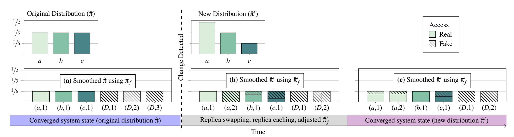

Figure 3: **Frequency smoothing for dynamic distributions.** (a) Smoothing for original distribution  $(\hat{\pi})$  over replicas in KV' using fake distribution  $\pi_f$ . With  $\hat{\pi}$ , each of keys a,b,c has one replica, and the dummy key D has 3 replicas. (b) Detection of new distribution  $(\hat{\pi}')$  over keys triggers replica swapping. During replica swapping, distribution over replicas in KV' is smoothed using an adjusted fake distribution  $\tilde{\pi}'_f$ : all real accesses to a are directed to (a,1), and the real access probability is decreased until (D,3) and (a,2) are swapped. (c) Smoothing for new distribution  $(\hat{\pi}')$  using new fake distribution  $\pi'_f$ , after replica swapping completes. Key a gains a replica, while a loses a replica.

bandwidth-intensive, and queries cannot be serviced during reinitialization. One could instead act only on the replicas for keys whose probabilities have changed; this is insecure since accesses are non-uniform during the change. In Figure 3, if we only download a, add a new replica for it and delete one for D, then an adversary can infer that a grew in popularity.

Our solution builds on the latter approach, ensuring efficiency and security using an *online replica swapping* mechanism described next. To make replica swapping performant and secure, it must work in conjunction with two other techniques: adjusting the fake query distribution and caching replicas at the proxy.

**Replica swapping.** Our key insight in adapting to change in query distributions is that since the total number of replicas for any distribution is always exactly 2n (including dummy replicas), a transition from  $\hat{\pi}$  to  $\hat{\pi}'$  ensures that for each key  $k_i$  that gains a replica, there must be another key  $k_j$  that loses a replica. Therefore, handling changes in query distributions simply requires, for all such keys, reading  $k_j$ 's value and writing it to one of  $k_j$ 's replicas, a process we refer to as replica swapping. PANCAKE performs these swaps without revealing any information about the change by piggybacking the replica swaps atop normal client accesses. Maintaining uniform accesses during replica swapping requires changes to the Batch procedure and the fake access distribution as described in §4; we describe these changes next.

During replica swapping, the modified Batch uses two lists: G and L. G is the set of replicas that need to be created and L is the set of replicas that need to be removed. Formally, if S is the set of keys that must gain replicas, T is the set of keys that must lose replicas, and  $R(k, \hat{\pi}', \alpha) = \lceil \hat{\pi}'(k)/\alpha \rceil$ , then,

$$G = \{(k, j) | k \in S, j \in [R(k, \hat{\pi}, \alpha) + 1, \dots, R(k, \hat{\pi}', \alpha)]\}$$
  
$$L = \{(k, j) | k \in T, j \in [R(k, \hat{\pi}', \alpha) + 1, \dots, R(k, \hat{\pi}, \alpha)]\}$$

A pseudocode procedure for generating these lists from  $\hat{\pi}$ 

and  $\hat{\pi}'$  is given in Figure 17 in Appendix E, along with a description of the modified Batch. It is not hard to see that  $|\mathsf{G}| = |\mathsf{L}|$  always (since |S| = |T|), and that swapping each replica in L for one in G results in all keys having the right number of replicas under  $\hat{\pi}'$ . This swapping is done opportunistically by Batch: when a replica in L is read in a batch, either by a real or a fake query, its value is updated to the value associated with a replica in G during the writeback. For security reasons, PRF labels for replicas in G are not changed. Instead, PANCAKE maintains a mapping between the label of replicas in L and the replica in G it will be swapped with. On subsequent queries during the transition, Batch consults the mapping for the right labels. This metadata can be deleted after periodic rotation of the cryptographic keys. We describe key rotation in Appendix B. When all swaps have occurred, we switch back to the normal Batch procedure for  $\hat{\pi}'$ .

As a concrete example of replica swapping, consider Figure 3. The set G contains the replica (a,2), while L contains (D,3). Note that both G and L could contain dummy replicas, depending on how the distribution changes. Batch would swap the replicas for keys a and D on the first access to  $(D,3) \in L$  by writing back an encryption of key a's value (because  $(a,2) \in G$ ) instead of a re-encryption of the dummy value D. To enable this, PANCAKE would maintain a mapping that indicates the label of (a,2) is F(D,3).

Adjustments to fake access distribution. Two more modifications are needed during the transition. First, we must use a different fake access distribution to ensure that reads to keys that have gained replicas always succeed. To see why this is necessary, consider again the example in Figure 3. If a query tries to read key a by accessing replica (a,2) before the value of (D,3) is changed, the read will return D's value instead of a's. Thus replica (a,1) must be read, but forcing this makes (a,1)'s probability too high, violating security.

{8}------------------------------------------------

PANCAKE handles this by temporarily increasing the threshold  $\alpha$  to  $\alpha' = \max_k \{\pi'(k)/R(k,\hat{\pi},\alpha)\}$ , and using a temporary fake access distribution  $\tilde{\pi}'_f$  to satisfy Equation 1 with  $\alpha'$ . For each  $(k,j) \in \mathsf{G}$ , we set  $\tilde{\pi}'_f(k,j) = \frac{\alpha'}{2n\alpha'-1}$ , and k's existing replicas have  $\tilde{\pi}'_f = \frac{\alpha' - \hat{\pi}'(k)/R(k,\hat{\pi},\alpha)}{2n\alpha'-1}$ . For other keys,  $\tilde{\pi}'_f(k,j)$  is set to  $\frac{\alpha' - \hat{\pi}'(k)/R(k,\hat{\pi}',\alpha)}{2n\alpha'-1}$ .

Since  $\alpha' \ge \alpha$ , the real access probability  $\delta = 1/2n\alpha'$  is lower during replica swapping. As such, this may lead to some real queries being delayed to later batches. This may increase latency for some queries during replica swapping, but we show in §6.2 that replica swapping completes in a few minutes even for drastic changes in the distribution.

Replica caching. PANCAKE computes the mapping between each label in L and the replica in G it will be swapped with when the distribution change is detected. However, the actual values of replicas in G must be propagated to those in L during subsequent accesses to them. Without any additional mechanism, reads to keys with replicas in G may access incorrect values. To ensure correctness, when a replica in G is read during Batch, its value is cached at the proxy. This value is then propagated to the replica in L when it is next accessed, while the actual read is served from the cache.

Insertion and deletion of keys. We have assumed so far that the support size is fixed; interestingly, the replica swapping procedure can support changes in the set of keys. This can be viewed as a distribution change where  $\operatorname{supp}(\hat{\pi}') \neq \operatorname{supp}(\hat{\pi})$ . As long as PANCAKE is initialized with enough replicas to handle the maximum support size, new keys can be inserted by swapping a dummy replica for the new key, and vice versa for deletion. Some additional metadata is needed, but similar to the PRF label mapping it can be deleted as soon as cryptographic keys are rotated (see Appendix B).

#### <span id="page-8-1"></span>5.2 Security Analysis

We prove that PANCAKE's accesses remain uniform even for time-varying distributions, under the assumption that changes in distributions can be detected instantaneously. We formalize our goal as a generalization of the static ROR-CDA security notion. We call this new notion "real-or-random security under chosen dynamic distribution attack", or ROR-CDDA. It is similar to its static analogue except that it uses two distributions  $\pi$  and  $\pi'$ : after an adversarially chosen number of queries the distribution changes from  $\pi$  to  $\pi'$ . We let  $\mathbf{Adv}^{\mathrm{ror-cdda}}(\mathcal{A})$  be the ROR-CDDA advantage of an adversary  $\mathcal{A}$ . It captures the ability of  $\mathcal{A}$  to distinguish between a real PANCAKE execution during a distribution change (ROR-CDDA1) and uniformly random accesses (ROR-CDDA0). The following theorem captures the ROR-CDDA security of PANCAKE.

<span id="page-8-3"></span>**Theorem 2** Let  $q \ge 0$  and  $Q = q \cdot B$ . Let  $\pi, \pi', \hat{\pi}, \hat{\pi}'$  be distributions. For any q-query ROR-CDDA adversary  $\mathcal{A}$  against PANCAKE we give adversaries  $\mathcal{B}, \mathcal{C}, \mathcal{D}_1, \mathcal{D}_2$  such that

$$\mathbf{Adv}_{\text{PANCAKE}}^{ror\text{-}cdda}(\mathcal{A}) \leq \mathbf{Adv}_{F}^{prf}(\mathcal{B}) + \mathbf{Adv}_{E}^{ror}(\mathcal{C}) + \mathbf{Adv}_{O,\pi,\hat{\pi}}^{dist}(\mathcal{D}_{1}) + \mathbf{Adv}_{O,\pi',\hat{\pi}'}^{dist}(\mathcal{D}_{2})$$

where F and E are the PRF and AE scheme used by PANCAKE. Adversaries  $\mathcal{B}, \mathcal{C}, \mathcal{D}_1, \mathcal{D}_2$  each use at most Q queries and run in time that of A plus a small overhead linear in Q.

**Discussion.** Full details of the definitions and a proof of Theorem 2 appear in Appendix A. We discuss here only one salient point regarding ROR-CDDA. ROR-CDDA models the shift from  $\pi$  to  $\pi'$  as happening and being detected instantaneously. This may not be realistic in some cases, even with state-of-the-art techniques in detecting distribution changes (as used in PANCAKE, discussed in next subsection). Thus, we cannot rule out the case where PANCAKE processes queries from  $\pi'$  before the change is detected (treating them like samples from  $\hat{\pi}$ ). The distribution of these queries would be non-uniform, with bias related to the difference between  $\pi$  and  $\pi'$ . If the adversary knows the bias, using it in an attack would be possible but challenging—indeed, we are not aware of any published attacks that even consider the possibility of distribution changes.

## <span id="page-8-2"></span>**5.3** Detecting Changes in Query Distribution

Detecting distribution changes using statistical tests is a well studied problem [36,39,65,71]. While it is possible to have PANCAKE receive external signals (e.g., from an analyst) when the distribution changes, our implementation incorporates the two-sample Kolmogorov–Smirnov (KS) test [39,65], a standard statistical tool, to detect such changes automatically. Specifically, recall that PANCAKE maintains a histogram H of observed accesses to maintain an estimate  $\hat{\pi}$  for distribution  $\pi$ . In order to track changes to the distribution, PANCAKE additionally maintains a running histogram  $H_{running}$  over a sliding window of the w latest accesses at the proxy. PANCAKE then uses KS test to determine when the underlying distribution corresponding to  $H_{running}$  differs from  $\hat{\pi}$ . If the test indicates a change, PANCAKE uses the current  $H_{running}$  snapshot to inform the estimate  $\hat{\pi}'$  for the new distribution  $\pi'$ .

Detecting changes in distributions, and responding to these changes involves balancing security and efficiency. If the test is too sensitive the system will waste resources adjusting to spurious changes; on the other hand, as discussed above, an insensitive test could leak information about queries. While it is possible to use other statistical tests [71], or an ensemble of tests to navigate this tradeoff between performance and security, no statistical test is perfect. We present several evaluation results related to detecting and adapting to changes in query distribution, along with sensitivity analysis, in §6.2.

#### <span id="page-8-0"></span>6 Evaluation

We now evaluate PANCAKE across a wide variety of scenarios, including main-memory and secondary storage-based data stores, static and dynamic distributions, deployment settings

{9}------------------------------------------------

and workloads. We start by briefly describing the evaluation methodology, followed by detailed discussion of our results.

Compared approaches. We compare PANCAKE against two approaches: (1) an insecure baseline that provides no security guarantees, and (2) non-recursive PathORAM [67] (with Z=4), a state-of-the-art ORAM. The former serves as an upper bound on PANCAKE performance, since it corresponds to a data store with no security overheads. The latter, on the other hand, is the state-of-the-art design that provides security under our model (as well as under stronger models where an adversary can actively inject its own queries). As discussed earlier, our comparison against the latter should be interpreted as highlighting the huge efficiency gap between countermeasures in the two threat models. We use batch size B=3 for PANCAKE's Batch algorithm.

We compare these approaches using two representative storage backends: an in-memory KV store Redis [57], and a persistent SSD-based KV store RocksDB [59]. Our PathORAM deployment used an open-source implementation [15,62]. For PathORAM and PANCAKE, client queries are forwarded to the data store via a proxy server; for the insecure baseline, client queries are forwarded to the backend storage server without any intermediary proxy.

The PathORAM implementation used in our evaluation [15, 62] is single-threaded. TaoStore [61] and ConcurORAM [14] implement multi-threaded PathORAM; we omit results for them since they employ specialized storage backends adapted for ORAMs, eschewing fair comparison with backends we investigate. We note, however, that the performance reported in [14,61] is at least an order of magnitude lower than PANCAKE even with specialized storage backends.

**Experimental setup.** Our experiments run on Amazon EC2. The storage backend runs on a single t3.2xlarge instance with 8 vCPUs, 32GB RAM, and 1Gbps network and disk bandwidth. We use 1Gbps links and proxy/client machines with sufficient resources (r4.8xlarge instances with 32 vCPUs, 244GB RAM, 10Gbps network bandwidth) to highlight the impact of network bandwidth as a bottleneck.

**Dataset and workloads.** We use the Yahoo! Cloud Serving Benchmark (YCSB) [18], a standard benchmark for KV stores, to generate the datasets and workloads. The dataset contains  $2^{20}$  KV pairs, with 8B keys and 1KB values. We confine our dataset size to 1GB since PathORAM has prohibitively large initialization times (> 24 hours) and storage overheads (>  $10\times$ ) with larger datasets, while PANCAKE performance is essentially independent of dataset size.

We evaluate system throughput and latency using two YCSB workloads: Workload A (50% reads, 50% writes) and C (100% reads). These workloads represent two extremes in read-write proportions; other YCSB workloads either have intermediate read-write proportions (e.g., Workload B, D) or contain queries not supported by PANCAKE (e.g., Workload E). YCSB uses a Zipf distribution over key accesses (with

skewness parameter = 0.99, i.e., very skewed), which is representative of access patterns in real-world deployments [18].

### **6.1** Performance for Static Distributions

We first compare the performance for different approaches with various storage backends under static query distributions.

**In-memory server storage (Redis, Figure 4).** With a single proxy thread, PANCAKE and PathORAM performance is bottlenecked by the proxy. For this evaluation setting, PathO-RAM achieves throughput  $\sim 1600 \times$  lower compared to the insecure baseline. This is because PathORAM issues 160 storage backend requests (=  $Z \log_2 N$ , Z = 4,  $N = 2^{20}$ ) for every client request, along with complex tree and stash management.

PANCAKE achieves significantly better throughput (as much as 229× better) compared to PathORAM. In comparison to the insecure baseline, PANCAKE average latency is within  $2.3-2.6\times$  and throughput is within  $6.8-7.6\times$  (Figure 4(a), 4(b)). This is a cumulative effect of three factors: (1)  $3 \times$  bandwidth overhead due to batch size B = 3, (2)  $2\times$  overhead since each request generates a read and a write request in PANCAKE, and (3) overheads due to encryption/decryption. Our evaluation confirms that adding encryption/decryption to the insecure baseline brings PANCAKE's relative throughput overhead to  $6\times$ . We note that PANCAKE's 99<sup>th</sup> percentile latency (not shown in graphs) is relatively higher (within  $4.1-5.6\times$  the insecure baseline) due to queueing delays from PANCAKE's Batch algorithm. We note that if reducing tail latency were the goal, one can achieve that at the cost of higher bandwidth overheads by increasing B (§6.3).

With multiple proxy threads, PANCAKE peak throughput is within  $3.4 \times$  of baseline for the read-only workload (YCSB Workload C) — a factor of 2 better than the single proxy thread. This reduction in relative overhead is due to the shift in performance bottleneck to the network bandwidth in the multi-threaded setting. We note that all network links are *full*duplex. As such, although every read request generates a read and a write request in PANCAKE, write requests saturate the network bandwidth to the server, while read responses saturate the bandwidth from the server, i.e., reads and writes saturate different directions of the link. In contrast, the read-only workload for the insecure baseline is only able to saturate one direction of the link. For the 50% read, 50% write workload (YCSB) Workload A), PANCAKE's throughput remains the same, while baseline throughput increases by  $\sim 1.8 \times$ , since the baseline can now also exploit full-duplex links. The throughput versus latency variation (Figure 4(d)) shows that the throughput reported in Figure 4(c) corresponds to the knee point in the curve (i.e., the sweet spot for latency and throughput) for both the insecure baseline and PANCAKE.

SSD-based server storage (RocksDB, Figure 5). With RocksDB, PathORAM achieves throughput  $\sim 196 \times$  worse than the insecure baseline. Compared to the in-memory case, the slight improvement relative to the insecure baseline is due

{10}------------------------------------------------

<span id="page-10-2"></span><span id="page-10-1"></span>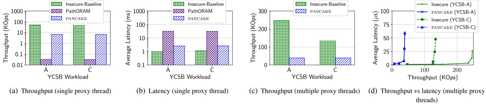

<span id="page-10-3"></span>Figure 4: **Performance for in-memory server storage (Redis).** (a, b) PANCAKE's throughput is over  $220 \times$  higher than PathORAM and within  $\sim 6.8-7.6 \times$  of the insecure baseline for a single-threaded proxy; note that the y-axis is in log-scale. (c, d) With multiple proxy threads, PANCAKE's peak throughput is within  $3.4-6.3 \times$  and latency within  $2.3-2.6 \times$  of the insecure baseline.

<span id="page-10-6"></span>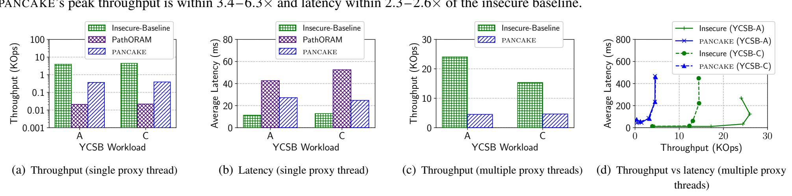

Figure 5: **Performance for SSD-based server storage (RocksDB).** (a, b) PANCAKE's throughput is  $17.3 \times$  higher than PathORAM and within  $\sim 10.7 - 11.3 \times$  of the insecure baseline for a single-threaded proxy; note that the y-axis is in log scale for (a). (c, d) Using multiple proxy threads, PANCAKE's peak throughput is within  $3.3 - 5.3 \times$  and average latency within  $2 - 2.4 \times$  of the insecure baseline.

to PathORAM overheads overlapping with higher overheads of accessing data off SSD. As such, the proxy overheads account for a smaller fraction of the end-to-end performance. PANCAKE's performance is  $\sim 17.3 \times$  better than PathORAM and within  $\sim 11.3 \times$  of the baseline.

With multiple proxy threads, PANCAKE peak throughput is within  $3.3 \times$  of the insecure baseline for read-only workload and within  $5.3 \times$  for the 50% read, 50% write workload similar to the in-memory case. Figure 5(d) confirms that throughput in Figure 5(c) corresponds to the performance knee-point.

**Storage overheads.** PANCAKE's server storage requirements are  $\sim 4 \times$  lower than the non-recursive PathORAM implementation that we use (=  $2 \cdot Z \cdot N$ , for Z=4) and within  $2 \times$  of the insecure baseline, consistent with the theoretical storage overheads for both approaches. PANCAKE's proxy storage requirement is a small fraction of the total storage footprint ( $\sim 1\%$ ), similar to PathORAM ( $\sim 0.33\%$ ) for all evaluated workloads. PANCAKE proxy storage overheads due to the UpdateCache is dependent on write-rates and skew in the distribution; we evaluate these in §6.3.

## <span id="page-10-0"></span>**6.2** Adapting to Dynamic Distributions

We evaluate PANCAKE's ability to detect and adapt to changes in distribution in isolation (i.e., without the effect of writes) using YCSB Workload-C (read-only). We present results for the in-memory storage backend. We set the sliding window size w for the running histogram  $H_{running}$  to 10 million queries, and the confidence interval for the KS test to 95%.

<span id="page-10-8"></span><span id="page-10-7"></span><span id="page-10-5"></span><span id="page-10-4"></span>**Detecting distribution change.** We quantify the cost of detecting distribution change in terms of the number of queries that must be observed before the change is detected. Figure 6(a) measures this as the skewness for the Zipf distribution is varied; as expected, the test detects *larger* changes in distribution (e.g., skewness drop from 0.99 to 0.0) in *fewer* queries, relative to much smaller changes (e.g., skewness drop from 0.99 to 0.9). This is consistent with the KS test's sensitivity.

In Figure 6(b), we shift the Zipf key popularities by  $\kappa$ , i.e., the most popular key becomes the  $\kappa^{th}$  most popular key, the second most popular key becomes the  $(\kappa+1)^{th}$  most popular, and so on, while the  $\kappa$  least popular keys become the most popular keys. This models changes in real-world access patterns where some items can suddenly become more popular [4]. Again, we observe that larger changes in distribution (e.g., shift by  $\kappa=256$ ) is detected in fewer queries (e.g., a few hundred thousand) than smaller changes (e.g., shift by  $\kappa=1$ , which may require millions of queries).

The results for both settings show that PANCAKE's mechanism for detecting changes in distribution works well in practice, e.g., at 100K queries per second, PANCAKE can detect changes in 1-2 seconds.

Adapting to distribution change. We evaluate PANCAKE overheads in adapting to dynamic distributions when the underlying distribution changes. In particular, we change the distribution from high skewed (skewness parameter = 0.99) to smaller skews, with the extreme case of a pure uniform access pattern (skewness parameter = 0).

{11}------------------------------------------------

<span id="page-11-1"></span>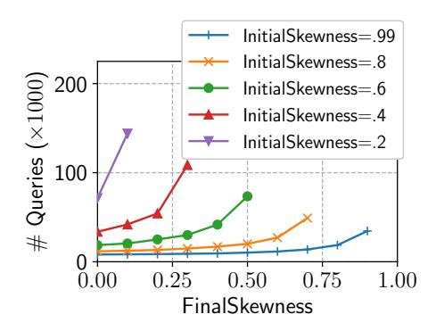

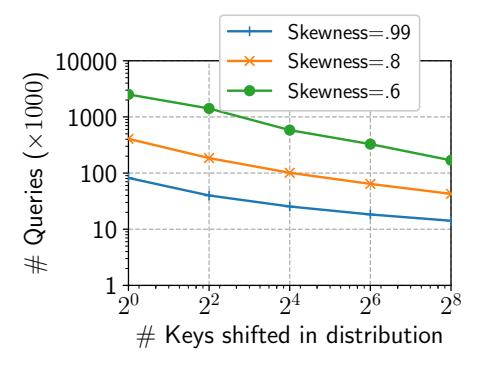

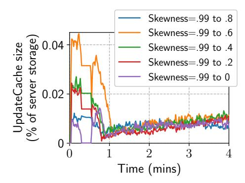

- (a) Detecting change in Zipf skew
- <span id="page-11-2"></span>(b) Detecting shift in key popularities
- <span id="page-11-3"></span>(c) Adapting to distribution change

<span id="page-11-4"></span>Figure 6: **Handling dynamic distributions.** (a, b) PANCAKE detects larger distribution changes in fewer queries, relative to smaller changes. (c) PANCAKE can adapt from a skewed to uniform distribution with UpdateCache size < .05% of server storage over evaluated workloads.

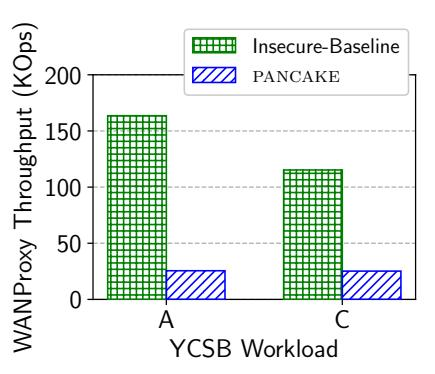

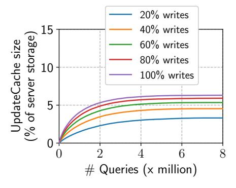

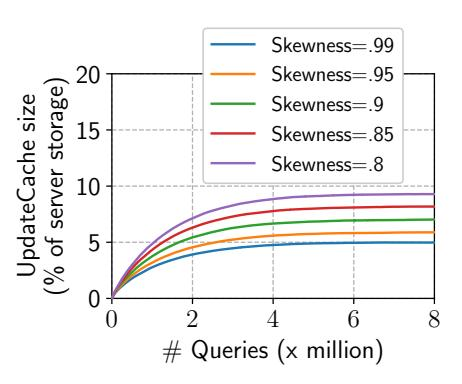

- (a) Effect of proxy location on throughput
- <span id="page-11-5"></span>(b) Effect of Write-rate on UpdateCache
- <span id="page-11-6"></span>(c) Effect of Skew on UpdateCache

Figure 7: (a) Due to asymmetric and unpredictable available download and upload speeds over the Internet, both the insecure baseline and PANCAKE observe reduced throughput  $(0.65-0.85\times)$  for the WAN setting when compared to the cloud setting. (b, c) UpdateCache size increases with write rate for a fixed Zipf distribution (skewness = 0.99) and decreases as skew increases for a fixed write-rate (50%), but remains well below 10% of server storage for all evaluated workloads.

Our results show that PANCAKE can adapt to even drastic changes in distribution (Zipf to pure uniform) in less than  $\sim 25$  minutes (for updating newly assigned replicas across all keys), while using < 0.05% of the server storage at the proxy (Figure 6(c)). This is interesting for two reasons: (1) PANCAKE observes only a negligible increase in proxy storage during the adaptation period, and (2) the adaptation occurs in the background, i.e., without stopping query execution, and in fact piggybacks on the query execution to carry out the adaptation. As such, higher query rates would lead to even faster adaptation to changes in distribution.

#### <span id="page-11-0"></span>**6.3** Performance Sensitivity to Parameters

We now analyze the sensitivity of PANCAKE's performance and storage overheads to various parameters. We highlight differences in our experimental setup wherever necessary.

Effect of proxy location (Figure 7(a)). We measure the impact of proxy location relative to the storage server by placing the proxy in a university network, connected to the cloud storage via the Internet. The proxy server has a 16-core 2.60GHz Intel Xeon CPU, 128GB RAM and 1Gbps access link to the Internet. Figure 7(a) measures the throughput for this setup (which we refer to as WAN proxy) using multiple proxy threads. The throughput for WAN-Proxy is slightly lower than Cloud-Proxy (Figure 4(c)), since the available bandwidth over the Internet was lower than 1Gbps and often unstable. Moreover, the measured upload bandwidth was lower than the download bandwidth over the Internet, which resulted in slightly lower throughput ( $\sim 0.65 \times$ ) for PANCAKE, and the

insecure baseline for Workload A (50% reads, 50% writes).

Impact of write rates (Figure 7(b)) and request distributions (Figure 7(c)) on UpdateCache. We quantify the proxy storage overhead due to UpdateCache by measuring its size for varying fractions of write rates and for varying skew in underlying distribution across keys. Figure 7(b) shows that UpdateCache size is well below 10% of the server storage even with 100% writes. For the more realistic case of lower write rates, the storage overhead is much lower, e.g., with 20% write rate, the overhead reduces to < 3% of server storage.

While most real-world distributions are heavily skewed [4], the fraction of keys with > 1 replica in PANCAKE increases with decrease in skew. This can lead to an increase in Update-Cache size, since PANCAKE caches values for such keys while propagating writes to their replicas. We evaluate this overhead by measuring UpdateCache size for workloads with different degrees of skew for the YCSB Workload A (50% read-50% write). Figure 7(c) shows that decreasing skewness from 0.99 to 0.8 increases UpdateCache size from 5% to 9% of server storage, i.e., UpdateCache size remains a small fraction of server storage even at low skew.

**Effect of batch-size** B (**Figure 8(a)-8(b)**). Recall from §4.4 that, for a batch size of B, PANCAKE incurs bandwidth overhead of  $B \times$ ; Figure 8(a) shows that when network bandwidth is the bottleneck, PANCAKE throughput degrades proportionally to the value of B. At the same time, larger B values leads to lower tail latency, since requests wait in the query queue for fewer batches — while B = 2 leads to an unstable queuing system (Figure 8(b)), B > 2 observes little or no queuing

{12}------------------------------------------------

<span id="page-12-1"></span>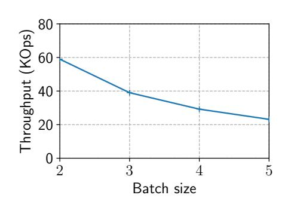

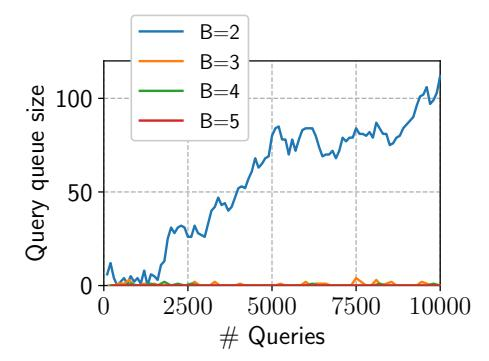

- (a) Effect of batch size on throughput
- <span id="page-12-2"></span>(b) Effect of batch size on query queue

Figure 8: (a, b) Impact of batch size on PANCAKE throughput and query queue size. See §6.3 for discussion.

delays. B thus exposes a tradeoff between tail latency and throughput, where B=3 provides a sweet spot for both. We do not evaluate latency vs. batch size since latency is tied to query inter-arrival times. For fixed inter-arrival times, latency overheads can be extrapolated from Figure 8(b).

#### <span id="page-12-0"></span>7 Discussion

PANCAKE is a first step toward designing high-performance data stores that are secure against access pattern attacks by passive persistent adversaries. In this section, we discuss several possible avenues for future research.

Correlated accesses. Our security analysis for PANCAKE relies on the assumption that queries are independent; in some application contexts, queries can be correlated. To the best of our knowledge, frequency analysis for correlated queries has not been explored. We present some preliminary results in Appendix D.1; specifically, we show that security in a variant of ROR-CDA that allows arbitrary correlations is equivalent to ORAM security, and must therefore suffer from the same lower bounds on ORAM efficiency. However, this result relies on the adversary being able to construct very specific and artificial query correlations. We believe that we need new technical tools to explore access patterns attacks under realistic query correlations.

Stronger adversaries. PANCAKE targets a security model where the attacker does not tamper with data or do rollback attacks. PANCAKE's use of authenticated encryption means tampering is detectable, and preventing rollbacks is possible via authenticated operation counters. However, unlike ORAM, PANCAKE does not provide security against adversaries that can inject their own queries [13,72]. We discuss how such chosen-query attacks could work on PANCAKE, and how it mitigates such attacks to some extent in Appendix C. Informally, we show that PANCAKE does no worse than other efficient schemes against such attacks.

**Dynamic distributions.** For the case of dynamic distribution, PANCAKE's security is proven under the assumption that changes in distribution happen instantaneously and can be detected instantaneously. While our evaluation suggests that PANCAKE can detect changes in distribution within a few seconds, it would be nice to generalize our analysis to capture

more gradual changes in distribution.

**Improved proxy implementation.** The current PANCAKE implementation uses a stateful proxy that stores distributions  $(\hat{\pi}, \pi_f)$ , key—replica counts, and pending writes in the UpdateCache. It would be interesting to explore implementations that allow the proxy to be more scalable (e.g., using a distributed proxy implementation) and fault tolerant (e.g., using techniques similar to [19]).

Variable-sized values. Similar to existing ORAM designs, to avoid attacks based on length leakage, current PANCAKE design assumes that values stored in the data store are fixed-size or have been padded to a fixed maximum length. While this is useful for many applications (e.g., values have fixed size when storing tweets, and storage systems like DynamoDB have upper bounds on value sizes), forcing values to be padded can cause prohibitive space overheads if there is a large difference between the largest and smallest values. It would be interesting to extend PANCAKE design to avoid storage overheads while protecting against attacks based on length leakage.

**Hiding access patterns in cache-based systems.** Many realworld systems execute queries on SSD-based storage with in-memory cache (e.g., MySQL server with memcached as a cache [47]). The problem of hiding access pattern seems to be at odds with achieving high performance in such deployment settings — intuitively, for workloads with skewed access patterns, it is possible to achieve performance gains by serving popular keys from the faster cache [73] at the cost of leaking that keys in cache are accessed more frequently than those not in cache. Hiding access patterns requires all keys to be accessed uniformly thus invalidating the benefits of a cache without any additional mechanism. Our preliminary evaluation, presented in Appendix F, shows that depending on the distribution and available cache size, existing systems including PANCAKE can observe as much as an order-of-magnitude throughput degradation compared to the insecure baseline that can effectively exploit the benefits of cache. Techniques that avoid such performance degradation while providing security against access pattern attacks would be interesting to explore.

#### 8 Conclusion

In this paper, we explored a novel frequency-smoothing based countermeasure against access pattern attacks on outsourced storage in a new formal security model. We instantiated this approach in a new system called PANCAKE, the first to resist access pattern attacks by persistent passive adversaries while maintaining low constant factor overheads in storage and bandwidth. As such, PANCAKE's throughput is  $229 \times$  higher than PathORAM, and within  $3-6 \times$  of insecure baselines.

{13}------------------------------------------------

## Acknowledgements

We thank the Usenix Security reviewers for their insightful feedback. We also thank our shepherd Amir Rahmati for his help with revisions to the paper. We thank Haris Mughees for his help in the early stages of the project. Grubbs was supported by NSF DGE-1650441. This work was in part supported by NSF grants 1704742, 1704296, 1514163, a Google Faculty Research Award, and a gift from Snowflake.

## References

- <span id="page-13-0"></span>[1] Rachit Agarwal, Anurag Khandelwal, and Ion Stoica. Succinct: Enabling Queries on Compressed Data. In *NSDI*, 2015.
- <span id="page-13-18"></span>[2] Ganesh Ananthanarayanan, Sameer Agarwal, Srikanth Kandula, Albert Greenberg, Ion Stoica, Duke Harlan, and Ed Harris. Scarlett: Coping with Skewed Content Popularity in Mapreduce Clusters. In *EuroSys*, 2011.
- <span id="page-13-15"></span>[3] Gilad Asharov, Ilan Komargodski, Wei-Kai Lin, Kartik Nayak, Enoch Peserico, and Elaine Shi. Optorama: Optimal oblivious ram. In *EUROCRYPT*, 2020.
- <span id="page-13-10"></span>[4] Berk Atikoglu, Yuehai Xu, Eitan Frachtenberg, Song Jiang, and Mike Paleczny. Workload Analysis of a Largescale Key-value Store. In *SIGMETRICS*, 2012.
- <span id="page-13-8"></span>[5] Baffle. <https://baffle.io>.
- <span id="page-13-26"></span>[6] Mihir Bellare, Anand Desai, Eron Jokipii, and Phillip Rogaway. A concrete security treatment of symmetric encryption. In *FOCS*, 1997.
- <span id="page-13-21"></span>[7] Gyora M. Benedek and Alon Itai. Learnability with respect to fixed distributions. *Theor. Comput. Sci.*, 1991.
- <span id="page-13-9"></span>[8] Vincent Bindschaedler, Paul Grubbs, David Cash, Thomas Ristenpart, and Vitaly Shmatikov. The tao of inference in privacy-protected databases. IACR ePrint, 2017. <http://eprint.iacr.org/2017/1078>.
- <span id="page-13-19"></span>[9] Vincent Bindschaedler, Muhammad Naveed, Xiaorui Pan, XiaoFeng Wang, and Yan Huang. Practicing oblivious access on cloud storage: the gap, the fallacy, and the new way forward. In *CCS*, 2015.
- <span id="page-13-16"></span>[10] Erik-Oliver Blass, Travis Mayberry, Guevara Noubir, and Kaan Onarlioglu. Toward robust hidden volumes using write-only oblivious ram. In *CCS*, 2014.
- <span id="page-13-6"></span>[11] Elette Boyle and Moni Naor. Is there an oblivious RAM lower bound? In *ITCS*, 2016.
- <span id="page-13-11"></span>[12] Nathan Bronson, Zach Amsden, George Cabrera, Prasad Chakka, Peter Dimov, Hui Ding, Jack Ferris, Anthony Giardullo, Sachin Kulkarni, Harry C Li, et al. TAO:

- Facebook's Distributed Data Store for the Social Graph. In *ATC*, 2013.
- <span id="page-13-3"></span>[13] David Cash, Paul Grubbs, Jason Perry, and Thomas Ristenpart. Leakage-abuse attacks against searchable encryption. In *CCS*, 2015.
- <span id="page-13-23"></span>[14] Anrin Chakraborti and Radu Sion. Concuroram: Highthroughput stateless parallel multi-client oram. In *NDSS*, 2019.
- <span id="page-13-14"></span>[15] Zhao Chang, Dong Xie, and Feifei Li. Oblivious ram: a dissection and experimental evaluation. *VLDB*, 2016.
- <span id="page-13-7"></span>[16] Ciphercloud. <http://www.ciphercloud.com/>.
- <span id="page-13-22"></span>[17] Jacob Willem Cohen and Anthony Browne. *The single server queue*. 1982.
- <span id="page-13-24"></span>[18] Brian F Cooper, Adam Silberstein, Erwin Tam, Raghu Ramakrishnan, and Russell Sears. Benchmarking Cloud Serving Systems with YCSB. In *SoCC*, 2010.
- <span id="page-13-25"></span>[19] Natacha Crooks, Matthew Burke, Ethan Cecchetti, Sitar Harel, Rachit Agarwal, and Lorenzo Alvisi. Obladi: Oblivious serializable transactions in the cloud. In *OSDI*, 2018.
- <span id="page-13-1"></span>[20] Giuseppe DeCandia, Deniz Hastorun, Madan Jampani, Gunavardhan Kakulapati, Avinash Lakshman, Alex Pilchin, Swaminathan Sivasubramanian, Peter Vosshall, and Werner Vogels. Dynamo: Amazon's Highly Available Key-value Store. In *SOSP*, 2007.
- <span id="page-13-12"></span>[21] Deep Learning Meets Heterogeneous Computing. <https://bit.ly/3hCoPz8>.
- <span id="page-13-2"></span>[22] Peter X Gao, Akshay Narayan, Sagar Karandikar, Joao Carreira, Sangjin Han, Rachit Agarwal, Sylvia Ratnasamy, and Scott Shenker. Network requirements for resource disaggregation. In *OSDI*, 2016.
- <span id="page-13-20"></span>[23] Oded Goldreich, Shaffi Goldwasser, and Silvio Micali. How to construct random functions. *JACM*, 1986.
- <span id="page-13-5"></span>[24] Oded Goldreich and Rafail Ostrovsky. Software protection and simulation on oblivious rams. *JACM*, 1996.
- <span id="page-13-13"></span>[25] How Google Search works. <https://bit.ly/3hGWt70>.
- <span id="page-13-4"></span>[26] Paul Grubbs, Marie-Sarah Lacharité, Brice Minaud, and Kenneth G Paterson. Learning to reconstruct: Statistical learning theory and encrypted database attacks. In *IEEE S&P*, 2019.
- <span id="page-13-17"></span>[27] Paul Grubbs, Thomas Ristenpart, and Vitaly Shmatikov. Why your encrypted database is not secure. In *HotOS*, 2017.

{14}------------------------------------------------

- <span id="page-14-31"></span>[28] Paul Grubbs, Kevin Sekniqi, Vincent Bindschaedler, Muhammad Naveed, and Thomas Ristenpart. Leakageabuse attacks against order-revealing encryption. In *IEEE S&P*, 2017.
- <span id="page-14-20"></span>[29] Syed Kamran Haider and Marten van Dijk. Flat oram: A simplified write-only oblivious ram construction for secure processors. *Cryptography*, 2019.
- <span id="page-14-4"></span>[30] Jaehyun Hwang, Qizhe Cai, Ao Tang, and Rachit Agarwal. TCP≈RDMA: Cpu-efficient remote storage access with i10. In *NSDI*, 2020.
- <span id="page-14-6"></span>[31] MS Islam, Mehmet Kuzu, and Murat Kantarcioglu. Access pattern disclosure on searchable encryption: ramification, attack and mitigation. In *NDSS*, 2012.
- <span id="page-14-27"></span>[32] Michael Kearns, Yishay Mansour, Dana Ron, Ronitt Rubinfeld, Robert E. Schapire, and Linda Sellie. On the learnability of discrete distributions. In *STOC*, 1994.
- <span id="page-14-7"></span>[33] Georgios Kellaris, George Kollios, Kobbi Nissim, and Adam O'Neill. Generic attacks on secure outsourced databases. In *CCS*, 2016.
- <span id="page-14-0"></span>[34] Anurag Khandelwal, Rachit Agarwal, and Ion Stoica. Blowfish: Dynamic storage-performance tradeoff in data stores. In *NSDI*, 2016.
- <span id="page-14-2"></span>[35] Anurag Khandelwal, Zongheng Yang, Evan Ye, Rachit Agarwal, and Ion Stoica. Zipg: A memory-efficient graph store for interactive queries. In *SIGMOD*, 2017.
- <span id="page-14-28"></span>[36] Daniel Kifer, Shai Ben-David, and Johannes Gehrke. Detecting change in data streams. In *VLDB*, 2004.
- <span id="page-14-5"></span>[37] Ana Klimovic, Heiner Litz, and Christos Kozyrakis. Reflex: Remote flash ≈ local flash. *SIGARCH*, 2017.
- <span id="page-14-32"></span>[38] Bryan Klimt and Yiming Yang. The enron corpus: New dataset for email classification research. In *ECML*, 2004.
- <span id="page-14-29"></span>[39] Andrey Kolmogorov. Sulla determinazione empirica di una lgge di distribuzione. *Inst. Ital. Attuari, Giorn.*, 1933.
- <span id="page-14-8"></span>[40] Evgenios M Kornaropoulos, Charalampos Papamanthou, and Roberto Tamassia. Data recovery on encrypted databases with k-nearest neighbor query leakage. In *IEEE S&P*, 2019.
- <span id="page-14-22"></span>[41] Marie-Sarah Lacharité and Kenneth G. Paterson. Frequency-smoothing encryption: preventing snapshot attacks on deterministically-encrypted data. IACR ePrint, 2017. <https://eprint.iacr.org/2017/1068>.
- <span id="page-14-9"></span>[42] Kasper Green Larsen, Tal Malkin, Omri Weinstein, and Kevin Yeo. Lower bounds for oblivious near-neighbor search. *arXiv preprint arXiv:1904.04828*, 2019.

- <span id="page-14-10"></span>[43] Kasper Green Larsen and Jesper Buus Nielsen. Yes, there is an oblivious ram lower bound! In Hovav Shacham and Alexandra Boldyreva, editors, *CRYPTO*. Springer International Publishing, 2018.
- <span id="page-14-25"></span>[44] Xiaozhou Li, David G. Andersen, Michael Kaminsky, and Michael J. Freedman. Algorithmic improvements for fast concurrent cuckoo hashing. In *EuroSys*, 2014.
- <span id="page-14-13"></span>[45] Charalampos Mavroforakis, Nathan Chenette, Adam O'Neill, George Kollios, and Ran Canetti. Modular order-preserving encryption, revisited. In *SIGMOD*, 2015.
- <span id="page-14-1"></span>[46] MongoDB. <http://www.mongodb.org>.
- <span id="page-14-30"></span>[47] InnoDB memcached Plugin. <https://bit.ly/3edTmRD>.
- <span id="page-14-16"></span>[48] Navajo Systems. <http://tinyurl.com/y85obds6>.
- <span id="page-14-19"></span>[49] Muhammad Naveed, Seny Kamara, and Charles V Wright. Inference attacks on property-preserving encrypted databases. In *CCS*, 2015.
- <span id="page-14-3"></span>[50] Neo4j. <http://neo4j.com/>.
- <span id="page-14-23"></span>[51] Antonis Papadimitriou, Ranjita Bhagwan, Nishanth Chandran, Ramachandran Ramjee, Andreas Haeberlen, Harmeet Singh, Abhishek Modi, and Saikrishna Badrinarayanan. Big data analytics over encrypted datasets with Seabed. In *OSDI*, 2016.
- <span id="page-14-11"></span>[52] Sarvar Patel, Giuseppe Persiano, and Kevin Yeo. What storage access privacy is achievable with small overhead? In *PODS*, 2019.
- <span id="page-14-12"></span>[53] Giuseppe Persiano and Kevin Yeo. Lower bounds for differentially private rams. In *EUROCRYPT 2019*, 2019.
- <span id="page-14-17"></span>[54] Perspecsys: A Blue Coat Company. [http : / /](http://perspecsys.com/) [perspecsys.com/](http://perspecsys.com/).
- <span id="page-14-24"></span>[55] Rishabh Poddar, Tobias Boelter, and Raluca Ada Popa. Arx: an encrypted database using semantically secure encryption. *VLDB*, 2019.
- <span id="page-14-18"></span>[56] Raluca Popa, Catherine Redfield, Nickolai Zeldovich, and Hari Balakrishnan. CryptDB: Protecting confidentiality with encrypted query processing. In *SOSP*, 2011.
- <span id="page-14-14"></span>[57] Redis. <http://www.redis.io>.
- <span id="page-14-21"></span>[58] Daniel S. Roche, Adam Aviv, Seung Geol Choi, and Travis Mayberry. Deterministic, stash-free write-only oram. In *CCS*, 2017.
- <span id="page-14-15"></span>[59] RocksDB. <http://rocksdb.org>.
- <span id="page-14-26"></span>[60] Phillip Rogaway and Thomas Shrimpton. A provablesecurity treatment of the key-wrap problem. In *EURO-CRYPT*, 2006.

{15}------------------------------------------------

- <span id="page-15-4"></span>[61] Cetin Sahin, Victor Zakhary, Amr El Abbadi, Huijia Lin, and Stefano Tessaro. Taostore: Overcoming asynchronicity in oblivious data storage. In *IEEE S&P*, 2016.
- <span id="page-15-11"></span>[62] A unified testbed for evaluating different Oblivious RAM. https://github.com/InitialDLab/SEAL-ORAM.
- <span id="page-15-8"></span>[63] Rocco A Servedio. Lower bounds for learning discrete distributions.
- <span id="page-15-3"></span>[64] Skyhigh Networks. https://www.skyhighnetworks.com/.
- <span id="page-15-9"></span>[65] Nikolai V Smirnov. Estimate of deviation between empirical distribution functions in two independent samples. *Bulletin Moscow University*, 1939.
- <span id="page-15-5"></span>[66] Emil Stefanov and Elaine Shi. Oblivistore: High performance oblivious cloud storage. In *IEEE S&P*, 2013.
- <span id="page-15-2"></span>[67] Emil Stefanov, Marten Van Dijk, Elaine Shi, Christopher Fletcher, Ling Ren, Xiangyao Yu, and Srinivas Devadas. Path ORAM: an extremely simple oblivious ram protocol. In *CCS*, 2013.
- <span id="page-15-6"></span>[68] The Infrastructure Behind Twitter: Scale. https://bit.ly/2zLrDsI.
- <span id="page-15-0"></span>[69] Midhul Vuppalapati, Justin Miron, Rachit Agarwal, Dan Truong, Ashish Motivala, and Thierry Cruanes. Building an elastic query engine on disaggregated storage. In *NSDI*, 2020.
- <span id="page-15-1"></span>[70] Mor Weiss and Daniel Wichs. Is there an oblivious ram lower bound for online reads? In *TCC*, 2018.
- <span id="page-15-10"></span>[71] Frank Wilcoxon. Individual comparisons by ranking methods. *Biometrics Bulletin*, 1945.
- <span id="page-15-12"></span>[72] Yupeng Zhang, Jonathan Katz, and Babis Papamanthou. All your queries are belong to us: the power of file injection attacks. In *USENIX Security*, 2016.
- <span id="page-15-13"></span>[73] Wenting Zheng, Frank Li, Raluca Ada Popa, Ion Stoica, and Rachit Agarwal. MiniCrypt: Reconciling encryption and compression for big data stores. In *EuroSys*, 2017.

#### <span id="page-15-7"></span>**A Security Proofs**

In this appendix, we give some technical preliminaries and then prove Theorems 1 and 2.

**Technical preliminaries.** Throughout, we will use the concrete security approach [6]. For a (keyed) function  $F: \mathcal{K} \times \{0,1\}^* \to \{0,1\}^m$  and adversary  $\mathcal{A}$ , we define the *pseudorandom function* (PRF) advantage relative to two games. In game PRF1,  $\mathcal{A}$  has access to an oracle that accepts inputs from  $\{0,1\}^*$  and outputs the PRF value on that point and a

uniformly random key (which is the same for all queries). In game PRF0,  $\mathcal{A}$ 's oracle is a (lazy-sampled) random function from  $\{0,1\}^*$  to  $\{0,1\}^m$ . We define  $\mathcal{A}$ 's PRF advantage to be

$$\mathbf{Adv}_F^{\mathrm{prf}}(\mathcal{A}) = \left| \Pr \left[ \operatorname{PRF1}^{\mathcal{A}} \Rightarrow 1 \right] - \Pr \left[ \operatorname{PRF0}^{\mathcal{A}} \Rightarrow 1 \right] \right|$$

where the probability is taken over the random choice of key (in PRF1) or lazy-sampled random function (in PRF0) and the adversary's internal random coins. Below, we will leave implicit the coin spaces involved in probabilities.

An authenticated encryption with associated data (AEAD) scheme E = (KeyGen, Enc, Dec) is a triple of algorithms. The function E. KeyGen takes no inputs and outputs elements of  $\mathcal{K}$ . The function E. Enc takes a key from  $\mathcal{K}$ , a plaintext from  $\mathcal{M}$ , (optionally) some associated data from  $\mathcal{A}$ , and outputs ciphertexts in  $\mathcal{C}$ . The function E. Dec takes a key from  $\mathcal{K}$ , a ciphertext from  $\mathcal{C}$ , (optionally) some associated data from  $\mathcal{A}$ , and outputs a plaintext in  $\mathcal{M}$  or  $\bot$ .

We additionally require AEAD schemes to have a function len which takes a positive integer  $\ell$  representing a plaintext length and outputs the length of any ciphertext of a plaintext of length  $\ell$ . Essentially, the length of any plaintext's ciphertext must be computable given *only* the plaintext length and nothing else. Most natural AEAD schemes have this property.

For an AEAD scheme E and adversary  $\mathcal{A}$ , we define the real-or-random (ROR) advantage of  $\mathcal{A}$  against E relative to two games, ROR1 and ROR0. In the first  $\mathcal{A}$  has access to an E. Enc oracle with uniformly random key, and in the second  $\mathcal{A}$ 's oracle returns uniformly random bit strings of length len(|m|) where |m| is the length of the input. We define  $\mathcal{A}$ 's ROR advantage against E as

$$\mathbf{Adv}_{E}^{\mathrm{ror}}(\mathcal{A}) = \left| \Pr \left[ \operatorname{ROR1}^{\mathcal{A}} \Rightarrow 1 \right] - \Pr \left[ \operatorname{ROR0}^{\mathcal{A}} \Rightarrow 1 \right] \right| .$$

For a distribution  $\pi$  and adversary  $\mathcal{D}$  that outputs a bit, let  $\mathrm{DIST}_{q,\pi}^{\mathcal{D}}$  be the game that samples q times from  $\pi$ , runs  $\mathcal{D}$  on the resulting outputs, and outputs  $\mathcal{D}$ 's output. For two distributions  $\pi,\pi'$  with  $\mathrm{supp}(\pi)=\mathrm{supp}(\pi')$ , we measure their q-sample indistinguishability from an adversary  $\mathcal{D}$  via the advantage measure

$$\mathbf{Adv}_{q,\pi,\pi'}^{\mathrm{dist}}(\mathfrak{D}) = \left| \Pr \left[ \mathsf{DIST}_{q,\pi}^{\mathfrak{D}} \Rightarrow 1 \right] - \Pr \left[ \mathsf{DIST}_{q,\pi'}^{\mathfrak{D}} \right] \right| .$$

This just captures the computational indistinguishability of the two distributions, given q samples from them.

**Frequency smoothing KV schemes.** Recall from §4 that PANCAKE has two algorithms: Init and Batch. To model distribution estimation errors and adjustments made when distributions change (as per §5), we extend our formalism by introducing two further algorithms. More precisely, an encrypted KV scheme EKV = (Init, Batch) is a pair of algorithms:

• A randomized initialization algorithm Init that takes as input an estimated distribution  $\hat{\pi}$ , a KV store KV, and a threshold  $\alpha$ , and outputs an encrypted KV store

{16}------------------------------------------------

KV', a fake distribution  $\pi_f$ , a function R, and a real query probability  $\delta$ . We denote running this algorithm by  $(KV', \pi_f, R, \delta) \leftarrow \operatorname{Init}(\hat{\pi}, KV, \alpha)$ .

• A randomized, stateful batch query algorithm Batch that takes as input a key k, the function R that maps keys to replica counts, and outputs a batch of B labels. We denote running this algorithm by  $(\ell_1, \ldots, \ell_B) \leftarrow \operatorname{SBatch}(k)$ . Note that to avoid notational clutter we omit from the notation the values  $\hat{\pi}, \pi_f, \delta$  and the state that Batch relies upon.

We have assumed distributions have efficient representations, and abuse notation by using the same variables  $\pi$ ,  $\hat{\pi}$ ,  $\pi_f$ , etc., as both distributions and their representations. For any fixed distribution  $\pi$ , we assume that Init always outputs an encrypted KV store of a constant size n'. PANCAKE satisfies these assumptions; its algorithms were described in the body.

Notice that our formalization here only handles read queries. As discussed in the body, we perform writes by always doing write-backs. Thus, security analysis can be reduced to the read-only case, greatly simplifying our formalization and security definitions.

Security for static distributions. We now formalize our ROR-CDA definition for a fixed scheme EKV = (Init, Batch). We measure the success of an adversary  $\mathcal{A}$  in attacking EKV by its ability to distinguish between the games ROR-CDA1 and ROR-CDA0 as defined in Figure 9. The game ROR-CDA1 is parameterized by the number of queries q, the true distribution  $\pi$  and the estimated distribution  $\hat{\pi}$ . We also take  $\alpha$  as an implicit parameter. The adversary runs and chooses a plaintext distribution, then Init is executed followed by a sequence of queries drawn according to  $\pi$ . A transcript of accesses is generated by Batch. The adversary runs again with input the encrypted database and transcript. The two adversary executions can share state.

In game ROR-CDA0, the adversary sees a randomly generated encrypted database and queries chosen uniformly at random. The advantage of  $\mathcal A$  with q queries against EKV is defined as

$$\begin{split} \mathbf{Adv}_{\mathsf{EKV}}^{\mathsf{ror\text{-}cda}}(\mathcal{A}) &= |\mathsf{Pr}[\mathsf{ROR\text{-}CDA1}_q^{\mathcal{A}} \Rightarrow 1] \\ &\quad - \left. \mathsf{Pr}[\mathsf{ROR\text{-}CDA0}_q^{\mathcal{A}} \Rightarrow 1] \right|. \end{split}$$

Next we state a key result, that PANCAKE achieves ROR-CDA security assuming estimation is sufficiently good. In particular this shows optimal security should  $\hat{\pi} = \pi$ .

<span id="page-16-1"></span>**Theorem 1** Let  $q \ge 0$  and  $Q = q \cdot B$ . Let  $\pi, \hat{\pi}$  be distributions. For any q-query ROR-CDA adversary  $\mathcal{A}$  against PANCAKE we give adversaries  $\mathcal{B}, \mathcal{C}, \mathcal{D}$  such that

$$\mathbf{Adv}^{ror\text{-}cda}_{\mathrm{PANCAKE}}(\mathcal{A}) \leq \mathbf{Adv}^{prf}_F(\mathcal{B}) + \mathbf{Adv}^{ror}_E(\mathcal{C}) + \mathbf{Adv}^{dist}_{Q,\pi,\hat{\pi}}(\mathcal{D})$$

where F and E are the PRF and AE scheme used by PANCAKE. Adversaries  $\mathcal{B}, \mathcal{C}, \mathcal{D}$  each use Q queries and run in time that of  $\mathcal{A}$  plus a small overhead linear in Q.

```
ROR-CDA1_{q,\pi,\hat{\pi}}^{\mathcal{A}}:
                                                                                            ROR-CDA0_{q}^{\mathcal{A}}:
                                                                                            \mathsf{KV} \! \leftarrow \! \! \! \! \! ^{\$} \! \mathcal{A}_1
KV \leftarrow \mathcal{A}_1
                                                                                            \mathsf{KV}' \leftarrow \emptyset
(KV', \pi_f, \delta) \leftarrow \operatorname{Init}(\hat{\pi}, KV, \alpha)
                                                                                            For i in 1 to n':
k_F \leftarrow \mathfrak{K}; k_{AE} \leftarrow \mathfrak{K}
                                                                                                  \ell_i \leftarrow \$\{0,1\}^m
For i in 1 to q:
                                                                                                  v_i \leftarrow \$ \mathcal{C}
      w_i \leftarrow \$ \pi
                                                                                                  \mathsf{KV}' \leftarrow \mathsf{KV}' \cup \{(\ell_i, v_i)\}
      \ell_1, \ldots, \ell_B \leftarrow \operatorname{Batch}(w_i)
                                                                                            For i in 1 to q:
      For j in 1 to B:
                                                                                                  For j in 1 to B:
           \tau_B[j] \leftarrow (\ell_j, \mathsf{KV}'[\ell_j])
                                                                                                        \ell \leftarrow \text{Labels}(KV')
     \tau[\mathit{i}] \leftarrow \tau_{\mathit{B}}
                                                                                                        v \leftarrow \mathsf{KV}'[\ell]
b \leftarrow \mathcal{A}_2(\mathsf{KV}', \tau)
                                                                                                        \tau_B[j] \leftarrow (\ell, \nu)
Return b
                                                                                                  \tau[i] \leftarrow \tau_B
                                                                                            b \leftarrow \mathcal{A}_2(\mathsf{KV}', \tau)
                                                                                            Return b
```

Figure 9: Security game for key value store schemes in the static distribution case. The threshold  $\alpha$  is an implicit parameter of the left game. The procedures Init and Batch are as defined in Figure 2.

**Proof.** We prove Theorem 1 using a series of standard cryptographic game transitions and reductions. We start with the game ROR-CDA1, replacing Init and Batch with the algorithms used in PANCAKE (see Figure 2). Game  $G_1$  is the same as ROR-CDA1 except we replace the PRF F with a truly random function. The difference between the success of adversary  $\mathcal{A}$  in these two games can be upper bounded by the advantage of a PRF adversary  $\mathcal{B}$ :

$$\left| \Pr \left[ \operatorname{ROR-CDA1}_q^{\mathcal{A}} \Rightarrow 1 \right] - \Pr \left[ G_1 \Rightarrow 1 \right] \right| \leq \operatorname{\mathbf{Adv}}_F^{\operatorname{prf}}(\mathcal{B}) .$$

We then move to game  $G_2$ , which is the same as  $G_1$  except we replace the authenticated encryption function E with a random function outputting strings in the ciphertext space. The difference between the success rate of A in  $G_2$  and  $G_1$  can be upper bounded by a real-or-random adversary C against the encryption scheme E:

$$|\Pr[G_1 \Rightarrow 1] - \Pr[G_2 \Rightarrow 1]| \leq \mathbf{Adv}_E^{\mathrm{ror}}(\mathcal{C})$$
.

Finally we let  $G_3$  be the same as  $G_2$  except that we replace  $\hat{\pi}$  with  $\pi$  everywhere. A straightforward reduction gives that

$$\left| \Pr \left[ \operatorname{ROR-CDA1}_q^{\mathcal{A}} \Rightarrow 1 \right] - \Pr \left[ G_1 \Rightarrow 1 \right] \right| \leq \mathbf{Adv}_{Q,\pi,\hat{\pi}}^{\operatorname{dist}}(\mathcal{D}) .$$

We now come to the core of the argument, that  $G_3$  is identically distributed to ROR-CDA0. In  $G_3$  all labels and values are random strings. Further, each of the accesses is a uniformly random choice from all possible labels.

To see this, observe that each access in a batch is independent and sampled from  $\pi$  with probability  $\delta$  or  $\pi_f$  with probability  $1-\delta$ . By construction of the scheme as described in Equation 1, the probability of any replica being accessed is the same. Let  $\hat{\tau}$  be a random variable representing the output of Batch on input a sample from  $\pi$ , and  $\hat{\tau}_i$  be the  $i^{th}$  access in

{17}------------------------------------------------

the output. Then for all i and any replica (k, j)

$$\begin{aligned} \Pr[\hat{\tau}_i = (k, j)] &= \Pr[\hat{\tau}_i = (k, j) \mid q_{\text{type}} = 0] \cdot (1 - \delta) \\ &+ \Pr[\hat{\tau}_i = (k, j) \mid q_{\text{type}} = 1] \cdot \delta \\ &= \frac{\alpha - \frac{\pi(k)}{R(k)}}{n'\alpha - 1} \cdot \frac{n'\alpha - 1}{n'\alpha} + \frac{\pi(k)}{R(k)} \cdot \frac{1}{n'\alpha} = \frac{1}{n'} \ . \end{aligned}$$

The theorem follows by the independence of the  $\hat{\tau}_i$ , and combining terms.

**Security analysis for dynamic distributions.** Next we analyze security for dynamic distributions. First we must extend the formalization of frequency-smoothing KV schemes from above to account for the extended semantics. Specifically the batch algorithm Batch can now take an optional additional input  $\hat{\pi}'$ , representing an updated distribution estimate. This signals to Batch that it must adjust to the new distribution. We denote running Batch as before when given this additional input by  $\ell_1, \ldots, \ell_B \leftarrow \operatorname{Batch}(\hat{\pi}', k)$ . Recall that Batch is stateful and so when it gets a new estimate  $\hat{\pi}'$ , it also has access to the old estimate  $\hat{\pi}$  as well as other state values. For PANCAKE, the Batch algorithm would use this information to run MakeReplicaLists and to setup its replica bookkeeping (refer to Appendix E for details). We now introduce a security definition ROR-CDDA or, real-or-random indistinguishability under chosen-dynamic-distribution attack. Game ROR-CDDA1 is now parameterized by the query number and four distributions  $\pi$ ,  $\hat{\pi}$ ,  $\pi'$ ,  $\hat{\pi}'$ . The adversary runs and can pick both a plaintext KV store and a change point  $c \in [0, q]$ . After the first c queries, keys switch from being sampled according to  $\pi$  to being sampled according to  $\pi'$  and Batch is run with the additional input  $\hat{\pi}'$ . The ROR-CDDA0 is the same as ROR-CDA0 except for the syntactic change that  $A_1$  outputs the additional value c. Otherwise the distribution over KV' (a KV store of uniform bit strings) and  $\tau$  (qB uniform requests) are the same as before.

The ROR-CDDA advantage of an adversary  $\mathcal A$  against a scheme EKV is defined as

$$\begin{split} \mathbf{Adv}_{\mathsf{EKV}}^{\mathsf{ror\text{-}cdda}}(\mathcal{A}) &= \left| \mathsf{Pr} \left[ \mathsf{ROR\text{-}CDDA1}_{q,\pi,\pi',\hat{\pi},\hat{\pi}'}^{\mathcal{A}} \Rightarrow 1 \right] \right. \\ &- \left. \left. \mathsf{Pr} \left[ \mathsf{ROR\text{-}CDDA0}_q^{\mathcal{A}} \Rightarrow 1 \right] \right|. \end{split}$$

One could easily extend this definition to handle a longer sequence of changes: our results extend to this setting as well. We note that the definition also implies that the transcript of queries is indistinguishable from one that is independent of the change point, meaning this information is hidden by schemes that meet the definition.

We now prove the following theorem about the dynamic version of PANCAKE.

**Theorem 2** Let  $q \ge 0$  and  $Q = q \cdot B$ . Let  $\pi, \pi', \hat{\pi}, \hat{\pi}'$  be distributions. For any q-query ROR-CDDA adversary  $\mathcal{A}$  against

```
\text{ROR-CDDA1}_{q,\pi,\pi',\hat{\pi},\hat{\pi}'}^{\mathcal{A}} \colon
                                                                             ROR-CDDA0_a^{\mathcal{A}}:
(KV,c) \leftarrow \mathcal{A}_1
                                                                             (\mathsf{KV},c) \leftarrow \mathcal{A}_1
(\mathsf{KV}', \pi_f, \delta) \leftarrow \operatorname{Init}(\hat{\pi}, \mathsf{KV}, \alpha)
                                                                             n \leftarrow \text{supp}(\pi)
                                                                             \mathsf{KV}' \leftarrow \emptyset \; ; \mathsf{KV}'' \leftarrow \emptyset
For i in 1 to c:
                                                                             For i in 1 to n':
     w_i \leftarrow \pi
                                                                                  \ell_i \leftarrow \$ \{0,1\}^m
     \ell_1, \ldots, \ell_B \leftarrow \operatorname{Batch}(w_i)
                                                                                  v_i \leftarrow \mathbb{C}
     For j in 1 to B:
                                                                                 \mathsf{KV}' \leftarrow \mathsf{KV}' \cup \{(\ell_i, \nu_i)\}
           \tau_B[j] \leftarrow (\ell_j, \mathsf{KV}'[\ell_j])
     \tau[i] \leftarrow \tau_B
                                                                            For i in 1 to q:
                                                                                 For j in 1 to B:
For i in c to q:
     w_i \leftarrow \pi'
                                                                                       \tau_B[j] \leftarrow \text{Labels}(KV')
     \ell_1, \ldots, \ell_B \leftarrow \$Batch(\hat{\pi}', w_i)
                                                                                 \tau[i] \leftarrow \tau_B
                                                                            b \leftarrow \mathcal{A}_2(\mathsf{KV}', \tau)
     For j in 1 to B:
                                                                            Return b
           \tau_B[j] \leftarrow (\ell_j, \mathsf{KV}'[\ell_j])
     \tau[i] \leftarrow \tau_B
b \leftarrow \mathcal{A}_2(\mathsf{KV}', \tau)
Return b
```

Figure 10: Security games for dynamic key value store schemes. The threshold  $\alpha$  is an implicit parameter of the left game.

PANCAKE we give adversaries  $\mathcal{B}, \mathcal{C}, \mathcal{D}_1, \mathcal{D}_2$  such that

$$\mathbf{Adv}_{\text{PANCAKE}}^{ror\text{-}cdda}(\mathcal{A}) \leq \mathbf{Adv}_{F}^{prf}(\mathcal{B}) + \mathbf{Adv}_{E}^{ror}(\mathcal{C}) + \mathbf{Adv}_{O,\pi,\hat{\pi}}^{dist}(\mathcal{D}_{1}) + \mathbf{Adv}_{O,\pi',\hat{\pi}'}^{dist}(\mathcal{D}_{2})$$

where F and E are the PRF and AE scheme used by PANCAKE. Adversaries  $\mathcal{B}, \mathcal{C}, \mathcal{D}_1, \mathcal{D}_2$  each use at most Q queries and run in time that of A plus a small overhead linear in Q.

**Proof.** Similar to the proof of Theorem 1 above, we use game hops to replace the PRF labels and AE ciphertexts with random strings, and upper-bound the difference in advantage via the PRF and AE adversaries  $\mathcal{B}$  and  $\mathcal{C}$ . We also replace  $\hat{\pi}$  with  $\pi$  and  $\hat{\pi}'$  with  $\pi'$  in game hops whose difference is upper bounded by the appropriate reductions to distinguishers  $\mathcal{D}_1$  and  $\mathcal{D}_2$ . This brings us to a game G where labels and ciphertexts are random strings, but batches are generated using Batch with  $\pi$  on input samples from  $\pi$  (before the change) or with  $\pi'$  on input samples from  $\pi'$  (after the change).

We claim that the distribution of accesses in game G is uniformly random, the same as in ROR-CDDA0. Because the keys accessed in a batch are independent, it suffices to show a single access of a batch is uniform. Let  $\hat{\tau}_i$  be the  $i^{th}$  access of a batch generated by a query sampled from  $\pi'$ . Let (k,j) be any replica. Then to compute  $\Pr[\hat{\tau}_i = (k,j)]$ , there are a few cases. First recall that,

$$\Pr[\hat{\tau}_i = (k, j)] = \Pr[\hat{\tau}_i = (k, j) \mid q_{\text{type}} = 0] \Pr[q_{\text{type}} = 0] + \Pr[\hat{\tau}_i = (k, j) \mid q_{\text{type}} = 1] \Pr[q_{\text{type}} = 1]$$

where  $q_{\rm type}=0$  means a fake query and  $q_{\rm type}=1$  means a real query. There are three possible cases:

Case 1: k gained replicas and j is one of its existing replicas. Then the RHS above is equal to:

$$\frac{\alpha' - \pi'(k)/R(k)}{2n\alpha' - 1} \left(1 - \frac{1}{2n\alpha'}\right) + \frac{\pi'(k)}{R(k)} \cdot \frac{1}{2n\alpha'} = \frac{1}{2n}$$

{18}------------------------------------------------

Case 2: (*k*, *j*) ∈ G. Then,

$$\Pr[\hat{\tau}_i = (k, j)] = \frac{\alpha'}{2n\alpha' - 1} \cdot \frac{2n\alpha' - 1}{2n\alpha'} = \frac{\alpha'}{2n\alpha'} = \frac{1}{2n}.$$

Case 3: (*k*, *j*) is either in L or is any other replica. In this case, Pr[τˆ*<sup>i</sup>* = (*k*, *j*)] = 1/2*n* follows from Eq. [1.](#page-4-1)

# <span id="page-18-0"></span>B Key Management

In deployment, the cryptographic keys used for computing PRF labels and encrypting/decrypting ciphertexts are managed by PANCAKE. This allows the PANCAKE proxy to be transparent to clients: they can interact with PANCAKE as they would interact with a key-value store. We envision that PANCAKE will communicate with a hardware security module (HSM) to acquire keys on startup, instead of storing cryptographic keys itself.

Key rotation. Periodically changing cryptographic keys (usually called *key rotation*) is standard practice in any system that uses cryptography. Key rotation provides a kind of postcompromise security, ensuring that a one-time key compromise does not give the attacker perpetual access to plaintexts.

In PANCAKE, frequent key rotation is useful for another reason: it allows the proxy to delete key-dependent metadata more frequently. One such source of key-dependent metadata is the label map in the replica-swapping procedure for dynamic distributions described in [§5.](#page-6-0) Timely changes to the keys used for the PRF labels ensures the label map can be deleted soon after replica swapping has completed.

There are two ways to perform key rotation in PANCAKE. The first is to download the entire database, decrypt everything, and re-run PANCAKE's Init procedure with new keys. This is the simplest method but requires queries to cease for a period of time while re-encryption takes place. In settings where periodic scheduled downtime is used for maintenance and patching systems, this method can be used without interrupting client workflows.

The second approach for key rotation is an "incremental" version of the bulk re-keying method described above — simply fetch a small number of additional key-value pairs with each query, and re-encrypt and re-upload just those pairs. Key-value pairs are fetched on a fixed schedule (perhaps in order of PRF label) to prevent information leakage. The major benefit of incremental re-keying is it can be done online. It does have some drawbacks: during re-keying, PANCAKE must store metadata to track which keys have already been re-keyed so that subsequent queries fetch the right label. This metadata incurs storage overhead and makes other operations (like swapping replicas to handle distribution changes) more complex. Nevertheless, in settings where downtime of any kind is unacceptable, this may be the only way to rotate keys.

# <span id="page-18-1"></span>C Active Attacks on PANCAKE

Throughout this paper we have assumed a persistent passive attacker that monitors honest client queries but does not get to make any queries of its choosing. This setting is standard in the literature: only two prior works [\[13,](#page-13-3)[72\]](#page-15-12) study these active (chosen-query) attacks, but in a different setting than ours.

The goal of an active attack in our setting is recovering other clients' queries. Such attacks could arise against encrypted KV stores if an attacker can convince an honest client to issue a query on its behalf, and sensitive information is ingested from public sources and inserted into the data store. One example is given by [\[28\]](#page-14-31): they describe how public web forms can be used to mount an active attack on encrypted customer data. Another example is online appointment scheduling for medical practices. If a practice encrypts appointment records but allows new patients to make appointments online, an attacker can mount an active attack by making fake appointments.

Such an attack would work by querying some target keys and learning the PRF labels that correspond to the keys. Then, when an honest client makes a query, if its label is one the adversary previously queried it can learn the key. Against the "canonical" encrypted KV store where each key has only one replica and no fake queries are used, this attack works very well: the attacker learns the PRF label of its chosen query as soon as it is issued.

Chosen-query attacks against PANCAKE. With an unlimited number of chosen queries the attack will still work against PANCAKE, but the frequency-smoothing techniques used in PANCAKE increase resistance to such an attack.

For example, if δ is the probability of a real query and *B* is the batch size, then with probability (1−δ) *B* the batch that PANCAKE issues for the attacker's query generates will not even contain its query — only fake ones. Even if the query is in the batch, the attacker must distinguish its label from the *B* others. To combat this, each chosen query must be issued several times for the attacker to learn the correct label.

The number of chosen queries needed to gain confidence in the label depends on the number of replicas. If the key has only a single replica, two queries should suffice to learn the label, because with probability at least 1−(1−δ) 2*B* the PRF label will occur twice in the two queries. Further, with good probability the correct label will be the only one that occurs twice. If the queried key has multiple replicas, though, its chosen queries will access different replicas each time. By a birthday bound argument, if the key has *r* replicas the attacker must perform around √ *r* chosen queries to see a label of any replica twice, and at least 2*r*log*r* queries to see all replica labels twice.

As such, PANCAKE is no worse than other encrypted KV stores in the face of chosen-query attacks, and increases resistance to them to an extent. We leave studying efficient defenses against chosen-query attacks to future work.

{19}------------------------------------------------

## <span id="page-19-0"></span>**D** Correlated Queries

So far, our model assumed that client queries are iid: such a model is suitable for many real-world settings. However, there are also settings where it may be unsuitable because queries are *correlated* — the distribution of future queries depends on past queries and their results. One example of query correlations arises when accesses are made to a document store with a keyword index. The index identifies document IDs that are associated with specific keywords. A lookup for a keyword in the index is typically followed by accesses to one or more documents associated with it, i.e., keyword accesses are *correlated* with document accesses.

Unfortunately, when queries are correlated, Theorem 1 no longer applies because its proof relies on independence of queries. In fact, we will show below in Appendix D.1 that security in a variant of ROR-CDA that allows arbitrary correlations is equivalent to ORAM security, and must therefore suffer from the same lower bounds on performance overheads.

This proof relies on a workload with a strong, artificial correlation between queries. For more realistic workloads, PANCAKE (or a scheme with similarly low overhead) could provide meaningful security. In Appendix D.2 we describe experiments that suggest PANCAKE already obfuscates correlations enough to thwart frequency-analysis attacks that exploit such correlations. We leave the formal analysis of PANCAKE security in such settings to future work.

# <span id="page-19-1"></span>**D.1** Hiding Arbitrary Correlations $\Rightarrow$ ORAM

Next we show that hiding arbitrary correlations between queries in a known-distribution setting is as hard as building a secure offline ORAM. More precisely, given a scheme  $\psi$  that hides arbitrary correlations in a way we define below, we can build from it a RAM scheme  $\chi[\psi]$  that meets a strong notion of security for offline ORAMs, which we also define below. This implies hiding arbitrary correlations is subject to the same performance lower bounds as offline ORAM [11].

**Security definitions for**  $\psi$ **.** We modify our original definitions for PANCAKE security in the static case (§A) to incorporate the notion of correlations between accesses to the keyvalue store; we capture this in a security definition called realversus-random indistinguishability under chosen marginal distribution attack or ROR-CMDA. The adversary  $\mathcal{A}$ 's success in attacking a scheme  $\psi$  is measured by its ability to distinguish between the games ROR-CMDA1 and ROR-CMDA0, as defined in Figure 11. In ROR-CMDA1, the adversary gets the output from  $\psi$ , and in ROR-CMDA0, the adversary sees a randomly generated encrypted database and queries chosen uniformly at random. We also require the scheme  $\psi$  to have an additional associated function,  $\psi$ .size(q, |KV|), which outputs the number of key-value pairs in an encryption of a dictionary with |KV| key-value pairs and any q-query distribution. (This is a technical requirement which most natural schemes

```
ROR-CMDA0_{q,\Psi}^{\mathcal{A}}:
ROR-CMDA1_{q,\Psi}^{\mathcal{A}}:
                                                                                          (\mathsf{KV}, \pi_{W_1...W_q}, \mathsf{st}_{\mathcal{A}}) \leftarrow \mathcal{A}_1(q)
(\mathsf{KV}, \pi_{W_1...W_q}, \mathsf{st}_{\mathcal{A}}) \leftarrow \mathcal{A}_1(q)
\mathsf{KV}', \mathsf{st}_{\Psi} \leftarrow \psi.\mathsf{Init}(\pi_{W_1...W_a}, \mathsf{KV})
                                                                                          \mathsf{KV}' \leftarrow \emptyset
k_F \leftarrow \mathfrak{K}; k_{AE} \leftarrow \mathfrak{K}
                                                                                          k \leftarrow \psi.klen(KV)
(w_1,\ldots,w_q) \leftarrow \pi_{W_1\ldots W_q}
                                                                                         w \leftarrow \psi.vlen(KV)
For i in 1 to q:
                                                                                         For i in 1 to \psi.size(q, |KV|):
     \ell_1, \ldots, \ell_B \leftarrow \$ \psi. Batch(w_i)
                                                                                               \ell_i \leftarrow \$\{0,1\}^k
                                                                                               v_i \leftarrow \$\{0,1\}^{\mathsf{w}}
     For j in 1 to B:
                                                                                               \mathsf{KV}' \leftarrow \mathsf{KV}' \cup \{(\ell_i, v_i)\}
           \tau_B[j] \leftarrow (\ell_j, \mathsf{KV}'[\ell_j])
     \tau[i] \leftarrow \tau_B
                                                                                         For i in 1 to q:
b \leftarrow \mathcal{A}_2(\mathsf{st}_\mathcal{A}, \mathsf{KV}', \tau)
                                                                                               For j in 1 to B:
Return b
                                                                                                     \ell \leftarrow \text{Labels}(KV')
                                                                                                     v \leftarrow \mathsf{KV}'[\ell]
                                                                                                     \tau_B[j] \leftarrow (\ell, \nu)
                                                                                               \tau[i] \leftarrow \tau_B
                                                                                         b \leftarrow \mathcal{A}_2(\mathsf{st}_\mathcal{A}, \mathsf{KV}', \tau)
                                                                                         Return b
```

Figure 11: Security game for key value store schemes in the static distribution case with arbitrary distributions over length-q transcripts.

should meet: for example, PANCAKE.size $(q, |\mathsf{KV}|) = 2|\mathsf{KV}|$ .) The advantage of  $\mathcal A$  with q queries is:

$$\begin{split} \mathbf{Adv}^{\text{ror-cmda}}(\mathcal{A}) = & |\text{Pr}[\text{ROR-CMDA1}_{q,\psi}^{\mathcal{A}} \Rightarrow 1] - \\ & |\text{Pr}[\text{ROR-CMDA0}_{q,\psi}^{\mathcal{A}} \Rightarrow 1]| \,. \end{split}$$

We will also need two auxiliary functions of an encrypted key-value store,  $\psi$ .klen and  $\psi$ .vlen. These take a number representing a key and value length, respectively, and output the length of an encrypted key and value, respectively, when the input has that length. We will abuse notation and allow both functions to be called on an entire list of key-value pairs; this simply outputs result of applying the function to the maximum key or value length in the list.

Offline ORAM and its security. We formalize an offline ORAM  $\chi = (\text{Init}, \text{Exec})$  as a pair of algorithms. The algorithm Init takes as input an array blocks of fixed-size memory cells and a transcript T of operations, each of which is a read or write to an index of the array, and outputs an initial memory state R. The algorithm Exec takes as input the initial state R and the transcript T, and outputs the sequence of memory addresses accessed while executing T on R.

Figure 12 contains the security game for an offline ORAM scheme  $\chi$ . We call this security notion indistinguishability under chosen transcript attack or IND-CTA. It uses a three-part adversary  $\mathcal{A} = (\mathcal{A}_1, \mathcal{A}_2, \mathcal{A}_3)$ . The first adversary  $\mathcal{A}_1$  generates a set of memory blocks blocks. The second adversary  $\mathcal{A}_2$  takes as input blocks and the transcript length q, and outputs a state along with two transcripts  $T_0$  and  $T_1$ . The ORAM's memory is initialized using  $\chi$ . Init invoked on the blocks and the transcript  $T_b$ , where bit b is a parameter of the game. Then, the game runs  $\chi$ . Exec on R and  $T_b$  and the adversary  $\mathcal{A}_3$  attempts to guesses the bit b using the output  $\tau$  and the state st $\mathcal{A}_2$ . The IND-CTA advantage of  $\mathcal{A}$  with q queries against

{20}------------------------------------------------

<span id="page-20-1"></span>Figure 12: Game defining IND-CTA security for offline ORAM  $\chi$ .

```
Make-\pi(T):
 \pi_{W_1,...,W_{|T|}} = \begin{cases} 1, & \text{if } w_1,...,w_{|T|} = T \\ 0, & \text{otherwise} \end{cases}
return \pi_{W_1,\ldots,W_{|T|}}
\chi[\psi].Init(blocks, T):
\pi_{W_1,...,W_{|T|}} \leftarrow \text{Make-}\pi(T)
\mathsf{KV} \leftarrow \emptyset
For i in 1 to |blocks|:
     \mathsf{KV} \leftarrow \mathsf{KV} \cup \{(i, \mathsf{blocks}[i])\}
\mathsf{KV}',\mathsf{st}_{\psi} \! \leftarrow \! \! \$ \psi. \mathsf{Init}(\pi_{W_1,\ldots,W_{|T|}},\mathsf{KV})
\mathsf{HT},\mathsf{st}_\mathsf{HT} \leftarrow \mathsf{SHMInit}(\mathsf{KV}')
Return HT, st<sub>HT</sub>, st<sub>Ψ</sub>
\chi[\psi].Exec(T,R):
\pi_{W_1,...,W_{|T|}} \leftarrow \text{Make-}\pi(T)
\mathsf{HT}, \mathsf{st}_{\mathsf{HT}}, \mathsf{st}_{\mathsf{\Psi}} \leftarrow R
 w_1,\ldots,w_{|T|} \leftarrow T
For 1 in 1 to |T|:
     \ell_1,\ldots,\ell_B \leftarrow \$\psi.Batch(w_i)
     For j in 1 to B:
          \tau_B[j] \leftarrow \mathsf{HMAccess}(\mathsf{st}_\mathsf{HT}, \mathsf{HT}, \ell_j)
     \tau[i] \leftarrow \tau_B
Return τ
```

Figure 13: Construction of an ORAM scheme  $\chi[\psi]$  using  $\psi$ .

ORAM  $\chi$  is:

$$\mathbf{Adv}^{\text{ind-cta}}(\mathcal{A}) = |\text{Pr}[\text{IND-CTA}_{1,q,\chi}^{\mathcal{A}} \Rightarrow 1] - \\ \text{Pr}[\text{IND-CTA}_{0,q,\chi}^{\mathcal{A}} \Rightarrow 1]|.$$

The ORAM  $\chi[\psi]$  Next we describe how to build an ORAM  $\chi$  from an encrypted key-value store  $\psi$ . Our construction is given in pseudocode in Figure 13. The construction uses a few auxiliary procedures. The first, Make- $\pi$ , takes a transcript T of RAM accesses and outputs the description of a probability distribution over transcripts where T has probability 1 and all other transcripts have probability 0. The other two auxiliary procedures are HMInit and HMAccess. The first is a standard algorithm for initializing a hash map from a list of key-value pairs, and outputs a memory representation of the resulting hash map, stored in an array. The second procedure HMAccess takes a hash key and hash table state, and returns the array indices accessed while looking up the key in the table.

The algorithm  $\chi[\psi]$ . Init takes an array blocks and transcript

T. It works using a simple and efficiency-preserving way to represent a random-access memory as a dictionary: just associate the ith block of memory to a key-value pair with key i. With this "induced" key-value dictionary the algorithm invokes  $\psi$ .Init and stores the resulting encrypted key-value pairs in a hash map, using HMInit. The algorithm then outputs the array representation of the hash map, hash table state, and state output by  $\psi$ .Init.

The algorithm  $\chi[\psi]$ . Exec takes the memory state R and transcript T. For each access  $w_i$  in the transcript, it first calls  $\psi$ . Batch to obtain a set of labels, then invokes HMAccess on each to obtain the memory locations in R accessed to locate the label-value pair in R. Its output is the concatenation of all such locations.

An important aspect of  $\chi[\psi]$  is its performance relative to  $\psi$ . It is important because we want to show that any lower bound on the overhead of an offline ORAM is (perhaps up to constant factors) also a lower bound on the overhead of an encrypted key-value store that handles arbitrary query distributions. If, for example, the performance of  $\chi[\psi]$  was a logarithmic factor worse than  $\psi$ , our result would not rule out handling arbitrary query distributions with constant overhead even if offline ORAMs must have logarithmic overhead.

Fortunately, the performance of  $\chi[\psi]$  is only a constant factor worse than  $\psi$ , as long as HMInit and HMAccess are implemented using any hash map with constant space overhead and access time, such as linear probing. Thus, as long as  $\chi[\psi]$  is secure as an ORAM, we obtain the desired separation. Next we state and prove that  $\chi[\psi]$  is a secure ORAM.

**Intuition for the result.** We begin some intuition. At its core, ORAM security follows from the observation that if the scheme  $\psi$  makes the accesses sampled from *any* arbitrary query distribution look random (this is ROR-CMDA security), then it must also make any fixed sequence of accesses look random: for any sequence T there is an associated distribution over transcripts,  $\pi_T$ , that outputs T with probability 1. Thus, we can show the memory accesses made by  $\chi[\psi]$  for any two transcripts are indistinguishable (this is IND-CTA security).

**Theorem 3** Let  $\psi$  be an encrypted KV scheme, and  $\chi[\psi]$  be an ORAM built from it as in Figure 13. Then for any IND-CTA adversary  $\mathcal{A}$ , we give a concrete ROR-CMDA adversary  $\mathcal{B}$  so that

$$\mathbf{Adv}_{\chi[\psi]}^{\mathit{ind-cta}}(\mathcal{A}) \leq 2 \cdot \mathbf{Adv}_{\psi}^{\mathit{ror-cmda}}(\mathfrak{B})$$

and B has similar runtime and resource usage as A.

**Proof.** We use the game-playing proof paradigm. We begin with game  $G_0$ , which is a rewriting of IND-CTA $_{1,q,\chi[\psi]}^{\mathcal{A}}$ , and move to a game  $G_{sim}$  defined in Figure 14. In game  $G_{sim}$ , the encrypted key-value pairs KV' and labels accessed for each batch are randomly sampled and independent of the transcript. The hash table HT and associated memory accesses are still generated as in  $G_0$ . We can bound the difference in probability the two games output 1 via a reduction  $\mathcal{B} = (\mathcal{B}_1, \mathcal{B}_2)$  to the

{21}------------------------------------------------

```
G_0:
blocks \leftarrow \mathcal{A}_1
\mathsf{st}_{\mathcal{A}}, T_0, T_1 \leftarrow \mathcal{A}_2(q)
\pi_{W_1,\ldots,W_{|T|}} \leftarrow \text{Make-}\pi(T_0)
KV \leftarrow \emptyset
For i in 1 to |blocks|:
      \mathsf{KV} \leftarrow \mathsf{KV} \cup \{(i, \mathsf{blocks}[i])\}
\mathsf{KV}', \mathsf{st}_{\psi} \leftarrow \Psi. \mathsf{Init}(\pi_{W_1, \dots, W_{|T|}}, \mathsf{KV})
\mathsf{HT}, \mathsf{st}_\mathsf{HT} \leftarrow \mathsf{\$} \mathsf{HMInit}(\mathsf{KV}')
 w_1,\ldots,w_{|T|} \leftarrow T
For 1 in 1 to |T|:
     \ell_1, \ldots, \ell_B \leftarrow \Psi.Batch(w_i)
     For j in 1 to B:
           \tau_B[j] \leftarrow \mathsf{HMAccess}(\mathsf{HT}, \mathsf{st}_{\mathsf{HT}}, \ell_i)
     \tau[i] \leftarrow \tau_B
b' \leftarrow \mathcal{A}_3(\mathsf{st}_\mathcal{A},\mathsf{HT} \| \mathsf{st}_\mathsf{HT}, \tau)
Return b'
```

```
G_{sim}:
\mathsf{blocks} \leftarrow \mathcal{A}_1
\mathsf{st}_{\mathcal{A}}, T_0, T_1 \leftarrow \mathcal{A}_2(q)
\pi_{W_1,\ldots,W_{|T|}} \leftarrow \text{Make-}\pi(T_0)
KV' \leftarrow \emptyset
k \leftarrow \psi.klen(\lceil log | blocks | \rceil); w \leftarrow \psi.vlen(w)
For i in 1 to |blocks|:
     (l, v) \leftarrow \{0, 1\}^{k} \times \{0, 1\}^{w}
     \mathsf{KV}' \leftarrow \mathsf{KV}' \cup (l, v)
HT, st_{HT} \leftarrow MInit(KV')
w_1,\ldots,w_{|T|} \leftarrow T
For 1 in 1 to |T|:
     \ell_1, \dots, \ell_B \leftarrow \text{Labels}(\mathsf{KV}')^B
    For j in 1 to B:
          \tau_B[j] \leftarrow \mathsf{HMAccess}(\mathsf{HT}, \mathsf{st}_{\mathsf{HT}}, \ell_j)
    \tau[i] \leftarrow \tau_B
b' \leftarrow \mathcal{A}_3(\mathsf{st}_{\mathcal{A}_2},\mathsf{HT} \, \| \, \mathsf{st}_{\mathsf{HT}}, \mathsf{\tau})
Return b'
```

Figure 14: Intermediate security games  $G_0$  and  $G_{sim}$ .

ROR-CMDA security of  $\psi$ , as follows. The reduction  $\mathcal{B}_1$  runs  $\mathcal{A}_1$  and  $\mathcal{A}_2$ , to obtain the initial blocks blocks and two transcripts  $T_0, T_1$ . The reduction runs Make- $\pi$  on  $T_0$ , builds the list of pairs of block indexes and their contents, and outputs them. The next stage  $\mathcal{B}_2$  gets as input the state, the encrypted key-value pairs, and the transcript of labels accessed. It then runs HMInit to get a hash table, then HMAccess on each label to get a transcript of memory locations. It then runs  $\mathcal{A}_3$  on the result; if  $\mathcal{A}_3$  outputs 0 (i.e. it correctly guesses that the reduction used  $T_0$ ),  $\mathcal{B}_2$  outputs 1, and vice versa. Since the hash table's randomness is independent of the encrypted key-value store's,  $\mathcal{B}$  perfectly simulates  $\mathcal{A}$ 's environment, and it is the case that

$$|\Pr[G_0 \Rightarrow 1] - \Pr[G_{sim} \Rightarrow 1]| \leq \mathbf{Adv_{\psi}^{ror\text{-}cmda}}(\mathcal{B})$$
.

We can apply this same argument again to transition from  $G_{sim}$  to a game  $G_1$ , which is identical to  $G_0$  except the transcript  $T_1$  is used. Since  $G_1$  is also identical to IND-CTA $_{1,q,\chi[\psi]}^{\mathcal{A}}$ , the result follows via the triangle inequality.

# <span id="page-21-0"></span>**D.2** Empirical Analysis of PANCAKE Security for Correlated Accesses

The proof outlined above in Appendix D.1 assumes very artificial distributions; in this section, we empirically evaluate the extent to which PANCAKE's frequency smoothing approach obfuscates correlations for more realistic distributions.

**Setup.** We consider a document store which stores two different mappings: (1) a mapping from documentIDs to documents, and (2) a mapping from specific keywords to documentIDs associated with them (corresponding to a "keyword index"). For simplicity, we consider an access pattern to the document store where a user first accesses the keyword index to lookup the set of documentIDs for a specific keyword, and subsequently accesses the document for to a randomly selected documentID in the set. If  $k_i$  and  $d_i$  correspond to keyword and document accesses respectively, then the access transcript would appear as  $\{k_1, d_1, k_2, d_2, ...\}$ .

This representative access pattern for document store highlights correlated accesses: each access  $k_i$  is correlated to access  $d_i$ ; even if accesses across individual  $k_i$ 's and  $d_i$ 's were indistinguishable, an adversary could apply frequency analysis to the joint distribution over  $(k_i, d_i)$  pairs. To this end, we empirically evaluate the extent to which PANCAKE can smooth the joint distribution; we consider the Enron dataset [38] with  $\sim$  500 thousand emails (documents) and  $\sim$  32 thousand keywords. The accesses across the keywords themselves are Zipfian (same as the YCSB workload). However, the accesses to documents are determined by the keywords that are accessed and the pre-defined associations between keywords and documents. Both the keyword index as well as the documentIDdocument mappings are assumed to be stored in the same key-value store. PANCAKE employs frequency smoothing at the granularity of KV pairs, but does not employ any additional techniques to smooth the correlations any further.

**Attack Strategy.** We assume that the adversary can only exploit frequency-based leakage — we ignore all other leakage profiles (e.g., length, volume, etc.). For an encrypted keyvalue store that does not employ any frequency smoothing, the adversary can exploit both regular frequency analysis, as well as frequency analysis on the joint distribution over  $(k_i, d_i)$ pairs; for PANCAKE, the adversary can only exploit the latter. Our attack analyzes consecutive batches only, exploiting the observation that alternating batches contain a real keyword access and a real document access respectively<sup>2</sup>. For each pair of batches of size B, the attacker considers all the  $B^2$  pairs of accesses (since they are indistinguishable) and computes a histogram over them. The adversary is assumed to know the original joint distribution over (k,d) pairs, and compares it to the empirically computed joint distribution using the access transcripts, akin to regular frequency-analysis attacks.

<sup>&</sup>lt;sup>2</sup>With small probability, a PANCAKE batch may contain no real accesses, but we ignore this possibility in the attack.

{22}------------------------------------------------

<span id="page-22-2"></span>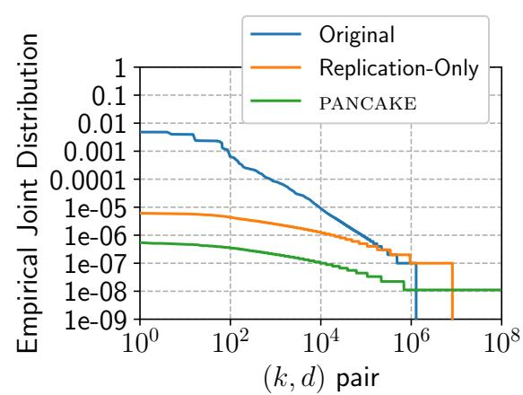

Figure 15: Original joint distribution and empirical joint distribution computed over access transcript generated by replication-only approach and PANCAKE.

<span id="page-22-3"></span>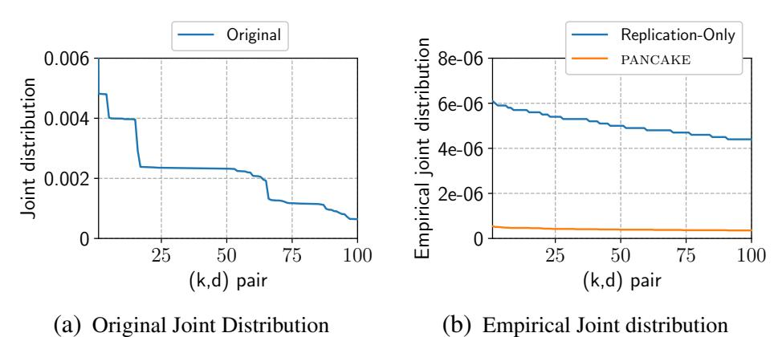

<span id="page-22-4"></span>Figure 16: (a) Original joint distribution over the 100 most popular keyword-document pairs. (b) Empirical joint distribution computed over access transcript generated by replication-only approach and PANCAKE, for the 100 most popular keyword-document pairs.

**Results.** Figure 15 shows the joint distribution empirically computed over distinct (k,d) pairs from a 10 million query transcript generated by PANCAKE for the Enron dataset, and compares with the original distribution (note that both x and y-axes are in log-scale). The key observation from the figure is that PANCAKE is able to flatten the joint distribution considerably through replication and fake accesses. We also measure the empirical joint distribution resulting from an approach that only uses PANCAKE's replication approach (without any fake queries), highlighting the contribution from both of the schemes to smooth the joint distribution. Figures 16(a) and 16(b) respectively show the original joint distribution, and empirical joint distribution computed for transcripts from the replication-only approach and the PANCAKE approach, for the 100 most frequent pairs only.

We note that a majority of the smoothing can be attributed to replication; the intuitive reason behind this is that for every (k,d) pair,  $\pi(k,d) < \pi(k)$  and  $\pi(k,d) < \pi(d)$ ; however, accesses for (k,d) are spread across  $R(k) \cdot R(d)$  replica pairs. As a consequence, more popular (k,d) pairs get spread across significantly more replica-pairs. To analyze the effect of fake accesses, we note that these are drawn from an iid distribution in PANCAKE. Consequently, while they contribute to the less popular (k,d) pairs, they also generate accesses to spurious (k,k), (d,d) and (d,k) pairs, that were non-existent in the original joint distribution. Since these spurious pairs are indistinguishable to an adversary (due to PRF security), it makes frequency analysis even harder. In fact, our analysis of the original and PANCAKE transcripts revealed that *none* of the

```
MakeReplicaLists(\pi, \pi', \alpha):
If supp(\pi) \neq supp(\pi') then Return \perp
n \leftarrow |\operatorname{supp}(\pi)| ; n' \leftarrow 0 ; n'' \leftarrow 0
For k \in \text{supp}(\pi):
    r \leftarrow \lceil \pi(k)/\alpha \rceil; r' \leftarrow \lceil \pi'(k)/\alpha \rceil
    If r > r':
         \mathsf{L} \leftarrow \mathsf{L} \cup \{(k,\ell) \mid \ell \in [r'+1,\ldots,r]\}
    Else If r' > r:
         G \leftarrow G \cup \{(k,\ell) | \ell \in [r+1,...,r']\}
    n' \leftarrow n' + r ; n'' \leftarrow n'' + r'
n'_d \leftarrow 2n - n'; n''_d \leftarrow 2n - n''
If n'_d > n''_d:
    \mathsf{L} \leftarrow \mathsf{L} \cup \{(D,\ell) \,|\, \ell \in [n''_d + 1, \dots, n'_d]\}
Else If n''_d > n'_d:
    G \leftarrow \ddot{G} \cup \{ (D, \ell) | \ell \in [n'_d + 1, \dots, n''_d] \}
Return L, G
```

Figure 17: Pseudocode for preparing replica swapping metadata.

100 most-frequent (k,d) pairs in the original joint distribution were among the 100 most-frequent replica pairs accessed with PANCAKE— we attribute this to the combination of the two phenomena described above.

**Discussion.** While the above does not provide a formal analysis of the security afforded by PANCAKE for correlated accesses, it does provide strong evidence that PANCAKE significantly obfuscates the access correlations, even without any modifications. We plan to explore a formal analysis for the same as future work. It may also be possible to modify PANCAKE to use a model of the correlations in its frequency smoothing instead of assuming queries are iid. We leave this as another interesting open problem for future work.

## <span id="page-22-1"></span>**E** Details for Dynamic Distributions

In this appendix we describe in greater detail the modified Batch algorithm used during a distribution change, as well as provide a formal security analysis. Aspects of the algorithm are described in §5; here we include the full description for completeness. We assume the change has been detected and the MakeReplicaLists procedure (see Figure 17) has been run to produce lists L and G of replicas that can be removed and that need to be created, respectively.

The modified Batch algorithm maintains the following additional bookkeeping data structures:

- Updates tracks which replicas in G have not yet been created by overwriting a replica in L. It maps a key to a set of replicas that need to be updated and the new value, and stores information needed for any actual write queries that have not finished (see §4).
- LabelMap records which replicas have been transferred and therefore do not have a label corresponding to their actual key and replica number. Any replica (w, j) whose label  $\ell$  is not (w, j) has an entry in this mapping table. Since each of the n keys always has at least 1 replica, no

{23}------------------------------------------------

matter how the distribution changes (assuming, as we do, that the support stays the same), there can be at most n entries in this mapping table.

- UninitReps tracks which keys gained replicas after a distribution change and whose values still need to be cached to create its new replicas. For each such key it records the replicas not yet initialized.
- ValueCache is a cache of values of keys in G, so that we can write them back to initialize new replicas. Our implementation combines the ValueCache and UpdateCache into one; we empirically evaluated the storage required for this cache in §6.2 and §6.3.

Accesses are done in much the same way as in the static case, except on each access the various bookkeeping data structures are consulted to ensure two things: the correct label is used to access replicas (using LabelMap) and the correct value is written back (using UninitReps and Updates).

In particular, on generating each access in a batch the following steps are followed: first, flip a coin to determine whether the access is real or fake. If it is fake, draw a sample from the temporary fake access distribution  $\tilde{\pi}_f'$ . If it is real, either pull a client query from the queue or sample a key to access from  $\hat{\pi}'$ . If the client query is a write for a key in UninitReps, remove it from UninitReps and add each of its replicas in G to Updates along with the "paired" replica in L that its value will be replacing.

If the access is real, a replica must be sampled for it. If the key k is in G, sample a replica is from  $[1, \ldots, R_{\hat{\pi}}(k)]$ , else sample it from  $[1, \ldots, R_{\hat{\pi}'}(k)]$ . If the replica is in G and in UninitReps, remove it from UninitReps.

After receiving and decrypting the values, Batch uses its metadata to write back the correct value for each key. If the replica (k, j) is in L and a replica  $(k', \ell)$  in G has a cached value in ValueCache and is in UninitReps, add an entry to LabelMap indicating that (k', j') is getting the label of (k, j). This is the actual swapping step, where a new replica is created by overwriting the value of an old one. Else, perform the writeback as usual, except if the key k has gained replicas and its value is not in ValueCache, add it.

<span id="page-23-1"></span>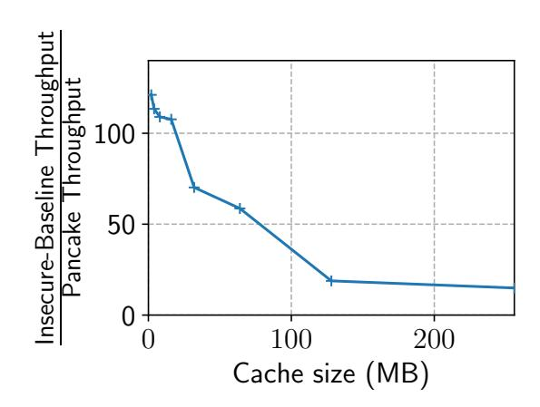

Figure 18: **Effect of cache size.** Frequency smoothing invalidates caching benefits in PANCAKE for small cache sizes.

Eventually the UninitReps data structure is empty, and replica swapping is done. We can delete all cached values and temporary metadata except LabelMap, which is needed to find the correct label for created replicas.

## <span id="page-23-0"></span>F Effect of Caching on PANCAKE

To evaluate the effect of caching on PANCAKE's frequency smoothing approach, we use as backend storage a combination of MySQL and Memcached [47], a persistent database with an in-memory key-value store cache. The rest of our setup is identical to the one described in §6. Interestingly, this configuration corresponds to the worst case scenario for PANCAKE. Intuitively, this is because real-world workloads that exhibit skewed (e.g., Zipf) access patterns observe huge performance gains with even a small amount of in-memory cache, since accesses to popular keys can be served from the faster cache. However, PANCAKE transforms any access distribution across keys to a uniform one, which invalidates the benefits of a cache. We evaluate this in Figure 18, varying the cache size available to the insecure baseline and PANCAKE for a skewed distribution (YCSB Workload C). Our results show that PANCAKE throughput can be  $> 100 \times$  lower than insecure baseline with very small caches under heavy skew, although the performance quickly converges for the two with larger caches.