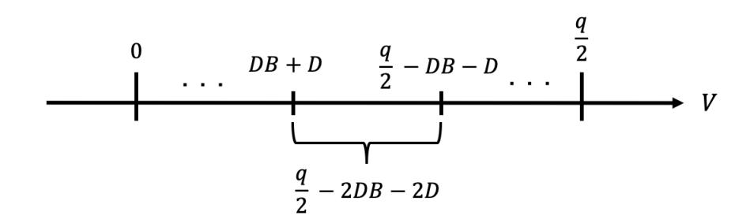
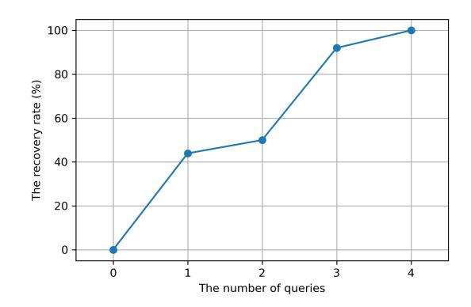
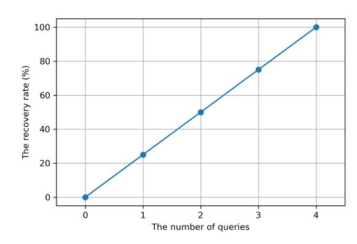
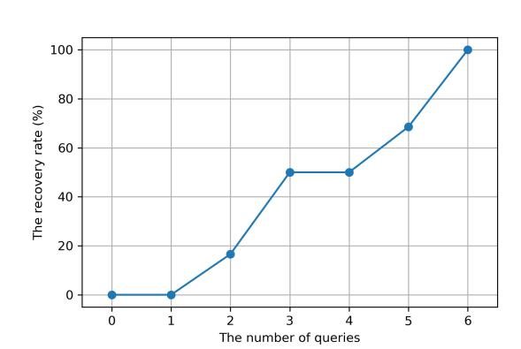
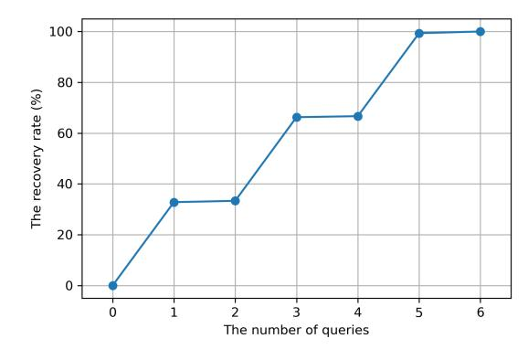
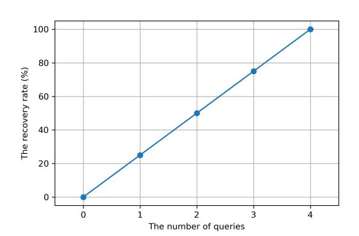

{0}------------------------------------------------

# Recovery Attack on Bob's Reused Randomness in CRYSTALS-KYBER and SABER

Satoshi Okada<sup>1</sup> and Yuntao Wang2?

Abstract. Quantum computing capability outperforms that of the classic computers overwhelmingly, which seriously threatens modern publickey cryptography. For this reason, the National Institute of Standards and Technology (NIST) and several other standards organizations are progressing the standardization for post-quantum cryptography (PQC). There are two contenders among those candidates, CRYSTALS-KYBER and SABER, lattice-based encryption algorithms in the third round finalists of NIST's PQC standardization project. At the current phase, it is important to evaluate their security, which is based on the hardness of the variants of Ring Learning With Errors (Ring-LWE) problem. In ProvSec 2020, Wang et al. introduced a notion of "meta-PKE"for Ring-LWE crypto mechanism. They further proposed randomness reuse attacks on NewHope and LAC cryptosystems which meet the meta-PKE model. In their attacks, the encryptor Bob's partial (or even all) randomness can be recovered if it is reused. In this paper, we propose attacks against CRYSTALS-KYBER and SABER crypto schemes by adapting the meta-PKE model and improving Wang et al.'s methods. Then, we show that our proposed attacks cost at most 4, 3, and 4 queries to recover Bob's randomness for any security levels of I (AES-128), III (AES-192), and V (AES-256), respectively in CRYSTALS-KYBER. Simultaneously, no more than 6, 6, and 4 queries are required to recover Bob's secret for security levels I, III, and V in SABER.

Keywords: PQC, Randomness Reuse Attack, Meta-PKE, CRYSTALS-KYBER, SABER.

### 1 Introduction

The security of current public-key crypto algorithms is commonly based on the difficulty of the large number factorization problem or the discrete logarithm problem. However, it is possible to break these cryptosystems in polynomial time by quantum computers in the near future, due to Shor's quantum algorithm [\[19\]](#page-16-0)

<sup>1</sup> Graduate School of Information Science and Technology, The University of Tokyo okada-satoshi323@g.ecc.u-tokyo.ac.jp

<sup>2</sup> School of Information Science, Japan Advanced Institute of Science and Technology y-wang@jaist.ac.jp

<sup>?</sup> corresponding author, ORCID: 0000-0002-2872-4508.

{1}------------------------------------------------

and the rapid development of quantum computing technique. Therefore, it is urgent to develop the quantum-safe crypto algorithms, or academically named by post-quantum cryptography (PQC) in general, to protect against the threat of quantum computers. Several years ago, some international standards organizations such as NIST, ISO, and IETF already started the PQC standardization projects. Among the several categories, lattice-based cryptography is considered as one of the most promising contenders for its reliable security strength, comparative light communication cost, fast performance and excellent adaptation capabilities [\[1\]](#page-15-0). Indeed, three of four encryption/KEM algorithms and two of three digital signature schemes are lattice-based candidates in the third round finalists selected and announced by NIST in 2020.

CRYSTALS-KYBER [\[6\]](#page-15-1) and SABER [\[7\]](#page-15-2) are two of lattice-based encryption/KEM candidates that progressed to the third round of NIST's PQC standardization project. Specifically, the security of CRYSTALS-KYBER is based on the difficulty of the underlying Ring-LWE problem in the module lattice (i.e. Module-LWE problem) [\[2\]](#page-15-3). Similarly, SABER's security depends on the difficulty of the Module-LWR problem, which chooses deterministic errors and consumes less computational resources. Generally, owing to the ring structure, the key size in the Ring-LWE based crypto schemes is smaller than that of the typical LWE based ones. At the current stage, it is crucial to analyze their security carefully to resist malicious attacks.

Recently, it has been common to reuse keys or randomness in network communications in order to improve the performance of the protocols. For instance, TLS 1.3 [\[18\]](#page-16-1) adopts the pre-shared key (PSK) mode, where the server is allowed to reuse the same secret key (randomness) and public key in intermittent communication with the clients to reduce the procedure of handshakes. Such key reuse mode has the risk of leaking information about a secret key when an adversary has enough chances to send queries to the honest server and get correct responses from it. There are kinds of key reuse attacks on Ring-LWE based crypto schemes. In this paper, we consider the case that the client Bob reuses his randomness, which is used for the encryption process. This attack works as follows: an adversary sends chosen public keys to the server and recovers Bob's partial or entire randomness by observing the returned public key and ciphertext. For example, it is dangerous when the client Bob communicates with an honest server after accessing a malicious one and reusing the same randomness. That is because his ciphertext is easily decrypted by misusing his leaked randomness.

In [\[21\]](#page-16-2), Wang et al. introduce a meta-PKE construction and show that both NewHope and LAC follow this construction. Then, they observe that the meta-PKE is vulnerable against the randomness reuse attack, and they propose attacks on NewHope [\[2\]](#page-15-3) and LAC [\[13\]](#page-16-3), respectively. However, this attack for CRYSTALS-KYBER or SABER has not been proposed so far.

### 1.1 Our Contributions

The randomness reuse attacks on LAC and NewHope proposed in [\[21\]](#page-16-2) are not adaptable to CRYSTALS-KYBER and SABER because the encryption processes 

{2}------------------------------------------------

of the crypto schemes are different. In this paper, we first discuss necessary conditions for the success of attacks against CRYSTALS-KYBER and SABER and present attack methods when the conditions are satisfied. Then, we also propose attack methods for crypto schemes that do not meet that condition. Furthermore, we shows that in CRYSTALS-KYBER, our proposed attack costs at most 4, 3, and 4 queries to recover Bob's randomness for security levels of I (AES-128), III (AES-196), and V (AES-256), respectively. Meanwhile, in SABER, at most 6, 6, and 4 queries are needed for security levels of I, III, and V. Indeed, our proposed algorithms can recover Bob's randomness with 100% success rate. Furthermore, we experimentally verified our proposed attacks. Considering the success rate and the number of queries, the reuse of the randomness is very dangerous and should be strictly avoided. It is notable that CRYSTALS-KYBER and SABER are two of the leading contenders in NIST PQC standardization project, namely, one of them may be applied in some randomness reuse scenarios such as TLS communications in the near future.

Due to the vulnerability of randomness reuse, once the attacker recovered the client's (Bob's) randomness, there is potential risk that the attacker can obtain other parties' symmetric keys issued by the server. Consequently, this work may call attention to relevant countermeasures for such attacks in realworld applications.

### 1.2 Related Works

There have been a number of key recovery attacks on Ring-LWE [\[14\]](#page-16-4) based cryptosystems under a key reuse scenario. In general, they are divided into two types: the signal leakage attacks taking advantage of the signal function [\[8,](#page-16-5)[10,](#page-16-6)[12,](#page-16-7)[5\]](#page-15-4), and key reuse attacks focusing on the final shared key or the ciphertext. Concerning the latter, in ACISP 2018, Ding et al. [\[9\]](#page-16-8) proposed a general key mismatch attack model for Ring-LWE based key exchange protocol. Subsequently, there are several key mismatch attacks on specific lattice-based cryptographic schemes. For example, attacks on NewHope are proposed in [\[4,](#page-15-5)[16,](#page-16-9)[15,](#page-16-10)[20\]](#page-16-11). In 2019, Qin et al. [\[17\]](#page-16-12) proposed attacks on CRYSTALS-KYBER, and Greuret et al. [\[11\]](#page-16-13) proposed attacks on LAC in 2020. Furthermore, there is also a key mismatch attack using quantum algorithms proposed by B˘aetu et al. [\[3\]](#page-15-6) in 2019. Besides the key mismatch attack on Alice's secrets, there is also a key reuse attack on Bob's randomness by observing his ciphertext. In 2020, Wang et al. [\[21\]](#page-16-2) proposed such attacks on NewHope and LAC, which are both the ring-LWE based cryptosystems with compressing technique. In this paper, we improve the attacks in [\[21\]](#page-16-2) and apply them to the Module-LWE based CRYSTALS-KYBER with compressing technique, and the Module-LWR based SABER with bitwise shift operation.

#### 1.3 Roadmap

We recall some preliminaries, including mathematical notations, CRYSTALS-KYBER, SABER, and Wang et al.'s proposition in Section 2. Then, we apply 

{3}------------------------------------------------

Wang et al.'s theorem and propose our key reuse attacks on CRYSTALS-KYBER and SABER in Section 3. Finally, we give our experimental results and show how our proposed attack works well in Section 4. Finally, we make a conclusion and present some countermeasures against our proposed attack in Section 5.

### 2 Preliminary

In this section, we introduce the algebraic definitions and notations used in this paper. Next, we show each protocol's outline, including several core functions in CRYSTALS-KYBER [6] and SABER [7]. Finally, we explain an important theorem advocated by Wang et al. [21].

### 2.1 Mathematical Notations

Set  $\mathbb{Z}_q$  the integer residue ring modulo q, and  $\mathbb{Z}_q[x]$  represents a polynomial ring whose coefficients are sampled from  $\mathbb{Z}_q$ .  $\mathcal{R}_q$  is the quotient ring  $\mathbb{Z}_q[x]/(x^n+1)$ . In this paper, bold upper-case letters such as  $\mathbf{A}$  represent matrices, and bold lower-case letters such as  $\mathbf{b}$  represent vectors. The transpose of matrix  $\mathbf{A} \in \mathcal{R}_q^{k \times k}$  is denoted by  $\mathbf{A}^T \in \mathcal{R}_q^{k \times k}$ . Similarly, the transpose of vector  $\mathbf{b} \in \mathcal{R}_q^{k \times 1}$  is denoted by  $\mathbf{b}^T \in \mathcal{R}_q^{1 \times k}$ . For  $a \in \mathcal{R}_q$ , a[i] represents ith coefficient of  $a\left(a = \sum_{i=0}^{n-1} a[i]x^i\right)$ . For  $\mathbf{b} \in \mathcal{R}_q^k$ ,  $\mathbf{b}_i$  means ith component of  $\mathbf{b}$  ( $0 \le i \le k-1$ ). The operation  $\lfloor x \rfloor$  on real number x represents the largest integer no larger than x; and  $\lfloor x \rceil = \lfloor x + \frac{1}{2} \rfloor$ .

For a probability distribution  $\chi$ ,  $x \leftarrow \chi$  denotes that polynomial x's coefficients are randomly sampled from  $\chi$ ; and  $\mathbf{x} \leftarrow \chi^{k \times 1}$  denotes sampling polynomial vector  $\mathbf{x}$  with all coefficients sampled from  $\chi$ . Given a set S, the notation  $x \leftarrow \mathcal{U}(S)$  means selecting x from S uniformly at random.

### 2.2 CRYSTALS-KYBER [6]

We show the outline of the CRYSTALS-KYBER public key encryption protocol in Figure 1. Note that the public polynomial matrix  $\mathbf{A}$  is shared in advance.  $B_{\eta}$  is a centered binomial distribution, and its element is sampled by calculating  $\sum_{i=1}^{\eta} (b_i - b_i')$  ( $b_i$  and  $b_i'$  are sampled from  $\{0,1\}$  uniformly at random). CRYSTALS-KYBER consists of the below three steps.

- 1. Alice first selects a secret key  $\mathbf{s}_A$  and an error  $\mathbf{e}_A$  from  $B_{\eta}^{k\times 1}$ . Then, she calculates the public key  $\mathbf{P}_A = \mathbf{A}\mathbf{s}_A + \mathbf{e}_A$  using the previously shared  $\mathbf{A} (\in \mathcal{R}_q^{k\times k})$ , and sends  $\mathbf{P}_A$  to Bob. From the public key  $\mathbf{P}_A$  and the previously shared polynomial  $\mathbf{A}$ , it is difficult to obtain information about the secret key  $\mathbf{s}_A$  due to the hardness of Module-LWE problem.
- 2. After receiving  $\mathbf{P_A}$ , Bob samples polynomial vectors  $\mathbf{s}_B$ ,  $\mathbf{e}_B$  and polynomial  $e_B'$  from  $B_\eta^{k\times 1}$  and  $B_\eta$ , respectively. Then, he computes the public key  $\mathbf{P}_B = \mathbf{A}^T\mathbf{s}_B + \mathbf{e}_B$ . Subsequently, he generates m from  $\mathcal{U}^{256}(\{0,1\})$  and computes  $v_B = \mathbf{P}_A^T\mathbf{s}_B + e_B' + \mathsf{Decompress}_q(m,1)$ . Finally, he compresses  $\mathbf{P}_B, v_B$  to  $\mathbf{c}_1$ ,  $c_2$  and sends them to Alice.

{4}------------------------------------------------

| pre-shared key $\mathbf{A} \in \mathcal{R}_q^{k \times k}$                     |                                                   |                                                                         |
|--------------------------------------------------------------------------------|---------------------------------------------------|-------------------------------------------------------------------------|
| Alice                                                                          |                                                   | Bob                                                                     |
| $\mathbf{s}_A, \mathbf{e}_A \leftarrow B_{\eta}^{k \times 1}$                  |                                                   |                                                                         |
| $\mathbf{P}_A = \mathbf{A}\mathbf{s}_A + \mathbf{e}_A$                         | $\overset{\mathbf{P}_A}{\longrightarrow}$         | $\mathbf{s}_B, \mathbf{e}_B \leftarrow B_{\eta}^{k \times 1}$           |
|                                                                                |                                                   | $e_B' \leftarrow B_\eta$                                                |
|                                                                                |                                                   | $\mathbf{P}_B = \mathbf{A}^T \mathbf{s}_B + \mathbf{e}_B$               |
|                                                                                |                                                   | $m \leftarrow \mathcal{U}^{256}(\{0,1\})$                               |
|                                                                                |                                                   | $v_B = \mathbf{P}_A^T \mathbf{s}_B + e_B' + \mathtt{Decompress}_q(m,1)$ |
|                                                                                |                                                   | $\mathbf{c_1} = \mathtt{Compress}_q(\mathbf{P}_B, d_{\mathbf{P}_B})$    |
| $\boxed{\mathbf{u}_A = \mathtt{Decompress}_q(\mathbf{c_1}, d_{\mathbf{P}_B})}$ | $\stackrel{c=(\mathbf{c_1},c_2)}{\longleftarrow}$ | $c_2 = \mathtt{Compress}_q(v_B, d_{v_B})$                               |
| $v_A = \mathtt{Decompress}_q(c_2, d_{v_B})$                                    |                                                   |                                                                         |
| $m' = \mathtt{Compress}_q \left(v_A - \mathbf{s}_A^T \mathbf{u}_A, 1\right)$   |                                                   |                                                                         |

Fig. 1. A sketch of CRYSTALS-KYBER public key encryption scheme

<span id="page-4-0"></span>Table 1. Parameter choices in CRTSTALS-KYBER [6]

<span id="page-4-1"></span>

|            | n   | k | q    | $d_{\mathbf{P}_B}$ | $d_{\mathbf{v}_B}$ | security level |
|------------|-----|---|------|--------------------|--------------------|----------------|
| Kyber-512  | 256 | 2 | 3329 | 10                 | 3                  | I (AES-128)    |
| Kyber-768  | 256 | 3 | 3329 | 10                 | 4                  | III (AES-192)  |
| Kyber-1024 | 256 | 4 | 3329 | 11                 | 5                  | V (AES-256)    |

3. When Alice receives  $(\mathbf{c_1}, c_2)$  from Bob, she decompresses them and get  $\mathbf{u_A}$  and  $v_A$ . In order to obtain m', she calculates  $v_A - \mathbf{s}_A^T \mathbf{u}_A$  using her secret key  $\mathbf{s_A}$  and compresses it.

Here,  $\mathsf{Compress}_q(a,d)$  and  $\mathsf{Decompress}_q(a,d)$  are defined as follows.

**Definition 1.** The compression function  $\mathbb{Z}_q \to \mathbb{Z}_{2^d}$ :

$$\mathtt{Compress}(a,d)_q = \left\lfloor \frac{2^d}{q} \cdot a \right\rfloor \pmod{2^d}$$

**Definition 2.** The decompression function  $\mathbb{Z}_{2^d} \to \mathbb{Z}_q$ :

$$\mathtt{Decompress}(a,d)_q = \left\lfloor \frac{q}{2^d} \cdot a \right\rceil$$

When these two functions are used with  $x \in \mathcal{R}_q$  or  $\mathbf{x} \in \mathcal{R}_q^{k \times 1}$ , the procedure is applied to each coefficient of them.

We list three parameter sets for KYBER: KYBER-512, KYBER-768, and KYBER-1024 in Table 1.

### 2.3 SABER [7]

Figure 2 shows the outline of SABER crypto scheme. The polynomial matrix **A** is shared in advance.  $\beta_{\mu}$  is a centered distribution with probability mass function

{5}------------------------------------------------

| pre-shared key $\mathbf{A} \in \mathcal{R}_q^{k \times k}$                                     |                                                                                                                                   |
|------------------------------------------------------------------------------------------------|-----------------------------------------------------------------------------------------------------------------------------------|
| Alice                                                                                          | Bob                                                                                                                               |
| $\mathbf{s}_A, \mathbf{e}_A \leftarrow \beta_{\mu}^{k \times 1}$                               |                                                                                                                                   |
| $\mathbf{P}_A = ((\mathbf{A}\mathbf{s}_A + \mathbf{h}) \bmod q) \gg (\epsilon_q - \epsilon_p)$ | $\xrightarrow{\mathbf{P}_A} \mathbf{s}_B \leftarrow \beta_{\mu}^{k \times 1}$                                                     |
|                                                                                                | $\mathbf{P}_B = ((\mathbf{A}\mathbf{s}_B + \mathbf{h}) \bmod q) \gg (\epsilon_q - \epsilon_p)$                                    |
|                                                                                                | $m \leftarrow \mathcal{U}^{256}(\underline{\{0,1\}})$                                                                             |
|                                                                                                | $v_B = ((\mathbf{P}_A^T \mathbf{s}_B) \bmod p)$                                                                                   |
| $v_A = ((\mathbf{P}_B^T \mathbf{s}_A) \bmod p)$                                                | $\leftarrow \stackrel{(\mathbf{P}_B,c)}{\leftarrow} c = (v_B + h_1 - 2^{\epsilon_p - 1} m \bmod p) \gg (\epsilon_p - \epsilon_T)$ |
| $m' = ((v_A - 2^{\epsilon_p - \epsilon_T}c + h_2) \bmod p) \gg (\epsilon_p - 1)$               | 1)                                                                                                                                |

<span id="page-5-0"></span>Fig. 2. A sketch of SABER public key encryption scheme

 $P\left[x\mid x\leftarrow\beta_{\mu}\right]=\frac{\mu!}{(\mu/2+x)!(\mu/2-x)!}2^{-\mu}$ . Thus, the integer sampled from  $\beta_{\mu}$  is in the range  $[-\mu/2,\mu/2]$ . Different from CRYSTALS-KYBER, SABER uses three constants instead of selecting error polynomials: a constant polynomial  $h_1\in\mathcal{R}_q$  with all coefficients being  $2^{\epsilon_q-\epsilon_p-1}$ , a constant vector  $\mathbf{h}\in\mathcal{R}_q^{k\times 1}$  whose polynomials are equal to  $h_1$  and a constant polynomial  $h_2\in\mathcal{R}_q$  with all coefficients set to be  $\left(2^{\epsilon_p-2}-2^{\epsilon_p-\epsilon_T-1}+2^{\epsilon_q-\epsilon_p-1}\right)$ . The bitwise shift operations  $\ll$  and  $\gg$  have the usual meaning when applied to an integer and are extended to polynomials and matrices by applying them coefficient-wise. We list the parameter sets with respect to security levels in Table 2, and review the main procedure of SABER below.

**Table 2.** Parameter choices in SABER [7]

<span id="page-5-1"></span>

|            | n   | k | q        | p        | T       | $\mu$ | security      |
|------------|-----|---|----------|----------|---------|-------|---------------|
| LightSaber | 256 | 2 | $2^{13}$ | $2^{10}$ | $2^3$   | 10    | I (AES-128)   |
| Saber      | 256 | 3 | $2^{13}$ | $2^{10}$ | $2^4$   | 8     | III (AES-192) |
| FireSaber  | 256 | 4 | $2^{13}$ | $2^{10}$ | $2^{6}$ | 6     | V (AES-256)   |

- 1. Alice first selects a secret key  $\mathbf{s}_A$  from  $\beta_{\mu}^{k\times 1}$ . Then, she calculates the public key  $\mathbf{P}_A = ((\mathbf{A}\mathbf{s}_A + \mathbf{h}) \bmod q) \gg (\epsilon_q \epsilon_p)$  using the previously shared  $\mathbf{A} (\in \mathcal{R}_q^{k\times k})$ , and sends  $\mathbf{P}_A$  to Bob. It is difficult to recover  $\mathbf{s}_A$  from  $\mathbf{P}_A$  due to the hardness of Module-LWR problem.
- 2. After receiving  $\mathbf{P_A}$ , Bob samples  $\mathbf{s}_B$  from  $\beta_{\mu}^{k\times 1}$ . Then, he computes the public key  $\mathbf{P}_B = ((\mathbf{A}\mathbf{s}_B + \mathbf{h}) \bmod q) \gg (\epsilon_q \epsilon_p)$ . After that, he generates m from  $\mathcal{U}^{256}(\{0,1\})$  and computes  $v_B = ((\mathbf{P}_A^T\mathbf{s}_B) \bmod p)$ . Finally, he calculates c and sends  $\mathbf{P_B}$  and c to Alice.
- 3. When Alice receives  $(\mathbf{P_B}, c)$ , she calculates  $v_A = ((\mathbf{P}_B^T \mathbf{s}_A) \mod p)$ , and obtains  $m' = ((v_A 2^{\epsilon_p \epsilon_T} c + h_2) \mod p) \gg (\epsilon_p 1)$  using  $v_A$ .

#### 2.4 Wang et al.'s Proposition

Wang et al. propose the so-called "meta-PKE" construction and show both NewHope and LAC follow this construction. Next, they observe that the ci

{6}------------------------------------------------

phertext may reveal the encryptor's randomness information using the feature of meta-PKE if the public key satisfies certain conditions.

In the encryption algorithm adopting meta-PKE construction, there is a key step of

$$V = t \times B + f + Y.$$

B is the public key sent by Alice, V is the ciphertext encoded by Bob, and Y is the plaintext. t and f are randomnesses which are usually sampled from a centered binomial distribution. There Wang et al. proposed the following theorem.

<span id="page-6-0"></span>**Lemma 1.** [21]  $t, f, Y \in R_q$ , and the coefficients t[i], f[i] are in  $\{-D, \ldots, D\}, D \ll q$ ,  $Y_i \in \{0, \frac{q}{2}\}, i = 1, \ldots, n$ .  $B \in \mathbb{Z}_q$  and  $V = B \times t + f + Y \mod q$ . If  $2D + 1 \leq B < q/(4D) - 1$ , then V will reveal the values of t, f, Y completely.

*Proof.* We refer the readers to [21] for a proof of this lemma.

### 3 Our proposed attack

We observe that CRYSTALS-KYBER and SABER also follow meta-PKE construction. Therefore, Lemma 1 can be adapted to these two protocol schemes. However, when an adversary tries to recover Bob's randomness, he can only access the compressed ciphertext (V). Thus, we take this fact into consideration and propose the following Theorem 1 for CRYSTALS-KYBER and Theorem 2 for SABER.

<span id="page-6-1"></span>**Theorem 1.**  $t, f, Y \in R_q$ , and the coefficients t[i], f[i] are in  $\{-D, \ldots, D\}, D \ll q$ ,  $Y_i \in \{0, \frac{q}{2}\}, i = 1, \ldots, n$ .  $B \in \mathbb{Z}_q$  and  $V = B \times t + f + Y \mod q$ . Let compress function be Compress:  $\mathbb{Z}_q \to \mathbb{Z}_p(q > p)$  and  $\mathrm{Compress}(x) = \left\lceil \frac{p}{q}x \right\rceil$ . If  $\left\lfloor \frac{p(B-2D)}{q} \right\rfloor = 1$ ,  $\frac{p(\frac{q}{2}-2DB-2D)}{q} \geq 1$ , and  $4D+2 \leq p$ , then  $\mathrm{Compress}(V)$  will reveal t and Y completely in attacking CRYSTALS-KYBER schemes.

*Proof.* Since f is small and has little effect on  $\mathtt{Compress}(V)$  and B is constant, V can be regarded as a bivariate function V(t,Y). When  $\mathtt{Compress} \circ V$  is injective, t and Y can be completely recovered from  $\mathtt{Compress}(V(t,Y))$ . Then in the remain of the proof, we just need to show the above three conditions guarantee  $\mathtt{Compress} \circ V$  injective. We consider two Vs:

<span id="page-6-2"></span>
$$V_1 = B_1 \times t_1 + f_1 + Y_1 \bmod q \tag{1}$$

$$V_2 = B_2 \times t_2 + f_2 + Y_2 \bmod q. \tag{2}$$

When  $t_1$  and  $t_2$  are different from each other, the minimum difference between  $V_1$  and  $V_2$  is B-2D. Thus, when the condition  $\left\lfloor \frac{p(B-2D)}{q} \right\rfloor = 1$  holds,  $\mathsf{Compress}(V_1) \neq \mathsf{Compress}(V_2)$  and

Compress $(V_1)$  – Compress $(V_2)=1$ . Furthermore, when  $Y_1=0$  and  $Y_2=\frac{q}{2}$ , the minimum difference between  $V_1$  and  $V_2$  is  $\frac{q}{2}-2DB-2D$  (Figure 3).

{7}------------------------------------------------

<span id="page-7-1"></span>

**Fig. 3.** The minimum difference between  $V_1$  and  $V_2$  when  $Y_1 = 0$  and  $Y_2 = \frac{q}{2}$ .

Hence, if  $\frac{p(\frac{q}{2}-2DB-2D)}{q} \geq 1$ ,  $\mathsf{Compress}(V_1) \neq \mathsf{Compress}(V_2)$ . Additionally, the size of the image of  $\mathsf{Compress} \circ V$  must be smaller than that of  $\mathbb{Z}_p$ , i.e.  $4D+2 \leq p$ . In summary, under the three conditions of ①  $\left\lfloor \frac{p(B-2D)}{q} \right\rfloor = 1$ , ②  $\frac{p(\frac{q}{2}-2DB-2D)}{q} \geq 1$ , ③  $4D+2 \leq p$ ,  $\mathsf{Compress} \circ V$  is injective and reveals t and Y.

<span id="page-7-0"></span>**Theorem 2.**  $t, f, Y \in R_p$ , and the coefficients t[i] are in  $\{-D, \ldots, D\}$ ,  $D \ll p, f[i] = h, h <math>B \in \mathbb{Z}_p, p = 2^{\epsilon_p}, T = 2^{\epsilon_T}, and V = B \times t + f + Y \mod q$ . If  $B \gg (\epsilon_p - \epsilon_T) = 1$ ,  $(\frac{p}{2} - 2DB) \gg (\epsilon_p - \epsilon_T) \geq 1$ , and  $4D + 2 \leq p$ , then  $V \gg (\epsilon_p - \epsilon_T)$  will reveal t and Y completely in attacking SABER schemes.

Proof. For convenience, we set Compress as  $\epsilon_p - \epsilon_T$  bit shift to the right (i.e.  $\gg (\epsilon_p - \epsilon_T)$ ). In this proof, we also show the above three conditions guarantee Compress  $\circ$  V injective. We consider two Vs such as (1) and (2). Different from Theorem 1, f[i] is constant. Therefore, when  $t_1$  and  $t_2$  are different from each other, the minimum difference between  $V_1$  and  $V_2$  is B. So if the condition  $B \gg (\epsilon_p - \epsilon_T) = 1$  holds,  $\operatorname{Compress}(V_1) \neq \operatorname{Compress}(V_2)$  and  $\operatorname{Compress}(V_1) - \operatorname{Compress}(V_2) = 1$ . Furthermore, when  $Y_1 = 0$  and  $Y_2 = \frac{p}{2}$ , the minimum difference between  $V_1$  and  $V_2$  is  $\frac{p}{2} - 2DB$ . Due to this, the condition  $(\frac{p}{2} - 2DB) \gg (\epsilon_p - \epsilon_T) \geq 1$  realizes  $\operatorname{Compress}(V_1) \neq \operatorname{Compress}(V_2)$ . Finally, the size of the image of  $\operatorname{Compress} \circ V$  must be smaller than that of  $\mathbb{Z}_p$ , i.e.  $4D + 2 \leq p$ .

### 3.1 General Attack Model

In the key reuse attack model, we assume that Bob reuses the same randomness and honestly responds to a number of queries. Namely, an adversary sends freely chosen public keys to Bob and can get the corresponding ciphertexts several times. For convenience, to simulate the behavior of Bob, we build an oracle  $\mathcal{O}_k$  (Algorithm 1) and  $\mathcal{O}_s$  (Algorithm 4) for CRYSTALS-KYBER and SABER, respectively. Each time the adversary can choose a public key arbitrarily and put it into the oracle. He can get information about  $\mathbf{s}_B$  by observing the responses.

### <span id="page-7-2"></span>3.2 Key Reuse Attack on CRYSTALS-KYBER

We build an oracle  $\mathcal{O}_k$  in Algorithm 1 for the key reuse attack on CRYSTALS-KYBER. This oracle takes public key  $\mathbf{P}_A$  as an input and returns  $c_2$ .

{8}------------------------------------------------

# Algorithm 1: KYBER Oracle(PA)

```
Input: PA ∈ Rk×1
                  q
  Output: c2 ∈ R2
                   dvB
1 m←U256({0, 1})
2 e
   0
   B←Bη
3 vB = P
         T
         AsB + e
                 0
                 B + Decompress(m, 1)
4 c2 = Compress(vB, dvB )
5 Return c2
```

<span id="page-8-0"></span>Attack on Kyber-768 and Kyber-1024. Kyber-768 and Kyber-1024 satisfy Lemma [1](#page-6-0) and Theorem [1](#page-6-1) when appropriate B is chosen. For example, in Kyber-1024, D = 2, q = 3329, p = 32. If we set B = 109, the following formulas hold:

$$2D + 1(=5) \le B(=109) \le q/4D - 1(=416),$$

$$\left\lfloor \frac{p}{q}(B - 2D) \right\rfloor = \left\lfloor \frac{32}{3329} \cdot 105 \right\rfloor = 1,$$

$$\frac{p}{q}(\frac{q}{2} - 2DB - 2D) = \frac{32}{3329} \cdot 1224.5 = 11.7 > 1, \text{ and}$$

$$4D + 2 = 10 \le 32.$$

Therefore, an adversary can recover one polynomial of s<sup>B</sup> per query. We show the details of the attack in Algorithm [2.](#page-9-0)

In this attack, when an adversary wants to recover polynomial sBi (0 ≤ i ≤ k), he sets public key P<sup>A</sup> = [0, · · · , 0, B, 0, · · · 0] i.e. PAi = B. Then he sends P<sup>A</sup> to the oracle and obtain ciphertext c2. We show how the coefficient c2[j] changes according to the coefficient of sBi and m in Table [3](#page-8-1) for Kyber-768 and Table [4](#page-9-1) for Kyber-1024, respectively.

By using these tables, an adversary can recover sBi (and m simultaneously) completely by observing c2[j] corresponding to sBi[j] and m[j]. Because he can recover one element of s<sup>B</sup> per query, the total cost of this attack is k queries.

Attack on Kyber-512. In contrast, Kyber-512 does not satisfy Theorem [1](#page-6-1) (∵ 4D + 2 = 10 > 2 3 ). Actually, when the adversary sets B = 421, which satisfies j p(B−2D) q k = 1, the relationship between ciphertext c<sup>2</sup> and (sB, m) is shown in Table [5.](#page-9-2)

<span id="page-8-1"></span>Table 3. The behavior of c2[j] corresponding to (sBi[j], m[j]) when B = 213 in Kyber-768

| c2[j]<br>sBi[j]<br>m[j] | -2 | -1 | 0 | 1 | 2  |
|-------------------------|----|----|---|---|----|
| 0                       | 14 | 15 | 0 | 1 | 2  |
| 1                       | 6  | 7  | 8 | 9 | 10 |

{9}------------------------------------------------

<span id="page-9-1"></span>**Table 4.** The behavior of  $c_2[j]$  corresponding to  $(\mathbf{s}_{Bi}[j], m[j])$  when B = 105 in Kyber-1024

| $c_2[j]  \mathbf{s}_{Bi}[j]$ $m[j]$ | -2 | -1 | 0  | 1  | 2  |
|-------------------------------------|----|----|----|----|----|
| 0                                   | 30 | 31 | 0  | 1  | 2  |
| 1                                   | 14 | 15 | 16 | 17 | 18 |

### Algorithm 2: KYBER\_768\_1024\_Attack()

```
Output: \mathbf{s}_B' \in \mathcal{R}_q^{k \times 1}
\mathbf{1} \ B = \lceil \frac{q}{2^{d_{v_B}}} \rceil + 4
  \mathbf{2} \ \mathbf{for} \ i \leftarrow 0 \ \mathbf{to} \ k \ \mathbf{do}
             \mathbf{P_A} = []
  3
              for j \leftarrow 0 to k do
                                                                                                                       ⊳ Set optimized P<sub>A</sub>
  4
                     if j == i then
  5
                       \mathbf{P_A}.append(B)
  6
                     else
                        \mathbf{P}_{\mathbf{A}}.\mathrm{append}(0)
  7
              c_2 = \mathcal{O}_k(\mathbf{P_A})
  8
             for l \leftarrow 0 to n do
                                                               \triangleright Recover the randomness based on Table 3 or 4
  9
                    if 2^{d_{v_B}-1} - \eta \le c_2[l] \le 2^{d_{v_B}-1} + \eta then |\mathbf{s}'_{Bi}[l] = c_2[l] - 2^{d_{v_B}-1}
10
11
                    else if c_2[l] \leq \eta then
12
                     \mathbf{s}'_{Bi}[l] = c_2[l]
13
                      else \ \ \ \ \ \ \ \ \ \ \ \ \ \ \ \ \ \ \
                     else
14
15 Return \mathbf{s}_B'
```

<span id="page-9-0"></span>In this case, when an adversary get  $c_2[j] = 6$  or  $c_2[j] = 2$ , he can not judge whether  $\mathbf{s}_{Bi}[j] = 2$  or -2. As a countermeasure, we set one more B = 631 and observe how  $c_2[j]$  changes in Table 5. It shows that an adversary can recover  $\mathbf{s}_{Bi}[j] = 2, -2$  from  $c_2[j]$ . Consequently, the attack on Kyber-512 works and we

<span id="page-9-2"></span>**Table 5.** The behavior of  $c_2[j]$  corresponding to  $(\mathbf{s}_{Bi}[j], m[j])$  when B = 421,631 in Kyber-512

| B                                   |    |    | 421 |   |   |    |    | 631 |   |   |
|-------------------------------------|----|----|-----|---|---|----|----|-----|---|---|
| $c_2[j]  \mathbf{s}_{Bi}[j]$ $m[j]$ | -2 | -1 | 0   | 1 | 2 | -2 | -1 | 0   | 1 | 2 |
| 0                                   | 6  | 7  | 0   | 1 | 2 | 5  | 6  | 0   | 2 | 3 |
| 1                                   | 2  | 3  | 4   | 5 | 6 | 1  | 2  | 4   | 6 | 7 |

{10}------------------------------------------------

#### Algorithm 3: KYBER\_512\_Attack()

```
Output: \mathbf{s}_B' \in \mathcal{R}_q^{k \times 1}
                                                                    18 B = 631
                                                                    19 for i \leftarrow 0 to k do
 1 B = 421
 2 for i \leftarrow 0 to k do
                                                                               \mathbf{P_A} = []
                                                                    20
                                                                               for j \leftarrow 0 to k do
          \mathbf{P_A} = []
 3
                                                                    21
          for j \leftarrow 0 to k do
                                                                                     if i == i then
 4
                                                                    \mathbf{22}
                if j == i then
                                                                                           \mathbf{P}_{\mathbf{A}}.\mathrm{append}(B)
                                                                    23
 \mathbf{5}
                      \mathbf{P}_{\mathbf{A}}.\mathrm{append}(B)
 6
                                                                                      else
                else
                                                                                           \mathbf{P}_{\mathbf{A}}.\mathrm{append}(0)
                                                                    24
 7
                      \mathbf{P}_{\mathbf{A}}.\mathrm{append}(0)
                                                                               c_2 = \mathcal{O}_k(\mathbf{P_A})
                                                                    25
                                                                               for l \leftarrow 0 to n do
           c_2 = \mathcal{O}_k(\mathbf{P_A})
 8
                                                                    26
          for l \leftarrow 0 to n do
                                                                                     if c_2[l] == 1 or c_2[l] == 5 then
 9
                                                                    27
                if c_2[l] == 2 or c_2[l] == 6 then 28
                                                                                      \mathbf{s}'_{Bi}[l] = -2
10
                    continue
11
                                                                                     if c_2[l] == 3 or c_2[l] == 7 then
                                                                    29
                else if 3 \le c_2[l] \le 5 then
                                                                                       \mathbf{s}'_{Bi}[l] = 2
12
                                                                    30
                    \mathbf{s}'_{Bi}[l] = c_2[l] - p/2
13
                else if c_2[l] == 0 or c_2[l] == 1
                                                                   31 Return \mathbf{s}_B'
14
                  then
                     \mathbf{s}'_{Bi}[l] = c_2[l]
15
                else
16
                   \mathbf{s}'_{Bi}[l] = c_2[l] - p
17
```

<span id="page-10-1"></span>show its details in Algorithm 3. In this attack, the adversary can recover all the coefficients of  $\mathbf{s}_B$  completely by at most 2k(=4) queries.

### 3.3 Key Reuse Attack on SABER

In the key reuse attack on SABER, we build oracle  $\mathcal{O}_s$  (Algorithm 4). Given  $\mathbf{P}_A$ , this oracle outputs c.

## $\bf Algorithm~4:$ SABER\_Oracle $({\bf P}_A)$

```
Input: \mathbf{P}_A \in \mathcal{R}_q^{k \times 1}

Output: c \in \mathcal{R}_T

1 m \leftarrow \mathcal{U}^{256}(\{0, 1\})

2 v_B = ((\mathbf{P}_A^T \mathbf{s}_B) \bmod p)

3 c = (v_B + h_1 - 2^{\epsilon_p - 1} m \bmod p) \gg (\epsilon_p - \epsilon_T)

4 Return c
```

<span id="page-10-0"></span>Attack on FireSaber. FireSaber, whose security level is V, satisfies Theorem 2 when B=16. Therefore, the attack method is almost the same as that for Kyber-768 and Kyber-1024. In this case, the relationship between ciphertext c and  $(\mathbf{s}_B, m)$  is shown in Table 6. From Table 6, we can see that c[j] corresponds to  $\mathbf{s}_{Bi}[j]$  one-to-one. Thus, an adversary can recover  $\mathbf{s}_B$  with k queries. The detail of this attack is described in Algorithm 5.

{11}------------------------------------------------

### Algorithm 5: FireSaber\_Attack()

```
Output: \mathbf{s}_B' \overline{\in \mathcal{R}_q^{k \times 1}}
  \mathbf{1} \ B = 2^{\epsilon p - \epsilon_T}
  2 for i \leftarrow 0 to k do
              \mathbf{P_A} = []
  3
               for j \leftarrow 0 to k do
  4
                     if j == i then
   5
                           \mathbf{P}_{\mathbf{A}}.\mathrm{append}(B)
   6
                      else
                             \mathbf{P}_{\mathbf{A}}.\mathrm{append}(0)
   7
              c = \mathcal{O}_s(\mathbf{P_A})
  8
              for l \leftarrow 0 to n do
  9
                     if \frac{T}{2} - \eta \le c[l] \le \frac{T}{2} + \eta then |\mathbf{s}'_{Bi}[l] = c[l] - \frac{T}{2}
10
11
                      else if c[l] \leq \eta then
12
                        | \mathbf{s}'_{Bi}[l] = c[l]
 13
                        else \mathbf{s}'_{Bi}[l] = c[l] - T
                      else
14
15 Return \mathbf{s}_B'
```

<span id="page-11-1"></span><span id="page-11-0"></span>**Table 6.** The behavior of c[j] corresponding to  $\mathbf{s}_{Bi}[j]$  and m[j] when B=16 in FireSaber

| $c[j]  \mathbf{s}_{Bi}[j]$ $m[j]$ | -3 | -2 | -1 | 0  | 1  | 2  | 3  |
|-----------------------------------|----|----|----|----|----|----|----|
| 0                                 | 61 | 62 | 63 | 0  | 1  | 2  | 3  |
| 1                                 | 29 | 30 | 31 | 32 | 33 | 34 | 35 |

Attack on Saber. Meanwhile, Saber, whose security level is III, does not satisfy Theorem 2. Here we take the similar discussion to that for Kyber-512 in Section 3.2. First, we show how c[j] changes according to m[j] and  $\mathbf{s}_{Bi}[j]$  in Table 7 when B=64. If c[j]=12 or c[j]=4, an adversary can not judge whether  $\mathbf{s}_{Bi}[j]=4$  or  $\mathbf{s}_{Bi}[j]=-4$  only from c[j]. Then, we set B=96 and show the relationship between c[j] and  $(\mathbf{s}_{Bi},m)$  in Table 7. It shows that an adversary can judge  $\mathbf{s}_{Bi}[j]=-4$  when c[j]=10,2 and judge  $\mathbf{s}_{Bi}[j]=4$  when c[j]=6,14 if he knows all the coefficients of  $\mathbf{s}_{Bi}$  in [-3,3]. Namely, an adversary first recovers the coefficients [-3,3] by sending a query with B=64 to the oracle, and next recovers the coefficients in  $\{-4,4\}$  by a query with B=96. As a result, all the coefficients of  $\mathbf{s}_{Bi}$  in Saber can be recovered by at most 2k(=4) queries. The details of this attack are described in Algorithm 6.

Attack on LightSaber. LightSaber, which has the lowest security level I (AES-128) in SABER, does not satisfy Theorem 2 neither. Actually, when an adversary set B = 128 so that  $B \gg (\epsilon_p - \epsilon_T) = 1$ , the behavior of c[j] is shown in Table 8.

{12}------------------------------------------------

<span id="page-12-0"></span>**Table 7.** The behavior of c[j] corresponding to  $\mathbf{s}_{Bi}[j]$  and m[j] when B=64,96 in Saber

| В                                                                   |    | 64 |    |    |   |   |    |    |    |    | 96 |    |    |   |   |    |    |    |
|---------------------------------------------------------------------|----|----|----|----|---|---|----|----|----|----|----|----|----|---|---|----|----|----|
| $\begin{bmatrix} c[j] & \mathbf{s}_{Bi}[j] \\ m[j] & \end{bmatrix}$ | -4 | -3 | -2 | -1 | 0 | 1 | 2  | 3  | 4  | -4 | -3 | -2 | -1 | 0 | 1 | 2  | 3  | 4  |
| 0                                                                   | 12 | 13 | 14 | 15 | 0 | 1 | 2  | 3  | 4  | 10 | 11 | 13 | 14 | 0 | 1 | 3  | 4  | 6  |
| 1                                                                   | 4  | 5  | 6  | 7  | 8 | 9 | 10 | 11 | 12 | 2  | 3  | 5  | 6  | 8 | 9 | 11 | 12 | 14 |

#### Algorithm 6: Saber\_Attack()

```
Output: \mathbf{s}_B' \in \mathcal{R}_q^{k \times 1}
                                                                   18 B = 96
                                                                   19 for i \leftarrow 0 to k do
 1 B = 64
 2 for i \leftarrow 0 to k do
                                                                              \mathbf{P_A} = []
                                                                   20
                                                                              for j \leftarrow 0 to k do
 3
          \mathbf{P_A} = []
                                                                   21
          for j \leftarrow 0 to k do
                                                                                    if j == i then
                                                                    \mathbf{22}
 4
                if j == i then
                                                                                          \mathbf{P}_{\mathbf{A}}.\mathrm{append}(B)
 5
                                                                    23
                     \mathbf{P}_{\mathbf{A}}.\mathrm{append}(B)
 6
                                                                                    else
                                                                                         \mathbf{P}_{\mathbf{A}}.\mathrm{append}(0)
                else
                                                                    24
                     \mathbf{P}_{\mathbf{A}}.\mathrm{append}(0)
 7
                                                                              c = \mathcal{O}_s(\mathbf{P_A})
                                                                   25
          c = \mathcal{O}_s(\mathbf{P_A})
                                                                              for l \leftarrow 0 to n do
 8
                                                                   26
          for l \leftarrow 0 to n do
                                                                                    if c[l] == 2 \ or \ c[l] == 10 \ then
 9
                                                                    27
                                                                                     if c[l] == 4 or c[l] == 12 then
10
                                                                   28
                     continue
11
                                                                                    if c[l] == 6 or c[l] == 14 then
                                                                    \mathbf{29}
                else if 5 \le c[l] \le 11 then
12
                                                                                      \mathbf{s}'_{Bi}[l] = 4
                                                                    30
                     \mathbf{s}'_{Bi}[l] = c[l] - T/2
13
                else if 0 \le c[l] \le 3 then
14
                                                                   31 Return \mathbf{s}_B'
                     \mathbf{s}'_{Bi}[l] = c_2[l]
15
                else
16
                  | \mathbf{s}'_{Bi}[l] = c_2[l] - T
17
```

<span id="page-12-1"></span>There is no pair of (c[j], m[j]) which corresponds to  $\mathbf{s}_{Bi}[j]$ . In other words, from Table 8, an adversary can not obtain any information about  $\mathbf{s}_{Bi}[j]$ . Thus, we consider the case B=16 (Table 9). In this case, when c[j]=7 or c[j]=3,  $\mathbf{s}_{Bi}[j]$  is judged to be negative and when c[j]=0 or c[j]=4,  $\mathbf{s}_{Bi}[j]$  is non-negative. After he knows whether  $\mathbf{s}_{Bi}[j]$  is negative or non-negative, he can distinguish the coefficients in [-4,-2] and those in  $\{2,3\}$  from Table 8. Further, to identify the coefficients in  $\{-5,-1\}$  or in  $\{0,1,4,5\}$ , the adversary again set B=192 (Table 9). We summarize the attack on LightSaber by the following three steps.

- 1. An adversary first sends a query with B=16 and tell whether  $\mathbf{s}_{Bi}[j]$  is negative or non-negative.
- 2. He sends a query with B=128 and recover the coefficients in  $[-4,-2]\cup\{2,3\}$ .

{13}------------------------------------------------

<span id="page-13-0"></span>Table 8. The behavior of c[j] corresponding to sBi[j] and m[j] when B = 128 in LightSaber

| c[j]<br>sBi[j]<br>m[j] | -5 | -4 | -3 | -2 | -1 | 0 | 1 | 2 | 3 | 4 | 5 |
|------------------------|----|----|----|----|----|---|---|---|---|---|---|
| 0                      | 3  | 4  | 5  | 6  | 7  | 0 | 1 | 2 | 3 | 4 | 5 |
| 1                      | 7  | 0  | 1  | 2  | 3  | 4 | 5 | 6 | 7 | 0 | 1 |

<span id="page-13-1"></span>Table 9. The behavior of c[j] corresponding to sBi[j] and m[j] when B = 16, 128, 192 in LightSaber

| B                      |   | 16<br>128<br>192 |   |   |                            |  |             |  |  |  |          |   |   |                            |   |   |  |             |  |  |
|------------------------|---|------------------|---|---|----------------------------|--|-------------|--|--|--|----------|---|---|----------------------------|---|---|--|-------------|--|--|
| c[j]<br>sBi[j]<br>m[j] |   |                  |   |   | -5 -4 -3 -2 -1 0 1 2 3 4 5 |  |             |  |  |  | Refer to |   |   | -5 -4 -3 -2 -1 0 1 2 3 4 5 |   |   |  |             |  |  |
| 0                      | 7 | 7                | 7 | 7 | 7                          |  | 0 0 0 0 0 0 |  |  |  | Table 8  | 0 | 2 | 3                          | 5 | 6 |  | 0 1 3 4 6 7 |  |  |
| 1                      | 3 | 3                | 3 | 3 | 3                          |  | 4 4 4 4 4 4 |  |  |  |          | 4 | 6 | 7                          | 1 | 2 |  | 4 5 7 0 2 3 |  |  |

3. Finally, he recover the coefficients in {−5, −1} or {0, 1, 4, 5} by a query with B = 192.

The details of this attack are shown in Algorithm [7.](#page-14-0)

# 4 Experiments

We implement and verify the attack algorithms from Algorithm [1](#page-8-0) to [7](#page-14-0) by Python3. The experimental results are shown in Table [10.](#page-13-2) From this table, it is clear that the number of queries necessary for each attack is remarkably small. Furthermore, we plot the relationship between the number of queries and the rate of coefficients recovered in Bob's randomness for each crypto scheme in Appendix [A.](#page-17-0) It is notable that the final success rate of each attack is 100%.

# 5 Conclusion and Discussion

In this paper, we extended Wang et al.'s idea and proposed new theorems and practical attacks on CRYSTALS-KYBER and SABER. The attacks are designed to be optimized for each crypto scheme and each security category. Furthermore, we actually implemented the crypto schemes and attacks and confirmed that

<span id="page-13-2"></span>Table 10. The results in each parameter sets of CRYSRALS-KYBER and SABER

| crypto scheme     |     | CRYSTALS-KYBER |                                                           | SABER |     |   |  |  |  |  |
|-------------------|-----|----------------|-----------------------------------------------------------|-------|-----|---|--|--|--|--|
| Parameter set     |     |                | Kyber-512 Kyber-768 Kyber-1024 LightSaber Saber FireSaber |       |     |   |  |  |  |  |
| Number of queries | ≤ 4 | 3              | 4                                                         | ≤ 6   | ≤ 6 | 4 |  |  |  |  |

{14}------------------------------------------------

### Algorithm 7: LightSaber\_Attack()

```
Output: \mathbf{s}_B' \in \mathcal{R}_q^{k \times 1}
                                                                 36 B = 192
                                                                 37 for i \leftarrow 0 to k do
 1 B = 16
 \mathbf{2} negative_list = []
                                                                           \mathbf{P_A} = []
                                                                 38
 3 for i \leftarrow 0 to k do
                                                                           for j \leftarrow 0 to k do
                                                                 39
          \mathbf{P_A} = []
                                                                                 if j == i then
  4
                                                                 40
          for j \leftarrow 0 to k do
                                                                                      \mathbf{P}_{\mathbf{A}}.\mathrm{append}(B)
 \mathbf{5}
                                                                 41
                if j == i then
  6
                                                                                 else
                    \mathbf{P}_{\mathbf{A}}.\mathrm{append}(B)
                                                                                      \mathbf{P}_{\mathbf{A}}.\mathrm{append}(0)
  7
                                                                 42
                else
                                                                           c = \mathcal{O}_s(\mathbf{P_A})
                                                                 43
                     \mathbf{P}_{\mathbf{A}}.\mathrm{append}(0)
  8
                                                                           for l \leftarrow 0 to n do
                                                                 44
          c = \mathcal{O}_s(\mathbf{P_A})
                                                                                 if negative_list/l/ then
 9
                                                                 45
          for l \leftarrow 0 to n do
                                                                                      if c[l] == 0, 4 then
10
                                                                 46
               if c[j] == 7 \text{ or } c[j] == 3 \text{ then}
                                                                                           {\bf s}_B'[l] = -5
                                                                 47
11
                     negative_list.append(true)
                                                                                      else if c[l] == 2,6 then
12
                                                                 48
                                                                                            \mathbf{s}_B'[l] = -1
                else
                                                                 49
                     negative_list.append(false)
                                                                                       else
13
                                                                 50
                                                                                         continue
                                                                 51
14 B = 128
                                                                                 \mathbf{else}
15 for i \leftarrow 0 to k do
                                                                                      if c[l] == 0, 4 then
                                                                 \bf 52
          \mathbf{P_A} = []
16
                                                                                          \mathbf{s}_B'[l] = 0
                                                                 53
          for j \leftarrow 0 to k do
17
                                                                                      else if c[l] == 1, 5 then
                                                                 54
                if j == i then
18
                                                                                           \mathbf{s}_B'[l] = 1
                                                                 55
                     \mathbf{P}_{\mathbf{A}}.\mathrm{append}(B)
19
                                                                                       else if c[l] == 2,6 then
                                                                 56
                else
                                                                                           {\bf s}_B'[l] = 4
                                                                 57
                     \mathbf{P}_{\mathbf{A}}.\mathrm{append}(0)
20
                                                                                       else if c[l] == 3,7 then
                                                                 58
          c = \mathcal{O}_s(\mathbf{P_A})
                                                                                            {\bf s}_{B}'[l] = 5
\mathbf{21}
                                                                 59
          for l \leftarrow 0 to n do
                                                                                       else
22
                                                                 60
                if negative_list/l/ then
\mathbf{23}
                                                                                            continue
                                                                 61
                     if 4 \le c[l] \le 6 then
24
                          \mathbf{s}_B'[l] = c[j] - 8
25
                                                                 62 Return \mathbf{s}'_B
                     else if 0 \le c[l] \le 2 then
26
                           \mathbf{s}_B'[l] = c[j] - 4
27
                      else
28
                           continue
29
                else
                     if 2 \le c[l] \le 3 then
30
                          \mathbf{s}_B'[l] = c[j]
31
                     else if 6 \le c[l] \le 7 then
32
                           \mathbf{s}_B'[l] = c[j] - 4
33
                     \mathbf{else}
34
                           continue
35
```

{15}------------------------------------------------

our proposed method can recover Bob's randomness completely. We also count the number of queries necessary for each attack. Taking into consideration the success rate and the number of queries, the reuse of randomness is very dangerous and should be strictly avoided.

There is potential risk that the attacker may obtain other parties' symmetric keys issued by the client (Bob) if his randomness variants are leaked in the communication. Consequently, for a more robust real-world applications, we suggest two feasible countermeasures against our attacks as follows: 1. Rejecting any freely chosen queries, 2. Refreshing randomness every time public key are sent. About the first countermeasure, it is easy to check whether sent queries match the forms of those proposed in our attack. However, adversaries can develop our attacks and change the forms of queries. Thus, such signature detection is not suitable. From above discussion, anomaly detection may be better, but one should also consider the problem about false positive and false negative is common with it. The second one is fundamental and more effective to our attack than the first one. However, it should also be considered that the disadvantage of this countermeasure is that there will be an additional load on the server.

Acknowledgement. This work was supported by JSPS KAKENHI Grant Number JP20K23322 and JP21K11751, Japan.

# References

- <span id="page-15-0"></span>1. US Department of Commerce, National Institute of Standards and Technology. Post-Quantum Cryptography, 2019. [http://csrc.nist.gov/projects/](http://csrc.nist.gov/projects/post-quantum-cryptography/) [post-quantum-cryptography/](http://csrc.nist.gov/projects/post-quantum-cryptography/).
- <span id="page-15-3"></span>2. E. Alkim, L. Ducas, T. P¨oppelmann, and P. Schwabe. Post-quantum key exchange - A New Hope. In 25th USENIX Security Symposium, USENIX Security 16, August 10-12, 2016, Proceedings, pages 327–343, 2016.
- <span id="page-15-6"></span>3. C. B˘aetu, F. B. Durak, L. Huguenin-Dumittan, A. Talayhan, and S. Vaudenay. Misuse attacks on post-quantum cryptosystems. In EUROCRYPT 2019, May 19- 23, 2019, Proceedings, Part II, pages 747–776, 2019.
- <span id="page-15-5"></span>4. A. Bauer, H. Gilbert, G. Renault, and M. Rossi. Assessment of the key-reuse resilience of NewHope. In The Cryptographers' Track at the RSA Conference 2019,CT-RSA 2019, March 4-8, 2019, Proceedings, pages 272–292, 2019.
- <span id="page-15-4"></span>5. N. Bindel, D. Stebila, and S. Veitch. Improved attacks against key reuse in learning with errors key exchange. Cryptology ePrint Archive, Report 2020/1288, 2020. <https://eprint.iacr.org/2020/1288>.
- <span id="page-15-1"></span>6. J. W. Bos, L. Ducas, E. Kiltz, T. Lepoint, V. Lyubashevsky, J. M. Schanck, P. Schwabe, G. Seiler, and D. Stehl´e. CRYSTALS - kyber: A cca-secure modulelattice-based KEM. In 2018 IEEE European Symposium on Security and Privacy, EuroS&P 2018, London, United Kingdom, April 24-26, 2018, pages 353–367. IEEE, 2018.
- <span id="page-15-2"></span>7. J. D'Anvers, A. Karmakar, S. S. Roy, and F. Vercauteren. Saber: Module-lwr based key exchange, cpa-secure encryption and cca-secure KEM. In A. Joux, A. Nitaj, and T. Rachidi, editors, Progress in Cryptology - AFRICACRYPT 2018 - 10th International Conference on Cryptology in Africa, Marrakesh, Morocco, May 7- 9, 2018, Proceedings, volume 10831 of Lecture Notes in Computer Science, pages 282–305. Springer, 2018.

{16}------------------------------------------------

- <span id="page-16-5"></span>8. J. Ding, S. Alsayigh, R. V. Saraswathy, S. R. Fluhrer, and X. Lin. Leakage of signal function with reused keys in RLWE key exchange. In IEEE International Conference on Communications, ICC 2017, May 21-25, 2017,Proceedings, pages 1–6, 2017.
- <span id="page-16-8"></span>9. J. Ding, S. R. Fluhrer, and S. RV. Complete attack on RLWE key exchange with reused keys, without signal leakage. In Information Security and Privacy - 23rd Australasian Conference, ACISP 2018, July 11-13, 2018, Proceedings, pages 467–486, 2018.
- <span id="page-16-6"></span>10. S. R. Fluhrer. Cryptanalysis of ring-LWE based key exchange with key share reuse. IACR Cryptology ePrint Archive, 2016:85, 2016. [http://eprint.iacr.org/2016/](http://eprint.iacr.org/2016/085) [085](http://eprint.iacr.org/2016/085).
- <span id="page-16-13"></span>11. A. Greuet, S. Montoya, and G. Renault. Attack on LAC key exchange in misuse situation. IACR Cryptology ePrint Archive, 2020:63, 2020. [http://eprint.iacr.](http://eprint.iacr.org/2020/063) [org/2020/063](http://eprint.iacr.org/2020/063).
- <span id="page-16-7"></span>12. C. Liu, Z. Zheng, and G. Zou. Key reuse attack on NewHope key exchange protocol. In Information Security and Cryptology, ICISC 2018, November 28-30, 2018, Revised Selected Papers, pages 163–176, 2018.
- <span id="page-16-3"></span>13. X. Lu, Y. Liu, Z. Zhang, D. Jia, H. Xue, J. He, and B. Li. LAC: practical ring-lwe based public-key encryption with byte-level modulus. IACR Cryptol. ePrint Arch., 2018:1009, 2018.
- <span id="page-16-4"></span>14. V. Lyubashevsky, C. Peikert, and O. Regev. On ideal lattices and learning with errors over rings. In EUROCRYPT 2010, May 30 - June 3, 2010, Proceedings, pages 1–23, 2010.
- <span id="page-16-10"></span>15. S. Okada, Y. Wang, and T. Takagi. Improving key mismatch attack on newhope with fewer queries. In J. K. Liu and H. Cui, editors, Information Security and Privacy - 25th Australasian Conference, ACISP 2020, Perth, WA, Australia, November 30 - December 2, 2020, Proceedings, volume 12248 of Lecture Notes in Computer Science, pages 505–524. Springer, 2020.
- <span id="page-16-9"></span>16. Y. Qin, C. Cheng, and J. Ding. A complete and optimized key mismatch attack on NIST candidate newhope. In 24th European Symposium on Research in Computer Security,ESORICS 2019,September 23-27, 2019, Proceedings, Part II, pages 504– 520, 2019.
- <span id="page-16-12"></span>17. Y. Qin, C. Cheng, and J. Ding. An efficient key mismatch attack on the NIST second round candidate Kyber. IACR Cryptology ePrint Archive, 2019:1343, 2019. <http://eprint.iacr.org/2019/1343>.
- <span id="page-16-1"></span>18. E. Rescorla. The transport layer security (TLS) protocol version 1.3. Technical report. <http://www.rfc-editor.org/info/rfc8446>.
- <span id="page-16-0"></span>19. P. W. Shor. Polynomial-time algorithms for prime factorization and discrete logarithms on a quantum computer. SIAM J. Comput., 26(5):1484–1509, 1997.
- <span id="page-16-11"></span>20. J. Vacek and J. V´aclavek. Key mismatch attack on newhope revisited. IACR Cryptol. ePrint Arch., 2020:1389, 2020.
- <span id="page-16-2"></span>21. K. Wang, Z. Zhang, and H. Jiang. Security of two NIST candidates in the presence of randomness reuse. In Provable and Practical Security - 14th International Conference, ProvSec 2020, Singapore, November 29 - December 1, 2020, Proceedings, pages 402–421, 2020.

{17}------------------------------------------------

### <span id="page-17-0"></span>Appendix A Plots of experimental results.

We show the relationships between the number of queries and the rate of recovered Bob's randomness from Figure [4](#page-17-1) to Figure [9.](#page-17-2) Figure [4](#page-17-1) shows that the whole randomness can be recovered with at most 4 queries (at least 2 queries) in the attack on KYBER-512, and Figure [5](#page-17-3) and [6](#page-17-4) show it requires 3 and 4 queries in the attacks on KYBER-768 and KYBER-1024, respectively. Simultaneously, Figure [7](#page-17-5) and [8](#page-17-6) show it requires at most 6 queries (at least 4 and 3 queries) to recover the whole randomness in LightSaber and Saber, while just 4 queries is needed in the key recovery attack on FireSaber (Figure [9\)](#page-17-2).



<span id="page-17-3"></span>

Fig. 4. KYBER-512. Fig. 5. KYBER-768.



<span id="page-17-1"></span>

Fig. 6. KYBER-1024. Fig. 7. LightSaber.

<span id="page-17-5"></span><span id="page-17-4"></span><span id="page-17-2"></span>



<span id="page-17-6"></span>

Fig. 8. Saber Fig. 9. FireSaber