{0}------------------------------------------------

# The Age of Testifying Wearable Devices: The Case of Intoxication Detection

Ben Nassi, Lior Rokach, Yuval Elovici nassib@post.bgu.ac.il, {liorrk,elovici}@bgu.ac.il Software and Information Systems Engineering, Ben-Gurion University of the Negev

#### ABSTRACT

Seven years ago, a famous case in which data from a Fitbit tracker was used in the courtroom in a personal injury case heralded a new age: the age of testifying wearable devices. Prior to that, data from wearable devices was used in various areas, including medicine, advertising, and scientific research, but the use of such data in the Fitbit case attracted the interest of a new sector: the legal sector. Since then, lawyers, investigators, detectives, and police officers have used data from pacemakers and smartwatches in order to prove/disprove allegations regarding wearable device owners in several wellknown cases (sexual assault, arson, personal injury, etc.). In this paper, we discuss testifying wearable devices. We explain the advantages of wearable devices over traditional IoT devices in the legal setting, the parties involved in cases in which a wearable device was used to testify against/for the device owner, and the information flow. We then focus on an interesting area of research: intoxication detection. We explain the motivation to detect whether a subject was intoxicated and explain the primary scientific gap in this area. In order to overcome this gap, we suggest a new method for detecting whether a subject was intoxicated based on free gait data obtained from a wearable device. We evaluate the performance of the proposed method in a user study involving 30 subjects and show that motion sensor data obtained from a smartphone and fitness tracker from eight seconds of free gait can indicate whether a subject is/was intoxicated (obtaining an AUC of 0.97) and thus be used as testimony. Finally, we analyze the current state and the near future of the age of testifying wearable devices and explain why we believe that (1) we are still at the beginning of this age despite the fact that seven years has passed since the original court case, and (2) the number of cases in which wearable device data is used to testify for/against the device owner is expected to increase significantly in the next few years.

# I. INTRODUCTION

Commercial wearable devices (e.g., wristbands, earbuds, heart beat meters, and step counters) are currently sold by many manufacturers (including Apple, LG, Samsung, and Sony), and according to a recent forecast, annual shipments are expected to reach 273 million in 2023 [\[1\]](#page-13-0). Wearable devices are equipped with various sensors (e.g., heart rate, accelerometer, gyroscope, skin conductivity, GPS), and a recent survey [\[2\]](#page-13-1) found that their owners carry/wear them all the time. As a result, wearable devices collect unique, personal, and continuous data which provides new opportunities and can be used to derive insights about the device owners (regarding, e.g., health condition/mood, activities performed, etc.). Such insights are extremely valuable and used for a variety of commercial and non-commercial purposes (e.g., for targeted advertising and health monitoring). For these reasons, wearable device data has attracted interest from many sectors (e.g., medicine, advertising).

In 2014, another sector became interested in wearable device data: the legal sector [\[3\]](#page-13-2). At that time, a law firm used data obtained from Fitbit device as part of a personal injury case to show that a client was less active after being in a car accident [\[3\]](#page-13-2). With this case, the legal sector began to understand the potential of the data collected from wearable devices, and in recent years, lawyers, investigators, detectives, and police officers have started to use data from wearable devices (e.g., pacemakers, smartwatch, fitness tracker) to prove/disprove allegations regarding wearable device owners in several well-known criminal cases [\[4–](#page-13-3)[7\]](#page-13-4). For example, in 2015, a Pennsylvania woman was charged with false reporting after her Fitbit contradicted her rape claim by proving that she was walking around at the time of her self-reported sexual assault [\[6,](#page-13-5) [7\]](#page-13-4). In 2017, the police learned that a murdered woman was moving around in her house an hour after the time her husband said she had been shot by a home invader [\[4,](#page-13-3) [5\]](#page-13-6), by analyzing data obtained from the motion sensors of her Fibit tracker and accused the man of murdering his wife [\[4,](#page-13-3) [5\]](#page-13-6). In 2017, the police charged an Ohio man with aggravated arson and insurance fraud after data on his pacemaker was found to be inconsistent with his claims about his physical activity when his house burned down [\[8\]](#page-13-7). The abovementioned cases [\[4](#page-13-3)[–9\]](#page-13-8) indicate that the era of testifying wearable devices has arrived and show how wearable device data can be used to support or contradict a device owner's claims and discourage deception [\[10\]](#page-13-9).

In this paper, we discuss the age of testifying wearable devices. Based on an analysis of past cases, we explain the characteristics of cases in which wearable devices are used to testify for/against the device owner: we consider the parties involved; the advantages that wearable devices have over other IoT devices in legal settings in terms of proving/disproving allegations about the device owners; and the information flow from an allegation that was raised about a wearable device owner to the use of the wearable device data by investigators, police officers, lawyers, etc. to prove/disprove the allegations. 

{1}------------------------------------------------

We then focus on a specific use case: the case of intoxication detection via wearable devices. We explain the motivation to detect intoxicated subjects, review related work, and explain the scientific gap that exists in this area. We suggest a new method for the detection of intoxication based on data that is obtained from the motion sensors of wearable devices. In order to assess the performance of the suggested method, we collected data from 30 subjects (patrons of three bars) using a smartphone and fitness tracker, and labeled the data based on the results of an admissible breathalyzer used by the police. We show that data obtained from a smartphone and fitness tracker from eight seconds of movement is sufficient to detect intoxication (obtaining an AUC of 0.97). Finally, we analyze the age of testifying wearable devices: we explain why we believe that we are only at the beginning of the age of testifying wearable devices, explain why we expect that external processes (e.g., deployment of 5G, integration of eSIM, scientific progress regarding the insights that can be derived from wearable devices) will play a role in significantly increasing the number of cases in which wearable device data will be used by the legal sector, discuss expected challenges, and suggest future research directions associated with testifying wearable devices.

We make the following contributions: (1) We comprehensively examine the age of testifying wearable devices, analyzing the potential of this age, its current state, and its near future in light of the expected processes mentioned above. (2) We increase understanding about the potential of wearable devices as a means of detecting whether a subject was intoxicated post factum and passively. We demonstrate how the task of intoxication detection can be formalized as a supervised machine learning task, perform a user study and show that the use of a fitness tracker and smartphone is sufficient for detecting whether a subject is intoxicated.

The rest of the paper is divided into three main parts: In the first part of the paper (Section [II\)](#page-1-0), we present characteristics of cases in which wearable devices are used to testify for/against the device owner. In the second part (Sections [III-](#page-2-0)[V\)](#page-6-0), we discuss the case of intoxication detection and demonstrate the use of wearable devices as means of detecting intoxicated subjects. In the third part of the paper (Section [VI\)](#page-10-0), we analyze the current state and near future of the age of testifying wearable devices.

# II. TESTIFYING WEARABLE DEVICES

<span id="page-1-0"></span>In this section, we analyze the characteristics of cases in which data from wearable devices was used by lawyers, investigators and other parties based on past cases. We explain the (1) advantages of the use of wearable devices as witnesses over traditional IoT devices, (2) the parties involved in cases in which data from wearable devices is used to prove/disprove allegations about its owner, and (3) the information flow from an allegation that was raised about a wearable device owner to the use of the wearable device data by the legal sector.

# *A. The Advantages of Wearable Devices as Witnesses*

Wearable devices are smart electronic devices that are worn close to and/or on the surface of the skin, where they detect, analyze, and transmit information concerning body signals (such as vital signs), which, in some cases, provide immediate biofeedback to the wearer. The first type of commercial wearable device was the fitness tracker which appeared in 2010 and was manufactured by Fitbit. During the last decade, many manufacturers have developed their own smartwatches and fitness trackers including: Apple, LG, Samsung, Sony, and many others. Newer types of wearable technology include devices such as glasses (VR/AR) and shirts. However, they are not as popular as smartwatches and fitness trackers.

There are several reasons why data from wearable devices can provide a better indication about the device owner than other IoT devices:

- (1) The testimony of wearable devices is not limited to a specific location. As opposed to static Internet-connected home appliance devices (e.g., smart assistant, security camera), wearable devices (e.g., pacemaker, smartwatch) are likely to be carried/worn by their owner when he/she goes outside because most people wear these devices all the time (according to a recent survey [\[2\]](#page-13-1)). As a result, wearable devices can provide testimony about their owner for most/all of the day, whereas other IoT devices can only be used when the user is inside his/her house or in physical proximity to them.
- (2) Wearable devices can provide unique biometric data that cannot be acquired by other IoT devices. For example, smartwatches can provide cardiovascular and skin conductivity data about the device owner. This data was found effective at verifying/refuting claims about a subject's physical activity (e.g., as in the case where data on a subject's pacemaker led to his arrest on arson charges [\[8\]](#page-13-7)).
- (3) Wearable devices can be used to track the device owner and recognize activities he/she performs. This can be done directly by acquiring GPS measurements from the wearable devices or indirectly by analyzing data obtained from motion sensors (e.g., accelerometers, gyroscope, magnetometer), as suggested by [\[11,](#page-13-10) [12\]](#page-13-11). A subject's digital location/activity fingerprint was found effective at proving/disproving claims regarding the subject in several well-known criminal cases [\[4](#page-13-3)[–7\]](#page-13-4) where other IoT devices would be unable to provide the necessary insights, since they are not worn by the subject.
- (4) Wearable devices can be used to collect continuous data about the device owner which can be used to create an accurate profile of that individual. Many IoT devices can collect data about a subject only during specific periods of a day (e.g., data about the owner of a smart assistant cannot be collected while the device owner is at work). However, wearable devices can collect continuous data about the device owner 24/7 because most people wear these devices all the time (according to a recent survey [\[2\]](#page-13-1)). This data can be used to accurately profile a user in order to detect anomalies in the device owner's behavior (e.g., [\[8\]](#page-13-7)) and mental/physical health condition.
- (5) Wearable devices are not perceived as spying devices. Unlike other IoT devices equipped with video cameras (e.g., drones and video cameras) and microphones (e.g., smart assistants), most people do not consider smartwatches to be spying devices. As a result, people do not take precautions about their activities when wearing them, whereas they might be more cautious regarding their actions when using a device

{2}------------------------------------------------

<span id="page-2-1"></span>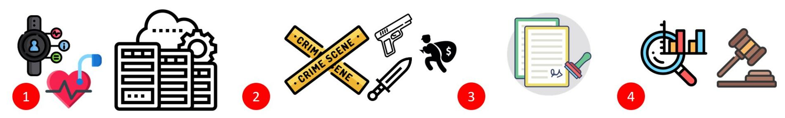

Fig. 1: Information flow: (1) Data is collected from sensors of wearable devices and stored locally and/or remotely (on servers). (2) An allegation regarding the wearable device owner is raised by a party from the legal sector. (3) The data is acquired (sometimes with a warrant). (4) The data is analyzed by experts, and the allegations are proven/disproved.

with a video camera/microphone).

The advantages that wearable devices provide to track and profile the device owner are the reasons that data obtained from wearable devices has been used in well-known crime cases over the last few years to prove/disprove claims regarding the device owner [\[3–](#page-13-2)[8\]](#page-13-7).

# *B. Involved Parties & Information Flow*

There are several entities/parties involved in obtaining testimony from a wearable device: (1) the wearable device, (2) the wearable device owner, (3) the entity that stores the data, and (4) a party from the legal sector.

The data acquired from a wearable device can be used by a party from the legal sector (e.g., investigator, police officer, lawyer) to prove/disprove claims regarding the wearable device owner. Usually, the information flow of data from a testifying wearable device consists of four stages (presented in Figure [1\)](#page-2-1):

- (1) Data from wearable devices is continuously collected by the device manufacturers, third party applications, and by the device itself for various legitimate (e.g., used to detect a user's gestures) and illegitimate reasons (e.g., used by spyware that sells data to third parties for targeted advertising campaigns). The data acquired can be stored locally on the device's local storage (e.g., on the smartwatch hard drive) or stored remotely on servers (e.g., at Fitbit's data center [\[4](#page-13-3)[–7\]](#page-13-4)). The data can be sent to the servers directly from the wearable device (using Wi-Fi/cellular connectivity) or indirectly via a Bluetooth paired device (e.g., via a smartphone's Internet connectivity).
- (2) An allegation is made about the wearable device owner by a party from the legal sector. The allegation can be made by an investigator, the lawyer of the owner of the wearable device, a prosecutor, etc. during an investigation or trial. The allegation about the wearable device owner can pertain to a single short-term activity that was performed by the device owner at a specific time; for example, the data can be used to refute the allegation [\[6,](#page-13-5) [7\]](#page-13-4), contradict claims about the owner of the device [\[4,](#page-13-3) [5\]](#page-13-6). The claims about the device owner could be about his/her long-term mental/physical change or ongoing condition which may be the result of an accident [\[3\]](#page-13-2) or disease.
- (3) The relevant data is acquired by the party from the legal sector from the entity storing the data in order to prove/disprove the allegation. Access to the data may be given freely by the subject (as was the case in [\[3\]](#page-13-2)) or forcibly obtained with a warrant (as in other cases [\[4–](#page-13-3)[7\]](#page-13-4)). It is important to note that in cases where the data is stored remotely, the policy of some manufacturers and third party

applications is to provide content and data obtained from the devices only when a warrant has been issued [\[13\]](#page-13-12).

(4) The data acquired is analyzed by experts. The insights are used to prove/disprove the allegations made about the wearable device owner.

# <span id="page-2-0"></span>III. THE CASE OF INTOXICATION DETECTION VIA WEARABLE DEVICES

In this section, we discuss a specific case of using data obtained from wearable devices for testifying whether the device owner is/was intoxicated. We explain the motivation for detecting intoxicated users and the scientific gap that currently exists in this area. We also review related work in the area of intoxication detection. We then suggest a method for detecting intoxicated users based on data obtained from wearable devices and explain the method's significance with respect to related studies.

# *A. Motivation & Scientific Gap*

There are a variety of reasons why the case of intoxication detection might be very interesting in terms of legal issues. In some countries, alcohol is banned, and alcohol consumption is considered a crime that can result in a six-month prison sentence [\[14\]](#page-13-13). In countries that allow alcohol consumption, the interest in whether a person is intoxicated or not is associated with the judgment of a subject when he/she committed a crime. In some cases the subject's sentence may be affected if intoxication is detected; for example, when a crime is committed due to the subject's impaired judgment resulting from alcohol consumption the penalty can be more severe than when the same crime is committed by a subject whose judgement is not impaired by alcohol consumption.

The effect of alcohol consumption on driving (e.g., reduced coordination, difficulty steering, and reduced ability to maintain lane position and brake appropriately) is the primary reason for motor vehicle accidents across the US. In 2013, one person died every 51 minutes in a motor vehicle accident caused by an alcohol impaired driver, a tragic statistic that represents more than 30% of all US traffic-related deaths that year. Various measures have been taken to improve the situation. The most well-known strategy employed to catch intoxicated drivers is the breath alcohol concentration (BrAC) test which measures the weight of alcohol present within a given volume of breath [\[15\]](#page-13-14). This test is conducted with the breathalyzer device [\[16\]](#page-13-15) which uses the driver's breath as a specimen/sample.

{3}------------------------------------------------

<span id="page-3-0"></span>TABLE I: BrAC thresholds for intoxication around the world.

| BrAC<br>Threshold | Countries                                             |  |  |  |  |  |
|-------------------|-------------------------------------------------------|--|--|--|--|--|
| 0                 | Paraguay, Vietnam                                     |  |  |  |  |  |
| 220               | Scotland, Finland, Hong Kong,<br>Netherlands, Belgium |  |  |  |  |  |
| 240               | Slovenia, South Africa, Israel                        |  |  |  |  |  |
| 380               | Malawi, Namibia, Swaziland                            |  |  |  |  |  |

BrAC limits vary between each country, causing the definition of intoxication to differ around the world. Table [I](#page-3-0) lists the four most common BrAC thresholds used. Based on these standards, anyone with a breath alcohol concentration measured by a breathalyzer above the defined threshold for a given country is considered intoxicated. In the US, the threshold varies widely between each state.

The biggest disadvantage of a BrAC test is that it can only detect alcohol ingested within a short window of time. In comparison to most drugs, alcohol is eliminated from the body very quickly (at a constant rate of about .015% BAC per hour). As a result, determining whether a subject is intoxicated or not heavily relies on the local police department's ability to perform a BrAC test on a subject within the short timeframe. If the BrAC test was not administered within this timeframe, it is harder to prove whether a person was intoxicated post factum. Detecting whether a person was intoxicated post factum is currently considered a scientific gap, because of the fact that alcohol is eliminated from the body very quickly and does not leave any traces. As a result, a subject may not be accused of impaired judgement (due to alcohol consumption), because the BrAC test was not performed within the required timeframe.

# *B. Related Work*

Despite the importance of detecting intoxication, there has been a limited amount of research that addresses the domain of intoxication detection using ubiquitous technology. A recent study [\[17\]](#page-13-16) showed that intoxication can be detected via a dedicated application for a smartphone that challenges the subject with various tasks, such as typing, sweeping, and other reaction tests. However this method is not passive and can be considered a software alternative to a breathalyzer, because it suffers from the same shortcoming of the breathalyzer: it requires a cooperative subject in order for it to work.

Kao *et al.* [\[18\]](#page-13-17) analyzed the accelerometer data collected from the smartphones of three subjects and compared the step times and gait stretch of sober and intoxicated subjects. This research was limited in scope in that it only used three subjects. In addition, it was not aimed at detecting whether a person was intoxicated based on data collected from the device; instead, the study compared differences in the gait of intoxicated and sober subjects.

Arnold *et al.* [\[19\]](#page-13-18) investigated whether a smartphone user's alcohol intoxication level (how many drinks they had) can be inferred from their gait. They used time and frequency domain features extracted from the device's accelerometer to classify the number of drinks a subject consumed based on the following ranges: 0-2 drinks (sober), 3-6 drinks (tipsy), or 6+ drinks (drunk). However, their methodology is not admissible, because some people do not become intoxicated from two drinks while others do, as this depends on physiological (e.g., the subject's weight) and non-physiological factors (e.g., whether the subject has eaten while drinking).

Several studies have utilized ubiquitous technology to detect intoxication based on driving patterns. Dai *et al.* [\[20\]](#page-13-19) and Goswami *et al.* [\[21\]](#page-13-20) used mobile phone sensors and pattern recognition techniques to classify drunk drivers based on driving patterns. Other studies tried to detect intoxication using various approaches. Thien *et al.* [\[22\]](#page-13-21) and Wilson *et al.* [\[23\]](#page-13-22) attempted to simulate the HGN (horizontal gaze nystagmus) test [\[24\]](#page-13-23), in order to detect intoxication using a camera (i.e., smartphone camera) and computer vision methods. Hossain *et al.* [\[25\]](#page-13-24) used machine learning algorithms to identify tweets sent under the influence of alcohol (based on text). None of the abovementioned methods were validated against an admissible breathalyzer, and the authors did not test the accuracy of the methods on a large number of subjects.

# *C. Proposed Method & Significance*

The short-term effects of alcohol consumption on subjects range from a decrease in anxiety and motor skills and euphoria at lower doses to intoxication (drunkenness), stupor, unconsciousness, anterograde amnesia (memory "blackouts"), and central nervous system depression at higher doses. As a result, various field sobriety tests are administered by police officers as a preliminary step before a subject takes a BrAC test using an admissible breathalyzer.

One of the most well-known field sobriety tests administered by police departments in order to detect whether a person is intoxicated is the walk and turn test in which a police officer asks a subject to take nine steps, heel-to-toe, along a straight line; turn on one foot; and return by taking nine steps in the opposite direction. During the test, the officer looks for seven indicators of impairment. If the driver exhibits two or more of the above indicators during the test, there is a 68% likelihood that the subject is intoxicated (according to the US National Highway Traffic Safety Administration/NHTSA [\[26\]](#page-13-25)).

We suggest a modified version of the walk and turn test: detecting whether a subject is intoxicated based on the differences in his/her free gait. We propose identifying the physiological indicators that imply drunkenness (in terms of body movement) based on the difference between two data samples of free gait. Each sample consists of motion sensor data obtained via wearable devices that are carried/worn by the subject during free gate. The first data sample of free gait is taken from a standard free gait sample of the subject. This sample is used to create a free gait profile of the subject. This can be done by obtaining one or more samples of a subject's free gait during time periods in which a subject is more likely to be sober (e.g., during the morning or afternoon). The second sample of free gait is obtained during the time of interest (e.g., the time the person was suspected of being intoxicated).

A few types of wearable devices can be used to identify the physiological indicators that imply intoxication (in terms of body movement). For example, smart glass can be used to identify anomalies in a subject's head movement during free 

{4}------------------------------------------------

gait. However, we suggest detecting intoxication via wristworn devices: smartwatches and fitness trackers. We believe that these devices are better candidates than other types of wearable devices because (1) wrist-worn devices are heavily adopted and the most commonly used and popular type of wearable device. According to a 2014 survey, one out of every six people owned a wrist-worn device [\[27\]](#page-13-26), and a 2019 survey showed that their adoption rate increased, with 56% of people owning a wrist-worn device [\[2\]](#page-13-1). (2) Wrist-worn devices contain motion sensors, and (3) most people wear their fitness tracker or smartwatch all the time (according to a recent survey [\[2\]](#page-13-1)), despite the fact that these devices require charging every few days.

#### <span id="page-4-0"></span>Algorithm 1 isIntoxicated?

```
1: Input: Model - Intoxication Detection Model
2: Input: sSober - Gait Measurements while Sober
3: Input: sSuspect - Suspected Gait Measurements
4: Input:Threshold - Confidence threshold
5: Output: Boolean - True/False for intoxication
6: procedure ISINTOXICATED?
7: fSober [] = features (sSober)
8: fSuspect [] = features (sSuspect)
9: n = length(fSober)
10: difference [] = new array[n]
11: for (i = 0 ; i < n ; i++) do
12: difference [i] = fSuspect[i] - fSober[i]
13: P robability = Model.classify(difference)
14: return(P robability > T hreshold)
```

Algorithm [1](#page-4-0) presents a high-level solution for detecting intoxication based on a wrist-worn device. It receives four inputs: a trained intoxication detection *Model*; two samples of free gait: (1) when the subject is sober (*sSober*), and (2) when the subject is suspected of being intoxicated (*sSuspect*); and a learned *Threshold*. First, features are extracted for each sample of a free gait for *fSuspect* and *sSober* (lines 7-8). Then, the difference between the features *fSuspect* and *fSober* is calculated (lines 10-12). The difference is then classified using a trained intoxication detection *Model* (line 8). Finally, the result is returned according to a learned *Threshold*.

In the subsections that follow, we explain how to: (1) extract the features, (2) train an intoxication detection model, and (3) determine a model's threshold according to two desired policy (each intoxicated subject that was classified as intoxicated was actually intoxicated in reality or each intoxicated subject is predicted as intoxicated). Finally, we evaluate the trained model's performance.

The significance of the suggested method with respect to related work is that our method: (1) is passive and does not rely on a subject's cooperation (as opposed to the method that was suggested by [\[17\]](#page-13-16) and a standard breathalyzer), (2) detects intoxication based on a given BrAC threshold (unlike other methods [\[18\]](#page-13-17) intended at predicting whether a subject is intoxicated), (3) was validated against the results of an admissible police breathalyzer (in contrast to other methods [\[20](#page-13-19)[–23,](#page-13-22) [25\]](#page-13-24) that did not label the collected data with admissible breathalyzer), (4) can be used post factum and is not limited to detecting intoxication within a short timeframe dependent on the rate at which alcohol is eliminated from the body (unlike a BrAC test).

# IV. THE EXPERIMENT

<span id="page-4-1"></span>In this section, we describe the experiments that we conducted in order to evaluate whether data from wrist-worn devices can be used to detect whether the device owner is intoxicated. We present the application we developed, the ethical considerations we had to take into account, the experiment's protocol, and we explain the data collection process.

# *A. Experimental Framework*

Most commercial wrist-worn devices are equipped with motion sensors and include an SDK to allow users to program them easily. We chose to use the Microsoft Band for the experiment, because: (1) its SDK has clear documentation, (2) it is easy to program the device, and (3) the device has both accelerometer and gyroscope sensors, and each sample is provided over three axes (x, y, and z).

We paired the Microsoft Band to a smartphone (Samsung Galaxy S4) using Bluetooth communication. We used the Microsoft Band's SDK in order to develop a dedicated application for the smartphone that sampled motion sensor data from the Microsoft Band and the Samsung Galaxy S4. The motion sensor data was sampled from the Samsung Galaxy S4 at 180 Hz and from the Microsoft Band at 62 Hz, and was recorded as a time series in nanoseconds.

The application generated a beep sound that was played to the subject (via headphones) and triggered the subject to start walking (while wearing the devices) until the application generated a second beep 16 seconds later. In order to measure the subject's gait, the application sampled the sensors for eight seconds, a time period that started on the sixth second of the experiment and continued until the fourteenth second. The stages of the experiment are presented in Figure [2.](#page-5-0)

We decided that using eight seconds of movement (representing the user's free gait) is the optimal way to conduct the experiment and obtain the samples for the following reasons: (1) Gait is probably the best way to ensure that the devices are carried/worn by the user instead of sitting on a desk. (2) Free gait measurements can be obtained from the user passively by detecting walking instances (from smartwatch/smartphone sensors such as the accelerometer, gyroscope, and GPS). (3) Intoxication affects a subject's gait and balance.

In addition, we purchased a Drager Alcotest 5510 breathalyzer in order to obtain BrAC samples. This breathalyzer outputs results in micrograms of alcohol per liter of breath. We chose this type of breathalyzer, because it is a professional breathalyzer used by our local police department and other departments in different countries around the world.

### *B. Ethical Considerations*

The experiment involved collecting data from intoxicated and sober subjects. We did our best to preserve the subjects'

{5}------------------------------------------------

<span id="page-5-0"></span>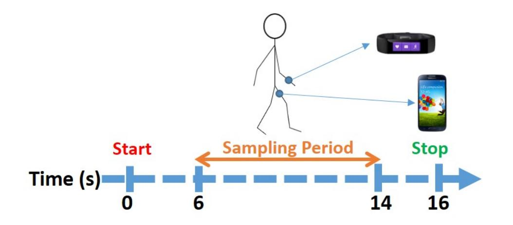

Fig. 2: Experiment's protocol: a sample of eight seconds of motion sensor data from a subject's free gait was obtained.

<span id="page-5-1"></span>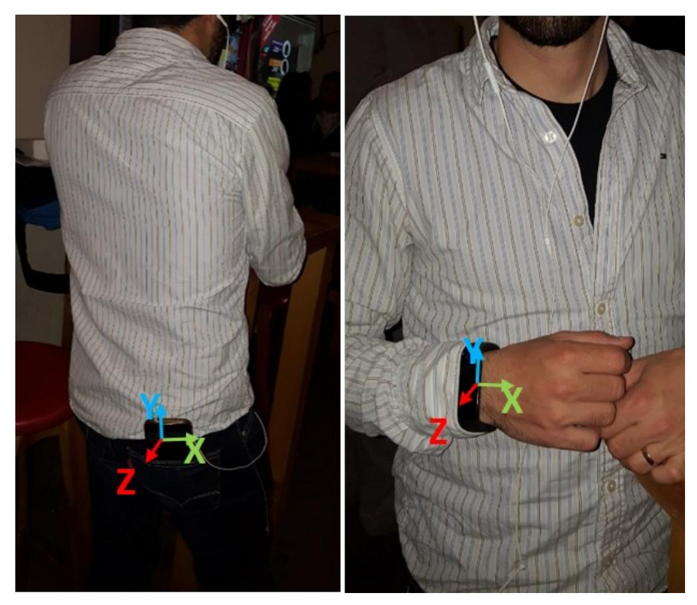

Fig. 3: A subject outfitted with a Microsoft Band and Samsung Galaxy S4.

privacy and reduce any risks associated with participating in the experiment. The experiment was approved by the institutional review board (IRB), subject to the following precautions:

- (1) Only individuals that went to a bar in order to drink of their own accord can participate in the experiment; in this way, the onus for any consequences resulting from such drinking is on the subjects.
- (2) Only individuals that did not drive to the bar with a car and will not drive back from the bar with a car can participate in the experiment.
- (3) Anonymization must be applied to the data. At the beginning of the experiment, a random user ID was assigned to each subject, and this user ID served as the identifier of the subject, rather than his/her actual identifying information. The mapping between the experiment's user ID and the identity of the subjects was stored in a hard copy document that was kept in a safe box; at the end of the experiment, we destroyed this document.
- (4) During the experiment, the data collected was stored encrypted in the local storage of the smartphone (which was not connected to the Internet during the experiment). At the end of the experiment, the data was copied to a local

server (i.e., within the institutional network), which was not connected to the Internet. Only anonymized information of the subjects was kept for further analysis.

(5) Participants were paid for their participation in the study (each subject received the equivalent of 15 USD in local currency).

# *C. Methodology*

In order to sample as many people as possible, our experiment took place at three different bars that offer an "all you can drink" option. We waited for people to arrive at the bars, and just before they ordered their first drink, we asked them to participate in our research (participation entailed providing a gait sample during two brief experimental sessions while wearing wearable devices, as well as providing two breath samples a few seconds before the sessions started). We explained that they would receive the equivalent of 15 USD in local currency for their participation. We also told the subjects that they would be compensated even if they chose not to drink at all, so drinking was not obligatory. Each subject signed a document stating that he/she came to the bar in order to drink of his/her own accord and that he/she did not drive to the bar and would not drive from the bar (as we were instructed by the IRB). The breathalyzer was calibrated at the beginning of each evening according to the manufacturer's instructions.

The experiment was conducted in two sessions. The first session took place before the subjects had their first drink. The second session took place at least 15 minutes after the subject's last drink, just before they intended to leave the bar. We consulted with police authorities regarding the breathalyzer test, and they told us to wait 15 minutes after the subject had their last drink in order to obtain an accurate BrAC specimen. During each session, our subjects provided us with a gait sample and a BrAC specimen. Their gait was recorded using the application that we developed (described at the beginning of this section). The BrAC specimen was measured with the breathalyzer; the result was used to label each gait sample.

Our subjects were outfitted with the devices as follows: they were asked to wear the Microsoft Band on their left or right hand (as they wished) and carry a smartphone in a rear pocket (as can be seen in Figure [3\)](#page-5-1). Each subject also wore headphones that were used to hear the beeps used to indicate that the subject should start/stop walking.

Thirty subjects participated in our study, each of whom was instructed to walk (while wearing the devices) in any direction they wished until they heard a beep in the headphones. Table [II](#page-6-1) provides information about the subjects. Most of our participants were in their early 20s, which, according to the NHTSA [\[28\]](#page-13-27), is the group considered to have the highest risk of causing fatal accidents due to alcohol consumption (in 30% of the accidents resulting from intoxicated drivers in 2014, the drivers were between the ages of 21 and 24).

Figure [4](#page-6-2) presents the analysis and distribution of the breathalyzer results. Our data needed to include samples of both sober and drunk states. This was crucial for the model creation phase (described later) in order to learn the movement differences that imply intoxication, as well as the differences that do not suggest intoxication.

{6}------------------------------------------------

<span id="page-6-1"></span>

| Gender | Number of<br>Subjects | Age(Year)  | Height(CM)  | Mass(KG)    |
|--------|-----------------------|------------|-------------|-------------|
| Male   | 24 (80%)              | 24.1 ± 3.6 | 176.4 ± 9.2 | 73.1 ± 10.5 |
| Female | 6 (20%)               | 24.5 ± 5.9 | 168.5 ± 4.5 | 60 ± 4.5    |

TABLE II: Information about the subjects. Each cell presents the average and standard deviation.

<span id="page-6-2"></span>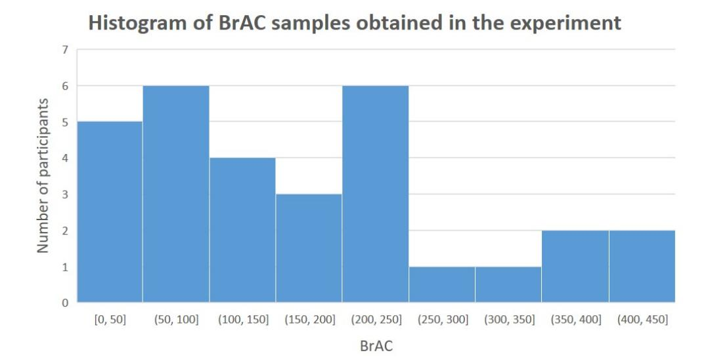

Fig. 4: Breathalyzer samples - the bars represent the results of the subjects' breathalyzer tests (the amount of micrograms of alcohol per liter of breath).

#### V. EVALUATION & RESULTS

<span id="page-6-0"></span>In this section, we describe the features that were extracted, the process of creating the dataset, the algorithms that were used, the evaluation protocol, and the results that we obtained in our experiment.

#### *A. Feature Engineering*

The impact of intoxication on individuals has been extensively researched. There are many noticeable behaviors that an individual may display as he/she becomes intoxicated. As the intoxication level rises, differences can be observed (1) behaviorally, and (2) physically. In this study we focus on a specific physical indicator for intoxication: differences in gait (walking).

Differences in walking are expressed as difficulty walking in a straight line and maintaining balance, and swaying. These indicators appear even with the consumption of a small amount of alcohol and can be detected by police officers in the field sobriety test (walk and turn test) without any dedicated device. The walk and turn test is usually performed by officers before a breathalyzer test in order to save the long process of obtaining a breath sample from individuals that are not shown to be intoxicated based on the field sobriety test.

Since we use data that was obtained from motion sensors, we extract features that can be informative as a means of detecting the abovementioned gait differences. The first type of features that we used are features from the spectrum domain. Previous studies demonstrated the effectiveness of extracting such features from motion sensors [\[29,](#page-13-28) [30\]](#page-13-29). We extract features that represent the distribution of the power of the signals across the spectrum domain. Such features may indicate physiological changes resulting from alcohol consumption that are associated with reduced frequency of movement as a result of difficulties in maintaining balance while walking.

<span id="page-6-3"></span>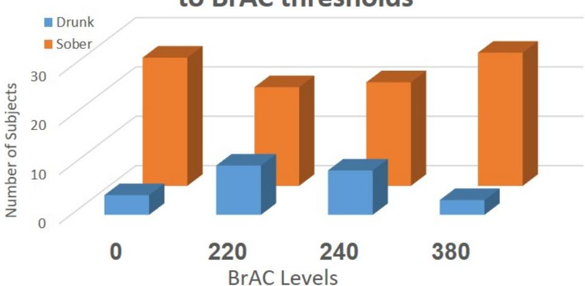

Fig. 5: A breakdown of the subjects' state (sober/drunk) at various BrAC levels.

The second type of features that were used are statistical features. Previous studies demonstrated the effectiveness of extracting such features from motion sensors [\[31,](#page-14-0) [32\]](#page-14-1). We extract five features (mean, variance, skewness, kurtosis, and RMS) that represent high-level information about the signals. Such features may indicate physiological changes associated with intoxication, such as decreased average acceleration as a result of difficulty maintaining balance.

The third type of features that were used are histogram features. We present the signals as histograms, as done in previous studies [\[33,](#page-14-2) [34\]](#page-14-3). We extract a histogram that represents the distribution of the values of the signals across the time domain between the maximum and minimum value. Such features may indicate differences in the patterns of movement (and specifically, the distribution of the movement) as a result of the abovementioned indicators.

Finally, we extract known gait features that have been shown to yield good results in previous studies [\[35,](#page-14-4) [36\]](#page-14-5). We extract four features (zero crossing rate, mean crossing rate, pairwise correlation, and spectral entropy). These features may indicate differences in the characteristics of a person's gait that are the result of difficulty walking.

# *B. Creating the Dataset*

As was indicated in Section [IV,](#page-4-1) each subject contributed two breath specimen and gait samples (obtained in two sessions before and after drinking). Each gait sample is comprised of sensor readings (measurements) obtained from a smartphone and fitness tracker. The accelerometer and gyroscope were sampled from the fitness tracker and smartphone.

Given person p and his/her two gait samples: *s-before* (measurement taken before alcohol consumption) and *s-after* (measurement taken after alcohol consumption), we process the samples as follows:

- (1) Feature Extraction We extract two feature vectors: the f-before vector (extracted from s-before) and the f-after vector (extracted from s-after).
- (2) Difference Calculation We calculate a new feature vector called the f-difference. These features represent the difference (for each feature) between the f-after and f-before values. The difference signifies the effects of alcohol consumption on the subject's movement and is calculated by subtracting

{7}------------------------------------------------

each of the features from f-after with its correlative feature in f-before.

(3) Labeling - We label the sample of each subject as intoxicated/sober according to the result of the professional breathalyzer for known BrAC thresholds.

The dataset creation process resulted in 30 labeled instances extracted from 30 users, representing the differences between the extracted features before and after drinking. We used this data to train supervised machine learning models for intoxication detection. We analyze the data as a classification task, with the goal of determining whether a person is intoxicated or sober according to known BrAC thresholds as measured using a breathalyzer. More precisely, we aim to train a model that determines whether a person is intoxicated or not using differences in the subject's gait features. We chose to classify our instances according to each of four BrAC thresholds 0, 220, 240, and 380 (presented in Table [III\)](#page-7-0). We consider an instance labeled by a breathalyzer result (BrAC) to be sober if its value is less than the threshold and intoxicated if its value exceeds the threshold.

The breakdown of the subject's sober/drunk states according to BrAC thresholds 0, 220, 240, and 380 is presented in Figure [5.](#page-6-3) At the lower BrAC threshold (0), 86% of the subjects were considered drunk. At the middle BrAC thresholds of alcohol concentration (220, 240) the data is distributed, such that 20-33% of the total number of subjects were considered intoxicated. At the highest threshold (380) 10% of the subjects were considered drunk.

#### *C. Algorithms & Evaluation Protocol*

Five different machine learning models were evaluated to allow for a versatile yet comprehensive representation of model performance. The first model that we evaluated was Naive Bayes which belongs to a family of simple probabilistic classifiers. The second model evaluated was Logistic Regression. This model is able to obtain good results in cases where the two classes can be adequately separated using a linear function. The third model used was Support Vector Machines which is used to identify the maximum margin hyper-plane that can separate classes. Finally, we evaluated two ensemble-based classifiers: Gradient Boosting Machine (GBM) and AdaBoost. GBM trains a sequence of trees where each successive tree aims to predict the pseudo-residuals of the preceding trees. This method allows us to combine a large number of classification trees with a low learning rate. AdaBoost trains a set of weak learners (decision trees) and combines them into a weighted sum that represents the final outcome.

Since our data is based on samples from 30 subjects, we can utilize the leave-one-user-out protocol, i.e., the learning process is repeated 30 times, and in each test, 29 subjects are used as a training set, and one subject is used as a test set for evaluating the predictive performance of the method. The leave-one-user-out protocol allows us to evaluate the performance of the suggested method by utilizing the entire set of instances in the data for training and evaluation. We report the following metrics: area under the receiver operating

<span id="page-7-0"></span>

|          | Thresholds |                   |       |       |  |  |  |  |  |
|----------|------------|-------------------|-------|-------|--|--|--|--|--|
|          | 0          | 220<br>240<br>380 |       |       |  |  |  |  |  |
| AdaBoost | 0.540      | 0.945             | 0.979 | 0.500 |  |  |  |  |  |
| GBC      | 0.290      | 0.915             | 0.952 | 0.926 |  |  |  |  |  |
| LR       | 0.760      | 0.560             | 0.577 | 0.457 |  |  |  |  |  |
| NB       | 0.330      | 0.290             | 0.196 | 0.414 |  |  |  |  |  |
| SVM      | 0.500      | 0.500             | 0.500 | 0.500 |  |  |  |  |  |

TABLE III: AUC of classification algorithms: AdaBoost, Naive Bayes (NB), Linear Regression (LR), Support Vector Machines (SVM), and Gradient Boosting Classifier (GBC) for BrAC thresholds of 0, 220, 240, and 380.

<span id="page-7-1"></span>

|       | Predicted |       |       |       |       |       |       |       |  |
|-------|-----------|-------|-------|-------|-------|-------|-------|-------|--|
|       | 0         |       | 220   |       | 240   |       | 380   |       |  |
|       | Drunk     | Sober | Drunk | Sober | Drunk | Sober | Drunk | Sober |  |
| Drunk | 1         | 3     | 6     | 4     | 9     | 0     | 0     | 3     |  |
| Sober | 4         | 22    | 1     | 19    | 2     | 19    | 0     | 27    |  |

TABLE IV: Confusion matrices of the Gradient Boosting Classifier for BrAC thresholds of 0, 220, 240, and 380.

characteristic curve (AUC), false positive rate (FPR), and true positive rate (TPR). The results that we report in this section are the average of 30 models that were trained and evaluated on the dataset for each task.

#### *D. Results*

Here we report the performance of Algorithm [1](#page-4-0) with the models that we trained. We use Algorithm [1](#page-4-0) in order to answer the following research questions:

- 1) What is the performance of our method according to various BrAC thresholds?
- 2) What is the performance of our method for various detection policies?
- 3) What is the importance of each device, sensor, and set of features?
- *1) Performance for Various BrAC Thresholds:* We start by assessing the performance of the intoxication detection model from data obtained from a fitness tracker and smartphone. Table [III](#page-7-0) presents the AUC results for each of the classification models for BrAC thresholds of 0, 220, 240, and 380. As can be seen from the results presented in Table [III,](#page-7-0) the GBM and AdaBoost classifiers yielded excellent results for thresholds of 220, 240, and 380. The GBM and AdaBoost classifiers did not yield the same results for a BrAC threshold of zero, since alcohol's short-term effects on the physiological state (such as imbalanced gait, dizziness) do not appear in small doses of alcohol consumption; hence, they are very difficult to detect by using motion sensors.

Figures [6](#page-8-0) and [7](#page-8-1) present the ROC for thresholds of 0, 220, 240, and 380. We also analyze the classifiers' decisions. The confusion matrices for the AdaBoost and Gradient Boosting classifiers for BrAC thresholds of 0, 220, 240, and 380 are presented in Tables [IV](#page-7-1) and [V.](#page-8-2) As can be seen from the confusion matrices presented in the table, some of the instances that were considered as drunk were misclassified as sober and vice versa.

*2) Performance for Various Detection Policies:* Here we set out to test the performance of the intoxication detection

{8}------------------------------------------------

<span id="page-8-0"></span>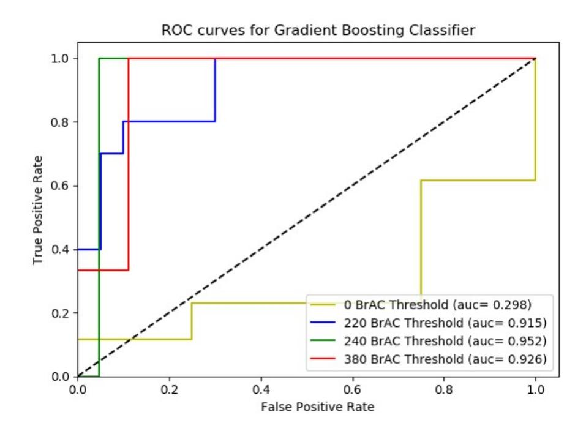

Fig. 6: ROC curve of the Gradient Boosting classifier for BrAC thresholds of 220, 240, and 380 from data that was obtained from a smartphone and fitness tracker.

<span id="page-8-1"></span>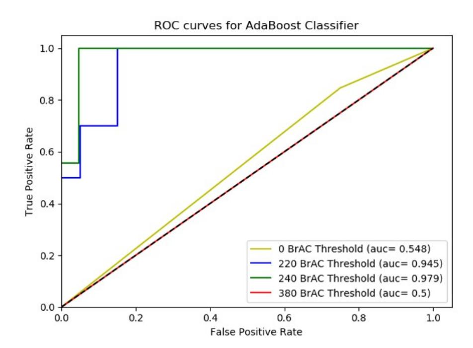

Fig. 7: ROC curve of the AdaBoost classifier for BrAC thresholds of 220, 240, and 380 from data that was obtained from a smartphone and fitness tracker.

model according to two policies. Figures [8](#page-8-3) and [9](#page-8-4) present misclassifications (FNR and FPR) for BrAC thresholds of 0, 220, 240, and 380. The implication of a drunk subject that is misclassified as sober is a reduced sentence for the subject for a crime that he/she performed (e.g., a reduced sentence for a fatal accident that was caused as a result of driving under the influence and was not detected). In order to avoid such incidents, we wanted to test the performance of a model on a policy whereby each intoxicated subject is predicted as intoxicated. In order to do so, we fixed the TPR at 1.0 (the true class is intoxicated) and assessed the impact of this limitation on the FPR.

Table [VI](#page-8-5) presents the FPR results of the Gradient Boosting and AdaBoost classifiers for BrAC thresholds of 0, 220, 240, and 380. As can be seen from the results, applying a constraint of detecting all intoxicated subjects caused up to 30% of the sober subjects to be misclassified as intoxicated for BrAC thresholds of 220, 240, and 380.

<span id="page-8-2"></span>

|       | Predicted              |       |       |       |       |       |       |       |  |
|-------|------------------------|-------|-------|-------|-------|-------|-------|-------|--|
|       | 0<br>220<br>240<br>380 |       |       |       |       |       |       |       |  |
|       | Drunk                  | Sober | Drunk | Sober | Drunk | Sober | Drunk | Sober |  |
| Drunk | 1                      | 3     | 8     | 2     | 9     | 0     | 0     | 3     |  |
| Sober | 4                      | 22    | 3     | 17    | 1     | 20    | 0     | 27    |  |

TABLE V: Confusion matrices of the AdaBoost for BrAC thresholds of 0, 220, 240, and 380.

<span id="page-8-3"></span>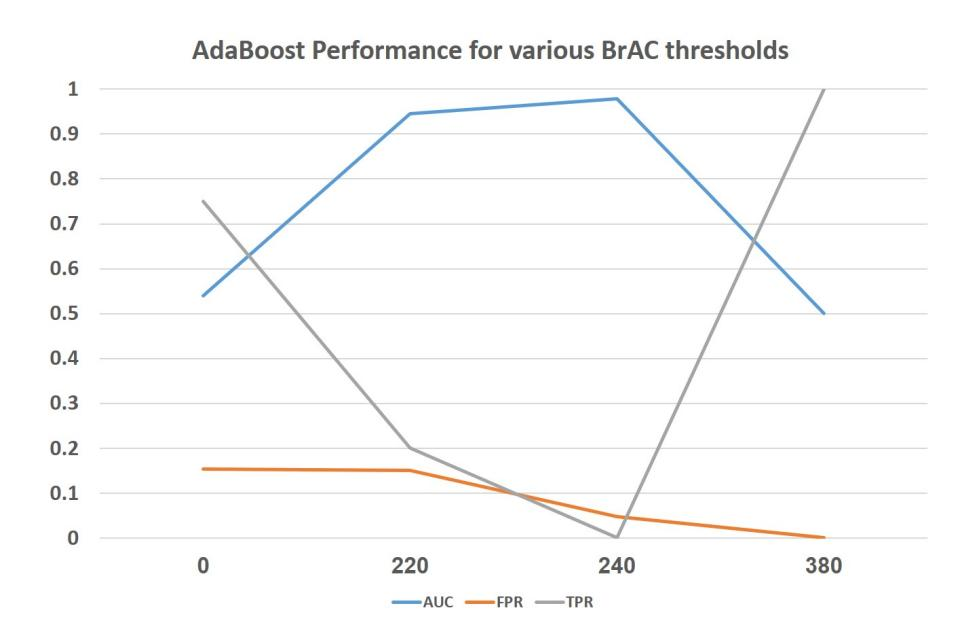

Fig. 8: AdaBoost classifier performance for BrAC thresholds of 0, 220, 240, and 380.

<span id="page-8-4"></span>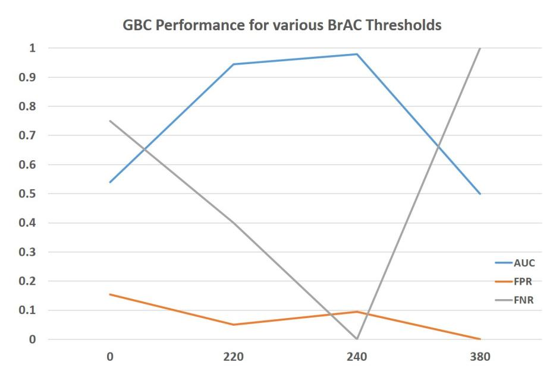

<span id="page-8-5"></span>Fig. 9: Gradient Boosting Classifier performance for BrAC thresholds of 0, 220, 240, and 380.

|          | Thresholds             |      |      |      |  |  |
|----------|------------------------|------|------|------|--|--|
|          | 0<br>220<br>240<br>380 |      |      |      |  |  |
| GBC      | 1                      | 0.3  | 0.09 | 0.11 |  |  |
| AdaBoost | 1                      | 0.15 | 0.04 | 0    |  |  |

TABLE VI: Detecting all intoxicated subjects: FPR (false positive rate) of classifiers with a fixed TPR (true positive rate) of 1.0.

|          | Thresholds |     |      |     |  |
|----------|------------|-----|------|-----|--|
|          | 0          | 220 | 240  | 380 |  |
| GBC      | 0          | 0.4 | 0    | 0   |  |
| AdaBoost | 0          | 0.4 | 0.55 | 0   |  |

<span id="page-8-6"></span>TABLE VII: Detecting an intoxicated instance with no errors: TPR (true positive rate) of classifiers with a fixed FPR (false positive rate) of zero.

{9}------------------------------------------------

<span id="page-9-0"></span>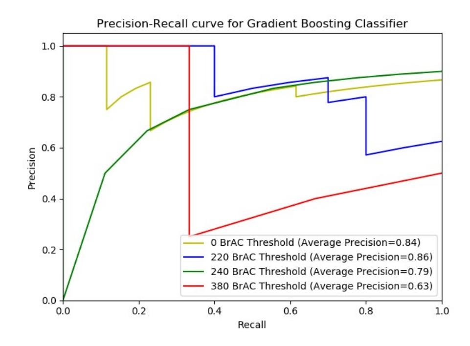

Fig. 10: Precision-recall curve of the Gradient Boosting Classifier for BrAC thresholds of 0, 220, 240, and 380 from data that was obtained from a smartphone and fitness tracker.

We wanted to test the performance of a model on another policy whereby each intoxicated subject that was classified as intoxicated by a model was actually intoxicated in reality. In order to do so, we fixed the FPR at zero (the positive class is drunk) and assessed the impact of this limitation on the TPR, i.e., we looked at the percentage of intoxicated subjects that were misclassified as sober.

Table [VII](#page-8-6) presents the TPR results of the Gradient Boosting and AdaBoost classifiers for BrAC thresholds of 0, 220, 240, and 380. As can be seen from the results, the impact of applying a constraint of detecting all intoxicated subjects is that this approach is only effective for a BrAC threshold of 220, since 40-55% of the intoxicated subjects are detected (when using GBM as an intoxication detection model). However, for all other BrAC thresholds, all of the intoxicated subjects are misclassified.

Figures [10](#page-9-0) and [11](#page-9-1) present the precision-recall curve of the Gradient Boosting and AdaBoost classifiers for BrAC thresholds of 0, 220, 240, and 380.

*3) Importance of Devices, Features, and Sensors:* In this section, we aim to detect the impact of every device, sensor, and set of features on the performance. We started by testing the performance for data that was obtained from a smartphone and fitness tracker exclusively. We trained AdaBoost and Gradient Boosting classifiers with data obtained from a single device for BrAC thresholds of 0, 220, 240, and 380.

Table [VIII](#page-9-2) presents the results of the AdaBoost and Gradient Boosting classifiers for data that was obtained from a smartphone, fitness tracker, and both (for comparison). As can be seen from the results, measurements of movements from both devices are required to accurately classify a subject as intoxicated/sober.

In the feature extraction process we extracted four types of features. Since the gait of individuals changes as a result of alcohol consumption, we wanted to identify the best set of indicators to detect drunkenness (based on body movement patterns) and determine which of the following is most effective at this task: the distribution of the movement (histogram),

<span id="page-9-1"></span>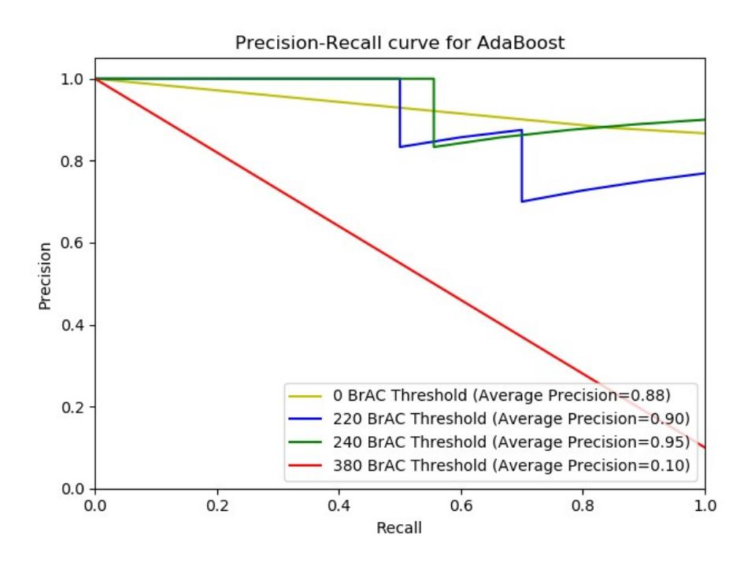

Fig. 11: Precision-recall curve of the AdaBoost classifier for BrAC thresholds of 0, 220, 240, and 380 from data that was obtained from a smartphone and fitness tracker.

<span id="page-9-2"></span>

|                 | Thresholds                   |       |       |       |  |  |
|-----------------|------------------------------|-------|-------|-------|--|--|
|                 | 0                            | 220   | 240   | 380   |  |  |
|                 | Gradient Boosting Classifier |       |       |       |  |  |
| Smartphone      | 0.15                         | 0.74  | 0.38  | 0.46  |  |  |
| Fitness Tracker | 0.39                         | 0.52  | 0.68  | 0.92  |  |  |
| Both            | 0.290                        | 0.915 | 0.952 | 0.926 |  |  |
|                 | AdaBoost                     |       |       |       |  |  |
| Smartphone      | 0.46                         | 0.75  | 0.57  | 0.59  |  |  |
| Fitness Tracker | 0.75                         | 0.33  | 0.73  | 0.5   |  |  |
| Both            | 0.540                        | 0.945 | 0.979 | 0.500 |  |  |

TABLE VIII: AUC results of the AdaBoost and Gradient Boosting classifiers based on data obtained from a fitness tracker, smartphone, and both devices.

frequency of the movement, statistical features, or known gait features.

In order to do so, we used the dataset and trained Gradient Boosting and AdaBoost classifiers for BrAC thresholds of 0, 220, 240, and 380. We classified each instance using two methods. The first classification method was performed using a specific set of features among the sets (histogram, known gait features, frequency features, statistical features). The second classification method was performed using all of the other sets of features (except the set used in the first method). Figure [12](#page-10-1) presents the average AUC results for BrAC thresholds of 0, 220, 240, and 380. As can be seen from the results, only the models that were trained on statistical features outperformed the models that were trained without them. All other models that were trained on features were unable to obtain higher scores than the models that were trained without them. From this we conclude that a combination of the entire set of features is required to train an effective/accurate intoxication detection model.

Finally, we test the impact of data from every sensor on the results. In order to do so, we utilized the same protocol used to test the feature robustness: we trained Gradient Boosting and AdaBoost classifiers for BrAC thresholds of 0, 220, 240, and 380. We classified each instance using a model that was only trained on accelerometer features and a model that was only

{10}------------------------------------------------

<span id="page-10-1"></span>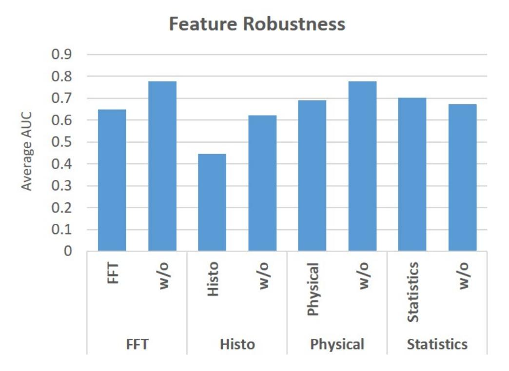

Fig. 12: Average AUC results of the AdaBoost and Gradient Boosting classifiers based on specific types of features and without them.

<span id="page-10-2"></span>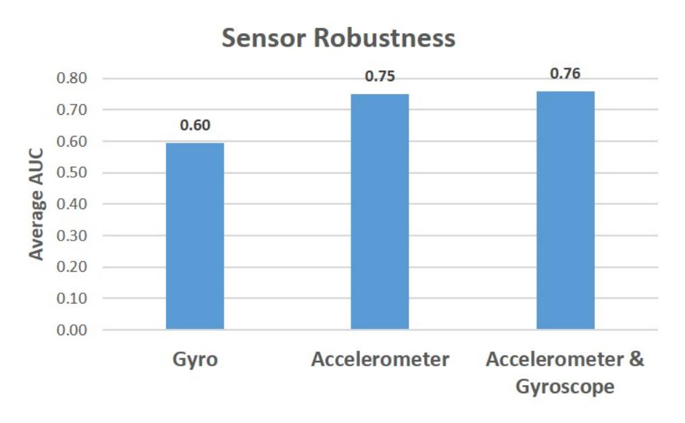

Fig. 13: Average AUC results of the AdaBoost and Gradient Boosting classifiers based on measurements that were obtained from a single sensor and from both sensors.

trained on gyroscope features. Figure [13](#page-10-2) presents the average AUC results for BrAC thresholds of 0, 220, 240, and 380. As can be seen from the results, a model that was only trained on accelerometer measurements can yield nearly the same results as a model that was trained on both sensors. Given this, we conclude that subjects' acceleration when walking is highly informative in order to detect intoxication.

# <span id="page-10-0"></span>VI. TESTIFYING WEARABLE DEVICES IN THE NEAR FUTURE

In this section we analyze the age of testifying wearable devices: the current state, expectations for the near future, expected challenges, and future research directions.

### *A. Current State: Analysis & Limitations*

Despite the fact that seven years has passed since the first case in which data from wearable device was used to testify against/for the device owner [\[3\]](#page-13-2), we believe that we are only at the beginning of the era of testifying wearable devices. In the last seven years, data from wearable devices has only been used to prove/disprove allegations regarding the device owner by a few pioneers in the legal sector in a limited number of cases despite the fact that individuals' textual (e.g., emails), visual (e.g., videos), and acoustic (e.g., recordings) data has been used by the legal sector for many years.

We believe that there are three primary reasons why the data from testifying wearable devices has not commonly been used by the legal sector:

- (1) Limited understanding of a testifying wearable device's potential: While, there is broad understanding on how the data from wearable devices can be used for commercial purposes, there is more limited understanding on how insights from such devices can be used for legal purposes. The case of wearable devices is different from other IoT devices (e.g., video cameras, smart assistants) whose data the legal sector is already familiar with and utilizes by employing professionals with expertise in mining and processing textual/visual/acoustic data in order to leverage this asset's potential. Deriving insights from data obtained from motion, heart rate, and skin conductivity sensors requires different types of expertise. In addition, many questions must be answered in order to realize the potential of the data from testifying wearable devices, including: What insights that can be derived from this data might be valuable to the legal sector? How can these insights be derived? What is required to derive these insights?
- (2) Limited accessibility to data: Currently, most wearable devices are not equipped with a SIM card (except for just a few). As a result, the communication between a wearable device and servers is not continuous, and data collected from wearable devices is sent to data centers via a Bluetooth paired device (e.g., smartphone) or Wi-Fi when the wearable device is located in proximity to a router and connected to a LAN. The fact that the communication between wearable devices and data centers is not direct limits the ability to collect data on a user and in some cases, limits the amount of data that can be collected to the amount of data that can be stored locally. As a result, wearable device data is less accessible to the legal sector than data obtained from other IoT devices (e.g., wireless video cameras).
- (3) Limited opportunities: A decade after the first wearable device appeared on the market, the only heavily adopted wearable device is the wrist-worn device (e.g., smartwatches and fitness trackers) which has been adopted by over half of the adults in the US (according to a recent survey [\[2\]](#page-13-1)). Other types of wearable devices (e.g., Google Glass) that looked very promising when they first appeared on the market have have not been adopted due to the lack of added value, high price, and UX issues. As a result, the insights that can be obtained in this area are limited to those that can be derived from the wrist-worn devices.

### *B. Testifying Wearable Devices in the Near Future*

We expect that in the near future other intended and unintended processes (unrelated to the legal sector) will result in the increased use of wearable device data as a means of testifying against/for the device owner. Such processes include:

(1) Greater understating of a testifying wearable device's potential: Interest in performing studies that may result in 

{11}------------------------------------------------

insights valuable to the legal sector may stem from scientific curiosity, commercial prospects, medical applications, and more. For example, a recent study was able to predict Parkinson's disease in users based on wearable device data [\[37\]](#page-14-6). Researchers are often motivated to perform such studies in order to derive insights that could enable early disease diagnosis and improve patient outcome. However, such insights could also be beneficial to the legal sector and could, for example, be used by insurance companies or police departments to charge wearable device owners in accidents by linking them to driving behavior associated with the early stages of Parkinson's disease. In addition, computational criminology centers could perform or fund academic research to increase understanding about the insights that can be derived from wearable device data. We expect that insights from studies conducted by the legal sector (e.g., by police departments) and other sectors (e.g., medicine) will increase understanding about the potential of wearable devices and the interest of the legal sector.

(2) Improved accessibility to data: Data is about to become more accessible due to the integration of eSIM (embedded-SIM) in the next generation of wearable devices [\[38,](#page-14-7) [39\]](#page-14-8). This will allow wearable device manufacturers and installed applications to send data collected from the wearable device continuously and directly to data centers via cellular connectivity (without the use of a smartphone as a mediator). Moreover, 5G will improve an endpoint's cellular connectivity and provide improved infrastructure to collect data from wearable devices due to its higher average speed, lower latency, and wider bandwidth. All of this will increase the volume of data that can be collected from wearable devices and stored in data centers. We also believe that there will be increased motivation to collect data from wearable devices, since research continuously reveals new and valuable insights about wearable device owners obtained from the data collected. Companies can use such insights to increase revenue or decrease loss from clients that own wearable devices. For example, several studies have demonstrated how data obtained from wearable devices can be used to identify a subject's eating episodes, [\[32\]](#page-14-1) and predict future heart disease [\[40\]](#page-14-9). Such information can be helpful to an insurance company that must decide whether or not to issue an insurance policy to someone. New insights will expand commercial interest in wearable device data and this in turn will result in increased data collection.

(3) New opportunities: Wearable device manufacturers continue to integrate new sensors into existing wearable devices in order to obtain data that could not previously be collected. For example, commercial earbuds are now sold with motion sensors to support head gesture and activity recognition [\[41\]](#page-14-10). In addition, new commercial wearable devices are being developed to improve computer human interaction. This technology will likely create additional opportunities for the legal sector to derive new insights that cannot be derived from existing wearable devices (e.g., reading a user's mind using data obtained from brain-computer interface [\[42\]](#page-14-11)).

#### *C. Expected Challenges*

In an era in which data from wearable devices is used to testify against device owners, an interesting question arises: What would happen if a hacker or the owner of a device managed to compromise a device whose data was being used as testimony or evidence in a legal case? Compromising such data can be done by hackers via a cyber-attack on data centers that store the collected data; alternatively, the owner of a wearable device could spoof the data collected by his/her device in order to create an alibi. This can be done, for example, by applying GPS spoofing to fool the GPS of a smartwatch so as to be detected in another place, or by applying motion sensor spoofing in order to fabricate an activity (e.g., by spoofing the step counter of a fitness tracker using ultrasound [\[43\]](#page-14-12)). These scenarios might seem like the subject of science fiction, but a few years ago, the scenario of data obtained from a fitness tracker being used in a courtroom to testify against the device owner was also considered farfetched [\[3–](#page-13-2)[7\]](#page-13-4), so it is likely just a matter of a time until such an incident occurs. As a result, in the near future we also expect to hear about cases in which compromised data causes investigators to reach erroneous conclusions.

# *D. Future Research Directions*

Additional research is required in several directions in order to increase the value of wearable device data to the legal sector:

(1) Short-term activity recognition and anomaly detection: additional research is required to recognize short-term activities that can be used by the legal sector in order to prove/disprove allegations regarding a wearable device owner. For example, smartwatches usually consist of three motion sensors (accelerometer, gyroscope, compass) that each provide data from three axes and together provide 9-DOF (degrees of freedom) data. While research has already demonstrated how standard short-term hand gestures (e.g., eating episodes [\[32\]](#page-14-1), smoking [\[44\]](#page-14-13), and other gestures [\[45\]](#page-14-14)) can be detected by analyzing 9-DOF data obtained from a smartwatch, additional research should be performed to detect short-term hand gestures associated with criminalism; for example, we suggest performing research to detect the following unique hand gestures: stabbing, strangling, etc. Additional research is also required to detect anomalies that can be associated with short-term unique behavior. Since continuous data is collected from wearable devices, an accurate profile about the owner can be created from cardiovascular/skin conductivity data. As a result, anomalies in the profile can be identified in order to prove/disprove allegations regarding a user. This method was already found effective in a prior case [\[8\]](#page-13-7), but additional research is required to understand the potential and limitations of such a method.

(2) Insights from long-term differences: additional research is required to derive insights from long-term changes. For example, data from a Fitbit fitness tracker was used to prove that a client was less active after being in a car accident in a personal injury case [\[3\]](#page-13-2). Wearable devices can provide the infrastructure needed to derive insights about physiological 

{12}------------------------------------------------

and psychological changes that a subject has experienced due to an accident or injury (e.g., increased anxiety from heart rate data [\[46\]](#page-14-15)).

- (3) Deriving insights via alternative virtual, passive methods: in some cases, the tests needed to detect a crime (e.g., drug use) require specific tests (e.g., blood test) that require dedicated hardware/equipment/procedures and rely on a subject's cooperation. Additional research is needed to detect a crime indirectly via passive and virtual methods. For example, in our study we demonstrated an alternative, virtual, and passive method to detect intoxication by identifying the physiological changes that are associated with intoxication via wearable devices. The physiological indicators (e.g., sweat, reduced movement, etc.) associated with drug use might also be identified via wearable device sensors (skin conductivity and motion sensors).
- (4) Deriving insights from aggregated/low resolution data: additional research is also required in order to derive insights from aggregated data. For example, a recent study [\[35\]](#page-14-4) compared the effectiveness of various statistical features used to detect a subject's gait from wearable devices. The ability to derive insights from aggregated data can help the legal sector in turn derive insights about wearable device owners in cases in which the data collected from the users is stored aggregated in data centers.
- (5) Data quality: additional research is required to understand whether the quality of the data obtained by the sensors of commercial wearable devices can replace dedicated sensors for legal purposes. For example, cardiovascular data obtained from a dedicated sensor can be used to detect lies, however a recent study revealed that the cardiovascular data obtained from an Apple watch generates false alarms 90% of the time for pulse readings that are associated with a patient's cardiac condition [\[47\]](#page-14-16). We believe that additional research is also required to explore the accuracy and errors of the sensors that are integrated in wearable devices.

# VII. RELATED WORK

In this section, we review related work in the area of privacy and motion sensors. We note that related work regarding the area of intoxication detection is provided in Section [III.](#page-2-0)

Recent studies have demonstrated how attackers can exploit measurements obtained from motion sensors for various purposes. Various studies have demonstrated methods to create keyloggers using data obtained from smartwatches [\[48,](#page-14-17) [49\]](#page-14-18) and smartphones [\[50\]](#page-14-19). These studies have demonstrated the risk that data obtained directly from a hand (via a smartwatch) or indirectly (via a smartphone) pose to a user's privacy. Other studies have presented methods to eavesdrop sound using data obtained from a gyroscope [\[51\]](#page-14-20), accelerometer [\[52,](#page-14-21) [53\]](#page-14-22), and geophone [\[54\]](#page-15-0). However, as was indicated in a recent study [\[55\]](#page-15-1), motion sensors usually respond to sound at a high volume (over 70 dB) which is beyond the sound level of a typical conversation. Other studies have shown that data obtained from motion sensors can be used to track users [\[11,](#page-13-10) [12\]](#page-13-11). Given a known starting location, these studies presented methods to track a user's location based on data from the accelerometer. These methods present an alternative method for tracking a user that is not based on GPS measurements. However, these methods have two significant disadvantages: they are not effective in detecting passengers and drivers, and their error increases significantly for long distances. Other studies demonstrated that data obtained from motion sensors can be used for the purpose of device fingerprinting [\[56,](#page-15-2) [57\]](#page-15-3).

# VIII. CONCLUSIONS & FUTURE WORK

In this paper, we discuss testifying wearable devices and show that data obtained from the motion sensors of wearable devices can be used to testify whether the wearable device owner is/was intoxicated. We conducted an experiment with 30 subjects at three different bars in order to demonstrate the proposed intoxication detection method in action. Supervised machine learning models were trained and resulted in an AUC of 0.97 for a BrAC threshold of 240 micrograms of alcohol per liter of breath using only a smartphone and fitness tracker.

Some might argue that intoxication detection via wearable devices provides a new opportunity to solve new and unsolved crime cases when a breath/blood test was not taken within the required timeframe and police cannot prove/disprove whether the subject was intoxicated or not. Others might argue that intoxication detection via wearable devices is a growing threat to individual's privacy, because it can be used to violate an individual's privacy by learning about the device owner's habits (e.g., which could lead an employer to fire a worker due to his/her drinking habits). The main objective of this research was to show that data from commercial wearable devices can be used to detect whether a person is intoxicated rather than taking any side in an argument about the advantages and disadvantages of such a method.

The findings of this research should also raise the awareness about the threat that motion sensor data can pose to an individual's privacy. This threat might look obvious to a security researcher/expert but a user study published three years ago found that most users unaware of the privacy risks associated with motion sensor data [\[58\]](#page-15-4). We find the fact that data from motion sensors can still be collected by applications without any permission from the user very worrying, especially given the findings of prior studies regarding the risks that motion sensors pose to an individual's privacy [\[48,](#page-14-17) [49,](#page-14-18) [51](#page-14-20)[–57,](#page-15-3) [59,](#page-15-5) [60\]](#page-15-6)).

In future work, we suggest performing a more extensive user study that will enable a few dedicated models to be trained rather than one global model. For example, training an intoxication detection model for each gender, weight, and height. Another means of improving the results is to profile the gait of a user based on several gait samples instead of one. Another interesting research direction is examining whether intoxication can be detected by a subject's GPS measurements. While data from motion sensors provides a high resolution indication about a subject's free gait, GPS data can provide a low resolution indication. This could possibly be used to detect highly intoxicated subjects whose gait speed decreased significantly due to alcohol consumption. The greatest challenge of such a method is to overcome the known average GPS error of 3.5 meters [\[61\]](#page-15-7).

{13}------------------------------------------------

## REFERENCES

- <span id="page-13-0"></span>[1] IDC, "Worldwide wearables market to top 300 million units in 2019 and nearly 500 million units in 2023, says idc," 2019, https://www.idc.com/getdoc.[jsp?containerId=](https://www.idc.com/getdoc.jsp?containerId=prUS45737919) [prUS45737919.](https://www.idc.com/getdoc.jsp?containerId=prUS45737919)
- <span id="page-13-1"></span>[2] T. Manifest, "3 ways google can compete with apple in the wearables market," 2019, https://themanifest.[com/app-development/3-ways](https://themanifest.com/app-development/3-ways-google-compete-apple-wearables-market)[google-compete-apple-wearables-market.](https://themanifest.com/app-development/3-ways-google-compete-apple-wearables-market)
- <span id="page-13-2"></span>[3] Forbes, "Fitbit data now being used in the courtroom," 2014, https://www.forbes.[com/sites/parmyolson/2014/](https://www.forbes.com/sites/parmyolson/2014/11/16/fitbit-data-court-room-personal-injury-claim/?sh=61e441073790) [11/16/fitbit-data-court-room-personal-injury-claim/?sh=](https://www.forbes.com/sites/parmyolson/2014/11/16/fitbit-data-court-room-personal-injury-claim/?sh=61e441073790) [61e441073790.](https://www.forbes.com/sites/parmyolson/2014/11/16/fitbit-data-court-room-personal-injury-claim/?sh=61e441073790)
- <span id="page-13-3"></span>[4] Buzzfeed, "A fitbit helped police arrest a man for his wife's murder," https://www.[buzzfeednews](https://www.buzzfeednews.com/article/maryanngeorgantopoulos/fitbit-murder#.jhmvzYAeN).com/article/ [maryanngeorgantopoulos/fitbit-murder#](https://www.buzzfeednews.com/article/maryanngeorgantopoulos/fitbit-murder#.jhmvzYAeN).jhmvzYAeN, 2017.
- <span id="page-13-6"></span>[5] Yahoo, "Police use data found on slain woman's fitbit in murder case against husband," [https://www](https://www.yahoo.com/news/police-data-found-slain-woman-181900296.html).yahoo.com/ [news/police-data-found-slain-woman-181900296](https://www.yahoo.com/news/police-data-found-slain-woman-181900296.html).html, 2017.
- <span id="page-13-5"></span>[6] N. Chicago, "Tracking more than steps: Fitbit shows woman lied about sexual assault," https://www.nbcchicago.[com/news/national](https://www.nbcchicago.com/news/national-international/Fitbit-Fitness-Tracker-Proves-Woman-Lied-Sexual-Assault-376201701.html)[international/Fitbit-Fitness-Tracker-Proves-Woman-](https://www.nbcchicago.com/news/national-international/Fitbit-Fitness-Tracker-Proves-Woman-Lied-Sexual-Assault-376201701.html)[Lied-Sexual-Assault-376201701](https://www.nbcchicago.com/news/national-international/Fitbit-Fitness-Tracker-Proves-Woman-Lied-Sexual-Assault-376201701.html).html, 2016.
- <span id="page-13-4"></span>[7] mic, "Woman charged with false reporting after her fitbit contradicted her rape claim," https://mic.[com/articles/](https://mic.com/articles/121319/fitbit-rape-claim#.yhYWD0KZS) [121319/fitbit-rape-claim#](https://mic.com/articles/121319/fitbit-rape-claim#.yhYWD0KZS).yhYWD0KZS, 2015.
- <span id="page-13-7"></span>[8] A. Journal, "Data on man's pacemaker led to his arrest on arson charges," [http://www](http://www.abajournal.com/news/article/data_on_mans_pacemaker_led_to_his_arrest_on_arson_charges).abajournal.com/news/ [article/data](http://www.abajournal.com/news/article/data_on_mans_pacemaker_led_to_his_arrest_on_arson_charges) on mans pacemaker led to his arrest on arson [charges,](http://www.abajournal.com/news/article/data_on_mans_pacemaker_led_to_his_arrest_on_arson_charges) 2017.
- <span id="page-13-8"></span>[9] C. Lawyer, "Data fit for the courtroom?" [https://](https://www.nytimes.com/2017/04/27/nyregion/in-connecticut-murder-case-a-fitbit-is-a-silent-witness.html) www.nytimes.[com/2017/04/27/nyregion/in-connecticut](https://www.nytimes.com/2017/04/27/nyregion/in-connecticut-murder-case-a-fitbit-is-a-silent-witness.html)[murder-case-a-fitbit-is-a-silent-witness](https://www.nytimes.com/2017/04/27/nyregion/in-connecticut-murder-case-a-fitbit-is-a-silent-witness.html).html, 2015.
- <span id="page-13-9"></span>[10] N. Chauriye, "Wearable devices as admissible evidence: Technology is killing our opportunities to lie," *Cath. UJL & Tech*, vol. 24, p. 495, 2015.
- <span id="page-13-10"></span>[11] Jun Han, E. Owusu, L. T. Nguyen, A. Perrig, and J. Zhang, "Accomplice: Location inference using accelerometers on smartphones," in *2012 Fourth International Conference on Communication Systems and Networks (COMSNETS 2012)*, 2012, pp. 1–9.
- <span id="page-13-11"></span>[12] S. Narain, T. D. Vo-Huu, K. Block, and G. Noubir, "Inferring user routes and locations using zero-permission mobile sensors," in *2016 IEEE Symposium on Security and Privacy (SP)*, 2016, pp. 397–413.
- <span id="page-13-12"></span>[13] N. Times, "In connecticut murder case, a fitbit is a silent witness," https://www.nytimes.[com/2017/04/27/](https://www.nytimes.com/2017/04/27/nyregion/in-connecticut-murder-case-a-fitbit-is-a-silent-witness.html) [nyregion/in-connecticut-murder-case-a-fitbit-is-a-silent](https://www.nytimes.com/2017/04/27/nyregion/in-connecticut-murder-case-a-fitbit-is-a-silent-witness.html)[witness](https://www.nytimes.com/2017/04/27/nyregion/in-connecticut-murder-case-a-fitbit-is-a-silent-witness.html).html, 2017.
- <span id="page-13-13"></span>[14] Supercall, "How do you get a drink in countries where alcohol is illegal?" 2018, https://www.supercall.[com/culture/how-do-you-get](https://www.supercall.com/culture/how-do-you-get-alcohol-in-countries-where-it-is-illegal)[alcohol-in-countries-where-it-is-illegal.](https://www.supercall.com/culture/how-do-you-get-alcohol-in-countries-where-it-is-illegal)
- <span id="page-13-14"></span>[15] WebMD, "Self-test for breath alcohol," 2016,

- http://www.webmd.[com/mental-health/addiction/self]( http://www.webmd.com/mental-health/addiction/self-test-for-breath-alcohol)[test-for-breath-alcohol.]( http://www.webmd.com/mental-health/addiction/self-test-for-breath-alcohol)
- <span id="page-13-15"></span>[16] Wikipedia, "Breathalyzer," 2016, [https:]( https://en.wikipedia.org/wiki/Breathalyzer) //en.wikipedia.[org/wiki/Breathalyzer.]( https://en.wikipedia.org/wiki/Breathalyzer)
- <span id="page-13-16"></span>[17] A. Mariakakis, S. Parsi, S. N. Patel, and J. O. Wobbrock, "Drunk user interfaces: Determining blood alcohol level through everyday smartphone tasks," in *Proceedings of the 2018 CHI Conference on Human Factors in Computing Systems*. ACM, 2018, p. 234.
- <span id="page-13-17"></span>[18] H.-L. C. Kao, B.-J. Ho, A. C. Lin, and H.-H. Chu, "Phone-based gait analysis to detect alcohol usage," in *Proceedings of the 2012 ACM Conference on Ubiquitous Computing*. ACM, 2012, pp. 661–662.
- <span id="page-13-18"></span>[19] Z. Arnold, D. Larose, and E. Agu, "Smartphone inference of alcohol consumption levels from gait," in *Healthcare Informatics (ICHI), 2015 International Conference on*. IEEE, 2015, pp. 417–426.
- <span id="page-13-19"></span>[20] J. Dai, J. Teng, X. Bai, Z. Shen, and D. Xuan, "Mobile phone based drunk driving detection," in *Pervasive Computing Technologies for Healthcare (PervasiveHealth), 2010 4th International Conference on-NO PERMIS-SIONS*. IEEE, 2010, pp. 1–8.
- <span id="page-13-20"></span>[21] T. D. Goswami, S. R. Zanwar, and Z. U. Hasan, "Android based rush and drunk driver alerting system," *International Journal of Engineering Research and applications, Page (s)*, pp. 1–4, 2014.
- <span id="page-13-21"></span>[22] N. H. Thien and T. Muntsinger, "Horizontal gaze nystagmus detection in automotive vehicles."
- <span id="page-13-22"></span>[23] J. Wilson and A. Avakov, "Image processing methods for mobile horizontal gaze nystagmus sobriety check."
- <span id="page-13-23"></span>[24] T. D. . C. A. Association, "field-sobriety-test-review," 2016, http://www.tdcaa.[com/dwi/field-sobriety-test]( http://www.tdcaa.com/dwi/field-sobriety-test-review)[review.]( http://www.tdcaa.com/dwi/field-sobriety-test-review)
- <span id="page-13-24"></span>[25] N. Hossain, T. Hu, R. Feizi, A. M. White, J. Luo, and H. Kautz, "Inferring fine-grained details on user activities and home location from social media: Detecting drinking-while-tweeting patterns in communities," *arXiv preprint arXiv:1603.03181*, 2016.
- <span id="page-13-25"></span>[26] NHTSA, "Dwi dection and standardized field sobriety testing (sfst) refresher," 2015, https://www.nhtsa.[gov/sites/nhtsa]( https://www.nhtsa.gov/sites/nhtsa.dot.gov/files/documents/sfst_ig_refresher_manual.pdf).dot.gov/files/ [documents/sfst]( https://www.nhtsa.gov/sites/nhtsa.dot.gov/files/documents/sfst_ig_refresher_manual.pdf) ig refresher manual.pdf.
- <span id="page-13-26"></span>[27] globalwebindex, "Gwi-device-summary," 2014, http://cdn2.hubspot.[net/hub/304927/file-]( http://cdn2.hubspot.net/hub/304927/file-2301369304-pdf/Reports/GWI_Device_Summary_Q3_2014.pdf?submissionGuid=fb7e899d-fda2-4064-b520-cc77d08df121)[2301369304-pdf/Reports/GWI]( http://cdn2.hubspot.net/hub/304927/file-2301369304-pdf/Reports/GWI_Device_Summary_Q3_2014.pdf?submissionGuid=fb7e899d-fda2-4064-b520-cc77d08df121) Device Summary Q3 2014.[pdf?submissionGuid=fb7e899d-fda2-4064]( http://cdn2.hubspot.net/hub/304927/file-2301369304-pdf/Reports/GWI_Device_Summary_Q3_2014.pdf?submissionGuid=fb7e899d-fda2-4064-b520-cc77d08df121) [b520-cc77d08df121.]( http://cdn2.hubspot.net/hub/304927/file-2301369304-pdf/Reports/GWI_Device_Summary_Q3_2014.pdf?submissionGuid=fb7e899d-fda2-4064-b520-cc77d08df121)
- <span id="page-13-27"></span>[28] nhtsa, "Alcohol-impaired driving," 2015, [https:](https://crashstats.nhtsa.dot.gov/Api/Public/ViewPublication/812231) //crashstats.nhtsa.dot.[gov/Api/Public/ViewPublication/](https://crashstats.nhtsa.dot.gov/Api/Public/ViewPublication/812231) [812231.](https://crashstats.nhtsa.dot.gov/Api/Public/ViewPublication/812231)
- <span id="page-13-28"></span>[29] J. Mantyj ¨ arvi, M. Lindholm, E. Vildjiounaite, S.-M. ¨ Makel ¨ a, and H. Ailisto, "Identifying users of portable ¨ devices from gait pattern with accelerometers," in *Acoustics, Speech, and Signal Processing, 2005. Proceedings.(ICASSP'05). IEEE International Conference on*, vol. 2. IEEE, 2005, pp. ii–973.
- <span id="page-13-29"></span>[30] J. Hernandez, D. McDuff, and R. W. Picard, "Biowatch: estimation of heart and breathing rates from wrist mo-

{14}------------------------------------------------

- tions," in *Proceedings of the 9th International Conference on Pervasive Computing Technologies for Healthcare*. ICST (Institute for Computer Sciences, Social-Informatics and Telecommunications Engineering), 2015, pp. 169–176.
- <span id="page-14-0"></span>[31] H. Lu, J. Huang, T. Saha, and L. Nachman, "Unobtrusive gait verification for mobile phones," in *Proceedings of the 2014 ACM International Symposium on Wearable Computers*. ACM, 2014, pp. 91–98.
- <span id="page-14-1"></span>[32] E. Thomaz, I. Essa, and G. D. Abowd, "A practical approach for recognizing eating moments with wristmounted inertial sensing," in *Proceedings of the 2015 ACM International Joint Conference on Pervasive and Ubiquitous Computing*. ACM, 2015, pp. 1029–1040.
- <span id="page-14-2"></span>[33] C. Basaran, H. J. Yoon, H. K. Ra, S. H. Son, T. Park, and J. Ko, "Classifying children with 3d depth cameras for enabling children's safety applications," in *Proceedings of the 2014 ACM International Joint Conference on Pervasive and Ubiquitous Computing*. ACM, 2014, pp. 343–347.
- <span id="page-14-3"></span>[34] I. Hazan and A. Shabtai, "Noise reduction of mobile sensors data in the prediction of demographic attributes," in *Proceedings of the Second ACM International Conference on Mobile Software Engineering and Systems*, ser. MOBILESoft '15. Piscataway, NJ, USA: IEEE Press, 2015, pp. 117–120. [Online]. Available: http://dl.acm.org/citation.[cfm?id=2825041](http://dl.acm.org/citation.cfm?id=2825041.2825062).2825062
- <span id="page-14-4"></span>[35] M. Zhang and A. A. Sawchuk, "A feature selectionbased framework for human activity recognition using wearable multimodal sensors," in *Proceedings of the 6th International Conference on Body Area Networks*. ICST (Institute for Computer Sciences, Social-Informatics and Telecommunications Engineering), 2011, pp. 92–98.
- <span id="page-14-5"></span>[36] ——, "Motion primitive-based human activity recognition using a bag-of-features approach," in *Proceedings of the 2nd ACM SIGHIT International Health Informatics Symposium*. ACM, 2012, pp. 631–640.
- <span id="page-14-6"></span>[37] S. Del Din, M. Elshehabi, B. Galna, M. A. Hobert, E. Warmerdam, U. Suenkel, K. Brockmann, F. Metzger, C. Hansen, D. Berg *et al.*, "Gait analysis with wearables predicts conversion to parkinson disease," *Annals of neurology*, vol. 86, no. 3, pp. 357–367, 2019.
- <span id="page-14-7"></span>[38] C. Life, "Vodafone to launch esims for devices and wearables," 2020, https://channellife.co.[nz/story/vodafone-to](https://channellife.co.nz/story/vodafone-to-launch-esims-for-devices-and-wearables)[launch-esims-for-devices-and-wearables.](https://channellife.co.nz/story/vodafone-to-launch-esims-for-devices-and-wearables)
- <span id="page-14-8"></span>[39] O. S. SIM, "Connecting wearable devices with esim," 2020, https://www.oasis-smartsim.[com/connecting](https://www.oasis-smartsim.com/connecting-wearable-devices-with-esim/)[wearable-devices-with-esim/.](https://www.oasis-smartsim.com/connecting-wearable-devices-with-esim/)
- <span id="page-14-9"></span>[40] Z. Al-Makhadmeh and A. Tolba, "Utilizing iot wearable medical device for heart disease prediction using higher order boltzmann model: A classification approach," *Measurement*, vol. 147, p. 106815, 2019.
- <span id="page-14-10"></span>[41] C. Pao, "How motion sensors can revolutionize hearables," https://audioxpress.[com/article/how-motion](https://audioxpress.com/article/how-motion-sensors-can-revolutionize-hearables)[sensors-can-revolutionize-hearables,](https://audioxpress.com/article/how-motion-sensors-can-revolutionize-hearables) 2019.
- <span id="page-14-11"></span>[42] I. Martinovic, D. Davies, M. Frank, D. Perito, T. Ros, and D. Song, "On the feasibility of side-channel attacks with brain-computer interfaces,"

- in *21st USENIX Security Symposium (USENIX Security 12)*. Bellevue, WA: USENIX Association, Aug. 2012, pp. 143–158. [Online]. Available: https://www.usenix.[org/conference/usenixsecurity12/](https://www.usenix.org/conference/usenixsecurity12/technical-sessions/presentation/martinovic) [technical-sessions/presentation/martinovic](https://www.usenix.org/conference/usenixsecurity12/technical-sessions/presentation/martinovic)
- <span id="page-14-12"></span>[43] T. Trippel, O. Weisse, W. Xu, P. Honeyman, and K. Fu, "Walnut: Waging doubt on the integrity of mems accelerometers with acoustic injection attacks," in *Security and Privacy (EuroS&P), 2017 IEEE European Symposium on*. IEEE, 2017, pp. 3–18.
- <span id="page-14-13"></span>[44] A. L. Skinner, C. J. Stone, H. Doughty, and M. R. Munafo, "Stopwatch: The preliminary evaluation of ` a smartwatch-based system for passive detection of cigarette smoking," *Nicotine and Tobacco Research*, vol. 21, no. 2, pp. 257–261, 2019.
- <span id="page-14-14"></span>[45] O. D. Lara and M. A. Labrador, "A survey on human activity recognition using wearable sensors," *IEEE communications surveys & tutorials*, vol. 15, no. 3, pp. 1192– 1209, 2012.
- <span id="page-14-15"></span>[46] J. M. Gorman and R. P. Sloan, "Heart rate variability in depressive and anxiety disorders," *American heart journal*, vol. 140, no. 4, pp. S77–S83, 2000.
- <span id="page-14-16"></span>[47] K. D. Wyatt, L. R. Poole, A. F. Mullan, S. L. Kopecky, and H. A. Heaton, "Clinical evaluation and diagnostic yield following evaluation of abnormal pulse detected using Apple Watch," *Journal of the American Medical Informatics Association*, vol. 27, no. 9, pp. 1359–1363, 09 2020. [Online]. Available: https://doi.org/10.[1093/jamia/ocaa137](https://doi.org/10.1093/jamia/ocaa137)
- <span id="page-14-17"></span>[48] H. Wang, T. T.-T. Lai, and R. Roy Choudhury, "Mole: Motion leaks through smartwatch sensors," in *Proceedings of the 21st Annual International Conference on Mobile Computing and Networking*. ACM, 2015, pp. 155–166.
- <span id="page-14-18"></span>[49] X. Liu, Z. Zhou, W. Diao, Z. Li, and K. Zhang, "When good becomes evil: Keystroke inference with smartwatch," in *Proceedings of the 22nd ACM SIGSAC Conference on Computer and Communications Security*. ACM, 2015, pp. 1273–1285.
- <span id="page-14-19"></span>[50] L. Cai and H. Chen, "On the practicality of motion based keystroke inference attack," in *International Conference on Trust and Trustworthy Computing*. Springer, 2012, pp. 273–290.
- <span id="page-14-20"></span>[51] Y. Michalevsky, D. Boneh, and G. Nakibly, "Gyrophone: Recognizing speech from gyroscope signals," in *23rd USENIX Security Symposium (USENIX Security 14)*. San Diego, CA: USENIX Association, 2014, pp. 1053–1067. [Online]. Available: https://www.usenix.[org/conference/usenixsecurity14/](https://www.usenix.org/conference/usenixsecurity14/technical-sessions/presentation/michalevsky) [technical-sessions/presentation/michalevsky](https://www.usenix.org/conference/usenixsecurity14/technical-sessions/presentation/michalevsky)
- <span id="page-14-21"></span>[52] L. Zhang, P. H. Pathak, M. Wu, Y. Zhao, and P. Mohapatra, "Accelword: Energy efficient hotword detection through accelerometer," in *Proceedings of the 13th Annual International Conference on Mobile Systems, Applications, and Services*. ACM, 2015, pp. 301–315.
- <span id="page-14-22"></span>[53] Z. Ba, T. Zheng, X. Zhang, Z. Qin, B. Li, X. Liu, and K. Ren, "Learning-based practical smartphone eavesdropping with built-in accelerometer," in *Proceedings of*

{15}------------------------------------------------

- *the Network and Distributed Systems Security (NDSS) Symposium*, 2020, pp. 23–26.
- <span id="page-15-0"></span>[54] J. Han, A. J. Chung, and P. Tague, "Pitchln: Eavesdropping via intelligible speech reconstruction using non-acoustic sensor fusion," in *Proceedings of the 16th ACM/IEEE International Conference on Information Processing in Sensor Networks*, ser. IPSN '17. New York, NY, USA: ACM, 2017, pp. 181– 192. [Online]. Available: [http://doi](http://doi.acm.org/10.1145/3055031.3055088) .acm .org/10 .1145/ [3055031](http://doi.acm.org/10.1145/3055031.3055088) .3055088
- <span id="page-15-1"></span>[55] S. A. Anand and N. Saxena, "Speechless: Analyzing the threat to speech privacy from smartphone motion sensors," in *2018 IEEE Symposium on Security and Privacy (SP)*, vol. 00, pp. 116–133. [Online]. Available: doi .[ieeecomputersociety](doi.ieeecomputersociety.org/10.1109/SP.2018.00004) .org/10 .1109/SP .2018 .00004
- <span id="page-15-2"></span>[56] S. Dey, N. Roy, W. Xu, R. R. Choudhury, and S. Nelakuditi, "Accelprint: Imperfections of accelerometers make smartphones trackable." in *NDSS*. Citeseer, 2014.
- <span id="page-15-3"></span>[57] A. Das, N. Borisov, and M. Caesar, "Tracking mobile web users through motion sensors: Attacks and defenses." in *NDSS*, 2016.
- <span id="page-15-4"></span>[58] K. Crager and A. Maiti, "Information leakage through mobile motion sensors: User awareness and concerns," in *Proceedings of the European Workshop on Usable Security (EuroUSEC)*, 2017.
- <span id="page-15-5"></span>[59] C. Wang, X. Guo, Y. Wang, Y. Chen, and B. Liu, "Friend or foe? your wearable devices reveal your personal pin," in *Proceedings of the 11th ACM on Asia Conference on Computer and Communications Security*, 2016, pp. 189– 200.
- <span id="page-15-6"></span>[60] E. Owusu, J. Han, S. Das, A. Perrig, and J. Zhang, "Accessory: password inference using accelerometers on smartphones," in *Proceedings of the Twelfth Workshop on Mobile Computing Systems & Applications*, 2012, pp. 1–6.
- <span id="page-15-7"></span>[61] "Gps accuracy," https://www .gps .[gov/systems/gps/](https://www.gps.gov/systems/gps/performance/accuracy/) [performance/accuracy/.](https://www.gps.gov/systems/gps/performance/accuracy/)