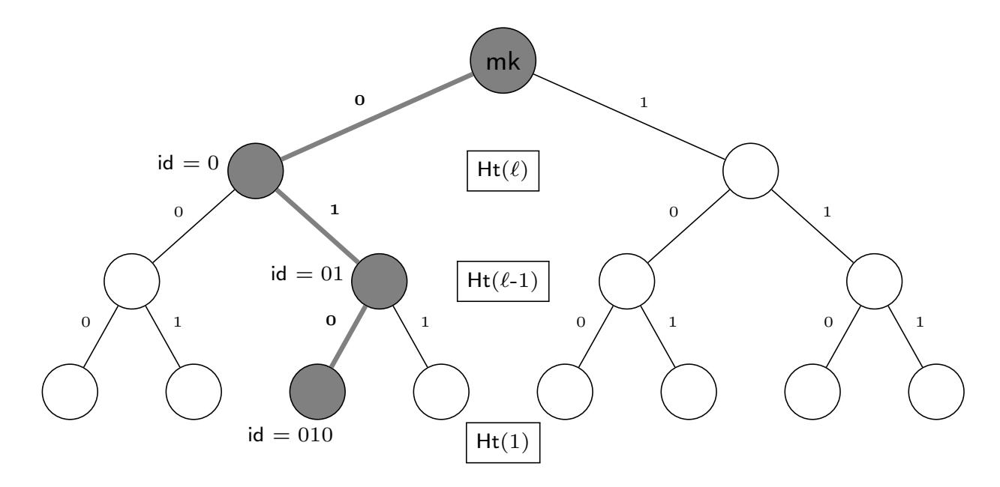
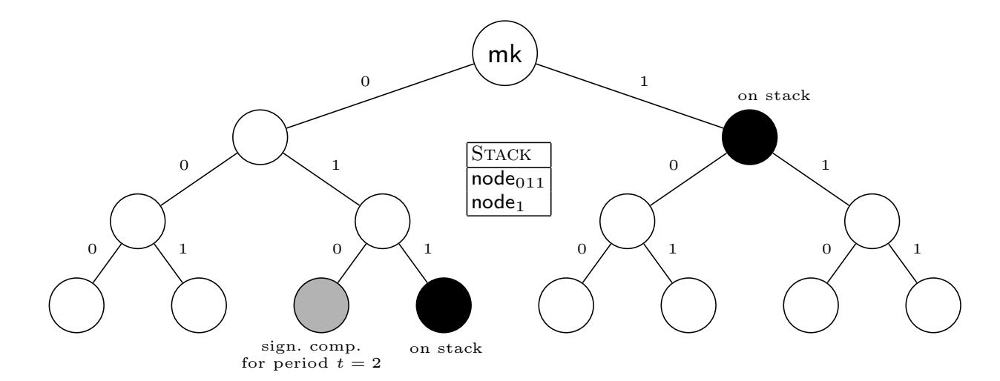
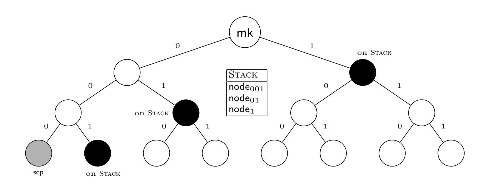

{0}------------------------------------------------

# Binary Tree Based Forward Secure Signature Scheme in the Random Oracle Model

Mariusz Jurkiewicz

Military University of Technology, 2 Gen. S. Kaliski St., Warsaw, Poland mariusz.jurkiewicz@wat.edu.pl

Abstract. In this paper we construct and consider a signature scheme with evolving secret key, where there is used Type 3 pairing. The idea is based on some properties of binary trees, with a number of leaves being the same as a number of time periods in the scheme. This lets us to gain such conditions, that allows to prove the forward-security of the considered scheme in the random oracle model. The proof is conducted by reducing the security of the scheme to the difficulty of solving a certain counterpart of the Weak `-th Bilinear Diffie-Hellman Inversion problem. In addition to that, we construct an interactive signature scheme with evolving private key and justify that it is forward-secure blind scheme.

Keywords: forward security · bilinear pairing of Type 3 · random-oracle model · bilinear DH inversion problem · blindness

# 1 Introduction

The concept of forward-secure signature schemes refers to the security model in which leaking the private key related with a certain time frame does not essentially influence on the unforgeability of the scheme within the time periods prior to this leakage [1]. More precisely, this model is strictly connected with so called signature schemes with evolving private key [1, 5]. These schemes are characterized by the fact that, roughly speaking, the lifetime of a public key is split into a some number of subperiods with associated different secret keys. It means that, at the beginning, both a public key and an initial secret key are generated and assigned to the first period, next the initial key is updated to the next period and so on until reaching the last period. Note that the updating mechanism is of crucial importance in the forward-security model, namely next to obvious explanation of unforgeability within separated time frames, it must be proven, above all, that disclosure of a certain secret key reveals nothing about the past periods. In other words, this mechanism has to fulfill a nontrivial property which can be called a ,,memory loss", meaning that a secret key associated with a given time frame must store nothing but data required for both making current signatures and generating a key for the next period, moreover this data must be useless with regard to the previous periods.

As for blind signature schemes, they were introduced by David Chaum in [8, 9] and have been widely studied since then (see [6, 14, 17, 19], for instance). 

{1}------------------------------------------------

Roughly speaking, this primitive was created in order to enable obtaining message signature with no leakage any information about this message. Blind signatures play a crucial role in electronic cash systems [19], ensuring that the bank will not be able to track the usage of signed e-money, and electronic voting, preventing votes against being read by a signing authority [17]. In fact the ground for the notion of blind signature is blindness, which was formalized in [15]. Except for an intuitive requirement that a user obtains signatures without revealing the message, it provide much stronger property, namely that the signing site is not able to statistically distinguish signatures.

Taking into account potential applications and importance of forward-security and blindness property, it seams to be an obvious idea to combine both of these security models to get forward-secure blind signature schemes. Various aspects of this topic was examined by different authors, see for example [11, 21].

## 2 Contribution

In this paper we construct a signature scheme with evolving secret key, which is based on Type 3 pairing, defined in [12], and prove that it is forward-secure in the random oracle model. Further, we exploit this scheme to construct a next forward-secure scheme which additionally satisfies the blindness property.

The security proof is conducted by reducing the entire analysis to considerations regarding difficulty of some kind of computational problem that we call  $(\ell,1)$ -wBDHI<sub>3</sub>\*, and define formally in Section 3.1. This problem constitutes a natural generalization of Weak  $\ell$ -th Bilinear Diffie-Hellman Inversion one, which has been defined by Boneh and Boyen in [3]. Although the cited paper is devoted to a certain HIBE system, it is well known that there is a natural correspondence between both IBE and HIBE and induced by these systems signature schemes, see for instance [7, 10, 4]. The reduction itself, which provides justification for forward-security of the presented scheme is conducted using the random oracle model.

Due to using a concept and some properties of binary trees, we were able to create an updating mechanism in such a way that it was possible to gain all the requirements described above. Namely, having given a positive integer  $\ell$ , it induces a binary tree of height  $\ell$  and with  $2^{\ell}$  leafs. These leaves can be numbered from 0 to  $2^{\ell}-1$ , besides, it is well known that for every leaf there is a unique path joining the root with this leaf. If we adopt a rule, that for a given node, choosing its left (x)or right child means to assign 0 or 1, respectively, then this path can be viewed as a binary string of the length  $\ell$ , being a binary representation of the index assigned to the leaf. Obviously, the same observation is for every node, where we identify the index of this node with the binary representation of the unique path between this node and the root. The binary representation itself is obtained after applying the introduced rule. Such idea allows as to equate the leafs with successive time periods and use the rule of making paths to generate a secret key associated with a leaf related to a given time frame. Furthermore, as we have already stated, secret keys must carry data needed for both making

{2}------------------------------------------------

current signatures and generating a key for the next period. In our scheme these tasks are split into two separated components, namely a signing one and a stack, consisting of at most  $\ell$  nodes such that they enable generation of keys only for future periods. It means that none of the elements of this stack may be used to obtain any of the previous keys. It is because each node from the stack lies on the right-hand side of the path joining the root with the leaf referring to the current time period. Moreover, it must be stress that the algorithm which is intended to fill in the stack has been design in such a way so as to guarantee its minimal content. Minimality here means that if even one element of the stack has been removed, then it is not possible to generate at least one future key. Although the concept of using binary-trees is not new, the presented approach seams to be new, according to the best knowledge of the author.

# 3 Preliminaries

### 3.1 Weak Bilinear Diffie-Hellman Inversion Type Assumption

Assume that  $\mathbb{G}_1$ ,  $\mathbb{G}_2$  and  $\mathbb{G}_T$  are three multiplicative cyclic groups of prime order p. Let us remind that if  $\mathbb{G}_1 \neq \mathbb{G}_2$  and no efficiently computable isomorphism is known between  $\mathbb{G}_1$  and  $\mathbb{G}_2$ , in either direction, then a map  $\hat{e}: \mathbb{G}_1 \times \mathbb{G}_2 \to \mathbb{G}_T$  is called a pairing of Type 3 if it satisfies the following properties:

**bilinearity,** i.e., for all  $u \in \mathbb{G}_1, v \in \mathbb{G}_2$  and  $a, b \in \mathbb{F}_p$  we have

$$\hat{e}\left(u^{a}, v^{b}\right) = \hat{e}\left(u, v\right)^{ab};$$

non-degeneracy, i.e.,

- (i) if for all  $u \in \mathbb{G}_1$  we have  $\hat{e}(u, v) = 1_{\mathbb{G}_T}$  then it is equivalent to  $v = 1_{\mathbb{G}_2}$ ;
- (ii) if for all  $v \in \mathbb{G}_2$  we have  $\hat{e}(u,v) = 1_{\mathbb{G}_T}$  then it is equivalent to  $u = 1_{\mathbb{G}_1}$ .

Let  $g_1, g_2$  be generators of  $\mathbb{G}_1$  and  $\mathbb{G}_2$ , respectively, and let  $\alpha, \beta \stackrel{\$}{\leftarrow} \mathbb{F}_p^*$ . We introduce the following problem, called  $(\ell, 1)$ -wBDHI<sub>3</sub>\*:

$$(\ell, 1)$$
-wBDHI<sub>3</sub>\*: given  $G_i(\alpha, \beta) := \{g_i, g_i^{\alpha}, \dots, g_i^{(\alpha^{\ell})}, g_i^{\beta}\}, i = 1, 2,$   
compute  $\hat{e}(g_1, g_2)^{\beta(\alpha^{\ell+1})}$ .

**Definition 1.** Suppose that params :=  $(\mathbb{G}_1, \mathbb{G}_2, \mathbb{G}_T, p, g_1, g_2, \hat{e}) \leftarrow \mathcal{G}(1^n)$ . The  $(\ell, 1)$ -wBDHI<sub>3</sub>\* problem is hard relative to  $\mathcal{G}$  if for all PPT adversaries  $\mathcal{A}$ , the following probability is negligible

$$\Pr\left[\begin{array}{c} \mathsf{params} \leftarrow \mathscr{G}(1^n); \\ \alpha, \beta \xleftarrow{\$} \mathbb{F}_p^* \end{array} : \hat{e}(g_1, g_2)^{\beta(\alpha^{\ell+1})} \leftarrow \mathcal{A}\left(1^n, \mathsf{params}, G_i(\alpha, \beta)\right) \right].$$

This probability is called the advantage of the adversary  $\mathcal{A}$  in solving  $(\ell, 1)$ -wBDHI<sub>3</sub> problem, and is denoted by  $\mathbf{Adv}_{\mathsf{params},n}^{(\ell,1)\text{-wBDHI}_3^*}(\mathcal{A})$ .

{3}------------------------------------------------

Note that  $(\ell, 1)$ -wBDHI<sup>\*</sup> is a natural generalization of so-called the Weak  $\ell$ -th Bilinear Diffie-Hellman Inversion problem, denoted by  $\ell$ -wBDHI<sup>\*</sup> and defined in [3] for pairings of Type 1. Indeed, remind that if  $e : \mathbb{G} \times \mathbb{G} \to \mathbb{G}_T$  is Type 1 pairing,  $\mathbb{G}, \mathbb{G}_T$  are cyclic groups of prime order p and g is a random generator of  $\mathbb{G}$  and  $\alpha, \beta \stackrel{\$}{\leftarrow} \mathbb{F}_p^*$ , then  $\ell$ -wBDHI<sup>\*</sup> is as follows (obviously, since p is a prime then  $h = g^{\beta}$  is a generator too):

$$\ell$$
-wBDHI\*: given  $g, h := g^{\beta}, g^{\alpha}, g^{(\alpha^2)}, \dots, g^{(\alpha^{\ell})}$  compute  $e(g, g)^{\beta(\alpha^{\ell+1})}$ .

Substituting  $a:=g^{(\alpha^{\ell})}$  and  $\gamma:=\alpha^{-1}$ ,  $\delta:=\beta(\alpha^{\ell})^{-1}$ , we see that  $a^{(\gamma^{i})}=g^{(\alpha^{\ell-i})}$ ,  $i\in [\ell]$  and  $a^{\delta}=g^{\beta}$ . Thus, taking  $(a,b:=a^{\delta},a^{\gamma},a^{(\gamma^{2})},\ldots,a^{(\gamma^{\ell})})$  as an input to  $\ell$ -wBDHI\*, we immediately conclude that  $\ell$ -wBDHI is polynomially reducible to to the following problem known as  $\ell$ -wBDHI and introduced in [3]:

$$\ell$$
-wBDHI: given  $g, h := g^{\beta}, g^{\alpha}, g^{(\alpha^2)}, \dots, g^{(\alpha^{\ell})}$  compute  $e(g, h)^{\frac{1}{\alpha}}$ .

In the same manner as above, we show the existence of a polynomial transformation, acting in the other direction. In consequence, both problems  $\ell$ -wBDHI\* and  $\ell$ -wBDHI are equivalent under polynomial time reductions. Furthermore, it turns out that there is a strict connection between these problems and the commonly known  $\ell$ -BDHI (see [2, 18], for instance). Namely, D. Boneh, X. Boyen and E.-J. Goh proved in [3] that an algorithm for  $\ell$ -wBDHI or  $\ell$ -wBDHI\* in  $\mathbb G$  gives an algorithm for  $\ell$ -BDHI with a tight reduction.

To sum up, all this information provided above lead us to the conclusion it is highly likely that  $(\ell,1)$ -wBDHI<sub>3</sub>\* is at least as hard as  $\ell$ -BDHI. In fact, if there was a method making possible to break  $(\ell,1)$ -wBDHI<sub>3</sub>\* then this one should be able to be applied to break easier case with Type 1 pairing. This means that  $\ell$ -wBDHI\* would be broken as well, what eventually would imply weakness of  $\ell$ -BDHI.

#### 3.2 Forward-Secure Signature Schemes

Signature schemes are among the most important cryptographic primitives, so it is not surprising that its general definition as a quadruple ( $\mathscr{G}$ , Gen, Sign, Vrfy) of PPT algorithms is not enough to cover all specific cases. Most of this cases occurs in a natural way as a consequence of more general considerations. In this section we are going to focus on one of them, namely signature scheme with evolving private key. These schemes are connected with the security model, which is called the forward-security. Private key evolving signature schemes in this model are called forward-secure schemes.

A signature scheme with evolving private key is composed of five algorithms  $\Pi_{fu} = (\mathcal{G}, KGen, KUpd, Sign, Vrfy)$  along with an associated message space  $\mathcal{M}$ , such that:

**System parameters generation**  $\mathcal{G}$  is a PT algorithm, which takes as an input the value  $1^n$  of a security parameter and maximum number of time periods T. It outputs the system parameters params.

{4}------------------------------------------------

- **Key generation** KGen is a PPT algorithm. It takes as input the system parameters params and maximum number of time periods T and outputs a public verification key pk along with an initial secret signing key  $sk_0$  for the time period t = 0.
- **Key update** KUpd is a PPT algorithm. It takes as input the secret key  $\mathsf{sk}_t$  for time period t < T 1 and outputs the secret key  $\mathsf{sk}_{t+1}$  for the next time period t + 1.
- Signing Sign is a is a PPT algorithm. It takes as input the current secret key  $\mathsf{sk}_t$  and a message  $m \in \mathcal{M}$  and outputs a signature  $\sigma$ .
- **Verification algorithm** Vrfy is a DPT algorithm. It takes as input a public key  $\mathsf{pk}$ , a message  $m \in \mathcal{M}$ , the proper time period t and a (purported) signature  $\sigma$ . It outputs a single bit b, with b=1 meaning accept and b=0 meaning reject.

In addition to that, we assume the correctness, meaning that for all messages  $m \in \mathcal{M}$  and for all time periods  $t \in \{0, 1, \dots T-1\}$  it holds that  $\mathsf{Vrfy}_{\mathsf{pk}}(t, m, \mathsf{Sign}_{\mathsf{sk}_t}(m)) = 1$  with probability one if  $(\mathsf{sk}_0, \mathsf{pk}) \leftarrow \mathsf{KGen}(\mathsf{params}, T)$  and  $\mathsf{sk}_{i+1} \leftarrow \mathsf{KUpd}(\mathsf{sk}_i)$  for  $i = 0, \dots t-1$ .

Below we provide with a generalization of well known euf-cma security, dedicated to signature schemes with evolving private key. This model was taken from Bellare-Miner paper [1]. Let  $\mathcal{A}$  be an adversary. Consider the following experiment  $\mathbf{Exp}_{\mathcal{A},\Pi_{\mathrm{fu}}}^{\mathrm{fu-cma}}$ , which depends on the system parameters and a number of periods. We assume that the system parameters have been generated and they are known to the adversary.

- 1. Generate params  $\leftarrow \mathcal{G}(1^n, T)$  and  $(\mathsf{sk}_0, \mathsf{pk}) \leftarrow \mathsf{KGen}(\mathsf{params}, T)$ .
- 2. The adversary  $\mathcal{A}$  is given  $\mathsf{pk}$  and access to three oracles, signing oracle  $\mathsf{Sign}$ , key update oracle  $\mathsf{KUpd}$  and break in oracle  $\mathsf{Break}$ .
- 3.  $t \leftarrow 0$ .
- 4. while t < T
  - 4.1. Sign: For current secret key  $\mathsf{sk}_t$  the adversary  $\mathcal{A}$  requests signatures on as many messages as it like (analogously to  $\mathsf{euf\text{-}cma}$  it is denoted by  $\mathcal{A}^{\mathsf{Sign}_{\mathsf{sk}_t}(\cdot)}(\mathsf{pk})$ ).
  - 4.2.  $\mathsf{KUpd}$ : If the current time period t < T 1 then  $\mathcal{A}$  requests update:  $t \leftarrow t + 1$ ,  $\mathsf{sk}_{t+1} \leftarrow \mathsf{KUpd}(\mathsf{sk}_t)$ .
  - 4.3 If Break then break the loop while;
    - Break: If  $\mathcal{A}$  is intended to go to the forge phase then it launches Break. Then the experiment records the break-in time  $\bar{t}=t$  and sends the current signing key  $\mathsf{sk}_{\bar{t}}$  to  $\mathcal{A}$ . This oracle can only be queried once, and after it has been queried, the adversary can make no further queries to the key update or signing oracles.
- 5. Eventually  $(t^*, m^*, \sigma^*) \leftarrow \mathcal{A}(1^n, \text{state})$ .
- 6. If  $t^* < \bar{t}$  and  $\mathsf{Vrfy}_{\mathsf{pk}} \left( t^*, m^*, \sigma^* \right) = 1$  and the signing oracle  $\mathsf{Sign}_{\mathsf{sk}_{t^*}}$  has been never queried about  $m^*$  within the time period  $t^*$ , then output 1, otherwise output 0.

{5}------------------------------------------------

We refer to such an adversary as an fu-cma-adversary. The advantage of the adversary  $\mathcal{A}$  in attacking the scheme  $\Pi_{fu}$  is defined as

$$\mathbf{Adv}^{\mathsf{fu-cma}}_{\Pi_{\mathsf{fu}},n}(\mathcal{A}) = \Pr[\mathbf{Exp}^{\mathsf{fu-cma}}_{\mathcal{A},\Pi_{\mathsf{fu}}}(1^n,T) = 1].$$

A signature scheme is called to be forward-secure if no efficient adversary can succeed in the above game with non-negligible probability.

**Definition 2.** A signature scheme with evolving private key  $\Pi_{fu} = (\mathcal{G}, KGen, KUpd, Sign, Vrfy)$ , is called to be *existentially forward unforgeable under a chosen-message attack* or just *forward-secure* if for all efficient probabilistic, polynomial-time adversaries  $\mathcal{A}$ , there is a negligible function negl such that

$$\mathbf{Adv}^{\mathsf{fu-cma}}_{\Pi_{\mathsf{fu}},n}(\mathcal{A}) = \mathsf{negl}(n).$$

In a well known and widely cited paper [13], the authors provide a classification of security strength for signature schemes. Except commonly used notion of existential forgery they also indicate some weaker notions, like the second on the top list, namely a selective forgery where a signature must be forged for a particular message chosen a priori by the adversary. This idea was exploited by Canetti, Halevi, Katz [7] and Boneh, Boyen [2], who define security against selective forgery for IBE and HIBE. Therefore, it is not surprising that it can be also adopted for scheme with evolving private key regarding their forward security. Formally, we start with a description of a proper experiment, which will be referred to as  $\mathbf{Exp}_{\mathcal{A},\Pi_{\mathsf{fu}}}^{\mathsf{sfu-cma}}$ . This experiment differs from  $\mathbf{Exp}_{\mathcal{A},\Pi_{\mathsf{fu}}}^{\mathsf{fu-cma}}$  in such a way that an adversary  $\mathcal{A}$  outputs a message together with the associated time parameters  $(\mathbf{m}^*, t^*, t)$  that are intended to be forged, before receiving the public key. Next, the experiment is conducted in the same manner as  $\mathbf{Exp}_{\mathcal{A},\Pi_{\mathrm{fu}}}^{\mathsf{fu-cma}}$ , with this difference that only if the time period  $\bar{t}$  is reached then the oracle Break is launched. The adversary wins if it has been able to output a valid signature  $\sigma^*$ for  $\mathbf{m}^*$  in the period  $t^*$ . This lead us to the following definition.

**Definition 3.** A signature scheme with evolving private key  $\Pi_{fu} = (\mathcal{G}, KGen, KUpd, Sign, Vrfy)$ , is called to be *selectively forward-secure* if for all efficient probabilistic, polynomial-time adversaries  $\mathcal{A}$ , there is a negligible function negl such that

$$\mathbf{Adv}^{\mathsf{sfu-cma}}_{\Pi_{\mathsf{fu}},n}(\mathcal{A}) = \mathsf{negl}(n).$$

#### 3.3 Forward-secure Blind Signature Schemes

In this section we introduce the syntax and the security model for forward-secure blind signatures. The definition related to blindness is adopted from the [11] and [20].

An interactive signature scheme with evolving private key consists of four algorithms  $\Pi_{b\text{-fu}} = (\mathcal{G}, KGen, KUpd, Sign, Vrfy)$  along with an associated message space  $\mathcal{M}$ , such that:

{6}------------------------------------------------

System parameters generation, Key generation and Key update are the same as defined in Section 3.2

Signing Sign is a PPT algorithm that is defined over two PPT algorithms  $\mathcal{U}$  and  $\mathcal{S}$ , which interact with each other. It has the form Sign(params, pk, sk<sub>t</sub>, t, m) =  $\langle \mathcal{U}(\mathsf{params}, \mathsf{pk}, t, m,), \mathcal{S}(\mathsf{params}, \mathsf{sk}_{t_1}, \mathsf{pk}, t) \rangle$ ,  $\mathcal{U}$  and  $\mathcal{S}$  are called a user and a signer, respectively. At a time t, the user blinds the message m and sends it to the signer. The signer sends back a signature of the blinded message to the user. If the interactions are successful, the user gets a signature  $\Sigma$  of the message m at the time t and S outputs  $S = \mathsf{complete}$ . Otherwise, the user and signer output  $\Sigma = \bot$  and  $S = \bot$ .

**Verification algorithm** Vrfy is a DPT algorithm. It takes as input a public key  $\mathsf{pk}$ , a message  $m \in \mathcal{M}$ , the proper time period t and a (purported) signature  $\Sigma$ . It outputs a single bit b, with b=1 if  $\Sigma$  is a valid signature and  $\Sigma \neq \bot$  and b=0 otherwise.

A natural security model connected with interactive signature schemes is blindness. This condition says that it should be infeasible for a (malicious) signer  $\mathcal{S}^*$  to decide which of two messages  $m_0$  and  $m_1$  has been signed first in two executions with a (honest) user  $\mathcal{U}$ . If one of these executions has returned  $\perp$ , then the signer is not informed about the other signature. Therefore, blindness ensures that it is negligibly likely for the signer to learn anything about messages which are signed. Below we give a generalization of this notion to the case of interactive forward-secure signature schemes. We must stress the assumption of forward security here follows from the goals to gain in this paper in the sense that this definition can be formulated with no changes for interactive signature schemes with evolving private key.

Let us consider the experiment  $\mathbf{Exp}_{\mathcal{A},\Pi_{\mathsf{b-fu}}}^{\mathsf{b-fu-cma}}$ , where the adversary takes on a role of a signer and the challenger on a role of a user

- 1. Generate params  $\leftarrow \mathcal{G}(1^n, T)$  and  $(\mathsf{sk}_0, \mathsf{pk}) \leftarrow \mathsf{KGen}(\mathsf{params}, T)$ .
- 2. The adversary  $S^*$  is given params, pk and initial secret key  $sk_0$ .
- 3.  $(m_0, m_1) \leftarrow \mathcal{S}^*(\text{params}, \text{pk}, \text{sk}_0)$  and hands  $m_0, m_1$  to the challenger  $\mathcal{C}$ .
- 4. The challenger C chooses a bit b uniformly at random and initiates two signing interactions with  $S^*$  on two inputs  $m_b$  and  $m_{1-b}$  (The interactions may or not be conducted with different time periods, i.e.  $t_1 = t_2$  or  $t_1 \neq t_2$ ).
- 5. Finally,  $(C_b, \sigma_b) \leftarrow \langle \mathcal{C}(\mathsf{params}, \mathsf{pk}, t_1, m_b,), \mathcal{S}^*(\mathsf{params}, \mathsf{sk}_{t_1}, \mathsf{pk}, t_1) \text{ and } (C_{1-b}, \sigma_{1-b}) \leftarrow \langle \mathcal{C}(\mathsf{params}, \mathsf{pk}, t_2, m_{1-b},), \mathcal{S}^*(\mathsf{params}, \mathsf{sk}_{t_2}, \mathsf{pk}, t_2).$
- 6. The adversary  $S^*$  outputs a bit  $b' \in \{0, 1\}$ .
- 7. If b' = b then experiment returns 1. Otherwise it outputs 0.

We call such an adversary an b-fu-cma-adversary. The advantage of the adversary  $\mathcal{S}^*$  in attacking the scheme  $\Pi_{b\text{-fu}}$  is defined in the following way

$$\mathbf{Adv}^{\text{b-fu-cma}}_{\Pi_{\text{b-fu}},n}(\mathcal{S}^*) = \Pr[\mathbf{Exp}^{\text{b-fu-cma}}_{\mathcal{A},\Pi_{\text{b-fu}}}(1^n) = 1].$$

{7}------------------------------------------------

**Definition 4.** An interactive forward-secure signature scheme  $\Pi_{b\text{-fu}} = (\mathcal{G}, \mathsf{KGen}, \mathsf{KUpd}, \mathsf{Sign}, \mathsf{Vrfy})$  is called to be *blind*, if for all efficient probabilistic, polynomial-time adversaries  $\mathcal{S}^*$ , there is a negligible function negl such that

$$\mathbf{Adv}^{\text{b-fu-cma}}_{\varPi_{\text{b-fu}},n}(\mathcal{S}^*) \leq \frac{1}{2} + \mathsf{negl}(n).$$

**Definition 5.** If an interactive signature scheme with evolving private key is both blind and forward-secure then it is called a *forward-secure blind signature scheme*.

### 4 Construction of Forward-Secure Scheme

In this section we construct a signature scheme with evolving private key  $\Pi_{\text{fu}} = (\mathcal{G}, \mathsf{KGen}, \mathsf{KUpd}, \mathsf{Sign}, \mathsf{Vrfy})$ , which is in the spotlight of considerations conducted herein. We will show that the scheme is forward secure in the random oracle model with only assumed hardness of  $(\ell, 1)$ -wBDHI<sub>3</sub>\* problem for pairings of Type 3. To this end, let  $\mathcal{M} = \{0, 1\}^*$  be the message space associated with the scheme and  $H: \mathcal{M} \to \{0, 1\}^{l \cdot \ell}$  be a collision resistant hash function. Obviously, the length of the hash values is not accidental, because the point here is that output hashes are split into l blocks, where a single block is a  $\ell$ -bit string.

Before going to the formal description, we briefly explain the idea of the scheme, which is based on the geometry and some properties of binary-trees. Let us adopt a rule, that for a given node, if we choose its left or right child then it means to assign 0 or 1, respectively (see Fig. 1). On the other hand, it is commonly known that for every node there is a unique path joining the root with this node (in particular including leaves). Therefore, applying described rule, we see that this path is represented by the following bit-string  $t_{\ell}t_{\ell-1}\cdots t_h$ ,  $h \in [\ell]$ , with h being the height of a node. Moreover, this bit-string provide the node with the unique identification, thus may be viewed as an identifier of this node. As we mentioned in the introduction, the goal is to make a binary tree with a number of leaves being the same as the number of time periods i.e.  $2^{\ell}$ , therefore a high of this tree must be  $\ell$ . Let us choose  $u_{0,0}, u_1, \ldots, u_{\ell}$  from  $\mathbb{G}$  and define  $\mathsf{Ht}(h) := u_{0,0} \prod_{i=h}^{\ell} u_i$ , for  $h \in [\ell]$ . Then, it is obvious that every node indexed by  $id = t_{\ell} \cdots t_h$  can be uniquely connected with  $Ht(h)^{id} = u_{0,0} \prod_{i=h}^{\ell} u_i^{t_i}$ (see Fig. 1). Furthermore, note that if P is the path linking the root with a leaf  $t_{\ell}\cdots t_1$  and  $\mathsf{id}_1=t_{\ell}\cdots t_h,\;\mathsf{id}_2=t_{\ell}\cdots t_{h-1}\in P$  are indexes of two successive nodes, then there is the following relation between  $\mathsf{Ht}(h)^{\mathsf{id}_1}$  and  $\mathsf{Ht}(h)^{\mathsf{id}_2}$ , namely  $\mathsf{Ht}(h-1)^{\mathsf{id}_2} = \mathsf{Ht}(h)^{\mathsf{id}_1} \cdot u_{h-1}^{t_{h-1}}.$ 

Next, suppose that the root is related to mk, which should be viewed as a master-key. This key controls the entire scheme, meaning that knowing mk we are able to generate a valid secret key for each period. Let us remind that

{8}------------------------------------------------



Fig. 1. Visualization of some basic ideas standing behind the scheme.

what we are trying to gain is forward-security, thus revealing a secret key assigned to a period t must not leak nothing about secret keys of prior periods. This implies, in particular, that master-key ought not to be recovered from any period's secret key or what is worse not be a plain part of these keys, keeping simultaneously in minds that all these keys must strictly depend on the master key. In addition to that, all the knowledge regarding prior secret keys has to be lost. These are reasons why we say about "memory loss" by the key updater. To obtain these requirements, we encapsulate mk by randomization Hts, according to the following iterative method. At first, we pick  $r_{\ell}$ uniformly at random from  $\mathbb{F}_p$ , and compute  $\mathsf{mk} \cdot (\mathsf{Ht}(\ell)^{t_\ell})^{r_\ell}$ ; note that to keep the randomness under control we must save  $u_{\ell-1}^r, \ldots, u_1^r$ . We also have to keep an additional element  $g_2^r$ , which is required for verification. Taking all of these into account we obtain  $\mathsf{node}_{t_\ell} = \left(\mathsf{mk} \cdot (\mathsf{Ht}(\ell)^{t_\ell})^{r_\ell}; u_{\ell-1}^{r_\ell}, \dots, u_1^{r_\ell}; g_2^{r_\ell}\right)$ . Next, if  $\mathsf{node}_{t_\ell \cdots t_h} = \left( \mathsf{mk} \cdot (\mathsf{Ht}(h)^{t_\ell \cdots t_h})^{r_h}; u_{h-1}^{r_h}; \dots, u_1^{r_h}; g_2^{r_h} \right)$  is a node at height h and  $t_{\ell} \cdots t_{h-1}$  is the index of a successive node of height h-1, lying on a same path which links the root with a leaf, then to get  $\mathsf{node}_{t_{\ell}\cdots t_{h-1}}$ , we compute  $\mathsf{mk} \cdot (\mathsf{Ht}(h)^{t_{\ell}\cdots t_h})^{r_h} \cdot (u_{h-1}^{r_h})^{t_{h-1}} = \mathsf{mk} \cdot (\mathsf{Ht}(h-1)^{t_{\ell}\cdots t_{h-1}})^{r_h}$ , next we choose  $r'_{h-1}$  uniformly at random from  $\mathbb{F}_p$  and calculate  $(\mathsf{Ht}(h-1)^{t_\ell\cdots t_{h-1}})^{r'_{h-1}}$ ; having this, we do  $\mathsf{mk} \cdot (\mathsf{Ht}(h-1)^{t_{\ell}\cdots t_{h-1}})^{r_h} \cdot (\mathsf{Ht}(h-1)^{t_{\ell}\cdots t_{h-1}})^{r'_{h-1}} = \mathsf{mk} \cdot$  $(Ht(h-1)^{t_{\ell}\cdots t_{h-1}})^{r_{h-1}}$ , with  $r_{h-1}=r_h+r'_{h-1}$ ; in the same way we obtain  $u_i^{r_{h-1}} = u_i^{r_h} \cdot u_i^{r'_{h-1}}, \ i \in [h-2], \ \text{and} \ g_2^{r_{h-1}} = g_2^{r_h} \cdot g_2^{r'_{h-1}}; \ \text{eventually node}_{t_\ell \cdots t_{h-1}} = \left( \mathsf{mk} \cdot (\mathsf{Ht}(h-1)^{t_\ell \cdots t_{h-1}})^{r_{h-1}}; u_{h-2}^{r_{h-1}}, \ldots, u_1^{r_{h-1}}; g_2^{r_{h-1}} \right). \ \text{Following this method, we}$ get in the end to the last node on the path, namely  $\mathsf{leaf}_{t_\ell \cdots t_1} = (\mathsf{mk} \cdot (\mathsf{Ht}(1)^{t_\ell \cdots t_1})^{r_1};$  $g_2^{r_1}$ ). It must be emphasized that even though  $r_h = r_h(r_{h+1}, \ldots, r_\ell)$ , all of  $r_h, r_{h-1}, \ldots, r_\ell$  are equally likely. It is a consequence of an easy and well-known fact, namely if we take a probability measure  $\mu(A) := \#A/p$  defined on the  $\sigma$ -field  $2^{\mathbb{F}_p}$ , then for every  $A \in 2^{\mathbb{F}_p}$  and fixed  $\gamma \in \mathbb{F}_p$  we have  $\mu(A) = \mu(\gamma + A)$ (see [16], for instance).

{9}------------------------------------------------



**Fig. 2.** Content of a secure key associated with a period t.

These considerations lead us to the conclusion that having a node  $\mathsf{node}_{\mathsf{id}}$  at height h it is easy to determine nodes at lower heights, that lie on root-to-leaves paths and pass through  $\mathsf{node}_{\mathsf{id}}$ . On the other hand, if DLP is hard in  $\mathbb{G}$ , then it is hard to figure out a form of nodes at higher heights. Furthermore, all these nodes encapsulate "master-key"  $\mathsf{mk}$ . Finally, it is seen that to guarantee the "memory loss" property, secret keys associated with periods must consists both components needed for making signatures and nodes being roots of maximal sub-trees that let to compute leaves associated with future periods. The latter is made by the function  $\mathsf{StackFilling}$ , defined through Algorithm 1 (see Section 4.2). More precisely, nodes required for generating secret keys for future periods are gathered on a stack, which any time consists of at most  $\ell$  elements. As we indicated above, the content of the stack is optimal, meaning that if at least one element of the stack has been removed, then it would not be possible to generate at least one future key. Algorithm 1 is depicted in Fig. 2.

#### 4.1 System parameters generation

Let n be a security parameter. An efficient and polynomial time system parameters generator  $\mathscr{G}$  takes on input both a value of the security parameter  $1^n$  and a maximum number of time periods T, to then output  $(\mathbb{G}_1, \mathbb{G}_2, \mathbb{G}_T, p, g_1, g_2, \hat{e})$ , where:

- $-\mathbb{G}_1, \mathbb{G}_2, \mathbb{G}_T$  are three cyclic groups of prime order p, where group operations can be performed efficiently and no efficiently computable isomorphism is known between  $\mathbb{G}_1$  and  $\mathbb{G}_2$ , in either direction.
- $-g_1 \in \mathbb{G}_1, g_2 \in \mathbb{G}_2$  are chosen uniformly at random from the set of all generators of  $\mathbb{G}_1$  and  $\mathbb{G}_2$  respectively.
- $-\hat{e}: \mathbb{G}_1 \times \mathbb{G}_2 \to \mathbb{G}_T$  is an efficiently computable Type 3 pairing.

### 4.2 Key generation

Before we go to the description of the initial keys generation process, we will present the other algorithm, namely StackFilling. This algorithm plays the crucial

{10}------------------------------------------------

role in our construction, because it is directly responsible for "memory loss" of our keys updater, meaning in particular that it allows us to gain the desired security requirements.

For the formal reasons, let us define

$$\prod_{i=i_1}^{i_2} u_i^{\alpha_i} = \begin{cases} u_{i_1}^{\alpha_{i_1}} \cdots u_{i_2}^{\alpha_{i_2}} & \text{for } i_1 \leq i_2 \\ 1_{\mathbb{G}_1} & \text{for } i_1 > i_2 \end{cases}.$$

Assume there is a stack STACK, that will be filled with pairs (node, h), where node and h are a node and its height on the binary tree, respectively. We stress that height h varies from 1 to  $\ell + 1$ , where  $\ell + 1$  is assigned to the root. Besides, it must be kept in mind that a node, being on a height of h have the specific form, namely

$$\mathsf{node} := \left(\tau_1^x \cdot \left(u_{0,0} \prod_{i=h}^{\ell} u_i^{t_i}\right)^r; u_{h-1}^r, \dots, u_1^r; g_2^r\right) = \left(A; (b_i)_{i \in [h-1]}; C\right), \quad (1)$$

where r is an element of  $\mathbb{F}_p$ , meaning that each element of  $\mathbb{F}_p$  is equally likely.

```
Algorithm 1 Function StackFilling
```

```
Input: params, STACK, t = t_{\ell} \cdots t_1
Output: STACK, scp
                                                                                                                              \triangleright node = (A; (b_i)_{i \in [h-1]}; C)
 1: (\mathsf{node}, h) \leftarrow \mathsf{STACK.pop}()
 2: h \leftarrow h - 1
                                                                                             \triangleright After reindexing, node = (A; (b_i)_{i \in [h]}; C)
 3:
 4: while h > 0 do
              r \stackrel{\$}{\leftarrow} \mathbb{F}_p
  5:
             \mathsf{tmp} \leftarrow \left(A \cdot b_h^1 \cdot \left(\left(u_{0,0} \prod_{i=h+1}^\ell u_i^{t_i}\right) \cdot u_h^1\right)^r; b_{h-1} \cdot u_{h-1}^r, \dots, b_1 \cdot u_1^r; C \cdot g_2^r\right) \\ \triangleright A := \mathsf{node}.A, \ b_i := \mathsf{node}.b_i, \ C := \mathsf{node}.C, \ \text{i.e.} \ \mathsf{tmp} = \mathsf{tmp}(\mathsf{node}).
 6:
 7:
 8:
               STACK.push((tmp, h))
               r \stackrel{\$}{\leftarrow} \mathbb{F}_p
                                                                   \triangleright A new randomness, i.e. independent of r picked in 5
 9:
              node \leftarrow \left(A \cdot \left(u_{0,0} \prod_{i=h+1}^{\ell} u_i^{t_i}\right)^r; b_{h-1} \cdot u_{h-1}^r, \dots, b_1 \cdot u_1^r; C \cdot g_2^r\right)
h \leftarrow h-1
10:
11:
12: end while
13: scp \leftarrow node
```

Now we are ready to provide with the description of the algorithm KGen, generating both an initial private key  $\mathsf{sk}_0$  and a long term public key  $\mathsf{pk}$ . It depends on two variables, namely system parameters, which has been generated by  $\mathscr{G}$ , and a maximal number of time periods T. Let us suppose that, we have been taken  $\mathsf{params} := (\mathbb{G}_1, \mathbb{G}_2, \mathbb{G}_T, p, g_1, g_2, \hat{e}) \leftarrow \mathscr{G}(1^n)$ . The formal definition of the algorithm is as follow:

1. Choose 
$$\tau_1 \stackrel{\$}{\leftarrow} \{g \in \mathbb{G}_1 \mid \langle g \rangle = \mathbb{G}_1\}/\{g_1\}.$$

{11}------------------------------------------------

- 2. Pick  $x \stackrel{\$}{\leftarrow} \mathbb{F}_p^*$  and set  $\tau_2 := g_2^x \in \mathbb{G}_2$ , which is the crucial component of  $\mathsf{pk}$ .
- 3. Choose  $(u_{0,i})_{i=0}^l, u_1, \ldots, u_\ell \stackrel{\$}{\leftarrow} \mathbb{G}_1$ .
- 4. Pick  $r \stackrel{\$}{\leftarrow} \mathbb{F}_p$  and compute node  $\leftarrow \left(\tau_1^x u_{0,0}^r; u_\ell^r, u_{\ell-1}^r, \dots, u_1^r; g_2^r\right) =: \left(A; (b_i)_{i \in [\ell]}; C\right)$ .
- 5. Initialize an empty stack STACK, next do STACK.push  $((node, \ell + 1))$ .
- 6. Run (scp, Stack)  $\leftarrow$  StackFilling (params, Stack, t=0). After the function StackFilling has output the value, Stack consists of  $\ell$  elements.
- 7. The initial secret key is  $\mathsf{sk}_0 = (\mathsf{scp}, \mathsf{STACK}, t = 0)$  and the public key is  $\mathsf{pk} = (\tau_1, \tau_2, (u_{0,i})_{i=0}^l, u_1, \dots, u_\ell).$



Fig. 3. The initial secret key  $sk_0 = (scp, STACK, t = 0)$  and output from StackFilling.

Note that the signing component scp of  $sk_0$  has the following form

$$scp = (\tau_1^x u_{0,0}^r; g_2^r) = (A; C).$$
 (2)

We stress that r in the above formula only express randomness and it is highly probable to be different from the other randomness r, appearing in 4. It can be confusing at the first glimpse, so we focus on this for a while. Taking into account the method of generating scp, we see from 4. and Algorithm 1 that there are  $(\ell+1)$  random elements of  $\mathbb{F}_p$ , required to generate r appearing in (2). To be more accurate  $r = r(r_0, r_1, \ldots, r_\ell)$ , where for instance  $r_0$  describe r from 4.. In fact, the relation between these r's is linear and  $r = r_0 + \ldots + r_\ell$ .

#### 4.3 Key update

KUpd takes as an input the secret key, assigned to the period t < T - 1 and updates this key for the next period t + 1. Below we describe the successive steps of the algorithm.

1. Parse  $sk_t = (scp, Stack, t)$ . Obviously it is the current secret key, which is dedicated to the period t, and is going to be updated.

{12}------------------------------------------------

- 2. Update a variable carrying a time period, namely conduct  $t \leftarrow t + 1$ . After this step the variable t stores a value of the new time period.
- 3. If  $t \equiv 1 \pmod{2}$ , then the following steps are carried out.
  - 3.1 (node, h)  $\leftarrow$  STACK.pop() and scp  $\leftarrow$  node. It is easily seen, that here the highest element is popped from the stack and passed to the signing component scp.
  - 3.2 The secret key for the new period has the form  $sk_t = (scp, Stack, t)$ .
- 4. If  $t \equiv 0 \pmod{2}$ , then the following steps are conducted.
  - 4.1 Run (scp, Stack)  $\leftarrow$  StackFilling (params, Stack, t).
  - 4.2 The secret key for the new period has the form  $sk_t = (scp, Stack, t)$ .

This time the signing component scp of  $sk_t$  has the form

$$scp = \left(\tau_1^x \cdot \left(u_{0,0} \prod_{i=1}^{\ell} u_i^{t_i}\right)^r; \ g_2^r\right) = (A; C). \tag{3}$$

We strongly recommend keeping in mind the remarks regarding randomness, that are pointed out after (2).

#### 4.4 Signing

Here we explain how the procedure of making signature looks like. It is obvious that Sign depends on the secret key  $\mathsf{sk}_t$  associated with a period t < T, meaning that for a fixed t, the signatures are made by  $\mathsf{Sign}_{sk_t}$ , taking as an argument a message that is going to be signed, and outputting a value of the signature. As we have seen above each secret key  $\mathsf{sk}_t$  consists of two components, namely a signing component  $\mathsf{scp}$  and a stack STACK. Both play an important role in the scheme simultaneously, having completely different tasks. The latter is of crucial importance with regard to updating a key to the next period and is not used in the signing process, while the signing component is not needed in updating a key but it is essential in making a desired signature.

Below we describe the consecutive steps of computing a signature on a given message  $\mathbf{m}$ , belonging to the message space  $\mathcal{M}$ .

- 1. Compute the hash value  $m = H(\mathbf{m})$ .
- 2. Parse  $\mathsf{sk}_t = (\mathsf{scp}, \mathsf{Stack})$  and next parse  $\mathsf{scp} = (A; C)$ .
- 3. Write t in the binary form  $t = (t_{\ell} \cdots t_1)_2$ . Split m into concatenation of l blocks  $m_1 \| \cdots \| m_l$  and write each block  $m_i$  in the binary form  $(m_{i,\ell} \cdots m_{i,1})_2$ .
- 4. Pick  $r \stackrel{\$}{\leftarrow} \mathbb{F}_p$  and  $s_i \stackrel{\$}{\leftarrow} \mathbb{F}_p$ ,  $i \in [l]$ , independently and uniformly at random.
- 5. Let us compute

$$\sigma_1 \leftarrow A \cdot \left( u_{0,0} \cdot \prod_{i=1}^{\ell} u_i^{t_i} \right)^r \cdot \prod_{j=1}^{l} \left( u_{0,j} \cdot \prod_{i=1}^{\ell} u_i^{m_{j,i}} \right)^{s_j}. \tag{4}$$

{13}------------------------------------------------

$$\sigma_2 \leftarrow C \cdot g_2^r$$

$$\sigma_{3,j} \leftarrow g_2^{s_j}, \ j = 1, \dots, l.$$

$$(5)$$

Output a signature  $\sigma = (\sigma_1, \sigma_2, (\sigma_{3,j})_{j \in [l]}).$ 

Remark 1. Let the hash m be presented as the following binary matrix

$$M := \begin{bmatrix} m_{1,\ell} & m_{1,\ell-1} & \cdots & m_{1,1} \\ m_{2,\ell} & m_{2,\ell-1} & \cdots & m_{2,1} \\ \vdots & \vdots & \ddots & \vdots \\ m_{l,\ell} & m_{l,\ell-1} & \cdots & m_{l,1} \end{bmatrix}$$

The *i*-th row and the *i*-th column of M are denoted by  $M(i, \cdot) = m_i$  and  $M(\cdot, j)$ , respectively. Furthermore, the former can be treated as a vector in  $\mathbb{F}_p^l$ , whilst the latter as a vector in  $\mathbb{F}_p^l$ . Let us put  $\mathbf{s} = [s_1, \ldots, s_l] \in \mathbb{F}_p^l$  and compute the following inner products in  $\mathbb{F}_p^l$ 

$$\bar{s^i} := \langle \mathbf{s}, M(\cdot, i) \rangle = \sum_{j=1}^l m_{j,i} s_j, \quad \text{for } i = 1, \dots, \ell.$$
 (6)

Then  $\sigma_1$  can be written in the form

$$\sigma_1 \leftarrow A \cdot \left( u_{0,0} \cdot \prod_{i=1}^{\ell} u_i^{t_i} \right)^r \cdot \prod_{j=1}^{l} u_{0,j}^{s_j} \cdot \prod_{i=1}^{\ell} u_i^{\bar{s}_i}$$

### 4.5 Verification

- 1. Compute  $m = H(\mathbf{m})$  and parse pk as  $(\tau_1, \tau_2, (u_{0,j})_{j=0}^l, u_1, \dots, u_\ell)$ .
- 2. Write t in the binary form  $t = (t_{\ell} \cdots t_1)_2$  and split m into  $\ell$  blocks of  $\ell$ -bits each, as described above, i.e.  $m = m_1 || m_2 || \cdots || m_\ell$ , where  $m_i = (m_{i,\ell} \cdots m_{i,1})_2$ .
- 3. Output 1 if and only if the following condition holds

$$\hat{e}(\sigma_1, g_2) \stackrel{?}{=} \hat{e}(\tau_1, \tau_2) \cdot \hat{e}\left(u_{0,0} \cdot \prod_{i=1}^{\ell} u_i^{t_i}, \sigma_2\right) \cdot \prod_{j=1}^{l} \hat{e}\left(u_{0,j} \cdot \prod_{i=1}^{\ell} u_i^{m_{j,i}}, \sigma_{3,j}\right).$$
 (7)

Otherwise, output 0.

To justify the correctness of the verification algorithm, we use (4). Due to the fact that both the time part and  $m_j$ -parts of  $\sigma_1$  keep the same randomness as  $\sigma_2$  and  $\sigma_{s,j}$ , respectively, we have that

{14}------------------------------------------------

$$\hat{e}(\tau_{1}, \tau_{2}) \cdot \hat{e}\left(u_{0,0} \cdot \prod_{i=1}^{\ell} u_{i}^{t_{i}}, \sigma_{2}\right) \cdot \prod_{j=1}^{l} \hat{e}\left(u_{0,j} \cdot \prod_{i=1}^{\ell} u_{i}^{m_{j,i}}, \sigma_{3,j}\right) 
= \hat{e}(\tau_{1}^{x}, g_{2}) \cdot \hat{e}\left(\left(u_{0,0} \cdot \prod_{i=1}^{\ell} u_{i}^{t_{i}}\right)^{r}, g_{2}\right) \cdot \hat{e}\left(\prod_{j=1}^{l} \left(u_{0,j} \cdot \prod_{i=1}^{\ell} u_{i}^{m_{j,i}}\right)^{s_{j}}, g_{2}\right) 
= \hat{e}\left(\tau_{1}^{x} \cdot \left(u_{0,0} \cdot \prod_{i=1}^{\ell} u_{i}^{t_{i}}\right)^{r} \cdot \prod_{j=1}^{l} \left(u_{0,j} \cdot \prod_{i=1}^{\ell} u_{i}^{m_{j,i}}\right)^{s_{j}}, g_{2}\right) = \hat{e}(\sigma_{1}, g_{2}).$$

This yields (7).

### 5 Security proof

The goal of this section is to show that the presented scheme is forward-secure. The proof itself is conducted in the random oracle model, and is split into two parts. Namely, we firstly deal with the special case, when the hash function is the identity on  $\{0,1\}^{l\ell}$ , and we prove that the scheme is selectively forward-secure then. Having done this, we are able to consider the general case, guessing both the proper time period and the query to the random oracle, what finally provides us with the desired full fu-cma security of the scheme.

**Theorem 1.** Let  $\Pi_{\mathsf{sfu}} = (\mathscr{G}, \mathsf{KGen}, \mathsf{KUpd}, \mathsf{Sign}, \mathsf{Vrfy})$  be the scheme defined above with the associated message space  $\mathcal{M} = \{0,1\}^{l\ell}$  and  $H = id_{\mathcal{M}}$ . If  $(\ell,1)$ -wBDHI<sub>3</sub> is hard relative to  $\mathscr{G}$ , then  $\Pi_{\mathsf{sfu}}$  is selectively forward-secure.

*Proof.* At the beginning we provide an algorithm, which is connected with Algorithm 1 and computes indexes of nodes stored in STACK within a time frame t < T.

```
Algorithm 2 Function StackFillingID
```

```
Input: STACKID, t = (t_{\ell} \cdots t_{1})_{2}
Output: STACKID,

1: (\mathsf{nodelD}, h) \leftarrow \mathsf{STACKID.pop}()

2: h \leftarrow h - 1

3: while h > 0 do

4: \mathsf{tmp} \leftarrow t_{\ell} \cdots t_{h+1} 1

5: STACKID.push ((\mathsf{tmp}, h))

6: end while
```

Suppose that  $\mathcal{A}$  is an adversary which attacks the scheme. Without loss of generality, we can assume that for every time period the adversary  $\mathcal{A}$  makes q

{15}------------------------------------------------

queries to the signing oracle. Having this, we construct an algorithm  $\mathcal{B}$  which solves the  $(\ell, 1)$ -wBDHI<sub>3</sub>\* problem.

# $\overline{\textbf{Algorithm}\;\mathcal{B}}$

The algorithm is given  $\mathsf{params} = (\mathbb{G}_1, \mathbb{G}_2, \mathbb{G}_T, p, g_1, g_2, \hat{e})$  and  $G_i(\alpha, \beta) = \{g_i, g_i^{\alpha}, \dots, g_i^{(\alpha^{\ell})}, g_i^{\beta}\}, i = 1, 2.$ 

- 1. The parameters params are sent to  $\mathcal{A}$ , which chooses and outputs  $(m^*, t^*, \bar{t}) \in \{0, 1\}^{(l\ell, \ell, \ell)}$  with  $t^* < \bar{t}$ ; i.e  $(m^*, t^*, \bar{t}) \leftarrow \mathcal{A}(\mathsf{params})$ .
- 2. Uniformly at random select  $y, y_{0,j}, y_i \stackrel{\$}{\leftarrow} \mathbb{F}_p, j = 0, \dots, l, i = 1, \dots \ell$  and put

$$x := \alpha, \quad \tau_2 \leftarrow g_2^{\alpha},$$
  

$$\tau_1 \leftarrow g_1^y \cdot g_1^{(\alpha^{\ell})}, \tag{8}$$

$$u_{0,0} \leftarrow g_1^{y_{0,0}} \cdot \prod_{i=1}^{\ell} \left( g_1^{(\alpha^i)} \right)^{-t_i^*},$$
 (9)

$$u_{0,j} \leftarrow g_1^{y_{0,j}} \cdot \prod_{i=1}^{\ell} \left( g_1^{(\alpha^i)} \right)^{-m_{j,i}^*}, \text{ for } j = 1, \dots l,$$
 (10)

$$u_i \leftarrow g_1^{y_i} \cdot g_1^{(\alpha^i)}, \text{ for } i = 1, \dots \ell.$$
 (11)

For t < T and  $m = m_1 || m_2 || \cdots || m_l$ , define the functions

$$Y_0(t) = y_{0,0} + \sum_{i=1}^{\ell} y_i t_i,$$
 
$$Y_j(m_j) = y_{0,j} + \sum_{i=1}^{\ell} y_i m_{j,i}.$$

- 3. If  $Y_0(t^*) = 0$  in  $\mathbb{F}_p$  then abort.
- 4. Otherwise, set  $t \leftarrow 0$  and send  $\mathsf{pk} = (\tau_1, \tau_2, (u_{0,j})_{j=0}^l, u_1, \dots u_\ell)$  to  $\mathcal{A}$ . Assign  $\mathsf{nodelD} \leftarrow \mathsf{null}$ , initialize  $\mathsf{STACKID}.\mathsf{push}\left((\mathsf{nodelD}, \ell+1)\right)$  and launch  $\mathsf{STACKID} \leftarrow \mathsf{StackFillingID}\left(\mathsf{STACKID}, t\right)$  (see Algorithm 2).
- 5. If  $\mathcal{A}$  requests to update the current key and t < T 1, then do  $t \leftarrow t + 1$  and next if  $t \equiv 1 \pmod{2}$  then do STACKID.pop(), else do STACKID  $\leftarrow$  StackFillingID (STACKID, t). Otherwise output  $\bot$ .
- 6. When  $\mathcal{A}$  requests a signature on a message  $m \neq m^*$ , then do:

{16}------------------------------------------------

6.1. If  $t \neq t^*$  then pick  $\xi, \eta_1, \ldots, \eta_l \stackrel{\$}{\leftarrow} \mathbb{F}_p$ , compute  $i_0 \leftarrow \max\{i \in [\ell] \mid t_i \neq t_i^*\}$  and provide  $\mathcal{A}$  with a desired signature  $\sigma = (\sigma_1, \sigma_2, (\sigma_{3,j})_{j \in [\ell]})$ , where

$$\begin{split} \sigma_1 &= \left(g_1^{(\alpha)}\right)^y \cdot g_1^{\xi Y_0(t)} \cdot \left(\prod_{i=1}^{i_0} \left(g_1^{(\alpha^i)}\right)^{(t_i - t_i^*)}\right)^\xi \cdot \left(g_1^{(\alpha^{\ell+1-i_0})}\right)^{-\frac{Y_0(t)}{t_{i_0} - t_{i_0}^*}} \\ &\cdot \prod_{i=1}^{i_0 - 1} \left(g_1^{(\alpha^{\ell+1+i-i_0})}\right)^{-\frac{t_i - t_i^*}{t_{i_0} - t_{i_0}^*}} \cdot \prod_{j=1}^{l} \left(g_1^{Y_j(m_j)} \cdot \prod_{i=1}^{\ell} \left(g_1^{(\alpha^i)}\right)^{(m_{j,i} - m_{j,i}^*)}\right)^{\eta_j}, \\ \sigma_2 &= g_2^{\xi - (t_{i_0} - t_{i_0}^*)^{-1} \cdot (\alpha^{\ell+1-i_0})}, \\ \sigma_{3,j} &= g_2^{\eta_j}. \end{split}$$

6.2. If  $t = t^*$ , then choose  $\xi, \eta_1, \ldots, \eta_l \stackrel{\$}{\leftarrow} \mathbb{F}_p$  and return a required signature  $\sigma = (\sigma_1, \sigma_2, (\sigma_{3,j})_{j \in [l]})$  to  $\mathcal{A}$ , where

$$\begin{split} \sigma_1 &= (g_1^{\alpha})^y \cdot g_1^{\xi Y_0(t^*)} \cdot \prod_{j=1}^l \left( g_1^{Y_j(m_j)} \cdot \prod_{i=1}^\ell \left( g_1^{(\alpha^i)} \right)^{(m_{j,i} - m_{j,i}^*)} \right)^{\eta_j}, \\ \sigma_2 &= g_2^{\xi - Y_0(t^*)^{-1} \cdot (\alpha^{\ell+1})}, \\ \sigma_{3,j} &= g_2^{\eta_j}. \end{split}$$

- 7. When the break-in time  $\bar{t}$  is reached then the following steps are carried out.
  - 7.1 Set  $i_0 = \max\{i \in [\ell]\} \mid \bar{t_i} \neq t_i^*\}$  and choose  $\xi \stackrel{\$}{\leftarrow} \mathbb{F}_p$  uniformly at random. Compute  $\mathsf{scp} = (A; C)$ , where

$$A = (g_1^{\alpha})^y \cdot g_1^{\xi Y_0(\bar{t})} \cdot \left( \prod_{i=1}^{i_0} \left( g_1^{(\alpha^i)} \right)^{(\bar{t}_i - t_i^*)} \right)^{\xi} \left( g_1^{(\alpha^{\ell+1-i_0})} \right)^{-(\bar{t}_{i_0} - t_{i_0}^*)^{-1} Y_0(\bar{t})} \cdot \prod_{i=1}^{i_0 - 1} \left( g_1^{(\alpha^{\ell+1+i-i_0})} \right)^{-(\bar{t}_{i_0} - t_{i_0}^*)^{-1} \cdot (\bar{t}_i - t_i^*)} ;$$

$$C = g_2^{\xi} \cdot \left( g_2^{(\alpha^{\ell+1-i_0})} \right)^{-(\bar{t}_{i_0} - t_{i_0}^*)^{-1}} .$$

- 7.3 Let  $L \leftarrow \text{STACKID.len}()$  and initialize two empty stacks  $\overline{\text{STACK}}$ , STACK.
- 7.4 while L > 0 do
- 7.5  $((t_{\ell}, \ldots, t_h), h) \leftarrow \text{STACKID.pop}()$ .
- 7.6 Set  $i_0 = \max\{i \in \{h, \dots, \ell\} \mid t_i \neq t_i^*\}$  and pick  $\xi \stackrel{\$}{\leftarrow} \mathbb{F}_p$ . Compute

{17}------------------------------------------------

node = 
$$(A'; b'_{h-1}, \dots, b'_1; C')$$
, where

$$A' = (g_1^{\alpha})^y \cdot g_1^{\xi(y_{0,0} + \sum_{i=h}^{\ell} y_i t_i)} \cdot \prod_{i=1}^{h-1} \left(g_1^{(\alpha^i)}\right)^{-\xi t_i^*} \cdot \prod_{i=h}^{i_0-1} \left(g_1^{(\alpha^i)}\right)^{\xi(t_i - t_i^*)} \cdot g_1^{-(y_{0,0} + \sum_{i=h}^{\ell} y_i t_i) \cdot \frac{\alpha^{(\ell+1-i_0)}}{t_{i_0} - t_{i_0}^*}} \cdot \prod_{i=h}^{i_0-1} \left(g_1^{(\alpha^{\ell+1+i_0})}\right)^{-\frac{t_i - t_i^*}{t_{i_0} - t_{i_0}^*}};$$

$$b_i' = g_1^{\xi y_i} \cdot \left(g_1^{(\alpha^i)}\right)^{\xi} \cdot \left(g_1^{(\alpha^{\ell+1-i_0})}\right)^{-\frac{y_i}{t_{i_0} - t_{i_0}^*}} \cdot \left(g_1^{(\alpha^{\ell+1-i_0+i_0})}\right)^{-\frac{1}{t_{i_0} - t_{i_0}^*}};$$

$$C' = g_2^{\xi - (t_{i_0} - t_{i_0}^*)^{-1} \cdot (\alpha^{\ell+1-i_0})}.$$

- 7.7 Push node onto the top of the stack  $\overline{\text{STACK}}$ , i.e.  $\overline{\text{STACK}}$ .pop(node, h).
- 7.8 Decrement  $L \leftarrow L 1$ .
- 7.9 end while
- 7.10 Put  $L \leftarrow \overline{\text{STACK}}.\text{len}()$
- 7.11 while L > 0 do
- 7.12  $\mathsf{tmp} \leftarrow \overline{\mathsf{STACK}}.\mathsf{pop}()$  and next  $\mathsf{STACK}.\mathsf{push}(\mathsf{tmp}).$
- 7.13 Decrement  $L \leftarrow L 1$
- 7.14 end while
- 8. Sent  $\mathsf{sk}_{\bar{t}} = (\mathsf{scp}, \mathsf{STACK})$  to  $\mathcal{A}$ .
- 9. Eventually,  $\mathcal{A}$  outputs a signature  $\sigma^* = (\sigma_1^*, \sigma_2^*, (\sigma_{3,j})_{j \in [l]}^*)$ . If it is a valid forgery of  $m^*$  in the time period  $t^*$ , output

$$\hat{e}\left(\sigma_{1}^{*},g_{2}^{\beta}\right)\cdot\left(\hat{e}\left((g_{1}^{\alpha})^{y},g_{2}^{\beta}\right)\cdot\hat{e}\left(g_{1}^{\beta},\sigma_{2}^{*}\right)^{Y_{0}(t^{*})}\cdot\prod_{j=1}^{l}\hat{e}\left(g_{1}^{\beta},\sigma_{3,j}^{*}\right)^{Y_{j}(m_{j,i}^{*})}\right)^{-1}.$$

At first, note that the signatures given to  $\mathcal{A}$  are correctly distributed. Indeed, according to (5) and (4) it is seen that the real signature of  $m \in \{0,1\}^{l\ell}$  for a given time period  $t = (t_{\ell} \cdots t_1)_2$  has the following form

$$\sigma_{1} = \tau_{1}^{x} \cdot \left( u_{0,0} \cdot \prod_{i=1}^{\ell} u_{i}^{t_{i}} \right)^{r} \cdot \prod_{j=1}^{l} \left( u_{0,j} \cdot \prod_{i=1}^{\ell} u_{i}^{m_{j,i}} \right)^{s_{j}},$$

$$\sigma_{2} = g_{2}^{r}, \quad \sigma_{3,j} = g_{2}^{s_{j}}, \ j = 1, \dots, l,$$

where r and  $s_j$  are selected uniformly at random from  $\mathbb{F}_p$ . Therefore, choosing  $\xi$  and  $\eta_j$  uniformly at random from  $\mathbb{F}_p$ , next setting  $r = \xi - \lambda$  and  $s_j = \eta_j$ , where  $\lambda$  is an element of  $\mathbb{F}_p$ , we see that  $\xi, \eta_j$  and  $r, s_j$  are equally likely, respectively.

Assume that  $t \neq t^*$ . Obviously in this case there exists at least one  $i \in [\ell]$  such that  $t_i \neq t_i^*$ . Let  $i_0 := \max\{i \in [\ell] \mid t_i \neq t_i^*\}$ , then  $t_i = t_i^*$  for  $i > i_0$  if such exist, meaning that if  $i_0 \neq \ell$ . Choosing  $\xi \stackrel{\$}{\leftarrow} \mathbb{F}_p$  uniformly at random and

{18}------------------------------------------------

putting  $r = \xi - (t_{i_0} - t_{i_0^*})^{-1} \cdot \alpha^{\ell+1-i_0}$ , we obtain after taking (8), (9) and (11) into account, that

$$\tau_{1}^{x} \cdot \left(u_{0,0} \cdot \prod_{i=1}^{\ell} u_{i}^{t_{i}}\right)^{r} \stackrel{x=\alpha}{=} (g_{1}^{\alpha})^{y} \cdot g_{1}^{(\alpha^{\ell+1})} \cdot \left(g_{1}^{Y_{0}(t)} \cdot \prod_{i=1}^{i_{0}} \left(g_{1}^{\alpha^{i}}\right)^{(t_{i}-t_{i}^{*})}\right)^{r} \\
= (g_{1}^{\alpha})^{y} \cdot g_{1}^{(\alpha^{\ell+1})} \cdot g_{1}^{\xi Y_{0}(t)} \cdot \left(\prod_{i=1}^{i_{0}} \left(g_{1}^{\alpha^{i}}\right)^{(t_{i}-t_{i}^{*})}\right)^{\xi} \\
\cdot \left(g_{1}^{(\alpha^{\ell+1-i_{0}})}\right)^{-\frac{Y_{0}(t)}{t_{i_{0}}-t_{i_{0}^{*}}}} \cdot \prod_{i=1}^{i_{0}-1} \left(g_{1}^{(\alpha^{\ell+1+i_{0}})}\right)^{-\frac{t_{i}-t_{i}^{*}}{t_{i_{0}}-t_{i_{0}}^{*}}} \cdot g_{1}^{(\alpha^{\ell+1})} \qquad (12)$$

$$= (g_{1}^{\alpha})^{y} \cdot g_{1}^{\xi Y_{0}(t)} \cdot \left(\prod_{i=1}^{i_{0}} \left(g_{1}^{\alpha^{i}}\right)^{(t_{i}-t_{i}^{*})}\right)^{\xi} \\
\cdot \left(g_{1}^{(\alpha^{\ell+1-i_{0}})}\right)^{-\frac{Y_{0}(t)}{t_{i_{0}}-t_{i_{0}^{*}}}} \cdot \prod_{i=1}^{i_{0}-1} \left(g_{1}^{(\alpha^{\ell+1+i_{0}})}\right)^{-\frac{t_{i}-t_{i}^{*}}{t_{i_{0}}-t_{i_{0}}^{*}}}.$$

It is immediately seen that the maximal power of  $\alpha$  in the last equality is  $i_0 \leq \ell$ , thus this formula can be explicitly computed, as we know  $G_1(\alpha, \beta)$ .

Further, selecting  $\eta_j \stackrel{\$}{\leftarrow} \mathbb{F}_p$  and assigning  $s_j = \eta_j$  and taking (10)-(11) into account, we get for every  $m \neq m^*$ 

$$\left(u_{0,j} \cdot \prod_{i=1}^{\ell} u_i^{m_{j,i}}\right)^{s_j} = \left(g_1^{y_{0,j}} \prod_{i=1}^{\ell} \left(g_1^{(\alpha^i)}\right)^{-m_{j,i}^*} \cdot \prod_{i=1}^{\ell} \left(g_1^{y_i} g_1^{(\alpha^i)}\right)^{m_{j,i}}\right)^{\eta_j} \\
= \left(g_1^{Y_j(m_j)} \cdot \prod_{i=1}^{\ell} \left(g_1^{\alpha^i}\right)^{(m_{j,i}-m_{j,i}^*)}\right)^{\eta_j}.$$

Combining this with (12), we obtain the form of  $\sigma_1$  as in 6.1 of Algorithm  $\mathcal{B}$ .

Let us go to the stage break in. According to the model, when the time  $\bar{t}$  is reached, then the secret key  $\mathsf{sk}_{\bar{t}}$  is handed to  $\mathcal{A}$ . In the considered scheme  $\mathsf{sk}_{\bar{t}} = (\mathsf{scp}, \mathsf{STACK})$ , where  $\mathsf{scp}$  serves for making signatures related to the current time period  $\bar{t}$ , whereas STACK keeps data needed only for updating the key.

The signing component is given by (3). Therefore, there exists  $r \in \mathbb{F}_p$  such that  $A = \tau_1^x \cdot \left(u_{0,0} \prod_{i=1}^\ell u_i^{\bar{t}_i}\right)^r$  and  $C = g_2^r$ . If we select  $\xi \stackrel{\$}{\leftarrow} \mathbb{F}_p$  and put  $r = \xi - (\bar{t}_{i_0} - t_{i_0}^*)^{-1} \cdot \alpha^{\ell+1-i_0}$ , then we obtain the proper distribution, as r and  $\xi$  are equally probable. Analogously as above, there is  $i_0$ , such that  $i_0 := \max\{i \in [\ell] \mid t_i \neq t_i^*\}$ 

{19}------------------------------------------------

thus, carrying out the same steps as above, we obtain

$$A \stackrel{x=\alpha}{=} (g_1^{\alpha})^y \cdot g_1^{\xi Y_0(\bar{t})} \cdot \left( \prod_{i=1}^{i_0} \left( g_1^{\alpha^i} \right)^{(\bar{t}_i - t_i^*)} \right)^{\xi} \cdot \left( g_1^{(\alpha^{\ell+1-i_0})} \right)^{-\frac{Y_0(\bar{t})}{\bar{t}_{i_0} - t_{i_0}^*}} \cdot \prod_{i=1}^{i_0 - 1} \left( g_1^{(\alpha^{\ell+1+i-i_0})} \right)^{-\frac{\bar{t}_i - t_i^*}{\bar{t}_{i_0} - t_{i_0}^*}},$$

and 
$$C = g_2^{\xi} \cdot \left(g_2^{(\alpha^{\ell+1-i_0})}\right)^{-(\bar{t}_{i_0}-t_{i_0}^*)^{-1}}$$
. This justifies 7.1 of Algorithm  $\mathcal{B}$ .

Now, let us examine the second component, STACK. We start with a general remark, noting that each node being on the stack  $sk_t$ . Stack associated with a time period t < T has the form (node, h), where node is of the form (1) and h is its height on the binary tree. Therefore, such nodes are uniquely determined by the binary strings  $t_{\ell} \cdots t_h$  called indexes, which in turn are contained in STACKID. Besides, a position of (node, h) on  $sk_t$ . STACK is the same as a position of its index on STACKID, for every fixed t < T. This means that  $\mathcal{B}$ , simulating behavior of  $\Pi_{\mathsf{sfu}}$  regarding a time period t, still keeps knowledge about indexes of nodes, where these nodes are originally from  $sk_t$ . Stack. Further, as all nodes create a binary tree, there is a unique path between any different two of them. In particular, there exists the unique path P, joining the root and the leaf at index  $t^* = (t_{\ell}^* \cdots t_1^*)_2$ . Therefore, taking any  $(\mathsf{node}, h) \in \mathsf{sk}_{\bar{t}}$ . Stack, we know by Section 4.3 and the assumption  $t^* < \bar{t}$ , that node  $\notin P$ . It is because, in other case the index of node would be  $t_{\ell}^* \cdots t_h^*$ , what contradicts the construction of the algorithm KUpd. This implies that if  $t_{\ell} \cdots t_h$  is the index of node, then there is  $i_0 \in \{h, \ldots, \ell\}$  such that  $i_0 := \max\{i \in \{h, \ldots, \ell\} \mid t_i \neq t_i^*\}$ . By (1) we know that node =  $(A'; (b'_i)_{i \in [h-1]}; C')$ , where  $A' = \tau_1^x \cdot (u_{0,0} \prod_{i=h}^{\ell} u_i^{t_i})^r$ ,  $b_i' = u_i^r$  and  $C' = g_2^r$ . Choosing  $\xi \stackrel{\$}{\leftarrow} \mathbb{F}_p$  uniformly at random and putting  $r = \xi - (\bar{t}_{i_0} - t_{i_0^*})^{-1} \cdot \alpha^{\ell+1-i_0}$ , we get after having regard to the substitutions (8), (9) and (11), that

$$\begin{split} A' & \stackrel{x=\alpha}{=} (g_1^{\alpha})^y \cdot g_1^{(\alpha^{\ell+1})} \cdot \left( g_1^{y_{0,0}} \cdot \prod_{i=1}^{\ell} \left( g_1^{(\alpha^i)} \right)^{-t_i^*} \cdot \prod_{i=h}^{\ell} g_1^{y_i t_i} \left( g_1^{(\alpha^i)} \right)^{t_i} \right)^r \\ &= (g_1^{\alpha})^y \cdot g_1^{(\alpha^{\ell+1})} \cdot \left( g_1^{y_{0,0} + \sum_{i=h}^{\ell} y_i t_i} \cdot \prod_{i=1}^{h-1} \left( g_1^{(\alpha^i)} \right)^{-t_i^*} \cdot \prod_{i=h}^{\ell} \left( g_1^{(\alpha^i)} \right)^{(t_i - t_i^*)} \right)^r \\ &= (g_1^{\alpha})^y \cdot g_1^{\xi \left( y_{0,0} + \sum_{i=h}^{\ell} y_i t_i \right)} \cdot \prod_{i=1}^{h-1} \left( g_1^{(\alpha^i)} \right)^{-\xi t_i^*} \cdot \prod_{i=h}^{\ell} \left( g_1^{(\alpha^i)} \right)^{\xi (t_i - t_i^*)} \\ &\cdot g_1^{-\frac{y_{0,0} + \sum_{i=h}^{\ell} y_i t_i}{t_{i_0} - t_{i_0}^*} \cdot (\alpha^{\ell+1-i_0})} \cdot \prod_{i=h}^{t_0 - 1} \left( g_1^{(\alpha^{\ell+1+i_0})} \right)^{-\frac{t_i - t_i^*}{t_{i_0} - t_{i_0}^*}} . \end{split}$$

{20}------------------------------------------------

Moreover, we have

$$b_i' = \left(g_1^y \cdot g_1^{\alpha^i}\right)^r = g_1^{\xi y_i} \cdot \left(g_1^{(\alpha^i)}\right)^{\xi} \cdot \left(g_1^{(\alpha^{\ell+1-i_0})}\right)^{-\frac{y_i}{t_{i_0} - t_{i_0}^*}} \cdot \left(g_1^{(\alpha^{\ell+1-i_0+i})}\right)^{-\frac{1}{t_{i_0} - t_{i_0}^*}},$$
for  $i = 1, \dots, h-1$  and obviously  $C' = g_2^{\xi - (t_{i_0} - t_{i_0}^*)^{-1} \cdot (\alpha^{\ell+1-i_0})}.$ 

Finally, let  $\sigma = (\sigma_1, \sigma_2, (\sigma_{3,j})_{j \in [l]})$  be a forged signature of  $m^*$  in the time period  $t^*$ , then according to (7) we know that

$$\hat{e}(\sigma_1^*, g_2) = \hat{e}\left(g_1^y g_1^{\alpha^{\ell}}, g_2^{\alpha}\right) \cdot \hat{e}\left(g_1^{Y_0(t^*)}, \sigma_2^*\right) \cdot \prod_{j=1}^l \hat{e}\left(g_1^{Y_j(m_{j,i}^*)}, \sigma_{3,j}^*\right) 
= \hat{e}\left((g_1^{\alpha})^y, g_2\right) \cdot \hat{e}\left(g_1^{(\alpha^{\ell+1})}, g_2\right) \cdot \hat{e}\left(g_1^{Y_0(t^*)}, \sigma_2^*\right) \cdot \prod_{j=1}^l \hat{e}\left(g_1^{Y_j(m_{j,i}^*)}, \sigma_{3,j}^*\right).$$

It is easy to see that the above formula can be written in the following form

$$\hat{e}(\sigma_1^*, g_2^{\beta})^{\beta^{-1}} \\
= \left( \hat{e}\left( (g_1^{\alpha})^y, g_2^{\beta} \right) \cdot \hat{e}\left( g_1^{(\alpha^{\ell+1})}, g_2^{\beta} \right) \cdot \hat{e}\left( (g_1^{\beta})^{Y_0(t^*)}, \sigma_2^* \right) \cdot \prod_{j=1}^l \hat{e}\left( (g_1^{\beta})^{Y_j(m_{j,i}^*)}, \sigma_{3,j}^* \right) \right)^{\beta^{-1}}.$$

This in conjunction with the fact that p is a prime number lead us to the conclusion that the formula in 9 of Algorithm  $\mathcal{B}$  essentially equals  $\hat{e}\left(g_1^{(\alpha^{\ell+1})}, g_2^{\beta}\right)$ .

In conclusion, we have showed that if  $\mathcal{A}$  is able to make sfu-cma forgery and independently  $Y_0(t^*) \neq 0$  in  $\mathbb{F}_p$ , then  $\mathcal{B}$  solves  $(\ell, 1)$ -wBDHI<sub>3</sub> problem. Therefore, the following estimation is satisfied

$$\mathbf{Adv}^{\mathsf{sfu-cma}}_{\varPi_{\mathsf{sfu}},n}(\mathcal{A}) \leq \frac{p}{p-1} \cdot \mathbf{Adv}^{(\ell,1)\text{-}\mathsf{wBDHI}_3^*}_{\mathsf{params},n}(\mathcal{B}) = \mathsf{negl}(n).$$

This finishes the proof.

Now we are ready to formulate the main result of this paper.

**Theorem 2.** Let  $\Pi_{fu} = (\mathcal{G}, KGen, KUpd, Sign, Vrfy)$  be the scheme defined in Section 4 with the associated message space  $\mathcal{M} = \{0,1\}^*$ . If  $(\ell,1)$ -wBDH $I_3^*$  is hard relative to  $\mathcal{G}$ , then  $\Pi_{fu}$  is forward-secure in the random-oracle model.

*Proof.* The proof of this theorem immediately follows from Theorem 1. It is because, if  $H: \mathcal{M} \to \{0,1\}^{l\ell}$  is modeled as a random oracle, then given an adversary  $\mathcal{A}$ , attacking fu-cma security in the random oracle model, it is possible to break sfu-cma security. To be more precise, we are able to construct an sfu-cma

{21}------------------------------------------------

adversary  $\mathcal{B}$ , that guesses the time frame  $t^*$  and the index of  $\mathcal{A}$ 's random oracle query for  $H(\mathbf{m}^*)$ . Note that, if  $\mathcal{B}$  has chosen a proper  $t^*$  then it can set  $\bar{t} \leftarrow t^* + 1$  and use  $\mathsf{sk}_{\bar{t}}$  to simulate oracles  $\mathsf{KUpd}$  and  $\mathsf{Break}$  after the time period  $\bar{t}$  and up to the point when  $\mathcal{A}$  requests to launch the oracle  $\mathsf{Break}$ .

Finally, if  $\mathcal{B}$  has correctly guessed the index of  $H(\mathbf{m}^*)$ , then a forgery output by  $\mathcal{A}$  is a valid forgery for  $\mathcal{B}$ . This means that intersection of three independent events, namely making a forgery by  $\mathcal{A}$  and the proper choice of both  $t^*$  and the random oracle query, implies the event that  $\mathcal{B}$  breaks the sfu-cma security. Therefore, we get the estimation

$$\mathbf{Adv}^{\mathsf{fu-cma}}_{\Pi_{\mathsf{fu}},n}(\mathcal{A}) \leq q_H(T-1) \cdot \mathbf{Adv}^{\mathsf{sfu-cma}}_{\Pi_{\mathsf{sfu}},n}(\mathcal{B}),$$

where  $q_H$  is the number of random-oracle queries made by  $\mathcal{A}$ . Hence, Theorem 1 then yields  $\mathbf{Adv}_{\Pi_{\mathsf{fu}},n}^{\mathsf{fu-cma}}(\mathcal{A}) = \mathsf{negl}(n)$ . This completes the proof.

# 6 Construction of Forward-Secure Blind Signature Scheme

On the basis of the considerations conducted in the above sections, we shall construct a forward-secure blind signature scheme. The construction of this new scheme  $\Pi_{b-fu} = (\overline{\mathscr{G}}, \overline{\mathsf{KGen}}, \overline{\mathsf{KUpd}}, \overline{\mathsf{Sign}}, \overline{\mathsf{Vrfy}})$ , is based on the scheme we defined and analyzed above. Besides, the crucial point is that fulfilling the desired security requirements turns out to be an immediate consequence of both Theorem 2 and a proper probability distribution.

Assume that  $\mathcal{M} = \{0,1\}^*$  is the message space and  $H: \mathcal{M} \to \{0,1\}^{l \cdot \ell}$  a collision resistant hash function. The scheme  $\Pi_{\text{b-fu}}$  is defined in the following way:

System parameters generation  $\overline{\mathscr{G}} = \mathscr{G}$ .

**Key generation**  $\overline{\mathsf{KGen}} = \mathsf{KGen}$ .

 $\mathbf{Key}\ \mathbf{update}\ \overline{\mathsf{KUpd}} = \mathsf{KUpd}.$ 

**Signing** The signer and the user interact so as to produce a blind signature for a message  $\mathbf{m}$  at time period t. We assume the signer has generated  $\mathsf{sk}_t$  of the form  $\mathsf{sk}_t = (\mathsf{scp}, \mathsf{STACK}, t)$  where  $\mathsf{scp}$  is as in (3). The interaction consists of three steps:

<u>Step 1:</u> The user computes  $m = H(\mathbf{m})$ , splits m into concatenation of l blocks  $m_1 \| \cdots \| m_l$  and write each block  $m_i$  in the binary form  $(m_{i,\ell} \cdots m_{i,1})_2$ .

Next, it picks  $\overline{x_j} \stackrel{\$}{\leftarrow} \mathbb{F}_p$ ,  $j \in [l]$  uniformly at random, parses  $\mathsf{pk} = (\tau_1, \tau_2, (u_{0,j})_{j=0}^l, (u_i)_{i=1}^\ell)$  and derives

$$\overline{\mu_j} = \tau_1^{\overline{x_j}} \cdot u_{0,j} \cdot \prod_{i=1}^{\ell} u_i^{m_{j,i}} \tag{13}$$

{22}------------------------------------------------

The user sends  $(\overline{\mu_j})_{j=1}^l$  to the signer.

<u>Step 2:</u> The signer is only able to sign a messages that have a unique representation with elements of  $\mathbb{G}$ . Thus without loss of generality we can assume that it signs elements of  $\mathbb{G}$ . If it is sent a message that does not belong to  $\mathbb{G}$ , then it outputs  $S = \perp$ .

After receiving  $(\overline{\mu_j})_{j=1}^l$ , the signer chooses  $r \stackrel{\$}{\leftarrow} \mathbb{F}_p^*$  and  $s_j \stackrel{\$}{\leftarrow} \mathbb{F}_p^*$ ,  $j \in [l]$ , independently and uniformly at random. Next, it parses  $\mathsf{sk}_t$  and  $\mathsf{scp}$ , obtaining A, C as in (3) and computes

$$A \leftarrow A \cdot \left( u_{0,0} \cdot \prod_{i=1}^{\ell} u_i^{t_i} \right)^r;$$

$$\overline{\sigma_1} \leftarrow A \cdot \prod_{j=1}^{l} \mu_j^{s_j};$$

$$\overline{\sigma_2} \leftarrow C \cdot g^r;$$

$$\overline{\sigma_{3,j}} \leftarrow g_2^{s_j}, \ j \in [l]$$

$$\overline{\sigma_{4,j}} \leftarrow \tau_1^{s_j}, \ j \in [l].$$

Finally, the signer sends  $(\overline{\sigma_1}, \overline{\sigma_2}, (\overline{\sigma_{3,j}})_{j \in [l]}, (\overline{\sigma_{4,j}})_{j \in [l]})$  to the user and outputs S = complete.

<u>Step 3:</u> The user chooses  $r \stackrel{\$}{\leftarrow} \mathbb{F}_p$  and  $s_i \stackrel{\$}{\leftarrow} \mathbb{F}_p$ ,  $i \in [l]$ , independently and uniformly at random and computes

$$\sigma_{1} \leftarrow \overline{\sigma_{1}} \cdot \left( \prod_{j=1}^{l} \left( \overline{\sigma_{4,j}} \right)^{\overline{x_{j}}} \right)^{-1} \cdot \left( u_{0,0} \cdot \prod_{i=1}^{\ell} u_{i}^{t_{i}} \right)^{r} \cdot \prod_{j=1}^{l} \left( u_{0,j} \cdot \prod_{i=1}^{\ell} u_{i}^{m_{j,i}} \right)^{s_{j}};$$

$$\sigma_{2} \leftarrow \overline{\sigma_{2}} \cdot g_{2}^{r};$$

$$\sigma_{3,j} \leftarrow \overline{\sigma_{3,j}} \cdot g_{2}^{s_{j}}, \ j \in [l].$$

If  $\mathsf{Vrfy}_{\mathsf{pk},} \left( M, t, \left( \sigma_1, \sigma_2, (\sigma_{3,j})_{j \in [l]} \right) \right) = 0$  then output  $\Sigma = \bot$  otherwise output  $\Sigma = \left( \sigma_1, \sigma_2, (\sigma_{3,j})_{j \in [l]} \right)$ .

**Verification**  $\overline{\mathsf{Vrfy}}_{\mathsf{pk}}$  outputs 1 if  $\mathsf{Vrfy}_{\mathsf{pk}}$ ,  $(M, t, \Sigma) = 1$ , otherwise it outputs 0.

Firstly, note that forward-security of  $\Pi_{\text{b-fu}}$  is immediately reduced to the forward-security of  $\Pi_{\text{fu}}$ . This is because the assumptions of Theorem 2 guarantee  $\Pi_{\text{b-fu}}$  to be a forward-secure interactive signature scheme with evolving private key. Secondly, it is easily seen that there is  $\alpha_j \in \mathbb{F}_p$  such that  $\prod_{i=1}^{\ell} u_i^{m_{j,i}} = \tau_1^{\alpha_j}$ . Thus (13) can be viewed as  $\tau^{\overline{x_j} + \alpha_j}$  with uniformly random  $\overline{x_j}$ . This together with the fact, which was mentioned in Section 4 as for the property of probability measure  $\mu$ , means that  $\tau^{\overline{x_j} + \alpha_j}$  can be viewed as a random element of  $\mathbb{G}$ . The same remark is for content of  $\Sigma$ , if it is different form  $\bot$ . Consequently, all of

{23}------------------------------------------------

non-private elements being subjected to interactions between a user and a signer are indistinguishable. This leads us to the conclusion that the blinding property is fulfilled and justifies the following theorem:

**Theorem 3.** Let  $\Pi_{\text{b-fu}} = (\overline{\mathcal{G}}, \overline{\text{KGen}}, \overline{\text{KUpd}}, \overline{\text{Sign}}, \overline{\text{Vrfy}})$  be the scheme defined above with the associated message space  $\mathcal{M} = \{0,1\}^*$ . If  $(\ell,1)$ -wBDHI<sub>3</sub>\* is hard relative to  $\mathcal{G}$ , then  $\Pi_{\text{b-fu}}$  is forward-secure blind signature scheme in the random-oracle model.

# References

- Bellare, M., Miner, S.K.: A Forward-Secure Digital Signature Scheme. In: Wiener, M.J. (ed.) Advances in Cryptology CRYPTO '99, 19th Annual International Cryptology Conference, Santa Barbara, California, USA, August 15-19, 1999, Proceedings. Lecture Notes in Computer Science, vol. 1666, pp. 431–448. Springer (1999). https://doi.org/10.1007/3-540-48405-1\_28
- 2. Boneh, D., Boyen, X.: Efficient Selective-ID Secure Identity-Based Encryption Without Random Oracles. In: Cachin, C., Camenisch, J.L. (eds.) Advances in Cryptology EUROCRYPT 2004. pp. 223–238. Springer Berlin Heidelberg, Berlin, Heidelberg (2004)
- 3. Boneh, D., Boyen, X., Goh, E.J.: Hierarchical Identity Based Encryption with Constant Size Ciphertext. Cryptology ePrint Archive, Report 2005/015 (2005), https://eprint.iacr.org/2005/015.pdf
- 4. Boyen, X., Shacham, H., Shen, E., Waters, B.: Forward Secure Signatures with Untrusted Update. In: Wright, R. (ed.) Proceedings of CCS 2006. pp. 191–200. ACM Press (2006)
- 5. Buchmann, J., Dahmen, E., Hülsing, A.: XMSS A Practical Forward Secure Signature Scheme Based on Minimal Security Assumptions. In: Yang, B.Y. (ed.) Post-Quantum Cryptography. pp. 117–129. Springer Berlin Heidelberg, Berlin, Heidelberg (2011)
- 6. Camenisch, J., Groß, T.: Efficient Attributes for Anonymous Credentials. In: Proceedings of the 15th ACM conference on Computer and communications security. pp. 345–356 (2008)
- 7. Canetti, R., Halevi, S., Katz, J.: A Forward-Secure Public-Key Encryption Scheme. In: Biham, E. (ed.) Advances in Cryptology EUROCRYPT 2003. pp. 255–271. Springer Berlin Heidelberg, Berlin, Heidelberg (2003)
- 8. Chaum, D.: Blind Signatures For untraceable Payments. In: Advances in Cryptology. pp. 199–203. Springer (1983)
- 9. Chaum, D.: Blind Signature System. In: Advances in Cryptology. pp. 153–153. Springer (1984)
- 10. Cui, Y., Fujisaki, E., Hanaoka, G., Imai, H., Zhang, R.: Formal Security Treatments for Signatures from Identity-Based Encryption. In: Susilo, W., Liu, J.K., Mu, Y. (eds.) Provable Security. pp. 218–227. Springer Berlin Heidelberg, Berlin, Heidelberg (2007)
- 11. Duc, D.N., Cheon, J.H., Kim, K.: A Forward-Secure Blind Signature Scheme Based on the Strong RSA Assumption. In: Qing, S., Gollmann, D., Zhou, J. (eds.) Information and Communications Security. pp. 11–21. Springer Berlin Heidelberg, Berlin, Heidelberg (2003)

{24}------------------------------------------------

- 12. Galbraith, S.D., Paterson, K.G., Smart, N.P.: Pairings for Cryptographers. Discrete Applied Mathematics 156(16), 3113 – 3121 (2008), Applications of Algebra to Cryptography
- 13. Goldwasser, S., Micali, S., Rivest, R.L.: A Digital Signature Scheme Secure Against Adaptive Chosen-Message Attacks. SIAM J. Comput. 17(2), 281–308 (1988). https://doi.org/10.1137/0217017
- 14. Hanzlik, L., Kluczniak, K.: A Short Paper on Blind Signatures from Knowledge Assumptions. In: International Conference on Financial Cryptography and Data Security. pp. 535–543. Springer (2016)
- 15. Juels, A., Luby, M., Ostrovsky, R.: Security of Blind Digital Signatures. In: Annual International Cryptology Conference. pp. 150–164. Springer (1997)
- 16. Jurkiewicz, M.: Improving Security of Existentially Unforgeable Signature Schemes. International Journal of Electronics and Telecommunications 66(3), 473– 480 (2020)
- 17. Kucharczyk, M.: Blind Signatures in Electronic Voting Systems. In: International Conference on Computer Networks. pp. 349–358. Springer (2010)
- 18. Mitsunari, S., Sakai, R., Kasahara, M.: A new traitor tracing. IEICE transactions on fundamentals of electronics, communications and computer sciences 85(2), 481– 484 (2002)
- 19. Pointcheval, D., Stern, J.: Provably Secure Blind Signature Schemes. In: International Conference on the Theory and Application of Cryptology and Information Security. pp. 252–265. Springer (1996)
- 20. Schr¨oder, D., Unruh, D.: Security of Blind Signatures Revisited. Journal of Cryptology 30(2), 470–494 (2017)
- 21. Yu, J., Kong, F., Cheng, X., Hao, R., Chen, Y., Li, X., Li, G.: Forward-secure Multisignature, Threshold Signature and Blind Signature Schemes. Journal of Networks 5(6), 634 (2010)