{0}------------------------------------------------

# Recovering cryptographic keys from partial information, by example

Gabrielle De Micheli<sup>1</sup> and Nadia Heninger<sup>2</sup>

<sup>1</sup>Universit´e de Lorraine, CNRS, Inria, LORIA, Nancy, France <sup>2</sup>University of California, San Diego

#### Abstract

Side-channel attacks targeting cryptography may leak only partial or indirect information about the secret keys. There are a variety of techniques in the literature for recovering secret keys from partial information. In this tutorial, we survey several of the main families of partial key recovery algorithms for RSA, (EC)DSA, and (elliptic curve) Diffie-Hellman, the public-key cryptosystems in common use today. We categorize the known techniques by the structure of the information that is learned by the attacker, and give simplified examples for each technique to illustrate the underlying ideas.

# Contents

| 1      | Introduction |       |                                                       | 2  |  |
|--------|--------------|-------|-------------------------------------------------------|----|--|
| 2      | Motivation   |       |                                                       |    |  |
| 3<br>4 |              |       | Mathematical background                               | 6  |  |
|        |              |       | Key recovery methods for RSA                          | 7  |  |
|        | 4.1          |       | RSA Preliminaries<br>                                 | 7  |  |
|        | 4.2          |       | RSA Key Recovery with Consecutive bits known<br>      | 9  |  |
|        |              | 4.2.1 | Warm-up: Lattice attacks on low-exponent RSA with bad |    |  |
|        |              |       | padding                                               | 10 |  |
|        |              | 4.2.2 | Factorization from consecutive bits of p              | 13 |  |
|        |              | 4.2.3 | RSA key recovery from least significant bits of p<br> | 14 |  |
|        |              | 4.2.4 | RSA key recovery from middle bits of p<br>            | 15 |  |
|        |              | 4.2.5 | RSA key recovery from multiple chunks of bits of p    | 17 |  |
|        |              | 4.2.6 | Open problem: RSA key recovery from many nonconsec    |    |  |
|        |              |       | utive bits of p                                       | 17 |  |
|        |              | 4.2.7 | Partial recovery of RSA dp<br>                        | 18 |  |

{1}------------------------------------------------

<span id="page-1-0"></span>

|   |                                        | 4.2.8          | Partial recovery of RSA d from most significant bits is not<br>possible<br>                                                                                                                                                                                                                                                                                                                                                                                                                                          | 19       |  |  |  |
|---|----------------------------------------|----------------|----------------------------------------------------------------------------------------------------------------------------------------------------------------------------------------------------------------------------------------------------------------------------------------------------------------------------------------------------------------------------------------------------------------------------------------------------------------------------------------------------------------------|----------|--|--|--|
|   |                                        | 4.2.9          | Partial recovery of RSA d from least significant bits<br>                                                                                                                                                                                                                                                                                                                                                                                                                                                            | 20       |  |  |  |
|   | 4.3                                    |                | Non-consecutive bits known with redundancy<br>                                                                                                                                                                                                                                                                                                                                                                                                                                                                       | 21       |  |  |  |
|   |                                        | 4.3.1          | Random known bits of p and q<br>                                                                                                                                                                                                                                                                                                                                                                                                                                                                                     | 21       |  |  |  |
|   |                                        | 4.3.2          | Random known bits of the Chinese remainder coefficients                                                                                                                                                                                                                                                                                                                                                                                                                                                              |          |  |  |  |
|   |                                        |                | d mod (p − 1) and d mod (q − 1)<br>                                                                                                                                                                                                                                                                                                                                                                                                                                                                                  | 23       |  |  |  |
|   |                                        | 4.3.3<br>4.3.4 | Recovering RSA keys from indirect information<br>Open problem: Random known bits without redundancy                                                                                                                                                                                                                                                                                                                                                                                                                  | 24<br>24 |  |  |  |
| 5 | Key recovery methods for DSA and ECDSA |                |                                                                                                                                                                                                                                                                                                                                                                                                                                                                                                                      |          |  |  |  |
|   | 5.1                                    |                | DSA and ECDSA preliminaries                                                                                                                                                                                                                                                                                                                                                                                                                                                                                          | 26<br>26 |  |  |  |
|   |                                        | 5.1.1          | DSA                                                                                                                                                                                                                                                                                                                                                                                                                                                                                                                  | 26       |  |  |  |
|   |                                        | 5.1.2          | ECDSA<br>                                                                                                                                                                                                                                                                                                                                                                                                                                                                                                            | 26       |  |  |  |
|   |                                        | 5.1.3          | Nonce recovery and (EC)DSA security                                                                                                                                                                                                                                                                                                                                                                                                                                                                                  | 27       |  |  |  |
|   | 5.2                                    |                | (EC)DSA key recovery from most significant bits of the nonce k                                                                                                                                                                                                                                                                                                                                                                                                                                                       | 27       |  |  |  |
|   |                                        | 5.2.1          | Lattice attacks<br>                                                                                                                                                                                                                                                                                                                                                                                                                                                                                                  | 28       |  |  |  |
|   |                                        | 5.2.2          | (EC)DSA key recovery from least significant bits of the                                                                                                                                                                                                                                                                                                                                                                                                                                                              |          |  |  |  |
|   |                                        |                | nonce k<br>                                                                                                                                                                                                                                                                                                                                                                                                                                                                                                          | 31       |  |  |  |
|   |                                        | 5.2.3          | (EC)DSA key recovery from middle bits of the nonce k                                                                                                                                                                                                                                                                                                                                                                                                                                                                 | 32       |  |  |  |
|   |                                        | 5.2.4          | (EC)DSA key recovery from many chunks of nonce bits                                                                                                                                                                                                                                                                                                                                                                                                                                                                  | 34       |  |  |  |
| 6 |                                        |                | Key recovery method for the Diffie-Hellman Key Exchange                                                                                                                                                                                                                                                                                                                                                                                                                                                              | 35       |  |  |  |
|   | 6.1                                    |                | Finite field and elliptic curve Diffie-Hellman preliminaries<br>                                                                                                                                                                                                                                                                                                                                                                                                                                                     | 35       |  |  |  |
|   | 6.2                                    |                | Most significant bits of finite field Diffie-Hellman shared secret                                                                                                                                                                                                                                                                                                                                                                                                                                                   | 36       |  |  |  |
|   | 6.3                                    | 6.3.1          | Discrete log from contiguous bits of Diffie-Hellman secret exponents 37<br>Known most significant bits of the Diffie-Hellman secret                                                                                                                                                                                                                                                                                                                                                                                  |          |  |  |  |
|   |                                        |                | exponent.<br>                                                                                                                                                                                                                                                                                                                                                                                                                                                                                                        | 37       |  |  |  |
|   |                                        | 6.3.2          | Unknown most significant bits of the Diffie-Hellman secret                                                                                                                                                                                                                                                                                                                                                                                                                                                           |          |  |  |  |
|   |                                        |                | exponent<br>                                                                                                                                                                                                                                                                                                                                                                                                                                                                                                         | 40       |  |  |  |
|   |                                        | 6.3.3          | Open problem:<br>Multiple unknown chunks of the Diffie                                                                                                                                                                                                                                                                                                                                                                                                                                                               |          |  |  |  |
|   |                                        |                | Hellman secret exponent                                                                                                                                                                                                                                                                                                                                                                                                                                                                                              | 40       |  |  |  |
| 7 |                                        | Conclusion     |                                                                                                                                                                                                                                                                                                                                                                                                                                                                                                                      | 40       |  |  |  |
| 8 |                                        |                | Acknowledgements                                                                                                                                                                                                                                                                                                                                                                                                                                                                                                     | 41       |  |  |  |
| 1 |                                        |                | Introduction                                                                                                                                                                                                                                                                                                                                                                                                                                                                                                         |          |  |  |  |
|   |                                        |                | You are dangling in a rope sling hung from the ceiling of a datacenter<br>in an undisclosed location, high above the laser tripwires criscrossing<br>the floor. You hold an antenna over the target's computer, watching<br>the bits of their private key appear one by one on your smartwatch<br>display. Suddenly you hear a scuffling at the door, the soft beep of<br>keypad presses. You'd better get out of there! You pull your emer<br>gency release cable and retreat back to the safety of the ventilation |          |  |  |  |

{2}------------------------------------------------

duct. Drat! You didn't have time to get all the bits! Mr. Bond is going to be very disappointed in you. Whatever are you going to do?

In a side-channel attack, an attacker exploits side effects from computation or storage to reveal ostensibly secret information. Many side-channel attacks stem from the fact that a computer is a physical object in the real world, and thus computations can take different amounts of time [\[Koc96\]](#page-44-0), cause changing power consumption [\[KJJ99\]](#page-43-0), generate electromagnetic radiation [\[QS01\]](#page-45-0), or produce sound [\[GST14\]](#page-42-0), light [\[FH08\]](#page-42-1), or temperature [\[HS14\]](#page-43-1) fluctuations. The specific character of the information that is leaked depends on the high- and low-level implementation details of the algorithm and often the computer hardware itself: branch conditions, error conditions, memory cache eviction behavior, or the specifics of capacitor discharges.

The first work on side-channel attacks in the published literature did not directly target cryptography [\[EL85\]](#page-42-2), but since Kocher's work on timing and power analysis in the 90s [\[Koc96,](#page-44-0) [KJJ99\]](#page-43-0), cryptography has become a popular target for side-channel work. However, it is rare that an attacker will be able to simply read a full cryptographic secret through a side channel. The information revealed by many side channel attacks is often indirect or incomplete, or may contain errors.

Thus in order to fully understand the nature of a given vulnerability, the sidechannel analyst often needs to make use of additional cryptanalytic techniques. The main goal for the cryptanalyst in this situation is typically: "I have obtained the following type of incomplete information about the secret key. Does it allow me to efficiently recover the rest of the key?" Unfortunately there is not a onesize-fits-all answer: it depends on the specific algorithm used, and on the nature of the information that has been recovered.

The goal of this work is to collect some of the most useful techniques in this area together in one place, and provide a reasonably comprehensive classification on what is known to be efficient for the most commonly encountered scenarios in practice. That is, this is a non-exhaustive survey and a concrete tutorial with motivational examples. Many of the algorithmic papers in this area give constructions in full generality, which can sometimes obscure the reader's intuition about why a method works. Here, we aim to give minimal working examples to illustrate each algorithm for simple but nontrivial cases. We restrict our focus to public-key cryptography, and in particular, the algorithms that are currently in wide use and thus the most popular targets for attack: RSA, (EC)DSA, and (elliptic curve) Diffie-Hellman.

Throughout this work, we will illustrate the information known for key values as follows:

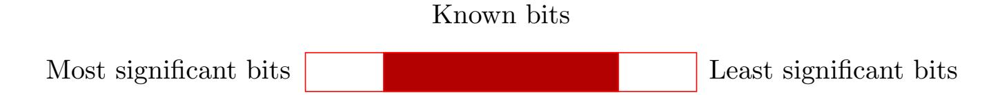

{3}------------------------------------------------

The organization of this survey is given in Table [1.](#page-4-0)

# <span id="page-3-0"></span>2 Motivation

While this tutorial is mostly operating at a higher level of mathematical abstraction than the side-channel attacks that we are motivated by, we will give a few examples of how attackers can learn partial information about secrets.

Modular exponentiation. All of the public-key cryptographic algorithms we discuss involve modular exponentiation or elliptic curve scalar addition operating on secret values. For RSA signatures, the victim computes s = m<sup>d</sup> mod N where d is the secret exponent. For DSA signatures, the victim computes a per-signature secret value k and computes the value r = g <sup>k</sup> mod p, where g and p are public parameters. For Diffie-Hellman key exchange, the victim generates a secret exponent a and computes the public key exchange value A = g <sup>a</sup> mod p, where g and p are public parameters.

Naive modular exponentiation algorithms like square-and-multiply operate bit by bit over the bits of the exponent: each iteration will execute a square operation, and if that bit of the exponent is a 1, will execute a multiply operation. More sophisticated modular exponentiation algorithms precompute a digit representation of the exponent using non-adjacent form (NAF), windowed non-adjacent form (wNAF) [\[M¨ol03\]](#page-44-1), sliding windows, or Booth recoding [\[Boo51\]](#page-41-0) and then operate on the precomputed digit representation. [\[Gor98\]](#page-42-3).

Cache attacks on modular exponentiation. Cache timing attacks are one of the most commonly exploited families of side-channel attacks in the academic literature [\[Pag02,](#page-45-1) [TTMH02,](#page-46-0) [TSS](#page-46-1)+03, [Per05,](#page-45-2) [Ber05,](#page-40-1) [OST06\]](#page-45-3). There are many variants of these attacks, but they all share in common that the attacker is able to execute code on a CPU that is co-located with the victim process and shares a CPU cache. While the victim code executes, the attacker measures the amount of time that it takes to load information from locations in the cache, and thus deduces information about the data that the victim process loaded into those cache locations during execution. In the context of the modular exponentiation or scalar addition algorithms discussed above, a cache attack on a vulnerable implementation might reveal whether a multiply operation was executed at a particular bit location if the attacker can detect whether the code to execute the multiply instruction was loaded into the cache. Alternatively, for a precomputed digit representation of the number, the attacker may be able to use a cache attack to observe the digit values that were accessed [\[ASK07,](#page-40-2) [AS08,](#page-40-3) [BH09,](#page-41-1) [BvSY14\]](#page-41-2).

Other attacks on modular exponentiation. Other families of side channels that have been used to exploit vulnerable modular exponentiation implementations include power analysis and differential power analysis attacks [\[KJJ99,](#page-43-0) [KJJR11\]](#page-44-2), electromagnetic radiation [\[QS01\]](#page-45-0), acoustic emanations [\[GST14\]](#page-42-0), raw timing [\[Koc96\]](#page-44-0), photonic emission [\[FH08\]](#page-42-1), and temperature [\[HS14\]](#page-43-1). These attacks similarly exploit code or circuits whose execution varies based on secrets.

{4}------------------------------------------------

<span id="page-4-0"></span>

| Scheme                           | Secret information                                       | Bits known | Technique                               | Section                   |
|----------------------------------|----------------------------------------------------------|------------|-----------------------------------------|---------------------------|
| RSA                              | $p \geq 50\%$ most significant bits                      |            | Coppersmith's method                    | §4.2.2                    |
| RSA                              | $p \geq 50\%$ least significant bits                     |            | Coppersmith's method                    | §4.2.3                    |
| RSA                              | p middle bits                                            |            | Multivariate Coppersmith                | $\S 4.2.4$                |
| RSA                              | p multiple chunks of bits                                |            | Multivariate Coppersmith                | $\S 4.2.4$                |
| RSA                              | $> \log \log N$ chunks of $p$                            |            | Open problem                            |                           |
| RSA                              | $d \bmod (p-1)$ MSBs                                     |            | Coppersmith's method                    | $\S 4.2.7$                |
| RSA                              | $d \mod (p-1)$ LSBs                                      |            | Coppersmith's method                    | $\S 4.2.7$ and $\S 4.2.3$ |
| RSA                              | $d \mod (p-1)$ middle bits                               |            | Multivariate Coppersmith                | $\S 4.2.7$ and $\S 4.2.4$ |
| RSA                              | $d \mod (p-1)$ chunks of bits                            |            | Multivariate Coppersmith                | $\S 4.2.7$ and $\S 4.2.4$ |
| RSA                              | d most significant bits                                  |            | Not possible                            | $\S 4.2.8$                |
| RSA                              | $d \geq 25\%$ least significant bits                     |            | Coppersmith's method                    | §4.2.9                    |
| RSA                              | $\geq 50\%$ random bits of $p$ and $q$                   |            | Branch and prune                        | §4.3.1                    |
| RSA                              | $\geq 50\%$ of bits of $d \mod (p-1)$ and $d \mod (q-1)$ |            | Branch and prune                        | §4.3.2                    |
| (EC)DSA                          | MSBs of signature nonces                                 |            | Hidden Number Problem                   | §5.2                      |
| (EC)DSA                          | LSBs of signature nonces                                 |            | Hidden Number Problem                   | §5.2                      |
| (EC)DSA                          | Middle bits of signature nonces                          |            | Hidden Number Problem                   | §5.2                      |
| (EC)DSA                          | Chunks of bits of signature nonces                       |            | Extended HNP                            | §5.2.4                    |
| EC(DSA)                          | Many bits of nonce                                       |            | Scales poorly                           |                           |
| Diffie-Hellman                   | Most significant bits of shared secret $g^{ab}$          |            | Hidden Number Problem                   | §6.2                      |
| Diffie-Hellman<br>Diffie-Hellman | Secret exponent $a$ Chunks of bits of secret exponent    |            | Pollard kangaroo method<br>Open problem | §6.3                      |

Table 1: Visual table of contents for key recovery methods for public-key cryptosystems.

{5}------------------------------------------------

Cold boot and memory attacks. An entirely different class of side-channel attacks that can reveal partial information against keys include attacks that may leak the contents of memory. These include cold boot attacks [HSH<sup>+</sup>08], DMA (Direct Memory Access), Heartbleed, and Spectre/Meltdown [LSG<sup>+</sup>18, KHF<sup>+</sup>19]. While these attacks may reveal incomplete information, and thus serve as theoretical motivation for some of the algorithms we discuss, most of the vulnerabilities in this family of attacks can simply be used to read arbitrary memory with near-perfect precision, and cryptanalytic algorithms are rarely necessary.

Length-dependent operations. A final vulnerability class is implementations whose behavior depends on the length of a secret value, and thus variations in the behavior may leak information about the number of leading zeros in a secret. Simple examples include copying a secret key to a buffer in such a way that it reveals the bit length of a secret key, or iterating a modular exponentiation algorithm only until the most significant nonzero digit. [BT11] In another example, the Raccoon attack observes that TLS versions 1.2 and below strips leading zeros from the Diffie-Hellman shared secret before applying the key derivation function, resulting in a timing difference depending on the number of hash input blocks required for the length of the secret. [MBA+20]

# <span id="page-5-0"></span>3 Mathematical background

Lattices and lattice reduction algorithms Several of the algorithms we present make use of lattices and lattice algorithms. We will state a few facts about lattices, but try to avoid being too formal.

For the purposes of this tutorial, we will specify a lattice by giving a basis matrix B which is a  $n \times n$  matrix of linearly independent row vectors with rational (but in our applications usually integer) entries. The lattice generated by B, written as L(B), consists of all vectors that are integer linear combinations of the row vectors of B. The determinant of a lattice is the absolute value of the determinant of a basis matrix:  $\det L(B) = |\det B|$ .

Geometrically, a lattice resembles a discrete, possibly skewed, grid of points in n-dimensional space. This discreteness property ensures that there is a shortest vector in the lattice: there is a non-infinitesimal smallest length of a vector in the lattice, and there is at least one vector  $v_1$  that achieves this length. For a random lattice, the Euclidean length of this vector is approximated using the Gaussian heuristic:  $|v_1|_2 \approx \sqrt{n/(2\pi e)} (\det L)^{1/n}$ . We often don't need this much precision; for lattices of very small dimension we will often use the quick and dirty approximation that  $|v_1|_2 \approx (\det L)^{1/n}$ .

The shortest vector in an arbitrary lattice is NP-hard to compute exactly, but the LLL algorithm [LLL82] will compute an exponential approximation to this shortest vector in polynomial time: in the worst case, it will return a vector  $b_1$  satisfying  $||b_1||_2 \leq 2^{(n-1)/4}(\det L)^{1/n}$ . In practice, for random lattices, the LLL algorithm obtains a better approximation factor  $||b_1||_2 \leq 1.02^n(\det L)^{1/n}$  [NS06]. In fact, the LLL algorithm will return an entire basis for the lattice whose vectors are good approximations for what are called the

{6}------------------------------------------------

successive minima for the lattice; for our purposes the only fact we need is that these vectors will be fairly short, and for a random lattice they will be close to the same length. Current implementations of the LLL algorithm can be run fairly straightforwardly on lattices of a few hundred dimensions.

To compute a closer approximation to the shortest vector than LLL, one can use the BKZ algorithm [\[Sch87,](#page-45-5) [SE94\]](#page-45-6). This algorithm runs in time exponential in a block size, which is a parameter to the algorithm that determines the quality of the approximation factor. The theoretical guarantees of this algorithm are complicated to express; for our purposes we only need to know that for lattices of dimension below around 100, one can easily compute the shortest vector in the heuristically random-looking lattices we consider using the BKZ algorithm, and often can often find the shortest vector, or a "good enough" approximation to it, by using smaller block sizes. Theoretically, the LLL algorithm is equivalent to using BKZ with block size 2.

# <span id="page-6-0"></span>4 Key recovery methods for RSA

# <span id="page-6-1"></span>4.1 RSA Preliminaries

Parameter Generation. To generate an RSA key pair, implementations typically start by choosing the public exponent e. By far the most common choice is to simply fix e = 65537. Some implementations use small primes like 3 or 17. Almost no implementations use public exponents larger than 32 bits. This means that attacks that involve brute forcing values less than e are generally feasible in practice.

In the next step, the implementation generates two random primes p and q such that p − 1 and q − 1 are relatively prime to e. The public modulus is N = pq. The private exponent is then computed as d = e <sup>−</sup><sup>1</sup> mod (p − 1)(q − 1).

The public key is the pair (e, N). In theory, the secret key is the pair (d, N), but in practice many implementations store keys in a data structure including much more information. For example, the PKCS#1 private key format includes the fields p, q, d<sup>p</sup> = d mod (p − 1), d<sup>q</sup> = d mod (q − 1), and qinv = q <sup>−</sup><sup>1</sup> mod p to speed encryption using the Chinese Remainder Theorem.

Encryption and Signatures. In textbook RSA, Alice encrypts the message m to Bob by computing c = m<sup>e</sup> mod N. In practice, the message m is not a "raw" message, but has first been transformed from the content using a padding scheme. The most common encryption padding scheme in network protocols is PKCS#1v1.5, but OAEP [\[BR95\]](#page-41-4) is also sometimes used or specified in protocols. To decrypt the encrypted ciphertext, Bob computes m = c <sup>d</sup> mod N and verifies that m has the correct padding.

To generate a digital signature, Bob first hashes and pads the message he wishes to sign using a padding scheme like PKCS#1v1.5 signature padding (most common) or PSS (less common); let m be the hashed and padded message of this form. Then Bob generates the signature as s = m<sup>d</sup> mod N. Alice can verify the signature by computing the value m<sup>0</sup> = s <sup>e</sup> mod N and verifying that m0 is the correct hashed and padded value.

{7}------------------------------------------------

Since encryption and signature verification only use the public key, decryption and signature generation are the operations typically targeted by sidechannel attacks.

**RSA-CRT.** To speed up decryption, instead of computing  $c^d \mod N$  directly, implementations often use the Chinese remainder theorem (CRT). RSA-CRT splits the exponent d into two parts  $d_p = d \mod (p-1)$  and  $d_q = d \mod (q-1)$ .

To decrypt using the Chinese remainder theorem, Alice would compute  $m_p = c^{d_p} \mod p$  and  $m_q = c^{d_q} \mod q$ . The message can be recovered with the help of the pre-computed value  $q_{inv} = q^{-1} \mod p$  by computing

$$m = m_p q q_p + m_q (1 - q q_p) = (m_p - m_q) q q_{inv} + m_q \mod N.$$

This is called Garner's formula [Gar59].

Relationships Between RSA Key Elements. For the purpose of secret key recovery, we typically assume that the attacker knows the public key.

RSA keys have a lot of mathematical structure that can be used to relate the different components of the public and private keys together for key recovery algorithms. The RSA public and private keys are related to each other as

$$ed \equiv 1 \mod (p-1)(q-1)$$

The modular equivalence can be removed by introducing a new variable k to obtain an integer relation

$$ed = 1 + k(p-1)(q-1) = 1 + k(N - (p+q) + 1)$$

We know that d < (p-1)(q-1), so k < e. The value of k is not known to the attacker, but since generally  $e \le 65537$  in practice it is efficient to brute force over all possible values of k.

For attacks against the CRT coefficients  $d_p$  and  $d_q$ , we can obtain similar relations:

<span id="page-7-0"></span>
$$ed_p = 1 + k_p(p-1)$$
 and  $ed_q = 1 + k_q(q-1)$  (1)

for some integers  $k_p < e$  and  $k_q < e$ . Brute forcing over two independent 16-bit values can be burdensome, but we can relate  $k_p$  and  $k_q$  as follows:

Rearranging the two relations, we obtain  $ed_p - 1 - k_p = k_p p$  and  $ed_q - 1 - k_q = k_q q$ . Multiplying these together, we get

$$(ed_p - 1 + k_p)(ed_q - 1 - k_q) = k_p k_q N$$

Reducing the above modulo e, we get

<span id="page-7-1"></span>
$$(k_p - 1)(k_q - 1) \equiv k_p k_q N \bmod e \tag{2}$$

Thus given a value for  $k_p$ , we can solve for the unique value of  $k_q \mod e$ , and for applications that require brute forcing values of  $k_p$  and  $k_q$  we only need to brute force at most e pairs. [IGA<sup>+</sup>15]

{8}------------------------------------------------

The multiplier k also has a nice relationship to these values. Multiplying the relations from Equation [1](#page-7-0) together, we have

$$(ed_p - 1)(ed_q - 1) = k_p(p - 1)k_q(q - 1)$$

Substituting (p − 1)(q − 1) = (ed − 1)/k and reducing modulo e, we can relate the coefficients as

$$k \equiv -k_p k_q \bmod e$$

Any of the secret values p, q, d, dp, dq, or qinv suffices to compute all of the other values when the public key (N, e) is known.

From either p or q, computing the other values is straightforward.

For small e, N can be factored from d by computing

<span id="page-8-1"></span>
$$ed = 1 + k(p-1)(q-1) = 1 + k(N - (p+q) + 1)$$
(3)

The integer multiplier k can be recovered by rounding d(ed − 1)/Nc. Once k is known, then Equation [3](#page-8-1) can be rearranged to solve for s = p + q. Once s is known, we have (p+q) <sup>2</sup> = s <sup>2</sup> = p <sup>2</sup>+2N+q <sup>2</sup> and s <sup>2</sup>−4N = p <sup>2</sup>−2N+q <sup>2</sup> = (p−q) 2 . Then N can be factored by computing gcd((p + q) − (p − q), N).

When e is small, p can be computed from d<sup>p</sup> as

$$p = \gcd((ed_p - 1)/k_p + 1, N)$$

where k<sup>p</sup> can be brute forced from 1 to e.

If k<sup>p</sup> is not known and is too large to brute force, with high probability for a random a,

$$p = \gcd(a^{ed_p - 1} - 1, N).$$

Factoring from qinv is more complex. As noted in [\[HS09\]](#page-43-5), qinv satisfies qinvq <sup>2</sup> − q ≡ 0 mod N, and q can be recovered using Coppersmith's method, described below.

# <span id="page-8-0"></span>4.2 RSA Key Recovery with Consecutive bits known

This section covers techniques for recovering RSA private keys when large contiguous portions of the secret keys are known. The main technique used in this case is lattice basis reduction.

For the key recovery problems in this section, we can typically recover a large unknown chunk of bits of an unknown secret key value (p, d mod (p − 1), or d). We typically assume that the attacker has access to the public key (N, e) but does not have any other auxiliary information (about q or d mod (q − 1), for example.

Knowledge of large contiguous portions of secret keys is unlikely to arise in side channels that involve noisy measurements, but could arise in scenarios where secrets are being read out of memory that got corrupted in an identifiable region. They can also help make attacks more efficient if a high cost is paid to recover known bits.

{9}------------------------------------------------

#### <span id="page-9-0"></span>4.2.1 Warm-up: Lattice attacks on low-exponent RSA with bad padding.

The main algorithmic technique used for RSA key recovery with contiguous bits is to formulate the problem as finding a small root of a polynomial modulo an integer, and then to use lattice basis reduction to solve this problem.

In order to introduce the main tool of using lattice basis reduction to find roots of polynomials, we will start with an illustrative example for the concrete application of breaking small-exponent RSA with known padding. In later sections we will show how to modify the technique to cover different RSA key recovery scenarios.

The original formulation of this problem is due to Coppersmith [\[Cop96\]](#page-41-5). Howgrave-Graham [\[HG97\]](#page-43-6) gave a dual approach that we find easier to explain and easier to implement. May's survey [\[May10\]](#page-44-6) contains a detailed description of the Coppersmith/Howgrave-Graham algorithm.

To set up the problem, we have an integer N, and a polynomial f(x) of degree k that has a root r modulo N, that is, f(r) ≡ 0 mod N. We wish to find r. Finding roots of polynomials can be done efficiently modulo primes [\[LLL82\]](#page-44-5), so this problem is easy to solve if N is prime or the prime factorization of N is known. The Coppersmith/Howgrave-Graham methods are generally of interest when the prime factorization of N is not known: it gives an efficient algorithm for finding all small roots (if they exist) modulo N of unknown factorization.

Problem setup. For our toy example, we will use the 96-bit RSA modulus

N = 0x98664cf0c9f8bbe76791440d

and e = 3. Consider a broken PKCS#1v1.5-esque RSA encryption padding scheme that pads a message m as

pad(m) = 0x01FFFFFFFFFFFFFFFF00 || m

Now imagine that we have obtained a ciphertext

c = 0xeb9a3955a7b18d27adbf3a1

and we wish to recover the unknown message m.

{10}------------------------------------------------

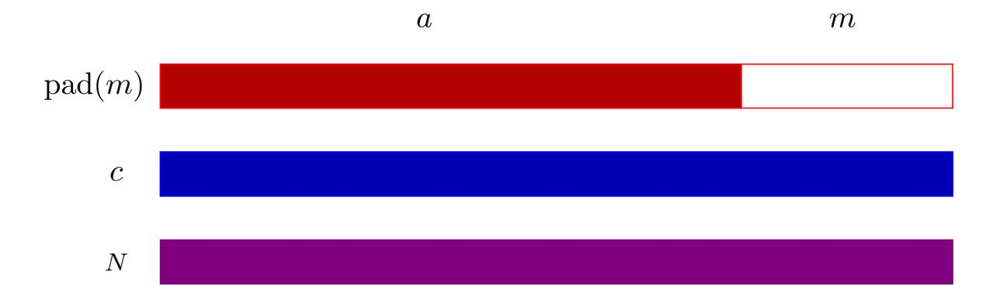

Figure 1: Illustration of low-exponent RSA message recovery attack setup. The attacker knows the public modulus N, a ciphertext c, and the padding a prepended to the unknown message m before encryption. The attacker wishes to recover m.

#### Cast the problem as finding roots of a polynomial. Let

#### a = 0x01FFFFFFFFFFFFFF0000

be the known padding string, offset to the correct byte location. We also know the length of the message; in this case  $m < 2^{16}$ . Thus we have that  $c = (a+m)^3 \mod N$ , for unknown small m. Let  $f(x) = (a+x)^3 - c$ ; we have set up the problem so that we wish to find a small root m satisfying  $f(m) \equiv 0 \mod N$  for the polynomial

$$f(x) = x^3 + 0 \times 5 \text{ffffffffffffffffffff0000} \\ x^2 + 0 \times 6 \text{f1c485f406ba1c069460efe} \\ + 0 \times 203211880 \text{cdc43afe1c5c5f9}$$

(We have reduced the coefficients modulo N so that they will fit on the page.)

Construct a lattice. Let the coefficients of f be  $f(x) = x^3 + f_2x^2 + f_1x + f_0$ . Let  $M = 2^{16}$  be an upper bound on the size of the root m. We construct the matrix

$$B = \begin{bmatrix} M^3 & f_2 M^2 & f_1 M & f_0 \\ 0 & N M^2 & 0 & 0 \\ 0 & 0 & N M & 0 \\ 0 & 0 & 0 & N \end{bmatrix}$$

We then apply the LLL lattice basis reduction algorithm to the matrix. The shortest vector of the reduced basis is

$$v = (-0x66543dd72697M^3, -0x35c39ac91a11c04M^2, 0x3f86f973d67d25eae138M, -0x10609161b131fd102bc2a8)$$

Extract a polynomial from the lattice and find its roots. We then construct the polynomial

$$g(x) = -0x66543dd72697x^3 - 0x35c39ac91a11c04x^2 + 0x3f86f973d67d25eae138x - 0x10609161b131fd102bc2a8$$

{11}------------------------------------------------

The polynomial g has one integer root, 0x42, which is the desired solution for m.

This specific 4 × 4 lattice construction works to find roots up to size N1/<sup>6</sup> . For the small key size we used in our example, this is only 16 bits, but since it scales directly with the modulus size, this same lattice construction would suffice to learn 170 unknown bits of message for a 1024-bit RSA modulus, or 341 bits of message for a 2048-bit RSA modulus. Lattice reduction on a 4 × 4 lattice basis is instantaneous.

More detailed explanation. Why does this work? The rows of this matrix correspond to the coefficient vectors of the polynomials f(x), Nx<sup>2</sup> , Nx, and N. We know that each of these polynomials evaluated at x = m will be 0 modulo N. Each column is scaled by a power of M, so that the `<sup>1</sup> norm of any vector in this lattice is an upper bound on the value of the corresponding (un-scaled) polynomial evaluated at r. For a vector v = (v3M<sup>3</sup> , v2M<sup>2</sup> , v1M, v0) in the lattice,

$$|f(m)| = |v_3 m^3 + v_2 m^2 + v_1 m + v_0| \le |v_3 M^3| + |v_2 M^2| + |v_1 M| + |v_0| = |v|_1$$
 for any  $|m| \le M$ .

We have constructed the lattice so that every polynomial g we extract from it has the property that g(m) ≡ 0 mod N. We have also constructed our lattice so that the length of the shortest vector in a reduced basis will be less than N. The only integer multiple of N less than N is 0, so by construction the polynomial corresponding to this short vector satisfies g(m) = 0 over the integers, not just modulo N. Since finding roots of polynomials over the integers, rationals, reals, and complex numbers can be done in polynomial time, we can compute the roots of this polynomial and check which of them is our desired solution.

This method will always work if the lattice is constructed properly. That is, we need to ensure that the reduced basis will contain a vector of length less than N. For this example, det B = M6N<sup>3</sup> . Heuristically, the LLL algorithm will find a vector of `<sup>2</sup> norm |v|<sup>2</sup> ≤ 1.02n(det B) <sup>1</sup>/ dim <sup>B</sup>. We ignore the 1.02<sup>n</sup> factor, and the difference between the `<sup>2</sup> and `<sup>1</sup> norms for the moment. Then the condition we wish to satisfy is

$$g(m) \le |v|_2 \le (\det B)^{1/n} < M$$

For our example, we have (det B) <sup>1</sup>/ dim <sup>L</sup> = (M<sup>6</sup>N<sup>3</sup> ) <sup>1</sup>/<sup>4</sup> < N. Solving for M, this will be satisfied when M < N<sup>1</sup>/<sup>6</sup> . In this case, N has 96 bits, and m is 16 bits, so the condition is satisfied.

This can be extended to N<sup>1</sup>/e, where e is the degree of the polynomial f by using a larger dimension lattice. Howgrave-Graham's dissertation [\[HG\]](#page-42-5) and May's survey [\[May10\]](#page-44-6) give detailed explanations of this method and improvements.

{12}------------------------------------------------

#### <span id="page-12-0"></span>4.2.2 Factorization from consecutive bits of p.

In this section we show how to use lattices to factor the RSA modulus N if a large portion of contiguous bits of one of the factors (without loss of generality p) is known.

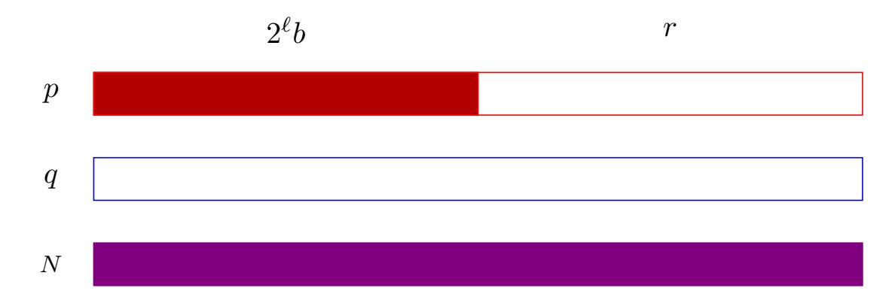

Figure 2: Factorization of N = pq given contiguous known most significant bits of p.

Coppersmith solves this problem in [\[Cop96\]](#page-41-5) but we find the reformulation from Howgrave-Graham as "approximate integer common divisors" [\[HG01\]](#page-43-7) simpler to apply, and will give that construction here.

Problem setup. Let N = pq be an RSA modulus with equal-sized p and q. Choosing an example with numbers small enough to fit on the page, we have a 240-bit RSA modulus

# N = 0x4d14933399708b4a5276373cb5b756f312f023c43d60b323ba24cee670f5.

We assume N is known. Assume we know a large contiguous portion of the most significant bits b of p, so that p = a + r, where we do not know r but do know the value a = 2` b. Here ` = 30 is the number of unknown bits, or equivalently the left shift of the known bits.

In our example, we have

## a = 0x68323401cb3a10959e7bfdc0000000

Cast the problem as finding the roots of a polynomial. Let f(x) = a+x. We know that there is some value r such that f(r) = p ≡ 0 mod p. We do not know p, but we know that p divides N and we know N.

We know that the unknown r is small, and in particular |r| < R for some bound R that is known. Here, R = 2<sup>30</sup> .

Construct a lattice. We can form the lattice basis

$$B = \begin{bmatrix} R^2 & Ra & 0 \\ 0 & R & a \\ 0 & 0 & N \end{bmatrix}$$

{13}------------------------------------------------

We then run the LLL algorithm on our lattice basis B. Let v = (v2R<sup>2</sup> , v1R, v0) be the shortest vector in the reduced basis. In our example, we get the vector

```
v =(−0x0x17213d8bc94R
                      2
                       , −0x1d861360160a4f86181R,
   0xf9decdc1447c3f3843819a5d)
```

Extract a polynomial and find the roots. We form a polynomial f(x) = v2x <sup>2</sup> + v1x + v0. For our example,

```
f(x) =−0x17213d8bc94x
                      2 − 0x1d861360160a4f86181x
      + 0xf9decdc1447c3f3843819a5d
```

We can then calculate the roots of f. In this example, f has one integer root, r = 0x873209. We can then reconstruct a + r and verify that gcd(a + r, N) factors N.

This 3 × 3 lattice construction works for any |r| < p1/<sup>3</sup> , and directly scales as p increases. In our example, we chose p and q so that they have 120 bits, and r has 30 bits. However, this same construction will work to recover 170 bits from a 512-bit factor of a 1024-bit RSA modulus, or 341 bits from a 1024-bit factor of a 2048-bit RSA modulus.

More detailed explanation. The rows of this matrix correspond to the coefficient vectors of the polynomials x(x + a), x + a, and N. We know that each of these polynomials evaluated at x = r will be 0 modulo p, and thus every polynomial corresponding to a vector in the lattice has this property. As in the previous example, each column is scaled by a power of R, so that the `<sup>1</sup> norm of any vector in this lattice is an upper bound on the value of the corresponding (un-scaled) polynomial evaluated at r.

If we can find a vector in the lattice of length less than p, then it corresponds to a polynomial g that must satisfy g(r) < p. Since by construction, g(r) = 0 (mod p), this means that g(r) = 0 over the integers.

We compute the determinant of the lattice to verify that it contains a sufficiently small vector. For this example, det B = R3N. This means we need (det B) <sup>1</sup>/ dim <sup>L</sup> = (R3N) <sup>1</sup>/<sup>3</sup> < p. Solving for R, this gives R < p1/<sup>3</sup> . For an RSA modulus we have p ≈ N<sup>1</sup>/<sup>2</sup> , or R < N1/<sup>6</sup> .

This method works up to R < p<sup>1</sup>/<sup>2</sup> at the limit by increasing the dimension of the lattice. This is accomplished by taking higher multiples of f and N. See Howgrave-Graham's dissertation [\[HG\]](#page-42-5) and May's survey [\[May10\]](#page-44-6) for details on how to do this.

#### <span id="page-13-0"></span>4.2.3 RSA key recovery from least significant bits of p

It is also straightforward to adapt this method to deal with a contiguous chunk of unknown bits in the least significant bits of p: if the chunk begins at bit position `, the input polynomial will have the form f(x) = 2`x + a. This can be multiplied by 2<sup>−</sup>` mod N and solved exactly as above.

{14}------------------------------------------------

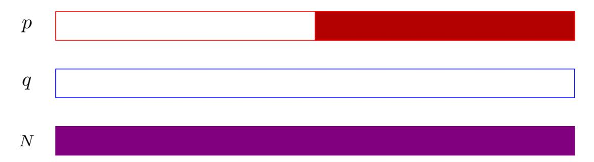

Figure 3: Factorization of N = pq given contiguous known least significant bits of p.

## <span id="page-14-0"></span>4.2.4 RSA key recovery from middle bits of p

RSA key recovery from middle bits of p is somewhat more complex than the previous examples, because there are two unknown chunks of bits in the most and least significant bits of p.

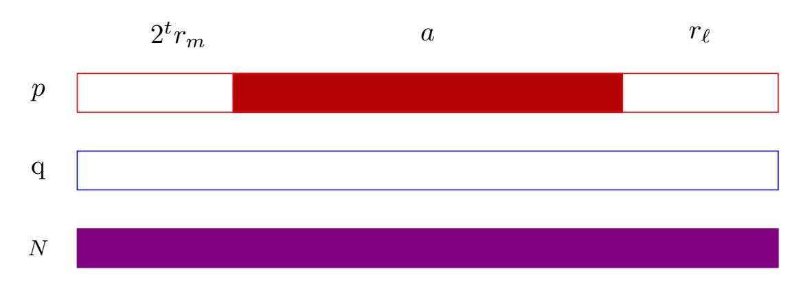

Figure 4: Factorization of N = pq given contiguous known bits of p in the middle.

Problem setup. Assume we know a large contiguous portion of the middle bits of p, so that p = a + r` + 2<sup>t</sup> rm, where a is an integer representing the known bits of p, r` and r<sup>m</sup> are unknown integers representing the least and most significant bits of p that we wish to solve for, and t is the starting bit position of the unknown most significant bits. We know that |r`| < R and |rm| < R for some bound R.

As a concrete example, let

N =0x3ab05d0c0694c6bd8ee9683d15039e2f738558225d7d37f4a601bcb9 29ccfa564804925679e2f3542b

be a 326-bit RSA modulus. Let

a = 0xc48c998771f7ca68c9788ec4bff9b40b80000

be the middle bits of one of its factors p; there are 16 unknown bits in the most and least significant bit positions. Thus we know that R = 2<sup>16</sup> in our concrete example. We wish to recover p.

{15}------------------------------------------------

Cast the problem as finding solutions to a polynomial. In the previous examples, we only had one variable to solve for. Here, we have two, so we need to use a bivariate polynomial. We can write down  $f(x,y) = x + 2^t y + a$ , so that  $f(r_{\ell}, r_m) = p$ .

In our concrete example, p has 164 bits, so we have  $f(x,y) = x+2^{148}y+a$ . We hope to construct two polynomials  $g_1(x,y)$  and  $g_2(x,y)$  satisfying  $g_1(r_\ell,r_m)=0$  and  $g_2(r_\ell,r_m)=0$  over the integers. Then we can solve the system for the simultaneous roots.

Construct a lattice. As before, we will use our input polynomial f and the public RSA modulus N to construct a lattice. Unfortunately for the simplicity of our example, the smallest polynomial that is guaranteed to result in a nontrivial bound on the solution size for our desired roots has degree 3, and results in a lattice of dimension 10.

As before, each column corresponds to a monomial that appears in our polynomials, and each row corresponds to a polynomial that evaluates to 0 mod p at our desired solution. In our example, we will use the polynomials  $f^3$ ,  $f^2y$ ,  $fy^2$ ,  $y^3N$ ,  $f^2$ , fy,  $y^2N$ , f, yN, and N; the monomials in the columns are  $x^3$ ,  $x^2y$ ,  $xy^2$ ,  $y^3$ ,  $x^2$ , xy,  $y^2$ , x, y, and 1. Each column is scaled by the appropriate power of R.

$$B = \begin{bmatrix} R^3 & 3 \cdot 2^t R^3 & 3 \cdot 2^{2t} R^3 & 2^{3t} R^3 & 3aR^2 & 6 \cdot 2^t a R^2 & 3 \cdot 2^{2t} a R^2 & 3a^2 R & 3 \cdot 2^t a^2 R & a^3 \\ 0 & R^3 & 2 \cdot 2^t R^3 & 2^{2t} R^3 & 0 & 2aR^2 & 2 \cdot 2^t a R^2 & 0 & a^2 R & 0 \\ 0 & 0 & R^3 & 2^t R^3 & 0 & 0 & aR^2 & 0 & 0 & 0 \\ 0 & 0 & 0 & R^3 N & 0 & 0 & 0 & 0 & 0 & 0 & 0 \\ 0 & 0 & 0$$

We reduce this matrix using the LLL algorithm, and reconstruct the bivariate polynomials corresponding to each row of the reduced basis. Unfortunately, these are too large to fit on a page.

Solve the system of polynomials to find common roots. Heuristically, we would hope to only need two sufficiently short vectors and then compute the resultant of the corresponding polynomials or use a Gröbner basis to find the common roots, but in our example the two shortest vectors are not algebraically independent. In this case it suffices to use the first three vectors. Concretely, we construct an ideal over the ring of bivariate polynomials with integer coefficients whose basis is the polynomials corresponding to the three shortest vectors in the reduced basis for L(B) above, and then call a Gröbner basis algorithm on it. For this example, the Gröbner basis is exactly the polynomials (x - 0x339b, y - 0x5a94), which reveals the desired solutions for  $x = r_{\ell}$  and  $y = r_m$ .

In this example, the nine shortest vectors all vanish at the desired solution, so we could have constructed our Gröbner basis from other subsets of these short vectors.

{16}------------------------------------------------

More detailed explanation. The determinant of our lattice is det B = R20N<sup>4</sup> , and the lattice has dimension 10. We hope to find two vectors v<sup>1</sup> and v<sup>2</sup> of length approximately det B1/ dim <sup>B</sup>; this is not guaranteed to be possible, but for random lattices we expect the lengths of the vectors in a reduced basis to have close to the same lengths. The `<sup>1</sup> norms of the vectors v<sup>1</sup> and v<sup>2</sup> are upper bounds on the magnitude of the corresponding polynomials fv<sup>1</sup> (x, y), fv<sup>2</sup> (x, y) evaluated at the desired roots r`, rm. In order to guarantee that these vanish, we want the inequality

$$|f_{v_i}(r_\ell, r_m)| \le |v_i|_1$$

to hold.

Thus the desired condition for success is

$$\det B^{1/\dim B} < \sqrt{N}$$
$$(R^{20}N^4)^{1/10} < N^{1/2}$$
$$R^{20} < N$$

In our example, N was 326 bits long, and we chose R to have 16 bits.

This attack was applied in [\[BCC](#page-40-4)+13] to recover RSA keys generated by a faulty random number generator that generated primes with predictable sequences of bits.

#### <span id="page-16-0"></span>4.2.5 RSA key recovery from multiple chunks of bits of p

The above idea can be extended to handle more chunks of p at the cost of increasing the dimension of the lattice. Each unknown "chunk" of bits introduces a new variable in the linear equation that will be solved for p. At the limit, the algorithm requires 70% of the bits of p divided into at most log log N blocks [\[HM08\]](#page-43-8).

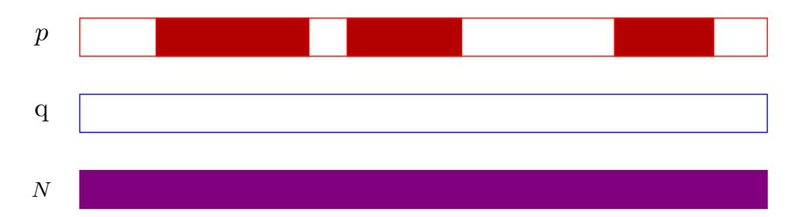

Figure 5: Factorization of N = pq given multiple chunks of p.

## <span id="page-16-1"></span>4.2.6 Open problem: RSA key recovery from many nonconsecutive bits of p

The above methods scale poorly with the number of chunks of known bits. It is an open problem to develop a subexponential-time method to recover an RSA key or factor the RSA modulus N with more than log log N unknown chunks of bits, if these bits are only known about, say, one factor p of N. If information 

{17}------------------------------------------------

is known about both p and q or other fields of the RSA private key, then the methods of Section [4.3.1](#page-20-1) may be applicable.

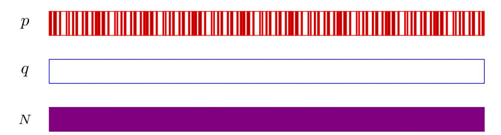

Figure 6: Efficient factorization of N = pq given many chunks of p and no information about p is an open problem.

# <span id="page-17-0"></span>4.2.7 Partial recovery of RSA d<sup>p</sup>

Recovering the CRT coefficient d<sup>p</sup> = d mod (p − 1) from a large contiguous bits can be done using the approach given in Sections [4.2.2,](#page-12-0) [4.2.3](#page-13-0) and [4.2.4.](#page-14-0) We illustrate the method in the case of known most significant bits.

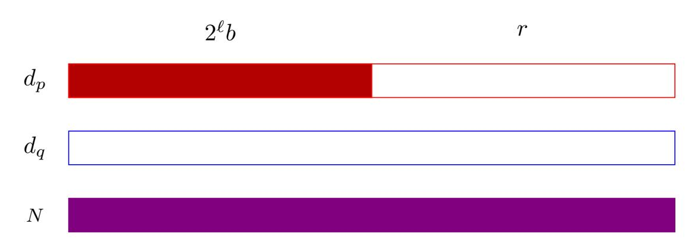

Recovering RSA d<sup>p</sup> = d mod (p − 1) given many contiguous bits of dp.

#### Problem setup. Let

N = 0x4d14933399708b4a5276373cb5b756f312f023c43d60b323ba24cee670f5

be a 240-bit RSA modulus. We will use public exponent e = 65537.

In this problem, we are given some of the most significant bits b of dp, and we want to recover the rest. As before, let ` be the number of least significant bits of d<sup>p</sup> we need to recover, so that there is some value a = 2` b with a+r = d<sup>p</sup> for some r < 2 ` . For our concrete example, we have

a = 0x25822d06984a06be5596fcc0000000.

Cast the problem as finding the roots of a polynomial We start with the relation ed<sup>p</sup> ≡ 1 mod (p−1) and rewrite it as an integer relation by introducing a new variable kp:

<span id="page-17-1"></span>
$$ed_p = 1 + k_p(p-1).$$
 (4)

The integer k<sup>p</sup> is unknown, but we know that k<sup>p</sup> < e since d<sup>p</sup> < (p − 1). In our example, and typically in practice, we have e = 65537, so we will run the 

{18}------------------------------------------------

attack for all possible values of 1 ≤ k<sup>p</sup> < 65537. With the correct parameters, we are guaranteed to find a solution for the correct value of kp. For other incorrect guesses of kp, in practice the attack is unlikely to result in any solutions found, but any spurious solutions that arise can be eliminated because they will not result in a factorization of N.

We can rearrange Equation [4,](#page-17-1) with e −1 computed modulo N:

$$e(a+r) - 1 + k_p \equiv 0 \mod p$$
$$a + r + e^{-1}(k_p - 1) \equiv 0 \mod p$$

Let A = a+e −1 (kp−1). Then we wish to find a small root r of the polynomial f(x) = A + x modulo p, where |r| < R.

For our concrete example, we have R = 2<sup>30</sup> and k<sup>p</sup> = 23592, so

A = 0x8ffe9143aa4c189787058057a0784576848f3f28d79a83169f72a0550699112

Construct a lattice. Since the form of the problem is identical to the previous section, we use the same lattice construction:

$$B = \begin{bmatrix} R^2 & RA & 0\\ 0 & R & A\\ 0 & 0 & N \end{bmatrix}$$

We apply the LLL algorithm to this basis and take the shortest vector in the reduced basis. For our example, this is

v = (−1306dd0a37ecR 2 , 52955e433295de64273R, −31db63ed6f29f4d8f4d1501c47)

We construct the corresponding polynomial

f(x) = −1306dd0a37ecx <sup>2</sup>+52955e433295de64273x−31db63ed6f29f4d8f4d1501c47

Computing the roots of f, we discover that r = 0x39d9b141 is among them, and that gcd(A + r, N) = p.

At the limit, this technique can work up to R < p<sup>1</sup>/<sup>2</sup> [\[BM03\]](#page-41-6) by increasing the dimension of the lattice with higher degree polynomials and higher multiplicities of the root.

## <span id="page-18-0"></span>4.2.8 Partial recovery of RSA d from most significant bits is not possible

Partial recovery for d varies somewhat depending on the bits that are known and the size of e. Since e is small in practice, we will focus on that case here.

{19}------------------------------------------------

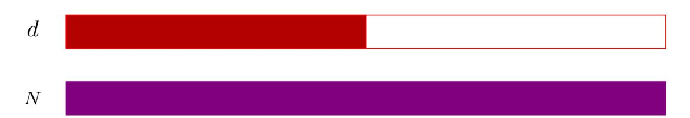

Figure 7: For small exponent e, the most significant bits of d do not allow full key recovery.

Most significant bits of d. When e is small enough to brute force, the most significant half of bits of d can be recovered easily with no additional information. This implies that if full key recovery were possible from only the most significant half of bits of d, then small public exponent RSA would be completely broken. Since small public exponent RSA is not known to be insecure in general, this unfortunately means that no such key recovery method is possible for this case.

Consider the RSA equation

$$ed = 1 \mod (p-1)(q-1)$$

$$ed = 1 + k(p-1)(q-1)$$

$$ed = 1 + k(N - (p+q) + 1)$$

$$d = kN/e - (k(p+q-1) - 1)/e$$

Since p + q ≈ √ N, the second term affects only the least significant half of the bits of d, so the value kN/e shares approximately the most significant half of its bits in common with d.

On the positive side, this observation allows the attacker to narrow down possible values for k if the attacker knows any most significant bits of d for certain. See Boneh, Durfee, and Frankel [\[Bon98\]](#page-41-7) for more details.

#### <span id="page-19-0"></span>4.2.9 Partial recovery of RSA d from least significant bits

For low-exponent RSA, if an adversary knows the least significant t bits of d, then this can be transformed into knowledge of the least significant t bits of p, and then the method of Section [4.2.3](#page-13-0) can be applied. This algorithm is due to Boneh, Durfee, and Frankel [\[Bon98\]](#page-41-7).

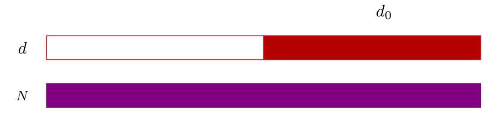

Figure 8: Recovering RSA p given contiguous least significant bits of d.

Assume the adversary knows the t least significant bits of d; call this value d0. Then

$$ed_0 \equiv 1 + k(N - (p+q) + 1) \mod 2^t$$

{20}------------------------------------------------

Let s = p + q. The adversary tries all possible values of k, 1 < k < e to obtain e candidate values for the t least significant bits of s.

Then for each candidate s, the least significant bits of p are solutions to the quadratic equation

$$p^2 - sp + N \equiv 0 \bmod 2^t.$$

Let a be a candidate solution for the least significant bits of p. Putting this in the context of Section [4.2.3,](#page-13-0) the attacker wishes to solve f(x) = a + 2 <sup>t</sup>x ≡ 0 mod p. This can be multiplied by 2−<sup>t</sup> mod N and the exact method of Section [4.2.3](#page-13-0) can be applied to recover p. Since at the limit, the methods of Section [4.2.3](#page-13-0) work to recover N1/<sup>4</sup> bits of p, this method will work when as few as N1/<sup>4</sup> bits of d are known.

There are more sophisticated lattice algorithms that involve different tradeoffs, but for very small e, which is typically the case in practice, they require nearly all of the least significant bits of d to be known [\[BM03\]](#page-41-6).

# <span id="page-20-0"></span>4.3 Non-consecutive bits known with redundancy

This section covers key recovery in the case that many non-consecutive bits of secret values are known or need to be recovered. The lattice methods covered in the previous section can be adapted to recover multiple chunks of unknown key bits, but at a high cost: the lattice dimension increases with the number of chunks, and when a large number of bits is to be recovered, the running time can be exponential in the number of chunks.

In this section, we explore a different technique that allows a different tradeoff. In this case, the attacker has knowledge of many non-contiguous bits of secret key values, and knows these for multiple secret values of the key. The attacker might have learned parts of both p and q, or d mod (p − 1) and d mod (q − 1), for example.

#### <span id="page-20-1"></span>4.3.1 Random known bits of p and q

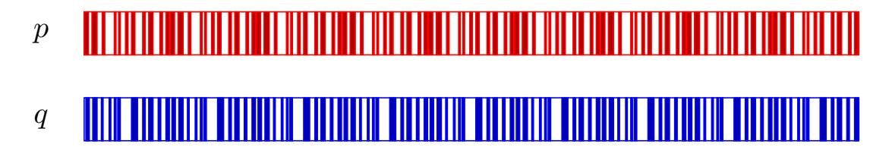

Figure 9: Factorization of N = pq given non-consecutive bits of both p and q.

We begin by analyzing a case that is less likely to arise in practice, the case of random erasures of bits of p and q, in order to give the main ideas behind the algorithm in the simplest setting.

The main technique used for these cases is a branch and prune algorithm. The idea behind the branch and prune algorithm is to write down an integer relationship between the elements in the secret key and the public key, and progressively solve for unknown bits of the secret key, starting at the least significant bits. This produces a tree of solutions: every branch corresponds to 

{21}------------------------------------------------

guesses for one or more unknown bits at a particular solution, and branches are pruned if the guesses result in incorrect relationships to the public key.

This algorithm is presented and analyzed in [HS09].

**Problem setup.** Let N=899. Imagine we have learned some bits of p and q, in an erasure model: for each bit position, we either know the bit value, or we know that we do not know it. For example, we have

$$p = \sqcup 11 \sqcup 1$$
,

and

$$q = \sqcup 1 \sqcup 0 \sqcup$$
.

**Defining an integer relation.** The integer relation that we will take advantage of for this example is N = pq.

Iteratively solve for each bit. The main idea of the algorithm is to iteratively solve for the bits of the unknowns p and q, starting at the least significant bits. These can then be checked against the known public value of N.

At the least significant bit, the value is known for p and is unknown for q. There are two options for the value of q, but only the bit value 1 satisfies the constraint that  $pq = N \mod 2$ . The algorithm then proceeds to the next step, where the value of the second bit is known for q but not for p. Only the bit value 1 satisfies the constraint  $pq = N \mod 2^2$ , so the algorithm continues down this branch. Since this generates a tree, the tree can be traversed in depth-first or breadth-first order; depth-first will be more memory efficient. This is illustrated in Figure 10.

<span id="page-21-0"></span>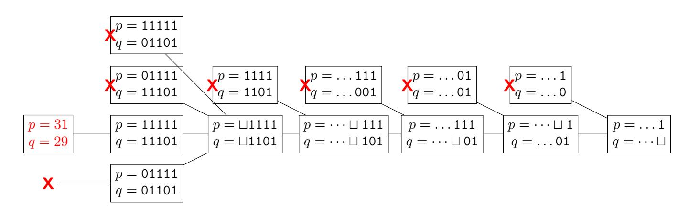

Figure 10: The branch and prune tree for our numeric example. The algorithm begins at the right-hand node representing the least significant bits, and iteratively branches and prunes guesses for successive bits moving towards the most significant bits.

The algorithm works because  $N = pq \mod 2^i$  for all values of i. Additionally, we want some assurance that an incorrect guess for a value at a particular bit location should eventually lead to that branch being pruned. Heuristically, when the ith bits of both p and q are unknown, the tree will branch; when bit i is known for one but not the other, there will be a unique solution; and when the

{22}------------------------------------------------

ith bits of both p and q are known, an incorrect solution has around a 50% probability of being pruned. Thus the algorithm is expected to be efficient as long as there are not long runs of simultaneous unknown bits. We assume the length of p and q is known. Once the algorithm has traversed this many bits, the final solution pq = N can be checked without modular constraints.

When random bits are known from p and q, the analysis of [\[HS09\]](#page-43-5) shows that the tree of generated solutions is expected to have polynomial size when 57% of the bits of p and q are revealed at random. This algorithm can still be efficient if the distribution of bits known is not random, as long as it allows efficient pruning of the tree. An example would be learning 3 out of every 5 bits of p and q, as in [\[YGH16\]](#page-46-2).

Paterson, Polychroniadou, and Sibborn [\[PPS12\]](#page-45-7) give an analysis of the required information for different scenarios, and observe that doing a depth-first search is more efficient memory-wise than a breadth-first search.

## <span id="page-22-0"></span>4.3.2 Random known bits of the Chinese remainder coefficients d mod (p − 1) and d mod (q − 1)

The description in Section [4.3.1](#page-20-1) can be extended to recover the Chinese remainder exponents d<sup>p</sup> = d mod (p − 1) and d<sup>q</sup> = d mod (q − 1) using the same technique as the previous section. This is the most common case encountered in RSA side channel attacks.

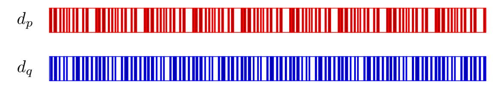

Factorization of N = pq given non-consecutive bits of dp, dq.

Problem setup. Let N = 899 be the RSA public modulus, and e = 17 be the public exponent. Imagine that the adversary has recovered some bits of the secret Chinese remainder exponents d<sup>p</sup> = d mod (p−1) and d<sup>q</sup> = d mod (q −1).

$$d_p = \sqcup 0 \sqcup \sqcup 1, \qquad d_q = \sqcup \sqcup \sqcup \sqcup 0 \sqcup$$

We wish to recover the missing unknown bits of d<sup>p</sup> and dq, which will allow us to recover the secret key itself.

Define integer relations. We know that ed<sup>p</sup> ≡ 1 mod (p − 1) and ed<sup>q</sup> ≡ 1 mod (q − 1). We rewrite these as integer relations

$$ed_p = 1 + k_p(p-1),$$
  $ed_q = 1 + k_q(p-1).$ 

We have no information about the values of p and q, but their values are uniquely determined from a guess for d<sup>p</sup> or dq.

We also know that

$$pq = N$$
.

{23}------------------------------------------------

The values k<sup>p</sup> and k<sup>q</sup> are unknown, so we must brute force them by running the algorithm for all possible values. We expect it to fail for incorrect guesses, and succeed for the unique correct guess. Equation [2](#page-7-1) in Section [4.1](#page-6-1) shows that there is a unique value of k<sup>q</sup> for a given guess for kp. Since k<sup>p</sup> < e we need to brute force at most e pairs of values for k<sup>p</sup> and kq.

In our example, we have k<sup>p</sup> = 13 and k<sup>q</sup> = 3, although this won't be verified as the correct guesses until the solution is found.

Iteratively solve for each bit. With our integer relations in place, we can then use them to iteratively solve for each bit of the unknowns dp, dq, p, and q, starting from the least significant bit. We check guesses for each value against our three integer relations, and at bit i we prune those that do not satisfy the relations mod 2<sup>i</sup> . We have three relations and four unknowns, so we generate at most two new branches at each bit.

$$ed_p - 1 + k_p \equiv k_p p \mod 2^i,$$
  
 $ed_q - 1 + k_q \equiv k_q q \mod 2^i,$   
 $pq \equiv N \mod 2^i.$ 

Since the values of p and q up to bit i are uniquely determined by our guess for d<sup>p</sup> and d<sup>q</sup> up to bit i, the algorithm prunes solutions based on the relation pq ≡ N mod 2<sup>i</sup> . The analysis of this case is then identical to the case of learning bits of p and q at random.

For incorrect guesses for the values of k<sup>p</sup> and kq, we expect the equations to act like random constraints, and thus to quickly become unsatisfiable. Once there are no more possible solutions in a tree, the guess for k<sup>p</sup> and k<sup>q</sup> is known to be incorrect. This is illustrated by Figure [11.](#page-24-0)

#### <span id="page-23-0"></span>4.3.3 Recovering RSA keys from indirect information

For this type of key recovery algorithm, it is not always necessary to have direct knowledge of bits of the secret key values with certainty. It can still be possible to apply the branch-and-prune technique to recover secret keys even if only "implicit" information is known about the secret values, as long as this implicit information implies a relationship that can be checked to prioritize or prune candidate key guesses from the least significant bits. Examples in the literature include [\[BBG](#page-40-5)<sup>+</sup>17], which computes partial sliding window square-and-multiply sequences for candidate guesses and compares them to the ground truth measurements, and [\[MVH](#page-44-7)<sup>+</sup>20], which compares the sequence of program branches in a binary GCD algorithm implementation computed over the cryptographic secrets to a ground truth measurement.

## <span id="page-23-1"></span>4.3.4 Open problem: Random known bits without redundancy

As mentioned in Section [4.2.6,](#page-16-1) it is an open problem to recover an RSA secret key when many nonconsecutive chunks of bits need to be recovered, and the bits known are from only one secret key field, with no additional information from other values. Applying the branch-and-prune methods discussed in this secction to a single secret key value, say a factor p of N, where random bits

{24}------------------------------------------------

<span id="page-24-0"></span>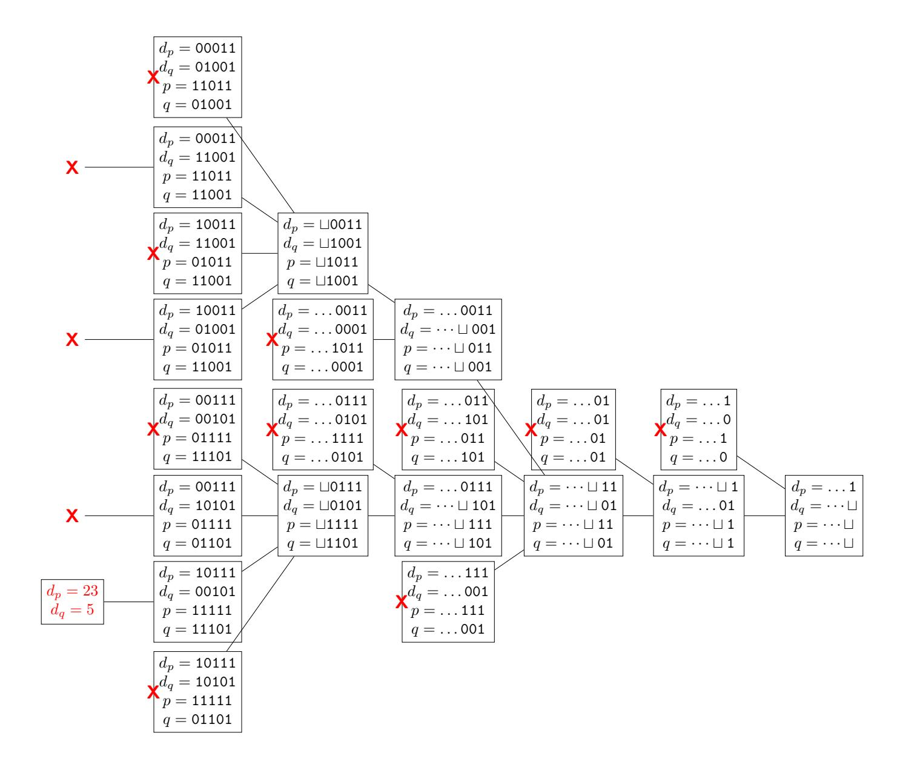

Figure 11: We give a sample branch and prune tree for recovering  $d_p$  and  $d_q$  from known bits, starting from the least significant bits on the right side of the tree. At each bit location, the value of p up to bit i is uniquely determined by the guess for  $d_p$  up to bit i, and the value of q up to bit i is uniquely determined by the buess for  $d_q$  up to bit i. The red X marks the branches that are pruned by verifying the relation  $pq = N \mod 2^i$ .

{25}------------------------------------------------

are known, would result in a tree with exponentially many solutions unless additional information were available to prune the tree.

# <span id="page-25-0"></span>5 Key recovery methods for DSA and ECDSA

# <span id="page-25-1"></span>5.1 DSA and ECDSA preliminaries

From the perspective of partial key recovery, DSA and ECDSA are very similar, and we will cover them together. We will use slightly nonstandard notation to describe each signature scheme to make them as close as possible, so that we can use the same notation to describe the attacks simultaneously.

## <span id="page-25-2"></span>5.1.1 DSA

The Digital Signature Algorithm [\[NIS13\]](#page-44-8) (DSA) is an adaptation of the ElGamal Signature Scheme [\[EG85\]](#page-42-6) that reduces the amount of computation required and the resulting signature size by using Schnorr groups [\[Sch90\]](#page-45-8).

Parameter Generation. A DSA public key includes several global parameters specifying the group to work over: a prime p, a subgroup of order n satisfying n | (p − 1), and an integer g that generates a group of order n mod p, where n is typically much smaller than p, for example 256 bits for a 2048-bit p. A single set of group parameters can be shared across many public keys, or individually generated for a given public key.

To generate a long-term private signing key, an implementation starts by choosing the secret key 0 < d < n and computing y = g <sup>d</sup> mod p. The public key is the tuple (y, g, p, n) and the private key is (d, g, p, n).

Signature Generation. To sign a message m, implementations apply a collision-resistant hash function H to m to obtain a hashed message h = H(m). To generate the signature, the implementation generates an ephemeral secret integer 0 < k < n, and computes the integers r = g <sup>k</sup> mod p mod n, and s = k −1 (h + dr) mod n. The signature is the pair (r, s).

## <span id="page-25-3"></span>5.1.2 ECDSA

The Elliptic Curve Digital Signature Algorithm (ECDSA) is an adaptation of DSA to use elliptic curves instead of Schnorr groups.

Parameter Generation. An ECDSA public key includes global parameters specifying an elliptic curve E over a finite field together with a generator point g of a subgroup over E of order n.

To generate a long-term private signing key, an implementation starts by choosing a secret integer 0 < d < n, and computing the elliptic curve point y = dg on E. The public key is the elliptic curve point y together with the global parameters specifying E, g, and n. The private key is the integer d together with these global parameters.

Signature Generation. To sign a message m, implementations apply a collision-resistant hash function H to m to obtain a hashed message h = H(m). To generate the signature, the implementation generates an ephemeral secret 0 < k < n. The implementation computes the elliptic curve point kg and sets 

{26}------------------------------------------------

the value r to be the x-coordinate of kg. The implementation then computes the integer  $s = k^{-1}(h + dr) \mod n$ . The signature is the pair of integers (r, s).

## <span id="page-26-0"></span>5.1.3 Nonce recovery and (EC)DSA security.

The security of (EC)DSA is extremely dependent on the signature nonce k being securely generated, uniformly distributed, and unique for every signature. If the nonce for one or more signatures is generated in a vulnerable manner, then an attacker may be able to efficiently recover the long-term secret signing key. Because of this property, side channel attacks against (EC)DSA almost universally target nonce generation.

**Key recovery from signature nonce.** For a DSA or ECDSA key, if the nonce k is known for a single signature, it is simple to compute the long-term private key. Rearranging the expression for s, the secret key d can be recovered as

<span id="page-26-2"></span>
$$d = r^{-1}(ks - h) \bmod n \tag{5}$$

# <span id="page-26-1"></span>5.2 (EC)DSA key recovery from most significant bits of the nonce k

There are two families of techniques for (EC)DSA key recovery from most significant bits of the nonce k. Both techniques require knowing information about the nonce used in multiple signatures from the same secret key. We assume that the attacker knows the long-term public signature verification key, and has access to multiple signatures generated using the corresponding secret signing key. The attacker also needs to know the hash of the messages that the signatures correspond to.

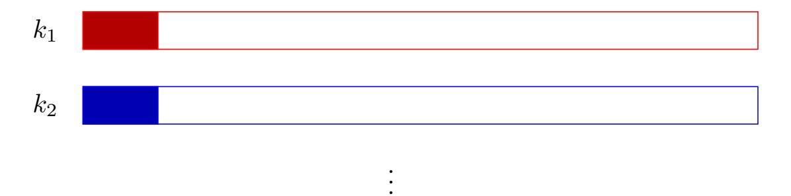

Figure 12: (EC)DSA key recovery from signatures where most significant bits of the nonces are known.

The first technique is via lattices. This is generally considered more straightforward to implement, and works well when more nonce bits are known, and information from fewer signatures is available: we would need to know at least two most significant bits from the nonces of dozens to hundreds of signatures. We cover this technique below.

The second technique is via Fourier analysis. This technique can deal with as little as one known most significant bit from signature nonces, but empirically appears to require an order of magnitude or more signatures than the lattice approach. Recent works report using  $2^{23}$  [ANT<sup>+</sup>20],  $2^{35}$  [ANT<sup>+</sup>20], and

{27}------------------------------------------------

2 <sup>26</sup> [\[TTA18\]](#page-46-3) signatures for record computations. We leave a more detailed discussion of this technique to a future version of this survey. Nice descriptions of the algorithm can be found in [\[DHMP13,](#page-42-7) [TTA18\]](#page-46-3).

## <span id="page-27-0"></span>5.2.1 Lattice attacks

The main idea behind lattice attacks for (EC)DSA key recovery is to formulate the (EC)DSA key recovery problem as an instance of the Hidden Number Problem and then compute the shortest vector of a specially constructed lattice to reveal the solution.

Below we give a simplified example that shows how to recover the key from a small number of signatures when many of the most significant bits of the nonce are zero, and then we will show how to extend the attack to more signatures with fewer bits known from each nonce, and cover the case of arbitrary bits known from the nonce.

Problem setup. Let p = 0xffffffffffffd21f be a 64-bit prime, and let E : y <sup>2</sup> = x <sup>3</sup> + 3 be an elliptic curve over Fp. Let g = (1, 2) be our generator point on E, which has order n = 0xfffffffefa23f437.

We have two ECDSA signatures

$$(r_1,s_1)=$$
(6393e79fbfb40c9c,621ee64e65d1e938)   
on message hash  $h_1=$ ae0f1d8cd0fd6dd1

and

$$(r_2,s_2)=$$
 (3ea8720afa6d03c2, 16fc6aa65bf241ea) on message hash  $h_2=$  8927e246fe4f3941

These signatures both use 32-bit nonces k; that is, we know that their 32 most significant bits are 0.

Cast the problem as a system of equations. Our signatures above satisfy the equivalencies

$$s_1 \equiv k_1^{-1}(h_1 + dr_1) \mod n$$
  
 $s_2 \equiv k_2^{-1}(h_2 + dr_2) \mod n$ 

The values k1, k2, and d are unknown; the other values are known. We can eliminate the variable d and rearrange terms as follows:

$$k_1 - s_1^{-1} s_2 r_1 r_2^{-1} k_2 + s_1^{-1} r_1 h_2 r_2^{-1} - s_1^{-1} h_1 \equiv 0 \mod n$$

Let t = −s −1 1 s2r1r −1 2 and u = s −1 1 r1h2r −1 <sup>2</sup> − s −1 <sup>1</sup> h1. We can then simplify the above as

<span id="page-27-1"></span>
$$k_1 + tk_2 + u \equiv 0 \bmod n \tag{6}$$

We wish to solve for k<sup>1</sup> and k2, and we know that they are both small. Let |k1|, |k2| < K. For our example, we have K = 2<sup>32</sup> .

{28}------------------------------------------------

Construct a lattice. We construct the following lattice basis:

$$B = \begin{bmatrix} n & 0 & 0 \\ t & 1 & 0 \\ u & 0 & K \end{bmatrix}$$

The vector v = (k1, k2, K) is in this lattice by construction, and we expect it to be particularly short.

Calling the BKZ algorithm on B results in a basis that contains this short vector

$$v = (-0x270$$
feca $3, 0x4dbd2db0, 0x100000000)$ 

as the third vector in the reduced basis. We can verify that the value r<sup>1</sup> in our example matches the x-coordinate of k1g, and we can use Equation [5](#page-26-2) to compute the private key d.

More detailed explanation. In our example, we have constructed a lattice that is guaranteed to contain our target vector. In order for this method to work, we hope that it is the shortest vector, or close to the shortest vector in the lattice, and we solve the shortest vector problem in the lattice in order to find it. √

The vector v = (k1, k2, K) has length |v|<sup>2</sup> ≤ 3K by construction. Our lattice has determinant det B = nK. Ignoring constants for the moment, if our lattice were truly random, we would expect the shortest vector to have length ≈ det B1/ dim <sup>B</sup>. Thus if |v|<sup>2</sup> < det B1/ dim <sup>B</sup>, we expect it to be the shortest vector in the lattice, and to be found by a sufficiently good approximation to the shortest vector problem.

For our example, we expect this to be satisfied when K < (nK) 1/3 , or when K < <sup>√</sup> n.

The way we have presented this method may remind the reader of the flavor of the methods in Section [4.2.1.](#page-9-0) The specific lattice construction used here is a sort of "dual" to the constructions from Section [4.2.1,](#page-9-0) in that the target vector is the desired solution to our system of equations. However, in contrast to Section [4.2.1,](#page-9-0) we are not guaranteed to find the solution we desire once we find a sufficiently short vector: this method can fail with probability that decreases the shorter our target vector d is compared to the expected shortest vector length.

The Hidden Number Problem The lattice-based algorithms we describe for solving these problems are based on the Hidden Number Problem introduced by Boneh and Venkatesan [\[BV96\]](#page-41-8). They applied the technique to show that the most significant bits of a Diffie-Hellman shared secret are hardcore. Nguyen and Shparlinski showed how to use this approach to break DSA and ECDSA from information about the nonces [\[NS02,](#page-44-9) [NS03\]](#page-44-10). Various extensions of the technique can deal with different numbers of bits known per signature [\[BvSY14\]](#page-41-2) or errors [\[DDME](#page-41-9)<sup>+</sup>18].

There is another algorithm to solve this problem using Fourier analysis [\[Ble98,](#page-41-10) [DHMP13\]](#page-42-7) originally due to Bleichenbacher; it requires more samples than the lattice approach but can handle fewer bits known.

{29}------------------------------------------------

Scaling to many signatures to decrease the number of bits known. To decrease the number of bits required from each signature, we can incorporate more signatures into the lattice. If we have access to many signatures  $(r_1, s_1), \ldots, (r_m, s_m)$  on message hashes  $h_1, \ldots, h_m$ , we use the same method above to write down equivalencies  $s_i \equiv k_i^{-1}(h_i + dr_i) \mod n$ , then as above we rearrange terms and eliminate the variable d to obtain

<span id="page-29-0"></span>
$$k_{1} + t_{1}k_{m} + u_{1} \equiv 0 \mod n$$

$$k_{2} + t_{2}k_{m} + u_{2} \equiv 0 \mod n$$

$$\vdots$$

$$k_{m-1} + t_{m-1}k_{m} + u_{m-1} \equiv 0 \mod n$$
(7)

We then construct the lattice

$$B = \begin{bmatrix} n & & & & & \\ & n & & & & \\ & & \ddots & & & \\ & & n & & \\ t_1 & t_2 & \dots & t_m & 1 \\ u_1 & u_2 & \dots & u_m & 0 & K \end{bmatrix}$$

In order to solve SVP, we must run an algorithm like BKZ with block size  $\dim L(B) = m+1$ . Using BKZ to look for the shortest vector can be done relatively efficiently up to dimension around 100 currently; beyond that it becomes increasingly expensive. In practice, one can often achieve a faster running time for fixed parameters by using more samples to construct a larger dimension lattice, and applying BKZ with a smaller block size to find the target vector. This method can recover a secret key from knowledge of the 4 most significant bits of nonces from 256-bit ECDSA signatures using about 70 samples, and 3 most significant bits using around 95 samples. For fewer bits known, either the Fourier analysis technique or a more powerful application of these lattice techniques is required, along with significantly more computational power.

**Known nonzero most significant bits.** If the most significant bits of the  $k_i$  are nonzero and known, we can write  $k_i = a_i + b_i$ , where the  $a_i$  are known, and the  $b_i$  are small, so satisfy some bound  $|b_i| < K$ . Then substituting into Equation 6, we obtain

$$(a_i + b_i) + t_i(a_m + b_m) + u_i \equiv 0 \bmod n$$
$$b_i + t_i b_m + u_i + a_i + t_i a_m \equiv 0 \bmod n$$

Thus we can let  $u'_i = u_i + a_i + t_i b_m$ , and use the same lattice construction as above, with  $u'_i$  substituted for  $u_i$ .

**Nonce rebalancing.** The signature nonces  $k_i$  take values in the range  $0 < k_i < n$ , but the lattice construction bounds the absolute value  $|k_i|$ . Thus if we know that  $0 < k_i < K$  for some bound K, we can achieve a tighter bound by

{30}------------------------------------------------

renormalizing the signatures. Let  $k'_i = k_i - K/2$ , so that  $|k'_i| < K/2$ . Then we can write Equations 7 as

$$k_i + t_i k_m + u_i \equiv 0 \mod n$$
  
 $(k'_i + K/2 + t_i (k'_m + K/2) + u_i \equiv 0 \mod n$   
 $k'_i + t_i k'_m + (t_i + 1)K/2 + u_i \equiv 0 \mod n$ 

Thus we have an equivalent problem with  $t'_i = t_i$ ,  $u'_i = (t_i + 1)K/2 + u_i$ , and K' = K/2, and can solve as before. This optimization can make a significant difference in practice by reducing the number of required samples.

# <span id="page-30-0"></span>5.2.2 (EC)DSA key recovery from least significant bits of the nonce k

The attack described in the previous section works just as well for known least significant bits of the (EC)DSA nonce.

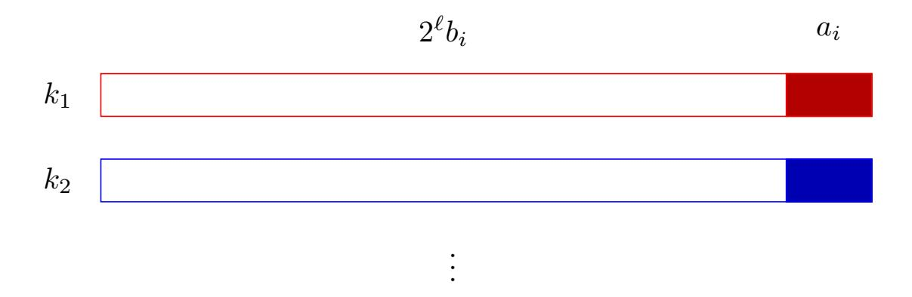

Figure 13: (EC)DSA key recovery from signatures where least significant bits of the nonces are known.

**Problem setup.** We input a collection (EC)DSA signatures  $(r_i, s_i)$  on message hashes  $h_i$ . For each signature, we know the least significant bits, so the signature nonces  $k_i$  satisfy

$$k_i = a_i + 2^{\ell} b_i$$

for known  $a_i$ , and  $b_i$  unknown but satisfying  $|b_i| < B$ . Substituting these into Equations 7, we get

$$a_i + 2^{\ell}b_i + t_i(a_m + 2^{\ell}b_m) + u_i \equiv 0 \mod n$$
  
 $2^{\ell}b_i + 2^{\ell}t_ib_m + a_i + t_ia_m + u_i \equiv 0 \mod n$   
 $b_i + t_ib_m + 2^{-\ell}(a_i + t_ia_m + u_i) \equiv 0 \mod n$ 

We have an equivalent instance of the problem with  $t'_i = t_i$ ,  $u'_i = 2^{-\ell}(a_i + t_i a_m + u_i)$ , and B' = B, and solve as above.

{31}------------------------------------------------

#### <span id="page-31-0"></span>5.2.3 (EC)DSA key recovery from middle bits of the nonce k

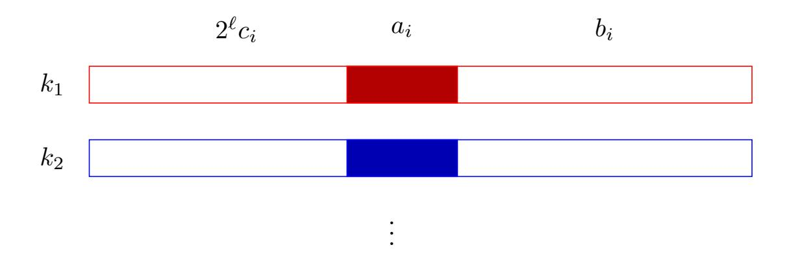

Figure 14: (EC)DSA key recovery from signatures where middle bits of the nonces are known.

Recovering an ECDSA key from middle bits of the nonce k is slightly more complex than the methods discussed above, because we have two unknown "chunks" of the nonce to recover per signature. Fortunately, we can deal with these by extending the methods to multiple variables per signature. The method we will use here is similar to the multivariate extension in Section 4.2.4, but this case is simpler.

**Problem setup.** We will use the same elliptic curve group parameters as above. Let p = 0xffffffffffffffffffffffffffffffffffff

We have two ECDSA signatures

$$(r_1,s_1)=$$
(1a4adeb76b4a90e0, eba129bb2f97f7cd) on message hash  $h_1=$ 608932fcfaa7785d

and

$$(r_2,s_2)=$$
 (c4e5bec792193b51,0202d6eecb712ae3) on message hash  $h_2=$  4de972930ab4a534

We know some middle bits of the corresponding nonces. Let

$$a_1 = 0 \text{x} 50 \text{e} 2 \text{f} d 5 d 8 0 0 0$$

be the middle 34 bits of the signature nonce  $k_1$  used for the first signature above. The first and last 15 bits are unknown. Let

$$a_2 = 0$$
x172930ab48000

be the middle 34 bits of the signature nonce  $k_2$  used for the second signature above.

{32}------------------------------------------------

Cast the problem as a system of equations. As above, our two signature nonces  $k_1$  and  $k_2$  satisfy the

<span id="page-32-0"></span>
$$k_1 + tk_2 + u \equiv 0 \bmod n \tag{8}$$

where  $t = -s_1^{-1} s_2 r_1 r_2^{-1}$  and  $u = s_1^{-1} r_1 h_2 r_2^{-1} - s_1^{-1} h_1$ .

Since we know the middle bits of  $k_1$  and  $k_2$  are  $a_1$  and  $a_2$  respectively, we can write

$$k_1 = a_1 + b_1 + 2^{\ell}c_1$$
 and  $k_2 = a_2 + b_2 + 2^{\ell}c_2$ 

where  $b_1$ ,  $c_1$ ,  $b_2$ , and  $c_2$  are unknown but small, less than some bound K. In our example, we have  $|b_1|$ ,  $|b_2|$ ,  $|c_1|$ ,  $|c_2| \le 2^{15}$  and  $\ell = 64 - 15 = 49$ .

Substituting and rearranging into Equation 8, we have

$$b_1 + 2^{\ell}c_1 + tb_2 + 2^{\ell}tc_2 + a_1 + ta_2 + u \equiv 0 \mod n$$

Let  $u' = a_1 + ta_2 + u$ . We wish to find the small solution  $x_1 = b_1$ ,  $y_1 = c_1$ ,  $x_2 = b_2$ ,  $y_2 = c_2$  to the linear equation

<span id="page-32-1"></span>
$$f(x_1, y_2, x_2, y_2) = x_1 + 2^{\ell} y_1 + t x_2 + 2^{\ell} t y_2 + u' \equiv 0 \bmod n \tag{9}$$

Construct a lattice. We construct the following lattice basis:

$$B = \begin{bmatrix} K & K \cdot 2^{49} & Kt & Kt \cdot 2^{49} & u' \\ & Kn & & & \\ & & Kn & & \\ & & & Kn & \\ & & & & n \end{bmatrix}$$

If we call the BKZ algorithm on B, we obtain a basis that contains the vector

$$v = (\mathtt{0x6589e5fb1823}K, -\mathtt{0x42b0986d3e11}K, \mathtt{0x8d3b91566f89}K, \mathtt{0x41be198fb49e}K, -\mathtt{0x1dd626d2645d8f7e})$$

This corresponds to the linear equation

$$\begin{array}{l} {\tt 0x6589e5fb1823} x_1 - {\tt 0x42b0986d3e11} y_1 + {\tt 0x8d3b91566f89} x_2 \\ + {\tt 0x41be198fb49e} y_2 - {\tt 0x1dd626d2645d8f7e} = 0 \end{array}$$

We can do the same for the next three short vectors in the basis, and obtain four linear polynomials in our four unknowns. Solving the system, we obtain the solutions

$$x_1 = 0$$
x241c  $y_1 = 0$ x39a2  $x_2 = 0$ x2534  $y_2 = 0$ x26f4

{33}------------------------------------------------

More detailed explanation. The row vectors of the lattice correspond to the weighted coefficient vectors of the linear polynomial f in Equation 9,  $nx_1$ ,  $ny_1$ ,  $nx_2$ , and  $ny_2$ . Each of these linear polynomials vanishes by construction modulo n when evaluated at the desired solution  $x_1 = b_1$ ,  $y_1 = c_1$ ,  $x_2 = b_2$ ,  $y_2 = c_2$ , and thus so does any linear polynomial corresponding to a vector in this lattice. If we can find a lattice vector whose  $\ell_1$  norm is less than n, then the corresponding linear equation vanishes over the integers when evaluated at the desired solution. Since we have four unknowns, if we can find four sufficiently short lattice vectors corresponding to four linearly independent equations, we can solve for our desired unknowns.

The determinant of our example lattice is det  $B = K^4 n^4$ , and the lattice has dimension 5. Thus, ignoring approximation factors and constants, we expect to find a vector of length det  $B^{1/\dim B} = (Kn)^{(4/5)}$ . This is less than n when  $K^4 < n$ ; in our example this is satisfied because we have chosen a 15-bit K and a 64-bit n.

The determinant bounds guarantee that we will find one short lattice vector, but do not guarantee that we will find four short lattice vectors. For that, we rely on the heuristic that the reduced vectors of a random lattice are close to the same length.

## <span id="page-33-0"></span>5.2.4 (EC)DSA key recovery from many chunks of nonce bits

The above technique can be extended to an arbitrary number of variables.

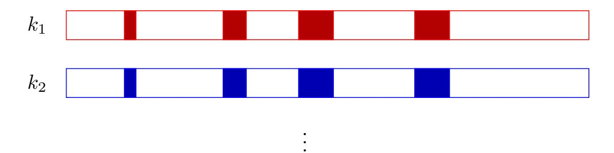

(EC)DSA key recovery from signatures where multiple chunks of the nonces are known.

The extension is called the Extended Hidden Number problem [HR07] and can be used to solve for ECDSA keys when many chunks of signature nonces are known. Each unknown "chunk" of nonce in each signature introduces a new variable, so the resulting lattice will have dimension one larger than the total number of unknowns; if there are m signatures and h unknown chunks of nonce per signature, the lattice will have dimension mh+1. We expect this technique to find the solution when the parameters are such that the system of equations has a unique solution. If the size of each chunk is K, heuristically this will happen when  $K^{mh} < n^{m-1}$ . This technique has been used in practice in [FWC16] and further explored in [DPP20].

{34}------------------------------------------------

# <span id="page-34-0"></span>6 Key recovery method for the Diffie-Hellman Key Exchange

# <span id="page-34-1"></span>6.1 Finite field and elliptic curve Diffie-Hellman preliminaries

The Diffie-Hellman (DH) key exchange protocol [\[DH76\]](#page-42-10) allows two parties to create a common secret in a secure manner. We summarize the protocol in the context of finite fields and elliptic curves.

Finite field Diffie-Hellman. Finite-field Diffie-Hellman parameters are specified by a prime p and a group generator g. Common implementation choices are p a safe prime, i.e., q = (p − 1)/2 is prime, in which case g is often equal to 2, 3 or 4, or p is chosen such that p − 1 has a 160, 224, or 256-bit prime factor q and g generates a subgroup of F ∗ <sup>p</sup> of order q. Key exchange is performed as follows:

- 1. Alice chooses a random private key a, where 1 ≤ a < q and computes a public key A = g <sup>a</sup> mod p.
- 2. Bob chooses a random private key b, where 1 ≤ b < q and computes a public key B = g <sup>b</sup> mod p.
- 3. Alice and Bob exchange the public keys.
- 4. Alice computes s<sup>A</sup> = B<sup>a</sup> mod p.
- 5. Bob computes s<sup>B</sup> = A<sup>b</sup> mod p.

Because B<sup>a</sup> mod p = (g b ) <sup>a</sup> mod p = (g a ) <sup>b</sup> mod p = A<sup>b</sup> mod p, we have s<sup>A</sup> = sB. The latter is the secret that now Alice and Bob share.

Elliptic Curve Diffie-Hellman The Elliptic Curve Diffie-Hellman (ECDH) protocol is the elliptic curve counterpart of the Diffie-Hellman key exchange protocol. In ECDH, Alice and Bob agree on an elliptic curve E over a finite field and a generator G of order q. The protocol proceeds as follows:

- 1. Alice chooses a random private integer a, where 1 ≤ a < q and computes a public key A = aG.
- 2. Bob chooses a random private integer b, where 1 ≤ b < q and computes a public key B = bG.
- 3. Alice and Bob exchange the public keys.
- 4. Alice computes s<sup>A</sup> = aB.
- 5. Bob computes s<sup>B</sup> = bA.

The shared secret is s<sup>A</sup> = aB = a(bG) = b(aG) = bA = sB.

{35}------------------------------------------------

# <span id="page-35-0"></span>6.2 Most significant bits of finite field Diffie-Hellman shared secret

The Hidden Number Problem approach we used in the previous section to recover ECDSA or DSA keys from information about the nonces can also be used to recover a Diffie-Hellman shared secret from most significant bits.

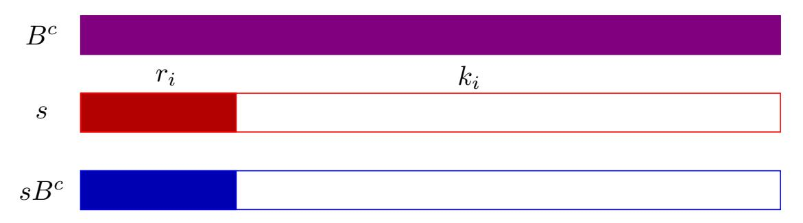

Recovering Diffie-Hellman shared secret from most significant bits of s.

Problem setup. Let p = 0xffffffffffffffffffffffffffffc3a7 be a 128 bit prime used for finite field Diffie-Hellman, and let g = 2 be a generator of the multiplicative group modulo p.

Let s the Diffie-Hellman shared secret s between public keys

$$A = g^a \bmod p = 0$$
x3526bb85185259cd42b61e5532fe60e0

and

$$B = g^b \mod p = 0$$
x564df0b92ea00ea314eb5a246b01ac9c.

We have learned the value of the first 65 bits of s: let

$$r_1 = 0$$
x3330422f6047011b80000000000000000000000000000000000

so we know that s = r<sup>1</sup> + k<sup>1</sup> where k<sup>1</sup> < K = 2<sup>63</sup> .

Let c = 0x56e112dac14f4a4cc02951414aa43a38. We have also learned the most significant 65 bits of the Diffie-Hellman shared secret between AC = g <sup>a</sup>+<sup>c</sup> = g a g <sup>c</sup> mod p and B. Let

$$r_2 = \mathtt{0x80097373878e37d2000000000000000000000000000000000000$$

We know that g (a+c)<sup>b</sup> = g abg bc = sB<sup>c</sup> mod p. Let t = B<sup>c</sup> so st = r<sup>2</sup> + k<sup>2</sup> mod p where k<sup>2</sup> < K = 2<sup>63</sup> .

Cast the problem as a system of equations. We have two relations

$$s = r_1 + k_1 \bmod p \qquad st = r_2 + k_2 \bmod p$$

where s, k1, and k<sup>2</sup> are small and unknown, and r1, r2, and t are known. We can eliminate the variable s to obtain the linear equation

$$k_1 - t^{-1}k_2 + r_1 - t^{-1}r_2 \equiv 0 \bmod p$$

We now have a linear equation in the same form as the Hidden Number Problem we solved in the previous section.

{36}------------------------------------------------

Construct a lattice. We construct the lattice basis

$$M = \begin{bmatrix} p & & \\ t^{-1} & 1 & \\ a_1 - t^{-1}a_2 & & K \end{bmatrix}$$

If we call the LLL algorithm on M, we obtain a basis that contains the vector

(−0x2ddb23aa673107bd, −0x216afa75f66a39d5, 0x10000000000000000)

This corresponds to our desired solution (k1, k2, K), although if the Diffie-Hellman assumption is true we cannot verify its correctness.

More detailed explanation. This method is due to Boneh and Venkatesan [\[BV96\]](#page-41-8), and was the original motivation for their formulation of the Hidden Number Problem. The Raccoon attack recently demonstrated an attack scenario using this technique in the context of TLS [\[MBA](#page-44-4)+20].

This method can be adapted to multiple samples with the same number of bits required as the attacks on ECDSA. Knowing the most significant bits of s is not necessary either; we only need the most significant bits of known multiples t<sup>i</sup> of s.

# <span id="page-36-0"></span>6.3 Discrete log from contiguous bits of Diffie-Hellman secret exponents

This section addresses the problem of Diffie-Hellman key recovery when the known partial information is part of one or the other of the secret exponents. The technique we apply in this section is Pollard's kangaroo (also known as lambda) algorithm [\[Pol78\]](#page-45-9). Unlike the techniques of the previous sections, which are generally efficient when the attacker's knowledge of the key is above a certain threshold, and either inefficient or infeasible when the attacker's knowledge of the key is below this threshold, this algorithm runs in exponential time: square root of the size of the interval. Thus it provides a significant benefit over brute force, but in practice is likely limited to 80 bits or fewer of key recovery unless you have access to an unusually large amount of computational resources.

The Pollard kangaroo algorithm is a generic discrete logarithm algorithm that is designed to compute discrete logarithms when the discrete logarithm lies in a small known interval. It applies to both elliptic curve and finite field discrete logarithms. We will use finite field discrete logarithms for our examples, but the algorithm is the same in the elliptic curve context.

## <span id="page-36-1"></span>6.3.1 Known most significant bits of the Diffie-Hellman secret exponent.

Problem Setup. Using the same notation for finite fields as in Section [6.1,](#page-34-1) let A be a a Diffie-Hellman public key, p be a prime modulus, and g a generator of a multiplicative group of order q modulo p. These values are all public, and thus we assume that they are known. Imagine that we have obtained a consecutive fraction of the most significant bits of the secret exponent a, and we wish to recover the unknown bits of a to reconstruct the secret.

{37}------------------------------------------------

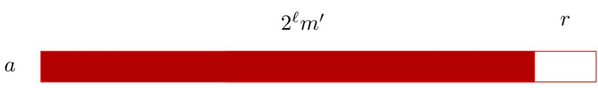

Figure 15: Recovering Diffie-Hellman shared secret with most significant bits of secret exponent.

In other words, let a=m+r, where  $m=2^{\ell}m'$  for some known integers m' and  $\ell$ , and  $0 \le r < 2^{\ell}$  is unknown. Let w be the width of the interval that r is contained in: here we have  $w=2^{\ell}$ .

For our concrete example, let p = Oxfef3 be a 16-bit prime, and let g = 3 be a multiplicative generator of the group of order q = (p-1)/2 = Ox7f79 modulo p. We know a Diffie-Hellman public key A = Oxa163 and we are given the most significant bits of the secret exponent a but the 8 least significant bits of a are unknown, corresponding to m = Ox1400,  $\ell = 8$ , and  $r < 2^8$ .

Take some pseudorandom walks. We define a deterministic pseudorandom walk along values  $s_0, s_1, \ldots, s_i, \ldots$  in our multiplicative group modulo p (and the corresponding exponents  $s_0 = g^{x_0} \mod p, \ldots$ , when known) by choosing a set of random step lengths for the exponents in  $[0, \sqrt{w}]$ . For our example, we pseudorandomy generated the lengths (1, 3, 7, 10).

$$s_{i+1} \to \begin{cases} s_i g \mod p & \text{if } s_i \equiv 0 \mod 4 \\ s_i g^3 \mod p & \text{if } s_i \equiv 1 \mod 4 \\ s_i g^7 \mod p & \text{if } s_i \equiv 2 \mod 4 \\ s_i g^{10} \mod p & \text{if } s_i \equiv 3 \mod 4 \end{cases}$$

This is a small sample pseudorandom walk generated to run our small example computation. Each step in the pseudorandom walk is determined by the representation of the previous value as an integer  $0 \le s_i < p$ .

We run two random walks. The first random walk, which is called "the tame kangaroo", starts in the middle of the interval of exponents to be searched, at  $s_0 = g^{m + \lfloor \frac{w}{2} \rfloor} \mod p$ . In our example, we have m = 0x1400 and  $w = 2^8 = 256$ , so the tame kangaroo begins at  $s_0 = g^{0x1480} \mod p = 0x9581$ . We take  $\sqrt{w}$  steps along this deterministic pseudorandom path, and store the values  $s_i$  together with the exponent  $x_i$  that is computed at each step so that  $g^{x_i} \equiv s_i \mod p$ .

The second random walk is called the "wild kangaroo". It begins at the target  $s_0' = A = 0$ xa163 and follows the same rules as above. We do not know the secret exponent a, but at every step of the walk, we know that  $s_i' = Ag^{x_i'} \mod p = g^{a+x_i'} \mod p$ . We take at most  $\sqrt{w}$  steps along this deterministic pseudorandom path.

If at some point the wild kangaroo's path intersects the tame kangaroo's path, then we are done and can compute the result.

{38}------------------------------------------------

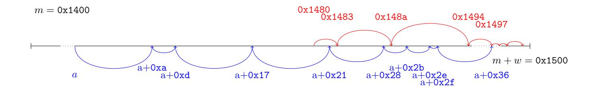

Compute the discrete log. We know that  $s_i = s'_j$  for  $s_i$  on the tame kangaroo's path and  $s'_j$  on the wild kangaroo's path. Thus we have

$$s_i = s'_j \mod p$$

$$g^{x_i} = g^{a+x'_j} \mod p$$

$$x_i = a + x'_j \mod q$$

$$x_i - x'_j = a \mod q$$

In our example, the kangaroos' paths intersected at  $g^{0x1497}$  and  $g^{a+0x36}$ ; we can thus compute a=0x1461 and verify that  $g^{0x1461}\equiv 0xa163 \bmod p$ .

More detailed explanation. Pollard gave the original version of this algorithm in [Pol78]. Teske gives an alternative random walk in [Tes00] that should provide an advantage in theory, but in practice, it seems that no noticeable advantage is gained from it.

We expect this algorithm to reach a collision in  $O(\sqrt{w})$  steps; this algorithm thus takes  $O(\sqrt{w})$  time to compute a discrete log in an interval of width w. Thus in principle, the armchair cryptanalyst should be able to compute discrete logarithms within intervals of 64 to 80 bits, and those with more resources should be able to go slightly higher than this.

In order to scale to these larger bit sizes, several changes are necessary. First, one typically uses a random walk with many more subdivisions: 32 might be a typical value. Second, van Oorschot and Wiener [OW99] show how to parallelize the kangaroo algorithm using the method of distinguished points. The idea behind this method is that storing the entire tame kangaroo walk will require too much memory. Instead, one stores a subset of values that satisfy some distinguishing property, such as starting with a certain number of zeros. Then the algorithm launches many wild and tame kangaroo walks, storing distinguished points in a central database. The algorithm is finished when a wild and a tame kangaroo land on the same distinguished point.

Elliptic curves. This algorithm applies equally well to elliptic curve discrete logarithm. One can gain a  $\sqrt{2}$  improvement in the complexity of the algorithm as a by-product of the efficiency of inversion on elliptic curves. Since the points P and -P share the same x-coordinate, one can then do a pseudorandom walk on equivalence classes for the relation  $P \sim \pm P$ .

{39}------------------------------------------------

#### <span id="page-39-0"></span>6.3.2 Unknown most significant bits of the Diffie-Hellman secret exponent

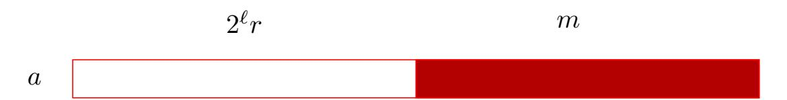

Figure 16: Recovering Diffie-Hellman shared secret with least significant bits

It is straightforward to extend the kangaroo method to solve for unknown most significant bits of the exponent. As before, we have a known A = g <sup>a</sup> mod p for unknown a that we wish to solve for. In the case of unknown most significant bits, we know an m such that a = m + 2` r for some unknown r satisfying 0 ≤ r < w. The offset ` is known. Then we can reduce to the previous problem by running the kangaroo algorithm on the value A<sup>0</sup> = g 2 −` A = g 2 <sup>−</sup>`+m+2` <sup>r</sup> mod p.

# <span id="page-39-1"></span>6.3.3 Open problem: Multiple unknown chunks of the Diffie-Hellman secret exponent

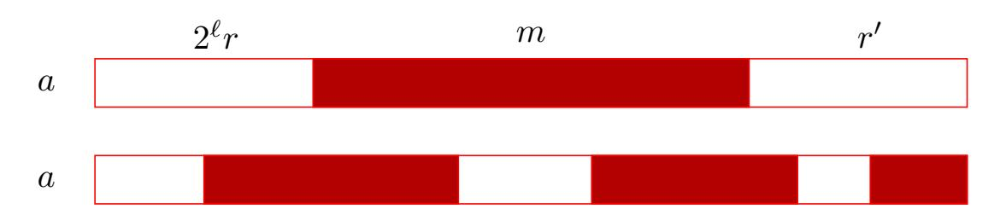

Figure 17: Recovering Diffie-Hellman shared secret with multiple chunks of unknown bits.

The case of recovering a Diffie-Hellman secret key in practice with multiple chunks of unknown bits is still an open problem. In theory, finding the secret key in this particular case can be done using a multi-dimensional variant of the discrete log problem. The latter generalizes the discrete logarithm problem in an interval to the case of multiple intervals, see [\[Rup10,](#page-45-11) Chapter 6] for further details. In [\[Rup10\]](#page-45-11), Ruprai analyzes the multi-dimensional discrete log problem for small dimensions. This approach appears to run into boundary issues for multi-dimensional pseudorandom walks when the dimension is greater than five, suggesting that this approach may not extend to the case of recovering many unknown chunks of a Diffie-Hellman exponent.

# <span id="page-39-2"></span>7 Conclusion

This work surveyed key recovery methods with partial information for popular public key cryptographic algorithms. We focused in particular on the most widely-deployed asymmetric primitives: RSA, (EC)DSA and Diffie-Hellman. The motivation for these algorithms arises from a variety of side-channel attacks.

{40}------------------------------------------------

While the existence of key recovery algorithms for certain cases may determine whether a particular vulnerability is exploitable or not, we emphasize that these thresholds for an efficiently exploitable key recovery attack should not be used to guide countermeasures. Instead, implementations should strive to have fully constant-time operations for all cryptographic operations to protect against side-channel attacks.

# <span id="page-40-0"></span>8 Acknowledgements

Pierrick Gaudry, Daniel Genkin, and Yuval Yarom made significant contributions to early versions of this work. We thank Akira Takahashi and Billy Bob Brumley for clarifications and suggesting additional citations. This work was funded by the US National Science Foundation under grants no. 1513671 and 1651344.

# References

- <span id="page-40-6"></span><span id="page-40-3"></span>[ANT+20] Diego F. Aranha, Felipe Rodrigues Novaes, Akira Takahashi, Mehdi Tibouchi, and Yuval Yarom. LadderLeak: Breaking ECDSA with less than one bit of nonce leakage. In Jay Ligatti, Xinming Ou, Jonathan Katz, and Giovanni Vigna, editors, ACM CCS 20, pages 225–242. ACM Press, November 2020.
  - [AS08] Onur Acii¸cmez and Werner Schindler. A vulnerability in RSA implementations due to instruction cache analysis and its demonstration on OpenSSL. In Tal Malkin, editor, CT-RSA 2008, volume 4964 of LNCS, pages 256–273. Springer, Heidelberg, April 2008.
  - [ASK07] Onur Acii¸cmez, Werner Schindler, and C¸ etin Kaya Ko¸c. Cache based remote timing attack on the AES. In Masayuki Abe, editor, CT-RSA 2007, volume 4377 of LNCS, pages 271–286. Springer, Heidelberg, February 2007.
- <span id="page-40-5"></span><span id="page-40-2"></span>[BBG+17] Daniel J. Bernstein, Joachim Breitner, Daniel Genkin, Leon Groot Bruinderink, Nadia Heninger, Tanja Lange, Christine van Vredendaal, and Yuval Yarom. Sliding right into disaster: Leftto-right sliding windows leak. In Wieland Fischer and Naofumi Homma, editors, CHES 2017, volume 10529 of LNCS, pages 555– 576. Springer, Heidelberg, September 2017.
- <span id="page-40-4"></span><span id="page-40-1"></span>[BCC<sup>+</sup>13] Daniel J. Bernstein, Yun-An Chang, Chen-Mou Cheng, Li-Ping Chou, Nadia Heninger, Tanja Lange, and Nicko van Someren. Factoring RSA keys from certified smart cards: Coppersmith in the wild. In Kazue Sako and Palash Sarkar, editors, ASI-ACRYPT 2013, Part II, volume 8270 of LNCS, pages 341–360. Springer, Heidelberg, December 2013.
  - [Ber05] Daniel J. Bernstein. Cache-timing attacks on AES, 2005.

{41}------------------------------------------------

- <span id="page-41-1"></span>[BH09] Billy Bob Brumley and Risto M. Hakala. Cache-timing template attacks. In Mitsuru Matsui, editor, ASIACRYPT 2009, volume 5912 of LNCS, pages 667–684. Springer, Heidelberg, December 2009.
- <span id="page-41-10"></span>[Ble98] Daniel Bleichenbacher. Chosen ciphertext attacks against protocols based on the RSA encryption standard PKCS #1. In Hugo Krawczyk, editor, CRYPTO'98, volume 1462 of LNCS, pages 1– 12. Springer, Heidelberg, August 1998.
- <span id="page-41-6"></span>[BM03] Johannes Bl¨omer and Alexander May. New partial key exposure attacks on RSA. In Dan Boneh, editor, CRYPTO 2003, volume 2729 of LNCS, pages 27–43. Springer, Heidelberg, August 2003.
- <span id="page-41-7"></span>[Bon98] Dan Boneh. The decision Diffie-Hellman problem. In Third Algorithmic Number Theory Symposium (ANTS), volume 1423 of LNCS. Springer, Heidelberg, 1998. Invited paper.
- <span id="page-41-0"></span>[Boo51] Andrew D. Booth. A signed binary mutiplication technique. Q. J. Mech. Appl. Math., 4(2):236–240, January 1951.
- <span id="page-41-4"></span>[BR95] Mihir Bellare and Phillip Rogaway. Optimal asymmetric encryption. In Alfredo De Santis, editor, EUROCRYPT'94, volume 950 of LNCS, pages 92–111. Springer, Heidelberg, May 1995.
- <span id="page-41-3"></span>[BT11] Billy Bob Brumley and Nicola Tuveri. Remote timing attacks are still practical. In Vijay Atluri and Claudia D´ıaz, editors, ES-ORICS 2011, volume 6879 of LNCS, pages 355–371. Springer, Heidelberg, 2011.
- <span id="page-41-8"></span>[BV96] Dan Boneh and Ramarathnam Venkatesan. Hardness of computing the most significant bits of secret keys in Diffie-Hellman and related schemes. In Neal Koblitz, editor, CRYPTO'96, volume 1109 of LNCS, pages 129–142. Springer, Heidelberg, August 1996.
- <span id="page-41-2"></span>[BvSY14] Naomi Benger, Joop van de Pol, Nigel P. Smart, and Yuval Yarom. "ooh aah... just a little bit": A small amount of side channel can go a long way. In Lejla Batina and Matthew Robshaw, editors, CHES 2014, volume 8731 of LNCS, pages 75–92. Springer, Heidelberg, September 2014.
  - [Cop96] Don Coppersmith. Finding a small root of a bivariate integer equation; factoring with high bits known. In Ueli M. Maurer, editor, EUROCRYPT'96, volume 1070 of LNCS, pages 178–189. Springer, Heidelberg, May 1996.
- <span id="page-41-9"></span><span id="page-41-5"></span>[DDME<sup>+</sup>18] Fergus Dall, Gabrielle De Micheli, Thomas Eisenbarth, Daniel Genkin, Nadia Heninger, Ahmad Moghimi, and Yuval Yarom. Cachequote: Efficiently recovering long-term secrets of sgx epid

{42}------------------------------------------------

- via cache attacks. IACR Transactions on Cryptographic Hardware and Embedded Systems, 2018(2):171–191, May 2018.
- <span id="page-42-10"></span>[DH76] Whitfield Diffie and Martin E. Hellman. New directions in cryptography. IEEE Trans. Information Theory, 22(6):644–654, 1976.
- <span id="page-42-9"></span><span id="page-42-8"></span><span id="page-42-7"></span><span id="page-42-6"></span><span id="page-42-5"></span><span id="page-42-4"></span><span id="page-42-3"></span><span id="page-42-2"></span><span id="page-42-1"></span><span id="page-42-0"></span>[DHMP13] Elke De Mulder, Michael Hutter, Mark E. Marson, and Peter Pearson. Using Bleichenbacher's solution to the hidden number problem to attack nonce leaks in 384-bit ECDSA. In Guido Bertoni and Jean-S´ebastien Coron, editors, CHES 2013, volume 8086 of LNCS, pages 435–452. Springer, Heidelberg, August 2013.
  - [DPP20] Gabrielle De Micheli, R´emi Piau, and C´ecile Pierrot. A tale of three signatures: Practical attack of ECDSA with wNAF. In Abderrahmane Nitaj and Amr M. Youssef, editors, AFRICACRYPT 20, volume 12174 of LNCS, pages 361–381. Springer, Heidelberg, July 2020.
  - [EG85] Taher El Gamal. A public key cryptosystem and a signature scheme based on discrete logarithms. IEEE Trans. Information Theory, 31(4):469–472, 1985.
  - [EL85] Wim Van Eck and Neher Laborato. Electromagnetic radiation from video display units: An eavesdropping risk? Computers and Security, 4:269–286, 1985.
  - [FH08] J. Ferrigno and M. Hlavac. When AES blinks: Introducing optical side channel. Information Security, IET, 2:94 – 98, 10 2008.
  - [FWC16] Shuqin Fan, Wenbo Wang, and Qingfeng Cheng. Attacking OpenSSL implementation of ECDSA with a few signatures. In Edgar R. Weippl, Stefan Katzenbeisser, Christopher Kruegel, Andrew C. Myers, and Shai Halevi, editors, ACM CCS 2016, pages 1505–1515. ACM Press, October 2016.
    - [Gar59] Harvey L. Garner. The residue number system. IRE Trans. Electron. Computers, EC-8(2):140–147, Jun 1959.
    - [Gor98] Daniel M. Gordon. A survey of fast exponentiation methods. J. Algorithms, 27(1):129–146, April 1998.
  - [GST14] Daniel Genkin, Adi Shamir, and Eran Tromer. RSA key extraction via low-bandwidth acoustic cryptanalysis. In Juan A. Garay and Rosario Gennaro, editors, CRYPTO 2014, Part I, volume 8616 of LNCS, pages 444–461. Springer, Heidelberg, August 2014.
    - [HG] Nicholas A Howgrave-Graham. Computational Mathematics Inspired by RSA. PhD thesis.

{43}------------------------------------------------

- <span id="page-43-6"></span>[HG97] Nicholas Howgrave-Graham. Finding small roots of univariate modular equations revisited. In Michael Darnell, editor, Crytography and Coding, pages 131–142, Berlin, Heidelberg, 1997. Springer Berlin Heidelberg.
- <span id="page-43-7"></span>[HG01] Nick Howgrave-Graham. Approximate integer common divisors. pages 51–66, 2001.
- <span id="page-43-8"></span>[HM08] Mathias Herrmann and Alexander May. Solving linear equations modulo divisors: On factoring given any bits. In Josef Pieprzyk, editor, ASIACRYPT 2008, volume 5350 of LNCS, pages 406–424. Springer, Heidelberg, December 2008.
- <span id="page-43-9"></span>[HR07] Martin Hlav´ac and Tom´as Rosa. Extended hidden number problem and its cryptanalytic applications. In Eli Biham and Amr M. Youssef, editors, SAC 2006, volume 4356 of LNCS, pages 114–133. Springer, Heidelberg, August 2007.
- <span id="page-43-5"></span>[HS09] Nadia Heninger and Hovav Shacham. Reconstructing RSA private keys from random key bits. In Shai Halevi, editor, CRYPTO 2009, volume 5677 of LNCS, pages 1–17. Springer, Heidelberg, August 2009.
- <span id="page-43-1"></span>[HS14] Michael Hutter and J¨orn-Marc Schmidt. The temperature side channel and heating fault attacks. Cryptology ePrint Archive, Report 2014/190, 2014. .
- <span id="page-43-2"></span>[HSH+08] J. Alex Halderman, Seth D. Schoen, Nadia Heninger, William Clarkson, William Paul, Joseph A. Calandrino, Ariel J. Feldman, Jacob Appelbaum, and Edward W. Felten. Lest we remember: Cold boot attacks on encryption keys. In Paul C. van Oorschot, editor, USENIX Security 2008, pages 45–60. USENIX Association, July / August 2008.
- <span id="page-43-4"></span>[IGA+15] Mehmet Sinan Inci, Berk G¨ulmezoglu, Gorka Irazoqui Apecechea, Thomas Eisenbarth, and Berk Sunar. Seriously, get off my cloud! cross-vm rsa key recovery in a public cloud. IACR Cryptology ePrint Archive, 2015:898, 2015.
- <span id="page-43-3"></span><span id="page-43-0"></span>[KHF<sup>+</sup>19] Paul Kocher, Jann Horn, Anders Fogh, Daniel Genkin, Daniel Gruss, Werner Haas, Mike Hamburg, Moritz Lipp, Stefan Mangard, Thomas Prescher, Michael Schwarz, and Yuval Yarom. Spectre attacks: Exploiting speculative execution. In 2019 IEEE Symposium on Security and Privacy, pages 1–19. IEEE Computer Society Press, May 2019.
  - [KJJ99] Paul C. Kocher, Joshua Jaffe, and Benjamin Jun. Differential power analysis. In Michael J. Wiener, editor, CRYPTO'99, volume 1666 of LNCS, pages 388–397. Springer, Heidelberg, August 1999.

{44}------------------------------------------------

- <span id="page-44-2"></span><span id="page-44-0"></span>[KJJR11] Paul Kocher, Joshua Jaffe, Benjamin Jun, and Pankaj Rohatgi. Introduction to differential power analysis. Journal of Cryptographic Engineering, 1(1):5–27, Apr 2011.
  - [Koc96] Paul C. Kocher. Timing attacks on implementations of Diffie-Hellman, RSA, DSS, and other systems. In Neal Koblitz, editor, CRYPTO'96, volume 1109 of LNCS, pages 104–113. Springer, Heidelberg, August 1996.
  - [LLL82] Arjen Klaas Lenstra, Hendrik Willem Lenstra, and L´aszl´o Lov´asz. Factoring polynomials with rational coefficients. Mathematische Annalen, 261(4):515–534, 1982.
- <span id="page-44-5"></span><span id="page-44-3"></span>[LSG+18] Moritz Lipp, Michael Schwarz, Daniel Gruss, Thomas Prescher, Werner Haas, Anders Fogh, Jann Horn, Stefan Mangard, Paul Kocher, Daniel Genkin, Yuval Yarom, and Mike Hamburg. Meltdown: Reading kernel memory from user space. In William Enck and Adrienne Porter Felt, editors, USENIX Security 2018, pages 973–990. USENIX Association, August 2018.
  - [May10] Alexander May. Using LLL-reduction for solving RSA and factorization problems. ISC, pages 315–348. Springer, Heidelberg, 2010.
- <span id="page-44-6"></span><span id="page-44-4"></span><span id="page-44-1"></span>[MBA+20] Robert Merget, Marcus Brinkmann, Nimrod Aviram, Juraj Somorovsky, Johannes Mittmann, and J org Schwenk. Raccoon attack: Finding and exploiting most-significant-bit-oracles in tlsdh(e). 2020.
  - [M¨ol03] Bodo M¨oller. Improved techniques for fast exponentiation. In Pil Joong Lee and Chae Hoon Lim, editors, ICISC 02, volume 2587 of LNCS, pages 298–312. Springer, Heidelberg, November 2003.
- <span id="page-44-10"></span><span id="page-44-9"></span><span id="page-44-8"></span><span id="page-44-7"></span>[MVH+20] Daniel Moghimi, Jo Van Bulck, Nadia Heninger, Frank Piessens, and Berk Sunar. CopyCat: Controlled instruction-level attacks on enclaves. In Srdjan Capkun and Franziska Roesner, editors, USENIX Security 2020, pages 469–486. USENIX Association, August 2020.
  - [NIS13] National Institute of Standards and Technology. Digital Signature Standard (DSS), 2013.
  - [NS02] Phong Q. Nguyen and Igor E. Shparlinski. The insecurity of the Digital Signature Algorithm with partially known nonces. J. Cryptology, 15(3):151–176, 2002.
  - [NS03] Phong Q. Nguyen and Igor E. Shparlinski. The insecurity of the Elliptic Curve Digital Signature Algorithm with partially known nonces. Des. Codes Cryptography, 30(2):201–217, 2003.

{45}------------------------------------------------

- <span id="page-45-4"></span>[NS06] Phong Nguyen and Damien Stehl´e. LLL on the average. In Proceedings of the 7th International Conference on Algorithmic Number Theory, ANTS'06, pages 238–256, Berlin, Heidelberg, 2006. Springer-Verlag.
- <span id="page-45-3"></span>[OST06] Dag Arne Osvik, Adi Shamir, and Eran Tromer. Cache attacks and countermeasures: The case of AES. In David Pointcheval, editor, CT-RSA 2006, volume 3860 of LNCS, pages 1–20. Springer, Heidelberg, February 2006.
- <span id="page-45-10"></span>[OW99] Paul C. Oorschot and Michael J. Wiener. Parallel collision search with cryptanalytic applications. J. Cryptol., 12(1):1–28, January 1999.
- <span id="page-45-1"></span>[Pag02] D. Page. Theoretical use of cache memory as a cryptanalytic sidechannel. Cryptology ePrint Archive, Report 2002/169, 2002. .
- <span id="page-45-2"></span>[Per05] Colin Percival. Cache missing for fun and profit. In BSDCon 2005, Ottawa, CA, 2005.
- <span id="page-45-9"></span>[Pol78] John M. Pollard. Monte Carlo methods for index computation mod p. Mathematics of Computation, 32:918–924, 1978.
- <span id="page-45-7"></span>[PPS12] Kenneth G. Paterson, Antigoni Polychroniadou, and Dale L. Sibborn. A coding-theoretic approach to recovering noisy RSA keys. In Xiaoyun Wang and Kazue Sako, editors, ASIACRYPT 2012, volume 7658 of LNCS, pages 386–403. Springer, Heidelberg, December 2012.
- <span id="page-45-0"></span>[QS01] Jean-Jacques Quisquater and David Samyde. Electromagnetic analysis (ema): Measures and counter-measures for smart cards. In Proceedings of the International Conference on Research in Smart Cards: Smart Card Programming and Security, E-SMART '01, pages 200–210, London, UK, UK, 2001. Springer-Verlag.
- <span id="page-45-11"></span>[Rup10] Raminder Singh Ruprai. Improvements to the Gaudry-Schost Algorithm for Multidimensional discrete logarithm problems and Applications. PhD thesis, 2010.
- <span id="page-45-5"></span>[Sch87] Claus-Peter Schnorr. A hierarchy of polynomial time lattice basis reduction algorithms. Theoretical Computer Science, 53(2-3):201– 224, 1987.
- <span id="page-45-8"></span>[Sch90] Claus-Peter Schnorr. Efficient identification and signatures for smart cards. In Gilles Brassard, editor, CRYPTO'89, volume 435 of LNCS, pages 239–252. Springer, Heidelberg, August 1990.
- <span id="page-45-6"></span>[SE94] Claus-Peter Schnorr and M. Euchner. Lattice basis reduction: Improved practical algorithms and solving subset sum problems. Mathematical Programming, 66(2):181–199, 1994.

{46}------------------------------------------------

- <span id="page-46-4"></span>[Tes00] Edlyn Teske. On random walks for pollard's rho method. Mathematics of Computation, 70:809–825, 2000.
- <span id="page-46-1"></span>[TSS+03] Yukiyasu Tsunoo, Teruo Saito, Tomoyasu Suzaki, Maki Shigeri, and Hiroshi Miyauchi. Cryptanalysis of DES implemented on computers with cache. In Colin D. Walter, C¸ etin Kaya Ko¸c, and Christof Paar, editors, CHES 2003, volume 2779 of LNCS, pages 62–76. Springer, Heidelberg, September 2003.
- <span id="page-46-3"></span>[TTA18] Akira Takahashi, Mehdi Tibouchi, and Masayuki Abe. New Bleichenbacher records: Fault attacks on qDSA signatures. IACR TCHES, 2018(3):331–371, 2018. .
- <span id="page-46-2"></span><span id="page-46-0"></span>[TTMH02] Yukiyasu Tsunoo, Etsuko Tsujihara, Kazuhiko Minematsu, and Hiroshi Hiyauchi. Cryptanalysis of block ciphers implemented on computers with cache. In International Symposium on Information Theory and Its Applications, Xi'an, CN, October 2002.
  - [YGH16] Yuval Yarom, Daniel Genkin, and Nadia Heninger. CacheBleed: A timing attack on OpenSSL constant time RSA. In Benedikt Gierlichs and Axel Y. Poschmann, editors, CHES 2016, volume 9813 of LNCS, pages 346–367. Springer, Heidelberg, August 2016.