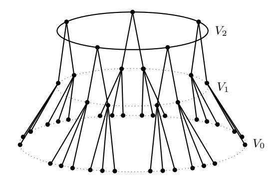

# Breaking the decisional Diffie-Hellman problem for class group actions using genus theory – extended version

Wouter Castryck1 , Jana Sot´akov´a2 , and Frederik Vercauteren1

wouter.castryck@esat.kuleuven.be, j.s.sotakova@uva.nl, frederik.vercauteren@esat.kuleuven.be

1 imec-COSIC, KU Leuven, Belgium 2 QuSoft/University of Amsterdam, The Netherlands

Abstract. In this paper, we use genus theory to analyze the hardness of the decisional Diffie–Hellman problem for ideal class groups of imaginary quadratic orders acting on sets of elliptic curves through isogenies (DDH-CGA). Such actions are used in the Couveignes–Rostovtsev–Stolbunov protocol and in CSIDH. Concretely, genus theory equips every imaginary quadratic order O with a set of assigned characters χ : cl(O) → {±1}, and for each such character and every secret ideal class [a] connecting two public elliptic curves E and E 0 = [a] ? E, we show how to compute χ([a]) given only E and E 0 , i.e. without knowledge of [a]. In practice, this breaks DDH-CGA as soon as the class number is even, which is true for a density 1 subset of all imaginary quadratic orders. For instance, our attack works very efficiently for all supersingular elliptic curves over Fp with p ≡ 1 mod 4. Our method relies on computing Tate pairings and walking down isogeny volcanoes. We also show that these ideas carry over, at least partly, to abelian varieties of arbitrary dimension. This is an extended version of the paper that was presented at Crypto 2020.

Keywords: Decisional Diffie-Hellman, isogeny-based cryptography, class group action, CSIDH.

# 1 Introduction

"The Decision Diffie–Hellman assumption (DDH) is a gold mine", Dan Boneh wrote in his 1998 overview paper [\[3\]](#page-26-0). This statement still holds true (maybe even more so), since DDH is fundamental to prove security of many widely used protocols such as Diffie–Hellman key agreement [\[27\]](#page-27-0), El Gamal encryption [\[31\]](#page-27-1), but

∗ This work was supported in part by the European Research Council (ERC) under the European Union's Horizon 2020 research and innovation programme (grant agreement ISOCRYPT - No. 101020788) and by the Research Council KU Leuven grants C14/18/067, and by CyberSecurity Research Flanders with reference number VR20192203. JS was supported by the Dutch Research Council (NWO) through Gravitation-grant Quantum Software Consortium - 024.003.037.

can also be used to construct pseudo-random functions [41], and more advanced functionalities such as circular-secure encryption [4] and UC-secure oblivious transfer [42].

Let  $(G,\cdot)$  be a finite cyclic group with generator g, then the DDH problem states that it is hard to distinguish the distributions  $(g^a,g^b,g^{ab})$  and  $(g^a,g^b,g^r)$  where a,b,r are chosen randomly in [1,#G]. Due to its definition as a distinguishing problem, DDH can be used quite naturally as a building block for provably secure constructions, i.e. IND-CPA or IND-CCA encryption [22]. In practice, the group G is typically chosen as a cyclic prime order subgroup of the multiplicative group  $\mathbb{F}_p^*$  of a finite prime field or of an elliptic curve group  $E(\mathbb{F}_p)$ . Although Diffie and Hellman [27] originally worked in the full multiplicative group  $\mathbb{F}_p^*$ , it is easy to see that DDH is not secure in this case since the Legendre symbol easily distinguishes both distributions. An equivalent interpretation is that the Legendre symbol provides an efficiently computable character, mapping  $\mathbb{F}_p^*$  onto the group  $\{\pm 1\}$ , which acts as a distinguisher.

The classical hardness of DDH is well understood and clear recommendations [23] to attain certain security levels have been agreed upon by the cryptographic community. In the quantum setting however, DDH is easy as shown by Shor [46], who devised an algorithm to solve the discrete logarithm problem (DLP) in any group in polynomial time and space. The DLP asks, given a tuple  $(g, g^a)$ , to recover the exponent a. Solving DLP efficiently implies solving DDH efficiently.

Class group actions Shor's algorithm relies on the fact that the group operation in G can be efficiently computed, i.e. group elements can be represented such that they can be composed efficiently. To devise a post-quantum secure alternative for group-based DDH one could try to represent the group G by an object with much less inherent structure, e.g. a set X. Such a representation can be obtained from a group action, which is a map  $\star: G \times X \to X: (g, E) \mapsto g \star E$  compatible with the group operation, i.e.  $(g \cdot h) \star E = g \star (h \star E)$ . If the group action is free and transitive, i.e. for every  $E, E' \in X$  there exists exactly one  $g \in G$  such that  $E' = g \star E$ , then X is called a principal homogeneous space for G. Note that for every fixed base point  $E \in X$  we thus obtain a representation of the group G by mapping g to  $g \star E$ .

As first observed by Couveignes [20] and later independently by Rostovtsev and Stolbunov [43], generalizing the Diffie–Hellman key agreement to group actions is immediate: Alice and Bob agree on a base point  $E \in X$ , each chooses a secret element a and b in G, and exchange  $a \star E$  and  $b \star E$ . Since G is commutative and  $\star$  a group action, both can compute the common element  $(a \cdot b) \star E$ . Recovering  $a \in G$  from  $a \star E$  is called the vectorization problem (generalizing DLP), and recovering  $(a \cdot b) \star E$  from  $a \star E$  and  $b \star E$  is called parallelization (generalizing CDH). When both problems are hard, Couveignes called X a hard homogeneous space for G. Couveignes, Rostovtsev and Stolbunov (CRS) and more recently CSIDH [16] by Castryck, Lange, Martindale, Panny and Renes instantiated this framework as follows: G is the class group  $cl(\mathcal{O})$  of an order  $\mathcal{O}$ 

in an imaginary quadratic field, and X = E``p(O, t) is the set of elliptic curves over a finite prime field Fp with Fp-rational endomorphism ring O and trace of Frobenius t. Whereas CRS restricted to ordinary elliptic curves, CSIDH uses supersingular elliptic curves and is several orders of magnitude faster than CRS.

Using the above group action can be seen as a trade-off: the lack of a natural operation on the set X itself makes the construction possibly post-quantum secure, but also limits its flexibility, i.e. it is not possible to simply translate any DLP-based protocol into an equivalent one using group actions. Furthermore, since X is supposed to "hide" G, it is a priori unclear whether the group structure of G itself has any influence on the hardness of the underlying group action problems. In this paper, we show that it does, even for classical adversaries.

Contributions The decisional Diffie-Hellman problem, sometimes called the decisional parallelization problem, for class group actions (DDH-CGA) asks to distinguish between the distributions ([a] ? E, [b] ? E,([a] · [b]) ? E) and ([a] ? E, [b] ? E, [r] ? E) with [a], [b], [r] random elements in cl(O). A natural attack strategy would be to try to exploit the group structure of cl(O), as was done for DDH in F ∗ p using the Legendre symbol. We immediately run into two problems:

- 1. In general, very little is known about the concrete structure of cl(O) as an abelian group. For instance, computing the order of cl(O) is already a highly non-trivial task [\[32,](#page-27-5) [1\]](#page-25-0). A notable exception is the structure of the 2-torsion subgroup of cl(O): genus theory [\[21,](#page-27-6) I.§3 & II.§7] provides a very explicit description of cl(O)[2] ' cl(O)/ cl(O) 2 by defining a set of characters χi : cl(O) → {±1} and recovering cl(O) 2 as the intersection of the kernels of the χi . The characters χi correspond to the prime factors mi of the discriminant ∆O (with the prime 2 requiring special treatment) and can be computed in time polynomial in the size of mi . Note that each of these characters χi (if non-trivial) can be used to break DDH in cl(O) itself; however we are not trying to solve DDH in cl(O), but DDH for class group actions.
- 2. Given the structure of cl(O)[2] through genus theory, it is unclear how the characters χi can be computed directly on elements in X, i.e. given an element [a] ? E for some unknown [a] ∈ cl(O), we need to compute χi([a]) (without computing [a] first, since vectorization is assumed hard).

The main contribution of this paper is an algorithm to compute the characters χi directly on the set X = E``p(O, t) in time exponential in the size of mi . Since we only need to compute one such χi efficiently to break DDH-CGA, we conclude that DDH for class group actions is insecure when cl(O)[2] is non-trivial and the discriminant ∆O is divisible by a small enough prime factor. Since cl(O)[2] is only trivial when ∆O = −q or ∆O = −4q with q ≡ 3 mod 4 prime, and since almost all integers contain polynomially small prime factors (this follows, at least heuristically, from Mertens' third theorem; see [\[51,](#page-28-4) III.§6] for more precise statements), we expect that our attack works in polynomial time (in log p) for a subset of density 1 of all imaginary quadratic orders.

In the special case of supersingular elliptic curves over  $\mathbb{F}_p$ , our attack does not apply for primes  $p \equiv 3 \pmod{4}$ . However, for  $p \equiv 1 \pmod{4}$ , we have  $\mathcal{O} = \mathbb{Z}[\sqrt{-p}]$  and  $\Delta_{\mathcal{O}} = -4p$ . Genus theory defines a non-trivial character  $\delta$  associated with the prime divisor 2 of  $\Delta_{\mathcal{O}}$ . We derive a very simple formula to compute  $\delta([\mathfrak{a}])$  that uses only the Weierstrass equations of E and  $E' = [\mathfrak{a}] \star E$ . In this case, our attack is particularly efficient and we can break DDH-CGA using a few exponentiations in  $\mathbb{F}_p$ .

**High level overview of the attack** To explain the main underlying ideas, we detail the thought process we followed to derive the attack in a simple (yet very general) setting. Fixing a base curve E, the class group action  $\star$  gives us a representation of  $cl(\mathcal{O})$  on the set  $X = \mathcal{E}\ell_p(\mathcal{O}, t)$  by mapping a class  $[\mathfrak{a}]$  to  $E' = [\mathfrak{a}] \star E$ . For every odd prime divisor m of the discriminant  $\Delta_{\mathcal{O}}$ , genus theory provides a character

$$\chi: \mathrm{cl}(\mathcal{O}) \to \{\pm 1\}: [\mathfrak{a}] \mapsto \left(\frac{\mathrm{N}(\mathfrak{a})}{m}\right),$$

where  $(\cdot)$  denotes the Legendre symbol and the representative  $\mathfrak{a}$  of the class  $[\mathfrak{a}]$  is chosen such that its norm  $N(\mathfrak{a})$  is coprime to m. The goal is to compute  $\chi([\mathfrak{a}])$  given only the pair (E, E').

Let  $\varphi: E \to E'$  denote the isogeny corresponding to  $\mathfrak{a}$ , then  $N(\mathfrak{a}) = \deg(\varphi)$ , so to compute  $\chi$ , it suffices to determine  $\deg(\varphi) \mod m$ , up to non-zero squares in  $\mathbb{Z}/(m)$ . The starting idea is the following: assume we know a tuple  $(P,Q) \in E^2$  with  $P \in E[m]$  and the corresponding tuple  $(\varphi(P), \varphi(Q)) \in E'^2$ , computing  $\deg(\varphi) \mod m$  is easy thanks to the compatibility of the reduced m-Tate pairing  $T_m$ :

$$T_m(\varphi(P), \varphi(Q)) = T_m(P, Q)^{\deg(\varphi)}$$
.

If the pairing is non-trivial, both sides will be primitive m-th roots of unity, so computing discrete logs gives  $\deg(\varphi) \mod m$ .

The difficulty is of course, that in practice we are not given such corresponding tuples (P,Q) and  $(\varphi(P),\varphi(Q))$ , so we need to find a workaround. The only information we really have about  $\varphi$  is that it is an  $\mathbb{F}_p$ -rational isogeny of degree coprime to m. Under the assumption that  $E(\mathbb{F}_p)$  has a unique subgroup of order m, this implies that  $E'(\mathbb{F}_p)$  similarly has such a unique subgroup, and furthermore,  $\varphi(E(\mathbb{F}_p)[m]) = E'(\mathbb{F}_p)[m]$ . If we let P be a generator of  $E(\mathbb{F}_p)[m]$  and P' a generator of  $E'(\mathbb{F}_p)[m]$ , then we know there exists some  $k \in [1, m-1]$  such that  $\varphi(P) = kP'$ . Note however, that if we assume we know a point Q and its image  $\varphi(Q)$  (but not the image of P under  $\varphi$ ), we do not learn anything since the values  $T_m(kP', \varphi(Q)) = T_m(P', \varphi(Q))^k$  run through the whole of  $\mu_m$  for  $k = 1, \ldots, m-1$  and we do not know k.

The main insight now is that we do not need to recover  $\deg(\varphi)$  exactly but only up to squares, so if we could recover  $k^2\deg(\varphi)$  then it is clear we can still compute  $\chi([\mathfrak{a}])$ . This hints at a possible solution as long as Q is somehow derived from P and that the same unknown scalar k can be used to compensate for the

difference not only between  $\varphi(P)$  and P', but also between  $\varphi(Q)$  and Q'. Indeed, computing  $T_m(P',Q')$  would then recover the correct value up to a square in the exponent, namely  $T_m(P,Q)^{\deg(\varphi)k^2}$ . The simplest choice clearly is to take Q=P and Q'=P', and if there is no  $\mathbb{F}_p$ -rational  $m^2$ -torsion, we can show that the self-pairings  $T_m(P,P)$  and  $T_m(P',P')$  are non-trivial. This feature is specific to the Tate pairing, and resorting to the Weil pairing would fail. Denote with  $\operatorname{val}_m(N)$  the m-adic valuation of N, i.e. the maximum power v such that  $m^v \mid N$ , then  $\operatorname{val}_m(\#E(\mathbb{F}_p)) = 1$  is equivalent to the existence of a unique rational subgroup of order m and the non-existence of rational  $m^2$ -torsion.

In the more general case of  $v = \operatorname{val}_m(\#E(\mathbb{F}_p)) > 1$ , we first walk down to the floor of the m-isogeny volcano reaching a curve  $E_0$  with  $E_0(\mathbb{F}_q)[m^{\infty}] = \mathbb{Z}/(m^v)$ , and then choose points P and P' of order m and corresponding points Q and Q' of order  $m^v$  satisfying  $m^{v-1}Q = P$  and  $m^{v-1}Q' = P'$ . Note that also in this case, the same unknown scalar k will compensate for both differences.

To sum up, we use the Tate pairing of certain points to obtain information on  $\deg \varphi$  (up to squares  $\operatorname{mod} m$ ). By genus theory, we see that we are actually computing the assigned characters of  $\operatorname{cl}(\mathcal{O})$  directly from curves in  $\mathscr{E}\!\ell_p(\mathcal{O},t)$ . Whenever the characters are non-trivial, their multiplicative property allows us to break DDH-CGA in  $\mathscr{E}\!\ell_p(\mathcal{O},t)$ .

Paper organization In Section 2 we recall the necessary background on isogenies and isogeny volcanoes, class group actions, genus theory and the Tate pairing. In Section 3 we derive an algorithm to compute the assigned characters in the case of ordinary elliptic curves, whereas in Section 4 we deal with supersingular curves. In Section 5 we analyze the impact on the DDH problem for class group actions, report on our implementation of the attack, and propose countermeasures. In Section 6 we explore the applicability of our main idea to higher-dimensional abelian varieties. Finally, Section 7 concludes the paper and provides avenues for further research.

**Acknowledgements** This paper is an extended version of [17]; the new material can mostly be found in Section 6. The authors would like to thank Alex Bartel, Steven Galbraith and the anonymous referees of our submission to Crypto 2020 for useful feedback on an early version of the paper.

## 2 Background

# 2.1 Isogenies

Let  $E, E'/\mathbb{F}_q$  be elliptic curves. An isogeny  $\varphi : E \to E'$  is a non-constant morphism such that  $\varphi(\mathbf{0}_E) = \mathbf{0}_{E'}$ , where  $\mathbf{0}$  denotes the point at infinity. Equivalently,

&lt;sup>3 A recent follow-up work [15] shows that using the Weil pairing is possible by resorting to a distortion map, i.e. an endomorphism  $\sigma$  acting on a point  $P \in E[m]$ , such that  $\sigma(P)$  is not a multiple of P.

an isogeny is a surjective group homomorphism of elliptic curves, which is also an algebraic morphism. An endomorphism of E is either the zero map or an isogeny from E to itself, and the set of endomorphisms forms a ring  $\operatorname{End}(E)$  under addition and composition. We write  $\operatorname{End}_{\mathbb{F}_q}(E)$  to denote the subring of endomorphisms defined over  $\mathbb{F}_q$ . Two important examples of endomorphisms are: the multiplication-by-n map  $[n]: E \to E, P \mapsto [n]P$  (often simply denoted by n) and the q-power Frobenius endomorphism  $\pi_q: E \to E: (x,y) \mapsto (x^q,y^q)$ . If q is clear from the context, we will simply write  $\pi$ . In  $\operatorname{End}(E)$ , the Frobenius endomorphism satisfies  $\pi^2 - t\pi + q = 0$  where  $t = \operatorname{tr} \pi$  is called the trace of Frobenius and satisfies  $|t| \leq 2\sqrt{q}$ . Alternatively, the trace of Frobenius is characterized by  $\#E(\mathbb{F}_q) = q + 1 - t$ . If  $\gcd(t,q) = 1$ , the curve is called ordinary, otherwise it is called supersingular. Unless  $|t| = 2\sqrt{q}$ , which can only happen for supersingular elliptic curves over even degree extension fields, we have that  $\mathcal{O} = \operatorname{End}_{\mathbb{F}_q}(E)$  is an order in the imaginary quadratic field  $K = \mathbb{Q}(\pi) = \mathbb{Q}(\sqrt{t^2 - 4q})$ . Since  $\mathcal{O}$  always contains  $\mathbb{Z}[\pi]$  as a suborder, its discriminant  $\Delta_{\mathcal{O}}$  satisfies  $\Delta_{\mathbb{Z}[\pi]} = t^2 - 4q = c^2 \Delta_{\mathcal{O}}$  for some non-zero  $c \in \mathbb{Z}$ .

The degree of an isogeny  $\varphi$  is just its degree as a morphism, which equals the size of the kernel  $\ker(\varphi)$  (we say  $\varphi$  is a *separable* isogeny), except possibly if  $\operatorname{char}(\mathbb{F}_q)|\operatorname{deg}(\varphi)$ , where it may happen that the kernel is smaller (we say  $\varphi$  is an *inseparable* isogeny). Separable isogenies are uniquely determined by their kernel, up to post-composition with an isomorphism. When the kernel  $\ker(\varphi)$  is invariant under Frobenius (as a set), the corresponding isogeny  $\varphi$  is  $\mathbb{F}_q$ -rational. Note that we do not necessarily have  $\ker(\varphi) \subset E(\mathbb{F}_q)$ , but only that  $\varphi$  can be given by  $\mathbb{F}_q$ -rational maps. The kernel of the multiplication by n map is denoted as E[n], and we set  $E[n^{\infty}] = \bigcup_{k \in \mathbb{N}_{>0}} E[n^k]$ .

For a prime  $m \nmid \operatorname{char} \mathbb{F}_q$ , isogenies of degree m are called m-isogenies and their kernel  $\ker \varphi \subset E[m]$  is always a cyclic subgroup of E[m]. It is therefore natural that the m-isogenies of an elliptic curve E depend on the structure of  $E(\mathbb{F}_q)[m^\infty]$ . Moreover, for any isogeny  $\varphi: E \to E'$ , there is a dual isogeny  $\varphi: E' \to E$  satisfying  $\varphi \circ \varphi = [\deg \varphi]$  and  $\varphi \circ \varphi = [\deg \varphi]$ . The dual isogeny  $\varphi$  has the same degree as  $\varphi$ .

#### 2.2 Volcanoes

By Tate's theorem [50], two elliptic curves over  $\mathbb{F}_q$  are isogenous (over  $\mathbb{F}_q$ ) if and only if they have the same number of  $\mathbb{F}_q$ -rational points, which is equivalent to having the same trace of Frobenius. Let  $\mathcal{E}\ell\ell_q(t)$  be the set of  $\mathbb{F}_q$ -isomorphism classes of elliptic curves over  $\mathbb{F}_q$  with trace of Frobenius t, and assume that  $\mathcal{E}\ell\ell_q(t)$  is non-empty.

For a prime number  $m \nmid q$ , we define the *m-isogeny graph*  $G_{q,m}(t)$  as follows: the set of vertices is  $\mathcal{E}\mathcal{U}_q(t)$  and the edges are *m*-isogenies. Away from elliptic curves with extra automorphisms (i.e., away from the curves with *j*-invariant 0 or 1728), this graph can be made undirected by identifying dual isogenies.

An m-volcano is a connected undirected graph with vertices partitioned into levels  $V_0, \ldots, V_h$  such that

- the subgraph  $V_h$  (the *crater*) is a regular connected graph of degree  $\leq 2$ ,
- for all  $0 \le i < h$ , every vertex in level  $V_i$  is connected to exactly one vertex in  $V_{i+1}$ ,
- for all i > 0, every vertex in  $V_i$  has degree m + 1.

Note that this implies that all the vertices on level  $V_0$  (the floor) have degree 1. We call h the height of the volcano (some authors swap  $V_h$  and  $V_0$  and call h the depth). The crater  $V_h$  is also sometimes called the surface of the volcano. An example of a volcano can be seen in Figure 1.

**Theorem 1.** Let  $G_{q,m}(t)$  be as above, and assume that gcd(t,q) = 1, so that we are in the ordinary case. Take any connected component V of  $G_{q,m}(t)$  that does not contain curves with j-invariant 0 or 1728. Then V is a volcano, say of height h, and

- 1. the elliptic curves on level i all have the same endomorphism ring  $\mathcal{O}_i$ , with discriminant  $\Delta_{\mathcal{O}_i} = m^{2(h-i)} \Delta_{\mathcal{O}_h}$ ,
- 2. the endomorphism ring  $\mathcal{O}_h$  of the elliptic curves on the crater  $V_h$  is locally maximal at m; equivalently, if m is odd then  $m^2 \nmid \Delta_{\mathcal{O}_h}$ , while if m = 2 and  $4 \mid \Delta_{\mathcal{O}_h}$  then  $\Delta_{\mathcal{O}_h}/4 \equiv 2, 3 \mod 4$ ,
- 3. the endomorphism ring  $\mathcal{O}_0$  of the elliptic curves on the floor  $V_0$  satisfies  $\operatorname{val}_m(\Delta_{\mathcal{O}_0}) = \operatorname{val}_m(t^2 4q)$ .

In particular, if m is odd then  $h = \lfloor \operatorname{val}_m(t^2 - 4q)/2 \rfloor$ , while if m = 2 then h may be 1 less than this value.

*Proof.* This follows from Proposition 23 in [36] (note that the name volcano was introduced only later by [29]).

An analogous volcano structure for supersingular curves over  $\mathbb{F}_p$  was given in [26], but will not be needed in our discussion of supersingular curves in Section 4.

Suppose  $E \in V_i$  and  $E' \in V_j$ . We say that an *m*-isogeny  $\varphi : E \to E'$  is ascending (descending, horizontal) if j = i + 1 (j = i - 1, j = i). On the volcano, this corresponds to the crater being on top, the floor on the bottom, while the horizontal steps are permitted along the crater only.

Remark 2. If j=0 or j=1728 do appear in V, then the theorem remains "sufficiently valid" for our purposes; the only difference is that  $G_{q,m}(t)$  may become directed: there may exist descending isogenies from the crater  $V_h$  to level  $V_{h-1}$  which need to be considered with multiplicity, while the dual ascending isogeny still accounts for multiplicity 1. We will ignore this issue in what follows: the endomorphism rings of the curves with j-invariant 0 or 1728 have trivial class groups, so this remark only affects suborders of (certain) number fields having class number 1. Such suborders are usually not considered in isogeny-based cryptography, although they make an appearance in the recent OSIDH protocol due to Colò and Kohel [19].

Figure 1. A 3-volcano of height h = 2, together with its levels. This corresponds to the case where the prime 3 splits in Oh, into two norm 3 prime ideals whose ideal-classes (which are each other's inverses) have order 5.

#### 2.3 Diffie–Hellman for class group actions

Let O be an order in an imaginary quadratic number field and let t ∈ Z. To each prime power q = p n we associate the set

$$\mathcal{E}\!\ell\ell_q(\mathcal{O},t) = \{\, \text{elliptic curves} \,\, E/\mathbb{F}_q \, | \, \text{End}_{\mathbb{F}_q}(E) \cong \mathcal{O} \,\, \text{and tr} \, \pi_q = t \, \}/ \cong_{\mathbb{F}_q}$$

.

If this set is non-empty, then the ideal-class group cl(O) acts freely on E``q(O, t): for any invertible ideal a ⊂ cl(O) of norm coprime with p (every ideal class contains such ideals), we set E[a] = ∩α∈a ker α, where the α's are viewed as elements of EndFq (E) by choosing an isomorphism with O under which πq corresponds to a fixed root of x 2 − tx + q ∈ O[x]. We then define

$$[\mathfrak{a}] \star E = E/E[\mathfrak{a}].$$

In other words, we let [a]?E be the (unique) codomain of a separable Fq-rational isogeny ϕ with domain E and kernel E[a].

The action is usually transitive but exceptionally there may be two orbits; this happens if and only if the discriminant ∆O is a quadratic non-residue modulo p (which is a very rare event, and not possible in the case of ordinary elliptic curves because t 2 − 4q = c 2∆O for some c). For a proof of the above claims, see [\[53\]](#page-28-6) and the erratum pointed out in [\[44,](#page-28-7) Thm. 4.5].

Remark 3. The set E``q(t) is not the same as E``q(O, t). One should think of the sets E``q(O, t) for the various orders O as horizontal slices of E``q(t). Indeed, in Theorem [1,](#page-6-0) we saw that the curves on the same level of an m-volcano have the same endomorphism ring O.

When # cl(O) is large, the set E``q(O, t) is conjectured to be a hard homogeneous space in the sense of Couveignes [\[20\]](#page-27-4), who was the first to propose its use for Diffie–Hellman style key exchange; we refer to [\[25,](#page-27-11) [16\]](#page-26-2) for recent advances in making this construction efficient. Couveignes' proposal was rediscovered by Rostovtsev and Stolbunov [\[43\]](#page-28-3), and elaborated in greater detail in Stolbunov's PhD thesis, which contains the first appearance of the decisional Diffie–Hellman problem for group actions [\[48,](#page-28-8) Prob. 2.2].

Definition 4 (DDH-CGA). Let Fq, t, O be as above and let E ∈ E``q(O, t). The decisional Diffie–Hellman problem is to distinguish with non-negligible advantage between the distributions ([a]?E, [b]?E, [ab]?E) and ([a]?E, [b]?E, [c]?E) where [a], [b], [c] are chosen at random from cl(O).

Stolbunov writes: "As far as we are concerned, the most efficient approach is to solve the corresponding CL group action inverse problem (CL-GAIP)." In our terminology, this reads that in order to break DDH-CGA, one needs to obtain [a] from [a] ? E. The current paper clearly disproves this statement.

# 2.4 Genus theory

Genus theory studies which natural numbers arise as norms of ideals in a given ideal class of an imaginary quadratic order O. It shows that this question is governed by the coset of cl(O) 2 , the subgroup of squares inside cl(O), to which the ideal class belongs. The details are as follows; this section summarizes parts of [\[21,](#page-27-6) I.§3 & II.§7].

Let ∆O ≡ 0, 1 mod 4 be the discriminant of O, say with distinct odd prime factors m1 < m2 < . . . < mr. If ∆O ≡ 1 mod 4 then we call

$$\chi_i : (\mathbb{Z}/\Delta_{\mathcal{O}})^* \to \{\pm 1\} : a \mapsto \left(\frac{a}{m_i}\right) \quad (\text{for } i = 1, \dots, r)$$

the assigned characters of O. If ∆O = −4n ≡ 0 mod 4, then we extend this list with δ if n ≡ 1, 4, 5 mod 8, with if n ≡ 6 mod 8, with δ if n ≡ 2 mod 8, and with both δ and if n ≡ 0 mod 8. Here

$$\delta: a \mapsto (-1)^{(a-1)/2}$$
 and  $\epsilon: a \mapsto (-1)^{(a^2-1)/8}$ .

If n ≡ 3, 7 mod 8 then the list is not extended.

Let µ ∈ {r, r + 1, r + 2} denote the total number of assigned characters and consider the map Ψ : (Z/∆O) ∗ → {±1} µ having these assigned characters as its components. Then Ψ is surjective and its kernel H consists precisely of those integers that are coprime with (and that are considered modulo) ∆O and arise as norms of non-zero principal ideals of O. This leads to a chain of maps

$$\Phi: \operatorname{cl}(\mathcal{O}) \longrightarrow \frac{(\mathbb{Z}/\Delta_{\mathcal{O}})^*}{H} \stackrel{\cong}{\longrightarrow} \{\pm 1\}^{\mu},$$

where the first map sends an ideal class [a] to the norm of a (it is always possible to choose a representant of norm coprime with ∆O) and the second map is induced by Ψ. Basically, genus theory tells us that ker Φ = cl(O) 2 , the subgroup of squares in cl(O); the cosets of cl(O) 2 inside cl(O) are called genera, with cl(O) 2 itself being referred to as the principal genus.

Remark 5. By abuse of notation, we can and will also view  $\chi_1, \chi_2, \dots, \chi_r, \delta, \epsilon$ as morphisms  $cl(\mathcal{O}) \to \{\pm 1\}$ , obtained by composing  $\Phi$  with projection on the corresponding coordinate.

It can be shown that the image of  $\Phi$  is a subgroup of  $\{\pm 1\}^{\mu}$  having index 2, so that the cardinality of  $cl(\mathcal{O})/cl(\mathcal{O})^2 \cong cl(\mathcal{O})[2]$  equals  $2^{\mu-1}$ . More precisely, if we write  $\Delta_{\mathcal{O}} = -2^a b$  with  $b = m_1^{e_1} m_2^{e_2} \cdots m_r^{e_r}$ , then this is accounted for by the character

$$\chi_1^{e_1} \cdot \chi_2^{e_2} \cdots \chi_r^{e_r} \cdot \delta^{\frac{b+1}{2} \bmod 2} \cdot \epsilon^{a \bmod 2}, \tag{1}$$

which is non-trivial when viewed on  $(\mathbb{Z}/\Delta_{\mathcal{O}})^*$ , but becomes trivial when viewed on  $cl(\mathcal{O})$ . For example, if  $\Delta_{\mathcal{O}}$  is squarefree and congruent to 1 mod 4, then the image of  $\Phi$  consists of those tuples in  $\{\pm 1\}^r$  whose coordinates multiply to 1.

Our main goal is to break DDH-CGA in  $\mathcal{E}\ell\ell_q(\mathcal{O},t)$ . To do this, we will compute the coordinate components of the map  $\Phi$ , i.e. upon input of two elliptic curves  $E, E' \in \mathcal{E}\mathcal{U}_q(\mathcal{O}, t)$  that are connected by a secret ideal class  $[\mathfrak{a}] \in cl(\mathcal{O})$ , for each assigned character  $\chi$  we will describe how to compute  $\chi(E, E') := \chi([\mathfrak{a}])$ . This is done in the next sections.

Example 6. In Section 4, we will study supersingular elliptic curves defined over  $\mathbb{F}_p$  with  $p \equiv 1 \mod 4$ . Here  $\mathcal{O} = \mathbb{Z}[\sqrt{-p}]$  has discriminant -4p, thus there are two assigned characters:  $\delta$  and the Legendre character  $\chi$  associated with p. But (1) tells us that  $\chi([\mathfrak{a}]) = \delta([\mathfrak{a}])$  and also that  $\chi$  and  $\delta$  are necessarily nontrivial characters of  $cl(\mathcal{O})$ . So it suffices to compute  $\delta([\mathfrak{a}])$ , which as we will see can be done very efficiently.

#### The Tate pairing on elliptic curves

We briefly recall the main properties of the (reduced) Tate pairing  $T_m$ , which is

$$T_m: E(\mathbb{F}_{q^k})[m] \times E(\mathbb{F}_{q^k})/mE(\mathbb{F}_{q^k}) \to \mu_m: (P,Q) \mapsto f_{m,P}(D)^{(q^k-1)/m}$$
.

Here k is the embedding degree, i.e. the smallest extension degree k such that  $\mu_m \subset \mathbb{F}_{q^k}^*$ ; the function  $f_{m,P}$  a so-called Miller function, i.e. an  $\mathbb{F}_{q^k}$ -rational function with divisor  $(f_{m,P}) = m(P) - m(\mathbf{0})$ ; D an  $\mathbb{F}_{q^k}$ -rational divisor equivalent to (Q) –  $(\mathbf{0})$  coprime to the support of  $(f_{m,P})$ . If the Miller function  $f_{m,P}$  is normalized, and  $Q \neq P$ , then the pairing can be simply computed as  $T_m(P,Q) =$  $f_{m,P}(Q)^{(q^k-1)/m}$ .

The reduced Tate pairing  $T_m$  has the following properties:

- 1. Bilinearity:  $T_m(P, Q_1 + Q_2) = T_m(P, Q_1)T_m(P, Q_2)$  and  $T_m(P_1 + P_2, Q) =$  $T_m(P_1,Q)T_m(P_2,Q)$ .
- 2. Non-degeneracy: for all  $P \in E(\mathbb{F}_{q^k})[m]$  with  $P \neq \mathbf{0}$ , there exists a point  $Q \in E(\mathbb{F}_{q^k})/mE(\mathbb{F}_{q^k})$  such that  $T_m(P,Q) \neq 1$ . Similarly, for all  $Q \in E(\mathbb{F}_{q^k})$ with  $Q \notin mE(\mathbb{F}_{q^k})$ , there exists a  $P \in E(\mathbb{F}_{q^k})[m]$  with  $T_m(P,Q) \neq 1$ . 3. Compatibility: let  $\varphi$  be an  $\mathbb{F}_q$ -rational isogeny, then

$$T_m(\varphi(P), \varphi(Q)) = T_m(P, Q)^{\deg(\varphi)}.$$

4. Galois invariance: let  $\sigma \in \operatorname{Gal}(\overline{\mathbb{F}}_q/\mathbb{F}_q)$  then  $T_m(\sigma(P), \sigma(Q)) = \sigma(T_m(P, Q))$ .

# 3 Computing the characters for ordinary curves

Let  $E/\mathbb{F}_q$  be an ordinary elliptic curve with endomorphism ring  $\mathcal{O}$  and let m be a prime divisor of  $\Delta_{\mathcal{O}}$ . Note that  $m \nmid q$ , since otherwise  $m \mid \Delta_{\mathcal{O}} \mid t^2 - 4q$  would imply that  $\gcd(t,q) \neq 1$ , contradicting that E is ordinary. By extending the base field if needed, we can assume without loss of generality that  $\operatorname{val}_m(\#E(\mathbb{F}_q)) \geq 1$ . The approach described in the introduction corresponds to  $\operatorname{val}_m(\#E(\mathbb{F}_q)) = 1$ , which implies that  $E(\mathbb{F}_q)[m^{\infty}] \cong \mathbb{Z}/(m)$ . The idea was to recover the character from the self-pairings  $T_m(P,P)$  and  $T_m(P',P')$ , with P (resp. P') any non-zero  $\mathbb{F}_q$ -rational m-torsion point on E (resp. E').

In general we have  $E(\mathbb{F}_q)[m^{\infty}] \cong \mathbb{Z}/(m^r) \times \mathbb{Z}/(m^s)$  for integers  $1 \leq r \geq s \geq 0$ . The next theorem shows that by walking all the way down to the floor of the *m*-isogeny volcano, we always end up on a curve  $E_0/\mathbb{F}_q$  with  $E_0(\mathbb{F}_q)[m^{\infty}] \cong \mathbb{Z}/(m^v)$ , where  $v = \text{val}_m(\#E(\mathbb{F}_q))$ .

**Theorem 7.** Consider an m-isogeny volcano of ordinary elliptic curves over a finite field  $\mathbb{F}_q$ , and let N be their (common) number of  $\mathbb{F}_q$ -rational points. Assume  $v = \operatorname{val}_m(N) \geq 1$  and let h denote the height of the volcano.

- If v is odd and E is a curve on level  $0 \le i \le h$ , or if v is even and E is a curve on level  $0 \le i \le v/2$ , then

$$E(\mathbb{F}_q)[m^{\infty}] \cong \frac{\mathbb{Z}}{(m^{v-i})} \times \frac{\mathbb{Z}}{(m^i)}.$$

- If v is even and E is a curve on level  $v/2 \le i \le h$ , then

$$E(\mathbb{F}_q)[m^\infty] \cong \frac{\mathbb{Z}}{(m^{v/2})} \times \frac{\mathbb{Z}}{(m^{v/2})}.$$

(Note that the latter range may be empty, i.e. one may have h < v/2.)

*Proof.* This is implicitly contained in [37]; for more explicit references, see [39, Cor. 1] for m = 2 and [40, Thm. 3] for m odd.

Note that it is easy to verify whether a given curve  $E/\mathbb{F}_q$  is located on the floor of its volcano. Indeed, for  $\lambda$  random points  $P \in E(\mathbb{F}_q)$  one simply tests whether  $(N/m)P = \mathbf{0}$ . As soon as one point fails the test, we know that E is on the floor. If all points pass the test, we are on the floor with probability  $1/m^{\lambda}$ . Given such a verification method, a few random walks allow one to find a shortest path down to the floor, see e.g. the algorithm FINDSHORTESTPATHTOFLOOR in [49]. Note that this is considerably easier than navigating the volcano in a fully controlled way, see again [49] and the references therein.

Once we are on  $E_0$ , the natural generalization of the case v=1 is to compute the m-Tate pairing  $T_m(P,Q)$  with  $\operatorname{ord}(P)=m$  and  $\operatorname{ord}(Q)=m^v$  satisfying

&lt;sup>4 In the context of this paper, it is worth highlighting the work of Ionica and Joux [35] on this topic, who use the Tate pairing as an auxiliary tool for travelling through the volcano.

 $m^{v-1}Q = P$ . The following theorem applied to n = 1 shows that the m-Tate pairing is non-trivial and, for a fixed P, independent of the choice of Q. (Note that we indeed have  $m \mid q-1$  because  $m \mid t^2-4q=(q-1)^2-2(q+1)N+N^2$ , where  $N = \#E_0(\mathbb{F}_q)$ .)

**Theorem 8.** Let  $E_0/\mathbb{F}_q$  be an ordinary elliptic curve and let m be a prime number. Assume that  $m^n|(q-1)$  for  $n \geq 1$  and that

$$E_0(\mathbb{F}_q)[m^\infty] \cong \frac{\mathbb{Z}}{(m^v)}$$

for some  $v \geq n$ . Then for any P, Q with  $\operatorname{ord}(P) = m^n$  and  $\operatorname{ord}(Q) = m^v$ , the reduced Tate pairing  $T_{m^n}(P,Q)$  is a primitive  $m^n$ -th root of unity. Furthermore, for a fixed P, the pairing  $T_{m^n}(P,\cdot)$  is constant for all Q with  $\operatorname{ord}(Q) = m^v$  and  $m^{v-n}Q = P$ .

*Proof.* Assume that  $T_{m^n}(P,Q)$  is not a primitive  $m^n$ -th root of unity, then  $T_{m^n}(P,Q) \in \mu_{m^{n-1}}$ , and in particular

$$1 = T_{m^n}(P,Q)^{m^{n-1}} = T_{m^n}(m^{n-1}P,Q).$$

Since P has order  $m^n$ , the point  $m^{n-1}P$  is not the identity element  $\mathbf{0}$ . Further, since Q generates  $E_0(\mathbb{F}_q)[m^\infty]$ , we conclude that  $T_{m^n}(m^{n-1}P,\cdot)$  is degenerate on the whole of  $E_0(\mathbb{F}_q)/m^nE_0(\mathbb{F}_q)$ , which contradicts the non-degeneracy of the Tate pairing. Thus we conclude that  $T_{m^n}(P,Q)$  is a primitive  $m^n$ -th root of unity (alternatively and more directly, this follows from the perfectness of the Tate pairing, see [10]). The solutions to  $m^{v-n}X = P$  are given by Q + R with  $\operatorname{ord}(R)|m^{v-n}$ . But then  $R \in m^nE_0(\mathbb{F}_q)$  and so  $T_{m^n}(P,R) = 1$ , which shows that  $T_{m^n}(P,Q)$  is independent of the choice of Q.

## 3.1 Computing the characters $\chi_i$

Let  $\chi$  be one of the characters  $\chi_i$  associated with an odd prime divisor  $m=m_i$  of  $\Delta_{\mathcal{O}}$ . As before, we let  $\varphi: E \to E'$  denote the isogeny corresponding to  $\mathfrak{a}$  of degree  $\deg(\varphi) = \mathrm{N}(\mathfrak{a})$ . Recall that the goal is to compute  $\chi([\mathfrak{a}]) = \left(\frac{\mathrm{N}(\mathfrak{a})}{m}\right)$ .

Since  $\operatorname{End}(E) = \operatorname{End}(E')$ , by Theorem 1, the curves E and E' are on the same level of their respective m-isogeny volcanoes. By taking the same number of steps down from E and E' to the floor on these volcanoes, we end up with two respective elliptic curves  $E_0, E'_0$  in  $\mathcal{E}\ell^1_q(\mathcal{O}_0, t)$ , where  $\mathcal{O}_0 \subset \mathcal{O}$  is a suborder having discriminant  $\Delta_{\mathcal{O}_0} = m^{2s}\Delta_{\mathcal{O}}$ , with s the number of steps taken to reach the floor.

Since both curves  $E_0$  and  $E'_0$  are now on the floor, we can choose non-trivial points  $P \in E_0[m](\mathbb{F}_q)$  and  $P' \in E'_0[m](\mathbb{F}_q)$ , and corresponding points Q, Q' of order exactly  $m^v$  satisfying  $m^{v-1}Q = P$  and  $m^{v-1}Q' = P'$ . We know that the class group  $\operatorname{cl}(\mathcal{O}_0)$  acts transitively on  $\operatorname{\mathcal{E}\!\ell}(Q_0,t)$ , see Section 2.3, so there exists an invertible ideal  $\mathfrak{b} \subset \mathcal{O}_0$  such that

$$E_0' = [\mathfrak{b}] \star E_0,$$

where by [21, Cor. 7.17] it can be assumed that  $N(\mathfrak{b})$  is coprime with  $\Delta_{\mathcal{O}_0}$ , hence coprime with m. Let  $\varphi_0: E_0 \to E'_0$  denote the corresponding degree  $N(\mathfrak{b})$  isogeny. Then there exists a  $k \in \{1, \ldots, m-1\}$  with  $k\varphi_0(P) = P'$ . Clearly, the point  $k\varphi_0(Q)$  also has order  $m^v$  and satisfies  $m^{v-1}X = P'$ . From Theorem 8 and the compatibility of the Tate pairing, it then follows:

$$T_m(P', Q') = T_m(k\varphi_0(P), k\varphi_0(Q)) = T_m(P, Q)^{k^2 \deg(\varphi_0)},$$

and thus

$$\left(\frac{\mathrm{N}(\mathfrak{b})}{m}\right) = \left(\frac{\deg(\varphi_0)}{m}\right) = \left(\frac{\log_{T_m(P,Q)} T_m(P',Q')}{m}\right).$$

We now show that this in fact equals  $\chi([\mathfrak{a}])$ . Indeed, since  $N(\mathfrak{b})$  is coprime with  $\Delta_{\mathcal{O}_0}$ , from [21, Prop. 7.20] we see that the ideal  $\mathfrak{b}\mathcal{O}\subset\mathcal{O}$  is invertible and again has norm  $N(\mathfrak{b})$ . From the second paragraph of the proof of [49, Lem. 6] we see that  $E' = [\mathfrak{b}\mathcal{O}] \star E$ , and because the action of  $cl(\mathcal{O})$  on  $\mathcal{E}\mathcal{U}_q(\mathcal{O},t)$  is free we conclude that  $[\mathfrak{b}\mathcal{O}] = [\mathfrak{a}]$ . Summing up, we can compute

$$\chi([\mathfrak{a}]) = \chi([\mathfrak{b}\mathcal{O}]) = \left(\frac{\mathrm{N}(\mathfrak{b}\mathcal{O})}{m}\right) = \left(\frac{\mathrm{N}(\mathfrak{b})}{m}\right) = \left(\frac{\log_{T_m(P,Q)} T_m(P',Q')}{m}\right).$$

Note that, in particular, this outcome is independent of the choice of the walks to the floor of the isogeny volcano.

Remark 9. In the appendix we provide an alternative (but more complex) proof that shows it is not needed to walk all the way down to the floor. However, since the height of the volcano is about  $\frac{1}{2} \operatorname{val}_m(t^2 - 4q)$  (see Theorem 1), the volcanoes cannot be very high (in the worst case a logarithmic number of levels), so walking to the floor of the volcano is efficient. Furthemore, for odd m, the probability of the volcano being height zero is roughly 1 - 1/m.

#### 3.2 Computing the characters $\delta$ , $\delta\epsilon$ and $\epsilon$

For  $\Delta_{\mathcal{O}} = -4n$ , genus theory (Section 2.4) may give extra characters  $\delta$ ,  $\epsilon$  or  $\delta\epsilon$  depending on n mod 8. Recall that these characters are defined as

$$\delta : [\mathfrak{a}] \mapsto (-1)^{(N(\mathfrak{a})-1)/2}$$
 and  $\epsilon : [\mathfrak{a}] \mapsto (-1)^{(N(\mathfrak{a})^2-1)/8}$ ,

where the ideal  $\mathfrak{a}$  is chosen to have odd norm. Determining the value of  $\delta$  is easily seen to be equivalent to computing N( $\mathfrak{a}$ ) mod 4. In case both  $\delta$  and  $\epsilon$  exist (i.e. when  $n \equiv 0 \mod 8$ ), determining both character values is equivalent to computing N( $\mathfrak{a}$ ) mod 8.

For m=2, the previous approach using Theorem 8 with n=1 remains valid, but does not result in sufficient information since it only determines  $N(\mathfrak{a}) \mod 2$ , which is known beforehand since the norm is odd. The solution is to use a 4-pairing (i.e. n=2) to derive  $\delta$  and an 8-pairing (i.e. n=3) in the case both  $\delta$  and  $\epsilon$  exist.

Character  $\delta$  Recall that the character  $\delta$  exists when  $n \equiv 0, 1, 4, 5 \mod 8$ . By taking a field extension if needed, we can assume without loss of generality that  $v = \operatorname{val}_2(\#E(\mathbb{F}_q)) \geq 2$  and that  $4 \mid (q-1)$ . As before, by walking down the volcano we reach a curve  $E_0$  on the floor (and similarly  $E'_0$ ) satisfying  $E_0(\mathbb{F}_q)[2^{\infty}] = \mathbb{Z}/(2^v)$ . We can now use Theorem 8 for m=2 and n=2 along with the compatibility of the Tate pairing: if  $\mathfrak{b}$  is an ideal connecting  $E_0$  and  $E'_0$ , we can compute the exact value

$$N(\mathfrak{b}) \bmod 4 = \log_{T_4(P,Q)} T_4(P',Q') \tag{2}$$

for appropriately chosen points  $P, Q \in E_0(\mathbb{F}_q)[2^{\infty}]$  and  $P', Q' \in E'_0(\mathbb{F}_q)[2^{\infty}]$ . Indeed, recall that the points P' and Q' are only determined by P and Q up to a scalar  $k \in (\mathbb{Z}/(4))^*$ , i.e.  $k \equiv 1, 3 \mod 4$ , and so  $k^2 \equiv 1 \mod 4$ .

A similar reasoning as before then shows that  $[\mathfrak{bO}] = [\mathfrak{a}]$ , where we can assume  $N(\mathfrak{bO}) = N(\mathfrak{b})$ , so we find that

$$\delta([\mathfrak{a}]) = \delta([\mathfrak{b}\mathcal{O}]) = (-1)^{(N(\mathfrak{b}\mathcal{O})-1)/2} = (-1)^{(\log_{T_4(P,Q)} T_4(P',Q')-1)/2},$$

or, equivalently, we find that  $N(\mathfrak{a}) \mod 4$  equals (2).

Characters  $\delta \epsilon$  and  $\epsilon$  Recall that the character  $\delta \epsilon$  exists when  $n \equiv 0, 2 \mod 8$  and the character  $\epsilon$  exists when  $n \equiv 0, 6 \mod 8$ . Again, by taking a field extension if needed, we can assume without loss of generality that  $v = \operatorname{val}_2(\#E(\mathbb{F}_q)) \geq 3$  and that  $8 \mid (q-1)$ . Notice that, if  $\delta$  and  $\epsilon$  do not exist simultaneously, then we are necessarily on the surface of the 2-volcano, hence it takes at least one step to go to curves  $E_0$  and  $E'_0$  on the floor. During this step the discriminant becomes multiplied by a factor of 4. Hence, on the floor, we are certain that both characters exist.

Now applying Theorem 8 for m=2 and n=3 together with the compatibility of the Tate pairing, and using the fact that for  $k \equiv 1, 3, 5, 7 \mod 8$  we have  $k^2 \equiv 1 \mod 8$ , we know that the norm of an ideal  $\mathfrak{b}$  connecting  $E_0$  and  $E'_0$  satisfies

$$N(\mathfrak{b}) \bmod 8 = \log_{T_{\mathfrak{s}}(P,Q)} T_8(P',Q'), \tag{3}$$

for appropriately chosen points  $P, Q \in E_0(\mathbb{F}_q)[2^{\infty}]$  and  $P', Q' \in E'_0(\mathbb{F}_q)[2^{\infty}]$ . The same reasoning as before then shows that  $[\mathfrak{b}\mathcal{O}] = [\mathfrak{a}]$ , where we can assume  $N(\mathfrak{b}\mathcal{O}) = N(\mathfrak{b})$ , hence we find

$$\epsilon([\mathfrak{a}]) = \epsilon([\mathfrak{b}\mathcal{O}]) = (-1)^{(\mathcal{N}(\mathfrak{b}\mathcal{O})^2 - 1)/8} = (-1)^{((\log_{T_8(P,Q)} T_8(P',Q'))^2 - 1)/8},$$

and similarly for  $\delta\epsilon$ .

We stress that, in general, we cannot conclude that  $N(\mathfrak{a})$  mod 8 equals (3). E.g., if  $n \equiv 6 \mod 8$ , in the presence of  $\epsilon$  but in the absence of  $\delta$ , an ideal class containing ideals having norm 1 mod 8 will also contain ideals having norm 7 mod 8. It is during the first step down the volcano that both congruence classes become separated.

# 4 Computing the characters for supersingular curves

We now turn our attention to supersingular elliptic curves over prime fields  $\mathbb{F}_p$  with p > 3. Recall that any such curve  $E/\mathbb{F}_p$  has exactly p+1 rational points and its Frobenius satisfies  $\pi^2 + p = 0$ , therefore  $\mathcal{O} = \operatorname{End}_{\mathbb{F}_p}(E)$  has discriminant

$$\Delta_{\mathcal{O}} = \begin{cases} -4p & \text{if } p \equiv 1 \mod 4, \\ -p \text{ or } -4p & \text{if } p \equiv 3 \mod 4. \end{cases}$$

From genus theory, we see that  $\operatorname{cl}(\mathcal{O})$  has non-trivial 2-torsion only in the former case. So we will restrict our attention to  $p \equiv 1 \mod 4$ , in which case  $\mathcal{O} = \mathbb{Z}[\sqrt{-p}]$ . There are two assigned characters: the Legendre character associated with p, and  $\delta$ . From the character relation (1) (see also Example 6), we see that these coincide on  $\operatorname{cl}(\mathcal{O})$ , therefore it suffices to compute  $\delta$ . Unfortunately, due to the peculiar behaviour of supersingular elliptic curves over  $\mathbb{F}_{p^2}$ , we cannot apply our strategy of "extending the base field and going down the volcano".

Instead, we can compute  $\delta$  directly on the input curves, i.e. not involving vertical isogenies. This is handled by the following theorem, which can be used to compute  $\delta$  in many ordinary cases, too. The proof is entirely self-contained, although its flavour is similar to that of Section 3.

**Theorem 10.** Let  $q \equiv 1 \mod 4$  be a prime power and let  $E, E'/\mathbb{F}_q$  be elliptic curves with endomorphism ring  $\mathcal{O}$  and trace of Frobenius  $t \equiv 0 \mod 4$ , connected by an ideal class  $[\mathfrak{a}] \in \mathrm{cl}(\mathcal{O})$ . Then  $\delta$  is an assigned character of  $\mathcal{O}$ , and if we write

$$E: y^2 = x^3 + ax^2 + bx \quad resp. \quad E': y^2 = x^3 + a'x^2 + b'x$$

$$then \ \delta([\mathfrak{a}]) = (b'/b)^{(q-1)/4}.$$

$$(4)$$

*Proof.* As  $t \equiv 0 \mod 4$ , we have  $\#E(\mathbb{F}_q) = \#E'(\mathbb{F}_q) = q+1-t \equiv 2 \mod 4$ , and therefore both curves contain a unique rational point of order 2. When positioned at (0,0), we indeed obtain models of the form (4). We point out that  $b^{(q-1)/4}$  does not depend on the specific choice of such a model: it is easy to check that the only freedom left is scaling a by  $u^2$  and b by  $u^4$  for some  $u \in \mathbb{F}_q^*$ . Of course, the same remark applies to  $b'^{(q-1)/4}$ .

On E, the points  $(x_0, y_0)$  doubling to P = (0, 0) satisfy the condition

$$\frac{3x_0^2 + 2ax_0 + b}{2y_0} = \frac{y_0}{x_0},$$

which can be rewritten as  $x_0(x_0^2 - b) = 0$ . Therefore these points are

$$\left(\sqrt{b}, \pm \sqrt{b(a+2\sqrt{b})}\right)$$
 and  $\left(-\sqrt{b}, \pm \sqrt{b(a-2\sqrt{b})}\right)$ , (5)

from which we see that b is a non-square. Indeed, if we would have  $\sqrt{b} \in \mathbb{F}_q$ , then one of  $a \pm 2\sqrt{b}$  would be a square in  $\mathbb{F}_q$  because their product  $a^2 - 4b$  is not (since there is only one  $\mathbb{F}_q$ -rational point of order 2). This would imply the

existence of an  $\mathbb{F}_q$ -rational point of order 4, contradicting  $\#E(\mathbb{F}_q) \equiv 2 \mod 4$ . The same reasoning shows that b' is a non-square.

Choose a representative  $\mathfrak a$  of  $[\mathfrak a]$  having odd norm coprime to q. It suffices to prove that

$$(-b')^{(q-1)/4} = \left( (-b)^{(q-1)/4} \right)^{\mathcal{N}(\mathfrak{a})} \tag{6}$$

(the reason for including the minus signs, which cancel out, will become apparent soon). Indeed, both sides are primitive 4th roots of unity, whose ratio is either 1 or -1 depending on whether  $N(\mathfrak{a}) \equiv 1 \mod 4$  or  $N(\mathfrak{a}) \equiv 3 \mod 4$ , as wanted.

Let  $\varphi: E \to E'$  denote the isogeny corresponding to  $\mathfrak a$ , where we note that  $\varphi(P) = P'$  because  $\varphi$  is defined over  $\mathbb F_q$ . From (5), using that b is a non-square, we see that we can characterize -b as  $x(Q) \cdot x(\pi_q(Q))$ , where Q denotes any of the four halves of P. Similarly, -b' equals  $x(Q') \cdot x(\pi_q(Q'))$ , with Q' any of the four halves of  $P' = (0,0) \in E'$ . In particular, since  $\varphi(Q)$  is a half of  $\varphi(P) = P'$ , we have  $-b' = x(\varphi(Q)) \cdot x(\pi_q(\varphi(Q)))$ .

Remark 11. Observe that x is the normalized Miller function  $f_{2,P}$ , hence

$$(-b)^{(q-1)/4} = (x(Q) \cdot x(\pi_q(Q)))^{(q-1)/4} = (f_{2,P}(Q)^{1+q})^{(q-1)/4} = f_{2,P}(Q)^{\frac{q^2-1}{4}},$$

and similarly for  $(-b')^{(q-1)/4}$ , so proving (6) amounts to proving a compatibility rule for a non-fully reduced 2-Tate pairing.

Denote by  $\pm K_1, \pm K_2, \ldots, \pm K_{(\mathrm{N}(\mathfrak{a})-1)/2}$  the non-trivial points in  $\ker \varphi$ , say with x-coordinates  $x_1, x_2, \ldots, x_{(\mathrm{N}(\mathfrak{a})-1)/2} \in \overline{\mathbb{F}}_q$ . Besides P itself, the points mapping to P' are  $P \pm K_1, P \pm K_2, \ldots, P \pm K_{(\mathrm{N}(\mathfrak{a})-1)/2}$ , and an easy calculation shows that the x-coordinates of these points are  $b/x_1, b/x_2, \ldots, b/x_{(\mathrm{N}(\mathfrak{a})-1)/2}$ . This implies that the function

$$x \left( \prod_{i=1}^{(N(\mathfrak{a})-1)/2} \frac{x - \frac{b}{x_i}}{x - x_i} \right)^2$$

viewed on E has the same divisor as  $x \circ \varphi$ , therefore both functions are proportional. To determine the constant involved, we can assume that our curve E' is obtained through an application of Vélu's formulae [52], composed with a translation along the x-axis that positions P' at (0,0). From [24, Rmk. 8.1] we then see that  $x \circ \varphi = g(x)/h(x)$  with

$$h(x) = \prod_{i=1}^{(N(\mathfrak{a})-1)/2} (x - x_i)^2$$

and with g(x) a degree-N( $\mathfrak{a}$ ) polynomial with leading coefficient N( $\mathfrak{a}$ ) – 3(N( $\mathfrak{a}$ ) – 1) + 2(N( $\mathfrak{a}$ ) – 1. So the involved constant is just 1, i.e. equality holds.

We then compute

$$\begin{split} -b' &= x(\varphi(Q)) \cdot x(\pi_q(\varphi(Q))) \\ &= (x \circ \varphi)(Q) \cdot (x \circ \varphi)(\pi_q(Q)) \\ &= -b \left( \prod_{i=1}^{(\mathcal{N}(\mathfrak{a})-1)/2} \frac{(\sqrt{b} - \frac{b}{x_i})(-\sqrt{b} - \frac{b}{x_i})}{(\sqrt{b} - x_i)(-\sqrt{b} - x_i)} \right)^2 \\ &= \frac{(-b)^{\mathcal{N}(\mathfrak{a})}}{\left(\prod_{i=1}^{(\mathcal{N}(\mathfrak{a})-1)/2} x_i\right)^4}, \end{split}$$

and (6) follows by raising both sides to the power (q-1)/4.

# 5 Impact on DDH-CGA and countermeasures

#### 5.1 Impact on decisional Diffie-Hellman for class group actions

It is clear that any non-trivial character  $\chi$  (or  $\delta$ ,  $\epsilon$ ,  $\delta\epsilon$ ) can be used to determine whether a sample ( $E^{(1)} = [\mathfrak{a}] \star E, E^{(2)} = [\mathfrak{b}] \star E, E^{(3)}$ ) is a true Diffie-Hellman sample, i.e. whether  $E^{(3)} = [\mathfrak{a} \cdot \mathfrak{b}] \star E$  or not. For instance, one could compute  $\chi([\mathfrak{a}])$  in two different ways, namely as  $\chi(E, E^{(1)})$  and compare with  $\chi(E^{(2)}, E^{(3)})$ . Similarly, one could compute  $\chi([\mathfrak{b}])$  in two ways, as  $\chi(E, E^{(2)})$  as well as  $\chi(E^{(1)}, E^{(3)})$ . If the sample is not a true Diffie-Hellman sample this will be detected with probability 1/2. In many cases we have more than one character available, so if we assume that  $s < \mu$  linearly independent characters are computable (see below for the complexity of a single character), this probability increases to  $1 - 1/2^s$ .

Supersingular curves For supersingular curves over  $\mathbb{F}_p$  with  $p \equiv 1 \mod 4$ , the character  $\delta$  exists and is always non-trivial (see Example 6). As shown in Section 4, computing this character requires computing a 2-torsion point, one inversion and one exponentiation in  $\mathbb{F}_p$ , so in this case, DDH-CGA can be broken in time  $O(\log p \cdot M_p)$  with  $M_p$  the cost of a multiplication in  $\mathbb{F}_p$ .

Ordinary curves For ordinary curves, we will order the characters (if they exist) according to their complexity:  $\delta$ ,  $\epsilon$ ,  $\delta\epsilon$ ,  $\chi_{m_i}$  for  $i=1,\ldots,r$ . From genus theory, it follows that at most one of the  $\mu$  characters is trivial (since  $\#\operatorname{cl}(\mathcal{O})[2] = 2^{\mu-1}$ ), so if the easiest to compute character is trivial, we immediately conclude that the second easiest to compute character is non-trivial. To determine the complexity, assume that m is an odd prime divisor of  $\Delta_{\mathcal{O}}$ . To be able to apply our attack, we first need to find the smallest extension  $\mathbb{F}_{q^k}$  such that  $\operatorname{val}_m(\#E(\mathbb{F}_{q^k})) \geq 1$ . Since  $m \mid \Delta_{\mathcal{O}} \mid t^2 - 4q$ , we conclude that the matrix of Frobenius on E[m] is of the form

$$\begin{pmatrix} \lambda & 1 \\ 0 & \lambda \end{pmatrix} \quad \text{or} \quad \begin{pmatrix} \lambda & 0 \\ 0 & \lambda \end{pmatrix} \,,$$

with  $\lambda^2 \equiv q \mod m$ . In both cases, for  $k = \operatorname{ord}(\lambda) \in \mathbb{Z}/(m)^*$ , we conclude that  $\operatorname{val}_m(\#E(\mathbb{F}_{q^k})) \geq 1$ . Furthermore, since the determinant of the k-th power equals  $q^k \equiv \lambda^{2k} \equiv 1 \mod m$ , we conclude that  $\mu_m \subset \mathbb{F}_{q^k}$  and thus the m-Tate pairing is defined over  $\mathbb{F}_{q^k}$ . We see that in the worst case, we have k = m - 1. Computing the m-Tate pairing requires  $O(\log m \cdot M_{q^k})$  which is  $O(m^{1+\varepsilon} \cdot M_q)$  assuming fast polynomial arithmetic and using k < m. The cost of walking down the volcano [49] over  $\mathbb{F}_{q^k}$  in the worst case is given by  $O(h \cdot (m^{3+\varepsilon} \cdot \log q) \cdot M_q)$  assuming fast polynomial arithmetic (and k < m - 1), with h a bound on the height of the volcano. Once we reached the floor of the volcano, we need to solve the equation  $m^{v-1}Q = P$ , with P an m-torsion point, and  $v = \operatorname{val}_m(\#E(\mathbb{F}_{q^k}))$ . This can be computed deterministically using division polynomials, or probabilistically as follows: first generate a point  $Q_1$  of order  $m^v$ , and compute  $P_1 = m^{v-1}Q_1$ . Since we are on the floor,  $E(\mathbb{F}_q)[m]$  is cyclic, so there exists a k with  $P = kP_1$ . Then  $Q = kQ_1$  is a solution. This randomized approach can be done in expected time  $O(m^{3+\varepsilon} \cdot \log q \cdot M_q)$ .

As remarked before, we note that in the majority of cases (probability roughly 1-1/m), the height of the m-volcano is zero and the complexity of the attack is solely determined by the computation of the Tate pairing.

Computing the exact coset modulo  $cl(\mathcal{O})^2$  Genus theory shows that  $cl(\mathcal{O})^2$  equals the intersection of the kernels of the assigned characters. Thanks to the class group relation (1), we are allowed to omit one character. If all remaining characters have a manageable complexity then, given two elliptic curves E and  $[\mathfrak{a}] \star E$ , this allows to determine completely the coset of  $cl(\mathcal{O})^2$  inside  $cl(\mathcal{O})$  to which the connecting ideal class  $[\mathfrak{a}]$  belongs. In general, we can determine which coset of  $C \supset cl(\mathcal{O})^2$  contains  $[\mathfrak{a}]$ , where C denotes the intersection of the kernels of the characters whose computation is feasible.

As an application, one can reduce the vectorization problem for  $\operatorname{cl}(\mathcal{O})$  to that for C. Indeed, one simply chooses an ideal class  $[\mathfrak{b}]$  belonging to the same coset as  $[\mathfrak{a}]$ , so that  $[\mathfrak{a} \cdot \mathfrak{b}] \in C$ , and one considers the vectorization problem associated with E and  $[\mathfrak{a} \cdot \mathfrak{b}] \star E = [\mathfrak{b}] \star ([\mathfrak{a}] \star E)$ . After finding  $[\mathfrak{a} \cdot \mathfrak{b}]$ , one recovers  $[\mathfrak{a}]$  as  $[\mathfrak{b}]^{-1} \cdot [\mathfrak{a} \cdot \mathfrak{b}]$ . In the optimal case where  $C = \operatorname{cl}(\mathcal{O})^2$ , this reduces the group size by a factor  $2^{\mu-1}$ . We emphasize that this reduction is classical; quantumly, such a reduction follows from earlier work due to Friedl, Ivanyos, Magniez, Santha and Sen [30], see  $[14, \S 2]$  for a more detailed discussion.

#### 5.2 Implementation results

We implemented our attack in the Magma computer algebra system [5] and the resulting code is given in the GitHub repository [18]. The main functions are equipped with the names ComputeEvenCharacters, ComputeOddCharacter and ComputeSupersingularDelta. We also use a very simple randomized method to walk to the floor of the volcano in the function ToFloor. A more efficient approach can be found in [49].

To illustrate the code, we apply it to an example found in [\[25,](#page-27-11) Section 4]. In particular, let

$$p = 7 \left( \prod_{\substack{2 \le \ell \le 380 \\ \ell \text{ prime}}} \ell \right) - 1$$

and consider the elliptic curve E : y 2 = x 3 + Ax2 + x with

> A =108613385046492803838599501407729470077036464083728 319343246605668887327977789321424882535651456036725 91944602210571423767689240032829444439469242521864171 ,

then End(E) is the maximal order and E lies on the surface of a volcano of height 2. By construction, the curve has Fp-rational subgroups of order ` with ` ∈ [3, 5, 7, 11, 13, 17, 103, 523, 821, 947, 1723]. The discriminant is of the form −4n with n ≡ 2 mod 8, so we will be able to compute the character δ.

The code first computes a random isogeny of degree 523 (easy to compute since it is rational), to obtain the "challenge" E0 = [a] ? E. After going to a degree 2 extension, it then descends the volcano to the floor, and on the floor, it computes both δ as well as , from which it derives that δ(E, E0 ) = 1, which is consistent with the fact that δ([a]) = δ(523) = 1.

#### 5.3 Countermeasures

Since the attack crucially relies on the existence of 2-torsion in cl(O), the simplest countermeasure is to restrict to a setting where cl(O)[2] is trivial, e.g. supersingular elliptic curves over Fp with p ≡ 3 mod 4. This corresponds precisely to the CSIDH setting [\[16\]](#page-26-2), so our attack does not impact CSIDH.

Another standard approach is to work with co-factors: since all characters become trivial on cl(O) 2 we can simply restrict to elements which are squares, i.e. in the Diffie-Hellman protocol one would sample [a] 2 and [b] 2 .

Warning We advise to be much more cautious than simply squaring. Genus theory gives the structure of cl(O)[2], but one can also derive the structure of the 2-Sylow subgroup cl(O)[2∞] using an algorithm going back to Gauss and analyzed in detail by Bosma and Stevenhagen [\[6\]](#page-26-8). Although our attack is currently not refined enough to also exploit this extra information, we expect that a generalization of our attack will be able to do so. As such, instead of simply squaring, we advise to use as co-factor an upper bound on the exponent of the 2-Sylow subgroup.

# 6 An exploration in higher dimension

The goal of this section is to convince the reader that the central idea behind our attack naturally generalizes from elliptic curves to principally polarized abelian varieties (ppav) of any dimension  $g \ge 1$ . A proper and complete generalization of our work to arbitrary ppav's is the subject of future research. In particular, we do not claim to break a generalization of DDH-CGA (even though we believe that such a break should be possible, once we acquire a better understanding of what this generalization looks like; see Section 6.6 for a brief discussion). Our current goal is merely to give a proof-of-concept example, which is about determining the parity of the length of a secret chain of Richelot isogenies between the Jacobians of two given genus-2 curves having appropriate  $3^{\infty}$ -torsion.

#### 6.1 Generalizing the main idea

As before, we work over a finite field  $\mathbb{F}_q$  of characteristic p, we fix an integer m coprime to p, and we let k denote the corresponding embedding degree. Then on any ppav  $A/\mathbb{F}_q$  one can consider the reduced Tate pairing

$$T_m: A(\mathbb{F}_{q^k})[m] \times A(\mathbb{F}_{q^k})/mA(\mathbb{F}_{q^k}) \to \mu_m: (P,Q) \mapsto t_m(P,Q)^{(q^k-1)/m}$$

where  $t_m$  denotes the non-reduced Tate pairing, taking values in  $\mathbb{F}_q^*/(\mathbb{F}_q^*)^m$ . The latter can be defined using Galois cohomology as outlined in [34, §3]. See also the note by Bruin [10], who focuses directly on the reduced Tate pairing. If A is a Jacobian, as will be the case in our example below, then one can avoid cohomology and define  $t_m$  (and hence  $T_m$ ) using Miller functions as in Section 2.5, see e.g. [10, 33]. We refer to the proof of Lemma 12 below for an illustration in the specific case g = 2 and m = 3.

Crucially, this generalized Tate pairing continues to satisfy the properties of bilinearity, non-degeneracy, Galois invariance and, most importantly, compatibility in the following sense: if  $\varphi:A\to A'$  is an  $\mathbb{F}_q$ -rational isogeny such that  $\hat{\varphi}\circ\varphi$  and  $\varphi\circ\hat{\varphi}$  correspond to multiplication by a scalar d, then

$$T_m(\varphi(P), \varphi(Q)) = T_m(P, Q)^d \tag{7}$$

for all  $P \in A(\mathbb{F}_{q^k})[m]$  and  $Q \in A(\mathbb{F}_{q^k})/mA(\mathbb{F}_{q^k})$ . We did not manage to pinpoint an explicit reference for the compatibility property, but this is well-known to specialists: it follows immediately from the eponymous property of the Weil pairing  $e_m : A[m] \times A[m] \to \mu_m$ , see [38, Lem. 16.2(a)], and the fact that  $T_m(P,Q)$  can be computed as  $e_m(P, \pi_q(Q') - Q')$  for any  $Q' \in A$  such that mQ' = Q, see [34, §3] or [10, §4].

Thus we can repeat our main reasoning. Concretely, let A be a ppav over  $\mathbb{F}_q$  and let m be an odd prime number such that  $A(\mathbb{F}_q)[m^{\infty}]$  is non-trivial and cyclic, say isomorphic to  $\mathbb{Z}/(m^v)$  for some  $v \geq 1$ . We consider an  $\mathbb{F}_q$ -rational isogeny  $\varphi: A \to A'$  to a known ppav  $A'/\mathbb{F}_q$  and we assume that  $\varphi$  splits multiplication by some unknown  $d \geq 1$ , with the promise that d is coprime to m. Necessarily, we then also have  $A'(\mathbb{F}_q)[m^{\infty}] \cong \mathbb{Z}/(m^v)$ . We now pick a point  $P \in A(\mathbb{F}_q)[m] \setminus \{\mathbf{0}\}$  and choose  $Q \in A(\mathbb{F}_q)[m^v]$  such that  $m^{v-1}Q = P$ . Likewise, we pick a point  $P' \in A'(\mathbb{F}_q)[m] \setminus \{\mathbf{0}\}$  and choose  $Q' \in A'(\mathbb{F}_q)[m^v]$  such that  $m^{v-1}Q' = P'$ .

Both  $\varphi(Q)$  and Q' are generators of  $A'(\mathbb{F}_q)[m^v]$ , therefore  $Q' = \lambda \varphi(Q)$  for some unknown integer  $\lambda$  that is coprime to m. We see that

$$P'=m^{v-1}Q'=m^{v-1}\lambda\varphi(Q)=\lambda\varphi(m^{v-1}Q)=\lambda\varphi(P),$$

so that

$$T_m(P',Q') = T_m(\lambda \varphi(P), \lambda \varphi(Q)) = T_m(P,Q)^{\lambda^2 d}.$$

The non-degeneracy of the Tate pairing, along with the cyclic structure of  $A(\mathbb{F}_q)[m^{\infty}]$ , ensures that  $T_m(P,Q) \neq 1$ ; this can be seen by mimicking the proof of Theorem 8. Thus a discrete log computation reveals  $\lambda^2 d$  modulo m. In particular it reveals the Legendre symbol  $\left(\frac{d}{m}\right)$ , exactly as in the elliptic curve case.

#### 6.2 An example

As an elementary application, we consider two genus-2 curves C, C' over a finite field  $\mathbb{F}_q$  of odd characteristic p, along with their Jacobians  $\mathrm{Jac}(C)$ ,  $\mathrm{Jac}(C')$ , and we assume that the latter are connected through a chain of  $\mathbb{F}_q$ -rational (2,2)-isogenies of some unknown length r. Suppose we can find a prime  $m \equiv 3, 5 \mod 8$  different from p such that  $\mathrm{Jac}(C)(\mathbb{F}_q)[m^{\infty}] \cong \mathrm{Jac}(C')(\mathbb{F}_q)[m^{\infty}]$  is cyclic. Then, as shown above, we can use the Tate pairing  $T_m$  to reveal

$$\left(\frac{2^r}{m}\right) = \left(\frac{2}{m}\right)^r = (-1)^r$$

and hence determine the parity of r.

#### 6.3 3-torsion on Jacobians of genus-2 curves

We have implemented this for m=3 under the assumption  $\operatorname{Jac}(C)(\mathbb{F}_q)[3^{\infty}] \cong \mathbb{Z}/(3)$ . The reason is that Jacobians of genus-2 curves admit a nice and explicit description of their 3-torsion, which we can understand without resorting to point counting algorithms (currently impractical over large prime fields, see also Remark 15 below). Following [9], this works as follows: write  $C: y^2 = f(x)$  for a squarefree degree-6 polynomial  $f \in \mathbb{F}_q[x]$  and assume that we can decompose

$$f(x) = g(x)^2 + \lambda h(x)^3 \tag{8}$$

for some non-zero constant  $\lambda \in \mathbb{F}_q$ , some monic quadratic polynomial  $h \in \mathbb{F}_q[x]$ , and some polynomial  $g \in \mathbb{F}_q[x]$  of degree at most 3. Let  $\alpha_1, \alpha_2 \in \overline{\mathbb{F}}_q$  be the roots of h and let  $\infty_1, \infty_2$  denote the two points of C at infinity. The divisor

$$D = (\alpha_1, q(\alpha_1)) + (\alpha_2, q(\alpha_2)) - \infty_1 - \infty_2$$

is  $\mathbb{F}_q$ -rational and its class  $\overline{D}$  is 3-torsion because (g(x)-y)=3D. Note that  $\overline{D}$  is non-trivial, because the Riemann-Roch space  $h^0(C,\infty_1+\infty_2)$  is spanned by 1,x, so all principal divisors of the form  $P_1+P_2-\infty_1-\infty_2$  satisfy  $P_1,P_2=(\alpha,\pm f(\alpha))$ , which D does not. Also note that the inverse class  $-\overline{D}$  is represented by  $(\alpha_1,-g(\alpha_1))+(\alpha_2,-g(\alpha_2))-\infty_1-\infty_2$ , so it can be viewed as the 3-torsion point corresponding to the decomposition  $f(x)=(-g(x))^2+\lambda h(x)^3$ .

**Lemma 12.** Consider a curve  $C: y^2 = f(x)$  with  $f \in \mathbb{F}_q[x]$  squarefree of degree 6 and assume that  $q \equiv 1 \mod 6$  (so that the embedding degree is 1). Let  $\overline{D} \in \operatorname{Jac}(C)(\mathbb{F}_q)[3]$  arise from a decomposition  $f(x) = g(x)^2 + \lambda h(x)^3$  as above. Then

$$T_3(\overline{D}, \overline{D}) = \left(\frac{2\lambda}{\operatorname{res}_x(q, h)}\right)^{(q-1)/3},$$

where  $res_x(g,h)$  denotes the resultant of g and h.

*Proof.* This adapts and specializes an argument from [12, Lem. 15]. It suffices to show that

$$t_3(\overline{D}, -\overline{D}) \equiv 4\lambda^2 \operatorname{res}_x(g, h)$$

modulo  $(\mathbb{F}_q^*)^3$ . Rather than by D, let us represent  $\overline{D}$  by the equivalent divisor D-(x-c), for some  $c \in \mathbb{F}_q \setminus \{\alpha_1, \alpha_2\}$ . Then  $(g(x)-y)/(x-c)^3$  is a corresponding Miller function. The evaluation of this function at the divisor  $\infty_1 + \infty_2$  equals that of the reciprocal function

$$\frac{g(1/x) - y/x^3}{(1/x - c)^3} = \frac{x^3 g(1/x) - y}{(1 - cx)^3}$$

on the reciprocal curve  $y^2 = x^6 f(1/x)$  at the divisor  $0_1 + 0_2$  above x = 0. This gives  $(\operatorname{lc}(g) - y(0_1))(\operatorname{lc}(g) - y(0_2)) = (\operatorname{lc}(g) - y(0_1))(\operatorname{lc}(g) + y(0_1)) = \operatorname{lc}(g)^2 - \operatorname{lc}(f) = \lambda$ , where 'lc' stands for the leading coefficient. Thus by evaluating our Miller function at the representant  $(\alpha_1, -g(\alpha_1)) + (\alpha_2, -g(\alpha_2)) - \infty_1 - \infty_2$  of  $-\overline{D}$  we find

$$t_3(\overline{D}, -\overline{D}) \equiv \frac{(g(\alpha_1) + g(\alpha_1))(g(\alpha_2) + g(\alpha_2))}{\lambda(\alpha_1 - c)^3(\alpha_2 - c)^3} \equiv 4\lambda^2 g(\alpha_1)g(\alpha_2)$$

which indeed equals  $4\lambda^2 \operatorname{res}_x(g,h)$ , as claimed.

In the proof of [9, Lem. 3] it is argued that every point of order 3 on  $\operatorname{Jac}(C)$  that is representable by a so-called "weight two" divisor  $P_1 + P_2 - \infty_1 - \infty_2$ , where  $P_1$  and  $P_2$  are affine points on C, comes from a decomposition of the form (8). Unfortunately, this is not the case for 3-torsion points that are "weight one", i.e., which are represented by a divisor of the form  $P - \infty_i$  for some affine P and for some  $i \in \{1,2\}$ . However, the curves P0 admitting such a weight-one 3-torsion point are very rare. Moreover, it can be shown, see [9, Lem. 1], that every order-9 subgroup of  $\operatorname{Jac}(C)[3]$  can be generated by two weight-two divisor classes.

**Lemma 13.** Consider a curve  $C: y^2 = f(x)$  with  $f \in \mathbb{F}_q[x]$  squarefree of degree 6 and suppose that  $q \equiv 1 \mod 6$ . Assume that f(x) admits a decomposition  $f(x) = g(x)^2 + \lambda h(x)^3$  for some  $\lambda \in \mathbb{F}_q^*$ , some monic quadratic polynomial  $h \in \mathbb{F}_q[x]$ , and an at most cubic polynomial  $g \in \mathbb{F}_q[x]$ . Assume furthermore that this decomposition is unique up to replacing g(x) by -g(x) and that  $(2\lambda/\operatorname{res}_x(g,h))^{(q-1)/3} \neq 1$ . Then  $\operatorname{Jac}(C)(\mathbb{F}_q)[3^\infty] \cong \mathbb{Z}/(3)$ .

*Proof.* If there is a decomposition  $f(x) = g(x)^2 + \lambda h(x)^3$  which is unique up to multiplying g(x) by -1, then  $Jac(C)(\mathbb{F}_q)[3] \cong \mathbb{Z}/(3)$  by the discussion preceding the statement of this lemma. The desired conclusion then follows from the non-degeneracy of the Tate pairing, along with Lemma 12.

#### 6.4 Richelot isogenies

As mentioned, we consider (2,2)-isogenies between Jacobians of genus-2 curves, i.e., separable isogenies whose kernel is isomorphic to  $\mathbb{Z}/(2) \times \mathbb{Z}/(2)$  and on which the 2-Weil pairing becomes trivial. Such isogenies are also known as Richelot isogenies. They admit the following explicit description [8, 47]. As before, we consider a genus-2 curve  $C: y^2 = f(x)$  with  $f \in \mathbb{F}_q[x]$  squarefree of degree 6. The  $\mathbb{F}_q$ -rational (2,2)-subgroups of  $\mathrm{Jac}(C)$  are in 1-to-1 correspondence with the quadratic splittings of f, by which we mean factorizations of the form

$$f(x) = g_1(x)g_2(x)g_3(x), \quad g_i \in \mathbb{F}_q[x] \text{ of degree } 2,$$

considered up to scaling the  $g_i$ 's with  $\lambda_i \in \mathbb{F}_q$  such that  $\lambda_1 \lambda_2 \lambda_3 = 1$ . More concretely, if we write

$$g_i(x) = c_{i2}x^2 + c_{i1}x + c_{i0} = c_{i2}(x - \alpha_{i1})(x - \alpha_{i2}),$$

then the corresponding (2, 2)-subgroup consists of the classes of

$$(\alpha_{i1},0) + (\alpha_{i2},0) - \infty_1 - \infty_2$$

for i = 1, 2, 3, along with the neutral element of Jac(C). If

$$\delta = \begin{vmatrix} c_{10} \ c_{11} \ c_{12} \\ c_{20} \ c_{21} \ c_{22} \\ c_{30} \ c_{31} \ c_{32} \end{vmatrix}$$

is non-zero then the separable isogeny  $\varphi$  emanating from  $\operatorname{Jac}(C)$  having this subgroup as its kernel takes us to the Jacobian of the curve

$$y^2 = h_1(x)h_2(x)h_3(x)$$

with  $h_i = \delta^{-1}(g'_j g_k - g_j g'_k)$  for (i, j, k) = (1, 2, 3), (2, 3, 1), (3, 1, 2). Note that this curve very naturally comes equipped with a quadratic splitting, given by the factors  $h_1, h_2, h_3$ , which corresponds to the kernel of the dual isogeny  $\hat{\varphi}$ .

Remark 14. A few remarks are in order. (i) When computing a chain of Richelot isogenies, one might exceptionally run into an imaginary hyperelliptic curve, i.e., one whose right-hand side f has degree 5. In this case there is a unique point  $\infty$  at infinity, and the "quadratic splittings" correspond to factorizations of f into two quadratic polynomials and one linear polynomial  $c_{i1}x + c_{i0}$ , which has  $\alpha_{i1} = -c_{i0}/c_{i1}$  as its unique root. By letting  $\infty_1 = \infty_2 = \infty$ , defining  $c_{i2} = 0$  and reading  $(\alpha_{i2}, 0)$  as  $\infty$ , the above descriptions of the (2, 2)-subgroup and the

(2,2)-isogeny corresponding to this quadratic splitting remain valid. (ii) Ignoring the leading factor  $\delta^{-1}$  in the definition of the  $h_i$ 's may amount to replacing the codomain curve by a non-trivial twist. This is not a problem when working over  $\overline{\mathbb{F}}_q$ , as is done in the hash function from [13], for instance. But in our application it is crucial to stick to isogenies defined over  $\mathbb{F}_q$ , therefore the factor must be included. (iii) If  $\delta=0$  then the formula fails and it can be argued that the codomain of  $\varphi$  is not a Jacobian. Instead, it geometrically splits as a product of two elliptic curves. These curves may not be defined over  $\mathbb{F}_q$ , i.e., we may be dealing with a conjugate pair of elliptic curves over  $\mathbb{F}_{q^2}$ , in which case the codomain is a Weil restriction.

#### 6.5 Implementation

Concretely, we have implemented the following experiment, for which Magma code can be found in [18]. We fix a "cryptographically sized" prime number  $p \equiv 1 \mod 6$  and repeatedly construct

$$f(x) = (x - \alpha_1)(x - \alpha_2)(x - \alpha_3)(x - \alpha_4)(x - \alpha_5)(x - \alpha_6)$$
(9)

for randomly sampled pairwise distinct  $\alpha_i \in \mathbb{F}_p$ , until f(x) admits a decomposition

$$f(x) = (b_1 x^3 + b_2 x^2 + b_3 x + b_4)^2 + b_5 (x^2 + b_6 x + b_7)^3$$
(10)

over  $\mathbb{F}_p$  which is unique up to changing all signs of  $b_1, \ldots, b_4$  and which is such that

$$(2b_5/\operatorname{res}_x(b_1x^3 + b_2x^2 + b_3x + b_4, x^2 + b_6x + b_7))^{(p-1)/3} \neq 1.$$

Finding all decompositions of the form (10) can be done through a Gröbner basis computation in the polynomial ring  $\mathbb{F}_p[b_1,\ldots,b_7]$ . Lemma 13 then tells us that the resulting genus-2 curve  $C: y^2 = f(x)$  satisfies  $\operatorname{Jac}(C)(\mathbb{F}_p)[3^{\infty}] \cong \mathbb{Z}/(3)$ . Moreover, by having chosen f(x) as in (9), we ensure that it admits many quadratic splittings, hence there are many  $\mathbb{F}_p$ -rational (2, 2)-isogenies emanating from C. To be more specific: the number of such isogenies is 15.

Remark 15. There are, of course, alternative strategies for checking whether  $\operatorname{val}_3(\#\operatorname{Jac}(C)(\mathbb{F}_p))=1$ , for instance by enumerating  $\operatorname{Jac}(C)[9]$ . But the above method seems the most efficient; note that first computing  $\#\operatorname{Jac}(C)(\mathbb{F}_p)$  and then determining its 3-valuation is not an option with the current state-of-theart in point counting.

Our code then picks a random quadratic splitting, it computes the codomain curve of the corresponding Richelot isogeny, and it repeats this r times, to end up with a curve  $C': y^2 = f'(x)$  whose Jacobian is connected to Jac(C) by means of a length-r chain of  $\mathbb{F}_p$ -rational (2, 2)-isogenies. We then look for a decomposition of f'(x) similar to (10), which corresponds to an order-3 point  $P' \in Jac(C')(\mathbb{F}_p)$ . Similarly, the decomposition (10) already provided us with an order-3 point  $P \in Jac(C)(\mathbb{F}_p)$ . The code then verifies that we can indeed find  $r \mod 2$  as

$$\log_{T_3(P,P)} T_3(P',P')$$

with  $T_3(P,P)$  and  $T_3(P',P')$  computed as in Lemma 12.

For simplicity, the code given in the GitHub repository [18] ignores the following events, each of which occurs with probability o(1/p), so there is no practical issue when the code is ran in large characteristic. Firstly, we ignore that  $\delta$  could be 0 in some step; in other words, we assume that all ppav's in our chain are Jacobians. Secondly, we assume that we never hit an imaginary hyperelliptic curve, i.e., we are always dealing with degree-6 polynomials. Thirdly, we assume that  $\operatorname{Jac}(C')(\mathbb{F}_q)[3]$  is generated by a weight-two divisor class, so that we can indeed find a decomposition of the form (10) for f'(x). Note that it would be easy to drop the second assumption, by modifying our code along the lines of Remark 14(i) above. Similarly, the third assumption could be dropped by extending our chain with a few extra Richelot isogenies if needed.

For practical reasons, backtracking is tolerated. E.g., at step  $r_0$  we are allowed to pick the quadratic splitting corresponding to the dual of the isogeny from step  $r_0 - 1$ . The reason is that we cannot expect the polynomials f(x) that we encounter along the way to keep splitting as nicely as in (9), i.e., the structure of the  $\mathbb{F}_p$ -rational 2-torsion can vary. Consequently, our random quadratic splitting may need to be taken from a set having a smaller size than 15, and tolerating the dual isogeny ensures that this set is always of size at least 1. Since r is chosen very large, our path of (2, 2)-isogenies is expected to contain many non-backtracking segments of considerable length. In any case, dual steps or not, the theory predicts – and experiment confirms – that we can determine the parity of r by computing Tate pairings.

# 6.6 Higher-genus genus theory?

It seems reasonable that there exist interesting families of higher-dimensional ppays for which the general strategy from Section 6.1 can again be turned into a method for evaluating certain 'quadratic characters' in a secret 'class of horizontal isogenies' connecting two public ppavs A and A', thereby breaking a generalization of DDH-CGA. One good candidate is the family of ordinary ppavs with maximal endomorphism ring  $\mathcal{O}_K$  in some CM-field K. This family comes equipped with a free and transitive isogeny-wise action of the Shimura class group  $\mathfrak{C}(K)$ ; see [28, §2] and [34, §5] as well as their pointers to [45]. We did not attempt to elaborate this in any detail, but several challenges are immediate, such as understanding the quadratic characters of  $\mathfrak{C}(K)$  and controlling the cyclicity of  $A(\mathbb{F}_q)[m^{\infty}]$ , which in the elliptic curve case was done by walking to the floor of an isogeny volcano. Note that the structure of isogeny graphs of higher-dimensional ordinary ppays is much more subtle than their elliptic curve counterparts [7] so, alternatively, one may want to find a workaround for this cyclicity requirement, along the lines of Appendix A, or by working with the Weil pairing as in [15].

#### 7 Conclusion

We showed how the characters defined by genus theory for the class group  $\operatorname{cl}(\mathcal{O})$  can be computed from the group action of  $\operatorname{cl}(\mathcal{O})$  on  $\operatorname{\mathcal{E}\!\ell}_q(\mathcal{O},t)$ , knowing only the equations of two elliptic curves E and  $E'=[\mathfrak{a}]\star E$ , for an unknown ideal class  $[\mathfrak{a}]$ . For a character  $\chi$  associated to the prime divisor  $m\mid \Delta_{\mathcal{O}}$ , the complexity is exponential in the size of m, and it is thus efficiently computable only for smallish m. However, since only one such character is required to break DDH for class group actions, we conclude that for a subset of density 1 of ordinary curves, and for all supersingular curves over  $\mathbb{F}_p$  with  $p\equiv 1 \mod 4$ , DDH-CGA (without appropriate countermeasures) is broken. Note that CSIDH [16] is not affected, since it relies on supersingular elliptic curves over  $\mathbb{F}_p$  with  $p\equiv 3 \mod 4$ . We have also shown that the main ideas behind these results can be used to tackle related questions on abelian varieties of arbitrary dimension. Our current results however, are only the first tiny steps towards a proper and full generalization, which is the subject of future research.

The main, quite surprising, insight of this paper is that the structure of the class group  $cl(\mathcal{O})$  does actually matter, and cannot be assumed to be fully hidden when represented as  $\mathcal{E}\mathcal{U}_q(\mathcal{O},t)$  under the class group action  $\star$ , not even classically. Philosophically, one might argue that this is inherently caused by the fact that the structure of  $cl(\mathcal{O})[2]$  is easily computable. As such, it is imperative to analyze the following two cases which also give partial information about the class group  $cl(\mathcal{O})$ :

- As already mentioned in Section 5.3, the algorithm described by Bosma and Stevenhagen [6] determines the structure of the 2-Sylow group  $cl(\mathcal{O})[2^{\infty}]$ . Can our attack be extended to take this extra information into account?
- The class number formula expressing the class number of a suborder  $\mathcal{O}$  in terms of the class number of the maximal order  $\mathcal{O}_K$  and the conductor c

$$h(\mathcal{O}) = \frac{h(\mathcal{O}_K)c}{[\mathcal{O}_K^*:\mathcal{O}^*]} \prod_{p \mid c} \left(1 - \left(\frac{\Delta_{\mathcal{O}_K}}{p}\right) \frac{1}{p}\right) \,,$$

can be used to derive certain prime factors of  $h(\mathcal{O})$  without knowing  $h(\mathcal{O}_K)$ . For instance, in the case of CSIDH with  $p \equiv 3 \mod 8$  where  $\mathcal{O} = \mathbb{Z}[\sqrt{-p}]$ , the above formula implies that  $h(\mathcal{O})$  is divisible by 3. Can an attack be devised where such factors are exploited?

Finally, we note that in most settings the exact structure of  $\operatorname{cl}(\mathcal{O})$  is unknown, so the usual approach of restricting to a large prime order subgroup does not apply. As a precaution, we therefore advise to work with supersingular curves  $E/\mathbb{F}_p$  with  $p \equiv 3 \mod 4$ , such that  $\operatorname{End}(E) = \mathcal{O}_K$ , i.e. restrict to curves on the surface as was done in the recent CSURF construction [11].

# References

[1] Ward Beullens, Thorsten Kleinjung, and Frederik Vercauteren. CSI-FiSh: Efficient isogeny based signatures through class group computations. In Asiacrypt (1),

- volume 11921 of Lecture Notes in Computer Science, pages 227–247. Springer, 2019. <https://ia.cr/2018/485>.
- [2] Ian F. Blake, Gadiel Seroussi, and Nigel P. Smart, editors. Advances in elliptic curve cryptography, volume 317 of London Mathematical Society Lecture Note Series. Cambridge University Press, Cambridge, 2005.
- [3] Dan Boneh. The decision Diffie-Hellman problem. In ANTS-III, volume 1423 of Lecture Notes in Computer Science, pages 48–63. Springer, 1998. [https://](https://crypto.stanford.edu/~dabo/pubs/papers/DDH.pdf) [crypto.stanford.edu/~dabo/pubs/papers/DDH.pdf](https://crypto.stanford.edu/~dabo/pubs/papers/DDH.pdf).
- [4] Dan Boneh, Shai Halevi, Michael Hamburg, and Rafail Ostrovsky. Circular-secure encryption from decision Diffie-Hellman. In Crypto, volume 5157 of Lecture Notes in Computer Science, pages 108–125. Springer, 2008.
- [5] Wieb Bosma, John Cannon, and Catherine Playoust. The Magma algebra system. I. The user language. J. Symbolic Comput., 24(3-4):235–265, 1997. Computational algebra and number theory (London, 1993).
- [6] Wieb Bosma and Peter Stevenhagen. On the computation of quadratic 2-class groups. Journal de Th´eorie des Nombres de Bordeaux, 8(2):283–313, 1996.
- [7] Ernest H. Brooks, Jetchev Dimitar, and Benjamin Wesolowski. Isogeny graphs of ordinary abelian varieties. Res. Number Theory, 3, 2017.
- [8] Nils Bruin and Kevin Doerksen. The arithmetic of genus two curves with (4, 4) split Jacobians. Can. J. Math., 63:992–1021, 2011.
- [9] Nils Bruin, E. Victor Flynn, and Damiano Testa. Descent via (3, 3)-isogeny on Jacobians of genus 2 curves. Acta Arith., 165:201–223, 2014.
- [10] Peter Bruin. The Tate pairing for Abelian varieties over finite fields. J. Th´eor. Nr. Bordx., 23:323–328, 2011.
- [11] Wouter Castryck and Thomas Decru. CSIDH on the surface. In PQCrypto, volume 12100 of Lecture Notes in Computer Science, pages 111–129. Springer, 2020. <https://ia.cr/2019/1404>.
- [12] Wouter Castryck and Thomas Decru. Multiradical isogenies. In AGC2T-18, volume 779 of Contemp. Math. (to appear). American Mathematical Society, 2022. <https://eprint.iacr.org/2021/1133>.
- [13] Wouter Castryck, Thomas Decru, and Benjamin Smith. Hash functions from superspecial genus-2 curves using Richelot isogenies. J. Math. Crypt., 14:268– 292, 2020. <https://eprint.iacr.org/2019/296>.
- [14] Wouter Castryck, Ann Dooms, Carlo Emerencia, and Alexander Lemmens. A fusion algorithm for solving the hidden shift problem in finite abelian groups. In PQCrypto, volume 12841 of Lecture Notes in Computer Science, pages 133–153. Springer, 2021. <https://eprint.iacr.org/2021/562>.
- [15] Wouter Castryck, Marc Houben, Frederik Vercauteren, and Benjamin Wesolowski. On the decisional Diffie-Hellman problem for class group actions on oriented elliptic curves. In ANTS-XV, Research in Number Theory (to appear), 2022. <https://eprint.iacr.org/2022/345>.
- [16] Wouter Castryck, Tanja Lange, Chloe Martindale, Lorenz Panny, and Joost Renes. CSIDH: An efficient post-quantum commutative group action. In Asiacrypt (3), volume 11274 of Lecture Notes in Computer Science, pages 395–427. Springer, 2018. <https://ia.cr/2018/383>.
- [17] Wouter Castryck, Jana Sot´akov´a, and Frederik Vercauteren. Breaking the decisional Diffie-Hellman problem for class group actions using genus theory. In Crypto (2), volume 12171 of Lectures Notes in Computer Science, pages 92–120. Springer, 2020.

- [18] Wouter Castryck, Jana Sot´akov´a, and Frederik Vercauteren. Magma code breaking class group action DDH for elliptic and hyperelliptic curves, 2022. Available at [https://github.com/KULeuven-COSIC/group\\_action\\_DDH](https://github.com/KULeuven-COSIC/group_action_DDH).
- [19] Leonardo Col`o and David Kohel. Orienting supersingular isogeny graphs. J. Math. Cryptol., 14(1):414–437, 2020. [http://nutmic2019.imj-prg.fr/confpapers/](http://nutmic2019.imj-prg.fr/confpapers/OrientIsogGraph.pdf) [OrientIsogGraph.pdf](http://nutmic2019.imj-prg.fr/confpapers/OrientIsogGraph.pdf).
- [20] Jean-Marc Couveignes. Hard homogeneous spaces, 1997. IACR Cryptology ePrint Archive 2006/291, <https://ia.cr/2006/291>.
- [21] David A. Cox. Primes of the form x 2+ny2 : Fermat, class field theory, and complex multiplication. Pure and Applied Mathematics. Wiley, second edition, 2013.
- [22] Ronald Cramer and Victor Shoup. A practical public key cryptosystem provably secure against adaptive chosen ciphertext attack. In Crypto, volume 1462 of Lecture Notes in Computer Science, pages 13–25. Springer, 1998. [https://ia.](https://ia.cr/1998/006) [cr/1998/006](https://ia.cr/1998/006).
- [23] ECRYPT – CSA. Algorithms, key size and protocols report (2018), 2018. Available at [https://www.ecrypt.eu.org/csa/documents/D5.](https://www.ecrypt.eu.org/csa/documents/D5.4-FinalAlgKeySizeProt.pdf) [4-FinalAlgKeySizeProt.pdf](https://www.ecrypt.eu.org/csa/documents/D5.4-FinalAlgKeySizeProt.pdf).
- [24] Luca De Feo. Fast algorithms for towers of finite fields and isogenies. 2010. PhD thesis.
- [25] Luca De Feo, Jean Kieffer, and Benjamin Smith. Towards practical key exchange from ordinary isogeny graphs. In Asiacrypt (3), volume 11274 of Lecture Notes in Computer Science, pages 365–394. Springer, 2018. <https://ia.cr/2018/485>.
- [26] Christina Delfs and Steven D. Galbraith. Computing isogenies between supersingular elliptic curves over Fp. Designs, Codes and Cryptography, 78(2):425–440, 2016. <https://arxiv.org/abs/1310.7789>.
- [27] Whitfield Diffie and Martin E. Hellman. New directions in cryptography. IEEE Trans. Information Theory, 22(6):644–654, 1976.
- [28] Bogdan Dina, Sorina Ionica, and Jeroen Sijsling. Isogenous hyperelliptic and non-hyperelliptic jacobians with maximal complex multiplication, 2021. preprint available at <https://arxiv.org/abs/2104.04919>.
- [29] Mireille Fouquet and Fran¸cois Morain. Isogeny volcanoes and the SEA algorithm. In Claus Fieker and David R. Kohel, editors, ANTS-V, volume 2369 of Lecture Notes in Computer Science, pages 276–291. Springer, 2002.
- [30] Katalin Friedl, G´abor Ivanyos, Fr´ed´eric Magniez, Miklos Santha, and Pranab Sen. Hidden translation and translating coset in quantum computing. SIAM J. Comput., 43(1):1–24, 2014. <https://arxiv.org/abs/quant-ph/0211091>.
- [31] Taher El Gamal. A public key cryptosystem and a signature scheme based on discrete logarithms. In Crypto, volume 196 of Lecture Notes in Computer Science, pages 10–18. Springer, 1984.
- [32] James L. Hafner and Kevin S. McCurley. A rigorous subexponential algorithm for computation of class groups. Journal of the American Mathematical Society, 2:837–850, 1989.
- [33] Florian Hess. A note on the Tate pairing of curves over finite fields. Archiv der Mathematik, 82:28–32, 2004.
- [34] Sorina Ionica. Pairing-based methods for jacobians of genus 2 curves with maximal endomorphism ring. J. Number Theory, 133:3755–3770, 2013.
- [35] Sorina Ionica and Antoine Joux. Pairing the volcano. Math. Comp., 82(281):581– 603, 2013. <https://arxiv.org/abs/1110.3602>.
- [36] David R. Kohel. Endomorphism rings of elliptic curves over finite fields. 1996. PhD thesis.

- [37] Hendrik W. Lenstra. Complex multiplication structure of elliptic curves. J. Number Theory, 56:227–241, 1996.
- [38] James S. Milne. Abelian varieties. In Arithmetic geometry (Storrs, Conn., 1984), pages 103–150. Springer, New York, 1986.
- [39] Josep Miret, Ramiro Moreno, Daniel Sadornil, Juan Tena-Ayuso, and Magda Valls. An algorithm to compute volcanoes of 2-isogenies of elliptic curves over finite fields. Appl. Math. Comput., 176(2):739–750, 2006.
- [40] Josep Miret, Daniel Sadornil, Juan Tena-Ayuso, Rosana Tom`as, and Magda Valls. Volcanoes of `-isogenies of elliptic curves over finite fields: The case ` = 3. Publicacions Matem`atiques, 51:165–180, 2007.
- [41] Moni Naor and Omer Reingold. Number-theoretic constructions of efficient pseudo-random functions. In FOCS, pages 458–467. IEEE Computer Society, 1997.
- [42] Chris Peikert, Vinod Vaikuntanathan, and Brent Waters. A framework for efficient and composable oblivious transfer. In Crypto, volume 5157 of Lecture Notes in Computer Science, pages 554–571. Springer, 2008. <https://ia.cr/2007/348>.
- [43] Alexander Rostovtsev and Anton Stolbunov. Public-key cryptosystem based on isogenies. IACR Cryptology ePrint Archive, 2006:145, 2006.
- [44] Ren´e Schoof. Nonsingular plane cubic curves over finite fields. J. Combin. Theory Ser. A, 46(2):183–211, 1987.
- [45] Goro Shimura. Abelian varieties with complex multiplication and modular functions. Princeton Mathematical Series. Princeton University Press, 1998.
- [46] Peter W. Shor. Polynomial-time algorithms for prime factorization and discrete logarithms on a quantum computer. SIAM J. Comput., 26(5):1484–1509, 1997. <https://arxiv.org/abs/quant-ph/9508027>.
- [47] Benjamin Smith. Explicit endomorphisms and correspondences. 2005. PhD thesis.
- [48] Anton Stolbunov. Cryptographic schemes based on isogenies. 2012. PhD thesis.
- [49] Andrew V. Sutherland. Isogeny volcanoes. In ANTS-X, volume 1 of Open Book Ser., pages 507–530. MSP, 2013. <https://arxiv.org/abs/1208.5370>.
- [50] John Tate. Endomorphisms of abelian varieties over finite fields. Inventiones mathematicae, 2(2):134–144, 1966.
- [51] G´erald Tenenbaum. Introduction to analytic and probabilistic number theory, volume 163 of Graduate Studies in Mathematics. American Mathematical Society, Providence, RI, third edition, 2015. Translated from the 2008 French edition by Patrick D. F. Ion.
- [52] Jacques V´elu. Isog´enies entre courbes elliptiques. C. R. Acad. Sci. Paris S´er. A-B, 273:A238–A241, 1971.
- [53] William C. Waterhouse. Abelian varieties over finite fields. Ann. Sci. Ecole Norm. ´ Sup., 2:521–560, 1969.

# A Not walking to the floor

As explained in Section [3,](#page-10-0) our approach to computing χ(E, E0 ) is to take an arbitrary walk to the floor of the respective m-isogeny volcanoes of E and E0 . In fact, one can stop walking down as soon as one reaches a level where the m∞ torsion is sufficiently unbalanced. We illustrate this by means of the following modification of Theorem [8](#page-11-0) (for n = 1), which is likely to admit further generalizations. Here, we should mention recent follow-up work [\[15\]](#page-26-4), which shows that one can avoid walking to the floor by resorting to the Weil pairing instead of the Tate pairing (although this approach may come with extra costs [\[15,](#page-26-4) §4]).

**Theorem 16.** Let  $E/\mathbb{F}_q$  be an ordinary elliptic curve and let m be a prime divisor of q-1. Assume that E is not located on the crater of its m-volcano and that

$$E(\mathbb{F}_q)[m^{\infty}] \cong \frac{\mathbb{Z}}{(m^r)} \times \frac{\mathbb{Z}}{(m^s)}$$

for some r > s+1. Let  $P \in E(\mathbb{F}_q)[m] \setminus \{\mathbf{0}\}$  be such that there exists a point  $Q \in E(\mathbb{F}_q)$  for which  $m^{r-1}Q = P$ . Then the reduced Tate pairing

$$T_m(P,\cdot): E(\mathbb{F}_q)/mE(\mathbb{F}_q) \to \mu_m: X \mapsto T_m(P,X)$$
 (11)

is trivial if and only if X belongs to  $E[m^s] \mod mE(\mathbb{F}_q)$ . In particular,  $T_m(P,Q)$  is a primitive m-th root of unity which, for a fixed P, does not depend on the choice of Q.

Proof. The assumption  $m \mid (q-1)$  implies that  $\mu_m \subset \mathbb{F}_q$ . As explained in [2, IX.7.1], the kernel of  $T_m(P,\cdot)$  is a codimension 1 subspace of  $E(\mathbb{F}_q)/mE(\mathbb{F}_q)$ , when viewed as a vector space over  $\mathbb{F}_m$ . Therefore it suffices to prove that  $T_m(P,\cdot)$  is trivial on  $E[m^s] \mod mE(\mathbb{F}_q)$ , because the latter space indeed has codimension 1. More precisely, it has dimension 0 if s=0 and dimension 1 if  $s\geq 1$ .

Now, since we are not on the crater, we know from Theorem 7 that there exists an elliptic curve  $E'/\mathbb{F}_q$  and an  $\mathbb{F}_q$ -rational m-isogeny  $\varphi: E' \to E$  such that  $E'(\mathbb{F}_q)[m^{\infty}] \cong \mathbb{Z}/(m^{r-1}) \times \mathbb{Z}/(m^{s+1})$ . We note:

- $-E[m^s] \subset \varphi(E'[m^{s+1}]) \subset \varphi(E'(\mathbb{F}_q))$ , hence each  $X \in E[m^s]$  can be written as  $\varphi(X')$  for some  $X' \in E'(\mathbb{F}_q)$ .
- The kernel of the dual isogeny  $\hat{\varphi}: E \to E'$  equals  $\langle P \rangle$ , as otherwise E' would admit  $\mathbb{F}_q$ -rational  $m^r$ -torsion. Therefore P is the image of a point  $P' \in E'[m] \subset E'(\mathbb{F}_q)$ .

We conclude that

$$T_m(P, X) = T_m(\varphi(P'), \varphi(X')) = T_m(P', X')^{\deg(\varphi)} = T_m(P', X')^m = 1,$$

as wanted.