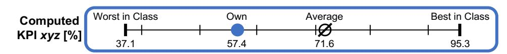
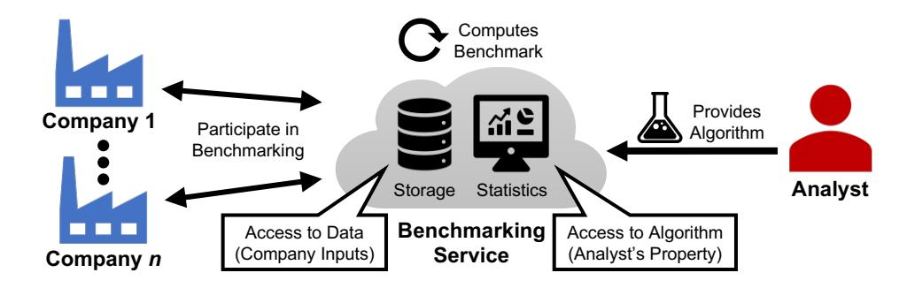
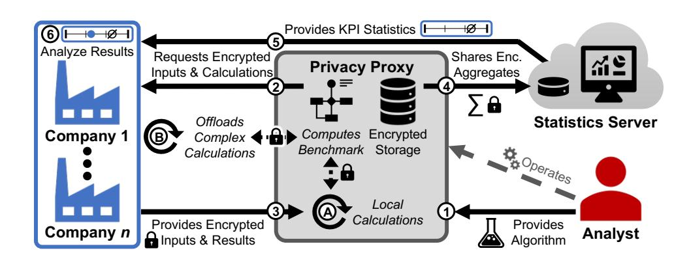
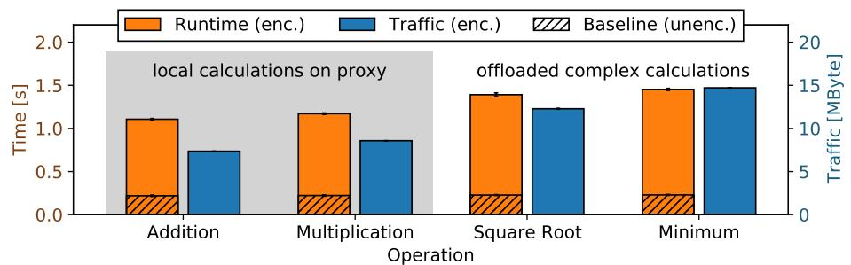
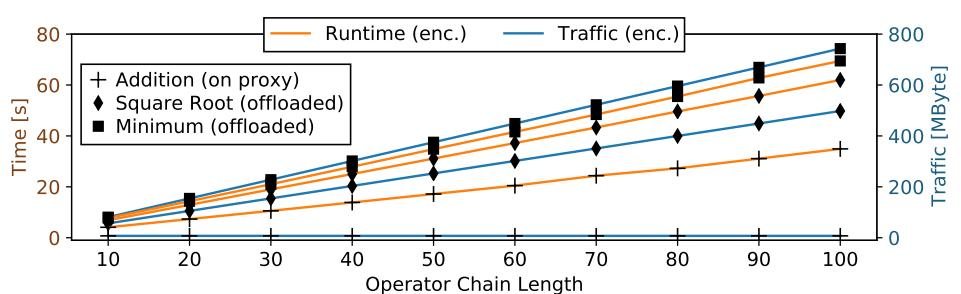
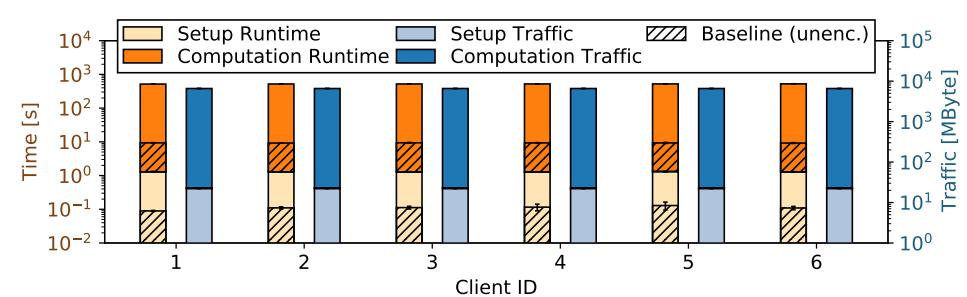
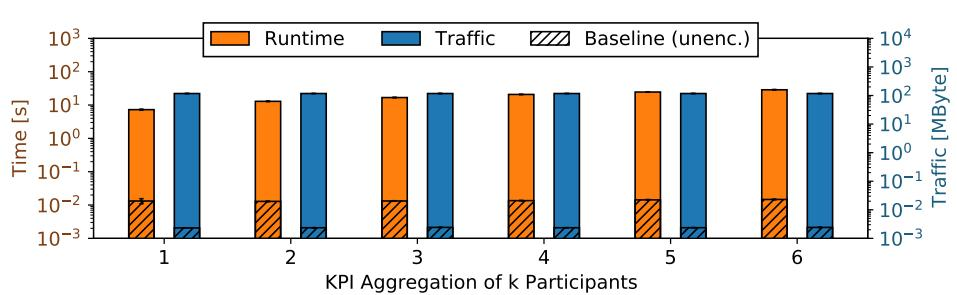
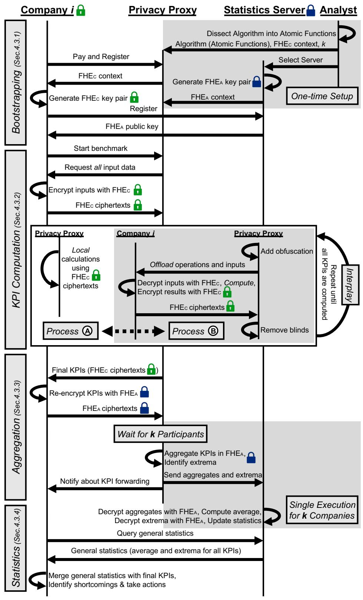

{0}------------------------------------------------

# Revisiting the Privacy Needs of Real-World Applicable Company Benchmarking

Jan Pennekamp\*, Patrick Sapel†, Ina Berenice Fink\*, Simon Wagner\*, Sebastian Reuter\*, Christian Hopmann†, Klaus Wehrle\*, and Martin Henze‡

\*Communication and Distributed Systems, RWTH Aachen University, Germany

†Institute for Plastics Processing, RWTH Aachen University, Germany

‡Cyber Analysis & Defense, Fraunhofer FKIE, Germany

{pennekamp, fink, swagner, reuter, wehrle}@comsys.rwth-aachen.de

{patrick.sapel, christian.hopmann}@ikv.rwth-aachen.de · martin.henze@fkie.fraunhofer.de

#### **ABSTRACT**

Benchmarking the performance of companies is essential to identify improvement potentials in various industries. Due to a competitive environment, this process imposes strong privacy needs, as leaked business secrets can have devastating effects on participating companies. Consequently, related work proposes to protect sensitive input data of companies using secure multi-party computation or homomorphic encryption. However, related work so far does not consider that also the benchmarking algorithm, used in today's applied real-world scenarios to compute all relevant statistics, itself contains significant intellectual property, and thus needs to be protected. Addressing this issue, we present PCB - a practical design for Privacy-preserving Company Benchmarking that utilizes homomorphic encryption and a privacy proxy — which is specifically tailored for realistic real-world applications in which we protect companies' sensitive input data and the valuable algorithms used to compute underlying key performance indicators. We evaluate PCB's performance using synthetic measurements and showcase its applicability alongside an actual company benchmarking performed in the domain of injection molding, covering 48 distinct key performance indicators calculated out of hundreds of different input values. By protecting the privacy of all participants, we enable them to fully profit from the benefits of company benchmarking.

#### **CCS CONCEPTS**

• Security and privacy  $\rightarrow$  Domain-specific security and privacy architectures; • Social and professional topics  $\rightarrow$  Intellectual property; • Applied computing  $\rightarrow$  Business intelligence;

#### **KEYWORDS**

practical encrypted computing; homomorphic encryption; algorithm confidentiality; benchmarking; key performance indicators; industrial application; Internet of Production

Permission to make digital or hard copies of part or all of this work for personal or classroom use is granted without fee provided that copies are not made or distributed for profit or commercial advantage and that copies bear this notice and the full citation on the first page. Copyrights for third-party components of this work must be honored. For all other uses, contact the owner/author(s).

Proceedings of the 8th Workshop on Encrypted Computing & Applied Homomorphic Cryptography (WAHC '20), December 15, 2020, Virtual Event

#### 1 INTRODUCTION

The increasing digitization of industries within the Industrial Internet of Things (IIoT), the Internet of Production, or Industry 4.0 [35, 44, 60, 71, 83] lays the foundation for an increase in cooperation and collaboration of companies for mutual benefits [25, 43, 69, 72]. One well-known and valuable form of industrial collaboration is *company benchmarking*, where "similar" companies compare with and learn from each other based on jointly collected performance statistics with the goal to stay competitive in fast-changing markets [52, 93]. Traditionally, a third party, e.g., a non-profit institution or industry association, would act as a single benchmarking operator and centrally collect input data from participating companies, compute the relevant statistics on the input data, and provide the comparison result back to the participating companies [33, 56, 80].

However, the input data provided by companies contains potentially sensitive information, such as business secrets [13, 38]. As this information might reveal critical information to competitors or the benchmarking operator, companies nowadays are extremely reserved w.r.t. participating in meaningful company benchmarking, especially if data is stored in the cloud [16, 94]. Such concerns regarding unintentional data leakage, thus not only thwart individual companies from benefiting from company benchmarking but also negatively impact the overall utility of company benchmarking, which commonly depends on a large number of participants [6].

To address these concerns, related work proposes different approaches to protect the sensitive input data of companies through secure multi-party computation (SMC) [8, 52, 54, 86] or homomorphic encryption (HE) [79]. More specifically, they privacy-preservingly compare and process all participants' inputs in secure round-based protocols, returning the results to participating companies only. Thus, related work indeed manages to sufficiently protect companies' input data and redress their data leakage concerns.

However, to realize their approaches, related work assumes that the task of deriving and computing relevant statistics based on companies' input data can be performed locally, which then allows them to resort to securely realizing the actual comparison. In real-world use cases, this assumption does not always hold: Developing an insightful benchmarking algorithm is a *costly* and *time-consuming* task [39, 57, 85, 87], and sharing the resulting algorithm with participants might reveal the significant intellectual property of the analyst who created and further refines the algorithm. Consequently, to maintain her competitive advantage, the

© 2020 Copyright held by the owner/author(s).

{1}------------------------------------------------

analyst wants to keep her algorithm private [\[30,](#page-11-10) [63\]](#page-12-17). To securely realize a real-world applicable company benchmarking, it is thus necessary to cater to the confidentiality requirements of the participating companies while also protecting the underlying algorithm used to compute the statistics that form the basis of the benchmark.

In this paper, we propose PCB, a Privacy-preserving Company Benchmarking design, which addresses the needs of both companies and the analyst. We introduce a novel, deployable concept utilizing a privacy proxy that only operates on encrypted data using homomorphic encryption. The individual results are further secured as the proxy only shares aggregates to offer non-sensitive public statistics to participants. Consequently, both companies and the analyst can participate in (and offer) company benchmarks without fearing to lose valuable intellectual property and business secrets. Thus, more companies can benefit from the advantages of benchmarks, while the overall utility of these benchmarks increases due to more advanced algorithms and a broader participant base.

Contributions. Our main contributions are as follows.

- We derive a set of generic challenges that are relevant for real-world company benchmarking and emphasize the need for algorithm confidentiality, a shortcoming in related work.
- We propose PCB, our privacy-preserving benchmarking design, that protects both the confidentiality of companies' input data and the valuable algorithm(s) used to compute the statistics that form the basis of today's benchmarks.
- We first show the general performance of PCB based on synthetic measurements. With PCB, we repeat a real-world benchmark in the injection molding industry, where 48 individual results are calculated based on 674 sensitive inputs, each consisting of 45 inputs and 114 computation steps per result on average. Our results (a runtime of 8.7 min per company and an average deviation of 0.16 % compared to a plaintext calculation) underline PCB' real-world applicability.

Organization. In Section [2,](#page-1-0) we detail our company benchmarking scenario and elaborate on the resulting challenges of realizing secure company benchmarking. Then, in Section [3,](#page-2-0) we discuss related work and its shortcomings concerning algorithm confidentiality, before we introduce our design of PCB, which provides algorithm confidentiality, in Section [4.](#page-3-0) We evaluate its performance and applicability in Section [5,](#page-7-0) before concluding the paper in Section [6.](#page-10-0)

## 2 SCENARIO

As a foundation for our work, we first introduce company benchmarking to create a shared understanding (Section [2.1\)](#page-1-1). Subsequently, in Section [2.2,](#page-1-2) we derive and highlight its open challenges.

## 2.1 Company Benchmarking

Benchmarking is a process of comparing different key aspects, such as products, services, or practices [\[5,](#page-11-11) [62\]](#page-12-18). While an internal benchmark only takes place inside one single business, an external benchmark, in contrast, is a process comparing a company's product, services, or practices with competitors and/or business leaders [\[62\]](#page-12-18). Company benchmarking is a specific external benchmarking that usually focuses on practices such as the company's operations and the management of the company or a department [\[62\]](#page-12-18).

Figure 1: Data for KPI xyz that is shared with a participant.

The main objectives of company benchmarking are to evaluate the company's current position on the market to identify the gap between the company and a recognized leader in a specific category as well as to improve the company's local processes to close this identified gap as much as possible. To compare products, services, or practices, suitable key performance indicators (KPIs) are computed [\[41,](#page-11-12) [47,](#page-12-19) [52,](#page-12-6) [97\]](#page-12-20). KPIs highlight the differences to the leader in a quantitative manner, for example, relating to the handling of customer complaints. Based on these results, participants can identify areas where the gap to the "best in class" participant is significant [\[89\]](#page-12-21). A specific example of a KPI that deals with the handling of customer complaints is the response time to one complaint [\[96\]](#page-12-22).

The individual performance for a single KPI might look like the representation in Figure [1,](#page-1-3) where the "own" value (marked in blue) is usually only available for the individual participant. Not only the identification but also any directly derivable action to improve the current status based on the specific benchmark result is a reason to participate [\[5,](#page-11-11) [41,](#page-11-12) [62,](#page-12-18) [96\]](#page-12-22). Concerning our previous example, the response time per complaint can be reduced by implementing a standardized feedback system, as demonstrated by competitors. Due to these benefits, companies are willing to pay for permission to participate in company benchmarks [\[84\]](#page-12-23). These costs cover the operational costs of the infrastructure and reward the analyst for its effort to derive the KPIs that are used as part of the benchmark.

Figure [2](#page-2-1) shows an external benchmark, including two main actors: a third-party analyst and participating companies. First, the analyst develops a questionnaire, suitable KPIs, and algorithms to compute those KPIs. The analyst shares the questionnaire with all participants. In contrast, algorithms for computing the KPIs based on the questionnaire are usually kept private by the analyst due to their value and intellectual property [\[39\]](#page-11-9). Participants answer the questionnaire and forward their data to the analyst, e.g., by uploading it to a cloud. Most importantly, they do not have access to raw data from other companies. Then, the KPIs are compared for the benchmark, and, eventually, the results are shared with the participants. One main concern for companies is that the questionnaire may query sensitive data (e.g., machine utilization or manufacturing costs) [\[50\]](#page-12-24). In this setting, the participants must trust the analyst to keep their data private and restrict its use to the KPI computation.

In summary, while benchmarking is a process for comparing different key aspects, it also serves as the foundation to start specific improvements on weak practices based on the benchmarking results [\[5\]](#page-11-11). In today's established settings, an open issue concerns the participants' input data, which should remain private. Likewise, the analyst's algorithm must stay confidential. Based on these general observations, we systematically derive existing (open) challenges for realizing privacy-preserving company benchmarking.

## 2.2 Challenges for Company Benchmarking

While company benchmarking provides numerous and sought-after benefits, its actual application in large-scale practical settings is nowadays limited. This limited adoption results from a diverse set

{2}------------------------------------------------

Figure 2: Multiple companies individually participate in a commercial company benchmarking. An analyst provides the needed algorithm to evaluate the customers' input data.

of challenges faced when realizing company benchmarking in a technical system that is real-world applicable, as we identify next. [C1:](#page-2-2) Company Privacy. Both the raw data required to calculate KPIs and individual KPIs of companies have to be treated as potential business secrets as they might reveal critical information to competitors. Well aware of these risks, companies nowadays are extremely reluctant to participate in centralized benchmarking systems that require access to data in plain text [\[43\]](#page-11-2). To address these reservations, protecting the privacy of company data is imperative, most importantly, by not transferring any potentially sensitive data in the clear to third parties. Consequently, the possibility and willingness of companies to participate in benchmarks will increase, allowing not only these companies to individually profit from the advantages of company benchmarking but also globally increasing the quality of company benchmarks through a broader data basis. [C2:](#page-2-3) Complexity. Related work frequently assumes that company benchmarking can be realized based on easily derivable statistics such as an average (across all participants) of a single metric, e.g., the response time to customer complaints (cf. Section [2.1\)](#page-1-1). However, in real-world settings, complex and often hierarchical, i.e., nested, computations are necessary to derive KPIs that enable a meaningful comparison between different companies [\[68\]](#page-12-25). For example, in a company benchmark performed in the domain of injection molding (cf. Section [5.2\)](#page-9-0), computing a KPI that expresses the overall effectiveness of the manufacturing equipment (e.g., to analyze the impact of different manufacturers and standards) requires 23 input values and a total of 83 calculations consisting of addition/subtraction (23 times), multiplication (27), division (25), and computation of the minimum (8). Consequently, to unleash the full potential of company benchmarking, such complex and hierarchical computations of KPIs need to be performed in a privacy-preserving manner.

[C3:](#page-2-4) Algorithm Confidentiality. A lot of effort, knowledge, and thus costs must be invested by an analyst to create and potentially maintain the complex algorithm required to calculate the KPIs underlying an impactful and commercially attractive company benchmarking [\[68\]](#page-12-25). Even for KPIs with seemingly simple calculations, significant effort by the analyst might be needed upfront to derive and compose these KPIs in a meaningful way. Consequently, a benchmarking algorithm needs to be considered as the intellectual property of the analyst who created it. Thus, to persuade analysts to contribute their valuable benchmarking algorithms to a (privacypreserving) benchmarking service, they require assurance that their intellectual property is sufficiently protected from competitors.

[C4:](#page-2-5) Exactness. Since KPIs underlying company benchmarking can involve complex hierarchical computations while comparison results might directly influence business decisions and the production

process, a high level of correctness of the performed calculations is vital. Thus, any privacy-preserving building block should not significantly impair the correctness of the performed calculations. Most importantly, this requirement forbids to distort or abstract values intentionally to protect the participants' privacy (cf. Section [3\)](#page-2-0). [C5:](#page-2-6) Flexibility. The participation of as many companies as possible is required to reach the full potential of company benchmarking [\[6\]](#page-11-7). Consequently, company benchmarking systems should be easy to use for participating companies, i.e., require only limited setup and no explicitly trained staff. Likewise, participating companies should need to upload their contributed values only once, without the requirement to (repeatedly) remain online during the whole collection phase. Finally, to provide long-term usability, algorithms should be updatable, including the possibility to introduce entirely new functional building blocks, e.g., new mathematical operators. This extensibility further includes the challenge of providing companies with the possibility to update their contributed values, e.g., if an updated algorithm requires additional values. Closely related to flexibility, company benchmarking systems need to scale independently of the number of participants as the utility of benchmarks increases with every new participant [\[6\]](#page-11-7), making it pivotal to easily scale with the number of benchmarked companies in a single setup.

We believe that any technical system for real-world applicable company benchmarking must carefully address these challenges to ensure deployability and usability for large-scale practical scenarios, while allowing as many participating companies as possible to benefit from privately-computed benchmarking advantages.

## 3 RELATED WORK OF BENCHMARKING

The challenge of collecting data from different sources to compute statistics, comparisons, or benchmarks has been studied from different angles, mostly centering around differential privacy, secure multi-party computation, and homomorphic encryption. In a setting primarily involving private users, different approaches tackle the challenge of securely crowdsourcing statistics from user devices [\[14,](#page-11-13) [31\]](#page-11-14), performing statistical queries over distributed data [\[18,](#page-11-15) [19\]](#page-11-16), or nudging users towards more privacy-conscious behavior based on comparisons [\[98\]](#page-12-26). All these approaches have in common that they are primarily concerned with protecting the privacy of user data using differential privacy to carefully distort aggregate statistics. While this focus is a reasonable trade-off when considering private users, company benchmarking involves complex and nested calculations of KPIs ([C2](#page-2-3)) and demands a high level of correctness ([C4](#page-2-5)), contradicting the design goals of differential privacy, which mainly concentrates on hiding the data's origin.

Focusing more on the requirements for company benchmarking, different approaches, especially work by Kerschbaum [\[51,](#page-12-27) [52,](#page-12-6) [54\]](#page-12-11), look into the collection of KPIs. While these approaches are mainly concerned with returning the average, variance, and maximum among others for each KPI (we deem the average, maximum, and minimum relevant; cf. Figure [1\)](#page-1-3), other related work also considers the regression of data series [\[6\]](#page-11-7) or the calculation of quantiles [\[79\]](#page-12-13).

In the following, we present relevant approaches grouped by their chosen concept and provide an overview of the respective categories and how they address the challenges we identified for real-world company benchmarking (cf. Section [2.2\)](#page-1-2) in Table [1.](#page-3-1)

{3}------------------------------------------------

Table 1: A comparison of different benchmarking designs.

|                                  |            | J Pri | racy Ch     | (2) ~ C | orff. C3)  Actress Cal Flexibility C3) |
|----------------------------------|------------|------------------|-------------|--------------------|----------------------------------------|
| Challenge                        | Cox        | npan's           | niplex Alge | orithic F.X.       | etres flexibility                      |
| Client Computation               | •          | •                | 0           | •                  | •                                      |
| Central Server                   |            |                  |             |                    |                                        |
| • Trusted Third Party [24]       | $\bigcirc$ |                  |             |                    | •                                      |
| • Secure Multi-Party [8, 52, 54] |            |                  | $\odot$     |                    | $\bigcirc$                             |
| Multiple Servers [79]            |            | •                | •           |                    | •                                      |
| • Our approach <i>PCB</i>        |            | •                | •           | •                  |                                        |

**Client Computation.** One main challenge in our work is the complexity of calculating KPIs from nested formulas (**C2**). To the best of our knowledge, only Damgård et al. [26] consider a complex benchmarking model. However, their SMC-based design with two servers is more related to database querying, i.e., not applicable.

A trivial approach would be to "offload" the initial computation step, i.e., calculation of the KPIs, to the participating companies. Then, any existing approach (presented in the following) could conduct the comparison of their computed KPIs while preserving the participants' privacy. As today's existing approaches fail to support the computation of complex benchmarking algorithms based on participants' input data, because they are tailored to compare readily available KPIs, all KPIs must be derived beforehand. Unfortunately, this concept violates the analyst's need for algorithm confidentiality (C3) as all calculations are computed locally.

**Central Server.** To ease the participation for companies, most related work relies on an architecture with a central server that handles all communication and helps to maintain the anonymity of participants. We further separated this approach into two subcategories according to their utilized concepts and building blocks.

Trusted Third Party (TTP). Computing and comparing all KPIs based on plaintext data at a single server operated by the analyst ensures exactness, flexibility, and algorithm confidentiality (even though related work did not consider the analyst's needs before). A TTP-based approach further reduces the complexity to a minimum. However, as stated in previous case studies [24, 33], the neglected company privacy (C1) hinders its adoption, and we believe that a TTP renders similar approaches infeasible for industry benchmarks.

Secure Multi-Party (SMC). SMC is a common concept to address company privacy. However, existing approaches neglect the complex KPI derivation as they usually do not consider any sensitive computations with analyst-defined algorithms. In principle, all SMC-based designs should be adaptable accordingly at additional communication costs. Unfortunately, traditional SMC concepts leak the (confidential) algorithm [64], violating C3. In theory, specifically-tailored approaches can address this limitation [64], however, they have not been presented in the context of company benchmarking so far. Most importantly, these designs are round-based and require the continuous participation of all involved companies. Thus, they do not satisfy the needed flexibility (C5). The individual scalability depends on the design and is at best quadratic [8, 54] in the number of participants for SMC-based concepts.

Such SMC-based benchmarking designs incorporate specific protocols, such as calculating sums [28], division [6] (also one of

the first works in the area of privacy-preserving benchmarking), the maximum [29], or the median [3]. Similarly, work to privacy-preservingly compare values [27] or shuffle encrypted data [9] is readily available for SMC-based benchmarking designs.

Catrina et al. [15] discuss the applicability of SMC in general and argue for designs with multiple providers to preserve client privacy as collusion with multiple providers is more unlikely.

Multiple Servers. To avoid redundancy, we exclude SMC-based approaches with multiple servers from Table 1. In the area of business surveys, Feigenbaum et al. [33] propose a protocol with two servers to protect sensitive salary information. More recently, PPBB [86] utilizes a proxy to encrypt client queries and returns the results afterward. In this concept (without an implementation), companies start the benchmarking process. Similarly, Herrmann et al. [47] propose a design where companies initiate the benchmark.

A HE-based design [79] similar to PCB incorporates two servers to certify sustainability metrics. In contrast to our design, their computations are fully offloaded to both servers at the expense of a limited set of supported calculations (C2). Furthermore, server collusion poses the risk of leaking private inputs and processing algorithms (C1 & C3). Next, we briefly classify our design PCB.

*PCB.* Our approach reduces the threats of collusion and thus improves **C1** as all inputs are encrypted with company-owned private keys during the KPI calculations. PCB keeps the sensitive algorithm private (**C3**) and can offload arbitrary functions to participants to mitigate the limitations of homomorphic encryption (**C2**).

As a related research question, other work [47, 51, 54, 82] looks into the influence and composition of peer groups on the privacy of participants. We consider this line of research as orthogonal and focus on the computation of KPIs without leaking the algorithm. We leave the intersection of these questions for future work.

**Research Gap.** While a variety of conceptual approaches in the area of company benchmarking exists, they all assume that KPIs are readily available for (privacy-preserving) comparisons, neglecting the process to derive them. However, such algorithms are extremely valuable, and ensuring their confidentiality is, therefore, a key concern of the analyst. Unfortunately, related work fails to address this need by solely focusing on the participants' privacy.

#### 4 PCB: A PRIVACY-PRESERVING DESIGN

To extend related work with an approach that respects the need for confidentiality of both the company's sensitive data and the valuable algorithm (C3), we present our Privacy-preserving Company Benchmarking (PCB). We first provide a high-level overview of PCB's design in Section 4.1. Subsequently, in Section 4.2, we provide the technical background of our concept before detailing the individual protocol steps in Section 4.3. Finally, we conclude our design presentation with a discussion of PCB's security in Section 4.4.

#### 4.1 Design Overview

Related work mostly concentrates on protecting the data of the participating companies. In contrast, our design additionally emphasizes the intellectual property of the analyst, i.e., we intend to protect the effort required to derive meaningful KPIs for the benchmarking of companies (cf. **C3**). To this end, we rely on an architecture consisting of two non-colluding servers: Our so-called

{4}------------------------------------------------

privacy proxy is operated by the analyst and securely computes the KPIs based on encrypted inputs provided by the participating companies. The *statistics server* receives the computed results as aggregates, processes them, and shares the statistics. An independent entity, such as an industry association (e.g., VDMA [92]), can operate this server, which is thus funded through membership fees.

In an honest-but-curious setting, PCB is secure by design: No entity on its own can get access to any external initial inputs or intermediate results of the KPI calculation, thus, maintaining company privacy. We further discuss the (limited) implications of colluding entities when considering a malicious attacker in Section 4.4.

Benchmarking with PCB. We illustrate our design in Figure 3 and detail its operation in the following. First, in Step ①, the analyst uploads her algorithm to the privacy proxy (under her control). As a result, she does not have to share the algorithm's sensitive content with any other entity. After a company registered itself by paying the participation fee (to compensate the analyst for her efforts), i.e., expressed its intention to participate, it receives an encryption key (for Step ④) from the statistics server. Then, in Step ②, the proxy requests all needed inputs for the KPI computation. Each participant homomorphically encrypts all requested data with its *own* public key and returns the corresponding ciphertexts in Step ③.

Based on these inputs, the *benchmark computation* is triggered. We automatically disassemble the analysts' algorithm into atomic functions, consisting of simple calculations (i.e., addition, subtraction, or multiplication) or complex operations (e.g., square root, ...). Then, the benchmark computation consists of two subprocesses: 

② Due to the used homomorphic encryption, the proxy can locally compute simple calculations directly on the ciphertexts (cf. Section 4.2). 
③ The proxy offloads complex operations, which cannot be computed directly on the ciphertexts, to each participating company. The company decrypts the received ciphertexts (i.e., results from its inputs and process ② at the privacy proxy) with its private key, calculates the requested operation on the plaintext data, and homomorphically re-encrypts the result, which it then returns to the proxy. Computing sophisticated algorithms is an iterative combination of *both* ③ and ⑤ until all KPIs are calculated.

This design ensures that only specific atomic functions are shared with the companies while the complete algorithm and its structure are kept entirely private. As we detail in Section 4.3.2, the proxy can reduce the knowledge gain from atomic functions to a minimum by obfuscating offloaded operations, e.g., using blinded ciphertexts.

Once all KPIs are computed according to the analyst's algorithm, the proxy returns the encrypted KPIs to the company, which decrypts them using its private key (also relevant for Step 6). Next, the proxy instructs the participant to return these KPIs homomorphically encrypted using the *statistics server*'s public key. The proxy then uses the received homomorphic ciphertexts to aggregate the results of k companies to hide their individual KPIs while providing the statistic server with the ability to compute the average.

In Step 4, the still encrypted aggregates are sent to the statistics server, which decrypts them with its private key. Then, the statistic server can compute the average for each KPI by dividing the aggregate by k. Additionally, to identify the worst/best in class, the proxy compares the homomorphically encrypted KPIs to identify the extrema of each KPI, i.e., minimum and maximum. After k

Figure 3: In PCB, the provided algorithm is only known to the privacy proxy, which operates on encrypted inputs only. Complex computations are offloaded to the customers if needed. Finally, the statistics server can decrypt received aggregates to share the results with participating companies.

participants, it also forwards these values to the statistics server to enable it to update the range of each KPI after decryption if needed.

Finally, in Step ⑤, the statistics server returns each KPI's result, i.e., average, maximum, and minimum, to the participant. In Step ⑥, integrating its own KPI results (returned by the proxy), the company assembles the presentation in Figure 1 for each KPI and analyzes its own performance to take appropriate actions (cf. Section 2.1). Afterward, the benchmark is concluded for this participant.

## 4.2 Technical Building Blocks of our Design

PCB relies on different well-established technical building blocks with proven security guarantees. Before introducing individual protocol steps in detail, we thus present all relevant building blocks.

**Homomorphic Encryption.** Homomorphic Encryption (HE) allows for calculations on encrypted data without requiring access to the underlying raw data, thus maintaining data confidentiality [2]. Conventional encryption schemes require to decrypt data before any calculations can be executed. Even though the result can be encrypted again, the entity which executes the calculations requires access to the keys of the data owner. Thus, an offloading of calculations is not possible without abandoning data privacy in the traditional way. In contrast, HE allows the execution of mathematical operations directly on encrypted data [2]. As encryption remains intact during the whole process, HE is a privacy-preserving approach for, e.g., outsourcing calculations to (untrusted) cloud servers [74, 99]. Different variants of HE feature distinct implications on usability and performance, including Fully Homomorphic Encryption (FHE) [34, 91] and Partially Homomorphic Encryption (PHE) [37, 67, 77]. While FHE allows a larger set of operations, it introduces computational overhead, additional storage needs, and decreased accuracy [2]. PHE is limited in the allowed operations, but implies fewer hardware requirements and performance loss [2]. In PCB, we realize calculations on company-encrypted data at the analyst's privacy proxy with FHE. Simultaneously, its supported operations ease the challenge to protect the algorithm (C3).

**k-Anonymity.** Even if data is properly anonymized, i.e., all identifiers have been stripped, unique values or value combinations might still allow (external) entities to draw conclusions on the company contributing these values [90]. Likewise, side-channel information such as timing information [73], i.e., at which point in time a company submitted its KPIs, can aid in de-anonymizing participating companies. To prevent such inference attacks, *k*-anonymity [90]

{5}------------------------------------------------

is a concept to create an anonymity set of size in which information on individual KPIs is aggregated over at least contributing companies before it is released. In this way, singling out of individual inputs and re-identification is hindered. However, aggregating data over multiple companies reduces the utility, as further analysis now can only be performed on the aggregate, not individual values.

WebAssembly. To ease the deployability of approaches relying on secure computations, such as HE [\[7\]](#page-11-28), WebAssembly [\[40\]](#page-11-29) offers a binary code-based language that enables platform-independent execution of low-level code in web browsers. Code written in native languages, such as C or C++, can be compiled to WebAssembly, allowing to conduct elaborate computations on the web efficiently [\[46\]](#page-12-38) while using standard libraries. For a simple deployment of PCB and to remove potential obstacles in running software with challenging to install dependencies (cf. [C5](#page-2-6)), we also offer a client implementation in WebAssembly for participating companies. Thereby, we relieve them of the burden of a complex software setup as they can simply interact with the privacy proxy using any modern browser.

## 4.3 Different Steps of our PCB Protocol

With these technical building blocks in mind, we now detail the different steps of PCB. To address the main challenges of company benchmarking, i.e., to ensure both company privacy ([C1](#page-2-2)) and algorithm confidentiality ([C3](#page-2-4)), the analyst-operated privacy proxy computes results on encrypted company inputs only before sharing aggregated KPIs of participants with the statistics server.

A requirement for benchmarking (using PCB) is that participation may only be offered to authenticated companies for two reasons. First, all company inputs must be attributed to the correct participant to enable our iterative KPI computation. Second, companies have to pay for the benchmarking, i.e., a mapping between the payment and the participant is needed. Here, we rely on existing authentication approaches with digital signatures [\[36\]](#page-11-30) and public key infrastructure, i.e., certificate authorities [\[1\]](#page-11-31). However, authentication in PCB is conceptually separated from the protocol.

We further assume that a suitable transport layer with integrity protection, such as TLS [\[76\]](#page-12-39), is in use. For clarity, we omit these aspects in the upcoming presentation, which follows the steps that we highlighted in our design overview in Figure [3.](#page-4-1) For a detailed sequence diagram, containing all messages as well as an illustration of the used encryption keys, we refer to Appendix [A.1.](#page-13-0)

4.3.1 Preparing the Benchmark and Setting up PCB. Bootstrapping a benchmarking campaign consists of two aspects. On the one hand, the analyst must define a suitable setting for the benchmark. This step includes that the analyst identifies meaningful KPIs and derives their computation steps, i.e., to create an algorithm that persuades the companies' willingness to pay for their participation. Furthermore, such an initial set of participants must be identified. Otherwise, the value of the benchmark decreases (cf. [C5](#page-2-6)) while protecting the individual participant's privacy is more challenging. Finally, the analyst must identify a statistic server she can work with, e.g., a server that is operated by an industry association.

On the other hand, the bootstrapping phase also concerns technical aspects. The analyst has to set up her privacy proxy, automatically dissect her algorithm into atomic functions without altering it in any way, and upload these operations to the proxy (cf. Step ○1 ). Additionally, she has to fix the HE scheme's context (e.g., the configured polynomial modulus) for the communication with the participants, i.e., to ensure that all participants encrypt their data with the used scheme properties. Finally, she defines the aggregation parameter , which equals the batch size of participants before any (encrypted) results are forwarded to the statistics server to protect the companies' individual KPIs. Besides, the statistic server should generate a fresh FHE key pair for each new benchmarking setup.

To participate, each company generates its own FHE key pair based on the defined HE context (to protect its data). They further register at the statistics server to retrieve its public FHE key. This key is later used when preparing the derived KPIs for aggregation.

4.3.2 KPI Computation Using Company Inputs. After this one-time preparation phase, PCB's main component is executed for each company individually. Companies trigger it whenever they want to participate and can also pause it independently if desired. Thus, our design ensures flexibility ([C5](#page-2-6)) for both participants and the analyst as PCB is not a round-based protocol where all companies have to participate simultaneously. Instead, the analyst can benchmark interested companies, i.e., compute their KPIs, at any time.

With this iterative protocol, the KPIs of each company are independently calculated. It concludes when all atomic functions have been computed using the company's inputs. Here, inputs refer to private, sensitive information of the participants, which are used to derive the KPIs (using the algorithm at the privacy proxy). To protect their inputs, companies encrypt all requested inputs with their public FHE keys. Next, we detail the subsequent KPI computation.

Interplay. First, the proxy requests all required inputs to compute the KPIs from the participating company (cf. Step ○2 ). The company returns this data homomorphically encrypted (cf. Step ○3 ). The proxy then determines which atomics functions can be calculated using these inputs at the moment, i.e., where all input ciphertexts are available. Given that the KPI algorithm is nested and consists of multiple layers, the proxy cannot compute all atomic functions immediately as intermediate results are still missing.

Depending on the operation, the proxy either computes the result locally directly on the homomorphic ciphertexts (cf. ○A ), or the proxy offloads such complex calculations to the company (cf. ○B ) if FHE does not support a specific operation. With these new results, the proxy checks for new atomic functions that can be computed. This iterative interplay concludes once all operations are processed (based on intermediate results), and the final KPIs are derived.

The offloading (○B ) works as follows. The company receives the operand with all required (encrypted) inputs. These inputs can also be a result of a local proxy computation (○A ). The company then decrypts the inputs with its private FHE key, computes the operation in plaintext, and re-encrypts the result with its public FHE key. The company then returns this ciphertext to the proxy.

For performance and algorithm confidentiality, we rely on batching that (i) immediately requests all input values and (ii) simultaneously offloads as many atomic functions as currently possible. This way, the overhead is minimized while drawing conclusions about individual processing steps of the algorithm is hardened. We further apply different algorithm obfuscation mechanisms in PCB to protect the algorithm confidentiality despite the offloading of (tiny) algorithm fragments. We detail these concepts in the following.

{6}------------------------------------------------

Algorithm Obfuscation. The algorithm is only available at the analyst-operated privacy proxy to realize C3. However, the offloading could leak tiny subsets of the algorithm, i.e., atomic functions, or intermediate results to the participants. Based on these algorithm fragments and the observed values, a malicious company could try to reverse-engineer the underlying algorithm that computes the KPIs. To minimize the information gain from these observations, PCB implements three (independent) concepts.

Randomization. The privacy proxy randomizes the identifier of an offloaded intermediate computation, i.e., a specific atomic function, its inputs ordering (if possible), and their ordering in a batch. Thereby, the interaction patterns and observed identifiers differ for each participant, challenging the algorithm's reconstruction.

*Dummy Requests.* The proxy further adds (useless) *dummy* computations to the offloaded calculations and initially also requests unused input data to distort the company's observations.

Blinding Calculations. If possible for an operand (cf. Section 5.2.2), the privacy proxy obfuscates the offloaded calculation with *blinds* added to its input values using HE before they are sent to the participant. These blinds are later removed (with HE) from the received intermediate result to obtain the intended computation.

With this supported obfuscation, our design addresses all needs across various use cases. As the latter two measures introduce overhead, especially if used excessively, the analyst must configure them appropriately. She should keep her own (cloud) resources as well as the number of participants and their resources in mind while also taking the trade-off between added overhead and a possibly strengthened algorithm confidentiality into account. These measures can even be flexibly adjusted within a single benchmark.

Computational Accuracy. The utilized homomorphic variant (FHE vs. PHE) impacts our design. Due to its flexibility, we favor an FHE scheme for PCB despite its increased computational complexity, potential inaccuracies, and larger ciphertext sizes. Considering the algorithm confidentiality (C3), FHE allows us to compute more operations at the proxy (cf. Section 5.2.2). Furthermore, it simplifies the obfuscation as blinding is easily implementable. Additionally, for settings with strict confidentiality needs, the analyst can also approximate complex (otherwise directly offloaded) functions, e.g., using FHE-supported operations, at the expense of sacrificing accuracy. Hence, the analyst can configure the trade-off between exactness (C4) and algorithm confidentiality (C3) as needed.

Theoretically, both HE variants could also be used simultaneously. However, when dissecting the algorithm, the analyst must keep in mind that PHE and FHE ciphertexts are incompatible.

**Flexibility.** In line with **C5**, PCB's offloading is a reasonable design choice despite any potential confidentiality concerns as it enables all types of complex computations. Thus, it provides a significant benefit as it allows the derivation of meaningful KPIs, improving the benchmark's utility for companies, increasing the number of participants, and thereby likely also the analyst's income.

4.3.3 Aggregating KPIs of Multiple Participating Companies. Once the KPIs of one participant have been computed, the results have to be prepared to be forwarded to the statistics server. To this end, the proxy returns the final company-encrypted KPI ciphertexts and asks the company to encrypt them with the statistics server's public FHE key instead. Through this step, companies get access to their own

KPIs, which were only stored at the proxy before. Thereby, they can later compare their performance to general (public) KPIs statistics, which are available at the statistics server (cf. Section 4.3.4).

To establish a meaningful anonymity set, the proxy waits at least until k participants returned their KPIs. The forwarding of any results to the statistics server (cf. Step 4) is then executed in batches of at least k new participants. Using these HE-encrypted ciphertexts, the proxy aggregates each of the KPIs individually before sharing the aggregates with the statistic server. The proxy further obliviously compares all ciphertexts to identify the extrema for each KPI [21, 22]. These results are also shared with the statistics server to allow for a range update, i.e., to set new minima or maxima.

**Choice of** k. Configuring the aggregation parameter k is a use case-specific trade-off weighing company privacy, flexibility, and the number of (expected) participants. On the one hand, a smaller choice of k results in a smaller anonymity set of the participants, potentially impairing their individual KPIs, i.e., their company privacy (C1). On the other hand, a large k increases the time until the first results are available at the statistics server. Furthermore, the computed KPIs might never be integrated into the statistics server if fewer than k companies participated. This aspect is especially relevant if the benchmark has been running for a longer period, and only a few new companies still contribute their KPIs. The proxy can also implement a buffer to release at least k contributions at fixed intervals [45]. For flexibility, k can also be updated during the regular operation of PCB. The analyst should then communicate the consequences (cf. k-Anonymity in Section 4.2) to the participants.

4.3.4 Updating and Serving Available Benchmark Statistics. Upon the first reception of aggregates (Step ④), the statistics server decrypts the ciphertexts using its FHE private key, computes the average by dividing the aggregate by the number of participants that contribute to this aggregate, and stores the resulting value for each KPI. During subsequent aggregates, the statistics server can update this average as it is aware of the total number of participants.

Along with the aggregates, the statistics server also receives the encrypted minimum and maximum for each KPI. The server decrypts them and updates the range of each KPI if needed. Upon the reception of (subsequent) range updates, the statistics server adjusts the respective range and discards the old extrema.

Once the aggregates are forwarded to the statistics server, the proxy notifies the relevant companies. These participants then query the statistics server for the general KPI statistics (cf. Step ⑤). For each KPI, they receive the average, minimum, and maximum. Afterward, they merge this data with their own KPIs (cf. Section 4.3.2) to obtain Figure 1 (cf. Step ⑥). Finally, based on the benchmark's results, participants analyze the results, can identify shortcomings (w.r.t. competitors), and derive actions to improve their status (cf. Section 2.1), such as adapting their current processes, e.g., implementing a standardized feedback system for customer complaints.

#### 4.4 Security Discussion

Our design of PCB focuses on company privacy (C1) and algorithm confidentiality (C3) alike. These aspects are essential to establish a successful benchmarking service as it must be accepted by both companies and their operators (most importantly, the analyst). As stated in Section 2.1, the number of participants influences the

{7}------------------------------------------------

utility of a benchmark and simultaneously influences the analyst's profits. Consequently, we underline that PCB not only offers flexibility and scalability ([C5](#page-2-6)) but is secure and private as well.

Design Foundations. The overall design of PCB builds on the KPI calculation using homomorphic ciphertexts. Thereby, the companies do not have to share their potentially sensitive input data with any third party, i.e., their private data is always protected ([C1](#page-2-2)). While the proxy can execute mathematical operations on the HE ciphertexts, it cannot decrypt its contents. Furthermore, any computed result is only forwarded to the statistics server after at least companies participated (cf. Section [4.3.3\)](#page-6-2) to ensure that no linking between a KPI and a company is possible for any entity.

Contrarily to related work, PCB satisfies the required algorithm confidentiality ([C3](#page-2-4)) because the proxy is operated by the analyst, and thus the algorithm is never shared with any third party. It further supports different flexible concepts to obfuscate any offloaded computations. Alternatively, the analyst can also approximate sensitive operations, if needed, at the expense of reduced accuracy.

Security Model. As the participants of PCB are registered companies that operate under specific legal jurisdictions, we consider them to being honest as misbehavior could be easily punished by law, e.g., incur huge monetary fees. Besides, they have to pay for their participation, discouraging impulsive or destructive actions. Similarly, we consider the analyst and the operator of the statistics server to be publicly-known entities who depend on their reputation as they want to generate revenue by offering privacy-preserving benchmarks. Therefore, we focus on an honest-but-curious attacker model, which is also a common setting in related work [\[6,](#page-11-7) [8\]](#page-11-8).

Submitting incorrect inputs is further disincentivized as this behavior equals a loss of the participant's investment as their computed KPIs are skewed along with the general statistics (i.e., average, minimum, and maximum). If the analyst fears that companies might pay to deliberately render the insights of the benchmark useless or phony for their competitors, she could dispatch an employee who observes their behavior on-site, e.g., to conduct sanity checks on the provided inputs or offloaded computations without extracting any sensitive data from the company's premises to ensure [C1](#page-2-2).

Entity Collusion. As stated in Section [4.1,](#page-3-2) PCB is secure by design. Despite our considered honest-but-curious attacker model, we still want to briefly discuss the potential threats of entity collusion: PCB only leaks specific details even when multiple entities collude. The confidentiality of the algorithm is always ensured because only the analyst and the proxy she operates gain access to it, i.e., an analyst must deliberately leak it, which contradicts her own goal.

Analyst and Statistics Server. Even if these entities would collude, they can only decrypt the computed KPI ciphertexts and link them to the participants, i.e., they can remove the added privacy resulting from our aggregation of participants. However, they cannot reveal intermediate results as these ciphertexts are individually encrypted with company-owned FHE keys. The security level of FHE ciphertexts is usually estimated based on the learning with errors (LWE) problem [\[4\]](#page-11-34), and can be configured as needed [\[75\]](#page-12-41).

In theory, a malicious analyst can define any input (even blinded) as KPI and decrypt (and unblind) the received data if he colludes with the statistics server. This fundamental problem exists for any approach where (i) the analyst can freely define the algorithm and (ii) the participants cannot judge the importance of an input for the benchmark. However, our assumption of honest-but-curious attackers is reasonable, especially given their public standing and the associated consequences (loss of reputation and legal punishment). A conceptual solution could be to execute an audited source code of the privacy proxy in an enclave [\[61\]](#page-12-42) in the cloud. Thereby, neither the analyst nor the statistics server can access the individual KPI ciphertexts before they are aggregated, i.e., ensuring -anonymity.

Company and an Operator. A company and the statistics server's operator or the analyst cannot jointly compromise any secret data.

Multiple Companies. If at least –1 companies collude, they can potentially reconstruct the KPIs of the non-colluding company based on the general KPI statistics, which are available at the statistics server, and their own KPIs. However, this action is a punishable offense as it clashes with cartel law [\[81\]](#page-12-43). Furthermore, such an attack is unrealistic for benchmarks with many participants and can easily be mitigated if the analyst configures a large .

Algorithm Confidentiality. PCB protects the analyst's algorithm by design ([C3](#page-2-4)). However, depending on the algorithm, the proxy has to offload computations to the participants. As we detailed in Section [4.3.2,](#page-5-1) our design features different obfuscation concepts to reduce any information leaks when offloading operations. These concepts can be configured according to use case-specific needs. In general, an FHE scheme offers more opportunities for blinding and reduces the operations that must be offloaded (cf. Section [5.2.2\)](#page-9-1). Alternatively, the analyst can also approximate calculations (e.g., with local computations) to hide critical, potentially revealing functions from the participants. For example, a non-linear function could be linearly approximated as a tangent to only rely on FHE-supported operations at the proxy. Thus, PCB is very flexible in ensuring [C3](#page-2-4).

Configuring k. The privacy of individual companies can be improved by increasing to increase the anonymity set, i.e., the data of more companies is processed jointly without any option to draw conclusions on the individual inputs (cf. Section [4.3.3\)](#page-6-2). Given that this need depends on the use case and should also consider the number of participants, the exact choice must be set individually for each benchmark. Thereby, we allow for flexible settings.

Company Privacy. To address [C1](#page-2-2), the proxy only receives ciphertexts to operate on without having access to any private keys (of companies or statistics server), i.e., preventing all decryptions. It forwards the encrypted KPIs in batches of at least participants to the statistics server, which cannot draw any conclusions on the individual companies as it only obtains aggregates after decryption.

Overall, we observe that PCB satisfies the required security needs. Even with entity collusion, only limited sensitive details are leaked as the majority of company data is still protected. We further demonstrate that due to PCB's flexibility, most security guarantees can even be further improved (e.g., adjusting or the used algorithm obfuscation), satisfying stronger, exceptional use case-specific needs.

## 5 PERFORMANCE EVALUATION

To assess the flexibility ([C5](#page-2-6)) and exactness ([C4](#page-2-5)) of PCB, we also conducted a performance evaluation of our proposed design. First, in Section [5.1,](#page-8-0) we investigate the impact of specific operations on the performance of PCB. Second, in Section [5.2,](#page-9-0) we consider a realworld use case in the domain of injection molding to highlight that PCB is a practical solution for realistic benchmarking settings.

{8}------------------------------------------------

**Implementation.** We implement a prototype of PCB in Python. For FHE, we rely on Microsoft SEAL [17] through a Python port [49]. For simplicity, we implement the extrema identification (minima and maxima, cf. Figure 1) in the aggregation phase using order-preserving encryption (OPE), i.e., we utilize pyope [66], which implements Boldyreva's OPE scheme [11]. Thus, companies must now encrypt the final KPIs twice (with FHE and OPE, cf. Section 4.3.3). The OPE ciphertexts then allow the proxy to identify the extrema for each KPI in the current set of k participants. For undisputed security, a HE-based comparison to identify the extrema per KPI should be used in a real-world deployment [22] as OPE ciphertexts leak details on the plaintexts by design [12, 55]. The privacy proxy and statistics server both run Flask webservers [78] with RESTful APIs. All data is persisted in SQLite databases [88]. We base64-encode ciphertexts prior to their transfers in JSON objects.

#### 5.1 General Performance

Before evaluating a real-world company benchmarking, we first conduct synthetic measurements of PCB's performance. In particular, we investigate the performance of specific atomic functions as well as the impact of nested computations and other influences.

5.1.1 Experimental Setup. We simultaneously run all entities of our design on a single commodity computer (Intel i5-2410M with 4 GB RAM and a regular HDD) to underline its moderate resource needs. The entities communicate over the loopback interface. We conduct 30 runs for each measurement, compute the mean, and calculate 99 % confidence intervals. We utilize the CKKS FHE scheme [20] in SEAL, which supports floating-point numbers, i.e., allows for more complex computations, in contrast to the also supported BFV FHE scheme [32]. We define six levels for multiplication as required by our real-world example (cf. Section 5.2). In particular, we achieve 128 bit-level security in SEAL with a polynomial modulus of 16 384.

5.1.2 Atomic Functions. To cover all aspects of our design, we cover two functions (addition and multiplication) that the proxy can directly compute on the homomorphically encrypted ciphertexts as well as two operations (square root and identifying the minimum of a set with two numbers) that must be offloaded to the participating company. For all settings, the proxy first requests two inputs (one for root computation) from the client. We illustrate the performance results in Figure 4 and also include baselines without any encryption, i.e., the same control flow without encryption.

The local computation at the proxy marginally outperforms the offloaded functions. However, constrained network links further amplify this effect as the transfer times increase. As expected, we further notice that multiplication incurs more complex computations in comparison to addition. Concerning the offloaded computations, we notice that the total runtime for computing the square root is slightly faster than identifying the minimum of two values because only a single ciphertext has to be encrypted and decrypted.

The traffic needs reveal the expected as the transfer of a single ciphertext adds <5 MB overhead. The local calculations at the proxy do not require an additional round trip for offloading the ciphertexts and returning the result. Thus, the offloaded functions result in more observed traffic. The difference between the square root and minimum computation stems from the number of input arguments.

Figure 4: Local computations on homomorphically encrypted data outperform offloaded atomic operations.

Figure 5: Longer chains of atomic functions scale linearly.

In comparison to the baseline, we notice at least a 5-fold increase in the runtime and a <5500-fold increase for the observed traffic across all functions. As expected, a secure implementation adds tolerable overhead in terms of runtime and traffic in today's settings.

5.1.3 Nested Computations. To investigate the scalability of the different atomic functions when having longer (nested) chains, we repeat the individual atomic functions up to 100 times each, as shown in Figure 5. As our configured number of set levels does not allow for chains of 100 multiplications (cf. Section 5.1.1), we refrain from a dedicated multiplicative chain evaluation at this point. In Appendix A.2, we discuss FHE multiplication and its used levels.

For all nested computations, we observe a linear complexity with an increasing chain length. Local computations at the proxy again outperform all offloaded operations. The benefits of local computations is especially apparent for the traffic as no ciphertexts need to be sent back and forth between proxy and company.

5.1.4 Discussion. Apart from our conducted measurements (operator and chain length), different properties of the company benchmarking setting influence the computational complexity.

Number of KPIs and Algorithm Complexity. Naturally, the number of KPIs has an influence on the required computations as each atomic function incurs overhead. However, the KPIs are independent of each other, i.e., they do not add polynomial complexity. For example, Kerschbaum et al. [52] expect up to 200 KPIs for a single benchmark. However, as we cannot give an algorithm-independent estimate concerning the number of atomic functions, we investigate a real-world example instead (cf. Section 5.2).

**Number of Participants.** Given that the computation of the KPIs is completely independent of all other participants, each participant takes the same time for the computation of the benchmark.

**Selection of** k. Increasing k, i.e., aggregating the results of more companies, results in fewer ciphertexts being transferred between the privacy proxy and the statistics server. However, in comparison to the repeated ciphertext exchange between the privacy proxy and the participants, its impact is negligible performance-wise.

**Storage Needs and Computational Resources.** Retaining all (received or computed) ciphertexts at the proxy might be helpful if new KPIs should be computed at a later point or if the used

{9}------------------------------------------------

algorithm is updated by the analyst. The ciphertexts add significant storage overhead when compared to plaintext numbers. Hence, aligned with C1, operators are encouraged to delete intermediate data and to only persist needed (encrypted) KPIs. Regardless, cloud deployments of both proxy and statistics server can allow both operators to scale to the individual needs of the current use case.

**Web-Based Client.** To improve the usability and deployability of PCB, we also implemented a WebAssembly-based client using an existing port of SEAL [65] and a ported OPE library. This client enables companies to participate in a privacy-preserving company benchmarking using a standard web browser, i.e., without the burden to set up complex software. We observe an expected [40] overhead of around 15 % when comparing the performance of this webbased client to our Python prototype. However, we believe that the associated benefits outweigh this modest performance overhead.

#### A Real-World Benchmarking Use Case 5.2

To evaluate the performance of our approach in real-world settings, we first introduce the background of our now considered (and previously conducted) real-world benchmark. Afterward, we integrate its algorithm in PCB and measure the performance with real inputs.

5.2.1 Company Benchmarking in the Injection Molding Industry. Initially conducted in 2014, a benchmark strictly focusing on the injection molding industry included a limited number of six participants ranging from small and medium-sized enterprises with 1000 employees and a turnover of 140 Mio. € to multinational corporations with 36 500 employees and 2.9 Bil. € turnover. The implemented benchmarking process included extensive manual labor by the analyst. First, the analyst shared the questionnaires with participants via email. Next, each company wrote their answers on a printout of the questionnaire and returned the results by mail to the analyst. Subsequently, the analyst manually inserted the input data into a self-developed software (with the valuable algorithm) to compute all KPIs. Finally, the analyst presented the results to each company in-person without revealing the identities of the remaining participants. This presentation also included recommendations for further actions to improve the company's position.

This real-world company benchmarking considers an organizational and technological perspective. The derived organizational KPIs relate to the financial status and the satisfaction of customers and employees. The technological perspective benchmarks the efficiency of manufacturing processes (such as the productivity of machines), means of production, and the range of the manufactured products, especially for injection molding. To ensure comparability, all participants report on three specific components, i.e., best-selling, most complex, and simplest product. The benchmark is not limited to some general KPIs, but mainly focuses on the efficiency of the injection molding department, e.g., how the participants' means harmonized with their portfolio. Furthermore, the competence to develop, design, and manufacture highly functional components or assemblies with low complexity is evaluated.

The questionnaire contained 423 distinct questions and collected a total of 674 inputs per participant to eventually compute 48 KPIs. Some of these values are extremely sensitive for the participants. For example, the manufacturing costs of representative components, the total costs of developing those components, or the hourly rate

of machines and employees thus must remain private. Likewise, they serve as input for valuable algorithms that cannot be handed to the participants to satisfy the analyst's confidentiality need.

In our considered benchmark, appropriate graphical notations present the results of KPIs. As previously shown in Figure 1, the position of a single company is presented with an average of all participants on a scale whose interval starts at the minimum value of a KPI (worst in class) and ends at the maximum value (best in class). To limit the participants' exposure, the best and worst in class companies remain anonymous. For example, KPIs containing process information (e.g., quality of the manufacturing processes, or ppm-rate) can be sensitive as competitors could derive or estimate the company's status. However, in 2014, the companies had to trust the analyst to not misuse their private inputs and computed KPIs.

5.2.2 Measurements of a Real-World Use Case. Based on the inputs that we collected from six companies in the injection molding industry in 2014, we evaluated our design using real-world data. We relied on the same algorithm that was developed for the previously mentioned questionnaire and deployed it at the privacy proxy.

**Algorithm Complexity.** The complete derivation of all KPIs is organized into 15 layers consisting of complex formulas each. We dissect these chains of formulas into atomic functions. The layered calculation of a KPI consist of subsequent atomic functions in the interval of [3; 51] with mean ( $\mu$ ) = 14, median = 11. For all KPIs, we calculate a total of 2173 operations ([0; 1330] with  $\mu$  = 114, median = 17). We are able to locally compute 1429 operations ([0; 878] with  $\mu$  = 73, median = 6) at the proxy and have to offload 744 operations ([0; 452] with  $\mu$  = 42, median = 8) operations to the participants.

A total of 8 inputs directly constitutes one of the 48 KPIs. The remaining KPIs are computed using the analyst's algorithm based on a different number of inputs ([2; 490] with  $\mu = 45$ , median = 8).

Atomic Functions. We list all functions that are part of our evaluated benchmark in Table 2 and indicate whether the respective operation is computable on the privacy proxy using PHE or FHE. During our evaluation, we computed addition, subtraction, and multiplication on the proxy and offloaded all remaining operations without any dummy requests or blinding. However, as we detail in Table 2, blinding is an option for all offloaded functions to prevent the leakage of the analyst's intellectual property using obfuscation.

Performance. We sequentially measured the company runtime of and observed traffic for each of our six participating companies

Table 2: Required Operations of our Real-World Algorithm.

| Scheme Operation            | Clear- text | PHE*   | FHE        | Note                                 |
|--------------------------------|----------------|--------|------------|--------------------------------------|
| Addition (+) / Subtraction (–) | ✓              | ✓      | ✓          | -                                    |
| Multiplication $(\cdot)$       | ✓              | scalar | ✓          | -                                    |
| Division $(x \div y)$          | ✓              | scalar | scalar     | Blind $x$ , $y$ with $\cdot c$       |
| Exponent $(x^n)$               | ✓              |        | <b>√</b> † | Blind with $\cdot c^n$               |
| Exponent $(x^y)$               | ✓              |        |            | Offload $(c \cdot x)^{y+d} \ddagger$ |
| Root ( $\sqrt[n]{x}$ )         | ✓              |        |            | Blind with $\cdot c^n$               |
| Absolute $( x )$               | ✓              |        |            | Blind $x$ with $\cdot c$             |
| Minimum / Maximum              | ✓              |        |            | Blind data with $\cdot c$            |

x, y correspond to encrypted private values and n denotes a value known to the proxy

Depends on the PHE scheme, i.e., additive [67] (shown) vs. multiplicative [77]

 $^\dagger$  Operation only feasible for small n only due to the multiplication levels in FHE

&lt;sup>‡ Inverse of  $(c \cdot x)^d$  must be requested from the company, partially leaking the blind

{10}------------------------------------------------

Figure 6: The runtime takes 8.7 min for each company, while the majority is needed to compute the KPIs. Both runtime and traffic (6.7 GB) are constant for all our six participants.

Figure 7: The aggregation overhead is negligible. Increasing k scales linearly with the runtime and traffic is constant.

and notice that the individual company inputs have no influence on our results. In Figure 6, we present the individual measurements. We use the logarithmic scale to highlight the marginal overhead of our bootstrapping phase (1.29 s runtime and 22 MB traffic), which is needed to generate and exchange the required key material. A runtime of 8.7 min per company and measured traffic of 6.7 GB between each company and privacy proxy indicate real-world applicability of PCB even with our complex algorithm. Even when quadrupling the number of KPIs (to reach nearly 200 as expected by Kerschbaum [52]) or with a constrained network link, our benchmark is concluded in less than a day (a considered boundary [53]).

In Figure 7, we detail the influence of iterating k from 1 to 6 during aggregation at the proxy and the subsequent transfer of the KPI aggregates. As seen before, the new additions only have a marginal impact on the runtime of at most 28 s. Regardless of the selected k only a single ciphertext is sent to the statistics server per KPI. Therefore, the measured traffic of 118 MB remains constant.

**Network Influence.** When considering real-world network conditions [10, 23, 95] (an asymmetric participant network link with 100 Mbit/s and 10 Mbit/s, respectively and a latency of 50 ms to the proxy, i.e., a connection between North America and Europe [42]), we observe an increased company runtime of 3.1 h due to the large volume of (uploaded) traffic over a slow link. The time required for networking increases 22-fold, where the initial upload of all encrypted 674 inputs takes significant time. In total, 1466 FHE ciphertexts are sent by each company to the proxy, including the results of 744 offloaded calculations and the final 48 KPIs. Thus, all in all, PCB is also applicable in real-world network settings.

We set these constrained network conditions with tcconfig [48]. **Exactness.** To check the exactness of our computed results (C4), we compare the results of our real-world use case using PCB operating on FHE ciphertexts with an implementation that operates on plaintext data. We compute the relative deviation from the plaintext results over all runs and clients and achieve an average deviation of 0.16% despite the nested computations. We observe the maximum deviation with 120.76% for a KPI that computes a really small value using small inputs, i.e., the absolute average deviation

is  $1.73 \times 10^{-7}$ , showcasing the impact of using FHE. A slightly inaccurate approximated representation of floating-point numbers in the used ciphertexts affects our (repeated) computations. As we did not modify our used real-world algorithm in any way, an analyst could easily adapt the algorithm, i.e., scale the inputs accordingly, to mitigate the observed effect. The results after aggregation of all KPIs across all companies with PCB deviates  $1.32 \times 10^{-3}$  % on average (maximum of 0.10 %) when compared to the plaintext results. These results highlight that PCB can handle even sophisticated KPI computations accurately, underlining its real-world applicability.

**Takeaway.** As shown with our real-world use case, our design PCB is able to compute a large number of KPIs based on a sophisticated algorithm, while protecting the required algorithm confidentiality, using commodity hardware in a reasonable amount of time and with an acceptable amount of produced traffic. Thus, PCB is applicable in real-world deployments for industrial benchmarks.

#### 6 CONCLUSION

In this paper, we revisited the privacy needs in company benchmarking. In contrast to related work, we also consider the analyst's needs who wants to protect her intellectual property, i.e., the algorithm used to compute KPIs from company inputs. Our design PCB ensures the analyst's confidentiality needs by keeping the valuable benchmarking algorithm private. PCB features two independent components. First, an analyst-operated proxy handles the benchmark and operates on encrypted data only. It offloads non-FHE-computable calculations to the participants. Second, a statistics server receives aggregates and shares the results with all participants. This way, the privacy of all entities is preserved.

Our evaluation underlines the scalability of PCB using synthetic benchmarks. We further repeat a real-world benchmark in the domain of injection molding with a sensitive benchmarking algorithm that may not be leaked to participants to highlight the feasibility of our approach. The privacy-preserving computation of all 48 KPIs for a single company with its 2173 atomic functions based on 674 inputs is finished after 8.7 min, even on commodity hardware.

Future Work. For future work, we are mainly interested in applying PCB to additional real-world use cases, e.g., to study the openness of production systems or the structure of production networks, where company benchmarking could not be performed so far due to severe privacy concerns. With PCB, we address these concerns and thus allow additional, previously untapped industries to benefit from company benchmarking. While additional use cases might identify further implementation effort, e.g., to support updates of the benchmarking algorithm or replacements of submitted company input as well as to also calculate the variance of KPIs across companies at the proxy [51, 52, 54], they would also allow us to further broaden our evaluation, e.g., to carefully look into the impact of obfuscation during offloading (cf. Section 4.3.2).

**Impact.** With PCB, we present a readily available and real-world applicable design for company benchmarking, which not only protects companies' privacy but (unlike related work) also addresses the needs of the analyst by protecting her valuable algorithm.

When looking at the vision of an Internet of Production [71], PCB could allow companies to identify unrealized potentials that would be retrievable through collaboration in a global lab of labs [70].

{11}------------------------------------------------

## ACKNOWLEDGMENTS

This work is funded by the Deutsche Forschungsgemeinschaft (DFG, German Research Foundation) under Germany's Excellence Strategy – EXC-2023 Internet of Production – 390621612. The authors would further like to thank Alexander Siuda for his work on the Web-Based client implementation and its corresponding evaluation.

## REFERENCES

- [1] Josh Aas, Richard Barnes, Benton Case, Zakir Durumeric et al. 2019. Let's Encrypt: An Automated Certificate Authority to Encrypt the Entire Web. In Proceedings of the 2019 ACM SIGSAC Conference on Computer and Communications Security (CCS '19). ACM, 2473–2487.<https://doi.org/10.1145/3319535.3363192>
- [2] Abbas Acar, Hidayet Aksu, A Selcuk Uluagac, and Mauro Conti. 2018. A Survey on Homomorphic Encryption Schemes: Theory and Implementation. Comput. Surveys 51, 4, 1–35.<https://doi.org/10.1145/3214303>
- [3] Gagan Aggarwal, Nina Mishra, and Benny Pinkas. 2004. Secure Computation of the kth-Ranked Element. In Proceedings of the International Conference on the Theory and Applications of Cryptographic Techniques (EUROCRYPT '04), Vol. 3027. Springer, 40–55. [https://doi.org/10.1007/978-3-540-24676-3\\_3](https://doi.org/10.1007/978-3-540-24676-3_3)
- [4] Martin R. Albrecht. 2017. On Dual Lattice Attacks Against Small-Secret LWE and Parameter Choices in HElib and SEAL. In Proceedings of the 36th Annual International Conference on the Theory and Applications of Cryptographic Techniques (EUROCRYPT '17), Vol. 10211. Springer, 103–129. [https://doi.org/10.1007/978-3-](https://doi.org/10.1007/978-3-319-56614-6_4) [319-56614-6\\_4](https://doi.org/10.1007/978-3-319-56614-6_4)
- [5] Bjørn Andersen and P-G Pettersen. 1995. Benchmarking Handbook. Springer.
- [6] Mikhail Atallah, Marina Bykova, Jiangtao Li, Keith Frikken et al. 2004. Private Collaborative Forecasting and Benchmarking. In Proceedings of the 2004 ACM Workshop on Privacy in the Electronic Society (WPES '04). ACM, 103–114. [https:](https://doi.org/10.1145/1029179.1029204) [//doi.org/10.1145/1029179.1029204](https://doi.org/10.1145/1029179.1029204)
- [7] Nuttapong Attrapadung, Goichiro Hanaoka, Shigeo Mitsunari, Yusuke Sakai et al. 2018. Efficient Two-Level Homomorphic Encryption in Prime-Order Bilinear Groups and A Fast Implementation in WebAssembly. In Proceedings of the 2018 ACM on Asia Conference on Computer and Communications Security (ASIACCS '18). ACM, 685–697.<https://doi.org/10.1145/3196494.3196552>
- [8] Kilian Becher, Martin Beck, and Thorsten Strufe. 2019. An Enhanced Approach to Cloud-based Privacy-preserving Benchmarking. In Proceedings of the 2019 International Conference on Networked Systems (NetSys '19). IEEE. [https://doi.](https://doi.org/10.1109/NetSys.2019.8854503) [org/10.1109/NetSys.2019.8854503](https://doi.org/10.1109/NetSys.2019.8854503)
- [9] Kilian Becher and Thorsten Strufe. 2020. Efficient Cloud-based Secret Shuffling via Homomorphic Encryption. arXiv:2002.05231.
- [10] David Belson. 2017. State of the Internet Report — Q1 2017 report. Technical Report. Akamai Technologies.
- [11] Alexandra Boldyreva, Nathan Chenette, Younho Lee, and Adam O'neill. 2009. Order-Preserving Symmetric Encryption. In Proceedings of the 28th Annual International Conference on the Theory and Applications of Cryptographic Techniques (EUROCRYPT '09), Vol. 5479. Springer, 224–241. [https://doi.org/10.1007/978-3-](https://doi.org/10.1007/978-3-642-01001-9_13) [642-01001-9\\_13](https://doi.org/10.1007/978-3-642-01001-9_13)
- [12] Alexandra Boldyreva, Nathan Chenette, and Adam O'Neill. 2011. Order-Preserving Encryption Revisited: Improved Security Analysis and Alternative Solutions. In Proceedings of the 31st Annual Cryptology Conference on Advances in Cryptology (CRYPTO '11), Vol. 6841. Springer, 578–595. [https://doi.org/10.1007/](https://doi.org/10.1007/978-3-642-22792-9_33) [978-3-642-22792-9\\_33](https://doi.org/10.1007/978-3-642-22792-9_33)
- [13] Louise Boulter. 2003. Legal issues in benchmarking. Benchmarking: An International Journal 10, 6, 528–537.<https://doi.org/10.1108/14635770310505166>
- [14] Joshua W. S. Brown, Olga Ohrimenko, and Roberto Tamassia. 2013. Haze: Privacypreserving Real-time Traffic Statistics. In Proceedings of the 21st ACM SIGSPATIAL International Conference on Advances in Geographic Information Systems (SIGSPA-TIAL '13). ACM, 540–543.<https://doi.org/10.1145/2525314.2525323>
- [15] Octavian Catrina and Florian Kerschbaum. 2008. Fostering the uptake of secure multiparty computation in e-commerce. In Proceedings of the 2008 3rd International Conference on Availability, Reliability and Security (ARES '08). IEEE, 693–700. <https://doi.org/10.1109/ARES.2008.49>
- [16] Paolina Centonze. 2019. Cloud Auditing and Compliance. Wiley, 157–188.
- [17] Hao Chen, Kim Laine, and Rachel Player. 2017. Simple Encrypted Arithmetic Library - SEAL v2.1. In Proceedings of the 21st International Conference on Financial Cryptography and Data Security (FC '17), Vol. 10323. Springer, 3–18. [https:](https://doi.org/10.1007/978-3-319-70278-0_1) [//doi.org/10.1007/978-3-319-70278-0\\_1](https://doi.org/10.1007/978-3-319-70278-0_1)
- [18] Ruichuan Chen, Istemi Ekin Akkus, and Paul Francis. 2013. SplitX: Highperformance Private Analytics. In Proceedings of the ACM SIGCOMM 2013 Conference on SIGCOMM (SIGCOMM '13). ACM, 315–326. [https://doi.org/10.1145/](https://doi.org/10.1145/2486001.2486013) [2486001.2486013](https://doi.org/10.1145/2486001.2486013)
- [19] Ruichuan Chen, Alexey Reznichenko, Paul Francis, and Johannes Gehrke. 2012. Towards Statistical Queries over Distributed Private User Data. In Proceedings of the 9th USENIX Symposium on Networked Systems Design and Implementation

- (NSDI '12). USENIX Association, 169–182.
- [20] Jung Hee Cheon, Andrey Kim, Miran Kim, and Yongsoo Song. 2017. Homomorphic Encryption for Arithmetic of Approximate Numbers. In Proceedings of the 23rd International Conference on the Theory and Application of Cryptology and Information Security (ASIACRYPT '17), Vol. 10624. Springer, 409–437. [https://doi.org/10.1007/978-3-319-70694-8\\_15](https://doi.org/10.1007/978-3-319-70694-8_15)
- [21] Jung Hee Cheon, Dongwoo Kim, and Duhyeong Kim. 2019. Efficient Homomorphic Comparison Methods with Optimal Complexity. Cryptology ePrint Archive 2019/1234.
- [22] Heewon Chung, Myungsun Kim, Ahmad Al Badawi, Khin Mi Mi Aung et al. 2020. Homomorphic Comparison for Point Numbers with User-Controllable Precision and Its Applications. Symmetry 12, 5.<https://doi.org/10.3390/sym12050788>
- [23] Cisco. 2020. Cisco Annual Internet Report (2018–2023) White Paper. White Paper. Cisco.
- [24] John Crotts, Bing Pan, Colleen Dimitry, and Heather Goldman. 2006. A Case Study on Developing an Internet-Based Competitive Analysis and Benchmarking Tool for Hospitality Industry.
- [25] Markus Dahlmanns, Johannes Lohmöller, Ina Berenice Fink, Jan Pennekamp et al. 2020. Easing the Conscience with OPC UA: An Internet-Wide Study on Insecure Deployments. In Proceedings of the ACM Internet Measurement Conference (IMC '20). ACM, 101–110.<https://doi.org/10.1145/3419394.3423666>
- [26] Ivan Damgård, Kasper Damgård, Kurt Nielsen, Peter Sebastian Nordholt et al. 2016. Confidential Benchmarking Based on Multiparty Computation. In Proceedings of the 20th International Conference on Financial Cryptography and Data Security (FC '16), Vol. 9603. Springer, 169–187. [https://doi.org/10.1007/978-3-](https://doi.org/10.1007/978-3-662-54970-4_10) [662-54970-4\\_10](https://doi.org/10.1007/978-3-662-54970-4_10)
- [27] Ivan Damgård, Martin Geisler, and Mikkel Kroigard. 2008. Homomorphic encryption and secure comparison. International Journal of Applied Cryptography 1, 1, 22–31.<https://doi.org/10.1504/IJACT.2008.017048>
- [28] Giovanni Di Crescenzo. 2000. Private Selective Payment Protocols. In Proceedings on the 4th International Conference on Financial Cryptography (FC '00), Vol. 1962. Springer, 72–89. [https://doi.org/10.1007/3-540-45472-1\\_6](https://doi.org/10.1007/3-540-45472-1_6)
- [29] Giovanni Di Crescenzo. 2001. Privacy for the stock market. In Proceedings of the 5th International Conference on Financial Cryptography (FC '01), Vol. 2339. Springer, 269–288. [https://doi.org/10.1007/3-540-46088-8\\_22](https://doi.org/10.1007/3-540-46088-8_22)
- [30] Josef Drexel. 2019. Economic Efficiency versus Democracy: On the Potential Role of Competition Policy in Regulating Digital Markets in Times of Post-Truth Politics. Cambridge University Press, 242–268.<https://doi.org/10.1017/9781108628105>
- [31] Úlfar Erlingsson, Vasyl Pihur, and Aleksandra Korolova. 2014. RAPPOR: Randomized Aggregatable Privacy-Preserving Ordinal Response. In Proceedings of the 2014 ACM SIGSAC Conference on Computer and Communications Security (CCS '14). ACM, 1054–1067.<https://doi.org/10.1145/2660267.2660348>
- [32] Junfeng Fan and Frederik Vercauteren. 2012. Somewhat Practical Fully Homomorphic Encryption. Cryptology ePrint Archive 2012/144.
- [33] Joan Feigenbaum, Benny Pinkas, and Raphael Ryger. 2004. Secure computation of surveys.
- [34] Craig Gentry. 2009. Fully Homomorphic Encryption Using Ideal Lattices. In Proceedings of the 41st Annual ACM Symposium on Theory of Computing (STOC '09). ACM, 169–178.<https://doi.org/10.1145/1536414.1536440>
- [35] René Glebke, Martin Henze, Klaus Wehrle, Philipp Niemietz et al. 2019. A Case for Integrated Data Processing in Large-Scale Cyber-Physical Systems. In Proceedings of the 52nd Hawaii International Conference on System Sciences (HICSS '19). AIS, 7252–7261.<https://doi.org/10.24251/HICSS.2019.871>
- [36] Oded Goldreich. 2001. Foundations of Cryptography: Basic Tools. Cambridge University Press.
- [37] Shafi Goldwasser and Silvio Micali. 1984. Probabilistic encryption. J. Comput. System Sci. 28, 2, 270–299. [https://doi.org/10.1016/0022-0000\(84\)90070-9](https://doi.org/10.1016/0022-0000(84)90070-9)
- [38] Gwyn Groves and James Douglas. 1994. Experiences of Competitive Benchmarking Research in UK Manufacturing. In Advances In Manufacturing Technology VIII: Proceedings of the 10th National Conference On Manufacturing Research. CRC Press, 53–58.
- [39] Angappa Gunasekaran, Goran D Putnik, Josée St-Pierre, and Sylvain Delisle. 2006. An expert diagnosis system for the benchmarking of SMEs' performance. Benchmarking: An International Journal 13, 1–2, 106–119. [https://doi.org/10.](https://doi.org/10.1108/14635770610644619) [1108/14635770610644619](https://doi.org/10.1108/14635770610644619)
- [40] Andreas Haas, Andreas Rossberg, Derek L. Schuff, Ben L. Titzer et al. 2017. Bringing the web up to speed with WebAssembly. In Proceedings of the 38th ACM SIGPLAN Conference on Programming Language Design and Implementation (PLDI '17). ACM, 185–200.<https://doi.org/10.1145/3062341.3062363>
- [41] Stephen Hanman. 1997. Benchmarking Your Firm's Performance With Best Practice. The International Journal of Logistics Management 8, 2, 1–18. [https:](https://doi.org/10.1108/09574099710805637) [//doi.org/10.1108/09574099710805637](https://doi.org/10.1108/09574099710805637)
- [42] Martin Henze. 2018. Accounting for Privacy in the Cloud Computing Landscape. Ph.D. Dissertation.
- [43] Martin Henze. 2020. The Quest for Secure and Privacy-preserving Cloud-based Industrial Cooperation. In Proceedings of the 2020 IEEE Conference on Communications and Network Security (CNS '20). IEEE. [https://doi.org/10.1109/CNS48642.](https://doi.org/10.1109/CNS48642.2020.9162199)

{12}------------------------------------------------

- [2020.9162199](https://doi.org/10.1109/CNS48642.2020.9162199) Proceedings of the 6th International Workshop on Security and Privacy in the Cloud (SPC '20).
- [44] Martin Henze, Jens Hiller, René Hummen, Roman Matzutt et al. 2017. Network Security and Privacy for Cyber-Physical Systems. Wiley, 25–56. [https://doi.org/](https://doi.org/10.1002/9781119226079.ch2) [10.1002/9781119226079.ch2](https://doi.org/10.1002/9781119226079.ch2)
- [45] Martin Henze, Ritsuma Inaba, Ina Berenice Fink, and Jan Henrik Ziegeldorf. 2017. Privacy-preserving Comparison of Cloud Exposure Induced by Mobile Apps. In Proceedings of the 14th EAI International Conference on Mobile and Ubiquitous Systems: Computing, Networking and Services (MobiQuitous '17). ACM, 543–544. <https://doi.org/10.1145/3144457.3144511>
- [46] David Herrera, Hanfeng Chen, Erick Lavoie, and Laurie Hendren. 2018. Numerical Computing on the Web: Benchmarking for the Future. In Proceedings of the 14th ACM SIGPLAN International Symposium on Dynamic Languages (DLS '18). ACM, 88–100.<https://doi.org/10.1145/3276945.3276968>
- [47] Dominik Herrmann, Florian Scheuer, Philipp Feustel, Thomas Nowey et al. 2009. A Privacy-Preserving Platform for User-Centric Quantitative Benchmarking. In Proceedings of the 6th International Conference on Trust, Privacy and Security in Digital Business (TrustBus '09). Springer, 32–41. [https://doi.org/10.1007/978-3-](https://doi.org/10.1007/978-3-642-03748-1_4) [642-03748-1\\_4](https://doi.org/10.1007/978-3-642-03748-1_4)
- [48] Tsuyoshi Hombashi. 2016. Tcconfig. [https://github.com/thombashi/tcconfig.](https://github.com/thombashi/tcconfig)
- [49] Huelse. 2019. SEAL-Python. [https://github.com/Huelse/SEAL-Python/.](https://github.com/Huelse/SEAL-Python/)
- [50] Gianni Jacucci, Gustav J. Olling, Kenneth Preiss, and Michael J. Wozny. 2013. Globalization of Manufacturing in the Digital Communications Era of the 21st Century. Springer.
- [51] Florian Kerschbaum. 2007. Building a Privacy-Preserving Benchmarking Enterprise System. In Proceedings of the 11th IEEE International Enterprise Distributed Object Computing Conference (EDOC '07). IEEE. [https://doi.org/10.1109/EDOC.](https://doi.org/10.1109/EDOC.2007.13) [2007.13](https://doi.org/10.1109/EDOC.2007.13)
- [52] Florian Kerschbaum. 2008. Practical Privacy-Preserving Benchmarking. In Proceedings of The IFIP TC-11 23rd International Information Security Conference (SEC '09). Springer, 17–31. [https://doi.org/10.1007/978-0-387-09699-5\\_2](https://doi.org/10.1007/978-0-387-09699-5_2)
- [53] Florian Kerschbaum. 2010. A Privacy-Preserving Benchmarking Platform. Ph.D. Dissertation. Karlsruhe Institute of Technology.
- [54] Florian Kerschbaum. 2011. Secure and Sustainable Benchmarking in Clouds. Business & Information Systems Engineering 3, 3, 135–143. [https://doi.org/10.](https://doi.org/10.1007/s12599-011-0153-9) [1007/s12599-011-0153-9](https://doi.org/10.1007/s12599-011-0153-9)
- [55] Florian Kerschbaum. 2015. Frequency-Hiding Order-Preserving Encryption. In Proceedings of the 22nd ACM SIGSAC Conference on Computer and Communications Security (CCS '15). ACM, 656–667.<https://doi.org/10.1145/2810103.2813629>
- [56] Metin Kozak. 2004. Destination Benchmarking: Concepts, Practices and Operations. CABI.
- [57] Sandip K. Lahiri. 2017. Multivariable Predictive Control: Applications in Industry. Wiley.
- [58] Kim Laine. 2019 (accessed July 20, 2020). Bootstrapping module in Microsoft Homomorphic Encryption Library SEAL. [https://stackoverflow.com/questions/](https://stackoverflow.com/questions/54920783/bootstrapping-module-in-microsoft-homomorphic-encryption-library-seal) [54920783/bootstrapping-module-in-microsoft-homomorphic-encryption](https://stackoverflow.com/questions/54920783/bootstrapping-module-in-microsoft-homomorphic-encryption-library-seal)[library-seal.](https://stackoverflow.com/questions/54920783/bootstrapping-module-in-microsoft-homomorphic-encryption-library-seal)
- [59] Kim Laine. 2019 (accessed July 20, 2020). SEAL-CKKS max multiplication depth. [https://stackoverflow.com/questions/55268399/seal-ckks-max](https://stackoverflow.com/questions/55268399/seal-ckks-max-multiplication-depth)[multiplication-depth.](https://stackoverflow.com/questions/55268399/seal-ckks-max-multiplication-depth)
- [60] Heiner Lasi, Peter Fettke, Hans-Georg Kemper, Thomas Feld et al. 2014. Industry 4.0. Business & Information Systems Engineering 6, 4, 239–242. [https://doi.org/10.](https://doi.org/10.1007/s12599-014-0334-4) [1007/s12599-014-0334-4](https://doi.org/10.1007/s12599-014-0334-4)
- [61] Pieter Maene, Johannes Götzfried, Ruan De Clercq, Tilo Müller et al. 2017. Hardware-Based Trusted Computing Architectures for Isolation and Attestation. IEEE Trans. Comput. 67, 3.<https://doi.org/10.1109/TC.2017.2647955>
- [62] José Maria Viedma Marti and Maria do Rosário Cabrita. 2012. Entrepreneurial Excellence in the Knowledge Economy: Intellectual Capital Benchmarking Systems. Palgrave Macmillan.
- [63] Steffen Mau. 2019. The Metric Society: On the Quantification of the Social. Wiley.
- [64] Payman Mohassel and Saeed Sadeghian. 2013. How to Hide Circuits in MPC an Efficient Framework for Private Function Evaluation. In Proceedings of the 32nd Annual International Conference on the Theory and Applications of Cryptographic Techniques (EUROCRYPT '13), Vol. 7881. Springer, 557–574. [https://doi.org/10.](https://doi.org/10.1007/978-3-642-38348-9_33) [1007/978-3-642-38348-9\\_33](https://doi.org/10.1007/978-3-642-38348-9_33)
- [65] Morfix, Inc. 2019. node-seal. [https://github.com/morfix-io/node-seal.](https://github.com/morfix-io/node-seal)
- [66] Anton Ovchinnikov. 2014. pyope. [https://github.com/tonyo/pyope.](https://github.com/tonyo/pyope)
- [67] Pascal Paillier. 1999. Public-Key Cryptosystems Based on Composite Degree Residuosity Classes. In Proceedings of the International Conference on the Theory and Application of Cryptographic Techniques (EUROCRYPT '99), Vol. 1592. Springer, 223–238. [https://doi.org/10.1007/3-540-48910-X\\_16](https://doi.org/10.1007/3-540-48910-X_16)
- [68] David Parmenter. 2015. Key Performance Indicators: Developing, Implementing, and Using Winning KPIs (3rd ed.). Wiley.
- [69] Jan Pennekamp, Erik Buchholz, Yannik Lockner, Markus Dahlmanns et al. 2020. Privacy-Preserving Production Process Parameter Exchange. In Proceedings of the 36th Annual Computer Security Applications Conference (ACSAC '20). ACM. <https://doi.org/10.1145/3427228.3427248>

- [70] Jan Pennekamp, Markus Dahlmanns, Lars Gleim, Stefan Decker et al. 2019. Security Considerations for Collaborations in an Industrial IoT-based Lab of Labs. In Proceedings of the 3rd IEEE Global Conference on Internet of Things (GCIoT '19). IEEE.<https://doi.org/10.1109/GCIoT47977.2019.9058413>
- [71] Jan Pennekamp, René Glebke, Martin Henze, Tobias Meisen et al. 2019. Towards an Infrastructure Enabling the Internet of Production. In Proceedings of the 2019 IEEE International Conference on Industrial Cyber Physical Systems (ICPS '19). IEEE, 31–37.<https://doi.org/10.1109/ICPHYS.2019.8780276>
- [72] Jan Pennekamp, Martin Henze, Simo Schmidt, Philipp Niemietz et al. 2019. Dataflow Challenges in an Internet of Production: A Security & Privacy Perspective. In Proceedings of the ACM Workshop on Cyber-Physical Systems Security & Privacy (CPS-SPC '19). ACM, 27–38.<https://doi.org/10.1145/3338499.3357357>
- [73] Andreas Pfitzmann and Marit Hansen. 2010. A terminology for talking about privacy by data minimization: Anonymity, Unlinkability, Undetectability, Unobservability, Pseudonymity, and Identity Management. Technical Report. TU Dresden.
- [74] Raluca Ada Popa, Catherine M. S. Redfield, Nickolai Zeldovich, and Hari Balakrishnan. 2011. CryptDB: Protecting Confidentiality with Encrypted Query Processing. In Proceedings of the 23rd ACM Symposium on Operating Systems Principles (SOSP '11). ACM, 85–100.<https://doi.org/10.1145/2043556.2043566>
- [75] Oded Regev. 2005. On Lattices, Learning with Errors,. Random Linear Codes, and Cryptography. In Proceedings of the 37th Annual ACM Symposium on Theory of Computing (STOC '05). ACM, 84–93.<https://doi.org/10.1145/1060590.1060603>
- [76] Eric Rescorla. 2018. The Transport Layer Security (TLS) Protocol Version 1.3. IETF RFC 8446.
- [77] Ronald Rivest, Adi Shamir, and Leonard Adleman. 1978. A Method for Obtaining Digital Signatures and Public-key Cryptosystems. Commun. ACM 21, 2, 120–126. <https://doi.org/10.1145/359340.359342>
- [78] Armin Ronacher. 2010. Flask. [https://palletsprojects.com/p/flask/.](https://palletsprojects.com/p/flask/)
- [79] Cetin Sahin, Brandon Kuczenski, Omer Egecioglu, and Amr El Abbadi. 2018. Privacy-Preserving Certification of Sustainability Metrics. In Proceedings of the 8th ACM Conference on Data and Application Security and Privacy (CODASPY '18). ACM, 53–63.<https://doi.org/10.1145/3176258.3176308>
- [80] Karin Schaad and Susanne Hofer. 2020. Benchmarking. Springer, 115–138. [https:](https://doi.org/10.1007/978-3-030-35314-8_4) [//doi.org/10.1007/978-3-030-35314-8\\_4](https://doi.org/10.1007/978-3-030-35314-8_4)
- [81] Ingo Schmidt and Justus Haucap. 2013. Competition Policy and Cartel Law: An Interdisciplinary Introduction (10th ed.). De Gruyter.
- [82] Axel Schroepfer, Andreas Schaad, Florian Kerschbaum, Heiko Boehm et al. 2013. Secure Benchmarking in the Cloud. In Proceedings of the 18th ACM Symposium on Access Control Models and Technologies (SACMAT '13). ACM, 197–200. [https:](https://doi.org/10.1145/2462410.2462430) [//doi.org/10.1145/2462410.2462430](https://doi.org/10.1145/2462410.2462430)
- [83] Martin Serror, Sacha Hack, Martin Henze, Marko Schuba et al. 2020. Challenges and Opportunities in Securing the Industrial Internet of Things. IEEE Transactions on Industrial Informatics.<https://doi.org/10.1109/TII.2020.3023507>
- [84] Y. Krishna Shetty. 1993. Aiming high: Competitive benchmarking for superior performance. Long Range Planning 26, 1, 39–44.
- [85] Ricky Smith and R. Keith Mobley. 2011. Rules of Thumb for Maintenance and Reliability Engineers. Butterworth-Heinemann.
- [86] Somayeh Sobati-Moghadam and Amjad Fayoumi. 2018. Private Collaborative Business Benchmarking in the Cloud. In Proceedings of the Science and Information Conference (SAI '18), Vol. 857. Springer, 1359–1365. [https://doi.org/10.1007/978-](https://doi.org/10.1007/978-3-030-01177-2_101) [3-030-01177-2\\_101](https://doi.org/10.1007/978-3-030-01177-2_101)
- [87] Maxime Sottini. 2009. IT Financial Management. Van Haren.
- [88] SQLite. 2000. SQLite. [https://www.sqlite.org/.](https://www.sqlite.org/)
- [89] William J. Stevenson. 2005. Operations Management (8th ed.). McGraw-Hill.
- [90] Latanya Sweeney. 2002. k-anonymity: a model for protecting privacy. International Journal of Uncertainty, Fuzziness and Knowledge-Based Systems 10, 5, 557–570.<https://doi.org/10.1142/S0218488502001648>
- [91] Marten Van Dijk, Craig Gentry, Shai Halevi, and Vinod Vaikuntanathan. 2010. Fully Homomorphic Encryption over the Integers. In Proceedings of the 29th Annual International Conference on the Theory and Applications of Cryptographic Techniques (EUROCRYPT '10). Springer, 24–43. [https://doi.org/10.1007/978-3-](https://doi.org/10.1007/978-3-642-13190-5_2) [642-13190-5\\_2](https://doi.org/10.1007/978-3-642-13190-5_2)
- [92] VDMA e. V. (Mechanical Engineering Industry Association). 2015. The VDMA – VDMA. [https://www.vdma.org/en/.](https://www.vdma.org/en/)
- [93] Gregory H. Watson. 2015. The Benchmarking Code of Conduct. Wiley, 277–280. <https://doi.org/10.1002/9781119196648.app1>
- [94] Aaron Wheeler and Michael Winburn. 2015. Cloud Storage Security: A practical guide. Elsevier.
- [95] zafaco GmbH. 2020. Jahresbericht 2018/19. Technical Report. Breitbandmessung.
- [96] Mohamed Zairi. 1996. Effective Benchmarking. Springer.
- [97] Mohamed Zairi. 1998. Effective Management of Benchmarking Projects. Elsevier.
- [98] Jan Henrik Ziegeldorf, Martin Henze, René Hummen, and Klaus Wehrle. 2015. Comparison-based Privacy: Nudging Privacy in Social Media (Position Paper). In Proceedings of the 10th International Workshop on Data Privacy Management (DPM '15), Vol. 9481. Springer, 226–234. [https://doi.org/10.1007/978-3-319-29883-2\\_15](https://doi.org/10.1007/978-3-319-29883-2_15)
- [99] Jan Henrik Ziegeldorf, Jan Pennekamp, David Hellmanns, Felix Schwinger et al. 2017. BLOOM: BLoom filter based Oblivious Outsourced Matchings. BMC Medical Genomics 10 (Suppl 2).<https://doi.org/10.1186/s12920-017-0277-y>

{13}------------------------------------------------

#### A APPENDIX

As supplemental material to our paper, we include a sequence diagram detailing the protocol steps of PCB in Appendix A.1. To provide additional background on multiplication in fully homomorphic encryption schemes, and CKKS [20] when using SEAL [17] in particular, we briefly discuss its (current) constraints, also concerning its conceptual implications for PCB, in Appendix A.2.

## A.1 PCB Sequence Diagram

In Figure 8, we illustrate the steps of our design (cf. Section 4.3). The bootstrapping of the privacy proxy and statistics server initiated by the analyst is a one-time setup only. In contrast, each participating company must individually register during the bootstrapping. Except for the handling of the aggregates and extrema by the privacy proxy and the statistics server, all steps are executed uniquely for each participant. For readability, we omit formalized cryptographic operations, authentication, and the exact message layouts.

Figure 8: Sequence diagram detailing the protocol of PCB. We textually present its four components in Section 4.3.

## A.2 A Background in FHE Multiplication

To provide a simple explanation of multiplication using FHE (and SEAL's current CKKS implementation), we give an informal presentation in the following. Homomorphic schemes add (removable) noise to the plaintexts as part of the encryption. This noise is also influenced by operations on ciphertexts, i.e., conducted computations. The same holds for the multiplication in SEAL, respectively, the implemented CKKS scheme that we rely on. During decryption, this noise can be separated from the result until a certain noise threshold is reached. After too many computations, the noise overflows and thereby makes the decrypted result unusable. A common technique applied in these situations is bootstrapping [2], which basically reduces the noise without requiring a re-encryption of the current ciphertext, i.e., access to the private key is not required.

The CKKS scheme in SEAL, which we utilize in our prototypical implementation and performance evaluation (cf. Section 5), is a leveled FHE design, i.e., ciphertexts must be on the same level to enable computations. To bring two ciphertexts to the same level, CKKS allows for a direct update to a lower level of the ciphertext (but not to a higher level). Certain operations, most importantly multiplication, consume a level. The initial level of ciphertexts is fixed by the HE context and linked to the security level and the ciphertext size by design. A higher level for ciphertexts with the same security level results in larger ciphertexts and thereby increased computational and communication needs. Thus, the level should be as low as possible to reduce the consumed resources during FHE use to a minimum, while still allowing for the anticipated operations.

Currently, the implementation of SEAL does not yet support bootstrapping for CKKS [58], although this is on the implementation roadmap. Consequently, for now, ciphertexts cannot be "reencrypted" without the private key, e.g., to remove noise. Therefore, repeated operations on the ciphertext are challenging without an excessive ciphertext size. Furthermore, as each multiplication consumes a level, reasonably applicable applications should stay below 20 multiplications, according to one of the SEAL developers [59].

In PCB, we are also affected by these constraints as we might have to repeatedly conduct local calculations on the privacy proxy while making sure that all input values of the current operation are on the same level. Hence, depending on the algorithm, we might consume the levels quite quickly. Therefore, the analyst must carefully consider the exact operations (and their order) when determining the HE context, i.e., parameterizing the CKKS scheme.

Fortunately, the interplay between privacy proxy and company (that is already in place to offload complex calculations) significantly eases these challenges. After every batch of offloaded operations, each company returns its computed results as freshly encrypted ciphertexts, effectively realizing a periodic re-encryption of ciphertexts. Hence, the required level can be significantly smaller than the longest chain of operations, i.e., atomic functions (including level-decreasing multiplications), in our benchmarking algorithm. For algorithms without any offloaded operations or long chains of multiplications, we can still trigger an offloading of the re-encryption to the company (either directly or embedding it into a dummy computation). To maintain algorithm confidentiality, we can thereby apply the same obfuscation techniques as discussed in Section 4.3.2.