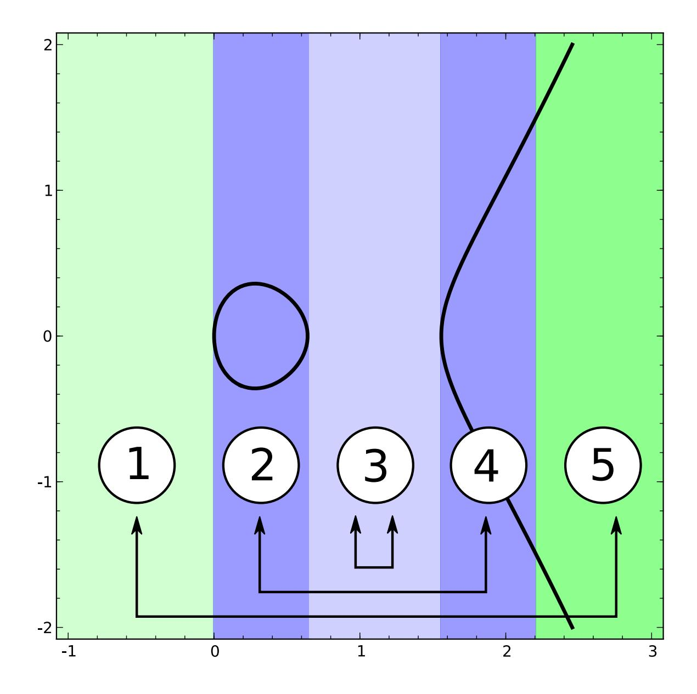

{0}------------------------------------------------

# Indifferentiable hashing from Elligator 2

### Mike Hamburg∗

Sometime in 2013, but I dug it up in 2020

#### Abstract

Note that this is a rough draft, written in 2013. I posted it in December 2020 because it's relevant to a CFRG discussion.

Bernstein et al. recently introduced a system "Elligator" for steganographic key distribution. At the heart of their construction are invertible maps between a finite field F and an elliptic curve E over F. There are two such maps, called φ in the "Elligator 1" system, and ψ in the "Elligator 2" system.

Here we show two ways to construct hash functions from ψ which are indifferentiable from a random oracle. Because ψ is relatively simple, our analyses are also simple. One of our constructions uses a novel "wallpapering" approach, whereas the other uses the hash-twice-and-add approach of Brier et al.

## 1 Introduction

Several cryptosystems and protocols [3, 4, 11] require hash functions that output points on an elliptic curve E, and many of them model these hash functions as random oracles in their security analyses. But traditional hash functions output blocks of bits, not curve points. So as a building block, most designers use an adapter of some sort, which wraps a traditional hash function h : {0, 1} ∗ → {0, 1} k and produces a new hash function H : {0, 1} ∗ → E. This adapter must be designed carefully in order to ensure that H behaves "close enough" to a random oracle, at least in the random oracle model for the traditional hash h.

Boneh, Lynn and Shacham [4] solved this problem by setting xi = h(m, i) for i ∈ [1..n], and taking the first i for which a y-coordinate can be successfully computed. This method is provably secure, but the time it takes is nondeterministic, and can open side-channel attacks.

∗Rambus Inc

{1}------------------------------------------------

Maurer et al. [12] provide a framework of *indifferentiability* which allows a designer to prove that use of a proposed adapter will not interfere with proofs in the random oracle model. We will use their framework in this paper.

### 2 Related work

Bernstein et al.'s "Elligator" construction [2] maps a subset of a finite field  $\mathbb{F}$  to a subset of an elliptic curve  $\mathcal{E}$  over  $\mathbb{F}$ . The first construction, Elligator 1, is based on injective encodings to elliptic curves defined in [8]. It can map only to elliptic curves which have a point of order 4, it requires the field size to be 3 mod 4, and it has an additional algebraic requirement.

The second construction, Elligator 2, reduces the constraints on the curve. This construction works on any elliptic curve with a point of order 2, over any large-characteristic field, except for curves with j-invariant 1728. In this paper, we will use the map  $\psi$  from Elligator 2, with slight modifications to avoid special cases on some curves.

The construction of  $\psi$  follows the Shallue-Woestijne-Ulas (SWU) algorithms for generating rational points on elliptic curves of the form  $y^2 = g(x)$  in some field  $\mathbb{F}$ . Shallue and Woestijne introduced this family of algorithms in 2006 [14]; Ulas simplified and generalized it in 2007 [15]; and Brier et al. simplified it further in 2010 [5].

### 2.1 Admissible encodings

Most deterministic hashing methods to elliptic curves take two steps: first they convert the output of a traditional hash h to one or more field elements, scalars mod the curve's order, signs etc.; and then they *encode* these to the curve  $\mathcal{E}$ . Brier et al. [5] provide a criterion for such encodings called  $\epsilon$ -admissibility. In the random oracle model for h, the use of this technique with an  $\epsilon$ -admissible will be indifferentiable from a random oracle, with security bounds related to  $\epsilon$ . They define admissibility as follows.

**Definition** (Statistical indistinguishability). Two distributions  $\mathcal{R}$  and  $\mathcal{S}$  on a set X are called  $\epsilon$ -statistically-indistinguishable if

$$\sum_{x \in X} \left| \Pr[y \stackrel{\mathbf{R}}{\leftarrow} \mathcal{R}, y = x] - \Pr[y \stackrel{\mathbf{R}}{\leftarrow} \mathcal{S}, y = x] \right| \le \epsilon$$

**Definition** ( $\epsilon$ -admissible encoding). Let S and R be finite sets. A function  $F: S \to R$  is  $\epsilon$ -admissible if it is:

{2}------------------------------------------------

- Deterministic: It is efficiently and deterministically computable, for a suitable definition of "efficient", e.g. in polynomial time with respect to the security parameter.
- Uniform: when s is drawn from a uniform distribution on S, then F(s) is -statisticallyindistinguishable from a uniform distribution on R.
- Samplable: There is an efficient randomized algorithm I : R → S which, for all r ∈ R, computes an inverse s ∈ F −1 (r). Furthermore, the distribution of I(r) must be statistically-indistinguishable from uniform on F −1 (r).

An encoding is said to be simply "admissible" if it is -admissible for negligible , for some suitable definition of "negligible" (e.g. less than the inverse of any polynomial in the security parameter).

A 0-admissible encoding is an -admissible encoding for = 0, i.e. one for which F(s) is uniformly distributed on R, and F −1 can be uniformly sampled.

## 3 Our contribution

In Section 4, we expose the Elligator 2 map ψ in a different and, we hope, intuitive way. We also point out most protocols which require a random oracle can simply use ψ as an encoding, even though ψ only covers a subset of the curve.

Using ψ, in Section 5 we create a new sort of admissible encoding, using a "wallpapering" technique: we run an alternative almost-uniform encoding ψ1 to cover the parts of the curve which ψ does not cover. If the order of the curve is known ahead of time, we can juggle probabilities to cover the curve perfectly uniformly, thereby producing a 0-admissible encoding in bounded time.

Alternatively, we can apply ψ twice and add the results. This technique is analyzed by Brier et al. [5] and by Farashahi et al. [7], but because ψ is so simple, we can provide a more elementary proof of its approximate uniformity. We show this proof in Section 6.

## 4 The "Elligator 2" map ψ

Let F be a finite field with q elements and a characteristic other than 2 or 3. Choose an elliptic curve E with a point of order 2. Without loss of generality, such a curve has the form

$$\mathcal{E}: y^2 = x^3 + Ax^2 + B$$

{3}------------------------------------------------

We must have  $B \neq 0$  and  $A^2 \neq 4B$  for this to be an elliptic curve, and we will additionally assume that  $A \neq 0$ , i.e. that the curve's *j*-invariant is not 1728. For brevity, let O denote the identity point of  $\mathcal{E}$ , and let  $g(x) = x^3 + Ax^2 + Bx$ .

Finally, we need a quadratic nonresidue  $u \in \mathbb{F}$  and a square-root function  $\sqrt{\ }$ . For example, we could define  $\sqrt{x}$  to be the principle square root when  $q \equiv 3 \pmod 4$ ; or we could choose  $\sqrt{x} \in [0, (q-1)/2]$  when q is prime, etc.

## 4.1 The functions f and $\hat{f}$

The function  $\psi$  is a modified SWU construction. The goal is to associate with each r a value x = e(r) and a value  $\hat{x} = \hat{e}(r)$  such that either g(x) or  $g(\hat{x})$  is a quadratic residue, meaning that either  $(x, \sqrt{g(x)})$  or  $(\hat{x}, \sqrt{g(\hat{x})})$  is defined and on  $\mathcal{E}$ . We can then set  $\psi(x)$  to whichever one of these is defined, with some sort of disambiguation if they are both defined.

Expanding g, we wish for either

$$x \cdot (x^2 + Ax + B)$$
 or  $\hat{x} \cdot (\hat{x}^2 + A\hat{x} + B)$ 

to be a quadratic residue. This is satisfied if either expression is 0, or if their ratio is a quadratic non-residue. To achieve this, we choose a fixed quadratic non-residue u, and solve

$$x^{2} + Ax + B = \hat{x}^{2} + A\hat{x} + B$$
 and  $\hat{x}/x = ur^{2}$ 

The first equation is satisfied when  $x + \hat{x} = -A$ ; plugging that into the second equation, we get

$$x = \frac{-A}{1 + ur^2} \quad \text{and} \quad \hat{x} = \frac{-Aur^2}{1 + ur^2}$$

Later in this paper, we will need to study only part of this construction, so we define:

$$f(r) := \frac{-A}{1+r}$$
 and  $\hat{f}(r) := \frac{-Ar}{1+r}$ 

We also note that  $\hat{f}(r) = f(1/r)$  when  $r \neq 0$ . We can now define  $\psi$  as

$$\psi(r) = \begin{cases} O & \text{if } ur^2 = -1\\ \left(\hat{f}(ur^2), +\sqrt{g(\hat{f}(ur^2))}\right) & \text{if } g(\hat{f}(ur^2)) \text{ is a QR}\\ \left(f(ur^2), -\sqrt{g(f(ur^2))}\right) & \text{otherwise} \end{cases}$$

Note that  $\psi(0) = (0,0)$ . The special case for  $ur^2 = -1$  is required to avoid dividing by 0.

{4}------------------------------------------------

This definition of ψ differs from the Elligator 2 definition, in that it explicitly defines what happens when ur2 = −1, or when g(f(ur2 )) or g( ˆf(ur2 )) is zero.

If r is a random element of F, then ψ(r) is a random element of E, but not a uniformly random one. However, the following lemma shows that ψ is almost uniform on its range.

Lemma. ψ is a 2-to-1 function, except that it is 1-to-1 at ψ(0) = (0, 0).

Proof. Obviously ψ(r) = ψ(r 0 ) if and only if the x-coordinate is the same, and the ycoordinate is the same, or else the points are both O. For the x-coordinate to be the same, we must have r 0 = ±r or r 0 = ±1/ur. For the y-coordinate to be the same, we must have specifically r 0 = ±r unless y = 0. This means that to prove the lemma, we must check the following special cases:

- ψ(r) = O. This happens when ur2 = −1, which will hold for either no values of r, or two values.
- r = ±1/ur, which implies that ur2 = ±1. We just dealt with ur2 = −1, and we can't have ur2 = 1 because u is a QNR.
- y = 0 because r = 0. This is the only preimage of (0, 0).
- y = 0 but r 6= 0, meaning that g(f(ur2 ))/f(ur2 ) = 0. This can only happen when E has three points of order 2, and uB is a quadratic residue. In this case, we will also have g( ˆf(ur2 ))/ ˆf(ur2 ) = 0. This can happen at four different r input values, namely ±r and ±1/ur. These inputs can produce 2 different x coordinates, namely ˆf(ur2 ) and f(ur2 ), for the inputs ±r and ±1/ur respectively. In either case, ψ is 2-to-1.

This case analysis completes the proof that ψ is almost 2-to-1 on F.

Corollary. Let F+ contain 0 and, for each nonzero x ∈ F, either x or −x but not both. For example, if q is prime so that F = Z/qZ, then F+ could be defined as [0,(q − 1)/2]. Then ψ is 1-to-1 on F+.

Corollary. #Image(ψ) = (q + 1)/2.

We know that #E ∈ [q + 1 − 2 √q, q + 1 + 2√q] by the Hasse bound [10], so this is roughly half the points of E. It is also clear that f and ˆf are easy to invert. The above case analysis shows that it is easy to compute both the preimages of a point under ψ.

Note that the image of ψ consists of all (x, y) ∈ E where x 6= 0 and −(A/x+1) is a QNR, and the image additionally contains O if and only if −1 is a QNR.

{5}------------------------------------------------

#### 4.2 The partial encoding $\psi_1$

In the construction of  $\psi$ , we can imagine replacing the QNR u with a QR such as 1. We call the resulting encoding  $\hat{\psi}_1$ , with a hat because we intend to modify it slightly. The major difference is that  $g(f(r^2))$  and  $g(\hat{f}(r^2))$  are either both QRs or both QNRs, unless r=0. Therefore  $\psi_1$  uses the first one if it is a QR, and otherwise it fails. Furthermore, we cannot rely on which function succeeds to choose the sign of y, so we will take an additional sign parameter s. More precisely, we define  $\hat{\psi}_1 : \mathbb{F}_+ \times \{\pm 1\} \to \mathcal{E} \cup \{\text{"fail"}\}$  by:

$$\hat{\psi}_1(r,s) = \begin{cases} O & \text{if } r^2 = -1\\ \left(f(r^2), \ s \cdot \sqrt{g(f(r^2))}\right) & \text{if } g(f(r^2)) \text{ is a QR} \end{cases}$$
"fail" otherwise

Just as  $\psi$  was 2-to-1, we can see that  $\hat{\psi}_1$  is 1-to-1 when it succeeds, except at certain special cases:

- $r^2 = -1$ , so that  $\hat{\psi}_1(r) = O$ . This can only happen if  $q \equiv 1 \pmod{4}$ . In this case,  $\hat{\psi}_1$  is 2-to-1 at this point.
- y = 0. Just as  $\psi$  is 2-to-1 in these cases,  $\psi_1$  is 2-to-1 here, but we wish for it to be 1-to-1.

We define  $\psi_1$  to be the same as  $\hat{\psi}_1$ , but with additional failure cases added to make it 1-to-1 everywhere that it succeeds. Specifically, we set

$$\psi_1(r,s) = \begin{cases} \text{fail} & \text{if } g(f(r^2)) = 0 \text{ and } s = -1 \\ \text{fail} & \text{if } r^2 = -1 \text{ and } s = -1 \\ O & \text{if } r^2 = -1 \text{ and } s = +1 \\ \left(f(r^2), \text{ sign}(r) \cdot \sqrt{g(f(r^2))}\right) & \text{if } g(f(r^2)) \text{ is a QR} \\ \text{fail} & \text{otherwise} \end{cases}$$

Clearly our revised  $\psi_1$  is injective. In the case when  $q \equiv 3 \pmod{4}$  and  $\mathcal{E}$  has only one point (0,0) of order 2, the special cases cannot occur and  $\hat{\psi}_1$  and  $\psi_1$  are the same function.

Once again, it is easy to compute the preimage of a point under  $\hat{\psi}_1$  and  $\psi_1$ . Also, the image of  $\hat{\psi}_1$  and of  $\psi_1$  consists of all  $(x,y) \in \mathcal{E}$  where  $x \neq 0$  and -(A/x+1) is a QR, and O if and only if -1 is a QR. That is, the image of  $\hat{\psi}_1$  and of  $\psi_1$  is exactly the complement of the image of  $\psi$  for any QNR u. Thus the image has size  $\#\mathcal{E} - (q+1)/2$ .

{6}------------------------------------------------

#### 4.3 When is ψ good enough?

Most protocols which model their hash functions as random oracles do not need to map to the entire curve. It is sufficient to instead map to a large, recognizable subset of the curve. This is because the simulator in these protocols programs the random oracle with blinded CDH challenges or something similar. The simulator can be modified to reblind its challenges until it finds one which is in the image of the hash encoding.

Examples of such protocols include SPEKE [11], Boneh-Franklin IBE [3], Boneh-Lynn-Shacham signatures [4], "nothing up my sleeve" parameter generation for protocols such as SPAKE2 [1], and of course Elligator [2].

For these protocols, it is sufficient to use ψ as an encoding. Its image is a recognizable subset about half the size of E, and ψ is -admissible on that image — that is, ψ ◦ H is indifferentiable from a random oracle on its image.

## 5 Indifferentiability by wallpapering

Because ψ1 and ψ have complementary images, they give an easy approach to indifferentiable hashing. We can simply "wallpaper" the curve, with ψ1 covering part of it and ψ covering part of it, so that the entire curve is nearly uniformly covered. Define a hash function Hwp : F+ × F+ × {±1} → E by

$$H_{\text{wp}}(r_1, r_2, s) := \begin{cases} \psi_1(r_1, s) & \text{if } \psi_1(r_1, s) \text{ succeeds} \\ \psi(r_2) & \text{if } \psi_1(r_1, s) \text{ fails} \end{cases}$$

We will show that Hwp is an -admissible encoding, where < 6/( √q − 1). Hwp is clearly computable in deterministic polynomial time once u is given, and it is also clearly sampleable. It remains to show that Hwp is -uniform.

The domain of ψ1 has size q + 1, and when it succeeds it is exactly 1-to-1. Therefore for any P in its image, the probability that P is chosen is exactly 1/(q + 1). Recall that #Image(ψ1) = #E − (q + 1)/2, so overall

$$\Pr[\psi_1 \text{ is used}] = \frac{\#\mathcal{E}}{q+1} - \frac{1}{2} \quad \text{and} \quad \Pr[P \text{ chosen} : P \in \text{Image}(\psi_1)] = \frac{1}{q+1}$$

Now, ψ is 1-to-1 on F+, and its image has size (q + 1)/2, but it only runs if ψ1 fails, so that

$$\Pr[\psi \text{ is used}] = \frac{3}{2} - \frac{\#\mathcal{E}}{q+1} \quad \text{and} \quad \Pr[P \text{ chosen} : P \in \text{Image}(\psi)] = \frac{1}{q+1} \cdot \left(3 - 2\frac{\#\mathcal{E}}{q+1}\right)$$

{7}------------------------------------------------

Thus the total deviation from uniformity is

$$\begin{split} \epsilon &= \sum_{P \in \mathcal{E}} | \Pr[P \text{ chosen}] - 1/\#\mathcal{E} | \\ &= \# \text{Image}(\psi_1) \cdot | \Pr[P \text{ chosen} : P \in \text{Image}(\psi_1)] - 1/\#\mathcal{E} | \\ &+ \# \text{Image}(\psi) \cdot | \Pr[P \text{ chosen} : P \in \text{Image}(\psi)] - 1/\#\mathcal{E} | \\ &= \left( \#\mathcal{E} - \frac{q+1}{2} \right) \cdot \left| \frac{1}{q+1} - \frac{1}{\#\mathcal{E}} \right| + \left| \frac{q+1}{2} \cdot \left| \frac{1}{q+1} \cdot \left( 3 - \frac{2\#\mathcal{E}}{q+1} \right) - \frac{1}{\#\mathcal{E}} \right| \\ &= 2 \cdot \left| \frac{\#\mathcal{E}}{q+1} - \frac{3}{2} + \frac{q+1}{2\#\mathcal{E}} \right| \end{split}$$

Now  $|\#\mathcal{E}/(q+1) < 2/\sqrt{q}|$  by the Hasse bound, so that

$$\left| \frac{\#\mathcal{E}}{q+1} - 1 \right| < \frac{2}{\sqrt{q}}$$
 and  $\left| \frac{q+1}{2\#\mathcal{E}} - \frac{1}{2} \right| < \frac{1}{\sqrt{q}-1}$ 

and all in all,

$$\epsilon < \frac{6}{\sqrt{q} - 1}$$

as claimed.

Figure 1 shows how wallpapering works on a Montgomery curve over  $\mathbb{R}$ , with A = -2.2 and B = 1. The double arrows represent the map  $m: x \to -A - x$  which exchanges f(r) with  $\hat{f}(r)$ . The blue regions 2, 3 and 4 show the x-coordinates that will be considered by  $\psi_1$ . In regions 2 and 4,  $\psi_1$  succeeds, but in region 3 it fails. Since the map m exchanges regions 2 and 4 but maps region 3 to itself, we see that  $f(r^2)$  and  $\hat{f}(r^2)$  succeed or fail together.

The green regions show the x-coordinates considered by  $\psi$  where u:=-1 is a QNR in  $\mathbb{R}$ . In region 5, the map  $\psi$  will use the coordinate  $f(-r^2)$  or  $\hat{f}(-r^2)$  under consideration, but in region 1 it will instead use  $m(x) = \hat{f}(-r^2)$  or  $f(-r^2)$  respectively, except in the special case  $\psi(0) = (0,0)$ .

### 5.1 A 0-admissible encoding

When we know  $\#\mathcal{E}$  and it is at least q+1, we can easily modify this encoding to achieve 0-admissibility, that is, the notion of admissibility found in Boneh-Lynn-Shacham [4]. In this definition, it is required for the encoding's output to be exactly uniform over  $\mathcal{E}$ , and for the inverse sampling algorithm to sample exactly uniformly. We can do this by causing  $\psi_1$ 

{8}------------------------------------------------

Figure 1: Wallpapering a real Montgomery curve

to fail, even when it would otherwise succeed, with probability 1 − (q + 1)/#E. In this case, the probability that a given point P ∈ Image(ψ1) is chosen is

$$\frac{1}{q+1} \cdot \frac{q+1}{\#\mathcal{E}} = \frac{1}{\#\mathcal{E}}$$

and the same when P ∈ Image(ψ).

An encoding is not allowed to be randomized, so to accomplish this the input will need to be from a set F 2 + × {±1} × [1, #E]. Then we can define

$$H_{u,\text{wp},0}(r_1, r_2, s, n) = \begin{cases} \psi_1(r_1, s) & \text{if } n \leq q+1 \text{ and } \psi_1(r_1, s) \text{ succeeds} \\ \psi(r_2) & \text{otherwise} \end{cases}$$

The same approach would work when #E < q + 1, but we would have to sample twice from ψ1, which would decrease the efficiency of the construction.

{9}------------------------------------------------

## 6 Hash twice and add

An alternative approach found in Brier et al. [5] is to sample ψ twice (or more) and then to add the results together:

$$H_{+}(r_1, r_2) = \psi(r_1) + \psi(r_2)$$

Techniques for proving that this sort of encoding is admissible were developed by Farashahi et al. [7], but in this case the map ψ has low degree, and a direct geometric approach is just as easy. Since this is an algebraic section, we will discard F+ and apply ψ to the complete field F. Some of our lemmas will instead use the closure F¯, or the projective space P1(F).

We will begin with inverse sampling. Recall that ψ is 2-to-1 everywhere except at 0, and it is easy to find preimages of any point. So given P, we need only choose a random Q := ψ(r1) and then attempt to choose a random preimage in ψ −1 (P − Q). This technique clearly produces a nearly uniformly random inverse of P in approximately 2 expected samples, at least if H+ is -close to uniform. It remains to prove this uniformity. We will show:

Theorem. The deviation from uniformity of H+ is at most 10/ √q + O(1/q).

#### 6.1 The possible-sum relation S

We would like to work only with the x-coordinates of the outputs of ψ, so we use a Semaev polynomial [13] S(x0, x1, x2) which is zero precisely when there are points P0 = (x0, y0), P1 = (x1, y1), P2 = (x2, y2) on E(F¯) such that P0 = P1 + P2. The exact formula is given by Hamburg [9]1

$$S(x_0, x_1, x_2) = (B - x_0x_1 - x_1x_2 - x_2x_0)^2 - 4 \cdot (x_0 + x_1 + x_2 + A) \cdot (x_0x_1x_2)$$

and also formulas for recovering y1 and y2 from y0. In particular, if (x0, y0) ∈ E and y0 6= 0, then S(x0, x1, x2) = 0 implies that y0 and y1 are uniquely determined by rational functions of (x0, y0, x1, x2), and also that these other points are on E rather than its twist. As a corollary, the curve S : S(x0, ·, ·) = 0 is isomorphic to E so long as (x0, y0) ∈ E and y0 6= 0. In particular, S(x0, ·, ·) is geometrically irreducible; that is, it doesn't factor over the algebraic closure F¯ of F.

We will also note that

$$B^2 \cdot S(x_0, x_1, x_2) / (x_1^2 \cdot x_2^2) = S(x_0, B/x_1, B/x_2)$$

1The formula in [9] has B = 1, but its derivation works for any B.

{10}------------------------------------------------

so we may work with the latter expression instead. This is because if we add the point (0, 0) of order 2 to a point (x1, y1) ∈ E, then the x-coordinate of the result will be B/x1.

So it will suffice to study

$$S'_{u,x_0}(r_1, r_2) := S\left(x_0, -B \cdot \frac{1 + ur_1^2}{A}, -B \cdot \frac{1 + ur_2^2}{A}\right)$$

We will treat this as an object over P1(F¯) 2 . Let's begin with its singularities.

Lemma. If P0 has order greater than 2 and x0 6= −B/A, then S 0 u,x0 (r1, r2) has two singularities with r1 = ∞, two singularities with r2 = ∞, and possibly a double point at (0, 0) and no others. Thus, S 0 u,x0 (r1, r2) has at most 5 singularities including multiplicity.

Proof. We know that when P0 has order greater than 2, S(x0, ·, ·) is elliptic and therefore smooth. So the only places that S 0 u,x0 can have singularities are when r1 or r2 are 0 or ∞. If (0, 0) is on S 0 u,x0 , then it will be a double point.

Plugging in r1 = 0, we get x1 = −B/A. In this case, we can compute that the discriminant of S with respect to x2 is −16 · g(x0) · B3/A3 , which is only zero when P0 has order 2. So there are no more singularities with r1 = 0 or, by symmetry, with r2 = 0.

Plugging in r1 = ∞, we get (x0 − x2) 2 = 0, which means there will be a singularity when x0 = x2 = −B(1 + ur2 2 )/A. Since x0 6= −B/A, then there will be two values of r2 over F¯ which satisfy this, each a double point. Likewise there will be two double points with r2 = ∞.

We can now use the singularity count to determine the irreducibility and genus of S 0 u,x0 .

Proposition. If the order of P0 is greater than 2 and x0 6= −B/A, then S 0 u,x0 is geometrically irreducible.2

Proof. If S 0 u,x0 factored into two polynomials with bidegrees (a, b) and (4 − a, 4 − b), then they would intersect in a(4 − b) + b(4 − a) places, and each of those would be a singularity of S 0 u,x0 . But there are at most 5 singularities, and a(4 − b) + b(4 − a) ≥ 6 unless (a, b) ∈ {(0, 1),(1, 0),(4, 3),(3, 4)}, i.e. unless one of the factors is linear. But S 0 u,x0 cannot have a linear factor, for then S(x0, ·, ·) would have one as well, and S(x0, ·, ·) is irreducible.

Proposition. If the order of P0 is greater than 2 and x0 6= −B/A, then S 0 u,x0 has genus 5, unless it contains the point (0, 0), in which case the genus is 4.

2 It's still irreducible if x0 = −B/A, but the proof is different.

{11}------------------------------------------------

*Proof.*  $S'_{u,x_0}$  has bidegree (4,4), so if it were smooth it would have genus 9. Each of the 4 or 5 double points reduces its genus by 1, so it has genus 5, or 4 if it has a 5th singularity at (0,0).

Therefore, by the Hasse-Weil bound [6], the curve  $S'_{u,x_0}(r_1,r_2)=0$  contains between  $q+1-10\sqrt{q}$  and  $q+1+10\sqrt{q}$  points over  $\mathbb{P}_2(\mathbb{F})$ . At most 4 of these points are at  $\infty$ , so over  $\mathbb{F}^2$  there are at least  $q-3+10\sqrt{q}$  solutions. The same is then true of  $S(x_0,\cdot,\cdot)$ .

Such points  $P_0$  are produced with probability  $\#S(x_0,\cdot,\cdot)/2q^2+O(1/q^2)$ . The other points are each produced with probability at most 2/q, because for any  $x_1$  they can be produced by at most two values of  $x_2$ . Combining these finishes the proof of our theorem:

**Theorem.** The deviation from uniformity of  $H_+$  is at most  $10/\sqrt{q} + O(1/q)$ .

#### 7 Conclusions and future work

We have presented two ways to turn Elligator 2's encoding  $\psi$  into an efficient  $\epsilon$ -indifferentiable hash function.

The same method should give a approach to indifferentiable hashing on any elliptic curve  $\mathcal{E}$ . Even if  $\mathcal{E}$  doesn't have a point of order 2 over  $\mathbb{F}$ , it has one over  $\mathbb{F}^3$ . Thus our methods can hash indifferentiably to produce a point  $P \in \mathcal{E}(\mathbb{F}^3)$ . Summing the Galois conjugates of P will produce a point on  $\mathcal{E}$ . We leave exploration of this method to future work.

## 8 Acknowledgments

Special thanks to Alison Miller for showing me why S' usually has genus 5, and for providing a simpler proof of its irreducibility; and to Mark Marson for his comments on a draft of this paper.

## References

- [1] Michel Abdalla and David Pointcheval. Simple password-based encrypted key exchange protocols. In *Topics in cryptology–CT-RSA 2005*, pages 191–208. Springer, 2005.
- [2] Daniel J. Bernstein, Anna Krasnova, and Tanja Lange. Elligator: Elliptic-curve points indistinguishable from uniform random strings. Cryptology ePrint Archive, Report 2013/325, 2013. http://eprint.iacr.org/.

{12}------------------------------------------------

- [3] Dan Boneh and Matt Franklin. Identity-based encryption from the weil pairing. In Advances in Cryptology?CRYPTO 2001, pages 213–229. Springer, 2001.
- [4] Dan Boneh, Ben Lynn, and Hovav Shacham. Short signatures from the weil pairing. In Advances in Cryptology – ASIACRYPT 2001, pages 514–532. Springer, 2001.
- [5] Eric Brier, Jean-S´ebastien Coron, Thomas Icart, David Madore, Hugues Randriam, and Mehdi Tibouchi. Efficient indifferentiable hashing into ordinary elliptic curves. In Advances in Cryptology–CRYPTO 2010, pages 237–254. Springer, 2010.
- [6] Pierre Deligne. La conjecture de Weil. I. Publications Math´ematiques de l'IHES´ , 43:273– 307, 1973.
- [7] Reza R Farashahi, Pierre-Alain Fouque, Igor Shparlinski, Mehdi Tibouchi, and J Voloch. Indifferentiable deterministic hashing to elliptic and hyperelliptic curves. Mathematics of Computation, 82(281):491–512, 2013.
- [8] Pierre-Alain Fouque, Antoine Joux, and Mehdi Tibouchi. Injective encoding to elliptic curves. Cryptology ePrint Archive, Report 2013/373, 2013. http://eprint.iacr.org/.
- [9] Mike Hamburg. Fast and compact elliptic-curve cryptography. Technical report, Cryptology ePrint Archive, Report 2012/309, 2012.
- [10] H Hasse. Zur theorie der abstrakten elliptischen funktionenkorper, i, ii, iii. Abhandl. Math. Sem. Hamburg, 10:55–62, 1936.
- [11] David P Jablon. Strong password-only authenticated key exchange. ACM SIGCOMM Computer Communication Review, 26(5):5–26, 1996.
- [12] Ueli Maurer, Renato Renner, and Clemens Holenstein. Indifferentiability, impossibility results on reductions, and applications to the random oracle methodology. In Theory of cryptography, pages 21–39. Springer, 2004.
- [13] Igor Semaev. Summation polynomials and the discrete logarithm problem on elliptic curves. Cryptology ePrint Archive, Report 2004/031, 2004. https://eprint.iacr. org/2004/031.
- [14] Andrew Shallue and Christiaan E van de Woestijne. Construction of rational points on elliptic curves over finite fields. In Algorithmic number theory, pages 510–524. Springer, 2006.

{13}------------------------------------------------

[15] Maciej Ulas. Rational points on certain hyperelliptic curves over finite fields. arXiv preprint arXiv:0706.1448, 2007.