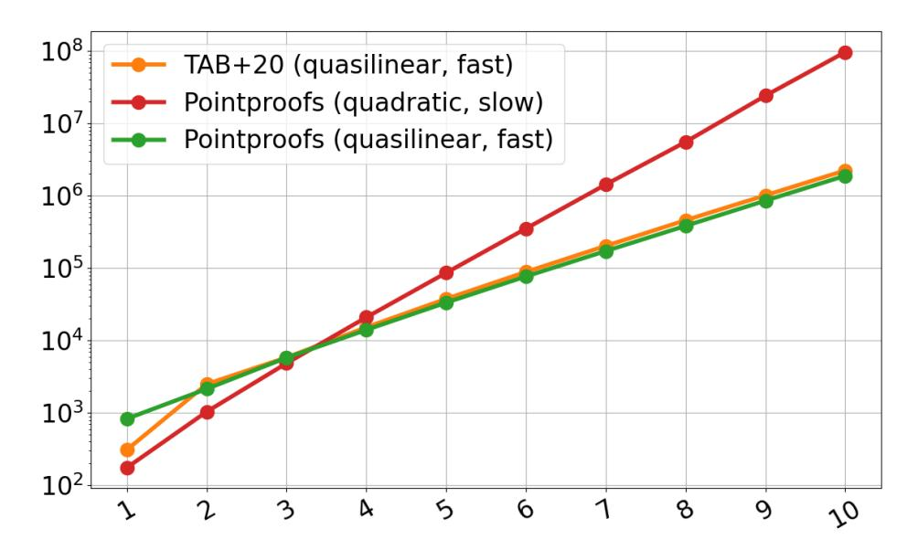

{0}------------------------------------------------

# How to compute all Pointproofs

Alin Tomescu1

1VMware Research

Monday, November 30th, 2020

#### **Abstract**

In this short note, we explain how to reduce the time to compute all N proofs in the *Pointproofs* vector commitment (VC) scheme by Gorbunov et al., from  $O(N^2)$  time to  $O(N\log N)$ . The key ingredient is representing the computation of all proofs as a product between a Toeplitz matrix and the committed vector, which can be computed fast using Discrete Fourier Transforms (DFTs). We quickly prototype our algorithm in C++ and show it is much faster than the naive algorithm for computing all proofs in Pointproofs.

# 1 Introduction

Gorbunov et al. [GRWZ20] introduced *Pointproofs*, an elegant vector commitment (VC) scheme which enhances the Libert-Yung VC [LY10] with *subvector* proofs and (cross)aggregation of proofs. Pointproofs was originally proposed for stateless validation in cryptocurrencies with smart contracts, where each contract is allocated a small memory of N=1000 locations that can be committed to using the Pointproofs VC. In subsequent work, Leung et al. [LGG+20] build an authenticated dictionary called *Aardvark* on top of the Pointproofs VC. Importantly, both of these applications would benefit greatly from faster proof computation.

Unfortunately, the fastest way to compute all N proofs in the Pointproofs VC is  $O(N^2)$  time, which can be too slow for large VCs. In this short paper, we give a faster  $O(N\log N)$  time algorithm. We implement our algorithm and observe it outperforms the naive one very quickly (see Fig. 1). We also observe that our  $O(N\log N)$ -time proof precomputation for Pointproofs is slightly faster than the  $O(N\log N)$ -time proof precomputation in VCs based on Kate-Zaverucha-Goldberg (KZG) polynomial commitments [KZG10, FK20, TAB+20].

**Overview.** The Pointproofs VC uses public parameters of the form  $\left(g_1^{\alpha^i}\right)_{\in [2N]\setminus\{N+1\}}$  (see Section 2.4). We observe that all proofs  $\boldsymbol{\pi}=[\pi_1,\ldots,\pi_N]^{\top}$  for a vector  $\boldsymbol{m}=[m_1,\ldots,m_N]^{\top}$  can be computed as a matrix-vector product:

$$\pi = \begin{bmatrix} --- & a_1 & --- \\ --- & a_2 & --- \\ & \vdots & \\ --- & a_N & --- \end{bmatrix} m \stackrel{\text{def}}{=} \mathbf{A}m \tag{1}$$

Here, the rows  $a_i$  of the matrix **A** are defined carefully based on the proof  $\pi_i$  being verified (see intuition in Section 3)

$$\boldsymbol{a}_{i} = \left[ g_{1}^{\alpha^{1+(N+1)-i}}, g_{1}^{\alpha^{2+(N+1)-i}}, \dots, g_{1}^{\alpha^{(i-1)+(N+1)-i}}, g_{1}^{0}, g_{1}^{\alpha^{(i+1)+(N+1)-i}}, \dots, g_{1}^{\alpha^{N+(N+1)-i}} \right]$$
(2)

To compute this  $\mathbf{A}m$  product fast, we notice the matrix  $\mathbf{A}$  is a *Toeplitz matrix* (see Section 2.3). This means the product can be computed in  $O(N \log N)$  time by embedding  $\mathbf{A}$  inside a *circulant matrix* (see Section 2.2). Specifically, we use the entries of  $\mathbf{A}$  to define a circulant matrix  $\mathbf{C}_{2N}$ , which is unambiguously represented by the vector:

$$\boldsymbol{c}_{2N} = [\boldsymbol{g}_{1}^{0}, g_{1}^{\alpha^{N}}, g_{1}^{\alpha^{N-1}}, \dots, g_{1}^{\alpha^{2}}, \boldsymbol{g}_{1}^{0}, g_{1}^{\alpha^{2N}}, \dots, g_{1}^{\alpha^{N+3}}, g_{1}^{\alpha^{N+2}}]^{\top}$$
(3)

This allows us to compute  $\pi = \mathbf{A}m$  by computing  $\pi' = \mathbf{C}_{2N}m'$  (see Section 2.3.1), where m' is m extended with N zeros. Specifically,  $\pi$  is the first N entries of  $\pi'$ , which can be computed in  $O(N \log N)$  as explained in Section 2.2.1:

$$\boldsymbol{\pi'} = \mathsf{DFT}_{\mathbb{G}}^{-1}(\mathsf{DFT}_{\mathbb{G}}(\boldsymbol{c}_{2N}) \circ \mathsf{DFT}_{\mathbb{F}}(\boldsymbol{m'}))$$
 (4)

{1}------------------------------------------------

# 2 Preliminaries

**Notation.** Let  $\mathbb{G}_1, \mathbb{G}_2, \mathbb{G}_T$  denote groups of prime order p (using multiplicative notation). Let  $\mathbb{F}$  denote a field of order p (in this work, we use  $\mathbb{Z}_p$ ). Let  $e: \mathbb{G}_1 \times \mathbb{G}_2 \to \mathbb{G}_T$  [GPS08] be a Type III pairing (i.e.,  $\mathbb{G}_1 \neq \mathbb{G}_2$  and there is no efficiently computable homomorphisms between  $\mathbb{G}_1$  and  $\mathbb{G}_2$ ). Let  $[N] = \{1, 2, \dots, N\}$ . Let  $\mathbf{m} = [m_1, m_2, \dots, m_N]$  be a vector of elements, indexed from 1 to N. Let  $\mathbf{m}^\top$  denote its transpose: a column vector whose ith entry is  $m_i$ . Let  $\mathbf{x} \circ \mathbf{y} = [x_1 y_1, x_2 y_2, \dots, x_N y_N]^\top$  denote the Hadamard product of two column vectors. Let  $\mathrm{diag}(\mathbf{m})$  denote the  $N \times N$  diagonal matrix whose entry at position (i,i) is  $m_i$  and all other entries are 0. Also,  $\mathrm{diag}(\mathbf{m}) = \mathrm{diag}(\mathbf{m}^\top)$ . Let  $\mathbf{m}[S] = (m_i)_{i \in S}$  be a subvector of  $\mathbf{m}$  consisting only of the positions  $i \in S$ .

## 2.1 Discrete Fourier Transform (DFT)

Let  $\omega_N$  denote a primitive Nth root of unity in the finite field  $\mathbb{Z}_p$ . The Discrete Fourier Transform (DFT) of a vector  $\mathbf{x} = [x_1, \dots, x_N]^\top \in \mathbb{G}_1^N$  of group elements is defined as:

$$\mathsf{DFT}_{\mathbb{G}}(\boldsymbol{x}) = \hat{\boldsymbol{x}} = [\hat{x}_1, \dots, \hat{x}_N]^{\top} \in \mathbb{G}_1^N, \text{ where } \hat{x}_i = \prod_{j \in [N]} (x_j)^{(\omega_N)^{(i-1)(j-1)}}, \forall i \in [N]$$
 (5)

Importantly, the DFT can be computed in  $O(N \log N)$  time [CLRS09]. Furthermore, it is invertible: one can define  $\mathsf{DFT}_{\mathbb{G}}^{-1}(\cdot)$  such that  $\mathsf{DFT}_{\mathbb{G}}^{-1}(\mathsf{DFT}_{\mathbb{G}}(\boldsymbol{x})) = \mathsf{DFT}_{\mathbb{G}}(\mathsf{DFT}_{\mathbb{G}}^{-1}(\boldsymbol{x})) = \boldsymbol{x}$ .

Similarly, one can also define the DFT for a vector  $\mathbf{m} = [m_1, \dots, m_N] \in \mathbb{F}^N$  of field elements:

$$\mathsf{DFT}_{\mathbb{F}}(\boldsymbol{m}) = \hat{\boldsymbol{m}} = [\hat{m}_1, \dots, \hat{m}_N]^{\top} \in \mathbb{F}^N, \text{ where } \hat{m}_i = \prod_{j \in [N]} m_j(\omega_N)^{(i-1)(j-1)}, \forall i \in [N]$$
 (6)

Either way, we can generally define  $\mathsf{DFT}(x)$ , whether  $x \in \mathbb{G}_1^N$  or  $x \in \mathbb{F}^N$ , by abstracting out  $\mathbb{G}_1$ 's operation and  $\mathbb{F}$ 's multiplication operation. Henceforth, we use  $\mathsf{DFT}(x)$  abstractly and clarify, where necessary, whether we need a  $\mathsf{DFT}_{\mathbb{G}}$  or a  $\mathsf{DFT}_{\mathbb{F}}$ .

#### 2.1.1 The DFT matrix

 $\mathsf{DFT}(\boldsymbol{x})$  can also be computed as a matrix product as follows:

$$\mathsf{DFT}(\boldsymbol{x}) = \mathbf{W}_N \boldsymbol{x} \tag{7}$$

Here,  $\mathbf{W}_N$  is known as the *DFT matrix*:

$$\mathbf{W}_{N} = \begin{bmatrix} 1 & 1 & 1 & 1 & \cdots & 1 \\ 1 & (\omega_{N})^{1} & (\omega_{N})^{2} & (\omega_{N})^{3} & \cdots & (\omega_{N})^{N-1} \\ 1 & (\omega_{N})^{2} & (\omega_{N})^{4} & (\omega_{N})^{6} & \cdots & (\omega_{N})^{2(N-1)} \\ 1 & (\omega_{N})^{3} & (\omega_{N})^{6} & (\omega_{N})^{9} & \cdots & (\omega_{N})^{3(N-1)} \\ \vdots & \vdots & \vdots & \vdots & \ddots & \vdots \\ 1 & (\omega_{N})^{N-1} & (\omega_{N})^{2(N-1)} & (\omega_{N})^{3(N-1)} & \cdots & (\omega_{N})^{(N-1)(N-1)} \end{bmatrix}$$
(8)

This makes it very easy to define the *inverse DFT* of a size-N column vector  $\boldsymbol{y}$  as:

$$\mathsf{DFT}^{-1}(\boldsymbol{y}) = (\mathbf{W}_N)^{-1} \boldsymbol{y}$$
(9)

$$=\frac{1}{N}\mathbf{W}_{N}\boldsymbol{y}\tag{10}$$

Note that the inverse of the DFT matrix  $\mathbf{W}_N$  is simply  $\frac{1}{N}\mathbf{W}_N$ . Thus, an inverse DFT can be reduced to computing a normal DFT and scaling it by 1/N. As a result, an inverse DFT also takes  $O(N \log N)$  time.

{2}------------------------------------------------

#### 2.2 Circulant matrices

A *circulant matrix* of size  $N \times N$  is a matrix of the following form:

$$\mathbf{C}_{N} = \begin{bmatrix} c_{0} & c_{N-1} & c_{N-2} & \cdots & \cdots & c_{1} \\ c_{1} & c_{0} & c_{N-1} & \ddots & & \vdots \\ c_{2} & c_{1} & \ddots & \ddots & \ddots & \vdots \\ \vdots & \ddots & \ddots & \ddots & c_{N-1} & c_{N-2} \\ \vdots & \ddots & \ddots & c_{1} & c_{0} & c_{N-1} \\ c_{N-1} & \cdots & \cdots & c_{2} & c_{1} & c_{0} \end{bmatrix}$$

$$(11)$$

In other words, as you go from left to right, each column is set to the previous column but "rotated down" by one. (Looked at differently, each row is set to the row above it but "rotated to the right" by one.)

**Vector representation.** Note that  $\mathbf{C}_N$  is uniquely determined by its first column, which we denote by  $\mathbf{c}_N = [c_0, c_1, c_2, \dots c_{N-1}]^{\top}$ .

**An example.** The following matrix is a circulant matrix:

$$\begin{bmatrix}
7 & 3 & 8 & 1 \\
3 & 7 & 3 & 8 \\
8 & 3 & 7 & 3 \\
\underline{1} & 8 & 3 & 7
\end{bmatrix}$$
(12)

#### 2.2.1 Multiplying a circulant matrix by a vector

It is well-known that one can diagonalize [Wik20] any circulant matrix  $C_N$  with vector representation  $c_N$  as:

$$\mathbf{C}_N = (\mathbf{W}_N)^{-1} \operatorname{diag}(\mathsf{DFT}(\boldsymbol{c}_N)) \mathbf{W}_N \tag{13}$$

Let  $m = [m_1, \dots, m_N]^{\top}$  be a vector. Recall  $\boldsymbol{x} \circ \boldsymbol{y} = [x_1y_1, x_2y_2, \dots, x_Ny_N]^{\top}$  is the Hadamard product of two column vectors. It is also well-known that the above diagonalization can be leveraged to efficiently compute matrix-vector products  $\boldsymbol{C}_N \boldsymbol{m}$  as:

$$\mathbf{C}_N \boldsymbol{m} = ((\mathbf{W}_N)^{-1} \operatorname{diag}(\mathsf{DFT}(\boldsymbol{c}_N)) \mathbf{W}_N) \boldsymbol{m}$$
 (14)

$$= (\mathbf{W}_N)^{-1} \operatorname{diag}(\mathsf{DFT}(\boldsymbol{c}_N))(\mathbf{W}_N \boldsymbol{m}) \tag{15}$$

$$= ((\mathbf{W}_N)^{-1} \operatorname{diag}(\mathsf{DFT}(\boldsymbol{c}_N))) \mathsf{DFT}(\boldsymbol{m}) \tag{16}$$

$$= (\mathbf{W}_N)^{-1}(\mathsf{DFT}(\boldsymbol{c}_N) \circ \mathsf{DFT}(\boldsymbol{m})) \tag{17}$$

$$= \mathsf{DFT}^{-1}(\mathsf{DFT}(\boldsymbol{c}_N) \circ \mathsf{DFT}(\boldsymbol{m})) \tag{18}$$

In other words, such products by circulant matrices reduce to computing two DFTs and one inverse DFT. Overall, this takes  $O(N \log N)$  time.

### 2.3 Toeplitz matrices

A Toeplitz matrix or diagonal-constant matrix of size  $N \times N$  is a matrix of the following form:

$$\mathbf{A}_{N} = \begin{bmatrix} a_{0} & a_{-1} & a_{-2} & \cdots & \cdots & a_{-(N-1)} \\ a_{1} & a_{0} & a_{-1} & \ddots & & \vdots \\ a_{2} & a_{1} & \ddots & \ddots & \ddots & \vdots \\ \vdots & \ddots & \ddots & \ddots & a_{-1} & a_{-2} \\ \vdots & \ddots & \ddots & a_{1} & a_{0} & a_{-1} \\ a_{N-1} & \cdots & \cdots & a_{2} & a_{1} & a_{0} \end{bmatrix}$$

$$(19)$$

{3}------------------------------------------------

In other words, all of  $A_N$ 's descending diagonals (from left to right) have the same entries. For simplicity, we are slightly abusing notation here and using negative indices for the entries of the matrix. Note that a circulant matrix (see Section 2.2) is a special kind of Toeplitz matrix with  $a_{-i} = a_{N-i}, \forall i \in [N-1]$ .

**An example.** The following matrix is a Toeplitz matrix:

$$\begin{bmatrix} 7 & 11 & 5 & 6 \\ 3 & 7 & 11 & 5 \\ 8 & 3 & 7 & 11 \\ \underline{1} & 8 & 3 & 7 \end{bmatrix}$$
 (20)

#### 2.3.1 Multiplying a Toeplitz matrix by a vector

Suppose we want to multiply a Toeplitz matrix  $\mathbf{A}_N$  by a size-N colum vector  $\mathbf{m}$ . Note that we can turn any such  $\mathbf{A}_N$  into a circulant matrix of size 2N by finding another matrix  $\mathbf{B}_N$  so that the following matrix is circulant:

$$\mathbf{C}_{2N} = \begin{bmatrix} \mathbf{A}_N & \mathbf{B}_N \\ \mathbf{B}_N & \mathbf{A}_N \end{bmatrix} \tag{21}$$

For now, assume we can find such a  $\mathbf{B}_N$ . Then, let  $m' = \begin{bmatrix} m \\ \mathbf{0}_N \end{bmatrix}$  be an extension of the column vector m with N extra zeros appended to it, which are denoted by the size-N column vector  $\mathbf{0}_N$ . Finally, note that:

$$\mathbf{C}_{2N}\boldsymbol{m'} = \begin{bmatrix} \mathbf{A}_N & \mathbf{B}_N \\ \mathbf{B}_N & \mathbf{A}_N \end{bmatrix} \begin{bmatrix} \boldsymbol{m} \\ \mathbf{0}_N \end{bmatrix} = \begin{bmatrix} \mathbf{A}_N \boldsymbol{m} \\ \mathbf{B}_N \boldsymbol{m} \end{bmatrix}$$
(22)

In other words, we can compute  $\mathbf{A}_N \mathbf{m}$  by computing  $\mathbf{C}_{2N} \mathbf{m'}$ , which can be done in  $O(N \log N)$  time (see Section 2.2.1).

**How to find the matrix**  $B_N$ ? First, let us take a small example  $A_4$ :

$$\mathbf{A}_{4} = \begin{bmatrix} a_{0} & a_{-1} & a_{-2} & a_{-3} \\ a_{1} & a_{0} & a_{-1} & a_{-2} \\ a_{2} & a_{1} & a_{0} & a_{-1} \\ a_{3} & a_{2} & a_{1} & a_{0} \end{bmatrix}$$

$$(23)$$

Let us start embedding it in a circulant matrix  $C_8$ :

$$\mathbf{C}_{8} = \begin{bmatrix} \mathbf{A}_{4} & \mathbf{B}_{4} \\ \mathbf{B}_{4} & \mathbf{A}_{4} \end{bmatrix} = \begin{bmatrix} a_{0} & a_{-1} & a_{-2} & a_{-3} & ? & ? & ? & ? \\ a_{1} & a_{0} & a_{-1} & a_{-2} & ? & ? & ? & ? & ? \\ a_{2} & a_{1} & a_{0} & a_{-1} & ? & ? & ? & ? & ? \\ a_{3} & a_{2} & a_{1} & a_{0} & ? & ? & ? & ? & ? \\ ? & ? & ? & ? & a_{0} & a_{-1} & a_{-2} & a_{-3} \\ ? & ? & ? & ? & a_{1} & a_{0} & a_{-1} & a_{-2} \\ ? & ? & ? & ? & a_{2} & a_{1} & a_{0} & a_{-1} \\ ? & ? & ? & ? & a_{3} & a_{2} & a_{1} & a_{0} \end{bmatrix}$$

$$(24)$$

The remaining task is to fill in the gaps that define  $\mathbf{B}_4$  while ensuring  $\mathbf{C}_8$  remains circulant. Fortunately, we can easily fill in some of the gaps:

$$\mathbf{C}_{8} = \begin{bmatrix} \mathbf{A}_{4} & \mathbf{B}_{4} \\ \mathbf{B}_{4} & \mathbf{A}_{4} \end{bmatrix} = \begin{bmatrix} a_{0} & a_{-1} & a_{-2} & a_{-3} & ? & ? & ? & ? \\ a_{1} & a_{0} & a_{-1} & a_{-2} & a_{-3} & ? & ? & ? & ? \\ a_{2} & a_{1} & a_{0} & a_{-1} & a_{-2} & a_{-3} & ? & ? & ? \\ a_{3} & a_{2} & a_{1} & a_{0} & a_{-1} & a_{-2} & a_{-3} & ? & ? & ? \\ ? & a_{3} & a_{2} & a_{1} & a_{0} & a_{-1} & a_{-2} & a_{-3} & ? & ? & ? & ? & ? & ? & ? & ? & ? &$$

{4}------------------------------------------------

The only thing missing is  $\mathbf{B}_4$ 's descending diagonal, since we have defined all of its other entries above! Note that  $\mathbf{C}_8$  will be circulant as long as this diagonal has the same entries. Thus, for simplicity, we set them all to  $a_0$ .

$$\mathbf{C}_{8} = \begin{bmatrix} \mathbf{A}_{4} & \mathbf{B}_{4} \\ \mathbf{B}_{4} & \mathbf{A}_{4} \end{bmatrix} = \begin{bmatrix} a_{0} & a_{-1} & a_{-2} & a_{-3} & a_{0} & a_{3} & a_{2} & a_{1} \\ a_{1} & a_{0} & a_{-1} & a_{-2} & a_{-3} & a_{0} & a_{3} & a_{2} \\ a_{2} & a_{1} & a_{0} & a_{-1} & a_{-2} & a_{-3} & a_{0} & a_{3} \\ a_{3} & a_{2} & a_{1} & a_{0} & a_{-1} & a_{-2} & a_{-3} & a_{0} \\ \hline a_{0} & a_{3} & a_{2} & a_{1} & a_{0} & a_{-1} & a_{-2} & a_{-3} \\ a_{-3} & a_{0} & a_{3} & a_{2} & a_{1} & a_{0} & a_{-1} & a_{-2} \\ a_{-2} & a_{-3} & a_{0} & a_{3} & a_{2} & a_{1} & a_{0} & a_{-1} \\ a_{-1} & a_{-2} & a_{-3} & a_{0} & a_{3} & a_{2} & a_{1} & a_{0} \end{bmatrix}$$

$$(26)$$

We can now generalize converting any  $\mathbf{A}_N$  to a circulant matrix  $\mathbf{C}_{2N}$ . Let  $[a_0, a_1, \dots, a_{N-1}]^{\top}$  be the first column of  $\mathbf{A}_N$ , and let  $[a_0, a_{-1}, a_{-2}, \dots, a_{-(N-1)}]$  be the first row of  $\mathbf{A}_N$ , which together fully define the matrix  $\mathbf{A}_N$ . We can let  $\mathbf{B}_N$  be a Toeplitz matrix whose first column is:

$$[a_0, a_{-(N-1)}, a_{-(N-2)}, \dots, a_{-1}]^{\top}$$
 (27)

and whose first row is:

$$[a_0, a_{N-1}, a_{N-2}, \dots, a_1]^{\top}$$
 (28)

This ensures that  $C_{2N}$  is circulant, which allows us to multiply it by m' in  $O(N \log N)$  time (see Section 2.2.1) and obtain  $A_N m$  as per Eq. (22). Note that the vector representation of  $C_{2N}$  is:

$$\mathbf{c}_{2N} = [a_0, a_1, \dots, a_{N-1}, a_0, a_{-(N-1)}, a_{-(N-2)}, \dots, a_{-1}]^{\top}$$
(29)

## 2.4 Pointproofs

Gorbunov et al. [GRWZ20] enhance the VC by Libert and Yung [LY10] with the ability to aggregate multiple proofs into a subvector proof. Additionally, they also enable aggregation of subvector proofs across different vector commitments, which they show is useful for stateless smart contract validation in cryptocurrencies.

**Public parameters.** The Pointproofs VC is *bounded*: it can only commit to vectors of max size N. Let  $g_1, g_2, g_T$  be generators of  $\mathbb{G}_1, \mathbb{G}_2$  and  $\mathbb{G}_T$  respectively, which everybody knows. The O(N)-sized *proving key* used to commit to a vector is:

$$\mathsf{prk} = (g_1^{\alpha}, \dots, g_1^{\alpha^N}; g_1^{\alpha^{N+2}}, \dots, g_1^{\alpha^{2N}}) \tag{30}$$

The O(N)-sized *verification key* used to verify proofs is:

$$vrk = (g_2^{\alpha}, \dots, g_2^{\alpha^N}; g_T^{\alpha^{N+1}})$$
(31)

Note that  $g_1^{\alpha^{N+1}}$  is "missing" from the proving key, which is essential for security. Together, prk and vrk constitute the public parameters of the scheme and must be generated securely via a *trusted setup*.

**Commitment.** A commitment C to a vector  $\boldsymbol{m} = [m_1, \dots, m_N]$  is:

$$C = \prod_{i \in [N]} \left( g_1^{\alpha^i} \right)^{m_i} = g_1^{\sum_{i \in [N]} m_i \alpha^i}$$
(32)

The commitment can be computed with O(N)  $\mathbb{G}_1$  exponentiations.

**Proofs for a**  $m_i$ . A proof for  $m_i$  is obtained by re-committing to v so that  $m_i$  "lands" at position N+1 (i.e., has coefficient  $\alpha^{N+1}$ ) rather than "landing" at position i (i.e., has coefficient  $\alpha^i$ ). Furthermore, this commitment will **not** 

{5}------------------------------------------------

contain *mi* : it cannot, since that would require knowledge of *g α N*+1 1 , which is not part of the proving key prk. To get position *i* to *N* + 1, we must "shift" it (and every other position) by (*N* + 1) *− i*. Thus, the proof is:

$$\pi_i = g_1^{\sum_{j \in [N] \setminus \{i\}} m_j \alpha^{j+(N+1)-i}}$$
(33)

$$= \left(g_1^{\sum_{j \in [N] \setminus \{i\}} m_j \alpha^j}\right)^{\alpha^{(N+1)-i}} \tag{34}$$

$$= \left(\frac{g_1^{\sum_{j \in [N]} m_j \alpha^j}}{g_1^{m_i \alpha^i}}\right)^{\alpha^{(N+1)-i}} \tag{35}$$

$$= (C/g_1^{m_i \alpha^i})^{\alpha^{(N+1)-i}} \tag{36}$$

The proof is constant-sized and can be computed with *O*(*N*) G1 exponentiations. Given *g α* (*N*+1)*−i* 2 from the verification key vrk, it can be verified in constant-time using two pairings:

$$e(C, g_2^{\alpha^{(N+1)-i}}) \stackrel{?}{=} e(\pi_i, g_2) \cdot g_T^{\alpha^{N+1} m_i}$$
 (37)

**Other features.** Updating the commitment after position *i* changes is possible in *O*(1) time given *g α i* as auxiliary information. Updating proofs is not discussed but can be done in *O*(1) time, if given some auxiliary information associated with the changed position *j* and the proved position *i*. In addition to computing proofs *πi* for a single vector element *mi* , Pointproofs additionally supports computing constant-sized proofs for a *subvector m*[*S*]. Importantly, Pointproofs supports aggregating individual proofs *πi , i ∈ S* into a subvector proof *πS* for *m*[*S*], as well as *cross-aggregating* multiple subvector proofs *π*ˆ*j* each for a different subvector *mj* [*Sj* ] and each with respect to a different commitment *Cj* , into a single proof *π*. We refer the reader to the original paper for details on subvector proofs and (cross)aggregation[[GRWZ20](#page-8-0)].

**Precomputing all proofs.** Precomputing all proofs efficiently in Pointproofs is not discussed. Naively, it can be done in *O*(*N*2 ) time by computing each proof *πi* in *O*(*N*) time. In Section [3,](#page-5-0) we show how this can be done in *O*(*N* log *N*) time using a Toeplitz matrix multiplication.

# **3 Computing all Pointproofs**

Recall from Eq. [\(33\)](#page-5-1) that a proof *πi* for an element *mi* of *m* = [*m*1*, . . . , mN* ] *⊤* is:

$$\pi_i = g_1^{\sum_{j \in [N] \setminus \{i\}} m_j \alpha^{j+(N+1)-i}}$$
(38)

$$=\prod_{j\in[N]\setminus\{i\}}g_1^{m_j\alpha^{j+(N+1)-i}}\tag{39}$$

We first give an example for computing all proofs when *N* = 4 and then generalize to arbitrary *N*. Note that, in this case, our four proofs will be:

$$\pi_1 = g_1^{m_2 \alpha^6} g_1^{m_3 \alpha^7} g_1^{m_4 \alpha^8} \tag{40}$$

$$\pi_2 = g_1^{m_1 \alpha^4} \qquad g_1^{m_3 \alpha^6} g_1^{m_4 \alpha^7} \tag{41}$$

$$\pi_3 = g_1^{m_1 \alpha^3} g_1^{m_2 \alpha^4} \qquad g_1^{m_4 \alpha^6} \tag{42}$$

$$\pi_4 = g_1^{m_1 \alpha^2} g_1^{m_2 \alpha^3} g_1^{m_3 \alpha^4} \tag{43}$$

First, observe that each *πi* is missing *g α N*+1*mi* 1 , since the element being proved is not actually part of the proof (see Eq. [\(33](#page-5-1))). Second, observe that the exponents *α j* shift by one to the right as we move down to the next proof. Third, 

{6}------------------------------------------------

observe these equations can be rewritten as inner products. Specifically, if we let:

$$\boldsymbol{a}_1 = [g_1^0, g_1^{\alpha^6}, g_1^{\alpha^7}, g_1^{\alpha^8}] \tag{44}$$

$$\boldsymbol{a}_2 = [g_1^{\alpha^4}, g_1^0, g_1^{\alpha^6}, g_1^{\alpha^7}] \tag{45}$$

$$\mathbf{a}_3 = [g_1^{\alpha^3}, g_1^{\alpha^4}, \mathbf{g}_1^0, g_1^{\alpha^6}] \tag{46}$$

$$\boldsymbol{a}_3 = [g_1^{\alpha^2}, g_1^{\alpha^3}, g_1^{\alpha^4}, g_1^0] \tag{47}$$

Then, each proof  $\pi_i$  is an inner product between  $a_i$  and m:

$$\pi_1 = \mathbf{a}_1 \mathbf{m} \tag{48}$$

$$\pi_2 = \mathbf{a}_2 \mathbf{m} \tag{49}$$

$$\pi_3 = \mathbf{a}_3 \mathbf{m} \tag{50}$$

$$\pi_4 = \mathbf{a}_4 \mathbf{m} \tag{51}$$

As a result, the vector of proofs  $\pi$  can be computed using a matrix product:

$$\begin{bmatrix} \pi_1 \\ \pi_2 \\ \pi_3 \\ \pi_4 \end{bmatrix} = \begin{bmatrix} - & \boldsymbol{a_1} & - \\ - & \boldsymbol{a_2} & - \\ - & \boldsymbol{a_3} & - \\ - & \boldsymbol{a_4} & - \end{bmatrix} \begin{bmatrix} m_1 \\ m_2 \\ m_3 \\ m_4 \end{bmatrix} = \begin{bmatrix} g_1^0 & g_1^{\alpha^6} & g_1^{\alpha^7} & g_1^{\alpha^8} \\ g_1^{\alpha^4} & g_1^0 & g_1^{\alpha^6} & g_1^{\alpha^7} \\ g_1^{\alpha^3} & g_1^{\alpha^4} & g_1^0 & g_1^{\alpha^6} \\ g_1^{\alpha^2} & g_1^{\alpha^3} & g_1^{\alpha^4} & g_1^0 \end{bmatrix} \begin{bmatrix} m_1 \\ m_2 \\ m_3 \\ m_4 \end{bmatrix}$$
(52)

In other words, we have  $\pi = \mathbf{A}m$ , where  $\mathbf{A}$  is the matrix whose ith row is  $\mathbf{a}_i$  and  $\pi$  is a column vector whose ith entry is the proof  $\pi_i$ .

*Key observation:* The matrix **A** is a Toeplitz matrix, which means multiplying it by m can be done in  $O(N \log N)$  time, as explained in Section 2.3. As a result, all proofs can be computed in  $O(N \log N)$  time, which is much faster than the naive  $O(N^2)$ .

Generalizing to any N. Recall that the proof  $\pi_i$  is just a commitment to the vector, but "shifted" by (N+1)-i to the right. Looking at  $m_j$ 's coefficients in Eq. (39), we can define  $a_i$  as:

$$\boldsymbol{a}_{i} = \left[ g_{1}^{\alpha^{1+(N+1)-i}}, g_{1}^{\alpha^{2+(N+1)-i}}, \dots, g_{1}^{\alpha^{(i-1)+(N+1)-i}}, g_{1}^{0}, g_{1}^{\alpha^{(i+1)+(N+1)-i}}, \dots, g_{1}^{\alpha^{N+(N+1)-i}} \right]$$
(53)

Next, the matrix **A** is just the matrix whose *i*th row is  $a_i$ :

$$\mathbf{A} = \begin{bmatrix} -- & a_1 & -- \\ -- & a_2 & -- \\ & \vdots & \\ -- & a_N & -- \end{bmatrix}$$

$$(54)$$

And all proofs  $\boldsymbol{\pi} = [\pi_1, \dots, \pi_N]^{\top}$  can be computed as:

$$\pi = \mathbf{A}m\tag{55}$$

Using the techniques from Section 2.3.1, this can be done in  $O(N \log N)$  time. The key step is constructing a circulant matrix  $C_{2N}$  that contains A. First, A is defined by its first column, denoted by  $c_1$ , and first row, denoted by  $a_1$ :

$$\mathbf{c}_1 = [\mathbf{g}_1^0, g_1^{\alpha^N}, g_1^{\alpha^{N-1}}, \dots, g_1^{\alpha^2}]^{\top}$$
(56)

$$\boldsymbol{a}_1 = [g_1^0, g_1^{\alpha^{N+2}}, g_1^{\alpha^{N+3}}, \dots, g_1^{\alpha^{2N}}]$$
(57)

As explained in Section 2.3.1, the circulant matrix  $C_{2N}$  will have vector representation:

$$\boldsymbol{c}_{2N} = [\boldsymbol{c}_1, g_1^0, g_1^{\alpha^{2N}}, \cdots, g_1^{\alpha^{N+3}}, g_1^{\alpha^{N+2}}]^\top$$
(58)

$$= [g_1^0, g_1^{\alpha^N}, g_1^{\alpha^{N-1}}, \dots, g_1^{\alpha^2}, g_1^0, g_1^{\alpha^{2N}}, \dots, g_1^{\alpha^{N+3}}, g_1^{\alpha^{N+2}}]^{\top}$$
(59)

Let  $m' = [m, \mathbf{0}_N]^{\top}$  be a size-2N vector that extends m with N zeros. Then,  $\pi$  can be computed as the first N entries of  $\pi'$ , which will be of size 2N:

$$\boldsymbol{\pi'} = \mathsf{DFT}_{\mathbb{G}}^{-1}(\mathsf{DFT}_{\mathbb{G}}(\boldsymbol{c}_{2N}) \circ \mathsf{DFT}_{\mathbb{F}}(\boldsymbol{m'}))$$
 (60)

{7}------------------------------------------------

#### **Precomputing all** *N* **proofs in Pointproofs and in KZG-based VCs**

Figure 1: The *x*-axis is log2 *N*, where *N* is the size of the vector of messages *m*. The *y*-axis is the time to compute all *N* proofs for the specified scheme, in microseconds.

# **4 Quick prototype**

We implemented our fast technique for Pointproofs using libff [\[SCI16\]](#page-8-9). We also implemented the Feist and Khovratovich (FK) [\[FK20](#page-8-4)] technique for computing all proofs in KZG-based VCs[[TAB](#page-8-5)+20]. Our code is available at:

### <https://github.com/alinush/libvectcom>

We ran three benchmarks on a Macbook Pro with a 2.4 GHz 8-Core Intel Core i9 and 32 GB of RAM, for different vectors of size *N* = 2*,* 4*,* 8*,* 16*, . . . ,* 1024. We measured:

- Our fast *O*(*N* log *N*)-time proof precomputation in Pointproofs from Section [3,](#page-5-0)
- The naive *O*(*N*2 )-time proof precomputation for Pointproofs,
- The fast *O*(*N* log *N*)-time proof precomputation for KZG-based VCs via the FK technique.

We plot the results in Fig. [1.](#page-7-0) We find that our *O*(*N* log *N*) algorithm for Pointproofs scales much better than the naive, *O*(*N*2 ) one. We also find that computing all proofs in Pointproofs using our algorithm is slightly faster than computing all proofs in KZG-based VCs using the FK technique. This is because the FK technique requires an additional DFT on group elements.

# **5 Conclusion**

In this short paper, we reduced the time to compute all *N* proofs in the Pointproofs vector commitment scheme from *O*(*N*2 ) to *O*(*N* log *N*). The key ingredient was representing the proof computation as a product between a Toeplitz matrix and a vector, which can be computed fast via Discrete Fourier Transforms (DFTs) on group elements. Our implementation shows our *O*(*N* log *N*) algorithm is considerably faster when compared to the naive *O*(*N*2 ) proof precomputation algorithm in Pointproofs. It is also slightly faster than the FK-based[[FK20](#page-8-4)] proof precomputation in KZG-based VCs such as [\[TAB](#page-8-5)+20].

**Acknowledgements.** We thank Leonid Reyzin for suggesting to look at Pointproofs from the lens of polynomial commitments, which inspired the author to devise this technique for computing all proofs fast.

{8}------------------------------------------------

# **References**

- [CLRS09] Thomas H. Cormen, Charles E. Leiserson, Ronald L. Rivest, and Clifford Stein. *Introduction to Algorithms, Third Edition*. The MIT Press, 3rd edition, 2009.
- [FK20] Dankrad Feist and Dmitry Khovratovich. Fast amortized Kate proofs, 2020. [https://github.](https://github.com/khovratovich/Kate) [com/khovratovich/Kate](https://github.com/khovratovich/Kate).
- [GPS08] Steven D. Galbraith, Kenneth G. Paterson, and Nigel P. Smart. Pairings for cryptographers. *Discrete Applied Mathematics*, 156(16):3113 – 3121, 2008. Applications of Algebra to Cryptography.
- [GRWZ20] Sergey Gorbunov, Leonid Reyzin, Hoeteck Wee, and Zhenfei Zhang. Pointproofs: Aggregating Proofs for Multiple Vector Commitments. In *Proceedings of the 2020 ACM SIGSAC Conference on Computer and Communications Security*, CCS '20, page 2007–2023, New York, NY, USA, 2020. Association for Computing Machinery.
- [KZG10] Aniket Kate, Gregory M. Zaverucha, and Ian Goldberg. Constant-Size Commitments to Polynomials and Their Applications. In *ASIACRYPT'10*, 2010.
- [LGG+20] Derek Leung, Yossi Gilad, Sergey Gorbunov, Leonid Reyzin, and Nickolai Zeldovich. Aardvark: A Concurrent Authenticated Dictionary with Short Proofs. Cryptology ePrint Archive, Report 2020/975, 2020. <https://eprint.iacr.org/2020/975>.
- [LY10] Benoît Libert and Moti Yung. Concise Mercurial Vector Commitments and Independent Zero-Knowledge Sets with Short Proofs. In *TCC'10*, 2010.
- [SCI16] SCIPR Lab. libff. <https://github.com/scipr-lab/libff>, 2016. Accessed: 2018-07-28.
- [TAB+20] Alin Tomescu, Ittai Abraham, Vitalik Buterin, Justin Drake, Dankrad Feist, and Dmitry Khovratovich. Aggregatable Subvector Commitments for Stateless Cryptocurrencies. In Clemente Galdi and Vladimir Kolesnikov, editors, *Security and Cryptography for Networks*, pages 45–64, Cham, 2020. Springer International Publishing.
- [Wik20] Wikipedia contributors. Diagonalizable matrix — Wikipedia, the free encyclopedia, 2020. [Online; accessed 2-December-2020].