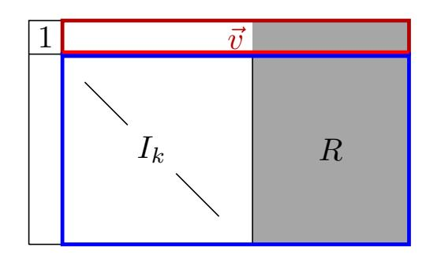
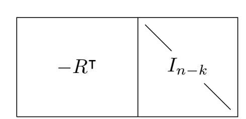
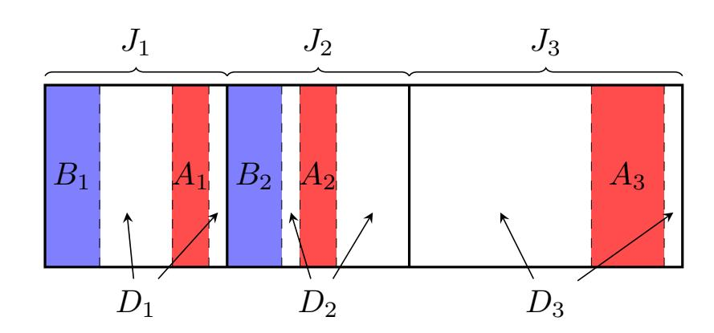
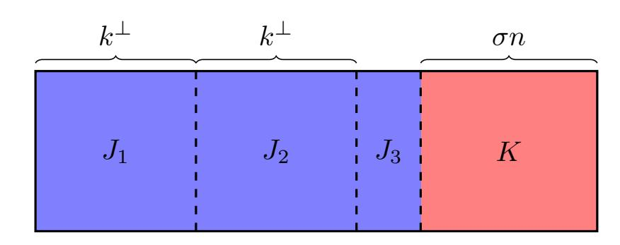
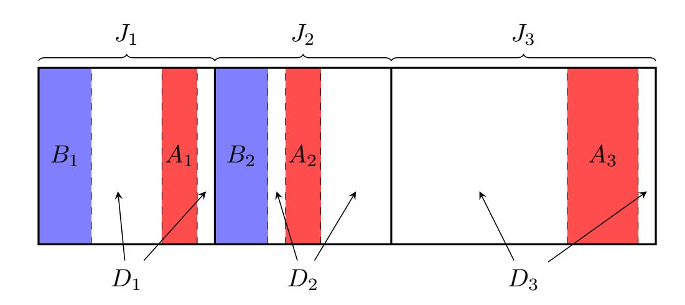

{0}------------------------------------------------

# **Constructing Locally Leakage-resilient Linear Secret-sharing Schemes**

## **Hemanta K. Maji**1

Department of Computer Science, Purdue University, USA [hmaji@purdue.edu](mailto:hmaji@purdue.edu)

## **Anat Paskin-Cherniavsky**2

Department of Computer Science, Ariel University, Israel [anatpc@ariel.ac.il](mailto:anatpc@ariel.ac.il)

## **Tom Suad**

Department of Computer Science, Ariel University, Israel [tom.suad@msmail.ariel.ac.il](mailto:tom.suad@msmail.ariel.ac.il)

## **Mingyuan Wang**1

Department of Computer Science, Purdue University, USA [wang1929@purdue.edu](mailto:wang1929@purdue.edu)

### **Abstract**

Innovative side-channel attacks have repeatedly falsified the assumption that cryptographic implementations are opaque black-boxes. Therefore, it is essential to ensure cryptographic constructions' security even when information leaks via unforeseen avenues. One such fundamental cryptographic primitive is the secret-sharing schemes, which underlies nearly all threshold cryptography. Our understanding of the leakage-resilience of secret-sharing schemes is still in its preliminary stage.

This work studies locally leakage-resilient linear secret-sharing schemes. An adversary can leak *m* bits of arbitrary local leakage from each *n* secret shares. However, in a locally leakageresilient secret-sharing scheme, the leakage's joint distribution reveals no additional information about the secret.

For every constant *m*, we prove that the Massey secret-sharing scheme corresponding to a random linear code of dimension *k* (over sufficiently large prime fields) is locally leakage-resilient, where *k/n >* 1*/*2 is a constant. The previous best construction by Benhamouda, Degwekar, Ishai, Rabin (CRYPTO–2018) needed *k/n >* 0*.*907. A technical challenge arises because the number of all possible *m*-bit local leakage functions is exponentially larger than the number of random linear codes. Our technical innovation begins with identifying an appropriate pseudorandomnessinspired family of tests; passing them suffices to ensure leakage-resilience. We show that most linear codes pass all tests in this family. This Monte-Carlo construction of linear secret-sharing scheme that is locally leakage-resilient has applications to leakage-resilient secure computation.

Furthermore, we highlight a crucial bottleneck for all the analytical approaches in this line of work. Benhamouda et al. introduced an analytical proxy to study the leakage-resilience of secret-sharing schemes; if the proxy is small, then the scheme is leakage-resilient. However, we present a one-bit local leakage function demonstrating that the converse is false, motivating the need for new analytically well-behaved functions that capture leakage-resilience more accurately.

1 The research effort is supported in part by an NSF CRII Award CNS–1566499, NSF SMALL Awards CNS–1618822 and CNS–2055605, the IARPA HECTOR project, MITRE Innovation Program Academic Cybersecurity Research Awards (2019–2020, 2020–2021), a Ross-Lynn Research Scholars Grant (2021– 2022), a Purdue Research Foundation (PRF) Award (2017–2018), and The Center for Science of Information, an NSF Science and Technology Center, Cooperative Agreement CCF–0939370.

2 This research is supported by the Ariel Cyber Innovation Center in conjunction with the Israel National Cyber directorate in the Prime Minister's Office.

{1}------------------------------------------------

#### **2 Constructing Locally Leakage-resilient Linear Secret-sharing Schemes**

Technically, the analysis involves probabilistic and combinatorial techniques and (discrete) Fourier analysis. The family of new "tests" capturing local leakage functions, we believe, is of independent and broader interest.

**Keywords and phrases** Local leakage-resilience, Massey secret-sharing scheme, Random linear codes, Shamir's secret-sharing scheme, Discrete Fourier analysis

# **1 Introduction**

Traditionally, one treats the cryptosystems implementing cryptographic primitives as impervious black-boxes that faithfully realize the intended input-output behavior and provide no additional information. In the real-world implementations and deployments, however, this assumption has been repeatedly proven false. Beginning with the works of Kocher et al. [\[Koc96,](#page-24-0) [KJJ99\]](#page-24-1), several innovative and sophisticated side-channel attacks reveal partial information about the intermediate values and stored secrets of computation (for a summary of the history of several of these attacks, refer to [\[OP03,](#page-25-0) [KS04,](#page-25-1) [ZF05,](#page-26-0) [BT18,](#page-22-0) [SLS19,](#page-25-2) [RD20\]](#page-25-3)). These side-channel attacks on fundamental cryptographic building blocks like secret-sharing schemes pose a threat to the security of all cryptographic constructions relying on them.

Towards addressing these concerns, one can design mechanical countermeasures, hardware solutions, and algorithmic representation to protect against known threats [\[Ava05,](#page-22-1) [BSS05,](#page-22-2) [CFA](#page-23-0)+05, [FGM](#page-23-1)+10, [FV12,](#page-23-2) [AVL19\]](#page-22-3). However, this approach creates unknown risks, the risk of undiscovered attacks compromising a scheme's security. On the other hand, *leakage-resilient cryptography* formally models potential avenues of information leakage and the leakage attacks that an adversary may undertake. This approach has the benefit that the general model encompasses leakage attacks beyond those that are already known. Furthermore, one knows the formal security guarantees and risks of using such cryptographic schemes. In the last few decades, there has been a large body of highly influential research on the feasibility and efficiency of realizing leakage-resilient variants of fundamental cryptographic primitives against active/passive adversaries that perform leakage statically/adaptively (refer to the excellent survey [\[KR19\]](#page-24-2)).

One such fundamental cryptographic primitive is *secret-sharing schemes*, which are essential to nearly all threshold cryptography. In the (so-called) standard model, the adversary can corrupt a few parties and obtain their secret-shares; however, it obtains no additional information about the remaining secret shares. The security of secret-sharing schemes crucially relies on the fact that the corruption threshold is lower than the secretsharing schemes' privacy threshold. However, a side-channel attack on a secret-sharing scheme provides the adversary a restricted or noisy access to every party's secret share. For instance, a *passive adversary* can leak a few bits from each secret share. Although it has a partial view of each secret share, the leakages' joint distribution may be correlated with the secret to compromise its secrecy.

Our understanding of the leakage-resilience of secret-sharing schemes is still in its preliminary stage. Even for prominent secret-sharing schemes like Shamir's secret-sharing scheme, the exact characterization of the leakage-resilience is not well-understood. A *locally leakage-resilient secret-sharing scheme* (LLRSS) [\[BDIR18\]](#page-22-4) (also implicit in the constructions of [\[GK18\]](#page-24-3)) protects against a static passive adversary. The adversary chooses leakage functions from all the secret shares. However, an LLRSS secret-sharing scheme ensures that the leakage's joint distribution is statistically independent of the secret. Guruswami and Wootters's reconstruction algorithm [\[GW16,](#page-24-4) [GW17\]](#page-24-5) for Reed-Solomon codes (and follow-up works [\[TYB17,](#page-26-1) [GR17,](#page-24-6) [DDKM18,](#page-23-3) [MBW19\]](#page-25-4)) demonstrate that Shamir's secret-sharing scheme

{2}------------------------------------------------

on characteristic-2 finite fields is insecure even when the adversary can leak only one bit from every secret share. Achieving leakage-resilience seems challenging because the adversary need not reconstruct the complete secret; obtaining only some partial information about the secret precludes leakage-resilience. For example, over characteristic-two fields, if the secret is a linear combination of some parties' secret shares, then the adversary can leak only one bit from these secret shares and reconstruct the least significant bit of the secret. Although this attack does not suffice to reconstruct the complete secret (which is impossible using entropy arguments), it suffices to distinguish the secret 0 from secret 1.

There has been a significant amount of research into constructing new leakage-resilient secret-sharing schemes [\[BPRW16,](#page-22-5) [ADN](#page-22-6)+19, [SV19,](#page-25-5) [BS19,](#page-22-7) [KMS19,](#page-24-7) [BIS19,](#page-22-8) [FY19,](#page-23-4) [FY20,](#page-24-8) [HVW20,](#page-24-9) [CGG](#page-23-5)+20, [MSV20\]](#page-25-6). However, it seems insurmountable to replace every deployed secret-sharing scheme with their leakage-resilient version or an entirely new leakage-resilient secret-sharing scheme. Furthermore, in specific contexts, cryptographic constructions crucially rely on the secret-sharing scheme's additional salient features (for example, their linearity and algebraic structure); thus, making such a substitution impossible. Inspired by these concerns, recently, there have been studies on the leakage-resilience of prominent secret-sharing schemes, like Shamir's secret-sharing scheme and the additive secret-sharing scheme [\[HIMV19,](#page-24-10) [CGN19,](#page-23-6) [LCG](#page-25-7)+20, [MNP](#page-25-8)+21, [ANN](#page-22-9)+21].

**A summary of our model and results.** This work studies the leakage-resilience of Massey secret-sharing schemes [\[Mas01\]](#page-25-9) corresponding to various linear codes, for example, random linear codes, Reed-Solomon codes, and the parity code. We remind the readers that prominent secret-sharing schemes like Shamir's secret-sharing scheme and the additive secret-sharing scheme are the Massey secret-sharing schemes corresponding to (punctured) Reed-Solomon codes and the parity code. Our work considers *m*-bit *general leakage* from each secret share, where *m* is a constant.

*Result 1.* We present a Monte Carlo algorithm for a linear secret-sharing scheme that is secure against *m*-bit leakage from each secret share, where *m* is a constant. We prove that the Massey secret-sharing scheme corresponding to a random linear code is leakage-resilient if *k/n* is a constant *>* 1*/*2. Towards this objective, the technical challenge is that the number of potential constructions is exponentially smaller than the number of all such leakage functions. Overcoming this hurdle requires identifying a significantly smaller set of "tests," passing them suffices to guarantee leakage-resilience.

*Result 2.* Next, we show an explicit leakage function (leaking only *m* = 1 bit from each secret share) that highlights a significant shortcoming of the analytic techniques employed in this line of work. Ever since the work of Benhamouda et al. [\[BDIR18\]](#page-22-4), analytic techniques employ a (natural) "proxy analytic function" to study the leakage resilience of secret-sharing schemes. If this proxy is small, then the insecurity of the secret-sharing scheme to leakage attacks is small as well. However, we present an explicit attack demonstrating that the converse is false, making a case for discovering new (analytically well-behaved) proxies that represent the insecurity of secret-sharing schemes more accurately.

*Result 3.* Using the new analytical techniques developed for "Result 1" in our work, we improve the leakage-resilience guarantees for Shamir's secret-sharing scheme for *n* parties. We prove that if the reconstruction threshold *k* > 0*.*8675 · *n* then it is secure against *m* = 1 bit leakage from each secret share improving the previous state-of-the-art from *k* > 0*.*907 ·*n*. [3](#page-2-0) Independent to our work, the journal version [\[BDIR21\]](#page-22-10) of [\[BDIR19\]](#page-22-11) also improved the

3 The older full version of [\[BDIR19\]](#page-22-11) claims a smaller constant in Theorem 1.2, which is a consequence of an incorrect calculation. *k* > 0*.*907*n* is an accurate reflection of the result in their full version.

{3}------------------------------------------------

threshold to *k* > 0*.*85*n*.

*Result 4.* Finally, we note that an attack for additive secret-sharing schemes proposed by Benhamouda et al. [\[BDIR18\]](#page-22-4) can be extended to all linear secret-sharing schemes. By this observation, we prove that to achieve 2 −*λ* insecurity, the threshold *k* must be at least Ω *λ* log *λ* . This generalizes a similar result by Nielsen and Simkin [\[NS20\]](#page-25-10) as their result works only for polynomially large fields while our result works for fields of arbitrary size.

## **1.1 Our Contributions**

This section introduces some basic definitions to facilitate an intuitive presentation of our results.

*F* is a prime field such that |*F*| needs *λ* bits for its binary representation, i.e., 2 *λ*−1 6 |*F*| *<* 2 *λ* . We interpret *λ* as the security parameter and, therefore, the number of parties *n* = poly(*λ*). Typically, in cryptography, the objective is to demonstrate the insecurity of cryptographic constructions is negl(*λ*), a function that decays faster than any inversepolynomial in *λ*. However, in this work, as is common in information theory and coding theory literature, all our results shall further ensure that the insecurity is exponentially decaying in the security parameter.

**Massey secret-sharing scheme.** Let *C* ⊆ *F n*+1 be a subset, referred to as a *code*. The Masey secret-sharing scheme [\[Mas01\]](#page-25-9) corresponding to code *C* secret-shares the secret *s* ∈ *F* by choosing a random (*c*0*, c*1*, . . . , cn*) ∈ *C* conditioned on *c*0 = *s*. The secret share of party *i* is *si* = *ci* , for all *i* ∈ {1*, . . . , n*}.

**Linear codes.** A vector subspace *V* ⊆ *F n*+1 of dimension (*k*+1) is an [*n*+1*, k*+1]*F* -code. A matrix *G*+ ∈ *F* (*k*+1)×(*n*+1) succinctly represents this vector space *V* if the linear span of its rows, represented by h*G*+i, is identical to the vector space *V* . (Punctured) Reed-Solomon codes and parity codes are linear codes. Fix distinct evaluation places *X*1*, . . . , Xn* ∈ *F* ∗ . The set of elements ( *f*(0)*, f*(*X*1)*, . . . , f*(*Xn*) ), for all polynomials *f*(*X*) ∈ *F*[*X*] of degree *<* (*k*+1), is the (punctured) Reed-Solomon code. The set of all elements (*c*0*, c*1*, . . . , cn*) ∈ *F n*+1 such that *c*0 + *c*1 +· · · + *cn* = 0 is the parity code.

This work considers Massey secret-sharing schemes of linear codes.

**Local leakage-resilience of secret-sharing schemes.** An (*n, m*) local leakage function leaks *m*-bit leakage from each of the secret shares of the *n* parties. The output of an (*n, m*) local leakage function is the joint distribution of the *mn* leakage bits. A secret-sharing scheme for *n* parties is (*m, ε*)*-locally leakage-resilient* if any (*n, m*) local leakage function cannot distinguish whether the secret *s* (0) ∈ *F* from the secret *s* (1) ∈ *F* based on the joint leakage distributions, for arbitrary *s* (0)*, s*(1) ∈ *F*.

I Remark. In the literature (e.g., [\[BDIR18\]](#page-22-4)), the following definition of leakage-resilience has also been considered. The adversary is given some secret shares explicitly and then allowed to leak from the remaining secret shares. We note that, for an MDS code *G*+, the leakage-resilience of Massey secret-sharing corresponding to *G*+ in these two definitions are equivalent as follows.

Suppose *G*+ is an MDS code of dimension (*k* + 1) × (*n* + 1). If the adversary obtains *t* shares explicitly, the remaining secret shares is exactly a Massey secret-sharing scheme corresponding to some *G*0 of dimension (*k* + 1 − *t*) × (*n* + 1 − *t*). Hence, *G*+ is leakageresilient to an adversary who obtains *t* shares explicitly if and only if Massey secret-sharing corresponding to *G*0 is leakage-resilient when the adversary only leaks from every secret share.

{4}------------------------------------------------

In this paper, we only work with  $G^+$  that is MDS.4 Therefore, we restrict to the simple setting where the adversary only leaks from every secret share.

Result 1. Leakage-resilience of Random Linear Codes. For the presentation in this section, a  $random [n+1, k+1]_F$ -code is the linear code  $\langle G^+ \rangle$  where  $G^+ \in F^{(k+1)\times (n+1)}$  is a rank-(k+1) random matrix. Section 2.2 provides additional details on efficiently sampling such a matrix.

▶ Corollary 1 (Random Linear Secret-sharing Schemes are Leakage-resilient). Fix constants  $m \in \mathbb{N}$ ,  $\delta \in (0,1)$ , and  $\eta \in (0,1)$ . Define  $n = (1-\eta) \cdot \lambda$  and  $k = (1/2+\delta) \cdot n$ . Let F be a prime field of order  $\in \{2^{\lambda-1}, \ldots, 2^{\lambda} - 1\}$ . For all sufficiently large  $\lambda$ , the Massey secret-sharing scheme corresponding to a random  $[n+1,k+1]_F$ -code is  $(m,\varepsilon)$ -locally leakage-resilient, where  $\varepsilon = \exp(-\Theta(\lambda))$ , except with  $\exp(-\Theta(\lambda))$  probability.

We highlight that one can publicly choose the randomness determining  $G^+$  once (say, using a CRS) and use this code for all future applications. With high probability, as long as the local leakage is  $\leq m$ , the Massey secret-sharing scheme corresponding to the linear code  $\langle G^+ \rangle$  shall be leakage-resilient.5 Intuitively, the Massey secret-sharing scheme corresponding to a random  $[n+1,k+1]_F$ -code (where F is a finite field of order  $> 2^{\lambda-1}$ ,  $n=0.97\lambda$ , and  $k=0.49\lambda$ ) shall be leakage-resilient to arbitrary m-bit local leakages when  $\lambda$  is sufficiently large (except with exponentially small probability). The threshold of  $\lambda$  being sufficiently large depends on the choices of  $m, \delta$ , and  $\eta$ . For example, when m=1 and using 2000-bit prime numbers, the insecurity of the above scheme is  $< 2^{-50}$ .

Efficiency. Linear codes, in contrast to non-linear codes, result in efficient Massey secret-sharing schemes. In particular, when  $G^+ = [I_{k+1} \mid P]$  is in the standard form, as is the case in this work, then the corresponding Massey secret-sharing scheme is easy to specify, where  $I_{k+1} \in F^{(k+1)\times(k+1)}$  is the identity matrix. Observe that the secret shares of the secret  $s \in F$  is

$$(s, s_1, \ldots, s_n) := (s, r_1, \ldots, r_k) \cdot G^+,$$

where  $r_1, \ldots, r_k$  are independently and uniformly distributed over F. Reconstruction of the secret is efficient as well for this secret-sharing scheme. Suppose  $G_{*,0}^+ = \lambda_1 \cdot G_{*,j_1}^+ + \cdots + \lambda_t \cdot G_{*,j_t}^+$ , where  $G_{*,j}^+$  represents the j-th column of the matrix  $G^+$  and  $\lambda_1, \ldots, \lambda_t \in F$  are appropriate constants. Then, parties  $j_1, \ldots, j_t$  can efficiently reconstruct the secret  $s = \lambda_1 \cdot s_{j_1} + \cdots + \lambda_t \cdot s_{j_t}$ , where  $s_j$  represents the secret share of party j. Furthermore, any t = k + 1 shall be able to reconstruct the secret because any (k+1) columns of a random  $G^+$  is full rank, except with an exponentially small probability.

The efficient reconstruction of the secret depends on parties reporting their secret shares correctly. If there are (k+1) publicly identifiable honest parties, all parties can efficiently reconstruct the secret from these parties' secret-shares. Additionally, information-theoretic primitives like message authentication codes can ensure that malicious parties cannot disclose incorrect secret shares. Using such information-theoretic cryptographic primitives, all parties can efficiently reconstruct the secret in applications using such secret-sharing schemes.

&lt;sup>4 In particular, our main result considers a random  $G^+$ , which is MDS with overwhelming probability.

However, as are typical for probabilistic existential results in information theory and coding theory, one cannot efficiently test whether the sampled  $G^+$  is leakage-resilient.

This step is necessary because efficient error-correction algorithms for (dense) random linear codes shall require incredible breakthroughs in mathematics. In fact, a lot of cryptography assumes that error-correction for random linear codes is inefficient [Pie12, Reg]. Efficient error-correction is known only when the matrix  $G^+$  has additional algebraic structures.

{5}------------------------------------------------

Applications. Linear secret-sharing schemes have applications in secure multi-party computation [Yao82, GMW87] due to their additive structure. In particular, an additive secret-sharing scheme is useful for the secure computation of circuits that use only addition gates, i.e., the aggregation functionality. The secure computation protocol proceeds as follows. Party i secret-shares its inputs  $x^{(i)}$  using a linear secret-sharing scheme. Let the secret share of  $x^{(i)}$  for party j be  $x^{(i,j)}$ . Now, party j has the secret shares  $x^{(1,j)}, \ldots, x^{(n,j)}$ . Party j defines  $s^{(j)} := \sum_{i=1}^n x^{(i,j)}$ . Now, the secret shares  $s^{(1)}, \ldots, s^{(n)}$  are secret shares of the sum  $s = x^{(1)} + \cdots + x^{(n)}$ . If any (k+1) parties can reconstruct the secret in the linear secret-sharing scheme, any subset of (k+1) parties can come online to recover the sum s.

When using our linear secret-sharing scheme robust to arbitrary m-bit local leakage, this secure computation is leakage-resilient to arbitrary m-bit leakage as well, when k/n is a constant > 1/2. The previous state-of-the-art construction [BDIR18] used Shamir's secretsharing scheme and needed  $k/n \ge 0.907$ , which was a significantly larger fraction. [MNP+21] proved the leakage-resilience of Shamir's secret-sharing scheme for an extremely restricted family of leakage functions, namely, the physical-bit leakage function, for every k > 1.

Derandomization. We highlight that we significantly derandomized the space of all possible codes to demonstrate that a *linear* code suffices to construct a leakage-resilient secret-sharing scheme. For example, against active adversaries who tamper the secret shares, the probabilistic construction of Cheraghchi and Guruswami [CG14] used (inefficient) non-linear codes.8

Technical Highlights. At the outset, linear codes as potential candidate constructions for leakage-resilient secret-sharing schemes seem far-fetched. Observe that the set of all possible (n,m) local leakage functions is  $2^{mn|F|} \gg 2^{2^{\lambda}}$ , where m is a constant,  $n = \text{poly}(\lambda)$ , and  $p \approx 2^{\lambda}$ . However, there are only  $|F|^{kn} \approx 2^{\mathsf{poly}(\lambda)}$  different matrices  $G^+$ . Typically, the proofs of similar results (see, for example, [FMVW14, CG14, MNP+21]) proceed by "union bound" techniques and need the set of adversarial strategies to be significantly smaller than the potential choices available for the construction. One of our work's key technical contributions is to address this apparent handicap that our construction faces.

We introduce a new family of "tests" (see Section 3) inspired by the various notions of pseudorandomness [V+12, Tao]. We show that if a generator matrix  $G^+$  passes all these tests, then the Massey secret-sharing scheme corresponding to the linear code  $\langle G^+ \rangle$  is leakageresilient (see Section 3.3). The advantage here is that the number of all possible tests is significantly smaller than the number of choices for choosing  $G^+$ . Finally, we show that nearly all matrices  $G^+$  pass all our tests (see Section 3.2). Lemma 1 and Lemma 2 abstract these two technical innovations, which, the authors believe, are of potential independent interest in the broader field of probabilistic analysis. Section 3 presents the proof of this result.

Result 2. A Barrier in the Analytic Modeling. Benhamouda et al. [BDIR18] introduced an analytic proxy (Refer to Equation 6) for upper bounding the statistical distance between leakage distributions of different secrets. All the works in this line of research ([BDIR18, MNP+21] and this work) essentially study leakage-resilience of the secret-sharing scheme through this analytic proxy. We present an inherent barrier for this proof strategy. We prove that one cannot prove any meaningful result when the threshold is

&lt;sup>7 Additionally, one can use information-theoretic message authentication codes to avoid incorrect revelation of secret-shares.

We note that non-malleability naturally requires the code to be non-linear. However, our point is that the union bound technique would not have worked if one considers a very small family of constructions such as linear codes.

{6}------------------------------------------------

less than half of the number of parties.

In particular, we present an explicit leakage function *L~* , which tests whether the field element is a *quadratic residue* or not. We prove that for *any* linear secret-sharing scheme with threshold *k* and *n* parties such that *k < n/*2, the analytic proxy with respect to this secret-sharing scheme and our leakage function *L~* is at least 1.[9](#page-6-0) Therefore, using this analytic proxy, it is hopeless to prove leakage-resilience against *general leakage* when *k < n/*2. This result is summarized as [Theorem 1](#page-20-0) in [Section 4.](#page-19-0)

In light of this, our first result that states a random linear code is leakage-resilient when *k* > ( 1 2 + *δ*)*n* for an arbitrary constant *δ* ∈ (0*,* 1*/*2) is the optimal result one could hope to obtain using the current proof technique. To obtain better results, significantly different ideas are required.

We note that the recent work of Maji et al. [\[MNP](#page-25-8)+21] also employs this analytic proxy. They show that Shamir's secret-sharing with random evaluation places is leakage-resilient even for the most stringent case *k* = 2 and *n* = poly(*λ*). Their results, however, do not contradict the barrier we present here. They only consider the family of leakage functions that leak physical-bit when the field elements are store in their natural binary representations. The counter-example we present, i.e., testing whether a field element is a quadratic residue or not, cannot be simulated by leaking a constant number of physical-bits.

**Result 3.** We prove the following result on the leakage-resilience of Shamir's secretsharing scheme.

I **Corollary 2.** *There exists a universal constant p*0 *such that, for all finite field F of prime order p > p*0*, the following holds. Shamir's secret-sharing scheme with number of parties n and threshold k is* (1*,* exp(−Θ(*n*))*-leakage-resilient if k* > 0*.*8675*n.*

We improve from the previous state-of-the-art result of *k* > 0*.*907*n* of [\[BDIR18\]](#page-22-4) to *k* > 0*.*8675*n*. In an independent work, Benhamouda et al. [\[BDIR21\]](#page-22-10) also improved their results to *k* > 0*.*85*n*. Note that achieving *k < n/*2 shall enable parties to multiply their respective secret shares to obtain secret shares of the product of the secrets.

Technically, we prove this result by employing a more fine-grained (compared to [\[BDIR18\]](#page-22-4)) analysis on the analytic proxy. [Section 5](#page-20-1) presents the proof overview.

**Result 4.** Consider a secret-sharing scheme with *n* parties and threshold *k* over a prime field *F* of order *p* that is leakage-resilient to *m*-bit leakage from each share. Nielsen and Simkin [\[NS20\]](#page-25-10) proved that it must hold that *k* · log *p* > *m* · (*n* − *k*)*.* Intuitively, they prove this result using an entropy argument.[10](#page-6-1) Consequently, their result is inevitably sensitive to the size of the field. They used this result to show that if the field size satisfies *p* = poly(*n*), the threshold *k* must be at least Ω(*n/* log *n*).

For linear secret-sharing schemes, we obtain a similar result, independent of the field size.

I **Corollary 3.** *If a linear secret-sharing scheme (over an arbitrarily large field) with n parties and threshold k is* (1*, ε*)*-leakage-resilient, then it must hold that ε* > 1 2*k k . Consequently, if it is* (1*,* exp(−Θ(*n*)))*-leakage-resilient, it must hold that k* = Ω(*n/* log *n*)*.*

We prove our result through a similar attack proposed by [\[BDIR18\]](#page-22-4) (on additive secret-sharing schemes). We present the proof in [Appendix E.](#page-37-0)

9 Note that this analytic proxy is used as an upper bound of the statistical distance. Hence, it gives an inconsequential bound if it is > 1.

10 Note that a secret-sharing scheme contains exactly *k* · log *p* amount of entropy. Hence, intuitively, the total amount entropy leaked *m* · *n* cannot exceed *k* · log *p*.

{7}------------------------------------------------

## **1.2 Prior Works**

Local leakage-resilient secret-sharing schemes were introduced by Benhamouda, Degwekar, Ishai, and Rabin [\[BDIR18\]](#page-22-4) (also, independently by [\[GK18\]](#page-24-3) as an intermediate primitive). There has been a sequence of works analyzing the leakage-resilience of prominent secretsharing schemes [\[HIMV19,](#page-24-10) [CGN19,](#page-23-6) [LCG](#page-25-7)+20, [MNP](#page-25-8)+21, [ANN](#page-22-9)+21] and constructing new leakage-resilient secret-sharing schemes [\[BPRW16,](#page-22-5) [ADN](#page-22-6)+19, [SV19,](#page-25-5) [BS19,](#page-22-7) [KMS19,](#page-24-7) [BIS19,](#page-22-8) [FY19,](#page-23-4) [FY20,](#page-24-8) [HVW20,](#page-24-9) [CGG](#page-23-5)+20, [MSV20\]](#page-25-6).

There is an exciting connection between repairing a linear code in the distributed storage setting and the leakage-resilience of its corresponding Massey secret-sharing scheme [\[Mas01\]](#page-25-9). In the distributed storage setting, every coordinate of the linear code is separately stored. The objective is to repair a block of the code by obtaining information from all other blocks. For example, Guruswami and Wootters [\[GW16,](#page-24-4) [GW17\]](#page-24-5) present a reconstruction algorithm that obtains *m* = 1 bit from every block of a Reed-Solomon code to repair any block when the field has characteristic two. These reconstruction algorithms ensure that by leaking *m* bits from the secret-shares corresponding to the Massey secret-sharing scheme corresponding to the linear code, it is possible to reconstruct the secret. For example, the Reed-Solomon reconstruction algorithm of Guruswami-Wootters translates into a leakage attack on Shamir's secret-sharing scheme (for characteristic two fields), the Massey secret-sharing scheme corresponding to a (punctured) Reed-Solomon code.

However, when working over prime fields, [\[BDIR18\]](#page-22-4) proved that Shamir's secret-sharing scheme is robust to *m* = 1 bit leakage if the reconstruction threshold is sufficiently high. In particular, their analysis proved that it suffices for the reconstruction threshold *k* to be at least 0*.*907*n*, where *n* is the total number of parties. Moreover, their results extend to arbitrary MDS codes. They complement this positive result with an attack on the additive secret-sharing scheme that has a distinguishing advantage of *ε* > *k* −*k* . After that, Nielsen and Simkin [\[NS20\]](#page-25-10) present a probabilistic argument to construct a leakage attack on any Massey secret-sharing scheme. Roughly, their attack needs *m* > *k* log *p/*(*n* − *k*) bits of leakage from each secret share, where *p* is the order of the prime field.

Recently, [\[MNP](#page-25-8)+21] studied a restricted family of leakage on Shamir's secret-sharing schemes. The secret-shares, which are elements of the prime field, are represented in their natural binary representation and stored in hardware. The adversary can leak only physical bits from the memory storage. They proved that Shamir's secret-sharing scheme with random evaluation places is leakage-resilient to this leakage family.

## **2 Preliminaries and Notations**

The *binary entropy function h*2 : [0*,* 1] → [0*,* 1] is

$$h_2(p) := -p \log_2 p - (1-p) \log_2 (1-p).$$

We shall use the following elementary upper bound on the binomial coefficients.

I Claim 1 (Estimation of Binomial Coefficients). For all *n* ∈ N and *k* ∈ {0*,* 1*, . . . , n*}, we have

$$\binom{n}{k} \leqslant 2^{h_2(k/n) \cdot n}.$$

**Proof.** Observe that

$$1 = \left(\frac{k}{n} + \frac{n-k}{n}\right)^n \geqslant \binom{n}{k} \left(\frac{k}{n}\right)^k \left(1 - \frac{k}{n}\right)^{n-k} = \binom{n}{k} 2^{-h_2(k/n) \cdot n}.$$

{8}------------------------------------------------

This completes the proof of the claim. J

Our work uses the length of the binary representation of the order of the prime field *F* as the security parameter *λ*. The total number of parties *n* = poly(*λ*) and the reconstruction threshold *k* = poly(*λ*) as well. The objective of our arguments shall be to show the insecurity of the cryptographic constructions is *ε* = negl(*λ*), i.e., a function that decays faster than any inverse-polynomial of the *λ*.

We shall also use the following Vinogradov notations for brevity in our analysis (as consistent with, for example, [\[AB09\]](#page-22-12)). For functions *f*(*λ*) and *g*(*λ*), one writes *f*(*λ*) ∼ *g*(*λ*) to represent *f*(*λ*) = (1 + o(1)) · *g*(*λ*), where o(1) is a decreasing function in *λ*. Similarly, *f*(*λ*) . *g*(*λ*) is equivalent to *f*(*λ*) 6 (1 + o(1)) · *g*(*λ*). Finally, *f*(*λ*) *g*(*λ*) represents that *f*(*λ*) = o(1) · *g*(*λ*). We explicitly mention the definitions of these notations because there are multiple interpretations of these symbols even in the field of analysis.

## **2.1 General Notation: Vectors, Random Variables, Sets**

Let *X* be a sample space. Particular elements of *X* are represented using the small-case letter *x*. A random variable of sampling *x* from the sample space *X* shall be represented by **x**.

For any two distributions **A** and **B** over the same sample space (which is enumerable), the *statistical distance* between the two distributions, represented by SD(**A***,* **B**), is defined as 1 2 P *x* |Pr[**A** = *x*] − Pr[**B** = *x*]|.

A vector *~v* ∈ Ω *n* is interpreted as *~v* = (*v*1*, . . . , vn*), where each *vi* ∈ Ω. For any *I* ⊆ {1*, . . . , n*}, the vector *~vI* ∈ Ω |*I*| represents the vector (*vi* : *i* ∈ *I*).

Let (*S,* ◦) be a group. Let *A* ⊆ *S* and *x* ∈ *S* be an arbitrary element of *S*. Then *x* ◦ *S* is the set {*x* ◦ *y* : *y* ∈ *S*}.

## **2.2 Matrices**

We adopt the following notations for matrices as consistent with [\[O'D14\]](#page-25-13).

Let *F* be a finite field. A matrix *M* ∈ *F k*×*n* has *k*-rows and *n*-columns, and each of its element is in *F*. For *i* ∈ {1*, . . . , k*} and *j* ∈ {1*, . . . , n*}, *Mi,j* represents the (*i, j*)-th elements in the matrix *M*. Furthermore, *Mi,*∗ represents the *i*-th row of *M* and *M*∗*,j* represents the *j*-th column of *M*. The *transpose* of the matrix *M* ∈ *F k*×*n* is the matrix *N* ∈ *F n*×*k* such that *Mi,j* = *Nj,i*, for all *i* ∈ {1*, . . . , k*} and *j* ∈ {1*, . . . , n*}. We represent *N* = *M*| .

Let *I* ⊆ {1*, . . . , k*} and *J* ⊆ {1*, . . . , n*} be a subset of row and column indices, respectively. The matrix *M* restricted to rows *I* and columns *J* is represented by *MI,J* . If *I* = {*i*} is a singleton set, then we represent *Mi,J* for *M*{*i*}*,J* . The analogous notation also holds for singleton *J*. Furthermore, *G*∗*,J* represents the columns of *G* indexed by *J* (all rows are included). Similarly, *G*∗*,j* represents the *j*-th column of the matrix *G*. Analogously, one defines *GI,*∗ and *Gi,*∗.

Some parts of the documents use {0*,* 1*, . . . , k*} as row indices and {0*,* 1*, . . . , n*} as column indices for a matrix *G* ∈ *F* (*k*+1)×(*n*+1). We will be explicit in mentioning the row and column indices in this work.

**Random Matrices.** A *random matrix M of dimension k* × *n* is a uniformly random element of *F k*×*n*. This sampling is equivalent to choosing every element *Mi,j* of the matrix uniformly and independently at random from *F*, for all *i* ∈ {1*, . . . , k*} and *j* ∈ {1*, . . . , n*}.

{9}------------------------------------------------

### 2.3 Codes and Massey Secret-sharing Schemes

We use the following notations for error-correcting codes as consistent with [MS77].

Let F be a finite field. A linear code C (over the finite field F) of length (n+1) and rank (k+1) is a (k+1)-dimension vector subspace of  $F^{n+1}$ , referred to as an  $[n+1,k+1]_F$ -code. The generator matrix  $G \in F^{(k+1)\times(n+1)}$  of an  $[n+1,k+1]_F$  linear code C ensures that every element in C can be expressed as  $\vec{x} \cdot G$ , for an appropriate  $\vec{x} \in F^{k+1}$ . Given a generator matrix G, the row-span of G, i.e., the code generated by G, is represented by  $\langle G \rangle$ . A generator matrix G is in the standard form if  $G = [I_{k+1}|P]$ , where  $I_{k+1} \in F^{(k+1)\times(k+1)}$  is the identity matrix and  $P \in F^{(k+1)\times(n-k)}$  is the parity check matrix. In our work, we always assume that the generator matrices are in their standard form.

Let  $C \subseteq F^{n+1}$  be the linear code that G generates. The dual code of C, represented by  $C^{\perp} \subseteq F^{n+1}$ , is the set of all elements in  $F^{n+1}$  that are orthogonal to every element in C. The dual code of an  $[n+1,k+1]_F$ -code happens to be an  $[n+1,n-k]_F$ -code. The generator matrix H for the dual code of the  $[n+1,k+1]_F$  linear code C generated by  $G = [I_{k+1}|P]$  satisfies  $H = [-P^{\dagger}|I_{n-k}]$ , where  $P^{\dagger} \in F^{(n-k)\times(k+1)}$  is the transpose of the matrix  $P \in F^{(k+1)\times(n-k)}$ . For brevity, we shall refer to the generator matrix H as the dual of the generator matrix G.

Maximum Distance Separable Codes. The distance of a linear code is the minimum weight of a non-zero codeword. An  $[n,k]_F$ -code is maximum distance separable (MDS) if its distance is (n-k+1). Furthermore, the dual code of an  $[n,k]_F$ -MDS code is an  $[n,n-k]_F$ -MDS code.

**Massey Secret-sharing Scheme.** Let  $C \subseteq F^{n+1}$  be a code (not necessarily a linear code). Let  $s \in F$  be a secret. The secret-sharing scheme picks a random element  $(s, s_1, \ldots, s_n) \in C$  to share the secret s. The secret shares of parties  $1, \ldots, n$  are  $s_1, \ldots, s_n \in F$ , respectively. Below, we elaborate on the Massey secret-sharing scheme and its properties specifically for a linear code C such that its generator matrix  $G^+$  is in the standard form.

Recall that the set of all codewords of the linear code generated by the generator matrix  $G^+ \in F^{(k+1)\times (n+1)}$  is

$$\{ \vec{y} : \vec{x} \in F^{k+1}, \vec{x} \cdot G^+ =: \vec{y} \} \subseteq F^{n+1}.$$

For such a generator matrix, its rows are indexed by  $\{0, 1, ..., k\}$  and its columns are indexed by  $\{0, 1, ..., n\}$ . Let  $s \in F$  be the secret. The *secret-sharing scheme* picks independent and uniformly random  $r_1, ..., r_k \in F$ . Let

$$(y_0, y_1, \dots, y_n) := (s, r_1, \dots, r_k) \cdot G^+.$$

Observe that  $y_0 = s$  because the generator matrix  $G^+$  is in the standard form. The secret shares for the parties  $1, \ldots, n$  are  $s_1 = y_1, s_2 = y_2, \ldots, s_n = y_n$ , respectively. Observe that every party's secret-share is an element of the field F. Of particular interest will be the set of all secret shares of the secret s = 0. Observe that the secret-shares form an  $[n, k]_F$ -code that is  $\langle G \rangle$ , where  $G = G^+_{\{1,\ldots,k\} \times \{1,\ldots,n\}}$ . Note that the matrix G is also in the standard form. The secret shares of  $s \in F^*$  form the affine space  $s \cdot \vec{v} + \langle G \rangle$ , where  $\vec{v} = G^+_{0,\{1,\ldots,n\}}$ . Refer to Figure 1 for a pictorial summary.

Suppose parties  $i_1, \ldots, i_t \in \{1, \ldots, n\}$  come together to reconstruct the secret with their, respective, secret shares  $s_{i_1}, \ldots, s_{i_t}$ . Let  $G_{*,i_1}^+, \ldots, G_{*,i_t}^+ \in F^{(k+1)\times 1}$  represent the columns indexed by  $i_1, \ldots, i_t \in \{1, \ldots, n\}$ , respectively. If the column  $G_{*,0}^+ \in F^{(k+1)\times 1}$  lies in the span of  $\{G_{*,i_1}^+, \ldots, G_{*,i_t}^+\}$  then these parties can reconstruct the secret s using a linear combination of their secret shares. If the column  $G_{*0}^+$  does not lie in the span of  $\{G_{*,i_1}^+, \ldots, G_{*,i_t}^+\}$  then the secret remains perfectly hidden from these parties. The perfectly-hiding property is specific

{10}------------------------------------------------

to the case that a linear code is used for the Massey secret-sharing scheme. In particular, this perfectly-hiding property need not necessarily hold for Massey secret-sharing schemes that use a non-linear secret-sharing scheme.

In this document, we shall use the "Massey secret-sharing scheme of  $G^+$ " to refer to the Massey secret-sharing scheme corresponding to the linear code generated by the generator matrix  $G^+$ . The underlying field F, the length of the code (n+1), and the rank (k+1) of the linear code are implicit given the definition of the generator matrix  $G^+$ . These parameters, in turn, define the space of the secret-shares, the total number of parties, and the randomness needed to generate the secret shares for the Massey secret-sharing scheme, respectively.

**Specific Linear Codes.** The (punctured) Reed-Solomon code of rank (k + 1) and evaluation places  $\vec{X} = (X_1, \dots, X_n) \in (F^*)^n$ , where  $i \neq j$  implies  $X_i \neq X_j$ , is the following code. Let f(X) be the unique polynomial with F-coefficients and degree  $\leq k$  such that  $f(0) = y_0, f(X_1) = y_1, f(X_2) = y_2, \dots, f(X_k) = y_k$ , for any  $y_0, y_1, \dots, y_k \in F$ . Define  $c_{k+1} = f(X_{k+1}), \dots, c_n = f(X_n)$ . The set of all codewords  $(y_0, y_1, \dots, y_k, c_{k+1}, \dots, c_n) \in F^{n+1}$  is an  $[n+1, k+1]_F$ -code. Furthermore, the mapping

$$(y_0, y_1, \dots, y_k) \mapsto (y_0, y_1, \dots, y_k, c_{k+1}, \dots, c_n)$$

is linear and a generator matrix in the standard form establishes this mapping.

**Specific Secret-sharing Schemes.** Shamir's secret-sharing scheme is the Massey secret-sharing scheme corresponding to (punctured) Reed-Solomon codes. Suppose the evaluation places of the (punctured) Reed-Solomon code are  $\vec{X} = (X_1, \dots, X_n) \in (F^*)^n$ . Suppose the secret is  $s \in F$ . Let f(X) be the unique polynomial with F-coefficients and degree  $\leq k$  such that  $f(0) = s, f(X_1) = r_1, \dots, f(X_k) = r_k$ . Define the secret shares  $(s_1, \dots, s_n)$ , where  $s_i = f(X_i)$ , for all  $i \in \{1, \dots, n\}$ .

## 2.4 Locally Leakage-resilient Secret-sharing Scheme

Fix a finite field F and an n-party secret-sharing scheme for secrets  $s \in F$ , where every party gets an element in F as their secret share. An (n,m) local leakage function  $\vec{L} = (L_1, \ldots, L_n)$  is an n-collection of m-bit leakage functions  $L_i \colon F \to \{0,1\}^m$ , for  $i \in \{1,\ldots,n\}$ . Note that there are a total of  $2^{mn \cdot |F|}$  different (n,m) local leakage functions. Let  $\vec{\mathbf{L}}(s)$  be the joint distribution of the (n,m) leakage function  $\vec{L}$  over the sample space  $(\{0,1\}^m)^n$  defined by the experiment: (a) sample secret shares  $(s_1,\ldots,s_n)$  for the secret s, and (b) output  $(L_1(s_1),\ldots,L_n(s_n))$ . We emphasize that the secret-sharing scheme and the finite field F shall be evident from the context. So, we do not include the description of the secret-sharing scheme and the finite field in the random variables above to avoid excessively cumbersome notation.

A secret-sharing scheme for *n*-parties is  $(m, \varepsilon)$ -locally leakage-resilient secret-sharing scheme if, for all (n, m) local leakage functions  $\vec{\mathbf{L}} = (L_1, \dots, L_n)$  and secret pairs  $(s^{(0)}, s^{(1)})$ , the statistical distance between the leakage joint distributions  $\vec{\mathbf{L}}(s^{(0)})$  and  $\vec{\mathbf{L}}(s^{(1)})$  is at most  $\varepsilon$ .

For brevity, we shall say that a generator matrix G is  $(m, \varepsilon)$ -locally leakage-resilient if the Massey secret-sharing scheme corresponding to the linear code generated by G is  $(m, \varepsilon)$ -locally leakage-resilient.

{11}------------------------------------------------

**Figure 1** The matrix on the left is  $G^+ = [I_{k+1} \mid P]$ , where P is the random matrix in the shaded region. The indices of rows and columns of  $G^+$  are  $\{0, 1, \ldots, k\}$  and  $\{0, 1, \ldots, n\}$ , respectively. The blue  $G = [I_k \mid R]$  is a submatrix of  $G^+$ . The vector highlighted in red is the vector  $\vec{v}$ . On the right-hand side, we have the matrix H, where  $\langle H \rangle$  is the dual code of  $\langle G \rangle$ .

# 3 Leakage-resilience of Random Linear Codes

In this section, we prove Corollary 1. We start by recalling some notations. Refer to Figure 1 for a pictorial summary of the notations. The secret shares of 0 is the vector space

$$(0, r_1, \dots, r_k) \cdot G_{\{0,\dots,k\},\{1,\dots,n\}} \in F^n.$$

Observe that this vector space is an  $[n, k]_F$ -code, represented by  $\langle G \rangle$ , where  $G = G^+_{\{1, \dots, k\}, \{1, \dots, n\}}$ . Each element of  $\langle G \rangle$  is equally likely to be chosen as the secret share for the n parties. Next, consider the secret  $s \in F^*$ . The secret shares of s form the affine space

$$(s, r_1, \dots, r_k) \cdot G^+_{*,\{1,\dots,n\}} \in F^n.$$

Observe that, one can express this affine space as

$$s \cdot \vec{v} + \langle G \rangle \subseteq F^n,$$

where  $\vec{v} = G_{0,\{1,...,n\}}^+ \in F^n$ .

To demonstrate that the Massey secret-sharing scheme corresponding to the linear code generated by a generator matrix  $G^+ \in F^{(k+1)\times (n+1)}$  is vulnerable to leakage attacks, the adversary needs to present two secrets  $s^{(0)}, s^{(1)} \in F$  and an (n, m) local leakage function  $\vec{L}$  such that the statistical distance between the joint leakage distributions for these two secrets is large.

**First Attempt.** Fix an (n,m) local leakage function  $\vec{L}$ . Let  $\vec{\ell} \in (\{0,1\}^m)^n$  be a leakage value. Let  $L_i^{-1}(\ell_i) \subseteq F$  be the subset of *i*-th party's secret shares such that the leakage function  $L_i$  outputs  $\ell_i \in \{0,1\}^m$  as output. Therefore, we have  $s_i \in L_i^{-1}(\ell_i)$  if and only if  $L_i(s_i) = \ell_i$ . Furthermore, the leakage is  $\vec{\ell}$  if and only if the secret shares  $\vec{s}$  belongs to the set

$$\vec{L}^{-1}(\vec{\ell}) := L_1^{-1}(\ell_1) \times \cdots \times L_n^{-1}(\ell_n).$$

So, the probability of the leakage being  $\vec{\ell}$  conditioned on the secret being  $s^{(0)}$  is

$$\frac{1}{\left|F\right|^{k}} \cdot \left| \ s^{(0)} \cdot \vec{v} + \left\langle G \right\rangle \ \cap \ \vec{L}^{-1}(\vec{\ell}) \ \right|.$$

Similarly, the probability of the leakage being  $\vec{\ell}$  conditioned on the secret being  $s^{(1)}$  is

$$\frac{1}{\left|F\right|^{k}} \cdot \left| \ s^{(1)} \cdot \vec{v} + \langle G \rangle \ \cap \ \vec{L}^{-1}(\vec{\ell}) \ \right|.$$

The absolute value of the difference in the probabilities is, therefore, the following expression.

$$\frac{1}{\left|F\right|^{k}} \cdot \left| \left|s^{(0)} \cdot \vec{v} + \langle G \rangle \right| \cap \left|\vec{L}^{-1}(\vec{\ell})\right| - \left|s^{(1)} \cdot \vec{v} + \langle G \rangle \right| \cap \left|\vec{L}^{-1}(\vec{\ell})\right| \right|.$$

{12}------------------------------------------------

The statistical distance between the joint leakage distributions is

$$\frac{1}{2} \cdot \frac{1}{|F|^k} \sum_{\vec{\ell} \in (\{0,1\}^m)^n} \left| \left| s^{(0)} \cdot \vec{v} + \langle G \rangle \cap \vec{L}^{-1}(\vec{\ell}) \right| - \left| s^{(1)} \cdot \vec{v} + \langle G \rangle \cap \vec{L}^{-1}(\vec{\ell}) \right| \right|. \tag{1}$$

If the expression in Equation 1 is  $\leq \varepsilon$  for all (n, m) leakage functions  $\vec{L}$  and all pairs of secrets  $s^{(0)}$  and  $s^{(1)}$ , then the generator matrix  $G^+$  is  $(m, \varepsilon)$ -locally leakage-resilient.

▶ Remark. Observe that if one can choose  $\vec{L}$  to ensure that any codeword  $\vec{c} \in \langle G \rangle$  that belongs to  $\vec{L}^{-1}(\vec{\ell})$  (for some  $\vec{\ell}$ ) also has  $\vec{c} + s^{(1)} \cdot \vec{v} \notin \vec{L}^{-1}(\vec{\ell})$  for some secret  $s^{(1)}$ , then the expression in Equation 1 is identical to 1.

For example, if the finite field is characteristic-2, even with m=1 bit leakage from each secret share, an adversary can ensure this condition. The attack works as follows. Suppose the secret s can be reconstructed by  $\alpha_1s_1 + \alpha_2s_2 + \cdots + \alpha_ks_k$  where  $\alpha_1, \ldots, \alpha_k$  are fixed field elements and  $s_i$  is the i-th secret share. The adversary leaks the least significant symbol  $b_i$  of  $\alpha_is_i$  from the i-th secret share. Afterwards, the adversary can reconstruct the least significant symbol of the secret s by computing  $b_1 \oplus b_2 \oplus \cdots \oplus b_k$ . This leakage attack extends to linear secret-sharing schemes over finite fields with small characteristics. More specifically, the above attack generalize to characteristic-p field when the adversary is allowed to leak  $\lceil \log p \rceil$  bits from each secret share.

Recall that the number of (n,m) local leakage functions is  $2^{mn\cdot |F|}$ . One encounters the following hurdle while proceeding by the union bound technique to prove our result. Suppose that for every leakage function  $\vec{L}$  there is one generator matrix such that the statistical distance in Equation 1 is  $> \varepsilon$ . Using naïve union bound technique, one shall rule out  $2^{mn\cdot |F|}$  generator matrices. However, there are only a total of  $|F|^{(k+1)\times (n-k)}$  generator matrices. For the event of encountering generator matrices that are  $(m,\varepsilon)$ -locally leakage-resilient with high probability, we shall require

$$2^{mn\cdot|F|} \ll |F|^{(k+1)\cdot(n-k)} \sim 2^{kn\cdot\log_2|F|}$$
.

For simplicity, consider the minimal non-trivial case of m=1 and  $k=n(1-\mathrm{o}(1))$ . Our result is impossible to prove even for this minimal non-trivial case where  $|F|=p\geqslant 2^{\lambda-1}$  and m=1.

- ▶ Remark. We note that the recent result of [MNP+21] uses a union bound technique. In their work, however, they consider physical-bit leakage functions. The total number of physical-bit leakage functions is extremely small;11 otherwise, their approach (despite all the exciting new technical tools) would not have worked.
- ▶ Remark. In the active adversary setting, to the authors' best knowledge, union bound (over all possible adversaries) is the only general technique known in the literature. See, for instance, the probabilistic proofs of the existence of non-malleable extractors [DW09] and non-malleable codes [FMVW14, CG14]. The proof of [CG14] even employs non-linear codes (which provide significantly more degrees of freedom in designing the encoding schemes) to push a "union bound based proof" through.

A New Set of Tests. To circumvent the hurdles associated with the naïve union bound, we propose a new set of tests. We emphasize that it is *non-trivial* to prove that if a generator

&lt;sup>11 For example, consider a physical-bit leakage function that leaks one bit from the field F. There are  $\log_2|F|$  such functions. In comparison, there are  $2^{|F|}$  general 1-bit leakage functions.

{13}------------------------------------------------

matrix *G* passes all these tests, then *G*+ is (*m, ε*)-locally leakage-resilient. [Section 3.3](#page-17-0) elaborates this implication. The inspiration for these tests stems from the literature in pseudorandomness [V+[12,](#page-26-3) [Tao\]](#page-26-4).[12](#page-13-2)

Recall that *G*+ ∈ *F* (*k*+1)×(*n*+1) is the generator matrix of the code, and *G*+ = [*Ik*+1|*P*] is in the standard form, where *P* ∈ *F* (*k*+1)×(*n*−*k*) . The secret shares of secret 0 is the [*n, k*]*F* -code h*G*i. The matrix *G* is also in the standard form, say *G* = [*Ik*|*R*], where *R* = *P*{1*,...,k*}×{1*,...,n*−*k*} ∈ *F k*×(*n*−*k*) . Then, the matrix *H* = [−*R*| |*In*−*k*] generates the dual code of the code generated by the matrix *G* = [*Ik*|*R*]. We introduce the matrix *H* because it is easy to express our tests using the row-span of *H*, i.e. h*H*i.

Fix parameters *σ* ∈ [0*,* 1], *γ* ∈ N, and *a* ∈ N. The set of all tests Test*σ,γ,a* is defined as follows. Every test is *additionally* indexed by (*V , J ~* ), where *V~* = (*V*1*, . . . , Vn*), each *Vi* is a size-*γ* subset of the finite field *F*, and *J* is a size-(1 − *σ*) · *n* subset of {1*, . . . , n*}. A codeword *c* ∈ *F n fails the test* indexed by (*V , J ~* ) if *cj* ∈ *Vj* , for all *j* ∈ *J*.

The generator matrix *H fails the test* indexed by (*V , J ~* ) if at least *a n* codewords fail this test. The generator matrix *H passes* Test*σ,γ,a* if *H* does not fail for *any* test in Test*σ,γ,a*.

I **Lemma 1** (Technical Lemma 1)**.** *Let G*+ *be the generator matrix of an* [*n* + 1*, k* + 1]*F -code. Consider a Massey secret-sharing scheme corresponding to the linear code* h*G*+i*. Let* h*G*i *be the* [*n, k*]*F -code formed by the set of all secret shares of the secret* 0*. Let* h*H*i *be the* [*n, n* − *k*]*F -code that is the dual code of* h*G*i*. Let* Test*σ,γ,a be a set of tests, where γ* = 2*m* · *T* 2 *and T* ∈ N*. If H passes* Test*σ,γ,a,* h*H*i *is an MDS code, and σ* ∈ (0*,* 2*k/n* − 1]*, then G*+ *is* (*m, ε*)*-locally leakage-resilient, where*

$$\varepsilon = 2^{-(\log_2(C_m)\cdot(k/n) - \log_2(a) - h_2(\sigma))\cdot n} + 2^{-(\log_2(T)\cdot\sigma - (\sigma + k^{\perp}/n)m - h_2(\sigma))\cdot n},$$

*and Cm >* 1 *is a suitable constant depending on m.* [13](#page-13-3)

I Remark. Note that this lemma is where we inherently need *k > n/*2. Otherwise, we are unable to pick a *σ*. We discuss this barrier further when we go into the proof in [Remark 3.3](#page-18-0) and [Section 4.](#page-19-0)

In [Section 3.1,](#page-14-1) we shall set the parameters properly to ensure the insecurity is negligible. There are potentially several techniques to prove this result. We prove this technical lemma using Fourier analysis in [Section 3.3.](#page-17-0)

**Most Matrices Pass the Tests.** Let us do a sanity check first. The total number of tests in Test*σ,γ,a* is

$$\binom{|F|}{\gamma}^n \cdot \binom{n}{(1-\sigma)n} = \Theta\Big(|F|^{\gamma \cdot n} \cdot 2^{h_2(\sigma) \cdot n}\Big).$$

Furthermore, the total number of generator matrices *G* is |*F*| *k*·(*n*−*k*) . So, it is plausible that the union bound technique may work for this result.

However, naïve accounting does not suffice. [Section 3.2](#page-14-0) presents the careful accounting needed to prove the following result.

I **Lemma 2** (Technical Lemma 2)**.** *Fix constant σ, γ, a. Let p* > 2 *λ*−1 *be a prime and* lim*λ*→∞ *n/λ* ∈ (0*,* 1)*, where λ is the security parameter. Let G*+ *be the generator matrix of*

12 Intuitively, a set whose correlation with any Fourier character is small can be interpreted as a pseudorandom object. On the other side, a large Fourier coefficient indicates a correlation with a Fourier character; thus, the object is *not* pseudorandom. In a similar spirit, as we shall explain, our tests find whether a code h*H*i has many codewords with large Fourier coefficients or not.

13 Refer to [Imported Lemma 2](#page-27-0) for the relation between *m* and the constant *Cm*.

{14}------------------------------------------------

*an* [*n* + 1*, k* + 1]*F -code in the standard form such that each element of its parity check matrix is independently and uniformly chosen from F, where constant k/n* ∈ (*σ,* 1)*. Consider a Massey secret-sharing scheme corresponding to the linear code* h*G*+i*. Let* h*G*i *be the* [*n, k*]*F code formed by the set of all secret shares of the secret* 0*. Let* h*H*i *be the* [*n, n* − *k*]*F -code that is the dual code of* h*G*i*. Then, the following bound holds.*

$$\Pr_{G^+ \xleftarrow{\$} \mathbf{G}^+} [H \text{ is MDS and passes } \mathsf{Test}_{\sigma,\gamma,a}] = 1 - 2^{-(1-n/\lambda) \cdot \lambda} - \exp(-\Theta(\lambda^3)).$$

## **3.1 Parameter Setting for [Corollary 1](#page-4-3)**

Before we go into the proof of [Lemma 1](#page-13-0) and [Lemma 2,](#page-13-1) let us first show how we can set up the parameters in both lemmas to imply [Corollary 1.](#page-4-3) Let us restate the corollary first.

I **Corollary 4** (Restatement of [Corollary 1\)](#page-4-3)**.** *Fix constants m* ∈ N*, δ* ∈ (0*,* 1)*, and η* ∈ (0*,* 1)*. Define n* = (1−*η*)·*λ and k* = (1*/*2+*δ*)·*n. Let F be a prime field of order* ∈ {2 *λ*−1 *, . . . ,* 2 *λ*−1}*. For all sufficiently large λ, the Massey secret-sharing scheme corresponding to a random* [*n* + 1*, k* + 1]*F -code is* (*m, ε*)*-locally leakage-resilient, where ε* = exp(−Θ(*λ*))*, except with* exp(−Θ(*λ*)) *probability.*

The sequence of parameter choices is as follows. We emphasize that all parameters below are constants.

- **1.** We are given the number of bits leaked from each share *m* and the target threshold *δ* as constants. Therefore, *Cm >* 1 is also fixed as a constant. (Refer to [Imported Lemma 2.](#page-27-0))
- **2.** We shall pick constants *σ >* 0 and *a >* 1 arbitrarily satisfying the following constraints.
  - **a.** *σ <* min(2*δ,* 1*/*2 + *δ*). This parameter choice ensures that *σ <* 2*k/n* − 1 and *σ < k/n*.
  - **b.** log2 (*Cm*) · (1*/*2 + *δ*) − log2 (*a*) − *h*2(*σ*) *>* 0. This choice ensures that the first part in the expression of *ε* in [Lemma 1](#page-13-0) is negligible.
- **3.** Next, we pick any constant *T* satisfying log2 (*T*)· *σ* − (*σ* + (1*/*2 − *δ*)) *m* − *h*2(*σ*) *>* 0. This choice ensures that the second part in the expression of *ε* in [Lemma 1](#page-13-0) is negligible.
- **4.** Since we have picked *T*, this implicitly fixes *γ* as *γ* = 2*m* · *T* 2 .

Clearly, all the steps above are feasible, and we have now fixed all the constants involved. One can verify that all the prerequisites of [Lemma 1](#page-13-0) and [Lemma 2](#page-13-1) are satisfied. Consequently, [Lemma 1](#page-13-0) and [Lemma 2](#page-13-1) together imply that the Massey secret-sharing scheme corresponding to a random linear code is negligibly-insecure with overwhelming probability. √

As a concrete example, suppose *m* = 1, *n* = 0*.*97*λ*, and *k* = 0*.*49*λ.* In this case *Cm* = 2, by setting, *σ* = 0*.*01, *a* = 1*.*5, and *T* = 250, one can verify that *λ >* 2000 ensures that we achieve 2 −50-insecurity.[14](#page-14-2)

## **3.2 Proof of [Lemma 2](#page-13-1)**

The proof of [Lemma 2](#page-13-1) proceeds by a combinatorial argument. Fix a test (*V , J ~* ) in the set of tests Test*σ,γ,a*. Consider the experiment where *G*+ \$ ←− **G**+, and *H* ∈ *F k* ⊥×*n* be the matrix corresponding to *G*+ as described in the statement of [Lemma 2,](#page-13-1) where *k* ⊥ = *n* − *k*. Our entire analysis is for this distribution of the matrix *H*.

14 For similar range of parameter choices, e.g., when *n* is close to *λ*, the dominant failure probability is the probability that a random matrix is not MDS, which is 2 *n*−*λ* .

{15}------------------------------------------------

Observe that  $\langle H \rangle$  is a maximum distance separable (MDS) code, with high probability. We defer the proof of this claim to Appendix B.1.

▶ Claim 2. The linear codes  $\langle G \rangle$  and  $\langle H \rangle$  are maximum distance separable codes, except with probability (at most)  $2^n/p = \exp(-\Theta(\lambda))$ .

Henceforth, our analysis shall assume that  $G^+$  is random as well as  $\langle G \rangle$  and  $\langle H \rangle$  are MDS (without loss of generality). Therefore  $\langle G \rangle$  is an  $[n,k]_F$ -MDS code and  $\langle H \rangle$  is an  $[n,k^{\perp}]_F$ -MDS code, where  $k^{\perp} = n - k$ . Recall that  $H = [-R^{\intercal}|I_{n-k}]$ , where every element of  $-R^{\intercal}$  is independent and uniformly random over F.

Without loss of generality, assume that  $J = \{\sigma n + 1, \sigma n + 2, \dots, n\}$ . Among the indices in J, let us fix the indices  $J' = \{k + 1, k + 2, \dots, n\}$  as the information set for the linear code  $\langle H \rangle$ .15 Let us fix a set of witnesses  $B \subseteq F^{k^{\perp}}$  of size  $a^n$ .

**Objective.** Over the distribution of  $\langle H \rangle$ , what is the probability that every codeword  $c \in \langle H \rangle$  such that c restricted to the information set J' is in the set B fails the test  $(\vec{V}, J)$ ? That is, compute the probability of the event "if  $c_{J'} \in B$  then  $c_j \in V_j$ , for all  $j \in J$ ." **Proof for a Weaker Bound.** The total number of choices for  $\vec{V}$  is at most  $(|F|^{\gamma})^n = |F|^{\gamma \cdot n}$ . The total number of choices for J is at most  $\binom{n}{(1-\sigma)n} = 2^{h_2(\sigma) \cdot n}$ . Finally, the total number of sets of witnesses B is at most  $\binom{\gamma^{k^{\perp}}}{a^n}$ . Therefore, the total number of possibilities is

$$|F|^{\gamma \cdot n} \cdot 2^{h_2(\sigma) \cdot n} \cdot {\gamma^k}^{\perp \choose a^n}.$$
 (2)

Next, fix a column index  $j \in J \setminus J' = \{\sigma n + 1, \sigma n + 2, \dots, k\}$ . Pick one non-zero witness  $d^{(1)} \in B$ . Over the randomness of choosing  $H_{*,j}$ , the random variable  $d^{(1)} \cdot H_{*,j}$  is uniformly random over the field F. So, the probability of this coordinate being in  $V_j$  is  $\gamma/|F|$ . This statement is true for all  $j \in J \setminus J'$  independently. Therefore, for all  $j \in J \setminus J'$ , the probability of the j-th coordinate of the codeword  $d^{(1)} \cdot H$  being in  $V_j$  is

$$\left(\frac{\gamma}{|F|}\right)^{(1-\sigma)n-k^{\perp}}.$$

Now, choose a second witness  $d^{(2)} \in B$ . Suppose  $d^{(2)}$  is a scalar multiple of  $d^{(1)}$ . In this case, the random variables  $d^{(1)} \cdot H_{*,j}$  and  $d^{(2)} \cdot H_{*,j}$  are scalar multiples of each other as well. However, if  $d^{(2)}$  is not in the span of  $d^{(1)}$ , then the random variable  $d^{(2)} \cdot H_{*,j}$  is uniformly random over the field F and (most importantly) independent of the random variable  $d^{(1)} \cdot H_{*,j}$ . Therefore, the probability of all coordinates of the codeword  $d^{(2)} \cdot H$  indexed by  $j \in J \setminus J'$  being in  $V_j$  is (independently)  $(\gamma/|F|)^{(1-\sigma)n-k^{\perp}}$ . We highlight that if, indeed, the witnesses are linearly dependent then the columns are linearly dependent as well. Consequently, identifying linearly independent witnesses seems necessary (not merely sufficient) for our proof strategy to succeed.

Generalizing this technique, one claims the following result. A proof can be found in Appendix B.2.

&lt;sup>15Since  $\langle H \rangle$  is MDS, we can pick any  $k^{\perp}$  coordinates to be the information set. We choose the last  $k^{\perp}$  coordinates (to coincide with the  $I_{n-k}$  block identity matrix of H) for simplicity. All remaining coordinates of a codeword in  $\langle H \rangle$  are derived via a linear combination of the information set.

&lt;sup>16 Because there are  $\gamma$  options for every  $k^{\perp}$  information coordinates in  $\langle H \rangle$ . Among these  $\gamma^{k^{\perp}}$  choices for the information coordinates, one can choose any  $a^n$  of them as the witness set B.

{16}------------------------------------------------

▶ Claim 3. Fix any r linearly independent  $d^{(1)}, d^{(2)}, \ldots, d^{(r)} \in F^{k^{\perp}}$ . For all  $j \in J \setminus J'$ , over the randomness of choosing  $H_{*,j}$ , the distribution of the random matrix

$$\left(\vec{d^{(i)}} \cdot H_{*,j}\right)_{i \in \{1,2,\dots,r\}}^{j \in J \setminus J'}$$

is identical to the uniform distribution over  $F^{r \times ((1-\sigma)n-k^{\perp})}$ .

Consequently, the probability of all the codewords corresponding to these r linearly independent witnesses in B failing the test (V, J) is

$$\left[ \left( \frac{\gamma}{|F|} \right)^{(1-\sigma)n - k^{\perp}} \right]^{r} \tag{3}$$

Now how many linearly independent witnesses can one identify among  $a^n$  witnesses of B? Towards this objective, we prove a bound similar in spirit to matrix rank lower bounds from communication complexity theory. We defer the proof to Appendix B.3.

▶ Claim 4 (Rank bound for 'Bounded-Diversity' Matrices). Let  $M \in F^{u \times v}$ , where  $u = 2^{\alpha v}$ , be an arbitrary matrix such that each row of this matrix is distinct. Suppose every column  $j \in \{1, \ldots, v\}$  of M satisfies

$$\left| \{ M_{1,j}, M_{2,j}, \dots, M_{u,j} \} \right| \leqslant \gamma.$$

Then,  $\operatorname{rank}(M) \geqslant \frac{\alpha}{\log_2 \gamma} \cdot v$ .

Back to proving Lemma 2. Construct M such that every row of M is a witness in B. Therefore, the matrix  $M \in F^{u \times v}$ , where  $u = a^n$  and  $v = k^{\perp}$ . Applying Claim 4 for  $u = a^n = 2^{\log_2(a) \cdot n}$  and  $v = k^{\perp}$ , we get  $r \geqslant \frac{\log_2 a}{\log_2 \gamma} \cdot k^{\perp}$ . For our end application scenario, we shall have  $k^{\perp} = \Theta(n)$ , and positive constant a and  $\gamma \geqslant 2$ . Therefore, we shall have  $r = \Theta(n)$ . So, the probability expression in Equation 3 effectively behaves like  $|F|^{-\Theta(n^2)}$ . On the other hand, the total number of possibilities given by Equation 2 are dominated by  $|F|^{\gamma n}$  and  $\binom{\gamma^{k^{\perp}}}{a^n} \leqslant \gamma^{k^{\perp} \cdot a^n}$ . When  $n \leqslant \Theta(\log \lambda)$ , using union bound, one can conclude that the probability of a random  $\langle H \rangle$  failing some test  $(\vec{V}, J)$  with some witness B is  $1 - \exp(-\Theta(\lambda))$ .

However,  $n \leq \Theta(\log \lambda)$  is unacceptably small. Our objective is to achieve  $n = \Theta(\lambda)$ . In fact, we have recklessly indulged in significant over-counting. Let us fix this proof to get the desired bound.

**Final Fix.** Observe that we do not need to pick B of size  $a^n$  from  $V_{k+1} \times \cdots \times V_n$ . For any B, identify the (unique) lexicographically smallest set  $\widehat{B} \subseteq B$  of r linearly independent witnesses. In the analysis presented above, we have significantly over-counted by separately considering all  $B \supseteq \widehat{B}$ . To fix this situation, we consider the argument below that analyzes  $\widehat{B}$  to account for  $all\ B \supseteq \widehat{B}$ .

Now, fix the (canonical) set  $\widehat{B}$  of r linearly independent witnesses. The proof above says that the probability of a random  $\langle H \rangle$  failing the test  $(\overrightarrow{V},J)$  with some witness  $B \supseteq \widehat{B}$  is at most  $(\gamma/|F|)^{\left((1-\sigma)n-k^{\perp}\right)\cdot r}$ . We emphasize that B may have more linearly independent elements; however, it is inconsequential for our analysis. So, we need only to pick  $\widehat{B}$  of size r such that the witnesses are linearly independent of each other. Consequently, the total number of possibilities of Equation 2 drastically reduces to the following bound.

$$|F|^{\gamma \cdot n} \cdot 2^{h_2(\sigma) \cdot n} \cdot {\gamma^k}^{\perp \choose r},$$
 (4)

{17}------------------------------------------------

where  $r = \frac{\log_2 a}{\log_2 \gamma} \cdot k^{\perp}$ . Now, we can put together the total number of witnesses of Equation 4 with the failure probability of Equation 3 using a union bound. The probability that a random  $\langle H \rangle$  fails some test  $(\vec{V}, I)$  witnessed by r linearly independent witnesses in  $\hat{B}$  is at most

$$|F|^{\gamma \cdot n} \cdot 2^{h_2(\sigma) \cdot n} \cdot {\gamma^{k^{\perp}} \choose r} \cdot {\left(\frac{\gamma}{|F|}\right)}^{((1-\sigma)n-k^{\perp}) \cdot r}$$

$$\leq |F|^{\gamma \cdot n} \cdot 2^{h_2(\sigma)n} \cdot {\gamma^{k^{\perp} \cdot r}} \cdot {\gamma^{(1-\sigma)n \cdot r - k^{\perp} \cdot r}} \cdot \frac{1}{|F|^{((1-\sigma)n-k^{\perp})r}}$$

$$= |F|^{\gamma n} \cdot 2^{h_2(\sigma) \cdot n} \cdot 2^{(1-k/n)(1-\sigma)\log_2(a) \cdot n^2} \cdot \frac{1}{|F|^{(\log_\gamma a)(1-k/n)(k/n-\sigma) \cdot n^2}}.$$

In our scenario, we have constant  $k/n \in (\sigma, 1)$ , constant a, and  $\lim_{\lambda \to \infty} n/\lambda \in (0, 1)$ . For these setting of the parameters, the numerator is dominated by the term  $2^{\Theta(\lambda^2)}$ . Furthermore, we have constant  $\gamma$ , so the denominator is  $2^{\Theta(\lambda^3)}$ . So, the probability expression above is  $\exp(-\Omega(\lambda))$ .

To summarize, we incur two forms of failures in our analysis. (1)  $\langle H \rangle$  is not MDS, and (2)  $\langle H \rangle$  fails some test. The probability of the first failure is  $\exp(-\Theta(\lambda))$ , and the probability of the second failure is  $\exp(-\Omega(\lambda))$ .

▶ Remark. It is natural to ask if one can employ standard techniques (e.g., Toeplitz matrices and the Wozencraft ensemble) to further partially derandomize Lemma 2, which in turn, gives a partial derandomization of leakage-resilient linear secret-sharing schemes. Unfortunately, we remark that Toeplitz matrices and the Wozencraft ensemble do not work for our proof strategy. The main bottleneck is that in Claim 3 we make crucial use of the fact that  $d^{(j)} \cdot H_{*,i}$  are all independent random variables for all  $i \in \{1, 2, ..., n\}$  and  $j \in \{1, 2, ..., r\}$ . It is a case of "too many linear equations for very few random variables." Otherwise, one cannot argue the failure probabilities are independent. As random matrices sampled from random Toeplitz matrices and the Wozencraft ensemble clearly do not have this property, straightforward employment of such techniques does not work. We leave the partial derandomization of the results in this work as a fascinating open problem.

### 3.3 Proof of Lemma 1

We prove Lemma 1 using Fourier analysis. Appendix A introduces the preliminaries of Fourier analysis that suffices for the proofs in this paper.

To begin, let us summarize what we are provided. We are given a fixed generator matrix  $H \in F^{k^{\perp} \times n}$ , where  $k^{\perp} = (n - k)$ . The code  $\langle H \rangle$  is MDS and the matrix H passes all tests in  $\mathsf{Test}_{\sigma,\gamma,a}$ , where  $\gamma = 2^m \cdot T^2$ .

Consider any (n, m) local leakage function  $\vec{L} = (L_1, \ldots, L_n)$ , such that each  $L_i : F \to \{0, 1\}^m$ . Our objective is to prove that this leakage function cannot distinguish the secret shares of the secret 0 from the secret 1. Fix any  $i \in \{1, \ldots, n\}$  and leakage  $\ell \in \{0, 1\}^m$ . Let  $\mathbf{1}_{i,\ell} : F \to \{0, 1\}$  be the indicator function for  $L_i(s_i) = \ell$ , where  $s_i$  is the secret share of party i.

▶ Claim 5. Let  $i \in \{1, ..., n\}$  and  $\ell \in \{0, 1\}^m$ . The size of the following set is at most  $T^2$ .

$$\mathrm{Big}_{i,\ell} = \left\{\alpha \,:\; \alpha \in F, \left|\widehat{\mathbf{1}_{i,\ell}}(\alpha)\right| \leqslant 1/T\right\}.$$

This result follows from Parseval's identity, and that function  $\mathbf{1}_{i,\ell}$  has a binary output. Refer to Appendix B.4 for the proof of this claim. Given the leakage function  $\vec{L} = (L_1, \dots, L_n)$ 

{18}------------------------------------------------

and  $i \in \{1, ..., n\}$ , define the sets

$$V_i = \bigcup_{\ell \in \{0,1\}^m} \mathsf{Big}_{i,\ell}.$$

Extend each  $V_i$  arbitrarily, if needed, to be of size  $\gamma = 2^m T^2$ . Now, we have defined the  $\vec{V} = (V_1, \dots, V_n)$  corresponding to the leakage function  $\vec{L}$ .

**Algebraization of Leakage-Resilience.** Benhamouda et al. [BDIR18] showed that proving that the statistical distance expression in Equation 1 is smaller than some quantity is implied by upper-bounding the analytical expression below by the same quantity. That is,

$$\operatorname{SD}\left(\overrightarrow{\mathbf{L}}(s^{(0)}), \overrightarrow{\mathbf{L}}(s^{(1)})\right)$$

$$= \frac{1}{2} \sum_{\ell \in (\{0,1\}^m)^n} \left| \sum_{\alpha \in \langle H \rangle} \prod_{i=1}^n \widehat{\mathbf{1}_{i,\ell_i}}(\alpha_i) \cdot \omega^{\alpha_i \cdot s^{(0)} \cdot v_i} - \sum_{\alpha \in \langle H \rangle} \prod_{i=1}^n \widehat{\mathbf{1}_{i,\ell_i}}(\alpha_i) \cdot \omega^{\alpha_i \cdot s^{(1)} \cdot v_i} \right|$$
(5)

$$\leq \sum_{\vec{x} \in F^{k^{\perp}} \setminus \{0^{k^{\perp}}\}} \sum_{\vec{\ell} = (\ell_1, \dots, \ell_n) \in (\{0,1\}^m)^n} \left| \prod_{i=1}^n \widehat{\mathbf{1}_{i,\ell_i}} (\vec{x} \cdot H_{*,i}) \right|. \tag{6}$$

For completeness, we include proof of this in Appendix B.5. We now proceed to upper bound this expression for an H that passes all tests in  $\mathsf{Test}_{\sigma,\gamma,a}$ .

▶ Remark. We emphasize that the analytical expression above is only an upper bound to the statistical distance. We show that using the expression above as a proxy to analyze the exact statistical distance encounters some bottlenecks. Section 4 highlights one such bottleneck.

**Upper-Bounding Equation 6.** We partition the elements  $\vec{x} \in F^{k^{\perp}} \setminus \{0^{k^{\perp}}\}$  into two sets.

$$\mathsf{Bad} := \left\{ \vec{x} : \ \exists J \text{ s.t. } \vec{x} \neq 0^n \ \& \ \vec{x} \cdot H \text{ fails the test indexed by } (\vec{V}, J) \in \mathsf{Test}_{\sigma, \gamma, a} \right\}.$$

We emphasize that  $J \subseteq \{1, 2, ..., n\}$  is of size  $(1 - \sigma)n$ . The remaining elements form the subset

$$\overline{\mathsf{Bad}} = \left(F^{k^{\perp}} \setminus \{0^{k^{\perp}}\}\right) \setminus \mathsf{Bad}.$$

Next, we upper-bound the expression of Equation 6 for elements  $\vec{x} \in \mathsf{Bad}$  and  $\vec{x} \in \mathsf{Bad}$  separately.

**Upper Bound: Part 1.** First we consider the sum of Equation 6 restricted to  $\vec{x} \in \mathsf{Bad}$ .

$$\sum_{\vec{x} \in \mathsf{Bad}} \sum_{\vec{\ell} \in (\{0,1\}^m)^n} \left| \prod_{i=1}^n \widehat{\mathbf{1}_{i,\ell_i}} (\vec{x} \cdot H_{*,i}) \right|$$

$$= \sum_{\vec{x} \in \mathsf{Bad}} \prod_{i=1}^n \sum_{\ell_i \in \{0,1\}^m} \left| \widehat{\mathbf{1}_{i,\ell_i}} (\vec{x} \cdot H_{*,i}) \right|$$

$$\leq a^n 2^{h_2(\sigma)n} \cdot \max_{\vec{x} \in \mathsf{Bad}} \prod_{i=1}^n \sum_{\ell_i \in \{0,1\}^m} \left| \widehat{\mathbf{1}_{i,\ell_i}} (\vec{x} \cdot H_{*,i}) \right|$$
(7)

The last inequality is due to the fact that there are  $\binom{n}{(1-\sigma)n} = 2^{h_2(\sigma)n}$  subsets J, and each test indexed by (V, J) has at most  $a^n$  different codewords failing it.17

&lt;sup>17 Since H passes all tests in the set  $\mathsf{Test}_{\sigma,\gamma,a}$ , at most  $a^n$  codewords fail any test indexed by  $(\vec{V},J)$ .

{19}------------------------------------------------

Next, fix any element  $\vec{x} \in \mathsf{Bad}$ . The codeword  $\vec{x} \cdot H$  has  $< k^{\perp}$  zeroes.18 Therefore, the codeword  $\vec{x} \cdot H$  has > k elements from  $F^*$ . Using this property, we claim the following result.

▶ Claim 6. Let  $\langle H \rangle$  be an  $[n, n-k]_F$ -MDS code, and  $\vec{x} \in F^{k^{\perp}} \setminus \{0^{k^{\perp}}\}$  be an arbitrary message. Then, there exists a constant  $C_m > 1$  such that

$$\prod_{i=1}^{n} \sum_{\ell_{i} \in \{0,1\}^{m}} \left| \widehat{\mathbf{1}_{i,\ell_{i}}} (\vec{x} \cdot H_{*,i}) \right| \leqslant C_{m}^{-k}.$$

Appendix B.6 provides the proof. Substituting this upper bound in Equation 7, we get the following upper bound

$$2^{-(\log_2(C_m)\cdot(k/n) - \log_2(a) - h_2(\sigma))\cdot n},$$
(8)

which completes the first upper bound. By picking our parameters as in Section 3.1, this upper bound is negligibly small.

Upper Bound: Part 2. Now, it remains to upper-bound

$$\sum_{\vec{x} \in \overline{\mathsf{Bad}}} \ \sum_{\vec{\ell} \in (\{0,1\}^m)^n} \ \left| \prod_{i=1}^n \widehat{\mathbf{1}_{i,\ell_i}} (\vec{x} \cdot H_{*,i}) \right|.$$

The crucial observation about any codeword  $c = \vec{x} \cdot H \in \overline{\mathsf{Bad}}$  is the following. The number of  $j \in \{1, \ldots, n\}$  such that  $c_j \notin V_j$  is at least  $\sigma n$ . For the coordinates where  $c_j \notin V_j$ , we utilize the fact that the magnitude of the Fourier coefficients contributed in the above expression is at most 1/T. Based on these observations, using Fourier analysis, we prove the following bound.

▶ Claim 7. For  $0 < \sigma \leq 1 - 2k^{\perp}/n$ , the expression above is upper-bounded by

$$2^{-\left(\log_2(T)\cdot\sigma-\left(\sigma+k^{\perp}/n\right)m-h_2(\sigma)\right)\cdot n}$$
.

Appendix B.7 provides the proof. By picking our parameters as in Section 3.1, this upper bound is negligibly small.

▶ Remark. We highlight that if we pick a  $\sigma$  such that  $\sigma > 1 - 2k^{\perp}/n$ , then naïvely using the analysis above yields an upper bound of

$$p^{k^{\perp}-(1-\sigma)n/2} \cdot 2^{-\left(\log_2(T)\cdot\sigma-\left(\sigma+k^{\perp}/n\right)m-h_2(\sigma)\right)\cdot n}.$$

Appendix B.8 present a proof sketch of this bound. Observe that the leading term  $p^{\Theta(\lambda)}$  forces the choice of T to be  $\omega(1)$ . However, in our analysis, we crucially rely on T to be a constant.

In particular, if  $2k^{\perp} > n$ , no suitable  $\sigma$  can be choosen to avoid this bottleneck. We discuss this barrier further in Section 4.

# 4 The k > n/2 Barrier

In this section, we discuss why k > n/2 is inherently required for the current proof techniques (which are common to [BDIR18, MNP+21] and this work). In particular, we pinpoint the step where one uses Equation 6 to upper bound the Equation 5 as the place where this

&lt;sup>18 If the codeword has  $k^{\perp}$  zeroes, we can choose their indices as the information set (because  $\langle H \rangle$  is MDS). That implies that the entire codeword is  $0^n$ , which contradicts the fact that Bad has non-zero elements.

{20}------------------------------------------------

barrier arises.19 That is, when one uses the magnitude of the Fourier coefficients to upper bound the statistical distance as

$$\sum_{\vec{x} \in F^{k^{\perp}} \setminus \{0^{k^{\perp}}\}} \sum_{\vec{\ell} \in (\{0,1\}^m)^n} \left| \prod_{i=1}^n \widehat{\mathbf{1}_{i,\ell_i}} (\vec{x} \cdot H_{*,i}) \right|.$$

To justify our claim, we prove the following theorem.

▶ **Theorem 1.** There exists a leakage function  $\vec{L}$  that leaks one bit from each share such that the following holds. Let  $\langle G \rangle$  be any  $[n,k]_F$  code such that k < n/2. Let  $\langle H \rangle$  be the dual code of  $\langle G \rangle$ . The above equation is lower bounded by 1. That is,

$$\sum_{\vec{x} \in F^{k^{\perp}} \setminus \{0^{k^{\perp}}\}} \sum_{\vec{\ell} \in \{0,1\}^n} \left| \prod_{i=1}^n \widehat{\mathbf{1}_{i,\ell_i}} (\vec{x} \cdot H_{*,i}) \right| \gtrsim p^{(n-2k)/2} > 1.$$

Consequently, one cannot prove any meaningful upper-bound when k < n/2.

In fact, we identify the leakage function explicitly as follows. Define the set of quadratic residues as

$$QR := \{ \alpha \in F : \exists \beta \text{ s.t. } \beta^2 = \alpha \}.$$

Define  $\vec{L} = (L_1, \dots, L_n)$  as for all  $i \in \{1, 2, \dots, n\}$ ,

$$L_i(x) := \begin{cases} 1 & \text{if } x \in \mathcal{QR} \\ 0 & \text{if } x \notin \mathcal{QR} \end{cases}.$$

By standard techniques in the Fourier analysis and the well-known facts about the *quadratic* Gaussian sum, one can verify this theorem with this particular leakage function. We defer the complete proofs to Appendix C.

# 5 Leakage-Resilience of Shamir's Secret-Sharing

In this section, we present our result that Shamir's secret-sharing with threshold k and n parties is leakage-resilient when  $k \ge 0.8675n$ . This improves the state-of-the-art result of Benhamouda et al. [BDIR18]. In fact, we prove a more general theorem as follows.

▶ **Theorem 2.** There exists a universal constant  $p_0$  such that, for all finite field F of prime order  $p > p_0$ , the following holds. Let  $G^+$  be an arbitrary MDS  $[n + 1, k + 1]_F$  code such that  $k \ge 0.8675n$ . The Massey secret-sharing scheme corresponding to  $G^+$  is  $(1, \exp(-\Theta(n))$ -leakage-resilient.

As Shamir's secret-sharing is a Massey secret-sharing scheme corresponding to the punctured Reed-Solomon codes, this theorem applies to Shamir's secret-sharing directly.

We defer the full proof of this theorem to Appendix D. In what follows, we present an overview of our proof. Starting from the upper bound Equation 6, i.e.,

$$\sum_{\vec{x} \in F^{k^{\perp}} \setminus \{0^{k^{\perp}}\}} \sum_{\vec{\ell} \in \{0,1\}^n} \left| \prod_{i=1}^n \widehat{\mathbf{1}_{i,\ell_i}} (\vec{x} \cdot H_{*,i}) \right|,$$

 $^{19}$  Note that Equation 5 is an identity transformation of the statistical distance. Hence, the proof until this step must not produce any barriers.

{21}------------------------------------------------

**Figure 2** The dual generator matrix  $H \in F^{k^{\perp} \times n}$ . We pick the first  $k^{\perp}$  columns as  $J_1$  and the second  $k^{\perp}$  columns as  $J_2$ . Let  $J_3$  be the rest of the columns. The set of columns  $A = A_1 \cup A_2 \cup A_3$  is exactly where the codeword will be 0. We pick  $B_1$  and  $B_2$  to ensure that  $|B_1| + |A| = |B_2| + |A| = k^{\perp}$ .

our main idea is that we shall bound it with the exact information where the zeros of the codeword (from  $\langle H \rangle$ ) are. This is motivated by the fact that the Fourier coefficient corresponds to 0 has the dominant weight.

Note that since  $\langle H \rangle$  is an MDS  $[n, k^{\perp} = n - k]_F$ -code, a non-zero codeword from  $\langle H \rangle$  has at most  $k^{\perp} - 1$  zeros. For any collection of indices  $A \subseteq \{1, 2, \dots, n\}$  such that  $|A| \leq k^{\perp} - 1$ , let us define set

$$S_A := \{ \vec{x} \mid a \in A \iff \vec{x} \cdot H_{*,a} = 0 \}.$$

That is, the collection of messages whose codewords satisfy that 0 appears exactly at those indices from A. Clearly,  $F^{k^{\perp}} \setminus \left\{0^{k^{\perp}}\right\} = \bigcup_{A: |A| \leqslant k^{\perp} - 1} \mathcal{S}_A$ . We shall break the summation

based on A, i.e.,

$$\sum_{A\colon |A|\leqslant k^\perp-1} \sum_{\vec{x}\in\mathcal{S}_A} \sum_{\vec{\ell}\in\{0,1\}^n} \left| \prod_{i=1}^n \widehat{\mathbf{1}_{i,\ell_i}} (\vec{x}\cdot H_{*,i}) \right|.$$

To bound each summation over some A, i.e.,

$$\Gamma_A := \sum_{\vec{x} \in \mathcal{S}_A} \sum_{\vec{\ell} \in \{0,1\}^n} \left| \prod_{i=1}^n \widehat{\mathbf{1}_{i,\ell_i}} (\vec{x} \cdot H_{*,i}) \right|,$$

we use the following ideas. (Refer to Figure 2 for notations.)

We know the codewords are 0 at columns in  $A = A_1 \cup A_2 \cup A_3$  and non-zero at columns outside A. Since  $\vec{x} \cdot H_{*,a} = 0$  for  $a \in A$ , bounding over columns from A can be easily handled. Next, we shall use the worst-case bound to bound the summation over columns from  $D_1 \cup D_2 \cup D_3$ . Finally, for the columns of  $B_1$  and  $B_2$ , we let them enumerate all possibilities from  $F^*$  and bound them appropriately.

The above is a very high-level summary of the derivation in Appendix D.1. Overall, we are able to prove that

$$\Gamma_A \leqslant \left(\frac{\pi}{2}\right)^{-(|A|+2k-n)}$$
.

Finally, our upper bound is now

$$\leqslant \sum_{A: |A| \leqslant k^{\perp} - 1} \left(\frac{\pi}{2}\right)^{-(|A| + 2k - n)} = \sum_{i=0}^{k^{\perp} - 1} 2^{n \left[h_2(i/n) - (i/n + 2k/n - 1)\log_2\left(\frac{\pi}{2}\right)\right]}.$$

Suppose  $k/n = \sigma$ , it suffices to ensure that

$$\max_{q \in [0, 1-\sigma)} h_2(q) - (q + 2\sigma - 1) \log_2(\pi/2) < 0.$$

We prove that  $\sigma \geq 0.8675$  suffices, which completes the proof of the theorem.

{22}------------------------------------------------

### **References**

- **AB09** Sanjeev Arora and Boaz Barak. *Computational complexity: a modern approach*. Cambridge University Press, 2009. [9](#page-8-1)
- **ADN**+**19** Divesh Aggarwal, Ivan Damgård, Jesper Buus Nielsen, Maciej Obremski, Erick Purwanto, João Ribeiro, and Mark Simkin. Stronger leakage-resilient and non-malleable secret sharing schemes for general access structures. In Alexandra Boldyreva and Daniele Micciancio, editors, *Advances in Cryptology – CRYPTO 2019, Part II*, volume 11693 of *Lecture Notes in Computer Science*, pages 510–539, Santa Barbara, CA, USA, August 18–22, 2019. Springer, Heidelberg, Germany. [doi:10.1007/](https://doi.org/10.1007/978-3-030-26951-7_18) [978-3-030-26951-7\\_18](https://doi.org/10.1007/978-3-030-26951-7_18). [3,](#page-2-1) [8](#page-7-0)
- **ANN**+**21** Donald Q. Adams, Hai H. Nguyen, Minh L. Nguyen, Anat Paskin-Cherniavsky, Tom Suad, and Mingyuan Wang. Lower bounds for leakage-resilient secret sharing schemes against probing attacks. Manuscript, 2021. [3,](#page-2-1) [8](#page-7-0)
- **Ava05** Roberto M. Avanzi. Side channel attacks on implementations of curve-based cryptographic primitives. Cryptology ePrint Archive, Report 2005/017, 2005. [http:](http://eprint.iacr.org/2005/017) [//eprint.iacr.org/2005/017](http://eprint.iacr.org/2005/017). [2](#page-1-0)
- **AVL19** Rodrigo Abarzúa, Claudio Valencia, and Julio López. Survey for performance & security problems of passive side-channel attacks countermeasures in ECC. Cryptology ePrint Archive, Report 2019/010, 2019. <https://eprint.iacr.org/2019/010>. [2](#page-1-0)
- **BDIR18** Fabrice Benhamouda, Akshay Degwekar, Yuval Ishai, and Tal Rabin. On the local leakage resilience of linear secret sharing schemes. In Hovav Shacham and Alexandra Boldyreva, editors, *Advances in Cryptology – CRYPTO 2018, Part I*, volume 10991 of *Lecture Notes in Computer Science*, pages 531–561, Santa Barbara, CA, USA, August 19–23, 2018. Springer, Heidelberg, Germany. [doi:10.1007/](https://doi.org/10.1007/978-3-319-96884-1_18) [978-3-319-96884-1\\_18](https://doi.org/10.1007/978-3-319-96884-1_18). [2,](#page-1-0) [3,](#page-2-1) [4,](#page-3-0) [6,](#page-5-2) [7,](#page-6-2) [8,](#page-7-0) [19,](#page-18-4) [20,](#page-19-2) [21,](#page-20-3) [27,](#page-26-6) [28,](#page-27-2) [29](#page-28-4)
- **BDIR19** Fabrice Benhamouda, Akshay Degwekar, Yuval Ishai, and Tal Rabin. On the local leakage resilience of linear secret sharing schemes. Cryptology ePrint Archive, Report 2019/653, 2019. <https://eprint.iacr.org/2019/653>. [3](#page-2-1)
- **BDIR21** Fabrice Benhamouda, Akshay Degwekar, Yuval Ishai, and Tal Rabin. On the local leakage resilience of linear secret sharing schemes. *Journal of Cryptology*, 2021. [3,](#page-2-1) [7](#page-6-2)
- **BIS19** Andrej Bogdanov, Yuval Ishai, and Akshayaram Srinivasan. Unconditionally secure computation against low-complexity leakage. In Alexandra Boldyreva and Daniele Micciancio, editors, *Advances in Cryptology – CRYPTO 2019, Part II*, volume 11693 of *Lecture Notes in Computer Science*, pages 387–416, Santa Barbara, CA, USA, August 18–22, 2019. Springer, Heidelberg, Germany. [doi:10.1007/](https://doi.org/10.1007/978-3-030-26951-7_14) [978-3-030-26951-7\\_14](https://doi.org/10.1007/978-3-030-26951-7_14). [3,](#page-2-1) [8](#page-7-0)
- **BPRW16** Allison Bishop, Valerio Pastro, Rajmohan Rajaraman, and Daniel Wichs. Essentially optimal robust secret sharing with maximal corruptions. In Marc Fischlin and Jean-Sébastien Coron, editors, *Advances in Cryptology – EUROCRYPT 2016, Part I*, volume 9665 of *Lecture Notes in Computer Science*, pages 58–86, Vienna, Austria, May 8– 12, 2016. Springer, Heidelberg, Germany. [doi:10.1007/978-3-662-49890-3\\_3](https://doi.org/10.1007/978-3-662-49890-3_3). [3,](#page-2-1) [8](#page-7-0)
- **BS19** Saikrishna Badrinarayanan and Akshayaram Srinivasan. Revisiting non-malleable secret sharing. In Yuval Ishai and Vincent Rijmen, editors, *Advances in Cryptology – EUROCRYPT 2019, Part I*, volume 11476 of *Lecture Notes in Computer Science*, pages 593–622, Darmstadt, Germany, May 19–23, 2019. Springer, Heidelberg, Germany. [doi:10.1007/978-3-030-17653-2\\_20](https://doi.org/10.1007/978-3-030-17653-2_20). [3,](#page-2-1) [8](#page-7-0)
- **BSS05** Ian F Blake, Gadiel Seroussi, and Nigel P Smart. *Advances in elliptic curve cryptography*, volume 317. Cambridge University Press, 2005. [2](#page-1-0)
- **BT18** Swarup Bhunia and Mark Tehranipoor. *Hardware security: a hands-on learning approach*. Morgan Kaufmann, 2018. [2](#page-1-0)

{23}------------------------------------------------

- **CFA**+**05** Henri Cohen, Gerhard Frey, Roberto Avanzi, Christophe Doche, Tanja Lange, Kim Nguyen, and Frederik Vercauteren, editors. *Handbook of Elliptic and Hyperelliptic Curve Cryptography*. Chapman and Hall/CRC, 2005. [doi:10.1201/9781420034981](https://doi.org/10.1201/9781420034981). [2](#page-1-0)
- **CG14** Mahdi Cheraghchi and Venkatesan Guruswami. Capacity of non-malleable codes. In Moni Naor, editor, *ITCS 2014: 5th Conference on Innovations in Theoretical Computer Science*, pages 155–168, Princeton, NJ, USA, January 12–14, 2014. Association for Computing Machinery. [doi:10.1145/2554797.2554814](https://doi.org/10.1145/2554797.2554814). [6,](#page-5-2) [13](#page-12-2)
- **CGG**+**20** Eshan Chattopadhyay, Jesse Goodman, Vipul Goyal, Ashutosh Kumar, Xin Li, Raghu Meka, and David Zuckerman. Extractors and secret sharing against bounded collusion protocols. In *61st Annual Symposium on Foundations of Computer Science*, pages 1226–1242, Durham, NC, USA, November 16–19, 2020. IEEE Computer Society Press. [doi:10.1109/FOCS46700.2020.00117](https://doi.org/10.1109/FOCS46700.2020.00117). [3,](#page-2-1) [8](#page-7-0)
- **CGN19** Gaëlle Candel, Rémi Géraud-Stewart, and David Naccache. How to compartment secrets. In Maryline Laurent and Thanassis Giannetsos, editors, *Information Security Theory and Practice - 13th IFIP WG 11.2 International Conference, WISTP 2019, Paris, France, December 11-12, 2019, Proceedings*, volume 12024 of *Lecture Notes in Computer Science*, pages 3–11. Springer, 2019. [doi:10.1007/978-3-030-41702-4\\\_1](https://doi.org/10.1007/978-3-030-41702-4_1). [3,](#page-2-1) [8](#page-7-0)
- **DDKM18** Hoang Dau, Iwan M. Duursma, Han Mao Kiah, and Olgica Milenkovic. Repairing reed-solomon codes with multiple erasures. *IEEE Trans. Inf. Theory*, 64(10):6567– 6582, 2018. [doi:10.1109/TIT.2018.2827942](https://doi.org/10.1109/TIT.2018.2827942). [2](#page-1-0)
- **DW09** Yevgeniy Dodis and Daniel Wichs. Non-malleable extractors and symmetric key cryptography from weak secrets. In Michael Mitzenmacher, editor, *41st Annual ACM Symposium on Theory of Computing*, pages 601–610, Bethesda, MD, USA, May 31 – June 2, 2009. ACM Press. [doi:10.1145/1536414.1536496](https://doi.org/10.1145/1536414.1536496). [13](#page-12-2)
- **FGM**+**10** Junfeng Fan, Xu Guo, Elke De Mulder, Patrick Schaumont, Bart Preneel, and Ingrid Verbauwhede. State-of-the-art of secure ECC implementations: A survey on known side-channel attacks and countermeasures. In Jim Plusquellic and Ken Mai, editors, *HOST 2010, Proceedings of the 2010 IEEE International Symposium on Hardware-Oriented Security and Trust (HOST), 13-14 June 2010, Anaheim Convention Center, California, USA*, pages 76–87. IEEE Computer Society, 2010. [doi:10.1109/HST.2010.](https://doi.org/10.1109/HST.2010.5513110) [5513110](https://doi.org/10.1109/HST.2010.5513110). [2](#page-1-0)
- **FMVW14** Sebastian Faust, Pratyay Mukherjee, Daniele Venturi, and Daniel Wichs. Efficient non-malleable codes and key-derivation for poly-size tampering circuits. In Phong Q. Nguyen and Elisabeth Oswald, editors, *Advances in Cryptology – EU-ROCRYPT 2014*, volume 8441 of *Lecture Notes in Computer Science*, pages 111– 128, Copenhagen, Denmark, May 11–15, 2014. Springer, Heidelberg, Germany. [doi:](https://doi.org/10.1007/978-3-642-55220-5_7) [10.1007/978-3-642-55220-5\\_7](https://doi.org/10.1007/978-3-642-55220-5_7). [6,](#page-5-2) [13](#page-12-2)
- **FV12** Junfeng Fan and Ingrid Verbauwhede. An updated survey on secure ECC implementations: Attacks, countermeasures and cost. In David Naccache, editor, *Cryptography and Security: From Theory to Applications - Essays Dedicated to Jean-Jacques Quisquater on the Occasion of His 65th Birthday*, volume 6805 of *Lecture Notes in Computer Science*, pages 265–282. Springer, 2012. [doi:10.1007/](https://doi.org/10.1007/978-3-642-28368-0_18) [978-3-642-28368-0\\\_18](https://doi.org/10.1007/978-3-642-28368-0_18). [2](#page-1-0)
- **FY19** Serge Fehr and Chen Yuan. Towards optimal robust secret sharing with security against a rushing adversary. In Yuval Ishai and Vincent Rijmen, editors, *Advances in Cryptology – EUROCRYPT 2019, Part III*, volume 11478 of *Lecture Notes in Computer Science*, pages 472–499, Darmstadt, Germany, May 19–23, 2019. Springer, Heidelberg, Germany. [doi:10.1007/978-3-030-17659-4\\_16](https://doi.org/10.1007/978-3-030-17659-4_16). [3,](#page-2-1) [8](#page-7-0)

{24}------------------------------------------------

- **FY20** Serge Fehr and Chen Yuan. Robust secret sharing with almost optimal share size and security against rushing adversaries. In Rafael Pass and Krzysztof Pietrzak, editors, *TCC 2020: 18th Theory of Cryptography Conference, Part III*, volume 12552 of *Lecture Notes in Computer Science*, pages 470–498, Durham, NC, USA, November 16–19, 2020. Springer, Heidelberg, Germany. [doi:10.1007/978-3-030-64381-2\\_17](https://doi.org/10.1007/978-3-030-64381-2_17). [3,](#page-2-1) [8](#page-7-0)
- **GK18** Vipul Goyal and Ashutosh Kumar. Non-malleable secret sharing. In Ilias Diakonikolas, David Kempe, and Monika Henzinger, editors, *50th Annual ACM Symposium on Theory of Computing*, pages 685–698, Los Angeles, CA, USA, June 25–29, 2018. ACM Press. [doi:10.1145/3188745.3188872](https://doi.org/10.1145/3188745.3188872). [2,](#page-1-0) [8](#page-7-0)
- **GMW87** Oded Goldreich, Silvio Micali, and Avi Wigderson. How to play any mental game or A completeness theorem for protocols with honest majority. In Alfred Aho, editor, *19th Annual ACM Symposium on Theory of Computing*, pages 218–229, New York City, NY, USA, May 25–27, 1987. ACM Press. [doi:10.1145/28395.28420](https://doi.org/10.1145/28395.28420). [6](#page-5-2)
- **GR17** Venkatesan Guruswami and Ankit Singh Rawat. MDS code constructions with small sub-packetization and near-optimal repair bandwidth. In Philip N. Klein, editor, *28th Annual ACM-SIAM Symposium on Discrete Algorithms*, pages 2109–2122, Barcelona, Spain, January 16–19, 2017. ACM-SIAM. [doi:10.1137/1.9781611974782.137](https://doi.org/10.1137/1.9781611974782.137). [2](#page-1-0)
- **GW16** Venkatesan Guruswami and Mary Wootters. Repairing reed-solomon codes. In Daniel Wichs and Yishay Mansour, editors, *48th Annual ACM Symposium on Theory of Computing*, pages 216–226, Cambridge, MA, USA, June 18–21, 2016. ACM Press. [doi:10.1145/2897518.2897525](https://doi.org/10.1145/2897518.2897525). [2,](#page-1-0) [8](#page-7-0)
- **GW17** Venkatesan Guruswami and Mary Wootters. Repairing reed-solomon codes. *IEEE Trans. Inf. Theory*, 63(9):5684–5698, 2017. [doi:10.1109/TIT.2017.2702660](https://doi.org/10.1109/TIT.2017.2702660). [2,](#page-1-0) [8](#page-7-0)
- **HIMV19** Carmit Hazay, Yuval Ishai, Antonio Marcedone, and Muthuramakrishnan Venkitasubramaniam. LevioSA: Lightweight secure arithmetic computation. In Lorenzo Cavallaro, Johannes Kinder, XiaoFeng Wang, and Jonathan Katz, editors, *ACM CCS 2019: 26th Conference on Computer and Communications Security*, pages 327–344. ACM Press, November 11–15, 2019. [doi:10.1145/3319535.3354258](https://doi.org/10.1145/3319535.3354258). [3,](#page-2-1) [8](#page-7-0)
- **HVW20** Carmit Hazay, Muthuramakrishnan Venkitasubramaniam, and Mor Weiss. The price of active security in cryptographic protocols. In Anne Canteaut and Yuval Ishai, editors, *Advances in Cryptology – EUROCRYPT 2020, Part II*, volume 12106 of *Lecture Notes in Computer Science*, pages 184–215, Zagreb, Croatia, May 10–14, 2020. Springer, Heidelberg, Germany. [doi:10.1007/978-3-030-45724-2\\_7](https://doi.org/10.1007/978-3-030-45724-2_7). [3,](#page-2-1) [8](#page-7-0)
- **KJJ99** Paul C. Kocher, Joshua Jaffe, and Benjamin Jun. Differential power analysis. In Michael J. Wiener, editor, *Advances in Cryptology – CRYPTO'99*, volume 1666 of *Lecture Notes in Computer Science*, pages 388–397, Santa Barbara, CA, USA, August 15–19, 1999. Springer, Heidelberg, Germany. [doi:10.1007/3-540-48405-1\\_25](https://doi.org/10.1007/3-540-48405-1_25). [2](#page-1-0)
- **KMS19** Ashutosh Kumar, Raghu Meka, and Amit Sahai. Leakage-resilient secret sharing against colluding parties. In David Zuckerman, editor, *60th Annual Symposium on Foundations of Computer Science*, pages 636–660, Baltimore, MD, USA, November 9– 12, 2019. IEEE Computer Society Press. [doi:10.1109/FOCS.2019.00045](https://doi.org/10.1109/FOCS.2019.00045). [3,](#page-2-1) [8](#page-7-0)
- **Koc96** Paul C. Kocher. Timing attacks on implementations of Diffie-Hellman, RSA, DSS, and other systems. In Neal Koblitz, editor, *Advances in Cryptology – CRYPTO'96*, volume 1109 of *Lecture Notes in Computer Science*, pages 104–113, Santa Barbara, CA, USA, August 18–22, 1996. Springer, Heidelberg, Germany. [doi:10.1007/3-540-68697-5\\_9](https://doi.org/10.1007/3-540-68697-5_9). [2](#page-1-0)
- **KR19** Yael Tauman Kalai and Leonid Reyzin. A survey of leakage-resilient cryptography. In Oded Goldreich, editor, *Providing Sound Foundations for Cryptography: On the*

{25}------------------------------------------------

- *Work of Shafi Goldwasser and Silvio Micali*, pages 727–794. ACM, 2019. [doi:10.1145/](https://doi.org/10.1145/3335741.3335768) [3335741.3335768](https://doi.org/10.1145/3335741.3335768). [2](#page-1-0)
- **KS04** François Koeune and François-Xavier Standaert. A tutorial on physical security and side-channel attacks. In Alessandro Aldini, Roberto Gorrieri, and Fabio Martinelli, editors, *Foundations of Security Analysis and Design III, FOSAD 2004/2005 Tutorial Lectures*, volume 3655 of *Lecture Notes in Computer Science*, pages 78–108. Springer, 2004. [doi:10.1007/11554578\\\_3](https://doi.org/10.1007/11554578_3). [2](#page-1-0)
- **LCG**+**20** Fuchun Lin, Mahdi Cheraghchi, Venkatesan Guruswami, Reihaneh Safavi-Naini, and Huaxiong Wang. Leakage-resilient secret sharing in non-compartmentalized models. In Yael Tauman Kalai, Adam D. Smith, and Daniel Wichs, editors, *ITC 2020: 1st Conference on Information-Theoretic Cryptography*, pages 7:1–7:24, Boston, MA, USA, June 17–19, 2020. Schloss Dagstuhl - Leibniz-Zentrum fuer Informatik. [doi:10.4230/](https://doi.org/10.4230/LIPIcs.ITC.2020.7) [LIPIcs.ITC.2020.7](https://doi.org/10.4230/LIPIcs.ITC.2020.7). [3,](#page-2-1) [8](#page-7-0)
- **Mas01** James L Massey. Some applications of code duality in cryptography. *Mat. Contemp*, 21(187-209):16th, 2001. [3,](#page-2-1) [4,](#page-3-0) [8](#page-7-0)
- **MBW19** Jay Mardia, Burak Bartan, and Mary Wootters. Repairing multiple failures for scalar MDS codes. *IEEE Trans. Inf. Theory*, 65(5):2661–2672, 2019. [doi:10.1109/TIT.](https://doi.org/10.1109/TIT.2018.2876542) [2018.2876542](https://doi.org/10.1109/TIT.2018.2876542). [2](#page-1-0)
- **MNP**+**21** Hemanta K. Maji, Hai H. Nguyen, Anat Paskin-Cherniavsky, Tom Suad, and Mingyuan Wang. Leakage-resilient secret-sharing schemes against physical-bit leakage. In *EUROCRYPT*, 2021. <https://eprint.iacr.org/2021/186.pdf>. [3,](#page-2-1) [6,](#page-5-2) [7,](#page-6-2) [8,](#page-7-0) [13,](#page-12-2) [20](#page-19-2)
- **MS77** Florence Jessie MacWilliams and Neil James Alexander Sloane. *The theory of error correcting codes*, volume 16. Elsevier, 1977. [10](#page-9-0)
- **MSV20** Pasin Manurangsi, Akshayaram Srinivasan, and Prashant Nalini Vasudevan. Nearly optimal robust secret sharing against rushing adversaries. In Daniele Micciancio and Thomas Ristenpart, editors, *Advances in Cryptology – CRYPTO 2020, Part III*, volume 12172 of *Lecture Notes in Computer Science*, pages 156–185, Santa Barbara, CA, USA, August 17–21, 2020. Springer, Heidelberg, Germany. [doi:10.1007/](https://doi.org/10.1007/978-3-030-56877-1_6) [978-3-030-56877-1\\_6](https://doi.org/10.1007/978-3-030-56877-1_6). [3,](#page-2-1) [8](#page-7-0)
- **NS20** Jesper Buus Nielsen and Mark Simkin. Lower bounds for leakage-resilient secret sharing. In Anne Canteaut and Yuval Ishai, editors, *Advances in Cryptology – EUROCRYPT 2020, Part I*, volume 12105 of *Lecture Notes in Computer Science*, pages 556–577, Zagreb, Croatia, May 10–14, 2020. Springer, Heidelberg, Germany. [doi:10.1007/978-3-030-45721-1\\_20](https://doi.org/10.1007/978-3-030-45721-1_20). [4,](#page-3-0) [7,](#page-6-2) [8](#page-7-0)
- **O'D14** Ryan O'Donnell. *Analysis of Boolean Functions*. 2014. [9](#page-8-1)
- **OP03** Elisabeth Oswald and Bart Preneel. A survey on passive side-channel attacks and their countermeasures for the nessie public-key cryptosystems. *NESSIE public reports,* [https://www.cosic.esat.kuleuven.ac.be/ nessie/ reports](https://www.cosic.esat.kuleuven.ac.be/nessie/reports), 2003. [2](#page-1-0)
- **Pie12** Krzysztof Pietrzak. Cryptography from learning parity with noise. In *International Conference on Current Trends in Theory and Practice of Computer Science*, 2012. [5](#page-4-4)
- **Rao07** Anup Rao. An exposition of bourgain's 2-source extractor. 2007. [27](#page-26-6)
- **RD20** Mark Randolph and William Diehl. Power side-channel attack analysis: A review of 20 years of study for the layman. *Cryptogr.*, 2020. [2](#page-1-0)
- **Reg** Oded Regev. The learning with errors problem. [5](#page-4-4)
- **SLS19** Asanka P. Sayakkara, Nhien-An Le-Khac, and Mark Scanlon. A survey of electromagnetic side-channel attacks and discussion on their case-progressing potential for digital forensics. *Digit. Investig.*, 29:43–54, 2019. [doi:10.1016/j.diin.2019.03.002](https://doi.org/10.1016/j.diin.2019.03.002). [2](#page-1-0)
- **SV19** Akshayaram Srinivasan and Prashant Nalini Vasudevan. Leakage resilient secret sharing and applications. In Alexandra Boldyreva and Daniele Micciancio, editors, *Advances in Cryptology – CRYPTO 2019, Part II*, volume 11693 of *Lecture Notes in*

{26}------------------------------------------------

Computer Science, pages 480–509, Santa Barbara, CA, USA, August 18–22, 2019. Springer, Heidelberg, Germany. doi:10.1007/978-3-030-26951-7\_17. 3, 8

Tao Terence Tao. Higher order Fourier analysis. Citeseer. 6, 14

TYB17 Itzhak Tamo, Min Ye, and Alexander Barg. Optimal repair of reed-solomon codes: Achieving the cut-set bound. In Chris Umans, editor, 58th Annual Symposium on Foundations of Computer Science, pages 216–227, Berkeley, CA, USA, October 15–17, 2017. IEEE Computer Society Press. doi:10.1109/FOCS.2017.28. 2

V+12 Salil P Vadhan et al. *Pseudorandomness*, volume 7. Now Delft, 2012. 6, 14

Yao82 Andrew Chi-Chih Yao. Protocols for secure computations (extended abstract). In 23rd Annual Symposium on Foundations of Computer Science, pages 160–164, Chicago, Illinois, November 3–5, 1982. IEEE Computer Society Press. doi:10.1109/SFCS.1982.38.6

YongBin Zhou and DengGuo Feng. Side-channel attacks: Ten years after its publication and the impacts on cryptographic module security testing. Cryptology ePrint Archive, Report 2005/388, 2005. http://eprint.iacr.org/2005/388. 2

# A Preliminaries of Fourier Analysis

In this section, we introduce minimal notations for Fourier analysis that suffice for our purpose. We follow the notation of [Rao07].

Let F be a prime field of order p. For a complex number  $z \in \mathbb{C}$ , let  $\overline{z}$  be the complex conjugate of z. For two functions  $f, g \colon F \to \mathbb{C}$ , their *inner product* is defined as

$$\langle f, g \rangle := \frac{1}{p} \sum_{x \in F} f(x) \overline{g(x)}.$$

Define  $\omega := \exp(2\pi i/p)$  and function  $\chi_{\alpha}(x) := \omega^{\alpha x}$ . For  $\alpha \in F$ , we define the Fourier coefficient

$$\widehat{f}(\alpha) := \langle f, \chi_{\alpha} \rangle$$
.

The  $\ell^2$ -norm of  $\widehat{f}$  is defined as

$$\left\| \widehat{f} \right\|_2 := \sqrt{\sum_{\alpha \in F} \left| \widehat{f}(\alpha) \right|^2}.$$

Fourier transformation satisfies the following properties.

- ▶ Fact 1 (Fourier Inversion Formula).  $f(x) = \sum_{\alpha \in F} \widehat{f}(\alpha) \cdot \omega^{\alpha x}$ .
- ▶ Fact 2 (Parseval's Identity).  $\frac{1}{p}\sum_{x\in F}|f(x)|^2 = \sum_{\alpha\in F}\left|\widehat{f}(\alpha)\right|^2$ .
- ▶ Lemma 3 (Poisson Summation Formula). Let  $C \subseteq F^n$  be a linear code with dual code  $C^{\perp}$ . For all  $i \in \{1, 2, ..., n\}$ ,  $f_i : F \to \mathbb{C}$  be an arbitrary function. The following holds,

$$\underset{x \leftarrow C}{\text{E}} \left[ \prod_{i=1}^{n} f_i(x_i) \right] = \sum_{\alpha \in C^{\perp}} \prod_{i=1}^{n} \widehat{f}_i(\alpha_i).$$

### A.1 Some Useful Inequalities

Let  $f: F \to \{0,1\}^m$  be an arbitrary function. For all  $u \in \{0,1\}^m$ , let  $\mathbf{1}_u: F \to \{0,1\}$  be the function such that  $\mathbf{1}_u(x) = 1$  if f(x) = u and  $\mathbf{1}_u(x) = 0$  otherwise.

Benhamouda et al. [BDIR18] prove the following lemmas, which shall be helpful for us.

{27}------------------------------------------------

► Imported Lemma 1 ([BDIR18]).

$$\sum_{u \in \{0,1\}^m} \left\| \widehat{\mathbf{1}_u} \right\|_2 \leqslant 2^{m/2}.$$

► Imported Lemma 2 ([BDIR18]).

1.  $\sum_{u \in \{0,1\}^m} \left| \widehat{\mathbf{1}_u}(0) \right| = 1;$ 

2.

$$\sum_{u \in \{0,1\}^m} \max_{\alpha \in F^*} \left| \widehat{\mathbf{1}}_u(\alpha) \right| \leqslant \frac{2^m \sin(\pi/2^m)}{p \sin(\pi/p)}.$$

In particular, when m is a constant, there exists a constant

$$C_m = \frac{1}{\cos(\pi/2^{m+1})} > 1$$

and constant  $p_0 = 2^{m+1} \in \mathbb{N}$  such that, for all  $p > p_0$ ,  $\sum_{u \in \{0,1\}^m} \left| \widehat{\mathbf{1}_u}(\alpha) \right| \leq 1/C_m$ .

# **B** Missing Proofs

#### B.1 Proof of Claim 2

Since the dual code of MDS codes is MDS as well, it suffices to bound the probability that  $\langle G \rangle$  is not an MDS code.

Recall that the generator matrix G is of the form  $[I_k|R]$ , where R is a random matrix of dimension  $k \times (n-k)$ . Every entry of G is an element from field F of size p. Furthermore, the row indices and column indices of G are  $\{1, 2, \ldots, k\}$  and  $\{1, 2, \ldots, n\}$ , respectively.

For  $i \in \{k, k+1, \ldots, n\}$ , define  $\mathcal{E}_i$  to be the event that  $G_{*,\{1,2,\ldots,i\}}$  is full rank and let  $\neg \mathcal{E}_i$  be the complement of this event. Clearly,  $\Pr[\mathcal{E}_k] = 1$  and we are interested in  $\Pr[\neg \mathcal{E}_n]$ . We shall prove that for all  $i \in \{k+1,\ldots,n\}$ , the following holds.

$$\Pr[\neg \mathcal{E}_i | \mathcal{E}_{i-1}] \leqslant \binom{i-1}{k-1}/p. \tag{9}$$

Equation 9 holds because of the following. Given  $G_{*,\{1,2,\ldots,i-1\}}$  is full rank,  $G_{*,\{1,2,\ldots,i\}}$  is full rank if and only if for all  $S \subseteq \{1,2,\ldots,i-1\}$  of size |S|=k-1, we have  $G_{*,S\cup\{i\}}$  is full rank. Since  $G_{*,S}$  is full rank,  $G_{*,S\cup\{i\}}$  is not full rank if and only if the randomly picked  $G_{*,i}$  falls into the column span of  $G_{*,S}$ , which happens with probability  $p^{k-1}/p^k=1/p$ . Finally, the number of choices of S is  $\binom{i-1}{k-1}$  and hence, by union bound, Equation 9 holds.

Now, given Equation 9, we have

$$\Pr[\neg \mathcal{E}_n] = \Pr[\neg \mathcal{E}_{k+1} | \mathcal{E}_k] + \Pr[\neg \mathcal{E}_{k+2} | \mathcal{E}_{k+1}] + \dots + \Pr[\neg \mathcal{E}_n | \mathcal{E}_{n-1}]$$

$$\leq \binom{k}{k-1} / p + \binom{k+1}{k-1} / p + \dots + \binom{n-1}{k-1} / p$$

$$\leq \binom{n}{k} / p$$

Finally, note that  $\Pr[\neg \mathcal{E}_n] \leqslant \binom{n}{k}/p \leqslant 2^n/p = \exp(-\Theta(\lambda))$  as long as we have  $p \geqslant 2^{\lambda-1}$  and  $\lim_{\lambda \to \infty} n/\lambda \in (0,1)$ .

&lt;sup>20 This follows from the fact that  $x \sin(\pi/x)$  is a monotonely increasing function on  $[2, \infty)$ .

{28}------------------------------------------------

#### **B.2** Proof of Claim 3

For any  $i \neq j$ ,  $H_{*,i}$  and  $H_{*,j}$  are independently sampled. Therefore, it suffices to prove that, for all  $i \in J \setminus J'$ , joint distribution

$$\left(d^{(1)} \cdot H_{*,i}, d^{(2)} \cdot H_{*,i}, \dots, d^{(r)} \cdot H_{*,i}\right)$$

is uniformly randomly distributed.

Note that  $H_{*,i} = (H_{1,i}, H_{2,i}, \dots, H_{k^{\perp},i})^{\intercal}$  and each  $H_{j,i}$  is independently uniformly sampled. Furthermore,  $d^{(\vec{1})}, d^{(\vec{2})}, \dots, d^{(\vec{r})} \in F^{k^{\perp}}$  are linearly independent. Therefore, the claim is trivially correct.

## **B.3** Proof of Claim 4

Note that every column  $j \in \{1, \ldots, v\}$  of M has " $\gamma$  bounded-diversity," i.e., there are at most  $\gamma$  distinct symbols in the column  $M_{*,j}$ . Intuitively, consider any  $\operatorname{rank}(M)$  linearly independent columns in M. These coordinates can take at most  $\gamma^{\operatorname{rank}(M)}$  distinct values; so,  $u = 2^{\alpha v} \leqslant \gamma^{\operatorname{rank}(M)}$ . Therefore, a matrix M, such that each column has " $\gamma$  bounded-diversity," must satisfy  $\operatorname{rank}(M) \geqslant \frac{\alpha}{\log_2 \gamma} \cdot v$ .

### B.4 Proof of Claim 5

By Parseval's identity, we have

$$\sum_{\alpha \in F} \left| \widehat{\mathbf{1}_{i,\ell}}(\alpha) \right|^2 = \frac{1}{p} \sum_{x \in F} \left| \mathbf{1}_{i,\ell}(x) \right|^2 = \frac{\left| L_i^{-1}(\ell) \right|}{p} \leqslant 1.$$

Clearly, by Markov's inequality, the number of  $\alpha$  such that  $\left|\widehat{\mathbf{1}_{i,\ell}}(\alpha)\right| > 1/T$  is at most  $T^2$ .

# B.5 Proof of Equation 6

This proof follows from standard Fourier analysis as similarly proven in [BDIR18]. The secret shares of  $s^{(0)}$  are the affine space  $s^{(0)} \cdot \vec{v} + \langle G \rangle$ , and the secret shares of  $s^{(1)}$  are the affine space  $s^{(1)} \cdot \vec{v} + \langle G \rangle$ . The dual code of  $\langle G \rangle$  is  $\langle H \rangle$ .

$$\begin{split} &\operatorname{SD}\left(\vec{\mathbf{L}}(s^{(0)}),\vec{\mathbf{L}}(s^{(1)})\right) \\ &= \frac{1}{2} \sum_{\ell \in (\{0,1\}^m)^n} \left| \underset{x \leftarrow \langle G \rangle}{\operatorname{E}} \left[ \prod_{i=1}^n \mathbf{1}_{i,\ell_i}(s^{(0)} \cdot v_i + x_i) \right] - \underset{x \leftarrow \langle G \rangle}{\operatorname{E}} \left[ \prod_{i=1}^n \mathbf{1}_{i,\ell_i}(s^{(1)} \cdot v_i + x_i) \right] \right| \\ &= \frac{1}{2} \sum_{\ell \in (\{0,1\}^m)^n} \left| \underset{\alpha \in \langle H \rangle}{\sum} \prod_{i=1}^n \widehat{\mathbf{1}_{i,\ell_i}}(\alpha_i) \cdot \omega^{\alpha_i \cdot s^{(0)} \cdot v_i} - \underset{\alpha \in \langle H \rangle}{\sum} \prod_{i=1}^n \widehat{\mathbf{1}_{i,\ell_i}}(\alpha_i) \cdot \omega^{\alpha_i \cdot s^{(1)} \cdot v_i} \right| \quad \text{(Lemma 3)} \\ &\leqslant \frac{1}{2} \sum_{\ell \in (\{0,1\}^m)^n} \sum_{\alpha \in \langle H \rangle} \left| \prod_{i=1}^n \widehat{\mathbf{1}_{i,\ell_i}}(\alpha_i) \right| \cdot \left| \omega^{\sum_i \alpha_i \cdot s^{(0)} \cdot v_i} - \omega^{\sum_i \alpha_i \cdot s^{(1)} \cdot v_i} \right| \quad \text{(Triangle inequality)} \\ &\leqslant \sum_{\ell \in (\{0,1\}^m)^n} \sum_{\alpha \in \langle H \rangle \setminus \{0^n\}} \left| \prod_{i=1}^n \widehat{\mathbf{1}_{i,\ell_i}}(\alpha_i) \right| \quad \text{(Triangle inequality)} \\ &= \sum_{\vec{x} \in F^{k^{\perp}} \setminus \{0^{k^{\perp}}\}} \sum_{\ell \in (\{0,1\}^m)^n} \left| \prod_{i=1}^n \widehat{\mathbf{1}_{i,\ell_i}}(\vec{x} \cdot H_{*,i}) \right| \quad \text{(Identity Transformation)} \end{split}$$

{29}------------------------------------------------

## B.6 Proof of Claim 6

The proof follows immediately from that  $\langle H \rangle$  is MDS and Imported Lemma 2. By Imported Lemma 2, when  $\vec{x} \cdot H_{*,i} = 0$ , we have

$$\sum_{\ell_i \in \{0,1\}^m} \left| \widehat{\mathbf{1}_{i,\ell_i}} (\vec{x} \cdot H_{*,i}) \right| = 1;$$

otherwise,  $\vec{x} \cdot H_{*,i} \in F^*$  and we have

$$\sum_{\ell_i \in \{0,1\}^m} \left| \widehat{\mathbf{1}_{i,\ell_i}} (\vec{x} \cdot H_{*,i}) \right| \leqslant 1/C_m.$$

The MDS property ensures that for an arbitrary  $\vec{x} \neq 0^{k^{\perp}}$ , there are more than  $n - k^{\perp} = k$  many non-zero entries in  $\vec{x} \cdot H$ . Hence, we have

$$\prod_{i=1}^{n} \sum_{\ell_{i} \in \{0,1\}^{m}} \left| \widehat{\mathbf{1}_{i,\ell_{i}}} (\vec{x} \cdot H_{*,i}) \right| \leqslant (C_{m})^{-k}.$$

## B.7 Proof of Claim 7

Our objective is to bound

$$\sum_{\vec{x} \in \overline{\mathsf{Bad}}} \sum_{\vec{\ell} \in (\{0,1\}^m)^n} \left| \prod_{i=1}^n \widehat{\mathbf{1}_{i,\ell_i}} (\vec{x} \cdot H_{*,i}) \right|.$$

Recall that

$$\mathsf{Bad} := \left\{ \vec{x} : \ \exists J \text{ s.t. } \vec{x} \neq 0^n \ \& \ \vec{x} \cdot H \text{ fails the test indexed by } (\vec{V}, J) \in \mathsf{Test}_{\sigma, \gamma, a} \right\}.$$

Hence,  $\vec{x} \in \overline{\mathsf{Bad}}$  implies that there exists a subset  $K \subseteq \{1, 2, \dots, n\}$  and  $|K| = \sigma n$  such that for all  $i \in K$ ,  $\vec{x} \cdot H_{*,i} \notin V_i$ . Let us define

$$Good(K) := \{ \vec{x} \neq 0^n : \text{ for all } i \in K, \vec{x} \cdot H_{*,i} \notin V_i \}.$$

We stress that Good(K) and Good(K') are not necessarily disjoint for some  $K \neq K'$ . Hence, we have

$$\overline{\mathsf{Bad}} = \bigcup_{K:|K| = \sigma n} \mathsf{Good}(K),$$

and we shall bound as follows.

$$\leqslant \sum_{K:|K|=\sigma n} \sum_{\vec{x} \in \mathsf{Good}(K)} \sum_{\vec{\ell} \in (\{0,1\}^m)^n} \left| \prod_{i=1}^n \widehat{\mathbf{1}_{i,\ell_i}} (\vec{x} \cdot H_{*,i}) \right| \\
\leqslant 2^{h_2(\sigma)n} \cdot \max_{K} \left( \sum_{\vec{x} \in \mathsf{Good}(K)} \sum_{\vec{\ell} \in (\{0,1\}^m)^n} \left| \prod_{i=1}^n \widehat{\mathbf{1}_{i,\ell_i}} (\vec{x} \cdot H_{*,i}) \right| \right) \tag{10}$$

Fix an arbitrary K, the size of  $\{1, 2, ..., n\} \setminus K$  is at least  $2k^{\perp}$  since we require  $\sigma \leq 1 - 2k^{\perp}/n$ . We shall partition  $\{1, 2, ..., n\} \setminus K$  as  $J_1, J_2$ , and  $J_3$  arbitrarily as long as  $|J_1| = |J_2| = k^{\perp}$ . Now, we have

{30}------------------------------------------------

**Figure 3** A pictorial summary of the generator matrix H and the set of columns  $J_1$ ,  $J_2$ ,  $J_3$ , and K.

$$\begin{split} &\sum_{\vec{x} \in \mathsf{Good}(K)} \sum_{\vec{\ell} \in (\{0,1\}^m)^n} \left| \prod_{i=1}^n \widehat{\mathbf{1}}_{i,\ell_i}(\vec{x} \cdot H_{*,i}) \right| \\ &= \sum_{\vec{\ell} \in (\{0,1\}^m)^n} \sum_{\vec{x} \in \mathsf{Good}(K)} \left| \prod_{i=1}^n \widehat{\mathbf{1}}_{i,\ell_i}(\vec{x} \cdot H_{*,i}) \right|^2 \cdot \sqrt{\sum_{\vec{x} \in \mathsf{Good}(K)} \prod_{i \in J_1} \left| \widehat{\mathbf{1}}_{i,\ell_i}(\vec{x} \cdot H_{*,i}) \right|^2} \cdot \sqrt{\sum_{\vec{x} \in \mathsf{Good}(K)} \prod_{i \in J_2 \cup J_3 \cup K} \left| \widehat{\mathbf{1}}_{i,\ell_i}(\vec{x} \cdot H_{*,i}) \right|^2} \\ &\leq \sum_{\vec{\ell} \in (\{0,1\}^m)^n} \sqrt{\sum_{\vec{x} \in \mathsf{Good}(K)} \prod_{i \in J_1} \left| \widehat{\mathbf{1}}_{i,\ell_i}(\vec{x} \cdot H_{*,i}) \right|^2} \cdot \sqrt{\sum_{\vec{x} \in \mathsf{Good}(K)} \prod_{i \in J_2 \cup K} \left| \widehat{\mathbf{1}}_{i,\ell_i}(\vec{x} \cdot H_{*,i}) \right|^2} \\ &\leq \sum_{\vec{\ell} \in (\{0,1\}^m)^n} \sqrt{\sum_{\vec{x} \in \mathsf{Good}(K)} \prod_{i \in J_1} \left| \widehat{\mathbf{1}}_{i,\ell_i}(\vec{x} \cdot H_{*,i}) \right|^2} \cdot \sqrt{\sum_{\vec{x} \in \mathsf{Good}(K)} \prod_{i \in J_2} \left| \widehat{\mathbf{1}}_{i,\ell_i}(\vec{x} \cdot H_{*,i}) \right|^2} \cdot T^{-\sigma n} \\ &(\text{Definition of Good}(K) \text{ and } \vec{V} \text{ ensure that the Fourier coefficient is at most } 1/T) \\ &\leq \sum_{\vec{\ell} \in (\{0,1\}^m)^n} \sqrt{\sum_{\vec{x} \in F^{k^\perp}} \prod_{i \in J_1} \left| \widehat{\mathbf{1}}_{i,\ell_i}(\vec{x} \cdot H_{*,i}) \right|^2} \cdot \sqrt{\sum_{\vec{x} \in F^{k^\perp}} \prod_{i \in J_2} \left| \widehat{\mathbf{1}}_{i,\ell_i}(\vec{x} \cdot H_{*,i}) \right|^2} \cdot T^{-\sigma n} \\ &\leq \sum_{\vec{\ell} \in (\{0,1\}^m)^n} \sqrt{\prod_{i \in J_1} \left(\sum_{\alpha \in F} \left| \widehat{\mathbf{1}}_{i,\ell_i}(\alpha) \right|^2} \cdot \sqrt{\prod_{i \in J_2} \left(\sum_{\alpha \in F} \left| \widehat{\mathbf{1}}_{i,\ell_i}(\alpha) \right|^2} \cdot T^{-\sigma n} \right)} \\ &= \sum_{\vec{\ell} \in \{\{0,1\}^m\}^n} \sqrt{\prod_{i \in J_1} \left(\sum_{\alpha \in F} \left| \widehat{\mathbf{1}}_{i,\ell_i}(\alpha) \right|^2} \cdot \sqrt{\prod_{i \in J_2} \left(\sum_{\alpha \in F} \left| \widehat{\mathbf{1}}_{i,\ell_i}(\alpha) \right|^2} \cdot T^{-\sigma n} \right)} \\ &= \prod_{i \in J_1 \cup J_2} \left(\sum_{\ell_i \in \{0,1\}^m} \left\| \widehat{\mathbf{1}}_{i,\ell_i} \right\|_{L_i} \right\|_{L_i} \right) \cdot \left((2^m)^{|K|} \cdot T^{-\sigma n}\right) \\ &\leq (2^m/T)^{\sigma n} \cdot \prod_{i \in J_1 \cup J_2} \left(2^{m/2}\right) \end{aligned} \qquad (Imported Lemma 1) \\ &= (2^m/T)^{\sigma n} \cdot 2^{m \cdot k^\perp}.$$

Plug this into Equation 10, we complete the proof.

$$\sum_{\vec{x} \in \overline{\mathsf{Bad}}} \sum_{\vec{\ell} \in (\{0,1\}^m)^n} \left| \prod_{i=1}^n \widehat{\mathbf{1}_{i,\ell_i}} (\vec{x} \cdot H_{*,i}) \right|$$

$$\leq 2^{h_2(\sigma)n} \cdot (2^m/T)^{\sigma n} \cdot 2^{m \cdot k^{\perp}}$$

{31}------------------------------------------------

$$\leq 2^{-(\log_2(T)\cdot\sigma n - \sigma mn - mk^{\perp} - h_2(\sigma)n)}$$

### B.8 Proof Sketch related to Remark 3.3

Suppose we upper bound in the same manner as in Appendix B.7. Suppose we have picked the  $\sigma n$  columns as K. Note that the rest  $(1-\sigma)n$  columns are not sufficient to be partitioned into two sets of information columns. That is,  $(1-\sigma)n < 2k^{\perp}$ . Hence, when we partition the rest columns into  $J_1$  and  $J_2$ , we will encounter problems starting from Equation 11. When x iterates over all elements in  $F^{k^{\perp}}$ , because of the MDS property, the every possible codeword restricts to  $J_1$  columns will appear exactly  $p^{(k^{\perp}-|J_1|)}$  times. Similarly, every codeword restricts to  $J_2$  columns will appear exactly  $p^{(k^{\perp}-|J_2|)}$  times. Therefore, our lower bound will be blowed up by a factor of

$$\sqrt{p^{(k^{\perp}-|J_1|)}} \cdot \sqrt{p^{(k^{\perp}-|J_2|)}} \geqslant p^{k^{\perp}-(1-\sigma)n/2}.$$

This explains the bound in Remark 3.3.

# **C** More On the k > n/2 Barrier

In this section, we provide more insights into why our proof techniques inherently require k > n/2. To be precise, this barrier arises exactly at the place when one uses Equation 6 to upper-bound Equation 5. That is, when one uses the magnitude of the Fourier coefficient to upper bound Equation 5, this is doomed to fail to prove any result if k < n/2.

To justify this, we shall prove the following Theorem 3. Let us set up some notations first. Define the  $QR \subseteq F$  as the set of quadratic residues. That is,

$$QR := \{ \alpha \in F : \exists \beta \in F \text{ s.t. } \beta^2 = \alpha \}.$$

The set  $F \setminus \mathcal{QR}$  is called *quadratic non-residues*. Define the leakage function  $\vec{L} = (L_1, \ldots, L_n)$  as, for all  $i \in \{1, 2, \ldots, n\}$ ,  $L_i = \mathbf{1}_{\mathcal{QR}}$ . That is, every  $L_i$  leaks one bit, indicating if the field element is a quadratic residue or not. We have the following claim.

▶ Theorem 3. Let  $\vec{L}$  be defined as above. Let  $\langle G \rangle$  be any  $[n,k]_F$  code such that k < n/2. Let  $\langle H \rangle$  be the dual code of  $\langle G \rangle$ . Equation 6 is lower bounded by 1. That is,

$$\sum_{\vec{x} \in F^{k^{\perp}} \setminus \{0^{k^{\perp}}\}} \sum_{\vec{\ell} \in \{0,1\}^n} \left| \prod_{i=1}^n \widehat{\mathbf{1}_{i,\ell_i}} (\vec{x} \cdot H_{*,i}) \right| \gtrsim p^{(n-2k)/2} > 1.$$

In words, this upper bound is hopeless to prove any meaningful bound when k < n/2.

For the proof, we need some preparations. The following facts are well-known about quadratic residues.

- ▶ Fact 3. |QR| = (p+1)/2.
- ▶ Fact 4. The quadratic Gaussian sum is defined as

$$g(a,p) := \sum_{j=0}^{p-1} \chi_a(j^2).$$

In particular,

$$g(1,p) = \begin{cases} \sqrt{p} & \text{if } p \equiv 1 \mod 4\\ i\sqrt{p} & \text{if } p \equiv 3 \mod 4 \end{cases}.$$

{32}------------------------------------------------

 $\blacktriangleleft$ 

The following claim follows trivially from the definitions of Fourier coefficients.

▶ Claim 8. Let  $A \subseteq F$  be an arbitrary set. For all  $\alpha \in F^*$ , we have  $|\mathbf{1}_A(\alpha)| = |\mathbf{1}_{F\setminus A}(\alpha)|$ . Moreover, since  $|\widehat{\mathbf{1}_A}(0)| = |A|/p$ , we have  $|\widehat{\mathbf{1}_{QR}}(0)| \geqslant |\widehat{\mathbf{1}_{F\setminus QR}}(0)|$ . Overall, for all  $\alpha \in F$ ,

$$\left|\widehat{\mathbf{1}_{QR}}(\alpha)\right|\geqslant \left|\widehat{\mathbf{1}_{F\setminus QR}}(\alpha)\right|.$$

Finally, we need the following claim.

▶ Claim 9. For all  $i \in \{1, 2, ..., n\}$ ,  $\ell_i \in \{0, 1\}$ , and  $\alpha \in F$ , we have the following

$$\left|\widehat{\mathbf{1}_{i,\ell_i}}(\alpha)\right| = \begin{cases} \frac{1}{2\sqrt{p}} \pm \Theta(1/p) & \text{if } \alpha \in F^* \\ \frac{1}{2} \pm \Theta(1/p) & \text{if } \alpha = 0 \end{cases}.$$

**Proof.** Without loss of generality, assume  $p \equiv 1 \mod 4$ . Since every leakage function  $L_i$  is identical, we shall write  $\mathbf{1}_{\ell_i}$  instead of  $\mathbf{1}_{i,\ell_i}$  for simplicity.

The statement regarding  $\alpha=0$  is trivial from the definition. In the following, we shall only consider the case  $\alpha\in F^*$ .

Observe the fact that if  $\alpha$  is a quadratic residue, we have

$$\alpha \cdot \mathcal{QR} = \mathcal{QR}$$
 and  $\alpha \cdot (F \setminus \mathcal{QR}) = F \setminus \mathcal{QR}$ .

If  $\alpha$  is a quadratic non-residue, we have

$$\alpha \cdot \mathcal{QR} = \{0\} \cup (F \setminus \mathcal{QR})$$
 and  $\alpha \cdot (F \setminus \mathcal{QR}) = \mathcal{QR} \setminus \{0\}.$ 

This shows that

$$\widehat{\mathbf{1}_1}(\alpha) = \begin{cases} \widehat{\mathbf{1}_1}(1) & \text{if } \alpha \in \mathcal{QR} \\ \widehat{\mathbf{1}_0}(1) + 1/p & \text{if } \alpha \notin \mathcal{QR} \end{cases}$$

Similarly,

$$\widehat{\mathbf{1}_0}(\alpha) = \begin{cases} \widehat{\mathbf{1}_0}(1) & \text{if } \alpha \in \mathcal{QR} \\ \widehat{\mathbf{1}_1}(1) - 1/p & \text{if } \alpha \notin \mathcal{QR} \end{cases}$$

Moreover,  $|\widehat{\mathbf{1}}_1(1)| = |\widehat{\mathbf{1}}_0(1)|$ . It suffices to only consider  $|\widehat{\mathbf{1}}_1(1)|$ . By definition,

$$\left|\widehat{\mathbf{1}}_{1}(1)\right| = \frac{1}{p} \cdot \left|\frac{g(1,p)+1}{2}\right| = \frac{1}{2\sqrt{p}} \pm \Theta(1/p). \tag{Fact 4}$$

This completes the proof.

We are now equipped to prove the main results. Without loss of generality, we assume  $p \equiv 1 \mod 4$ . Qualitatively, when we use Claim 9, we shall ignore the lower order term.

of Theorem 3. Since every leakage function  $L_i$  is identical, we shall write  $\mathbf{1}_{\ell_i}$  instead of  $\mathbf{1}_{i,\ell_i}$  for simplicity.

$$\sum_{\vec{x}\in F^{k^{\perp}}\setminus\{0^{k^{\perp}}\}} \sum_{\vec{\ell}\in\{0,1\}^n} \left| \prod_{i=1}^n \widehat{\mathbf{1}_{\ell_i}} (\vec{x}\cdot H_{*,i}) \right|$$

$$\geqslant 2^n \cdot \sum_{\vec{x}\in F^{k^{\perp}}\setminus\{0^{k^{\perp}}\}} \left| \prod_{i=1}^n \widehat{\mathbf{1}_0} (\vec{x}\cdot H_{*,i}) \right| \qquad (Claim 8)$$

{33}------------------------------------------------

$$\geqslant 2^{n} \cdot \sum_{\vec{x} \in F^{k^{\perp}} \setminus \{0^{k^{\perp}}\}} \left| \prod_{i=1}^{n-k} \widehat{\mathbf{1}_{0}}(\vec{x} \cdot H_{*,i}) \right| \cdot \min_{\alpha \in F} \left| \widehat{\mathbf{1}_{0}}(\alpha) \right|^{k}$$

$$\sim 2^{n} \cdot \left( \frac{1}{2\sqrt{p}} \right)^{k} \cdot \sum_{\vec{x} \in F^{k^{\perp}} \setminus \{0^{k^{\perp}}\}} \left| \prod_{i=1}^{n-k} \widehat{\mathbf{1}_{0}}(\vec{x} \cdot H_{*,i}) \right| \qquad \text{(Claim 9)}$$

$$\sim 2^{n} \cdot \left( \frac{1}{2\sqrt{p}} \right)^{k} \cdot \prod_{i=1}^{n-k} \left( \sum_{\alpha \in F} \left| \widehat{\mathbf{1}_{0}}(\alpha) \right| \right)$$
(Add  $0^{n}$  codeword does not change the sum qualitatively)

$$\sim 2^{n} \cdot \left(\frac{1}{2\sqrt{p}}\right)^{k} \cdot \prod_{i=1}^{n-k} \left(\frac{\sqrt{p}}{2}\right)$$

$$= p^{(n-2k)/2} > 1 \qquad (Claim 9)$$

$$(:: k < n/2)$$

This completes the proof.

# D Leakage-resilience of Shamir's Secret-sharing Scheme

In this section, we consider fixed MDS  $[n+1,k+1]_F$  codes and the corresponding Massy secret-sharing scheme. We prove the following theorem.

▶ **Theorem 4.** There exists a universal constant  $p_0$  such that, for all finite field F of prime order  $p > p_0$ , the following holds. Let  $G^+$  be an arbitrary MDS  $[n+1,k+1]_F$  code such that  $k \ge 0.8675n$ . The Massey secret-sharing scheme corresponding to  $G^+$  is  $(1, \exp(-\Theta(n))$ -leakage-resilient.

As Shamir's secret-sharing is a Massey secret-sharing scheme corresponding to a punctured Reed-Solomon code, we obtain the following corollary.

▶ Corollary 5. There exists a universal constant  $p_0$  such that, for all finite field F of prime order  $p > p_0$ , (n, k)-Shamir secret-sharing scheme over field F with  $k \ge 0.8675n$  is  $(1, \exp(-\Theta(n))$ -leakage-resilient.

In the rest of this section, we prove Theorem 4.

**Proof.** Let  $G = G^+_{\{1,2,\ldots,k\} \times \{1,2,\ldots,n\}}$ , i.e., the generator matrix for the secret shares corresponding to the secret being 0. Let H be the dual generator matrix. Our starting point is Equation 6. That is,

$$\mathsf{SD}\left(\vec{\mathbf{L}}(s^{(0)}), \vec{\mathbf{L}}(s^{(1)})\right) \leqslant \sum_{\vec{\ell} \in \{0,1\}^n} \sum_{\vec{x} \in F^{k^{\perp}} \setminus \{0^{k^{\perp}}\}} \left| \prod_{i=1}^n \widehat{\mathbf{1}_{i,\ell_i}} (\vec{x} \cdot H_{*,i}) \right|. \tag{12}$$

Our main idea is that we shall bound the right hand side with the exact information where the zeros of the codeword (from  $\langle H \rangle$ ) are. This is motivated by the fact that the Fourier coefficient correspond to 0 has the dominant weight. Note that since  $\langle H \rangle$  is an MDS  $[n, k^{\perp} = n - k]_F$ -code, a non-zero codeword from  $\langle H \rangle$  has at most  $k^{\perp} - 1$  zeros. For any  $A \subseteq \{1, 2, \ldots, n\}$  such that  $|A| \leqslant k^{\perp} - 1$ , let us define set

$$S_A := \left\{ \vec{x} \in F^{k^{\perp}} \setminus \left\{ 0^{k^{\perp}} \right\} \mid a \in A \iff \vec{x} \cdot H_{*,a} = 0 \right\}.$$

{34}------------------------------------------------

•

That is, the collection of non-zero messages whose codewords satisfy that 0 appears exactly at those indices from A. Clearly,

$$F^{k^{\perp}} \setminus \left\{ 0^{k^{\perp}} \right\} = \bigcup_{A \colon |A| \leqslant k^{\perp} - 1} \mathcal{S}_A.$$

Continue from Equation 12, we have

$$= \sum_{\vec{x} \in \bigcup \mathcal{S}_A} \sum_{\vec{\ell} \in \{0,1\}^n} \left| \prod_{i=1}^n \widehat{\mathbf{1}_{i,\ell_i}} (\vec{x} \cdot H_{*,i}) \right|$$

$$= \sum_{A: |A| \leqslant k^{\perp} - 1} \sum_{\vec{x} \in \mathcal{S}_A} \sum_{\vec{\ell} \in \{0,1\}^n} \left| \prod_{i=1}^n \widehat{\mathbf{1}_{i,\ell_i}} (\vec{x} \cdot H_{*,i}) \right|$$

$$(13)$$

# **D.1** Bounding the summation over $S_A$

The following claim is useful for bounding the summation over  $S_A$ .

▶ Claim 10. For all  $i \in \{1, 2, ..., n\}$ , we have

$$\sum_{\ell_i \in \{0,1\}} \sqrt{\sum_{\alpha \in F^*} \left| \widehat{\mathbf{1}_{i,\ell_i}}(\alpha) \right|^2} \leqslant 1.$$

of Claim 10. Let  $\mu := \frac{|\mathbf{1}_{i,0}^{-1}(1)|}{p}$ , i.e., the fraction of elements from F such that leakage function  $L_i$  shall output 0. Clearly,  $\frac{|\mathbf{1}_{i,1}^{-1}(1)|}{p} = 1 - \mu$ . By the definition, we know  $|\widehat{\mathbf{1}_{i,0}}(0)| = \mu$  and  $|\widehat{\mathbf{1}_{i,1}}(0)| = 1 - \mu$ . By Parseval,

$$\sum_{\alpha \in F^*} \left| \widehat{\mathbf{1}_{i,0}}(\alpha) \right|^2 = \sum_{\alpha \in F} \left| \widehat{\mathbf{1}_{i,0}}(\alpha) \right|^2 - \left| \widehat{\mathbf{1}_{i,0}}(0) \right|^2 = \mu - \mu^2.$$

Similarly,

$$\sum_{\alpha \in F^*} \left| \widehat{\mathbf{1}_{i,1}}(\alpha) \right|^2 = \sum_{\alpha \in F} \left| \widehat{\mathbf{1}_{i,1}}(\alpha) \right|^2 - \left| \widehat{\mathbf{1}_{i,1}}(0) \right|^2 = (1-\mu) - (1-\mu)^2.$$

Hence,

$$\sum_{\ell_i \in \{0,1\}} \sqrt{\sum_{\alpha \in F^*} \left| \widehat{\mathbf{1}_{i,\ell_i}}(\alpha) \right|^2} = 2\sqrt{\mu(1-\mu)} \leqslant 1.$$

This completes the proof.

Now, let us fix a set A and define the sum

$$\Gamma_A := \sum_{\vec{x} \in \mathcal{S}_A} \sum_{\vec{\ell} \in \{0,1\}^n} \left| \prod_{i=1}^n \widehat{\mathbf{1}_{i,\ell_i}} (\vec{x} \cdot H_{*,i}) \right|.$$

To further bound  $\Gamma_A$ , let us introduce some notations first.

Refer to Figure 4 for the following definitions. Define  $J_1 := \{1, 2, \dots, k^{\perp}\}$  and  $J_2 := \{k^{\perp} + 1, \dots, 2k^{\perp}\}$ . Let  $J_3 := \{1, \dots, n\} \setminus (J_1 \cup J_2)$ . For  $i \in \{1, 2, 3\}$ , let  $A_i := A \cap J_i$ . Now, pick an arbitrary  $B_1 \subseteq J_1$  such that (1)  $B_1 \cap A = \emptyset$ ; and  $|B_1| + |A| = k^{\perp}$ . Similarly, pick  $B_2 \subseteq J_2$ . Furthermore, let  $D_1 := J_1 \setminus (B_1 \cup A_1)$ ,  $D_2 := J_2 \setminus (B_2 \cup A_2)$ , and  $D_3 := J_3 \setminus A_3$ .

{35}------------------------------------------------

**Figure 4** The dual generator matrix  $H \in F^{k^{\perp} \times n}$ . We pick the first  $k^{\perp}$  columns as  $J_1$  and the second  $k^{\perp}$  columns as  $J_2$ . Let  $J_3$  be the rest of the columns. The set of columns  $A = A_1 \cup A_2 \cup A_3$  is exactly where the codeword will be 0. We pick  $B_1 \subseteq J_1 \setminus A$  and  $B_2 \subseteq J_2 \setminus A$  to ensure that  $|B_1| + |A| = |B_2| + |A| = k^{\perp}$ .

We are ready to bound  $\Gamma_A$ . We have the following derivation.

$$\begin{split} &\Gamma_{A} = \sum_{\vec{\ell} \in \{0,1\}^{n}} \sum_{\vec{x} \in S_{A}} \left| \prod_{i=1}^{n} \widehat{\mathbf{1}}_{i,\ell_{i}}(\vec{x} \cdot H_{*,i}) \right|^{2} \sqrt{\sum_{\vec{x} \in S_{A}} \left| \prod_{i \in J_{1} \setminus A_{1}} \widehat{\mathbf{1}}_{i,\ell_{i}}(\vec{x} \cdot H_{*,i}) \right|^{2}} \sqrt{\sum_{\vec{x} \in S_{A}} \left| \prod_{i \in J_{1} \setminus A_{1}} \widehat{\mathbf{1}}_{i,\ell_{i}}(\vec{x} \cdot H_{*,i}) \right|^{2}} \sqrt{\sum_{\vec{x} \in S_{A}} \left| \prod_{i \in J_{2} \cup J_{3} \setminus (A_{2} \cup A_{3})} \widehat{\mathbf{1}}_{i,\ell_{i}}(\vec{x} \cdot H_{*,i}) \right|^{2}} \\ &\leq \sum_{\vec{\ell} \in \{0,1\}^{n} - |A|} \sqrt{\sum_{\vec{x} \in S_{A}} \left| \prod_{i \in J_{1} \setminus A_{1}} \widehat{\mathbf{1}}_{i,\ell_{i}}(\vec{x} \cdot H_{*,i}) \right|^{2}} \sqrt{\sum_{\vec{x} \in S_{A}} \left| \prod_{i \in J_{2} \cup J_{3} \setminus (A_{2} \cup A_{3})} \widehat{\mathbf{1}}_{i,\ell_{i}}(\vec{x} \cdot H_{*,i}) \right|^{2}} \cdot \prod_{i \in A} \widehat{\mathbf{1}}_{i,\ell_{i}}(0) \\ &= \sum_{\vec{\ell} \in \{0,1\}^{n} - |A|} \sqrt{\sum_{\vec{x} \in S_{A}} \left| \prod_{i \in J_{1} \setminus A_{1}} \widehat{\mathbf{1}}_{i,\ell_{i}}(\vec{x} \cdot H_{*,i}) \right|^{2}} \sqrt{\sum_{\vec{x} \in S_{A}} \left| \prod_{i \in J_{2} \cup J_{3} \setminus (A_{2} \cup A_{3})} \widehat{\mathbf{1}}_{i,\ell_{i}}(\vec{x} \cdot H_{*,i}) \right|^{2}} \cdot \prod_{i \in A} \sum_{\ell_{i} \in \{0,1\}^{n} - |A|} \widehat{\mathbf{1}}_{i,\ell_{i}}(\vec{x} \cdot H_{*,i}) \widehat{\mathbf{1}}_{i,\ell_{i}}(\vec{x} \cdot H_{*,i}) \right|^{2} \sqrt{\sum_{\vec{x} \in S_{A}} \left| \prod_{i \in J_{2} \setminus A_{2}} \widehat{\mathbf{1}}_{i,\ell_{i}}(\vec{x} \cdot H_{*,i}) \right|^{2}} \cdot \prod_{i \in D_{3}} \max_{\alpha \in F^{*}} \widehat{\mathbf{1}}_{i,\ell_{i}}(\alpha) \right| \\ &= \sum_{\vec{\ell} \in \{0,1\}^{n} - |A \cup J_{3}|} \sqrt{\sum_{\vec{x} \in S_{A}} \prod_{i \in J_{1} \setminus A_{1}} \widehat{\mathbf{1}}_{i,\ell_{i}}(\vec{x} \cdot H_{*,i})} \widehat{\mathbf{1}}_{i,\ell_{i}}(\vec{x} \cdot H_{*,i}) \right|^{2} \sqrt{\sum_{\vec{x} \in S_{A}} \prod_{i \in J_{2} \setminus A_{2}} \widehat{\mathbf{1}}_{i,\ell_{i}}(\vec{x} \cdot H_{*,i})} \cdot \prod_{i \in D_{3}} \max_{\alpha \in F^{*}} \widehat{\mathbf{1}}_{i,\ell_{i}}(\alpha) \right| \\ &= \sum_{\vec{\ell} \in \{0,1\}^{n} - |A \cup J_{3}|} \sqrt{\sum_{\vec{x} \in S_{A}} \prod_{i \in J_{1} \setminus A_{1}} \widehat{\mathbf{1}}_{i,\ell_{i}}(\vec{x} \cdot H_{*,i})} \widehat{\mathbf{1}}_{i,\ell_{i}}(\vec{x} \cdot H_{*,i}) \Big|^{2} \sqrt{\sum_{\vec{x} \in S_{A}} \prod_{i \in J_{2} \setminus A_{2}} \widehat{\mathbf{1}}_{i,\ell_{i}}(\vec{x} \cdot H_{*,i})} \Big|^{2} \cdot \prod_{i \in D_{3}} \max_{\alpha \in F^{*}} \widehat{\mathbf{1}}_{i,\ell_{i}}(\alpha) \Big|^{2} \cdot \prod_{i \in J_{1} \setminus A_{1}} \widehat{\mathbf{1}}_{i,\ell_{i}}(\vec{x} \cdot H_{*,i}) \Big|^{2} \cdot \prod_{i \in J_{1} \setminus A_{2}} \widehat{\mathbf{1}}_{i,\ell_{i}}(\vec{x} \cdot H_{*,i}) \Big|^{2} \cdot \prod_{i \in J_{1} \setminus A_{2}} \widehat{\mathbf{1}}_{i,\ell_{i}}(\vec{x} \cdot H_{*,i}) \Big|^{2} \cdot \prod_{i \in J_{1} \setminus A_{2}} \widehat{\mathbf{1}}_{i,\ell_{i}}(\vec{x} \cdot H_{*,i}) \Big|^{2} \cdot \prod_{i \in J_{1} \setminus A_{2}} \widehat{\mathbf{1}}_{i,\ell_{i}}(\vec{x} \cdot H_{*,i}) \Big|^{2} \cdot \prod_{i \in J_{1} \setminus A_{2$$

{36}------------------------------------------------

$$\begin{split} &\prod_{i \in D_3} \sum_{\ell_i \in \{0,1\}} \max_{\alpha \in F^*} \left| \widehat{\mathbf{1}_{i,\ell_i}}(\alpha) \right| \\ \leqslant C_1^{-|D_3|} \sum_{\vec{\ell} \in \{0,1\}^{n-|A\cup J_3|}} \sqrt{\sum_{\vec{x} \in \mathcal{S}_A} \left| \prod_{i \in J_1 \backslash A_1} \widehat{\mathbf{1}_{i,\ell_i}}(\vec{x} \cdot H_{*,i}) \right|^2} \sqrt{\sum_{\vec{x} \in \mathcal{S}_A} \left| \prod_{i \in J_2 \backslash A_2} \widehat{\mathbf{1}_{i,\ell_i}}(\vec{x} \cdot H_{*,i}) \right|^2} \\ &= C_1^{-|D_3|} \sum_{\vec{\ell} \in \{0,1\}^{|J_1 \backslash A_1|}} \sqrt{\sum_{\vec{x} \in \mathcal{S}_A} \left| \prod_{i \in J_1 \backslash A_1} \widehat{\mathbf{1}_{i,\ell_i}}(\vec{x} \cdot H_{*,i}) \right|^2} \sum_{\vec{\ell} \in \{0,1\}^{|J_2 \backslash A_2|}} \sqrt{\sum_{\vec{x} \in \mathcal{S}_A} \left| \prod_{i \in J_2 \backslash A_2} \widehat{\mathbf{1}_{i,\ell_i}}(\vec{x} \cdot H_{*,i}) \right|^2} \end{split}$$

Let us bound the term in the last equation separately.

$$\begin{split} \sum_{\vec{\ell} \in \{0,1\}^{|J_1 \backslash A_1|}} \sqrt{\sum_{\vec{x} \in \mathcal{S}_A} \left| \prod_{i \in J_1 \backslash A_1} \widehat{\mathbf{1}_{i,\ell_i}}(\vec{x} \cdot H_{*,i}) \right|^2} \\ & \leq \sum_{\vec{\ell} \in \{0,1\}^{|J_1 \backslash A_1|}} \sqrt{\sum_{\vec{x} \in \mathcal{S}_A} \left| \prod_{i \in B_1} \widehat{\mathbf{1}_{i,\ell_i}}(\vec{x} \cdot H_{*,i}) \right|^2} \cdot \prod_{i \in D_1} \max_{\alpha \in F^*} \left| \widehat{\mathbf{1}_{i,\ell_i}}(\alpha) \right| \\ & = \sum_{\vec{\ell} \in \{0,1\}^{|B_1|}} \sqrt{\sum_{\vec{x} \in \mathcal{S}_A} \left| \prod_{i \in B_1} \widehat{\mathbf{1}_{i,\ell_i}}(\vec{x} \cdot H_{*,i}) \right|^2} \cdot \prod_{i \in D_1} \sum_{\ell_i \in \{0,1\}} \max_{\alpha \in F^*} \left| \widehat{\mathbf{1}_{i,\ell_i}}(\alpha) \right| \\ & \leq C_1^{-|D_1|} \sum_{\vec{\ell} \in \{0,1\}^{|B_1|}} \sqrt{\sum_{\vec{x} \in \mathcal{S}_A} \left| \prod_{i \in B_1} \widehat{\mathbf{1}_{i,\ell_i}}(\vec{x} \cdot H_{*,i}) \right|^2} & \text{(Imported Lemma 2)} \\ & \stackrel{\text{(i)}}{\leq} C_1^{-|D_1|} \sum_{\vec{\ell} \in \{0,1\}^{|B_1|}} \sqrt{\prod_{i \in B_1} \sum_{\alpha \in F^*} \left| \widehat{\mathbf{1}_{i,\ell_i}}(\alpha) \right|^2} \\ & = C_1^{-|D_1|} \prod_{i \in B_1} \sum_{\ell_i \in \{0,1\}} \sqrt{\sum_{\alpha \in F^*} \left| \widehat{\mathbf{1}_{i,\ell_i}}(\alpha) \right|^2} \\ & \leq C_1^{-|D_1|} \prod_{i \in B_1} 1 & \text{(Claim 10)} \\ & = C_1^{-|D_1|} \end{split}$$

Let us elaborate on step (i).

- $\langle H \rangle$  is a MDS code and we pick  $B_1$  such that  $|B_1| + |A| = k^{\perp}$ . Therefore, columns from A and  $B_1$  forms a set of information columns. And enumerating over all the possibilities of  $\vec{x} \cdot H_{*,B_1} \in (F^*)^{|B_1|}$  will ensure that we cover all the elements in  $x \in \mathcal{S}_A$ .
- It is possible that we are overcounting. Suppose there exists a codeword  $\vec{c} = \vec{x} \cdot H$  such that (1)  $c_A = 0^{|A|}$ ; (2) $c_{B_1} \in (F^*)^{|B_1|}$ ; and (3)  $\exists i \notin A$  such that  $c_i = 0$ . By definition  $c \notin \mathcal{S}_A$ , but we will include the contribution of c as we enumerate all possibilities of  $\vec{x} \cdot H_{*,B_1}$ . Since we only aim for an upper bound, this shall be fine.

In analogous manner, we can prove

$$\sum_{\vec{\ell} \in \{0,1\}^{|J_2 \setminus A_2|}} \sqrt{\sum_{\vec{x} \in \mathcal{S}_A} \left| \prod_{i \in J_2 \setminus A_2} \widehat{\mathbf{1}_{i,\ell_i}} (\vec{x} \cdot H_{*,i}) \right|^2} \leqslant C_1^{-|D_2|}.$$

{37}------------------------------------------------

Overall, we now have

$$\Gamma_A \leqslant C_1^{-(|D_1|+|D_2|+|D_3|)} = C_1^{-(|A|+n-2k^{\perp})} = C_1^{-(|A|+2k-n)},$$

where  $|D_1| + |D_2| + |D_3| = |A| + n - 2k^{\perp}$  follows from their definitions.

### D.2 Finish the Proof

Going back to our proof, continue from Equation 13, we have

$$\leqslant \sum_{A: |A| \leqslant k^{\perp} - 1} C_1^{-(|A| + 2k - n)}$$

$$= \sum_{i=0}^{k^{\perp} - 1} {n \choose i} C_1^{-(i+2k-n)}$$

$$\leqslant \sum_{i=0}^{k^{\perp} - 1} 2^{h_2(i/n) \cdot n - (i+2k-n) \log_2(C_1)}$$

$$= \sum_{i=0}^{k^{\perp} - 1} 2^n \left[ h_2(i/n) - (i/n + 2k/n - 1) \log_2(C_1) \right]$$

Note that, from Imported Lemma 2,  $C_1$  can be set to be arbitrarily close to  $\lim_{p\to\infty} \frac{p\sin(\pi/p)}{2\sin(\pi/2)} = \frac{\pi}{2}$  as long as p is large enough.

Suppose  $k/n=\sigma,$  we have now reduce the problem to how large does  $\sigma$  need to be to ensure that

$$\max_{q \in [0, 1-\sigma)} h_2(q) - (q + 2\sigma - 1) \log_2(\pi/2) < 0.$$

When  $\sigma > 0.7$ , one can find that

$$h_2(q) - \log_2(\pi/2) \cdot q$$

is monotonely increasing on  $[0, 1 - \sigma)$ . Hence, it suffices to ensure

$$h_2(1-\sigma) - \log_2(\pi/2) \cdot \sigma < 0.$$

One can verify that  $\sigma \ge 0.8675$  suffices. One can verify the above argument through https://www.desmos.com/calculator/qvguaidg06.

# E Proof of Corollary 3

Let  $(\mathbf{s}_1, \mathbf{s}_2, \dots, \mathbf{s}_n)$  be the random variables of each secret-shares. Since, we have a linear secret-sharing scheme, there must exist fixed  $\alpha_1, \dots, \alpha_k \in F$  such that one can reconstruct the secret s by

$$s = \sum_{i=1}^{k} \alpha_i \cdot \mathbf{s}_i.$$

Intuitively, our attack tests whether  $\alpha_i \cdot \mathbf{s}_i < p/(2k)$  or not. This shall give us an advantage in distinguishing whether the secret is < p/2 or > p/2.

{38}------------------------------------------------

Let us define *τ* := *p* 2*k* . [21](#page-38-0) Consider the leakage function *L~* = (*L*1*, . . . , Ln*) where for all *i* ∈ {1*,* 2*, . . . , k*},

$$L_i(s_i) = \begin{cases} 1 & \text{if } \alpha_i \cdot s_i \in \{0, 1, \dots, \tau\} \\ 0 & \text{otherwise} \end{cases}.$$

For *i > k*, let *Li* be arbitrary functions.

Let *s* (0) = *p* − 1 be a fixed secret. Let **s** be a uniformly random secret. We shall prove that

$$\mathsf{SD}\left(\vec{\mathbf{L}}(s^{(0)}), \vec{\mathbf{L}}(\mathbf{s})\right) \geqslant \left(\frac{1}{2k}\right)^k.$$
 (14)

This implies that there exists secret *s* (1) such that

$$\mathrm{SD}\left(\vec{\mathbf{L}}(s^{(0)}), \vec{\mathbf{L}}(s^{(1)})\right) \geqslant \left(\frac{1}{2k}\right)^k,$$

and hence [Corollary 3.](#page-6-3)

To prove [Equation 14,](#page-38-1) we consider the probability that the first *k* leakage is 1. Clearly, when the secret is *s* (0), it will never happen that, for all *i* ∈ {1*,* 2*, . . . , k*}, *αi* · **s***i* 6 *τ* . On the other hand, for a random secret **s**, *αi* · **s***i* are *independently* uniformly distributed for *i* ∈ {1*,* 2*, . . . , k*}. Therefore, the first *k* leakage is 1 is exactly

$$\prod_{i=1}^{k} \left(\frac{\tau}{p}\right) \approx \left(\frac{1}{2k}\right)^{k}.$$

This proves [Equation 14](#page-38-1) and completes the proof.

21 Here, *p* 2*k* is over the real number. *p* 2*k* is treated as a field element.