{0}------------------------------------------------

# Botnet IND: About Botnets of Botless IoT Devices

<span id="page-0-0"></span>Ben Nassi, Yair Meidan, Dudi Nassi, Asaf Shabtai, Yuval Elovici {nassib, yairme, nassid}@post.bgu.ac.il, {shabtaia,elovici}@bgu.ac.il Software and Information Systems Engineering, Ben-Gurion University of the Negev Video 1 - [https://youtu.be/Yy8tOEhH6T0,](https://youtu.be/Yy8tOEhH6T0) Video 2 -<https://youtu.be/2ge7oG0-4DI>

### ABSTRACT

Recent studies and incidents have shed light on the threat posed by botnets consisting of a large set of relatively weak IoT devices that host an army of bots. However, little is known about the threat posed by a small set of devices that are not infected with malware and do not host bots. In this paper, we present Botnet-IND (indirect), a new type of distributed attack which is launched by a botnet consisting of botless IoT devices. In order to demonstrate the feasibility of Botnet-IND on commercial, off-the-shelf IoT devices, we present Piping Botnet, an implementation of Botnet-IND on smart irrigation systems, a relatively new type of IoT device which is used by both the private and public sector to save water; such systems will likely replace all traditional irrigation systems in the next few years. We perform a security analysis of three of the five most sold commercial smart irrigation systems (GreenIQ, BlueSpray, and RainMachine). Our experiments demonstrate how attackers can trick such irrigation systems (Wi-Fi and cellular) without the need to compromise them with malware or bots. We show that in contrast to traditional botnets that require a large set of infected IoT devices to cause great harm, Piping Botnet can pose a severe threat to urban water services using a relatively small set of smart irrigation systems. We found that only 1,300 systems were required to drain a floodwater reservoir when they are maliciously programmed to simultaneously consume water for just one hour.

### I. INTRODUCTION

Botnets continue to pose great risk to the virtual and physical worlds, especially in the IoT device era. Recent studies and incidents have shown how the collective effect of a large set of relatively weak IoT devices that host an army of bots can be used by attackers to perform powerful attacks. In these attacks, the infected IoT devices (botnet) were used to disrupt power grids [\[1\]](#page-10-0), block 911 emergency services [\[2\]](#page-11-0), disable servers [\[3\]](#page-11-1), etc. These incidents and studies have contributed to an understanding of the great harm that attackers can cause by using a large set of infected IoT devices. While the threat posed by infected IoT devices that host bots is clear, another important question remains: How much damage can be caused by a small set of devices that are not infected with malware and do not host bots?

In this paper, we present Botnet-IND (indirect), a new type of DDoS attack which is launched by botless IoT devices. Botnet-IND targets actuators, IoT devices that are used to manipulate the physical environment. Inspired by recent incidents [\[4\]](#page-11-2), [\[5\]](#page-11-3), we investigate how IoT devices that do not host bots can be tricked to take part in DDoS attack. We explain the parties involved in Botnet-IND, the steps in Botnet-IND's lifecycle, and the significance of Botnet-IND with respect to standard botnets.

In order to demonstrate the attack on commercial IoT devices, we present "Piping Botnet," an implementation of Botnet-IND on a relatively new type of IoT device, the smart irrigation system. We perform a security analysis of three of the five most sold commercial smart irrigation systems (GreenIQ, BlueSpray, and RainMachine). To profile them, we analyze their network behavior; in doing so, we expose vulnerabilities that can be exploited by attackers to trick them, without the need to compromise them with malware. Based on our findings, we show how Piping Botnet can be applied against urban water services using a small set of botless, commercial smart irrigation systems that were tricked into executing a DDoS attack.

This paper makes the following contributions: (1) We present a new type of botnet that does not require that attackers infect the devices used to attack a target with a bot/malware. Instead, the devices that take part in the distributed attack are tricked into performing malicious activity (as part of the distributed attack). (2) We implement the botnet using commercial smart irrigation systems. We demonstrate that three of the most popular commercial smart irrigation systems can be tricked by another device to irrigate according to the attacker's wishes, without the need to infect the smart irrigation system with a bot/malware. By doing so, we show how such systems can take part in a DDoS attack against urban water services. (3) We present an implementation of a botnet that targets the physical world (as opposed to previous botnets that targeted servers and services in the virtual world [\[6\]](#page-11-4), [\[7\]](#page-11-5), [\[2\]](#page-11-0)). While the use of botnets as means of attacking the physical world has already been suggested (for example, to disrupt the power grid [\[1\]](#page-10-0)), we present a new type of botnet that can be used to disrupt urban water services. (4) We also show that in contrast to traditional distributed attacks that are executed by botnets and rely on a large set of devices, significant harm can be inflicted with a relatively small set of smart irrigation systems (in terms of the size of the botnet; only 1,300 smart irrigation systems are required to drain a floodwater reservoir when they are maliciously programmed to simultaneously irrigate for one hour).

The rest of the paper is structured as follows: We review

{1}------------------------------------------------

related work in Section [II.](#page-1-0) In Section [III,](#page-1-1) we present Botnet-IND's threat model, discuss the attack steps, and describe the attack's significance with respect to traditional botnets. In Sections [IV-](#page-2-0)[VII,](#page-8-0) we present Piping Botnet, a demonstration of the implementation of Botnet-IND on commercial smart irrigation systems. We provide the necessary background about smart irrigation systems and discuss attackers' motivation for using smart irrigation systems for a DDOS attack; we explain the methodology used to implement Piping Botnet with commercial irrigation systems; and we demonstrate how three commercial smart irrigation systems (Wi-Fi and cellular) can be tricked into initiating irrigation without infecting them. We discuss countermeasures in Section [VIII.](#page-9-0) In Section [IX,](#page-10-1) we present the results of our disclosure to the companies, and finally, in Section [X,](#page-10-2) we provide a brief discussion of this research.

#### II. RELATED WORK

<span id="page-1-0"></span>Adversaries' interest in attacking the cyber-physical systems of critical infrastructure began three and a half decades ago. The first known cyber attack was launched in 1982 by intruders who planted a Trojan in the SCADA system controlling the Siberian pipeline and caused an explosion equivalent to three kilotons of TNT [\[8\]](#page-11-6). In recent years, there has been a significant increase in the number of cyber attacks against critical infrastructure [\[9\]](#page-11-7), which can even result in death [\[8\]](#page-11-6). Two famous cyber attacks against critical infrastructure launched in the last 10 years that resulted in a large amount of damage are the cyber attack against Ukraine's power grid, which left 700,000 people without electricity for several hours [\[10\]](#page-11-8), and Stuxnet, which targeted nuclear facilities and caused a large number of centrifuges to be taken offline [\[11\]](#page-11-9). Recently, national water supply services have become the target of cyber attacks. In April 2020, six facilities were hit in a cyber attack on Israel's water infrastructure that aimed to increase the water's chlorine level. The cyber attack had the potential to cause hundreds of people to become ill, however its success was very limited; some systems were impacted, but the attack did not cause a disruption of the water supply or waste management systems [\[12\]](#page-11-10), [\[13\]](#page-11-11). In this paper, we show that smart irrigation systems can be used by attackers to attack critical infrastructure (urban water service).

Since 2008, many types of IoT botnets that were not triggered by servers, PCs, or laptops [\[14\]](#page-11-12) have appeared in the wild. Probably the most famous IoT botnet in recent years is Mirai, which turned a large number of IP cameras running the Linux OS into remote-controlled bots; the bots were used to launch a massive DDoS attack in 2016 [\[6\]](#page-11-4), [\[7\]](#page-11-5) via 600K devices. Since then, new kinds of botnets have been introduced. A recent study [\[2\]](#page-11-0) described a TDoS (telephony denial-of-service) attack against 911 emergency services using a botnet of smartphones that initiated a large volume of calls to the service simultaneously. As opposed to the abovementioned botnets that target servers and computers in the virtual world [\[6\]](#page-11-4), [\[7\]](#page-11-5), [\[2\]](#page-11-0), Botnet-IND targets the physical world. Another recent study found that a botnet of IoT devices can be used to disrupt the activity of the smart grid [\[1\]](#page-10-0). Botnet-IND targets another type of critical infrastructure, urban water services. The abovementioned botnets [\[14\]](#page-11-12), [\[6\]](#page-11-4), [\[7\]](#page-11-5), [\[2\]](#page-11-0), [\[1\]](#page-10-0) relied on compromised devices that host a bot to attack a target. In contrast, Botnet-IND initiates a DDoS attack with botless devices.

Recently, we witnessed two new DDoS attacks performed via botless smart assistants that were triggered (intentionally and accidentally) [\[5\]](#page-11-3), [\[4\]](#page-11-2) via TVs. In both cases, a voice command delivered by the TV triggered a large number of smart assistants to launch a request to their servers at the same time. These incidents are similar to Botnet-IND in that the attacks are performed via botless devices. However, these incidents exploit smart assistants to attack cloud servers, while Botnet-IND exploits smart irrigation systems to attack critical infrastructure. In addition, the DDoS attacks performed via the smart assistants require a very large number of smart assistants to initiate their requests at the same time in order to disable servers that were designed to handle large numbers of simultaneous requests. Piping Botnet, the implementation of Botnet-IND that is demonstrated in the paper, can cause a great deal of damage using a small set of smart irrigation systems: only 1,300 devices are required to drain a floodwater reservoir when the devices are simultaneously operated for one hour, as we show later in the paper in Table [I.](#page-4-0)

#### III. BOTNET-IND'S ATTACK & LIFECYCLE

<span id="page-1-1"></span>In this section, we describe the Botnet-IND attack, the entities involved, the steps of the attack, and the significance of the attack with respect to standard botnets.

### *A. Parties Involved*

A standard botnet typically consists of three entities: the *botmaster/attacker*, the *C&C infrastructure*, and an *army of bots* [\[15\]](#page-11-13). The botmaster usually uses the C&C infrastructure to command and control his/her army of bots, with each bot running on a host device. Each bot in the army is used for two tasks: (1) propagation - bots are applications that propagate themselves by infecting new host devices with malware, and (2) attack execution - bots are applications used by the botmaster to perform a malicious activity.

However, in Botnet-IND, the devices that are used to propagate and the actuators used to execute the DDoS attack are different and consist of:

- (1) Recruiter devices the devices used to trick actuators into executing a DDoS attack. Recruiter devices are any type of device that is connected to a LAN with Internet connectivity (e.g., laptop, smartphone, IP camera, etc.) and hosts a bot that is controlled by the botmaster. Recruiter devices scan for actuators connected to their LAN and trick the actuators detected into performing the desired attack without infecting them with a bot. Recruiter devices do not take part in executing the DDoS attack.
- (2) Attack devices the actuators used to execute the DDoS attack. These devices are botless. They are not infected with a bot/malware. An actuator is tricked into taking part in a

{2}------------------------------------------------

<span id="page-2-1"></span>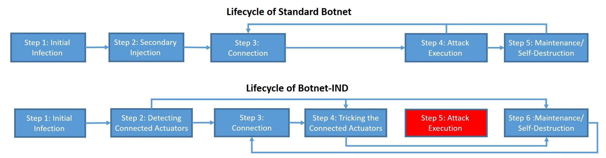

Fig. 1: A comparison between a standard botnet's lifecycle (as presented in [\[15\]](#page-11-13)) and Botnet-IND's lifecycle. The blue boxes are the steps executed by a bot (in the case of a standard botnet) or recruiter device (in the case of Botnet-IND). The red box is a step executed by an attack device (the actuator).

DDoS attack by a recruiter device. The actuators are not used to infect new devices, because they do not contain a bot that is controlled by the attacker/botmaster.

# *B. Botnet-IND's Lifecycle*

A standard botnet's lifecycle usually consists of five steps: initial infection, secondary injection, connection, malicious activity, and maintenance/upgrading [\[15\]](#page-11-13), as can be seen in Figure [1.](#page-2-1) Botnet-IND's lifecycle differs from a standard botnet's lifecycle and consists of six steps which can be seen in Figure [1](#page-2-1) and are described below:

Step 1 - infection: The attacker builds a botnet of recruiter devices. To do this, the attacker can rent botnet services [\[16\]](#page-11-14), [\[17\]](#page-11-15) which are traded for bitcoin on the darknet. Alternatively, the attacker can infect devices that are connected to the Internet (e.g., laptop, smartphone, etc.) with malware using common infection vectors (e.g., email attachments, compromised websites, malvertising campaigns, and supply chain attacks).

Step 2 - detecting connected actuators: Each bot (recruiter device) scans for actuators that are connected to its LAN. If an actuator is detected in its LAN and the exact time of the DDoS attack (i.e., the time the actuator needs to execute the attack) was given to the bot running on the recruiter device in the infection step (step 1), the bot proceeds directly to step 4. If the exact time of the attack was not provided in step 1, and the botmaster prefers to trigger the botnet in real time, the bot proceeds to step 3. If no connected actuators are found, the bot destroys itself in order to cover its tracks (step 6).

Step 3 - connection: A connection between the bot running on the recruiter device and its botmaster is established through the C&C infrastructure by using one the following C&C mechanisms that are described in [\[18\]](#page-11-16). The botmaster can deliver information to the bot regarding the exact time of the attack (which will cause the bot to proceed to step 4). Alternatively, the botmaster can upgrade the bot's code or send it a signal indicating that it should self-destruct (which will cause the bot to proceed to step 6). Step 3 is optional, and the attack can be applied without it by giving the bot the needed information in the infection step (step 1).

Step 4 - tricking an actuator: The bot running on the recruiter device tricks an actuator into irrigating at a time specified by its botmaster. The coordinated attack initiated by the actuator is part of a DDoS attack against a target that is triggered by the botmaster. Step 5 - attack execution: This step is not executed by the bot that runs on the recruiter device. This step is executed by the actuator (the attack device).

Step 6 - maintenance/self-destruction: In the final step, the bot can: (1) destroy itself in order to cover its tracks, (2) update its code by downloading an updated version, or (3) connect to the botmaster for new commands.

The significance of Botnet-IND with respect to standard botnets is: (1) the bots can destroy themselves before the attack is performed (proceed from step 4 to step 6) by scheduling irrigation at a future time (the exact time that the attack is performed), and (2) the devices used to perform the DDoS attack are botless. The attacker does not need to infect the devices that are used to attack a target with malware. These facts make the forensic detection of Botnet-IND after the attack much harder than that of a standard botnet.

# IV. PIPING BOTNET

<span id="page-2-0"></span>In this section, we present Piping Botnet, an implementation of Botnet-IND using smart irrigation systems. We start by providing the background needed to understand smart irrigation systems and how they work. We then explain an adversary's motivation for implementing Piping Botnet and present the methodology used in this research to demonstrate Piping Botnet on three commercial smart irrigation systems (GreenIQ, BlueSpray, and RainMachine).

#### *A. About Smart Irrigation Systems*

Smart irrigation systems refer to *advanced irrigation systems that incorporate various sensors and network components for better efficiency* [\[19\]](#page-11-17). They were first introduced in 2013, and in the next few years they will replace most traditional irrigation systems around the world [\[20\]](#page-11-18), [\[21\]](#page-11-19), [\[22\]](#page-11-20). Smart irrigation systems are physically connected to a set of valves that are connected to the main water line on one end and to pipelines/sprinklers on the other end. The valves are controlled

{3}------------------------------------------------

<span id="page-3-0"></span>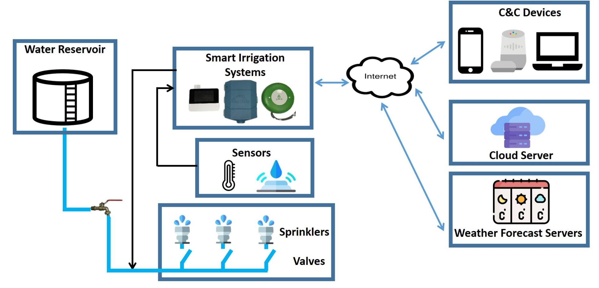

Fig. 2: Smart irrigation systems consume water from the urban water service and interface with various sensors, weather forecast services, C&C devices, and dedicated cloud servers.

by the smart irrigation system and used to regulate the water flow from the main water line to sprinklers and droppers.

Smart irrigation systems are equipped with Internet connectivity based on Wi-Fi communication via an integrated NIC or cellular connectivity via an integrated dongle. Currently, only a few smart irrigation systems with cellular connectivity are sold, and the vast majority of smart irrigation systems are Wi-Fi based and intended for home use. While the exact number of commercial Wi-Fi smart irrigation systems is unknown (because Shodan and other similar websites only index cellular smart irrigation systems that face the Internet), the global smart irrigation market is estimated at \$1 billion in 2020 and is expected to reach \$2.1 billion by 2025, with compound annual growth rate of 15.3% [\[23\]](#page-11-21); accelerated deployment is expected due to the COVID-19 pandemic [\[24\]](#page-11-22).

Smart irrigation systems use Internet connectivity to support the following functionality: (1) provide remote HMI communication (for purposes of scheduling a watering plan, presenting the watering history, etc.) over the Internet to C&C devices, (2) monitor water consumption, and (3) automatically adapt the watering plan according to data obtained from weather forecast services and sensors.

Figure [2](#page-3-0) outlines the entire smart irrigation system ecosystem. As can be seen in the figure, smart irrigation systems typically interface with the following entities:

1) Weather Forecast Service - There are many weather forecast services on the Internet [\[25\]](#page-11-23), [\[26\]](#page-11-24), [\[27\]](#page-11-25), [\[28\]](#page-11-26), [\[29\]](#page-11-27), [\[30\]](#page-11-28), [\[31\]](#page-11-29) that provide a REST API in which a request that contains the location of the desired weather forecast is sent from a client and is followed by a response from the weather forecast service that contains the weather forecast (temperature, humidity, wind direction, wind speed, pressure, cloudiness, etc.) for each hour/part of day for the upcoming days/week. Smart irrigation systems use weather forecasts in order to adjust their watering plan and typically launch a few requests a day to obtain updates.

- 2) C&C Device Smart irrigation systems provide an HMI to users for C&C that is based on a web browser, mobile/tablet application, and smart assistant. The HMI provides users with various capabilities to remotely control and monitor smart irrigation system operation from anywhere (e.g., to schedule a watering program, to visualize weekly aggregated watering consumption data).
- 3) Cloud Server Each smart irrigation system communicates with its own cloud server. The primary role of the cloud server is to mediate between the C&C device and the smart irrigation system. In addition, the cloud server also provides firmware updates, and stores the smart irrigation system's configuration and watering history. Smart irrigation systems typically launch an update request once a minute in order to verify whether new updates have been sent from the user.
- 4) Sensors Smart irrigation systems provide a wired/wireless interface for sensors (e.g., precipitation, soil moisture, temperature, and water flow sensors). Based on the data obtained from the connected sensors, smart irrigation systems adjust the watering plan and regulate their operation.
- *B. Piping Botnet: An Attacker's Motivation & Expected Damage*

Botnet-IND is a distributed attack that is executed using a botnet of botless actuator devices. In this paper we demonstrate the implementation of Botnet-IND that we refer as Piping Botnet: botless smart irrigation systems are used to execute a DDoS against urban water services in order to drain a water reservoir; this is accomplished by using a set of smart

{4}------------------------------------------------

<span id="page-4-1"></span>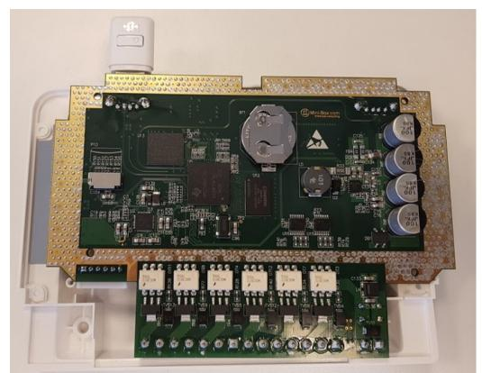

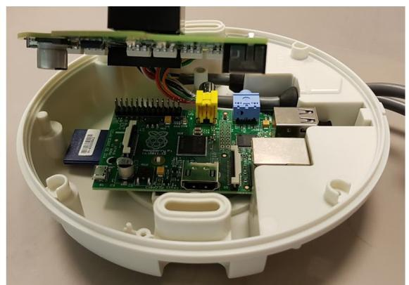


Fig. 3: SoC board of RainMachine (left), GreenIQ (middle), and BlueSpray (right).

irrigation systems (which are not infected with a bot or directly controlled by the attacker) that consume water from the same source at the same time. Instead of infecting the smart irrigation systems with bots that are used to execute the attack, the smart irrigation systems are tricked into executing the attack. The attacker's objective for applying Piping Botnet can be one of the following:

- (1) To drain an urban water source usually, water is purified at a treatment plant after it has been pumped from a natural water source (e.g., groundwater). From the treatment plant, the water is distributed to urban/areal reservoirs and tanks that distribute water to residents in the entire distribution area. In some places, areal reservoirs and water tanks are not physically connected to a treatment plant using pipelines due to physical limitations. Instead, areal reservoirs are filled with water shipped to the reservoir on a weekly/monthly basis or when the reservoir is nearly empty. Applying an attack that wastes water and empties an urban water reservoir may result in the inability to provide water to residents until the local water reservoir can be refilled. In addition, in many places around the world, there is a serious water shortage [\[32\]](#page-11-30), so so the reservoir cannot easily be refilled.
- (2) To cause financial damage attacking smart irrigation systems increases water consumption and causes financial loss to cities that use irrigation systems to water parks and private households that use irrigation systems to water their yard/garden.
- (3) To reduce water flow by applying a distributed attack using many smart irrigation systems that are connected to the urban water service by the same pipeline, the attacker can also reduce the water flow in all of the households connected to the pipeline.

A distributed attack against an urban/local water service is very dangerous, because water is critical to daily life. As seen in Ukraine [\[10\]](#page-11-8), an attack on critical infrastructure can be disastrous, depending on the number of households affected and prevented from accessing the resource, and the amount of the resource that remains available for consumption.

The amount of water wasted as a function of the botnet's size can be calculated by attackers as follows: A typical sprinkler's water flow is between 0.66 to 4.93 cubic meters per hour [\[33\]](#page-11-31). If an attacker is able to recruit a botnet of n smart irrigation systems (each of which is connected to a single sprinkler) which are operated for a given period of t hours,

TABLE I: Damage Calculation

<span id="page-4-0"></span>

| Botnet   | Amount of time | Average amount of     |                               |
|----------|----------------|-----------------------|-------------------------------|
| size (n) | (t) in hours   | water wasted (m3<br>) |                               |
| 1        | 1              | 2.795                 |                               |
| 1,355    | 1              |                       |                               |
| 13,550   | 0.1            | 3,787                 | Typical water tower capacity  |
| 143,200  | 1              | 404,244               |                               |
| 23,866   | 6              |                       | Floodwater reservoir capacity |

the average water wasted by applying the attack is calculated by multiplying the average water flow (2.795 cubic meters per hour) by the size of the botnet n and the duration of the attack t: 2.795 ×n×t. Table [I](#page-4-0) presents the average amount of water that can be wasted by performing the attack with various numbers of bots n and for different periods of time t. As can be seen from the information presented in the table, Botnet-IND can cause significant damage (e.g., draining a water tower) with a relatively small set of devices (1,300 smart irrigation systems), whereas other botnets have relied on more devices to execute a DDoS (e.g., Mirai relied on 600K infected devices).

# *C. Methodology*

In this paper, we focus on three commercial smart irrigation systems: RainMachine [\[34\]](#page-11-32), BlueSpray [\[35\]](#page-11-33), and GreenIQ [\[36\]](#page-11-34), which were identified as three of the five most sold smart irrigation systems by [\[37\]](#page-11-35) and [\[38\]](#page-11-36). In order to demonstrate Piping Botnet, we implement steps two (detecting connected actuator), four (tricking the connected actuator), and five (attack execution) in Botnet-IND's lifecycle (presented in Section [III\)](#page-1-1) on the three commercial smart irrigation systems mentioned above. In Section [V,](#page-5-0) we implement step two and show how a bot can detect smart irrigation systems connected to its LAN within 15 minutes. In Sections [VI](#page-6-0) and [VII,](#page-8-0) we implement steps four and five and show how a bot can trick a Wi-Fi smart irrigation system (Section [VI\)](#page-6-0) and cellular smart irrigation system (Section [VII\)](#page-8-0) into initiating irrigation.

In order to implement Botnet-IND on commercial smart irrigation systems, we combined two techniques: (1) we connected all three smart irrigation systems to a router and captured their incoming/outgoing traffic for a week. We then analyzed their connections with their C&C devices, cloud servers, and weather forecast services from the captured pcap files using Wireshark. In addition, (2) we reverse engineered two commercial smart irrigation systems by extracting their firmware. The GreenIQ second generation smart irrigation 

{5}------------------------------------------------

system is based on a Raspberry Pi controller board with a connected SD card (as can be seen in Figure [3b](#page-4-1)). We copied the contents of the SD card to a laptop using an SD card reader and found 34 Python files that the firmware is based on. Unlike the GreenIQ smart irrigation system which uses a Raspberry Pi as its controller board, RainMachine does not use a commercial board and designed its own controlling circuitry. We used a USB to UART adapter (FT232R) to extract RainMachine's firmware from the SoC's UART terminals, a technique that was shown in [\[39\]](#page-11-37). RainMachine runs a modified version of the Android OS, so we looked for the APK of RainMachine's application and found the file *RainMachine-UI.apk*. We extracted the APK to Java files using an online decompiler tool. The firmware of GreenIQ and RainMachine was not obfuscated.

### <span id="page-5-0"></span>V. PIPING BOTNET: DETECTING CONNECTED SMART IRRIGATION SYSTEMS

In this section, we demonstrate the application of step two in Botnet-IND's lifecycle (detecting connected actuators) and explain how a recruiter device can detect a smart irrigation system connected to its network. In order to do so, we profiled the network behavior of each commercial smart irrigation system. Based on our findings, we developed an algorithm that can be used to scan a network and determine whether an IP is a known smart irrigation system by analyzing its network behavior. We then evaluated the algorithm's performance as a function of the period of time that the network need to be scanned and analyzed.

We connected three commercial smart irrigation systems (RainMachine [\[34\]](#page-11-32), BlueSpray [\[35\]](#page-11-33), and GreenIQ [\[36\]](#page-11-34)) to a router via Wi-Fi and monitored the LAN traffic using a bot that was installed on a laptop that was connected to the same LAN (by applying ARP spoofing from the laptop to the smart irrigation systems). We stored the traffic as PCAP files. In addition, we downloaded another set of traffic data of popular home appliance that was published by another study [\[40\]](#page-11-38) and was collected from various types of IoT devices: two smart bulbs, wireless printer, 16 security cameras, a smart refrigerator, five smartwatches, two laptops, and two smartphones. We used the two datasets to analyze the difference between a smart irrigation system's network behaviour and the rest of the IoT devices.

# *A. Network Behaviour Analysis*

In our preliminary analysis, we explored the average number of unique destinations that smart irrigation systems interface with per hour and compared the results with the abovementioned IoT devices. As can be seen in Figure [4,](#page-5-1) the average number of unique destinations that smart irrigation systems interface with is very low compared with the smartphones and smart refrigerator. However, a small average number of unique destinations is a property that is common to most of the IoT devices we analyzed, so it cannot be used by a bot to determine whether a specific IP is a smart irrigation system.

<span id="page-5-1"></span>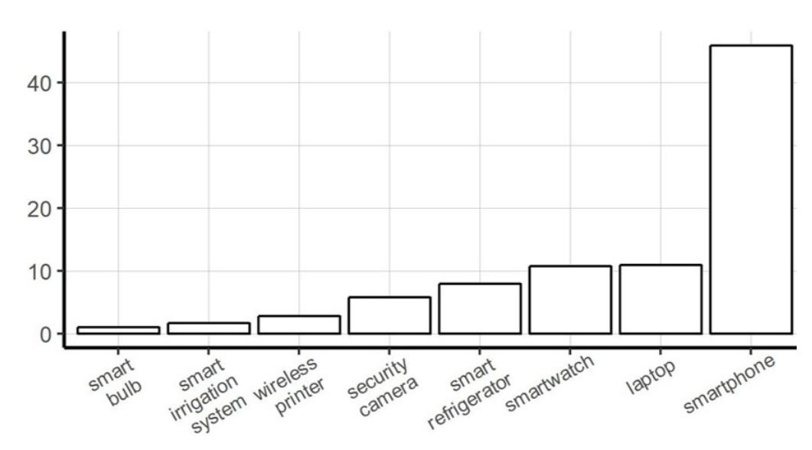

Fig. 4: The average number of unique destinations that IoT devices interface with in an hour.

<span id="page-5-2"></span>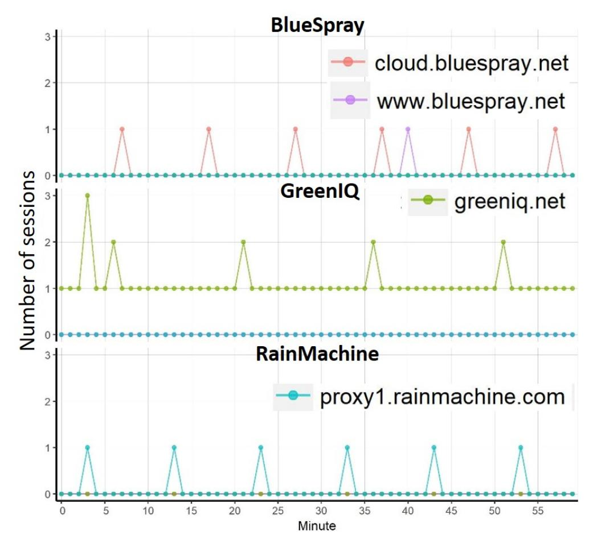

Fig. 5: Analysis of the number of TCP sessions between smart irrigation systems and their cloud servers in a typical hour.

Following this preliminary analysis, we looked for unique characteristics that could be used by a bot running on a LAN to determine whether a connected device is a smart irrigation system or not. Currently, the manufacturers of smart irrigation systems do not produce any other types of IoT devices [\[37\]](#page-11-35), [\[38\]](#page-11-36). With this observation in mind, we decided to analyze the identity of the cloud servers that smart irrigation systems interface with. Unlike Samsung's cloud server which supports many IoT devices manufactured by Samsung (smart refrigerator, smartphone, etc.), the cloud servers of the smart irrigation systems examined interface only with their respective smart irrigation systems. We found that a packet sent to the GreenIQ cloud server was only sent from their smart irrigation systems. The same thing is also true for BlueSpray and RainMachine. Hence, due to the absence of overlap between the cloud servers contacted, an outgoing packet sent to a smart irrigation system cloud server can clearly and reliably indicate that the packet's

{6}------------------------------------------------

<span id="page-6-1"></span>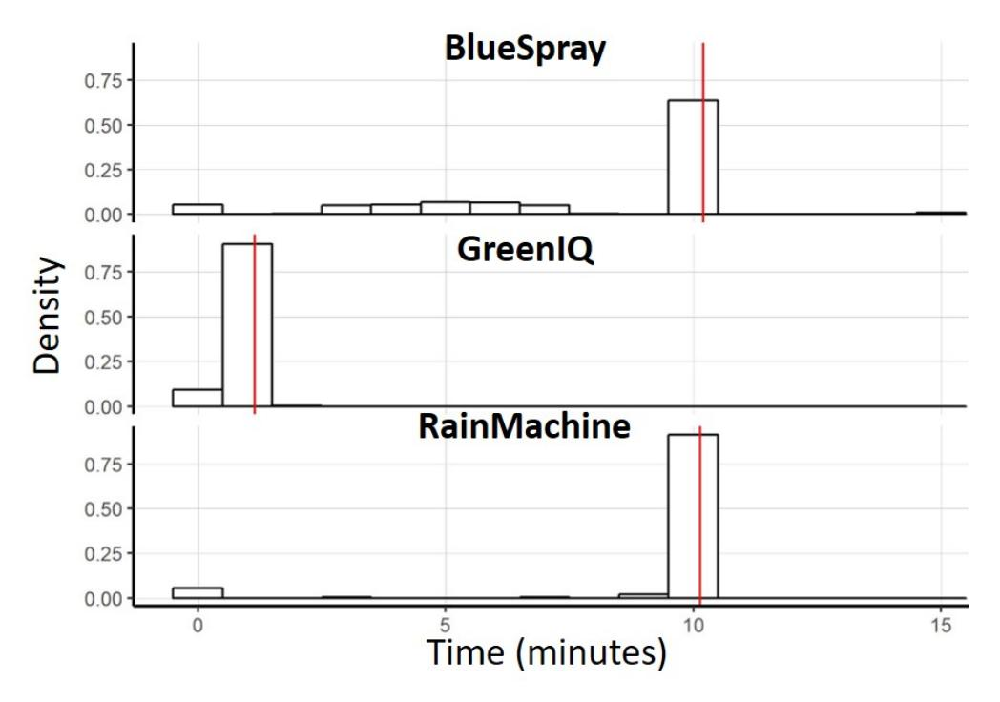

Fig. 6: Distribution of the time between two consecutive sessions. The red line represents the 99% percentile for each model.

sender is a smart irrigation system.

As can be seen in Figure [5,](#page-5-2) smart irrigation systems typically interact with their cloud servers several times per hour (6-11 times). We analyzed the distribution of the average time between two consecutive outgoing packets from any smart irrigation system to its cloud server. As can be seen in Figure [6,](#page-6-1) for GreenIQ, the average time between two consecutive sessions with its cloud server is much lower than that of BlueSpray and RainMachine. Overall, the maximum amount of time between two consecutive sessions with the cloud servers is 15 minutes (the 99th percentile is approximately 10 minutes).

### *B. Model: Algorithm & Performance*

Based on the observations mentioned above, we present Algorithm [1,](#page-6-2) a smart irrigation system classification model.

As input, Algorithm [1](#page-6-2) receives an *IP* of a device that is connected to the LAN of the bot and a *period* of time for capturing traffic. The algorithm applies ARP spoofing to the *IP* (line 7) and analyzes outgoing traffic from the *IP* for the amount of time specified by *period*. It classifies the suspicious *IP* as a smart irrigation system if the outgoing traffic is being sent to known cloud servers. If the period of time that was specified has passed, it classifies the suspicious *IP* as *other* device, i.e., a device that is not a smart irrigation system.

We tested the performance of Algorithm [1](#page-6-2) on the two datasets that are mentioned above. The performance was tested as a function of the period of the scanning, i.e., the detection accuracy of the model as a function of the minutes that ARP spoofing must be applied by a bot in order to detect a smart irrigation system. Figure [7](#page-6-3) presents the classification accuracy results when applying Algorithm [1](#page-6-2) from a laptop connected to the same LAN as the smart irrigation systems for various periods of time. As can be seen in Figure [7,](#page-6-3) the classification accuracy reaches 99.9% after 10 minutes of analysis and 100% after 15 minutes.

### <span id="page-6-2"></span>Algorithm 1

```
1: procedure ISSMARTIRRIGATIONSYSTEM(ip,period)
2: bluespray1 = "cloud.bluespray.net"
3: bluespray2 = "www.bluespray.net"
4: greeniq = "www.greeniq.net"
5: rainmachine = "proxy1.rainmachine.com"
6: startTime = currentTime()
7: applyM itmAttackT oT arget(ip)
8: for packet : nextP acket() do
9: dstIP = packet.ip.dst
10: if dstIP == bluespray1 then
11: return BlueSpray
12: if dstIP == bluespray2 then
13: return BlueSpray
14: if dstIP == greeniq then
15: return GreenIQ
16: if dstIP == rainmachine then
17: return RainMachine
18: if startTime + period ¿= currentTime() then
19: return None
```

<span id="page-6-3"></span>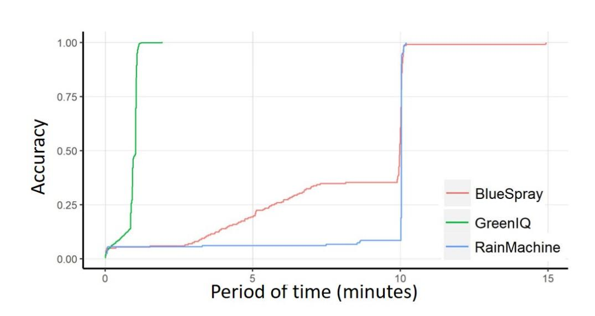

Fig. 7: Accuracy of Algorithm [1](#page-6-2) for various time periods.

# <span id="page-6-0"></span>VI. PIPING BOTNET: TRICKING WI-FI SMART IRRIGATION SYSTEM

In this section, we demonstrate the application of steps four and five in the lifecycle of Botnet-IND (tricking an actuator and attack execution) and show how a recruiter device can trick a commercial Wi-Fi smart irrigation system into irrigating, without infecting the smart irrigation system with a bot/malware.

# *A. Tricking RainMacine to Irrigate by Impersonating a Weather Forecast Server*

The attack described in this subsection shows how a smart irrigation system can be tricked to irrigate by spoofing the weather forecast response sent from a weather forecast server using a recruiter device that impersonates a weather forecast service. We explain the which vulnerability was exploited, show how RainMachine can be tricked to irrigate (step 4), and present the result of the application of the attack (step 5).

{7}------------------------------------------------

<span id="page-7-0"></span>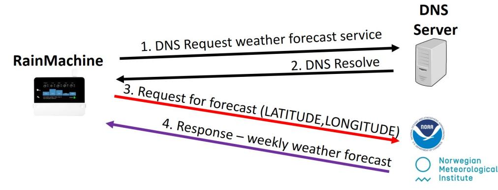

Fig. 8: A session between RainMachine and the Met.no weather forecast service.

<span id="page-7-1"></span>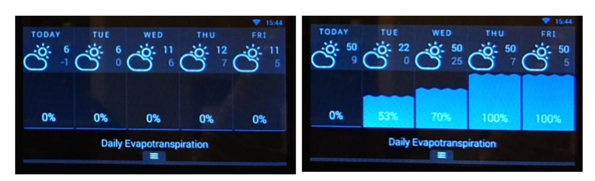

Fig. 9: The original weather forecast in London (left) was spoofed to a fake weather forecast (right).

*1) Vulnerability:* RainMachine was designed to save water and money by automatically adapting its watering plan to weather forecasts. It allows the user to configure a base watering plan according to the amount of water that is needed to water his/her yard and plants. Given the base watering plan configuration and the weather forecast (obtained from weather forecast services), RainMachine adapts its watering plan automatically. This means that for a rainy/cold weather forecast, watering will not take place or only a percentage of the amount of water required by the base watering plan will be used (just the amount needed to meet the water requirements specified in the user's configuration). In cases in which there is a forecast for dry weather, RainMachine automatically adjusts itself to compensate for a lack of precipitation by supplementing with watering plans to consume the required amount of water, based on the user's base watering plan configuration.

We analyzed RainMachine's firmware and found the *Main-Activity.java* file. RainMachine contains a touchscreen that presents the weather forecast for the upcoming week. In addition, it presents the percentage of water that the smart irrigation system plans to consume in order to fulfill the water requirements specified in the base watering plan. We searched for the code that calculates the exact percentage of water that will be consumed by RainMachine for each day in the upcoming week and found that it relies on the amount of rain that is predicted for each day, as can be seen in Listing [1](#page-11-39) (presented in the appendix).

We continued to analyze RainMachine's firmware, searching for the word "*Weather*." Listing [2](#page-11-40) (in the appendix) presents code from the P arserResponse.java file of weather forecast services that RainMachine interfaces with. We searched for these names on the Internet and found the weather forecast services that appear in Listing [2](#page-11-40) (in the appendix). We analyzed the REST API for each weather forecast service that was found and observed that during the time in which this research was conducted, most of the weather forecast services provided a REST API based on HTTP communication. Figure [8](#page-7-0) presents the REST API interface between RainMachine and a weather forecast service. An HTTP request that contains RainMachine's location (in latitude-longitude format) is sent from RainMachine to a weather forecast service. A response is sent from the weather forecast service in the form of a file in XML format that contains the weather forecast (hourly resolution) with various details including: temperature, wind direction and speed, cloudiness, humidity, barometric pressure, etc. Four requests per day (every six hours) are launched by RainMachine to the weather forecast service, and based on the weather forecast received, RainMachine adjusts its future watering plans.

<span id="page-7-2"></span>*2) Tricking RainMachine to irrigate & Result:* We demonstrate how an attacker can manipulate RainMachine to schedule unnecessary watering plans based on his/her wishes using a bot running on a connected compromised device (recruiter device) that impersonates a weather forecast service and injects a fake weather forecast. We analyzed the Met.no API and found that it provides a REST interface based on HTTP communication. We identified the format of the response sent from the Met.no weather forecast service, and based on these findings, we wrote a Python code that changes the weather forecast parameters between two given timestamps.

We installed our code on a laptop that was connected to the same LAN as RainMachine and implemented an ARP spoofing attack to divert traffic sent from RainMachine. Originally, RainMachine was configured to work in London. We performed the attack during the winter; since London is rainy in the winter, no watering would likely be needed to fulfill the requirements of the base watering plan configuration. Accordingly, RainMachine adapted its watering plan to consume no water for the upcoming week, as can be seen in Figure [9](#page-7-1) which presents RainMachine's screen before the attack.

Before we applied the attack, the original weather forecast for London did not require any watering at all, because the temperatures were expected to be between -1◦ and 12◦ for the entire week (as can be seen in Figure [9\)](#page-7-1). A request to the Met.no weather forecast service is sent every six hours from RainMachine over HTTP communication, and in this attack such a request was intercepted by the bot running on the laptop. The bot responded to the HTTP request with a weekly forecast of temperatures with values between 0◦ and 50◦ and sent the response back to RainMachine. The result of the attack is presented in Figure [9.](#page-7-1) Immediately after the attack was applied, RainMachine adjusted its watering plan to compensate for these temperatures by scheduling watering plans for the entire week (instructing the system to consume 50-100% of the base watering plan in dry days that was configured by the user). The attack was recorded and uploaded.[1](#page-0-0)

<sup>1</sup> <https://youtu.be/XuPlwXVK6AY>

{8}------------------------------------------------

<span id="page-8-1"></span>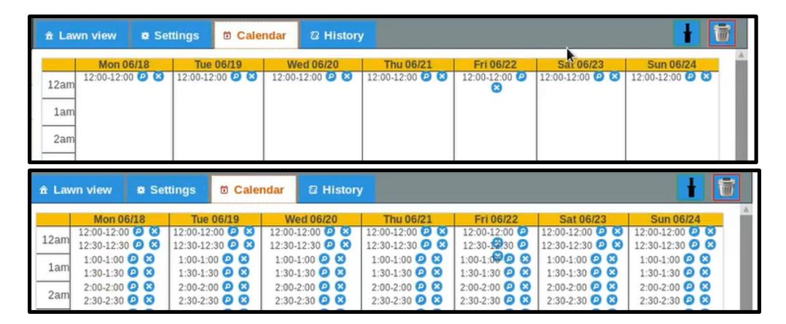

Fig. 10: BlueSpray's web user interface. Before the attack (top) there is no watering scheduled, and after the attack (bottom) watering is scheduled for the entire week.

#### *B. Tricking BlueSpray to Irrigate by Manipulating a Watering Plan*

The attack described in this subsection shows how a smart irrigation system can be tricked to irrigate by manipulating an existing watering plan using a recruiter device. We explain the which vulnerability was exploited, show how BlueSpray can be tricked to irrigate (step 4), and present the result of the application of the attack (step 5).

*1) Vulnerability:* All smart irrigation systems provide an HMI to a C&C device. The HMI can be operated from various C&C devices, including a mobile application, web browser, or smart assistant. Using a C&C device, the user can use the HMI to: (1) connect the smart irrigation system to a LAN, (2) update the watering plan configuration, (3) monitor the watering history, (4) define zones, (5), add sensors, etc. BlueSpray provides an HMI interface based on PCs and laptops via a web browser that is based on HTTP communication. The user can open a web browser (Chrome, Firefox, etc.) from another device that is connected to the same LAN, type BlueSpray's IP address, and send C&C commands. Listing [3](#page-12-0) (in the appendix) presents a payload (JSON format) extracted from an HTTP packet for scheduling a watering that was sent from a Chrome browser to BlueSpray.

We were surprised to find that no authentication is required in order to communicate with BlueSpray from another device that is connected to the same LAN.

*2) Tricking BlueSpray to irrigate & Result:* We demonstrate how an attacker can launch watering via BlueSpray by scheduling watering according to his/her wishes. We analyzed the HTTP packets of watering plan updates sent from a laptop to BlueSpray from a PC connected to the same LAN via the Chrome web browser and learned how such a request is generated. Based on our findings, we wrote a Python code that schedules watering between two given timestamps using an HTTP request that is sent to BlueSpray.

We reset BlueSpray to its previous configuration with no watering planned (as can be seen in Figure [10\)](#page-8-1). We installed our code on a laptop that was connected to the same LAN and ran the code. The code launched an HTTP request to schedule watering for the entire week. Figure [10](#page-8-1) presents the results of the experiment. As can be seen, our code successfully manipulated the watering plans for BlueSpray. The attack was recorded and uploaded.[1](#page-0-0)

### <span id="page-8-0"></span>VII. PIPING BOTNET: TRICKING CELLULAR SMART IRRIGATION SYSTEM

In this section, we demonstrate the application of steps four and five in Botnet-IND's lifecycle (tricking an actuator and attack execution) and show how a recruiter device can trick a commercial cellular smart irrigation system into irrigating, without infecting the smart irrigation system with a bot/malware.

The attack described in this section shows how a cellular smart irrigation system can be tricked to irrigate by spoofing the smart irrigation system's configuration that is sent from the cloud server using a recruiter device that impersonates the smart irrigation system's cloud server. We explain the which vulnerability was exploited, show how GreeIQ can be tricked to irrigate (step 4), and present the result of the application of the attack (step 5).

GreenIQ is sold in two versions, with Wi-Fi and cellular connectivity. The only difference between them is an additional SIM dongle that is integrated into the cellular version. The analysis we performed in this section was done on the Wi-Fi version. The attack demonstration presented in this section was performed on the cellular version.

*1) Vulnerability:* The cloud server is supposed to mediate between GreenIQ's application and a smart irrigation system. Figure [11](#page-9-1) outlines the interface between GreenIQ's application running on a smartphone to GreenIQ via the cloud server. Using a smartphone application, the user sends C&C commands to the cloud server (yellow arrow in Figure [11\)](#page-9-1). Independently, a ping to cloud request (that contains the user's ID) is launched from GreenIQ to the cloud server every minute in order to obtain the timestamp of the last time the user updated the watering plan configuration stored in the cloud server (red arrow in Figure [11\)](#page-9-1). A response is sent from the cloud server with this timestamp (purple arrow in Figure [11\)](#page-9-1). If the timestamp received from the cloud server is greater (after) than the timestamp stored on GreenIQ (signifying a more recent user update), a configxml request to retrieve the new watering plan configuration is launched by GreenIQ (green arrow in Figure [11\)](#page-9-1). A response is hen sent from the cloud server with a file that contains the new watering plan configuration in XML format (blue arrow in Figure [11\)](#page-9-1). This XML file contains details about all of the watering plans scheduled by the user (dates, hours, duration, zones/valves, etc.). The new timestamp is stored in GreenIQ instead of the older timestamp. The correctness of the new timestamp received is not verified.

Listing [4](#page-12-1) (in the appendix) presents the code that implements the abovementioned description that was extracted from the *main.py* file of GreenIQ's firmware.

A bot running on a recruiter device can exploit this mechanism in order to cause GreenIQ to permanently deny service by replying with a timestamp value that is far into the future (e.g., the timestamp of 1/1/2022). By doing so, the bot causes

{9}------------------------------------------------

<span id="page-9-1"></span>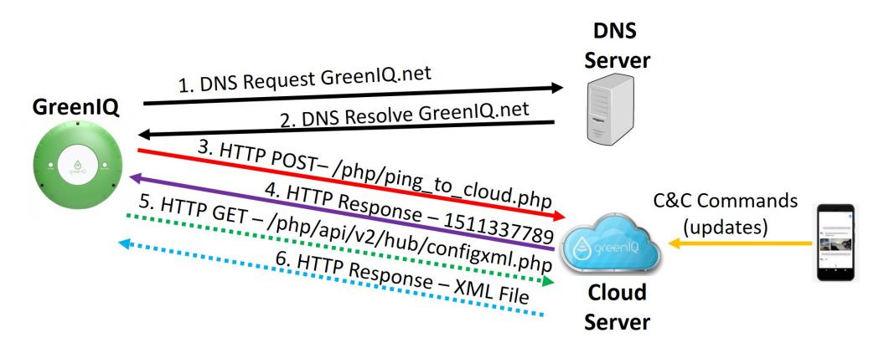

Fig. 11: A session between GreenIQ and its cloud server.

GreenIQ to ignore any legitimate C&C command that is launched by the user until the time that is mentioned in the response, because any C&C command during this period of time will not be considered by GreenIQ as a user update (line 313 of the code in Listing [4](#page-12-1) in the appendix). By combining a permanent denial-of-service attack (by replying with a future watering plan, e.g., the timestamp of 1/1/2022), with a watering plan injection attack that triggers GreenIQ to launch watering 24/7, the bot causes GreenIQ to start watering indefinitely and prevents the user from remotely stopping the watering using a C&C device. The only way in which a GreenIQ user can stop GreenIQ from watering in this attack scenario is by physically turning off the main water line. In order to restore GreenIQ's regular operation, the user would have to apply a factory reset to delete the future timestamp.

*2) Tricking GreenIQ to irrigate & Result:* We demonstrate how an attacker can (1) launch watering using GreenIQ by injecting his/her own watering plans, and (2) cause GreenIQ to deny service permanently, thereby preventing any remote C&C interface with the smart irrigation system (including commands to stop watering). The smart irrigation system is tricked by a bot that installed on a device connected to its LAN and impersonates a weather forecast service. In our experiment, the bot scheduled a watering plan that waters 24/7 (every day, all day long) starting from two minutes after the attack is performed and ending two years after the attack began. We captured HTTP communication between GreenIQ and the cloud server during this time and extracted the watering plan configuration that was sent from the cloud server in the XML file. Then, using GreenIQ's application, we restored GreenIQ to its previous state.

Algorithm [2](#page-9-2) presents the exploitation code used to inject a watering plan for a given future time period.

Algorithm [2](#page-9-2) receives a packet sent from GreenIQ's application and two future timestamps, begin and end, to launch watering. First, it verifies that the packet was sent to GreenIQ's cloud server (line 7). If the packet is a ping to cloud request, a fake timestamp (denoted by the received parameter end) is sent to GreenIQ by the bot (line 10). A response with a future timestamp will trigger another request to retrieve the updated XML configuration launched from the smart irrigation system. If the received packet is a conf igxml request, a fake XML with a watering plan between the timestamps of begin and end is sent to the smart irrigation system by the bot (line 13).

### <span id="page-9-2"></span>Algorithm 2

```
1: procedure SPOOFCONFIGURATION(packet,start,end)
2: ping ← "/php/ping to cloud.php"
3: retrieve ← "/php/api/v2/hub/conf igxml.php"
4: method ← packet.http.request.method
5: path ← packet.http.request.uri.path
6: dstIP ← packet.ip.dst
7: if dstIP != "www.greeniq.net" then
8: return
9: if (method == "POST" & path == ping) then
10: sendF akeT imestampResponse(end)
11: if (method == "GET" & path == retrieve) then
12: path ← createF akeXML(start, end)
13: sendF akeXMLResponse(path)
```

We demonstrate the attack on cellular GreenIQ. In order to intercept the requests that cellular GreenIQ sends to its cloud server, we connected BladeRF, a software-defined radio (SDR), to a laptop and installed FakeBTS [\[41\]](#page-11-41) on the laptop. FakeBTS is a Linux application that uses an SDR to create a base transceiver station. It creates a tiny GSM/GPRS network so that cellular devices can connect to this cellular cell. We connected the laptop to the Internet via a smartphone. We placed the laptop, the SDR, and the smartphone inside a pizza box and mounted the pizza box to a drone (as can be seen in Figure [12\)](#page-10-3) so it would look like a legitimate aerial pizza delivery [\[42\]](#page-11-42). Recently, several companies have started to provide aerial deliveries using drones, so we show how an attacker can exploit this fact to apply the attack without raising any suspicion.

We flew the drone to a cellular GreenIQ smart irrigation system that was deployed in the yard of a private house and connected to three sprinklers. By approaching the cellular GreenIQ irrigation system, a handoff took place and the traffic was shifted to the fake BTS that we ran on the laptop that provided 2G cellular connectivity to the GreenIQ smart irrigation system. The laptop applied ARP spoofing to GreenIQ in order to divert traffic from GreenIQ to a local IP (on the laptop) that was also connected to the fake cell and ran a script that implements Algorithm [2.](#page-9-2) A ping to cloud request is sent from GreenIQ to its cloud server every minute over HTTP communication; this request was intercepted by the script. Figure [12](#page-10-3) presents the results of the attack. The three sprinklers connected to GreenIQ started watering two minutes after the response from the bot was received by GreenIQ. The watering can only be stopped manually by the user, because we caused GreenIQ to permanently deny service for the next two years. A video demonstrating the attack has been uploaded.[1](#page-0-0)

### VIII. COUNTERMEASURES

<span id="page-9-0"></span>In this section, we describe countermeasures to detect and prevent a distributed attack against urban water services.

{10}------------------------------------------------

<span id="page-10-3"></span>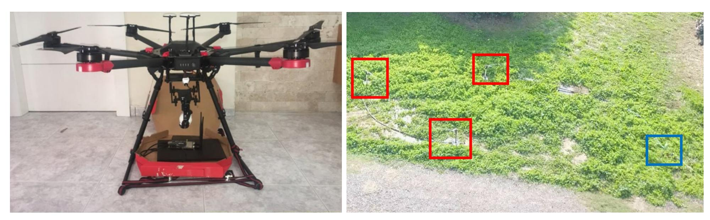

Fig. 12: Left: The drone carries a laptop and SDR that are used to trick cellular GreenIQ. Right: Sprinklers (boxed in red) are operated by cellular GreenIQ (boxed in blue) as a result of a cloud server impersonation attack that was conducted from a drone.

# *A. Countermeasures for urban water services*

A DDOS attack launched from smart irrigation systems can be detected by deploying a model that monitors unusual water consumption in urban water services (e.g., using anomaly detection methods), as in other cases of DDoS attacks [\[43\]](#page-11-43). However, even if such an attack is detected by an urban water service, the ability of the water service to react to such an attack is very limited. The only thing that such a service can do when an attack is detected is stop water distribution. While this solution prevents the attacker from wasting any more water, it also prevents people from obtaining water, which is the aim of the attacker. Preventing people from obtaining a critical resource can even be considered a national disaster, as was the case in the cyber attack against the Ukrainian power grid [\[10\]](#page-11-8).

# *B. Countermeasures for smart irrigation systems*

Preventing a bot from impersonating a party that a smart irrigation system interfaces with can be done by upgrading HTTP communication to HTTPS communication. Doing this will prevent the attacker from spoofing TCP packets.

# *C. Countermeasures for consumers*

Consumers can monitor their water consumption using water flow sensors with Internet connectivity that can be integrated in the main water line. This can provide the consumer with an indication of whether irrigation has been triggered without his/her consent.

#### <span id="page-10-1"></span>IX. ETHICAL CONSIDERATIONS AND DISCLOSURE

We performed full ethical disclosure, revealing the vulnerabilities discussed in this paper and providing all of the relevant technical details and suggestions for addressing them to GreenIQ, RainMachine, and BlueSpray when the research was conducted. We received confirmation of our findings from each of them. GreenIQ thanked us for sharing our findings and decided to apply HTTPS communication between their smart irrigation system and cloud server.

### X. DISCUSSION, LIMITATIONS & FUTURE WORK

<span id="page-10-2"></span>We note that we do not consider Botnet-IND a botnet of smart irrigation systems. We consider Botnet-IND to be a new concept of a botnet of botless actuators that are tricked into participating in a distributed attack against a target in the physical world. Smart irrigation systems were only used in this paper to demonstrate this concept, because we considered them an interesting IoT device that could potentially cause great harm when misused (as was indicated in Table [I,](#page-4-0) the attack can be applied via 1,300 smart irrigation systems).

The smart irrigation system market is estimated at \$1 billion and is expected to reach \$2.1 billion by 2025 [\[23\]](#page-11-21). However, smart irrigation systems are a much less popular IoT device than smartphones, and they are mainly used in Europe and parts of North America (according to [\[23\]](#page-11-21), [\[24\]](#page-11-22)), a fact that can limit the application of the attack in some places around the world. Whether or not smart irrigation systems will be popular home appliance, the purpose of this research is to raise the awareness about botnets that rely on botless devices to execute DDoS attack. we believe that similar attacks performed by other types of home appliances that were not infected by malware will appear in the next few years (as was demonstrated in two recent incidents [\[4\]](#page-11-2), [\[5\]](#page-11-3)) because many of them have not been properly secured by their developers, a fact that creates new opportunities for attackers. Without proper security, attackers can trick Internet connected actuators into performing a malicious activity, without the need to infect the devices with malware.

As future work, we suggest investigating: (1) whether other types of IoT devices can be used to facilitate/implement Botnet-IND, (2) new methods that can be used to trick devices into participating in a distributed attack, and (3) dedicated network countermeasure methods that can be deployed in a LAN to prevent devices that are not secured properly from being tricked into participating in a distributed attack.

#### REFERENCES

<span id="page-10-0"></span>[1] S. Soltan, P. Mittal, and H. V. Poor, "Blackiot: Iot botnet of high wattage devices can disrupt the power grid," *Proceedings of the 27th USENIX*

{11}------------------------------------------------

- *Security, Baltimore, MD, USA*, vol. 18, 2018.
- <span id="page-11-0"></span>[2] M. Guri, Y. Mirsky, and Y. Elovici, "9-1-1 ddos: Attacks, analysis and mitigation," in *Security and Privacy (EuroS&P), 2017 IEEE European Symposium on*. IEEE, 2017, pp. 218–232.
- <span id="page-11-1"></span>[3] M. Antonakakis, T. April, M. Bailey, M. Bernhard, E. Bursztein, J. Cochran, Z. Durumeric, J. A. Halderman, L. Invernizzi, M. Kallitsis *et al.*, "Understanding the mirai botnet," in *26th* {*USENIX*} *Security Symposium (*{*USENIX*} *Security 17)*, 2017, pp. 1093–1110.
- <span id="page-11-2"></span>[4] A. Liptak, "Amazon's alexa started ordering people dollhouses after hearing its name on tv," 2017. [Online]. Available: [https://www.theverge.com/2017/1/7/14200210/](https://www.theverge.com/2017/1/7/14200210/amazon-alexa-tech-news-anchor-order-dollhouse) [amazon-alexa-tech-news-anchor-order-dollhouse](https://www.theverge.com/2017/1/7/14200210/amazon-alexa-tech-news-anchor-order-dollhouse)
- <span id="page-11-3"></span>[5] J. Kastrenakes, "Burger king's new ad forces google home to advertise the whopper," 2017. [Online]. Available: [https://www.theverge.com/](https://www.theverge.com/2017/4/12/15259400/burger-king-google-home-ad-wikipedia) [2017/4/12/15259400/burger-king-google-home-ad-wikipedia](https://www.theverge.com/2017/4/12/15259400/burger-king-google-home-ad-wikipedia)
- <span id="page-11-4"></span>[6] M. Antonakakis, T. April, M. Bailey, M. Bernhard, E. Bursztein, J. Cochran, Z. Durumeric, J. A. Halderman, L. Invernizzi, M. Kallitsis, D. Kumar, C. Lever, Z. Ma, J. Mason, D. Menscher, C. Seaman, N. Sullivan, K. Thomas, and Y. Zhou, "Understanding the mirai botnet," in *26th USENIX Security Symposium (USENIX Security 17)*. Vancouver, BC: USENIX Association, 2017, pp. 1093–1110. [Online]. Available: [https://www.usenix.org/conference/](https://www.usenix.org/conference/usenixsecurity17/technical-sessions/presentation/antonakakis) [usenixsecurity17/technical-sessions/presentation/antonakakis](https://www.usenix.org/conference/usenixsecurity17/technical-sessions/presentation/antonakakis)
- <span id="page-11-5"></span>[7] C. Kolias, G. Kambourakis, A. Stavrou, and J. Voas, "Ddos in the iot: Mirai and other botnets," *Computer*, vol. 50, no. 7, pp. 80–84, 2017.
- <span id="page-11-6"></span>[8] B. Miller and D. Rowe, "A survey scada of and critical infrastructure incidents," in *Proceedings of the 1st Annual Conference on Research in Information Technology*, ser. RIIT '12. New York, NY, USA: ACM, 2012, pp. 51–56. [Online]. Available: [http:](http://doi.acm.org/10.1145/2380790.2380805) [//doi.acm.org/10.1145/2380790.2380805](http://doi.acm.org/10.1145/2380790.2380805)
- <span id="page-11-7"></span>[9] P. I. LLC, "Critical infrastructure: Security preparedness and maturity," 2014. [Online]. Available: [https://www.hunton.com/files/upload/Unisys](https://www.hunton.com/files/upload/Unisys_Report_Critical_Infrastructure_Cybersecurity.pdf) Report Critical Infrastructure [Cybersecurity.pdf](https://www.hunton.com/files/upload/Unisys_Report_Critical_Infrastructure_Cybersecurity.pdf)
- <span id="page-11-8"></span>[10] T. Hill, "Russia tied to cyberattack on ukrainian power grid," 2016. [Online]. Available: [http://thehill.com/policy/cybersecurity/](http://thehill.com/policy/cybersecurity/264794-russia-tied-to-cyberattack-on-ukrainian-power-grid) [264794-russia-tied-to-cyberattack-on-ukrainian-power-grid](http://thehill.com/policy/cybersecurity/264794-russia-tied-to-cyberattack-on-ukrainian-power-grid)
- <span id="page-11-9"></span>[11] R. Langner, "Stuxnet: Dissecting a cyberwarfare weapon," *IEEE Security Privacy*, vol. 9, no. 3, pp. 49–51, May 2011.
- <span id="page-11-10"></span>[12] "Iran cyberattack on israels water supply could have sickened hundreds report," https://www.timesofisrael.com/iran-cyberattack-onisraels-water-supply-could-have-sickened-hundreds-report/.
- <span id="page-11-11"></span>[13] "6 facilities said hit in irans cyberattack on israels water system in april," https://www.timesofisrael.com/6-facilities-said-hit-inirans-cyberattack-on-israels-water-system-in-april/.
- <span id="page-11-12"></span>[14] M. De Donno, N. Dragoni, A. Giaretta, and A. Spognardi, "Analysis of ddos-capable iot malwares," in *Proceedings of 1st International Conference on Security, Privacy, and Trust (INSERT)*, 2017.
- <span id="page-11-13"></span>[15] S. S. Silva, R. M. Silva, R. C. Pinto, and R. M. Salles, "Botnets: A survey," *Computer Networks*, vol. 57, no. 2, pp. 378–403, 2013.
- <span id="page-11-14"></span>[16] BleepingComputer, "You can now rent a mirai botnet of 400,000 bots," 2016. [Online]. Available: [https://www.bleepingcomputer.com/](https://www.bleepingcomputer.com/news/security/you-can-now-rent-a-mirai-botnet-of-400-000-bots/) [news/security/you-can-now-rent-a-mirai-botnet-of-400-000-bots/](https://www.bleepingcomputer.com/news/security/you-can-now-rent-a-mirai-botnet-of-400-000-bots/)
- <span id="page-11-15"></span>[17] zingbox, "Botnet-as-a-service is for sale this cyber monday!" https://www.zingbox.com/blog/botnet-as-a-service-is-for-sale-thiscyber-monday/, 2016.
- <span id="page-11-16"></span>[18] H. R. Zeidanloo and A. A. Manaf, "Botnet command and control mechanisms," in *Computer and Electrical Engineering, 2009. ICCEE'09. Second International Conference on*, vol. 1. IEEE, 2009, pp. 564– 568.
- <span id="page-11-17"></span>[19] acutemarketreports, "smart irrigation systems market," http://www.acutemarketreports.com/report/smart-irrigation-systemsmarket.
- <span id="page-11-18"></span>[20] M. Mutchek and E. Williams, "Moving towards sustainable and resilient smart water grids," *Challenges*, vol. 5, no. 1, pp. 123–137, 2014.
- <span id="page-11-19"></span>[21] Y. Ye, L. Liang, H. Zhao, and Y. Jiang, "The system architecture of smart water grid for water security," *Procedia Engineering*, vol. 154, pp. 361 – 368, 2016, 12th International Conference on Hydroinformatics (HIC 2016) - Smart Water for the Future. [Online]. Available: <http://www.sciencedirect.com/science/article/pii/S1877705816318811>
- <span id="page-11-20"></span>[22] S. W. Lee, S. Sarp, D. J. Jeon, and J. H. Kim, "Smart water grid: the future water management platform," *Desalination and Water Treatment*, vol. 55, no. 2, pp. 339–346, 2015. [Online]. Available: <https://doi.org/10.1080/19443994.2014.917887>

- <span id="page-11-21"></span>[23] "Smart irrigation market," https://www.marketsandmarkets.com/Market-Reports/smart-irrigation-market-199758913.html.
- <span id="page-11-22"></span>[24] "World smart irrigation industry 2020-2025 - covid-19 to accelerate deployment of iot sensors and nodes in agriculture farms by integrating multiple control functionalities," https://www.globenewswire.com/newsrelease/2020/07/27/2067725/0/en/World-Smart-Irrigation-Industry-2020-2025-COVID-19-to-Accelerate-Deployment-of-IoT-Sensorsand-Nodes-in-Agriculture-Farms-by-Integrating-Multiple-Control-Functionalities.html.
- <span id="page-11-23"></span>[25] NOAA, "National oceanic and atmospheric administration," http://www.noaa.gov/.
- <span id="page-11-24"></span>[26] Metno, "Meteorologisk institutt," https://www.met.no/.
- <span id="page-11-25"></span>[27] Wunderground, "Weather underground: Weather forecast and reports long range," https://www.wunderground.com/.
- <span id="page-11-26"></span>[28] F. A. W. Service, "Florida automated weather service," https://fawn.ifas.ufl.edu/tools/.
- <span id="page-11-27"></span>[29] C. I. M. I. System, "California irrigation management information system," https://cimis.water.ca.gov/.
- <span id="page-11-28"></span>[30] D. Sky, "Dark sky," https://darksky.net/dev.
- <span id="page-11-29"></span>[31] P. Weather, "Pws weather," https://www.pwsweather.com/.
- <span id="page-11-30"></span>[32] W. R. Institute, "World 36 most water stressed countries," [http://www.wri.org/blog/2013/12/world%E2%80%](http://www.wri.org/blog/2013/12/world%E2%80%99s-36-most-water-stressed-countries) [99s-36-most-water-stressed-countries.](http://www.wri.org/blog/2013/12/world%E2%80%99s-36-most-water-stressed-countries)
- <span id="page-11-31"></span>[33] F. 6504, "Falcon 6504 rotors," https://www.rainbird.com/products/falcon-6504-series.
- <span id="page-11-32"></span>[34] RainMachine, "Rainmachine - forecast smart wifi irrigation controllers," http://www.rainmachine.com/.
- <span id="page-11-33"></span>[35] BlueSpray, "Bluespray - web based, wireless (wifi) irrigation controller," https://www.bluespray.net/.
- <span id="page-11-34"></span>[36] GreenIQ, "Green iq - start saving water with greeniq." [Online]. Available:<https://greeniq.com/>
- <span id="page-11-35"></span>[37] E. Wiki, "The 10 best smart sprinkler systems," https://wiki.ezvid.com/best-smart-sprinkler-systems.
- <span id="page-11-36"></span>[38] postscapes, "Top smart irrigation sprinkler controllers," https://www.postscapes.com/smart-irrigation-controllers/.
- <span id="page-11-37"></span>[39] O. Shwartz, Y. Mathov, M. Bohadana, Y. Elovici, and Y. Oren, "Opening pandoras box: effective techniques for reverse engineering iot devices," in *International Conference on Smart Card Research and Advanced Applications*. Springer, 2017, pp. 1–21.
- <span id="page-11-38"></span>[40] Y. Meidan, M. Bohadana, A. Shabtai, J. D. Guarnizo, M. Ochoa, N. O. Tippenhauer, and Y. Elovici, "Profiliot: A machine learning approach for iot device identification based on network traffic analysis," in *Proceedings of the Symposium on Applied Computing*, ser. SAC '17. New York, NY, USA: ACM, 2017, pp. 506–509. [Online]. Available: <http://doi.acm.org/10.1145/3019612.3019878>
- <span id="page-11-41"></span>[41] FakeBTS, "Fakebts," https://fakebts.com/.
- <span id="page-11-42"></span>[42] CNBC, "Dominos has delivered the worlds first ever pizza by drone to a new zealand couple.html," https://www.cnbc.com/2016/11/16/dominoshas-delivered-the-worlds-first-ever-pizza-by-drone-to-a-new-zealandcouple.html.
- <span id="page-11-43"></span>[43] V. Sekar, N. G. Duffield, O. Spatscheck, J. E. van der Merwe, and H. Zhang, "Lads: Large-scale automated ddos detection system." in *USENIX Annual Technical Conference, General Track*, 2006, pp. 171– 184.

#### XI. APPENDIX

```
370 i n t p e r c e n t V a l u e = Math . r o u n d ( 1 0 0 . 0 f ∗
           ( ( F l o a t ) ( ( MainDayViewModel )
         viewModel . d a y s . g e t ( s t a r t D a t e .
          pl u sD a y s ( i n de xDa y ) ) ) .
          p rog ramWate rNeed . g e t ( viewModel .
          i n d e x P r o g r am ) ) . f l o a t V a l u e ( ) ) ;
```

<span id="page-11-40"></span>Listing 1: RainMachine's firmware code from MainActivity.java file

```
p u bli c b o ole an isNOAA ( )
p u bli c b o ole an isMETNO ( )
p u bli c b o ole an isWUnde rg round ( )
```

{12}------------------------------------------------

```
p u bli c b o ole an i s F o r e c a s t I O ( )
p u bli c b o ole an isNETATMO ( )
p u bli c b o ole an isC IM IS ( )
p u bli c b o ole an isFAWN ( )
p u bli c b o ole an i sW e at h e r R ul e s ( )
p u bli c b o ole an isPWS ( )
```

Listing 2: List of weather services extracted from RainMachine firmware

```
1{ " a c t i o n " : " s e t " , " d a t a " : [{ " e n a bl e d " : 1 , "
        t y p e " : 2 , " p r o g ram " : 1 0 , " r p t " : [ 0 ] , "
        s e a s o n " : 0 , " c y c l e " : [ 5 , 6 0 ] , " name " : "
       New r u n " , " s t a r t d a t e " : " 2018−06−17 " ,
       " s t a r t t i m e " : 0 , " i d " : 5 , " f l a g " : "
        c ha n ge " } ] , " msgid " : 7 7 0 8 0 }
```

Listing 3: Payload of an HTTP request sent to BlueSpray

```
312# Check i f c o n f i g . xml was m o d i f i e d . I f
          ye s , r e t r i e v e i t .
313 i f n ew c o n fi g > c u r r e n t c o n f i g :
314 m ai n l o g . i n f o ( ' c o n f i g tim e u p d at e d
               . c u r r e n t c o n f i g : %d ,
              n ew c o n fi g %d ' % (
               c u r r e n t c o n f i g , n ew c o n fi g ) )
315 s 2 = GD. g et c o n fi g x ml ( h u b ha s h )
316 i f s 2 :
317 c u r r e n t c o n f i g = n ew c o n fi g
318 u p d a t e p i n g t o c l o u d i m m i d i a t e
                      = T r ue
319 e l s e :
320 m ai n l o g . i n f o ( ' c o n f i g tim e di d n ot
                c ha n ge . n ew c o n fi g : %d ' %
              n ew c o n fi g )
```

Listing 4: GreenIQ's firmware code extracted from main.py file