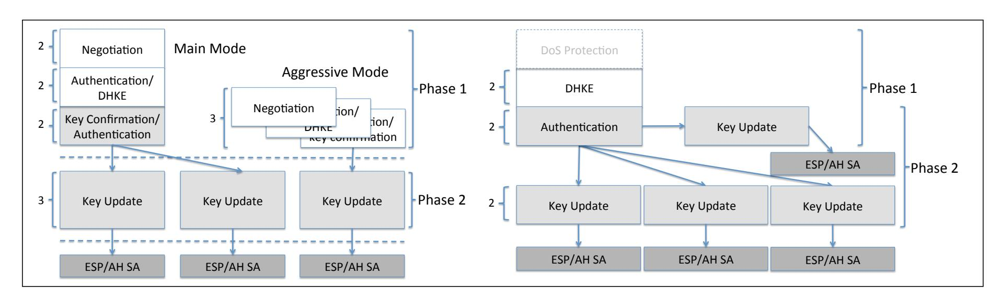
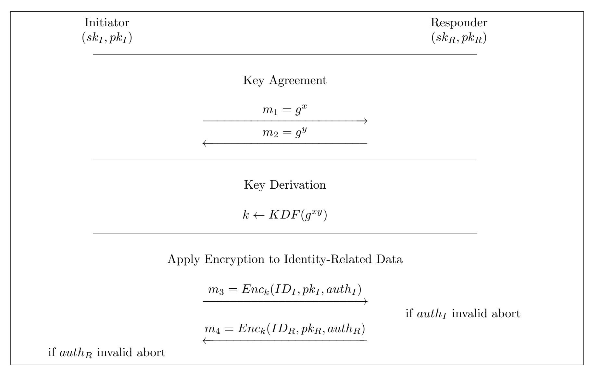
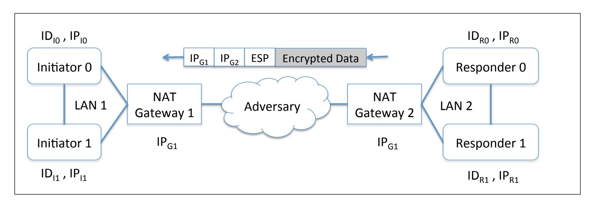
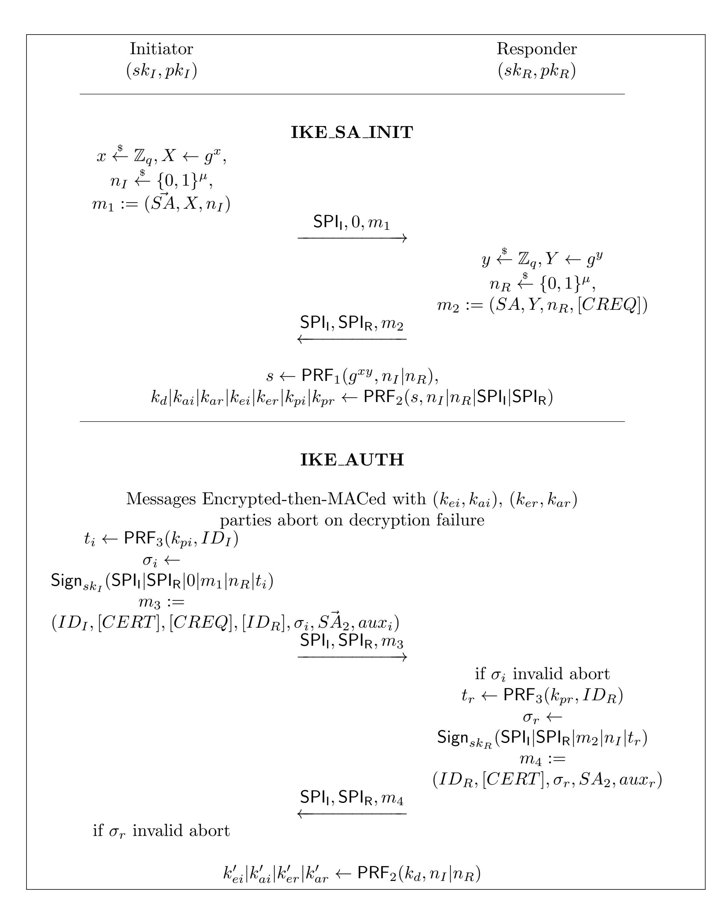

{0}------------------------------------------------

# **Privacy-Preserving Authenticated Key Exchange and the Case of IKEv2**

Sven Sch¨age*?* , J¨org Schwenk*??*, Sebastian Lauer*? ? ?*

Ruhr-Universit¨at Bochum {sven.schaege,joerg.schwenk,sebastian.lauer}@rub.de

**Abstract.** In this paper, we present a strong, formal, and general-purpose cryptographic model for privacy-preserving authenticated key exchange (PPAKE) protocols. PPAKE protocols are secure in the traditional AKE sense but additionally guarantee the confidentiality of the identities used in communication sessions. Our model has several useful and novel features, among others: it is a proper extension of classical AKE models, guarantees in a strong sense that the confidentiality of session keys is independent from the secrecy of the used identities, and it is the first to support what we call dynamic modes, where the responsibility of selecting the identities of the communication partners may vary over several protocol runs. To the best of our knowlegde, this implements the first technical approach to deal with protocol options in AKE security models. We show the validity of our model by applying it to the cryptographic core of IPsec IKEv2 with signature-based authentication where the need for dynamic modes is practically well-motivated. In our analysis, we not only show that this protocol provides strong classical AKE security guarantees but also that the identities that are used by the parties remain hidden in successful protocol runs. Historically, the Internet Key Exchange (IKE) protocol was the first real-world AKE to incorporate privacypreserving techniques. However, lately privacy-preserving techniques have gained renewed interest in the design process of important protocols like TLS 1.3 (with encrypted SNI) and NOISE. We believe that our new model can be a solid foundation to analyze these and other practical protocols with respect to their privacy guarantees, in particular, in the now so wide-spread scenario where multiple virtual servers are hosted on a single machine.

**Keywords:** privacy, authenticated key exchange, IKE, IPsec, PPAKE, modes

*?* Supported by the German Federal Ministry of Education and Research (BMBF) Project DigiSeal (16KIS0695).

*??* Supported by the German Research Foundation under Germany's Excellence Strategy - EXC 2092 CASA - 390781972 and the Cisco University Research Program Fund through the Silicon Valley Community Foundation.

*? ? ?* Supported by the German Research Foundation under Germany's Excellence Strategy - EXC 2092 CASA - 390781972.

{1}------------------------------------------------

# **Table of Contents**

| 1 |                                                                     | Introduction 3                                  |          |  |
|---|---------------------------------------------------------------------|----------------------------------------------------|----------|--|
|   | 1.1                                                                 | Privacy in AKE protocols                           | 3        |  |
|   | 1.2                                                                 | A New Security Model                               | 3        |  |
|   | 1.3                                                                 | Comparison with TOR and Practical Motivation       | 4        |  |
|   | 1.4                                                                 | IPsec IKEv2 is PPAKE                               | 5        |  |
|   | 1.5                                                                 | On the Challenge of Constructing PPAKE             | 5        |  |
|   | 1.6                                                                 | Contributions                                      | 5        |  |
|   | 1.7                                                                 | Related Works                                      | 6        |  |
|   | 1.8                                                                 | Building Blocks                                    | 8        |  |
| 2 | PPAKE in Practice: Generic Construction, Comparison and Limitations |                                                    | 8        |  |
| 3 | Building Blocks 10                                               |                                                    |          |  |
|   | 3.1                                                                 | Digital Signatures                                 | 10       |  |
|   | 3.2                                                                 | Pseudo-Random Functions and the PRF-ODH Assumption | 11       |  |
|   | 3.3                                                                 | Authenticated Encryption                           | 11       |  |
| 4 | Security Model for PPAKE                                            |                                                    | 12       |  |
|   | 4.1                                                                 | Computational Model for Key Exchange               | 13       |  |
|   | 4.2                                                                 | Adversarial Model for Key Exchange                 | 13       |  |
|   | 4.3                                                                 | Original Key Partnering                            | 14       |  |
|   | 4.4                                                                 | Security and Privacy Model                         | 15       |  |
|   | 4.5                                                                 | Additional Considerations                          | 16       |  |
| 5 |                                                                     | Internet Protocol Security (IPsec)                 | 16       |  |
| 6 |                                                                     | IKEv2 is a Secure PPAKE protocol                   |          |  |
|   | 6.1                                                                 | Proof for Initiator-Adversaries                    | 18 20 |  |
|   | 6.2                                                                 | Responder-Adversaries                              | 24       |  |
|   | 6.3                                                                 | Additional Considerations                          | 25       |  |
| 7 |                                                                     | Summary and Future Work 25                      |          |  |
| A |                                                                     | An Artificial Separation Example 27             |          |  |

{2}------------------------------------------------

### 1 Introduction

### 1.1 Privacy in AKE protocols

Privacy in authenticated key exchange (AKE) protocols has a chequered history. In some variants of the early Station-to-Station protocol [17], digital signatures are encrypted with an Diffie-Hellman (DHKE) key to hide the identity, and in SKEME [30], identities were only sent in encrypted form. Both protocols influenced the development of the Internet Key Exchange (IKEv1) protocol, where identities are protected in 5 out of 6 public key based authentication modes. The main idea was to use keys derived from an unauthenticated DHKE to encrypt those messages (displayed in light grey in Figure 1) which contain identity information. This approach was adopted for IKEv2, and for novel protocols like QUIC and TLS 1.3.

Fig. 1. Overview on the phase structure of IPsec IKEv1 (left) and IKEv2 (right).

The most important AKE protocol, TLS, is up to Version 1.2 not privacy-preserving: Certificates and digital signatures are sent in the clear, so identities of parties can be revealed even by a passive eavesdropper. To describe the situation somewhat dramatically: if someone would use TLS 1.2 in mutual authentication mode over TOR [18], the identity of both client and server would immediately be revealed at the TOR exit node.

With the development of novel protocols and protocol families like QUIC [20], TLS 1.3 [19], NOISE [40], or SIGNAL [10], interest in privacy was revived. "Enhancing privacy" was formulated as a goal for all of these protocols, but the term "privacy" was never formally defined in the context of AKE protocols.

#### 1.2 A New Security Model

We close this gap by presenting a formal model called *privacy-preserving* AKE (PPAKE) that allows us to precisely describe the privacy guarantees offered by protocols like QUIC, TLS 1.3 (with ESNIs), NOISE, and IPsec IKE. Essentially, our model formalizes that in a PPAKE the identities used by the communication partners remain confidential in successful protocol runs.

We stress that our model is a proper extension of classical security models like [8,34]. Let us provide a brief overview on the features of our model. As one of our main changes to classical models we provide every party with *two* possible identities (key pairs) that this party might use to authenticate messages with. In general, a protocol run may now be executed with either of these keys. Our new notion of privacy formalizes that it should be infeasible in a privacy-preserving AKE protocol, to distinguish which identity is actually used. (We note that, if we set one of these keys to a constant and only use the other, we easily obtain the classical security definition that is formalized in many previous works like [8,34].) The choice of which of the two identities will be used can be independent in each protocol run. (To this end we extend the set of local variables of oracles.)

As one of our main novelties, we also introduce two distinct ways to select which of these identities should actually be used. The first way is for each party to decide on the identity on its own. This models P2P-like protocols. The second way is to make the communication partner decide on the identity to be used. This approach of selecting identities, from now on referred to as the classical mode, models

{3}------------------------------------------------

situations where for example a client would like to choose among the set of identities hosted by a single server machine like in a multi-hosted webserver setting. In such a scenario a single computer may host several (virtual) servers, among which there is one that may provide security-critical information or services (for example information on political opposition groups). We remark that, in such a privacypreserving protocol, the to-be-used identity needs to be the transferred to the communication partner. For privacy reasons, this cannot happen in the clear what makes such protocols more challenging to build than protocols in classical modes. In the following, and slightly jumping ahead, we generally refer to a particular set of responsibilities that encode who decides on the identities used by initiator and responder as *mode*.

Our new security model formalizes very strong guarantees: we grant the attacker the ability to query the used identities of arbitrary communication partners. For security, we then require that it remains infeasible to decide which identity has actually been used in a successful protocol run. In our analysis we allow each party to use the same long-term keys in all supported modes, possibly differing over several protocol runs.

To illustrate the validity of our approach, we have chosen Internet Key Exchange Version 2 (IKEv2) for several reasons: (1) IKEv2 is fully standardized. (2) IKEv2 is being widely deployed, so we can justify our model with details on how to actually instantiate the protocol in a privacy-preserving way. (3) IKEv2 is interesting in its own right – no reduction-based security analysis of its privacy guarantees has been published up to now, and it is a prime example of an important real-world protocol with somewhat confusing details resulting from the standardization process. We believe that our model can also be deployed on protocols like QUIC or NOISE that also implement mechanisms to protect identities.

### **1.3 Comparison with TOR and Practical Motivation**

A short discussion about TOR [\[18\]](#page-25-1) is necessary, since TOR is still the benchmark in privacy protection on the Internet.

The TOR network. Our model is not suitable for the TOR network, which guarantees privacy even in a Byzantine networking environment, i.e. against an adversary who controls large parts (but not all) of the Internet, and parts of the TOR network itself. Our assumptions on the network are stronger, and our adversary is weaker than a TOR adversary – we assume an active man-in-the-middle attacker that controls a large, but well-defined part of the Internet, such that we can get rid of identifiers like IP or MAC addresses by placing simple, trustworthy TCP proxies at the entry points of the adversary controlled network.

The TOR protocol. The cryptographic protocol behind the TOR network is something different. Roughly, it can be compared to three nested executions of a server-only authenticated TLS handshake, the servers being the TOR nodes. In each of these executions, encryption keys from the previous execution are used to protect the handshake messages, and the next TOR node authenticates itself to the TOR client. Our model fits to any of these three executions analyzed separately, but not for the nested case.

Real-World Usefulness of Privacy-Preserving Key Exchange: The Case of SNI-based Censorship in South Korea. To show that PPAKE is nevertheless practically well motivated, recall that when using TLS-secured connections, Server Name Indicators (SNIs) are used by clients to specify which virtual server exactly a clients wants to address when connecting to a public machine that realizes domain-based virtual hosting. Traditionally, SNIs are sent in the clear. In a recent effort to improve the privacy of TLS 1.3, Encrypted Server Name Indicators (ESNI) were introduced that can hide the SNI field from outsiders such that the exact destination a clients wants to communicate with remains secret [\[41\]](#page-26-4). In spirit, this implements a privacy-preserving key exchange protocol (though for a final assessment a formal analysis is required – a pressing open problem for future work).

Recently, the South Korean government (i.e. the so-called Korea Communications Standards Commission (KCSC) responsible for censorship) has, in a widely criticized move[1](#page-3-1) , started to implement a system that denies access to more than 800 pre-selected foreign websites to its citizens [2](#page-3-2) . When secured with TLS, this system uses SNI fields to identify destination sites to block the traffic. However, when

1 [https://www.koreatimes.co.kr/www/nation/2019/02/119\\_264003.html](https://www.koreatimes.co.kr/www/nation/2019/02/119_264003.html)

2 Official announcement in Korean, retrieved 05-14-2019: [https://kcc.go.kr/user.do?mode=view&page=](https://kcc.go.kr/user.do?mode=view&page=A05030000&dc=K05030000&boardId=1113&cp=1&boardSeq=46820) [A05030000&dc=K05030000&boardId=1113&cp=1&boardSeq=46820](https://kcc.go.kr/user.do?mode=view&page=A05030000&dc=K05030000&boardId=1113&cp=1&boardSeq=46820)

{4}------------------------------------------------

ESNIs are used, this filtering technique fails. This has prompted the South Korean government to stop ESNI-based traffic entirely. To us, this shows that PPAKE protocols significantly increase the technical difficulties to filter websites. Moreover when PPAKE protocols are widely adopted, this or similar approaches to mass censorship cannot work efficiently anymore without sacrificing the availability of major parts of the Internet infrastructure to their citizens – a move that would likely lead to strong political repercussions.

### **1.4 IPsec IKEv2 is PPAKE**

The *Internet Key Exchange (IKE)* protocol is the "handshake" protocol for negotiating IPsec keys and algorithms. It currently exists in two versions, IKEv1 [\[22\]](#page-25-6) and IKEv2 [\[27,](#page-25-7)[26\]](#page-25-8). Both consist of two phases, which are depicted in [Figure 1.](#page-2-3) Both contain an unauthenticated Diffie-Hellman Key Exchange (DHKE) in Phase 1, where the resulting keys are used to protect privacy-related data in later messages.

IKEv2, which will be explained in detail in Section [5,](#page-15-1) is a 2-stage authenticated key exchange protocol (cf. [Figure 1\)](#page-2-3). Stage/Phase 1 is only executed once, to establish a set of authenticated symmetric keys. This set of keys is the basis of multiple executions of Phase 2, each of which results in freshly derived keys that are used to protect certain IP connections. Jumping ahead, our security analysis will show that these keys are indistinguishable from random. What makes IKEv2 also privacy-preserving is that some related keys are used to encrypt all identity-related data exchanged between the communication partners.

### **1.5 On the Challenge of Constructing PPAKE**

We caution that, although it might appear so, many natural approaches for protecting identities cannot be applied in the setting of PPAKE. This makes the design of new PPAKE protocols a non-trivial task. In particular, standard anonymity preserving primitives like ring or group signatures [\[42,](#page-26-5)[3,](#page-24-2)[5\]](#page-24-3) cannot be applied in a straight-forward way to implement PPAKE, in contrast to for example recent constructions of deniable key exchange [\[44\]](#page-26-6). To explain this, let us consider the following example. Consider a multihomed server, where each of its virtual servers is associated with a dedicated key pair. Also assume the availability of a basic security protocol that for each virtual server authenticates messages via digital signatures using its corresponding key pair. To construct a privacy-preserving protocol, a na¨ıve approach would advocate the use of ring signatures [\[42\]](#page-26-5) that are computed using all the public keys of the hosted virtual servers. Intuitively, the ring signature hides which application exactly signed a given message. While this solution indeed provides high anonymity guarantees for the sender, it critically fails in terms of authentication. The problem is that once a single secret key is corrupted, the attacker can easily impersonate any other virtual server to the client with it using the ring signature scheme. We stress that it is not despite the use of a ring signature scheme that this attack is possible but rather because of it: it is the very purpose and core functionality of ring signatures to enable users to craft messages on behalf of other users. A single (unnoticed) corruption would thus threaten all other uncorrupted virtual servers.[3](#page-4-3) We believe that these security guarantees are too weak in practice and therefore opt to formalize a much stronger security notion. Importantly, in our model, if a secret key is corrupted, this should have no influence on the security of the remaining virtual servers. This should not only hold for the derived session keys but also for the confidentiality of the identities. Our high requirements in terms of security will likely come at the cost of more complicated designs for provably secure PPAKE protocols as compared to generic constructions that rely on standard building blocks like privacy-preserving signatures.

### **1.6 Contributions**

We make the following contributions:

**–** We motivate and present a new formal model that allows to describe very precisely the privacy features of real-world key exchange protocols. Our model properly extends existing key exchange models and guarantees that protocols have strong security properties. In particular, and in contrast to previous works, it guarantees that the confidentiality of keys and identities are independent of

3 The situation gets worse in case secret keys are used on several server machines, for example in load-balancing solutions. Corrupting a single key would threaten all virtual servers on machines where this key is deployed.

{5}------------------------------------------------

- each other.[4](#page-5-1) Additionally, our model shows how to technically implement protocol options in security models.
- **–** We provide a rigorous and comprehensive reduction-based security analysis of the IKEv2 protocol with signature-based authentication, one of the most important real-world cryptographic protocols. To model a protocol option we exploit our novel mode concept. This results in a a proof that covers two modes, the classical mode and one in which the initiator decides on the identity used by the responder. This is the first formal proof of the privacy properties guaranteed by an IKEv2 protocol. Let us provide some intuition for some of the conceptually novel features of our model:

Dynamic Modes. First, we stress that none of the existing works considers what we call dynamic modes. Our model allows that a single party may not only have several key pairs but also behave differently over the course of several protocol runs with regard to its responsibility for selecting the actually used identity. More concretely, in some protocol runs the party may decide on its own which of its identities it will use and sometimes it will be the communication partner who decides this. Likewise the responsibility for choosing the communication partner's key material may vary. We stress that in some situations these protocol runs cannot be examined separately since they all rely on the same long-term key material. Running the protocol in distinct modes may help the attacker considerably to violate the protocol's security.[5](#page-5-2) In Appendix [A,](#page-26-0) we provide a sketch of a protocol that serves as a separation result between security models with static and dynamic modes. Moreover, as mentioned before, we stress that our proof

of IPsec will apply the mode concept to model that either the initiator or the responder may decide on

Public Modes. Another striking feature of our model is that we allow the attacker to obtain information on the mode of oracles *before* using them. On the one hand, this allows her to adaptively specify in which modes the protocol should be run in by the honest parties. She can thus freely follow an arbitrary learning strategy that relies on a series of clever choices of modes for the respective protocol runs. One the other hand, it also allows for attacks that aim at making oracles communicate with each other that do not have fitting modes, i.e. where there is no common agreement on who is supposed to decide on some identity used by one of the parties. In particular, the attacker may exploit settings where none of the parties or even both of the parties try to specify a certain identity. We technically implement this by using oracles with pre-specified modes among which the attacker may choose. Moreover, the mode is public information and thus also known to the attacker before the execution. Such a modeling is practically well motivated by the fact that protocol implementations often use distinct network interfaces (e.g. TCP ports) for different protocol variants (or even just for different communication directions): a user machine may expect incoming connection attempts on a network interface that is distinct from the one used for outgoing connection attempts. In particular, our way of modeling reflects attacks in which the attacker relays messages between oracles that otherwise would not result in a correct protocol execution.

### **1.7 Related Works**

the responder's identity.

There are several related papers that cover privacy issues in key exchange protocols. Let us describe how our work differs.

Separated Security Definitions. First of all, we stress that our new security definition is stronger than one in which key indistinguishability and privacy are treated separately *and not all the attacking queries are available in both security experiments*, like [\[21](#page-25-9)[,2\]](#page-24-4). We observe that in general such an approach may have the benefit that it can be very simple to re-use existing results: one simply could take a protocol with a proof of key indistinguishability and add the proof of privacy (while even introducing new privacy-related attacking queries). However, we opt for a much stronger model. Our new model requires that classical key indistinguishability of some protocol holds *even* in the presence of attacks

4 Via this, the model for example covers scenarios well where privacy breaches are generally more probable than attacks on the session key. Even if by some error privacy is violated, the session keys still remain secure. Protocols proven secure in our model are thus well suited in these scenarios.

5 A rough analogy is that in modern AKE models parties may serve as initiators and responders with the same key material. A corresponding proof should then guarantee that sessions where a party runs the protocol as initiator do not help to break key indistinguishability even when the party also runs the protocol as responder. The security model only covers this, if parties may assume both roles.

{6}------------------------------------------------

that adaptively unmask identities – and vice versa: we require confidentiality of identities even in the presence of queries that let the attacker reveal session keys. Only such an approach formally guarantees that the two security properties are indeed independent in a protocol, i.e. that revealing identities does not violate key indistinguishability and revealing keys does not violate privacy. Moreover, it is clearly stronger than the classical approach, because even in the key indistinguishability game, the attacker is provided more generous attack queries.

Symmetric Setting. Some of the previous works [\[35,](#page-26-7)[21\]](#page-25-9) focus on settings with symmetric long-term keys that are used for authentication. However, a closer inspection reveals that technically, the asymmetric AKE setting is much more challenging. This is because in the crucial security experiment of the symmetric setting (involving the Test-oracle), the attacker may not be given the common secret key of the communicating parties since it could then easily impersonate the peer. In contrast, in (strong variants of) the classical AKE model the attacker only may not be given the secret key of the peer (until the peer's oracle accepts): the attacker may always be given the public key of the peer and when modeling key compromise impersonation attacks (KCI) [\[32\]](#page-26-8) it may also be given the holder's secret key. The holder's keys and the peer's public key may be valuable additional information for the attacker to break the privacy guarantees of the protocol. An analogous attacking resource is not available for symmetric key based key exchange protocols.

Asymmetric Setting. There are three other works that also introduce security models in the asymmetric setting based on the indistinguishability of identities which we briefly would like to outline here. In [\[13\]](#page-25-10), the authors focus on an analysis of the OPACITY protocol suite and their model aims to capture the properties provided by that protocol. As a striking feature of their security model they only consider protocol runs where at most a single party has more than one identity. As a consequence they require that the peer of the Test-oracle in general needs to be uncorrupted when defining successful attacks. Our notion is considerably more fine-grained and covers more application scenarios. First, we allow both, the holder of the Test-oracle and its peer to have more than one identity. Next, we allow that all the public keys of some party may be corrupted (at some point in time) which allows modeling of KCI attacks and perfect forward secrecy in the first place. In practice this is an important asset. In multi-homed webservers, it captures, for example, situations where the attacker may obtain the key material of one of the hosted servers. In these cases, the security of other servers that are hosted on the same machine should remain untouched. Moreover, we stress that the model of [\[13\]](#page-25-10) does not consider dynamic modes. The model rather focuses on a single configuration where in the security game only a client (called card in the context of OPACITY) holds more than one identity. The work probably closest to ours is that of Zhao [\[46\]](#page-26-9) which also relies on the indistinguishability of identities. However, there are several important differences. Next, and most importantly, we observe that in comparison to our model the one in [\[46\]](#page-26-9) has considerably weaker security guarantees. In a nutshell, Zhao only introduces a single random bit in the Test-session that at the same time specifies both, i) which identity will be used in the Test-oracle, and ii) whether the session key is random or real. As a consequence, the Zhao model may deem protocols secure where i) we cannot reveal the used identity without compromising the indistinguishability of the session key from random or ii) we cannot reveal the real session key without compromising the privacy of the used identity. (This is also made explicit in the winning condition in [\[46\]](#page-26-9).) Essentially this amounts to the fact that the secrecy of the session key and of the used identities may not be independent of each other – although a protocol is provably secure. To us, this seems rather unnatural and we opt for a much stronger notion. Moreover the lack of independence guarantees between keys and identities makes it much harder to argue that Zhao's model (and that of [\[2\]](#page-24-4)) is a proper extension of classical AKE models since (new) queries – that only reveal used identities – may theoretically violate the security of session keys. What is also technically striking is that in the Zhao model, there is only a single but rather unnatural mechanism to specifically reveal the identity used by some party in the protocol. More concretely, if the attacker would like to reveal the identity used by some oracle it has to *query its partnered oracle* for it. Finally, and similar to the papers mentioned so far, [\[46\]](#page-26-9) does not provide the same freedom to the attacker as given in our model via the concept of dynamic and public modes. It is thus not clear what security guarantees a protocol has when the identity used by some party is sometimes decided on by itself and sometimes by its communication partner (independent of the current role assumed). Similarly, [\[46\]](#page-26-9) does not provide a mechanism for the attacker to make two oracles communicate with each other that have distinct expectations on who has to choose the used identities (non-fitting modes). Finally, the most recent work [\[2\]](#page-24-4) focuses on the unilateral privacy of TLS. The proposed model seems very weak as

{7}------------------------------------------------

it treats privacy only. As emphasized before, treating privacy and key indistinguishability separately is generally problematic, as such a definition can, for example, not provide insights on the secrecy of session keys when identities are revealed. Moreover, [\[2\]](#page-24-4) does not allow for corruptions on parties on the tested machine and so does not model any form of PFS or KCI security. In addition, the work does also not cover what our dynamic modes achieve.

IKE. In, Canetti and Krawczyk use the cryptographic analysis of so-called SIGMA-protocols [\[9,](#page-25-11)[31\]](#page-26-10) to examine the security of IKE. We note that the variant actually implemented in IPsec [\[27,](#page-25-7)[26\]](#page-25-8) is considerably more complicated than the IKE description in [\[9\]](#page-25-11). In their paper they also argue about the identity concealment of identities but their analysis remains informal. In particular, it is not explicit what exactly constitutes trivial attacks or if the attacker is granted adaptive access to the identity information of other sessions. Moreover, their analysis does not cover some subtle details present in the IPsec standard that may leak crucial information. For example, they do not consider the length of signatures although distinct signature length can help the attacker to easily identify the source of a message.

Finally, in the literature one can also find several other academic proposals for "privacy preserving" protocols that use concepts of "privacy" that are considerably different from what aim to achieve.

Deniability. Intuitively, deniability of a security protocol executed between Alice and Bob means that the transcript of a protocol execution cannot be used to convince any third party Carol that Alice or Bob has actually participated in the protocol run. Stronger forms of deniability [\[16\]](#page-25-12) also require that Bob should not be able to convince Carol even when Bob reveals to Carol his secret long-term key and all secret session-specific information like his ephemeral secret keys, intermediate values and the final session key. Yao et al. describe a family of deniable Internet key exchange protocols [\[45\]](#page-26-11). Deniability is a very strong notion of security. However, it can usually not be fulfilled (except for some very weak, relaxed versions of the definition) by security protocols where the parties authenticate via classical digital signatures [\[16\]](#page-25-12). This is simply because Bob can always use Alice's digital signature over some session specific information to prove that Alice actually was involved in that session.

The security property that we try to model is unrelated to the notion of deniability although security mechanism that achieve deniability may also be used to enforce our notion of privacy and vice versa. In particular, the protocol that we will analyse does rely on digital signatures.

### **1.8 Building Blocks**

In our proof, we rely on standard security definitions of digital signature schemes SIG = (SIG*.*Gen*,* SIG*.*Sign*,* SIG*.*Vfy), pseudorandom functions (PRFs) PRF*k*(*x*) := PRF(*k, x*), a weak variant of the PRF-ODH assumption and authenticated encryption schemes AE = (Enc*,* Dec).

### **2 PPAKE in Practice: Generic Construction, Comparison and Limitations**

Let us examine in more detail how existing protocols try to protect the identity of the involved parties. To this end we isolate an instructive common design that can be found in several widespread protocols.

Widespread construction in real-world AKE protocols. In [Figure 2](#page-8-0) we isolate a generic construction that is used in TLS 1.3, QUIC, IPsec IKE, SSH and certain patterns of NOISE to protect protocol messages that contain identity-related data such as identities, public keys or digital signatures. This construction consists of an anonymous DH handshake, from which keying material *k* is derived. This keying material *k* is then used to encrypt all subsequent messages. There are modifications of this design, e.g. in TLS 1.3 and QUIC the order of messages *m*3 and *m*4 is reversed, but its main security properties remain identical.

The goal of this construction is to hide the identity of the communicating partners in the presence of a network adversary on the application level, by first establishing anonymous keying material and then using this material to encrypt identity-related data. This construction does of course not hide networklevel identity data like IP addresses, so other privacy mechanisms like TCP proxies or the TOR network may be used to hide them when necessary.

Other constructions are possible, but are rarely used or critical to privacy. For example, in the NOISE pattern used by WhatsApp, the long-lived public key of the WhatsApp server is known to all clients,

{8}------------------------------------------------

Fig. 2. Generic construction to protect privacy in AKE protocols.

and thus there is no need to transmit the server's identity data at the application level – however, this is only possible because the server's identity is public and need not be hidden.

We remark that we can easily obtain several interesting variants of the generic construction that allow for the variable use of cryptographic building blocks. On the one hand, we can use alternative constructions for the initial Diffie-Hellman handshake. A possible candidate is for example a KEM-based passively secure key exchange as used in [23] together with a KEM-based authentication mechanisms as for example used in [23]. In particular, such instantiations can easily lead to post-quantum secure PPAKE protocols using a selection of algorithms of the current NIST competition.

GENERIC WEAKNESS. All protocols following the design pattern from Figure 2 share the same weakness when it comes to privacy protection – an active attacker can always reveal the identity of the first party which uses the anonymous DH keying material, at the cost of causing a fatal error in the handshake. To do so, she simply establishes herself as a man-in-the-middle for the anonymous DH handshake and is therefore able to derive the (different) keying material used by both parties. She is then able to decrypt the first subsequent protocol message that she receives. In the plaintexts of these messages the parties finally authenticate themselves and the previously exchanged data in some verifiable way. This fact has already been mentioned in [31]. In practice, for protocols like TLS and QUIC, the server identity can always be revealed with this attack. For IPsec IKE, it is the initiator's identity that is vulnerable, and for NOISE this depends on the pattern which is used.

We clarify, however, that this strategy is not an attack in the sense of our formal security definition on the privacy properties since the parties will recognize the modifications of the messages and abort the handshake. Our model presented in Section 4 (and all previous models as well) rather guarantee that if a party accepts, the used identities remain confidential. On a technical level, this is not different from the classical key-indistinguishability notion of AKE security where we only consider the security of keys computed by partners that accept. However, we caution that conceptually session keys are simply random values that are used to protect meaningful messages later, whereas identities should already be regarded as meaningful messages that are sent in the early key exchange phase. Thus revealing identities is, in a sense, more problematic than revealing session keys, in particular if the initiator's choice of identities cannot be regarded as independent among distinct sessions. It is interesting future work to

{9}------------------------------------------------

rigorously formalize and generalize the above generic attack and to provide formal impossibility results for a broader class of protocol designs.

We remark that for the responder, which authenticates second, the above attack seems not applicable. It is therefore conceivable to formalize a stronger property for the secrecy of identities selected by the responder which does not rely on session acceptance. However, this would require a precise formalization of who authenticates second, and it is unclear what this would mean for implicitly authenticated protocols that do not provide authentication in the sense of [\[4\]](#page-24-5). Moreover, the practical relevance for such a definition is also not clear.

To avoid the attack in practice one can envisage extra means, like running the protocol (several times[6](#page-9-2) ) with a randomly chosen identity before the actual communication session. The identities obtained in the pre-runs are then worthless for the attacker. Moreover, frequent aborts in this stage may point to a present active adversary and prompt other actions like for example changing the communication network.

Selection of identities. Existing real-world protocols use different approaches on how to select identities. In client-server protocols like TLS 1.3 and QUIC, the client chooses which identity he wants to communicate with (e.g. by selecting the hostname of a virtual webserver in a multi-homed server scenario), and which identity he wants to use (e.g. by selecting one of the client certificates stored in the webbbrowser). In classical P2P-protocols, in contrast, identities are traditionally chosen by the holder of that identity itself. A typical example is a party that uses distinct certified key pairs to access more than one network resource. The IPsec protocol that we analyse allows either the initiator or the responder to decide on the identity used by the responder.

## **3 Building Blocks**

For our proof, we rely on the security definitions of digital signature schemes, pseudorandom functions (PRFs), the PRF-ODH assumption and authenticated encryption schemes. Here we summarize the definitions of these primitives and their security from the literature.

### **3.1 Digital Signatures**

A digital signature scheme consists of three polynomial-time algorithms SIG = (SIG*.*Gen*,* SIG*.*Sign*,* SIG*.*Vfy). The key generation algorithm (*sk, pk*) \$← SIG*.*Gen(1*λ* ) generates a public verification key *pk* and a secret signing key *sk* on input of security parameter *λ*. Signing algorithm *σ* \$← SIG*.*Sign(*sk, m*) generates a signature for message *m*. Verification algorithm SIG*.*Vfy(*pk, σ, m*) returns 1 if *σ* is a valid signature for *m* under key *pk*, and 0 otherwise.

Consider the following security experiment played between a challenger C and an adversary A.

- 1. The challenger generates a public/secret key pair (*sk, pk*) \$← SIG*.*Gen(1*λ* ), the adversary receives *pk* as input.
- 2. The adversary may query arbitrary messages *mi* to the challenger. The challenger replies to each query with a signature *σi* = SIG*.*Sign(*sk, mi*). Here *i* is an index, ranging between 1 ≤ *i* ≤ *q* for some *q* ∈ N. Queries can be made adaptively.
- 3. Eventually, the adversary outputs a message/signature pair (*m, σ*).

**Definition 1.** *We say that* SIG *is* SIG-secure *against* existential forgeries under adaptive chosen-message attacks *(EUF-CMA) if for any probabilistic polynomial-time (PPT) adversary it holds that*

$$\Pr\left[(m,\sigma) \xleftarrow{\$} \mathcal{A}^{\mathcal{C}(\lambda)}(pk) : \frac{\mathsf{SIG.Vfy}(pk,\sigma,m) = 1,}{m \neq m_i \ \forall i}\right] \leq \epsilon_{\mathsf{SIG}}.$$

Apart from this classical notion we will define length-preserving signature schemes. A length-preserving signature scheme guarantees that for a any *λ* we have for all (*sk, pk*) \$← SIG*.*Gen(1*λ* ) that the signatures output by SIG*.*Sign(*sk,* ·) have the same bit-length.

6 To make it hard for the attacker to decide when the real communication attempt is started one could randomly choose the number of steps.

{10}------------------------------------------------

#### **3.2 Pseudo-Random Functions and the PRF-ODH Assumption**

A *pseudo-random function* is an algorithm PRF. This algorithm implements a deterministic function *z* = PRF(*k, x*) (also denoted as PRF*k*(*x*)), taking as input a key *k* ∈ KPRF and some bit string *x*, and returning a string *z* ∈ {0*,* 1} *µ*.

Consider the following security experiment played between a challenger C and an adversary A.

- 1. The challenger samples *k* \$← KPRF uniformly random.
- 2. The adversary may query arbitrary values *xi* to the challenger. The challenger replies to each query with *zi* = PRF(*k, xi*). Here *i* is an index, ranging between 1 ≤ *i* ≤ *q* for some *q* ∈ N. Queries can be made adaptively.
- 3. Eventually, the adversary outputs value *x* and a special symbol >. The challenger sets *z*0 = PRF(*k, x*) and samples *z*1 \$← {0*,* 1} *µ* uniformly random. Then it tosses a coin *b* \$← {0*,* 1}, and returns *zb* to the adversary.
- 4. Finally, the adversary outputs a guess *b* 0 ∈ {0*,* 1}.

**Definition 2.** *We say that* PRF *is a* PRF-secure *pseudo-random function, if any PPT adversary has at most an advantage of* PRF *to distinguish the* PRF *from a truly random function, i.e.*

$$|\Pr[b=b']-1/2| \le \epsilon_{\mathsf{PRF}}.$$

In this section we define a weak variant of the PRF-ODH assumption that was introduced 2012 in [\[24\]](#page-25-14) and has become a widely-used assumption for proving security of DH-based key exchange protocols against man-in-the-middle attackers. In particular, in our variant the attacker can only make a single oracle query. At the same time the input message of the challenge output is determined by the challenger. For more information and a comprehensive analysis of the PRF-ODH-problem we refer to [\[7\]](#page-25-15).

**Definition 3 (**PRF**-**ODH **Assumption).** *Let G be a group with generator g and prime order q. Let* PRF *be a deterministic function y* = PRF(*K, x*)*, taking as input a key K* ∈ *G and some bit string x, and returning a string y* ∈ {0*,* 1} *µ. We define a security notion* PRF*-*ODH *where the adversary is allowed to query a certain oracle* ODH*. Consider the following security experiment played between a challenger* C *and an adversary* A*.*

- *1. The challenger samples u* \$← [*q*]*, v* \$← [*q*] *and provides* G*, g and g u , gv and two random values nI* |*nR* ∈ {0*,* 1} 2*µ to* A*. Next, the challenger samples z*1 \$← {0*,* 1} *µ and sets z*0 := PRF(*g uv, nI* |*nR*)*. Then it tosses a coin b* ∈ {0*,* 1} *and returns zb to the adversary.*
- *2. The adversary may issue a single query to the oracle* ODH*.*
  - **–** ODH*: On a query of the form* (*S, x*)*, the challenger first checks if S /*∈ G *or* (*S, x*) = (*g v , nI* |*nR*) *and returns* ⊥ *if this is the case. Otherwise, it computes y* ← PRF(*S u , x*) *and returns y.*
- *3. Finally the adversary outputs a guess b* 0 ∈ {0*,* 1}*.*

*We say that the* PRF*-*ODH *problem is* PRF-ODH-secure *with respect to G and* PRF*, if any PPT adversary has at most an advantage of* PRF*-*ODH *to distinguish the* PRF *from a truly random function, i.e.*

$$|\Pr[b = b'] - 1/2| \le \epsilon_{\mathsf{PRF-ODH}}.$$

### **3.3 Authenticated Encryption**

Let AE = (Enc*,* Dec) be a symmetric encryption system with keyspace KAE and message-space MAE. In the following, we will provide a simplified definition of security for authenticated encryption that is based on the all-in-one definition introduced in [\[43\]](#page-26-12).

Consider the following security experiment played between a challenger C and an adversary A.

- 1. The challenger samples random *b* \$← {0*,* 1} and random *k* \$← KAE.
- 2. The attacker may repeatedly and adaptively query oracle ENC on input two plaintexts *M*0*, M*1 ∈ MAE. If either *C*0 := Enc(*k, M*0) = ⊥ or *C*1 := Enc(*k, M*1) = ⊥ the failure symbol ⊥ is returned. Otherwise *Cb* is returned.
- 3. The attacker may also query oracle DEC which on input a purported ciphertext *C* outputs Dec(*k, C*) if *b* = 1 and *C* has not been output by ENC before. Otherwise ⊥ is returned.
- 4. A may output a bit *b* 0 .

{11}------------------------------------------------

**Definition 4.** Let AE = (Enc, Dec) be a symmetric encryption scheme. We say that AE is  $\epsilon_{AE}$ -secure, if for all PPT adversaries A it holds that

$$|\Pr[b=b']-1/2| \le \epsilon_{\mathsf{AE}}$$

### 4 Security Model for PPAKE

In the following, we will present our new security model. It is designed as a proper extension to classical AKE models [8,34], a conceptually highly desirable feature in key exchange that helps to prevent the introduction of new models which are incomparable to established ones. In classical models, indistinguishability of session keys is used as a primary criterion of the security of the protocols. This is usually checked via a so called Test-query, which, based on a random bit b, either returns the real session key, or a random value. The goal of the adversary is to compute this bit b.

We extend this model by introducing a criterion for indistinguishability of identities used in the protocol handshake. To this end, we equip each party (client/initiator and server/responder) with two different identities. Next, we introduce two local variables, the selector bits d and f: d models which identity is used to authenticate data with, while f indicates the identity used by the communication partner.

We emphasize that d, f point to the identities that are actually used. However, this is not enough to model the sketched application scenarios comprehensively. Therefore, we also introduce the so-called mode  $\mathsf{mode} = (u,v)$  that contains a pair of public variables. Essentially, the mode determines who is supposed to set the bits d and f in a protocol run. The intuition is that either the used identity d of one party may be determined by the party itself – or its communication partner. In our multi-host server example, the server machine may decide on its own on the actually used virtual server – or let the client choose it. We emphasize that in our security model the mode is our leverage to let the attacker specify who is responsible for choosing selector bits – and create ambiguities about that by relaying messages between oracles with non-fitting modes.

To model security, the adversary may now request two different challenges from the challenger with an extended Test-query:

- By asking  $\mathsf{Test}(\pi_i^s, \mathsf{KEY})$ , he requests the classical key indistinguishability challenge.
- By asking  $\mathsf{Test}(\pi_i^s,(\mathsf{ID},0/1))$ , he requests an identity indistingushability challenge, for one of the two pairs of identities.

In the following we provide a formal exposition of the model.

Modes as Public Variables. We stress that we deliberately model the mode to be public. The decision to introduce public session-specific variables models practice realistically. If a client for example connects to a multi-hosted server, it is well aware of the requirement to select the virtual server precisely (among the set of all hosted virtual servers present). The server, on the other hand, expects the client to choose one of its virtual servers in the protocol run. It does not aim to determine the virtual server on its own. In situations where the communication partners have common expectations on who is supposed to determine the two identities we say that their modes fit (a formal definition follows). We also stress that our choice is also crucial to cover dynamic modes. Essentially, making the mode session-specific allows modes to differ among the sessions of a single party in the first place. Otherwise, the responsibility of who is allowed to choose identities would be associated to parties (and fixed for each oracle). This is, however not realistic, as in practice the same long-term key material will often be used in several modes because of costs for certification of public keys or simpler key management. As stated before, in our protocol analysis, we also have to consider two modes. We remark that, to the best of our knowledge, our approach that relies on public session-specific variables is more generally the first technical implementation of protocol options (that all use common long-term keys) in AKE security models. We believe the concept to be of high independent interest and regard it as applicable in other contexts as well.

&lt;sup>7 An alternative approach is to have each party prepare and manage several *types* of oracles. Each of these types would represent one possible mode and the party will somehow have to choose the correct type for each protocol run.

{12}------------------------------------------------

#### 4.1 Computational Model for Key Exchange

Following [4,6,8,34,12,24], we model the execution environment in terms of PPTs. Our notation closely follows [24].

EXECUTION ENVIRONMENT. Let  $\mathcal{P} = \{P_1, \dots, P_n\}$  denote the parties involved in the cryptographic protocol  $\Pi$ . Each party  $P_i$  holds two identities  $ID_i^0$  and  $ID_i^1$ . Moreover, each of these identities is associated with a long-lived key pair  $(sk_i^b, pk_i^b)$  for  $b \in \{0, 1\}$ . Each party  $P_i$  may fork off processes  $\{\pi_i^s: s \in \{1, \dots, l\}\}$  called oracles in the following. We use subscripts and superscripts to denote that oracle  $\pi_i^s$  is the s-th oracle of party  $P_i$ .  $P_i$  is also often called the holder of  $\pi_i^s$ . Furthermore, we use the same subscripts and superscripts to denote the variables of  $\pi_i^s$ . If  $\pi_i^s$  sends the first protocol message, we also refer to it as initiator, otherwise it is called responder.

LOCAL AND GLOBAL VARIABLES. Each oracle  $\pi_i^s$  shares the global variables of party  $P_i$ , and may use the secret keys of  $P_i$  for decryption or signature generation. It stores the following local variables in its own process memory.

- A session key  $k = k_i^s$ .
- The identity selector bit  $d = d_i^s \in \{0,1\}$ . It determines that identity  $ID_i^d$  (and  $sk_i^d$ ) is used in the protocol run.
- A variable Partner = (j, f) that indicates its *intended partner*. It contains a pointer  $j \in [1; n]$  to a party  $P_j \in \{P_1, \ldots, P_n\}$ , often called the *peer* of  $\pi$ , and a *partner selector bit*  $f \in \{0, 1\}$ . The values stored in Partners indicate that the public key  $pk_j^f$  is used by oracle  $\pi_i^s$  to check if the received data has been authenticated.
- Finally, each oracle  $\pi_i^s$  holds a publicly accessible  $mode \mod e^s = (u_i^s, v_i^s) \in \{0, 1\}^2$ . It is used to indicate how the identity bits of the oracles are chosen in the protocol run. Generally, a 0-entry denotes that variables are chosen by  $\pi_i^s$ , a 1 means that variables are chosen by the communication partner.

All local variables are initially set to some special symbol  $\bot$  that is not in the domains of any of these variables. Throughout the protocol execution, each oracle may read and write its variables according to the protocol definition. An oracle  $\pi_i^s$  performs actions as described in the protocol specification, and may either accept or reject in the end. The final goal of a PPAKE protocol is to establish a session key k. The adversary  $A \notin \{P_1, ..., P_n\}$  is a special party that may interact with all process oracles by issuing different types of queries.

FITTING MODES. The bit  $u_i^s$  determines if a process oracle  $\pi_i^s$  chooses its own identity (or not) whereas the bit  $v_i^s$  determines if  $\pi_i^s$  chooses the identity of its intended partner (or not). More precisely: either  $d_i^s$  is simply computed by  $\pi_i^s$  (this is indicated via  $u_i^s = 0$ ), or the communication partner  $\pi_j^t$  of  $\pi_i^s$  is supposed to choose  $f_j^t$  and the protocol will make  $\pi_i^s$  set  $d_i^s = f_j^t$  at some point (indicated by setting  $u_i^s = 1$ ). Similarly,  $f_i^s$  may either simply be computed by  $\pi_i^s$  (indicated by  $v_i^s = 0$ ) or the communication partner  $\pi_j^t$  of  $\pi_i^s$  selects  $d_j^t$  and the protocol makes  $\pi_i^s$  set  $f_i^s = d_j^t$  (indicated by  $v_i^s = 1$ ). Modes of two communicating oracles  $\pi_i^s$  and  $\pi_j^t$  must  $f_i^t$  in the absence of an attacker. Intuitively this guarantees that any identity or partner selector bit is set exactly once, i.e. each selector bit is determined by exactly one oracle. More formally:

**Definition 5.** We say that (identity) selector bit  $u_i^s$  and (partner) selector bit  $v_j^t$  fit if  $u_i^s + v_j^t = 1$ . Moreover, we say that the modes of two oracles  $\pi_i^s$  and  $\pi_j^t$  fit if  $u_i^s + v_j^t = 1$  and  $v_i^s + u_j^t = 1$ .

Throughout the paper we may sometimes also refer to the mode of some protocol. By that we mean the possible modes an initiator oracle may be in.

#### 4.2 Adversarial Model for Key Exchange

ADVERSARIAL CAPABILITIES. The attacker model defines the capabilities that the attacker is granted. In addition to standard queries we introduce the novel query Unmask that allows the adversary to learn each of the two identity bits used by an oracle. We also extend the classical Test-query to not only provide candidate keys but also candidate selector bits. We stress that if the attacker does not call Unmask at all, restricts itself to only query candidate keys via Test (and not identity information), and if for each party the two keys pairs and identities are equal and always corrupted at the same time, we immediately

{13}------------------------------------------------

obtain the classical attacker model of authenticated key exchange. Thus our model is a proper extension of the classical AKE model.

- Send( $\pi_i^s, m$ ): The active adversary can use this query to send any message m of his own choice to oracle  $\pi_i^s$ . The oracle will respond according to the protocol specification. If  $m = (\emptyset, P_j)$ , where  $\emptyset$  denotes the special string that is not included in the alphabet of the messages,  $\pi_i^s$  is activated, i.e.  $\pi_i^s$  will respond with the first protocol message of a protocol run with intended partner  $P_j$ .
- Reveal $(\pi_i^s)$ : The adversary may learn the session key  $k_i^s$  computed by process  $\pi_i^s$  by asking this query. We require that  $k_i^s \neq \bot$  iff  $\pi_i^s$  has accepted.
- Corrupt $(P_i, w)$ : For  $w \in \{0, 1\}$ , the adversary can send this query to any of the oracles  $\pi_i^s$ . The oracle will answer with the long-lived key pairs  $(sk_i^w, pk_i^w)$  of party  $P_i$ . The pair  $P_i$ , w and the corresponding key pair  $(sk_i^w, pk_i^w)$  are then marked as *corrupted*. Keys that are not corrupted are called *uncorrupted*.
- Unmask $(\pi_i^s, z)$ : If the bit  $z \in \{0, 1\}$  is such that z = 0, the adversary is given the identity selector bit  $d_i^s$  computed by process  $\pi_i^s$ . In case z = 1, the adversary may learn the partner selector bit  $f_i^s$  of  $\pi_i^s$ . If  $\pi_i^s$  has not accepted,  $\bot$  is output. We require that  $d_i^s, f_i^s \neq \bot$  iff  $\pi_i^s$  has accepted.
- Test( $\pi_i^s, m$ ): This query can only be asked once and after this, we often refer to  $\pi_i^s$  as the so-called *Test-oracle*. If process  $\pi_i^s$  has not (yet) accepted, the failure symbol  $\bot$  is returned. Otherwise the oracle flips a fair coin b and proceeds as follows:
  - $m = \mathsf{KEY}$ : If b = 0 then the actual session key  $k_0 = k$  computed by process  $\pi_i^s$  is returned. If b = 1, a uniformly random element  $k_1$  from the keyspace is returned. If  $m = \mathsf{KEY}$ , the output of the Test-oracle is called the *candidate key*.
  - $m = (\mathsf{ID}, z)$ : If the bit  $z \in \{0, 1\}$  equals 0, the adversary is given  $d_i^s \oplus b$ . In case z = 1, the adversary obtains  $f_i^s \oplus b$ . If  $m = (\mathsf{ID}, z)$ , we call the final output of the Test-oracle candidate (identity or partner) selector bit.

RATIONALE AND IMPLICATIONS. Essentially our model aims at introducing a new way for the attacker to win the security game besides the classical approach of guessing the session key. Our extension, the computations for case  $m = (\mathsf{ID}, z)$ , captures that the attacker is given either the real selector bit of the Test-oracle – or its negation. When calling the Test-query the adversary uses z to distinguish between identity selector bit and partner selector bit in case  $m = (\mathsf{ID}, z)$ . Please note that the role of b is consistent in each of the choices for m. Essentially b determines if the attacker is given the real state variable stored by  $\pi_i^s$  (b = 0) or not (b = 1). When formalizing security we will require the attacker to distinguish these two cases.

Observe that the security-critical selector bits, like session keys, are by definition shared among two oracles if no attacker is present:  $k_i^s = k_j^t$ ,  $d_i^s = f_j^t$ , and  $f_i^s = d_j^t$ . So intuitively, by allowing to also disclose the partner selector bit our model captures realistic scenarios where an adversary attempts to deduce the used identity of some party via attacking that party itself or its communication partner, in contrast to |46|. In this way, a security proof of a protocol in our model provides strong guarantees on the confidentiality of the used identities. Essentially, a proof states that the confidentiality of the session key or selector bits of one oracle does not depend on the security (or insecurity) of the secret information of other, 'unrelated' oracles. It is clear that the definition of 'unrelated' is highly critical in this context and in the following we will devote some effort to motivate our formalization. Also note that even though we introduce multiple identities to each party this does not increase the susceptibility to unknown-key share attacks, where at least one of the communication partners is tricked into believing it shares the session key with some other communication partner. The reason why our model is not more susceptible is that i) communication endpoints are still fully specified in the security model via combinations of party and identity identifiers and ii) communication endpoints are still associated with cryptographic key material that is used to authenticate messages with in the protocol run. However, we note that it is not sufficient in the protocol run to specify communication partners solely via their party identifier as is common in classical models where parties are associated with cryptographic keys. Leaving the used identity unspecified, parties could be tricked into believing they share a key with some identity of some peer although they actually share it with another identity of that same peer.

#### 4.3 Original Key Partnering

To exclude trivial attacks in the security model, a variety of definitions exist in the literature, starting with the classical definitions of *matching conversations* [4] and *session identifiers* [8], up to the more sophisticated distinction between *contributive* and *matching* session identifiers introduced in [20]. Recently,

{14}------------------------------------------------

at CCS'17 the authors of [36] showed that matching conversation based security notions are often vulnerable to so-called no-match attacks. We therefore choose their conceptually novel partnering definition, called original key partnering, that is independent of the exchanged messages of the protocol. We remark that as sketched in [36] it leads to conceptually more simple security proofs since only a subset of active attacks need to be considered. We note, however, that the specification of our model is not bound to one partnering definition. The concrete choice of partnering is rather orthogonal to our contribution. It is only in the security proof for IKEv2 that we will formally rely on original key partnering.

**Definition 6 (Original Key).** The original key of a pair of communicating  $\pi_i^s$  and  $\pi_j^t$  oracles is the session key that is computed by each of the oracles in a protocol run with an entirely passive attacker. We use  $ok(\pi_i^s, \pi_j^t)$  to denote the original key if  $\pi_i^s$  is the initiator of the protocol run and  $\pi_j^t$  the responder.

**Definition 7 (Original Key Partnering).** Two oracles  $\pi_i^s$  and  $\pi_j^t$  are said to be partnered if both of them have computed their original key  $ok(\pi_i^s, \pi_i^t)$ .

In the following we may use  $M_i^s$  to denote the set of all oracles partnered with  $\pi_i^s$ .

### 4.4 Security and Privacy Model

SECURITY GAME. We define protocol security via a game. We call the protocol insecure if an efficient (PPT) adversary can win the game with non-negligible advantage.

**Definition 8 (Security Game).** Consider the following security game played between a challenger C and an adversary A.

- 1. The challenger simulates n parties  $P_i$ ,  $i \in \{1,...,n\}$ . For each party  $P_i$ , he computes identities  $ID_i^0$ ,  $ID_i^1$  and randomly generates key pairs  $(sk_i^0, pk_i^0)$ ,  $(sk_i^1, pk_i^1)$ . All public keys are given to the attacker.
- 2. The adversary may ask arbitrary queries Send, Reveal, Unmask, Corrupt, and Test to any process  $\pi_i^s$  with  $i \in \{1,...,n\}$ ,  $s \in \{1,...,\ell\}$ . Queries can be made adaptively. For each process  $\pi_i^s$  the challenger chooses random selector bits if the mode requires so: if  $u_i^s = 0$ ,  $d_i^s$  is chosen uniformly at random; in case  $v_i^s = 0$ ,  $f_i^s$  is chosen uniformly at random. The Test-query can only be asked once.
- 3. Finally, the adversary outputs bit  $b' \in \{0, 1\}$ , its guess for b.

**Definition 9 (Secure PPAKE.).** Let  $\mathcal{A}$  be a PPT adversary, interacting with challenger  $\mathcal{C}$  in the security game described above. Assume the attacker calls  $\mathsf{Test}(\pi_i^s, m)$  that internally computes bit b. Let d be  $\pi_i^s$ 's identity selector bit, let  $\mathsf{Partner}_i^s = (P_j, f)$  be its intended partner with partner selector bit f, and let b' be the output of  $\mathcal{A}$ . We say the adversary wins the game, if b = b' and at least one of the following holds

- 1.  $m = \mathsf{KEY}$ , then we require that i) no query  $\mathsf{Reveal}(\pi_i^s)$  has been asked, ii) no query  $\mathsf{Reveal}(\pi_j^t)$  has been asked to any oracle  $\pi_j^t$  such that  $\pi_i^s$  is partnered with  $\pi_j^t$ , and iii)  $\mathsf{Partner}_i^s = (P_j, f)$  has not been corrupted while  $M_i^s = \emptyset$  (there is no partner oracle).
- 2.  $m = (\mathsf{ID}, 0)$ , then we require that i) no query  $\mathsf{Unmask}(\pi_s^i, 0)$  has been asked, ii) no  $\mathsf{Unmask}(\pi_j^t, 1)$  query has been asked to any oracle  $\pi_j^t$  such that  $\pi_i^s$  is partnered with  $\pi_j^t$ , and iii)  $\mathsf{Partner}_i^s = (P_j, f)$  has not been corrupted while  $M_i^s = \emptyset$ .
- 3.  $m = (\mathsf{ID}, 1)$ , then we require that i) no query  $\mathsf{Unmask}(\pi_s^i, 1)$  has been asked, ii) no  $\mathsf{Unmask}(\pi_j^t)$  query has been asked to any oracle  $\pi_j^t$  such that  $\pi_i^s$  is partnered with  $\pi_j^t$ , and iii)  $\mathsf{Partner}_i^s = (P_j, f)$  has not been corrupted while  $M_i^s = \emptyset$ .

We say that an authenticated key exchange protocol  $\Pi$  is  $\epsilon_{\mathsf{PP-AKE}}$ -secure if any PPT adversary  $\mathcal A$  has at most an advantage of  $\epsilon_{\mathsf{PP-AKE}}$  i.e.

$$|\Pr[b=b']-1/2| \le \epsilon_{\mathsf{PP-AKE}}.$$

Observe that if we focus on key indistinguishability only, i.e. ignoring the Unmask query and the identity options for the Test query, our model provides all attack queries that are present in the original Bellare-Rogaway model [4]. Moreover, our model captures several important attack variants that involve the corruption of secret keys. To model key compromise impersonation (KCI) attacks [32] we allow the attacker to always corrupt the holder of the Test-oracle. Moreover, we also allow the corruption of long-term keys given in  $\Pi_i^s$  (while carefully ruling out trivial attacks via 1.iii) ). This models (full) perfect

{15}------------------------------------------------

forward secrecy. Finally, since there is no restriction on the relation of the key material of initiator or responder our model considers reflection attacks [\[32\]](#page-26-8), where parties communicate with themselves (e.g. between two devices that use the same long-term secret).

Remarks. Let us consider a variant of a no-match attack [\[36\]](#page-26-13) that does the following: 1) it modifies the messages exchanged between two oracles such that the two oracles are not partnered anymore. However, assume further, that the attacker's modifications do not influence the computations of the selector bits of the two oracles. Since the two oracles are not partnered anymore, the attacker may 2) disclose the selector bits of one oracle while answering the Test-query for the other. However, since the computations of the selector bits have not been influenced at all, the attacker may now trivially answer the Test-query for *m* = (ID*, z*). This theoretical attack has major implications for the protocol design. What it amounts to – from a constructionist perspective – is that active modifications that change the partnering status of two oracles should always make their selector bits independent of each other – from the attacker's point of view. At the same time, our model requires a considerable amount of independence between the secrecy of the selector bits and the confidentiality of the session key. To see this observe that our model provides strong guarantees for the secrecy of the selector bits even if the session keys of two partnered oracles are exposed. (Observe that in 1. of Definition [9,](#page-14-1) there is no restriction on the use of the Reveal query.) In the opposite direction, our model provides strong guarantees for the confidentiality of the session key even if the selector bits of two partnered oracles are exposed using the Unmask query. (We notice that in 2. and 3. of Definition [9](#page-14-1) there is no restriction on the use of the Unmask query.)

### **4.5 Additional Considerations**

Explicit Authentication. We stress that there is no obstacle to adding classical explicit authentication [\[4\]](#page-24-5) or its generalizations [\[36\]](#page-26-13) and variants [\[33\]](#page-26-14) to the set of security guarantees captured by our model. Technically, all we have to do is to add another winning condition which essentially states that for each accepting oracle, there is exists another oracle that is partnered.

Privacy-Preserving Authenticated and Confidential Channel Establishment (PPACCE). Our modifications to the classical model can be transferred to the ACCE model [\[24\]](#page-25-14) and its derivatives. In a nutshell, the main difference to AKE protocols is that the security analysis focuses on the security of the transferred messages and not on the secrecy of the derived keys. Recall that in these models, the Test query was replaced by the two queries Encrypt and Decrypt to model the security properties of the established channel.

Exactly as before we may equip oracles with selector bits and modes, and as before we may add two additional winning conditions that revolve around the secrecy of the selector bits. We reintroduce the Test-query for *m* = (ID*, z*) but do not require any changes to the encryption or decryption queries: for better modularity and cleaner security arguments we may consider protocols where only the session key computation depends on the used identity. Once this key is established the symmetric encryption layer is independent of any further reference to identities.

Unilateral Authentication. Our model is defined with respect to mutual authentication, where both communication partners have long-term keys. However, it can easily be used to analyse protocols with unilateral authentication where only servers have long-term key material to authenticate themselves with. As before, clients or servers may determine which identity the server should use. However, there are no selector bits for the client identity. To obtain a model for unilateral authentication we simply require that the Test-query can only challenge the single identity bit that specifies the used server identity.

### **5 Internet Protocol Security (IPsec)**

IPsec Architecture. IPsec functionality is integrated in virtually all operating systems, and in most network devices. It is the basis for industry-level Virtual Private Networks (VPN), e.g. to connect the automotive industry with their suppliers. Thus its practical importance is comparable to TLS, and the IPsec protocol suite is at least as complex.

In contrast to TLS, the "Record Layer" of IPsec is packet-based, not stream based, and consists of the two data formats *Authentication Header (AH)* [\[28\]](#page-25-17) and *Encapsulating Security Payload (ESP)* [\[29\]](#page-25-18). 

{16}------------------------------------------------

Both data formats can either be used in *Transport mode*, where the original IP header is used in ESP and AH, and *Tunnel mode*, where a new IP header is prepended to the packet. The security of this packet-based encryption layer is quite well understood today [39,14,15].

IPsec can be used in different scenarios. The end-to-end encryption scenario is called host-to-host (H2H), and this is the only scenario in which Transport mode can be used. Other scenarios involve IPsec gateways as encryption endpoints, which enforces the use of Tunnel mode – host-to-gateway (H2G) to enable remote access to a company network, and gateway-to-gateway (G2G) to connect separate local area networks (LAN) over the Internet.

Fig. 3. Host-to-host IPsec connection through two NAT gateways.

To illustrate the applicability of our formal model, consider the typical H2H IPsec scenario depicted in Figure 3: We have two LANs, which are connected via Network Address Translation (NAT). These gateways do hide all network-level identity information like IP addresses or UDP/TCP port numbers, both in IPsec "Record Layer" communications and in the IKE handshake (Figure 5), by substituting the private IP addresses used by the different hosts to a single valid IPv4 address. Now a host A in LAN 1 (the *Initiator*) wants to set up an IPsec connection with a host B (the *Responder*) in LAN 2. A therefore performs an IKE handshake with B, which the adversary can observe and manipulate only after network-based identity information has been removed by the NAT gateways – he thus only observes network traffic between LAN 1 and LAN 2.

His goal is to determine the private IP addresses of the hosts A and B which communicate, and this information has been removed from the IP packets. However, before two hosts can communicate via IPsec ESP, they have to perform an IKE handshake which is only partly encrypted, and may leak information about the host's identities  $ID_{I0}$ ,  $ID_{I1}$ ,  $ID_{R0}$  or  $ID_{R1}$ . Our goal is to show that this is *not* the case, under some well-defined assumptions given by our model.

INTERNET KEY EXCHANGE (IKE). The IPsec "handshake", which is called *Internet Key Exchange* (IKE), is used in two major versions, IKEv1 [22] and IKEv2 [27,26]. Although IKEv1 is declared to be deprecated, it is still active in most codebases.

IKE consists of two phases (cf. Figure 1): In Phase 1, which is executed only once, DHKE is combined with variety of authentication mechanisms (four in IKEv1, two in IKEv2) to establish a set of authenticated symmetric keys. Phase 2, which can be executed several times, derives fresh symmetric keys to be used in AH or ESP from this set of keys, by exchanging fresh nonces and optionally performing another DHKE.

While the cryptographic core of IPsec has been analyzed quite early [31], the sheer complexity of IPsec made it difficult to provide a reduction-based security proof. A symbolic security analysis, updating [37], has been performed in [11], but due to the high level of abstraction the automated tool (Scyther) required, some small but important details of the protocols had to be simplified. For example, the reflection attack against IKEv2 Phase 2 described in [11] works for the given abstraction, but not against any implementation, because different handshake keys are used in both directions. We note that our abstraction of IPsec also considers distinct keys for the two communication directions.

{17}------------------------------------------------

IKEv2. The target of our security and privacy proof is IKEv2, the current version of IKE. IKEv2 is a complex protocol consisting of two phases. Phase 1 is a complete, public key based authenticated key exchange protocol (comparable to the full TLS handshake), and comprises messages  $m_1$  through  $m_4$  in Figure 4. With the first two messages, initiator and responder negotiate cryptographic algorithms and parameters ( $\vec{SA}$  and SA), exchange 4 nonces ( $\mathsf{SPI}_\mathsf{I}, \mathsf{SPI}_\mathsf{R}, n_I, n_R$ ), and perform a DHKE. Any active adversary may interfere with these two messages.

Authenticity of the keys derived after this first exchange is only established later, through two digital signatures over partial protocol transcripts. The partial transcript includes all data sent by the signing party in the first exchange, plus the nonce  $n_X$  sent by the other party, plus a MAC on the sender's identity.

Phase 1 is however chained and interleaved with Phase 2 (comparable to TLS session resumption) through a key derivation key  $k_d$  which is used in both phases. This key is derived after the first message exchange, authenticated in the second exchange, and applied for the first AH/ESP key derivation immediately after the second exchange, in which also a second cryptographic parameter negotiation  $(S\vec{A}_2, SA_2)$  takes place. This second negotiation and the second key derivation are part of Phase 2, and the first instance of Phase 2 is thus interleaved with Phase 1.

The protocol can be configured in two ways: either the initiator or the responder may decide on the responder identity. Technically this is signaled in message  $m_3$  by sending or not sending  $\mathsf{ID}_R$ . To formally capture this we will use our novel mode concept. We stress that it is not realistic to provide separate proofs for each mode since both use the same long-term keys. Such an approach could not exclude attackers that dynamically switch between modes.

### 6 IKEv2 is a Secure PPAKE protocol

In this section we state the PPAKE security of IKEv2 Phase 1. In our corresponding proof we first show that IKEv2 Phase 1 fulfills the security properties of key indistinguishability as described in Definition 9 1). Then we prove the privacy properties in the sense of Definition 9 2) and 3). In our proofs we consider two modes in which the identity of the responder can be either chosen by itself or by the initiator.

RELYING ON THE PRF-ODH ASSUMPTION. In IKEv2 Phase 1 the first two messages are used to exchange ephemeral Diffie-Hellman (DH) shares  $g^x$  and  $g^y$ . Since both messages are unauthenticated, any adversary could possibly exchange one of the values with its own DH values  $g^{x'}$  or  $g^{y'}$ . For successful simulation, the challenger thus should always be able to answer all queries that involve only one of the values  $g^x$  or  $g^y$ . However, to argue that the keys  $k_{ai}|k_{ar}|k_{ei}|k_{er}$  are secure, the value derived from  $g^{xy}$  should still be indistinguishable from random. We therefore deploy the PRF-ODH assumption in the proof: to deal with modified values  $g^{x'}$  or  $g^{y'}$  the reduction can query the ODH (resp. ODHv) oracle for the correct output of the pseudorandom function.

On the (IR)Relevance of  $t_i$  and  $t_r$  for security. In the third and fourth message both parties compute a tag t by using PRF3 with input  $ID_I$  (resp.  $ID_R$ ). Surprisingly, this value has little influence on the PPAKE security properties of the protocol. To see the reason for this intuitively and jumping ahead, observe that as long as the output of the first evaluation of PRF2 is indistinguishable from random, the protocol remains secure even if the attacker obtains the keys  $k_{pi}$  and  $k_{pr}$ . First, key indistinguishability still holds since  $k_{pi}$  and  $k_{pr}$  are independent from the session key to any PPT attacker. Moreover, the AE keys are independent from these values. However, this means that the AE encryption does not provide any information on the sent plaintexts. Therefore the attacker does not obtain  $t_i$  or  $t_r$ , and thus no check value to test one of the keys  $k_{pi}$ ,  $k_{pr}$  against. Our security proof will give formal evidence for this, as it indeed does not rely on the security of PRF3. We find this property striking.

One reason for the introduction of  $PRF_3$  may be that, in the absence of authenticated encryption of message  $m_3$  and  $m_4$ , it helps to mitigate attacks where initiator and responder each establish an authenticated connection with the adversary, but the adversary simply forwards the first two messages between them, thus in effect establishing an authenticated channel directly between these two. This constitutes an unknown key share attack. A similar attack was described for TLS Renegotiation [1].

**Theorem 1.** Let  $\mu$  be the length of the nonces and q be the prime-order group  $\mathbb{G}$  generated by g. Let n be the number of parties and t be the number of sessions per party. Assume the signature is  $\epsilon_{\mathsf{SIG}}$ -secure and

{18}------------------------------------------------

Fig. 4. IPsec IKEv2 Phase 1 with digital signature based authentication. Brackets  $[\cdot]$  denote optional values. In our security proof we will consider two modes, one where  $\mathsf{ID}_R$  is decided on by the initiator oracle by indeed sending it in message  $m_3$  and one where  $\mathsf{ID}_R$  is decided on by the responder oracle. Thus the protocol modes are  $\mathsf{mode} = (0,0)$  and  $\mathsf{mode}' = (0,1)$ . We assume that the responder oracle aborts in case their modes do not fit. (Either the responder oracle does receive  $\mathsf{ID}_R$  in  $m_3$  although it would like to decide it on its own, or it does not receive  $\mathsf{ID}_R$  although it expects it.) The common session key is  $k'_{ei}|k'_{ai}|k'_{er}|k'_{ar}$ .

{19}------------------------------------------------

length-preserving, the pseudorandom function  $PRF_2$  is  $\epsilon_{PRF}$ -secure, the PRF-ODH-problem is  $\epsilon_{PRF}$ -ODH-secure with respect to  $\mathbb G$  and  $PRF_1$ . Then, for any PPT  $\epsilon$ -adversary that breaks the IKEv2 Phase1 protocol as depicted in Figure 4 (with modes  $\mathsf{mode} = (0,0)$  and  $\mathsf{mode}' = (0,1)$ ), we have

$$\epsilon \leq 2 \cdot \left( (nt)^2 \left( 4\epsilon_{\mathsf{PRF}} + 3\epsilon_{\mathsf{PRF-ODH}} + 3\epsilon_{\mathsf{AE}} + \frac{3}{2^{\mu}} + \frac{3}{q} \right) + 3n^2 t \epsilon_{\mathsf{SIG}} \right)$$

We consider different types of adversaries:

- 1. The Initiator-Adversary, which succeeds by guessing the output of  $\mathsf{Test}(\pi_i^s, m)$  correctly where  $\pi_i^s$  is initiator
- 2. The Responder-Adversary which succeeds by guessing the output of  $\mathsf{Test}(\pi_i^s, m)$  correctly where  $\pi_i^s$  is **responder**

We prove Theorem 1 by proving two lemmas. Lemma 1 bounds the probability that Initiator-adversaries succeed while Lemma 5 bounds the probability that Responder-adversaries succeed. The overall strategy is to first show that all derived keys are indistinguishable from random. This follows from the security of the anonymous key exchange which is authenticated via signatures. Next the security of keys is used to argue that no identity-related information is revealed from the ciphertexts by reducing to the security of the authenticated encryption system. In the following we will provide two lemmas that help to establish a proof of Lemma 1.

#### 6.1 Proof for Initiator-Adversaries

First, we show the security of the protocol in the sense of Definition 9 for Initiator-adversaries with modes  $\mathsf{mode} = (0,0)$  and  $\mathsf{mode}' = (0,1)$ . We have to distinguish between three different cases for the  $\mathsf{Test}(pi_i^s,m)$ -query:

- 1. m = KEY
- 2. m = (ID, z) with z = 0 (ID0 Initiator)
- 3. m = (ID, z) with z = 1 (ID1 Initiator)

**Lemma 1.** For any PPT  $\epsilon_{\text{Initiator}}$ -adversary that breaks the IKEv2 Phase1 protocol as specified in Figure 4, we have

$$\epsilon_{\text{Initiator}} \leq \epsilon_{\text{KEY-Initiator}} + \epsilon_{\text{ID0-Initiator}} + \epsilon_{\text{ID1-Initiator}}$$

To show the correctness of Lemma 1 we will prove the following lemmas.

**Lemma 2.** For any PPT adversary  $\mathcal{A}_{\mathsf{KEY-Initiator}}$ , the probability that  $\mathcal{A}_{\mathsf{KEY-Initiator}}$  answers the Test(\*, KEY)-challenge correctly is at most  $\frac{1}{2} + \epsilon_{\mathsf{KEY-Initiator}}$  with

$$\epsilon_{\mathsf{KEY-Initiator}} \leq (nt)^2 \left( 2\epsilon_{\mathsf{PRF}} + \epsilon_{\mathsf{PRF-ODH}} + \frac{1}{2^{\mu}} + \frac{1}{q} \right) + n^2 t \epsilon_{\mathsf{SIG}}.$$

*Proof.* In the following let  $Adv_{\delta} := |\Pr[b' = b] - \frac{1}{2}|$  be the advantage of  $\mathcal{A}$  in Game  $\delta$ .

Game 0. Game 0 is the original security game PP-AKE and therefore it holds

$$\Pr[b=b'] = \frac{1}{2} + \epsilon_{\mathsf{KEY-Initiator}} = \frac{1}{2} + Adv_0.$$

Game 1. In Game 1 we raise event coll if i) a nonce collision occurs or ii) a collision among the ephemeral keys X, Y occurs. In this case the challenger aborts the game and chooses a random bit. We know that at most  $n \cdot t$  nonces  $n_I$  and  $n_R$  with length  $\mu$  are chosen. Moreover we know that at most  $n \cdot t$  ephemeral secret keys are chosen, each from  $\mathbb{Z}_q$ . We can bound the probability of event coll by  $\frac{(nt)^2}{2^{\mu}} + \frac{(nt)^2}{q}$ . We have

$$Adv_0 \le Adv_1 + \frac{(nt)^2}{2^{\mu}} + \frac{(nt)^2}{q}.$$

{20}------------------------------------------------

Game 2. We now want to guess the initiator oracle  $\pi_i^s$  and its intended peer which will be tested by the adversary. For this, the challenger chooses random indices  $(i^*, s^*, j^*) \stackrel{\$}{\leftarrow} [n] \times [t] \times [n]$ . If the attacker issues  $\mathsf{Test}(\pi_i^s, \mathsf{KEY})$  with  $(i, s) \neq (i^*, s^*)$ ,  $\pi_{i^*}^{s^*}$  is not initiator, or  $\mathsf{Partner}_i^s = (j, f)$  with  $j \neq j^*$  the challenger aborts the game and chooses b' at random, thus

$$Adv_1 \le n^2 t \cdot Adv_2.$$

Game 3. In the protocol both parties compute a signature over the exchanged DH shares and nonces. If  $\pi_i^s$  receives a message with a valid signature  $\sigma^*$  while interacting with intended partner  $j^*$ , but there exists no oracle  $\pi_{j^*}^t$  which has computed the signature, we raise event sigForge. We claim

$$Adv_2 \leq Adv_3 + \Pr[\mathsf{sigForge}].$$

The probability of event sigForge is estimated as follows. Since the signature contains both random nonces, and we have excluded nonce collisions, the attacker cannot replay a previous signature. Now we use this information to build an attacker  $\mathcal{B}$  against the security of the signature scheme as follows.  $\mathcal{B}$  receives a public key  $pk^*$  as input. Since  $\pi_i^s$  has an intended partner oracle  $\pi_j^t$ , the challenger sets  $pk_j = pk^*$ . Then  $\mathcal{B}$  generates all secret and public keys for parties  $i \neq j$  honestly.  $\mathcal{B}$  simulates the PP-AKE game for  $\mathcal{A}_{\mathsf{KEY-Initiator}}$  and can use the SIG challenger to create signatures under  $pk_j$ . If  $\mathcal{A}_{\mathsf{KEY-Initiator}}$  outputs a message with a valid signature under  $pk_j$ , then  $\mathcal{B}$  can use the signature to break security. Therefore,

$$Adv_2 \leq Adv_3 + \epsilon_{\mathsf{SIG}}.$$

Thus from now on, we may assume that no signature forgeries occur. Moreover by assumption  $P_{j^*}$  is uncorrupted. This means that the signature must indeed have been computed by the responder oracle. Moreover, since  $\pi_{i^*}^{s^*}$  accepts and because the responder oracle also signs the received nonce  $n_I$ , the attacker cannot modify  $n_I$  on transit. However, the initiator ephemeral key X is not protected in this way. Observe that the  $SPI_I$  and  $SPI_R$  are also protected by each signature.

Game 4. In this game we guess  $\pi_{j^*}^{t^*}$  the oracle of  $P_{j^*}$  that created the signature  $\sigma_r$  received by  $\pi_{i^*}^{s^*}$ . It holds that

$$Adv_3 \leq t \cdot Adv_4$$
.

Game 5. Let  $g^{x^*}$  be the Diffie-Hellman share chosen by  $\pi_{i^*}^{s^*}$  and  $g^{y^*}$  be the Diffie-Hellman share chosen by  $\pi_{j^*}^{t^*}$ . Both session oracles need to compute  $g^{x^*y^*}$  to generate the ephemeral secret  $s \leftarrow \mathsf{PRF}_1(g^{x^*y^*}, n_I|n_R)$ . In this game we replace the secret s that is computed by the initiator with a random value  $\hat{s}$ . (Recall that the initiator is indeed guaranteed to compute this value, since the responder's public key is protected against modifications by the signature schemes.) All other values are computed as before. We claim that

$$Adv_4 \leq Adv_5 + \epsilon_{\mathsf{PRF-ODH}}$$
.

Suppose an attacker  $\mathcal{A}$  that can distinguish between Game 5 and Game 4. We use  $\mathcal{A}$  to build an attacker  $\mathcal{B}$  to solve the PRF-ODH problem.  $\mathcal{B}$  plays the PRF-ODH experiment and is first given  $g^{x^*}:=g^u,g^{y^*}:=g^v,n_I|n_R$ .  $\mathcal{B}$  uses the Diffie-Hellman shares  $g^{x^*}$  and  $g^y$  as the first two messages of the oracles  $\pi_{i^*}^{s^*}$  and  $\pi_{j^*}^{t^*}$  together with the nonces  $(n_I)_{i^*}^{s^*}:=n_I$  and  $(n_R)_{j^*}^{t^*}:=n_R$ . The initiator will now use z as the output of the PRF. Moreover, if the initiator's ephemeral public key (which is not protected by the responder's signature) is not modified on the way to the responder, the responder will also use z as the output of the PRF. However, if  $g^{x^*}$  is modified to  $g^{x'} \neq g^{x^*}$ ,  $\mathcal{B}$  can use the oracle of the PRF-ODH assumption ODH to compute the corresponding responder's output s' of the PRF. We note that in this case, s is independent from s'.  $\mathcal{B}$  can now use knowledge of s' to simulate the rest of the computations in  $\pi_{j^*}^{t^*}$  honestly. If z is the real output of the pseudorandom function we are in Game 4 and if z is a random value we simulate perfectly Game 5, and every attacker that can distinguish both games can be used to solve the PRF-ODH assumption.

{21}------------------------------------------------

Game 6. The next step is to replace the output  $u = \mathsf{PRF}_2(s, n_I | n_R | SPI_I | SPI_R)$  by a random value  $u^*$ . Thus all the keys derived at this stage, and in particular  $k_d$  are also truly random. Only if,  $\pi_{i^*}^{s^*}$  and  $\pi_{j^*}^{t^*}$  have up to now computed the same value s we will also substitute the output of  $\pi_{j^*}^{t^*}$  to  $u^*$ . Distinguishing Game 6 and Game 5 implies an attacker which breaks the security of the pseudorandom function, thus we have

$$Adv_5 \leq Adv_6 + \epsilon_{\mathsf{PRF}}$$

Game 7. In the last step of the protocol the session keys are computed via  $v = \mathsf{PRF}_2(k_d, n_I | n_R)$ . In our last game we replace this value by a truly random function. Only if  $\pi_{j^*}^{t^*}$  has computed the same value  $k_d$  we will also replace its output as well. Every adversary which can distinguish between Game 7 and Game 6 implies an attacker which can be used to break the security of the pseudorandom function. Moreover, in Game 7 the attacker always receives a random key after sending the Test query, which implies  $Adv_7 = 0$  and

$$Adv_6 \le 0 + \epsilon_{\mathsf{PRF}} = \epsilon_{\mathsf{PRF}}$$

Summing up all probabilities above we can conclude

$$\epsilon_{\mathsf{KEY-Initiator}} \leq n^2 t \left( t (2 \epsilon_{\mathsf{PRF}} + \epsilon_{\mathsf{PRF-ODH}}) + \epsilon_{\mathsf{SIG}} \right) + \frac{(nt)^2}{2^\mu} + \frac{(nt)^2}{q}.$$

Observe that so far all arguments are independent of the mode actually used. Next, we will prove that the protocol is privacy preserving. We recall that the adversary is allowed to ask Reveal-queries to the Test-oracle and its partner.

**Lemma 3.** For any PPT adversary  $\mathcal{A}_{\mathsf{ID0-Initiator}}$ , the probability that  $\mathcal{A}_{\mathsf{ID0-Initiator}}$  answers the Test(\*, (ID, 0))-challenge correctly is at most  $\frac{1}{2} + \epsilon_{\mathsf{ID0-Initiator}}$  with

$$\epsilon_{\mathsf{ID0-Initiator}} \leq (nt)^2 \left( \epsilon_{\mathsf{AE}} + \epsilon_{\mathsf{PRF}} + \epsilon_{\mathsf{PRF-ODH}} + \frac{1}{2^{\mu}} + \frac{1}{q} \right) + n^2 t \epsilon_{\mathsf{SIG}}.$$

Game 0. In this and the following proofs we extend Game 6 in the proof of Lemma 2 and we have

$$Adv_0 \leq n^2 t \left( t (\mathsf{Adv}_1 + \epsilon_{\mathsf{PRF}} + \epsilon_{\mathsf{PRF-ODH}}) + \epsilon_{\mathsf{SIG}} \right) + \frac{(nt)^2}{2^\mu} + \frac{(nt)^2}{q}.$$

After Game  $\theta$  the encryption keys  $(k_{ei}, k_{er})$  and authentication keys  $(k_{ai}, k_{ar})$  are now chosen at uniformly random by the Test-oracle  $\pi_{i^*}^{s^*}$ .

Game 1. We now substitute  $d := d_{i^*}^{s^*}$  by  $d' := d_{i^*}^{s^*} \oplus 1$  thus effectively switching from  $ID_d$  to  $ID_{d'}$ . At the same time we substitute the signature generated by the initiator that was constructed using  $sk_{i^*}^{(d)}$  by a signature that uses the other secret key  $sk_{i^*}^{(d')}$ . In case the oracle  $\pi_{j^*}^{t^*}$  has computed the same encryption and authentication keys, we will also substitute  $f := f_{j^*}^{t^*}$  by  $f' := f_{j^*}^{t^*} \oplus 1$ . We construct an attacker  $\mathcal{B}$  that uses a successful attacker  $\mathcal{A}$  against the privacy property of the protocol to break the security of the underlying authenticated encryption scheme as follows. To encrypt  $(\mathsf{SPI}_\mathsf{I}, \mathsf{SPI}_\mathsf{R}, m_3)$   $\mathcal{B}$  uses the ENC oracle of the authenticated encryption scheme and sets  $M_0$  as  $\mathsf{SPI}_\mathsf{I}, \mathsf{SPI}_\mathsf{R}, m_3$  with  $ID = ID_d$  and  $M_1$  as  $(\mathsf{SPI}_\mathsf{I}, \mathsf{SPI}_\mathsf{R}, m_3)$  with  $ID = ID_{d'}$ . The so generated ciphertext  $c_d$  is sent to the responder oracle. After the  $w \leftarrow \mathsf{Test}(\pi_i^s, (\mathsf{ID}, 0))$  message for  $w = d_{i^*}^{s^*} \oplus b$ ,  $\mathcal{B}$  outputs a random bit b to  $\mathcal{A}$  which in turn responds with guess b'.  $\mathcal{B}$  can now use b' to break the security of the authenticated encryption scheme by outputting  $w \oplus b'$ . Therefore,

$$Adv_1 \leq Adv_2 + \epsilon_{AF}$$
.

{22}------------------------------------------------

Game 2. Since we have entirely switched the used identity in the last game, in this game the attacker has advantage 0 to win the security game.

$$Adv_2 = 0.$$

Summing up all probabilities above we can conclude

$$\epsilon_{\mathsf{ID0-Initiator}} \leq n^2 t \left( t (\epsilon_{\mathsf{AE}} + \epsilon_{\mathsf{PRF}} + \epsilon_{\mathsf{PRF-ODH}}) + \epsilon_{\mathsf{SIG}} \right) + \frac{(nt)^2}{2^\mu} + \frac{(nt)^2}{q}.$$

Again all arguments are independent of the mode as we have shown privacy of the identity used by the initiator. This identity will always be specified by the initiator. Note that we require that signatures have to be length preserving. Else the attacker could trivially break the privacy property by comparing the length of message  $m_3$  under different identities. An other approach would be to employ a length-hiding authenticated encryption scheme.

**Lemma 4.** For any PPT adversary  $\mathcal{A}_{\mathsf{ID1-Initiator}}$ , the probability that  $\mathcal{A}_{\mathsf{ID1-Initiator}}$  answers the Test(\*, (ID, 1))-challenge of some oracle with mode = (0,0) or mode' = (0,1) correctly is at most  $\frac{1}{2} + \epsilon_{\mathsf{ID-Initiator}}$  with

$$\epsilon_{\mathsf{ID1-Initiator}} \leq (nt)^2 \left( 2\epsilon_{\mathsf{AE}} + \epsilon_{\mathsf{PRF}} + \epsilon_{\mathsf{PRF-ODH}} + \frac{1}{2^{\mu}} + \frac{1}{q} \right) + n^2 t \epsilon_{\mathsf{SIG}}.$$

The proof of Lemma 4 is similar to the previous one. To prove Lemma 4 we have to explicitly consider two distinct modes, one which lets the initiator decide on the used responder identity ( $\mathsf{mode} = (0,0)$ ) and one in which the responder decides on its identity on its own ( $\mathsf{mode}' = (0,1)$ ). For the former, technically more challenging case we have to take into account that the identity of the responder is already set in message  $m_3$ . In the authentication phase initiator and responder use different encryption (resp. authentication) keys ( $k_{ei}$ ,  $k_{er}$ ,  $k_{ai}$ ,  $k_{ar}$ ). This leads to the situation that we have to employ a second game in which we show the security of the privacy property under the assumption that a secure authenticated encryption is used.

Game 0. Again we start-off with the security game after Game 6 in the proof of Lemma 2.

$$Adv_0 \le n^2 t \left( t \cdot \left( Adv_1 + \epsilon_{\mathsf{PRF}} + \epsilon_{\mathsf{PRF-ODH}} \right) + \epsilon_{\mathsf{SIG}} \right) + \frac{(nt)^2}{2^{\mu}} + \frac{(nt)^2}{q}.$$

After Game 0 the encryption keys  $(k_{ei}, k_{er})$  and authentication keys  $(k_{ai}, k_{ar})$  are now chosen randomly and independently of all messages sent in the handshake. In the following we first assume  $\mathsf{mode} = (0, 0)$ . Then we argue why the bound on the attacker also holds for  $\mathsf{mode}' = (0, 1)$ .

Game 1. We now substitute the responder identity  $f := f_{i^*}^{s^*}$  which is chosen by  $\pi_{i^*}^{s^*}$  for  $\pi_{j^*}^{t^*}$  with  $f' := f_{i^*}^{s^*} \oplus 1$ . For mode = (0,0) we so switch  $ID_f$  to  $ID_{f'}$  in message  $m_3$ .

Relying on the security of the AE scheme we can now guarantee that the attacker may not learn  $ID_R$  nor produce a new ciphertext that is accepted by the responder. To this end we embedd the AE-security game into the initiator keys  $k_{ai}|k_{ei}$  for authenticated encryption. In case the responder has computed the same keys we will also embedd the AE-security game here. Now, if the attacker produces a new message  $m_3$  this immediately breaks the security of the AE scheme. Moreover, with the same arguments as before we can conclude that every attacker that distinguishes between Game 1 and Game 0 can be used to break the security of the authenticated encryption scheme.

$$Adv_1 < Adv_2 + \epsilon_{\Delta F}$$
.

Game 2. Next we have to substitute the responder identity  $ID_f$  by  $ID_{f'}$  in message  $m_4$ , which is transmitted from the responder to the initiator. Note that this message is encrypted using different keys than the message  $m_3$ . As before we claim that every attacker that distinguish between Game 2 and Game 1 can be used to break the security of the authenticated encryption scheme. This time we embedd the AE-security game into  $k_{ar}|k_{er}$ . This guarantees that the attacker cannot modify message  $m_4$ . Furthermore it cannot notice our switch from  $ID_f$  to  $ID_{f'}$  the

$$Adv_2 \leq Adv_3 + \epsilon_{AE}$$
.

{23}------------------------------------------------

Game 3. Since we have entirely switched the used identity in the last game, in this game the attacker has advantage 0 to win the security game.

$$Adv_3 = 0.$$

Summing up all probabilities above we can conclude

$$\epsilon_{\mathsf{ID1-Initiator}} \leq n^2 t \left( t (2\epsilon_{\mathsf{AE}} + \epsilon_{\mathsf{PRF}} + \epsilon_{\mathsf{PRF-ODH}}) + \epsilon_{\mathsf{SIG}} \right) + \frac{(nt)^2}{2^{\mu}} + \frac{(nt)^2}{q}.$$

Now let us consider  $\mathsf{mode}' = (0,1)$ . Here the identity of the responder is actually not sent by the initiator but chosen by the responder. In particular, no information on  $\mathsf{ID}_R$  can be obtained from  $m_3$ . Thus the game-hop from Game 0 to Game 1 is not necessary. Observe that the key material used for each communication direction is independent of each other. So the keys for encrypting  $m_4$  are secure even though we have not excluded attacks on  $m_3$ . Since the upper bound on  $Adv_1 - Adv_3$  is larger by  $\epsilon_{\mathsf{AE}}$  in  $\mathsf{mode} = (0,0)$ , the overall bound for  $\mathsf{mode} = (0,0)$  also holds for  $\mathsf{mode}' = (0,1)$ .

### 6.2 Responder-Adversaries

For responder-adversaries we have to consider responder oracles with modes  $\mathsf{mode} = (1,1)$  and  $\mathsf{mode}' = (0,1)$ .

**Lemma 5.** For any PPT  $\epsilon_{\mathsf{Responder}}$ -adversary that breaks the IKEv2 Phase1 protocol as specified in Figure 4, we have

$$\epsilon_{\mathsf{Responder}} \leq \epsilon_{\mathsf{KEY-Responder}} + \epsilon_{\mathsf{ID0-Responder}} + \epsilon_{\mathsf{ID1-Responder}}$$

**Lemma 6.** For any adversary  $\mathcal{A}_{\mathsf{KEY-Responder}}$  running in time  $t \approx t'$ , the probability that  $\mathcal{A}_{\mathsf{KEY-Responder}}$  answers the  $\mathsf{Test}(*,\mathsf{KEY})$ -challenge correctly is at most  $\frac{1}{2} + \epsilon_{\mathsf{KEY-Responder}}$  with

$$\epsilon_{\mathrm{KEY-Responder}} \leq (nt)^2 \left( 2\epsilon_{\mathrm{PRF}} + \epsilon_{\mathrm{PRF-ODH}} + \frac{1}{2^{\mu}} + \frac{1}{q} \right) + n^2 t \epsilon_{\mathrm{SIG}}.$$

The proof of this lemma is very similar to the proof of Lemma 2 and essentially only differs in Game 2. In this game we assume that the attacker queries Test on a responder oracle  $\pi_{i^*}^{s^*}$ . Note that responder oracles already accept after receiving message  $m_3$ , if the signature signed with the initiator's sk contained in this message is valid. In this message the initiator also signs the public DH value  $g^x$  and the exchanged nonces, however, this time  $g^y$  is not signed. We can now apply the PRF-ODH assumption as before except that in the proof we will this time simply use the ODH oracle (implicitly) initialised via  $g^{x^*} := g^v$ .

**Lemma 7.** For any adversary  $\mathcal{A}_{\mathsf{ID0-Responder}}$ , the probability that  $\mathcal{A}_{\mathsf{ID0-Responder}}$  answers the  $\mathsf{Test}(*,(\mathsf{ID},0))$ challenge for some oracle with  $\mathsf{mode} = (1,1)$  or  $\mathsf{mode}' = (0,1)$  correctly is at most  $\frac{1}{2} + \epsilon_{\mathsf{ID0-Responder}}$  with

$$\epsilon_{\mathsf{ID0-Responder}} \leq (nt)^2 \left( 2\epsilon_{\mathsf{AE}} + \epsilon_{\mathsf{PRF}} + \epsilon_{\mathsf{PRF-ODH}} + \frac{1}{2^{\mu}} + \frac{1}{q} \right) + n^2 t \epsilon_{\mathsf{SIG}}.$$

To prove this lemma for  $\mathsf{mode} = (1,1)$  we have to deal again with the fact that different keys are used in the authentication phase of the IKEv2 Phase 1 protocol. Since the initiator sets the responder identity in message  $m_3$  but as  $ID_R$  is also used in  $m_4$  (key with distinct keys) we have to employ two different games to prove the privacy property for the responder's identity in the protocol. As before for  $\mathsf{mode}' = (0,1)$ , a single game hop is sufficient. The proof is similar to the proof of Lemma 4: we have to replace the identity of the responder  $ID_d$  by  $ID_{d'}$  (with  $d := d_{i^*}^{s^*}$  and  $d' := d \oplus 1$ ) in message  $m_3$  (for  $\mathsf{mode} = (1,1)$ ) and in message  $m_4$  for both modes. Again the upper bound on the advantage for  $\mathsf{mode} = (1,1)$  also holds for  $\mathsf{mode} = (0,1)$ .

**Lemma 8.** For any adversary  $\mathcal{A}_{\mathsf{ID1-Responder}}$ , the probability that  $\mathcal{A}_{\mathsf{ID1-Responder}}$  answers the Test(\*, (ID, 1))-challenge correctly is at most  $\frac{1}{2} + \epsilon_{\mathsf{ID-Responder}}$  with

$$\epsilon_{\text{ID1-Responder}} \leq (nt)^2 \left( \epsilon_{\text{AE}} + \epsilon_{\text{PRF}} + \epsilon_{\text{PRF-ODH}} + \frac{1}{2^{\mu}} + \frac{1}{q} \right) + n^2 t \epsilon_{\text{SIG}}.$$

The proof of this lemma is very similar to the proof of Lemma 3 and thus omitted. The main difference is that in the security game the attacker tries to guess the partner selector bit  $f := f_{i^*}^{s^*}$  of the responder oracle, which is set in message  $m_3$ .

{24}------------------------------------------------

### **6.3 Additional Considerations**

Modeling signatures as length-preserving in the security proof. What we expect is that parties use the same signature scheme when dealing with multiple identities on one machine. If this is not the case, or if signatures for the two identities differ in length, the adversary may be able to distinguish identities based on the length of the exchanged ciphertexts. In case signatures have the same length, no matter which identity is used, we may use the classical form of security notions for authenticated encryption. However, we stress that it is very easy to extend the security proof to signature schemes which are not length preserving or where the key pairs key entirely different signature schemes, e.g. an RSA-based scheme for the first identity and an DH-based scheme for the second identity. In this case, we need still to ensure in the security proof for *m* = (ID*, z*) that the adversary cannot notice if we substitute one signature for another, even if the signature lengths may vary. At this point we would need to rely on the security properties of length hiding authenticated encryption as introduced by [\[38\]](#page-26-17).

Practical Instantiations and Limitations. Our security result holds for the protocol specified in Figure [4](#page-18-0) which models IPsec IKEv2 using signature schemes. The standard [\[27,](#page-25-7)[26\]](#page-25-8) points to various concrete instantiations for the signature scheme, the PRFs, and the authenticated encryption scheme via widespread and well-known cryptographic primitives like AES or HMAC. Our proof clearly only holds if IKEv2 is instantiated with secure variants of these primitives. We stress that, as in previous analyses of real world protocols, our model does not cover all practical attacks. In this sense, we stress that the confidentiality of identities is, of course, only preserved if practical implementations do not reveal them in other messages. Moreover, our model does not cover cross-ciphersuite, cross-protocol, key reuse attacks (e.g. [\[25\]](#page-25-22)), or physical attacks on devices like side channel analysis. Nevertheless, our result acts as an important source of confidence in the security of IKEv2, provides new insights into the design of the protocol, and may give hints to implementors.

## **7 Summary and Future Work**

In this paper we have proposed a general-purpose key exchange model that formalizes privacy in a very strong way. Our model is a proper extension of classical AKE models. We have applied our model to the analysis of IPsec IKEv2 with authentication based on signature schemes. To formally take full account of both protocol options we have exploited the new features of our novel security model. Our work shows that this protocol is a secure privacy-preserving AKE protocol.

We believe that our model (including our approach to model protocol options) is of independent interest and that it may serve as a tool to analyse other protocols that aim to guarantee the confidentiality of identities, like TLS 1.3 client identities and certain modes of the NOISE protocol. Our result on IPsec IKEv2 is just a first stepping stone and there are many open questions regarding the security properties of the remaining modes of the protocol that may be subject of future research efforts.

### **References**

- 1. H. Alvestrand and R. Housley. IESG Procedures for Handling of Independent and IRTF Stream Submissions. RFC 5742 (Best Current Practice), December 2009.
- 2. Ghada Arfaoui, Xavier Bultel, Pierre-Alain Fouque, Adina Nedelcu, and Cristina Onete. The privacy of the TLS 1.3 protocol. *PoPETs*, 2019(4):190–210, 2019.
- 3. Mihir Bellare, Daniele Micciancio, and Bogdan Warinschi. Foundations of group signatures: Formal definitions, simplified requirements, and a construction based on general assumptions. In Eli Biham, editor, *EUROCRYPT 2003*, volume 2656 of *LNCS*, pages 614–629, Warsaw, Poland, May 4–8, 2003. Springer, Heidelberg, Germany.
- 4. Mihir Bellare and Phillip Rogaway. Entity authentication and key distribution. 1994.
- 5. Mihir Bellare, Haixia Shi, and Chong Zhang. Foundations of group signatures: The case of dynamic groups. In Alfred Menezes, editor, *CT-RSA 2005*, volume 3376 of *LNCS*, pages 136–153, San Francisco, CA, USA, February 14–18, 2005. Springer, Heidelberg, Germany.
- 6. Simon Blake-Wilson and Alfred Menezes. Unknown key-share attacks on the station-to-station (STS) protocol. In Hideki Imai and Yuliang Zheng, editors, *PKC'99*, volume 1560 of *LNCS*, pages 154–170, Kamakura, Japan, March 1–3, 1999. Springer, Heidelberg, Germany.

{25}------------------------------------------------

- 7. Jacqueline Brendel, Marc Fischlin, Felix G¨unther, and Christian Janson. PRF-ODH: Relations, instantiations, and impossibility results. In Jonathan Katz and Hovav Shacham, editors, *CRYPTO 2017, Part III*, volume 10403 of *LNCS*, pages 651–681, Santa Barbara, CA, USA, August 20–24, 2017. Springer, Heidelberg, Germany.
- 8. Ran Canetti and Hugo Krawczyk. Analysis of key-exchange protocols and their use for building secure channels. In Birgit Pfitzmann, editor, *EUROCRYPT 2001*, volume 2045 of *LNCS*, pages 453–474, Innsbruck, Austria, May 6–10, 2001. Springer, Heidelberg, Germany.
- 9. Ran Canetti and Hugo Krawczyk. Security analysis of IKE's signature-based key-exchange protocol. In Moti Yung, editor, *CRYPTO 2002*, volume 2442 of *LNCS*, pages 143–161, Santa Barbara, CA, USA, August 18–22, 2002. Springer, Heidelberg, Germany. <http://eprint.iacr.org/2002/120/>.
- 10. Katriel Cohn-Gordon, Cas Cremers, Benjamin Dowling, Luke Garratt, and Douglas Stebila. A formal security analysis of the signal messaging protocol. In *Security and Privacy (EuroS&P), 2017 IEEE European Symposium on*, pages 451–466. IEEE, 2017.
- 11. Cas J. F. Cremers. Key exchange in IPsec revisited: Formal analysis of IKEv1 and IKEv2. In Vijay Atluri and Claudia D´ıaz, editors, *ESORICS 2011*, volume 6879 of *LNCS*, pages 315–334, Leuven, Belgium, September 12– 14, 2011. Springer, Heidelberg, Germany.
- 12. Cas J. F. Cremers and Michele Feltz. Beyond eCK: Perfect forward secrecy under actor compromise and ephemeral-key reveal. In Sara Foresti, Moti Yung, and Fabio Martinelli, editors, *ESORICS 2012*, volume 7459 of *LNCS*, pages 734–751, Pisa, Italy, September 10–12, 2012. Springer, Heidelberg, Germany.
- 13. Ozg¨ur Dagdelen, Marc Fischlin, Tommaso Gagliardoni, Giorgia Azzurra Marson, Arno Mittelbach, and ¨ Cristina Onete. A cryptographic analysis of OPACITY - (extended abstract). In Jason Crampton, Sushil Jajodia, and Keith Mayes, editors, *ESORICS 2013*, volume 8134 of *LNCS*, pages 345–362, Egham, UK, September 9–13, 2013. Springer, Heidelberg, Germany.
- 14. Jean Paul Degabriele and Kenneth G. Paterson. Attacking the IPsec standards in encryption-only configurations. In *2007 IEEE Symposium on Security and Privacy*, pages 335–349, Oakland, CA, USA, May 20–23, 2007. IEEE Computer Society Press.
- 15. Jean Paul Degabriele and Kenneth G. Paterson. On the (in)security of IPsec in MAC-then-encrypt configurations. In Ehab Al-Shaer, Angelos D. Keromytis, and Vitaly Shmatikov, editors, *ACM CCS 10*, pages 493–504, Chicago, Illinois, USA, October 4–8, 2010. ACM Press.
- 16. Mario Di Raimondo, Rosario Gennaro, and Hugo Krawczyk. Deniable authentication and key exchange. In Ari Juels, Rebecca N. Wright, and Sabrina De Capitani di Vimercati, editors, *ACM CCS 06*, pages 400–409, Alexandria, Virginia, USA, October 30 – November 3, 2006. ACM Press.
- 17. Whitfield Diffie, Paul C. van Oorschot, and Michael J. Wiener. Authentication and authenticated key exchanges. *Designs, Codes and Cryptography*, 2(2):107–125, June 1992.
- 18. Roger Dingledine, Nick Mathewson, and Paul Syverson. Tor: The second-generation onion router. Technical report, Naval Research Lab Washington DC, 2004.
- 19. Benjamin Dowling, Marc Fischlin, Felix G¨unther, and Douglas Stebila. A cryptographic analysis of the TLS 1.3 handshake protocol candidates. In Indrajit Ray, Ninghui Li, and Christopher Kruegel:, editors, *ACM CCS 15*, pages 1197–1210, Denver, CO, USA, October 12–16, 2015. ACM Press.
- 20. Marc Fischlin and Felix G¨unther. Multi-stage key exchange and the case of Google's QUIC protocol. In Gail-Joon Ahn, Moti Yung, and Ninghui Li, editors, *ACM CCS 14*, pages 1193–1204, Scottsdale, AZ, USA, November 3–7, 2014. ACM Press.
- 21. Pierre-Alain Fouque, Cristina Onete, and Benjamin Richard. Achieving better privacy for the 3gpp AKA protocol. *PoPETs*, 2016(4):255–275, 2016.
- 22. D. Harkins and D. Carrel. The Internet Key Exchange (IKE). RFC 2409 (Proposed Standard), November 1998. Obsoleted by RFC 4306, updated by RFC 4109.
- 23. Kathrin H¨ovelmanns, Eike Kiltz, Sven Sch¨age, and Dominique Unruh. Generic authenticated key exchange in the quantum random oracle model. In *PKC 2020, Part II*, LNCS, pages 389–422. Springer, Heidelberg, Germany, 2020.
- 24. Tibor Jager, Florian Kohlar, Sven Sch¨age, and J¨org Schwenk. On the security of TLS-DHE in the standard model. In Reihaneh Safavi-Naini and Ran Canetti, editors, *CRYPTO 2012*, volume 7417 of *LNCS*, pages 273–293, Santa Barbara, CA, USA, August 19–23, 2012. Springer, Heidelberg, Germany.
- 25. Tibor Jager, J¨org Schwenk, and Juraj Somorovsky. On the security of TLS 1.3 and QUIC against weaknesses in PKCS#1 v1.5 encryption. In Indrajit Ray, Ninghui Li, and Christopher Kruegel:, editors, *ACM CCS 15*, pages 1185–1196, Denver, CO, USA, October 12–16, 2015. ACM Press.
- 26. C. Kaufman, P. Hoffman, Y. Nir, and P. Eronen. Internet Key Exchange Protocol Version 2 (IKEv2). RFC 5996 (Proposed Standard), September 2010. Obsoleted by RFC 7296, updated by RFCs 5998, 6989.
- 27. C. Kaufman (Ed.). Internet Key Exchange (IKEv2) Protocol. RFC 4306 (Proposed Standard), December 2005. Obsoleted by RFC 5996, updated by RFC 5282.
- 28. S. Kent. IP Authentication Header. RFC 4302 (Proposed Standard), December 2005.
- 29. S. Kent. IP Encapsulating Security Payload (ESP). RFC 4303 (Proposed Standard), December 2005.

{26}------------------------------------------------

- 30. H. Krawczyk. Skeme: a versatile secure key exchange mechanism for internet. In *Proceedings of Internet Society Symposium on Network and Distributed Systems Security*, pages 114–127, Feb 1996.
- 31. Hugo Krawczyk. SIGMA: The "SIGn-and-MAc" approach to authenticated Diffie-Hellman and its use in the IKE protocols. In Dan Boneh, editor, *CRYPTO 2003*, volume 2729 of *LNCS*, pages 400–425, Santa Barbara, CA, USA, August 17–21, 2003. Springer, Heidelberg, Germany.
- 32. Hugo Krawczyk. HMQV: A high-performance secure Diffie-Hellman protocol. In Victor Shoup, editor, *CRYPTO 2005*, volume 3621 of *LNCS*, pages 546–566, Santa Barbara, CA, USA, August 14–18, 2005. Springer, Heidelberg, Germany.
- 33. Hugo Krawczyk. A unilateral-to-mutual authentication compiler for key exchange (with applications to client authentication in TLS 1.3). In Edgar R. Weippl, Stefan Katzenbeisser, Christopher Kruegel, Andrew C. Myers, and Shai Halevi, editors, *ACM CCS 16*, pages 1438–1450, Vienna, Austria, October 24–28, 2016. ACM Press.
- 34. Brian A. LaMacchia, Kristin Lauter, and Anton Mityagin. Stronger security of authenticated key exchange. In Willy Susilo, Joseph K. Liu, and Yi Mu, editors, *ProvSec 2007*, volume 4784 of *LNCS*, pages 1–16, Wollongong, Australia, November 1–2, 2007. Springer, Heidelberg, Germany.
- 35. Ming-Feng Lee, Nigel P. Smart, Bogdan Warinschi, and Gaven J. Watson. Anonymity guarantees of the UMTS/LTE authentication and connection protocol. *Int. J. Inf. Sec.*, 13(6):513–527, 2014.
- 36. Yong Li and Sven Sch¨age. No-match attacks and robust partnering definitions: Defining trivial attacks for security protocols is not trivial. In Bhavani M. Thuraisingham, David Evans, Tal Malkin, and Dongyan Xu, editors, *ACM CCS 17*, pages 1343–1360, Dallas, TX, USA, October 31 – November 2, 2017. ACM Press.
- 37. Catherine Meadows. Analysis of the internet key exchange protocol using the NRL protocol analyzer. In *1999 IEEE Symposium on Security and Privacy*, pages 216–231, Oakland, CA, USA, May 1999. IEEE Computer Society Press.
- 38. Kenneth G. Paterson, Thomas Ristenpart, and Thomas Shrimpton. Tag size does matter: Attacks and proofs for the TLS record protocol. In Dong Hoon Lee and Xiaoyun Wang, editors, *ASIACRYPT 2011*, volume 7073 of *LNCS*, pages 372–389, Seoul, South Korea, December 4–8, 2011. Springer, Heidelberg, Germany.
- 39. Kenneth G. Paterson and Arnold K. L. Yau. Cryptography in theory and practice: The case of encryption in IPsec. In Serge Vaudenay, editor, *EUROCRYPT 2006*, volume 4004 of *LNCS*, pages 12–29, St. Petersburg, Russia, May 28 – June 1, 2006. Springer, Heidelberg, Germany.
- 40. Trevor Perrin. The noise protocol framework. <http://noiseprotocol.org/noise.pdf>, October 2007. Revision 33.
- 41. Eric Rescorla, Kazuho Oku, Nick Sullivan, and Christopher A. Wood. Encrypted Server Name Indication for TLS 1.3. Internet-Draft draft-ietf-tls-esni-03, Internet Engineering Task Force, March 2019. Work in Progress.
- 42. Ronald L. Rivest, Adi Shamir, and Yael Tauman. How to leak a secret. In Colin Boyd, editor, *ASI-ACRYPT 2001*, volume 2248 of *LNCS*, pages 552–565, Gold Coast, Australia, December 9–13, 2001. Springer, Heidelberg, Germany.
- 43. Phillip Rogaway and Thomas Shrimpton. A provable-security treatment of the key-wrap problem. In Serge Vaudenay, editor, *EUROCRYPT 2006*, volume 4004 of *LNCS*, pages 373–390, St. Petersburg, Russia, May 28 – June 1, 2006. Springer, Heidelberg, Germany.
- 44. Nik Unger and Ian Goldberg. Deniable key exchanges for secure messaging. In Indrajit Ray, Ninghui Li, and Christopher Kruegel:, editors, *ACM CCS 15*, pages 1211–1223, Denver, CO, USA, October 12–16, 2015. ACM Press.
- 45. Andrew Chi-Chih Yao and Yunlei Zhao. Privacy-preserving authenticated key-exchange over internet. *IEEE Transactions on Information Forensics and Security*, 9(1):125–140, 2014.
- 46. Yunlei Zhao. Identity-concealed authenticated encryption and key exchange. In Edgar R. Weippl, Stefan Katzenbeisser, Christopher Kruegel, Andrew C. Myers, and Shai Halevi, editors, *ACM CCS 16*, pages 1464– 1479, Vienna, Austria, October 24–28, 2016. ACM Press.

### **A An Artificial Separation Example**

We can easily imagine protocols which are secure if parties only act within a single fixed mode that immediately become insecure when used in a model that supports arbitrary modes per party. For example, assume that the secret long-term key of a party is split up into four statistically secure shares *s*0*,*0*, s*0*,*1*, s*1*,*0*, s*1*,*1. Only if all the shares are available to the attacker it can reconstruct the secret key. No assume a protocol that is secure if analysed in a single mode, say where each communicating party decides on its own on the identity used mode = (1*,* 0). Now we modify this protocol in the following way: in any mode mode, the first message of any session is accompanied by *s*mode. So, after involving a single party in communication sessions with four distinct modes, teh attacker may simply recover the secret

{27}------------------------------------------------

key and break teh security of the protocol. Note that, when analysing each protocol mode in isolation it is not clear how the additional values *s*mode can be exploited. We stress again that the introduction of the mode is not only of theoretical interest to strengthen the model but motivated by practical protocols as sketched in the introduction.

In contrast to many other applications, our security definition assumes that the attacker may have a global network view and also have access to the exact communication links from client to server. In fact the attacker may not only infer which parties send data but also at which party this data arrives at. Privacypreserving applications usually require that the communication links are hidden. Using anonymizing networks like Tor in these scenarios, privacy is often achieved by generating additional dummy messages to disguise which party is actually sending. In our application scenario dummy messages are not necessary. This is because in our application scenario we view web-applications as endpoints rather than servers, and in multi-homed servers several of these web-applications can be running on a single server. In other words, the adversary may identify the server on which the message was produced but not the webapplication (cryptographically identified through its public key) that created or processes it. In this sense the internals of the server remain hidden from the adversary. Our new security model provides definitions under which the used network protocols also do not reveal these internals.