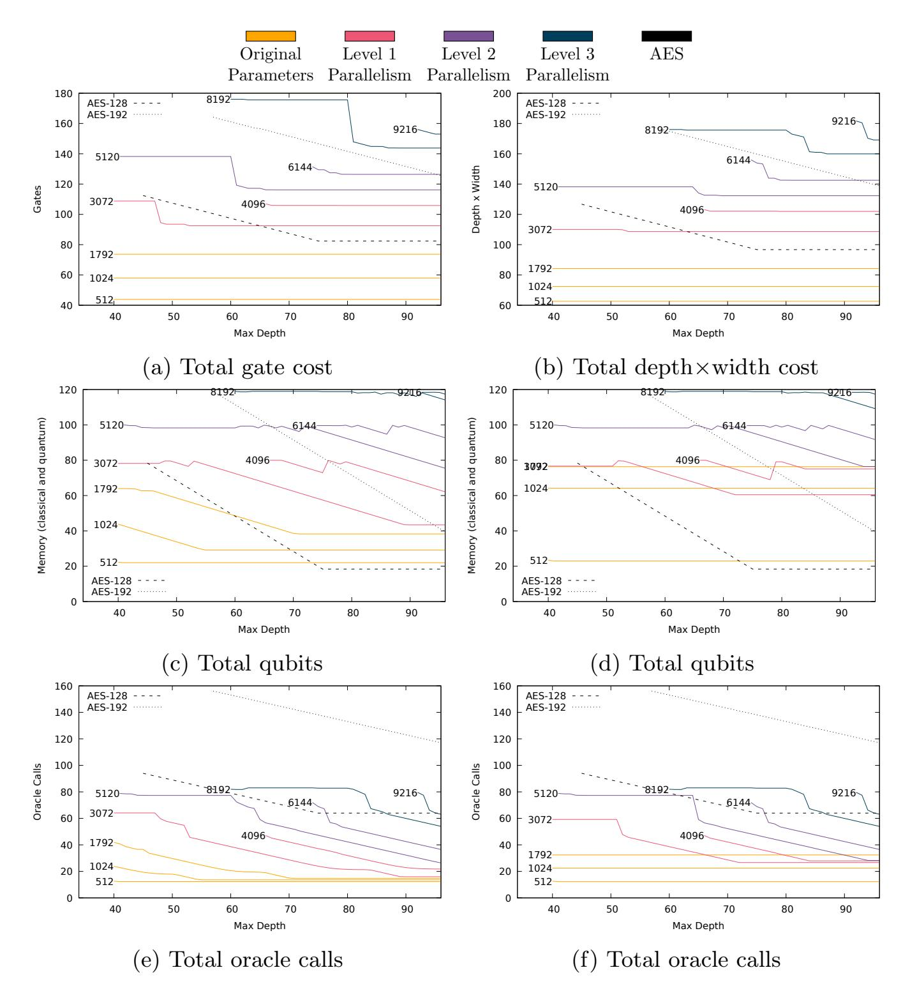
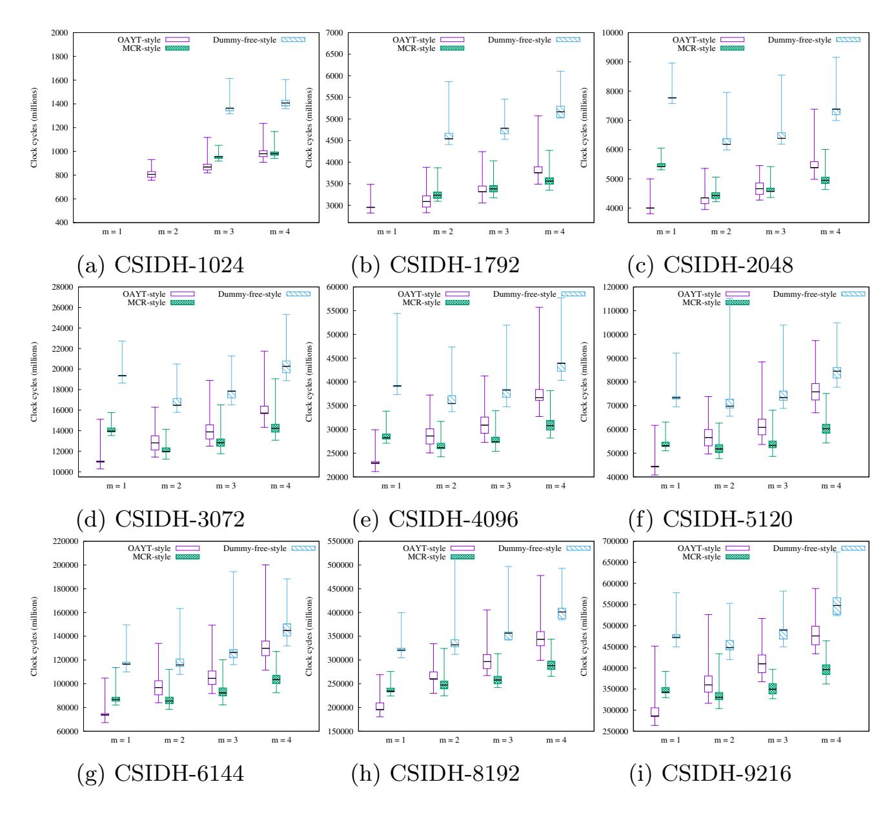
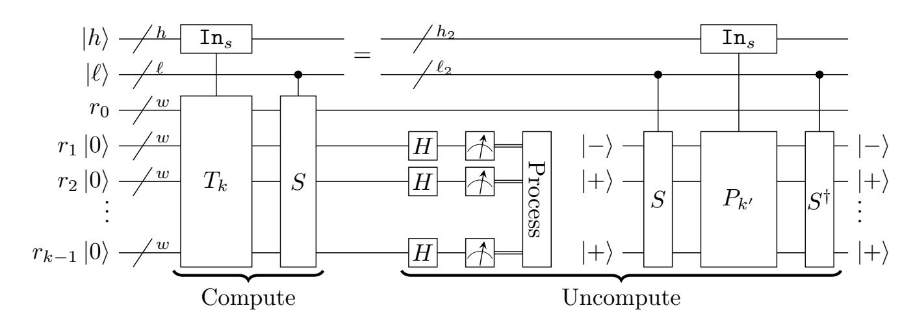
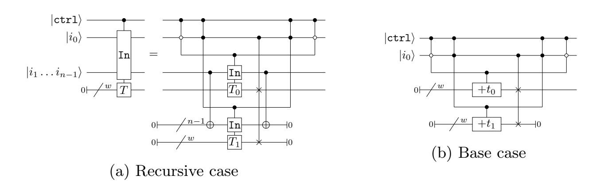
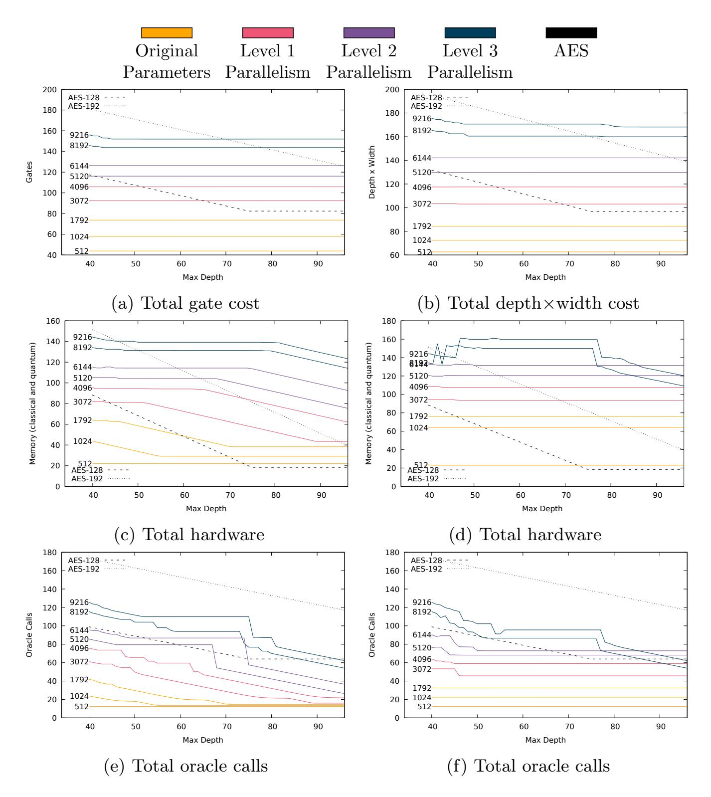
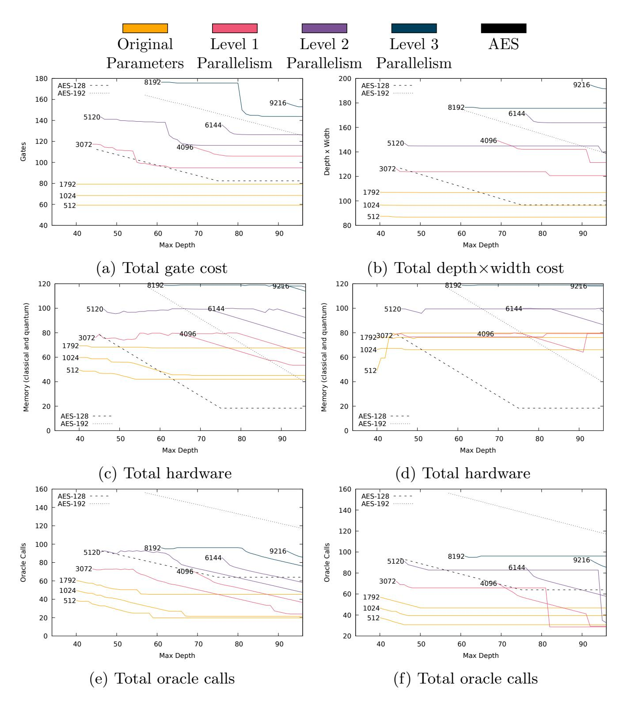

{0}------------------------------------------------

## The SQALE of CSIDH: Sublinear Vélu Quantum-resistant isogeny Action with Low Exponents

Jorge Chávez-Saab ∗3 , Jesús-Javier Chi-Domínguez †1,4, Samuel Jaques ‡2 , and Francisco Rodríguez-Henríquez §3,4

Tampere University, Tampere, Finland Department of Materials, University of Oxford, UK Computer Science Department, Cinvestav IPN, Mexico City, Mexico

4Cryptography Research Centre, Technology Innovation Institute, Abu Dhabi, United Arab Emirates

January 18, 2022

#### Abstract

Recent independent analyses by Bonnetain-Schrottenloher and Peikert in Eurocrypt 2020 significantly reduced the estimated quantum security of the isogeny-based commutative group action key-exchange protocol CSIDH. This paper refines the estimates of a resource-constrained quantum collimation sieve attack to give a precise quantum security to CSIDH. Furthermore, we optimize large CSIDH parameters for performance while still achieving the NIST security levels 1, 2, and 3. Finally, we provide a C-code constant-time implementation of those CSIDH large instantiations using the square-root-complexity Vélu's formulas recently proposed by Bernstein, De Feo, Leroux and Smith.

### 1 Introduction

Based on supersingular elliptic curve isogenies defined over a prime field Fp, the commutative isogeny-based key exchange protocol CSIDH is a promising isogeny-based protocol that has received considerable attention since its proposal in Asiacrypt 2018 by Castryck, Lange, Martindale, Panny and Renes [\[12\]](#page-29-0).

CSIDH can be used analogously to the Diffie-Hellman protocol to produce a non-interactive key exchange scheme between two parties. Moreover, CSIDH can be adapted as the underlying cryptographic primitive for more elaborate

∗jchavez@computacion.cs.cinvestav.mx

† jesus.dominguez@tii.ae

‡ samuel.jaques@materials.ox.ac.uk

§ francisco@cs.cinvestav.mx

{1}------------------------------------------------

applications such as key encapsulation mechanisms, signatures and other primitives. It has remarkably small public keys (in fact, even with the parameter scaling proposed in this paper it still has shorter keys than the four public key encryption round-3 finalists of the NIST post-quantum standardization process [37] 1), and allows a highly efficient key validation procedure. This latter feature aids in making CSIDH better suited than most (if not all) post-quantum schemes for resisting Chosen Ciphertext Attacks (CCA) and for supporting static-dynamic and static-static key exchange settings. On the downside, CSIDH has a significantly higher latency than other isogeny-based protocols such as SIDH and SIKE [3, 32]. Furthermore, as this paper will discuss in detail, several recent analyses revised CSIDH's true quantum security downwards (see for example [11, 39]).

The CSIDH framework considers a set of curves with the same  $\mathbb{F}_p$ -endomorphism ring. Isogenies between curves are represented by ideal classes in this ring, which form a group, so that an ideal  $\mathfrak{a}$  can operate over a curve E to produce a new curve E'. We denote this by  $\mathfrak{a}*E=E'$ , and call it the CSIDH group action. One very appealing feature of the CSIDH group action is its commutative property. This allows one to apply the group action directly to the key exchange between two parties by mimicking the Diffie-Hellman protocol. Starting from a base elliptic curve  $E_0$ , Alice and Bob first need to choose a secret key  $\mathfrak{a}$  and  $\mathfrak{b}$ , respectively. Then they can produce their corresponding public keys by computing the group actions  $E_A = \mathfrak{a}*E_0$  and  $E_B = \mathfrak{b}*E_0$ . After exchanging these public keys and taking advantage of the commutative property of the group action, Alice and Bob can obtain a common secret by calculating  $\mathfrak{a}*E_B = (\mathfrak{a}\cdot\mathfrak{b})*E_0 = (\mathfrak{b}\cdot\mathfrak{a})*E_0 = \mathfrak{b}*E_A$ .

The CSIDH protocol introduced in [12] operates on supersingular elliptic curves  $E/\mathbb{F}_p$  expressed in the Montgomery model as

$$E/\mathbb{F}_p : y^2 = x^3 + Ax^2 + x. \tag{1}$$

Since  $E/\mathbb{F}_p$  is supersingular, one has full control of its order, which is  $\#E(\mathbb{F}_p) = (p+1)$ . The CSIDH protocol chooses p such that  $p+1=4\prod_{i=1}^n \ell_i$ , where  $\ell_1,\ldots,\ell_{n-1}$  are small odd primes. This enables an efficient computation of degree- $\ell_i$  isogenies, which correspond to the group action of ideal  $\mathfrak{l}_i$  of norm  $\ell_i$ . The most demanding computational task of CSIDH is the evaluation of its class group action, which takes as input an elliptic curve  $E_0$ , represented by its A-coefficient, and an ideal class  $\mathfrak{a} = \prod_{i=1}^n \mathfrak{l}_i^{e_i}$ , represented by its list of exponents  $(e_i,\ldots,e_n) \in \llbracket -m\ldots m \rrbracket^n$ . This list of exponents is the CSIDH secret key. The output of the class group action is the A-coefficient of the elliptic curve  $E_A$  defined as,

$$E_A = \mathfrak{a} * E_0 = \mathfrak{l}_1^{e_1} * \dots * \mathfrak{l}_n^{e_n} * E_0.$$
 (2)

The action of each ideal  $\ell_i^{e_i}$  in Equation 2 can be computed by performing  $e_i$  degree- $\ell_i$  isogeny construction operations, for i = 1, ..., n. For practical implementations of CSIDH, constructing and evaluating n degree- $\ell_i$  isogenies, plus up to  $\frac{n(n+1)}{2}$  scalar multiplications by the prime factors  $\ell_i$ , dominate the computational cost [14].

Previous works regularly evaluated and constructed degree- $\ell_i$  isogenies using Vélu's formulae (cf. [29, §2.4] and [43, Theorem 12.16]), which cost  $\approx 6\ell$  field

&lt;sup>1The SIKE protocol, which is also isogeny-based, does have shorter keys than our scaled version of CSIDH, but is classified as an "alternate candidate"

{2}------------------------------------------------

multiplications each. Recently, Bernstein, De Feo, Leroux and Smith presented in [5] a new approach for constructing and evaluating degree- $\ell$  isogenies at a combined cost of just  $\tilde{O}(\sqrt{\ell})$  field multiplications. Later, it was reported in [2] that constant-time CSIDH implementations using 511- and 1023-bit primes were moderately favored by the new algorithm of [5] for evaluating Vélu's formulae.

**CSIDH's Security** The security of CSIDH rests on an analogue of the discrete logarithm problem: given the base elliptic curve  $E_0$  and the public-key elliptic curve  $E_A$  (or  $E_B$ ), deduce the ideal class  $\mathfrak{a}$  (or  $\mathfrak{b}$ ) (see Equation 2).

From a classical perspective, the security of CSIDH is related to the problem of finding an isogeny path from the isogenous supersingular elliptic curves  $E_0$  and  $E_A$ . Now, random-walk-based attacks on the whole class group (of rough size  $\sqrt{p}$ ) have a complexity of  $\tilde{O}(\sqrt[4]{p})$  steps with constant space (for more details see, [19]). Thus, in order to provide a security level of 128 classical bits, the prime p needs to be large enough to support  $2^{256}$  ideal classes, hence the choice of a 512-bit prime in the original CSIDH proposal. The parameter m should then be chosen in such a way that the private key space is also composed of  $2^{256}$  different secret keys, which we heuristically expect to fill nearly all ideal classes.

From a quantum attack perspective, Childs, Jao, and Soukharev tackled in [15] the problem of recovering the secret  $\mathfrak{a}$  from the relation  $E_A = \mathfrak{a} * E_0$ . They managed to reduce this computational task to the abelian hidden-shift problem on the class group, where the hidden shift corresponds to the secret  $\mathfrak{a}$  that one wants to find. Previously in 2003 and 2004, Kuperberg and Regev had presented two sieving algorithms that could solve this problem in subexponential time if they were executed in a quantum setting [31, 40]. In particular, Kuperberg's procedure has a quantum time and space complexity of just exp  $(O(\sqrt{\log p}))$ . Later, in 2011, Kuperberg refined his algorithm by adding a collimation sieving phase [30]. The time complexity of this new variant was still exp  $(O(\sqrt{\log p}))$ , but the quantum space complexity was just  $O(\log p)$ .

In a nutshell, a Kuperberg-like approach for solving the hidden-shift problem consists of two main components:

- 1. A quantum oracle that evaluates the group action on a uniform superposition and produces random  $phase\ vectors$
- 2. A sieving procedure that destructively combines low-quality phase vectors into high-quality phase vectors

The sieving procedure gradually improves the quality of the phase vectors until they can be measured and reveal some bits of the hidden shift, and thus the CSIDH secret key.

Recent analyses of this quantum algorithm that were presented in Eurocrypt 2020 [11, 39], point to a significant reduction of the quantum security provided by CSIDH. Concretely, the original 511-bit prime CSIDH instantiation was deemed to achieve NIST security level 1 in [12]. However, the authors of [11] recommended that the size of the CSIDH prime p should be upgraded to at least 2260 or 5280 bits, according to what they named as aggressive and conservative modes, respectively.

Both [11] and [39] focus on breaking the originally proposed instantiations of CSIDH, rather than an exhaustive analysis of the quantum attack. [11] focuses mainly on Kupberberg's first attack and Regev's attack by providing a

{3}------------------------------------------------

thorough accounting of a quantum group action circuit. [39] gives a thorough practical and theoretical analysis of Kuperberg's second algorithm and provides many optimizations. While [39] simulates the full algorithm to give very precise estimates, this method will not extend to the larger primes we consider here because, by design, even the classical aspects of the attack should be infeasible to compute. We use the results of the theoretical analysis in [39] to count resource use without a full simulation. This allows us to evaluate very large primes and to explore depth-width tradeoffs and thus to compare to NIST's security levels. We argue that for the primes we consider, CSIDH's quantum security depends mainly on the cost of the collimation sieve, not the current isogeny evaluation costs. We investigate the influence of the quantum oracle cost for our recommend prime sizes in Appendix B.

The SQALE of CSIDH We use the acronym SQALE for "Sublinear Vélu Quantum-resistant isogeny Action with Low Exponents". The SQALE of CSIDH is a CSIDH instance such that  $p = 4 \cdot \prod_{i=1}^{n} \ell_i - 1$  is a prime number with small odd primes  $\ell_1, \ldots, \ell_n$ , and the key space size  $N \ll \sqrt{p}$  is determined by using only the  $k \leq n$  smallest  $\ell_i$ 's, where the exponents  $e_i$  of the ideal class  $\mathfrak{a} = \prod_{i=1}^{n} \mathfrak{l}_i^{e_i}$ , are drawn from a small range, possibly  $\{-1,0,1\}$ .

The original CSIDH protocol chose exponents large enough that the key space is approximately equal to the class group. We show in section 2 that a SQALE'd CSIDH preserves classical security. We also argue in section 4 that quantum attackers need to attack the entire class group, regardless of the subset that keys are drawn from, so we can choose low exponents and preserve quantum security as well. With this change, we improve the trade-off between the performance of the key exchange and its quantum security. To further improve performance of the large CSIDH instances considered in this paper, we incorporate the Vélu's improved  $O(\sqrt{\ell})$  algorithm for isogeny computations.

On a related idea, the isogeny-based signature scheme SeaSign presented in [18], uses the notion of lossy keys, where the ideals  $\prod_i \ell_i^{e_i}$  cover only a small part of the class group. The security guarantees of SeaSign are partially based on the computational assumption that is hard to distinguish the special case of lossy keys from uniform ideal classes (see [18, §8.1]).

As an aside, note that increasing the size of the prime makes it impossible to compute the class group with current technology as it has been done with the CSIDH-512 prime to derive related schemes such as the CSI-FiSh signature scheme [8]. Quantum computing would allow for efficient computation of larger class groups in the future, but this does not affect the CSIDH scheme itself and a scheme like CSI-FiSh is incompatible with our idea of low exponents anyways.

**Outline** In this work we present a detailed classical and quantum cryptanalysis of CSIDH and its constant-time C implementation using our revised prime sizes, which, according to our analysis, are required to achieve the NIST security levels 1, 2 and 3.

Section 2 gives background on CSIDH, efficient methods for computing its group action, and the quantum cost models we use. In section 3 we describe the quantum collimation sieve attack and explain how to estimate its cost. We account for larger primes, depth limits, improved memory circuits, and find several small optimizations. The sieve only seems able to attack the full class

{4}------------------------------------------------

| NIST           | CSIDH quantum    | CSIDH prime  | Performance  |  |
|----------------|------------------|--------------|--------------|--|
| Security level | security in bits | size in bits | (gigacycles) |  |
| Level 1        | 124              | 4,096        | 23.2         |  |
| Level 1        | 135              | 5,120        | 42.2         |  |
| Level 2        | 148              | 6,144        | 74.8         |  |
| Level 3        | >160             | 8,192        | 199.1        |  |
| Level 3        | >171             | 9,216        | 292.4        |  |

Table 1: Summary of results. Quantum security is depth×width, including a hardware limit of  $2^{80}$  for Level 1,  $2^{100}$  for Level 2, and  $2^{119}$  for Level 3, as well as a  $2^{10}$  overhead for error correction, and assuming a quantum oracle free of cost (for an analysis of the influence of the quantum oracle cost in our estimates see Appendix B). Performance based on the CSIDH variant OAYT-style (cf. subsection 2.2).

group, and not any smaller generating subset. We give several arguments for this in section 4, ultimately concluding that for a quantum attacker, only the size of the class group affects the total quantum attack cost. These conclusions suggests that an ideal scheme will operate on isogenies of a number of degrees, but with small exponents for each. Section 5 summarizes the quantum and classical security and the effects of hardware limits.

We then give a concrete cost analysis of the CSIDH group action for a key exchange with different sizes of primes p in section 6. We account for different options of the exponent interval m, from the minimal setting [-1 ... 1] (with or without zero) up to the original proposal of [-5 ... 5]. For each interval, we apply the framework reported in [14] to select optimal bounds (different  $m_i$  for each prime) and their corresponding optimal strategies. Starting from the Python-3 CSIDH library reported in [2], we present the first constant-time implementation of large CSIDH instantiations supporting the  $O(\sqrt{\ell})$  isogeny-evaluation algorithm from [5]. Our C library also includes a companion script that estimates quantum attack costs. Our software is freely available from,

https://github.com/JJChiDguez/sqale-csidh-velusqrt.

### 2 Background

This section presents some of the main concepts required for performing classical and quantum attacks on CSIDH.

# 2.1 Construction and evaluation of odd degree isogenies using Vélu Square-root Algorithm

Let  $\ell$  be an odd prime number,  $\mathbb{F}_p$  a finite field of large characteristic, and A a Montgomery coefficient of an elliptic curve  $E_A/\mathbb{F}_p \colon y^2 = x^3 + Ax^2 + x$ . Given an order- $\ell$  point  $P \in E_A(\mathbb{F}_p)$ , the construction of an isogeny  $\phi \colon E_A \mapsto E_{A'}$  of kernel  $\langle P \rangle$  and its evaluation at a point  $Q = (\alpha, \beta) \in E_A(\mathbb{F}_p) \setminus \langle P \rangle$ , consists of the computation of the Montgomery coefficient  $A' \in \mathbb{F}_p$  of the co-domain curve  $E_{A'}/\mathbb{F}_p \colon y^2 = x^3 + A'x^2 + x$  and the x-coordinate  $\phi_x(\alpha)$  of  $\phi(Q)$ .

{5}------------------------------------------------

Using the recent Vélu square-root algorithm (aka  $\sqrt{\text{élu}}$ ) as presented by Bernstein, De Feo, Leroux and Smith in [5], A' and  $\phi_x(\alpha)$  can be computed as (see also [16], [34], [35] and [2]),

$$A' = 2 \frac{1+d}{1-d} \quad \text{and} \quad \phi_x(\alpha) = \alpha^{\ell} \frac{h_S(1/\alpha)^2}{h_S(\alpha)^2},$$
where  $d = \left(\frac{A-2}{A+2}\right)^{\ell} \left(\frac{h_S(1)}{h_S(-1)}\right)^8,$ 

$$S = \{1, 3, \dots, \ell-2\}, \text{ and}$$

$$h_S(X) = \prod_{n \in S} (X - x([n]P)).$$

Hence, the main cost associated to computing A' and  $\phi_x(\alpha)$ , corresponds to the computation of  $h_S(X)$ . Given  $E_A/\mathbb{F}_p$  an order- $\ell$  point  $P \in E_A(\mathbb{F}_p)$ , and some value  $\alpha \in \mathbb{F}_p$  we want to efficiently evaluate the polynomial,

$$h_S(\alpha) = \prod_{i=1}^{\ell-1} (\alpha - x([i]P)).$$

From Lemma 4.3 of [5],

$$(X - x(P + Q))(X - x(P - Q)) = X^{2} + \frac{F_{1}(x(P), x(Q))}{F_{0}(x(P), x(Q))}X + \frac{F_{2}(x(P), x(Q))}{F_{0}(x(P), x(Q))}X + \frac{F_{2}(x(P), x(Q))}{F_{0}(x(P), x(Q))}X + \frac{F_{2}(x(P), x(Q))}{F_{0}(x(P), x(Q))}X + \frac{F_{2}(x(P), x(Q))}{F_{0}(x(P), x(Q))}X + \frac{F_{2}(x(P), x(Q))}{F_{0}(x(P), x(Q))}X + \frac{F_{2}(x(P), x(Q))}{F_{0}(x(P), x(Q))}X + \frac{F_{2}(x(P), x(Q))}{F_{0}(x(P), x(Q))}X + \frac{F_{2}(x(P), x(Q))}{F_{0}(x(P), x(Q))}X + \frac{F_{2}(x(P), x(Q))}{F_{0}(x(P), x(Q))}X + \frac{F_{2}(x(P), x(Q))}{F_{0}(x(P), x(Q))}X + \frac{F_{2}(x(P), x(Q))}{F_{0}(x(P), x(Q))}X + \frac{F_{2}(x(P), x(Q))}{F_{0}(x(P), x(Q))}X + \frac{F_{2}(x(P), x(Q))}{F_{0}(x(P), x(Q))}X + \frac{F_{2}(x(P), x(Q))}{F_{0}(x(P), x(Q))}X + \frac{F_{2}(x(P), x(Q))}{F_{0}(x(P), x(Q))}X + \frac{F_{2}(x(P), x(Q))}{F_{0}(x(P), x(Q))}X + \frac{F_{2}(x(P), x(Q))}{F_{0}(x(P), x(Q))}X + \frac{F_{2}(x(P), x(Q))}{F_{0}(x(P), x(Q))}X + \frac{F_{2}(x(P), x(Q))}{F_{0}(x(P), x(Q))}X + \frac{F_{2}(x(P), x(Q))}{F_{0}(x(P), x(Q))}X + \frac{F_{2}(x(P), x(Q))}{F_{0}(x(P), x(Q))}X + \frac{F_{2}(x(P), x(Q))}{F_{0}(x(P), x(Q))}X + \frac{F_{2}(x(P), x(Q))}{F_{0}(x(P), x(Q))}X + \frac{F_{2}(x(P), x(Q))}{F_{0}(x(P), x(Q))}X + \frac{F_{2}(x(P), x(Q))}{F_{0}(x(P), x(Q))}X + \frac{F_{2}(x(P), x(Q))}{F_{0}(x(P), x(Q))}X + \frac{F_{2}(x(P), x(Q))}{F_{0}(x(P), x(Q))}X + \frac{F_{2}(x(P), x(Q))}{F_{0}(x(P), x(Q))}X + \frac{F_{2}(x(P), x(Q))}{F_{0}(x(P), x(Q))}X + \frac{F_{2}(x(P), x(Q))}{F_{0}(x(P), x(Q))}X + \frac{F_{2}(x(P), x(Q))}{F_{0}(x(P), x(Q))}X + \frac{F_{2}(x(P), x(Q))}{F_{0}(x(P), x(Q))}X + \frac{F_{2}(x(P), x(Q))}{F_{0}(x(P), x(Q))}X + \frac{F_{2}(x(P), x(Q))}{F_{0}(x(P), x(Q))}X + \frac{F_{2}(x(P), x(Q))}{F_{0}(x(P), x(Q))}X + \frac{F_{2}(x(P), x(Q))}{F_{2}(x(P), x(Q))}X + \frac{F_{2}(x(P), x(Q))}{F_{2}(x(P), x(Q))}X + \frac{F_{2}(x(P), x(Q))}{F_{2}(x(P), x(Q))}X + \frac{F_{2}(x(P), x(Q))}{F_{2}(x(P), x(Q))}X + \frac{F_{2}(x(P), x(Q))}{F_{2}(x(P), x(Q))}X + \frac{F_{2}(x(P), x(Q))}{F_{2}(x(P), x(Q))}X + \frac{F_{2}(x(P), x(Q))}{F_{2}(x(P), x(Q))}X + \frac{F_{2}(x(P), x(Q))}{F_{2}(x(P), x(Q))}X + \frac{F_{2}(x(P), x(Q))}{F_{2}(x(P), x(Q))}X + \frac{F_{2}(x(P), x(Q))}{F_{2}(x(P), x(Q))}X + \frac{F_{2}(x(P), x(Q))}{F_{2}($$

where,

$$F_0(Z, X) = Z^2 - 2XZ + X^2;$$
  

$$F_1(Z, X) = -2(XZ^2 + (X^2 + 2A_0X + 1)Z + X);$$
  

$$F_2(Z, X) = X^2Z^2 - 2XZ + 1.$$

This suggests a rearrangement à la Baby-step Giant-step as,

$$h_S(\alpha) = \prod_{i \in \mathcal{I}} \prod_{j \in \mathcal{J}} (\alpha - x([i+s \cdot j]P))(\alpha - x([i-s \cdot j]P)),$$

where s is a fixed integer representing the size of the giant steps and  $\mathcal{I}$ ,  $\mathcal{J}$  are two sets of indices such that  $\mathcal{I} \pm s\mathcal{J}$  covers S.

Now  $h_S(\alpha)$  can be efficiently computed by calculating the resultants of two polynomials in  $\mathbb{F}_p[Z]$ , of the form

$$h_I(Z) := \prod_{x_i \in \mathcal{I}} (Z - x_i)$$

$$E_{J,\alpha}(Z) := \prod_{x_j \in \mathcal{J}} \left( F_0(Z, x_j) \alpha^2 + F_1(Z, x_j) \alpha + F_2(Z, x_j) \right)$$

The most demanding operations of  $\sqrt{\text{élu}}$  require computing four different resultants  $\text{Res}_Z(f(Z), g(Z))$  of two polynomials  $f, g \in \mathbb{F}_p[Z]$ . Those four resultants are computed using a remainder tree approach supported by carefully tailored Karatsuba polynomial multiplications. In practice, the computational cost of computing degree- $\ell$  isogenies using  $\sqrt{\text{élu}}$  is close to  $K(\sqrt{\ell})^{\log_2 3}$  field operations for a constant K. For more details about these computations see [5, 2].

{6}------------------------------------------------

#### 2.2 Summary of CSIDH.

Here, we give a general description of CSIDH. A more detailed description of the CSIDH group action computation can be found in [12, 13, 33, 38].

The most demanding computational task of CSIDH is evaluating its class group action, whose cost is dominated by performing a number of degree- $\ell_i$  isogeny constructions. Roughly speaking, three major variants for computing the CSIDH group action have been proposed, which we briefly outline next.

Let  $\pi: (x,y) \mapsto (x^p,y^p)$  be the Frobenius map and  $N \in \mathbb{Z}$  be a positive integer. Working now with points over the extension field  $\mathbb{F}_{p^2}$ , let E[N] denote the N-torsion subgroup of  $E/\mathbb{F}_{p^2}$  defined as,  $E[N] = \{P \in E(\mathbb{F}_{p^2}) : [N]P = \mathcal{O}\}$ . Let also

$$E[\pi - 1] = \{ P \in E(\mathbb{F}_{p^2}) \colon \pi P = P \}$$

and

$$E[\pi + 1] = \{ P \in E(\mathbb{F}_{p^2}) \colon \pi P = -P \}.$$

Note that  $E[\pi-1]$  corresponds to the original set of  $\mathbb{F}_p$ -rational points, whereas  $E[\pi+1]$  is a set of points of the form (x,iy) where  $x,y\in\mathbb{F}_p$  and  $i=\sqrt{-1}$  so that  $i^p=-i$ . We call  $E[\pi+1]$  the set of zero-trace points.

The MCR-style [33] of evaluating the CSIDH group action takes as input a secret integer vector  $e = (e_1, \ldots, e_n)$  such that  $e_i \in [0 \ldots m]$ . From this input, isogenies with kernel generated by  $P \in E_A[\ell_i] \cap E_A[\pi - 1]$  are constructed for exactly  $e_i$  iterations. In the case of the OAYT-style [38], the exponents are drawn from  $e_i \in [-m \ldots m]$ , and P lies either on  $E_A[\ell_i] \cap E_A[\pi - 1]$  or  $E_A[\ell_i] \cap E_A[\pi + 1]$  (the sign of  $e_i$  determines which one will be used). We stress that for constant-time implementation of CSIDH adopting the MCR and OAYT styles, the group action evaluation starts by constructing isogenies with kernel generated by  $P \in E_A[\ell_i] \cap E_A[\pi - \text{sign }(e_i)]$  for  $e_i$  iterations, followed by dummy isogeny constructions that are performed for the remaining  $(m - e_i)$  iterations.

On the other hand, the dummy-free constant-time CSIDH group action evaluation, proposed in [13], takes as secret integer vector  $e = (e_1, \ldots, e_n)$  such that  $e_i \in \llbracket -m \ldots m \rrbracket$  has the same parity as m. Then, one starts constructing isogenies with kernel generated by  $P \in E_A[\ell_i] \cap E[\pi - \text{sign } (e_i)]$  for exactly  $e_i$  iterations. Thereafter, one alternatingly computes  $E_A[\ell_i] \cap E_A[\pi - 1]$  and  $E_A[\ell_i] \cap E_A[\pi + 1]$  isogenies for the remaining  $m_i - e_i$  iterations (for more details see [13]).

#### 2.3 Quantum computing

We refer to [36] for the basics and notation of quantum computing. Following [26], we treat a quantum computer as a memory peripheral of a classical computer, which can modify the quantum state with certain operations called "gates". We give the cost of a quantum algorithm in terms of these operations (specifically Clifford + T gates), which we treat as a classical computation cost. With this we can directly add and compare quantum and classical costs, since we measure quantum computation costs in classical operations. We use the "DW"-cost, which assumes that the controller must actively correct all the qubits at every time step to prevent decoherence. This means the total cost is proportional to the total number of qubits (the "width"), times the total circuit depth.

We depart from [26] by giving an overhead of  $2^{10}$  classical operations for each unit of DW-cost, to represent the overhead of quantum error correction. With

{7}------------------------------------------------

surface code error correction, every logical qubit is formed of many physical qubits, which continuosly run through measurement cycles. We assume each cycle of each physical qubit is equivalent to a classical operation. By this metric, Shor's algorithm has an overhead of 2 17 for each logical gate [\[22\]](#page-30-6). The algorithm we analyze will need much more error correction, but we assume continuing advances in quantum error correction will reduce this overhead to 2 10. Since a surface code needs to maintain a distance between logical qubits in two physical dimensions and one dimension of time [\[20\]](#page-30-7), we assume the 2 10 overhead is the cube of the code distance, and thus every logical qubit is composed of 2 10· 2 3 physical qubits.

### 3 Quantum Attack

We follow Peikert [\[39\]](#page-32-1) and analyze only Kuperberg's second algorithm [\[30\]](#page-31-3). Because of this, and our assumption that classical operations are only 2 10 times cheaper than quantum, the tradeoffs of [\[9,](#page-29-4) [10\]](#page-29-5) do not help for our analysis.

Kuperberg's algorithm can be divided into 3 stages:

- 1. Constructing phase states, where we compute an arbitrary isogeny action in superposition, perform a quantum Fourier transform, then measure the result. This leaves a single qubit in a random phase state with some associated classical data, which forms the input to the next stage.
- 2. A sieving stage, where we use a process called "collimation" to destructively combine phase states to produce "better" phase states. This requires some quantum arithmetic, but the main costs are quantum access, in superposition, to a large table of classical memory, and subsequent classical computations on this table.
- 3. A measurement stage, where we measure a sufficiently "good" phase state and recover some number of bits of the secret key.

We repeat these steps until we recover enough bits of the secret key to exhaustively search the remainder.

Asymptotically, the sieving stage is the most costly, so we focus on that. In Section [3.6](#page-15-0) we justify our choice to ignore the cost of constructing phase states.

### 3.1 Overview of Kuperberg's algorithm

We start with an abelian group G (the class group) of order N and two injective functions f : G → X and h : G → X such that h(x) = f(x − S) for some secret S. For this description we assume G is cyclic. This is generally untrue for class groups, but a quantum attacker can recover the group structure as a polynomial-cost precomputation (see [\[11,](#page-29-1) Section 4]). They can then decompose the group into cyclic subgroups, perform a quantum Fourier transform on each, and collimate them independently. The total amount of collimation will be the same, so we focus on a cyclic group as it is easier to describe.

For CSIDH, the function f will identify an element of the class group with an isogeny from E0 to some other curve E, and output the j-invariant of that curve. The function h is the same, but starts with a public key curve EA.

{8}------------------------------------------------

To begin, we generate a superposition over G (ignoring normalization),  $\sum_{g \in G} |g\rangle$ . Then we initialize a single qubit in the state  $|+\rangle = |0\rangle + |1\rangle$ , and use it to control applying either f or h:

$$\sum_{g \in G} |0\rangle |g\rangle |f(g)\rangle + |1\rangle |g\rangle |h(g)\rangle \tag{3}$$

Then we measure the final register, finding f(g) = h(g+S) for some g. Because f and h are injective, this leaves only two states in superposition:

$$|0\rangle |g\rangle + |1\rangle |g + S\rangle. \tag{4}$$

This is the ideal state. Naive representations of the group will not produce precisely this state. Section 4.1 explains why our best option is to fix a generator g, and produce superpositions  $\sum_{x=0}^{N-1} |x\rangle |xg\rangle$ , which leads to a final state

$$|0\rangle |x\rangle + |1\rangle |x+s\rangle \tag{5}$$

where S = sg. At this point, we apply a quantum Fourier transform (QFT), modulo the group order N, to produce

$$|0\rangle \sum_{k=0}^{N-1} e^{2\pi i \frac{xk}{N}} |k\rangle + |1\rangle \sum_{j=0}^{N-1} e^{2\pi i \frac{(x+s)j}{N}} |j\rangle.$$
 (6)

Then we measure the final register and find some value b, leaving us with the state

$$|0\rangle e^{2\pi i \frac{xb}{N}} + |1\rangle e^{2\pi i \frac{(x+s)b}{N}} \equiv |0\rangle + e^{2\pi i \frac{sb}{N}} |1\rangle.$$
 (7)

From this point, we define  $\zeta_s^b = e^{2\pi i \frac{bs}{N}}$ . We emphasize that it is critical that the QFT acts as a homomorphism between the elements of the group and phases modulo N, even an approximate homomorphism as in [11].

A classical computer with knowledge of s can easily simulate input phase vectors, and the cost of the remainder of the algorithm is mainly classical. Peikert thus simulated the remaining steps of the algorithm for a precise security estimate [39]. We hope to choose parameters such that the remaining steps are infeasible, so we cannot classically simulate them. Instead we extrapolate Peikert's results to estimate the full cost, with some small algorithmic improvements we now describe.

**Phase vectors with data.** Kuperberg works with states of the form in Equation 7 to save quantum memory; however, we will maintain the factor b in quantum memory.

We define a phase vector with data to have a length L, a height S, an altitude A, and a phase function  $B:[L]\to [S]A$  (defining  $[N]:=\{0,\ldots,N-1\}$  and  $[N]M:=\{0,M,2M,\ldots,M(N-1)\}$ ), as follows:

$$\sum_{j=0}^{L-1} \zeta_s^{B(j)} |j\rangle |B(j)\rangle. \tag{8}$$

The phase function B is known classically.

{9}------------------------------------------------

The vector in Equation 7 almost has this form, with L = 2, B(0) = 0 and B(1) = b (in fact B(0) = 0 for all phase vectors), and S = b. To add the data to it, we simply use the qubit to control a write of the value of b to a new register.

Starting from an initial phase vector with data, we can double its length with a new initial phase vector. We describe the procedure for a power-of-two length, which is much easier, but other lengths are possible with relabelling. We first concatenate the new phase vector, then treat the new qubit as the most significant bit of the index j:

$$\left(\left|0\right\rangle + \zeta_{s}^{b'}\left|1\right\rangle\right) \otimes \left(\sum_{j=0}^{L-1} \zeta_{s}^{B(j)}\left|j\right\rangle \left|B(j)\right\rangle\right)$$

$$= \sum_{j=0}^{L-1} \zeta_{s}^{B(j)}\left|j\right\rangle \left|B(j)\right\rangle + \sum_{j=L}^{2L-1} \zeta_{s}^{B(j-L)+b'}\left|j\right\rangle \left|B(j-L)\right\rangle.$$
(9)

On the left sum, the first bit of j is 0, and on the right sum it is 1. We then redefine the phase function to be  $B':[2L] \to [S+b']$ , where B'(j)=B(j) if j < L and B'(j)=B(j-L)+b' if  $j \geq L$ . To update the phase register, we perform an addition of b', controlled on the first qubit (which is now the leading bit of the index j). The state is now twice as long, at the cost of just one quantum addition, and classical processing of the table of values representing B.

We can produce initial phase vectors with data of length  $L = 2^{\ell}$  by starting with an initial phase vector, adding its phase function to a quantum register, then repeating this doubling process  $\ell - 1$  times. The height of such a vector will be the maximum of  $\ell$  uniformly random values from 0 to  $2^n$ ; we assume this is simply  $2^n$ . The altitude will be the least common multiple of these vectors and we assume this is 1.

The next part of the algorithm is to *collimate* phase vectors until their height equals approximately their length. A collimation takes r phase vectors of some length L, height S, and altitude A, and destructively produces a new phase vector of length L', height S', and altitude A', where S' < S and  $A' \ge A$ . For efficiency, we try to keep L' = L.

Once the height equals the length, say  $S_0$ , we perform a QFT and hopefully recover  $\lg S_0$  bits of the secret s, starting from the bit at  $\lg(A)$ . To recover all of the secret bits, we run the same process but target different bits each time, sequentially or in parallel. Classical simulations show that each run recovers only  $\lg S_0 - 2$  bits on average [39].

Adaptive Strategy. The length of the register in Equation 5, which undergoes the QFT, governs the cost of the sieve. Ideally, after finishing one sieve, we would use the known bits of the secret to reduce the size of the problem. For example, if the group order is  $N = 2^n$  for some n, then if the secret is  $s = s_1 2^k + s_0$  and we know  $s_0$ , we start with a state  $|0\rangle |x\rangle + |1\rangle |x + s \mod 2^n\rangle$  for some random, unknown x. We can subtract  $s_0$  from the second register, controlled by the first qubit, to obtain

$$|0\rangle |x\rangle + |1\rangle |x + s_1 2^k \mod 2^n\rangle$$
 (10)

{10}------------------------------------------------

The least significant k bits of the second register are the same in both states, so we can remove or measure these states, and only apply the QFT to the remaining bits. Then our initial phase vectors start with a height of  $2^{n-k}$ , rather than  $2^n$ .

This is Kuperberg's original technique. Peikert analyzed a non-adapative attack, using a high-bit collimation in case of non-smooth group orders. We remain uncertain whether an attack can be adaptive with a prime-order group. With prime orders, there is little correlation between the bits of x and x + s mod N, even if we know most of the bits of s.

Alternatively, we could represent group elements by exponent vectors. In that case, we end up with the state

$$|0\rangle |\vec{x}\rangle + |1\rangle |\vec{x} + \vec{s} \mod L\rangle$$
 (11)

where L is the lattice representing the kernel of the map from exponent vectors to class group elements. However, a direct, bit-wise QFT does not define a homomorphism from vectors modulo a lattice are to phases (see Section 4.1).

We could try to represent integer exponent vectors  $\vec{x}$  by vectors  $\vec{v}$  such that  $B_L\vec{v}=\vec{x}$ , where  $B_L$  is a matrix of the basis vectors of the lattice. We would find all bits of a single component, then clear that component for future sieves. Since  $\vec{v}=B_L^{-1}\vec{x}$ , and  $B_L^{-1}=\frac{1}{\det(B_L)}\operatorname{adj}(B_L)$ , and the adjugate of an integer matrix is an integer matrix, the smallest non-zero entry of  $B_L^{-1}$  in absolute value is at least  $1/\det(B_L)$ . This means one needs  $\operatorname{lg}\det(B_L)$  bits of precision for each component  $\vec{v}$ . However,  $\det(B_L)=\det(L)=N$ , the size of the class group, so each component is as hard to solve as the entire problem under a generator-based representation, and we still cannot adaptively sieve within each component.

It is possible that adaptive sieving on a prime-order group is inherently difficult. There is a large gap between the classical difficulty of discrete log in a prime-order group compared to a smooth-order group, so a similar gap may exist in the highly similar abelian hidden shift problem. In summary, we assume that partial knowledge of the bits of a secret s in an abelian hidden shift problem gives no advantage in finding unknown bits for groups of prime order. More formally:

**Assumption 3.1.** If it costs C to recover t secret bits in an abelian hidden shift problem for a group of prime order, it will still cost  $\max\{C, O(2^{n-k})\}$  to recover t bits even if k bits out of n are already known.

Each run of the sieve recovers about  $\lg S_0 - 2$  bits on average, so the total number of sieves is  $\frac{\lg N}{\lg S_0 - 2}$ . If this assumption is wrong, then in the worst case, the total sieving cost will be dominated by the first run of the sieve, leading to a reduction of  $\approx 7$  bits of security.

#### 3.2 Collimation

From vectors of length L and height S, we repeatedly *collimate* to a height S' as follows: First we concatenate the vectors and add together their phase functions, which will match the new phase. Addition is done in-place on one of the phase registers. Let  $\vec{j} = (j_1, j_2)$  so that  $|j_1\rangle |j_2\rangle = |\vec{j}\rangle$ , and let  $B(\vec{j}) := B_1(j_1) + B_2(j_2)$ .

{11}------------------------------------------------

The resulting state will be:

$$\sum_{j_{1}=0}^{L-1} \zeta_{s}^{B_{1}(j_{1})} |j_{1}\rangle |B_{1}(j_{1})\rangle \sum_{j_{2}=0}^{L-1} \zeta_{s}^{B_{2}(j_{2})} |j_{2}\rangle |B_{1}(j_{1}) + B_{2}(j_{2})\rangle$$

$$= \sum_{j_{1},j_{2}=0}^{L-1} \zeta_{s}^{B(\vec{j})} |\vec{j}\rangle |B_{1}(j_{1})\rangle |B(\vec{j})\rangle. \tag{12}$$

Then we divide  $B(\vec{j})$  by S' and compute the remainder and modulus:

$$\sum_{j_1, j_2 = 0}^{L-1} \zeta_s^{B(\vec{j})} \left| \vec{j} \right\rangle |B_1(j_1)\rangle \left| \left\lfloor \frac{B(\vec{j})}{S'} \right\rfloor \right\rangle \left| B(\vec{j}) \mod S' \right\rangle. \tag{13}$$

We then measure the value of  $\left\lfloor \frac{B(\vec{j})}{S'} \right\rfloor$ , which gives some value K. Let  $J \subseteq L \times L$  be the set of indices  $j_1$  and  $j_2$  such that  $\left\lfloor \frac{B_1(j_1) + B_2(j_2)}{S'} \right\rfloor = K$ . Since we know K,  $B_1$ , and  $B_2$  classically, we can find find the set J and use it to construct a permutation  $\pi: J \to [L']$ , where L' = |J|. Defining a new phase function  $B': [L'] \to [S/S']$  where  $B'(j) = B(\pi^{-1}(j)) \mod S'$ , we find that  $B(\vec{j}) = K + B'(\pi(\vec{j}))$  for all  $\vec{j} \in J$ . Equation 14 shows that the factor of K only introduces a global phase and thus we can ignore it.

We now fix the phase vector that was left after measurement. First, we must erase  $B_1(j_1)$ . We use a quantum random access classical memory (QRACM) look-up uncomputation, which only needs to look up values of  $j_1$  which are part of a pair in J. We expect L' such values.

Then we compute  $\pi(\vec{j})$  in another register. This is a QRACM look-up from a table of L' indices with words of size  $\lg L'$ . Letting  $j' = \pi(\vec{j})$ , this leaves the state

$$\sum_{\vec{j} \in J} \zeta_s^{B(\vec{j})} \left| \vec{j} \right\rangle \left| \pi(\vec{j}) \right\rangle \left| B(\vec{j}) \mod S' \right\rangle$$

$$= \sum_{j'=0}^{L'-1} \zeta_s^{K+B'(j')} \left| \pi^{-1}(j') \right\rangle \left| j' \right\rangle \left| B'(j') \right\rangle$$
(14)

We now do a QRACM look-up uncomputation in a table of L' indices to erase  $\pi^{-1}(j')$ .

This technique is analogous with r > 2. We uncompute  $B_1(j_1)$ ,  $B_2(j_2)$ , ...,  $B_{r-1}(j_{r-1})$  with a *single* look-up. We can do this because each value of  $j_i$  that appears in a tuple in J likely appears in a unique tuple, since there are only L possible values of  $j_i$  and it appears in  $L_i$  tuples. Since this is an uncomputation, the extra word size is irrelevant [4]. The greatest cost here seems to be computing the permutation  $\pi$ .

**QRAM.** Collimations repeatedly perform look-ups in quantum random access classical memory (QRACM), also known as quantum read-only memory (QROM). Given a large table of classical data  $T = [t_0, \ldots, t_{n-1}]$  of w-bit words, we want a circuit to perform the following:

$$|i\rangle |0\rangle \mapsto |i\rangle |t_i\rangle \,. \tag{15}$$

{12}------------------------------------------------

The simplest method is a sequential look-up from Babbush *et al.* [4], while Berry *et al.* [7] provide a version that parallelizes nicely. Beyond the minimum depth of that circuit, we use a wide circuit, Figure 4. Our cost estimation checks the cost of each of these circuits and chooses whichever has the lowest cost under each depth constraint; often this is Berry *et al.*'s circuit with  $k \approx 8$ . For a detailed analysis of the costs of these circuits, see Appendix A.

#### 3.3 Permutation

To compute the permutation  $\pi$ , we start with r sorted lists of L elements in the range [S]. We want to find *all* tuples that add up to a specified value K in [rS]. For our estimation, we checked the cost of three different approaches and different r and chose the cheapest, which was often r = 2.

**Problem 3.1** (Collimation permutation). Let L,  $S_1$ , and  $S_2$  be integers such that  $S_1 \gg S_2 \gg L$ . On an input of r sorted lists  $B_1, \ldots, B_r$  of L random numbers from 0 to  $S_1$  and an integer K, list all r-tuples from  $B_1 \times \cdots \times B_r$  such that their sum is in  $\{KS_2, KS_2 + 1, \ldots, KS_2 + S_2 - 1\}$ .

One approach is to iterate through all (r-1)-tuples of elements from  $B_1$  to  $B_{r-1}$ , compute the sum for each tuple, then search through  $B_r$  to find all elements that produce a sum in the correct range. This has a cost of approximately  $L^{r-1} \lg L$ , since we expect to check only  $1/L^{r-1}$  elements in  $B_r$  for each (r-1)-tuple. With appropriate read-write controls, this parallelizes perfectly.

The structure of the sieve guarantees  $S_2 \geq L^r$  for all but the final collimation. This means we cannot guess a value for the sum of the first r/2 lists, then search for a matching sum in the remaining lists, because we would need to guess  $\frac{r}{2}S_2$  values, raising the cost over  $L^r$ . This prevents divide-and-conquer strategies like with a subset-sum, as in [10].

A lower-cost but memory intensive algorithm first merges s of the lists into a single sorted list of  $L^s$  s-tuples and their sums, at cost  $L^s(s \lg L)$ . Then it exhaustively searches the remaining  $L^{r-s}$  tuples, and searches for matches in the merged, sorted list. The total cost is  $O(L^s + L^{r-s}s \lg L)$ . We choose  $s = \lfloor r/2 \rfloor$ .

We assume both classical approaches parallelize perfectly, but we track the total numbers of classical processors required to fit in any depth limit.

**Grover's algorithm.** A simple quantum approach is Grover's algorithm, searching through the set of  $L^r$  r-tuples for those whose sum is in the correct range. This requires  $O(L^{r/2})$  iterations, but each iteration requires r look-ups, which each cost O(L). Each Grover search returns 1 possible tuple, creating a coupon-collector problem, so we repeat the Grover search  $L \lg L$  times. The cost thus grows as  $L^{\frac{r+3}{2}} \lg L$ , which improves on the classical approach for  $r \geq 5$ .

The cost of Grover's algorithm gets much worse under a depth limit. Grover oracles should minimize their depth as much as possible, and since the look-up circuits parallelize almost perfectly, we analyze only the wide look-up as a Grover oracle subroutine. We assume the  $L \lg L$  search repetitions are parallel as well.

{13}------------------------------------------------

### 3.4 Sieving

To find the cost of each sieve repetition, we first find the depth of the tree of sieves. First we follow [23] to derive some facts about the distribution of phase vectors after sieving. Let  $K = \{K_1, \ldots, K_s\}$  be all possible measurement results from collimation. We treat each of the  $L^r$  states in superposition as i.i.d. random variables  $X_i$  with values in K, defining  $p_i = \mathbb{P}[X = K_i]$ . Since the states are in uniform superposition, we imagine that measurement selects one such state  $X_j$ . Let  $W_j$  be the number of other states in the superposition with the same value as  $X_j$ ; it equals  $1 + \sum_{i \neq j} 1_{X_i = X_j}$ . Conditioning on  $X_j = K_m$  gives us

$$W_j|(X_j = K_m) = 1 + \sum_{i \neq j} 1_{X_i = K_m} \sim 1 + \text{Bin}(L^r - 1, p_m).$$

This means

$$\mathbb{P}[W_j = w] = \sum_{m=1}^{s} \mathbb{P}[W_j = w | X_j = K_m] \mathbb{P}[X_j = K_m]$$
$$= \binom{L^r - 1}{w - 1} \sum_{m=1}^{s} p_m^w (1 - p_m)^{L^r - w}. \tag{16}$$

The size of the collimated list is the expected value of  $W_j$ :

$$\mathbb{E}[W_j] = \sum_{w=0}^{L^r} w \binom{L^r - 1}{w - 1} \sum_{m=1}^s p_m^w (1 - p_m)^{L^r - w}$$
(17)

$$= \sum_{m=1}^{s} \frac{1}{L^{r}} \underbrace{\sum_{w=0}^{L^{r}} \binom{L^{r}}{w} w^{2} p_{m}^{w} (1 - p_{m})^{L^{r} - w}}_{(A_{m})}$$
(18)

In the first layer of collimation X is uniformly random so  $p_m = \frac{S_1}{S_0}$  and  $W_j$  is binomial, giving  $\mathbb{E}[W_j] = \frac{S_1}{S_0}(L^r - 1) + 1$ .

 $(A_m)$  is the expected value of the square of  $Bin(L^r, p_m)$ , implying  $\mathbb{E}[W_j]$  equals

$$\sum_{m=1}^{s} \frac{1}{L^r} \left( (L^{2r} + L^r) p_m^2 - L_r p_m \right) = (L^r + 1) \sum_{m=1}^{s} p_m^2 - 1.$$

To find  $p_m$  for later collimations, we assume X is a sum of r i.i.d. uniformly random variables with values in [0, ..., s] where  $s = S_i/S_{i+1}$ . By the central limit theorem this converges to a  $N(r\mu, r\sigma^2)$  random variable, where  $\mu = s/2$  and  $\sigma^2 \approx \frac{s^2}{12}$ .

We approximate  $\sum_{m=1}^{s} p_m^2$  as the integral of the square of the probability density function for  $N(\mu, \sigma^2)$ , which is  $\frac{1}{2\sqrt{\pi}\sigma}$ . This gives us

$$\mathbb{E}[W_j] \approx (L^r + 1) \frac{\sqrt{3}}{\sqrt{r\pi}s} - 1. \tag{19}$$

This means the size of a new list is approximately  $\frac{S_{i+1}}{S_i}\sqrt{\frac{3}{r\pi}}L^r$ . We use  $c_r:=\sqrt{\frac{3}{r\pi}}$  as an "adjustor". Peikert takes this as  $\frac{2}{3}$  for r=2. Using the central

{14}------------------------------------------------

limit theorem might be innacurate for small r, but in fact our adjustor gives  $\approx 0.69$  for r = 2, so we assume it is also accurate for  $r \geq 3$ .

This derivation replicates Peikert's result that each collimation reduces the height by a multiplicative factor of  $L^{r-1}c_r$ , with a more precise expression for  $c_r$ .

We start with a height of  $N = \sqrt{p}$  and we want to reach a height of  $S_0$ , so the height of the tree must be

$$h = \left\lceil \frac{\lg(N/S_0)}{\lg(L^{r-1}/c_r)} \right\rceil. \tag{20}$$

Because of the rounding, we might need vectors of length less than L in the initial layer. Thus, we recalculate: The height of the phase vectors in the second layer (after the first collimation) must be  $S_{h-1} = S_0(L^{r-1}/c_r)^{h-1}$ .

The top layer has height  $S_h = N$ , the height of random new phase vectors. Since  $S_{h-1}/S_h$  is larger than any other layer, the phase vectors in the top layer only need a length  $L_0$  which is less than L. Following Section 3.3.1 of Peikert and the previous derivation, the sieve requires  $L_0 = (L \frac{N}{S_{h-1}})^{1/r}$ . For this top layer we do not have the adjusting factor of  $c_r$  because the sum of r uniformly random values up to N, modulo N, will still be uniformly random.

This tells us how many oracle calls must be performed: There will be  $r^h$  leaf nodes in the tree, and each one must have length  $L_0$ . We adjust this slightly: Since each layer has some probability of failing, we divide this total by  $(1 - \delta)^h$  for  $\delta = 0.02$ , which is an empirical value from Peikert. We also add a  $2^{0.3}$  "fudge factor" from Peikert. The above analysis gives the number of oracle calls.

#### 3.5 Fitting the sieve in a depth limit

We focus on NIST's security levels, which have a fixed limit MAXDEPTH on circuit depth, forcing the sieve to parallelize. The full algorithm consists of recursive sieving steps, producing a tree, where we collimate nodes together at one level to produce a node at the the next level. This parallelizes extremely well, though a tree of height h must do at least h sequential collimations.

From this, we use  $\mathtt{MAXDEPTH}/h$  as the depth limit for each collimation. The cost of collimation is mainly QRACM look-ups, which parallelize almost perfectly (see Appendix A).

If each collimation has depth  $d_c$  and the tree has height h, then MAXDEPTH –  $hd_c$  is the maximum depth available for oracle calls. We divide this by the depth for each oracle call,  $d_o$ , and then by the number of total oracle calls. This determines the number of oracle calls one must make simultaneously.

We also check whether collimation must be parallelized. We compute the total number of collimations in the tree, then multiply this by the depth of each collimation. Since one can start collimating as soon as the first oracle calls are done, the depth available for collimating is MAXDEPTH  $-d_o$ . This tells us how many parallel oracle calls the sieve must make,  $P_o$ , and the number of parallel collimations,  $P_c$ .

If  $P_o > \lg(L_0)P_c$ , then we will need to store extra phase vectors. We compute the depth to finish all the oracle calls, then subtract the number of phase vectors that are collimated in that time, to find the number that must be stored.

If  $P_o \leq \lg(L_0)P_c$ , the algorithm cannot parallelize the collimation as much as required, because the input rate of phase vectors is too low. Hence, we must

{15}------------------------------------------------

increase  $P_o$  to  $\lg(L_0)P_c$ . This slightly overestimates the oracle's parallelization, since we can occupy the collimation circuits by collimating at higher levels in the tree, but since the number of vectors in successive levels of the tree decreases exponentially, we expect negligible impact.

#### 3.6 Oracle costs

We propose that the cost of the oracle is the most likely factor for future algorithmic improvements to reduce CSIDH quantum security. Any improvement in basic quantum arithmetic will apply to computing the CSIDH group action in superposition; thus, using estimates from current quantum arithmetic techniques like [11], will almost certainly overestimate costs (indeed, the costs they reference have since been reduced [24]). The alternative approach of [6] was to produce a classical constant-time implementation to give a lower bound on cost, since latency, reversibility, and fault tolerance will add significant overheads.

However, there is some possibility that quantum implementations may be cheaper than reversible classical methods. A prominent example is the recent idea of "ghost pebbles" [21], which shows that the lower bounds on the costs of reversibly computing classical straight-line programs [28] do not hold for quantum computers.

We give some rough estimates for the oracle cost here. We start with [6] and assume the number of non-linear bit operations scales quadratically with the size of the prime. The  $\sqrt{\text{élu}}$  memory costs  $8b + 3b \log_2 b$  field elements, where  $b \approx \sqrt{\ell_{max}} \approx \sqrt{\frac{\log p}{\log \log p}}$  is the largest isogeny computed. Each field element is  $\log_2 p$  bits. We assume that this is enough to hold the "state" of the group action evaluation, and thus we can apply straight-line ghost pebbling techniques. This is likely not optimal but it is a first approximation. We assume that the depth is equal to the number of operations, though with perfect parallelization up to a factor of  $\log_2 p$ . We treat each non-linear bit operation as a quantum AND gate, and do not include linear bit operation costs.

**Pebbling.** Reversible computers cannot delete memory, and "pebbling" is the process of managing a limited amount of memory ("pebbles") to compute a program. We refer to [28] for details. Ghost pebbling [21] is a quantum technique where we measure a state in the  $\{|+\rangle, |-\rangle\}$ -basis, which releases the qubits but may add an unwanted phase that must be cleaned up. For our purposes, a pebble will be a state of many qubits, so with near certainty, a measurement-based uncomputation will leave a phase that we need to remove.

Our strategy is as follows: Suppose we have enough qubits to hold s states simultaneously and n steps remaining in the program. From one state we can compute the next step, uncompute the previous state with measurements, and then repeat this; this only requires 2 states at a time. As a base case for s = 3, this gives the "Constant Space" strategy from [21], which requires  $\frac{n(n+1)}{2}$  steps. In fact we only need 2 states, since we either consider the final state separately from this accounting, or we only need to clear the phase from the final state.

For a recursive strategy, we pick some k < n, and repeat the 2-states-at-atime method to reach step n - k. We then recurse with s - 1 states for the final k steps, then uncompute the state at step n - k with a measurement. To clean up the phase from this measurement, we repeat the 2-states-at-a-time to reach

{16}------------------------------------------------

Table 2: Estimated CSIDH group action oracle costs in log base 2, including  $2^{10}$  overhead for total cost and  $2^{6.7}$  hardware overhead for each logical qubit.

| Prime Size | Logical Operations | Depth | Hardware | $\mathbf{Cost} \\ (DW)$ |
|---------------|-----------------------|-------|----------|-------------------------|
| 512           | 44.9                  | 44.0  | 26.5     | 73.4                    |
| 1024          | 46.9                  | 46.0  | 28.0     | 77.4                    |
| 1792          | 48.5                  | 47.6  | 29.3     | 80.3                    |
| 3072          | 50.1                  | 49.2  | 30.6     | 83.1                    |
| 4096          | 50.9                  | 50.0  | 31.2     | 84.6                    |
| 5120          | 51.6                  | 50.6  | 31.8     | 85.7                    |
| 6144          | 52.1                  | 51.2  | 32.2     | 86.7                    |
| 8192          | 52.9                  | 52.0  | 32.8     | 88.2                    |
| 9216          | 53.2                  | 52.3  | 33.1     | 88.8                    |

step n-2k, then recurse for the next k steps. We repeat this process until all phases are removed.

If C(k, s-1) is the cost for the recursive step, this has total cost

$$\left\lceil \frac{n}{k} \right\rceil C(k, s - 1) + \sum_{i=0}^{\left\lfloor \frac{n}{k} \right\rfloor} ik. \tag{21}$$

Based on some simple optimization, we choose  $k=n^{\frac{s-1}{s}}$ . We find the total costs numerically, and test initial values of s between  $\frac{1}{2} \lg n$  and  $5 \lg n$  to find an optimal value. Table 2 gives the costs of one call to the oracle.

### 4 Security of Low Exponents

One of our main contributions is low exponents as secret keys. Our key space is thus a small subset of the class group. We believe that this extra information does not help a quantum adversary, for the following reasons:

- 1. The representation of group elements as a bitstring must be homomorphic to bitstrings representing integers;
- 2. Creating an incomplete superposition of states will not produce properly formed phase vectors; and
- 3. Incorrect phase vectors as input are likely undetectable, uncorrectable, and quickly render the sieve useless.

We will explain each point in detail. These support our main assumptions:

- Quantum adversaries will still need to search the entire class group;
- The oracle for a quantum adversary will need to evaluate arbitrary group actions, not just small exponents.

{17}------------------------------------------------

Both points mean that the quantum security depends only on the size of the class group, not the size of the subset we draw keys from. Importantly, these assumptions fail if we restrict the keys to a small sub *group* of the class group. It is critical that the subset of keys generates the entire class group.

### 4.1 Group Representations

To create the input states, we must use a QFT which computes a homomorphism between elements of the group and phases of quantum states. Circuits to do this are well-known only for modular integers, represented as bitstrings. With a different representation of group elements (e.g., vectors in lattice), we either need a custom-built QFT circuit for that representation, or we first change the representation to modular integers. However, a custom-built QFT is equivalent to a change of representation: we could apply the custom QFT, then the inverse of the usual QFT to integers, and this will map our group elements to modular integers.

This seems to restrict us to representing elements of the class group as multiples of a generator. We might be able to reduce the cost of the search if we only used small multiples of this generator; however, low exponents do not correspond to small multiples. Hence, the exponent vectors will likely be indistinguishable from random multiples of the generator.

The state before the QFT has the form  $|0\rangle |x\rangle + |1\rangle |x+s\rangle$ , where x is the coefficient of the generator for the group element that we measured. Hence, if x is randomly distributed, we will still need  $\lg |G|$  qubits to represent it, and the QFT will produce random phase vectors of height up to |G|. Since the cost of the sieve is governed by the height of the input phase vectors, the cost of the sieve will be the same.

In short, to exploit the fact that secrets are restricted, we require a representation of group elements that can be homomorphically compressed to fewer than  $\lg |G|$  qubits. We see no method to do this.

#### 4.2 Incomplete Superpositions

The first step of producing phase vectors involves a superposition over all of G. If we know that the secret s is in a smaller subset  $H_1 \subseteq G$ , we could instead sample from  $H_1$ . We could even sample from another set  $H_0$  for f, though it must be the same size for the normalization to match. This produces a superposition

$$|0\rangle \sum_{g \in H_0} |g\rangle |f(g)\rangle + |1\rangle \sum_{g \in H_1} |g\rangle |h(g)\rangle.$$
 (22)

Measuring the final register returns a particular value z = f(g) for some  $g \in H_0$  or z = h(g) = f(g - S) for some  $g \in H_1$ . Let  $Z = f(H_0) \cup h(H_1)$ , and partition it into 3 subsets:  $Z_0 = f(H_0) \setminus h(H_1)$ ,  $Z_+ = f(H_0) \cap h(H_1)$ , and  $Z_1 = h(H_1) \setminus f(H_0)$ . If we measure  $z \in Z_0$ , then the state after the QFT is just  $|0\rangle$ , since there was no value  $g \in H_1$  such that h(g) = z. Similarly, measuring  $z \in Z_1$  leaves the state  $|1\rangle$ . Only if we measure  $z \in Z_+$  will we have a "successful" phase vector, i.e., one that is not just  $|0\rangle$  or  $|1\rangle$  and has some information about s.

{18}------------------------------------------------

The size of  $Z_+$  is  $|H_0 \cap (S + H_1)| \le |H_0|$ , and the probability of measuring  $z \in Z_+$  is  $|Z_+|/|H_0|$ . Choosing  $H_0$  and  $H_1$  to make this probability large, without knowing S, seems very challenging. For example:

**Theorem 4.1.** If we generate a uniform superposition of exponent vectors with elements in  $\{-m, \ldots, +m\}$ , then for a key in  $\{-1, 1\}^n$ , the probability of a successful phase vector is

$$\left(\frac{2m}{2m+1}\right)^n. (23)$$

*Proof.* There are  $2(2m+1)^n$  states in superposition when we measure:  $(2m+1)^n$  exponent vectors in superposition for each value  $|0\rangle$  or  $|1\rangle$  of the leading qubit. Each state has equal probability. We measure curves, meaning that a curve reached by both  $E_0$  and  $E_1$  is twice as likely as a curve reached by only one or the other.

For small m, the set of curves reached by  $E_0$  is close to a bijection with a hypercube of exponent vectors of width (2m+1) and centered at 0. The set of curves reached by  $E_1$  is in bijection with a hypercube of exponent vectors of the same width centered at s, the exponent vector of the secret key. The intersection of these hypercubes has volume  $(2m)^n$ , giving Equation 23.

### 4.3 Effects of Incomplete Superpositions

We define a defective phase vector with fidelity q of length L as a triple  $(B, J, |\phi\rangle)$ , where  $B: \{0, \ldots, L\} \to [N]$  is classically known,  $J \subseteq [L]$  is not classically known and |J| = qL, and

$$|\phi\rangle = \sum_{j \in J} \zeta_s^{B(j)} |j\rangle.$$
 (24)

If we measure a  $|0\rangle$  or  $|1\rangle$  state from an oracle that produces incomplete superpositions, then  $q=\frac{1}{2},\,B(1)=b,$  but B(0)=0 and  $J=\{0\}$  or  $J=\{1\}.$ 

In short, a phase vector with q < 1 is one where our classical beliefs about the set of phases in superposition are wrong. We know the function B correctly, but it only matches the real state on the unknown subset J. The issue is that the oracle cannot tell us the fidelity of a new phase vector; our measurements do not tell us whether we succeeded or not.

We call this fidelity because it represents quantum fidelity with respect to the state we believe we have, given the classical information of the function B. This means that if k input phase vectors are defective, the fidelity of the entire input state degrades to  $2^{-k}$ . If our final phase vector before measurement has fidelity q with respect to the state we want, then q is the probability of measuring the same result [36, Section 9.2.2]. As a rough argument for why fidelity must be high, even if the QFT partitions the noise so that the high-order bits always give an accurate result, but the low order bits are uniformly random, then at least k bits must be uniformly random if the probability of a correct measurement is  $2^{-k}$ .

Hence, if our input states have fidelity q, we need the fidelity to increase by the time we reach the final state. Quantum circuits without measurement are unitary operations and thus preserve fidelity, but measurements may increase it, so we first argue that collimation does not appreciably increase the fidelity.

{19}------------------------------------------------

**Theorem 4.2.** Starting with an initial phase vector of length L and fidelity  $q < \frac{1}{2}$ , with height S, if we collimate to a new height S', the resulting phase vector is a new defective phase vector with expected fidelity at most

$$q + 4\sqrt{\frac{\ln(L')}{L'}},\tag{25}$$

for  $L' := \frac{S}{S'} Lq \ge 40$ .

*Proof.* The probability of measuring any phase is uniform in the first collimation. This means  $p_m$  is constant in Equation 16, so the length of any state after measurement, which we denote X, has distribution 1 + Bin(|J| - 1, S'/S) = 1 + Bin(qL - 1, p) for p = S'/S and qL = |J|. The length of phases that we incorrectly believe we have will have distribution  $Y \sim \text{Bin}(L - qL, p)$ .

The fidelity of the measured state is  $\frac{X}{X+Y}$ . We use Chernoff bounds to concentrate X and Y to be within a factor of  $(1 \pm \delta)$  of their means, except with probability  $\epsilon := 2 \exp(-\mathbb{E}[x]\delta^2/3) + 2 \exp(-\mathbb{E}[y]\delta^2/3)$ . With  $\delta = \sqrt{3 \ln(L')/L'}$ , since  $q < \frac{1}{2}$ , this gives  $\epsilon < \frac{5}{L'}$ .

We know  $\frac{X}{X+Y} \leq 1$  so we can bound  $\mathbb{E}[\frac{X}{X+Y}]$  as

$$\mathbb{E}\left[\frac{X}{X+Y}\right] \le \frac{1+\delta}{1-\delta} \frac{p(qL-1)+1}{p(qL-1)+1+p(L-qL)} + \epsilon. \tag{26}$$

With careful rearranging we find

$$q + \frac{q}{L'} + 2\sqrt{3}\sqrt{\frac{\ln(L')}{L'}} + \frac{5}{L'}.$$
 (27)

For sufficiently large L' this fits the required bound.

Theorem 4.2 shows that for small q, the fidelity increases only linearly with each collimation. The factor of L' is approximately equal to the *actual* number of states in superposition in the collimated phase vector. Each phase vector is only collimated once for each level of the tree and there are only  $\approx 2^7$  sequential collimations, even at very large prime sizes. Hence, even if collimation is helpful, it would only remove the noise from  $\approx 7$  defective input phase vectors. Each sieving run over a 6144-bit prime needs  $2^{76}$  input phase vectors and recovers 39 bits of the secret. This means we would need fidelity greater than  $2^{-38}$  to gain any information, so we would need the probability of failure for each input vector to be at most  $2^{-31}$ . Given Theorem 4.1, this nearly rules out sampling low exponents.

Since sieving is ineffective, can we instead take many phase vectors, some of which may be defective, and produce good vectors? We summarize this as the following problem:

**Problem 4.1** (Probabilistic Phase Vector Distillation (PPVD)). Let s be an unknown secret value. As input, there are n input states  $|\phi_k\rangle$  with labels k, such that with probability p,  $|\phi_k\rangle = |0\rangle + e^{iks/N} |1\rangle$ , with probability  $\frac{1-p}{2}$ ,  $|\phi_k\rangle = |0\rangle$ , and with probability  $\frac{1-p}{2}$ ,  $|\phi_k\rangle = |1\rangle$ .

With some probability  $\epsilon$ , either output 0 for failure or output 1 and t states  $|\phi_{j_1}\rangle, \ldots, |\phi_{j_t}\rangle$  and their associated phase multipliers  $j_i$ , such that, for all i:

$$|\phi_{j_i}\rangle = |0\rangle + e^{ij_i s/N} |1\rangle.$$
 (28)

{20}------------------------------------------------

The PPVD problem cannot be solved with  $\epsilon > 0$  for n = 1:

**Lemma 4.1.** There is no quantum channel (circuit plus measurement) that distinguishes a single phase vector from  $|0\rangle$  or  $|1\rangle$  without calling the group oracle or learning the secret s.

Proof. Suppose such a quantum channel  $\Phi$  exists. Since the states we want to distinguish are constrained to a 2-dimensional subspace, any measurement will produce a state in a 1-dimensional space, which is a single vector. Since we want the output to be a phase vector, our measurement must produce a valid phase vector  $|\phi'\rangle$ . Suppose  $|\phi'\rangle$  has some associated phase j. The vector  $|\phi'\rangle$  is the basis of our measurement, and thus cannot depend on the input states nor the secret s, since we assume we do not learn s. Hence, for an input  $|\phi\rangle = |0\rangle + e^{iks/N} |1\rangle$ , the secret is s, so we require  $|\phi'\rangle = |0\rangle + e^{ijs/N} |1\rangle$ . But if we instead had an input for a secret  $s' \neq s$ , then  $|\phi'\rangle$  is not a correct phase vector.

The argument of Lemma 4.1 does not readily extend to n > 1, but we assume that similar arguments exist. The central issue is that our distillation process must project inputs onto phase vectors that are correct for an unknown secret phase multiplier s. We see no way to do this without learning s and without being able to produce correct phase vectors from "blank" inputs of  $|0\rangle$  and  $|1\rangle$ . Either of these cases implies a more efficient solution to the dihedral hidden subgroup problem. We make that last statement more precise and argue that we cannot expect to "gain" phase vectors on average:

**Lemma 4.2.** If the collimation sieve gives the optimal query complexity for the dihedral hidden subgroup problem, then no process can solve PPVD with  $t\epsilon > pn$ .

*Proof.* For a contradiction, let  $t\epsilon > pn$ . Assume we have a perfect phase vector oracle, from which we make n initial queries. We then take pn of our phase vectors and shuffle them together with  $|0\rangle$  and  $|1\rangle$  vectors. Then we run the process that solves the PPVD. If it succeeds, it produces t new phase vectors, which we add to a growing list; if it fails, we call the phase vector oracle another t times. Either way we have t - np new phase vectors, and in the first case we did not need to call the oracle. Thus each iteration calls the oracle  $t(1 - \epsilon)$  times on average. We repeat this process to create all the phase vectors that the collimation sieve needs.

If the collimation sieve requires Q states, this process only calls the oracle  $\frac{Q}{t-np}t(1-\epsilon)$  times. If  $t\epsilon>pn$ , then

$$\frac{Q}{t - np}t(1 - \epsilon) < \frac{Q}{t - t\epsilon}t(1 - \epsilon) = Q \tag{29}$$

and thus we solve the dihedral hidden subgroup problem with fewer than Q states.

### 5 Discussing secure CSIDH instatiations

#### 5.1 Quantum-secure CSIDH instatiations

Table 4 presents estimated costs for quantum sieve attacks against different prime sizes, based on the analysis in section 3. NIST defines post-quantum

{21}------------------------------------------------

security levels relative to the costs of key search against AES (we assume an offline single-target attack) and collision search against SHA-3 [\[37\]](#page-32-0), for which the most efficient attacks, respectively, are Grover's algorithm (which is quantum) and van Oorschot & Wiener's (vOW) algorithm (which is classical) [\[42\]](#page-32-8).

To compare these three algorithms, which have distinct space-time tradeoffs, we include fixed hardware limits and add a fault tolerance overhead. These assumptions are stronger than the assumptions used in the analyses of other post-quantum schemes, particularly proposed NIST standards. Since CSIDH, and our 'SQALE'd version, are not being considered for standardization, we use riskier assumptions in our cost model. This means the performance is not directly comparable to other post-quantum schemes at the same security level. Our recommended parameters are a 4096-bit prime for Level 1, 6144 bits for level 2, and 8192 bits for level 3.

Quantum Oracle Costs Our estimates in this section assume free oracle costs. The number of oracle calls decreases with the size of the prime, relative to the total computational expense, and we need very large primes to reach NIST security levels. Further, the sieve can reparameterize to use more collimations when it uses a more expensive oracle. Compared to a free oracle, we found that the oracle costs from [subsection 3.6](#page-15-0) only increase the total cost between 0 and 14 bits, depending on the prime size, with no change in the NIST security levels. Since oracle costs are the most likely to change with future research, we opted to estimate costs based on a free oracle, which gives us conservative estimates. In the supplementary figures, [Table 7](#page-38-0) and [Figure 6](#page-39-0) show cost estimates including oracle costs.

Hardware Limits Grover-like quantum algorithms parallelize very badly, but the collimation sieve parallelizes almost perfectly. Thus the threshold for security increases as depth decreases, but CSIDH's bits of security remain the same. To an adversary with a high depth budget of 2 96, SQALE'd CSIDH-4096 costs much more to break than AES-128, but costs much less to break if the adversary must finish their attack in depth 2 40. Is SQALE'd CSIDH-4096 as secure as AES-128?

We assert that it does not matter if an adversary with access to more than 2 80 qubits could attack AES-128 at a higher cost than attacking CSIDH-4096, since such an adversary is unrealistic. We constrain an adversary's amount of "hardware", the total of classical processors, memory, and physical qubits (see [subsection 2.3\)](#page-6-1). All three are given equal weight. Under limits of both hardware and depth, certain attacks are impossible. The depths in [Table 4](#page-24-0) are the minimum depths for which the collimation sieve can finish under our hardware constraint. Because Grover search becomes more expensive at lower depths, this removes high-cost attacks on AES.

Our hardware limit for NIST level 1 is 2 80, based on [\[1\]](#page-28-2). For level 2 we use 2 100, the memory contained in a "New York City-sized memory made of petabyte micro-SD cards" [\[41\]](#page-32-9), and for level 3 we use 2 119, the memory of a 15 mm shell of such cards around the Earth [\[41\]](#page-32-9).

{22}------------------------------------------------

### 5.2 Classical Security

Assume we want to find a CSIDH key that connects two given supersingular Montgomery curves  $E_0$  and  $E_1$  defined over  $\mathbb{F}_p$  for a prime  $p = 4 \cdot \prod_{i=1}^n \ell_i - 1$ . Let N denote the key space size.

Notice, large primes  $p\gg 2^{512}$  permit smaller key space sizes  $N\ll p^{1/2}$  than the class group order; and then, random-walk-based attacks are costlier than Meet-In-The-Middle (MITM) procedures. In fact, MITM performs about  $N^{1/2}\ll p^{1/4}$  steps.

To illustrate the MITM approach, let us assume that for  $i := 1, \ldots, n$ , we require the computation of isogenies of degree- $\ell_i$ , each of which we repeat  $m \in \mathbb{Z}^+$  times. The first step is to split the set  $\{\ell_1, \ldots, \ell_n\}$  into two disjoint subsets  $\mathcal{L}_0$  and  $\mathcal{L}_1$ , both of size  $\frac{n}{2}$ . Next, for i = 0, 1, let  $\mathcal{S}_i$  be the table with elements  $(\vec{e}, g_{\vec{e}})$  where  $g_{\vec{e}}$  corresponds to the output of the group action evaluation with inputs  $E_i$ , and a CSIDH key  $\vec{e} = (e_1, \ldots, e_n)$  such that  $e_j = 0$  for each  $\ell_j \in \mathcal{L}_{1-i}$ . The MITM procedure on CSIDH looks for a collision between  $\mathcal{S}_0$  and  $\mathcal{S}_1$ ; that is, two pairs  $(\vec{e}, g_{\vec{e}}) \in \mathcal{S}_0$  and  $(\vec{f}, g_{\vec{f}}) \in \mathcal{S}_1$  such that  $g_{\vec{e}} = g_{\vec{f}}$ ; consequently, the concatenation of  $\vec{e}$  and  $\vec{f}$ , maps  $E_0$  to  $E_1$ .

The tables  $S_0$  and  $S_1$  each have about  $N^{1/2}$  elements 2. The size of the class group  $\#\mathrm{cl}(\mathcal{O})$  is asymptotically close to  $p^{1/2}$ , and the key space size N must be (approximately) equal to  $2^{2\lambda}$  to ensure  $\lambda \in \{128, 192\}$  bits of classical security. Consequently, for large primes  $p \gg 2^{1024}$ , we have

$$\#\mathcal{S}_0 \approx \#\mathcal{S}_1 \approx 2^{\lambda} \ll \#\operatorname{cl}(\mathcal{O})^{1/2} \approx p^{1/4}.$$
 (30)

Then  $(\#S_1)(\#S_0) \ll \#cl(\mathcal{O})$ , and the birthday-paradox probability of a collision between  $S_0$  and  $S_1$  (other than the one expected by construction) happening by chance is negligible. The expected running-time of MITM is  $1.5N^{1/2}$  and it requires  $N^{1/2} \approx 2^{\lambda}$  cells of memory. Here, the classical security of CSIDH falls into the same case as SIDH, where van Oorschot & Wiener (vOW) Golden Collision Search (GCS) is cheaper than MITM, and a small key space still provides  $\lambda \in \{128, 192\}$  bits of classical security. In fact, the van Oorschot & Wiener Golden Collision search procedure [1, 42] applied to CSIDH has an expected running-time of

$$\frac{1}{\mu} \left( 7.1 \times \frac{N^{3/4}}{w^{1/2}} \right) \tag{31}$$

when only  $\mu$  processors and w cells of memory are allowed to be used. As a consequence, the number k of small odd primes  $\ell_i$ 's that allows  $\lambda$ -bits of classical security is

$$k \approx \frac{4}{3} \left( \frac{\lambda + \frac{1}{2} \log_2(w) - \log_2(7.1)}{\log_2(\delta m + 1)} \right),$$
 (32)

where  $N = (\delta m + 1)^k$  and  $(\delta m + 1)$  determine the size of either  $\llbracket -m \dots m \rrbracket$   $(\delta = 2, \text{ OAYT-style [38]}), \llbracket 0 \dots m \rrbracket \ (\delta = 1, \text{ MCR-style [33]}) \text{ or } \mathcal{S}(m) = \{e \in \llbracket -m \dots m \rrbracket \mid e \equiv m \mod 2\} \ (\delta = 1, \text{ dummy-free style [13]}).$ 

&lt;sup>2In general, when  $m_i$  degree- $\ell_i$  isogeny constructions are required for each  $i=1,\ldots,n$ , where the cardinality of the sets  $\mathcal{L}_0$  and  $\mathcal{L}_1$  should be  $\#\mathcal{S}_0, \#\mathcal{S}_1 \approx N^{1/2}$ .

{23}------------------------------------------------

|           | Classical security |     |            |          |     |            |
|-----------|--------------------|-----|------------|----------|-----|------------|
| Bound $m$ | 128-bits           |     |            | 192-bits |     |            |
|           | OAYT               | MCR | Dummy-free | OAYT     | MCR | Dummy-free |
| 5         | 64                 | 86  | 86         | 89       | 119 | 119        |
| 4         | 70                 | 95  | 95         | 97       | 132 | 132        |
| 3         | 79                 | 111 | 111        | 109      | 153 | 153        |
| 2         | 95                 | 139 | 139        | 132      | 193 | 193        |
| 1         | 139                | 221 | 221        | 193      | 306 | 306        |

Table 3: Number of small odd primes  $\ell_i$ 's required for ensuring 128 and 192 bits of classical security given the hardware bounds we set.

Assuming the previously mentioned technological limits of  $w = 2^{80}, w = 2^{100}, w = 2^{119}$  cells of classical memory for NIST levels 1, 2, 3 (resp.), Table 3 summarizes and compares the number k of small odd primes required as a function of the maximum number m of isogeny constructions per prime. In each case, we then found independent bounds  $m_i$  for each degree- $\ell_i$  isogeny construction to optimize the cost using the approach reported in [14]. Note that any increase in our classical memory budget w will imply a higher value of k, thus forcing us to re-parameterize the collection of k isogenies that must be processed.

Quantum collision-finding. For quantum security we analyze only the collimation sieve, but a quantum attacker could attack the meet-in-the-middle problem, just as a classical attacker. With the cost model we use, the best attack is Multi-Grover with distinguished points [27]. SIKE-434 and SIKE-610 have larger search spaces than we consider, and likely have higher oracle costs. Under the Multi-Grover attack, these SIKE parameters meet NIST security levels 1 and 3, respectively, so we conclude that our parameters are also secure against this attack.

### 6 Experimental results

In this section, we discuss larger and safer CSIDH instantiations. We report the first constant-time C-coded implementation of the CSIDH group action evaluation that uses the new fast isogeny algorithm of [5], as reported in [2]. The C-code implementation allows an easy application for any prime field, which requires the shortest differential addition chains (SDACs), the list of small odd primes (SOPs), and the optimal strategies presented in [14]; in particular, our C-code implementation is a direct application of the algorithm and Python-code presented in [2], and thus all the data framework required (for each different prime field) can be obtained from its corresponding Python-code version.

Our experiments focus on instantiations of CSIDH with primes of the form  $p = 4 \prod_{i=1}^{n} \ell_i - 1$  of 1024, 1792, 2048, 3072, 4096, 5120, 6144, 8192, and 9216 bits (see Table 5). We compared the three variants of CSIDH, namely, i) MCR-style, ii) OAYT-style, and ii) Dummy-free-style. All of our experiments were executed on a Intel(R) Core(TM) i7-6700K CPU 4.00GHz machine with 16GB of RAM, with Turbo boost disabled and using clang version 3.8. Our software

{24}------------------------------------------------

| Prime  | Depth                                           | Oracle           | Qubits  | Classical     | Cost           | Hardware | Cost |  |
|--------|-------------------------------------------------|------------------|---------|---------------|----------------|----------|------|--|
| Length | $(\min.)$                                       | $\mathbf{Calls}$ |         | Hardware      | (DW)           |          | (DW) |  |
|        | NIST Level 1 (hardware limit 2 80 )  |                  |         |               |                |          |      |  |
|        | CSIDH                                           |                  |         |               | AES-12         | 28       |      |  |
| 512    | 40                                              | 21               | 13      | 24            | 63             | 89       | 132  |  |
| 1024   | 40                                              | 23               | 22      | 64            | 72             | 89       | 132  |  |
| 1792   | 40                                              | 36               | 33      | 74            | 83             | 89       | 132  |  |
| 3072   | 40                                              | 55               | 59      | 77            | 110            | 89       | 132  |  |
| 4096   | 66                                              | 70               | 48      | 80            | 124            | 36       | 106  |  |
| 5120   | 81                                              | 77               | 44      | 80            | 135            | 18       | 97   |  |
|        |                                                 | NIST             | Level 2 | (hardware lim | it $2^{100}$ ) |          |      |  |
|        |                                                 | CS               | IDH     |               |                | SHA-256  |      |  |
| 5120   | 41                                              | 73               | 77      | 99            | 139            | 105      | 146  |  |
| 6144   | 74                                              | 89               | 72      | 100           | 156            | 72       | 146  |  |
|        |                                                 |                  |         | hardware lim  | it $2^{119}$ ) |          |      |  |
| CSIDH  |                                                 |                  |         |               | AES-19         | 92       |      |  |
| 6144   | 40                                              | 74               | 96      | 115           | 146            | 151      | 195  |  |
| 8192   | 60                                              | 78               | 82      | 119           | 176            | 111      | 175  |  |
| 9216   | 92                                              | 102              | 79      | 118           | 181            | 47       | 143  |  |
|        | CSIDH, lowest cost with no hardware constraints |                  |         |               |                |          |      |  |
| 3072   | 47                                              | 49               | 46      | 94            | 103            |          |      |  |
| 4096   | 45                                              | 56               | 59      | 108           | 117            |          |      |  |
| 5120   | 44                                              | 64               | 68      | 121           | 130            |          |      |  |
| 6144   | 52                                              | 70               | 73      | 132           | 142            |          |      |  |
| 8192   | 51                                              | 83               | 88      | 151           | 160            |          |      |  |
| 9216   | 54                                              | 87               | 91      | 161           | 171            |          |      |  |

Table 4: Quantum attack costs against CSIDH. Depth is the minimum possible under the given hardware limit. The final two columns give the lowest cost of attacking {AES,SHA} in depth at least as much as the minimum to break the associated CSIDH instance, based on [17, 25, 37]. Italics highlights where such a break exceeds the hardware limit.

{25}------------------------------------------------

Figure 1: Costs of the quantum collimation sieve attack under various hardware limits. Coloured solid lines are the costs of the collimation sieve at primes of bit lengths from 512 to 9126; dotted lines are the cost of key search on AES, from [25], with the same memory limits and overhead as our analysis. All figures are logarithmic in base 2. Plots on the left are parameterized to minimize gate cost, plots on the right to minimize DW-cost. Larger primes achieving lower depth (e.g., 5120 vs. 4096) is due to increased memory limits.

{26}------------------------------------------------

| $\log_2(p)$ | n   | Excluded   | Included   |
|-------------|-----|------------|------------|
| 1024        | 130 | 739        | 983        |
| 1792        | 207 | 149        | 1289       |
| 2048        | 231 | 5          | 3413       |
| 3072        | 326 | 37, 2053   | 2203, 2007 |
| 4096        | 417 | 1151       | 2897       |
| 5120        | 504 | 5          | 4133       |
| 6144        | 590 | 71, 4289   | 4337, 4339 |
| 8192        | 757 | 4937, 5749 | 5783, 5791 |
| 9216        | 838 | 263, 6373  | 6473, 6481 |

Table 5: Shape of the primes:  $p = 4 \prod_{i=1}^{n} \ell_i - 1$ , where  $\ell_1, \ldots, \ell_n$  are the first n odd prime numbers, excluding and including the listed primes in columns **Excluded** and **Included**, respectively.

library is freely available from

https://github.com/JJChiDguez/sqale-csidh-velusqrt.

To illustrate the impact of using low exponents, Figure 2 shows experimental results for all instantiations of CSIDH using exponent bounds ranging from m=1 to m=4. Each exponent bound is parameterized to reach the same security, meaning fewer  $\ell_i$  for larger m. In all cases we started from the global bound and then optimized for the bounds per individual small prime and evaluation strategies as in [14]. Note that some configurations of the 1024- and 1792-bit primes do not have enough  $\ell_i$ 's to support the m=1 and m=2 bounds. We stopped the experiments at m=4 because performance degraded at higher values.

Our results show a slight drop in performance with the m=1 bound in both the dummy-free and MCR-style versions, then for m=2 onwards, higher m steadily performs worse. For OAYT style, on the other hand, m=1 was always optimal. Because the performance bump at m=1 appears to get ameliorated at higher primes, we decided to use the m=1 bound for all cases due to its simplicity and security. The results for these instantiations, which provide NIST security leves 1, 2, and 3, are in Table 6. These results correspond with the measurement of 1024 random instances.

#### 7 Conclusions

As the quantum security analysis of CSIDH has become more robust, it seems clear now that its original parameters must be updated by considering larger primes.

In this paper, we propose a set of primes large enough to make the protocol quantum-secure. Taking as a basis the Python 3 library reported in [2], we provide a freely available software library coded in C, which implements CSIDH instantiations that were built using these large primes.

Since the introduction of CSIDH in 2018, it has been the norm to try to approximate the key space to its maximum theoretical size of  $\#cl(\mathcal{O}) \approx \sqrt{p}$ . Nevertheless, as quantum security demands a larger prime, this key space has

{27}------------------------------------------------

Figure 2: Group action evaluation cost (excluding key validation) for each CSIDH instantiation from 1024 to 9216 bits. The CSIDH configurations are according to [Table 3.](#page-23-1) Each experiment considers the cost of 1024 random instances, except for experiments corresponding to the 8192- and 9216-bit instances which consider a smaller set of 128 experiments.

Table 6: Clock Cycles (in gigacycles) corresponding to CSIDH instantiations with 3072, 4096, 5120, 6144, 8192, and 9216 bits. Each CSIDH instantiation uses m = 1 (one isogeny construction per each `i). The measured clock cycles are the average of 1024 random instances without key validation.

| Instantiation | Style  | NIST   |            |          |
|---------------|--------|--------|------------|----------|
|               | OAYT   | MCR    | Dummy-free | Security |
| CSIDH-3072    | 11.09  | 14.03  | 19.42      | Level 1  |
| CSIDH-4096    | 23.21  | 28.50  | 39.35      | Level 1  |
| CSIDH-5120    | 44.56  | 53.39  | 73.57      | Level 2  |
| CSIDH-6144    | 74.88  | 87.09  | 117.57     | Level 2  |
| CSIDH-8192    | 199.15 | 236.13 | 322.57     | Level 3  |
| CSIDH-9216    | 292.41 | 346.46 | 475.64     | Level 3  |

{28}------------------------------------------------

become unnecessarily large. It is therefore important to prove that leaving a portion of this space unused does not compromise the CSIDH security, which is an important conjecture that our analysis supports.

To make larger prime field instantiations of CSIDH more viable, our implementation combines techniques such as exponent strategy optimization, low exponents, and the new Vélu formulas presented in [\[5\]](#page-29-2). Our results are the first of their kind for these larger primes, hoping that these designs will pave the path forward for future refinements of CSIDH.

From our analysis, the main computational cost of the quantum sieve comes from the classical cost of merging lists to find permutations. Improvements to this subroutine would lower the security of CSIDH. Given that CSIDH's relative security and it's 'SQALE'd performance depend on hardware limits, our analysis highlights the need for consensus on the resources of far-future attackers.

Acknowledgements. This work was partially done while F. Rodríguez-Henríquez was visiting the University of Waterloo. Additionally, this project started when J. Chi-Domínguez was a postdoctoral researcher at Tampere University. This project has received funding from the European Research Council (ERC) under the European Union's Horizon 2020 research and innovation programme (grant agreement No 804476). Samuel Jaques was supported by the University of Oxford Clarendon fund.

We thank Daniel J. Bernstein for his useful comments about quantum oracle costs, and Steven Galbraith for pointing out some similarities of our work with the isogeny-based signature scheme SeaSign. We also thank Chris Peikert, Xavier Bonnetain and André Schrottenloher for helpful discussions of their work on this subject.

### References

- [1] Gora Adj, Daniel Cervantes-Vázquez, Jesús-Javier Chi-Domínguez, Alfred Menezes, and Francisco Rodríguez-Henríquez. On the cost of computing isogenies between supersingular elliptic curves. In Carlos Cid and Michael J. Jacobson Jr., editors, Selected Areas in Cryptography - SAC 2018, volume 11349 of Lecture Notes in Computer Science, pages 322–343. Springer, 2018. URL: [https://doi.org/10.1007/978-3-030-10970-7\\_15](https://doi.org/10.1007/978-3-030-10970-7_15), [doi:](http://dx.doi.org/10.1007/978-3-030-10970-7_15) [10.1007/978-3-030-10970-7\\\_15](http://dx.doi.org/10.1007/978-3-030-10970-7_15).
- [2] Gora Adj, Jesús-Javier Chi-Domínguez, and Francisco Rodríguez-Henríquez. On new Vélu's formulae and their applications to CSIDH and B-SIDH constant-time implementations. IACR Cryptol. ePrint Arch., 2020:1109, 2020. URL: <https://eprint.iacr.org/2020/1109>.
- [3] Reza Azarderakhsh, Matthew Campagna, Craig Costello, Luca De Feo, Basil Hess, Amir Jalali, David Jao, Brian Koziel, Brian LaMacchia, Patrick Longa, Michael Naehrig, Geovandro Pereira, Joost Renes, Vladimir Soukharev, and David Urbanik. Supersingular isogeny key encapsulation. second round candidate of the NIST's post-quantum cryptography standardization process, 2017. URL: <https://sike.org/>.

{29}------------------------------------------------

- [4] Ryan Babbush, Craig Gidney, Dominic W. Berry, Nathan Wiebe, Jarrod McClean, Alexandru Paler, Austin Fowler, and Hartmut Neven. Encoding electronic spectra in quantum circuits with linear t complexity. Phys. Rev. X, 8:041015, Oct 2018. URL: [https://link.aps.org/doi/10.1103/](https://link.aps.org/doi/10.1103/PhysRevX.8.041015) [PhysRevX.8.041015](https://link.aps.org/doi/10.1103/PhysRevX.8.041015), [doi:10.1103/PhysRevX.8.041015](http://dx.doi.org/10.1103/PhysRevX.8.041015).
- [5] Daniel J. Bernstein, Luca De Feo, Antonin Leroux, and Benjamin Smith. Faster computation of isogenies of large prime degree. IACR Cryptol. ePrint Arch., 2020:341, 2020. URL: <https://eprint.iacr.org/2020/341>.
- [6] Daniel J. Bernstein, Tanja Lange, Chloe Martindale, and Lorenz Panny. Quantum circuits for the CSIDH: optimizing quantum evaluation of isogenies. In Yuval Ishai and Vincent Rijmen, editors, Advances in Cryptology - EUROCRYPT 2019 - Part II, volume 11477 of Lecture Notes in Computer Science, pages 409–441. Springer, 2019. URL: [https://doi.org/10.1007/](https://doi.org/10.1007/978-3-030-17656-3_15) [978-3-030-17656-3\\_15](https://doi.org/10.1007/978-3-030-17656-3_15), [doi:10.1007/978-3-030-17656-3\\\_15](http://dx.doi.org/10.1007/978-3-030-17656-3_15).
- [7] Dominic W. Berry, Craig Gidney, Mario Motta, Jarrod R. McClean, and Ryan Babbush. Qubitization of Arbitrary Basis Quantum Chemistry Leveraging Sparsity and Low Rank Factorization. Quantum, 3:208, December 2019. URL: <https://doi.org/10.22331/q-2019-12-02-208>, [doi:10.22331/q-2019-12-02-208](http://dx.doi.org/10.22331/q-2019-12-02-208).
- [8] Ward Beullens, Thorsten Kleinjung, and Frederik Vercauteren. Csi-fish: Efficient isogeny based signatures through class group computations. In Steven D. Galbraith and Shiho Moriai, editors, Advances in Cryptology - ASIACRYPT 2019 - 25th International Conference on the Theory and Application of Cryptology and Information Security, Kobe, Japan, December 8-12, 2019, Proceedings, Part I, volume 11921 of Lecture Notes in Computer Science, pages 227–247. Springer, 2019. URL: [https://doi.org/](https://doi.org/10.1007/978-3-030-34578-5_9) [10.1007/978-3-030-34578-5\\_9](https://doi.org/10.1007/978-3-030-34578-5_9), [doi:10.1007/978-3-030-34578-5\\\_9](http://dx.doi.org/10.1007/978-3-030-34578-5_9).
- [9] Jean-François Biasse, Xavier Bonnetain, Benjamin Pring, André Schrottenloher, and William Youmans. A trade-off between classical and quantum circuit size for an attack against CSIDH. Journal of Mathematical Cryptology, pages 1–16, August 2019. URL: [https://hal.inria.fr/](https://hal.inria.fr/hal-02423394) [hal-02423394](https://hal.inria.fr/hal-02423394).
- [10] Xavier Bonnetain. Improved Low-qubit Hidden Shift Algorithms. working paper or preprint, December 2019. URL: [https://hal.inria.fr/](https://hal.inria.fr/hal-02400414) [hal-02400414](https://hal.inria.fr/hal-02400414).
- [11] Xavier Bonnetain and André Schrottenloher. Quantum security analysis of CSIDH. In Anne Canteaut and Yuval Ishai, editors, Advances in Cryptology - EUROCRYPT 2020-Part II, volume 12106 of Lecture Notes in Computer Science, pages 493–522. Springer, 2020. URL: [https://doi.org/10.1007/](https://doi.org/10.1007/978-3-030-45724-2_17) [978-3-030-45724-2\\_17](https://doi.org/10.1007/978-3-030-45724-2_17), [doi:10.1007/978-3-030-45724-2\\\_17](http://dx.doi.org/10.1007/978-3-030-45724-2_17).
- [12] Wouter Castryck, Tanja Lange, Chloe Martindale, Lorenz Panny, and Joost Renes. CSIDH: an efficient post-quantum commutative group action. In Thomas Peyrin and Steven D. Galbraith, editors, Advances in Cryptology - ASIACRYPT 2018 -Part III, volume 11274 of Lecture Notes in Computer

{30}------------------------------------------------

- Science, pages 395–427. Springer, 2018. URL: [https://doi.org/10.1007/](https://doi.org/10.1007/978-3-030-03332-3_15) [978-3-030-03332-3\\_15](https://doi.org/10.1007/978-3-030-03332-3_15), [doi:10.1007/978-3-030-03332-3\\\_15](http://dx.doi.org/10.1007/978-3-030-03332-3_15).
- [13] Daniel Cervantes-Vázquez, Mathilde Chenu, Jesús-Javier Chi-Domínguez, Luca De Feo, Francisco Rodríguez-Henríquez, and Benjamin Smith. Stronger and faster side-channel protections for CSIDH. In Peter Schwabe and Nicolas Thériault, editors, Progress in Cryptology - LATINCRYPT 2019, volume 11774 of Lecture Notes in Computer Science, pages 173–193. Springer, 2019. URL: [https://doi.org/10.1007/978-3-030-30530-7\\_9](https://doi.org/10.1007/978-3-030-30530-7_9), [doi:10.1007/978-3-030-30530-7\\\_9](http://dx.doi.org/10.1007/978-3-030-30530-7_9).
- [14] Jesús-Javier Chi-Domínguez and Francisco Rodríguez-Henríquez. Optimal strategies for CSIDH. IACR Cryptol. ePrint Arch., 2020:417, 2020. URL: <https://eprint.iacr.org/2020/417>.
- [15] Andrew M. Childs, David Jao, and Vladimir Soukharev. Constructing elliptic curve isogenies in quantum subexponential time. J. Math. Cryptol., 8(1):1–29, 2014. URL: <https://doi.org/10.1515/jmc-2012-0016>, [doi:](http://dx.doi.org/10.1515/jmc-2012-0016) [10.1515/jmc-2012-0016](http://dx.doi.org/10.1515/jmc-2012-0016).
- [16] Craig Costello and Hüseyin Hisil. A simple and compact algorithm for SIDH with arbitrary degree isogenies. In Tsuyoshi Takagi and Thomas Peyrin, editors, Advances in Cryptology - ASIACRYPT 2017, Part II, volume 10625 of Lecture Notes in Computer Science, pages 303–329. Springer, 2017. URL: [https://doi.org/10.1007/978-3-319-70697-9\\_11](https://doi.org/10.1007/978-3-319-70697-9_11), [doi:](http://dx.doi.org/10.1007/978-3-319-70697-9_11) [10.1007/978-3-319-70697-9\\\_11](http://dx.doi.org/10.1007/978-3-319-70697-9_11).
- [17] James H. Davenport and Benjamin Pring. Improvements to quantum search techniques for block-ciphers, with applications to AES. In Michael J. Jacobson Jr., Orr Dunkelman, and Colin O'Flynn, editors, Selected Areas in Cryptography - SAC 2020, Lecture Notes in Computer Science. Springer, 2020.
- [18] Luca De Feo and Steven D. Galbraith. Seasign: Compact isogeny signatures from class group actions. In Yuval Ishai and Vincent Rijmen, editors, Advances in Cryptology - EUROCRYPT 2019, Part III, volume 11478 of Lecture Notes in Computer Science, pages 759–789. Springer, 2019.
- [19] Christina Delfs and Steven D. Galbraith. Computing isogenies between supersingular elliptic curves over fp. Des. Codes Cryptogr., 78(2):425– 440, 2016. URL: <https://doi.org/10.1007/s10623-014-0010-1>, [doi:](http://dx.doi.org/10.1007/s10623-014-0010-1) [10.1007/s10623-014-0010-1](http://dx.doi.org/10.1007/s10623-014-0010-1).
- [20] Eric Dennis, Alexei Kitaev, Andrew Landahl, and John Preskill. Topological quantum memory. Journal of Mathematical Physics, 43(9):4452– 4505, 2002. URL: <https://doi.org/10.1063/1.1499754>, [arXiv:https:](http://arxiv.org/abs/https://doi.org/10.1063/1.1499754) [//doi.org/10.1063/1.1499754](http://arxiv.org/abs/https://doi.org/10.1063/1.1499754), [doi:10.1063/1.1499754](http://dx.doi.org/10.1063/1.1499754).
- [21] Craig Gidney. Spooky pebble games and irreversible uncomputation. (2019, Aug 19). URL: <https://algassert.com/post/1905>.
- [22] Craig Gidney and Martin Ekerå. How to factor 2048 bit RSA integers in 8 hours using 20 million noisy qubits, 2019. URL: [https://arxiv.org/](https://arxiv.org/abs/1905.09749) [abs/1905.09749](https://arxiv.org/abs/1905.09749), [arXiv:1905.09749](http://arxiv.org/abs/1905.09749).

{31}------------------------------------------------

- [23] (https://stats.stackexchange.com/users/173082/ben) Ben O'Neill. Distribution of urns for non-uniform distribution. Cross Validated. (version: 2020-05-06). URL: <https://stats.stackexchange.com/q/463916>, [arXiv:https://stats.stackexchange.com/q/463916](http://arxiv.org/abs/https://stats.stackexchange.com/q/463916).
- [24] Thomas Häner, Samuel Jaques, Michael Naehrig, Martin Roetteler, and Mathias Soeken. Improved Quantum Circuits for Elliptic Curve Discrete Logarithms. In Jintai Ding and Jean-Pierre Tillich, editors, Post-Quantum Cryptography, pages 425–444, Cham, 2020. Springer International Publishing.
- [25] Samuel Jaques, Michael Naehrig, Martin Roetteler, and Fernando Virdia. Implementing grover oracles for quantum key search on AES and LowMC. In Anne Canteaut and Yuval Ishai, editors, Advances in Cryptology - EU-ROCRYPT 2020 - 39th Annual International Conference on the Theory and Applications of Cryptographic Techniques, Zagreb, Croatia, May 10- 14, 2020, Proceedings, Part II, volume 12106 of Lecture Notes in Computer Science, pages 280–310. Springer, 2020. URL: [https://doi.org/10.1007/](https://doi.org/10.1007/978-3-030-45724-2_10) [978-3-030-45724-2\\_10](https://doi.org/10.1007/978-3-030-45724-2_10), [doi:10.1007/978-3-030-45724-2\\\_10](http://dx.doi.org/10.1007/978-3-030-45724-2_10).
- [26] Samuel Jaques and John M. Schanck. Quantum cryptanalysis in the RAM model: Claw-finding attacks on SIKE. In Alexandra Boldyreva and Daniele Micciancio, editors, Advances in Cryptology - CRYPTO 2019 - 39th Annual International Cryptology Conference, Santa Barbara, CA, USA, August 18- 22, 2019, Proceedings, Part I, volume 11692 of Lecture Notes in Computer Science, pages 32–61. Springer, 2019. URL: [https://doi.org/10.1007/](https://doi.org/10.1007/978-3-030-26948-7_2) [978-3-030-26948-7\\_2](https://doi.org/10.1007/978-3-030-26948-7_2), [doi:10.1007/978-3-030-26948-7\\\_2](http://dx.doi.org/10.1007/978-3-030-26948-7_2).
- [27] Samuel Jaques and André Schrottenloher. Low-gate quantum golden collision finding. In Michael J. Jacobson Jr., Orr Dunkelman, and Colin O'Flynn, editors, Selected Areas in Cryptography - SAC 2020, Lecture Notes in Computer Science. Springer, 2020.
- [28] Emanuel Knill. An analysis of Bennett's pebble game, 1992. URL: [https:](https://arxiv.org/abs/math/9508218) [//arxiv.org/abs/math/9508218](https://arxiv.org/abs/math/9508218), [arXiv:9508218](http://arxiv.org/abs/9508218).
- [29] David R. Kohel. Endomorphism rings of elliptic curves over finite fields. PhD thesis, University of California at Berkeley, The address of the publisher, 1996. URL: <http://iml.univ-mrs.fr/~kohel/pub/thesis.pdf>.
- [30] G. Kuperberg. Another subexponential-time quantum algorithm for the dihedral hidden subgroup problem. In TQC 2013, LIPIcs 22, pages 20– 34, 2013. URL: <https://doi.org/10.4230/LIPIcs.TQC.2013.20>, [doi:](http://dx.doi.org/10.4230/LIPIcs.TQC.2013.20) [10.4230/LIPIcs.TQC.2013.20](http://dx.doi.org/10.4230/LIPIcs.TQC.2013.20).
- [31] Greg Kuperberg. A subexponential-time quantum algorithm for the dihedral hidden subgroup problem. SIAM J. Comput., 35(1):170–188, 2005. URL: <https://doi.org/10.1137/S0097539703436345>, [doi:10.](http://dx.doi.org/10.1137/S0097539703436345) [1137/S0097539703436345](http://dx.doi.org/10.1137/S0097539703436345).
- [32] Patrick Longa. Practical quantum-resistant key exchange from supersingular isogenies and its efficient implementation. Latincrypt 2019 Invited Talk., 2019. URL: [https://latincrypt2019.cryptojedi.org/slides/](https://latincrypt2019.cryptojedi.org/slides/latincrypt2019-patrick-longa.pdf) [latincrypt2019-patrick-longa.pdf](https://latincrypt2019.cryptojedi.org/slides/latincrypt2019-patrick-longa.pdf).

{32}------------------------------------------------

- [33] Michael Meyer, Fabio Campos, and Steffen Reith. On lions and elligators: An efficient constant-time implementation of CSIDH. In Jintai Ding and Rainer Steinwandt, editors, Post-Quantum Cryptography - 10th International Conference, PQCrypto 2019, volume 11505 of Lecture Notes in Computer Science, pages 307–325. Springer, 2019. URL: [https://doi.org/10.](https://doi.org/10.1007/978-3-030-25510-7_17) [1007/978-3-030-25510-7\\_17](https://doi.org/10.1007/978-3-030-25510-7_17), [doi:10.1007/978-3-030-25510-7\\\_17](http://dx.doi.org/10.1007/978-3-030-25510-7_17).
- [34] Michael Meyer and Steffen Reith. A faster way to the CSIDH. In Debrup Chakraborty and Tetsu Iwata, editors, Progress in Cryptology - IN-DOCRYPT 2018 - 19th International Conference on Cryptology in India, New Delhi, India, December 9-12, 2018, Proceedings, volume 11356 of Lecture Notes in Computer Science, pages 137–152. Springer, 2018. URL: [https://doi.org/10.1007/978-3-030-05378-9\\_8](https://doi.org/10.1007/978-3-030-05378-9_8), [doi:10.1007/](http://dx.doi.org/10.1007/978-3-030-05378-9_8) [978-3-030-05378-9\\\_8](http://dx.doi.org/10.1007/978-3-030-05378-9_8).
- [35] Dustin Moody and Daniel Shumow. Analogues of Vélu's formulas for isogenies on alternate models of elliptic curves. Math. Comput., 85(300):1929– 1951, 2016. URL: <https://doi.org/10.1090/mcom/3036>, [doi:10.1090/](http://dx.doi.org/10.1090/mcom/3036) [mcom/3036](http://dx.doi.org/10.1090/mcom/3036).
- [36] Michael A. Nielsen and Isaac L. Chuang. Quantum Computation and Quantum Information: 10th Anniversary Edition. Cambridge University Press, USA, 10th edition, 2011. URL: [https://dl.acm.org/doi/10.](https://dl.acm.org/doi/10.5555/1388394) [5555/1388394](https://dl.acm.org/doi/10.5555/1388394).
- [37] NIST. NIST Post-Quantum Cryptography Standardization Process. Third Round Candidates, July 2020. URL: [https://csrc.nist.gov/projects/](https://csrc.nist.gov/projects/post-quantum-cryptography/round-3-submissions) [post-quantum-cryptography/round-3-submissions](https://csrc.nist.gov/projects/post-quantum-cryptography/round-3-submissions).
- [38] Hiroshi Onuki, Yusuke Aikawa, Tsutomu Yamazaki, and Tsuyoshi Takagi. (short paper) A faster constant-time algorithm of CSIDH keeping two points. In Nuttapong Attrapadung and Takeshi Yagi, editors, Advances in Information and Computer Security - 14th International Workshop on Security, IWSEC 2019, volume 11689 of Lecture Notes in Computer Science, pages 23–33. Springer, 2019. URL: [https://doi.org/10.1007/](https://doi.org/10.1007/978-3-030-26834-3_2) [978-3-030-26834-3\\_2](https://doi.org/10.1007/978-3-030-26834-3_2), [doi:10.1007/978-3-030-26834-3\\\_2](http://dx.doi.org/10.1007/978-3-030-26834-3_2).
- [39] Chris Peikert. He gives c-sieves on the CSIDH. In Anne Canteaut and Yuval Ishai, editors, Advances in Cryptology - EUROCRYPT 2020 - Part II, volume 12106 of Lecture Notes in Computer Science, pages 463–492. Springer, 2020. URL: [https://doi.org/10.1007/978-3-030-45724-2\\_](https://doi.org/10.1007/978-3-030-45724-2_16) [16](https://doi.org/10.1007/978-3-030-45724-2_16), [doi:10.1007/978-3-030-45724-2\\\_16](http://dx.doi.org/10.1007/978-3-030-45724-2_16).
- [40] Oded Regev. A subexponential time algorithm for the dihedral hidden subgroup problem with polynomial space, June 2004. URL: [https:](https://arxiv.org/abs/quant-ph/0406151) [//arxiv.org/abs/quant-ph/0406151](https://arxiv.org/abs/quant-ph/0406151).
- [41] John M. Schanck. Improving post-quantum cryptography through cryptanalysis. PhD thesis, University of Waterloo, Waterloo, Ontario, Canada, 2020. URL: <https://jmschanck.info/papers/20200703-phd-thesis.pdf>.
- [42] Paul C. van Oorschot and Michael J. Wiener. Parallel collision search with cryptanalytic applications. J. Cryptology, 12(1):1–28, 1999. URL: <https://doi.org/10.1007/PL00003816>, [doi:10.1007/PL00003816](http://dx.doi.org/10.1007/PL00003816).

{33}------------------------------------------------

[43] Lawrence C. Washington. *Elliptic Curves: Number Theory and Cryptog-raphy, Second Edition*. Chapman & Hall/CRC, 2 edition, 2008. URL: https://dl.acm.org/doi/10.5555/1388394.

### A Detailed QRACM Analysis

Here we give a gate-level cost analysis of three different approaches to a QRAM access.

### A.1 Basic look-up

The simplest method is from Babbush et al. [4]. They sequentially flip a control qubit that is used to control writing each word in T sequentially. Their construction is controlled by a single qubit, while we do not need a controlled version. Counting the gates in their construction, the indexing for an uncontrolled look-up will use n-2 AND and AND† gates, plus n-1 CNOT gates. It also uses  $\lg n$  ancilla. We denote the indexed part of this circuit by  $\ln_s$ , where the s stands for "sequential".

For each index, the word must be written out to the data register with CNOT gates. We require 1 CNOT gate for each 1 bit in the word; we assume there are w/2 such bits on average. We could use w/2 CNOT gates in depth w/2 by applying them sequentially, but instead we assume we allocate an extra w/2 ancilla qubits, fan out the control, then apply the w/2 CNOT gates into the data register simultaneously. This requires  $3\frac{w}{2}$  CNOT gates and depth  $2\lceil \lg w \rceil + 1$ .

This leads to a total gate cost of

$$(n-2)(g_{\text{AND}} + g_{\text{AND}^{\dagger}}) + (n-1 + \frac{3}{2}nw)g_{\text{CNOT}}$$
 (33)

and depth of

$$(n-2)(d_{AND} + d_{AND^{\dagger}}) + (n-1+2\lceil \lg w \rceil + 1)d_{CNOT}$$
 (34)

where  $g_*$  and  $d_*$  are the gate cost and depth of an operation \*.

#### A.2 Multi-look-up

Berry et al. provide a modified look-up [7]. Since a CNOT is cheaper than AND, we can write out multiple words at once. That is, let  $T_k$  be a table of size n/k where we concatenate k subsequent words:

$$T_k := \left[ (t_0 || t_1 || \dots || t_{k-1}), (t_k || \dots || t_{2k-1}), \dots, (t_{n-k-1} || \dots || t_{n-1}) \right]. \tag{35}$$

This reduces the size of the table, and increases the size of the words, by a factor of k.

To use this for a look-up, we allocate k-1 registers of w qubits to  $|0\rangle$ , then perform a look-up on  $T_k$  using the top  $\lg n - \lg k$  bits of the index. With the remaining  $\lg k$  index bits, we control a shuffle of the k words. This can be done with k-1 controlled swaps of w-bit words, thus using (k-1)w CSWAP gates.

This has correctly put our output into the first register, but we now have k-1 registers with junk. We use a measurement-based uncomputation: First we apply hadamard gates to all qubits, then measure. We will need to apply phase

{34}------------------------------------------------

Figure 3: Sequential look-up circuit. The S gate is a controlled shuffle.

flips to approximately half of the indices in superposition (see [7] for details); we can regard this as a new table  $P = [p_0, \ldots, p_{n-1}]$  where each  $p_i \in \{0, 1\}$ . Classically, we process the measurements to construct P.

We then perform a similar table look-up in P. There are a few slight differences: We start with one qubit in the  $|-\rangle$  state and the rest in  $|+\rangle$ ; we shuffle first based on the bottom  $\lg k$  indices, then do the look-up and write from  $P_{k'}$  onto this output. If  $p_{ik'+j}=1$ , then if the bottom indices equal j it will shuffle the  $|-\rangle$  state to the jth position, and when we write  $P_{k'}[i]$  onto the output bits, it will flip the phase because we apply a CNOT to the  $|-\rangle$  state.

Once this is done, we shuffle everything back. The qubits are now in a fixed state (i.e., not entangled with the rest of the computation) and can be removed. Figure 3 shows the full circuit.

The cost of the first  $\operatorname{In}_s$  gate is the same as a basic look-up. The shuffle S costs (k-1)w controlled swaps, except to reduce depth we fan out the controls. The ith control bit must be fanned out to control  $2^{i-1}$  swaps and then it is fanned out to w qubits to control individual swaps. Then this is all uncomputed in the same way. This leads to  $2 \cdot (2^{\lg k} - 1)w = 2(k-1)w$  extra CNOT gates.

The total gate cost of this process is

$$\underbrace{\left(\frac{n}{k} - 2\right)\left(g_{\text{AND}} + g_{\text{AND}^{\dagger}}\right) + \left(\frac{n}{k} - 1 + \frac{3}{2}\frac{n}{k}wk\right)g_{\text{CNOT}}}_{\text{First. In a}} \tag{36}$$

$$+\underbrace{2kwg_{\texttt{CNOT}} + (k-1)wg_{\texttt{CSWAP}}}_{\text{First }S} + \underbrace{(k-1)w(g_H + g_M)}_{\text{Measurement}}$$
(37)

$$+\underbrace{2(k'-1)(g_{\text{CSWAP}} + 2g_{\text{CNOT}})}_{\text{Uncompute }S} \tag{38}$$

$$+\underbrace{\left(\frac{n}{k'}-2\right)\left(g_{\text{AND}}+g_{\text{AND}^{\dagger}}\right)+\left(\frac{n}{k'}-1+\frac{3}{2}\frac{n}{k'}k'\right)g_{\text{CNOT}}}_{\text{Uncompute In}_{s}} \tag{39}$$

We check all values of k as powers of 2 up to n, and choose the lowest total cost within a depth limit.

**Depth.** The depth and cost of W is almost the same as a basic look-up.

The depth of the swapping circuit is somewhat complicated. The *i*th index controls  $2^{i-1}$  w-bit swaps, and hence we want to fan it out to  $2^{i-1}w$  ancilla

{35}------------------------------------------------

Figure 4: A short, wide look-up circuit for a table  $T = [t_0, t_1, \ldots]$ , where  $T_0$ and  $T_1$  are two halves of T.

qubits (this takes depth  $i + \lg w$ ). Then we uncompute the fanout, which is the same depth. Hence the total CNOT depth is  $2\frac{\lg k(\lg k+1)}{2} + 2\lg k\lg w + 1$ . The CSWAP gates take  $\lg k$  sequential steps. Hence the depth is

$$\underbrace{\left(\frac{n}{k} - 2\right)\left(d_{\text{AND}} + d_{\text{AND}^{\dagger}}\right) + \left(\frac{n}{k} - 1 + 2\frac{n}{k}\lg\left(\frac{wk}{2}\right)\right)d_{\text{CNOT}}}_{\text{First In}_{s}} \tag{40}$$

$$+\underbrace{\lg k \left( (\lg k + 1 + 2\lg w) d_{\texttt{CNOT}} + d_{\texttt{CSWAP}} \right)}_{(41)}$$

$$+\underbrace{\lg k \left( (\lg k + 1 + 2\lg w) d_{\texttt{CNOT}} + d_{\texttt{CSWAP}} \right)}_{\text{First } S}$$

$$+\underbrace{2\lg k' \left( (\lg k' + 1) d_{\texttt{CNOT}} + d_{\texttt{CSWAP}} \right)}_{\text{Uncompute } S}$$

$$(41)$$

$$+\underbrace{\left(\frac{n}{k'}-2\right)\left(d_{\text{AND}}+d_{\text{AND}^{\dagger}}\right)+\left(\frac{n}{k'}-1+2\frac{n}{k'}\lg\left(\frac{k'}{2}\right)\right)d_{\text{CNOT}}}_{\text{Uncompute In}_{s}}\tag{43}$$

Thus the depth decreases almost proportional to k and k', so we can choose these values to reduce total circuit depth. The depth×width increases logarithmically with k; thus, we use only the simple technique  $In_s$  when we have a large depth limit and are minimizing depth×width.

Uncomputing look-ups The uncomputation circuit in Figure 3 can uncompute any look-up. The cost includes w initial gates for uncomputation, but the remaining cost is independent of w, since the "words" are just single bit flips. We ignore the cost of the Hadamard gates and measurement, assuming that they will be negligible relative to the costs of the look-up.

#### Wide look-ups $\mathbf{A.3}$

When depth is extremely limited, we want a QRACM access that is logarithmic in n. We describe here a low-gate method for this. Figure 4 describes the circuit recursively, with Figure 4b as the base case.

Considering the figure, if  $C_n$  is the cost of an n word look-up, if we fan out the controls to the CSWAP then we have a recursive relationship

$$C_n = 4(g_{\text{AND}} + g_{\text{AND}^{\dagger}}) + 4wg_{\text{CNOT}} + wg_{\text{CSWAP}} + wg_M + 2C_{n/2}$$
 (44)

{36}------------------------------------------------

with base case

$$C_2 = 4(g_{\text{AND}} + g_{\text{AND}^{\dagger}}) + 5wg_{\text{CNOT}} + wg_{\text{CSWAP}} + wg_M.$$
 (45)

The extra CNOT gates arise from the fanout, and then write, of the two words t0 and t1.

This gives a total cost of

$$C_n = \frac{n}{2} \left( 4(g_{\text{AND}} + g_{\text{AND}^{\dagger}}) + 5wg_{\text{CNOT}} + wg_{\text{CSWAP}} + wg_M \right) \tag{46}$$

$$+\frac{n-2}{2}(4(g_{\text{AND}} + g_{\text{AND}^{\dagger}}) + 4wg_{\text{CNOT}} + wg_{\text{CSWAP}} + wg_{M}). \tag{47}$$

By inspection, the depth is

$$\lg n \left( 2d_{\text{AND}} + 2d_{\text{AND}^{\dagger}} + (2\lg w + 1)d_{\text{CNOT}} + d_{\text{CSWAP}} \right) + 2\lg w d_{\text{CNOT}}. \tag{48}$$

and a similar recurrence relation gives the total number of ancilla as

$$n\left(\frac{3}{2}w - \frac{1}{2} + \lg n\right) - w. \tag{49}$$

#### A.4 Sparse Indices

The QRACM circuits are defined for a table T with contiguous indices from 0 to n − 1. We assume the cost is identical for a table of size n, but with noncontiguous indices from a much larger set. Since in this case we know the index set classically, we can choose to skip some indices. For example, in Figure [4,](#page-35-0) if we knew that i0 = 1 for all indices, we would skip the look-up to T1, since this table will be empty.

### B Supplementary Figures

Unrestricted hardware. [Figure 5](#page-37-0) shows the costs of the quantum collimation sieve attack with no hardware limit. These show that CSIDH instances become easier to solve than AES at low depths, but they require absurd quantities of hardware.

Oracle costs. [Table 7](#page-38-0) estimates the total attack cost with the oracle costs from [subsection 3.6,](#page-15-0) and [Figure 6](#page-39-0) shows these costs under depth limits. Comparing the total sieve costs in [Table 7](#page-38-0) and [Table 4,](#page-24-0) we see that an adversary can parameterize the sieve to trade oracle calls for extra collimation if the oracle becomes more expensive. Generally the oracle adds about 20 bits of cost, but this is not enough to increase any parameter to a higher security level.

{37}------------------------------------------------

Figure 5: Costs of the quantum collimation sieve attack with no hardware limit. Coloured solid lines are the costs of the collimation sieve at primes of bit lengths from 512 to 9126; dotted lines are the cost of key search on AES, from [25], with the same overhead as our analysis. All figures are logarithmic in base 2. Plots on the left are parameterized to minimize gate cost, plots on the right to minimize DW-cost.

{38}------------------------------------------------

| Prime                                              | Depth     | Oracle | Qubits | Classical | Cost | Hardware | Cost |
|----------------------------------------------------|-----------|--------|--------|-----------|------|----------|------|
| Length                                             | $(\min.)$ | Calls  |        | Hardware  | (DW) |          | (DW) |
| NIST Level 1 (hardware limit of 2 80 )  |           |        |        |           |      |          |      |
|                                                    | CSIDH     |        |        |           |      | AES-128  |      |
| 512                                                | 40        | 13     | 37     | 49        | 87   | 88       | 132  |
| 1024                                               | 40        | 18     | 47     | 66        | 97   | 88       | 132  |
| 1792                                               | 40        | 26     | 57     | 76        | 107  | 88       | 132  |
| 3072                                               | 44        | 42     | 72     | 78        | 126  | 80       | 128  |
| 4096                                               | 69        | 64     | 70     | 79        | 149  | 30       | 103  |
| NIST Level 2 (hardware limit of 2 100 ) |           |        |        |           |      |          |      |
|                                                    | CSIDH     |        |        |           |      | SHA-256  |      |
| 5120                                               | 46        | 61     | 91     | 100       | 147  | 100      | 146  |
| 6144                                               | 76        | 84     | 85     | 100       | 171  | 70       | 146  |
| NIST Level 3 (hardware limit 2 119 )    |           |        |        |           |      |          |      |
|                                                    | CSIDH     |        |        |           |      | AES-192  |      |
| 6144                                               | 40        | 74     | 111    | 116       | 161  | 151      | 195  |
| 8192                                               | 61        | 77     | 96     | 119       | 176  | 109      | 174  |
| 9216                                               | 92        | 102    | 93     | 118       | 195  | 47       | 143  |
| CSIDH, lowest cost with no hardware constraints    |           |        |        |           |      |          |      |
| 512                                                | 46        | 12     | 31     | 80        | 87   |          |      |
| 1024                                               | 46        | 18     | 40     | 67        | 96   |          |      |
| 1792                                               | 48        | 26     | 49     | 95        | 107  |          |      |
| 3072                                               | 53        | 35     | 57     | 110       | 120  |          |      |
| 4096                                               | 59        | 43     | 61     | 120       | 130  |          |      |
| 5120                                               | 54        | 52     | 75     | 107       | 139  |          |      |
| 6144                                               | 54        | 59     | 84     | 116       | 148  |          |      |
| 8192                                               | 63        | 72     | 90     | 132       | 163  |          |      |
| 9216                                               | 67        | 75     | 94     | 140       | 171  |          |      |

Table 7: Quantum attack costs against CSIDH, including oracle costs as given in Table 2. Depth is the minimum possible under various hardware limits. The final two columns give the lowest cost of attacking {AES,SHA} in depth at least as much as the minimum to break the associated CSIDH instance, based on [17, 25, 37]. Italics indicates where such an attack would exceed hardware limits.

{39}------------------------------------------------

Figure 6: Costs of the quantum collimation sieve attack under various hardware limits, including oracle costs. Coloured solid lines are the costs of the collimation sieve at primes of bit lengths from 512 to 9126; dotted lines are the cost of key search on AES, from [25], with the same memory limits and overhead as our analysis. All figures are logarithmic in base 2. Plots on the left are parameterized to minimize gate cost, plots on the right to minimize DW-cost. Though CSIDH-6144 seems to exceed AES-192, this is because of a memory limit of  $2^{100}$ ; under a larger memory limit it has a lower cost.