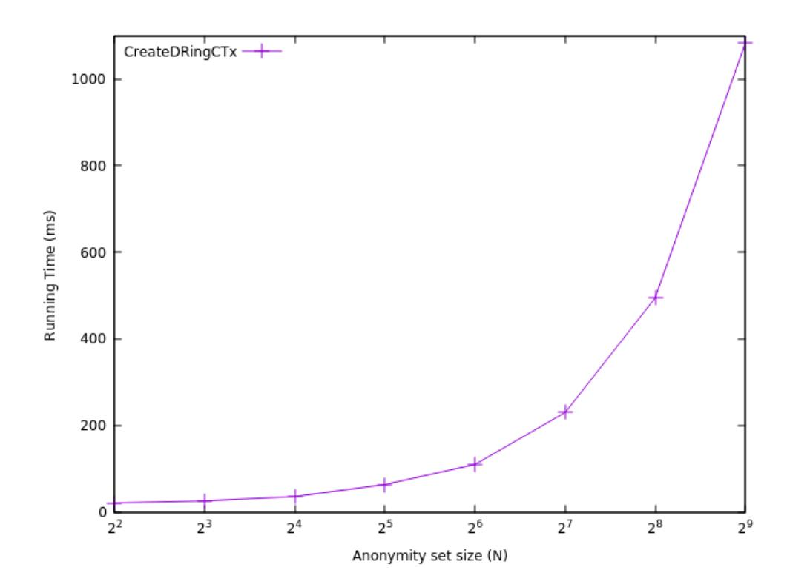
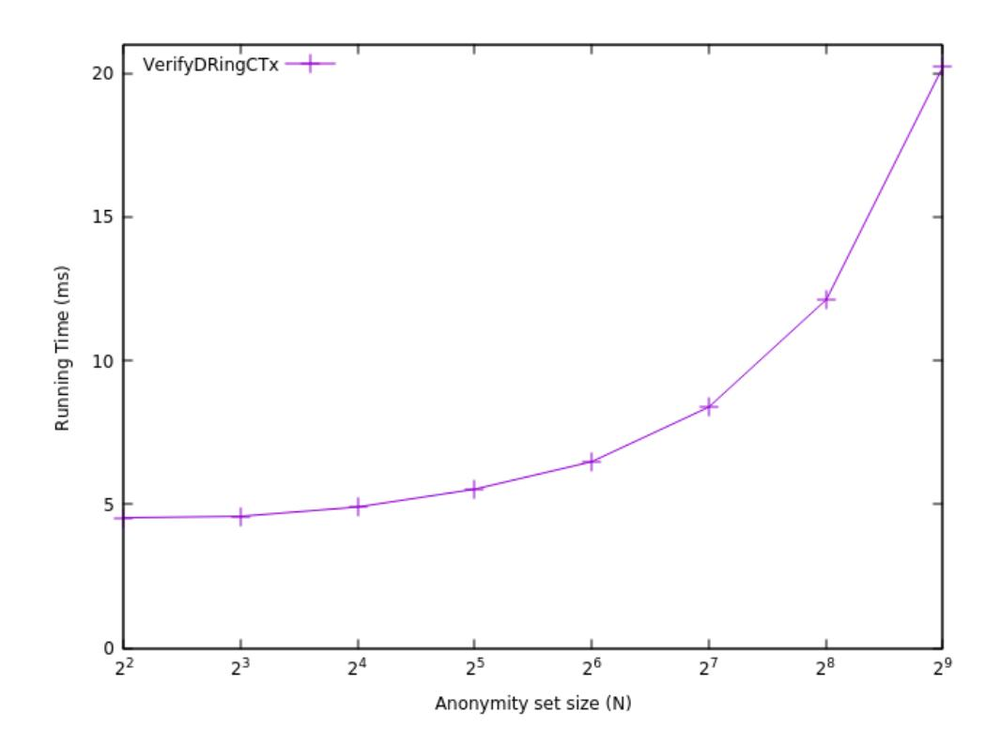
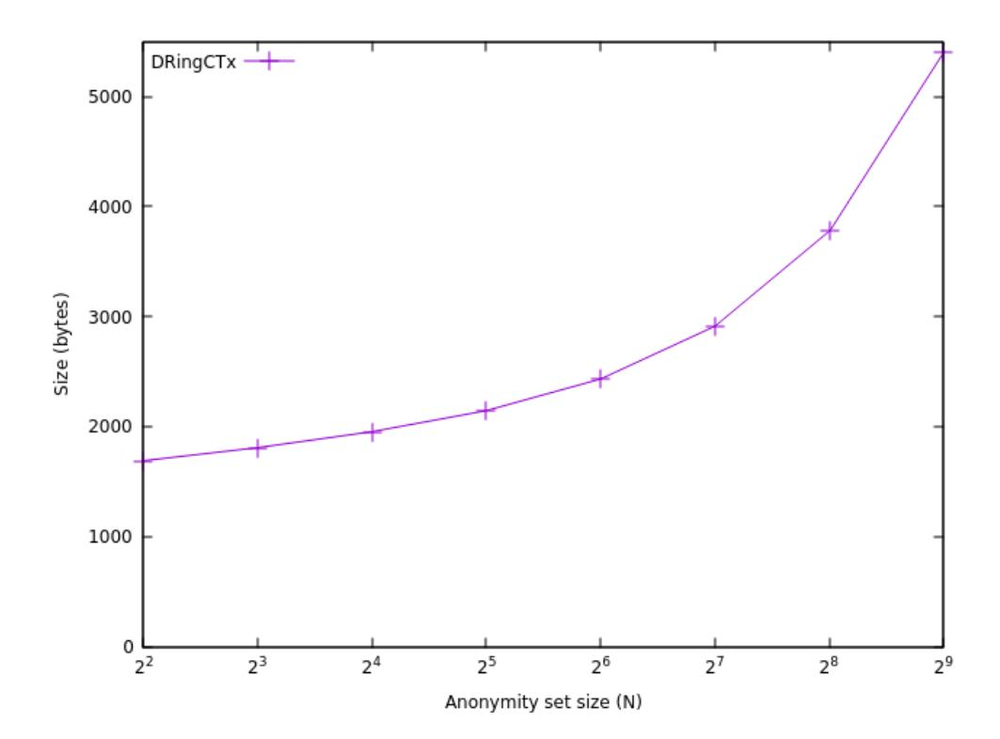

{0}------------------------------------------------

# Delegated RingCT: faster anonymous transactions

# Rui Morais

*Release Laboratory, Nova Lincs University of Beira Interior* Covilha, Portugal ˜ ru.morais@ubi.pt

# Paul Crocker *Instituto de Telecomunicac¸oes ˜ University of Beira Interior* Covilha, Portugal ˜ crocker@di.ubi.pt

Simao Melo de Sousa ˜ *Nova Lincs, C4 Center, Release Laboratory University of Beira Interior* Covilha, Portugal ˜ desousa@di.ubi.pt

*Abstract*—We present a modification to RingCT protocol with stealth addresses that makes it compatible with Delegated Proof of Stake based consensus mechanisms called Delegated RingCT.

Our scheme has two building blocks: a customised version of an Integrated Signature and Encryption scheme composed of a public key encryption scheme and two signature schemes (a digital signature and a linkable ring signature); and noninteractive zero knowledge proofs. We give a description of the scheme, security proofs and a prototype implementation whose benchmarking is discussed.

Although Delegated RingCT does not have the same degree of anonymity as other RingCT constructions, we argue that the benefits that the compatibility with DPoS consensus mechanisms brings constitute a reasonable trade-off for being able to develop an anonymous decentralised cryptocurrency faster and more scalable than existing ones.

*Index Terms*—Anonymity, Privacy, Monero, RingCT, Delegated Proof of Stake

## I. INTRODUCTION

Bitcoin appeared in 2008 [\[1\]](#page-12-0) and is widely considered to be the first decentralised cryptocurrency. Its ingenious design, that uses a blockchain as a distributed ledger to store the transactions that happen on the network and Nakamoto consensus [\[2\]](#page-12-1) (which centres around the proof-of-work mechanism and the "longest-chain-win" rule) to reach a decentralised consensus about the state of that blockchain, was revolutionary at the time. Even today Bitcoin is the most well known and most valuable cryptocurrency.

Since then, the industry has grown and the term *cryptocurrency* is not solely a synonym of *currency* anymore, but has extended to other use cases (e.g. smart contracts). Still, more than ten years later, we do not have a cryptocurrency that is widely used as a currency, as Bitcoin was supposed to be as the title of its original paper states: *a peer-to-peer electronic cash system*.

One can argue that this is due to external factors, such as government regulations, lack of knowledge or necessity by societies, ideological motives, etc. But we can also argue that the intrinsic technical limitations of current cryptocurrencies, due to their design, have contributed to this situation. These design flaws include the inability to scale, insufficient maximum throughput, slow confirmation times, ledger size or lack of anonymity.

### *A. Motivation*

In our opinion, the ideal cryptocurrency is decentralised, fast, scalable, anonymous, has a transparent monetary policy and is environmentally friendly. Many cryptocurrencies have been created in the last few years that have tried to fulfil these goals but, so far, none of them has been able to reach them all.

Some, like Monero [\[3\]](#page-12-2) and ZCash [\[4\]](#page-12-3), solve the anonymity issue but still share the same other limitations of Bitcoin. Other cryptocurrencies based on Delegated Proof of Stake (DPoS), like Tezos [\[5\]](#page-12-4) (Liquid Proof of Stake) and Nano [\[6\]](#page-12-5) (Open Representative Voting), improve on the maximum throughput and slow confirmation times but are only pseudo-anonymous, meaning that anonymity is only maintained as long as a node on the network is not associated to a "real world" identity.

These consensus mechanisms are typically faster than others that use hashrate power competition to select the node that proposes the new transactions, like Bitcoin, allowing for a greater throughput of transactions, and have a much lower carbon footprint.

The goal of this paper is to bring together some of the strengths of these designs and develop a protocol that can be used as a building block for a cryptocurrency with the properties mentioned above, specifically an anonymous decentralised cryptocurrency faster and more scalable than the current ones.

## *B. Contributions*

We present an extension to the base protocol of Monero, RingCT with stealth addresses, that makes it compatible with Delegated Proof of Stake, a family of consensus mechanisms where the weight of a node in the consensus for validating transactions is proportional to its delegated stake on the network, called Delegated RingCT.

We first present a generic version of Delegated RingCT constructed from two cryptographic primitives: a customised version of an Integrated Signatures and Encryption scheme (ISE) [\[7\]](#page-12-6), which is composed of a public key encryption scheme (PKE) and two signature schemes, a digital signature (DS) [\[8\]](#page-12-7) and a linkable ring signature (LRS) [\[9\]](#page-12-8); and noninteractive zero knowledge proofs (NIZK).

We, then, give a concrete efficient instantiation of Delegated RingCT and a prototype implementation whose benchmarking shows that the scheme can be used to build a faster and more scalable anonymous decentralised cryptocurrency.

{1}------------------------------------------------

Our scheme has some limitations and, despite being secure according to our security model, our definition is somewhat weaker than other RingCT constructions. We argue that the benefits outweigh the cons, as we will discuss later.

#### C. Overview and Intuition

For completeness, we give a brief summary of the RingCT protocol and the DPoS based consensus mechanisms. We explain the reasoning behind our modifications to combine the two and construct Delegated RingCT.

On a basic level, a transaction has a sender, a receiver and a transferred amount. To achieve anonymity of all three components, RingCT protocol uses the following:

- Linkable ring signature to obfuscate the real sender of a transaction within a ring of possible senders and the linkability to detect double spends, since each transaction must have a unique linkable tag (also called key image or serial number).
- Confidential transactions to obfuscate the transaction amount, typically using an additive homomorphic commitment scheme like Pedersen commitments [10]. These are used to make a range proof, proving that the balance lies within a certain range, and a balance proof, proving that the total balance of the input accounts spent is equal to the total amount of the created output accounts.
- Stealth addresses to obfuscate the receiver of a transaction. Every node has a pair of long term keys (a long term public key and a long term secret key) and every transaction as a one-time pair of keys (a one-time public key and a one-time secret key). The sender can derive a one-time public key and a public auxiliary information from the receiver's long term public key. The receiver can recover the one-time secret key of the account created in the transaction using his long term secret key and the auxiliary information.

Delegated Proof of Stake is a family of consensus mechanisms that is based on two basic concepts:

- The weight that a node has on the consensus of the network is proportional to his stake (balance) on the network.
- The stake of a node can be delegated to another node, transferring its weight on the consensus to that node.

With this in mind, we first need to introduce the concept of stake delegation in RingCT. We follow the terms used in Nano [6], and call *representative* a node to which has been assigned some stake by another node. This concept is distinct from the *owner* of an account, but they can be the same.

We do this by switching the representation of a coin in RingCT from a commitment of an additive homomorphic commitment scheme (e.g., Pedersen commitments [10]) to a ciphertext of an additive homomorphic public encryption scheme (e.g., exponential ElGamal [11]). This allows the owner of an account, that initially has no representative, to encrypt its balance with a long term public key of a node, making him the representative of that account. The representative can then prove by decryption that a certain amount of

stake was delegated to him using his long term secret key. A NIZK proof is required to prove that the encryption is well formed.

Since the PKE is additive homomorphic and the consensus algorithm only needs to know the total amount of delegated stake to a given node, the representative reveals the *total* amount of delegated balance to him without revealing the *individual* balances of the accounts delegated to him, otherwise there would be no obfuscation of balances.

A node can redelegate the stake of an account at anytime proving he knows the one-time secret key of that account (digital signature), by reencrypting the balance with a new long term public key and proving with a NIZK that both ciphertexts are equivalent, i.e., encrypt the same balance.

Transactions are modified from standard ring confidential transactions and, because of that, the ciphertext needs to be compatible with the range proof protocol and the balance proof. The linkable ring signatures and the stealth addresses remain the same.

We construct a customised version of an Integrated Signature and Encryption scheme to express the fact that the same keys are used for the encryption/decryption, the digital signature and the linkable ring signature.

#### D. Related Work

Since Monero and ZCash are the two most valuable anonymous cryptocurrencies by market capitalisation, research in this area is mostly based on the two different technologies they use.

The base protocol used by Monero was first described in [3]. Since then, it has evolved into a ring of confidential transactions, which combines linkable ring signatures [9], [12] with confidential transactions [13]. Reference [14] gives the first formal syntax of RingCT and improves it with a new version and [15]–[18] improve on the size and the efficiency of the linkable ring signature component and [19] on the range proof. Compatibility with smart-contracts was achieved in [20].

ZCash uses zero-knowledge Succinct Non-interactive AR-guments of Knowledge (zk-SNARKs) to construct a decentralised payment scheme [4], but requires a trusted setup. Since then, other zero-knowledge proofs for arithmetic circuits were developed by improving on efficiency, decreasing the amount of "trust" required or increasing the scope of use [21]–[25].

Another relevant approach to anonymous cryptocurrencies is Zerocoin protocol [26], improved in [27].

#### II. PRELIMINARES

#### A. Basic Notation

We use additive notation and define  $\mathbb{G}$  as a cyclic group of prime order p in which the discrete logarithm problem is hard and  $\mathbb{F}$  as the scalar field of  $\mathbb{G}$ . Let  $\mathcal{H}:\{0,1\}^* \to \mathbb{F}$  be a cryptographic hash function and G a generator of  $\mathbb{G}$  with unknown discrete logarithm relationship.

A function is negligible in the security parameter  $\lambda$ , written negl( $\lambda$ ), if it vanishes faster than the inverse of any polynomial

{2}------------------------------------------------

in  $\lambda$ . A probabilistic polynomial time (PPT) algorithm is a randomised algorithm that runs in time  $poly(\lambda)$ .

In a randomised algorithm  $\mathcal{A}$ , the input randomness  $r \in \mathbb{F}$  is explicit and we write  $z \leftarrow A(x_1,...,x_n;r)$ . We use  $x \xleftarrow{r} X$  to denote sampling x uniformly at random from X. For readability, we denote the set of elements  $\{x_n\}_{n=0}^{N-1}$  by just  $x_n$  when is clear in the context that we are referring to a set of elements instead of a single element.

#### B. Integrated Signatures and Encryption Scheme

The concept of combining public key schemes was first introduced by [7]. Reference [28], inspired by [29], combines one signature scheme with one encryption scheme.

In this work we go a little further and use a combination of a public key encryption scheme with two signatures schemes, a standard digital signature and a linkable ring signature. It is composed of the following polynomial time algorithms.

- $pp \leftarrow \mathsf{Setup}(1^{\lambda})$  on input a security parameter  $1^{\lambda}$ , output public parameters pp.
- KeyGen: this algorithm is divided in three steps to capture the concept of *stealth addresses*, in the following way.
  - $(ltpk, ltsk) \leftarrow \text{LongTermKeyGen}(pp)$ . On input public parameters pp, it randomly generates a keypair (ltpk, ltsk).
  - $(pk, aux) \leftarrow OneTimePKGen(ltpk; r)$ . On input a long term public key ltpk, it outputs a random one-time public key pk and the auxiliary information aux.
  - $sk/\bot$  OneTimeSKGen(pk, aux, ltsk). On input a one-time public key pk, an auxiliary information aux and a long term secret key ltsk, it outputs the one-time secret key sk if ltsk is valid. If not, it returns  $\bot$ .
- $C \leftarrow \mathsf{Encrypt}(pk, m; r)$ : on input a public key pk and a plaintext m, it outputs a random ciphertext C.
- $m \leftarrow \mathsf{Decrypt}(sk, C)$ : on input a secret key sk and a ciphertext C, output a plaintext m.
- $\sigma \leftarrow \mathsf{Sign}(sk, m)$ : on input sk and a message m, output a signature  $\sigma$ .
- $0/1 \leftarrow \text{Verify}(pk, m, \sigma)$ : on input pk, a message m, and a signature  $\sigma$ , output "1" if the signature is valid and "0" if it is not.
- $\sigma_{\text{ring}} \leftarrow \text{Sign}_{\text{ring}}(sk, m, R)$ : Generates a linkable ring signature  $\sigma_{\text{ring}}$  on a message m with respect to a ring R of one-time public keys, provided that sk is a one-time secret key corresponding to some pk in the ring.
- $0/1 \leftarrow \text{Verify}_{\text{ring}}(\sigma_{\text{ring}}, m, R)$ : Verifies a signature  $\sigma$  on a message m with respect to a ring of public keys R. Outputs "0" is the signature is rejected, and "1" if accepted.
- $0/1 \leftarrow \text{Link}(\sigma_{\text{ring}}, \sigma'_{\text{ring}})$ : Determines if signatures the linkable ring signatures  $\sigma_{\text{ring}}$  and  $\sigma'_{\text{ring}}$  were signed using the same private key. Outputs "0" if the signatures were signed using different private keys and "1" if they were signed using the same private key.

Since each component being individually secure does not imply that the composition of all the components is also secure, we need to have a joint security model, i.e., a model that evaluates the security of each component in the presence of the others, which are simulated by oracles. The only component that does not need to be simulated by an oracle in the public key setting is the PKE, since an adversary can easily do it.

**Definition 1** (Joint Security for ISE). We say an ISE is jointly secure if:

- Its PKE component is IND-CPA secure (1-plaintext/2-recipient) in the presence of two signing oracles, one for the DS and the other for the LRS.
- Its DS component is EUF-CMA secure in the presence of a signing oracle simulating the LRS component.
- Its LRS component is secure, following the security model of [18], in the presence of a signing oracle simulating the DS component.

# C. Non-Interactive Zero-Knowledge Proof

A NIZK proof system in the CRS model consists of the following four PPT algorithms [30]:

- $pp \leftarrow \mathsf{Setup}(1^{\lambda})$ : on input  $1^{\lambda}$ , outputs public parameters pp.
- $crs \leftarrow \mathsf{CRSGen}(pp)$ : on input pp, outputs a common reference string crs.
- $\pi \leftarrow \text{Prove}(crs, x, w)$ : on input a crs and a statement-witness pair (x, w), outputs a proof  $\pi$ .
- $0/1 \leftarrow \text{Verify}(crs, x, \pi)$ : on input crs, a statement x, and a proof  $\pi$ , outputs "0" if rejects and "1" if accepts.

## III. DEFINITION OF DELEGATED RINGCT

#### A. Data Structures

We begin by describing the data structures used by a Delegated RingCT system.

**Blockchain.** A Delegated RingCT protocol operates on top of a blockchain B, which is a publicly accessible and appendonly database. At any given time t, all users have access to  $B_t$ , which is a sequence of transactions. If t < t', state of  $B_t$  is anterior to the state of  $B_{t'}$ .

**Public parameters.** A trusted party generates the public parameters pp, which are used by the protocol's algorithms. These include the group in which the algorithms perform operations, generators of the group, cryptographic hash functions and parameters regarding transactions, namely:

- V, which specifies the maximum possible number of coins that the protocol can handle. Any balance and transfer must lie in the integer interval  $V = [0, v_{\text{max}}]$ .
- $\bullet$  N, the maximum size of the ring used in a delegated ring confidential transaction DRingCTx, i.e., the maximum number of input accounts.
- $\bullet \ M, \ \mbox{the maximum number of spend accounts in a} \ \mbox{DRingCTx, such that} \ M \subset N.$
- $\bullet$  T, the maximum number of output accounts of a DRingCTx.

**Keys.** There are two pairs of keys: long term keys, which are composed of a long term public key ltpk, and a long

{3}------------------------------------------------

term secret key ltsk and are associated with a unique node on the network; and one-time keys, which are composed of a one-time public key pk and a one-time secret key sk and are associated with a unique account. One-time keys are derived from long term keys and one node on the network can have multiple accounts.

Account. Each account is associated with a one-time keypair (pk, sk) and a coin C, which is a ciphertext of an additive homomorphic PKE scheme and encrypts an amount/balance a with randomness k, also known as coin key. The one-time public key pk acts as a *stealth address* and can only receive one transaction. The secret key sk is kept privately and is used to spend the balance of the account once.

Delegated ring confidential transaction. A delegated ring confidential transaction DRingCTx consists of a ring of input accounts, a linkable ring signature, output accounts with zeroknowledge proofs of encryption, range and balance, and an auxiliary information to help the owners of the destination addresses recover the one-time secret keys of the output accounts. Typically, one of the output accounts belongs to the sender and its balance is the "change" of a transaction.

Change representative transaction. A change representative transaction CRx consists of a digital signature based on the one-time secret key of the account and a zero-knowledge proof of equivalence between the old ciphertext C and the new ciphertext C 0 , assuring that the balance is the same.

# *B. Algorithms*

A Delegated RingCT scheme is a tuple of polynomial-time algorithms defined as below:

- pp ← Setup(1 λ ): on input a security parameter λ, output public parameters pp.
- (act, aux) ← CreateAccount(a, ltpk): on input an amount a and a long term public key ltpk, outputs an auxiliary information aux and an account act = (pk, C), composed of a one time public key pk and a coin C.
- a ← RevealBalance(ltsk, C): on input a long time secret key ltsk and a coin C, outputs the balance a in plaintext. This algorithm is used by the representative of an account.
- DRingCTx = (actn, σring, aux, actt, πrange, πenc, πbal) /⊥← CreateDRingCTx(actn, askm, at, ltpkt, m): on input a ring of N input accounts, M account secret keys corresponding to some of those accounts, T output amounts, T destination addresses and a transaction message m, it outputs the input accounts actn, a linkable ring signature σring, auxiliary information aux, T output accounts, a range proof πrange, an encryption proof πenc and a balance proof πbal, if the accounts secret keys are valid. It outputs ⊥ otherwise.
- 0/1/-1 ← VerifyDRingCTx(DRingCTx): on input a delegated ring confidential transaction DRingCTx, outputs "0" if the transaction is valid, "1" if it is invalid and "-1" if the transaction is linked to a previous valid transaction, i.e., if any of actn has been spent previously. If DRingCTx is valid, it is recorded on the blockchain B. Otherwise, it is discarded.

- CRx = (σ, act0 , πequal)/ ⊥←CreateCRx(ask, act, ltpk, m): on input an account act with the corresponding account secret key ask, a long term public key ltpk and a transaction message m, it outputs a digital signature σ, a new account act0 with the same amount a encrypted with the new ltpk and a proof of equivalence πequal, if the account secret keys is valid. It outputs ⊥ otherwise.
- 0/1 ← VerifyCRx(CRx): on input a change representative transaction CRx and a digital signature σ, it outputs "0" if its invalid. Otherwise, it outputs "1" and the CRx transaction is appended to the blockchain B.

# *C. Correctness*

Correctness of Delegated RingCT requires that:

- A valid delegated ring confidential transaction DRingCTx will always be accepted and recorded on the blockchain B.
- A valid change representative transaction CRx will always be accepted and recorded on the blockchain B.

## *D. Security Model*

We focus only on the transaction layer of a cryptocurrency, and assume that network-level and consensus-level attacks are out of scope.

Intuitively, a Delegated RingCT protocol should have the following properties.

Unforgeability. This property captures the idea that only someone who knows the secret key of an account can spend it and change its representative.

Anonymity. This property captures the idea that an outside party, other than the owner or the representative of the sender account, cannot know who is the real sender, who is the receiver or what is the amount of a DRingCTx transaction.

Linkability. This property captures the idea that you can only spend once from an account, i.e., you cannot double spend.

Non-frameability. This property captures the idea that a malicious party cannot construct a transaction that invalidates a valid transaction.

We formalise the above intuitions into a game-based security model between an adversary A and a challenger CH. The capabilities of the adversary are modelled by the queries that he can make to oracles implemented by the challenger, which are described bellow.

- ltpki ← KeyOracle(i): on the i th query, the challenger CH runs (ltski , ltpki) ← ISE.LongTermKeyGen(ppise) and returns ltpki to A.
- acti ← AccountOracle(ltpki , a): the challenger CH runs acti ← CreateAccount(a, ltpki) if ltpki was generated by a query to KeyOracle. Returns the acti to A.
- ski ← CorruptOracle(acti): on input an account acti that corresponds to a query to AccountOracle, it runs ski ← ISE.KeyGen.OneTimeSK(pki , aux, ltski) and returns the associated account secret key ski .
- DRingCTx ← TransOracle(actn, actm, at, ltpkt, m): on input a set of N input accounts, M spend accounts, T

{4}------------------------------------------------

- amounts, T destination addresses and a transaction message m, CH runs DRingCTx ← CreateDRingCTx(actn, askm, at, ltpkt, m) and returns DRingCTx to A.
- CRx ← ChangeOracle(acti , ltpki , m): on input an account acti , a ltpki and a transaction message m, it runs CRx ← CreateCRx (aski , acti , ltpki , m) and returns CRx to A.

Definition 2 (Unforgeability). The probability of an adversary being able to forge a valid delegated ring confidential transaction DRingCTx or a valid change representative transaction CRx without knowing any secret key of the public keys of the ring, is negligible. This property is captured by a game between a challenger CH and a probabilistic polynomial-time adversary A, where A can query all oracles and outputs:

- DRingCTx = (actn, σring, aux, actst, πrange, πenc, πbal), such that all of the N input accounts were generated by queries to AccountOracle and none was used as input to CorruptOracle or TransOracle.
- CRx = (σ, act0 i , πequal), such that ChangeOracle was not queried with (acti , ·) and acti was not corrupted by CorruptOracle.
- A wins if Pr[VerifyDRingCTx(DRingCTx) = 1] ≥ negl(λ) or if Pr[VerifyCRx(CRx) = 1] = ≥ negl(λ).

Definition 3 (Anonymity). As long as a ring of a transaction contains two uncorrupted input accounts, an adversary can do no better than guessing at determining the sender of a valid transaction. This property is captured by the following game between a challenger CH and a probabilistic polynomial-time adversary A:

• A has access to all oracles. He chooses a ring of input accounts actn, where all the accounts are generated by AccountOracle, and two indices i0, i1, such that acti0 and acti1 were not corrupted by the CorruptOracle. The challenger CH picks the sender of the transaction by selecting a uniformly random bit b ∈ {0, 1} and outputs a DRingCTx. A tries to guess which account is the real sender with b 0 and wins if |Pr[b 0 = b]| > 1 2 .

Definition 4 (Linkability). An adversary is unable to produce k + 1 non-linked valid transactions on a combined anonymity set of k input accounts. This property is captured in a game between a challenger CH and a probabilistic polynomial-time adversary A, where A has access to all oracles and, for i ∈ [0, k − 1], produces a delegated ring confidential transaction DRingCTxi . He then produces another DRingCTx(DRingCTx and sends them all to the challenger. A wins if the following checks:

- |K| = k, where K ≡ ∪k−1 i=0 Ri .
- Each acti ∈ K.
- Each Ri ⊂ K.
- VerifyDRingCTx(DRingCTxi) = 1 for all i.
- VerifyDRingCTx(DRingCTx) = 1.

Definition 5 (Non-frameability/Non-slanderability). An adversary is unable to generate a valid transaction that links with another previous valid transaction that was generated honestly. This property is captured by the following game between a challenger CH and a probabilistic polynomial-time adversary A:

• A has access to all oracles pre and pos-challenge. In the challenge stage he chooses an uncorrupted account acti ∗ that was generated by a query to the AccountOracle, and a ring actn such that acti ∗ ∈ actn, and sends them to the challenger. CH responds with a DRingCTx. In the forge stage A produces another DRingCTx' and wins if DRingCTx' links with DRingCTx with nonnegligible probability.

# IV. DELEGATED RINGCT PROTOCOL

# *A. A Generic Construction*

We present a generic construction of Delegated RingCT from ISE and NIZK, in the following way:

- Let ISE = (Setup, KeyGen, Sign, Signring, Verify, Verifyring, Encrypt, Decrypt) be an ISE scheme whose PKE is additively homomorphic and used to encrypt the balance of an account. The LRS component is used to authenticate a DRingCTx and the DS component to authenticate a CRx.
- Let NIZKcorrect = (Setup, CRSGen, Prove, Verify) be a NIZK proof system for Lcorrect. It is used to construct a valid DRingCTx, is composed of:

$$L_{\mathsf{enc}} = \{(pk, C) \mid \exists \, a, k \, s.t. \, C = \mathsf{ISE}.\mathsf{Encrypt}(pk, a; k)\}$$

$$L_{\rm range} = \{C \,|\, \exists\, a\, s.t.\, a \in V\}$$

$$L_{\text{bal}} = \{ (C_m, C_t) \mid \exists \, a_m, a_t \, s.t. \, \sum_{m=0}^{M-1} a_m = \sum_{t=0}^{T-1} a_t \}$$

• Let NIZKequal = (Setup, CRSGen, Prove, Verify) be a NIZK proof system for Lequal. It is used to make a valid CRx:

$$L_{\text{equal}} = \{ (pk_1, pk_2, c_1, c_2) \mid \exists a_1, a_2 \text{ s.t. } a_1 = a_2 \}$$

A Delegated RingCT contruction is composed of the following algorithms.

- pp ← Setup(1 λ ): on input a security parameter 1 λ , it runs ppise ← ISE.Setup(1 λ ), ppnizk ← NIZK.Setup(1 λ ), crs ← NIZK.CRSGen(ppnizk), outputs pp = (ppise, ppnizk, crs).
- (act, aux) ← CreateAccount(a, ltpk). On input a onetime public key ltpk and an amount a, it runs (pk, aux) ← ISE.KeyGen.OneTimePKGen(ltpk; r) and computes the coin C ← ISE.Encrypt(pk, a; k). It outputs the account act = (pk, C) and the auxiliary information aux.
- a ← RevealBalance(ltsk, C). On input a ciphertext C and a long time secret key ltsk, it runs:

{5}------------------------------------------------

- a ← ISE.Decrypt(sk, C).
- DRingCTx = (σring, aux, actt, πrange, πenc, πbal)
- ← CreateDRingCTx(actn, askm, at, ltpkt, m): on input a ring of N accounts, M spend accounts, T amounts, T long term public keys and a transaction message m, it creates a ring confidential transaction via the following steps:
  - run (actt, auxt) ← CreateAccount(at, ltpkt) to generate the output accounts.
  - run πcorrect ← NIKZcorrect.Prove for all output accounts to generate a zero-knowledge proof πcorrect for Lcorrect.
  - compute σring ← ISE.Signring(pkn, skm).
  - output the delegated ring confidential transaction DRingCTx.
- 1/0/ − 1 ← VerifyDRingCTx(DRingCTx, actn)): on input a DRingCTx and the corresponding ring of input accounts, it outputs "1" if both the following algorithms output "1". It outputs "-1" if ISE.Link outputs "1" and "0" otherwise.
  - ISE.Verifyring(σring, m, pkn): on input a LRS σring, a message m and N input public keys, it outputs "1" if the signature is valid and "0" if it is invalid.
  - NIZKcorrect.Verify(crs, x, πcorrect): on input crs, a statement x and a proof πcorrect, it outputs "1" if the proof is valid and "0" if it is invalid.
- CRx = (σ, πequal)/ ⊥ ← CreateCRx(act, sk, ltpk, m). On input an account act, the corresponding account secret key ask, the long term public key ltpk as the new representative and a transaction message m, it outputs:
  - σ ← ISE.Sign(sk), which outputs a digital signature proving the knowledge of sk.
  - πequal ← NIZKequal.Prove, which outputs a proof of equivalence of ciphertexts.
  - it returns (σ, πequal).

If ask is invalid, it returns ⊥.

- 1/0 ← VerifyCRx(CRx) = (σ, πequal)).
  - check if ISE.Verify(σ) = 1 and NIZKequal.Verify (πequal) = 1.
  - if both the above tests pass, return 1.
  - else, return 0.
- *1) Analysis:* Correctness of our generic Delegated RingCT construction follows from the correctness of ISE and the completeness of all the NIZK used and security is captured by the following theorem and lemmas.

As defined in our security model, our Delegated RingCT is secure if it satisfies four properties: unforgeability, anonymity, linkability and non-frameability.

In order to prove that the scheme satisfies each one of these properties, we assume the security of ISE and the zeroknowledge of NIZK. We then simulate a game in which an adversary A tries to break the property in question. This game can be simulated by another adversary B, which acts as the challenger in A's game.

B himself wants to break the security of ISE in its own game, so he only needs to make sure that A's response to the challenge can be used as an answer to B's challenge. If A has a non-negligible advantage in his game, then B will have it as well. However, we assumed that the ISE is secure, so, we prove by contradiction that A cannot have a non-negligible advantage in his game and that the property of Delegated RingCT he wants to break is satisfied.

Theorem 1. *Assuming the security of ISE and NIZK, the above Delegated RingCT construction is secure.*

*Proof.* We prove this theorem via the following four lemmas.

Lemma 1.1. *Assuming the security of the ISE and the zeroknowledge property of NIZK, our Delegated RingCT construction satisfies unforgeability.*

*Proof.* We proceed via a sequence of games.

Game 1.1.1. The real experiment. CH interacts with A as below.

- 1) Setup: CH runs ppise ← ISE.Setup(1 λ ), ppnizk ← NIZK.Setup(1 λ ), crs ← NIZK.CRSGen(ppnizk) and sends pp = (ppise, ppnizk, crs) to A.
- 2) Queries: Throughout the experiment, A can make queries to all oracles. The challenger CH answers these queries as defined in the security model.
- 3) Forge: A outputs a ring confidential transaction DRingCTx, such that all the input accounts are generated by the AccountOracle and uncorrupted (A does not know any of the accounts secret keys) and were not used as a query to TransOracle; and a change representative transaction CRx for an uncorrupted account that was generated by AccountOracle. A wins if any of the transactions is valid with non-negligible probability.

Game 1.1.2. Same as Game [1.1.1,](#page-5-0) except that CH uses a simulator to generate πcorrect for the TransOracle queries and πequal for the ChangeOracle queries without knowing any of the accounts secret keys. The zero-knowledge proofs are indistinguishable from the real ones, by definition. By a direct reduction to the zero-knowledge property of the underlying NIZK, we have:

$$|\Pr[S_1] - \Pr[S_0]| \le \mathsf{negl}(\lambda)$$

We now argue that no PPT adversary has non-negligible advantage in Game [1.1.2.](#page-5-1)

Claim 1.1.1. Assuming the unforgeability of the ISE's linkable ring signature component, Pr[S1] ≤ negl(λ) for all PPT adversary A.

*Proof.* Suppose there exists a PPT adversary A that has nonnegligible advantage in Game [1.1.2.](#page-5-1) We can build an adversary B that breaks the security of the the ISE with the same advantage. Given the public parameters ppise by its challenger, B simulates Game [1.1.2](#page-5-1) as follows:

{6}------------------------------------------------

- 1) Setup:  $\mathcal{B}$  runs  $(crs, \tau) \leftarrow \mathcal{S}(pp_{\text{nizk}})$  and sends  $\overline{(crs, \tau, pp_{\text{ise}})}$  to  $\mathcal{A}$ , where  $\mathcal{S}$  is a simulator.
- 2) Queries:  $\mathcal{A}$  can query all oracles and  $\mathcal{B}$  answers them in the following way:
  - $ltpk_i \leftarrow \text{KeyOracle}(i)$ :  $\mathcal{B}$  computes the  $ltpk_i$  according to the  $pk_i$  given by its challenger.
  - $act_i \leftarrow \text{AccountOracle}(ltpk_i, a)$ :  $\mathcal{B}$  queries the GenOracle of its own game to get  $pk_i$ , runs  $C \leftarrow \text{ISE.Encrypt}(pk_i, a; k)$  and responds with  $act_i = (pk_i, C)$ .
  - $ltsk_i \leftarrow \mathsf{CorruptOracle}(act_i)$ :  $\mathcal{B}$  queries the  $\mathsf{CorruptOracle}$  to  $\mathsf{corruptOracle}$  of its own game with  $pk_i$  to  $\mathsf{get}\ sk_i$ , and  $\mathsf{ceturns}\ (sk_i, a, k)$  to  $\mathcal{A}$ .
  - DRingCTx  $\leftarrow$  TransOracle( $act_n, act_m, a_t, ltpk_t, m$ ):  $\mathcal{B}$  queries the SignringOracle of its own game with  $(pk_m, m, pk_n)$  to get  $\sigma_{\text{ring}}$  and runs the simulator to get  $\pi_{\text{correct}}$ . It returns DRingCTx =  $(act_n, \sigma_{\text{ring}}, aux, act_t, \pi_{\text{correct}})$  to  $\mathcal{A}$ .
  - CRx  $\leftarrow$  ChangeOracle( $act_i, ltpk_i, m$ ):  $\mathcal{B}$  queries the SignOracle of its own game with  $(pk_i, m)$  to get  $\sigma$  and runs the simulator to get  $\pi_{\text{equal}}$ . It returns CRx =  $(\sigma, act', \pi_{\text{equal}})$  to  $\mathcal{A}$ .
- 3) Forge:  $\mathcal{A}$  submits a delegated ring confidential transaction DRingCTx and a change representative CRx.  $\mathcal{B}$  forwards the linkable ring signature and the digital signature to its own challenger and breaks the ISE security with the same advantage as  $\mathcal{A}$  (if any of the two is valid).

 $\mathcal{B}$ 's simulation of Game 1.1.2 is perfect. The claim immediately follows.  $\Box$ 

This proves Lemma 1.1.

**Lemma 1.2.** Assuming the anonymity property of ISE's linkable ring signature component, the zero-knowledge property of NIZK, our Delegated RingCT construction satisfies anonymity.

*Proof.* We proceed via a sequence of games.

**Game 1.2.1.** The real experiment.  $\mathcal{CH}$  interacts with  $\mathcal{A}$  as below.

- 1) Setup:  $\mathcal{CH}$  runs  $pp_{\text{ise}} \leftarrow \text{ISE.Setup}(1^{\lambda}), \ pp_{\text{nizk}} \leftarrow \overline{\text{NIZK.Setup}}(1^{\lambda}), \ crs \leftarrow \overline{\text{NIZK.CRSGen}}(pp_{\text{nizk}})$  and sends  $pp = (pp_{\text{ise}}, pp_{\text{nizk}}, crs)$  to  $\mathcal{A}$ .
- 2) Pre-challenge queries: Throughout the experiment,  $\mathcal{A}$  can query all oracles.  $\mathcal{B}$  answers them as defined in the security model.
- 3) Challenge:  $\mathcal{A}$  picks a ring of input accounts  $act_n$ , chooses two indices  $i_0$ ,  $i_1$  and sends it to  $\mathcal{CH}$ , such that  $act_{i_0}$  and  $act_{i_1}$  are uncorrupted.  $\mathcal{CH}$  chooses one of the two accounts to be the sender by selecting a uniformly random bit  $b \in \{0,1\}$ , runs CreateDRingCTx( $act_n$ ,  $act_{i_b}$ ,  $a_t$ ,  $ltpk_t$ ) and sends DRingCTx to  $\mathcal{A}$ .
- 4) Post-challenge queries:  $\mathcal{A}$  can query all oracles in the same way as in the pre-challenge stage, except querying the CorruptOracle with  $act_{i_b}$ .

5) Guess:  $\mathcal{A}$  chooses a bit  $b' \in \{0, 1\}$  and wins if:  $|\Pr[b' = b]| \ge \frac{1}{2}$ .

**Game 1.2.2.** Same as Game 1.2.1, except  $\mathcal{CH}$  makes a ring guess of random N indexes out of Q, the maximum number of queries that  $\mathcal{A}$  can make to the AccountOracle, and a guess of the two indices  $i_0, i_1$ . If  $\mathcal{A}$  picks a different ring for the DRingCTx or different spend accounts,  $\mathcal{CH}$  aborts.

Let E be the event that  $\mathcal{CH}$  does not abort and  $S_0$  the event that  $\mathcal{A}$  wins in Game 1.2.2. The probability that E occurs is  $\Pr[E] \geq \frac{N!(Q-N)!}{Q} \cdot \frac{1}{N^2}$ , where N is the size of the ring of the DRingCTx. Conditioned on  $\mathcal{CH}$  does not abort,  $\mathcal{A}$ 's view in Game 1.2.1 is identical to that in Game 1.2.2. Therefore, we have:

$$\Pr[S_1] \ge \Pr[S_0] \cdot \frac{N!(Q-N)!}{Q!} \cdot \frac{1}{N^2}$$

**Game 1.2.3.** Same as Game 1.2.2, except that  $\mathcal{CH}$  generates the necessary zero-knowledge proofs for the TransOracle queries without knowing the secret keys via running the simulator. By a direct reduction to the zero-knowledge property of the underlying NIZK, we have:

$$|\Pr[S_2] - \Pr[S_1]| \le \mathsf{negl}(\lambda)$$

We now argue that no PPT adversary has non-negligible advantage in Game 1.2.3.

Claim 1.2.1. Assuming the anonymity property of the ISE's linkable ring signature component,  $\Pr[S_2] \leq \operatorname{negl}(\lambda)$  for all PPT adversary  $\mathcal{A}$ .

*Proof.* Suppose there exists a PPT adversary  $\mathcal{A}$  has non-negligible advantage in Game 1.2.3, we can build an adversary  $\mathcal{B}$  that breaks the anonymity property of the ISE's linkable ring signature component with the same advantage. Given  $(pp_{ise}, LRS_{ib})$  by its challenger,  $\mathcal{B}$  simulates Game 1.2.3 as follows:

- 1) Setup:  $\mathcal{B}$  runs  $(crs, \tau) \leftarrow \mathcal{S}(pp_{\text{nizk}})$  and sends  $\overline{(crs, \tau, pp_{\text{ise}})}$  to  $\mathcal{A}$ , where  $\mathcal{S}$  is a simulator.  $\mathcal{B}$  randomly picks N indices  $\in [Q]$  and two indices  $j_0, j_1 \in [N]$ .
- 2) Pre-challenge queries: Throughout the experiment,  $\mathcal{A}$  can query all oracles.  $\mathcal{B}$  answers them as defined in the security model, except for:
  - $ltpk_i \leftarrow \text{KeyOracle}(i)$ :  $\mathcal{B}$  computes the  $ltpk_i$  according to the  $pk_i$  given by its challenger.
  - $act_i \leftarrow \mathsf{AccountOracle}(ltpk_i, a)$ :  $\mathcal{B}$  queries the GenOracle of its own game to get  $pk_i$ , runs  $C \leftarrow \mathsf{ISE}.\mathsf{Encrypt}(pk_i, a; k)$  and responds with  $act_i = (pk_i, C)$ .
  - $ltsk_i \leftarrow \mathsf{CorruptOracle}(act_i)$ :  $\mathcal{B}$  queries the CorruptOracle with  $pk_i$  and returns  $(sk_i, a, k)$  to  $\mathcal{A}$ .
  - DRingCTx  $\leftarrow$  TransOracle( $act_n, act_m, a_t, ltpk_t, m$ ):  $\mathcal{B}$  queries the SignringOracle of its own game with  $(pk_m, m, pk_n)$  to get  $\sigma_{\text{ring}}$  and runs the simulator to get  $\pi_{\text{correct}}$ . It returns DRingCTx =  $(act_n, \sigma_{\text{ring}}, aux, act_t, \pi_{\text{correct}})$  to  $\mathcal{A}$ .

{7}------------------------------------------------

- CRx ← ChangeOracle(acti , ltpki , m): B queries the SignOracle of its own game with (pki , m) to get σ and runs the simulator to get πequal. It returns CRx = (σ, act0 , πequal) to A.
- 3) Challenge: A picks a ring of input accounts {actn} N−1 n=0 and two of those accounts. If any of the ring accounts contains a different public key than the ones chosen by B or any of the two is corrupted or have been used as spend account in queries to TransOracle, B aborts. Otherwise, B uses the LRSib given by its challenger to construct the delegated ring confidential transaction DRingCTx and sends it to A.
- 4) Post-challenge queries: A can query all oracles in the same as in the pre-challenge stage, except querying the CorruptOracle with actib .
- 5) Guess: A guesses which account is the real sender of DRingCTx with b 0 ∈ {0, 1} and B forwards the guess to its own challenger to try to guess which pk is the real signer of the linkable ring signature. B wins with the same advantage as A.

B's simulation for Game [1.2.3](#page-6-2) is perfect. The claim immediately follows.

This proves Lemma [1.2.](#page-6-3)

Lemma 1.3. *Assuming the linkability property of ISE's linkable ring signature component and the zero-knowledge property of NIZK, our Delegated RingCT construction satisfies linkability.*

*Proof.* We prove via a sequence of games.

Game 1.3.1. The real experiment. CH interacts with A as below.

- 1) Setup: CH runs ppise ← ISE.Setup(1 λ ), ppnizk ← NIZK.Setup(1 λ ), crs ← NIZK.CRSGen(ppnizk) and sends pp = (ppise, ppnizk, crs) to A.
- 2) Queries: Throughout the experiment, A can query all oracles and CH answers as defined in the security model.
- 3) Forge: A produces, for i ∈ [0, k − 1], a delegated ring confidential transaction DRingCTxi . He then produces another DRingCTx and sends them all to the challenger. A wins if the following checks:
  - |K| = k, where K ≡ ∪k−1 i=0 Ri .
  - Each acti ∈ K.
  - Each Ri ⊂ K.
  - VerifyDRingCTx(DRingCTx)i) = 1 for all i.
  - VerifyDRingCTx(DRingCTx) = 1.

Game 1.3.2. Same as Game [1.3.1,](#page-7-0) except that CH generates the necessary zero-knowledge proofs for the TransOracle queries without knowing the secret keys via running the simulator. By a direct reduction to the zero-knowledge property of the underlying NIZK, we have:

$$|\Pr[S_1] - \Pr[S_0]| \le \mathsf{negl}(\lambda)$$

We now argue that no PPT adversary has non-negligible advantage in Game [1.3.2.](#page-7-1)

Claim 1.3.1. Assuming the linkability property of the ISE's linkable ring signature component, Pr[S1] ≤ negl(λ) for all PPT adversary A.

*Proof.* Suppose there exists a PPT adversary A has nonnegligible advantage in Game [1.3.2,](#page-7-1) we can build an adversary B that breaks the linkability property of the ISE's linkable ring signature component with the same advantage. Given ppise, B simulates Game [1.3.2](#page-7-1) as follows:

- 1) Setup: B runs (crs, τ ) ← S(ppnizk) and sends (crs, τ, ppise) to A, where S is a simulator.
- 2) Queries: Throughout the experiment, A can query all oracles. B answers them in the same way as in the security model, except for:
  - ltpki ← KeyOracle(i): B computes the ltpki according to the pki given by its challenger.
  - acti ← AccountOracle(ltpki , a): B queries the GenOracle of its own game to get pki , runs C ← ISE.Encrypt(pki , a; k) and responds with acti = (pki , C).
  - ltski ← CorruptOracle(acti): B queries the CorruptOracle with pki and returns (ski , a, k) to A.
  - DRingCTx ← TransOracle(actn, actm, at, ltpkt, m): B queries the SignringOracle of its own game with (pkm, m, pkn) to get σring and runs the simulator to get πcorrect. It returns DRingCTx = (actn, σring, aux, actt, πcorrect) to A.
  - CRx ← ChangeOracle(acti , ltpki , m): B queries the SignOracle of its own game with (pki , m) to get σ and runs the simulator to get πequal. It returns CRx = (σ, act0 , πequal) to A.
- 3) Forge: A submits k + 1 ring confidential transaction DRingCTx. B forwards linkable ring signatures of the transactions to its own challenger and wins with the same advantage as A.

B's simulation for Game [1.3.2](#page-7-1) is perfect. The claim immediately follows.

This proves Lemma [1.3.](#page-7-2)

Lemma 1.4. *Assuming the non-frameability property of ISE's linkable ring signature component and the adaptive zeroknowledge property of NIZK, our Delegated RingCT construction satisfies non-frameability.*

*Proof.* We prove via a sequence of games.

Game 1.4.1. The real experiment. CH interacts with A as below.

- 1) Setup: CH runs ppise ← ISE.Setup(1 λ ), ppnizk ← NIZK.Setup(1 λ ), crs ← NIZK.CRSGen(ppnizk) and sends pp = (ppise, ppnizk, crs) to A.
- 2) Pre-challenge queries: Throughout the experiment, A can query all oracles and CH answers these queries as described in the security model.

{8}------------------------------------------------

- 3) Challenge:  $\mathcal{A}$  chooses a ring of accounts  $act_n$  and an uncorrupted account  $act_{i^*}$ , from the ring and generated by the AccountOracle, to be the spend account.  $\mathcal{CH}$  runs DRingCTx  $\leftarrow$  CreateDRingCTx( $act_n, act_{i^*}, a_t, ltpk_t$ ) and returns DRingCTx to  $\mathcal{A}$ .
- 4) Post-challenge queries: The same as the pre-challenge  $\frac{\text{queries}}{\text{queries}}$ .
- 5) Forge:  $\mathcal{A}$  outputs a delegated ring confidential transaction DRingCTx that was not queried by the TransOracle and wins if the transaction is linked with the previous valid transaction produced by  $\mathcal{CH}$  in the challenge stage with non-negligible probability.

**Game 1.4.2.** Same as Game 1.4.1, except  $\mathcal{CH}$  makes a ring guess of random N indexes out of Q, the maximum number of queries that  $\mathcal{A}$  can make to the AccountOracle, and a guess of the index of the spend account. If  $\mathcal{A}$  picks different indices,  $\mathcal{CH}$  aborts.

Let E be the event that  $\mathcal{CH}$  does not abort and  $S_0$  the event that  $\mathcal{A}$  wins in Game 1.4.2. The probability that E occurs is  $\Pr[E] \geq \frac{N!(Q-N)!}{Q} \cdot \frac{1}{N}$ , where N is the size of the ring of the DRingCTx. Conditioned on  $\mathcal{CH}$  does not abort,  $\mathcal{A}$ 's view in Game 1.4.1 is identical to that in Game 1.4.2. Therefore, we have:

$$\Pr[S_1] \ge \Pr[S_0] \cdot \frac{N!(Q-N)!}{Q!} \cdot \frac{1}{N}$$

**Game 1.4.3.** Same as Game 1.4.2, except that  $\mathcal{CH}$  generates the necessary zero-knowledge proofs for the TransOracle queries without knowing the secret keys via running the simulator. By a direct reduction to the zero-knowledge property of the underlying NIZK, we have:

$$|\Pr[S_2] - \Pr[S_1]| \le \mathsf{negl}(\lambda)$$

We now argue that no PPT adversary has non-negligible advantage in Game 1.4.3.

Claim 1.4.1. Assuming the non-frameability property of the ISE's linkable ring signature component,  $\Pr[S_2] \leq \operatorname{negl}(\lambda)$  for all PPT adversary  $\mathcal{A}$ .

*Proof.* Suppose there exists a PPT adversary  $\mathcal{A}$  has nonnegligible advantage in Game 1.4.3, we can build an adversary  $\mathcal{B}$  that breaks the non-frameability property of the ISE's linkable ring signature component with the same advantage. Given the  $(pp_{\rm ise}, \sigma_{\rm ring})$  by its challenger,  $\mathcal{B}$  simulates Game 1.4.3 as follows:

- 1) Setup:  $\mathcal{B}$  runs  $(crs, \tau) \leftarrow \mathcal{S}(pp_{\text{nizk}})$  and sends  $\overline{(crs, \tau, pp_{\text{ise}})}$  to  $\mathcal{A}$ , where  $\mathcal{S}$  is a simulator.
- 2) Pre-challenge queries: Throughout the experiment,  $\mathcal{A}$  can query all oracles.  $\mathcal{B}$  answers them in the following way:
  - $ltpk_i \leftarrow \text{KeyOracle}(i)$ :  $\mathcal{B}$  computes the  $ltpk_i$  according to the  $pk_i$  given by its challenger.
  - $act_i \leftarrow \mathsf{AccountOracle}(ltpk_i, a)$ :  $\mathcal{B}$  queries the GenOracle of its own game to get  $pk_i$ , runs  $C \leftarrow$

- ISE.Encrypt $(pk_i, a; k)$  and responds with  $act_i = (pk_i, C)$ .
- $ltsk_i \leftarrow \mathsf{CorruptOracle}(act_i)$ :  $\mathcal{B}$  queries the CorruptOracle with  $pk_i$  and returns  $(sk_i, a, k)$  to  $\mathcal{A}$ .
- DRingCTx  $\leftarrow$  TransOracle( $act_n, act_m, a_t, ltpk_t, m$ ):  $\mathcal{B}$  queries the SignringOracle of its own game with  $(pk_m, m, pk_n)$  to get  $\sigma_{\text{ring}}$  and runs the simulator to get  $\pi_{\text{correct}}$ . It returns DRingCTx =  $(act_n, \sigma_{\text{ring}}, aux, act_t, \pi_{\text{correct}})$  to  $\mathcal{A}$ .
- CRx  $\leftarrow$  ChangeOracle( $act_i, ltpk_i, m$ ):  $\mathcal{B}$  queries the SignOracle of its own game with  $(pk_i, m)$  to get  $\sigma$  and runs the simulator to get  $\pi_{\text{equal}}$ . It returns CRx =  $(\sigma, act', \pi_{\text{equal}})$  to  $\mathcal{A}$ .
- 3) Challenge:  $\mathcal{A}$  chooses an uncorrupted account  $act_{i^*}$  that was generated by a query to the AccountOracle, and a ring  $act_n$  such that  $act_{i^*} \in act_n$ , and sends them to the challenger.  $\mathcal{CH}$  responds with a DRingCTx constructed from the  $\sigma_{\text{ring}}$  of its own challenge and the simulated zero-knowledge proof  $\pi_{\text{correct}}$ .
- 4) <u>Pre-challenge queries</u>: The same as pre-challenge queries.
- 5) Forge:  $\mathcal{A}$  submits a ring confidential transaction  $\overline{\mathsf{DRingCTx'}}$  that was not produced by the TransOracle.  $\mathcal{B}$  forwards the the linkable ring signature of the transaction to its own challenger and wins with the same advantage as  $\mathcal{A}$ .

 $\mathcal{B}$ 's simulation of Game 1.4.3 is perfect. The claim immediately follows.  $\Box$ 

This proves Lemma 1.4. □

Lemma 1.1, Lemma 1.2, Lemma 1.3 and Lemma 1.4 prove Theorem 1. □

#### B. A Concrete Instantiation

We use the following instantiations for ISE and NIZK components of Delegated RingCT:

- Setup: On input security parameter  $1^{\lambda}$ , it outputs public parameters pp. The cyclic group  $\mathbb{G}$  used is the elliptic curve Curve25519 [31] and the corresponding scalar field  $\mathbb{F}$  is  $Z_p$ , where  $p=2^{255}-19$ . The hash function used is SHA-3 and  $v_{\max}=2^{32}$ .
- ISE.Keygen: we use the instantiation of [15].
  - LongTermPKGen: The user picks his long term secret key  $ltsk = (x_1, x_2) \in \mathbb{Z}_p^2$  and computes his long term public key  $ltpk = (x_1G, x_2G)$ .
  - OneTimePKGen: On input a long term public key  $ltpk = (x_1G, x_2G)$ , it picks a random  $r \in Z_p$  and computes a one-time public key  $pk = x_1G \cdot \mathcal{H}(x_2rG)G$ . It outputs pk and the auxiliary information R = rG.
  - OneTimeSKGen: On input a one-time public key pk, an auxiliary information R and a long term secret key  $ltsk = (x_1, x_2)$ , it checks if  $pk = x_1G \cdot \mathcal{H}(x_2R)G$ . If it is correct, then it outputs the one-time secret key  $sk = x_1 + \mathcal{H}(x_2R)$ .
- ISE.PKE: Twisted ElGamal [28].

{9}------------------------------------------------

- ISE.DS: Schnorr [32].
- ISE.LRS: Triptych [18].
- NIZK for  $L_{\rm enc}$ :  $\pi_{\rm enc}$  of [28].
- NIZK for  $L_{\text{bal}}$ : Balance proof from [15].
- NIZK for  $L_{\text{range}}$ : Bulletproofs [19].
- NIZK for  $L_{\text{equal}}$ :  $\pi_{\text{equal}}$  of [28].

1) Analysis: Correctness follows from the correctness of ISE components instantiations and the completeness of NIZK's intantiations.

Regarding security, we want to prove that each component of the ISE instantiation is secure in the presence of one or two signing oracles (the PKE oracle can be easily simulated by the adversary in the public setting).

First, we assume the standalone security of that component. Then, we construct a challenger  $\mathcal{CH}$  that is able to simulate the signing oracle(s) without the knowledge of the secret keys and an adversary  $\mathcal{A}$  that can query the oracle(s) and tries to break the security of the ISE.

Then, we construct another adversary  $\mathcal{B}$  that acts as the challenger  $\mathcal{CH}$  in  $\mathcal{A}$ 's game and wants to break the standalone security of one of the components of the ISE in his own game.  $\mathcal{B}$  can use the attempt of  $\mathcal{A}$  for his own attempt, and, so, he will have the same advantage as  $\mathcal{A}$ . If  $\mathcal{A}$  has a non-negligible advantage in winning his game,  $\mathcal{B}$  will have too.

However, we assume that the component in question is secure, thus, we prove by contradiction, that the game  $\mathcal{A}$  is trying to break is also secure, which is indistinguishable from the real experiment.

**Theorem 2.** The obtained ISE scheme is jointly secure if the twisted ElGamal is IND-CPA secure (1-plaintext/2-recipient), the Schnorr signature is EUF-CMA secure and the Triptych LRS is secure.

*Proof.* We prove this theorem via the following three lemmas.

**Lemma 2.1.** The PKE component is IND-CPA secure in the presence of two signing oracles, one for the Schnorr signature and the other for the Triptych LRS.

*Proof.* We prove via a sequence of games.

**Game 2.1.1.** The real security experiment for ISE's PKE component. Challenger CH interacts with A as below:

- 1) Setup:  $\mathcal{CH}$  runs  $pp \leftarrow \text{ISE.Setup}$  and sends pp to  $\mathcal{A}$ .
- 2) Queries: the adversary  $\mathcal{A}$  can make queries to the following oracles:
  - $pk_i \leftarrow \text{KeyOracle}(i)$ :  $\mathcal{CH}$  runs  $(ltpk_i, ltsk_i) \leftarrow \text{LongTermKeyGen}(pp)$  and  $(pk_i, \text{aux}_i) \leftarrow \text{OneTimePKGen}(ltpk_i; r)$  and returns  $pk_i$  to  $\mathcal{A}$ .
  - $\xi \leftarrow$  HashOracle(data):  $\mathcal{CH}$  emulates a random oracle by using the lazy sampling technique. He maintains an initially empty list  $L_{\text{hash}}$ , an on a given query with some data, if there is an entry (data,  $\xi$ ) in the list,  $\mathcal{CH}$  returns  $\xi$ . Else,  $\mathcal{CH}$  picks  $\xi \xleftarrow{r} Z_p$  and inserts (data,  $\xi$ ) in  $L_{\text{hash}}$ , then returns  $\xi$ .

- $\sigma \leftarrow \mathsf{SignOracle}(pk_i, m)$ : on input a public key  $pk_i$  and a message m,  $\mathcal{CH}$  runs  $\mathsf{ISE.Sign}(sk_i, m) \to \sigma$  and returns  $\sigma$  to  $\mathcal{A}$ .
- $\sigma_{\text{ring}} \leftarrow \text{Sign}_{\text{ring}} \text{Oracle}(pk_i, m, R)$ : on input a public key  $pk_i$ , a message m and a ring R of public keys,  $\mathcal{CH}$  runs ISE.Signring $(sk_i, m, R) \leftarrow \sigma_{\text{ring}}$  and returns  $\sigma_{\text{ring}}$  to  $\mathcal{A}$ .
- 3) Challenge:  $\mathcal{A}$  submits two public keys  $pk_1$  and  $pk_2$  generated by the KeyOracle and two messages  $m_1$  and  $m_2$ .  $\mathcal{CH}$  picks a random bit  $\beta$  and randomness r, computes  $X_1 = pk_1^r, X_2 = pk_2^r, Y = g^rh^{m_\beta}$  and sends  $C = (X_1, X_2, Y)$  to  $\mathcal{A}$ .
- 4) Guess:  $\mathcal{A}$  outputs its guess  $\beta'$  for  $\beta$  and wins if  $\beta' = \beta$ . According to the definition of Game 2.1.1, we have:

$$\mathsf{Adv}_{\mathcal{A}}(\lambda) = \Pr[S_0] - 1/2$$

**Game 2.1.2.** Same as Game 2.1.1, but  $\mathcal{CH}$  picks two indices from [Q], being Q the maximum queries  $\mathcal{A}$  can make to the KeyOracle. If  $\mathcal{A}$  picks a public key with a different index,  $\mathcal{CH}$  aborts.

Let E be the event that  $\mathcal{CH}$  does not abort and  $S_1$  the event that  $\mathcal{A}$  wins in Game 2.1.2. Conditioned on  $\mathcal{CH}$  does not abort,  $\mathcal{A}$ 's view in Game 2.1.2 is identical to that in Game 2.1.1. Therefore, we have:

$$\Pr[S_1] \ge \Pr[S_0] \cdot (\frac{2!(Q-2)!}{Q!})$$

**Game 2.1.3.** The same as Game 2.1.2 except that  $\mathcal{CH}$  simulates the signing oracles by programming a random oracle  $\mathcal{H}$ , rather than using the real secret keys, in the following way.

- 1) Queries: the adversary  $\mathcal{A}$  can make queries to the following oracles:
  - $pk_i \leftarrow \text{KeyOracle}(i)$ :  $\mathcal{CH}$  picks picks random elements  $J_i = j_i G$  (such that  $j_i$  is known),  $\xi_i$ ,  $\{P_j\}_{j=0}^{m-1}$  and  $z_i$ . He computes  $pk_i = (z_i G + \sum_{j=0}^{m-1} P_j \xi^j) \cdot \xi_i^{-m}$  and  $U = j \cdot pk_i$ . Finally, he sends  $pk_i$  to  $\mathcal{A}$ .
  - $\xi \leftarrow$  HashOracle(data):  $\mathcal{CH}$  emulates a random oracle by using the lazy sampling technique. He maintains an initially empty list  $L_{\text{hash}}$ , an on a given query with some data, if there is an entry (data,  $\xi$ ) in  $L_{\text{hash}}$ ,  $\mathcal{CH}$  returns  $\xi$ . Else,  $\mathcal{CH}$  picks  $\xi \stackrel{\mathcal{T}}{\leftarrow} Z_p$  and inserts (data,  $\xi$ ) in  $L_{\text{hash}}$ , then returns  $\xi$ .
  - $\sigma \leftarrow \text{SignOracle}(pk_i, m)$ : on input a public key  $pk_i$  and a message m,  $\mathcal{CH}$  picks  $z, \xi \stackrel{r}{\leftarrow} Z_p$ , sets  $A = zG \xi pk_i$ ) and returns  $\sigma = (A, z)$  to  $\mathcal{A}$ . Else,  $\mathcal{CH}$  aborts to avoid possible inconsistency in programming.
  - $\sigma_{\text{ring}} \leftarrow \text{Sign}_{\text{ring}} \text{Oracle}(pk_i, m, R)$ : on input a public key  $pk_i$ , a message m and a ring R of public keys,  $\mathcal{CH}$  runs returns  $\sigma_{\text{ring}} = (a_i, z_i, J_i)$  to  $\mathcal{A}$ , where  $a_i$  is computed from the other elements. Else,  $\mathcal{CH}$  aborts to avoid possible inconsistency in programming.

Denote the event that CH aborts in Game 2.1.3 by E. Conditioned on E does not occur, A's view in Game 2.1.2 and Game

{10}------------------------------------------------

2.1.3 are identical. This follows from the fact that  $\mathcal{CH}$  perfectly mimics the hash oracle and signing oracle. Let  $Q_{\text{hash}}$ ,  $Q_{\text{sign}}$  and  $Q_{\text{sign}_{\text{ring}}}$  be the maximum number of hash queries and signing queries that  $\mathcal{A}$  makes during security experiment. By the union bound, we conclude that  $\Pr[E] \leq (Q_{\text{hash}}Q_{\text{sign}}Q_{\text{sign}_{\text{ring}}})/p$ , which is negligible in  $\lambda$ . In summary, we have:

$$|\Pr[S_2] - \Pr[S_1]| \le \Pr[E] \le \operatorname{negl}(\lambda)$$

We now argue that no PPT adversary has non-negligible advantage in Game 2.1.3.

Claim 2.1.1. Assuming the IND-CPA security (1-plaintext/2-recipient) of twisted ElGamal PKE,  $Pr[S_1]$  is negligible in  $\lambda$  for any PPT adversary  $\mathcal{A}$ .

*Proof.* We prove this claim by showing that if there exists a PPT adversary  $\mathcal{A}$  has non-negligible advantage in Game 2.1.3, we can build a PPT adversary  $\mathcal{B}$  that breaks the IND-CPA security (single-message, two-recipient) of twisted ElGamal PKE with the same advantage, since  $\mathcal{CH}$  can simulate the signing oracles without using the secret keys.  $\mathcal{B}$  forwards the guess of  $\mathcal{A}$  to its own challenger and wins with the same advantage. The claim immediately follows.

This proves Lemma 2.1.

**Lemma 2.2.** The DS component is EUF-CMA secure in the presence of a signing oracle for the Triptych LRS.

*Proof.* We prove via a sequence of games.

**Game 2.2.1.** The real security experiment for ISE's DS component. The challenger CH interacts with A as below:

- 1) Setup:  $\mathcal{CH}$  runs  $pp_{ise} \leftarrow \mathsf{Setup}(1^{\lambda})$  and sends it to  $\mathcal{A}$ .
- 2)  $\overline{\text{Queries}}$ : the adversary  $\mathcal{A}$  can make queries to the following oracles:
  - $pk_i \leftarrow \mathsf{KeyOracle}(i)$ :  $\mathcal{CH}$  runs  $(ltpk_i, ltsk_i) \leftarrow \mathsf{LongTermKeyGen}(pp)$  and  $(pk_i, \mathsf{aux}_i) \leftarrow \mathsf{OneTimePKGen}(ltpk_i; r)$  and returns  $pk_i$  to  $\mathcal{A}$ .
  - $\xi \leftarrow$  HashOracle(data):  $\mathcal{CH}$  emulates a random oracle by using the lazy sampling technique. He maintains an initially empty list  $L_{\text{hash}}$ , and on a given query with some data, if there is an entry (data,  $\xi$ ) in  $L_{\text{hash}}$ ,  $\mathcal{CH}$  returns  $\xi$ . Else,  $\mathcal{CH}$  picks  $\xi \stackrel{r}{\leftarrow} Z_p$  and inserts (data,  $\xi$ ) in  $L_{\text{hash}}$ , then returns  $\xi$ .
  - $\sigma_{\text{ring}} \leftarrow \text{Sign}_{\text{ring}} \text{Oracle}(pk_i, m, R)$ : on input a public key  $pk_i$ , a message m and a ring R of public keys,  $\mathcal{CH}$  runs ISE.Signring $(sk_i, m, R) \leftarrow \sigma_{\text{ring}}$  and returns  $\sigma_{\text{ring}}$  to  $\mathcal{A}$ .
  - Forge:  $\mathcal A$  outputs a signature  $\sigma$  and wins if  $\overline{\mathrm{Verify}}(pk,m,\sigma)=1.$

**Game 2.2.2.** The same as Game 2.2.1 except that  $\mathcal{CH}$  simulates signing oracle by programming a random oracle  $\mathcal{H}$ , rather than using the real secret keys, in the following way.

1) Setup:  $\mathcal{CH}$  runs  $pp_{\text{ise}} \leftarrow \mathsf{Setup}(1^{\lambda})$  and sends it to  $\mathcal{A}$ .

- 2) Queries: the adversary  $\mathcal{A}$  can make queries to the following oracles:
  - $pk_i \leftarrow \text{KeyOracle}(i)$ :  $\mathcal{CH}$  picks picks random elements  $J_i = j_i G$  (such that  $j_i$  is known),  $\xi_i$ ,  $\{P_j\}_{j=0}^{m-1}$  and  $z_i$ . He computes  $pk_i = (z_i G + \sum_{j=0}^{m-1} P_j \xi^j) \cdot \xi_i^{-m}$  and  $U = j \cdot pk_i$ . Finally, he sends  $pk_i$  to  $\mathcal{A}$ .
  - $\xi \leftarrow$  HashOracle(data):  $\mathcal{CH}$  emulates a random oracle by using the lazy sampling technique. He maintains an initially empty list  $L_{\text{hash}}$ , an on a given query with some data, if there is an entry (data,  $\xi$ ) in  $L_{\text{hash}}$ ,  $\mathcal{CH}$  returns  $\xi$ . Else,  $\mathcal{CH}$  picks  $\xi \stackrel{r}{\leftarrow} Z_p$  and inserts (data,  $\xi$ ) in  $L_{\text{hash}}$ , then returns  $\xi$ .
  - $\sigma_{\text{ring}} \leftarrow \text{Sign}_{\text{ring}} \text{Oracle}(pk_i, m, R)$ : on input a public key  $pk_i$ , a message m and a ring R of public keys,  $\mathcal{CH}$  runs returns  $\sigma_{\text{ring}} = (a_i, z_i, J_i)$  to  $\mathcal{A}$ , where  $a_i$  is computed from the other elements. Else,  $\mathcal{CH}$  aborts to avoid possible inconsistency in programming.

Denote the event that  $\mathcal{CH}$  aborts in Game 2.2.2 by E. Conditioned on E does not occur,  $\mathcal{A}$ 's view in Game 2.2.1 and Game 2.2.2 are identical. This follows from the fact that  $\mathcal{CH}$  perfectly mimics the hash oracle and signing oracle. Let  $Q_{\text{hash}}$  and  $Q_{\text{sign}_{\text{ring}}}$  ring be the maximum number of hash queries and signing queries that  $\mathcal{A}$  makes during security experiment. By the union bound, we conclude that  $\Pr[E] \leq (Q_{\text{hash}}Q_{\text{sign}_{\text{ring}}})/p$ , which is negligible in  $\lambda$ . In summary, we have:

$$|\Pr[S_1] - \Pr[S_0]| \le \Pr[E] \le \mathsf{negl}(\lambda)$$

We now argue that no PPT adversary has non-negligible advantage in Game 2.2.2.

Claim 2.2.1. Assuming the EUF-CMA security of Schnorr digital signature,  $Pr[S_1]$  is negligible in  $\lambda$  for any PPT adversary  $\mathcal{A}$ .

*Proof.* We prove this claim by showing that if there exists a PPT adversary  $\mathcal{A}$  has non-negligible advantage in Game 2.2.2, we can build a PPT adversary  $\mathcal{B}$  that breaks the the EUF-CMA security of Schnorr digital signature with the same advantage, since  $\mathcal{CH}$  can simulate the signing oracle for the LRS component without using the secret keys.  $\mathcal{B}$  forwards the digital signature  $\sigma$  forged by  $\mathcal{A}$  to its challenger and wins with the same advantage. The claim immediately follows.

This proves Lemma 
$$2.2$$
.

**Lemma 2.3.** The LRS component is secure in the presence of a signing oracle for the Schnorr signature.

*Proof.* We prove via a sequence of games.

**Game 2.3.1.** The real security experiment for ISE's LRS component. Challenger  $\mathcal{CH}$  interacts with  $\mathcal{A}$  as below:

- 1) Setup:  $\mathcal{CH}$  runs  $pp_{ise} \leftarrow \mathsf{Setup}(1^{\lambda})$  and sends it to  $\mathcal{A}$ .
- 2)  $\overline{\text{Queries}}$ : the adversary  $\mathcal{A}$  can make queries to the following oracles:

{11}------------------------------------------------

- $pk_i \leftarrow \mathsf{KeyOracle}(i)$ :  $\mathcal{CH}$  runs  $(ltpk_i, ltsk_i) \leftarrow \mathsf{LongTermKeyGen}(pp)$  and  $(pk_i, \mathsf{aux}_i) \leftarrow \mathsf{OneTimePKGen}(ltpk_i; r)$  and returns  $pk_i$  to  $\mathcal{A}$ .
- $\xi \leftarrow$  HashOracle(data):  $\mathcal{CH}$  emulates a random oracle by using the lazy sampling technique. He maintains an initially empty list  $L_{\text{hash}}$ , an on a given query with some data, if there is an entry (data,  $\xi$ ) in  $L_{\text{hash}}$ ,  $\mathcal{CH}$  returns  $\xi$ . Else,  $\mathcal{CH}$  picks  $\xi \stackrel{\tau}{\leftarrow} Z_p$  and inserts (data,  $\xi$ ) in  $L_{\text{hash}}$ , then returns  $\xi$ .
- $\sigma \leftarrow \mathsf{SignOracle}(pk_i, m)$ : on input a public key  $pk_i$  and a message m,  $\mathcal{CH}$  runs  $\mathsf{ISE.Sign}(sk_i, m) \rightarrow \sigma$  and returns  $\sigma$  to  $\mathcal{A}$ .
- 3) Forge:  $\mathcal{A}$  outputs a signature  $\sigma_{\text{ring}}$  and wins if  $\overline{\text{Verify}}(pk, m, \sigma_{\text{ring}}) = 1$ .

**Game 2.3.2.** The same as Game 2.3.1 except that CH simulates signing oracle by programming a random oracle H, rather than using the real secret keys, in the following way.

- 1) Setup:  $\mathcal{CH}$  runs  $pp_{ise} \leftarrow \mathsf{Setup}(1^{\lambda})$  and sends it to  $\mathcal{A}$ .
- 2)  $\overline{\text{Queries}}$ : the adversary  $\mathcal{A}$  can make queries to the following oracles:
  - $pk_i \leftarrow \text{KeyOracle}(i)$ :  $\mathcal{CH}$  runs  $(ltpk_i, ltsk_i) \leftarrow \text{LongTermKeyGen}(pp)$  and  $(pk_i, \text{aux}_i) \leftarrow \text{OneTimePKGen}(ltpk_i; r)$  and returns  $pk_i$  to  $\mathcal{A}$ .
  - $\xi \leftarrow$  HashOracle(data):  $\mathcal{CH}$  emulates a random oracle by using the lazy sampling technique. He maintains an initially empty list  $L_{\text{hash}}$ , an on a given query with some data, if there is an entry (data,  $\xi$ ) in  $L_{\text{hash}}$ ,  $\mathcal{CH}$  returns  $\xi$ . Else,  $\mathcal{CH}$  picks  $\xi \stackrel{\mathcal{T}}{\leftarrow} Z_p$  and inserts (data,  $\xi$ ) in  $L_{\text{hash}}$ , then returns  $\xi$ .
  - $\sigma \leftarrow \text{SignOracle}(pk_i, m)$ : on input a public key  $pk_i$  and a message m,  $\mathcal{CH}$  picks  $z, \xi \xleftarrow{r} Z_p$ , sets  $A = zG \xi pk_i$ ) and returns  $\sigma = (A, z)$  to  $\mathcal{A}$ . Else,  $\mathcal{CH}$  aborts to avoid possible inconsistency in programming.

Denote the event that  $\mathcal{CH}$  aborts in Game 2.3.2 by E. Conditioned on E does not occur,  $\mathcal{A}$ 's view in Game 2.3.1 and Game 2.3.2 are identical. This follows from the fact that  $\mathcal{CH}$  perfectly mimics the hash oracle and signing oracle. Let  $Q_{\text{hash}}$  and  $Q_{\text{sign}}$  be the maximum number of hash queries and signing queries that  $\mathcal{A}$  makes during security experiment. By the union bound, we conclude that  $\Pr[E] \leq (Q_{\text{hash}}Q_{\text{sign}})/p$ , which is negligible in  $\lambda$ . In summary, we have:

$$|\Pr[S_1] - \Pr[S_0]| \le \Pr[E] \le \mathsf{negl}(\lambda)$$

We now argue that no PPT adversary has non-negligible advantage in Game 2.3.2.

Claim 2.3.1. Assuming the security of Triptych LRS,  $Pr[S_1]$  is negligible in  $\lambda$  for any PPT adversary A.

*Proof.* We prove this claim by showing that if there exists a PPT adversary  $\mathcal{A}$  has non-negligible advantage in Game 2.3.2, we can build a PPT adversary  $\mathcal{B}$  that breaks the security

of Triptych LRS with the same advantage, since  $\mathcal{CH}$  can simulate the signing oracle for the DS component without using the secret keys.  $\mathcal{B}$  forwards the LRS forged by  $\mathcal{A}$  to its own challenger and wins with same advantage. The claim immediately follows.

This proves Lemma 2.3. □

Lemma 2.1, Lemma 2.2 and Lemma 2.3 prove Theorem 2.

2) Performance: We implemented DelegatedRingCT in Ubuntu 18.04, Intel Core i7-4790 3.60GHz, 16GB RAM. We used the dalek cryptography repository1, which has implementations for Curve 25519, Bulletproofs and ed25519 signatures in Rust, and where each element in  $\mathbb{G}$  and  $\mathbb{Z}_p$  are represented by 32 bytes.

The benchmarking results for the proving time, verification time and size2 of DRingCTx for a typical transaction of M=2 spend accounts and T=2 output accounts are in Figures 1, 2 and 3, respectively. CRx has a size of 352 bytes, a verification time of 660 us and a proving time of 261.89 us.

Fig. 1. Running time of CreateDRingCTx

## V. DISCUSSION AND FUTURE WORK

On one hand, our Delegated RingCT can vastly improve on the verification times of a transaction and, consequently, on the scalability of a cryptocurrency that implements this protocol, as shown in the previous section.

Even though we have not implemented any distributed consensus mechanism, validation times are not expected to increase too much and will mostly depend on the type of ledger used and the blocks time interval (asynchronous vs synchronous).

On the other hand, anonymity of Delegated RingCT is not as strong as in RingCT, since, if you delegate an account to a

&lt;sup>1https://github.com/dalek-cryptography

&lt;sup>2We used offsets, like Monero, for the input accounts and assumed a size of 3 bytes each.

{12}------------------------------------------------

Fig. 2. Running time of VerifyDRingCTx

Fig. 3. Size of DRingCTx

representative, a malicious actor can easily know the balance of that individual account by decrypting the ciphertext, so some amount of trust in the representative is required.

Besides that, we do not capture in our security model the possibility of the receiver changing the representative of the output accounts of a transaction. If the representative is the same as of the sender account, he would be able to decrypt both accounts and see that balances match, revealing the real sender of the transaction.

However, even if the representative knows which account is the real sender, he will not know what other accounts belong to the same master address or what the master address is.

Moreover, delegation is optional and you can delegate to yourself, increasing your anonymity, or even not delegate at all (even though your stake will not contribute to the consensus). Nevertheless, further investigation and formal security proofs are required regarding anonymity against its own representative.

Another limitation of our scheme is that the balance size cannot be too large if using a variation of additive ElGamal, because, after decryption, the discrete logarithm problem must be solved to reveal the balance.

We used 32 bits in our implementation, which seems reasonable for the total amount of coins of a cryptocurrency, but can be insufficient if the market capitalisation becomes too high. However, if necessary, two concatenated ciphertexts can be used instead of just one, which come at a cost of greater size of transaction and higher verification times. Still, this approach is more efficient than other additive homomorphic public key encryption schemes.

Future work will focus on choosing a Delegated Proof of Stake consensus mechanism, as well as the ledger structure, and investigate how and when the stake weights will be updated. If it is too frequent it can hinder anonymity. If too infrequent, it can create new attack vectors.

# REFERENCES

- [1] S. Nakamoto, "Bitcoin: A peer-to-peer electronic cash system," 2009. [Online]. Available: <http://www.bitcoin.org/bitcoin.pdf>
- [2] J. Niu, C. Feng, H. Dau, Y.-C. Huang, and J. Zhu, "Analysis of nakamoto consensus, revisited," 10 2019.
- [3] N. van Saberhagen, "Cryptonote v 2.0," 2013.
- [4] E. B. Sasson, A. Chiesa, C. Garman, M. Green, I. Miers, E. Tromer, and M. Virza, "Zerocash: Decentralized anonymous payments from bitcoin," in *2014 IEEE Symposium on Security and Privacy*. IEEE, 2014, pp. 459–474.
- [5] L. M. Goodman, "Tezos : A self-amending crypto-ledger position paper," 2014.
- [6] C. LeMahieu, "Nano: A feeless distributed cryptocurrencynetwork."
- [7] S. Haber and B. Pinkas, "Securely combining public-key cryptosystems," 01 2001, p. 215.
- [8] W. Diffie and M. Hellman, "New directions in cryptography," *IEEE Transactions on Information Theory*, vol. 22, no. 6, pp. 644–654, 1976.
- [9] P. P. Tsang and V. K. Wei, "Short linkable ring signatures for e-voting, e-cash and attestation," in *Information Security Practice and Experience*, R. H. Deng, F. Bao, H. Pang, and J. Zhou, Eds. Berlin, Heidelberg: Springer Berlin Heidelberg, 2005, pp. 48–60.
- [10] T. P. Pedersen, "Non-interactive and information-theoretic secure verifiable secret sharing," in *Advances in Cryptology — CRYPTO '91*, J. Feigenbaum, Ed. Berlin, Heidelberg: Springer Berlin Heidelberg, 1992, pp. 129–140.
- [11] R. Cramer, R. Gennaro, and B. Schoenmakers, "A secure and optimally efficient multi-authority election scheme," in *Advances in Cryptology — EUROCRYPT '97*, W. Fumy, Ed. Berlin, Heidelberg: Springer Berlin Heidelberg, 1997, pp. 103–118.
- [12] J. K. Liu and D. S. Wong, "Linkable ring signatures: Security models and new schemes," in *Computational Science and Its Applications – ICCSA 2005*, O. Gervasi, M. L. Gavrilova, V. Kumar, A. Lagana, H. P. ` Lee, Y. Mun, D. Taniar, and C. J. K. Tan, Eds. Berlin, Heidelberg: Springer Berlin Heidelberg, 2005, pp. 614–623.
- [13] A. Poelstra, A. Back, M. Friedenbach, G. Maxwell, and P. Wuille, "Confidential assets," in *Financial Cryptography Workshops*, 2018.
- [14] S.-F. Sun, M. H. Au, J. Liu, and T. Yuen, "Ringct 2.0: A compact accumulator-based (linkable ring signature) protocol for blockchain cryptocurrency monero," 08 2017, pp. 456–474.
- [15] T. H. Yuen, S. feng Sun, J. K. Liu, M. H. Au, M. F. Esgin, Q. Zhang, and D. Gu, "Ringct 3.0 for blockchain confidential transaction: Shorter size and stronger security," *IACR Cryptology ePrint Archive*, vol. 2019, p. 508, 2019.
- [16] R. W. F. Lai, V. Ronge, T. Ruffing, D. Schroder, S. A. K. Thyagarajan, ¨ and J. Wang, "Omniring: Scaling private payments without trusted setup," in *Proceedings of the 2019 ACM SIGSAC Conference on Computer and Communications Security*, ser. CCS '19. New York, NY, USA: Association for Computing Machinery, 2019, p. 31–48. [Online]. Available: <https://doi.org/10.1145/3319535.3345655>

{13}------------------------------------------------

- [17] S. Noether, "Arcturus: efficient proofs for confidential transactions," Cryptology ePrint Archive, Report 2020/312, 2020, [https://eprint.iacr.](https://eprint.iacr.org/2020/312) [org/2020/312.](https://eprint.iacr.org/2020/312)
- [18] S. Noether and B. Goodell, "Triptych: logarithmic-sized linkable ring signatures with applications," *IACR Cryptol. ePrint Arch.*, vol. 2020, p. 18, 2020.
- [19] B. Bunz, J. Bootle, D. Boneh, A. Poelstra, P. Wuille, and G. Maxwell, ¨ "Bulletproofs: Short proofs for confidential transactions and more," in *2018 IEEE Symposium on Security and Privacy (SP)*, 2018, pp. 315– 334.
- [20] B. Bunz, S. Agrawal, M. Zamani, and D. Boneh, "Zether: Towards ¨ privacy in a smart contract world," *IACR Cryptol. ePrint Arch.*, vol. 2019, p. 191, 2019.
- [21] J. Groth, "On the size of pairing-based non-interactive arguments," in *Advances in Cryptology – EUROCRYPT 2016*, M. Fischlin and J.-S. Coron, Eds. Berlin, Heidelberg: Springer Berlin Heidelberg, 2016, pp. 305–326.
- [22] M. Maller, S. Bowe, M. Kohlweiss, and S. Meiklejohn, "Sonic: Zeroknowledge snarks from linear-size universal and updatable structured reference strings," *Proceedings of the 2019 ACM SIGSAC Conference on Computer and Communications Security*, 2019.
- [23] S. Bowe, J. Grigg, and D. Hopwood, "Halo: Recursive proof composition without a trusted setup," *IACR Cryptol. ePrint Arch.*, vol. 2019, p. 1021, 2019.
- [24] S. Bowe, A. Chiesa, M. Green, I. Miers, P. Mishra, and H. Wu, "Zexe: Enabling decentralized private computation," 05 2020, pp. 947–964.
- [25] P. Fauzi, S. Meiklejohn, R. Mercer, and C. Orlandi, "Quisquis: A new design for anonymous cryptocurrencies," in *Advances in Cryptology – ASIACRYPT 2019*, S. D. Galbraith and S. Moriai, Eds. Cham: Springer International Publishing, 2019, pp. 649–678.
- [26] I. Miers, C. Garman, M. Green, and A. D. Rubin, "Zerocoin: Anonymous distributed e-cash from bitcoin," in *2013 IEEE Symposium on Security and Privacy*, 2013, pp. 397–411.
- [27] A. Jivanyan, "Lelantus: Towards confidentiality and anonymity of blockchain transactions from standard assumptions," *IACR Cryptol. ePrint Arch.*, vol. 2019, p. 373, 2019.
- [28] Y. Chen, X. Ma, C. Tang, and M. H. Au, "Pgc: Decentralized confidential payment system with auditability," 2020.
- [29] J. P. Degabriele, A. Lehmann, K. G. Paterson, N. P. Smart, and M. Strefler, "On the joint security of encryption and signature in emv," in *Topics in Cryptology – CT-RSA 2012*, O. Dunkelman, Ed. Berlin, Heidelberg: Springer Berlin Heidelberg, 2012, pp. 116–135.
- [30] M. Blum, P. Feldman, and S. Micali, *Non-interactive zero-knowledge and its applications*, 10 2019.
- [31] D. Bernstein, "Curve25519: New diffie-hellman speed records," in *Public Key Cryptography*, 2006.
- [32] C. P. Schnorr, "Efficient identification and signatures for smart cards," in *Advances in Cryptology — CRYPTO' 89 Proceedings*, G. Brassard, Ed. New York, NY: Springer New York, 1990, pp. 239–252.