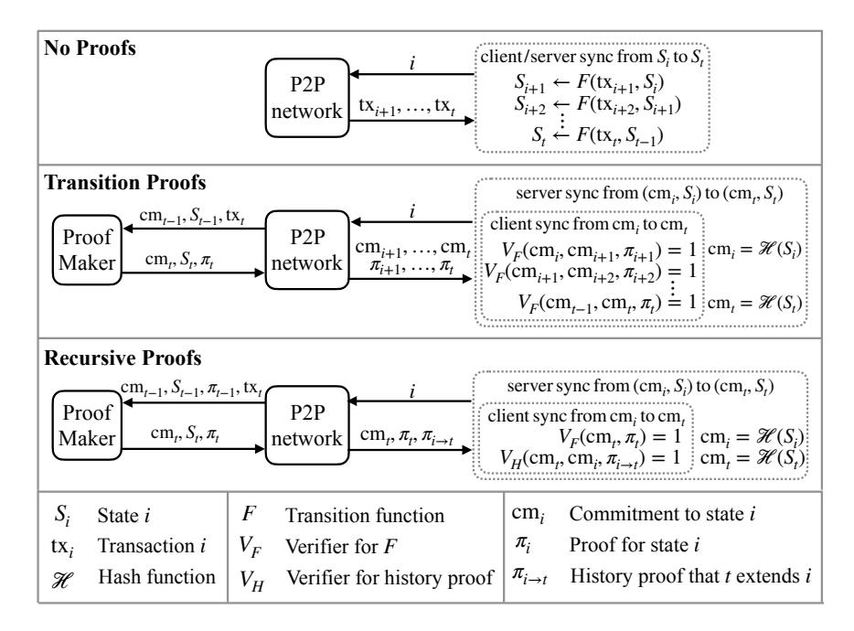
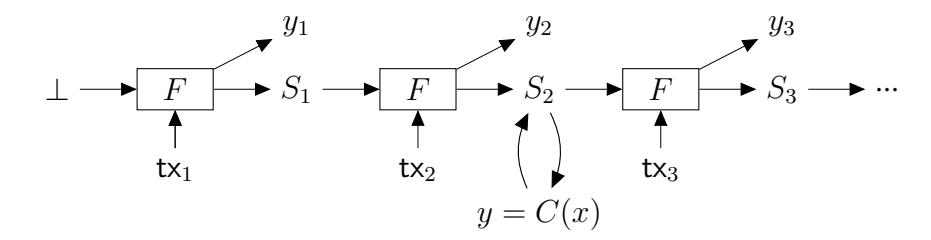
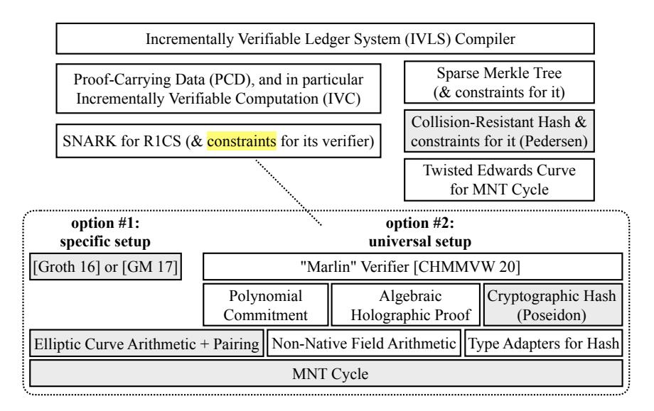

# Reducing Participation Costs via Incremental Verification for Ledger Systems

### Weikeng Chen

weikengchen@berkeley.edu UC Berkeley

## Emma Dauterman

edauterman@berkeley.edu UC Berkeley

## Alessandro Chiesa

alexch@berkeley.edu UC Berkeley

### Nicholas P. Ward

npward@berkeley.edu UC Berkeley

April 28, 2023

#### Abstract

Ledger systems are applications run on peer-to-peer networks that provide strong integrity guarantees. However, these systems often have high participation costs. For a server to join this network, the bandwidth and computation costs grow linearly with the number of state transitions processed; for a client to interact with a ledger system, it must either maintain the entire ledger system state like a server or trust a server to correctly provide such information. In practice, these substantial costs centralize trust in the hands of the relatively few parties with the resources to maintain the entire ledger system state.

The notion of *incrementally verifiable computation*, introduced by Valiant (TCC '08), has the potential to significantly reduce such participation costs. While prior works have studied incremental verification for basic payment systems, the study of incremental verification for a general class of ledger systems remains in its infancy.

In this paper we initiate a systematic study of incremental verification for ledger systems, including its foundations, implementation, and empirical evaluation. We formulate a cryptographic primitive providing the functionality and security for this setting and then demonstrate how it captures applications with privacy and user-defined computations. We build a system that enables incremental verification for applications such as privacy-preserving payments with universal (application-independent) setup. Finally, we show that incremental verification can reduce participation costs by orders of magnitude for a bare-bones version of Bitcoin.

Keywords: incrementally verifiable computation; succinct arguments; ledger systems

## Contents

| 1 | Introduction<br>1.1<br>Our theoretical contributions<br><br>1.2<br>Our systems contributions<br><br>1.3<br>Related work<br>                                                                                                 | 3<br>4<br>5<br>6                       |  |  |  |  |  |  |  |
|---|-----------------------------------------------------------------------------------------------------------------------------------------------------------------------------------------------------------------------------|----------------------------------------|--|--|--|--|--|--|--|
| 2 | Participation costs in ledger systems                                                                                                                                                                                       |                                        |  |  |  |  |  |  |  |
| 3 | Definition of IVLS<br>3.1<br>Properties of MakeSF<br>3.2<br>Properties of MakeC<br><br>3.3<br>Properties of History<br>                                                                                                     | 10<br>11<br>13<br>13                   |  |  |  |  |  |  |  |
| 4 | System architecture                                                                                                                                                                                                         | 15                                     |  |  |  |  |  |  |  |
| 5 | Applications<br>17                                                                                                                                                                                                          |                                        |  |  |  |  |  |  |  |
| 6 | Construction and implementation                                                                                                                                                                                             | 19                                     |  |  |  |  |  |  |  |
| 7 | Evaluation<br>7.1<br>Constraints for SNARK verification<br><br>7.2<br>Incremental verification<br>7.3<br>Privacy-preserving payments<br>7.4<br>Synchronization costs<br>7.5<br>Limitation: producing proofs is costly<br>   | 22<br>22<br>23<br>24<br>24<br>26       |  |  |  |  |  |  |  |
| 8 | Other related work<br>27                                                                                                                                                                                                    |                                        |  |  |  |  |  |  |  |
| A | Formalizing applications<br>A.1<br>Account-based payments<br><br>A.2<br>UTXO-based payments<br>A.3<br>Privacy-preserving payments<br>A.4<br>Privacy-preserving computation<br><br>A.5<br>Key transparency<br>               | 28<br>28<br>28<br>29<br>30<br>30       |  |  |  |  |  |  |  |
| B | Further considerations<br>B.1<br>Integration with consensus protocols<br>B.2<br>Privacy considerations<br>                                                                                                                  | 32<br>32<br>33                         |  |  |  |  |  |  |  |
| C | Construction of an IVLS compiler<br>C.1<br>Building blocks<br>C.2<br>Auxiliary state<br>C.3<br>Construction of Setup<br>C.4<br>Construction of MakeSF<br><br>C.5<br>Construction of MakeC<br>C.6<br>Construction of History | 34<br>34<br>35<br>36<br>36<br>37<br>38 |  |  |  |  |  |  |  |
| D | Security<br>D.1<br>Security of vS<br>D.2<br>Security of vF<br>D.3<br>Security of vC<br>D.4<br>Security of History<br><br>D.5<br>Merkle tree properties                                                                      | 39<br>39<br>39<br>41<br>42<br>43       |  |  |  |  |  |  |  |
|   | Acknowledgments                                                                                                                                                                                                             | 45                                     |  |  |  |  |  |  |  |
|   | References                                                                                                                                                                                                                  | 45                                     |  |  |  |  |  |  |  |

## <span id="page-2-0"></span>1 Introduction

Ledger systems are applications running across many servers in peer-to-peer networks that offer strong integrity guarantees. Cryptocurrencies, ranging from basic payments to rich smart contracts, are notable examples. The strong integrity guarantees, however, come with high participation costs. In this paper we study how to reduce participation costs in ledger systems.

Participation costs. Servers ("full nodes") in a ledger system maintain the entire application state by performing a new state transition with each new transaction (or batch of transactions in a block), according to some consensus protocol. New servers that join the network must download every transaction and perform each state transition executed since the start of the system. The bandwidth and computation costs increase linearly in the number of transactions and soon become substantial. For example, the Bitcoin ledger is over 300GB; downloading and executing each transaction to reach the latest state can take days, depending on the machine.

Moreover, clients wishing to interact with the application must either keep the entire application state like a server or ask a server to answer queries about the current state (or even past transactions). The first option requires clients to perform computations not relevant to them (e.g., process all payments in the system) and also excludes clients running on weak devices (e.g., smartphones). The second option requires clients to trust that servers answer queries correctly.[1](#page-2-1) Both options are undesirable.

Consequently, while in theory ledger systems enable peer-to-peer applications, in practice high participation costs centralize the trust in the hands of a few parties with the resources to maintain the entire application state.

Avoiding re-execution via cryptographic proofs. Several works (reviewed in [Section 8\)](#page-26-0) have studied systems that leverage cryptographic proofs to avoid re-executing transactions when checking state transitions. Informally, cryptographic proofs enable anyone to produce a short string attesting to the correctness of a computation, which can be verified exponentially faster than the proved computation itself. Using this tool, for each state transition, one can generate a proof of the transition's correctness by referring to two short commitments that summarize the application state before and after the transition. Now, validating the latest state only requires downloading all state commitments and transition proofs (much less data than all transactions) and checking all transition proofs (much less work than re-executing all transactions).

Transition proofs reduce participation costs for both servers and clients, but servers and clients still have to process *every* transition proof. The costs to catch up with the latest state still grow linearly with the number of state transitions that have occurred since the last "synchronization" (or since the start of the system for a new participant). In particular, this is expensive for clients who have spent long periods of time offline.[2](#page-2-2)

This idea naturally extends to considering an untrusted operator that produces transition proofs for *batches* of transactions gathered by the operator. This is a popular "layer-2 scaling solution" that has been used in practice with concrete efficiency benefits (see [Section 8\)](#page-26-0). But the basic idea, as well as the asymptotic complexity, remains essentially the same because batches cannot be too large.

Can one reduce the participation costs further?

Incremental verification. Valiant [\[Val08\]](#page-48-0) introduced *incrementally verifiable computation* (IVC) to cap-

<span id="page-2-1"></span><sup>1</sup> Simplified Payment Verification (SPV) [\[Nak08\]](#page-47-0), FlyClient [\[BKLZ20\]](#page-44-2), and other light client schemes offer the client some security guarantees without storing the entire application state, but the client still has to trust that the current state is a result of applying transactions correctly.

<span id="page-2-2"></span><sup>2</sup>Additionally using a light client protocol can reduce synchronization costs, but this is at the cost of qualitatively weaker security guarantees, because the client would have to trust that all transition proofs have been verified.

ture an everlasting computation whose every intermediate state is accompanied by an easy-to-verify proof attesting to its correctness relative to the *initial* state (not the previous state). This capability is achievable via recursive composition of cryptographic proofs, i.e., by producing proofs that (informally) certify both a state transition and the correctness of the prior proof. The exponential speedup of verification relative to execution ensures that the cost of producing each proof from the previous proof does *not* depend on the number of past state transitions.

Incremental verification can dramatically reduce participation costs in ledger systems. Now, validating the latest state requires downloading only the current state (or a short commitment to it) and a *short proof that attests to its correctness relative to the initial state*. [3](#page-3-1)

Towards fulfilling the potential. The blockchain community has recognized the potential of incremental verification and has studied it for payment systems built on Nakamoto consensus [\[KB20\]](#page-46-0) and on proof-ofstake [\[MS18;](#page-47-1) [BMRS20\]](#page-44-3); the latter has been deployed as a cryptocurrency [\[Mina\]](#page-47-2).

However, incremental verification for ledger systems remains in its infancy. First, applications studied so far include simple user-to-user money transfers but not richer applications (e.g., with privacy or smart contracts). Second, advances in cryptographic proofs [\[CHMMVW20;](#page-45-0) [GWC19;](#page-46-1) [BGH19;](#page-44-4) [COS20;](#page-45-1) [BCMS20;](#page-44-5) [BCLMS21\]](#page-44-6) imply that incremental verification can be based on proof systems that are better suited for deployment than those used in [\[KB20;](#page-46-0) [BMRS20\]](#page-44-3), namely, proof systems with a *simple and universal* setup. Both directions are suggested as future work in [\[KB20;](#page-46-0) [BMRS20\]](#page-44-3) and are being explored by practitioners [\[Mec20\]](#page-47-3).

Even more fundamentally, as we elaborate in [Section 1.3,](#page-5-0) while definitions and constructions of IVC have been studied in detail [\[CT10;](#page-45-2) [BCCT13;](#page-44-7) [BCTV14\]](#page-44-8), prior work has only informally discussed the specific needs beyond IVC that arise in ledger systems, and prior work also did not empirically evaluate the benefits and drawbacks of incremental verification with respect to participation costs.

This paper. This paper aims to initiate a systematic study of incremental verification for ledger systems and of its effectiveness in reducing participation costs. We now describe our theoretical contributions [\(Sec](#page-3-0)[tion 1.1\)](#page-3-0) and systems contributions [\(Section 1.2\)](#page-4-0).

### <span id="page-3-0"></span>1.1 Our theoretical contributions

We introduce a cryptographic primitive that captures incremental verification for ledger systems and express several applications within the formalism of this primitive. We elaborate on these two items below.

(i) Incrementally verifiable ledger systems. Valiant's notion of IVC is useful but insufficient for the setting of incremental verification for ledger systems. First, IVC refers to automata computations (arbitrary transitions of a small application state), while applications on ledger systems involve transition functions that, with each transaction, make *few* accesses to a *large* application state. Second, IVC is envisioned for one powerful entity performing state transitions for a long time and then passing its responsibility to another powerful entity (Valiant calls this a "multi-generational computation" [\[Val08\]](#page-48-0)); in ledger systems, however, many parties performing state transitions may go offline for periods of time and then, when back online, need to efficiently "catch up" from when they left to the latest state. Third, ledger systems include clients who do not wish to store the entire application state; rather, they wish to learn select information by querying servers that store the entire state, with integrity guarantees.

Moreover, definitions proposed by prior work on incremental verification for ledger systems [\[BMRS20;](#page-44-3) [KB20\]](#page-46-0) have several limitations, which we discuss in [Section 3.](#page-9-0)

<span id="page-3-1"></span><sup>3</sup>Moreover, incremental verification can be viewed as orthogonal to the "layer-2 scaling solutions" based on batch proofs, and could be used in a hybrid architecture that inherits benefits from both batch proofs and incremental verification.

To fill these gaps, we introduce a cryptographic primitive for transforming a ledger system specified in a certain formalism into a corresponding *incrementally verifiable ledger system* (IVLS); we call this an *IVLS compiler* and discuss it in [Section 3.](#page-9-0) Then in [Section 4](#page-14-0) we explain how the specific interfaces and security properties of our definition let us build peer-to-peer systems that, via incremental verification, achieve low participation costs. An IVLS compiler can be obtained, in a straightforward way, from IVC and collisionresistant hash functions.

(ii) Incrementally verifiable applications. We validate our modeling by showing how to make several applications incrementally verifiable. By carefully designing the applications' states, transactions, and transition functions, we obtain IVLS for five applications: (i) UTXO-based payments ("bare-bones" Bitcoin); (ii) account-based payments, the ledger application studied in prior works on incremental verification [\[BMRS20;](#page-44-3) [KB20\]](#page-46-0); (iii) privacy-preserving payments, a la Zerocash [\[Ben+14\]](#page-45-3); (iv) privacy-preserving ´ decentralized computation, a la Zexe [\[BCGMMW20\]](#page-44-9); and (v) key transparency [\[MBBFF15\]](#page-47-4), a popular ´ approach to public-key infrastructure.[4](#page-4-1) Our work shows how applications that involve privacy and rich computations are compatible with incremental verification (see [Section 5](#page-16-0) and [Appendix A\)](#page-27-0). This provides solid theoretical foundations that can be used to study the security of new architectures based on recursive proofs that are being explored for Zcash [\[Hop19\]](#page-46-2). Subsequent work on key transparency also falls within our IVLS model [\[TFBT21\]](#page-48-1).

### <span id="page-4-0"></span>1.2 Our systems contributions

We build a system prototype in Rust that realizes our IVLS primitive, contributing the following: (1) incremental verification with a universal (application-independent) setup, based on pairings; (2) an incrementally verifiable analogue of Zerocash; and (3) an empirical evaluation that validates the reduction in participation costs via measurements for a ten-year "bare-bones" Bitcoin.

Before elaborating on each of these contributions, we first describe our system at high level. In our Rust library, the programmer specifies the desired application via a transition function represented as a constraint system with read/write memory gates (which our implementation realizes for the application). Our implementation then produces an incrementally verifiable version of that application, creating functionality for producing proofs with each state transition from the prior state and proof, for validating proofs, and so on.

(1) Recursing a universal SNARK based on pairings. Incremental verification is obtained via a recursive use of cryptographic proofs called *succinct non-interactive arguments of knowledge* (SNARKs) [\[Val08;](#page-48-0) [CT10;](#page-45-2) [BCCT13\]](#page-44-7). The predominant approach to achieve good efficiency in this setting is based on SNARKs that support "preprocessing" [\[BCTV14;](#page-44-8) [COS20\]](#page-45-1). Informally, this means that the SNARK verifier can check the satisfiability of a given circuit in time that is exponentially fast by using a short verifying key that was produced in an offline (preprocessing) phase. Prior work on incremental verification [\[BMRS20;](#page-44-3) [KB20\]](#page-46-0) uses SNARKs whose preprocessing is part of the SNARK's setup: the circuit to be proved/verified must be fixed once and for all when the public parameters for the SNARK are sampled via a cryptographic ceremony [\[BCGTV15;](#page-44-10) [BGG17;](#page-44-11) [BGM17\]](#page-44-12). This *circuit-specific setup* is ill-suited for many applications where the circuits to be proved/verified are determined later on by users once the ledger system is already running (e.g., as in Zexe [\[BCGMMW20\]](#page-44-9)), or where circuits need to be updated.

We give the first demonstration of efficient recursive proofs based on a pairing-based preprocessing SNARK with *universal setup*. Here "universal setup" denotes the desirable property that the SNARK's public parameters do *not* depend on circuits to be proved/verified (but only on an upper bound on their size).

<span id="page-4-1"></span><sup>4</sup>The key transparency architecture has a central server and multiple clients, meaning that we only consider participation costs for clients, as the single server always remains online.

As we discuss shortly, this is helpful, or even necessary, for many applications.

Our contribution is to implement and evaluate a (rank-1) constraint system for the verifier of Marlin [\[CHMMVW20\]](#page-45-0), a state-of-the-art preprocessing SNARK with universal setup and a simple setup ceremony. Our constraint system is less than ten times larger than a constraint system for the state of the art with circuitspecific setup [\[Gro16\]](#page-46-3), which suffices for building incrementally verifiable ledger systems. We discuss our implementation of the Marlin verifier's constraint system in [Section 6](#page-18-0) and its evaluation in [Section 7.1.](#page-21-1)

Other recent works study recursion of preprocessing SNARKs with a universal setup based on other cryptographic tools (cyclic groups [\[BGH19\]](#page-44-4) or hash functions [\[COS20\]](#page-45-1)), but their proof sizes are markedly larger.

- (2) Incremental verification for private payments. We provide the first realization of private payments (a la Zerocash [\[Ben+14\]](#page-45-3)) with incremental verification, and evaluate its concrete efficiency. Prior works ´ on incremental verification only considered basic public payments, while we show that incremental verification for more complex applications is not only possible but also practical. Our system prototype makes realizing private payments particularly simple: we only need to program the compliance predicate outlined in [Section 5](#page-16-0) and [Appendix A.](#page-27-0) We describe our implementation in [Section 6](#page-18-0) and evaluation in [Section 7.3.](#page-23-0)
- (3) Incremental verification reduces participation costs. We provide an evaluation that quantifies how incremental verification reduces participation costs. Prior work on incremental verification [\[BMRS20;](#page-44-3) [KB20\]](#page-46-0) provided only microbenchmarks or network data about the Mina blockchain, without studying how recursive proofs reduce network and computation costs for participants.

We evaluate the effect of IVLS on the participation costs of a ten-year simplified version of Bitcoin (e.g., no scripts): recursive proofs reduce synchronization costs by *orders of magnitude* when compared with not using proofs (that is, naive synchronization) or using per-block transition proofs. Since our code facilitates swapping in different SNARKs over different curves, we evaluate multiple configurations: (a) SNARKs with circuit-specific setup and with universal setup; and (b) different MNT cycles (low-security and high-security levels).

### <span id="page-5-0"></span>1.3 Related work

We summarize prior work on incremental verification for ledger systems; its focus is complementary to ours. We discuss other, less relevant prior work in [Section 8.](#page-26-0)

Bonneau et al. [\[BMRS20\]](#page-44-3) (expanding on a prior whitepaper [\[MS18\]](#page-47-1)) design an incrementally verifiable payment system based on a proof-of-stake consensus protocol. They show how to modify the Ouroboros Genesis protocol [\[BGKRZ18\]](#page-44-13) so that its chain selection rule can be realized via a small-space algorithm, thereby obtaining a consensus protocol amenable to incremental state updates.

Kattis and Bonneau [\[KB20\]](#page-46-0) design an incrementally verifiable payment system whose consensus protocol requires miners to solve a cryptographic puzzle that updates the prior state's proof to the next state's proof; they call this paradigm a *Proof of Necessary Work*. They show how to modify the Nakamoto consensus protocol to incorporate the proof-computation process to ensure that solving puzzles is "amortization resistant" across solution attempts (a desirable fairness property for mining).

These works focus on basic payments (and no privacy guarantees) and on tackling challenges that arise in making consensus protocols compatible with incremental updates. In contrast, our focus is to formulate and realize a cryptographic primitive with concrete capabilities and security properties and show how it can express a range of applications (including with privacy goals). We believe that this will facilitate further work in incremental verification, which can make black-box use of our primitive. We discuss other limitations of the definitions in [\[BMRS20;](#page-44-3) [KB20\]](#page-46-0) in [Section 3.](#page-9-0) Further, our implementation achieves incremental verifiability based on recent advances in SNARKs with a simple and universal setup, which are better suited to real-world deployment and not studied previously. We also empirically validate how incremental verification reduces participation costs.

Both [\[BMRS20\]](#page-44-3) and [\[KB20\]](#page-46-0) suggest for future work: (1) to explore richer (e.g. privacy-preserving) applications; and (2) SNARKs with universal setup. We address both.

## <span id="page-7-0"></span>2 Participation costs in ledger systems

In this section we elucidate what we mean by "participation costs" in a ledger system and discuss how they are qualitatively affected by no proofs, transition proofs, and recursive proofs. This discussion will motivate the cryptographic primitive in Section 3 and its usage in Section 4.

A ledger system involves heavyweight *servers* responsible for maintaining the application state and lightweight *clients* that perform queries to the current state (or to consult past transactions). Within this paper, participation costs consist of the following two types of costs.

- **Synchronization costs:** Both servers and clients may go offline and later "catch up" to the current state of the system. (When servers or clients join, they start from the initial state.) Servers and clients verify the current state's integrity by checking that it is the correct result of a sequence of transactions.
- Query costs: Clients only store a short state commitment and want to ensure that servers answer their queries correctly relative to the corresponding state. Clients may also make queries to prior application states, as the application may "forget" information that the client still cares about (e.g., a transaction that is already spent in a UTXO-based payment system). If the client only holds a commitment to the current state, it needs assurance that the prior state used to answer that query is in the history of the current application state.

Below we discuss participation costs in ledger systems with: no proofs, transition proofs, and recursive proofs (which underlie incremental verification). Figure 1 summarizes how these different options affect the computations required to synchronize; our experiments in Section 7.4 confirm this qualitative behavior in practice.



<span id="page-7-1"></span>Figure 1: Synchronization costs in ledger systems with different proof types (see Section 4 for discussion of the proof maker). Proving that one state extends another  $(\pi_{i\to t})$  can be made lightweight enough that it can be done by peer-to-peer networks without the proof maker. The server synchronization includes the client synchronization.

No proofs. Without proofs, servers or clients who want to be confident in an application state have no choice but to derive the application state themselves by downloading and executing each transaction since they were last online, leading to high synchronization costs. This essentially removes the distinction between clients and servers, as clients must hold a copy of the current application state to check its validity. The query cost is thus the cost for the client to execute its query over this local copy.

Transition proofs. Instead of executing every state transition, servers or clients can download, for each state transition, a proof and a commitment to the next state. Servers also download the current application state and check that the final commitment commits to the current state. As clients no longer have the entire application state, query costs are different: clients now only use a commitment to the state to verify query responses. Transition proofs are a significant improvement over no proofs [\(Section 7.4\)](#page-23-1), and batching can reduce costs even further [\[OWWB20;](#page-47-5) [LNS20\]](#page-47-6). However, synchronization costs remain linear in the number of state transitions and remain substantial for servers and clients that were offline for a long time.

Recursive proofs. Recursive proofs further reduce synchronization costs for servers and clients by removing costs linear in the number of state transitions. Servers and clients only have to verify one proof that the current state is correct and possibly another lightweight proof that the current state extends the prior state held by them. The prover can recursively compose prior proofs to reduce proving cost.[5](#page-8-0) Query costs with recursive proofs match those of transition proofs; clients must check that their queries were correctly executed using a commitment to the state.

This informal paradigm is the starting point of our work. In [Section 3](#page-9-0) we formulate a cryptographic primitive that captures these capabilities, and in [Section 4](#page-14-0) we explain how to use the primitive in a system.

<span id="page-8-0"></span><sup>5</sup>We could also imagine generating these proofs non-recursively and proving the correctness of the current state from the initial state after every state transition. This is prohibitively expensive for the prover because the proving cost grows linearly with the number of total transactions.

## <span id="page-9-0"></span>3 Definition of IVLS

We capture the capabilities of recursive proofs with a cryptographic primitive called an *incrementally verifiable ledger system* (IVLS). An *IVLS compiler* transforms any ledger system into a corresponding IVLS.

We first discuss limitations of prior definitions related to incremental verification for ledgers and then present our set of definitions.

Limitations of prior definitions. Bonneau et al. [\[BMRS20\]](#page-44-3) define the notion of a *succinct blockchain* to capture incremental verification of a blockchain application over a compatible consensus algorithm.[6](#page-9-1) While [\[BMRS20\]](#page-44-3) takes a first step in formulating definitions about IVC for ledgers, we revisit these definitions for two reasons.

First, the definitions in [\[BMRS20\]](#page-44-3) do not differentiate between participants that maintain the entire state (full nodes) and participants that maintain only a short commitment to it (light clients). Light clients need to query full nodes for information about the state (as they only have a summary), and may also go offline for a period of time and need to synchronize their old summary with a summary of the current state. Our definitions distinguish between these, ensuring that clients can interact with the system in a meaningful way with only a summary of the state.

Second, the definitions in [\[BMRS20\]](#page-44-3) separate the application and the consensus protocol, which complicates interfaces and introduces properties that only relate to consensus (e.g., chain growth). More importantly, this is unnecessary: any consensus protocol compatible with incremental verification can be "folded" without loss of generality into the application itself. Designing consensus protocols compatible with incremental verification is, of course, important but seems better left to the details of the application. For example, our definitions can capture incremental verification not only for traditional blockchain applications (e.g., simple payments and privacy-preserving payments) but also for applications like key transparency that maintain state via a different centralized consensus (see [Section 5\)](#page-16-0). And, indeed, a subsequent work on verifiable key transparency [\[TFBT21\]](#page-48-1) specifically points out that their work falls under the general framework of IVLS.

Kattis and Bonneau [\[KB20\]](#page-46-0) also describe a distributed payment system with incremental verification. They discuss the benefits of incremental verification at a high level, but do not provide interfaces and associated security properties that the system needs to fulfill.

Our definitions. We present our definitions for IVLS; later in [Section 4](#page-14-0) we explain how these abstract definitions apply to real systems and how our properties provide meaningful guarantees to participants, and in [Section 5](#page-16-0) we exercise our definitions to show how to capture several applications of interest, including privacy-preserving payments, privacy-preserving computation, and key transparency (a direction left as future work by [\[BMRS20;](#page-44-3) [KB20\]](#page-46-0)).[7](#page-9-2)

A *ledger system* is a pair LS = (F, C) where F is a read-write program called the *transition function* and C is a read-only program called the *client function*.

The transition function F specifies how transactions modify the state. That is, given as input a transaction tx and query access to the current state S, F produces an output y and a state update ∆ (denoted by (y, ∆) := F S (tx)); the new state S ′ is obtained by applying the update ∆ to the old state S (denoted by

<span id="page-9-1"></span><sup>6</sup>We use the term *incrementally verifiable ledger system* because: (1) it highlights the main feature (incremental verification) while being consistent with a closely related primitive (incrementally verifiable computation); and (2) "succinct blockchain" is, in our opinion, a misnomer (the blockchain and the application state are not succinct themselves). Also, we prefer the term *ledger system* over *state machine* because the latter equally apply to Valiant's IVC (e.g., it does not suggest a setting with clients and servers).

<span id="page-9-2"></span><sup>7</sup>We follow the standard game-based approach, and leave to future work a treatment in the universal composability framework [\[Can01\]](#page-45-4).



$$S' := S + \Delta).$$

The client function C specifies the supported types of client queries over a state: given an input query x and query access to a state S, C produces a query answer y (denoted by y := C S (x)).

For example, in a simple UTXO-based payment system, the application state contains the pool of all unspent transactions, an incoming transaction consumes the outputs of prior transactions to generate new outputs, and the state transition function accepts a new transaction if it consumes unspent outputs. The client function searches for unspent transactions that can be spent by a public key. (See [Section 5](#page-16-0) for more examples.)

We wish to transform any ledger system into a ledger system that has the same functionality and is incrementally verifiable. For this, we define an *IVLS compiler*: a tuple (Setup, MakeSF, MakeC, History) that we require to fulfill certain syntax and properties. First, Setup is used to sample public parameters pp; this is a one-time setup that can be used to transform any number of ledger systems. Next, we separately discuss each of MakeSF, MakeC, History in the next three subsections.

Remark 3.1 (extensions). Our definition of a ledger system assumes for simplicity that the initial state is empty and that the transition function applies one transaction at a time. All discussions in this paper extend, in a straightforward way, to the case of non-empty initial states and to the case of transition functions that apply blocks of transactions. Moreover, we do not consider an algorithm for validating transactions before they are processed by the transition function since the transition function can check validity itself (and if not, return an error in its output and an empty state update). In a real system, validating transactions separately is likely to be more convenient.

Remark 3.2 (deterministic vs. probabilistic). In the definitions of this section we assume that MakeSF and MakeC are deterministic algorithms. This is the case in our construction (in [Appendix C\)](#page-33-0) and also simplifies many definitions because an adversary can compute (vS, vF) and vC from F and C, respectively, by itself. All of our definitions naturally extend to the case where MakeSF and MakeC can toss coins: the adversary needs to be given (vS, vF) and vC as an input at the right place in the definitions.

### <span id="page-10-0"></span>3.1 Properties of MakeSF

Given public parameters pp and a transition function F, MakeSF outputs (vS, vF) where vF is an incrementally verifiable version of F and vS are functions that manages vF's state. We describe each below.

vS. The tuple vS = (Info, VerifyCM, VerifyAll) consists of efficient deterministic algorithms working as follows:

• vS.InfoS,A() → (t, cm, πF). Given oracle access to a state S and auxiliary state A, Info outputs the state's current index t, commitment cm, and proof πF.

- vS.VerifyCM(S, cm) → b. On input a state S and commitment cm, VerifyCM determines if cm is a valid commitment to S. We use the convention vS.VerifyCM(⊥, ⊥) = 1 (i.e., the empty commitment is a valid commitment for the empty state).
- vS. VerifyAll $(S, A) \to b$ . On input a state S and auxiliary state A, VerifyAll checks if the states are valid. We use the convention vS. VerifyAll $(\bot, \bot) = 1$ .

For now, the only property that we explicitly require is that it is infeasible to find distinct states with the same valid commitment (Definition 3.3). Definitions later in this section imply other properties of vS.

<span id="page-11-0"></span>**Definition 3.3** (binding of vS). For every polynomial-size adversary A and sufficiently large security parameter  $\lambda$ ,

$$\Pr\left[\begin{array}{c|c} \mathsf{vS.VerifyCM}(S_1,\mathsf{cm}) = 1\\ \mathsf{vS.VerifyCM}(S_2,\mathsf{cm}) = 1\\ \downarrow\\ S_1 = S_2 \end{array} \right| \begin{array}{c} \mathsf{pp} \leftarrow \mathsf{Setup}(1^\lambda)\\ (F,S_1,S_2,\mathsf{cm}) \leftarrow \mathcal{A}(\mathsf{pp})\\ (\mathsf{vS},\mathsf{vF}) \leftarrow \mathsf{MakeSF}(\mathsf{pp},F) \end{array} \right] \geq 1 - \mathsf{negl}(\lambda) \ .$$

**vF.** The tuple vF = (Run, Verify) consists of efficient algorithms working as follows:

- vF.Run<sup>S,A</sup>(tx)  $\rightarrow$  (y,  $\Delta$ ). Given oracle access to a state S and auxiliary state A, and given as input a transaction tx, Run outputs a result y and a state update  $\Delta = (\Delta_S, \Delta_A)$  to modify S and A. The result y and state update  $\Delta_S$  equal the output of the original transition function F (on input tx and state S).
- vF.Verify $(t, \mathsf{cm}, \pi_\mathsf{F}) \to b$ . On input a state's index t, commitment cm, and proof  $\pi_\mathsf{F}$ , Verify decides if the commitment is consistent with a state resulting from applying the transition function F on t transactions. We will assume vF.Verify $(0, \bot, \bot) = 1$ .

We require two properties. Completeness (Definition 3.4) states that using vF.Run to apply a transaction to a valid state yields a new valid state that is consistent with the original transition function F and a new auxiliary state that contains information passing all the relevant checks. Knowledge soundness (Definition 3.5) states that if an efficient adversary outputs a state commitment and proof that are valid according to vF.Verify, then an efficient extractor can output a sequence of transactions that, via transition function F, lead to a state with the claimed commitment.

<span id="page-11-1"></span>**Definition 3.4** (completeness of vF). For every polynomial-size adversary A and security parameter  $\lambda$ ,

$$\Pr\left[\begin{array}{c} \text{vS.VerifyAll}(S,A) = 1\\ \text{vF.Verify}(t,\mathsf{cm},\pi_\mathsf{F}) = 1\\ (y,\Delta_S) = F^S(\mathsf{tx})\\ t' = t+1\\ \text{vS.VerifyAll}(S',A') = 1 \end{array}\right| \begin{array}{c} \mathsf{pp} \leftarrow \mathsf{Setup}(1^\lambda)\\ (F,S,A,\mathsf{tx}) \leftarrow \mathcal{A}(\mathsf{pp})\\ (\mathsf{vS},\mathsf{vF}) \leftarrow \mathsf{MakeSF}(\mathsf{pp},F)\\ (t,\mathsf{cm},\pi_\mathsf{F}) \leftarrow \mathsf{vS.Info}^{S,A}()\\ (y,(\Delta_S,\Delta_A)) \leftarrow \mathsf{vF.Run}^{S,A}(\mathsf{tx})\\ S' := S+\Delta_S,\ A' := A+\Delta_A\\ (t',\mathsf{cm}',\pi_\mathsf{F}') \leftarrow \mathsf{vS.Info}^{S',A'}() \end{array}\right] = 1\ .$$

<span id="page-11-2"></span>**Definition 3.5** (knowledge soundness of vF). For every polynomial-size adversary A there exists a polynomial-size extractor  $\mathcal{E}$  such that for every sufficiently large security parameter  $\lambda$ ,

$$\Pr\left[\begin{array}{c|c} \mathsf{vF.Verify}(t,\mathsf{cm},\pi_\mathsf{F}) = 1 & \mathsf{pp} \leftarrow \mathsf{Setup}(1^\lambda) \\ \downarrow & (F,t,\mathsf{cm},\pi_\mathsf{F}) \leftarrow \mathcal{A}(\mathsf{pp}) \\ S = F(\mathsf{tx}_1,\dots,\mathsf{tx}_t) & (\mathsf{tx}_1,\dots,\mathsf{tx}_t) \leftarrow \mathcal{E}(\mathsf{pp}) \\ \mathsf{vS.VerifyCM}(S,\mathsf{cm}) = 1 & (\mathsf{vS},\mathsf{vF}) \leftarrow \mathsf{MakeSF}(\mathsf{pp},F) \end{array}\right] \geq 1 - \operatorname{negl}(\lambda) \ .$$

#### <span id="page-12-0"></span>3.2 Properties of MakeC

Given public parameters pp and a client function C, MakeC outputs a tuple vC = (Run, Verify), the verifiable version of C, that enables proving/verifying that, given a commitment to the current state, the client function was executed correctly. In more detail, these work as follows:

- vC.Run<sup>S,A</sup>(x)  $\rightarrow$  (y,  $\pi_{\text{C}}$ ). Given oracle access to a state S and auxiliary state A and input x, Run produces an output y and a proof  $\pi_{\text{C}}$  attesting that  $y = C^S(x)$ .
- vC.Verify(cm,  $x, y, \pi_C$ )  $\to$  b. On input a state's commitment cm, input x, claimed output y, and proof  $\pi_C$ , Verify determines if cm is consistent with a state S such that  $y = C^S(x)$ .

We require two properties. Completeness (Definition 3.6) states that outputs of vC.Run are accepted by vC.Verify and are consistent with executions of the given client function C. Soundness (Definition 3.7) states that if an efficient adversary outputs (a valid state and auxiliary state and) a proof that is accepted by vC.Verify for a given input and claimed output, then the claimed output equals C's output.

<span id="page-12-2"></span>**Definition 3.6** (completeness of vC). For every polynomial-size adversary A and security parameter  $\lambda$ ,

$$\Pr\left[\begin{array}{c} \mathsf{vS.VerifyAll}(S,A) = 1 \\ \downarrow \\ y = C^S(x) \\ \mathsf{vC.Verify}(\mathsf{cm},x,y,\pi_\mathsf{C}) = 1 \end{array} \middle| \begin{array}{c} \mathsf{pp} \leftarrow \mathsf{Setup}(1^\lambda) \\ (F,C,S,A,x) \leftarrow \mathcal{A}(\mathsf{pp}) \\ (\mathsf{vS},\mathsf{vF}) \leftarrow \mathsf{MakeSF}(\mathsf{pp},F) \\ \mathsf{vC} \leftarrow \mathsf{MakeC}(\mathsf{pp},C) \\ (y,\pi_\mathsf{C}) \leftarrow \mathsf{vC.Run}^{S,A}(x) \\ (\cdot,\mathsf{cm},\cdot) \leftarrow \mathsf{vS.Info}^{S,A}() \end{array} \right] = 1 \ .$$

<span id="page-12-3"></span>**Definition 3.7** (soundness of vC). For every polynomial-size adversary A and sufficiently large security parameter  $\lambda$ ,

$$\Pr\left[\begin{array}{c} \text{vS.VerifyAll}(S,A) = 1\\ \text{vC.Verify}(\mathsf{cm},x,y,\pi_{\mathsf{C}}) = 1\\ \downarrow\\ y = C^S(x) \end{array} \right| \begin{array}{c} \mathsf{pp} \leftarrow \mathsf{Setup}(1^{\lambda})\\ (F,C,S,A,x,y,\pi_{\mathsf{C}}) \leftarrow \mathcal{A}(\mathsf{pp})\\ (\mathsf{vS},\mathsf{vF}) \leftarrow \mathsf{MakeSF}(\mathsf{pp},F)\\ \mathsf{vC} \leftarrow \mathsf{MakeC}(\mathsf{pp},C)\\ (\cdot,\mathsf{cm},\cdot) \leftarrow \mathsf{vS.Info}^{S,A}() \end{array} \right] \geq 1 - \operatorname{negl}(\lambda) \ .$$

#### <span id="page-12-1"></span>**3.3** Properties of History

History = (Prove, Verify) enables proving/verifying that a prior state commitment is on the same timeline as another (later) state commitment. History.Prove produces a proof that the current (committed) state can be reached from an earlier (committed) state. History.Verify checks the proof. In more detail, the algorithms work as follows:

- History.Prove<sup>S,A</sup>(pp, t)  $\to \pi_H$ . Given oracle access to a state S and auxiliary state A, and given as input public parameters pp and a previous state's index t, Prove outputs a proof  $\pi_H$  attesting to the relationship between the t-th state commitment in the history and the current state commitment. (If the current state has an index less than or equal to t, Prove outputs  $\bot$ .)
- History.Verify(pp, cm, t, cm $_t$ ,  $\pi_H$ )  $\to b$ . On input public parameters pp, the current state's commitment cm, previous state's index t and commitment cm $_t$ , and a proof  $\pi_H$ , Verify determines if cm $_t$  was the valid t-th state commitment in the history leading to cm.

We require two properties. *Completeness* (Definition 3.8) states that valid proofs can be generated for any past prior state commitment, relative to the state's index. *Binding* (Definition 3.9) states that it is infeasible to find, for the same state commitment cm, two distinct commitments that are valid for the same prior index t.

<span id="page-13-0"></span>**Definition 3.8** (completeness of History). *For every polynomial-size adversary* A *and security parameter*  $\lambda$ ,

$$\Pr\left[\begin{array}{c} \mathsf{vS.VerifyAll}(S,A) = 1 \\ \mathsf{VS.VerifyAll}(S,A) = 1 \\ \downarrow \\ t' = t + n \\ \mathsf{History.Verify}(\mathsf{pp},\mathsf{cm}',t,\mathsf{cm},\pi_\mathsf{H}) = 1 \end{array} \right. \\ \left[\begin{array}{c} \mathsf{pp} \leftarrow \mathsf{Setup}(1^\lambda) \\ (F,S,A,(\mathsf{tx}_1,\ldots,\mathsf{tx}_n)) \leftarrow \mathcal{A}(\mathsf{pp}) \\ (\mathsf{vS},\mathsf{vF}) \leftarrow \mathsf{MakeSF}(\mathsf{pp},F) \\ (t,\mathsf{cm},\cdot) \leftarrow \mathsf{vS.Info}^{S,A}() \\ (t',\mathsf{cm}',\cdot) \leftarrow \mathsf{vS.Info}^{S',A'}() \\ (t',\mathsf{cm}',\cdot) \leftarrow \mathsf{vS.Info}^{S',A'}() \\ \pi_\mathsf{H} \leftarrow \mathsf{History.Prove}^{S',A'}(\mathsf{pp},t) \end{array}\right] = 1 \ .$$

Above we use a shorthand for going from state (S, A) to state (S', A') via the transactions  $(\mathsf{tx}_1, \ldots, \mathsf{tx}_n)$ .

<span id="page-13-1"></span>**Definition 3.9** (binding of History). For every polynomial-size adversary A and sufficiently large security parameter  $\lambda$ ,

$$\Pr\left[\begin{array}{c|c} \mathsf{History.Verify}(\mathsf{pp},\mathsf{cm},t,\mathsf{cm}_t,\pi_\mathsf{H}) = 1\\ \mathsf{History.Verify}(\mathsf{pp},\mathsf{cm},t,\mathsf{cm}_t',\pi_\mathsf{H}') = 1\\ \downarrow\\ \mathsf{cm}_t = \mathsf{cm}_t' \end{array} \right| \left( \begin{array}{c} \mathsf{pp} \leftarrow \mathsf{Setup}(1^\lambda)\\ \mathsf{cm}_t,\pi_\mathsf{H}\\ \mathsf{cm}_t',\pi_\mathsf{H}' \end{array} \right) \leftarrow \mathcal{A}(\mathsf{pp}) \end{array} \right] \geq 1 - \operatorname{negl}(\lambda) \enspace .$$

### <span id="page-14-0"></span>4 System architecture

We described how an IVLS compiler transforms a given ledger system LS = (F, C) into a new ledger system IVLS = (vF, vC) that (a) has the same functionality and similar efficiency and (b) is incrementally verifiable in a precise sense. Next we describe how IVLS gives rise to a peer-to-peer architecture with (much) smaller participation costs. In Appendix B.1 we explain how consensus protocols integrate with this system architecture, and in Appendix B.2 we discuss how privacy fits into this system architecture. Recall from Section 2 that synchronization costs are incurred by servers and clients who want to verify that the current state is derived from a past state correctly, and query costs are incurred by clients who want to verify query responses.

**The new system.** Informally, servers use the new transition function vF instead of the original F, and clients use the new client function vC instead of the original C. We now discuss the different operations.

State updates. Besides the application state S, each server maintains an auxiliary state A that stores cryptographic information. A server processes a new transaction tx by computing  $(y, \Delta) := vF.Run^{S,A}(tx)$  and applying the state update  $\Delta$  to the augmented state (S,A). (For comparison, in the original application, each server would compute  $(y,\Delta_S) = F^S(tx)$  and apply the state update  $\Delta_S$  to S.) Any server can run  $vS.Info^{S,A}$  to obtain the number t of transactions that have been applied since the start of the system, a commitment cm to the current application state, and a proof  $\pi_F$  of correctness.

State validity. A server joining the system can simply download and verify the state and auxiliary information (S,A) by checking the state proof  $\pi_F$  and checking the consistency between S and A using vS.VerifyAll(S,A). The new server does not need to itself apply the transition function vF.Run for each prior transaction.

Client queries. vC enables a server to convince a client that it answered the client's query correctly. The client sends a query x to a server, the server computes and returns the answer and proof  $(y, \pi_{\mathsf{C}}) \leftarrow \mathsf{vC}.\mathsf{Run}^{S,A}(x)$ , and the client checks the answer by running  $\mathsf{vC}.\mathsf{Verify}(\mathsf{cm}, x, y, \pi_{\mathsf{C}})$ , where cm is the commitment to S.

Relation between states. A server or client may be offline for a period of time and need a way to establish that an old state commitment cm<sup>old</sup> and a new state commitment cm<sup>new</sup> are not just individually valid (as established via vF.Verify) but also belong to the same "timeline". Moreover, a client that has a current state commitment and wants to make a query about an old state needs to be able to check that the current state was derived from the old state. Both tasks can be accomplished via functionality offered by History, which enables skipping along this "timeline" of states using only commitments. The server can prove that the state committed to by cm<sup>new</sup> is reachable from a state committed to by cm<sup>old</sup> by computing a history proof  $\pi_H := \text{History.Prove}^{S,A}(pp, t^{\text{old}})$  where  $t^{\text{old}}$  is the old state's index. The client checks this proof by running History.Verify(pp, cm<sup>new</sup>,  $t^{\text{old}}$ , cm<sup>old</sup>,  $t^{\text{old}}$ , cm<sup>old</sup>,  $t^{\text{old}}$ , cm<sup>old</sup>,  $t^{\text{old}}$ , cm<sup>old</sup>,  $t^{\text{old}}$ , cm<sup>old</sup>,  $t^{\text{old}}$ , cm<sup>old</sup>,  $t^{\text{old}}$ , cm<sup>old</sup>,  $t^{\text{old}}$ , cm<sup>old</sup>,  $t^{\text{old}}$ , cm<sup>old</sup>,  $t^{\text{old}}$ , cm<sup>old</sup>,  $t^{\text{old}}$ , cm<sup>old</sup>,  $t^{\text{old}}$ , cm<sup>old</sup>,  $t^{\text{old}}$ , cm<sup>old</sup>,  $t^{\text{old}}$ , cm<sup>old</sup>,  $t^{\text{old}}$ , cm<sup>old</sup>,  $t^{\text{old}}$ , cm<sup>old</sup>,  $t^{\text{old}}$ , cm<sup>old</sup>,  $t^{\text{old}}$ , cm<sup>old</sup>,  $t^{\text{old}}$ , cm<sup>old</sup>,  $t^{\text{old}}$ , cm<sup>old</sup>,  $t^{\text{old}}$ , cm<sup>old</sup>,  $t^{\text{old}}$ , cm<sup>old</sup>,  $t^{\text{old}}$ , cm<sup>old</sup>,  $t^{\text{old}}$ , cm<sup>old</sup>,  $t^{\text{old}}$ , cm<sup>old</sup>,  $t^{\text{old}}$ , cm<sup>old</sup>,  $t^{\text{old}}$ , cm<sup>old</sup>,  $t^{\text{old}}$ , cm<sup>old</sup>,  $t^{\text{old}}$ , cm<sup>old</sup>,  $t^{\text{old}}$ , cm<sup>old</sup>,  $t^{\text{old}}$ , cm<sup>old</sup>,  $t^{\text{old}}$ , cm<sup>old</sup>,  $t^{\text{old}}$ , cm<sup>old</sup>,  $t^{\text{old}}$ , cm<sup>old</sup>,  $t^{\text{old}}$ , cm<sup>old</sup>,  $t^{\text{old}}$ , cm<sup>old</sup>,  $t^{\text{old}}$ , cm<sup>old</sup>,  $t^{\text{old}}$ , cm<sup>old</sup>,  $t^{\text{old}}$ , cm<sup>old</sup>,  $t^{\text{old}}$ , cm<sup>old</sup>,  $t^{\text{old}}$ , cm<sup>old</sup>,  $t^{\text{old}}$ , cm<sup>old</sup>,  $t^{\text{old}}$ , cm<sup>old</sup>,  $t^{\text{old}}$ , cm<sup>old</sup>,  $t^{\text{old}}$ , cm<sup>old</sup>,  $t^{\text{old}}$ , cm<sup>old</sup>,  $t^{\text{old}}$ , cm<sup>old</sup>,  $t^{\text{old}}$ , cm<sup>old</sup>,  $t^{\text{old}}$ , cm<sup>old</sup>,  $t^{\text{$ 

**Motivation for security properties.** We discuss how the security properties presented in Section 3 translate to the informal security desiderata we have discussed for synchronizing state and executing queries.

Synchronization. vF's knowledge soundness (Definition 3.5) states that every state commitment accepted by vF. Verify implies a sequence of transactions that, via the transition function F, lead to the committed state. The binding property of History (Definition 3.9) states that one cannot find prior state commitments that contradict each other but are both accepted by History. Verify for the current state commitment. Together these imply that the state committed to by prior state commitments is valid.

Query execution. vC's soundness (Definition 3.7) ensures that every query result over a valid state accepted by vC. Verify implies that the result y is the output of running the client function C over the state with the

input x.

Reducing participation costs. The new system reduces synchronization costs and query costs.

Synchronization now only requires servers and clients to verify the latest state proof π<sup>F</sup> produced by vF.Run along with, if they have a past commitment, a history proof π<sup>H</sup> produced by History.Prove. To verify the consistency between the state and the auxiliary state, the server additionally runs vS.VerifyAll. These are efficient checks, and our evaluation of synchronization costs shows their practical benefits (see [Section 7.4\)](#page-23-1).

Query costs are simply the time for the client to verify the query proof π<sup>C</sup> produced by vC.Run, which is much faster than executing the query itself on the state.

Integration with consensus protocols. For consensus-based ledger systems, the application's transition function F should be tasked with maintaining consensus information; in particular, the consensus protocol should be compatible with incremental verification. (Otherwise, the overall system would not be incrementally verifiable.) Prior works [\[KB20;](#page-46-0) [BMRS20\]](#page-44-3) have designed consensus protocols for incremental verification, which can be used here.

Who produces the proofs? Introducing cryptographic proofs into a real-world system raises the question of who is responsible for producing these proofs. We briefly summarize two approaches described in prior work, which can be used in IVLS. Mina [\[BMRS20\]](#page-44-3) introduces a new party that makes proofs (a "snarker") and is monetarily incentivized to produce proofs: block producers ask snarkers to produce proofs for generated blocks, and the two parties agree on a fee in what is essentially a lowest-price auction. Another approach is to directly embed producing proofs into the cryptographic PoW puzzle, known as Proof of Necessary Work [\[KB20\]](#page-46-0), which requires the proof-computing process to satisfy *amortization resistance* (a property plausibly satisfied by known pairing-based SNARKs on NP statements, incorporating nonces). We discuss and evaluate proving costs in [Section 7.5.](#page-25-0)

## <span id="page-16-0"></span>5 Applications

We describe how the formalism of ledger systems (see [Section 3\)](#page-9-0) can capture several applications of interest.[8](#page-16-1) By applying an IVLS compiler to these applications, one can make the application incrementally verifiable, and hence significantly reduce participation costs for it. Overall, we show that IVLS supports not only basic payment systems (the only ones studied in prior works on incremental verifiability) but also systems with strong privacy or rich user-defined applications (e.g., smart contracts).

We outline how to "program" ledger systems to express each application, with a focus on transition functions; for completeness, we provide formal details (and a discussion of client functions) in [Appendix A.](#page-27-0) We adopt two design principles for efficiency: (a) each transaction results in a small number of reads/writes to the application state; (b) the application state contains the minimum information necessary for ensuring the application's integrity. (Users are responsible for storing any information specific to them.)

Basic payments. As a warmup, we first discuss basic payments (user-to-user transfers without privacy guarantees), in the account-based and UTXO-based models.

In the account-based model (studied in [\[BMRS20;](#page-44-3) [KB20\]](#page-46-0)), the application state is a map from public keys to balances. The transition function takes as input a signed message, under the sender's public key, specifying the amount to be paid and the receiver's public key. To prevent replaying a prior transaction, the application state maintains a counter for each public key, which increases with each payment; the signed message includes this counter. The application state's size is linear in the number of public keys.

In the UTXO-based model (think bare-bones Bitcoin with no scripts), the state maps public keys to identifier-value pairs each representing a coin. The transition function takes as input a sender public key; a list of existing coin identifiers all owned by the sender; and information for receivers in the form of their public keys, new coin identifiers, and their values (whose total equals that of the sender's coins). All of this is signed under the sender's public key. The identifiers of the spent coins are removed from the application state.

Privacy-preserving payments. We discuss how to express payments with user privacy, as in Zerocash [\[Ben+14\]](#page-45-3): user-to-user payments that reveal no information about the sender, receiver, or transferred amount. While superficially such a system looks very different from other payment systems, modeling it as a ledger system is not difficult, as explained below. Recall that each Zerocash transaction contains the serial numbers of old (spent) coins and the commitments to new (created) coins along with a zero-knowledge proof attesting that the old coins were created at some point in the past and now have been spent by someone who knows their private keys, and that the new coins were committed correctly and preserve the monetary value of the old coins.

The application state includes a list of all serial numbers and a list of all coin commitments. (More precisely, the serial numbers are stored in a search tree and the coin commitments in a Merkle tree.) The transition function validates a transaction by checking its zero-knowledge proof and checking that its serial numbers do not already appear in the list of all serial numbers. If so, the transition function adds the transaction's serial numbers and coin commitments to the application state. Crucially, the transition function here only makes a few accesses to the application state.

Clients must identify transactions where they are recipients. Naively, this requires a linear scan over all transactions. This linear cost can be avoided via *viewing keys*, which allow the server to identify transactions

<span id="page-16-1"></span><sup>8</sup>As we discuss in [Section 3,](#page-9-0) the application must take consensus into account, where the consensus must be incrementally verifiable. Since a consensus protocol can be viewed as an algorithm that can be folded into the application, by suitably augmenting the application state and transition function, we do not discuss the details of consensus in this section. We discuss integration with consensus protocols in more detail in [Appendix B.1.](#page-31-1)

relevant to the client without the server being able to spend the client's funds. Viewing keys protect the clients' funds but not privacy. To achieve privacy from the server, light clients can leverage prior work using secure hardware [\[WMSMKC19;](#page-48-2) [MWSKKC19;](#page-47-7) [LHAMLK20\]](#page-47-8) and/or private information retrieval (PIR) ˇ [\[QHGR19\]](#page-47-9), which can be directly applied to our setting.

We discuss the implementation and evaluation of incrementally verifiable privacy-preserving payments in [Section 6](#page-18-0) and [Section 7.3](#page-23-0) respectively.

Privacy-preserving computation. Zexe [\[BCGMMW20\]](#page-44-9) extends Zerocash to support privacy-preserving general computation, as captured via a computation model that involves data units called *records*, which contain scripts for how they can be created or consumed. Analogously, we extend the previous design to privacy-preserving computation, by setting the application state to be a list of all serial numbers and a list of all record commitments. Each transaction contains the serial numbers of old (consumed) records and the commitments to new (created) records along with a zero-knowledge proof attesting that scripts contained in all the records were correctly executed. The transition function validates a transaction by checking its proof and by checking that its serial numbers do not already appear in the list of all serial numbers; if so, it adds the serial numbers and record commitments in the transaction to the application state.

Key transparency. We conclude with an application beyond cryptocurrencies: key transparency [\[MBBFF15;](#page-47-4) [TBPPTD19\]](#page-48-3), a public directory mapping usernames to public keys. Unlike previous applications, in key transparency, a central server maintains the application state, and other parties verify that it does so correctly. Users can publish their own public keys to a directory maintained by the central server, query other users' public keys, and check that the directory maintains this mapping correctly.

The application state is pairs of usernames and public keys. The transition function processes two types of transactions: in the first type, a user can register a key by sending a new username and public key; in the second type, a user can update an existing public key with a signature of the new public key and the username under the old public key. While server participation costs are not a concern (application state is maintained by a single central server), incremental verifiability does reduce client participation costs. In the original design, a user must regularly query the central server to check that it continuously maintains the mapping between their username and public key. In our incrementally verifiable design, users only need to check a single proof that the *entire* application state has been maintained correctly.

## <span id="page-18-0"></span>6 Construction and implementation

We implement the IVLS compiler in Rust. The main components are summarized below and are illustrated in [Figure 2.](#page-18-1) Several components are of independent interest, as they simplify the use of recursive SNARKs in many settings. For example, we provide a generic implementation of proof-carrying data and a constraint system encoding the correct execution of the verifier of a state-of-the-art pairing-based SNARK with *universal* setup. We used and contributed to the constraint-writing framework of the arkworks [\[arkworks\]](#page-48-4) library (formerly libzexe) and its algebra libraries for finite fields and elliptic curves.

Our implementation is open-sourced under the Apache v2 license or the MIT license and is available online. [9](#page-18-2) Our code base has been extended in subsequent work to support new types of recursion [\[BGH19;](#page-44-4) [BCMS20;](#page-44-5) [BCLMS21\]](#page-44-6).



<span id="page-18-1"></span>Figure 2: Diagram illustrating the relation between different components of our system. The gray boxes denote components that exist in prior libraries, while the white boxes denote components contributed in this work.

IVLS. The top-level interface is a collection of traits that closely follow the interface of an IVLS compiler in [Section 3.](#page-9-0) Its construction combines IVC and a Merkle tree via ideas that require some care but are primarily standard; for reference, we provide the construction in [Appendix C](#page-33-0) and its security proof in [Appendix D.](#page-38-0) The user specifies the transition function for the ledger system by providing code for the native execution and also a (rank-1) constraint system for it. The latter representation, known as R1CS, is a standard representation for NP statements that can be viewed as a generalization of arithmetic circuits. We discuss the IVC scheme below. As for the Merkle tree, like prior works in the SNARK literature [\[HBHW18;](#page-46-4) [BCGMMW20\]](#page-44-9), we base it on a Pedersen hash function over a suitable elliptic curve (a twisted Edwards curve), whose base field matches the field over which the IVC scheme's constraint system is defined, or

<span id="page-18-2"></span><sup>9</sup>We contributed our code to the arkworks library.

<sup>–</sup> IVLS: <https://github.com/arkworks-rs/ivls>

<sup>–</sup> PCD: <https://github.com/arkworks-rs/pcd>

<sup>–</sup> Non-native field arithmetic: <https://github.com/arkworks-rs/nonnative>

<sup>–</sup> Constraints of Marlin: <https://github.com/arkworks-rs/marlin>

<sup>–</sup> Constraints of Marlin's polynomial commitments: <https://github.com/arkworks-rs/poly-commit>

on the Poseidon hash function [\[GKRRS21\]](#page-46-5). This is for efficiency, as traditional hash functions such as SHA-256 are expensive in constraint systems.

PCD. We provide a generic trait for a PCD scheme, which enables the user to specify transitions whose incremental verification is desired, by giving an R1CS constraint system that checks their validity. We provide a generic implementation of this trait from any pairing-based SNARK for R1CS that comes equipped with a constraint system for its own verifier, by using the technique of MNT cycles in [\[BCTV14\]](#page-44-8).[10](#page-19-0) Our implementation works with both MNT cycles in arkworks (the lower-security 298-bit cycle and the highersecurity 753-bit cycle). In particular, we can base the PCD scheme on pairing-based SNARKs for R1CS with a *circuit-specific* setup, already part of arkworks (such as [\[Gro16\]](#page-46-3)), or with a *universal* setup that we contribute in this work ([\[CHMMVW20\]](#page-45-0), as described below). Though not part of this work, we anticipate it to be rather straightforward to also implement the PCD scheme trait via hash-based (post-quantum) SNARKs for R1CS such as [\[COS20\]](#page-45-1). Lastly, to support the Pedersen-based Merkle tree, we contribute twisted Edwards curves suitable for the MNT cycles in arkworks that underlie PCD.

The IVC scheme that we use for IVLS is a special case of the PCD scheme above. We built PCD because PCD can used to distribute proving work via proof trees (e.g., see "parallel scan states" in [\[BMRS20\]](#page-44-3)), and PCD is useful in security applications beyond IVLS [\[NT16;](#page-47-10) [CTV15;](#page-45-5) [CTV13;](#page-45-6) [BCG21\]](#page-44-14).

Recursing a universal SNARK. We provide the first implementation of a constraint system for a pairingbased SNARK for R1CS with *universal* setup [\[CHMMVW20\]](#page-45-0). Recall that this means that the trusted generation of system parameters for the SNARK does not depend on the R1CS instance whose satisfiability is proved (but only on some upper bound to it). This enables realizing PCD/IVC based on the SNARK in [\[CHMMVW20\]](#page-45-0) (and implemented in marlin [\[mar19\]](#page-48-5)), so that the trusted generation of the system parameters for the PCD/IVC scheme does not depend on the user's choice of automaton. Our constraint system is a useful addition to existing constraint systems for other types of SNARKs, such as pairing-based SNARKs with circuit-specific setup (starting with [\[BCTV14\]](#page-44-8)) and post-quantum SNARKs [\[COS20\]](#page-45-1).

The universal SNARK in [\[CHMMVW20\]](#page-45-0) is constructed via a general paradigm combining three ingredients: a *polynomial commitment scheme* (PC scheme), an *algebraic holographic proof* (AHP), and a cryptographic hash function for the Fiat–Shamir heuristic [\[FS86\]](#page-46-6). The SNARK verifier is assembled from these ingredients, and our SNARK verifier constraint system reflects this structure, which should facilitate the implementation of similar universal SNARKs in the future.

- *PC scheme.* We write a constraint system for the checks in the polynomial commitment scheme of Kate et al. [\[KZG10\]](#page-47-11), which ensures that a sender has correctly opened a committed polynomial at a desired point. Our constraint system supports degree enforcement and batching as described in [\[CHMMVW20\]](#page-45-0) and is implemented in poly-commit [\[pc19\]](#page-48-6). This is the part of the verifier that checks a pairing-product equation on a pairing-friendly curve.
  - Our implementation includes optimizations to reduce the number of constraints. For example, to batch multiple polynomial commitments and pairing checks into one, we replace the linear combination r, r<sup>2</sup> , r<sup>3</sup> , . . . used in [\[CHMMVW20\]](#page-45-0) with the linear combination r1, r2, r3, . . . as it is cheaper to derive multiple challenges from the Poseidon sponge (for the Fiat–Shamir transformation) instead of computing one challenge's powers via non-native arithmetic.
- *AHP.* We write a constraint system for the AHP verifier described in [\[CHMMVW20\]](#page-45-0). This involves checking polynomial equations, using values in the proof and values derived from the Poseidon sponge. These operations are over the field exposed by the PC scheme above. As the latter is different from the field of the constraint system (due to properties of pairing-friendly curves), we use constraints for

<span id="page-19-0"></span><sup>10</sup>Informally, there are two pairing-friendly curves with matching parameters, and two pairing-based SNARKs instantiated over these two curves. One SNARK verifies the other SNARK, and vice versa.

non-native field arithmetic (see below).

In [\[CHMMVW20\]](#page-45-0), the verifier evaluates a few vanishing polynomials, which is expensive due to nonnative field arithmetic. To reduce the cost, we modify Marlin to have the prover convince the verifier of the correct evaluation of the vanishing polynomials. This change also reduces the number of verifier constraints from O(log N) to O(1), where N is the number of constraints of the circuit being verified in the constraint system.

• *Hashing.* For the cryptographic hash function we use an algebraic sponge (implemented in [\[COS20\]](#page-45-1) based on the Poseidon hash function). We set the field of the algebraic sponge to equal the field of the constraint system. For our setting we wrote "adapters" to absorb into and squeeze out of the algebraic sponge different types of inputs that arise in our SNARK verifier (commitments from the PC scheme and non-native field elements).

Our modular design facilitates obtaining constraint systems for other SNARKs built via the same paradigm in [\[CHMMVW20\]](#page-45-0). For example, by modifying the equations checked by the AHP, it would be relatively straightforward to obtain a constraint system for the SNARK for arithmetic circuits in [\[GWC19\]](#page-46-1).

Non-native field arithmetic. The constraint system of the verifier requires checking arithmetic over a field F<sup>q</sup> that is different from the field F<sup>r</sup> of the constraint system. We provide a generic implementation in arkworks that hides the differences between native and non-native from the developers: one can program a constraint system with non-native field arithmetic as easily as if it were native. Our implementation is based on [\[DFKP16;](#page-45-7) [KPS18;](#page-46-7) [OWWB20\]](#page-47-5), but we optimize it for lower constraint weight (see below), which requires different parameter selection and multiplication.

Optimizing constraint weight. While the main efficiency metric of a constraint system is the number of constraints, a secondary efficiency metric is its *weight*, i.e., the number of non-zero entries in the coefficient matrices. While for SNARKs with circuit-specific setup (such as [\[Gro16\]](#page-46-3)) weight does not matter much, for all known SNARKs with universal setup (including [\[CHMMVW20\]](#page-45-0)) efficiency also depends on weight. To address this additional consideration, we extended the constraint-writing framework arkworks [\[arkworks\]](#page-48-4) to enable weight-reducing optimizations. For example, we implement an automatic procedure that builds a dependency graph over all the linear combinations of constraint system variables and rewrites the constraint system to avoid re-using the same the linear combinations too many times (which greatly penalizes weight while saving few constraints). More generally, throughout all of our constraint writing, we balance the two (sometimes competing) goals of reducing number of constraints and reducing weight.

Privacy-preserving payments. Using our IVLS interface, implementing privacy-preserving payments is straightforward. We simply assembled the compliance predicate described in [Section 5,](#page-16-0) and our library produced an incrementally verifiable version for this application. To optimize application memory for performance, we chose a Merkle tree layout that is suitable for coin commitments and serial numbers. We evaluate our implementation in [Section 7.3.](#page-23-0)

## <span id="page-21-0"></span>7 Evaluation

We measure the size of our constraint system for the verifier of Marlin [\[CHMMVW20\]](#page-45-0), the costs of IVC with universal setup vs. circuit-specific setup, and how incremental verification reduces participation costs. We establish that incremental verification based on preprocessing SNARKs with a universal setup incurs modest overheads compared with the case of circuit-specific setup. Moreover, incremental verification significantly reduces participation costs compared with systems with no proofs or with transition proofs. While servers and clients greatly benefit from incremental verification, proof makers pay a high cost to produce proofs ; we discuss these costs as well as techniques for reducing them in [Section 7.5.](#page-25-0)

Our measurements are taken on a machine with an Intel Xeon 6136 CPU with a base frequency of 3.00 GHz and 252 GB of memory using a single thread. All reported proving times can be significantly reduced by using multiple threads (a capability that is already part of the codebase).

Below, we frequently refer to two state-of-the-art proof systems: (a) Groth16 [\[Gro16\]](#page-46-3), a preprocessing SNARK with a *circuit-specific setup*; and (b) Marlin [\[CHMMVW20\]](#page-45-0), a preprocessing SNARK with a *universal setup* (the SNARK whose verifier we expressed as a constraint system).

### <span id="page-21-1"></span>7.1 Constraints for SNARK verification

We measure the size of our constraint system for the verifier of Marlin [\[CHMMVW20\]](#page-45-0). We discuss the MNT-298 cycle with the SNARK verifier built on the MNT6-298 curve, which verifies a proof over the MNT4-298 curve. (Costs when the curves are swapped are similar.)

The Marlin verifier that checks an R1CS instance with K-element public input has roughly 328825 + 4794K constraints, compared with 43186+7754K in the case of Groth16. This larger cost is to be expected because the (desirable) property of having a universal setup is harder to achieve and often leads to more expensive verifiers.

The size of our constraint system remains modest and is within a factor of ten of the size for a circuitspecific setup. Our constraint system for the Marlin verifier establishes the feasibility of recursive proofs via pairing-based SNARKs with universal setup. We show a breakdown of the constraint system of the Marlin verifier in [Table 1.](#page-21-2) The polynomial commitment (PC) check, particularly group exponentiation, is responsible for much of the cost. In the future, this cost could be reduced via incomplete group arithmetic [\[Zca\]](#page-48-7).

| Marlin Verifier Component | Constraints | Weight      |
|---------------------------|-------------|-------------|
| Prepare verification key  | 61, 506     | 294, 603    |
| AHP                       | 62, 807     | 339, 043    |
| - Non-native arithmetic   | 33, 143     | 216, 106    |
| PC check                  | 186, 493    | 994, 080    |
| - Group exponentiations   | 161, 862    | 821, 769    |
| - Pairing                 | 9, 376      | 65, 804     |
| Fiat–Shamir               | 29, 664     | 122, 937    |
| Other                     | 2, 036      | 96, 078     |
| Total                     | 332, 828    | 1, 723, 804 |

<span id="page-21-2"></span>Table 1: Cost of the Marlin verifier and its main sub-components, including both the number and weight of constraints with K = 10 elements for public input.

|           | Curve bit security | Proving time (µs/constraint) |        | Verification time (ms) |        | Proof size<br>(byte) |        |  |
|-----------|--------------------|------------------------------|--------|------------------------|--------|----------------------|--------|--|
|           |                    | Groth16                      | Marlin | Groth16                | Marlin | Groth16              | Marlin |  |
| BLS12-381 | $\sim 128$         | 46                           | 485    | 4.69                   | 8.31   | 192                  | 1024   |  |
| MNT4-298  | ~ 80               | 44                           | 456    | 4.97                   | 7.64   | 152                  | 950    |  |
| MNT6-298  | $\sim 80$          | 46                           | 479    | 9.41                   | 8.67   | 190                  | 950    |  |
| MNT4-753  | $\sim 128$         | 395                          | 4426   | 51.25                  | 72.18  | 380                  | 2375   |  |
| MNT6-753  | $\sim 128$         | 266                          | 5540   | 92.98                  | 81.26  | 475                  | 2375   |  |

<span id="page-22-1"></span>Table 2: Proving time per constraint, verification time, and proof size across preprocessing SNARKs and curves.

#### <span id="page-22-0"></span>7.2 Incremental verification

We compare the overhead of recursive proofs with that of transition proofs for the case of pairing-based SNARKs. The overhead originates from two sources: (1) the additional constraints used to verify the prior proof (beyond the constraints to prove the desired statement); and (2) the use of an MNT cycle to realize recursion, instead of using more efficient pairing-friendly curves, e.g., BLS12-381. Our measurements (Table 2) show that the recursion overhead is modest with Groth16 and Marlin.

(1) Additional constraints. Suppose that one wishes to recursively prove the correct execution of a transition function whose constraint system has M constraints. (I.e., the *compliance predicate* in IVC has size M.) Following the MNT-cycle paradigm of [BCTV14], we need to: (a) prove, over the MNT4 curve, the satisfiability of a constraint system of size  $M + |V_{\text{MNT6}}|$ , where  $V_{\text{MNT6}}$  denotes (a constraint system for) the MNT6 verifier; and (b) prove, over the MNT6 curve, the satisfiability of a constraint system of size  $|V_{\text{MNT4}}|$ , where  $V_{\text{MNT4}}$  denotes (a constraint system for) the MNT4 verifier. Proving times over the two curves are essentially the same, so each recursion amounts to proving  $M + |V_{\text{MNT6}}| + |V_{\text{MNT4}}|$  constraints (rather than M without recursion). For MNT-298: (1) in Groth16,  $|V_{\text{MNT4}}| + |V_{\text{MNT6}}|$  is  $1.3 \times 10^5$  constraints; (2) in Marlin,  $|V_{\text{MNT4}}| + |V_{\text{MNT6}}|$  is  $5.9 \times 10^5$  constraints.

In other words, the number of constraints to prove for recursion is M plus a term that grows much slower than M—as M grows, the number of additional constraints is a smaller and smaller fraction of the number of proved constraints. For example, if M is two million constraints, recursion requires proving less than 2.6 million constraints.

- (2) MNT cycles vs. BLS. We measured the main costs of a preprocessing SNARK (proving time, verification time, and proof size) on the BLS12-381 curve, the MNT-298 cycle, and the MNT-753 cycle, for both Groth16 and Marlin, shown in Table 2. MNT-298 has similar efficiency to BLS12-381 but only 80-bit security; MNT-753 has greater security at an increased cost.
- Proving time. The proving times in both proof systems are quasilinear in the number of constraints. But, for a large range of parameters, proving times approximately grow linearly, as prior works show, and so we report proving time per constraint. Compared with Groth16, Marlin is 10× slower. Compared with BLS12-381, MNT-298 has a similar proving time, but MNT-753 is 10× slower.
- Verification time. Pairing-based preprocessing SNARKs typically have short verification times. We measured the verification times for a constraint system with  $N=2^{16}$  constraints and K=10 public inputs. All measurements are less than 100 ms. Compared with Groth16, Marlin is  $2\times$  slower. Compared with BLS12-381, MNT-298 is  $2\times$  slower or less, and MNT-753 is  $10\times$  to  $20\times$  slower.
- Proof size. All proof sizes are less than three kilobytes. Compared with Groth16's, Marlin's proof is about 5× larger. Proof sizes over BLS12-381 and MNT-298 are similar, while proof sizes over MNT-753 are 2.5× larger.

### <span id="page-23-0"></span>7.3 Privacy-preserving payments

We measure the cost of incremental verification for privacy-preserving payments as described in [Section 5](#page-16-0) in [Table 3.](#page-23-2) The compliance predicate requires checking four Merkle proofs (two for the set of coin commitments and two for the set of serial numbers) and verifying a zero-knowledge proof attesting the validity of the transaction. (Our compliance predicate does not incorporate a consensus protocol, which would be necessary in practice.) Therefore, the cost of incremental verification largely depends on the choice of hash function and the choice of proof system [\(Table 3\)](#page-23-2). As expected, a universal SNARK incurs some overhead compared with a circuit-specific one. The choice of hash function also makes a difference: the constraintoptimized Poseidon hash function, compared with Pedersen, is 5× faster in Groth16, and 3.5× faster in Marlin.

|               | Proof system |             |  |  |  |  |
|---------------|--------------|-------------|--|--|--|--|
| Hash function | Groth16      | Marlin      |  |  |  |  |
| Pedersen      | 1, 230, 478  | 1, 377, 884 |  |  |  |  |
| Poseidon      | 218, 088     | 365, 494    |  |  |  |  |

<span id="page-23-2"></span>Table 3: Number of constraints for incrementally verifiable privacy-preserving payments using different hash functions and different proof systems on the MNT-298 cycle.

### <span id="page-23-1"></span>7.4 Synchronization costs

We now consider the synchronization costs, which dominate the participation costs for servers and clients. To demonstrate the benefits of IVLS (recursive proofs), we consider a simplified version of Bitcoin with no scripts. We base the parameters in [Table 4](#page-24-0) on statistics from Bitcoin over the last ten years.

In [Table 4,](#page-24-0) we show how no proofs, transition proofs, and recursive proofs affect synchronization costs. As expected, the system with no proofs imposes the highest synchronization costs, as it requires both servers and clients to download and re-execute every transaction. Transition proofs reduce the overhead of both clients and servers by orders of magnitude, and recursive proofs decrease the overhead for clients by orders of magnitude again, reducing the sync time to milliseconds and network cost to kilobytes for the clients. The server sync time and network cost are not as affected by the switch from transition proofs to recursive proofs because for both the network cost is dominated by the state size and the sync time is dominated by the time to hash the state. We show recursive proofs for both the MNT-298 curves (∼80-bit security) and the MNT-753 curves (∼128-bit security), as the BLS12-381 curve offers ∼128-bit security.[12](#page-23-3)

In terms of network cost, the most expensive recursive proofs (Marlin over MNT-753) are still 46M× lighter than no proofs and 57K× lighter than transition proofs. In terms of synchronization time, the foregoing recursive proofs are 382K× faster than no proofs and 3K× faster than transition proofs.

Comparison with other light client systems. Recursive proofs (from IVLS) make it possible to construct a client that is *extremely light*, both in network cost and in synchronization time. In [Table 4,](#page-24-0) we show the differences in network cost and synchronization time between recursive proofs and the following: (1) Bitcoin's

<span id="page-23-4"></span><sup>11</sup>Transition proofs could be generated less frequently to reduce network cost and verifier computation; this would result in longer periods where proofs have not been generated for the system state.

<span id="page-23-3"></span><sup>12</sup>While these curves nominally target the 80-bit or 128-bit security levels, all pairing-based SNARKs lose a few bits of security relative to the underlying curve due to the fact that public parameters contains certain powers of generators [\[Che06\]](#page-45-8). Similar security losses also happen for SNARKs based on generic groups due to the security reduction [\[JT20\]](#page-46-8), and are typically ignored in practice.

|                                |          | Network     | Sync time               |          | Total blocks:       | 25K                 | 50K    | 100K    | 250K   |
|--------------------------------|----------|-------------|-------------------------|----------|---------------------|---------------------|--------|---------|--------|
|                                | Server   | Client      | Server                  | Client   | Bitcoin SPV         | 1.9 MB              | 3.8 MB | 7.6 MB  | 19 MB  |
| No proofs                      | 172.3 GB | 172.3 GB    | 16.9 hrs                | 16.9 hrs | FlyClient           | 109 KB              | 135 KB | 163 KB  | 204 KB |
| Transition proofs              |          |             |                         |          | Plumo               |                     |        |         |        |
| Groth16 (BLS12-381)            | 2.3 GB   | 53.4 MB     | 1.6 hrs                 | 19 min   | Groth16             | 6.1 KB              | 7.4 KB | 10 KB   | 18 KB  |
| Marlin (BLS12-381)             | 2.4 GB   | 217.4 MB    | 1.9 hrs                 | 35 min   | Marlin              | 9.7 KB              | 15 KB  | 25 KB   | 54 KB  |
| Recursive proofs               |          |             |                         |          | Recursive proofs    |                     |        |         |        |
| Groth16 (MNT-298)              | 2.2 GB   | 0.2 KB      | 1.3 hrs                 | 4.8 ms   | Groth16 (MNT-298)   |                     |        | 0.2 KB  |        |
| Marlin (MNT-298)               | 2.2 GB   | 1.6 KB      | 1.3 hrs                 | 16.3 ms  | Marlin (MNT-298)    |                     |        | 1.6 KB  |        |
| Groth16 (MNT-753)              | 2.2 GB   | 0.4 KB      | 1.3 hrs                 | 50.8 ms  | Groth16 (MNT-753)   |                     |        | 0.4 KB  |        |
| Marlin (MNT-753)               | 2.2 GB   | 3.9 KB      | 1.3 hrs                 | 159.0 ms | Marlin (MNT-753)    |                     |        | 3.9 KB  |        |
| Transaction size:              |          | 370 B       | Transactions per block: |          | 2, 000              | Total transactions: |        |         | 500M   |
| Transaction verification time: | 122 µs   | State size: |                         | 2.2 GB   | Hash time for 1 MB: |                     |        | 2.059 s |        |

<span id="page-24-0"></span>Table 4: On the left are estimated synchronization costs and on the right are network cost for different light client schemes, for a ledger system modeled after a 10-year "bare-bones" Bitcoin (no scripts). Sync time does not include the time to download data. We use the time to verify two ECDSA signatures over the secp256k1 curve as a lower bound for the time to verify a transaction. We assume that transition proofs and recursive proofs use a Pedersen hash function to summarize the current state, and transition proofs are generated for each block. Plumo uses the CP6 curve from Zexe [\[BCGMMW20\]](#page-44-9).[11](#page-23-4)

simplified payment verification (SPV), (2) FlyClient's proof of consensus [\[BKLZ20\]](#page-44-2), and (3) Plumo's proof of consensus [\[Ves+22\]](#page-48-8).

Compared with these prior schemes for light clients, recursive proofs (via IVLS) reduce client network cost and synchronization time, at the cost of relying on sufficiently powerful proof makers, as we discuss in [Section 7.5.](#page-25-0) Moreover, recursive proofs provide a stronger security guarantee by verifying the correctness of the application transitions as well as consensus transitions (as described in [Appendix B.1\)](#page-31-1). For more details and a discussion of qualitative differences, see ??. ̸↷

Bitcoin's simple payment verification (SPV), estimated with the parameters in [Table 4,](#page-24-0) would require downloading all the block headers of the blockchain—about 20 MB—which is at least 5, 000× larger than recursive proofs. Synchronization time is small since it mainly involves checking the proof of work for every block. However, SPV provides only limited security and functionality: (1) Though SPV enables the client to check the consensus (proof of work), the client does not check the correctness of the transitions. (2) With SPV, the client can check if a transaction is present, but the client cannot check if the transaction is unspent; light clients of the same account need to synchronize with one another.

FlyClient enables a client to efficiently check the consensus in proof-of-work protocols; rather than downloading every block header as in SPV, FlyClient downloads a *logarithmic* number of headers. Estimated with a flat proof-of-work difficulty and parameters in [Table 4,](#page-24-0) a client needs to download proofs of 204 KB, using the simulator in [\[Wei20\]](#page-48-9). (We report a smaller proof size than the FlyClient paper because we are measuring over our bare-bones Bitcoin rather than Ethereum, which has larger block headers.) While both network cost and synchronization time are much better than SPV, the network cost is still 50× larger than that of recursive proofs. Moreover, FlyClient does not check the correctness of the transitions and cannot check if a transaction is unspent (as in SPV).

Plumo provides efficient checking for changes in the consensus committee. If a proof is generated every six months (as suggested in [\[Ves+22\]](#page-48-8)), the client needs to download at least 18 KB with Groth16 or 54 KB with Marlin. In [Table 4,](#page-24-0) we show that the network cost grows linearly with the number of blocks, assuming a constant block rate. Synchronization time remains small due to efficient verification. Similar to SPV and FlyClient, Plumo does not check the transitions. Moreover, Plumo does not fully verify the consensus, such as whether committee members are indeed winners of the proof of stake. Plumo is also inefficient when a proof for recent transactions is unavailable (a common case, as proofs are generated infrequently); in this case, the client needs to download and verify these transactions. Making proof generation more frequent, or for a larger period of time, would increase the cost for either proving or verification.

### <span id="page-25-0"></span>7.5 Limitation: producing proofs is costly

Recursive proofs (or even transition proofs) are generally advantageous for servers and clients compared with no proofs. The main limitation of this approach, which needs to be balanced against the advantages, is the cost incurred by proof makers to produce proofs. While asymptotically producing proofs is not much more expensive than executing transactions, concrete costs make proving *orders of magnitude* slower than execution. For example, generating a proof for the correct execution of 20 two-input two-output transactions in our privacy-preserving payments system takes ∼ 33 s using 8 threads with Groth16 over the MNT-298 cycle with the Poseidon hash. This latency limits a system's throughput.

That said, proving times for proof makers can be significantly reduced via existing techniques such as proof trees (or "parallel scan state" [\[BMRS20\]](#page-44-3)), parallelism across many machines [\[WZCPS18\]](#page-48-10), or specialized proving hardware [\[Glu20\]](#page-46-9). These techniques can increase the system's transaction throughput: Using proof trees, 100 machines (with the same setup above) can together produce proofs for one million privacypreserving transactions in nine hours. (The Mina cryptocurrency [\[Mina\]](#page-47-2) uses proof trees for this reason.) We leave a detailed study to future work (and real-world deployments), and here only mention that proof trees should be straightforward to build given our PCD module. We conclude by noting that recursive proofs are not much harder to produce than transition proofs, as proving the state transition, not recursive verification, dominates the costs. This suggests that moving from transition proofs to recursive proofs is generally a good choice.

## <span id="page-26-0"></span>8 Other related work

Less related to our goals, several works have studied how to reduce participation costs via methods other than incremental verification, for either servers or clients.

Servers. Transition proofs, which avoid having every server re-execute every transaction, have been studied by researchers, open-source developers, and industry. Transition proofs for *batches* of transactions have been studied as a "layer-2 scaling solution" on Ethereum for concrete applications like payments or selfcustodial trading, such as StarkDEX [\[sdex\]](#page-48-11), StarkPay [\[spay\]](#page-48-12), and "rollups" [\[Whi18;](#page-48-13) [zkr\]](#page-48-14). Ozdemir et al. [\[OWWB20\]](#page-47-5) study more efficient transition proofs for large batches of transactions using RSA accumulators for local updates to the application's state. Lee et al. [\[LNS20\]](#page-47-6) study liveness for applications that use transition proofs and show efficiency gains for modest-size batches of ERC-20 transactions compared with naive re-execution. Gabizon et al. [\[Ves+22\]](#page-48-8) propose Plumo, which uses transition proofs to prove correct evolution of consensus over large periods of time (several months), leading to fewer proofs required for client synchronization; focusing on the consensus rather than application updates allows proving many transitions at once. All of these approaches based on transition proofs incur participation costs that grow linearly in the number of state transitions; incremental verification (our focus) avoids such costs.

Leung et al. [\[LSGZ19\]](#page-47-12) design bootstrapping techniques for the Algorand proof-of-stake protocol [\[GH-](#page-46-10)[MVZ17\]](#page-46-10) that provide guarantees about the validity of past transactions, without relying on a long-standing committee to store and certify state in order to protect against adaptive corruption. They do this by minimizing the amount of state that needs to be tracked, sharding this state across servers, and generating checkpoints to prevent new servers joining the system from having to check all transitions from the initial state.

Clients. A rich line of work has explored techniques for reducing client participation costs, starting with Nakamoto's Simplified Payment Verification (SPV) [\[Nak08\]](#page-47-0). A recurring theme is to use lightweight approaches while settling for weaker, yet meaningful, security. For example, SPV enables a server to convince a client that a transaction belongs to some past block, though the client cannot check if the current state is the result of applying transactions correctly. Analogous protocols, known as "light clients", have been developed for other cryptocurrencies, including ones with privacy guarantees [\[TG18;](#page-48-15) [Lee19;](#page-47-13) [WMSMKC19\]](#page-48-2). Some light clients hide the queries themselves using trusted hardware [\[WMSMK](#page-48-2) ˇ C19; ˇ [MWSKKC19;](#page-47-7) [LHAMLK20\]](#page-47-8) or private information retrieval [\[QHGR19\]](#page-47-9).

Some works have further improved the efficiency of light clients. Bunz et al. [\[BKLZ20\]](#page-44-2) propose Fly- ¨ Client, which builds on previous work on "non-interactive proofs of proof-of-work" (NIPoPoWs) [\[KLS16;](#page-46-11) [KMZ17\]](#page-46-12), allowing light clients to validate the cumulative work put into a chain by looking at only a logarithmic number of block headers.

Combining transition proofs with a light client protocol can reduce synchronization costs at the server (via transition proofs) and client (via the light client protocol). Although such a solution may have comparable or even better concrete efficiency compared to IVLS, it does not provide the same security guarantees: the client does not verify transition proofs and so must trust that the server state was reached by applying transactions correctly.

## <span id="page-27-0"></span>A Formalizing applications

We describe how to express several applications in the formalism of ledger systems [\(Section 3\)](#page-9-0), so that, by using our transformation, one can obtain incrementally verifiable versions of these applications. In [Ap](#page-27-1)[pendix A.1](#page-27-1) we discuss account-based payments, in [Appendix A.2](#page-27-2) UTXO-based payments, in [Appendix A.3](#page-28-0) privacy-preserving payments, in [Appendix A.4](#page-29-0) privacy-preserving computation, and in [Appendix A.5](#page-29-1) key transparency. For each application, we discuss the main efficiency features of the incrementally verifiable version of the application.

In this section we let SIG = (KeyGen, Sign, Verify) be a signature scheme. Public parameters required by SIG (e.g., the description of a cyclic group) can be viewed as hardcoded in a ledger system's programs.

### <span id="page-27-1"></span>A.1 Account-based payments

We describe a ledger system that captures the functionality of a simple account-based currency.

- State. The state S of the ledger system is a search tree that contains all accounts. Each account is a tuple (pk, bal, ctr) where pk is a signature public key of SIG, bal is its corresponding balance, and ctr is a counter of the number of transactions that this user initiates.
- Transition function. The transition function F processes three types of transactions tx:
- A *create transaction* of the form (create, pk). If the state S already contains a tuple of the form (pk, bal, ctr), the transition function F outputs the result y := error and empty state update ∆<sup>S</sup> := ⊥. Otherwise, F outputs the result y := ok and the state update ∆<sup>S</sup> that inserts the tuple (pk, 0, 0) into S.
- A *deposit transaction* of the form (deposit, pk, amt). If the state S does not contain a tuple of the form (pk, bal, ctr), the transition function F outputs the result y := error and empty state update ∆<sup>S</sup> := ⊥. Otherwise, F outputs the result y := ok and the state update ∆<sup>S</sup> that replaces (pk, bal, ctr) with (pk, bal + amt, ctr).
- A *transfer transaction* of the form (transfer, pkfrom, pkto, amt,sig). The transition function F checks that the state S contains tuples of the form (pkfrom, balfrom, ctrfrom) and (pkto, balto, ctrto), that amt ≤ balfrom, and that SIG.Verify(pkfrom,(pkfrom, pkto, amt, ctrfrom),sig) = 1. If any of these checks fails, F outputs the result y := error and empty state update ∆<sup>S</sup> := ⊥. Otherwise, F outputs the result y := ok and the state update ∆<sup>S</sup> that replaces (pkfrom, balfrom, ctrfrom),(pkto, balto, ctrto) with (pkfrom, balfrom − amt, ctrfrom+1),(pkto, balto+amt, ctrto). The counter is used to prevent replaying a previous transaction.
- Client function. The client function C processes two types of queries:
- A *balance query* of the form (balance, pk) that returns the output y := bal if the state S contains a tuple of the form (pk, bal, ctr). Otherwise, C returns the output y := error.
- A *counter query* of the form (ctr, pk) that returns the output y := ctr if the state S contains a tuple of the form (pk, bal, ctr). Otherwise, C returns the output y := error.

### <span id="page-27-2"></span>A.2 UTXO-based payments

We describe a ledger system that captures the functionality of a simple UTXO-based currency, modeling a bare-bones version of Bitcoin.

• State. The state S is a search tree containing key-value pairs where each key is a signature public key pk of SIG and the corresponding value is a search tree of pairs (cid, amt) where cid is a coin identifier and amt is the corresponding amount of this coin; these pairs represent the coins owned by the public key pk.

• Transition function. The transition function F processes transactions of the form:

$$\mathsf{tx} = \left( [\mathsf{cid}_i^{\mathsf{in}}]_1^m, [\mathsf{cid}_i^{\mathsf{out}}]_1^n, [\mathsf{amt}_i^{\mathsf{out}}]_1^n, [\mathsf{pk}_i^{\mathsf{out}}]_1^n, \mathsf{pk}^{\mathsf{in}}, \mathsf{sig} \right)$$

where  $[\operatorname{cid}_i^{\operatorname{in}}]_1^m$  are coin identifiers of the inputs to tx and  $[\operatorname{cid}_j^{\operatorname{out}}]_1^n$  are coin identifiers of the outputs of tx. For each  $j \in [n]$ , the value  $\operatorname{amt}_j^{\operatorname{out}}$  is the amount being sent to  $\operatorname{pk}_j^{\operatorname{out}}$ . The value sig is a signature over the transaction with respect to the public key  $\operatorname{pk}^{\operatorname{in}}$ .

The transition function F looks up  $\mathsf{pk}^\mathsf{in}$  in S in order to find tuples of the form  $\{(\mathsf{cid}_i^\mathsf{in}, \mathsf{amt}_i^\mathsf{in})\}_{i \in [m]}$  belonging to  $\mathsf{pk}^\mathsf{in}$ . Then it checks that  $\sum_{i=1}^m \mathsf{amt}_i^\mathsf{in} = \sum_{j=1}^n \mathsf{amt}_j^\mathsf{out}$  and that S does not contain any tuple of the form  $(\mathsf{cid}_j^\mathsf{out}, \cdot)$  for  $\mathsf{pk}_j^\mathsf{out}$  for any  $j \in [n]$ . Moreover, F verifies that the signature for this transaction is valid by checking

SIG. Verify 
$$(\mathsf{pk^{in}}, ([\mathsf{cid}_i^{\mathsf{in}}]_1^m, [\mathsf{cid}_i^{\mathsf{out}}]_1^n, [\mathsf{amt}_i^{\mathsf{out}}]_1^n, [\mathsf{pk}_i^{\mathsf{out}}]_1^n), \mathsf{sig}) \stackrel{?}{=} 1$$
.

If any lookup or check fails, F outputs the result y := error and empty state update  $\Delta_S := \bot$ . Otherwise, F outputs the result y := ok and the state update  $\Delta_S$  that: (a) for every  $i \in [m]$  removes  $(\text{cid}_i^{\text{in}}, \text{amt}_i^{\text{in}})$  from the search tree of  $\text{pk}^{\text{in}}$ ; and (b) for every  $j \in [n]$  adds  $(\text{cid}_j^{\text{out}}, \text{amt}_j^{\text{out}})$  to the search tree of  $\text{pk}_j^{\text{out}}$ .

- Client function. The client function C processes two types of queries:
- A balance query of the form (balance, pk) that returns the total assets held by the public key pk. Namely, C outputs  $y := \sum_{i=1}^{k} \mathsf{amt}_i$  for the k pairs  $(\cdot, \mathsf{amt}_i)$  associated with pk in S.
- A coin query of the form (coin, pk) that returns all the coin identifiers and amounts owned by the public key pk. Namely, C outputs y containing all pairs of the form (cid, amt) for pk in S.

#### <span id="page-28-0"></span>A.3 Privacy-preserving payments

We describe a ledger system that captures the functionality of a simple privacy-preserving currency, modeling the basic functionality of Zerocash [Ben+14]. We assume basic familiarity with Zerocash and only discuss the aspects relevant for the formalism of ledger systems. We denote by VerifyZKP the algorithm that validates the zero-knowledge proof contained in a Zerocash transaction (after suitably parsing the transaction).

- **State.** The state S contains a Merkle tree of coin commitments, a Merkle tree of serial numbers, and a list of encrypted coins of all the transactions so far.
- Transition function. The transition function F processes two types of transactions tx:
- A mint transaction of the form  $tx = (mint, cm, v, \pi_{MINT})$ , which creates a coin of value v with commitment cm. If VerifyZKP(tx) = 1, F outputs the result y := ok and the state update  $\Delta_S$  that adds cm to the Merkle tree of commitments. Otherwise, F outputs the result y := error and empty state update  $\Delta_S := \bot$ .
- A *pour transaction* of the form  $tx = (pour, sn_1^{in}, sn_2^{in}, cm_1^{out}, cm_2^{out}, e_1, e_2, \pi_{POUR})$ . The values  $sn_1^{in}, sn_2^{in}$  are the serial numbers of the old (spent) coins, while the values  $cm_1^{out}, cm_2^{out}$  are the commitments of the new (created) coins. The values  $e_1, e_2$  are encryptions of the new coins under public keys of the (unknown) receivers. The value  $\pi_{POUR}$  is a proof used to attest to the validity of this transaction.

The transition function F checks that VerifyZKP(tx) = 1 and that the serial numbers  $sn_1^{in}$  and  $sn_2^{in}$  do not appear in the list of serial numbers. If both checks pass, F outputs the result y := ok and the state update

 $\Delta_S$  that adds cm<sub>1</sub><sup>out</sup> and cm<sub>2</sub><sup>out</sup> to the Merkle tree of commitments, adds sn<sub>1</sub><sup>in</sup> and sn<sub>2</sub><sup>in</sup> to the Merkle tree of serial numbers, and appends encrypted coins  $\mathbf{e}_1$  and  $\mathbf{e}_2$  to the list of encrypted coins. Otherwise, F outputs the result y := error and empty state update  $\Delta_S := \bot$ .

• Client function. The client function C enables a user's client to find payments sent to the user. The client function C takes as input a viewing key  $\mathsf{sk}_{\mathsf{view}}$  and checks which of the encrypted coins in the state S belong to this user. This check can be done by scanning through all encrypted coins and trying to decrypt each using  $\mathsf{sk}_{\mathsf{view}}$ . We can, by careful designs, further constrain  $\mathsf{sk}_{\mathsf{view}}$  to only capable of testing whether the encrypted coins belong to the user but incapable of seeing the underlying information.

#### <span id="page-29-0"></span>A.4 Privacy-preserving computation

We can also express privacy-preserving computation in a ledger system, which models the basic functionality in Zexe [BCGMMW20]. This is similar to the case of privacy-preserving payment, so we will focus on the differences as follows. We assume basic familiarity with Zexe and only discuss the aspects relevant for the formalism of ledger system. In Zexe, computation is expressed in terms of operations over *records*. A computation step consumes some previous records (takes old data as input) and creates some new records (outputs new data).

- **State.** The state S comprises a Merkle tree of all record commitments appearing in all transactions and a Merkle tree of serial numbers so far.
- Transition function. The transition function processes a transaction tx of the form  $([\mathsf{sn}_i^\mathsf{in}]_1^N, [\mathsf{cm}_i^\mathsf{out}]_1^M, \pi)$ , which consumes records associated with serial numbers in  $[\mathsf{sn}_i^\mathsf{in}]_1^N$  and generates records associated with commitments in  $[\mathsf{cm}_i^\mathsf{out}]_1^M$ . The value  $\pi$  is a cryptographic proof that the computation is executed correctly. The transition function F checks that  $\mathsf{VerifyZKP}(\mathsf{tx}) = 1$  and that all the serial numbers  $[\mathsf{sn}_i^\mathsf{in}]_1^N$  do not appear in the list of serial numbers in S. If the checks pass, F outputs the result  $y := \mathsf{ok}$  and the state update  $\Delta$  that adds  $[\mathsf{cm}_i^\mathsf{out}]_1^M$  to the Merkle tree of commitments and adds  $[\mathsf{sn}_i^\mathsf{in}]_1^N$  to the search tree of serial numbers. Otherwise, F outputs  $y := \mathsf{error}$  and empty state update  $\Delta := \bot$ .
- Client function. The client function C checks if a record has been committed and if a record has been consumed in the state S. The client function C processes two types of queries:
- A commitment query of the form (commitment, cm) that returns 1 if cm is in the Merkle tree of commitments in S and 0 otherwise.
- A *consumption query* of the form (consumption, sn) that returns 1 if sn is in the search tree of revealed serial numbers in S and 0 otherwise.

#### <span id="page-29-1"></span>A.5 Key transparency

An application of ledger systems outside of cryptocurrencies is key transparency [MBBFF15; TBPPTD19], a public directory that maps usernames to public keys. Users can publish their own public keys on this directory, query other users' public keys, and monitor that the directory behaves correctly. We consider two variants of key transparency, which differ in how they handle the case when a user wants to change their public key in the directory (e.g., due to secret key loss or due to routine key update).

**Variant 1:** key update with authorization. A user, to update their own public key, must provide a signature under their previous public key or under a trusted authority's public key (to account for secret key loss).

- $\bullet$  State. The state S consists of a Merkle tree that maps usernames to public keys. The state S also stores the trusted authority's public key, denoted by  $pk_{\frac{c}{2}}$ .
- $\bullet$  Transition function. The transition function F processes two types of transactions tx:
- A registration transaction of the form  $(\text{new}, u, \text{pk}_u)$ . If the tree in S already has a node for the username u, F outputs the result y := error and empty state update  $\Delta_S := \bot$ . Otherwise, F outputs the result y := ok and the state update  $\Delta_S$  that adds  $(u, \text{pk}_u)$  into the tree.
- An *update transaction* of the form (update, u,  $\mathsf{pk}_u^\mathsf{new}$ ,  $\mathsf{sig}$ ). If the tree in S does not contain a node with username u, F outputs the result  $y := \mathsf{error}$  and empty state update  $\Delta_S := \bot$ . Otherwise, letting  $(u, \mathsf{pk}_u^\mathsf{old})$  be the node for for u, F checks that  $\mathsf{Verify}(\mathsf{pk}_u^\mathsf{old}, (u, \mathsf{pk}_u^\mathsf{new}), \mathsf{sig}) = 1$  or  $\mathsf{Verify}(\mathsf{pk}_w^\mathsf{old}, (u, \mathsf{pk}_u^\mathsf{new}), \mathsf{sig}) = 1$ . If so, F outputs the result  $y := \mathsf{ok}$  and the state update  $\Delta_S$  that changes the node to  $(u, \mathsf{pk}_u^\mathsf{new})$ ; else if the signature is invalid, F outputs  $y := \mathsf{error}$  and empty state update  $\Delta_S = \bot$ .
- Client function. The client function C takes as input a username x := u and searches for its public key in the tree in S. If C finds a public key, it outputs  $y := \mathsf{pk}_u$ ; otherwise, it outputs  $y := \bot$ .

**Variant 2: Append-only key transparency.** A user monitors all changes to their public key, which requires the history of all public keys to be stored in the state. When the directory server adds some unauthorized keys, the identity owner can detect the discrepancy. Compared with Variant 1, this variant no longer requires a signature for key updates, and each username is now associated with a chronologically ordered list of public keys (current and the past) instead of only the current key.

- State. The state S consists of a Merkle tree that maps a username u to a list of public keys list<sub>u</sub>.
- Transition function. The transition function F processes two types of transactions tx:
- A registration transaction of the form  $(\text{new}, u, \text{pk}_u)$ . If the tree in S already has a node for the username u, F outputs the result y := error and empty state update  $\Delta_S := \bot$ . Otherwise, F outputs the result y := ok and the state update  $\Delta_S$  that adds  $(u, \text{list}_u)$  into the tree where  $\text{list}_u := (\text{pk}_u)$ .
- An *update transaction* of the form (update, u,  $\mathsf{pk}_u^\mathsf{new}$ ). If the tree in S does not contain a node with u, F outputs the result  $y := \mathsf{error}$  and empty state update  $\Delta_S := \bot$ . Otherwise, letting  $(u, \mathsf{list}_u^\mathsf{old})$  be the node for u, F outputs the result  $y := \mathsf{ok}$  and the state update  $\Delta_S$  that changes the node to  $(u, \mathsf{list}_u^\mathsf{new})$  in which  $\mathsf{list}_u^\mathsf{new}$  is the result of appending  $\mathsf{pk}_u^\mathsf{new}$  to  $\mathsf{list}_u^\mathsf{old}$ .
- Client function. The client function C takes as input a username x := u and searches for its list of public keys in the tree in S. If C finds the list, it outputs  $y := \text{list}_u$ ; otherwise, it outputs  $y := \bot$ .

## <span id="page-31-0"></span>B Further considerations

We discuss further considerations for applications that are beyond the scope of this paper, but may be useful for real-world deployments.

### <span id="page-31-1"></span>B.1 Integration with consensus protocols

While in describing applications (in [Section 5\)](#page-16-0) we do not mention a consensus protocol, in the real world one may need to take consensus into account because it *must* be incrementally verifiable if the system as a whole is to be incrementally verifiable. We view a consensus protocol as an algorithm that can be folded into the application, by suitably augmenting the application state and transition function, so that its incremental evolution will then be proved together with the application. Consensus protocols need not be compatible with incremental verification "off-the-shelf", and prior work has studied how to make specific consensus protocols incrementally verifiable [\[BMRS20;](#page-44-3) [KB20\]](#page-46-0); a systematic treatment of this remains an exciting research direction.

Here, we give a brief overview of how this can be achieved. Consider peer-to-peer systems with multiple servers running an application. The servers must somehow agree on the next transaction (or block of transactions) to process. This is typically achieved by way of a consensus protocol, which leverages paradigms such as proof of work (PoW), proof of stake (PoS), or others.

We summarize how to integrate consensus protocols with IVLS. To make ledger systems incrementally verifiable, one must augment the application's transition function F to add an algorithm that maintains consensus information. Otherwise, even if the application is incrementally verifiable, the consensus would not be, and the overall system would not be incrementally verifiable. (Participation costs would remain high due to the need to "catch up" on consensus information from the initial state of the system.) However, not all consensus protocols are amenable to incremental verification: some protocols require servers to store large amounts of consensus information (e.g., going back arbitrarily far in history).

Different consensus paradigms have been studied (see recent surveys [\[Ban+19;](#page-45-9) [GK20\]](#page-46-13)), and their suitability for incremental verification varies. Prior work has focused on adapting specific consensus protocols for incremental verification [\[KB20;](#page-46-0) [BMRS20\]](#page-44-3), so we explain how they fit within IVLS.

Nakamoto consensus. The canonical consensus protocol based on proof of work is the Nakamoto consensus protocol [\[Nak08\]](#page-47-0), which instructs servers to follow the "longest chain rule", meaning that the correct chain is the one with the highest amount of cumulative work. In more detail, each transaction contains a proof of work with a specific difficulty, and the cumulative work of a chain is the sum of the difficulties across all transactions in the chain. To maintain this information, the IVLS application state is augmented with a field that stores the cumulative work; when processing a transaction, the transition function adds the difficulty of the transaction's proof of work to the cumulative work stored in the application state. Therefore, the cumulative work is incrementally updated, and anyone can correctly choose between different application states by selecting the one with the highest cumulative work.

Ouroboros. As noted in [\[BMRS20\]](#page-44-3), many proof-of-stake protocols are not incrementally updatable "off the shelf" because their chain selection rules require reasoning about information arbitrarily in the past to protect against long-range fork attacks. Bonneau et al. [\[BMRS20\]](#page-44-3) construct a proof-of-stake protocol called Ouroboros Samasika (based on Ouroboros Genesis [\[BGKRZ18\]](#page-44-13)) whose chain selection rule is *incrementally updatable*. Because chain selection is incrementally updatable, the IVLS transition function can be augmented to support it efficiently.

Consensus with incremental updates. Given the value of incremental verifiability, we believe that it would

be valuable to see more research into consensus protocols that are suitable for incremental verification. An informative first step would be to conduct a systematic study of which known protocols based on proof of work (e.g., Bitcoin-NG [\[EGSR16\]](#page-45-10), GHOST [\[SZ13\]](#page-47-14), Spectre [\[SLZ16\]](#page-47-15), and others) can be implemented via incremental updates to a small state; a similar study for proof-of-stake protocols would be valuable. Moreover, future research in consensus protocols may want to consider incremental updates to be one of the "standard" desiderata.

### <span id="page-32-0"></span>B.2 Privacy considerations

Some ledger systems provide privacy guarantees (e.g., [\[Ben+14;](#page-45-3) [BCGMMW20\]](#page-44-9) as discussed in [Section 5\)](#page-16-0). Applying an IVLS compiler to such ledger systems does *not* affect those privacy guarantees.

However, the queries that a client makes to the (public) application state may involve private information, and so a client may wish to have some privacy guarantees against servers that answer its queries. We consider this problem beyond the scope of this paper (our focus is on reducing participation costs). In particular, the notion of an IVLS does not make any attempts to ensure that clients in (vF, vC) have any more privacy guarantees against servers than in the original ledger system LS = (F, C).

It remains an interesting direction to investigate how to achieve private queries in practice, possibly while also reducing participation costs (as achieved by incremental verifiability). Here we only briefly recall two generic techniques that in principle could be used to protect the client's query privacy against servers.

Secure multi-party computation. One approach is for the client and server to engage in a two-party protocol to securely compute y ← C S (x). The client would provide the query x as input to the protocol, and receive the answer y as output; the server would provide the application state S as input to the protocol, and receive no output. The two-party protocol can leverage private information retrieval (PIR) [\[CGKS95\]](#page-45-11) to hide client function C's access to the state. Alternatively, for efficiency reasons, the client could instead choose to engage in a *multi*-party protocol [\[Yao86;](#page-48-16) [GMW87;](#page-46-14) [CCD88;](#page-45-12) [BOGW88\]](#page-45-13), enlisting the help of multiple servers that are assumed to not collude (up to some threshold). In either case, privacy would require hiding access patterns to the state, which may be expensive. (Alternatively one could aim to trade more efficiency for less privacy by deliberately leaking specific information about x.)

Secure hardware. Another approach is for the client to communicate with a piece of secure hardware (e.g., using hardware enclaves [\[McK+13;](#page-47-16) [HLPRPd13\]](#page-46-15)) on the server's machine, which will execute the client's query within certain secure boundaries. The privacy of the client would then depend upon the threat model and security guarantees of the secure hardware used.

## <span id="page-33-0"></span>C Construction of an IVLS compiler

We construct an incrementally verifiable ledger compiler (Setup, MakeSF, MakeC, History). In Appendix C.1 we describe the building blocks that we use. In Appendix C.2 we describe the auxiliary state. In Appendices C.3 to C.6 we describe each of the components. We discuss the security proof in Appendix D, where we also specify in more detail the security properties that we assume hold for the building blocks.

#### <span id="page-33-1"></span>C.1 Building blocks

**Non-interactive argument of knowledge.** A non-interactive argument of knowledge (ARK) is a tuple of polynomial-time algorithms ARK = (Setup, KeyGen, Prove, Verify) with the following syntax:

- Setup $(1^{\lambda}) \to pp_{ARK}$ : on input a security parameter  $1^{\lambda}$ , Setup samples ARK public parameters  $pp_{ARK}$ .
- KeyGen(pp<sub>ARK</sub>, R) → (pk<sub>R</sub>, vk<sub>R</sub>): on input public parameters pp<sub>ARK</sub> and a specification of an NP relation R, KeyGen deterministically derives a proving key pk<sub>R</sub> and a verification key vk<sub>R</sub> for the NP relation R.
- Prove $(pk_R, x, w) \to \pi$ : on input a proving key  $pk_R$ , instance x, and witness w, Prove outputs a proof  $\pi$ .
- Verify( $\mathsf{vk}_R, x, \pi$ )  $\to b$ : on input a verification key  $\mathsf{vk}_R$ , instance x, and proof  $\pi$ , Verify determines if  $\pi$  is a convincing proof (of knowledge) for the statement "there exists x such that  $(x, y) \in R$ ".

The completeness and knowledge soundness properties that we will assume for ARK are stated in Appendix D.3.

**Incrementally verifiable computation.** Incrementally verifiable computation (IVC) [Val08] is a cryptographic primitive that augments multi-step automata computations with proofs attesting to the correctness of the computation so far. There is an efficient procedure to move from a state of the automaton and its proof to the new state of the automaton and a corresponding new proof. The formalism for IVC that we use is drawn from the literature on proof-carrying data [CT10; BCCT13; BCTV14], which extends IVC to more general settings of incrementally verifiable distributed computations. In particular, the automata computations that we consider are non-deterministic; each transition takes an old state *and an auxiliary input* to a new state.

An IVC scheme is a tuple of polynomial-time algorithms IVC = (Setup, KeyGen, Prove, Verify) with the following syntax.

- Setup $(1^{\lambda}) \to pp_{IVC}$ : on input a security parameter  $1^{\lambda}$ , Setup samples IVC public parameters  $pp_{IVC}$ .
- KeyGen(pp<sub>IVC</sub>, Π) → (pk<sub>Π</sub>, vk<sub>Π</sub>): on input IVC public parameters pp<sub>IVC</sub> and a specification of an IVC compliance predicate Π, KeyGen outputs a proving key pk<sub>Π</sub> and a verification key vk<sub>Π</sub> for the predicate Π. A compliance predicate Π determines which transitions are valid: it receives input a new message z<sup>new</sup> (a new "state"), local data w (an "auxiliary input"), and old message z<sup>old</sup> (an old "state"), and outputs a bit indicating whether the transition from z<sup>old</sup> to z<sup>new</sup> is valid.
- Prove $(\mathsf{pk}_\Pi, z^\mathsf{new}, w, z^\mathsf{old}, \pi^\mathsf{old}) \to \pi^\mathsf{new}$ : on input a proving key  $\mathsf{pk}_\Pi$ , new message  $z^\mathsf{new}$ , local data w, and previous message  $z^\mathsf{old}$  with proof  $\pi^\mathsf{old}$ , Prove outputs a proof  $\pi^\mathsf{new}$  attesting that this message transition is in compliance with the predicate  $\Pi$ . In the base case, one takes  $z^\mathsf{old} = \pi^\mathsf{old} = \bot$ .
- Verify( $\mathsf{vk}_\Pi, z, \pi$ )  $\to b$ : on input a verification key  $\mathsf{vk}_\Pi$ , message z, and proof  $\pi$ , Verify determines if  $\pi$  is a valid proof attesting that z is the output of a  $\Pi$ -compliant transcript of computation.

The completeness and knowledge soundness properties that we will assume for IVC are stated in Appendix D.2.<sup>13</sup>

**Merkle tree.** A Merkle tree (MT) is an authenticated data structure with efficient lookups and updates. We view it as a tuple of algorithms MT = (Setup, New, Root, Validate, Lookup, VerifyLookup, Modify, VerifyModify) with the syntax specified below.

- Setup $(1^{\lambda}) \to pp_{MT}$ : on input a security parameter  $1^{\lambda}$ , Setup samples MT public parameters  $pp_{MT}$ .
- New(pp<sub>MT</sub>)  $\rightarrow$  T: on input MT public parameters pp<sub>MT</sub>, New outputs an empty tree T.
- Root<sup>T</sup>(pp<sub>MT</sub>) → rh: on input MT public parameters pp<sub>MT</sub>, with oracle access to the tree T, Root outputs
  the root hash value of the tree rh.
- Validate(pp<sub>MT</sub>, T) → b: on input MT public parameters pp<sub>MT</sub> and the tree T, Validate determines if the Merkle tree is constructed correctly (e.g., the hashes of internal nodes correspond to their children).
- Lookup $^T(\mathsf{pp}_\mathsf{MT}, [\mathsf{add} r_i]_1^n) \to \pi_\mathsf{lookup}$ : on input MT public parameters  $\mathsf{pp}_\mathsf{MT}$  and locations  $[\mathsf{add} r_i]_1^n$ , with oracle access to the tree T, Lookup outputs a proof  $\pi_\mathsf{lookup}$  certifying the values at those locations.
- VerifyLookup(pp<sub>MT</sub>, rh, [addr<sub>i</sub>]<sub>1</sub><sup>n</sup>, [data<sub>i</sub>]<sub>1</sub><sup>n</sup>,  $\pi_{\text{lookup}}$ )  $\rightarrow$  b: on input MT public parameters pp<sub>MT</sub>, the tree's root hash rh, the queried locations [addr<sub>i</sub>]<sub>1</sub><sup>n</sup>, the data at those locations [data<sub>i</sub>]<sub>1</sub><sup>n</sup>, and the proof  $\pi_{\text{lookup}}$ , VerifyLookup determines if the lookup result is valid.
- Modify<sup>T</sup>(pp<sub>MT</sub>, [addr<sub>i</sub>] $_1^n$ , [data<sub>i</sub>] $_1^n$ )  $\rightarrow$  (rh,  $\Delta_T$ ,  $\pi_{\text{modify}}$ ): on input MT public parameters pp<sub>MT</sub>, the locations to be modified [addr<sub>i</sub>] $_1^n$ , and the new data [data<sub>i</sub>] $_1^n$ , with oracle access to the tree T, Modify outputs the new root hash rh, the update to the tree  $\Delta_T$ , and a proof  $\pi_{\text{modify}}$ .
- VerifyModify(pp<sub>MT</sub>, rh<sup>old</sup>, rh<sup>new</sup>, [addr<sub>i</sub>]<sub>1</sub><sup>n</sup>, [data<sub>i</sub>]<sub>1</sub><sup>n</sup>,  $\pi_{\text{modify}}$ )  $\to$  b: on input MT public parameters pp<sub>MT</sub>, the old tree's root hash rh<sup>old</sup>, the new tree's root hash rh<sup>new</sup>, the modified locations [addr<sub>i</sub>]<sub>1</sub><sup>n</sup>, the new data [data<sub>i</sub>]<sub>1</sub><sup>n</sup>, and the proof  $\pi_{\text{modify}}$ , VerifyModify determines if the modification is valid.

The completeness and security properties that we will assume for MT are stated in Appendix D.5.

#### <span id="page-34-0"></span>C.2 Auxiliary state

In addition to the state S of the original transition function F, the incrementally verifiable transition function  $\nabla F$  will maintain an auxiliary state A of the following form

$$A = (t, cm, \pi_{\mathsf{F}}, T_{\mathsf{state}}, T_{\mathsf{history}})$$
,

where: t records the current time (the number of transactions applied so far);  $T_{\text{state}}$  is a Merkle tree over S;  $T_{\text{history}}$  is a Merkle tree over all state commitments so far, ordered chronologically; cm is the current state commitment, and is defined as cm :=  $(\text{rh}_{\text{state}}, \text{rh}_{\text{history}})$  where  $\text{rh}_{\text{state}}$  is the root hash of  $T_{\text{state}}$  and  $\text{rh}_{\text{history}}$  is the root hash of  $T_{\text{history}}$ ;  $\pi_{\text{F}}$  is a proof attesting that "cm commits to a state obtained with t transactions".

<span id="page-34-1"></span><sup>&</sup>lt;sup>13</sup>These definitions can be straightforwardly extended to oracle-based models in those cases where security must hold in the presence of application-specific oracles (e.g., a signing oracle for a signature scheme), by following the analogous case for argument systems in [FN16].

#### <span id="page-35-0"></span>**C.3** Construction of Setup

 $\mathsf{Setup}(1^{\lambda}) \to \mathsf{pp}$ . Run the setup algorithms of the building blocks:  $\mathsf{pp}_{\mathsf{MT}} \leftarrow \mathsf{MT}.\mathsf{Setup}(1^{\lambda}); \; \mathsf{pp}_{\mathsf{IVC}} \leftarrow$  $\mathsf{IVC}.\mathsf{Setup}(1^\lambda); \mathsf{pp}_{\mathsf{ARK}} \leftarrow \mathsf{ARK}.\mathsf{Setup}(1^\lambda).$  Output the public parameters  $\mathsf{pp} := (\mathsf{pp}_{\mathsf{MT}}, \mathsf{pp}_{\mathsf{IVC}}, \mathsf{pp}_{\mathsf{ARK}}).$ 

#### <span id="page-35-1"></span>C.4 Construction of MakeSF

MakeSF(pp, F)  $\rightarrow$  (vS, vF). Parse pp as (pp<sub>MT</sub>, pp<sub>IVC</sub>, pp<sub>ARK</sub>). Create the IVC predicate  $\Pi$  as defined below, which hardcodes  $(pp_{MT}, F)$ .

#### $\Pi(z^{\mathsf{new}}, w, z^{\mathsf{old}})$ :

- Parse the new message  $z^{\text{new}}$  as  $(t^{\text{new}}, \text{cm}^{\text{new}})$ . Parse the commitment cm<sup>new</sup> as  $(rh^{\text{new}}_{\text{state}}, rh^{\text{new}}_{\text{history}})$ .
- Parse the local data w as  $(trans, [raddr_i]_1^N, [rdata_i]_1^N, \pi_{read}, tx, [waddr_i]_1^M, [wdata_i]_1^M, \pi_{write}, \pi_{insert})$ .
- Check that trans is a valid execution transcript of the transition function F on input tx, read queries [raddr<sub>i</sub>]<sup>N</sup><sub>1</sub>, corresponding read answers [rdata<sub>i</sub>]<sub>1</sub><sup>N</sup>, and output state update  $\Delta_S = ([waddr_i]_1^M, [wdata_i]_1^M)$ .
- For the base case  $(z^{\mathsf{old}} = \bot)$ , check the following:
  - (index is initialized correctly)  $t^{\mathsf{new}} = 1$ ;

  - (reads return no data because the initial state is empty)  $[\mathsf{rdata}_i]_1^N = \bot;$  (writes are performed) MT.VerifyModify( $\mathsf{pp}_\mathsf{MT}, \mathsf{rh}_\mathsf{state}^\mathsf{empty}, \mathsf{rh}_\mathsf{state}^\mathsf{new}, [\mathsf{waddr}_i]_1^M, [\mathsf{wdata}_i]_1^M, \pi_\mathsf{write}) = 1,$ where  $rh_{state}^{empty}$  is the root hash of an empty Merkle tree (a tree created by MT.New( $pp_{MT}$ )).
- Otherwise ( $z^{\text{old}} \neq \bot$ ), parsing the old message  $z^{\text{old}}$  as ( $t^{\text{old}}$ , cm<sup>old</sup>) and parsing cm<sup>old</sup> as ( $t^{\text{old}}$ ,  $t^{\text{old}}$ , rhold, rhold, rhold, rhold, rhold, rhold, rhold, rhold, rhold, rhold, rhold, rhold, rhold, rhold, rhold, rhold, rhold, rhold, rhold, rhold, rhold, rhold, rhold, rhold, rhold, rhold, rhold, rhold, rhold, rhold, rhold, rhold, rhold, rhold, rhold, rhold, rhold, rhold, rhold, rhold, rhold, rhold, rhold, rhold, rhold, rhold, rhold, rhold, rhold, rhold, rhold, rhold, rhold, rhold, rhold, rhold, rhold, rhold, rhold, rhold, rhold, rhold, rhold, rhold, rhold, rhold, rhold, rhold, rhold, rhold, rhold, rhold, rhold, rhold, rhold, rhold, rhold, rhold, rhold, rhold, rhold, rhold, rhold, rhold, rhold, rhold, rhold, rhold, rhold, rhold, rhold, rhold, rhold, rhold, rhold, rhold, rhold, rhold, rhold, rhold, rhold, rhold, rhold, rhold, rhold, rhold, rhold, rhold, rhold, rhold, rhold, rhold, rhold, rhold, rhold, rhold, rhold, rhold, rhold, rhold, rhold, rhold, rhold, rhold, rhold, rhold, rhold, rhold, rhold, rhold, rhold, rhold, rhold, rhold, rhold, rhold, rhold, rhold, rhold, rhold, rhold, rhold, rhold, rhold, rhold, rhold, rhold, rhold, rhold, rhold, rhold, rhold, rhold, rhold, rhold, rhold, rhold, rhold, rhold, rhold, rhold, rhold, rhold, rhold, rhold, rhold, rhold, rhold, rhold, rhold, rhold, rhold, rhold, rhold, rhold, rhold, rhold, rhold, rhold, rhold, rhold, rhold, rhold, rhold, rhold, rhold, rhold, rhold, rhold, rhold, rhold, rhold, rhold, rhold, rhold, rhold, rhold, rhold, rhold, rhold, rhold, rhold, rhold, rhold, rhold, rhold, rhold, rhold, rhold, rhold, rhold, rhold, rhold, rhold, rhold, rhold, rhold, rhold, rhold, rhold, rhold, rhold, rhold, rhold, rhold, rhold, rhold, rhold, rhold, rhold, rhold, rhold, rhold, rhold, rhold, rhold, rhold, rhold, rhold, rhold, rhold, rhold, rhold, rhold, rhold, rhold, rhold, rhold, rhold, rhold, rhold, rhold, rhold, rhold, rhold, rhold, rhold, rhold, rhold, rhold, rhold, rhold, rhold, rhold, rhold, rhold, rhold, rhold, rhold, rhold, rhold, check the following:
  - (index grows correctly)  $t^{\text{new}} = t^{\text{old}} + 1$ .

  - $\text{ (reads are correct) MT.VerifyLookup}(\mathsf{pp_{MT}},\mathsf{rh_{state}^{old}},[\mathsf{raddr}_i]_1^N,[\mathsf{rdata}_i]_1^N,\pi_{\mathsf{read}}) = 1. \\ \text{ (writes are performed) MT.VerifyModify}(\mathsf{pp_{MT}},\mathsf{rh_{state}^{old}},\mathsf{rh_{state}^{new}},[\mathsf{waddr}_i]_1^N,[\mathsf{wdata}_i]_1^M,\pi_{\mathsf{write}}) = 1. \\ \text{ (commitment is added to history) MT.VerifyModify}(\mathsf{pp_{MT}},\mathsf{rh_{history}^{old}},\mathsf{rh_{history}^{new}},t^{old},\mathsf{cm^{old}},\pi_{\mathsf{insert}}) = 1.$

Derive the IVC key pair  $(pk_{\Pi}, vk_{\Pi}) \leftarrow IVC.KeyGen(pp_{IVC}, \Pi)$ . Construct and output the tuple vS =(Info, VerifyCM, VerifyAll) as defined below. Note that VerifyCM hardcodes pp<sub>MT</sub> and VerifyAll hardcodes  $(pp_{MT}, vk_{\Pi}).$ 

- vS.Info $^{S,A}() \to (t, \mathsf{cm}, \pi_\mathsf{F})$ . Retrieve  $(t, \mathsf{cm}, \pi_\mathsf{F})$  from the auxiliary state A, and output it.
- vS. VerifyCM $(S, cm) \rightarrow b$ . If  $S = \bot$  and  $cm = \bot$ , output 1. Otherwise, parse cm as  $(rh_{state}, rh_{history})$ , and check that  $rh_{state}$  is the root of a Merkle tree built on the state S.
- vS. VerifyAll $(S, A) \to b$ . For the base case  $(A = \bot)$ , check that  $S = \bot$ . Otherwise  $(A \ne \bot)$ , parse A as  $(t, \mathsf{cm}, \pi_\mathsf{F}, T_\mathsf{state}, T_\mathsf{history})$  and  $\mathsf{cm}$  as  $(\mathsf{rh}_\mathsf{state}, \mathsf{rh}_\mathsf{history})$ . Check that:
  - vS.VerifyCM(S, cm) = 1;
  - IVC. Verify( $\mathsf{vk}_\Pi$ ,  $(t, \mathsf{cm})$ ,  $\pi_\mathsf{F}$ ) = 1;
  - the state tree  $T_{\text{state}}$  is well-formed (MT.Validate(pp<sub>MT</sub>,  $T_{\text{state}}$ ) = 1);
  - the state tree  $T_{\text{state}}$  has root  $\text{rh}_{\text{state}}$  ( $\text{rh}_{\text{state}} = \text{MT.Root}^{T_{\text{state}}}(\text{pp}_{\text{MT}})$ );
  - the history tree  $T_{history}$  is well-formed (MT.Validate( $pp_{MT}, T_{history}$ ) = 1);
  - the history tree  $T_{\text{history}}$  has root  $\text{rh}_{\text{history}}$  ( $\text{rh}_{\text{history}} = \text{MT.Root}^{T_{\text{history}}}(\text{pp}_{\text{MT}})$ ).

Construct and output the tuple vF = (Run, Verify) as defined below. Note that vF.Run hardcodes  $(pk_{II}, vF.Run)$  $pp_{MT}, F)$ , and vF. Verify hardcodes  $vk_{\Pi}$ .

- vF.Run<sup>S,A</sup>(tx)  $\rightarrow$  (y,  $\Delta$ ).
  - Simulate  $(y, \Delta_S) = F^S(\mathsf{tx})$ , obtaining read queries  $[\mathsf{raddr}_i]_1^N$  to S and the corresponding read answers  $[\mathsf{rdata}_i]_1^N$ ; let trans denote the execution transcript of F. Parse  $\Delta_S$  as  $([\mathsf{waddr}_i]_1^M, [\mathsf{wdata}_i]_1^M)$ .

- Initialize the update to the auxiliary state  $\Delta_A := \bot$ .
- For the base case  $(A = \bot)$ :
  - \* set  $t^{\text{old}} := 0$ ,  $\text{cm}^{\text{old}} := \bot$ ,  $z^{\text{old}} := \bot$ ,  $\pi^{\text{old}}_{\text{F}} := \bot$ ,  $\pi_{\text{read}} := \bot$ , and  $\pi_{\text{insert}} := \bot$ ;
  - $* \ \, \mathrm{add} \ \, \mathrm{to} \ \, \Delta_A \ \, \mathrm{the \ \, creation \ \, of \ \, an \ \, empty \ \, state \ \, tree} \ \, T_{\mathrm{state}} := \mathrm{MT.New}(\mathrm{pp_{MT}}) \ \, ;$
  - \* add to  $\Delta_A$  the creation of an empty history tree  $T_{\mathsf{history}} := \mathsf{MT}.\mathsf{New}(\mathsf{pp}_{\mathsf{MT}})$ , and set  $\mathsf{rh}_{\mathsf{history}}^{\mathsf{new}} := \mathsf{MT}.\mathsf{Root}^{T_{\mathsf{history}}}(\mathsf{pp}_{\mathsf{MT}})$ .
- Otherwise  $(A \neq \perp)$ :
  - \* retrieve  $(t^{\text{old}}, \text{cm}^{\text{old}}, \pi_{\text{F}}^{\text{old}})$  from the auxiliary state A;
  - \* compute  $\pi_{\mathsf{read}} := \mathsf{MT}.\mathsf{Lookup}^{T_{\mathsf{state}}}(\mathsf{pp}_{\mathsf{MT}},[\mathsf{raddr}_i]_1^N);$
  - $* \ \operatorname{compute} \ (\operatorname{rh}_{\mathsf{history}}^{\mathsf{new}}, \Delta_T^{\mathsf{history}}, \pi_{\mathsf{insert}}) := \mathsf{MT}. \mathsf{Modify}^{T_{\mathsf{history}}}(\mathsf{pp}_{\mathsf{MT}}, t^{\mathsf{old}}, \mathsf{cm}^{\mathsf{old}}), \ \text{and add} \ \Delta_T^{\mathsf{history}} \ \text{to} \ \Delta_A;$
  - \* set  $z^{\text{old}} := (t^{\text{old}}, \text{cm}^{\text{old}})$ .
- $\ \text{Compute} \ (\mathsf{rh}_{\mathsf{state}}^{\mathsf{new}}, \Delta_T^{\mathsf{state}}, \pi_{\mathsf{write}}) := \mathsf{MT}. \\ \mathsf{Modify}^{T_{\mathsf{state}}}(\mathsf{pp}_{\mathsf{MT}}, [\mathsf{waddr}_i]_1^M, [\mathsf{wdata}_i]_1^M), \text{ and add } \Delta_T^{\mathsf{state}} \ \text{to } \Delta_A.$
- Set the new state index  $t^{\text{new}} := t^{\text{old}} + 1$  and new state commitment  $\text{cm}^{\text{new}} := (\text{rh}^{\text{new}}_{\text{state}}, \text{rh}^{\text{new}}_{\text{history}})$ .
- Set the new message  $z^{\text{new}} := (t^{\text{new}}, \text{cm}^{\text{new}})$ .
- $\text{ Set the local data } w := (\mathsf{trans}, [\mathsf{raddr}_i]_1^N, [\mathsf{rdata}_i]_1^N, \pi_{\mathsf{read}}, \mathsf{tx}, [\mathsf{waddr}_i]_1^M, [\mathsf{wdata}_i]_1^M, \pi_{\mathsf{write}}, \pi_{\mathsf{insert}}).$
- Compute the IVC proof  $\pi_{\mathsf{F}}^{\mathsf{new}} := \mathsf{IVC}.\mathsf{Prove}(\mathsf{pk}_\Pi, z^{\mathsf{new}}, w, z^{\mathsf{old}}, \pi_{\mathsf{F}}^{\mathsf{old}}).$
- Add to  $\Delta_A$  the change of the metadata to  $(t^{\text{new}}, \text{cm}^{\text{new}}, \pi_{\text{F}}^{\text{new}})$ .
- Output  $(y, \Delta)$  where  $\Delta := (\Delta_S, \Delta_A)$  is the state update to (S, A).
- $vF.Verify(t, cm, \pi_F) \rightarrow b$ . If t = 0,  $cm = \bot$ ,  $\pi_F = \bot$ , output 1. Else output IVC.Verify( $vk_{\Pi}$ , (t, cm),  $\pi_F$ ).

#### <span id="page-36-0"></span>C.5 Construction of MakeC

 $MakeC(pp, C) \rightarrow vC$ . Parse pp as  $(pp_{MT}, pp_{IVC}, pp_{ARK})$ . Create the NP relation R as defined below.

The NP relation R, which depends on  $(\mathsf{pp}_\mathsf{MT}, C)$ , considers instances of the form  $x = (\mathsf{cm}, x, y)$  and witnesses of the form  $w = (\mathsf{trans}, [\mathsf{radd} r_i]_1^N, [\mathsf{rdata}_i]_1^N, \pi_\mathsf{read})$ . A pair (x, w) is in the relation R if the following conditions hold: (a) trans is a valid execution transcript of C with input x, read queries  $[\mathsf{radd} r_i]_1^N$ , read answers  $[\mathsf{rdata}_i]_1^N$ , and output y; (b) if  $\mathsf{cm} = \bot$ , check that  $\mathsf{rdata} = \bot$ ; (c) if  $\mathsf{cm} \neq \bot$ , parse  $\mathsf{cm}$  as  $(\mathsf{rh}_\mathsf{state}, \mathsf{rh}_\mathsf{history})$  and check that MT. VerifyLookup $(\mathsf{pp}_\mathsf{MT}, \mathsf{rh}_\mathsf{state}, [\mathsf{radd} r_i]_1^N, [\mathsf{rdata}_i]_1^N, \pi_\mathsf{read}) = 1$ .

Derive the ARK key pair  $(pk_R, vk_R) \leftarrow ARK.KeyGen(pp_{ARK}, R)$ . Construct and output the tuple vC = (Run, Verify) as defined below. Note that vC.Run hardcodes  $(pp_{MT}, C, pk_R)$  and vC.Verify hardcodes  $vk_R$ .

- vC.Run $^{S,A}(x) \rightarrow (y,\pi_{\mathsf{C}}).$ 
  - Simulate the client function as  $y = C^S(x)$ , obtaining the list of read queries  $[\operatorname{radd} r_i]_1^N$  to the state S and the corresponding read answers  $[\operatorname{rdata}_i]_1^N$ . Also, denote by trans the execution transcript of C.
  - Retrieve the information  $(t, cm, \pi_F)$  from the auxiliary state A, and parse cm as  $(rh_{state}, rh_{history})$ .
  - If t = 0, set  $\pi_{\mathsf{read}} := \bot$ .
    - Otherwise, compute  $\pi_{\mathsf{read}} := \mathsf{MT}.\mathsf{Lookup}^{T_{\mathsf{state}}}(\mathsf{pp}_{\mathsf{MT}},[\mathsf{raddr}_i]_1^N)$  where  $T_{\mathsf{state}}$  is the state tree in A.
  - Set the NP instance  $\mathbf{x} := (\mathsf{cm}, x, y)$  and the NP witness  $\mathbf{w} := (\mathsf{trans}, [\mathsf{raddr}_i]_1^N, [\mathsf{rdata}_i]_1^N, \pi_{\mathsf{read}})$ .
  - Output  $(y, \pi_{\mathsf{C}})$  where the ARK proof is  $\pi_{\mathsf{C}} := \mathsf{ARK}.\mathsf{Prove}(\mathsf{pk}_R, \mathbb{x}, \mathbb{w}).$
- vC. Verify(cm,  $x, y, \pi_C$ ):= ARK. Verify(vk<sub>R</sub>, (cm, x, y),  $\pi_C$ ).

### <span id="page-37-0"></span>C.6 Construction of History

History.ProveS,A(pp, t) → πH. If t = 0, output π<sup>H</sup> := ⊥. Otherwise, parse pp as (ppMT, ppIVC, ppARK) and retrieve the state commitment cm = (rhstate,rhhistory) from the auxiliary state A. Compute the proof for location t as π<sup>H</sup> := MT.LookupThistory (ppMT, t) where Thistory is the history tree in A. Output πH.

History.Verify(pp, cm, t, cm<sup>t</sup> , πH) → b. If t = 0, cm<sup>t</sup> = ⊥, π<sup>H</sup> = ⊥, return 1. Otherwise, parse pp as (ppMT, ppIVC, ppARK), parse cm as (rhstate,rhhistory), and check that MT.VerifyLookup(ppMT,rhhistory, t, cm<sup>t</sup> , πH) = 1.

## <span id="page-38-0"></span>D Security

Theorem D.1. *Our construction of an IVLS scheme in [Appendix C](#page-33-0) satisfies the correctness and security properties described in [Section 3](#page-9-0) (assuming that the building blocks* IVC*,* ARK*, and* MT *that we use in our construction meet standard notions of correctness and security).*

This section is dedicated to proving the above theorem, and is organized to mirror the desired correctness and security properties in [Section 3.](#page-9-0) For convenience we include, in the relevant places, formal statements of the properties of IVC and ARK that we use. We separately provide in [Appendix D.5](#page-42-0) the (tedious but precise) list of properties of MT that we use.

### <span id="page-38-1"></span>D.1 Security of vS

Lemma D.2. *The construction of* VerifyCM *in [Appendix C.4](#page-35-1) satisfies the binding property [\(Definition 3.3\)](#page-11-0).*

*Proof.* Suppose that A is an adversary that, given as input pp = (ppMT, ppIVC, ppARK) ∈ Setup(1<sup>λ</sup> ), outputs a transition function F, state commitment cm, and two states S<sup>1</sup> and S<sup>2</sup> such that vS.VerifyCM(S1, cm) = 1 and vS.VerifyCM(S2, cm) = 1 where vS is produced by MakeSF(pp, F). We argue that S<sup>1</sup> = S<sup>2</sup> except with negligible probability. We assume that cm ̸= ⊥; otherwise we are done.

We use A to construct an adversary A′ that breaks the binding property of root hashes [\(Definition D.18\)](#page-43-0). On input ppMT ∈ MT.Setup(1<sup>λ</sup> ), A′ works as follows:

```
– Sample ppIVC ← IVC.Setup(1λ
                              ) and ppARK ← ARK.Setup(1λ
                                                          ).
```

- Assemble pp := (ppMT, ppIVC, ppARK).
- Compute (F, S1, S2, cm) := A(pp).
- Construct Merkle trees T<sup>1</sup> from S<sup>1</sup> and T<sup>2</sup> from S2.
- Compute rh ← MT.RootT<sup>1</sup> (ppMT).
- Output (T1, T2,rh).

Note that if the two states S<sup>1</sup> and S<sup>2</sup> are distinct, then so are the corresponding (valid) Merkle trees T<sup>1</sup> and T2. Recall that cm is a pair of root hashes (rhstate,rhhistory). Note that vS.VerifyCM(S1, cm) = 1 implies that the Merkle tree on S<sup>1</sup> has root hash rhstate, and similarly the Merkle tree on S<sup>2</sup> has the same root hash rhstate. This means that whenever A outputs distinct states with the same commitment, A′ outputs distinct Merkle trees with the same root hash, which can happen with at most negligible probability.

### <span id="page-38-2"></span>D.2 Security of vF

The construction of vF appears in [Appendix C.4,](#page-35-1) and its two main subroutines are MT (a Merkle tree) and IVC (incrementally verifiable computation). We state the properties of IVC that we use (omitting the tuple prefix IVC), and then prove the security properties of vF. We remark that the formalization of IVC that we use follows as a straightforward special case of definitions of proof-carrying data [\[CT10;](#page-45-2) [BCCT13\]](#page-44-7).

- An *IVC predicate* Π is an algorithm that takes as input the new step's output z new, the new step's auxiliary input w, and the previous step's output z old (⊥ if the new step is the first step) as input, and outputs 1 or 0.
- <span id="page-38-3"></span>• An *IVC transcript* is a tuple T = ([w<sup>i</sup> n 1 , [z<sup>i</sup> ] n 1 ) where w<sup>i</sup> is the auxiliary input to the i-th step and z<sup>i</sup> is the output after the i-th step. The *output* of T, denoted by out(T), is zn. We say that T = ([w<sup>i</sup> n 1 , [z<sup>i</sup> ] n 1 ) is Π*-compliant*, denoted by Π(T) = 1, if Π(z<sup>i</sup> , w<sup>i</sup> , zi−1) = 1 for every i ∈ [n] with z<sup>0</sup> := ⊥.

**Definition D.3** (completeness of IVC). For every polynomial-size adversary A and security parameter  $\lambda$ ,

$$\Pr\left[\begin{array}{c|c} (z^{\mathsf{old}} = \bot \ \lor \ \mathsf{Verify}(\mathsf{vk}_\Pi, z^{\mathsf{old}}, \pi^{\mathsf{old}}) = 1) & \mathsf{pp}_{\mathsf{IVC}} \leftarrow \mathsf{Setup}(1^\lambda) \\ \Pi(z^{\mathsf{new}}, w, z^{\mathsf{old}}) = 1 & (\Pi, z^{\mathsf{new}}, w, z^{\mathsf{old}}, \pi^{\mathsf{old}}) \leftarrow \mathcal{A}(\mathsf{pp}_{\mathsf{IVC}}) \\ \downarrow & (\mathsf{pk}_\Pi, \mathsf{vk}_\Pi) \leftarrow \mathsf{KeyGen}(\mathsf{pp}_{\mathsf{IVC}}, \Pi) \\ \mathsf{Verify}(\mathsf{vk}_\Pi, z^{\mathsf{new}}, \pi^{\mathsf{new}}) = 1 & \pi^{\mathsf{new}} \leftarrow \mathsf{Prove}(\mathsf{pk}_\Pi, z^{\mathsf{new}}, w, z^{\mathsf{old}}, \pi^{\mathsf{old}}) \end{array}\right] = 1 \ .$$

<span id="page-39-0"></span>**Definition D.4** (knowledge soundness of IVC). For every polynomial-size adversary  $\mathcal{A}$ , there exists a polynomial-size extractor  $\mathcal{E}$  such that for every sufficiently large security parameter  $\lambda$  and every auxiliary input aux  $\in \{0,1\}^{\text{poly}(\lambda)}$ ,

$$\Pr\left[\begin{array}{c|c} \mathsf{Verify}(\mathsf{vk}_\Pi,z,\pi) = 1 \\ \downarrow \\ \mathsf{out}(\mathsf{T}) = z \\ \Pi(\mathsf{T}) = 1 \end{array} \middle| \begin{array}{c} \mathsf{pp}_\mathsf{IVC} \leftarrow \mathsf{Setup}(1^\lambda) \\ (\Pi,z,\pi) \leftarrow \mathcal{A}(\mathsf{pp}_\mathsf{IVC},\mathsf{aux}) \\ \mathsf{T} \leftarrow \mathcal{E}(\mathsf{pp}_\mathsf{IVC},\mathsf{aux}) \\ (\mathsf{pk}_\Pi,\mathsf{vk}_\Pi) \leftarrow \mathsf{KeyGen}(\mathsf{pp}_\mathsf{IVC},\Pi) \end{array} \right] \geq 1 - \mathsf{negl}(\lambda) \enspace .$$

**Lemma D.5.** The construction of  $\vee \mathsf{F}$  in Appendix C.4 satisfies the completeness property (Definition 3.4).

*Proof.* Our construction of vF.Run straightforwardly ensures that  $(y, \Delta_S) = F^S(\mathsf{tx})$  and t' = t + 1. We are then only left to argue that vS.VerifyAll(S, A) = 1 implies vS.VerifyAll(S', A') = 1, where (S', A') are the updated states. The discussion below assumes familiarity with our construction of vS.VerifyAll. It suffices to argue the following points: (a) the IVC proof in A' is valid; (b) the Merkle trees in A' are well-formed; (c) the commitment in A' contains root hashes of the Merkle trees; (d) the state Merkle tree is over S'.

- (a) IVC proof is valid. We argue that IVC.Verify(vk $_{\Pi}$ ,  $(t^{\text{new}}, \text{cm}^{\text{new}})$ ,  $\pi^{\text{new}}$ ) = 1 where  $(t^{\text{new}}, \text{cm}^{\text{new}}, \pi^{\text{new}})$  are in the new auxiliary state A'. Observe that the condition vS.VerifyAll(S,A)=1 implies that  $S=A=\bot$  or IVC.Verify(vk $_{\Pi}$ ,  $(t^{\text{old}}, \text{cm}^{\text{old}})$ ,  $\pi^{\text{old}}$ ) = 1 where  $(t^{\text{old}}, \text{cm}^{\text{old}}, \pi^{\text{old}})$  are in A. Therefore, by the completeness property of IVC (Definition D.3), we are left to argue that  $\Pi((t^{\text{new}}, \text{cm}^{\text{new}}), w, z^{\text{old}})=1$  where  $z^{\text{old}}=\bot$  if  $A=\bot$  or  $z^{\text{old}}=(t^{\text{old}}, \text{cm}^{\text{old}})$  if  $A\ne\bot$ , for the local data  $w=(\text{trans}, [\text{radd}r_i]_1^N, [\text{rdata}_i]_1^N, \pi_{\text{read}}, \text{tx}, [\text{wadd}r_i]_1^M, [\text{wdata}_i]_1^M, \pi_{\text{write}}, \pi_{\text{insert}})$  supplied by vF.Run. We discuss these two cases separately.
- For the base case  $(z^{\text{old}} = \bot)$ ,  $\Pi$  is satisfied because vF.Run ensures the following conditions:
  - (index is correct)  $t^{\text{new}} = 1$ .
  - (execution is correct) trans is a valid transcript of F over an empty state.
  - (reads are correct)  $[\mathsf{rdata}_i]_1^N = \bot$ .
  - (writes are performed)  $\pi_{\text{write}}$  proves that  $T_{\text{state}}$  is updated according to trans.
  - (commitment is correct) cm<sup>new</sup> matches the new Merkle trees.
- Otherwise  $(z^{\text{old}} \neq \bot)$ ,  $\Pi$  is satisfied because vF.Run ensures the following conditions:
  - (index is correct)  $t^{\text{new}} = t^{\text{old}} + 1$ .
  - (execution is correct) trans is a valid transcript of F over ([raddr<sub>i</sub>]<sub>1</sub><sup>N</sup>, [rdata<sub>i</sub>]<sub>1</sub><sup>N</sup>).
  - (reads are correct)  $\pi_{\text{read}}$  proves that ( $[\text{raddr}_i]_1^N$ ,  $[\text{rdata}_i]_1^N$ ) matches the state committed by cm<sup>old</sup>.
  - (writes are performed)  $\pi_{\mathrm{write}}$  proves that  $T_{\mathrm{state}}$  is updated according to trans.
  - (commitment is added to history)  $\pi_{\text{insert}}$  proves that  $T_{\text{history}}$  now has cm<sup>old</sup> at position  $t^{\text{old}}$ .
  - (commitment is correct) cm<sup>new</sup> matches the updated Merkle trees.
- (b) Merkle trees are well-formed. Completeness properties of Merkle trees (Definitions D.13 and D.15) ensure that changes from the old state S to the new state S' have been applied correctly to the state tree

in  $T_{\text{state}}$  in A, and also that the insertion of the commitment to the history tree  $T_{\text{history}}$  has been applied correctly.

- (c) State commitment contains correct root hashes. Our construction of vF.Run stores the new commitment cm<sup>new</sup> in the new auxiliary state A', so this condition holds.
- (d) New state Merkle tree is over new state. The changes to the state S,  $([\mathsf{waddr}_i]_1^M, [\mathsf{wdata}_i]_1^M)$ , are converted into Merkle tree update  $\Delta_T^{\mathsf{state}}$  applied to A, so the new state Merkle tree is over the new state.  $\square$

**Lemma D.6.** The construction of vF in Appendix C.4 satisfies the knowledge soundness property (Definition 3.5).

*Proof.* Let  $\mathcal{A}$  be an adversary against the knowledge soundness of vF (Definition 3.5). This means that on input public parameters  $pp \in \mathsf{Setup}(1^{\lambda})$ ,  $\mathcal{A}$  outputs a tuple  $(F, t, \mathsf{cm}, \pi_{\mathsf{F}})$ . We assume that t > 0; otherwise there is nothing to prove.

We construct an adversary  $\mathcal{A}'$  against the knowledge soundness of IVC (Definition D.4), using an auxiliary input aux that is interpreted as  $(pp_{MT}, pp_{ARK})$ , as follows:

 $\mathcal{A}'$  receives as input public parameters  $\mathsf{pp}_{\mathsf{IVC}} \in \mathsf{IVC}.\mathsf{Setup}(1^\lambda)$  and the auxiliary input aux, then it works as follows: (1) parse aux as  $(\mathsf{pp}_{\mathsf{MT}},\mathsf{pp}_{\mathsf{ARK}})$  and assemble  $\mathsf{pp} = (\mathsf{pp}_{\mathsf{MT}},\mathsf{pp}_{\mathsf{IVC}},\mathsf{pp}_{\mathsf{ARK}})$ ; (2) compute  $(F,t,\mathsf{cm},\pi_{\mathsf{F}}) := \mathcal{A}(\mathsf{pp})$ ; (3) use  $(\mathsf{pp}_{\mathsf{MT}},F)$  to create the IVC predicate  $\Pi$  as in Appendix C.4; (4) create the IVC message  $z := (t,\mathsf{cm})$ ; (5) create the IVC proof  $\pi := \pi_{\mathsf{F}}$ ; (6) output  $(\Pi,z,\pi)$ .

Recall that, for t > 0, vF.Verify $(t, \mathsf{cm}, \pi_\mathsf{F}) = \mathsf{IVC}.\mathsf{Verify}(\mathsf{vk}_\Pi, (t, \mathsf{cm}), \pi_\mathsf{F})$  where  $\mathsf{vk}_\Pi$  is hardcoded in vF. This means that  $\mathcal{A}'$  produces an accepting output whenever  $\mathcal{A}$  does.

Let  $\mathcal{E}'$  be the extractor for  $\mathcal{A}'$  guaranteed by the knowledge soundness property of IVC (Definition D.4). We construct an extractor  $\mathcal{E}$  for  $\mathcal{A}$ :

 $\mathcal{E}$  receives as input public parameters  $pp \in Setup(1^{\lambda})$  and then works as follows: (1) parse  $pp = (pp_{MT}, pp_{IVC}, pp_{ARK})$ ; (2) set the auxiliary input  $aux := (pp_{MT}, pp_{ARK})$ ; (3) compute the IVC transcript  $T = ([w_i]_1^n, [z_i]_1^n) := \mathcal{E}'(pp_{IVC}, aux)$ ; (4) for each i, find in the local data  $w_i$  a transaction  $tx_i$  (in the execution transcript of F contained in  $w_i$ ); (5) output all transactions  $[tx_i]_1^n$ .

We are left to argue that the extractor  $\mathcal{E}$  works for  $\mathcal{A}$ .

The knowledge soundness property of IVC tells us that the IVC transcript output by  $\mathcal{E}'$  is  $\Pi$ -compliant and ends in the message z, whenever the output  $(\Pi, z, \pi)$  of  $\mathcal{A}'$  is accepting. This, together with the binding properties of Merkle trees, tells us that the state  $S := F(\mathsf{tx}_1, \ldots, \mathsf{tx}_n)$  is such that  $\mathsf{vS.VerifyCM}(S, \mathsf{cm}) = 1$ , whenever the output  $(F, t, \mathsf{cm}, \pi_F)$  of  $\mathcal{A}$  is accepting.  $\square$ 

#### <span id="page-40-0"></span>**D.3** Security of vC

The construction of vC appears in Appendix C.5, and its two main subroutines are MT (a Merkle tree) and ARK (a non-interactive argument of knowledge). We state the properties of ARK that we use (omitting the tuple prefix ARK), and then prove the security properties of vC.

<span id="page-40-2"></span><span id="page-40-1"></span>**Definition D.7** (completeness of ARK). *For every polynomial-size adversary* A *and security parameter*  $\lambda$ ,

$$\Pr\left[\begin{array}{c} (\mathbf{x},\mathbf{w}) \in R \\ \downarrow \\ \mathsf{Verify}(\mathsf{vk}_R,\mathbf{x},\pi) = 1 \end{array} \middle| \begin{array}{c} \mathsf{pp}_{\mathsf{ARK}} \leftarrow \mathsf{Setup}(1^\lambda) \\ (R,\mathbf{x},\mathbf{w}) \leftarrow \mathcal{A}(\mathsf{pp}_{\mathsf{ARK}}) \\ (\mathsf{pk}_R,\mathsf{vk}_R) \leftarrow \mathsf{KeyGen}(\mathsf{pp}_{\mathsf{ARK}},R) \\ \pi \leftarrow \mathsf{Prove}(\mathsf{pk}_R,\mathbf{x},\mathbf{w}) \end{array} \right] = 1 \enspace .$$

**Definition D.8** (knowledge soundness of ARK). For every polynomial-size adversary A there exists a polynomial-size extractor  $\mathcal{E}$  such that for every sufficiently large security parameter  $\lambda$ ,

$$\Pr\left[\begin{array}{c|c} \mathsf{Verify}(\mathsf{vk}_R, \mathbf{x}, \pi) = 1 & \mathsf{pp}_{\mathsf{ARK}} \leftarrow \mathsf{Setup}(1^\lambda) \\ \downarrow & (R, \mathbf{x}, \pi) \leftarrow \mathcal{A}(\mathsf{pp}_{\mathsf{ARK}}) \\ (\mathbf{x}, \mathbf{w}) \in R & w \leftarrow \mathcal{E}(\mathsf{pp}_{\mathsf{ARK}}) \\ (\mathsf{pk}_R, \mathsf{vk}_R) \leftarrow \mathsf{KeyGen}(\mathsf{pp}_{\mathsf{ARK}}, R) \end{array}\right] \geq 1 - \operatorname{negl}(\lambda) \ .$$

**Lemma D.9.** The construction of vC in Appendix C.5 satisfies the completeness property (Definition 3.6).

*Proof.* First note that vC.Run produces the output y by running C on input x with state S, and so clearly the condition  $y = C^S(x)$  holds. Next we argue that, if the auxiliary state A is such that vS.VerifyAll(S, A) = 1, then the proof  $\pi_C$  produced by vC.Run will be accepted by vC.Verify. Since the proof  $\pi_C$  is produced and validated using the prover and verifier of ARK, by the completeness of ARK (Definition D.7), it suffices to argue that the instance-witness pair constructed by vC.Run is in the NP relation R.

To see this, recall that R checks that the witness w for an instance x = (cm, x, y) contains a valid execution transcript of a computation of C on input x leading to output y, with read queries and read answers authenticated against the state root hash contained in the state commitment  $cm = (rh_{state}, rh_{history})$  (if any). The condition vS.VerifyAll(S, A) = 1 in the completeness property ensures that  $T_{state}$  in A is a Merkle tree over the state S, and  $cm = (rh_{state}, rh_{history})$  in A is such that  $rh_{state}$  is the root of this Merkle tree. This means that the read queries and read answers are consistent with the state S, and the Merkle tree lookup proof placed in the witness w by vC.Run is valid (by the completeness of Merkle tree lookups, Definition D.14).

**Lemma D.10.** The construction of  $\vee$ C in Appendix C.5 satisfies the soundness property (Definition 3.7).

*Proof.* Suppose that an adversary outputs (S,A) such that vS.VerifyAll(S,A)=1 and also  $(x,y,\pi_{\mathsf{C}})$  such that, for the state commitment cm in A, it holds that vC.Verify $(\mathsf{cm},x,y,\pi_{\mathsf{C}})=1$ . By construction, we know that the verifier of ARK accepts the instance  $\mathbf{x}=(\mathsf{cm},x,y)$  for the NP relation R.

By the knowledge soundness of ARK (Definition D.8), there exists a corresponding extractor that outputs a valid witness w for x, which contains a valid execution transcript of a computation of C on input x leading to output y, with read queries and read answers authenticated against the state root hash contained in the state commitment cm =  $(\mathsf{rh}_{\mathsf{state}}, \mathsf{rh}_{\mathsf{history}})$  (if any). But we know from  $\mathsf{VerifyAll}(S, A)$  that  $\mathsf{rh}_{\mathsf{state}}$  is the root of a Merkle tree over the state S and so, by the soundness of Merkle tree lookup proofs (Definition D.19), we know that the read queries and read answers are consistent with S, and conclude that  $y = C^S(x)$ .

#### <span id="page-41-0"></span>**D.4 Security of History**

**Lemma D.11.** The construction of History in Appendix C.6 satisfies the completeness property (Definition 3.8).

*Proof.* Suppose that an adversary outputs (S, A) such that vS.VerifyAll(S, A) = 1 and also transactions  $(tx_1, \ldots, tx_n)$ . Let t be the state index and  $cm_t$  the state commitment contained in the auxiliary state A. The condition vS.VerifyAll(S, A) = 1 implies that the history Merkle tree  $T_{history}$  in A is well-formed, and its root is stored in  $cm_t$ .

When vF.Run is invoked to apply the first of these transactions,  $cm_t$  will be placed at location t in the history Merkle tree. When vF.Run is invoked to apply each of the other transactions, the t-th location in the

history Merkle tree continues to store  $cm_t$  (while subsequent locations in the history Merkle tree are allocated to store the subsequent commitments). This is due to the completeness of Merkle tree modifications (Definitions D.16 and D.17).

This means that History. Verify will accept the history proof. Indeed, History. Prove produces a history proof  $\pi_H$  for a state index t by authenticating  $cm_t$  as being at location t in the current history Merkle tree, and History. Verify validates a history proof by checking this authentication against the history root hash in the current state commitment. The completeness property of Merkle tree lookups (Definition D.14) implies that History. Verify accepts.

**Lemma D.12.** The construction of History in Appendix C.6 satisfies the soundness property (Definition 3.9).

*Proof.* Suppose that an adversary outputs a state commitment cm, state index t, two state commitments cm<sub>t</sub> and cm'<sub>t</sub>, and two history proofs  $\pi_{\mathsf{H}}$  and  $\pi'_{\mathsf{H}}$  such that History. Verify(pp, cm, t, cm<sub>t</sub>,  $\pi_{\mathsf{H}}$ ) = 1 and History. Verify(pp, cm, t, cm'<sub>t</sub>,  $\pi'_{\mathsf{H}}$ ) = 1. We argue that, except with negligible probability, cm<sub>t</sub> = cm'<sub>t</sub>.

If t=0, then we know by construction of History. Verify that it is always the case that  $cm_t=cm_t'=\bot$ . If t>0, History. Verify parses cm as a tuple  $(rh_{state}, rh_{history})$  and checks that the history proof authenticates the past state commitment as being at location t of a Merkle tree with root  $rh_{history}$ . This means that the adversary has output proofs  $\pi_H$  and  $\pi_H'$  that respectively authenticate  $cm_t$  and  $cm_t'$  for the same location t of a Merkle tree with the same root  $rh_{history}$ . By the binding property (Definition D.18) and soundness of lookups (Definition D.19) of Merkle trees, we know that  $cm_t = cm_t'$  except with negligible probability.  $\Box$ 

#### <span id="page-42-0"></span>**D.5** Merkle tree properties

<span id="page-42-1"></span>We formally state the properties of a Merkle tree that we use. We omit the tuple prefix MT in the text below.

**Definition D.13** (completeness for an empty tree). For every security parameter  $\lambda$ ,

$$\Pr\left[\begin{array}{c|c} \mathsf{Validate}(\mathsf{pp}_\mathsf{MT},T) = 1 & \mathsf{pp}_\mathsf{MT} \leftarrow \mathsf{Setup}(1^\lambda) \\ T \leftarrow \mathsf{New}(\mathsf{pp}_\mathsf{MT}) \end{array}\right] = 1 \enspace .$$

<span id="page-42-3"></span>**Definition D.14** (completeness for a lookup). *For every polynomial-size adversary* A *and security parameter*  $\lambda$ ,

$$\Pr\left[\begin{array}{c|c} \mathsf{Validate}(\mathsf{pp}_\mathsf{MT},T) = 1 \\ (\mathsf{addr}_i,\mathsf{data}_i) \in T \text{ for } i \in [n] \\ b = 1 \end{array} \right| \begin{array}{c} \mathsf{pp}_\mathsf{MT} \leftarrow \mathsf{Setup}(1^\lambda) \\ (T,[\mathsf{addr}_i]_1^n,[\mathsf{data}_i]_1^n) \leftarrow \mathcal{A}(\mathsf{pp}_\mathsf{MT}) \\ \pi \leftarrow \mathsf{Lookup}^T(\mathsf{pp}_\mathsf{MT},[\mathsf{addr}_i]_1^n) \\ \mathsf{rh} \leftarrow \mathsf{Root}^T(\mathsf{pp}_\mathsf{MT}) \\ b \leftarrow \mathsf{VerifyLookup}(\mathsf{pp}_\mathsf{MT},\mathsf{rh},[\mathsf{addr}_i]_1^n,[\mathsf{data}_i]_1^n,\pi) \end{array}\right] = 1 \ .$$

<span id="page-42-2"></span>**Definition D.15** (completeness for a modification). For every polynomial-size adversary A and security parameter  $\lambda$ ,

<span id="page-42-4"></span>
$$\Pr\left[\begin{array}{c|c} \mathsf{Validate}(\mathsf{pp}_{\mathsf{MT}}, T^{\mathsf{old}}) = 1 \\ \mathsf{Validate}(\mathsf{pp}_{\mathsf{MT}}, T^{\mathsf{new}}) = 1 \\ \mathsf{rh}^{\mathsf{new}} = \mathsf{Root}^{T^{\mathsf{new}}}(\mathsf{pp}_{\mathsf{MT}}) \\ b = 1 \end{array}\right] \left(T^{\mathsf{old}}, [\mathsf{addr}_i]_1^n, [\mathsf{data}_i]_1^n) \leftarrow \mathcal{A}(\mathsf{pp}_{\mathsf{MT}}) \\ (\mathsf{rh}^{\mathsf{new}}, \Delta_T, \pi) \leftarrow \mathsf{Modify}^{T^{\mathsf{old}}}(\mathsf{pp}_{\mathsf{MT}}, [\mathsf{addr}_i]_1^n, [\mathsf{data}_i]_1^n) \\ T^{\mathsf{new}} := T^{\mathsf{old}} + \Delta_T \\ b \leftarrow \mathsf{VerifyModify}(\mathsf{pp}_{\mathsf{MT}}, \mathsf{rh}^{\mathsf{old}}, \mathsf{rh}^{\mathsf{new}}, [\mathsf{addr}_i]_1^n, [\mathsf{data}_i]_1^n) \\ \end{bmatrix} = 1 \ .$$

**Definition D.16** (completeness for a modification on the modified location). For every polynomial-size adversary A and security parameter  $\lambda$ ,

$$\Pr\left[\begin{array}{c|c} \mathsf{Validate}(\mathsf{pp}_\mathsf{MT}, T^\mathsf{old}) = 1\\ \mathsf{addr}_q \in [\mathsf{addr}_i]_1^n \\ \downarrow \\ \mathsf{addr}_q \text{ is up-to-date in } T^\mathsf{new} \end{array} \middle| \begin{array}{c} \mathsf{pp}_\mathsf{MT} \leftarrow \mathsf{Setup}(1^\lambda) \\ (T^\mathsf{old}, [\mathsf{addr}_i]_1^n, [\mathsf{data}_i]_1^n, \mathsf{addr}_q) \leftarrow \mathcal{A}(\mathsf{pp}_\mathsf{MT}) \\ (\cdot, \Delta_T, \cdot) \leftarrow \mathsf{Modify}^{T^\mathsf{old}}(\mathsf{pp}_\mathsf{MT}, [\mathsf{addr}_i]_1^n, [\mathsf{data}_i]_1^n) \\ T^\mathsf{new} := T^\mathsf{old} + \Delta_T \end{array} \right] = 1 \enspace .$$

where "addr<sub>q</sub> is up-to-date" means that the highest index  $1 \le j \le N$  such that  $\operatorname{addr}_j = \operatorname{addr}_q$  in  $[\operatorname{addr}_i]_1^n$  matches the value at  $\operatorname{addr}_q$  in  $T^{\mathsf{new}}$ .

<span id="page-43-2"></span>**Definition D.17** (completeness for a modification on an unmodified location). *For every polynomial-size* adversary A and security parameter  $\lambda$ ,

$$\Pr\left[\begin{array}{c} \mathsf{Validate}(\mathsf{pp}_\mathsf{MT}, T^\mathsf{old}) = 1 \\ \mathsf{addr}_q \not\in [\mathsf{addr}_i]_1^n \\ \downarrow \\ T^\mathsf{old} \ \mathsf{and} \ T^\mathsf{new} \ \mathsf{is} \ \mathsf{the} \ \mathsf{same} \ \mathsf{at} \ \mathsf{addr}_q \end{array}\right. \left( \begin{matrix} \mathsf{pp}_\mathsf{MT} \leftarrow \mathsf{Setup}(1^\lambda) \\ (T^\mathsf{old}, [\mathsf{addr}_i]_1^n, [\mathsf{data}_i]_1^n, \mathsf{addr}_q) \leftarrow \mathcal{A}(\mathsf{pp}_\mathsf{MT}) \\ (\cdot, \Delta_T, \cdot) \leftarrow \mathsf{Modify}^{T^\mathsf{old}}(\mathsf{pp}_\mathsf{MT}, [\mathsf{addr}_i]_1^n, [\mathsf{data}_i]_1^n) \\ T^\mathsf{new} := T^\mathsf{old} + \Delta_T \end{matrix}\right] = 1 \ .$$

<span id="page-43-0"></span>**Definition D.18** (binding of root hash). For every polynomial-size adversary A and sufficiently large security parameter  $\lambda$ ,

$$\Pr\left[\begin{array}{c|c} \mathsf{Validate}(\mathsf{pp}_\mathsf{MT}, T_1) = 1 \\ \mathsf{Validate}(\mathsf{pp}_\mathsf{MT}, T_2) = 1 \\ \mathsf{Root}^{T_1}(\mathsf{pp}_\mathsf{MT}) = \mathsf{rh} \\ \mathsf{Root}^{T_2}(\mathsf{pp}_\mathsf{MT}) = \mathsf{rh} \\ \downarrow \\ T_1 = T_2 \end{array}\right] \stackrel{\mathsf{pp}_\mathsf{MT}}{} \leftarrow \mathsf{Setup}(1^\lambda) \\ (T_1, T_2, \mathsf{rh}) \leftarrow \mathcal{A}(\mathsf{pp}_\mathsf{MT}) \\ \geq 1 - \mathsf{negl}(\lambda) \ .$$

<span id="page-43-1"></span>**Definition D.19** (soundness of a lookup). For every polynomial-size adversary A and sufficiently large security parameter  $\lambda$ ,

$$\Pr\left[\begin{array}{c|c} \mathsf{Validate}(\mathsf{pp}_\mathsf{MT}, T) = 1 & \mathsf{pp}_\mathsf{MT} \leftarrow \mathsf{Setup}(1^\lambda) \\ b = 1 & (T, [\mathsf{addr}_i]_1^n, [\mathsf{data}_i]_1^n, \pi) \leftarrow \mathcal{A}(\mathsf{pp}_\mathsf{MT}) \\ \downarrow & \mathsf{rh} \leftarrow \mathsf{Root}^T(\mathsf{pp}_\mathsf{MT}) \\ (\mathsf{addr}_i, \mathsf{data}_i) \in T \text{ for } i \in [n] & b \leftarrow \mathsf{VerifyLookup}(\mathsf{pp}_\mathsf{MT}, \mathsf{rh}, [\mathsf{addr}_i]_1^n, [\mathsf{data}_i]_1^n, \pi) \end{array}\right] \geq 1 - \mathsf{negl}(\lambda) \enspace .$$

**Definition D.20** (soundness of a modification). *For every polynomial-size adversary* A *and sufficiently large security parameter*  $\lambda$ ,

$$\Pr\left[\begin{array}{c|c} \mathsf{Validate}(\mathsf{pp}_\mathsf{MT}, T^\mathsf{old}) = 1 & \mathsf{pp}_\mathsf{MT} \leftarrow \mathsf{Setup}(1^\lambda) \\ \mathsf{Validate}(\mathsf{pp}_\mathsf{MT}, T^\mathsf{new}) = 1 & (T^\mathsf{old}, T^\mathsf{new}, [\mathsf{addr}_i]_1^n, [\mathsf{data}_i]_1^n, \pi) \leftarrow \mathcal{A}(\mathsf{pp}_\mathsf{MT}) \\ b = 1 & (\mathsf{rh}^\mathsf{new}, \Delta_T, \cdot) \leftarrow \mathsf{Modify}^{T^\mathsf{old}}(\mathsf{pp}_\mathsf{MT}, [\mathsf{addr}_i]_1^n, [\mathsf{data}_i]_1^n) \\ \downarrow & \mathsf{rh}^\mathsf{old} \leftarrow \mathsf{Root}^{T^\mathsf{old}}(\mathsf{pp}_\mathsf{MT}) \\ T^\mathsf{new} := T^\mathsf{old} + \Delta_T & b \leftarrow \mathsf{VerifyModify}(\mathsf{pp}_\mathsf{MT}, \mathsf{rh}^\mathsf{old}, \mathsf{rh}^\mathsf{new}, [\mathsf{addr}_i]_1^n, [\mathsf{data}_i]_1^n, \pi_\mathsf{modify}) \\ \geq 1 - \mathsf{negl}(\lambda) \ . \end{array}\right]$$

## <span id="page-44-0"></span>Acknowledgments

This research was supported in part by a Google Faculty Research Award, the Ethereum Foundation, an NSF Graduate Research Fellowship, the NSF CISE Expeditions Award CCF-1730628, and gifts from Amazon Web Services, Ant Financial, Ericsson, Facebook, Futurewei, Google, Intel, Microsoft, Nvidia, Scotiabank, Splunk, and VMware.

## <span id="page-44-1"></span>References

<span id="page-44-14"></span><span id="page-44-10"></span><span id="page-44-9"></span><span id="page-44-7"></span><span id="page-44-6"></span><span id="page-44-5"></span>

| [BCCT13]   | Nir Bitansky, Ran Canetti, Alessandro Chiesa, and Eran Tromer. "Recursive composition and boot<br>strapping for SNARKs and proof-carrying data". In: Proceedings of the 45th ACM Symposium on<br>the Theory of Computing. STOC '13. 2013, pp. 111–120.                                                  |
|------------|---------------------------------------------------------------------------------------------------------------------------------------------------------------------------------------------------------------------------------------------------------------------------------------------------------|
| [BCG21]    | √<br>Elette Boyle, Ran Cohen, and Aarushi Goel. "Breaking the O(<br>n)-bits barrier: Balanced Byzantine<br>agreement with polylog bits per-party". In: Proceedings of the 40th ACM Symposium on Principles<br>of Distributed Computing. PODC '21. 2021, TBD.                                            |
| [BCGMMW20] | Sean Bowe, Alessandro Chiesa, Matthew Green, Ian Miers, Pratyush Mishra, and Howard Wu.<br>"Zexe: Enabling decentralized private computation". In: Proceedings of the 41st Symposium on<br>Security and Privacy. S&P '20. 2020.                                                                         |
| [BCGTV15]  | Eli Ben-Sasson, Alessandro Chiesa, Matthew Green, Eran Tromer, and Madars Virza. "Secure sam<br>pling of public parameters for succinct zero knowledge proofs". In: Proceedings of the 36th IEEE<br>Symposium on Security and Privacy. S&P '15. 2015, pp. 287–304.                                      |
| [BCLMS21]  | Benedikt Bunz, Alessandro Chiesa, William Lin, Pratyush Mishra, and Nicholas Spooner. "Proof-<br>¨<br>carrying data without succinct arguments". In: Proceedings of the 41st Annual International Cryp<br>tology Conference. CRYPTO '21. 2021, TBD.                                                     |
| [BCMS20]   | Benedikt Bunz, Alessandro Chiesa, Pratyush Mishra, and Nicholas Spooner. "Proof-Carrying Data<br>¨<br>from Accumulation Schemes". In: Proceedings of the 18th Theory of Cryptography Conference.<br>TCC '20. 2020, pp. 1–18.                                                                            |
| [BCTV14]   | Eli Ben-Sasson, Alessandro Chiesa, Eran Tromer, and Madars Virza. "Scalable zero knowledge via<br>cycles of elliptic curves". In: Proceedings of the 34th Annual International Cryptology Conference.<br>CRYPTO '14. 2014, pp. 276–294.                                                                 |
| [BGG17]    | Sean Bowe, Ariel Gabizon, and Matthew Green. A multi-party protocol for constructing the public<br>parameters of the Pinocchio zk-SNARK. Cryptology ePrint Archive, Report 2017/602. 2017.                                                                                                              |
| [BGH19]    | Sean Bowe, Jack Grigg, and Daira Hopwood. Halo: Recursive proof composition without a trusted<br>setup. Cryptology ePrint Archive, Report 2019/1021. 2019.                                                                                                                                              |
| [BGKRZ18]  | Christian Badertscher, Peter Gazi, Aggelos Kiayias, Alexander Russell, and Vassilis Zikas. "Ouroboros<br>ˇ<br>Genesis: Composable proof-of-stake blockchains with dynamic availability". In: Proceedings of the<br>25th Conference on Computer and Communications Security. CCS '18. 2018, pp. 913–930. |
| [BGM17]    | Sean Bowe, Ariel Gabizon, and Ian Miers. Scalable multi-party computation for zk-SNARK param<br>eters in the random beacon model. Cryptology ePrint Archive, Report 2017/1050. 2017.                                                                                                                    |
| [BKLZ20]   | Benedikt Bunz, Lucianna Kiffer, Loi Luu, and Mahdi Zamani. "FlyClient: Super-light clients for<br>¨<br>cryptocurrencies". In: Proceedings of the 41st IEEE Symposium on Security and Privacy. S&P '20.<br>2020.                                                                                         |
| [BMRS20]   | Joseph Bonneau, Izaak Meckler, Vanishree Rao, and Evan Shapiro. Coda: Decentralized cryptocur                                                                                                                                                                                                           |

<span id="page-44-13"></span><span id="page-44-12"></span><span id="page-44-11"></span><span id="page-44-8"></span><span id="page-44-4"></span><span id="page-44-3"></span><span id="page-44-2"></span>*rency at scale*. Cryptology ePrint Archive, Report 2020/352. 2020.

- <span id="page-45-13"></span>[BOGW88] Michael Ben-Or, Shafi Goldwasser, and Avi Wigderson. "Completeness theorems for non-cryptographic fault-tolerant distributed computation". In: *Proceedings of the 20th ACM Symposium on Theory of Computing*. STOC '88. 1988, pp. 1–10.
- <span id="page-45-9"></span>[Ban+19] Shehar Bano, Alberto Sonnino, Mustafa Al-Bassam, Sarah Azouvi, Patrick McCorry, Sarah Meiklejohn, and George Danezis. "SoK: Consensus in the Age of Blockchains". In: *Proceedings of the 1st Conference on Advances in Financial Technologies*. AFT '19. 2019, pp. 183–198.
- <span id="page-45-3"></span>[Ben+14] Eli Ben-Sasson, Alessandro Chiesa, Christina Garman, Matthew Green, Ian Miers, Eran Tromer, and Madars Virza. "Zerocash: Decentralized anonymous payments from Bitcoin". In: *Proceedings of the 35th Symposium on Security and Privacy*. S&P '14. 2014, pp. 459–474.
- <span id="page-45-12"></span>[CCD88] David Chaum, Claude Crepeau, and Ivan Damg ´ ard. "Multiparty unconditionally secure protocols". ˚ In: *Proceedings of the 20th ACM Symposium on Theory of Computing*. STOC '88. 1988, pp. 11– 19.
- <span id="page-45-11"></span>[CGKS95] Benny Chor, Oded Goldreich, Eyal Kushilevitz, and Madhu Sudan. "Private information retrieval". In: *Proceedings of the 36th Symposium on Foundations of Computer Science*. FOCS '95. 1995, pp. 41–50.
- <span id="page-45-0"></span>[CHMMVW20] Alessandro Chiesa, Yuncong Hu, Mary Maller, Pratyush Mishra, Noah Vesely, and Nicholas Ward. "Marlin: Preprocessing zkSNARKs with universal and updatable SRS". In: *Proceedings of the 39th Annual International Conference on the Theory and Applications of Cryptographic Techniques*. EUROCRYPT '20. 2020, pp. 738–768.
- <span id="page-45-1"></span>[COS20] Alessandro Chiesa, Dev Ojha, and Nicholas Spooner. "Fractal: Post-quantum and transparent recursive proofs from holography". In: *Proceedings of the 39th Annual International Conference on the Theory and Applications of Cryptographic Techniques*. EUROCRYPT '20. 2020, pp. 769–793.
- <span id="page-45-2"></span>[CT10] Alessandro Chiesa and Eran Tromer. "Proof-Carrying data and hearsay arguments from signature cards". In: *Proceedings of the 1st Symposium on Innovations in Theoreticak Computer Science*. ITCS '10. 2010, pp. 310–331.
- <span id="page-45-6"></span>[CTV13] Stephen Chong, Eran Tromer, and Jeffrey A. Vaughan. *Enforcing language semantics using proofcarrying data*. Cryptology ePrint Archive, 2013/513. 2013.
- <span id="page-45-5"></span>[CTV15] Alessandro Chiesa, Eran Tromer, and Madars Virza. "Cluster computing in zero knowledge". In: *Proceedings of the 34th Annual International Conference on Theory and Application of Cryptographic Techniques*. EUROCRYPT '15. 2015, pp. 371–403.
- <span id="page-45-4"></span>[Can01] Ran Canetti. "Universally Composable Security: A New Paradigm for Cryptographic Protocols". In: *Proceedings of the 42nd Symposium on Foundations of Computer Science*. FOCS '01. 2001, pp. 136–145.
- <span id="page-45-8"></span>[Che06] Jung Hee Cheon. "Security analysis of the strong Diffie–Hellman problem". In: *Proceedings of the 25th International Conference on the Theory and Applications of Cryptographic Techniques*. EUROCRYPT '06. 2006, pp. 1–11.
- <span id="page-45-7"></span>[DFKP16] Antoine Delignat-Lavaud, Cedric Fournet, Markulf Kohlweiss, and Bryan Parno. "Cinderella: Turn- ´ ing shabby X.509 certificates into elegant anonymous credentials with the magic of verifiable computation". In: *Proceedings of the 37th IEEE Symposium on Security and Privacy*. S&P '16. 2016, pp. 235–254.
- <span id="page-45-10"></span>[EGSR16] Ittay Eyal, Adem Efe Gencer, Emin Gun Sirer, and Robbert van Renesse. "Bitcoin-NG: A Scal- ¨ able Blockchain Protocol". In: *Proceedings of the 13th USENIX Symposium on Networked Systems Design and Implementation*. NSDI '16. 2016, pp. 45–59.
- <span id="page-45-14"></span>[FN16] Dario Fiore and Anca Nitulescu. "On the (In)Security of SNARKs in the Presence of Oracles". In: *Proceedings of the 14th Theory of Cryptography Conference*. TCC '16-B. 2016, pp. 108–138.

- <span id="page-46-6"></span>[FS86] Amos Fiat and Adi Shamir. "How to prove yourself: Practical solutions to identification and signature problems". In: *Proceedings of the 6th Annual International Cryptology Conference*. CRYPTO '86. 1986, pp. 186–194.
- <span id="page-46-10"></span>[GHMVZ17] Yossi Gilad, Rotem Hemo, Silvio Micali, Georgios Vlachos, and Nickolai Zeldovich. "Algorand: Scaling Byzantine agreements for cryptocurrencies". In: *Proceedings of the 26th Symposium on Operating Systems Principles*. SOSP '17. 2017, pp. 51–68.
- <span id="page-46-13"></span>[GK20] Juan A. Garay and Aggelos Kiayias. "SoK: A Consensus Taxonomy in the Blockchain Era". In: *Proceedings of the Cryptographers' Track at the 2020 RSA Conference*. CT-RSA '20. 2020, pp. 284–318.
- <span id="page-46-5"></span>[GKRRS21] Lorenzo Grassi, Dmitry Khovratovich, Christian Rechberger, Arnab Roy, and Markus Schofnegger. "Poseidon: A new hash function for zero-knowledge proof systems". In: *Proceedings of the 30th USENIX Security Symposium*. Security '21. 2021.
- <span id="page-46-14"></span>[GMW87] Oded Goldreich, Silvio Micali, and Avi Wigderson. "How to play any mental game: A completeness theorem for protocols with honest majority". In: *Proceedings of the 19th ACM Symposium on Theory of Computing*. STOC '87. 1987, pp. 218–229.
- <span id="page-46-1"></span>[GWC19] Ariel Gabizon, Zachary J. Williamson, and Oana Ciobotaru. *PLONK: Permutations over Lagrangebases for oecumenical noninteractive arguments of knowledge*. Cryptology ePrint Archive, Report 2019/953. 2019.
- <span id="page-46-9"></span>[Glu20] Alex Gluchowski. *World's first practical hardware for zero-knowledge proofs acceleration*. [https:](https://medium.com/matter-labs/worlds-first-practical-hardware-for-zero-knowledge-proofs-acceleration-72bf974f8d6e) [/ / medium . com / matter - labs / worlds - first - practical - hardware - for](https://medium.com/matter-labs/worlds-first-practical-hardware-for-zero-knowledge-proofs-acceleration-72bf974f8d6e)  [zero-knowledge-proofs-acceleration-72bf974f8d6e](https://medium.com/matter-labs/worlds-first-practical-hardware-for-zero-knowledge-proofs-acceleration-72bf974f8d6e). 2020.
- <span id="page-46-3"></span>[Gro16] Jens Groth. "On the size of pairing-based non-interactive arguments". In: *Proceedings of the 35th Annual International Conference on Theory and Applications of Cryptographic Techniques*. EU-ROCRYPT '16. 2016, pp. 305–326.
- <span id="page-46-4"></span>[HBHW18] Daira Hopwood, Sean Bowe, Taylor Hornby, and Nathan Wilcox. *Zcash Protocol Specification*. 2018. URL: [https://github.com/zcash/zips/blob/master/protocol/protocol](https://github.com/zcash/zips/blob/master/protocol/protocol.pdf). [pdf](https://github.com/zcash/zips/blob/master/protocol/protocol.pdf).
- <span id="page-46-15"></span>[HLPRPd13] Matthew Hoekstra, Reshma Lal, Pradeep Pappachan, Carlos Rozas, Vinay Phegade, and Juan del Cuvillo. "Using innovative instructions to create trustworthy software solutions". In: *Proceedings of the 2nd International Workshop on Hardware and Architectural Support for Security and Privacy*. HASP '13. 2013.
- <span id="page-46-2"></span>[Hop19] Daira Hopwood. *Scalable Privacy*. [https://www.youtube.com/watch?v=HNSf2Bw\\_](https://www.youtube.com/watch?v=HNSf2Bw_YmM) [YmM](https://www.youtube.com/watch?v=HNSf2Bw_YmM). Zcon. 2019.
- <span id="page-46-8"></span>[JT20] Joseph Jaeger and Stefano Tessaro. "Expected-time cryptography: Generic techniques and applications to concrete soundness". In: *Proceedings of the 18th Theory of Cryptography Conference*. TCC '20. 2020, pp. 414–443.
- <span id="page-46-0"></span>[KB20] Assimakis Kattis and Joseph Bonneau. *Proof of necessary work: Succinct state verification with fairness guarantees*. Cryptology ePrint Archive, Report 2020/190. 2020.
- <span id="page-46-11"></span>[KLS16] Aggelos Kiayias, Nikolaos Lamprou, and Aikaterini-Panagiota Stouka. "Proofs of proofs of work with sublinear complexity". In: *Proceedings of the 20th International Conference on Financial Cryptography and Data Security*. FC '16. 2016, pp. 61–78.
- <span id="page-46-12"></span>[KMZ17] Aggelos Kiayias, Andrew Miller, and Dionysis Zindros. *Non-interactive proofs of proof-of-work*. Cryptology ePrint Archive, Report 2017/963. 2017.
- <span id="page-46-7"></span>[KPS18] Ahmed E. Kosba, Charalampos Papamanthou, and Elaine Shi. "xJsnark: A framework for efficient verifiable computation". In: *Proceedings of the 39th Symposium on Security and Privacy*. S&P '18. 2018, pp. 944–961.

- <span id="page-47-11"></span>[KZG10] Aniket Kate, Gregory M. Zaverucha, and Ian Goldberg. "Constant-size commitments to polynomials and their applications". In: *Proceedings of the 16th International Conference on the Theory and Application of Cryptology and Information Security*. ASIACRYPT '10. 2010, pp. 177–194.
- <span id="page-47-8"></span>[LHAMLK20] Duc V Le, Lizzy Tengana Hurtado, Adil Ahmad, Mohsen Minaei, Byoungyoung Lee, and Aniket Kate. "A tale of two trees: one writes, and other reads: Optimized oblivious accesses to Bitcoin and other UTXO-based blockchains". In: *Proceedings on Privacy Enhancing Technologies*. PETS'20. 2020, pp. 519–536.
- <span id="page-47-6"></span>[LNS20] Jonathan Lee, Kirill Nikitin, and Srinath Setty. "Replicated state machines without replicated execution". In: *Proceedings of the 41st IEEE Symposium on Security and Privacy*. S&P '20. 2020.
- <span id="page-47-12"></span>[LSGZ19] Derek Leung, Adam Suhl, Yossi Gilad, and Nickolai Zeldovich. "Vault: Fast bootstrapping for the Algorand cryptocurrency". In: *Proceedings of the 25th Network and Distributed System Security Symposium*. NDSS '19. 2019.
- <span id="page-47-13"></span>[Lee19] Linda Naeun Lee. *Zcash reference wallet light client protocol*. [https://www.electriccoin.](https://www.electriccoin.co/blog/zcash-reference-wallet-light-client-protocol/) [co/blog/zcash-reference-wallet-light-client-protocol/](https://www.electriccoin.co/blog/zcash-reference-wallet-light-client-protocol/). 2019.
- <span id="page-47-4"></span>[MBBFF15] Marcela S. Melara, Aaron Blankstein, Joseph Bonneau, Edward W. Felten, and Michael J. Freedman. "CONIKS: Bringing key transparency to end users". In: *Proceedings of the 24th USENIX Security Symposium*. Security '15. 2015, pp. 383–398.
- <span id="page-47-1"></span>[MS18] Izaak Meckler and Evan Shapiro. *Coda: Decentralized cryptocurrency at scale*. [https://cdn.](https://cdn.codaprotocol.com/v2/static/coda-whitepaper-05-10-2018-0.pdf) [codaprotocol.com/v2/static/coda-whitepaper-05-10-2018-0.pdf](https://cdn.codaprotocol.com/v2/static/coda-whitepaper-05-10-2018-0.pdf). 2018.
- <span id="page-47-7"></span>[MWSKKC19] Sinisa Matetic, Karl Wust, Moritz Schneider, Kari Kostiainen, Ghassan Karame, and Srdjan Cap- ¨ kun. "BITE: Bitcoin lightweight client privacy using trusted execution". In: *Proceedings of the 28th USENIX Security Symposium*. Security '19. 2019, pp. 783–800.
- <span id="page-47-16"></span>[McK+13] Frank McKeen, Ilya Alexandrovich, Alex Berenzon, Carlos Rozas, Hisham Shafi, Vedvyas Shanbhogue, and Uday Savagaonkar. "Innovative instructions and software model for isolated execution". In: *Proceedings of the 2nd International Workshop on Hardware and Architectural Support for Security and Privacy*. HASP '13. 2013.
- <span id="page-47-3"></span>[Mec20] Izaak Meckler. *Meet Pickles SNARK*. [https : / / medium . com / minaprotocol / meet](https://medium.com/minaprotocol/meet-pickles-snark-enabling-smart-contract-on-coda-protocol-7ede3b54c250)  [pickles-snark-enabling-smart-contract-on-coda-protocol-7ede3b54c250](https://medium.com/minaprotocol/meet-pickles-snark-enabling-smart-contract-on-coda-protocol-7ede3b54c250). 2020.
- <span id="page-47-2"></span>[Mina] O(1) Labs. *Mina Cryptocurrency*. <https://minaprotocol.com/>.
- <span id="page-47-10"></span>[NT16] Assa Naveh and Eran Tromer. "PhotoProof: Cryptographic image authentication for any set of permissible transformations". In: *Proceedings of the 37th IEEE Symposium on Security and Privacy*. S&P '16. 2016, pp. 255–271.
- <span id="page-47-0"></span>[Nak08] Satoshi Nakamoto. *Bitcoin: A peer-to-peer electronic cash system*. [http://bitcoin.org/](http://bitcoin.org/bitcoin.pdf) [bitcoin.pdf](http://bitcoin.org/bitcoin.pdf). 2008.
- <span id="page-47-5"></span>[OWWB20] Alex Ozdemir, Riad S. Wahby, Barry Whitehat, and Dan Boneh. "Scaling verifiable computation using efficient set accumulators". In: *Proceedings of the 29th USENIX Security Symposium*. Security '20. 2020.
- <span id="page-47-9"></span>[QHGR19] Kaihua Qin, Henryk Hadass, Arthur Gervais, and Joel Reardon. "Applying private information retrieval to lightweight Bitcoin clients". In: *Proceedings of the Crypto Valley Conference on Blockchain Technology*. CVCBT '19. 2019, pp. 60–72.
- <span id="page-47-15"></span>[SLZ16] Yonatan Sompolinsky, Yoad Lewenberg, and Aviv Zohar. *SPECTRE: A Fast and Scalable Cryptocurrency Protocol*. Cryptology ePrint Archive, Report 2016/1159. 2016.
- <span id="page-47-14"></span>[SZ13] Yonatan Sompolinsky and Aviv Zohar. *Accelerating Bitcoin's Transaction Processing: Fast Money Grows on Trees, Not Chains*. Cryptology ePrint Archive, Report 2013/881. 2013.

- <span id="page-48-3"></span>[TBPPTD19] Alin Tomescu, Vivek Bhupatiraju, Dimitrios Papadopoulos, Charalampos Papamanthou, Nikos Triandopoulos, and Srinivas Devadas. "Transparency logs via append-only authenticated dictionaries". In: *Proceedings of the 26th Conference on Computer and Communications Security*. CCS '19. 2019, pp. 1299–1316.
- <span id="page-48-1"></span>[TFBT21] Nirvan Tyagi, Ben Fisch, Joseph Bonneau, and Stefano Tessaro. *Client-auditable verifiable registries*. Cryptology ePrint Archive, Report 2021/627. 2021.
- <span id="page-48-15"></span>[TG18] George Tankersley and Jack Grigg. *Light client protocol for payment detection*. [https : / /](https://github.com/gtank/zips/blob/light_payment_detection/zip-XXX-light-payment-detection.rst) [github.com/gtank/zips/blob/light\\_payment\\_detection/zip-XXX-light](https://github.com/gtank/zips/blob/light_payment_detection/zip-XXX-light-payment-detection.rst)[payment-detection.rst](https://github.com/gtank/zips/blob/light_payment_detection/zip-XXX-light-payment-detection.rst). 2018.
- <span id="page-48-0"></span>[Val08] Paul Valiant. "Incrementally verifiable computation or proofs of knowledge imply time/space efficiency". In: *Proceedings of the 5th Theory of Cryptography Conference*. TCC '08. 2008, pp. 1– 18.
- <span id="page-48-8"></span>[Ves+22] Psi Vesely, Kobi Gurkan, Michael Straka, Ariel Gabizon, Philipp Jovanovic, Georgios Konstantopoulos, Asa Oines, Marek Olszewski, and Eran Tromer. "Plumo: An ultralight blockchain client". In: *Proceedings of the 26th International Conference on Financial Cryptography and Data Security*. FC '22. 2022, pp. 597–614.
- <span id="page-48-2"></span>[WMSMKC19] ˇ Karl Wust, Sinisa Matetic, Moritz Schneider, Ian Miers, Kari Kostiainen, and Srdjan ¨ Capkun. ˇ "ZLiTE: Lightweight clients for shielded Zcash transactions using trusted execution". In: *Proceedings of the 23rd International Conference on Financial Cryptography and Data Security*. FC '19. 2019, pp. 179–198.
- <span id="page-48-10"></span>[WZCPS18] Howard Wu, Wenting Zheng, Alessandro Chiesa, Raluca Ada Popa, and Ion Stoica. "DIZK: A distributed zero knowledge proof system". In: *Proceedings of the 27th USENIX Security Symposium*. Security '18. 2018, pp. 675–692.
- <span id="page-48-9"></span>[Wei20] Patrick Weißkirchner. *Evaluation and improvement of Ethereum light clients*. Technische Universitat Wien, Diplomarbeit. ¨ [http://repositum.tuwien.ac.at/obvutwhs/content/](http://repositum.tuwien.ac.at/obvutwhs/content/titleinfo/4671631) [titleinfo/4671631](http://repositum.tuwien.ac.at/obvutwhs/content/titleinfo/4671631). 2020.
- <span id="page-48-13"></span>[Whi18] Barry Whitehat. *Roll up: Scale Ethereum with SNARKs*. [https://github.com/barryWhite](https://github.com/barryWhiteHat/roll_up)Hat/ [roll\\_up](https://github.com/barryWhiteHat/roll_up). 2018.
- <span id="page-48-16"></span>[Yao86] Andrew Chi-Chih Yao. "How to generate and exchange secrets". In: *Proceedings of the 27th Symposium on Foundations of Computer Science*. FOCS'86. 1986, pp. 162–167.
- <span id="page-48-7"></span>[Zca] *Faster variable-base scalar multiplication in zk-SNARK circuits*. [https : / / github . com /](https://github.com/zcash/zcash/issues/3924) [zcash/zcash/issues/3924](https://github.com/zcash/zcash/issues/3924).
- <span id="page-48-4"></span>[arkworks] arkworks. *A Rust ecosystem for developing and programming with zkSNARKs*. 2020. URL: [https:](https://arkworks.rs) [//arkworks.rs](https://arkworks.rs).
- <span id="page-48-5"></span>[mar19] marlin. *A Rust library for the Marlin preprocessing zkSNARK*. 2019. URL: [https://github.](https://github.com/arkworks-rs/marlin) [com/arkworks-rs/marlin](https://github.com/arkworks-rs/marlin).
- <span id="page-48-6"></span>[pc19] poly-commit. *A Rust library for Polynomial Commitments*. 2019. URL: [https : / / github .](https://github.com/arkworks-rs/poly-commit) [com/arkworks-rs/poly-commit](https://github.com/arkworks-rs/poly-commit).
- <span id="page-48-11"></span>[sdex] StarkWare. *Brining STARKs to Ethereum*. <https://www.starkdex.io/>.
- <span id="page-48-12"></span>[spay] StarkWare. *When Lightning STARKs*. [https://medium.com/starkware/when-lightni](https://medium.com/starkware/when-lightning-starks-a90819be37ba)ng[starks-a90819be37ba](https://medium.com/starkware/when-lightning-starks-a90819be37ba).
- <span id="page-48-14"></span>[zkr] Ethereum. *ZK-Rollups*. [https://docs.ethhub.io/ethereum-roadmap/layer-2](https://docs.ethhub.io/ethereum-roadmap/layer-2-scaling/zk-rollups/) [scaling/zk-rollups/](https://docs.ethhub.io/ethereum-roadmap/layer-2-scaling/zk-rollups/).