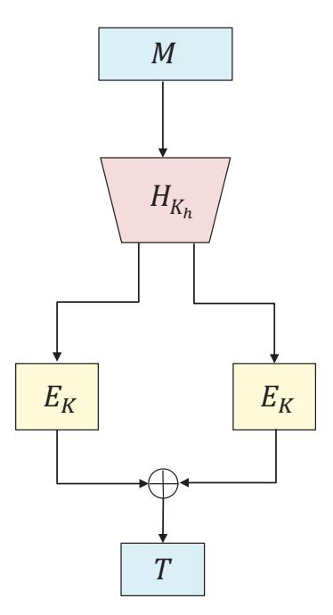
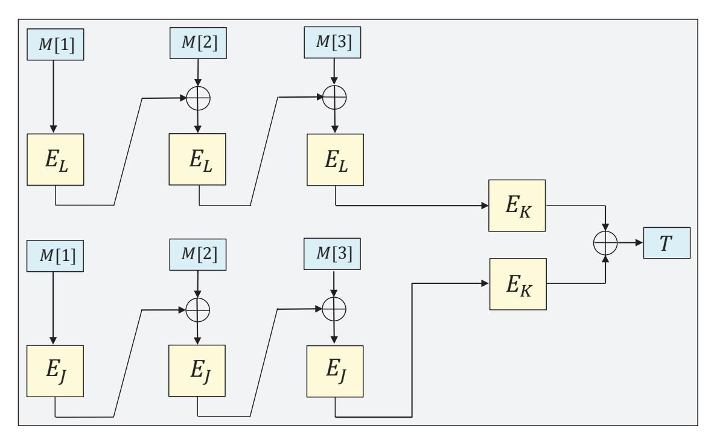
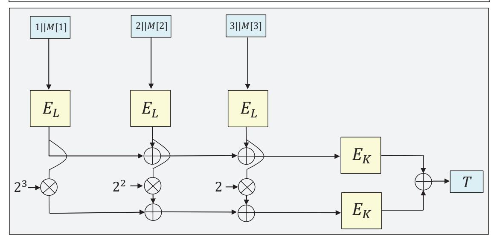
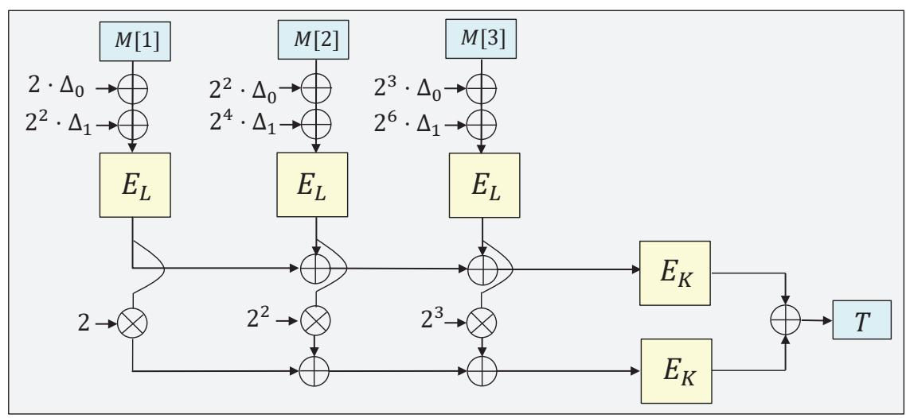
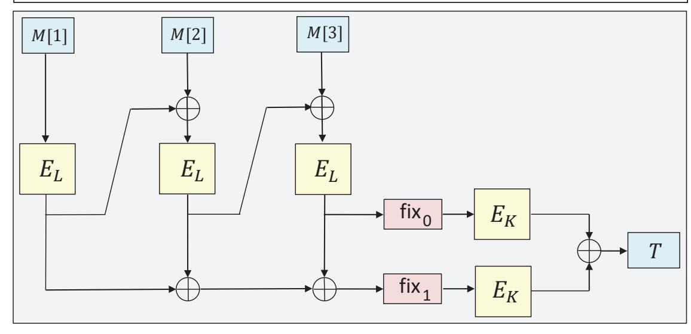

{0}------------------------------------------------

# **Revisiting the Security of DbHtS MACs: Beyond-Birthday-Bound in the Multi-User Setting**

Yaobin Shen<sup>1</sup> , Lei Wang<sup>1</sup> , Dawu Gu<sup>1</sup> , and Jian Weng<sup>2</sup>

<sup>1</sup> Shanghai Jiao Tong University, Shanghai, China yb\_shen@sjtu.edu.cn, wanglei\_hb@sjtu.edu.cn, dwgu@sjtu.edu.cn 2 Jinan University, Guangzhou, China cryptjweng@gmail.com

**Abstract.** Double-block Hash-then-Sum (DbHtS) MACs are a class of MACs that aim for achieving beyond-birthday-bound security, including SUM-ECBC, PMAC\_Plus, 3kf9 and LightMAC\_Plus. Recently Datta et al. (FSE'19), and then Kim et al. (Eurocrypt'20) prove that DbHtS constructions are secure beyond the birthday bound in the single-user setting. However, by a generic reduction, their results degrade to (or even worse than) the birthday bound in the multi-user setting.

In this work, we revisit the security of DbHtS MACs in the multi-user setting. We propose a generic framework to prove beyond-birthday-bound security for DbHtS constructions. We demonstrate the usability of this framework with applications to key-reduced variants of DbHtS MACs, including 2k-SUM-ECBC, 2k-PMAC\_Plus and 2k-LightMAC\_Plus. Our results show that the security of these constructions will not degrade as the number of users grows. On the other hand, our results also indicate that these constructions are secure beyond the birthday bound in both single-user and multi-user setting without additional domain separation, which is used in the prior work to simplify the analysis.

Moreover, we find a critical flaw in 2kf9, which is proved to be secure beyond the birthday bound by Datta et al. (FSE'19). We can successfully forge a tag with probability 1 without making any queries. We go further to show attacks with birthday-bound complexity on several variants of 2kf9.

**Keywords:** Message authentication codes · Beyond-birthday-bound security · Multi-user security

# **1 Introduction**

Message Authentication Code (MAC) is a fundamental symmetric-key primitive to ensure the authenticity of data. A MAC is typically built from a blockcipher (e.g., CBC-MAC [\[6](#page-27-0)], OMAC [[22](#page-28-0)], PMAC [[11\]](#page-27-1), LightMAC [[29\]](#page-29-0)), or from a hash function (e.g., HMAC [\[5](#page-27-2)], NMAC [\[5](#page-27-2)], NI-MAC [\[1](#page-26-0)]). At a high level, many of these 

{1}------------------------------------------------

constructions generically follow the Hash-then-PRF paradigm. Firstly, a message is mapped by a universal hash function into an *n*-bit string. Then, the string is processed by a fixed-input-length Pseudo-Random Function (PRF) to produce the tag. This paradigm is simple and easy to analyze because (i) it does not require nonce or extra random coins, and hence is deterministic and stateless; (ii)the produced tag is a random string as long as the input to PRF is fresh. The security of this method is usually capped at the so-called birthday bound 2 *n/*2 , since a collision at the output of the universal hash function typically results in a forgery for the construction. However, the birthday-bound security margin might not be enough in practice, especially when a MAC is instantiated with a lightweight blockcipher such as PRESENT [[12\]](#page-27-3), PRINCE [\[13](#page-27-4)], and GIFT [[2\]](#page-27-5) whose block size is small. In such case, the birthday bound becomes 2 <sup>32</sup> as *n* = 64 and is vulnerable in certain practical applications. For example, Bhargavan and Leurent [[9\]](#page-27-6) have demonstrated two practical attacks that exploit collision on short blockciphers.

Double-block Hash-then-Sum Construction. To go beyond the birthday bound, a series of blockcipher-based MACs have been proposed, including SUM-ECBC [\[35](#page-29-1)], PMAC\_Plus [[36\]](#page-29-2), 3kf9 [[37\]](#page-29-3) and LightMAC\_Plus [\[32](#page-29-4)]. Interestingly, all of these MACs use a similar paradigm called Double-block Hash-then Sum (shorthand for DbHtS), where a message is first mapped into a 2*n*-bit string by a double-block hash function and then the two encrypted values of each *n*-bit half are xor-summed to generate the tag. Datta et al. [\[17](#page-28-1)] abstract out this paradigm and divide it into two classes: (i) three-key DbHtS constructions, where apart from the hash key, two blockcipher keys are used in the finalization phase (including SUM-ECBC, PMAC\_Plus, 3kf9 and LightMAC\_Plus); (ii) two-key DbHtS constructions, where apart from the hash key, only one single blockcipher key is used in the finalization phase (including all the two-key variants, i.e., 2k-SUM-ECBC, 2k-PMAC\_Plus, 2k-LightMAC\_Plus and 2kf9). Under a generic framework, they prove that both three-key and two-key DbHtS constructions can achieve beyond-birthday-bound security with a bound *q* <sup>3</sup>*/*2 <sup>2</sup>*<sup>n</sup>* where *q* is the number of MAC queries. Leurent et al. [[26\]](#page-28-2) show attacks on all three-key DbHtS constructions with query complexity 2 3*n/*4 . Very recently, Kim et al. [[25\]](#page-28-3) give a tight provable bound *q* <sup>4</sup>*/*3*/*2 *<sup>n</sup>* for three-key DbHtS constructions.

Multi-user security. All the above beyond-birthday-bound results only consider a single user. Yet, as one of the most commonly used cryptographic primitives in practice, MACs are typically deployed in contexts with a great number of users. For instance, they are a core element of real-world security protocols such as TLS, SSH, and IPSec, which are used by major websites with billions of daily active users. A natural question is to what extent the number of users will affect the security bound of DbHtS constructions, or more specifically, can DbHtS constructions still achieve beyond-birthday-bound security in the multiuser setting?

The notion of multi-user (mu) security is introduced by Biham [[10\]](#page-27-7) in symmetric cryptanalysis and by Bellare, Boldyreva, and Micali [[4\]](#page-27-8) in the context 

{2}------------------------------------------------

of public-key encryption. Attackers can adaptively distribute its queries across multiple users with independent key. It considers attackers who succeed as long as they can compromise at least one user among many. As evident in a series of works [[3,](#page-27-9)[8,](#page-27-10)[14](#page-27-11),[19](#page-28-4)[–21](#page-28-5),[28,](#page-28-6)[31,](#page-29-5)[34\]](#page-29-6), evaluating how security degrades as the number of users grows is a challenging technical problem even when the security is known in the single-user setting. Unfortunately, until now research on provable mu security for MACs has been somewhat missing. The notable exceptions are the works of Chatterjee et al. [[15](#page-28-7)], very recently Andrew et al. [\[30](#page-29-7)], and Bellare et al. [\[3](#page-27-9)]. The first two consider a generic reduction for MACs and by using which the mu security of DbHtS constructions will be capped at (or even worse than) the birthday bound, which will be discussed below. The last considers a hashfunction-based MAC which is quite different from our focus on blockcipher-based MACs.

Let us explain why the generic reduction does not help DbHtS constructions to go beyond the birthday bound in the mu setting. Suppose the number of users is *u*. By using the generic reduction [[15,](#page-28-7) [30](#page-29-7)] from single-user (su) security to mu security, the above beyond-birthday bound for two-key DbHtS constructions becomes

$$\frac{uq^3}{2^{2n}}$$

in the mu setting. If the adversary only issues one query per user, then the security bound becomes

<span id="page-2-0"></span>
$$\frac{uq^3}{2^{2n}} \le \frac{q^4}{2^{2n}} \quad , \tag{1}$$

which is still capped at the worrisome birthday bound. Even for three-key DbHtS constructions with a better bound *q* <sup>4</sup>*/*3*/*2 *n* 1 in the su setting, the mu security via generic reduction becomes

$$\frac{uq^{4/3}}{2^n} \le \frac{q^{\frac{7}{3}}}{2^n} \ ,$$

which is worse than the birthday bound 2 *n/*2 . Thus it is worth directly analyzing the mu security of DbHtS constructions instead of relying on the generic reduction.

Our contributions. We revisit the security of DbHtS constructions in the mu setting, with a focus on two-key DbHtS constructions. Two-key DbHtS constructions such as 2k-PMAC\_Plus, 2k-LightMAC\_Plus and 2kf9, only use two blockcipher keys in total. Assume the length of each key is *k* = *n*, then to resist a similar attack like Biham's key-collision attack on DES [[10](#page-27-7)], two keys is the minimal number of keys to potentially achieve beyond-birthday-bound security.

We give a generic framework to prove beyond-birthday-bound security for two-key DbHtS constructions in the mu setting. Our framework is easy to use,

<sup>1</sup> This term is mainly due to the usage of Markov inequality and appears in all security bounds of three-key DbHtS constructions [[25](#page-28-3)].

{3}------------------------------------------------

and can achieve much better security bound comparing with prior generic reduction method. Under this framework, one only needs to show that the abstracted double-block hash function satisfies two properties, namely *ϵ*1-regular and *ϵ*2 almost universal. The first property implies that for a message, the probability that the hashed value equals to any fixed string is small when the hash key is uniformly chosen from the key space. The second one implies that for any two distinct messages, the probability that the two hashed values collide is small when the hash key is uniformly chosen from the key space. These two properties are typically inherent in the hash part of DbHtS constructions.

We demonstrate the usability of this framework with applications to two-key DbHtS constructions. More specifically, we prove that all of 2k-SUM-ECBC, 2k-PMAC\_Plus and 2k-LightMAC\_Plus are still secure beyond the birthday bound in the mu setting. Our bounds are independent of the number of users, and imply that the security of two-key DbHtS constructions will not degrade as the number of users grows. On the other hand, during the proof of these three constructions, we do not rely on domain separating functions, which are used to simplify the su analysis while at the meantime complicate these constructions [[17\]](#page-28-1). Thus our results also indicate these three constructions are secure beyond the birthday bound in both su and mu setting without additional domain separating functions.

Moreover, we find a critical flaw in 2kf9 in the su setting. Datta et al. [[17\]](#page-28-1) prove that 2kf9 without domain separating functions is secure beyond the birthday bound, and then based on it they claim that the other three two-key DbHtS constructions can also achieve the same security level without domain separation. However, we can successfully forge a tag with probability 1 without making any queries. The flaw is that any short message *M* that will become a single block after padding, the output of 2kf9 without domain separation is always zero. One may think that if we resume domain separation in 2kf9, then it can recover beyond-birthday-bound security. However, we go further to show that even with domain separation, 2kf9 cannot be secure beyond the birthday bound. We also investigate whether the common tricks help 2kf9 by modifying a blockcipherbased MAC to go beyond the birthday bound. Unfortunately, a similar attack with birthday-bound complexity always exists for these variants of 2kf9.

Our bound. Our bound is interesting for beyond-birthday-bound security with practical interest. We show that for any adversary making *q* MAC queries and *p* ideal-cipher queries, the advantage of breaking DbHtS's mu security in the main theorem is of the order2

$$\frac{qp\ell}{2^{k+n}} + \frac{q^3}{2^{2n}} + \frac{q^2p + qp^2}{2^{2k}}$$

by assuming *H* is 1*/*2 *<sup>n</sup>*-regular and 1*/*2 *<sup>n</sup>*-almost universal, where *n* and *k* are the length of the blockcipher block and key respectively, and *ℓ* is the maximal block length among these MAC queries. Note that our bound does not depend on the number of users *u*, which can be adaptively chosen by the adversary, and can be as large as *q*.

<sup>2</sup> Here we omit lower-order terms and small constant factors.

{4}------------------------------------------------

When the number of MAC queries q equals to the birthday bound, i.e.,  $q = 2^{n/2}$ , the bound (1) obtained via the generic reduction will become moot. On the contrary, our bound becomes

$$\frac{p\ell}{2^{k+\frac{n}{2}}} + \frac{1}{2^{\frac{n}{2}}} + \frac{p}{2^{2k-n}} + \frac{p^2}{2^{2k-\frac{n}{2}}}$$

which is still reasonably small. More concretely, if for instance  $n=64, k=128, q=2^{32}$ , then this requires the adversary to query at least  $2^{38}$  bits  $=2^{35}$  bytes  $\approx 32 \mathrm{GB}$  online data, yet the terms related to the local computation of the adversary become  $\frac{p\ell}{2^{160}} + \frac{p}{2^{192}} + \frac{p^2}{2^{224}}$ .

IDEAL CIPHER MODEL. The proofs of this paper are done in the ideal cipher model, which is common in most analyses for the mu security. In the mu setting, we are particularly concerned about how local computation (that is captured by the number of ideal cipher queries) affects security, which is a fundamental part of the analysis, and the standard model that regarding a blockcipher as a PRP is not helpful in this estimation. Moreover, in the ideal model, to break the security of DbHtS constructions, attackers must find key collisions among these keys (at least two) at the same time. While in the standard model, inherently we have an isolated term  $Adv_E^{muPRP}(A)$ , for which one key collision among these keys would solely make this term meaningless. Thus to prove beyond-birthday-bound security in the standard model, it may require longer keys, which is somewhat overly pessimistic.

OUTLINE OF THIS PAPER. We introduce basic notions and security definitions in the multi-user setting in Section 2. We propose a generic framework to prove beyond-birthday-bound security for DbHtS constructions in Section 3. Then, we show the usability of this framework with applications to key-reduced variants of DbHtS MACs in Section 4. Finally in Section 5, we discuss the flaw in the security proof of 2kf9, and show forgery attacks on it.

ERRATA. In the proceeding version [27], when analyzing the generic framework of DbHtS constructions, we overlooked the dependence of two equations produced by two hash functions with independent keys, and simply multiplied probabilities of these two equations together. The related cases are sub-case (9-iv) of condition 9 and sub-case (12-iv) of condition 12 in Section 3. In this updated version, we use two variables  $\epsilon_3$  and  $\epsilon_4$  to capture the probabilities of these two sub-cases, the values of which will become clear in the analysis of concrete scheme. Note that the value of  $\epsilon_3$  may be birthday-bound in some special cases as shown by Guo and Wang [24], while for the DbHtS constructions considered in this paper, both  $\epsilon_3$  and  $\epsilon_4$  are beyond-birthday-bound. We concretely calculate the values of  $\epsilon_3$  and  $\epsilon_4$  for 2k-SUM-ECBC, and the analyzes of 2k-LightMAC\_Plus and 2k-PMAC\_Plus remain unchanged since they separately consider conditions 9 and 12. We also supplement two missing cases that are  $T_i = 0$  and  $\Sigma = \Lambda$  in the framework and add two terms  $q/2^n$  and  $q\epsilon_1$  in the bound. The impact of these updates on the bound of DbHtS constructions is minor. The security of

{5}------------------------------------------------

```
procedure Initialize
K1, K2, . . . , ←$ K; b ←$ {0, 1}
f1, f2, . . . , ←$ Func(M, {0, 1}
                              n
                               )
procedure Finalize(b
                       ′
                        )
return (b
          ′ = b)
                                       procedure Eval(i, M)
                                       Y1 ← F(Ki, M); Y0 ← fi(M)
                                       return Yb
```

Fig. 1: Game **G** prf *F* defining multi-user PRF security of a function *F*.

2k-SUM-ECBC, 2k-LightMAC\_Plus and 2k-PMAC\_Plus are all beyond-birthdaybound in the multi-user setting.

# <span id="page-5-0"></span>**2 Preliminaries**

Notation. Let *<sup>ε</sup>* denote the empty string. For an integer *<sup>i</sup>*, we let *⟨i⟩<sup>m</sup>* denote the *m*-bit representation of *i*. For a finite set *S*, we let *x ←*\$ *S* denote the uniform sampling from *S* and assigning the value to *x*. Let *|x|* denote the length of the string *x*. Let *|S|* denote the size of the set *S*. If *A* is an algorithm, we let *y ← A*(*x*1*, . . .* ; *r*) denote running *A* with randomness *r* on inputs *x*1*, . . .* and assigning the output to *y*. We let *y ←*\$ *A*(*x*1*, . . .*) be the result of picking *r* at random and letting *y ← A*(*x*1*, . . .* ; *r*). For a domain Dom and a range Rng, let Func(Dom*,* Rng) denote the set of functions *f* : Dom *→* Rng. For integers 1 *≤ a ≤ N*, let (*N*)*<sup>a</sup>* denote *N*(*N −* 1)*. . .*(*N − a* + 1).

Multi-user PRF. Let *F* : *K ×M → {*0*,* 1*} <sup>n</sup>* be a function. For an adversary *A*, let

$$\mathsf{Adv}_F^{\mathrm{prf}}(A) = 2\Pr[\mathbf{G}_F^{\mathrm{prf}}(A)] - 1 \ ,$$

be the advantage of the adversary against the multi-user PRF security of *F*, where game **G** prf *F* is defined in Fig. [1.](#page-5-1) Note that for any function *F* of key length *k*, the PRF advantage is at least *pq/*2 *<sup>k</sup>*+2 by adapting Biham's key-collision attack on DES [\[10](#page-27-7)], where *q* is the number of queries and *p* is the number of calls to *F*.

The H-coefficient Technique. Following the notation from Hoang and Tessaro [[19](#page-28-4)], it is useful to consider interactions between an adversary *A* and an abstract system **S** which answers *A*'s queries. The resulting interaction can then be recorded with a transcript *τ* = ((*X*1*, Y*1)*, . . . ,*(*Xq, Yq*)). Let p**S**(*τ* ) denote the probability that **S** produces *τ* . It is known that p**S**(*τ* ) is the description of **S** and independent of the adversary *A*. We say that a transcript is attainable for the system **S** if p**S**(*τ* ) *>* 0.

We now describe the H-coefficient technique of Patarin [[16](#page-28-10), [33\]](#page-29-8). Generically, it considers an adversary that aims at distinguishing a "real" system **S**<sup>1</sup> from an "ideal" system **S**0. The interactions of the adversary with those systems induce two transcript distributions *X*<sup>1</sup> and *X*<sup>0</sup> respectively. It is well known that the 

{6}------------------------------------------------

<span id="page-6-2"></span>statistical distance  $SD(X_1, X_0)$  is an upper bound on the distinguishing advantage of A.

**Lemma 1.** [16, 33] Suppose that the set of attainable transcripts for the ideal system can be partitioned into good and bad ones. If there exists  $\epsilon \geq 0$  such that  $\frac{\mathsf{ps}_1(\tau)}{\mathsf{ps}_0(\tau)} \geq 1 - \epsilon$  for any good transcript  $\tau$ , then

$$SD(X_1, X_0) \le \epsilon + \Pr[X_0 \text{ is bad}]$$
.

REGULAR AND AU HASH FUNCTION. Let  $H: \mathcal{K}_h \times \mathcal{X} \to \mathcal{Y}$  be a hash function where  $\mathcal{K}_h$  is the key space,  $\mathcal{X}$  is the domain and  $\mathcal{Y}$  is the range. Hash function H is said to be  $\epsilon_1$ -regular if for any  $X \in \mathcal{X}$  and  $Y \in \mathcal{Y}$ ,

$$\Pr\left[K_h \leftarrow \mathcal{K}_h : H_{K_h}(X) = Y\right] \leq \epsilon_1$$

and it is said to be  $\epsilon_2$ -almost universal if for any two distinct strings  $X, X' \in \mathcal{X}$ ,

<span id="page-6-1"></span>
$$\Pr\left[K_h \leftarrow * \mathcal{K}_h : H_{K_h}(X) = H_{K_h}(X')\right] \le \epsilon_2.$$

SUM OF TWO IDENTICAL PERMUTATIONS. We will use the following result in some proofs, which is a special case of [18, Theorem 2] by setting the conditional set to be empty.

**Lemma 2.** For any tuple  $(T_1, \ldots, T_q)$  such that each  $T_i \neq 0^n$ , let  $U_1, \ldots, U_q$ ,  $V_1, \ldots, V_q$  be 2q random variables sampled without replacement from  $\{0,1\}^n$  and satisfying  $U_i \oplus V_i = T_i$  for  $1 \leq i \leq q$ . Denote by S the set of tuples of these 2q variables. Then

$$|S| \ge \frac{(2^n)_{2q}}{2^{nq}} (1 - \mu) ,$$

where  $\mu = \frac{6q^3}{2^{2n}}$  and assuming  $q \leq 2^{n-2}$ .

# <span id="page-6-0"></span>3 Multi-User Security Proof Framework for DbHtS MACs

In this section, we propose a generic proof framework for DbHtS MACs. We begin with the description of DbHtS constructions. Here we focus on two-key DbHtS constructions, including 2k-SUM-ECBC, 2k-LightMAC\_Plus and 2k-PMAC\_Plus.

THE DbHtS CONSTRUCTION. Let  $H: \mathcal{K}_h \times \mathcal{M} \to \{0,1\}^n \times \{0,1\}^n$  be a 2n-bit hash function with key space  $\mathcal{K}_h$  and message space  $\mathcal{M}$ . We will always decompose H into two n-bit hash functions  $H^1$  and  $H^2$  for convenience, and thus have  $H_{K_h}(M) = (H^1_{K_{h,1}}(M), H^2_{K_{h,2}}(M))$  where  $K_h = (K_{h,1}, K_{h,2})$ . Given a

{7}------------------------------------------------



Fig. 2: **The** DbHtS **construction.** Here *H* is a 2*n*-bit hash function from *K<sup>h</sup> × M* to *{*0*,* 1*} <sup>n</sup> × {*0*,* 1*} n* , and *E* is a *n*-bit blockcipher from *K × {*0*,* 1*} n* to *{*0*,* 1*} n* .

blockcipher *E* : *K × {*0*,* 1*} <sup>n</sup> → {*0*,* 1*} <sup>n</sup>* and a hash function *H* as defined above, one can define the DbHtS construction as follows

$$\mathsf{DbHtS}[H,E](K_h,K,M) = E_K(H^1_{K_{h,1}}(M)) \oplus E_K(H^2_{K_{h,2}}(M)) \ .$$

In blockcipher-based MACs, the hash function *H* is typically built from an *n*bit blockcipher *E*. The message *M* (after padding) is always split into *n*-bit blocks without being more specific, namely *M* = *M*[1] *∥ M*[2] *∥ . . . ∥ M*[*ℓ*] where *|M*[*i*]*|* = *n*. For message *M*, we denote by *X*[*i*] the *i*-th input to the underlying blockcipher *E* of *H*.

Security analysis of DbHtS construction. Given that *H* is a good 2*n*-bit hash function and the underlying blockcipher *E* is ideal, we have the following result.

<span id="page-7-0"></span>**Theorem 1.** *Let E* : *{*0*,* 1*} <sup>k</sup> × {*0*,* 1*} <sup>n</sup> → {*0*,* 1*} <sup>n</sup> be a blockcipher that we model as an ideal blockcipher. Suppose that each n-bit hash function of H* = (*H*<sup>1</sup> *, H*<sup>2</sup> ) *is ϵ*1*-regular and ϵ*2*-almost universal. Then for any adversary A that makes at most q evaluation queries and p ideal-cipher queries,*

$$\begin{split} \mathsf{Adv}^{\mathrm{prf}}_{\mathsf{DbHtS}}(A) & \leq \frac{2q}{2^k} + \frac{q}{2^n} + q\epsilon_1 + \frac{q(3q+p)(6q+2p)}{2^{2k}} + \frac{2qp\ell}{2^{k+n}} + \frac{2qp\epsilon_1}{2^k} + \frac{4qp}{2^{n+k}} \\ & + \frac{4q^2\epsilon_1}{2^k} + \frac{2q^2\ell\epsilon_1}{2^k} + 2q^3(\epsilon_2^2 + 2\epsilon_1\epsilon_2) + q^2\epsilon_3 + q^3\epsilon_4 + \frac{8q^3(\epsilon_1 + \epsilon_2)}{2^n} \\ & + \frac{6q^3}{2^{2n}} \ , \end{split}$$

*where ℓ is the maximal block length among these evaluation queries and assuming p* + *qℓ ≤* 2 *n−*1 *.*

{8}------------------------------------------------

```
\begin{array}{|llllllllllllllllllllllllllllllllllll
```

Fig. 3: Game  $\mathbf{G}_{\mathsf{DbHtS}}^{\mathsf{prf}}$  defining multi-user prf security of the construction DbHtS.

REMARK. Note that the terms  $q^2\epsilon_3$  and  $q^3\epsilon_4$  are defined in the proof to capture two special joint events of hash functions  $H^1$  and  $H^2$ , the values of which will become clearly in the analysis of concrete scheme. For the three DbHtS constructions 2k-SUM-ECBC, 2k-LightMAC\_Plus and 2k-PMAC\_Plus considered in this paper, these two terms are both beyond the birthday bound.

*Proof.* Our proof is based on the H-coefficient technique. We will consider a computationally unbounded adversary, and without loss of generality assume that the adversary is deterministic and never repeats a prior query. Assume further that the adversary never makes a redundant query: if it queries  $y \leftarrow E(J,x)$  then it won't query  $E^{-1}(J,y)$  and vice versa. The security game is detailed in Fig. 3. The real system corresponds to game  $\mathbf{G}_{\mathsf{DbHtS}}^{\mathsf{prf}}$  with challenge bit b=1, and the ideal system corresponds to game  $\mathbf{G}_{\mathsf{DbHtS}}^{\mathsf{prf}}$  with challenge bit b=0.

Setup. In both of the two worlds, after the adversary finishes querying, it obtains the following information:

- **Ideal-cipher queries:** for each query PRIM(J,(x,+)) with answer y, we associate it with an entry (prim, J, x, y, +). For each query PRIM(J,(y,-)) with answer x, we associate it with an entry (prim, J, x, y, -).
- **Evaluation queries:** for each query  $T \leftarrow \text{EVAL}(i, M)$ , we associate it with an entry (eval, i, M, T).

We denote by (eval,  $i, M_a^i, T_a^i$ ) the entry obtained when the adversary makes the a-th query to user i. Denote by  $\ell_a^i$  the block length of  $M_a^i$  and denote by  $\ell$  the maximal block length among these q evaluation queries. During the computation of entry (eval,  $i, M_a^i, T_a^i$ ), we denote by  $\Sigma_a^i$  and  $\Lambda_a^i$  the internal outputs of hash function H, namely  $\Sigma_a^i = H^1_{K_{h,1}}(M_a^i)$  and  $\Lambda_a^i = H^2_{K_{h,2}}(M_a^i)$  respectively, and denote by  $U_a^i$  and  $V_a^i$  the outputs of blockcipher E with inputs  $\Sigma_a^i$  and  $\Lambda_a^i$  respectively, namely  $U_a^i = E(K_i, \Sigma_a^i)$  and  $V_a^i = E(K_i, \Lambda_a^i)$  respectively. For a key  $J \in \{0,1\}^k$ , let P(J) be the set of entries (prim, J, x, y, \*), and let Q(J) be the set of entries (eval,  $i, M_a^i, T_a^i$ ) such that  $K_i = J$ . In the real world, after the adversary finishes all its queries, we will further give it: (i) the keys  $(K_h^i, K_i)$  where  $K_h^i = (K_{h,1}^i, K_{h,2}^i)$  and (ii) the internal values  $U_a^i$  and  $V_a^i$ . In the ideal world, we will

{9}------------------------------------------------

instead give the adversary truly random strings  $(K_h^i, K_i) \leftarrow \mathcal{K}_h \times \mathcal{K}$ , independent of its queries. In addition, we will give the adversary dummy values  $U_a^i$  and  $V_a^i$  computed as follows: for each set Q(J), the simulation oracle Sim(Q(J))(depicted in Fig. 4) will be invoked and return corresponding values  $U_a^i$  and  $V_a^i$ to the adversary. These additional information can only help the adversary. Thus a transcript consists of the revealed keys  $(K_h^i, K_i)$ , the internal values  $U_a^i$  and  $V_a^i$ , the ideal-cipher queries and evaluation queries. On the other hand, the internal values  $\Sigma_a^i$  and  $\Lambda_a^i$  during the computation of SIM are uniquely determined by message  $M_a^i$  and key  $(K_h^i, K_i)$ .

Defining bad transcripts. We now give the definition of bad transcripts. The goal of defining bad transcripts is to ensure that (i) for each user, at least one of its two keys is fresh, namely either the key of the blockcipher is fresh or the key of the hash function is fresh; (ii) for queries to the same user, at least one of two inputs to blockcipher E is fresh; (iii) for queries to different users, if the key of blockcipher E collides with that of other users or ideal-cipher queries, then the input to E should be fresh. We say a transcript is bad if one of the following happens:

- 1. There is an entry (eval,  $i, M_a^i, T_a^i$ ) such that  $K_i = K_{h,d}^i$  for  $d \in \{1, 2\}$ .
- 2. There is an entry (eval,  $i, M_a^i, T_a^i$ ) such that both  $K_i$  and  $K_{h,d}^i$  for  $d \in \{1, 2\}$ have been used in other entries, namely either in entries (eval,  $j, M_b^j, T_b^j$ ) or entries (prim, J, x, y, \*).

Conditions (1) and (2) are to guarantee that at least one of two keys of any user i is fresh. Note that in blockcipher-based MACs, hash function His usually built from blockcipher E.

- 3. There is an entry (eval,  $i, M_a^i, T_a^i$ ) such that  $K_{h,d}^i = J$  for  $d \in \{1, 2\}$  and  $x=X_a^i[j]$  for some entry  $(\mathtt{prim},J,x,y,-)$  and some  $1\leq j\leq \ell_a^i$ .
  - Condition (3) is to prevent that the adversary can somehow control the (partial) output of  $H_{K_h}(M_a^i)$  by using its backward ideal-cipher queries for some  $1 \leq j \leq \ell_a^i$  where  $M_a^i = M_a^i[1] \parallel \ldots \parallel M_a^i[\ell_a^i]$  and  $X_a^i[j]$  is the j-th corresponding input to the underlying blockcipher E of H.
- 4. There is an entry (eval,  $i, M_a^i, T_a^i$ ) such that  $K_i = J$ , and either  $\Sigma_a^i = x$  or
- $\Lambda_a^i = x$  for some entry  $(\mathtt{prim}, J, x, y, *)$ . 5. There is an entry  $(\mathtt{eval}, i, M_a^i, T_a^i)$  such that  $K_i = J$ , and either  $U_a^i = y$  or  $V_a^i = y$  for some entry (prim, J, x, y, \*).

Conditions (4) and (5) are to remove the case that either the inputs or outputs of  $E_{K_i}$  collide with those in the ideal-cipher queries when  $K_i = J$ .

- 6. There is an entry (eval,  $i, M_a^i, T_a^i$ ) such that  $K_i = K_j$ , and either  $\Sigma_a^i = \Sigma_b^j$ or  $\Sigma_a^i = \Lambda_b^j$  for some entry (eval,  $j, M_b^j, T_b^j$ ).
- 7. There is an entry (eval,  $i, M_a^i, T_a^i$ ) such that  $K_i = K_j$ , and either  $\Lambda_a^i = \Lambda_b^j$  or  $\Lambda_a^i = \Sigma_b^j$  for some entry (eval,  $j, M_b^j, T_b^j$ ).

Conditions (6) and (7) are to guarantee that when the key  $K_i$  collides with the key  $K_j$ , then all the inputs of  $E_{K_i}$  are distinct from those of  $E_{K_j}$ .

8. There is an entry (eval,  $i, M_a^i, T_a^i$ ) such that  $K_i = K_{h,1}^j$  and  $\Sigma_a^i = X_b^j[k]$ , or  $K_i = K_{h,2}^j$  and  $\Lambda_a^i = X_b^j[k]$  for some entry (eval,  $j, M_b^j, T_b^j$ ) and  $1 \le k \le \ell_b^j$ .

{10}------------------------------------------------

Condition (8) is to guarantee that when there is a collision between  $K_i$  and  $K_{h,d}^j$  for  $d \in \{1,2\}$ , then the inputs to  $E_{K_i}$  do not collide with the inputs in the hash part with key  $K_{h,d}^j$ , and thus keep the freshness of the final output.

9. There is an entry (eval,  $i, M_a^i, T_a^i$ ) such that either  $\Sigma_a^i = \Sigma_b^i$  or  $\Sigma_a^i = \Lambda_b^i$ , and either  $\Lambda_a^i = \Lambda_b^i$  or  $\Lambda_a^i = \Sigma_b^i$  for some entry (eval,  $i, M_b^i, T_b^i$ ).

Condition (9) is to guarantee that for any pair of entries (eval,  $i, M_a^i, T_a^i$ ) and (eval,  $i, M_b^i, T_b^i$ ) of the same user, at least one of  $\Sigma_a^i$  and  $\Lambda_a^i$  is fresh.

- 10. There is an entry (eval,  $i, M_a^i, T_a^i$ ) such that either  $\Sigma_a^i = \Sigma_b^i$  or  $\Sigma_a^i = \Lambda_b^i$ , and either  $V_a^i = V_b^i$  or  $V_a^i = U_b^i$  for some entry (eval,  $i, M_b^i, T_b^i$ ).
- 11. There is an entry (eval,  $i, M_a^i, T_a^i$ ) such that either  $\Lambda_a^i = \Lambda_b^i$  or  $\Lambda_a^i = \Sigma_b^i$ , and either  $U_a^i = U_b^i$  or  $U_a^i = V_b^i$  for some entry (eval,  $i, M_b^i, T_b^i$ ).

Conditions (10) and (11) are to guarantee that the outputs of  $\Phi_{K_i}$  in the ideal world are compatible with a permutation, namely when the inputs are distinct, then the corresponding outputs should also be distinct.

12. There is an entry (eval,  $i, M_a^i, T_a^i$ ) such that either  $\Sigma_a^i = \Sigma_b^i$  or  $\Sigma_a^i = \Lambda_b^i$ , and either  $\Lambda_a^i = \Lambda_c^i$  or  $\Lambda_a^i = \Sigma_c^i$  for some entries (eval,  $i, M_b^i, T_b^i$ ) and (eval,  $i, M_c^i, T_c^i$ ).

Condition (12) is to guarantee that for any triple of entries (eval,  $i, M_a^i, T_a^i$ ), (eval,  $i, M_b^i, T_b^i$ ) and (eval,  $i, M_c^i, T_c^i$ ), at least one of  $\Sigma_a^i$  and  $\Lambda_a^i$  is fresh.

- 13. There is an entry (eval,  $i, M_a^i, T_a^i$ ) such that either  $\Sigma_a^i = \Sigma_b^i$  or  $\Sigma_a^i = \Lambda_b^i$ , and either  $V_a^i = V_c^i$  or  $V_a^i = U_c^i$  for some entries (eval,  $i, M_b^i, T_b^i$ ) and (eval,  $i, M_c^i, T_c^i$ ).
- 14. There is an entry (eval,  $i, M_a^i, T_a^i$ ) such that either  $\Lambda_a^i = \Lambda_b^i$  or  $\Lambda_a^i = \Sigma_b^i$ , and either  $U_a^i = U_c^i$  or  $U_a^i = V_c^i$  for some entries (eval,  $i, M_b^i, T_b^i$ ) and (eval,  $i, M_c^i, T_c^i$ ). Conditions (13) and (14) are to guarantee that the outputs of  $\Phi_{K_i}$  in the

ideal world are compatible with a permutation, namely when the inputs are distinct, then the corresponding outputs should also be distinct.

- 15. There is an entry (eval,  $i, M_a^i, T_a^i$ ) such that  $T_a^i = 0$ .
- 16. There is an entry (eval,  $i, M_a^i, T_a^i$ ) such that  $\Sigma_a^i = \Lambda_a^i$ .

Conditions (15) and (16) are to avoid the constraint in the real world that if  $\Sigma_a^i = \Lambda_a^i$ , then necessarily  $T_a^i = 0$ , while there is no such constrain in the ideal world.

If a transcript is not bad then we say it's good. Let  $X_1$  and  $X_0$  be the random variables for the transcript distributions in the real and ideal system respectively.

PROBABILITY OF BAD TRANSCRIPTS. We now bound the chance that  $X_0$  is bad in the ideal world. Let  $Bad_i$  be the event that  $X_0$  violates the *i*-th condition. By the union bound,

$$\begin{split} \Pr[X_0 \text{ is bad}] &= \Pr[\text{Bad}_1 \vee \dots \vee \text{Bad}_{14}] \\ &\leq \sum_{i=1}^{3} \Pr[\text{Bad}_i] + \sum_{i=4}^{8} \Pr[\text{Bad}_i \mid \overline{\text{Bad}}_2] + \sum_{i=9}^{14} \Pr[\text{Bad}_i] \enspace . \end{split}$$

We first bound the probability  $Pr[Bad_1]$ . Recall that in the ideal world,  $K_i$  and  $K_{h,d}^i$  are uniformly random, independent of each other and those entries. Thus

{11}------------------------------------------------

the chance that  $K_i = K_{h,d}^i$  is at most  $1/2^k$ . Summing over at most q evaluation queries and  $d \in \{1,2\}$ ,

$$\Pr[\mathrm{Bad}_1] \le \frac{2q}{2^k} .$$

Next, we bound the probability  $\Pr[\text{Bad}_2]$ . Recall that in the ideal world,  $K_i$  and  $K_{h,d}^i$  are uniformly random, independent of each other and those entries. Thus the probability that  $K_i = K_j$  or  $K_i = K_{h,d'}^j$  for at most q-1 other users and  $d' \in \{1,2\}$ , or  $K_i = J$  for at most p ideal-cipher queries, is at most  $(3q+p)/2^k$ . For  $d \in \{1,2\}$ , the probability that  $K_{h,d}^i = K_j$  or  $K_{h,d}^i = K_{h,d'}^j$  for at most q-1 other users and  $d' \in \{1,2\}$ , or  $K_{h,d}^i = J$  for at most p ideal-cipher queries, is also at most  $(3q+p)/2^k$ . Since  $K_i$  and  $K_{h,d}^i$  are independent of each other, and summing over at most q evaluation queries,

$$\Pr[\text{Bad}_2] \le \frac{q(3q+p)(6q+2p)}{2^{2k}}$$
.

Next, we bound the probability  $\Pr[\mathrm{Bad}_3]$ . Recall that in the ideal world,  $K^i_{h,d}$  is uniformly random, independent of those entries. Thus the chance that  $K^i_{h,d} = J$  for at most p ideal-cipher queries is at most  $p/2^k$ . On the other hand, for each ideal-cipher entry  $(\mathtt{prim}, J, x, y, -)$ , the probability that  $x = X^i_a[j]$  is at most  $1/(2^n - p - q\ell) \leq 2/2^n$  by assuming  $p + q\ell \leq 2^{n-1}$ . Summing over at most q evaluation queries and  $1 \leq j \leq \ell^i_a \leq \ell$ ,

$$\Pr[\text{Bad}_3] \le \frac{2qp\ell}{2^{k+n}} .$$

Next, we bound the probability  $\Pr[\operatorname{Bad}_4 \mid \overline{\operatorname{Bad}}_2]$ . Recall that in the ideal world,  $K_i$  is uniformly random, independent of those entries. Thus for each entry  $(\operatorname{prim}, J, x, y, *)$ , the chance that  $K_i = J$  is  $1/2^k$ . On the other hand, conditioned on  $\overline{\operatorname{Bad}}_2$ , the key  $K_{h,d}^i$  is fresh for  $d \in \{1,2\}$ . The event that  $\Sigma_a^i = x$  or  $\Lambda_a^i = x$  is the same as

$$H^1_{K_{h,1}^i}(M_a^i) = x \vee H^2_{K_{h,2}^i}(M_a^i) = x$$
,

which holds with probability at most  $2\epsilon_1$  by the assumption that  $H^1$  and  $H^2$  are both  $\epsilon_1$ -regular. Summing over at most q evaluation queries and p ideal-cipher queries,

$$\Pr[\operatorname{Bad}_4 \mid \overline{\operatorname{Bad}}_2] \le \frac{2qp\epsilon_1}{2^k} .$$

Bounding the probability  $\Pr[\mathrm{Bad}_5 \mid \overline{\mathrm{Bad}}_2]$  is similar to handling  $\Pr[\mathrm{Bad}_4 \mid \overline{\mathrm{Bad}}_2]$ , but now the event  $U_a^i = y$  or  $V_a^i = y$  is the same as  $\Phi_{K_i}(\Sigma_a^i) = y$  or  $\Phi_{K_i}(\Lambda_a^i) = y$ . The probability that  $\Phi_{K_i}(\Sigma_a^i) = y$  is at most  $1/(2^n - p - q\ell) \leq 2/2^n$  by assuming  $p + q\ell \leq 2^{n-1}$ . Similarly, the probability that  $\Phi_{K_i}(\Lambda_a^i) = y$  is at most  $2/2^n$ . Thus, summing over at most q evaluation queries and p ideal-cipher queries

$$\Pr[\operatorname{Bad}_5 \mid \overline{\operatorname{Bad}}_2] \le \frac{4qp}{2^{n+k}}$$
.

{12}------------------------------------------------

We now bound the probability  $\Pr[\text{Bad}_6 \mid \overline{\text{Bad}}_2]$ . Recall that in the ideal world,  $K_i$  is uniformly random, independent of those entries. Thus the chance that  $K_i = K_j$  is  $1/2^k$ . On the other hand, conditioned on  $\overline{\text{Bad}}_2$ , the key  $K_{h,1}^i$  is fresh. The event that  $\Sigma_a^i = \Sigma_b^j$  is the same as

$$H^1_{K^i_{h,1}}(M^i_a) = H^1_{K^j_{h,1}}(M^j_b)$$

which holds with probability at most  $\epsilon_1$  by the assumption that  $H^1$  is  $\epsilon_1$ -regular. Similarly, the event that  $\Sigma_a^i = \Lambda_b^j$  holds with probability at most  $\epsilon_1$ . Summing over at most  $q^2$  pairs of i and j,

$$\Pr[\text{Bad}_6 \mid \overline{\text{Bad}}_2] \le \frac{2q^2 \epsilon_1}{2^k} .$$

Bounding  $Pr[Bad_7 \mid \overline{Bad}_2]$  is similar to handling  $Pr[Bad_6 \mid \overline{Bad}_2]$ , and thus

$$\Pr[\mathrm{Bad}_7 \mid \overline{\mathrm{Bad}}_2] \le \frac{2q^2 \epsilon_1}{2^k} .$$

Next, we bound the probability  $\Pr[\text{Bad}_8]$ . Recall that in the ideal world,  $K_i$  is uniformly random, independent of those entries. Thus the chance that  $K_i = K_{h,1}^j$  for some other j is at most  $1/2^k$ . On the other hand, for each entry (eval,  $j, M_b^j, T_b^j$ ), the probability that  $\Sigma_a^i = X_b^j[k]$  is at most  $\epsilon_1$  by the assumption that  $H^1$  is  $\epsilon_1$ -regular. Hence the chance that  $K_i = K_{h,1}^j$  and  $\Sigma_a^i = X_b^j[k]$  is at most  $\epsilon_1/2^k$ . Similarly, the probability that  $K_i = K_{h,2}^j$  and  $\Lambda_a^i = X_b^j[k]$  is at most  $\epsilon_1/2^k$ . Summing over at most  $q^2$  pairs of evaluation queries and  $1 \leq k \leq \ell$ ,

$$\Pr[\text{Bad}_8] \le \frac{2q^2\ell\epsilon_1}{2^k} \ .$$

Next, we bound the probability  $Pr[Bad_9]$ . This case consists of four sub-cases: (9-i)  $\Sigma_a^i = \Sigma_b^i \wedge \Lambda_a^i = \Lambda_b^i$ ; (9-ii)  $\Sigma_a^i = \Sigma_b^i \wedge \Lambda_a^i = \Sigma_b^i$ ; (9-iii)  $\Sigma_a^i = \Lambda_b^i \wedge \Lambda_a^i = \Lambda_b^i$ ; (9-iv)  $\Sigma_a^i = \Lambda_b^i \wedge \Lambda_a^i = \Sigma_b^i$ . Sub-case (9-i) holds with probability at most  $\epsilon_2^2$  by the assumption that  $H^1$  and  $H^2$  are  $\epsilon_2$ -almost universal. Sub-case (9-ii) holds with probability at most  $\epsilon_1 \epsilon_2$  by the assumption that  $H^1$  is  $\epsilon_2$ -almost universal and  $H^2$  is  $\epsilon_1$ -regular. Sub-case (9-iii) holds with probability at most  $\epsilon_1 \epsilon_2$  by the assumption that  $H^1$  is  $\epsilon_1$ -regular and  $H^2$  is  $\epsilon_2$ -almost universal. Note that since  $K_{h,1}^i$  and  $K_{h,2}^i$  are two independent hash keys, for sub-cases (9-i), (9-ii) and (9-iii), we can simply multiply the probability of every two equations together as the bound of each sub-case. The reasons are as follows. For sub-case (9-i), the first equation only involves the hash function  $H^1$  while the second one only involves the hash function  $H^2$ . For sub-case (9-ii), the first equation only involves the hash function  $H^1$ , and once the key of  $H^1$  is fixed, then the value  $\Lambda_b^i$  should also be fixed and the second equation will only depend on the hash function  $H^2$ . The argument for sub-case (9-iii) is the same as that for sub-case (9-ii). For subcase (9-iv), the independence of these two hash functions cannot guarantee the independence of these two equations since each of two involves both these two

{13}------------------------------------------------

hash functions. Hence, we use the variable  $\epsilon_3$  to denote the probability of this sub-case, and the value of  $\epsilon_3$  will become clear when analyzing concrete scheme. Summing over u users,

$$\Pr\left[\operatorname{Bad}_{9}\right] \leq \sum_{i=1}^{u} q_{i}^{2} (\epsilon_{2}^{2} + 2\epsilon_{1}\epsilon_{2} + \epsilon_{3}) \leq q^{2} (\epsilon_{2}^{2} + 2\epsilon_{1}\epsilon_{2} + \epsilon_{3}).$$

Next, we bound the probability  $\Pr[\text{Bad}_{10}]$ . The event  $\Sigma_a^i = \Sigma_b^i$  or  $\Sigma_a^i = \Lambda_b^i$  is the same as

$$H^1_{K^i_{h,1}}(M^i_a) = H^1_{K^i_{h,1}}(M^i_b) \vee H^1_{K^i_{h,1}}(M^i_a) = H^2_{K^i_{h,2}}(M^i_b) \ ,$$

which holds with probability at most  $\epsilon_1 + \epsilon_2$ . On the other hand, the event  $V_a^i = V_b^i$  or  $V_a^i = U_b^i$  is the same as

$$T_a^i \oplus U_a^i = V_b^i \vee T_a^i \oplus U_a^i = U_b^i$$

which holds with probability at most  $2/2^n$  since  $T_a^i$  is a random string and independent of these entries. Summing among u users,

$$\Pr[\operatorname{Bad}_{10}] \le \sum_{i=1}^{u} \frac{2q_i^2(\epsilon_1 + \epsilon_2)}{2^n} \le \frac{2q^2(\epsilon_1 + \epsilon_2)}{2^n}.$$

Bounding the probability  $Pr[Bad_{11}]$  is similar to handling  $Pr[Bad_{10}]$ , and thus

$$\Pr\left[\operatorname{Bad}_{11}\right] \le \frac{2q^2(\epsilon_1 + \epsilon_2)}{2^n} .$$

Next, We bound the probability  $\Pr[\text{Bad}_{12}]$ . Similarly to  $\text{Bad}_9$ , this case also consists of four sub-cases: (12-i)  $\Sigma_a^i = \Sigma_b^i \wedge \Lambda_a^i = \Lambda_c^i$ ; (12-ii)  $\Sigma_a^i = \Sigma_b^i \wedge \Lambda_a^i = \Sigma_c^i$ ; (12-iii)  $\Sigma_a^i = \Lambda_b^i \wedge \Lambda_a^i = \Lambda_c^i$ ; (12-iv)  $\Sigma_a^i = \Lambda_b^i \wedge \Lambda_a^i = \Sigma_c^i$ . Following the analogous argument in  $\text{Bad}_9$ , the probability of sub-cases (12-i), (12-ii) and (12-iii) can be bounded by  $\epsilon_2^2 + 2\epsilon_1\epsilon_2$ . We use the variable  $\epsilon_4$  to denote the probability of sub-case (12-iv), which will be clear in the analysis of concrete scheme. Hence summing over u users,

$$\Pr\left[\operatorname{Bad}_{12}\right] \leq \sum_{i=1}^{u} q_i^3 (\epsilon_2^2 + 2\epsilon_1 \epsilon_2 + \epsilon_4) \leq q^3 (\epsilon_2^2 + 2\epsilon_1 \epsilon_2 + \epsilon_4) .$$

Bounding the probability  $Pr[Bad_{13}]$  is similar to handling  $Pr[Bad_{10}]$ , except that now for each user i, there are at most  $q_i^3$  tuples of (a, b, c). Hence summing among these u users,

$$\Pr[\text{Bad}_{13}] \le \sum_{i=1}^{u} \frac{2q_i^3(\epsilon_1 + \epsilon_2)}{2^n} \le \frac{2q^3(\epsilon_1 + \epsilon_2)}{2^n}.$$

Bounding the probability Pr[Bad<sub>14</sub>] is similar to handling Pr[Bad<sub>13</sub>], and thus

$$\Pr[\mathrm{Bad}_{14}] \le \frac{2q^3(\epsilon_1 + \epsilon_2)}{2^n} .$$

{14}------------------------------------------------

Finally, we bound the probability  $\Pr \text{Bad}_{15}$  and  $\Pr \text{Bad}_{16}$ . In the ideal world, each  $T_a^i$  is a n-bit random string, and hence case  $\text{Bad}_{15}$  holds with probability at most  $q/2^n$ . For case  $\text{Bad}_{16}$ , since  $H^1$  and  $H^2$  are two independent hash functions, it holds with probability at most  $q\epsilon_1$  by the assumption that  $H^1$  and  $H^2$  are  $\epsilon_1$ -regular.

Summing up,

<span id="page-14-0"></span>
$$\Pr[X_0 \text{ is bad}] \leq \frac{2q}{2^k} + \frac{q}{2^n} + q\epsilon_1 + \frac{q(3q+p)(6q+2p)}{2^{2k}} + \frac{2qp\ell}{2^{k+n}} + \frac{2qp\epsilon_1}{2^k} + \frac{4qp}{2^{n+k}} + \frac{4q^2\epsilon_1}{2^k} + \frac{2q^2\ell\epsilon_1}{2^k} + 2q^3(\epsilon_2^2 + 2\epsilon_1\epsilon_2) + q^2\epsilon_3 + q^3\epsilon_4 + \frac{8q^3(\epsilon_1 + \epsilon_2)}{2^n} .$$
(2)

TRANSCRIPT RATIO. Let  $\tau$  be a good transcript. Note that for any good transcript, at least one of  $\Sigma_a^i$  and  $\Lambda_a^i$  is fresh. Hence the set R(J) in Fig. 4 is empty and the procedure will not abort. Recall that |S| denotes the size of the set S. Among the set H(J), there are exactly |Q(J)| + |F(J)| fresh values, and |Q(J)| - |F(J)| non-fresh values. For the entries in G(J), suppose that there are g classes among the values  $\Sigma_a^i$  and  $\Lambda_a^i$ : the elements in the same class either connected by a value  $T_a^i$  such that  $\Sigma_a^i \oplus \Lambda_a^i = T_a^i$ , or connected by the equation such that  $\Sigma_a^i = \Sigma_b^j$  or  $\Sigma_a^i = \Lambda_b^j$ , or  $\Lambda_a^i = \Lambda_b^j$  or  $\Lambda_a^i = \Sigma_b^j$ . Note that each class contains at least three elements, and only has one sampled value in SIM of Fig. 4. Since  $\tau$  is good, the corresponding samples  $U_a^i$  and  $V_a^i$  of these g distinct classes are compatible with the permutation, namely these g outputs are sampled in a manner such that they are distinct and do not collide with other values during the computation of the set F(J).

Suppose that this transcript contains exactly u users. Then in the ideal world, since  $\tau$  is good,

$$\Pr[X_0 = \tau]$$

$$= 2^{-2uk} \cdot 2^{-qn} \prod_{J \in \{0,1\}^k} \left( \frac{1}{|S(J)|} \cdot \frac{1}{(2^n - 2|F(J)|)_g} \cdot \prod_{i=0}^{|P(J)|-1} \frac{1}{2^n - 2|F(J)| - g - i} \right) .$$

On the other hand, in the real world, the number of permutation outputs that we need to consider for each  $J \in \{0,1\}^k$  is exactly |Q(J)| + |F(J)| + g. The reason is that, we have |Q(J)| + |F(J)| fresh input-output tuples in total, and for each class in G(J), we have one additional input-output tuple. Thus,

$$\Pr[X_1 = \tau]$$

$$= 2^{-2uk} \prod_{J \in \{0,1\}^k} \left( \frac{1}{(2^n)_{|Q(J)| + |F(J)| + g}} \cdot \prod_{i=0}^{|P(J)| - 1} \frac{1}{2^n - |Q(J)| - |F(J)| - g - i} \right).$$

{15}------------------------------------------------

Hence,

<span id="page-15-1"></span>
$$\frac{\Pr[X_{1} = \tau]}{\Pr[X_{0} = \tau]} \ge 2^{qn} \prod_{J \in \{0,1\}^{k}} \frac{|S(J)| \cdot (2^{n} - 2|F(J)|)_{g}}{(2^{n})_{|Q(J)| + |F(J)| + g}}$$

$$\ge \prod_{J \in \{0,1\}^{k}} \frac{2^{|Q(J)|n} (2^{n} - 2|F(J)|)_{g} (2^{n})_{2|F(J)|}}{(2^{n})_{|Q(J)| + |F(J)| + g} \cdot 2^{|F(J)|n}} \cdot (1 - \frac{6|F(J)|^{3}}{2^{2n}})$$

$$\ge \prod_{J \in \{0,1\}^{k}} \frac{2^{n(|Q(J)| - |F(J)|)}}{(2^{n} - 2|F(J)| - g)_{|Q(J)| - |F(J)|}} \cdot (1 - \frac{6|F(J)|^{3}}{2^{2n}})$$

$$\ge 1 - \frac{6q^{3}}{2^{2n}}, \qquad (3)$$

where the second inequality comes from Lemma [2.](#page-6-1)

Wrapping up. From Lemma [1](#page-6-2) and Equations ([2\)](#page-14-0) and [\(3](#page-15-1)), we conclude that

$$\begin{split} \mathsf{Adv}^{\mathrm{prf}}_{\mathsf{DbHtS}}(A) & \leq \frac{2q}{2^k} + \frac{q}{2^n} + q\epsilon_1 + \frac{q(3q+p)(6q+2p)}{2^{2k}} + \frac{2qp\ell}{2^{k+n}} + \frac{2qp\epsilon_1}{2^k} + \frac{4qp}{2^{n+k}} \\ & + \frac{4q^2\epsilon_1}{2^k} + \frac{2q^2\ell\epsilon_1}{2^k} + 2q^3(\epsilon_2^2 + 2\epsilon_1\epsilon_2) + q^2\epsilon_3 + q^3\epsilon_4 + \frac{8q^3(\epsilon_1 + \epsilon_2)}{2^n} \\ & + \frac{6q^3}{2^{2n}} \ . \end{split}$$

Remark 1. In some applications, the amount of data processed by each user may be bounded by a threshold *B*. That is, when the amount of data exceeds the threshold *B*, the user may refresh its key. We leave it as an open problem to analyzing DbHtS constructions in this setting. On the other hand, in nonce-based authenticated encryption, it is useful to analyze the mu security in *d*-bounded model, namely each nonce can be re-used by at most *d* users in the encryption phase. This model is natural for nonce-based AE, as in practice such as TLS 1.3, AES-GCM is equipped with nonce randomization technique to improve nonce robustness [\[8](#page-27-10), [21](#page-28-5)]. While for DbHtS constructions, they do not require nonce. Thus analyzing DbHtS constructions in *d*-bounded model is not helpful here.

Remark 2. It would be interesting to consider the relation between the multiuser framework and universal composability, as pointed out by a reviewer. That is, defining an ideal functionality to capture either a single user and then compose to get the multi-user security, or starting with an ideal functionality that handles multiple users. It is unclear how to define such ideal functionality for DbHtS constructions, as there exist some bad events that only occur in the mu setting; we leave it as an open problem.

# <span id="page-15-0"></span>**4 Multi-User Security of Three Constructions**

In this section, we demonstrate the usability of multi-user proof framework with applications to key-reduced DbHtS MACs, and prove that 2k-SUM-ECBC,

{16}------------------------------------------------

```
procedure Sim(Q(J))
\forall (\text{eval}, i, M_a^i, T_a^i) \in Q(J) : (\Sigma_a^i, \Lambda_a^i) \leftarrow H_{K_h}(M_a^i)
I(J) = \{(i, a) : 1 \le i \le u, 1 \le a \le q_i, (\text{eval}, i, M_a^i, T_a^i) \in Q(J)\}
H(J) = \{ (\Sigma_a^i, \Lambda_a^i) : (i, a) \in I(J) \}
F(J) = \{(i, a) : \text{ both } \Sigma_a^i \text{ and } \Lambda_a^i \text{ are fresh in } H(J)\}
G(J) = \{(i, a) : \text{ only one of } \Sigma_a^i \text{ and } \Lambda_a^i \text{ is fresh in } H(J)\}
R(J) = \{(i, a) : \text{ neither } \Sigma_a^i \text{ nor } \Lambda_a^i \text{ is fresh in } H(J)\}
O(J): set of tuples of 2|F(J)| distinct values from \{0,1\}^n \setminus \text{Rng}(\Phi_J)
S(J) = \{ (W_a^i, X_a^i)_{(i,a) \in F(J)} \in O(J) : W_a^i \oplus X_a^i = T_a^i \}
(U_a^i, V_a^i)_{(i,a) \in F(J)} \leftarrow S(J)
\forall (i,a) \in F(J) : (\Phi_J(\Sigma_a^i), \Phi_J(\Lambda_a^i)) \leftarrow (U_a^i, V_a^i)
\forall (i, a) \in G(J):
    if \Sigma_a^i is not fresh in H then
        if \Sigma_a^i \notin \mathrm{Dom}(\Phi_J)
             then U_a^i \leftarrow \$\{0,1\}^n \setminus \operatorname{Rng}(\Phi_J); \Phi_J(\Sigma_a^i) \leftarrow U_a^i
         else U_a^i \leftarrow \Phi_J(\Sigma_a^i)
         V_a^i \leftarrow T_a^i \oplus U_a^i
    else
         if \Lambda_a^i \notin \mathrm{Dom}(\Phi_J)
             then V_a^i \leftarrow \$ \{0,1\}^n \setminus \operatorname{Rng}(\Phi_J); \Phi_J(\Lambda_a^i) \leftarrow V_a^i
         else V_a^i \leftarrow \Phi_J(\Lambda_a^i)
         U_a^i \leftarrow T_a^i \oplus V_a^i
\forall (i, a) \in R(J) : \mathbf{return} \perp
return (U_a^i, V_a^i)_{(i,a) \in I(J)}
```

Fig. 4: Offline oracle in the ideal world. For each J,  $\Phi_J$  is a partial function that used to simulate a random permutation. The domain and range of  $\Phi_J$  are initialized to be the domain and range of  $E_J$  respectively.

2k-LightMAC\_Plus and 2k-PMAC\_Plus are secure beyond the birthday bound in the mu setting.

#### 4.1 Security of 2k-SUM-ECBC

We begin with the description of 2k-SUM-ECBC. The 2n-bit hash function used in 2k-SUM-ECBC is the concatenation of two CBC MACs with two independent keys  $K_{h,1}$  and  $K_{h,2}$ . Let  $E: \{0,1\}^k \times \{0,1\}^n \to \{0,1\}^n$  be a blockcipher. For a message  $M = M[1] \parallel M[2] \parallel \ldots \parallel M[\ell]$  where |M[i]| = n, the CBC MAC algorithm CBC[E](K, M) is defined as  $Y_{\ell}$ , where

$$Y_i = E_K(M[i] \oplus Y_{i-1})$$

for  $i=1,\ldots,\ell$  and  $Y_0=0^n$ . Then 2k-SUM-ECBC is defined as DbHtS[H,E], where

$$H_{K_h}(M) = (H^1_{K_{h,1}}(M), H^2_{K_{h,2}}(M)) = (\mathsf{CBC}[E](K_{h,1}, M), \mathsf{CBC}[E](K_{h,2}, M)) \ ,$$

{17}------------------------------------------------

and  $K_{h,1}$  and  $K_{h,2}$  are two independent keys. The specification of 2k-SUM-ECBC is illustrated in Fig. 5. For any two distinct messages  $M_1$  and  $M_2$  of at most  $\ell \leq 2^{n/4}$  blocks, Bellare et al. [7] and Jha and Nandi [23] show that

<span id="page-17-0"></span>
$$\Pr\left[\mathsf{CBC}[E](K, M_1) = \mathsf{CBC}[E](K, M_2)\right] \le \frac{2\sqrt{\ell}}{2^n} + \frac{16\ell^4}{2^{2n}} \ . \tag{4}$$

This directly implies that CBC MAC is  $\epsilon_2$ -almost universal where  $\epsilon_2 = \frac{2\sqrt{\ell}}{2^n} + \frac{16\ell^4}{2^{2n}}$ .

Below we prove that CBC MAC is  $\epsilon_1$ -regular, where  $\epsilon_1 = \epsilon_2 = \frac{2\sqrt{\ell}}{2^n} + \frac{16\ell^4}{2^{2n}}$ .

**Lemma 3.** For any  $X \in \{0,1\}^{\ell n}$  and  $Y \in \{0,1\}^n$ , we have

$$\Pr[\mathsf{CBC}[E](K,X) = Y] \le \frac{2\sqrt{\ell}}{2^n} + \frac{16\ell^4}{2^{2n}}$$
.

*Proof.* Let  $M_1 = X \parallel Y$  and  $M_2 = 0^n$ . Then the event  $\mathsf{CBC}[E](K, X) = Y$  is the same as  $\mathsf{CBC}[E](K, M_1) = \mathsf{CBC}[E](K, M_2)$ . Hence

$$\Pr\left[\mathsf{CBC}[E](K, X) = Y\right] = \Pr\left[\mathsf{CBC}[E](K, M_1) = \mathsf{CBC}[E](K, M_2)\right] \\ \leq \frac{2\sqrt{\ell}}{2^n} + \frac{16\ell^4}{2^{2n}} ,$$

where the last inequality comes from the fact that CBC MAC is  $\epsilon_2$ -almost universal.

Before applying Theorem 1, we need to concretely calculate the terms  $\epsilon_3$  and  $\epsilon_4$ , which correspond to the following two events:

$$\mathsf{CBC}[E](L, M_1) = \mathsf{CBC}[E](J, M_2) \land \mathsf{CBC}[E](J, M_1) = \mathsf{CBC}[E](L, M_2)$$

for any two distinct messages  $M_1$  and  $M_2$ , and

$$\mathsf{CBC}[E](L, M_1) = \mathsf{CBC}[E](J, M_2) \land \mathsf{CBC}[E](J, M_1) = \mathsf{CBC}[E](L, M_3)$$

for any three distinct messages  $M_1$ ,  $M_2$  and  $M_3$ . We start by analyzing the first event. Suppose that  $M_1 = M_1^* \parallel A$  and  $M_2 = M_2^* \parallel B$  where A and B are both n-bit blocks, and  $M_1^*$  and  $M_2^*$  can be empty string. Then this event can be written as

$$\begin{cases} E_L(\mathsf{CBC}[E](L, M_1^*) \oplus A) = E_J(\mathsf{CBC}[E](J, M_2^*) \oplus B) \\ E_J(\mathsf{CBC}[E](J, M_1^*) \oplus A) = E_L(\mathsf{CBC}[E](L, M_2^*) \oplus B) \end{cases}.$$

If either  $\mathsf{CBC}[E](L, M_1^*) \oplus A \neq \mathsf{CBC}[E](L, M_2^*) \oplus B$  or  $\mathsf{CBC}[E](J, M_1^*) \oplus A \neq \mathsf{CBC}[E](J, M_2^*) \oplus B$ , then the inputs to blockcipher  $E_L$  or  $E_J$  will be distinct, and thus the rank of above two equations is 2. This implies that the probability that these two equations hold is at most  $1/(2^n - 2\ell + 2)_2$  by Lemma 4. We then focus on the inside two equations:

$$\left\{ \begin{array}{l} \mathsf{CBC}[E](L,M_1^*) \oplus A = \mathsf{CBC}[E](L,M_2^*) \oplus B \\ \mathsf{CBC}[E](J,M_1^*) \oplus A = \mathsf{CBC}[E](J,M_2^*) \oplus B \end{array} \right.$$

{18}------------------------------------------------

<span id="page-18-0"></span>

Fig. 5: The 2k-SUM-ECBC construction. It is built from a blockcipher E. Here the hash key is  $H_{K_h} = (L, J)$ .

Obviously these two equations are independent sine each of two is based on an independent key. Hence by Equation (4), they hold with probability at most  $(2\sqrt{\ell}/2^n + 16\ell^4/2^{2n})^2$  (note that blockcipher is a permutation). Wrapping up, the first event holds with probability at most  $4/2^{2n} + (2\sqrt{\ell}/2^n + 16\ell^4/2^{2n})^2$  by assuming  $\ell \leq 2^{n/4}$ . Similarly, we can prove that the second event holds with probability at most  $4/2^{2n} + (2\sqrt{\ell}/2^n + 16\ell^4/2^{2n})^2$ . Hence  $\epsilon_3 = 4/2^{2n} + (2\sqrt{\ell}/2^n + 16\ell^4/2^{2n})^2$  and  $\epsilon_4 = 4/2^{2n} + (2\sqrt{\ell}/2^n + 16\ell^4/2^{2n})^2$ .

By using Theorem 1, we obtain the following result.

**Theorem 2.** Let  $E: \{0,1\}^k \times \{0,1\}^n \to \{0,1\}^n$  be a blockcipher that we model as an ideal blockcipher. Assume that  $\ell \leq 2^{n/4}$ . Then for any adversary A that makes at most q evaluation queries and p ideal-cipher queries,

$$\begin{split} \mathsf{Adv}^{\mathrm{prf}}_{\mathsf{2k-SUM-ECBC}}(A) & \leq \frac{2q}{2^k} + \frac{17q}{2^n} + \frac{2q\sqrt{\ell}}{2^n} + \frac{q(3q+p)(6q+2p)}{2^{2k}} + \frac{6qp\ell}{2^{k+n}} \\ & + \frac{64q^2}{2^{n+k}} + \frac{36qp}{2^{n+k}} + \frac{44q^2\ell^{\frac{3}{2}}}{2^{n+k}} + \frac{576q^3\ell}{2^{2n}} + \frac{2312q^3}{2^{2n}} \ , \end{split}$$

where  $p + q\ell \leq 2^{n-1}$  by the assumption.

# 4.2 Security of 2k-LightMAC\_Plus

The 2n-bit hash function H used in 2k-LightMAC\_Plus is the concatenation of two n-bit functions  $H^1$  and  $H^2$  where  $H^1$  and  $H^2$  are both based on a blockcipher E with the same key, namely  $K_{h,1} = K_{h,2} = L$ . For a message  $M = M[1] \parallel \ldots \parallel M[\ell]$  where M[i] is a (n-m)-bit block,  $H_L^1(M)$  and  $H_L^2(M)$ 

{19}------------------------------------------------

are defined as follows

$$H_L^1(M) = E_L(Y_1) \oplus \cdots \oplus E_L(Y_\ell) ,$$
  

$$H_L^2(M) = 2^{\ell} \cdot E_L(Y_1) \oplus 2^{\ell-1} \cdot E_L(Y_2) \oplus \cdots \oplus 2 \cdot E_L(Y_\ell)$$

where  $Y_i = \langle i \rangle_m \| M[i]$  and  $\langle i \rangle_m$  is the m-bit encoding of integer i. The description of hash function H is illustrated at the top of Fig. 6. Then 2k-LightMAC\_Plus is defined as  $\mathsf{DbHtS}[H, E]$  and is illustrated at the bottom of Fig. 6. To prove that  $H^1$  and  $H^2$  are both  $\epsilon_1$ -regular and  $\epsilon_2$ -almost universal, we will use the following algebraic result, the proof of which can be found in [18].

**Lemma 4.** [18] Let  $Z = (Z_1, ..., Z_\ell)$  be  $\ell$  random variables that sampled from  $\{0,1\}^n$  without replacement. Let A be a matrix of dimension  $s \times \ell$  defined over  $\mathsf{GF}(2^n)$ . Then for any given column vector c of dimension  $s \times 1$  over  $\mathsf{GF}(2^n)$ ,

<span id="page-19-0"></span>
$$\Pr[A \cdot Z^T = c] \le \frac{1}{(2^n - \ell + r)_r} ,$$

where r is the rank of the matrix A.

We first show that  $H^1$  is  $\epsilon_1$ -regular. Note that for any message M and any n-bit string  $Y \in \{0,1\}^n$ , the rank of equation

$$E_L(Y_1) \oplus \cdots \oplus E_L(Y_\ell) = Y$$

is 1 since  $Y_1, \ldots, Y_\ell$  are all distinct from each other. Hence by Lemma 4, the equation  $H_L^1(M) = Y$  holds with probability at most  $1/(2^n - \ell + 1) \le 2/2^n$  by assuming  $\ell \le 2^{n-2}$ , namely  $H^1$  is  $2/2^n$ -regular. Similarly, we can prove that  $H^2$  is  $2/2^n$ -regular.

Next, we will show that  $H^1$  is  $\epsilon_2$ -almost universal. Note that for any two distinct messages  $M_1$  and  $M_2$ , the equation  $H_L^1(M_1) = H_L^1(M_2)$  can be written as

$$E_L(Y_1^1) \oplus \cdots \oplus E_L(Y_{\ell_1}^1) = E_L(Y_1^2) \oplus \cdots \oplus E_L(Y_{\ell_2}^2)$$
,

where  $Y_i^1 = \langle i \rangle_m \parallel M_1[i]$  and  $Y_i^2 = \langle i \rangle_m \parallel M_2[i]$ . Without loss of generality, we assume  $\ell_1 \leq \ell_2$ . If  $\ell_1 = \ell_2$ , then there must exist some i such that  $M_1[i] \neq M_2[i]$ . If  $\ell_1 < \ell_2$ , then  $Y_{\ell_2}^2$  must be different from the values  $Y_1^1, \ldots, Y_{\ell_1}^1$ . So in either of these two cases, the rank of above equation is exactly 1. By Lemma 4, the equation  $H_L^1(M_1) = H_L^1(M_2)$  holds with probability at most  $1/(2^n - \ell_1 - \ell_2 + 1) \leq 2/2^n$  by assuming  $\ell_1, \ell_2 \leq 2^{n-2}$ . Hence  $H^1$  is  $2/2^n$ -almost universal. Similarly, we can prove that  $H^2$  is  $2/2^n$ -almost universal.

However, we cannot directly apply Theorem 1 at this stage since the two hash keys  $K_{h,1}$  and  $K_{h,2}$  are identical in 2k-LightMAC\_Plus while it is assumed that  $K_{h,1}$  and  $K_{h,2}$  are two independent keys in Theorem 1. The unclear terms in Theorem 1 is  $2q^3(\epsilon_1 + \epsilon_2)^2$  and  $q\epsilon_1$  since only these two terms rely on the independence of these two keys (i.e., condition 9, condition 12 and condition 16 in the proof of Theorem 1). To handle this issue, for condition 9, we should consider for any two distinct messages  $M_1$  and  $M_2$ , the probability of equations

$$\begin{cases}
E_L(Y_1^1) \oplus \cdots \oplus E_L(Y_{\ell_1}^1) = E_L(Y_1^2) \oplus \cdots \oplus E_L(Y_{\ell_2}^2) \\
2^{\ell_1} \cdot E_L(Y_1^1) \oplus \cdots \oplus 2 \cdot E_L(Y_{\ell_1}^1) = 2^{\ell_2} \cdot E_L(Y_1^2) \oplus \cdots \oplus 2 \cdot E_L(Y_{\ell_2}^2)
\end{cases}.$$

{20}------------------------------------------------

Note that since  $M_1$  and  $M_2$  are two distinct messages, by using the result in [32, Case A], we can always find two random variables  $E_L(Y_i^a)$  and  $E_L(Y_j^b)$  where  $a, b \in \{1, 2\}, 1 \le i \le \ell_a, 1 \le j \le \ell_b$  such that the rank of above two equations is 2. By Lemma 4, the above two equations hold with probability at most  $1/(2^n - \ell_1 - \ell_2 + 2)_2 \le 4/2^{2n}$  by assuming  $\ell_1, \ell_2 \le 2^{n-2}$ . For other three cases in condition 9, we can analyze them similarly. Hence condition 9 holds with probability at most  $16q^2/2^{2n}$ . For condition 12, we should consider for three distinct messages  $M_1, M_2$  and  $M_3$  such that

$$\begin{cases}
E_L(Y_1^1) \oplus \cdots \oplus E_L(Y_{\ell_1}^1) = E_L(Y_1^2) \oplus \cdots \oplus E_L(Y_{\ell_2}^2) \\
2^{\ell_1} \cdot E_L(Y_1^1) \oplus \cdots \oplus 2 \cdot E_L(Y_{\ell_1}^1) = 2^{\ell_3} \cdot E_L(Y_1^3) \oplus \cdots \oplus 2 \cdot E_L(Y_{\ell_3}^3)
\end{cases}.$$

Similarly, it holds with probability at most  $16q^3/2^{2n}$ . For condition 16, we consider the equation that for any message M such that

$$E_L(Y_1) \oplus \cdots \oplus E_L(Y_\ell) = 2^\ell \cdot E_L(Y_1) \oplus \cdots \oplus 2 \cdot E_L(Y_\ell)$$
.

Obviously the rank of this equation is 1 due to the coefficient. By Lemma 4, it holds with probability at most  $2/2^n$ . Hence condition 16 holds with probability at most  $2q/2^n$ .

Therefore, by using Theorem 1 and combined with above analysis, we can obtain the multi-user security of 2k-LightMAC\_Plus.

**Theorem 3.** Let  $E: \{0,1\}^k \times \{0,1\}^n \to \{0,1\}^n$  be a blockcipher that we model as an ideal blockcipher. Assume that  $\ell \leq 2^{n-3}$ . Then for any adversary A that makes at most q evaluation queries and p ideal-cipher queries,

$$\begin{split} \mathsf{Adv}^{\mathrm{prf}}_{\mathsf{2k-LightMAC\_Plus}}(A) & \leq \frac{2q}{2^k} + \frac{3q}{2^n} + \frac{q(3q+p)(6q+2p)}{2^{2k}} + \frac{2qp\ell}{2^{k+n}} + \frac{8qp}{2^{k+n}} \\ & + \frac{8q^2}{2^{k+n}} + \frac{4q^2\ell}{2^{k+n}} + \frac{70q^3}{2^{2n}} \enspace , \end{split}$$

where  $p + q\ell \leq 2^{n-1}$  by the assumption.

#### 4.3 Security of 2k-PMAC\_Plus

The 2n-bit hash function H used in 2k-PMAC\_Plus is the concatenation of two n-bit functions  $H^1$  and  $H^2$  where  $H^1$  and  $H^2$  are both based a blockcipher E with the same key, namely  $K_{h,1} = K_{h,2} = L$ . For a message  $M = M[1] \| \dots \| M[\ell]$  where M[i] is a n-bit block,  $H_L^1(M)$  and  $H_L^2(M)$  are defined as follows

$$H_L^1(M) = E_L(Y_1) \oplus \cdots \oplus E_L(Y_\ell) ,$$
  

$$H_L^2(M) = 2 \cdot E_L(Y_1) \oplus \cdots \oplus 2^{\ell} \cdot E_L(Y_\ell)$$

where  $Y_i = M[i] \oplus 2^i \cdot \Delta_0 \oplus 2^{2i} \cdot \Delta_1$ ,  $\Delta_0 = E_L(0)$ , and  $\Delta_1 = E_L(1)$ . The detailed code description of hash function H is illustrated at the top of Fig. 7. Then  $2k\text{-PMAC\_Plus}$  is defined as  $\mathsf{DbHtS}[H,E]$  and is illustrated at the bottom of Fig. 7.

{21}------------------------------------------------

<span id="page-21-0"></span>
$$\begin{array}{l} \mathbf{procedure} \ H(L,M) \\ M[1] \parallel \ldots \parallel M[\ell] \leftarrow M \\ \mathbf{for} \ i \leftarrow 1 \ \mathbf{to} \ \ell \ \mathbf{do} \\ Y_i \leftarrow \langle i \rangle_m \parallel M[i]; \ Z_i \leftarrow E_L(Y_i) \\ \varSigma = Z_1 \oplus Z_2 \oplus \cdots \oplus Z_\ell; \ \varLambda = 2^\ell \cdot Z_1 \oplus 2^{\ell-1} \cdot Z_2 \oplus \cdots \oplus 2 \cdot Z_\ell \\ \mathbf{return} \ (\varSigma, \varLambda) \end{array}$$



Fig. 6: **Top.** The 2n-bit hash function used in 2k-LightMAC\_Plus. Here the hash key is  $K_h = (K_{h,1}, K_{h,2})$  where  $K_{h,1} = K_{h,2} = L$ . **Bottom.** The 2k-LightMAC\_Plus construction built from a blockcipher E.

We now show that both  $H^1$  and  $H^2$  are  $\epsilon_1$ -regular and  $\epsilon_2$ -almost universal. For any message  $M=M[1]\parallel\ldots\parallel M[\ell]$ , we denote by  $\mathsf{E}_1$  the event that  $Y_i=Y_j$  for  $1\leq i,j\leq \ell$  and  $i\neq j$ . Note that the rank of equation

$$M[i] \oplus M[j] \oplus (2^i \oplus 2^j) \cdot \Delta_0 \oplus (2^{2i} \oplus 2^{2j}) \cdot \Delta_1 = 0$$

is 1. Hence by Lemma 4,

$$\Pr[\mathsf{E}_1] \le \frac{\binom{\ell}{2}}{2^n - 2 + 1} \le \frac{\ell^2}{2^n}$$
.

For any *n*-bit string  $Y \in \{0,1\}^n$ , the rank of equation

$$E_L(Y_1) \oplus \cdots \oplus E_L(Y_\ell) = Y$$

is 1 when event  $\mathsf{E}_1$  does not happen. Hence by Lemma 4, the equation  $H^1_L(M) = Y$  holds with probability at most

$$\begin{split} \Pr\left[\,H_L^1(M) = Y\,\right] &= \Pr\left[\,H_L^1(M) = Y \wedge \overline{\mathsf{E}}_1\,\right] + \Pr\left[\,H_L^1(M) = Y \wedge \mathsf{E}_1\,\right] \\ &\leq \Pr\left[\,H_L^1(M) = Y \mid \overline{\mathsf{E}}_1\,\right] + \Pr\left[\,\mathsf{E}_1\,\right] \\ &\leq \frac{1}{2^n - \ell + 1} + \frac{\ell^2}{2^n} \leq \frac{2\ell^2}{2^n} \;\;, \end{split}$$

by assuming  $\ell \leq 2^{n-1}$ . Thus  $H^1$  is  $2\ell^2/2^n$ -regular. Similarly, we can prove that  $H^2$  is  $2\ell^2/2^n$ -regular.

{22}------------------------------------------------

Next, we will show that  $H^1$  is  $\epsilon_2$ -almost universal. For any two distinct messages  $M_1 = M_1[1] \parallel \ldots \parallel M_1[\ell_1]$  and  $M_2 = M_2[1] \parallel \ldots \parallel M_2[\ell_2]$ , we denote by  $\mathsf{E}_2$  the event that  $Y_i^a = Y_j^b$  for  $a,b \in \{1,2\}$  and  $1 \le i \le \ell_a, \ 1 \le j \le \ell_b, \ i \ne j$ . Then similar to the analysis of event  $\mathsf{E}_1$ , we have  $\Pr\left[\mathsf{E}_2\right] \le 4\ell^2/2^n$ . Hence the rank of equation

$$E_L(Y_1^1) \oplus \cdots \oplus E_L(Y_{\ell_1}^1) = E_L(Y_1^2) \oplus \cdots \oplus E_L(Y_{\ell_2}^2)$$

is 1 when event  $\mathsf{E}_2$  does not happen. By Lemma 4, the equation  $H_L^1(M_1) = H_L^1(M_2)$  holds with probability at most  $1/(2^n - 2\ell + 1) + 4\ell^2/2^n \le 6\ell^2/2^n$  by assuming  $\ell \le 2^{n-2}$ . This implies that  $H^1$  is  $6\ell^2/2^n$ -almost universal. By using similar argument, we can prove that  $H^2$  is  $6\ell^2/2^n$ -almost universal.

Since  $H^1$  and  $H^2$  use the same key, similar to the case of 2k-LightMAC\_Plus, we should handle the unclear terms  $2q^3(\epsilon_1 + \epsilon_2)^2$  and  $q\epsilon_1$  in Theorem 1 before applying it. These two terms arise from condition 9, condition 12 and condition 16. We start by analyzing condition 9. Denote by  $\mathsf{E}_3$  the event that among q evaluation queries, there exits some message M such that  $E_L(Y_i) = 0$  for  $1 \le i \le \ell$ . It is easy to see that  $\Pr\left[\mathsf{E}_3\right] \le q\ell/(2^n - q\ell) \le 2q\ell/2^n$  by assuming  $q\ell \le 2^{n-1}$ . We proceed to analyze condition 9 and condition 12 when  $\mathsf{E}_3$  does not occur. For condition 9, we should consider for any two distinct messages  $M_1$  and  $M_2$ , the probability of equations

$$\begin{cases}
E_L(Y_1^1) \oplus \cdots \oplus E_L(Y_{\ell_1}^1) = E_L(Y_1^2) \oplus \cdots \oplus E_L(Y_{\ell_2}^2) \\
2 \cdot E_L(Y_1^1) \oplus \cdots \oplus 2^{\ell_1} \cdot E_L(Y_{\ell_1}^1) = 2 \cdot E_L(Y_1^2) \oplus \cdots \oplus 2^{\ell_2} \cdot E_L(Y_{\ell_2}^2)
\end{cases}.$$

Since  $M_1$  and  $M_2$  are two distinct messages, by using the result in [36, Case D], we can always find two random variables  $E_L(Y_i^a)$  and  $E_L(Y_j^b)$  where  $a, b \in \{1, 2\}$  and  $1 \le i \le \ell_a$ ,  $1 \le j \le \ell_b$  such that the rank of above two equations is 2 when  $E_2$  does not happen. On the other hand, if  $E_2$  happens, then it is easy to see that the rank of above two equations is at least 1. By Lemma 4, the above two equations hold with probability at most

$$\frac{1}{(2^n - 2\ell + 2)_2} + \frac{4\ell^2}{2^n} \cdot \frac{1}{2^n - 2\ell + 1} \le \frac{12\ell^2}{2^{2n}} .$$

For other three cases in condition 9, we can analyze them similarly. Hence condition 9 holds with probability at most  $48q^2\ell^2/2^{2n} + 4q\ell/2^n$ . For condition 12, we should consider for any there distinct messages  $M_1$ ,  $M_2$  and  $M_3$ 

$$\begin{cases}
E_L(Y_1^1) \oplus \cdots \oplus E_L(Y_{\ell_1}^1) = E_L(Y_1^2) \oplus \cdots \oplus E_L(Y_{\ell_2}^2) \\
2 \cdot E_L(Y_1^1) \oplus \cdots \oplus 2^{\ell_1} \cdot E_L(Y_{\ell_1}^1) = 2 \cdot E_L(Y_1^3) \oplus \cdots \oplus 2^{\ell_3} \cdot E_L(Y_{\ell_3}^3)
\end{cases}.$$

Denote by  $\mathsf{E}_4$  the event that  $Y_i^a = Y_j^b$  for  $a,b \in \{1,2,3\}$  and  $1 \leq i \leq \ell_a$ ,  $1 \leq j \leq \ell_b, i \neq j$ . Then similar to the analysis of  $\mathsf{E}_2$ , we have  $\Pr\left[\mathsf{E}_4\right] \leq 9\ell^2/2^n$ . By using the result in [36, Case D], we can always find two random variables  $E_L(Y_i^a)$  and  $E_L(Y_j^b)$  where  $a,b \in \{1,2,3\}$  and  $1 \leq i \leq \ell_a, 1 \leq j \leq \ell_b$  such that the rank of above two equations is 2 when  $\mathsf{E}_4$  dose not occur. On the other hand,

{23}------------------------------------------------

if E<sup>4</sup> happens, then it is easy to see that the rank of above two equations is at least 1. By Lemma [4](#page-19-0), the above two equations hold with probability at most

$$\frac{1}{(2^n - 3\ell + 2)_2} + \frac{9\ell^2}{2^n} \cdot \frac{1}{2^n - 3\ell + 1} \le \frac{22\ell^2}{2^{2n}} ,$$

by assuming *ℓ ≤* 2 *n−*3 . For other three cases in condition 12, we can analyze them similarly. Thus, condition 12 holds with probability at most 88*q* 3 *ℓ* <sup>2</sup>*/*2 <sup>2</sup>*n*+4*qℓ/*2 *n*. For condition 16, we should consider the equation that for any message *M* such that

$$E_L(Y_1) \oplus \cdots \oplus E_L(Y_\ell) = 2 \cdot E_L(Y_1) \oplus \cdots \oplus 2^{\ell} \cdot E_L(Y_\ell)$$
.

Obviously, this equation has the rank 1 due to the coefficient. By Lemma [4,](#page-19-0) it holds with probability at most 2*/*2 *<sup>n</sup>*. Hence condition 16 holds with probability at most 2*q/*2 *n*.

Therefore, by using Theorem [1](#page-7-0) and combined with above analysis, we can obtain the multi-user security of 2k-PMAC\_Plus.

**Theorem 4.** *Let E* : *{*0*,* 1*} <sup>k</sup> × {*0*,* 1*} <sup>n</sup> → {*0*,* 1*} <sup>n</sup> be a blockcipher that we model as an ideal blockcipher. Assume that ℓ ≤* 2 *n−*3 *. Then for any adversary A that makes at most q evaluation queries and p ideal-cipher queries,*

$$\begin{split} \mathsf{Adv}^{\mathrm{prf}}_{\mathsf{2k-PMAC\_Plus}}(A) & \leq \frac{2q}{2^k} + \frac{3q}{2^n} + \frac{q(3q+p)(6q+2p)}{2^{2k}} + \frac{6qp\ell^2}{2^{n+k}} + \frac{4qp}{2^{n+k}} + \frac{20q^2\ell^3}{2^{n+k}} \\ & + \frac{200q^3\ell^2}{2^{2n}} + \frac{8q\ell}{2^n} + \frac{6q^3}{2^{2n}} \ , \end{split}$$

*where p* + *qℓ ≤* 2 *n−*1 *by the assumption.*

# <span id="page-23-0"></span>**5 Attack on 2kf9 Construction**

In this section, we will show attacks on several variants of the 2kf9 construction, which is proposed by Datta et al. [[17\]](#page-28-1) to achieve beyond-birthday-bound security. We begin with the description of 2kf9 construction.

The 2kf9 construction. Let *E* : *{*0*,* 1*} <sup>k</sup> × {*0*,* 1*} <sup>n</sup> → {*0*,* 1*} <sup>n</sup>* be a blockcipher. The 2kf9 construction is based on a blockcipher *E* with two keys *L* and *K*. Let fix<sup>0</sup> and fix<sup>1</sup> be two separating functions that fix the least significant bit of an *n*-bit string to 0 and 1 respectively. The specification of 2kf9 with domain separation is illustrated in Fig. [8.](#page-24-1)

#### **5.1 Attack on 2kf9 without Domain Separation**

Datta et al. [\[17](#page-28-1)] prove that 2kf9 without domain separation can achieve beyondbirthday-bound security. In the proof, they claim that the collision probability between *Σ* and *Λ* (without fix<sup>0</sup> and fix1) is small for any message *M*, namely

{24}------------------------------------------------

```
 \begin{array}{c} \mathbf{procedure} \ H(L,M) \\ M[1] \parallel \ldots \parallel M[\ell] \leftarrow M; \ \Delta_0 \leftarrow E_L(0); \ \Delta_1 \leftarrow E_L(1) \\ \mathbf{for} \ i \leftarrow 1 \ \mathbf{to} \ \ell \ \mathbf{do} \\ Y_i \leftarrow M[i] \oplus 2^i \cdot \Delta_0 \oplus 2^{2i} \cdot \Delta_1; \ Z_i \leftarrow E_L(Y_i) \\ \Sigma = Z_1 \oplus Z_2 \oplus \cdots \oplus Z_\ell; \ \Lambda = 2 \cdot Z_1 \oplus 2^2 \cdot Z_2 \oplus \cdots \oplus 2^\ell \cdot Z_\ell \\ \mathbf{return} \ (\Sigma, \Lambda) \end{array}
```



Fig. 7: **Top.** The 2n-bit hash function used in 2k-PMAC\_Plus. Here the hash key is  $K_h = (K_{h,1}, K_{h,2})$  where  $K_{h,1} = K_{h,2} = L$ . **Bottom.** The 2k-PMAC\_Plus construction built from a blockcipher E.

```
procedure 2\mathsf{kf9}[E](L,K,M)
M[1] \parallel \ldots \parallel M[\ell] \leftarrow M; Y_0 \leftarrow 0^n
for i \leftarrow 1 to \ell do
Y_i \leftarrow E_L(Y_{i-1} \oplus M[i])
\Sigma = Y_\ell; \Lambda = Y_1 \oplus Y_2 \oplus \cdots \oplus Y_\ell
(\Sigma, \Lambda) \leftarrow (\mathrm{fix}_0(\Sigma), \mathrm{fix}_1(\Lambda)); (U, V) \leftarrow (E_K(\Sigma), E_K(\Lambda))
T \leftarrow U \oplus V; return T
```



Fig. 8: The 2kf9[E] construction. It is built on top of a blockcipher  $E: \{0,1\}^k \times \{0,1\}^n \to \{0,1\}^n$ . Here  $fix_0$  and  $fix_1$  are two domain separating functions that fix the least significant bit of an n-bit string to 0 and 1 respectively.

 $2/2^n$ . However, this claim is essentially incorrect. For any short-block message M

{25}------------------------------------------------

that will become a single block after  $10^*$  padded, i.e., |M| < n, the probability of  $\Sigma$  colliding with  $\Lambda$  is exactly 1, since they are both the outputs of blockcipher  $E_L$  with the same input M. Hence, for any short-block message M,  $(M, 0^n)$  is always a valid forgery for this construction.

## 5.2 Attack on 2kf9 with Domain Separation

One may think that if we resume the domain separation in 2kf9 (Fig. 8), then it can recover beyond-birthday-bound security. However, our attack shows that even with domain separation, 2kf9 cannot be secure beyond the birthday bound. The attack is as follows.

For any two-block messages  $M_1 = x \parallel z$  and  $M_2 = y \parallel z \oplus 0^{n-1}1$  where  $x, y \in \{0, 1\}^n$ , if  $E_L(x) \oplus E_L(y) = 0^{n-1}1$ , then  $T_1 = T_2$  for any  $z \in \{0, 1\}^n$ . The reason is as follows. For  $M_1 = x \parallel z$ , we have

$$\Sigma_1 = \operatorname{fix}_0(E_L(z \oplus E_L(x)))$$
  

$$\Lambda_1 = \operatorname{fix}_1(E_L(x) \oplus E_L(z \oplus E_L(x))).$$

Similarly, for  $M_2 = y \parallel z \oplus 0^{n-1}1$ , we have

$$\Sigma_2 = \operatorname{fix}_0(E_L(z \oplus 0^{n-1}1 \oplus E_L(y)))$$
  

$$\Lambda_2 = \operatorname{fix}_1(E_L(y) \oplus E_L(z \oplus 0^{n-1}1 \oplus E_L(y))).$$

If  $E_L(x) \oplus E_L(y) = 0^{n-1}1$ , then

$$E_L(z \oplus E_L(x)) = E_L(z \oplus 0^{n-1}1 \oplus E_L(y))$$
  

$$E_L(x) \oplus E_L(z \oplus E_L(x)) = E_L(y) \oplus E_L(z \oplus 0^{n-1}1 \oplus E_L(y)) \oplus 0^{n-1}1.$$

Obviously it holds that  $\Sigma_1 = \Sigma_2$ . On the other hand, due to one-bit fixing function fix<sub>1</sub>, it also holds that  $\Lambda_1 = \Lambda_2$ . Hence  $E_K(\Sigma_1) \oplus E_K(\Lambda_1) = E_K(\Sigma_2) \oplus E_K(\Lambda_2)$ , namely  $T_1 = T_2$ .

The detailed attack procedure is as follows. The adversary first chooses  $2^{n/2+1}$  distinct n-bit strings  $x_1,\ldots,x_{2^{n/2}},y_1,\ldots,y_{2^{n/2}}$  from the set  $\{0,1\}^n$ . Fixing  $z_1 \in \{0,1\}^n$ , it then makes queries  $x_i \parallel z_1$  and  $y_i \parallel z_1 \oplus 0^{n-1}1$  to construction 2kf9, and receives the corresponding answers  $T_i^1$  and  $T_i^2$  for  $1 \le i \le 2^{n/2}$ . One can expect on average that there exists a pair of  $(x_i,y_j)$ , such that  $E_L(x_i) \oplus E_L(y_j) = 0^{n-1}1$  for  $1 \le i,j \le 2^{n/2}$ . The adversary can check it by looking at whether  $T_i^1 = T_j^2$ . To remove the case that  $T_i^1 = T_j^2$  is not caused by  $E_L(x_i) \oplus E_L(y_j) = 0^{n-1}1$ , when  $T_i^1 = T_j^2$  is found, the adversary will make two additional queries  $x_i \parallel z_2$  and  $y_j \parallel z_2 \oplus 0^{n-1}1$  to see whether the corresponding answers are identical. Finally, as soon as a desired pair  $(x_i,y_j)$  is obtained, the adversary makes query  $x_i \parallel z_3$  to receive T. Then (M,T) where  $M=y_j \parallel z_3 \oplus 0^{n-1}1$  is a valid forgery. The complexity of this attack is  $O(2^{n/2})$ .

Remark 1. If  $\Lambda$  is multiplied by 2 before applying fix<sub>1</sub> function as is done in 2k-LightMAC\_Plus and 2k-PMAC\_Plus, then a similar birthday-bound attack

{26}------------------------------------------------

as above still works. Instead of searching for a pair of (x, y) such that  $E_L(x) \oplus E_L(y) = 0^{n-1}1$  for two-block messages  $M_1 = x \parallel z$  and  $M_2 = x \parallel z \oplus 0^{n-1}1$ , here we need to find a pair of (x, y) such that  $E_L(x) \oplus E_L(y) = d$  for two-block messages  $M_1 = x \parallel z$  and  $M_2 = x \parallel z \oplus d$ , where d is the inverse of 2 in the finite field.

REMARK 2. Even if using more complicated multiplication in  $\Lambda$ , e.g.  $\Lambda = 2^{\ell} \cdot Y_1 \oplus \cdots \oplus 2 \cdot Y_{\ell}$  as is used in 2k-LightMAC\_Plus (or  $\Lambda = 2 \cdot Y_1 \oplus \cdots \oplus 2^{\ell} \cdot Y_{\ell}$  as is used in 2k-PMAC\_Plus), we can also propose a similar attack as above. The core idea of the attack is to find a pair of (x,y) such that  $E_L(x) \oplus E_L(y) = u$  for two-block messages  $M_1 = x \parallel z$  and  $M_2 = y \parallel z \oplus u$ , where u is the inverse of 4 in the finite field.

REMARK 3. The reason behind this flaw is that for 2kf9, we can always find a relation between variables  $\Sigma$  and  $\Lambda$ , regardless of the usage of field multiplication. By utilizing this relation, if there is a collision on  $\Sigma$ , then it will lead to another collision on  $\Lambda$ . So to forge a tag, we only need to search for a collision on  $\Sigma$ , which requires only birthday-bound complexity. While for other three two-key DbHtS constructions (i.e., 2k-SUM-ECBC, 2k-LightMAC\_Plus and 2k-PMAC\_Plus), there does not exist such relation or the chance that such relation occurs is negligible. For SUM-ECBC, the two variables  $\Sigma$  and  $\Lambda$  are produced by using two independent keys, thus being independent from each other. For 2k-LightMAC\_Plus and 2k-PMAC\_Plus, we can always prove that the probability of such relation occurrence is small, thus  $\Sigma$  and  $\Lambda$  are somewhat independent due to the usage of field multiplication.

#### Acknowledgments

Yaobin Shen is more than grateful to Viet Tung Hoang for motivating this work and many helpful discussions. We thank the anonymous reviewers for their useful feedback. We thank Tingting Guo and Peng Wang for pointing out that the two equations produced by two hash functions with independent keys may not be independent. Yaobin Shen and Lei Wang were supported partially by National Key Research and Development Program of China (No. 2019YFB2101601). Dawu Gu was supported partially by Natural Science Foundation of China (No. 62072307) and National Key Research and Development Project (No. 2020YFA0712300). Jian Weng was supported by National Natural Science Foundation of China (Grant Nos. 61825203, U1736203, 61732021), Major Program of Guangdong Basic and Applied Research Project (Grant No. 2019B030302008).

# References

<span id="page-26-0"></span>1. An, J.H., Bellare, M.: Constructing VIL-MACs from FIL-MACs: Message authentication under weakened assumptions. In: Wiener, M.J. (ed.) CRYPTO'99. LNCS, vol. 1666, pp. 252–269. Springer, Heidelberg (Aug 1999). https://doi.org/10.1007/3-540-48405-1\_16

{27}------------------------------------------------

- <span id="page-27-5"></span>2. Banik, S., Pandey, S.K., Peyrin, T., Sasaki, Y., Sim, S.M., Todo, Y.: GIFT: A small present - towards reaching the limit of lightweight encryption. In: Fischer, W., Homma, N. (eds.) CHES 2017. LNCS, vol. 10529, pp. 321–345. Springer, Heidelberg (Sep 2017). [https://doi.org/10.1007/978-3-319-66787-4\\_16](https://doi.org/10.1007/978-3-319-66787-4_16)
- <span id="page-27-9"></span>3. Bellare, M., Bernstein, D.J., Tessaro, S.: Hash-function based PRFs: AMAC and its multi-user security. In: Fischlin, M., Coron, J.S. (eds.) EUROCRYPT 2016, Part I. LNCS, vol. 9665, pp. 566–595. Springer, Heidelberg (May 2016). [https://doi.org/10.1007/978-3-662-49890-3\\_22](https://doi.org/10.1007/978-3-662-49890-3_22)
- <span id="page-27-8"></span>4. Bellare, M., Boldyreva, A., Micali, S.: Public-key encryption in a multiuser setting: Security proofs and improvements. In: Preneel, B. (ed.) EURO-CRYPT 2000. LNCS, vol. 1807, pp. 259–274. Springer, Heidelberg (May 2000). [https://doi.org/10.1007/3-540-45539-6\\_18](https://doi.org/10.1007/3-540-45539-6_18)
- <span id="page-27-2"></span>5. Bellare, M., Canetti, R., Krawczyk, H.: Keying hash functions for message authentication. In: Koblitz, N. (ed.) CRYPTO'96. LNCS, vol. 1109, pp. 1–15. Springer, Heidelberg (Aug 1996). [https://doi.org/10.1007/3-540-68697-5\\_1](https://doi.org/10.1007/3-540-68697-5_1)
- <span id="page-27-0"></span>6. Bellare, M., Kilian, J., Rogaway, P.: The security of the cipher block chaining message authentication code. J. Comput. Syst. Sci. **61**(3), 362–399 (2000). [https://doi.org/10.1006/jcss.1999.1694,](https://doi.org/10.1006/jcss.1999.1694) [https://doi.org/10.1006/jcss.](https://doi.org/10.1006/jcss.1999.1694) [1999.1694](https://doi.org/10.1006/jcss.1999.1694)
- <span id="page-27-12"></span>7. Bellare, M., Pietrzak, K., Rogaway, P.: Improved security analyses for CBC MACs. In: Shoup, V. (ed.) CRYPTO 2005. LNCS, vol. 3621, pp. 527–545. Springer, Heidelberg (Aug 2005). [https://doi.org/10.1007/11535218\\_32](https://doi.org/10.1007/11535218_32)
- <span id="page-27-10"></span>8. Bellare, M., Tackmann, B.: The multi-user security of authenticated encryption: AES-GCM in TLS 1.3. In: Robshaw, M., Katz, J. (eds.) CRYPTO 2016, Part I. LNCS, vol. 9814, pp. 247–276. Springer, Heidelberg (Aug 2016). [https://doi.org/10.1007/978-3-662-53018-4\\_10](https://doi.org/10.1007/978-3-662-53018-4_10)
- <span id="page-27-6"></span>9. Bhargavan, K., Leurent, G.: On the practical (in-)security of 64-bit block ciphers: Collision attacks on HTTP over TLS and OpenVPN. In: Weippl, E.R., Katzenbeisser, S., Kruegel, C., Myers, A.C., Halevi, S. (eds.) ACM CCS 2016. pp. 456–467. ACM Press (Oct 2016). <https://doi.org/10.1145/2976749.2978423>
- <span id="page-27-7"></span>10. Biham, E.: How to decrypt or even substitute DES-encrypted messages in 2 28 steps. Information Processing Letters **84**(3), 117–124 (2002)
- <span id="page-27-1"></span>11. Black, J., Rogaway, P.: A block-cipher mode of operation for parallelizable message authentication. In: Knudsen, L.R. (ed.) EUROCRYPT 2002. LNCS, vol. 2332, pp. 384–397. Springer, Heidelberg (Apr / May 2002). [https://doi.org/10.1007/3-540-](https://doi.org/10.1007/3-540-46035-7_25) [46035-7\\_25](https://doi.org/10.1007/3-540-46035-7_25)
- <span id="page-27-3"></span>12. Bogdanov, A., Knudsen, L.R., Leander, G., Paar, C., Poschmann, A., Robshaw, M.J.B., Seurin, Y., Vikkelsoe, C.: PRESENT: An ultra-lightweight block cipher. In: Paillier, P., Verbauwhede, I. (eds.) CHES 2007. LNCS, vol. 4727, pp. 450–466. Springer, Heidelberg (Sep 2007). [https://doi.org/10.1007/978-3-540-74735-2\\_31](https://doi.org/10.1007/978-3-540-74735-2_31)
- <span id="page-27-4"></span>13. Borghoff, J., Canteaut, A., Güneysu, T., Kavun, E.B., Knežević, M., Knudsen, L.R., Leander, G., Nikov, V., Paar, C., Rechberger, C., Rombouts, P., Thomsen, S.S., Yalçin, T.: PRINCE - A low-latency block cipher for pervasive computing applications - extended abstract. In: Wang, X., Sako, K. (eds.) ASI-ACRYPT 2012. LNCS, vol. 7658, pp. 208–225. Springer, Heidelberg (Dec 2012). [https://doi.org/10.1007/978-3-642-34961-4\\_14](https://doi.org/10.1007/978-3-642-34961-4_14)
- <span id="page-27-11"></span>14. Bose, P., Hoang, V.T., Tessaro, S.: Revisiting AES-GCM-SIV: Multi-user security, faster key derivation, and better bounds. In: Nielsen, J.B., Rijmen, V. (eds.) EUROCRYPT 2018, Part I. LNCS, vol. 10820, pp. 468–499. Springer, Heidelberg (Apr / May 2018). [https://doi.org/10.1007/978-3-319-78381-9\\_18](https://doi.org/10.1007/978-3-319-78381-9_18)

{28}------------------------------------------------

- <span id="page-28-7"></span>15. Chatterjee, S., Menezes, A., Sarkar, P.: Another look at tightness. In: Miri, A., Vaudenay, S. (eds.) SAC 2011. LNCS, vol. 7118, pp. 293–319. Springer, Heidelberg (Aug 2012). [https://doi.org/10.1007/978-3-642-28496-0\\_18](https://doi.org/10.1007/978-3-642-28496-0_18)
- <span id="page-28-10"></span>16. Chen, S., Steinberger, J.P.: Tight security bounds for key-alternating ciphers. In: Nguyen, P.Q., Oswald, E. (eds.) EUROCRYPT 2014. LNCS, vol. 8441, pp. 327– 350. Springer, Heidelberg (May 2014). [https://doi.org/10.1007/978-3-642-55220-](https://doi.org/10.1007/978-3-642-55220-5_19) [5\\_19](https://doi.org/10.1007/978-3-642-55220-5_19)
- <span id="page-28-1"></span>17. Datta, N., Dutta, A., Nandi, M., Paul, G.: Double-block hash-then-sum: A paradigm for constructing BBB secure PRF. IACR Trans. Symm. Cryptol. **2018**(3), 36–92 (2018). <https://doi.org/10.13154/tosc.v2018.i3.36-92>
- <span id="page-28-11"></span>18. Datta, N., Dutta, A., Nandi, M., Paul, G., Zhang, L.: Single key variant of PMAC\_Plus. IACR Trans. Symm. Cryptol. **2017**(4), 268–305 (2017). <https://doi.org/10.13154/tosc.v2017.i4.268-305>
- <span id="page-28-4"></span>19. Hoang, V.T., Tessaro, S.: Key-alternating ciphers and key-length extension: Exact bounds and multi-user security. In: Robshaw, M., Katz, J. (eds.) CRYPTO 2016, Part I. LNCS, vol. 9814, pp. 3–32. Springer, Heidelberg (Aug 2016). [https://doi.org/10.1007/978-3-662-53018-4\\_1](https://doi.org/10.1007/978-3-662-53018-4_1)
- 20. Hoang, V.T., Tessaro, S.: The multi-user security of double encryption. In: Coron, J., Nielsen, J.B. (eds.) EUROCRYPT 2017, Part II. LNCS, vol. 10211, pp. 381–411. Springer, Heidelberg (Apr / May 2017). [https://doi.org/10.1007/978-3-319-56614-](https://doi.org/10.1007/978-3-319-56614-6_13) [6\\_13](https://doi.org/10.1007/978-3-319-56614-6_13)
- <span id="page-28-5"></span>21. Hoang, V.T., Tessaro, S., Thiruvengadam, A.: The multi-user security of GCM, revisited: Tight bounds for nonce randomization. In: Lie, D., Mannan, M., Backes, M., Wang, X. (eds.) ACM CCS 2018. pp. 1429–1440. ACM Press (Oct 2018). <https://doi.org/10.1145/3243734.3243816>
- <span id="page-28-0"></span>22. Iwata, T., Kurosawa, K.: OMAC: One-key CBC MAC. In: Johansson, T. (ed.) FSE 2003. LNCS, vol. 2887, pp. 129–153. Springer, Heidelberg (Feb 2003). [https://doi.org/10.1007/978-3-540-39887-5\\_11](https://doi.org/10.1007/978-3-540-39887-5_11)
- <span id="page-28-12"></span>23. Jha, A., Nandi, M.: Revisiting structure graph and its applications to CBC-MAC and EMAC. Cryptology ePrint Archive, Report 2016/161 (2016), [http://eprint.](http://eprint.iacr.org/2016/161) [iacr.org/2016/161](http://eprint.iacr.org/2016/161)
- <span id="page-28-9"></span>24. Guo, T., Wang, P.: A Note on the Security Framework of Two-key DbHtS MACs. Cryptology ePrint Archive, Report 2022/375 (2022), <https://ia.cr/2022/375>
- <span id="page-28-3"></span>25. Kim, S., Lee, B., Lee, J.: Tight security bounds for double-block hash-thensum macs. In: Advances in Cryptology - EUROCRYPT 2020 - 39th Annual International Conference on the Theory and Applications of Cryptographic Techniques, Zagreb, Croatia, May 10-14, 2020, Proceedings, Part I. pp. 435– 465 (2020). [https://doi.org/10.1007/978-3-030-45721-1\\_16](https://doi.org/10.1007/978-3-030-45721-1_16), [https://doi.org/10.](https://doi.org/10.1007/978-3-030-45721-1_16) [1007/978-3-030-45721-1\\_16](https://doi.org/10.1007/978-3-030-45721-1_16)
- <span id="page-28-2"></span>26. Leurent, G., Nandi, M., Sibleyras, F.: Generic attacks against beyondbirthday-bound MACs. In: Shacham, H., Boldyreva, A. (eds.) CRYPTO 2018, Part I. LNCS, vol. 10991, pp. 306–336. Springer, Heidelberg (Aug 2018). [https://doi.org/10.1007/978-3-319-96884-1\\_11](https://doi.org/10.1007/978-3-319-96884-1_11)
- <span id="page-28-8"></span>27. Shen, Y., Wang, L., Gu, D., Weng, J.: Revisiting the Security of DbHtS MACs: Beyond-Birthday-Bound in the Multi-user Setting. In: Malkin, T., Peikert, C. (eds.) CRYPTO 2021, Part III. LNCS, vol. 12827, pp. 309–336. Springer, Heidelberg (Aug 2021). [https://doi.org/10.1007/978-3-030-84252-9\\_11](https://doi.org/10.1007/978-3-030-84252-9_11)
- <span id="page-28-6"></span>28. Luykx, A., Mennink, B., Paterson, K.G.: Analyzing multi-key security degradation. In: Takagi, T., Peyrin, T. (eds.) ASIACRYPT 2017, Part II. LNCS, vol. 10625, pp. 575–605. Springer, Heidelberg (Dec 2017). [https://doi.org/10.1007/978-3-319-](https://doi.org/10.1007/978-3-319-70697-9_20) [70697-9\\_20](https://doi.org/10.1007/978-3-319-70697-9_20)

{29}------------------------------------------------

- <span id="page-29-0"></span>29. Luykx, A., Preneel, B., Tischhauser, E., Yasuda, K.: A MAC mode for lightweight block ciphers. In: Peyrin, T. (ed.) FSE 2016. LNCS, vol. 9783, pp. 43–59. Springer, Heidelberg (Mar 2016). [https://doi.org/10.1007/978-3-662-52993-5\\_3](https://doi.org/10.1007/978-3-662-52993-5_3)
- <span id="page-29-7"></span>30. Morgan, A., Pass, R., Shi, E.: On the adaptive security of macs and prfs. In: Advances in Cryptology - ASIACRYPT 2020 - 26th International Conference on the Theory and Application of Cryptology and Information Security, Daejeon, South Korea, December 7-11, 2020, Proceedings, Part I. pp. 724– 753 (2020). [https://doi.org/10.1007/978-3-030-64837-4\\_24](https://doi.org/10.1007/978-3-030-64837-4_24), [https://doi.org/10.](https://doi.org/10.1007/978-3-030-64837-4_24) [1007/978-3-030-64837-4\\_24](https://doi.org/10.1007/978-3-030-64837-4_24)
- <span id="page-29-5"></span>31. Mouha, N., Luykx, A.: Multi-key security: The Even-Mansour construction revisited. In: Gennaro, R., Robshaw, M.J.B. (eds.) CRYPTO 2015, Part I. LNCS, vol. 9215, pp. 209–223. Springer, Heidelberg (Aug 2015). [https://doi.org/10.1007/978-3-662-47989-6\\_10](https://doi.org/10.1007/978-3-662-47989-6_10)
- <span id="page-29-4"></span>32. Naito, Y.: Blockcipher-based MACs: Beyond the birthday bound without message length. In: Takagi, T., Peyrin, T. (eds.) ASIACRYPT 2017, Part III. LNCS, vol. 10626, pp. 446–470. Springer, Heidelberg (Dec 2017). [https://doi.org/10.1007/978-](https://doi.org/10.1007/978-3-319-70700-6_16) [3-319-70700-6\\_16](https://doi.org/10.1007/978-3-319-70700-6_16)
- <span id="page-29-8"></span>33. Patarin, J.: The "coefficients H" technique (invited talk). In: Avanzi, R.M., Keliher, L., Sica, F. (eds.) SAC 2008. LNCS, vol. 5381, pp. 328–345. Springer, Heidelberg (Aug 2009). [https://doi.org/10.1007/978-3-642-04159-4\\_21](https://doi.org/10.1007/978-3-642-04159-4_21)
- <span id="page-29-6"></span>34. Tessaro, S.: Optimally secure block ciphers from ideal primitives. In: Iwata, T., Cheon, J.H. (eds.) ASIACRYPT 2015, Part II. LNCS, vol. 9453, pp. 437–462. Springer, Heidelberg (Nov / Dec 2015). [https://doi.org/10.1007/978-3-662-48800-](https://doi.org/10.1007/978-3-662-48800-3_18) [3\\_18](https://doi.org/10.1007/978-3-662-48800-3_18)
- <span id="page-29-1"></span>35. Yasuda, K.: The sum of CBC MACs is a secure PRF. In: Pieprzyk, J. (ed.) CT-RSA 2010. LNCS, vol. 5985, pp. 366–381. Springer, Heidelberg (Mar 2010). [https://doi.org/10.1007/978-3-642-11925-5\\_25](https://doi.org/10.1007/978-3-642-11925-5_25)
- <span id="page-29-2"></span>36. Yasuda, K.: A new variant of PMAC: Beyond the birthday bound. In: Rogaway, P. (ed.) CRYPTO 2011. LNCS, vol. 6841, pp. 596–609. Springer, Heidelberg (Aug 2011). [https://doi.org/10.1007/978-3-642-22792-9\\_34](https://doi.org/10.1007/978-3-642-22792-9_34)
- <span id="page-29-3"></span>37. Zhang, L., Wu, W., Sui, H., Wang, P.: 3kf9: Enhancing 3GPP-MAC beyond the birthday bound. In: Wang, X., Sako, K. (eds.) ASIACRYPT 2012. LNCS, vol. 7658, pp. 296–312. Springer, Heidelberg (Dec 2012). [https://doi.org/10.1007/978-3-642-](https://doi.org/10.1007/978-3-642-34961-4_19) [34961-4\\_19](https://doi.org/10.1007/978-3-642-34961-4_19)