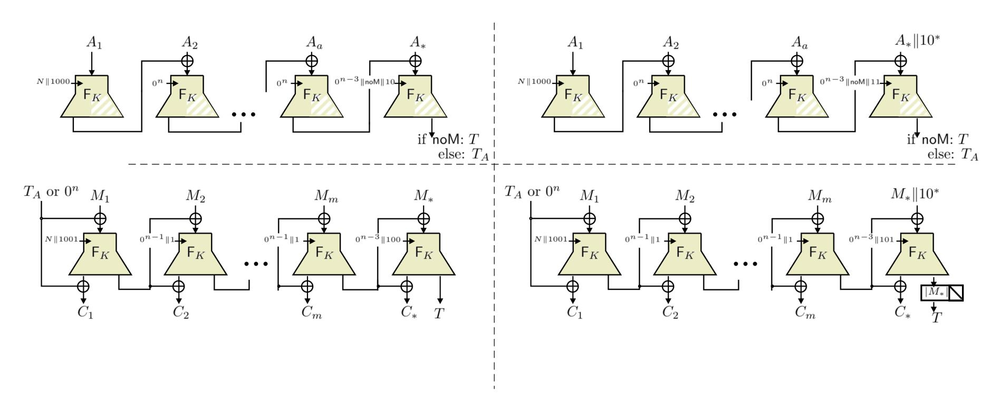

{0}------------------------------------------------

# Nonce-Misuse Security of the SAEF Authenticated Encryption mode?

Elena Andreeva<sup>1</sup> , Amit Singh Bhati<sup>2</sup> , and Damian Viz´ar<sup>3</sup>

> <sup>1</sup> Alpen-Adria University, Klagenfurt, Austria 2 imec-COSIC, KU Leuven, Belgium <sup>3</sup> CSEM, Switzerland.

elena.andreeva@aau.at, amitsingh.bhati@esat.kuleuven.be, damian.vizar@csem.ch

Abstract. ForkAE is a NIST lightweight cryptography candidate that uses the forkcipher primitive in two modes of operation – SAEF and PAEF – optimized for authenticated encryption of the shortest messages. SAEF is a sequential and online AEAD that minimizes the memory footprint compared to its alternative parallel mode PAEF, catering to the most constrained devices. SAEF was proven AE secure against nonce-respecting adversaries.

Due to their more acute and direct exposure to device misuse and mishandling, in most use cases of lightweight cryptography, nonce reuse presents a very realistic attack vector. Furthermore, many lightweight applications mandate security for their online AEAD schemes against block-wise adversaries. Surprisingly, a very few NIST lightweight AEAD candidates come with provable guarantees against these security threats.

In this work we investigate the provable security guarantees of SAEF when nonces are repeated under a refined version of the notion of online authenticated encryption OAE given by Fleischmann et al. in 2012. Using the coefficient H technique we show that, with no modifications, SAEF is OAE secure up to the birthday security bound, i.e., up to 2n/<sup>2</sup> processed blocks of data, where n is the block size of the forkcipher. The implications of our work is that SAEF is safe to use in a block-wise fashion, and that if nonces get repeated, this has no impact on ciphertext integrity and confidentiality only degrades by a limited extent up to repetitions of common message prefixes.

Keywords: Authenticated encryption, forkcipher, lightweight cryptography, short messages, online, provable security, nonce misuse.

# <span id="page-0-0"></span>1 Introduction

An authenticated encryption (AE) algorithm aims to achieve message confidentiality and integrity (authentication). The majority of AE schemes nowadays process two additional inputs: associated data AD and a nonce. The associated data is a piece of information, such as a network packet header, that does not require the provision of confidentiality but it does require authentication. The nonce input to an AE(AD) scheme is also practically motivated. A nonce is a unique value that enables the simplification of randomized or stateful AE algorithm to a deterministic one. This removes the need for random values generation or storing a state across distinct encryptions. The formalisation of nonce-based authenticated encryption was introduced in 2002 by Rogaway [\[26\]](#page-18-0).

Two of the most prominent AEAD schemes research, development and standardization efforts in recent years have been the CAESAR competition (2014–2018) [\[9\]](#page-17-0) and the ongoing NIST lightweight cryptography standardization process (2018–). The CAESAR competition produced

<sup>?</sup> This is an updated version of the original work appeared in SAC 2020 [\[2\]](#page-17-1).

{1}------------------------------------------------

a portfolio of algorithms for recommended use in three categories: 1. Lightweight (resource constrained environments): Ascon [\[11\]](#page-17-2) and ACORN [\[30\]](#page-18-1); 2. High-performance: AEGIS-128 [\[32\]](#page-18-2) and OCB [\[21\]](#page-18-3); 3. Defense in depth (stronger security guarantees): COLM [\[1\]](#page-17-3), Deoxys II [\[20\]](#page-18-4), and MORUS [\[31\]](#page-18-5). The CAESAR winners come with various advantages over the present standards GCM (NIST SP 800-38D) and CCM (IEEE 802.11i, IPsec ESP and IKEv2) and are expected to be adopted by new applications and standards.

The main focus of the defense in depth CAESAR category is nonce misuse resistance (NMR), a security target motivated by attacks which exploit implementation flaws leading to a repeated use of the same nonce by an application. More precisely, authenticity preservation despite nonce misuse is stated as critical and a limited privacy damage from nonce misuse as desirable. Noncemisuse resistant AE (MRAE) was introduced by Rogaway and Shrimpton [\[28\]](#page-18-6). Later works dealt with online nonce misuse-resistant AE (OAE) [\[13\]](#page-17-4) and online AE(OAE2) [\[17\]](#page-17-5). Nonce misuse purportedly presents a greater risk for small devices, such as IoT, where nonces could repeat due to various memory or space constraints, or remote usage. Maintaining the correct use of nonces is also especially challenging in distributed systems where nodes and connections can fail at any time. Recent attacks have illustrated the severity of nonce misuse in practice. In 2016 B¨ock et al. [\[10\]](#page-17-6) investigated the nonce misuse security of the AES-GCM [\[12\]](#page-17-7) AE mode and managed to completely break the authenticity of those connections where servers repeated the nonce. Their Internet-wide survey identified 184 such HTTPS servers. They showed how this vulnerability can be utilized to inject seemingly valid content into encrypted sessions. The next year Vanhoef and Piesens [\[29\]](#page-18-7) introduced the key reinstallation attack which forces nonce repetitions and breaks the WPA2 wireless protocol.

The MRAE [\[27\]](#page-18-8) and the RAE [\[16\]](#page-17-8) security notions capture the "best possible" security of nonce based AEAD (the latter for an extended syntax) in face of nonce repetitions but unfortunately can not be satisfied by any online AEAD scheme. These are AE schemes which parse the plaintext as a sequence of smaller, usually fixed-size blocks during encryption, and produce the ciphertext as a sequence of such blocks, such that i th ciphertext block can be immediately computed after having seen the first i plaintext blocks. Importantly, online encryption is better fitted for lightweight applications, where it is often critical to compute the ciphertext blocks on the fly with constant latency (e.g. streaming), or where a constant memory implementation is required. Such constraints can be found most recently in the consumer grade IoT applications, which come with stringent cost constraints and often get inadequate security as a consequence [\[22,](#page-18-9)[23\]](#page-18-10), and which would greatly benefit from a lightweight AEAD scheme with robust security.

In 2012 Fleischmann et al. [\[13\]](#page-17-4) proposed a weaker NMR security notion called OAE for online schemes that retains the same level of integrity and a well-defined, albeit lower level of confidentiality in face of nonce misuse. Hoang et al. [\[17\]](#page-17-5) pointed out inconsistencies in this definition, reformulated it, demonstrated that in certain situations the confidentiality afforded by OAE secure schemes is not sufficient, and critiqued several aspects of the OAE definition. Addressing the latter, Hoang et al. proposed an alternative to OAE dubbed OAE2 which is a stronger security with more versatile syntax. However, the change in syntax also means that the notion is inapplicable to designs adhering to the most common nonce-based AEAD syntax, and as shown by Hoang et al., the possible exploits of the decay in confidentiality are unavoidable in any kind of online schemes, OAE2-secure ones included. Despite this controversy, OAE can afford pragmatic protection against nonce-reuse with a sufficiently large block size and an appropriate use by the higher-level protocol/security primitive/etc.

{2}------------------------------------------------

In 2016 Endignoux and Vizár [15] showed that the notion of OAE is also meaningful in the context of block-wise adaptive attacks. The authors proved that OAE is equivalent with an adapted version of the blockwise-adaptive AE notions from [14]. The equivalence result shows that OAE-secure schemes are safe to use in settings where block-wise adaptive attackers exist. The main observation in [14] was that if an application, such as a smart card, outputs a ciphertext block each time it is fed a plaintext block, then a potential attacker gets more power by allowing him to adaptively construct the queries block-by-block. Such attacks pose a genuine risk in the lightweight setting where small devices are for example not equipped with sufficient memory and work block-wise. The OAE notion has been adopted by several AEAD designs, amongst which the COLM CAESAR winner in the defense in depth category (satisfying the authenticity and limited privacy damage against nonce misuse).

Surprisingly, among the 32 second round candidates, only a handful come with a provable form of nonce misuse security. The SP1 mode in the Spook [8] submission achieves the nonce misuse resilience notion proposed by Ashur et al. [5]. Tiny JAMBU [18] provides authentication security when nonce is misused by adjusting the associated data to also play the role of nonce. When the nonce is repeated but AD is different, the security of the cipher would not be affected by the repeated nonce, yet when both nonce and AD repeat, the scheme does not offer strong security guarantees in the sense of OAE. Romulus-M [19] is an MRAE [27] mode which is secure against misuse (repetition) of nonces in encryption queries but prevents the scheme from being implemented in an online fashion.

Our Contributions. In this work we investigate the OAE security of the ForkAE [3,4] second round NIST candidate which is optimized to be efficient for short messages. We focus on ForkAE and more precisely on its SAEF mode for three reasons. First, SAEF comes with existing provable security guarantees in the nonce-respecting setting, hence its (in)security in presence of nonce misuse is an interesting open question. Secondly, SAEF is an online scheme and the OAE security as refined by Hoang et al. [17] is a natural target for the analysis of its nonce-reuse security. Finally, an analysis of SAEF sheds more light on the potential of its relatively novel and less researched underlying forkcipher primitive [4] Our results show that the SAEF mode of the ForkAE NIST second round submission is provably OAE secure without the need of applying any design modifications.

The corrected variant of the OAE definition by Hoang et al. [17] (labeled as OAE1 in the publication) was defined to handle plaintext whose length is a multiple of the underlying blocksize n. Hence we extended the formalism to deal with messages that are not n-bits aligned and target the resulting notion in our analysis. Additionally, we opt to use two separate requirements for confidentiality and authenticity of OAE schemes because this allows us to take slightly different approach for analysis for each property in favor of brevity and simplicity of the proofs. We use Coefficient H technique [24] as the main vehicle for the analysis and prove that SAEF is OAE-secure up to  $2^{n/2}$  blocks of processed data in total, where n is the block size of the underling forkcipher.

### 2 Preliminaries

**Strings.** All strings are binary strings. The set of all strings of length n (for a positive integer n) is denoted  $\{0,1\}^n$  and the set of all strings of all possible lengths is denoted  $\{0,1\}^*$ . We let  $\{0,1\}^{\leq n} = \bigcup_{i=0}^n \{0,1\}^n$ . We denote by  $\operatorname{Perm}(n)$  the set of all permutations of  $\{0,1\}^n$ . We

{3}------------------------------------------------

denote by  $\operatorname{Func}(m,n)$  the set of all functions with domain  $\{0,1\}^m$  and range  $\{0,1\}^n$ , and we let  $\operatorname{Inj}(m,n)\subset\operatorname{Func}(m,n)$  denote the set of all injective functions with the same signature.

For a string X of  $\ell$  bits, we let X[i] denote the  $i^{\text{th}}$  bit of X for  $i=0,\ldots,\ell-1$  (starting from the left) and  $X[i\ldots j]=X[i]\|X[i+1]\|\ldots\|X[j]$  for  $0\leq i< j<\ell$ . We let  $\text{left}_{\ell}(X)=X[0\ldots(\ell-1)]$  denote the  $\ell$  leftmost bits of X and  $\text{right}_r(X)=X[(|X|-r)\ldots(|X|-1)]$  the r rightmost bits of X, such that  $X=\text{left}_{\chi}(X)\|\text{right}_{|X|-\chi}(X)$  for any  $0\leq \chi\leq |X|$ . Given a (possibly implicit) positive integer n and an  $X\in\{0,1\}^*$ , we let  $X\|10^*$  denote  $X\|10^{n-(|X|\mod n)-1}$  for simplicity. Given an implicit block length n, we let  $\text{pad}10(X)=X\|10^*$  return X if  $|X|\equiv 0\pmod n$  and  $X\|10^*$  otherwise.

String partitioning. For the rest of the section, we fix an arbitrary integer n and call it the block size. Given a string X, we let  $X_1, \ldots, X_x, X_* \stackrel{n}{\leftarrow} X$  denote partitioning X into n-bit blocks, such that  $|X_i| = n$  for  $i = 1, \ldots, x$ ,  $0 \le |X_*| \le n$  and  $X = X_1 \| \ldots \| X_x \| X_*$ , so  $x = \max(0, \lceil X/n \rceil - 1)$ . We let  $|X|_n = \lceil X/n \rceil$ . We let  $(M', M_*) = \mathsf{msplit}_n(M)$  (as in message split) denote a splitting of a string  $M \in \{0,1\}^*$  into two parts  $M' \| M_* = M$ , such that  $|M_*| \equiv |M|$  (mod n) and  $0 \le |M_*| \le n$ , where  $|M_*| = 0$  if and only if |M| = 0. We let  $(C', C_*, T) = \mathsf{csplit}_n(C)$  (as in ciphertext split) denote splitting a string C of at least n bits into three parts  $C' \| C_* \| T = C$ , such that  $|C_*| = n$ ,  $|T| \equiv |C| \pmod{n}$ , and  $0 \le |T| \le n$ , where |T| = 0 if and only if |C| = n. Finally, we let  $C'_1, \ldots, C'_m, C_*, T \leftarrow \mathsf{csplit-b}_n(C)$  (as in csplit to blocks) denote the result of  $\mathsf{csplit}_n(C)$  followed by partitioning of C' into  $|C'|_n$  blocks of n bits, such that  $C' = C'_1 \| \ldots \| C'_m$ .

**Blocks.** We let  $\mathsf{B}_n = \{0,1\}^n$  denote the set of all *n*-bit strings (or else *n*-bit blocks), and define  $\mathsf{B}_n^* = \{\varepsilon\} \cup \bigcup_{i=1}^\infty \mathsf{B}_n^i$  with  $\varepsilon$  denoting the empty string of length 0. We call a string  $X \in \mathsf{B}_n^*$  "*n*-aligned". For an *n*-aligned string  $X, X_i$  denotes its  $i^{\text{th}}$  *n*-bit block. For two distinct *n*-aligned strings  $X, Y \in \mathsf{B}_n^*$  such that  $|X|_n \leq |Y|_n$  w.l.o.g, we let  $\mathsf{llcp}_n(X,Y) = \max\{1 \leq i \leq |X|_n | X_j = Y_j \text{ for } 1 \leq j \leq i\}$  denote the length of the longest common prefix of X and Y in n-bit blocks.

**Miscellaneous.** The symbol  $\bot$  denotes an error signal, or an undefined value. We denote by  $X \leftarrow \$ \mathcal{X}$  sampling an element X from a finite set  $\mathcal{X}$  following the uniform distribution. We let  $(n)_q$  denote the falling factorial  $n \cdot (n-1) \cdot (n-2) \cdot \ldots \cdot (n-q+1)$  with  $(n)_0 = 1$ . For a predicate P(x), we equate P(x) = true with P(x) = 1 and P(x) = false with P(x) = 0. We use lexicographic comparison of tuples of integers; i.e. (i', j') < (i, j) iff i' < i or i' = i and j' < j.

#### 2.1 Coefficient H Technique

<span id="page-3-0"></span>The coefficient H technique is a simple but powerful proof technique provided by Patarin in [24]. The coefficient H technique is used to prove indistinguishability of a construction from an idealized object in face of an information-theoretic adversary using the concept of "transcripts". A transcript here is defined as complete record of the interaction of an adversary  $\mathcal{A}$  with its oracles in the indistinguishability experiment. To exemplify, if  $(M_i, C_i)$  denotes the input and output of the *i*-th query of  $\mathcal{A}$  to its oracle over q queries then the corresponding transcript (denote it  $\tau$ ) is  $\tau = \langle (M_1, C_1), \dots, (M_q, C_q) \rangle$ . The task given to  $\mathcal{A}$  is to distinguish the real world  $\mathcal{O}_{\text{real}}$  from the ideal world  $\mathcal{O}_{\text{ideal}}$ . Let us denote the distribution of transcripts in the real and the ideal world by  $\Theta_{\text{real}}$  and  $\Theta_{\text{ideal}}$ , respectively. We say a transcript  $\tau$  is attainable if the probability of achieving  $\tau$  in the ideal world is non-zero. We also assume w.l.o.g. that  $\mathcal{A}$  does not make duplicate or prohibited queries. The fundamental Lemma of coefficient H technique can now be stated.

{4}------------------------------------------------

Lemma 1 (Fundamental Lemma of the coefficient H Technique [24]). Consider that the set of attainable transcripts is partitioned into two disjoint sets  $\mathcal{T}_{good}$  and  $\mathcal{T}_{bad}$ . Also, assume there exist  $\epsilon_1, \epsilon_2 \geq 0$  such that for any transcript  $\tau \in \mathcal{T}_{good}$ , we have  $\frac{\Pr[\Theta_{real} = \tau]}{\Pr[\Theta_{ideal} = \tau]} \geq 1 - \epsilon_1$ , and  $\Pr[\Theta_{ideal} \in \mathcal{T}_{bad}] \leq \epsilon_2$ . Then, for all adversaries  $\mathcal{A}$ , it holds that  $|\Pr[\mathcal{A}^{\mathcal{O}_{real}}] - \Pr[\mathcal{A}^{\mathcal{O}_{ideal}}]| \leq \epsilon_1 + \epsilon_2$ .

### 2.2 Syntax of AEAD

Our targeted mode SAEF follows the AEAD syntax by Rogaway [26]. A nonce-based AEAD scheme is a triplet  $\Pi = (\mathcal{K}, \mathcal{E}, \mathcal{D})$ . The key space  $\mathcal{K}$  is a finite set. The deterministic encryption algorithm  $\mathcal{E}: \mathcal{K} \times \mathcal{N} \times \mathcal{A} \times \mathcal{M} \to \mathcal{C}$  maps a secret key K, a nonce N, an associated data A and a message M to a ciphertext  $C = \mathcal{E}(K, N, A, M)$ . The nonce, AD and message domains are all subsets of  $\{0, 1\}^*$ . The deterministic decryption algorithm  $\mathcal{D}: \mathcal{K} \times \mathcal{N} \times \mathcal{A} \times \mathcal{C} \to \mathcal{M} \cup \{\bot\}$  takes a tuple (K, N, A, C) and either returns a message  $M \in \mathcal{M}$ , or a distinguished symbol  $\bot$  to indicate an authentication error.

We require that for every  $M \in \mathcal{M}$ , we have  $\{0,1\}^{|M|} \subseteq \mathcal{M}$  (i.e. for any integer m, either all or no strings of length m belong to  $\mathcal{M}$ ) and that for all  $K, N, A, M \in \mathcal{K} \times \mathcal{N} \times \mathcal{A} \times \mathcal{M}$  we have  $|\mathcal{E}(K, N, A, M)| = |M| + \theta$  for some non-negative integer  $\theta$  called the stretch of  $\Pi$ . For correctness of  $\Pi$ , we require that for all  $K, N, A, M \in \mathcal{K} \times \mathcal{N} \times \mathcal{A} \times \mathcal{M}$  we have  $M = \mathcal{D}(K, N, A, \mathcal{E}(K, N, A, M))$ . We let  $\mathcal{E}_K(N, A, M) = \mathcal{E}(K, N, A, M)$  and  $\mathcal{D}_K(N, A, C) = \mathcal{D}(K, N, A, C)$ .

### 2.3 OAE Security

Our targeted notion of security is the definition of online AE (OAE) by Fleischmann et al. [13]. We use the variant of the notion described by Hoang et al. [17], extended as necessary to deal with messages that are not n-aligned. We opt for the two-requirement flavor of the notion, separating confidentiality and authenticity.

**OAE Confidentiality.** An online permutation [7] is a function  $\pi: \mathsf{B}_n^* \to \mathsf{B}_n^*$  such that (i)  $\pi$  is a length preserving permutation; i.e., for any integer  $m \geq 0$ , the function  $\pi$  restricted to mn-bit inputs  $\pi(K,T,\cdot): \mathsf{B}_n^m \to \mathsf{B}_n^m$  is a permutation (with a slight notation abuse); (ii)  $\pi$  preserves the length of blockwise prefix; i.e., for each  $M, M' \in \mathsf{B}_n^*$ , we have that  $\mathsf{llcp}_n(M,M') = \mathsf{llcp}_n(\pi(M),\pi(M'))$ .

We denote the set of all such permutations  $\operatorname{OPerm}(n)$ . We can define the distribution of a "random" online permutation<sup>4</sup> that is useful for experiments with a finite number of queries. We observe that each  $\pi \in \operatorname{OPerm}(n)$  can be equivalently defined as a collection  $(\pi_M)_{M \in \mathsf{B}_n^*}$ , such that for any  $M_1 \| M_2 \| \dots \| M_r \in \mathsf{B}_n^r$  we define  $\pi(M_1 \| M_2 \| \dots \| M_r)$  as  $\pi_{\varepsilon}(M_1) \| \pi_{M_1}(M_2) \| \dots \| \pi_{M_1 \| \dots \| M_{r-1}}(M_r)$ , and that there is in fact a bijection between  $\operatorname{OPerm}(n)$  and the set of all such permutation collections [7]. The expression  $\pi \leftarrow \operatorname{SOPerm}(n)$  should thus be understood as lazy sampling of those permutations in the collection  $(\pi_M)_{M \in \mathsf{B}_n^*}$  that are necessary to process adversarial queries.

We define OAE confidentiality of an AEAD scheme  $\Pi$  with two games,  $\mathbf{oprpf-real}_{\Pi}$  and  $\mathbf{oprpf-ideal}_{\Pi}$ . In both games  $\mathcal{A}$  can make arbitrary chosen plaintext queries to a black box encryption oracle, in particular  $\mathcal{A}$  is allowed to repeat the nonces. In the game  $\mathbf{oprpf-real}_{\Pi}$ ,

<span id="page-4-0"></span> $<sup>\</sup>overline{^{4} \text{ OPerm}(n)}$  is a countably infinite set, so the notion of a uniform online permutation is not defined.

{5}------------------------------------------------

the encryption oracle faithfully implements the encryption algorithm of  $\Pi$  using a randomly sampled secret key. In the game  $\operatorname{oprpf-ideal}_{\Pi}$ , upon an encryption query N, A, M the oracle returns  $\pi_{N,A}(M_L) \| f_{N,A,M}$  where  $M_L \leftarrow \operatorname{left}_{\lfloor M/n \rfloor}(M)$  is the longest n-aligned prefix of M,  $\pi_{N,A} \leftarrow \operatorname{SOPerm}(n)$  is a random online permutation for each  $N, A \in \mathcal{N} \times \mathcal{A}$ , and  $f_{N,A,M} \leftarrow \operatorname{SOPerm}(n)$  is a random string for each  $N, A, M \in \mathcal{N} \times \mathcal{A} \times \mathcal{M}$  (with a length corresponding to the n-bit authentication tag and no more than n-1 bit suffix of M remaining after the maximal n-aligned prefix  $M_L$ ). The  $\operatorname{oprpf}$  advantage of an adversary  $\mathcal{A}$  against  $\Pi = \operatorname{SAEF}[\mathsf{F}, \nu]$  can now be defined as  $\operatorname{Adv}_{\Pi}^{\operatorname{oprpf}}(\mathcal{A}) = \operatorname{Pr}[\mathcal{A}^{\operatorname{oprpf-real}_{\Pi}}] - \operatorname{Pr}[\mathcal{A}^{\operatorname{oprpf-ideal}_{\Pi}}]$ .

**OAE** Authenticity. The OAE authenticity notion coincides with the definition of ciphertext integrity where the adversary is allowed to repeat nonces, as first defined by Rogaway and Shrimpton [27]. A nonce-misusing chosen ciphertext attack of an adversary  $\mathcal{A}$  against the integrity of a nonce-based AE scheme  $\mathcal{\Pi}$  is modeled through the security game **auth**. The adversary is given access to a pair of blackbox oracles. It can make arbitrary chosen plaintext queries to the encryption oracle, including queries with repeated nonces.  $\mathcal{A}$  can further make arbitrary chosen ciphertext queries to the decryption oracle with the goal of finding a forgery: a tuple that decrypts correctly but is not trivially known to be correct from the encryption queries. We define the advantage of  $\mathcal{A}$  in breaking the authenticity of  $\mathcal{\Pi}$  as  $\mathbf{Adv}_{\mathcal{\Pi}}^{\mathbf{auth}}(\mathcal{A}) = \Pr[\mathcal{A}^{\mathbf{auth}_{\mathcal{\Pi}}} \text{forges}]$  where " $\mathcal{A}$  forges" denotes a decryption query that returns a value  $\neq \bot$ . We assume w.l.o.g. that  $\mathcal{A}$  does not make duplicate queries.

### <span id="page-5-0"></span>2.4 Forkcipher

We follow the formalism by Andreeva et al. [25]. Informally, a forkcipher  $\mathsf{F}$  is a tweakable symmetric-key primitive which maps a secret key K, a tweak T and an input block M of n bits to two ciphertext blocks  $C_0$  and  $C_1$ , such that  $C_0$  and  $C_1$  are each an (independent) permutation of M.

**Syntax.** Formally, a forkcipher is a pair of deterministic algorithms, the encryption algorithm:  $\mathsf{F}:\{0,1\}^k\times\mathcal{T}\times\{0,1\}^n\times\{0,1,\mathsf{b}\}\to\{0,1\}^n\cup\{0,1\}^n\times\{0,1\}^n$  and the inversion algorithm:  $\mathsf{F}^{-1}\{0,1\}^k\times\mathcal{T}\times\{0,1\}^n\times\{0,1\}^n\times\{0,1\}^n\times\{0,1\}^n\times\{0,1\}^n\times\{0,1\}^n$ . The encryption algorithm takes a key K, a tweak  $\mathsf{T}\in\mathcal{T}$ , a plaintext block M and an output selector s, and outputs the (left) s-bit ciphertext block s-bit ciphertext block s-bit ciphertext block s-bit ciphertext block s-bit ciphertext block s-bit ciphertext block s-bit ciphertext block s-bit ciphertext block s-bit ciphertext block s-bit ciphertext block s-bit ciphertext block s-bit ciphertext block s-bit ciphertext block s-bit ciphertext block s-bit ciphertext block s-bit ciphertext block s-bit ciphertext block s-bit ciphertext block s-bit ciphertext block s-bit ciphertext block s-bit ciphertext block s-bit ciphertext block s-bit ciphertext block s-bit ciphertext block s-bit ciphertext block s-bit ciphertext block s-bit ciphertext block s-bit ciphertext block s-bit ciphertext block s-bit ciphertext block s-bit ciphertext block s-bit ciphertext block s-bit ciphertext block s-bit ciphertext block s-bit ciphertext block s-bit ciphertext block s-bit ciphertext block s-bit ciphertext block s-bit ciphertext block s-bit ciphertext block s-bit ciphertext block s-bit ciphertext block s-bit ciphertext block s-bit ciphertext block s-bit ciphertext block s-bit ciphertext block s-bit ciphertext block s-bit ciphertext block s-bit ciphertext block s-bit ciphertext block s-bit ciphertext block s-bit ciphertext block s-bit ciphertext block s-bit ciphertext block s-bit ciphertext block s-bit ciphertext block s-bit ciphertext block s-bit ciphertext block s-bit ciphertext block s-bit ciphertext block s-bit ciphertext block s-bit ciphertext block s-bit ciphertext block s-bit ciphertext block s-bit ciphertext block s-bit ciphertext bl

A tweakable forkcipher F is correct if for each pair of key and tweak, the fork-cipher applies two independent permutations to the input to produce the two output blocks. Formally, for each  $K \in \{0,1\}^k, T \in \mathcal{T}, M \in \{0,1\}^n$  and  $\beta \in \{0,1\}$  the following conditions must be met: (i)  $\mathsf{F}^{-1}(K,\mathsf{T},\mathsf{F}(K,\mathsf{T},M,\beta),\beta,\mathsf{i}) = M$ , and (ii)  $\mathsf{F}^{-1}(K,\mathsf{T},\mathsf{F}(K,\mathsf{T},M,\beta),\beta,\mathsf{o}) = \mathsf{F}(K,\mathsf{T},M,\beta\oplus 1)$ , and (iii)  $(\mathsf{F}(K,\mathsf{T},M,0),\;\mathsf{F}(K,\mathsf{T},M,1)) = \mathsf{F}(K,\mathsf{T},M,\mathsf{b})$ , and (iv)  $(\mathsf{F}^{-1}(K,\mathsf{T},C,\beta,\mathsf{i}),\mathsf{F}^{-1}(K,\mathsf{T},C,\beta,\mathsf{o})) = \mathsf{F}^{-1}(K,\mathsf{T},C,\beta,\mathsf{b})$ . In the rest of the paper, we assume that  $\mathcal{T} = \{0,1\}^t$  for some positive t.

{6}------------------------------------------------

Security. The security of a correct forkcipher F is defined through indistinguishability of the games prtfp-real<sup>F</sup> (implementing F algorithms faithfully) and prtfp-ideal<sup>F</sup> which replaces F by two tweakable random permutations πT,0, πT,<sup>1</sup> ←\$ Perm(n) for T ∈ T in a natural way, in a chosen ciphertext attack. We define the advantage of A as Advprtfp F (A) = Pr[Aprtfp-real<sup>F</sup> ⇒ 1] − Pr[Aprtfp-ideal<sup>F</sup> ⇒ 1] with the games defined in.

### <span id="page-6-1"></span>3 SAEF and its OAE Security

SAEF (short for Sequential AE from a Forkcipher) is a nonce-based AEAD scheme. It takes as a parameter a tweakable forkcipher F (as defined in Section [2.4\)](#page-5-0) with T = {0, 1} t for a positive t ≤ n. SAEF[F] = (K, E, D) has a key space K = {0, 1} k , nonce space N = {0, 1} t−4 , and the AD and message spaces are both {0, 1} ∗ . The ciphertext expansion of SAEF[F] is n bits. The encryption and decryption algorithms are given in Figure [2](#page-7-0) and the encryption algorithm is depicted in Figure [1.](#page-6-0)

<span id="page-6-0"></span>

Fig. 1: The encryption algorithm of SAEF[F] mode. The bit noM = 1 iff |M| = 0. The picture illustrates the processing of AD when length of AD is a multiple of n (top left) and when the length of AD is not a multiple of n (top right), and the processing of the message when length of the message is a multiple of n (bottom left) and when the length of message is not a multiple of n (bottom right). The white hatching denotes that an output block is not computed.

An encryption query is processed in blocks of n bits, first AD and then the message, using a single call to the forkcipher per block. The calls are tweaked by composing: (1) the nonce followed by a 1-bit in the initial F call of the query, and the string 0t−<sup>3</sup> otherwise, (2) three-bit flag f. The flag f is used to ensure proper domain separation for different "types" of blocks in the encryption algorithm. The values f ∈ {000, 010, 011, 110, 111, 001, 100, 101} are used, respectively, when processing non-final AD block, the last n-bit long AD block, the last AD block of < n bits, the last AD block of n bits to produce tag, the last AD block of < n bits to produce tag, non-final message block, the last n-bit message block and the last message block of < n bits.

One output block of every F call is used as a chaining value, masking either the input (in AD processing) or both the input and the output (in message processing) of the following F call. The very first F call in each query is unmasked (but has the nonce in the tweak). The tag is the,

{7}------------------------------------------------

```
1: function \mathcal{E}(K, N, A, M)
                                                                                                    1: function \mathcal{D}(K, N, A, C)
                                                                                                              A_1,\ldots,A_a,A_* \stackrel{n}{\leftarrow} A
            A_1,\ldots,A_a,A_* \stackrel{n}{\leftarrow} A
 2:
                                                                                                    2:
            M_1,\ldots,M_m,M_* \stackrel{n}{\longleftarrow} M
                                                                                                               C_1, \ldots, C_m, C_*, T \leftarrow \mathsf{csplit-b}_n C
                                                                                                    3:
 3:
                                                                                                               noM \leftarrow 0
                                                                                                    4:
            noM \leftarrow 0
 4:
                                                                                                              if |C| = n then noM \leftarrow 1
           if |M| = 0 then noM \leftarrow 1
                                                                                                    5:
 5:
                                                                                                               \Delta \leftarrow 0^n; \mathsf{T} \leftarrow N || 0^{t-4} || 1
            \Delta \leftarrow 0^n; \mathsf{T} \leftarrow N || 0^{t-4} || 1
                                                                                                    6:
 6:
                                                                                                               for i \leftarrow 1 to a do
                                                                                                    7:
 7:
            for i \leftarrow 1 to a do
                                                                                                    8:
                                                                                                                    T \leftarrow T || 000
 8:
                 T \leftarrow T ||000

\Delta \leftarrow \mathsf{F}_{K}^{\mathsf{T},0}(A_{i} \oplus \Delta) \\
\mathsf{T} \leftarrow 0^{t-3}

                                                                                                    9:
 9:
                                                                                                   10:
10:
                                                                                                  11:
                                                                                                               end for
            end for
11:
                                                                                                  12:
                                                                                                               if |A_*| = n then
            if |A_*| = n then
12:
                                                                                                                     T \leftarrow T \| noM \| 10
                 T \leftarrow T \| \mathsf{noM} \| 10
                                                                                                  13:
13:
                                                                                                                    14:
14:
                                                                                                  15:
15:
                                                                                                               else if |A_*| > 0 or |T| = 0 then
            else if |A_*| > 0 or |M| = 0 then
                                                                                                  16:
16:
                                                                                                                     T \leftarrow T \| noM \| 11
                                                                                                  17:
17:
                  T \leftarrow T || noM || 11
                                                                                                                    18:
18:
                                                                                                  19:
19:
                                                                                                               end if
                                                                                                                                                \triangleright Do nothing if A = \varepsilon, M \neq \varepsilon
            end if
                                             \triangleright \text{ Do nothing if } A = \varepsilon, M \neq \varepsilon
                                                                                                  20:
20:
                                                                                                   21:
                                                                                                               for i \leftarrow 1 to m do
21:
            for i \leftarrow 1 to m do
                                                                                                                    \mathsf{T} \leftarrow \mathsf{T} || 001
                                                                                                   22:
22:
                 T \leftarrow T || 001
                                                                                                                    M_i, \Delta \leftarrow \mathsf{F}^{-1} {}_K^{\mathsf{T},0,\mathsf{b}} (C_i \oplus \Delta) \oplus (\Delta, 0^n)
                 C_i, \Delta \leftarrow \mathsf{F}_K^{\mathsf{T},\mathsf{b}}(M_i \oplus \Delta) \oplus (\Delta, 0^n)

\mathsf{T} \leftarrow 0^{t-3}
                                                                                                   23:
23:
                                                                                                                     T \leftarrow 0^{t-3}
                                                                                                   24:
24:
                                                                                                   25:
                                                                                                               end for
25:
            end for
                                                                                                   26:
                                                                                                               if |T| = n then
26:
            if |M_*| = n then
                                                                                                   27:
                                                                                                                    T \leftarrow T || 100
27:
                 T \leftarrow T || 100
                                                                                                               else if |T| > 0 then
                                                                                                   28:
28:
            else if |M_*| > 0 then
                 \mathsf{T} \leftarrow \mathsf{T} \| 101
                                                                                                   29:
                                                                                                                    T \leftarrow T || 101
29:
                                                                                                   30:
30:
            else
                                                                                                               else
                                                                                                   31:
                                                                                                                    if C_* \neq \Delta then return \perp
31:
                 return \Delta
                                                                                                   32:
                                                                                                                    return \varepsilon
32:
            end if
            C_*, T \leftarrow \mathsf{F}_K^{\mathsf{T},\mathsf{b}}(\mathsf{pad10}(M_*) \oplus \Delta) \oplus (\Delta \| 0^n)
                                                                                                   33:
                                                                                                               end if
33:
                                                                                                              M_*, T' \leftarrow \mathsf{F}^{-1}{}_K^{\mathsf{T},0,\mathsf{b}}(C_* \oplus \Delta) \oplus (\Delta, 0^n)
T' \leftarrow \mathsf{left}_{|T|}(T'); P \leftarrow \mathsf{right}_{n-|T|}(M_*)
                                                                                                   34:
            return C_1 \| \dots \| C_m \| C_* \| \mathsf{left}_{|M_*|}(T)
34:
35: end function
                                                                                                   35:
                                                                                                               if T' \neq T return \perp
                                                                                                   36:
                                                                                                               if P \neq \mathsf{left}_{n-|T|}(10^{n-1}) return \bot
                                                                                                   37:
                                                                                                   38:
                                                                                                               return M_1 \parallel \ldots \parallel M_m \parallel \mathsf{left}_{\mid T \mid} (M_*)
                                                                                                   39: end function
```

<span id="page-7-1"></span>Fig. 2: The SAEF[F] AEAD scheme.

possibly truncated, last "right" output of F produced in the query (in case of truncation message padding is used for partial integrity check). In a decryption query, the processing is similar to the encryption, with the plaintext blocks and the chaining values in the message processing part being computed with the inverse F algorithm.

#### 3.1 Security of SAEF

Andreeva et al. proved that if nonce-uniqueness is guaranteed, SAEF achieves the standard AEAD confidentiality and integrity up to the birthday bound. There have been no investigations into the security of SAEF under nonce misuse (i.e., if nonces accidentally repeat). We state the formal claim about confidentiality and integrity of SAEF under nonce-misuse in Theorem 1.

**Theorem 1.** Let  $\mathsf{F}$  be a tweakable forkcipher with  $\mathcal{T} = \{0,1\}^t$ . Then for any nonce-misuse adversary  $\mathcal{A}$  who makes at most  $q_e \leq 2^{n-1}$  encryption queries, at most  $q_v$  decryption queries

{8}------------------------------------------------

such that the total number of forkcipher calls induced by all the queries is at most  $\sigma$ , we have

$$\begin{aligned} \mathbf{Adv}_{\mathrm{SAEF}[\mathsf{F}]}^{\mathbf{oprpf}}(\mathcal{A}) &\leq \mathbf{Adv}_{\mathsf{F}}^{\mathbf{prtfp}}(\mathcal{B}) + \frac{3 \cdot \sigma^2}{2^{n+1}} \\ \mathbf{Adv}_{\mathrm{SAEF}[\mathsf{F}]}^{\mathbf{auth}}(\mathcal{A}) &\leq \mathbf{Adv}_{\mathsf{F}}^{\mathbf{prtfp}}(\mathcal{C}) + \frac{\sigma^2 + 4 \cdot q_v}{2^n} \end{aligned}$$

for some adversaries  $\mathcal{B}$  and  $\mathcal{C}$ , each making at most  $2\sigma$  queries, and running in time given by the running time of  $\mathcal{A}$  plus  $\gamma \cdot \sigma$  for some "small" constant  $\gamma$ .

The proof of Theorem 1 follows in Sections 3.2 and 3.3.

Main ingredients. The crux of the proof lies in adapting the analysis approach to the properties of SAEF arising from its sequential structure. These properties are best illustrated by an example. In two queries using the same nonce N, the same associated data  $A_1\|A_2$  of two blocks and two messages  $M_1^1\|M_2^1\|M_3^1$  and  $M_1^2\|M_2^2\|M_3^2$  of three blocks each and differing in the first message block, following the encryption algorithm in Figure 2, the values of the F tweak string and of  $\Delta$  mask used to process each block of A would be identical between the two queries, as would be the tweak (equal to  $0^{n-1}1$ ) and the  $\Delta$  mask used to process the first message block  $M_1^1$  and  $M_1^2$  respectively. However, this equality of tweaks and  $\Delta$  masks together with the nonequality  $M_1^1 \neq M_1^2$  imply that the F input blocks  $\Delta \oplus M_1^1$  and  $\Delta \oplus M_1^2$  will necessarily differ, which will randomize the  $\Delta$  masks used to process the next of each message.

Similarly, in another case with executing two same queries but with extending the AD used in the first query to  $A_1\|A_2\|110^{n-2}$  and for the second query to  $A_1\|A_2\|1$ , the processing will again be identical for  $A_1$  and  $A_2$  and for the third block, the  $\Delta$  masks and the F inputs  $\Delta \oplus 110^{n-2} = \Delta \oplus \text{pad}10(1)$  will be identical but the tweaks will differ. What emerges is that the internal variables of SAEF's encryption algorithm preserve a certain "common prefix length" between the queries, and get randomized just past it. This observation is at the center of our proofs. Giving a formal definition of a common prefix between AE queries is also concise but is not straightforward, and requires a different representation of queries, which is the second main ingredient of our proofs.

#### <span id="page-8-0"></span>3.2 Integrity

We switch to an alternative definition of AEAD integrity through indistinguishability, which is equivalent with the notion introduced in Section 3. We define two games,  $\operatorname{\mathbf{auth-real}}_{\Pi}$  and  $\operatorname{\mathbf{auth-ideal}}_{\Pi}$ . In both games  $\mathcal{A}$  is given access to an encryption and a decryption oracle. In the game  $\operatorname{\mathbf{auth-real}}_{\Pi}$ , both oracles faithfully implement the respective algorithms of SAEF using the same randomly sampled secret key, except that the decryption oracle returns  $\top$  in case of a successful forgery, and  $\bot$  otherwise. In the game  $\operatorname{\mathbf{auth-ideal}}_{\Pi}$ , the encryption oracle is the same as in  $\operatorname{\mathbf{auth-real}}_{\Pi}$  but the decryption oracle always returns  $\bot$ . We claim that  $\operatorname{\mathbf{Adv}}^{\operatorname{\mathbf{auth}}}_{\Pi}(\mathcal{A}) = \Pr[\mathcal{A}^{\operatorname{\mathbf{auth-ideal}}_{\Pi}}] - \Pr[\mathcal{A}^{\operatorname{\mathbf{auth-ideal}}_{\Pi}}]$ .

It is easy to see that the equality holds, by establishing inequalities in both directions. An adversary  $\mathcal{A}$  playing the game  $\mathbf{auth}_{\Pi}$  can be used to construct a distinguishing adversary  $\mathcal{B}$  which forwards  $\mathcal{A}$ 's queries and outputs 1 iff  $\mathcal{A}$  forges, achieving the same advantage as  $\mathcal{A}$ . In the other direction, we can construct an adversary  $\mathcal{A}$  for game  $\mathbf{auth}_{\Pi}$  from an indistinguishability adversary  $\mathcal{B}$ , which forwards  $\mathcal{B}$ 's queries and automatically wins if  $\mathcal{B}$  produces a valid forgery.  $\mathcal{A}$  achieves the same advantage as  $\mathcal{B}$ , because if no forgery occurs, the games  $\mathbf{auth}$ -real $_{\Pi}$  and  $\mathbf{auth}$ -ideal $_{\Pi}$  are indistinguishable.

{9}------------------------------------------------

**Replacing** F. We first replace F with a pair of independent random tweakable permutations  $\pi_0 = (\pi_{\mathsf{T},0} \leftarrow \$ \operatorname{Perm}(n))_{\mathsf{T} \in \{0,1\}^t}$  and  $\pi_1 = (\pi_{\mathsf{T},1} \leftarrow \$ \operatorname{Perm}(n))_{\mathsf{T} \in \{0,1\}^t}$  and let  $\operatorname{SAEF}[(\pi_0,\pi_1)]$  denote the SAEF mode that uses  $\pi_0, \pi_1$  instead of F, which yields  $\operatorname{Adv}_{\operatorname{SAEF}[\mathsf{F}]}^{\operatorname{\mathbf{auth}}}(\mathcal{A}) \leq \operatorname{Adv}_{\mathsf{F}}^{\operatorname{\mathbf{prtfp}}}(\mathcal{B}) + \operatorname{Adv}_{\operatorname{SAEF}[(\pi_0,\pi_1)]}^{\operatorname{\mathbf{auth}}}(\mathcal{A})$ .

The adversary is thus left with the goal of distinguishing between the games  $\mathbf{auth\text{-real}}_{\mathrm{SAEF}[(\pi_0,\pi_1)]}$  (called the "real-int world") and  $\mathbf{auth\text{-ideal}}_{\mathrm{SAEF}[(\pi_0,\pi_1)]}$  (called the "ideal-int world"). Hence, we want to bound  $\mathbf{Adv}_{\mathrm{SAEF}[(\pi_0,\pi_1)]}^{\mathbf{auth}}(\mathcal{A}) = \Pr[\mathcal{A}^{\mathbf{auth\text{-real}}_{\mathrm{SAEF}[(\pi_0,\pi_1)]}}] - \Pr[\mathcal{A}^{\mathbf{auth\text{-ideal}}_{\mathrm{SAEF}[(\pi_0,\pi_1)]}}]$ .

**Transcripts.** Following the coefficients H technique [24], we characterize the interactions of  $\mathcal{A}$  with its oracles in a transcript:

$$\tau = \langle (N^i, A^i, M^i, C^i)_{i=1}^{q_e}, (\bar{N}^i, \bar{A}^i, \bar{C}^i, b^i)_{i=1}^{q_v} \rangle$$

In the  $i^{\text{th}}$  query to the encryption oracle  $(N^i, A^i, M^i)$ , returning the ciphertext  $C^i$ , SAEF internally processes  $A^i, M^i$  and  $C^i$  in blocks  $A^i_1, \ldots, A^i_{a^i}, A^i_*$ , and  $M^i_1, \ldots, M^i_{m^i}, M^i_*$ , and  $C^i_1, \ldots, C^i_{m^i}, C^i_*, T^i$  respectively (defined according to the encryption algorithm in Figure 2). We have  $a^i$  and  $m^i$  equal to, respectively, the length of  $A^i$  and  $M^i$  in n-bit. SAEF additionally uses whitening masks, denoted here  $\Delta^i_1, \ldots, \Delta^i_{a^i+1}$  for the whitening masks used to process  $A^i_1, \ldots, A^i_{a^i}, A^i_*$  respectively, and  $\Delta^i_{a^i+2}, \ldots, \Delta^i_{a^i+m^i+2}$  for the whitening masks used to process the blocks  $M^i_1, \ldots, M^i_{m^i}, M^i_*$  respectively.

Similarly, in the  $i^{th}$  decryption query  $(\bar{N}^i, \bar{A}^i, \bar{C}^i)$ , returning  $b^i \in \{\top, \bot\}$  SAEF internally processes  $\bar{A}^i$  and  $\bar{C}^i$  in blocks, denoted as  $\bar{A}^i_1, \ldots, \bar{A}^i_{\bar{a}^i}, \bar{A}^i_*$  and  $\bar{C}^i_1, \ldots, \bar{C}^i_{\bar{m}^i}, \bar{C}^i_*, \bar{T}^i$ , where  $\bar{a}^i$  and  $\bar{m}^i$  are respectively equal to the length of  $\bar{A}^i$  and the length of  $\bar{C}^i$  in n-bit blocks (excluding the tag from the count). Additionally, SAEF internally computes the plaintext blocks  $\bar{M}^i_1, \ldots, \bar{M}^i_{\bar{m}^i}, \bar{M}^i_*$  as well as  $\bar{\Delta}^i_1, \ldots, \bar{\Delta}^i_{\bar{a}^i+1}$ , the whitening masks used to process  $\bar{A}^i_1, \ldots, \bar{A}^i_{\bar{a}^i}, \bar{A}^i_*$  respectively, and  $\bar{\Delta}^i_{\bar{a}^i+2}, \ldots, \bar{\Delta}^i_{\bar{a}^i+\bar{m}^i+2}$ , the whitening masks used to process the blocks  $\bar{C}^i_1, \ldots, \bar{C}^i_{\bar{m}^i}, \bar{C}^i_*$  respectively.

**Additional information.** To simplify the proofs, we additionally provide the adversary with all the encryption masks  $\Delta^i_j$ , all the decryption masks  $\bar{\Delta}^i_j$  and internally computed plaintexts  $\bar{M}^i_j$  when it has made all its queries and only the final response is pending.

In the real-int world, all these variables are internally computed by the oracles faithfully evaluating SAEF. In the ideal-int world, the encryption also evaluates SAEF, so  $\Delta^i_j$  masks are defined, but the decryption oracle does not make any computations, hence  $\bar{\Delta}^i_j$  and  $\bar{M}^i_j$  are not defined. We therefore have to define their sampling, to be done at the end of the experiment (thus having no influence of adversarial queries).

For j=1, we have  $\bar{\Delta}^i_1=0^n$  for  $1\leq i\leq q_v$ . We sample each of the remaining  $\bar{\Delta}^i_j$  mask uniformly, except when its value is trivially determined due to a "common prefix" with an encryption, or decryption query (defined shortly). Once the masks are sampled, we run the SAEF decryption algorithm using  $\pi_0$  and these masks to compute  $\bar{M}^i_j$ . Clearly, this give away of additional information can only increase the adversary's advantage and thus can be considered here for upper bounding the above mentioned adversarial advantage.

**Block-tuple representation.** The  $i^{\text{th}}$  encryption query can be equivalently represented as  $(\mathsf{T}^i_j,\Delta^i_j,X^i_j,Y^i_j)^{\ell^i}_{j=1},T^i$ , such that  $\ell^i=a^i+m^i+2$  and each of the  $\ell^i$  quadruples represents the processing done in  $j^{\text{th}}$  call to the forkcipher in the query, consisting of the string  $\mathsf{T}^i_j$  used as fork-

{10}------------------------------------------------

cipher tweak, the current whitening mask  $\Delta_j^i$ , the (possibly padded) associated data/plaintext block  $X_i^i$  and the empty/ciphertex block  $Y_i^i$ . In more detail:

- In the first block, we always have  $\mathsf{T}_1^i = N \|1\| F$  for a flag  $F \in \{0,1\}^3$  and  $\Delta_1^i = 0^n$ . For blocks with j > 1 we have  $\mathsf{T}_j^i = 0^{t-3} \|F$  for an  $F \in \{0,1\}^3$ .

   If |A| > 0, for  $1 \le j \le a^i$  we have  $X_j^i = A_j^i$ ,  $Y_j^i = \varepsilon$  and F = 000. For  $j = a^i + 1$  we have  $X_j^i = \mathsf{pad} \mathsf{10}(A_*^i)$ ,  $Y_j^i = \varepsilon$  and  $F \in \{0,1\}^3$  as defined in Figure 2.

   If |M| > 0, for  $a^i + 2 \le j < \ell^i$  we have  $X_j^i = M_j^i$ ,  $Y_j^i = C_j^i$  and F = 001. For  $j = \ell^i$  we have  $X_j^i = \mathsf{pad} \mathsf{10}(M_j^i)$ ,  $Y_j^i = C_j^i$  and  $F \in \{0,1\}^3$  as defined in Figure 2.
- $X_j^i = \mathsf{pad10}(M_*^i), \, Y_j^i = C_*^i \text{ and } F \in \{0,1\}^3 \text{ as defined in Figure 2.}$
- If  $A = M = \varepsilon$ , we have  $j = \ell^i = 1$ ,  $X_i^i = \text{pad}10(\varepsilon)$ ,  $Y_i^i = \varepsilon$  and F = 111.

We call this the *block-tuple* representation.

We similarly define the block-tuple representation  $(\bar{\mathsf{T}}^i_j, \bar{\Delta}^i_j, \bar{X}^i_j, \bar{Y}^i_j)_{j=1}^{\bar{\ell}^i}, \bar{T}^i, b^i$  for decryption queries with  $\bar{\ell}^i = \bar{m}^i + \bar{a}^i + 2$ . We further streamline the notation by re-indexing the decryption queries from  $q_e + 1$  to  $q_e + q_v$ , and dispensing of the bar above the variables. The decryption queries are thus denoted as  $(\mathsf{T}^i_j, \Delta^i_j, X^i_j, Y^i_j)^{\ell^i}_{i=1}, T^i, b^i$  for  $q_e + 1 \leq i \leq q_e + q_v$ .

<span id="page-10-0"></span>**Proposition 1.** The transformation of an extended transcript from the default to the block-tuple representation is injective.

The proof of Proposition 1 is given in Appendix A.

Blockwise common prefix of queries This notation allows for the following natural definition of longest common blockwise prefix between two queries. We define the longest common prefix of the  $i^{\text{th}}$  and  $i'^{\text{th}}$  query (in the block-tuple notation) with  $\ell^i \leq \ell^{i'}$  w.l.o.g. as

$$\mathsf{Ilcp}_n(i,i') = \max\{1 \leq u \leq \ell^i | (\mathsf{T}^i_j, \Delta^i_j, X^i_j, Y^i_j) = (\mathsf{T}^{i'}_j, \Delta^{i'}_j, X^{i'}_j, Y^{i'}_j) \text{ for } 1 \leq j \leq u \}.$$

Note that this definition covers common blockwise prefix between two encryption queries (with  $i, i' \leq q_e$ ), two decryption queries (with  $i, i' > q_e$ )) and between an encryption and a decryption query (with  $1 \le i' \le q_e < i \le q_e + q_v$  w.l.o.g.). Informally,  $\mathsf{llcp}_n(i,i')$  counts how many internal chaining values (the  $\Delta$  masks) are trivially equal between the  $i^{\text{th}}$  and  $i'^{\text{th}}$  encryption query. For example, if the nonces  $N^i$  and  $N^{i'}$  are distinct we have  $\mathsf{llcp}_n(i,i')=0$ . If we have two queries with  $N^i = N^{i'}$  and one having AD  $A^{i'} = A^i || M_1^i$  equal to the AD of the other appended with its first message block, we will still have  $\mathsf{llcp}_n(i,i') = a^i + 1$ , thanks to including the tweak string in the block tuples. We finally define the length of the longest common blockwise prefix of a query with all previous queries as  $\mathsf{llcp}_n(i) = \max_{1 \le i' \le i} \mathsf{llcp}_n(i,i')$ . Note that for a decryption query, all the encryption queries are always taken into account (due to our convention about query indexing).

**Sampling of**  $\Delta$  masks. Using this notation, we now precisely define the sampling of  $\Delta_j^i$  masks in decryption queries (i.e., for  $q_e < i \le q_e + q_v$ ) of the ideal-int world. In the  $i^{\text{th}}$  decryption query, for  $1 \leq j \leq \mathsf{llcp}_n(i) + 1$ , we let  $\Delta_j^i = \Delta_j^{i'}$  for the smallest i' < i such that  $i'^{\text{th}}$  query has  $\mathsf{Ilcp}_n(i) = \mathsf{Ilcp}_n(i,i')$ . For  $\mathsf{Ilcp}_n(i) + 1 < j \leq \ell^i$ ,  $\Delta^i_j$  is sampled uniformly at random. In other words,  $\Delta$  masks that are trivially known to be equal to some previous mask due to the iterative nature of SAEF are simply set to that value, and the rest is sampled uniformly.

**Extended transcripts.** With the new notation in mind, the extended transcripts can be redefined as

$$\tau = \left\langle \left( \left( \mathsf{T}^i_j, \Delta^i_j, X^i_j, Y^i_j \right)_{j=1}^{\ell^i}, T^i \right)_{i=1}^{q_e}, \left( \left( \mathsf{T}^i_j, \Delta^i_j, X^i_j, Y^i_j \right)_{j=1}^{\ell^i}, T^i, b^i \right)_{i=q_e+1}^{q_e+q_v} \right\rangle \; .$$

{11}------------------------------------------------

Note that  $q_e, q_v, a$  and m here are themselves random variables and thus can vary for distinct attainable transcripts. However, due to the assumption that the adversary can make at most  $\sigma$  block queries, we always have  $\sum_{i=1}^{q_e+q_v} (a^i + m^i + 2) = \sigma$ .

The following corollary shows that switching to block-tuple representation does not have an impact of the result of the analysis and in particular on the bounds derived using the block-tuple representation.

Corollary 1. Due to Proposition 1, it is impossible for two distinct transcripts  $\tau = \langle (N^i, A^i, M^i, C^i)_{i=1}^{q_e}, (\bar{N}^i, \bar{A}^i, \bar{C}^i, b^i)_{i=1}^{q_v} \rangle$  and  $\tau' = \langle (N'^i, A'^i, M'^i, C'^i)_{i=1}^{q_e}, (\bar{N}'^i, \bar{A}'^i, \bar{C}'^i, b'^i)_{i=1}^{q_v} \rangle$  to have the same block-tuple representation.

**Coefficient-H.** Let  $\Theta_{rein}$  and  $\Theta_{idin}$  represent the distribution of the transcript in the real-int world and the ideal-int world, respectively.

The proof relies on the fundamental lemma of the coefficient H technique defined as Lemma 1 above. We say an attainable transcript  $\tau$  is bad if one of the following conditions occurs:

 $\mathsf{BadT}_1$  a.k.a. "Input Collision": There exists (i',j') < (i,j) (the block indexed by (i',j') precedes (i,j)) such that  $1 \le i \le q_e + q_v$ ,  $\mathsf{Ilcp}_n(i) < j \le \ell^i$  is not in the longest common prefix of the  $i^{\mathsf{th}}$  query, , and the (i,j) block call has tweak-input collision with the (i',j') block call, i.e.,  $\mathsf{T}^i_j = \mathsf{T}^{i'}_{j'}$  and  $X^i_j \oplus \Delta^i_j = X^{i'}_{j'} \oplus \Delta^{i'}_{j'}$ .

 $\mathsf{BadT}_2^i$  a.k.a. "Mask Collision": There exists (i',j') < (i,j) such that  $1 \le i \le q_e + q_v$ ,  $\mathsf{llcp}_n(i) < j < \ell^i$  (not in the longest common prefix), and both the block calls have the same tweaks  $\mathsf{T}^i_j = \mathsf{T}^{i'}_{j'}$  and different inputs  $X^i_j \oplus \Delta^i_j \ne X^{i'}_{j'} \oplus \Delta^{i'}_{j'}$ , however, the following masks  $\Delta^i_{j+1} = \Delta^{i'}_{j'+1}$  collide. (Note that such a collision cannot occur in the real-int world where the masks are generated with permutation).

BadT<sub>3</sub> a.k.a. "Forgery": There exists  $q_e + 1 \le i \le q_e + q_v$  such that for  $j = \ell^i$  we have any of the following:

Case 1. The last bit of  $\mathsf{T}^i_j$  is 0 and  $\pi_{\mathsf{T}^i_i,1}(X^i_j\oplus\Delta^i_j)=T^i$ .

Case 2. The last bit of  $\mathsf{T}^i_j$  is 1,  $\mathsf{right}_{n-|T^i|}(X^i_j) = 10^{n-|T^i|-1}$  and  $\mathsf{left}_{|T^i|}(\pi_{\mathsf{T}^i_i,1}(X^i_j\oplus \Delta^i_j)) = T^i$ .

We let  $\mathcal{T}_{\text{bad}}$  be the set of "bad" transcripts defined as the subset of attainable transcripts for which the transcript predicate  $\mathsf{BadT}(\tau) = (\mathsf{BadT}_1(\tau) \vee \mathsf{BadT}_2(\tau) \vee \mathsf{BadT}_3(\tau))$  evaluates true. We define  $\mathcal{T}_{\text{good}}$  as the set of attainable transcripts which are not in the set  $\mathcal{T}_{\text{bad}}$  (and therefore from now on called as good transcripts).

<span id="page-11-0"></span>**Lemma 2.** For  $\mathcal{T}_{bad}$  above and  $q_e \leq 2^{n-1}$ , we have  $\Pr[\Theta_{idin} \in \mathcal{T}_{bad}] \leq \frac{\sigma^2}{2^n} + \frac{4 \cdot q_v}{2^n}$ .

*Proof.* BadT<sub>1</sub>. For any transcript in  $\mathcal{T}_{bad}$  with BadT<sub>1</sub> set to 1, we know that there exists at least one pair of block indices (i',j')<(i,j) such that  $\mathsf{Ilcp}_n(i)< j \leq \ell^i$  and  $\Delta^i_j \oplus \Delta^{i'}_{j'} = X^i_j \oplus X^{i'}_{j'}$ .

Note that for all i' < i and  $j = j' = \mathsf{llcp}_n(i) + 1$ , we have  $\Delta_j^i = \Delta_{j'}^{i'}$  but  $X_j^i \neq X_{j'}^{i'}$  and thus for such cases the probability that the above equality occurs is 0. On the other hand, for all  $i' \leq i$  and  $j' \neq j$  or  $j \neq \mathsf{llcp}_n(i) + 1$ , the two masks has marginal probability  $1/2^n$  of being same in  $\Theta_{idin}$ . Since there are total  $\sigma$  possible values of (i,j) in a transcript, each having no more than  $\sigma$  possible values of (i',j'), we get  $\mathsf{Pr}[\mathsf{BadT}_1(\Theta_{idin}) = 1] \leq \frac{\sigma^2}{2} \cdot \max\left\{0,\frac{1}{2^n}\right\} = \frac{\sigma^2}{2^{n+1}}$ .

{12}------------------------------------------------

 $\mathsf{BadT}_2$ . Similarly, for any transcript in  $\mathcal{T}_{\mathrm{bad}}$  with  $\mathsf{BadT}_2$  set to 1, we know that there exists at least one pair (i',j')<(i,j) such that  $\mathsf{Ilcp}_n(i)< j<\ell^i$  and  $\Delta^i_{j+1}\oplus\Delta^{i'}_{j'+1}=0$ .

Note that from the definition of the predicate  $\mathsf{BadT}_2$  we have  $j+1 \neq \mathsf{llcp}_n(i)+1$ . This means that the marginal probability of  $\Delta^i_{j+1}$  being equal to  $\Delta^{i'}_{j'+1}$  is  $1/2^n$ . Since there are total  $\sigma$  possible values of (i,j) in a transcript, each with no more than  $\sigma$  possible values of (i',j'), we get  $\Pr[\mathsf{BadT}_2(\Theta_{idin})=1] \leq \frac{\sigma^2}{2^{n+1}}$ .

**BadT**<sub>3</sub>. Now, for any transcript in  $\mathcal{T}_{bad}$  with BadT<sub>3</sub> set to 1 and BadT<sub>1</sub> set to 0, we know for  $\Theta_{idin}$  one of the following can happen:

For some  $i' \leq q_e$ ,  $j = \ell^i$  and  $j' = \ell^{i'}$ , we have  $j = j' = \text{llcp}_n(i)$ . Clearly, in such a case  $\Delta^i_j = \Delta^{i'}_{j'}$ ,  $X^i_j = X^{i'}_{j'}$  but  $T^i \neq T^{i'}$ . The being the correct tag for the given ciphertext,  $T^i \neq T^{i'}$  cannot trigger  $\text{BadT}_3$ , yielding 0 probability.

For some  $i' \leq q_e$ ,  $j = \ell^i$  and  $j' = \ell^{i'}$ , we have  $j = j' = \text{llcp}_n(i) + 1$ . We have  $\Delta_j^i = \Delta_{j'}^{i'}$  but  $X_j^i \neq X_{j'}^{i'}$  and thus the probability of any of the two conditions of  $\text{BadT}_3$  occurring for a given query is at most  $4/2^n$  assuming  $q_e \leq 2^{n-1}$ . For the first condition, this holds as every tag there is produced with a tweak used at most once per query, corresponding to a probability  $1/(2^n - q_e) \leq 2/2^n$ . For the second condition, we upper bound the product of the probabilities of having the correct padding in the block  $X_j^i$  (at most  $2^{|T^i|}/(2^n - q_e)$ ), and of having the correct truncated tag (at most  $2^{n-|T^i|}/(2^n - q_e)$ ).

For all  $i' \leq q_e$ , we have  $j > \mathsf{llcp}_n(i,i') + 1$ . We know that the  $\Delta^i_j$  is not inherited from an encryption query and is therefore sampled uniformly in  $\Theta_{idin}$ . The first condition of  $\mathsf{BadT}_3$  thus occurs with a probability  $1/2^n$ . For the second condition, the correct padding is found with probability  $1/2^{n-|T^i|}$  (using the randomness of  $\Delta^i_j$ ), and the correct tag is found with probability at most  $2^{n-|T^i|}/(2^n-q_e)$ , thanks to freshness of  $X^i_j \oplus \Delta^i_j$ , relying on  $\mathsf{BadT}_1(\Theta_{idin}) = 0$  w.l.o.g., yielding a probability of at most  $2/2^n$ .

Since there are total  $q_v$  possible decryption queries, we get  $\Pr[\mathsf{BadT}_3(\Theta_{idin}) = 1|\mathsf{BadT}_1(\Theta_{idin}) = 0] \le q_v \cdot \max\left\{0, \frac{4}{2^n}, \frac{2}{2^n}\right\} = \frac{4 \cdot q_v}{2^n}$ . Hence, we obtain by the union bound that  $\Pr[\Theta_{idin} \in \mathcal{T}_{bad}] \le \frac{\sigma^2}{2^n} + \frac{4 \cdot q_v}{2^n}$ .

<span id="page-12-0"></span>**Lemma 3.** Let  $\tau \in \mathcal{T}_{good}$  i.e.  $\tau$  is a good transcript. Then  $\frac{\Pr[\Theta_{rein} = \tau]}{\Pr[\Theta_{idin} = \tau]} \geq 1$ .

*Proof.* Note that a good transcript has the following two properties 1. (i) For each (i', j') < (i, j) if (i, j) is not in the longest common prefix of the two queries i.e.  $\mathsf{llcp}_n(i, i') < j < \ell^i$  and both  $\pi_0$  calls have same tweaks (i.e.  $\mathsf{T}^i_j = \mathsf{T}^{i'}_{j'}$ ) then both calls will always have different inputs and different outputs. 2. (ii) For each query to the decryption oracle i.e.  $1 \le i \le q_v$ , the transcript contains  $b^i = \bot$  in the decryption result i.e. the conditions for a successful verification are not met.

The probability to obtain a good transcript  $\tau$  in the real-int and the ideal-int worlds can now be computed. Let  $\tau_e$  and  $\tau_d$  denote the two parts of a transcript  $\tau$  consisting respectively encryption and decryption queries, so that  $\tau = \langle \tau_e, \tau_d \rangle$ . With a slight abuse of notation, we have  $\Pr[\Theta_{rein} = \tau] = \Pr[\Theta_{rein,e} = \tau_e] \cdot \Pr[\Theta_{rein,d} = \tau_d | \Theta_{rein,e} = \tau_e]$  and  $\Pr[\Theta_{idin} = \tau] = \Pr[\Theta_{idin,e} = \tau_e] \cdot \Pr[\Theta_{idin,e} = \tau_e]$  and consequently

$$\frac{\Pr[\Theta_{rein,e} = \tau_e] \cdot \Pr[\Theta_{rein,d} = \tau_d | \Theta_{rein,e} = \tau_e]}{\Pr[\Theta_{idin,e} = \tau_e] \cdot \Pr[\Theta_{idin,d} = \tau_d | \Theta_{idin,e} = \tau_e]} = \frac{\Pr[\Theta_{rein,d} = \tau_d | \Theta_{rein,e} = \tau_e]}{\Pr[\Theta_{idin,d} = \tau_d | \Theta_{idin,e} = \tau_e]} \ .$$

This is because the encryption oracles in the real-int world and in the ideal-int world are identical, and so  $\Pr[\Theta_{rein,e} = \tau_e] = \Pr[\Theta_{idin,e} = \tau_e]$ . Further abusing notation, we let  $\tau_{d,\Delta}$  denote

{13}------------------------------------------------

the marginal event of all  $\Delta$  masks in the decryption queries (as variables) being equal to the values in the transcript. We have  $\Pr[\Theta_{rein,d} = \tau_d | \Theta_{rein,e} = \tau_e, \Theta_{rein,d,\Delta} = \tau_{d,\Delta}] = \Pr[\Theta_{idin,d} = \tau_d | \Theta_{idin,e} = \tau_e, \Theta_{idin,d,\Delta} = \tau_{d,\Delta}]$  because both sides of this equality correspond to mappings defined with random permutations with the input-output pairs fixed from the encryption part in both worlds. Further, using this equality, we get

$$\frac{\Pr[\Theta_{rein,d} = \tau_d | \Theta_{rein,e} = \tau_e]}{\Pr[\Theta_{idin,d} = \tau_d | \Theta_{idin,e} = \tau_e]} = \frac{\Pr[\Theta_{rein,d,\Delta} = \tau_{d,\Delta} | \Theta_{rein,e} = \tau_e]}{\Pr[\Theta_{idin,d,\Delta} = \tau_{d,\Delta} | \Theta_{idin,e} = \tau_e]} .$$

Let us now consider that  $\tau$  has in total  $\delta$  many  $\Delta$ s that are fixed/predefined due to all internal common prefixes. Clearly, one can write that  $\delta = \sum_{i=1}^{q_e+q_v}(\mathsf{llcp}_n(i)+1)$  (the extra 1 here stands for the  $\Delta_1^i$  which is always fixed to 0). In the ideal-int world, since the  $\Delta$ s corresponding to these  $(\sigma - \delta)$  unique block calls are sampled uniformly and independently and all decryption oracle results are  $\bot$ , one has  $\Pr[\Theta_{idin,d,\Delta} = \tau_{d,\Delta}|\Theta_{idin,e} = \tau_e] = \frac{1}{(2^n)^{\sigma-\delta}}$ . In the real-int world, these  $(\sigma - \delta)$   $\Delta$ s are no longer uniformly distributed but are defined using the random tweakable permutation  $(\pi_0, \pi_1)$  with at least  $g_1 = \sum_{i=1}^{q_e+q_v} (a^i-1)$  block calls with the tweak  $0^n$  and at least  $g_2 = \sum_{i=1}^{q_e+q_v} (m^i-1)$  block calls with the tweak  $0^{n-1} \| 1$ . Thus, one has  $\Pr[\Theta_{rein,d,\Delta} = \tau_{d,\Delta}|\Theta_{rein,e} = \tau_e] \ge \frac{1}{(2^n)g_1(2^n)g_2(2^n)^{\sigma-\delta-g_1-g_2}}$ .

Note that the above expression is not an equality and only gives an upper bound on the targeted probability as there are more permutation calls which can have tweak collisions (To exemplify, the first block calls of any set of queries will have same tweaks if they all have same nonce). Now, from the above expressions, we get

$$\frac{\Pr[\Theta_{rein} = \tau]}{\Pr[\Theta_{idin} = \tau]} \ge \frac{(2^n)^{\sigma - \delta}}{(2^n)_{g_1}(2^n)_{g_2}(2^n)^{\sigma - \delta - g_1 - g_2}} = \frac{(2^n)^{g_1}(2^n)^{g_2}}{(2^n)_{g_1}(2^n)_{g_2}} \ge 1.$$

Combining the results of Lemma 2 and 3 (taking  $\epsilon_1 = 0$ ) into Lemma 1, we obtain the upper bound  $\mathbf{Adv_{SAEF}^{auth}}(\mathcal{A}) \leq \frac{\sigma^2}{2^n} + \frac{4 \cdot q_v}{2^n}$  and thus the integrity result of the Theorem 1.

#### <span id="page-13-0"></span>3.3 Confidentiality

**Replacing** F. We replace F with a pair of independent random tweakable permutations  $\pi_0 = (\pi_{\mathsf{T},0} \leftarrow \$ \operatorname{Perm}(n))_{\mathsf{T} \in \{0,1\}^t}$  and  $\pi_1 = (\pi_{\mathsf{T},1} \leftarrow \$ \operatorname{Perm}(n))_{\mathsf{T} \in \{0,1\}^t}$  and let  $\operatorname{SAEF}[(\pi_0,\pi_1)]$  denote the SAEF mode that uses  $\pi_0, \pi_1$  instead of F, which yields  $\operatorname{Adv}_{\operatorname{SAEF}[\mathsf{F}]}^{\operatorname{oprpf}}(\mathcal{A}) \leq \operatorname{Adv}_{\mathsf{F}}^{\operatorname{prtfp}}(\mathcal{B}) + \operatorname{Adv}_{\operatorname{SAEF}[(\pi_0,\pi_1)]}^{\operatorname{oprpf}}(\mathcal{A})$ .

With this replaced "F" scenario, the adversary is left with the goal of distinguishing between  $\mathbf{oprpf-real}_{\mathrm{SAEF}[(\pi_0,\pi_1)]}$  (called the "real-conf world") and  $\mathbf{oprpf-ideal}_{\mathrm{SAEF}[(\pi_0,\pi_1)]}$  (called the "ideal-conf world"). We now need to bound  $\mathbf{Adv}_{\mathrm{SAEF}[(\pi_0,\pi_1)]}^{\mathbf{oprpf}}(\mathcal{A}) = \Pr[\mathcal{A}^{\mathbf{oprpf-real}_{\mathrm{SAEF}[(\pi_0,\pi_1)]}}] - \Pr[\mathcal{A}^{\mathbf{oprpf-ideal}_{\mathrm{SAEF}[(\pi_0,\pi_1)]}}]$ .

**Transcripts and additional information.** As before, we record the interaction of  $\mathcal{A}$  with its oracle in a transcript containing the encryption queries and their responses as  $\tau = \langle (N^i, A^i, M^i, C^i)_{i=1}^{q_e} \rangle$  such that the AD A, message M and ciphertext C are further partitioned in blocks as described in the integrity proof. Note that as before,  $q_e$ , a and m here are themselves random variables and thus can vary for distinct attainable transcripts. We also assume that the adversary can make at most  $\sigma' \leq \sigma$  block queries. Thus, we always have  $\sum_{i=1}^{q_e} (a^i + m^i + 2) \leq \sigma$ . To simplify the proofs, we again provide the adversary with additional information: (i)  $\Delta_j^i$  masks for  $1 \leq i \leq q_e$  and for  $1 \leq j \leq \ell^i = a^i + m^i + 2$  that are internally computed by the encryption

{14}------------------------------------------------

algorithm of SAEF. 1. (ii) Tag bits that would normally be discarded by truncation (if any), i.e., we now have  $|T^i| = n$  for  $1 \le i \le q_e$ .

This information is given to the adversary after it has made all its queries. These masks, as well the bits extending the tags to n bits, are well-defined in real-conf world, which faithfully implements SAEF encryption algorithm. In the ideal-conf world, however, they are not defined (as ciphertexts are directly computed by an online permutation and a random function, and the tags are directly sampled with the desired length) and thus the masks are sampled uniformly at random while maintaining the consistency with SAEF's prefix preservation (defined in detail below), and each authentication tag is simply extended by 0 to n-1 uniform bits as necessary.

**Block-tuple representation.** As before, we use the block-tuple representation. We represent the  $i^{\text{th}}$  encryption query as  $(\mathsf{T}^i_j, \Delta^i_j, X^i_j, Y^i_j)^{\ell^i}_{j=1}, T^i$ , with  $\ell^i = a^i + m^i + 2$  and each of the  $\ell^i$  quadruples consisting of the string  $\mathsf{T}^i_j$  used as forkcipher tweak, the  $j^{\text{th}}$  whitening mask  $\Delta^i_j$ , the (possibly padded) associated data/plaintext block  $X^i_j$  and the empty/ciphertex block  $Y^i_j$ .

We reuse the same definition of the length of longest common blockwise prefix between the  $i^{\text{th}}$  and the  $i'^{\text{th}}$  query  $\mathsf{Ilcp}_n(i,i')$  and between the  $i^{\text{th}}$  query and all preceding queries  $\mathsf{Ilcp}_n(i)$ .

**Sampling of**  $\Delta$  masks. Using the block-tuple representation, we now detail the sampling of  $\Delta$  masks in the ideal world. For each  $1 \leq i \leq q_e$ , we let  $\Delta_j^i = \Delta_j^{i'}$  for  $1 \leq j \leq \mathsf{llcp}_n(i) + 1$  with the smallest i' < i such that  $i'^{\mathsf{th}}$  query has  $\mathsf{llcp}_n(i) = \mathsf{llcp}_n(i,i')$ . For  $\mathsf{llcp}_n(i) + 1 < j \leq \ell^i$  we sample the mask  $\Delta_j^i$  uniformly at random.

**Extended transcripts.** The extended transcripts available to the adversary at the decision-making time are denoted as  $\tau = \langle ((\mathsf{T}^i_j, \Delta^i_j, X^i_j, Y^i_j)^{\ell^i}_{j=1}, T^i)^{q_e}_{i=1} \rangle$ .

Coefficient H. Let  $\Theta_{reco}$  and  $\Theta_{idco}$  represent the distribution of the transcripts in the real-conf world and the ideal-conf world, respectively.

The proof relies on the fundamental lemma of the coefficient H technique defined as Lemma 1 above. We represent the  $j^{th}$  block call of the  $i^{th}$  query in a transcript by the index tuple (i, j). We say an attainable transcript  $\tau$  is bad if one of the following conditions occur:

 $\mathsf{BadT}_1'$  a.k.a. "Input Collision": There exists (i',j') < (i,j) (the block indexed by (i',j') precedes (i,j)) such that  $1 \le i \le q_e$ ,  $\mathsf{llcp}_n(i) < j \le \ell^i$  is not in the longest common prefix of the  $i^{\mathsf{th}}$  query, and the (i,j) block call has tweak-input collision with the (i',j') block call, i.e.,  $\mathsf{T}_j^i = \mathsf{T}_{j'}^{i'}$  and  $X_j^i \oplus \Delta_j^i = X_{j'}^{i'} \oplus \Delta_{j'}^{i'}$ .  $\mathsf{BadT}_2'$  a.k.a. "Output Collision": There exists (i',j') < (i,j) such that  $1 \le i \le q_e$ ,  $\mathsf{llcp}_n(i) < \mathsf{llcp}_n(i) < \mathsf{llcp}_n(i)$ 

 $\mathsf{BadT}_2'$  a.k.a. "Output Collision": There exists (i',j')<(i,j) such that  $1\leq i\leq q_e$ ,  $\mathsf{llcp}_n(i)< j<\ell^i$  (not in the longest common prefix), and both the block calls have the same tweaks  $\mathsf{T}_j^i=\mathsf{T}_{j'}^{i'}$  and different inputs  $X_j^i\oplus\Delta_j^i\neq X_{j'}^{i'}\oplus\Delta_{j'}^{i'}$ , however, one of the outputs collide i.e. one of the followings are true

- I.  $j = \mathsf{llcp}_n(i) + 1$  and (i)  $\Delta_{j+1}^i = \Delta_{j'+1}^{i'}$  if  $j < \ell^i$  and  $j' < \ell^{i'}$ , or (ii)  $T^i = T^{i'}$  if  $j = \ell^i$  and  $j' = \ell^{i'}$ .
- II.  $j > \mathsf{llcp}_n(i) + 1$  and (i)  $Y_j^i \oplus \Delta_j^i = Y_{j'}^{i'} \oplus \Delta_{j'}^{i'}$  if  $j > a^i + 1$ , or (ii)  $\Delta_{j+1}^i = \Delta_{j'+1}^{i'}$  if  $j < \ell^i$  and  $j' < \ell^{i'}$ , or (iii)  $T^i = T^{i'}$  if  $j = \ell^i$  and  $j' = \ell^{i'}$ .

(Note that such a collision cannot occur in the real-conf world where the masks and the tags are generated with a permutation).

We let  $\mathcal{T}'_{\mathrm{bad}}$  be the set of "bad" transcripts defined as the subset of attainable transcripts for which the transcript predicate  $\mathsf{BadT}'(\tau) = (\mathsf{BadT}'_1(\tau) \vee \mathsf{BadT}'_2(\tau))$  evaluates true. We define

{15}------------------------------------------------

 $\mathcal{T}'_{good}$  as the set of attainable transcripts which are not in the set  $\mathcal{T}'_{bad}$  (and therefore from now on called as good transcripts).

<span id="page-15-0"></span>**Lemma 4.** For  $\mathcal{T}'_{bad}$  as defined above, we have  $\Pr[\Theta_{idco} \in \mathcal{T}'_{bad}] \leq \frac{3 \cdot \sigma^2}{2^{n+1}}$ .

*Proof.* BadT'<sub>1</sub>. For any transcript in  $\mathcal{T}'_{\mathrm{bad}}$  with BadT'<sub>1</sub> set to 1, we know that there exists at least one pair of (i,j) and (i',j') such that  $\mathsf{llcp}_n(i) < j \leq \ell^i$ , (i',j') < (i,j) and  $\Delta^i_j \oplus \Delta^{i'}_{j'} = X^i_j \oplus X^{i'}_{j'}$ .

Note that for all i' < i and  $j = j' = \mathsf{llcp}_n(i) + 1$ , we have  $\Delta^i_j = \Delta^{i'}_{j'}$  but  $X^i_j \neq X^{i'}_{j'}$  and thus for such cases the probability that the above equality occurs is 0 (one should notice that the case when we have only the nonce collision is also covered in here. This is because for all i' < i if  $N^i = N^{i'}$  then we have j = j' = 1 and  $\mathsf{llcp}_n(i) = 0$  which implies that  $\Delta^i_1 = \Delta^{i'}_1 = 0$  and  $X^i_1 \neq X^{i'}_1$ . On the other hand, for all  $i' \le i$  and  $j' \ne j$  or  $j \ne \mathsf{llcp}_n(i) + 1$ , the two masks are sampled uniformly and independently in  $\Theta_{idco}$ . Since there are total  $\sigma' \le \sigma$  possible values of (i,j) in a transcript, each having no more than  $\sigma' \le \sigma$  possible values of (i',j'), we get  $\mathsf{Pr}[\mathsf{BadT}'_1(\Theta_{idco}) = 1] \le \frac{\sigma^2}{2} \cdot \max\left\{0, \frac{1}{2^n}\right\} = \frac{\sigma^2}{2^{n+1}}$ .

 $\mathsf{BadT}_2'$ . Similarly, for any transcript in  $\mathcal{T}_{\mathrm{bad}}'$  with  $\mathsf{BadT}_2'$  set to 1, we know that there exists at least one pair of blocks (i',j')<(i,j) such that  $\mathsf{Ilcp}_n(i)< j<\ell^i$  and one of the followings is true (with appropriate values of j)

I.  $j = \mathsf{llcp}_n(i) + 1$  and  $(\Delta^i_{j+1} = \Delta^{i'}_{j'+1} \text{ or } T^i = T^{i'})$  (in this case, we can't have  $Y^i_j + \Delta^i_j = Y^{i'}_{j'} + \Delta^{i'}_{j'}$  as by the definition of  $\mathsf{llcp}_n(i)$ ,  $X^i_j \neq X^{i'}_{j'}$  implies that  $Y^i_j \neq Y^{i'}_{j'}$ )

II. 
$$j > \mathsf{llcp}_n(i) + 1$$
 and  $(Y_j^i + \Delta_j^i = Y_{j'}^{i'} + \Delta_{j'}^{i'} \text{ or } \Delta_{j+1}^i = \Delta_{j'+1}^{i'} \text{ or } T^i = T^{i'}).$ 

Note that from the definition of the predicate  $\mathsf{BadT'}_2$  we have for any  $j, j+1 \neq \mathsf{Ilcp}_n(i)+1$ . This means that  $\Delta^i_{j+1}$  is distributed uniformly and independently of  $\Delta^{i'}_{j'+1}$ , with a collision probability  $1/2^n$ . Each tag is generated as n uniform bits, independent of all other tags, making them collide with probability  $1/2^n$ . On the other hand, for each  $j > \mathsf{Ilcp}_n(i)$ ,  $\Delta^i_j$  is distributed uniformly and independently of  $\Delta^{i'}_{j'}$ , so the masked ciphertexts also collide with probability  $1/2^n$ .

There are no more than  $\sigma$  possible values of (i,j) in a transcript to cause a collision of masked ciphertext, each with no more than  $\sigma$  possible values of (i',j'), making for no more than  $\sigma^2/2$  pairs. In addition, there are no more than  $\sigma-q_e$  valid values of (i,j) for a  $\Delta$  collision, each with no more that  $\sigma-q_e$  possible values of (i',j'), yielding no more than  $(\sigma-q_e)^2/2$  pairs. Finally, there are  $q_e$  tags that can cause a collision with one another, yielding no more than  $q_e^2/2$  pairs. Thus we get  $\Pr[\mathsf{BadT}_2'(\Theta_{idco})=1] \leq \frac{2\cdot\sigma^2}{2^{n+1}}$ .

Hence, we obtain by the union bound that  $\Pr[\Theta_{idco} \in \mathcal{T}'_{bad}] \leq \frac{3 \cdot \sigma^2}{2^{n+1}}$ 

<span id="page-15-1"></span>**Lemma 5.** Let  $\tau \in \mathcal{T}'_{good}$  i.e.  $\tau$  is a good transcript. Then  $\frac{\Pr[\Theta_{reco} = \tau]}{\Pr[\Theta_{idco} = \tau]} \geq 1$ .

*Proof.* Note that a good transcript has the following property. For each (i',j') < (i,j) if (i,j) is not in the longest common prefix of the two queries i.e.  $\mathsf{llcp}_n(i,i') < j < \ell^i$  and both  $\pi_0$  (resp.  $\pi_1$ ) calls have same tweaks (i.e.  $\mathsf{T}^i_j = \mathsf{T}^{i'}_{j'}$ ) then both blocks will always have different inputs (i.e.,  $X^i_j \oplus \Delta^i_j \neq X^{i'}_{j'} \oplus \Delta^{i'}_{j'} \oplus \Delta^i_{j'}$  and different outputs (i.e.,  $Y^i_j \oplus \Delta^i_j \neq Y^{i'}_{j'} \oplus \Delta^i_{j'}$  and  $\Delta^i_{j+1} \neq \Delta^{i'}_{j'+1}$  respectively  $T^i \neq T^{i'}$ ).

The probability to obtain a good transcript  $\tau$  in the real-conf and the ideal-conf worlds can now be computed. With a slight abuse of notation, we let  $\tau_{\Delta}$  denote the marginal event of all  $\Delta$  masks in the queries (as variables) being equal to the values in the transcript. With these

{16}------------------------------------------------

notations, we have  $\Pr[\Theta_{reco} = \tau | \Theta_{reco,\Delta} = \tau_{\Delta}] \ge \Pr[\Theta_{idco} = \tau | \Theta_{idco,\Delta} = \tau_{\Delta}]$ . This is true because for fixed and unique (upto common prefix) input-output pairs (excluding the tags), the left side of this inequality corresponds to mappings of a random permutation with input size of n bits whereas the right side of this inequality corresponds to mappings of a random online permutation with input size of  $\ge n$ -bits. Similarly for the tags (fixed and unique), the left side of this inequality corresponds to a random permutation whereas the right side of this inequality corresponds to a random function both with same input size (n-bits).

Let us now consider that  $\tau$  has in total  $\delta'$   $\Delta$ s that are fixed/predefined due to all internal common prefixes. Clearly, one can write that  $\delta' = \sum_{i=1}^{q_e} (\mathsf{llcp}_n(i) + 1)$  (the extra 1 here stands for the  $\Delta_1^i$  which is always fixed to 0). In the ideal-conf world, since the  $\Delta$ s corresponding to these  $\sigma' - \delta'$  unique block calls are sampled uniformly and independently, one has  $\Pr[\Theta_{idco,\Delta} = \tau_{\Delta}] = \frac{1}{(2^n)^{\sigma'-\delta'}}$  (Note that the sampling of the tags is already covered with the inequality defined above and is independent of the sampling of  $\Delta$ s here).

In the real-conf world, these  $\sigma' - \delta'$   $\Delta$ s are no longer uniformly distributed but are defined using the random tweakable permutation  $(\pi_0, \pi_1)$  with at least  $g'_1 = \sum_{i=1}^{q_e} (a^i - 1)$  block calls with the tweak  $0^n$  and at least  $g'_2 = \sum_{i=1}^{q_e} (m^i - 1)$  block calls with the tweak  $0^{n-1} \| 1$ . Thus, one has

$$\Pr[\Theta_{reco,\Delta} = \tau_{\Delta}] \ge \frac{1}{(2^n)_{g_1'}(2^n)_{g_2'}(2^n)^{\sigma'-\delta'-g_1'-g_2'}}.$$

Now, from the above three expressions, we get

$$\frac{\Pr[\Theta_{reco} = \tau]}{\Pr[\Theta_{idco} = \tau]} \ge \frac{(2^n)^{\sigma' - \delta'}}{(2^n)_{g'_1}(2^n)_{g'_2}(2^n)^{\sigma' - \delta' - g'_1 - g'_2}} = \frac{(2^n)^{g'_1}(2^n)^{g'_2}}{(2^n)_{g'_1}(2^n)_{g'_2}} \ge 1.$$

Combining the results of Lemma 4 and 5 (taking  $\epsilon_1 = 0$ ) into Lemma 1, we obtain the upper bound  $\mathbf{Adv}_{\mathrm{SAEF}[(\pi_0,\pi_1)]}^{\mathbf{oprpf}}(\mathcal{A}) \leq \frac{3 \cdot \sigma^2}{2^{n+1}}$  and thus the confidentiality result of the Theorem 1.

#### 4 Conclusion

We prove that SAEF is OAE-secure w.r.t. both confidentiality and integrity as long as the total amount of data processed with a single key is  $\ll 2^{n/2}$  blocks, with n the blocksize of the underling forkcipher. This means that SAEF offers qualitatively stronger guarantees than what has been advertised in the original submission at the same quantitative security levels. Moreover, the newly discovered security properties of SAEF are highly relevant to many resource-constrained applications of lightweight cryptography, as discussed in Section 1. At the same time, SAEF can be implemented very efficiently with an efficient forkcipher instance such as ForkSKINNY [25], likely outperforming COLM (the de facto state of the art OAE-secure scheme) instantiated with SKINNY [6] tweakable blockcipher (which gives the most accurate comparison due to similarities with ForkSKINNY). <sup>5</sup> This makes SAEF a much more attractive implementation target than indicated by the previous results, especially for the most constrained devices.

An interesting avenue for future work is investigating the security of SAEF under the release of unverified plaintext (RUP). RUP security is also a natural target in the uses cases for lightweight cryptography, where the same constraints as discussed in Section 1 imply that constrained devices may be forced to leak portions of yet-unverified plaintext when decrypting long messages, complementing the blockcwise security of encryption implied by OAE. Our conjecture is that SAEF is INT-RUP secure without any modification.

<span id="page-16-0"></span><sup>&</sup>lt;sup>5</sup> We acknowledge that the performance gain of ForkSKINNY comes with a more ambitious security goal for the construction. However the investigation of this trade-off is out of scope of this work.

{17}------------------------------------------------

### 5 Acknowledgments

This work was supported by CyberSecurity Research Flanders with reference number VR20192203. This work was supported in part by the Research Council KU Leuven C1 on Security and Privacy for Cyber-Physical Systems and the Internet of Things with contract number C16/15/058 and by the Flemish Government through FWO Project G.0835.16 A security Architecture for IoT.

## References

- <span id="page-17-3"></span>1. Andreeva, E., Bogdanov, A., Datta, N., Luykx, A., Mennink, B., Nandi, M., Tischhauser, E., Yasuda, K.: COLM v1 (2014), <"https://competitions.cr.yp.to/round3/colmv1.pdf">
- <span id="page-17-1"></span>2. Andreeva, E., Bhati, A.S., Viz´ar, D.: Nonce-Misuse Security of the SAEF Authenticated Encryption mode. In: Selected Areas in Cryptography (2020)
- <span id="page-17-13"></span>3. Andreeva, E., Lallemand, V., Purnal, A., Reyhanitabar, R., Roy, A., Viz´ar, D.: ForkAE v. Submission to NIST LwC Standardization Process (2019)
- <span id="page-17-14"></span>4. Andreeva, E., Lallemand, V., Purnal, A., Reyhanitabar, R., Roy, A., Viz´ar, D.: Forkcipher: a New Primitive for Authenticated Encryption of Very Short Messages. In: International Conference on the Theory and Application of Cryptology and Information Security. pp. 153–182. Springer (2019)
- <span id="page-17-12"></span>5. Ashur, T., Dunkelman, O., Luykx, A.: Boosting authenticated encryption robustness with minimal modifications. In: Annual International Cryptology Conference. pp. 3–33. Springer (2017)
- <span id="page-17-16"></span>6. Beierle, C., Jean, J., K¨olbl, S., Leander, G., Moradi, A., Peyrin, T., Sasaki, Y., Sasdrich, P., Sim, S.M.: The SKINNY family of block ciphers and its low-latency variant MANTIS. In: Annual International Cryptology Conference. pp. 123–153. Springer (2016)
- <span id="page-17-15"></span>7. Bellare, M., Boldyreva, A., Knudsen, L.R., Namprempre, C.: Online Ciphers and the Hash-CBC Construction. In: Proceedings of the 21st Annual International Cryptology Conference on Advances in Cryptology. p. 292–309. CRYPTO '01, Springer-Verlag, Berlin, Heidelberg (2001)
- <span id="page-17-11"></span>8. Bellizia, D., Berti, F., Bronchain, O., Cassiers, G., Duval, S., Guo, C., Leander, G., Leurent, G., Levi, I., Momin, C., Pereira, O., Peters, T., Standaert, F.X., Udvarhelyi, B., Wiemer, F.: Spook: Sponge-Based Leakage-Resistant Authenticated Encryption with a Masked Tweakable Block Cipher. IACR Transactions on Symmetric Cryptology 2020(S1), 295–349 (Jun 2020). [https://doi.org/10.13154/tosc.v2020.iS1.295-349,](https://doi.org/10.13154/tosc.v2020.iS1.295-349) <https://tosc.iacr.org/index.php/ToSC/article/view/8623>
- <span id="page-17-0"></span>9. Bernstein, D.J.: Cryptographic competitions: CAESAR. <http://competitions.cr.yp.to>
- <span id="page-17-6"></span>10. B¨ock, H., Zauner, A., Devlin, S., Somorovsky, J., Jovanovic, P.: Nonce-Disrespecting Adversaries: Practical Forgery Attacks on GCM in TLS. In: 10th USENIX Workshop on Offensive Technologies (2016)
- <span id="page-17-2"></span>11. Dobraunig, C., Eichlseder, M., Mendel, F., Schl¨affer, M.: ASCON v1.2 (2014), ["https://competitions.cr.]("https://competitions.cr.yp.to/round3/asconv12.pdf") [yp.to/round3/asconv12.pdf"]("https://competitions.cr.yp.to/round3/asconv12.pdf")
- <span id="page-17-7"></span>12. Dworkin, M.J.: SP 800-38D. Recommendation for Block Cipher Modes of Operation: Galois/Counter Mode (GCM) and GMAC (2007)
- <span id="page-17-4"></span>13. Fleischmann, E., Forler, C., Lucks, S.: McOE: A Family of Almost Foolproof On-Line Authenticated Encryption Schemes. In: Canteaut, A. (ed.) Fast Software Encryption - 19th International Workshop, FSE 2012, Washington, DC, USA, March 19-21, 2012. Revised Selected Papers. Lecture Notes in Computer Science, vol. 7549, pp. 196–215. Springer (2012). [https://doi.org/10.1007/978-3-642-34047-5](https://doi.org/10.1007/978-3-642-34047-5_12) 12, [https:](https://doi.org/10.1007/978-3-642-34047-5_12) [//doi.org/10.1007/978-3-642-34047-5\\_12](https://doi.org/10.1007/978-3-642-34047-5_12)
- <span id="page-17-10"></span>14. Fouque, P.A., Joux, A., Martinet, G., Valette, F.: Authenticated On-Line Encryption. In: Matsui, M., Zuccherato, R.J. (eds.) Selected Areas in Cryptography, 10th Annual International Workshop, SAC 2003. Lecture Notes in Computer Science, vol. 3006, pp. 145–159. Springer, Ottawa, Canada (2004). [https://doi.org/10.1007/978-3-540-24654-1](https://doi.org/10.1007/978-3-540-24654-1_11) 11, <https://hal.inria.fr/inria-00563967>
- <span id="page-17-9"></span>15. Guillaume Endignoux, D.V.: Linking Online Misuse-Resistant Authenticated Encryption and Blockwise Attack Models. Cryptology ePrint Archive, Report 2017/184 (2017), <https://eprint.iacr.org/2017/184>
- <span id="page-17-8"></span>16. Hoang, V.T., Krovetz, T., Rogaway, P.: Robust authenticated-encryption AEZ and the problem that it solves. In: Annual International Conference on the Theory and Applications of Cryptographic Techniques. pp. 15–44. Springer (2015)
- <span id="page-17-5"></span>17. Hoang, V.T., Reyhanitabar, R., Rogaway, P., Vizar, D.: Online Authenticated-Encryption and its Nonce-Reuse Misuse-Resistance. vol. 9215, pp. 493–517. Gennaro, R, Springer Verlag (2015)

{18}------------------------------------------------

- <span id="page-18-11"></span>18. Hongjun, W., Tao, H.: TinyJAMBU: A Family of Lightweight Authenticated Encryption Algorithms (2019), ["https://csrc.nist.gov/CSRC/media/Projects/Lightweight-Cryptography/documents/round-1/]("https://csrc.nist.gov/CSRC/media/Projects/Lightweight-Cryptography/documents/round-1/spec-doc/TinyJAMBU-spec.pdf") [spec-doc/TinyJAMBU-spec.pdf"]("https://csrc.nist.gov/CSRC/media/Projects/Lightweight-Cryptography/documents/round-1/spec-doc/TinyJAMBU-spec.pdf")
- <span id="page-18-12"></span>19. Iwata, T., Khairallah, M., Minematsu, K., Peyrin, T.: Duel of the Titans: The Romulus and Remus Families of Lightweight AEAD Algorithms. IACR Transactions on Symmetric Cryptology 2020(1), 43– 120 (May 2020). [https://doi.org/10.13154/tosc.v2020.i1.43-120,](https://doi.org/10.13154/tosc.v2020.i1.43-120) [https://tosc.iacr.org/index.php/ToSC/](https://tosc.iacr.org/index.php/ToSC/article/view/8560) [article/view/8560](https://tosc.iacr.org/index.php/ToSC/article/view/8560)
- <span id="page-18-4"></span>20. Jean, J., Nikoli´c, I., Peyrin, T., Seurin, Y.: Deoxys v1.41 v1 (2016), ["https://competitions.cr.yp.to/]("https://competitions.cr.yp.to/round3/deoxysv141.pdf") [round3/deoxysv141.pdf"]("https://competitions.cr.yp.to/round3/deoxysv141.pdf")
- <span id="page-18-3"></span>21. Krovetz, T., Rogaway, P.: OCB v1.1 (2014), <"https://competitions.cr.yp.to/round3/ocbv11.pdf">
- <span id="page-18-9"></span>22. O'Donnell, L.: "2 Million IoT Devices Vulnerable to Complete Takeover". Threatpost (2019), ["https://]("https://threatpost.com/iot-devices-vulnerable-takeover/144167/") [threatpost.com/iot-devices-vulnerable-takeover/144167/"]("https://threatpost.com/iot-devices-vulnerable-takeover/144167/")
- <span id="page-18-10"></span>23. O'Donnell, L.: "Serious Security Flaws Found in Children's Connected Toys". Threatpost (2019), ["https:]("https://threatpost.com/serious-security-flaws-found-in-childrens-connected-toys/151020/") [//threatpost.com/serious-security-flaws-found-in-childrens-connected-toys/151020/"]("https://threatpost.com/serious-security-flaws-found-in-childrens-connected-toys/151020/")
- <span id="page-18-13"></span>24. Patarin, J.: The "Coefficients H" Technique, p. 328–345. Springer-Verlag, Berlin, Heidelberg (2009), [https:](https://doi.org/10.1007/978-3-642-04159-4_21) [//doi.org/10.1007/978-3-642-04159-4\\_21](https://doi.org/10.1007/978-3-642-04159-4_21)
- <span id="page-18-14"></span>25. Purnal, A., Andreeva, E., Roy, A., Viz´ar, D.: What the Fork: Implementation Aspects of a Forkcipher. In: NIST Lightweight Cryptography Workshop 2019 (2019)
- <span id="page-18-0"></span>26. Rogaway, P.: Authenticated-Encryption with Associated-Data. In: Proceedings of the 9th ACM conference on Computer and communications security. pp. 98–107 (2002)
- <span id="page-18-8"></span>27. Rogaway, P., Shrimpton, T.: A provable-security treatment of the key-wrap problem. In: Annual International Conference on the Theory and Applications of Cryptographic Techniques. pp. 373–390. Springer (2006)
- <span id="page-18-6"></span>28. Rogaway, P., Shrimpton, T.: Deterministic authenticated-encryption: A provable-security treatment of the key-wrap problem. IACR Cryptology ePrint Archive 2006, 221 (2006)
- <span id="page-18-7"></span>29. Vanhoef, M., Piessens, F.: Key reinstallation attacks: Forcing nonce reuse in WPA2. In: Proceedings of the 2017 ACM SIGSAC Conference on Computer and Communications Security. pp. 1313–1328. ACM (2017)
- <span id="page-18-1"></span>30. Wu, H.: ACORN v3 (2014), <"https://competitions.cr.yp.to/round3/acornv3.pdf">
- <span id="page-18-5"></span>31. Wu, H., Huang, T.: MORUS v2 (2014), <"https://competitions.cr.yp.to/round3/morusv2.pdf">
- <span id="page-18-2"></span>32. Wu, H., Preneel, B.: AEGIS v1.1 (2014), <"https://competitions.cr.yp.to/round3/aegisv11.pdf">

# <span id="page-18-15"></span>A Appendix: Proof of Proposition [1](#page-10-0)

We prove the proposition by describing the transformation in the backward direction, i.e. reconstructing SAEF input and output arguments from a block-tuple represented query. This is possible thanks to the sequence of tweak strings T i 1 , . . . , T i ` <sup>i</sup> , which allows to unambiguously determine the boundary between the AD and message blocks, as well as whether the final block of AD and message respectively were n-bit long or not. Given a block-tuple represented query ((T<sup>j</sup> , ∆<sup>j</sup> , X<sup>j</sup> , Y<sup>j</sup> ) ` <sup>j</sup>=1, T), we can reconstruct N, A, M, C as follows (where unpad10(X) removes 10<sup>∗</sup> from the end of string X) by iterating over the block tuples with current tuple denoted as (T, ∆, X, Y ):

- 1. Parse T as Nk1kF. If F ∈ {110, 111, 100, 101} then necessarily ` = 1, and if
  - F = 110: Set A = X, M = ε and C = T and stop.
  - F = 111: Set A = unpad10(X), M = ε and C = T and stop.
  - F = 100: Set A = ε, M = X and C = Y kT and stop.
  - F = 101: Set A = ε, M = unpad10(X) and C = Y kT and stop.
  - If F ∈ {010, 011} then set A = X<sup>1</sup> respectively A = unpad10(X1) and M = C = ε (no more AD blocks are expected). If F = 001 set A = ε, M = X<sup>1</sup> and C = Y<sup>1</sup> (no more AD blocks are expected). Finally, if F = 000 set A = X<sup>1</sup> and M = C = ε (more AD blocks are expected). Set Flast ← F and go to next tuple.
- 2. Parse T as SkF. If S 6= 0n−<sup>3</sup> abort. If F 6= 000 go to next step. If Flast 6= 000 abort. Set A = AkX and Flast = 000. Go to next tuple and repeat this step.

{19}------------------------------------------------

- 3. Parse T as SkF. If S 6= 0n−<sup>3</sup> abort. If F /∈ {010, 011, 110, 111} go to next step. If Flast 6= 000 abort. If
  - F = 110: Set A = AkX, M = ε and C = T and stop.
  - F = 111: Set A = Akunpad10(X), M = ε and C = T and stop.
  - F = 010: Set A = AkX.
  - F = 011: Set Akunpad10(X) and stop.
  - Set Flast = F. Go to next tuple.
- 4. Parse T as SkF. If S 6= 0n−<sup>3</sup> abort. If F 6= 001 go to next step. If Flast ∈ { / 010, 011, 110, 111} abort. Set M = MkX, C = CkY and Flast = 001. Go to next tuple and repeat this step.
- 5. Parse T as SkF. If S 6= 0n−<sup>3</sup> abort. If F /∈ {100, 101} or if Flast ∈ { / 010, 011, 001} abort. If F = 100: Set M = MkX.
  - F = 101: Set M = Mkunpad10(X).
  - Set C = CkY kT and stop.