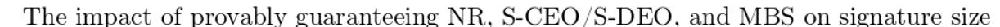
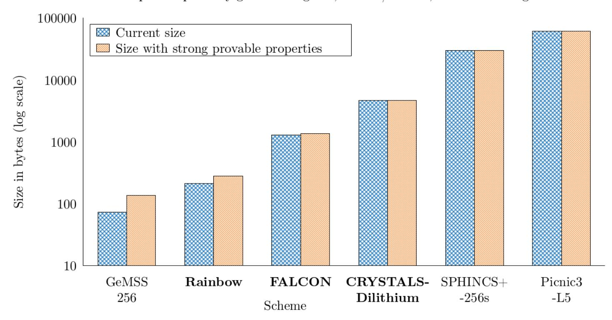

{0}------------------------------------------------

# **BUFFing signature schemes beyond unforgeability and the case of post-quantum signatures**<sup>∗</sup>

**Version 1.4.1**† **, October 2023**

Cas Cremers<sup>1</sup> [ID](https://orcid.org/0000-0003-0322-2293) Samed Düzlü<sup>2</sup> [ID](https://orcid.org/0000-0001-5680-5834) Rune Fiedler<sup>3</sup> Marc Fischlin<sup>3</sup> [ID](https://orcid.org/0000-0003-0597-8297) Christian Janson<sup>3</sup> [ID](https://orcid.org/0000-0002-0682-9923)

> <sup>1</sup> CISPA Helmholtz Center for Information Security, Germany cremers@cispa.de <sup>2</sup> Universität Regensburg, Germany samed.duzlu@ur.de <sup>3</sup> Cryptoplexity, Technische Universität Darmstadt, Germany {rune.fiedler, marc.fischlin, christian.janson}@cryptoplexity.de

**Abstract.** Modern digital signature schemes can provide more guarantees than the standard notion of (strong) unforgeability, such as offering security even in the presence of maliciously generated keys, or requiring to know a message to produce a signature for it. The use of signature schemes that lack these properties has previously enabled attacks on real-world protocols. In this work we revisit several of these notions beyond unforgeability, establish relations among them, provide the first formal definition of non re-signability, and two generic transformations that can provide these properties for a given signature scheme in a provable and efficient way.

Our results are not only relevant for established schemes: for example, the ongoing NIST PQC competition towards standardizing post-quantum signature schemes had six candidates in its third round of which three are to be standardized. We perform an in-depth analysis of all the candidates with respect to their security properties beyond unforgeability. We show that many of them do not yet offer these stronger guarantees, which implies that the security guarantees of these post-quantum schemes are not strictly stronger than, but instead incomparable to, classical signature schemes. We show how applying our transformations would efficiently solve this, paving the way for the standardized schemes to provide these additional guarantees and thereby making them harder to misuse.

**Keywords.** Digital signature scheme · exclusive ownership · DSKS attack · non re-signability · messagebound signatures · NIST PQC candidates

<sup>∗</sup>An extended abstract of this paper appears in the proceedings of IEEE S&P 2021. This is the full version.

<sup>†</sup>We provide an overview of major changes between versions in Appendix [C.](#page-48-0)

{1}------------------------------------------------

# **Contents**

| 1 | Introduction                                                                     |        |  |  |  |  |  |
|---|----------------------------------------------------------------------------------|--------|--|--|--|--|--|
|   | 1.1<br>Security Properties beyond Unforgeability<br>                             | 4<br>4 |  |  |  |  |  |
|   | 1.2<br>Analysis of NIST's Round 3 Signature Schemes<br>                          | 5      |  |  |  |  |  |
|   | 1.3<br>Contributions                                                             | 5      |  |  |  |  |  |
|   | 1.4<br>Dissemination of the Work                                                 | 6      |  |  |  |  |  |
|   | 1.5<br>Structure of the Paper<br>                                                | 6      |  |  |  |  |  |
| 2 | Preliminaries                                                                    | 6      |  |  |  |  |  |
|   | 2.1<br>Notation                                                                  | 6      |  |  |  |  |  |
|   | 2.2<br>Digital Signature Schemes                                                 | 7      |  |  |  |  |  |
|   | 2.3<br>Hash Functions<br>                                                        | 8      |  |  |  |  |  |
|   |                                                                                  |        |  |  |  |  |  |
| 3 | Background on Security Notions beyond Unforgeability                             | 10     |  |  |  |  |  |
|   | 3.1<br>Exclusive Ownership<br>                                                   | 10     |  |  |  |  |  |
|   | 3.2<br>Message-bound signatures<br>                                              | 11     |  |  |  |  |  |
| 4 | New Security Notions and Their Relationships                                     | 12     |  |  |  |  |  |
|   | 4.1<br>New Notions of Exclusive Ownership                                        | 12     |  |  |  |  |  |
|   | 4.2<br>Non Re-signability<br>                                                    | 13     |  |  |  |  |  |
|   | 4.3<br>Relationship                                                              | 14     |  |  |  |  |  |
| 5 | BUFF transformations:<br>Generic transformations for provably achieving M-S-UEO, |        |  |  |  |  |  |
|   | MBS, and optionally NR                                                           | 15     |  |  |  |  |  |
|   | 5.1<br>Pornin and Stern Transformations<br>                                      | 15     |  |  |  |  |  |
|   | 5.2<br>The BUFF-lite Transformation<br>                                          | 17     |  |  |  |  |  |
|   | 5.3<br>The BUFF Transformation<br>                                               | 19     |  |  |  |  |  |
| 6 | Analyzing NIST's Round 3 Signature Schemes                                       | 22     |  |  |  |  |  |
|   | 6.1<br>CRYSTALS-Dilithium<br>                                                    | 22     |  |  |  |  |  |
|   | 6.2<br>FALCON<br>                                                                | 24     |  |  |  |  |  |
|   | 6.3<br>Rainbow                                                                   | 27     |  |  |  |  |  |
|   | 6.4<br>GeMSS<br>                                                                 | 29     |  |  |  |  |  |
|   | 6.5<br>Picnic<br>                                                                | 31     |  |  |  |  |  |
|   | SPHINCS+<br>6.6<br>                                                              | 33     |  |  |  |  |  |
| 7 | The Case of Quantum Adversaries                                                  | 36     |  |  |  |  |  |
|   | 7.1<br>The BUFF Transformations                                                  | 36     |  |  |  |  |  |
|   | 7.2<br>Quantum Resistance of Hash Functions<br>                                  | 36     |  |  |  |  |  |
|   | 7.3<br>Post-Quantum Security of Candidates<br>                                   | 37     |  |  |  |  |  |
|   |                                                                                  |        |  |  |  |  |  |
| 8 | Conclusions                                                                      | 37     |  |  |  |  |  |
| A | Auxiliary Definitions                                                            | 42     |  |  |  |  |  |
|   | A.1<br>Unforgeable Signature Schemes<br>                                         | 42     |  |  |  |  |  |
|   | A.2<br>Strong Universal Exclusive Ownership (S-UEO)                              | 43     |  |  |  |  |  |
| B | Further Details about the Relationships                                          | 43     |  |  |  |  |  |

{2}------------------------------------------------

**[C Summary of major changes](#page-48-0) 49**

{3}------------------------------------------------

# <span id="page-3-2"></span><span id="page-3-0"></span>**1 Introduction**

For digital signature schemes, there are two classical security notions: EUF-CMA, existential unforgeability under chosen-message attacks [\[GMR88\]](#page-40-0), and the stronger notion SUF-CMA, strong unforgeability. These security notions guarantee that signatures cannot be forged under the given public key. However, there is more to be said about the security properties of signatures beyond unforgeability: for example, the impact of maliciously generated keys, the interdependence of keys, or whether one needs to know a message to be able to produce a signature for it. In [\[MS04,](#page-40-1)[PS05,](#page-41-2) [JCCS19,](#page-40-2) [BCJZ21\]](#page-37-0) it was shown that some classical signature schemes provide better guarantees than others in this respect.

## <span id="page-3-1"></span>**1.1 Security Properties beyond Unforgeability**

The first property beyond unforgeability is *exclusive ownership* [\[PS05\]](#page-41-2) (which generalizes earlier notions of Duplicate-Signature Key Selection (DSKS) attacks [\[BWM99,](#page-38-0)[MS04\]](#page-40-1)): the property that a signature only verifies under a single public key. For example, an early version of Let's Encrypt's ACME protocol [\[BHAK15b,](#page-38-1) [BHAK15a\]](#page-37-1) was vulnerable to an attack because the used signature scheme (RSA) did not provide this property. The protocol's goal was to act as an automatic certificate authority: to obtain evidence that a key owner has admin access to a website, upon which it will sign a certificate for the website and the signature verification key. The evidence consisted of, e.g., placing a signed challenge in a privileged position on the website or DNS records. While RSA signatures provide unforgeability, they allow constructing another key pair under which a given signature verifies. The attack [\[Aye15a,](#page-37-2)[Aye15b\]](#page-37-3) "hijacks" an existing signed challenge that is still present on a website, constructs a new key pair under whose public key the existing signature verifies, and then claims ownership. This causes the CA to produce a valid certificate for the attacker on the target website. In [\[JCCS19\]](#page-40-2) an attack was found on the X509-Mutual authentication/WS-Security protocol that also exploits generating a new key pair for a given signature.

The second property is *message-bound signatures* (a.k.a. non-colliding signatures): the property that a signature is only valid for a unique message. Signature schemes such as DSA and ECDSA do not provide this property. A possible cause can be the presence of *weak keys* that verify multiple or even all messages. The absence of this property can lead to problems in protocols that depend on uniqueness properties in the presence of adversarially chosen keys.

The third property is *non re-signability* [\[JCCS19\]](#page-40-2): meaning that one cannot produce a signature under another key given a signature for some unknown message *m*. One might expect that to produce another valid signature on a message *m*, the signer needs to know *m*. However, this is not the case for, e.g., RSA signatures, where given a signature on *m*, another signature can be produced even without knowing *m*. In [\[JCCS19\]](#page-40-2) an attack was found on the DRKey/OPT protocols for secure routing (intended for the SCION architecture) that exploits this possibility. The protocols aim to provide partial path integrity guarantees even in the presence of malicious intermediate nodes by having each intermediate node sign a symmetric key that they will share with the endpoint. Malicious nodes could violate the intended path integrity guarantees by claiming that a signature from an honest node on the path in fact came from another (colluding) malicious node, thereby making the endpoints believe that the path did not go through this honest node. This property was first proposed and defined in the symbolic model in [\[JCCS19\]](#page-40-2). However, until now, no formal cryptographic definition was proposed.

While there are classical signature schemes that violate each of the above properties, this need not be the case: It was proven in [\[BCJZ21\]](#page-37-0) that the LibSodium variant of the Ed25519 signature scheme satisfies the first two properties, and the third follows by construction. The real-world implication is that depending on which signature scheme is used, the security protocols above could either be secure or insecure. From the perspective of the design of a signature scheme, it is therefore prudent to aim for the strongest guarantees from the primitive, such that the expectations of implementers are not accidentally 

{4}------------------------------------------------

<span id="page-4-2"></span>(and needlessly) violated.

## <span id="page-4-0"></span>**1.2 Analysis of NIST's Round 3 Signature Schemes**

Our work is partly driven by the still ongoing NIST competition for post-quantum secure digital signature schemes. The schemes that have made it to round 3 are designed to be resilient against much stronger (quantum) adversaries than previous schemes, and one might therefore expect them to provide strictly stronger security properties than existing signature schemes.

In many ways, the situation for the NIST competition is similar to hash functions and length extension attacks in the context of the NIST SHA-3 competition. While length extension attacks had been known for years, they were not excluded by the standard hash function definitions. As a result, older schemes were not considered in this light, leading to attacks on e.g. Flickr [\[DR09\]](#page-39-0) and TLS, IKE, and SSH [\[BL16\]](#page-38-2). In the final SHA-3 standard, only schemes were chosen that provide resilience against length extension attacks, even though the standard hash function definition does not require it:

*"The SHA-3 functions are also designed to resist other attacks, such as length-extension attacks, that would be resisted by a random function of the same output length, in general providing the same security strength as a random function, up to the output length."* [\[Nat15b,](#page-41-3) p. 24]

Similarly, we would expect the final NIST selections for the post-quantum signature schemes to provide the strongest modern guarantees, such as offering built-in protection against maliciously generated keys, instead of leaving this up to the protocols that use the schemes. Our work therefore also fits into the wider positive trend of misuse-resistance: creating cryptographic primitives that are hard to misuse.

#### <span id="page-4-1"></span>**1.3 Contributions**

Our main contributions are as follows:

**Definitions.** We provide new theoretical results for three security properties of signature schemes beyond unforgeability: exclusive ownership (M-S-UEO, and weaker variants such as S-CEO and S-DEO), messagebound signatures (MBS), and non re-signability (NR). Notably, we provide the first cryptographic definition for non re-signability. We the argue that all properties, M-S-UEO, MBS, NR, and unforgeability are independent in the sense that for each property there is a scheme which has all the other features except the one in question.

**Transformations.** We next present two generic BUFF (*B*eyond *U*n*F*orgeability *F*eatures) transformations that provably achieve either most or all three properties. Our results are generic and apply equally to the classical and the post-quantum setting. Our transformations are highly efficient and only moderately increase the size of the signature by a single hash digest. Our full BUFF transformation provides all properties and retains unforgeability under the assumption of collision resistance of the hash function. For many signature schemes a collision resistant hash is already required for unforgability, but for some schemes and applications this might be undesired. For such cases we recommend our BUFF-lite transformation, which does not need the pre-processing step and unconditionally preserves unforgeability and accomplishes all additional properties except for non re-signability.

**Analysis of NIST Candidates.** We apply our results to practice and perform the first analysis of the round 3 NIST candidates for post-quantum secure signature schemes w.r.t. these properties. We give an overview of our results in Table [1.](#page-6-1) Our analysis of the round 3 candidates with respect to these properties reveals that these schemes do not necessarily provide modern security properties beyond unforgeability. 

{5}------------------------------------------------

<span id="page-5-4"></span>For example, we find that while CRYSTALS-Dilithium provides all three properties, exclusive ownership, message-bound signatures, and non re-signability, whereas FALCON and Rainbow do not. Remarkably, this implies that e.g. Libsodium's Ed25519 provides security properties that some post-quantum candidates do not. Concretely, this would mean that implementing the previously mentioned protocols with FALCON or Rainbow would enable (classical) protocol attacks that would have been impossible with Libsodium's Ed25519. Fortunately, our simple transformation can remedy this situation: we show the minimal impact of applying the BUFF transformation to the round 3 candidates, which shows that it is practical to provably offer these properties.

## <span id="page-5-0"></span>**1.4 Dissemination of the Work**

NIST's original call for post-quantum secure signature schemes only required existential unforgeability of the submissions. During round three, we performed and published our initial analysis, which we reported [\[Cre20\]](#page-39-1) and presented [\[CDF](#page-38-3)+21] in the ongoing process. Based our our work, NIST decided to document the results of our analysis, i.e., which candidates achieve the beyond unforgeability features, in their status report on the third round of the standardization process [\[ACD](#page-37-4)+22]. Moreover, NIST has published a call for additional signature schemes as part of the fourth round of the PQC Standardization Process [\[Nat22\]](#page-41-4). In their new call, NIST recommends that additional proposals should satisfy the security properties beyond unforgeability.

Furthermore, we also reached out directly to the FALCON authors, who subsequently decided to implement the BUFF transformation [\[FHK](#page-39-2)+21,[FHK](#page-39-3)+22].

## <span id="page-5-1"></span>**1.5 Structure of the Paper**

The remainder of this paper is structured as follows. In Section [2](#page-5-2) we introduce notation and further preliminaries. Section [3](#page-9-0) overviews previous work on security properties of signature schemes beyond unforgeability. In Section [4](#page-11-0) we present our main theoretical results regarding the security properties and their relationships. This is followed by providing the details of the BUFF transformations in Section [5.](#page-14-0) In Section [6](#page-21-0) we analyze the round 3 submissions to the NIST competition for post-quantum signature schemes w.r.t. the three security properties beyond unforgeability. In Section [7](#page-35-0) we argue about post-quantum security. Finally, we conclude the paper in Section [8.](#page-36-1)

# <span id="page-5-2"></span>**2 Preliminaries**

#### <span id="page-5-3"></span>**2.1 Notation**

We denote by *λ* ∈ N the security parameter (usually written in unary as 1 *λ* ) that is implicitly given to all algorithms. A function *µ*: N → R is called *negligible* if, for every constant *c* ≥ 0, there exists *λ<sup>c</sup>* ≥ 0 such that for all *λ* ≥ *λ<sup>c</sup>* we have that *µ*(*λ*) ≤ *λ* −*c* . Furthermore, we assume that all algorithms (unless specified otherwise) run in probabilistic polynomial-time which we abbreviate by PPT. This also holds for the adversary for the moment. But since we are interested in post-quantum security as well, we discuss in Section [7](#page-35-0) the case of quantum polynomial-time (QPT) adversaries. Note that, as usual, we state the security notions and assumptions asymptotically, with respect to polynomial-time adversary and negligible functions. It is understood that, when analyzing actual schemes with concrete parameters, these terms must be interpreted accordingly as "reasonable" run time and success probabilities in light of the parameters.

We write a bit as *b* ∈ {0*,* 1} and its inversion simply as *b*. Furthermore, we denote a (bit) string as *s* ∈ {0*,* 1} <sup>∗</sup> and by |*s*| we denote its binary length. By *s*∥*t* we denote the concatenation of two strings *s* and *t* but we usually assume that the encoding is such that one can recover *s* and *t* from *s*∥*t*, e.g., when

{6}------------------------------------------------

<span id="page-6-3"></span><span id="page-6-1"></span>

|           | Round 3 scheme                                                 | ex     | llicious strong univ.<br>xclusive ownership<br>I-S-UEO (Def. 3.1) | \$               | essage-bound<br>signatures<br>BS (Def. 3.2)      | wi          | no re-signing<br>thout message<br>IR (Def. 4.3)  | Conclusion  |
|-----------|----------------------------------------------------------------|--------|-------------------------------------------------------------------|------------------|--------------------------------------------------|-------------|--------------------------------------------------|-------------|
| main      | CRYSTALS-Dilithium FALCON Rainbow Standard Rainbow CZ & Compr. | х<br>х | Prop. 6.1<br>Prop. 6.5<br>Prop. 6.9<br>Sec. 6.3                   | \<br>\<br>\<br>\ | Prop. 6.1<br>Prop. 6.3<br>Prop. 6.7<br>Prop. 6.7 | х<br>х<br>х | Prop. 6.1<br>Prop. 6.6<br>Prop. 6.8<br>Prop. 6.8 | X<br>X<br>X |
| alternate | GeMSS Picnic SPHINCS <sup>+</sup>                              | X<br>✓ | Prop. 6.10<br>Prop. 6.14<br>Sec. 6.6                              | <b>X</b> ✓       | Prop. 6.12<br>Prop. 6.14<br>Prop. 6.15           | <b>X</b> ✓  | Prop. 6.13<br>Prop. 6.14<br>Sec. 6.6             | <b>X</b> •  |

Table 1: Several NIST PQ Signature scheme Round 3 candidates and alternate ones lack desirable security properties beyond unforgeability. We denote by ✓ a proof of the property (under rational assumptions), by ✗ an attack against it, and by ● that we currently have no proof based on standard assumptions. We provide an overview of the detailed analyses of the schemes in their versions as submitted to Round 3 in the table. Note that the signature schemes that do not have the M-S-UEO property, they neither achieve the weaker variants S-CEO and S-DEO.

The "Conclusion" column summarizes for each scheme: ✓ indicates all properties hold. For schemes with ✗ or •, our generic transformation from Section 5 provably provides all properties at the cost of a slight increase in signature size (see Figure 7).

s is of fixed length. A tuple (s,t) of strings is implicitly encoded as a single bit string if required, e.g., when processing the tuple by a hash algorithm. We assume that such encodings are one-to-one but usually omit the details. For a (finite) set S, we use the notation  $s \leftarrow S$  to denote that the string s was sampled uniformly at random from S. We also use this notation  $y \leftarrow A(x)$  to denote the random output y of algorithm A for input x, where the probability is over A internal randomness. We simply use the arrow  $\leftarrow$  for any assignment statements.

Let P be any statement that can either be true or false, then the Iverson bracket notation [P] stands for 1 if the statement is true and 0 otherwise. We often identify the Boolean variables true and false with 1 and 0, respectively. A bold variable  $\mathbf{v}$  denotes a vector, a bold capital letter  $\mathbf{A}$  denotes a matrix and  $\mathbf{A}^{\mathbf{T}}$  denotes the transposed matrix. The spectral norm of a vector  $\mathbf{v}$  is denoted by  $\|\mathbf{v}\|^2$ .

We use the notion of min-entropy to quantify the uncertainty of the adversary about unknown data. Specifically, we follow Dodis et al. [DRS04] and define the average conditional min-entropy of random variables X and Y as  $\tilde{\mathsf{H}}_{\infty}(X|Y) = -\log \mathbb{E}_{y \leftarrow Y}(\max_x \Pr[X = x \mid Y = y])$ . This describes the min-entropy in X given Y, but averages over the sampling of Y. For our applications it usually suffices to use the computational counterpart of this entropy, denoted as HILL entropy [HLR07]. A random variable X has average conditional HILL entropy  $\tilde{\mathsf{H}}_{\infty}^{\mathrm{HILL}}(X|Y) \geq k$  conditioned on Y, if there is a random variable X' which is computationally indistinguishable from X, and such that  $\tilde{\mathsf{H}}_{\infty}(X'|Y) \geq k$ .

#### <span id="page-6-0"></span>2.2 Digital Signature Schemes

In the following, we present the basic definition of a digital signature scheme as well as its security properties.

<span id="page-6-2"></span>**Definition 2.1.** A digital signature scheme is a tuple of three PPT algorithms  $\Pi = (\mathsf{KGen}, \mathsf{Sig}, \mathsf{Vf})$  with associated message space  $\mathcal{M}$ , defined as follows:

•  $(sk, pk) \leftarrow \$ KGen(1^{\lambda})$ : On input the security parameter, this randomized algorithm returns a key pair

{7}------------------------------------------------

<span id="page-7-2"></span>(sk*,* pk)*;*

- *σ* ←\$ Sig(sk*, m*)*: On input a signer secret key* sk *and a message m* ∈ M*, this randomized algorithm returns a signature σ;*
- *d* ← Vf(pk*, m, σ*)*: On input a public verification key* pk*, a message m, and a candidate signature σ, this deterministic algorithm returns a bit d* ∈ {0*,* 1}*. If d* = 1 *we say that the signature is valid, otherwise not.*

We say that a digital signature scheme Π is *correct*, if there exists a negligible function *µ*: N → R such that, for every security parameter *λ* ∈ N, every (sk*,* pk) ←\$KGen(1*<sup>λ</sup>* ), every *m* ∈ M, and random *σ* ←\$ Sig(sk*, m*), it holds that

$$\Pr[\mathsf{Vf}(\mathsf{pk}, m, \sigma) = 1] \ge 1 - \mu(\lambda).$$

Security of a digital signature scheme is defined in terms of unforgeability which can be formalized in different flavors. The notion we consider is called existential unforgeability under chosen-message attack. Intuitively, this covers that no efficient adversary who may query signatures for a few messages of its choice can produce a valid signature for a new message. The formal definition is given in Appendix [A.1.](#page-41-1)

## <span id="page-7-0"></span>**2.3 Hash Functions**

In the following, we recall the definition of a (cryptographic) hash function as well as its security properties. Informally, a hash function compresses a string of arbitrary length to a string of fixed length.

**Def inition 2.2.** *A* hash function *is a pair of* PPT *algorithms* H = (KGen*,* H) *with associated input space* M *such that:*

- hk ←\$KGen(1*<sup>λ</sup>* )*: On input the security parameter, this randomized algorithm generates a key* hk*;*
- *y* ← H(hk*, x*)*: On input a key* hk *and an input x* ∈ M*, this deterministic algorithm outputs a (digest) y.*

The provided definition is the more general notion of hash functions as a family of keyed functions. The concrete hash function can be considered by the key hk which basically corresponds to an index choosing the appropriate function from the family of functions. Note that we usually refer to the family of hash functions as H and leave the key hk implicit.

Hash functions are usually required to meet certain security properties. Among the three most prominent ones are collision resistance, second-preimage resistance, and preimage resistance. In the following, it suffices to consider simply the first one. Intuitively, collision resistance means that it is computationally infeasible to find any two distinct inputs to the hash function which map to the same digest.

<span id="page-7-1"></span>**Def inition 2.3.** *Let* H *be a hash function. We say that* H *is* collision resistant *if, for any* PPT *algorithm* A*, there exists a negligible function µ*: N → R *such that, for every λ* ∈ N*, it holds that*

$$\Pr[\mathbf{Exp}_{\mathcal{H},\mathcal{A}}^{\mathsf{CR}}(\lambda)] \le \mu(\lambda),$$

*where* **Exp**CR <sup>H</sup>*,*A(*λ*) *is defined on the left-hand side in Figure [1.](#page-8-0)*

Besides collision resistance, we require another property called non-malleability, which has been introduced in the realm of hash functions by Boldyreva et al. [\[BCFW09\]](#page-37-5). On a high-level, non-malleability of a hash function covers that it should be computationally infeasible to modify a digest *y* into another digest *y* ′ such that the preimages are related. Here we follow the game-based approach called Φ-non-malleability

{8}------------------------------------------------

```
\mathbf{Exp}^{\mathsf{CR}}_{\mathcal{H},\mathcal{A}}(\lambda):
                                                                                                                    \mathbf{Exp}_{\mathcal{H},\mathcal{A}}^{\Phi\mathsf{NM}}(\lambda):
                                                                                                                    21: hk \leftarrow \$ KGen(1^{\lambda})
11: hk \leftarrow \$ KGen(1^{\lambda})
            (x, x') \leftarrow \mathcal{A}(\mathsf{hk})
                                                                                                                                 (\mathcal{X},\mathsf{state}) \leftarrow \$ \mathcal{A}_d(\mathsf{hk})
12:
                                                                                                                    22:
13: return [\mathsf{H}(\mathsf{hk},x) = \mathsf{H}(\mathsf{hk},x') \land x \neq x']
                                                                                                                                 x \leftarrow \$ \mathcal{X}
                                                                                                                    23:
                                                                                                                                 y \leftarrow \mathsf{H}(\mathsf{hk}, x)
                                                                                                                    24:
                                                                                                                                (y',\phi) \leftarrow \mathcal{A}_y(y,\mathsf{state})
                                                                                                                    25:
                                                                                                                    26: return [\mathsf{H}(\mathsf{hk},\phi(x)) = y' \land \phi(x) \neq x]
```

Figure 1: Definition of the security properties for a hash function. On the left: Definition of the experiment  $\mathbf{Exp}_{\mathcal{H},\mathcal{A}}^{\mathsf{CR}}(\lambda)$  from Definition 2.3. On the right: Definition of the experiment  $\mathbf{Exp}_{\mathcal{H},\mathcal{A}}^{\mathsf{PNM}}(\lambda)$  from Definition 2.4.

as put forward by Baecher et al. [BFS11] where the adversary is tasked to maul the digest and also to specify a transformation  $\phi$  of the preimage where the transformation is taken from the class  $\Phi$  of admissible transformations. For instance,  $\Phi$  could be the class of bit flips and  $\phi$  would then describe the concrete positions of the flips in the input.

<span id="page-8-1"></span>**Definition 2.4.** Let  $\mathcal{H}$  be a hash function. We say that  $\mathcal{H}$  is  $\Phi$ -non-malleable if, for any PPT algorithm  $\mathcal{A} = (\mathcal{A}_d, \mathcal{A}_y)$ , there exists a negligible function  $\mu \colon \mathbb{N} \to \mathbb{R}$  such that for every  $\lambda \in \mathbb{N}$ , it holds that

$$\Pr[\mathbf{Exp}_{\mathcal{H},\mathcal{A}}^{\Phi\mathsf{NM}}(\lambda)] \le \mu(\lambda),$$

where  $\mathbf{Exp}_{\mathcal{H},\mathcal{A}}^{\Phi\mathsf{NM}}(\lambda)$  is defined on the right-hand side in Figure 1 and  $\phi \in \Phi$ . It is required that the algorithm  $\mathcal{A}_d$  only outputs efficiently sampleable distributions  $\mathcal{X}$  with conditional min-entropy  $\tilde{\mathsf{H}}_{\infty}^{HILL}(x|\mathsf{hk},\mathsf{state}) \in \omega(\log \lambda)$ .

Note that the adversary is modeled as a two-stage algorithm where it is required that the algorithm  $\mathcal{A}_d$  chooses a non-trivial distribution  $\mathcal{X}$  requiring it to be unpredictable by demanding sufficient min-entropy. As emphasized in [DFHS23], when switching to the random oracle model one needs to be careful with the computational min-entropy. We assume in this case for sake of simplicity that we consider statistical versions of conditional min-entropy, where we also condition on the random oracle.

Baecher et al. [BFS11] discuss some function classes  $\Phi$  for which the notion is achievable for constructions like Merkle–Damgård hash functions like SHA-2 based on ideal round functions. This class includes for example bit flips, as we need for our application (but not length extensions). We note that the argument extends to SHA-3 and close derivatives thereof. We discuss the assumption in light of the concrete hash functions in the signature schemes when looking at specific schemes.

We note that if we model  $\mathcal{H}$  as a random oracle then the hash function satisfies the definition of  $\Phi$ -non-malleability for any class  $\Phi$  where the functions  $\phi$  preserve sufficient entropy in x, as will be the case for our results. The reason is that the adversary can only output a related random oracle value y' if it has queried the random oracle about  $\phi(x)$  before. But this is infeasible if  $\phi(x)$  still contains enough entropy.

The above security notions are all given with respect to keyed hash functions. In practice, however, common hash functions are unkeyed. Following the human ignorance approach [Rog06] we can indeed lift the results to the unkeyed setting. That is, our proofs of the BUFF properties of the signature schemes

<span id="page-8-2"></span>In an earlier version of the paper we included an additional auxiliary information  $h_x$ , output by  $\mathcal{X}$ , also in the entropy condition. This is not necessary to achieve the latest version of non re-signability.

{9}------------------------------------------------

<span id="page-9-3"></span>give explicit reductions to the properties of the hash functions. In particular, any attack against the corresponding BUFF property of the signature scheme using the unkeyed hash function yields a concrete adversary against the corresponding property of the unkeyed hash function. Assuming that presenting such a hash attacker explicitly is infeasible, we accordingly get the security of the signature scheme for the unkeyed hash function.

# <span id="page-9-0"></span>**3 Background on Security Notions beyond Unforgeability**

In this section, we revisit security properties of signature schemes that go beyond unforgeability, namely exclusive ownership, message-bound signatures, and non re-signability, and provide their appropriate game-based formalizations. In series of works it has been shown that the absence of these properties can lead to real-world attacks such as [\[MS04,](#page-40-1)[PS05,](#page-41-2) [JCCS19,](#page-40-2) [BRS06,](#page-38-4) [BWM99,](#page-38-0) [BK00\]](#page-38-5). In [\[JCCS19\]](#page-40-2), Jackson et al. analyzed each property in light of requirements for security protocols, and developed new symbolic models capturing those behaviors and used these with the Tamarin prover to find new protocol attacks or prove their absence. Those discussions were the starting point of this work to re-visit these notions and hence introduce "updated" notions. These security notions can also be used by protocol designers to argue about their requirements for signature schemes.

## <span id="page-9-1"></span>**3.1 Exclusive Ownership**

In the following, we consider several notions of exclusive ownership. All of the notions consider in different flavours whether a given signature can verify under a second public key. Initially, Pornin and Stern introduced in [\[PS05\]](#page-41-2) the notions of conservative exclusive ownership (CEO), destructive exclusive ownership (DEO) as well as the combined notion universal exclusive ownership (UEO). The underlying ideas go back to Blake-Wilson and Menezes' Duplicate-Signature Key Selection (DSKS) attacks [\[BWM99\]](#page-38-0) which were generalized by Menezes and Smart who termed this notion key substitution attack [\[MS04\]](#page-40-1).

Let us briefly recall the intuition behind the initial formalizations of CEO and DEO. Both notions share that the attacker is given a legitimate public key pk along with a signature *σ* and a message *m*. In CEO, the attacker's goal is to output a new public key pk′ which verifies the signature *σ* for message *m*. In contrast, DEO requires the same with the change that the signature verifies for a *different* message *m*′ . Note that Pornin and Stern formalized those notions as known-message attacks where an attacker has to output a new public key along with a corresponding secret key satisfying some correctness property.

Brendel et al. [\[BCJZ21\]](#page-37-0) introduced two strictly stronger variants of universal exclusive ownership, prefixed strong and malicious-strong. These stronger variants model a chosen-message attack, where the attacker has to output a new public key without a corresponding secret key. The attacker against the strong property is given the first public key, while the attacker against the malicious-strong property may choose the first public key itself. In the following, we review the notion of malicious-strong universal exclusive ownership as formalized in [\[BCJZ21\]](#page-37-0).

Malicious-strong universal exclusive ownership (M-S-UEO) is the strongest variant of the exclusive ownership notions presented in this paper. Here the attacker's goal is to output a tuple containing two (distinct) public keys pk<sup>1</sup> and pk<sup>2</sup> , two messages *m*<sup>1</sup> and *m*<sup>2</sup> along with a signature *σ* such that this signature individually verifies with both (pk<sup>1</sup> *, m*1) and (pk<sup>2</sup> *, m*2). Note that this notion corresponds to a scenario where a malicious signer may want to create ambiguity regarding the used signing keys, or where it aims to reuse a signature in a context that requires the verification keys to be different.

<span id="page-9-2"></span>**Def inition 3.1.** *Let* Π *be a digital signature scheme. We say that* Π *provides* malicious-strong universal exclusive ownership *(M-S-UEO) if, for every* PPT *algorithm* A*, there exists a negligible function µ*: N → R

{10}------------------------------------------------

<span id="page-10-3"></span><span id="page-10-2"></span>

| $\mathbf{Exp}_{\Pi,\mathcal{A}}^{M-S-UEO}(\lambda)$ :            | $\mathbf{Exp}^{MBS}_{\Pi,\mathcal{A}}(\lambda)$ :              |
|------------------------------------------------------------------|----------------------------------------------------------------|
| 11: $(m_1, m_2, \sigma, pk_1, pk_2) \leftarrow \mathcal{A}()$    | 21: $(m_1, m_2, \sigma, pk) \leftarrow \$ \mathcal{A}()$       |
| 12: $d_1 \leftarrow Vf(pk_1, m_1, \sigma)$                       | 22: $d_1 \leftarrow Vf(pk, m_1, \sigma)$                       |
| 13: $d_2 \leftarrow Vf(pk_2, m_2, \sigma)$                       | 23: $d_2 \leftarrow Vf(pk, m_2, \sigma)$                       |
| 14: <b>return</b> $[d_1 = 1 \land d_2 = 1 \land pk_1 \neq pk_2]$ | 24: <b>return</b> $[d_1 = 1 \land d_2 = 1 \land m_1 \neq m_2]$ |

Figure 2: Definition of the experiments  $\mathbf{Exp}_{\Pi,\mathcal{A}}^{\mathsf{M-S-UEO}}(\lambda)$  and  $\mathbf{Exp}_{\Pi,\mathcal{A}}^{\mathsf{MBS}}(\lambda)$  from Definitions 3.1 and 3.2, respectively.

such that, for every  $\lambda \in \mathbb{N}$ ,

$$\Pr[\mathbf{Exp}_{\Pi,\mathcal{A}}^{\mathsf{M-S-UEO}}(\lambda)] \leq \mu(\lambda),$$

where  $\mathbf{Exp}_{\Pi,\mathcal{A}}^{\mathsf{M-S-UEO}}(\lambda)$  is defined on the left-hand side in Figure 2.

Note that this formalization allows the adversary to generate both key pairs, and thus there is no need for a signing oracle.

In Appendix B, we formally prove that M-S-UEO is strictly stronger than the variant S-UEO, and hence also stronger than any other notion of exclusive ownership introduced in this paper.

## <span id="page-10-0"></span>3.2 Message-bound signatures

On an intuitive level, message-bound signatures capture the adversary's inability to generate a signature and a public key under which several adversarially chosen messages verify. If this were the case, an attacker could switch a message after signing, i.e., claiming that it actually signed a different message. Similar to exclusive ownership, this property is not covered by EUF-CMA because it may involve a maliciously generated public key. This property was initially discussed by Stern et al. [SPMS02] with the name duplicate signature where they provide a particular example for ECDSA, and later formally specified by Jackson et al. [JCCS19] in the symbolic model as non-colliding signatures. This symbolic definition does not require the adversary to specify or know the messages for which the signature verifies.

The first game-based formalization of this notion was provided by Brendel et al. [BCJZ21], who introduced the term message-bound signatures. We provide the formal details on the right-hand side in Figure 2. In the security experiment, we require the adversary to output *two* messages, a signature and a public key. It wins the game if both messages are not identical and if the signature verifies correctly for each message under the public key.

<span id="page-10-1"></span>**Definition 3.2.** Let  $\Pi$  be a digital signature scheme. We say that  $\Pi$  provides message-bound signatures (MBS) if, for every PPT algorithm  $\mathcal{A}$ , there exists a negligible function  $\mu \colon \mathbb{N} \to \mathbb{R}$  such that, for every  $\lambda \in \mathbb{N}$ , it holds that

$$\Pr[\mathbf{Exp}_{\Pi,\mathcal{A}}^{\mathsf{MBS}}(\lambda)] \leq \mu(\lambda),$$

where  $\mathbf{Exp}_{\Pi,\mathcal{A}}^{\mathsf{MBS}}(\lambda)$  is defined on the right-hand side in Figure 2.

Chalkias et al. [CGN20] call MBS signatures binding signatures and define strongly binding signatures as the conjunction of the MBS and M-S-UEO notions from [BCJZ21].

{11}------------------------------------------------

```
\mathbf{Exp}_{\Pi,\mathcal{A}}^{\mathsf{S-CEO}}(\lambda):
                                                                                                                                        \mathsf{Sig}(\mathsf{sk}, m):
                                                                                                                                        21: \sigma \leftarrow \$ \operatorname{Sig}(\operatorname{sk}, m)
  11: Q \leftarrow \emptyset
  12: \quad (\mathsf{sk}, \mathsf{pk}) \leftarrow \$ \, \mathsf{KGen}(1^{\lambda})
                                                                                                                                        22: \mathcal{Q} \leftarrow \mathcal{Q} \cup \{(m,\sigma)\}
  13: (m', \sigma', \mathsf{pk}') \leftarrow \mathcal{A}^{\mathsf{Sig}(\mathsf{sk}, \cdot)}(\mathsf{pk})
                                                                                                                                         23: return \sigma
  14: d \leftarrow \mathsf{Vf}(\mathsf{pk}', m', \sigma')
  15: return [d=1 \land (m',\sigma') \in \mathcal{Q} \land \mathsf{pk}' \neq \mathsf{pk}]
\mathbf{Exp}^{\mathsf{S-DEO}}_{\Pi,\mathcal{A}}(\lambda):
31: \mathcal{Q} \leftarrow \emptyset
32: (\mathsf{sk}, \mathsf{pk}) \leftarrow \$ \mathsf{KGen}(1^{\lambda})
33: (m', \sigma', \mathsf{pk}') \leftarrow \mathcal{A}^{\mathsf{Sig}(\mathsf{sk}, \cdot)}(\mathsf{pk})
34: d \leftarrow \mathsf{Vf}(\mathsf{pk}', m', \sigma')
35: return [d = 1 \land (\exists m^* \neq m' : (m^*, \sigma') \in \mathcal{Q}) \land \mathsf{pk}' \neq \mathsf{pk}]
```

Figure 3: Definition of the experiments  $\mathbf{Exp}_{\Pi,\mathcal{A}}^{\mathsf{S-CEO}}(\lambda)$  and  $\mathbf{Exp}_{\Pi,\mathcal{A}}^{\mathsf{S-DEO}}(\lambda)$  from Definitions 4.1 and 4.2, respectively with access to the same signing oracle.

# <span id="page-11-0"></span>4 New Security Notions and Their Relationships

In this section, we present our new theoretical results regarding the properties themselves. They apply to the classical as well as the post-quantum setting. In Section 4.1 we introduce two analogous notions of exclusive ownership. In Section 4.2 we provide the first formal security definition for non re-signability. Finally, we establish relations among the security properties in Section 4.3.

#### <span id="page-11-1"></span>4.1 New Notions of Exclusive Ownership

Brendel et al. [BCJZ21] introduced a strong variant of universal exclusive ownership (S-UEO), for which the attacker is *not* required to output the corresponding secret key of the new key pair. Analogously, we introduce two notions called strong conservative exclusive ownership and strong destructive exclusive ownership, where the attacker is only required to output a new public key and is additionally equipped with a signing oracle that it can query adaptively.

Strong Conservative Exclusive Ownership (S-CEO). In the security experiment, the adversary is only given a legitimate public key pk and additionally access to a signature oracle such that it can adaptively obtain arbitrary signatures for messages of its choice. The adversary is now asked to output a triple containing a message m', a signature  $\sigma'$ , and a new public key pk'. It wins the game if the signature correctly verifies under pk', the pair  $(m', \sigma')$  has been queried to the oracle, and pk' differs from pk.

<span id="page-11-2"></span>**Definition 4.1.** Let  $\Pi$  be a digital signature scheme. We say that  $\Pi$  provides strong conservative exclusive ownership (S-CEO) if, for every PPT algorithm A, there exists a negligible function  $\mu \colon \mathbb{N} \to \mathbb{R}$  such t hat, for every  $\lambda \in \mathbb{N}$ , it holds that

$$\Pr[\mathbf{Exp}_{\Pi,\mathcal{A}}^{\mathsf{S-CEO}}(\lambda)] \leq \mu(\lambda),$$

where  $\mathbf{Exp}_{\Pi,\mathcal{A}}^{\mathsf{S-CEO}}(\lambda)$  is defined in Figure 3.

{12}------------------------------------------------

```
ExpNR
     Π,A,D(λ):
11 : (sk, pk) ←$KGen(1λ
                          )
12 : (m, aux) ←$ D(1λ
                       , pk)
13 : σ ←$ Sig(sk, m)
14 : (σ
        ′
        , pk′
            ) ←$ A(pk, σ, aux)
15 : d ← Vf(pk′
                 , m, σ′
                       )
16 : return -
               d = 1 ∧ pk′
                            ̸= pk
```

Figure 4: Definition of the experiment **Exp**NR <sup>Π</sup>*,*A(*λ*) from Definition [4.3.](#page-13-1)

**Strong Destructive Exclusive Ownership (S-DEO).** In the security experiment, the adversary is given a public key pk and after querying the signing oracle, it outputs a triple containing a message *m*′ , a signature *σ* ′ and a new public key pk′ . The adversary wins the game if the provided signature *σ* ′ was returned by the oracle for a message *m*<sup>∗</sup> ̸= *m*′ , pk′ differs from pk, and the signature verifies for *m*′ under pk′ .

<span id="page-12-1"></span>**Def inition 4.2.** *Let* Π *be a digital signature scheme. We say that* Π *provides* strong destructive exclusive ownership *(S-DEO) if, for every* PPT *algorithm* A*, there exists a negligible function µ*: N → R *such that, for every λ* ∈ N*, it holds that*

$$\Pr[\mathbf{Exp}_{\Pi,\mathcal{A}}^{\mathsf{S-DEO}}(\lambda)] \leq \mu(\lambda),$$

*where* **Exp**S-DEO <sup>Π</sup>*,*<sup>A</sup> (*λ*) *is defined in Figure [3.](#page-11-3)*

Note that one can also combine both strong variants from above to obtain the notion of strong univerisal exclusive ownership (S-UEO) as introduced in [\[BCJZ21\]](#page-37-0) which is given in Appendix [A.2.](#page-42-0)

Throughout the rest of the paper we will analyze schemes with respect to these strong notions.

## <span id="page-12-0"></span>**4.2 Non Re-signability**

Jackson et al. [\[JCCS19\]](#page-40-2) observed that for some signature schemes, an adversary that obtains the signature of a message *m* can produce another signature that verifies *m* under its own key without knowing *m*. For example, this can happen when the scheme reveals the hash of the message, which then enables re-signing this message with a different key. This runs contrary to the intuition that to produce a signature on a message, one should know the message. Jackson et al. coined this notion *non re-signability* (NR) and gave a symbolic model for the Tamarin prover. However, they did not provide a formal cryptographic definition, which is required to prove that a given signature scheme satisfies NR. We close this gap by providing the first security experiment for non re-signability.

Intuitively, the property non re-signability states that the adversary cannot produce a legitimate signature verifying under its public key for a message it does not know. The game in Figure [4](#page-12-2) formalizes this notion. In more detail, after generating a key pair, the game runs a PPT distribution D that outputs a message *m* along with some auxiliary information aux about the message. One can think of the auxiliary information as being some structural information about the message. The game continues with generating the signature *σ* on *m*, and the adversary is then given the legitimate public key pk, the signature *σ*, as well as the auxiliary information. The adversary is now tasked to output a pair containing a signature *σ* ′ and a new public key pk′ . It wins the game if both public keys do not coincide and the signature *σ* ′ verifies *m* under pk′ .

{13}------------------------------------------------

<span id="page-13-2"></span>Note that we assume that the message output by the distribution  $\mathcal{D}$  is unpredictable by requiring the conditional (HILL) min-entropy to be strictly greater than logarithmic in the security parameter. Without this, the adversary could predict the underlying message m from the signature and trivially re-sign the message under the new key. Once more, when working in the random oracle model we assume unconditional min-entropy for the sampler's output, conditioning also on the random oracle.

As pointed out by [DFHS23], allowing arbitrary samplers  $\mathcal{D}$  does not yield a satisfiable definition, even if we require high computational entropy. The reason is that the auxiliary data aux may already contain a valid signature under another key. This is why we restrict the algorithm  $\mathcal{D}$  to create only computationally independent auxiliary data. That is, consider the two random variables  $D_0$  and  $D_1$  derived from  $\mathcal{D}$  (and KGen, since the sampled message may depend on the verification key) as follows:  $D_b(1^{\lambda})$  creates (sk, pk)  $\leftarrow$ \$ KGen(1 $^{\lambda}$ ), samples  $(m_0, \mathsf{aux}_0) \leftarrow$ \$  $\mathcal{D}(1^{\lambda}, \mathsf{pk})$  and  $(m_1, \mathsf{aux}_1) \leftarrow$ \$  $\mathcal{D}(1^{\lambda}, \mathsf{pk})$ , and outputs (sk, pk,  $m_0, \mathsf{aux}_b$ ). We say that  $\mathcal{D}$  is a sampler with computationally-independent auxiliary data for KGen if the random variables  $D_0$  and  $D_1$  are computationally indistinguishable. Note that this captures for example cases (under the decisional Diffie-Hellman assumption) where the message is a Diffie-Hellman key  $m = g^{xy}$  and the Diffie-Hellman values  $\mathsf{aux} = (g^x, g^y)$  are publicly available, or in general if  $\mathsf{aux}$  is empty, and it also excludes the counter example in [DFHS23].

<span id="page-13-1"></span>**Definition 4.3.** Let  $\Pi$  be a digital signature scheme. We say that  $\Pi$  is non-resignable (NR) if, for every PPT algorithms  $\mathcal{A}$  and  $\mathcal{D}$ , where  $\mathcal{D}$  is a sampler with computationally-independent auxiliary data for KGen, there exists a negligible function  $\mu \colon \mathbb{N} \to \mathbb{R}$  such that, for every  $\lambda \in \mathbb{N}$ , it holds that

$$\Pr[\mathbf{Exp}_{\Pi,\mathcal{A},\mathcal{D}}^{\mathsf{NR}}(\lambda)] \leq \mu(\lambda),$$

where  $\mathbf{Exp}_{\Pi,\mathcal{A},\mathcal{D}}^{\mathsf{NR}}(\lambda)$  is defined in Figure 4. It is required that the PPT algorithm  $\mathcal{D}$  outputs a pair  $(m,\mathsf{aux})$  such that the conditional min-entropy  $\tilde{\mathsf{H}}_{\infty}^{HILL}(m|\mathsf{aux},\mathsf{sk},\mathsf{pk}) \in \omega(\log\lambda)$ .

## <span id="page-13-0"></span>4.3 Relationship

Being equipped with these security properties beyond unforgeability, we are now in the position to establish that all properties are independent in the sense that there are schemes which may have all properties except for a particular one. This holds for each property from M-S-UEO, S-CEO, S-DEO, MBS, NR, and EUF-CMA. In the following we exemplify the separations only for the S-CEO property. The remaining relationships and respective proofs can be found in Appendix B. Note that we there also prove that S-CEO and S-DEO are equivalent to S-UEO and that M-S-UEO implies S-UEO (and, hence, S-CEO and S-DEO).

**Proposition 4.4.** If there is a digital signature scheme which has the properties  $\mathcal{P} \subseteq \{ \mathsf{EUF\text{-}CMA}, \mathsf{S\text{-}DEO}, \mathsf{MBS}, \mathsf{NR} \}$ , then there is also one which has the same properties  $\mathcal{P}$  but not  $\mathsf{S\text{-}CEO}$ .

Note that since M-S-UEO implies S-CEO it follows that the derived scheme cannot have M-S-UEO, and we thus also exclude this property from  $\mathcal{P}$ .

*Proof.* Modify the scheme  $\Pi = (\mathsf{KGen}, \mathsf{Sig}, \mathsf{Vf})$  with properties  $\mathcal{P}$  to scheme  $\Pi^{\neg \mathsf{S-CEO}}$  by introducing an exceptional signing and verification step for message m = 0 and public keys of the form  $\mathsf{pk} \| 0$  (which the genuine key generation algorithm never outputs):

```
\Pi^{\neg \mathsf{S-CEO}}.\mathsf{Sig}(\mathsf{sk},m) \colon
\Pi^{\neg \mathsf{S-CEO}}.\mathsf{KGen}(1^{\lambda}):
                                                                                                             \Pi^{\neg \mathsf{S-CEO}}.\mathsf{Vf}(\mathsf{pk}\|b,m,\sigma\|c):
        (\mathsf{sk},\mathsf{pk}) \leftarrow \$\Pi.\mathsf{KGen}(1^{\lambda})
                                                           21: \sigma \leftarrow \$\Pi.\mathsf{Sig}(\mathsf{sk},m)
                                                                                                              31: if b = 0 then
11:
                                                                                                                            return [c = 0 \land m = 0]
12: \mathbf{return} (sk, pk||1)
                                                                     if m = 0 then
                                                            22:
                                                                                                              32:
                                                                          return \sigma || 0
                                                                                                                        else
                                                                                                              33:
                                                            23:
                                                                                                                            d \leftarrow \Pi.\mathsf{Vf}(\mathsf{pk}, m, \sigma)
                                                                     else
                                                            24:
                                                                                                              34:
                                                                         return \sigma \| 1
                                                                                                                            return d
                                                            25:
                                                                                                              35:
```

{14}------------------------------------------------

<span id="page-14-2"></span>The scheme inherits correctness of the original scheme.

To break property S-CEO it suffices to request a signature *σ*∥0 for message *m* = 0 under given key pk∥1, and to output this message-signature pair with key pk∥0. This constitutes a valid forgery against S-CEO since the pair has been signed but is also accepted under the new key pk∥0 ending with 0.

We need to argue that the scheme Π¬S-CEO preserves the property S-DEO. Assume that the adversary against DEO of the modified scheme attempts pk′ ∥0 in the final output. Then the only message that is accepted under this key is *m*′ = 0, but then any distinct query *m* ̸= 0 to the signing oracle causes the signature *σ*∥1 to end in 1, such that these signatures cannot be valid for *m*′ = 0. If, on the other hand, the adversary uses pk′ ∥1 in its attempt then we must have pk′ ̸= pk and there was a query *m* to the signer which created the signature. In particular, the actual signature part (without the trailing bit) must match for this query and still *m* ̸= *m*′ . We then construct a black-box reduction to the S-DEO property of the underlying scheme, by letting the reduction append (for signature queries) and chop off (for the forgery) the additional bits.

Next, it is easy to show that the scheme preserves the property EUF-CMA because any forgery would have to be against honestly generated public keys ending with 1, such that the exceptional step in verification cannot be triggered. Adding and removing the extra bits of the public key and the signature gives the desired security reduction to the property of the original scheme.

As for MBS note that, if the adversary chooses pk∥0 then only one message, namely *m* = 0, is accepted at all. Hence to find distinct *m*<sup>1</sup> ̸= *m*<sup>2</sup> with valid signature *σ*∥*c* under some public key, the key must be of the form pk∥1. But then *m*1*, m*<sup>2</sup> together with *σ* and pk constitute a valid MBS-attack against the original scheme.

It remains to argue that the modified scheme preserves property NR. To see this note that D must have super-logarithmic min-entropy such that the probability that *m* = 0 is negligible. This means that with overwhelming probability the adversary cannot use a key of the form pk∥0 to win. In any other case it is again immediate to reduce an attack against the modified scheme to an attack against the starting scheme.

# <span id="page-14-0"></span>**5 BUFF transformations: Generic transformations for provably achieving M-S-UEO, MBS, and optionally NR**

We present two generic transformations that ensure that the resulting signature scheme achieves most or all Beyond UnForgeability Features (i.e., M-S-UEO, MBS, and NR): The BUFF-lite and the (full) BUFF transformation. These transformations work for both the classical and the post-quantum setting.

## <span id="page-14-1"></span>**5.1 Pornin and Stern Transformations**

Let us start with first revisiting known transformations for some individual properties. Pornin and Stern [\[PS05\]](#page-41-2) provided three transformations to add the notions of exclusive ownership to a signature scheme. Two of their transformations make use of a collision resistant hash function and also increase the signature size, while the third one does not increase the signature size but requires a random oracle; none of them achieves NR. While Pornin and Stern prove that their transformations achieve their "weak" variants of exclusive ownership (CEO and DEO), we argue their proofs translate to the strong notions (as formalized in Section [4.1\)](#page-11-1) in a straightforward manner. We briefly summarize those transformations and their guarantees.

*Pornin and Stern transformation 1.* The first transformation of Pornin and Stern is designed to add DEO to a signature scheme. Starting from a signature scheme Π = (KGen*,* Sig*,* Vf) and transforming it into a new signature scheme Π<sup>∗</sup> = (KGen<sup>∗</sup> *,* Sig<sup>∗</sup> *,* Vf<sup>∗</sup> ) where KGen<sup>∗</sup> is equal to KGen. For any message *m* the signature is derived by appending a hash *of the message*, i.e., Sig<sup>∗</sup> (sk*, m*) = (Sig(sk*, m*)*,* H(*m*)). For 

{15}------------------------------------------------

<span id="page-15-0"></span>any signature of the form  $\sigma^* = (\sigma, y)$  the verification algorithm Vf\* simply accepts the signature if  $\sigma$  is accepted by Vf and y = H(m). Assuming that the hash function is collision resistant, this ensures that each signature is exclusive to the message that was signed and thus provides DEO as well as S-DEO.

Observe that this transformation achieves MBS: the transformation binds the message through the hash function evaluation to the signature, and hence (due to the collision resistance of the hash function) the adversary is prevented from outputting a second message that the signature also verifies for. However, this transformation does not provide CEO because the signature is not necessarily exclusive to the public key. NR is in general not achieved since the signature of the original scheme  $\sigma$  may contain the message directly, allowing the adversary to re-sign this message under a new key.

Pornin and Stern transformation 2. The second transformation adds both CEO and DEO (and also the strong variants) to any signature scheme. The construction itself works similar to the previous one with the difference that one appends the hash of the public key to the signature, i.e.,  $Sig^*(sk, m) = (Sig(sk, m), H(pk))$ , and verifies this hash explicitly during verification. Again by relying on the collision resistance of the hash function the scheme provides M-S-UEO since the signature cannot be reused with any other public key.

However, this transformation does neither achieve MBS nor NR: MBS is not guaranteed because the signature is not bound to the message that was signed and hence the transformation cannot prevent the attacker from outputting two different messages which both verify for the same signature. It does not provide NR for the same reason as the first transformation.

Pornin and Stern transformation 3. The third transformation adds CEO and DEO to any signature scheme without expanding the signature size. This requires a specific property, namely resistance to existential forgeries for all possible keys, i.e., also the possibly weak and incorrect keys the adversary might use. Assuming this property, the transformation derives the signature from the hash function evaluation of the message concatenated with the public key instead of the plain message, i.e.,  $Sig^*(sk, m) = Sig(sk, H(m, pk))$ . Pornin and Stern provide a proof in the random oracle model assuming the above property showing that it achieves CEO and DEO. Note that a similar transformation was previously proposed by Menezes and Smart [MS04], who prepended the message with the public key in an unambiguous way to achieve a security notion that is equivalent to CEO. We expect that this transformation also achieves S-CEO and S-DEO with a similar argument under the same assumption. Without assuming the above mentioned property, the transformation achieves none of the five security properties, since a signature scheme may have a public key under which the verify algorithm unconditionally accepts.

On the (im) possibility of generically excluding weak keys. In practice, even though many signature schemes have weak keys, these are typically not output by the signature's KGen algorithm. Instead, they typically occur in the gap between the set in which the keys are embedded, e.g., bitstrings of length n, and the set of honestly generated keys. We formally define the set of honestly generated keys HGK as  $\{pk \mid \exists sk.(sk,pk) \leftarrow \$ KGen(1^{\lambda})\}$ , i.e., the set of public keys in the image of  $KGen(1^{\lambda})$ . Because weak keys typically are outside of HGK, it may be tempting to think that if the verifier always checks that the key is an element of HGK, then Pornin and Stern's third transformation is sufficient to achieve all exclusive ownership and MBS properties without increasing the signature length. Unfortunately, this is not the case.

We show this by constructing an EUF-CMA-secure signature scheme such that when combined with the third transformation and a check for HGK membership, the desired properties are not achieved. Assume we have a signature scheme  $\Pi$  that is EUF-CMA. We next construct a signature scheme  $\Pi'$  that is also EUF-CMA, yet has a weak key in its HGK set. We construct  $\Pi'$  identically to  $\Pi$ : the main difference is that we pick a single pk from the set HGK of  $\Pi$ , and call this the weak key  $\mathsf{pk}_{weak}$ . We then adapt  $\Pi'$ .Vf such that when run with  $\mathsf{pk}_{weak}$ , it always returns true. Without loss of generality, we assume that the probability that  $\Pi'$ .KGen returns  $\mathsf{pk}_{weak}$  is negligible. Note that  $\Pi'$  still satisfies EUF-CMA. We next observe that if we instantiate Pornin and Stern's third transformation with  $\Pi'$  combined with a check in  $\Pi'$ .Vf that the public key is in HGK,  $\mathsf{pk}_{weak}$  will not be excluded, and the beyond unforgeability features can still be violated by using the weak key. Thus, checking for HGK membership is in general not sufficient

{16}------------------------------------------------

<span id="page-16-2"></span>to exclude weak keys and achieve our properties.

Intuitively, since we are aiming for transformations that work for all EUF-CMA signature schemes  $\Pi$ , but have no generic way of excluding weak keys, we cannot rely on  $\Pi$ .Vf to bind the signature to a specific key or message. This motivates our choice of extending the signature with data to explicitly encode this binding.

| Transformatio | n Signature             | S-CEO               | S-DEO               | M-S-UEO      | MBS      | NR       |
|---------------|-------------------------|---------------------|---------------------|--------------|----------|----------|
| [PS05]-1      | Sig(sk,m),H(m)          | X                   | <b>✓</b>            | Х            | <b>√</b> | X        |
| [PS05]-2      | Sig(sk,m),H(pk)         | $\checkmark$        | $\checkmark$        | $\checkmark$ | X        | X        |
| [PS05]-3      | Sig(sk,H(m,pk))         | <b>X</b> ( <b>\</b> | <b>X</b> ( <b>\</b> | X            | X        | X        |
| BUFF-lite     | Sig(sk,m),H(m,pk)       | <b>✓</b>            | <b>✓</b>            | <b>√</b>     | <b>✓</b> | X        |
| BUFF          | Sig(sk,H(m,pk)),H(m,pk) | <b>✓</b>            | <b>✓</b>            | ✓            | ✓        | <b>/</b> |

Table 2: Comparing transformations and known results if weak keys may be possible.  $\checkmark$  indicates that a property holds and  $\checkmark$  indicates an attack. A property is marked with ( $\checkmark$ ) if we know that it holds if there are no weak keys. The first three transformations are previous work from [PS05] and the last two are our new transformations.

#### <span id="page-16-0"></span>5.2 The BUFF-lite Transformation

We first explain the BUFF-lite transformation before turning to the BUFF transformation that provides all properties. The BUFF-lite transformation combines Pornin and Stern's first and second transformations to achieve all exclusive ownership properties as well as MBS. It increases the signature length as in those two transformations; namely, by a hash value. The advantage of the BUFF-lite transformation over the (full) BUFF transformation is that it does not interfere with the core signing process of the underlying scheme. This implies that unforgeability of the transformed scheme can be shown under the same assumptions as for the original scheme. The disadvantage of the BUFF-lite transformation compared to the (full) BUFF transformation is that it does not achieve the NR property.

The formal details of the BUFF-lite transformation are given in Figure 5. We start from a signature scheme  $\Pi = (\mathsf{KGen}, \mathsf{Sig}, \mathsf{Vf})$  and transform it into a new signature scheme  $\Pi^* = (\mathsf{KGen}^*, \mathsf{Sig}^*, \mathsf{Vf}^*)$  where  $\mathsf{KGen}^*$  is equal to  $\mathsf{KGen}$ . We derive the signature for any message m by appending  $\mathsf{H}(m, \mathsf{pk})$  to the signature. For any signature of the form  $\sigma^* = (\hat{\sigma}, \hat{h})$  the verification algorithm  $\mathsf{Vf}^*$  accepts the signature if  $\hat{h} = \mathsf{H}(m, \mathsf{pk})$  and  $\hat{\sigma}$  is accepted by  $\mathsf{Vf}$  for the message m.

We provide some intuition why the BUFF-lite transformation indeed achieves M-S-UEO and MBS. Intuitively, we achieve the exclusive ownership properties by assuming the hash function to be collision resistant which ensures that the signature is exclusive to the public key that was used to generate it. Similarly, the transformation provides message-bound signatures since the hash function is collision resistant and, hence, the attacker cannot output two different messages that the signature both verifies. Noteworthy, the BUFF-lite transformation unconditionally preserves unforgeability. In particular, since it does not impose any extra assumptions on the unforgeability proof, it also preserves the collision-resilience of the original scheme, i.e., unforgeability of the signature scheme still holds under the original prerequisites, even if one finds collisions in the augmented hash value. However, the transformation does not achieve non re-signability: If a signature of the original scheme leaks the message, so does a signature of the transformed scheme.

<span id="page-16-1"></span>**Theorem 5.1.** Let  $\Pi$  be an EUF-CMA-secure signature scheme. Then the application of the BUFF-lite transformation in Figure 5 produces an EUF-CMA-secure signature scheme  $\Pi^*$ . Furthermore,  $\Pi^*$  additionally

{17}------------------------------------------------

```
KGen∗
       (1λ
          ):
11 : (sk, pk) ←$KGen(1λ
                          )
12 : return (sk, pk)
                                  Sig∗
                                      (sk, m):
                                  21 : h ← H(m, pk)
                                  22 : σ ←$ Sig(sk, m)
                                  23 : σ
                                         ∗ ← (σ, h)
                                  24 : return σ
                                                 ∗
                                                               Vf∗
                                                                  (pk, m, σ∗
                                                                             ):
                                                               31 : (ˆσ, hˆ) ← σ
                                                                               ∗
                                                               32 : h ← H(m, pk)
                                                               33 : d ← Vf(pk, m, σˆ)
                                                               34 : return h
                                                                              d = 1 ∧ hˆ = h
                                                                                              i
```

Figure 5: The BUFF-lite (Beyond UnForgeability Features) light transformation, which turns any EUF-CMAsecure signature scheme Π into an EUF-CMA-secure scheme Π<sup>∗</sup> that also achieves M-S-UEO and MBS, even in the presence of weak keys.

*provides* M-S-UEO *and* MBS *assuming that the hash function* H *is collision resistant.*

We split the proof into smaller components such that the collection of these results yields a proof for Theorem [5.1.](#page-16-1) We note that all three properties are achieved tightly based on the unforgeability of Π resp. on the collision resistance of H.

<span id="page-17-3"></span>**Lemma 5.2.** *Let* Π *be an* EUF-CMA*-secure signature scheme. Then the application of the BUFF-lite transformation given in Figure [5](#page-17-0) produces an* EUF-CMA*-secure signature scheme* Π<sup>∗</sup> *.*

*Proof.* A successful attacker A against EUF-CMA-security of signature scheme Π<sup>∗</sup> can be used to construct a successful attacker B against EUF-CMA-security of the underlying signature scheme Π. The outer attacker B provides its own input to A. It simulates the signing oracle for A by forwarding the message as query to its own oracle and appending the hash digest of the message and the public key to the signature returned from the oracle. The outer attacker B takes the output (*m*′ *, σ*<sup>∗</sup> ) of A where *σ* ∗ is of the form (*σ* ′ *, h*′ ). The adversary B simply parses *σ* <sup>∗</sup> accordingly and outputs as its forgery (*m*′ *, σ*′ ). As A is successful, B is also successful. Hence, EUF-CMA of the transformed scheme tightly reduces to EUF-CMA of the original scheme.

<span id="page-17-1"></span>**Lemma 5.3.** *Let* Π *be an* EUF-CMA*-secure signature scheme. Then the application of the BUFF-lite transformation given in Figure [5](#page-17-0) produces a signature scheme* Π<sup>∗</sup> *that provides* M-S-UEO *assuming that the hash function* H *is collision resistant.*

*Proof.* Let us assume a successful attacker against M-S-UEO of Π<sup>∗</sup> that outputs (*m*1*, m*2*, σ,* pk<sup>1</sup> *,* pk<sup>2</sup> ). Since Vf<sup>∗</sup> (pk<sup>1</sup> *, m*1*, σ*) and Vf<sup>∗</sup> (pk<sup>2</sup> *, m*2*, σ*) both yield true, it must hold that H(*m*1*,* pk<sup>1</sup> ) = *h* = H(*m*2*,* pk<sup>2</sup> ) where pk<sup>1</sup> ̸= pk<sup>2</sup> . Therefore, the attacker has found a collision in H and M-S-UEO tightly reduces to collision resistance. Since H is collision resistant, this only happens with negligible probability. Thus, the probability of this attacker succeeding is negligible as well.

By applying the Propositions [B.1](#page-42-2) and [B.2,](#page-43-0) it follows that the signature scheme Π<sup>∗</sup> also provides S-CEO and S-DEO.

<span id="page-17-2"></span>**Lemma 5.4.** *Let* Π *be an* EUF-CMA*-secure signature scheme. Then the application of the BUFF-lite transformation given in Figure [5](#page-17-0) produces a signature scheme* Π<sup>∗</sup> *that provides* MBS *assuming that the hash function* H *is collision resistant.*

*Proof.* Let us assume a successful attacker against MBS of Π<sup>∗</sup> that outputs (*m*1*, m*2*, σ,* pk). Since both evaluations of Vf<sup>∗</sup> (pk*, m*1*, σ*) and Vf<sup>∗</sup> (pk*, m*2*, σ*) yield true, it must hold that H(*m*1*,* pk) = *h* = H(*m*2*,* pk)

{18}------------------------------------------------

```
 \begin{array}{c|ccccccccccccccccccccccccccccccccccc
```

Figure 6: The BUFF (Beyond UnForgeability Features) transformation, which turns any EUF-CMA-secure signature scheme  $\Pi$  into an EUF-CMA-secure scheme  $\Pi^*$  that also achieves M-S-UEO, MBS, and NR, even in the presence of weak keys. In contrast to the BUFF-lite transformation (cp. Figure 5), in line 22 the digest h is signed instead of the plain message m.

while  $m_1 \neq m_2$ . Therefore, the attacker has found a collision in H and MBS tightly reduces to collision resistance. Since H is collision resistant, this can only happen with negligible probability. Thus, the probability of this attacker succeeding is negligible.

#### <span id="page-18-0"></span>5.3 The BUFF Transformation

Next we propose a transformation that simultaneously achieves all five properties (S-CEO, S-DEO, M-S-UEO, MBS and NR) and only relies on standard properties of the hash function. Our (full) BUFF transformation combines BUFF-lite with Pornin and Stern's third transformation. Out of the many possible variants, it turns out that this particular combination provides protection against weak keys and achieves exclusive ownership, message-bound signatures, and non re-signability. Similar to the BUFF-lite transformation, the signature size is increased by the output size of the hash function, but we show in Figure 7 that for the NIST round 3 schemes the relative increase in size is typically negligible.

The formal details of the BUFF transformation are given in Figure 6. We start from a signature scheme  $\Pi = (\mathsf{KGen}, \mathsf{Sig}, \mathsf{Vf})$  and transform it into a new signature scheme  $\Pi^* = (\mathsf{KGen}^*, \mathsf{Sig}^*, \mathsf{Vf}^*)$  where  $\mathsf{KGen}^*$  is equal to  $\mathsf{KGen}$ . We derive the signature for any message m as  $\mathsf{Sig}^*(\mathsf{sk}, m) = (\mathsf{Sig}(\mathsf{sk}, \mathsf{H}(m, \mathsf{pk})), \mathsf{H}(m, \mathsf{pk}))$ . For any signature of the form  $\sigma^* = (\hat{\sigma}, \hat{h})$  the verification algorithm  $\mathsf{Vf}^*$  simply accepts the signature if  $\hat{h} = \mathsf{H}(m, \mathsf{pk})$  and  $\hat{\sigma}$  is accepted by  $\mathsf{Vf}$  for the message  $\mathsf{H}(m, \mathsf{pk})$ .

Our design follows the argument order of previous transformations, but the order does not play a role in the proof. As for the BUFF-lite transformation we added the hash to the signature (increasing its size) to enable a generic proof for all properties that is independent of the underlying signature scheme details. However, it is known that at least for some schemes (see e.g., [BCJZ21]) the same properties can be achieved without increasing the signature size by performing appropriate checks on the public keys and providing a scheme-specific security analysis. However, we do not know of a generic way to achieve this.

Jumping ahead, we note that in some schemes a hash value with the same inputs already appears as part of the signature. Specifically, for Fiat-Shamir signatures the hash value usually appears in the signatures. In this case the transformation does not even require a hash function invocation nor does it bear the size penalty.

<span id="page-18-2"></span>**Theorem 5.5.** Let  $\Pi$  be an EUF-CMA-secure signature scheme. Then the application of the BUFF transformation in Figure 6 produces an EUF-CMA-secure signature scheme  $\Pi^*$  that additionally also provides the properties of M-S-UEO, MBS assuming that the hash function H is collision resistant, as well as NR if H is  $\Phi$ -non-malleable where  $\Phi = \{\phi_{\mathsf{pk'}} | \mathsf{pk'} \in \mathcal{K}\}$  and  $\phi_{\mathsf{pk'}}(m, \mathsf{pk}) = (m, \mathsf{pk'})$ .

{19}------------------------------------------------

<span id="page-19-2"></span>Since the public key part pk in the input to  $\phi_{pk'}$  is known, we can rewrite the functions  $\phi_{pk'}$  as  $\phi'_{\delta}(m,pk)=(m,\delta\oplus pk)$  for  $\delta=pk\oplus pk'$  if the key length is fixed, leaving the message part untouched. Technically we therefore require  $\oplus$ -non-malleability which is known to hold for example for Merkle–Damgård constructions with ideal round functions [BFS11], and the same argument can be easily seen to hold also for sponge-based constructions with ideal permutations. As such, the deployed hash functions in the signature schemes considered here, namely, SHAKE-256 (Dilithium, FALCON, Picnic, SPHINCS<sup>+</sup>), SHA-2 (Rainbow, SPHINCS<sup>+</sup>), and SHA-3 (GeMSS) should be considered to provide non-malleability in the above sense.

We note that Dilithium and Picnic, the two schemes which already include a hash value in their signatures, slightly deviate from the hash input pattern in the theorem and require a different class  $\Phi = \{\phi_{\mathsf{pk'},\psi}\}$  for non-malleability. Dilithium uses  $(\mathsf{pk}, m, \mathbf{w_1})$  as the input to the hash function where  $\mathbf{w_1}$  is part of the signature and which can thus potentially be modified by the adversary via some function  $\psi$ , such that the operation is of the form  $\phi_{\mathsf{pk'},\psi}(\mathsf{pk},m,x) = (\mathsf{pk'},m,\psi(x))$ . We note that iterated hash functions with ideal round functions still obey this form of non-malleability where one needs to modify the fixed-size public key, and the transformation theorem holds for this case as well. This is also true for Picnic where the hash input  $(a,\mathsf{pk},m)$  starts with a circuit description a which could be potentially mauled by the adversary to  $a' = \psi(a)$ .

The proofs for exclusive ownership and message-bound signatures for the BUFF transformation simply carry over from the BUFF-lite transformation, i.e., Lemmas 5.3 and 5.4, because it is irrelevant for these two properties if one signs the original message or the hash value. To preserve unforgeability of the transformed scheme, we rely on the collision resistance of the hash function. To formally reduce NR to  $\Phi$ -non-malleability we rely on the explicitly appended hash digest. Intuitively, the signature of the original scheme may leak at most the hash digest of the message bound to the public key and not the message itself.

Let us split the proof into smaller components such that the collection of these results yields a proof for Theorem 5.5.

<span id="page-19-0"></span>**Lemma 5.6.** Let  $\Pi$  be an EUF-CMA-secure signature scheme. Then the application of the BUFF transformation given in Figure 6 produces an EUF-CMA-secure signature scheme  $\Pi^*$  assuming that the hash function H is collision resistant.

Proof. As in the case of BUFF-lite we can turn a successful attacker  $\mathcal{A}$  against EUF-CMA-security of signature scheme  $\Pi^*$  into a successful attacker  $\mathcal{B}$  against EUF-CMA-security of the underlying signature scheme  $\Pi$ . The outer attacker  $\mathcal{B}$  provides its public-key input to  $\mathcal{A}$  and simulates the signing oracle for  $\mathcal{A}$  by forwarding the hash evaluation of the public key and the message as query to its own oracle, appending the same hash digest to the signature returned from the oracle. The outer attacker  $\mathcal{B}$  takes the output  $(m', \sigma^*)$  of  $\mathcal{A}$  where  $\sigma^*$  is of the form  $(\sigma', h')$ . The adversary  $\mathcal{B}$  then parses  $\sigma^*$  accordingly and outputs as its forgery  $(h', \sigma')$ . As  $\mathcal{A}$  is successful,  $\mathcal{B}$  is also successful, unless h' collides with a hash value in the signature queries, contradicting the collision resistance of H. Hence, EUF-CMA of the transformed scheme tightly reduces to EUF-CMA of the original scheme and collision resistance of the hash function.

<span id="page-19-1"></span>**Lemma 5.7.** Let  $\Pi$  be a signature scheme. Then the application of the BUFF transformation given in Figure 6 produces a signature scheme  $\Pi^*$  that provides NR assuming that the hash function H is  $\Phi$ -non-malleable where  $\Phi = \{\phi_{\mathsf{pk'}} | \mathsf{pk'} \in \mathcal{K}\}$  and  $\phi_{\mathsf{pk'}}(m, \mathsf{pk}) = (m, \mathsf{pk'})$ .

*Proof.* In this proof we show that the signature scheme  $\Pi^*$  obtained from transforming  $\Pi$  according to Figure 6 achieves non re-signability, assuming that the hash function is  $\Phi$ -non-malleable for  $\Phi = \{\phi_{\mathsf{pk'}}\}$  and  $\phi_{\mathsf{pk'}}(m,\mathsf{pk}) = (m,\mathsf{pk'})$ .

We start with assuming a successful attacker pair  $(\mathcal{A}, \mathcal{D})$  against NR of  $\Pi^*$ . We construct an efficient reduction  $\mathcal{B} = (\mathcal{B}_d, \mathcal{B}_y)$  against the  $\Phi$ -non-malleability of the hash function H running  $\mathcal{A}$  and  $\mathcal{D}$  as a sub-routine. In a first intermediate step we show that we may actually assume that the sampler  $\mathcal{D}$  does

{20}------------------------------------------------

<span id="page-20-0"></span>not pass the auxiliary information to the adversary, due to the computational independence of its output components. To this end we may modify  $\mathcal{A}$  into an algorithm  $\mathcal{A}'$  which, upon receiving  $\mathsf{pk}$  and a signature  $\sigma$  for unknown message m but no auxiliary data, simply runs  $\mathcal{D}$  internally to create another sample  $(m', \mathsf{aux}')$  and invokes the original attacker  $\mathcal{A}$  on  $(\mathsf{pk}, \sigma, \mathsf{aux}')$ . It follows by the computationally-independent auxiliary data of the sampler  $\mathcal{D}$  that this cannot change the success probability of  $\mathcal{A}$  non-negligibly, else we would immediately derive a successful distinguisher (against computational independence of auxiliary data) given  $(\mathsf{sk}, \mathsf{pk}, m, \mathsf{aux}_b)$  as input: This distinguisher could create the signature  $\sigma$  for m with the help of  $\mathsf{sk}$ , run  $\mathcal{A}$  on  $(\mathsf{pk}, \sigma, \mathsf{aux}_b)$ , and check if  $\mathcal{A}$  is eventual successful. Hence, we may from now on assume that the successful attacker  $\mathcal{A}$  does not receive  $\mathsf{aux}$  and we thus assume that  $\mathcal{D}$  drops this output part entirely.

We next construct our adversary  $\mathcal{B}$  against non-malleability of the hash function. The adversary  $\mathcal{B}_d$  upon receiving the hash key hk starts with initializing the parameters for the NR game. It computes the signing key pair which is then coded into the state information state which will be passed to the second stage. Further given the distribution  $\mathcal{D}$  algorithm  $\mathcal{B}_d$  creates (the description of) a new distribution  $\mathcal{X}$  that works as  $\mathcal{D}$  with the only difference that each sampled message of this distribution gets the public key pk appended. Note that the distribution  $\mathcal{X}$  is required to be non-trivial by demanding sufficient min-entropy (given state = (sk, pk)). This is simply ensured by the fact that the underlying distribution  $\mathcal{D}$  is by definition unpredictable (given sk, pk) since its min-entropy grows strictly faster than logarithmic in the security parameter.

The challenger for  $\mathcal{B}$  now samples a message from  $\mathcal{X}$  of the form  $(m, \mathsf{pk})$ . Next, the challenger evaluates the hash function  $\mathsf{H}$  on input  $(m, \mathsf{pk})$  obtaining the digest h and provides the second-stage adversary  $\mathcal{B}_y$  with the input  $(h, \mathsf{state})$ . The adversary  $\mathcal{B}_y$  begins with parsing the state information  $\mathsf{state}$  obtaining the initial key pair. Next, it uses the secret key to sign the hash digest obtaining the signature  $\sigma$ . Then, it prepares the final signature  $\sigma^*$  as  $(h, \sigma)$ . The adversary  $\mathcal{A}$  receives  $(\mathsf{pk}, \sigma^*)$  and outputs  $(\sigma', \mathsf{pk}')$  where  $\sigma'$  has the form  $(\tilde{h}, \tilde{\sigma})$  and  $\mathsf{pk}' \neq \mathsf{pk}$ . Then  $\mathcal{B}_y$  parses the signature  $\sigma'$  and defines a function  $\phi_{\mathsf{pk}'}$  with  $\phi_{\mathsf{pk}'}(m, \mathsf{pk}) = (m, \mathsf{pk}')$ . Finally it outputs  $(\tilde{h}, \phi_{\mathsf{pk}'})$ .

We observe that  $\mathcal{B}$  has faithfully simulated the NR game and since  $(\mathcal{A}, \mathcal{D})$  was successful then also  $\mathcal{B}$  is successful. This is true since  $\sigma'$  is a valid signature on  $\tilde{h} = \mathsf{H}(m,\mathsf{pk}')$  which in turn equals  $\mathsf{H}(\phi_{\mathsf{pk}'}(m,\mathsf{pk}))$  and hence the first part of the winning condition of  $\mathcal{B}$  is fulfilled. The second condition, namely  $\phi_{\mathsf{pk}'}(x) \neq x$ , is also satisfied with  $x = (m,\mathsf{pk})$  and  $\phi_{\mathsf{pk}'}(m,\mathsf{pk}) = (m,\mathsf{pk}') \neq (m,\mathsf{pk})$  due to  $\mathsf{pk}' \neq \mathsf{pk}$ . Hence the attacker has successfully mauled the input of the hash function and NR tightly reduces to  $\Phi$ -non-malleability. However this contradicts our assumption that  $\mathsf{H}$  is  $\Phi$ -non-malleable and therefore such an adversary cannot exist.

Note that the proof also works in the random oracle model, when working with unconditional minentropy. The above results, in combination with Lemmas 5.3 and 5.4 applied to the BUFF transformation, prove Theorem 5.5. We again note that the reductions for M-S-UEO, MBS, and NR are tight for the corresponding assumption. Also, existential unforgeability tightly reduces to existential unforgeability of the original scheme and collision resistance of the hash function.

**Remark.** Our BUFF transformations prevent the adversary from mounting attacks for maliciously chosen public keys for the user's signature scheme. This immediately excludes such attacks in settings where the same scheme is used by all participants. If parties can choose from a set of signature algorithms, e.g., for object identifiers ecdsa-with-SHA256 or ecdsa-with-shake256, then one needs to address potential cross-algorithm attacks in which the adversary switches the entire signature scheme. Note that, according to our results, this still requires to find collisions H(pk, m) = H'(pk', m') between different hash functions H and H'. These hash functions are usually taken from a set of trusted and approved functions (such as SHA256 and SHAKE256 in the example above). In our setting, following previous results on hash function firewalls [Kal02], an effective and provably secure remedy against such cross-algorithm attacks is to include

{21}------------------------------------------------

<span id="page-21-3"></span>the scheme's object identifier as part of the signature. Please note that including the scheme's object identifier in the public key does not help: For exclusive ownership, the adversary produces different public keys, which may contain different object identifiers.

# <span id="page-21-0"></span>**6 Analyzing NIST's Round 3 Signature Schemes**

In this section, we analyze the six signature schemes that progressed to round 3 of NIST's call to standardize quantum-resistant schemes [\[Nat15a\]](#page-41-7). Our goal is to check whether these signature schemes achieve the security properties beyond unforgeability as presented in Sections [3](#page-9-0) and [4.](#page-11-0) We first expand on the three finalists CRYSTALS-Dilithium [\[BDK](#page-37-7)+21], FALCON [\[FHK](#page-39-7)+20], and Rainbow [\[DCK](#page-39-8)+20], followed by an analysis of the three alternate candidates Picnic [\[CDG](#page-38-6)+20, [Zav20\]](#page-41-8), GeMSS [\[CFMR](#page-38-7)+20], and SPHINCS<sup>+</sup> [\[ABB](#page-36-2)+20].

Anticipating our results, we prove that all three properties hold for Dilithium and Picnic, and we show that some properties do not hold for FALCON, Rainbow, and GeMSS. We provide an overview of our results in Table [1.](#page-6-1) We detail the cost of provably achieving all three properties beyond unforgeability with our transformation from Figure [6](#page-18-1) in terms of signature size in Figure [7.](#page-22-0)

## <span id="page-21-1"></span>**6.1 CRYSTALS-Dilithium**

Dilithium [\[BDK](#page-37-7)+21] is a lattice-based signature scheme whose security is based on the hardness of the Learning with Errors (LWE) problem and a variant of the shortest integer solution (SIS) problem, and employs Fiat-Shamir with Aborts [\[Lyu09\]](#page-40-5). Figure [8](#page-23-1) gives an algorithmic description of Dilithium.

In the following we provide a short description of Dilithium. In order to derive the key pair, the key generation algorithm starts with generating an initial string that is given as an input to an extendable output function (XOF) H generating initial strings (*ρ, ς, K*). Inputting *ς* to H generates two short vectors **s1***,* **s<sup>2</sup>** and a matrix **A** is derived from ExpandA(*ρ*). It computes **t** = **As<sup>1</sup>** + **s<sup>2</sup>** and splits it into its high bits **t<sup>1</sup>** and low bits **t<sup>0</sup>** with the functions HighBits and LowBits, respectively. Furthermore, it evaluates a collision-resistant hash function on the public key outputting a string *tr*. Finally, the algorithm outputs the keys pk = (*ρ,* **t1**) and sk = (*K, tr,* **t0***,* **s1***,* **s2***, ρ*). To sign a message *m*, the signing algorithm generates a short vector **y** from intermediate values. It then computes the challenge seed *c*˜ ← H ′ (pk*, m,* HighBits(**Ay**)) where H ′ = H ◦ CRH ◦ CRH with both H and CRH being collision resistant, a challenge **c** ← SampleInBall(*c*˜), and **z** ← **y** + **cs1**, where SampleInBall produces a short vector. If the resulting **z** is not short or HighBits(**Ay**) ̸= HighBits(**Az** − **ct**) then the algorithm continues with sampling a fresh random **y** and proceeds as before. Otherwise, the algorithm creates a short hint *h* (a dense presentation of high bits) and the signature then consists of *σ* ← (**z***, h, c*˜). The verification algorithm first parses the signature and recomputes the challenge **c** ← SampleInBall(*c*˜). It reconstructs the high bits of **Ay** with the help of the hint and uses this value to recompute the challenge seed. The signature is accepted if **z** is short, the recomputed challenge seed matches the challenge seed in the signature, and the hint is well-formed.

<span id="page-21-2"></span>**Proposition 6.1.** *The signature scheme Dilithium as described in Figure [8](#page-23-1) provides* M-S-UEO *and* MBS *if the hash function* H *is collision resistant. Furthermore, it provides* NR *if the hash function* H *is* Φ*-non-malleable for* Φ = {*ϕ*pk*,ψ*} *and ϕ*pk′ *,ψ*(pk*, m,* **w1**) = (pk′ *, m, ψ*(**w1**)) *for any function ψ.*

As remarked earlier, compared to our BUFF transformation Theorem [5.5,](#page-18-2) we need a slightly different version of non-malleability here where the hash input contains a part **w<sup>1</sup>** of the signature at the end, which the adversary can modify as part of the new signature via function *ψ*. Our theorem still applies in this case, and in terms of constructions iterated hash functions with idealized round function obey this form of non-malleability, too.

{22}------------------------------------------------

<span id="page-22-0"></span>

| Scheme             | Current signature<br>size (B) | Size after applying<br>our transformation<br>(if needed) (B) | Relative<br>increase |
|--------------------|-------------------------------|--------------------------------------------------------------|----------------------|
| Rainbow            | 212                           | 276                                                          | 30.0%                |
| FALCON             | 1280                          | 1344                                                         | 5.0%                 |
| CRYSTALS-Dilithium | 4595                          | 4595                                                         | 0.0%                 |
| GeMSS256           | 72                            | 136                                                          | 88.9%                |
| SPHINCS+-256s      | 29792                         | 29856                                                        | 0.2%                 |
| Picnic3-L5         | 61024                         | 61024                                                        | 0.0%                 |





Figure 7: Provably achieving security properties beyond unforgeability for the NIST round 3 candidates: for candidates that do not provably offer these properties yet, our BUFF transformation slightly increases signature size. Since the additional size is constant (64 bytes), the largest relative increase occurs for the smallest signature size (e.g. GeMSS256 goes from 72 to 136 bytes); however, this not even impacts the relative ordering of candidates based on signature size. Since the BUFF transformation involves only a single hash, the additional computational cost is in all cases negligible compared to the signature generation and verification.

*Proof.* By inspecting the details of Dilithium in Figure [8,](#page-23-1) we observe that the signature contains a hash digest that was generated from the public key and the message by evaluating H ′ . Note that H ′ is actually a composition of several hash functions, namely H ′ = H ◦ CRH ◦ CRH where both H and CRH are collision resistant hash functions and in more detail the challenge seed is computed as *c*˜ ← H(CRH(CRH(pk)*, m*)*,* **w1**). We further observe that this digest is explicitly checked by the verification algorithm. Hence, Dilithium implements our BUFF transformation as specified in Figure [6](#page-18-1) and therefore Theorem [5.5](#page-18-2) applies to Dilithium. From this we can conclude that Dilithium provides M-S-UEO and message-bound signatures by assuming H ′ to be collision resistant. Non re-signability directly follows by assuming H ′ to be collision resistant and Φ-non-malleable for Φ = {*ϕ*pk′ *,ψ*} where *ϕ*pk′ *,ψ*(pk*, m,* **w1**) = (pk′ *, m, ψ*(**w1**)) for any function *ψ*.

Note that the hash function CRH in Dilithium is SHAKE-256 truncated to 384 bits output, with (injective) bit-packing encoding tuples into bit strings. This means that any bit string inserted into the hash

{23}------------------------------------------------

```
\mathsf{KGen}(1^{\lambda})
                                                                                                                                 \mathsf{Sig}(\mathsf{sk}, m)
11: \zeta \leftarrow \$ \{0,1\}^{256}
                                                                                                                                 21: \mathbf{A} \leftarrow \mathsf{ExpandA}(\rho)
12: (\rho, \varsigma, K) \leftarrow \mathsf{H}(\zeta)
                                                                                                                                 22: \mu \leftarrow \mathsf{CRH}(tr, m), \rho' \leftarrow \mathsf{CRH}(K, \mu)
13: (\mathbf{s_1}, \mathbf{s_2}) \leftarrow \mathsf{H}(\varsigma)  /\!\!/ s_1, s_2 are short vectors
                                                                                                                                 23: \kappa \leftarrow 0, \mathbf{z} \leftarrow \bot
14: \mathbf{A} \leftarrow \mathsf{ExpandA}(\rho), \mathbf{t} \leftarrow (\mathbf{A}\mathbf{s_1} + \mathbf{s_2})
                                                                                                                                            while z = \bot
                                                                                                                                 24:
15: (\mathbf{t_0}, \mathbf{t_1}) \leftarrow (\mathsf{LowBits}(\mathbf{t}), \mathsf{HighBits}(\mathbf{t}))
                                                                                                                                                 \mathbf{y} \leftarrow \$ \operatorname{ExpandMask}(\rho', \kappa)
                                                                                                                                 25:
                                                                                                                                                 \mathbf{w_1} \leftarrow \mathsf{HighBits}(\mathbf{Ay})
16: tr \leftarrow \mathsf{CRH}(\rho, \mathbf{t_1})
                                                                                                                                 26:
17: \mathsf{sk} \leftarrow (K, tr, \mathbf{s_1}, \mathbf{s_2}, \mathbf{t_0}, \rho), \mathsf{pk} \leftarrow (\rho, \mathbf{t_1})
                                                                                                                                                 \tilde{c} \leftarrow \mathsf{H}(\mu, \mathbf{w_1})
                                                                                                                                 27:
18: return (sk, pk)
                                                                                                                                                 \mathbf{c} \leftarrow \mathsf{SampleInBall}(\tilde{c})
                                                                                                                                 28:
                                                                                                                                                 z \leftarrow y + cs_1
                                                                                                                                 29:
\mathsf{Vf}(\mathsf{pk}, m, \sigma)
                                                                                                                                                 if z not short \vee w_1 \neq \mathsf{HighBits}(Az - ct) then
                                                                                                                                 30:
41: \mathbf{A} \leftarrow \mathsf{ExpandA}(\rho)
                                                                                                                                                      \mathbf{z} \leftarrow \bot
                                                                                                                                 31:
42: \mu \leftarrow \mathsf{CRH}(\mathsf{CRH}(\rho, \mathbf{t_1}), m)
                                                                                                                                                 else
                                                                                                                                 32:
43: \mathbf{c} \leftarrow \mathsf{SampleInBall}(\tilde{c})
                                                                                                                                                      h \leftarrow \mathsf{MakeHint}(\mathbf{Ay}, \mathsf{sk})
                                                                                                                                 33:
44: \mathbf{w_1'} \leftarrow \mathsf{UseHint}(h, \mathbf{Az} - \mathbf{ct})
                                                                                                                                                 \kappa \leftarrow \kappa + \dim(\mathbf{y})
                                                                                                                                 34:
45: return [z short \wedge \tilde{c} = \mathsf{H}(\mu, \mathbf{w_1}') \wedge h well-formed]
                                                                                                                                35: \sigma \leftarrow (\mathbf{z}, h, \tilde{c})
                                                                                                                                 36: return \sigma
```

Figure 8: Algorithmic description of Dilithium based on Figure 4 in [BDK<sup>+</sup>21].

function CRH allows to recover the individual input components. The hash function H squeezes SHAKE-256 on its input and uses the outputs to generate a 256-bit element  $\mathbf{c}$  in the ball  $B_{60}$  of vectors with exactly 60 entries from  $\pm 1$ . The overall hash function is conceivably non-malleable for the aforementioned function class. The only way to create a valid hash value of a related key and the same (unknown) message for the adversary seems to require to compute  $\mu' = \mathsf{CRH}(\mathsf{CRH}(\mathsf{pk'}), m)$ , else  $\tilde{c}' = \mathsf{H}(\mu', \mathbf{w_1'})$  would not most likely not hold in the final verification step for the adversary's signature. Indeed if we assume that finding  $\tilde{c}'$  without knowing  $\mu'$  is infeasible and model the round function of  $\mathsf{CRH} = \mathsf{SHAKE}\text{-}256$  as a random permutation, then the adversary must iterate  $\mathsf{CRH}$  on  $\mathsf{pk'}$  and m to succeed with non-negligible probability, in which case the adversary must already know m, contradicting its super-logarithmic entropy.

#### <span id="page-23-0"></span>6.2 FALCON

The FALCON [FHK<sup>+</sup>20] scheme is a hash-and-sign lattice-based signature scheme based on the GPV framework [GPV08]. The proposed scheme uses the class of NTRU lattices and a new trapdoor sampler called Fast Fourier Sampler. The security of FALCON (short for <u>Fast Fourier lattice-based compact signatures over NTRU</u>) is based on the shortest integer solution (SIS) problem.

In Figure 9 we provide an algorithmic description of FALCON. The key generation algorithm samples an NTRU lattice, obtains f, g, F, G solving it, and sets the matrix  $\mathbf{B}$  based on the solution to the NTRU problem. Next, it computes the Fast Fourier Transform (FFT) representation of f, g, F, G obtaining a matrix  $\hat{\mathbf{B}}$  and FALCON takes advantage of a new data structure called FALCON Tree from which one can sample the short vector  $\mathbf{s}$  more efficiently. This tree T is computed based on  $\hat{\mathbf{B}}$  and the secret key is set to  $(\hat{\mathbf{B}}, T)$  while the public key is set to  $h \leftarrow gf^{-1}$ . Here, the modulus  $\phi$  (and hence h) is a polynomial of maximal degree n = 512 (for FALCON-512) or n = 1024 (for FALCON-1024) over  $\mathbb{Z}_q$ , where q = 12289.

The signing algorithm samples a random salt r and hashes the salt and the message to the polynomial

{24}------------------------------------------------

```
KGen(1λ
         )
11 : (f, g, F, G) ←$ NTRUGen(ϕ, q)
12 : B ←

            g − f
            G − F

13 : Bˆ ← FFT(B)
14 : T ← FalconTree(Bˆ )
15 : sk ← (Bˆ , T)
16 : h ← gf −1
17 : pk ← h
18 : return (sk, pk)
                                        Sig(sk, m)
                                        21 : r ←$ {0, 1}
                                                        320
                                        22 : c ← H(r, m)
                                        23 : t ← (FFT(c), FFT(0)) · Bˆ −1
                                        24 : s ←$ FFSampling(t, T, ⌊β
                                                                      2
                                                                       ⌋)
                                        25 : (s1, s2) ← FFT−1
                                                               (s)
                                        26 : s ← Compress(s2)
                                        27 : σ ← (r, s)
                                        28 : return σ
                                                                             Vf(pk, m, σ)
                                                                              31 : (r, s) ← σ
                                                                              32 : c ← H(r, m)
                                                                              33 : s2 ← Decompress(s)
                                                                              34 : s1 ← c − s2h
                                                                              35 : return -
                                                                                             ∥(s1, s2)∥
                                                                                                      2 ≤ ⌊β
                                                                                                            2
                                                                                                             ⌋
```

Figure 9: Algorithmic description of FALCON.

*c*. It computes a preimage **t** of *c* under **B**ˆ . Next, the algorithm uses Fast Fourier sampling to sample a short polynomial **s** followed by computing (*s*1*, s*2) ← FFT−<sup>1</sup> (**s**) which satisfies *c* = *s*<sup>1</sup> + *s*2*h* based on the preimage **t** and the FALCON Tree *T* for some bound *β*. The signature consists of the salt *r* and a compressed representation *s* of *s*2.

The verification algorithm hashes the message and the salt *r* to *c* and decompresses *s* to *s*2. Next, it computes *s*<sup>1</sup> ← *c* − *s*2*h* and accepts the signature if ∥(*s*1*, s*2)∥ <sup>2</sup> ≤ ⌊*β* 2 ⌋, i.e., if (*s*1*, s*2) is shorter than some bound *β* 2 . The scheme only gives the square of *β*. The value *β* is approximately 5400 for FALCON-512 and 8400 for FALCON-1024.

We start by showing that FALCON has message-bound signatures, followed by the proof that it does *not* provide non re-signability, conservative exclusive ownership, and destructive exclusive ownership. For the proof of message-bound security we need the assumption that the hash function H is near-collision resistant, meaning that it is infeasible to find hash values which are close (but not necessarily equal):

<span id="page-24-2"></span>**Assumption 6.2** (Near-Collision Resistance of H)**.** *Finding near collisions* (*r, m*1) ̸= (*r, m*2) *with* ∥H(*r, m*1) − H(*r, m*2)∥ ≤ 2*β for FALCON's hash function* H *and parameter β is infeasible, i.e., for any* PPT *algorithm the probability of outputting such* (*r, m*1*, m*2) *is negligible.*

FALCON uses an iterated version of SHAKE-256 to hash inputs (*r, m*) to degree-*n* polynomials *c* with coefficients from Z*q*. Since *q* = 12289 ≥ 2 <sup>13</sup> and *n* = 512 resp. *n* = 1024 the range of the hash function can thus be assumed to be of size at least *q <sup>n</sup>* ≥ 2 <sup>6600</sup>, and SHAKE-256 should distribute well in this range. Hence, finding close-by hash values within the 2*β*-bound for the moderate values of *β* (below 9000) in FALCON should indeed be hard.

<span id="page-24-0"></span>**Proposition 6.3.** *The signature scheme FALCON as described in Figure [9](#page-24-1) provides* MBS *under the near-collision resistance assumption [6.2.](#page-24-2)*

*Proof.* Suppose an attacker against MBS is able to find distinct messages *m*<sup>1</sup> and *m*2, a public key *h* and a signature (*s*2*, r*) such that *m*<sup>1</sup> and *m*<sup>2</sup> are accepted under the given public key and signature. Let *c*<sup>1</sup> ← H(*r, m*1) and *c*<sup>2</sup> ← H(*r, m*2). Then using triangle inequality and monotony of the norm under appending a vector, we get ∥*c*<sup>1</sup> − *c*2∥ ≤ ∥*c*<sup>1</sup> − *s*2*h*∥ + ∥*c*<sup>2</sup> − *s*2*h*∥ ≤ ∥(*c*<sup>1</sup> − *s*2*h, s*2)∥ + ∥(*c*<sup>2</sup> − *s*2*h, s*2)∥ ≤ 2*β*. In other words, the adversary has found a near collision for H with small distance 2*β*.

To break S-DEO and NR we make an assumption about the distribution of the value *s*2:

{25}------------------------------------------------

<span id="page-25-2"></span>**Assumption 6.4** ((Non-)Invertibility Assumption for  $s_2$ ). We assume that  $s_2 \in \mathbb{Z}_q^n$  in the FALCON signature generation has a non-negligible probability of being invertible, as well as a non-negligible probability of being non-invertible.

Invertibility is given if and only if all components of the NTT representation of  $s_2$  are non-zero. If we assume that each component of  $s_2 \in \mathbb{Z}_q^n$  is uniformly distributed then the probability of  $s_2$  being invertible is  $(\frac{q-1}{q})^n$  for dimension n. Recall that FALCON instantiates these values as q=12289 and n=1024 (or n=512). This yields a probability of 92% (or 96%) for  $s_2$  to be invertible. Correspondingly, we have a probability of 8% (or 4%) that  $s_2$  is not invertible. Note that  $(\frac{q-1}{q})^n \approx e^{-n/q}$  such that, asymptotically, if  $q=\Theta(n)$  the probabilities for random  $s_2$  being invertible and being non-invertible are roughly constant.

<span id="page-25-0"></span>**Proposition 6.5.** The signature scheme FALCON as described in Figure 9 does not provide S-CEO and therefore not M-S-UEO. Under the (non-)invertibility assumption for  $s_2$  is does not provide S-DEO either.

Proof. An attacker against S-CEO of FALCON is given a public key  $\mathsf{pk} \leftarrow h$ , queries the signature oracle on a message m, and gets a signature  $\sigma \leftarrow (r,s)$  that verifies for m under this public key  $\mathsf{pk}$ . We make a case distinction on whether  $s_2 \leftarrow \mathsf{Decompress}(s)$  is invertible or not. Let us first assume that  $s_2$  is invertible. Note that computing the inverse of  $s_2$  can be done efficiently. The attacker sets  $h' \leftarrow s_2^{-1}c$  and outputs  $(\mathsf{pk'}, m, \sigma)$  for  $\mathsf{pk'} \leftarrow h'$ . The signature  $\sigma$  verifies for m under  $\mathsf{pk'}$  since  $\sigma = (r, s)$  reconstructs the same c and  $s_2 \leftarrow \mathsf{Decompress}(s)$  as in the original signature. In consequence,  $s_1' \leftarrow c - s_2 h' = c - s_2 s_2^{-1} c = c - c = 0$  and therefore  $\|(s_1', s_2)\|^2 \leq \|(s_1, s_2)\|^2 \leq \|\beta^2\|$ .

Let us now assume that  $s_2$  is not invertible. Hence, there exists a non-zero  $\alpha \in \mathbb{Z}_q[x]/(\phi)$  s.t.  $s_2\alpha = 0$ . Computing  $\alpha$  can be done efficiently in the FFT domain. The attacker sets  $\mathsf{pk}' \leftarrow h + \alpha$  and outputs  $(\mathsf{pk}', m, \sigma)$ . The signature  $\sigma$  verifies for m under  $\mathsf{pk}'$  since  $\sigma = (r, s)$  reconstructs the same c and  $s_2 \leftarrow \mathsf{Decompress}(s)$  as in the original signature. Therefore,  $s_1' \leftarrow c - s_2 h' = c - s_2 (h + \alpha) = c - s_2 h - s_2 \alpha = c - s_2 h$ . Thus,  $s_1' = s_1$  and the bound is satisfied trivially.

An attacker against S-DEO of FALCON can proceed in a similar fashion if  $s_2$  is invertible, which it is with non-negligible probability according to our Assumption 6.4. The adversary in this case chooses a new message  $m' \neq m$  and computes  $c' \leftarrow \mathsf{H}(r,m')$ . It sets  $h' \leftarrow s_2^{-1}c'$ ,  $\mathsf{pk'} \leftarrow h'$ , and outputs  $(\mathsf{pk'},m',\sigma)$ . The signature  $\sigma$  verifies m' under  $\mathsf{pk'}$  since  $s_1' \leftarrow c' - s_2h' = c' - s_2(s_2^{-1}c') = c' - c' = 0$  and therefore  $\|(s_1',s_2)\|^2 \leq \|(s_1,s_2)\|^2 \leq \|\beta^2\|$ .

<span id="page-25-1"></span>**Proposition 6.6.** The signature scheme FALCON as described in Figure 9 does not provide NR under the (non-)invertibility assumption for  $s_2$ .

*Proof.* An attacker against NR of FALCON is given a public key pk, a signature  $\sigma \leftarrow (r, s)$  that verifies under this public key pk for a message m that is unknown to the attacker as well as circumstantial knowledge aux about the message. Not knowing the message prevents the adversary from mounting the same attack as in the S-CEO case when  $s_2$  is invertible (because this requires knowledge of  $c \leftarrow H(r, m)$ ). We therefore use the attack case for  $s_2$  not being invertible.

If  $s_2 \leftarrow \mathsf{Decompress}(s)$  is not invertible, there exists a non-zero  $\alpha \in \mathbb{Z}_q[x]/(\phi)$  s.t.  $s_2\alpha = 0$  and the attacker can win by setting  $\mathsf{pk'} \leftarrow h + \alpha$  and outputting  $(\mathsf{pk'}, \sigma)$ . The signature  $\sigma$  verifies m under  $\mathsf{pk'}$  since  $s_1' \leftarrow c - s_2 h' = c - s_2 (h + \alpha) = c - s_2 h - s_2 \alpha = c - s_2 h$ . Thus,  $s_1' = s_1$  and the bound is satisfied trivially. According to Assumption 6.4 the probability of  $s_2$  not being invertible is non-negligible, such that the attacker succeeds with non-negligible probability as well.

We note FALCON uses SHAKE-256 as the underlying hash function H. Hence, if one would apply our general transformation with this hash function H, collision resistance and non-malleablity would conceivably hold, and the resulting scheme would obtain all security properties.

{26}------------------------------------------------

#### <span id="page-26-3"></span><span id="page-26-0"></span>**6.3 Rainbow**

The signature scheme Rainbow [\[DCK](#page-39-8)+20] is based on multivariate cryptography. In particular, its security is based on the multivariate quadratic problem. Rainbow employs a one-way function P : F *<sup>n</sup>* → F *<sup>k</sup>* which is a multivariate quadratic polynomial map in *n* = *k* + *v*<sup>1</sup> variables where the coefficients are taken from the field F. The trapdoor is the knowledge of the composite functions of P = S ◦ F ◦ T where S and T are invertible affine maps and the central map F is quadratic consisting of *k* multivariate polynomials. The first *v* variables are called *vinegar* variables, while the remaining *k* variables are called *oil* variables. The central map F has no quadratic terms that contain two oil variables. The maps S and T are chosen to be linear, while F is homogeneous of degree 2, and, hence, so is P. We give an algorithmic description of Rainbow in Figure [10.](#page-27-1)

The key generation algorithm generates the coefficients of the three maps S, F, and T pseudorandomly with the help of a short seed *spriv*. The coefficients of the polynomials of these maps form the signing key whereas the composition P yields the public key. Intuitively, a Rainbow signature is the preimage of a randomized hash of the message *m* under P. That is, the signer computes **h** ← H(H(*m*)*, r*) for a random *r* and then solves for **z** in P(**z**) = **h** with the help of the decomposition of P. For this the signer first solves **x** = S −1 (**h**) and then computes **y** = F −1 (**x**) by fixing the vinegar variables **v** in **y** to randomly chosen values. This reduces the equation to a linear system, which can be solved with Gaussian elimination. Finally, derive **z** = T −1 (**y**) to build the signature (**z***, r*). The signing step may require to try multiple **v** and *r* to be able to find a solution. The verification algorithm recomputes the hash **h** ← H(H(*m*)*, r*), and accepts if this digest is equal to P evaluated at **z**.

Note that Rainbow proposes two additional variants which differ from standard Rainbow in the way keys are computed and stored. Instead of computing the public key from the secret key, major parts of the public key will be fixed and then the central map F is computed. In more detail, the CZ (circumzenithal) variant generates a portion of P and the matrices S and T from small seeds *spub* and *spriv*, respectively, using an AES-based PRNG. From this, the central map F and P<sup>2</sup> (the remaining parts of P) can be computed obtaining a key pair. Note that this variant does not store the whole map P. Instead, it only stores *spub* and P<sup>2</sup> to reduce the public key size, and just reconstructs P when needed. This comes at the expense of significantly increased verification time. The compressed variant is even more compact than the CZ variant: It stores only the two seeds in the secret key and computes all matrices when they are needed. This increases both the signing and verification time.

In the following, we start showing that Rainbow achieves message-bound signatures followed by showing that it does *not* provide non re-signability, conservative exclusive ownership, and destructive exclusive ownership.

<span id="page-26-1"></span>**Proposition 6.7.** *The signature scheme Rainbow as described in Figure [10](#page-27-1) (and its two variants) achieve* MBS *if the hash function* H *is collision resistant.*

*Proof.* A successful attacker against MBS of Rainbow yields a public key pk, a signature *σ* ← (**z***, r*), and two messages *m*1*, m*2, where *σ* verifies for both *m*<sup>1</sup> and *m*<sup>2</sup> under pk where *m*<sup>1</sup> ̸= *m*2.

In the verification algorithm the message *m*<sup>1</sup> is hashed to **h<sup>1</sup>** ← H(H(*m*1)*, r*) and *m*<sup>2</sup> to **h<sup>2</sup>** ← H(H(*m*2)*, r*). If **h<sup>1</sup>** = **h<sup>2</sup>** the attacker breaks collision resistance of H. If **h<sup>1</sup>** ≠ **h<sup>2</sup>** and both messages verify it must hold that **h<sup>1</sup>** = P(**z**) = **h<sup>2</sup>** while **h<sup>1</sup>** ̸= **h2**.

<span id="page-26-2"></span>**Proposition 6.8.** *The signature scheme Rainbow as described in Figure [10](#page-27-1) (and its two variants) do not provide* NR*.*

*Proof.* An attacker against NR of any variant of Rainbow is given a public key pk, a signature *σ* ← (**z***, r*) that verifies under this public key pk for a message *m* that is *unknown* to the attacker, as well as circumstantial knowledge aux about the message. Note that the attacker can reconstruct P from pk for all variants of

{27}------------------------------------------------

<span id="page-27-1"></span>

| $KGen(1^\lambda)$                                                                                                                                                                                                                                                                                                                                                        | Sig(sk,m)                                                                                                                                                                                                                                                                                                                                                                                                                                                                                                                                                                      | $Vf(pk, m, \sigma)$                                                                                                                                                              |  |  |
|--------------------------------------------------------------------------------------------------------------------------------------------------------------------------------------------------------------------------------------------------------------------------------------------------------------------------------------------------------------------------|--------------------------------------------------------------------------------------------------------------------------------------------------------------------------------------------------------------------------------------------------------------------------------------------------------------------------------------------------------------------------------------------------------------------------------------------------------------------------------------------------------------------------------------------------------------------------------|----------------------------------------------------------------------------------------------------------------------------------------------------------------------------------|--|--|
| $\frac{KGen(1^{\lambda})}{11:  s_{priv} \leftarrow \$ \left\{0, 1\right\}^{256}}$ $12:  (\mathcal{S}, \mathcal{T}, \mathcal{F}) \leftarrow PRNG(s_{priv})$ $13:  \mathcal{P} \leftarrow \mathcal{S} \circ \mathcal{F} \circ \mathcal{T}$ $14:  sk \leftarrow (\mathcal{S}, \mathcal{F}, \mathcal{T})$ $15:  pk \leftarrow \mathcal{P}$ $16:  \mathbf{return} \ (sk, pk)$ | Sig(sk, $m$ )  21: repeat  22: $\mathbf{v} \leftarrow \$ \mathbb{F}^v$ 23: until $\mathcal{F}$ , with $\mathbf{v}$ set,     is invertible  24: repeat  25: $r \leftarrow \$ \{0,1\}^{128}$ 26: $\mathbf{h} \leftarrow H(H(m),r)$ 27: $\mathbf{x} \leftarrow \mathcal{S}^{-1}(\mathbf{h})$ 28: $\mathbf{o} \leftarrow solve(\mathcal{F}(\mathbf{v}  \mathbf{o}) = \mathbf{x})$ 29: until $\mathbf{o}$ is a valid solution  30: $\mathbf{y} \leftarrow (\mathbf{v}  \mathbf{o})$ 31: $\mathbf{z} \leftarrow \mathcal{T}^{-1}(\mathbf{y})$ 32: $\sigma \leftarrow (\mathbf{z},r)$ | $ \frac{Vf(pk, m, \sigma)}{41 :  (\mathbf{z}, r) \leftarrow \sigma} \\ 42 :  \mathbf{h} \leftarrow H(H(m), r) \\ 43 :  \mathbf{return}  [\mathcal{P}(\mathbf{z}) = \mathbf{h}] $ |  |  |
|                                                                                                                                                                                                                                                                                                                                                                          | 33: return $\sigma$                                                                                                                                                                                                                                                                                                                                                                                                                                                                                                                                                            |                                                                                                                                                                                  |  |  |

Figure 10: Algorithmic description of Rainbow.

Rainbow. Since the signature  $\sigma$  verifies for the message m, it must hold that  $\mathcal{P}(\mathbf{z}) = \mathbf{h}' = \mathsf{H}(\mathsf{H}(m), r)$ . Thus, the attacker can learn the hash value  $\mathbf{h}'$  by simply computing  $\mathbf{h}' \leftarrow \mathcal{P}(\mathbf{z})$ . Equipped with this, the attacker generates its own key pair  $(\mathsf{sk}', \mathsf{pk}')$  and then executes the signing algorithm (cf. Figure 10) with its own secret key  $\mathsf{sk}'$  and three minor changes: First, instead of sampling a random salt the attacker reuses r from the signature it initially received. Second, instead of computing the hash value  $\mathbf{h}$  as described in the scheme the attacker uses the hash value  $\mathbf{h}'$  it computed before. Third, in case the Gaussian elimination does not yield a valid  $\mathbf{o}$ , the attacker restarts with sampling new vinegar variables. For the remaining part of the algorithm it simply proceeds as specified and finally receives a valid signature that correctly verifies under its chosen public key for the message m even without knowing the message. The attacker outputs  $\mathsf{pk}'$  and the output of the modified sign algorithm.

<span id="page-27-0"></span>**Proposition 6.9.** The signature scheme Rainbow as described in Figure 10 does not provide S-CEO and therefore not M-S-UEO and, assuming collision resistance of the hash function, neither DEO.

Proof. An attacker against S-CEO of Rainbow is given a public key  $\mathsf{pk} \leftarrow \mathcal{P}$ , queries the signature oracle on a message m, and gets a signature  $\sigma \leftarrow (\mathbf{z}, r)$  that verifies for m under this public key  $\mathsf{pk}$ . Let  $\mathbf{h} \leftarrow \mathsf{H}(\mathsf{H}(m), r)$ . If  $\mathbf{z}$  is zero, then so is  $\mathbf{h}$  as it satisfies  $\mathbf{h} = \mathcal{P}(\mathbf{z})$  for the homogeneous polynomial  $\mathcal{P}$ . In this case, the attacker can pick  $\mathcal{P}'$  to be an arbitrary homogeneous polynomial of degree 2. In the case  $\mathbf{z} = (z_1, \ldots, z_n)$  is non-zero with  $z_{\lambda} \neq 0$ , the attacker picks a homogeneous polynomial map  $\mathcal{P}^*$  of degree 2 with  $\mathcal{P}^*(\mathbf{z}) = \mathbf{h}$  as follows: For each  $j \in [1, k]$  set  $p_j(\mathbf{x}) = (h_j z_{\lambda}^{-2}) x_{\lambda}^2$  such that each  $p_j$  is homogeneous of degree 2. For any j it holds that  $p_j(\mathbf{z}) = (h_j z_{\lambda}^{-2}) z_{\lambda}^2 = h_j$ . Hence, setting  $\mathcal{P}^* = (p_1, \ldots, p_k)$  we find that  $\mathcal{P}^*(\mathbf{z}) = \mathbf{h}$ . If  $\mathcal{P}^* \neq \mathcal{P}$ , the attacker returns  $(\mathcal{P}^*, m, \sigma)$ .

If  $\mathcal{P}^*$  coincides with  $\mathcal{P}$ , we can compute a distinct mapping  $\mathcal{P}' \neq \mathcal{P}$  as follws. Consider the set  $\mathbf{S} \leftarrow \{q_{k\ell}(\mathbf{x}) = x_k x_\ell - \frac{z_k}{z_\lambda} x_\lambda x_\ell : k, \ell \in [1, n]\}$ . Note that  $\mathbf{S}$  consists of homogeneous polynomials of degree 2. By construction  $q_{k\ell}(\mathbf{z}) = z_k z_\ell - \frac{z_k}{z_\lambda} z_\lambda z_\ell = 0$  and  $p'_j(\mathbf{x}) = p_j(\mathbf{x}) + q_{k\ell}(\mathbf{x})$  is thus another polynomial with  $p'_j(\mathbf{z}) = h_j$ . We can therefore efficiently compute another polynomial map  $\mathcal{P}' = (p'_1, \dots, p'_k)$  of the required

{28}------------------------------------------------

<span id="page-28-1"></span>form. The attacker returns  $(\mathcal{P}', m, \sigma)$ .

Similarly, an attacker against S-DEO of Rainbow receives a signature  $\sigma \leftarrow (\mathbf{z}, r)$  for a message m for which  $\mathbf{h} \leftarrow \mathsf{H}(\mathsf{H}(m), r)$ . We assume  $\mathbf{z} \neq 0$ , else it asks for another signature  $\tilde{\sigma} \leftarrow (\tilde{\mathbf{z}}, \tilde{r})$  for another message  $\tilde{m}$ . If again  $\tilde{\mathbf{z}} = 0$  then both hash values  $\mathbf{h}, \tilde{\mathbf{h}} \leftarrow \mathsf{H}(\mathsf{H}(\tilde{m}), \tilde{r})$  of the requested signatures would collide in 0, since  $\mathbf{h} = \mathcal{P}(\mathbf{z}) = \mathcal{P}(0) = 0 = \mathcal{P}(\tilde{\mathbf{z}}) = \tilde{\mathbf{h}}$ , contradicting the collision resistance of  $\mathsf{H}$ . Hence we can assume that the adversary eventually holds a signature  $\sigma \leftarrow (\mathbf{z}, r)$  for m with  $\mathbf{z} \neq 0$ . The adversary now picks a message  $m' \neq m$  and computes  $\mathbf{h}' \leftarrow \mathsf{H}(\mathsf{H}(m'), r)$  for the given value r in the signature. Then it proceeds as above to obtain  $\mathcal{P}' \neq \mathcal{P}$  with  $\mathcal{P}'(\mathbf{z}) = h'$  and returns  $(\mathcal{P}', m', \sigma)$ .

The attack against S-CEO and S-DEO does not immediately carry over to the CZ and compressed variants. The reason is that the variants use seeds to generate public keys such that we cannot pick suitable mauled keys easily. Unfortunately, we cannot provide formal proofs showing that the variants of Rainbow achieve S-CEO or S-DEO. The attack presented for standard Rainbow in the proof for Proposition 6.9 cannot be applied to the variants since the coefficients of  $\mathcal{P}$  are not explicitly stored in the public key. Instead, the coefficients are partially generated with a PRNG from the seed  $s_{pub}$ . Intuitively, it is hard to find a seed  $s_{pub}$  that results in the particular coefficients you have fixed before. Another possible attack vector is to randomly sample  $s_{pub}$  and trying to set the remainder  $\mathcal{P}_2$  of  $\mathcal{P}$  such that  $\mathcal{P}(\mathbf{z}) = \mathbf{h}$  for a preimage  $\mathbf{z}$  and a hash digest  $\mathbf{h}$  for a given message m and signature  $\sigma \leftarrow (\mathbf{z}, r)$  obtained from the signing oracle with  $\mathbf{h} \leftarrow \mathsf{H}(\mathsf{H}(m), r)$ . We assume that it is hard to find such a  $\mathcal{P}_2$ .

Rainbow recommends SHA256 as the underlying hash function H. Hence, whereas the scheme currently does not satisfy all security properties, using our general transformation with the implemented hash function would be considered to achieve the stronger guarantees.

#### <span id="page-28-0"></span>6.4 GeMSS

The signature scheme GeMSS [CFMR<sup>+</sup>20] is built from multivariate cryptography. GeMSS (short for <u>Great Multivariate Short Signature</u>) evolved from QUARTZ [PCG01] and relies on hidden field equations (HFE) with vinegar specialization. GeMSS employs a set of k quadratic square-free non-linear polynomials in n + v variables over  $\mathbb{F}_2$ . In particular,  $\mathbf{p} = (p_1, \ldots, p_k) \in \mathbb{F}_2[z_1, \ldots, z_{n+v}]^k$ . The trapdoor is the knowledge of the three components  $\mathcal{S}, F$ , and  $\mathcal{T}$  from which the public key can be generated. The invertible matrices  $\mathcal{S}$  and  $\mathcal{T}$  are of degree n + v and n, respectively. The polynomial  $F \in \mathbb{F}_{2^n}[X, v_1, ..., v_n]$  becomes an HFE polynomial for any specialization of the vinegar variables, i.e. F is of HFEv-shape. In Figure 11, we provide an algorithmic description of GeMSS.

In more detail, the key generation algorithm first randomly samples two invertible matrices S and T. Next, it samples a polynomial F with HFEv-shape. The public key  $\mathbf{p}$  is set to the first  $k = n - \Delta$  polynomials that are generated through evaluation-interpolation from F, S, T, while the secret key is the knowledge of F, S, and T. The secret key allows to compute the inverse  $\mathsf{Inv}_{\mathbf{p}}(\cdot, \mathsf{sk})$  to  $\mathbf{p}$ . The signing algorithm starts with hashing the message to the digest h and sets  $\mathbf{s}_0$  to the element  $\mathbf{0}$  of the vector space. The next steps are executed  $nb\_ite$  times, where i is the number of the iteration:  $\mathbf{d}_i$  is set to the first k bits of h;  $(\mathbf{s}_i, \mathbf{x}_i)$  is computed through the inversion function  $\mathsf{Inv}_{\mathbf{p}}$  taking as input  $\mathbf{d}_i \oplus \mathbf{s}_{i-1}$  and  $\mathsf{sk}$ . Next, h is given as an input to  $\mathsf{H}$  outputting a new digest which is used in the next iteration for deriving  $\mathbf{d}_i$ . The signature consists of the final value  $\mathbf{s}_{nb\_ite}$  and all  $\mathbf{x}_i$  values. The verification algorithm starts with hashing the message and then sets  $\mathbf{d}_i$  to the first k bits of the ith hash digest with  $i \in \{1, \ldots, nb\_ite\}$ . Next, it computes  $\mathbf{s}_i$  for i descending from  $nb\_ite - 1$  to 0 as  $\mathbf{p}(\mathbf{s}_{i+1}, \mathbf{x}_{i+1}) \oplus \mathbf{d}_{i+1}$ . The algorithm accepts the signature if  $\mathbf{s}_0$  is equal to  $\mathbf{0}$ .

Note that the number of iterations  $nb\_ite$  is chosen such that  $2^{k\frac{nb\_ite}{nb\_ite+1}} \ge 2^{\lambda}$  and usually corresponds to either 3 or 4 depending on the chosen parameters.

{29}------------------------------------------------

```
\mathsf{Vf}(\mathsf{pk}, m, \sigma)
\mathsf{KGen}(1^{\lambda})
11: (S, T) \leftarrow \$ (GL_{n+v}(\mathbb{F}_2) \times GL_n(\mathbb{F}_2))
                                                                                                       31: (\mathbf{s}_{nb \ ite}, \mathbf{x}_{nb \ ite}, ..., \mathbf{x}_1) \leftarrow \sigma
12: F \leftarrow \mathbb{F}_{2^n}[X, v_1, ..., v_v] // with HFEv-shape
                                                                                                       32: h \leftarrow \mathsf{H}(m)
13: \mathsf{sk} \leftarrow (F, \mathcal{S}, \mathcal{T})
                                                                                                        33: for i from 1 to nb\_ite do
14: (p_1,...,p_n) \leftarrow \mathsf{Eval}(F,\mathcal{S},\mathcal{T})
                                                                                                                       \mathbf{d}_i \leftarrow \text{first } k \text{ bits of } h
                                                                                                        34:
15: \mathbf{p} \leftarrow \text{first k polynomials of } (p_1, ..., p_n)
                                                                                                                       h \leftarrow \mathsf{H}(h)
                                                                                                        35:
                                                                                                                  endfor
           \mathsf{pk} \leftarrow \mathsf{p}
16:
                                                                                                        36:
                                                                                                                  for i from nb ite -1 to 0 do
17: \mathbf{return} (\mathsf{sk}, \mathsf{pk})
                                                                                                        37:
                                                                                                                       \mathbf{s}_i \leftarrow \mathbf{p}(\mathbf{s}_{i+1}, \mathbf{x}_{i+1}) \oplus \mathbf{d}_{i+1}
                                                                                                        38:
\mathsf{Sig}(\mathsf{sk}, m)
                                                                                                                  endfor
                                                                                                        39:
21: h \leftarrow H(m)
                                                                                                        40: return [\mathbf{s}_0 = \mathbf{0}]
22: \mathbf{s}_0 \leftarrow \mathbf{0} \in \mathbb{F}_2^k
23: for i from 1 to nb ite do
                \mathbf{d}_i \leftarrow \text{first } k \text{ bits of } h
24:
                (\mathbf{s}_i, \mathbf{x}_i) \leftarrow \mathsf{Inv_p}(\mathbf{d}_i \oplus \mathbf{s}_{i-1}, \mathsf{sk})
25:
                h \leftarrow \mathsf{H}(h)
26:
27: endfor
           \sigma \leftarrow (\mathbf{s}_{nb \ ite}, \mathbf{x}_{nb \ ite}, ..., \mathbf{x}_1)
28:
29: return \sigma
```

Figure 11: Algorithmic description of GeMSS.

<span id="page-29-0"></span>**Proposition 6.10.** The signature scheme GeMSS as described in Figure 11 provides neither S-CEO nor S-DEO, and therefore also not M-S-UEO.

*Proof.* An attacker against S-CEO of GeMSS is given a public key pk, queries the signature oracle on a message m, and gets a signature  $\sigma \leftarrow (\mathbf{s}_{nb\_ite}, \mathbf{x}_{nb\_ite}, ..., \mathbf{x}_1)$  that verifies for m under this public key pk. The attacker can now compute  $\mathbf{d}_1$  as the first k bits of H(m) and build a new public key  $pk' \leftarrow p'$  that has the constant components set equal to  $\mathbf{d}_1$  while all other coefficients are set to 0. Since  $\mathbf{p}'$  of pk' always evaluates to  $\mathbf{d}_1$ , verification in the last step computes  $\mathbf{s}_0$  as  $\mathbf{0}$  for this message m. Hence,  $\sigma$  verifies for m under pk', too.

An attacker against S-DEO can proceed in a similar fashion. The difference is that this attacker computes  $\mathbf{d}_1$  as the first k bits of  $\mathsf{H}(m')$  with respect to a message  $m' \neq m$  and sets the constant part of  $\mathsf{pk'}$  accordingly. By construction,  $\sigma$  verifies for m' under  $\mathsf{pk'}$ .

We rely on a mild assumption to attack MBS of GeMSS:

<span id="page-29-2"></span>**Assumption 6.11** (Distribution of  $\mathbf{s}_{1}^{(2)}$ ). Let  $m_{1}, m_{2}$  be two distinct messages. Let  $\mathbf{s}_{i}$  denote intermediate values for verifying  $m_{1}$  as described in Figure 11 and  $\mathbf{s}_{i}^{(2)}$  for verifying  $m_{2}$  with the same signature and public key where  $\mathbf{s}_{nb\_ite}^{(2)} = \mathbf{s}_{nb\_ite}$ . We assume that  $\mathbf{s}_{1}^{(2)}$  is not contained in the linear span  $\langle \mathbf{s}_{i}, i \in [1, nb\_ite]; \mathbf{s}_{j}^{(2)}, j \in [2, nb\_ite] \rangle$ .

This assumption appears to be plausible, if one considers that the digests are randomly distributed and xoring values of a polynomial evaluation changes the distribution at most slightly, ensuring that the values

{30}------------------------------------------------

<span id="page-30-3"></span>are still distributed well. Moreover, the dimension of the space  $\langle \mathbf{s}_i, i \in [1, nb\_ite]; \mathbf{s}_j^{(2)}, j \in [2, nb\_ite] \rangle$  is at most  $2nb\_ite - 2 < 10$  while  $\mathbf{s}_1^{(2)}$  is an element of a k-dimensional space with k > 150 for any parameter set and any security level.

<span id="page-30-1"></span>**Proposition 6.12.** The signature scheme GeMSS as described in Figure 11 does not provide MBS under the Distribution Assumption 6.11 for  $\mathbf{s}_1^{(2)}$ .

*Proof.* An attacker against MBS of GeMSS has to output a public key  $\mathbf{p}$ , a signature  $\sigma$  and two distinct messages  $m_1, m_2$  that verify under the public key with the same signature. The attacker honestly generates a key pair (sk, p), chooses messages  $m_1, m_2$  and obtains the signature  $\sigma$  from honestly signing  $m_1$ . Let  $\mathbf{d}_i, \mathbf{s}_i$  denote intermediate values for verifying  $m_1$  as described in Figure 11 and  $\mathbf{d}_i^{(2)}, \mathbf{s}_i^{(2)}$  for verifying  $m_2$ where  $\mathbf{s}_{nb\_ite}^{(2)} = \mathbf{s}_{nb\_ite}$ . Note that, a priori, it does not necessarily hold that  $\mathbf{p}(\mathbf{s}_1^{(2)}, \mathbf{x}_1) \oplus \mathbf{d}_1^{(2)} = \mathbf{0}$ . For each  $l \in [1, k]$ , there exists a polynomial  $q_l$  that satisfies  $q_l(\mathbf{s}_i, \mathbf{x}_i) = 0$  for  $i \in [1, nb\_ite]$  and  $q_l(\mathbf{s}_j^{(2)}, \mathbf{x}_j) = 0 \text{ for } j \in [2, nb\_ite] \text{ and } q_l(\mathbf{s}_1^{(2)}, \mathbf{x}_1) = p_l(\mathbf{s}_1^{(2)}, \mathbf{x}_1) \oplus d_{1,l}^{(2)}. \text{ In case } p_l(\mathbf{s}_1^{(2)}, \mathbf{x}_1) \oplus d_{1,l}^{(2)} = 0 \text{ we set } d_{1,l}^{(2)}$  $q_l = 0$ . Otherwise, we use Assumption 6.11 that  $\beta \leftarrow \mathbf{s}_1^{(2)}$  is not contained in  $\langle \mathbf{s}_i, i \in [1, nb\_ite]; \mathbf{s}_j^{(2)}, j \in [1, nb\_ite]; \mathbf{s}_j^{(2)}, j \in [1, nb\_ite]$  $[2, nb\_ite]$ . Then we extend  $\beta$  to a basis  $(\beta, \alpha_1, \ldots, \alpha_{k-1})$  of  $\mathbb{F}_2^k$  such that  $\mathbf{s}_i, \mathbf{s}_j^{(2)} \in U \leftarrow \langle \alpha_1, \ldots, \alpha_{k-1} \rangle$ . Note that any element  $x \in \mathbb{F}_2^k$  can be written uniquely as  $x = \mu_{\beta}\beta + u$  with  $u \in U$  and  $\mu_{\beta} \in \mathbb{F}_2$ . The projection  $\pi \colon \mathbb{F}_2^k \to \mathbb{F}_2$  given by  $\mu_\beta \beta + u \mapsto \mu_\beta$  satisfies that  $\pi(\beta) = 1$  and  $\pi(\mathbf{s}_i) = 0$  for all  $i \in [1, nb\_ite]$ and  $\pi(\mathbf{s}_j^{(2)}) = 0$  for all  $j \in [2, nb\_ite]$ . As the projection is linear, it is a polynomial map of degree 1. We set  $q_l$  to be the polynomial map corresponding to  $\pi$  viewed as element of  $\mathbb{F}_2[z_1, \ldots, z_{n+v}]$ . Then replacing  $\mathbf{p}$  with  $\mathbf{p}' \leftarrow \mathbf{p} + (q_1, \dots, q_k)$  yields a polynomial map under which  $\sigma$  verifies both  $m_1$  and  $m_2$ : When verifying the message  $m_1$  the additional  $q_l$  terms vanish since  $q_l(\mathbf{s}_i, \mathbf{x}_i) = 0$  for all  $l \in [k]$ . When verifying the message  $m_2$  the additional  $q_l$  terms vanish as well except for the last iteration. There we have  $p'_l(\mathbf{s}_1^{(2)}, \mathbf{x}_1) = p_l(\mathbf{s}_1^{(2)}, \mathbf{x}_1) + q_l(\mathbf{s}_1^{(2)}, \mathbf{x}_1) = p_l(\mathbf{s}_1^{(2)}, \mathbf{x}_1) \oplus p_l(\mathbf{s}_1^{(2)}, \mathbf{x}_1) \oplus d_{1,l}^{(2)} = d_{1,l}^{(2)}$ . Hence, the attacker succeeds by returning  $(\mathbf{p}', m_1, m_2, \sigma)$ . 

<span id="page-30-2"></span>**Proposition 6.13.** The signature scheme GeMSS as described in Figure 11 does not provide NR.

Proof. An attacker against NR of GeMSS is given a public key  $\mathbf{p}$ , a signature  $\sigma \leftarrow (\mathbf{s}_{nb\_ite}, \mathbf{x}_{nb\_ite}, \dots, \mathbf{x}_1)$  that verifies under this public key  $\mathbf{p}$  for a message m that is unknown to the attacker as well as circumstantial knowledge aux about the message. Similarly to the attack against MBS of GeMSS, the attacker constructs a polynomial q that satisfies  $q(\mathbf{s}_j, \mathbf{x}_j) = 0$  for  $j \in [2, nb\_ite]$  and  $q(\mathbf{s}_1, \mathbf{x}_1) = p_l(\mathbf{s}_1, \mathbf{x}_1) \oplus d_{1,l}$  for an arbitrary  $l \in [1, k]$ . The attacker picks an element  $\beta \in \mathbb{F}_2^{n+b}$  that is not contained in the linear span of  $(\mathbf{s}_i, \mathbf{x}_i)$ , for  $i \in [1, nb\_ite]$  and defines q as the projection onto the line generated by  $\beta$  such that  $(\mathbf{s}_i, \mathbf{x}_i)$  are mapped to 0. The attacker outputs  $\mathbf{p} + q\mathbf{e}_l$  for some l as new public key and the same signature. Here,  $\mathbf{e}_l$  denotes the vector in  $\mathbb{F}_2[z_1, \dots, z_{n+v}]^n$  which has a 1 in the l-th component and 0 everywhere else, so that  $\mathbf{p}$  is changed only in one component by adding q.

GeMSS uses SHA-3 for the underlying hash operations. This hash function is believed to have the required properties to securely apply our BUFF transformation. Thus, with this hash function it is reasonable to assume that the modified scheme achieves the stronger security guarantees.

#### <span id="page-30-0"></span>6.5 Picnic

The signature scheme Picnic [CDG<sup>+</sup>20, Zav20] is a family of digital signature algorithms using as its main building blocks a zero-knowledge proof, as well as symmetric key primitives such as a hash function and a block cipher. On a high-level, Picnic is obtained by transforming an interactive zero-knowledge proof of knowledge protocol into a non-interactive signature scheme using Fiat-Shamir transform [FS87] or Unruh

{31}------------------------------------------------

```
KGen(1λ
         )
11 : p ←$ {0, 1}
                 λ
12 : sk ←$ {0, 1}
                  λ
13 : C ← EncLowMC (sk, p)
14 : pk ← (C, p)
15 : return (sk, pk)
                                Sig(sk, m)
                                21 : (a, salt) ←$ simulate_circuit(sk, pk, m)
                                22 : c ← H(a, pk, m)
                                23 : z ← Prove(c, a, salt)
                                24 : σ ← (c, z, salt)
                                25 : return σ
                                Vf(pk, m, σ)
                                31 : parse σ as (c, z, salt)
                                32 : a
                                       ′ ← recompute_circuit(pk, m, c, z, salt)
                                33 : c
                                       ′ ← H(a
                                               ′
                                                , pk, m)
                                34 : return [c
                                                ′ = c]
```

Figure 12: Algorithmic description of Picnic based on Scheme 5 in [\[CDG](#page-38-6)+20].

transform [\[Unr15\]](#page-41-10). Currently, all variants of Picnic basically follow the same design principle, however relying on different variants of the proof of knowledge protocol ZKBoo [\[GMO16\]](#page-40-7), a different implementation of the block cipher, or other parameter sets. The first variant, Picnic, can be instantiated using a variant of ZKBoo called ZKB++ [\[CDG](#page-38-8)+17] as proof of knowledge protocol in combination with the Fiat-Shamir transform or the Unruh transform. The other variants, Picnic2 and Picnic3, use instead a different variant of ZKBoo called KKW [\[KKW18,](#page-40-8) [KZ20\]](#page-40-9) as proof of knowledge protocol and the Fiat-Shamir transform. Since Picnic3 outperforms Picnic2 due to new parameter sets and optimizations of the block cipher, the latter was deprecated in favor of the former.

All of the proof of knowledge protocols use the so-called multi party computation (MPC)-in-the-head paradigm [\[IKOS09\]](#page-40-10). The general idea of the paradigm is that the prover simulates an execution of a MPC protocol, commits to the view of each party, and opens a part of the commitments according to the challenge issued by the verifier. The proof of knowledge protocol is used to prove the knowledge of a key for a block cipher that is always instantiated as LowMC [\[ARS](#page-37-8)+15], i.e., the secret input to a boolean circuit evaluating LowMC. Hence, in the key generation algorithm, the secret key sk is a randomly sampled key for the LowMC cipher and the public key is a randomly sampled plaintext *p* and its LowMC encryption under sk.

To obtain a signature from the proof of knowledge protocol, the challenge is computed deterministically as a hash function evaluation of the public key and the message among other values, as described by the Fiat-Shamir transform or Unruh transform, respectively. Further values included in the challenge relate to the execution of the MPC-in-the-head protocol, i.e., output shares and commitments to the view of each party. Finally, the signature consists of the challenge, the zero-knowledge proof and a salt. The verification step recomputes part of the proof of knowledge protocol and the challenge. If the recomputed challenge corresponds to the one provided in the signature then verification is successful, otherwise not. An algorithmic description of Picnic is provided in Figure [12.](#page-31-0)

The authors of Picnic have considered the notion of CEO for Picnic, referring to it in the terminology of [\[MS04\]](#page-40-1). They argue that all Picnic variants provide CEO in [\[CDG](#page-38-6)+20, Section 7.3].

In the following, we show that the signature scheme Picnic achieves all security notions from Sections [3](#page-9-0) and [4.](#page-11-0)

{32}------------------------------------------------

<span id="page-32-2"></span><span id="page-32-1"></span>**Proposition 6.14.** *The signature scheme Picnic and its variants as described in Figure [12](#page-31-0) provide* M-S-UEO *and* MBS *if the hash function* H *is collision resistant. Furthermore, it provides* NR *if the hash function* H *is* Φ*-non-malleable for* Φ = {*ϕ*pk′ *,ψ*} *and ϕ*pk′ *,ψ*(*a,* pk*, m*) = (*ψ*(*a*)*,* pk′ *, m*) *for any function ψ.*

*Proof.* Inspecting the signature scheme as summarized in Figure [12](#page-31-0) shows that the generated signature contains the hash digest that was generated from inputting the public key and the message (among other values) into the hash function. Observe that the verification algorithm explicitly checks the hash value. Hence, Picnic implements our BUFF transformation as specified in Figure [6](#page-18-1) and therefore Theorem [5.5](#page-18-2) applies to Picnic. Thus, it follows directly that Picnic achieves M-S-UEO and message-bound signatures if the hash function is collision resistant. Non re-signability follows if the hash function is collision resistant and Φ-non-malleable for Φ = {*ϕ*pk′ *,ψ*} where *ϕ*pk′ *,ψ*(*a,* pk*, m*) = (*ψ*(*a*)*,* pk′ *, m*). This holds as in the proof of Theorem [5.5](#page-18-2) for our BUFF transformation.

Picnic requires to use SHAKE-256 as the hash function (prepended with a byte to derive quasi independent hash functions). It is thus reasonable to assume that the hash function is collision resistant and non-malleable, meaning that the signature schemes already provides the other security properties, as it follows our BUFF transformation.

## <span id="page-32-0"></span>**6.6 SPHINCS**<sup>+</sup>

The signature scheme SPHINCS<sup>+</sup> [\[ABB](#page-36-2)+20] is a hash-based signature scheme based on Merkle trees, in particular on XMSS [\[BDH11\]](#page-37-9). SPHINCS<sup>+</sup> makes use of a one-time signature scheme (OTS) and a few-time signature scheme (FTS). Both of these schemes allow computing the public key from a signature. In the following we describe SPHINCS<sup>+</sup> and its required components on a high-level. For the full details, we refer to [\[ABB](#page-36-2)+20] and [\[BHK](#page-38-9)+19].

Let us start with describing the respective details about the FTS scheme which is called FORS (Forest of Random Subsets). Such a forest consists of *k* trees with *t* = 2*<sup>a</sup>* leaves each. The secret key consists of the random values in the leaves of all *k* trees, while the public key is a hash of the root of all *k* trees. The length of a message is exactly *ka* bits. To sign a message the message is split into *k* blocks of equal length. Each block indicates one leaf in one of the *k* trees. The signature then consists of the *k* leaves and their authentication path to the root of the corresponding tree. An authentication path in a tree consists of the sibling nodes on the way from the node to the root. FORS does not provide a verification algorithm. Instead, it provides an algorithm called pkFromSig that allows to compute the public key from the signature. The public key is then implicitly checked by the next step.

On a high level, SPHINCS<sup>+</sup> uses a hypertree to authenticate FORS public keys that are used to sign messages. The hypertree is composed of several layers of trees. The leaves of the trees on the bottom layer are FORS public keys. The leaves of all other trees are public keys for an OTS scheme that is used to sign the root of the tree one layer below. Each inner node of each tree (including the trees in the FORS key pairs) is a hash value of the public seed, the address of the node in the hypertree, and its two children using the hash function H, i.e. *node* ← H(pk*.seed,* ADRS*,* leftChild*,*rightChild). In contrast, the hash function H*msg* is used only once per execution of the signing or verification algorithm to obtain the message digest and index to be used. In Figure [13,](#page-33-1) we provide an algorithmic description of SPHINCS+.

**Remark.** We follow the notation in [\[ABB](#page-36-2)+20] regarding the arguments to the signing and verification algorithms of the subschemes, respectively the pkFromSig algorithm. As a result of adapting the notation, the message is the first argument to each algorithm. The algorithms also receive more arguments than we have defined in Definition [2.1](#page-6-2) to include the address of the message, i.e., the index of the node in the hypertree.

{33}------------------------------------------------

```
KGen(1λ
         )
11 : sk.seed ←$ {0, 1}
                     8λ
                       ,sk.prf ←$ {0, 1}
                                       8λ
12 : pk.seed ←$ {0, 1}
                     8λ
                       , pk.root ← hypertree root
13 : sk ← (sk.seed,sk.prf)
14 : pk ← (pk.root, pk.seed)
15 : return (sk, pk)
                                                     Sig(sk, m)
                                                     21 : r ← PRFmsg(sk.prf, OptRand, m)
                                                     22 : (md∥idx) ← Hmsg(r, pk, m)
                                                     23 : σFORS ← SigFORS(md,sk.seed, pk.seed, idx)
                                                     24 : pkFORS ← pkFromSigFORS(σFORS, md, pk.seed, idx)
                                                     25 : σHT ← SigHT (pkFORS,sk.seed, pk.seed, idx)
                                                     26 : σ ← (r, σFORS, σHT )
                                                     27 : return σ
                                                     Vf(pk, m, σ)
                                                     31 : (r, σFORS, σHT ) ← σ
                                                     32 : (md∥idx) ← Hmsg(r, pk, m)
                                                     33 : pkFORS ← pkFromSigFORS(σFORS, md, pk.seed, idx)
                                                     34 : return VfHT (pkFORS, σHT , idx, pk.root)
```

Figure 13: Algorithmic description of SPHINCS+.

The key generation algorithm sets the public key to the root of the hypertree pk*.root* and a seed pk*.seed* to tie executions of a hash function to these public values. The secret key consists of a seed sk*.seed*, which is used to determine the secret keys for the underlying OTS scheme and FORS, and a PRF key sk*.prf* to generate a randomizer. The signing algorithm starts with computing the message digest *md* and the index *idx* by hashing the randomizer *r*, the public key pk, and the message *m* using the hash function H*msg*. The index *idx* indicates the FORS key pair to be used. Finally, the signature consists of the randomizer *r*, a FORS signature on the message digest *md*, and the authentication path of the FORS public key in the hypertree which is referred to as a signature of the hypertree, i.e., *σHT* . The verification algorithm parses the signature and computes *md* and *idx* by evaluating the hash function H*msg* on the randomizer, the public key and the message. Furthermore, it computes the FORS public key from the FORS signature, and verifies the authentication path of the FORS public key in the hypertree. That is, it uses the FORS public key and its authentication path to recompute the root and checks that value against the root denoted in the public key as pk*.root*.

The security of SPHINCS<sup>+</sup> [\[BHK](#page-38-9)+19] requires that the hash functions H*msg* and H are collision resistant. Let us start with showing that SPHINCS<sup>+</sup> achieves message-bound signatures.

<span id="page-33-0"></span>**Proposition 6.15.** *The signature scheme SPHINCS*<sup>+</sup> *as described in Figure [13](#page-33-1) achieves* MBS *if the hash functions* H *and* H*msg are collision resistant.*

*Proof.* Let us assume a successful attacker with a public key pk that can craft a signature *σ*<sup>1</sup> ← (*r*1*, σFORS,*1*, σHT,*1) which verifies for a message *m*<sup>1</sup> under pk and a signature *σ*<sup>2</sup> ← (*r*2*, σFORS,*2*, σHT,*2) which verifies for a message *m*<sup>2</sup> under pk with *m*<sup>1</sup> ̸= *m*<sup>2</sup> and *σ*<sup>1</sup> = *σ*2. This implies *r*<sup>1</sup> = *r*2.

To verify the signatures, the verifier first has to compute the respective message digests, i.e., it computes (*md*1∥*idx*1) ← H*msg*(*r*1*,* pk*, m*1) and (*md*2∥*idx*2) ← H*msg*(*r*2*,* pk*, m*2), respectively. Due to the collision resistance of H*msg* it is infeasible for the attacker to find two different inputs to H*msg* such that the same FORS key pair is used to sign the same message digest. Therefore, it cannot hold that *md*<sup>1</sup> = *md*<sup>2</sup> and *idx*<sup>1</sup> = *idx*2. Firstly, we assume that *idx*<sup>1</sup> ̸= *idx*2. The signature *σHT,*<sup>1</sup> = *σHT,*<sup>2</sup> needs to verify two different leaves of the same hypertree. By construction of Vf*HT* , each node is hashed to the root of the hypertree 

{34}------------------------------------------------

with the sibling nodes given in the signature. Specifically, *node* ← H(pk*.seed,* ADRS*,* leftChild*,*rightChild) where ADRS denotes the address of the parent node in the hypertree. Recall that the index of each node which is unique in the whole hypertree is given as argument when hashing through the forest to compute the FORS public key. For verification to accept, the resulting root nodes need to be identical. This implies finding a collision in H. Thus, a successful attacker against message-bound signatures can also break the collision resistance of H. Secondly, we consider the case that *md*<sup>1</sup> ̸= *md*<sup>2</sup> and *idx*<sup>1</sup> = *idx*2. In order for *σ*<sup>1</sup> = *σ*<sup>2</sup> to hold it must be that *σFORS,*<sup>1</sup> = *σFORS,*2. If the two FORS public keys extracted from the signature are different, verification of their authentication paths fail, i.e., Vf*HT* fails, as described above. If the two FORS public keys extracted from the signature are identical, there has to be a collision while hashing the leaf nodes to the roots. Thus, a successful attacker can also break the collision resistance of H.

Unfortunately, we cannot provide formal proofs showing that SPHINCS<sup>+</sup> achieves M-S-UEO and NR under standard assumptions. In the following we provide some discussion arguing that we intuitively expect these notions to hold.

In order to achieve M-S-UEO, the scheme should at least satisfy S-CEO and S-DEO. Let us start with S-CEO and recall that the attacker needs to output a new public key pk′ under which a signature verifies its underlying message. Concretely for SPHINCS<sup>+</sup> this means that the attacker needs to output a public key where at least one of its components differ, i.e. pk′ *.seed* ̸= pk*.seed* or pk′ *.root* ̸= pk*.root*. Let us consider that the root is identical and the seed differs. Similar to the previous proof, during the verification (while running Vf*HT* ) we require that the resulting root node is identical to the root node given in the public key, even tough we use a different seed in the hash function evaluation. Hence, this means we would find a collision in H. Next, let us assume that the seed is identical while the root differs. Thus, the verification algorithm obtains a different hash digest when evaluating H*msg*. This change propagates at each step when hashing through the hypertree, leading to a different root node. (In case the same root node is computed, this corresponds to a collision in H.) If the attacker now changes the root node denoted in the public key, the root node computed by the verification algorithm changes yet again. This leads to a circularity in the argument since we provide H*msg* exactly with the key that the root is already supposed to be part of. In case both components of pk′ differ, the seed and the root node, the verification algorithm obtains a different hash digest from H*msg* as well. Since the seed is used as an argument to the hash function when hashing through the hypertree, the changes to the hash digest are at least as severe as in the previous case. Therefore, the same argument applies here. Due to these observations, it seems infeasible that an attacker could succeed here. Hence, we intuitively expect that S-CEO should be satisfied.

A similar argument also holds for DEO with the only difference that it is required that the message differs. Hence the hash value of evaluating H*msg* differs and we can make the same case distinction as for S-CEO. Therefore we also intuitively expect DEO to be satisfied.

We next argue why it is plausible that SPHINCS<sup>+</sup> provides non re-signability. Assume first that one could somehow infer the output of the evaluation of H*msg*, i.e., *md*∥*idx*, from a valid signature. Then we could transform an attacker against non re-signability into an attacker against the Φ-non-malleability of H*msg*: First, re-signing for the unknown message *m* under another key pk′ means that H*msg*(*r,* pk′ *, m*) must be related to the original hash value H*msg*(*r,* pk*, m*) for a different input part pk ̸= pk′ . On the other hand, without being able to deduce *md*∥*idx* (almost) entirely, the adversary cannot know which message digest to sign under which key pair. We assume that in such cases the adversary's signature is invalid with overwhelming probability. Thus, overall we expect NR to hold.

SPHINCS<sup>+</sup> comes with different instantiations for (tweakable versions of) the hash functions SHAKE-256, SHA256, and Haraka. Hence, applying our transformation for the former two it is conceivable that the derived scheme achieves all security properties; we are not aware of the underlying security properties of Haraka.

{35}------------------------------------------------

# <span id="page-35-3"></span><span id="page-35-0"></span>**7 The Case of Quantum Adversaries**

So far we have focused on classical adversaries and security games. The treatment of post-quantum signature scheme candidates raises the question in how far our results hold for adversaries with quantum power. In particular, in this section we consider post-quantum versions of the security definitions, where the adversary runs in quantum polynomial time. Note that the adversary is still bound to communicate classically with oracles and also needs to produce classical output.

## <span id="page-35-1"></span>**7.1 The BUFF Transformations**

The BUFF transformations, i.e. BUFF-lite and the (full) BUFF transformation in Theorems [5.1](#page-16-1) and [5.5,](#page-18-2) respectively, work against quantum adversaries. Specifically, the security proofs for the properties M-S-UEO (Lemma [5.3\)](#page-17-1) and MBS (Lemma [5.4\)](#page-17-2) each follow by a straightline reduction to the collision resistance of the underlying hash functions. The reduction simply runs the alleged adversary once and reads off the potential collision for the hash function from the adversary's classical output. The reduction also works if the adversary is locally quantum, yielding a quantum algorithm attacking the collision resistance of H.

The same line of reasoning holds for the unforgeability property EUF-CMA (Lemmas [5.2](#page-17-3) and [5.6\)](#page-19-0). There the reduction either works by finding a collision for H, or by forging a signature. The former case again gives a quantum algorithm against collision resistance, which can be bounded by the security of H against such adversaries. The latter case yields a successful post-quantum attack against the signature scheme. If we consider post-quantum secure candidate schemes the latter should be infeasible.

It remains to discuss the non re-signability property NR (Lemma [5.7\)](#page-19-1). Here, we start with a QPT adversary pair (A*,* D) where A produces the new signature-key tuple (*σ* ′ *,* pk′ ) and D samples the message and auxiliary information. Whereas both algorithms can use local quantum power they nonetheless produce classical output. The reduction B = (B*d,* B*y*) to the non-malleability of H consists of a pair with B*<sup>d</sup>* essentially running D and B*<sup>y</sup>* basically running A. In addition, B adds some classical steps for the signature part and passes some classical state information from B*<sup>d</sup>* to B*y*. We derive that B is a successful attacker against non-malleability, using quantum computations if A resp. D does.

#### <span id="page-35-2"></span>**7.2 Quantum Resistance of Hash Functions**

The reductions in the proofs of the BUFF transformations work in the quantum case as in the classical setting. That is, if there is a successful quantum attacker against the BUFF property, then there is a successful attacker against the hash function. This means that the security of H (against quantum adversaries) also bounds the advantage against the BUFF properties (with respect to post-quantum attacks). But in terms of concrete security this, however, needs to take into account that finding collisions for H may be easier with a quantum computer [\[BHT97\]](#page-38-10), i.e., generic birthday attacks on a quantum computer require only *N*1*/*<sup>3</sup> steps instead of *N*1*/*<sup>2</sup> for hash functions with range size *N*.

For Φ-non-malleability of H the situation is not yet scrutinized in the quantum case. Even if we assume that H behaves like a (quantum) random oracle the classical proof does not immediately carry over. The reason is that this proof observes the queries of the adversary to the random oracle to match the preimage *x* ′ to the adversary's output image *y* ′ . It then uses this value *x* ′ to deduce information about the original preimage *x* = *ϕ* −1 (*x* ′ ) which contradicts the high entropy of *x*. In the quantum setting some other technique for observing *x* ′ would be required. Nonetheless, we conjecture that one should be able to show post-quantum non-malleability of quantum random oracles for interesting classes Φ.

{36}------------------------------------------------

#### <span id="page-36-3"></span><span id="page-36-0"></span>**7.3 Post-Quantum Security of Candidates**

Since the BUFF transformations remain valid in light of post-quantum attackers for strong hash functions — see above — we conclude that Dilithium and Picninc are, too, secure against such adversaries. As for FALCON we note that the MBS security (Proposition [6.3\)](#page-24-0) still holds if we assume near-collision resistance against quantum attackers. The attacks against S-CEO, S-DEO, and NR for FALCON already succeed with classical computation power (under reasonable assumptions).

Concerning Rainbow the MBS security of the scheme against classical adversaries (Proposition [6.7\)](#page-26-1) is based on the collision-resistance of H. The reduction merely inspects the (classical) output of the now quantum adversary to find the collision, such that post-quantum security holds as well if we assume security of H against quantum adversaries. The attacks against S-CEO, S-DEO, and NR of Rainbow only rely on classical computations. GeMSS does not provide either of the BUFF properties against classical adversaries, and thus neither against quantum adversaries.

Regarding SPHINCS<sup>+</sup> we note that MBS (Proposition [6.15\)](#page-33-0) holds against quantum attackers if we assume collision resistance of H and H*msg* against quantum adversaries. The reason is that the reduction only inspects the adversary's classical output. As before, we cannot make any security claims about the other properties of SPHINCS<sup>+</sup> when progressing from classical to quantum adversaries.

# <span id="page-36-1"></span>**8 Conclusions**

In this work, we have discussed and proposed several security properties beyond unforgeability that prevent unexpected behavior of signature schemes in the presence of maliciously generated public keys. Furthermore, we introduced the easy and generic BUFF transformations, which can provide any signature scheme with these properties.

Our analysis shows that several NIST round 3 candidates do not achieve security properties beyond unforgeability that other modern schemes do. Providing these additional properties for all the candidates is likely to prevent attacks further down the line, and we see no substantial drawbacks in adapting the schemes (either directly or by our BUFF transformation) to achieve them. We support NIST in acknowledging our work by encouraging new submissions to explicitly provide these properties.

# **Acknowledgements**

We thank Thomas Pornin and Thomas Prest for providing their insight on whether *s*<sup>2</sup> as computed by the signing algorithm in FALCON is invertible. We thank the authors of [\[DFHS23\]](#page-39-5) for informing us about their work. This research work has been funded by the German Federal Ministry of Education and Research and the Hessian Ministry of Higher Education, Research, Science and the Arts within their joint support of the National Research Center for Applied Cybersecurity ATHENE. Funded also by the Deutsche Forschungsgemeinschaft (DFG, German Research Foundation) – SFB 1119 – 236615297 and the German Ministry of Education, Research and Technology in the context of the project Aquorypt (grant number 16KIS1022).

# **References**

<span id="page-36-2"></span>[ABB+20] Jean-Philippe Aumasson, Daniel J. Bernstein, Ward Beullens, Christoph Dobraunig, Maria Eichlseder, Scott Fluhrer, Stefan-Lukas Gazdag, Andreas Hülsing, Panos Kampanakis, Stefan Kölbl, Tanja Lange, Martin M. Lauridsen, Florian Mendel, Ruben Niederhagen, Christian Rechberger, Joost Rijneveld, Peter Schwabe, and Bas Westerbaan. SPHINCS+: Submission

{37}------------------------------------------------

- to the NIST post-quantum project, v.3. NIST Post-Quantum Cryptography Standardization Round 3 Submission, 10 2020. <https://sphincs.org/index.html>. (Cited on pages [22](#page-21-3) and [33.](#page-32-2))
- <span id="page-37-4"></span>[ACD+22] Gorjan Alagic, David A. Cooper, Quynh Dang, Thinh Dang, John M. Kelsey, Jacob Lichtinger, Yi-Kai Liu, Carl A. Miller, Dustin Moody, Rene Peralta, Ray Perlner, Angela Robinson, Daniel Smith-Tone, and Daniel Apon. Status report on the third round of the nist post-quantum cryptography standardization process. [https://tsapps.nist.gov/publication/get\\_pdf.](https://tsapps.nist.gov/publication/get_pdf.cfm?pub_id=934458) [cfm?pub\\_id=934458](https://tsapps.nist.gov/publication/get_pdf.cfm?pub_id=934458), 07 2022. (Cited on page [6.](#page-5-4))
- <span id="page-37-8"></span>[ARS+15] Martin R. Albrecht, Christian Rechberger, Thomas Schneider, Tyge Tiessen, and Michael Zohner. Ciphers for MPC and FHE. In Elisabeth Oswald and Marc Fischlin, editors, *Advances in Cryptology – EUROCRYPT 2015, Part I*, volume 9056 of *Lecture Notes in Computer Science*, pages 430–454, Sofia, Bulgaria, April 26–30, 2015. Springer, Heidelberg, Germany. (Cited on page [32.](#page-31-1))
- <span id="page-37-2"></span>[Aye15a] Andrew Ayer. ACME signature misuse vulnerability in draft-barnes-acme-04, 2015. (Cited on page [4.](#page-3-2))
- <span id="page-37-3"></span>[Aye15b] Andrew Ayer. Duplicate Signature Key Selection Attack in Let's Encrypt, 2015. (Cited on page [4.](#page-3-2))
- <span id="page-37-5"></span>[BCFW09] Alexandra Boldyreva, David Cash, Marc Fischlin, and Bogdan Warinschi. Foundations of non-malleable hash and one-way functions. In Mitsuru Matsui, editor, *Advances in Cryptology – ASIACRYPT 2009*, volume 5912 of *Lecture Notes in Computer Science*, pages 524–541, Tokyo, Japan, December 6–10, 2009. Springer, Heidelberg, Germany. (Cited on page [8.](#page-7-2))
- <span id="page-37-0"></span>[BCJZ21] Jacqueline Brendel, Cas Cremers, Dennis Jackson, and Mang Zhao. The provable security of ed25519: Theory and practice. In *42nd IEEE Symposium on Security and Privacy, SP 2021, San Francisco, CA, USA, 24-27 May 2021*, pages 1659–1676. IEEE, 2021. (Cited on pages [4,](#page-3-2) [10,](#page-9-3) [11,](#page-10-3) [12,](#page-11-4) [13,](#page-12-3) [19,](#page-18-3) and [43.](#page-42-3))
- <span id="page-37-9"></span>[BDH11] Johannes A. Buchmann, Erik Dahmen, and Andreas Hülsing. XMSS - A practical forward secure signature scheme based on minimal security assumptions. In Bo-Yin Yang, editor, *Post-Quantum Cryptography - 4th International Workshop, PQCrypto 2011*, pages 117–129, Tapei, Taiwan, November 29 – December 2 2011. Springer, Heidelberg, Germany. (Cited on page [33.](#page-32-2))
- <span id="page-37-7"></span>[BDK+21] Shi Bai, Léo Ducas, Eike Kiltz, Tancrède Lepoint, Vadim Lyubashevsky, Peter Schwabe, Gregor Seiler, and Damien Stehlé. CRYSTALS-Dilithium: Algorithm specifications and supporting documentation (version 3.1). NIST Post-Quantum Cryptography Standardization Round 3 Submission, 02 2021. <https://pq-crystals.org/dilithium/index.shtml>. (Cited on pages [22](#page-21-3) and [24.](#page-23-2))
- <span id="page-37-6"></span>[BFS11] Paul Baecher, Marc Fischlin, and Dominique Schröder. Expedient non-malleability notions for hash functions. In Aggelos Kiayias, editor, *Topics in Cryptology – CT-RSA 2011*, volume 6558 of *Lecture Notes in Computer Science*, pages 268–283, San Francisco, CA, USA, February 14–18, 2011. Springer, Heidelberg, Germany. (Cited on pages [9](#page-8-3) and [20.](#page-19-2))
- <span id="page-37-1"></span>[BHAK15a] Richard Barnes, Jacob Hoffman-Andrews, and James Kasten. ACME Draft Barnes, 2015. (Cited on page [4.](#page-3-2))

{38}------------------------------------------------

- <span id="page-38-1"></span>[BHAK15b] Richard Barnes, Jacob Hoffman-Andrews, and James Kasten. Automatic Certificate Management Environment (ACME), 2015. (Cited on page [4.](#page-3-2))
- <span id="page-38-9"></span>[BHK+19] Daniel J. Bernstein, Andreas Hülsing, Stefan Kölbl, Ruben Niederhagen, Joost Rijneveld, and Peter Schwabe. The SPHINCS<sup>+</sup> signature framework. In Lorenzo Cavallaro, Johannes Kinder, XiaoFeng Wang, and Jonathan Katz, editors, *ACM CCS 2019: 26th Conference on Computer and Communications Security*, pages 2129–2146, London, UK, November 11–15, 2019. ACM Press. (Cited on pages [33](#page-32-2) and [34.](#page-33-2))
- <span id="page-38-10"></span>[BHT97] Gilles Brassard, Peter Høyer, and Alain Tapp. Quantum cryptanalysis of hash and claw-free functions. *SIGACT News*, 28(2):14–19, 1997. (Cited on page [36.](#page-35-3))
- <span id="page-38-5"></span>[BK00] Joonsang Baek and Kwangjo Kim. Remarks on the unknown key share attacks. *IEICE Transactions on Fundamentals of Electronics, Communications and Computer Sciences*, 83(12):2766– 2769, 2000. (Cited on page [10.](#page-9-3))
- <span id="page-38-2"></span>[BL16] Karthikeyan Bhargavan and Gaëtan Leurent. Transcript collision attacks: Breaking authentication in TLS, IKE and SSH. In *23rd Annual Network and Distributed System Security Symposium, NDSS 2016*. The Internet Society, 2016. (Cited on page [5.](#page-4-2))
- <span id="page-38-4"></span>[BRS06] Jens-Matthias Bohli, Stefan Röhrich, and Rainer Steinwandt. Key substitution attacks revisited: Taking into account malicious signers. *Int. J. Inf. Sec.*, 5(1):30–36, 2006. (Cited on page [10.](#page-9-3))
- <span id="page-38-0"></span>[BWM99] Simon Blake-Wilson and Alfred Menezes. Unknown key-share attacks on the station-to-station (STS) protocol. In Hideki Imai and Yuliang Zheng, editors, *PKC'99: 2nd International Workshop on Theory and Practice in Public Key Cryptography*, volume 1560 of *Lecture Notes in Computer Science*, pages 154–170, Kamakura, Japan, March 1–3, 1999. Springer, Heidelberg, Germany. (Cited on pages [4](#page-3-2) and [10.](#page-9-3))
- <span id="page-38-3"></span>[CDF+21] Cas Cremers, Samed Düzlü, Rune Fiedler, Marc Fischlin, and Christian Janson. Buffing signature schemes beyond unforgeability and the case of post-quantum signatures. [https://csrc.nist.gov/CSRC/media/](https://csrc.nist.gov/CSRC/media/Presentations/buffing-signature-schemes-beyond-unforgeability/images-media/session-8-fiedler-buffing-signature.pdf) [Presentations/buffing-signature-schemes-beyond-unforgeability/images-media/](https://csrc.nist.gov/CSRC/media/Presentations/buffing-signature-schemes-beyond-unforgeability/images-media/session-8-fiedler-buffing-signature.pdf) [session-8-fiedler-buffing-signature.pdf](https://csrc.nist.gov/CSRC/media/Presentations/buffing-signature-schemes-beyond-unforgeability/images-media/session-8-fiedler-buffing-signature.pdf), 2021. (Cited on page [6.](#page-5-4))
- <span id="page-38-8"></span>[CDG+17] Melissa Chase, David Derler, Steven Goldfeder, Claudio Orlandi, Sebastian Ramacher, Christian Rechberger, Daniel Slamanig, and Greg Zaverucha. Post-quantum zero-knowledge and signatures from symmetric-key primitives. In Bhavani M. Thuraisingham, David Evans, Tal Malkin, and Dongyan Xu, editors, *ACM CCS 2017: 24th Conference on Computer and Communications Security*, pages 1825–1842, Dallas, TX, USA, October 31 – November 2, 2017. ACM Press. (Cited on page [32.](#page-31-1))
- <span id="page-38-6"></span>[CDG+20] Melissa Chase, David Derler, Steven Goldfeder, Jonathan Katz, Vladimir Kolesnikov, Claudio Orlandi, Sebastian Ramacher, Christian Rechberger, Daniel Slamanig, Xiao Wang, and Greg Zaverucha. The Picnic signature scheme: Design document version 3.0. NIST Post-Quantum Cryptography Standardization Round 3 Submission, 09 2020. [https://microsoft.github.](https://microsoft.github.io/Picnic/) [io/Picnic/](https://microsoft.github.io/Picnic/). (Cited on pages [22,](#page-21-3) [31,](#page-30-3) and [32.](#page-31-1))
- <span id="page-38-7"></span>[CFMR+20] Antoine Casanova, Jean-Charles Faugère, Gilles Macario-Rat, Jacques Patarin, Ludovic Perret, and Jocelyn Ryckeghem. GeMSS: A Great Multivariate Short Signature. NIST Post-Quantum

{39}------------------------------------------------

- Cryptography Standardization Round 3 Submission, 2020. [https://www-polsys.lip6.fr/](https://www-polsys.lip6.fr/Links/NIST/GeMSS.html) [Links/NIST/GeMSS.html](https://www-polsys.lip6.fr/Links/NIST/GeMSS.html). (Cited on pages [22](#page-21-3) and [29.](#page-28-1))
- <span id="page-39-6"></span>[CGN20] Konstantinos Chalkias, François Garillot, and Valeria Nikolaenko. Taming the Many EdDSAs. In Thyla van der Merwe, Chris J. Mitchell, and Maryam Mehrnezhad, editors, *Security Standardisation Research - 6th International Conference, SSR 2020, London, UK, November 30 - December 1, 2020, Proceedings*, volume 12529 of *Lecture Notes in Computer Science*, pages 67–90. Springer, 2020. (Cited on page [11.](#page-10-3))
- <span id="page-39-1"></span>[Cre20] Cas Cremers. Round 3 signature schemes' guarantees beyond unforgeability? exclusive ownership, message-bound security, and non re-signability, 2020. (Cited on page [6.](#page-5-4))
- <span id="page-39-8"></span>[DCK+20] Jintai Ding, Ming-Shing Chen, Matthias Kannwischer, Jacques Patarin, Albrecht Petzoldt, Dieter Schmidt, and Bo-Yin Yang. Rainbow: Algorithm specification and documentation the 3rd round proposal. NIST Post-Quantum Cryptography Standardization Round 3 Submission, 2020. <https://www.pqcrainbow.org/>. (Cited on pages [22](#page-21-3) and [27.](#page-26-3))
- <span id="page-39-5"></span>[DFHS23] Jelle Don, Serge Fehr, Yu-Hsuan Huang, and Patrick Struck. On the (in)security of the BUFF transform. *IACR Cryptol. ePrint Arch.*, 2023. (Cited on pages [9,](#page-8-3) [14,](#page-13-2) [37,](#page-36-3) and [49.](#page-48-1))
- <span id="page-39-0"></span>[DR09] Thai Duong and Juliano Rizzo. Flickr's API Signature Forgery Vulnerability, 2009. (Retrieved November 2020). (Cited on page [5.](#page-4-2))
- <span id="page-39-4"></span>[DRS04] Yevgeniy Dodis, Leonid Reyzin, and Adam Smith. Fuzzy extractors: How to generate strong keys from biometrics and other noisy data. In Christian Cachin and Jan Camenisch, editors, *Advances in Cryptology – EUROCRYPT 2004*, volume 3027 of *Lecture Notes in Computer Science*, pages 523–540, Interlaken, Switzerland, May 2–6, 2004. Springer, Heidelberg, Germany. (Cited on page [7.](#page-6-3))
- <span id="page-39-7"></span>[FHK+20] Pierre-Alain Fouque, Jeffrey Hoffstein, Paul Kirchner, Vadim Lyubashevsky, Thomas Pornin, Thomas Prest, Thomas Ricosset, Gregor Seiler, William Whyte, and Zhenfei Zhang. Falcon: Fast-fourier lattice-based compact signatures over NTRU specifications v1.2. NIST Post-Quantum Cryptography Standardization Round 3 Submission, 10 2020. <https://falcon-sign.info/>. (Cited on pages [22](#page-21-3) and [24.](#page-23-2))
- <span id="page-39-2"></span>[FHK+21] Pierre-Alain Fouque, Jeffrey Hoffstein, Paul Kirchner, Vadim Lyubashevsky, Thomas Pornin, Thomas Prest, Thomas Ricosset, Gregor Seiler, William Whyte, and Zhenfei Zhang. Falcon. [https://csrc.nist.gov/CSRC/media/Presentations/falcon-round-3-presentation/](https://csrc.nist.gov/CSRC/media/Presentations/falcon-round-3-presentation/images-media/session-1-falcon-prest.pdf) [images-media/session-1-falcon-prest.pdf](https://csrc.nist.gov/CSRC/media/Presentations/falcon-round-3-presentation/images-media/session-1-falcon-prest.pdf), 2021. (Cited on page [6.](#page-5-4))
- <span id="page-39-3"></span>[FHK+22] Pierre-Alain Fouque, Jeffrey Hoffstein, Paul Kirchner, Vadim Lyubashevsky, Thomas Pornin, Thomas Prest, Thomas Ricosset, Gregor Seiler, William Whyte, and Zhenfei Zhang. Falcon - what's next? [https://csrc.nist.gov/csrc/media/Presentations/](https://csrc.nist.gov/csrc/media/Presentations/2022/falcon-update/images-media/session-1-prest-falcon-pqc2022.pdf) [2022/falcon-update/images-media/session-1-prest-falcon-pqc2022.pdf](https://csrc.nist.gov/csrc/media/Presentations/2022/falcon-update/images-media/session-1-prest-falcon-pqc2022.pdf), 2022. (Cited on page [6.](#page-5-4))
- <span id="page-39-9"></span>[FS87] Amos Fiat and Adi Shamir. How to prove yourself: Practical solutions to identification and signature problems. In Andrew M. Odlyzko, editor, *Advances in Cryptology – CRYPTO'86*, volume 263 of *Lecture Notes in Computer Science*, pages 186–194, Santa Barbara, CA, USA, August 1987. Springer, Heidelberg, Germany. (Cited on page [31.](#page-30-3))

{40}------------------------------------------------

- <span id="page-40-7"></span>[GMO16] Irene Giacomelli, Jesper Madsen, and Claudio Orlandi. ZKBoo: Faster zero-knowledge for Boolean circuits. In Thorsten Holz and Stefan Savage, editors, *USENIX Security 2016: 25th USENIX Security Symposium*, pages 1069–1083, Austin, TX, USA, August 10–12, 2016. USENIX Association. (Cited on page [32.](#page-31-1))
- <span id="page-40-0"></span>[GMR88] Shafi Goldwasser, Silvio Micali, and Ronald L. Rivest. A digital signature scheme secure against adaptive chosen-message attacks. *SIAM Journal on Computing*, 17(2):281–308, April 1988. (Cited on page [4.](#page-3-2))
- <span id="page-40-6"></span>[GPV08] Craig Gentry, Chris Peikert, and Vinod Vaikuntanathan. Trapdoors for hard lattices and new cryptographic constructions. In Richard E. Ladner and Cynthia Dwork, editors, *40th Annual ACM Symposium on Theory of Computing*, pages 197–206, Victoria, BC, Canada, May 17–20, 2008. ACM Press. (Cited on page [24.](#page-23-2))
- <span id="page-40-3"></span>[HLR07] Chun-Yuan Hsiao, Chi-Jen Lu, and Leonid Reyzin. Conditional computational entropy, or toward separating pseudoentropy from compressibility. In Moni Naor, editor, *Advances in Cryptology – EUROCRYPT 2007*, volume 4515 of *Lecture Notes in Computer Science*, pages 169–186, Barcelona, Spain, May 20–24, 2007. Springer, Heidelberg, Germany. (Cited on page [7.](#page-6-3))
- <span id="page-40-10"></span>[IKOS09] Yuval Ishai, Eyal Kushilevitz, Rafail Ostrovsky, and Amit Sahai. Zero-knowledge proofs from secure multiparty computation. *SIAM J. Comput.*, 39(3):1121–1152, 2009. (Cited on page [32.](#page-31-1))
- <span id="page-40-2"></span>[JCCS19] Dennis Jackson, Cas Cremers, Katriel Cohn-Gordon, and Ralf Sasse. Seems legit: Automated analysis of subtle attacks on protocols that use signatures. In Lorenzo Cavallaro, Johannes Kinder, XiaoFeng Wang, and Jonathan Katz, editors, *ACM CCS 2019: 26th Conference on Computer and Communications Security*, pages 2165–2180, London, UK, November 11–15, 2019. ACM Press. (Cited on pages [4,](#page-3-2) [10,](#page-9-3) [11,](#page-10-3) and [13.](#page-12-3))
- <span id="page-40-4"></span>[Kal02] Burton S. Kaliski Jr. On hash function firewalls in signature schemes. In Bart Preneel, editor, *Topics in Cryptology – CT-RSA 2002*, volume 2271 of *Lecture Notes in Computer Science*, pages 1–16, San Jose, CA, USA, February 18–22, 2002. Springer, Heidelberg, Germany. (Cited on page [21.](#page-20-0))
- <span id="page-40-8"></span>[KKW18] Jonathan Katz, Vladimir Kolesnikov, and Xiao Wang. Improved non-interactive zero knowledge with applications to post-quantum signatures. In David Lie, Mohammad Mannan, Michael Backes, and XiaoFeng Wang, editors, *ACM CCS 2018: 25th Conference on Computer and Communications Security*, pages 525–537, Toronto, ON, Canada, October 15–19, 2018. ACM Press. (Cited on page [32.](#page-31-1))
- <span id="page-40-9"></span>[KZ20] Daniel Kales and Greg Zaverucha. Improving the performance of the Picnic signature scheme. *IACR Transactions on Cryptographic Hardware and Embedded Systems*, 2020(4):154–188, 2020. <https://tches.iacr.org/index.php/TCHES/article/view/8680>. (Cited on page [32.](#page-31-1))
- <span id="page-40-5"></span>[Lyu09] Vadim Lyubashevsky. Fiat-Shamir with aborts: Applications to lattice and factoring-based signatures. In Mitsuru Matsui, editor, *Advances in Cryptology – ASIACRYPT 2009*, volume 5912 of *Lecture Notes in Computer Science*, pages 598–616, Tokyo, Japan, December 6–10, 2009. Springer, Heidelberg, Germany. (Cited on page [22.](#page-21-3))
- <span id="page-40-1"></span>[MS04] Alfred Menezes and Nigel Smart. Security of signature schemes in a multi-user setting. In *Designs, Codes and Cryptography*, volume 33, pages 261–274. Springer, Heidelberg, Germany, 2004. (Cited on pages [4,](#page-3-2) [10,](#page-9-3) [16,](#page-15-0) and [32.](#page-31-1))

{41}------------------------------------------------

- <span id="page-41-7"></span>[Nat15a] National Institute of Standards and Technology (NIST). Post-quantum cryptography. [https:](https://csrc.nist.gov/projects/post-quantum-cryptography) [//csrc.nist.gov/projects/post-quantum-cryptography](https://csrc.nist.gov/projects/post-quantum-cryptography), 08 2015. (Cited on page [22.](#page-21-3))
- <span id="page-41-3"></span>[Nat15b] National Institute of Standards and Technology (NIST). SHA-3 Standard: Permutation-Based Hash and Extendable-Output Functions. [https://nvlpubs.nist.gov/nistpubs/FIPS/NIST.](https://nvlpubs.nist.gov/nistpubs/FIPS/NIST.FIPS.202.pdf) [FIPS.202.pdf](https://nvlpubs.nist.gov/nistpubs/FIPS/NIST.FIPS.202.pdf), Aug 2015. (Cited on page [5.](#page-4-2))
- <span id="page-41-4"></span>[Nat22] National Institute of Standards and Technology (NIST). Call for additional digital signature schemes for the post-quantum cryptography standardization process. [https://csrc.nist.gov/csrc/media/Projects/pqc-dig-sig/documents/](https://csrc.nist.gov/csrc/media/Projects/pqc-dig-sig/documents/call-for-proposals-dig-sig-sept-2022.pdf) [call-for-proposals-dig-sig-sept-2022.pdf](https://csrc.nist.gov/csrc/media/Projects/pqc-dig-sig/documents/call-for-proposals-dig-sig-sept-2022.pdf), 09 2022. (Cited on page [6.](#page-5-4))
- <span id="page-41-9"></span>[PCG01] Jacques Patarin, Nicolas T. Courtois, and Louis Goubin. Quartz, 128-bit long digital signatures. In David Naccache, editor, *Topics in Cryptology - CT-RSA 2001, The Cryptographer's Track at RSA Conference 2001, San Francisco, CA, USA, April 8-12, 2001, Proceedings*, volume 2020 of *Lecture Notes in Computer Science*, pages 282–297. Springer, 2001. (Cited on page [29.](#page-28-1))
- <span id="page-41-2"></span>[PS05] Thomas Pornin and Julien P. Stern. Digital signatures do not guarantee exclusive ownership. In John Ioannidis, Angelos Keromytis, and Moti Yung, editors, *ACNS 05: 3rd International Conference on Applied Cryptography and Network Security*, volume 3531 of *Lecture Notes in Computer Science*, pages 138–150, New York, NY, USA, June 7–10, 2005. Springer, Heidelberg, Germany. (Cited on pages [4,](#page-3-2) [10,](#page-9-3) [15,](#page-14-2) and [17.](#page-16-2))
- <span id="page-41-5"></span>[Rog06] Phillip Rogaway. Formalizing human ignorance. In Phong Q. Nguyen, editor, *Progressin Cryptology - VIETCRYPT 2006, First International Conference on Cryptology in Vietnam, Hanoi, Vietnam, September 25-28, 2006, Revised Selected Papers*, volume 4341 of *Lecture Notes in Computer Science*, pages 211–228. Springer, 2006. (Cited on page [9.](#page-8-3))
- <span id="page-41-6"></span>[SPMS02] Jacques Stern, David Pointcheval, John Malone-Lee, and Nigel P. Smart. Flaws in applying proof methodologies to signature schemes. In Moti Yung, editor, *Advances in Cryptology – CRYPTO 2002*, volume 2442 of *Lecture Notes in Computer Science*, pages 93–110, Santa Barbara, CA, USA, August 18–22, 2002. Springer, Heidelberg, Germany. (Cited on page [11.](#page-10-3))
- <span id="page-41-10"></span>[Unr15] Dominique Unruh. Non-interactive zero-knowledge proofs in the quantum random oracle model. In Elisabeth Oswald and Marc Fischlin, editors, *Advances in Cryptology – EUROCRYPT 2015, Part II*, volume 9057 of *Lecture Notes in Computer Science*, pages 755–784, Sofia, Bulgaria, April 26–30, 2015. Springer, Heidelberg, Germany. (Cited on page [32.](#page-31-1))
- <span id="page-41-8"></span>[Zav20] Greg Zaverucha. The Picnic Signature Scheme: Specification Version 3.0. NIST Post-Quantum Cryptography Standardization Round 3 Submission, 09 2020. [https://microsoft.github.](https://microsoft.github.io/Picnic/) [io/Picnic/](https://microsoft.github.io/Picnic/). (Cited on pages [22](#page-21-3) and [31.](#page-30-3))

# <span id="page-41-0"></span>**A Auxiliary Definitions**

## <span id="page-41-1"></span>**A.1 Unforgeable Signature Schemes**

<span id="page-41-11"></span>**Def inition A.1.** *Let* Π *be a digital signature scheme. We say that* Π *is* existentially unforgeable under chosen-message attack *if, for every* PPT *algorithm* A*, there exists a negligible function µ*: N → R *such that, for every λ* ∈ N*, it holds that*

$$\Pr[\mathbf{Exp}_{\Pi,\mathcal{A}}^{\mathsf{EUF-CMA}}(\lambda)] \le \mu(\lambda),$$

*where* **Exp**EUF-CMA <sup>Π</sup>*,*<sup>A</sup> (*λ*) *is defined in Figure [14.](#page-42-4)*

{42}------------------------------------------------

```
ExpEUF-CMA
    Π,A (λ):
11 : Q ← ∅
12 : (sk, pk) ←$KGen(1λ
                        )
13 : (m′
        , σ′
            ) ←$ A
                  Sig(sk,·)
                         (pk)
14 : d ← Vf(pk, m′
                   , σ′
                      )
15 : return [d = 1 ∧ m′ ∈ Q/ ]
                                     Sig(sk, m):
                                     21 : σ ←$ Sig(sk, m)
                                     22 : Q ← Q ∪ {m}
                                     23 : return σ
```

Figure 14: Definition of the experiment **Exp**EUF-CMA <sup>Π</sup>*,*<sup>A</sup> (*λ*) from Definition [A.1.](#page-41-11)

## <span id="page-42-0"></span>**A.2 Strong Universal Exclusive Ownership (S-UEO)**

<span id="page-42-6"></span>The union of our new variants of exclusive ownership, S-CEO and S-DEO, is strong universal exclusive ownership, as introduced by Brendel et al. in [\[BCJZ21\]](#page-37-0).

```
ExpS-UEO
     Π,A (λ):
11 : Q ← ∅
12 : (sk, pk) ←$KGen(1λ
                          )
13 : (m′
         , σ′
            , pk′
                ) ←$ A
                       Sig(sk,·)
                              (pk)
14 : d ← Vf(pk′
                 , m′
                    , σ′
                       )
15 : return -
               d = 1 ∧ (∃m∗
                              : (m∗
                                    , σ′
                                       ) ∈ Q) ∧ pk′
                                                     ̸= pk
                                                               Sig(sk, m):
                                                               21 : σ ←$ Sig(sk, m)
                                                               22 : Q ← Q ∪ {(m, σ)}
                                                               23 : return σ
```

Figure 15: Definition of the experiment **Exp**S-UEO <sup>Π</sup>*,*<sup>A</sup> (*λ*) from Definition [A.2.](#page-42-5)

<span id="page-42-5"></span>**Def inition A.2.** *Let* Π *be a digital signature scheme. We say that* Π *provides* strong universal exclusive ownership *(S-UEO) if, for every* PPT *algorithm* A*, there exists a negligible function µ*: N → R *such that, for every λ* ∈ N*, it holds that*

$$\Pr[\mathbf{Exp}_{\Pi,\mathcal{A}}^{\mathsf{S-UEO}}(\lambda)] \leq \mu(\lambda),$$

*where* **Exp**S-UEO <sup>Π</sup>*,*<sup>A</sup> (*λ*) *is defined in Figure [15.](#page-42-6)*

# <span id="page-42-1"></span>**B Further Details about the Relationships**

In this part of the appendix, we present the remaining relationships between the notions as started in Section [4.3.](#page-13-0) However, before providing them we show that our new notions S-CEO and S-DEO are equivalent to S-UEO:

<span id="page-42-2"></span>**Proposition B.1.** *A digital signature scheme* Π *is* S-CEO *and* S-DEO *if and only if it is* S-UEO*.*

*Proof.* Follows from inspecting the winning condition in S-UEO. Let *m*′ , *σ* ′ , pk′ be the adversary's choice in the S-UEO game. Then pk′ ̸= pk and *σ* ′ must have been the result of some query *m*<sup>∗</sup> to the signing oracle. If *m*<sup>∗</sup> = *m*′ then we break S-CEO, if *m*<sup>∗</sup> ̸= *m*′ then we break S-DEO. Hence security under S-CEO and S-DEO implies S-UEO-security. Vice versa, any successful attack against the more restrictive conditions in S-CEO and S-DEO means a successful attack against S-UEO.

{43}------------------------------------------------

Next, we show that M-S-UEO implies S-UEO:

<span id="page-43-0"></span>**Proposition B.2.** *If a digital signature scheme* Π *is* M-S-UEO *it is also* S-UEO*.*

*Proof.* If there exists an efficient PPT algorithm A that breaks S-UEO of Π with non-negligible probability we can use it to construct an efficient PPT algorithm B that breaks M-S-UEO of Π with non-negligible probability. First, B samples a key pair (pk*,*sk) using the KGen algorithm and initiates A with input pk. For all queries to the signing oracle that A makes, B answers them as the oracle would with the knowledge of the secret key sk and saves the message signature pairs in Q. When A outputs (*m*′ *, σ*′ *,* pk′ ), algorithm B finds *m* such that (*m, σ*′ ) is contained in Q. Finally, B outputs (*m, m*′ *, σ*′ *,* pk*,* pk′ ). Using this strategy, B wins its game if A wins its own game.

We discuss below, in the more general context of the other properties, that M-S-UEO is strictly stronger than S-UEO (Proposition [B.5\)](#page-45-0).

The propositions below establish that except for the implications above all other properties are independent. To this end we start with a signature scheme having any of the properties P we are interested in, except for one, and show that we can modify the scheme into one which preserves all properties in P but is for sure vulnerable against the excluded property. It follows that the excluded property cannot follow from the other properties, no matter in which combination. The propositions below make the implicit assumption that the message space is non-trivial (for simplicity, assume that it is {0*,* 1} ∗ ), and that key generation when run twice outputs distinct public keys with non-negligible probability.

**Proposition B.3.** *If there is a digital signature scheme which has the properties* P ⊆ {EUF-CMA*,* S-CEO*,* MBS*,* NR}*, then there is also one which has the same properties* P *but not* S-DEO*.*

Note that since M-S-UEO implies S-UEO and thus S-DEO, and we build a scheme where S-DEO does not hold, we cannot hope that the scheme preserves M-S-UEO.

*Proof.* Assume that we have a scheme Π = (KGen*,* Sig*,* Vf) which has properties P. Build the following modified signature scheme Π¬S-DEO. In this scheme the public key carries an extra bit *a* and the signature an extra bit *c*. The extra bits can trigger special cases for two specific messages 0 and 1.

```
Π¬S-DEO.KGen(1λ
                 ):
11 : (sk, pk) ←$ Π.KGen(1λ
                          )
12 : return (sk, pk∥1)
                              Π¬S-DEO.Sig(sk, m):
                              21 : σ ←$ Π.Sig(sk, m)
                              22 : if m = 0 then
                              23 : return σ∥0
                              24 : else
                              25 : return σ∥1
                                                        Π¬S-DEO.Vf(pk∥a, m, σ∥c):
                                                        31 : if a = 1 ∧ c = 1 then
                                                        32 : return Vf(pk, m, σ)
                                                        33 : if a = 1 ∧ c = 0 then
                                                        34 : return [m = 0 ∧ Vf(pk, m, σ)]
                                                        35 : return [a = 0 ∧ m = 1 ∧ c = 0]
```

The scheme inherits correctness form the unmodified scheme: For honestly generated keys, a signature on the special message 0 verifies via the second branch of the verification algorithm (line 33); for all other messages correctness follows from the original scheme.

We first argue that the scheme Π¬S-DEO does *not* provide S-DEO. To see this note that an adversary upon receiving a public key pk∥1 queries its signing oracle about the message 0 to get a signature *σ*∥0 and outputs (pk∥0*,* 1*, σ*∥0). The tuple (pk∥1*,* 0*, σ*∥0) verifies with the second case of the verification algorithm. The tuple (pk∥0*,* 1*, σ*∥0) verifies with the third case of the verification algorithm. Hence, this attacker wins with probability 1.

An attacker against S-CEO of Π¬S-DEO is given a public key pk∥1 and outputs (*m*′ *, σ*∥*c* ′ *,* pk′ ∥*a* ′ ). If *a* ′ = 0, then the forgery can only verify for *c* ′ = 0 and *m*′ = 1. However, the signing oracle does not output a signature with *c* = 0 for the message 1 and the attacker cannot win with an output containing *a* ′ = 0. 

{44}------------------------------------------------

Hence, we can reduce this attacker directly to an attacker against the original scheme by adding the extra bit to the public key and the answers from the signing oracle and by stripping off the extra bits from the public key and the forgery, which the attacker outputs. Note that pk∥1 ̸= pk′ ∥*a* ′ implies pk ̸= pk′ due to *a* ′ = 1. Therefore, the attacker against the modified scheme wins by triggering only the first two cases of the modified verification algorithm – which contain calls to the original verification algorithm – and the reduction breaks S-CEO of the original scheme with the same probability.

An attacker against MBS of Π¬S-DEO outputs (*m*1*, m*2*, σ*∥*c,* pk∥*a*). A signature with *c* = 0 verifies only one message per key depending on the trailing key bit *a*. Hence, it must hold that *c* = 1 and a successful attacker reduces to a successful attacker against the unmodified scheme Π.

An attacker against EUF-CMA of Π¬S-DEO is given a public key pk∥1 and may query a signing oracle. Since the attacker gets an honestly generated key, only the first two branches of the verification algorithm are taken. Both branches include a call to the verification of the original scheme. Hence, this attacker reduces to EUF-CMA of the original scheme.

We use an attacker against NR of Π¬S-DEO to break NR of the original scheme as follows: The reduction is given a public key pk, auxiliary info aux about the message *m*, and a signature *σ* on the message *m* under pk. The reduction assumes that *m* = 0 ̸ and *m* ̸= 1 (which holds with overwhelming probability for the non-trivial message distribution) and sets the trailing signature bit *c* = 1. That is, it starts the attacker against the modified scheme with the input (pk∥1*,* aux*, σ*∥1) If the attacker outputs a tuple with *c* ′ = 0, then the message must be *m* ∈ {0*,* 1}, which we excluded by assumption. Otherwise, the attacker's output is accepted by the verification of the original scheme (via the first branch of the modified verification algorithm). Hence, we can reduce an attacker against NR of the modified scheme to one against the original scheme by stripping off the extra bits from the public key and the signature.

**Proposition B.4.** *If there is a digital signature scheme which has the properties* P ⊆ {EUF-CMA*,* M-S-UEO*,* S-CEO*,* S-DEO*,* NR}*, then there is also one which has the same properties* P *but not* MBS*.*

*Proof.* Take the scheme Π = (KGen*,* Sig*,* Vf) which has properties P and transform it into the signature scheme Π¬MBS where special signatures are accepted for some special public keys pk (but where the genuine key generation and signature algorithms never output such values):

```
Π¬MBS
       .KGen(1λ
                ):
11 : (sk, pk) ←$ Π.KGen(1λ
                          )
12 : return (sk, pk∥1)
                              Π¬MBS
                                     .Sig(sk, m):
                              21 : σ ←$ Π.Sig(sk, m)
                              22 : return σ∥1
                                                        Π¬MBS
                                                               .Vf(pk∥b, m∥a, σ∥c):
                                                        31 : if b = 0 ∧ c = 0 then
                                                        32 : return [σ = m = pk]
                                                        33 : else
                                                        34 : d ← Π.Vf(pk, m∥a, σ)
                                                        35 : return [d ∧ b = c]
```

The scheme inherits correctness of the original scheme.

We first show how to break property MBS. For this the adversary outputs messages *m*<sup>1</sup> ← 0 and *m*<sup>2</sup> ← 1 together with *σ*∥*c* ← 0 and pk∥*b* ← 0. Note that the modified verification algorithm accepts the signature ending with 0 for *m*<sup>1</sup> and *m*<sup>2</sup> for the public key ending with 0. The reason is that, pruning the last bit of *σ, m*1*, m*2, in all cases yields the empty string pk.

We next argue that EUF-CMA is preserved because this property only looks at "good" public keys, ending with bit 1. Since we can simulate modified signatures and the modified public key by appending 1, and verification only succeeds if the signature in the forgery also ends with the redundant bit 1, we immediately get a reduction to the corresponding security property of the underlying scheme.

For S-CEO and S-DEO note that any signature *σ*∥1 generated by the signing algorithm for genuine key pk∥1 carries a 1-bit at the end. Hence, if the adversary against either of the two properties outputs a

{45}------------------------------------------------

key pk′ ∥0, then none of these signatures *σ*∥1 can make the verifier accept. This means that the adversary cannot win S-CEO nor S-DEO against the modified scheme for such values.

If, on the other hand, the S-CEO- or S-DEO-adversary chooses a public key pk′ ∥1, then the adversary's signature *σ* ′∥1 must end with 1, too, in order to succeed. In addition, the verifier in Π¬MBS checks the data (without the extra bits) against the original scheme. We can therefore give a black-box reduction against the original scheme which appends 1's to the public key and all the requested signatures, and prunes the attacker's outputs *σ*∥1 and pk′ ∥1 by the final bits to win against the original scheme. This holds for either property S-CEO or S-DEO.

For M-S-UEO note that if the adversary picks two public keys ending with 0 then any signature *σ*∥0 can only be valid for one of the two keys (because *σ* must equal the public key without the trailing 0-bit in this case), and any signature *σ*∥1 is invalid for such keys. Moreover, for public keys with a different trailing bit *b* the signature *σ*∥*c* cannot be valid for both keys since verification checks that *b* = *c*. In the remaining case that the public keys end with 1 and the signature *σ*∥*c*, too, one straightforwardly derives a contradiction to the M-S-UEO security of the underlying scheme.

The final step is to argue that NR is preserved. There are two cases: Either the adversary against the modified scheme uses a public key pk′ ∥0 ending with 0, or it uses a "regular" key pk′ ∥1. In the latter case the signature *σ* ′∥1 must also end with 1 for the verifier to accept, and as in the case of S-CEO and S-DEO we immediately get a reduction to the NR-property of the original scheme Π (by appending and pruning the extra bits). Note that pk′ ∥1 ̸= pk∥1 implies that also pk′ ≠ pk such that the pruned key is still different from the given one.

Assume now that the NR-adversary uses pk′ ∥0. Then for the verifier of scheme Π¬MBS to accept, the signature *σ* ′∥0 must coincide with the (unknown) message *m*, except for the message's last bit. But then we immediately get a reduction to NR of the original scheme: Our reduction adds the extra bit 1 to the public key and the signature and hands it over to A against Π¬MBS. If A then outputs pk′ ∥0 and *σ* ′∥0, then we can guess the missing bit of the message by setting it to a random bit \$, and can then recover the unknown message *σ* ′∥\$ in clear. Our reduction can then generate another key pair of Π and sign this message with Π*.*Sig. Its success probability is only a factor <sup>1</sup> 2 smaller than that of A (with the success strategy of using pk′ ∥0).

<span id="page-45-0"></span>**Proposition B.5.** *If there is a digital signature scheme which has the properties* P ⊆ {EUF-CMA*,* S-CEO*,* S-DEO*,* MBS*,* NR}*, then there is also one which has the same properties* P *but not* M-S-UEO*.*

*Proof.* Modify the original scheme Π = (KGen*,* Sig*,* Vf) with properties P into the signature scheme Π¬M-S-UEO:

```
Π¬M-S-UEO.KGen(1λ
                    ):
11 : (sk, pk) ←$ Π.KGen(1λ
                          )
12 : return (sk, pk∥1)
                              Π¬M-S-UEO.Sig(sk, m):
                              21 : σ ←$ Π.Sig(sk, m)
                              22 : return σ∥1
                                                        Π¬M-S-UEO.Vf(pk∥b, m, σ∥c):
                                                        31 : if b = 0 then
                                                        32 : return [c = 0 ∧ m = pk]
                                                        33 : else
                                                        34 : d ← Π.Vf(pk, m, σ)
                                                        35 : return [d ∧ c = 1]
```

The scheme inherits correctness of the original scheme.

We first show that the new scheme does not have property M-S-UEO. For this note that the adversary can simply output *σ* ← 0 and pk1∥0, pk2∥0 with *m*<sup>1</sup> ← pk<sup>1</sup> and *m*<sup>2</sup> ← pk<sup>2</sup> for pk<sup>1</sup> ̸= pk<sup>2</sup> . Verification then accepts both message-key pairs for the signature in the exceptional branch.

We observe that EUF-CMA is preserved because this property only works with genuine public keys ending with bit 1. That is, we can simulate the modified signature and key generation process by appending 

{46}------------------------------------------------

1's, and verification only succeeds if the key and the signature in the forgery also end with the redundant bit 1. This easily gives a reduction to the corresponding security property of the underlying scheme.

As for S-CEO and S-DEO we remark that any signature *σ*∥1 generated by the signing algorithm for genuine key pk∥1 has a trailing 1-bit. Hence, if the adversary against either of the properties uses a key pk′ ∥0, then none of these signatures *σ*∥1 can make the verifier in the modified scheme accept. This means that the adversary cannot win S-CEO nor S-DEO against the modified scheme for such values. If the adversary mounts an attack against either S-CEO or S-DEO and eventually outputs a key pk′ ∥1, then the signature (with a final 1-bit) is checked under the original scheme (without the trailing 1-bits). In this case we immediately get a reduction to the corresponding property of the underlying scheme.

For MBS note that an attacker against MBS can only make use of the modified scheme if the signature ends in *c* = 0. As long as *c* = 0 holds, only the message *m* = pk can be verified. Hence, an attacker against MBS cannot make use of the modified verification and needs to be successful against the original scheme as well.

We finally show that NR is preserved. There are again two cases: Either the adversary against the modified scheme uses an exceptional public key pk′ ∥0 ending with 0, or it uses a "regular" key pk′ ∥1. In the latter case the signature *σ* ′∥1 must also end with 1 for the verifier to accept, and once more we can easily derive a reduction to the NR-property of the original scheme Π, appending and pruning the extra bits. Here we again use that pk′ ∥1 ̸= pk∥1 implies pk′ ≠ pk and therefore that the pruned key is different from the given one.

Assume next that the NR-adversary uses pk′ ∥0 in its attempt. Then the verifier only accepts if the signature is *σ* ′∥0 and the unknown message *m* is of the form pk′ . In other words, the NR-adversary must be able to predict *m* via pk′ . Then again we get a reduction to NR of the original scheme. For this the reduction appends the bit 1 to the public key and the signature and hands it over to A against Π¬M-S-UEO. If A then outputs pk′ ∥0 and *σ* ′∥0, then we can recover the hidden message as *m* = pk′ . The reduction can then generate another key pair of Π and sign this message with Π*.*Sig. Its success probability is exactly that of A (with the success strategy of using pk′ ∥0).

Since the adversary A against NR must use either strategy in at least half of the successful attack executions we get that one of the two reductions above must succeed against the original scheme (with a loss in the success probability of at most <sup>1</sup> 2 ).

**Proposition B.6.** *If there is a digital signature scheme which has the properties* P ⊆ {EUF-CMA*,* M-S-UEO*,* S-CEO*,* S-DEO*,* MBS}*, then there is also one which has the same properties* P *but not* NR*.*

*Proof.* This claim is easy to achieve: append the message to the signature and let the verifier also check that the message has been appended correctly. Then the adversary can break NR by reading off the message from the signature, generating another key pair (sk′ *,* pk′ ), and signing the message under pk′ .

All other properties are preserved, including correctness, since the security does not depend on the confidentiality of the message. Note that the modified scheme now has properties S-DEO and MBS unconditionally, even if Π did not have these properties before. But this, of course, does not violate our claim.

**Proposition B.7.** *If there is a digital signature scheme which has the properties* P ⊆ {M-S-UEO*,* S-CEO*,* S-DEO*,* MBS*,* NR}*, then there is also one which has the same properties* P *but not* EUF-CMA*.*

*Proof.* Transform the scheme Π = (KGen*,* Sig*,* Vf) with properties P into Π¬EUF-CMA:

{47}------------------------------------------------

```
Π¬EUF-CMA.KGen(1λ
                    ):
11 : (sk, pk) ←$ Π.KGen(1λ
                         )
12 : return ((sk, pk), pk)
                              Π¬EUF-CMA.Sig((sk, pk), m):
                              21 : if m = pk then
                              22 : return pk∥0
                              23 : else
                              24 : σ ←$ Π.Sig(sk, m)
                              25 : return σ∥1
                                                             Π¬EUF-CMA.Vf(pk, m, σ∥c):
                                                             31 : if m = pk then
                                                             32 : return [σ = pk
                                                                       ∧ c = 0]
                                                             33 : else
                                                             34 : d ← Π.Vf(pk, m, σ)
                                                             35 : return [d ∧ c = 1]
```

The scheme inherits correctness of the original scheme and because the signature pk∥0 for *m* = pk is accepted by Vf by construction.

It is easy to break the unforgeability property EUF-CMA in the modified scheme. An adversary can immediately output *m* = pk with signature pk∥0 as a successful forgery, after having received the public key and without making any signature queries.

The modified scheme preserves S-CEO and S-DEO, though. If the adversary uses the exceptional case *m*′ = pk′ and, then necessarily, *σ* ′ = pk′ ∥0 for pk′ ̸= pk in a S-CEO or S-DEO attack, then it is clear that a signature query about *m* = pk cannot yield this signature, and neither can any other query about *m* ≠ pk because of the extra 1-bit at the end of those signatures. In any other case, if *m*′ ̸= pk′ does not trigger the exceptional case, the signature must have a trailing 1-bit and in particular cannot have appeared in a signature query about *m* = pk. But then it follows that the adversarial message-signature pair must have appeared in a "regular" signature query. But in this case it is again easy to give a reduction to the corresponding property of the starting scheme (by modifying only the signing reply for *m* = pk to pk∥0, and appending 1 to each other signature).

Concerning M-S-UEO note that if the adversary outputs *σ*∥0 then a successful verification can only happen in the extra branch. But then the condition on *c* = 0 there stipulates that both message-key pairs must satisfy *m*<sup>1</sup> = pk<sup>1</sup> and *m*<sup>2</sup> = pk<sup>2</sup> . Since one must additionally have that the signature part *σ* equals the public key in this case, but pk<sup>1</sup> ̸= pk<sup>2</sup> for a successful attack against M-S-UEO, the adversary cannot succeed in this case. In case the adversary's signature is of the form *σ*∥1 then the adversary can only win if *σ* verifies for both *m*1*,* pk<sup>1</sup> and *m*2*,* pk<sup>2</sup> , giving immediately an attack against the M-S-UEO property of the underlying scheme.

As for MBS, if the signature is of the form pk∥0 for the chosen key pk, then there is only one unique message which verifies. Hence the adversary cannot break MBS for such signatures. In any other case, a signature of the form *σ*∥1 with two messages *m*<sup>1</sup> ̸= *m*<sup>2</sup> for pk, also constitutes a successful attack against the underlying scheme, since *m*<sup>1</sup> = pk (or *m*<sup>2</sup> = pk) cannot pass verification under the modified scheme for such signatures. We conclude that the signature *σ* under *m*<sup>1</sup> and *m*<sup>2</sup> must be also valid with respect to Π*.*Vf.

Finally, for NR we note that, because of the min-entropy of D, the chance that we sample *m* = pk is negligible. Hence, we can assume that this does not happen. Conditioning on this there are two cases: Either the adversary outputs *σ* ′ = pk′ ∥0 and wins because *m* = pk′ , or the adversary outputs a signature ending with 1. In the latter case the adversary can only win if it already breaks the NR-property of Π, i.e., it is straightforward to turn this adversary into a reduction against scheme Π.

In the other case, if the adversary against NR succeeds with *σ* ′ = pk′ ∥0 then it must have predicted *m* = pk′ from *σ* and pk. In this case we can build an adversary against NR of the original scheme which takes the adversary's output, samples another key pair (sk<sup>∗</sup> *,* pk<sup>∗</sup> ), sets *m*<sup>∗</sup> = pk′ , and signs this message *m*<sup>∗</sup> under the key sk<sup>∗</sup> . It outputs *m*<sup>∗</sup> *,* pk<sup>∗</sup> and the derived signatures. This breaks NR of the underlying scheme if the adversary against the modified scheme wins with this strategy.

{48}------------------------------------------------

# <span id="page-48-1"></span><span id="page-48-0"></span>**C Summary of major changes**

- **version 1.0 December 2020**: Initial release
- **version 1.1 March 2021**:
  - **–** Differentiated exclusive ownership notions more precisely, now including S-CEO, S-DEO, UEO, S-UEO, and M-S-UEO
  - **–** Added M-S-UEO to relationships
  - **–** Discussion of S-CEO and S-DEO of Rainbow variants
  - **–** Proof details for attacks against NR and MBS of GeMSS added and corrected

### • **version 1.2 - April 2021**:

- **–** Explicit treatment of quantum adversaries (Section [7\)](#page-35-0)
- **–** Arguments about concrete security

#### • **version 1.3 - January 2023**:

- **–** Added BUFF-lite transformation (Theorem [5.1\)](#page-16-1), which achieves M-S-UEO and MBS based on collision resistance, while retaining EUF-CMA unconditionally.
- **–** Added more discussion on the subtleties of the different transformations and the (im)possibility of generically excluding weak keys (Section [5\)](#page-14-0)
- **–** Added Section [1.4](#page-5-0) on the dissemination of the work, i.e., how our work has impacted the NIST PQC process and its candidates.
- **–** Recommended an algorithm identifier for the implementation (end of Section [5\)](#page-14-0) to avoid crossalgorithm attacks
- **–** Rephrased Φ-non-malleability (Definition [2.4\)](#page-8-1) to allow for more precise treatment of NR of the BUFF transformation (proof of Lemma [5.7\)](#page-19-1)

#### • **version 1.4 - October 2023**:

- **–** Jelle Don, Serge Fehr, Yu-Hsuan Huang, and Patrick Struck pointed out a flaw in non re-signability in all previous versions. We have fixed this issue by restricting the message sampler in the non re-signability Definition [4.3](#page-13-1) to output computationally-independent auxiliary information.
- **–** version 1.4.1 October 2023: added citation [\[DFHS23\]](#page-39-5)