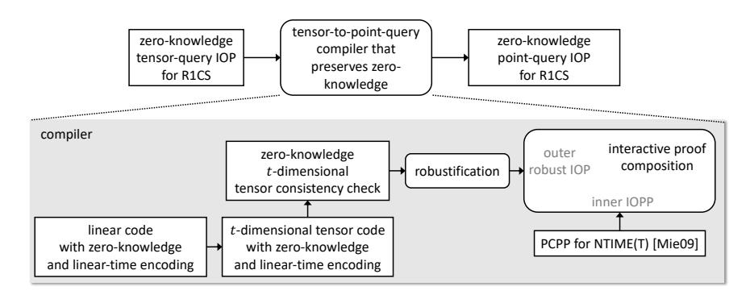
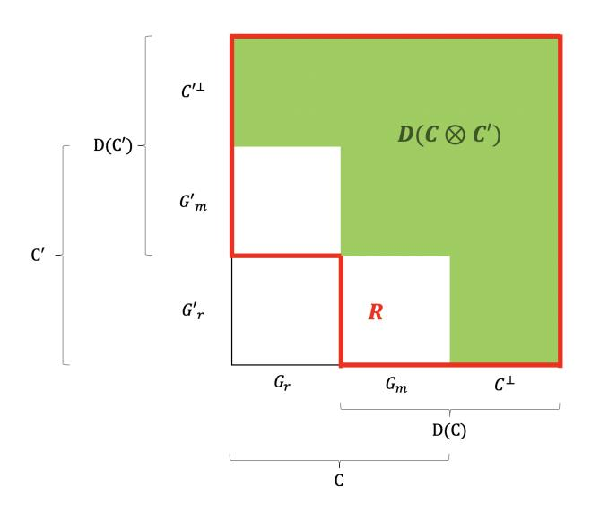
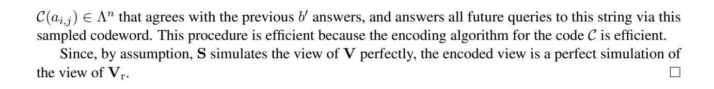

# <span id="page-0-0"></span>Zero-Knowledge IOPs with Linear-Time Prover and Polylogarithmic-Time Verifier

Jonathan Bootle

jbt@zurich.ibm.com IBM Research – Zurich

Alessandro Chiesa

alexch@berkeley.edu UC Berkeley

Siqi Liu

sliu18@berkeley.edu UC Berkeley

October 14, 2021

### Abstract

Interactive oracle proofs (IOPs) are a multi-round generalization of probabilistically checkable proofs that play a fundamental role in the construction of efficient cryptographic proofs.

We present an IOP that simultaneously achieves the properties of zero knowledge, linear-time proving, and polylogarithmic-time verification. We construct a zero-knowledge IOP where, for the satisfiability of an N-gate arithmetic circuit over any field of size Ω(N), the prover uses O(N) field operations and the verifier uses polylog(N) field operations (with proof length O(N) and query complexity polylog(N)). Polylogarithmic verification is achieved in the holographic setting for every circuit (the verifier has oracle access to a linear-time-computable encoding of the circuit whose satisfiability is being proved).

Our result implies progress on a basic goal in the area of efficient zero knowledge. Via a known transformation, we obtain a zero knowledge argument system where the prover runs in linear time and the verifier runs in polylogarithmic time; the construction is plausibly post-quantum and only makes a black-box use of lightweight cryptography (collision-resistant hash functions).

Keywords: interactive oracle proofs; zero knowledge; succinct arguments

# Contents

| 1 | Introduction                                                                                      | 1        |  |  |  |  |  |
|---|---------------------------------------------------------------------------------------------------|----------|--|--|--|--|--|
|   | 1.1<br>Our results                                                                                | 2        |  |  |  |  |  |
|   | 1.2<br>Related work on probabilistic proofs<br>1.3<br>Related work on succinct arguments<br>      | 4<br>4   |  |  |  |  |  |
|   |                                                                                                   |          |  |  |  |  |  |
| 2 | Techniques                                                                                        | 6        |  |  |  |  |  |
|   | 2.1<br>Approach overview                                                                          | 6        |  |  |  |  |  |
|   | 2.2<br>Construction overview<br><br>2.3<br>From tensor-queries to point-queries in zero-knowledge | 7<br>9   |  |  |  |  |  |
|   | 2.4<br>Tensor IOP for R1CS with semi-honest verifier zero knowledge                               | 13       |  |  |  |  |  |
|   | 2.5<br>Hiding properties of linear codes                                                          | 16       |  |  |  |  |  |
|   | 2.6<br>On bounded-query zero knowledge                                                            | 17       |  |  |  |  |  |
|   | 2.7<br>Linear-time succinct arguments from linear-time IOPs                                       | 21       |  |  |  |  |  |
| 3 | Preliminaries                                                                                     | 23       |  |  |  |  |  |
|   | 3.1<br>Interactive oracle proofs with special queries                                             | 23       |  |  |  |  |  |
|   | 3.2<br>Point queries and tensor queries<br>                                                       | 24       |  |  |  |  |  |
|   | 3.3<br>Robust proofs                                                                              | 24       |  |  |  |  |  |
|   | 3.4<br>Proximity proofs<br>                                                                       | 25       |  |  |  |  |  |
|   | 3.5<br>Zero knowledge                                                                             | 25       |  |  |  |  |  |
|   | 3.6<br>Error-correcting codes<br>                                                                 | 27       |  |  |  |  |  |
|   | 3.7<br>Zero knowledge codes<br>                                                                   | 29       |  |  |  |  |  |
| 4 | Tensor IOP for R1CS with (semi)honest-verifier zero knowledge                                     | 31       |  |  |  |  |  |
|   | 4.1<br>Preliminaries<br>                                                                          | 31       |  |  |  |  |  |
|   | 4.2<br>Our construction<br>                                                                       | 33       |  |  |  |  |  |
| 5 | Algebraic reformulation of zero knowledge codes                                                   |          |  |  |  |  |  |
|   | 5.1<br>Proof of Lemma 5.2                                                                         | 38<br>38 |  |  |  |  |  |
|   | 5.2<br>Proof of Lemma 5.1                                                                         | 39       |  |  |  |  |  |
|   | 5.3<br>Examples<br>                                                                               | 40       |  |  |  |  |  |
| 6 | Tensor products of zero-knowledge codes<br>42                                                     |          |  |  |  |  |  |
| 7 | Zero-knowledge codes with linear-time encoding                                                    | 45       |  |  |  |  |  |
|   | 7.1<br>Preliminaries<br>                                                                          | 45       |  |  |  |  |  |
|   | 7.2<br>Proof of Theorem 7.3                                                                       | 46       |  |  |  |  |  |
|   | 7.3<br>Setting parameters<br>                                                                     | 47       |  |  |  |  |  |
|   |                                                                                                   |          |  |  |  |  |  |
| 8 | From tensor queries to point queries with zero knowledge<br>8.1<br>Construction                   | 48<br>49 |  |  |  |  |  |
|   | 8.2<br>Proof of Lemma 8.2                                                                         | 50       |  |  |  |  |  |
|   |                                                                                                   |          |  |  |  |  |  |
| 9 | Main theorem                                                                                      | 54       |  |  |  |  |  |
|   | 9.1<br>Step 1: robustification                                                                    | 55       |  |  |  |  |  |
|   | 9.2<br>Step 2: composition                                                                        | 56       |  |  |  |  |  |
|   | 9.3<br>Step 3: tensor queries to point queries<br>                                                | 57       |  |  |  |  |  |
| A | Robustification<br>58                                                                             |          |  |  |  |  |  |
| B | Proof composition<br>62                                                                           |          |  |  |  |  |  |
| C | Equivalence of zero-knowledge code definitions<br>66                                              |          |  |  |  |  |  |
|   | Acknowledgments<br>67                                                                             |          |  |  |  |  |  |
|   | References                                                                                        | 67       |  |  |  |  |  |

# <span id="page-2-0"></span>1 Introduction

Zero knowledge proofs enable a prover to convince a verifier that a statement is true without revealing any further information about the statement [\[GMR89\]](#page-70-0). The main efficiency measures in a zero knowledge proof are the running time of the prover, the running time of the verifier, and the number of bits exchanged between them. A central goal in the study of zero knowledge proofs is to minimize the complexity of these measures.

Motivated by real-world applications, researchers across multiple communities have invested significant effort, and made much progress, in designing efficient zero knowledge protocols.

Several works (e.g., [\[IKOS07;](#page-70-1) [GMO16;](#page-70-2) [Cha+17;](#page-69-0) [KKW18;](#page-70-3) [HK20;](#page-70-4) [WYKW20\]](#page-71-0)) focus on prover time. They construct zero-knowledge proofs for circuit satisfiability where the prover's time complexity is linear in circuit size, which is asymptotically optimal.[1](#page-0-0) The drawback of these constructions is that communication complexity and verifier time also grow linearly with circuit size, which is undesirable for many applications.

This drawback is inevitable because, even without zero knowledge, interactive proofs for hard languages with sublinear communication are unlikely [\[GH98;](#page-69-1) [GVW02\]](#page-70-5). Nevertheless, if instead of considering proofs we consider *arguments* [\[BCC88\]](#page-68-2), wherein soundness is required to hold only against efficient adversaries rather than all adversaries, then one can hope to avoid the drawback. For this, rather than studying proofs where zero knowledge holds computationally, one studies arguments where zero knowledge holds statistically.[2](#page-0-0)

Succinctness. In a seminal work, Kilian [\[Kil92\]](#page-70-6) constructed zero knowledge arguments that are *succinct*: communication complexity and verifier time are *polylogarithmic* in computation size. While these are essentially optimal, the prover in Kilian's construction is a polynomial-time algorithm that fails to achieve the asymptotically-optimal linear time achieved via the aforementioned (non-succinct) zero knowledge proofs. Improving the prover time in succinct arguments has been a major goal in a subsequent line of work.

Essentially all approaches for constructing succinct arguments follow the same high-level template: first construct a probabilistic proof in some proof model, and then make a black-box use of cryptography to compile the probabilistic proof into an argument system.

A notable exception are zero-knowledge arguments with a linear-time prover and a polylogarithmic-time verifier. This goal is presently achieved as a consequence of the zero-knowledge argument in [\[BCGGHJ17\]](#page-68-3) (see Section [1.3\)](#page-5-1), but only via a non-black-box use of cryptography. This is unfortunate, as black-box results are a cryptographic "gold standard" that typically reflect a a deeper understanding, and over time lead to more efficient solutions (once each black-box is suitably optimized), when compared to non-black-box results.

Interactive oracle proofs. The above status quo is due to inefficiencies in probabilistic proofs. Prior results on zero-knowledge argument systems with a linear-time prover and sublinear-time verifier rely on compiling interactive oracle proofs (IOPs) [\[BCS16;](#page-69-2) [RRR16\]](#page-71-1) into corresponding succinct arguments via a black-box use of suitable collision-resistant hash functions. The verifier time was sublinear rather than polylogarithmic due to the underlying IOP constructions. In particular, the following basic question has remained open:

*Do there exist zero-knowledge IOPs with a linear-time prover and a polylogarithmic-time verifier?*

In this paper we give a positive answer to this question for arithmetic computations over a large field, and obtain a corresponding black-box result about zero-knowledge succinct arguments. The question of whether an analogous result can be proved for boolean computations remains an exciting open problem.

<sup>1</sup> Several of these works additionally achieve excellent concrete efficiency, via experiments that demonstrate the ability to prove the satisfiability of circuits with billions of gates.

<sup>2</sup>As soundness is computational then we can hope for zero knowledge to be statistical.

<span id="page-3-1"></span>

| IOP        | encode circuit cost      | prover cost              | verifier cost                        | query complexity | zero-knowledge |
|------------|--------------------------|--------------------------|--------------------------------------|------------------|----------------|
| [BCGGHJ17] | $O(n)$ $\mathbb{F}$ -ops | $O(n)$ $\mathbb{F}$ -ops | $O(\sqrt{n})$ $\mathbb{F}$ -ops      | $O(\sqrt{n})$    | semi-honest zk |
| [BCG20]    | $O(n)$ $\mathbb{F}$ -ops | $O(n)$ $\mathbb{F}$ -ops | $O(n^{\epsilon})$ $\mathbb{F}$ -ops  | $O(n^\epsilon)$  | not zk         |
| this work  | $O(n)$ $\mathbb{F}$ -ops | $O(n)$ $\mathbb{F}$ -ops | $polylog(n) \ \mathbb{F}\text{-}ops$ | $O(\log n)$      | semi-honest zk |

**Figure 1:** Comparison of known IOPs with a linear-time prover, for soundness error 1/2. The parameters are for an n-gate arithmetic circuit defined over a field  $\mathbb{F}$  of size  $\Omega(n)$ ; and  $\epsilon$  is any positive constant. Sublinear verification is achieved in the holographic setting (the verifier has oracle access to an encoding of the circuit).

#### <span id="page-3-0"></span>1.1 Our results

Our main result is an interactive oracle proof (IOP) [BCS16; RRR16] that simultaneously achieves zero knowledge, linear-time proving, and polylogarithmic-time verification (so also linear proof length and polylogarithmic query complexity). This implies the first zero-knowledge argument system with linear-time proving and polylogarithmic-time verification (and thus polylogarithmic communication complexity) that makes a black-box use of cryptography. Jumping ahead, our solution uses a lightweight cryptographic primitive (linear-time collision-resistant hash functions) for which there are plausibly post-quantum candidates.

**IOP for R1CS.** Our IOP is for a standard generalization of arithmetic circuit satisfiability, known as *rank-1 constraint satisfiability* (R1CS), where the "circuit description" is given by coefficient matrices. This NP-complete problem is widely used in the probabilistic proof literature (and beyond) because it efficiently expresses arithmetic circuits<sup>3</sup> and is convenient to use when designing a succinct argument.

**Definition 1** (informal). The R1CS problem asks: given a finite field  $\mathbb{F}$ , coefficient matrices  $A, B, C \in \mathbb{F}^{n \times n}$  each containing at most  $m = \Omega(n)$  non-zero entries,<sup>4</sup> and an instance vector  $x \in \mathbb{F}^*$ , is there a witness vector  $w \in \mathbb{F}^*$  such that  $z := (x, w) \in \mathbb{F}^n$  and  $Az \circ Bz = Cz$ ? (Here " $\circ$ " denotes the entry-wise product.)

Merely checking the validity of a witness by directly checking the R1CS condition costs O(m) field operations, so "linear time" for R1CS means computations that cost no more than O(m) field operations.

We construct an IOP for the R1CS problem with the parameters below. Our result significantly improves over prior linear-time IOPs, as summarized in Figure 1 and further discussed in Section 1.2.

<span id="page-3-2"></span>**Theorem 1** (informal). There is a public-coin IOP for R1CS over any field  $\mathbb{F}$  of size  $\Omega(m)$ , where:

- the prover uses O(m) field operations;
- the verifier uses  $poly(|x|, \log m)$  field operations;
- round complexity is  $O(\log m)$ ;
- proof length is O(m) elements in  $\mathbb{F}$ ;
- query complexity is  $O(\log m)$ ;
- soundness error is O(1).

Moreover, the IOP is semi-honest-verifier zero-knowledge.

**Succinct argument for R1CS.** The above theorem directly implies a zero-knowledge succinct argument with a linear-time prover and polylogarithmic-time verifier, obtained in a black-box way under standard

<sup>&</sup>lt;sup>3</sup>Satisfiability of an n-gate arithmetic circuit over the field  $\mathbb{F}$  is reducible, in linear time, to an R1CS instance also over  $\mathbb{F}$  where the coefficient matrices are  $n \times n$  and have m = O(n) non-zero entries. (In particular, the coefficient matrices are sparse.)

<sup>&</sup>lt;sup>4</sup>Note that  $m = \Omega(n)$  without loss of generality because if m < n/3 then there are variables of z that do not participate in any constraint, which can be dropped. Thus the main size measure for R1CS is the sparsity parameter m.

cryptographic assumptions. The implication involves combining IOPs and linear-time collision resistant hashing [\[BCGGHJ17\]](#page-68-3), as reviewed in Section [2.7.](#page-22-0)

In more detail, the result below relies on any linear-time collision-resistant hash function. Such hash functions are known to exist, e.g., under certain assumptions about finding short codewords in linear codes [\[AHIKV17\]](#page-68-5); moreover, these candidate hash functions are not known to be insecure against quantum adversaries, and so our succinct argument is plausibly post-quantum secure.

<span id="page-4-0"></span>Theorem 2 (informal). *Using any linear-time collision-resistant hash function with security parameter* λ *as a black box, one can obtain an interactive argument for R1CS, over any field of size* Ω(m)*, where:*

- *time complexity of the prover is bounded by the cost of* O(λ + m) *field operations;*
- *time complexity of the verifier is bounded by the cost of* poly(λ, |x|, log m) *field operations;*
- *round complexity is* O(log m)*;*
- *communication complexity is* poly(λ, log m) *field elements;*
- *soundness error is* O(1)*.*

*Moreover, the argument is malicious-verifier zero-knowledge with private coins.*[5](#page-0-0)

On zero knowledge. The notion of *semi-honest-verifier* zero-knowledge in Theorem [1](#page-3-2) means that the IOP prover leaks no information to an honest IOP verifier for any choice of verifier randomness. This suffices for malicious-verifier zero-knowledge in Theorem [2,](#page-4-0) as explained in Section [2.7.](#page-22-0) We also present results (see Section [2.6\)](#page-18-0) that allow us to prove a variant of Theorem [1](#page-3-2) where the IOP satisfies the stronger property of *bounded-query zero-knowledge*, but at the cost of a sublinear verifier time rather than polylogarithmic. Bounded-query zero-knowledge is the hiding notion typically studied for PCPs [\[KPT97\]](#page-70-7), and often enables reductions in communication complexity when compiling the IOP into a succinct argument. The aforementioned loss in verifier time only comes from the fact that known constructions of "zero knowledge codes" with a linear-time encoder are probabilistic, and the loss could be avoided by derandomizing such families overcoming this barrier remains an exciting open problem in coding theory.

On sublinear verification. The polylogarithmic verifier time in Theorem [1](#page-3-2) is achieved in the holographic setting, which means that the verifier is given query access to a linear-length encoding of the coefficient matrices that is computable in linear time. Similarly, polylogarithmic verifier time in Theorem [2](#page-4-0) is achieved in the preprocessing setting, which means that the verifier receives as input a short digest of the circuit that can be derived by anyone (in linear time). This follows a general paradigm wherein holographic proofs lead to preprocessing arguments [\[CHMMVW20;](#page-69-3) [COS20\]](#page-69-4). Holography/preprocessing is necessary for sublinear verification in the general case because just reading the R1CS instance takes linear time.[6](#page-0-0)

Open questions. Our IOP works for satisfiability problems over fields of at least linear size, as is the case for all known linear-time IOPs (see Section [1.2\)](#page-5-0); obtaining analogous results for all fields, or just the boolean field, is open. Moreover, our IOP achieves constant soundness error, and the question of additionally achieving a sub-constant soundness error (ideally, negligible in a security parameter) is open. Finally, while our focus is asymptotic efficiency, we are optimistic that the ideas in this paper will facilitate further research that may additionally achieve good concrete efficiency. (We point to specific ideas for this in Section [2.](#page-7-0)) Initial progress in this direction has been made in subsequent work discussed in Section [1.3.](#page-5-1)

<sup>5</sup>The private coins come from using the Goldreich–Kahan technique [\[GK96\]](#page-69-5). Achieving public coins is also possible via different relaxations: (i) we could rely on a reference string (which enables the zero knowledge simulator to access a trapdoor); or (ii) we could relax the goal to honest-verifier zero-knowledge while remaining in the plain model. See [\[IMSX15\]](#page-70-8) for more on these considerations.

<sup>6</sup>Holography/preprocessing may be avoidable by focusing on R1CS instances with a short description [\[BCGGRS19\]](#page-68-6) or, more generally, uniform models of computation. Achieving results analogous to ours in such a setting remains an open problem.

### <span id="page-5-0"></span>1.2 Related work on probabilistic proofs

As our main result concerns IOPs, we summarize prior works on probabilistic proofs that study related questions. Further connections to prior work are given in Section [2](#page-7-0) where we overview our techniques.

First we discuss a line of work on probabilistic proofs with linear proof length, a necessary condition for a linear-time prover (our goal). The first result was [\[BKKMS13\]](#page-69-6), which provides a PCP for boolean circuit satisfiability with linear proof length and sublinear query complexity; this is the only known result for PCPs, and constructing PCPs with linear proof length and polylogarithmic query complexity remains a major open problem. Subsequently, [\[BCGRS17\]](#page-68-7) obtained a 3-round IOP for boolean circuit satisfiability with linear proof length and constant query complexity; and [\[RR20\]](#page-71-2) showed how to reduce the multiplicative constant in the proof length to arbitrarily close to 1 at the cost of a slightly larger constant round complexity. None of these works study linear-time proving or sublinear-time verification. Here we omit a discussion of numerous works that achieve IOPs with linear size, but not linear prover time, for many other models of computation.

Next, [\[BCGGHJ17\]](#page-68-3) obtained a zero-knowledge IOP for arithmetic circuit satisfiability with linear-time prover and square-root-time verifier. Then [\[BCG20\]](#page-68-4) improved the verifier time to any sublinear polynomial, but without zero knowledge. *We improve on this by simultaneously achieving the properties of zero knowledge and polylogarithmic-time verifier.* All of these results require working over a finite field of linear size, and analogous results for boolean circuits are not known. See Figure [1](#page-3-1) for a table comparing these latter works.

Recurring tools across many of these works, as well as this paper, include: the sumcheck protocol for tensor codes [\[Mei13\]](#page-71-3), proof composition (for PCPs [\[AS98\]](#page-68-8) and for IOPs [\[BCGRS17\]](#page-68-7)), the linear-time sumcheck [\[Tha13\]](#page-71-4), and the use of codes without the multiplication property. (The property states that coordinate-wise multiplication of codewords yields codewords in a code whose relative distance is still good.)

The main challenge in designing IOPs with linear-time provers is that one cannot use "useful" codes like the Reed–Solomon code since the encoding time is quasilinear. Instead, prior works resorted to using linear-time encodable codes (e.g., of Spielman [\[Spi96\]](#page-71-5) or Druk–Ishai [\[DI14\]](#page-69-7)) that, unfortunately, do not have the multiplication property, which makes designing IOPs more difficult. (See [\[Mei12;](#page-70-9) [Mei13\]](#page-71-3) for more on why the multiplication property is useful in constructing probabilistic proofs.)

Our zero-knowledge IOPs with linear-time prover and polylogarithmic-time verifier achieve a central goal in the area of probabilistic proofs, and to construct them we contribute several novel pieces all towards zero knowledge: (i) constructions of linear-time-encodable codes that satisfy a zero-knowledge property; (ii) structural results on the tensor products of codes that satisfy the zero-knowledge property; (iii) a tensorquery zero-knowledge holographic IOP for R1CS with low randomness complexity; (iv) results on zero knowledge preservation under proof composition.

### <span id="page-5-1"></span>1.3 Related work on succinct arguments

Our main result implies a result on succinct arguments, and below we summarize prior works relevant to that. A non-black-box construction. A relaxation of Theorem [2](#page-4-0) that makes a non-black-box use of cryptography is a straightforward implication of [\[BCGGHJ17\]](#page-68-3). In more detail, [\[BCGGHJ17\]](#page-68-3) obtained a zero-knowledge argument system for arithmetic circuit satisfiability over linear-size fields where the prover runs in linear time and the verifier runs in square-root time. The verifier time can be reduced to polylogarithmic, while preserving zero knowledge and a linear-time prover, by using any zero-knowledge succinct argument with subquadratic prover time to prove that the "outer" verifier would have accepted. A similar implication, however from the non-zero-knowledge succinct argument in [\[BCG20\]](#page-68-4), is described in subsequent work [\[LSTW21;](#page-70-10) [GLSTW21\]](#page-70-11), and thus we refer the reader to that work for more details on these non-black-box

approaches. (We remark that [\[LSTW21;](#page-70-10) [GLSTW21\]](#page-70-11) additionally contribute ideas and implementations to improve the concrete efficiency of argument systems with a linear-time prover and sublinear-time verifier.)

Black-box constructions from probabilistic proofs. Essentially all approaches for constructing succinct arguments follow this high-level template: first construct a probabilistic proof in some proof model, and then make a black-box use of cryptography to compile the probabilistic proof into an argument system. The first step alone typically costs more than linear time because it involves (among other things) using the Fast Fourier Transform (FFT) to encode the computation as a polynomial.

Several works [\[BCCGP16;](#page-68-9) [BBBPWM18;](#page-68-10) [WTSTW18;](#page-71-6) [XZZPS19;](#page-71-7) [Set20;](#page-71-8) [ZWZZ20;](#page-71-9) [SL20;](#page-71-10) [KMP20\]](#page-70-12) construct various forms of succinct arguments *without FFTs* by first constructing linear-time probabilistic proofs in certain "algebraic" models and then compiling these into arguments by using homomorphic commitments. However, the cryptography introduces quasilinear work for the prover,[7](#page-0-0) usually to perform a linear number of multi-exponentiations over a cryptographically-large group (which translates to a quasilinear number of group operations for the prover);[8](#page-0-0) we refer the reader to follow up work [\[LSTW21;](#page-70-10) [GLSTW21\]](#page-70-11) for a detailed discussion of these quasilinear costs in terms of computation size and the security parameter. In sum, the above line of works has contributed among the best asymptotic prover times for succinct arguments (as well as excellent concrete efficiency), but the cryptography has precluded linear-time provers.

Bootle et al. [\[BCGGHJ17\]](#page-68-3) observe that Kilian's approach to succinct arguments introduces only linear cryptographic costs, when the collision-resistant hash function used for the compilation is suitably instantiated. (We elaborate on this in Section [2.7.](#page-22-0)) Prior work leveraged this observation to construct argument systems with linear-time prover and sublinear-time verifier, given a collision-resistant hash function as a black box.

- [\[BCGGHJ17\]](#page-68-3) achieves an honest-verifier zero knowledge argument system for arithmetic circuit satisfiability with a communication complexity of O( √ n), where the prover performs O(n) field operations and hash computations while the verifier performs O( √ n) field operations and hash computations.
- [\[BCG20\]](#page-68-4) achieves, for every > 0, an argument system for R1CS with a communication complexity of O(n ), where the prover performs O(n) field operations and hash computations while the verifier performs O(n ) field operations and hash computations. No zero knowledge property is achieved in this work.

There are linear-time candidates for the hash function [\[AHIKV17\]](#page-68-5), leading to a linear-time prover.

In both cases the technical core is the construction of IOPs with a linear-time prover, but, as discussed in Section [1.2,](#page-5-0) these prior works only achieved sublinear query complexity thereby, after compilation, falling short of the goal of polylogarithmic communication complexity. No prior work thus achieves Theorem [2.](#page-4-0)

Our main result (Theorem [1\)](#page-3-2) offers improved IOP constructions, and we are then able to improve the state of the art of succinct arguments that make a black-box use of cryptography (Theorem [2\)](#page-4-0).

<sup>7</sup>The quasilinear costs in some works (due to cryptography [\[XZZPS19;](#page-71-7) [ZWZZ20\]](#page-71-9) or an FFT [\[ZXZS20\]](#page-71-11)) scale with witness size rather than computation size, and so the prover runs in linear time when the witness is small relative to the computation.

<sup>8</sup> Some of the cited works still refer to such prover time as "linear" or "asymptotically optimal". This is a misnomer.

# <span id="page-7-0"></span>2 Techniques

We overview our approach towards Theorem [1](#page-3-2) in Section [2.1](#page-7-1) and the construction in Section [2.2.](#page-8-0) We provide additional details behind different aspects of the construction in Sections [2.3](#page-10-0) to [2.6.](#page-18-0) Finally, in Section [2.7](#page-22-0) we explain how our result about zero-knowledge succinct arguments (Theorem [2\)](#page-4-0) is a direct implication of our result about zero-knowledge IOPs (Theorem [1\)](#page-3-2).

Throughout, recall that an IOP is a proof model in which a prover and a verifier interact over multiple rounds, and in each round the prover sends a proof message and the verifier replies with a challenge message. The verifier has query access to all received proof messages, in the sense that it can query any of the proof messages at any desired location. The verifier decides to accept or reject depending on its input, its randomness, and answers to its queries. The main information-theoretic efficiency measures in an IOP are proof length (total size of all proof messages) and query complexity (number of read locations across all proof messages), while the main computational efficiency measures are prover time and verifier time.

### <span id="page-7-1"></span>2.1 Approach overview

We provide an overview of our approach to Theorem [1.](#page-3-2)

Review: proof composition. Many constructions of PCPs rely on proof composition [\[AS98\]](#page-68-8) to achieve the desired goal by combining an "outer" PCP and an "inner" PCP with suitable properties. The composed PCP (roughly) has the prover complexity of the outer PCP, and the verifier complexity of the inner PCP. Informally, the new PCP string consists of the outer PCP string and also, for every choice of randomness of the outer PCP verifier, an inner PCP string attesting that the outer PCP verifier would have accepted the local view of the outer PCP string induced by that choice of randomness. Soundness of the composed PCP requires the outer PCP to be *robust*[9](#page-0-0) and the inner PCP to be a *proximity proof*. [10](#page-0-0)

Proof composition extends to the IOP model [\[BCGRS17\]](#page-68-7): the outer and inner proof systems can be IOPs instead of PCPs, and must satisfy corresponding notions of robustness and proximity; moreover, composition is more efficient because the inner IOP has only to be invoked once rather than for every choice of randomness of the outer IOP verifier (this is because, after running the outer IOP, the verifier can simply send the chosen randomness to the prover and then run the inner IOP on that randomness). Proof composition of IOPs also plays a central role in constructions of IOPs, and we also use it in our construction, as described next.

Our setting. Using proof composition in our setting involves several considerations.

- *Zero knowledge.* We want the composed IOP to be semi-honest-verifier zero-knowledge, and for this, one can prove that it suffices for the outer IOP to be semi-honest-verifier zero-knowledge, regardless of any zero knowledge properties of the inner IOP. We prove this and other properties about zero knowledge within proof composition in Appendix [B.](#page-63-0)
- *Prover time.* We want the prover of the composed IOP to run in linear time. The composed prover time is the sum of the outer IOP prover time and the inner IOP prover time. This means that the outer IOP prover must run in time that is linear, e.g., in the R1CS instance. The requirement on the inner IOP prover is less straightforward: the inner IOP prover attests tp a computation related to the outer IOP verifier. For example, if the outer IOP verifier runs in cube-root time (relative to the R1CS instance) then we can afford an inner IOP prover that runs in up to cubic time (as the cubic blow up applied to a cube-root time gives linear time

<sup>9</sup>A proof system is robust if the local view of the verifier is far (e.g. in Hamming distance) from an accepting view with high probability (over the verifier's randomness) whenever the instance is not in the language.

<sup>10</sup>A proximity proof shows that a given input is close to some input in the language.

overall). In other words, we require the polynomial blow up of the inner IOP prover time to be made up by the savings offered by the outer IOP verifier time.

• *Verifier time.* We want the verifier of the composed IOP to run in polylogarithmic time. The composed verifier time equals the time of the inner IOP verifier when used to test that the outer IOP verifier would have accepted. At minimum, the inner IOP verifier needs to read the description of the outer IOP verifier computation, which consists of its input instance (e.g., the R1CS public input) and its randomness. This implies that the outer IOP verifier can have at most polylogarithmic randomness complexity, and also implies that the compound savings in running time of the outer IOP verifier and inner IOP verifier must lead to a polylogarithmic running time.

The above considerations suggest that one approach that suffices is the following: (i) an inner IOP of proximity for general computations with polylogarithmic verifier time; and (ii) an outer IOP for R1CS that is semi-honest-verifier zero-knowledge, is robust, has a linear prover time, has polylogarithmic randomness complexity, and has a verifier time that is sufficiently small so that we can afford the blowup incurred by the inner IOP prover time. For the inner IOP of proximity we choose the state-of-the-art PCP of proximity for NTIME(T) due to Mie [\[Mie09\]](#page-71-12) (discussed later). Our technical contribution is constructing a suitable outer IOP. As the blowup incurred by the inner PCP prover time will be polynomial, we need the outer IOP verifier to run in time that is sufficiently sublinear. We now outline the challenges that arise given prior work.

Challenges. There are two natural paths to explore in order to construct the outer IOP.

- 1. One path would be to somehow construct the desired outer IOP by starting from the semi-honest-verifier zero-knowledge IOP for arithmetic circuit satisfiability in [\[BCGGHJ17\]](#page-68-3), which works over any field of linear size and has linear prover time and square-root verifier time. This would require addressing some challenges. First, we would need to robustify the IOP, but robustification techniques typically work for verifiers with constant query complexity (possibly over a large alphabet), and so one would have to adapt [\[BCGGHJ17\]](#page-68-3) for this setting. Second, the IOP verifier in [\[BCGGHJ17\]](#page-68-3) would have to be derandomized to achieve polylogarithmic randomness complexity. Third, we cannot afford more than a quadratic blow up in the inner IOP prover time because the verifier in [\[BCGGHJ17\]](#page-68-3) runs in square-root time.
- 2. An alternative path would be to somehow construct the desired outer IOP by starting from the IOP for R1CS in [\[BCG20\]](#page-68-4), which over any field of size O(m) has prover time O(m) and verifier time O(m ) for any a-priori fixed constant > 0. This would require somehow additionally achieving zero knowledge (not a goal in [\[BCG20\]](#page-68-4)), and moreover would still require addressing the robustification and derandomization challenges mentioned above. On the other hand, because we can choose to be small enough, we can afford an inner proximity proof whose prover runs in any fixed polynomial time (in particular, the PCP of proximiy in [\[Mie09\]](#page-71-12) would suffice).

This paper. We believe that both paths are plausible. In this paper we use that an approach that (roughly) follows the second path, because we can use an off-the-shelf inner proximity proof and we can focus our attention solely on constructing an appropriate outer IOP. Moreover, we believe that building on [\[BCG20\]](#page-68-4) will contribute new understanding of zero knowledge techniques that are likely to be useful elsewhere, and will lead to a simpler exposition due to the modular nature of that construction.

### <span id="page-8-0"></span>2.2 Construction overview

We outline the steps in the construction of an IOP that satisfies Theorem [1.](#page-3-2) We elaborate on each of these steps in subsequent subsections.

Review: the tensor-to-point approach. The IOP for R1CS in [\[BCG20\]](#page-68-4) is obtained in two steps: first construct a *tensor IOP* for R1CS with linear prover time and constant query complexity; then apply a compiler that transforms any tensor IOP into a standard IOP. In a tensor IOP, the verifier may make multiple *tensor queries* directly to a proof message Π, each of the form q = (q1, . . . , qt) and receiving the corresponding answer v := h⊗iq<sup>i</sup> , Πi. This differs from a standard IOP, where the verifier makes *point queries*, that is, it queries single locations of proof messages. As mentioned in Section [2.1,](#page-7-1) the resulting (point-query) IOP in [\[BCG20\]](#page-68-4) has prover time O(m) and verifier time O(m ) for any a-priori fixed constant > 0. (Here m is the maximum number of non-zero entries in an R1CS coefficient matrix.)

Steps in our proof. We take an analogous two-step approach as in [\[BCG20\]](#page-68-4), except that we additionally achieve semi-honest-verifier zero knowledge, while still achieving a prover time of O(m) and reducing the verifier time from O(m ) to poly(|x|, log m). (Here x is the instance vector of the R1CS instance.)

- *Step 1: tensor IOP for R1CS with zero knowledge.* Given any finite field F, we construct a tensor IOP for R1CS over F that is semi-honest-verifier zero-knowledge, has soundness error O( m |F| ), has prover time O(m), and has verifier time O(|x| + log m); moreover, the verifier makes O(1) tensor queries (and also interacts with the prover in a O(log m)-round interactive proof). In Section [2.4](#page-14-0) we outline the main ideas that we use to additionally achieve zero knowledge compared to the tensor IOP for R1CS in [\[BCG20\]](#page-68-4).
- *Step 2: from tensor IOPs to standard IOPs while preserving zero knowledge.* Given any finite field F, we construct a compiler that maps a tensor IOP over the field F into a standard IOP *while preserving the zero knowledge property*; moreover, efficiency measures are preserved up to overheads in the dimension of the tensor and the query complexity of the input tensor IOP. In Section [2.3](#page-10-0) we outline the main ideas that we use compared to the tensor-query to point-query compiler in [\[BCG20\]](#page-68-4) (which does not preserve zero knowledge and leads to a large verifier time).

Theorem [1](#page-3-2) follows by applying the compiler in the second step to the tensor IOP for R1CS in the first step, as shown diagrammatically in Figure [2.](#page-10-1) Below we highlight two aspects of our construction of the compiler.

- (a) Proof composition. Differing from the approach overview in Section [2.1,](#page-7-1) the proof composition step actually happens within the tensor-query to point-query compiler rather than as a final step. This choice leads to a compiler that preserves efficiency measures of the tensor IOP up to constants (of independent interest), and moreover invokes the inner proximity proof on a linear computation rather than an arbitrary computation.
- (b) Linear codes that are linear-time encodable and zero knowledge. A key ingredient in the construction of our compiler is *tensor codes that simultaneously are linear-time encodable and satisfy a zero-knowledge property* (informally, codewords do not reveal any information about the underlying message when queried in a restricted way). For this, we establish structural properties of zero-knowledge codes and prove that they are preserved under tensor products, which reduces the problem to constructing a linear-time encodable zero-knowledge code to act as the base of the tensor product code. We obtain a suitable base code via an explicit (deterministic) construction of zero-knowledge code based on [\[Spi96\]](#page-71-5) codes, which protect against a single malicious query. This is enough to prove zero-knowledge against semi-honest verifiers in Theorem [1,](#page-3-2) which suffices for our main theorem. We also give a probabilistic construction of zero-knowledge codes based on [\[DI14\]](#page-69-7) codes which do not reveal information on the underlying message even when the verifier makes queries to a constant fraction of codeword entries. This allows us to prove a variation of Theorem [1](#page-3-2) with the stronger property of *bounded-query zero-knowledge*. We review notions of zero knowledge for linear codes in Section [2.5,](#page-17-0) and then describe our results about zero-knowledge codes in Section [2.6.](#page-18-0)

Concrete efficiency. We do not make any claims regarding the concrete efficiency of our construction. That said, we are optimistic that the ideas introduced in this work can lead to improved constructions with the <span id="page-10-1"></span>same asymptotic efficiency but better concrete efficiency. In particular, we believe that further research into zero-knowledge linear-time-encodable codes and further research in specializing the proof composition step to the specific outer statement (a certain linear computation) may significantly improve efficiency. Subsequent work has made progress in this direction [GLSTW21].



**Figure 2:** Diagram of our construction of the IOP for Theorem 1.

### <span id="page-10-0"></span>2.3 From tensor-queries to point-queries in zero-knowledge

We generically transform any tensor-query IOP into a corresponding point-query IOP, while preserving zero knowledge. The transformation is parametrized by a zero-knowledge linear code (a notion explained in more detail in Section 2.5) and outputs a point-query IOP that is bounded-query zero knowledge, meaning that malicious queries up to a fixed query bound do not leak any information. In contrast, the tensor-query IOP being transformed is only required to satisfy a weaker notion of zero knowledge, called *semi-honest*-verifier zero knowledge, that we describe further below. Here, " $(\mathbb{F}, k, t)$ -tensor IOP" means that each tensor-IOP query  $q = (q_1, \ldots, q_t)$  lies in  $(\mathbb{F}^k)^t$ .

<span id="page-10-2"></span>**Theorem 3** (informal). There is an efficient transformation that takes as input a tensor-query IOP and a linear code, and outputs a point-query IOP that has related complexity parameters, as summarized below.

- Input IOP:  $an(\mathbb{F}, k, t)$ -tensor IOP for a relation R with soundness error  $\epsilon$ , round complexity rc, proof length l, query complexity q, prover arithmetic complexity tp, and verifier arithmetic complexity tv.
- Input code: a linear code C over  $\mathbb{F}$  with rate  $\rho = \frac{k}{n}$ , relative distance  $\delta = \frac{d}{n}$ , encoding time  $\theta(k) \cdot k$ , and description size |C|. (The description of a linear code consists of a specification of the circuit used to compute the encoding function, including any random coins used to generate the circuit.)
- Output IOP: a point-query IOP with soundness error  $O_{\delta,t}(\epsilon) + O(d^t/|\mathbb{F}|)$ , round complexity  $O_t(\mathsf{rc})$ , proof length  $O_{\rho,t}(\mathsf{q} \cdot \mathsf{l})$ , query complexity  $O_t(\mathsf{q})$ , prover arithmetic complexity  $\mathsf{tp} + O_{\rho,t}(\mathsf{q} \cdot \mathsf{l}) \cdot \theta(k) + \mathsf{poly}(|\mathcal{C}|,t,\mathsf{q},k)$ , and verifier arithmetic complexity  $\mathsf{tv} + \mathsf{poly}(|\mathcal{C}|,t,\mathsf{q},\log k)$ .

Moreover, when the tensor-query IOP is semi-honest-verifier zero knowledge the following also holds:

- if the code C is 1-query zero-knowledge, then the point-query IOP is semi-honest-verifier zero knowledge;
- if the code C is b-query zero-knowledge, then the point-query IOP is b-query zero knowledge.

Finally, the transformation preserves holography up to the multiplicative encoding overhead  $\theta$  of C and terms that depend on  $\rho$  and t: if the indexer for the input tensor-query IOP runs in time ti and produces an index of length li, then the indexer for the output point-query IOP runs in time  $ti + O_{\rho,t}(q \cdot li) \cdot \theta(k)$ .

The formal statement and its proof are in Section 8.<sup>11</sup> We now explain the main ideas behind our compiler. **Starting point:** an inefficient compiler that breaks zero knowledge. Our starting point is the code-based compiler of [BCG20], which takes as input a tensor-query IOP  $(\mathbf{P}, \mathbf{V})$  and a linear error-correcting code  $\mathcal{C}$  and produces a corresponding point-query IOP  $(\hat{\mathbf{P}}, \hat{\mathbf{V}})$ . We briefly summarize how the compiler works.

First, the point-query IOP simulates the tensor-query IOP with the modification that: (i) each proof oracle  $\Pi \in \mathbb{F}^{k^t}$  is replaced by its encoding  $\hat{\Pi} \in \mathbb{F}^{n^t}$  using the tensor product code  $\mathcal{C}^{\otimes t}$ ; (ii) instead of making tensor queries to the proof oracles directly, the new verifier  $\hat{\mathbf{V}}$  sends tensor queries  $q^{(s)}$  to the prover, who replies with the answers  $v^{(s)}$ . Second, the new prover  $\hat{\mathbf{P}}$  and new verifier  $\hat{\mathbf{V}}$  engage in a consistency test subprotocol to ensure that the answers  $v^{(s)}$  (which may have been computed dishonestly) are consistent with the proofs  $\Pi$ . The consistency test incorporates a proximity test to make sure that each proof message  $\hat{\Pi}$  is close to a valid encoding of some proof message  $\Pi$  (as a malicious prover may send messages which are far from  $\mathcal{C}^{\otimes t}$ ). As part of the consistency check, the prover sends the verifier "folded" proof messages  $c_j^{(s)} = \langle \otimes_{i \leq j} q_i^{(s)}, \Pi \rangle$  encoded under lower-dimensional tensor codes  $\mathcal{C}^{\otimes t-j}$ . The proximity test works similarly, using random linear combinations of length k sampled by the verifier instead of structured tensor queries. In both cases, the verifier checks linear relations between successive encodings  $c_j^{(s)}$  and  $c_{j+1}^{(s)}$  by making O(k) point queries. This compiler preserves prover time up to the encoding overhead  $\theta(k)$  as in our Theorem 3, but has two

This compiler preserves prover time up to the encoding overhead  $\theta(k)$  as in our Theorem 3, but has two shortcomings. The compiler does not preserve zero-knowledge, even if the tensor IOP to be compiled is zero knowledge. Moreover, the output IOP has query complexity  $\Omega(k)$  and verifier complexity  $\Omega(k)$ , which does not suffice for Theorem 3 (we can at most afford a polylogarithmic dependence in k). Below we elaborate on how we overcome these shortcomings for zero-knowledge (Section 2.3.1) and for efficiency (Section 2.3.2).

### <span id="page-11-0"></span>2.3.1 Preserving zero-knowledge

We explain semi-honest verifier zero knowledge (the property of the tensor IOP used to achieve zero knowledge for the output IOP) and then how we preserve zero knowledge in the compiler.

**Semi-honest-verifier zero knowledge.** Here, "semi-honest" means that there exists a simulator that (perfectly) simulates the honest verifier's view for any fixed choice of the honest verifier's randomness. <sup>12</sup> This requirement is stronger than honest-verifier zero-knowledge, where the simulator must simulate the honest verifier's view for a random choice of its randomness; also, this requirement is weaker than the standard definition of zero-knowledge for IOPs, in which the verifier may deviate from the protocol and make arbitrary queries to the received oracles up to some query bound. Nevertheless, this notion suffices for our compilation procedure, which will produce point-query IOPs with zero-knowledge against semi-honest verifiers or against verifiers making a bounded number of point queries (depending on the zero-knowledge property of the code).

Approach for zero knowledge. We need to ensure that, in our compiler, if the tensor-query IOP given as input is semi-honest-verifier zero knowledge then, depending on the zero knowledge property of the code  $\mathcal C$ , the output point-query IOP is either semi-honest verifier zero knowledge or bounded-query zero knowledge. This implication does not hold for the compiler of [BCG20] because, when using a (non-zero-knowledge) linear code  $\mathcal C$ , a point query to any encoded proof message  $\hat \Pi$  or folded proof message  $c_j^{(s)}$  leaks information about  $\Pi$ . We address the information leaked by  $\hat \Pi$  and  $c_j^{(s)}$  in two ways.

<sup>&</sup>lt;sup>11</sup>The result in Section 8 (Lemma 8.2) is stated with an additional generic input: an IOP of proximity for a certain tensor-query relation. The result stated here is obtained by using a new IOP of proximity obtained by applying proof composition techniques to results from [BCG20] (see Section 9.1 and Section 9.2).

<sup>&</sup>lt;sup>12</sup>This is related to special honest-verifier zero-knowledge for sigma protocols.

We ensure that the folded proof messages  $c_j^{(s)}$  do not leak any information by leveraging the fact that the consistency test of [BCG20] is about a linear relation, and thus can be invoked on a random shift of the instance of interest. In more detail, the usual approach to making the messages in such a subprotocol zero-knowledge is to mask the input message as  $f = \gamma \Pi + \Xi$ , where  $\Xi$  is a random message sent by the prover and  $\gamma$  is a random challenge sent by the verifier after that, and then run the consistency test on the encoding  $c = \gamma \hat{\Pi} + \hat{\Xi}$  [BCFGRS17]. (The claimed tensor-query answers  $v^{(s)}$  need to be adjusted accordingly too to account for the contribution of  $\Xi$ .) Informally, this enables the simulator to randomly sample c and honestly run the [BCG20] consistency test protocol. Queries on the resulting messages  $c_j^{(s)}$  do not reveal any information, since they are derived from c, which is a random tensor codeword. Further, we do not require any zero-knowledge properties from the consistency test.

The simulator must still simulate the answers to point queries on  $\Xi$  by querying  $\hat{\Pi}$  instead. To avoid information leakage from the encoded proofs  $\hat{\Pi}$ , we use a linear code  $\mathcal{C}$  with bounded-query zero-knowledge. This is similar to the notion for IOPs, and means that queries to a codeword up to a fixed query bound do not leak any information. The [BCG20] compiler uses tensor products of codes, and to achieve semi-honest-verifier zero knowledge for the output IOP, it is important that the tensor product code  $\mathcal{C}^{\otimes t}$  is 1-query zero-knowledge. Furthermore, to achieve b-query zero knowledge for the output IOP, it is important that the tensor product code  $\mathcal{C}^{\otimes t}$  is also zero-knowledge against b queries. This leads to the problem of finding a zero-knowledge code which is encodable in linear time, which we discuss in Section 2.6.3, and showing that the zero-knowledge property of codes is preserved under tensor products, which we discuss in Section 2.6.2.

### <span id="page-12-0"></span>2.3.2 Improving efficiency

Our modifications to the compiler of [BCG20] to preserve zero-knowledge do not affect its efficiency; in particular, if the zero-knowledge code  $\mathcal{C}^{\otimes t}$  has a linear-time encoding, then the compiler preserves linear arithmetic complexity of the prover. However, when applied to our  $(\mathbb{F}, k, t)$ -tensor IOP with  $n = \Theta(k^t)$ , the improved consistency test has query complexity O(k), prover arithmetic complexity  $O(k^t)$ , and verifier arithmetic complexity O(k). Though the query complexity and verifier complexity can be improved by increasing t, they remain sublinear in n, which does not suffice for Theorem 3. To prove Theorem 3, we must reduce the query complexity from  $\Omega(k)$  to O(1) and the verifier complexity from  $\Omega(k)$  to poly $(\log k)$ .

We achieve these goals using interactive proof composition and derandomization techniques. First, we strengthen the improved consistency test through robustification, and then use interactive proof composition for IOPs [BCGRS17]. This reduces the query complexity so that it is independent of k, and makes the verifier complexity depend only on the randomness complexity of the consistency test verifier. Next, we show that linear prover complexity is preserved. Finally, we explain how to derandomize the consistency test to obtain the desired verifier complexity. (It remains an interesting question whether one can also achieve proof length that approaches witness length, the efficiency goal studied in [RR20] via related techniques.)

**Interactive proof composition.** Interactive proof composition involves an "outer" IOP that is robust and is for the desired relation, and an "inner" IOP of proximity that is for a relation about the outer IOP's verifier. At a high level, we wish to apply this with the zero-knowledge consistency test from Section 2.3.1 as the outer IOP, and the PCP of proximity of [MieO9] as the inner IOP. This requires some care, in part because the consistency check is not robust, and also because our target parameters do not leave much wiggle room. Below, we elaborate on how we robustify the outer protocol, and how we perform proof composition.

• Robustification. Any IOP can be generically robustified by encoding each proof symbol in every round

<sup>&</sup>lt;sup>13</sup>Note also that query bound b must be at least the number of queries that  $\hat{\mathbf{V}}$  makes to the encoded proof  $\hat{\Pi}$ .

via an appropriate error-correcting code: if the IOP has query complexity q then this transformation yields a robustness parameter α = O(1/q) (over the alphabet of the code).[14](#page-0-0) This is a straightforward generalization of robustifications for IPs (each prover message in each round is encoded) and for PCPs (each proof symbol of the PCP is encoded). This also extends to robustifying IOPPs, in which case each symbol of the witness whose proximity is being proved is also encoded (and this modifies the relation proved by the IOPP slightly). For convenience, we state and prove this generic robustification in Appendix [A.](#page-59-0)

Superficially, this robustification seems insufficient to prove Theorem [3](#page-10-2) because zero-knowledge consistency test from Section [2.3.1](#page-11-0) has sublinear query complexity q = O(k) = O(n <sup>1</sup>/t), which would lead to a robustness parameter that is sub-constant. However, fortunately, the queries are *bundled*: the verifier always queries entire sets of O(n <sup>1</sup>/t) locations, so the IOPP can be restated as a *constant-query* IOPP over the large alphabet F O(n <sup>1</sup>/t) . To robustify an IOPP over such a large alphabet, we need to use a code with linear-time encoding such as [\[Spi96\]](#page-71-5) (here zero-knowledge codes are not essential) in order to preserve the linear complexity of the prover. This gives us an IOPP for tensor queries with prover complexity O(n), verifier complexity O(n <sup>1</sup>/t), query complexity O(n <sup>1</sup>/t) over the alphabet F, constant soundness error, and, most importantly, a *constant robustness parameter* α. We are now ready for the next step, proof composition.

• *Composition.* Interactive proof composition [\[BCGRS17\]](#page-68-7) applies to any outer IOP that is robust and inner IOP that is a proof of proximity. If the outer IOP is a proof of proximity (as is the case when using the IOPP obtained above) then the composed IOP is also a proof of proximity; similarly, if the inner IOP is robust then the composed IOP is also robust. We state this generic proof composition in Appendix [B.](#page-63-0)

We apply proof composition as follows: (i) the outer proof system is the robust zero-knowledge IOPP for tensor queries obtained above; (ii) the inner proof system is the PCP of proximity for NTIME(T) due to Mie [\[Mie09\]](#page-71-12) (which achieves any constant soundness error and constant proximity parameter, with proof length O˜(T(|x|)), query complexity O(1), prover time poly(T(|x|)), and verifier time poly(|x|, log T(|x|))).

Informally, the new verifier in the composed proof system runs the interactive phase of the IOPP for tensor queries and then, rather than running the query phase of the outer IOPP, runs the PCPP verifier of [\[Mie09\]](#page-71-12) to check that the witness is close to a tensor encoding of a message that is consistent with all the answers to the tensor queries. This reduces the query complexity from O(n <sup>1</sup>/t) to O(1) queries.

Preserving prover complexity. We discuss prover complexity for the composed proof system. The cost of the prover in the composed IOP is O(n) field operations to run the prover of the robust IOPP for tensor queries plus poly(T(|x|)) bit operations to run the PCPP prover in [\[Mie09\]](#page-71-12). In our case, the NTIME(T) relation being checked is the decision predicate for the verifier in the robust IOPP, so that T = O(n <sup>1</sup>/t) (times smaller factors depending on log |F| since T refers to bit operations rather than field operations). If we take the tensor power t ∈ N to be a sufficiently large constant, then we can ensure that the prover time in the PCPP of [\[Mie09\]](#page-71-12), which is polynomial in O(n <sup>1</sup>/t), is dominated by O(n) field operations.

Reducing verifier complexity. We discuss verifier complexity for the composed proof system. The cost of the verifier in the composed IOP is dominated by poly(|x|, log T(|x|)) bit operations, the time to run the PCPP verifier in [\[Mie09\]](#page-71-12). From our discussion of prover complexity for the composed proof system, we know that T = O(n <sup>1</sup>/t) and so log T(|x|) = O(log n). We are thus left to discuss |x|. Here x is the state used to *describe* (not run) the computation of the decision predicate for the verifier in the robust IOPP. The description consists of: (a) the description of the code C used for the tensor encoding; (b) the description of the tensor queries whose answers are being checked; and (c) the *verifier randomness* for the robust IOPP.

<sup>14</sup>An IOP is said to have robustness parameter α if the local view of the verifier is α-close (in relative Hamming distance) to an accepting view with probability bounded by the IOP's soundness error

The second term depends on the tensor queries, but for simplicity here we will ignore it because in our application all the tensor queries can be described via  $O(t \log n)$  elements, again a low-order term. The first term depends on the choice of code  $\mathcal{C}$ , so we keep it as a parameter. As for the last term, the randomness complexity of the robust consistency check is  $O(\mathbf{q} \cdot k \cdot t)$ , due to the random linear combinations used in the proximity test of [BCG20], whose randomness complexity is unchanged by robustification. In sum, the cost of the verifier in the composed system is  $\mathsf{poly}(|\mathcal{C}|, \log n, \mathbf{q} \cdot k \cdot t)$  bit operations. This leads to a sublinear verifier complexity and does not suffice for Theorem 3.

Fortunately, these linear combinations can be derandomized so to reduce their description size to O(t) (a low-order term), as we now explain. The linear combinations are used in the soundness analysis of the [BCG20] proximity test as part of a "distortion statement": if any member of a collection of messages is far (in Hamming distance) from a linear code, then a random linear combination of those messages is also far from the code, except with some small, bounded, failure probability. Ben-Sasson et al. [BKS18] prove distortion statements for linear combinations of the form  $\zeta = (\alpha^1, \alpha^2, \alpha^3, \dots, \alpha^k)$  for a uniformly random  $\alpha \in \mathbb{F}$ , at the cost of a tolerable increase in failure probability, and thus, in the soundness error of the proximity test. This allows us to dramatically reduce the number of random field elements used in the proximity test from  $O(\mathbf{q} \cdot k \cdot t)$  to  $O(\mathbf{q} \cdot t)$ . After some work, the result is a verifier complexity of  $\operatorname{poly}(|\mathcal{C}|, \log n)$  bit operations in the composed system which suffices for Theorem 3.

Remark 2.1. We use the freedom to choose a large enough t in our robust zero-knowledge IOPP based on [BCG20] to obtain query complexity (and verifier time) that is  $O(n^{1/t})$ . It is plausible that [BCGGHJ17] similarly implies a robust zero-knowledge IOPP with query complexity (and verifier time)  $O(n^{1/2})$ . We do not know how to leverage such a result because that would require an inner IOPP with subquadratic prover time and constant query complexity, and we do not know of such a result. While it is plausible that the prover of [Mie09] prover runs in subquadratic time, proving this seems an arduous task.

**Remark 2.2** (zero knowledge). We do not require the the IOPP for tensor queries used in Section 2.3.1 to be zero knowledge because we can invoke it on a random instance as explained in Section 2.3.1. Nevertheless, we believe that future improvements in zero knowledge IOPs (especially with a focus on concrete efficiency) will benefit from applying the transformations of robustification and proof composition to zero knowledge protocols. In such a case, it will be useful to understand how zero knowledge is affected by these transformations: If the robustified IOP is required to be zero knowledge, what should we require of the given IOP and code used to encode each symbol? Also, if the composed IOP is required to be zero knowledge, what should we require of the outer IOP and inner IOP? We took the opportunity to investigate this in our appendices, taking advantage of the fact that we already had to specify the relevant transformations.

We consider two target notions of zero knowledge: against semi-honest verifiers and against (malicious) bounded-query verifiers. Then we deduce natural conditions on the ingredients to robustification and proof composition that suffice to achieve the target notion of zero knowledge. See Lemma A.4 for the zero knowledge properties of robustification, and Lemma B.6 for the zero knowledge properties of proof composition. We view these results as an independent contribution to foundational transformations of IOPs.

### <span id="page-14-0"></span>2.4 Tensor IOP for R1CS with semi-honest verifier zero knowledge

The input to the compiler in Section 2.3 is a tensor IOP for R1CS that is semi-honest-verifier zero knowledge.

**Theorem 4** (informal). For every finite field  $\mathbb{F}$  and positive integers  $k, t \in \mathbb{N}$ , there is a  $(\mathbb{F}, k, t)$ -tensor holographic IOP for the indexed relation  $R_{\text{R1CS}}$ , which is semi-honest-verifier zero-knowledge, that supports instances over  $\mathbb{F}$  with  $m = O(k^t)$ , that has the following parameters: (1) soundness error is  $O(\frac{m}{|\mathbb{F}|})$ ; (2) round

*complexity is* O(log m)*; (3) proof length is* O(m) *elements in* F*; (4) query complexity is* O(1)*; (5) the indexer and prover use* O(m) *field operations; (6) the verifier uses* O(|x| + log m) *field operations.*

We prove this theorem in Section [4,](#page-32-0) and summarize the proof below.

Our starting point is the holographic tensor IOP for R1CS in [\[BCG20\]](#page-68-4), which achieves the same parameters as in the above theorem[15](#page-0-0) except that it is not zero knowledge. We use re-randomization techniques to additionally achieve zero knowledge against semi-honest verifiers, while preserving all efficiency parameters. We now elaborate on this: first we review the structure of the tensor IOP in [\[BCG20\]](#page-68-4), and then explain our ideas for how to additionally achieve zero knowledge.

The holographic tensor IOP of BCG. The holographic tensor IOP for R1CS in [\[BCG20\]](#page-68-4) follows a standard blueprint for constructing protocols for R1CS [\[BCRSVW19\]](#page-69-9), adapted to the case of tensor queries. The prover first sends oracles containing the full assignment z = (x, w) and its linear combinations z<sup>A</sup> := Az, z<sup>B</sup> := Bz, and z<sup>C</sup> := Cz. The verifier wishes to check that z<sup>A</sup> ◦ z<sup>B</sup> = z<sup>C</sup> and that zA, zB, z<sup>C</sup> are the correct linear combinations of z. To facilitate this, the verifier sends some randomness to the prover, which enables reducing the first condition (a Hadamard product) to a scalar-product condition. The verifier then engages with the prover in scalar-product subprotocols for checking the scalar products, and holographic "lincheck" subprotocols for checking the linear relations (given tensor-query access to suitable linear-time encodings of the matrices A, B, C). The verifier makes a constant number of tensor queries to each of z, zA, zB, z<sup>C</sup> for concluding the subprotocols and performing other consistency checks (e.g., consistency of z with x).

This protocol is not zero knowledge even for an honest verifier because: (1) the answer to each tensor query to z, zA, zB, z<sup>C</sup> reveals information about the secret input w (part of the full assignment z); (2) messages sent by the prover during the scalar-product and lincheck protocols reveal further information about z, zA, zB, zC.

Approach for zero knowledge. We need to ensure that every prover message and the answer to every tensor query is simulatable. The fact that queries are linear combinations with a tensor structure would make this rather difficult if we had to deal with malicious verifiers.[16](#page-0-0) Fortunately, we seek zero knowledge against semi-honest verifiers only, which means that it suffices to consider any valid execution of an honest verifier, and in particular we have the freedom to assume that the verifier's queries have a certain structure. While there are generic techniques for related settings (e.g., a transformation for linear PCPs with degree-2 verifiers in [\[BCIOP13\]](#page-69-10)), they do not seem to be useful for our setting (tensor IOPs with linear-time proving). So our approach here will be to modify the protocol in [\[BCG20\]](#page-68-4) by adapting ideas used in prior works.

We incorporate random values into the protocol in two different ways to address the two types of leakage above. This will enable us to make every prover message and query answer either uniformly random (independent of the witness) or uniquely determined by other prover messages or query answers. The simulator that we construct will then simply sample all the random values and derive the rest from them. We elaborate on this strategy in the paragraphs below.

(1) ZK against verifier queries. The answer to each verifier query is a linear combination (with tensor structure) of elements in the prover's oracle message. Intuitively, if we pad each oracle message with as many random values as the number of queries it receives, and also "force" the linear combination to have non-zero coefficients in the padded region, then all the query answers will be uniformly random and reveal no information. Padding each of z, zA, zB, z<sup>C</sup> with independent randomness, however, does not preserve completeness because the padded vectors would not satisfy the R1CS condition.

<sup>15</sup>Note that as described in [\[BCG20\]](#page-68-4), the tensor IOP of [\[BCG20\]](#page-68-4) achieves verifier complexity O(|x| + k) because some of the verifier's tensor queries are generated from seeds of length O(k). We reduce the verifier complexity by generating the verifier's tensor queries using short seeds.

<sup>16</sup>For example, constructing linear PCPs that are zero knowledge against malicious verifiers remains an open problem. Constructing tensor IOPs that are zero knowledge against malicious verifiers, while formally an easier question, appears similarly hard.

This naive strategy, however, can be fixed as follows. We rely on a small R1CS gadget, whose solutions can be efficiently sampled, for which we can control the amount of independent randomness. Then we augment the original R1CS instance with this gadget.[17](#page-0-0) In the first step of the protocol, the prover samples a random solution to the R1CS gadget and appends it to the witness to obtain an augmented witness.[18](#page-0-0) In the rest of the protocol, the random solution acts as padding as described above, while preserving completeness. The choice of how much to pad depends on how many independent queries each oracle receives.

Though conceptually simple, this approach requires careful design and analysis. Intuitively, this is because the solutions to the R1CS gadget, which act as random padding, satisfy some non-linear relations, and therefore cannot consist entirely of uniformly random field elements. For example, since z<sup>C</sup> = z<sup>A</sup> ◦ zB, if the padding for z<sup>A</sup> and z<sup>B</sup> was uniformly random, then the padding for z<sup>C</sup> would be a sum of products of uniformly random field elements, which would *not* lead to uniformly random answers to queries on zC. However, introducing uniformly random padding into z<sup>C</sup> requires setting some elements of z<sup>A</sup> (or zB) to fixed non-zero elements, which cannot then be used to make queries on z<sup>A</sup> uniformly random. In sum, the solutions to the R1CS gadgets must hide not only the results to queries on the vectors zA, zB, zC, but also the dependencies in the solutions themselves.

(2) ZK for the subprotocols. Each lincheck subprotocol checks a linear relation Uz = z<sup>U</sup> , and as with the point-query compiler, the usual approach to making the messages in such a subprotocol zero-knowledge is to run the subprotocol on the input vector e = γz + y, where y is a random vector sent by the prover and γ is a random challenge sent by the verifier after that. (The claimed output vector z<sup>U</sup> needs to be adjusted accordingly too.) This enables the simulator to randomly sample e and honestly run the lincheck protocol, which reveals no information, since the honest verifier only queries e = γz + y, and never z and y separately. As the lincheck subprotocol is used as a black-box, the holographic properties of our protocol are unaffected by our modifications for zero-knowledge, and are inherited from the lincheck protocol of [\[BCG20\]](#page-68-4).

The scalar-product subprotocol is a sumcheck protocol on a certain polynomial p. Sumcheck protocols are usually made zero knowledge by following a similar pattern and running the sumcheck protocol on the polynomial u := γp + q, where q is a random polynomial [\[BCFGRS17\]](#page-68-11). The simulator can randomly sample u and honestly run the sumcheck protocol, while simulating answers to q by querying p instead.

We cannot apply this idea in our setting of linear-time provers without change. In the protocol of [\[BCG20\]](#page-68-4), the polynomial p is the product of two multilinear polynomials f and g, each with log n variables (and thus O(n) coefficients). To achieve linear arithmetic complexity for the prover, it is crucial that the prover *does not compute the sumcheck directly on* p, which could have up to O(n 2 ) coefficients, and works only with f and g following a certain linear-time algorithm [\[Tha13\]](#page-71-4). Thus the prover cannot simply sample a random q.

The solution is to re-randomize the multiplicands f and g separately to γf + r and γg + s, and run the sumcheck protocol on their product (γf +r)·(γg +s). (If p = f · g sums to α then (γf +r)·(γg +s) sums to αγ<sup>2</sup> + ργ + σ for some ρ and σ derived from r and s alone.) The prover can then compute on polynomials with O(n) coefficients, and the simulator can sample each factor of p at random and proceed similarly.

Efficiency. The resulting tensor IOP inherits all efficiency parameters of the non-ZK tensor IOP of [\[BCG20\]](#page-68-4): soundness error O(m/|F|); logarithmic round complexity; linear proof length; constant query complexity; linear-time indexer; linear-time prover; and logarithmic-time verifier.

<sup>17</sup>This is distinct from how zero knowledge is achieved for prior IOPs for R1CS based on the Reed–Solomon code [\[BCRSVW19\]](#page-69-9). Instead, it is closer in spirit to how semi-honest-verifier zero knowledge was achieved for linear PCPs for circuits or quadratic arithmetic programs in [\[GGPR13;](#page-69-11) [BCIOP13\]](#page-69-10).

<sup>18</sup>We stress that this modification achieves zero knowledge only against semi-honest verifiers, because a malicious verifier could choose to query the padded vectors with a linear combination that leaves out the randomness and thereby learns information about the secret witness. Nevertheless, as discussed in Section [2.3,](#page-10-0) a tensor IOP that is merely semi-honest-verifier zero knowledge suffices for obtaining a point-query IOP with zero knowledge against bounded-query malicious verifiers.

### <span id="page-17-0"></span>2.5 Hiding properties of linear codes

Linear codes have been used to achieve hiding properties in many applications, including secret sharing, multi-party computation, and probabilistic proofs. Below we introduce useful notation and then review the properties of linear codes that we use, along with other ingredients, to achieve zero knowledge IOPs. Informally, we consider probabilistic encodings for linear codes with the property that a small number of locations of a codeword reveal no information about the underlying encoded message.

Randomized linear codes. Let  $\mathcal C$  be a linear code over a field  $\mathbb F$  with message length k and block length n, and let  $\operatorname{Enc}\colon \mathbb F^k\to\mathbb F^n$  be an encoding function for  $\mathcal C$  (that is,  $\operatorname{Enc}(\mathbb F^k)=\mathcal C$ ). For a fixed choice of  $k_m$  and  $k_r$  such that  $k_m+k_r=k$ , we can derive from  $\operatorname{Enc}$  the bivariate function  $\operatorname{Enc}\colon \mathbb F^{k_m}\times\mathbb F^{k_r}\to\mathbb F^n$  defined as  $\operatorname{Enc}(m;r):=\operatorname{Enc}(m\|r)$ . In turn, this function naturally induces a probabilistic encoding: we define  $\operatorname{Enc}(m)$  to be the random variable  $\{\operatorname{Enc}(m;r)\}_{r\leftarrow\mathbb F^{k_r}}$ . In other words, we have designated the first  $k_m$  inputs of  $\operatorname{Enc}$  for the message and the remaining  $k_r$  inputs for encoding randomness. We shall refer to a code  $\mathcal C$  specified via a bivariate function  $\operatorname{Enc}$  as a randomized linear code.

**Bounded-query zero knowledge.** A randomized linear code is b-query zero knowledge if reading any b locations of a random encoding of a message does not reveal any information about the message. The locations may be chosen arbitrarily and adaptively. In more detail, we denote by  $\tilde{\operatorname{View}}(\tilde{\operatorname{Enc}}(m;r),A)$  the view of an oracle algorithm A that is given query access to the codeword  $\tilde{\operatorname{Enc}}(m;r)$ . We say that  $\mathcal C$  is b-query zero knowledge if there exists a  $\operatorname{poly}(n,\log|\mathbb F|)$ -time simulator algorithm  $\mathcal S$  such that, for every message  $m\in\mathbb F^{k_m}$  and b-query algorithm A, the following random variables are identically distributed:

$$\left\{ \operatorname{View}(\tilde{\operatorname{Enc}}(m;r),A) \right\}_{r \leftarrow \mathbb{F}^{k_r}}$$
 and  $\mathcal{S}^A$ .

To achieve even 1-query zero knowledge the random encoding cannot be systematic (as otherwise the algorithm A could learn any location of the message by querying the corresponding location in the codeword).

The above notion mirrors the standard notion of bounded-query zero knowledge for several models of probabilistic proofs (PCPs [KPT97; IMS12; IMSX15], IPCPs [GIMS10], and IOPs [BCGV16; BCFGRS17]). Moreover, it is equivalent, in the special case of codes with a polynomial-time encoding, to the message-indistinguishability definition of zero knowledge of [ISVW13] (which requires that the encodings of any two messages are equidistributed when restricted to any small-enough subset of coordinates); see Appendix C.

**Bounded-query uniformity.** In intermediate steps we also consider a stronger notion of zero knowledge: we say that  $\mathcal{C}$  is *b-query uniform* if any *b* locations of  $\{\tilde{\operatorname{Enc}}(m;r)\}_{r\leftarrow\mathbb{F}^{k_r}}$  are uniformly random and independent symbols. This is a strengthening over the prior notion because the simulator for this case is a simple fixed strategy: answer each query with a freshly sampled random symbol. We refer the reader to Example 1 for more intuition on the difference between the two notions; there we explain how code concatenation, a standard operation on codes, naturally leads to codes that are bounded-query zero knowledge but not bounded-query uniform, and in particular the simulator cannot employ the foregoing simple strategy.

**Example: Reed–Solomon code.** The Reed–Solomon code is a well-known code whose hiding properties are well understood. Namely, one can achieve *b*-query uniformity (and thus also *b*-query zero knowledge) by interpolating the given message padded with *b* random elements and then evaluating the resulting polynomial on a domain disjoint from the interpolation domain. We explore this example further in Section 5.3.1 to build intuition about algebraic statements proved in this paper (and discussed in Section 2.6.1). The Reed–Solomon code also happens to be a versatile tool for constructing efficient IOPs, and indeed many IOPs rely on the Reed–Solomon code to additionally achieve bounded-query zero knowledge [BCGV16; BCFGRS17; BBHR19; AHIV17; BCRSVW19; COS20]. In this paper, however, we will not use the Reed–Solomon code in our constructions because its encoding function costs more than linear time.

### <span id="page-18-0"></span>2.6 On bounded-query zero knowledge

Theorem 1 guarantees zero-knowledge against *semi-honest* verifiers. However, we can achieve *bounded-query* zero-knowledge against a malicious verifier who makes at most  $O(m^{\epsilon})$  queries, if we relax the verifier time in our construction to  $poly(|x|) + O(m^{\epsilon})$  field operations.

The reason behind this is as follows. By Theorem 3, the zero-knowledge property in Theorem 1 relies (among other things) on a family of *explicit* linear-time encodable error-correcting codes which themselves have a zero-knowledge property, whereby a single query to a codeword leaks no information about the encoded message. These codes suffice for semi-honest-verifier zero-knowledge because the honest verifier never learns more than one query of each codeword. By contrast, in the setting of bounded-query zero-knowledge, we require codes with a zero-knowledge property against a sublinear number of queries. The above codes do not satisfy this property. Instead, we show how to obtain suitable codes from a *probabilistic* construction of Druk and Ishai [DI14], leading to an IOP verifier whose randomness complexity is sublinear.

Obtaining an explicit construction of linear-time encodable zero-knowledge codes remains an interesting open problem, which would allow us to prove Theorem 1 with *both* polylogarithmic verifier complexity and bounded-query zero-knowledge.

### <span id="page-18-1"></span>2.6.1 Algebraic reformulation of zero knowledge

We provide algebraic reformulations for the properties of bounded-query zero knowledge and bounded-query uniformity. We use these throughout this work, and deem them to be of independent interest.

Let  $\mathcal{C}$  be a randomized linear code with encoding function  $\tilde{\operatorname{Enc}} \colon \mathbb{F}^{k_m} \times \mathbb{F}^{k_r} \to \mathbb{F}^n$ . We can split the generator matrix  $G \in \mathbb{F}^{n \times k}$  associated with  $\tilde{\operatorname{Enc}}$  into two parts  $G = \begin{bmatrix} G_m & G_r \end{bmatrix}$  so that  $\tilde{\operatorname{Enc}}(m;r) = G_m m + G_r r$  is the sum of a message part  $G_m m$  and a randomness part  $G_r r$ , which acts as "mask".

The lemma below involves two codes associated to C:

- $\mathcal{C}^{\perp} := \{z \in \mathbb{F}^n \mid z^{\mathsf{T}}G = 0\}$  is the dual code of  $\mathcal{C}$ , which consists of all linear combinations z that "eliminate" the message part and the randomness part of a codeword, regardless of the choice of message and randomness. I.e., if  $z \in \mathcal{C}^{\perp}$  then  $z^{\mathsf{T}}(G_m m + G_r r) = 0$  for every  $m \in \mathbb{F}^{k_m}$  and  $r \in \mathbb{F}^{k_r}$ .
- $\mathcal{D}(\mathcal{C}) := \{z \in \mathbb{F}^n \mid z^\intercal G_r = 0\}$  is the code consisting of all linear combinations that eliminate the randomness part. I.e., if  $z \in \mathcal{D}(\mathcal{C})$  then  $z^\intercal (G_m m + G_r r) = z^\intercal G_m m$  for every  $m \in \mathbb{F}^{k_m}$  and  $r \in \mathbb{F}^{k_r}$ . In particular, the linear combination z "leaks" information about the encoded message if  $z^\intercal G_m m$  is non-zero.

Note that  $C^{\perp} \subseteq \mathcal{D}(C)$ .

<span id="page-18-2"></span>**Lemma 2.3.** For every  $b \in \mathbb{N}$  the following equivalences hold:

- <span id="page-18-4"></span>1. C is b-query zero-knowledge if and only if the minimum weight of codewords in  $\mathcal{D}(\mathcal{C}) \setminus \mathcal{C}^{\perp}$  is at least b+1;
- <span id="page-18-3"></span>2. C is b-query uniform if and only if  $\mathcal{D}(C)$ 's minimum absolute distance is at least b+1.

The difference between the two equivalences is that for the weaker condition (bounded-query zero knowledge) the minimum-weight requirement is imposed only on codewords in  $\mathcal{D}(\mathcal{C}) \setminus \mathcal{C}^{\perp}$ , rather than on all non-zero codewords in  $\mathcal{D}(\mathcal{C})$ .

The characterizations in Lemma 2.3 strengthen weaker statements in prior works such as [CDBN15; CCGHV07; Wei16]. Below we provide intuition about the equivalences, first discussing bounded-query uniformity and then bounded-query zero knowledge. Technical details can be found in Section 5, and Remark 5.3 explains how the characterizations are related statements in prior works.

Intuition for Equivalence 2. Consider the random variable  $c:=\{G_mm+G_rr\}_{r\leftarrow \mathbb{F}^{k_r}}$ , which is a random encoding of the message  $m\in \mathbb{F}^{k_m}$ . If  $\mathcal{D}(\mathcal{C})$  has minimum absolute distance b+1, then there is a linear combination  $z\in \mathbb{F}^n$  of weight b+1 that eliminates the randomness part  $G_rr$ . The support of z gives b+1 entries of c that are correlated (via the non-zero coefficients of z), showing that  $\mathcal{C}$  cannot be (b+1)-query uniform. On the other hand, if no linear combination  $z\in \mathbb{F}^n$  of weight at most b eliminates the randomness part  $G_rr$ , then every linear combination of b entries of c is uniformly random. By an XOR Lemma (Lemma 5.4) this can only happen if each set of b entries of c is uniformly distributed.

Intuition for Equivalence 1. Again consider the random variable  $c:=\{G_mm+G_rr\}_{r\leftarrow \mathbb{F}^{k_r}}$ . If the minimum weight of codewords in the set  $\mathcal{D}(\mathcal{C})\setminus \mathcal{C}^\perp$  is b+1, then there is a linear combination z of weight b+1 that eliminates the randomness part  $G_rr$  ( $z^\intercal G_r=0$ ) but does not eliminate the message part  $G_mm$  ( $z^\intercal G_m\neq 0$ ). The support of z gives b+1 entries of c that can be used to distinguish between different messages m according to the value of  $z^\intercal G_m m$  (using the non-zero coefficients of z). Therefore,  $\mathcal{C}$  cannot be (b+1)-query zero-knowledge. On the other hand, suppose that no linear combination z of weight at most b can be used to distinguish between encodings of different messages. Then every low-weight linear combination of entries of c is either random (if z does not eliminate  $G_r r$ ) or zero (if z eliminates both  $G_r r$  and  $G_m m$ ). Thus, no such low-weight z belongs to the set  $\mathcal{D}(\mathcal{C})\setminus \mathcal{C}^\perp$ .

### <span id="page-19-0"></span>2.6.2 Tensor products of zero knowledge codes

As part of the tensor-query to point-query compiler (see Section 2.4), the prover sends to the verifier proof messages  $\hat{\Pi}$  consisting of tensor-IOP proof messages  $\Pi$  encoded under a tensor code  $\mathcal{C}^{\otimes t}$ . The verifier has point-query access to the encoded messages  $\hat{\Pi}$ . To ensure that these queries do not leak information (up to a certain number of queries), we require the tensor code  $\mathcal{C}^{\otimes t}$  to be zero-knowledge. To this end, we prove that the tensor product operation preserves the property of bounded-query zero-knowledge (and bounded-query uniformity). In particular, for  $\mathcal{C}^{\otimes t}$  to be zero knowledge it will suffice for  $\mathcal{C}$  to be zero knowledge. (We discuss how to obtain a zero-knowledge code that is linear-time encodable after this, in Section 2.6.3.)

<span id="page-19-1"></span>**Theorem 5.** Let C and C' be randomized linear codes.

- <span id="page-19-3"></span>1. If C is b-query zero-knowledge and C' is b'-query zero-knowledge, then  $C \otimes C'$  is  $\min(b, b')$ -query zero-knowledge.
- <span id="page-19-2"></span>2. If C is b-query uniform and C' is b'-query uniform, then  $C \otimes C'$  is  $\min(b, b')$ -query uniform.

The formal statement and proof are provided in Section 6. Below we describe the main ideas behind the two items in Theorem 5.

For Item 2 (the simpler case), using the algebraic reformulation given in Lemma 2.3, it suffices to show that the minimum distance of  $\mathcal{D}(\mathcal{C}\otimes\mathcal{C}')$  is at least  $\min(b,b')$ . Unfortunately, it is difficult to directly analyze  $\mathcal{D}(\mathcal{C}\otimes\mathcal{C}')$ . Although  $\mathcal{D}(\mathcal{C}\otimes\mathcal{C}')$  can be expressed as a sum of linear-spaces each of which has a known minimum distance (see Figure 3), this cannot be used to prove any useful bounds. Instead, we analyze the space  $R:=\mathcal{D}(\mathcal{C})\otimes\mathcal{D}(\mathcal{C}')^{\perp}\oplus\mathbb{F}^n\otimes\mathcal{D}(\mathcal{C}')$  (also shown in Figure 3). Since R contains  $\mathcal{D}(\mathcal{C}\otimes\mathcal{C}')$ , the minimum distance of R is a lower bound for the minimum distance of  $\mathcal{D}(\mathcal{C}\otimes\mathcal{C}')$ . Further, R is defined by a direct sum of two tensor-product spaces (whereas  $\mathcal{D}(\mathcal{C}\otimes\mathcal{C}')$  seems to require three). This gives a decomposition of any element of R into two elements with strong restrictions on their rows and columns (when we view tensors of rank two as matrices), which belong to different spaces and yet must be equal in almost all of their entries for a low-weight element of R. This allows us to bound the minimum distance of R.

Item 1 (which is the harder case) follows in a similar fashion, using a different definition of R and accounting for the fact that the algebraic characterization of zero-knowledge in Lemma 2.3 uses the set  $\mathcal{D}(\mathcal{C}) \setminus \mathcal{C}^{\perp}$ , rather than the linear space  $\mathcal{D}(\mathcal{C})$ .

<span id="page-20-1"></span>Note that one cannot hope to improve Item [2](#page-19-2) to prove that C ⊗ C<sup>0</sup> is even max(b, b<sup>0</sup> )-query uniform in general. We know that the rows of any codeword of C ⊗ C<sup>0</sup> belong to C, and must therefore satisfy various parity checks. Therefore, if b 0 is greater than the block length n of C, then C ⊗ C<sup>0</sup> cannot be max(b, b<sup>0</sup> )-query uniform. However, one might hope that Item [1](#page-19-3) could be improved to O(bb<sup>0</sup> )-query zero knowledge, which would imply zero-knowledge against a verifier making a *linear* number of queries in Theorem [1.](#page-3-2)



Figure 3: The linear spaces D(C ⊗ C<sup>0</sup> ) and R as subspaces of F <sup>n</sup> ⊗ F n 0 .

### <span id="page-20-0"></span>2.6.3 Zero-knowledge codes with linear-time encoding

To prove our main theorem, Theorem [1,](#page-3-2) we require an explicit construction of a randomized linear code, that must be both linear-time encodable and 1-query zero-knowledge. Prior works such as [\[BCGGHJ17;](#page-68-3) [Cer19\]](#page-69-15) achieve this by applying a 1-out-of-2 secret sharing scheme to every element of the output of an explicit (non zero-knowledge) linear-time encodable code, such as [\[Spi96\]](#page-71-5). Given the encoding function Enc for a linear-time encodable code, the new code is defined by Enc( ˜ m; r) := (Enc(m) + r, r).

Investigating bounded-query zero-knowledge. To prove the variation on our main theorem, Theorem [1,](#page-3-2) with bounded-query zero-knowledge, we require randomized linear codes which are linear-time encodable as above, but with a stronger zero-knowledge property. In this case, the code must be b-query zero-knowledge where b is not only greater than 1, but may even be a constant fraction of the block length.

Prior works achieved these properties separately. For example, it is well-known that the Reed–Solomon code can be made b-query zero-knowledge by using b elements of encoding randomness, but their encoding functions incur costs quasilinear in the message length. On the other hand, the zero-knowledge properties of linear-time encodable codes, such as the explicit family by Spielman [\[Spi96\]](#page-71-5) or the probabilistic family by Druk and Ishai [\[DI14\]](#page-69-7), have not been investigated.

We prove the existence of codes satisfying both requirements, via a probabilistic construction. In the statement below, H<sup>q</sup> : [0, 1] → [0, 1] denotes the q-ary entropy function (see Definition [7.2\)](#page-46-3).

<span id="page-20-2"></span>Theorem 6. *For every finite field* F*, every* ∈ (0, 1)*, and every function* β : N → (0, 1) *bounded away from* 1*, letting* q := |F|, *there is a circuit family* {Ek<sup>m</sup> : F <sup>k</sup><sup>m</sup> ×F (Hq(β(km))+)·O(km) ×F <sup>O</sup>(km) → F <sup>O</sup>(km)}km∈<sup>N</sup> *such that: (1)* Ek<sup>m</sup> *has size* O(km)*; (2) with probability at least* 1 − q <sup>−</sup>Ω(km) *over* R ∈ F O(k) *, the randomized*

linear code  $C_{k_m}$  whose encoding function is  $\tilde{\operatorname{Enc}}_{k_m}(m;r) := E_{k_m}(m,r,R)$  has constant relative distance and is  $O(\beta(k_m) \cdot k_m)$ -query uniform.

The precise statement of the theorem and its proof are provided in Section 7.

Below we provide intuition about the theorem statement by comparing the parameters to those achievable by the Reed–Solomon code; then provide an overview of the proof; and finally discuss related constructions and analyses. Derandomizing Theorem 6, namely the goal of obtaining an explicit family of codes that are both zero knowledge and linear-time encodable, remains an open problem.

Comparison with RS code. The relation between encoding randomness and bounded-query uniformity is simple for the Reed-Solomon code: b elements of encoding randomness ensure b-query uniformity. This relation is more complex for the code in Theorem 6, but we can understand its qualitative behavior by considering two regimes, depending on whether the desired b is small or large.

- b is small. If  $\beta = O(q^{-\sigma})$  for  $\sigma \in (0,1)$ , then  $H_q(\beta) \cdot k_m$  is bounded by  $O(-\frac{\beta}{\sigma} \cdot \log \beta) \cdot k_m$ , which itself is bounded by  $O(\frac{\log k_m}{\sigma}) \cdot b$ . This tells us that  $O(\frac{\log k_m}{\sigma}) \cdot b$  elements of encoding randomness suffice for b-query uniformity, which in this regime is a factor of  $O(\frac{\log k_m}{\sigma})$  more than for the Reed–Solomon code.
- b is large. If b is linear in the block length of the code (which is linear in  $k_m$ ), then  $\beta$  is constant and so  $H_q(\beta) \cdot k_m = O(b)$ . This tells us that O(b) elements of encoding randomness suffice for b-query uniformity, which in this regime is within a constant factor of the Reed–Solomon code.

The regime that we use in this paper is when b is large (linear in  $k_m$ ).

Overview of proof of Theorem 6. We use the same code as in [DI14], which is a probabilistic construction (which we inherit). Our contribution is to show that their construction additionally satisfies the strong requirement of b-query uniformity, by using Lemma 2.3 and ideas from the analysis of [DI14].

Informally, Druk and Ishai [DI14] construct a family of distributions  $\mathcal{G} = \{\mathcal{G}_k\}_{k \in \mathbb{N}}$  such that, for every  $k \in \mathbb{N}$ ,  $\mathcal{G}_k = \{G_R \in \mathbb{F}^{O(k) \times k}\}_{R \in \mathbb{F}^{O(k)}}$  is a distribution over generator matrices such that: (1) matrix-vector multiplication is computable in linear time; (2) for any fixed non-zero vector x, when  $G_R$  is sampled at random from the distribution,  $G_R x$  is uniformly distributed. This latter property is known as *linear uniform output*, and implies that, with high probability over R,  $G_R$  has constant relative distance and dual distance.

We are interested in analyzing what happens if we split the message space of a generator matrix  $G \in \mathcal{G}_k$  into two parts, one of length  $k_m$  for the actual message and another of length  $k_r$  for the encoding randomness, for  $k_m + k_r = k$ . As in Section 2.5, this induces a corresponding split in the generator matrix:  $G = \begin{bmatrix} G_m & G_r \end{bmatrix}$ . By Lemma 2.3, the probability that this code is b-query uniform is bounded from below by the probability that  $(G_r)^{\perp}$ , the dual of  $G_r$ , has minimum (absolute) distance at least b+1.

Druk and Ishai [DI14] show that  $G^{\perp}$  has constant relative distance with high probability. We observe that  $G_r$  inherits the linear-uniform output property from G, and then adapt their analysis to  $(G_r)^{\perp}$ . We now summarize the main ideas of their analysis when it is applied to our setting of b-query uniformity. Similarly, to the standard probabilistic proof of the Gilbert-Varshamov bound, requiring that  $(G_r)^{\perp}$  has distance at least b+1 is equivalent to showing that each non-zero vector  $z \in \mathbb{F}^n$  with Hamming weight at most b is not in  $(G_r)^{\perp}$ , i.e.,  $zG_r \neq 0$ . The linear-uniform output property of G implies that  $zG_r$  is uniformly distributed, over a random choice of  $G_r$ ; therefore the probability that  $z \in \mathbb{F}^n$  is in  $(G_r)^{\perp}$  is at most  $q^{-k_r}$ . Taking a union bound over all vectors of weight at most b, of which there are at most  $q^{H_q(b/n) \cdot n}$ , gives an upper bound on the probability that the distance of  $(G_r)^{\perp}$  is at most b.

We can choose parameters so that  $n=O(k_m)$  and  $k_r=O(H_q(b/n)\cdot n)$  with suitable constants so that  $q^{-k_r}\cdot q^{H_q(b/n)\cdot n}=q^{-\Omega(k_m)}$ . In combination with results on the distance of G, this yields Theorem 6.

In sum, we obtain a trade-off between the fraction of the message space allocated to the encoding randomness and the b-query uniformity of the code. For example, if (as we use in this paper) b is linear in n then Hq(b/n) is constant and the encoding randomness is a constant fraction of the input.

Comparison with related work. Chen et al. [\[CCGHV07\]](#page-69-14) show a result analogous to Theorem [6](#page-20-2) for random codes: with high probability over a choice of random code with block length O(km), using Hq(β(km))·O(km) elements of encoding randomness ensures O(β(km) · km)-query zero-knowledge. Random codes, however, are not linear-time encodable. Theorem [6](#page-20-2) can be viewed as strengthening the result for random codes in [\[CCGHV07,](#page-69-14) Theorem 11] to apply to the linear-time codes of [\[DI14\]](#page-69-7) (and to proving the stronger property of bounded-query uniformity). The proofs of both results follow the standard template of the existence proof of codes meeting the Gilbert–Varshamov bound, except that the analyzed code family changes.

Druk and Ishai [\[DI14\]](#page-69-7) give a linear-time secret sharing scheme for message vectors of constant length, based on the same code family used to prove Theorem [6.](#page-20-2) Their construction generalizes to a randomized encoding scheme with b-query zero-knowledge (and most likely b-query uniformity), where b is determined by the distance of the dual code. For this code family, the dual distance is linear in km, giving b-query zero-knowledge for b = Θ(km). However, encoding requires solving a system of linear equations whose dimension is the same length as the message, and so fails to be linear-time.

Ishai et al. [\[ISVW13;](#page-70-14) [Wei16\]](#page-71-13) give a generic construction of zero-knowledge codes from any linear code, which works by randomizing a generator matrix for the code, but this does not preserve linear-time encoding.

### <span id="page-22-0"></span>2.7 Linear-time succinct arguments from linear-time IOPs

Known approaches for constructing succinct arguments rely on cryptography to "compile" various forms of probabilistic proofs into argument systems. However, the cryptography used typically introduces super-linear overheads, ruling out a linear-time argument system even when compiling a linear-time probabilistic proof. Bootle et al. [\[BCGGHJ17\]](#page-68-3) observe that Kilian's approach [\[Kil92\]](#page-70-6) is a notable exception. We review this below because Theorem [1](#page-3-2) implies Theorem [2](#page-4-0) via this approach; our technical contribution is Theorem [1.](#page-3-2)

Linear-time arguments via Kilian's approach. The cryptography used in Kilian's approach is collisionresistant hash functions, for which there are linear-time candidates under standard assumptions (e.g., based on the hardness of finding short codewords in linear codes [\[AHIKV17\]](#page-68-5)). If we use a linear-time hash function in Kilian's approach to compile a linear-time PCP (over a large-enough alphabet) then we obtain a linear-time argument system.[19](#page-0-0) While constructions of linear-time PCPs are not known (and seem far beyond current techniques), the foregoing implication equally holds for IOPs [\[BCS16;](#page-69-2) [RRR16\]](#page-71-1). This route was used in [\[BCGGHJ17;](#page-68-3) [BCG20\]](#page-68-4) to obtain interactive arguments with linear-time prover and sublinear-time verifier from IOPs with linear-time prover and sublinear-time verifier.

Zero knowledge. Kilian's approach to additionally achieve zero knowledge makes a non-black-box use of the collision-resistant hash function and the probabilistic proof's verifier.[20](#page-0-0) Ishai et al. [\[IMSX15\]](#page-70-8) then proved that if the underlying probabilistic proof satisfies a mild notion of zero knowledge then Kilian's approach can be significantly simplified to yield a zero-knowledge succinct argument where *the collision-resistant hash function and the probabilistic proof are used as black boxes*. This implication, too, preserves linear time of both building blocks to yield a zero-knowledge succinct argument with a linear-time prover.

<sup>19</sup>In Kilian's approach, the argument prover's cryptographic cost is dominated by the cost to commit to the PCP string via a Merkle tree. In particular, if the PCP has proof length l and the size of a proof symbol is linear in the input size of the hash function, then the running time of the argument prover is within a constant of the running time of the PCP prover.

<sup>20</sup>Modify the Merkle tree to be over hiding commitments to proof symbols (rather than over the proof symbols themselves) and then prove in zero knowledge that opening the queried locations would have made the probabilistic proof verifier accept.

The notion of zero-knowledge required of the underlying probabilistic proof depends on the desired notion of zero knowledge for the argument system. If the argument system is desired to be honest-verifier zero knowledge (this suffices, e.g., to subsequently apply the Fiat–Shamir heuristic) then the probabilistic proof must be honest-verifier zero knowledge. If instead the argument system is desired to be malicious-verifier zero-knowledge then the probabilistic proof must be *semi-*honest-verifier zero knowledge (the simulator works for any possible fixed execution of the honest verifier). A further strengthening known as bounded-query zero knowledge, the hiding notion typically studied for PCPs [\[KPT97\]](#page-70-7), enables reductions in communication.

In sum. The interactive argument in Theorem [2](#page-4-0) is constructed via the above approach from the IOP in Theorem [1](#page-3-2) (with sublinear verification in the holographic setting mapping to sublinear verification in the preprocessing setting). The semi-honest-verifier zero-knowledge property of the IOP implies the maliciousverifier zero-knowledge property of the interactive argument. The linear prover time and polylogarithmic verifier time of the IOP imply the corresponding running times of the interactive argument, as the given collision-resistant hash function runs in linear time.

### <span id="page-24-0"></span>3 Preliminaries

### <span id="page-24-1"></span>3.1 Interactive oracle proofs with special queries

**Definition 3.1.** An **indexed relation** R is a set of triples (i, x, w) where i is the index, x the instance, and w the witness. The corresponding **indexed language** L(R) is the set of pairs (i, x) for which there exists a witness w such that  $(i, x, w) \in R$ .

**Definition 3.2.** A holographic IOP with query class Q (some set of functions) is a tuple IOP = (I, P, V), where I is the indexer, P the prover, and V the verifier. The indexer is a deterministic polynomial-time algorithm, while the prover and verifier are probabilistic polynomial-time interactive algorithms.

In an offline phase, the indexer I is given an index i and outputs an encoding  $\Pi_0$  of i.

In an online phase, the prover  $\mathbf{P}$  receives as input an index-instance-witness tuple  $(\mathbb{I}, \mathbb{X}, \mathbb{W})$  and the verifier  $\mathbf{V}$  receives as input the instance  $\mathbb{X}$ ; in addition, the verifier  $\mathbf{V}$  has query access to  $\Pi_0$  (in a precise sense specified below), which we denote as  $\mathbf{V}^{\Pi_0}(\mathbb{X})$ . The online phase consists of multiple rounds, and in each round the prover  $\mathbf{P}$  sends a proof message  $\Pi_i$  and the verifier  $\mathbf{V}$  replies with a challenge message  $\rho_i$ .

The prover  $\mathbf{P}$  may compute its proof message  $\Pi_i$  based on its input (i, x, w) and all the verifier challenges received thus far (none if i=1 or  $\rho_1, \ldots, \rho_{i-1}$  if i>1). In contrast, the verifier  $\mathbf{V}$  may compute its challenge message  $\rho_i$  based on its input x and on answers obtained by querying  $(\Pi_0, \Pi_1, \ldots, \Pi_i)$  via queries in  $\mathcal{Q}$ . In more detail, the answer of a query  $q \in \mathcal{Q}$  to  $(\Pi_0, \Pi_1, \ldots, \Pi_i)$  is  $v := q(x, \Pi_0, \Pi_1, \ldots, \Pi_i)$  (this answer could also be a special error value in case the proof messages are not according to an expected format).

After the interaction and all queries are concluded, the verifier V accepts or rejects.

**Remark 3.3** (non-oracle messages). We allow the prover in an IOP to also send, at any point in the interaction, arbitrary messages that the verifier will simply read in full (without making any queries) as in a usual interactive proof. We refer to such messages as *non-oracle messages*, to differentiate them from the *oracle messages* to which the verifier has query access. These non-oracle messages can typically be viewed as degenerate cases of oracle messages, and we use them in protocol descriptions for convenience of exposition.

A holographic interactive oracle proof IOP =  $(\mathbf{I}, \mathbf{P}, \mathbf{V})$  for an indexed relation R has completeness 1 and soundness error  $\epsilon$  if the following holds.

- Completeness. For every index-instance-witness tuple (i, x, w) ∈ R, the probability that P(i, x, w) convinces V<sup>I(i)</sup>(x) to accept is 1.
- Soundness. For every index-instance tuple (i, x) ∉ L(R) and malicious prover P

  , the probability that P

  convinces V<sup>I(i)</sup>(x) to accept is at most ε.

**Public coins.** A holographic IOP is *public-coin* if each verifier message to the prover is a random string. This means that the verifier's randomness is its challenge messages  $\rho_1, \ldots, \rho_{rc}$ . All verifier queries can be postponed, without loss of generality, to a query phase that occurs after the interactive phase with the prover. **Non-adaptive queries.** A holographic IOP is *non-adaptive* if all verifier queries depend solely on the input instance x and the verifier's randomness, as opposed to some queries depending on answers to prior queries. For non-adaptive IOPs, the verifier x can be written as a pair of algorithms x where: (a) x is probabilistic, takes as input the instance x, interacts with the prover x and outputs a decision state x and a query set x (for the index oracle and proof oracles); and (b) x is deterministic, takes as input the decision state x and query answers x is x and x in the support of x in the support of x and x in the relation x in the support of x in the support of x and x and x in the support of x and x and x in the support of x and x and x in the support of x and x and x and x in the support of x and x and x and x in the support of x and x and x in the support of x and x and x in the support of x and x and x and x in the support of x and x and x and x in the support of x and x and x and x in the support of x and x in the support of x and x and x in the support of x and x in the support of x and x in the support of x and x in the support of x in the support of x and x in the support of x in the support of x in the support of x in the support of x in the support of x in the support of x in the support of x in the support of x in the support of x in the support of x in the support of x in the support of x in the support of x in the support of x in the support of x in the support of x in the support of x in the sup

**Complexity measures.** We consider several complexity measures:

- round complexity rc is the number of back-and-forth message exchanges between the prover and verifier;
- answer alphabet  $\Sigma$  is the alphabet over which oracle messages are defined;
- proof length I = Ii + Ip + Ic where  $Ii := |\Pi_0|$  is the number of alphabet symbols output by the indexer,  $Ip := |\Pi_1| + \cdots + |\Pi_{rc}|$  is the total number of alphabet symbols sent in oracle messages by the prover, and Ic is the total number of alphabet symbols sent in non-oracle messages by the prover;
- randomness r is the number of random bits used by the verifier;
- query complexity q is the total number of queries made by the verifier (to any oracle);
- running time ti is the running time of **I**, tp is the running time of **P**, and tv is the running time of **V**. In the non-adaptive case, tq and td are the running times of the query and decision components of **V** respectively.

### <span id="page-25-0"></span>3.2 Point queries and tensor queries

We define the two query classes that we use in this paper, point queries and tensor queries.

**Definition 3.4.** A holographic IOP with point queries is an IOP with the query class  $Q_{point}$  defined as follows:  $Q_{point}$  is all functions of the form  $q(x, \Pi_0, \Pi_1, \dots, \Pi_i) = \Pi_j[k]$  for some  $j \in \{0, 1, \dots, i\}$  and location k. (If the location k does not exist, the answer is an error.) Namely, each query in the class  $Q_{point}$  returns the symbol at a location of the encoded index (j = 0) or of a specified prover message (j > 0).

<span id="page-25-2"></span>**Definition 3.5.** Given a finite field  $\mathbb{F}$  and positive integers k, t, a **holographic IOP with**  $(\mathbb{F}, k, t)$ -**tensor queries** is an IOP with the query class  $\mathcal{Q}_{tensor}(\mathbb{F}, k, t)$  defined as follows:  $\mathcal{Q}_{tensor}(\mathbb{F}, k, t)$  contains all functions of the form  $q(\mathfrak{x}, \Pi_0, \Pi_1, \ldots, \Pi_i) = \langle q_0 \otimes q_1 \otimes \cdots \otimes q_t, \Pi_j \rangle$  for some  $j \in \{0, 1, \ldots, i\}$  and vectors  $q_0 \in \mathbb{F}^*$  and  $q_1, \ldots, q_t \in \mathbb{F}^k$ . (If the lengths of the linear combination  $q_0 \otimes q_1 \otimes \cdots \otimes q_t$  and proof string  $\Pi_j$  do not match, the answer is an error.) Namely, each query in the class  $\mathcal{Q}_{tensor}$  returns the scalar product of a certain tensor vector and the encoded index (j = 0) or of a specified prover message (j > 0).

**Remark 3.6.** In the context of tensor IOPs, we often view a proof message  $\Pi \in \mathbb{F}^{\ell \cdot k^t}$  as consisting of  $\ell$  "sub-messages"  $\pi_1, \ldots, \pi_\ell$  each in  $\mathbb{F}^{k^t}$ . In this case, when describing a protocol, we may make a tensor query  $q_1 \otimes \cdots \otimes q_t$  to one of the sub-messages  $\pi$ , with the understanding that one can specify an indicator vector  $q_0 \in \mathbb{F}^\ell$  so that  $\langle q_0 \otimes q_1 \otimes \cdots \otimes q_t, \Pi \rangle = \langle q_1 \otimes \cdots \otimes q_t, \pi \rangle$ .

#### <span id="page-25-1"></span>3.3 Robust proofs

We sometimes require, for the case of non-adaptive verifiers, a stronger notion of soundness, *robust soundness*. Informally this means that, up to a soundness error  $\epsilon$ , the information read by the verifier is not only rejecting but also cannot be modified in few locations to make the verifier accept.

**Definition 3.7.** A holographic interactive oracle proof  $(\mathbf{I}, \mathbf{P}, \mathbf{V})$  for an indexed relation R has soundness **error**  $\epsilon$  **with robustness parameter**  $\alpha$  **relative to distance**  $\Delta$  *if*  $\mathbf{V}$  *'s queries are non-adaptive and, for every index-instance tuple*  $(\dot{\mathbf{i}}, \mathbf{x}) \notin L(R)$  *and malicious prover*  $\tilde{\mathbf{P}}$ ,

$$\Pr\left[\Delta\left(\mathbf{v}, R(\mathbf{V})|_{\sigma}\right) \leq \alpha \mid \begin{array}{c} \left[\tilde{\Pi}, (\sigma, I)\right] \leftarrow \langle \tilde{\mathbf{P}}, \mathbf{V}_{\mathbf{q}}(\mathbf{x}) \rangle \\ \mathbf{v} := \left(\mathbf{I}(\hat{\mathbf{n}}), \tilde{\Pi}\right)|_{I} \end{array}\right] \leq \epsilon .$$

Above,  $(\sigma, I)$  is the output of the query sampler algorithm  $\mathbf{V}_q(\mathbf{x})$  when interacting with  $\tilde{\mathbf{P}}$  and  $\tilde{\mathbf{\Pi}}$  consists of all proof oracles sent by  $\tilde{\mathbf{P}}$  during this interaction; and  $R(\mathbf{V})|_{\sigma}$  is the set of all query answers  $\mathbf{v}'$  such that  $(\sigma, \mathbf{v}') \in R(\mathbf{V})$ . The probability is taken over  $\mathbf{V}_q$ 's randomness.

### <span id="page-26-0"></span>3.4 Proximity proofs

A holographic interactive oracle proof of proximity IOPP =  $(\mathbf{I}, \mathbf{P}, \mathbf{V})$  for an indexed relation R has completeness 1 and soundness error  $\epsilon$  with distance function  $\Delta$  if the following holds.

- Completeness. For every index-instance-witness tuple (i, x, w) ∈ R, the probability that P(i, x, w) convinces V<sup>I(i),w</sup>(x) to accept is 1.
- **Proximity soundness.** For every index-instance tuple (i, x) and malicious prover  $\tilde{\mathbf{P}}$ , the probability that  $\tilde{\mathbf{P}}$  convinces  $\mathbf{V}^{\mathbf{I}(i),w}(x)$  to accept is at most  $\epsilon(\Delta(w,R|_{(i,x)}))$ . Here the soundness error  $\epsilon$  is a function of the  $\Delta$ -distance of w to the set of valid witnesses  $R|_{(i,x)} := \{w' \mid (i,x,w') \in R\}$ . (Intuitively, one expects the soundness error to go down as the distance of w to valid witnesses increases.) If the set of valid witnesses  $R|_{(i,x)}$  is empty (this happens when  $(i,x) \not\in L(R)$ ) then we use the convention  $\Delta(w,\emptyset) := 1$ .

We remark that, while not explicit above, each verifier's query  $q \in \mathcal{Q}$  is to  $(\mathbf{I}(i), w, \Pi_1, \dots, \Pi_i)$  and its answer is  $q(x, \mathbf{I}(i), w, \Pi_1, \dots, \Pi_i)$ ; namely, the candidate witness w is also an input to the query function q. The definition of IOPs with particular query classes (e.g., point-query IOPs) extend naturally to this case.

**Exact proximity proofs.** We are sometimes in the position where if  $\Delta(\mathbf{w}, R|_{(i,\mathbf{x})}) > 0$  then  $\epsilon(\Delta(\mathbf{w}, R|_{(i,\mathbf{x})})) = \epsilon$  where  $\epsilon \in (0,1)$  does not depend on the distance. In other words, whenever  $(i,\mathbf{x}) \notin L(R)$ , then for any malicious prover  $\tilde{\mathbf{P}}$ , the probability that  $\tilde{\mathbf{P}}$  convinces  $\mathbf{V}^{\mathbf{I}(i)}(\mathbf{x})$  to accept is at most  $\epsilon$ . In such cases, we do not mention the distance function  $\Delta$ , and use the terminology *exact interactive oracle proof of proximity* (exact IOPP), analogous to that used in [IW14] for probabilistically-checkable proofs.

### <span id="page-26-1"></span>3.5 Zero knowledge

The main notion of zero-knowledge that we achieve in this paper is (perfect) zero-knowledge against semi-honest verifiers. This means that for any choice of verifier randomness, an honest verifier's queries do not leak any information about the prover's witness. We also investigate (perfect) zero knowledge against malicious verifiers that make a bounded number of queries to the proof oracles. This means that the malicious verifier can send to the honest prover arbitrary messages and also query any proof oracle sent by the prover in arbitrary, possibly adaptive, ways as long as the number of queried locations does not exceed a given query bound, which we usually denote by b; the query bound can be a function of other parameters, e.g., input size. Below we define the notion of view and then the notions of zero knowledge that we use.

**Definition 3.8.** We denote by  $View(\mathbf{B}, \mathbf{A}(a))$  the **view** of  $\mathbf{A}$ , on input a, in an interactive protocol with  $\mathbf{B}$ . Namely, it is the random variable  $(r, b_1, \ldots, b_n, v_1, \ldots, v_m)$  where r is  $\mathbf{A}$ 's randomness,  $b_1, \ldots, b_n$  are non-oracle messages sent from  $\mathbf{B}$  to  $\mathbf{A}$ , and  $v_1, \ldots, v_m$  are the answers to  $\mathbf{A}$ 's queries to  $\mathbf{B}$ 's oracle messages. (There is no need to include any messages from  $\mathbf{A}$  to  $\mathbf{B}$  as these are implied by the other information in the view.)

<span id="page-26-2"></span>**Definition 3.9.** Let A be an algorithm with adaptive query access to oracles  $\mathcal{O}_1, \ldots, \mathcal{O}_n$ . Let  $\mathbf{Q}$  be a stateful query-checker algorithm which receives the adaptive queries of A and may output  $\bot$  at any point. We say that A is a  $\mathbf{Q}$ -query algorithm if  $\mathbf{Q}$  never outputs  $\bot$ .

<span id="page-26-4"></span><span id="page-26-3"></span>**Definition 3.10.** A holographic IOP  $(\mathbf{I}, \mathbf{P}, \mathbf{V})$  for an indexed relation R is (perfect) zero-knowledge with query-checker  $\mathbf{Q}$  if there exists a polynomial-time simulator algorithm  $\mathbf{S}$  such that, for every  $(\mathbf{i}, \mathbf{x}, \mathbf{w}) \in R$  and  $\mathbf{Q}$ -query algorithm  $\tilde{\mathbf{V}}$ , the random variables  $\mathbf{S}^{\tilde{\mathbf{V}}}(\mathbf{i}, \mathbf{x})$  and  $\mathrm{View}(\mathbf{P}(\mathbf{i}, \mathbf{x}, \mathbf{w}), \tilde{\mathbf{V}})$  are identically distributed.

Definition 3.11. *Let* Q<sup>b</sup> *be a query-checker algorithm which outputs* ⊥ *if more than* b *queries are made. For the query-checker* Qb*, we refer to* A *from Definition [3.9](#page-26-2) as a* b*-query algorithm, and say that* (I, P, V) *from Definition [3.10](#page-26-3) has* (perfect) zero-knowledge with query bound b*.*

All results in this paper achieve the definition above via *straightline* simulators, which means that the simulator samples the view of the verifier by running through a single execution of the malicious verifier, simulating any (non-oracle) messages from the prover or the answers to any of the malicious verifier's queries.

For intermediate building blocks we will also consider a relaxation of the above definition where we require zero knowledge to hold only against *semi-honest* verifiers, which are malicious verifiers whose messages and queries are consistent with some execution of an honest verifier though they may be distributed differently than those of an honest verifier.

Definition 3.12. *A holographic interactive oracle proof* (I, P, V) *for an indexed relation* R *is* (perfect) zero knowledge against semi-honest verifiers *if there exists a polynomial-time simulator algorithm* S *such that, for every* (i, x, w) ∈ R *and choice of verifier randomness* ρ*, the random variables* S V(i,x;ρ) (i, x) *and* View(P(i, x, w), V(i, x; ρ)) *are identically distributed.*

Remark 3.13. If a holographic IOP (I, P, V) is zero-knowledge with query-checker Q, and for choice of verifier randomness ρ, the verifier V is a Q-query algorithm, then (I, P, V) is zero knowledge against semi-honest verifiers.

Finally, we also consider zero knowledge for proximity proofs, which we use towards our main result. The notion of (perfect) zero knowledge in the definition below is closely related to prior ones used for proximity proofs, such as for PCPPs in [\[IW14\]](#page-70-15) and for IOPPs in [\[BCFGRS17\]](#page-68-11). The main technical difference is that we consider a query function f that determines how many queries the simulator makes to the witness as a function of the number of queries made to the witness *and any proof oracles sent by the prover*.

Definition 3.14. *A holographic interactive oracle proof of proximity* IOPP = (I, P, V) *for an indexed relation* R *is* (perfect) zero knowledge with query function f *if there exists a polynomial-time simulator algorithm* S *such that, for every* (i, x, w) ∈ R*, query checker* Q*, and* Q*-query algorithm* V˜ *, the random variables* S <sup>V</sup>˜ ,w(i, x) *and* View(P(i, x, w), V˜ ) *are identically distributed, and* S *is* f(Q)*-query with respect to* w*.*

We conclude by remarking that all of the zero knowledge definitions above are sensitive to the choice of alphabet for the proof oracles because they all refer to the query complexity of certain verifiers (and a query to a proof oracle returns an entire alphabet symbol). In particular, when we establish that a certain construction achieves zero knowledge, this is proved for a specific choice of alphabet and there are guarantees for, e.g., if the alphabet is changed a smaller one and the query bound is increased correspondingly.

Remark 3.15. In the above definitions we required the simulator to output a verifier view, which in particular includes the verifier's randomness. However, as we do not restrict the efficiency of verifiers, the verifier's randomness could have super-polynomial size, in which case the (polynomial-time) simulator cannot sample it on the verifier's behalf. This is a minor technicality that is resolved, as in prior work, as follows: we assume that the verifier is initialized with its own randomness and the simulator is only required to produce the rest of the view (simulated messages and query answers) by having access to the verifier but not to its randomness.

### <span id="page-28-0"></span>3.6 Error-correcting codes

We introduce preliminaries on error-correcting codes.

We consider functions  $c: [n] \to \mathbb{F}$  for a given domain [n] and finite field  $\mathbb{F}$ . The (absolute) distance d(c,c') between two functions  $c,c': [n] \to \mathbb{F}$  is the number of inputs for which c and c' differ; the relative distance is  $\delta(c,c'):=d(c,c')/n$ . The weight of c is the number of inputs for which c is non-zero.

A linear error-correcting code  $\mathcal C$  over  $\mathbb F$  is a set of functions  $c\colon [n]\to \mathbb F$  that form an  $\mathbb F$ -linear space. The block length is n and the message length is the rank k of the linear space  $\mathcal C$ ; the rate is  $\rho:=k/n$ . The minimum (absolute) distance  $d:=d(\mathcal C)$  is the minimal (absolute) distance between any two distinct codewords c and c' in  $\mathcal C$ . The minimum relative distance  $\delta:=\delta(\mathcal C)$  of the code is defined similarly.

For a given function  $c: [n] \to \mathbb{F}$ , if  $d(c, \mathcal{C})$  is smaller than the unique decoding radius of  $\mathcal{C}$  (which is  $d(\mathcal{C})/2$ ), there is a unique codeword  $\overline{c} \in \mathcal{C}$  closest to c; otherwise we default to setting  $\overline{c} := 0$ .

Codewords can also be viewed as vectors in  $\mathbb{F}^n$ , and we can associate to them messages in  $\mathbb{F}^k$ . This leads to two fundamental notions associated to a linear codes.

- Generator matrix. A generator matrix for  $\mathcal{C}$  is a matrix  $G \in \mathbb{F}^{n \times k}$  whose rows generate  $\mathcal{C}$  as a linear subspace of  $\mathbb{F}^n$ . In particular, G is an injective map from  $\mathbb{F}^k$  to  $\mathcal{C}$ , and thus associates to each vector  $f \in \mathbb{F}^k$  the corresponding codeword  $c := Gf \in \mathcal{C}$ . The cost of encoding a message this way is  $O(k \cdot n)$  operations (or, more generally, is linear in the number of non-zero entries in G). There are multiple generator matrices for the same code (they are in one-to-one correspondence with ordered bases of  $\mathcal{C}$ ).
- Parity-check matrix. A parity-check matrix for  $\mathcal{C}$  is a generator matrix  $H \in \mathbb{F}^{n \times (n-k)}$  for the dual code  $\mathcal{C}^{\perp}$  or equivalently, a matrix H such that, for every  $c \in \mathbb{F}^n$ , it holds that  $c \in \mathcal{C}$  if and only if  $H^{\intercal}c = 0$ . The cost of checking whether a function c is a codeword in this way is  $O(n \cdot (n-k))$  operations (or, more generally, is linear in the number of non-zero entries in H). If G is any generator matrix for  $\mathcal{C}$ , then it holds that  $H^{\intercal}G = O_{(n-k)\times k}$ , where  $O_{(n-k)\times k}$  is the  $(n-k)\times k$  matrix of all zeros.

A parity-check matrix can be efficiently derived from G in  $O(n \cdot k^2)$  operations by writing G in column-echelon form  $\begin{bmatrix} I_k \\ A \end{bmatrix}$  for some  $A \in \mathbb{F}^{(n-k) \times k}$  and setting  $H := \begin{bmatrix} -A^\mathsf{T} \\ I_{n-k} \end{bmatrix}$ . That H is a parity-check matrix follows from the fact that  $H \cdot G^\mathsf{T} = 0$ , which shows that H generates a sub-code of  $\mathcal{C}^\perp$ , and that  $\mathcal{C}^\perp$  has the same rank n-k as H, which then shows that H generates all of  $\mathcal{C}^\perp$ .

The mapping from a message to its codeword need not be performed as a matrix-vector product (a generator matrix times the message), and so we will use the notation  $\operatorname{Enc}\colon \mathbb{F}^k \to \mathcal{C}$  to denote an injective function that performs this encoding possibly some other way (e.g., via an arithmetic circuit) for the sake of efficiency. Given the encoding function, one can always recover a generator matrix G by evaluating  $\operatorname{Enc}$  at each unit vector of  $\mathbb{F}^k$  in some canonical order and using the evaluations as the columns of G. We say that this is the generator matrix G associated with  $\operatorname{Enc}$ .

Another common operation is *error-free decoding*, which is the task of computing the (unique) message that corresponds to a given codeword. This can be done via a left inverse  $G^+$  of G (a matrix such that  $G^+G=I_k$ ); as G has full rank, the left-inverse  $G^+$  can be computed as  $(G^{\mathsf{T}}G)^{-1}G^{\mathsf{T}}$  in  $O(n \cdot k^2)$  operations. We will represent a linear code via (some representation of) all of these quantities, as follows.

**Definition 3.16.** Let C be a linear code over a field  $\mathbb{F}$ . The **public parameters** (Enc, G, H,  $G^+$ ) of C consist of an injective encoding function Enc:  $\mathbb{F}^k \to \mathbb{F}^n$  such that  $C = \operatorname{Enc}(\mathbb{F}^k)$ , a generator matrix  $G \in \mathbb{F}^{n \times k}$ , a parity-check matrix  $H \in \mathbb{F}^{n \times (n-k)}$ , and a left-inverse  $G^+ \in \mathbb{F}^{k \times n}$  of G.

**Interleaved codes.** We say that c is an *interleaved codeword* if, for some  $\ell \in \mathbb{N}$ , we have  $c \in \mathcal{C}^{\ell}$ . We equivalently view c as a function from  $[\ell] \times [n]$  to  $\mathbb{F}$  or as a matrix in  $\mathbb{F}^{\ell \times n}$ .

We consider a single symbol of a function  $c \colon [\ell] \times [n] \to \mathbb{F}$  to be a column of the  $\ell \times n$  matrix that represents c (the column thus contains  $\ell$  elements of  $\mathbb{F}$ ). Accordingly, we define the block-wise (absolute) distance between two functions  $c, c' \colon [\ell] \times [n] \to \mathbb{F}$  to be the number of columns in which c and c' differ. If c is within the unique decoding radius of  $C^{\ell}$ , we denote by  $\overline{c}$  the unique codeword in  $C^{\ell}$  that is closest to c (and otherwise we default to setting  $\overline{c} := 0$ ); note that  $\overline{c}$  is obtained by replacing each row of c with the corresponding closest codeword in C.

Moreover, we define the block-wise relative distance of a set of functions  $\{c^{(s)}: [\ell] \times [n] \to \mathbb{F}\}_s$  to  $\mathcal{C}$  to be the fraction of columns where at least one of the functions deviates from a codeword, as follows:

$$\Delta(\{c^{(s)}\}_s, \mathcal{C}) := \frac{\left|\left\{j \in [n] \;\middle|\; \; \exists \, (s,i) \text{ s.t. } c^{(s)}(i,j) \neq \overline{c}^{(s)}(i,j) \;\;\right\}\right|}{n} \;\; .$$

**Tensor-product codes.** The tensor product code  $\mathcal{C}^{\otimes t}$  is the linear code in  $\mathbb{F}^{n^t}$  with message length  $k^t$ , block length  $n^t$ , and distance  $d^t$  that comprises all functions  $c \colon [n]^t \to \mathbb{F}$  whose restriction to any axis-parallel line is in  $\mathcal{C}$ . Namely, for every  $j \in [t]$  and  $a_1, \ldots, a_{j-1}, a_{j+1}, \ldots, a_t \in [n]$ , the function  $c' \colon [n] \to \mathbb{F}$  defined by  $c'(i) := c(a_1, \ldots, a_{j-1}, i, a_{j+1}, \ldots, a_t)$  is in  $\mathcal{C}$ . The encoding function associated to  $\mathcal{C}^{\otimes t}$  is defined below.

**Definition 3.17.** Let  $G: [n] \times [k] \to \mathbb{F}$  be the generator matrix associated with the encoding function  $\operatorname{Enc}$  of a linear code  $\mathcal{C}$  in  $\mathbb{F}^n$ , and  $f: [k]^t \to \mathbb{F}$  a message function with inputs indexed by  $(i_1, \ldots, i_t)$ . The  $\mathcal{C}^{\otimes t}$ -encoding of f is the function  $\operatorname{Enc}_{1,\ldots,t}(f): [n]^t \to \mathbb{F}$ , with inputs indexed by  $(j_1,\ldots,j_t)$ , defined as follows:

$$\operatorname{Enc}_{1,\dots,t}(f)(j_1,\dots,j_t) := \sum_{i_1,\dots,i_t \in [k]} G(j_1,i_1) \cdots G(j_t,i_t) f(i_1,\dots,i_t) .$$

While the encoding function of  $\mathcal{C}^{\otimes t}$  is most conveniently defined in terms of the generator matrix G of  $\operatorname{Enc}$ , it may be significantly cheaper to compute it using  $\operatorname{Enc}_{\mathcal{C}}$ .

**Lemma 3.18.** If the encoding function  $\operatorname{Enc}: \mathbb{F}^k \to \mathcal{C}$  of a code  $\mathcal{C}$  has arithmetic complexity  $\theta(k) \cdot k$ , then the encoding function  $\operatorname{Enc}_{1,\dots,t}: \mathbb{F}^k \to \mathcal{C}^{\otimes t}$  of the tensor code  $\mathcal{C}^{\otimes t}$  has arithmetic complexity  $\frac{\rho^{-t}-1}{\rho^{-1}-1}\theta(k) \cdot k^t$ . (In particular, if  $\mathcal{C}$  is linear-time encodable then so is the tensor code  $\mathcal{C}^{\otimes t}$ .)

*Proof sketch.* View a message in  $\mathbb{F}^{k^t}$  as  $k^{t-1}$  vectors in  $\mathbb{F}^k$ . Encode each of the vectors to get a partial encoding with  $k^{t-1}n$  elements. View it as  $k^{t-2}n$  vectors in  $\mathbb{F}^k$  and encode each of them to obtain a partial encoding with  $k^{t-2}n^2$  elements. Compute t partial encodings to obtain the full encoding.

After performing r partial encodings, there are  $k^{t-r}n^r = k^t\rho^{-r}$  elements of  $\mathbb{F}$ , which are then viewed as  $k^{t-1}\rho^{-r}$  vectors of  $\mathbb{F}^k$  before computing the next partial encoding. In this way, the final encoding can be obtained via  $\theta(k)k^t + \theta(k)k^t\rho^{-1} + \cdots + \theta(k)k^t\rho^{-t+1} = (1+\rho^{-1}+\cdots+\rho^{-t+1})\theta(k)k^t$  operations. Summing the geometric series yields the claimed arithmetic complexity.

In later sections we will also need more general notions of encodings, which consider *partial encodings* of a high-dimensional array along different axis-parallel lines. We provide these definitions below.

**Definition 3.19.** Let  $G: [n] \times [k] \to \mathbb{F}$  be the generator matrix of a linear code  $\mathcal{C}$  in  $\mathbb{F}^n$ . The **encoding** of a function  $c: [k] \times [a_1] \times \cdots \times [a_h] \to \mathbb{F}$  is the function  $\mathrm{Enc}(c): [n] \times [a_1] \times \cdots \times [a_h] \to \mathbb{F}$  defined as follows:

$$\operatorname{Enc}(c)(j,\cdot,\ldots,\cdot) := \sum_{i\in[k]} G(j,i)c(i,\cdot,\ldots,\cdot) .$$

More generally, we write  $\operatorname{Enc}_r$  to indicate an encoding operation that is applied to the r-th coordinate.

### <span id="page-30-0"></span>3.7 Zero knowledge codes

Let  $\mathcal{C}$  be a linear code over a field  $\mathbb{F}$  with message length k and block length n, and let  $(\operatorname{Enc}, G, H, G^+)$  be public parameters associated to the code. For any choice of  $k_m, k_r \in \mathbb{N}$  such that  $k = k_m + k_r$ , we can split the domain of  $\mathcal{C}$ 's encoding function  $\operatorname{Enc}$  into two parts, by considering the bivariate function  $\operatorname{Enc}: \mathbb{F}^{k_m} \times \mathbb{F}^{k_r} \to \mathbb{F}^n$  defined as  $\operatorname{Enc}(m;r) := \operatorname{Enc}(m|r)$ . This split naturally induces a *probabilistic encoding*:  $\operatorname{Enc}(m)$  is defined to be the random variable  $\{\operatorname{Enc}(m;r)\}_{r \leftarrow \mathbb{F}^{k_r}}$ .

We are interested in *hiding properties* of the foregoing encoding, for given values of  $k_m$  and  $k_r$ . In light of this, we use the term *randomized linear code* to refer to a code  $\mathcal C$  specified via the tuple  $(\tilde{\operatorname{Enc}},G,G^+,H)$ , where the bivariate function  $\tilde{\operatorname{Enc}}$  is given explicitly as part of the code description. Observe that, since  $\tilde{\operatorname{Enc}}$  is linear in both the message and the randomness, we can uniquely split the generator matrix G in two parts:  $G = \begin{bmatrix} G_m & G_r \end{bmatrix}$ , where  $G_m \in \mathbb F^{n \times k_m}$  corresponds to the message space of  $\tilde{\operatorname{Enc}}$ , and  $G_r \in \mathbb F^{n \times k_r}$  corresponds to the randomness space of  $\tilde{\operatorname{Enc}}$ . We will rely on this notation throughout this paper.

Common notions associated to a code change accordingly. For example, the message space is now  $\mathbb{F}^{k_m}$ , and so the message length is  $k_m$  and the rate is  $\rho_m = k_m/n$ . We similarly refer to  $\mathbb{F}^{k_r}$  as the randomness space, and call  $k_r$  the randomness length and  $\rho_r = k_r/n$  the randomness rate. The distance of the code is now the worst-case distance across all possible randomness choices of two encodings.

Below we define the hiding properties that we consider for randomized linear codes, (i) **Q**-query zero knowledge, which requires that certain sets of coordinates leak no information about the encoded message; (ii) **Q**-query uniformity, which strengthens the prior notion to require that any such set of coordinates is uniformly random. The following definition uses the same definition of a **Q**-query algorithm is as in Definition 3.9.

<span id="page-30-1"></span>**Definition 3.20.** A randomized linear code C is Q-query zero-knowledge for a query-checker Q if there exists a probabilistic polynomial-time simulator S such that, for every message  $m \in \mathbb{F}^{k_m}$  and Q-query algorithm A, the following two random variables are equidistributed:

- $\bullet \ \ \{ \tilde{\mathrm{View}}(\tilde{\mathrm{Enc}}(m;r),A) \}_{r \leftarrow \mathbb{F}^{k_r}}, \ \text{which is the view of $A$ when making adaptive queries to $\tilde{\mathrm{Enc}}(m;r)$};$
- $S^A$ , which is the output of the simulator S given black-box access to A.

Moreover, if the answer to each query made by A is simply uniformly distributed, then we say that C is **Q-query uniform**.

As a special case of Definition 3.20, we also consider: (i) *bounded-query zero knowledge*, which mirrors the corresponding standard notion for PCPs and IOPs (and, as shown in Appendix C, is essentially equivalent to the zero knowledge notion considered in [ISVW13; Wei16]); (ii) *bounded-query uniformity*, which strengthens the prior notion to require that any sufficiently small set of coordinates is uniformly random.

<span id="page-30-2"></span>**Definition 3.21.** Let  $\mathbf{Q}_b$  be a query-checker algorithm which outputs  $\perp$  if more than b queries are made, as in Definition 3.11. For the query-checker  $\mathbf{Q}_b$ , we refer to A from Definition 3.9 as a b-query algorithm, and C from Definition 3.20 as a b-query zero-knowledge or b-query uniform code.

Next, we define some simple randomized linear codes, starting with an encoding scheme used in [BCGGHJ17].

<span id="page-30-3"></span>**Definition 3.22** (split encodings). Let C be a linear code with encoding function  $\operatorname{Enc}: \mathbb{F}^{k_m} \to \mathbb{F}^n$ . Then, the randomized linear code  $\tilde{C}$  has encoding function  $\operatorname{Enc}: \mathbb{F}^{k_m} \times \mathbb{F}^n \to \mathbb{F}^{2n}$  defined as follows:

$$\tilde{\operatorname{Enc}}(m;r) := \left(\operatorname{Enc}(m) + r, r\right)$$
.

Let  $\mathbf{Q}$  be a query-checker for  $\widetilde{\mathrm{Enc}}(m,r)$  which outputs 0 if queries are made to both the j-th symbol of  $\mathrm{Enc}(m) + r$  and r. It is easy to see that  $\widetilde{\mathcal{C}}$  is  $\mathbf{Q}$ -query uniform, and in particular, is 1-query uniform.

If C has rate  $\rho$ , relative distance  $\delta$ , and encoding time  $\theta(k_m) \cdot k_m$ , then C has rate  $\rho/2$ , relative distance  $\delta/2$ , and encoding time  $\theta(k_m) \cdot k_m + n$ .

<span id="page-31-0"></span>**Example 1** (hiding in code concatenation). We illustrate the differences between the notions of bounded-query zero knowledge and bounded-query uniformity via a natural code operation: *code concatenation*.

Let  $C_{\text{in}}$  be a  $b_{\text{in}}$ -query zero knowledge code with encoding function  $\tilde{\text{Enc}}_{\text{in}} \colon \mathbb{F}^{k_m} \times \mathbb{F}^{k_r} \to \mathbb{F}^n$ , and let  $C_{\text{out}}$  be a  $b_{\text{out}}$ -query zero knowledge code with encoding function  $\tilde{\text{Enc}}_{\text{out}} \colon \mathbb{F} \times \mathbb{F}^{k'_r} \to \{0,1\}^{n'}$ . The concatenated code C has encoding function  $\tilde{\text{Enc}} \colon \mathbb{F}^{k_m} \times \mathbb{F}^{k_r + k'_r \cdot n} \to \{0,1\}^{n' \cdot n}$  defined as follows:

$$\widetilde{\mathrm{Enc}}\big(m;(r,r_1,\ldots,r_n)\big) := \left(\widetilde{\mathrm{Enc}}_{\mathsf{out}}\big(\widetilde{\mathrm{Enc}}_{\mathsf{in}}(m;r)_1;r_1\big),\ldots,\widetilde{\mathrm{Enc}}_{\mathsf{out}}\big(\widetilde{\mathrm{Enc}}_{\mathsf{in}}(m;r)_n;r_n\big)\right) \ .$$

Note that the encoding functions use independent encoding randomness each time they are used: first for encoding the message (via the inner code), and then for each symbol of the resulting encoding (via the outer code).

The concatenated code  $\mathcal{C}$  is b-query zero knowledge for  $b:=b_{\rm in}b_{\rm out}+b_{\rm in}+b_{\rm out}$ . Indeed, reading any b symbols of  $\tilde{\rm Enc}(m)$  reveals at most  $\lfloor \frac{b}{b_{\rm out}+1} \rfloor = \lfloor \frac{b_{\rm in}b_{\rm out}+b_{\rm in}+b_{\rm out}}{b_{\rm out}+1} \rfloor = b_{\rm in}$  symbols of  $\tilde{\rm Enc}_{\rm in}(m)$ , and thus reveals no information of m. (As we shall see in Section 2.3.2 and Appendix A, the same computation tells us how zero knowledge is preserved when robustifying an IOP.)

However, if we assume that  $C_{in}$  is  $b_{in}$ -query uniform and  $C_{out}$  is  $b_{out}$ -query uniform then we *cannot* conclude that C is b-query uniform. (Naturally, we can still conclude that C is b-query zero knowledge as we have only strengthened the assumptions on  $C_{in}$  and  $C_{out}$ .) Indeed,  $\widetilde{Enc}(m)$  is always the concatenation of codewords in  $C_{out}$ , and therefore many substrings of the codeword are not independent.

In sum, code concatenation amplifies bounded-query zero knowledge but not bounded-query uniformity, and in particular a simulator for a zero knowledge concatenated code may have to do more than "sample a random symbol and return it".

## <span id="page-32-0"></span>4 Tensor IOP for R1CS with (semi)honest-verifier zero knowledge

In this section, we give a holographic tensor IOP for the relation  $R_{\rm R1CS}$  that is zero knowledge against (semi-)honest verifiers.

**Definition 4.1** (R1CS). The indexed relation  $R_{R1CS}$  is the set of all triples

$$(i, \mathbf{x}, \mathbf{w}) = ((\mathbb{F}, m, n, A, B, C), (\ell, x), w)$$

where  $\mathbb{F}$  is a finite field, A,B,C are matrices in  $\mathbb{F}^{m\times n}$ , each with at most M non-zero entries,  $x\in\mathbb{F}^\ell$ ,  $w\in\mathbb{F}^{n-\ell}$ , and  $z:=(x,w)\in\mathbb{F}^n$  is a vector such that  $Az\circ Bz=Cz$ . (Here " $\circ$ " denotes the entry-wise product between two vectors.)

**Theorem 4.2.** For every finite field  $\mathbb{F}$  and positive integers k,t, there is a  $(\mathbb{F},k,t)$ -tensor holographic IOP, with non-adaptive queries, for the indexed relation  $R_{\text{R1CS}}$  that supports instances over  $\mathbb{F}$  with  $M = \ell \cdot k^t$ ,  $m = k^t - 2$ ,  $n = k^t - 6$  and  $n_{\text{in}} = \ell_{\text{in}} \cdot k^{t_{\text{in}}}$ , where  $\ell_{\text{in}} \in [k-1]$ , and has the following parameters:

- soundness error is  $O((M+k^t)/|\mathbb{F}|)$ ;
- round complexity is  $O(\log(M+k^t))$ ;
- proof length is  $O(M + k^t)$  elements in  $\mathbb{F}$ ;
- query complexity is O(1);
- the prover sends  $O(\log \ell + t \log k)$  non-oracle messages;
- the indexer uses O(M) field operations;
- the prover uses  $O(k^t + M)$  field operations;
- the verifier uses  $O(\ell_{\rm in} \cdot k^{t_{\rm in}} + \log \ell + t \log k)$  field operations;
- the verifier has randomness complexity  $O(t \log k)$ .

Moreover, the tensor IOP is semi-honest-verifier zero-knowledge.

#### <span id="page-32-1"></span>4.1 Preliminaries

**Zero-knowledge gadgets.** To help achieve zero-knowledge in our construction, we will augment the R1CS instance with the following matrix gadgets.

<span id="page-32-2"></span>**Claim 4.3.** Let  $I_s$  denote the  $s \times s$  identity matrix. Define the following vectors and matrices:

$$\vec{e}_1 := \begin{bmatrix} 1 & 0 & 0 \end{bmatrix}, \qquad \vec{e}_2 := \begin{bmatrix} 0 & 1 & 0 \end{bmatrix}, \qquad \vec{e}_3 := \begin{bmatrix} 0 & 0 & 1 \end{bmatrix} \qquad \in \mathbb{F}^3 ,$$

$$A_s := \vec{e}_1 \otimes I_s , \qquad B_s := \vec{e}_2 \otimes I_s, \qquad C_s := \vec{e}_3 \otimes I_s \qquad \in \mathbb{F}^{s \times 3s} .$$

The solutions to the equation  $A_sz \circ B_sz = C_sz$  are all vectors  $z \in \mathbb{F}^{3s}$  of the form  $(\vec{p} \ \vec{q} \ \vec{p} \circ \vec{q})$  where  $\vec{p}, \vec{q} \in \mathbb{F}^s$ .

During the R1CS protocol, the prover and verifier engage in a *twisted scalar-product sub-protocol* and three executions of a *holographic lincheck sub-protocol* which are specified in [BCG20]. We note that their results can be generalized using the notion of  $\epsilon$ -biased generators, which allows the verifier's randomness complexity to be improved. First, we define  $\epsilon$ -biased generators. Then, we define the scalar-product and holographic lincheck relations, along with theorems specifying tensor IOPs for both relations.

 $\epsilon$ -biased generators. We define  $\epsilon$ -biased generators over arbitrary fields, using a notion of absolute bias instead of using the deviation from uniform probabilities.

**Definition 4.4** ( $\epsilon$ -biased generators). Let  $G: (\mathbb{F} \setminus \{0\})^s \to (\mathbb{F} \setminus \{0\})^n$  be a function. We say that G is  $\epsilon$ -biased if

$$\max_{w \in \mathbb{F}^n \setminus \{0\}} \Pr_{x \in \mathbb{F}^s} [\langle w, G(x) \rangle = 0] \le \epsilon .$$

<span id="page-33-2"></span>**Lemma 4.5.** Let  $G: (\mathbb{F} \setminus \{0\})^s \to (\mathbb{F} \setminus \{0\})^n$  be an  $\epsilon$ -biased generator and let  $G': (\mathbb{F} \setminus \{0\})^{s'} \to (\mathbb{F} \setminus \{0\})^{n'}$  be an  $\epsilon'$ -biased generator. Then, the function  $G \otimes G': (x, x') \mapsto G(x) \otimes G'(x')$  is an  $(\epsilon + \epsilon')$ -biased generator.

*Proof.* Let w be a non-zero vector in  $\mathbb{F}^{n \cdot n'}$ . Choose  $x \leftarrow (\mathbb{F} \setminus \{0\})^s$  and  $x' \leftarrow (\mathbb{F} \setminus \{0\})^{s'}$  uniformly at random. Writing

$$\langle w, G(x) \otimes G'(x') \rangle = w^{\mathsf{T}} \cdot (G(x) \otimes I_{n'}) \cdot (I_n \otimes G'(x'))$$
,

it is easy to see that  $w^{\mathsf{T}} \cdot (G(x) \otimes I_{n'})$  is zero with probability at most  $\epsilon$  over the choice of x, in which case  $\langle w, G(x) \otimes G'(x') \rangle$  is also zero. If  $w^{\mathsf{T}} \cdot (G(x) \otimes I_{n'})$  is not zero, then  $w^{\mathsf{T}} \cdot (G(x) \otimes I_{n'}) \cdot (I_n \otimes G'(x'))$  is zero with probability at most  $\epsilon'$  over the choice of x'.

To achieve the parameters stated in Theorem 4.13, we use the following generator.

<span id="page-33-0"></span>**Definition 4.6.** Let 
$$G: (\mathbb{F} \setminus \{0\})^{\log k} \to (\mathbb{F} \setminus \{0\})^k$$
 be defined by  $G(x_1, \dots, x_{\log k}) = \left(\prod_{i \in S} x_i\right)_{S \subset [\log k]}$ 

By the Schwarz–Zippel lemma, Definition 4.6 gives a  $\frac{\log k}{|\mathbb{F}|-1}$ -biased generator with arithmetic complexity O(k).

**Relations and subprotocols.** The *twisted scalar-product sub-protocol* and the *holographic lincheck sub-protocol* are specified by the following definitions and theorems. (Note that if we set  $y := 1^n$  in the definition below then we recover "standard" scalar products.)

**Definition 4.7.** The **twisted scalar product** relation  $R_{\text{TSP}}$  is the set of tuples  $(i, x, w) = (\bot, (\mathbb{F}, n, y, \tau), (a, b))$  where  $a, b, y \in \mathbb{F}^n$ ,  $\tau \in \mathbb{F}$ , and  $\langle a \circ y, b \rangle = \tau$ .

<span id="page-33-3"></span>**Theorem 4.8** ([BCG20]). For every finite field  $\mathbb{F}$  and positive integers k, t, there is a  $(\mathbb{F}, k, t)$ -tensor exact IOPP for the relation  $R_{TSP}$  that supports instances over  $\mathbb{F}$  with  $n = \ell \cdot k^t$  and  $y = y_0 \otimes y_1 \otimes \ldots \otimes y_t$  for  $y_0 \in \mathbb{F}^\ell$ ,  $y_1, \ldots, y_t \in \mathbb{F}^k$  and has the following parameters: soundness error is  $O(\frac{\log n}{|\mathbb{F}|})$ ; round complexity is  $O(\log n)$ ; proof length is O(n) elements in  $\mathbb{F}$ ; query complexity is O(1); the prover uses O(n) field operations; the verifier uses  $O(\log \ell + t \log k)$  field operations; and the verifier has randomness complexity  $O(t \log k)$ .

**Definition 4.9.** Let  $U \in \mathbb{F}^{m \times n}$  be a matrix with M non-zero entries. The sparse representation of U consists of  $\operatorname{val}_U \in \mathbb{F}^M$ ,  $\operatorname{row}_U \in [m]^M$  and  $\operatorname{col}_U \in [n]^M$  such that  $\operatorname{val}_U$  contains the M non-zero entries of  $U \in \mathbb{F}^{m \times n}$  and, for all  $\kappa \in [M]$ ,  $\operatorname{val}_U(\kappa) = U(\operatorname{row}_U(\kappa), \operatorname{col}_U(\kappa))$ .

**Definition 4.10.** The lincheck indexed relation  $R_{LC}$  is the set of all triples

$$(\mathbf{i},\mathbf{x},\mathbf{w}) = \big(U,(\mathbb{F},M,m,n),(v,v_{\mathbf{u}})\big)$$

where  $U \in \mathbb{F}^{m \times n}$  is a matrix with M non-zero entries given in sparse representation,  $v \in \mathbb{F}^n$ ,  $v_U \in \mathbb{F}^m$ ,  $v_U \in \mathbb{F}^M$ ,  $v_U \in \mathbb{F}^M$ ,  $v_U \in \mathbb{F}^M$ ,  $v_U \in \mathbb{F}^M$ ,  $v_U \in \mathbb{F}^M$ ,  $v_U \in \mathbb{F}^M$ ,  $v_U \in \mathbb{F}^M$ ,  $v_U \in \mathbb{F}^M$ ,  $v_U \in \mathbb{F}^M$ ,  $v_U \in \mathbb{F}^M$ ,  $v_U \in \mathbb{F}^M$ ,  $v_U \in \mathbb{F}^M$ ,  $v_U \in \mathbb{F}^M$ ,  $v_U \in \mathbb{F}^M$ ,  $v_U \in \mathbb{F}^M$ ,  $v_U \in \mathbb{F}^M$ ,  $v_U \in \mathbb{F}^M$ ,  $v_U \in \mathbb{F}^M$ ,  $v_U \in \mathbb{F}^M$ ,  $v_U \in \mathbb{F}^M$ ,  $v_U \in \mathbb{F}^M$ ,  $v_U \in \mathbb{F}^M$ ,  $v_U \in \mathbb{F}^M$ ,  $v_U \in \mathbb{F}^M$ ,  $v_U \in \mathbb{F}^M$ ,  $v_U \in \mathbb{F}^M$ ,  $v_U \in \mathbb{F}^M$ ,  $v_U \in \mathbb{F}^M$ ,  $v_U \in \mathbb{F}^M$ ,  $v_U \in \mathbb{F}^M$ ,  $v_U \in \mathbb{F}^M$ ,  $v_U \in \mathbb{F}^M$ ,  $v_U \in \mathbb{F}^M$ ,  $v_U \in \mathbb{F}^M$ ,  $v_U \in \mathbb{F}^M$ ,  $v_U \in \mathbb{F}^M$ ,  $v_U \in \mathbb{F}^M$ ,  $v_U \in \mathbb{F}^M$ ,  $v_U \in \mathbb{F}^M$ ,  $v_U \in \mathbb{F}^M$ ,  $v_U \in \mathbb{F}^M$ ,  $v_U \in \mathbb{F}^M$ ,  $v_U \in \mathbb{F}^M$ ,  $v_U \in \mathbb{F}^M$ ,  $v_U \in \mathbb{F}^M$ ,  $v_U \in \mathbb{F}^M$ ,  $v_U \in \mathbb{F}^M$ ,  $v_U \in \mathbb{F}^M$ ,  $v_U \in \mathbb{F}^M$ ,  $v_U \in \mathbb{F}^M$ ,  $v_U \in \mathbb{F}^M$ ,  $v_U \in \mathbb{F}^M$ ,  $v_U \in \mathbb{F}^M$ ,  $v_U \in \mathbb{F}^M$ ,  $v_U \in \mathbb{F}^M$ ,  $v_U \in \mathbb{F}^M$ ,  $v_U \in \mathbb{F}^M$ ,  $v_U \in \mathbb{F}^M$ ,  $v_U \in \mathbb{F}^M$ ,  $v_U \in \mathbb{F}^M$ ,  $v_U \in \mathbb{F}^M$ ,  $v_U \in \mathbb{F}^M$ ,  $v_U \in \mathbb{F}^M$ ,  $v_U \in \mathbb{F}^M$ ,  $v_U \in \mathbb{F}^M$ ,  $v_U \in \mathbb{F}^M$ ,  $v_U \in \mathbb{F}^M$ ,  $v_U \in \mathbb{F}^M$ ,  $v_U \in \mathbb{F}^M$ ,  $v_U \in \mathbb{F}^M$ ,  $v_U \in \mathbb{F}^M$ ,  $v_U \in \mathbb{F}^M$ ,  $v_U \in \mathbb{F}^M$ ,  $v_U \in \mathbb{F}^M$ ,  $v_U \in \mathbb{F}^M$ ,  $v_U \in \mathbb{F}^M$ ,  $v_U \in \mathbb{F}^M$ ,  $v_U \in \mathbb{F}^M$ ,  $v_U \in \mathbb{F}^M$ ,  $v_U \in \mathbb{F}^M$ ,  $v_U \in \mathbb{F}^M$ ,  $v_U \in \mathbb{F}^M$ ,  $v_U \in \mathbb{F}^M$ ,  $v_U \in \mathbb{F}^M$ ,  $v_U \in \mathbb{F}^M$ ,  $v_U \in \mathbb{F}^M$ ,  $v_U \in \mathbb{F}^M$ ,  $v_U \in \mathbb{F}^M$ ,  $v_U \in \mathbb{F}^M$ ,  $v_U \in \mathbb{F}^M$ ,  $v_U \in \mathbb{F}^M$ ,  $v_U \in \mathbb{F}^M$ ,  $v_U \in \mathbb{F}^M$ ,  $v_U \in \mathbb{F}^M$ ,  $v_U \in \mathbb{F}^M$ ,  $v_U \in \mathbb{F}^M$ ,  $v_U \in \mathbb{F}^M$ ,  $v_U \in \mathbb{F}^M$ ,  $v_U \in \mathbb{F}^M$ ,  $v_U \in \mathbb{F}^M$ ,  $v_U \in \mathbb{F}^M$ ,  $v_U \in \mathbb{F}^M$ ,  $v_U \in \mathbb{F}^M$ ,  $v_U \in \mathbb{F}^M$ ,  $v_U \in \mathbb{F}^M$ ,  $v_U \in \mathbb{F}^M$ ,  $v_U \in \mathbb{F}^M$ ,  $v_U \in \mathbb{F}^M$ ,  $v_U \in \mathbb{F}^M$ ,  $v_U \in \mathbb{F}^M$ ,  $v_U \in \mathbb{F}^M$ ,  $v_U \in \mathbb{F}^M$ ,  $v_U \in \mathbb{F}^M$ ,  $v_U \in \mathbb{F}^M$ ,  $v_U \in \mathbb{F}^M$ ,  $v_U \in \mathbb{F}^M$ ,  $v_U \in \mathbb{F}^M$ ,  $v_U \in \mathbb{F}^M$ ,  $v_U \in \mathbb{F}^M$ ,  $v_U \in \mathbb{F}^M$ ,

<span id="page-33-1"></span>**Lemma 4.11** ([BCG20]). For every finite field  $\mathbb{F}$  and positive integers k, t, given an  $\epsilon$ -biased generator  $G \colon \mathbb{F}^s \to \mathbb{F}^k$  with circuit complexity O(k), there is an exact  $(\mathbb{F}, k, t)$ -tensor holographic IOPP for the indexed relation  $R_{\mathrm{LC}}$  that supports instances over  $\mathbb{F}$  with  $M = \ell \cdot k^t$ ,  $m, n = k^t$  and has the following parameters:

soundness error is  $O((M+k^t)/|\mathbb{F}|+t\epsilon)$ ; round complexity is  $O(\log(M+k^t))$ ; proof length is  $O(M+k^t)$  elements in  $\mathbb{F}$ ; query complexity is O(1); the prover uses  $O(M+k^t)$  field operations; the verifier uses  $O(\log(M/k^t)+t\log k)$  field operations; and the verifier has randomness complexity  $O(t(s+\log k))$ . The index i consists of (A,B,C,[m],[n]), where A, B and C are given in their sparse representations. Moreover, the indexer algorithm is degenerate: the encoding of an index i is the index itself.

**Remark 4.12.** The queries used in our tensor IOP construction and those [BCG20] may be highly structured. For example, a query  $q \in (\mathbb{F}^k)^t$  in which each component is produced by the generator from Definition 4.6 can be described using only  $t \log k$  field elements. As such, we allow the verifier to produce a description of each tensor query rather than computing the entire query explicitly, which gives the stated verification time.

### <span id="page-34-0"></span>4.2 Our construction

The holographic tensor IOP is given in Construction 4.14. In the following theorem, the performance parameters of the tensor IOP are described in terms of the soundness error, communication complexity, and round complexity of the sub-protocols. Later, in Section 9, this allows us to demonstrate how our final result depends critically on these two subprotocols.

Write  $k_{\rm SP}(N)/|\mathbb{F}|$  for the soundness error of the twisted scalar-product protocol,  $c_{\rm SP}(N)$  for its communication complexity and  $r_{\rm SP}(N)$  for its round complexity. Write  $k_{\rm LC}(N)/|\mathbb{F}|$  for the soundness error of the holographic lincheck protocol,  $c_{\rm LC}(N)$  for its communication complexity and  $r_{\rm LC}(N)$  for its round complexity.

<span id="page-34-1"></span>**Theorem 4.13.** For every finite field  $\mathbb{F}$  and positive integers k, t, given an  $\epsilon$ -biased generator  $G: (\mathbb{F}\setminus\{0\})^s \to (\mathbb{F}\setminus\{0\})^k$  with arithmetic complexity O(k), there is a  $(\mathbb{F}, k, t)$ -tensor holographic IOP for the indexed relation  $R_{\text{R1CS}}$  that supports instances over  $\mathbb{F}$  with  $M = \ell \cdot k^t$ ,  $m = k^t - 2$ ,  $n = k^t - 6$  and  $n_{\text{in}} = \ell_{\text{in}} \cdot k^{t_{\text{in}}}$ , where  $\ell_{\text{in}} \in [k-1]$ , and has the following parameters:

- soundness error is  $O((k_{LC} + k_{SP})/|\mathbb{F}| + t\epsilon)$ ;
- round complexity is  $O(r_{\rm LC} + r_{\rm SP})$ ;
- proof length is  $O(M + k^t)$  elements in  $\mathbb{F}$ ;
- query complexity is O(1);
- the prover sends  $O(c_{LC} + c_{SP})$  non-oracle messages;
- the indexer uses O(M) field operations;
- the prover uses  $O(k^t + M)$  field operations;
- the verifier uses  $O(\ell_{in} \cdot k^{t_{in}} + \log \ell + t \log k)$  field operations;
- the verifier has randomness complexity  $O(t(s + \log k))$ .

Moreover, the tensor IOP is semi-honest-verifier zero-knowledge.

<span id="page-34-2"></span>**Construction 4.14** (tensor IOP for R1CS). We construct a holographic interactive oracle proof IOP =  $(\mathbf{I}, \mathbf{P}, \mathbf{V})$  with tensor queries for the indexed relation  $R_{\text{R1CS}}$ . Given as input an index  $\mathbf{i} = (\mathbb{F}, m, n, A, B, C)$ , the indexer  $\mathbf{I}$  runs the indexer for the lincheck protocol (implied by Lemma 4.11) on input U to obtain

the indexer 
$$\mathbf{I}$$
 runs the indexer for the lincheck protocol (implied by Lemma 4.11) on input  $U$  to obtain  $(\operatorname{row}_U,\operatorname{col}_U,[m],[n])$  for each  $U\in\left\{\begin{bmatrix}A&0\\0&A_2\end{bmatrix},\begin{bmatrix}B&0\\0&B_2\end{bmatrix},\begin{bmatrix}C&0\\0&C_2\end{bmatrix}\right\}$ , and outputs the oracle message

$$\Pi_0 := \left( \left\{ \begin{bmatrix} A & 0 \\ 0 & A_2 \end{bmatrix}, \begin{bmatrix} B & 0 \\ 0 & B_2 \end{bmatrix}, \begin{bmatrix} C & 0 \\ 0 & C_2 \end{bmatrix} \right\}, [m], [n] \right) .$$

The prover **P** takes as input the index i, instance  $x = (\ell, x)$ , and witness w = w, while the verifier **V** has query access to the index i and takes as input the instance x. Let  $G: (\mathbb{F} \setminus \{0\})^s \to (\mathbb{F} \setminus \{0\})^k$  be an  $\epsilon$ -biased generator with arithmetic complexity O(k).

- The prover **P** relies on Claim 4.3 to sample a random solution  $u \in \mathbb{F}^6$  to the equation  $A_2u \circ B_2u = C_2u$  such that the first two entries of u are equal to (1,0).
- The prover **P** constructs the full assignment  $z := (x, w, u) \in \mathbb{F}^{k^t}$ . The prover samples vectors  $y, y_A$  and  $y_B \in \mathbb{F}^{k^t}$  uniformly at random, subject to the condition that the final 2 entries of  $y_A$  are (0, 1). The prover computes the vectors

$$z_A := \begin{bmatrix} A & 0 \\ 0 & A_2 \end{bmatrix} z, \qquad z_B := \begin{bmatrix} B & 0 \\ 0 & B_2 \end{bmatrix} z, \qquad \qquad z_C := \begin{bmatrix} C & 0 \\ 0 & C_2 \end{bmatrix} z,$$

$$w_A := \begin{bmatrix} A & 0 \\ 0 & A_2 \end{bmatrix} y, \qquad w_B := \begin{bmatrix} B & 0 \\ 0 & B_2 \end{bmatrix} y, \qquad \qquad w_C := \begin{bmatrix} C & 0 \\ 0 & C_2 \end{bmatrix} y \quad \in \mathbb{F}^{k^t} .$$

The prover sends the oracle message  $\Pi_1 := (z, z_A, z_B, z_C, y, y_A, y_B, w_A, w_B, w_C) \in \mathbb{F}^{10 \cdot k^t}$ .

- The verifier V sends uniformly random seeds  $\rho_1, \ldots, \rho_t \in (\mathbb{F} \setminus \{0\})^s$  and the uniformly random challenge  $\alpha \in \mathbb{F} \setminus \{0\}$ .
- The prover **P** computes the query vector  $r := G(\rho_1) \otimes \cdots \otimes G(\rho_t)$ , and the field elements

$$\nu_C := \langle r, z_C \rangle, \ \mu_1 := \langle z_A \circ r, y_B \rangle + \langle y_A \circ r, z_B \rangle, \ \text{and} \ \mu_0 := \langle y_A \circ r, y_B \rangle.$$

The prover **P** sends the non-oracle message  $(\nu_C, \mu_1, \mu_0) \in \mathbb{F}^3$ .

- The verifier **V** performs consistency checks. First, **V** queries  $z_C$  in  $\Pi_1$  at  $r = G(\rho_1) \otimes \cdots \otimes G(\rho_t)$  in order to obtain the answer  $\langle r, z_C \rangle$ . Then, **V** checks that  $\nu_C = \langle r, z_C \rangle$ , which shows that  $\nu_C$  is the correct answer to the query on  $z_C$ .
  - Moreover, V checks that the (claimed) satisfying assignment z is consistent with the partial assignment x as follows: sample uniformly random seeds  $\sigma_1,\ldots,\sigma_{t_{\rm in}+1}\in\mathbb{F}^s$ ; compute vectors  $s_i=G(\sigma_i)$  for  $i\in[t_{\rm in}]$ , and compute  $s_{t_{\rm in}+1}$  by computing  $G(\sigma_{t_{\rm in}+1})$  and changing all but the first  $\ell_{\rm in}$  entries to zero. Set  $s'_{t_{\rm in}+1}$  to be the first  $\ell_{\rm in}$  entries. Then set each of the vectors  $s_{t_{\rm in}+2},\ldots,s_t\in\mathbb{F}^k$  to equal  $(1,0,\ldots,0)\in\mathbb{F}^k$ ; query z in  $\Pi_1$  at the tensor  $s:=s_1\otimes\cdots\otimes s_t$  in order to obtain the answer  $\langle s,z\rangle$ ; and check that  $\langle s,z\rangle=\langle s_1\otimes\cdots\otimes s_{t_{\rm in}}\otimes s'_{t_{\rm in}+1},x\rangle$ .
- The prover  $\mathbf{P}$  and verifier  $\mathbf{V}$  engage in several sub-protocols, which make use of the masking vectors y,  $y_A$  and  $y_B$ , and the images  $w_A$ ,  $w_B$ ,  $w_C$  of y under A, B and C, to check that  $z_A \circ z_B = z_C$ ,  $Az = z_A$ ,  $Bz = z_B$  and  $Cz = z_C$  while ensuring zero-knowledge. Note that  $\mathbf{V}$  can query, for example,  $\alpha z_A + y_A$  with query q by applying the query  $(\alpha, 1) \otimes q$  to  $(z_A, y_A)$ .
  - A twisted scalar-product protocol with instance  $x = (\mathbb{F}, m, r, \alpha^2 \nu_C + \alpha \mu_1 + \mu_0)$  and witness  $w = (\alpha z_A + y_A, \alpha z_B + y_B)$  to show that  $\langle (\alpha z_A + y_A) \circ r, \alpha z_B + y_B \rangle = \alpha^2 \nu_C + \alpha \mu_1 + \mu_0$ .
  - A lincheck protocol with i = A,  $x = (\mathbb{F}, M, m, n)$ , and  $w = (\alpha z + y, \alpha z_A + w_A)$  to show that  $\alpha z_A + w_A = A(\alpha z + y)$ .
  - A lincheck protocol with i = B,  $x = (\mathbb{F}, M, m, n)$ , and  $w = (\alpha z + y, \alpha z_B + w_B)$  to show that  $\alpha z_B + w_B = B(\alpha z + y)$ .
  - A lincheck protocol with i = C,  $x = (\mathbb{F}, M, m, n)$ , and  $w = (\alpha z + y, \alpha z_C + w_C)$  to show that  $\alpha z_C + w_C = C(\alpha z + y)$ .

**Lemma 4.15** (completeness). *Construction 4.14 has perfect completeness*.

Sketch of proof. Let (x, w) be a solution to the R1CS instance. Since  $A_2u \circ B_2u = C_2u$ , we know that z := (x, w, u) satisfies the augmented R1CS instance in which A, B, C are combined with  $A_2, B_2, C_2$ . The prover  $\mathbf{P}$  computes  $z_A = \begin{bmatrix} A & 0 \\ 0 & A_2 \end{bmatrix} z$  and similarly for  $z_B$  and  $z_C$ , so the equation  $z_A \circ z_B = z_C$  holds.

This means that, for every choice of  $r = G(\rho_1) \otimes \cdots \otimes G(\rho_t)$ , we have  $\langle z_A \circ r, z_B \rangle = \langle r, z_C \rangle$ . Expanding the expression  $\langle (\alpha z_A + y_A) \circ r, \alpha z_B + y_B \rangle$ , we see that

$$\langle (\alpha z_A + y_A) \circ r, \alpha z_B + y_B \rangle = \alpha^2 \langle z_A \circ r, z_B \rangle + \alpha (\langle z_A \circ r, y_B \rangle + \langle y_A \circ r, z_B \rangle) + \langle y_A \circ r, y_B \rangle$$
$$= \alpha^2 \langle r, z_C \rangle + \alpha \mu_1 + \alpha \mu_0$$
$$= \alpha^2 \nu_C + \alpha \mu_1 + \mu_0 .$$

This means that the twisted scalar-product protocol succeeds.

Moreover, for every choice of  $\alpha$ , we have  $A(\alpha z + y) = \alpha Az + Ay = \alpha z_A + w_A$ , which means that the lincheck protocol with A succeeds. Similar reasoning holds for B and C. So the three scalar product sub-protocols succeed.

Finally, for every choice of  $s_1, \ldots, s_{t_{\text{in}}+1}$  and setting  $s_{t_{\text{in}}+2} = \cdots = s_t = (1, 0, \ldots, 0) \in \mathbb{F}^k$  it holds that  $\langle s_1 \otimes \cdots \otimes s_t, z \rangle = \langle s_1 \otimes \cdots \otimes s_{t_{\text{in}}} \otimes s'_{t_{\text{in}}+1}, x \rangle$ , which is the equation checked by the verifier.

**Lemma 4.16** (soundness). Let  $\epsilon_{TSP}$  and  $\epsilon_{LC}$  be the soundness errors of the (twisted) scalar-product and lincheck protocols. Construction 4.14 has soundness error

$$\epsilon := \max \left\{ \epsilon_{\text{TSP}} + t\epsilon + \frac{2}{|\mathbb{F}| - 1}, \epsilon_{\text{LC}} + \frac{1}{|\mathbb{F}| - 1}, (t_{\text{in}} + 1)\epsilon \right\} .$$

*Proof.* Let  $(i, x) = ((\mathbb{F}, m, n, A, B, C), (\ell, x)) \notin L(R)$  and fix a malicious prover. Let

$$\Pi_1 = (z, z_A, z_B, z_C, y, y_A, y_B, w_A, w_B, w_C)$$

be the first message sent by the malicious prover. At least one of the following cases must hold.

- The Hadamard product is incorrect:  $z_A \circ z_B \neq z_C$ . By Lemma 4.5, the vector  $r = G(\rho_1) \otimes \ldots \otimes G(\rho_t)$  is the output of a  $t\epsilon$ -biased generator. Since  $\langle z_A \circ z_B z_C, r \rangle = 0$  if and only if  $\langle z_A \circ r, z_B \rangle = \langle z_C, r \rangle$ , we have  $\Pr_r[\langle z_A \circ r, z_B \rangle = \langle z_C, r \rangle] \leq t\epsilon$ . Suppose that  $\langle z_A \circ r, z_B \rangle \neq \langle z_C, r \rangle$  and let  $\nu_C \in \mathbb{F}$  be the claimed value of the inner product sent by the malicious prover in the second message. Either  $\langle z_C, r \rangle \neq \nu_C$  or  $\langle z_A \circ r, z_B \rangle \neq \nu_C$  (or both). In the former case, the verifier will reject due to the check that  $\nu_C = \langle z_C, r \rangle$ . In the latter case, we apply the Schwartz-Zippel lemma to the non-zero polynomial  $h(\alpha) := \langle (\alpha z_A + y_A) \circ r, \alpha z_B + y_B \rangle \alpha^2 \nu_C \alpha \mu_1 \mu_0$  of degree 2, concluding that  $\Pr_\alpha[\langle (\alpha z_A + y_A) \circ r, \alpha z_B + y_B \rangle = \alpha^2 \nu_C + \alpha \mu_1 + \mu_0] \leq \frac{2}{|\mathbb{F}|-1}$ . By the soundness of the twisted scalar-product protocol, the verifier accepts with probability at most  $\epsilon_{\text{TSP}}$ . By a union bound, the probability of accepting is at most  $\epsilon_{\text{TSP}} + t\epsilon + \frac{2}{|\mathbb{F}|-1}$ .
- A linear combination is incorrect:  $z_A \neq Az$  or  $z_B \neq Bz$  or  $z_C \neq Cz$ . Suppose that  $z_A \neq Az$ , without loss of generality. Then, there exists some  $i \in [k^t]$  such that  $(z_A)_i \neq (Az)_i$ . We apply the Schwartz–Zippel lemma to the non-zero polynomial  $P(\alpha) := \alpha \left[ (z_A)_i (Az)_i \right] + \left[ (w_A)_i (Ay)_i \right]$  of degree 1, concluding that  $P(\alpha) = 0$  with probability at most  $\frac{1}{|\mathbb{F}|-1}$ , and hence  $\Pr_{\alpha}[A(\alpha z + e) = \alpha z_A + w_A] \leq \frac{1}{|\mathbb{F}|-1}$ . If  $A(\alpha z + e) \neq \alpha z_A + w_A$ , then by the soundness of the lincheck protocol, the verifier accepts with probability at most  $\epsilon_{\mathrm{LC}}$ . By a union bound, the acceptance probability is at most  $\epsilon_{\mathrm{LC}} + \frac{1}{|\mathbb{F}|-1}$ .

• Inconsistency with the partial assignment:  $z \neq (x, w)$  for some w. Note that after setting the final entries of  $s_{t_{\text{in}}+1}$  to zero, it is still the output of an  $\epsilon$ -biased generator. By Lemma 4.5, the vector  $s_1 \otimes \cdots \otimes s_{t_{\text{in}}} \otimes s'_{t_{\text{in}}+1}$  is the output of a  $(t_{\text{in}}+1)\epsilon$ -biased generator. This implies that  $\Pr_{s_1,\dots,s_{t_{\text{in}}+1}}[\langle s_1 \otimes \cdots \otimes s_t,z \rangle = \langle s_1 \otimes \cdots \otimes s_{t_{\text{in}}+1},x \rangle] \leq (t_{\text{in}}+1)\epsilon$ . The acceptance probability is at most  $(t_{\text{in}}+1)\epsilon$ .

Lemma 4.17 (zero-knowledge). Construction 4.14 is (semi)honest-verifier zero-knowledge.

*Proof.* We give an efficient simulator **S** for Construction 4.14, such that for every index-instance tuple  $(i, x) \in L(R)$  and verifier randomness r, the random variables  $\mathbf{S}^{\mathbf{V}}(i, x, r)$  and  $\mathrm{View}(\mathbf{P}(i, x, w), \mathbf{V}(i, x, r))$  are identically distributed.

- 1. Start simulating V.
- 2. Sample  $(\nu_C, \mu_1, \mu_0)$  uniformly at random from  $\mathbb{F}^3$ , and send to **V** as non-oracle messages.
- 3. Receive the challenge  $\alpha$  from **V**. Receive the seeds  $\rho_1, \ldots, \rho_t$  from **V** and compute  $r = G(\rho_1) \otimes \cdots \otimes G(\rho_t)$ .
- <span id="page-37-0"></span>4. Sample uniformly random  $e, e_A, e_B \in \mathbb{F}^{k^t}$  conditioned on  $\langle e_A \circ r, e_B \rangle = \alpha^2 \nu_C + \alpha \mu_1 + \mu_0$ , and such that the entries of  $e_A$  corresponding to the (1,0) in  $z_A$  are equal to  $(\alpha,1)$ . Compute

$$f_A := \begin{bmatrix} A & 0 \\ 0 & A_2 \end{bmatrix} e, \qquad f_B := \begin{bmatrix} B & 0 \\ 0 & B_2 \end{bmatrix} e, \qquad f_C := \begin{bmatrix} C & 0 \\ 0 & C_2 \end{bmatrix} e \quad \in \mathbb{F}^{k^t} \ .$$

- 5. Engage in a twisted scalar-product subprotocol with V to prove that  $\langle e_A \circ r, e_B \rangle = \alpha^2 \nu_C + \alpha \mu_1 + \mu_0$ , and lincheck subprotocols to prove that  $Ae = f_A$ ,  $Be = f_B$  and  $Ce = f_C$ .
- 6. Answer the verifier's tensor query  $\langle r, z_C \rangle$  with  $\nu_C$ . Receive the seeds  $\sigma_1, \ldots, \sigma_{t_{\text{in}}+1}$ , compute  $s_1, \ldots, s_{t_{\text{in}}+1}$ , and answer the verifier's tensor query  $\langle s_1 \otimes \cdots \otimes s_t, z \rangle$  with  $\langle s_1 \otimes \cdots \otimes s_{t_{\text{in}}}, x \rangle$ .

**Efficiency.** We show that **S** runs in polynomial time. This is clear apart from Item 4. To see that Item 4 is also efficient, note that the condition  $\langle e_A \circ r, e_B \rangle = \alpha^2 \nu_C + \alpha \mu_1 + \mu_0$  from Item 4 imposes a quadratic constraint on  $e_A, e_B$ . The simulator samples  $e_A$  first uniformly at random. Now,  $e_A$  enforces a linear constraint on  $e_B$ . Since one entry of  $e_A$  is  $\alpha$  which is non-zero,  $e_B$  is sampled by sampling all entries except the entry corresponding to  $\alpha$  uniformly at random, and then choosing the entry corresponding to  $\alpha$  to satisfy the linear constraint

Finally, we argue that S simulates the verifier's view perfectly. In a simulated view, all of the values  $(e_A, e_B, e, \nu_C, \mu_1, \mu_0)$  are uniformly random (except for three entries of  $e_A$  being fixed to  $(\alpha, 1)$ ) conditioned on satisfying the relation checked by the twisted scalar-product sub-protocol. The vectors  $f_A$ ,  $f_B$  and  $f_C$  are then fully determined by e. The values of any queries made as part of the sub-protocols are determined by e,  $f_A$   $f_B$  and  $f_C$ .

**Correctness.** To see that S simulates the view of V perfectly, we will display all of the randomisers used by the prover in a real proof, and then examine the distribution of oracle and non-oracle messages and queries.

First, we display the randomizers in the last 2 entries of zA, zB, zC, yA, yB, and the last 6 entries of z, y. All values denoted by letters and asterisks are sampled uniformly at random in a real execution by the honest prover:

$$z_{A}[-2:] \qquad 1 \qquad 0 \\ \underline{y_{A}[-2:]} \qquad 0 \qquad 1 \\ \underline{z_{B}[-2:]} \qquad a_{1} \quad a_{2} \\ \underline{y_{B}[-2:]} \qquad b_{1} \quad b_{2} \\ \underline{z_{C}[-2:]} \qquad a_{1} \qquad 0 \\ z[-6:] \qquad z_{A}[-2:] \qquad z_{B}[-2:] \qquad z_{C}[-2:] \\ y[-6:] \qquad * \qquad * \qquad *$$

We now examine the distribution of oracle and non-oracle messages and queries.

- *Claim: The vector* αz + y *is uniformly random.* This is obvious due to the values of z and y as displayed above.
- *Claim: the distribution of* αz<sup>A</sup> + y<sup>A</sup> *is uniformly random, except for the first three entries which are* (α, 1)*.* This is obvious due to the values of z<sup>A</sup> and y<sup>A</sup> as displayed above.
- *Claim: The messages* µ<sup>1</sup> = hz<sup>A</sup> r, yBi + hy<sup>A</sup> r, zBi *and* µ<sup>0</sup> = hy<sup>A</sup> r, yBi*, and the vector* αz<sup>B</sup> + y<sup>B</sup> *are uniformly random.* These values can be written

$$\begin{bmatrix} \mu_1 \\ \mu_0 \\ \alpha z_B + y_B \end{bmatrix} = \begin{bmatrix} (y_A \circ r)^\intercal & (z_A \circ r)^\intercal \\ 0^{k^t} & (y_A \circ r)^\intercal \\ \alpha I_{k^t} & I_{k^t} \end{bmatrix} \begin{bmatrix} z_B \\ y_B \end{bmatrix} \ .$$

Consider the sub-matrix obtained by dropping the columns corresponding to all but the final 2 entries of z<sup>B</sup> and yB. By choice of z<sup>A</sup> and yA, and since all entries of r are non-zero, this sub-matrix has full row-rank. The matrix equation above can be rewritten as the sum of a vector which depends on the witness, and the aforementioned sub-matrix multiplied by the random input vector (a1, a2, b1, b2). The claim follows.

• *Claim: The query answer* ν<sup>C</sup> = hr, zCi *is uniformly distributed.* This follows from the fact that the following equation holds, in which every term except ν<sup>C</sup> is known to be uniformly distributed.

$$\langle (\alpha z_A + y_A) \circ r, \alpha z_B + y_B \rangle = \alpha^2 \nu_C + \alpha \mu_1 + \mu_0$$
.

- *Claim: The answers to the queries made as part of the three lincheck protocols are fully determined by* αz + y*.* As described in Construction [4.14,](#page-34-2) the verifier makes, for example, query (α, 1) ⊗ q to (z, y) which is the same as query q to αz + y, and queries (α, 1) ⊗ q 0 to (zA, wA) which is the same as query q 0 to αz<sup>A</sup> + wA, and similarly for B and C. This means that these query answers are determined by the vectors αz + y, αz<sup>A</sup> + wA, αz<sup>B</sup> + w<sup>B</sup> and αz<sup>C</sup> + wC, and hence all by determined by αz + y, which is a random vector.
- The answer to the query hs<sup>1</sup> ⊗ · · · ⊗ s<sup>t</sup> , zi is always equal to hs<sup>1</sup> ⊗ · · · ⊗ stin, xi which is independent of the witness.

# <span id="page-39-0"></span>5 Algebraic reformulation of zero knowledge codes

We provide algebraic reformulations of the conditions in Definition 3.21 that we use in this work. Throughout this section we fix a randomized linear code  $\mathcal{C} = (\operatorname{Enc}, G, H, G^+)$  over a field  $\mathbb{F}$ , and state results that involve the following vector space:  $\mathcal{D}(\mathcal{C}) := \{z \in \mathbb{F}^n \mid z^{\mathsf{T}} G_r = 0\}$ .

### <span id="page-39-3"></span>**Lemma 5.1.** *The following are equivalent:*

- <span id="page-39-8"></span>1. C is b-query zero-knowledge for exactly the integers  $b \in [B]$ .
- <span id="page-39-9"></span>2. The minimum weight of codewords in  $\mathcal{D}(\mathcal{C}) \setminus \mathcal{C}^{\perp}$  is B+1.

### <span id="page-39-2"></span>**Lemma 5.2.** *The following conditions are equivalent:*

- <span id="page-39-6"></span>1. C is b-query uniform for exactly the integers  $b \in [B]$ .
- <span id="page-39-7"></span>2.  $\mathcal{D}(\mathcal{C})$  has minimum (absolute) distance B+1.

We first prove Lemma 5.2 in Section 5.1 as it is simpler, and then prove Lemma 5.1 in Section 5.2.

<span id="page-39-4"></span>Remark 5.3. Lemma 5.1 and Lemma 5.2 strengthen weaker statements in prior works, as summarized below. Cramer et al. [CDBN15, Theorem 11.77] give a weight-characterization like Lemma 5.1 for b-query zero-knowledge for Massey's scheme. Then, [CDBN15, Remark 11.92] states that this can be generalized to  $k_m > 1$  and points to [CCGHV07, Theorem 10] for characterizations in terms of two codes. However, [CCGHV07, Theorem 10] involves projection maps and not a weight characterisation, which we do not know how to use to prove our results in Section 6. Lemma 5.1 proves the weight-characterisation in terms of the two codes  $\mathcal C$  and  $\mathcal D(\mathcal C)$ .

Lemma 5.2 is related to [CCGHV07, Corollary 4] and [Wei16, Lemma 6.4.1], which essentially use the condition that  $\mathcal{D}(\mathcal{C})$  has no codeword of weight less than B+1 and prove that this condition implies B-query zero-knowledge. Here, we strengthen that result to an *equivalence* by making two modifications:

- we consider the stronger notion of b-query uniformity rather than b-query zero-knowledge;
- we consider a condition on  $\mathcal{D}(\mathcal{C})$ , namely, its minimum distance (there is no codeword of weight less than B+1 but there does exist a codeword of weight B+1).

Lemma 5.2 is also related to statements in [CDBN15]. Specifically, for the special case of Massey's secret-sharing scheme (which corresponds to a randomized linear code with  $k_m=1$ ), [CDBN15, Theorem 11.78] shows that  $\mathcal C$  is b-wise uniform for  $b \leq d(\mathcal C^\perp) - 2$ . Lemma 5.2, which uses a condition on  $d(\mathcal D(\mathcal C))$ , strengthens this to an equivalence, and for all codes.

In this section we use the following version of the XOR Lemma several times.

<span id="page-39-5"></span>**Lemma 5.4** (XOR Lemma). Two random variables  $X = (X_1, \ldots, X_n)$  and  $Y = (Y_1, \ldots, Y_n)$  over  $\mathbb{F}^n$  are equidistributed if and only if, for every  $z \in \mathbb{F}^n$ , the random variables  $z^\intercal X$  and  $z^\intercal Y$  over  $\mathbb{F}$  are equidistributed. In particular, a random variable  $X = (X_1, \ldots, X_n) \in \mathbb{F}^n$  is uniformly distributed if and only if, for every non-zero  $z \in \mathbb{F}^n$ , the random variable  $z^\intercal X \in \mathbb{F}$  is uniformly distributed.

#### <span id="page-39-1"></span>5.1 Proof of Lemma 5.2

We prove each of the two implications in turn.

 $1 \Rightarrow 2$ . By hypothesis, C is B-query uniform but not (B+1)-query uniform. This implies that there exists a message  $m^* \in \mathbb{F}^{k_m}$  and a subset  $J^* \subseteq [n]$  with B+1 entries such that  $\operatorname{Enc}(m^*,r)_{J^*}$  is not uniformly distributed. By Lemma 5.4, there exists non-zero  $z^* \in \mathbb{F}^J$  such that  $\langle e|_{J^*}, z^* \rangle$  is not uniformly distributed.

Let  $w^* := (w_m^*, w_r^*)$ , where  $((w_m^*)^\intercal)_i := \sum_{j \in J} (z^*)_j^\intercal (G_m)_{i,j}$  for each  $i \in [k_m]$ , and  $((w_r^*)^\intercal)_i := \sum_{j \in J} (z^*)_j^\intercal (G_r)_{i,j}$  for each  $i \in [k_r]$ . Then,  $w_r^*$  must be the zero vector, otherwise  $\langle e|_{J^*}, z^* \rangle$  would be uniformly distributed. Therefore,  $z^*$  can be padded with zeroes to obtain a codeword in  $\mathcal{D}(\mathcal{C})$  of weight B+1. Further, any codeword in  $\mathcal{D}(\mathcal{C})$  with weight at most B contradicts the B-query uniformity of C via Lemma 5.4. Therefore, the minimum distance of  $\mathcal{D}(C)$  is exactly B+1.

 $\mathbf{2}\Rightarrow\mathbf{1}$ . Fix a message  $m\in\mathbb{F}^{k_m}$  and a subset  $J\subseteq[n]$  of at most B locations. We argue that, for a random  $r\in\mathbb{F}^{k_r}$ , the entries in J of  $e:=\mathrm{Enc}(m,r)$  are uniformly distributed. By Lemma 5.4, it suffices to check that for every non-zero vector  $z\in\mathbb{F}^J$  the random variable  $\langle z,e|_J\rangle$  is uniformly distributed. Let  $G=\begin{bmatrix}G_m&G_r\end{bmatrix}$  be the generator matrix of  $\mathcal C$ , so that  $e=G_mm+G_rr$ . Setting  $w:=(w_m,w_r)$  defined similarly to  $w_m^*$  and  $w_r^*$  above. Then, writing e in terms of m, r and m, we have

$$\langle z, e|_J \rangle = \sum_{j \in J} z_j e_j = \sum_{j \in J} z_j (G_m m + G_r r)_j = \langle w_m, m \rangle + \langle w_r, r \rangle$$
.

By our hypothesis,  $w_r$  cannot be the zero vector, otherwise, z can be padded with zeroes to obtain a codeword in  $\mathcal{D}(\mathcal{C})$  of weight B, which is less than the minimum distance of  $\mathcal{D}(\mathcal{C})$ . Hence  $w_r$  is non-zero, so  $\langle r, w_r \rangle$  is uniformly distributed since r is uniformly distributed over  $\mathbb{F}^{k_r}$ , and so  $\langle z, e|_J \rangle$  is also uniformly distributed. The non-zero vector  $z \in \mathbb{F}^J$  was arbitrary, and by Lemma 5.4 we conclude that  $e|_J$  is uniformly distributed. Further, m and J were also arbitrary, which proves that  $\mathcal{C}$  is b-query uniform. Finally, it is clear that  $\mathcal{C}$  is not (B+1)-query uniform because the codeword in  $\mathcal{D}(\mathcal{C})$  of weight B+1 that exists by hypothesis gives a linear relation between B+1 entries of e. This shows that if |J|=b+1 then  $e|_J$  is not uniformly distributed.

#### <span id="page-40-0"></span>5.2 Proof of Lemma 5.1

We prove each of the two implications in turn, using the definition of b-query zero-knowledge given by Definition C.1.

 $1 \Rightarrow 2$ . By hypothesis, C is B-query zero-knowledge but not (B+1)-query zero-knowledge. This implies that there exist distinct messages  $m, m' \in \mathbb{F}^{k_m}$  and a subset  $J \subseteq [n]$  of at most B+1 locations such that the distributions  $\{e|_J \mid e = \operatorname{Enc}(m;r), r \leftarrow \mathbb{F}^{k_r}\}$  and  $\{e'|_J \mid e' = \operatorname{Enc}(m';r'), r' \leftarrow \mathbb{F}^{k_r}\}$  are not identical.

By Lemma 5.4, there exists a vector  $z \in \mathbb{F}^J$  such that the distributions of  $\langle z, e|_J \rangle$  and  $\langle z, e'|_J \rangle$  are not identical. Let  $G = \begin{bmatrix} G_m & G_r \end{bmatrix}$  be the generator matrix of  $\mathcal{C}$ , so that  $e = G_m m + G_r r$  and similarly for e'. Let  $w_m \in \mathbb{F}^{k_m}$  and  $w_r \in \mathbb{F}^{k_r}$  be defined by  $(w_m^\intercal)_i := \sum_{j \in J} z_j^\intercal (G_m)_{i,j}$  for each  $i \in [k_m]$ , and  $(w_r^\intercal)_i := \sum_{j \in J} z_j^\intercal (G_r)_{i,j}$  for each  $i \in [k_r]$ . Then, as in the proof of Lemma 5.2, we have

$$\langle z, e|_J \rangle = \langle w_m, m \rangle + \langle w_r, r \rangle$$
,  $\langle z, e'|_J \rangle = \langle w_m, m' \rangle + \langle w_r, r' \rangle$ .

By our hypothesis,  $w_r$  must be the zero vector, otherwise  $\langle z,e|_J\rangle$  and  $\langle z,e'|_J\rangle$  are both uniformly random over  $\mathbb F$ . Therefore, z can be padded with zeroes to obtain a codeword  $z^*\in \mathcal D(\mathcal C)$  with at most B+1 entries. Further,  $w_m$  must be non-zero, otherwise both  $\langle z,e|_J\rangle$  and  $\langle z,e'|_J\rangle$  would be equal to zero. Hence  $z^*G_m\neq 0$  and  $z^*$  is not an element of  $\mathcal C^\perp$ , which can be written  $\{x\mid xG_m=0\land xG_r=0\}$ . Finally, note that  $z^*$  must have exactly B+1 non-zero entries; a  $z^*$  with weight at most B would give a linear distinguisher for some set of B entries of e and e' and contradicts the B-query zero-knowledge property of  $\mathcal C$ .

**2**  $\Rightarrow$  **1.** We show that for every set  $J \subseteq [n]$  of size at most B, and every message pair  $m, m' \in \mathbb{F}^{k_m}$ , the distributions  $\{e|_J \mid e = \operatorname{Enc}(m;r), r \leftarrow \mathbb{F}^{k_r}\}$  and  $\{e'|_J \mid e' = \operatorname{Enc}(m';r'), r' \leftarrow \mathbb{F}^{k_r}\}$  are identical. By Lemma 5.4, it suffices to show that for all vectors  $z \in \mathbb{F}^J$ , the random variables  $\langle z, e|_J \rangle$  and  $\langle z, e'|_J \rangle$  are identically distributed. We may pad  $z \in \mathbb{F}^J$  with zeroes to obtain  $z^* \in \mathbb{F}^n$  of weight at most B. By our

hypothesis, the minimum weight codeword of  $\mathcal{D}(\mathcal{C})\setminus\mathcal{C}^\perp$  is B+1. Hence, any such  $z^*$ , which has weight at most B, is either not an element of  $\mathcal{D}(\mathcal{C})$ , or is an element of  $\mathcal{C}^\perp$ . In the first case,  $z^*G_r\neq 0$ . Setting  $w^*=(w_m^*,w_r^*)$ , defined similarly to  $w_m$  and  $w_r$  above, we see that  $w_r^*\neq 0$  and that  $\langle z,e|_J\rangle$  and  $\langle z,e'|_J\rangle$  are both uniformly distributed over  $\mathbb{F}$ . In the second case,  $w_r^*=z^*G_r=0$  and  $w_m^*=z^*G_m=0$ . We see that  $w_r^*\langle z,e|_J\rangle$  and  $\langle z,e'|_J\rangle$  are both equal to zero. Since m,m' and J were arbitrary, we conclude that  $\mathcal{C}$  has B-query zero-knowledge.

Finally, it is clear that  $\mathcal{C}$  is not (B+1)-query zero-knowledge because the weight B+1 codeword  $z^*$  of  $\mathcal{D}(\mathcal{C})\setminus\mathcal{C}^\perp$  that exists by hypothesis yields a relation  $\langle z,e|_J\rangle=\langle w_m,m\rangle$  for J of size B+1 and non-zero  $w_m$ . This shows that one can distinguish between messages that have different values of  $\langle w_m,m\rangle$ .

### <span id="page-41-0"></span>5.3 Examples

We illustrate how the algebraic reformulations in this section relate to two well-known codes: the Reed–Solomon code (Section 5.3.1) and the Reed–Muller code (Section 5.3.2).

#### <span id="page-41-1"></span>5.3.1 Example: Reed-Solomon code

Let  $k_m, k_r, k$  and n be positive integers such that  $k = k_m + k_r$ . Consider the randomized linear code  $\mathcal{C}$  derived from the Reed–Solomon code  $\mathcal{C} = \mathrm{RS}[n, k, n - k + 1]$ , whose encoding function  $\mathrm{Enc} \colon \mathbb{F}^{k_m} \times \mathbb{F}^{k_r} \to \mathbb{F}^n$  is defined by generator matrix

$$G = \begin{bmatrix} G_r & G_m \end{bmatrix} = \begin{bmatrix} 1 & \omega_1 & \omega_1^2 & \cdots & \omega_1^{k_r - 1} & \omega_1^{k_r} & \cdots & \omega_1^{k - 1} \\ 1 & \omega_2 & \omega_2^2 & \cdots & \omega_2^{k_r - 1} & \omega_2^{k_r} & \cdots & \omega_2^{k - 1} \\ \vdots & \vdots & \vdots & \ddots & \vdots & \vdots & \ddots & \vdots \\ 1 & \omega_n & \omega_n^2 & \cdots & \omega_n^{k_r - 1} & \omega_n^{k_r} & \cdots & \omega_n^{k - 1} \end{bmatrix}$$

for (pre-determined) distinct points  $\omega_1,\ldots,\omega_n\in\mathbb{F}$ . Here, we have split the input to the encoding function into a  $k_r$ -element randomizer followed by a  $k_m$ -element message (for any desired  $k_m$  and  $k_r$  such that  $k_m+k_r=k$ ). One can verify that, for every message  $m\in\mathbb{F}^{k_m}$ , if  $r\in\mathbb{F}^{k_r}$  is random then any subset of  $k_r$  entries of  $\mathrm{Enc}(m,r)$  are uniformly distributed. We now explain how to alternatively understand this through the lens of Lemma 5.2 and the code  $\mathcal{D}(\mathcal{C})$ .

Observe that  $G_r$  generates the Reed–Solomon code  $\mathrm{RS}[n,k_r,n-k_r+1]$ . Next observe that  $\mathcal{D}(\mathcal{C})$  is its dual code and is straightforward to understand: the dual of an MDS code is also an MDS code (and so the distance of the dual is easy to compute) and, in particular, the dual of a Reed–Solomon code is also a Reed–Solomon code. One can thus verify that  $\mathcal{D}(\mathcal{C}) = \mathrm{RS}[n,n-k_r,k_r+1]$ . Since  $\mathcal{D}(\mathcal{C})$  has minimum distance  $k_r+1$ , Lemma 5.2 shows that  $\mathcal{C}$  is  $k_r$ -query uniform. This agrees with our prior conclusion.

Furthermore, any subset of  $k_r+1$  entries of  $\operatorname{Enc}(m,r)$  leak information about m. One can understand this via Lemma 5.1 and the set  $\mathcal{D}(\mathcal{C})\setminus\mathcal{C}^\perp$ . Observe that  $\mathcal{C}^\perp$  is the Reed-Solomon code  $\operatorname{RS}[n,n-k,k+1]$  which has minimum distance greater than  $k_r+1$ . This means that removing  $\mathcal{C}^\perp$  from  $\mathcal{D}(\mathcal{C})$  does not change the weight  $k_r+1$  of the minimum weight codeword, and so  $\mathcal{C}$  is zero-knowledge for at most  $k_r$  queries.

#### <span id="page-41-2"></span>5.3.2 Example: Reed-Muller code

Let  $\ell, \ell', m$  be positive integers such that  $\ell < \ell' \le m$ . Let H be a subgroup of the multiplicative group of  $\mathbb{F}_q$  with |H| = h. Consider the Reed-Muller code  $\mathrm{RM}[H, m, \ell']$  over  $\mathbb{F}_q$ . That is,  $\mathrm{RM}[H, m, \ell']$  is defined to be

$$\mathrm{RM}[H,m,\ell'] = \{(f(\vec{\omega}))_{\vec{\omega} \in H^m} \mid f \in \mathbb{F}_q[Z_1,\ldots,Z_m] \text{ with } \deg(f) \leq \ell' \text{ and } \forall i \in [m], \deg_{Z_i}(f) \leq h-1\}$$

which has block length n = h <sup>m</sup>. The code RM[H, m, `<sup>0</sup> ] has a generator matrix G where column corresponds to a distinct monomial in Z1, . . . , Zm, evaluated at all points in Hm, and the columns are ordered by graded lexicographic order of monomials. We may derive a randomized linear code C by assigning the random part of the input to the monomials of degree at most `. This means that the matrix G<sup>r</sup> is a submatrix of G which generates RM[H, m, `].

Let s, t be the unique non-negative integers such that t < h − 1 and ` = s(h − 1) + t. The code RM[H, m, `] has minimum distance (h − t) · h m−s−1 . The dual of the Reed–Muller code RM[H, m, `] is RM[H, m, m(h − 1) − ` − 1], which is D(C). Further, D(C) has minimum distance (t + 2) · h s . By Lemma [5.2,](#page-39-2) C is b-query uniform for b < (t + 2) · h s .

Now we analyze the zero-knowledge property of C via Lemma [5.1](#page-39-3) and the set D(C) \ C⊥. Let s 0 , t0 be the unique non-negative integers such that t <sup>0</sup> < h − 1 and ` <sup>0</sup> = s 0 (h − 1) + t 0 . Observe that C <sup>⊥</sup> is the Reed–Muller code RM[H, m, m(h − 1) − ` <sup>0</sup> − 1] which has minimum distance (t <sup>0</sup> + 2) · h s 0 . This is always strictly greater than the minimum distance (t + 2) · h <sup>s</sup> of D(C). Thus, removing C <sup>⊥</sup> from D(C) does not change the weight of the minimum weight codeword, and so C is b-query zero-knowledge for b < (t + 2)· h s queries.

### <span id="page-43-0"></span>6 Tensor products of zero-knowledge codes

We define the tensor product  $\mathcal{C} \otimes \mathcal{C}'$  of two randomized linear codes  $\mathcal{C}$  and  $\mathcal{C}'$ . The definition matches the standard notion of tensor products in that the vector space  $\mathcal{C} \otimes \mathcal{C}'$  is the tensor product of the vector spaces  $\mathcal{C}$  and  $\mathcal{C}'$ . However, we additionally need to specify how the randomized encoding function of  $\mathcal{C} \otimes \mathcal{C}'$  uses encoding randomness.

**Definition 6.1.** Let C be a  $[n, k_m, k_r, d]$  randomized linear code with encoding function  $\operatorname{Enc}_{C} \colon \mathbb{F}^{k_m} \times \mathbb{F}^{k_r} \to \mathbb{F}^n$ . Let C' be a  $[n', k'_m, k'_r, d']$  randomized linear code with encoding function  $\operatorname{Enc}_{C'} \colon \mathbb{F}^{k'_m} \times \mathbb{F}^{k'_r} \to \mathbb{F}^{n'}$ . The encoding function  $\operatorname{Enc}_{C \otimes C'}$  for the  $[nn', k_m k'_m, k_m k'_r + k_r k'_m + k_r k'_r, dd']$  randomized linear code  $C \otimes C'$  is defined by the following procedure:

- Extend the input message  $m \in \mathbb{F}^{k_m \times k'_m}$  to the matrix  $\tilde{m} \in \mathbb{F}^{(k_m + k_r) \times (k'_m + k'_r)}$  by padding with entries sampled independently and uniformly at random from  $\mathbb{F}$ .
- Output the codeword  $c \in \mathbb{F}^{n \times n'}$  obtained by applying  $\tilde{\operatorname{Enc}}_{\mathcal{C}}$  to each row of  $\tilde{m}$  and then applying  $\tilde{\operatorname{Enc}}_{\mathcal{C}'}$  to each column of the result.

If  $\mathcal{C}$  has generator matrix  $\begin{bmatrix} G_m & G_r \end{bmatrix}$  and  $\mathcal{C}'$  has generator matrix  $\begin{bmatrix} G'_m & G'_r \end{bmatrix}$ , then  $\mathcal{C} \otimes \mathcal{C}'$  has generator matrix  $\begin{bmatrix} G_m \otimes G'_m & G_m \otimes G'_r & G_r \otimes G'_m & G_r \otimes G'_r \end{bmatrix}$ , where the first part corresponds to the message and the last three parts correspond to the encoding randomness.

In this section we prove that the properties of bounded-query zero knowledge and bounded-query uniformity are preserved under the tensor operation.

<span id="page-43-1"></span>**Theorem 6.2.** Let C and C' be randomized linear codes.

- <span id="page-43-4"></span>1. If C is b-query zero-knowledge and C' is b'-query zero-knowledge, then  $C \otimes C'$  is  $\min(b, b')$ -query zero-knowledge.
- <span id="page-43-3"></span>2. If C is b-query uniform and C' is b'-query uniform, then  $C \otimes C'$  is  $\min(b, b')$ -query uniform.

If we iteratively apply the above result to  $\mathcal{C}$  and  $\mathcal{C}' = \mathcal{C}^{\otimes i}$  for each  $i \in [t-1]$  then we obtain this corollary:

**Corollary 6.3.** *Let* C *be a randomized linear code.* 

- 1. If C is b-query zero-knowledge, then, for any  $t \in \mathbb{N}$ ,  $C^{\otimes t}$  is b-query zero-knowledge.
- 2. If C is b-query uniform, then, for any  $t \in \mathbb{N}$ ,  $C^{\otimes t}$  is b-query uniform.

We now proceed to the proof of Theorem 6.2. We start with some preliminaries and a structural result (Proposition 6.7), and then prove each item of the theorem.

**Definition 6.4.** Let  $\mathbb{F}$  be a field and  $M \in \mathbb{F}^{m \times n}$  a matrix. We define Null(M) to be the left null-space of M:

$$Null(M) := \{x \in \mathbb{F}^m : x^{\mathsf{T}}M = 0\}$$
.

**Lemma 6.5.** Let  $f: V \to W$  and  $f': V' \to W'$  be surjective linear maps. Then

$$\ker(f \otimes f') = \ker(f) \otimes V' + V \otimes \ker(f')$$

<span id="page-43-2"></span>*Proof sketch.* We have  $V = I \oplus K$ , where  $I \simeq W$  and  $K = \ker f$ , and similarly for V'. Thus,  $f \otimes f'$  is a linear mapping from  $V \otimes V'$  to  $W \otimes W'$ , where  $V \otimes V'$  is equal to  $(I \otimes I') \otimes (I \otimes K') \otimes (K \otimes I') \otimes (K \otimes K')$ . Now,  $f \otimes f'$  maps  $I \otimes I'$  to  $W \otimes W'$ , and has kernel  $(I \otimes K') \otimes (K \otimes I') \otimes (K \otimes K')$ , which can be rewritten as  $(K \otimes V') + (V \otimes K')$ .

**Corollary 6.6.** For randomized linear codes C and C',  $(C \otimes C')^{\perp} = C \otimes \mathbb{F}^{n'} + \mathbb{F}^n \otimes C'$ .

*Proof.* Setting  $f(x) = x^{\mathsf{T}}G$  and  $f'(x) = x^{\mathsf{T}}G'$  gives the result. The surjectivity of f and f' are guaranteed by the full rank of G and G'.

<span id="page-44-0"></span>**Proposition 6.7.** For randomized linear codes C and C',

$$\mathcal{D}(\mathcal{C} \otimes \mathcal{C}') = (\mathcal{C} \otimes \mathcal{C}')^{\perp} + \mathcal{D}(\mathcal{C}) \otimes \mathcal{D}(\mathcal{C}') = \mathcal{C} \otimes \mathbb{F}^{n'} + \mathbb{F}^{n} \otimes \mathcal{C}' + \mathcal{D}(\mathcal{C}) \otimes \mathcal{D}(\mathcal{C}')$$

*Proof.* The spaces  $\mathcal{D}(\mathcal{C} \otimes \mathcal{C}')$  and  $(\mathcal{C} \otimes \mathcal{C}')^{\perp}$  are characterized explicitly as follows.

$$\mathcal{D}(\mathcal{C}\otimes\mathcal{C}') = \left\{z \in \mathbb{F}^{n \cdot n'} : z^{\mathsf{T}} \cdot (G_r \otimes G'_m) = 0 \ \land \ z^{\mathsf{T}} \cdot (G_m \otimes G'_r) = 0 \ \land \ z^{\mathsf{T}} \cdot (G_r \otimes G'_r) = 0\right\},$$
$$(\mathcal{C}\otimes\mathcal{C}')^{\perp} = \left\{z \in \mathbb{F}^{n \cdot n'} : z^{\mathsf{T}} \cdot (G \otimes G') = 0\right\}.$$

It is clear that  $\mathcal{D}(\mathcal{C}\otimes\mathcal{C}')$  contains both  $(\mathcal{C}\otimes\mathcal{C}')^{\perp}$  and  $\mathcal{D}(\mathcal{C})\otimes\mathcal{D}(\mathcal{C}')$ , and so  $(\mathcal{C}\otimes\mathcal{C}')^{\perp}+\mathcal{D}(\mathcal{C})\otimes\mathcal{D}(\mathcal{C}')\subseteq\mathcal{D}(\mathcal{C}\otimes\mathcal{C}')$ .

Now we show that  $\mathcal{D}(\mathcal{C} \otimes \mathcal{C}') \subseteq (\mathcal{C} \otimes \mathcal{C}')^{\perp} + \mathcal{D}(\mathcal{C}) \otimes \mathcal{D}(\mathcal{C}')$ .

By definition,  $\mathcal{C}^{\perp} \subseteq \mathcal{D}(\mathcal{C}) \subseteq \mathbb{F}^n$ . Given a basis  $A = \{a_i\}_{i \in I}$  for  $\mathcal{C}^{\perp}$ , we may extend it to a basis  $A \cup B$  for  $\mathcal{D}(\mathcal{C})$  by adding  $B = \{b_j\}_{j \in J}$  such that no element  $b_j$  is contained in  $\mathcal{C}^{\perp}$ , and then again to a basis  $A \cup B \cup C$  for  $\mathbb{F}^n$  by adding  $C = \{c_k\}_{k \in K}$  such that no element  $c_k$  is contained in  $\mathcal{D}(\mathcal{C})$ . The same applies to  $(\mathcal{C}')^{\perp} \subseteq \mathcal{D}(\mathcal{C}') \subseteq \mathbb{F}^{n'}$ . Considering the pairwise tensor products of basis elements for  $\mathbb{F}^n$  and  $\mathbb{F}^{n'}$  gives a basis of rank-2 tensors for  $\mathbb{F}^{n \cdot n'}$ .

It suffices to show that any rank-2 basis element  $z \otimes z' \in \mathcal{D}(\mathcal{C} \otimes \mathcal{C}')$  is in  $(\mathcal{C} \otimes \mathcal{C}')^{\perp} + \mathcal{D}(\mathcal{C}) \otimes \mathcal{D}(\mathcal{C}')$ . If  $z \otimes z' \in \mathcal{D}(\mathcal{C} \otimes \mathcal{C}')$ , then by definition of  $\mathcal{D}(\mathcal{C} \otimes \mathcal{C}')$ , we have  $(z^{\mathsf{T}}G_r) \otimes (z'^{\mathsf{T}}G_m') = 0$ ,  $(z^{\mathsf{T}}G_m) \otimes (z'^{\mathsf{T}}G_r') = 0$  and  $(z^{\mathsf{T}}G_r) \otimes (z'^{\mathsf{T}}G_r') = 0$ . Thus, at least one of  $z^{\mathsf{T}}G_r$  and  $z'^{\mathsf{T}}G_r'$  must be equal to zero. If both are zero, then  $z \otimes z' \in \mathcal{D}(\mathcal{C}) \otimes \mathcal{D}(\mathcal{C}')$ .

On the other hand, if, without loss of generality,  $z^{\mathsf{T}}G_r = 0$  and  $z'^{\mathsf{T}}G_r' \neq 0$ , then since  $(z^{\mathsf{T}}G_m) \otimes (z'^{\mathsf{T}}G_r') = 0$ , we must have  $z^{\mathsf{T}}G_m = 0$ . Then, as  $z^{\mathsf{T}}G_m = 0$  and  $z^{\mathsf{T}}G_r = 0$ , we have  $z \in \mathcal{C}^{\perp}$ , and so  $z \otimes z' \in \mathcal{C}^{\perp} \otimes \mathbb{F}^{n'}$ . By Corollary 6.6, we have  $(\mathcal{C} \otimes \mathcal{C}')^{\perp} = \mathcal{C}^{\perp} \otimes \mathbb{F}^{n'} + \mathbb{F}^n \otimes (\mathcal{C}')^{\perp}$ , and so  $z \otimes z' \in (\mathcal{C} \otimes \mathcal{C}')^{\perp}$ . Therefore,  $\mathcal{D}(\mathcal{C} \otimes \mathcal{C}') \subseteq (\mathcal{C} \otimes \mathcal{C}')^{\perp} + \mathcal{D}(\mathcal{C}) \otimes \mathcal{D}(\mathcal{C}')$ , which completes the proof.

*Proof of Item 2 in Theorem 6.2.* Using the algebraic characterisation of b-query uniformity from Lemma 5.2, it suffices to prove that if  $\mathcal{D}(\mathcal{C})$  has minimum distance at least b+1, and  $\mathcal{D}(\mathcal{C}')$  has minimum distance at least b'+1, then  $\mathcal{D}(\mathcal{C}\otimes\mathcal{C}')$  has minimum distance at least  $\min(b,b')+1$ . Without loss of generality, suppose that  $b\leq b'$ . We show that  $\mathcal{D}(\mathcal{C}\otimes\mathcal{C}')$  has minimum distance at least b+1.

Let  $R := \mathcal{D}(\mathcal{C}) \otimes \mathbb{F}^{n'} + \mathbb{F}^n \otimes \mathcal{D}(\mathcal{C}')$ . By Proposition 6.7, we have  $\mathcal{D}(\mathcal{C} \otimes \mathcal{C}') = (\mathcal{C} \otimes \mathcal{C}')^{\perp} + \mathcal{D}(\mathcal{C}) \otimes \mathcal{D}(\mathcal{C}')$ . Since  $\mathcal{C}^{\perp} \subseteq \mathcal{D}(\mathcal{C})$  and  $\mathcal{C}'^{\perp} \subseteq \mathcal{D}(\mathcal{C}')$ , we have  $\mathcal{D}(\mathcal{C} \otimes \mathcal{C}') \subseteq R$ . This means that the minimum distance of R is a lower bound for the minimum distance of  $\mathcal{D}(\mathcal{C} \otimes \mathcal{C}')$ , so it suffices to show that the minimum distance of R is at least k = 1. We will demonstrate this by showing that each element of R with at most k = 1 non-zero entries must be equal to zero. This implies that each non-zero element k = 1 as weight at least k = 1.

Writing  $\mathbb{F}^{n'}$  as a direct sum  $\mathbb{F}^{n'} = \mathcal{D}(\mathcal{C}') \oplus I(\mathcal{C}')$ , we have  $R = \mathcal{D}(\mathcal{C}) \otimes I(\mathcal{C}') + \mathbb{F}^n \otimes \mathcal{D}(\mathcal{C}')$ . We may therefore express any  $z \in R$  as the difference  $z = z_1 - z_2$ , for some  $z_1 \in \mathcal{D}(\mathcal{C}) \otimes I(\mathcal{C}')$  and  $z_2 \in \mathbb{F}^n \otimes \mathcal{D}(\mathcal{C}')$ . Note that each row of  $z_1$  lies in  $\mathcal{D}(\mathcal{C})$ , each column of  $z_1$  lies in  $I(\mathcal{C}')$ , and each column of  $z_2$  lies in  $I(\mathcal{C}')$ .

Suppose that  $z \in R$  has at most b non-zero elements. Write  $z = z_1 - z_2$  as above. At least n - b columns of z are equal to zero. Hence,  $z_1$  and  $z_2$  are equal on these n - b columns. Since each column of  $z_2$  lies in  $\mathcal{D}(\mathcal{C}')$  then these n - b columns of  $z_1$  lie in  $\mathcal{D}(\mathcal{C}')$ , and hence in  $\mathcal{D}(\mathcal{C}') \cap I(\mathcal{C}')$ , which is  $\{0\}$ . This means that

n-b columns of  $z_1$  are equal to zero, and that each row of  $z_1$  contains at most b non-zero entries. Since the minimum distance of  $\mathcal{D}(\mathcal{C})$  is at least b+1, each row of  $z_1$  is zero, so  $z_1$  is zero. Thus,  $z=z_2\in\mathbb{F}^n\otimes\mathcal{D}(\mathcal{C}')$ . But since the minimum distance of  $\mathbb{F}^n\otimes\mathcal{D}(\mathcal{C}')$  is at least b'+1, which is at least b+1, we see that z=0. This implies that each non-zero element  $z\in R$  has weight at least b+1, completing the proof.

Proof of Item 1 in Theorem 6.2. Using the algebraic characterisation of b-query zero-knowledge from Lemma 5.1, it suffices to prove that if  $\mathcal{D}(\mathcal{C}) \setminus \mathcal{C}^{\perp}$  has minimum weight at least b+1, and  $\mathcal{D}(\mathcal{C}') \setminus (\mathcal{C}')^{\perp}$  has minimum weight at least b'+1, then  $\mathcal{D}(\mathcal{C} \otimes \mathcal{C}') \setminus (\mathcal{C} \otimes \mathcal{C}')^{\perp}$  has minimum weight at least b'+1. Without loss of generality, suppose that  $b \leq b'$ . We show that  $\mathcal{D}(\mathcal{C} \otimes \mathcal{C}') \setminus (\mathcal{C} \otimes \mathcal{C}')^{\perp}$  has minimum weight at least b+1.

Use  $N(\mathcal{C})$  to denote the linear subspace orthogonal to  $\mathcal{C}^{\perp}$  such that  $\mathcal{D}(\mathcal{C}) = \mathcal{C}^{\perp} \oplus N(\mathcal{C})$ . We observe that since  $\mathbb{F}^n = \mathcal{C}^{\perp} \oplus \mathcal{C}$  and  $\mathcal{D}(\mathcal{C}) \subset \mathbb{F}^n$ , so  $N(\mathcal{C}) \subset \mathcal{C}$ . Define a new linear space

$$R := \left( \mathcal{C}^{\perp} \otimes \mathbb{F}^{n'} + \mathcal{C} \otimes (\mathcal{C}')^{\perp} \right) + \mathcal{C} \otimes N(\mathcal{C}') \setminus \left( \mathcal{C}^{\perp} \otimes \mathbb{F}^{n'} + \mathcal{C} \otimes (\mathcal{C}')^{\perp} \right) .$$

By Proposition 6.7, we have  $\mathcal{D}(\mathcal{C}\otimes\mathcal{C}')=(\mathcal{C}\otimes\mathcal{C}')^{\perp}+\mathcal{D}(\mathcal{C})\otimes\mathcal{D}(\mathcal{C}')$ . Since  $\mathcal{D}(\mathcal{C})=\mathcal{C}^{\perp}\oplus N(\mathcal{C})$  and  $\mathcal{D}(\mathcal{C}')=\mathcal{C}'^{\perp}\oplus N(\mathcal{C}')$ , we have  $\mathcal{D}(\mathcal{C}\otimes\mathcal{C}')=\mathcal{C}^{\perp}\otimes\mathbb{F}^{n'}+\mathcal{C}\otimes\mathcal{C}'^{\perp}+N(\mathcal{C})\otimes N(\mathcal{C}')$ . Additionally since  $N(\mathcal{C})\subset\mathcal{C},\,\mathcal{D}(\mathcal{C}\otimes\mathcal{C}')\setminus(\mathcal{C}\otimes\mathcal{C}')^{\perp}\subset R$ .

This means that the minimum weight of R is a lower bound for the minimum weight of  $\mathcal{D}(\mathcal{C} \otimes \mathcal{C}') \setminus (\mathcal{C} \otimes \mathcal{C}')^{\perp}$ , so it suffices to show that the minimum weight of R is at least b+1.

We may therefore express any  $z \in R$  as the difference  $z = z_1 - z_2$ , for some  $z_1 \in \mathcal{C}^{\perp} \otimes \mathbb{F}^{n'}$  and  $z_2 \in \mathcal{C} \otimes \mathcal{D}(\mathcal{C}') \setminus \mathcal{C} \otimes (\mathcal{C}')^{\perp}$ . Note that each row of  $z_1$  lies in  $\mathcal{C}^{\perp}$ , each row of  $z_2$  lies in  $\mathcal{C}$ , and there exists a column of  $z_2$  that lies in  $\mathcal{D}(\mathcal{C}') \setminus (\mathcal{C}')^{\perp}$ .

Suppose that  $z \in R$  has at most b non-zero elements. Write  $z = z_1 - z_2$  as above. At least n - b rows of z are equal to zero. Hence,  $z_1$  and  $z_2$  are equal on these n - b rows. Since each row of  $z_1$  lies in  $\mathcal{C}^\perp$  then these n - b rows of  $z_2$  lie in  $\mathcal{C}^\perp$ , and hence in  $\mathcal{C}^\perp \cap \mathcal{C}$ , which is  $\{0\}$ . This means that n - b rows of  $z_2$  are equal to zero, and that each column of  $z_2$  contains at most b non-zero entries. Since the minimum distance of  $\mathcal{D}(\mathcal{C}') \setminus \mathcal{C}'^\perp$  is at least b + 1, no column of  $z_2$  lies in  $\mathcal{D}(\mathcal{C}') \setminus \mathcal{C}'^\perp$ , so  $z = z_1 - z_2$  cannot be in R. We derive a contradiction.

This implies that each element  $z \in R$  has weight at least b+1, completing the proof.

## <span id="page-46-0"></span>7 Zero-knowledge codes with linear-time encoding

We state and prove our result about the existence of linear codes that are both linear-time encodable and b-query zero knowledge (in fact, b-query uniform).

**Definition 7.1.** A field-agnostic circuit over variables  $x_1, \ldots, x_n$  is a directed acyclic graph such that (i) every node with in-degree 0 is labeled by a variable  $x_i$ ; (ii) every other gate is labelled by either + or  $\times$ .<sup>21</sup>

<span id="page-46-3"></span>**Definition 7.2.** 
$$H_q(x) := x \log_q(q-1) - x \log_q(x) - (1-x) \log_q(1-x)$$
 is the q-ary entropy function.

<span id="page-46-2"></span>**Theorem 7.3.** For every choice of rate parameters  $\rho, \rho_m, \rho_r \in (0, 1)$  with  $\rho = \rho_m + \rho_r$ , there is a polynomial-time constructible field-agnostic circuit family  $\{E_k\}_{k \in \mathbb{N}}$  where  $E_k$  has size O(k),  $k + \nu(k)$  inputs and n outputs, with  $\nu(k) = O(k)$  and  $k = |\rho n|$  such that for any finite field  $\mathbb{F}$  (of size q) the following holds:

- for every  $R \in \mathbb{F}^{\nu(k)}$ ,  $E_k(\cdot, R)$  is an injective linear encoding function with message length k and block length n, which defines a randomized linear code  $C_k$  with  $k_r = \lceil \rho_r n \rceil$  and  $k_m = k k_r$ ;
- for every  $\epsilon > 0$ ,

$$\Pr_{R \leftarrow \mathbb{F}^{\nu(k)}} \left[ \text{the relative distance of } \mathcal{C}_k \text{ is greater than } H_q^{-1}(1-\rho-\epsilon) \right] \geq 1-q^{1-\epsilon n} \enspace .$$

• for every  $\epsilon > 0$ ,

$$\Pr_{R \leftarrow \mathbb{R}^{\nu(k)}} \left[ \mathcal{C}_k \text{ is b-query uniform with } (b+1)/n > H_q^{-1}(\rho_r - \epsilon) \right] \geq 1 - q^{-\epsilon n} \ .$$

In Section 7.1 we introduce preliminaries and then in Section 7.2 we prove the theorem.

### <span id="page-46-1"></span>7.1 Preliminaries

We recall several definitions and results about linear uniform output families (LUO families) from Druk and Ishai [DI14]. Let  $\mathbb{F}$  be a finite field with q elements.

**Definition 7.4.** A ( $\mathbb{F}, k, n$ )-**LUO family** is a distribution  $\mathcal{A}$  over linear functions  $A \colon \mathbb{F}^k \to \mathbb{F}^n$  such that for every non-zero  $x \in \mathbb{F}^k$  and every  $y \in \mathbb{F}^n$  it holds that  $\Pr_{A \leftarrow \mathcal{A}}[Ax = y] = q^{-n}$ . Equivalently, for every fixed non-zero  $x \in \mathbb{F}^k$ , the distribution of Ax induced by a choice of A according to A is uniform over  $\mathbb{F}^n$ .

<span id="page-46-4"></span>**Lemma 7.5** (transposition). If A is a  $(\mathbb{F}, k, n)$ -LUO family then  $A^{\mathsf{T}} := \{A^{\mathsf{T}} \mid A \leftarrow A\}$  is a  $(\mathbb{F}, n, k)$ -LUO family. Namely, for every non-zero  $y \in \mathbb{F}^n$  and every  $x \in \mathbb{F}^k$  it holds that  $\Pr_{A \leftarrow \mathcal{A}}[A^{\mathsf{T}}y = x] = q^{-k}$ .

<span id="page-46-5"></span>**Theorem 7.6.** For every parameter  $c \in \mathbb{N}$  there is a polynomial-time constructible family  $\{E_k\}_{k \in \mathbb{N}}$  of field-agnostic circuits where  $E_k$  has size O(k),  $k + \nu(k)$  inputs and ck outputs, such that for any field  $\mathbb{F}$ , viewing  $E_k$  as a function  $E_k \colon \mathbb{F}^k \times \mathbb{F}^{\nu(k)} \to \mathbb{F}^{ck}$ , the function family  $\{A_R(x) := E_k(x,R)\}_{R \in \mathbb{F}^{\nu(k)}}$  is a  $(\mathbb{F},k,ck)$ -LUO family when R is chosen uniformly in  $\mathbb{F}^{\nu(k)}$ .

*Proof.* The circuit family  $E_k \colon \mathbb{F}^k \times \mathbb{F}^{\nu(k)} \to \mathbb{F}^{ck}$  of [DI14] provides a suitable LUO family. It remains to prove that the circuits  $E_k$  are field-agnostic. The  $E_k$  are given by a composition of circuits as  $E_k(x,R) = f_k \circ M_R \circ g_k$ . The circuit  $g_k$  is the encoding function for a recursive construction of a variant of Spielman codes, and for a suitable choice of base code,  $g_k$  uses only addition and fan-out gates. The circuit  $f_k$  is the

 $<sup>^{21}</sup>$ A standard arithmetic circuit is defined over a field  $\mathbb{F}$ , and nodes with in-degree 0 can be labelled by elements of  $\mathbb{F}$  as well as variables. A field-agnostic circuit can be viewed as a circuit over any field  $\mathbb{F}$ .

transpose (see e.g. [KKB88]) of  $g_k$  obtained by reversing the direction of the circuit for  $g_k$  and thus also consists only of addition and fan-out gates. Finally,  $M_R$  is left-multiplication by a block-diagonal matrix with entries specified by R, and it is clear that this circuit can be implemented as stated since R is an input to the circuit.

<span id="page-47-3"></span>**Theorem 7.7** (good codes from LUO). Let  $\mathbb{F}$  be a finite field,  $\delta \in [0, 1 - 1/q)$  a distance parameter,  $\epsilon > 0$  an error parameter, and  $n \in \mathbb{N}$  a block length; define the message length  $k := \lceil (1 - H_q(\delta) - \epsilon) \cdot n \rceil$ . If A is a  $(\mathbb{F}, k, n)$ -LUO family then the image of  $A : \mathbb{F}^k \to \mathbb{F}^n$  sampled from A is a linear code with rate k/n and relative distance strictly greater than  $\delta$ , except with probability at most  $q^{1-\epsilon n}$  over the choice of A.

<span id="page-47-1"></span>**Theorem 7.8** (good dual codes from LUO). Let  $\mathbb{F}$  be a finite field,  $\epsilon > 0$  an error parameter, k a message length and  $n \in \mathbb{N}$  a block length. Let  $\mathcal{A}$  be a  $(\mathbb{F}, k, n)$ -LUO family. If  $A \colon \mathbb{F}^k \to \mathbb{F}^n$  sampled from  $\mathcal{A}$  defines a code  $\mathcal{C}$ , then the kernel of A is the dual code  $\mathcal{C}^\perp$  with rate 1 - k/n and relative distance strictly greater than  $H_a^{-1}(k/n - \epsilon)$ , except with probability at most  $q^{-\epsilon n}$  over the choice of A.

### <span id="page-47-0"></span>7.2 Proof of Theorem 7.3

<span id="page-47-2"></span>**Lemma 7.9.** Let  $\mathbb{F}$  be a finite field with q elements. Let  $\mathcal{A}$  be a  $(\mathbb{F}, k, n)$ -LUO family. Let  $\epsilon > 0$  be an error parameter,  $\rho_r \in (0,1)$  be a randomness rate and  $b \in \mathbb{N}$  be a bound such that  $\rho_r \leq k/n$  and  $\rho_r \geq H_q((b+1)/n) + \epsilon$ . Then, for  $A \leftarrow \mathcal{A}$ , the associated randomized linear code  $\mathcal{C} = (A, G, G^+, H)$  with  $k_r = \lceil \rho_r n \rceil$  is b-query uniform, except with probability at most  $q^{-\epsilon n}$  over the choice of A.

Proof. The code  $\mathcal C$  has generator matrix  $G=\begin{bmatrix}G_m&G_r\end{bmatrix}$ . We give a lower bound on the minimum distance of  $\mathcal D(\mathcal C)$  that holds with high probability over the random choice of  $A\in\mathcal A$ . Recall that  $\mathcal D(\mathcal C)=\{z\in\mathbb F^n\mid z^\intercal G_r=0\}$ , so if  $\mathcal C$  is induced by the LUO family  $\mathcal A$  then  $\mathcal D(\mathcal C)$  is induced by the LUO family  $\mathcal A^\intercal|_{[k]\setminus[k_m]}:=\{A^\intercal|_{[k]\setminus[k_m]}\mid A\leftarrow\mathcal A\}$ . This is indeed a LUO family by Lemma 7.5 and the fact that truncating the output preserves the LUO property. By Theorem 7.8,  $\mathcal D(\mathcal C)$  has relative distance strictly greater than  $(b+1)/n=H_q^{-1}(\rho_r-\epsilon)$  except with probability at most  $1-q^{-\epsilon n}$ . Hence, by Lemma 5.2,  $\mathcal C$  is b-query uniform.

**Remark 7.10.** Lemma 7.9 gives a lower bound on the amount of randomness needed for a randomized linear code to achieve b-query uniformity. This lower bound is essentially the same as the bound appearing in the probabilistic construction of zero-knowledge codes from [Wei16, Theorem 6.3], rewritten using the q-ary entropy function rather than the binary entropy function. This is because both results make use of the same condition on  $\mathcal{D}(\mathcal{C})$  appearing in Lemma 5.2.

Our code construction is, however, different. The construction of [Wei16] takes any fixed code C with generator matrix G, and constructs a new generator matrix G by sampling a matrix M which satisfies certain constraints, and setting  $G' := GM^{-1}$ . When encoding is performed using the generator matrix G', then the result is a randomized linear code that is b-query uniform. This does not guarantee any linear-time encoding properties. For this reason, our construction in Lemma 7.9 shows that the condition of Lemma 5.2 is satisfied with high probability over a random code induced by a LUO family A.

More concretely, the construction of [Wei16] analyzes  $\mathcal{D}(\mathcal{C})$  defined by the kernel of  $G_r^*$  for  $GM^{-1} = \begin{bmatrix} G_m^* & G_r^* \end{bmatrix}$  for a randomly generated M, and G fixed, whereas we analyze the kernel of  $G_r$  over the choice of G induced by a random choice of function from a LUO family.

**Remark 7.11.** Besides a probabilistic construction, [Wei16] also gives a fully explicit construction of zero-knowledge codes. It is an interesting open problem to give a fully explicit construction of linear-time encodable codes with comparable b-query uniformity.

*Proof of Theorem 7.3.* We discuss each of the items in the theorem in turn.

- By Theorem 7.6, there exists a polynomial-time constructible (q, k, n)-LUO family with  $k = \lfloor \rho n \rfloor$  (after truncating and padding the input and output if necessary) given by  $E_k \colon \mathbb{F}^k \times \mathbb{F}^{\nu(k)} \to \mathbb{F}^n$  (so that each member of the family is given by  $E(\cdot; R)$  for some  $R \in \mathbb{F}^{\nu(k)}$ ).
- By Theorem 7.7, we know that setting  $C = E_k(\cdot, R)$  for random R gives a linear code with relative distance at least  $H_q^{-1}(1-\rho) \epsilon$ , except with probability at most  $q^{1-\epsilon n}$ . Given  $E_k$ , one can efficiently compute the public parameters for C.
- By Lemma 5.2 and Lemma 7.9, C is b-query uniform with b at least  $H_q^{-1}(\rho_r \epsilon)$  except with probability at most  $q^{-\epsilon n}$ .

### <span id="page-48-0"></span>7.3 Setting parameters

**Performance parameters.** We now explain how to choose parameters in Theorem 7.3 to prove Theorem 6. Fix a field  $\mathbb{F}$  of size q, a constant  $\epsilon \in (0,1)$  and a constant K bounded away from 1, and consider the problem of constructing a family of random encoding circuits whose input size is denoted by  $k_m$ . Find constants  $\delta, \epsilon_r \in (0,1)$  that satisfy

$$1 - H_q(\delta) - H_q(K) - \epsilon_r - \epsilon > 0 . {1}$$

<span id="page-48-1"></span>

Set the randomness rate  $\rho_r \coloneqq H_q(K) + \epsilon_r$  and the total rate  $\rho \coloneqq 1 - H_q(\delta) - \epsilon$ . By definition this ensures that the message rate  $\rho_m = \rho - \rho_r > 0$ . Then set the query bound  $b \le K \cdot k_m/(\rho - \rho_r)$ . Finally set the code length  $n = k_m/\rho_m$  and the total message length  $k = \rho n$ .

<span id="page-48-2"></span>Now we apply Theorem 7.3 to the parameters  $\mathbb{F}$ , k,  $\rho$ ,  $\rho_m$ ,  $\rho_r$ ,  $\epsilon_r$ , b, to obtain a family of random encoding circuits with input randomness length

$$k_r = \frac{H_q(K) + \epsilon_r}{1 - H_q(\delta) - H_q(K) - \epsilon_r - \epsilon} k_m , \qquad (2)$$

and output length,

<span id="page-48-3"></span>
$$n = \frac{1}{1 - H_q(\delta) - H_q(K) - \epsilon_r - \epsilon} k_m . \tag{3}$$

The failure to achieve relative distance at least  $\delta$  occurs with probability at most  $q^{1-\epsilon n}$ .

The failure to achieve b-query uniformity occurs with probability at most  $q^{-\epsilon_r n}$ .

**Obtaining Theorem 6.** Suppose that  $\beta \colon \mathbb{N} \to (0,1)$  is bounded away from 1, so that there exists some constant K < 1 with  $\beta(k_m) \le K$  for all  $k_m$ . This means that  $H_q(\beta(k_m))$  is bounded away from 1. Thus, it is possible to choose  $\epsilon_r$  and  $\delta$  in (0,1) satisfying Equation (1) for any value of  $k_m$ .

Consider Equation (2) and Equation (3). Since  $\beta$  is bounded away from 1, we see that  $1 - H_q(\delta) - H_q(\beta) - \epsilon_r - \epsilon$  is bounded below by a constant, and so  $k_r = (H_q(\beta) + \epsilon_r) \cdot O(k_m)$  and  $n = O(k_m)$ .

Continuing this reasoning implies that the randomness used to generate the code and the code length are both linear in  $k_m$ .

## <span id="page-49-0"></span>8 From tensor queries to point queries with zero knowledge

**Definition 8.1.** The indexed relation  $R_{cons}$  is the set of tuples

$$(\mathfrak{i}, \mathfrak{x}, \mathfrak{w}) = \left( \perp, (\mathbb{F}, \mathcal{C}, \ell, \mathsf{q}, t, \{q^{(s)}\}_s, \{v_s\}_s), c \right)$$

such that  $c = \operatorname{Enc}_{\mathcal{C}^{\otimes t}}(f) \in \mathbb{F}^{\ell \cdot n^t}$  for some  $f \in \mathbb{F}^{\ell \cdot k^t}$ , for each  $s \in [\mathfrak{q}]$ ,  $q^{(s)} = (q_0^{(s)}, \dots, q_t^{(s)}) \in \mathbb{F}^{\ell} \times (\mathbb{F}^k)^t$ , and for all  $s \in [\mathfrak{q}]$ ,  $\langle \otimes_i q_i^{(s)}, f \rangle = v^{(s)}$ .

<span id="page-49-1"></span>**Lemma 8.2.** There exists an explicit polynomial-time transformation T that satisfies the following. The inputs to the transformation are as follows:

- A randomized t-linear tensor code  $C^{\otimes t}$  over  $\mathbb{F}$  with encoding function  $\tilde{\operatorname{Enc}}_{C^{\otimes t}}$ , which has rate  $\rho_m = \frac{k_m^t}{n^t}$ , randomness rate  $\rho_r = \frac{k^t k_m^t}{n^t}$ , relative distance  $\delta = \frac{d^t}{n^t}$ , and encoding arithmetic complexity  $\theta(k_m) \cdot k_m^t$ .
- A holographic interactive oracle proof IOP =  $(\mathbf{I}, \mathbf{P}, \mathbf{V})$  with queries in  $\mathcal{Q}_{tensor}(\mathbb{F}, k_m, t)$  for an indexed relation R with: soundness error  $\epsilon$ ; round complexity  $\mathsf{rc}$ ; proof length  $\mathsf{I} = \mathsf{Ii} + \mathsf{Ip} = \ell k_m^t$ ; query complexity  $\mathsf{q}$ ; arithmetic complexity  $\mathsf{ti}$  for the indexer; arithmetic complexity  $\mathsf{tp}$  for the prover; and arithmetic complexity  $\mathsf{tv}$  for the verifier; semi-honest-verifier zero-knowledge.
- An interactive oracle proof of proximity IOPP =  $(\mathbf{P}', \mathbf{V}')$  with queries in  $\mathcal{Q}_{point}$  for the indexed relation  $R_{cons}(\mathbb{F}, \mathcal{C}, \ell, q, t)$  with soundness error  $\epsilon'$ ; round complexity  $\mathsf{rc}'$ ; proof length  $\mathsf{l}'$ ; input query complexity  $\mathsf{q}'_{x}$ , the number of verifier queries to the input oracle; proof query complexity  $\mathsf{q}'_{\pi}$ , the number of verifier queries to the IOPP proof oracles; arithmetic complexity  $\mathsf{tp}'$  for the prover; arithmetic complexity  $\mathsf{tv}'$  for the verifier.

The output of the transformation  $(\hat{\mathbf{I}}, \hat{\mathbf{P}}, \hat{\mathbf{V}}) := T(\mathcal{C}, \mathsf{IOP}, \mathsf{IOPP})$  is an interactive oracle proof with queries in  $\mathcal{Q}_{point}$  for the indexed relation R with the following parameters:

- soundness error  $\max(\epsilon, (1-1/|\mathbb{F}|)\epsilon'(1/4) + 1/|\mathbb{F}|)$ ;
- round complexity rc + rc' + 1;
- proof length  $O\left(\frac{n^t}{k_m^t} \cdot \mathsf{I}\right) + \mathsf{I}';$
- query complexity  $2q'_x + q'_\pi$ , where  $2q'_x$  queries are to the IOP proof oracles, and  $q'_\pi$  queries are to the IOPP proof oracles;
- *indexer time* ti + ti';
- prover time tp + tp'; and
- *verifier time* tv + tv'.

#### Moreover,

- 1. if the interleaved code  $(\mathcal{C}^{\otimes t})^{\ell}$  is  $\mathbf{Q}$ -query zero knowledge and the honest IOPP verifier  $\mathbf{V}'$ , witness queries are compatible with  $\mathbf{Q}$ , then  $(\hat{\mathbf{I}}, \hat{\mathbf{P}}, \hat{\mathbf{V}})$  is zero knowledge against semi-honest verifiers;
- 2. if  $(C^{\otimes t})^{\ell}$  is b-query zero knowledge,  $(\hat{\mathbf{I}}, \hat{\mathbf{P}}, \hat{\mathbf{V}})$  is zero knowledge against all verifiers making at most b queries to the IOP oracles.

Finally, if inputs are public-coin protocols then the output of the transformation is also a public-coin protocol.

**Remark 8.3.** The round complexity is rc + rc' + 1 in the case that the verifier  $\mathbf{V}$  makes non-adaptive queries, because then  $\hat{\mathbf{V}}$  can handle all of the queries in a single round. In the case where the q queries are made as adaptively as possible, the round complexity would be rc + rc' + q. If  $\mathbf{V}$  is public-coin, then  $\hat{\mathbf{P}}$  already knows all of the queries and the round complexity would be rc + rc'.

**Remark 8.4.** The stated time for the (honest) prover  $\hat{\mathbf{P}}$  assumes that  $\hat{\mathbf{P}}$  has access to the output of the indexer  $\mathbf{I}$ , since  $\hat{\mathbf{P}}$  must compute and send the answers to tensor queries involving the output of  $\mathbf{I}$ .

#### <span id="page-50-0"></span>8.1 Construction

Though Definition 3.5 specifies that tensor queries are of the form  $q(\mathbf{x}, \Pi_0, \dots, \Pi_i) = \langle q_0 \otimes q_1 \otimes \dots \otimes q_t, \Pi_j \rangle$ , our transformation below handles tensor queries of the form  $\langle q_0 \otimes q_1 \otimes \dots \otimes q_t, \operatorname{stack}(\Pi_0, \dots, \Pi_{rc}) \rangle$ , which are more general.

Construction 8.5. We describe the construction of  $(\hat{\mathbf{I}}, \hat{\mathbf{P}}, \hat{\mathbf{V}})$ . The new indexer  $\hat{\mathbf{I}}$ , given an index i, runs  $\mathbf{I}$  on i to produce  $\Pi_0 \in \mathbb{F}^{\ell_0 \cdot k_m^t}$ , pads  $\Pi_0$  with zeroes for encoding randomness to get  $\tilde{\Pi}_0 \in \mathbb{F}^{\ell_0 \cdot k^t}$ , computes  $\hat{\Pi}_0 := \tilde{\mathrm{Enc}}_{\mathcal{C} \otimes t}(\tilde{\Pi}_0) \in \mathbb{F}^{\ell_0 \cdot n^t}$ , and outputs  $\hat{\Pi}_0$ . The new prover  $\hat{\mathbf{P}}$  receives as input the index i, an instance x, and a witness x, while the new verifier  $\hat{\mathbf{V}}$  receives as oracle the encoded proof  $\hat{\Pi}_0$  and as input the instance x. The new prover  $\hat{\mathbf{P}}$  and the new verifier  $\hat{\mathbf{V}}$  interact in two phases, a simulation phase and a consistency phase. We describe each in turn.

- (1) **Simulation phase.** For each  $i \in [rc]$ ,  $\hat{\mathbf{P}}$  and  $\hat{\mathbf{V}}$  simulate the *i*-th round of the interaction between  $\mathbf{P}(i, \mathbf{x}, \mathbf{w})$  and  $\mathbf{V}^{\mathbf{I}(i)}(\mathbf{x})$ , as well as any tensor queries by  $\mathbf{V}$  to the received proof strings.
- 1. Prover messages. For any proof message  $\Pi_i \in \mathbb{F}^{\ell_i \cdot k_m^t}$  that it receives from  $\mathbf{P}$ ,  $\hat{\mathbf{P}}$  pads  $\Pi_i$  with uniformly-sampled encoding randomness to get  $\tilde{\Pi}_i \in \mathbb{F}^{\ell_i \cdot k^t}$ , computes a new proof message  $\hat{\Pi}_i := \tilde{\operatorname{Enc}}_{\mathcal{C}^{\otimes t}}(\tilde{\Pi}_i) \in \mathbb{F}^{\ell_i \cdot n^t}$ , and sends  $\hat{\Pi}_i$  to  $\hat{\mathbf{V}}$ . Also,  $\hat{\mathbf{P}}$  forwards any non-oracle messages from  $\mathbf{P}$  to  $\mathbf{V}$  via  $\hat{\mathbf{V}}$ .
- 2. Verifier messages.  $\hat{\mathbf{V}}$  receives challenge message  $\rho_i$  from  $\mathbf{V}$  and forwards it to  $\hat{\mathbf{P}}$ , who forwards it to  $\mathbf{P}$ .
- 3. Tensor queries. If  $\hat{\mathbf{V}}$  receives any tensor query (or queries)  $q \in \mathcal{Q}_{tensor}(\mathbb{F}, k_m, t)$  on  $(\Pi_0, \Pi_1, \dots, \Pi_i)$  from  $\mathbf{V}$ , it sends the query q to  $\hat{\mathbf{P}}$ , who checks whether the set of tensor queries  $\hat{\mathbf{V}}$  sent so far could be made by the verifier  $\mathbf{V}$ . If not,  $\hat{\mathbf{P}}$  terminates the interaction. If so, it responds by computing  $q(\mathbf{x}, \Pi_0, \Pi_1, \dots, \Pi_i)$  and sending it to  $\hat{\mathbf{V}}$  as a non-oracle message. Then  $\hat{\mathbf{V}}$  forwards this (alleged) query answer to  $\hat{\mathbf{V}}$ .

This completes the simulation of the tensor IOP. If at this point the tensor IOP verifier V rejects, then the new verifier  $\hat{V}$  rejects too. (There is no need to check if the IOP prover  $\hat{P}$  answered tensor queries honestly.)

- (2) Consistency phase. In this phase the IOP verifier  $\hat{\mathbf{V}}$  checks that the IOP prover  $\hat{\mathbf{P}}$  honestly answered the tensor queries of the tensor IOP verifier  $\mathbf{V}$  in the simulation phase. Suppose that the tensor queries of  $\mathbf{V}$  are  $\{q^{(s)}=(q_0^{(s)},\ldots,q_t^{(s)})\}_{s\in[\mathbf{q}]}$ , and the prover  $\hat{\mathbf{P}}$  has sent alleged answers  $\{v^{(s)}\}_{s\in[\mathbf{q}]}$  to them; note that these are known to both parties. The IOP prover  $\hat{\mathbf{P}}$  and IOP verifier  $\hat{\mathbf{V}}$  interact as follows.
- 1. Masking. The prover  $\hat{\mathbf{P}}$  samples uniformly random mask  $\Xi \in \mathbb{F}^{\ell \cdot k_m^t}$ , pads  $\Xi$  with uniformly-sampled encoding randomness to get  $\tilde{\Xi} \in \mathbb{F}^{\ell \cdot k^t}$ , computes an encoding  $\hat{\Xi} \leftarrow \tilde{\operatorname{Enc}}_{\mathcal{C} \otimes t}(\tilde{\Xi}) \in \mathbb{F}^{\ell \cdot n^t}$ , and sends  $\hat{\Xi}$  to  $\hat{\mathbf{V}}$ . The prover computes  $w_s := q^{(s)}(\mathbf{x}, \Xi)$  for each  $s \in [\mathbf{q}]$ , and sends  $(w_s)_{s \in [\mathbf{q}]} \in \mathbb{F}^{\mathbf{q}}$  to  $\hat{\mathbf{V}}$  as a non-oracle message. The verifier  $\hat{\mathbf{V}}$  responds with a challenge  $\alpha$  sampled uniformly from  $\mathbb{F}$ .

Define the functions

$$\tilde{\Pi} := \operatorname{Stack}(\tilde{\Pi}_0, \dots, \tilde{\Pi}_{\mathsf{rc}}) \in \mathbb{F}^{\ell \cdot k^t}$$
,

$$\begin{split} \hat{\Pi} &:= \operatorname{Stack}(\hat{\Pi}_0, \dots, \hat{\Pi}_{\mathsf{rc}}) \in \mathbb{F}^{\ell \cdot n^t} \ , \\ \tilde{f} &:= \alpha \cdot \tilde{\Pi} + \tilde{\Xi} \in \mathbb{F}^{\ell \cdot k^t} \ , \text{ and} \\ c &:= \alpha \cdot \hat{\Pi} + \hat{\Xi} \in \mathbb{F}^{\ell \cdot n^t} \ . \end{split}$$

Note that  $c = \operatorname{Enc}_{\mathcal{C}^{\otimes t}}(\tilde{f})$ . Moreover,  $\hat{\mathbf{P}}$  already knows the value of  $\tilde{f}$  and of c at every point, and  $\hat{\mathbf{V}}$  can compute the value of any point in c by querying the corresponding points in  $\hat{\Pi}$  and  $\hat{\Xi}$ .

2. Consistency test. Let  $\{q^{(s)}\}_s$  be the set of tensor queries. Let  $\{q_*^{(s)}\}_s$  be the set of queries obtained by taking each query  $q^{(s)} \in \mathbb{F}^\ell \times (\mathbb{F}^{k_m})^t$  and appending zeroes to the end of each component to obtain an element of  $\mathbb{F}^\ell \times (\mathbb{F}^k)^t$ . Note that  $\langle \otimes q_*^{(s)}, \tilde{f} \rangle = \langle \otimes q^{(s)}, f \rangle$  for each  $s \in [q]$ .

The prover  $\hat{\mathbf{P}}$  and verifier  $\hat{\mathbf{V}}$  engage in the IOP of proximity protocol IOPP  $= (\mathbf{P}', \mathbf{V}')$  for  $R_{\text{cons}}$  with index  $i = \bot$ , instance  $\mathbf{x} = (\mathbb{F}, \mathcal{C}, \ell, \mathbf{q}, t, \{q_*^{(s)}\}_s, \{\alpha \cdot v_s + w_s\}_s)$ , and witness  $\mathbf{w} = c$  to ensure that  $c \in (\mathcal{C}^{\otimes t})^{\ell}$  (or at least close) and that for all  $s \in [\mathbf{q}]$ ,  $\langle \otimes q_*^{(s)}, \tilde{f} \rangle = \alpha \cdot v_s + w_s$ . If  $\mathbf{V}'$  rejects in this sub-protocol, then  $\hat{\mathbf{V}}$  rejects.

### <span id="page-51-0"></span>8.2 Proof of Lemma 8.2

*Proof.* The round complexity, proof length, query complexity, indexer time, prover time, and verifer time follow directly from the construction. The completeness follows from the completeness of the original tensor IOP protocol  $(\mathbf{I}, \mathbf{P}, \mathbf{V})$  and the completeness of the IOPP protocol  $(\mathbf{P}', \mathbf{V}')$ .

**Soundness.** Suppose  $(i, x) \notin L(R)$ , fix a malicious prover  $\tilde{\mathbf{P}}$ . Let  $\hat{\Pi}$  be the oracle messages sent to  $\hat{\mathbf{V}}$  during the simulation phase and  $\hat{\Xi}$  be the mask sent at the start of the consistency phase. At least one of the following cases would hold:

•  $\hat{\Pi}$  or  $\hat{\Xi}$  is 1/2-far from  $(\mathcal{C}^{\otimes t})^\ell$  (here we consider blockwise distance). Let  $\hat{\Pi}_\perp$  and  $\hat{\Xi}_\perp$  denote the components of the oracles that are orthogonal to  $(\mathcal{C}^{\otimes t})^\ell$ . Let  $T_e:=\{j\in[n^t]\mid\exists i\in[\ell]\text{ s.t. }\hat{\Pi}_\perp[i,j]\neq0$   $\forall$   $\hat{\Xi}_\perp[i,j]\neq0$ }. Define a collection of disjoint sets of coordinates  $\{S_\beta\}_{\beta\in\mathbb{F}}$  where  $S_\beta:=\{j\in T_e\mid\forall i\in[\ell k],\ \beta\hat{\Pi}_\perp[i,j]+\hat{\Xi}_\perp[i,j]=0\}$ . Note that  $\sum_{\beta\in\mathbb{F}}|S_\beta|\leq|T_e|$  and  $|T_e|>n^t/2$ . Then

$$\begin{split} \Pr_{\alpha \sim \mathbb{F}}[\alpha \hat{\Pi} + \hat{\Xi} \text{ is } 1/4\text{-close to } (\mathcal{C}^{\otimes t})^{\ell}] &= \Pr_{\alpha \sim \mathbb{F}}[\alpha \hat{\Pi}_{\perp} + \hat{\Xi}_{\perp} \text{ is } 1/4\text{-close to } 0^{\ell \cdot n^{t}}] \\ &= \Pr_{\alpha \sim \mathbb{F}}[\delta_{|S_{\alpha}| \geq |T_{e}| - n^{t}/4}] \qquad (\delta_{E} \text{ is the indicator variable of event } E) \\ &\leq \frac{1}{|\mathbb{F}|} \cdot \frac{|T_{e}|}{|T_{e}| - n^{t}/4} \\ &< \frac{2}{|\mathbb{F}|} \ . \end{split}$$

Since the probability can only be multiples of  $1/|\mathbb{F}|$ , we obtain an upper bound of  $1/|\mathbb{F}|$ . In this case  $\hat{\mathbf{V}}$  accepts with probability at most  $1/|\mathbb{F}| + (1-1/|\mathbb{F}|)\epsilon'(1/4)$ .

•  $\hat{\Pi}$  and  $\hat{\Xi}$  are 1/2-close to  $(\mathcal{C}^{\otimes t})^{\ell}$ . In this case  $\hat{\mathbf{V}}$  accepts with probability at most  $\epsilon$  by the soundness of the original IOP protocol.

**Zero knowledge.** By construction, if the honest IOPP verifier V''s witness queries are compatible with some query checker  $\mathbf{Q}$ , then the resulting honest IOP verifier  $\hat{\mathbf{V}}$ 's queries to  $\hat{\Pi}$  and  $\hat{\Xi}$  are also compatible

with  $\mathbf{Q}$ . Thus, to show the two zero knowledge properties of the compiler, it suffices to prove that when  $\left(\mathcal{C}^{\otimes t}\right)^{\ell}$  is  $\mathbf{Q}$ -query zero knowledge, the new protocol is zero knowledge for every verifier whose queries to  $\hat{\Pi}$  and  $\hat{\Xi}$  are compatible with  $\mathbf{Q}$ .

We define a simulator  $\hat{\mathbf{S}}$  that when given access to such a verifier  $\tilde{\mathbf{V}}$ , the original IOP simulator  $\mathbf{S}$ , 2 identical simulators  $\mathcal{S}_1$  and  $\mathcal{S}_2$  for the code  $(\mathcal{C}^{\otimes t})^{\ell}$ , and input (i, x) simulates the view of  $\tilde{\mathbf{V}}$  in the real protocol.

- 1. Start simulating  $\tilde{\mathbf{V}}$ .
- <span id="page-52-0"></span>2. Answer any tensor query  $q^{(s)} \in \mathcal{Q}_{tensor}(\mathbb{F}, k, t)$  on  $\Pi$  by first checking whether the set of tensor queries  $\tilde{\mathbf{V}}$  sent so far could be made by the honest IOP verifier  $\mathbf{V}$ . If not, return "stop". If so, send  $q^{(s)}$  to  $\mathbf{S}$  and reply with  $\mathbf{S}$ 's answer  $v_s$ .
- 3. Forward any point query to  $\hat{\Pi}$  to  $\mathcal{S}_1$  and answer with the simulator's output. Denote the set of queries by  $Q_{\hat{\Pi},0}$ .
- 4. For each tensor query  $q^{(s)} \in \mathcal{Q}_{tensor}(\mathbb{F}, k, t)$  to the encoded mask, sample a uniformly random element in  $\mathbb{F}$  as the answer  $w_s$  and send it to  $\tilde{\mathbf{V}}$ . In the consistency phase, forward any query to  $\hat{\Xi}$  to  $\mathcal{S}_2$  and answer with the simulator's output. Let  $Q_{\hat{\Xi}}$  be  $\tilde{\mathbf{V}}$ 's point queries to  $\hat{\Xi}$  before the simulation of the next step. Let  $A_{\hat{\Xi}}$  be  $\hat{\mathbf{S}}$ 's answers to these queries.
- 5. Receive the challenge  $\alpha$  from  $\tilde{\mathbf{V}}$ .
- <span id="page-52-1"></span>6. For any  $q \in Q_{\hat{\Xi}} \setminus Q_{\hat{\Pi},0}$ , sample  $\hat{\Pi}(q)$  uniformly at random in  $\mathbb{F}$ . Sample  $X \in \mathbb{F}^{\ell \cdot k^t}$  uniformly at random conditioned on that

$$\forall q^{(s)} \in \mathcal{Q}_{\text{tensor}}(\mathbb{F}, k, t), \quad q^{(s)}(\mathbf{x}, X) = \alpha v_s + w_s,$$
 (4)

<span id="page-52-3"></span><span id="page-52-2"></span>
$$\forall (j_0, \dots, j_t) \in Q_{\hat{\Xi}}, \quad \hat{X}(j_0, \dots, j_t) = \alpha \hat{\Pi}(j_0, \dots, j_t) + A_{\hat{\Xi}}(j_0, \dots, j_t) . \tag{5}$$

Let  $\tilde{f}:=X$ . In the rest of the consistency phase, run the IOPP prover  $\mathbf{P}'$  on instance  $\mathbb{X}_{\mathsf{IOPP}}=(\mathbb{F},\mathcal{C},\ell,\mathsf{q},t,\{q_*^{(s)}\}_s,\{q_*^{(s)}(\mathbb{x},X)\}_s)$  using witness  $\hat{X}$  to generate messages and oracles for the IOPP protocol.

7. Answer any query q to  $\hat{\Xi}$  (resp.  $\hat{\Pi}$ ) by first checking if q has been made to  $\hat{\Pi}$  (resp.  $\hat{\Xi}$ ). If not, forward it to  $S_2$  (resp.  $S_1$ ) and answer with the simulator's output. If so, answer with  $\hat{X}(q) - \alpha \hat{\Pi}(q)$  (resp.  $\alpha^{-1}(\hat{X}(q) - \hat{\Xi}(q))$ ).

Note that  $\hat{\mathbf{S}}$  runs in polynomial time. In particular, in Item 2 checking whether the set of tensor queries is in the support of the honest verifier's query sets requires solving a system of linear equations of constant dimensions. Additionally since an honest verifier makes only constant number of tensor queries, this step only takes constant time. In Item 6, we conditionally sample X. Let R denote the randomness used in encoding X. Equation (4) imposes linear constraint on X, while Equation (5) imposes linear constraint on X and R. These constraints can be efficiently generated from the queries  $q^{(s)}$  and the generator matrix of the code

C. Since  $Q_{\text{tensor}}(\mathbb{F}, k, t)$ 's size is bounded by a constant and  $Q_{\hat{\Xi}}$ 's size is bounded by  $|\mathcal{S}|$ , the set of linear equations on X and R can be solved in poly( $|\mathcal{S}|$ ,  $\ell k^t$ ,  $\log |\mathbb{F}|$ ) time. Other steps of  $\hat{\mathbf{S}}$  are clearly efficient.

To see that  $\hat{\mathbf{S}}$  simulates the view of  $\hat{\mathbf{V}}$  perfectly, we consider a hybrid experiment in which the "hybrid prover" reads all of the witness z (like the honest prover in the real world) but can modify messages after they are sent (like the simulator in the ideal world).

- 1. Start simulating  $\tilde{\mathbf{V}}$ .
- 2. Answer any tensor query  $q^{(s)}$  to  $\hat{\Pi}$  by first checking whether the set of tensor queries  $\hat{\mathbf{V}}$  sent so far could be made by the honest IOP verifier  $\mathbf{V}$ . If not, return "stop". If so, send  $q^{(s)}$  to  $\mathbf{S}$  and reply with  $\mathbf{S}$ 's answer  $v_s$ .
- 3. Forward any point query to  $\hat{\Pi}$  to  $\mathcal{S}_1$  and answer with the simulator's output. Denote the set of queries by  $Q_{\hat{\Pi},0}$  and the answers by  $A_{\hat{\Pi},0}$ .
- 4. Construct a uniformly random  $\Pi \in \mathbb{F}^{\ell \cdot k_m^t}$  such that for each  $s \in [q]$ , the answer to the tensor query  $q^{(s)}$  on  $\Pi$  is  $v_s$ . Find the encoding of  $\Pi$  such that for all  $q \in Q_{\hat{\Pi},0}$ ,  $\hat{\Pi}(q) = A_{\hat{\Pi},0}(q)$ .
- 5. Sample a random mask  $\Xi \in \mathbb{F}^{\ell \cdot k_m^t}$ , pad it with randomness to get  $\tilde{\Xi} \in \mathbb{F}^{\ell \cdot k^t}$ , and then encode the padded mask to obtain  $\hat{\Xi} \in \mathbb{F}^{\ell \cdot n^t}$ . Compute  $w_s = q^{(s)}(\mathbf{x}, \Xi)$  and send the answers to  $\tilde{\mathbf{V}}$ .
- 6. Answer any query to  $\hat{\Pi}$  by  $\hat{\Pi}$ , and any query to  $\hat{\Xi}$  by  $\hat{\Xi}$ . Let  $Q_{\hat{\Xi}}$  be  $\tilde{\mathbf{V}}$ 's queries to  $\hat{\Xi}$  before the simulation of the next step. Let  $A_{\hat{\Xi}}$  be  $\hat{\mathbf{S}}$ 's answers to these queries.
- 7. Receive the challenge  $\alpha$  from  $\tilde{\mathbf{V}}$ .
- 8. Query  $\hat{\Pi}$  at all locations in  $Q_{\hat{\Xi}}$ . Sample  $X \in \mathbb{F}^{\ell \cdot k^t}$  uniformly at random conditioned on that

$$\forall q^{(s)} \in \mathcal{Q}_{\text{tensor}}(\mathbb{F}, k, t) \quad q_*^{(s)}(\mathbb{x}, X) = \alpha v_s + w_s,$$

$$\forall (j_0, \dots, j_t) \in \mathcal{Q}_{\hat{=}}, \quad \hat{X}(j_0, \dots, j_t) = \alpha \hat{\Pi}(j_0, \dots, j_t) + A_{\hat{=}}(j_0, \dots, j_t) .$$

- <span id="page-53-0"></span>9. Replace  $\hat{\Xi}$  with  $\hat{X} - \alpha \hat{\Pi}$ .
- 10. Simulate the rest of the interaction with the oracles  $\hat{\Xi}$ ,  $\hat{\Pi}$ , and  $\hat{X}$ .

By the zero-knowledge property of the original IOP protocol, in this experiment  $(\{q^{(s)},v_s\}_s,\Pi)$  are identically distributed as in the real protocol. Also since  $\tilde{\mathbf{V}}$ 's queries to  $\hat{\Pi}$  and  $\hat{\Xi}$  are compatible with  $\mathbf{Q}$  and the interleaved code  $(\mathcal{C}^{\otimes t})^\ell$  is  $\mathbf{Q}$ -query zero knowledge, the distribution  $(\{q_*^{(s)},v_s\}_s,(Q_{\hat{\Pi},0},A_{\hat{\Pi},0}))$  is identical to the distribution produced by the prover. So the joint distribution of  $(\{q_*^{(s)},v_s\}_s,(Q_{\hat{\Pi},0},A_{\hat{\Pi},0}),\hat{\Pi})$  is also identical to that in the real protocol. Moreover all queries to  $\hat{\Xi}$  after Item 9 have the correct distribution as in the actual protocol. Finally, the view of  $\hat{\mathbf{V}}$  in the above experiment follows the same distribution as the output of the simulator  $\hat{\mathbf{S}}$ . Therefore  $(\hat{\mathbf{I}},\hat{\mathbf{P}},\hat{\mathbf{V}})$  is zero-knowledge for any  $\hat{\mathbf{V}}$  whose queries to  $\hat{\Pi}$  and  $\hat{\Xi}$  are compatible with  $\mathbf{Q}$ .

# <span id="page-55-0"></span>9 Main theorem

Below we state our main theorem, Theorem [9.1,](#page-55-1) which is an IOP with point queries for rank-1 constraint satisfiability, and the formal analogue of Theorem [1.](#page-3-2) Theorem [9.1](#page-55-1) differs from Theorem [1](#page-3-2) in that we expose several parameters of interest, described below. See Remark [9.2](#page-55-2) and Remark [9.3](#page-55-3) for an explanation of how these parameters lead to Theorem [1.](#page-3-2)

In the following theorem, we denote by M the number of non-zero entries in the N ×N matrices A, B and C in an instance of RR1CS. Write kSP(N)/|F| for the soundness error of the twisted scalar-product protocol, cSP(N) for its communication complexity and rSP(N) for its round complexity. Write kLC(N, M)/|F|, cLC(N, M), and rLC(N, M) for the corresponding parameters of the lincheck protocol.

<span id="page-55-1"></span>Theorem 9.1 (main). *Let* F *be a finite field. Let* t ∈ N *be a constant. Let* C : F <sup>N</sup>1/t → F <sup>O</sup>(N1/t) *be a code with constant rate and distance, which is linear-time encodable, with description size* |C|*. There is a public-coin holographic IOP (with point queries) for* RR1CS *instances with size* M = O(N) *and fields* F *with* |F| = Ω(N) *that has the following efficiency:*

- *answer alphabet* F*;*
- *soundness error is* O((M + kSP(N) + kLC(N, M))/|F|)*;*
- *round complexity is* O(rSP(N) + rLC(N, M))*;*
- *proof length is* O(M + N)*;*
- *query complexity is* O(cSP(N) + cLC(N, M))*;*
- *the indexer uses* O(M) *field operations*
- *the prover uses* O(M + N) + poly(|C|, N1/t) *field operations;*
- *the verifier uses* O(`in · k <sup>t</sup>in) + poly (|C|, log N) *field operations.*

*Moreover, the protocol is semi-honest-verifier zero knowledge. Let* β : N → (0, 1) *be a function bounded away from* 1*. If the code* C *is also* βN1/t*-query zero knowledge, the protocol is zero knowledge for all verifiers making at most* βN1/t *queries.*

<span id="page-55-2"></span>Remark 9.2. If we just want a semi-honest-verifier zero-knowledge protocol, we can use explicit codes C. In this case |C| = O(1). Thus the second component of verifier time is poly (|C|, log N) ∈ polylog(M). So the total verifier time is polylogarithmic in M. We can pick t that exceeds the polynomial degree in the expression for prover time, so that the total prover time is linear in M.

If we want the stronger notion of bounded-query zero-knowledge, we can use the zero-knowledge codes given by Theorem [7.3.](#page-46-2) In this case |C| = O(N1/t). Then we can pick t that exceeds the polynomial degrees in the expressions for prover time and verifier time, so that poly(|C|, N1/t) and poly (|C|, log N) are both in o(M). So the prover time is linear in M and the verifier time is sublinear in M.

<span id="page-55-3"></span>Remark 9.3. When M = O(N), the best known efficiency parameters for the scalar-product and lincheck protocols satisfy cSP(N), rSP(N), kSP = O(log N), cLC(N, M), rLC(N, M) = O(log M), kLC(N, M) = O(M). These arise from Theorem [4.8,](#page-33-3) and Lemma [4.11](#page-33-1) instantiated with the bias-biased generator of Definition [4.6.](#page-33-0)

We obtain this IOP for RR1CS in three steps. First, we construct a robust IOPP for the relation Rcons. Then we use proof composition to improve the round complexity and query complexity of the IOPP. Finally, we apply the compiler in Lemma [8.2](#page-49-1) to this efficient IOPP for Rcons and to the tensor-query IOP for RR1CS in Theorem [4.13](#page-34-1) to obtain the protocol in the theorem statement. In the rest of the section, we explain each of the steps.

### <span id="page-56-0"></span>9.1 Step 1: robustification

We start with the following IOPP for the relation  $R_{cons}$ .

**Definition 9.4.** The indexed relation  $R'_{cons}$  is the set of tuples

$$(\mathbf{i},\mathbf{x},\mathbf{w}) = \left(\bot, (\mathbb{F},\mathcal{C},\ell,\mathbf{q},t,\{q^{(s)}\}_s,\{v_s\}_s),c\right)$$

 $\begin{array}{l} \textit{such that } c = \operatorname{Enc}_{\mathcal{C}^{\otimes (t-1)}}(f) \in \mathbb{F}^{\ell k \cdot n^{t-1}} \textit{ for some } f \in \mathbb{F}^{\ell \cdot k^t}, \textit{ for each } s \in [\mathsf{q}], \ q^{(s)} = (q_0^{(s)}, \ldots, q_t^{(s)}) \in \mathbb{F}^{\ell} \times \left(\mathbb{F}^k\right)^t, \textit{ and for all } s \in [\mathsf{q}], \ \langle q^{(s)}, f \rangle = v^{(s)}. \end{array}$ 

<span id="page-56-1"></span>**Lemma 9.5.** Let  $b \in \Theta(k)$ . Let  $\mathcal{C} : \mathbb{F}^k \to \mathbb{F}^n$  be a linear code with constant rate  $\rho = k/n$ , constant relative distance  $\delta = d/n$ , linear encoding arithmetic complexity  $\theta(k) \cdot k$ , and description size  $|\mathcal{C}|$ . There exists an non-adaptive interactive oracle proof of proximity  $|\mathsf{OPP}| = (\mathbf{P}, (\mathbf{V_q}, \mathbf{V_d}))$  with point queries for the relation  $R'_{\mathsf{cons}}(\mathbb{F}, \mathcal{C}, \ell, \mathsf{q}, t, \{q^{(s)}\}_s, \{v_s\}_s)$  with the following parameters:

- answer alphabet  $\mathbb{F}^{\ell k}$  for the witness, and  $\mathbb{F}^k$  for the proof;
- soundness error  $\epsilon(\Delta) = \ell k n^{t-1}/|\mathbb{F}| + 1 \min\{\delta^{t-1}/4, \Delta/2^{t-1}\};$
- round complexity O(t);
- proof length  $O(\mathbf{q} \cdot n^{t-2})$  symbols in  $\mathbb{F}^k$ ;
- query complexity 1 to the witness and  $O(t \cdot q)$  to the proof;
- prover time  $O(|\mathcal{C}| + \mathbf{q} \cdot t\ell k^t)$ ;
- verifier time  $O(|\mathcal{C}| + \mathsf{q}k \cdot (\ell + t))$ ;
- verifier randomness complexity  $O(t \cdot q)$  elements in  $\mathbb{F}$ ;
- $\mathbf{V}_{d}$ 's decision state  $\sigma = (\mathbf{x}, r)$  where r is the verifier randomness;
- $\mathbf{V}_{d}$  time  $O(|\mathcal{C}| + qk \cdot (\ell + t))$ .

Moreover, the verifier's witness queries are compatible with a query checker  $\mathbf{Q}$  which allows revealing at most 1 column (in  $\mathbb{F}^{\ell k}$ ) from the interleaved codeword in  $(\mathcal{C}^{\otimes (t-1)})^{\ell k}$ .

*Proof sketch.* This IOPP is obtained by modifying the 'consistency phase' of [BCG20, Construction 9.4] which uses a proximity test [BCG20, Lemma 10.1] as a subroutine.

To obtain an IOPP for  $R_{\text{cons}}$ , we run the consistency phase of [BCG20, Construction 9.4], but parse the message  $f_0^{(0)}$  as a t-dimensional array of size  $\ell k \cdot k^{t-1}$  rather than a (t+1)-dimensional array of size  $\ell \cdot k^t$ . The first components  $q_0^{(s)} \in \mathbb{F}^\ell$  and  $q_1^{(s)} \in \mathbb{F}^k$  of each tensor query are then grouped together as a single component  $q_0^{(s)} \otimes q_1^{(s)} \in \mathbb{F}^{\ell k}$ , and the first 'folding' step applies  $q_0^{(s)} \otimes q_1^{(s)}$  of  $f_0^{(0)}$ .

We also derandomize the proximity test [BCG20, Lemma 10.1] to reduce the verifier randomness complexity from  $O((\ell+t)\cdot k\cdot \mathsf{q})$  field elements to  $O(t\cdot \mathsf{q})$  field elements. Although this change increases the soundness error, it will help us to improve the final IOP verifier's running time after applying proof composition.

The proximity test checks whether, for a set of messages  $\{\tilde{c}_0,\ldots,\tilde{c}_t\}$ , we have that  $\tilde{c}_i$  is close to an interleaved  $\mathcal{C}^{\otimes(t-i)}$ -codeword. This is achieved by recursively "folding" the higher dimensional messages to reduce their dimension, by taking a random linear combination of their coefficients at each stage. Executing the protocol with the array sizes described above would require the verifier to sample uniformly random vectors  $\zeta_1 \in \mathbb{F}^k$  and  $\zeta_2,\ldots,\zeta_t \in \mathbb{F}^k$ . However, in this case, the verifier's randomness complexity would be O(k), which prevents polylogarithmic verification after proof composition. However, we can replace each  $\zeta_i$  with a random vector of the form  $(\alpha_i^1,\alpha_i^2,\alpha_i^3,\ldots,\alpha_i^{|\zeta_i|})$  for a uniformly random  $\alpha_i \leftarrow \mathbb{F}$ , and replace

[BCG20, Lemma 10.10] with [BKS18, Theorem 4.1] in the soundness proof of the proximity test. This modification increases the soundness error, but we can tolerate the increase for sufficiently large fields.  $\Box$ 

**Remark 9.6.** As it is, [BKS18, Theorem 4.1] states that if  $\zeta_i$  is a random vector of the form  $(\alpha_i^1, \alpha_i^2)$ , and if any component of a message  $\tilde{c}_i \in (\mathbb{F}^{n^{t-i}})^2$  is far from the codespace  $C^{\otimes (t-i)}$ , then the random folding of  $\tilde{c}_i$  by  $\zeta_i$  is also far from  $C^{\otimes (t-i)}$  with probability at least  $1 - \frac{n^{t-i}}{|\mathbb{F}|}$ . The the same proof can be used to show that when the random vector is  $\zeta_i = (\alpha_i^1, \alpha_i^2, \alpha_i^3, \dots, \alpha_i^k)$  and the message  $\tilde{c}_i \in (\mathbb{F}^{n^{t-i}})^k$ , the same probability is at least  $1 - \frac{(k-1)n^{t-i}}{|\mathbb{F}|}$ . We also note that the analysis in [BKS18] could potentially be adapted to show that if random Reed-Muller vectors are used to fold the messages, the first term in the soundness error could be improved from  $\ell k n^{t-1}/|\mathbb{F}|$  to  $\mathrm{polylog}(k,n)/|\mathbb{F}|$ , with verifier randomness complexity changing to  $O(t \cdot \mathrm{q} \log \ell k)$ .

In the construction above, we use a b-query zero-knowledge code  $\mathcal{C}$  with for  $b \leq k$ .

Next, we reduce the verifier query complexity through proof composition. We first robustify the current IOPP for  $R'_{\text{cons}}$  to obtain a robust IOPP for  $R_{\text{cons}}$ .

<span id="page-57-1"></span>**Corollary 9.7.** Let  $C: \mathbb{F}^k \to \mathbb{F}^{O(k)}$  be a randomized linear code with constant rate and relative distance, linear-time encoding, membership-deciding, and decoding time, and description size |C|. The relation  $R_{\text{cons}}$  has a non-adaptive point-query IOPP  $(\mathbf{P}_r, (\mathbf{V}_{q_r}, \mathbf{V}_{d_r}))$  with:

- answer alphabet  $\mathbb{F}$ ;
- round complexity O(t);
- proof length  $O(q \cdot \ell k^t)$ ;
- query complexity  $O(qk \cdot (\ell + t))$ ;
- soundness error  $O(k^t/|\mathbb{F}|) + O(1)$  with robustness  $\Theta(1/(\ell+t))$ ;
- prover time  $O(|\mathcal{C}| + \mathbf{q} \cdot t\ell k^t)$ ;
- verifier time  $O(|\mathcal{C}| + qk \cdot (\ell + t))$ ;
- verifier randomness complexity O(tq);
- $\mathbf{V}_{dr}$ 's decision state  $\sigma = (\mathbf{x}, r)$  where r is the verifier randomness;
- $\mathbf{V}_{dr}$  time  $O(|\mathcal{C}| + qk \cdot (\ell + t))$ .

Moreover, the verifier's witness queries are compatible with a query checker  $\mathbf{Q}_r$  which allows revealing at most 1 column (in  $\mathbb{F}^{O(\ell k)}$ ) from the interleaved codeword in  $\left(\mathcal{C}^{\otimes (t-1)}\right)^{O(\ell k)}$ .

*Proof.* Apply Lemma A.1 to the point-query IOPP for  $R'_{\text{cons}}$  in Lemma 9.5. In Lemma 9.5, the witness has alphabet  $\mathbb{F}^{\ell k}$ , and will be encoded in  $\ell$  parts by applying  $\mathcal{C}$  to blocks of length k. This converts a witness for the relation  $R'_{\text{cons}}$  into a witness for the relation  $R_{\text{cons}}$ . Thus the new witness can be viewed as  $\ell$  codewords in  $\mathcal{C}^{\otimes t}$ , or equivalently  $O(\ell k)$  codewords in  $\mathcal{C}^{\otimes (t-1)}$ . Proof elements have alphabet  $\mathbb{F}^k$  and will be encoded using  $\mathcal{C}$ .

### <span id="page-57-0"></span>9.2 Step 2: composition

<span id="page-57-3"></span><span id="page-57-2"></span>**Lemma 9.8** ([Mie09]). Fix any  $T(n) = \Omega(n)$ ,  $\delta = \delta(n) > 0$ , and  $\epsilon = \epsilon(n) > 0$ . Every relation R in NTIME(T) has a PCPP for R with (1) answer alphabet  $\{0,1\}$ ; (2) proof length  $T(|\mathbf{x}|) \cdot \mathsf{polylog}(T(|\mathbf{x}|))$ ; (3) query complexity  $O(\log(1/\epsilon) \cdot \log(1/\delta)/\delta)$ ; (4) soundness error  $\epsilon$  with proximity parameter  $\delta$ ; (5) prover time  $\mathsf{poly}(T(|\mathbf{x}|))$ ; (6) verifier time  $\mathsf{poly}(|\mathbf{x}|, \log T(|\mathbf{x}|))$ .

**Corollary 9.9.** Let  $\epsilon \in (0,1)$  be a constant. For instances of  $R_{cons}$  in which each query  $q^{(s)}$  is described using a short seed of length  $O(t \log k)$ , there is a point-query  $IOPP(\mathbf{P}, \mathbf{V})$  with:

- answer alphabet  $\mathbb{F}$ ;
- round complexity O(t);
- proof length  $O(q \cdot \ell k^t)$ ;
- query complexity  $O_{\epsilon}(t \log t)$ ;
- soundness error  $O(k^t/|\mathbb{F}|) + O(1) + \epsilon$  with proximity parameter  $\Theta(1/t)$ ;
- prover time poly( $|\mathcal{C}| + qk \cdot (\ell + t)$ );
- verifier time poly( $|\mathcal{C}| + O(\mathsf{q} \cdot t \log k), \log(|\mathcal{C}| + \mathsf{q}k \cdot (\ell + t))$ ).

Moreover, the verifier's witness queries are still compatible with a query checker  $\mathbf{Q}_r$  which allows revealing at most 1 column (in  $\mathbb{F}^{O(\ell k)}$ ) from the interleaved codeword in  $\left(\mathcal{C}^{\otimes (t-1)}\right)^{O(\ell k)}$ .

*Proof.* Apply Lemma B.1 to the robust outer IOP provided by Corollary 9.7 and the inner IOP of proximity provided by Lemma 9.8.

The inner relation  $R(\mathbf{V}_{\mathrm{dr}})$  has instance  $(\mathbf{x},r) := (\mathbb{F},\mathcal{C},\ell,\mathsf{q},t,\{q^{(s)}\}_s,\{v_s\}_s,r)$ , where  $\mathcal{C}$  has description size  $|\mathcal{C}|,r$  has size  $O(\mathbf{q}\cdot t)$ , and by assumption, the query set has a description of size  $O(\mathbf{q}\cdot t\log k)$ . This means that the instance size is  $|\mathcal{C}|+O(\mathbf{q}\cdot t\log k)$ . The witness size of  $R(\mathbf{V}_{\mathrm{dr}})$  is equal to the query complexity of the robust outer IOP. Thus it has size  $O(\mathbf{q}k\cdot(\ell+t))$ . The verifier's decision time is  $T(|\mathbf{x}|) = O(|\mathcal{C}| + \mathbf{q}k\cdot(\ell+t))$ . Substituting these values into Lemma 9.8, the final IOPP's proof length, prover time and verifier time are as written in the statement.

The round complexity O(t) is inherited from the robust outer IOPP, while the query complexity  $O_{\epsilon}(t \log t)$  is obtained from the applying Lemma 9.8 with the proximity parameter  $\delta = \Theta(1/t)$ .

### <span id="page-58-0"></span>9.3 Step 3: tensor queries to point queries

Finally, we apply the transformation given in Lemma 8.2 to the tensor-query  $R_{\rm R1CS}$  IOP of Theorem 4.13, the  $R_{\rm cons}$  IOPP in Corollary 9.9, and two different zero knowledge codes to produce two point-query IOPs for  $R_{\rm R1CS}$  and complete the proof of Theorem 9.1. Set  $N=k_m^t$  and  $M=\ell \cdot k_m^t$  for some  $k_m,t\in\mathbb{N}$ . Theorem 4.13 gives a  $(\mathbb{F},k_m,t)$ -tensor IOP for  $R_{\rm R1CS}$ , which has query complexity  $\mathbf{q}=O(1)$ , and for which each query can be described by a short seed of size  $O(t\log k_m)$ .

By Definition 3.22, there exists a randomized linear code  $\mathcal{C}: \mathbb{F}^{k_m} \times \mathbb{F}^{O(k_m)} \to \mathbb{F}^{O(k_m)}$  which has constant message rate, randomness rate, and relative distance, and is linear-time encodable and 1-query zero-knowledge. Therefore the tensor code  $\mathcal{C}^{\otimes (t-1)}$  is also 1-query zero-knowledge. If we encode the interleaved code  $(\mathcal{C}^{\otimes (t-1)})^{\ell k}$  as in the proof of Corollary 9.7, the resulting interleaved code is  $\mathbf{Q}_r$ -query zero knowledge. Moreover, by Corollary 9.9, the  $R_{\text{cons}}$  IOPP verifier  $\mathbf{V}'$  for code  $\mathcal{C}$  is compatible with  $\mathbf{Q}_r$ . As a result, applying Lemma 8.2 to the tensor-query  $R_{\text{R1CS}}$  IOP, the  $R_{\text{cons}}$  IOPP, and  $\mathcal{C}$  gives a point-query  $R_{\text{R1CS}}$  IOP with the stated parameters. Moreover, the IOP is zero knowledge against semi-honest verifier zero-knowledge.

By Theorem 7.3, there also exists a randomized linear code  $\mathcal{C}': \mathbb{F}^{k_m} \times \mathbb{F}^{O(k_m)} \to \mathbb{F}^{O(k_m)}$  which has constant message rate, randomness rate, and relative distance, is linear-time encodable, and is  $\beta k_m$ -query zero-knowledge. Thus the interleaved code  $\left(\mathcal{C}'^{\otimes (t-1)}\right)^{O(\ell k_m)}$  is  $\beta k_m$ -query zero knowledge. Apply Lemma 8.2 to the tensor-query  $R_{\mathrm{R1CS}}$  IOP, the  $R_{\mathrm{cons}}$  IOPP, and the code  $\mathcal{C}'$ . The resulting point-query IOP has the stated parameters, and it is zero knowledge against all verifiers making at most  $\beta k_m$  queries to the IOP oracles.

### <span id="page-59-0"></span>**A** Robustification

We state a generic lemma about robustification for IOPs (Lemma A.1); it extends corresponding generic robustifications for PCPs and IPs. We include the construction for convenience (Construction A.3) and sketch its proof. We also prove properties about how zero knowledge is affected by proof composition (Lemma A.4).

<span id="page-59-1"></span>**Lemma A.1.** Suppose that we are given the following two ingredients.

- *IOP.* A holographic IOP  $(\mathbf{I}, \mathbf{P}, \mathbf{V})$  for R with queries in  $\mathcal{Q}_{point}$  with the following parameters: round complexity rc; answer alphabet  $\Sigma$ ; oracle length l = li + lp; query complexity q; soundness error  $\epsilon$ ; indexer time ti; prover time tp; verifier time tv; verifier randomness r.
- Code. A randomized code  $C: \Sigma \to \Lambda^n$  with public parameters  $(\operatorname{Enc}, G, H, G^+)$ , relative distance  $\delta$  (over alphabet  $\Lambda$ ), encoding time  $\theta$ , membership-deciding time  $\psi$ , and error-free decoding time  $\eta$ . (In particular, the rate of C is  $\rho := \frac{\log |\Sigma|}{n \cdot \log |\Lambda|}$ .)

Then the protocol in Construction A.3 (see below) is a holographic IOP  $(\mathbf{I_r}, \mathbf{P_r}, \mathbf{V_r})$  with queries in  $\mathcal{Q}_{point}$  for the indexed relation R with the following parameters:

- round complexity rc;
- answer alphabet  $\Lambda$ ;
- index oracle length  $n \cdot \text{li}$  and proof oracle length  $n \cdot \text{lp}$ ;
- query complexity  $n \cdot q$ ;
- soundness error  $\epsilon$  with robustness  $\frac{\delta}{2a}$ ;
- *indexer time*  $ti + li \cdot \theta$ ;
- *prover time* tp + lp ·  $\theta$ ;
- *verifier time*  $tv + q \cdot (\psi + \eta)$ ;
- verifier randomness r.

If  $(\mathbf{I}, \mathbf{P}, \mathbf{V})$  is public coin (resp., has non-adaptive queries) then  $(\mathbf{I}_r, \mathbf{P}_r, \mathbf{V}_r)$  is public coin (resp., has non-adaptive queries).

Remark A.2 (multiple alphabets). Lemma A.1 and Lemma A.4 extend to holographic IOPs with multiple alphabets  $\Lambda_1, \ldots, \Lambda_s$  provided that  $|\Lambda_i| = \Theta(|\Lambda_1)$  for each  $i \in [2, \ldots, s]$ , and error-correcting codes  $\mathcal{C}_1, \ldots, \mathcal{C}_s$  with respect to these alphabets. The parameters of  $(\mathbf{I_r}, \mathbf{P_r}, \mathbf{V_r})$  are then modified to use the minimum of the relative distances and the maximum of the block lengths, relative distances, encoding, checking, and error-free decoding times.

<span id="page-59-2"></span>Construction A.3. The new indexer  $\mathbf{I}_r$  runs the old indexer  $\mathbf{I}$  on the given index to obtain an index oracle  $\Pi_0 = (a_{0,1}, \dots, a_{0,\text{li}}) \in \Sigma^{\text{li}}$ , encodes each symbol  $a_{0,j} \in \Sigma$  using the given code to obtain a string of symbols  $\mathcal{C}(a_{0,j}) \in \Lambda^n$ , and then outputs the new index oracle  $\mathcal{C}(\Pi_0) := (\mathcal{C}(a_{0,1}), \dots, \mathcal{C}(a_{0,\text{li}})) \in \Lambda^{n\cdot\text{li}}$ .

The new prover  $\mathbf{P}_r$  and new verifier  $\mathbf{V}_r$  respectively simulate the old prover  $\mathbf{P}$  and old verifier  $\mathbf{V}$ , with modifications depending on the code  $\mathcal{C}$  as described below.

- The new prover encodes each symbol in each proof. For each round  $i \in [rc]$ , when the old prover  $\mathbf{P}$  outputs a proof oracle  $\Pi_i = (a_{i,1}, \dots, a_{i,|\mathbf{p}_i}) \in \Sigma^{|\mathbf{p}_i}$ ,  $\mathbf{P}_r$  encodes each symbol  $a_{i,j} \in \Sigma$  using the given code to obtain a string of symbols  $\mathcal{C}(a_{i,j}) \in \Lambda^n$  and sends the encoded proof  $\mathcal{C}(\Pi_i) := (\mathcal{C}(a_{i,1}), \dots, \mathcal{C}(a_{i,|\mathbf{p}_i})) \in \Lambda^{n\cdot|\mathbf{p}_i}$ .
- The new verifier checks membership in the code. Whenever the old verifier V wishes to read the j-th symbol of the i-th oracle  $\Pi_i$ , the new verifier  $V_r$  does the following:

- Use n queries queries to read  $\tilde{c}_{i,j} \in \Lambda^n$ , the j-th string in the i-th oracle.
- If i = 0 (V's query was to the index oracle  $\Pi_0$ ) then decode  $\tilde{c}_{i,j}$  to the symbol  $a_{i,j} \in \Sigma$ . (Note that we already know that  $\tilde{c}_{i,j}$  is in the code  $\mathcal{C}$  because it is an output of the new indexer  $\mathbf{I}_r$ .)
- If  $i \in [rc]$  (V's query was to one of the proof oracles  $\Pi_1, \ldots, \Pi_{rc}$ ) check that  $\tilde{c}_{i,j}$  is in the code  $\mathcal{C}$  (e.g. using the parity-check matrix H of  $\mathcal{C}$  or a more efficient algorithm if known) and, if so, decode  $\tilde{c}_{i,j}$  to the symbol  $a_{i,j} \in \Sigma$  (e.g. using the matrix  $G^+$  or otherwise).
- Give  $a_{i,j}$  as the query answer to the old verifier V.

In sum, the new verifier  $V_r$  accepts if and only if all read strings are in the code C and the old verifier V accepts the corresponding decodings.

*Proof of Lemma A.1.* Completeness and the efficiency parameters of  $(\mathbf{I}_r, \mathbf{P}_r, \mathbf{V}_r)$  claimed in the lemma (round complexity, answer alphabet, proof length, query complexity, prover time, and verifier time) directly follow from the construction. Below we prove robustness and preservation of zero knowledge.

We show that  $(\mathbf{I}_r, \mathbf{P}_r, \mathbf{V}_r)$  is  $(\frac{\delta}{2q}, \epsilon)$ -robust. Namely, we show that, for any cheating prover  $\tilde{\mathbf{P}}_r$ , with probability at most  $\epsilon$ , the view of  $\mathbf{V}_r$  is  $\frac{\delta}{2q}$ -close to some accepting view.

Fix an arbitrary malicious prover  $\tilde{\mathbf{P}}_r$  and, for each round  $i \in [rc]$ , denote by  $\tilde{c}_{i,j} \in \Lambda^n$  the j-th string in the i-th proof string sent by  $\tilde{\mathbf{P}}_r$ ; note that each  $\tilde{c}_{i,j}$  is a random variable that depends on the transcript so far. Denote by  $\mathbf{v}_\rho$  the view of the new verifier  $\mathbf{V}_r$ , when using randomness  $\rho$ , and interacting with the malicious prover  $\tilde{\mathbf{P}}_r$ . Note that  $\mathbf{v}_\rho$  consists of q strings in  $\Lambda^n$ . Let  $\bar{c}_{i,j}$  be any codeword in  $\mathcal{C}$  that is closest to  $\tilde{c}_{i,j}$  (which need not be in  $\mathcal{C}$ ), and let  $\bar{\mathbf{v}}_\rho$  be the view of  $\mathbf{V}_r$  when each  $\tilde{c}_{i,j}$  is replaced with its "correction"  $\bar{c}_{i,j}$ .

Let E be the event that the "corrected" view  $\overline{\mathbf{v}}_{\rho}$  makes the new verifier  $\mathbf{V}_{r}$  accept. The event E occurs with probability at most  $\epsilon$  because, if not, then the malicious prover  $\tilde{\mathbf{P}}$  whose proofs are decodings of proofs output by  $\tilde{\mathbf{P}}_{r}$  would make the old verifier  $\mathbf{V}$  accept with probability greater than  $\epsilon$ , a contradiction to the soundness of  $\mathbf{V}$ . We now argue that if E does *not* occur ( $\overline{\mathbf{v}}_{\rho}$  is rejecting) then it holds that the view of  $\mathbf{V}_{r}$  is  $\frac{\delta}{2a}$ -far from accepting, which will conclude the proof.

We distinguish between two cases.

- There exists a string  $\tilde{c}_{i,j}$  in the view  $\mathbf{v}_{\rho}$  that is  $\delta/2$ -far from  $\mathcal{C}$ . Then we directly conclude that  $\mathbf{v}_{\rho}$  is  $\frac{\delta}{2q}$ -far from being accepted (regardless of E in fact), because all accepting views consist of strings in the code. Note that the loss in distance in the denominator is because the string  $\tilde{c}_{i,j}$  contains n symbols out of the  $n \cdot q$  symbols in the view  $\mathbf{v}_{\rho}$ , and in the worst case all other strings are in the code and contribute no distance.
- Every string  $\tilde{c}_{i,j}$  in the view  $\mathbf{v}_{\rho}$  is  $\delta/2$ -close to  $\mathcal{C}$ . Fix any view  $\mathbf{v}'$  that is  $\frac{\delta}{2q}$ -close to  $\mathbf{v}_{\rho}$ . We need to argue that  $\mathbf{v}'$  is a rejecting view. If  $\mathbf{v}'$  contains any string that is not in  $\mathcal{C}$  then, by construction of the new verifier  $\mathbf{V}_{\mathbf{r}}$ ,  $\mathbf{v}'$  is rejecting. So suppose that every string in  $\mathbf{v}'$  is in  $\mathcal{C}$ . In this case we argue that  $\mathbf{v}'$  equals the corrected view  $\overline{\mathbf{v}}_{\rho}$ , which is rejecting because we assumed that E does not hold.

Consider any string c' in  $\mathbf{v}'$ . Let c and  $\overline{c}$  be the corresponding strings in  $\mathbf{v}_{\rho}$  and  $\overline{\mathbf{v}}_{\rho}$  respectively. Via the triangle inequality:

$$0 \leq \Delta_{\Lambda}(c', \overline{c}) \leq \Delta_{\Lambda}(c', c) + \Delta_{\Lambda}(c, \overline{c}) < \mathsf{q} \cdot \frac{\delta}{2\mathsf{q}} + \frac{\delta}{2} = \delta \ .$$

<span id="page-60-0"></span>Since  $\mathcal{C}$  has relative distance  $\delta$ , we conclude that  $c' = \overline{c}$ . And since the chosen string was arbitrary, we deduce that, as claimed,  $\mathbf{v}'$  equals the corrected view  $\overline{\mathbf{v}}_{\rho}$ .

**Lemma A.4.** The implications below hold for the robustification in Lemma A.1.

- <span id="page-61-1"></span>1. Semi-honest-verifier zero knowledge. If (I, P, V) is zero knowledge again semi-honest verifiers, then so is  $(I_r, P_r, V_r)$ .
- <span id="page-61-0"></span>2. **Bounded-query zero knowledge.** If C is b'-query zero knowledge and  $(\mathbf{I}, \mathbf{P}, \mathbf{V})$  is b-query zero knowledge, then  $(\mathbf{I}_r, \mathbf{P}_r, \mathbf{V}_r)$  is (b'b + b' + b)-query zero knowledge.

*Proof of Item 2 in Lemma A.4.* Let **S** be the simulator for the old IOP  $(\mathbf{I}, \mathbf{P}, \mathbf{V})$  and let  $\mathcal{S}$  be the simulator for the code  $\mathcal{C}$ . Below we construct the new simulator  $\mathbf{S}_r$  for the new IOP  $(\mathbf{I}_r, \mathbf{P}_r, \mathbf{V}_r)$ .

Fix an index i, instance x, and witness w such that  $(i, x, w) \in R$  and fix a (b'b + b' + b)-query malicious verifier  $\tilde{\mathbf{V}}_r$ . We need the random variables  $\mathbf{S}_r^{\tilde{\mathbf{V}}_r}(i, x)$  and  $\mathrm{View}(\mathbf{P}_r(i, x, w), \tilde{\mathbf{V}}_r)$  to be identically distributed. The new simulator  $\mathbf{S}_r$  receives as input an index i and instance x, and computes the encoded index  $\mathbf{I}_r(i)$  for later use. Then  $\mathbf{S}$  starts running  $\tilde{\mathbf{V}}_r$  and simulates its view by taking different actions depending on  $\tilde{\mathbf{V}}_r$ . Whenever  $\tilde{\mathbf{V}}_r$  outputs a message for the new prover  $\mathbf{P}_r$ , the new simulator  $\mathbf{S}_r$  forwards this message to the old simulator  $\mathbf{S}$  (as if it were a message for the old prover  $\mathbf{P}$ ). Whenever  $\tilde{\mathbf{V}}_r$  makes a query to the index oracle  $\mathbf{I}_r(i)$ , the new simulator  $\mathbf{S}_r$  directly answers the query (as it knows the index and has computed the encoded index so that it knows the answer to all such queries). Whenever  $\tilde{\mathbf{V}}_r$  makes a query to a proof oracle,  $\mathbf{S}_r$  proceeds as follows. Suppose that  $\tilde{\mathbf{V}}_r$ 's query is to the j-th string in the i-th proof oracle (for  $i \in [rc]$ ).

- $S_r$  answers the first b' distinct queries to this string by using an (independent) execution of the code simulator S for this string. Any subsequent queries (beyond the first b') exceed the ZK bound of the code C, which means that we cannot rely on S to simulate answers to them. This brings us to the next option.
- $S_r$  answers subsequent queries by relying on the old simulator S. Specifically,  $S_r$  asks S to simulate the j-th symbol in the i-th proof oracle, which leads to an answer  $a_{i,j} \in \Sigma$ ; then  $S_r$  samples a codeword  $C(a_{i,j}) \in \Lambda^n$  that agrees with the previous b' answers, and answers all future queries to this string via this sampled codeword.

Observe that  $S_r$  asks S to simulate at most  $\lfloor \frac{b'b+b'+b}{b'+1} \rfloor = b$  queries, which S can do by assumption.

Also observe that the codeword in the second step can be found efficiently. Let R denote the randomness used in encoding  $a_{i,j}$ . The answers to the previous b' queries each imposes a linear constraint on R. These constraints can be efficiently generated from the previous queries and the generator matrix of the code C. The set of linear equations on R can be solved in poly $(b', \log |\Sigma|, \log |\Lambda|)$  time.

*Proof of Item 1 in Lemma A.4.* Let S be the simulator for the old IOP (I, P, V). Below we construct the new simulator  $S_r$  for the new IOP  $(I_r, P_r, V_r)$ .

Fix an index i, instance x, and witness w such that  $(i, x, w) \in R$  and fix the randomness  $\rho$  for the old verifier V. Note that  $V_r$  does not use any additional randomness beyond the randomness used by V. We need the random variables  $\mathbf{S}_r^{\mathbf{V}_r(i,x;\rho)}(i,x)$  and  $\mathrm{View}(\mathbf{P}_r(i,x,w),\mathbf{V}_r(i,x;\rho))$  to be identically distributed.

The new simulator  $S_r$  receives as input an index i and instance x, and computes the encoded index  $I_r(i)$  for later use. Then  $S_r$  starts running  $V_r$  and simulates its view by taking different actions depending on  $V_r$ . Whenever  $V_r$  outputs a message for the new prover  $P_r$ , the new simulator  $S_r$  forwards this message to the old simulator  $S_r$  (as if it were a message for the old prover P). Whenever  $V_r$  makes a query to the index oracle  $I_r(i)$ , the new simulator  $S_r$  directly answers the query (as it knows the index and has computed the encoded index so that it knows the answer to all such queries). Whenever  $V_r$  makes a query to a proof oracle,  $S_r$  proceeds as follows. If  $V_r$ 's query is to the j-th string in the i-th proof oracle (for  $i \in [rc]$ ), then since  $V_r$  is semi-honest, it queries the entire j-th string. To simulate the j-th string,  $S_r$  asks S to simulate the j-th symbol in the i-th proof oracle, which leads to an answer  $a_{i,j} \in \Sigma$ ; then  $S_r$  samples a codeword



# <span id="page-63-0"></span>B Proof composition

We state a generic lemma about proof composition for IOPs (Lemma [B.1\)](#page-63-1). We include the construction for convenience (Construction [B.5\)](#page-64-1) but omit the proof; see [\[BCGRS17\]](#page-68-7) for more details on interactive proof composition for IOPs (which extends the classical notion of non-interactive proof composition for PCPs [\[AS98\]](#page-68-8)). We also prove properties about how zero knowledge is affected by proof composition (Lemma [B.6\)](#page-64-0).

<span id="page-63-1"></span>Lemma B.1. *Suppose that the conditions below hold with parameters such that* δin(σout(n)) ≤ αout(n)*.*

- Outer IOP with robustness. *There is a holographic IOP* (Iout, Pout, Vout) *with* non-adaptive *queries in* Qpoint *for an indexed relation* R *with the following parameters: round complexity* rcout*; answer alphabet* Σ*; oracle length* lout = liout + lpout*; randomness* rout*; query complexity* qout*; decision state size* σout*; soundness error* out*; robustness* αout*; indexer time* tiout*; prover time* tpout*; verifier time* tvout = tqout + tdout*.*
- Inner IOP with proximity. *There is an IOPP* (Pin, Vin) *with queries in* Qpoint *for the relation* R(Vout) *with round complexity* rcin*; answer alphabet* Σ*; proof length* lin*; randomness* rin*; query complexity* qin*; soundness error* in*; proximity* δin*; prover time* tpin*; verifier time* tvin*.*

*Then the protocol in Construction [B.5](#page-64-1) (see below) is a holographic IOP* (I, P, V) *with queries in* Qpoint *for the indexed relation* R *with the following parameters:*

```
• round complexity rc(n) = rcout(n) + rcin(σout(n));
• answer alphabet Σ;
• index oracle length li(n) = liout(n);
• proof oracle length lp(n) = lpout(n) + lin(σout(n));
• randomness r(n) = rout(n) + rin(σout(n));
• query complexity q(n) = qin(σout(n));
• soundness error (n) = out(n) + in(σout(n));
• indexer time ti(n) = tiout(n);
• prover time tp(n) = tpout(n) + tqout(n) + tpin(σout(n));
• verifier time tv(n) = tqout(n) + tvin(σout(n)).
```

*If the two proof systems are public coin then so is* (I, P, V)*.*

We provide some remarks, then state the construction for proof composition (see Construction [B.5\)](#page-64-1), and finally prove how zero-knowledge properties are preserved in the construction.

Remark B.2 (outer proximity or inner robustness). If the outer IOP has proximity parameter δout, then the composed proof system is an IOP with proximity parameter δ(n) = δout(n). If the inner IOP has robustness parameter αin then the composed proof system is an IOP with robustness parameter α(n) = αin(σout(n)).

Remark B.3 (different alphabets). Lemma [B.1](#page-63-1) asserts that the outer and inner proof systems use the same alphabet for the prover messages. This is not essential: if the two alphabets differ, the same argument as above goes through, and the composed proof system will have some messages over one alphabet and other messages over the other alphabet. In particular, in Section [9](#page-55-0) the outer proof system will be over a given field F and the inner proof system will be over the boolean field F2.

Remark B.4 (on the ZK query bound). The expression for b in Equation [\(6\)](#page-64-2) may look odd, but it can be intuitively explained. First, if the outer proof system does not satisfy any zero knowledge property (bout = 0) then the composed proof system also will not (b=0), regardless of the inner proof system. This makes sense since the verifier in the composed proof system does have access to the proof transcript of the outer proof system. So suppose that the outer proof system has a non-trivial zero knowledge property  $(b_{\text{out}} > 0)$ ; this property may degrade a little or not at all in the composed proof system, depending on the inner proof system, because it is used to argue that a local view is satisfied. For illustrative purposes, let us consider two cases:

- Suppose that the inner proximity proof satisfies no zero knowledge property, which means that the condition holds with the constant function  $f_{\text{in}}(\cdot) := \mathsf{q}_{\text{out}}$ , because a witness for the relation  $R(\mathbf{V}_{\text{out}})$  consists of  $\mathsf{q}_{\text{out}}$  symbols. (All proximity proofs satisfy the "trivial" zero knowledge property where the simulator queries all locations of the witness, which means that f returns the size of the witness.) In this case, it could be that the inner proof system reveals all  $\mathsf{q}_{\text{in}}$  locations of the local view and in addition the verifier can make b queries to the outer proof transcript. We need that  $b + \mathsf{q}_{\text{out}} \leq b_{\text{out}}$  which gives  $b \leq b_{\text{out}} \mathsf{q}_{\text{out}}$ , i.e., we "lost"  $\mathsf{q}_{\text{out}}$  queries.
- Suppose that the inner proximity proof satisfies zero knowledge with  $f_{in}(i) := i$ , i.e., the simulator only has to query the witness at i locations whenever a malicious verifier makes i queries across the witness and proof transcript. In this case the expression  $\max_{j=0,1,\ldots,i}\{j+f_{in}(i-j)\}$  equals i, which means that we get the better bound  $b \le b_{out}$ , which means no degradation in the query bound.

<span id="page-64-1"></span>Construction B.5. The new indexer I takes as input an index i and outputs the encoded index  $\Pi_0 := I_{\text{out}}(i)$ . The new prover P receives as input the index i, an instance x, and witness w. The new verifier V receives as oracle the encoded index  $\Pi_0$  and as input the instance x. The protocol between P and V proceeds as follows.

- Outer. The new prover  $\mathbf{P}$  and new verifier  $\mathbf{V}$  engage in the interactive phase of  $(\mathbf{P}_{out}(\mathbb{1}, \mathbb{x}, \mathbb{w}), \mathbf{V}_{out}^{\mathbf{I}_{out}(\mathbb{1})}(\mathbb{x}))$  for the indexed relation R, leading to the outer proof transcript  $\Pi_{out}$  (which is in addition to the encoded index  $\mathbf{I}_{out}(\mathbb{1})$ ). Note that the interactive phase does *not* include the (non-adaptive) query phase of  $\mathbf{V}_{out}$ .
- Sample local view. The new verifier V sends the (whole) randomness string  $r_{out}$  of the outer verifier  $V_{out}$  to the new prover P. Both P and V compute  $(\sigma, I) := V_{q_{out}}(x, r_{out})$ . These define an inner instance  $x_{in} := \sigma$  and inner witness  $w_{in} := (I_{out}(i), \Pi_{out})|_{I}$  for the relation  $R(V_{out})$  of accepting local views for the outer verifier  $V_{out}$ . Note that the new verifier V has oracle access to the encoded index  $I_{out}(i)$  and outer proof transcript  $I_{out}$ , and in particular also to the inner witness  $w_{in}$ .
- *Inner*. The new prover  $\mathbf{P}$  and the new verifier  $\mathbf{V}$  engage in an execution of  $(\mathbf{P}_{in}(\mathbf{x}_{in}, \mathbf{w}_{in}), \mathbf{V}_{in}^{\mathbf{w}_{in}}(\mathbf{x}_{in}))$  for the relation  $R(\mathbf{V}_{out})$ . The new verifier  $\mathbf{V}$  accepts if and only if the inner verifier  $\mathbf{V}_{in}$  does.

<span id="page-64-0"></span>**Lemma B.6.** The implications below hold for the proof composition in Lemma B.1.

- <span id="page-64-4"></span>1. Semi-honest-verifier zero knowledge. If  $(I_{out}, P_{out}, V_{out})$  is zero knowledge against semi-honest verifiers, then so is (I, P, V) (regardless of any zero-knowledge properties of  $(P_{in}, V_{in})$ ).
- <span id="page-64-3"></span>2. **Bounded-query zero knowledge.** If  $(\mathbf{I}_{out}, \mathbf{P}_{out}, \mathbf{V}_{out})$  is zero knowledge with query bound  $b_{out}$  and  $(\mathbf{P}_{in}, \mathbf{V}_{in})$  is zero knowledge with query function  $f_{in}$  then  $(\mathbf{I}, \mathbf{P}, \mathbf{V})$  is zero knowledge with query bound

<span id="page-64-2"></span>
$$b := \max \left\{ i \in \mathbb{N} \mid \max_{j=0,1,\dots,i} \{ j + f_{\mathsf{in}}(i-j) \} \le b_{\mathsf{out}} \right\} . \tag{6}$$

Proof of Item 2 in Lemma B.6. Recall the zero knowledge properties of the outer and inner proof systems:

- By the zero-knowledge property of  $(\mathbf{P}_{\text{out}}, \mathbf{V}_{\text{out}})$ , there is an efficient simulator  $\mathbf{S}_{\text{out}}$  such that, for every index-instance-witness triple  $(\dot{\mathbf{i}}, \mathbf{x}, \mathbf{w}) \in R$  and  $b_{\text{out}}$ -query malicious verifier  $\tilde{\mathbf{V}}_{\text{out}}$ , the random variables  $\mathbf{S}_{\text{out}}^{\tilde{\mathbf{V}}_{\text{out}}}(\dot{\mathbf{i}}, \mathbf{x})$  and  $\mathrm{View}(\mathbf{P}_{\text{out}}(\dot{\mathbf{i}}, \mathbf{x}, \mathbf{w}), \tilde{\mathbf{V}}_{\text{out}})$  are identically distributed.
- By the zero-knowledge property of  $(\mathbf{P}_{\mathsf{in}}, \mathbf{V}_{\mathsf{in}})$ , there is an efficient simulator  $\mathbf{S}_{\mathsf{in}}$  such that, for every instance-witness pair  $(\mathbf{x}_{\mathsf{in}}, \mathbf{w}_{\mathsf{in}}) \in R(\mathbf{V}_{\mathsf{out}})$  (the relation of accepting local views for  $\mathbf{V}_{\mathsf{out}}$ ), query bound  $b \in \mathbb{N}$ , and b-query malicious verifier  $\tilde{\mathbf{V}}_{\mathsf{in}}$ , the random variables  $\mathbf{S}_{\mathsf{in}}^{\tilde{\mathbf{V}}_{\mathsf{in}}, \mathbf{W}_{\mathsf{in}}}(\mathbf{x}_{\mathsf{in}})$  and  $\mathrm{View}(\mathbf{P}_{\mathsf{in}}(\mathbf{x}_{\mathsf{in}}, \mathbf{w}_{\mathsf{in}}), \tilde{\mathbf{V}}_{\mathsf{in}}^{\mathbf{W}_{\mathsf{in}}})$  are identically distributed and  $\mathbf{S}_{\mathsf{in}}$  makes at most  $f_{\mathsf{in}}(b)$  queries to  $\mathbf{w}_{\mathsf{in}}$ .

We use the above simulators to construct an efficient simulator S for the composed proof system (I, P, V). Let  $\tilde{V}$  be a b-query malicious verifier for (I, P, V) whose view S must simulate. Unlike the honest verifier,  $\tilde{V}$  may arbitrarily query any of the proof strings sent by the new prover P. Also,  $\tilde{V}$  does not make queries to the encoded index I(i), as  $\tilde{V}$  can itself apply the (deterministic) indexer I to the index i.

The new simulator S receives as input an index i and instance x, and computes the encoded index  $I_{out}(i)$  for later use. Then S starts running  $\tilde{\mathbf{V}}$  and simulates its view by relying on executions of the outer simulator  $\mathbf{S}_{out}^{\tilde{\mathbf{V}}_{out}}(i,x)$  and the inner simulator  $\mathbf{S}_{in}^{\tilde{\mathbf{V}}_{in},w_{in}}(x_{in})$  as described below. Note that the inner instance  $x_{in}$  is explicitly defined, while the outer verifier  $\tilde{\mathbf{V}}_{out}$ , inner verifier  $\tilde{\mathbf{V}}_{in}$ , and inner witness  $w_{in}$  are implicitly defined.

- Simulate outer proof system. Whenever  $\tilde{\mathbf{V}}$  outputs a message for  $\mathbf{P}_{\text{out}}$ ,  $\mathbf{S}$  forwards this message to  $\mathbf{S}_{\text{out}}$ . Whenever  $\tilde{\mathbf{V}}$  makes a query to a proof string of the outer proof system (i.e., to a location in  $\Pi_{\text{out}}$ ),  $\mathbf{S}$  forwards this query to  $\mathbf{S}_{\text{out}}$  and replies with the simulated answer provided by  $\mathbf{S}_{\text{out}}$ . (Note that  $\tilde{\mathbf{V}}$  may make queries during this phase, even though the honest verifier  $\mathbf{V}$  does not.)
- Determine malicious local view. After the interactive phase of the outer proof system,  $\tilde{\mathbf{V}}$  outputs a malicious choice of randomness string  $\tilde{r}_{out}$ . The simulator  $\mathbf{S}$  runs the outer query sampler  $\mathbf{V}_{q_{out}}(\mathbf{x}, \tilde{r}_{out})$  to obtain the inner instance  $\mathbf{x}_{in} := \tilde{\sigma}$  and the positions of the local view  $\tilde{I}$  (which are positions in  $\mathbf{I}_{out}(i)$ ) and  $\Pi_{out}$ ).
- Simulate inner proof system. Whenever  $\tilde{\mathbf{V}}$  outputs a message for  $\mathbf{P}_{in}$ ,  $\mathbf{S}$  forwards this message to  $\mathbf{S}_{in}$ . Whenever  $\tilde{\mathbf{V}}$  makes a query to a proof string of the inner proof system,  $\mathbf{S}$  forwards this query to  $\mathbf{S}_{in}$  and replies with the simulated answer provided by  $\mathbf{S}_{in}$ . Note that this may in turn cause  $\mathbf{S}_{in}$  to query some locations in  $\mathbf{w}_{in}$  (which is the encoded index  $\mathbf{I}_{out}(i)$ ) and outer proof transcript  $\Pi_{out}$  restricted to positions in  $\tilde{I}$ ). For all such queries, if the query is to  $\mathbf{I}_{out}(i)$  then  $\mathbf{S}$  answers it directly (as it has the index and already has computed the encoded index); if instead the query is to  $\Pi_{out}$  then  $\mathbf{S}$  forwards the query to  $\mathbf{S}_{out}$  and replies with the resulting simulated answer. Moreover, in this phase  $\tilde{\mathbf{V}}$  may still choose to directly query a location of the outer proof transcript  $\Pi_{out}$ , and again  $\mathbf{S}$  relies on  $\mathbf{S}_{out}$  to simulate the answer to such queries.

Suppose that the b-query verifier  $\tilde{\mathbf{V}}$  makes j queries to the outer proof transcript  $\Pi_{\text{out}}$  and b-j queries to the inner proof transcript  $\Pi_{\text{in}}$ . The inner simulator  $\mathbf{S}_{\text{in}}$  will make  $f_{\text{in}}(b-j)$  queries to the inner witness  $\mathbf{w}_{\text{in}}$ , and  $\mathbf{S}$  will forward up to  $f_{\text{in}}(b-j)$  queries to the outer simulator  $\mathbf{S}_{\text{out}}$ . (Some queries to  $\mathbf{w}_{\text{in}}$  are to the encoded  $\mathbf{I}_{\text{out}}(\hat{\mathbf{i}})$ , and those are not forwarded to  $\mathbf{S}_{\text{out}}$ .) This means that in total  $\mathbf{S}_{\text{out}}$  will have to simulate up to  $j+f_{\text{in}}(b-j)$  queries. Since  $\tilde{\mathbf{V}}$  gets to choose the value of j,  $\mathbf{S}_{\text{out}}$  will have to simulate, in the worst case,  $\max_{j=0,1,\dots,b}\{j+f_{\text{in}}(b-j)\}$  queries. As long as the outer query bound  $b_{\text{out}}$  is at least this worst-case bound, the outer simulator  $\mathbf{S}_{\text{out}}$  will succeed in the simulation, and in turn so will the new simulator  $\mathbf{S}_{\text{out}}$ .

Proof of Item 1 of Lemma B.6. The semi-honest-verifier zero-knowledge property of  $(\mathbf{P}_{\text{out}}, \mathbf{V}_{\text{out}})$  states that there is an efficient simulator  $\mathbf{S}_{\text{out}}$  such that, for every index-instance-witness triple  $(\mathbf{i}, \mathbf{x}, \mathbf{w}) \in R$  and every choice of randomness  $\rho_{\text{out}}$  for  $\mathbf{V}_{\text{out}}$ , the following random variables are identically distributed:

$$\mathbf{S}_{\text{out}}^{\mathbf{V}_{\text{out}}(\dot{\mathbb{I}}, \mathbb{X}; \rho_{\text{out}})}(\dot{\mathbb{I}}, \mathbb{X}) \quad \text{and} \quad \mathrm{View}(\mathbf{P}_{\text{out}}(\dot{\mathbb{I}}, \mathbb{X}, \mathbb{W}), \mathbf{V}_{\text{out}}(\dot{\mathbb{I}}, \mathbb{X}; \rho_{\text{out}})) \ .$$

We use the simulator  $S_{\text{out}}$  to construct an efficient simulator S for the composed proof system (I, P, V).

The new simulator S receives as input an index i and instance x, and computes the encoded index  $I_{out}(i)$  for later use. Then S starts running V and simulates its view by relying on executions of the outer simulator  $S_{out}^{V_{out}(i,x;\rho_{out})}(i,x)$ . Note that the inner instance  $x_{in}$  is explicitly defined, while the outer verifier  $V_{out}$ , inner verifier  $V_{in}$ , and inner witness  $w_{in}$  are implicitly defined.

- Simulate outer proof system. Whenever V outputs a message for  $P_{out}$ , S forwards this message to  $S_{out}$ . Since V is semi-honest, V does not make any queries during this phase.
- Determine semi-honest local view. After the interactive phase of the outer proof system, V outputs a choice of randomness string  $r_{out}$  (which can be distributed arbitrarily). The simulator S runs the outer query sampler  $V_{q_{out}}(x, r_{out})$  to obtain the inner instance  $x_{in} := \sigma$ , the positions of the local view I (which are positions in  $I_{out}(i)$  and  $I_{out}(i)$ ), and the view of  $V_{out}$ , which forms the witness  $w_{in}$  for the inner proof system.
- Simulate inner proof system. The simulator S runs the inner prover  $P_{in}$ , and mediates an interaction between V and  $P_{in}$ . Whenever V outputs a message for  $P_{in}$ , S forwards this message to  $P_{in}$ . Whenever V makes a query to a proof string of the inner proof system, S answers this query using oracles output by  $P_{in}$ . The verifier V may also query some locations in the encoded index  $I_{out}(i)$  and outer proof transcript  $\Pi_{out}$  restricted to positions in I (which forms  $w_{in}$ ). For all such queries, if the query is to  $I_{out}(i)$  then S answers it directly (as it has the index and has already computed the encoded index); if instead the query is to  $\Pi_{out}$  then S forwards the query to  $S_{out}$  and replies with the resulting simulated answer. Note that since V is semi-honest, no other locations of the outer proof transcript  $\Pi_{out}$  are queried.

By assumption,  $S_{out}$  simulates the view of  $V_{out}$  perfectly. In either a simulated proof, or a real proof, the view of V is obtained by running  $P_{in}$  on the view of  $V_{out}$ . Thus, S provides a perfect simulation. Since  $S_{out}$  and  $P_{in}$  are efficient, so is S.

# <span id="page-67-0"></span>C Equivalence of zero-knowledge code definitions

<span id="page-67-1"></span>The following is a reformulation of [\[Wei16,](#page-71-13) Definition 2.3.2].

Definition C.1. *Let* C *be a randomized linear code with randomized encoding function* Enc*. Let* b ∈ N *be a query bound and* > 0 *a statistical distance parameter. We say that* C *is* (b, )*-ZK if for every set* J ⊆ [n] *of size at most* b*, and every message pair* m, m<sup>0</sup> ∈ F <sup>k</sup>m*, the statistical distance between* Enc(m)|<sup>J</sup> *and* Enc(m<sup>0</sup> )|<sup>J</sup> *is at most .*

Lemma [C.2](#page-67-2) and Lemma [C.3](#page-67-3) show that Definition [C.1](#page-67-1) and Definition [3.21](#page-30-2) are equivalent when C has a polynomial-time encoding function. However, Definition [3.21](#page-30-2) may be stronger, for example, for codes with an exponential-size block length for which a polynomial number of entries can be efficiently simulated.

<span id="page-67-2"></span>Lemma C.2. *If a randomized linear code* C *is* b*-query zero-knowledge then it is* (b, 0)*-ZK.*

*Proof.* The distribution of S <sup>A</sup> equals {View(Enc(m; r), A)}r←Fkr for any message m ∈ F <sup>k</sup><sup>m</sup> and any b-query verifier A, so specializing to A which queries a set J demonstrates that Enc(m)|<sup>J</sup> is identically distributed for any query set.

<span id="page-67-3"></span>Lemma C.3. *If a randomized linear code* C *is* (b, 0)*-ZK, then it is* b*-query zero-knowledge. Moreover, the running time of the simulator* S *is the time taken to compute* Enc(0)*.*

*Proof.* The simulator S simply computes the codeword Enc(0) and answers the verifier's queries with the entries of Enc(0). Since the distribution of Enc(0) is identical to that of Enc(m) for any message m, the simulation is perfect.

# <span id="page-68-0"></span>Acknowledgments

This research was supported in part by: the Berkeley Haas Blockchain Initiative and a donation from the Ethereum Foundation. Part of the work was conducted while the first author was employed by UC Berkeley.

# <span id="page-68-1"></span>References

<span id="page-68-5"></span>

| [AHIKV17] | Benny Applebaum, Naama Haramaty, Yuval Ishai, Eyal Kushilevitz, and Vinod Vaikuntanathan.     |
|-----------|-----------------------------------------------------------------------------------------------|
|           | "Low-Complexity Cryptographic Hash Functions". In: Proceedings of the 8th Innovations in Theo |
|           | retical Computer Science Conference. ITCS '17. 2017, 7:1–7:31.                                |
|           |                                                                                               |

- <span id="page-68-14"></span>[AHIV17] Scott Ames, Carmit Hazay, Yuval Ishai, and Muthuramakrishnan Venkitasubramaniam. "Ligero: Lightweight Sublinear Arguments Without a Trusted Setup". In: *Proceedings of the 24th ACM Conference on Computer and Communications Security*. CCS '17. 2017, pp. 2087–2104.
- <span id="page-68-8"></span>[AS98] Sanjeev Arora and Shmuel Safra. "Probabilistic checking of proofs: a new characterization of NP". In: *Journal of the ACM* 45.1 (1998). Preliminary version in FOCS '92., pp. 70–122.
- <span id="page-68-10"></span>[BBBPWM18] Benedikt Bunz, Jonathan Bootle, Dan Boneh, Andrew Poelstra, Pieter Wuille, and Greg Maxwell. ¨ "Bulletproofs: Short Proofs for Confidential Transactions and More". In: *Proceedings of the 39th IEEE Symposium on Security and Privacy*. S&P '18. 2018, pp. 315–334.
- <span id="page-68-13"></span>[BBHR19] Eli Ben-Sasson, Iddo Bentov, Yinon Horesh, and Michael Riabzev. "Scalable Zero Knowledge with No Trusted Setup". In: *Proceedings of the 39th Annual International Cryptology Conference*. CRYPTO '19. 2019, pp. 733–764.
- <span id="page-68-2"></span>[BCC88] Gilles Brassard, David Chaum, and Claude Crepeau. "Minimum disclosure proofs of knowledge". ´ In: *Journal of Computer and System Sciences* 37.2 (1988), pp. 156–189.
- <span id="page-68-9"></span>[BCCGP16] Jonathan Bootle, Andrea Cerulli, Pyrros Chaidos, Jens Groth, and Christophe Petit. "Efficient Zero-Knowledge Arguments for Arithmetic Circuits in the Discrete Log Setting". In: *Proceedings of the 35th Annual International Conference on Theory and Application of Cryptographic Techniques*. EUROCRYPT '16. 2016, pp. 327–357.
- <span id="page-68-11"></span>[BCFGRS17] Eli Ben-Sasson, Alessandro Chiesa, Michael A. Forbes, Ariel Gabizon, Michael Riabzev, and Nicholas Spooner. "Zero Knowledge Protocols from Succinct Constraint Detection". In: *Proceedings of the 15th Theory of Cryptography Conference*. TCC '17. 2017, pp. 172–206.
- <span id="page-68-4"></span>[BCG20] Jonathan Bootle, Alessandro Chiesa, and Jens Groth. "Linear-Time Arguments with Sublinear Verification from Tensor Codes". In: *Proceedings of the 18th Theory of Cryptography Conference*. TCC '20. 2020, pp. 19–46.
- <span id="page-68-3"></span>[BCGGHJ17] Jonathan Bootle, Andrea Cerulli, Essam Ghadafi, Jens Groth, Mohammad Hajiabadi, and Sune K. Jakobsen. "Linear-Time Zero-Knowledge Proofs for Arithmetic Circuit Satisfiability". In: *Proceedings of the 23rd International Conference on the Theory and Applications of Cryptology and Information Security*. ASIACRYPT '17. 2017, pp. 336–365.
- <span id="page-68-6"></span>[BCGGRS19] Eli Ben-Sasson, Alessandro Chiesa, Lior Goldberg, Tom Gur, Michael Riabzev, and Nicholas Spooner. "Linear-Size Constant-Query IOPs for Delegating Computation". In: *Proceedings of the 17th Theory of Cryptography Conference*. TCC '19. 2019, pp. 494–521.
- <span id="page-68-7"></span>[BCGRS17] Eli Ben-Sasson, Alessandro Chiesa, Ariel Gabizon, Michael Riabzev, and Nicholas Spooner. "Interactive Oracle Proofs with Constant Rate and Query Complexity". In: *Proceedings of the 44th International Colloquium on Automata, Languages and Programming*. ICALP '17. 2017, 40:1– 40:15.
- <span id="page-68-12"></span>[BCGV16] Eli Ben-Sasson, Alessandro Chiesa, Ariel Gabizon, and Madars Virza. "Quasilinear-Size Zero Knowledge from Linear-Algebraic PCPs". In: *Proceedings of the 13th Theory of Cryptography Conference*. TCC '16-A. 2016, pp. 33–64.

- <span id="page-69-10"></span>[BCIOP13] Nir Bitansky, Alessandro Chiesa, Yuval Ishai, Rafail Ostrovsky, and Omer Paneth. "Succinct Non-Interactive Arguments via Linear Interactive Proofs". In: *Proceedings of the 10th Theory of Cryptography Conference*. TCC '13. 2013, pp. 315–333.
- <span id="page-69-9"></span>[BCRSVW19] Eli Ben-Sasson, Alessandro Chiesa, Michael Riabzev, Nicholas Spooner, Madars Virza, and Nicholas P. Ward. "Aurora: Transparent Succinct Arguments for R1CS". In: *Proceedings of the 38th Annual International Conference on the Theory and Applications of Cryptographic Techniques*. EURO-CRYPT '19. 2019, pp. 103–128.
- <span id="page-69-2"></span>[BCS16] Eli Ben-Sasson, Alessandro Chiesa, and Nicholas Spooner. "Interactive Oracle Proofs". In: *Proceedings of the 14th Theory of Cryptography Conference*. TCC '16-B. 2016, pp. 31–60.
- <span id="page-69-6"></span>[BKKMS13] Eli Ben-Sasson, Yohay Kaplan, Swastik Kopparty, Or Meir, and Henning Stichtenoth. "Constant Rate PCPs for Circuit-SAT with Sublinear Query Complexity". In: *Proceedings of the 54th Annual IEEE Symposium on Foundations of Computer Science*. FOCS '13. 2013, pp. 320–329.
- <span id="page-69-8"></span>[BKS18] Eli Ben-Sasson, Swastik Kopparty, and Shubhangi Saraf. "Worst-Case to Average Case Reductions for the Distance to a Code". In: *Proceedings of the 33rd ACM Conference on Computer and Communications Security*. CCS '18. 2018, 24:1–24:23.
- <span id="page-69-14"></span>[CCGHV07] Hao Chen, Ronald Cramer, Shafi Goldwasser, Robbert de Haan, and Vinod Vaikuntanathan. "Secure Computation from Random Error Correcting Codes". In: *Proceedings of the 26th Annual International Conference on the Theory and Applications of Cryptographic Techniques*. EUROCRYPT' 07. 2007, pp. 291–310.
- <span id="page-69-13"></span>[CDBN15] Ronald Cramer, Ivan Damgard, and Jesper Buus Nielsen. ˚ *Secure Multiparty Computation and Secret Sharing*. Cambridge University Press, 2015.
- <span id="page-69-3"></span>[CHMMVW20] Alessandro Chiesa, Yuncong Hu, Mary Maller, Pratyush Mishra, Noah Vesely, and Nicholas Ward. "Marlin: Preprocessing zkSNARKs with Universal and Updatable SRS". In: *Proceedings of the 39th Annual International Conference on the Theory and Applications of Cryptographic Techniques*. EUROCRYPT '20. 2020, pp. 738–768.
- <span id="page-69-4"></span>[COS20] Alessandro Chiesa, Dev Ojha, and Nicholas Spooner. "Fractal: Post-Quantum and Transparent Recursive Proofs from Holography". In: *Proceedings of the 39th Annual International Conference on the Theory and Applications of Cryptographic Techniques*. EUROCRYPT '20. 2020, pp. 769–793.
- <span id="page-69-15"></span>[Cer19] Andrea Cerulli. "Efficient zero-knowledge proofs and their applications". 2019.
- <span id="page-69-0"></span>[Cha+17] Melissa Chase, David Derler, Steven Goldfeder, Claudio Orlandi, Sebastian Ramacher, Christian Rechberger, Daniel Slamanig, and Greg Zaverucha. "Post-Quantum Zero-Knowledge and Signatures from Symmetric-Key Primitives". In: *Proceedings of the 24th ACM Conference on Computer and Communications Security*. CCS '17. 2017, pp. 1825–1842.
- <span id="page-69-7"></span>[DI14] Erez Druk and Yuval Ishai. "Linear-time encodable codes meeting the Gilbert–Varshamov bound and their cryptographic applications". In: *Proceedings of the 5th Innovations in Theoretical Computer Science Conference*. ITCS '14. 2014, pp. 169–182.
- <span id="page-69-11"></span>[GGPR13] Rosario Gennaro, Craig Gentry, Bryan Parno, and Mariana Raykova. "Quadratic Span Programs and Succinct NIZKs without PCPs". In: *Proceedings of the 32nd Annual International Conference on Theory and Application of Cryptographic Techniques*. EUROCRYPT '13. 2013, pp. 626–645.
- <span id="page-69-1"></span>[GH98] Oded Goldreich and Johan Hastad. "On the complexity of interactive proofs with bounded commu- ˚ nication". In: *Information Processing Letters* 67.4 (1998), pp. 205–214.
- <span id="page-69-12"></span>[GIMS10] Vipul Goyal, Yuval Ishai, Mohammad Mahmoody, and Amit Sahai. "Interactive locking, zeroknowledge PCPs, and unconditional cryptography". In: *Proceedings of the 30th Annual Conference on Advances in Cryptology*. CRYPTO'10. 2010, pp. 173–190.
- <span id="page-69-5"></span>[GK96] Oded Goldreich and Ariel Kahan. "How to Construct Constant-Round Zero-Knowledge Proof Systems for NP". In: *Journal of Cryptology* 9.3 (1996), pp. 167–190.

- <span id="page-70-11"></span>[GLSTW21] Alexander Golovnev, Jonathan Lee, Srinath Setty, Justin Thaler, and Riad Wahby. *Brakedown: Linear-time and post-quantum SNARKs for R1CS*. Cryptology ePrint Archive, Report 2021/1043. 2021.
- <span id="page-70-2"></span>[GMO16] Irene Giacomelli, Jesper Madsen, and Claudio Orlandi. "ZKBoo: Faster Zero-Knowledge for Boolean Circuits". In: *Proceedings of the 25th USENIX Security Symposium*. Security '16. 2016, pp. 1069– 1083.
- <span id="page-70-0"></span>[GMR89] Shafi Goldwasser, Silvio Micali, and Charles Rackoff. "The knowledge complexity of interactive proof systems". In: *SIAM Journal on Computing* 18.1 (1989). Preliminary version appeared in STOC '85., pp. 186–208.
- <span id="page-70-5"></span>[GVW02] Oded Goldreich, Salil Vadhan, and Avi Wigderson. "On interactive proofs with a laconic prover". In: *Computational Complexity* 11.1/2 (2002), pp. 1–53.
- <span id="page-70-4"></span>[HK20] David Heath and Vladimir Kolesnikov. "Stacked Garbling for Disjunctive Zero-Knowledge Proofs". In: *Proceedings of the 39th Annual International Conference on the Theory and Applications of Cryptographic Techniques*. EUROCRYPT '20. 2020, pp. 569–598.
- <span id="page-70-1"></span>[IKOS07] Yuval Ishai, Eyal Kushilevitz, Rafail Ostrovsky, and Amit Sahai. "Zero-knowledge from secure multiparty computation". In: *Proceedings of the 39th Annual Symposium on Theory of Computing*. STOC'07. 2007, pp. 21–30.
- <span id="page-70-13"></span>[IMS12] Yuval Ishai, Mohammad Mahmoody, and Amit Sahai. "On Efficient Zero-Knowledge PCPs". In: *Proceedings of the 9th Theory of Cryptography Conference on Theory of Cryptography*. TCC '12. 2012, pp. 151–168.
- <span id="page-70-8"></span>[IMSX15] Yuval Ishai, Mohammad Mahmoody, Amit Sahai, and David Xiao. *On Zero-Knowledge PCPs: Limitations, Simplifications, and Applications*. Available at [http://www.cs.virginia.edu/](http://www.cs.virginia.edu/~mohammad/files/papers/ZKPCPs-Full.pdf) [˜mohammad/files/papers/ZKPCPs-Full.pdf](http://www.cs.virginia.edu/~mohammad/files/papers/ZKPCPs-Full.pdf). 2015.
- <span id="page-70-14"></span>[ISVW13] Yuval Ishai, Amit Sahai, Michael Viderman, and Mor Weiss. "Zero Knowledge LTCs and Their Applications". In: *Proceedings of the 16th International Workshop on Approximation Algorithms for Combinatorial Optimization Problems, and of the 17th International Workshop on Randomization and Computation*. APPROX-RANDOM '13. 2013, pp. 607–622.
- <span id="page-70-15"></span>[IW14] Yuval Ishai and Mor Weiss. "Probabilistically Checkable Proofs of Proximity with Zero-Knowledge". In: *Proceedings of the 11th Theory of Cryptography Conference*. TCC '14. 2014, pp. 121–145.
- <span id="page-70-16"></span>[KKB88] Michael Kaminski, David Kirkpatrick, and Nader Bshouty. "Addition Requirements for Matrix and Transposed Matrix Products". In: *Journal of Algorithms* 9.3 (1988), pp. 354–364.
- <span id="page-70-3"></span>[KKW18] Jonathan Katz, Vladimir Kolesnikov, and Xiao Wang. "Improved Non-Interactive Zero Knowledge with Applications to Post-Quantum Signatures". In: *Proceedings of the 25th ACM Conference on Computer and Communications Security*. CCS '18. 2018, pp. 525–537.
- <span id="page-70-12"></span>[KMP20] Abhiram Kothapalli, Elisaweta Masserova, and Bryan Parno. *A Direct Construction for Asymptotically Optimal zkSNARKs*. Cryptology ePrint Archive, Report 2020/1318. 2020.
- <span id="page-70-7"></span>[KPT97] Joe Kilian, Erez Petrank, and Gabor Tardos. "Probabilistically checkable proofs with zero knowl- ´ edge". In: *Proceedings of the 29th Annual ACM Symposium on Theory of Computing*. STOC '97. 1997, pp. 496–505.
- <span id="page-70-6"></span>[Kil92] Joe Kilian. "A note on efficient zero-knowledge proofs and arguments". In: *Proceedings of the 24th Annual ACM Symposium on Theory of Computing*. STOC '92. 1992, pp. 723–732.
- <span id="page-70-10"></span>[LSTW21] Jonathan Lee, Srinath Setty, Justin Thaler, and Riad Wahby. *Linear-time zero-knowledge SNARKs for R1CS*. Cryptology ePrint Archive, Report 2021/030. 2021.
- <span id="page-70-9"></span>[Mei12] Or Meir. "Combinatorial PCPs with Short Proofs". In: *Proceedings of the 26th Annual IEEE Conference on Computational Complexity*. CCC '12. 2012.

- <span id="page-71-3"></span>[Mei13] Or Meir. "IP = PSPACE Using Error-Correcting Codes". In: *SIAM Journal on Computing* 42.1 (2013), pp. 380–403.
- <span id="page-71-12"></span>[Mie09] Thilo Mie. "Short PCPPs verifiable in polylogarithmic time with O(1) queries". In: *Annals of Mathematics and Artificial Intelligence* 56 (3 2009), pp. 313–338.
- <span id="page-71-2"></span>[RR20] Noga Ron-Zewi and Ron Rothblum. "Local Proofs Approaching the Witness Length". In: *Proceedings of the 61st Annual IEEE Symposium on Foundations of Computer Science*. FOCS '20. 2020, pp. 846–857.
- <span id="page-71-1"></span>[RRR16] Omer Reingold, Ron Rothblum, and Guy Rothblum. "Constant-Round Interactive Proofs for Delegating Computation". In: *Proceedings of the 48th ACM Symposium on the Theory of Computing*. STOC '16. 2016, pp. 49–62.
- <span id="page-71-10"></span>[SL20] Srinath Setty and Jonathan Lee. *Quarks: Quadruple-efficient transparent zkSNARKs*. Cryptology ePrint Archive, Report 2020/1275. 2020.
- <span id="page-71-8"></span>[Set20] Srinath Setty. "Spartan: Efficient and general-purpose zkSNARKs without trusted setup". In: *Proceedings of the 40th Annual International Cryptology Conference*. CRYPTO '20. Referencing Cryptology ePrint Archive, Report 2019/550, revision from 2020.02.28. 2020, pp. 704–737.
- <span id="page-71-5"></span>[Spi96] Daniel A. Spielman. "Linear-time encodable and decodable error-correcting codes". In: *IEEE Transactions on Information Theory* 42.6 (1996). Preliminary version appeared in STOC '95., pp. 1723–1731.
- <span id="page-71-4"></span>[Tha13] Justin Thaler. "Time-Optimal Interactive Proofs for Circuit Evaluation". In: *Proceedings of the 33rd Annual International Cryptology Conference*. CRYPTO '13. 2013, pp. 71–89.
- <span id="page-71-6"></span>[WTSTW18] Riad S. Wahby, Ioanna Tzialla, Abhi Shelat, Justin Thaler, and Michael Walfish. "Doubly-efficient zkSNARKs without trusted setup". In: *Proceedings of the 39th IEEE Symposium on Security and Privacy*. S&P '18. 2018, pp. 926–943.
- <span id="page-71-0"></span>[WYKW20] Chenkai Weng, Kang Yang, Jonathan Katz, and Xiao Wang. *Wolverine: Fast, Scalable, and Communication-Efficient Zero-Knowledge Proofs for Boolean and Arithmetic Circuits*. IACR Cryptology ePrint Archive, Report 2020/925. 2020.
- <span id="page-71-13"></span>[Wei16] Mor Weiss. "Secure Computation and Probabilistic Checking". 2016.
- <span id="page-71-7"></span>[XZZPS19] Tiancheng Xie, Jiaheng Zhang, Yupeng Zhang, Charalampos Papamanthou, and Dawn Song. "Libra: Succinct Zero-Knowledge Proofs with Optimal Prover Computation". In: *Proceedings of the 39th Annual International Cryptology Conference*. CRYPTO '19. 2019, pp. 733–764.
- <span id="page-71-9"></span>[ZWZZ20] Jiaheng Zhang, Weijie Wang, Yinuo Zhang, and Yupeng Zhang. *Doubly Efficient Interactive Proofs for General Arithmetic Circuits with Linear Prover Time*. Cryptology ePrint Archive, Report 2020/1247. 2020.
- <span id="page-71-11"></span>[ZXZS20] Jiaheng Zhang, Tiancheng Xie, Yupeng Zhang, and Dawn Song. "Transparent Polynomial Delegation and Its Applications to Zero Knowledge Proof". In: *Proceedings of the 41st IEEE Symposium on Security and Privacy*. S&P '20. 2020, pp. 859–876.