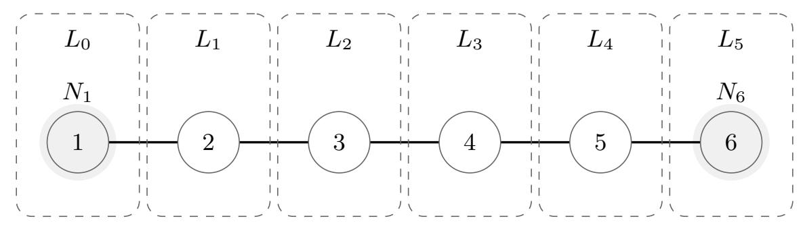
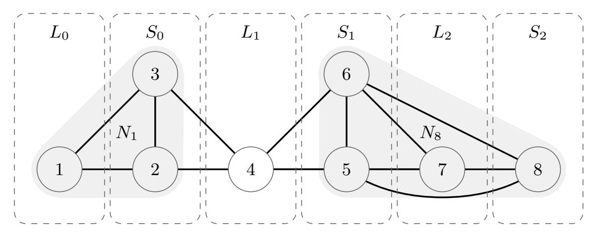
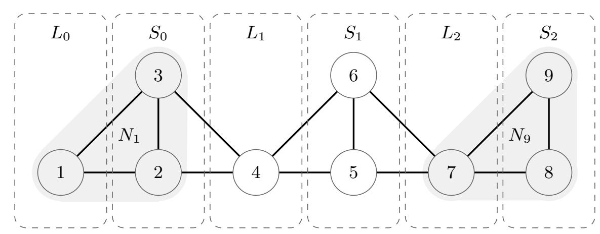
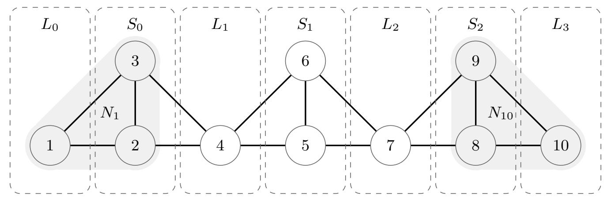

{0}------------------------------------------------

# **Constructing Secure Multi-Party Computation with Identifiable Abort**

### **On the Correlation Complexity of MPC with Cheater Identification**

Nicholas Brandt1 [,](https://orcid.org/0000-0002-5120-6346) Sven Maier2 [,](https://orcid.org/0000-0003-3221-6802) Tobias M¨uller3 , and J¨orn M¨uller-Quade4 *⋆*

1 ETH Zurich, Zurich, Switzerland, nicholas.brandt@inf.ethz.ch 2 CNRS, IRIF, Universit´e de Paris, France, sven.maier@irif.fr 3 muellertobias@outlook.de

**Abstract.** Composable protocols for Multi-Party Computation that provide security with Identifiable Abort against a dishonest majority require some form of setup, e.g. correlated randomness among the parties. While this is a very useful model, it has the downside that the setup's randomness must be *programmable*, otherwise security becomes provably impossible. Since programmability is more realistic for smaller setups (in terms of number of parties), it is crucial to minimize the correlation complexity (degree of correlation) of the setup's randomness.

We give a tight tradeoff between the correlation complexity *β* and the corruption threshold *t*. Our bounds are strong in that *β*-wise correlation is sufficient for statistical security while *β* − 1-wise correlation is insufficient even for computational security. In particular, for strong security, i.e., *t < n*, full *n*-wise correlation is necessary. However, for any constant fraction of honest parties, we provide a protocol with *constant* correlation complexity which tightens the gap between the theoretical model and the setup's implementation in the real world. In contrast, previous state-ofthe-art protocols require full *n*-wise correlation regardless of *t*.

### **Contents**

| 1 | Introduction                                              |    |  |  |  |
|---|-----------------------------------------------------------|----|--|--|--|
|   | 1.1 Contributions & Techniques                         | 3  |  |  |  |
|   | 1.2 Related and Concurrent Work                        | 4  |  |  |  |
|   | 1.3 Technical Overview                                 | 6  |  |  |  |
| A | Discussion                                                | 14 |  |  |  |
| B | Technical Preliminaries                                   | 15 |  |  |  |
|   | B.1 Definitions & Notation                             | 15 |  |  |  |
|   | B.2 Setting                                            | 18 |  |  |  |
|   | B.3 Functionalities / Setups                           | 19 |  |  |  |
| C | Trust Graph: Identification via Conflicts                 | 23 |  |  |  |
| D | Full Constructions & Proofs                               | 26 |  |  |  |
|   | D.1 Impossibility / Lower Bound                        | 26 |  |  |  |
|   | D.2 Constructions / Upper Bound                        | 32 |  |  |  |
|   | D.3 Equivalence of FCOT, SFE and Correlated-Randomness | 47 |  |  |  |
| E | Trust Graph from Broadcast                                | 51 |  |  |  |
| F | Global Commitment from FCOT                               | 52 |  |  |  |

4 Karlsruhe Institute of Technology, Germany, joern.mueller-quade@kit.edu

*⋆* This is the full version of [\[11\]](#page-53-0). It is a merge of a previous version and [\[10\]](#page-53-1).

{1}------------------------------------------------

### **1 Introduction**

Secure Multi-Party Computation (MPC) is a powerful notion that allows multiple mutually distrustful parties to perform a joint computation that—loosely speaking—ensures the privacy of the inputs and the correctness of the output. The currently strongest security notion—that is not ruled out by some impossibility result [\[18\]](#page-53-2)—is called security with Identifiable Abort (IA) [\[32\]](#page-54-0). It allows an adversary to abort the protocol (this is unavoidable) but then the honest parties can identify the common identity of at least one malicious party. This acts as a deterrent against cheating by coupling cheater identification to some form of penalty mechanism. This is especially useful in the context of blockchains where one could require all parties to initially commit to some coins s.t. an identified cheater's coins are redistributed to the other parties or the cheater's coins are rendered void by publishing the evidence of cheating.

In the dishonest majority settings, *t* ≥ *n/*2, protocols such as the one of Ishai, Ostrovsky, and Zikas [\[32\]](#page-54-0) that achieve IA require a setup that distributes correlation randomness to each party in the protocol. In fact, for *t* ≥ *n/*2, a setup is provably necessary for general MPC protocols that can be composed arbitrarily, e.g. in the Universal Composability (UC) framework [\[13\]](#page-53-3). Moreover, for the security proof to work the setup needs to be *programmable* to realize certain functionalities such as commitments [\[14\]](#page-53-4). That is, the setup information may not leak directly to the environment, instead, in the security proof the simulator must be able to embed a trapdoor into the setup information to extract or equivocate the committed message. Indeed, if the setup is *global*, the setup information leaks directly to the environment, then many functionalities become *provably impossible* [\[39,](#page-54-1) [15\]](#page-53-5). In particular, if in practice the setup information is extracted from some public source, like stock market data, then the security guarantee provided by the ID-MPC protocol is void. This leaves the option to generate the correlated randomness via some physical means, like noisy or quantum channels, or secure hardware assumptions. However, for such a means of generating randomness the correlation complexity (CC) is the most important parameter.

As shown in [\[32\]](#page-54-0) the correlated randomness setup for *n*-parties suffices to statistically securely realize any other functionality (or setup) of cardinality *n* (with *n*-participants). Therefore, we equate the correlation complexity (see Definition [5\)](#page-16-0)with the minimal complete cardinality (MCC)[5](#page-1-1) as introduced by Fitzi et al. [\[25\]](#page-53-6).

For *t < n/*2 pairwise correlation (even pairwise channels) suffice [\[40,](#page-54-2) [5\]](#page-52-0), while for *t* ≥ *n/*2 protocols like [\[32\]](#page-54-0) are quite conservative in that they require (maximal) *n*-wise correlation; even for *t* = *n/*2. Our work closes this gap between *t* = *n/*2 and *t* = *n* − 1 by answering the question:

*"What is the correlation complexity of MPC with a dishonest majority?"*

We settle this question with tight bounds for the correlation complexity *β* ≈ 2*n/*(*n* − *t*) depending on the max. number of corrupted parties *t*. See Fig. [1](#page-27-0) for an exemplary overview.

While theoretically interesting,[6](#page-1-2) our results offer also two practical insights:

- If one requires maximal security *t < n*, then *n*-wise correlation is necessary, i.e., the CC is *β* = *n*. Hence protocols like [\[32\]](#page-54-0) are optimal w.r.t. the CC.
- If one is willing to accept any constant fraction of malicious parties *t* ≤ (1 − *ε*)*n* for any *ε >* 0, then the CC is only constant *β* ≈ 2*/ε*.

Especially the latter case has practical implications. Due to the aforementioned *provable impossibility* of composable MPC with a global setup, the setups must be realized by non-cryptographic means such as trusted hardware [\[29,](#page-53-7) [41\]](#page-54-3) or noisy/quantum channels [\[23,](#page-53-8) [21\]](#page-53-9). There, the CC (the number of setup participants) is a critical parameter. To illustrate this, consider the following example: Suppose a group of people can generate correlated randomness via some trusted hardware in their smartphones while

5 Throughout the paper, we require a setup among each subset of parties of size *β*.

6 To our knowledge this is the first full characterization of Identifiable Abort in the dishonest majority setting.

{2}------------------------------------------------

| Max. malicious parties $t$ | Max. supported parties $n$                                          | $CC / MCC \beta$   |
|----------------------------|---------------------------------------------------------------------|--------------------|
| n-1                        | $\operatorname{poly}(\lambda)$                                      | n                  |
| n-2                        | $\operatorname{poly}(\lambda)$                                      | n-2                |
| $n - c \le n - 3$          | $\Theta(\ln \lambda)$                                               | $\approx 2n/c$     |
| $n - \Theta(\ln n)$        | $\mathcal{O}(\ln(\lambda) \ln \ln(\lambda) / \ln \ln \ln(\lambda))$ | $\Theta(n/\ln n)$  |
| $n - \Theta(\sqrt{n})$     | $\mathcal{O}(\ln^2(\lambda)/\ln^2\ln(\lambda))$                     | $\Theta(\sqrt{n})$ |
| $n - \Theta(n/\ln n)$      | $\mathcal{O}(\exp\sqrt{\ln\lambda})$                                | $\Theta(\ln n)$    |
| $\Theta(n)$                | $\operatorname{poly}(\lambda)$                                      | $\Theta(1)$        |
| (n+1)/2                    | $\operatorname{poly}(\lambda)$                                      | 3                  |
| $\leq n/2^{(*)}$           | $\operatorname{poly}(\lambda)$                                      | 2                  |

**Table 1:** Exemplary overview of the correlation complexity (CC) / minimal complete cardinality (MCC)  $\beta$  and respective supported number of parties n vs. malicious parties t for UC-secure ID-MPC given broadcast. The limitation of the overall number of parties is only to achieve polynomial-time protocols, for more parties the protocols remain correct and secure but require the parties to have superpolynomial runtime. The case (\*) also covers an honest majority of parties treated in early works [5, 40].

being online simultaneously. However, the runtime of this supposed setup computation is exponential in the number of parties involved. In this scenario, if a protocol relies on a single setup of cardinality n, then all parties must be online together for an exponential time. In contrast, if a protocol could be based on (polynomially) many setup instances between a constant number of people (as is the case for our protocols for any  $t \leq (1 - \varepsilon)n$ ), then a) being online at the same time as a constant number of parties much more realistic and b) the runtime is only polynomial in the number of people.

The above example showcases that our results are particularly interesting for applications in which mobile clients (which are not always online) perform decentralized operations and store a common state on some form of blockchain (which allows for monetary penalties for cheating).

#### 1.1 Contributions & Techniques

Correlation complexity / ID-MPC from small setups. Due to the completeness of the correlated randomness setup [32], we can substitute any setup functionality of some cardinality by the correlated randomness functionality of the same cardinality. To minimize the correlation complexity we concentrate on constructing n-party ID-MPC from the smallest possible (arbitrary) setups. In other words, we can answer the question of the CC by determining the minimal complete cardinality (MCC)7 in the sense of [25], i.e., the number of participants of a setup functionality. As a sidenote, we deal with some definitorial issues in Appendix B.1that arise when the number of parties grows with the security parameter which is not the case in [25]. As our main result we establish tight bounds on the minimal complete cardinality  $\beta$  for general ID-MPC (given broadcast). We assume that each subset of parties (of cardinality with Identifiable Abort—unlike many other works which don't allow the setups to be aborted at all. For a formal description of our setting see Appendix B.2.

Theorem 1 (Correlation complexity bounds). The correlation complexity for UC-secure Multi-Party Computation with Identifiable Abort (given broadcast) is  $\beta := \min(n, \lfloor n/(n-t) \rfloor + \lceil n/(n-t) \rceil - 2) \approx 2n/(n-t)$  where n is the overall number of parties and t is an upper bound on the number of malicious

&lt;sup>7 As a side note we generalize the notion of the minimal complete cardinality (MCC) from [25] to the setting where the number of parties varies in the security parameter λ. This was not captured by the original definition of MCC in [25] and—to the best of our knowledge—not formally addressed in previous literature.

{3}------------------------------------------------

*parties.*

*In other words, for any n-party functionality with Identifiable Abort there exists a protocol that uses hybrid functionalities of cardinality β and broadcast, but there exists an n-party functionality with Identifiable Abort which cannot be realized by any protocol that uses hybrid functionalities of cardinality β* − 1 *and broadcast.*

*Identification via conflicts.* Towards our main result we formalize an intuitive mechanism for cheater identification that is also used in various other works [\[34,](#page-54-4) [30,](#page-53-10) [32,](#page-54-0) [3,](#page-52-1) [4,](#page-52-2) [44,](#page-54-5) [43\]](#page-54-6) in different contexts. In our application, all parties maintain a global data structure, namely a graph with one vertex per party where each party can remove incident edges (we call missing edges "conflicts") but never add edges. Following Wan et al. [\[44\]](#page-54-5) we call this structure "Trust Graph" (TG). With it, we provide a ruleset for its usage which we call *abort-respecting* (see Definition [8\)](#page-23-0)that ensures that the Trust Graph exhibits certain useful properties: On an intuitive level, a disconnected subgraph corresponds to an aborted setup and vice-versa while a disconnected overall TG corresponds to the honest parties' ability to abort by identifying malicious parties.

**Lemma 1 (Informal conflict reporting).** *Any protocol that securely realizes an ideal functionality* F *in some hybrid model can be modified such that*

- *1. all honest parties keep a (common) Trust Graph,*
- *2. if the Trust Graph is disconnected, then all honest parties can identify the same malicious parties,*
- *3. upon abort of the protocol its Trust Graph is disconnected,*
- *4. after abort of any setup (hybrid functionality on some subset of parties*[8](#page-3-1) *) in the protocol the corresponding subgraph of the Trust Graph becomes disconnected,*

*and the modified protocol still securely realizes the same functionality.*

As a consequence, the impossibility of any abort-respecting protocol implies the impossibility of any protocol. On the other hand, if some protocol for a given functionality exists, then so does an abortrespecting protocol. In consequence, we only need to consider abort-respecting protocols.

For the lower and the upper bound, we prove two complementing graph-theoretical lemmas that link the connectivity of the overall TG to the connectivity of its subgraphs. In a nutshell, a connected graph of cardinality *n* can have "many" disconnected subgraph of cardinality *β* −1 but only "few" disconnected subgraphs of cardinality *β*.

For our lower bound we devise a strategy for the adversary such that it can abort many setups of cardinality *β* − 1 while the overall Trust Graph remains connected. Following the proof strategy of Canetti and Fischlin [\[14\]](#page-53-4) we can show that against such an adversary any protocol for a commitment must violate either the hiding or the binding property. For our upper bound we know that any adversary can only abort "few" setups. Thus the honest parties can rely on some "guaranteed" setups to perform the protocol.

#### **1.2 Related and Concurrent Work**

There are many works that share common aspects with this paper, among others [\[25,](#page-53-6) [26,](#page-53-11) [34,](#page-54-4) [30,](#page-53-10) [44,](#page-54-5) [31,](#page-53-12) [32,](#page-54-0) [3,](#page-52-1) [4,](#page-52-2) [43\]](#page-54-6). Here we pick only the most closely related ones and describe their relation to this work.

- Fitzi et al. [\[25\]](#page-53-6) initialize the study of the minimal complete cardinality (MCC)—the cardinality of the smallest setup (least number of participants) that suffices to securely realize any *n*-party functionality.
- Ishai, Ostrovsky, and Seyalioglu [\[31\]](#page-53-12) rule out pairwise setups plus broadcast for statistically secure ID-MPC.

8 Throughout the paper we assume that each subset of parties of the appropriate cardinality has access to a setup.

{4}------------------------------------------------

- Ishai, Ostrovsky, and Zikas [\[32\]](#page-54-0) formally define Identifiable Abort (IA), introduce the Correlated-Randomness model for IA and give a computationally secure construction from any adaptively secure OT protocol.
- Wan et al. [\[44\]](#page-54-5) use the almost identical idea of maintaining a "Trust Graph" (TG) in the context of *constructing* Byzantine broadcast (BB) while we assume a broadcast to construct general ID-MPC. Specifically, Wan et al. [\[44\]](#page-54-5) give lower bounds for the round-complexity of BB. From the different applications arises the slight difference in the two concepts, in [\[44\]](#page-54-5) each party maintains its own copy of the TG whereas in our work it is crucial that all parties have a common view of the TG. Nevertheless, we use very similar graph properties as Wan et al. [\[44\]](#page-54-5). Their idea is to limit the distance that information can travel within a graph in a given number of round, if the graph's diameter is too large, then a sender's message may not be able to reach all other parties. Their upper bound for the TG's diameter *d* matches our tight bound for the CC, i.e., *β* = ⌊*n/*(*n* − *t*)⌋ + ⌈*n/*(*n* − *t*)⌉ − 2 = *d* + 1 where *t* ≥ *n* − 2 is a lower bound on the number of honest parties.

We think there are interesting connections[9](#page-4-0) between our paper and [\[44\]](#page-54-5). While [\[44\]](#page-54-5) assumes pairwise channels, we assume a full broadcast. We maintain the view that both [\[44\]](#page-54-5) and our paper can be generalized along the dimension of the setup size, i.e., assuming a partial broadcast of size 2 ≤ *k* ≤ *n*. Regarding the round-complexity of BB, it seems that the round-complexity decreases as *k* increases because the sender's message travels farther in each round. Regarding the correlation complexity, it seems that the CC increases as *k* increases because for larger partial broadcasts reaching a consensus on a identified cheater seems easier.

• Simkin, Siniscalchi, and Yakoubov [\[43\]](#page-54-6) essentially study the same question as our paper. They give a weaker upper bound *β* ≤ *t* + 2 ≤ *n* − 2 of the CC/MCC, although in the stand-alone model whereas our result holds in the UC framework.

They construct *n*-party MPC from correlation of degree *n* − 1 and broadcast. For this reason their work supports polynomially many parties *n* ∈ poly(*λ*) only for *n* − *t* ∈ Θ(1). For larger expansions the supported number of parties drops rapidly since the overall runtime grows exponentially in the number of recursive applications of the protocol. This is not the case for our work; see Appendix [Af](#page-13-0)or a discussion.

Their approach uses an new form of identifiable secret-sharing with public and private shares. There, one party P is chosen and the remaining *n* − 1 parties obtain correlated randomness, i.e., secret-shares of their randomness, from the setup oracle. Then the parties send their shares to the excluded party P who reconstructs its randomness. If reconstruction fails to due faulty shares sent by malicious parties, then party P detects whose shares where faulty and declares conflicts with these parties. These conflicts are then used in the next iteration. That is, conflicting parties do not obtain shares from the setup. It seems unclear how the approach of [\[43\]](#page-54-6) could be generalized to setups of cardinality *n* − 2 without the disadvantageous recursion blowup.

• Finally, much work [\[7,](#page-52-3) [9,](#page-53-13) [8,](#page-52-4) [38,](#page-54-7) [20\]](#page-53-14) has gone into reducing the necessary length of correlated randomness. This is highly relevant in practice. Nevertheless, to the best of our knowledge, in these works all parties need to participate in the correlation generation simultaneously. That is, although the overall length of the correlated randomness is short, the degree of the correlation is maximal—which is where our work steps in. We'd like to emphasize that our protocols are compatible with approaches to reduce the length of the correlated strings, and they can be used in conjuction to reduce both the length as well as the degree of correlation.

Our results subsume or improve upon all previously listed constructions and impossibilities in a unified way. For the minimal complete cardinality (MCC) it holds that:

- The lower bound of 3 from [\[31\]](#page-53-12) for *t* ≥ 2*n/*3 is raised to min(*n,* 5).
- The upper bound of *n* − 1 from [\[43\]](#page-54-6) reduced to the optimal *n* − 2 for *t* ≤ *n* − 2.

9 In particular, Claim 3.1 in [\[44\]](#page-54-5) and our Lemma [3](#page-8-0) share the same core idea but are stated in different terms with different applications in mind. Also, Figure 1 in [\[44\]](#page-54-5) essentially matches our Fig. [1.](#page-27-0)

{5}------------------------------------------------

| No. | Reference | Model  | Result                                                                                                                                                      | Technique          |
|-----|-----------|--------|-------------------------------------------------------------------------------------------------------------------------------------------------------------|--------------------|
| 1)  | [31]      | SA     | $\{\mathcal{F}^2,\mathcal{F}^n_{BC}\} \overset{\mathrm{stat}} supp_{2n/3} \mathcal{F}^n_{SFE,f}$                                                            | Secret-Sharing     |
| 2)  | [32]      | UC, SA | $\mathcal{F}^n_{Corr,\mathcal{D}} \overset{\mathrm{stat}}{\leadsto}_n \mathcal{F}^n_{SFE,f}$                                                                | Setup+Commit+Prove |
| 3)  | [32]      | UC, SA | $\{\pi_{OT}, \mathcal{F}^n_{CRS}\}^{\mathrm{comp}} {\sim}_n \mathcal{F}^n_{Corr, \mathcal{D}}$                                                              | Setup+Commit+Prove |
| 4)  | [43]      | SA     | $\{\mathcal{F}^{n-1}_{Corr,\mathcal{D}},\mathcal{F}^n_{BC}\}\overset{\mathrm{stat}}{\leadsto}_{n-2}\mathcal{F}^n_{Corr,\mathcal{D}}$                        | Secret-Sharing     |
| 5)  | This work | UC     | $\{\mathcal{F}_{Corr,\mathcal{D}}^{\beta},\mathcal{F}_{BC}^n\}\overset{\mathrm{stat}}{\leadsto_t}\mathcal{F}_{SFE,f}^n$                                     | Trust Graph        |
| 6)  | This work | UC     | $\left\{\mathcal{F}_{Corr,\mathcal{D}}^{\beta-1},\mathcal{F}_{BC}^{n}\right\} \not\!\!\!\!\!\!\!\!\!\!\!\!\!\!\!\!\!\!\!\!\!\!\!\!\!\!\!\!\!\!\!\!\!\!\!\!$ | Trust Graph        |

**Table 2:** Overview of related work on the foundations of Multi-Party Computation with Identifiable Abort in the dishonest majority setting with broadcast. SA stands for stand-alone, UC stands for Universal Composability [13], t is the max. number of corrupted parties, and  $\beta := \min(n, \lfloor n/(n-t)\rfloor + \lceil n/(n-t)\rceil - 2)$ .  $\pi_{\text{OT}}$  denotes any adaptively secure Oblivious Transfer (OT) protocol,  $\mathcal{F}_{\text{CRS}}^n$  is the Common Reference String (CRS) functionality from [14],  $\mathcal{F}_{\text{Corr},\mathcal{D}}^n$  is the Correlated-Randomness functionality from [32].  $\mathcal{F}_{\text{COM},1:1}^n$  is a one-to-one commitment and  $\mathcal{F}_{\text{SFE},f}^n$  is the Secure Function Evaluation functionality; both defined in Appendix B.3. Note that the impossibility 6) does not contradict 3) because 6) does not assume a CRS.

• The upper bound of n from [32] is shown to be tight for t = n - 1.

These (and more) results are summarized in Table 2. In the following we use the short notation  $F \leadsto_t \mathcal{F}$  for the fact that the ideal functionality  $\mathcal{F}$  can be realized by some protocol in the F-hybrid model with up to t malicious parties(see Notation 8).

#### 1.3 Technical Overview

We state our results in the standard UC-framework (see Appendix B.2) in terms ideal functionalities and protocols that realize them. Due to the large notational and conceptual overhead of rigorous statements about MPC and the given space limitations, we decided to give most of the formal definitions and statements in the appendices, and instead try to convey the core idea behind our techniques in this overview and how they are combined to obtain our main results.

The main idea behind the usage of the Trust Graph (TG) is that if the TG is disconnected, then there are at least two partitions A and B such that all parties in A distrust all parties in B. Now, if honest parties always trust each other (as is the case throughout this paper), then all honest parties must be in the same connected component. W.l.o.g. let all honest parties be in A, then they can jointly identify B and abort with (abort, B). In this sense the disconnectivity of the TG is equivalent to the identification of malicious parties, and hence the abort of a ID-MPC protocol.

To simplify our analysis we formally introduce an ideal functionality  $\mathcal{F}_{\mathsf{TG}}^n$  for n parties in Appendix C (see Definition 7). This functionality stores an (initially complete) graph with one vertex per party. Any party P can announce "conflicts" by sending (conflict, P') to  $\mathcal{F}_{\mathsf{TG}}^n$ . Consequently, the edge (P, P') is irrevocably removed from the TG—we say P and P' are in conflict. Any party can also query the currently stored graph G = (P, E) (typically at the onset of each round); such that all parties have a consistent view of the TG in each round. The functionality  $\mathcal{F}_{\mathsf{TG}}^n$  can be viewed as syntactical sugar, as it can be perfectly securely realized using only broadcast (see Lemma 6).

Now, we give a high-level intuition of a particular set of protocol rules that will prove useful in our results for the correlation complexity. We call this set of six rules "abort-respecting" (see Definition 8). One can view it as a kind of manual for how to utilize the Trust Graph. Informally, abort-respecting protocols ensure in particular the following properties:

- Honest parties are never in conflict.
- Whenever some party has strictly more than t conflicts, it must be malicious.

{6}------------------------------------------------

- Whenever some setup of cardinality  $\beta$  is aborted, 10 the subTG on the participants of the setup becomes disconnected.
- When the protocol aborts (with (abort, C) where C is a set of malicious parties), the overall TG is disconnected.
- When the overall TG becomes disconnected, the protocol aborts (with (abort, C) where C is a set of malicious parties).

Intuitively, from these rules and the usage of  $\mathcal{F}_{\mathsf{TG}}^n$  follows Lemma 1. More formally, it states that any secure protocol for some functionality in some F-hybrid model can be transformed into a secure and abort-respecting protocol for the same functionality in the  $F \cup \{\mathcal{F}_{\mathsf{TG}}^n\}$ -hybrid model (compare Lemma 7). As a corollary, we note that to rule out *all* ID-MPC protocol for some functionality it suffices to rule out all abort-respecting protocols. We will use this fact in the proof of our lower bound on the CC.

Before, we want to elaborate a bit on the third property. When a setup with Identifiable Abort is aborted, all participants P obtain the message (abort, C) where  $C \subseteq P$  is some set of malicious participants. Then all honest parties declare conflicts with C via the  $\mathcal{F}^n_{\mathsf{TG}}$  functionality. In the next round either a) all parties  $P \setminus C$  declared conflicts with the identified parties C, or b) there are some "loyalists"  $L \subseteq P \setminus C$  who did not declare conflicts with all identified parties C. In the first case the subTG is clearly disconnected between  $P \setminus C$  and C. In the second case b) note that loyalists noticeably deviate from the abort-respecting rules; thus the honest parties add the loyalists L to the identified parties C and repeat the procedure. Since in each iteration at least one loyalist gets added to the identified parties, the overall procedure terminates within at most n iterations.

Lower Bound on the Correlation Complexity Eventually, we show that no protocol in the  $\{\mathcal{F}_{BC}^n, \mathcal{F}^{\beta-1}\}$ -hybrid model for any functionality  $\mathcal{F}^{\beta-1}$  of cardinality  $\beta-1$  can securely realize an ideal commitment functionality where n is the overall number of parties, t is a upper bound on the malicious parties and  $\beta := \min(n, \lfloor n/(n-t) \rfloor + \lfloor n/(n-t) \rfloor - 2)$ . Towards this end, we prove a graph-theoretical lemma that relates the connectivity of the overall TG to the connectivity of its subgraphs. More concretely, the lemma constructs a connected graph that has "many" disconnected subgraphs of the cardinality  $\beta-1$ . With the intuition that aborts of setups correspond to disconnected subTGs (via the abort-respecting property), this graph-theoretical lemma translates into a strategy for the adversary to abort many setups in a clever way such that the overall TG remains connected, i.e., the overall protocol cannot abort. However, after these many setups are aborted, we follow the idea of Canetti and Fischlin [14] to prove that any protocol that only relies on the remaining setups must either violate the hiding or the binding property. We note that this proof strategy only works because we want to rule out composable commitment protocols. The high-level idea is as follows: Because "many" setups are aborted, the sender cannot "directly" commit towards the receiver via some setup that contains both the sender and the receiver. Consequently, in order to be committed towards the receiver (binding), the sender has to send the message (informationtheoretically) to intermediate parties—even when all parties act honestly (relative to their view of the Trust Graph given the aborted setups) in the commitment phase. However, this set of intermediate parties is small enough that an alternative environment can corrupt it (because  $t \geq n/2$ ) and thus extract the message of an honest sender during the commitment phase (not hiding).

Lemma 2 (Connected graph  $\Longrightarrow$  many disconnected  $\beta-1$ -subgraphs). Let  $n,t\in\mathbb{N}$  s.t.  $n/2 \le t \le n-1$ , and let  $\beta \coloneqq \min(n, \lfloor n/(n-t)\rfloor + \lceil n/(n-t)\rceil - 2)$ . Furthermore, let V be a set of n vertices and let  $v, v' \in V : v \ne v'$  be two different vertices. There exist some edges  $E \subseteq \binom{V}{<2}$  s.t.

- 1. G := (V, E) is an undirected, reflexive and connected graph,
- 2.  $\forall \{u, u'\} \in E : |N_G(u) \cap N_G(u')| \ge n t$ ,
- 3. for each  $V' \in M$  the subgraph  $G' := (V', E \cap \binom{V'}{\leq 2})$  is disconnected

10 Recall that we only assume setups to have security with Identifiable Abort.

{7}------------------------------------------------

where

$$N_u := \begin{cases} \{u\} & , \text{ if } t = n - 1\\ N_G(u) & , \text{ else} \end{cases}$$

is the set of "effective" neighbors of any vertex u, and

$$M := \{ V' \subseteq V \mid V' \cap N_v \neq \emptyset \land V' \cap N_{v'} \neq \emptyset \land |V'| < \beta \}$$

is the set of relevant subsets of vertices that contain both an effective neighbor of v and an effective neighbor of v'.

The proof is contained in Appendix D.1. For t = n - 1 the lemma states that there exists some graph whose subgraphs G' that contain both v and v' are disconnected, yet the overall graph is connected. For  $t \le n - 2$  the lemma states that there exists some graph whose subgraphs G' that contain both a neighbor of v' and a neighbor of v' are disconnected while the overall graph is connected.

Application to ID-MPC. Throughout, we denote the security parameter by  $\lambda$ . In the context of our impossibility proof, the graph G takes the role of the Trust Graph, v = S will be the sender, and v' = R will be the receiver. As such, the lemma translates to the statement that all setups in which the sender and the receiver (or their neighbors respectively) participate jointly can be aborted by the adversary without causing the overall TG to become disconnected, thus evading identification. The proof is essentially just a constructive description of the graph G alongside a proof of its properties. This graph-theoretic statement translates into the context of ID-MPC protocols as follows:

Corollary 1. Let  $n = n(\lambda)$ ,  $t = t(\lambda)$ ,  $\beta = \min(n, \lfloor n/(n-t) \rfloor + \lceil n/(n-t) \rceil - 2)$  s.t.  $0 \le t < n$ . For any security parameter  $\lambda \in \mathbb{N}$  let  $P_{\lambda}$  be a set of n parties, and let  $v_{\lambda}, v'_{\lambda} \in P_{\lambda}$  be two different parties. Furthermore, let  $\pi^F$  be any abort-respecting protocol for some functionality  $\mathcal{F}^n$  in some F-model s.t.  $\mathcal{F}^n_{\mathsf{BC}} \in F$ . An adversary for  $\pi^F$  that corrupts t parties can abort all setups of cardinality at most  $\beta - 1$  in which any effective neighbor of  $v_{\lambda}$  and any effective neighbor of  $v'_{\lambda}$  participate, without disconnecting the overall Trust Graph G.

For  $t \ge n/2$  this follows from Lemma 2 and Corollary 5 (aborted setups correspond to disconnected subgraphs). Also, for t < n/2 it follows that  $\beta = 1$ , hence Corollary 1 follows trivially. Finally, we get the formal statement.

Theorem 2 (No transmitted commitment). Let  $n = n(\lambda)$ ,  $t = t(\lambda)$ ,  $\beta := \min(n, \lfloor n/(n-t) \rfloor + \lfloor n/(n-t) \rfloor - 2)$  s.t.  $n/2 \le t < n$  and  $\binom{n}{\beta} \in \operatorname{poly}(\lambda)$ . No  $\{\mathcal{F}^2, ..., \mathcal{F}^{\beta-1}, \mathcal{F}^n_{\mathsf{BC}}\}$ -hybrid protocol can securely UC-realize  $\mathcal{F}^n_{\mathsf{COM},1:1}$  against environments that (maliciously) corrupt up to t parties. Formally, we get

$$\left\{\mathcal{F}^{2}, ..., \mathcal{F}^{\beta-1}, \mathcal{F}_{\mathsf{BC}}^{n}\right\} \stackrel{\mathsf{comp}}{\not\sim_{t}} \mathcal{F}_{\mathsf{COM}, 1:1}^{n} \tag{1}$$

where  $\mathcal{F}^2$ , ...,  $\mathcal{F}^{\beta-1}$  stand for arbitrary functionalities of the respective cardinality, and  $\mathcal{F}^n_{\mathsf{COM},1:1}$  is defined in Appendix B.3.

Consequently, the correlation complexity for UC-secure ID-MPC is at least  $\beta$ .

The proof is contained in Appendix D.1.

Corollary 2. Let  $n = n(\lambda)$ . In particular, we find  $\{\mathcal{F}^2, ..., \mathcal{F}^{n-3}, \mathcal{F}^n_{\mathsf{BC}}\}$   $\overset{\text{comp}}{\not\sim}_{n-2} \mathcal{F}^n_{\mathsf{COM},1:1}$  where  $\mathcal{F}^2, ..., \mathcal{F}^{n-3}$  stand for arbitrary functionalities of the respective cardinality. This shows that the result  $\{\mathcal{F}^{n-1}_{\mathsf{Corr},\mathcal{D}}, \mathcal{F}^n_{\mathsf{BC}}\} \overset{\text{stat}}{\sim}_{n-2} \mathcal{F}^n_{\mathsf{Corr},\mathcal{D}}$  from [43] is tight up to a constant of 1.12

11 Note that is vertex is their own neighbor because the graph is reflexive.

&lt;sup>12 We note that [43] state their results in the stand-alone model.

{8}------------------------------------------------

Upper Bound on the Correlation Complexity Towards our construction, we first prove a complementary graph-theoretical lemma that relates the connectivity of the overall TG to the connectivity of its subgraphs. More concretely, the lemma states that any graph with "many" disconnected subgraphs of the cardinality  $\beta$  must be disconnected.

Lemma 3 (Connected graph  $\Longrightarrow$  few disconnected  $\beta$ -subgraphs). Let  $n, t \in \mathbb{N}$  s.t.  $n/2 \le t \le n-2$ , and let  $\beta \coloneqq \lfloor n/(n-t) \rfloor + \lceil n/(n-t) \rceil - 2$ . Let V be a set of n vertices and let  $v, v' \in V : v \ne v'$  be two different vertices. Moreover, let  $E \subseteq \binom{V}{\le 2}$  be a set of edges s.t.  $G \coloneqq (V, E)$  is an undirected, reflexive graph, and let  $N_u \coloneqq N_G(u)$  be the set of neighbors of any vertex u, let

$$M := \{ V' \subseteq V \mid V' \cap N_v \neq \emptyset \land V' \cap N_{v'} \neq \emptyset \land |V'| = \beta \}$$

be the set of relevant subsets of vertices that contain both a neighbor of v and a neighbor of v', and let

$$E^* := \{ \{u, u'\} \in E \mid |N_u \cap N_{u'}| \ge n - t \}$$

be the set of postprocessed13 edges. If for all  $V' \in M$  the subgraph  $G' := (V', E \cap \binom{V'}{\leq 2})$  is disconnected, then  $G^* := (V, E^*)$  is disconnected. Furthermore, the map  $\phi : G \mapsto G^*$  is efficiently computable.

This lemma tightly complements Lemma 2. It states that as soon as all subgraphs G' that contain both a neighbor of v and a neighbor of v' are disconnected, the overall postprocessed graph  $G^*$  must be disconnected as well. The proof is contained in Appendix D.2.

**Application to ID-MPC.** In the context of our construction, the graph G takes the role of the TG, v = S will be the sender, and v' = R will be some receiver. As such, the lemma translates to the statement that at least one (not necessarily fixed) setup in which the sender and the receiver (or their neighbors respectively) participate jointly cannot be aborted by the adversary without causing the overall TG to become disconnected. This "guaranteed" setup can then reliably perform the commitment (resp. OT) between the sender and the receiver (resp. their neighbors).

The proof is by contradiction. Suppose all subgraphs G' are disconnected, yet  $G^*$  were connected. Then there must be a path W from any neighbor  $u \in N_v$  to any neighbor  $u' \in N_{v'}$  with length  $\Delta_{G^*}(u, u') > \beta$ . Note that, by definition of  $E^*$ , all adjacent parties in  $G^*$  must have at least n - t common neighbors. This means that the parties along the path W must have many auxiliary neighbors. Counting the overall number of parties yields a contradiction. We formalize this in Appendix D.2. For a visual representation see Fig. 1, note that any shortest path from  $N_1$  to  $N_n$  always has length  $\beta$  (in the number of vertices). This graph-theoretic statement translates into the context of ID-MPC protocols as follows:

Corollary 3. Let  $n = n(\lambda)$ ,  $t = t(\lambda)$ ,  $\beta := \lfloor n/(n-t) \rfloor + \lceil n/(n-t) \rceil - 2$  s.t.  $n/2 \le t \le n-2$ . For any security parameter  $\lambda \in \mathbb{N}$  let  $P_{\lambda}$  be a set of n parties, and let  $v_{\lambda}, v'_{\lambda} \in P_{\lambda}$  be two different parties. Furthermore, let  $\pi^F$  be any abort-respecting protocol for some functionality  $\mathcal{F}^n$  in some F-model s.t.  $\mathcal{F}^n_{\mathsf{BC}} \in F$ . If an adversary for  $\pi^F$  that corrupts at most t parties aborts all setups of cardinality  $\beta$  in which any neighbor of  $v_{\lambda}$  and any neighbor of  $v'_{\lambda}$  participate, then the overall Trust Graph becomes disconnected, i.e., the protocol  $\pi^F$  aborts.

This follows from Lemma 3 and Corollary 5 (aborted setups correspond to disconnected subgraphs). In particular, in our protocols we require all honest parties to locally postprocess  $G^* = \phi(G)$  from Lemma 3 when querying the TG G from  $\mathcal{F}^n_{\mathsf{TG}}$ . Moreover, we require all parties to abort according to  $G^*$  instead of G. This modification of the abort condition is justified because the additional (specific) conflicts introduced by the postprocessing  $\phi$  preserve the invariant that no two honest parties are in conflict, as required by Rule 6 of Definition 8.

&lt;sup>13 The postprocessing  $\phi$  corresponds to the (repeated) application of Rule 4 of Definition 8, i.e.,removing edges from parties with strictly more than t conflicts.

{9}------------------------------------------------

Committed Oblivious Transfer. Before we proceed with a more detailed description of our protocols we have to introduce a committed variant of Oblivious Transfer (OT) [22, 24] where the sender, the receiver and some witnesses participate. We call this variant Fully Committed Oblivious Transfer (FCOT). As in the standard 1-out-of-2 OT, the sender inputs two messages and the receiver inputs a choice bit, then the receiver obtains its chosen message while the receiver remains oblivious to the choice bit. The committed variant additionally allows the sender and the receiver to later open their inputs to all other parties (called witnesses).

The purpose of this FCOT can be state as follows.

Lemma 4 (Completeness of committed OT (informal)). There is a protocol in the  $\mathcal{F}_{FCOT}^n$ -hybrid model that realizes any ideal n-party functionality.

We can replace the standard OT setups in the IPS-compiler [33]. The IPS-compiler is an OT-hybrid protocol in the client-server-model that realizes general MPC guaranteeing security with (non-identifiable) abort against malicious (active) adversaries. In this protocol each party sets up a watchlist for each server such that other parties can monitor a small subsets of servers to detect tampering with overwhelming probability. Once a party detects misbehavior on some server it announces a complaint and all parties abort the protocol (without identifying malicious parties). For this reason, the standard IPS-compiler only enjoys security with (non-identifiable) abort. Substituting all calls to classical OT setups with calls to FCOT setups allows the parties to open all messages regarding the server in question. This way all parties can retrace which party misbehaved, thus identifying at least one malicious party, hence the resulting protocol enjoys security with Identifiable Abort. (We refer the interested reader to Appendix D.3 for more details.)

We continue with a high-level overview of our two protocols that utilize the guaranteed setups mentioned above. The two constructions are

- n-party commitment from  $\beta$ -party commitments and n-party broadcast, and
- n-party FCOT from  $\beta$ -party FCOT, n-party commitments and broadcast.

#### Commitment expansion.

**Theorem 3 (COM expansion).** Let  $n = n(\lambda), t = t(\lambda), \beta \coloneqq \lfloor n/(n-t) \rfloor + \lceil n/(n-t) \rceil - 2$  s.t.  $n/2 \le t \le n-2$  and  $\binom{n}{\beta} \in \text{poly}(\lambda)$ . There is an efficient protocol  $\pi_{\text{COM}}$  that statistically securely UC-realizes  $\mathcal{F}_{\text{COM}}^n$  in the  $\{\mathcal{F}_{\text{SMT}}^2, \mathcal{F}^\beta, \mathcal{F}_{\text{BC}}^n\}$ -hybrid model against environments that (maliciously) corrupt up to t parties. Formally,

$$\{\mathcal{F}^2_{\mathsf{SMT}}, \mathcal{F}^\beta, \mathcal{F}^n_{\mathsf{BC}}\} \stackrel{\text{stat}}{\leadsto_t} \mathcal{F}^n_{\mathsf{COM}}$$
 (2)

On a high level our one-to-many commitment protocol follows a commit-and-prove approach. Without going into too much detail, we outline the idea of the protocol. The sender inputs its message m—in the form of a threshold sharing  $\mu$ —into all setups14 and gives (secret-shared) masks  $\xi^j$  to its neighbors  $R_j \in N_G(S)$  who, in turn, also commit to their sharings in all commitment setups. Additionally, the sender broadcasts the message's sharing  $\mu$  masked with the masks' sharings  $\sigma := \mu \oplus \bigoplus_{R_j \in N(S)} \xi^j$ . Subsequently, all parties broadcast some randomly drawn "probing indices" on which the sender (resp. neighbors) broadcast the resp. share and open the setup commitment for the resp. share. Then all parties check for inconsistencies. Indeed, all setups (intended for the same value) contain sharings of the same (possibly masked) value with overwhelming probability. If shares differ significantly, this discrepancy will be detected with overwhelming probability; then the affected setup is considered aborted by identifying the committer as malicious. If shares differ only on a few indices, then the sharing's error-detection will allow the parties to notice that the shares are invalid. Again, the affected setup is considered aborted by identifying the committer as malicious. Moreover, due to the privacy of the secret-sharing opening a few

14 The sender inputs the same shares into each setup that it participates in.

{10}------------------------------------------------

shares does not reveal anything about the encoded value.

Lemma 3 guarantees that at least one setup of cardinality  $\beta$  that contains both a neighbor of the sender and a neighbor of the receiver must succeed. Otherwise, if all such setups are aborted, then the TG becomes disconnected by Lemma 3 and the honest parties can abort the protocol.

To open the message, all parties open all commitment setups and at least one honest receiver is able to recover the message either directly from the sender's sharing  $\mu$  of the message, or from the opened masks  $\xi^j$  and the previously broadcasted masked sharing  $\sigma$ . Those receivers then broadcast the recovered message. Any honest receiver that did not receive any opening information—because all its setups have been aborted—then it outputs the majority of its neighbors' broadcasted messages. To see why such "cut-off" receivers output the correct message we have to see the following fact. Whenever all setups containing both a neighbor of the sender and a neighbor of the receiver are aborted, then an honest receiver has a majority of honest neighbors that could reconstruct the message. This statement follows from graph-theoretical considerationsbest visualized in Fig. 1. An intuitive explanation is that if all such setups are aborted, then the sender and the cut-off receiver have a large distance of at least  $\beta$  in the TG. In that case the cut-off receiver cannot have too many malicious neighbors, yet honest parties always remain neighbors.

Skipping ahead to the proof of security, the simulator will extract the committed message from the sharings input into the partial commitment setups. As the verification step ensures consistency among the committed messages the simulator's extracted message is uniquely defined and correct.

#### Committed OT expansion.

Theorem 4 (FCOT expansion). Let  $n = n(\lambda), t = t(\lambda), \beta \coloneqq \lfloor n/(n-t) \rfloor + \lceil n/(n-t) \rceil - 2$  s.t.  $n/2 \le t \le n-2$  and  $\binom{n}{\beta} \in \text{poly}(\lambda)$ . There is an efficient protocol  $\pi_{\mathsf{FCOT}}$  that statistically securely UC-realizes  $\mathcal{F}^n_{\mathsf{FCOT}}$  in the  $\{\mathcal{F}^2_{\mathsf{SMT}}, \mathcal{F}^\beta_{\mathsf{SFE},f}, \mathcal{F}^n_{\mathsf{COM}}, \mathcal{F}^n_{\mathsf{BC}}\}$ -hybrid model against environments that (maliciously) corrupt up to t parties. Formally, for some specific functionality  $\mathcal{F}^\beta$  we get

$$\{\mathcal{F}^2_{\mathsf{SMT}}, \mathcal{F}^{\beta}, \mathcal{F}^n_{\mathsf{COM}}, \mathcal{F}^n_{\mathsf{BC}}\} \stackrel{\text{stat}}{\leadsto_t} \mathcal{F}^n_{\mathsf{FCOT}}$$
 (3)

Recall that in the FCOT functionality there exists a sender, a receiver and n-2 witnesses. Let  $\mathcal{F}_{\mathsf{SFE},f}^{\beta}$  be some Secure Function Evaluation (SFE) setup for  $\beta$ -parties for some function  $f_{\mathsf{OT}}$  that allows for an FCOT but whose details we omit at this point. In our FCOT protocol the sender and the receiver try to perform the global FCOT directly, i.e., via some setup in which both the sender and the receiver and  $n-\beta$  witnesses (w.r.t. the overall FCOT) are left out. To ensure consistency with the excluded witnesses the sender and the receiver globally commit to their inputs (again as secret-sharings) via  $\mathcal{F}_{\mathsf{COM}}^n$ . Accordingly, the setup  $\mathcal{F}_{\mathsf{SFE},f}^{\beta}$  also takes the same sharing as inputs. As in the commitment protocol the sender and the receiver open their shares, in the  $\mathcal{F}_{\mathsf{SFE},f}^{\beta}$  setup and the global commitments, on some random probing indices to detect inconsistencies.

To open, the sender and the receiver can simply open the global commitments to their respective inputs. In the security proof the simulator extracts the sender's messages and the receiver's choice bit from their inputs to their global commitments. Again, the verification step (commit-then-prove by probing random shares) guarantees that the simulator's extracted inputs match the ones output be the honest parties in the real protocol execution with overwhelming probability.

As in the previous construction, we leverage Lemma 3 which guarantees essentially that some such "direct" SFE setup must not be aborted, if the protocol is not to abort. Here lies the technical difficulty of our protocol because Lemma 3 only guarantees such a setup between a neighbor of the sender and a neighbor of the receiver (not the sender and the receiver themselves). To remedy this issue we make the following observation: In the seemingly hopeless scenario where the adversary chooses to abort the setups in such a way that the sender and the receiver themselves are not able to perform the direct setup, then one of them (the honest one) has many honest neighbors. In this case the sender and receiver use their

{11}------------------------------------------------

neighbors respectively to carry out the OT for them. Here, the sender and the receiver secret-share their inputs to retain their privacy and distribute them to their neighbors. While for the sender's messages the sharing seems straightforward (additive sharing), it may not be obvious how the receiver's choice bit can be shared s.t. the receiver obtains its chosen message. To this end we invoke a technique akin to the one used by Wolf and Wullschleger [45] which they used to show the symmetry of OT. This allows the receiver to only distribute additive shares of its choice bit (ensuring privacy) but still obtain the chosen message.

Equivalence of SFE-Complete Setups In Appendix D.3we prove that the setups Fully Committed Oblivious Transfer (FCOT)  $\mathcal{F}_{\mathsf{FCOT}}^n$ , Secure Function Evaluation (SFE)  $\mathcal{F}_{\mathsf{SFE},f}^n$ , and Correlated-Randomness from [32]  $\mathcal{F}_{\mathsf{Corr},\mathcal{D}}^n$  can be efficiently realized from each other with statistical security; so we can substitute one with the other by the Universal Composability Theorem of [13]. (We include formal definitions of these functionalities in Appendix B.3.)

**Putting the Results Together** For brevity we use the short notation  $F \leadsto_t \mathcal{F}$  (see Notation 8)to describe the construction of UC-secure protocols for the ideal functionality  $\mathcal{F}$  in the F-hybrid model against at most t corruptions.

Corollary 4 (Composition of constructions). The correlation complexity for UC-secure ID-MPC is at most  $\beta$ . We observe

$$\left\{ \mathcal{F}_{\mathsf{FCOT}}^{\beta} \right\} \stackrel{\text{stat}}{\leadsto_{\beta}} \mathcal{F}_{\mathsf{SFE},f}^{\beta} \tag{4}$$

$$\left\{ \mathcal{F}_{\mathsf{SMT}}^{2}, \mathcal{F}_{\mathsf{SFE},f}^{\beta}, \mathcal{F}_{\mathsf{BC}}^{n} \right\} \overset{\text{stat}}{\leadsto} \mathcal{F}_{\mathsf{FCOT}}^{n} \tag{5}$$

$$\stackrel{\text{stat}}{\leadsto_n} \mathcal{F}^n \tag{6}$$

where  $\mathcal{F}^n$  is any arbitrary functionality. Equation (5) follows from the combination of Theorems 3 and 4, and Eqs. (4) and (6) follows from the ID-MPC-completeness of FCOT (see Lemma 8). For statistical security we get

$$\left\{ \mathcal{F}_{\mathsf{Corr},\mathcal{D}}^{\beta} \right\} \stackrel{\text{stat}}{\leadsto_{\beta}} \mathcal{F}_{\mathsf{FCOT}}^{\beta} \tag{7}$$

$$\Longrightarrow \left\{ \mathcal{F}^{2}_{\mathsf{SMT}}, \mathcal{F}^{\beta}_{\mathsf{Corr}, \mathcal{D}}, \mathcal{F}^{n}_{\mathsf{BC}} \right\} \overset{\mathrm{stat}}{\leadsto} \mathcal{F}^{n} \tag{8}$$

where  $\mathcal{F}^n$  is any arbitrary functionality. Equation (7) follows from the ID-MPC-completeness of the correlated randomness setup (Theorem 6 in [32]). For computational security we get

$$\left\{\pi_{\mathsf{OT}}, \mathcal{F}_{\mathsf{CRS}}^{\beta}, \mathcal{F}_{\mathsf{BC}}^{\beta}\right\}^{\mathsf{comp}} \underset{\beta}{\overset{\mathsf{Comp}}{\leadsto}} \mathcal{F}_{\mathsf{FCOT}}^{\beta} \tag{9}$$

$$\Longrightarrow \left\{ \pi_{\mathsf{OT}}, \mathcal{F}^{2}_{\mathsf{SMT}}, \mathcal{F}^{\beta}_{\mathsf{CRS}}, \mathcal{F}^{n}_{\mathsf{BC}} \right\}^{\mathrm{comp}} \mathcal{F}^{n} \tag{10}$$

where  $\mathcal{F}^n$  is any arbitrary functionality,  $\pi_{\mathsf{OT}}$  is any adaptively secure OT protocol and  $\mathcal{F}_{\mathsf{CRS}}^{\beta}$  is the Common Reference String functionality from [14]. Equation (9) follows from the computational construction in Theorem 12 in [32].

For ID-MPC with statistical security this reduces the required correlation complexity from n to  $\beta$ . For ID-MPC with computational security this reduces the required cardinality of the CRS for the computationally secure offline phase of the construction in [32] from n to  $\beta$ .

Theorem 1 (Correlation complexity bounds). The correlation complexity for UC-secure Multi-Party Computation with Identifiable Abort (given broadcast) is  $\beta := \min(n, \lfloor n/(n-t) \rfloor + \lceil n/(n-t) \rceil - 2) \approx 2n/(n-t)$  where n is the overall number of parties and t is an upper bound on the number of malicious 

{12}------------------------------------------------

*parties.*

*In other words, for any n-party functionality with Identifiable Abort there exists a protocol that uses hybrid functionalities of cardinality β and broadcast, but there exists an n-party functionality with Identifiable Abort which cannot be realized by any protocol that uses hybrid functionalities of cardinality β* − 1 *and broadcast.*

*Proof.* The theorem follows directly from Theorem [2](#page-7-3) and Corollary [4.](#page-11-5)

{13}------------------------------------------------

### Supplementary Material

### A Discussion

A note on efficiency. We view this work as taking the first step towards constructing protocols that resist a dishonest majority with small correlation complexity. As such we did not optimize the concrete efficiency of our protocols, to keep them as easily accessible as possible. Though, in certain settings the efficiency considerations in Section 1 still attest a (potentially exponential) advantage of our protocol for  $t \leq (1 - \varepsilon)n$ , over protocols that use an n-party setup.

Let us make some high-level remarks. First, our constructions only use information-theoretic tools, e.g. secret-sharing and some efficient graph operations. As such our protocol is computationally inexpensive, in particular it does *not* require any computational assumptions.

On the other hand, the communication complexity is comparatively high because the consistency of the Trust Graph is ensured by each party broadcasting their conflicts. The abort-respecting property which is at the heart of our technique requires that—upon abort of a setup—parties gradually declare conflicts until the corresponding subgraph is disconnected. This gradual declaration of conflicts (abort-then-disconnect) requires  $\mathcal{O}(\beta) = \mathcal{O}(n/(n-t))$  rounds in the worst-case (where  $\beta$  is the cardinality of the setups). Moreover, the adversary can abort  $\mathcal{O}(n^2)$  setups. This abort-then-disconnect approach leads to a worst-case round complexity of  $\mathcal{O}(n^3/(n-t))$ . This problem (with a similar bound  $\mathcal{O}(n^2)$ ) also seems to arise in the concurrent work [43] and is thus not specific to our approach. Since it is not clear if this is an inherent problem when constructing MPC from smaller setups or not, we propose this question for further research.

At first glance replacing *one* large setup with many smaller setups may seem like a unfavorable tradeoff. However, all these smaller setups can be performed concurrently in the same rounds because they are independent of each other. Thus, while the communication complexity might increase proportional to the number of setups (polynomial in  $\lambda$ ), the number of rounds only incurs an additive overhead.

Overall, in our protocols the computational complexity is low, the communication complexity is high, and the round complexity is quadratic 15 in n for  $t \leq (1 - \varepsilon)n$ .

On the use of broadcast. To us, it not known if a full broadcast is indeed necessary for all  $t \ge n/2$ . Cohen and Lindell [19] show that without full broadcast some functionalities are not realizable for  $t \ge n/3$  (see Corollary 1.5 in [19]). To some degree this justifies that our technique relies on full n-wise broadcast. Although we see potential to generalize our technique to partial broadcasts for fewer corruptions; however, we leave this question for future work. Nevertheless, in light of our lower bound, we can state that partial broadcasts must have cardinality at least  $\beta$ .

Limitation of the overall number of parties. Our protocols need  $\binom{n}{\beta} \in \text{poly}(\lambda)$  to have polynomial runtime. The reason for this is that there are  $\binom{n}{\beta}$  subsets of parties of size  $\beta$  almost all of which might have to be used, if the adversary aborts the setups in a careful way. Unfortunately, this limitation seems inherent in all protocols that don't discriminate between different subsets of parties in any meaningful way. In other words, to overcome this limitation a protocol would have to never use setups on some a priori fixed subset of parties of size  $\beta$  although they are not aborted. This gives the adversary more leeway to abort the other setups in a way that breaks the protocol.

The construction of [43] only supports arbitrary  $n \in \text{poly}(\lambda)$  for constant expansions  $n - s \in \mathcal{O}(1)$  (where s is the setup size) because of the exponential composition blowup of the runtime. We have a different situation; see Table 1 for an overview of the supported number of parties vs. honest parties. The first intuitive thing to note is that the smaller the fraction of honest parties the less overall parties

This is actually the additive overhead on top of the protocol of Ishai, Ostrovsky, and Zikas [32].

{14}------------------------------------------------

are supported. The case *t* = *n* − 1 is trivial. Somewhat counterintuitive is the case for *t* = *n* − 2 which supports polynomially many parties, the reason for this is that for *t* = *n* − 2 the necessary and sufficient setup encompasses all parties but two, i.e. *β* = *n* − 2. Here all but one setup contains at least one honest party.

Another case worth mentioning is the two-party case *n* = 2 and *t* = *n* − 1 where security with abort is trivially equivalent to IA; interestingly *β* = 2 carries over to larger *n* = 2*t* ≥ 4 from the honest majority case.

When an arbitrarily small but constant fraction of parties is honest our protocols are efficient for any *n* ∈ poly(*λ*). However, when less than a constant fraction of parties is honest, e.g. Θ(*n/* ln *n*), then the overall number parties drops drastically below *n* ∈ O(exp √ ln *λ*) ⊂ *λ* o(1). To relativize, these bounds only apply when trying to design protocols with IA from *minimal* setups. It could be the case that slightly larger setups yield protocols that support many more overall parties.

## **B Technical Preliminaries**

#### **B.1 Definitions & Notation**

We use *λ* for the (statistical) security parameter, *n* for the overall number of parties, *h* for the lower bound on the number of honest parties, and *t* for the upper bound on number of malicious parties. We also use negl(*λ*) and owhl(*λ*) to denote the set of negligible resp. overwhelming functions w.r.t. *λ*.

**Notation 1 (Order of functions).** *For any two functions f, g* : N → R *we write f* ≤ *g* ⇐⇒ ∀*λ* ∈ N : *f*(*λ*) ≤ *g*(*λ*)*.*

**Notation 2 (Subsets).** *For any set V and k* ∈ N *we denote the set of subsets of cardinality k by V k* := {*V* ′ ⊆ *V* | |*V* ′ | = *k*}*. Also, we use V* ≤*k* := S*k κ*=1 *V κ .*

**Notation 3 (Union of disjoint sets).** *For the reader's convenience use a special notation for the union of two* disjoint *sets. Whenever we write V* ∪· *V* ′ *instead of V* ∪ *V* ′ *for any two sets V and V* ′ *it holds that V* ∩ *V* ′ = ∅*. In particular, we use the fact that* |*V* ∪· *V* ′ | = |*V* | + |*V* ′ |*. To avoid confusion, note that V* ∪· *V does not mean the exclusive union* (*V* ∪ *V* ′ ) \ (*V* ∩ *V* ′ )*.*

**Notation 4 (Neighbors).** *For an undirected graph G* = (*V, E*) *we use the following notation for neighbors:* N*G*(*v*) := {*v* ′ | {*v, v*′} ∈ *E*}*.*

**Notation 5 (Distance).** *For any undirected graph G* = (*V, E*) *and any two vertices v, v*′ ∈ *V we denote by* ∆*G*(*v, v*′ ) *the number of vertices on the shortest path between v and v* ′ *(including v and v* ′ *).*

**Notation 6 (Index sets).** *For any k*0*, k*1 ∈ N : *k*1 ≥ *k*0 *we write* [*k*0] := {1*, ..., k*0} *and* [*k*0*, k*1] := {*k*0*, k*0 + 1*, ..., k*1 − 1*, k*1}*.*

**Notation 7 (Lists).** *For any list γ* := (*γi*)*i*∈[*l*] *of length l* ∈ N *we denote the (filtered) list at index set ν* ⊆ [*l*] *by γν* := (*γi*)*i*∈*ν.*

**Lemma 5 (Error detection).** *Let u, w, s* ∈ N+ *s.t. s, w* ≤ *u and let W* ∈ [*u*] *w , then*

$$\Pr_{S \leftarrow \binom{[u]}{s}}[W \cap S = \emptyset] = \prod_{i=0}^{s-1} \frac{u - w - i}{u - i} \le \prod_{i=0}^{s-1} \frac{u - w}{u} = (1 - w/u)^s \le 2^{-sw/u} . \tag{11}$$

**Definition 1 (Threshold secret sharing).** *For any ℓ*1 = *ℓ*1(*λ*) *and ℓ*2 = *ℓ*2(*λ*) *s.t. ℓ*1 ≤ *ℓ*2 *an* (*ℓ*1*, ℓ*2) *threshold secret sharing scheme for message space M* = (*Mλ*)*λ*∈N *is defined by a probabilistic algorithm* Share*ℓ*1*,ℓ*2 *and a deterministic algorithm* Recover*ℓ*1*,ℓ*2 *that compute the following (family of) functions:*

{15}------------------------------------------------

• Share  $\ell_1, \ell_2 : M_{\lambda} \to (\{0,1\}^{\lambda})^{\ell_2} : m \mapsto \mu = (\mu_{\kappa})_{\kappa \in [\ell_2]}$ Share  $\ell_1, \ell_2$  takes a message  $m \in M_{\lambda}$  and outputs  $\ell_2$  shares such that Recover  $\ell_1, \ell_2$  reconstruct the message but  $\ell_1 - 1$  shares perfectly hide the secret. Formally, for all possible shares  $\mu' \in (\{0,1\}^{\lambda})^b$  output by Share  $\ell_1, \ell_2$ , for all messages  $m, m' \in M_{\lambda}$  and for all sets of indices  $\nu \in {[\ell_2] \choose \ell_1 - 1}$  it should hold that

$$\left| \Pr_{\mu \leftarrow \operatorname{Share}_{\ell_1, \ell_2}(m)} [\mu_{\nu} = \mu'_{\nu}] - \Pr_{\mu \leftarrow \operatorname{Share}_{\ell_1, \ell_2}(m')} [\mu_{\nu} = \mu'_{\nu}] \right| \in \operatorname{negl}(\lambda) .$$

• Recover\ell\_1,\ell\_2:  $(\{0,1\}^{\lambda})^{\ell_2} \rightarrow M_{\lambda} \cup \{\pm\} : \mu \rightarrow m$ We require error-detection. Formally, for all messages  $m \in M_{\lambda}$  and for all sets of indices  $\nu \in {[\ell_2] \choose \ell_1}$  it should hold that

$$\Pr_{\mu \leftarrow \operatorname{Share}_{\ell_1, \ell_2}(m)} \begin{bmatrix} \forall \mu' \ s.t. \\ \mu_{\nu} = \mu'_{\nu} \end{cases} : \begin{array}{l} \mu = \mu' \iff \operatorname{Recover}_{\ell_1, \ell_2}(\mu') = m \\ \mu \neq \mu' \iff \operatorname{Recover}_{\ell_1, \ell_2}(\mu') = \bot \end{bmatrix} \in \operatorname{owhl}(\lambda) \ .$$

For example, we could use Shamir's secret sharing [42] with  $\ell_2 = 2\ell_1$ . The purpose of these threshold sharing is to ensure that parties input the same shares across multiple setups. 16

**Definition 2 (Realizing ideal functionalities).** Let  $n = n(\lambda)$  and  $t = t(\lambda)$  s.t.  $t \leq n$ . Let F be a set of setups (ideal functionalities) with cardinality at most n, let  $\pi^F$  be any family of protocols in the F-hybrid model, and let  $\mathcal{F}^n$  be an ideal functionality. Iff  $\pi^F$  securely UC-realizes  $\mathcal{F}^n$  against environments that (maliciously) corrupt at most t parties, we write

$$\pi^{F} \geq_{\mathsf{t}} \mathcal{F}^{n} , \quad or \ equivalently$$

$$\exists \mathcal{S} \, \forall \mathcal{Z}_{\leq t} : \left\{ \mathsf{REAL}_{\pi^{F}, \mathcal{A}_{\mathcal{D}}} \left( \mathcal{Z}_{\leq t(\lambda)} \big( 1^{\lambda}, \cdot \big) \right) \right\}_{\lambda \in \mathbb{N}} \approx \left\{ \mathsf{IDEAL}_{\mathcal{F}^{n(\lambda)}, \mathcal{S}} \left( \mathcal{Z}_{\leq t(\lambda)} \big( 1^{\lambda}, \cdot \big) \right) \right\}_{\lambda \in \mathbb{N}}$$

where  $\mathcal{Z}_{\leq t}$  denotes any environment that maliciously corrupts at most t parties,  $\mathsf{REAL}_{\pi^F,\mathcal{A}_{\mathcal{D}}}(\mathcal{Z}_{\leq t(\lambda)}(1^{\lambda},\cdot))$  is the environment's output when running with the (hybrid) protocol  $\pi^F$  on security parameter  $\lambda$ , and  $\mathsf{IDEAL}_{\mathcal{F}^{n(\lambda)},\mathcal{S}}(\mathcal{Z}_{\leq t(\lambda)}(1^{\lambda},\cdot))$  is the environment's output when running with the simulator on security parameter  $\lambda$ . Here,  $\mathcal{A}_{\mathcal{D}}$  is the canonical dummy adversary who simply forwards communication from and to the environment (see Section 4.3.1 in [12]).

**Notation 8 (Protocol construction).** Let  $n = n(\lambda)$  and  $t = t(\lambda)$  s.t.  $t \le n$ . For any set of setups F with cardinality at most n, and any ideal functionality  $\mathcal{F}^n$ , we write  $F \leadsto_t \mathcal{F}^n$ , iff there is a protocol  $\pi^F$  that securely UC-realizes  $\mathcal{F}^n$  in the F-hybrid model against environments that (maliciously) corrupt up to t parties. More formally:

$$F \leadsto_t \mathcal{F}^n \iff \exists \pi^F : \pi^F \ge_{\mathsf{t}} \mathcal{F}^n \ .$$
 (12)

Conversely, we write

$$F \not \hookrightarrow_t \mathcal{F}^n \iff \forall \pi^F : \pi^F \not \geq_t \mathcal{F}^n .$$
 (13)

We furthermore use the additional notation  $F \overset{\text{stat}}{\leadsto}_t \mathcal{F}^n$  resp.  $F \overset{\text{comp}}{\leadsto}_t \mathcal{F}^n$  to denote the construction is secure against a computationally unbounded resp. efficient environment.

Next, we recall the definition of minimal complete functionalities (setups) as introduced by Fitzi et al. [25]. The notion of a minimal complete cardinality (MCC) is relatively straightforward when considering any fixed number of parties  $n \in \mathbb{N}_{\geq 2}$ , i.e., when the number of parties does not depend on the security parameter. Then, as in the original work [25], for each  $n, t \in \mathbb{N}_{\geq 2}$ :  $t \leq n$  there exists exactly one number  $\kappa_t \in \{2, ..., n\}$  s.t.  $\kappa_t$  is the MCC. As such their definition gives a meaningful setup size for each  $n \in \mathbb{N}$ , i.e., it is not only an asymptotic statement.

&lt;sup>16 The idea is conceptually similar to *public verifiability* [1].

{16}------------------------------------------------

**Definition 3 (Concrete minimal complete cardinality** [25]). Let  $n \in \mathbb{N}$  be any number of parties and  $t \in \mathbb{N}$  be any corruption threshold s.t.  $t \leq n$ , and let  $\mathcal{F}^n$  be an ideal functionality. Furthermore, let F be a set of setups for at most n parties.

Relative to F, we say the cardinality  $\kappa_{t,\mathcal{F}^n,F} \in \mathbb{N}$  is (concretely)

- complete, iff  $\exists \mathcal{F}^{\kappa_{t,\mathcal{F}^n,F}} : \{\mathcal{F}^{\kappa_{t,\mathcal{F}^n,F}}\} \cup F \leadsto_t \mathcal{F}^n$ , and
- minimal, iff  $\forall \kappa' < \kappa_{t,\mathcal{F}^n,F} : (\forall \mathcal{F}^{\kappa'}) : \{\mathcal{F}^{\kappa'}\} \cup F \not \sim_t \mathcal{F}^n$ , i.e., if any setups of any cardinality  $\kappa'$  are insufficient for constructing  $\mathcal{F}^n$ .

However, if the number of parties  $n=n(\lambda)$  scales with the security parameter a more nuanced definition is necessary.

**Definition 4 (Asymptotic minimal complete cardinality (MCC)).** Let  $n = n(\lambda)$  be any number of parties and  $t = t(\lambda)$  be any corruption threshold s.t.  $t \leq n$ , and let  $\mathcal{F}^n$  be an ideal functionality. Furthermore, let F be a set of setups for at most n parties.

Relative to F, we say the cardinality  $\beta_{t,\mathcal{F}^n,F} = \beta_{t,\mathcal{F}^n,F}(\lambda)$  is (asymptotically)

- complete, iff  $\exists \mathcal{F}^{\beta_{t,\mathcal{F}^n,F}} : \{\mathcal{F}^{\beta_{t,\mathcal{F}^n,F}}\} \cup F \leadsto_t \mathcal{F}^n$ , and
- minimal, iff

$$\forall \beta' = \beta'(\lambda) : \left( \limsup_{\lambda \to \infty} \beta_{t, \mathcal{F}^n, F}(\lambda) - \beta'(\lambda) > 0 \implies \forall \mathcal{F}^{\beta'} : \left\{ \mathcal{F}^{\beta'} \right\} \cup F \not \rightsquigarrow_t \mathcal{F}^n \right), \tag{14}$$

i.e., if any setups of any cardinality  $\beta'$  (that is less than  $\beta_{t,\mathcal{F}^n,F}$  for infinitely many  $\lambda$ ) are insufficient for constructing  $\mathcal{F}^n$ .

Remark 1. Note that, technically, the asymptotic MCC makes no statement about whether setups of a certain fixed cardinality are sufficient to realize a certain functionality for a fixed number of parties. Instead, it only makes an asymptotic statement. The intuitive reason is that protocol runs with small security parameter  $\lambda$  (resp. number of parties n) are irrelevant because the indistinguishability of the real and the ideal execution is only an asymptotic property. 18 To make this point more clear, note that if  $\beta_{t,\mathcal{F}^n,F}$  is an MCC, then so is

$$\beta': \lambda \mapsto \begin{cases} \beta_{t,\mathcal{F}^n,F}(\lambda) & \lambda \ge \lambda' \\ 2 & \lambda < \lambda' \end{cases}$$
 (15)

for any  $\lambda' \in \mathbb{N}$ . This demonstrates that the asymptotic MCC is not unique. As such, it only yields an asymptotic statement.

Though, both definitions coincide for fixed  $n \in \mathbb{N}$ , then we find that the concrete MCC of [25] is equal to  $\kappa_{\tau,\mathcal{F}^n,F} = \limsup_{\lambda \to \infty} \beta_{t,\mathcal{F}^n,F}(\lambda)$  where  $\beta_{t,\mathcal{F}^n,F}$  is any asymptotic MCC and  $\tau = \limsup_{\lambda \to \infty} t(\lambda) \in \mathbb{N}$ .

We stress that our results apply both to the case of a fixed  $n \in \mathbb{N}_{\geq 2}$  as well as a variable  $n = n(\lambda)$ . In the former case the condition  $\binom{n}{\beta} \in \operatorname{poly}(\lambda)$  (necessary for our construction) holds trivially. Lastly, we want to mention that [25] defined the MCC relative to  $F = \emptyset$  while in this work we consider  $F = \{\mathcal{F}_{\mathsf{BC}}^n\}$ , i.e., the broadcast functionality defined in Appendix B.3.

**Definition 5 (Correlation complexity (CC)).** Let  $n = n(\lambda)$  be any number of parties and  $t = t(\lambda)$  be any corruption threshold s.t.  $t \leq n$ , and let F be a set of setups for at most n parties. We say  $\beta(\lambda) := \max_{\mathcal{F}^n} \beta_{t,\mathcal{F}^n,F}(\lambda)$  is the correlation complexity relative to F and t where  $\mathcal{F}^n$  is any ideal functionality for n parties. (In this work we only consider  $F = \{\mathcal{F}_{BC}^n\}$ , i.e., the broadcast functionality defined in Appendix B.3, and we omit the argument  $\lambda$ .)

One can alternatively also define an "all-but-finite"-variant.

&lt;sup>18 To the best of our knowledge this issue has not been stated explicitly in previous literature.

{17}------------------------------------------------

#### **B.2 Setting**

Our constructions enjoy information-theoretic or **statistical security**, no computational assumptions are made. We only assume the existence of (ideal) hybrid functionalities—which we call *setups* to distinguish them semantically from the (to-be-constructed) ideal functionality. This leaves the means of the realization of these setups up to the user, e.g. via physical means such as trusted hardware [\[29,](#page-53-7) [41\]](#page-54-3) or noisy channels [\[23,](#page-53-8) [21\]](#page-53-9). All functionalities are assumed to be *authenticated*. We focus on **static corruptions** of an arbitrary number of parties at the onset of the protocol. We denote the total number of parties by *n* and the upper bound for malicious parties by *t* ≤ *n*.

Technically speaking, our results don't explicitly assume additional pairwise secure channels, since they can be emulated by setups of size at least 2. Adding pairwise channels does not affect our results, in fact we use pairwise channels as a conceptual simplification in our protocols. However, in our settings all parties have access to an *n*-party *broadcast*, which we model as ideal functionality F *n* BC. (See a brief discussion on the broadcast in Appendix [A.](#page-13-0))

*The UC framework.* We perform our analysis in the Universal Composability (UC) framework [\[12,](#page-53-18) [13\]](#page-53-3), which is a strong version of simulation-based security [\[28,](#page-53-19) [27\]](#page-53-20). The key idea there is to compare a real protocol execution between mutually distrustful parties to an idealized execution, where a trusted party performs the computation based on the participants inputs. The behavior of the trusted party is specified by an *ideal functionality* F . In the real world, all parties execute a protocol *π*, which is said to *realize* the functionality F , if it can be shown to be indistinguishable from the ideal world. This requires a *simulator* who creates a transcript of an execution without knowing the parties' inputs. More precisely, the transcripts of both worlds must be indistinguishable for any non-participant, even those who know the parties' secret inputs. The transcript includes the output of all parties and the respective adversary. Indistinguishability of the two worlds implies that the real adversary cannot learn anything from the real protocol execution that the simulator cannot contrive without knowing the private inputs.

As opposed to the standalone model, where the simulation only has to produce a transcript as a whole, in the UC framework the simulator interacts continuously with an *environment*—typically denoted by Z. This means that the simulator can, in particular, not rewind the environment. As such, the UC framework provides much stronger security guarantees than the standalone model, but comes with some restrictions. Without a trusted setup no protocol can securely UC-realize functionalities such as commitments [\[14\]](#page-53-4), while computational constructions in the standalone model exist. Constructions in the UC framework also hold in the standalone model and, conversely, impossibilities in the standalone model extend to the UC framework.

*The synchronous model.* We assume a *synchronous* communication network. In particular, we require the following properties of the synchronous model, where we use the terms defined by Canetti [\[12,](#page-53-18) [2020](https://ia.cr/2000/067/20200212:021048) [version,](https://ia.cr/2000/067/20200212:021048) Section 7.3.3]:

**Round Awareness.** Each protocol description contains a maximum number of rounds. The round is monotonically increasing throughout the execution and only increases if all honest parties have been activated in this round. At each activation, honest parties are aware of the current round.

**Guaranteed and Authentic Message Delivery.** As mentioned before, we do not assume direct channels between parties and instead model communication between parties using setup functionalities. We require these setups to output their messages to the honest parties in a *guaranteed* and *authentic* way.

Note that in a synchronous model the environment still manages the order in which honest parties are activated.

*Remark 2.* The second requirement, Guaranteed and Authentic Message Delivery, does not imply *Guaranteed Output Delivery*: Each setup has its own special input and special output tape for interacting

{18}------------------------------------------------

with honest parties. We follow the general convention and model these as inaccessible for the adversary; neither is it possible for the adversary to *suppress* the output, nor is it possible to *change* it in any way.

The only way an adversary can interact in this scenario is by *aborting* the setup, which requires a non-empty set of corrupted parties C and changes the originally intended output to (abort, C); but this output cannot be suppressed or changed by the adversary.

This way of changing the output to (abort, C), such that honest parties do not receive the original output of the setup, is why our requirements to not imply Guaranteed Output Delivery and thus evade the impossibility of fairness.

Remark 3. Assuming a synchronous model is necessary to prevent Denial-of-Service attacks because in an asynchronous model, the adversary can drop all messages [17, 6], resulting in a situation similar to (non-identifiable) abort. This renders Identifiable Abort essentially useless. The synchronous model, however, provides guaranteed termination [35]. When additionally assuming Identifiable Abort this means that the adversary can only either let the functionality terminate, or abort at the cost of revealing the identity of at least one malicious party.

*Identifiable Abort.* Unfortunately, fairness and thus guaranteed output is impossible against a dishonest majority [18]. On the other hand, the weaker notion of security with (non-identifiable) abort [36, 33], where the adversary can abort the protocol at any time without repercussions, leaves the protocol vulnerable to Denial-of-Service attacks.

To sidestep this issue we consider security with Identifiable Abort (IA) as formalized by Ishai, Ostrovsky, and Zikas [32] (see also [2, 31]). Here, abort is possible, but only by revealing the *same* identity of (at least) one malicious party to all participants. This property disincentivizes adversaries to cheat, especially if coupled with some form of penalty mechanism.

**Definition 6 (Identifiable Abort** [32]). Let  $n = n(\lambda)$  and let  $\mathcal{F}^n$  be an ideal n-party functionality with n parties P and malicious parties  $C \subseteq P$ .  $\mathcal{F}^n$  has (Multi-)Identifiable Abort, iff on input (abort, C') s.t.  $\emptyset \neq C' \subseteq C$  from the adversary  $\mathcal{F}^n$  sends (abort, C') to all parties and terminates.  $\mathcal{F}^n$  has Uni-Identifiable Abort, iff  $\mathcal{F}^n$  has Multi-IA and |C'| = 1.

**Notation 9 (Functionalities with Identifiable Abort).** Let  $n = n(\lambda)$ . We denote by  $\mathcal{F}^n$  an n-party functionality with Identifiable Abort (IA). In contrast, the original work [32] uses the notation  $\mathcal{F}^{\mathsf{ID}}_{\perp}$ . To prevent an overloaded notation we stick to  $\mathcal{F}^n$  and always assume that all functionality enjoy security with IA.

Note that functionalities with Identifiable Abort are not well-formed, meaning that they know which of the parties are corrupted and which are honest. This is inherently necessary to check whether  $C' \subseteq C$ .

Additional care has to be taken into the protocol design. We generally assume that the protocols and functionalities are *not* fair. This means, that the adversary can learn sensitive information in each protocol run, which it can leverage during the next execution. In our protocols, we mitigate this problem through the use of appropriate secret-sharings.

#### **B.3** Functionalities / Setups

In this section, we introduce the ideal functionalities we use. We note that all following functionalities are defined with Identifiable Abort and are inherently *unfair*. It might be interesting to also consider fair variants to investigate the connection between fairness and Identifiable Abort for certain functionalities (for which fairness is not ruled out) in the vein of Cohen and Lindell [19].

{19}------------------------------------------------

**Broadcast.** First, we define a broadcast which is essentially the one from [16], though we only let parties broadcast messages to all parties not any subset of parties.

## Functionality $\mathcal{F}_{\mathsf{BC}}^n$

 $\mathcal{F}_{\mathsf{BC}}^n$  proceeds as follows, running with security parameter  $\lambda, n = n(\lambda)$  parties  $P = \{\mathsf{P}_1, ..., \mathsf{P}_n\}$ , malicious parties  $C \subseteq P$  and adversary  $\mathcal{S}$ . Messages not covered here are ignored.

- When receiving (input,  $m \in \{0,1\}^{\lambda}$ ) from party  $P_i$ , send (output,  $P_i, m$ ) to S. Upon the next activation, send (output,  $P_i, m$ ) to all parties.
- When receiving (abort, C') from S with  $\emptyset \neq C' \subseteq C$ , then output (abort, C') to all parties and terminate.

Commitments. Next, we define a (one-to-many) bit commitment, in the spirit of [16], adapted to the IA setting. We call the one-to-all commitment a global commitment.

## Functionality $\mathcal{F}_{\mathsf{COM}}^n$

 $\mathcal{F}_{\mathsf{COM}}^n$  proceeds as follows, running with security parameter  $\lambda$ ,  $n = n(\lambda)$  parties  $P = \{\mathsf{S}, \mathsf{R}_1, ..., \mathsf{R}_{n-1}\}$ , malicious parties  $C \subseteq P$  and adversary  $\mathcal{S}$ . Messages not covered here are ignored.

- When receiving (commit,  $m \in \{0,1\}^{\lambda}$ ) from party S, send (receipt commit) to all parties. Ignore further messages (commit, ·) from S.
- When receiving (open) from party S, send (open, m) to S. Upon the next activation, send (output, m) to all parties and terminate.
- When receiving (abort, C') from S with  $\emptyset \neq C' \subseteq C$ , then output (abort, C') to all parties and terminate.

In the proof of Theorem 2 we use a one-to-one variant, which is essentially the same, except that only one fixed receiver obtains the opened value. We include it for completeness.

### Functionality $\mathcal{F}_{\mathsf{COM},1:1}^n$

 $\mathcal{F}_{\mathsf{COM},1:1}^n$  proceeds as follows, running with security parameter  $\lambda$ ,  $n=n(\lambda)$  parties  $P=\{\mathsf{S},\mathsf{R},...\}$ , malicious parties  $C\subseteq P$  and adversary  $\mathcal{S}$ . Messages not covered here are ignored.

- When receiving (commit,  $m \in \{0,1\}^{\lambda}$ ) from party S, send (receipt commit) to all parties. Ignore further messages of the type (commit, ·) from S.
- When receiving (open) from party S, send (open,  $\perp$ ) to S (or (open, m) if R is corrupted). Upon the next activation, send (open, m) to R and send (open,  $\perp$ ) to all parties, then terminate.
- When receiving (abort, C') from S with  $\emptyset \neq C' \subseteq C$ , then output (abort, C') to all parties and terminate.

**SFE-complete functionalities.** We start by providing a formal description of the functionality for Secure Function Evaluation.

{20}------------------------------------------------

### Functionality $\mathcal{F}_{\mathsf{SFE},f}^n$

 $\mathcal{F}_{\mathsf{SFE},f}^n$  proceeds as follows, running with security parameter  $\lambda$ ,  $n = n(\lambda)$  parties  $P = \{\mathsf{P}_1, ..., \mathsf{P}_n\}$ , malicious parties  $C \subseteq P$ , adversary  $\mathcal{S}$  and (possibly randomized) function  $f: (x_1, ..., x_n) \mapsto (y_1, ..., y_n)$  with private input  $x_i$  and output  $y_i$  for  $\mathsf{P}_i$ . Messages not covered here are ignored.

- When receiving (input,  $x_i$ ) from  $P_i$  with  $x_i \in \{0,1\}^{\lambda}$ , store  $(i,x_i)$  and send (receipt,  $P_i$ ) to each corrupted party  $P_j$  and receipt to S. Upon the next activation, send (receipt,  $P_i$ ) to each honest party  $P_j$ .
- When there are  $(i, x_i)$  stored for all  $i \in [n]$ , then send (output,  $y_j$ ) to each corrupted party  $P_j$  and (output) to S. Upon the next activation, send (output,  $y_j$ ) to each honest party  $P_j$ , then terminate.
- When receiving (abort, C') from S with  $\emptyset \neq C' \subseteq C$ , then output (abort, C') to all parties, and then terminate.

In particular, this functionality allows to instantiate the following functionality  $\mathcal{F}_{\mathsf{Corr},\mathcal{D}}^n$  where  $f_{\mathcal{D}}$  ignores the inputs and samples from the distribution  $\mathcal{D}$ .

### Functionality $\mathcal{F}_{\mathsf{Corr},\mathcal{D}}^n$ adapted from [32]

 $\mathcal{F}_{\mathsf{Corr},\mathcal{D}}^n$  proceeds as follows, running with security parameter  $\lambda$ ,  $n = n(\lambda)$  parties  $P = \{\mathsf{P}_1, ..., \mathsf{P}_n\}$ , malicious parties  $C \subseteq P$ , adversary  $\mathcal{A}$  and efficiently samplable distribution  $\mathcal{D}$ . Messages not covered here are ignored.

- When receiving start from P or S, sample  $(r_1, ..., r_n) \leftarrow \mathcal{D}$ , output  $r_i$  to each corrupted party  $P_i$ . Upon the next activation, send  $r_i$  to each honest party  $P_i$ , then terminate.
- When receiving (abort, C') from S with  $\emptyset \neq C' \subseteq C$ , then output (abort, C') to all parties, and then terminate.

Next, we formulate a variant of OT originally introduced as Verifiable OT [22], which was later described as Committed Oblivious Transfer [24]. We call our formalization as an ideal functionality Fully Committed Oblivious Transfer (FCOT), which extends classical OTs in three ways: 1. it includes n-2 witnesses, which obtain a receipt if the message has been transferred successfully, 2. the sender S is committed to both  $m_0$  and  $m_1$ , and 3. the receiver R is committed to c.

## Functionality $\mathcal{F}_{\mathsf{FCOT}}^n$

 $\mathcal{F}_{\mathsf{FCOT}}^n$  proceeds as follows, running with security parameter  $\lambda$ ,  $n=n(\lambda)$  parties  $P=\{\mathsf{S},\mathsf{R},\mathsf{W}_1,...,\mathsf{W}_{n-2}\}$ , malicious parties  $C\subseteq P$  and adversary  $\mathcal{S}$ . Messages not covered here are ignored.

- When receiving (messages,  $m^0, m^1 \in \{0,1\}^{\lambda}$ ) from S, store  $m^0, m^1$  and send (receipt messages) to all parties and S if (receipt choice) has not been sent. Ignore further messages of the type (messages,  $\cdot, \cdot$ ) from S.
- When receiving (choice,  $c \in \{0,1\}$ ) from R, store c and send (receipt choice) to all parties and S if (receipt messages) has not been sent. Ignore further messages of the type (choice, ·) from R.
- When both  $m^0, m^1$  and c are stored, send (receipt transfer) to S (or (output,  $m^c$ ) if R is corrupted). Upon the next activation, send (output,  $m^c$ ) to R, and (receipt transfer) to each party.
- When receiving (open message,  $b \in \{0,1\}$ ) from S and  $m^0, m^1$  are stored, send (open message,  $b, m_b$ ) to S. Upon the next activation, send (open message,  $b, m_b$ ) and to each party. Ignore further messages (open message, b) from S.
- When receiving (open choice) from R and c is stored, send (open choice, c) to S. Upon the next activation, send (open choice, c) and to each party. Ignore further messages from R.
- When receiving (abort, C') from S with  $\emptyset \neq C' \subseteq C$ , then output (abort, C') to all parties and terminate.

Note that this functionality assigns dedicated roles to the participating parties. Because our results are modeled in the UC framework, multiple instances can be arbitrarily composed to allow OTs between any two parties.

{21}------------------------------------------------

Helper functionalities. Next, we define two helper functionalities whose purpose is to simplify our protocol descriptions. These variants of the  $\mathcal{F}_{COM}^n$  and  $\mathcal{F}_{FCOT}^n$  functionalities take as inputs sharings of the message instead of the message resp. choice bit themselves. Since we study the question of the minimal complete cardinality (MCC), we assume setups of some size (here  $\beta$ ) are given. Recall that for UC commitments setups are necessary. To determine the MCC, we do not care about how these setups are realized.

For notational ease, our functionalities allow each party to perform an OT with each other party, resp. each party can commit to all other parties. First, we define a Shared Oblivious Transfer (SOT) functionality which enables all participating parties to verify that the inputs encoded in the sharings are consistent with the inputs of some other (global) setup functionalities, in particular a global commitment of the shares. The notation  $P_i \to P_j$  signifies an OT with sender  $P_i$  and receiver  $P_j$ .

# Functionality $\mathcal{F}_{\mathsf{SOT}}^{\beta}$

 $\mathcal{F}_{\mathsf{SOT}}^{\beta}$  proceeds as follows, running with security parameter  $\lambda$ , sharing parameter  $\ell = \ell(\lambda)$ , number of probing shares  $\rho = \rho(\lambda)$ ,  $\beta = \beta(\lambda)$  parties  $P = \{\mathsf{P}_1, ..., \mathsf{P}_{\beta}\}$ , malicious parties  $C \subseteq P$ , and adversary  $\mathcal{S}$ . Messages not covered here are ignored.

- When receiving (messages,  $P_i \to P_j$ ,  $\mu^0$ ,  $\mu^1 \in (\{0,1\}^{\lambda})^{2\ell}$ ) s.t.  $\forall b \in \{0,1\}$ : Recover $\ell,2\ell$ ( $\mu^b$ )  $\neq \bot$  from  $P_i$ , store ( $P_i \to P_j$ ,  $\mu^0$ ,  $\mu^1$ ) and send (receipt messages,  $P_i \to P_j$ ) to S. Upon the next activation, send (receipt messages,  $P_i \to P_j$ ) to each party. Ignore further messages of this type from  $P_i$  to  $P_j$ .
- When receiving (choice,  $P_i \to P_j$ ,  $\gamma \in (\{0,1\}^{\lambda})^{2\ell}$ ) s.t. Recover $_{\ell,2\ell}(\gamma) \in \{0,1\}$  from  $P_j$ , store  $(P_i \to P_j, \gamma)$  and send (receipt choice,  $P_i \to P_j$ ) to S. Upon the next activation, send (receipt choice,  $P_i \to P_j$ ) to each party. Ignore further messages of this type from  $P_j$  to  $P_i$ .
- When both  $(P_i \to P_j, \mu^0, \mu^1)$  and  $(P_i \to P_j, \gamma)$  are stored, draw some "probing indices"  $\nu \leftarrow {[2\ell] \choose \rho}$  and decode  $c \leftarrow \operatorname{Recover}_{\ell,2\ell}(\gamma)$ . Send (receipt transfer,  $P_i \to P_j, \nu, \mu_{\nu}^0, \mu_{\nu}^1, \gamma_{\nu}$ ) to  $\mathcal{S}$  (additionally (output,  $P_i \to P_j, \mu^c$ ) if  $P_j$  is corrupted). Upon the next activation, send (receipt messages,  $P_i \to P_j$ ) to each party and (output,  $P_i \to P_j, \mu^c$ ) to  $P_j$ .
- When receiving (open message,  $P_i \to P_j, b \in \{0,1\}$ ) from  $P_i$  and  $\mu^0, \mu^1$  are stored, send (open message,  $P_i \to P_j, b, m^b$ ) to S where  $m^b \leftarrow \operatorname{Recover}_{\ell,2\ell}(\mu^b)$ . Upon the next activation, send (open message,  $P_i \to P_j, b, m^b$ ) to all parties.
- When receiving (open choice,  $P_i \to P_j$ ) from  $P_j$  and  $\gamma$  is stored, send (open choice,  $P_i \to P_j$ , c) to S where  $c \leftarrow \text{Recover}_{\ell,2\ell}(\gamma)$ . Upon the next activation, send (open choice,  $P_i \to P_j$ , c) to all parties.
- When receiving (abort, C') from S with  $\emptyset \neq C' \subseteq C$ , then output (abort, C') to all parties and terminate.

Next, we define a Shared Commitment (SCOM) functionality that enables the verification of consistency of inputs across setups. The motivation behind this functionality is that it admits a standard committhen-prove technique in our construction. The idea is to *commit* the same sharing into many (different) setups and *prove* the equality (of the encoded message) by opening (sufficiently many) random shares. In this way a commitment to few parties can be extended to many parties.

{22}------------------------------------------------

## Functionality $\mathcal{F}_{\mathsf{SCOM}}^{\beta}$

 $\mathcal{F}_{\mathsf{SCOM}}^{\beta}$  proceeds as follows, running with security parameter  $\lambda$ , sharing parameter  $\ell = \ell(\lambda)$ ,  $\beta = \beta(\lambda)$  parties  $P = \{\mathsf{P}_1, ..., \mathsf{P}_{\beta}\}$ , malicious parties  $C \subseteq P$ , and adversary  $\mathcal{S}$ . Messages not covered here are ignored.

- When receiving  $(\text{commit}, \mu^i \in (\{0,1\}^{\lambda})^{2\ell})$  from  $P_i$  s.t.  $\text{Recover}_{\ell,2\ell}(\mu^i) \neq \bot$ , store  $\mu^i$  and send  $(\text{receipt commit}, P_i)$  to S. Upon the next activation, send  $(\text{receipt commit}, P_i)$  to each party. Ignore further messages  $(\text{input}, \cdot)$  from  $P_i$ .
- When receiving (open,  $U \subseteq [2\ell]$ ) from  $P_i$ , if the sharing  $\mu^i$  is stored, send (output,  $P_i, U, \mu_U^i$ ) to  $\mathcal{S}$ . Upon the next activation, send (output,  $P_i, U, \mu_U^i$ ) to each party.
- When receiving (abort, C') from S with  $\emptyset \neq \tilde{C'} \subseteq C$ , then output (abort, C') to all parties and terminate.

For our proof we define the two-party functionality Secure Message Transfer (SMT) which usually describes the underlying communication model. Our construction do not explicitly require pairwise channels between parties, yet we still use the  $\mathcal{F}^2_{\mathsf{SMT}}$  to simplify our protocols. This does not change the statements w.r.t. the minimal complete cardinality.

## Functionality $\mathcal{F}^2_{\mathsf{SMT}}$

 $\mathcal{F}_{\mathsf{SMT}}^n$  proceeds as follows, running with security parameter  $\lambda$ , parties  $P = \{\mathsf{P}_1, \mathsf{P}_2\}$ , malicious parties  $C \subseteq P$  and adversary  $\mathcal{S}$ . Messages not covered here are ignored.

- When receiving (input,  $m \in \{0,1\}^{\lambda}$ ) from party  $P_1$ , send m to  $P_2$ .
- When receiving (abort, C') from S with  $\emptyset \neq C' \subseteq C$ , then output (abort, C') to all parties and terminate.

### C Trust Graph: Identification via Conflicts

Let us start with the formal definition of the TG.

**Definition 7 (Trust Graph).** The Trust Graph (TG) is defined as the output of the following functionality.

## Functionality $\mathcal{F}_{\mathsf{TG}}^n$

 $\mathcal{F}_{\mathsf{TG}}^n$  proceeds as follows, running with parties  $P = \{\mathsf{P}_1, ..., \mathsf{P}_n\}$ , malicious parties  $C \subseteq P$  and adversary  $\mathcal{S}$ . Messages not covered here are ignored.

- Upon first activation, initiate the set of conflict edges  $E := \binom{P}{<2}$ .
- When receiving a message (conflict,  $P_i \in P$ ) from  $P_j$ , for  $i \neq j$  remove the edge  $\{P_i, P_j\}$  from the set of edges E and send (conflict,  $P_j, P_i$ ) to the adversary.
- When receiving a message (conflict,  $P' \subseteq P$ ) from  $P_j$ , for each  $P_i \in P'$  s.t.  $i \neq j$  remove the edge  $\{P_i, P_j\}$  from E and send (conflict,  $P_j, P_i$ ) to the adversary.
- When receiving a message (query) from  $P_j$ , output the Trust Graph G := (P, E) to  $P_j$ .
- When receiving (abort, C') from S with  $\emptyset \neq C' \subseteq C$ , then output (abort, C') to all parties and terminate.

The object of the Trust Graph G := (P, E) itself is an undirected reflexive graph on all parties returned by the  $\mathcal{F}_{\mathsf{TG}}^n$  functionality.

This functionality internally maintains the graph. Each time a party declares a conflict with another party, the corresponding edge is removed from the graph. In a given round each party—upon query—the

&lt;sup>a This instruction is stated merely for notational ease of conflicts with multiple parties.

{23}------------------------------------------------

 $\mathcal{F}_{\mathsf{TG}}^n$  returns the *same* graph. This implies a *consistent* view to all parties for any protocol  $\pi_{\mathsf{TG}}$  that realizes  $\mathcal{F}_{\mathsf{TG}}^n$ . In particular, the  $\mathcal{F}_{\mathsf{TG}}^n$  can be realized using only broadcast.

**Lemma 6.** Let  $n = n(\lambda)$ . There is an efficient protocol  $\pi_{\mathsf{TG}}$  that perfectly securely UC-realizes  $\mathcal{F}^n_{\mathsf{TG}}$  in the  $\{\mathcal{F}^n_{\mathsf{BC}}\}$ -hybrid model against environments that (maliciously) corrupt up to n parties. Formally,

$$\mathcal{F}_{\mathsf{BC}}^{n} \overset{\mathrm{perf}}{\leadsto}_{n} \mathcal{F}_{\mathsf{TG}}^{n} .$$
 (16)

We include the proof in Appendix E. To link the abort condition of a protocol to the disconnectivity of the TG we want the protocol to ensure that honest parties are never in conflict. This is in particular fulfilled by the following definition. Put simply, the following rules say that the parties should 1) query the TG from  $\mathcal{F}_{TG}^n$ , 2) modify the TG according to aborted setups or an abort of the protocol itself, and 3) report all new conflicts back to  $\mathcal{F}_{TG}^n$ .

**Definition 8 (Abort-respecting protocols).** A protocol with parties P and corrupted parties  $C \subseteq P$  in some F-hybrid model s.t.  $\mathcal{F}^n_{\mathsf{TG}} \in F$  is abort-respecting, if each honest party  $P \in H$  obeys the following ruleset. P maintains three sets of parties:  $\widehat{P} \coloneqq \emptyset$  is the set of currently "feuding" parties,  $\widehat{C} \coloneqq \emptyset$  is the set of initially accused (identified) parties after a setup-abort, and  $\widehat{D} \coloneqq \emptyset$  as the set of parties that P has currently identified as malicious.

- Rule 1 At the onset of each round P sends (query) to  $\mathcal{F}_{\mathsf{TG}}^n$  to obtain  $G \coloneqq (P, E)$  in the next round.
- Rule 2 When P reads (abort, C') where  $\emptyset \neq C' \subseteq C \cap P'$  as output from some setup on parties  $P' \ni P$ , then P inputs (conflict, C') into  $\mathcal{F}^n_{\mathsf{TG}}$  and defers processing all other inputs until the subgraph on P' is disconnected. Then P sets  $\widehat{P} = P'$  and  $\widehat{C} = C'$ , and continues to Rule 3.

  Rule 3 If  $\widehat{C} \neq \emptyset$ , P sets  $\widehat{D} \coloneqq \widehat{D} \cup \widehat{C}$ , and otherwise skips this rule. The party P extracts the set L of
- Rule 3 If  $\hat{C} \neq \emptyset$ , P sets  $\hat{D} \coloneqq \hat{D} \cup \hat{C}$ , and otherwise skips this rule. The party P extracts the set L of "loyal" parties in  $\hat{P}$  that are not in conflict with all parties in  $\hat{D}$  and send (conflict, L) to  $\mathcal{F}^n_{\mathsf{TG}}$ , then  $\hat{D} \coloneqq \hat{D} \cup L$ . This process is repeated in each following round (only applying Rule 3 and deferring all other inputs) until the subgraph on  $\hat{P}$  is disconnected. Once the subgraph on  $\hat{P}$  is disconnected P resets  $\hat{C} = \hat{P} = \emptyset$  and continues according to the protocol.
- Rule 4 After obtaining G := (P, E) from  $\mathcal{F}^n_{\mathsf{TG}}$ , the party P checks if G is disconnected. If so, P determines its connected component  $P' \ni \mathsf{P}$  (e.g. via breadth-first-search) and aborts the computation with (abort,  $P \setminus P'$ ).
  - Otherwise, P checks if there are parties with more than t conflicts. If so, P sets  $\widehat{C}$  as the set of parties with more than t conflicts, and  $\widehat{P} = P$ , and continues according to Rule 3.
- Rule 5 Whenever P is about to abort the computation with output (abort, C') s.t.  $\emptyset \neq C' \subseteq C$  and the overall TG is (still) connected, P sets  $\widehat{C} = C'$  and  $\widehat{P} = P$ , and continues according to Rule 3.21
- Rule 6 The party P only declares conflicts with malicious parties. Conflicts declared according to the rules above are called generic, any other conflicts are called specific.

First, we want to discuss Rule 6, i.e., there are no honest-honest conflicts. In particular, generic conflicts fulfill this requirement honest parties only declare a conflicts

- 1. with parties identified in the abort of a setup or the protocol itself, or
- 2. with parties who stay loyal to such identified parties, or
- 3. with parties that have more conflicts than are allowed.

First, because the setups and the protocol are secure with Identifiable Abort by assumption, all identified parties upon abort (of a setup) must be malicious with overwhelming probability. Second, by Rule 2

&lt;sup>19 [32] also use the term *abort-respecting*, we adapt it to the context of Trust Graphs.

The parties just that witnessed the abort of a setup are "feuding" because they declare conflicts to eventually disconnect the corresponding subgraph.

If the underlying protocol is secure with Identifiable Abort, then all honest parties will abort with the same identified parties in the same round, hence  $\widehat{C}$  and  $\widehat{P}$  are consistent among all honest parties.

{24}------------------------------------------------

honest parties do not stay loyal to identified parties. Third, if a party has strictly more than t conflicts it must be malicious. For contradiction, suppose the following: In a protocol any honest party P gets more than t conflicts for the first time in some fixed round  $\rho$ . Consequently, all (strictly more than t) parties in conflict with P must be malicious because before round  $\rho$  conflicts were only issued by P due to Rule 2 and Rule 5. This, however, contradicts the assumption that at most t parties are malicious, hence P must be malicious. In summary, any conflict contains at least one malicious party.

Moreover, the process of gradual conflict declarations terminates within at most n rounds because in each non-final round at least one loyalist is moved into the set of malicious parties  $\widehat{D}$ .

We want to elaborate on the notion of *specific* conflicts. A specific conflict must—by design of the protocol—ensure that it contains at least one malicious party. That is, whenever presenting an abort-respecting protocol, one must prove its specific conflict rules indeed cause no honest-honest conflicts. We do this for our construction in Appendix D.2.

We emphasize that Definition 8 does not dictate which specific conflicts are declared in a protocol but it dictates which ones may not be declared, namely any conflict that could result in an honest-honest conflict. For example, consider a protocol where each party broadcasts start in the first round. If any party P instead broadcasts  $\bot$  or nothing, then P must be malicious and it is safe to declare a (specific) conflict with P because P violated the protocol specification in an obvious manner. Looking ahead to the next lemma, we note that a protocol can canonically be made abort-respecting by amending the protocol with instructions (Rule 1, Rule 2, Rule 5 and Rule 4) corresponding to generic conflicts but none for specific conflicts.

Now that we have a good intuition of the presented graph properties, we can formally show that the disconnectivity of the Trust Graph corresponds to the honest parties' ability for Identifiable Abort.

Corollary 5 (Identifiable Abort  $\iff$  disconnected Trust Graph). Let  $n = n(\lambda)$  and let F' be a set of setups for at most n parties. Let  $\pi^F$  be an abort-respecting protocol that securely UC-realizes a functionality  $\mathcal{F}^n$  with Identifiable Abort in the F-hybrid model where  $F := F' \cup \{\mathcal{F}^n_{\mathsf{TG}}\}$ .

- 1. If the TG of  $\pi^F$  becomes disconnected, the (honest) parties abort by identifying malicious parties.
- 2. Upon abort, the TG G of  $\pi^F$  must be disconnected.

*Proof.* The first statement follows directly from Rule 4 in Definition 8. Let P be the set of parties. Note that all honest parties are in the same connected component  $\emptyset \neq P' \subset P$  of the TG. Hence, all parties in  $P \setminus P'$  must be malicious. As such, an honest party in P' aborts correctly with  $P \setminus P'$ . The second statement follows from Rule 5 in Definition 8.

**Lemma 7 (TG augmentation).** Let n be the number of parties P of which at most  $0 \le t \le n$  are malicious. Let  $\pi^F$  be a protocol that securely UC-realizes a functionality  $\mathcal{F}^n$  in some model  $F \not\ni \mathcal{F}^n_{\mathsf{TG}}$ . Denote by  $\widetilde{\pi}^{F,\mathcal{F}^n_{\mathsf{TG}}}$  the  $F \cup \{\mathcal{F}^n_{\mathsf{TG}}\}$ -hybrid protocol that is identical to  $\pi^F$  with the addition that it uses  $\mathcal{F}^n_{\mathsf{TG}}$  in an abort-respecting way according to Definition 8. Then  $\widetilde{\pi}^{F,\mathcal{F}^n_{\mathsf{TG}}}$  also securely UC-realizes  $\mathcal{F}^n$ , i.e.,  $\widetilde{\pi}^{F,\mathcal{F}^n_{\mathsf{TG}}} \ge \mathcal{F}^n$ .

*Proof.* Here, the intuition is that the environment can infer the TG from its own behavior without querying  $\mathcal{F}_{\mathsf{TG}}^n$ . Furthermore, the additional behavior described in Definition 8 is deterministic and can be inferred from a transcript of the base protocol  $\pi^F$  by adding the appropriate calls to  $\mathcal{F}_{\mathsf{TG}}^n$  and potentially aborting, i.e., ending the protocol with abort-messages, if Rule 4 in Definition 8 occurs.

Now, we formally prove the statement. First, note that  $\exists \mathcal{S} \forall \mathcal{Z} : \mathsf{REAL}_{\pi^F, \mathcal{A}_{\mathcal{D}}}(\mathcal{Z}) \approx \mathsf{IDEAL}_{\mathcal{F}^n, \mathcal{S}}(\mathcal{Z})$  because  $\pi^F$  securely UC-realizes  $\mathcal{F}^n$ .23 That is,  $\mathcal{S}$  is the simulator for protocol  $\pi^F$ .

Let  $\widetilde{\mathcal{Z}}$  denote an environment for protocol  $\widetilde{\pi}^{F,\mathcal{F}^n_{\mathsf{TG}}}$ . Let  $[\widetilde{\mathcal{Z}}]$  be the environment for protocol  $\pi^F$  that

This is similar to the usage of the Trust Graph in [44].

&lt;sup>23 As in Notation 2,  $\mathcal{A}_{\mathcal{D}}$  is the canonical dummy adversary.

{25}------------------------------------------------

internally emulates  $\widetilde{\mathcal{Z}}$ . As the inner environment  $\widetilde{\mathcal{Z}}$  expects an interface to  $\mathcal{F}_{\mathsf{TG}}^n$  the outer environment  $[\widetilde{\mathcal{Z}}]$  simulates a  $\mathcal{F}_{\mathsf{TG}}^n$  setup for it.  $[\widetilde{\mathcal{Z}}]$  outputs whatever  $\widetilde{\mathcal{Z}}$  outputs with the following modification:  $[\widetilde{\mathcal{Z}}]$  also simulates the additional behavior of honest parties as described in Definition 8 using the internally simulated  $\mathcal{F}_{\mathsf{TG}}^n$ . As such, the output transcript of  $[\widetilde{\mathcal{Z}}]$  when running with  $\pi^F$  is identical to the output of  $\widetilde{\mathcal{Z}}$  when playing with  $\widetilde{\pi}^{F,\mathcal{F}_{\mathsf{TG}}^n}$ , i.e.,

$$\mathsf{REAL}_{\pi^F, \mathcal{A}_{\mathcal{D}}}\left(\left[\widetilde{\mathcal{Z}}\right]\right) \equiv \mathsf{REAL}_{\widetilde{\pi}^{F, \mathcal{F}_{\mathsf{TG}}^{n}}, \mathcal{A}_{\mathcal{D}}}\left(\widetilde{\mathcal{Z}}\right). \tag{17}$$

By the security of  $\pi^F$  there exists some simulator  $\widetilde{\mathcal{S}}$  s.t.

$$\mathsf{REAL}_{\pi^F, \mathcal{A}_{\mathcal{D}}}\left(\left[\widetilde{\mathcal{Z}}\right]\right) \approx \mathsf{IDEAL}_{\mathcal{F}^n, \widetilde{\mathcal{S}}}\left(\left[\widetilde{\mathcal{Z}}\right]\right) \,. \tag{18}$$

Furthermore, let  $[\widetilde{\mathcal{S}}]$  be the simulator that internally emulates  $\widetilde{\mathcal{S}}$  and also simulates an  $\mathcal{F}_{\mathsf{TG}}^n$  setup. Analogously to  $[\widetilde{\mathcal{Z}}]$ , the outer simulator  $[\widetilde{\mathcal{S}}]$  outputs whatever the inner simulator  $\widetilde{\mathcal{S}}$  outputs with the modification that  $[\widetilde{\mathcal{S}}]$  also simulates the additional behavior of honest parties as described in Definition 8 using the internally simulated  $\mathcal{F}_{\mathsf{TG}}^n$ , hence

$$\mathsf{IDEAL}_{\mathcal{F}^n,\widetilde{\mathcal{S}}}\left(\left[\widetilde{\mathcal{Z}}\right]\right) \equiv \mathsf{IDEAL}_{\mathcal{F}^n,\left[\widetilde{\mathcal{S}}\right]}\left(\widetilde{\mathcal{Z}}\right) \,. \tag{19}$$

We can conclude that for any  $\widetilde{\mathcal{Z}}$ 

$$\begin{aligned} & \mathsf{REAL}_{\widetilde{\pi}^{F,\mathcal{F}^n_{\mathsf{TG}}},\mathcal{A}_{\mathcal{D}}} \left( \widetilde{\mathcal{Z}} \right) \equiv \mathsf{REAL}_{\pi^F,\mathcal{A}_{\mathcal{D}}} \left( \left[ \widetilde{\mathcal{Z}} \right] \right) \\ & \approx \mathsf{IDEAL}_{\mathcal{F}^n,\widetilde{\mathcal{S}}} \left( \left[ \widetilde{\mathcal{Z}} \right] \right) \equiv \mathsf{IDEAL}_{\mathcal{F}^n,\left[\widetilde{\mathcal{S}}\right]} \left( \widetilde{\mathcal{Z}} \right) \,. \end{aligned} \tag{20}$$

#### D Full Constructions & Proofs

#### D.1 Impossibility / Lower Bound

In this section we formally prove our impossibility result as sketched in Section 1.3.

Lemma 2 (Connected graph  $\Longrightarrow$  many disconnected  $\beta-1$ -subgraphs). Let  $n,t\in\mathbb{N}$  s.t.  $n/2\leq t\leq n-1$ , and let  $\beta:=\min(n,\lfloor n/(n-t)\rfloor+\lceil n/(n-t)\rceil-2)$ . Furthermore, let V be a set of n vertices and let  $v,v'\in V:v\neq v'$  be two different vertices. There exist some edges  $E\subseteq\binom{V}{<2}$  s.t.

- 1. G := (V, E) is an undirected, reflexive and connected graph,
- 2.  $\forall \{u, u'\} \in E : |\operatorname{N}_G(u) \cap \operatorname{N}_G(u')| \ge n t$ ,
- 3. for each  $V' \in M$  the subgraph  $G' := (V', E \cap {V' \choose \leq 2})$  is disconnected where

$$N_u := \begin{cases} \{u\} & \text{, if } t = n - 1 \\ N_G(u) & \text{, else} \end{cases}$$

is the set of "effective" neighbors of any vertex u, and

$$M := \{ V' \subseteq V \mid V' \cap N_v \neq \emptyset \land V' \cap N_{v'} \neq \emptyset \land |V'| < \beta \}$$

is the set of relevant subsets of vertices that contain both an effective neighbor of v and an effective neighbor of v'.

*Proof.* The proof24 itself is—by its graph-theoretical nature—quite technical, so we want to give a brief intuition first. To start, we give a constructive description of the graph G. This might be best visualized

This proof is very similar to the one of Claim 3.1 in [44].

{26}------------------------------------------------

with Fig. 1; it depicts examples of the graph G for some parameters. Its structure looks somewhat like a caterpillar path but with triangles. After presenting the description of the graph, we prove all required properties. The key point to showing that if all relevant subgraphs (on vertex subset in M) are disconnected, then all such subgraphs contain vertices near each end of the caterpillar. Because the subgraphs are sufficiently small, some part in the middle of the caterpillar must be missing—dissecting the caterpillar.

Let h := n - t, let  $V := \{v_1, ..., v_n\}$  and w.l.o.g.  $v := v_1$  and  $v' := v_n$ . We define S- and L-segments by  $S_j := \{v_{jh+2}, ..., v_{(j+1)h}\}$  and  $L_j := \{v_{jh+1}\}$ . There are  $\lceil n/h \rceil$  many L-segments, and  $\lceil (n-1)/h \rceil$  many S-segments if  $h \ge 2$ . Otherwise there are no S-segments, i.e., in case h = 1 the S-segments  $S_j$  are empty. Based on these segments we define the graph G := (V, E) by

$$E := \{\{v_j, v_{j+1}\} \mid j \in [n-1]\} \cup \{\{v_j, v_j\} = \{v_j\} \mid j \in [n]\}$$
(21)

if h = 1 and

$$E := \left\{ \{u, u'\} \middle| \begin{array}{l} \exists j \in [0, \lceil n/h \rceil - 1] : u \in S_j \wedge u' \in S_j \cup L_j \cup L_{j+1} \\ \lor \qquad \qquad u \in S_{\lfloor n/h \rfloor - 1} \wedge u' \in S_{\lfloor n/h \rfloor} \\ \lor \qquad \qquad u = u' \end{array} \right\}$$

$$(22)$$

if  $h \geq 2$ . Obviously, G is reflexive. We show the following properties of G:

- 1. G is connected,
- 2.  $\forall \{u, u'\} \in E : |\operatorname{N}_G(u) \cap \operatorname{N}_G(u')| \ge h$ ,
- 3. each subgraph G' on  $V' \in M$  is disconnected.

To show Property 1 we notice that all vertices within a given segment are connected in G, i.e.,  $\binom{S_j}{\leq 2} \subseteq E$  and  $\binom{L_j}{\leq 2} \subseteq E$ . Furthermore, consecutive segments are also connected in G. For h = 1 this is trivial, for  $h \geq 2$  this is ensured by the condition  $u \in S_j \wedge u' \in S_j \cup L_j \cup L_{j+1}$  in the definition of E.

Next, we show Property 3, i.e., for each  $V' \in M$  the subgraph  $(V', E \cap \binom{V'}{\leq 2})$  is disconnected. To this end, we prove that there exists a *splitting index*  $j_{V'}$  which defines two partitions

$$X := V' \cap \left\{ v_1, ..., v_{j_{V'}h+1} \right\} \quad \text{and} \quad Y := V' \cap \left\{ v_{j_{V'}h+2}, ..., v_n \right\}$$
 (23)

s.t.  $L_{j_{V'}} \cap V' = \emptyset$  or  $S_{j_{V'}} \cap V' = \emptyset$ . In other words, V' is missing all vertices from some segment (in the middle of the caterpillar graph).

In the case  $h = 1 \iff \beta = n$  we find for each  $V' = V \setminus \{v_j\} = V \setminus L_j$  s.t. 1 < j < n that the splitting index is  $j_{V'} = j - 1$ . Because the overall graph G is a line graph, the strict subgraph on V' is disconnected.

Henceforth, we consider  $h \geq 2 \iff \beta = \lceil n/h \rceil + \lfloor n/h \rfloor - 2$ . Define for each  $V' \in M$  the sets of possible splitting indices for the L- and S- segments respectively

$$J_{V'}^{\mathcal{L}} := \{ j_{\mathcal{L}} \in [1, \lceil n/h \rceil - 2] \mid L_{j_{\mathcal{L}}} \cap V' = \emptyset \}$$
 (24)

and

$$J_{V'}^{S} := \{ j_{S} \in [1, \lfloor n/h \rfloor - 2] \mid S_{j_{S}} \cap V' = \emptyset \} .$$
 (25)

These sets describe which L-/S-segments are missing in V'. Note that  $N_{v_1} = \{v_1, ..., v_h\}$  and  $N_{v_n} \subseteq \{v_{(\lceil n/h \rceil - 2)h+2}, ..., v_n\}$  which implies

$$\forall j_{\mathcal{L}} \in [1, \lceil n/h \rceil - 2] : L_{j_{\mathcal{L}}} \cap (N_{v_1} \cup N_{v_n}) = \emptyset$$
(26)

and

$$\forall j_{S} \in [1, |n/h| - 2] : S_{j_{S}} \cap (N_{v_{1}} \cup N_{v_{n}}) = \emptyset . \tag{27}$$

For intuition, note that  $N_{v_1}$  and  $N_{v_n}$  are the "ends" of the caterpillar graph depicted in Fig. 1. The segments corresponding to  $j_{\rm L} \in [1, \lceil n/h \rceil - 2]$  and  $j_{\rm S} \in [1, \lfloor n/h \rfloor - 2]$  in the middle of the graph are disjoint from the ends.

{27}------------------------------------------------

**(a)** Example of the graph *G* from Lemma [2](#page-6-1) with *t* = 5, *n* = 6 and *β* = 6.

**(b)** Example of the graph *G* from Lemma [2](#page-6-1) with *t* = 5, *n* = 8 and *β* = 3.

**(c)** Example of the graph *G* from Lemma [2](#page-6-1) with *t* = 6, *n* = 9 and *β* = 4.

**(d)** Example of the graph *G* from Lemma [2](#page-6-1) with *t* = 7, *n* = 10 and *β* = 5.

**Fig. 1:** Examples of the graphs from Lemma [2](#page-6-1) with *V* = [*n*], *v* = 1 and *v* ′ = *n*. Segments are represented as dashed boxes, and "effective neighbors" of *v* and *v* ′ in grey. Note that any shortest path from *Nv* to *Nv*′ (grey to grey) always has exactly *β* nodes. The graph structure is the same as the "multi-layer graph" in Figure 1 of [\[44\]](#page-54-5).

{28}------------------------------------------------

Next, we show for each  $V' \in M$  that  $|J_{V'}^{L} \cup J_{V'}^{S}| > 0$ , i.e., a splitting index exists. Suppose for contraction that no such index existed, i.e.,

$$\forall j_{\mathcal{L}} \in [1, \lceil n/h \rceil - 2] : L_{j_{\mathcal{L}}} \cap V' \neq \emptyset \iff |L_{j_{\mathcal{L}}} \cap V'| \geq 1 \tag{28}$$

and

$$\forall j_{\mathcal{S}} \in [1, |n/h| - 2] : S_{j_{\mathcal{S}}} \cap V' \neq \emptyset \iff |S_{j_{\mathcal{S}}} \cap V'| \geq 1.$$
 (29)

Moreover, we know that  $N_{v_1} \cap V' \neq \emptyset$  and  $N_{v_n} \cap V' \neq \emptyset$  by the definition of  $M \ni V'$ , hence  $|(N_{v_1} \cup N_{v_n}) \cap V'| \geq 2$ . Then we can write V' as unions of disjoint subsets

$$V' \supseteq ((N_{v_1} \cup N_{v_n}) \cap V') \cup \left(\bigcup_{j_L=1}^{\lceil n/h \rceil - 2} L_{j_L} \cap V'\right) \cup \left(\bigcup_{j_S=1}^{\lfloor n/h \rfloor - 2} S_{j_S} \cap V'\right)$$
(30)

which implies

$$|V'| \ge 2 + (\lceil n/h \rceil - 2) + (\lfloor n/h \rfloor - 2) = \lceil n/h \rceil + \lfloor n/h \rfloor - 2 = \beta \tag{31}$$

which contradicts the assumption  $|V'| < \beta$ . Now, we have shown that such a  $j_{V'}$  exists. For the sake of simplicity we choose the minimal  $j_{V'} := \min(J_{V'}^L \cup J_{V'}^S)$ . We go on to show that no vertex in X is connected to any vertex in Y in the graph G. Suppose for contradiction that  $\{v_a, v_b\} \in E$  for some  $v_a \in X \subset V'$  and  $v_b \in Y \subset V'$ , i.e.,  $a \leq j_{V'}h + 1$  and  $b > j_{V'}h + 1$ . Because  $v_a$  and  $v_b$  are connected in G, they must be in consecutive segments by the definition of E. Consequently, we find  $v_a \in L_{j_{V'}}$  and  $v_b \in S_{j_{V'}}$  because  $a \leq j_{V'}h + 1$  and  $b > j_{V'}h + 1$  and  $v_a$  and  $v_b$  are in consecutive segments. This directly contradicts the splitting property  $L_{j_{V'}} \cap V' = \emptyset \vee S_{j_{V'}} \cap V' = \emptyset$ .

Lastly, we show Property 2, i.e., that any pair of connected parties has at least h common neighbors. For h=1 this is trivial. Henceforth consider  $h\geq 2$ . Note that for S-segments it holds that  $j<\lfloor n/h\rfloor\Longrightarrow |S_j|=h-1$ . For each  $u,u'\in L_j\cup S_j$  s.t.  $j<\lfloor n/h\rfloor$  it holds that  $N_G(u),N_G(u')\supseteq L_j\cup S_j$ , hence

$$N_G(u) \cap N_G(u') \supseteq L_i \cup S_i \implies$$

$$|N_G(u) \cap N_G(u')| \ge |L_j \cup S_j| = |S_j| + |L_j| = h - 1 + 1 = h$$
. (32)

For each  $u, u' \in L_j \cup S_j$  with  $j = \lfloor n/h \rfloor$  it holds that  $N_G(u), N_G(u') \supseteq S_{j-1} \cup L_j$ , hence

$$N_G(u) \cap N_G(u') \supseteq S_{j-1} \cup L_j \implies$$

$$|N_G(u) \cap N_G(u')| \ge |S_{j-1} \cup L_j| = |S_{j-1}| + |L_j| \ge h - 1 + 1 = h$$
. (33)

For each  $u \in S_j, u' \in L_{j+1}$  with  $j < \lceil n/h \rceil - 1$  it holds that  $N_G(u), N_G(u') \supseteq S_j \cup L_{j+1}$ , hence

$$N_G(u) \cap N_G(u') \supseteq S_i \cup L_{i+1} \implies$$

$$|N_G(u) \cap N_G(u')| \ge |S_i \cup L_{i+1}| = |S_i| + |L_{i+1}| = h - 1 + 1 = h$$
. (34)

This concludes the proof.

Theorem 2 (No transmitted commitment). Let  $n = n(\lambda)$ ,  $t = t(\lambda)$ ,  $\beta := \min(n, \lfloor n/(n-t) \rfloor + \lceil n/(n-t) \rceil - 2)$  s.t.  $n/2 \le t < n$  and  $\binom{n}{\beta} \in \operatorname{poly}(\lambda)$ . No  $\{\mathcal{F}^2, ..., \mathcal{F}^{\beta-1}, \mathcal{F}^n_{\mathsf{BC}}\}$ -hybrid protocol can securely UC-realize  $\mathcal{F}^n_{\mathsf{COM},1:1}$  against environments that (maliciously) corrupt up to t parties. Formally, we get

$$\left\{\mathcal{F}^2, ..., \mathcal{F}^{\beta-1}, \mathcal{F}_{BC}^n\right\} \stackrel{\text{comp}}{\not\sim_t} \mathcal{F}_{\mathsf{COM}, 1:1}^n$$
 (1)

where  $\mathcal{F}^2, ..., \mathcal{F}^{\beta-1}$  stand for arbitrary functionalities of the respective cardinality, and  $\mathcal{F}^n_{\mathsf{COM},1:1}$  is defined in Appendix B.3.

Consequently, the correlation complexity for UC-secure ID-MPC is at least  $\beta$ .

*Proof.* On a high level the proof proceeds similar to the the impossibility of UC commitments without setup in [14]. There an environment  $\mathcal{Z}^0$  corrupts the sender but simulates the sender honestly, i.e., according to the protocol specification with input m. Because all parties act honestly, the receiver must

{29}------------------------------------------------

eventually output the message m upon opening. However, in the ideal execution, this means that the simulator must extract the message m from the corrupted (but honestly acting) sender's message to the receiver during the commitment phase. Intuitively, this contradicts the hiding property the commitment. More formally, this simulator (or extractor) can be used by a second environment that corrupts the receiver, to extract the message m before its opening. This, however, is impossibile for a simulator to achieve because in the ideal execution the simulator has no information about the honest sender's message before obtaining it from the ideal commitment functionality upon opening.

In this proof we proceed similarly but we have to account for the fact that setups are aborted, hence not all parties can behave objectively honestly, i.e., according to the protocol. We remedy this by providing the corrupted (simulated) parties with alternative (faux) abort messages, that look legitimate to them. Thus, the simulated parties act honestly relative to their view of the Trust Graph.

Denote the set of parties by  $P = \{P_1 = S, P_2, ..., P_n = R\}$  where S is the sender and R is the receiver. Let h := n - t, and let  $N_1 := \{P_1, ..., P_h\}$ ,  $N_n := \{P_{n-h+1}, ..., P_n\}$  and  $I := \{P_{h+1}, ..., P_{n-h}\}$  be three partitions of the parties. (Intuitively  $N_1$  will be the neighbors of the sender and  $N_n$  will be the neighbors of the receiver.) Furthermore, denote by  $\eta_{\text{commit}}$  the round number in which the last (honest) party outputs (receipt commit). Denote by  $\text{ext}_{P}^{\text{commit}} = (\eta, \iota, i, s_{\eta, \iota, i})_{\eta \leq \eta_{\text{commit}}, \iota, i}$  the list of all messages that party  $P \in P$  sends to any setup (excluding broadcast) during the commit phase. Here  $s_{\eta, \iota, i}$  denotes the *i*-th message that P sends to the setup with session id  $\iota$  in round  $\eta$ . For any set of parties  $P' \subseteq P$  let  $\text{ext}_{P'}^{\text{commit}} := (\text{ext}_{P}^{\text{commit}})_{P \in P'}$ . Moreover, let  $B^{\text{commit}} := (\eta, i, w_{\eta, P, i})_{\eta \leq \eta_{\text{commit}}, P, i}$  denote all messages that were broadcasted during the commit phase.

We will prove the impossibility via a series of hybrid games. Suppose for contradiction 25 that  $\{\mathcal{F}^{\beta-1},\mathcal{F}^n_{\mathsf{BC}}\}$   $\overset{\mathrm{comp}}{\leadsto}_t \mathcal{F}^n_{\mathsf{COM},1:1}$ , i.e., there exists a protocol  $\pi^{\mathcal{F}^{\beta-1},\mathcal{F}^n_{\mathsf{BC}}}$  and a simulator  $\mathcal{S}$  s.t. for all environments  $\mathcal{Z}_{\leq t}$  that maliciously corrupt up to t parties it holds that

$$\left\{\mathsf{REAL}_{\pi^{\mathcal{F}^{\beta-1},\mathcal{F}^n_{\mathsf{BC}}},\mathcal{A}_{\mathcal{D}}}\big(\mathcal{Z}_{\leq t(\lambda)}\big(1^{\lambda},\cdot\big)\big)\right\}_{\lambda\in\mathbb{N}} \approx \left\{\mathsf{IDEAL}_{\mathcal{F}^{n(\lambda)},\mathcal{S}}\big(\mathcal{Z}_{\leq t(\lambda)}\big(1^{\lambda},\cdot\big)\big)\right\}_{\lambda\in\mathbb{N}} \,.$$

We note that each following environment corrupts either  $N_1 \cup I$  or  $I \cup N_n$ , i.e., at most t parties.

- $\mathcal{H}_1$  Consider an environment  $\mathcal{Z}_{\leq t}^0$  that initially corrupts  $I \cup N_n$ , and let's the (simulated) adversary abort all setups of size at most  $\beta-1$  that contain both a neighbor of the sender S and a neighbor of the receiver R according to Corollary 1. The honest sender S gets a random message  $m \leftarrow \{0,1\}^{\lambda}$  as input. The malicious parties  $I \cup N_n$  are simulated honestly with faux aborts. Concretely, the environment  $\mathcal{Z}_{\leq t}^0$  modifies the internal simulation of the malicious parties as follows: When a setup  $\mathcal{F}^{\beta-1}$  on parties  $P' \subset P$  is aborted with (abort, C), then the environment  $\mathcal{Z}_{\leq t}^0$  provides the simulated parties with a counterfeit abort message (abort,  $P' \setminus C$ ). Note that the faux aborts lead to the same Trust Graph for the honest parties  $N_1$  and the malicious parties  $I \cup N_n$ . Yet, the TG is connected, thus the protocol cannot abort, as guaranteed by Corollaries 1 and 5. Therefore, in the ideal execution, after opening, the environment in the name of the malicious receiver learns the opened message m' from the ideal  $\mathcal{F}_{\text{COM},1:1}^n$ . The environment decides ideal iff m = m', and real otherwise.
- $\mathcal{H}_2$  Here, we switch to the real execution with the same environment  $\mathcal{Z}^0_{\leq t}$  and the dummy adversary. This is justified by the security of the assumed protocol  $\pi^{\mathcal{F}^{\beta-1},\mathcal{F}^n_{\mathsf{BC}}}$ .
- $\mathcal{H}_3$  Here, we consider a slightly different environment  $\mathcal{Z}^1_{\leq t}$  which behaves the same way as  $\mathcal{Z}^0_{\leq t}$  but corrupts  $N_1 \cup I$  instead of  $I \cup N_n$ . Now, the malicious parties  $N_1 \cup I$  are provided with faux aborts analogously to the first hybrid. Still the sender S has the input message  $m \leftarrow \{0,1\}^{\lambda}$ , and the environment  $\mathcal{Z}^1_{\leq t}$  decides ideal iff m = m', and real otherwise. However, now m' is the honest receiver's output instead of the adversary's output. The output distributions of the environments  $\mathcal{Z}^0_{\leq t}$  and  $\mathcal{Z}^1_{\leq t}$  are identical because all parties have the same view of the TG and behave exactly the same way in both games, i.e., they behave honestly relative to their view of the TG.

We omit setups of cardinality smaller than  $\beta - 1$ , this does not affect the validity of the proof.

{30}------------------------------------------------

-  $\mathcal{H}_4$  Here, we consider a slightly different environment  $\mathcal{Z}^2_{\leq t}$  which behaves the same way as  $\mathcal{Z}^1_{\leq t}$  but  $\mathcal{Z}^2_{\leq t}$  internally simulates all setups in which only parties from  $P' \subseteq N_1 \cup I$  participate. All messages to such setups that  $\mathcal{Z}^1_{\leq t}$  gives to the adversary in the name of malicious parties are suppressed, and all messages to malicious parties from such setups are replaced with the messages from the internal simulation. (From the view of the simulated parties the setups work normally.) In other words, all inputs to setups that only concern malicious parties are sanitized. Technically, the purpose of this step is to prevent the simulator from learning any communication between malicious parties via setups. Intuitively, the environment controls all malicious parties anyway, so malicious parties need not communicate via setups in the first place. The output distributions of the environments  $\mathcal{Z}^1_{\leq t}$  and  $\mathcal{Z}^2_{\leq t}$  are identical because the honest parties' view is identical to the previous hybrid, and hence the adversary's output distribution of the opened message m' is the same.
- Here, we switch back to the ideal execution with the same environment  $\mathcal{Z}^2_{\leq t}$  and the simulator. Recall that the parties  $N_1 \cup I$  are malicious. If the environment's output is to be indistinguishable from the previous hybrid—as is dictated by the security of our assumed protocol, the simulator needs to extract the (malicious sender's) message m during the commitment phase from the malicious parties' messages to setups, i.e., from  $\operatorname{ext}_{N_1 \cup I}^{\operatorname{commit}}$ . In other words, there exists an extractor  $\mathcal E$  that on input  $(\operatorname{ext}_{N_1 \cup I}^{\operatorname{commit}}, B^{\operatorname{commit}})$  outputs m with some overwhelming probability  $1 - \mu$ .

Claim 1. In  $\mathcal{H}_4$  and  $\mathcal{H}_5$  it holds that  $\operatorname{ext}_{N_1}^{\mathtt{commit}} = \emptyset$ , thus  $\operatorname{ext}_{N_1 \cup I}^{\mathtt{commit}} = \operatorname{ext}_{I}^{\mathtt{commit}}$ .

*Proof.* Recall that all messages from malicious parties to setups exclusively among malicious parties are suppressed. Furthermore, recall the structure of the TG after aborts according to Corollary 1 (compare Fig. 1). The crucial point is that the parties  $N_1$  only participate in non-aborted setups (excluding broadcast) that contain exclusively malicious parties, i.e., within  $N_1 \cup I$ . Thus all their setup inputs are sanitized.

For contradiction, suppose there was a setup of cardinality  $\beta - 1$  on some parties  $P' \subset P$  s.t. it contains some party from  $N_1$  and some honest party from  $P \setminus (N_1 \cup I) = N_n$ , i.e.,

$$P' \cap N_1 \neq \emptyset \land P' \cap N_n \neq \emptyset \land |P'| < \beta . \tag{35}$$

Exactly this kind of setup is aborted according to Corollary 1. Consequently, only (some) messages from parties I are not sanitized.

Now, consider a final environment  $\mathcal{Z}_{\leq t}^3$  that corrupts  $I \cup N_n$  (the sender is honest) but uses the extractor  $\mathcal{E}$  during the commitment phase to obtain some message m' from the messages ( $\exp_I^{\operatorname{commit}}, B^{\operatorname{commit}}$ ). Specifically,  $\mathcal{Z}_{\leq t}^3$  activates parties until all (honest) parties output ( $\operatorname{receipt\ commit}$ ), thus learning ( $\exp_I^{\operatorname{commit}}, B^{\operatorname{commit}}$ ). Finally,  $\mathcal{Z}_{\leq t}^3$  uses the extractor  $\mathcal{E}$  on input ( $\exp_I^{\operatorname{commit}}, B^{\operatorname{commit}}$ )  $\stackrel{\operatorname{Claim\ 1}}{=}$  ( $\exp_{N_1 \cup I}^{\operatorname{commit}}, B^{\operatorname{commit}}$ ) to extract message m'. The environment  $\mathcal{Z}_{\leq t}^3$  outputs real iff m = m' where  $m \leftarrow \{0,1\}^{\lambda}$  is the honest sender's random input message, and ideal otherwise. In the real execution,  $\mathcal{Z}_{\leq t}^3$  will output real with overwhelming probability  $1 - \mu$  due to the correctness of the extractor  $\mathcal{E}$ . In the ideal execution, the simulator has no information about m during the commitment phase (before round  $\eta_{\operatorname{commit}}$ ), thus the probability for m = m' is  $2^{-\lambda}$ , hence  $\mathcal{Z}_{\leq t}^3$  outputs ideal with probability  $1 - 2^{-\lambda}$ . The environment's probability of success is

$$2|\Pr\left[\mathcal{Z}_{\leq t}^{3} \text{ correct}\right] - 1/2| \ge 1 - 2^{-\lambda} - \mu \in \text{owhl}(\lambda)$$
(36)

where

$$\Pr\left[\mathcal{Z}_{\leq t}^{3} \text{ correct}\right] = \Pr\left[\text{real}\right] \Pr\left[\mathcal{Z}_{\leq t}^{3} \to \text{real} \mid \text{real}\right] \\ + \Pr\left[\text{ideal}\right] \Pr\left[\mathcal{Z}_{\leq t}^{3} \to \text{ideal} \mid \text{ideal}\right] \\ = \left(\Pr\left[\mathcal{Z}_{\leq t}^{3} \to \text{real} \mid \text{real}\right] + \Pr\left[\mathcal{Z}_{\leq t}^{3} \to \text{ideal} \mid \text{ideal}\right]\right) / 2$$
(37)

{31}------------------------------------------------

where the randomness is over the honest parties' and the environment's random coins (including the sender's message). This contradicts the security of the assumed protocol  $\pi^{\mathcal{F}^{\beta-1},\mathcal{F}_{BC}^n}$ .

#### D.2 Constructions / Upper Bound

In this section we formally prove Lemma 3 and present our two constructions in detail. Obviously, for t=n-1 we get  $\beta=n$  which—in light of the universal Correlated-Randomness setup [32]—renders any other construction redundant, therefore we consider  $t \leq n-2 \implies \beta = \lfloor n/(n-t) \rfloor + \lceil n/(n-t) \rceil - 2$  henceforth.

Lemma 3 (Connected graph  $\Longrightarrow$  few disconnected  $\beta$ -subgraphs). Let  $n, t \in \mathbb{N}$  s.t.  $n/2 \le t \le n-2$ , and let  $\beta := \lfloor n/(n-t) \rfloor + \lceil n/(n-t) \rceil - 2$ . Let V be a set of n vertices and let  $v, v' \in V : v \ne v'$  be two different vertices. Moreover, let  $E \subseteq \binom{V}{\le 2}$  be a set of edges s.t. G := (V, E) is an undirected, reflexive graph, and let  $N_u := N_G(u)$  be the set of neighbors of any vertex u, let

$$M := \{ V' \subseteq V \mid V' \cap N_v \neq \emptyset \land V' \cap N_{v'} \neq \emptyset \land |V'| = \beta \}$$

be the set of relevant subsets of vertices that contain both a neighbor of v and a neighbor of v', and let

$$E^* := \{\{u, u'\} \in E \mid |N_u \cap N_{u'}| \ge n - t\}$$

be the set of postprocessed26 edges. If for all  $V' \in M$  the subgraph  $G' := (V', E \cap \binom{V'}{\leq 2})$  is disconnected, then  $G^* := (V, E^*)$  is disconnected. Furthermore, the map  $\phi : G \mapsto G^*$  is efficiently computable.

Proof. Similar to the proof of Lemma 2 this proof quite technical, so we want to give a brief intuition first. For contradiction we assume that all relevant subgraphs are disconnected, yet the overall graph is connected. Then there must exist some path between any two vertices. Moreover, to due to the postprocessing  $\phi$  of the graph, the vertices along such a path must have some auxiliary neighbors that are not in the path themselves (the legs of the caterpillar graph in the proof of Lemma 2). We reach a contradiction by counting all vertices along any such path plus their auxiliary neighbors. It turns out that strictly more than n vertices are necessary to construct such an postprocessed, connected graph. Again, we recommend to keep Fig. 1 in mind as a visual guide.

First, we note that the map  $\phi$  is computable in time  $\mathcal{O}(n^3)$  by computing  $|N_u \cap N_{u'}|$  for each pair  $u, u' \in V$  and removing the appropriate edges  $\{u, u'\}$  from E.

Let h := n - t and let  $N_u^* := N_{G^*}(u)$ . For contradiction we make the following assumptions

- 1. for each  $V' \in M$  the subgraph  $G' = (V', E \cap \binom{V'}{<2})$  is disconnected,
- 2.  $\forall \{u, u'\} \in E^* : |N_u^* \cap N_{u'}^*| \ge h$ , yet
- 3.  $G^*$  is connected. (counter assumption)

Because of Assumption 3 there must be a path in  $G^*$  from any vertex  $u \in N_v^*$  to any vertex  $u' \in N_{v'}^*$ . Consider any shortest path  $W := \{w_1 = u, ..., w_{\beta'} = u'\}$  from u to u' with length  $\beta'$ . Note that  $W \cap N_v^* = \{u\} \land W \cap N_{v'}^* = \{u'\}$  and

$$\forall i \in [1, \beta' - 3] : N_{w_i}^* \cap N_{w_{i+3}}^* = \emptyset$$
(38)

because otherwise a shorter path from  $N_v^*$  to  $N_{v'}^*$  existed. Any such path W must have length  $\beta' > \beta$ . Otherwise, because of Assumption 3, there existed some V' s.t.  $W \subseteq V' \in M$  yet V' is connected which contradicts Assumption 1.

For each two consecutive vertices  $w_i, w_{i+1}$  on the path W we define joint neighbors  $J_i := (N_{w_i}^* \cap N_{w_{i+1}}^*) \setminus W$  (excluding parties on the path itself) and notice that

$$J_i \cap J_{i+2} = \left( N_{w_i}^* \cap N_{w_{i+1}}^* \cap N_{w_{i+2}}^* \cap N_{w_{i+3}}^* \right) \setminus W \subseteq \left( N_{w_i}^* \cap N_{w_{i+3}}^* \right) \setminus W = \emptyset$$
 (39)

The postprocessing  $\phi$  corresponds to the (repeated) application of Rule 4 of Definition 8, i.e.,removing edges from parties with strictly more than t conflicts.

{32}------------------------------------------------

and  $N_{w_i}^* \cap N_{w_{i+1}}^* \cap W = \{w_i, w_{i+1}\}$  due to Eq. (38). From Assumption 2, i.e.,  $\forall \{u, u'\} \in E^* : |N_u^* \cap N_{u'}^*| \ge h$ , it follows that

$$|J_i| = \underbrace{\left|N_{w_i}^* \cap N_{w_{i+1}}^*\right|}_{>h} - \underbrace{\left|\{w_i, w_{i+1}\}\right|}_{=2} \ge h - 2. \tag{40}$$

Note that  $\forall i \in [2, \beta' - 1] : N_{w_i}^* \cap (N_v^* \cup N_{v'}^*) = \emptyset$ , otherwise there existed some i s.t.  $W' := \{w_i, ..., w_{\beta'}\}$  or  $W'' := \{w_1, ..., w_i\}$  would be a shorter path from  $N_v^*$  to  $N_{v'}^*$  in  $G^*$ . Moreover

$$\forall i \in [2, \beta' - 2] : J_i \cap (N_{i'}^* \cup N_{i'}^*) = \emptyset$$
(41)

implies

$$\forall i \in [1, |\beta'/2| - 1] : J_{2i} \cap (N_v^* \cup N_{v'}^*) = \emptyset . \tag{42}$$

Now we can express the set of all vertices as disjoint sets

$$V \supseteq W \cup (N_v^* \setminus W) \cup (N_{v'}^* \setminus W) \cup \bigcup_{i=1}^{\lfloor \beta'/2 \rfloor - 1} J_{2i}$$

$$(43)$$

which implies

$$n = |V| \ge \underbrace{|W|}_{\beta'} + \underbrace{|N_v^* \setminus W|}_{\ge h-1} + \underbrace{|N_{v'}^* \setminus W|}_{\ge h-1} + \sum_{i=1}^{\lfloor \beta'/2 \rfloor - 1} \underbrace{|J_{2i}|}_{\ge h-2}$$

$$\ge \beta' + 2(h-1) + \lfloor \beta'/2 - 1 \rfloor (h-2)$$

$$= \beta' + 2 + \lfloor \beta'/2 + 1 \rfloor (h-2)$$

$$\ge \beta + 3 + \lfloor (\beta + 3)/2 \rfloor (h-2) .$$

$$(44)$$

For  $n/h \in \mathbb{N} \iff \beta = 2n/h - 2$  we get

$$n \ge 2n/h + 1 + (n/h)(h-2) = n+1. \tag{45}$$

For  $n/h \notin \mathbb{N} \iff \beta = 2|n/h| - 1$  we get

$$n \ge 2|n/h| + 2 + (|n/h| + 1)(h - 2) = |n/h|h + h = \lceil n/h \rceil h > n.$$
 (46)

Both cases come to a contradiction which concludes the proof. Note that Eq. (45) poses a "minimal" contradiction, in the sense that the overall number of vertices exceeds n by just one. This attests that the setup size  $\beta$  is indeed optimal, matching the tightly complementing Lemma 2.

The above lemma can be understood visually when looking at Fig. 1. There is always a connected subgraph of G of size  $\beta$  which connects some neighbor (in grey) of the first vertex and some neighbor of the last vertex.

Next, we give a construction of a global (one-to-many) commitment functionality from commitment setups of size  $\beta$  and a global broadcast. The basic idea is for the sender to simply input its message into all setups, and later open all of them. If the sender is honest, all messages will be consistent and all honest parties will output the correct message. A problem arises when a) the sender is malicious and inputs different messages into different setups, or b) many setups are aborted s.t. some (honest) receivers don't obtain any opening information. For a) the remedy is to let the sender commit to a threshold sharing of its message such that the receivers can request the opening of some shares—which the sender then also has to broadcast—because the threshold sharing is robust against a half of manipulated shares any sufficient inconsistency between the shares obtained from the setup commitment and the ones broadcasted will be detected with overwhelming probability. For b) we use the structure of the TG to recognize that whenever a receiver was completely "cut off", most of its neighbors must be honest, thus such receivers simply follow the behavior of their neighbors.

{33}------------------------------------------------

Theorem 3 (COM expansion). Let  $n = n(\lambda)$ ,  $t = t(\lambda)$ ,  $\beta := \lfloor n/(n-t) \rfloor + \lceil n/(n-t) \rceil - 2$  s.t.  $n/2 \le t \le n-2$  and  $\binom{n}{\beta} \in \text{poly}(\lambda)$ . There is an efficient protocol  $\pi_{\text{COM}}$  that statistically securely UC-realizes  $\mathcal{F}_{\text{COM}}^n$  in the  $\{\mathcal{F}_{\text{SMT}}^2, \mathcal{F}^\beta, \mathcal{F}_{\text{BC}}^n\}$ -hybrid model against environments that (maliciously) corrupt up to t parties. Formally,

$$\{\mathcal{F}_{\mathsf{SMT}}^2, \mathcal{F}^{\beta}, \mathcal{F}_{\mathsf{BC}}^n\} \stackrel{\text{stat}}{\leadsto_t} \mathcal{F}_{\mathsf{COM}}^n$$
 (2)

*Proof.* First, note that  $\mathcal{F}_{\mathsf{TG}}^n$  is realizable using only  $\mathcal{F}_{\mathsf{BC}}^n$  by Lemma 6, so we explicitly use  $\mathcal{F}_{\mathsf{TG}}^n$  in the protocol construction. We require all honest parties to locally compute the postprocessed Trust Graph  $G^* \leftarrow \phi(G)$  when obtaining G from  $\mathcal{F}_{\mathsf{TG}}^n$ . Moreover, we require  $\pi_{\mathsf{COM}}$  to be abort-respecting as described in Definition 8. In particular, whenever a setup is aborted, the honest parties resolve that abort according to Rule 2 before resuming the protocol s.t. the corresponding subTG is disconnected.

Before we give a formal description we outline the protocol intuitively. Let  $P = \{S, R_1, ..., R_{n-1}\}$  denote the set of parties where S is the sender and  $R_i$  are the receivers. For notational purposes we use the notation  $R_0 := S$ . Denote by  $N_P := N_G(P)$  the party P's neighbors at any given point in time. Let  $\ell := n\lambda^2$  be the size of the  $(\ell, 2\ell)$ -threshold sharing and let  $\rho := \lambda$  be the number of probing shares per party.27 The commit phase goes as follows:

- 1. The sender draws a random bits  $b \leftarrow \{0,1\}^n$  and secret-shares its message m as  $\mu \leftarrow \operatorname{Share}_{\ell,2\ell}(m)$  and each bit of b as  $\xi^j \leftarrow \operatorname{Share}_{\ell,2\ell}(b_j)$ . Then the sender broadcasts (commit,  $\sigma, N_{\mathsf{S}}$ ) where  $\sigma \coloneqq \mu \oplus \bigoplus_{\mathsf{R}_j \in N_{\mathsf{S}}} \xi^j$  is a masked sharing, and sends  $\xi^j$  to the neighboring receiver  $\mathsf{R}_j$ . Additionally, the sender inputs the sharing  $\mu$  into all non-aborted SCOM setups.
- 2. Each receiver  $R_j$  who obtained some sharing  $\xi^j$  inputs it into all non-aborted SCOM setups and acknowledges with a broadcasted receipt.
- 3. Each party draws random probing indices  $\nu^j \leftarrow \binom{[2\ell]}{\rho}$  and broadcasts them.
- 4. Each party opens all its SCOMs on all probed indices  $U \coloneqq \bigcup_{j=0}^{n-1} \nu^j$  and additionally broadcasts its respective shares, i.e.,  $\mu_U^{\mathrm{BC}}$  or  $\xi_U^{\mathrm{BC},j}$ .
- 5. Each party checks the consistency between the probed shares and the broadcasted one. If the shares opened in a setup are not equal to the broadcasted ones, then the parties that notice the inconsistency proceed to declare conflicts with the parties whose broadcasted shares are not equal to the ones opened in the SCOM. Consequently, such setups will become aborted (disconnected) after the application of Rule 2, because honest parties declare conflicts with the offender and its loyalists. Next, the parties check consistency of the broadcasted shares themselves, i.e.,  $\sigma_U \stackrel{?}{=} \mu_U^{\text{BC}} \oplus \bigoplus_{R_i \in N_S} \xi_U^{\text{BC},j}$ .
  - If all shares are consistent, each receiver outputs a receipt.
  - Otherwise, the sender must identify which neighbors broadcasted a different  $\xi^{BC,j} \neq \xi^j$ . As such at least one sender—neighbor conflict arises, the protocol starts again with updated neighbors  $N_S$ . If no such conflict is declared, then S must be malicious.

The opening phase goes as follows:

- 1. Each party opens all SCOM setups in which it committed to some shares. 28
- 2. Each receiver that receives all necessary shares reconstructs the message m and broadcasts it.
- 3. Each receiver declares a conflict with each receiver that broadcasts another message, and outputs m.
- 4. Each receiver who did not receive all sufficient shares either abort the protocol if the TG is disconnected or they output the majority of what their neighbors broadcasted.

The crux of the protocol can be made intuitive by looking at Fig. 1c). Suppose the malicious sender is represented as 1 and the honest parties are 7,8,9. Now, the adversary can abort setups in such a way that the sender and honest parties are not jointly in any setup—thus cutting off the honest parties 8 and 9 from obtaining any opening information. However, the party 7 will always be in some setup with each

&lt;sup>27 We use these (non-optimal) parameters for simple exposition.

Due to the verification step in the commit phase the shares in each setup must reconstruct to the same message except with negligible probability.

{34}------------------------------------------------

neighbor, 2 and 3, of the sender. Recall that the sender gives its neighbors an additive share  $\xi^j$  of the mask. Because the sender's neighbors are committed towards party 7, party 7 can recover the message and parties 8 and 9 can output the same message because they know that 7 is honest as well. On the other hand, if the sender was honest, then malicious receivers don't obtain any information about the message from  $\sigma$  and the  $\xi^j$ 's because at least one additive share of the mask is held by an honest neighbor of the sender.

Now, we provide a more formal description of the protocol. Throughout the protocol let  $\Im(S) := \{M \subseteq P \mid |M| = \beta \land S \subseteq M \land (M, E^* \cap \binom{M}{\leq 2}) \text{ connected} \}$  be the set of subsets of parties containing the parties S whose corresponding subgraph is (still) connected, i.e., whose corresponding setup is not (yet) aborted. In other words,  $\Im(S)$  is the set of subsets of parties with which the parties S can still perform a setup. Note that this set might dynamically change during the protocol as setups are aborted. We use the number  $\iota := |N_{\mathsf{S}}|$  as a counter, i.e., everytime  $\iota$  decreases the protocol restarts—all honest parties deprecate all previously used information and setups, and the sender behaves as if it received (input, m). We denote an instance of  $\mathcal{F}_{\mathsf{SCOM}}^{\beta}$  on some set of parties  $M \in \Im(\emptyset)$  with counter  $\iota$  by  $\mathcal{C}_{M,\iota}$ . As a notational guide we use the index j for receivers that are neighbors with  $\mathsf{S}$  while the index  $i \in [0, n-1]$  is used for any receiver.

## Protocol $\pi_{\mathsf{COM}}$

The protocol  $\pi_{\mathsf{COM}}$  proceeds as follows, running with parties  $P = \{\mathsf{S}, \mathsf{R}_1, ..., \mathsf{R}_{n-1}\}$ , malicious parties  $C \subseteq P$ , adversary  $\mathcal{A}$  and environment  $\mathcal{Z}$ . Messages not covered here are ignored.

- In the first round each party  $G_{\text{ref}}^* \leftarrow (P, \binom{P}{<2})$  and stores  $\iota_{\text{ref}} \leftarrow \iota$ .
- Each round each party P inputs (query) into  $\mathcal{F}_{\mathsf{TG}}^n$  to obtain the TG in the next round.
- On output G = (P, E) from  $\mathcal{F}_{\mathsf{TG}}^n$ , the party P computes the current counter  $\iota$ . If  $\iota < \iota_{\mathsf{ref}}$ , it deletes all previously received messages and updates the stored  $G_{\mathsf{ref}}^* \leftarrow \phi(G)$  and sets  $\iota_{\mathsf{ref}} \leftarrow \iota$ . If the sender received (commit, m) from  $\mathcal{Z}$  before, it behaves as if it received it again.
- On input (commit,  $m \in \{0,1\}$ ) from  $\mathcal{Z}$ , the sender S creates a sharing  $\mu \leftarrow \operatorname{Share}_{\ell,2\ell}(m)$ , and inputs (commit,  $\mu$ ) into  $\mathcal{C}_{M,\iota}$  for each  $M \in \mathfrak{I}(\{S\})$ . The sender draws bits  $b \leftarrow \{0,1\}^{n-1}$ , shares each bit  $\xi^j \leftarrow \operatorname{Share}_{\ell,2\ell}(b_j)$  and sends (shares,  $\xi^j$ ) to  $\mathsf{R}_j$  via  $\mathcal{F}^2_{\mathsf{SMT}}$ . Then S broadcasts (commit,  $\sigma, N_{\mathsf{S}}$ ) where  $\sigma \coloneqq \mu \oplus \bigoplus_{\mathsf{R}_i \in N_{\mathsf{S}}} \xi^i$ . The sender ignores further input of this type except when the counter  $\iota$  is decreased.
- On output (shares,  $\xi^j$ ) from  $\mathcal{F}^2_{\mathsf{SMT}}$  from S, the party  $\mathsf{R}_j$  stores  $\xi^j$  and inputs (commit,  $\xi^j$ ) into all  $\mathcal{C}_{M,\iota}$  for each  $M \in \mathfrak{I}(\{\mathsf{R}_j\})$ . The receiver  $\mathsf{R}_j$  broadcasts (receipt).
- On output (output, S, (commit,  $\sigma$ , N')) from  $\mathcal{F}_{BC}^n$ , the receiver  $R_i$  checks whether  $N' = N_S$ , if not the message is ignored. Any receiver  $R_j \in N'$  also checks whether it received (shares,  $\xi^j$ ) before. If not, then it inputs (conflict, S) into  $\mathcal{F}_{TG}^n$ . (Note that  $\iota$  decreases by one.) Next,  $R_i$  checks if it received (receipt,  $R_j$ ) from  $\mathcal{C}_{M,\iota}$  for all  $R_j \in N_S$  and  $M \in \mathfrak{I}(\{R_i, R_j\})$ . If so,  $R_i$  samples some probing indices  $\nu^i \leftarrow \binom{[2\ell]}{\varrho}$  and broadcasts (probe,  $\nu^i$ ). Then  $R_i$  stores  $N_{fix} \leftarrow N'$ .
- On output (output,  $R_{i'}$ , (probe,  $\nu^{i'}$ )) from  $\mathcal{F}_{BC}^n$  for all  $i' \in [0, n-1]$ , each party  $R_i : i \in [0, n-1]$  opens its shares at the probed indices by inputting (open, U) into  $\mathcal{C}_{M,\iota}$  for each  $M \in \mathfrak{I}(\{R_i\})$  where  $U := \bigcup_{i'=0}^{n-1} \nu^{i'}$ . Furthermore, each neighbor receiver  $R_j \in N_{fix}$  broadcasts the probed shares (shares,  $\xi_U^j$ ) while S broadcasts (shares,  $\mu_U$ ).
- On output (output,  $S, U, \mu_U$ ) from  $C_{M,\iota}$ , the receiver  $R_i$  stores  $\mu_U^M \leftarrow \mu_U$ .
- On output (output,  $R_j, U, \xi_U^j$ ) from  $C_{M,\iota}$ , the party  $R_i$  stores  $\xi_U^{j,M} \leftarrow \xi_U^j$ .
- On output (output, S, (shares,  $\mu_U^{BC}$ )) from  $\mathcal{F}_{BC}^n$ , the receiver  $R_i$  checks consistency with the opened shares. If  $\exists M \in \mathfrak{I}(\{\mathsf{S},\mathsf{R}_i\}): \mu_U^M \neq \mu_U^{BC}$ , then receiver  $R_i$  declares a conflict with S, i.e., it inputs (conflict, S) into  $\mathcal{F}_{\mathsf{TG}}^n$ . In effect, the setup  $\mathcal{C}_{M,\iota}$  is aborted with (abort, S), hence Rule 2 of Definition 8 applies and the subgraph on M becomes disconnected. (Note that  $\iota$  decreases.)

{35}------------------------------------------------

## Protocol $\pi_{\sf COM}$ (cont'd)

- On output (output,  $R_j$ , (shares,  $\xi_U^{BC,j}$ )) from  $\mathcal{F}_{BC}^n$  for all  $R_j \in N'$ , the receiver  $R_i$  checks consistency with the opened shares. If  $\exists M \in \mathfrak{I}(\{R_i, R_j\}) : \xi_U^{M,j} \neq \xi_U^{BC,j}$ , then receiver  $R_i$  declares a conflict with  $R_j$ , i.e., it inputs (conflict,  $R_j$ ) into  $\mathcal{F}_{TG}^n$ . In effect, the setup  $\mathcal{C}_{M,\iota}$  is aborted with (abort,  $R_j$ ), hence Rule 2 of Definition 8 applies and the subgraph on M becomes disconnected. For each  $R_j \in N'$  the sender checks whether  $\xi_U^{BC,j} = \xi_U^j$ , if not, then S inputs (conflict,  $R_j$ ) into  $\mathcal{F}_{TG}^n$ . (Note that  $\iota$  decreases.) Furthermore, if  $\sigma_U \neq \mu_U^{BC} \oplus \bigoplus_{R_j \in N_{fix}} \xi_U^{BC,j}$ , then receiver  $R_i$  stores an inconsistency flag  $\delta \leftarrow 1$ , otherwise  $\delta \leftarrow 0$ . Each party broadcasts  $\mathfrak{O}K^1$ .
- On output (output,  $R_{i'}$ , OK1) from  $\mathcal{F}_{BC}^n$  for all  $i' \in [0, n-1]$ , then
  - $R_i$  aborts  $^a$  with (abort, S), if  $\delta = 1 \wedge N_S = N_{fix}$ ,
  - otherwise  $R_i$  broadcasts  $OK^2$ , if  $\delta = 0 \wedge N_S = N_{fix}$ .
- On output (output,  $R_i$ ,  $OK^2$ ) from  $\mathcal{F}_{BC}^n$  for all  $i \in [0, n-1]$ , each party outputs (receipt commit) and stores  $\iota_{fix} \leftarrow \iota$ .
- On input (open) from  $\mathcal{Z}$ , sender S opens all shares by inputting (open,  $[2\ell]$ ) into  $\mathcal{C}_{M,\iota_{\text{fix}}}$  for each  $M \in \mathfrak{I}(\{S\})$ , and broadcasts open.
- On output (output, S,  $[2\ell]$ ,  $\mu_{[2\ell]} = \mu$ ) from  $C_{M,\iota_{fix}}$ , the receiver  $R_i$  stores  $\mu$ .
- On output (output, S, open) from  $\mathcal{F}_{BC}^n$ , any receiver  $R_j \in N_{fix}$  opens its SCOMs by inputting (open,  $[2\ell]$ ) into  $\mathcal{C}_{M,\iota_{fix}}$ . If receiver  $R_i$  obtained  $\mu$ , i.e.,  $\mathfrak{I}(\{S,R_i\}) \neq \emptyset$ , then  $R_i$  broadcasts and stores message  $m \leftarrow \text{Recover}_{\ell,2\ell}(\mu)$ .
- On output (open,  $R_j$ ,  $\xi_{[2\ell]}^j = \xi^j$ ) from  $\mathcal{C}_{M,\iota_{\mathrm{fix}}}$  for all  $R_j \in N_{\mathrm{fix}}$ , then  $R_i$  recovers  $m \leftarrow \mathrm{Recover}_{\ell,2\ell}(\sigma \oplus \mathbb{Q}_{R_j \in N_{\mathrm{fix}}}, \xi^j)$  and broadcasts and stores m.
- On output (output, S, open) and (output,  $R_{i'}$ ,  $\widetilde{m}^{i'}$ ) from  $\mathcal{F}_{BC}^n$  for all  $R_{i'} \in N_G(R_i)$ , the receiver  $R_i$  inputs (conflict,  $R_{i'}$ ) into  $\mathcal{F}_{TG}^n$  for each  $\widetilde{m}^{i'} \neq m$ , i.e.,  $R_i$  declares a conflict with each receiver broadcasting a message different from its own. Afterwards, Rule 2 of Definition 8 is applied. If the TG is disconnected, then  $R_i$  aborts, otherwise  $R_i$  outputs (open, m) and terminates. Either  $R_i$  recovered m itself, or it outputs the majority bit of whatever its neighbors broadcasted.

Before analyzing the protocol in detail we give a simulator for the canonical dummy adversary. The simulator runs a simulated protocol where it executes the protocol code for all non-corrupted parties. Whenever the environment activates an honest dummy party, the simulator is notified and simulates the party's protocol code. Any message from and to malicious parties are forwarded to the simulated setup functionalities.

&lt;sup>a Some receiver broadcasted inconsistent shares but the sender did not declare a conflict with them.

{36}------------------------------------------------

## Simulator for $\pi_{\mathsf{COM}}$

- On output (receipt commit) from  $\mathcal{F}_{COM}^n$ , the simulator  $\mathcal{S}$  gives input (commit, 0) to the simulated sender S'.
- On output (receipt commit) from all simulated (honest)  $R'_i$ , the simulator  $\mathcal{S}$  sends (commit,  $\widetilde{m}$ ) for  $\widetilde{m} \leftarrow \operatorname{Recover}_{\ell,2\ell}(\widetilde{\mu})$  to the ideal  $\mathcal{F}^n_{\mathsf{COM}}$  in the name of  $\mathsf{S}$  which previously input the sharing  $\widetilde{\mu}$  into the setup  $\mathcal{C}_{M',\iota_{\mathrm{fix}}}$  s.t. M' is the canonically smallest set in  $\mathfrak{I}(\{\mathsf{S}\})$ .
- On output (open, m) from  $\mathcal{F}_{\mathsf{COM}}^n$ , the simulator  $\mathcal{S}$  gives local input (open) to the simulated sender  $\mathsf{S}'$  which will open the remaining setups  $\mathcal{C}_{M,\iota_{\mathrm{fix}}}$  for all  $M \in \mathfrak{I}(\{\mathsf{S}\})$ . Here, the simulator equivocates each remaining simulated  $\mathcal{C}_{M,\iota_{\mathrm{fix}}}$  to a random sharing  $\widetilde{\mu} \leftarrow \mathrm{Share}_{\ell,2\ell}(m)$  s.t.  $\widetilde{\mu}_U = \mu_U$ . The simulated  $\mathcal{C}_{M,\iota_{\mathrm{fix}}}$  on input (open,  $[2\ell]$ ) from  $\mathsf{S}'$  sends (open,  $\mathsf{S}, [2\ell], \widetilde{\mu}$ ) to the simulated dummy adversary. This is possible because at most  $n\rho$  shares have been probed (at least  $2\ell n\rho$  remain veiled) but the simulator only needs to equivocate  $\ell + 1 = n\lambda^2 + 1 \leq n(2\lambda^2 \lambda) = 2\ell n\rho$ . The same strategy applies for the opening of the  $\xi^j$ 's of the honest receivers.
- On output (open, m) from all simulated  $R'_j$ , the simulator S sends (open) to  $\mathcal{F}^n_{\mathsf{COM}}$  in the name of S.
- On input (abort, C') for any simulated setup session with parties  $M \subseteq P$  and  $\emptyset \neq C' \subset M \cap C$ , the simulator aborts that session by forwarding (abort, C') to it.
- On output (abort, C') from all simulated parties, the simulator S inputs (abort, C') into  $\mathcal{F}_{\mathsf{COM}}^n$ .

From the description of the simulator it is apparent that the honest dummy parties output the receipt resp. the opened value exactly when the simulated (honest) parties would output the receipt resp. opened value. It is also clear from the simulator's description that for an honest party the simulator can equivocate its input into simulated setup functionalities to let the simulated parties output  $\tilde{m}$  which the simulator receives from  $\mathcal{F}_{\mathsf{COM}}^n$  at the start of the opening phase.

Henceforth, we focus on proving that honest (simulated) receivers actually output  $\widetilde{m}$ . To see why the protocol works, we make four observations conditioned on the fact that the protocol does not abort. Let  $H \subseteq P$  denote the honest parties.

Claim 2. When all (honest) parties output (receipt commit) in the real/simulated protocol, for all  $M \in \mathfrak{I}(\{S\})$  s.t.  $M \cap H \neq \emptyset$  the sharings  $\widetilde{\mu}^M$  in  $\mathcal{C}_{M,\iota_{\mathrm{fix}}}$  encode the same message  $\widetilde{m}$  with overwhelming probability. The same holds for the sharings  $\widetilde{\xi}^{M,j}$  for all  $\mathsf{R}_j \in N_{\mathrm{fix}}$  and  $M \in \mathfrak{I}(\{\mathsf{R}_j\})$  s.t.  $M \cap H \neq \emptyset$ .

*Proof.* We prove Claim 2 by contradiction. Note that all sets M contain at least one honest party. Therefore, when all (honest) parties output (receipt commit), then there exists a set of (at least  $\rho$  uniformly chosen) indices  $\nu$  on which the shares  $\widetilde{\mu}^M$  of all setups must equal the broadcasted shares  $\widetilde{\mu}^{BC}$ . Formally,

$$\exists \nu \in {[2\ell] \choose \rho} \, \forall M \in \mathfrak{I}(\{\mathsf{S}\}) : M \cap H \neq \emptyset \implies \widetilde{\mu}_{\nu}^{M} = \widetilde{\mu}_{\nu}^{\mathrm{BC}} . \tag{47}$$

Now, suppose for contradiction that there exist two setups M and M' whose valid sharings encode different messages. Because the sharings are valid they must differ on at least  $\ell+1$  indices, i.e.,  $\exists \widetilde{\nu} \in \binom{[2\ell]}{\ell+1} \ \forall \kappa \in \widetilde{\nu} : \widetilde{\mu}_{\kappa}^M \neq \widetilde{\mu}_{\kappa}^{M'}$ , while also  $\nu \cap \widetilde{\nu} = \emptyset$ . By Lemma 5 the probability of that event is bounded by

$$\Pr_{\nu \leftarrow \binom{[2\ell]}{\rho}} [\widetilde{\nu} \cap \nu = \emptyset] \le 2^{-\rho(\ell+1)/2\ell} \le 2^{-\rho/2} = 2^{-\lambda/2} . \tag{48}$$

Conversely, with probability at least  $1-2^{-\lambda/2}$  two sharings encode the same message. The same argument holds for the masks  $\xi^{M,j}$ . By a union bound over all possible commitments (with the maximum of n restarts) we know that all mask bit and the masked message itself are consistent with probability at least  $1-n^32^{-\lambda/2}$ .

{37}------------------------------------------------

Recall that the simulator extracts the message  $\widetilde{m}$  from the malicious sender's inputs into the setups during the commitment phase. Claim 2 combined with the fact that (receipt commit) is only output if  $\sigma = \mu \oplus \bigoplus_{\mathsf{R}_i \in N_{\mathrm{fix}}} \xi^i$  guarantees that  $\widetilde{m}$  is equal to whatever message (if any) all honest receivers output during the opening phase. For an honest sender it obviously holds that  $\widetilde{m} = m$ .

Next, we show that honest receivers can indeed output the message  $\widetilde{m}$ . To this end we first show that some honest receiver can output  $\widetilde{m}$  by recovering it from at least one setup.

**Claim 3.** For  $S \notin H$ , at least one honest receiver is able to reconstruct the message by receiving all shares:  $\exists R \in H \exists N \in N_S : \mathfrak{I}(\{N,R\}) \neq \emptyset$ .

Proof. Again, we prove the observation by contradiction. First, note that the map  $\phi: G \mapsto G^*$  preserves the "no honest-honest-conflict" property of the TG. That is, for honest parties  $H \subset P$ , if  $\binom{H}{\leq 2} \subseteq E \implies \binom{H}{\leq 2} \subseteq E^*$ . This follows readily from the fact that honest parties are always in some (possibly many) h-clique in G whereas the postprocessing  $\phi$  removes edges between exactly those parties that are not jointly in any h-clique in G. Therefore at least one party of any removed edge must be malicious.

If an honest receiver R is in some setup with S itself or in some setup with each neighbor of the sender, the receiver R can recover the correct message. In the first case R can directly recover  $m \leftarrow \operatorname{Recover}_{\ell,2\ell}(\mu)$ , in the second case R can recover  $m \leftarrow \operatorname{Recover}_{\ell,2\ell}(\sigma \oplus \bigoplus_{\mathsf{R}_i \in N_{\mathrm{fix}}} \xi^i)$  because R obtains all  $\xi^j$ 's of all neighbors of the sender.

Now, suppose for contradiction  $\forall \mathsf{R} \in H \, \forall \mathsf{N} \in N_{\mathsf{S}} : \Im(\{\mathsf{N},\mathsf{R}\}) = \emptyset$ . The statement  $\Im(\{\mathsf{N},\mathsf{R}\}) = \emptyset$  means that all setups on parties M s.t.  $\mathsf{N},\mathsf{R} \in M \wedge |M| = \beta$  must be aborted. To bring this counter assumption to a contradiction we use the counting argument from Lemma 3 where  $V \coloneqq P, v = \mathsf{S}$  and  $v' = \mathsf{H} \in H \subset P$ . Note that any  $\mathsf{N}_{\mathsf{S}} \in N_{\mathsf{S}}$  and  $\mathsf{N}_{\mathsf{H}} \in H \subseteq N_{\mathsf{H}}$  must have distance at least  $\Delta_G(\mathsf{N}_{\mathsf{S}},\mathsf{N}_{\mathsf{H}}) > \beta$  by assumption. We consider the two cases:

- 1. Some honest party has a large distance to the sender, i.e.,  $\exists H \in H \, \forall N_S \in N_S : \Delta_G(N_S, H) \geq \beta + 2$ . Then any  $N_S \in N_S$ ,  $N_H \in N_H$  have at least distance  $\beta' := \beta + 1 > \beta$ . Hence, counting the overall number of parties according to Eqs. (44) to (46) yields a contradiction.
- 2. All honest parties have small distance to the sender, i.e.,  $\exists N_S \in N_S \setminus \{S\} \, \forall H \in H : \Delta_G(N_S, H) = \beta + 1$ . Let  $N'_H$  be some neighbor of the honest parties with distance  $\Delta_G(S, N'_H) = \beta = \Delta_G(N_S, H)$ . Here, we can count the overall number of parties in L- and S-segments corresponding to a shortest path from S to  $N'_H$ . Overall, we count  $n \geq \lceil (\beta + 1)/2 \rceil + \lfloor (\beta + 1)/2 \rfloor (h 1) + h$  parties, i.e., the parties in the L-segments, the parties in the S-segments, plus the honest parties. We find the contradictions

$$\beta = 2n/h - 2 \implies n \ge (n/h - 1)(h - 1) + n/h + h = n + 1$$

$$\beta = 2|n/h| - 1 \implies n \ge (|n/h| - 1)(h - 1) + |n/h| + h > n.$$
(49)

Consequently, if no abort occurs, at least one honest receiver must obtain  $\widetilde{m}$ .

Lastly, we show that any receiver that does not obtain  $\widetilde{m}$  from some setup can rely on its neighbors to output  $\widetilde{m}$ .

Claim 4. If an honest "cut-off" receiver does not receive any shares and the TG is connected, it can output whichever message the majority of its neighbors output.

Proof. Note that for h=2 a receiver that does not recover the message directly has only one neighbor who must be honest. For  $h\geq 3$  at most h-1 neighbors of an cut-off receiver can recover the message directly. Furthermore, to the cut-off receiver  $R_i$  it is obvious from the TG which ones those are, i.e.,  $N_G(R_i)\cap\bigcup_{N\in N_G(S)}\bigcup_{M\in\mathfrak{I}(\{N\})}M$ . We want to recall Fig. 1b) as a visual aid. Here, suppose 1 is the sender and 8 is the cut-off receiver, then only 5 and 6 are the receivers that recover the message from the masked sharing  $\sigma$  and the mask sharings  $\xi^j$  obtained from 2 and 3. If 5 and 6 are honest, they both broadcast m. If one deviates and broadcasts something else, then 5 and 6 get into a conflict As a consequence of applying the map  $\phi$  we now also find conflicts between 4 and 5, and 4 and 6, thus the

{38}------------------------------------------------

overall TG is disconnected and all (honest) parties can abort.

More generally, if a receiver R is cut off, then the distance between the sender and the receiver is large. W.l.o.g. the sender is in the first segment, and the cut-off receiver is in the last segments, i.e.,  $R \in L_{\lfloor n/h \rfloor} \cup S_{\lceil n/h \rceil - 1}$ .

- If  $|L_{\lfloor n/h \rfloor} \cup S_{\lceil n/h \rceil 1}| = h$ , then all neighbors of an honest R are honest as well because  $R \in L_{\lfloor n/h \rfloor} \cup S_{\lceil n/h \rceil 1} = H$ .
- If  $|L_{\lfloor n/h\rfloor} \cup S_{\lceil n/h\rceil-1}| < h$ , then the parties in  $S_{\lceil n/h\rceil-2}$  form a majority of the parties  $R' := (S_{\lceil n/h\rceil-1} \cup L_{\lfloor n/h\rfloor} \cup S_{\lceil n/h\rceil-1}) \setminus \{R\} \supseteq N_R \setminus \{R\}$ . Moreover, all parties in  $S_{\lceil n/h\rceil-2}$  must have broadcasted the same message, otherwise they would be in conflict, and hence not in the same segment. Furthermore, at least one party in  $S_{\lceil n/h\rceil-2}$  must be honest as well, because h-1 of the at most 2h-3 parties in R' are honest. As such all parties in  $S_{\lceil n/h\rceil-2}$  (the majority) must broadcast the correct message.

For a malicious sender we have shown that the simulator extracts the message  $\widetilde{m}$  that the honest receivers actually output in the opening phase. We make a last observation for the case of an honest sender.

Claim 5. If the sender is honest and the protocol is not aborted, then all honest receiver will output the correct message.

Proof. If the sender is honest it will truthfully input its sharing  $\mu$  into  $\mathcal{C}_{M,\iota_{\mathrm{fix}}}$  for all  $M \in \mathfrak{I}(\{S\})$ . As such, if a receiver R recovers the message from some direct setup  $M \in \mathfrak{I}(\{S,R\})$ , then it obviously recovers the correct message. Here the adversary has no way of interfering with the sharing of the message. Lastly, note that if S is honest and R is honest as well, then  $\mathfrak{I}(\{S,R\}) \neq \emptyset$  because  $\{S,R\}$  plus their extended neighbors always form a connected subgraph of size  $\beta$  of the complement TG, otherwise the TG would be disconnected and the protocol aborted.

For exhibition, we can now give a series of hybrid games:

- $\mathcal{H}_1$  This game is the real execution where all parties follow the protocol.
- $\mathcal{H}_2$  This game is the same as before except that there is an ideal dummy functionality  $\mathcal{F}_{\mathsf{COM}}^n$  which is connected to (honest) dummy parties which obtain the same local inputs as the honest parties in the real protocol. The real adversary  $\mathcal{A}$  is replaced with a simulator  $\mathcal{S}$  that behaves exactly as  $\mathcal{A}$  and, if the sender is malicious, the simulator  $\mathcal{S}$  extracts the sender's input (commit, m) for  $\mathcal{F}_{\mathsf{COM}}^n$  from the real protocol execution. If the sender is honest, then the honest dummy sender forwards its input (commit, m) to  $\mathcal{F}_{\mathsf{COM}}^n$ .
- The output of the dummy parties is ignored, i.e., the game's output is still exactly the same as before.  $\mathcal{H}_3$  This game is the same as before except that this game aborts, iff the (opened) message output by the honest parties differs from the output of the dummy parties interacting with the ideal dummy functionality.
  - This event of differing outputs occurs only negligibly often, as argued in Claims 2 to 5. Hence, the game's output behavior is statistically close to the previous one.
- $\mathcal{H}_4$  This game is the same as before except that now the environment interacts with the dummy parties of the ideal functionality instead of the parties in the (real) execution output. (Still the parties of the protocol execution get the same input as the dummy parties, i.e., they behave as before. The only difference is that their output is ignored.)
  - Due to the abort condition established in the previous game these outputs are identical, hence the output of this game is exactly the same as on the previous game.
- $\mathcal{H}_5$  This game is the same as before except that the parties in the protocol no longer obtain the environment's input but are instead simulated by the simulator  $\mathcal{S}$ . In particular, if the simulator gets (receipt commit) from the ideal  $\mathcal{F}_{\mathsf{COM}}^n$  it simulates the honest sender with input (commit, 0). This game is the ideal execution.

{39}------------------------------------------------

This game and the previous game have exactly the same output behavior because the (honest) dummy parties' output depends solely on the ideal functionality  $\mathcal{F}_{\mathsf{COM}}^n$  and not on the local input of the simulated sender.

The protocol requires invocation of at most  $\mathcal{O}(\binom{n}{\beta}) \subseteq \operatorname{poly}(\lambda)$  setups per restart (decrease of  $\iota$ ) and can be restarted at most  $\mathcal{O}(n) \subseteq \operatorname{poly}(\lambda)$  times because a restart means that the sender lost at least one neighbor.

Next, we present our protocol for Fully Committed Oblivious Transfer (FCOT). As in the classical OT the sender holds two messages  $m^0, m^1$  and the receiver holds a choice bit c. To make the construction easier to analyze we assume parties to have access to the global commitment setup which is provided by Theorem 3. The role of the global commitment is to commit both the sender and the receiver to their input s.t. they cannot change it after the OT phase.

Intuitively, the protocol tries to perform a *direct* Shared Oblivious Transfer (SOT) via a setup that contains both the sender and the receiver. If this does not work, then the sender and the receiver use designated (trusted) neighbors to carry their SOT, or the sender additively shares its message with its neighbors who perform the SOT on the sender's behalf. The structure of the TG guarantees that the neighbors can indeed perform SOTs with each other, i.e., while all direct SOTs may be aborted the "mediated" SOTs cannot be aborted without causing the overall protocol to abort.

In the proof we use the following multi-sender variant of global commitment which can be constructed from  $\mathcal{F}_{\mathsf{COM}}^n$  by the Universal Composability Theorem of [13].

# Functionality $\mathcal{F}_{\mathsf{MCOM}}^n$

 $\mathcal{F}_{\mathsf{MCOM}}^n$  proceeds as follows, running with security parameter  $\lambda$ , parties  $P = \{\mathsf{P}_1, ..., \mathsf{P}_n\}$ , malicious parties  $C \subseteq P$  and adversary  $\mathcal{S}$ . Messages not covered here are ignored.

- When receiving (commit,  $m \in \{0,1\}^{\lambda}$ ) from party  $P_i$ , store  $(P_i, m)$  and send (receipt commit,  $P_i$ ) to all parties. Ignore further messages (commit, ·) from  $P_i$ .
- When receiving (open) from party  $P_i$  and  $(P_i, m)$  is stored, send (open,  $P_i, m$ ) to S. Upon the next activation, send (output,  $P_i, m$ ) to all parties and terminate. Ignore further input from  $P_i$ .
- When receiving (abort, C') from S with  $\emptyset \neq C' \subseteq C$ , then output (abort, C') to all parties and terminate.

Theorem 4 (FCOT expansion). Let  $n = n(\lambda), t = t(\lambda), \beta \coloneqq \lfloor n/(n-t) \rfloor + \lceil n/(n-t) \rceil - 2$  s.t.  $n/2 \le t \le n-2$  and  $\binom{n}{\beta} \in \text{poly}(\lambda)$ . There is an efficient protocol  $\pi_{\mathsf{FCOT}}$  that statistically securely UC-realizes  $\mathcal{F}^n_{\mathsf{FCOT}}$  in the  $\{\mathcal{F}^2_{\mathsf{SMT}}, \mathcal{F}^\beta_{\mathsf{SFE},f}, \mathcal{F}^n_{\mathsf{COM}}, \mathcal{F}^n_{\mathsf{BC}}\}$ -hybrid model against environments that (maliciously) corrupt up to t parties. Formally, for some specific functionality  $\mathcal{F}^\beta$  we get

$$\{\mathcal{F}^2_{\mathsf{SMT}}, \mathcal{F}^\beta, \mathcal{F}^n_{\mathsf{COM}}, \mathcal{F}^n_{\mathsf{BC}}\} \overset{\text{stat}}{\leadsto_t} \mathcal{F}^n_{\mathsf{FCOT}}$$
 (3)

*Proof.* First, note that  $\mathcal{F}_{\mathsf{TG}}^n$  is realizable using only  $\mathcal{F}_{\mathsf{BC}}^n$  by Lemma 6, so we explicitly use  $\mathcal{F}_{\mathsf{TG}}^n$  in the protocol construction. Moreover, note that  $\{\mathcal{F}_{\mathsf{COM}}^n\}_{\stackrel{\text{stat}}{\sim} n}^n \mathcal{F}_{\mathsf{MCOM}}^n$  by the UC theorem. Thus we use  $\mathcal{F}_{\mathsf{MCOM}}^n$  as well, and to reduce the notational complexity of the protocol we omit the session ids when they are clear from the context.

Denote the set of parties by  $P = \{S, R, W_1, ..., W_{n-2}\}$ . We require all honest parties to locally compute the postprocessed Trust Graph  $G^* \leftarrow \phi(G)$  when obtaining G from  $\mathcal{F}_{\mathsf{TG}}^n$ . Moreover, we require  $\pi_{\mathsf{FCOT}}$  to be abort-respecting as described in Definition 8. As such, we condition our analysis on the case where the overall TG is connected.

Before we give the formal description of the protocol we outline it intuitively. The OT phase goes as follows:

- 1. The sender draws two mask bits at random and commits to them globally.
- 2. The sender creates two threshold sharings of its two masked messages.

{40}------------------------------------------------

- 3. The sender commits globally to each share individually.
- 4. The sender inputs its shares into the canonically smallest (not yet aborted) SOT-setup that contains both the sender and the receiver.
- 5. The receiver creates a threshold sharings of its choice bit.
- 6. The receiver commits globally to each share individually.
- 7. The receiver inputs its sharing into the canonically smallest (not yet aborted) SOT-setup that contains both the sender and the receiver.
- 8. The receiver obtains the chosen (masked) message.
- 9. All parties in the setup obtain some probing shares of (the sharings of) the masked messages and the choice bit.
- 10. The sender and the receiver open the global commitments corresponding to the shares at the probed indices.
- 11. The parties which participate in the SOT-setup verify that the opened shares are consistent with the ones obtained from the SOT-setup.
  - 11.1. If all shares are consistent, the sender opens the masks. The receiver obtains the chosen unmasked message. The other parties in the setup output a receipt, followed by all other parties (outside the setup).
  - 11.2. If any shares are inconsistent, then all parties in the setup declare a conflict with the resp. offender and its loyalists.[29](#page-40-0) The current setup is aborted, its subgraph disconnected, and the (canonically) next setup is used with fresh sharings, i.e., the protocol goes back to step [1.](#page-39-0)
  - 11.3. If no setups containing sender and receiver are left, the protocol goes into fallback mode.

The fallback protocol uses the same basic idea with the following modifications:

- If the sender and the receiver have distance *β* + 1 in *G* and the receiver has exactly *h* neighbors (including itself), then the sender performs an SOT with the canonically smallest neighbor of the receiver. (In this case all neighbors of the receiver are honest.) Otherwise, if the receiver has more than *h* neighbors, the sender additively secret-shares its messages and gives them to its neighbors (who have distance *β* to R) who then perform SOTs with the receiver. The receiver obtains all shares and reconstructs the chosen message. Moreover, because at least one of the suited neighbors of the honest sender is honest the privacy of the non-chosen message is guaranteed.
  - On the other hand, if the sender and the receiver have distance *β* + 2, the sender creates a somewhat more intricate secret sharing and also gives the shares to suited neighbors who perform SOTs with suited neighbors of the receiver instead of the receiver directly.
- If the sender and the receiver have distance *β* + 1 in *G* and the receiver has exactly *h* neighbors, then the receiver gives its choice bit to its canonically smallest neighbor who then performs an SOT with the sender. Otherwise, if the receiver has more than *h* neighbors, then the receiver performs SOTs with the suited neighbors of the sender who each provide an additive share of the chosen message.
  - On the other hand, if the sender and the receiver have distance *β* + 2, the receiver secret-shares it own choice bit and distributes the shares among suited neighbors who then perform SOTs with the sender's neighbors and forward the results to the receiver. Subsequently, the receiver can reconstruct the chosen message. Again, the privacy of the honest receiver's choice bit is guaranteed by the fact that at least one of the suited neighbors of the honest receiver is honest as well.

Furthermore, if the verification step in the fallback mode fails in all setups, then the overall Trust Graph becomes disconnected. The opening phase goes as follows:

- 1. The sender opens the global commitments to all shares of the resp. message.
- 2. The receiver open the global commitments to its shares.

Already the informal description of the protocol is non-trivial. To maintain the readability of the protocol and we describe the formal protocol only for the case where the sender and the receiver perform

29 Recall this behavior is called abort-respecting in Definition [8,](#page-23-0) specifically [Rule 2.](#page-23-8)

{41}------------------------------------------------

a direct SOT and argue the fallback case separately. We suggest the reader to keep Fig. 1 in mind when reading the protocol as it makes it easier to follow some arguments with a visual aid.

Now, we provide a more formal version of the proof. Let h := n - t, and let  $\ell := n\lambda^2$  be the size of the applied secret sharing and let  $\rho := \lambda$  be the number of probing shares. Throughout the protocol let  $\Im(S) := \{M \subseteq P \mid |M| = \beta \land S \subseteq M \land (M, E^* \cap \binom{M}{\leq 2})\}$  connected be the set of subsets of parties containing parties S and whose subgraph is (still) connected. Note that this set might dynamically change during the protocol as setups are aborted. We use the number  $\iota := |\Im(\{S,R\})|$  as a counter. Everytime  $\iota$  decreases the protocol restarts, i.e., the protocol informally goes to step 1. For each two parties  $P, P' \in P$  let  $M_{P,P'} := \min \Im(\{P,P'\})$  be the canonically smallest set of parties containing P, P' whose subgraph is (still) connected. Also, we denote the setup  $\mathcal{F}_{\mathsf{SOT}}^{\beta}$  on parties  $M_{\mathsf{P},\mathsf{P}'}$  with session id  $\iota$  by  $\mathcal{T}_{\mathsf{P},\mathsf{P}',\iota}$ .

## Protocol $\pi_{\mathsf{FCOT}}$ (simplified)

The protocol  $\pi_{\mathsf{FCOT}}$  proceeds as follows, running with parties  $P = \{\mathsf{S}, \mathsf{R}, \mathsf{W}_1, ..., \mathsf{W}_{n-2}\}$ , malicious parties  $C \subseteq P$ , adversary  $\mathcal{A}$  and environment  $\mathcal{Z}$ . Messages not covered here are ignored.

- In the first round each party stores  $G_{\text{ref}}^* \leftarrow (P, \emptyset), \, \iota_{\text{ref}} \leftarrow |\mathfrak{I}(\{\mathsf{S},\mathsf{R}\})| \text{ and } D_{\mathsf{S}}, D_{\mathsf{R}} \leftarrow \emptyset.$
- Each round each party  $P_i$  inputs (query) into  $\mathcal{F}_{TG}^n$  to obtain the TG in the next round.
- On output G = (P, E) from  $\mathcal{F}_{\mathsf{TG}}^n$ , the party P computes the new  $\iota \leftarrow |\mathfrak{I}(\{\mathsf{S},\mathsf{R}\})|$ . If  $\iota < \iota_{\mathsf{ref}}$ , it deletes all previously received messages and updates the stored  $G_{\mathsf{ref}}^* \leftarrow \phi(G)$  and  $\iota_{\mathsf{ref}} \leftarrow \iota$ .
- On input (choice, c) from  $\mathcal{Z}$ , the receiver R creates a sharing  $\gamma \leftarrow \operatorname{Share}_{\ell,2\ell}(c)$  and commits to each share  $\gamma_{\kappa}$  by inputting (commit, (choice share,  $\kappa, \gamma_{\kappa}$ )) into  $\mathcal{F}^n_{\mathsf{MCOM}}$ . Then R inputs its shares (choice,  $\mathsf{S} \to \mathsf{R}, c$ ) into the SOT-setup  $\mathcal{T}_{\mathsf{S},\mathsf{R},\iota}$ . The receiver ignores further inputs of this type.
- On output (receipt commit, R) from  $\mathcal{F}_{MCOM}^n$  for all shares  $\mu_{\kappa} : \kappa \in [2\ell]$ , the party P outputs (receipt choice) if it did not output (receipt messages) before.
- On input (messages,  $m^0, m^1$ ) from  $\mathcal{Z}$ , the sender S samples masks  $w^0, w^1 \leftarrow \{0, 1\}$  and commits globally to (mask,  $w^0, w^1$ ). Then S creates a sharing  $\mu^b \leftarrow \operatorname{Share}_{\ell, 2\ell}(m^b \oplus w^b)$  for both  $b \in \{0, 1\}$  and commits to each share  $\mu^b_{\kappa}$  by inputting (commit, (message share,  $b, \kappa, \mu^b_{\kappa}$ )) into  $\mathcal{F}^n_{\mathsf{MCOM}}$ . Then S inputs its shares (messages,  $\mathsf{S} \to \mathsf{R}, \mu^0, \mu^1$ ) into the SOT-setup  $\mathcal{T}_{\mathsf{S},\mathsf{R},\iota}$ . The sender ignores further inputs of this type from  $\mathcal{Z}$ .
- On output (receipt commit, S) from  $\mathcal{F}_{\mathsf{MCOM}}^n$  for all sessions containing the shares  $\mu_{\kappa}^b : \kappa \in [2\ell], b \in \{0,1\}$  and the masks  $w^0, w^1$ , the party P outputs (receipt messages) if it did not output (receipt choice) before.
- On output (output,  $S \to R$ ,  $\mu^c$ ) from  $\mathcal{T}_{S,R,\iota}$ , the receiver R stores  $\mu^c$ .
- On output (output,  $S \to R$ ,  $\nu$ ,  $\widetilde{\mu}_{\nu}^{0}$ ,  $\widetilde{\mu}_{\nu}^{1}$ ,  $\widetilde{\gamma}_{\nu}$ ) from  $\mathcal{T}_{S,R,\iota}$ , the party P stores  $(\nu, \widetilde{\mu}_{\nu}^{0}, \widetilde{\mu}_{\nu}^{1}, \widetilde{\gamma}_{\nu})$ . The sender and the receiver open all their global commitments corresponding to the probed shares  $\nu$  by inputting (open) into  $\mathcal{F}_{MCOM}^{n}$  for each session containing  $\kappa \in \nu$ .
- On output (open,  $S, \mu_{\kappa}^b$ ) from  $\mathcal{F}_{\mathsf{MCOM}}^n$  for all  $\kappa \in \nu$  and  $b \in \{0, 1\}$ , then
  - if  $\widetilde{\mu}_{\nu}^b \neq \mu_{\nu}^b$  for some  $b \in \{0, 1\}$ , the setup  $\mathcal{T}_{\mathsf{S},\mathsf{R}}$  is effectively aborted a with (abort,  $\mathsf{S}$ ), i.e., the honest parties apply Rule 2 of Definition 8 to disconnect the subgraph on  $M_{\mathsf{S},\mathsf{R}}$ ,
  - if  $\tilde{\gamma}_{\nu} \neq \gamma_{\nu}$ , the setup  $\mathcal{T}_{\mathsf{S},\mathsf{R},\iota}$  is effectively aborted  $^b$  with (abort, R), i.e., the honest parties apply Rule 2 of Definition 8 to disconnect the subgraph on  $M_{\mathsf{S},\mathsf{R}}$ ,
  - in any of the above cases, the sender and receiver (after the subgraph is disconnected) act as on input (messages,  $m^0$ ,  $m^1$ ) and (choice, c) respectively, i.e., the protocol restarts,
  - $\circ$  otherwise  $P_i$  broadcasts (receipt transfer).
- On output (output, P, (receipt transfer)) from  $\mathcal{F}_{BC}^n$  for all  $P \in M_{S,R}$ , the sender opens the global commitment to the initial masks  $w^0, w^1$ .
- On output (open, S, (mask,  $w^0, w^1$ )) from  $\mathcal{F}^n_{\mathsf{MCOM}}$ , any party  $\mathsf{P}_i \neq \mathsf{R}$  outputs (receipt transfer) and stores  $(w^0, w^1)$ . The receiver reconstructs  $m^c \leftarrow w^c \oplus \mathrm{Recover}_{\ell, 2\ell}(\mu^c)$  (using the previously obtained  $\mu^c$ ) and outputs (output,  $m^c$ ).

{42}------------------------------------------------

### Protocol $\pi_{\mathsf{FCOT}}$ (simplified) (cont'd)

- On input (open message, b) from  $\mathcal{Z}$ , the sender S opens the global commitments to the shares  $(b, \kappa, \mu_{\kappa}^b)$  for each  $\kappa \in [2\ell]$ .
- On output (open, S, (message share,  $b, \kappa, \mu_{\kappa}^b$ )) from  $\mathcal{F}_{\mathsf{MCOM}}^n$  for all  $\kappa \in [2\ell]$ , then
  - $P_i$  aborts with (abort, S), if  $\operatorname{Recover}_{\ell,2\ell}(\mu^b) = \bot$ , or otherwise
  - $P_i$  outputs (open message,  $b, \widetilde{m}^b$ ) where  $\widetilde{m}^b \leftarrow \text{Recover}_{\ell, 2\ell}(\mu^b) \oplus w^b$ .
- On input (open choice) from  $\mathcal{Z}$ , the receiver R opens the global commitments to the shares  $(\kappa, \gamma_{\kappa})$  for each  $\kappa \in [2\ell]$ .
- On output (open, R, (choice share,  $\kappa, \gamma_{\kappa}$ )) from  $\mathcal{F}_{\mathsf{MCOM}}^n$  for all  $\kappa \in [2\ell]$ , then
  - $P_i$  aborts with (abort, R), if  $Recover_{\ell,2\ell}(\gamma) = \bot$ , or otherwise
  - $\mathsf{P}_i$  outputs (open choice,  $\widetilde{c}$ ) where  $\widetilde{c} \leftarrow \mathrm{Recover}_{\ell,2\ell}(\gamma)$ .

Before analyzing the protocol in detail we give a simulator for the canonical dummy adversary. The simulator runs a simulated protocol where it executes the protocol code for all non-corrupted parties. Whenever the environment activates an honest dummy party, the simulator is notified and simulates the party's protocol code. Any message from and to malicious parties are forwarded to the simulated setup functionalities.

Note that at most  $n\rho$  many shares of the sender's and receiver's committed sharings are probed.

### Simulator for $\pi_{\mathsf{FCOT}}$ (simplified)

- On output (receipt messages) from  $\mathcal{F}_{FCOT}^n$  or on output (receipt transfer) from  $\mathcal{F}_{FCOT}^n$  after (receipt choice), simulator  $\mathcal{S}$  gives input (messages, 0, 0) to the simulated sender S'.
- On output (receipt messages) from all simulated (honest) parties, the simulator  $\mathcal{S}$  inputs (messages,  $\widetilde{m}^0 \oplus w^0$ ,  $\widetilde{m}^1 \oplus w^1$ ) to the ideal  $\mathcal{F}^n_{\mathsf{FCOT}}$  in the name of  $\mathsf{S}$  where  $\widetilde{m}^b \leftarrow \mathrm{Recover}_{\ell,2\ell}(\widetilde{\mu}^b) \oplus w^b$ . Here,  $(w^0, w^1)$  are the masks and  $\widetilde{\mu}^b$  is the sharing that the malicious sender previously input into the simulated commitment setup  $\mathcal{F}^n_{\mathsf{MCOM}}$ .
- On output (receipt choice) from  $\mathcal{F}_{FCOT}^n$  or on output (receipt transfer) from  $\mathcal{F}_{FCOT}^n$  after (receipt messages), simulator  $\mathcal{S}$  gives input (choice, 0) to the simulated receiver R'.
- On output (receipt choice) from all simulated (honest) parties, the simulator  $\mathcal{S}$  (choice,  $\widetilde{c}$ ) to the ideal  $\mathcal{F}_{\mathsf{FCOT}}^n$  in the name of R where  $\widetilde{c} \leftarrow \mathrm{Recover}_{\ell,2\ell}(\widetilde{\gamma})$  and  $\widetilde{\gamma}$  is the sharing that the malicious receiver previously input into the simulated commitment setup  $\mathcal{F}_{\mathsf{MCOM}}^n$ .
- On output (open choice,  $\tilde{c}$ ) from  $\mathcal{F}_{\mathsf{FCOT}}^n$ , the simulator  $\mathcal{S}$  gives local input (open) to the simulated receiver R' which will open the remaining setups  $\mathcal{F}_{\mathsf{MCOM}}^n$ . However, the simulator equivocates the remaining simulated  $\mathcal{F}_{\mathsf{MCOM}}^n$  containing share  $\tilde{\gamma}_{\kappa}$  for the indices  $[2\ell] \setminus \nu$ . That is,  $\gamma' \leftarrow \mathsf{Share}_{\ell}(\tilde{c})$  while  $\gamma'_{\nu} = \tilde{\gamma}_{\nu}$  where  $\nu$  is the set of already probed indices. To this end the simulated  $\mathcal{F}_{\mathsf{MCOM}}^n$  on input (open) from R sends (open,  $(\kappa, \tilde{\gamma}_{\kappa})$ ) to all parties and the simulated dummy adversary. This is possible because at most  $n\rho$  shares have been probed but the simulator only needs to equivocate  $\ell+1=n\lambda^2+1\leq n(2\lambda^2-\lambda)=2\ell-n\rho$  shares.
- On output (open choice,  $\widetilde{c}$ ) from all simulated parties, the simulator sends (open choice) to the ideal  $\mathcal{F}_{\mathsf{FCOT}}^n$  in the name of  $\mathsf{R}$ .
- On output (open message,  $b, \widetilde{m}^b$ ) from  $\mathcal{F}^n_{\mathsf{FCOT}}$ , the simulator  $\mathcal{S}$  gives local input (open) to the simulated sender  $\mathsf{S}'$  which will open the remaining setups  $\mathcal{F}^n_{\mathsf{MCOM}}$ . Again, the simulator equivocates the remaining simulated  $\mathcal{F}^n_{\mathsf{MCOM}}$  containing share  $\widetilde{\mu}^b_{\kappa}$  for each  $\kappa \in [\ell] \setminus \nu$ . The same argument as for the equivocation of the receiver's shares applies.

&lt;sup>a All participants know that the sender broadcasted inconsistent shares.

&lt;sup>b All participants know that the receiver broadcasted inconsistent shares.

{43}------------------------------------------------

### Simulator for $\pi_{\mathsf{FCOT}}$ (simplified) (cont'd)

- On output (open message,  $b, \widetilde{m}^b$ ) from all simulated parties, the simulator inputs (open message, b) to the ideal  $\mathcal{F}^n_{\mathsf{FCOT}}$  in the name of S.
- On input (abort, C') for any simulated setup with parties  $M \subseteq P$  and  $\emptyset \neq C' \subset M \cap C$ , the simulator aborts that instance by forwarding (abort, C') to it.
- On output (abort, C') from all simulated parties, simulator S inputs (abort, C') into  $\mathcal{F}_{\mathsf{FCOT}}^n$ .

From the description of the simulator it is apparent that the honest dummy parties output the receipt resp. the opened value exactly when the simulated (honest) parties would output the receipt resp. opened value. It is also clear from the simulator's description that for an honest sender resp. receiver the simulator can equivocate its simulated setup functionalities to let the simulated parties output  $\tilde{m}^0, \tilde{m}^1$  resp.  $\tilde{\gamma}$  which the simulator receives from  $\mathcal{F}^n_{\mathsf{FCOT}}$  at the start of the opening phase. In particular, because the simulator extracts its inputs  $\tilde{m}^0, \tilde{m}^1$  and  $\tilde{\gamma}$  from whatever inputs are encoded in the sharings in the global commitments and all parties output exactly the opened value from the global commitments, the opened messages resp. choice bit are equal in the real and ideal run.

Henceforth, we focus on proving that

- When all parties output (receipt transfer), then the inputs of the last used setup  $\mathcal{T}_{S,R,\iota}$  are indeed equal to the inputs encoded in the sharings contained in the global commitments.
- All (honest) parties eventually output (receipt transfer) or the protocol aborts. To this end we make some observations.

Claim 6. When all (honest) parties output (receipt transfer) in the real/simulated protocol and the last used setup  $\mathcal{T}_{S,R,\iota}$  contains some honest party, the inputs encoded in the sharings of  $\mathcal{T}_{S,R,\iota}$ , i.e.,  $\widetilde{\mu}^b$  and  $\widetilde{\gamma}$ , and the globally committed sharings  $\widehat{\mu}^b$  and  $\widehat{\gamma}$  are equal with overwhelming probability.

We prove Claim 6 similarly to Claim 2. Suppose the choice bit encoded in the sharing of  $\mathcal{T}_{S,R,\iota}$ , i.e.,  $\widetilde{\gamma}$ , and the globally committed sharing  $\widehat{\gamma}$  differ. Because  $\operatorname{Recover}_{\ell,2\ell}(\widetilde{\gamma}) \neq \bot$  and  $\operatorname{Recover}_{\ell,2\ell}(\widehat{\gamma}) \neq \bot$  there exists a set  $\widetilde{\nu} \in \binom{[2\ell]}{\ell+1}$  of differing indices s.t.  $\forall \kappa \in \widetilde{\nu} : \widetilde{\gamma}_{\kappa} \neq \widehat{\gamma}_{\kappa}$ . Furthermore  $\widetilde{\nu}$  must be disjoint from the uniformly random probing indices  $\nu \leftarrow \binom{[2\ell]}{\rho}$ , otherwise the parties  $M_{S,R,\iota} \cap H \neq \emptyset$  would have declared a conflict with the sender and/or the receiver. Lemma 5 bounds the probability that no differing share is probed by

$$\Pr_{\nu \leftarrow \binom{[2\ell]}{\rho}} [\widetilde{\nu} \cap \nu = \emptyset] \stackrel{\text{Eq. (48)}}{\leq} 2^{-\rho(\ell+1)/2\ell} \leq 2^{-\lambda/2} \in \text{negl}(\lambda) . \tag{50}$$

The same argument applies to the two sharings for the sender's messages. Consequently, by the union bound over all possible commitments (for the maximum of  $n^2$  restarts) we know that each of the encoded messages are equal in the SOT-setup and in the global commitments with probability at least  $1 - 3n^4 2^{-\lambda/2}$ .

For exhibition, we can now give a series of hybrid games:

 $\mathcal{H}_1$  This game is the real execution where all parties follow the protocol.

 $\mathcal{H}_2$  This game is the same as before except that there is an ideal dummy functionality  $\mathcal{F}^n_{\mathsf{FCOT}}$  which is connected to (honest) dummy parties which obtain the same local inputs as the honest parties in the real protocol. The real adversary  $\mathcal{A}$  is replaced with a simulator  $\mathcal{S}$  that behaves exactly as  $\mathcal{A}$  and, if the sender is malicious, the simulator  $\mathcal{S}$  extracts the sender's messages (messages,  $m^0, m^1$ ) for  $\mathcal{F}^n_{\mathsf{FCOT}}$  from the real protocol execution, i.e., from the sharings  $\mu^0, \mu^1$  input into the commitment setup. If the sender is honest, then the honest dummy sender forwards its input (messages,  $m^0, m^1$ ) to  $\mathcal{F}^n_{\mathsf{FCOT}}$ . If the receiver is malicious, the simulator  $\mathcal{S}$  extracts the receiver's choice bit (choice, c) for  $\mathcal{F}^n_{\mathsf{FCOT}}$  from the real protocol execution, i.e., from the sharing  $\gamma$  input into the commitment setup. If the sender is honest, then the honest dummy sender forwards its input (choice, c) to  $\mathcal{F}^n_{\mathsf{FCOT}}$ . The output of the dummy parties is ignored, i.e., the game's output is still exactly the same as before.

{44}------------------------------------------------

- $\mathcal{H}_3$  This game is the same as before except that this game aborts, iff the (opened) message output by the honest parties differs from the output of the dummy parties interacting with the ideal dummy functionality.
  - This event of differing outputs occurs only negligibly often, as argued in Claim 6. Hence, the game's output behavior is statistically close to the previous one.
- $\mathcal{H}_4$  This game is the same as before except that now the environment interacts with the dummy parties of the ideal functionality instead of the parties in the (real) execution output. (Still the parties of the protocol execution get the same input as the dummy parties, i.e., they behave as before. The only difference is that their output is ignored.)
  - Due to the abort condition established in the previous game these outputs are identical, hence the output of this game is exactly the same as on the previous game.
- $\mathcal{H}_5$  This game is the same as before except that the parties in the protocol now longer obtain the environment's input but are instead simulated by the simulator  $\mathcal{S}$ . In particular, if the simulator gets (receipt messages), or (receipt transfer) after (receipt choice) from the ideal  $\mathcal{F}_{\mathsf{COM}}^n$  it simulates the honest sender with input (messages, 0, 0). If the simulator gets (receipt choice), or (receipt transfer) after (receipt messages) from the ideal  $\mathcal{F}_{\mathsf{FCOT}}^n$  it simulates the honest receiver with input (choice, 0). This game is the ideal execution.
  - This game and the previous game have exactly the same output behavior because the (honest) dummy parties's output depends solely on the ideal functionality  $\mathcal{F}_{\mathsf{FCOT}}^n$  and not on the local input of the simulated sender.

It remains to show that all parties eventually output (receipt transfer) if the protocol does not abort. In the above description of the protocol we have assumed that at least one setup containing both the sender and the receiver will not be aborted. If this was the case we would already have concluded the proof.

Fallback protocol. In the remaining part we argue that even if the sender and the receiver cannot perform a direct SOT—in the fallback case—the protocol still works. The simulator for the fallback case is essentially the same as for the simplified version except that the protocol code of the sender and receiver also covers the above cases when their input has to be delegated to suited neighbors. We stress that in the fallback mode, either the sender, or the receiver, or both are corrupted. We consider the following cases one by one.

- 1. The distance between sender and receiver in G is  $\beta + 1$ , and R has exactly h neighbors; then all neighbors of an honest receiver are honest as well. The receiver simply gives its choice bit to the smallest neighbor who then performs the SOT with the sender.
- 2. The distance between sender and receiver in G is  $\beta + 1$ , and the receiver has strictly more than h neighbors. Then the sender secret-shares its messages and gives one share to each neighbor (with distance  $\beta$  to R) who then performs an SOT with the receiver.
- 3. The distance between sender and receiver in G is  $\beta + 2$ . Then the sender secret-shares its messages and gives one share to each neighbor (with distance  $\beta + 1$  to R) who then performs an SOT with the receiver's neighbors. Similarly, the receiver secret-shares its choice bit and gives one share to each neighbor (with distance  $\beta + 1$  to S) who then performs an SOT with the sender's neighbors.

Furthermore, if all setups containing some neighbor  $N_S \in N_S$  and some neighbor  $N_R \in N_R$ , then Corollary 3 states that the overall Trust Graph must be disconnected, i.e., the protocol successfully aborts.

Claim 7. The distance between the sender and receiver in G is at most  $\beta + 2$ , i.e.,  $\Delta_G(S, R) \leq \beta + 2$ .

*Proof.* For contradiction suppose  $\Delta_G(S, R) \geq \beta + 3$ . By recalling Corollary 3 and Fig. 1 we count at least

$$n' := \lceil (\beta + 3)/2 \rceil + \lfloor (\beta + 3)/2 \rfloor (h - 1) \tag{51}$$

parties, i.e., the L- and S-segments of any shortest path between S and R. Now we show that n' > n.

{45}------------------------------------------------

- If  $n/h \in \mathbb{N}$ , then n' = (n/h + 1) + (n/h)(h 1) = n + 1.
- If  $n/h \notin \mathbb{N}$ , then  $n' = (|n/h| + 1) + (|n/h| + 1)(h 1) = \lceil n/h \rceil h > n$ .

Claim 8. If  $\Delta_G(S, R) = \beta + 1$  and  $|N_G(R)| = h$ , then the receiver gives its choice bit to its canonically smallest neighbor who then performs the SOT with the sender.

*Proof.* First, note that if an honest party has h neighbors (including itself), then all neighbors are honest as well. Hence the privacy of the honest sender's (resp. receiver's) input is guaranteed. Moreover, all neighbors of the sender (resp. receiver) must have distance  $\beta$  to the receiver (resp. sender), i.e., any neighbor can perform an SOT with the receiver (resp. sender).

Claim 9. If  $\Delta_G(S, R) \geq \beta + 1$  and  $|N_G(R)| > h$ , then  $|N_G(S)| \leq 2h - 2$ .

*Proof.* For contradiction suppose  $|N_G(S)| \geq 2h - 1$ , then we count at least

$$n' := \underbrace{(2h-1)}_{N_G(S)} + \underbrace{\lfloor (\beta-3)/2 \rfloor}_{L\text{-segments}} + \underbrace{\lfloor (\beta-3)/2 \rfloor (h-1)}_{N_G(R)} + \underbrace{h+1}_{N_G(R)}$$

$$= 3h + \lceil (\beta-3)/2 \rceil + \lfloor (\beta-3)/2 \rfloor (h-1)$$
(52)

parties. Now we show that n' > n.

- If  $n/h \in \mathbb{N}$ , then n' = 3h + (n/h 2) + (n/h 3)(h 1) = n + 1.
- If  $n/h \notin \mathbb{N}$ , then  $n' = 3h + (\lfloor n/h \rfloor 2) + (\lfloor n/h \rfloor 2)(h-1) = \lceil n/h \rceil h > n$ .

As a consequence, each subset of at least h-1 neighbors of the honest sender (resp. receiver, excluding themselves) contains at least one honest party because the honest sender (resp. receiver) has at least h-1 honest neighbors (excluding itself).

Claim 10. If  $\Delta_G(S,R) = \beta + 1$  and  $|N_G(S)| \leq 2h - 2$ , then the sender can additively secret-share its messages and distribute the shares among its neighbors with distance  $\beta$  to the receiver. These neighbors can then perform the SOT with the receiver. In other words, at least one neighbor (of the honest sender) with distance  $\beta$  to the receiver is honest.

*Proof.* This procedure protects the honest sender's privacy because—as Claim 9 just established—at least one additive share is held by an honest neighbor. Because in the fallback case, if the sender is honest, the receiver must be malicious, we do not not need to worry about the receiver obtaining the correct chosen message.

Claim 11. If  $\Delta_G(S, R) = \beta + 2$ , then  $|N_G(S)|, |N_G(R)| \leq 2h - 2$ .

*Proof.* For contradiction suppose  $|N_G(S)| \geq 2h-1$ , then we count at least

$$n' := (2h - 1) + \lceil \beta/2 \rceil + \lfloor \beta/2 \rfloor (h - 1) \tag{53}$$

parties. Now we show that n' > n.

- If  $n/h \in \mathbb{N}$ , then  $n' = 2h 1 + (n/h 1) + (n/h 1)(h 1) = n + h 1 \ge n + 1$ .
- If  $n/h \notin \mathbb{N}$ , then  $n' = 2h 1 + \lfloor n/h \rfloor + (\lfloor n/h \rfloor 1)(h-1) = \lceil n/h \rceil h > n$ . The analogous argument applies for  $|\mathcal{N}_G(\mathsf{R})| \geq 2h - 1$ .

Claim 12. If  $\Delta_G(S,R) = \beta + 2$  and  $|N_G(S)|, |N_G(R)| \leq 2h - 2$ , the sender can additively secret-share its messages and distribute the shares among its neighbors with distance  $\beta + 1$  to R. Moreover, the receiver30 can additively secret-share its choice bit and distribute the shares among its neighbors with distance  $\beta + 1$  to S. These neighbors can then perform the SOTs with each other and forward the results.

This setup bares some similarity to the minimal protocol of Wolf and Wullschleger [45] which shows the symmetry of OT.

{46}------------------------------------------------

*Proof.* More precisely, let

$$N_{\mathsf{S}}^{\beta+1} \coloneqq \{\mathsf{N} \in \mathsf{N}_{G}(\mathsf{S}) \mid \Delta_{G}(\mathsf{N},\mathsf{R}) = \beta+1\} = \left\{\mathsf{N}_{1}^{\mathsf{S}}, ..., \mathsf{N}_{a_{\mathsf{S}}'}^{\mathsf{S}}\right\}, \qquad a_{\mathsf{S}}' \coloneqq \left|N_{\mathsf{S}}^{\beta+1}\right|$$

$$N_{\mathsf{R}}^{\beta+1} \coloneqq \{\mathsf{N} \in \mathsf{N}_{G}(\mathsf{R}) \mid \Delta_{G}(\mathsf{N},\mathsf{S}) = \beta+1\} = \left\{\mathsf{N}_{1}^{\mathsf{R}}, ..., \mathsf{N}_{a_{\mathsf{R}}'}^{\mathsf{R}}\right\}, \qquad a_{\mathsf{R}}' \coloneqq \left|N_{\mathsf{R}}^{\beta+1}\right|$$

$$(54)$$

be the *suited* neighbors of the sender (resp. receiver). Note that  $a'_{S}, a'_{R} \geq h - 1$ . The sender creates an additive sharing  $\mu^{b} \in \{0,1\}^{a'_{S}}$  per message s.t.  $m^{b} = \bigoplus_{i_{S} \in [a'_{S}]} \mu^{b}_{i_{S}}$ . For each  $i_{S} \in [a'_{S}]$  the sender sets randomly

$$\forall i_{\mathsf{R}} \in [a'_{\mathsf{R}} - 1] : z^{0}_{i_{\mathsf{S}}, i_{\mathsf{R}}} \leftarrow \{0, 1\}$$

$$z^{0}_{i_{\mathsf{S}}, a'_{\mathsf{R}}} \coloneqq \mu^{0}_{i_{\mathsf{S}}} \oplus \bigoplus_{i_{\mathsf{R}} < a'_{\mathsf{R}}} z^{0}_{i_{\mathsf{S}}, i_{\mathsf{R}}}$$

$$\forall i_{\mathsf{R}} \in [a'_{\mathsf{R}}] : z^{1}_{i_{\mathsf{S}}, i_{\mathsf{R}}} \coloneqq \mu^{0}_{i_{\mathsf{S}}} \oplus \mu^{1}_{i_{\mathsf{S}}} \oplus z^{0}_{i_{\mathsf{S}}, i_{\mathsf{R}}}$$
(55)

and gives the sharings  $z_{i_{S}}^{0}$ ,  $z_{i_{S}}^{1}$  to  $N_{i_{S}}^{S}$ . In turn, the receiver creates an additive sharing  $\gamma_{i_{R}} \in \{0,1\}^{a_{R}'}$  for each neighbor  $N_{i_{R}}^{R}$  s.t.  $c = \bigoplus_{i_{R} \in [a_{R}']} \gamma_{i_{R},i_{S}}$ . The neighbor  $N_{i_{S}}^{S}$  (in the role of the sender) performs an SOT with each neighbor  $N_{i_{R}}^{R}$  (in the role of the receiver) where the message sharings are  $z_{i_{S},i_{R}}^{0}$ ,  $z_{i_{S},i_{R}}^{1}$  and the choice bit sharing is  $\gamma_{i_{R},i_{S}}$ . Consequently, the neighbor  $N_{i_{R}}^{R}$  obtains the share  $z_{i_{S},i_{R}}^{\gamma_{i_{R},i_{S}}}$  from the SOT with  $N_{i_{S}}^{S}$  and forwards it to R. Finally, R can reconstruct

$$\bigoplus_{i_{S} \in [a'_{S}], i_{R} \in [a'_{R}]} z_{i_{S}, i_{R}}^{\gamma_{i_{R}, i_{S}}} = \bigoplus_{i_{S} \in [a'_{S}]} \bigoplus_{i_{R} \in [a'_{R}]} (\gamma_{i_{R}, i_{S}} (\mu_{i_{S}}^{0} \oplus \mu_{i_{S}}^{1}) \oplus z_{i_{S}, i_{R}}^{0})$$

$$= \bigoplus_{i_{S} \in [a'_{S}]} \left( (\mu_{i_{S}}^{0} \oplus \mu_{i_{S}}^{1}) \left( \bigoplus_{i_{R} \in [a'_{R}]} \gamma_{i_{R}, i_{S}} \right) \oplus \bigoplus_{i_{R} \in [a'_{R}]} z_{i_{S}, i_{R}}^{0} \right)$$

$$= \bigoplus_{i_{S} \in [a'_{S}]} \left( (\mu_{i_{S}}^{0} \oplus \mu_{i_{S}}^{1}) c \oplus \mu_{i_{S}}^{0} \right)$$

$$= \bigoplus_{i_{S} \in [a'_{S}]} \mu_{i_{S}}^{c}$$

$$= m^{c}$$
(56)

very efficiently by adding all obtained shares. The privacy of the honest sender's message (resp. the honest receiver's choice) bit is guaranteed by Claim 11 because at least one out of the at least h-1 suited neighbors is honest.

Naturally, the sender and the receiver commit globally to each of their shares (here  $z_{i_{S},i_{R}}^{0}$ ,  $z_{i_{S},i_{R}}^{1}$  and  $\gamma_{i_{R},i_{S}}$  instead of  $\mu^{0}$ ,  $\mu^{1}$  and  $\gamma$ ) to enable the same verification as in the main protocol.

In the fallback protocol at most  $n^2$  SOTs have to be called per restart, i.e., aborted setup, and at most  $n^2$  setups can be aborted because each abort removes at least one edge from the TG. Overall, we find that at most  $\mathcal{O}(n^4)$  setups will be called.

#### D.3 Equivalence of FCOT, SFE and Correlated-Randomness

**Lemma 8.** Let  $n = n(\lambda)$ . The functionalities  $\mathcal{F}_{\mathsf{SFE},f}^n$ ,  $\mathcal{F}_{\mathsf{FCOT}}^n$  and  $\mathcal{F}_{\mathsf{Corr},\mathcal{D}}^n$  are equally powerful. Formally,

$$\mathcal{F}_{\mathsf{FCOT}}^{n} \overset{\text{stat}}{\leadsto}_{n} \mathcal{F}_{\mathsf{SFE},f}^{n} \overset{\text{perf}}{\leadsto}_{n} \mathcal{F}_{\mathsf{Corr},\mathcal{D}}^{n} \overset{\text{stat}}{\leadsto}_{n} \mathcal{F}_{\mathsf{FCOT}}^{n} . \tag{57}$$

{47}------------------------------------------------

The first construction is essentially the IPS-compiler with FCOT setups. The second construction follows directly from the fact that  $\mathcal{F}_{\mathsf{Corr},\mathcal{D}}^n$  is a special case of  $\mathcal{F}_{\mathsf{SFE},f}^n$ . The third construction follows from the MPC-completeness of the Correlated-Randomness model in [32].

**The IPS-compiler.** Before showing the construction  $\mathcal{F}_{\mathsf{FCOT}}^n \overset{\mathrm{stat}}{\sim}_n \mathcal{F}_{\mathsf{SFE},f}^n$  we first recall the so-called IPS-compiler [33] (see also [37] for reference).

The IPS-compiler provides n-party MPC from two-party OT against arbitrarily many malicious parties in the Anonymous Abort setting. Thereby, two separate protocols with different security guarantees are combined: The so-called outer protocol  $\Pi$  provides security against a malicious adversary but only for an honest majority (that is, t < n/2), while the inner protocol  $\rho$  is secure against arbitrarily many semi-honest parties. The resulting protocol  $\Phi$  then inherits the best of both worlds; is remains secure against any number of malicious parties.

Instead of performing a single n-party MPC directly on their respective inputs, the n parties simulate the behavior of a larger number  $m \in \mathcal{O}(n^2)$  of virtual parties. The high level idea is for the n parties to engage in a combined protocol  $\Phi$  that lets them use the outer protocol  $\Pi$  to additively share their input with the m virtual parties, who then execute the inner protocol  $\rho$  based on these inputs. The inner protocol is only secure against (arbitrarily many) semi-honest parties but their right behavior is ensured by letting the combined protocol use the outer protocol to deploy a watchlist for each of the m inner parties. That way each of the n actual parties can pre-compute the to-be-received messages of the m simulated parties from the inner protocol. Thus misbehavior of any outside party is detected with high probability.

The m simulated parties of the inner protocol are generally called servers, the n actual parties are referred to as clients. This is due to the outer protocol  $\Pi$  making black-box use of the inner protocol  $\rho$  reminiscent of a client-server model. For each server, each client draws a long one-time pad. When a party sends its input to the i-th server, it also encrypts the message with successive parts of the corresponding one-time pad and broadcasts it on its watchlist broadcast channel of the i-th server. At the beginning of the combined protocol each client offers each other client a certain fraction of their own one-time pads via OT. Thus, a client P that is in possession of the one-time pad that another client P' uses for the i-th server can read all messages that P' inputs into the i-th server. If a party is in possession of all one-time pads used for the i-th server, it can read all messages input into the i-th server. This way the party knows the complete state of that server and hence can pre-compute the messages that server will receive in advance. If the messages the i-th server actually received deviate from the own pre-computation based on the watchlist broadcast channel then the affected server must be corrupted and the party can abort. This way the watchlist mechanism ensures that the servers execute the inner protocol correctly, hence it suffices for  $\rho$  to be secure only against semi-honest adversaries; either sufficiently many servers are correct or the computation is aborted.

The parameters for the secret sharing scheme are chosen such that on the one hand side the probability for unnoticed deviation from the inner protocol is negligible while on the other hand no information from the watched servers allows reconstruction of the clients actual inputs; for further details we refer to [33].

As an artifact of their security notion a party can *notice* malicious behavior but neither *identify* the cheater, nor *convince* other parties who do not have that server on their watchlist that misbehavior has occurred.

While Cohen and Lindell [19] already obtained MPC with IA by making non-black-box use of the GMW-compiler [27], we claim that the IPS compiler can also be modified so as to yield IA: By replacing two-party OT  $\mathcal{F}_{\mathsf{OT}}^2$  with Fully Committed Oblivious Transfer  $\mathcal{F}_{\mathsf{FCOT}}^n$ , any client that detects the misbehavior can post hoc request the opening of all communication regarding the affected server and the corresponding one-time pads such that all parties can retrace the inner protocol and identify which party made inputs to the affected server that do not match the value on the watchlist broadcast channel:

{48}------------------------------------------------

**Lemma 9 (FCOT**  $\leadsto_n$  **SFE).** Let  $n = n(\lambda)$ . Let  $f : (\{0,1\}^{\lambda})^n \to (\{0,1\}^{\lambda})^n$  be an efficiently uniformly computable family of functions. There is an efficient protocol  $\pi_{\mathsf{SFE}}$  that statistically securely UC-realizes  $\mathcal{F}^n_{\mathsf{SFE},f}$  in the  $\{\mathcal{F}^n_{\mathsf{FCOT}}\}$ -hybrid model against environments that (maliciously) corrupt up to t parties. Formally,

$$\mathcal{F}_{\mathsf{FCOT}}^n \overset{\mathrm{stat}}{\leadsto}_n \mathcal{F}_{\mathsf{SFE},f}^n \ .$$
 (58)

*Proof.* Here, we prove that there exists a  $\{\mathcal{F}_{\mathsf{FCOT}}^n\}$ -hybrid protocol  $\Phi$  that securely UC-realizes  $\mathcal{F}_{\mathsf{SFE},f}^n$ . Again, for arbitrary n, denote the set of parties by P.

We use the IPS-compiler [33] described above, which compiles two protocols  $\Pi$  and  $\rho$  into an  $\{\mathcal{F}_{\mathsf{OT}}^2\}$ -hybrid protocol  $\Phi$ . Their result cannot be directly transferred into the setting of IA. However, we slightly modify their protocol in the following ways: (1) All communication in the new inner protocol is processed via FCOTs. (2) We replace  $\mathcal{F}_{\mathsf{OT}}^2$ -calls with to  $\mathcal{F}_{\mathsf{FCOT}}^n$ . (3) When a client P would abort in the original protocol [33] due to noticing misbehavior in server i, it instead publicly demands the opening of all communication corresponding to server i. After the opening, it holds that either there is a set of malicious parties C' that was identified by this procedure or that refused to open their communication, 31 then all honest parties send (conflict, C') to  $\mathcal{F}_{\mathsf{TG}}^n$ . Or the opened messages indicate no malicious behavior on that server, in which case all honest parties send (conflict, P) to  $\mathcal{F}_{\mathsf{TG}}^n$ . Note that Item (1) is without loss of generality as OT (hence also FCOT) suffices to set up authenticated channels, but allows opening the relevant communication upon accusation of misbehavior. Item (2) also does not change the behavior of the simulator as the extraction that Ishai, Prabhakaran, and Sahai [33] use for OT is compatible with the definition of FCOT. To prove security we can hence use essentially the same simulator that was also used by Ishai, Prabhakaran, and Sahai [33], which only has to be adjusted to incorporate the new Identifiable Abort criteria from Item (3).

Item (3) only changes behavior with respect to aborts, so if no aborts occur then simulation is exactly the same and the modified simulator learns as much information as the original simulator from [33]. The only adaptations to the simulator are with respect to detected misbehavior of parties: instead of merely forwarding the abort of a single party to the functionality our simulator must provide a set of corrupted parties C' to abort the ideal functionality  $\mathcal{F}^n_{\mathsf{SFE},f}$ , and all simulated parties in the protocol must provide output (abort, C'). The new protocol ensures this in the following way. The key to the new behavior is a parties message (challenge, i) which a party can use to receive an explanation of the behavior regarding the i-th server. This can either be caused by the simulator directly in the name of an honest party after detecting misbehavior in the i-th server, or by a malicious party who is controlled by the environment. Yet both scenarios are handled equivalently by the simulator. The challenge causes all parties to open the FCOTs used to distribute their watchlist one-time pads and explain the messages that are related to the i-th instance of the inner protocol (that is, the i-th server). More precisely, we assume that for distributing the watchlist keys a  $\binom{n^2\lambda}{\lambda}$ -FCOT was used for each party which can be canonically constructed from  $\binom{2}{1}$ -FCOTs. Then each choice index in the  $\binom{n^2\lambda}{1}$ -FCOT corresponds to multiple choice bits in the  $\binom{2}{1}$ -FCOTs in a priori known manner, hence all  $\binom{2}{1}$ -messages  $m_c$  neighbored with the i-th watchlist can be opened.

Consequently, all parties learn the complete in- and outcoming messages of the i-th server but no additional communication of any other server. Thus each party can retrace the complete computation of the i-th server and register any deviation from the protocol. Again, either the challenging party indeed identified a malicious message on the i-th server, then all parties notice this misbehavior and identify the malicious party P and abort with (abort, P). Or the challenging party lied about receiving a malicious message on the i-th server, which only happens if the calling party is really malicious; in which case all other parties will abort with (abort, P') where P' corresponds to the party that sent challenged server i. Thus the simulator can extract the identity of a malicious party, and use it to abort the ideal functionality

The synchronous model allows parties to notice when a party denies opening.

{49}------------------------------------------------

 $\mathcal{F}_{\mathsf{SFE},f}^n$  in the name of that party. Note that even in the original simulator [33], after a misbehavior has been detected by the simulator it corrupts that server in the inner protocol; hence our induced changes leak no additional information to the adversary.

However, we must still ensure that opening all inputs of a single server does not violate the privacy of the clients in the outer protocol  $\Pi$ . In the following, we formalize this idea: Let n be the number of clients in the outer protocol. In the original paper [33] there are  $m \in \Theta(n^2\lambda)$  servers. Each party gets to select  $\lambda$  watchlists from each party, such that each party can see all in- and outcoming communication of  $\lambda$  servers. In total, at most a fraction of  $n\lambda/n^2\lambda=1/n$  of all servers state is known by any set of parties. Because the used secret sharing requires a constant fraction of shares to reconstruct the original input, no coalition of parties can learn the input of another party. Now, if misbehavior occurs and the state of an additional server is opened any coalition of parties knows at most  $\frac{n\lambda+1}{n^2\lambda} \leq \frac{2}{n}$ , which is still less than a constant fraction.

Thus, with the induced changes not violating privacy and with the simulator being able to correctly simulate the modified protocol in the setting of Identifiable Abort we have proven our claim.  $\Box$ 

#### $Instantiating \ the \ Correlated\text{-}Randomness \ model.$

Lemma 10 (SFE  $\leadsto_t$  Correlated-Randomness). Let  $n = n(\lambda)$ . Let  $\mathcal{D}$  be a efficiently uniformly samplable distribution. There is an efficient protocol  $\pi_{\mathsf{Corr},\mathcal{D}}$  that perfectly securely UC-realizes  $\mathcal{F}^n_{\mathsf{Corr},\mathcal{D}}$  in the  $\{\mathcal{F}^n_{\mathsf{SFE},f}\}$ -hybrid model against environments that (maliciously) corrupt up to t parties. Formally,

$$\mathcal{F}_{\mathsf{SFE},f}^{n} \overset{\mathrm{perf}}{\leadsto}_{n} \mathcal{F}_{\mathsf{Corr},\mathcal{D}}^{n} \ .$$
 (59)

Proof. Let  $f := f_{\mathcal{D}}$  be the function that ignores the inputs and samples from the distribution  $(y_1, ..., y_n) \leftarrow \mathcal{D}$ . Each party  $\mathsf{P}_i \in P$  inputs start into  $\mathcal{F}^n_{\mathsf{SFE}, f_{\mathcal{D}}}$  to obtain and output  $y_i = r_i$ . When  $\mathcal{F}^n_{\mathsf{SFE}, f}$  is aborted with (abort, C') then each party outputs (abort, C') and terminates.

#### FCOT in the Correlated-Randomness model.

**Lemma 11 (Correlated-Randomness**  $\leadsto_t$  **FCOT).** Let  $n = n(\lambda)$ . Let  $\mathcal{D}$  be the SCP-distribution from [32] (the corresponding functionality is  $\mathcal{F}^{\text{SCP}}_{\text{Corr}}$ ). There is an efficient protocol  $\pi_{\text{FCOT}}$  that statistically securely UC-realizes  $\mathcal{F}^n_{\text{FCOT}}$  in the  $\{\mathcal{F}^n_{\text{Corr},\mathcal{D}}\}$ -hybrid model against environments that (maliciously) corrupt up to t parties. Formally,

$$\mathcal{F}_{\mathsf{Corr},\mathcal{D}}^n \overset{\mathrm{stat}}{\leadsto}_n \mathcal{F}_{\mathsf{FCOT}}^n$$
 (60)

*Proof.* This follows directly from the MPC-completeness of the Correlated-Randomness model in [32]. The high-level idea of the construction in [32] is that the parties use their correlated randomness to commit to their inputs and randomness and then to prove via zero-knowledge that each computation step is consistent with their initial commitments. We refer the reader to [32] for the detailed construction.  $\Box$ 

{50}------------------------------------------------

### E Trust Graph from Broadcast

Here we provide the full protocol  $\pi_{\mathsf{TG}}$  alongside the proof, that  $\pi_{\mathsf{TG}}$  really realizes  $\mathcal{F}_{\mathsf{TG}}^n$  in the  $\{\mathcal{F}_{\mathsf{BC}}^n\}$ -hybrid model, which proves the following lemma:

**Lemma 6.** Let  $n = n(\lambda)$ . There is an efficient protocol  $\pi_{\mathsf{TG}}$  that perfectly securely UC-realizes  $\mathcal{F}_{\mathsf{TG}}^n$  in the  $\{\mathcal{F}_{\mathsf{BC}}^n\}$ -hybrid model against environments that (maliciously) corrupt up to n parties. Formally,

$$\mathcal{F}_{\mathsf{BC}}^{n} \overset{\mathrm{perf}}{\leadsto}_{n} \mathcal{F}_{\mathsf{TG}}^{n} .$$
 (16)

*Proof.* We prove our statement by providing a protocol description for  $\pi_{\mathsf{TG}}$  and prove it secure by providing a simulator. Denote the set of parties by  $P = \{\mathsf{P}_1, ..., \mathsf{P}_n\}$ . The protocol is given as follows:

#### Protocol $\mathcal{F}_{\mathsf{TG}}^n$

- 1. At the onset each party  $P_i \in P$  starts with a graph  $G_i := (P, E_i)$  with  $E_i := \emptyset$ .
- 2. On input (conflict,  $P_i$ ) from  $\mathcal{Z}$  to  $P_j$ ,  $P_j$  inputs (input, (conflict,  $P_i$ )) to  $\mathcal{F}_{BC}^n$ .
- 3. On output (output,  $P_j$ , (conflict,  $P_i$ )) from  $\mathcal{F}_{BC}^n$  with  $i \neq j$ , all parties  $P \in P$  add  $\{P_i, P_j\}$  to  $E_i$ .
- 4. On input (query) from  $\mathcal{Z}$  to  $P_i$ ,  $P_i$  outputs it own  $G_i$ .
- 5. On output (abort, C') from  $\mathcal{F}_{BC}^n$  each party outputs (abort, C') and terminates.

A simulator for this protocol is straightforward:

#### Simulator for $\mathcal{F}_{\mathsf{TG}}^n$

- 1. On input (input, (conflict,  $P_i$ )) from a corrupted party  $P_j$  to  $\mathcal{F}_{BC}^n$ , the simulator ignores the input if i = j. Otherwise,  $\mathcal{S}$  inputs (conflict,  $P_i$ ) into  $\mathcal{F}_{TG}^n$  in the name of  $P_j$ . Naturally, the simulator forwards  $P_j$ 's input (conflict,  $P_i$ ) to  $\mathcal{F}_{BC}^n$ .
- 2. On output (conflict,  $P_j, P_i$ ) from  $\mathcal{F}_{TG}^n$  to  $\mathcal{S}, \mathcal{S}$  inputs (input, (conflict,  $P_j, P_i$ )) into  $\mathcal{F}_{BC}^n$  in the name of  $P_j$ .
- 3. On output (abort, C') from all simulated parties, the simulator inputs (abort, C') into the ideal  $\mathcal{F}_{COM}^n$ .

The simulator provides an indistinguishable view for  $\mathcal{Z}$ . To prove our claim we provide a series of hybrid games that start from an honest execution in the real world and ends with the ideal world where the behavior of honest parties is simulated by a simulator. Intuitively, this is no problem as there are no secret inputs, but more formally:

-  $\mathcal{H}_1$  This is the real world execution where all honest parties follow the protocol.
- $\mathcal{H}_2$  In this game there are two major changes from  $\mathcal{H}_1$ : We introduce a dummy functionality  $\mathcal{F}_{\mathsf{TG}}^n$  that forwards all inputs to the simulator, and honest parties are replaced by dummy parties that forward their inputs to  $\mathcal{F}_{\mathsf{TG}}^n$  and the corresponding simulator executes the code of the respective party. The simulator now also simulates the  $\mathcal{F}_{\mathsf{BC}}^n$  setup, i.e., malicious parties interact with the simulated setup. This change is purely syntactical, the same code gets executed by the simulator as in the real execution.
- $\mathcal{H}_3$  Now the dummy functionality is replaced with the ideal functionality  $\mathcal{F}_{\mathsf{TG}}^n$  and the simulator is correct simulator given above.
  - In particular, whenever a corrupted party  $P_j$  inputs (conflict,  $P_i$ ) into the simulated  $\mathcal{F}_{BC}^n$  the simulator inputs (conflict,  $P_i$ ) into  $\mathcal{F}_{TG}^n$  in the name of  $P_j$ .
  - This game is the ideal world execution; it is indistinguishable from the previous game because whenever the simulated honest parties output a new conflict the dummy parties also output that conflict.

Note here that the simulator does not have to manage inputs (query) as it involves no interaction. Honest parties merely forward the request and obtain the correct Trust Graph G. And corrupted parties query their local copy.

{51}------------------------------------------------

### F Global Commitment from FCOT

We present a protocol, which realizes  $\mathcal{F}_{\mathsf{COM}}^n$  in a  $(\mathcal{F}_{\mathsf{FCOT}}^n)$ -hybrid model, and thus prove the following lemma:

**Lemma 12.** Let  $n = n(\lambda)$ . There is an efficient protocol  $\pi_{\mathsf{COM}}$  that statistically securely UC-realizes  $\mathcal{F}^n_{\mathsf{COM}}$  in the  $\{\mathcal{F}^n_{\mathsf{FCOT}}\}$ -hybrid model against environments that (maliciously) corrupt up to t parties. Formally,

$$\mathcal{F}_{\mathsf{FCOT}}^n \overset{\mathrm{perf}}{\leadsto}_n \mathcal{F}_{\mathsf{COM}}^n$$
 (61)

*Proof.* We denote the parties by  $P := \{S, R_1 = R, R_2 = W_1, ..., R_{n-1} = W_{n-2}\}$ . We start by sketching the protocol:

#### Protocol $\pi_{COM}$

- 1. At the onset the receiver R inputs (commit, 0) into  $\mathcal{F}_{FCOT}^n$ .
- 2. On input (commit, m) for  $m \in \{0,1\}^{\lambda}$  from  $\mathcal{Z}$  to S, S samples a uniformly random  $m^0 \leftarrow \{0,1\}^{\lambda}$  and computes  $m^1 := m \oplus m^0$ . Then S inputs (messages,  $m^0, m^1$ ) to  $\mathcal{F}_{\mathsf{FCOT}}^n$ . Any other party  $\mathsf{P} \neq \mathsf{S}$  ignores the message.
- 3. On input (receipt transfer) from  $\mathcal{F}_{FCOT}^n$ , the  $R_i$  outputs (receipt commit).
- 4. On input (open) from  $\mathcal{Z}$  to S, S inputs (open message, 0) and (open message, 1) into  $\mathcal{F}_{FCOT}^n$ .
- 5. On output (open message,  $0, m^0$ ) and (open message,  $1, m^1$ ) from  $\mathcal{F}_{FCOT}^n$  to any receiver  $R_i$  for  $i \in [n-1]$ ,  $R_i$  outputs (open,  $(m^0 \oplus m^1)$ ).
- 6. On output (abort, C') from  $\mathcal{F}_{\mathsf{FCOT}}^n$  each party outputs (abort, C') and terminates.

The protocol simply uses the committed nature of the messages provided by  $\mathcal{F}_{\mathsf{FCOT}}$ .

A simulator for this case is straightforward, since all the secrets are sent to the hybrid functionality  $\mathcal{F}_{\mathsf{FCOT}}^n$ :

### Simulator for $\pi_{\mathsf{COM}}$

- 1. On input (messages,  $m^0, m^1$ ) from a corrupted sender S to  $\mathcal{F}^n_{\mathsf{FCOT}}$ ,  $\mathcal{S}$  reconstructs  $m \coloneqq m^0 \oplus m^1$  and sends (commit, m) to  $\mathcal{F}^n_{\mathsf{COM}}$  in the name of S.
- 2. On output (receipt commit) from  $\mathcal{F}_{\mathsf{COM}}^n$ ,  $\mathcal{S}$  samples two messages  $m^0 \stackrel{\$}{\leftarrow} \{0,1\}^{\lambda}$  and  $m^1 \stackrel{\$}{\leftarrow} \{0,1\}^{\lambda}$  uniformly at random and simulates  $\mathcal{F}_{\mathsf{FCOT}}^n$  with sender input (messages,  $m^0, m^1$ ).
- 3. On input (choice, c) for  $c \in \{0,1\}$  by a corrupted receiver  $R_1$ , S stores c and reports (receipt transfer) to Z and simulates  $\mathcal{F}_{\mathsf{FCOT}}^n$  accordingly.
- 4. On output (open message,  $0, m^0$ ) and (open message,  $1, m^1$ ) from  $\mathcal{F}_{\mathsf{FCOT}}$  to all simulated parties,  $\mathcal{S}$  sends (open) to  $\mathcal{F}_{\mathsf{COM}}^n$  in the name of the sender.
- 5. On output (open, m) from  $\mathcal{F}^n_{\mathsf{COM}}$ ,  $\mathcal{S}$  equivocates the commitment by setting  $m^{\overline{c}} \coloneqq m \oplus m^c$  for  $\mathcal{F}^n_{\mathsf{FCOT}}$  and outputs (open message,  $0, m^0$ ) and (open message,  $1, m^1$ ) from  $\mathcal{F}^n_{\mathsf{FCOT}}$  to all other parties.
- 6. On output (abort, C') from all simulated parties, the simulator inputs (abort, C') into the ideal  $\mathcal{F}_{COM}^n$ .

The simulator provides an indistinguishable view:

-  $\mathcal{H}_1$  This is the real world execution where all honest parties follow the protocol.
- $\mathcal{H}_2$  In this game there are two major changes from  $\mathcal{H}_1$ : We introduce a dummy functionality  $\widetilde{\mathcal{F}}_{\mathsf{COM}}^n$  that forwards all inputs to the simulator, and honest parties are replaced by dummy parties that forward their inputs to  $\mathcal{F}_{\mathsf{COM}}^n$  and the corresponding simulator executes the code of the respective party. Again, this change is purely syntactical.

{52}------------------------------------------------

 $\mathcal{H}_3$  In this game we modify the dummy functionality  $\widetilde{\mathcal{F}}_{\mathsf{COM}}^n$  s.t. when it receives (commit, m) from the dummy sender or the simulator in the name of the corrupted sender it outputs (receipt commit) to all other parties.

Moreover, the simulator now recovers  $m \leftarrow m^0 \oplus m^1$  from the corrupted sender's input (messages,  $m^0, m^1$ ) input into  $\mathcal{F}^n_{\mathsf{FCOT}}$  and inputs (commit, m) into  $\widetilde{\mathcal{F}}^n_{\mathsf{COM}}$ .

When the simulator receives (receipt commit) it let's the simulated sender input (messages, 0, 0) into  $\mathcal{F}_{\mathsf{FCOT}}^n$ .

When the simulator receives (open, m) from  $\widetilde{\mathcal{F}}^n_{\mathsf{COM}}$  it equivocates the simulated setup  $\mathcal{F}^n_{\mathsf{FCOT}}$  to (open message,  $0, m^0$ ) and (open message,  $1, m^1$ ) for random  $m^0 \leftarrow \{0, 1\}$  and  $m^1 \leftarrow m \oplus m^0$ .

As before these modification do not change the output behavior of the game. For a corrupted sender, the dummy parties output the same value as the simulated honest parties because the simulator extracts  $\widetilde{\mathcal{F}}_{\mathsf{COM}}^n$ 's input from the corrupted sender. For an honest sender, the dummy parties output the same value as the simulated parties because the simulator equivocates the output of the simulated  $\mathcal{F}_{\mathsf{FCOT}}^n$ .

- $\mathcal{H}_4$  In this game the simulator aborts, iff the message extracted from the corrupted sender's local input and the opened message output by the (honest) simulated parties differ. By definition of  $\mathcal{F}_{\mathsf{FCOT}}^n$  this never happens.
- $\mathcal{H}_5$  In this game we modify the dummy functionality to be  $\mathcal{F}_{\mathsf{COM}}^n$ , i.e., when it receives (open) from the honest sender or from the simulator in the name of the corrupted sender it outputs (open, m) where m is the previously committed message.
  - This change is purely syntactical conditioned on the fact that the extracted message (from the corrupted sender) and the opened message by the simulated resp. dummy parties is the same.
- $\mathcal{H}_6$  In this game the simulator has no formal abort condition. This is the ideal world execution. Note that the previous abort condition only happened with negligible probability in the first place. Thus, the claim follows.

Alternatively, one can also directly use the committed choice bit, removing the need for sharing the message in the inputs for  $\mathcal{F}_{\mathsf{FCOT}}^n$  at the cost of only committing to one bit.

### References

- [1] G. Asharov and C. Orlandi. "Calling Out Cheaters: Covert Security with Public Verifiability". In: *ASI-ACRYPT 2012*. Ed. by X. Wang and K. Sako. Vol. 7658. LNCS. Springer, Heidelberg, December 2012, pp. 681–698.
- [2] Y. Aumann and Y. Lindell. "Security Against Covert Adversaries: Efficient Protocols for Realistic Adversaries". In: *TCC 2007*. Ed. by S. P. Vadhan. Vol. 4392. LNCS. Springer, Heidelberg, February 2007, pp. 137–156.
- [3] C. Baum, E. Orsini, and P. Scholl. "Efficient Secure Multiparty Computation with Identifiable Abort". In: TCC 2016-B, Part I. Ed. by M. Hirt and A. D. Smith. Vol. 9985. LNCS. Springer, Heidelberg, October 2016, pp. 461–490.
- [4] C. Baum et al. "Efficient Constant-Round MPC with Identifiable Abort and Public Verifiability". In: CRYPTO 2020, Part II. Ed. by D. Micciancio and T. Ristenpart. Vol. 12171. LNCS. Springer, Heidelberg, August 2020, pp. 562–592.
- [5] D. Beaver. "Multiparty Protocols Tolerating Half Faulty Processors". In: *CRYPTO'89*. Ed. by G. Brassard. Vol. 435. LNCS. Springer, Heidelberg, August 1990, pp. 560–572.
- [6] M. Ben-Or, R. Canetti, and O. Goldreich. "Asynchronous secure computation". In: 25th ACM STOC. ACM Press, May 1993, pp. 52–61.
- [7] E. Boyle et al. "Compressing Vector OLE". In: ACM CCS 2018. Ed. by D. Lie et al. ACM Press, October 2018, pp. 896–912.
- [8] E. Boyle et al. "Correlated Pseudorandom Functions from Variable-Density LPN". In: 61st FOCS. IEEE Computer Society Press, November 2020, pp. 1069–1080.

{53}------------------------------------------------

- [9] E. Boyle et al. "Efficient Pseudorandom Correlation Generators: Silent OT Extension and More". In: *CRYPTO 2019, Part III*. Ed. by A. Boldyreva and D. Micciancio. Vol. 11694. LNCS. Springer, Heidelberg, August 2019, pp. 489–518.
- [10] N. Brandt. *Tight Setup Bounds for Identifiable Abort*. Cryptology ePrint Archive, Report 2021/684. [https:](https://eprint.iacr.org/2021/684) [//eprint.iacr.org/2021/684.](https://eprint.iacr.org/2021/684) 2021.
- [11] N. Brandt et al. "On the Correlation Complexity of MPC with Cheater Identification". In: *Financial Cryptography and Data Security*. Ed. by F. Baldimtsi and C. Cachin. Cham: Springer Nature Switzerland, 2024, pp. 129–146.
- [12] R. Canetti. *Universally Composable Security: A New Paradigm for Cryptographic Protocols*. Cryptology ePrint Archive, Report 2000/067. [https://eprint.iacr.org/2000/067.](https://eprint.iacr.org/2000/067) 2000.
- [13] R. Canetti. "Universally Composable Security: A New Paradigm for Cryptographic Protocols". In: *42nd FOCS*. IEEE Computer Society Press, October 2001, pp. 136–145.
- [14] R. Canetti and M. Fischlin. "Universally Composable Commitments". In: *CRYPTO 2001*. Ed. by J. Kilian. Vol. 2139. LNCS. Springer, Heidelberg, August 2001, pp. 19–40.
- [15] R. Canetti et al. "Universally Composable Security with Global Setup". In: *TCC 2007*. Ed. by S. P. Vadhan. Vol. 4392. LNCS. Springer, Heidelberg, February 2007, pp. 61–85.
- [16] R. Canetti et al. "Universally composable two-party and multi-party secure computation". In: *34th ACM STOC*. ACM Press, May 2002, pp. 494–503.
- [17] B. Chor and L. Moscovici. "Solvability in Asynchronous Environments (Extended Abstract)". In: *30th FOCS*. IEEE Computer Society Press, October 1989, pp. 422–427.
- [18] R. Cleve. "Limits on the Security of Coin Flips when Half the Processors Are Faulty (Extended Abstract)". In: *18th ACM STOC*. ACM Press, May 1986, pp. 364–369.
- [19] R. Cohen and Y. Lindell. "Fairness versus Guaranteed Output Delivery in Secure Multiparty Computation". In: *ASIACRYPT 2014, Part II*. Ed. by P. Sarkar and T. Iwata. Vol. 8874. LNCS. Springer, Heidelberg, December 2014, pp. 466–485.
- [20] G. Couteau, P. Rindal, and S. Raghuraman. "Silver: Silent VOLE and Oblivious Transfer from Hardness of Decoding Structured LDPC Codes". In: *CRYPTO 2021, Part III*. Ed. by T. Malkin and C. Peikert. Vol. 12827. LNCS. Virtual Event: Springer, Heidelberg, August 2021, pp. 502–534.
- [21] C. Cr´epeau. "Efficient Cryptographic Protocols Based on Noisy Channels". In: *EUROCRYPT'97*. Ed. by W. Fumy. Vol. 1233. LNCS. Springer, Heidelberg, May 1997, pp. 306–317.
- [22] C. Cr´epeau. "Verifiable Disclosure of Secrets and Applications (Abstract)". In: *EUROCRYPT'89*. Ed. by J.-J. Quisquater and J. Vandewalle. Vol. 434. LNCS. Springer, Heidelberg, April 1990, pp. 150–154.
- [23] C. Cr´epeau and J. Kilian. "Achieving Oblivious Transfer Using Weakened Security Assumptions (Extended Abstract)". In: *29th FOCS*. IEEE Computer Society Press, October 1988, pp. 42–52.
- [24] C. Cr´epeau, J. van de Graaf, and A. Tapp. "Committed Oblivious Transfer and Private Multi-Party Computation". In: *CRYPTO'95*. Ed. by D. Coppersmith. Vol. 963. LNCS. Springer, Heidelberg, August 1995, pp. 110–123.
- [25] M. Fitzi et al. "Minimal Complete Primitives for Secure Multi-party Computation". In: *CRYPTO 2001*. Ed. by J. Kilian. Vol. 2139. LNCS. Springer, Heidelberg, August 2001, pp. 80–100.
- [26] R. Gennaro et al. "On 2-Round Secure Multiparty Computation". In: *CRYPTO 2002*. Ed. by M. Yung. Vol. 2442. LNCS. Springer, Heidelberg, August 2002, pp. 178–193.
- [27] O. Goldreich, S. Micali, and A. Wigderson. "How to Play any Mental Game or A Completeness Theorem for Protocols with Honest Majority". In: *19th ACM STOC*. Ed. by A. Aho. ACM Press, May 1987, pp. 218– 229.
- [28] S. Goldwasser and S. Micali. "Probabilistic Encryption". In: *Journal of Computer and System Sciences* 28.2 (1984), pp. 270–299.
- [29] V. Goyal et al. "Founding Cryptography on Tamper-Proof Hardware Tokens". In: *TCC 2010*. Ed. by D. Micciancio. Vol. 5978. LNCS. Springer, Heidelberg, February 2010, pp. 308–326.
- [30] Y. Ishai, E. Kushilevitz, and A. Paskin. "Secure Multiparty Computation with Minimal Interaction". In: *CRYPTO 2010*. Ed. by T. Rabin. Vol. 6223. LNCS. Springer, Heidelberg, August 2010, pp. 577–594.
- [31] Y. Ishai, R. Ostrovsky, and H. Seyalioglu. "Identifying Cheaters without an Honest Majority". In: *TCC 2012*. Ed. by R. Cramer. Vol. 7194. LNCS. Springer, Heidelberg, March 2012, pp. 21–38.

{54}------------------------------------------------

- [32] Y. Ishai, R. Ostrovsky, and V. Zikas. "Secure Multi-Party Computation with Identifiable Abort". In: *CRYPTO 2014, Part II*. Ed. by J. A. Garay and R. Gennaro. Vol. 8617. LNCS. Springer, Heidelberg, August 2014, pp. 369–386.
- [33] Y. Ishai, M. Prabhakaran, and A. Sahai. "Founding Cryptography on Oblivious Transfer - Efficiently". In: *CRYPTO 2008*. Ed. by D. Wagner. Vol. 5157. LNCS. Springer, Heidelberg, August 2008, pp. 572–591.
- [34] Y. Ishai et al. "Zero-knowledge from secure multiparty computation". In: *39th ACM STOC*. Ed. by D. S. Johnson and U. Feige. ACM Press, June 2007, pp. 21–30.
- [35] J. Katz et al. "Universally Composable Synchronous Computation". In: *TCC 2013*. Ed. by A. Sahai. Vol. 7785. LNCS. Springer, Heidelberg, March 2013, pp. 477–498.
- [36] J. Kilian. "Founding Cryptography on Oblivious Transfer". In: *20th ACM STOC*. ACM Press, May 1988, pp. 20–31.
- [37] Y. Lindell, E. Oxman, and B. Pinkas. "The IPS Compiler: Optimizations, Variants and Concrete Efficiency". In: *CRYPTO 2011*. Ed. by P. Rogaway. Vol. 6841. LNCS. Springer, Heidelberg, August 2011, pp. 259–276.
- [38] C. Orlandi, P. Scholl, and S. Yakoubov. "The Rise of Paillier: Homomorphic Secret Sharing and Public-Key Silent OT". In: *EUROCRYPT 2021, Part I*. Ed. by A. Canteaut and F.-X. Standaert. Vol. 12696. LNCS. Springer, Heidelberg, October 2021, pp. 678–708.
- [39] R. Pass. "On Deniability in the Common Reference String and Random Oracle Model". In: *CRYPTO 2003*. Ed. by D. Boneh. Vol. 2729. LNCS. Springer, Heidelberg, August 2003, pp. 316–337.
- [40] T. Rabin and M. Ben-Or. "Verifiable Secret Sharing and Multiparty Protocols with Honest Majority (Extended Abstract)". In: *21st ACM STOC*. ACM Press, May 1989, pp. 73–85.
- [41] A.-R. Sadeghi, T. Schneider, and M. Winandy. "Token-Based Cloud Computing". In: *Trust and Trustworthy Computing*. Ed. by A. Acquisti, S. W. Smith, and A.-R. Sadeghi. Berlin, Heidelberg: Springer Berlin Heidelberg, 2010, pp. 417–429.
- [42] A. Shamir. "How to Share a Secret". In: *Communications of the Association for Computing Machinery* 22.11 (November 1979), pp. 612–613.
- [43] M. Simkin, L. Siniscalchi, and S. Yakoubov. "On Sufficient Oracles for Secure Computation with Identifiable Abort". In: *Security and Cryptography for Networks*. Ed. by C. Galdi and S. Jarecki. Cham: Springer International Publishing, 2022, pp. 494–515.
- [44] J. Wan et al. "Expected Constant Round Byzantine Broadcast Under Dishonest Majority". In: *TCC 2020, Part I*. Ed. by R. Pass and K. Pietrzak. Vol. 12550. LNCS. Springer, Heidelberg, November 2020, pp. 381– 411.
- [45] S. Wolf and J. Wullschleger. "Oblivious Transfer Is Symmetric". In: *EUROCRYPT 2006*. Ed. by S. Vaudenay. Vol. 4004. LNCS. Springer, Heidelberg, May 2006, pp. 222–232.