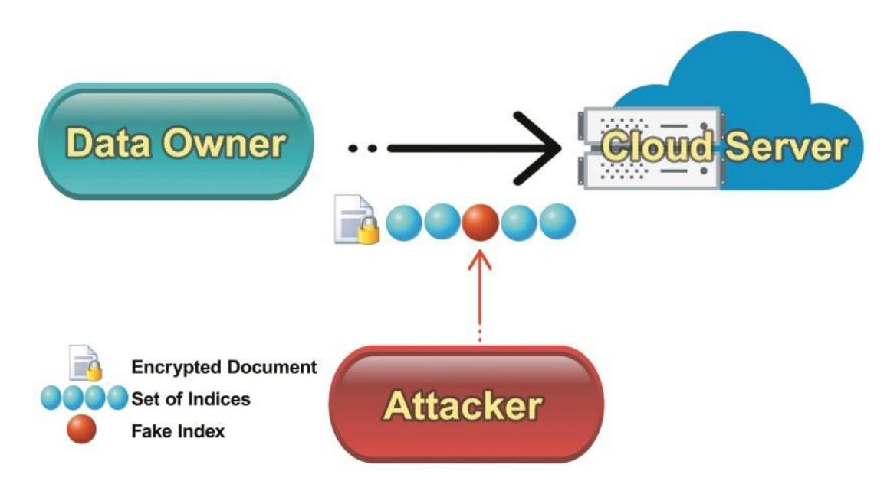
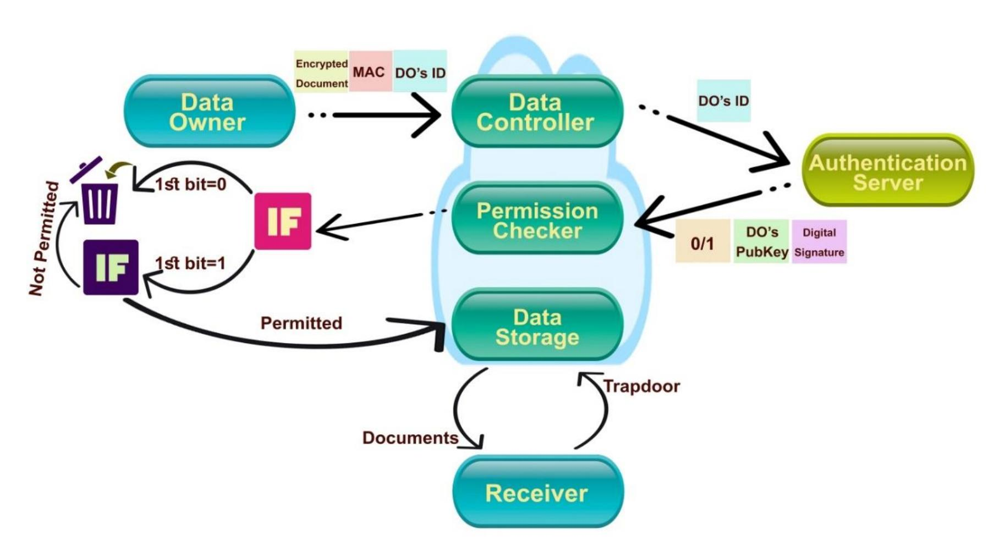

{0}------------------------------------------------

# **Security Analysis of Public Key Searchable Encryption Schemes against Injection Attacks**

Arian Arabnouri, Reza Ebrahimi Atani, Shiva Azizzadeh

Department of Computer Engineering, University of Guilan, P.O. Box 3756, Rasht, Iran.

**[Ariannt.an@gmail.com,](mailto:Ariannt.an@gmail.com) [rebrahimi@guilan.ac.ir,](mailto:rebrahimi@guilan.ac.ir) [shiva.azizzadeh@gmail.com](mailto:shiva.azizzadeh@gmail.com)**

# **Abstract**

Cloud computing and cloud storage are among the most efficient technologies for storing and processing metadata. But there are many privacy concerns within this domain. Most of the challenges are coming from trusted or semi trusted cloud servers where some computations must be applied to high confidential data. Data encryption can solve some confidentiality issues on the cloud but it is not easy to provide privacy preserving data processing services such as searching a query over encrypted data. On the other hand implementing searchable encryption algorithms in cloud infrastructure helps providing data confidentiality and privacy preserving data processing and can provide searching capability as well, which is the most important step of selecting a document. First in this article, some injection attacks against searchable public key encryption schemes are described. To be more specific message injection attack and index injection attack are applied against PEKS and PERKS schemes. Afterwards, two new schemes are proposed that are secure against them and are based of dPEKS and SAE-I. Finally, efficiency and security of proposed schemes are analyzed, and some implementation issues were discussed.

**Keywords:** searchable encryption, confidentiality, data integrity, bilinear pairing, trapdoor, interruption, injection attacks.

# **1- Introduction**

Considering rapid deployment of information technology and increment in data production and sharing, requirement for more data storage space would be noticeable. Cloud computing technology and exclusively cloud storage have been developed to confront this challenge. Many companies and organizations have provided content storage and sharing services based on this infrastructure. These services are widely used and popular today, since they are cost-effective and they enable data accessibility every time and everywhere. Cloud storage is particularly used for data backup and outsourcing. Nevertheless, cloud providers and intruders are able to access stored data, and this issue rises doubts about data security. Hence, data should be encrypted in order to preserve its security on unreliable servers and decrease the risks of data disclosure, and make it difficult for service providers and attackers to access the data. The pseudo-random characteristic of encryption algorithms reduces the statistical dependence between encrypted data and original data, which disables search capability among the data. One of the most essential features of cloud computing architecture is searching capability, which allows user to select his desired documents. In order to perform a search within documents, a trivial approach is getting the entire database, decrypting it, and performing search on plain data. However, this approach cannot be a practical one since there is a large amount of data due to increment in data production, and there are constraints in bandwidth, connection speed, and storage space on user's computer. Granting decryption capability to the cloud server is another approach, in which user sends a query to the server, the server 

{1}------------------------------------------------

decrypts all documents, performs search and sends result to the user. This approach makes all data revealed for the service provider and vulnerable to exploitation. Nevertheless, there is a new encryption method class that provides search capability, which can confront the stated challenges. Searchable encryption is an efficient method that belongs to this class.

Generally, a searchable encryption scheme consists of four steps [1, 2]. Selecting functions and making required keys take place in the first step. Second one is setting the index set regarded to documents or entities of the database, each of which is an encrypted value of a keyword in the document, and sending the encrypted document and index set to the server. The user who wants to search, creates a trapdoor using his desired keyword along with his key during the third step, and sends it to the server. Finally, in the fourth step that is called test step, server verifies received trapdoor against existing indices and returns 1 if they match, otherwise returns 0.

In this article, a new class of attacks against public key encryption with keyword search schemes is introduced, which is called an injection attack. As already reported by researchers, this attack method has only been used in online keyword guessing to disclose the trapdoor. However, attackers can take advantage of this technique for other purposes as well. Afterwards, an approach to defeat these attacks is proposed in the article. Since the proposed scheme is able to confront against online keyword guessing attacks done by unauthorized users, it can be applied to dPEKS and SAE-I[3] schemes to make it secure against this kind of attacks.

The proposed schemes are applicable in all systems that perform user authentication and only authorized users can send data within them, e.g. e-care and e-bank. Some specific users are allowed to send data in these systems, and if someone else sends any information, it ought to be an attempt to disrupt the network. These systems are expanding rapidly and their security must be considered adequately. The proposed scheme can provide security for this kind of systems.

The rest of this article is organized as follows: Some required preliminaries are reviewed in section 2. In Section 3, related works about searchable encryption are explained. Two injection attacks are introduced in Section 4. Afterwards, architecture of our proposed scheme is explained in section 5. Section 6 contains the analysis of proposed scheme. Finally, section 7 provides the conclusion of the article.

# **2- Preliminaries**

In this section, some required concepts and mathematical backgrounds are briefly reviewed.

#### **2-1- Bilinear Pairings**

Assume 1 and 2 to be multiplicative cyclic groups with prime order q.

Let be a generator of 1. The e: 1 × 1 → 2 mapping is a bilinear pairing if it satisfies the following conditions:

- 1) Bilinearity: ∀ , ∈ , ∀ 1 , 2 ∈ 1: e(1 , 2 ) = (1 , 2) .
- 2) Non-degeneracy: For ∀ ∈ Generator (1), e( , ) ∈ Generator (2).
- 3) Computability: An algorithm exists to effectively compute e(1 , 2) for all 1 , 2 ∈ 1.

{2}------------------------------------------------

# **2-2- Discrete Logarithmic Problem**

Discrete logarithm problem is defined over a finite cyclic group. If and ℎ were elements of a finite cyclic group, then the solution for the equation ℎ = would be called as the discrete logarithm of ℎ to the base g. currently, there is no efficient algorithm to solve a logarithmic problem using a regular computer. Hence, this problem has a special status in asymmetric cryptography.

Diffie-Hellman's encryption is based on a problem named Diffie-Hellman's assumption. This assumption expresses: there is no efficient algorithm to calculate , while only < , , > is known (without or ). This assumption is widely used in public key encryption and digital signature. dPEKS scheme applied this assumption to secure trapdoor and also to keep randomness and indistinguishability of it against the external attacker.

# **3- Related works**

Song et al. [4] proposed the first practical scheme for searching on encrypted text naming 'searchable encryption. This scheme is based on symmetric cryptography and it is applicable in scenarios that data owner and data receiver are the same person. Indexes are not included within this scheme. . Another efforts in this context are performed in [5-8], which present some concepts such as index, inverted index, conjunction search, and performing search via small computational capacity devices. Additionally, other efforts have been done to improve performance and security [9-11].

On the other hand, Boneh et al. [12] proposed public key encryption with keyword search scheme, which was the first public key cryptography scheme. This scheme utilizes the identity-based encryption (IBE) in order to produce indices. Public key encryption schemes are suitable for scenarios that multiple data owners attempt to send message for a certain receiver. Through this method, data owner encrypts the document and creates the indices using the receiver's public key. The receiver searches documents and decrypts them using his own private key. In this scheme, an index is created for each keyword. Afterwards, the set of indices along with the encrypted document are sent to the cloud server. However, the keyword guessing attacks could still be done against this scheme.

A new scheme named PERKS [13] scheme was proposed to solve this problem, in which the keyword is first concatenated with a private string on the receiver side, and new string would be hashed subsequently. Although this scheme was secure against keyword guessing attacks, there were fundamental problems with this scheme such as requiring permanent online hosting. Another effort to solve this problem was the dPEKS scheme, which is resistant to offline keyword guessing attacks, but still vulnerable to online keyword guessing attacks.

Yau et al. [14] proposed and implemented online keyword guessing attack in 2013, to find the keyword whom the trapdoor was built based on. This attack was named "online keyword guessing attack" due to interaction between attacker and server. Then in 2015, Chen [15] proposed an add-on to dPEKS in order to secure it against online attacks. However, the final scheme was still vulnerable to internal server attack. Whereas, some schemes were proposed to secure methods against this attack [16-19]. For example, proposed plans in [16, 17] are applicable to dPEKS, and despite their constraints are able to secure the scheme against internal keyword guessing attack.

Another securing method was proposed in [18], which uses the data owner's key such as work done in [17]. Despite the constraints of this scheme (i.e. requirement to create a trapdoor per each data owner), it is efficient for its proper structures. Virtually all of the studied schemes were vulnerable to the injection 

{3}------------------------------------------------

attacks introduced in this article. Also all the schemes based on these schemes are inherently vulnerable to injection attacks.

# **4- Injection Attacks**

In this section, a new class of attacks against searchable encryption schemes are introduced which is called injection attacks. Security of PEKS and PERKS schemes against these attacks is analyzed subsequently.

Generally, online keyword guessing attack [8] is the base idea of injection attacks. SPEKS scheme [4] is secure against online keyword guessing attack and message confidentiality cannot be violated by this attack. The data integrity concept is the main concentration of injection attack. This attack is more efficient and easier to perform compared to online keyword guessing attack. Performing an injection attack, the main purpose of the attacker is reducing the reliability of the system or data integrity rather than violating message confidentiality. Despite the simplicity and efficiency of these attacks, performing them can cause failure of searchable encryption system.

### **4-1- Message Injection Attacks**

During a message injection attack, the attacker can encrypt a desired message, combine it with an arbitrary set of indices, and send it to the server. This arbitrary set can be the indices previously sent by users, or a new index produced by the attacker based on his desired keyword. After inserting the word into document by the attacker, in the case of requesting this word by the receiver, the injected document would be returned to him. This attack may have a variety of purposes i.e. intrusion, trapdoor disclosure, displaying a message, or corrupting the searchable encryption system. Yao et al. set up a new approach to perform keyword guessing attack that is applicable to dPEKS. This attack is known as online keyword guessing attack since interacting with server is required to perform it. In this method, the attacker takes the following steps for each word in dictionary: He builds an index for the word, using receiver's public key. Then he encrypts the word, using receiver's public key and encryption algorithm which by the text would be encrypted. Afterwards, he stores cipher text in a table, along with plain text. Finally, he sends the cipher text and the index to the cloud server.

Whenever the receiver sends a request to the cloud server, it certainly contains one of the words existing in the dictionary. Therefore, definitely a document created by the attacker would be returned to the receiver, which contains the encrypted value of the keyword. If the attacker monitors returned documents, he can retrieve the corresponding word by searching within his own table.

A method to prevent this leakage is proposed in [15], but using this technique the attacker would be still able to perform another attack. Performing this attack, the attacker intends to corrupt the functionality of system and prevent the receiver from using available data, rather than detecting message or trapdoors. Each word existing in the dictionary would be encrypted through this method. Then they would be sent to the server along with attacker's arbitrary documents that are encrypted using the receiver's public key. This message can always be shown to the data owner. Hence, in the case the attacker wants a message to be always shown to the receiver, he can use this method. This message can also be some malicious files.

On the other hand, since the server returns all documents matching the trapdoor to the receiver, if amount of these created documents increases, the receiver would needs high bandwidth and storage space, and instant access to the server as well. Therefore, if high amount of data would be sent by the attacker, a system failure occurs.

{4}------------------------------------------------

#### 4-2- Index Injection Attacks

The attacker can modify the encrypted index by performing man in the middle (MiM) attack after accessing to the encrypted document and the set of indices. These changes can include removing some keywords from the index set, or adding some words to it. Although this attack does not compromise confidentiality of the message and the indices, it can corrupt functionality of system. Figure 1 illustrates the way that attacker can perform man in the middle attack in order to perform index injection attack. A summary of the text (e.g. hashed text) and indices must be created to prevent these attacks, which is protected by a key that is only known by the cloud server and the data owner. Afterwards, the server can re-generate MAC value of the message and index with its own key, and compare it with received MAC value. If these two MAC values were the same, the message and the index set would be stored. The attacker can perform the attack on the indices more intelligently in some existing designs, in order to make a more striking attack.

Figure 1. Index Injection Attack overview

#### 4-3- Index Injection Attacks against PEKS and RPEKS

In this attack, the attacker can add a new word to the index using the receiver's trapdoors. As a result, the attacker can add keywords whom the user requested the most. Consequently, the document would be displayed for non-related searches. In the PEKS scheme, when the attacker sniffs the trapdoor  $T_w$ , he attains value of  $H_1(w_i)^a$ . Now, if the attacker generates a new random value  $r' \in Z_q^*$ , then he would be able to calculate value of  $e(H_1(w_i)^a, g^{r'}) = e(H_1(w_i), g^{ar'})$ , and hash it  $(x = H_2(e(H_1(w_i)^a, g^{r'})))$ . Finally, he injects the value of  $(g^{r'}, x)$  to the index set. If documents containing word  $w_i$  is requested by the receiver, the new document would be returned as well.

Similarly to previous attack, the attacker can sniffs the trapdoor  $T_w$  and obtain the value of  $H_1(w_i \mid\mid b)^a$  to perform an attack against the PERKS scheme. The attacker would be able to calculate value of  $e(H_1(w_i \mid\mid b)^a, g^{r'}) = e(H_1(w_i \mid\mid b), g^{ar'})$  only by generating a new random value  $r' \in Z_q^*$ . Now he can insert the value of  $(g^{r'}, x)$  in the index set.

# 5- Architecture of proposed scheme

The data owner, the receiver, the cloud server, and the authentication server are used components in our proposed scheme. The data owner intends to send data to the receiver, so he must be registered as a user and authorized in the authentication server. The receiver can perform a search within his document by

{5}------------------------------------------------

building a trapdoor. The cloud server stores the data and searches among stored documents based on the receiver's trapdoor. He does it knowing neither content of document nor the keyword that the trapdoor is created with. The cloud server is assumed to be honest but curious, and can be provided by a third party. The authentication server checks whether the data owner is permitted to send documents. Furthermore, it can check the data owner's permission to send information to the receiver in case it is required.

The data owner sends encrypted documents, encrypted indices and his identifier to the cloud server. The cloud server sends the data owner's identifier and the receiver's one to the authentication server. The authentication server checks whether the data owner is permitted to send data. In the case of being permitted, the authentication server sends the data owner's public key to the cloud server, along with number 1. If the data owner is not authorized, a random public key is sent to the storage server, along with number 0. A probabilistic encryption algorithm can be used when confidentiality of this message is required. On the other hand, the authentication server can sign the message with his private key to ensure others that the information is sent by him. Afterwards, the cloud server receives the information, verifies identity of the authentication server, he decides about storing the document. If received number were 0, the data would be deleted. Otherwise, if it were 1, he produces the shared key based on the data owner's public key, and calculates MAC value. Then he checks whether this MAC value and the received MAC value are the same. Equality between these two means that the data was sent from claimed user, and the information would be stored; otherwise, the cloud server would remove it. The proposed architecture is shown in Figure 2.

Figure 2. Architecture of the proposed scheme.

#### **5-1- Proposed scheme based on dPEKS**

Our proposed scheme that is based on dPEKS, includes eight algorithms that are explained in this section.

**GlobalSetup(λ):** Implementing this algorithm produces variables and functions needed in the other algorithms. This algorithm is similar to GlobalSetup algorithm in dPEKS scheme, but a hash function and a pseudo random function are added to this algorithm. Hence, this algorithm first calls the

{6}------------------------------------------------

dPEKS.GlobalSetup(λ) function. Then it calculates : {0,1} ∗ → {0,1} and : K × {0,1} ∗ → {0,1} based on previously chosen parameters.

()**:** This algorithm calculates the public/private key pair for the server. With this key pair, it can be insured that only the server can perform test algorithm, since the test algorithm requires the private key of the server. This algorithm calls the dPEKS. KeyGenSERV(gp) function.

()**:** This algorithm calculates the public/private key pair for the receiver. With this key pair, it can be insured that only the receiver can perform trapdoor algorithm in order to search among data, since the trapdoor algorithm requires the receiver's private key. This algorithm calls the dPEKS.KeyGenREC(gp) function.

()**:** This algorithm calculates the public/private key pair for the data owner. Using this key pair, the data owner can be authenticated. This key pair and stated function were not used in dPEKS scheme, and they are proposed in this paper. This algorithm picks a random number ∈ p and outputs = and = .

−()**:** This algorithm calculates the proper public/private key pair for the authentication server based on encryption algorithm used for digital signature and communication between the cloud server and the authentication server.

(, , , , )**:** The DO calls this function to prepare the encrypted message to be sent to the cloud server. This algorithm first extracts keywords from the message. Then encrypts the message ( = ()) and builds indices by calling . dPEKS per each word W in M: = dPEKS. dPEKS(w, PUBSERV , PRIVDO , PUBREC, gp)), and concatenates them to build the set of indices ( − ). It then calculates the shared key between the server and the DO ( = SERV1 ) .Afterwards, it calculates hash of the encrypted message (ℎ = ()) and concatenates this value with the set of indices. Finally, = ( , − || ℎ) would be calculated and = {, − , ,} would be sent to the cloud server. If it were required to limit communications between users, it is necessary to insert receiver's ID () in this list.

 − ( , ,−)**:** Whenever the cloud server receives a message, sends the (and , if exists) to the authentication server.

 − ( , , , −)**:** The authentication server checks . If DO were authorized to send message, then it sets = 1 and = ; otherwise the authentication server sets it to 0 and KEY to a random value. It then encrypts concatenation of and (( || )) with a probabilistic algorithm, and signs the result with its private key ( = (− , ( || ))). Finally, it sends the {( || ) , } to the cloud server.

( , ,, , − )**:** When the cloud server receives response of the authentication server, it checks integrity of the data by verifying the signature using −. If the data were valid, it decrypts the message and obtains the flag and the KEY. If flag == 0 , it ignores DATA; otherwise it calculates = KEYPRIVSERV and decomposes DATA in order to obtain () , and − . Finally, it verifies whether == ( , − || ()) , and if result were true, it stores the DATA; otherwise ignores it.

{7}------------------------------------------------

( , , , )**:** It must be ensured that only authorized receiver can perform searching on his data. To achieve this, Trapdoor function would be run. Trapdoor algorithm requires the receiver's private key as a parameter, and since others do not have this key, they cannot perform searching on data implementing this algorithm. Trapdoor algorithm calls the dPEKS. dTrapdoor(gp , PUBSERV, PRIVREC , w) function.

( , , ,)**:** The cloud server runs this algorithm to find documents that match the trapdoor (match the arbitrary keyword). Similarly to dPEKS scheme, only the server can perform test in this scheme. This algorithm is implemented to avoid offline keyword guessing attack, so it needs private key of the server. This function calls dPEKS. dTest (f = dPEKS. dTes( , , , )) for all indices in DTA. If f == 1, the document contains the keyword, and the server returns it to the receiver.

#### **5-2- Proposed scheme based on SAE-I**

Similarly, we applied our proposed add-on to SAE-I, which includes eight algorithms that are explained in this section.

**GlobalSetup(λ):** This algorithm is like GlobalSetup algorithm in SAE-I scheme, with a hash function and a pseudo random function added to it, similarly to the previous scheme. Hence, this algorithm first calls the SAE.GlobalSetup(λ) function. Then it calculates : {0,1} ∗ → {0,1} and : K × {0,1} ∗ → {0,1} based on previously chosen parameters.

()**:** This algorithm calculates the public/private key pair for the receiver. It can be insured that only the receiver is able to create trapdoor for desired keyword and sender in order to search among data posted from certain data owner, since the trapdoor algorithm requires the receiver's private key. The data owner utilizes Receiver's public key in order to produce the index that would be sent to him. This algorithm calls the SAE. KeyGenREC(gp) function.

()**:** This algorithm calculates the public/private key pair for the data owner. Using the private key, the data owner can generate indices for desired keyword and receiver. Also receiver can generate trapdoor for desired data owner with Do's Public key. This algorithm calls the SAE.KeyGenDO(gp) function.

()**:** This algorithm calculates the public/private key pair for the server. Using this key pair, the server can communicate with DO and authentication server. This key pair and stated function were not used in SAE scheme, and they are proposed in this paper. This algorithm picks a random number ∈ p and outputs = and = .

−()**:** This algorithm calculates the proper public/private key pair for the authentication server based on encryption algorithm used for digital signature and communication between the cloud server and the authentication server.

(, , , , )**:** Similarly to the pervious scheme, DO utilizes . Build − Index to generate the indices ( = SAE. Build − Index(w , PRIVDO , PUBREC, gp)), and calculates = SERV , = ( , − || ℎ) , and = {, − , ,}. Finally he sends DATA to the cloud server.

 − ( , ,−)**:** Whenever the cloud server receives a message, it sends the (and , if exists) to the authentication server.

{8}------------------------------------------------

 − ( , , , −)**:** The authentication server checks the authority of DO and generates = ( || ), and = (− , ( || ))) according the authority. Finally, it sends the { , } to the cloud server.

( , ,, , − )**:** When the cloud server receives response from the authentication server, it checks integrity of the data by verifying the signature, using −. If the data were valid, it decrypts the message and attains flag and KEY. If flag == 0 , cloud server ignores DATA; otherwise it calculates = KEYPRIVSERV and decomposes DATA in order to attain () , and − . Finally, it verifies whether == ( , − || ()) , and if this equation were true, it stores DATA; otherwise it ignores DATA.

( ,, , )**:** It must be ensured that only authorized receiver can perform searching on his data. In this scheme, the receiver should select the data owner who sent the information. Trapdoor algorithm calls the SAE. Trapdoor(gp,, PRIVREC ,w) function.

( , , )**:** The cloud server runs this algorithm to find documents that match the trapdoor (i.e. match the arbitrary keyword). This function calls SAE. Test (f = SAE. Tes( , , )) for all indices in DATA. If f == 1, the document contains the keyword, and the server returns it to the receiver.

# **6- Security and performance analysis of the Schemes**

In this section, our proposed schemes are analyzed from efficiency and security points of view.

#### **6-1- Efficiency analysis**

Although resistance of our proposed scheme against injection attacks is more than dPEKS scheme, it has some efficiency costs. An authentication server is added in our scheme, which can cause additional communication cost. A key pair is required for each DO through our proposed scheme, and another one for the authentication server. As mentioned, within building index phase i.e. PEKS, an extra hash function and a pseudo random function are required, and an exponential function is needed to obtain the shared key as well. Hence, three phases are added to dPEKS scheme i.e. AUTH-REQ, AUTH-RESP, and CHECK. The AUTH-REQ phase does not have any computational cost. The AUTH-RESP phase requires a table searching to obtain DO authority, and another one to attain the public key of DO. Furthermore, an encryption function is required in this phase to preserve the confidentiality of messages, and a signature is needed to insure the message is sent by the authentication server. CHECK phase requires a signature verifying function, a decryption function, a hash function and an exponential function. According to the scenario, in the case the confidentiality of messages were not essential, the encryption function in AUTH-RESP phase and the decryption function in CHECK phase can be ignored. Since the key generation takes place once within the setup phase, over cost of this scheme is negligible. Nevertheless, an extra exponential function, a hash function and a pseudo random function in DO are required as well.

#### **6-2- Security analysis**

According to properties of the pseudo-random function, the attacker is not able to produce (, . ) without the key. Hence, the data owner must use an authorized identifier whose private key is held by him. Therefore, no other person would be able to send the data, because even if the identifier were tampered, the private key of an authorized data owner is still required to generate this function. Consequently, it is not possible to have a message sent by an unauthorized data owner. Furthermore, since binary encryption is used, and the public key is encrypted by a non-deterministic algorithm, it is not possible to guess this 

{9}------------------------------------------------

value. Whether the user were authorized or not, the message length would be the same in both cases. Therefore, the attacker cannot distinguish these two values. Furthermore, he cannot forge this message, since the authentication server signed this message by its private key.

# **7- Conclusion**

In this article, a new class of attacks against searchable encryption systems was introduced, which is called Injection Attack. As mentioned, these attacks can be performed easily and efficiently in order to corrupt the searchable encryption system. Therefore, it is highly required to find a solution to confront these attacks, and proposed add-on is an attempt to achieve this. This proposed add-on can be easily combined with existing schemes to preserve their security against injection attacks. As an instance, it is applied on dPEKS scheme, and final scheme is secure against injection attacks. Given the fact that it does not leak any information to the attacker, it is more secure than the original scheme, although its efficiency is slightly less than the efficiency of the original one.

**Acknowledgment:** We gratefully acknowledge the financial support from the Iran National Science Foundation (INSF) [Research project 97008930].

# **References**

- 1. Fei Han, Jing Qin, Jiankun Hu, Secure searches in the cloud: A survey, Future Generation Computer Systems, Volume 62, 2016, Pages 66-75, ISSN 0167-739X, https://doi.org/10.1016/j.future.2016.01.007.
- 2. Christoph Bösch, Pieter Hartel, Willem Jonker, and Andreas Peter, A Survey of Provably Secure Searchable Encryption, ACM Computing Survey, Vol. 47(2), Article 18 (January 2015), 51 pages. DOI:https://doi.org/10.1145/2636328.
- 3. Rhee, H.S., Park, J.H., Susilo, W., Lee., D.H., "Trapdoor security in a searchable public-key encryption scheme with a designated tester", Journal of Systems and Software, Vol. 83, Issue 5, (2010), Pages: 763-771.
- 4. Dawn Xiaoding Song, D. Wagner and A. Perrig, "Practical techniques for searches on encrypted data," *Proceeding 2000 IEEE Symposium on Security and Privacy. S&P 2000*, Berkeley, CA, USA, 2000, pp. 44-55, doi: 10.1109/SECPRI.2000.848445.
- 5. Goh, E.J., "Secure indexes", In IACR Cryptology ePrint Archive, (2004).
- 6. Chang, Y.C., Mitzenmacher, M., "Privacy preserving keyword searches on remote encrypted data", Applied Cryptography and Network Security, Springer, Berlin, Heidelberg, (2005), Pages: 442–455.
- 7. Curtmola, R., Garay, J., Kamara, S., Ostrovsky, R., "Searchable symmetric encryption: Improved definitions and efficient constructions", CCS, ACM, New York, NY, (2006), Pages: 79–88.
- 8. Golle, P., Staddon, J., Watersm, B.,"Secure conjunctive keyword search over encrypted data", ACNS, LNCS, (2004), Pages: 31–45.
- 9. Chai, Q., Gong, G., "Verifiable symmetric searchable encryption for semi-honest-but-curious cloud servers", 2012 IEEE International Conference on Communications (ICC), (2012).
- 10. Moataz, T., Shikfa, A., "Boolean symmetric searchable encryption", 8th ACM SIGSAC symposium on Information, computer and communications security, (2013), Pages: 265-276.
- 11. Ghareh Chamani, J., Papadopoulos, D., Papamanthou, C., Jalili, R., "New Constructions for Forward and Backward Private Symmetric Searchable Encryption", ACM SIGSAC Conference on Computer and Communications Security, (2018), Pages: 1038-1055.
- 12. Boneh, D., Crescenzo, G.D., Ostrovsky, R. and Persiano., G., "Public Key Encryption with Keyword Search", [Advances in](https://link.springer.com/book/10.1007/b97182)  Cryptology, [EUROCRYPT,](https://link.springer.com/book/10.1007/b97182) (2004), Pages: 506-522.
- 13. Tang, Q. and Chen. ,L., "Public-Key Encryption with Registered Keyword Search", European Public Key Infrastructure Workshop EuroPKI 2009: Public Key Infrastructures, Services and Applications, Pages: 163-178.
- 14. Wei-Chuen Yau, Raphael C.-W. Phan, Swee-Huay Heng & Bok-Min Goi (2013) Keyword guessing attacks on secure searchable public key encryption schemes with a designated tester, International Journal of Computer Mathematics, 90:12, 2581-2587, DOI: [10.1080/00207160.2013.778985.](https://doi.org/10.1080/00207160.2013.778985)
- 15. Y. Chen, "SPEKS: Secure Server-Designation Public Key Encryption with Keyword Search against Keyword Guessing Attacks," in *The Computer Journal*, vol. 58, no. 4, pp. 922-933, April 2015, doi: 10.1093/comjnl/bxu013.
- 16. R. Chen *et al*., "Server-Aided Public Key Encryption With Keyword Search," in *IEEE Transactions on Information Forensics and Security*, vol. 11, no. 12, pp. 2833-2842, Dec. 2016, doi: 10.1109/TIFS.2016.2599293.
- 17. Sun, L., Xu, C., Zhang, M. et al. Secure searchable public key encryption against insider keyword guessing attacks from indistinguishability obfuscation. Sci. China Inf. Sci. 61, 038106 (2018). https://doi.org/10.1007/s11432-017-9124-0.

{10}------------------------------------------------

- 18. J. Zhang, C. Song, Z. Wang, T. Yang and W. Ma, "Efficient and Provable Security Searchable Asymmetric Encryption in the Cloud," in IEEE Access, vol. 6, pp. 68384-68393, 2018, doi: 10.1109/ACCESS.2018.2872743.
- 19. Nia, M. A., Atani, R. E., and Ruiz‐Martínez, A. (2015) Privacy enhancement in anonymous network channels using multimodality injection. Security Comm. Networks, 8: 2917– 2932. doi: 10.1002/sec.1219.
- 20. Chen R., Mu Y., Yang G., Guo F., Wang X., A New General Framework for Secure Public Key Encryption with Keyword Search. In: Foo E., Stebila D. (eds) Information Security and Privacy. ACISP 2015. Lecture Notes in Computer Science, vol 9144. Springer, Cham. https://doi.org/10.1007/978-3-319-19962-7\_4.
- 21. S. R. Lashkami, R. E. Atani, A. Arabnouri and G. Salemi, "A Blockchain Based Framework for Complete Secure Data Outsourcing with Malicious Behavior Prevention," 2020 28th Iranian Conference on Electrical Engineering (ICEE), Tabriz, Iran, 2020, pp. 1-7, doi: 10.1109/ICEE50131.2020.9260866.