{0}------------------------------------------------

# Reconstructing with Less: Leakage Abuse Attacks in Two-Dimensions

Evangelia Anna Markatou\*
Brown University
markatou@brown.edu

William Schor Brown University wschor@cs.brown.edu

#### **Abstract**

Access and search pattern leakage from range queries are detrimental to the security of encrypted databases, as evidenced by a large body of work on efficient attacks that reconstruct one-dimensional databases. Recently, the first attack from 2D range queries showed that higher-dimensional databases are also in danger. This attack requires complete information for reconstruction. In this paper, we develop reconstructions that require less information. We present an order reconstruction attack that only depends on access pattern leakage, and empirically show that the order allows the attacker to infer the geometry of the underlying data. Notably, this attack also achieves full database reconstruction when the 1D horizontal and vertical projections of the points are dense. We also give an approximate database reconstruction attack that is distribution-agnostic and works with any subset of the possible search pattern, given the order of the database. Finally, we show how knowledge of auxiliary information such as the centroid of a related dataset allows to improve the reconstruction. We support our results with formal analysis and experiments on real-world databases and queries drawn from various distributions.

# Keywords

Cryptography, Encrypted databases, Attacks

# 1 Introduction

The growing adoption of cloud computing and storage in the past two decades has been accompanied by a corresponding increase of data breaches. Encrypted cloud storage reduces the risk of such breaches. Searchable encryption provides a practical solution for processing range queries over encrypted data without the need for decrypting the data or the queries (see, e.g., [7, 20, 21, 37] and the survey by Fuller et al. [11]). These types of schemes have been widely developed in both academic database research (e.g., [31, 33]) and in industry (e.g., [6, 29, 30]). For the sake of efficiency, searchable encryption schemes sacrifice full security by leaking some information about the queries and their responses. While the security proofs of these schemes prove that nothing is leaked beyond the given "leakage", the underlying data is still vulnerable to inferences from this leakage (see, e.g., [9, 14–16, 22, 23, 25, 28, 32]).

The following standard types of leakage occur in searchable encryption schemes. A scheme leaks the *access pattern* if the adversary observes the encrypted records returned in response to queries. A scheme leaks the *search pattern* if the adversary can

Francesca Falzon\* University of Chicago ffalzon@uchicago.edu

Roberto Tamassia Brown University rt@cs.brown.edu

<span id="page-0-0"></span>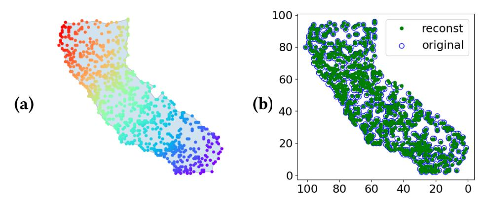

Figure 1: Our reconstruction of a spatial dataset with 1,000 points. (a) Order reconstruction from only the access pattern. (b) Approximate geometric reconstruction given the order of the points and partial search pattern of 1M queries drawn from a uniform distribution. We achieve an almost exact reconstruction while prior work [9] needed 455M queries on average for exact reconstruction.

distinguish if a query has been previously issued, i.e., can assign a unique query identifier to each distinct query.

This work considers an encrypted database with two attributes, referred to as a *two-dimensional (2D) database* to which *range queries* are issued. We assume a passive persistent adversary who observes the entire access pattern leakage, i.e., all possible responses of queries, and a subset of the search pattern leakage. Our adversary aims to reconstruct the order of the database records in the two dimensions (attributes) using solely the access pattern, a problem called *order reconstruction (OR)*. The adversary then attempts to perform an approximate reconstruction of the (attribute) values of the database records by using the partial search pattern observed, a problem called *approximate database reconstruction (ADR)*.

#### 1.1 Contributions

Previous work on reconstruction attacks from range queries on 2D databases [9] assumes that the adversary has knowledge of the entire access and search pattern leakage, i.e., has seen all possible queries and their responses. Both forms of leakage are used to perform an attack that reconstructs the record values in polynomial time, up to inherent information theoretic limitations. A natural question left open is what information is recoverable from 2D range queries when given less leakage. In this work, we make progress on this question with the following contributions:

(1) We show that order reconstruction faces additional information theoretic limitations when given only access pattern leakage.

 $<sup>^{\</sup>ast}\mathrm{EAM}$  and FF are co-first authors who contributed equally and are listed in reverse alphabetical order.

{1}------------------------------------------------

- We describe and prove a complete *characterization* of the family of databases that have the same access pattern leakage.
- (2) We present an *order reconstruction attack* that allows an adversary with the entire access pattern to build a linear-space representation of the family of databases in poly-time.
- (3) We design a *distribution-agnostic approximate database reconstruction attack* that reconstructs record values given the order of the records and partial search pattern leakage from queries issued according to an unknown distribution.
- (4) We *empirically evaluate* the effectiveness of our attacks on real-world datasets using a variety of range query distributions.
- (5) We develop new *combinatorial and geometric concepts and algorithms* related to point reconstruction from range queries that may be of independent interest.

Our work provides the *first order reconstruction attack in* **2D** *from access pattern leakage* and the *first approximate reconstruction attack in 2D from partial search pattern leakage* and an unknown query distribution. This attack does not require knowledge of the domain size and, instead, gives us a lower bound of the size of the domain. Our order reconstruction attack is also a *full database reconstruction attack* for the case when the 1D horizontal and vertical projections of the points are *dense*, i.e., have a record for every domain value.

Our work improves over the full database reconstruction attack of [9], where the adversary observes both access pattern and search pattern from all possible queries on the database. This previous attack fails when even a single query is missing. In contrast, we demonstrate that an adversary can still infer much about the original data with significantly less information. In particular, we achieve order reconstruction given only the access pattern (Figure 1a) and an effective approximate database reconstruction given the search pattern from a small fraction of queries (Figure 1b).

Our approximate database reconstruction (ADR) attack can be viewed as the 2D analogue of the work on attacks on 1D databases reported in [23]. To apply previous approximation approaches that assume knowledge of the order to 2D databases, we must completely characterize order reconstruction in 2D. However, much like FDR does not trivially extend from the 1D to 2D setting, our order reconstruction method demonstrates an exponential increase in the number of indistinguishable point configurations in the 2D setting. Thus, we cannot simply generalize 1D techniques to 2D. We re-examine a number of support-size estimators to better suit our problem. We emphasize that while our techniques are distribution agnostic (i.e., they do not require knowledge of the query distribution), certain distributions prevent the observation of a large fraction of responses and records (i.e., a distribution where only a few queries have nonzero probability) and thus place severe information theoretic limits on the accuracy of any approximate reconstruction method. In Section 6 we examine different non-parametric estimators and their efficacy under different query distributions. In Section 7 we build a complex nonlinear system of equations to model the problem instead of the linear system of [23].

#### 1.2 Encrypted databases and 2D Range Queries

There are a number of schemes that support two-dimensional range queries over encrypted data. All existing schemes leak query access pattern and many of these leak strictly more information than access and search pattern. Our work is motivated by the need to understand what can be learned from information leakage that seems unavoidable without employing the use of oblivious RAMs (ORAMs) [13] or fully homomorphic encryption [12], both of which incur significant overhead.

Shi et al. [35] designed a scheme called Multidimensional Range Query over Encrypted Data (MRQED) that leverages public key encryption. Although their model is different, their scheme leaks strictly more than access and search pattern. MRQED achieves "match-revealing" security which reveals the attributes of the range query when the query is successfully decrypted. The scheme builds a binary tree on the values of each dimension, and releases public keys corresponding to the nodes that "cover" the range of interest. The server learns both search and access of the query, the plaintexts of the matching records, and structural information about range query issued. Maple is a tree-based public-key multi-dimensional range searchable encryption scheme [43]. Its goal is to provide single-dimensional privacy which mitigates one-dimensional database reconstruction attacks. In addition to leaking access and search pattern, they also leak the nodes accessed when traversing the range tree and the values of each queried range. Recently, Kamara et al. gave constructions for schemes that support conjunctive SQL queries with a reduced leakage profile [18, 19].

One may also consider an index-based construction described in [9] that is built on top of a multi-keyword searchable encryption scheme, like Cash et al. [4]. To mitigate 1D attacks and avoid leaking information about individual columns, one can precompute a joint index of all possible two-dimensional queries and encrypt the resulting index. When a two-dimensional query is issued, only records matching both dimensions will be returned and the leakage is precisely the leakage of the underlying SSE scheme used.

# 1.3 Comparison with Prior and Related Work

In the following, we denote with N the size of the domain of the database points. We present the first order reconstruction and the first approximate database reconstruction in 2D; our attacks only require a strict subset of the leakage that previous 2D attacks require. Our order reconstruction attack only takes as input the set of access pattern leakage, which can be obtained with  $O(N^2 \log N)$  uniformly random queries. Our approximate database reconstruction attack requires search and access pattern leakage, however, we are able to recover information with small relative error with as few as 4% of the possible queries. Table 1 compares our results with previous work, where Dense1D denotes a 2D database whose horizontal and vertical projections are each a dense 1D database.

Kellaris et al. [21] show that given a 1D database, one can reconstruct the values of the database records from access pattern leakage of range queries using  $O(N^4 \log N)$  queries issued uniformly at random. Since then, a number of works have explored the problem in 1D (e.g. [15, 22, 23, 25, 28]), and in 2D [9].

Order reconstruction was first introduced in [21], as the first step of their FDR attack. Grubbs et al. [15] generalize the attack to one that achieves sacrificial  $\epsilon$ -approximate order reconstruction ( $\epsilon$ -AOR); the goal of  $\epsilon$ -AOR is to recover the order of all records, except for records that are either within  $\epsilon N$  of each other or within  $\epsilon N$  of the endpoints. Their attack achieves sacrificial  $\epsilon$ -AOR with probability  $1-\delta$  given  $O(\epsilon^{-1}\log\epsilon^{-1}+\epsilon^{-1}\log\delta^{-1})$  uniform queries.

{2}------------------------------------------------

<span id="page-2-0"></span>

| Table 1: ( | Comparison | of our | attack with | related | ones. |
|------------|------------|--------|-------------|---------|-------|
|------------|------------|--------|-------------|---------|-------|

|                     | Que         | eries        | Assump            | tions         | Leakage           |              | Attac        | k            |
|---------------------|-------------|--------------|-------------------|---------------|-------------------|--------------|--------------|--------------|
|                     | 1D<br>range | 2D<br>range  | Query<br>distrib. | Data-<br>base | Search<br>pattern | OR           | FDR          | ADR          |
| Kellaris+ [21]      | ✓           |              | Uniform           | Any           |                   | <b>✓</b>     | <b>√</b>     | <b>√</b>     |
| Lacharité+ [25]     | ✓           |              | Unknown           | Dense         |                   | $\checkmark$ | $\checkmark$ |              |
| Grubbs+ [15]        | ✓           |              | Uniform           | Any           |                   | $\checkmark$ | $\checkmark$ | $\checkmark$ |
| Markatou+ [28]      | ✓           |              | Unknown           | Any           |                   | $\checkmark$ |              |              |
| Markatou+ [28]      | ✓           |              | Unknown           | Any           | $\checkmark$      |              | $\checkmark$ |              |
| Kornaropoulos+ [23] | ✓           |              | Unknown           | Any           | $\checkmark$      |              |              | $\checkmark$ |
| Falzon+ [9]         |             | <b>√</b>     | Unknown           | Any           | ✓                 |              | <b>√</b>     |              |
| Falzon+ [9]         |             | $\checkmark$ | Known             | Any           |                   |              | $\checkmark$ |              |
| This Work           | [           | ✓ .          | Unknown           | Any           |                   | <b>√</b>     |              |              |
| This Work           |             | $\checkmark$ | Unknown           | Any           | $\checkmark$      |              |              | $\checkmark$ |
| This Work           |             | $\checkmark$ | Unknown I         | ense1D        |                   | $\checkmark$ | $\checkmark$ |              |

Approximate database reconstruction from access pattern of range queries in 1D has been addressed in [15, 23, 25]. In [25], Lacharité et al. introduce  $\epsilon$ -approximate database reconstruction ( $\epsilon$ -ADR) as the reconstruction of each record value up to  $\epsilon N$  error; they then give an attack that achieves  $\epsilon$ -ADR with  $O(N\log\epsilon^{-1})$  uniform queries. In [15], the authors further introduce sacrificial  $\epsilon$ -ADR, whose goal is to recover all values up to and error of  $\epsilon N$ , while "sacrificing" recovery of points within  $\epsilon N$  of the domain end points. Concepts from statistical learning theory are applied to achieve a scale-free attack that succeeds with  $O(\epsilon^{-2}\log\epsilon^{-1})$  queries.

Kornaropoulos et al. [23] reconstruct a 1D database without knowledge of the underlying query distribution and without all possible queries by employing statistical estimators to approximate the support size of the conditional distribution of search tokens given a particular response. Their agnostic reconstruction attack achieves reconstruction with good accuracy in a variety of settings including and beyond the uniform query distribution.

Full database reconstruction in two-dimensions was first described in [9]. In this work, Falzon et al. describe the symmetries of databases in two dimensions, prove that the set of databases compatible with a given access pattern leakage may be exponential, and give a polynomial-time algorithm for computing a polynomial-sized encoding of the (potentially exponential) solution set. Their attack requires full knowledge of the set of queries and their respective access pattern. As such, the attack uses either (1) search and access pattern leakage or (2)  $O(N^4 \log N)$  uniformly random queries where N is the size of the 2D domain.

We also note that there are a number of reconstruction attacks that use only volume pattern, or the number of records returned upon each query [14, 16, 24, 32]. This setting is outside the scope of this paper.

#### 2 Preliminaries

We recall combinatorial and geometric concepts using the terminology and notation introduced in [9].

**Basic concepts.** For a positive integer N, we define  $[N] = \{1, ..., N\}$ . Thee *domain* of a two-dimensional (2D) database to be  $\mathcal{D} = [N_0] \times [N_1]$  for positive integers  $N_0$  and  $N_1$ . We refer to the points on the segment from (0,0) to  $(N_0+1,N_1+1)$  as the *main diagonal*. Given a point  $w \in \mathcal{D}$ , we denote its first coordinate as  $w_0$  and its second coordinate as  $w_1$ , i.e.,  $w = (w_0, w_1)$ . A point w *dominates* point x, denoted  $x \leq w$ , if  $x_0 \leq w_0$  and  $x_1 \leq w_1$ . Similarly, w *anti-dominates* x, denoted  $x \leq w$ , if  $x_0 \leq w_0$  and  $x_1 \leq w_1$ . The

<span id="page-2-1"></span>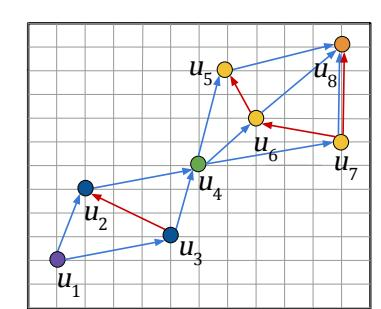

Figure 2: Dominance graph (blue) and antidominance graph (red) for a database with components  $\{u_1\}$ ,  $\{u_2, u_3\}$ ,  $\{u_4\}$ ,  $\{u_5, u_6, u_7\}$ , and  $\{u_8\}$ .

dominance or anti-dominance is said to be *strict* if the above inequalities are strict. We say that w *minimally (anti-) dominates* x if there is no point  $v \neq w$ , x such that w (anti-) dominates v and v (anti-) dominates x.

A 2D database, D, over a domain D with  $R \ge 1$  records is an R-tuple of points in D i.e.  $D \in D^R$ . A point of D is referred to as a **record** and is associated with a unique **identifier** (or ID) in [R] that gives its index in the tuple. We let D[j] for  $j \in [R]$  denote the domain value associated with the record ID j. When clear from context, we may refer to records as points. We denote a digraph as G = (V, E) such that V is the vertex set and E is the directed edge set. For any two vertices  $u, v \in V$  we denote a directed edge from u to v as the pair (u, v) (Figure 2).

The following definitions are illustrated in Figure 2.

*Definition 2.1.* The *dominance graph*, G = (V, E), of a set of points S, is the digraph where V = S and  $(a, b) \in E$  if b minimally dominates a and  $a, b \in V$ .

Definition 2.2. The **anti-dominance graph**, G' = (V', E'), of a set of points S, is the digraph where V' = S and  $(a, b) \in E'$  if b minimally anti-dominates a and  $a, b \in V'$ .

<span id="page-2-2"></span>Definition 2.3 ([9]). A **component**, C, of database D is a minimal non-empty subset of D such that for any points  $p \in C$  and  $q \notin C$ , both p and its reflection along the main diagonal either dominate q or are dominated by q.

**Range queries and leakage.** A *range query* is defined by a pair of domain points  $q = (c, d) \in \mathcal{D}^2$  such that  $c \leq d$ . The *response* or *access pattern* of a range query is the set of identifiers of records with values that fall within the range of the query. The response of a query q = (c, d) is defined to be

$$Resp(D, q) = \{ j \in [R] : c \le D[j] \le d \}.$$
 (1)

We similarly define the **response multiset of a database** D, denoted RM(D), as the **multiset** of all access pattern of D:

$$RM(D) = \{ \{ Resp(D, q) : q = (c, d) \in \mathcal{D}^2, c \le d \} \}.$$

We use the double bracket notation to emphasise that this is a multiset since distinct queries q, q' may produce the same response,  $\operatorname{Resp}(D,q)=\operatorname{Resp}(D,q')$ . We define the **response set** of D, denoted  $\operatorname{RS}(D)$ , to be the corresponding set in which each response appears exactly once. The **search pattern** of a query q=(c,d) is defined to be a query-specific token  $\operatorname{SP}(D,q)=t$ , where  $t\in \left[\binom{N_0+1}{2}\binom{N_1+1}{2}\right]$ . We assume a one-to-one correspondence between queries and tokens, a characteristic satisfied by all structured encryption schemes proposed in the literature, to our knowledge.

**Threat model.** We study the security of encrypted database schemes that support two-dimensional range queries and which leak the access pattern and search pattern of each query. We consider an *honest-but-curious*, *persistent* adversary that has compromised

{3}------------------------------------------------

the database management system or the client-server communication channel, and can observe the leakage over an extended period of time. Our order reconstruction attack considers an adversary that takes  $\mathsf{RS}(D)$  as input and wishes to compute the order of all records. Our other attack considers an adversary that knows the order and some subset of the possible search tokens and wishes to approximate the domain value of each record.

Assumptions and reconstruction attacks. We explore reconstruction under a few different assumptions. In Section 5 we assume the adversary knows the full response set RS(D). In Section 7 we assume the adversary knows the domain, but we make no assumption about the number of queries that it may have observed or the distribution from which queries are drawn; the adversary has no knowledge of the distribution.

We define the *Order Reconstruction (OR)* problem as follows:

Definition 2.4. **OR:** Given a set RS(D) of some database D, compute all pairs of dominance and anti-dominance graphs (G, G') such that any database D' with record relationships defined by (G, G') is equivalent to D with respect to the response set, i.e. RS(D) = RS(D').

Computing (G, G') is the information theoretic best that an adversary can do without additional information (e.g. without the multiplicities of each response, or the distribution of the data).

In Section 7 we give a method for estimating the values of the database given only partial access pattern leakage. In particular, given the order of points in D and a subset of RM(D), we demonstrate how to (i) estimate the number of unique queries that each record appears in and then (ii) use this information to construct a system of non-linear equations that can be solved to give approximate values of the records. We refer to this problem as  $Approximate\ Database\ Reconstruction\ (ADR)$ .

# 2.1 Query Densities

We use the generalized notion of query densities of points and point sets in two-dimensions presented in [9], which extends the methods in [21] for computing the number of unique queries whose responses contain a given set of points. By observing sufficiently many query responses of uniformly random queries, one can recover the value of a point x by computing the proportion of responses that the identifier of x appears in.

*Definition 2.5 ([9]).* Let  $\mathcal{D} = [N_0] \times [N_1]$ . The *query density* of a point  $x \in \mathcal{D}$  is defined as

$$\rho_{\mathcal{X}} = \left| \{ (c, d) \in \mathcal{D}^2 : c \le x \le d \} \right|.$$

The query density a set of points  $S \subseteq \mathcal{D}$  defined as

$$\rho_S = \left| \{ (c, d) \in \mathcal{D}^2 : \forall x \in S, \ c \le x \le d \} \right|.$$

Thus, these are the number of queries that contain x or all points in S, respectively.

Given a point 
$$x = (x_0, x_1) \in \mathcal{D}$$
, the formula for computing  $\rho_x$  is 
$$\rho_x = x_0 \cdot x_1 \cdot (N_0 + 1 - x_0) \cdot (N_1 + 1 - x_1). \tag{2}$$

More generally, the query density  $\rho_S$  of a set of points  $S\subseteq \mathcal{D}$  is

$$\rho_S = (\min_{x \in S} x_0)(\min_{y \in S} y_1)(N_0 + 1 - \max_{z \in S} z_0)(N_1 + 1 - \max_{w \in S} w_1).$$
 (3)

# 3 Order and Equivalent Databases

Before developing our attacks, we present our results on the informationtheoretic limitations of order reconstruction.

# 3.1 Equivalent Databases

<span id="page-3-5"></span>Definition 3.1. Databases D and D' are equivalent with respect to the response multiset if RM(D) = RM(D') and equivalent with respect to the response set if RS(D) = RS(D').

As shown in [9], given some database D we can generate a database D' that is equivalent with respect to the response multiset by rotating/reflecting D according to the symmetries of the square and by independently flipping the reflectable components across the main diagonal.

<span id="page-3-2"></span>PROPOSITION 1. [9] Let D be a two-dimensional database that contains components  $C_1$  and  $C_2$ . Let D' be a database such that |D'| = |D|, which contains  $C_1$  and  $C'_2$ , where each point  $p \in C'_2$  is the reflection of some point  $p' \in C_2$  along the diagonal. Then databases D and D' are equivalent with respect to the response set, i.e., RS(D) = RS(D').

Note that if D and D' are equivalent with respect to the response multiset, then they are equivalent with respect to the response set. However, the converse is not necessarily true. We show in Propositions 2 and 3 (Figure 3) that there are two additional symmetries that produce equivalent databases with respect to the response set.

<span id="page-3-3"></span>Definition 3.2. A pair of points (p, q) of a database D is an **antipodal pair** if for every point  $r \in D - \{p, q\}$  we have (1)  $q_1 < r_1 < p_1$  and (2) either  $r_0 < \min(p_0, q_0)$  or  $r_0 > \max(p_0, q_0)$ . See Figure 3b.

<span id="page-3-4"></span>Definition 3.3. A pair (p,q) of points of a database D are said to be a **close pair** if q minimally dominates p, and there exists no point  $r \in D - \{p, q\}$  such that r anti-dominates p or r is anti-dominated by q or r is between p and q. See Figure 3c.

The following proposition, illustrated in Figure 3b, shows that one cannot infer the horizontal ordering of an antipodal pair from the response set.

<span id="page-3-0"></span>PROPOSITION 2. Let D be a database from domain  $\mathcal{D}$  that contains an antipodal pair (p,q). Let V be the widest vertical strip of points of  $\mathcal{D}$  that contains p and q, and let P and Q be the tallest horizontal strips of V containing p and q, respectively, but no other point of D. Let D' be the database obtained from D by replacing p with another point, p', of P and q with another point, q', of Q. We have that databases D and D' are equivalent with respect to the response set, i.e., RS(D) = RS(D'). [Proof in Appendix C]

By Proposition 2, the two points of the antipodal pair (p,q) of D and of the corresponding antipodal pair (p',q') of D' can be ordered, reverse ordered, or collinear in the horizontal dimension and these three orderings cannot be distinguished using RS(D).

<span id="page-3-1"></span>PROPOSITION 3. Let D be a database from domain  $\mathcal{D}$  that has a close pair (p,q). Let D' be the database obtained from D by replacing q with any point q' such that  $q'_0 = q_0$  and  $p_1 \leq q'_1 \leq q_1$ . Then D and D' are equivalent with respect to the response set, i.e., RS(D) = RS(D'). [Proof in Appendix C]

Definition 3.4. Let D be a database and let G and G' be the dominance and anti-dominance graphs of D, respectively. We define

{4}------------------------------------------------

<span id="page-4-0"></span>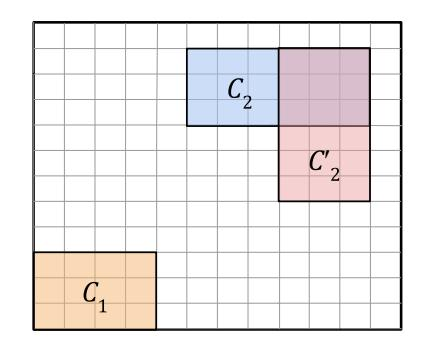

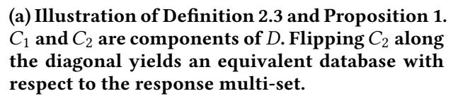

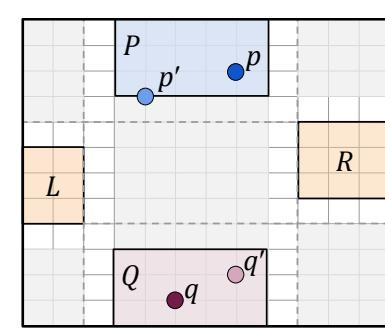

<span id="page-4-1"></span>(b) Illustration of Definition 3.2 and Proposition 2. Points p and q are an antipodal pair. Each remaining point is in L or R. Replacing p with  $p' \in P$  and q with  $q' \in Q$  gives an equivalent database with respect to the response set.

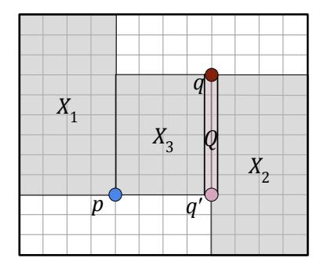

<span id="page-4-2"></span>(c) Illustration of Definition 3.3 and Proposition 3. Points p and q are a close pair. There are no points in regions  $X_1, X_2$  or  $X_3$ . Replacing q with any  $q' \in Q$  yields an equivalent database with respect to the response set.

Figure 3: Examples of transformations that yield equivalent databases with respect to the response set (Definition 3.1).

 $\mathsf{E}_\mathsf{o}(D)$  as the set of all possible point orderings of databases equivalent to D with respect to response set,  $\mathsf{RS}(D)$ .

Combining Propositions 1, 2 and 3, we capture all the informationtheoretic limitations of order reconstruction.

<span id="page-4-3"></span>Theorem 3.5. Let D be a two-dimensional database. The set of point orderings  $E_o(D)$  can be obtained from the dominance graph G, the anti-dominance graph G', the antipodal pair (if it exists), and the set of close pairs of D by means of the following transformations:

- (1) Flipping the direction of G and/or a subset of components of G' according to Proposition 1.
- (2) If D contains an antipodal pair, add or remove one or two edges from G or G' to make the pair collinear or switch their relationship from strict dominance to strict anti-dominance or vice versa.
- (3) For each close pair in D, add or remove one or two edges from G or G' to make them collinear or put them in a strict dominance relationship.

We prove Theorem 3.5 in Section 4.1. The equivalent configurations of Propositions 2 and 3 arise only with respect to the response set. The multiplicity information from the response multiset provided by the search pattern resolves them. Indeed, Theorem 3.5 adds transformations (2) and (3) to transformation (1) given in [9].

#### 3.2 Chains and Antichains

Our order reconstruction algorithm uses the concepts of chains and antichains of the dominance and anti-dominance relations for points in the plane [10, 41]. A set of points  $S \subseteq \mathcal{D}$  is a **chain** if any two points  $x, w \in S$  are in a dominance relationship i.e.  $x \leq w$  or  $w \leq x$ . A subset of points  $A \subseteq \mathcal{D}$  is an **antichain** if for any two points  $x, w \in A$  neither  $x \leq w$  nor  $w \leq x$ . Let  $D \subseteq \mathcal{D}$  be a set of points. The **height** of a point  $x \in D$  is the length of the longest chain in D with x as the maximal element. Note that two points of the same height cannot have a dominance relation. Thus, the set of all points in D with the same height yields a partition  $\mathcal{H}$  of D into antichains, namely the **canonical antichain partition**. We denote the canonical antichain partition by  $(A_0, A_1, \ldots, A_L)$  where  $A_i$  is the set of points at height i.

Let D be a database and let (G, G') be the dominance and antidominance graphs of D. Now note that the paths in the dominance graph correspond to chains in D. Formally, if  $(u_1, u_2, \ldots, u_\ell)$  is a path of record IDs in G, then  $D[u_1] \leq D[u_2] \leq \cdots \leq D[u_\ell]$  and  $\{D[u_1], D[u_2], \ldots, D[u_\ell]\}$  forms a chain in D. By definition the edges of G represent the minimal dominance relations of the points

<span id="page-4-4"></span>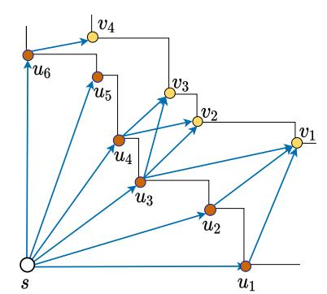

Figure 4: Example of a dominance graph and its associated canonical antichain partition comprising antichains  $A_0 = \{s\}, A_1 = \{u_1, \dots u_6\},$  and  $A_2 = \{v_1, \dots v_4\}.$ 

in D and thus determining the length of a longest possible path in G from a source to  $u \in [R]$  is equivalent to determining the height of point D[u] in the database. This gives us a nice way of partitioning the IDs such that the partition corresponds to the canonical antichain partition. Formally, if s is a source of G then D[s] has height 0. And if  $S_i \subseteq [R]$  is the set of IDs in G that have a maximum distance of G from any sink, then the canonical antichain partition of G is given by G is given by G is G in G that have a

For an example, see Figure 4. Since G is acyclic we can compute these longest paths efficiently. For convenience we may use  $A_i$  to instead refer to the IDs of points within each partition of the canonical antichain.

These observations are crucial in the design of our OR algorithm. E.g., we construct the dominance graph starting at the IDs of points with height 0. We then compute the partition on IDs that correspond to the canonical antichain partition and use the partition to construct the anti-dominance graph.

### 4 Overview of Order Reconstruction

A high-level intuitive explanation for our order reconstruction algorithm is schematically illustrated in Figure 5, where we show a database that has distinct extreme points left, right, top and bottom. We assume, without loss of generality, that left  $\leq$  right. The two parts of the figure distinguish the cases where top is to the left or right of bottom, respectively. By symmetry, these two cases cover all the possible configurations of the extreme points. For simplicity, we assume that none of the remaining points are horizontally or vertically aligned with each other or the extreme points. Thus, only the four extreme points are on the boundary of the rectangle occupied by the database points. The OR algorithm presented in the next section will remove these simplifying assumptions and reconstruct an arbitrary database. A first building block of our OR algorithm finds such extreme points from the response set. We leverage an

{5}------------------------------------------------

<span id="page-5-2"></span><span id="page-5-1"></span>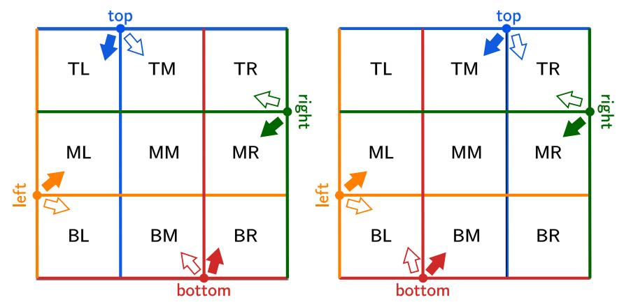

(a) top to the left of bottom

<span id="page-5-3"></span>(b) top to the right of bottom

Figure 5: Partition of the database points into nine regions induced by the four extreme points.

algorithm from [9] to find these extreme points, however our techniques diverge considerably from [9] after this. Whereas they solve a system of degree four polynomials with full knowledge of RM(D), our OR algorithm determines the relationships between pairs of records using only set containment observed in RS(D).

**Partition of the Database into Regions.** By drawing horizontal and vertical lines through the extreme points, we partition the database points into nine regions labeled XY for  $X \in \{T, M, B\}$  and  $Y \in \{L, M, R\}$ , where T, B, L, R, and M stand for top, bottom, left, right, and middle, respectively. Note that some of these regions may be empty. We can compute the points in each region from the response set by finding minimal responses that contain certain pairs and triplets of extreme points and performing intersections and differences of such responses with each other and the entire database. We show how to compute the rows and columns, from which a region can be computed by intersecting its row with its column. The middle row and column are the minimal response containing left and bottom and the minimal response containing top and bottom, respectively. The other rows and columns are obtained by computing the minimal response containing the triplet of extreme points opposite to the column and subtracting this response from the database. For example, the left column is obtained by subtracting from the database the minimal response containing top, right, and bottom.

(Anti-)Dominance with a Corner. Consider a subset S of the database containing a dominance corner, s, defined as a point that dominates or is dominated by all other points of *S*. For example, point left is a dominance corner for the points in region ML in Figure 5a. Another building block of our algorithm is a method that given S and s, computes all pairs of points of S that have a dominance relation. By symmetry, the same methods compute the anti-dominance relation pairs for a subset of points that admits a similarly defined anti-dominance corner. Let s be a dominance corner for *S* and assume *s* is dominated by all the other points. The method considers for each point v of S, the smallest response containing points s and v. We have the points of S in this response are the points of S dominated by v. For example, in the point set of Figure 4, we have that point s is a dominance corner. Also, the smallest response containing s and  $v_3$  is  $\{s, u_3, u_4, v_3\}$ , which implies that the points dominated by  $v_3$  are s,  $u_3$  and  $u_4$ .

**Points in Different Rows and Columns.** Consider two points, p, and q. For some placement of these points into regions, namely

when they are in regions in different rows and columns, we can immediately decide their horizontal and vertical order and thus whether they are in a dominance or anti-dominance relation. For example, if p is in BL and q is in MM, MR, TM, or TR, then we have that q is above and to the right of p and thus dominates p. Also, if p is in BM and q is ML or TL, then we have that q is above and to the left of p and thus q anti-dominates p. Similar considerations hold for other placements of p and q in different rows and columns.

**Points in Different Regions in Same Row or Column.** Consider now the case when p and q are in different regions that share the same row or column. In this case, we know one of the horizontal or vertical ordering of the points, but not the other. Let p be in TL and q be in TR. We have that p is to the left of q. We can use our building block method applied to the points in the top row and their anti-dominance corner right to determine whether p and q are in anti-dominance relation. If they are not, given that p is to the left of q, we conclude that q dominates p. The same reasoning holds when p is in TL and q is in TM and, more generally, by symmetry, for p and q in contiguous regions of the same row or column.

**Points in Same Region.** We now turn to the case when p and q are in the same region. Here, we need to take into account the configurations of the extreme points. We distinguish the cases when top is to the left bottom (Figure 5a) and top is to the right of bottom (Figure 5b). It is worth noting that we can distinguish these two cases from the response set only if there is at least a point in the middle column. Otherwise, top and bottom are an antipodal pair (Definition 3.2 and Proposition 2).

In the case of Figure 5a, each region is included in a group of regions that has a dominance corner and another group of regions that has an anti-dominance corner. For example, suppose p and q are in TL, TM, ML, or MM. We have that left is a dominance corner for the top two rows and bottom in an anti-dominance corner for the left two rows. Applying our building block method to these two groups of regions, we determine whether p and q are in dominance or anti-dominance relation. In the case of Figure 5a, we can use the same approach for all regions except MM.

To deal with the remaining case of p and q within region MM in the configuration of Figure 5b, we observe that using dominance corner top or bottom, we can determine if p and q are in dominance relation. If so, we are done, else, we find the extreme points of MM and apply the order reconstruction algorithm recursively to the points within this region.

#### <span id="page-5-0"></span>4.1 Proof of Theorem 3.5

PROOF. Let *D* be a database and let left, right, top, and bottom be its four extreme points. Without loss of generality, these points must take one of the two configurations pictured in Figure 5. Note, any point's relative order can be determined if it is in a dominance relation with one point and in an anti-dominance relation with another point. If a point is not in such a relation, then we argue that the three transformations yield all databases equivalent to *D* with respect to the response set.

Case 1: If top and bottom are antipodal, we have the configuration of Figure 5a or Figure 5b with an empty middle column and the ordering of all pairs of points is determined with the exception of the antipodal pair (Transformation 2).

Case 2: If top and bottom are not antipodal, we have two subcases.

{6}------------------------------------------------

Case 2a: If top anti-dominates bottom, we have the configuration of Figure 5a where the ordering of all pairs of points is determined. Case 2b: Else, top dominates bottom and we have the configuration of Figure 5b, where the ordering of all pairs of points is determined except for pairs in MM. If  $MM = \emptyset$  or has a single point, we are done. Else, let C be the subset of points of MM are not in antidominance relation with a point of *D* not in MM. We have that all the remaining points of MM have their ordering determined. Also, C comprises one or more components and/or close pairs whose ordering can be changed by means of Transformations 1 and 3. Now, let us show that there are no other possible transformations that change the order of some pair of points a, b in C, while leaving RS(D) the same. If b minimally dominates a, there exists no response in RS(D) that contains right and a without b. Any such transformation would result in one of the following changes: (i) a dominates b, (ii) a anti-dominates b, (iii) b anti-dominates a and (iv) a and b are collinear. In (i), (ii) or (iii), then there would exist a response in RS(D) that contains right and a, but not b, which would result in a different response set. Thus, the transformation would make a and b be collinear. This is possible only if the corresponding sets  $X_1$ ,  $X_2$  and  $X_3$  shown in Figure 3c are empty. As b minimally dominates a,  $X_3$  must be empty. Suppose there is some point  $c \in X_1$ , then there is a response that contains a and c without b and a response that contains b and c without a. If a and b were collinear, one of those responses becomes impossible, modifying the response set. A similar argument can be made about  $X_2$ . We conclude a and b are a close pair and that we are applying Transformation 3 to make them collinear.

Alternatively, if b minimally strictly anti-dominates a, there exists a response  $r_1$  that contains right and a without b and a response  $r_2$  that contains right and b without a. The transformations would result in one of the following: (i) a dominates b, (ii) b dominates a, (iii) a anti-dominates b and (iv) a and b are collinear. In (i), (ii), or (iv) one of  $r_1$  or  $r_2$  would not exist, resulting in a different response set. What is left is case (iii), which implies that the anti-dominance relationship is flipped by applying Transformation 1.

### <span id="page-6-0"></span>5 Order Reconstruction

The adversary using the response set can reconstruct the order of all records in the database (up to equivalent orders). The order reconstruction algorithm has the following steps:

- (1) Find the extreme points of the database. (Algorithm 9)
- (2) Find the first antichain of the database, which contains all points that do not dominate any point and generate the dominance graph of the database. (Algorithm 1)
- (3) Find all antichains in the dominance graph. (Algorithm 2)
- (4) Generate the anti-dominance graph. (Algorithm 3)
- (5) Use the dominance and anti-dominance graphs to find any antipodal pairs (Proposition 2), close pairs (Proposition 3) and reflectable components. (Proposition 1). (Algorithm 4)

Note that this attack achieves also FDR when the horizontal and vertical projections of the points are dense.

#### 5.1 Preliminaries

Given a point a in the minimal antichain  $A_0$ , our order reconstruction attack requires computing the IDs of all points that dominate

D[a]. Algorithm 8 (DominanceID), shown in Appendix A, takes as input the response set RS(D) of a database D and an ID a of some point with height 0, and outputs the set of identifiers in [R] of points that dominate D[a].

#### 5.2 Find Extreme Points

The first step is to identify at most four identifiers of points with extreme coordinate values. Specifically, we wish to find identifiers of points left, right, top and bottom such that for all  $p \in D$  the following hold: (1) left<sub>0</sub>  $\leq p_0 \leq \operatorname{right}_0$  and bottom<sub>1</sub>  $\leq p_1 \leq \operatorname{top}_1$ , and (2)  $p \not\preceq \operatorname{left}$ , bottom and top, right  $\not\preceq p$ . Note that since no points in D are dominated by left and bottom, then their height is 0 and are thus a subset of  $A_0$  in the canonical antichain partition of D. These points give a starting point for computing the rest of  $A_0$ . We recover these extremal points by calling Algorithm 7.

Our approach for finding such a subset of identifiers is as follows. Let L and  $S_1$  be the first and second largest responses in RS(D), respectively. Then  $E_1 = L - S_1$  must correspond to the IDs of points that are extreme in some coordinate. To find the IDs of points that are extreme in some other coordinate, find the second largest response  $S_2$  that contains  $E_1$ , and then compute  $E_2 = L - S_2$ . By extending this process, we find all points with extremal coordinates. It remains to find the correct point within each set  $E_i$ . Suppose  $E_1$  and  $E_2$  are the left and bottom edges, respectively. By finding  $a, b \in [R]$  such that the smallest response containing a and b contains no other edge points, then D[a] and D[b] must not be dominating any other points in D. Hence left  $E_1$  and  $E_2$  and  $E_3$  and  $E_4$  and  $E_5$  are the identifiers of top and right.

Without loss of generality, we assume that right dominates left. If not, simply reflect the database to achieve this orientation. Algorithm 9, shown in Appendix B, is inspired by [9].

<span id="page-6-1"></span>LEMMA 5.1. Let D be a database with R records and let RS(D) be its response set. Algorithm 9 (FindExtremePairs) returns all configurations of extreme points (left, right, top, bottom) such that no points are dominated by left and bottom, and no points dominate right and top in  $O(R^2|RS(D)|)$  time. [Proof in Appendix C]

#### 5.3 Generate Dominance Graph

This step takes as input the response set RS(D) and some configuration config given by running Algorithm 9 on RS(D), and outputs a dominance graph G of D. We first compute all IDs of points with height 0. These are the sinks of G. Let left, right, and bottom be given by config. All points not dominated by left and bottom must be contained in the minimal query containing them.

Then for each  $a \in A_0$  we build a subgraph of the dominance graph on a and all IDs that dominate a. We use Algorithm 8, described in Appendix A, to compute this set of IDs. We initialize subgraph  $G_a = \{a\}$  and then extend the graph by finding the next smallest response resp containing a, that also contains some ID v not yet added to the graph. Since resp is minimal, then v must dominate everything in the response. Moreover, v must minimally dominate all IDs that are sinks in the current  $G_a$  and are contained in resp. We add (t,v) to  $G_a$  for all sinks t of  $G_a$  contained in resp.

Once graphs  $G_a$  for  $a \in A_0$  have been computed, we take their union,  $G = \bigcup_a G_a$ , as the dominance graph and return G and  $A_0$ .

<span id="page-6-2"></span>LEMMA 5.2. Let D be a database with R records, RS(D) be its response set, and config the correct configuration output by Algorithm 9

{7}------------------------------------------------

#### **Algorithm 1:** DomGraph(RS(*D*), config)

```
left, right, top, bottom to IDs.
1: // Find antichain-0. We assume right dominates left.
2: Let small be the smallest response containing left and bottom.
3: Let A_0 = \text{small}
4: for p \in \text{small } \mathbf{do}
      Let S be the smallest response that contains right and p.
 5:
      Q = (S \cap \mathsf{small}) - \{p\}
6:
      A_0 = A_0 - Q
 7:
8: // Find dominance graph.
9: Let G be an empty graph
10: for each a \in A_0 do
      G_a = (V, E) such that V_a = \{a\} and E_a = \emptyset.
11:
      S = DominancelD(a, top, left, right, RS(D))
12:
     Let R_S \subseteq RS(D) comprise the responses of size at least 2 that
13:
      contain a and only other IDs in S.
      for resp ∈ R_S by increasing size do
14:
        if \exists v \in \text{resp such that } v \notin G_a \text{ then }
15:
          Add vertex v to G_a
16:
          for each t of resp such that t is a sink of subgraph of G_a that
17:
          contains only points in resp do
            Add edge (t, v) to G_a.
18:
19: G = \bigcup_{a \in A_0} G_a, and remove any transitive edges
20: return G, A_0
```

<span id="page-7-0"></span>**Input:** Response set RS(D) of database D; a dictionary config mapping

<span id="page-7-8"></span>on RS(D). Given RS(D) and config, Algorithm 1 (DomGraph) returns the dominance graph of the points in D in  $O(R^3|RS(D)|)$  time. [Proof in Appendix C]

#### 5.4 Construct Antichains

Given  $A_0$ , we now wish to compute the entire canonical antichain partition of D. Here, we explain how to find the partition  $\mathcal{A}=(A_0,\ldots,A_L)$  such that L is the maximum height of any element in D. Computing each  $A_i$  is equivalent to finding the set of elements whose maximum length path in G from any  $a \in A_0$  has length i. Thus, for each  $p \in G$  we compute the longest path in G from any  $a \in A_0$  to p and then add p to the correct partition in  $\mathcal{A}$ . Lastly, order the elements in each antichain  $A \in \mathcal{A}$  such that, without loss of generality, for any pair of ordered elements c and c',  $c \leq_a c'$ . If  $|A| \leq 2$  we are done. Else we compute all responses that contain exactly two elements in A. If such a response exists for a pair  $c, c' \in A$  then we can infer that there exists no  $c'' \in A$  such that  $c \leq_a c'' \leq c'$ . Thus we may use these responses to determine the ordering of the elements in A such that any element must antidominate all previous elements in the ordering.

<span id="page-7-10"></span>LEMMA 5.3. Let D be a database and RS(D) be its response set. Given RS(D), a dominance graph G of D, and the minimal antichain  $A_0$ , Algorithm 2 (FindAntichains) returns a dictionary Antichains such that Antichains[i] contains an ordered list of all IDs at height i in  $O(R^2|RS(D)|)$  time. [Proof in Appendix C]

## 5.5 Generate Anti-Dominance Graph

The next step is to take the response set  $\mathsf{RS}(D)$ , the dominance graph G, and the canonical antichain partition Antichains and construct the corresponding anti-dominance graph. There are three major steps that we must take: (1) fix the antichain orientations so that they are lined up correctly, (2) add any edges between IDs of

#### **Algorithm 2:** FindAntichains(RS(D), G, $A_0$ )

```
1: // Find antichains.
2: (V, E) = G, Antichains = {}, Antichains [0] = A_0
3: Compute longest paths \in G from all a \in A_0 to all points in D.
4: L = 0
5: for each p \in V do
     Let \ell be the length of the longest path to p from any a \in A_0.
6:
     Add p to Antichains [\ell]
7:
     L = \max(L, \ell)
8:
9: // Order the points of Antichains[i].
10: for i = 0, \dots, L do
     if |Antichains[i]| > 3 then
11:
       Let S be all responses in RS(D) that contain exactly two elements
12:
        of Antichains[i] (and perhaps other points)
       Remove all p \notin Antichains[i] from S and make S a set.
13:
        Order Antichains[i] such that pairs of consecutive points are
14:
       responses in S.
15: return Antichains
```

<span id="page-7-11"></span><span id="page-7-9"></span>different antichains that are in an anti-dominance relationship, and (3) identify all colinearities.

First we iterate through Antichains; At iteration i, we look at Antichains[j] for all j < i until we find an edge  $(c_1, c_2)$  in G such that  $c_1 \in \text{Antichains}[j]$  and  $c_2 \in \text{Antichains}[i]$ . If there is another edge  $(c_1', c_2')$  in G with  $c_1' \in \text{Antichains}[j]$  and  $c_2' \in \text{Antichains}[i]$ , then we check if the edges in the antichains i and j are consistent. For example, if the orderings are  $(c_1, c_1')$  and  $(c_2', c_2)$  in Antichains[j] and Antichains[i], respectively, then we flip Antichains[i].

Once the chains are fixed, we add edges for anti-dominance relationships. We iterate through Antichains[i] and Antichains[j] for i < j and look at each pair of elements  $a_i, a_j$  such that  $a_i \in$  Antichains[i] and  $a_j \in$  Antichains[j]. For each  $a_i$  and  $a_j$  we compute all their successors and all predecessors in G. If there exists a path from some successor of  $a_j$  to some predecessor of  $a_i$ , then we add  $(a_j, a_i)$  to G'. Similarly, if there exists a path from some predecessor of  $a_j$  to some successor of  $a_i$ , we add  $(a_i, a_j)$  to G'.

The last thing that remains is to identify colinearities. For each edge (q, p) in G' find the smallest response S containing q and p. If there exists some  $k \in S$  such that k and p are not connected in G', then they must be colinear and so we add (k, p) to G'. We similarly check if there exists a colinearity between k and q and add those edges to G'. The final step is to remove all transitive edges in G' (if they exist) to keep only minimal anti-dominance relationship and return the anti-dominance graph G'.

<span id="page-7-2"></span>LEMMA 5.4. Let D be a database and RS(D) be its response set. Given RS(D), the dominance graph G of D, and the ordered antichains of D Algorithm 3 returns the anti-dominance graph of D in  $O(R^3|RS(D)|)$ . [Proof in Appendix C]

#### 5.6 Order Reconstruction

We have already given algorithms for computing the extreme points, the dominance graph, the antichains, and the anti-dominance graph. We now put these pieces together to achieve OR of a database D given its response set RS(D). Algorithm 4 performs OR by taking the following steps. First it runs Algorithm 9 (FindExtremePairs) to compute all candidate configurations of the extreme points. There is a constant number of such configurations and at least one of them

{8}------------------------------------------------

# **Algorithm 3:** AntiDomGraph(RS(D), G, Antichains)

```
1: Initialize empty graph G'
2: // Fix chain orientation
3: for i \in [1, |Antichains|] do
      Add an edge in G' between consecutive points in Antichains [i-1]
 4:
     Find (c_1, c_2) \in G, where c_1 is the first point in Antichains [k], k < i
5:
      in an edge with a point from Antichains[i]. If there are multiple
      options for c_2, pick the smallest one in order.
     if \exists (c'_1, c'_2) \in G, for a point c'_1 \in Antichains[k], k < i, which is
6:
      after c_1 in order, and c_2' \in Antichains[i], which is before c_2 in order,
      and there is no path from c'_1 to c_2 in G then
        Flip the order of Antichains[i]
7:
8: Add an edge in G' between consecutive points in the last antichain
9: // All chains are fixed; Now add edges between them.
10: for A_i = Antichains [i] and A_j = Antichains [j], such that
    i, j \in [|Antichains|] and i < j do
     for a_i \in A_i and a_j \in A_j do
11:
        if a_i and a_j not connected in G then
12:
          Find successors of a_j, S_j \subseteq A_j, and all predecessors of a_j,
13:
          P_i \subseteq A_i. Add a_i to S_i, P_i.
          Find successors of a_i, S_i \subseteq A_i, and all predecessors of a_i,
14:
          P_i \subseteq A_i. Add a_i to S_i, P_i.
          if \exists path from p to q in G, s.t. p \in S_i, q \in P_i then
15:
            Add edge (a_i, a_i) to G'
16:
          else if \exists path from p to a_j in G, s.t. p \in P_i then
17:
            Add edge (a_i, a_i) to G'
18:
          else if \exists path from p to q in G, s.t. p \in P_j, q \in S_i then
19:
            Add edge (a_i, a_j) to G'
20:
          else if \exists path from p to a_i in G, s.t. p \in P_i then
21:
            Add edge (a_i, a_i) to G'
22:
23: // Find any collinearities.
24: Let E be an empty list.
25: for (q, p) \in G' do
      P_{q,p}, S_{p,q}, P_{p,q} = \mathsf{Boxes}(p,q)
26:
     Let S = \cup P_{q,p} \cup S_{p,q} \cup P_{p,q}
27:
      if \exists k \in S, where there is no path from k to p in G' then
28:
        Add an appropriate edge between k and p to G'
29:
      if \exists k \in S, where there is no path from k to q to E then
30:
        Add an appropriate edge between k and q to E
31:
32: Add all edges in E to G'
33: Remove transitive edges from G'
34: Return G'
```

# **Algorithm 4:** OrderReconstruction(RS(D))

```
1: PossibleConfigs = FindExtremePairs(RS(D))
2: for config ∈ PossibleConfigs do
     G = DomGraph(RS(D), config)
3:
     G' = AntiDomGraph(RS(D), G, Antichains(RS(D), G))
4:
     Let closePairs and antipodalPairs be empty lists.
5:
     Find the smallest response that contains top and bottom. If it
6:
     contains no other points, then add (top, bottom) to antipodalPairs.
     Find the smallest response that contains left and right. If it contains
7:
     no other points, then add (left, right) to antipodalPairs.
     for each edge (b, a) \in G do
8:
       if (b, a) satisfy Definition 3.3 then
9:
         Add (b, a) to closePairs
10:
     if response set of points with orders (G, G') is RS(D) then
11:
       Return (G, G', antipodalPairs, closePairs)
12:
```

corresponds to a correct arrangement of the extreme points in D (up to rotation/reflection). For each candidate configuration, it then computes the dominance graph using Algorithm 1 (DomGraph) and the anti-dominance graph using Algorithm 3 (AntiDomGraph). Incorrect configurations result in graphs that are either of an incorrect form or result in a pair of dominance and anti-dominance graphs (G, G') such that databases with orders described by (G, G') are not compatible with RS(D). Algorithm 4 continues to iterate through the configurations until a correct pair of graphs (G, G') is found and returned. Given a response set RS(D) of some database D as input, Algorithm 4 (OrderReconstruction) is guaranteed to terminate and output a correct graph pair.

Theorem 5.5. Given the response set RS(D) of a 2D database D with R records, Algorithm 4 (OrderReconstruction) returns an O(R)-space representation of the set  $E_o(D)$  of all possible orderings of the points of databases equivalent to D with respect to the response set. The algorithm runs in time  $O(R^3|RS(D)|)$ , which is  $O(R^7)$ .

PROOF. By Lemma 5.1, Possible Configs has all possible configurations of a given set of extreme points. Thus, at some point we pick the correct config. By Lemmas 5.2 and 5.4, we know that G and G' return correct weak dominance and anti-dominance graphs. By Proposition 2, we know that if the smallest response that contains top and bottom is empty, then they are an antipodal pair. Similarly for left and right. We find all such pairs. We iterate though pairs of points and find any that satisfy the close pair requirements from Definition 3.3, constructing the closePairs set. The anti-dominance graph encodes the components as the connected components of the anti-dominance graph form the flippable components.

By Theorem 3.5, given (G, G', antipodalPairs, closePairs) output by the algorithm, we can construct all members of set  $E_0(D)$ . The first graph we return is sufficient as any other extreme point configurations whose response set matches RS(D) are either rotations/reflections or contain antipodal pairs. This Algorithm takes  $O(R^3|RS(D)|)$  time, as it takes  $O(R^3|RS(D)|)$  time to run Algorithms 9, 1, 2 and 3. Finding antipodal pairs takes O(|RS(D)|) and finding close pairs  $O(R^3)$ . Finally, it takes  $O(R^4)$  time to generate and compare the leakage. We can encode graphs G and G' by their linear extensions in linear space, and the sets antipodalPairs and closePairs contain at most O(R) points.

#### <span id="page-8-2"></span>5.7 Experiments

In the previous subsections, we discussed the limitations of OR and described an algorithm that succeeds at OR when given the response set of a database. We now support our theoretical results with experimental results. We have deployed our OR attack on real-world databases (Table 2): California, Spitz and HCUP datasets.

The California Road Network dataset [27] comprises 21,047 road network intersections indexed by longitude and latitude. Our *California dataset* is a random sample of 1000 points with coordinates truncated to one decimal place and scaled by a factor of 10. The resulting domain is  $[102] \times [102]$ . We generated the response set for this dataset and then ran our OR attack (Algorithm 4) on it.

In Figure 1a, we depict our resulting reconstruction. Although, in theory, we only recover the relative orders of all the points, the actual reconstruction leaks additional information about the overall "shape" of the data. For our reconstruction, after finding the order

{9}------------------------------------------------

<span id="page-9-1"></span>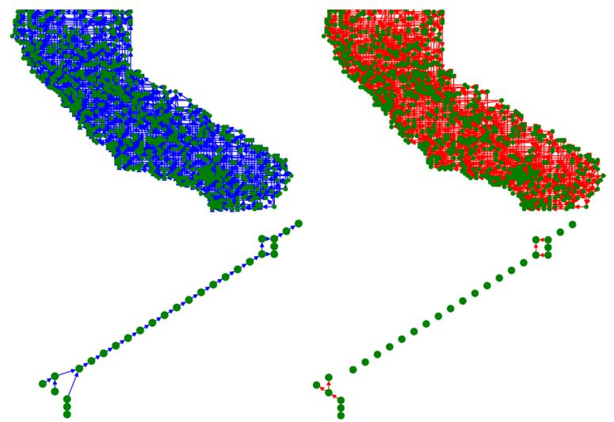

Figure 6: Dominance (right) and anti-dominance (left) graphs of the (top) California and (bottom) Spitz datasets.

of the points, each point is assigned coordinates corresponding to its index in each dimension's ordering. The figure shows each antichain in a different color, illustrating the height increase, as well as an  $\alpha$ -shape [8] of the point-set, illustrating the overall shape.

Malte Spitz is a German politician who published six months of his phone location data between 8/31/2009 and 2/21/2010 [38]. We generated our *Spitz dataset* by taking longitude and latitude information from the first day, truncating it to one decimal place, and scaling it by a factor of 10.

We also ran our order reconstruction attack on the Healthcare Cost and Utilization Project (HCUP) *Nationwide Inpatient Sample (NIS) 2008 and 2009 medical datasets* [1], but we are unable to share images of the reconstructions, per the HCUP data usage agreement. The HCUP dataset is commonly used in literature [9, 24, 25]. The reconstructed dominance graph and anti-dominance graph of the California and Spitz datasets are shown in Figure 6.

Order reconstruction in two-dimensions is significantly more enlightening than in one-dimension. We conjectured that the geometry of the data is more observable when data is more dense in one or both of the domains. Our results from the California dataset support this: we can clearly see that this location data comes from the state of California. In the Spitz case, we can still recover the shape of the dataset and see that it's a deeply diagonal database with a number of collinearities and reflectable components (Figure 6).

# <span id="page-9-0"></span>**6 Estimating the Query Density Functions**

Recall that the query density,  $\rho_S$ , of a set of records S corresponds to the number of unique range queries that contain all records in S. One of the challenges of reconstructing a database D with partial knowledge of  $\mathsf{RM}(D)$ , is that the adversary can no longer compute the exact  $\rho$  values by looking at  $\mathsf{RM}(D)$ . Thus, the two-dimensional FDR attack [9] no longer applies. To reconstruct with missing queries, we draw inspiration from [23] and use statistical estimators to estimate the  $\rho$  values.

In Section 7 we show how these  $\rho$  estimates can be used to construct a system of non-linear equations whose solution corresponds to an approximate reconstruction of the target database.

Formally, let D be a database of R records and let  $M = \{\{(t_1, A_1), \ldots, (t_m, A_m) : A_i \in \mathsf{RS}(D)\}\}$  be a sample (i.e. multiset) of m token-response pairs that are leaked when queries are issued according to an arbitrary distribution. Let  $L \subseteq M$  be a subsample of M of size

<span id="page-9-2"></span>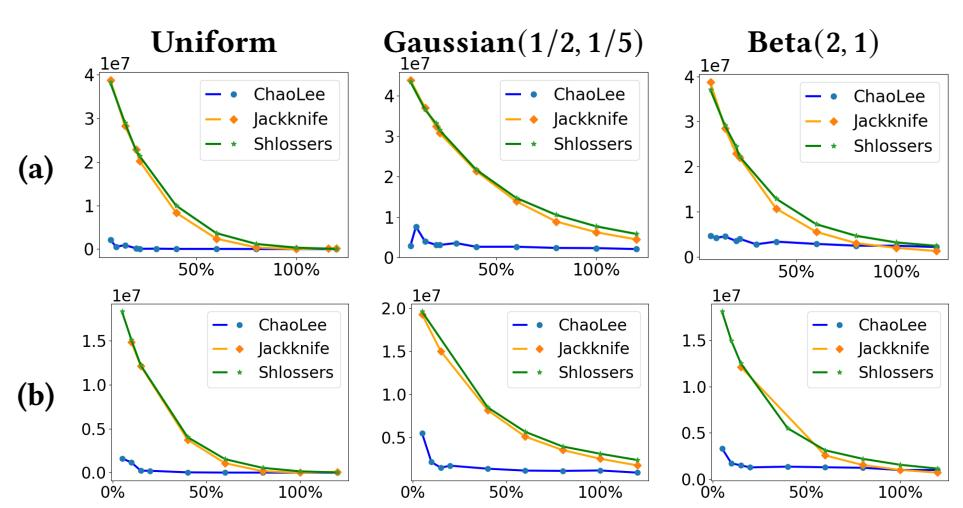

Figure 7: MSE of the estimators on the (a) Spitz and (b) 2008 NIS AGE  $\leq$  18 & NPR datasets over the query ratio.

n. Given a sample (multiset) M of m token-response pairs, we show how one may compute the appropriate (sub)multisets  $L \subseteq M$  that correspond to the  $\rho$  functions of interest. Each of these multisets is used to approximate the value of its respective  $\rho$  value.

#### 6.1 Non-parametric Estimators

Sampling-based estimators have been used in various domains ranging from databases [17] to ecology (e.g. [2, 3]). Non-parametric estimators do not require prior knowledge of the query distribution, yet their success hinges upon the underlying distribution from which queries are drawn. Indeed, for skewed distributions, it may be information theoretically impossible to obtain a reasonable estimate. Recently, non-parametric estimators have been used for database reconstruction to estimate the support size of the given conditional probability distribution of a particular record identifier [23].

For our reconstruction attack, we have considered the estimators by Chao and Lee [5] and by Shlosser [36], and the jackknife estimators described in [2, 3].

For more details about the above estimators, see Appendix D. We initially considered also the Valiant-Valiant estimator [40] as it was used in [23]. However, it did not perform as well in our case.

#### 6.2 Experiments

We ran our estimators against two datasets with domain sizes  $25 \times 25$  and  $18 \times 33$ . The first is the first day of the Spitz dataset (described in Section 5.7), a dataset deeply diagonal exhibiting numerous collinearities and reflectable components. The second database is the NIS 2008 AGE  $\leq$  18 & NPR database, a fairly dense medical database. They were chosen as they represent two fairly different real-world data distributions. For more information, see Table 2.

We tested the robustness of each estimator under the (i) uniform distribution, (ii) Beta(2,1) distribution and (iii) Gaussian(1/2,1/5) distribution of the queries. Recall that our goal is to estimate the query densities  $\rho_i$  for each ID i and  $\rho_{i,j}$  for each pair of IDs. Thus, we obtained estimates  $\widehat{\rho}_i$  and  $\widehat{\rho}_{i,j}$  from the three estimators under the three query distributions and computed the mean squared error (MSE) of such estimates. We plot the MSE against the *query ratio*, which we define as the ratio of the number of queries observed and the total number of possible queries. I.e., if we have observed a queries (including any potential duplicate) and there are a total of b possible queries, the query ratio is  $\frac{a}{b}$ . Note that even when this ratio is 1, the adversary most likely has not observed all possible queries. Our results are shown in Figure 7, where missing values in the plots are due to failure by the estimators to produce an answer in some

{10}------------------------------------------------

cases. Overall, we found that the Chao-Lee estimator consistently performed best, especially for a small query ratio.

# <span id="page-10-0"></span>7 Approximate Database Reconstruction

Our distribution-agnostic attack for ADR assumes the ordering of the points and consists of two parts. As we saw in Section 6, non-parametric estimators may perform differently under different query distributions. In our experiments, the Chao-Lee estimator performed the best under all three distributions and we use it to estimate how many query responses contain a point or a set of points. We use these estimates to construct a system of equations, whose solution gives an approximate reconstruction.

# 7.1 Algorithm

We assume knowledge of the ordering of the database (e.g., as given by Algorithm 4). The first step of ADR is to build a system of equations. We know that point p with coordinates  $p_0, p_1$  will be included in  $\rho_p = p_0 p_1 (N_0 - p_0) (N_1 - p_1)$  unique responses. The Chao-Lee estimator will give us an estimate,  $\widehat{\rho}_p$ , of  $\rho_p$ . We then construct an equation with unknowns  $x_p, y_p$ .

$$x_p y_p (N_0 - x_p)(N_1 - y_p) = \widehat{\rho}_p$$
 (4)

Given a pair of points p,q, where p dominates q, we know that both points are included in  $\rho_{p,q}=q_0q_1(N_0-p_0)(N_1-p_1)$  unique responses. We estimate  $\rho_{p,q}$  as  $\widehat{\rho}_{p,q}$ , and construct an equation with unknowns  $x_p,y_p,x_q,y_q$ .

$$x_q y_q (N_0 - x_p)(N_1 - y_p) = \widehat{\rho}_{p,q}$$
 (5)

We build a similar equation from any ordering of p and q. If two points are in both a dominance and anti-dominance relationship, then they must be collinear. We add this constraint to our system. We use the Chao-Lee estimator to approximate the  $\rho$  values  $(\rho_p, \rho_{p,q})$  from the subset of responses we have seen. We then construct a first guess for the values of the points using their ordering. Each point p is given coordinates corresponding to its indexes in the first and second dimension. Finally, we find an approximation of the database's point values using a least-squares approach.

Our ADR attack is summarized in Algorithm 5, which takes as input a subset S of the response multiset RM(D), the ordering G, G' and the domain size  $(N_0, N_1)$ . It returns a reconstructed point set.

# **Algorithm 5:** ADR( $S \subseteq RM(D), G, G', N_0, N_1$ )

- <span id="page-10-2"></span>1: Let g be a reconstruction of the point values using G and G'
- 2: Create a system of  $\rho$  equations for all single points and pairs, including any collinearities.
- 3: Using the subset of responses we have observed S and the Chao-Lee estimator approximate the  $\rho$  value of each equation.
- 4:  ${\bf return}$  the least-squares solution to the system of equations initializing at g

#### 7.2 Experiments

We have tested our ADR attack (Algorithm 5) on real world datasets: the California [26] and Spitz [38] location datasets and the HCUP NIS medical datasets [1]. Table 2 provides more information on these datasets, where # Queries denotes the total number of possible unique queries (i.e., the denominator of the query ratio). We performed experiments by sampling queries according to the uniform, Beta(2,1), and Gaussian(1/2,1/5) distributions.

<span id="page-10-3"></span>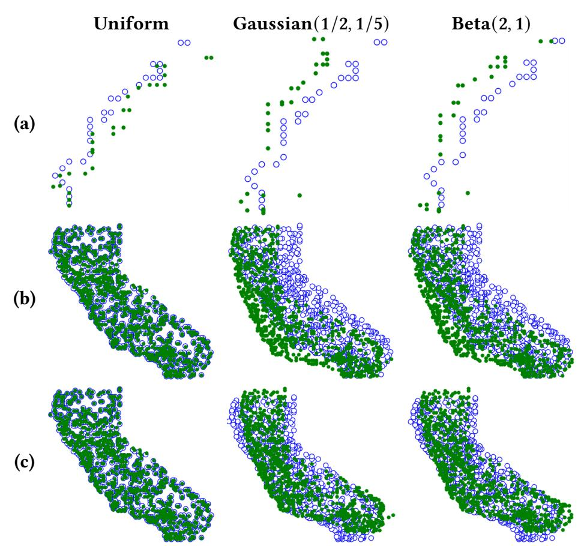

Figure 8: Reconstructions generated by our algorithm. Empty blue circles denote original points and filled green circles denote reconstructed points. (a) Spitz dataset with 7% query ratio. (b) California dataset with 4% query ratio. (c) Postprocessing adjustment.

We measure the accuracy of the reconstruction with the following four metrics to take into account different characteristics. The mean error is the average distance of a reconstructed point to the original point. We use the *normalized mean error*, which is obtained by dividing the mean error by  $N_0 + N_1$ , where  $[N_0] \times [N_1]$ is the domain of the database. The *mean squared error* is the average squared distance of a reconstructed point to the original point. This widely used error metric (e.g., [23]) gives greater weight to larger errors. The **Hausdorff distance** of point sets P and Q, denoted H(P,Q), is a common measure of how far P and Q are from each other. It is defined as  $H(P,Q) = \max(h(P,Q), h(Q,P),$ where  $h(P,Q) = \max_{p \in P} (\min_{q \in Q} dist(p,q))$ . We obtain the **pair**wise relative distance error by computing all distances between pairs of original points and between pairs of reconstructed points, calculating the absolute values of the differences of such distances, normalizing by the original distances, and taking the mean. This measure captures the accuracy of the shape of the reconstructed points. For the Hausdorff distance, we use SciPy's [42] implementation of the algorithm in [39]. The other metrics are easily computed.

Figure 8 shows our reconstructions of the Spitz and California datasets. We cannot present reconstructions of the NIS datasets per

<span id="page-10-1"></span>Table 2: Real-world datasets used in our experiments.

| Dataset         | Attributes   | # Queries | #Points |                |
|-----------------|--------------|-----------|---------|----------------|
| California [26] | LAT & LONG   | 26532800  | 1000    | 102 × 102      |
| Spitz [38]      | LAT & LONG   | 130500    | 28      | 25 × 25        |
|                 | AGE<18 & NPR | 80784     | 355     | 18 × 33        |
| NIS 2008 [1]    | NCH & NDX    | 663300    | 529     | $25 \times 67$ |
|                 | NCH & NPR    | 158400    | 574     | $25 \times 33$ |
|                 | NCH & NDX    | 621270    | 528     | 27 × 60        |
| NIS 2009 [1]    | NCH & NPR    | 246753    | 566     | $27 \times 38$ |
|                 | NDX & NPR    | 1244310   | 862     | $60 \times 38$ |

{11}------------------------------------------------

the HCUP data usage agreement. In Figures [9](#page-12-0) and [12](#page-18-0) (Appendix [E\)](#page-18-1), we give the accuracy metrics for all databases under the different distributions. On the -axis we show the query ratio, i.e., the number of (potentially duplicate) queries observed by the adversary over the total number of possible queries. Our attack performs consistently well on both the location and medical datasets under all four metrics and all three query distributions. The four accuracy metrics follow similar trends. As expected, the accuracy of our reconstruction generally improves with the query ratio. In particular, for the uniform distribution, we already achieve near perfect reconstruction with query ratio around 10%, while for the Beta and Gaussian distributions, there are still errors even at 80% query ratio. Note that the smaller the query ratio is, the higher the variation of accuracy across experiments is, since different query samples vary in usefulness. This is partially due our estimator performing worse under non-uniform distributions and small query ratios (see Figure [7\)](#page-9-2).

# 7.3 Post-processing Adjustment

In a number of datasets, our solution is topologically very close to the original data, yet translated. We now explore how to further reduce reconstruction error. In Figure [8b](#page-10-3), the shape of California is clear, yet in the Gaussian and Beta cases, the points are shifted towards the bottom right. If we were given the centroid of the original points, we could compare it with the centroid of our solution, and translate all points by their difference, as shown in Figure [8c](#page-10-3).

We ran this adjustment technique on the reconstructions of the California dataset and NIS 2009 NCH & NDX and NCH & NPR datasets. For the latter, we used the centroids of the corresponding 2008 NIS datasets as proxies for the original centroids. This choice is motivated by fact that the adversary might have access to the statistics of a related dataset that is expected to have a similar centroid. We applied the adjustment only to the Beta and Gaussian distributions since our reconstructions under the uniform distribution are already very good. We report in Figure [10](#page-12-1) the variation of the normalized mean error (NME), mean squared error (MSE), and Hausdorff distance (HD) due to our post-processing adjustment. Note that since we are only translating the points, the pairwise relative distance error does not change. The experiments show that this simple adjustment method often significantly reduces the error of our reconstruction.

{12}------------------------------------------------

Dataset Attributes Normalized Mean Error Mean Squared Error Hausdorff Distance Pairwise Relative Distance Error California LAT & LONG Spitz LAT & LONG NIS 2008 AGE<18 & NPR NCH & NDX NCH & NPR

<span id="page-12-0"></span>Figure 9: Accuracy of our reconstructions of the California, Spitz and NIS 2008 datasets as a function of the query ratio.

<span id="page-12-1"></span>Figure 10: Impact of the adjustment on the reconstructions of the California and NIS 2009 NCH & NDX and NCH & NPR datasets for the Beta (B) and Gaussian (G) distributions.

{13}------------------------------------------------

# References

- <span id="page-13-32"></span>[1] Agency for Healthcare Research and Quality. 2008, 2009. Healthcare Cost and Utilization Project (HCUP). Nationwide Inpatient Sample (NIS) datasets NIS 2008 and 2009, https://www.hcup-us.ahrq.gov/.
- <span id="page-13-34"></span>[2] K. P. Burnham and W. S. Overton. 1978. Estimation of the Size of a Closed Population when Capture Probabilities vary Among Animals. *Biometrika* 65, 3 (1978), 625–633.
- <span id="page-13-35"></span>[3] K. P. Burnham and W. S. Overton. 1979. Robust Estimation of Population Size When Capture Probabilities Vary Among Animals. *Ecology* 60, 5 (1979), 927–936.
- <span id="page-13-24"></span>[4] David Cash, Stanislaw Jarecki, Charanjit Jutla, Hugo Krawczyk, Marcel-Cătălin Roşu, and Michael Steiner. 2013. Highly-Scalable Searchable Symmetric Encryption with Support for Boolean Queries. In *Advances in Cryptology (CRYPTO)*.
- <span id="page-13-36"></span>[5] Anne Chao and Shen-Ming Lee. 1992. Estimating the Number of Classes via Sample Coverage. J. Amer. Statist. Assoc. 87, 417 (1992), 210–217.
- <span id="page-13-7"></span>[6] Ciphercloud. 2021. CipherCloud: Cloud Data Security Company. http://www.ciphercloud.com Accessed on April 26, 2021.
- <span id="page-13-0"></span>[7] Reza Curtmola, Juan Garay, Seny Kamara, and Rafail Ostrovsky. 2011. Searchable Symmetric Encryption: Improved Definitions and Efficient Constructions. *Journal of Computer Security* 19, 5 (2011), 895–934.
- <span id="page-13-30"></span>[8] Herbert Edelsbrunner, David G. Kirkpatrick, and Raimund Seidel. 1983. On the shape of a set of points in the plane. *IEEE Transactions on Information Theory* 29, 4 (1983), 551–559.
- <span id="page-13-10"></span>[9] Francesca Falzon, Evangelia Anna Markatou, Akshima, David Cash, Adam Rivkin, Jesse Stern, and Roberto Tamassia. 2020. Full Database Reconstruction in Two Dimensions. In *Proc. ACM Conf. on Computer and Communications Security (CCS)*.
- <span id="page-13-27"></span>[10] Stefan Felsner and Lorenz Wernisch. 1998. Maximum k-Chains in Planar Point Sets: Combinatorial Structure and Algorithms. *SIAM J. Comput.* 28, 1 (1998), 192–209.
- <span id="page-13-4"></span>[11] Benjamin Fuller, Mayank Varia, Arkady Yerukhimovich, Emily Shen, Ariel Hamlin, Vijay Gadepally, Richard Shay, John D. Mitchell, and Robert K. Cunningham. 2017. SoK: Cryptographically Protected Database Search. In *Proc. IEEE Symposium on Security and Privacy 2017 (S&P 2017)*.
- <span id="page-13-19"></span>[12] Craig Gentry and Dan Boneh. 2009. *A fully homomorphic encryption scheme*. Vol. 20:09. Stanford university Stanford.
- <span id="page-13-18"></span>[13] Oded Goldreich and Rafail Ostrovsky. 1996. Software protection and simulation on oblivious RAMs. *Journal of the ACM (JACM)* 43, 3 (1996), 431–473.
- <span id="page-13-11"></span>[14] Paul Grubbs, Marie-Sarah Lacharité, Brice Minaud, and Kenneth G. Paterson. 2018. Pump up the Volume: Practical Database Reconstruction from Volume Leakage on Range Queries. In Proceedings of the 2018 ACM SIGSAC Conference on Computer and Communications Security, CCS 2018, Toronto, ON, Canada, October 15-19, 2018, David Lie, Mohammad Mannan, Michael Backes, and XiaoFeng Wang (Eds.). ACM, 315-331. https://doi.org/10.1145/3243734.3243864
- <span id="page-13-25"></span>[15] Paul Grubbs, Marie-Sarah Lacharité, Brice Minaud, and Kenneth G. Paterson. 2019. Learning to Reconstruct: Statistical Learning Theory and Encrypted Database Attacks. In *Proc. IEEE Symp. on Security and Privacy 2019 (S&P 2019)*.
- <span id="page-13-12"></span>[16] Zichen Gui, Oliver Johnson, and Bogdan Warinschi. 2019. Encrypted Databases: New Volume Attacks against Range Queries. In *Proceedings of the 2019 ACM SIGSAC Conference on Computer and Communications Security, CCS 2019, London, UK, November 11-15, 2019*, Lorenzo Cavallaro, Johannes Kinder, XiaoFeng Wang, and Jonathan Katz (Eds.). ACM, 361–378. https://doi.org/10.1145/3319535.3363210
- <span id="page-13-33"></span>[17] P. Haas, J. Naughton, S. Seshadri, and L. Stokes. 1995. Sampling-Based Estimation of the Number of Distinct Values of an Attribute. In *VLDB*.
- <span id="page-13-22"></span>[18] Seny Kamara and Tarik Moataz. 2018. SQL on Structurally-Encrypted Databases. In *Advances in Cryptology – ASIACRYPT 2018*.
- <span id="page-13-23"></span>[19] Seny Kamara, Tarik Moataz, Stan Zdonik, and Zheguang Zhao. 2020. An Optimal Relational Database Encryption Scheme. Cryptology ePrint Archive, Report 2020/274. https://eprint.iacr.org/2020/274.
- <span id="page-13-1"></span>[20] Seny Kamara, Charalampos Papamanthou, and Tom Roeder. 2012. Dynamic Searchable Symmetric Encryption. In *Proc. ACM Conf. on Computer and Communications Security (CCS)*. ACM.
- <span id="page-13-2"></span>[21] Georgios Kellaris, George Kollios, Kobbi Nissim, and Adam O'Neill. 2016. Generic Attacks on Secure Outsourced Databases. In *Proc. ACM Conf. on Computer and Communications Security 2016 (CCS 2016).*
- <span id="page-13-13"></span>[22] Evgenios M. Kornaropoulos, Charalampos Papamanthou, and Roberto Tamassia 2019. Data Recovery on Encrypted Databases With *k*-Nearest Neighbor Query Leakage. In *Proc. IEEE Symp. on Security and Privacy 2019 (S&P 2019)*.
- <span id="page-13-14"></span>[23] Evgenios M. Kornaropoulos, Charalampos Papamanthou, and Roberto Tamassia. 2020. The State of the Uniform: Attacks on Encrypted Databases Beyond the Uniform Query Distribution. In *Proc. IEEE Symp.on Security and Privacy 2020 (S&P 2020)*.
- <span id="page-13-26"></span>[24] Evgenios M. Kornaropoulos, Charalampos Papamanthou, and Roberto Tamassia. 2021. Response-Hiding Encrypted Ranges: Revisiting Security via Parametrized Leakage-Abuse Attacks. In *Proc. IEEE Symp. on Security and Privacy (S&P)*.
- <span id="page-13-15"></span>[25] Marie-Sarah Lacharité, Brice Minaud, and Kenneth G Paterson. 2018. Improved reconstruction attacks on encrypted data using range query leakage. In *Proc. IEEE Symp. on Security and Privacy 2018 (S&P 2018)*.

- <span id="page-13-39"></span>[26] Feifei Li, Dihan Cheng, Marios Hadjieleftheriou, George Kollios, and Shang-Hua Teng. 2005. California Road Network Dataset. Downloaded from http://www.cs.utah.edu/~lifeifei/SpatialDataset.htm.
- <span id="page-13-29"></span>[27] Feifei Li, Dihan Cheng, Marios Hadjieleftheriou, George Kollios, and Shang-Hua Teng. 2005. On Trip Planning Queries in Spatial Databases. In *Advances in Spatial and Temporal Databases*, Claudia Bauzer Medeiros, Max J. Egenhofer, and Elisa Bertino (Eds.). Springer Berlin Heidelberg, Berlin, Heidelberg, 273–290.
- <span id="page-13-16"></span>[28] Evangelia Anna Markatou and Roberto Tamassia. 2019. Full Database Reconstruction with Access and Search Pattern Leakage. In *Proc. Int. Conf on Information Security 2019 (ISC 2019)*.
- <span id="page-13-8"></span>[29] McAfee. 2021. McAfee. https://www.mcafee.com/enterprise/en-us/home.html accessed on April 26, 2021.
- <span id="page-13-9"></span>[30] Antonis Papadimitriou, Ranjita Bhagwan, Nishanth Chandran, Ramachandran Ramjee, Andreas Haeberlen, Harmeet Singh, Abhishek Modi, and Saikrishna Badrinarayanan. 2016. Big Data Analytics over Encrypted Datasets with Seabed. In 12th USENIX Symposium on Operating Systems Design and Implementation (OSDI 16). USENIX Association, Savannah, GA, 587–602.
- <span id="page-13-5"></span>[31] Rishabh Poddar, Tobias Boelter, and Raluca Ada Popa. 2019. Arx: An Encrypted Database Using Semantically Secure Encryption. 12, 11 (July 2019), 1664–1678.
- <span id="page-13-17"></span>[32] Rishabh Poddar, Stephanie Wang, Jianan Lu, and Raluca Ada Popa. 2020. Practical Volume-Based Attacks on Encrypted Databases. In *IEEE European Symposium on Security and Privacy, EuroS&P 2020, Genoa, Italy, September 7-11, 2020.* IEEE, 354–369. https://doi.org/10.1109/EuroSP48549.2020.00030
- <span id="page-13-6"></span>[33] Raluca A. Popa, Catherine M. S. Redfield, Nickolai Zeldovich, and Hari Balakrishnan. 2011. CryptDB: protecting confidentiality with encrypted query processing. In *Proceedings of the 23rd ACM Symposium on Operating Systems Principles 2011, SOSP 2011, Cascais, Portugal, October 23-26, 2011,* Ted Wobber and Peter Druschel (Eds.). ACM, 85–100. https://doi.org/10.1145/2043556.2043566
- <span id="page-13-42"></span>[34] M. H. Quenouille. 1949. Approximate Tests of Correlation in Time-Series. *Journal of the Royal Statistical Society. Series B (Methodological)* 11, 1 (1949), 68–84.
- <span id="page-13-20"></span>[35] Elaine Shi, John Bethencourt, T-H. Hubert Chan, Dawn Song, and Adrian Perrig. 2007. Multi-Dimensional Range Query over Encrypted Data (*SP '07*). IEEE Computer Society, USA, 350–364.
- <span id="page-13-37"></span>[36] A. Shlosser. 1981. On estimation of the size of the dictionary of a long text on the basis of a sample. *Engineering Cybernetics* 19 (1981), 97–102.
- <span id="page-13-3"></span>[37] Dawn Xiaodong Song, David Wagner, and Adrian Perrig. 2000. Practical techniques for searches on encrypted data. In *Proc. IEEE Symp. on Security and Privacy (SP)*.
- <span id="page-13-31"></span>[38] Malte Spitz. 2011. CRAWDAD dataset spitz/cellular (v. 2011-05-04). Downloaded from https://crawdad.org/spitz/cellular/20110504.
- <span id="page-13-41"></span>[39] Abdel Aziz Taha and Allan Hanbury. 2015. An Efficient Algorithm for Calculating the Exact Hausdorff Distance. *IEEE Transactions on Pattern Analysis and Machine Intelligence* 37, 11 (2015), 2153–2163. https://doi.org/10.1109/TPAMI.2015.2408351
- <span id="page-13-38"></span>[40] Paul Valiant and Gregory Valiant. 2013. Estimating the Unseen: Improved Estimators for Entropy and other Properties. In *Advances in Neural Information Processing Systems*, Vol. 26. 2157–2165.
- <span id="page-13-28"></span>[41] Gérard Viennot. 1984. Chain and Antichain Families Grids and Young Tableaux. In *Orders: Description and Roles Ordres: Description et Rôles*, Maurice Pouzet and Denis Richard (Eds.). North-Holland Mathematics Studies, Vol. 99. North-Holland, 409 – 463.
- <span id="page-13-40"></span>[42] Pauli Virtanen, Ralf Gommers, Travis E. Oliphant, Matt Haberland, Tyler Reddy, David Cournapeau, Evgeni Burovski, Pearu Peterson, Warren Weckesser, Jonathan Bright, Stéfan J. van der Walt, Matthew Brett, Joshua Wilson, K. Jarrod Millman, Nikolay Mayorov, Andrew R. J. Nelson, Eric Jones, Robert Kern, Eric Larson, C J Carey, İlhan Polat, Yu Feng, Eric W. Moore, Jake VanderPlas, Denis Laxalde, Josef Perktold, Robert Cimrman, Ian Henriksen, E. A. Quintero, Charles R. Harris, Anne M. Archibald, Antônio H. Ribeiro, Fabian Pedregosa, Paul van Mulbregt, and SciPy 1.0 Contributors. 2020. SciPy 1.0: Fundamental Algorithms for Scientific Computing in Python. *Nature Methods* 17 (2020), 261–272. https://doi.org/10.1038/s41592-019-0686-2
- <span id="page-13-21"></span>[43] Boyang Wang, Yantian Hou, Ming Li, Haitao Wang, and Hui Li. 2014. Maple: Scalable Multi-Dimensional Range Search over Encrypted Cloud Data with Tree-Based Index. In *Proc. of the 9th ACM Symposium on Information, Computer and Communications Security (ASIA CCS '14).*

{14}------------------------------------------------

### <span id="page-14-1"></span>A Algorithm 8 (DominanceID)

In this section we describe in full detail how given the response set RS(D) and the ID a of a point with height 0, one can compute the full set of IDs of points that dominate D[a]. We start by describing a helper function called Boxes.

Let  $a, b \in [R]$  be the IDs of two points in D. Algorithm Boxes, takes as input a pair (a, b) and returns the following responses of RS(D) (see Figure 11):

- $S_{a,b}$ : minimal response containing a and b.
- $P_{a,b}$ : D minus the maximal responses containing b but not a; i.e., set of points p such that every response containing b and p contains also a.
- $P_{b,a}$ : D minus the maximal responses containing a but not b; i.e., set of points p such that every response containing a and p contains also b.

# Algorithm 6: $\overline{Boxes(a,b)}$

```
1: Let S_{a,b} be the smallest response in RS(D) containing a and b
2: Let L = D
3: Let P_{b,a} and P_{a,b} be empty lists
4: for p \in L do
5: if \nexists r \in \text{RS}(D), s.t. p, b \in r and a \notin r then
6: Add p to P_{a,b}
7: if \nexists r \in \text{RS}(D), s.t. p, a \in r and b \notin r then
8: Add p to P_{b,a}
9: return P_{b,a}, S_{a,b} and P_{a,b}
```

<span id="page-14-4"></span>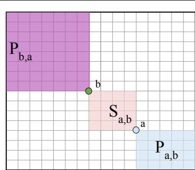

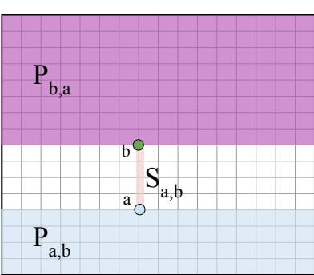

Figure 11: Illustrating the sets output by Algorithm 6 for points a and b, when b strictly anti-dominates a (left) and when b and a are collinear (right).

Note that given a pair of IDs (a, b), there are at most two distinct maximal responses containing a but not b (or b but not a). These responses comprise the points in the maximal horizontal and vertical strips of the domain that contain a but not b (or b but not a). Note that if a and b share the same horizontal or vertical coordinate, only one of the above strips is nonempty.

<span id="page-14-3"></span>Algorithm 8 (DominanceID) leverages Boxes to determine if top dominates a. If yes, then we return the minimal response containing a, top and right. Else top must strictly antidominate a. Let S be the smallest response containing a, top and right and let M be the smallest response containing a and top. It is clear that S-M contains all IDs of points that strictly dominate a. To find the IDs of points that are colinear with a, we run Edges with  $M-\{a\}$  as input; the IDs of points that are colinear with a must be one of the edges in the output. In particular, the colinear points must be  $p \in E$  such that E is the edge not containing top, left, or any element of  $A_0$ . And so the algorithm outputs  $(S-M) \cup E$ .

#### **Algorithm 7:** Edges(S, RS(D))

```
    Let RS' be the set of responses that contain only points in S
    Let L be the largest response in RS'
    Let S<sub>1</sub> be the 2<sup>nd</sup> largest response in RS'. E<sub>1</sub> = L - S<sub>1</sub>.
    Let S<sub>2</sub> be the 2<sup>nd</sup> largest response containing E<sub>1</sub>. E<sub>2</sub> = L - S<sub>2</sub>.
    Let S<sub>3</sub> be the 2<sup>nd</sup> largest response containing E<sub>1</sub> and E<sub>2</sub>. If S<sub>3</sub> exists, E<sub>3</sub> = L - S<sub>3</sub>.
    Let S<sub>4</sub> be the 2<sup>nd</sup> largest set containing E<sub>1</sub>, E<sub>2</sub>, and E<sub>3</sub>. If S<sub>4</sub> exists, E<sub>4</sub> = L - S<sub>4</sub>.
    return E<sub>1</sub>, E<sub>2</sub>, E<sub>3</sub>, E<sub>4</sub>
```

# **Algorithm 8:** DominanceID(a, top, left, right, RS(D))

```
1: Let S_1 be the smallest response that contains left, top and right.
 2: Let S_2 be the smallest response that contains s_1, top and right.
 3: Let M be the smallest response that includes s_1 and top
 4: for p \in M do
      if p \in M - S_2 then
 5:
         P_{p,\text{top}}, S_{p,\text{top}}, P_{\text{top},p} = \text{Boxes}(\text{top}, p)
 6:
         S = P_{p, \mathsf{top}} \cup S_{p, \mathsf{top}} \cup P_{\mathsf{top}, p}
 7:
         if left, right \in S then
 8:
           // a and top are collinear
 9:
10:
           return S_2
         else if left \in S then
11:
           // top dominates a
12:
           return S_2
13:
         else if right \in S then
14:
           // top anti-dominates a
15:
           E = Edges(M - \{a\}, RS(D))
16:
           S_2 = S_2 - M
17:
           Add all p in an edge in E not containing top or a' \in A_0 to S_2.
18:
           return S_2
19:
       else if p \in M - S_1 then
20:
21:
         P_{p,a}, S_{a,p}, P_{a,p} \operatorname{Boxes}(a, p)
22:
         S = P_{p,a} \cup S_{a,p} \cup P_{a,p}
23:
         if left, right \in S then
24:
           // a and top are collinear
25:
           return S_2
26:
         else if right \in S then
27:
           // top dominates a
28:
           return S_2
29:
         else if left \in S then
30:
           // top anti-dominates a
31:
           E = \operatorname{Edges}(M - \{a\}, \operatorname{RS}(D))
32:
           S_2 = S_2 - M
33:
           Add all p in an edge in E not containing top or a' \in A_0 to S_2.
34:
           return S_2
35: return S_2
```

# **B** Algorithm 9 (FindExtremePairs)

Let D be a database with R records and let RS(D) be its response set. Algorithm 9 (FindExtremePairs) returns all configurations of extreme points (left, right, top, bottom) such that no points are dominated by left and bottom, and no points dominate right and top.

{15}------------------------------------------------

#### **Algorithm 9:** FindExtremePairs(RS(D))

```
Input: Response set RS(D) of database D
```

- 1:  $E_1, E_2, E_3, E_4 = Edges(D, RS(D))$
- <span id="page-15-3"></span>2: Let Possible Configs be all possible combinations of  $E_1$ ,  $E_2$ ,  $E_3$  and  $E_4$  into LeftE, RightE, TopE, BottomE.
- <span id="page-15-4"></span>3: Initialize empty dictionary config.
- 4: for LeftE, RightE, TopE, BottomE in PossibleConfigs do
- <span id="page-15-2"></span>5: **for**  $E_1, E_2 \in \{\text{LeftE}, \text{BottomE}\}, \{\text{RightE}, \text{TopE}\}$ **do**
- 6: **for**  $a, b \in E_1 \times E_2$  **do**
- 7: **if** the smallest response in RS(D) that contains a and b does not contain any other element of  $E_1$  or  $E_2$  **then**
- 8: Add *a*, *b* to config under their corresponding key left, right, top, or bottom.
- 9: Return to line 5.
- 10: Add config to PosExtremes.
- 11: Return PosExtremes

## <span id="page-15-0"></span>**C** Proofs

# C.1 Proof of Proposition 2

PROOF. Let D[i] = p, D[j] = q, D'[i] = p', and D'[j] = q'. We first show that  $RS(D) \subseteq RS(D')$ . Consider a response A in RS(D) that contains i and not j. We will exemplify a query to D' with response A. Consider the set  $B = (A - \{i\})$ . Since D[i] has a unique maximal value in the second coordinate the set B must be an element of RS(D). By assumption,  $RS(D - \{p, q\}) = RS(D' - \{p', q'\})$  and so we have that  $B \in RS(D')$ . Let  $(c, d) \in \mathcal{D}^2$  be a query that generates the response B in D'. Now consider the query  $((min_0, 1), (max_0, d_1))$  where  $min_0 = \min(c_0, p_0, p'_0)$  and  $max_0 = \max(d_0, p_0, p'_0)$ . Since the only additional identifier contained in this region is i, then the response generated by this query is  $A = B \cup \{i\}$  which implies  $A \in RS(D')$ .

A similar argument holds for queries that contain j and not i, as well as queries that contain both i and j, which concludes the forward direction of the proof. One can also extend this reasoning to show that  $RS(D') \subseteq RS(D)$ .

## C.2 Proof of Proposition 3

PROOF. Let D[i] = q and D'[i] = q'. By assumption  $RS(D - \{q\}) = RS(D' - \{q'\})$ . We first show that  $RS(D) \subseteq RS(D')$ . We claim that for any response  $A \cup \{i\}$  in RS(D) there exists a response  $A \cup \{i\} \in RS(D')$ . Let  $A \cup \{i\}$  be a response in RS(D) and let  $(c,d) \in \mathcal{D}^2$  be a query to D that produces such a response. We will consider two possible cases and in each case explicitly give a query to D' that must result in the response  $A \cup \{i\}$ .

Case 1:  $p_0 < c_0$ . Consider the query  $((c_0, min_1), d)$  issued to D' such that  $min_1 = \min(q'_1, c_1)$ . If  $min_1 = c_1$  then

 $\operatorname{Resp}(D', ((c_0, min_1), d)) = \operatorname{Resp}(D', (c, d)) = A \cup \{i\}$  since all points  $r \in A$  are identical in both D and D' and q' is contained in this query. Else if  $min_1 = q_1'$  then by definition of close pair, q, q' must minimally dominate p. So no additional points beside q' are contained in the response generated by  $((c_0, min_1), d)$  thus  $\operatorname{Resp}(D', ((c_0, min_1), d)) = A \cup \{i\}$ .

Case 2:  $c_0 \le p_0$ . Since the query (c,d) contains q then we have  $c \le p$  and  $q \le d$ . Moreover  $p \le q' \le q$  and so we have  $Resp(D',(c,d)) = A \cup \{i\}$ .

That proves the forward direction of the proof. A similar argument holds for the backward direction and we conclude that RS(D) = RS(D').

#### C.3 Proof of Lemma 5.1

PROOF. We first show that Algorithm 7 returns the correct edges i.e. the sets  $E_i$  for  $i \le 4$  contain IDs of all points with an extreme coordinate value. Note that the second largest response in RS(D) must exclude the ID of some extreme point p. For a contradiction, suppose p is not extreme. Then we could minimally extend the query to include p and the resulting query would have a response strictly larger than the original query and strictly smaller than [R] since it is not extreme, hence a contradiction. Now consider the second largest response containing the ID of p. The remaining ID(s) must correspond to points with an extreme coordinate value in another direction, else we could minimally extend the query to include the non-extreme point(s). By extending this reasoning, we recover the IDs of all points with an extreme coordinate.

In Algorithm 9, line 2 stores the at most 4! assignments of the  $E_i$  to LeftE, RightE, TopE, and BottomE. The for loop on line 4 then iterates through each possible assignment to identify the correct IDs within each edge set. We want to find the IDs for the leftmost point, a, and bottom-most point, b, such that no points are dominated by D[a] or D[b]. This corresponds to finding  $a \in \text{LeftE}$  and  $b \in \text{BottomE}$  such that the minimal response containing them contains no other extreme points. Suppose for a contradiction that some edge point c was dominated by either a or b, then the minimal query must also contain c. A similar argument holds for the topmost and right-most points.

The algorithm terminates in O(R|RS(D)|) time. It takes  $O(R^2 \cdot |RS(D)|)$  time to find the edges. Then, we iterate through pairs of edges and look through RS(D) to find a smallest response.  $\Box$ 

#### C.4 Proof of Lemma 5.2

PROOF. Let left, right, top and bottom be the points defined by config. Without loss of generality, assume that right dominates left and bottom. We first show that lines 2 to 7 find a set of IDs of points that are not dominating any point in D (i.e. a minimal antichain  $A_0$  of D up to rotation/reflection). By correctness of Algorithm 9, no point is dominated by either left or bottom. Let S be the smallest response in RS(D) containing left and bottom. All points *not* dominated by left and bottom must be in S, and thus we initialize  $A_0 = S$ .

By assumption, right must dominate all points with IDs in S. Let p be a point with ID in S and consider the response T of query (p, right). If there is a point q with ID in S such that  $p \leq q$ , then its ID must also be in response T. In line 6 we find the set Q of all such IDs and delete Q from  $A_0$ . Since the for loop on line 4 iterates through all IDs in S, and deletes the IDs of all points that must dominate at least one other point in S, then at the end of the loop  $A_0$  must be the set of all points not dominating any other point.

On lines 10 to 18, we construct the dominance graph. Let S be the IDs output by DominanceID(RS(D), a) for some  $a \in A_0$ . Note that  $S - \{a\}$  corresponds to the IDs of all records that dominate D[a]. The for loop starting on line 14 correctly builds the dominance subgraph on all IDs in S. We show that the following loop invariant is maintained: at the end of iteration  $\ell$  (1) no point with ID in

{16}------------------------------------------------

 $S\setminus V(G_a)$  is dominated by a point with a vertex in  $G_a$  and (2) if i and j are in  $V(G_a)$  and D[j] minimally dominates D[j], then edge (i,j) is in  $G_a$ . At the start  $G_a=\{a\}$ ; this is correct since  $a\in A_0$  and  $A_0$  is the set of IDs of points that do not dominate any other point. Assume that at iteration  $\ell$  the invariant holds. Find the next smallest response T that contains a and only other IDs in S. If T contains v not in  $G_a$  then add it to  $G_a$ . (1) holds since no point in  $S\setminus V(G_a)$  dominates D[v], otherwise it would be contained in T and we could form a strictly smaller response contradicting the minimality of T. For each sink  $t\in G_a$  such that  $t\in T$  we add (t,v) to  $G_a$ . (2) holds since D[v] must dominate all points with IDs in  $T\cap V(G_a)$  and must minimally dominate all sinks t in  $G_a$  that are contained in T. Suppose there is some ID j in  $V(G_a)$  that is minimally dominated by v but is not a sink. Then this would violate the correctness of  $G_a$  at the end of iteration  $\ell$  and hence this cannot happen.

Putting it all together, we want to show that taking the union of all  $G_a$  gives us the complete dominance graph G. Let  $p, q \in D$  be any points such that  $p \leq q$ . By correctness of  $A_0$ , there exists some  $a \in A_0$  such that  $D[a] \leq p, q$ , and thus p and q are contained in the minimal query of a, right, and top. By the correctness of  $G_a$ , then an edge from the IDs of p to q must be added when constructing  $G_a$ . Since every dominance edge is added to a graph  $G_a$  of some a, then taking the union over all  $G_a$  gives the complete dominance graph of D.

The Algorithm terminates in  $O(R^3|\mathsf{RS}(D)|)$  time. It takes  $O(R \cdot |\mathsf{RS}(D)|)$  time to find the first antichain. Then, Algorithm 8 takes  $O(R^2 \cdot |\mathsf{RS}(D)|)$  and may be run R times.

#### C.5 Proof of Lemma 5.3

PROOF. Let  $A_0$  be the set of IDs of points with height 0. We argue that the height of  $p \in V$  is given by the maximum length of a path from a to p over all  $a \in A_0$ . Fix some  $p \in V$  and suppose that the maximum length of any path from the vertices in  $A_0$  to p is  $\ell$ , and let there be such a maximal path from some  $a \in A_0$  to p. By correctness of Algorithm 1, the path from a to p in G corresponds to a chain in database *D*. Thus the height of *p* is  $\geq \ell$ . Suppose for a contradiction that p has height  $\ell' > \ell$ ; By definition of height there must exist a chain  $C \subseteq D$  of size  $\ell'$  with p as the maximal element. Let  $c_1 \leq c_2 \leq \cdots \leq c_{\ell'}$  be the elements of C. We have that  $c_{i+1}$ must minimally dominate  $c_i$ , otherwise we could could extend the chain from a to p to have length greater than  $\ell'$ . By correctness of G, each edge  $(c_i, c_{i+1})$  must be in G. Hence the length of the longest path from a to p in G is  $\ell' > \ell$ , a contradiction. Thus the height of p is given by the length of the longest path from a to p over all  $a \in A_0$ .

Let L be the number of partitions in the canonical antichain partition of D. We have shown that Algorithm computes the partition  $\mathcal{A}=(A_0,\ldots,A_L)$  correctly. Let  $a_1,\ldots,a_m$  be elements of a partition  $A\in\mathcal{A}$ . We show that Algorithm 2 correctly computes an ordering of  $a_1,\ldots,a_m$  i.e. a  $a_{\gamma_1},\ldots,a_{\gamma_m}$  such that  $\gamma_i=1,\ldots,m$  and for all j either  $a_{\gamma_j}\leq_a a_{\gamma_{j+1}}$  or  $a_{\gamma_{j+1}}\leq_a a_{\gamma_j}$ . If |A|<3 then we are done.  $|A|\geq 3$  then on line 12 we compute all responses in RS(D) that contain exactly two elements in A and denote this set as S. A response containing exactly two elements  $a,a'\in A$  exists only if a minimally anti-dominates a' (or vice versa). Next we delete all  $p\in D-A$  from responses in S and make it a set. Let  $\{a,a'\}$  be an element of the resulting set S. Without loss of generality,

suppose a' minimally anti-dominates a. Suppose that there exists another set  $\{a', a''\} \in S$ . Then by transitivity a'' must minimally anti-dominate a'. We can thus "order" the elements in A by finding consecutive pairs of points in the responses.

This Algorithm terminates in  $O(R^2|\mathsf{RS}(D)|)$  time, as it takes  $O(R^2)$  time to find the longest paths in G and  $O(R^2|\mathsf{RS}(D)|)$  to order the antichains.

#### C.6 Proof of Lemma 5.4

PROOF. The antichains returned by Algorithm 2 may have inconsistent direction. The first step of Algorithm 3 is to fix their orientation. We assume that the first antichain,  $A_0$ , has the correct orientation. Then, we find the first element of  $A_0$  that has a dominance edge to a point in  $A_1$ , the second antichain. Let that edge be  $(c_1, c_2), c_1 \in A_0, c_2 \in A_1$ . If there are multiple options for  $c_2$ , we pick the smallest one in order. Note that each member p of antichain i must have a dominance edge with some member q of antichain j, j < i. Otherwise, p would be part of some previous antichain.

If the order of antichain 1 is wrong, then a point  $c_1' \in A_0$  in order before  $c_1$  must have an edge with point  $c_2' \in A_1$ , in order after  $c_2$ . If the chains were correctly ordered that would be impossible as  $c_2'$  anti-dominates  $c_1$  and  $c_1$  anti-dominates  $c_1'$ . Thus,  $c_2'$  cannot dominate  $c_1'$ . Thus, Algorithm 2 can correctly orient the second chain given the order of the previous antichains. Maintaining this invariant, Algorithm 2 correctly orients all antichains.

We begin constructing the anti-dominance graph by adding anti-dominance edges between consecutive pairs of points in each antichain.

It remains to add anti-dominance edges between points in different antichains. The algorithm iterates through pairs of chains, and finds points  $a_i$  and  $a_j$  that are not connected in G and  $a_i \in A_i$ ,  $a_j \in A_j$ , i < j. Point  $a_i$  either anti-dominates  $a_j$  or  $a_j$  anti-dominates  $a_i$ . In order to determine their relationship, we look for a dominance edge between the antichains. If  $a_j$  anti-dominates  $a_i$ , then all predecessors of  $a_i$  are also anti-dominated by  $a_j$  and its successors. So, if a predecessor of  $a_j$  dominates a successor of  $a_i$ . Then  $a_j$  must anti-dominate  $a_i$ . Similarly, if a successor of  $a_j$  dominates a predecessor of  $a_j$ , then  $a_i$  anti-dominates  $a_j$ .

Note that this technique finds only strict anti-dominance edges. It remains to find any collinear anti-dominance edges. Given a pair of points p and p, such that q anti-dominates p, and a point k that is in Boxes(p, q), k must have an anti-dominance relationship with both. If no such path exists in G', we add appropriate edges depending on which of the Boxes k is in. Note that in some cases, as explained by Proposition 3, it's impossible to determine all collinearities.

Our definition of the anti-dominance graph is that it contains minimal anti-dominance edges. Thus, after we remove any transitive edges, we have generated *D*'s anti-dominance graph.

The Algorithm terminates in  $O(R^2|\mathsf{RS}(D)|)$  time, as it takes  $O(R^2)$  to fix the antichains and add edges between them and  $O(R^3 \cdot |\mathsf{RS}(D)|)$  to run Boxes for any anti-dominance pair.

{17}------------------------------------------------

## <span id="page-17-0"></span>**D** Estimators

We introduce definitions from prior work on estimators. To remain consistent with prior estimator literature, in this section, N and D do not refer to the domain or database, respectively. Formally, let D be a database of R records and let

$$M = \{\{(t_1, A_1), \dots, (t_m, A_m) : A_i \in \mathsf{RS}(D)\}\}\$$

be a sample (i.e. multiset) of m token-response pairs that are leaked when queries are issued according to an arbitrary distribution. Let M be a sample and let n denote the size of a subsample  $L \subseteq M$ . Denote by D the number of distinct tokens in M and d the number of distinct tokens in a sub-sample  $L \subseteq M$ .

Definition D.1. [40] Let L be a (sub)sample and let  $f_i$  be the number of search tokens that are observed i times in L. The fingerprint of a sample L is the vector  $F = (f_1, f_2, ..., f_n)$ , where |L| = n. We can express the total number of token-response pairs in L as  $n = \sum_{i=1}^{n} i f_i$  and the number of observed distinct search tokens as  $d = \sum_{i=1}^{n} f_i$ .

To estimate  $\widehat{\rho} \approx \rho$ , we let L be a sub-multiset of M comprised of all token-response pairs that contain the identifiers of the points whose  $\rho$  value we wish to compute. We then use an estimator to estimate how many unique search tokens are associated with those record identifiers. We describe three such estimators below.

**Chao-Lee.** Chao and Lee proposed an estimator that utilizes sample coverage [5]. The sample coverage C of a sample L is the sum of the probabilities of the the token-response pairs that appear in L. Knowledge of C can then be used to estimate  $\widehat{\rho}$ . Chao and Lee use this approximation in combination with an additive term to correct estimates of data drawn from skew distributions.

Let  $p_i$  be the probability that a query sampled from the distribution matches the i-th token-response pair, of the possible  $Q = \binom{N_0+1}{2}\binom{N_1+1}{2}$  token-response pairs. Let  $\mathbb{1}_L(i)$  be the following indicator function:  $\mathbb{1}_L(i)$  equals 1 if the i-th token-response pair is in L and 0 otherwise. The sample coverage C of a sample L is the sum of the probabilities of the the token-response pairs that appear in L:  $C = \sum_{i=1}^Q p_i \cdot \mathbb{1}_L(i)$ . Note that  $\hat{C} = 1 - f_1/n$  is a natural estimate for C, which can then be used to estimate  $\widehat{\rho} \approx d/\widehat{C}$ . Thus,

$$\widehat{\rho}_{\text{ChaoLee}} = \frac{d}{\widehat{C}} + \frac{n(1-\widehat{C})}{\widehat{C}} \cdot \widehat{\gamma}^2,$$

where  $\hat{\gamma}$  is an estimate of the coefficient of variation  $\gamma = (\sum_i (p_i - p_{mean})^2/Q)^{1/2}/p_{mean}$  and  $p_{mean}$  is the mean of the probabilities  $p_1, \dots, p_Q$ .

**Shlosser**. Shlosser derived an estimator that works well under the assumption that the sample is large and the sampling fraction is nonnegligible [36]. We used an implementation of Shlosser Estimator that used a Bernoulli Sampling scheme. This estimator is more effective for skewed distributions.

Let q be the probability with which a token-response pair is included in the sample. In [36], Shlosser derived the estimator

$$\widehat{\rho}_{\text{Shloss}} = d + \frac{f_1 \sum_{i=1}^{n} (1 - q)^i \cdot f_i}{\sum_{i=1}^{n} i \cdot (1 - q)^{i-1} \cdot f_i}.$$

This estimator rests on the assumption that q = n/Q. As [17] notes, the Shlosser estimator further rests on the assumption that  $\mathbb{E}[f_i]/\mathbb{E}[f_1] \approx F_i/F_1$  where  $F_i$  is the number of tokens that appear i times in entire database; This assumption isn't often satisfied in

our setting, but our experiments demonstrate that Shlosser did comparable to Jackknife in various cases.

**Jackknife.** The jackknife method was introduced by Quenouille as a technique for correcting the bias of an estimator [34]. We use the jackknife estimators described in [2, 3], which have been used for the problem of estimating the number of unique attributes in a relational database [17], in database reconstruction [23], and in biology for the related problem of species estimation. Given a biased estimate, jackknife estimators use sampling with replacement to estimate the bias  $bias_{jack}$ , and obtain  $\widehat{\rho}_{jack}$ .

One can view d as a biased estimate of the true  $\rho$ . Given a biased estimate d, jackknife estimators use sampling with replacement to estimate the bias  $bias_{jack}$ , and obtain  $\widehat{\rho}_{jack} = d - bias_{jack}$ . Let  $d_n$  denote the number of unique tokens in L and let  $d_{n-1}(k)$  denote the number of unique tokens in L when the k-th token-response removed. Note that  $d_{n-1}(k) = d_n - 1$  if and only if the k-th pair is unique in L. Let  $d_{n-1} = (1/n) \sum_{k=1}^n d_{(n-1)}(k)$ . The first order jackknife estimator is

$$\widehat{\rho}_{\text{jack}} = d - (n-1)(d_{(n-1)} - d).$$

The second order jackknife considers all n samples generated by leaving one pair out, in addition to all  $\binom{n}{2}$  generated by leaving two pairs out. This method can be extended to an k-th order jackknife estimators that generates  $\sum_{i=1}^{k} \binom{n}{i}$  samples and has bias  $O(n^{-k+1})$ .

{18}------------------------------------------------

# <span id="page-18-1"></span><span id="page-18-0"></span>E Experimental Results

Figure 12: Accuracy of our reconstructions of the NIS 2009 datasets as a function of the query ratio.

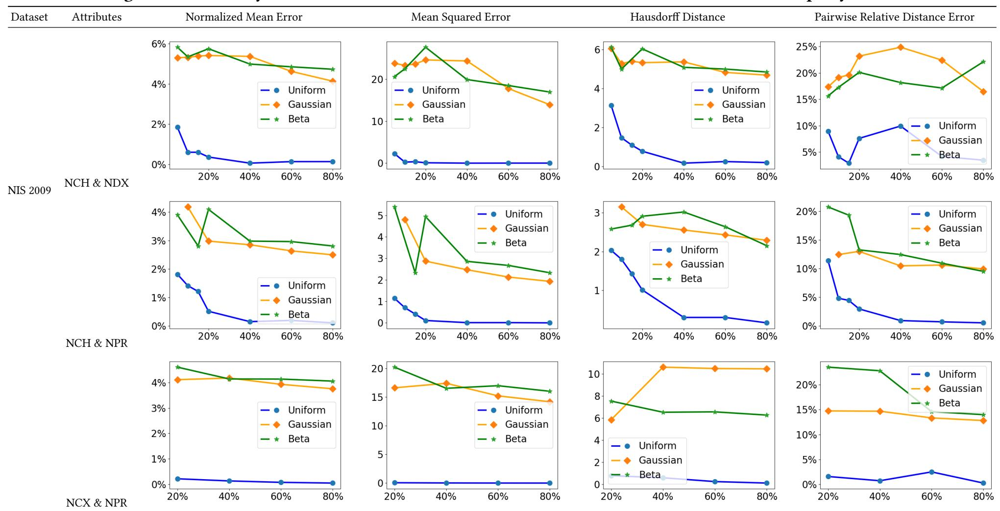