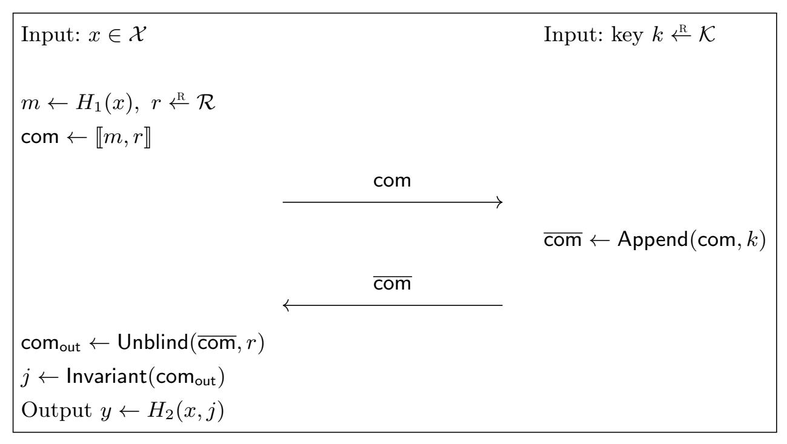
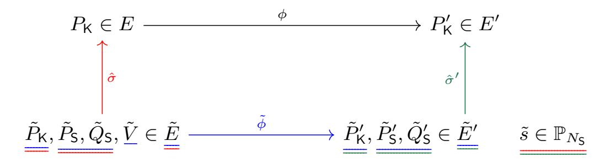

{0}------------------------------------------------

# Oblivious Pseudorandom Functions from Isogenies

Dan Boneh1 , Dmitry Kogan1 , and Katharine Woo1,2

> 1 Stanford University, Stanford, CA, USA {dabo,dkogan}@cs.stanford.edu 2 Princeton University, Princeton, NJ, USA khwoo@princeton.edu

Abstract. An oblivious PRF, or OPRF, is a protocol between a client and a server, where the server has a key k for a secure pseudorandom function F, and the client has an input x for the function. At the end of the protocol the client learns F(k, x), and nothing else, and the server learns nothing. An OPRF is verifiable if the client is convinced that the server has evaluated the PRF correctly with respect to a prior commitment to k. OPRFs and verifiable OPRFs have numerous applications, such as privateset-intersection protocols, password-based key-exchange protocols, and defense against denial-of-service attacks. Existing OPRF constructions use RSA-, Diffie-Hellman-, and lattice-type assumptions. The first two are not post-quantum secure.

In this paper we construct OPRFs and verifiable OPRFs from isogenies. Our main construction uses isogenies of supersingular elliptic curves over Fp2 and tries to adapt the Diffie-Hellman OPRF to that setting. However, a recent attack on supersingular-isogeny systems due to Galbraith et al. [ASIACRYPT 2016] makes this approach difficult to secure. To overcome this attack, and to validate the server's response, we develop two new zero-knowledge protocols that convince each party that its peer has sent valid messages. With these protocols in place, we obtain an OPRF in the SIDH setting and prove its security in the UC framework.

Our second construction is an adaptation of the Naor-Reingold PRF to commutative group actions. Combining it with recent constructions of oblivious transfer from isogenies, we obtain an OPRF in the CSIDH setting.

## 1 Introduction

Let F : K × X → Y be a secure pseudorandom function (PRF) [\[GGM86\]](#page-31-0). An oblivious PRF, or OPRF, is a protocol between a client who has an input x ∈ X , and a server who has a key k ∈ K. At the end of the protocol the client learns F(k, x) and nothing else, and the server learns nothing at all [\[NR97,](#page-32-0)[FIPR05\]](#page-30-0). Intuitively, an OPRF needs to be secure against a malicious client who is trying to learn more information about the server's key k, and a malicious server who is trying to learn more information about the client's input x. Earlier

{1}------------------------------------------------

works [FIPR05, JL09] defined an OPRF as the secure computation of the above two-party functionality, and Jarecki et al. [JKK14, JKKX16] later gave strong but flexible security definitions for an OPRF in the UC framework [Can01].

An OPRF is said to be *verifiable* if the server commits to its key k by publishing some public parameters derived from k. At the end of the OPRF protocol, the client should be convinced that the obtained value  $y \in \mathcal{Y}$  satisfies y = F(k, x) with respect to the server's committed key k. One benefit of verifiability is that it allows a group of clients to verify that the values they each obtain are all consistent with the same PRF key. Without verifiability, in applications where a client later reveals the obtained value to the server, a malicious server can link values with previous evaluations by using a different key for each evaluation.

Oblivious PRFs have many real-world applications. They are used in private-set-intersection protocols [JL09, PSZ14, KKRT16, KLS+17, PSZ18, PRTY19], in password-management systems [ECS+15, JKKX16], in adaptive oblivious transfer [JL09], in de-duplication systems [KBR13], in password-authenticated key exchange [JKX18], and are deployed at Cloudflare to defend against Denial of Service attacks [DGS+18]. As a result, there is an ongoing effort to standardize OPRFs at the Crypto Forum Research Group [DSW19].

An OPRF can be built from general secure two-party computation. A much simpler and widely used OPRF, called DH-OPRF, is built from a PRF whose security is based on the Decisional Diffie-Hellman (DDH) assumption in the random-oracle model. Let  $\mathbb{G}$  be a cyclic group of prime order q, and let  $H: \mathcal{X} \to \mathbb{G}$  be a hash function. For  $k \in \mathbb{Z}_q$  and  $x \in \mathcal{X}$ , the PRF is defined as  $F(k,x) = H(x)^k$ . This PRF is secure, assuming DDH holds in  $\mathbb{G}$  and H is a random oracle [NPR99]. This PRF then supports the following OPRF protocol: a client computes H(x), blinds it as  $u \leftarrow H(x)^r$  for a random  $r \stackrel{\mathbb{R}}{\subset} \mathbb{Z}_q$ , and sends u to the server. The server responds with  $v \leftarrow u^k$ . The client then computes the unblinded PRF value  $y \leftarrow v^{1/r} = H(x)^k$ . Appropriate modifications can make this OPRF verifiable. Security of the resulting OPRF relies on the one-more discrete-log assumption [BNPS03]. Jarecki et al. [JKK14, JKKX16] showed this OPRF is secure in the Universally Composable framework [Can01].

Another simple verifiable OPRF in the random-oracle model, called RSA-OPRF, is derived directly from RSA blind signatures [Cha82, BNPS03]. Since there are quantum-polynomial-time algorithms for the DDH and RSA problems, neither of these OPRFs is post-quantum secure.

Building an efficient post-quantum secure OPRF is more challenging. One solution is to use a generic post-quantum secure two-party-computation protocol to evaluate a PRF. For example, instantiating Yao's garbled-circuits protocol with a post-quantum-secure oblivious transfer results in a post-quantum-secure two-party computation protocol [BDK+20] that can then be used to obliviously evaluate an AES circuit. The downside is that the communication in generic protocols is proportional to the circuit size, which motivates the search for efficient special-purpose OPRF protocols from post-quantum primitives. Albrecht et al. [ADDS19] recently proposed an OPRF based on the ring learning-with-errors problem and the short-integer-solution problem in one dimension.

{2}------------------------------------------------

Our contributions. In this paper we give another path towards a simple postquantum secure OPRF by constructing several OPRFs from hard problems on isogenies of elliptic curves, in the random-oracle model.

Our first set of constructions operates on supersingular elliptic-curve isogenies over a field  $\mathbb{F}_{p^2}$ . Starting with a simple idea for an OPRF in the honest-but-curious setting, based on the SIDH key-exchange protocol of De Feo, Jao, and Plût [DJP14], we then show how to elevate this OPRF to the setting of a malicious client and malicious server, and to make the OPRF verifiable. Our security proofs are set in the UC framework [Can01] in the random-oracle model. We describe our construction using an abstraction we call an augmentable commitment, defined in Section 2. These commitments abstract away many of the complexities of working with supersingular-curves isogenies, and they may be of independent interest.

To ensure that our OPRF is secure against a malicious client, we construct a zero-knowledge proof of knowledge for proving that the first message the client sends to the server is well formed. Here, a well formed message should contain an elliptic curve, obtained by correctly applying an isogeny to some base curve, together with points on that curve, obtained by applying that same isogeny to predetermined points on the base curve. To secure against a malicious server and obtain a verifiable OPRF, we construct an additional zero-knowledge proof of knowledge for proving that four elliptic curves  $(E, E_a, E_b, E_{ab})$  form an isogeny DDH tuple, where the prover only knows the isogenies  $\phi_a : E \to E_a$  and  $\phi'_a : E_b \to E_{ab}$ , whereas the isogeny  $\phi_a : E \to E_a$  is private to the client. Our complete protocol requires up to 2MB of communication for 128-bit security, with the main bottleneck being the cut-and-choose repetitions in our zero-knowledge proofs of knowledge. We describe this protocol, using the language of augmentable commitments, in Section 6.

Our second class of OPRF protocols, presented in Section 8, builds an OPRF from a commutative group action, such as the one obtained from isogenies of ordinary elliptic curves [Cou06, RS06] or from isogenies of supersingular curves over  $\mathbb{F}_p$  as in CSIDH [CLM+18]. Commutative group actions give rise to a generalized Diffie-Hellman problem, yet a construction similar to the DH-OPRF is not currently possible. The reason is that there is no known way to construct a hash function that maps its inputs to uniformly sampled elements in an isogeny class, without learning additional information about the output elements. This additional information would allow the client to evaluate the PRF at any point of its choice from just a single response from the server, breaking the security requirement. Therefore, an OPRF from commutative group actions requires a very different approach.

Our construction makes use of two observations. First, we adapt the Naor-Reingold PRF [NR97] to the setting of a commutative group action. This requires a new proof of security because the original proof of security in [NR97] relies on the DDH assumption and its random self-reduction. The difficulty is that the DDH problem for a commutative group action does not have the required random self-reduction. We nevertheless prove PRF security based on the DDH

{3}------------------------------------------------

assumption for such group actions; however the security reduction is not as efficient as for DDH over groups. Second, we observe that, similarly to the original PRF construction [NR97], this group-action variant admits an oblivious evaluation. The resulting OPRF scheme makes use of a 1-out-of-2 oblivious-transfer protocol, but such protocols are already known from isogeny problems [BOB18, DOPS18, Vit19, DOPS18, LGD20]. We thus obtain an OPRF from a commutative group action.

Between the two constructions, the supersingular construction is asymptotically more efficient, in the sense that it requires asymptotically less communication between the client and the server. The reason is a sub-exponential quantum algorithm for the discrete-log problem for a commutative group action due to Kuperberg [Kup05, Kup13]. Kuperberg's attack applies to commutative group actions, which underpin our second construction, yet it does not apply to the non-commutative structure of supersingular isogenies over  $\mathbb{F}_{p^2}$ , which underpin our first construction. As a result, the first construction allows using smaller fields, which results in less communication asymptotically (in the security parameter). Its exponential security also makes it more robust to improvements in attacks. However, the second construction has better (i.e., smaller) constants, and as a result, the second construction is more efficient concretely: 424KB of communication vs. 2MB for the first construction.

### 1.1 Background and notation

Let E be an elliptic curve  $y^2 = x^3 + Ax + B$ . The j-invariant of E is given by  $j(E) := 1728 \cdot (4a^3)/(4a^3 + 27b^2)$ . The j-invariant of an elliptic curve almost fully determines the curve; if E and E' are two elliptic curves defined over a field  $\mathbb{F}$ , then j(E) = j(E') if and only if E and E' are isomorphic (there exists a linear change of coordinates between the curves) over the algebraic closure of  $\mathbb{F}$ .

A surjective morphism between two elliptic curves E and E' is called an isogeny. A certain class of isogenies, called separable isogenies, are fully determined by their kernels. The degree of an isogeny is its degree as a rational map, and for separable isogenies, it is also the number of elements in the isogeny's kernel. Additionally, for every isogeny  $\phi: E \to E'$ , there exists a unique dual isogeny  $\hat{\phi}: E' \to E$  such that  $\hat{\phi} \circ \phi = [\deg(\phi)]$ , the multiplication map by the degree of the isogeny. We say that two curves E and E' are isogenous if there exists an isogeny between them.

Associated to every elliptic curve E is an endomorphism ring  $\operatorname{End}(E)$ , the set of isogenies from E to itself and the multiplication-by-0 map. If  $\operatorname{End}(E)$  is an order of an imaginary quadratic field, then E is called *ordinary*. Otherwise,  $\operatorname{End}(E)$  is a maximal order in a quaternion algebra, and E is called *supersingular*.

Let E be a supersingular elliptic curve over  $\mathbb{F}_{p^2}$ , and let  $\phi: E \to E'$  be a degreed isogeny with kernel  $G = \ker(\phi)$ , which is a subgroup of order d of  $E(\bar{\mathbb{F}}_p)$ . In the special case when G is a cyclic subgroup of  $E(\mathbb{F}_{p^2})$ , we can succinctly represent  $\phi$  by specifying a generator  $K \in E(\mathbb{F}_{p^2})$  of the kernel G. The generator K is an element of the d-torsion of  $E(\mathbb{F}_{p^2})$ . Velu's formulae [Vél71] give a algorithm to compute an isogeny given its kernel, in time polynomial in the size of the kernel. 

{4}------------------------------------------------

We follow de Saint Guilhem, Orsini, Petit, and Smart [DOPS18] and use the following notation to represent degree-d isogenies. Recall that the *projective line*  $\mathbb{P}_d$  is the set of all equivalence classes [x:y], where  $x,y\in\mathbb{Z}_d$ , and the ideal generated by x and y is all of  $\mathbb{Z}_d$ . We specify an isogeny of degree d using an element  $k\in\mathbb{P}_d$ . For  $k=[k_p:k_q]\in\mathbb{P}_d$ , and generators  $P_d,Q_d$  of the d-torsion E[d], the notation  $\langle k\cdot(P_d,Q_d)\rangle$  refers to the order-d cyclic group generated by  $k_pP_d+k_qQ_d\in E[d]$ .

For a more detailed self-contained overview of isogeny-based cryptography, see also [De 17]. For a comprehensive reference, see [Sil09].

### 1.2 Overview of our techniques

Our main result is an OPRF from isogenies on supersingular elliptic curves. We briefly summarize the main technical ideas, and refer to Sections 2–7 for the details.

Let  $E/\mathbb{F}_{p^2}$  be a fixed supersingular elliptic curve, and let  $N_{\mathsf{K}}, N_{\mathsf{M}}, N_{\mathsf{R}}$  be positive integers such that  $E[N_{\mathsf{K}} \times N_{\mathsf{M}} \times N_{\mathsf{R}}]$  is contained in  $E(\mathbb{F}_{p^2})$ , where  $p, N_{\mathsf{K}}, N_{\mathsf{M}}, N_{\mathsf{R}}$  are pairwise relatively prime. Let us derive a PRF  $F: \mathcal{K} \times \mathcal{X} \to \mathcal{Y}$  from the SIDH key-exchange protocol of [DJP14]. The PRF makes use of two hash functions  $H_1: \mathcal{X} \to \mathbb{P}_{N_{\mathsf{M}}}$  and  $H_2: \mathcal{X} \times \mathbb{F}_{p^2} \to \mathcal{Y}$ , and works as follows:

- The domain is  $\mathcal{X}$ . For each  $x \in \mathcal{X}$  we obtain  $m = H_1(x) \in \mathbb{P}_{N_{\mathsf{M}}}$ , for which there is a corresponding degree- $N_{\mathsf{M}}$  isogeny  $\phi_m : E \to E_m$ ;
- The key space is  $\mathcal{K} = \mathbb{P}_{N_{\mathsf{K}}}$ . For each  $k \in \mathbb{P}_{N_{\mathsf{K}}}$  there is a corresponding degree- $N_{\mathsf{K}}$  isogeny  $\phi_k : E \to E_k$ ;
- Let  $\phi: E \to E_{m,k}$  be an isogeny with kernel  $\ker(\phi_m) \times \ker(\phi_k)$ . Define  $F(k,x) = H_2(x,j(E_{m,k}))$ .

When  $H_1$  and  $H_2$  are modeled as random oracles, and assuming  $N_{\mathsf{K}}$  is sufficiently large (i.e., superpolynomial in the security parameter), this function F is a secure PRF.

To make this PRF into an oblivious PRF between a client and a server, it is tempting to try the following blinding approach (also used in [SC18, SGP19] in an attempt to construct a blinded version of an earlier undeniable-signature scheme [JS14]):

- The client has  $x \in \mathcal{X}$ . It computes  $m = H_1(x) \in \mathbb{P}_{N_{\mathsf{M}}}$  which defines the degree- $N_{\mathsf{M}}$  isogeny  $\phi_m \colon E \to E_m$  above. The client chooses a random  $r \in \mathbb{P}_{N_{\mathsf{R}}}$ , and computes the corresponding degree- $N_{\mathsf{R}}$  isogeny  $\phi_r \colon E \to E_r$ . Next, the client constructs an isogeny  $\phi_{r,m} \colon E \to E_{r,m}$  whose kernel is  $\ker(\phi_r) \times \ker(\phi_m)$ . It sends  $E_{r,m}$  to the server, along with four additional points on  $E_{r,m}$ , as specified in Section 3. Two of these four points are computed as  $P'_{\mathsf{K}} = \phi_{r,m}(P_{\mathsf{K}})$  and  $Q'_{\mathsf{K}} = \phi_{r,m}(Q_{\mathsf{K}})$ , where  $P_{\mathsf{K}}, Q_{\mathsf{K}} \in E$  are some fixed generators of  $E[N_{\mathsf{K}}]$ .
- The server has the secret key  $k \in \mathbb{P}_{N_{\mathsf{K}}}$ , and the corresponding isogeny  $\phi_k : E \to \mathbb{E}_k$ . It uses  $P'_{\mathsf{K}}, Q'_{\mathsf{K}}$  to construct the curve  $E_{r,m,k}$ , which is the target of an isogeny acting on E and whose kernel is  $\ker(\phi_r) \times \ker(\phi_m) \times \ker(\phi_k)$ . It sends  $E_{r,m,k}$  back to the client, along with two additional points in  $E[N_{\mathsf{R}}]$ .

{5}------------------------------------------------

- The client uses its knowledge of  $\phi_r$  to recover the required  $E_{m,k}$  using an appropriate dual isogeny  $\hat{\phi}': E_{r,m,k} \to E_{m,k}$ . Once the client has  $E_{m,k}$ , it can obtain the required PRF value F(k,x) since  $F(k,x) = H_2(x,j(E_{m,k}))$ .

While this is a natural construction for an OPRF, it is unfortunately completely insecure. It is vulnerable to a clever active attack due to Galbraith et al. [GPST16], which was originally used to attack SIDH key exchange where one of the parties uses a static key. In our setting, the attack lets a malicious client send carefully crafted points  $P_{\mathsf{K}}, Q_{\mathsf{K}}' \in E_{r,m}$  that are not the images of the fixed points  $P_{\mathsf{K}}, Q_{\mathsf{K}} \in E$  under the isogeny  $\phi_{r,m} : E \to E_{r,m}$ . The client can then learn information about the PRF key k from the server's response. With enough such queries, the client can extract k from the server, thus fully breaking the OPRF.

In the SIDH key-exchange setting, there are several countermeasures against this active attack. Kirkwood et al. [KLM $^+$ 15] suggest an approach, based on the Fujisaki-Okamoto [FO13] transformation, where the client sends encrypted information to the server. The server decrypts and uses the information from the client to validate the request. However, this approach cannot be used in an OPRF protocol because the information sent from the client reveals m to the server, which violates the OPRF privacy requirement.

Our solution is to have the client prove to the server that the points  $P'_{\mathsf{K}}$  and  $Q'_{\mathsf{K}}$  are generated correctly without leaking any information about m or r to the server. To do so, we present in Section 5 a special-purpose zero-knowledge protocol that allows the client to prove the correctness of the points it sends. Our protocol develops an idea sketched by Galbraith [Gal18, Section 7.2], and builds on the isogeny-based identification protocol of De Feo et al. [DJP14].

We obtain an OPRF that is secure against a malicious client. To further secure the OPRF against a malicious server, the server needs to somehow prove to the client that its response  $E_{r,m,k}$  is consistent with its commitment  $E_k$  to the secret key  $k \in \mathbb{P}_{N_K}$ . In other words, the server needs to prove that  $(E, E_{r,m}, E_k, E_{r,m,k})$  form an isogeny DDH tuple, where the server only knows  $\phi_k : E \to E_k$  and  $\phi'_k : E_{r,m} \to E_{r,m,k}$ . A similar protocol is needed in the constructions of [JS14,SC18,SGP19] for the purpose of online signature confirmation. However, we cannot use their protocol because they assume the server knows both  $\phi_k$  and  $\phi_{r,m} : E \to E_{r,m}$ . For us, this would break the OPRF privacy requirement because  $\ker(\phi_{r,m})$  reveals information about  $m \in \mathbb{P}_{N_M}$ .

To address this, we develop in Section 6 a zero-knowledge proof of equality that lets the server prove the consistency of its response to the client. A key challenge is to ensure security of the OPRF, meaning that we must prevent the client from abusing the consistency check for extracting information about the key k. The result is a new private-coin protocol, that jointly meets the security requirements of both parties, and is quite different from the [DJP14]-style public-coin protocol.

Our complete verifiable OPRF appears in Protocol 19.

**Security assumptions.** Our OPRF construction is based on the hardness of isogeny problems on supersingular curves over a field  $\mathbb{F}_{p^2}$  for a prime p of the form  $p = f \cdot N_1 \cdot \ldots \cdot N_n - 1$ , for relatively prime  $N_i$ . Specifically, for our verifiable OPRF, we use n = 5 prime powers.

{6}------------------------------------------------

The privacy of the client in our protocol relies on the hardness the Decisional SIDH Isogeny Problem [\[DJP14,](#page-30-6)[GV18\]](#page-31-10) adjusted from the standard SIDH setting of n = 2 prime powers to our setting of n = 5 (similarly to [\[JS14,](#page-31-6)[SC18,](#page-32-12)[DOPS18\]](#page-30-9)). The security of the server in our protocol relies on a one-more Diffie-Hellman-type assumption in the SIDH setting. Recently, Merz, Minko, and Petit [\[MMP20\]](#page-32-15) presented a polynomial-time attack on certain "one-more" SIDH assumptions, introduced in [\[JS14,](#page-31-6)[SC18\]](#page-32-12). In Section [3,](#page-10-0) we present a new type of one-more SIDH assumption and discuss why it is not susceptible to this attack. Finally, our zeroknowledge proof, designed to prevent the active attack of [\[GPST16\]](#page-31-7), relies on the hardness of a variant of the Decisional Supersingular Product problem [\[DJP14\]](#page-30-6). We discuss the security assumptions in more detail in Sections [3](#page-10-0) and [5.](#page-18-0)

### 1.3 Additional related work

OPRF from oblivious-transfer extension. An efficient oblivious PRF can be constructed from oblivious-transfer extension [\[IKNP03\]](#page-31-11). The first works to do so [\[PSZ14,](#page-32-1)[KKRT16,](#page-32-2)[PSZ18\]](#page-32-4) constructed a one-time OPRF, namely one where the client can only issue a single query to the server. Subsequent work [\[PRTY19\]](#page-32-5) constructs a many-time OPRF from oblivious-transfer extension, but the client must choose all the query points before the OPRF key is generated. These nonadaptive OPRF schemes are sufficient for protocols for private set intersection, and can be post-quantum secure if the underlying 1-out-of-2 oblivious transfer is post-quantum secure. The constructions in this paper give an OPRF which allows the client to select the query points adaptively, at any time after the OPRF key is generated, and supports an exponential size domain.

Blind signatures. Verifiable OPRFs share resemblance with blind signatures [\[Cha82\]](#page-30-5). Both primitives allow a server holding a secret key to provide the client with a "certified" value on blinded input. However, unlike an OPRF, a blind signature does not have to be deterministic, yet it has to be publicly verifiable. Indeed, Jarecki and Liu [\[JL09\]](#page-31-1) observed that earlier constructions [\[CNS07\]](#page-30-11) of oblivioustransfer protocols from unique blind signatures [\[Cha82,](#page-30-5) [BNPS03,](#page-29-0) [Bol03\]](#page-30-12) and, similarly, from blind IBE schemes [\[GH07\]](#page-31-12), give rise to OPRFs. None of these constructions are post-quantum secure. Recent works [\[SC18,](#page-32-12)[SGP19\]](#page-32-13) constructed variants of blind signatures from supersingular isogenies. As discussed above, the online verification protocols in these schemes require unblinding the message.

Adaptations of the Naor-Reingold PRF to isogenies. Two concurrent and independent works [\[AFMP20,](#page-29-4)[MOT20\]](#page-32-16) also construct a Naor-Reingold style PRF from commutative group actions. Alamati et al. [\[AFMP20\]](#page-29-4) further explore the landscape of cryptographic primitives that can be built from group actions. Moriya et al. [\[MOT20\]](#page-32-16) also implement and evaluate their construction. Our work focuses on using this PRF construction towards constructing an OPRF.

{7}------------------------------------------------

## 2 Augmentable commitments

In this section we introduce a primitive, called *augmentable commitments*, that makes it easier to describe the OPRF construction and prove its security. This abstraction makes it possible to describe the scheme without cluttering the description with many elliptic curve points.

An augmentable commitment is a commitment scheme where one can commit to a value  $x_1 \in \mathcal{X}_1$  to obtain a commitment com. Later, someone else can append  $x_2 \in \mathcal{X}_2$  to the commitment com to obtain a new commitment com' to  $(x_1, x_2)$ . One can also obtain com' by committing in the reverse order, by first committing to  $x_2 \in \mathcal{X}_2$ , and then appending  $x_1 \in \mathcal{X}_1$ . We will refer to com' as  $[x_1, x_2]$ . Regular values are append-only, in the sense that, given  $[x_1, x_2]$ , it should be computationally unfeasible to compute  $[x_2]$  or  $[x'_1, x_2]$ . Looking ahead, this "non-malleability" property will provide privacy for the server in our OPRF protocol. It prevents the client from learning the value of the OPRF at one point given its evaluation at another.

To hide the contents of the commitment, its creator may include in it a special type of value  $r \in \mathcal{R}$ , called a *blind*. Such a blinded commitment  $[r, x_1, x_2]$  can later be *unblinded* to obtain  $[x_1, x_2]$ , which is a binding commitment to  $x_1$  and  $x_2$ , but may not be hiding. The blinding property will provide privacy for the client in our OPRF protocol, as it will prevent the server from learning the point where the OPRF is being evaluated.

We next define augmentable commitments more precisely and more generally. In the next sections we show how to use augmentable commitments to construct an OPRF scheme and how to construct them from supersingular isogenies.

**Definition 1 (Augmentable Commitment Scheme).** An augmentable commitment scheme  $\mathcal{G}$  with an *input space*  $\mathcal{X} = \mathcal{X}_1 \times \cdots \times \mathcal{X}_{n-1}$ , a blinding space  $\mathcal{R} := \mathcal{X}_n$ , a commitment space  $\mathcal{C}$ , and a space of representatives  $\mathcal{J}$ , consists of five algorithms

- $\mathsf{Setup}(1^{\lambda}) \to \mathsf{com}_0 \in \mathcal{C}$ . The algorithm takes as input the security parameter and outputs the "empty" commitment  $\mathsf{com}_0$ .
- Blind( $com_0 \in \mathcal{C}, r \in \mathcal{R}$ )  $\rightarrow com \in \mathcal{C}$ . The algorithm takes as input the empty commitment and a blind value r, and creates an initial blinded commitment.
- Append ( $com \in C$ ,  $i \in [n-1]$ ,  $x \in \mathcal{X}_i$ )  $\to com' \in C$ . The algorithm takes as input a commitment com, an index of an input space, and an input from that space, and outputs a new commitment. The input commitment com can be the empty commitment  $com_0$ , a blinded commitment output by Blind, or a commitment obtained from a previous call to Append.
- Unblind ( $com \in C, r \in \mathcal{R}$ )  $\to com' \in C$ . The algorithm takes as input a commitment previously blinded with r together with the same blind value r used for blinding, and outputs an unblinded commitment.
- Invariant (com  $\in \mathcal{C}$ )  $\rightarrow j \in \mathcal{J}$  returns the invariant of a commitment.

For simplicity, we avoid including explicit public parameters in the syntax of the scheme. If the scheme requires the Setup algorithm to set some public parameters,

{8}------------------------------------------------

we assume without the loss of generality that they are included in the empty commitment  $\mathsf{com}_0$  and in all subsequent commitments.

Note that the Blind step is the only time when an element  $r \in \mathcal{R}$  of the blinding space may be committed to.

For brevity, we use the notation  $[x_1, \ldots, x_t]$  to refer to a commitment to a sequence of elements  $x_1 \in \mathcal{X}_{i_1}, \ldots, x_t \in \mathcal{X}_{i_t}$ . Specifically, if none of the distinct indices  $i_1, \ldots, i_t \in [n-1]$  is the blinding index, we define  $\mathsf{com}_j \leftarrow \mathsf{Append}(\mathsf{com}_{j-1}, i_j, x_j)$ , and set  $[x_1, \ldots, x_t] \coloneqq \mathsf{com}_t$ . Similarly, if  $i_1 = n$  is the index of the blinding space  $\mathcal{R} = \mathcal{X}_n$ , we define  $\mathsf{com}_1 \leftarrow \mathsf{Blind}(\mathsf{com}_0, x_1)$ , and for  $j \in [2, t]$  we define  $\mathsf{com}_j \leftarrow \mathsf{Append}(\mathsf{com}_{j-1}, x_j)$ , and set  $[x_1, \ldots, x_t] \coloneqq \mathsf{com}_t$ .

For two commitments  $c, c' \in \mathcal{C}$ , we write  $c \sim c'$  if and only if  $\mathsf{Invariant}(c) = \mathsf{Invariant}(c')$ .

The commitment scheme must satisfy the following correctness property, which states that (i) commitments to the same set of elements in a different order are equivalent; and (ii) unblinding results in an a commitment to the remaining elements.

**Correctness.** For every  $t \in [n-1]$ , every set of distinct indices  $i_1, \ldots, i_t \in [n-1]$ , every set of values  $x_j \in \mathcal{X}_{i_j}$ , and every  $r \in \mathcal{R}$ , we require the following.

- 1.  $\mathsf{Invariant}(\llbracket x_1, \dots, x_t \rrbracket)$  is independent of the ordering of  $x_1, \dots, x_t$ . Similarly,  $\mathsf{Invariant}(\llbracket r, x_1, \dots, x_t \rrbracket)$  is independent of the ordering of  $x_1, \dots, x_t$ .
- 2. Unblind( $[r, x_1, \ldots, x_t], r$ )  $\sim [x_1, \ldots, x_t]$ .

An augmentable commitment must satisfy the following three security requirements: hiding, weak binding, and one-more unpredictability.

**Hiding.** The hiding property requires that a random committed element, be it an input or a blind, computationally hides all other committed elements. More specifically, an adversary should not be able to distinguish between a commitment to a set of random values and a commitment to a set of values of his choice, provided that the commitment includes at least one additional random element, that the adversary does not know. This additional element can either be an input element or a blind, i.e., the hiding property holds with respect to both inputs and blinds, with the only difference being that blinds can also be unblinded.

More formally, for b = 0, 1, let  $W_b$  be the event that  $\mathcal{A}$  outputs 1 in Experiment b of the following game:

**Game 2 (Hiding).** Given an augmentable commitment scheme  $\mathcal{G}$ , we define two experiments, Experiment 0 and Experiment 1. For b = 0, 1, we define Experiment b as follows:

- The challenger runs  $com_0 \leftarrow Setup(1^{\lambda})$  and sends  $com_0$  to the adversary.
- The adversary submits to the challenger a list  $i_1, \ldots, i_t$  for  $t \in [n]$ , together with a set of t-1 values  $x_1^{(0)}, \ldots, x_{r-1}^{(0)}, x_{r+1}^{(0)}, \ldots, x_t^{(0)}$  where  $x_j \in \mathcal{X}_{i_j}$ .
- The challenger samples  $x_j^{(1)} \stackrel{\mathbb{R}}{\leftarrow} \mathcal{X}_{i_j}$  for  $j \in [t] \setminus \{i_r\}$  and  $x_r^{(b)} \stackrel{\mathbb{R}}{\leftarrow} \mathcal{X}_{i_r}$ , computes  $\mathsf{com} \leftarrow [\![x_1^{(b)}, \ldots, x_t^{(b)}]\!]$  and sends  $\mathsf{com}$  to the adversary.
- The adversary outputs a bit  $b' \in \{0, 1\}$ .

{9}------------------------------------------------

We define the advantage of adversary  $\mathcal{A}$  in the hiding game as  $\mathsf{HideAdv}[\mathcal{A}, \mathcal{G}] := |\Pr[W_0] - \Pr[W_1]|$ . We say that a commitment scheme  $\mathcal{G}$  is computationally hiding if for every efficient adversary  $\mathcal{A}$ , it holds that  $\mathsf{HideAdv}[\mathcal{A}, \mathcal{G}]$  is negligible in the security parameter  $\lambda$ .

Weak binding. The binding requirement asks that no efficient adversary can produce a collision between two commitments. We actually only need a weak form of binding, in the sense that the adversary needs to produce a pair of distinct elements that create a collision with noticeable probability over a random choice of a sequence of appended elements.

More formally, we say that an augmentable commitment scheme  $\mathcal{G}$  is weakly binding if the probability that any efficient adversary wins in the following game is negligible.

Game 3 (Weak binding). Given an augmentable commitment scheme  $\mathcal{G}$ , we define the following experiment:

- The challenger runs  $\mathsf{com}_0 \leftarrow \mathsf{Setup}(1^{\lambda})$  and sends  $\mathsf{com}_0$  to the adversary.
- The adversary submits to the challenger a list of indices  $i_1, \ldots, i_t \in [n]$  for some  $t \in [n]$ , together with two elements  $y, y' \in \mathcal{X}_{i_t}$  such that  $y \neq y'$ .
- The challenger samples  $x_j \stackrel{\mathbb{R}}{\leftarrow} \mathcal{X}_{i_j}$  for  $j \in [t-1]$  and computes  $\mathsf{com} \leftarrow [x_1, \dots, x_{t-1}, y]$  and  $\mathsf{com} \leftarrow [x_1, \dots, x_{t-1}, y']$ .
- The adversary wins if  $com \sim com'$ .

One-more unpredictability. In an augmentable commitment scheme, the result of augmenting a secret value to one randomly chosen value should not reveal the result of augmenting that same secret value to other random values. Specifically, consider a game between a challenger and adversary. The challenger chooses a secret input value k and gives the adversary t+1 challenges  $m_1, \ldots, m_{t+1}$ , each of which is a random input value to the commitment. The solution to the ith challenge is the Invariant( $[m_i, k]$ ) of a commitment to both the challenge value and the challenger's secret value. Finally, the adversary may issue queries to the challenger. Each query consists of an input value m of the adversary's choice, to which the challenger responds with Invariant([m, k]), where k is the challenger's secret value. The one-more unpredictability property requires that after issuing at most t queries the adversary should not be able to produce the solution to all t+1 challenges.

More formally, we say that a commitment scheme  $\mathcal{G}$  is *one-more unpredictable* if the probability that any efficient adversary wins in the following game is negligible.

Game 4 (One-more Unpredictability). Given an augmentable commitment scheme  $\mathcal{G}$ , we define the following experiment:

- The challenger runs  $com_0 \leftarrow Setup(1^{\lambda})$  and sends  $com_0$  to the adversary.
- The adversary chooses and sends to the challenger a challenge index  $\mathsf{M} \in [n-1]$  and a secret index  $\mathsf{K} \in [n-1]$
- The challenger chooses  $k \stackrel{\mathbb{R}}{\leftarrow} \mathcal{X}_{\mathsf{K}}$ .

{10}------------------------------------------------

- The adversary makes a sequence of queries to the challenger, each of which can be one of the following three types:
  - Challenge query: the challenger randomly chooses  $m \stackrel{\mathbb{R}}{\leftarrow} \mathcal{X}_{\mathsf{M}}$  and sends it to the adversary.
  - Solve query: the adversary submits a sequence  $x_1 \in \mathcal{X}_{i_1}, \ldots, x_{\ell} \in \mathcal{X}_{i_{\ell}}$  such that  $i_1 = M$  and all  $i_j \neq K$ . The challenger computes the commitment  $\mathsf{com} \leftarrow [\![x_1, \ldots, x_{\ell}, k]\!]$  and sends  $\mathsf{com}$  back to the adversary.
  - Decision query: the adversary submits to the challenger a pair (i, j), where i is a positive integer, bounded by the number of challenge queries the adversary has made so far, and  $j \in \mathcal{J}$ . The challenger respond true if  $\mathsf{Invariant}(\llbracket m, k \rrbracket) = j$ , where  $m \in \mathcal{X}_\mathsf{M}$  is the ith challenge, and false otherwise.
- The adversary outputs a list of distinct pairs, each of the form (i, j), where i is a positive integer bounded by the number of challenge queries, and  $j \in \mathcal{J}$ . We call such a pair correct if  $\mathsf{Invariant}(\llbracket m, k \rrbracket) = j$ , where m is the ith challenge.

We say that the adversary wins the game if the number of correct pairs output by the adversary exceeds the number of solve queries.

Remark 5. de Saint Guilhem et al. [DOPS18] introduced an abstraction called semi-commutative masking structure that captures both commutative group actions and isogenies on supersingular elliptic curves. Our abstraction of augmentable commitments draws inspiration from theirs and shares some technical similarities with it. One difference is that our abstraction separates regular values, that are append-only, from blinds, that can be removed.

# 3 Augmentable commitments from supersingular isogenies

In this section we show how to construct an augmentable commitment scheme from supersingular isogenies. We refer to this scheme as  $\mathcal{G}_{si}$ . We begin by defining a parameterization algorithm, which we use throughout our construction and our security assumptions.

**Definition 6 (Parameterization**  $p(\lambda, n)$ ). We define the following deterministic algorithm. On input a security parameter  $\lambda \in \mathbb{N}$  and an integer  $n \in \mathbb{N}$ , compute the first n primes  $\ell_1, \ldots, \ell_n$  and choose  $e_1, \ldots, e_n$  to be positive integers such that for all  $i \in [n]$ ,  $N_i := \ell_i^{e_i} \approx 2^{2\lambda}$ . Choose  $f \in \mathbb{N}$  to be a cofactor such that  $p = f \cdot N_1 \cdot \ldots \cdot N_n - 1$  is a prime. Output  $p(\lambda, n) := p$ .

For  $\lambda \in \mathbb{N}$ , and  $p(\lambda, n+1) = f \cdot N_1 \cdot \ldots \cdot N_{n+1} - 1$ , the input space of the commitment are the projective lines  $\mathbb{P}_{N_i}$  for  $i \in [n-1]$ , and the blinding space is the projective line  $\mathbb{P}_{N_n}$ . For now, we do not explicitly use the  $N_{n+1}$  torsion, and in particular,  $\mathbb{P}_{N_{n+1}}$  is not part of the commitment input/blinding spaces. In Section 5, we will use this extra torsion to construct zero knowledge proofs on our commitment scheme.

{11}------------------------------------------------

**Setup.** The input to the setup routine is a security parameter  $\lambda \in \mathbb{N}$ . It computes  $p = p(\lambda, n+1) = f \cdot N_1 \cdot \ldots N_{n+1} - 1$ , then chooses  $E_0$  to be a random supersingular elliptic curve over  $\mathbb{F}_{p^2}$  such that  $E_0(\mathbb{F}_{p^2}) \cong \mathbb{Z}^2_{N_1} \times \ldots \times \mathbb{Z}^2_{N_{n+1}} \times \mathbb{Z}^2_f$ . Finally, for  $i \in [n]$ , the setup routine chooses  $P_i^0, Q_i^0$  generators of  $E_0[N_i] \cong \mathbb{Z}^2_{N_i}$  and outputs the empty commitment that consists of the curve  $E_0$  and the generators  $(P_i^0, Q_i^0)_{i \in [n-1]}$ .

Our augmentable commitments take the form  $(E, (P_i, Q_i)_{i \in I})$ , where  $I \subseteq [n]$ , representing the curve E by its j-invariant  $j(E) \in \mathbb{F}_{p^2}$  using  $2 \log p$  bits. (All logarithms in this work have base two.) This defines the curve up to isomorphism, and a canonical curve in that isomorphism class can be efficiently computed. Therefore, before outputting a commitment, each of the algorithms in our construction first computes an isomorphism from the curve it has computed to the canonical curve of the same isomorphism class. It also computes the images of the points in the commitment under this isomorphism [AJK+16, GPS20, DOPS18]. Thus, any published points are always on the canonical curve. Similarly to SIDH public-key compression [AJK+16, CJL+17, JAC+17], each basis can be represented using  $3 \log N_i$  bits. The overall size of a commitment is at most  $5 \log p$  bits.

**Blinding.** The Blind algorithm blinds the empty commitment with a blind  $r \in \mathbb{P}_{N_n}$  as follows. First, compute a degree  $N_n$  isogeny  $\phi_r : E_0 \to E_r$  where  $E_r = E_0/\langle r \cdot (P_n^0, Q_n^0) \rangle$  and  $P_n^0, Q_n^0$  is a canonical basis for  $E_0[N_n]$ . Then compute a canonical basis  $P_n, Q_n$  for  $E_r[N_n]$ . This basis, together with the knowledge of the kernel of the dual isogeny  $\hat{\phi}_r$  is what enables to later unblind the commitment. Finally output the commitment

$$[r] := (E_r, (\phi_r(P_j^0), \phi_r(Q_j^0))_{j \in [n-1]}, P_n, Q_n).$$

**Appending.** To append a value  $x_t \in \mathbb{P}_{N_j}$  to a commitment  $[r, x_1, \dots, x_{t-1}] = (E, (P_i, Q_i)_{i \in I})$  for some  $j \in I \cap [n-1]$ , the algorithm Append computes the isogeny  $\phi' \colon E \to E'$  with kernel  $\langle x_t \cdot (P_j, Q_j) \rangle$ . The new commitment is then

$$[r, x_1, \dots, x_t] = (E', (\phi'(P_i), \phi'(Q_i))_{i \in I \setminus \{j\}}).$$

As values are added to the commitment, the Append algorithm drops the bases of the corresponding torsion groups from the commitment. However, the commitment tracks the basis for the blinding space throughout, and the Unblind algorithm uses them to remove the blind r.

**Unblinding.** Algorithm Unblind removes  $r \in \mathbb{P}_{N_n}$  from a blinded commitment  $[\![r,x_1,\ldots,x_t]\!] = (E',(P'_i,Q'_i)_{i\in I})$  by first computing the isogeny  $\phi_r\colon E_0\to E_r$  for  $E_r=E_0/\langle r\cdot (P_n^0,Q_n^0)\rangle$  together with the canonical basis  $P_n,Q_n\in E_r[N_n]$  as in the Blind algorithm above. It then computes a representative  $\hat{r}\in\mathbb{P}_{N_n}$  of the kernel  $\langle \hat{r}\cdot (P_n,Q_n)\rangle$  for the dual isogeny  $\hat{\phi}_r\colon E_r\to E_0$ . Finally, it computes the unblinding isogeny  $\phi\colon E'\to E$  where  $E=E'/\langle \hat{r}\cdot (P'_n,Q'_n)\rangle$ , and outputs (E)—a curve isomorphic to the curve of  $[\![x_1,\ldots,x_t]\!]$ .

The Invariant of a commitment  $(E, (P_i, Q_i)_{i \in I})$  is the j-invariant  $j(E) \in \mathbb{F}_{p^2}$ .

{12}------------------------------------------------

### Construction 7 (Superisingular-Isogeny Augmentable Commitment).

Let  $p = p(\lambda, n+1) = f \cdot N_1 \cdot \ldots \cdot N_{n+1} - 1$  be as in Definition 6. We define an augmentable commitment scheme  $\mathcal{G}_{si}$  as follows. The input space is  $\mathbb{P}_{N_1} \times \mathbb{P}_{N_2} \times \ldots \times \mathbb{P}_{N_{n-1}}$ . (Here,  $\mathbb{P}_{N_i}$  is the projective line over  $\mathbb{Z}_{N_i}^2$  as defined above.) The blinding space is  $\mathbb{P}_{N_n}$ . A commitment  $\mathsf{com} \in \mathcal{C}$  is a tuple of the form  $(E, (P_i, Q_i)_{i \in I})$ , where  $I \subseteq [n]$ , E is a supersingular curve, and  $P_i, Q_i$  are generators of  $E[N_i]$ . The representative space is  $\mathcal{J} := \mathbb{F}_{p^2}$ .

# $\mathsf{Setup}\left(1^{\lambda}\right) \to \mathsf{com}_0$

- Compute  $p = p(\lambda, n+1) = f \cdot N_1 \cdot \ldots \cdot N_{n+1} 1$ .
- Choose  $E_0$  to be a random supersingular elliptic curve over  $\mathbb{F}_{n^2}$ .
- For  $i \in [n]$ , choose  $P_i^0, Q_i^0$  generators of  $E_0[N_i] \cong \mathbb{Z}_{N_i}^2$ .
- Output  $com_0 \leftarrow (E_0, (P_i^0, Q_i^0)_{i \in [n]}).$

## $\mathsf{Blind}\left(\mathsf{com}_0, r \in \mathcal{R}\right) \to \mathsf{com} \in \mathcal{C}$

- Initialize  $(E_0, (P_i^0, Q_i^0)_{i \in [n-1]}) \leftarrow \mathsf{com}_0.$
- Compute the canonical basis  $(\hat{P}_n^0, \hat{Q}_n^0)$  of  $E[N_n]$ .
- Compute the isogeny  $\phi_n: E_0 \to E_n = E/\langle r \cdot (P_n^0, Q_n^0) \rangle$ .
- Compute the canonical basis  $(\hat{P}_n, \hat{Q}_n)$  of  $E_n[N_n]$ .
- Output the canonical form of  $(E_n, (\phi_n(P_i), \phi_n(Q_i))_{i \in [n-1]} \cup \{\hat{P}_n, \hat{Q}_n\})$ .

# Append $\left(\mathsf{com} \in \mathcal{C}, j \in [n-1], x \in \mathbb{P}_{N_j}\right) \to \mathsf{com}'$

- Parse com as  $(E, (P_i, Q_i)_{i \in I})$  where  $I \subseteq [n]$ . If  $j \notin I$ , output  $\perp$ .
- Check that all given points  $P_i$  and  $Q_i$  have order  $N_i$  and are linearly independent.
- Compute the isogeny  $\phi: E \to E' = E/\langle x \cdot (P_j, Q_j) \rangle$ .
- Output the canonical form of  $(E', (\phi(P_i), \phi(Q_i))_{i \in I \setminus \{j\}})$ .

### Unblind $(\mathsf{com}' \in \mathcal{C}, x \in \mathbb{P}_{N_n}) \to \mathsf{com} \in \mathcal{C}$

- Parse com as  $(E', (P'_i, Q'_i)_{i \in I})$ . If  $n \notin I$ , output  $\perp$ .
- Compute the canonical basis  $(\hat{P}_n^0, \hat{Q}_n^0)$  of  $E_0[N_n]$  (where  $E_0$  is the starting curve output by Setup).
- Compute the isogeny  $\phi_n: E_0 \to E_n = E_0/\langle x \cdot (P_n^0, Q_n^0) \rangle$ .
- Compute the canonical basis  $(\hat{P}_n, \hat{Q}_n)$  of  $E_n[N_n]$ .
- Compute the dual isogeny  $\hat{\phi}_n: E_n \to E_0$  and find  $u \in \mathbb{P}_{N_n}$  such that  $\langle u \cdot (\hat{P}_n, \hat{Q}_n) \rangle$  is the kernel of  $\hat{\phi}_n$ .
- Compute the isogeny  $\hat{\phi}'_n: E' \to E = E'/\langle u \cdot (P'_n, Q'_n) \rangle$ .
- Output the canonical form of E.

# Invariant (com $\in$ $\mathcal{C}$ ) $\rightarrow$ j $\in$ $\mathcal{J}$

- Parse com as  $(E, (P_i, Q_i)_{i \in I})$  and output j(E).

A full specification of our augmentable-commitment scheme appears in Construction 7. In Appendix A, we prove that  $\mathcal{G}_{si}$  meets the correctness requirement of Definition 1. We now turn to discussing its security.

{13}------------------------------------------------

**Hiding.** The hiding property of our construction relies on the following variant of the Decisional Supersingular Isogeny problem.

**Problem 8 (Decisional SIDH Isogeny problem).** Let  $p = p(\lambda, n) = f \cdot N_1 \cdot N_2 \cdot \ldots \cdot N_n - 1$  be as in Definition 6 and  $i \in [n]$ . The Decisional SIDH Isogeny problem is to distinguish between the following two distributions:

- 1.  $(E, E_{\phi}, P, Q, \phi(P), \phi(Q))$  where E is a randomly chosen supersingular curve over  $\mathbb{F}_{p^2}$ , the points  $P, Q \in E[(p+1)/N_i]$  are a random basis for the  $(p+1)/N_i$ -torsion of  $E(\mathbb{F}_{p^2})$ ,  $\phi$  is a random degree- $N_i$  isogeny from E and  $E_{\phi}$  is the codomain of  $\phi$ .
- 2. (E, E', P, Q, P', Q') where E, P, and Q are as above, E' is another randomly chosen supersingular curve over  $\mathbb{F}_{p^2}$ , and the points  $P, Q \in E[(p+1)/N_i]$  are a basis for the  $(p+1)/N_i$ -torsion of  $E(\mathbb{F}_{p^2})$  chosen uniformly at random subject to the constraint that  $e(P,Q)^{N_i} = e(P',Q')$ , where  $e(\cdot,\cdot)$  denotes the Weil pairing.

The **Decisional SIDH Isogeny assumption** is that for every constant n and every  $i \in [n]$ , no efficient algorithm can distinguish between the above two distributions with probability non-negligible in  $\lambda$ .

The DSSI problem was originally introduced by De Feo et al. [DJP14]. In its original form, it is the problem of deciding whether two supersingular curves over  $\mathbb{F}_{p^2}$ , for  $p = \ell_1^{e_1} \cdot \ell_2^{e_2} \cdot f \pm 1$  are  $\ell_1^{e_1}$ -isogenous to one another. Galbraith and Vercauteren [GV18, Definition 3] introduced the above variant, in which the distinguisher is also given extra points on each curve. This problem is also discussed in [UJ18, Problem 3.4] and [Vit19]. Our construction requires using more than 2 large torsions, and in particular we assume the problem to be hard for n = 5. A three-prime variant is considered in [JS14], a four-prime variant in [SC18], and an n-prime variant appears in [DOPS18, FKT18, AJJS19].

Remark 9. Petit [Pet17] showed an attack on "unbalanced" SIDH variants that reveal the action of a secret degree-A isogeny on the B-torsion of the base curve for  $B \gg A$ . Petit's attack, as well as its recent improvement by Kutas et al. [KMP+20], further require that  $A \cdot B > p$ . Even though our augmentable commitment has a similar imbalance (with  $A = N_i$  and  $B = \Pi_{j \neq i} N_j$ ), their second condition  $A \cdot B > p$  does not hold in our case. Therefore, these attacks do not currently apply to our construction.

Remark 10. The requirement that  $e(P,Q)^{N_i} = e(P',Q')$  is needed to prevent a simple distinguishing attack based on the Weil pairing. Let  $e_m : E[m] \times E[m] \to \mu_m$  be the Weil pairing on the m-torsion. Then it holds that [Sil09, Proposition III.8.2]:  $e_m(\phi(P),\phi(Q)) = e_m(P,Q)^{\deg(\phi)}$ , where the first pairing is computed over E'. The requirement  $e(P,Q)^{N_i} = e(P',Q')$  prevents distinguishing via this relation, by making sure it holds in both cases.

In Appendix A we prove the augmentable commitment scheme  $\mathcal{G}_{si}$  is hiding under the Decisional SIDH Isogeny assumption.

{14}------------------------------------------------

Weak binding. The binding requirement builds on the conjectured difficulty of efficiently finding a pair of distinct isogenies of the same prime-power degree with the same target curve. The following problem underpins the security of Charles, Lauter, and Goren [CLG09] hash function.

**Problem 11 (Supersingular Isogeny Collision problem).** Let  $p = p(\lambda, n)$  be a prime as in Definition 6, and let  $\ell$  be a different prime. Given a randomly chosen supersingular elliptic curve  $E/\mathbb{F}_{p^2}$ , find a positive integer k, a supersingular curve  $E'/\mathbb{F}_{p^2}$ , and two distinct isogenies of degree  $\ell^k$  from E to E'.

The Supersingular Isogeny Collision assumption states that for every constant n, no efficient adversary solves the above problem with probability non-negligible in  $\lambda$ .

In Appendix A we prove the our protocol meets the weak-binding requirement under the supersingular-isogeny collision assumption.

**One-more unpredictability.** Intuitively, we require that when a secret  $K \stackrel{\mathbb{R}}{\leftarrow} E[N_{\mathsf{K}}]$  is chosen at random, then the value  $E/\langle M_1, K \rangle$ , for a given randomly chosen  $M_1 \stackrel{\mathbb{R}}{\leftarrow} E[N_{\mathsf{M}}]$ , should not reveal the value  $E/\langle M_2, K \rangle$ , for another randomly chosen  $M_2 \stackrel{\mathbb{R}}{\leftarrow} E[N_{\mathsf{M}}]$ .

This kind of assumption appears in the group setting. For example, consider a cyclic group  $\mathbb{G}$  of prime order q, and let  $\alpha \stackrel{\mathbb{R}}{\leftarrow} \mathbb{Z}_q$  be some secret. The One-More Diffie-Hellman problem [BNPS03] requires an adversary to compute the value  $v^{\alpha}$  for t+1 randomly chosen values  $v \stackrel{\mathbb{R}}{\leftarrow} \mathcal{G}$  while allowing the adversary to make at most t queries to a CDH oracle for  $\alpha$  (i.e., an oracle that replies with  $u^{\alpha}$  on a query  $u \in \mathbb{G}$ ). The One-More Diffie-Hellman assumption states that no adversary can solve this problem for any polynomial t with non-negligible probability.

Our starting point is a candidate of the One-More Diffie-Hellman assumption in the SIDH setting, introduced by Srinath and Chandrasekaran [SC18], called the One-More SSCDH assumption. Their candidate assumption stated that given t queries to a SIDH oracle (i.e., an oracle that responds to a query  $M \in E[N_{\mathsf{M}}]$  with  $E'/\langle M, K \rangle$  for a secret  $K \in E[N_{\mathsf{K}}]$ ), it is computationally infeasible to produce t+1 pairs of curves  $(E/\langle M \rangle, E/\langle M, K \rangle)$  for t+1 distinct  $M \in E[N_{\mathsf{M}}]$ .

However, this starting point is insecure. First, Merz, Minko, and Petit [MMP20] recently showed a polynomial-time attacks on this assumption. Moreover, this assumption is also vulnerable to the active key-recovery attack on SIDH with static keys [GPST16]. Finally, our security proof requires giving the adversary access to a decision oracle, which opens up the possibility of computation-to-decision reductions for isogeny problems [Tho17, GV18, Gal18]. We now explain each of these attacks and describe how our proposed one-more problem avoids them.

Recent attacks on one-more SIDH problems. The attack of Merz, Minko, and Petit [MMP20] exploits a key difference between the One-More DH assumption in the group setting and the OMSSCDH assumption [SC18]. In the group setting, the adversary needs to produce valid DH tuples for random challenges. In contrast, the assumption of Srinath and Chandrasekaran [SC18] relaxes this requirement

{15}------------------------------------------------

and allows the challenges to be adversarially chosen. In the group setting, relaxing the random-challenges requirement breaks the one-more hardness: given a single DH tuple (v, vα), it is easy to produce any number of random-looking DH tuples simply by choosing β ←R Zq and computing the DH tuple (v β ,(v α) β ).

Even though the simple rerandomization that works in the group setting does not extend to the SIDH setting (due to the requirement that the challenges are all of the form E/hMi for M ∈ E[NM]), Merz et al. devise a polynomialtime attack on the above OMSSCDH assumption by computing short isogenies from a given SIDH tuple. They point out that their polynomial-time attack on OMSSCDH does not translate to a polynomial-time attack on the signature scheme of Srinath and Chandrasekaran [\[SC18\]](#page-32-12) nor on the signature scheme of Jao and Soukharev [\[JS14\]](#page-31-6) because the challenges in these schemes are outputs of a hash function, modeled as a random oracle. This is consistent with the group setting, where the one-more assumption is only hard for random challenges.

Therefore, to avoid this attack, we provide the adversary in our one-more problem with random challenges, rather than allowing it to choose the challenge curves adversarially.

Active attacks. The aforementioned modification prevents the specialized attack of [\[MMP20\]](#page-32-15). However, the resulting problem is still vulnerable to a general active attack on SIDH with static keys due to Galbraith et al. [\[GPS20\]](#page-31-13). As discussed in the introduction, by sending a sequence of queries, each of which consists of a curve E0 together with a maliciously crafted basis PK, QK ∈ E0 [NK], an adversary can recover the secret key K. We therefore require the adversary to submit kernels M as its solve queries, rather than arbitrary curves with (possibly malicious) torsion points. This requirement is enforced in the actual protocol using a zero-knowledge proof of knowledge, described in the Section [5.](#page-18-0)

Search-to-decision reductions. The security proof of our OPRF requires a stronger variant of a one-more assumption, in which the adversary is given additional access to a decision oracle that allows it to check the validity of solutions throughout its execution. In the group setting, the Gap One-More Diffie-Hellman assumption [\[JL10,](#page-31-15) [JKK14\]](#page-31-2) states that the one-more problem is hard even in the presence of such a decision oracle.

The exact same type of assumption is unsound in the SIDH setting. The issue, as shown by Galbraith and Vercauteren [\[GV18\]](#page-31-10), and independently by Thormarker [\[Tho17\]](#page-33-3), is that the search variant of the isogeny problem can be reduced to its decisional variant. Moreover, as pointed out by Galbraith [\[Gal18\]](#page-31-9), a similar search-to-decision reduction applies also for the SIDH problem. (We describe this reduction for completeness in Appendix [A.5.](#page-38-0)) The One-More SIDH problem is thus easy if the adversary is given a full-fledged decision oracle for the SIDH problem. Therefore, we need to formulate a weaker assumption, in which the adversary is given oracle access to a more restrictive decision oracle. Intuitively, we only allow the adversary to check SIDH solutions to the challenges given to it (with respect to the secret key K), rather than make arbitrary SIDH decision queries. This is a much weaker assumption, and in particular, unlike a

{16}------------------------------------------------

general SIDH decision oracle, the challenger answering this more restricted form of queries can be efficiently implemented.

Attack Game 12 (Auxiliary One-More SIDH). Let  $p = p(\lambda, n) = f \cdot N_1 \cdot \dots \cdot N_n - 1$  be as in Definition 6 and let M, K  $\in$  [n] be distinct indices. Consider the following game, played between a challenger and an adversary:

- The challenger chooses a random supersingular curve  $E_0/\mathbb{F}_{p^2}$  and a random basis P, Q of  $E_0[(p+1)/(N_{\mathsf{M}} \cdot N_{\mathsf{K}})]$ . It then chooses a random point  $K \in E_0(\mathbb{F}_{p^2})$  of order  $N_{\mathsf{K}}$ , computes the isogeny  $\phi: E_0 \to E_0/\langle K \rangle$ , and sends  $E_0, P, Q$ , and  $E_0/\langle K \rangle$  to the adversary.
- The adversary makes a sequence of queries to the challenger, each of which can be one of the following two types:
  - Challenge query: the challenger chooses  $M \stackrel{\mathbb{R}}{\leftarrow} E_0[N_{\mathsf{M}}]$  and sends it to the adversary.
  - Solve query: the adversary submits  $V \in E_0[(p+1)/N_K]$  to the challenger, who computes the isogeny  $\phi: E_0 \to E'$  with  $\ker(\phi) = \langle V, K \rangle$ , and sends  $j(E') \in \mathbb{F}_{p^2}$ , together with  $\phi(P), \phi(Q)$  to the adversary.
  - Decision query: the adversary submits a pair (i,j) to the challenger, where i is a positive integer bounded by the number of challenge queries the adversary has made so far, and  $j \in \mathbb{F}_{p^2}$ . The challenger responds true if  $j = j(E_0/\langle M, K \rangle)$ , where M is the challenger's response to the ith challenge query, and false otherwise.
- At the end, the adversary outputs a list of distinct pairs, each of the form (i, j) where i is a positive integer bounded by the number of challenge queries, and  $j \in \mathbb{F}_{p^2}$ .

We call an output-pair (i, j) correct if j is the j-invariant of the curve  $E' = E/\langle M, K \rangle$  where M is the challenger's response to the ith challenge query. We say that the adversary wins the game if the number of correct pairs exceeds the number of Solve queries.

The Auxiliary One-More SIDH assumption states that for every constant n and every distinct M, K  $\in$  [n], every efficient adversary wins the above game with probability negligible in  $\lambda$ .

Remark 13. We allow the adversary to learn the action of the secret isogeny on an auxiliary torsion group  $E_0[(p+1)/(N_{\mathsf{M}}\cdot N_{\mathsf{K}})]$ . (The construction of Srinath and Chandrasekaran [SC18, Sec. 4.4] implicitly has this type of leakage, yet their security proof seems to overlook this when reducing to their version of the OMSSCDH assumption.)

It is important that the solve query provides the adversary with the action of the secret isogeny only on this torsion. Disclosing the action of the secret isogeny on  $E[N_{\mathsf{K}}]$  would leak the secret. Disclosing the action of the secret isogeny on  $E[N_{\mathsf{M}}]$  would allow the adversary to break the one-more assumption, since the adversary would eventually learn the action of  $\phi$  on  $E[N_{\mathsf{M}}]$ .

{17}------------------------------------------------

In Appendix [A,](#page-34-0) we show that Gsi is one-more unpredictable under the Auxiliary One-More SIDH assumption.

# 4 Oblivious PRF from augmentable commitments

We begin by giving an overview of our construction of an oblivious PRF from augmentable commitments. We do not yet give a formal security definition, so for now, we can think of an OPRF as a two party functionality (x, k) 7→ (F(k, x), ⊥) where F is a pseudorandom function. Intuitively, each execution should allow the user to evaluate the PRF at a single point, while providing privacy for the user's input.

Our basic protocol consists of two-rounds and is somewhat reminiscent of the DH-OPRF protocol in the group setting. Recall that in the group setting, the user, given input x, sends to the server the group element com ← H(x) r , which we can view as a commitment to x. The server then computes com ← comk and sends it back to the user, who computes comout ← com1/r. Generalizing this protocol to the language of augmentable commitments, we obtain the protocol in Fig. [1.](#page-17-0)

Fig. 1: The basic OPRF protocol from augmentable commitments. Note that, as presented, this basic version is not secure against malicious parties.

Handling malicious clients. However, this basic construction has a critical problem. Our augmentable commitment scheme provides a weaker form of "onemore unpredictability", as compared to the One-More Diffie-Hellman assumption in the group setting. Specifically, the one-more-unpredictability adversary needs to submit values, rather than commitments, as its solve queries. In contrast, the group-based one-more DH assumption is stronger, in that it considers more powerful adversaries that can query the one-more challenger on group elements rather than on scalars. (The underlying reason for this security definition is to prevent the active attacks on our isogeny-based instantiation of augmentable

{18}------------------------------------------------

commitments, as discussed in the introduction and in Section [3\)](#page-10-0). Therefore, our construction requires the user to attach, as part of its message, a zero-knowledge proof of the committed values. We present this proof system in Section [5.](#page-18-0) This protocol is specific for the isogeny-based construction.

Handling malicious servers. In this simple OPRF, the user cannot detect malicious servers that use a different key on each response, or even send arbitrary responses that do not correspond to a well-defined key.

A verifiable OPRF provides the user with the following guarantee. On each evaluation of the OPRF, the user obtains, in addition to the output value y = F(k, x), a function descriptor pk. If on two inputs x1 and x2 the user obtains two outputs y1, pk and y2, pk with a matching function descriptor, there must exist a key k such that y1 = F(k, x1) and y2 = F(k, x2). The function descriptor therefore commits the server to a particular function for all inputs.

In our verifiable-OPRF construction, the function descriptor is the output y of the OPRF on some fixed point . (We think of as being outside the "official" domain of the OPRF.) After obliviously evaluating the OPRF on a point x and obtaining output yx, the user runs λ additional evaluations of the OPRF, each time setting the input at random as either x or . At the end of the λ evaluations, the user checks that the output of each of the λ evaluations matches either y or yx (consistently with its random choice for that evaluation). If all λ checks pass, the user accepts the output yx with respect to descriptor y.

An issue with the above protocol is that a malicious user may abuse the λ evaluations to evaluate the OPRF on λ additional points, rather than for verification. Learning the value of the OPRF on more than one point from a single instance of the protocol would violate the server's security requirement of the OPRF. To prevent this, we add an additional phase to our protocol: the server first commits to the outputs of the OPRF on the λ verification instances. The user then proves to the server that each of the λ verification inputs is either x or . (Doing this without revealing x to the server requires an extra layer of blinding.) This provides the server with the assurance that the user would not learn any "extra" values of the OPRF from the verification instances. The server then opens the commitment to the verification outputs, which the client verifies as above. We present this protocol in Section [6.](#page-22-0)

In Section [7](#page-23-0) we give the full specification (Protocol [19\)](#page-24-0) of our final construction.

## 5 Zero-knowledge proof for point verification

A critical part of the OPRF construction is a zero-knowledge proof of knowledge (ZKPK) that lets the client prove to the server that its PRF query is well formed. Using the abstraction of augmentable commitments, what is needed is a ZKPK for the contents of an augmentable commitment, or more generally to the relation:

$$R_{\mathsf{com}} = \left\{ ((\mathsf{com}_0, \ \mathsf{com}_t), \ (x_1, \dots, x_t)) : \begin{array}{c} \mathsf{com}_1 = \mathsf{Blind}(\mathsf{com}_0, x_1) \\ \mathsf{com}_i = \mathsf{Append}(\mathsf{com}_{i-1}, \ x_i) \ \forall i \in [2, t] \end{array} \right\}.$$

{19}------------------------------------------------

The ZKPK we construct is specific to the instantiation of augmentable commitment from Section 3, and uses some of the algebraic properties of isogenies. Specifically, we design a custom ZKPK for the following relation  $\mathcal{R}_{iso}$ . (In Appendix B.4, we show how the relation  $\mathcal{R}_{iso}$  enables expressing statements about the language  $R_{com}$  for the augmentable commitment scheme  $\mathcal{G}_{si}$ .)

Let  $p = p(\lambda, n+1) = f \cdot N_1 \cdot \ldots \cdot N_{n+1} - 1$  be a prime as in Definition 6. For clarity, we denote  $N_{\mathsf{S}} := N_{n+1}$ . Let E be a supersingular elliptic curve defined over  $\mathbb{F}_{p^2}$ . Define the relation:

$$\mathcal{R}_{\mathsf{iso}} := \left\{ \left( j(E), \ P_{\mathsf{K}}, \ Q_{\mathsf{K}}, \ j(E'), \ P'_{\mathsf{K}}, \ Q'_{\mathsf{K}}, \ d \right), \ V \right\}, \tag{1}$$

where the statement  $(j(E), P_{K}, Q_{K}, j(E'), P'_{K}, Q'_{K}, d)$  contains:

- a j-invariant  $j(E) \in \mathbb{F}_{p^2}$  of a supersingular elliptic curve  $E/\mathbb{F}_{p^2}$ ,
- points  $P_{\mathsf{K}}, Q_{\mathsf{K}} \in E[N_{\mathsf{K}}]$  for some  $N_{\mathsf{K}}$  relatively prime to  $N_{\mathsf{S}}$ ,
- a j-invariant  $j(E') \in \mathbb{F}_{p^2}$  of a supersingular elliptic curve  $E'/\mathbb{F}_{p^2}$ ,
- points  $P'_{\mathsf{K}}, Q'_{\mathsf{K}} \in E'[N_{\mathsf{K}}]$ , and
- a positive integer d relatively prime to  $N_{S}$  and  $N_{K}$ ,

The witness V is a point of order d in  $E(\mathbb{F}_{p^2})$  such that  $E' = E/\langle V \rangle$  and the isogeny  $\phi: E \to E'$  satisfies  $P'_{\mathsf{K}} = \phi(P_{\mathsf{K}})$  and  $Q'_{\mathsf{K}} = \phi(Q_{\mathsf{K}})$ . Note that by definition,  $N_{\mathsf{K}}$ , d, and  $N_{\mathsf{S}}$  all divide (p+1) and are relatively prime.

The protocol. We design a ZKPK for the relation  $\mathcal{R}_{iso}$  where the verifier (server) has the statement  $(j(E), P_{\mathsf{K}}, Q_{\mathsf{K}}, j(E'), P'_{\mathsf{K}}, Q'_{\mathsf{K}}, d)$  and the verifier (client) proves knowledge of the witness V. We first describe a protocol that has perfect completeness, constant soundness error, and honest-verifier computational zero knowledge. Repeating the protocol in parallel  $\lambda$  times makes the soundness error negligible. Indeed, the repetitions required in this protocol (as well as in the one in the next section) are responsible for the bulk of the communication in our OPRF construction.

The protocol is based on the idea sketched by Galbraith [Gal18, Sec 7.2], which builds on the isogeny-based identification protocol of De Feo et al. [DJP14].

Remark 14. In the following, when we refer to the prover "committing" to one or more elements, we refer to a standard commitment scheme (as opposed to our augmentable commitment scheme) such as a standard hash-based commitment in the random-oracle model.

First, the prover chooses a random point S of order  $N_{\mathsf{S}}$ . The prover then computes an isogeny  $\sigma$  with domain E and kernel  $\langle S \rangle$  and an isogeny  $\sigma'$  with domain E' and kernel  $\langle \phi(S) \rangle$ . Let  $\tilde{E}$  and  $\tilde{E}'$  be the target curves of the isogenies  $\sigma$  and  $\sigma'$  respectively. For consistency of notation, we denote points on the curve  $\tilde{E}$  as  $\tilde{P}$ ,  $\tilde{Q}$  etc. Similarly, we denote points on the curve  $\tilde{E}'$  as  $\tilde{P}'$ ,  $\tilde{Q}'$  etc. The prover can also calculate the isogeny  $\tilde{\phi}: \tilde{E} \to \tilde{E}'$  using the image of the generator V of  $\phi$  under  $\sigma$ .

{20}------------------------------------------------

The prover chooses a random basis  $\tilde{P}_{S}$ ,  $\tilde{Q}_{S}$  of the  $N_{S}$ -torsion subgroup of  $\tilde{E}$ . The prover then computes the kernel of the dual isogeny  $\hat{\sigma}$  and expresses its generator as  $s \cdot (\tilde{P}_{S}, \cdot \tilde{Q}_{S})$  for some  $s \in \mathbb{P}_{N_{S}}$ . (Note that the kernel of  $\hat{\sigma}'$  is then generated by  $s \cdot (\tilde{\phi}(\tilde{P}_{S}), \tilde{\phi}(\tilde{Q}_{S}))$ .)

The prover commits separately to (1) the curve  $\tilde{E}$  together with the points  $\tilde{P}_{S}$ ,  $\tilde{Q}_{S}$ , (2) the curve  $\tilde{E}'$  together with the points  $\tilde{P}'_{S} = \tilde{\phi}(\tilde{P}_{S})$ ,  $\tilde{Q}'_{S} = \tilde{\phi}(\tilde{Q}_{S})$ , (3) the scalar s, (4) a random generator  $\tilde{V}$  of ker( $\tilde{\phi}$ ), and (5–8) the images of  $P_{K}$ ,  $Q_{K}$  under  $\sigma$  and of  $P'_{K}$ ,  $Q'_{K}$  under  $\sigma'$ . (Committing to all those elements makes the protocol online-extractable without rewinding, which is necessary for UC security.)

Each execution of the protocol will verify the validity of only one of the two points  $P'_{\mathsf{K}}$  and  $Q'_{\mathsf{K}}$  according to a random choice made by the verifier. Additionally, according to another random three-way choice of the verifier, the prover will reveal one of three isogenies (i.e., either  $\sigma$ ,  $\sigma'$ , or  $\tilde{\phi}$ ) along with some points. The following diagram illustrates the commitments opened in each of the three cases where the verifier chooses to verify the validity of the point  $P'_{\mathsf{K}}$ :

- In the <u>red case</u>, the prover reveals the curve  $\tilde{E}$ , the random generators  $\tilde{P}_{S}$ ,  $\tilde{Q}_{S}$  of  $\tilde{E}[N_{S}]$ , the element  $\tilde{s} \in \mathbb{P}_{N_{S}}$ , and the point  $\tilde{P}_{K} = \sigma(P_{K}) \in \tilde{E}[N_{K}]$ . The verifier computes the isogeny  $\hat{\sigma} \colon \tilde{E} \to \tilde{E}/\langle \tilde{s} \cdot (\tilde{P}_{S}, s_{q}\tilde{Q}_{S}) \rangle$ , and checks that  $\hat{\sigma}(\tilde{P}_{K}) = [N_{S}^{2}]P_{K}$ , where  $[N_{S}^{2}]$  is the multiplication by  $N_{S}^{2}$  map.
- Similarly, in the green case, the prover reveals the curve  $\tilde{E}'$ , the random generators  $\tilde{P}'_{\mathsf{S}} = \tilde{\phi}(\tilde{P}_{\mathsf{S}})$ ,  $\tilde{Q}'_{\mathsf{S}} = \tilde{\phi}(\tilde{Q}_{\mathsf{S}})$  of  $\tilde{E}'[N_{\mathsf{S}}]$ , the element  $\tilde{s} \in \mathbb{P}_{N_{\mathsf{S}}}$ , and the point  $\tilde{P}'_{\mathsf{K}} = \sigma'(P'_{\mathsf{K}})$ . The verifier computes the isogeny  $\hat{\sigma}' : \tilde{E}' \to \tilde{E}'/\langle \tilde{s} \cdot (\tilde{P}'_{\mathsf{S}}, \tilde{Q}'_{\mathsf{S}}) \rangle$ , and checks that  $\hat{\sigma}'(\tilde{P}'_{\mathsf{K}}) = [N_{\mathsf{S}}]P'_{\mathsf{K}}$ , where  $[N_{\mathsf{S}}]$  is the multiplication by  $N_{\mathsf{S}}$  map.
- Finally, in the <u>blue case</u>, the prover reveals the curves  $\tilde{E}$  and  $\tilde{E}'$ , a random generator  $\tilde{V}$  of  $\ker(\tilde{\phi})$ , and the points  $\tilde{P}_{\mathsf{S}}, \tilde{Q}_{\mathsf{S}} \in \tilde{E}[N_{\mathsf{S}}], \ \tilde{P}_{\mathsf{K}} \in \tilde{E}[N_{\mathsf{K}}], \ \tilde{P}'_{\mathsf{K}} \in \tilde{E}'[N_{\mathsf{K}}], \ \text{and} \ \tilde{P}'_{\mathsf{S}}, \tilde{Q}'_{\mathsf{S}} \in \tilde{E}'[N_{\mathsf{S}}].$  The verifier computes the isogeny  $\tilde{\phi}: \tilde{E} \to \tilde{E}/\langle \tilde{V} \rangle$  and checks that  $\tilde{\phi}(\tilde{P}_{\mathsf{K}}) = \tilde{P}'_{\mathsf{K}}, \ \tilde{\phi}(\tilde{P}_{\mathsf{S}}) = \tilde{P}'_{\mathsf{S}} \ \text{and} \ \tilde{\phi}(\tilde{Q}_{\mathsf{S}}) = \tilde{Q}'_{\mathsf{S}}.$

Remark 15. In our protocol, as well as in the security game for the underlying assumption, we specifically choose to reveal the image of only a single generator of the  $N_{\mathsf{K}}$ -torsion under the secret random isogeny  $\sigma$ . The reason for this choice is to prevent a distinguishing attack using the Weil pairing. Had we revealed both images  $\tilde{P}_{\mathsf{K}} = \sigma(P_{\mathsf{K}}), \tilde{Q}_{\mathsf{K}} = \sigma(Q_{\mathsf{K}})$ , then the verifier would have obtained the two relations  $e(\tilde{P}_{\mathsf{K}}, \tilde{V}) = e(P_{\mathsf{K}}, V)^{v \cdot \deg(\sigma)}$  and  $e(\tilde{Q}_{\mathsf{K}}, \tilde{V}) = e(Q_{\mathsf{K}}, V)^{v \cdot \deg(\sigma)}$ ,

{21}------------------------------------------------

which would allow to verifier to distinguish V from random. By revealing only one out of the two points  $\tilde{P}_{\mathsf{K}}$ ,  $\tilde{Q}_{\mathsf{K}}$ , and by revealing a random generator  $v \cdot \sigma(V)$  instead of  $\sigma(V)$ , the protocol prevents tis pairing attack.

The zero-knowledge property of our protocol is based on the hardness of a variant of the Decisional Supersingular Product problem (DSSP), introduced by De Feo et al. [DJP14]. As our protocol also needs to verify the action of the secret isogeny on the  $N_{\mathsf{K}}$ -torsion, we need to slightly strengthen the assumption by giving the adversary additional points. More specifically, we consider the following:

Attack Game 16 (Auxiliary Decisional Supersingular Product). Let  $p = p(\lambda, n+1) = f \cdot N_1 \cdot \ldots \cdot N_{n+1}$  be as in Definition 6. Let  $E_0$  be a supersingular elliptic curve over  $\mathbb{F}_{p^2}$  as above. Consider the following game, played between a challenger and an adversary:

- The adversary chooses and sends to the challenger  $V_0 \in E(\mathbb{F}_{p^2})$  of order exactly d relatively prime to  $N_{\mathsf{S}}$ , and a point  $P_{\mathsf{K}} \in E(\mathbb{F}_{p^2})$  of order relatively prime to  $N_{\mathsf{S}}$  and d.
- The challenger executes the following steps:
  - choose  $c \stackrel{\mathbb{R}}{\leftarrow} \{0,1\}$ ,  $v \stackrel{\mathbb{R}}{\leftarrow} \mathbb{Z}_d^*$ , and a random point  $V_1 \in E(\mathbb{F}_{p^2})$  of order d
  - compute a random degree- $N_S$  isogeny  $\sigma: E_0 \to E'$
  - send  $j(E') \in \mathbb{F}_{p^2}$  and the points  $v \cdot \sigma(V_c), \sigma(P_{\mathsf{K}}) \in E'(\mathbb{F}_{p^2})$  to the adversary
- The adversary outputs a bit c'.

We say that the adversary wins if c' = c.

The Auxiliary Decisional Supersingular Product assumption is that for every constant n, the winning probability of every efficient adversary in the above game is negligible.

In Appendix B, we formally define sigma protocols, give the full details of the above protocol, and prove that it is special computational honest-verifier zero knowledge, under the Auxiliary Decisional Supersingular Product assumption. We also discuss how to transform this sigma protocol into a non-interactive zero-knowledge proof of knowledge (NIZKPK) in the random-oracle model using standard techniques.

Concrete efficiency. We estimate the size of the resulting NIZKPK. In a single execution of the above protocol, the prover sends 8 hash-based commitments in its first message. Of the three possible openings, the "blue" one, that consists of 2 j-invariants and 7 points, is the largest one. The opening also includes 5 random nonces used for the hash-based commitments, each of which is  $\lambda$ -bits long. The size of a j-invariant in  $\mathbb{F}_{p^2}$  is  $2 \log p$  bits. A naive representation of each point over  $\mathbb{F}_{p^2}$  would have also been  $2 \log p$  bits (x-coordinate and a sign bit). However, Azarderakhsh et al. [AJK+16] observed that a point in an  $N_i$ -torsion can be represented using only  $2 \log N_i$  bits. Since in our construction  $\log N_i \leq \log p/4$ ,

{22}------------------------------------------------

the prover can send all 7 points in less than  $4 \log p$  bits, and together with the j-invariant, the size of the prover's last message is less than  $6 \log p$  bits. (In the non-interactive proof, the verifier's only message is a random challenge, which is derived from a random oracle and thus does not increase the size of the proof.) Since each execution of the protocol has soundness error 5/6, we must repeat the protocol  $\lambda/\log(6/5) = 3.8\lambda$  times. Overall, we estimate the size of the proof as  $3.8\lambda \cdot (13\lambda + 6 \log p)$ .

# 6 Zero-knowledge proof of equality of appended values

Recall that to make our OPRF verifiable, the server must convince the verifier that it has evaluated the OPRF consistently with its evaluation on some fixed point. This boils down to proving the commitments satisfy the following relation

$$R_{\mathsf{eq}} = \left\{ ((\mathsf{com}_0, \mathsf{com}_1, \overline{\mathsf{com}}_0, \overline{\mathsf{com}}_1), k) \middle| \begin{array}{l} \mathsf{com}_0, \mathsf{com}_1, \overline{\mathsf{com}}_0, \overline{\mathsf{com}}_1 \in \mathcal{C} \\ k \in \mathcal{K} \\ \overline{\mathsf{com}}_0 = \mathsf{Append}(\mathsf{com}_0, k) \\ \overline{\mathsf{com}}_1 = \mathsf{Append}(\mathsf{com}_1, k) \end{array} \right\}$$

Moreover, the proof must be zero-knowledge, and in particular, the user should not learn any additional information about the key beyond what it already knows from  $\overline{\mathsf{com}}_0$  and  $\overline{\mathsf{com}}_1$ .

The idea behind Protocol 17 below is as follows. The user (verifier) sends to the server  $\lambda$  augmentable commitments, each of which is obtained by appending a random value  $v_i$  to either  $\mathsf{com}_1$  or  $\mathsf{com}_2$ , chosen at random. The user saves the values  $v_i$  and the random choices  $b_i \in \{0,1\}$ .

Next, the server (prover) appends its secret value k to each of the  $\lambda$  commitments, and sends to the user a hash-based commitment  $h = H(j_1, \ldots, j_{\lambda}, s_{\text{out}})$  to their invariants, where  $s_{\text{out}} \stackrel{\mathbb{R}}{\leftarrow} \{0,1\}^{\lambda}$ .

The user then reveals to the server the random values  $v_1, \ldots, v_{\lambda}$ , and the server uses them to check that each of the  $\lambda$  commitments received in the first round has indeed been obtained by appending  $v_i$  to one of  $\mathsf{com}_1$  or  $\mathsf{com}_2$ . This protects the server against a malicious user that tries to learn additional information about k by sending commitments that are not  $\mathsf{com}_1$  or  $\mathsf{com}_2$ .

Once this check passes, the server sends to the user the opening  $s_{\text{out}}$  to the hash-based commitment. Finally, the user computes the expected values of the invariants  $j'_1, \ldots, j'_{\lambda}$  as  $j'_i = \text{Invariant}(\mathsf{Append}(\overline{\mathsf{com}}_{b_i}, v_i))$  and checks that  $h = H(j'_1, \ldots, j'_{\lambda}, s_{\text{out}})$ .

This protocol is generic for augmentable commitments, but we think that its instantiation with the isogeny-based construction of augmentable commitments may be of independent interest.

In Appendix C we prove the following lemma, which shows the soundness of this protocol, and we prove the zero-knowledge property of this protocol as part of security proof of the full protocol.

{23}------------------------------------------------

Protocol 17 (Equality of Appended Values). Let  $\mathcal{G}$  be an augmentable commitment scheme with input space  $\mathcal{M} \times \mathcal{K} \times \mathcal{V} \times \mathcal{R}$ , and commitment space  $\mathcal{C}$ . Let NIZKPK be a simulation-sound online-extractable proof for the relation  $R_{\mathsf{com}}$ . Let  $H_3: \{0,1\}^* \to \{0,1\}^{\lambda}$  be a hash function, modeled as random oracle.

### Inputs:

- The verifier's inputs are: commitments  $com_0, com_1, \overline{com}_0, \overline{com}_1 \in \mathcal{C}$ .
- The prover's inputs are: commitments  $\mathsf{com}_0, \mathsf{com}_1, \overline{\mathsf{com}}_0, \overline{\mathsf{com}}_1 \in \mathcal{C}$ ; a value  $k \in \mathcal{K}$  such that  $\mathsf{Append}(\mathsf{com}_0, k) = \overline{\mathsf{com}}_0$  and  $\mathsf{Append}(\mathsf{com}_1, k) = \overline{\mathsf{com}}_1$ .

#### **Evaluation:**

- The prover computes and sends to the verifier proofs  $\pi_0, \pi_1$ , such that for b = 0, 1 it holds  $\pi_b \leftarrow \mathsf{NIZKPK}[(k):\mathsf{Append}(\mathsf{com}_b, k) = \overline{\mathsf{com}}_b]$ .
- The verifier checks the proofs and aborts if either check fails. Else, for  $i=1,\ldots,\lambda$ , the verifier samples  $v_i \overset{\mathbb{R}}{\leftarrow} \mathcal{V}$  and  $b_i \overset{\mathbb{R}}{\leftarrow} \{0,1\}$ , computes  $\mathsf{com}^{(i)} \leftarrow \mathsf{Append}(\mathsf{com}_{b_i},v_i)$ , and sends  $(\mathsf{com}^{(1)},\ldots,\mathsf{com}^{(\lambda)})$  to the prover.
- The prover uses k to compute, for  $i=1,\ldots,\lambda$ , the commitment  $\overline{\mathsf{com}}^{(i)} \leftarrow \mathsf{Append}(\mathsf{com}^{(i)},k)$  and the invariant  $j_i \leftarrow \mathsf{Invariant}(\overline{\mathsf{com}}^{(i)})$ . It then chooses  $s_{\mathsf{out}} \xleftarrow{\mathbb{R}} \{0,1\}^{\lambda}$ , and sends  $h \leftarrow H_3(j_1,\ldots,j_{\lambda},s_{\mathsf{out}})$  to the verifier.
- The verifier sends  $(b_1, v_1, \ldots, b_{\lambda}, v_{\lambda})$  to the prover.
- The prover, for  $i = 1, ..., \lambda$ , checks that  $\mathsf{Invariant}(\mathsf{Append}(\mathsf{com}_{b_i}, v_i)) = \mathsf{Invariant}(\mathsf{com}^{(i)})$ . If one of the checks fail, the server aborts. Otherwise, it sends  $s_{\mathsf{out}}$  to the user.
- The verifier computes the invariants  $j_i' = \text{Invariant}(\text{Append}(\overline{\text{com}}_{b_i}, v_i))$  and accepts if  $h = H_3(j_1', \ldots, j_{\lambda}', s_{\text{out}})$ .

**Lemma 18.** Suppose that  $\mathcal{G}$  is a secure augmentable commitment scheme, and let  $\mathsf{com}_0 = \llbracket r_0, m_0 \rrbracket$  and  $\mathsf{com}_1 = \llbracket r_1, m_1 \rrbracket$  be two commitments. Then for every efficient prover  $P^*$ , the probability that the honest verifier of Protocol 17 accepts on input  $(\mathsf{com}_0, \mathsf{com}_1, \overline{\mathsf{com}}_0, \overline{\mathsf{com}}_1) \notin L_{\mathsf{eq}}$  when interacting with prover  $P^*$  is negligible. Here  $L_{\mathsf{eq}}$  is the corresponding language of  $R_{\mathsf{eq}}$ .

Concrete efficiency. We estimate the communication complexity of the protocol. The communication is dominated by the verifier having to send  $\lambda$  augmentable commitments and  $\lambda$  values  $v_i \in \mathcal{V}$ . The size of each supersingular-isogeny-based augmentable commitment is at most  $5 \log p$  bits. Moreover, a commitment that includes  $v_i \in \mathcal{V}$  as one of its values does not include a basis for the  $N_V$ -torsion, which cancels out having to send the  $v_i$  values in the next message. Therefore, we can bound the overall communication complexity by  $5\lambda \log p$  plus the size of the proofs of knowledge  $\pi_0$  and  $\pi_1$ .

### 7 Putting it all together

We now combine the basic protocol from Section 4 with the two protocols from Sections 5 and 6 to obtain a maliciously secure verifiable OPRF.

{24}------------------------------------------------

Protocol 19 implements the OPRF ideal functionality  $\mathcal{F}_{VOPRF}$  as defined in Definition 1. (That definition is based on [JKK14] with some of the later modifications from [JKKX17, JKX18].)

Protocol 19 (Augmentable-Commitment Verifiable OPRF). The protocol involves a user U and a server S. The protocol uses:

- An augmentable commitment scheme  $\mathcal{G}$  with m=3 values, n=1 blinds, input space  $\mathcal{M} \times \mathcal{K} \times \mathcal{V} \times \mathcal{R}$ , and commitment space  $\mathcal{C}$ .
- A simulation-sound online-extractable NIZKPK for the relation  $R_{com}$ .
- Hash functions, modeled as random oracles:
  - $H_1: \{0,1\}^* \cup \{\epsilon\} \to \mathcal{M}$  (where  $\epsilon$  is a special symbol), used to hash PRF inputs to the input space  $\mathcal{M}$  of the commitment scheme,
  - $H_2: \{0,1\}^* \to \{0,1\}^{\ell}$ , used to hash to the PRF output space,
  - $H_3: \{0,1\}^* \to \{0,1\}^{\lambda}$ , used in Protocol 17 for proving equality of appended values.

**Initialization** On input Init from the environment, server S:

- chooses  $k \stackrel{\mathbb{R}}{\leftarrow} \mathcal{K}$  and stores it,
- computes  $m_{\epsilon} \leftarrow H_1(\epsilon)$ ,  $r_{\epsilon} \stackrel{\mathbb{R}}{\leftarrow} \mathcal{R}$ , and  $\mathsf{com}_{\epsilon} \leftarrow \llbracket r_{\epsilon}, m_{\epsilon} \rrbracket$ .
- computes  $\overline{\mathsf{com}}_{\epsilon} \leftarrow \llbracket r_{\epsilon}, m_{\epsilon}, k \rrbracket$  and a proof of knowledge of a committed value  $\pi_k \leftarrow \mathsf{NIZKPK}[(k) : \mathsf{Append}(\mathsf{com}_{\epsilon}, k) = \overline{\mathsf{com}}_{\epsilon}],$
- stores  $pk = (r_{\epsilon}, \overline{com}_{\epsilon}, \pi_k)$  and outputs (Init, pk).

### Evaluation

- On input (EVAL, S, x), user U proceeds as follows:
  - $m \leftarrow H_1(x), r_m \stackrel{\mathbb{R}}{\leftarrow} \mathcal{R}, \mathsf{com}_m \leftarrow \llbracket r_m, m \rrbracket$
  - compute proof  $\pi_m \leftarrow \mathsf{NIZKPK}[(m, r_m) : \mathsf{com}_m = \llbracket r_m, m \rrbracket]$
  - send message  $(com_m, \pi_m)$  to the server
  - store  $(com_m, r_m)$
- On input Server Complete from the environment and message  $(\mathsf{com}_m, \pi_m)$  from the user, server S verifies the proof  $\pi_m$ , computes  $\overline{\mathsf{com}}_m \leftarrow \mathsf{Append}(\mathsf{com}_m, k)$  and  $\pi_m \leftarrow \mathsf{NIZKPK}[(k) : \mathsf{Append}(\mathsf{com}_m, k) = \overline{\mathsf{com}}_m]$ , and sends the descriptor  $\mathsf{pk} = (r_\epsilon, \overline{\mathsf{com}}_\epsilon, \pi_k)$  and  $\overline{\mathsf{com}}_m, \pi_m$  to the user.
- On message ( $\mathsf{pk} = (r_{\epsilon}, \overline{\mathsf{com}}_{\epsilon}, \pi_k), \overline{\mathsf{com}}_m, \pi_m$ ) from the server, user U verifies the proofs  $\pi_k$ ,  $\pi_m$ .
- The user and server run Protocol 17, in which the sender proves to the user that there exists a k such that  $[r_{\epsilon}, m_{\epsilon}, k] = \overline{\mathsf{com}}_{\epsilon}$  and  $[r_m, m, k] = \overline{\mathsf{com}}_m$ .
- At the end of the equality protocol, the user, provided it accepts, computes  $j \leftarrow \mathsf{Invariant}(\mathsf{Unblind}(\overline{\mathsf{com}}_m, r_m))$  and  $y \leftarrow H_2(x, \mathsf{pk}, j)$  and outputs (EVAL,  $\mathsf{pk}, y$ ).

In Appendix D we prove the following theorem.

{25}------------------------------------------------

Theorem 20. Suppose that G is a secure augmentable commitment scheme. Then Protocol [19](#page-24-0) realizes ideal functionality FVOPRF in the random-oracle model.

The main ideas of the proof are as follows. The privacy of the user's input easily follows from the hiding property of the underlying augmentable commitment scheme. The main challenge is to simulate the honest server. To this end, the simulator in the ideal world chooses a random secret key for the honest server, and uses it to simulate the interaction of the real-world adversary with that server. Specifically, each time the environment activates the honest server, the simulator responds to an adversary's message by appending its secret key to the commitment sent by the adversary.

The only way the environment can distinguish this from the real world is to find an inconsistency between the value of the OPRF computed via an honest-user honest-server interaction, and the value of the OPRF computed by the adversary directly as H2(x, Invariant(Jm, kK)) for m = H1(x). To prevent this inconsistency, whenever the adversary makes this type of query to the random oracle H2, the simulator evaluates the ideal-world OPRF at point x and programs the random oracle H2 to the output value of the PRF. However, the ticketing mechanism of the OPRF ideal functionality limits the number of times the simulator can evaluate the ideal-world OPRF by the number of activations of the honest server. The simulation would therefore fail if the adversary correctly predicts the value Invariant(Jm, kK) on a number of points greater than the number of server activations. However, this would violate the one-more unpredictability property of the underlying augmentable commitment scheme.

The full proof appears in Appendix [D.](#page-48-0)

### Concrete efficiency and parameter estimation

The communication complexity of the complete OPRF protocol is dominated by the communication complexity of the zero-knowledge proofs. More specifically, the protocol includes 3 NIZKPKs for the relation Rcom, the size of each of which we have estimated in Section [5](#page-18-0) to be 3.8λ · (13λ + 6 log p). In addition, the complete protocol executes the proof-of-equality sub-protocol once. In Section [6](#page-22-0) we estimated the communication complexity of that sub-protocol as 5λ log p. Therefore, we can bound the communication complexity of the complete protocol as 73λ log p + 148λ 2 .

We set p(λ) based on the best known attacks on our assumptions. For standard SIDH problems (including the Decisional SIDH problem and the Decisional Supersingular Product problem), the best known attacks are meet-in-the-middle attacks that run in time O( √ Ni) [\[vOW99\]](#page-33-4). Although quantum collision-finding algorithms [\[Tan09\]](#page-32-19) have a better asymptotic running time of O( p3 Ni), recent work [\[ACC](#page-29-7)+18, [JAC](#page-31-14)+17] suggests that the classical algorithm outperform the quantum ones when attacking SIDH, due to the large memory requirement of the quantum algorithms. One caveat is that our one-more assumption admits a better attack than SIDH: Merz et al. [\[MMP20\]](#page-32-15) showed an attack on the schemes of [\[JS14,](#page-31-6) [SC18\]](#page-32-12) that runs in time N 2/5 i . This exponential-time attack, unlike 

{26}------------------------------------------------

the aforementioned polynomial-time attack from the same paper [MMP20], also applies to our one-more assumption. We therefore set  $N_i \approx 2^{5\lambda/2}$  for  $\lambda$ -bit security. (The torsion used for the zero-knowledge proof does not need to be increased as it is used only within a non-interactive proof.) Overall, for n = 5 prime powers, the prime p is  $12\lambda$ -bits long.

Plugging in  $\log p = 12\lambda$  into the expression for the communication complexity we have calculated above, we obtain that the total communication complexity is bounded by  $1024\lambda^2$  bits. For  $\lambda = 128$ , the communication complexity is under 2MB.

## 8 Naor-Reingold OPRF from an abelian group action

We now turn to constructing an OPRF from an abelian group action, such as the action obtained from isogenies of *ordinary* elliptic curves or from isogenies of supersingular curves over  $\mathbb{F}_p$  as in CSIDH [CLM+18].

First, we show that the Naor-Reingold PRF [NR97] can be adapted to work with an abelian group action that satisfies a DDH-like assumption. Second, we show that the technique used to build an OPRF from the Naor-Reingold PRF carries over to the setting of an abelian group action.

A technical difficulty is that the proof of security of the Naor-Reingold PRF in [NR97] makes use of the random self reduction of the DDH problem in a prime order group. The DDH problem for an arbitrary abelian group action does not have the required random self reduction. We therefore need to give a new security proof for the Naor-Reingold PRF. We are able to prove security based on the DDH assumption for a group action; however the security reduction is not as efficient as the proof of Naor-Reingold in a prime order group.

We begin by recalling the definition of a group action.

**Definition 21.** G acts on a set S if there is a map  $\phi: G \times S \to S$  such that for all  $s \in S$  and  $g, h \in G$ , it holds  $\phi(g, \phi(h, s)) = \phi(gh, s)$ , and  $\phi(1, s) = s$ , where 1 is the identity for G. We will denote  $\phi(g, s)$  as  $g \cdot s$ .

A group action  $\phi$  is *transitive* if for all  $s, s' \in S$ , there is an element  $g \in G$  such that  $g \cdot s = s'$ . A group action is *faithful* if  $g \cdot s = s$  for all  $s \in S$  if and only if g = 1.

Let G be an abelian finite group acting on S transitively and faithfully, and let  $s_0 \in S$  be some fixed element. We define the Naor-Reingold PRF, with key space  $\mathcal{K} = G^{n+1}$  and input space  $\mathcal{X} = \{0,1\}^n$ , as follows:

$$F_{NR}\Big((k_0,...,k_n),\ (x_1,...,x_n)\Big) = (k_0k_1^{x_1}k_2^{x_2}...k_n^{x_n}) \cdot s_0.$$
 (2)

The security of this PRF requires the following group-action variant of the DDH assumption to hold in G:

**Definition 22 (Group-Action DDH [Cou06, RS06]).** Let G be an abelian group acting on a set S transitively and faithfully, and let  $s \in S$ . We say that

{27}------------------------------------------------

the Group-Action DDH assumption holds in (G, s) if the two distributions

$$\{(a \cdot s, \ b \cdot s, \ (ab) \cdot s): \ a, b \xleftarrow{\mathtt{R}} G\} \quad \text{and} \quad \{(a \cdot s, \ b \cdot s, \ c \cdot s): \ a, b, c \xleftarrow{\mathtt{R}} G\}$$

are computationally indistinguishable.

**Theorem 23.** Suppose that the Group-Action DDH assumption holds in  $(G, s_0)$ . Then the Naor-Reingold PRF  $F_{NR}$  is a secure pseudorandom function.

*Proof sketch.* Boneh et al. [BMR10, Sec. 4.1] show that the Naor-Reingold PRF is a special case of the augmented cascade. Therefore, to prove that (2) is a secure PRF, it suffices to show that for every polynomially bounded Q, the function

$$P(g, s_1, \dots, s_Q) = (s_1, g \cdot s_1, \dots, s_Q, g \cdot s_Q)$$

is a secure pseudorandom generator (PRG), where  $g \in G$  and  $s_1, \ldots, s_Q \in S$ . This can be done by a simple sequence of (Q+1) hybrid distributions, where at hybrid i, for i = 1, ..., Q, the quantity  $g \cdot s_i$  is replaced by random element  $t_i$  in S. A distinguisher for any pair of consecutive hybrid distributions gives an attack on the Group-Action DDH assumption for  $(G, s_0)$ . Overall, the reduction incurs a factor of Q loss between an attacker on the PRG and the derived attacker on the Group-Action DDH assumption. The proof of the theorem now follows by [BMR10, Thm. 3]. 

Next, we observe that because the group G is abelian, we can evaluate  $F_{\mathsf{NR}}$ obliviously with the following protocol, first described in [FIPR05] in a group of prime order.

**Protocol 24.** A client that holds input  $(x_1,\ldots,x_n)\in\{0,1\}^n$  and a server that holds input  $(k_0, k_1, \dots, k_n) \in G^{n+1}$  proceed as follows:

- 1. For each i = 1, ..., n, the server chooses a random  $r_i$  in G.
- 2. For each  $i = 1, \ldots, n$ , the client and server engage in a 1-out-of-2 oblivioustransfer protocol that gives to the client  $r_i$  if  $x_i = 0$ , and  $k_i r_i$  if  $x_i = 1$ . The client stores the output as  $b_i \in G$ .
- 3. The server sends  $s' = (k_0 \prod_{i=1}^n r_i^{-1}) \cdot s_0$  to the client. 4. The client evaluates  $(\prod_{i=1}^n b_i) \cdot s'$  to obtain  $F_{NR}$  evaluated at  $(x_1, \ldots, x_n)$ .

The same security argument from [FIPR05, Sec. 5] also applies to this OPRF.

**Instantiation from isogenies.** We can now instantiate the above construction using isogenies. Couveignes [Cou06], Rostovtsev and Stolbunov [RS06] first proposed using a group action on the set of ordinary elliptic curves. More recently, Castryck et al. [CLM+18] proposed CSIDH, a construction that uses the set of supersingular elliptic curves defined over a prime field  $\mathbb{F}_p$ . Whereas the full endomorphism ring of such curves is non-commutative (and therefore does not give rise to a commutative group action), the subring of  $\mathbb{F}_p$ -rational endomorphisms is an order in an imaginary quadratic field, which gives rise to a commutative group action as in the ordinary case. The main advantage of using 

{28}------------------------------------------------

the CSIDH group action, over using the group action of ordinary curves, is that it is much more efficient.

More specifically, let  $\mathrm{Ell}_p(\mathcal{O})$  be the set of supersingular elliptic curves over  $\mathbb{F}_p$  whose  $\mathbb{F}_p$ -rational endomorphism ring  $\mathcal{O}$  is an order in an imaginary quadratic field. The class group  $\mathrm{Cl}(\mathcal{O})$ , which is an abelian group, acts transitively and faithfully on  $\mathrm{Ell}_p(\mathcal{O})$ . For  $[\mathfrak{a}_0], \ldots, [\mathfrak{a}_n] \in \mathrm{Cl}(\mathcal{O})$  and  $E_0 \in \mathrm{Ell}_p(\mathcal{O})$ , let

$$F_{NR}(([\mathfrak{a}_0],[\mathfrak{a}_1],\ldots,[\mathfrak{a}_n],E_0),(x_1,\ldots,x_n))=j([\mathfrak{a}_n]^{x_n}\ldots[\mathfrak{a}_1]^{x_1}[\mathfrak{a}_0]\cdot E_0).$$

Assuming the hardness of Group-Action DDH problem in the class group, Theorem 23 then implies that  $F_{NR}$  is a PRF. Moreover, instantiating Protocol 24 with an isogeny-based oblivious-transfer protocol, secure against malicious adversaries [DOPS18, LGD20], gives an OPRF protocol from a commutative group action on elliptic curves.

Remark 25. Recently, Castryck, Sotáková, and Vercauteren [CSV20] showed that the DDH problem is easy in ideal-class-group actions when the class number is even. Such groups are therefore unsuited for the above construction. As a countermeasure to their attack, they suggest working with supersingular elliptic curves over  $\mathbb{F}_p$  for  $p \equiv 3 \pmod{4}$ , which is already the case for CSIDH [CLM+18]. In that setting, the Group-Action DDH problem is conjectured to be hard.

Remark 26. Our construction targets the case of commutative group actions. We mention a recent work by Ji et al. [JQSY19], that studies the case of non-commutative group actions. The above reduction does not seem to carry over to the non-commutative case, which might explain why Ji et al. require a different assumption.

**Efficiency.** To compute the communication complexity of this instantiation, first assume without loss of generality that  $n = \lambda$  (since otherwise we can compose the PRF with a  $\lambda$ -bit hash function). The protocol requires  $n = \lambda$  executions of the OT protocol. Each execution of the [LGD20] protocol communicates 3 elliptic curves over  $\mathbb{F}_p$ , 4 encryptions of class-group elements, and an additional  $\lambda$ -bit string. Overall, this adds up to  $\lambda \cdot (3 \log p + 4 \cdot \log p/2 + \lambda) = 5\lambda \log p + \lambda^2$  bits.

Kuperberg's algorithm [Kup05, Kup13] for solving the commutative-group-action discrete-log problem, runs in time  $\exp(\sqrt{\log(p)})$ , which requires setting  $p = \Omega(\lambda^2)$ . As a result, the overall communication complexity of this protocol is asymptotically  $\Omega(\lambda^3)$ , compared to  $O(\lambda^2)$  communication in the protocol from the previous sections. While the initial CSIDH paper [CLM+18] suggested that using a 512-bit prime might be sufficient, recent analysis [BS20, Pei20] recommends using primes as large as 5280-bits long. This leads to Protocol 24 having communication complexity of 424KB.

## 9 Conclusions and open problems

We constructed two OPRFs from isogenies on elliptic curves. Our main construction of a verifiable OPRF from isogenies on supersingular elliptic curves is based

{29}------------------------------------------------

on a new one-more SIDH assumption. Our construction achieves malicious security by virtue of two new zero-knowledge proofs, and introduces a new abstraction called Augmentable Commitments, which may help simplify the exposition of future SIDH-based constructions. We also presented a second construction from commutative group actions.

Future work. It would be interesting to extend our OPRF to support threshold PRF evaluation, where the PRF key is distributed across multiple servers. Threshold OPRFs [\[JKKX17\]](#page-31-16) have applications to management of passwords and keys [\[HAP18,](#page-31-18)[AMMM18,](#page-29-9)[JKR19\]](#page-31-19). It would also be good to reduce the communication cost of our zero-knowledge proofs, as that would improve the overall efficiency of the OPRF.

Acknowledgements. We would like to thank David Wu for helpful conversations. We thank Henry Corrigan-Gibbs, Michel Dellepere, and Steven Galbraith for giving helpful suggestions that improved this article. Finally, we would like to thank the anonymous Asiacrypt reviewers for their constructive comments. This work was supported in part by DARPA, NSF, ONR, and the Simons Foundation.

# References

- ACC+18. G. Adj, D. Cervantes-Vázquez, J. Chi-Domínguez, A. Menezes, and F. Rodríguez-Henríquez. On the cost of computing isogenies between supersingular elliptic curves. SAC 2018.
- ADDS19. M. R. Albrecht, A. Davidson, A. Deo, and N. P. Smart. Round-optimal verifiable oblivious pseudorandom functions from ideal lattices. Cryptology ePrint Archive, Report 2019/1271, 2019.
- AFMP20. N. Alamati, L. D. Feo, H. Montgomery, and S. Patranabis. Cryptographic group actions and applications. ASIACRYPT 2020.
- AJJS19. R. Azarderakhsh, A. Jalali, D. Jao, and V. Soukharev. Practical supersingular isogeny group key agreement. Cryptology ePrint Archive, Report 2019/330, 2019.
- AJK+16. R. Azarderakhsh, D. Jao, K. Kalach, B. Koziel, and C. Leonardi. Key compression for isogeny-based cryptosystems. AsiaPKC@AsiaCCS 2016.
- AMMM18. S. Agrawal, P. Miao, P. Mohassel, and P. Mukherjee. PASTA: passwordbased threshold authentication. CCS 2018.
- BDF+11. D. Boneh, Ö. Dagdelen, M. Fischlin, A. Lehmann, C. Schaffner, and M. Zhandry. Random oracles in a quantum world. ASIACRYPT 2011.
- BDK+20. N. Büscher, D. Demmler, N. P. Karvelas, S. Katzenbeisser, J. Krämer, D. Rathee, T. Schneider, and P. Struck. Secure two-party computation in a quantum world. ACNS 2020.
- BMR10. D. Boneh, H. Montogomery, and A. Raghunathan. Algebraic pseudorandom functions with improved efficiency from the augmented cascade. CCS 2010.
- BNPS03. M. Bellare, C. Namprempre, D. Pointcheval, and M. Semanko. The onemore-RSA-inversion problems and the security of Chaum's blind signature scheme. J. Cryptology, 16(3):185–215, 2003.
- BOB18. P. Barreto, G. Oliveira, and W. Benits. Supersingular isogeny oblivious transfer. Cryptology ePrint Archive, Report 2018/459, 2018.

{30}------------------------------------------------

- Bol03. A. Boldyreva. Threshold signatures, multisignatures and blind signatures based on the gap-Diffie-Hellman-group signature scheme. PKC 2003.
- BS19. D. Boneh and V. Shoup. A Graduate Course in Applied Cryptography. 2019. [https://cryptobook.us.](https://cryptobook.us)
- BS20. X. Bonnetain and A. Schrottenloher. Quantum security analysis of CSIDH. EUROCRYPT 2020.
- Can01. R. Canetti. Universally composable security: A new paradigm for cryptographic protocols. FOCS 2001.
- CDG+17. M. Chase, D. Derler, S. Goldfeder, C. Orlandi, S. Ramacher, C. Rechberger, D. Slamanig, and G. Zaverucha. Post-quantum zero-knowledge and signatures from symmetric-key primitives. CCS 2017.
- Cha82. D. Chaum. Blind signatures for untraceable payments. CRYPTO 1982.
- CJL+17. C. Costello, D. Jao, P. Longa, M. Naehrig, J. Renes, and D. Urbanik. Efficient compression of SIDH public keys. EUROCRYPT 2017.
- CLG09. D. X. Charles, K. E. Lauter, and E. Z. Goren. Cryptographic hash functions from expander graphs. J. Cryptology, 22(1):93–113, 2009.
- CLM+18. W. Castryck, T. Lange, C. Martindale, L. Panny, and J. Renes. CSIDH: an efficient post-quantum commutative group action. ASIACRYPT 2018.
- CNS07. J. Camenisch, G. Neven, and A. Shelat. Simulatable adaptive oblivious transfer. EUROCRYPT 2007.
- Cou06. J. M. Couveignes. Hard homogeneous spaces. Cryptology ePrint Archive, Report 2006/291, 2006.
- CSV20. W. Castryck, J. Sotáková, and F. Vercauteren. Breaking the decisional diffie-hellman problem for class group actions using genus theory. CRYPTO 2020.
- De 17. L. De Feo. Mathematics of isogeny based cryptography. CoRR, abs/1711.04062, 2017.
- DFMS19. J. Don, S. Fehr, C. Majenz, and C. Schaffner. Security of the Fiat-Shamir transformation in the quantum random-oracle model. CRYPTO 2019.
- DGS+18. A. Davidson, I. Goldberg, N. Sullivan, G. Tankersley, and F. Valsorda. Privacy pass: Bypassing internet challenges anonymously. PoPETs, 2018(3):164–180, 2018.
- DJP14. L. De Feo, D. Jao, and J. Plût. Towards quantum-resistant cryptosystems from supersingular elliptic curve isogenies. J. Mathematical Cryptology, 8(3):209–247, 2014.
- DOPS18. C. Delpech de Saint Guilhem, E. Orsini, C. Petit, and N. P. Smart. Semicommutative masking: A framework for isogeny-based protocols, with an application to fully secure two-round isogeny-based OT. Cryptology ePrint Archive, Report 2018/648, 2018. To appear in CANS 2020.
- DSW19. A. Davidson, N. Sullivan, and C. Wood. Oblivious pseudorandom functions (OPRFs) using prime-order groups. Internet-Draft draft-irtf-cfrg-voprf01, 2019.
- ECS+15. A. Everspaugh, R. Chatterjee, S. Scott, A. Juels, and T. Ristenpart. The Pythia PRF service. USENIX Security 2015.
- FIPR05. M. J. Freedman, Y. Ishai, B. Pinkas, and O. Reingold. Keyword search and oblivious pseudorandom functions. TCC 2005.
- Fis05. M. Fischlin. Communication-efficient non-interactive proofs of knowledge with online extractors. CRYPTO 2005.
- FKT18. S. Furukawa, N. Kunihiro, and K. Takashima. Multi-party key exchange protocols from supersingular isogenies. ISITA 2018.

{31}------------------------------------------------

- FO13. E. Fujisaki and T. Okamoto. Secure integration of asymmetric and symmetric encryption schemes. J. Cryptology, 26(1):80–101, 2013.
- FS86. A. Fiat and A. Shamir. How to prove yourself: Practical solutions to identification and signature problems. CRYPTO 1986.
- Gal18. S. D. Galbraith. Authenticated key exchange for SIDH. Cryptology ePrint Archive, Report 2018/266, 2018.
- GGM86. O. Goldreich, S. Goldwasser, and S. Micali. How to construct random functions. J. ACM, 33(4):792–807, 1986.
- GH07. M. Green and S. Hohenberger. Blind identity-based encryption and simulatable oblivious transfer. ASIACRYPT 2007.
- GOS06. J. Groth, R. Ostrovsky, and A. Sahai. Perfect non-interactive zero knowledge for NP. EUROCRYPT 2006.
- GPS20. S. D. Galbraith, C. Petit, and J. Silva. Identification protocols and signature schemes based on supersingular isogeny problems. J. Cryptology, 33(1):130– 175, 2020. Earlier version in ASIACRYPT 2017.
- GPST16. S. D. Galbraith, C. Petit, B. Shani, and Y. B. Ti. On the security of supersingular isogeny cryptosystems. ASIACRYPT 2016.
- Gro06. J. Groth. Simulation-sound NIZK proofs for a practical language and constant size group signatures. ASIACRYPT 2006.
- GV18. S. D. Galbraith and F. Vercauteren. Computational problems in supersingular elliptic curve isogenies. Quantum Inf. Process., 17(10):265, 2018.
- HAP18. Y. Harchol, I. Abraham, and B. Pinkas. Distributed SSH key management with proactive RSA threshold signatures. ACNS 2018.
- IKNP03. Y. Ishai, J. Kilian, K. Nissim, and E. Petrank. Extending oblivious transfers efficiently. CRYPTO 2003.
- JAC+17. D. Jao, R. Azarderakhsh, M. Campagna, C. Costello, L. De Feo, B. Hess, A. Jalili, B. Koziel, B. Lamacchia, P. Longa, et al. SIKE: supersingular isogeny key encapsulation. 2017.
- JKK14. S. Jarecki, A. Kiayias, and H. Krawczyk. Round-optimal password-protected secret sharing and T-PAKE in the password-only model. ASIACRYPT 2014.
- JKKX16. S. Jarecki, A. Kiayias, H. Krawczyk, and J. Xu. Highly-efficient and composable password-protected secret sharing (or: How to protect your bitcoin wallet online). EuroS&P 2016.
- JKKX17. S. Jarecki, A. Kiayias, H. Krawczyk, and J. Xu. TOPPSS: cost-minimal password-protected secret sharing based on threshold OPRF. ACNS 2017.
- JKR19. S. Jarecki, H. Krawczyk, and J. K. Resch. Updatable oblivious key management for storage systems. CCS 2019.
- JKX18. S. Jarecki, H. Krawczyk, and J. Xu. OPAQUE: an asymmetric PAKE protocol secure against pre-computation attacks. EUROCRYPT 2018.
- JL09. S. Jarecki and X. Liu. Efficient oblivious pseudorandom function with applications to adaptive OT and secure computation of set intersection. TCC 2009.
- JL10. S. Jarecki and X. Liu. Fast secure computation of set intersection. SCN 2010.
- JQSY19. Z. Ji, Y. Qiao, F. Song, and A. Yun. General linear group action on tensors: A candidate for post-quantum cryptography. TCC 2019.
- JS14. D. Jao and V. Soukharev. Isogeny-based quantum-resistant undeniable signatures. PQCrypto 2014.
- KBR13. S. Keelveedhi, M. Bellare, and T. Ristenpart. Dupless: Server-aided encryption for deduplicated storage. USENIX Security 2013.

{32}------------------------------------------------

- KKRT16. V. Kolesnikov, R. Kumaresan, M. Rosulek, and N. Trieu. Efficient batched oblivious PRF with applications to private set intersection. CCS 2016.
- KLM+15. D. Kirkwood, B. C. Lackey, J. McVey, M. Motley, J. A. Solinas, and D. Tuller. Failure is not an option: standardization issues for post-quantum key agreement. Workshop on Cybersecurity in a Post-Quantum World 2015.
- KLS+17. Á. Kiss, J. Liu, T. Schneider, N. Asokan, and B. Pinkas. Private set intersection for unequal set sizes with mobile applications. PoPETs, 2017(4):177– 197, 2017.
- KMP+20. P. Kutas, C. Martindale, L. Panny, C. Petit, and K. E. Stange. Weak instances of SIDH variants under improved torsion-point attacks. Cryptology ePrint Archive, Report 2020/633, 2020.
- Kup05. G. Kuperberg. A subexponential-time quantum algorithm for the dihedral hidden subgroup problem. SIAM J. Comput., 35(1):170–188, 2005.
- Kup13. G. Kuperberg. Another subexponential-time quantum algorithm for the dihedral hidden subgroup problem. TQC 2013.
- LGD20. Y.-F. Lai, S. D. Galbraith, and C. Delpech de Saint Guilhem. Compact, efficient and UC-secure isogeny-based oblivious transfer. Cryptology ePrint Archive, Report 2020/1012, 2020.
- LZ19. Q. Liu and M. Zhandry. Revisiting post-quantum Fiat-Shamir. CRYPTO 2019.
- MMP20. S. Merz, R. Minko, and C. Petit. Another look at some isogeny hardness assumptions. CT-RSA 2020.
- MOT20. T. Moriya, H. Onuki, and T. Takagi. Sigamal: A supersingular isogeny-based PKE and its application to a PRF. ASIACRYPT 2020.
- NPR99. M. Naor, B. Pinkas, and O. Reingold. Distributed pseudo-random functions and KDCs. EUROCRYPT 1999.
- NR97. M. Naor and O. Reingold. Number-theoretic constructions of efficient pseudo-random functions. FOCS 1997.
- Pas03. R. Pass. On deniability in the common reference string and random oracle model. CRYPTO 2003.
- Pei20. C. Peikert. He gives c-sieves on the CSIDH. EUROCRYPT 2020.
- Pet17. C. Petit. Faster algorithms for isogeny problems using torsion point images. ASIACRYPT 2017.
- PRTY19. B. Pinkas, M. Rosulek, N. Trieu, and A. Yanai. Spot-light: Lightweight private set intersection from sparse OT extension. CRYPTO 2019.
- PSZ14. B. Pinkas, T. Schneider, and M. Zohner. Faster private set intersection based on OT extension. USENIX Security 2014.
- PSZ18. B. Pinkas, T. Schneider, and M. Zohner. Scalable private set intersection based on OT extension. ACM Trans. Priv. Secur., 21(2):7:1–7:35, 2018.
- RS06. A. Rostovtsev and A. Stolbunov. Public-key cryptosystem based on isogenies. Cryptology ePrint Archive, Report 2006/145, 2006.
- SC18. M. S. Srinath and V. Chandrasekaran. Isogeny-based quantum-resistant undeniable blind signature scheme. I. J. Network Security, 20(1):9–18, 2018.
- SGP19. R. A. Sahu, A. Gini, and A. Pal. Supersingular isogeny-based designated verifier blind signature. Cryptology ePrint Archive, Report 2019/1498, 2019.
- Sil09. J. Silverman. The Arithmetic of Elliptic Curves. Graduate Texts in Mathematics. Springer New York, 2009.
- Tan09. S. Tani. Claw finding algorithms using quantum walk. Theor. Comput. Sci., 410(50):5285–5297, 2009.

{33}------------------------------------------------

- Tho17. E. Thormarker. Post-quantum cryptography: supersingular isogeny Diffie-Hellman key exchange. Ph.D. thesis, Thesis, Stockholm University, 2017.
- UJ18. D. Urbanik and D. Jao. Sok: The problem landscape of SIDH. AsiaPKC@AsiaCCS 2018.
- Unr15. D. Unruh. Non-interactive zero-knowledge proofs in the quantum random oracle model. EUROCRYPT 2015.
- Vél71. J. Vélu. Isogénies entre courbes elliptiques. C. R. Acad. Sci., Paris, Sér. A, 273:238–241, 1971.
- Vit19. V. Vitse. Simple oblivious transfer protocols compatible with supersingular isogenies. AFRICACRYPT 2019.
- vOW99. P. C. van Oorschot and M. J. Wiener. Parallel collision search with cryptanalytic applications. J. Cryptology, 12(1):1–28, 1999.

{34}------------------------------------------------

# A Additional material on augmentable commitments from supersingular isogenies (Section 3)

### A.1 Proof of correctness

**Lemma 27.** Let  $\mathcal{G}_{si}$  be as in Construction 7. Then for every  $t \in [n-1]$ , every set of distinct indices  $i_1, \ldots, i_t \in [n-1]$ , every set of values  $x_j \in \mathcal{X}_{i_j}$ , and every  $r \in \mathcal{R}$ , it holds that:

- 1. Both Invariant( $[x_1, \ldots, x_t]$ ) and Invariant( $[r, x_1, \ldots, x_t]$ ) are independent of the ordering of  $x_1, \ldots, x_t$ .
- 2. Unblind( $[r, x_1, ..., x_t], r$ )  $\sim [x_1, ..., x_t]$ .

*Proof.* Let  $[x_1, \ldots, x_t] = (E, (P_j, Q_j)_{j \in I})$ . For the first part, we show by induction on t that E is isomorphic to  $E_0/G$  where

$$G = \langle x_1 \cdot (P_{i_1}^0, Q_{i_1}^0), \dots, x_t \cdot (P_{i_t}^0, Q_{i_t}^0) \rangle,$$

and for every  $i \in I$ , it holds that  $P_i = \phi(P_i^0)$  and  $Q_i = \phi(Q_i^0)$ , where  $\ker(\phi) = G$ . The first part then follows since  $E_0/G$  is independent (up to isomorphism) of the order of the generators of G.

Suppose this holds for t. By construction of the Append algorithm, we have

$$\mathsf{Append}([\![x_1,\ldots,x_t]\!],x_{t+1})=(E/T,(\phi_{t+1}(P_j),\phi_{t+1}(Q_j))_{j\in I\setminus\{i_{t+1}\}})\,,$$

where  $\ker(\phi_{t+1}) = T = \langle x_{t+1} \cdot (P_{t+1}, Q_{t+1}) \rangle$ . It then holds that

$$E/T \cong E/\langle x_{t+1} \cdot (P_{i_{t+1}}, Q_{i_{t+1}}) \rangle \cong (E_0/G)/\langle x_{t+1} \cdot (\phi(P_{i_{t+1}}^0), \phi(Q_{i_{t+1}}^0)) \rangle$$
  
$$\cong E_0/\langle x_1 \cdot (P_{i_1}^0, Q_{i_1}^0), \dots, x_{t+1} \cdot (P_{i_{t+1}}^0, Q_{i_{t+1}}^0) \rangle.$$

As for the points, we have  $I' = I \setminus \{i_{t+1}\}$ , and for  $j \in I'$ , we have  $\phi_{t+1}(P_j) = \phi_{t+1} \circ \phi(P_j^0) = \phi'(P_j^0)$  and  $\phi_{t+1}(Q_j) = \phi_{t+1} \circ \phi(Q_j^0) = \phi'(Q_j^0)$ , where  $\ker(\phi') = \langle x_1 \cdot (P_{i_1}^0, Q_{i_1}^0), \dots, x_{t+1} \cdot (P_{i_{t+1}}^0, Q_{i_{t+1}}^0) \rangle$ . As for blinded commitments, since, in our construction, the blinding isogeny is alway applied first, the proof for the case where the commitment contains a blind value is the same. This proves the first part.

For part two, let  $\phi_n: E_0 \to E_n$  be the isogeny with  $\ker(\phi_n) = \langle r \cdot (P_n^0, Q_n^0) \rangle$ , and let

$$H = \langle x_1 \cdot (P_{i_1}^0, Q_{i_1}^0), \dots, x_t \cdot (P_{i_t}^0, Q_{i_t}^0) \rangle.$$

By construction of the Blind algorithm, it holds that  $[r, x_1, \ldots, x_t] = (E, (P_j, Q_j)_{j \in I})$  where  $E = E_n/\hat{H}$  where

$$\hat{H} = \phi_n(H) = \langle x_1 \cdot (\phi_n(P_{i_1}^0), \phi_n(Q_{i_1}^0)), \dots, x_t \cdot (\phi_n(P_{i_t}^0), \phi_n(Q_{i_t}^0)) \rangle.$$

{35}------------------------------------------------

Let  $\psi: E_n \to E$  be the isogeny with kernel  $\hat{H}$ , and let  $\hat{P}_n, \hat{Q}_n$  be the canonical basis for  $E_n[N_n]$ . We have  $P_n = \psi(\hat{P}_n)$  and  $Q_n = \psi(\hat{Q}_n)$ . If the kernel of the dual isogeny  $\hat{\phi}_n: E_n \to E$  is  $\langle u \cdot (\hat{P}_n, \hat{Q}_n) \rangle$ , then we have

$$E/\langle u \cdot (P_n, Q_n) \rangle = (E_n/\hat{H})/\langle u \cdot (\psi(\hat{P}_n), \psi(\hat{Q}_n)) \rangle$$

$$\cong (E_n/\langle u \cdot (\hat{P}_n, \hat{Q}_n) \rangle)/(\hat{\phi}_n(\hat{H}))$$

$$\cong E_0/(\hat{\phi}_n \circ \phi_n(H))$$

$$\cong E_0/H.$$

### A.2 Proof of the hiding property

**Lemma 28.** Suppose the Decisional SIDH Isogeny assumption holds. Then the augmentable commitment scheme  $\mathcal{G}_{si}$  (Construction 7) is hiding.

*Proof.* Consider the augmentable commitment scheme  $\mathcal{G}_{si}$  on n inputs, and let  $\mathcal{A}$  be an adversary that plays the hiding Game 2 and achieves advantage  $\epsilon$ . Then, without a loss of generality we can assume that  $\mathcal{A}$  achieves advantage  $\epsilon/n$  with respect to index r=1 in the hiding game.

Consider the following three experiments:

**Experiment** 0. This is the hiding game with b = 0.

**Experiment** random. This is the hiding game, where we modify the challenger as follows:

- The challenger first chooses two random curves  $E_0/\mathbb{F}_{p^2}$  and  $E/\mathbb{F}_{p^2}$  and two bases  $P^0, Q^0 \in E_0[(p+1)/N_1]$  and  $P, Q \in E[(p+1)/N_1]$  such that  $e(P^0, Q^0)^{N_1} = e(P, Q)$ . It then chooses random bases  $P_1^0, Q_1^0 \in E_0[N_1], \ldots, P_n^0, Q_n^0 \in E_0[N_n]$  and  $P_2, Q_2 \in E[N_2], \ldots, P_n, Q_n \in E[N_n]$  such that for  $i = 2, \ldots, n$ , the representation of base  $P_i^0, Q_i^0$  with respect to  $P^0, Q^0 \in E_0[(p+1)/N_1]$  is equal to the representation of base  $P_i, Q_i$  with respect to  $P, Q \in E[(p+1)/N_1]$ . It sends  $E_0, (P_i^0, Q_i^0)_{i \in [n]}$  to the adversary as the public parameters of  $\mathcal{G}_{si}$ .
- Upon receiving a set  $\{(i_j, x_j)\}_{j \in [m]}$ , for some  $1 \leq m < n$  from the adversary. The challenger computes the subgroup  $G = \langle x_1 \cdot (P_{i_1}, Q_{i_1}), \dots, x_t \cdot (P_{i_t}, Q_{i_t}) \rangle$ , the isogeny  $\phi: E \to E' = E/G$ , and the points  $\phi(P_i), \phi(Q_i)$  for  $i \notin \{1, i_1, \dots, i_t\}$ . The challenger then sends the  $(E', (\phi(P_i), \phi(Q_i))_{i \notin \{1, i_1, \dots, i_t\}})$  back to the adversary as the hiding challenge.

**Experiment** 1. This is the hiding game with b = 1.

Without loss of generality, we can assume that adversary  $\mathcal{A}$  has distinguishing advantage  $\epsilon/(2n)$  between experiments 0 and random.

Consider then the following algorithm  $\mathcal{B}$  that breaks the Decisional SIDH Isogeny assumption. Given curves  $E_0$  and E and points  $P,Q \in E[(p+1)/N_1]$  as inputs, algorithm  $\mathcal{B}$  plays the role of the hiding-game challenger. First it chooses random bases  $P_1^0, Q_1^0 \in E_0[N_1], \ldots, P_n^0, Q_n^0 \in E_0[N_n]$  and  $P_2, Q_2 \in E[N_2], \ldots, P_n, Q_n \in E[N_n]$  such that for  $i = 2, \ldots, n$ , the representation of base

{36}------------------------------------------------

 $P_i^0, Q_i^0$  with respect to  $P^0, Q^0 \in E_0[(p+1)/N_1]$  is equal to the representation of base  $P_i, Q_i$  with respect to  $P, Q \in E[(p+1)/N_1]$ . It sends  $E_0, (P_i^0, Q_i^0)_{i \in [n]}$  to the adversary as the public parameters of  $\mathcal{G}_{si}$ .

When the adversary submits to the challenger a set  $\{(i_j, x_j)\}_{j \in [m]}$ , for some  $1 \leq m < n$ , algorithm  $\mathcal{B}$  computes the group  $G = \langle x_1 \cdot (P_{i_1}, Q_{i_1}), \dots, x_t \cdot (P_{i_t}, Q_{i_t}) \rangle$ . It uses G to compute the isogeny  $\phi \colon E \to E/G$  and the points  $\phi(P_i), \phi(Q_i)$  for  $i \notin \{1, i_1, \dots, i_t\}$ . The challenger then sends the commitment  $(E/G, (\phi(P_i), \phi(Q_i))_{i \notin \{1, i_1, \dots, i_t\}})$  back to the adversary as the hiding challenge.

When the adversary outputs a bit, algorithm  $\mathcal{B}$  outputs the same bit.

Observe that when E is  $N_1$ -isogenous to  $E_0$ , algorithm  $\mathcal{B}$  executes algorithm  $\mathcal{A}$  on the same distribution as in Experiment 0. In contrast, when E is not  $N_1$ -isogenous to  $E_0$ , algorithm  $\mathcal{B}$  executes algorithm  $\mathcal{A}$  on the same distribution as in Experiment random. Therefore, algorithm  $\mathcal{B}$  obtains distinguishing advantage  $\epsilon/(2n)$  on the Decisional SIDH Isogeny problem.

### A.3 Proof of the binding property

**Lemma 29.** The augmentable commitment scheme  $\mathcal{G}_{si}$  (Construction 7) is weakly binding under the supersingular-isogeny collision assumption.

*Proof.* Let  $p = p(\lambda, n) = f \cdot N_1 \cdot \ldots \cdot N_n \pm 1$  be as in Definition 6. Let  $\mathcal{A}$  be an adversary that plays in Game 3 and wins with probability  $\epsilon$ . Since n is a constant, there exists a good set of indices  $i_1, \ldots, i_t \in [n]$  such that the adversary chooses in Game 3 and wins the game with probability  $\Omega(\epsilon)$ 

We use adversary  $\mathcal{A}$  to construct an efficient algorithm  $\mathcal{B}$  that solves Problem 11 with probability  $\Omega(\epsilon)$ . Specifically, given a supersingular curve E, algorithm  $\mathcal{B}$  chooses a random degree- $(N_{i_1} \cdot \ldots \cdot N_{i_{t-1}})$  isogeny  $\phi \colon E \to E_0$ . Algorithm  $\mathcal{B}$  then computes the canonical bases  $(P_i^0, Q_i^0)_{i=1}^n$  for  $\{E_0[N_i]\}_{i=1}^n$  and sends  $\mathsf{com}_0 = (E_0, (P_i^0, Q_i^0)_{i=1}^n)$  to adversary  $\mathcal{A}$ .

Next, algorithm  $\mathcal{B}$  obtains the response from adversary  $\mathcal{A}$ , which consists of a set of indices  $i_1, \ldots, i_t \in [n]$  and two elements  $y, y' \in \mathbb{P}_{N_{i_t}}$ . If  $i_1, \ldots, i_t$  are not the good indices above, algorithm  $\mathcal{B}$  aborts. Otherwise it computes the dual isogeny  $\hat{\phi}: E_0 \to E$ , and outputs the two isogenies  $\psi: E \to E/\langle y \cdot (\hat{\phi}(P_{i_t}^0), \hat{\phi}(Q_{i_t}^0)) \rangle$  and  $\psi: E \to E/\langle y' \cdot (\hat{\phi}(P_{i_t}^0), \hat{\phi}(Q_{i_t}^0)) \rangle$ .

Observe that the output of  $\mathcal{B}$  is two degree- $N_{i_t}$  isogenies. Moreover when adversary  $\mathcal{A}$  chooses the good set of indices and outputs y, y' such that

$$[x_1, \ldots, x_{t-1}, y] \sim [x_1, \ldots, x_{t-1}, y'],$$

we have that

$$\begin{split} j(E/\langle y\cdot(\hat{\phi}(P^0_{i_t}),\hat{\phi}(Q^0_{i_t}))\rangle &= \mathsf{Invariant}([\![x_1,\ldots,x_{t-1},y]\!]) \\ &= \mathsf{Invariant}([\![x_1,\ldots,x_{t-1},y']\!]) \\ &= j(E/\langle y'\cdot(\hat{\phi}(P^0_{i_t}),\hat{\phi}(Q^0_{i_t}))\rangle\,, \end{split}$$

{37}------------------------------------------------

in which case algorithm  $\mathcal{B}$  solves the supersingular-isogeny problem.

Recall that with probability  $\Omega(\epsilon)$ , adversary  $\mathcal{A}$  chooses the good set of indices and wins the game for randomly chosen  $x_1, \ldots, x_{t-1}$ . Since  $\phi: E \to E_0$  is a random degree- $(N_{i_1} \cdot \ldots \cdot N_{i_{t-1}})$  isogeny, then so is  $\hat{\phi}: E_0 \to E$ , and therefore  $(E, (\hat{\phi}(P_i^0), \hat{\phi}(Q_i^0))_{i \in [n] \setminus \{i_1, \ldots, i_t\}})$  is distributed as  $[x_1, \ldots, x_{t-1}]$  with respect to the public parameters  $(E_0, (P_i^0, Q_i^0)_{i=1}^n)$ .

Therefore, algorithm  $\mathcal{B}$  runs adversary  $\mathcal{A}$  on the same distribution as the one in Game 3, and thus solves the supersingular-isogeny collision problem with probability  $\Omega(\epsilon)$ .

### A.4 Proof of one-more unpredictability.

**Lemma 30.** Suppose the Auxiliary One-More SIDH assumption holds. Then the augmentable commitment scheme  $\mathcal{G}_{si}$  (Construction 7) is one-more unpredictable.

*Proof.* The assumption matches the one-more unpredictability game (Game 4) up to small changes.

Let  $\mathcal{A}$  be an adversary that plays in Game 4 and wins with probability  $\epsilon$ . Since n is constant, there exists a pair of good indices  $M, K \in [n-1]$  such that  $\mathcal{A}$  wins the game on those indices with probability  $\Omega(\epsilon)$ .

We construct an adversary  $\mathcal B$  for the Auxiliary One-More SIDH problem Attack Game 12 that plays the role of the Game 4 challenger against adversary  $\mathcal A$  as follows:

- Upon receiving the curve  $E_0$  and points P,Q from the challenger, choose random bases  $(P_i^0,Q_i^0)_{i=1}^n$  for  $\{E_0[N_i]\}_{i=1}^n$ , where the representation (2x2) matrix  $C^i$  of bases  $i \neq M$ , K with respect to P,Q is known (say by choosing random coefficients). Send to adversary A the empty commitment  $\mathsf{com}_0 \leftarrow (E_0, (P_i^0, Q_i^0)_{i=1}^n)$ .
- Upon receiving the adversary's chosen indices  $M, K \in [n-1]$ , if those are not the *good* indices above, abort. Else continue.
- On each challenge query from  $\mathcal{A}$ , make a challenger query to the challenger. Upon receiving back a challenge  $M \in E_0[N_{\mathsf{M}}]$ , compute its representative  $m \in \mathbb{P}_{N_{\mathsf{M}}}$  with respect to  $P_{\mathsf{M}}^0, Q_{\mathsf{M}}^0$ , and send m back to adversary  $\mathcal{A}$ .
- On each decision query (i,j) from  $\mathcal{A}$ , where i is an index of a previous challenge query and  $j \in \mathcal{J}$ , forward the decision query to the challenger and forward its response back to  $\mathcal{A}$ .
- On each solve query  $x_1 \in \mathbb{P}_{i_1}, \ldots, x_t \in \mathbb{P}_{i_t}$ , such that  $i_1 = M$ , and all  $i_j \neq K$ , compute a generator V for the group  $\langle x_1 \cdot (P_{i_1}^0, Q_{i_1}^0), \ldots, x_t \cdot (P_{i_t}^0, Q_{i_t}^0) \rangle$ , and send V to the challenger. Upon receiving back E' and basis  $P', Q' \in E[(p+1)/(N_{\mathsf{K}} \cdot N_{\mathsf{M}})]$ , for each  $i \neq M$ , K, compute the action  $(P'_i, Q'_i) = C^i \cdot (P', Q')$  of the secret isogeny on the ith basis and send back to adversary A the commitment  $(E', (P'_i, Q'_i)_{i \in [n] \setminus \{i_1, \ldots, i_t, K\}})$ .
- When adversary A outputs a list of pairs  $\{(i,j)\}$ , output the same list.

By inspection, adversary  $\mathcal{B}$  perfectly simulates the challenger in Attack Game 12, and therefore the winning probability of  $\mathcal{B}$  in the Auxiliary One-More SIDH

{38}------------------------------------------------

game is equal to  $\Omega(\epsilon)$ , where  $\epsilon$  is the winning probability of  $\mathcal{A}$  in Attack Game 12. (The loss coming from adversary  $\mathcal{B}$  having to guess the pair of good indices.)

### A.5 SIDH search-to-decision reduction

For completeness, we describe an attack on the One-More SIDH problem when the adversary is given an SIDH decision oracle. Specifically, consider the following game:

- The challenger chooses a random  $K \stackrel{\mathbb{R}}{\leftarrow} E[N_{\mathsf{K}}]$  and a random  $M \stackrel{\mathbb{R}}{\leftarrow} E[N_{\mathsf{M}}]$ . It then sends to the adversary the curve  $E/\langle K \rangle$  and the challenge point M.
- The adversary makes a sequence of decision queries to the challenger, where on each query, the adversary sends to the challenger a point  $M' \in E[N_{\mathsf{M}}]$  and a curve E'. The challenger responds true if and only if  $E' \cong E/\langle M', K \rangle$ .
- At the end of the game, the adversary outputs a curve E'.

We say that the adversary wins if  $E' \cong E/\langle M, K \rangle$ , where M is the challenge given to the adversary at the beginning of the game.

The adversary can wins in the above game using the following strategy, similar to the search-to-decision reduction for the isogeny problem [GV18, Tho17].

The adversary can compute the value of  $E/\langle M, K \rangle$  as follows:

- Compute the decomposition of the isogeny  $\phi: E \to E/\langle M \rangle$  as a sequence  $\phi = \phi_{N_{\mathsf{M}}} \circ \ldots \circ \phi_1$  of isogenies of degree  $\ell_{\mathsf{M}}$  each.
- Set  $E'_0 = E/\langle K \rangle$ .
- For  $i = 1, ..., N_M$ , let  $M_i$  be the kernel of the isogeny  $\phi_i \circ ... \circ \phi_1$ . We use the decision oracle to compute the curve  $E/\langle M_i, K \rangle$ . Specifically,
  - For each of the  $\ell_{\mathsf{M}}+1$  isogenies of degree  $\ell_{\mathsf{M}}$  from  $E'_{i-1}$ , let  $E'_i$  be its codomain. Call the SIDH decision oracle on the tuple  $(E, E/\langle M_i \rangle, E/\langle K \rangle, E'_i)$ . If the answer is true, continue to the next i. If the answer is false, continue to the next isogeny of degree  $\ell_{\mathsf{M}}$  until the right codomain  $E'_i$  is found.
- For  $i = N_{\mathsf{M}}$ , we obtain the solution  $E/\langle M, K \rangle$  to the SIDH problem.

## B Additional material on ZKPK (Section 5)

### **B.1** Sigma protocols

We briefly recall Sigma protocols, adopting the definitions of Boneh and Shoup [BS19].

**Definition 31 (Sigma protocol).** A sigma-protocol (P, V) for a relation  $\mathcal{R} = \mathcal{X} \times \mathcal{Y}$  (implicitly parameterized by a security parameter  $\lambda$ ) is a three round interactive protocol such that:

- The prover P is a PPT algorithm that takes as input a statement  $y \in \mathcal{Y}$  and a witness  $x \in \mathcal{X}$  such that  $(x, y) \in \mathcal{R}$ .
- The verifier V is a PPT algorithm that takes as input a statement  $y \in \mathcal{Y}$  and, after interacting with the prover, outputs accept or reject.

{39}------------------------------------------------

- The protocol is structured such as the prover first sends a message t, called a commitment; the verifier then sends a *challenge* c chosen uniformly at random from some challenge space C; the prover then sends the final message z. Upon receiving z, the verifier outputs accept or reject, such that its output is computed deterministically from the statement y and the *conversation* (t, c, z).

We require that when the prover P, given input  $(x, y) \in \mathcal{R}$ , and the verifier V, given y, interact, the verifier outputs accept with probability 1.

**Definition 32** (k-special soundness). Let (P, V) be a sigma protocol for relation  $\mathcal{R} = \mathcal{X} \times \mathcal{Y}$ . We say that (P, V) is k-special sound if there exists a PPT extractor algorithm Ext that given k accepting transcripts  $(t, c_1, z_1), \ldots, (t, c_k, z_k)$  with distinct challenges  $c_1, \ldots, c_k$  for a statement  $x \in \mathcal{X}$ , outputs a witness  $y \in \mathcal{Y}$  such that  $(x, y) \in \mathcal{R}$ .

Definition 33 (Special computational honest-verifier zero knowledge). Let (P, V) be a sigma protocol for relation  $\mathcal{R} = \mathcal{X} \times \mathcal{Y}$ . We say that (P, V) provides special computational honest-verifier zero knowledge (SCHVZK) if there exists a PPT simulator SIM that as input a statement  $y \in \mathcal{Y}$  and a challenge  $c \in \mathcal{C}$ , and satisfies the following two properties

- 1. For every input  $(y, c) \in \mathcal{Y} \times C$ , algorithm SIM outputs a pair (t, z) such that (t, c, z) is an accepting conversation for statement y.
- 2. For every  $(x,y) \in \mathcal{R}$ , the following two distributions are *computationally* indistinguishable:

$$\left\{ (t,c,z) \colon \frac{c \xleftarrow{\mathbb{R}} \mathcal{C}}{(t,z) \leftarrow \mathsf{SIM}(y,c)} \right\} \approx_c \left\{ \mathsf{View}_V \langle P,V \rangle (x,y) \right\} \,,$$

where  $\mathsf{View}_V\langle P,V\rangle(x,y)$  is the view of the verifier V when, given input y, interacting with prover P, given input (x,y).

### B.2 Sigma protocol for point verification

We proceed to describe a sigma-protocol for the relation  $\mathcal{R}_{\mathsf{iso}}$ , defined in Eq. (1) the prover and verifier take in the statement  $(j(E), P_{\mathsf{K}}, Q_{\mathsf{K}}, j(E), P'_{\mathsf{K}}, Q'_{\mathsf{K}}, d)$ . In addition, the prover gets as input a witness  $V \in E[d]$ .

**Protocol 34 (Knowledge of Isogeny).** The prover and verifier both get as input a prime p, curves  $E(\mathbb{F}_{p^2}), E'(\mathbb{F}_{p^2})$ , and points  $P_{\mathsf{K}}, Q_{\mathsf{K}} \in E[N_{\mathsf{K}}]$  and  $P'_{\mathsf{K}}, Q'_{\mathsf{K}} \in E'[N_{\mathsf{K}}]$ . The prover additionally gets  $V \in E[d]$ .

- 1. The prover proceeds as follows:
  - compute the isogeny  $\phi: E \to E' = E/\langle V \rangle$
  - sample  $s \stackrel{\mathbb{R}}{\leftarrow} \mathbb{P}_{N_{\mathsf{S}}}$  and compute the point  $S \leftarrow s \cdot (P_{\mathsf{S}}, Q_{\mathsf{S}}) \in E[N_{\mathsf{S}}]$
  - compute the isogeny  $\sigma: E \to \tilde{E} = E/\langle S \rangle$
  - compute the isogeny  $\tilde{\phi}: \tilde{E} \to \tilde{E}' = \tilde{E}/\langle \sigma(V) \rangle$

{40}------------------------------------------------

- compute the isogeny  $\sigma': E' \to \tilde{E}' = E'/\langle \phi(S) \rangle$ . (Note that  $E/\langle S, V \rangle = E/\langle V, S \rangle = \tilde{E}'$ .)
- compute a random basis  $\tilde{P}_{S}$ ,  $\tilde{Q}_{S}$  of  $\tilde{E}[N_{S}]$  and find  $\tilde{s}$  such that  $\ker(\hat{\sigma}) = \langle \tilde{s} \cdot (\tilde{P}_{S}, \tilde{Q}_{S}) \rangle$ .
- compute  $\tilde{P}'_{\mathsf{S}} = \tilde{\phi}(\tilde{P}_{\mathsf{S}})$  and  $\tilde{Q}'_{\mathsf{S}} = \tilde{\phi}(\tilde{Q}_{\mathsf{S}})$ .
- send to the verifier:
  - a commitment to  $j(\tilde{E})$  and commitments to the points  $\sigma(P_{\mathsf{K}}), \sigma(Q_{\mathsf{K}}) \in \tilde{E}[N_{\mathsf{K}}],$
  - a commitment to  $j(\tilde{E}')$  and commitments to the points  $\sigma'(P'_{\mathsf{K}}), \sigma'(Q'_{\mathsf{K}}) \in \tilde{E}'[N_{\mathsf{K}}],$
  - commitments to  $\tilde{P}_{S}$ ,  $\tilde{Q}_{S}$ ,  $\tilde{P}'_{S}$ , and  $\tilde{Q}'_{S}$ .
  - $\bullet$  commitment to  $\tilde{s}$
  - commitment to a random generator  $\tilde{V} = v \cdot \sigma(V)$  of  $\ker(\tilde{\phi})$
- 2. The verifier samples a random bit  $\alpha \stackrel{\mathbb{R}}{\leftarrow} \{0,1\}$  and a random integer  $\beta \stackrel{\mathbb{R}}{\leftarrow} \{0,1,2\}$  and sends them to the client.
- 3. The prover sends to the verifier the openings to the following commitments, where we define X = P if  $\alpha = 0$  and X = Q if  $\alpha = 1$ :
  - If  $\beta = 0$ , open  $j(\tilde{E})$ ,  $\tilde{X}_{\mathsf{K}}$ ,  $\tilde{s}$ ,  $\tilde{P}_{\mathsf{S}}$ , and  $\tilde{Q}_{\mathsf{S}}$ .
  - If  $\beta = 1$ , open  $j(\tilde{E})$ ,  $j(\tilde{E}')$ ,  $\tilde{X}'_{\mathsf{K}}$ ,  $\tilde{s}$ ,  $\tilde{P}'_{\mathsf{S}}$ , and  $\tilde{Q}'_{\mathsf{S}}$ .
  - If  $\beta = 2$ , open  $j(\tilde{E}')$ ,  $\tilde{X}_{\mathsf{K}}$ ,  $\tilde{X}'_{\mathsf{K}}$ ,  $\tilde{P}_{\mathsf{S}}$ ,  $\tilde{Q}_{\mathsf{S}}$ ,  $\tilde{P}'_{\mathsf{S}}$ ,  $\tilde{Q}'_{\mathsf{S}}$ , and  $\tilde{V}$ .
- 4. **The verifier** proceeds as follows.
  - check the openings of all the given commitments
  - check that all the opened points are on the correct curves and have the expected order
  - if  $\beta = 0$ :
    - use  $\tilde{s}$ ,  $\tilde{P}_{S}$ , and  $\tilde{Q}_{S}$  to compute  $\hat{\sigma}: \tilde{E} \to \tilde{E}/\langle \tilde{s} \cdot (\tilde{P}_{S}, \tilde{Q}_{S}) \rangle$ , and check that the target curve of the isogeny is E
    - check that  $\hat{\sigma}(\tilde{X}_{\mathsf{K}}) = [N_{\mathsf{S}}^2]X_{\mathsf{K}}.$
  - if  $\beta = 1$ :
    - use  $\tilde{s}$ ,  $\tilde{P}'_{\mathsf{S}}$ , and  $\tilde{Q}'_{\mathsf{S}}$  to compute  $\hat{\sigma}' \colon \tilde{E}' \to \tilde{E}' / \langle \tilde{s} \cdot (\tilde{P}'_{\mathsf{S}}, \tilde{Q}'_{\mathsf{S}}) \rangle$ , and check that the target curve of the isogeny is E'
    - check that  $\hat{\sigma}'(\tilde{X}'_{\mathsf{K}}) = [N_{\mathsf{S}}]X'_{\mathsf{K}}.$
  - if  $\beta = 2$ :
    - use  $\tilde{V}$  to compute  $\tilde{\phi}: \tilde{E} \to \tilde{E}/\langle \tilde{V} \rangle$ , and check that  $\tilde{E}/\langle V \rangle = \tilde{E}'$
    - check that  $\tilde{\phi}(\tilde{X}_{\mathsf{K}}) = \tilde{X}'_{\mathsf{K}}$
    - check that  $\tilde{P}'_{\mathsf{S}} = \tilde{\phi}(\tilde{P}_{\mathsf{S}})$  and  $\tilde{Q}'_{\mathsf{S}} = \tilde{\phi}(\tilde{Q}_{\mathsf{S}})$ .

Remark 35 (Comparison to [DJP14]). De Feo et al. [DJP14] constructed an identification protocol based on proving knowledge of an isogeny  $\phi: E \to E'$  between two given curves E and E'. In our protocol above, we need to prove a slightly stronger property, namely the prover in our protocol needs to prove

{41}------------------------------------------------

not only that it knows an isogeny  $\phi: E \to E'$  but also that  $\phi(P_{\mathsf{K}}) = P'_{\mathsf{K}}$  and  $\phi(Q_{\mathsf{K}}) = Q'_{\mathsf{K}}$  for given points  $P_{\mathsf{K}}, Q_{\mathsf{K}} \in E[N_{\mathsf{K}}]$  and  $P'_{\mathsf{K}}, Q'_{\mathsf{K}} \in E[N_{\mathsf{K}}]$ .

Another issues is that the proof sketch in the original [DJP14] paper (as well as the more detailed proof in [Gal18]) establishes soundness of the protocol by giving an extractor that first computes a degree- $N_S^2 \cdot d$  isogeny  $\psi = \hat{\sigma}' \circ \tilde{\phi} \circ \sigma : E \to E'$ , where d is the degree of the secret isogeny, knowledge of which the prover is trying to prove. The extractor then extracts the kernel of  $\phi$  by computing  $\ker(\psi) \cap E[d]$ . It seems that this intersection gives a kernel of an isogeny  $\phi: E \to E'$  only when  $\psi$  if of the form  $\psi = \phi \circ \psi'$ , where  $\psi'$  is an endomorphism of E. When the prover is honest, it is indeed the case, since then  $\psi' = \sigma \circ \hat{\sigma} = [N_S]$ . However, it is not immediately clear that this must be the case when the prover is malicious. Note that if  $\psi'$  is not an endomorphism, the extractor only finds a degree- $N_{\mathsf{S}}^2 \cdot d$  isogeny  $\phi: E \to E'$ . If the two isogenies are assumed to be d-isogenous and the goal is only to prove knowledge (as is the case in the identification setting), then perhaps one can claim that finding such a non-trivial endomorphism is computationally difficult. Nevertheless, since we care about soundness, our protocol gives a new way to prove a stronger guarantee: the extracted isogeny must be of degree d. Our protocol achieves this by having the prover commit to a single element  $\hat{s}$  and bases for  $\tilde{E}[N_{\mathsf{S}}]$  and  $\tilde{E}'[N_{\mathsf{S}}]$ . The protocol can then enforce that  $\ker(\sigma') = \phi(\ker(\sigma))$ .

### B.3 Proof of SCHVZK

**Lemma 36.** Suppose that the Auxiliary Decisional Supersingular Product assumption holds. Then Protocol 34 is a sigma protocol for the relation  $\mathcal{R}_{iso}$  with 6-special soundness and special computational honest-verifier zero knowledge.

We prove each of the require properties.

Completeness: When the prover is honest, the verifier accepts for  $\beta=0,1$  since by the definition of the dual isogeny, it holds  $\hat{\sigma}\circ\sigma=[N_{\mathsf{S}}^2]$ , which is the multiplication by  $N_{\mathsf{S}}^2$  map. For  $\beta=2$ , the verifier accepts since for both X=P,Q, it holds that  $\tilde{\phi}\circ\sigma(X_{\mathsf{K}})=\sigma'\circ\phi(X_{\mathsf{K}})=\sigma'(X_{\mathsf{K}}')$ .

Special soundness: We construct an extractor Ext that takes as input one first prover message, as well as six last messages, for all possible six challenges, such that all six conversations are accepting. This corresponds to getting the following commitment openings:

- j-invariants  $j(\tilde{E})$  and  $j(\tilde{E}')$ ,
- points  $\tilde{P}_{S}$ ,  $\tilde{Q}_{S} \in \tilde{E}[N_{S}]$ ,  $\tilde{P}_{K}$ ,  $\tilde{Q}_{K} \in \tilde{E}[N_{K}]$ , and  $\tilde{V} \in \tilde{E}[d]$ ,
- points  $\tilde{P}'_{\mathsf{S}}, \tilde{Q}'_{\mathsf{S}} \in \tilde{E}'[N_{\mathsf{S}}], \, \tilde{P}'_{\mathsf{K}}, \tilde{Q}'_{\mathsf{K}} \in \tilde{E}'[N_{\mathsf{K}}]$
- element  $\tilde{s} \in \mathbb{P}_{N_{S}}$

The extractor proceeds as follows:

1. Check that all openings are consistent with the commitments in the prover's first message, and that the openings to the same commitments are consistent between the different conversation (since some of the commitments are opened for more than one challenge value). If any of those checks fail, output  $\bot$ .

{42}------------------------------------------------

- 2. Check that all committed points are of the correct curves and have the expected order.
- 3. Compute the isogeny  $\hat{\sigma}$  with kernel  $\tilde{s} \cdot (\tilde{P}_{S}, \tilde{Q}_{S})$ , the isogeny  $\hat{\sigma}'$  with kernel  $\tilde{s} \cdot (\tilde{P}'_{S}, \tilde{Q}'_{S})$ , and  $\tilde{\phi}$  with kernel  $\langle \tilde{V} \rangle$ . Check that the of  $\hat{\sigma}$  is the curve E, that the target of  $\hat{\sigma}'$  is the curve E', and that the targe of the curve  $\tilde{\phi}$  is  $\hat{E}'$ .
- 4. Check that  $\tilde{P}'_{\mathsf{S}} = \tilde{\phi}(\tilde{P}_{\mathsf{S}}), \ \tilde{Q}'_{\mathsf{S}} = \tilde{\phi}(\tilde{Q}_{\mathsf{S}}).$
- 5. Check that all of the following hold

$$\begin{split} \hat{\sigma}(\tilde{P}_{\mathsf{K}}) &= [N_{\mathsf{S}}] P_{\mathsf{K}} & \quad \tilde{\phi}(\tilde{P}_{\mathsf{K}}) = \tilde{P}_{\mathsf{K}}' & \quad \hat{\sigma}'(\tilde{P}_{\mathsf{K}}') = [N_{\mathsf{S}}] P_{\mathsf{K}}' \\ \hat{\sigma}(\tilde{Q}_{\mathsf{K}}) &= [N_{\mathsf{S}}] Q_{\mathsf{K}} & \quad \tilde{\phi}(\tilde{Q}_{\mathsf{K}}) = \tilde{Q}_{\mathsf{K}}' & \quad \hat{\sigma}'(\tilde{Q}_{\mathsf{K}}') = [N_{\mathsf{S}}] Q_{\mathsf{K}}' \end{split}$$

where  $[N_S]$  is the  $N_S$ -multiplication map.

- 6. Compute the dual isogeny  $\sigma$  of  $\hat{\sigma}$ .
- 7. Compute the composition  $\hat{\sigma'} \circ \tilde{\phi} \circ \sigma$ . By the previous checks the resulting isogeny has the domain E, its target is the curve E', and it has degree  $N_{\mathsf{S}}^2 \cdot d$ .
- 8. Compute the d-torsion component  $V \in E[d]$  of the subgroup  $\ker(\hat{\sigma'} \circ \tilde{\phi} \circ \sigma)$ .
- 9. Output V.

Claim 37. The above extractor outputs  $V \in E[d]$  such that

$$\Big(V,\Big(j(E),P_{\mathsf{K}},Q_{\mathsf{K}},j(E'),P'_{\mathsf{K}},Q'_{\mathsf{K}},d)\Big)\Big)\in\mathcal{R}_{\mathsf{iso}}$$

with all but negligible probability.

*Proof.* By the binding property of the commitment scheme, the probability that check (1) above fails is negligible. By the definition of the verifier, and the transcripts being accepting, the checks in steps (2)–(5) always succeed.

Next, by step (4) above, it holds that  $\ker(\hat{\sigma}') = \tilde{\phi}(\ker(\hat{\sigma}))$ , where  $\hat{\sigma}, \hat{\sigma}'$  are isogenies of degree  $N_{\mathsf{S}}$ , and  $\tilde{\phi}$  is an isogeny of degree d. Moreover, recall that by the dual isogeny theorem, it holds that if  $\sigma$  is an isogeny of degree  $N_{\mathsf{S}}$  then  $\hat{\sigma} \circ \sigma = [N_{\mathsf{S}}]$ , which is the  $N_{\mathsf{S}}$ -multiplication map. Therefore, we get that  $\hat{\sigma}' \circ \tilde{\phi} \circ \sigma = [N_{\mathsf{S}}] \circ \phi$  for an isogeny  $\phi : E \to E'$  of degree d. Therefore, in step (6), the d-torsion component of  $\ker(\hat{\sigma}' \circ \tilde{\phi} \circ \sigma)$  is a kernel of a degree-d isogeny  $\phi$  from E to E'.

It remains to show that  $\phi(P_{\mathsf{K}}) = P'_{\mathsf{K}}$  and  $\phi(Q_{\mathsf{K}}) = Q'_{\mathsf{K}}$  as required. To see this, observe that since  $\hat{\sigma}(\tilde{P}_{\mathsf{K}}) = [N_{\mathsf{S}}]P_{\mathsf{K}}$  (by the check in step (5)), and  $\sigma \circ \hat{\sigma} = [N_{\mathsf{S}}]\tilde{P}_{\mathsf{K}}$  (by the properties of the dual isogeny), we have  $\sigma(P_{\mathsf{K}}) = \tilde{P}_{\mathsf{K}}$ , and similarly for  $\tilde{Q}_{\mathsf{K}}$ . Therefore,

$$\hat{\sigma}' \circ \tilde{\phi} \circ \sigma(P_{\mathsf{K}}) = \hat{\sigma}' \circ \tilde{\phi}(\tilde{P}_{\mathsf{K}}) = \hat{\sigma}'(\tilde{P}'_{\mathsf{K}}) = [N_{\mathsf{S}}]P'_{\mathsf{K}},$$

where the last two equalities hold thanks to the checks in step (5). Therefore, for the d-torsion part  $\phi$ , we have  $\phi(P_{\mathsf{K}}) = P'_s K$  as required, and similarly for  $Q_{\mathsf{K}}$ .  $\square$ 

Zero-Knowledge: We create a simulator SIM for the honest verifier V. The simulator takes as input a statement  $(j(E), P_{\mathsf{K}}, Q_{\mathsf{K}}, j(E'), P'_{\mathsf{K}}, Q'_{\mathsf{K}}, d)$  and a

{43}------------------------------------------------

challenge  $(\alpha, \beta) \in \{0, 1\} \times \{0, 1, 2\}$ . We describe, without the loss of generality the case of  $\alpha = 0$  (which corresponds to the case of verifying the point  $P'_{\mathsf{K}}$ ), and the case of  $\alpha = 1$  is analogous.

The simulator first computes a random degree- $N_S$  isogeny from E, to some target curve  $\tilde{E}$ . It then chooses a random basis  $\tilde{P}_S$ ,  $\tilde{Q}_S \in \tilde{E}[N_S]$ , and computes  $\tilde{s} \in P_S$  such that  $\tilde{s} \cdot (\tilde{P}_S, \tilde{Q}_S)$  generates the kernel of the dual isogeny  $\hat{\sigma} : \tilde{E} \to E$ .

If  $\beta = 0$ , it then outputs the commitments to  $j(\tilde{E})$ ,  $\sigma(P_{\mathsf{K}})$ ,  $\sigma(\tilde{P}_{\mathsf{S}})$ ,  $\sigma(\tilde{Q}_{\mathsf{S}})$ ,  $\tilde{s}$ , and commitments to dummy values for the rest of the commitments. By the hiding property of the commitment scheme, in this case, the output of the simulator is computationally indistinguishable from a real conversation.

The case  $\beta = 1$  is completely analogous.

In the remaining case  $\beta=2$ , the simulator chooses  $V' \stackrel{\mathbb{R}}{\leftarrow} E[d]$  and computes  $\tilde{V}' \leftarrow \sigma(V') \in \tilde{E}[d]$ . It then computes  $\tilde{\phi} \colon \tilde{E} \to \tilde{E}/\langle \tilde{V}' \rangle$  and the points  $\tilde{P}'_{\mathsf{S}} = \tilde{\phi}(\tilde{P}_{\mathsf{S}})$ ,  $\tilde{Q}'_{\mathsf{S}} = \tilde{\phi}(\tilde{Q}_{\mathsf{S}})$ , and  $\tilde{P}'_{\mathsf{K}} = \tilde{\phi}(\tilde{P}_{\mathsf{K}})$ . In this case the simulator sets  $\tilde{E}' = \tilde{E}/\langle \tilde{V}' \rangle$  and outputs commitments to  $j(\tilde{E}), j(\tilde{E}'), \tilde{P}_{\mathsf{S}}, \tilde{Q}_{\mathsf{S}}, \tilde{P}'_{\mathsf{S}}, \tilde{Q}'_{\mathsf{S}}, \tilde{P}'_{\mathsf{K}}, \tilde{P}'_{\mathsf{K}}$ , and  $\tilde{V}'$ .

It remains to show that the output of the simulator is computationally indistinguishable from a real conversation for the case  $\beta=2$ . We show that if there exists a distinguisher  $\mathcal{A}$  and an instance  $\left(V,\left(j(E),P_{\mathsf{K}},Q_{\mathsf{K}},j(E'),P'_{\mathsf{K}},Q'_{\mathsf{K}},d\right)\right)$  such that  $\mathcal{A}$  distinguishes between a real conversation and the output of the simulator on the challenge  $(\alpha=0,\beta=2)$ , we can construct an efficient algorithm  $\mathcal{B}$  that wins in Attack Game 16 with non-negligible probability. Specifically, algorithm  $\mathcal{B}$  plays sends m to the Attack Game 16 challenger. Then, upon receiving  $j(\tilde{E})$  and points  $\tilde{V}\in \tilde{E}[d]$  and  $\tilde{P}_{\mathsf{K}}\in \tilde{E}[N_{\mathsf{K}}]$  from the challenger, algorithm  $\mathcal{B}$  proceeds as follows:

- Compute  $\tilde{\phi}: \tilde{E} \to \tilde{E}/\langle \tilde{V} \rangle$  and let  $\tilde{E}' = \tilde{E}/\langle \tilde{V} \rangle$ .
- Choose a random basis  $\tilde{P}_{S}$ ,  $\tilde{Q}_{S}$  for  $\tilde{E}[N_{S}]$ , and compute  $\tilde{P}'_{S} = \tilde{\phi}(\tilde{P}_{S})$  and  $\tilde{Q}'_{S} = \tilde{\phi}(\tilde{Q}_{S})$ .
- Construct a conversation that consists of:
  - commitments to  $j(\tilde{E})$ ,  $j(\tilde{E}')$ ,  $\tilde{P}_{\mathsf{S}}$ ,  $\tilde{Q}_{\mathsf{S}}$ ,  $\tilde{P}'_{\mathsf{S}}$ ,  $\tilde{Q}'_{\mathsf{S}}$ ,  $\tilde{V}$ ,  $\tilde{P}_{\mathsf{K}}$  in the prover's first message, and their openings in the prover's response, and
  - commitments to dummy values for the remaining commitments.
- Run the distinguisher  $\mathcal{A}$  on the resulting conversation, and output its output bit.

When the challenger in Attack Game 16 chooses c=0, the given point  $\tilde{V}$  is of the form  $v \cdot \sigma(V)$  where V is the value sent by algorithm  $\mathcal{B}$ . In this case, algorithm  $\mathcal{B}$  runs algorithm  $\mathcal{A}$  on a conversation distributed as in an interaction between the prover and the verifier.

In contrast, when the challenger in Attack Game 16 chooses c=1, the given point  $\tilde{V}$  is the image of a random point in E[d]. In this case, algorithm  $\mathcal{B}$  runs algorithm  $\mathcal{A}$  on a conversation distributed as in the output of the simulator.

Therefore the advantage of  $\mathcal{B}$  in Attack Game 16 is equal to the distinguishing advantage of  $\mathcal{A}$ . Thus, the hardness of Attack Game 4 implies the output of the

{44}------------------------------------------------

simulator is indistinguishable from a real conversation in the last remaining case of  $\beta = 2$ .

## B.4 Knowledge of contents of $\mathcal{G}_{si}$ commitments

Note that the relation  $\mathcal{R}_{iso}$  allows expressing statements about committed values in the augmentable-commitment scheme  $\mathcal{G}_{si}$ . Recall the relation

$$R_{\mathsf{com}} = \left\{ ((\mathsf{com}_0, \ \mathsf{com}_t), \ \boldsymbol{x} = (x_1, \dots, x_t)) : \begin{array}{c} \mathsf{com}_1 = \mathsf{Blind}(\mathsf{com}_0, x_1) \\ \mathsf{com}_i = \mathsf{Append}(\mathsf{com}_{i-1}, \ x_i) \ \forall i \in [2, t] \end{array} \right\} \,.$$

Here, the statement consists of two commitments  $com_0 = (E_0, (P_i^0, Q_i^0)_{i \in I_0})$  and  $com_t = (E, (P_i, Q_i)_{i \in I})$ . The witness consists of the elements appended to  $com_0$  to obtain com.

Let  $N_{\mathsf{K}} = \prod_{i \in I \cap [n-1]} N_i$ . Then  $((\mathsf{com}_0, \mathsf{com}), \boldsymbol{x}) \in R_{\mathsf{com}}$  if and only if E is a supersingular elliptic curve over  $\mathbb{F}_{p^2}$ , for each i, the pairs  $P_i^0, Q_i^0$  and  $P_i, Q_i$  form a basis for  $E_0[N_i]$  and  $E[N_i]$  respectively, and

$$\left(\left(j(E_0),\ P_{\mathsf{K}}^0,\ Q_{\mathsf{K}}^0,\ j(E),\ P_{\mathsf{K}}',\ Q_{\mathsf{K}}',\ d\right),\ V\right)\in\mathcal{R}_{\mathsf{iso}}\,,$$

where

- $-P_{\mathsf{K}}^{0},Q_{\mathsf{K}}^{0}$  and  $P_{\mathsf{K}},Q_{\mathsf{K}}$  are a bases of  $E_{0}[N_{\mathsf{K}}]$  and  $E[N_{\mathsf{K}}]$  respectively, that have the same representation with respect to the sets of bases  $(P_{i}^{0},Q_{i}^{0})_{i\in I\cap[n-1]}$  and  $(P_{i},Q_{i})_{i\in I\cap[n-1]}$  respectively.
- $-d = \prod_{i \in A} N_i$  where  $A = \{i_1, \ldots, i_t\}$  contains all elements in  $I_0 \setminus I$  and additionally contains n if  $n \in I$ . The reason is that each time a value is appended, the corresponding basis is removed from the commitment, yet to allow unblinding, a blinded commitment includes the blinding base n.
- *V* is a generator of the group  $G = \langle x_1 \cdot (P_{i_1}^0, Q_{i_1}^0), \dots, x_t \cdot (P_{i_t}^0, Q_{i_t}^0) \rangle$ .

Remark 38. Note that the above reduction from  $R_{\text{com}}$  to  $\mathcal{R}_{\text{iso}}$  does not verify the correctness of the blinding torsion  $N_n$ . The reason for this is that the points  $P_n, Q_n \in E[N_n]$  are not the images of  $P_n^0, Q_n^0 \in E_0[N_n]$  under the committed isogeny. Rather, they are the images of a new basis of the  $N_n$ -torsion chosen after the initial blinding. Note that the choice of this basis is arbitrary, but in Construction 7, we set it deterministically as the canonical basis of that torsion. This gap can therefore be handled more rigorously by allowing a random choice of this basis in the Blind procedure. We avoid doing this in our construction for the sake of simplicity.

### B.5 Non-interactive zero-knowledge proof of knowledge

We would now like to transform the above sigma protocol into a non-interactive zero-knowledge proof of knowledge (NIZKPK) in the random-oracle model. Moreover, we would ideally want our NIZKPK to be secure in the UC framework, so

{45}------------------------------------------------

that we can then plug it into our OPRF construction, which we prove secure in this strong sense.

To this end, we apply Unruh's [\[Unr15\]](#page-33-5) generic transformation to the sigma protocol and obtain a NIZKPK for the relation Riso in the quantum random-oracle model. Specifically, Unruh establishes the following:

Theorem 39 ([\[Unr15,](#page-33-5) Corollary 19]). If there is a sigma-protocol that is complete and (computational) HVZK and has special soundness, then there exists a non-interactive zero-knowledge proof system with simulation-sound online extractability in the random oracle mode.

One subtlety is that the original work [\[Unr15\]](#page-33-5) proves the theorem for the case of 2-special soundness, whereas our sigma protocol is 6-special sound. However, Galbraith et al. [\[GPS20\]](#page-31-13) and Chase et al. [\[CDG](#page-30-19)+17] discuss how the theorem also applies to protocols that provide k-special soundness for k > 2.

Finally, Groth [\[Gro06\]](#page-31-20) and Groth, Ostrovsky, and Sahai [\[GOS06\]](#page-31-21) observed that simulation-sound online-extractable NIZKPK are universally composable. Therefore from Lemma [36,](#page-41-0) [\[Unr15\]](#page-33-5), and [\[GOS06\]](#page-31-21), we obtain:

Corollary 40. Assuming the hardness of the Auxiliary Decisional Supersingular Product assumption (Attack Game [16\)](#page-21-0), applying the Unruh transform to Protocol [34](#page-39-0) gives a UC NIZK for the relation Riso in the quantum random-oracle model.

On using Fiat-Shamir. The standard approach to obtaining NIZKPKs in the (classic) random-oracle model is the Fiat-Shamir transform [\[FS86\]](#page-31-22). Note that classically, the standard Fiat-Shamir transform does not result in a universally composable NIZKPK, since its proof of security crucially relies on rewinding, which is not possible in the UC model [\[Pas03,](#page-32-21)[Fis05\]](#page-30-20). Interestingly, the quantum random oracle model also precludes using rewinding in the proof of security [\[BDF](#page-29-10)+11]. Recently, Don et al. [\[DFMS19\]](#page-30-21) and Liu and Zhandry [\[LZ19\]](#page-32-22) showed that the Fiat-Shamir results in a secure NIZKPK in the quantum setting (under some mild conditions). However, to the best of our knowledge, the question of whether the resulting NIZKPK is universally composable has yet to be addressed. Moreover, as our protocol already has a cut-and-choose structure, Unruh's transform does not incur a significant additional cost in this case, and we opt to use it.

# C Additional material from Section [6](#page-22-0)

Note that we only need to prove soundness when com0 and com1 are of the correct form. This is sufficient for our OPRF protocol, since there, it is the user who generates these commitments.

Proof. Consider verifier input (com0, com1, com0, com1) ∈/ Leq, and an efficient (possibly malicious) prover P ∗ . Consider the following sequence of experiments, and for e = 0, . . . , 3, let We be the event that Experiment e outputs accept.

{46}------------------------------------------------

**Experiment 0** Execute Protocol 17 between the verifier and the prover  $P^*$ . The output of the experiment is the output of the verifier (accept/reject).

Our goal is to show that  $Pr[W_0] \leq negl(\lambda)$ .

### Experiment 1

- 1. Run the prover  $P^*$ , answering its random oracle queries while doing so, to obtain two proofs of knowledge  $\pi_0, \pi_1$ . Use the NIZKPKextractor to extract witnesses  $k_0, k_1 \in \mathcal{K}$ , such that for b = 0, 1, it holds that  $\overline{\mathsf{com}}_b = \mathsf{Append}(\mathsf{com}_b, k_b)$ . If the extraction of either witness fails, output reject.
- 2. For  $i = 1, ..., \lambda$ , sample  $b_i \stackrel{\mathbb{R}}{\leftarrow} \{0, 1\}$  and  $v_i \stackrel{\mathbb{R}}{\leftarrow} \mathcal{V}$ , compute  $\mathsf{com}^{(i)} \leftarrow \mathsf{Append}(\mathsf{com}_{b_i}, v_i)$ , and  $\mathsf{send}(\mathsf{com}^{(1)}, ..., \mathsf{com}^{(\lambda)})$  to the prover.
- 3. Obtain from the prover a value  $h \in \{0,1\}^{\lambda}$ . Let  $(j_1,\ldots,j_{\lambda},s_{\text{out}})$  be the input to the random oracle  $H_3$  corresponding to output h. If such an input does not exist, output reject.
- 4. Output accept if and only if for every  $i = 1, ..., \lambda$ , it holds that  $j_i = \text{Invariant}(\text{Append}(\overline{\text{com}}_{b_i}, v_i))$ . Otherwise, output reject.

**Experiment 2** This experiment is identical to the previous one, except we modify the accepting condition at the last step: instead of checking  $j_i = \text{Invariant}(\text{Append}(\overline{\text{com}}_{b_i}, v_i))$ , we check and output accept if and only if  $j_i = \text{Invariant}(\text{Append}(\text{com}^{(i)}, k_{b_i}))$  for every  $i = 1, \ldots, \lambda$ .

**Experiment 3** We swap out the committed values from  $com_{b_i}$  to  $com_0$ . More specifically, we modify the previous experiment as follows:

- In step 2, for  $i = 1..., \lambda$ , choose  $m'_i \stackrel{\mathbb{R}}{\leftarrow} \mathcal{M}$ ,  $r'_i \stackrel{\mathbb{R}}{\leftarrow} \mathcal{R}$ , and  $v_i \stackrel{\mathbb{R}}{\leftarrow} \mathcal{V}$ , and set  $\mathsf{com}^{(i)} \leftarrow [\![r'_i, m'_i, v_i]\!]$ .
- Defer the sampling of  $b_i$  until step 4, at which point sample  $b_i \stackrel{\mathbb{R}}{\leftarrow} \{0,1\}$  and outputs accept if and only if  $j_i = \mathsf{Invariant}(\mathsf{Append}(\mathsf{com}^{(i)}, k_{b_i}))$ .

Claim 41. 
$$Pr[W_0] \leq Pr[W_1] + negl(\lambda)$$
.

*Proof.* Observe that Experiment 1 differs from Experiment 0 in one of the following bad events happen:

- 1. The verifier accepts the proofs  $\pi_0, \pi_1$  in Experiment 0, but extraction of witnesses  $k_0, k_1$  fails in Experiment 1. By Lemma 36, this happens with negligible probability.
- 2. In Experiment 0, the prover sends the value h to the verifier before querying the random oracle on input  $(j_1, \ldots, j_{\lambda}, s_{\text{out}})$ , yet  $H_3(j_1, \ldots, j_{\lambda}, s_{\text{out}}) = h$ . This happens with probability at most  $2^{-\lambda}$ .

If none of the two bad events happen, the outputs of the two experiments are identical.  $\hfill\Box$ 

Claim 42.  $Pr[W_1] = Pr[W_2]$ .

{47}------------------------------------------------

*Proof.* In both experiments, the witnesses  $k_0, k_1$  extract from the NIZKs satisfy  $\overline{\mathsf{com}}_b = \mathsf{Append}(\mathsf{com}_b, k_b)$ . Moreover,  $\mathsf{com}^{(i)}$  are constructed such that  $\mathsf{com}^{(i)} = \mathsf{Append}(\mathsf{com}_{b_i}, v_i)$ . Therefore,

$$\mathsf{Append}(\overline{\mathsf{com}}_{b_i}, v_i) = \mathsf{Append}(\mathsf{com}_{b_i}, k_{b_i}, v_i) \sim \mathsf{Append}(\mathsf{com}^{(i)}, k_{b_i}),$$

and the two conditions checked at the end of the experiments are equivalent.  $\ \square$ 

Claim 43. 
$$Pr[W_2] \leq Pr[W_3] + negl(\lambda)$$
.

*Proof.* The claim follows from the hiding property of the augmentable commitment scheme. More formally, consider the following sequence of hybrids where for  $j=0,\ldots,\lambda$ , we construct the first j commitments as  $\mathsf{com}^{(i)} \leftarrow \llbracket r_i', m_i', v_i \rrbracket$ , for randomly chosen  $m_i' \overset{\mathbb{R}}{\leftarrow} \mathcal{M}$  and  $v_i' \overset{\mathbb{R}}{\leftarrow} \mathcal{R}$ , and the remaining  $\lambda - j$  commitments as  $\mathsf{com}^{(i)} \leftarrow \mathsf{Append}(\mathsf{com}_{b_i}, v_i)$ . Note that hybrid j=0 is identical to Experiment 2 and hybrid  $j=\lambda$  is identical to Experiment 3.

Let  $p_j$  be the probability that hybrid j outputs accept. We construct an adversary  $\mathcal{B}$  that wins in Game 2 with probability no smaller than  $1/2 + p_j$ . Specifically, algorithm  $\mathcal{B}$  proceeds as follows:

- 1. Run the prover  $P^*$ , answering its random oracle queries while doing so, to obtain two proofs of knowledge  $\pi_0, \pi_1$ . Extract, from the NIZKPK, witnesses  $k_0, k_1 \in \mathcal{K}$ , such that for b = 0, 1, it holds that  $\overline{\mathsf{com}}_b = \mathsf{Append}(\mathsf{com}_b, k_b)$ . If the extraction of either witness fails, output c = 0.
- 2. For i = 1..., j-1, choose  $m'_i \stackrel{\mathbb{R}}{\leftarrow} \mathcal{M}$ ,  $r'_i \stackrel{\mathbb{R}}{\leftarrow} \mathcal{R}$ , and  $v_i \stackrel{\mathbb{R}}{\leftarrow} \mathcal{V}$ , and set  $\mathsf{com}^{(i)} \leftarrow \llbracket r'_i, m'_i, v_i \rrbracket$ .
- 3. Choose  $b_j \stackrel{\mathbb{R}}{\leftarrow} \{0,1\}$ , submit to the hiding challenger the pair  $(r_{b_j}, m_{b_j})$ , and the index V. When the challenger responds with a commitment com, set  $\mathsf{com}^{(j)} \leftarrow \mathsf{com}$ .
- 4. For  $i = j + 1, ..., \lambda$ , sample  $b_i \leftarrow \{0, 1\}$  and  $v_i \leftarrow \mathcal{V}$ , and set  $\mathsf{com}^{(i)} \leftarrow \mathsf{Append}(\mathsf{com}_{b_i}, v_i)$ .
- 5. Send  $(com^{(1)}, \ldots, com^{(\lambda)})$  to the prover.
- 6. Obtain from the prover a value  $h \in \{0,1\}^{\lambda}$ . Let  $(j_1,\ldots,j_{\lambda},s_{\text{out}})$  be the input to the random oracle  $H_3$  corresponding to output h. If such an input does not exist, output c=0.
- 7. Output 1 if and only if  $j_i = \text{Invariant}(\text{Append}(\text{com}^{(i)}, k_{b_i}))$  for every  $i \in [\lambda]$ .

Note that when the hiding challenger gives algorithm  $\mathcal{B}$  the commitment  $\mathsf{com} = \llbracket r_{b_i}, m_{b_i}, v \rrbracket$  for randomly chosen v, the set of commitments that algorithm  $\mathcal{B}$  sends to adversary  $P^*$  is as in hybrid j-1. On the other hand, when the hiding challenger gives algorithm  $\mathcal{B}$  the commitment  $\mathsf{com} = \llbracket r', m', v \rrbracket$  for randomly chosen m', r', and v, the set of commitments that algorithm  $\mathcal{B}$  sends to adversary  $P^*$  is as in hybrid j. Therefore, it holds that

$$\mathsf{HideAdv}[\mathcal{B},\mathcal{G}] = |p_j - p_{j-1}|$$
.

The security of the augmentable commitment scheme  $\mathcal{G}$ , it follows that this difference is negligible.

{48}------------------------------------------------

### Claim 44. $Pr[W_3] \leq negl(\lambda)$ .

*Proof.* When  $(\mathsf{com}_0, \mathsf{com}_1, \overline{\mathsf{com}}_0, \overline{\mathsf{com}}_1) \notin L_{\mathsf{eq}}$ , it must be that the extracted keys satisfy  $k_0 \neq k_1$ . Then, by the *weak-binding* property of the commitment scheme, for every  $i = 1, \ldots, \lambda$ , it holds that  $\mathsf{Invariant}(\mathsf{Append}(\mathsf{com}^{(i)}, k_0)) \neq \mathsf{Invariant}(\mathsf{Append}(\mathsf{com}^{(i)}, k_1))$  for every  $i \in [\lambda]$ . Therefore, with probability at least 1/2 over the choice of  $b_i$ , it holds that  $\mathsf{Append}(\mathsf{com}^{(i)}, k_{b_i}) \neq \overline{\mathsf{com}}^{(i)}$ . Therefore, the probability that Experiment 3 outputs  $\mathsf{accept}$  is, in this case, at most  $2^{-\lambda}$ .  $\square$ 

Overall, we obtain that

$$\Pr[W_0] \le \Pr[W_3] + \operatorname{negl}(\lambda) \le \operatorname{negl}(\lambda)$$
,

which complete the proof of Lemma 18.

## D Additional material from Section 7

### D.1 Security definition

**Definition 45 (Ideal functionality**  $\mathcal{F}_{VOPRF}$ ). The functionality is parameterized by PRF output length  $\ell$ . For every  $\pi \in \{0,1\}^*$  and  $x \in \{0,1\}^*$ , the value  $F(\pi,x)$  is initially undefined, and if an undefined value  $F(\pi,x)$  is referenced, then  $\mathcal{F}_{VOPRF}$  assigns  $F(\pi,x) \stackrel{\mathbb{R}}{\leftarrow} \{0,1\}^{\ell}$ .

#### Initialization

- On message Init from party S, if this is the first Init message from S, initialize  $\mathsf{tx}[S] = 0$ , and forward (Init, S) to the adversary  $\mathcal{A}$ .
- On message (Param,  $S, \pi$ ) from adversary A, and if  $\mathsf{param}[S]$  is undefined, then set  $\mathsf{param}[S] = \pi$ .

### Evaluation

- On message (EVAL, S, x) from  $P \in \{U, A\}$ , record  $\langle P, x \rangle$  and send (EVAL, P, S) to A.
- On message ServerComplete from server S, send (ServerComplete, S) to A and increment  $\mathsf{tx}[S]$ .
- On message (USERCOMPLETE,  $P, \pi$ ) from A:
  - Recover the record  $\langle P, x \rangle$  and delete it from the list of kept records, or abort if such a record does not exist.
  - If there exists an honest server S such that  $\mathsf{param}[S] = \pi$ , then: abort if  $\mathsf{tx}[S] = 0$ , and decrement  $\mathsf{tx}[S]$  otherwise.
  - Send (EVAL,  $\pi$ ,  $F(\pi, x)$ ) to P.

The ideal functionality  $\mathcal{F}_{\mathsf{OPRF}}$  maintains a random function F that maps (key, input) pairs to (lazily sampled) random  $\ell$ -bit strings. The ideal functionality exposes this random function to users and servers through a sequence of messages.

{49}------------------------------------------------

A server registers a unique function by sending an INIT message to the ideal functionality. This unique function is then identified by a string  $\pi$ . For simplicity, we assume that each server registers a single function.

To request evaluation of the PRF at server S on input x, a user U sends the message (EVAL, S, x) to  $\mathcal{F}_{\mathsf{OPRF}}$ . To evaluate the PRF at a single point, server S sends the message ServerComplete to  $\mathcal{F}_{\mathsf{OPRF}}$ . The ideal functionality delivers the output to the user by means of a message (EVAL, y). In a world without any adversaries, the ideal functionality would simply lookup the identifier  $\pi$  of the server's function, and deliver output  $y \leftarrow F(\pi, x)$ . However, the crux of the definition is how to model adversaries that have full control over the network.

First, the adversary is notified by  $\mathcal{F}_{\mathsf{OPRF}}$  of the messages sent by honest parties. When a user U sends a message (EVAL, S, x), the ideal functionality sends the adversary the message (EVAL, U, S). Notice that the input x is not part of this message, which matches our intuition that the input remains hidden from the adversary. When the server sends the message ServerComplete to the ideal functionality, the ideal functionality notifies the adversary using the message (ServerComplete, S).

Second, the output is delivered to the user only after the adversary triggers the ideal functionality with the message (USERCOMPLETE,  $P, \pi$ ), at which point the ideal functionality delivers the message (EVAL,  $y = F(\pi, x)$ ) to party P. Notice that the identifier  $\pi$  can be different from the true identifier of server S whose PRF value the user has originally requested in its initial EVAL message. This captures our intuition of an active network adversary being able to do a man-in-the-middle attack when the protocol runs over an insecure network. When  $\pi$  is the identity of an honest server, we refer to it as an honest key, and otherwise we refer to it as a corrupt key.

The last, and perhaps key idea of Jarecki et al. [JKK14, JKKX16, JKX18] is the way they capture the requirement that a single interaction with the server should only allow a malicious user to learn the value of the PRF at a single point. The ideal functionality achieves this by keeping record of a set of counters tx, indexed by the function identifiers. On every ServerComplete message from server S, the ideal functionality increments the counter tx[S]. The ideal functionality then only delivers the output (EVAL,  $F(\pi, x)$ ) to the user U, in response to message (USERComplete,  $U, \pi$ ) from the adversary, if the value tx[S] is positive. Here S is the honest server corresponding to identifier  $\pi$ . In this case the ideal functionality also decrements its value tx[S].

Some additional aspects of Definition 45 follow.

- We assume each server only holds a single key, which we identify with its identity S. This can be further refined by considering servers with multiple keys, indexed by some session id sid, as is done in OPAQUE [JKX18], yet this refinement results only in syntactic changes, and we avoid it for the sake of simplicity.
- Similarly, we do not consider concurrent evaluation by the same user. Considering multiple (concurrent) evaluations of the PRF is crucial to correctly capture security, and we indeed do that, though by means of considering

{50}------------------------------------------------

multiple concurrent users, each of which performs a single evaluation. This allows us to avoid using the extra layer of indirection of sub-session ids used in previous papers.

- The ideal functionality does not keep track of counters tx for compromised senders, and so when S 0 is not a honest-server identity, delivering an output F(S 0 , x) to the user does not require a positive balance in the counter tx[S 0 ].
- The adversary can initiate an evaluation of a PRF independently of any user activity by sending a message (Eval, x) on its own. Just as honest users do, the adversary can then obtain the PRF value on either a corrupt key or an honest key, provided that the tx counter for that honest key is positive.

On alternative definitions of security. Defining security for oblivious PRFs is a notoriously subtle task. As discussed by Jarecki et al. [\[JKK14\]](#page-31-2), the first option that might come to mind is to ask for a protocol that securely computes the two-party functionality (x, k) 7→ (F(k, x), ⊥). The problem with this definition is that it is both hard to satisfy efficiently, and, at the same time, it is not strong enough for some applications [\[JKK14,](#page-31-2) [JKX18\]](#page-31-5). The reason for the former is that the security proof requires extracting the user's input, which is difficult without supplementing the construction with general zero knowledge, even in the group setting. Moreover, a definition based on secure computation usually requires using authenticated channels, which are not always available in the target applications. On the other hand, definitions of this sort do not imply secure composability, which is highly desired in the aforementioned applications.

A different approach, taken by Everspaugh et al. [\[ECS](#page-30-2)+15], is to opt for a game-based definition of security. This approach offers the simplest definitions and allows for highly-efficient implementations. The downside is that it does not imply security in the concurrent setting with multiple users and servers, some of which are corrupted by the adversary, who in addition controls the network.

### D.2 Proof of Theorem [20](#page-24-1)

We show that for every efficient real-world adversary A, there exists an efficient ideal world simulator SIM, such that the view of every efficient environment Z in the real-world is computationally indistinguishable from its view in the simulated world. We restrict our attention to the case of static corruptions. Throughout the proof we make use of a simulator and online extractor for the (simulationsound online-extractable) NIZKPK for the relation Rcom for the augmentable commitment scheme, such as the one available for the Gsi from Corollary [40](#page-45-1) in Section [5.](#page-18-0) We can therefore assume that simulated proofs are accepted with all but negligible probability, and that if a proof generated by the adversary verifies, then the online extractor extracts a witness with all but negligible probability.

The Simulator. Simulator SIM proceeds as follows:

1. On message (Init, S) from FVOPRF, choose r ←R R, k ←R K, compute m ← H1(), com ← Jr, m, kK, and use the NIZKPK simulator to generate a proof

{51}------------------------------------------------

- $\pi_k \leftarrow \mathsf{NIZKPK}[(k): \llbracket r_\epsilon, m_\epsilon, k \rrbracket = \overline{\mathsf{com}}_\epsilon ]$ . Return (PARAM,  $S, \pi_k$ ) to  $\mathcal{F}_{\mathsf{VOPRF}}$ . Store  $\langle k, r_\epsilon, m_\epsilon, \mathsf{com}_\epsilon, \overline{\mathsf{com}}_\epsilon, \pi_k \rangle$  as the record of server S.
- 2. On query x to H, pick  $m \stackrel{\mathbb{R}}{\leftarrow} \mathcal{M}$ , set  $H_1(x) \leftarrow m$ , and record  $\langle H_1, x, m \rangle$ .
- 3. On message (EVAL, U, S) from  $\mathcal{F}_{\mathsf{OPRF}}$ :
  - $-m \stackrel{\mathbb{R}}{\leftarrow} \mathcal{M}, r_m \stackrel{\mathbb{R}}{\leftarrow} \mathcal{R}, \text{ and } \mathsf{com}_m \leftarrow [\![r_m, m]\!].$
  - Use the NIZKPK simulator to generate  $\pi_m \leftarrow \mathsf{NIZKPK}[(m,r_m):\mathsf{com}_m = \llbracket r_m,m \rrbracket]$ .
  - Store  $\langle U, S, (\mathsf{com}_m, r_m) \rangle$  as the record for user U.
  - Send  $(com_m, \pi_m)$  to  $\mathcal{A}$  as a message from user U intended for server S.
- 4. On message (ServerComplete, S) from  $\mathcal{F}_{VOPRF}$  and message ( $com_m, \pi_m$ ) from  $\mathcal{A}$ , on behalf of some user U, and directed at honest server S:
  - Verify the proof of knowledge  $\pi_m$  for  $\mathsf{com}_m$ . If verification fails ignore this message  $(\mathsf{com}_m, \pi_m)$ .
  - Compute  $\overline{\mathsf{com}}_m \leftarrow \mathsf{Append}(\mathsf{com}_m, k)$  where k is the simulated key k of server S.
  - Use the NIZKPK simulator to generate  $\pi_m \leftarrow \mathsf{NIZKPK}[(k): \llbracket r, m, k \rrbracket = \overline{\mathsf{com}}_m ]$ .
  - Send  $(pk = (r_{\epsilon}, \overline{com}_{\epsilon}, \pi_k), \overline{com}_{m}, \pi_m)$  to the adversary, directed at user U, on behalf of server S.
  - Add  $\langle S, U, \mathsf{com}_m, \overline{\mathsf{com}}_m, \pi_m \rangle$  to the list of recorded session entries in the record for server S.
- 5. On message  $(pk' = (r_{\epsilon}, \overline{com}_{\epsilon}, \pi), \overline{com}_{m}, \pi_{m})$  from  $\mathcal{A}$ , on behalf of some server S, and directed at user U proceeds as follows. (In the following, note that pk' is not necessarily the function descriptor of the honest server.)
  - Compute  $m_{\epsilon} \leftarrow H_1(\epsilon)$  and  $\mathsf{com}_{\epsilon} \leftarrow [\![r_{\epsilon}, m_{\epsilon}]\!]$ .
  - Verify the proofs of knowledge  $\pi$  and  $\pi_m$ . Ignore the current message if verification fails.
  - Proceed to play the role of the verifier in Protocol 17 for  $\mathsf{com}_m, \overline{\mathsf{com}}_m$  and  $\mathsf{com}_\epsilon, \overline{\mathsf{com}}_\epsilon$  exactly as prescribed: For  $i = 1, \ldots, \lambda$ , choose  $v_i \overset{\mathbb{R}}{\leftarrow} \mathcal{V}$  and  $b_i \overset{\mathbb{R}}{\leftarrow} \{0,1\}$ . If  $b_i = 0$ , set  $\mathsf{com}^{(i)} \leftarrow \mathsf{Append}(\mathsf{com}_\epsilon, v_i)$ . If  $b_i = 1$ , set  $\mathsf{com}^{(i)} \leftarrow \mathsf{Append}(\mathsf{com}_m, v_i)$ .
  - Add  $\mathsf{pk}, \overline{\mathsf{com}}_m, \mathsf{com}_{\epsilon}, b_1, v_1, \dots, b_{\lambda}, v_{\lambda}$  to the stored record for user U.
  - Send  $(com^{(1)}, \ldots, com^{(\lambda)})$  to  $\mathcal{A}$  as a message from user U intended for server S.
- 6. On message  $(\mathsf{com}^{(1)}, \ldots, \mathsf{com}^{(\lambda)})$  from  $\mathcal{A}$ , on behalf of some user U, and directed at server S: add  $\mathsf{com}^{(1)}, \ldots, \mathsf{com}^{(\lambda)}$  to the stored session entry  $\langle S, U, \mathsf{com}_m, \overline{\mathsf{com}}_m, \pi_m \rangle$  in the record for server S, and send  $h \overset{\mathbb{R}}{\leftarrow} \{0, 1\}^{\lambda}$  to  $\mathcal{A}$  on behalf of S.
- 7. On message h from  $\mathcal{A}$  to some user U on behalf of some server S:
  - Recover  $b_1, v_1, \ldots, b_{\lambda}, v_{\lambda}$  from the stored record for user U, and add h to this stored record.
  - Send  $(b_1, v_1, \ldots, b_{\lambda}, v_{\lambda})$  to  $\mathcal{A}$  on behalf of user U, intended for server S.

{52}------------------------------------------------

- 8. On receiving  $(b_1, v_1, \ldots, b_{\lambda}, v_{\lambda})$  from  $\mathcal{A}$ , sent on behalf of U, directed at S, proceed as follows:
  - Recover the session entry  $\langle S, U, \mathsf{com}_m, \overline{\mathsf{com}}_m, \pi_m, (\mathsf{com}^{(1)}, \dots, \mathsf{com}^{(\lambda)}) \rangle$  from the record of S.
  - Compute  $com_{\epsilon} \leftarrow \llbracket r_{\epsilon}, m_{\epsilon} \rrbracket$ .
  - For  $i = 1, ..., \lambda$ , check that  $com^{(i)} = Append(com_{\epsilon}, v_i)$  if  $b_i = 0$  and  $com^{(i)} = Append(com_m, v_i)$  if  $b_i = 1$ . Ignore the message if any of the checks fail.
  - For  $i = 1, ..., \lambda$ , compute  $j_i \leftarrow \mathsf{Invariant}(\mathsf{Append}(\overline{\mathsf{com}}_{\epsilon}, v_i))$  if  $b_i = 0$ , or  $j_i \leftarrow \mathsf{Invariant}(\mathsf{Append}(\overline{\mathsf{com}}_m, v_i))$  if  $b_i = 1$ .
  - Choose  $s_{\text{out}} \stackrel{\mathbb{R}}{\leftarrow} \{0,1\}^{\lambda}$ , send  $s_{\text{out}}$  to the adversary, directed at user U, on behalf of server S.
  - Set  $H_3(j_1,\ldots,j_{\lambda},s_{\mathsf{out}}) := h$ .
- 9. On message  $s_{out}$  from the adversary on behalf of server S, directed at user U, proceed as follows:
  - Use  $b_i$ ,  $v_i$ ,  $\overline{\mathsf{com}}_m$ ,  $\mathsf{com}_\epsilon$  from the stored record for user U, to compute for all  $i = 1, \ldots, \lambda$ ,  $j'_i \leftarrow \mathsf{Invariant}(\mathsf{Append}(\overline{\mathsf{com}}_\epsilon, v_i))$  if  $b_i = 0$ , and  $j'_i \leftarrow \mathsf{Invariant}(\mathsf{Append}(\overline{\mathsf{com}}_m, v_i))$  if  $b_i = 1$ .
  - Recover h from the stored record for U and check that  $h = H_3(j'_1, \ldots, j'_{\lambda}, s_{\text{out}})$ . Ignore the current message if the check fails.
  - Recover  $r_m$ ,  $\mathsf{pk}' = (r_\epsilon, \overline{\mathsf{com}}_\epsilon, \pi)$  from the stored record for user U. If  $\mathsf{pk}'$  is the honest server's descriptor, let k' be the honest server's key. Otherwise, extract the appended value k' from the proof of knowledge  $\pi$  for  $\overline{\mathsf{com}}_\epsilon$ .
  - If Invariant(Unblind( $\overline{\operatorname{com}}_m, r_m$ ))  $\neq$  Invariant( $\llbracket m, k' \rrbracket$ ), then output FAIL.
  - Send message (USERCOMPLETE, U,  $\mathsf{pk}'$ ) to  $\mathcal{F}_{\mathsf{VOPRF}}$ .
- 10. On every fresh query  $H_3(j_1, \ldots, j_{\lambda}, s_{\text{out}})$ , if  $H_3$  is not defined, set it to a fresh random value.
- 11. On every fresh query  $H_2(x, pk', j)$ :
  - Parse  $\mathsf{pk}'$  as  $(r_{\epsilon}, \mathsf{com}_{\epsilon}, \pi'_{k})$
  - If  $\mathsf{pk}'$  is the honest server's descriptor, let k' be the honest server's simulated key. Otherwise, extract the committed value  $(m_{\epsilon}, r_{\epsilon}, k')$  from the proof of knowledge  $\pi'_k$  for  $\mathsf{pk}'$ .
  - If there exists a stored triple  $\langle H_1, x, m \rangle$  such that  $j = \mathsf{Invariant}(\llbracket m, k' \rrbracket)$ , where k' is the extracted key, send (EVAL,  $\bot$ , x) and (USERCOMPLETE, SIM,  $\mathsf{pk}'$ ) to  $\mathcal{F}_{\mathsf{OPRF}}$ . If  $\mathcal{F}_{\mathsf{OPRF}}$  ignores the last message then output FAIL and abort. Else, on  $\mathcal{F}_{\mathsf{OPRF}}$ 's response (EVAL,  $\mathsf{pk}', y$ ), set  $H_2(x, \mathsf{pk}', j) := y$ .
  - Otherwise, set  $H_2(x, pk', j)$  to a random string in  $\{0, 1\}^{\ell}$ .

We now prove that for every efficient environment  $\mathcal{Z}$  and adversary  $\mathcal{A}$ , it holds that  $\mathsf{REAL}[\Pi, \mathcal{A}, \mathcal{Z}] \approx_c \mathsf{IDEAL}[\mathcal{F}_{\mathsf{VOPRF}}, \mathsf{SIM}, \mathcal{Z}]$ . The proof proceeds via a hybrid argument.

Let  $q_{\mathsf{OPRF}}$  be the number of OPRF evaluations activated by the environment, and let  $q_{H_1}$  be the number of  $H_1$ -oracle queries made by the adversary. For

{53}------------------------------------------------

 $i \in [1, q_{H_1} + q_{\mathsf{OPRF}}]$ , let  $x_i$  be the input of the *i*th unique  $H_1$  query, made by either the adversary or any of the honest users. Furthermore, for  $j \in [1, q_{\mathsf{OPRF}}]$ , let  $x_{i_j}$  be the honest user's input in the *j*th execution of the OPRF protocol. (Note that  $x_{i_j}$  is not necessarily equal to  $x_j$ , the input to the *j*th oracle query to  $H_1$ , since the adversary may interleave additional queries to  $H_1$  between the honest users' queries to  $H_1$ .)

Consider the following sequence of hybrid experiments:

 $\mathsf{Hyb}_0$ : This is the real-world execution of the protocol.

 $\mathsf{Hyb}_1$ : We make the following changes:

- We replace all NIZKPKs generated by honest parties with their simulated counterparts (generated using the simulator for the NIZKPK).
- In the beginning of the experiment, we sample  $m_1, \ldots, m_{q_{H_1} + q_{\mathsf{OPRF}}} \overset{\mathbb{R}}{\leftarrow} \mathcal{M}$ . We also lazily define an  $\ell$ -bit random function  $F(\cdot, \cdot)$ , and initialize a counter  $I \leftarrow 0$ .
- On every fresh oracle query  $H_1(x)$ , set  $H_1(x) := m_I$ , record  $(I, x, m_I)$ , and increment I.
- On every fresh oracle query  $H_2(x, \mathsf{pk}', j)$ , where the value x appears in a previously recorded (I', x, m) for some value of I', parse  $\mathsf{pk}'$  as  $(r_\epsilon, \overline{\mathsf{com}}_\epsilon, \pi')$ , check the proof of knowledge  $\pi' = \mathsf{NIZKPK}[(k'): \overline{\mathsf{com}}_\epsilon = \llbracket r_\epsilon, m_\epsilon, k' \rrbracket]$ , extract k' from the proof, and, if  $j = \mathsf{Invariant}(\llbracket m, k' \rrbracket)$ , set the output of  $H_2$  to  $F(\mathsf{pk}', x)$ .
- Whenever an honest user successfully completes the protocol on input x, and outputs  $H_2(x, \mathsf{pk}', j)$ , parse  $\mathsf{pk}'$  as  $(r_{\epsilon}, \overline{\mathsf{com}}_{\epsilon}, \pi')$ . If  $\mathsf{pk}'$  is the honest server's descriptor, let k' be the honest server's key. Otherwise, extract k' from  $\pi'$ . If  $j \neq \mathsf{Invariant}(\llbracket m_I, k' \rrbracket)$ , where  $m_I = H_1(x)$ , abort and output FAIL.

 $\mathsf{Hyb}_t$  for  $t \in [2, q_\mathsf{OPRF} + 1]$ : As in  $\mathsf{Hyb}_1$ , except that we modify the behavior of the honest users in executions  $j \in [1, \ldots, t-1]$  of the OPRF protocol such that when activated by the environment with input x, we use value  $m_I$  instead of  $H_1(x)$ , and increment I. Executions  $j \in [t, q_\mathsf{OPRF}]$  remain unchanged.

 $\mathsf{Hyb}_{q_\mathsf{OPRF}+2}$ : We defer the computation of the invariants  $j_i \leftarrow \mathsf{Invariant}(\mathsf{Append}(\mathsf{com}^{(i)}, k))$ . Instead of computing it on receipt of message  $(\mathsf{com}^{(1)}, \ldots, \mathsf{com}^{(\lambda)})$  from user U, we modify the server to send back a random value  $h \xleftarrow{\mathbb{R}} \{0,1\}^{\lambda}$ . Then, at the point of opening the commitment for h, the server uses  $\overline{\mathsf{com}}_m$  computed earlier in the protocol, the value  $\overline{\mathsf{com}}_\epsilon$  from its function descriptor, and the value  $b_1, v_1, \ldots, b_{\lambda}, v_{\lambda}$  sent by the user to compute  $j_i$  as follows:

- Set  $j_i \leftarrow \mathsf{Invariant}(\mathsf{Append}(\overline{\mathsf{com}}_\epsilon, v_i))$  if  $b_i = 0$  and  $j_i \leftarrow \mathsf{Invariant}(\mathsf{Append}(\overline{\mathsf{com}}_m, v_i))$  if  $b_i = 1$ .
- The server then choses  $s_{\text{out}} \stackrel{\mathbb{R}}{\leftarrow} \{0,1\}^{\lambda}$ , and sets  $H_3(j_1,\ldots,j_{\lambda},s_{\text{out}}) := h$ . If this value has been previously defined, abort and output FAIL.

 $\mathsf{Hyb}_{q_\mathsf{OPRE}+3}$ : we maintain a counter  $\mathsf{tx}$  as follows.

{54}------------------------------------------------

- On each OPRF honest-server evaluation activated by the environment (i.e., a Server Complete input given to the server), we increment the counter tx.
- Each time the adversary sends a message  $(pk, \overline{com}, \overline{\pi})$  to an honest user, and pk is the honest server's function descriptor, proceed as follows
  - Let  $com_m$  be the honest user's message previously sent to the server.
  - If  $\overline{\mathsf{com}} = \mathsf{Append}(\mathsf{com}_m, k)$  where is k is the honest server's key then:
    - \* If the counter value tx is negative, we abort and output FAIL.
    - \* Otherwise, we decrement the counter.
- Each time the adversary makes a query  $H_2(x, pk, j)$  where pk is an honest server's function descriptor, proceed as follows
  - Let  $m \leftarrow H_1(x)$ .
  - If  $j = \mathsf{Invariant}(\llbracket m, k \rrbracket)$ , where k is the honest server's key:
    - \* If the counter value tx is negative, we abort and output FAIL.
    - \* Otherwise, we decrement the counter.

Note that the output of the environment  $\mathcal{Z}$  in  $\mathsf{Hyb}_1$  is identical to its execution with adversary  $\mathcal{A}$  in the real world, and its output in  $\mathsf{Hyb}_{q_\mathsf{OPRF}+3}$  corresponds to the execution with simulator SIM in the ideal world.

Claim 46. Suppose that the underlying augmentable commitment scheme is secure. Then, the outputs of  $\mathsf{Hyb}_0$  and  $\mathsf{Hyb}_1$  are computationally indistinguishable.

Proof. Since  $H_1$  and  $H_2$  are random oracles, fixing some of their outputs to independently sampled uniformly random values does not change the distribution. The only case where the two experiments are different is if  $\mathsf{Hyb}_1$  aborts and outputs FAIL. This happens when the honest user successfully completes the protocol with outputs  $\mathsf{pk}' = (\llbracket r_\epsilon, m_\epsilon, k' \rrbracket, \pi')$  and j, but  $j \neq \mathsf{Invariant}(\llbracket m_I, k' \rrbracket)$ . This corresponds to the case where the verifier in Protocol 17, for proving the equality of appended values, accepts a false statement, which by Lemma 18 happens with negligible probability.

Claim 47. Suppose that the underlying augmentable commitment scheme is secure. Then, for every  $t \in [1, q_{\mathsf{OPRF}}]$ , the outputs of  $\mathsf{Hyb}_t$  and  $\mathsf{Hyb}_{t+1}$  are computationally indistinguishable.

*Proof.* Let  $\mathcal{Z}$  and  $\mathcal{A}$  be an environment and adversary, that distinguish  $\mathsf{Hyb}_t$  and  $\mathsf{Hyb}_{t+1}$ . Without loss of generality, suppose that  $\mathcal{Z}$  outputs a single bit. We construct an adversary  $\mathcal{B}$  for Game 2 that breaks the hiding property of  $\mathcal{G}$ . Adversary  $\mathcal{B}$  samples  $m_1, \ldots, m_{q_{H_1} + q_{\mathsf{OPRF}}}$  at random and proceeds to run the first t executions protocol as in  $\mathsf{Hyb}_t$ . Then, it sends to the unpredictability challenger the following two values:

 $-m_I$ , where I is the value of the counter at the beginning of execution number t+1, and

{55}------------------------------------------------

 $-m_{i_t} \leftarrow H_1(x_{i_t})$  where  $x_{i_t}$  is the user's input in the tth execution. Note that H may yet to be defined at this point, in which case  $\mathcal{B}$  samples a fresh value  $m_{i_t}$  and responds consistently on future queries to H on  $x_{i_t}$ .

When the Game 2 challenger sends back a commitment [r, m], adversary  $\mathcal{B}$  uses it in the user's tth messages to adversary  $\mathcal{A}$  and  $\mathcal{F}_{\mathsf{NIZKPK}}$  in the OPRF execution. At the end of the execution, when the environment  $\mathcal{Z}$  outputs a bit, adversary  $\mathcal{B}$  outputs it as its own output in Game 2.

The advantage of  $\mathcal{B}$  is then equal to the distinguishing advantage of environment  $\mathcal{Z}$  (with adversary  $\mathcal{A}$ ) between  $\mathsf{Hyb}_t$  and  $\mathsf{Hyb}_{t+1}$ .

Claim 48.  $\mathsf{Hyb}_{q_\mathsf{OPRF}+1}$  and  $\mathsf{Hyb}_{q_\mathsf{OPRF}+2}$  are computationally indistinguishable.

*Proof.* The first difference between the two hybrids is that we change the way each  $j_i$  is computed: instead of  $j_i \leftarrow \mathsf{Invariant}(\mathsf{Append}(\mathsf{com}^{(i)}, k))$  in the one hybrid, we have  $j_i \leftarrow \mathsf{Invariant}(\mathsf{Append}(\overline{\mathsf{com}}^{(i)}, v_i))$  in the next hybrid. By the first part of the correctness property of the augmentable commitment scheme 1, these two are equal.

The second difference between the two hybrids is that latter can halt if value  $H_3(j_1,\ldots,j_{\lambda},s_{\text{out}}):=h$  has already been defined at the time of opening of the commitment. However, this can only occur if the adversary has previously queried the  $H_3$  oracle on this point. This essentially requires that the adversary guesses s, yet since s is chosen uniformly at random, this happens with probability at most  $2^{-\lambda}$ .

Claim 49. Suppose that the underlying augmentable commitment scheme is unpredictable. Then  $\mathsf{Hyb}_{q_\mathsf{OPRF}+2}$  and  $\mathsf{Hyb}_{q_\mathsf{OPRF}+3}$  are computationally indistinguishable.

*Proof.* Let  $\mathcal{Z}$  be an efficient environment and  $\mathcal{A}$  be an adversary. Let E be the event that experiment  $\mathsf{Hyb}_{q_\mathsf{OPRF}+3}$  outputs FAIL when executed with  $\mathcal{Z}$  and  $\mathcal{A}$ . As long as event E does not happen,  $\mathsf{Hyb}_{q_\mathsf{OPRF}+3}$  is identical to  $\mathsf{Hyb}_{q_\mathsf{OPRF}+2}$ . It is therefore sufficient to upper bound the probability of E.

We give an adversary  $\mathcal B$  that plays in Game 4 and breaks the unpredictability of the commitment scheme with  $\Pr[E]$ . Adversary  $\mathcal B$  runs the environment  $\mathcal Z$  and adversary  $\mathcal A$  as in  $\mathsf{Hyb}_{q_\mathsf{OPRF}+2}$ , with the following changes:

- Keep track of the number of unpredictability challenges using a counter J, initialized to 0.
- On message (INIT, S) from  $\mathcal{F}_{VOPRF}$ ,
  - $\bullet$  Initialize the unpredictability game by sending to the challenger the challenge index M and the secret index K.
  - Send the first challenge query to the unpredictability challenger and get back  $m_{\epsilon}$ . Record  $\langle J, \epsilon, m_{\epsilon} \rangle$ .
  - Fix  $H_1(\epsilon) \leftarrow m_{\epsilon}$ .
  - Choose  $r_{\epsilon} \stackrel{\mathbb{R}}{\leftarrow} \mathcal{K}$  and send  $(m_{\epsilon}, r_{\epsilon})$  as a *solve query* to the unpredictability challenger. When the challenger responds with  $\overline{\mathsf{com}}_{\epsilon}$ , store the commitment  $\overline{\mathsf{com}}_{\epsilon}$ .

{56}------------------------------------------------

- Compute j ← Invariant(Unblind(com, r)) and add (J, j) to the list of outputs of B.
- Use the NIZKPK simulator to generate πk ← NIZKPK[(k): Jr, m, kK = com] and return (Param, S, pk = (r, com, πk) back to FVOPRF.
- Increment the challenge counter J.
- Every time adversary A queries the H1 oracle on an input x, send a challenge query to the unpredictability challenger, get back a challenge mJ ∈ M, set H1(x) ← mJ , record hJ, x, mJ i, and increment J.
- Every time the environment activates an honest user with a message (Eval, S, x):
  - Send a challenge query to the unpredictability challenger, get back a challenge mJ ∈ M, record hJ, ⊥, mJ i, and increment J.
  - Choose r ←R R, compute comm ← Jr, mJ K, and store hU, comm, ri.
  - Send to the adversary, on behalf of the honest user, a message (comm, πm) directed at the server, where πm is a simulated NIZKPK.
- Every time the environment activates the server with a ServerComplete message and the adversary sends a message (com, π) directed at the server:
  - If there exists a record hU, com, m, r, πi recover (m, r) from the stored record.
  - Otherwise, extract (m, r) from π (ignoring the message if extraction fails).

Send (m, r) as a solve query to the unpredictability challenger. When the challenger responds with com, send the server's key pk, com, and a simulated NIZKPK for com back to adversary A.

- Every time adversary A sends a message (pk, com, π) to the honest user, where pk is the descriptor of the honest server:
  - Recover the records hU, comm, rmi and hJ, ⊥, mi.
  - Compute j ← Invariant(Unblind(com, rm)).
  - Send a decision query (J, j) to the unpredictability challenger. If the reply is true, add (J, j) to the list of outputs of B.
- Every time adversary A makes a fresh query H2(x, pk, j) such that pk is the honest server's descriptor, and such that there exists a stored record hJ, x, mJ i, send a decision query (J, j) to the unpredictability challenger. If the challenger responds true, add (J, j) to the list of outputs.
- At the end of the execution, output the list of outputs {(J, j)}.

Note that event E corresponds to the case where the combined number of:

- honest-user outputs with pk of the honest server and
- H2 queries of the form (x, pk, j), such that j = Invariant(JmJ , kK) for mJ = H1(x),

exceeds the total number of honest-server activations. In each of the two cases above, adversary B adds another entry (J, j) to its list of outputs, where j = Invariant(JmJ , kK). In contrast, on each honest-server activation, adversary B 

{57}------------------------------------------------

queries the solve oracle of the unpredictability game. Therefore, when event E happens, the number of correct output items is greater than the number of solve queries, and hence adversary B wins the unpredictability game.