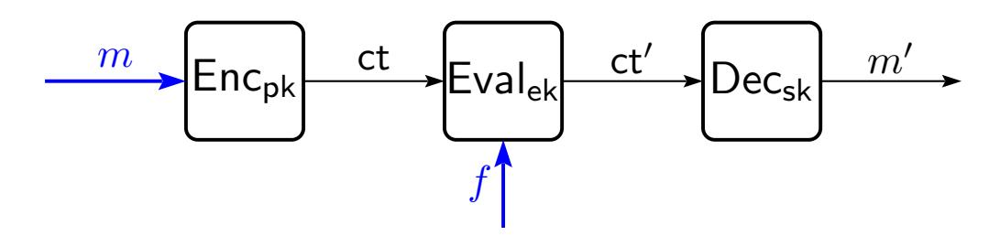
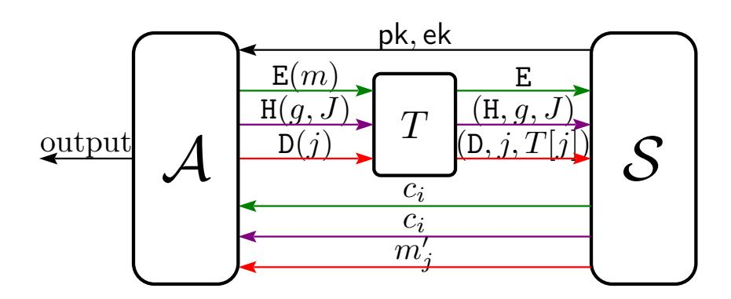

{0}------------------------------------------------

# On the Security of Homomorphic Encryption on Approximate Numbers∗

Baiyu Li† Daniele Micciancio‡ March 7, 2021

#### Abstract

We present passive attacks against CKKS, the homomorphic encryption scheme for arithmetic on approximate numbers presented at Asiacrypt 2017. The attack is both theoretically efficient (running in expected polynomial time) and very practical, leading to complete key recovery with high probability and very modest running times. We implemented and tested the attack against major open source homomorphic encryption libraries, including HEAAN, SEAL, HElib and PALISADE, and when computing several functions that often arise in applications of the CKKS scheme to machine learning on encrypted data, like mean and variance computations, and approximation of logistic and exponential functions using their Maclaurin series.

The attack shows that the traditional formulation of IND-CPA security (or indistinguishability against chosen plaintext attacks) achieved by CKKS does not adequately capture security against passive adversaries when applied to approximate encryption schemes, and that a different, stronger definition is required to evaluate the security of such schemes.

We provide a solid theoretical basis for the security evaluation of homomorphic encryption on approximate numbers (against passive attacks) by proposing new definitions, that naturally extend the traditional notion of IND-CPA security to the approximate computation setting. We propose both indistinguishability-based and simulation-based variants, as well as restricted versions of the definitions that limit the order and number of adversarial queries (as may be enforced by some applications). We prove implications and separations among different definitional variants, and discuss possible modifications to CKKS that may serve as a countermeasure to our attacks.

## 1 Introduction

Fully homomorphic encryption (FHE) schemes allow to perform arbitrary computations on encrypted data (without knowing the decryption key), and, at least in theory, can be a very powerful tool to address a wide range of security problems, especially in the area of distributed or outsourced computation. Since the discovery of Gentry's bootstrapping technique [\[24\]](#page-25-0) and the construction of the first FHE schemes based on standard lattice assumptions [\[12,](#page-24-0) [13,](#page-24-1) [11,](#page-24-2) [10\]](#page-24-3), improving the efficiency of these constructions has been one of the main challenges in the area, both in theory and in practice.

The main source of inefficiency in FHE constructions is the fact that these cryptosystems (or, more generally, encryption schemes based on lattice problems [\[47,](#page-26-0) [39\]](#page-26-1)) are inherently noisy: encrypting (say) an integer message m, and then applying the raw decryption function produces a perturbed message m + e, where e is a small error term added for security purposes during the encryption process. This is not much of a problem when using only encryption and decryption operations: the error can be easily removed by scaling the message m by an appropriate factor B > 2|e| (e.g., as already done in [\[47\]](#page-26-0)), or applying some other

∗Research supported by Global Research Cluster program of Samsung Advanced Institute of Technology and NSF Award 1936703.

†University of California, San Diego, USA. E-mail: baiyu@cs.ucsd.edu

‡University of California, San Diego, USA. E-mail: daniele@cs.ucsd.edu

{1}------------------------------------------------

form of error correction to m before encryption. Then, if the raw decryption function outputs a perturbed value v = m · B + e, the original message m can be easily recovered by rounding v to the closest multiple of B. However, when computing on encrypted messages using a homomorphic encryption scheme, the errors can grow very quickly, making the resulting ciphertext undecryptable, or requiring such a large value of B (typically exponential or worse in the depth of the computation) that the cost of encryption becomes prohibitive. The size of the encryption noise e can be reduced using the bootstrapping technique introduced by Gentry in [\[24\]](#page-25-0), thereby allowing to perform arbitrary computations with a fixed value of B. However, all known bootstrapping methods are very costly, making them the main efficiency bottleneck for general purpose computation on encrypted data. So, reducing the growth rate of the noise e during encrypted computations is of primary importance to either use bootstrapping less often, or avoid the use of bootstrapping altogether by employing a sufficiently large (but not too big) scaling factor B. In fact, controlling the error growth during homomorphic computations has been the main objective of much research work, starting with [\[12,](#page-24-0) [13,](#page-24-1) [11,](#page-24-2) [10\]](#page-24-3).

Homomorphic Encryption for Arithmetic on Approximate Numbers. One of the most recent and interesting contributions along these lines is the approach suggested in [\[19,](#page-25-1) [18,](#page-24-4) [34,](#page-25-2) [17,](#page-24-5) [15\]](#page-24-6) based on the idea that in many practical scenarios, computations are performed on real-world data which is already approximate, and the result of the computation inherently contains small errors even when carried out in the clear (without any encryption), due to statistical noise or measurement errors. If the goal of encryption is to secure these approximate real-world computations, requiring the decryption function to produce exact results may seem an overkill, and rightly so: if the decryption algorithm simply outputs m+e, the application can treat e just like the noise already present in the input and output of the (unencrypted) computation. Interestingly, [\[19\]](#page-25-1) shows that the resulting "approximate encryption" scheme produces results that are almost as accurate as floating point computations on plaintext data. But the practical impact on the concrete efficiency of the scheme is substantial: by avoiding the large scaling factor B, the scheme achieves much slower error growth than "exact" homomorphic encryption schemes. This allows to perform much deeper computations before the need to invoke a costly bootstrapping procedure, and, in many settings, completely avoid the use of bootstrapping while still delivering results that are sufficiently accurate for the application.

Not surprisingly, the scheme of [\[19\]](#page-25-1) and its improved variants [\[18,](#page-24-4) [34,](#page-25-2) [17,](#page-24-5) [15\]](#page-24-6) (generically called CKKS after the authors of [\[19\]](#page-25-1)) have attracted much attention as a potentially more practical method to apply homomorphic computation on the encryption of real data. The CKKS paper [\[19\]](#page-25-1) already provided an open source implementation in the "Homomorphic Encryption for Arithmetic on Approximate Numbers" (HEAAN) library [\[31\]](#page-25-3). Subsequently, other implementations of the scheme have been included in pretty much all mainstream libraries for secure computation on encrypted data, like Microsoft's "Simple Encrypted Arithmetic Library" SEAL [\[16\]](#page-24-7), IBM's "Homomorphic Encryption" library HElib [\[27,](#page-25-4) [28,](#page-25-5) [29\]](#page-25-6), and NJIT's lattice cryptography library PALISADE [\[43\]](#page-26-2). Some of these libraries are used as a backend for other tools, like Intel's nGraph-HE compiler [\[8,](#page-24-8) [7\]](#page-24-9) for secure machine learning applications, and a wide range of other applications, including the encrypted computation of logistic regression [\[30\]](#page-25-7), security-preserving support vector machines [\[44\]](#page-26-3), homomorphic training of logistic regression models [\[6\]](#page-24-10), homomorphic evaluation of neural networks and tensor programs [\[22,](#page-25-8) [21\]](#page-25-9), compiling ngraph programs for deep learning [\[8\]](#page-24-8), private text classification [\[2\]](#page-24-11), and clustering over encrypted data [\[20\]](#page-25-10) just to name a few.

Our contribution. While, as argued in much previous work, approximate computations have little impact on the correctness of many applications, we bring into question their impact on security. In particular, we show that the traditional formulation of indistinguishability under chosen plaintext attack (IND-CPA, [\[26,](#page-25-11) [5\]](#page-24-12), see Definition [1\)](#page-4-0) is inadequate to capture security against passive adversaries when applied to approximate encryption schemes. In fact, as our work shows, an approximate homomorphic encryption scheme can satisfy IND-CPA security and still be completely insecure from both a theoretical and practical standpoint. In order to put the study of approximate homomorphic encryption schemes on a sound theoretical basis, we propose a new, more refined formulation of passive security which properly captures the capabilities of a passive adversary when applied to approximate (homomorphic) encryption schemes. We call this notion IND-CPAD security, or "indistinguishability under chosen plaintext attacks with decryption oracles", for reasons that will

{2}------------------------------------------------

Figure 1: A passive attacker against a homomorphic encryption scheme may choose/know the plaintext m and the homomorphic computation f (thick blue interfaces), and it can read from black interfaces to learn the ciphertexts  $\mathsf{ct}, \mathsf{ct}'$  and the decryption results m'. The adversary has only passive access to the communication and final output channels, i.e., it can eavesdrop, but is not allowed to tamper with (or inject) ciphertexts or alter the final result of the computation.

soon be clear. Our new IND-CPAD security definition is a conservative extension of IND-CPA, in the sense that (1) it implies IND-CPA security, and (2) when applied to standard (exact, possibly homomorphic) encryption schemes, it is perfectly equivalent to IND-CPA. However, when applied to approximate encryption, it is strictly stronger: there are approximate encryption schemes that are IND-CPA secure, but not IND-CPAD.

This is not just a theoretical problem: we show (both by means of theoretical analysis and practical experimentation) that the definitional shortcomings highlighted by our investigation directly affect concrete homomorphic encryption schemes proposed and implemented in the literature. In particular, we show that the CKKS FHE scheme for arithmetics on approximate numbers (both as described in the original paper [19], and as implemented in all major FHE software libraries [31, 49, 32, 43]) is subject to a devastating key recovery attack that can be carried out by a passive adversary, accessing the encryption function only through the public interfaces provided by the libraries. We remark that there is no contradiction between our results and the formal security claims made in [19]: the CKKS scheme satisfies IND-CPA security under standard assumptions on the hardness of the (Ring) LWE problem. The problem is with the technical definition of IND-CPA used in [19], which does not offer any reasonable level of security against passive adversaries when applied to approximate schemes.

The ideas behind the new IND-CPAD definition and the attacks to CKKS are easily explained. The traditional formulation of IND-CPA security lets the adversary choose the messages being encrypted, in order to model a-priori knowledge about the message distribution, or even the possibility of the adversary influencing the choice of the messages encrypted by honest parties. This is good, but not enough. When using a homomorphic encryption scheme, a passive adversary may also choose/know the homomorphic computation being performed1. Finally, a passive adversary may observe the decrypted result of some homomorphic computations. (See Figure 1 for an illustration.) So, our IND-CPAD definition provides the adversary with encryption, evaluation, and a severely restricted decryption oracle2 that model the input/output interfaces of encryption and evaluation algorithms and the output interface of the decryption algorithm. We chose the name IND-CPAD to indicate its close relationship to IND-CPA, but with some emphasis on the adversarial ability to observe the decryption results3. It is easy to check (see Lemma 1) that as long as the definition is applied to a standard (exact) encryption scheme, observing the decryption of the final result of the homomorphic computation provides no additional power to the adversary: since the adversary already knows the initial message m and the function f, it can also compute the final result f(m) on its own. So, there is no need to explicitly give to the adversary access to a decryption (or homomorphic evaluation) oracle.

However, for approximate encryption schemes, seeing the result of decryption may provide additional information, which the adversary cannot easily compute (or simulate) on its own. In particular, this additional data may provide useful information about other ciphertexts, or even the secret key material. This possibility

&lt;sup>1This computation may or may not be secret, depending on whether the scheme is "circuit-hiding".

&lt;sup>2We remark that this use of decryption oracle is only a technical detail of our formulation, and it is quite different from the decryption oracle used for defining active (chosen ciphertext) attacks: Our decryption oracle only provides access to the plaintext output interface of a decryption algorithm, and does not allow to apply the decryption algorithm on adversarially chosen ciphertexts.

&lt;sup>3The name IND-CPA+ was used in earlier versions of this paper. An alternative notation could be IND-CPA-D.

{3}------------------------------------------------

is quite real, as we demonstrate it can be used to attack all the major libraries implementing the CKKS scheme. The attack is very simple. It involves encrypting a collection of messages, optionally performing some homomorphic computations on them, and finally observing the decryption of the result. Then, using only the information available to a passive adversary (i.e., the input values, encrypted ciphertexts, and final decrypted result of the computation), the attack attempts to recover the secret key using standard linear algebra or lattice reduction techniques. We demonstrate the attack on a number of simple, but representative computations: the computation of the mean or variance of a large data set, and the approximate computation of the logistic and exponential functions using their Maclaurin series. These are all common computations that arise in the application of CKKS to secure machine learning, the primary target area for approximate homomorphic encryption. We implemented and tested the attack against all main open source libraries implementing approximate homomorphic encryption (HEAAN, RNS-HEAAN, PALISADE, SEAL and HElib), showing that they are all vulnerable. We stress that this is due not to an implementation bug in the libraries (which faithfully implement CKKS encryption), but to the shortcomings of the theoretical security definition originally used to evaluate the CKKS scheme. Still, our key recovery attack works very well both in theory and in practice, provably running in expected polynomial time and with success probability 1, and recovering the key in practice, even for large values of the security parameter, in just a few seconds. So, the attack may pose a real threat to applications using the libraries. It immediately follows from the attack that the CKKS scheme is not IND-CPAD secure. In practice, such an attack can be carried out in systems where the decryption results are made publicly available, or, more generally, they may be disclosed to selected parties. As an example, consider privacy-preserving data sharing and aggregation services for medical data [\[46\]](#page-26-5). In this setting, individual hospitals encrypt their own sensitive medical records using a public key approximate homomorphic encryption scheme and upload the ciphertexts to a cloud computing service; the cloud service accepts queries from an investigator, perhaps from one of the hospitals, and homomorphically computes the requested statistics. Finally, it decrypts or re-encrypts the final computation result (possibly with the help of a third party that holds the secret decryption key) and sends it to the investigator. We may assume that the service checks that the query issued by the investigator is legitimate, and does not reveal sensitive information about individual patient records. Still, our attack shows that the result of the query may be enough to recover in full the secret decryption key, exposing the entire medical record database of all participating hospitals. Similar attacks are also feasible in homomorphic encryption based vehicular ad-hoc networks [\[50\]](#page-26-6) where homomorphically evaluated data analytics (both ciphertexts and decrypted results) can be accessed by a passive attacker.

On the theoretical side, we consider several restricted versions of IND-CPAD , showing implications and separations among them. For example, one may consider adversaries that perform only a bounded number k of decryption queries, as may be enforced by an application that chooses a new key every k homomorphic computations. (IND-CPA may be considered a special case where k = 0.) Interestingly, we show that for every k there are approximate encryption schemes that are secure up to k decryption queries, but completely insecure for k + 1.

Relations to other attacks to homomorphic encryption schemes. It is well known that homomorphic encryption schemes cannot be secure under adaptive chosen ciphertext attacks (CCA2). In [\[36\]](#page-25-13), Li, Galbraith, and Ma presented adaptive key recovery attacks against the GSW homomorphic encryption scheme as well as modifications to GSW to prevent such attacks. We remark that both attacks considered in [\[36\]](#page-25-13) are active attacks that require calling a decryption oracle on ciphertexts formed by the adversary. So these attacks are outside of the IND-CPAD security model that we consider in this paper.

Organization. The rest of the paper is organized as follows. In Section [2](#page-4-1) we provide some mathematical background about the LWE problem and lattice-based (homomorphic) encryption. In Section [3](#page-7-0) we present our IND-CPAD security definition, and initiate its theoretical study, proving implication and separation results between different variants of the definition. In Section [4](#page-16-0) we give a detailed description and rigorous analysis of our attack. Practical experiments using our implementation of the attack are described in Section [5.](#page-19-0) Section [6](#page-22-0) concludes with some general remarks and a discussion of possible countermeasures to our attack.

{4}------------------------------------------------

### 2 Preliminaries

**Notation.** We use the notation  $\mathbf{a} = (a_0, \dots, a_{n-1})$  for column vectors, and  $\mathbf{a}^t = [a_0, \dots, a_{n-1}]$  for rows. Vector entries are indexed starting from 0, and denoted by  $a_i$  or  $\mathbf{a}[i]$ . The dot product between two vectors (with entries in a ring) is written  $\langle \mathbf{a}, \mathbf{b} \rangle$  or  $\mathbf{a}^t \cdot \mathbf{b}$ . Scalar functions  $f(\mathbf{a}) = (f(a_0), \dots, f(a_{n-1}))$  are applied to vectors componentwise.

For any finite set A, we write  $x \leftarrow A$  for the operation of selecting x uniformly at random from A. More generally, if  $\chi$  is a probability distribution,  $x \leftarrow \chi$  selects x according to  $\chi$ .

Standard Cryptographic Definitions. In all our definitions, we denote the security parameter by  $\kappa$ . A function f in  $\kappa$  is negligible if  $f(\kappa) = \kappa^{-\omega(1)}$ . We use  $\mathsf{negl}(\kappa)$  to denote an arbitrary negligible function in  $\kappa$ .

We recall the standard notions of public-key encryption scheme and homomorphic encryption scheme. A public-key encryption scheme with a message space  $\mathcal{M}$  is a tuple (KeyGen, Enc, Dec) consisting of three algorithms:

- a randomized key generation algorithm KeyGen that takes the security parameter  $1^{\kappa}$  and outputs a secret key sk and a public key pk,
- a randomized encryption algorithm Enc that takes pk and a message  $m \in \mathcal{M}$  and outputs a ciphertext ct, and
- a deterministic decryption algorithm Dec that takes sk and a ciphertext ct and outputs a message m' or a special symbol  $\bot$  indicating decryption failure.

We usually parameterize Enc with pk and write  $\mathsf{Enc}_{\mathsf{pk}}(\cdot)$  to denote the function  $\mathsf{Enc}(\mathsf{pk},\cdot)$ , and similarly we write  $\mathsf{Dec}_{\mathsf{sk}}(\cdot)$  for the function  $\mathsf{Dec}(\mathsf{sk},\cdot)$ . A public-key encryption scheme is  $\mathit{correct}$  if for all  $m \in \mathcal{M}$  and keys  $(\mathsf{sk},\mathsf{pk})$  in the support of  $\mathsf{KeyGen}(1^\kappa)$ ,  $\mathsf{Pr}\{\mathsf{Dec}_{\mathsf{sk}}(\mathsf{Enc}_{\mathsf{pk}}(m)) = m\} = 1 - \mathsf{negl}(\kappa)$ , where the probability is over the randomness of  $\mathsf{Enc}$ .

A public-key homomorphic encryption scheme is a public-key encryption scheme with an additional, possibly randomized, (homomorphic) evaluation algorithm Eval, and such that KeyGen outputs an additional evaluation key ek besides sk and pk. The algorithm Eval takes ek, a circuit  $g: \mathcal{M}^l \to \mathcal{M}$  for some  $l \geq 1$ , and a sequence of l ciphertexts  $\mathsf{ct}_i$ , and it outputs a ciphertext  $\mathsf{ct}'$ . The correctness of a homomorphic encryption scheme requires that, for all keys  $(\mathsf{sk}, \mathsf{pk}, \mathsf{ek})$  in the support of  $\mathsf{KeyGen}(1^\kappa)$ , for all circuits  $g: \mathcal{M}^l \to \mathcal{M}$  and for all  $m_i \in \mathcal{M}$ ,  $1 \leq i \leq l$ , it holds that

$$\Pr\left\{\begin{array}{l} \mathsf{ct}_i \leftarrow \mathsf{Enc}_{\mathsf{pk}}(m_i) \text{ for } 1 \leq i \leq l, \\ \mathsf{Dec}_{\mathsf{sk}}(\mathsf{Eval}_{\mathsf{ek}}(g, (\mathsf{ct}_i)_{i=1}^l)) = g((m_i)_{i=1}^l) \end{array}\right\} = 1 - \mathsf{negl}(\kappa),$$

where the probability is over the randomness of Enc and Eval. We also require that the complexity of Dec is independent (or a slow growing function) of the size of the circuit g.

In terms of security, we recall the standard security notion of *indistinguishability under chosen plaintext* attack, or IND-CPA, for public-key (homomorphic) encryption schemes.

**Definition 1** (IND-CPA Security). Let (KeyGen, Enc, Dec, Eval) be a homomorphic encryption scheme. We define an experiment  $\mathsf{Expr}^{\mathsf{cpa}}_b[\mathcal{A}]$  parameterized by a bit  $b \in \{0,1\}$  and an efficient adversary  $\mathcal{A}$ :

$$\begin{split} \mathsf{Expr}_b^{\mathrm{cpa}}[\mathcal{A}](1^\kappa) : \quad & (\mathsf{sk}, \mathsf{pk}, \mathsf{ek}) \leftarrow \mathsf{KeyGen}(1^\kappa) \\ & \quad & (x_0, x_1) \leftarrow \mathcal{A}(1^\kappa, \mathsf{pk}, \mathsf{ek}) \\ & \quad & \mathsf{ct} \leftarrow \mathsf{Enc}_{\mathsf{pk}}(x_b) \\ & \quad & b' \leftarrow \mathcal{A}(\mathsf{ct}) \\ & \quad & \mathsf{return}(b') \end{split}$$

We say that the scheme is IND-CPA secure if for any efficient adversary A, it holds that

$$\mathsf{Adv}_{\mathrm{cpa}}[\mathcal{A}](\kappa) = |\Pr\{\mathsf{Expr}_0^{\mathrm{cpa}}[\mathcal{A}](1^\kappa) = 1\} - \Pr\{\mathsf{Expr}_1^{\mathrm{cpa}}[\mathcal{A}](1^\kappa) = 1\}| = \mathsf{negl}(\kappa).$$

{5}------------------------------------------------

**Lattices and Rings.** A lattice is a (typically full rank) discrete subgroup of  $\mathbb{R}^n$ . Lattices  $L \subset \mathbb{R}^n$  can be represented by a basis, i.e., a matrix  $\mathbf{B} \in \mathbb{R}^{n \times k}$  with linearly independent columns such that  $L = \mathbf{B}\mathbb{Z}^k$ . The length of the shortest nonzero vector in a lattice L is denoted by  $\lambda(L)$ . The Shortest Vector Problem, given a lattice L, asks to find a lattice vector of length  $\lambda(L)$ . The Approximate SVP relaxes this condition to finding a nonzero lattice vector of length at most  $\gamma \cdot \lambda(L)$ , where the approximation factor  $\gamma \geq 1$  may be a function of the dimension n or other lattice parameters.

We write  $\mathbb{Z}, \mathbb{Q}, \mathbb{R}, \mathbb{C}$  for the sets of integer, rational, real and complex numbers. For any positive q > 0, we write  $\mathbb{R}_q = \mathbb{R}/(q\mathbb{Z})$  for the set of reals modulo q (as a quotient of additive groups), uniquely represented as values in the centered interval [-q/2, q/2). Similarly, for any positive integer q > 0, we write  $\mathbb{Z}_q = \mathbb{Z}/(q\mathbb{Z})$  for the ring of integers modulo q, uniquely represented as values in  $[-q/2, q/2) \cap \mathbb{Z} = \{-\lceil \frac{q-1}{2} \rceil, \ldots, \lfloor \frac{q-1}{2} \rfloor\}$ . Let  $N = 2^k$  be a power of 2,  $\zeta_{2N} = e^{\pi i/N}$  the principal (2N)th complex root of unity. We write  $\mathcal{K}^{(2N)} = \mathbb{Q}[X]/(X^N + 1)$  for the cyclotomic field of order 2N, and  $\mathcal{O}^{(2N)} = \mathbb{Z}[X]/(X^N + 1)$  for its ring of integers. The primitive roots of unity  $\zeta_{2N}^{2j+1}$ , for  $j = 0, \ldots, N-1$ , are precisely the roots of the cyclotomic polynomial  $X^N + 1$ . We omit the index 2N and simply write  $\mathcal{K}, \mathcal{O}$  and  $\zeta$  when the value of N is clear from the

context. Elements of  $\mathcal{K}$  (and  $\mathcal{O}$ ) are uniquely represented as polynomials  $a(X) = a_0 + a_1 \cdot X + \ldots + a_{N-1} \cdot X^{N-1}$  of degree less than N, and identified with their vectors of coefficients  $\mathbf{a} = (a_0, \ldots, a_{N-1}) \in \mathbb{Q}^N$  (and  $\mathbb{Z}^N$ ). For any positive integer q > 0, we write  $\mathcal{K}_q = \mathcal{K}/(q\mathcal{K}) \equiv \mathbb{Q}_q^N$  for the set of vectors/polynomials with entries/coefficients reduced modulo q. Similarly for  $\mathcal{O} \equiv \mathbb{Z}^N$  and  $\mathcal{O}_q \equiv \mathbb{Z}_q^N$ .

**LWE and Homomorphic Encryption.** The (Ring) Learning With Errors (LWE) distribution RLWEs(N, q,  $\chi$ ) with secret  $s \in \mathcal{O}^{(2N)}$  and error distribution  $\chi$  (over  $\mathcal{O}^{(2N)}$ ), produces pairs  $(a, b) \in \mathcal{O}_q^{(2N)}$  where  $a \leftarrow \mathcal{O}_q^{(2N)}$  is chosen uniformly at random, and  $b = s \cdot a + e$  for  $e \leftarrow \chi$ . The (decisional) Ring LWE assumption over  $\mathcal{O}^{(2N)}$  with error distribution  $\chi$  and secret distribution  $\chi'$  and m samples, states that when  $s \leftarrow \chi'$ , the product distribution RLWEs(N, q,  $\chi$ )m is pseudorandom, i.e., it is computationally indistinguishable from the uniform distribution over  $(\mathcal{O}_q \times \mathcal{O}_q)^m$ .

For appropriate choices of  $\chi, \chi'$  and q, the Ring LWE problem is known to be computationally hard, based on (by now) standard assumptions on the worst-case complexity of computing approximately shortest vectors in ideal lattices. Theoretical work supports setting the error distribution  $\chi$  to a discrete Gaussian of standard deviation  $O(\sqrt{N})$ , and setting the secret distribution  $\chi'$  to either the uniform distribution over  $\mathcal{O}_q$ , or the same distribution as the errors  $\chi$ . For the sake of efficiency, the Ring LWE problem is often employed by homomorphic encryption schemes also for narrower secret and error distributions, that lack the same theoretical justifications, but for which no efficient attack is known, e.g., distributions over vectors with binary  $\{0,1\}$  or ternary  $\{-1,0,1\}$  coefficients.

The raw (Ring) LWE encryption scheme works as follows:

- The key generation algorithm picks  $s \leftarrow \chi', e \leftarrow \chi, a \leftarrow \mathcal{O}_q$ , and outputs secret key  $\mathsf{sk} = (-s, 1) \in \mathcal{O}_q^2$  and public key  $\mathsf{pk} = (a, b) \in \mathcal{O}_q^2$  where  $b = s \cdot a + e$  follows the LWE distribution.
- The encryption algorithm,  $\mathsf{Enc}_{\mathsf{pk}}(m)$  picks random  $u \leftarrow \{0,1\}^N$  and  $\mathbf{e} = (e_0, e_1) \leftarrow \chi^2$ , and outputs  $\mathsf{ct} = u \cdot \mathsf{pk} + \mathbf{e} + (0, m) \in \mathcal{O}_q^2$
- The raw decryption algorithm  $Dec_{sk}(ct)$  outputs  $\langle sk, ct \rangle \mod q$ .

The secret and public keys satisfy the property that  $\langle \mathsf{sk}, \mathsf{pk} \rangle = e$  equals the short error vector chosen during key generation. We qualified this scheme and the decryption algorithm as "raw" because applying the encryption algorithm, and subsequently decrypting the result (with a matching pair of public and secret keys) does not recover the original message, but only a value close to it. In fact, for any  $(\mathsf{sk}, \mathsf{pk})$  produced by the key generation algorithm, we have

$$\mathsf{Dec}_{\mathsf{sk}}(\mathsf{Enc}_{\mathsf{pk}}(m)) = u \cdot \langle \mathsf{sk}, \mathsf{pk} \rangle + \langle \mathsf{sk}, \mathsf{e} \rangle + m = m + (ue - se_0 + e_1) \pmod{q}$$

where the perturbation  $\tilde{e} = (ue - se_0 + e_1)$  is small because it is a combination of short vectors  $u, e, s, e_0, e_1$ . (The size of these vectors is best quantified with respect to the message encoding used by the application, and

{6}------------------------------------------------

it is discussed below.) In order to obtain a proper encryption scheme that meets the correctness requirement, the message m must be preprocessed, by encoding it with an appropriate error correcting code, which allows to recover from the error  $\tilde{e}$ . For example, if m has binary entries, one can multiply m by a scaling factor  $\lfloor q/2 \rfloor$ , and then round (each coefficient of) the output of the raw decryption algorithm to the closest multiple of  $\lfloor q/2 \rfloor$ . For the sake of improving the efficiency of homomorphic computations, the CKKS encryption scheme [19] gets away without applying error correction, and directly using the raw decryption algorithm to produce "approximate" decryptions of the ciphertexts. So, in the following we focus on the "raw" LWE scheme, and postpone the discussion of error correction to later.

By linearity of Enc, LWE encryption directly supports (bounded) addition of ciphertexts: if  $\mathsf{ct}_0 = (a_0, b_0)$  and  $\mathsf{ct}_1 = (a_1, b_1)$  are encryptions of  $m_0$  and  $m_1$  with noise  $e_0$  and  $e_1$  respectively, then the vector sum

$$\mathsf{ct}_0 + \mathsf{ct}_1 = (a_0 + a_1, b_0 + b_1) \bmod q$$

is an encryption of  $m_0 + m_1$  with noise  $e_0 + e_1$ .

There are several ways to perform homomorphic multiplication on LWE ciphertexts. As in [19], here we focus on the "tensoring" technique of [11] implemented using the "raising the modulus" multiplication method of [25]. This multiplication method uses an appropriate multiple pq of the ciphertext modulus q, and requires an "evaluation key", produced during key generation, which is computed and used as follows:

- $ek = (a, b) \in \mathcal{O}_{pq}^2$  where  $a \leftarrow \mathcal{O}_{pq}$ ,  $e \leftarrow \chi_e$  and  $b = as + e + ps^2 \pmod{pq}$ .
- Using ek, the product of two ciphertexts  $\mathsf{ct}_0 = (a_0, b_0), \mathsf{ct}_1 = (a_1, b_1)$  is computed as

$$\mathsf{ct}_0 \times \mathsf{ct}_1 = (a_0 b_1 + a_1 b_0, b_0 b_1) + \lfloor (a_0 a_1 \bmod q) \cdot \mathsf{ek}/p \rfloor.$$

In order to approximately evaluate deep arithmetic circuits, the CKKS scheme combines these addition and multiplication procedures with a rescaling operation RS, implemented using the key switching technique of [11]. Rescaling requires the use of a sequence of moduli  $q_l$ , which for simplicity we assume to be of the form  $q_l = q_0 \cdot p^l$  for some base p, e.g., p = 2. Ciphertexts may live at different levels, with level l ciphertexts encrypted using modulus  $q_l$ . The key generation algorithm takes as auxiliary input the highest number of desired levels L, and produces public and evaluation keys with respect to the largest modulus  $q_L$ . CKKS directly supports addition and multiplication only between ciphertexts at the same level. Rescaling is used to map ciphertexts  $\mathsf{ct} \in \mathcal{O}^2_{q_{l+l'}}$  to a lower level l with the operation

$$\mathsf{RS}_{l'}(\mathsf{ct}) = \left| \mathsf{ct}/p^{l'} \right| \in \mathcal{O}_{q_l}^2$$

where the division and rounding are performed componentwise.

The CKKS message encoding. The CKKS scheme considers a vector of complex numbers (or Gaussian integers)  $\tilde{\mathbf{a}}$  as the set of evaluation points  $\tilde{a}_j = a(x_j)$  of a real (in fact, integer) polynomial  $a(X) \in \mathbb{Z}[X]$ . This allows to perform pointwise addition and multiplication of vectors (SIMD style) by means of addition and multiplication of polynomials as  $(a(X) \circ b(X))(x_j) = a(x_j) \circ b(x_j)$  for any  $x_j$ , where  $o \in \{+, \times\}$ . The evaluation points are chosen among the primitive (2N)th roots of unity  $\zeta^{2j+1}$ , so that the cyclotomic polynomial  $X^N + 1$  evaluates to zero at all those points, and reduction modulo  $X^N + 1$  does not affect the value of  $a(x_j)$ . This allows to operate on the polynomials modulo  $X^N + 1$ , i.e., as elements of the cyclotomic ring  $\mathcal{O}$ . Since a(X) has real coefficients and primitive roots come in complex conjugate pairs  $\zeta^{2j+1}$ ,  $\zeta^{2(N-j)-1}$ , the value of a(X) can be freely chosen only for half of the roots, with the value of  $a(\zeta^{2(N-j)-1})$  uniquely determined as the complex conjugate of  $a(\zeta^{2j+1})$ . So, a(X) is used to represent a vector  $\tilde{\mathbf{a}}$  of N/2 complex values. Setting the evaluation points to  $x_j = \zeta^{4j+1}$  (for  $j = 0, \ldots, N/2 - 1$ ), and using the fact that these points are primitive roots of unity, interpolation and evaluation can be efficiently computed (in  $O(N \log N)$  time) using the Fast Fourier Transform.

Let  $\varphi \colon \mathcal{O} \to \mathbb{C}^{N/2}$  be the transformation mapping  $a(X) \in \mathcal{O} \equiv \mathbb{Z}^N$  to  $\varphi(a) = \tilde{\mathbf{a}} = (a(\zeta^{4j+1}))_{j=0}^{N/2-1} \in \mathbb{C}^{N/2}$ , and its extension  $\varphi \colon \mathcal{S} \to \mathbb{C}^{N/2}$  to arbitrary real polynomials, where  $\mathcal{S} = \mathbb{R}[X]/(X^N + 1) \equiv \mathbb{R}^N$ .

{7}------------------------------------------------

We can identify any polynomial  $a \in \mathcal{S}$  by its coefficient vector  $(a_0, a_1, \ldots, a_{N-1})$ , and we set  $||a||_2 = ||(a_0, a_1, \ldots, a_{N-1})||_2$ . Similarly we can define  $||a||_1$  and  $||a||_{\infty}$  as the corresponding norms on the coefficient vector. So the transformation  $\varphi \colon \mathcal{S} \to \mathbb{C}^{N/2}$  is a scaled isometry, satisfying  $||\varphi(a)||_2 = \sqrt{N}||a||_2$  and  $||\varphi(a)||_{\infty} \leq ||a||_1$ . In what follows, we assume, as a message space, the set of complex vectors  $\tilde{\mathbf{a}} \in \varphi(\mathcal{O}) \subset \mathbb{C}^{N/2}$  which are the evaluation of polynomials  $a(X) \in \mathcal{O}$  with integer coefficients much smaller than the ciphertext modulus q. Arbitrary vectors  $\mathbf{z} \in \mathbb{C}^{N/2}$  can be encrypted (approximately) by taking the inverse transform  $\varphi^{-1}$  on a scaled vector  $\Delta \cdot \mathbf{z}$ , for some scaling factor  $\Delta \in \mathbb{R}$ , such that  $||\varphi^{-1}(\Delta \cdot \mathbf{z})|| \ll q$  and rounding  $\varphi^{-1}(\Delta \cdot \mathbf{z})$  to a nearby point of the form  $\varphi(a)$  for some  $a(X) \in \mathcal{O}$ .

The complete message encoding and decoding functions in CKKS are defined as

- $\bullet \ \operatorname{Encode}(\mathbf{z} \in \mathbb{C}^{N/2}; \Delta) = \left| \Delta \cdot \varphi^{-1}(\mathbf{z}) \right| \in \mathcal{O}.$
- $\mathsf{Decode}(a \in \mathcal{O}; \Delta) = \varphi(\Delta^{-1} \cdot a) \in \mathbb{C}^{N/2}$ .

Once encoded, the scaling factor  $\Delta$  is usually implicitly tied to a plaintext polynomial, so we sometimes omit it when its value is clear from the context.

Since these encoding and decoding operations can be performed without any knowledge of the secret or public keys, sometimes we assume they are performed at the outset, at the application level, before invoking the encryption or decryption algorithms. More specifically, we may assume messages  $\varphi(\Delta^{-1} \cdot m) \in \mathbb{C}^{N/2}$  are provided to the encryption algorithm by specifying the integer polynomial  $m \in \mathcal{O}$ , and the decryption algorithm returns a message  $\tilde{\mathbf{m}}' = \mathsf{Decode}(m'; \Delta)$  represented as the underlying polynomial  $m' \in \mathcal{O}$  that is an approximation of m. All this is only for the sake of theoretical analysis, and all concrete implementations (of the scheme and our attacks to it) include encoding and decoding procedures as part of the encryption and decryption algorithms. Message encoding can be quite relevant to quantify the amount of noise in a ciphertext. We say that a ciphertext ct approximately encrypts message  $\tilde{\mathbf{m}}$  with scaling factor  $\Delta$  and noise  $\tilde{\mathbf{e}}$  if  $\mathsf{Decode}(\mathsf{Dec}_{\mathsf{sk}}(\mathsf{ct}); \Delta) = \tilde{\mathbf{m}} + \tilde{\mathbf{e}}$ .

# 3 Security Notions for Approximate Encryption

In this section we present general definitions in the public-key setting that accurately capture passive attacks against a (possibly approximate, homomorphic) encryption scheme. We recall that in a passive attack the adversary may control which messages get encrypted, what homomorphic computations are performed on them, and may observe all ciphertexts produced in the process, as well as the decrypted result of the computations (as illustrated in Figure 1).

We first present an indistinguishability-based definition (similar in spirit to the standard IND-CPA notion described in Definition 1). A simulation-based notion is presented in Section 3.2. Then, we explore restricted and extended variants of these basic definitions.

#### 3.1 Indistinguishability-Based Definition

Our first definition is indistinguishability-based: the adversary chooses a number of pairs of plaintext messages, and its goal is to determine whether the ciphertexts it receives are encryptions of the first or the second plaintext in the pairs. In contrast to Definition 1, our new definition allows an adversary to make multiple challenge queries  $(m_0, m_1)$ , rather than a single one. Our adversary can also issue homomorphic evaluation and decryption queries. We now give the formal definition. For simplicity, and as common in homomorphic encryption schemes, we assume all messages belong to a fixed message space  $\mathcal{M}$ . In particular, all messages have (or can be padded to) the same length. We refer to our definition as IND-CPAD, as it includes IND-CPA (see Definition 1) as a special case, where the adversary makes only one encryption query, and no homomorphic evaluation or decryption queries, whereas our definition explicitly provides the adversary with a restricted decryption oracle which allows to observe decryption results of honestly generated ciphertexts.

**Definition 2** (IND-CPAD Security). Let  $\mathcal{E} = (\text{KeyGen}, \text{Enc}, \text{Dec}, \text{Eval})$  be a public-key homomorphic (possibly approximate) encryption scheme with plaintext space  $\mathcal{M}$  and ciphertext space  $\mathcal{C}$ . We define an experiment

{8}------------------------------------------------

 $\mathsf{Expr}_b^{\mathrm{indcpa}^{\mathrm{D}}}[\mathcal{A}]$ , parameterized by a bit  $b \in \{0,1\}$  and involving an efficient adversary  $\mathcal{A}$  that is given access to the following oracles, sharing a common state  $S \in (\mathcal{M} \times \mathcal{M} \times \mathcal{C})^*$  consisting of a sequence of message-message-ciphertext triplets:

• An encryption oracle  $\mathsf{E}_{\mathsf{pk}}(m_0, m_1)$  that, given a pair of plaintext messages  $m_0, m_1$ , computes  $c \leftarrow \mathsf{Enc}_{\mathsf{pk}}(m_b)$ , extends the state

$$S := [S; (m_0, m_1, c)]$$

with one more triplet, and returns the ciphertext c to the adversary.

• An evaluation oracle  $\mathsf{H}_{\mathsf{ek}}(g,J)$  that, given a function  $g:\mathcal{M}^k \to \mathcal{M}$  and a sequence of indices  $J=(j_1,\ldots,j_k)\in\{1,\ldots,|S|\}^k$ , computes the ciphertext  $c\leftarrow \mathsf{Eval}_{\mathsf{pk}}(g,S[j_1].c,\ldots,S[j_k].c)$ , extends the state

$$S := [S; (g(S[j_1].m_0, \dots, S[j_k].m_0), g(S[j_1].m_1, \dots, S[j_k].m_1), c)]$$

with one more triplet, and returns the ciphertext c to the adversary. Here and below |S| denotes the number of triplets in the sequence S, and  $S[j].m_0$ ,  $S[j].m_1$  and S[j].c denote the three components of the jth element of S.

• A decryption oracle  $D_{sk}(j)$  that, given an index  $j \leq |S|$ , checks whether  $S[j].m_0 = S[j].m_1$ , and, if so, returns  $Dec_{sk}(S[j].c)$  to the adversary. (If the check fails, a special error symbol  $\perp$  is returned.)

The experiment is defined as

$$\begin{split} \mathsf{Expr}_b^{\mathrm{indcpa}^{\mathrm{D}}}[\mathcal{A}](1^\kappa): \quad &(\mathsf{sk},\mathsf{pk},\mathsf{ek}) \leftarrow \mathsf{KeyGen}(1^\kappa) \\ S:=[\ ] \\ b' \leftarrow \mathcal{A}^{\mathsf{E}_{\mathsf{pk}},\mathsf{H}_{\mathsf{ek}},\mathsf{D}_{\mathsf{sk}}}(1^\kappa,\mathsf{pk},\mathsf{ek}) \\ & \quad \mathsf{return}(b') \end{split}$$

The advantage of adversary  $\mathcal{A}$  against the IND-CPAD security of the scheme is

$$\mathsf{Adv}_{\mathrm{indcpa^D}}[\mathcal{A}](\kappa) = |\Pr\{\mathsf{Expr}_0^{\mathrm{indcpa^D}}[\mathcal{A}](1^\kappa) = 1\} - \Pr\{\mathsf{Expr}_1^{\mathrm{indcpa^D}}[\mathcal{A}](1^\kappa) = 1\}|,$$

where the probability is over the randomness of  $\mathcal{A}$  and the experiment. The scheme  $\mathcal{E}$  is IND-CPAD-secure if for any efficient (probabilistic polynomial time)  $\mathcal{A}$ , the advantage  $\mathsf{Adv}_{\mathsf{indcpa}^D}[\mathcal{A}]$  is negligible in  $\kappa$ .

As a standard convention, if at any point in an experiment the adversary makes an invalid query (e.g., a circuit g not supported by the scheme, or indices out of range), the oracle simply returns an error symbol  $\bot$ .

We remark that, while the adversary in Definition 2 is given access to a decryption oracle, this should not be confused with indistinguishability under a chosen ciphertext attack (IND-CCA), which models active adversaries with the capability of tampering with (or injecting) arbitrary ciphertexts. Definition 2 only allows for decryption queries on valid ciphertexts that have been honestly computed using the correct encryption and homomorphic evaluation algorithms (modeled by the oracles E and H). Furthermore, the requirement that  $S[j].m_0 = S[j].m_1$  is to eliminate trivial attacks where the adversary can distinguish between two computations that lead to different results when computed on exact values.

Exact encryption schemes can be seen as a special case of approximate encryption, with the added correctness requirement. So, Definition 2 can be applied to exact as well as approximate encryption schemes. As a sanity check, we compare our new definition with the traditional formulation of IND-CPA security (Definition 1) modeling passive attacks against exact encryption schemes. Perhaps not surprisingly, for the case of exact encryption schemes, our new security definition coincides with the standard notion of IND-CPA security.

**Lemma 1.** Any exact homomorphic encryption scheme  $\mathcal{E}$  is IND-CPA secure if and only if it is IND-CPA secure.

{9}------------------------------------------------

*Proof.* It is easy to see that IND-CPAD security implies IND-CPA security, as an adversary making only one E query but no other queries in the IND-CPAD experiment is also an IND-CPA adversary. So we consider the reverse direction.

Assume  $\mathcal{E}$  is IND-CPA secure. Let  $\mathcal{A}$  be any adversary breaking the IND-CPAD security of  $\mathcal{E}$ , and assume  $\mathcal{A}$  makes at most l queries in total to E and H. We build adversaries  $\mathcal{B}^{(i)}$ , for  $0 \le i < l$ , to break the IND-CPA security of  $\mathcal{E}$ .

 $\mathcal{B}^{(i)}$  takes input  $1^{\kappa}$ , pk, ek, and it then runs  $\mathcal{A}(1^{\kappa}, \mathsf{pk}, \mathsf{ek})$ . It maintains a state  $S \in (\mathcal{M} \times \mathcal{M} \times \mathcal{C})^*$  just like  $\mathsf{Expr}^{\mathsf{indcpa}^D}$ , and it answers oracle queries made by  $\mathcal{A}$  as follows:

- For each query  $(m_0, m_1)$  to E, if |S| < i, then let  $c \leftarrow \mathsf{Enc}_{\mathsf{pk}}(m_1)$ ; if |S| > i, then let  $c \leftarrow \mathsf{Enc}_{\mathsf{pk}}(m_0)$ ; and if |S| = i,  $\mathcal{B}^{(i)}$  sends  $(m_0, m_1)$  to  $\mathsf{Expr}_b^{\mathsf{cpa}}$  and receives c. The state S is extended by one more triplet  $(m_0, m_1, c)$ , and c is returned to  $\mathcal{A}$ .
- For each query (g, J) to H, where  $g: \mathcal{M}^k \to \mathcal{M}$  and  $J = (j_1, \ldots, j_k)$ , let  $c \leftarrow \mathsf{Eval}_{\mathsf{ek}}(g, S[j_1].c, \ldots, S[j_k].c)$ , extend S by one more triplet

$$(g(S[j_1].m_0, \ldots, S[j_k].m_0), g(S[j_1].m_1, \ldots, S[j_k].m_1), c),$$

and return c to A.

• For each query j to D, if  $j \leq |S|$  and  $S[j].m_0 = S[j].m_1$ , then return  $S[j].m_0$  to A; otherwise return an error symbol  $\bot$ .

Finally, when  $\mathcal{A}$  halts with a bit b',  $\mathcal{B}^{(i)}$  outputs this bit.

Since  $\mathcal{B}^{(i)}$  does not depend on the secret key sk to answer the D queries, it is a valid adversary in the IND-CPA experiment. Now, let  $\mathcal{H}^{(i)} = \operatorname{Expr_0^{cpa}}[\mathcal{B}^{(i)}]$  for  $0 \leq i < l$ , and let  $\mathcal{H}^{(l)} = \operatorname{Expr_1^{cpa}}[\mathcal{B}^{(l-1)}]$ . For  $1 \leq i < l$ , note that  $\mathcal{H}^{(i)}$  is exactly the same distribution as  $\operatorname{Expr_1^{cpa}}[\mathcal{B}^{(i-1)}]$ . Furthermore, by the correctness of exact homomorphic encryption schemes, the D responses from  $\mathcal{B}^{(i)}$  to  $\mathcal{A}$  are indistinguishable from those in the IND-CPAD experiment; so  $\mathcal{H}^{(0)}$  and  $\operatorname{Expr_0^{indcpa^D}}[\mathcal{A}]$  are indistinguishable, and the same holds true for  $\mathcal{H}^{(l)}$  and  $\operatorname{Expr_1^{indcpa^D}}[\mathcal{A}]$ . So  $\operatorname{Adv^{indcpa^D}}[\mathcal{A}] \leq \sum_{0 \leq i < l} \operatorname{Adv^{cpa}}[\mathcal{B}^{(i)}] + \operatorname{negl}(\kappa)$ , which is negligible since  $\mathcal{E}$  is IND-CPA secure.

Notice that the above lemma makes essential use of the correctness of exact encryption schemes, and the proof does not extend to approximate encryption schemes. In fact, for approximate encryption schemes, the result of decryption is not a simple function of the encrypted messages (and the computations performed on them), and may potentially depend (in an indirect, unspecified way) on the scheme's secret key and encryption randomness. So the information provided by decryption queries is not easily computed by the adversary on its own, and, at least in principle, IND-CPAD may be a stronger security notion than IND-CPA when applied to approximate encryption schemes. We will make this intuition clear in the following sections, proving formal separation results, and providing concrete attacks to actual approximate encryption schemes.

Also note that the above definition does not guarantee circuit privacy in the homomorphically evaluated ciphertexts, as the circuit to be evaluated in a query to oracle H does not depend on the bit b of the IND-CPAD experiment. In a later section we extend our definition with circuit privacy. Here we focus on the basic definition (without circuit privacy) which is the most common in cryptography.

#### 3.2 Simulation-Based Definition

As standard in cryptography, secure encryption schemes are expected to hide all partial information about plaintext messages. In the indistinguishability notion of security, this is captured by the task of distinguishing between any two (adversarially chosen) messages. Simulation-based security (also known as semantic security) offers a more direct way to express that ciphertexts provide no useful information at all. We consider standalone simulation-based security, following the "real vs ideal worlds" paradigm: the real world is implemented using the cryptographic scheme to process real input, and the ideal world consists of a *simulator* 

{10}------------------------------------------------

which is given a minimal amount of information and should produce an output essentially equivalent to a real attack.

We propose the following simulation-based security definition for homomorphic approximate encryption schemes. For simplicity, we consider a plaintext space with fixed message length M = {0, 1} l . The definition is easily extended to variable-length message spaces.

Definition 3 (SIM-CPAD Security). Let E = (KeyGen, Enc, Dec, Eval) be a public-key homomorphic (possibly approximate) encryption scheme with plaintext space M = {0, 1} l . Security is defined with respect to an adversary A that is given a public/evalution key (pk, ek) and has access to three (stateful) oracles:

- An encryption oracle E(m) that, given a plaintext messages m, returns a ciphertext c.
- An evaluation oracle H(g, J) that, given a function g : Mk → M for some k ≥ 1 and a sequence of indices J = (j1, . . . , jk) ∈ {1, . . . , |S|}k , returns a ciphertext c.
- A decryption oracle D(j) that, given an index j returns a plaintext message m.

Oracle queries are answered in two different ways, defining a "real" and an "ideal" experiment. The real experiment maintains a state consisting of a sequence T ∈ (M×C) ∗ of message-ciphertext pairs, and the ideal experiment maintains a sequence of messages T ∈ M∗ as its state. The indexes J and j in the evaluation and decryption queries are required to be in the range {1, . . . , |T|}, where |T| is the current length of T.

The real world experiment Real begins by initializing T := [ ] to the empty sequence, and sampling a tuple of keys (sk, pk, ek) ← KeyGen(1κ ) using the scheme's key generation algorithm. Then, the keys (pk, ek) are given to A, which is run answering its oracle queries as follows:

- E(m): compute c ← Encpk(m), extend the state T := [T; (m, c)] with one more pair, and return c to A.
- H(g, J): compute c ← Evalek(g,(T[j1].c, . . . , T[jk].c)), extend the state

$$T := [T; (g(T[j_1].m, ..., T[j_k].m), c)]$$

with one more pair, and return c to A.

• D(j): compute m0 = Decsk(T[j].c) and return it to A.

The ideal world experiment Ideal answers the adversary's queries using an efficient (stateful) simulator S (see Fig. [2](#page-11-0) for an illustration), which maintains its own state, in addition (and without access) to T. The ideal experiment begins by initializing T := [ ] to the empty sequence, and starting the simulator S which produces a pair of keys (pk, ek) that are given to the adversary A. Then, it answers A's oracle queries as follows:

- E(m): send the message E to the simulator, S, which replies with a ciphertext c. The state T := [T; m] is extended with one more message m, and the ciphertext c is returned to the adversary.
- H(g, J): send the message (H, g, J) to the simulator S, which replies with a ciphertext c. The state

$$T := [T; g(T[j_1], \dots, T[j_k])]$$

is extended with one more message g(T[j1], . . . , T[jk]), and the ciphertext c is returned to A.

• D(j): send (D, j, T[j]) to the simulator S. The simulator is expected to reply with a message m0 (possibly different from T[j]) which is returned to the adversary.

As usual, in both experiments, whenever A makes an invalid query, the oracle returns an error symbol ⊥. The experiments terminate when A halts with an output bit b. This bit is the final output of the experiment, and it is denoted by Real[A](1κ ) or Ideal[S, A](1κ ). The advantage of adversary A in breaking SIM-CPAD security is

$$\mathsf{Adv}_{\operatorname{simcpa}^D}[\mathcal{A}](\kappa) = |\Pr\{\mathsf{Ideal}[\mathcal{S},\mathcal{A}](1^\kappa) = 1\} - \Pr\{\mathsf{Real}[\mathcal{A}](1^\kappa) = 1\}|.$$

We say that E is SIM-CPAD -secure if there exists an efficient (probabilistic polynomial time) simulator S such that, for all efficient A the advantage AdvsimcpaD [A] is negligible in κ.

{11}------------------------------------------------

Figure 2: The ideal world experiment Ideal that involves a simulator  $\mathcal{S}$  and an adversary  $\mathcal{A}$ . The box between  $\mathcal{A}$  and  $\mathcal{S}$  indicates that oracle queries from  $\mathcal{A}$  are processed (with the help of the state T) by the experiment before sending to  $\mathcal{S}$ .

In the ideal world experiment, the input to the simulator describes information that is not necessarily protected by the scheme  $\mathcal{E}$ : the number of plaintexts to be encrypted, the homomorphic computation to be performed, and the exact computation results (which can be derived from the input plaintexts). The simulator's task, given these minimal information, is to simulate any attack that can be mounted by a real world adversary. As we mentioned, our definition makes an assumption that all plaintext messages, including plaintext computation results corresponding to homomorphic evaluations, are of the same bit length l. The definition can be extended to variable length messages by giving the length information |m| to the simulator.

**Relations with IND-CPAD-security.** For exact homomorphic encryption schemes, it is well known [26, 41] that the simulation-based semantic security is equivalent to the indistinguishability-based IND-CPA security. So naturally we want to extend such relationship to homomorphic approximate encryption schemes. The following implication result is easy to check.

**Lemma 2.** For any homomorphic approximate encryption scheme  $\mathcal{E}$ , if  $\mathcal{E}$  is SIM-CPAD-secure, then it is IND-CPAD-secure. Moreover, the reduction between the two adversaries preserves the number, type and order of queries.

*Proof.* Assume  $\mathcal{E}$  is SIM-CPAD-secure, and fix an IND-CPAD adversary  $\mathcal{A}$ . We build two SIM-CPAD adversaries  $\mathcal{B}_0$  and  $\mathcal{B}_1$ : For  $b \in \{0,1\}$ ,  $\mathcal{B}_b$  receives the public keys (pk, ek), maintains a state  $M \in (\mathcal{M} \times \mathcal{M})^*$ , runs  $\mathcal{A}(1^{\kappa}, \mathsf{pk}, \mathsf{ek})$  and handles its oracle queries as follows:

- For each  $\mathsf{E}(m_0, m_1)$  query,  $\mathcal{B}_b$  stores this message pair  $M := [M; (m_0, m_1)]$ , queries its oracle  $\mathsf{E}(m^b)$ , and then it returns the oracle response c to  $\mathcal{A}$ .
- For each  $\mathsf{H}(g,J)$  query, where  $J=(j_1,\ldots,j_k),\ \mathcal{B}_b$  extends its state by a new message pair  $M:=[M;\ (g(M[j_1].m_0,\ldots,M[j_k].m_0),\ g(M[j_1].m_1,\ldots,M[j_k].m_1))]$ , queries its oracle  $\mathsf{H}(g,J)$ , and it then returns the oracle response c to  $\mathcal{A}$ .
- For each D(j) query, if  $M[j].m_0 = M[j].m_1$ ,  $\mathcal{B}_b$  queries its oracle D(j) and returns the oracle response m' to  $\mathcal{A}$ ; otherwise  $\mathcal{B}_b$  returns the error symbol  $\perp$  to  $\mathcal{A}$ .

By SIM-CPAD-security, there exists a simulator  $\mathcal{S}$  such that  $\text{Real}[\mathcal{B}_0] \approx_c \text{Ideal}[\mathcal{S}, \mathcal{B}_0]$  and  $\text{Real}[\mathcal{B}_1] \approx_c \text{Ideal}[\mathcal{S}, \mathcal{B}_1]$ . Note that  $\text{Real}[\mathcal{B}_b]$  and  $\text{Expr}_b^{\text{indcpa}^D}[\mathcal{A}]$  are exactly the same distribution for both  $b \in \{0, 1\}$ . Also note that, in both  $\text{Ideal}[\mathcal{S}, \mathcal{B}_0]$  and  $\text{Ideal}[\mathcal{S}, \mathcal{B}_1]$ , if  $M[j].m_0 = M[j].m_1$  for a decryption query D(j) from  $\mathcal{A}$ , then the input given to  $\mathcal{S}$  in these two ideal world experiments are exactly the same; so  $\text{Ideal}[\mathcal{S}, \mathcal{B}_0] = \text{Ideal}[\mathcal{S}, \mathcal{B}_1]$ . Therefore the scheme  $\mathcal{E}$  is  $\text{IND-CPA}^D$ -secure, and our reduction preserves the number, type, and order of queries.

As exact homomorphic encryption schemes are special cases of homomorphic approximate encryption schemes, we compare IND-CPA with SIM-CPAD security. The following lemma shows that (together with Lemma 1), for exact encryptions, SIM-CPAD is also equivalent to IND-CPA.

{12}------------------------------------------------

**Lemma 3.** Any exact homomorphic encryption scheme  $\mathcal{E}$  is IND-CPAD secure if and only if it is SIM-CPAD secure.

*Proof.* We first show that IND-CPAD security implies SIM-CPAD. To do so, we build a simulator S. On start up, S samples keys (sk, pk, ek)  $\leftarrow$  KeyGen( $1^{\kappa}$ ) honestly using the key generation algorithm, and outputs (pk, ek). The simulator initializes a state C := [] that is a sequence of ciphertexts. Then, it handles oracle queries from an adversary as follows:

- For each  $\mathsf{E}(m)$  query,  $\mathcal{S}$  receives a message  $\mathsf{E}$ , computes  $c \leftarrow \mathsf{Enc}_{\mathsf{pk}}(0)$ , extends its state C := [C; c] by one more ciphertext, and returns c.
- For each  $\mathsf{H}(g,J)$  query,  $\mathcal{S}$  receives a message  $(\mathsf{H},g,J)$ , computes  $c \leftarrow \mathsf{Eval}_{\mathsf{ek}}(g,C[j_1],\ldots,C[j_k])$  where  $J=(j_1,\ldots,j_k)$ , extends its state as  $C:=[C;\ c]$ , and returns c.
- For each  $\mathsf{D}(j)$  query,  $\mathcal{S}$  receives a message  $(\mathsf{D},j,m),$  and it returns m.

Now, fix any SIM-CPAD adversary  $\mathcal{A}$ , and we build an IND-CPAD adversary  $\mathcal{B}$ :  $\mathcal{B}(1^{\kappa}, \mathsf{pk}, \mathsf{ek})$  runs  $\mathcal{A}(1^{\kappa})$  and sends  $(\mathsf{pk}, \mathsf{ek})$  to  $\mathcal{A}$ . It also maintains a sequence M of plaintexts as its state. For oracle queries from  $\mathcal{A}$ ,  $\mathcal{B}$  does the following:

- For each  $\mathsf{E}(m)$  query,  $\mathcal{B}$  extends its state M := [M; m] by one more message, sends (m,0) to the oracle  $\mathsf{E}_{\mathsf{pk}}$  and receives c, and then it returns c to  $\mathcal{A}$ .
- For each H(g, J) query, where  $J = (j_1, \ldots, j_k)$ ,  $\mathcal{B}$  extends its state  $M := [M; g(M[j_1], \ldots, M[j_k])]$  by one more message, sends (g, J) to the oracle  $H_{ek}$  and receives c, and then it returns c to  $\mathcal{A}$ .
- For each D(j) query,  $\mathcal{B}$  returns M[j] to  $\mathcal{A}$ .

By the correctness of exact homomorphic encryption schemes, we see that  $\mathsf{Expr}_0^{\mathrm{indcpa}^D}[\mathcal{B}]$  is indistinguishable from the real world experiment  $\mathsf{Real}[\mathcal{A}]$ . On the other hand, the ideal world experiment  $\mathsf{Ideal}[\mathcal{S},\mathcal{A}]$  is exactly the same as  $\mathsf{Expr}_1^{\mathrm{indcpa}^D}[\mathcal{B}]$ . Since  $\mathcal{E}$  is  $\mathsf{IND-CPA}^D$  secure, it is also  $\mathsf{SIM-CPA}^D$  secure.

For the reverse direction, we can directly apply Lemma 2.

For homomorphic approximate encryption schemes in general, Mihir Bellare showed that  $\mathsf{IND\text{-}CPA}^\mathsf{D}$  security can be separated from the  $\mathsf{SIM\text{-}CPA}^\mathsf{D}$  security [4].

#### 3.3 Restricted Security Notions and Separations Between Them

We have observed that, for exact encryption schemes, {IND-CPAD, SIM-CPAD} security is equivalent to the traditional IND-CPA security. (See Lemma 1.) We now show that {IND-CPAD, SIM-CPAD} is strictly stronger than IND-CPA, i.e., there are approximate encryption schemes that are provably IND-CPA secure (under standard complexity assumptions) but are not {IND-CPAD, SIM-CPAD} secure. In order to get a more refined understanding of the gap between these notions, we introduce a natural parameterization of IND-CPAD and SIM-CPAD security, that smoothly interpolates between IND-CPA and {IND-CPAD, SIM-CPAD}. Then, we define a number of restricted notions of security, and show separations between them, showing that there is an infinite chain of (strictly) increasingly stronger definitions, ranging from IND-CPA all the way to {IND-CPAD, SIM-CPAD}.

Restricting the numbers of queries. We parameterize the definition by imposing a bound on the number of queries that may be asked by the adversary.

**Definition 4**  $((q,\ell)$ -IND-CPAD Security). For any two functions  $q(\kappa)$  and  $\ell(\kappa)$  of the security parameter  $\kappa$ , we say that a homomorphic encryption scheme is  $(q,\ell)$ -IND-CPAD secure if it satisfies Definition 2 for all adversaries  $\mathcal A$  that make at most  $\ell(\kappa)$  queries to oracles E, H, and at most  $q(\kappa)$  queries to oracle D.

{13}------------------------------------------------

We combined the encryption (E) and evaluation (H) queries into a single bound  $\ell(\kappa)$  for simplicity, and because both types of queries produce ciphertexts. The bound  $\ell$  could be significant for approximate encryption schemes as security with respect  $\ell$  queries to E and H does not appear to imply security with respect to  $\ell+1$  such queries. This is in contrast to proper (exact) encryption schemes in the public-key setting where one-message security implies multi-message security. It remains an interesting open question to find out the relationship between  $(q,\ell)$ -IND-CPAD and  $(q,\ell+1)$ -IND-CPAD securities (and same for SIM-CPAD).

The definition is easily extended to more general formulations, but we will be primarily interested in the bound q on the number of decryption queries, which are the distinguishing feature of approximate encryption schemes. When  $\ell$  is an arbitrary polynomial, and only the number of decryption queries  $q(\kappa)$  is restricted, we say that a scheme is q-IND-CPAD secure.

Now, we can think of IND-CPA security as a special case of  $(q, \ell)$ -IND-CPAD, for q = 0 and  $\ell = 1$ , as the only query to E/H must be an encryption query. (Oracle E must be called at least once before one can use H to homomorphically evaluate a function on a ciphertext.) So, bounding the number of queries allows to smoothly transition from the traditional IND-CPA definition (i.e., (0,1)-IND-CPAD security), to our IND-CPAD (i.e., (poly, poly)-IND-CPAD security).

Similar to IND-CPAD security, we can also consider parameterizations of the SIM-CPAD security using bounds on the numbers of queries that an adversary is allowed to ask. We say that a homomorphic encryption scheme is  $(q, \ell)$ -SIM-CPAD secure if it satisfies Definition 3 for all adversaries  $\mathcal{A}$  that make at most  $\ell(\kappa)$  queries to oracles E, H, and at most  $q(\kappa)$  queries to oracle D. When  $\ell$  is an arbitrary polynomial, and only the number of decryption queries  $q(\kappa)$  is restricted, then we say that a scheme is q-SIM-CPAD secure.

Naturally, for proper (exact) encryption schemes, all these definitions are equivalent, and it is only in the approximate encryption setting that the definitions can be separated.

In the following proposition we show that there exists some scheme that is secure for up to some fixed number q of decryption queries but insecure for just q+1 decryption queries. We remark that the encryption scheme described in the proof is presented for the sole purpose of separating the two definitions. More natural examples that separate IND-CPA and IND-CPAD will be described in Section 4, where we present attacks to approximate encryption schemes from the literature.

**Proposition 1.** Assume there exist a pseudorandom function and an IND-CPA-secure exact homomorphic encryption scheme. Then, for any fixed  $q \geq 2$ , there exists a homomorphic approximate encryption scheme that is  $(q, \ell)$ -SIM-CPAD-secure but not  $(q + 1, \ell)$ -IND-CPAD-secure.

Proof. Let  $\mathcal{E} = (\mathsf{KeyGen}, \mathsf{Enc}, \mathsf{Dec}, \mathsf{Eval})$  be an exact homomorphic encryption scheme that is IND-CPA secure. Let  $\mathsf{PRF} : \{0,1\}^\kappa \times X \to Y$  be a secure pseudorandom function, and without loss of generality, we can assume that  $X = Y = \{0,1\}^k$ , where  $k = |\mathsf{sk}|$  is the length of the secret key of  $\mathcal{E}$ . Let  $0 < \beta < 1$  be some small positive number, which will be the upper bound on decryption errors, *i.e.*, the approximation upper bound in  $\mathcal{E}'$ . Let  $(\pi, \pi^{-1})$  be an encoding scheme from  $\{0,1\}^k$  to  $[0,\beta)$ .

We build the following homomorphic approximate encryption scheme  $\mathcal{E}' = (KeyGen', Enc', Dec', Eval')$ :

- The key generation algorithm  $\mathsf{KeyGen}'(1^{\kappa})$  samples  $(\mathsf{sk},\mathsf{pk},\mathsf{ek}) \leftarrow \mathsf{KeyGen}(1^{\kappa})$  and a PRF key  $K \leftarrow \{0,1\}^{\kappa}$ . Then it outputs  $(\mathsf{sk}',\mathsf{pk},\mathsf{ek})$ , where  $\mathsf{sk}' = (\mathsf{sk},K)$ .
- The encryption algorithm Enc' and the evaluation algorithm Eval' are identical to Enc and Eval, respectively.
- The decryption algorithm  $\mathsf{Dec}'_{(\mathsf{sk},K)}(c)$  first decrypts the ciphertext c to  $m = \mathsf{Dec}_{\mathsf{sk}}(c)$ . It outputs  $m + \pi(\mathsf{PRF}_K(m \mod (q+1)))$  if  $m \pmod (q+1) \not\equiv 0$ , and it outputs  $m + \pi(\mathsf{sk} \oplus r)$  for  $r = \bigoplus_{i=1}^q \mathsf{PRF}_K(i)$  otherwise.

When an adversary  $\mathcal{A}$  makes at most q decryption queries, the resulting decryption errors  $\{\mathsf{Dec}'_{\mathsf{sk'}}(c_i) - m_i \mid c_i \leftarrow \mathsf{Enc}_{\mathsf{pk}}(m_i)\}$  are computationally indistinguishable from random strings due to pseudorandomness of PRF. So one can show that the scheme  $\mathcal{E}'$  is  $(q,\ell)$ -SIM-CPAD-secure using a reduction to the IND-CPA security of  $\mathcal{E}$ . However, if an adversary can make q+1 decryption queries, then it can completely recover the secret key  $\mathsf{sk}$  using the decryption errors as secret shares of  $\mathsf{sk}$ . So  $\mathcal{E}'$  is not  $(q+1,\ell)$ -IND-CPAD-secure.  $\square$ 

{14}------------------------------------------------

**Restricting the query ordering.** In the definition of IND-CPAD security, we did not state any restriction on the relative order of queries made by the adversary. In particular, queries can be made in many rounds, and a later query can depend on the responses from earlier queries. Such notion is called *security with adaptively chosen queries*, or simply *adaptive* security.

There are several other natural query orderings that can be imposed on the adversary, and enforced by an application. For example, it is often the case that inputs are encrypted and collected in advance, before any homomorphic evaluation or decryption operation takes place. As an extreme situation, one can consider a fully non-adaptive setting, where the adversary specifies all its queries in advance after seeing the public/evaluation key. We call this the *(fully) non-adaptive* model. Non-adaptive security is much easier to formulate, and we fully spell out its definition now.

**Definition 5** (Non-Adaptive  $(q, \ell)$ -IND-CPAD Security). Let  $\mathcal E$  be a homomorphic (possibly approximate) encryption scheme  $\mathcal E = (\mathsf{KeyGen}, \mathsf{Enc}, \mathsf{Dec}, \mathsf{Eval})$ . Let q and  $\ell$  be two polynomial bounds in  $\kappa$ . We say that  $\mathcal E$  is non-adaptively  $(q, \ell)$ -IND-CPAD-secure if for all efficient adversary  $\mathcal A = (\mathcal A_0, \mathcal A_1)$  consisting of two steps such that

$$(\{m_0^{(i)}\}_{i=1}^k, \{m_1^{(i)}\}_{i=1}^k, \{(g_i, J_i)\}_{i=k+1}^\ell, \{j_i\}_{i=1}^q, \operatorname{st}) \leftarrow \mathcal{A}_0(1^\kappa, \operatorname{pk}, \operatorname{ek}),$$

where  $(\mathsf{sk}, \mathsf{pk}, \mathsf{ek}) \leftarrow \mathsf{KeyGen}(1^\kappa)$ ,  $m_0^{(i)} = g_i(m_0^{(J_i)})$ ,  $m_1^{(i)} = g_i(m_1^{(J_i)})$  for  $i = k+1, \ldots, \ell$ , and all  $g_i$  are valid circuits with indices  $J_i \in \{1, \ldots, \ell\}^*$ , the following two distributions are indistinguishable to  $\mathcal{A}_1(1^\kappa, \mathsf{st})$ :

$$\{\ \{c_i \leftarrow \mathsf{Enc}_{\mathsf{pk}}(m_0^{(i)})\}_{i=1}^k,\ \{c_i \leftarrow \mathsf{Eval}_{\mathsf{ek}}(g_i, c_{(J_i)})\}_{i=k+1}^\ell,\ \{\mathsf{Dec}_{\mathsf{sk}}(c_i) \mid m_0^{j_i} = m_1^{j_i}\}_{i=1}^q\ \},$$

and

$$\{\{c_i \leftarrow \mathsf{Enc}_{\mathsf{pk}}(m_1^{(i)})\}_{i=1}^k, \{c_i \leftarrow \mathsf{Eval}_{\mathsf{ek}}(g_i, c_{(J_i)})\}_{i=k+1}^\ell, \{\mathsf{Dec}_{\mathsf{sk}}(c_i) \mid m_0^{j_i} = m_1^{j_i}\}_{i=1}^q\},$$

where the probability is over the randomness of A and in Enc and Eval.

We can also define a non-adaptive variant of  $SIM-CPA^D$  security in a way similar to Definition 5 such that all queries must be specified by the adversary at once, after seeing the public-key. Note that, the implication result of Lemma 2 applies to any query model, *i.e.*, if a scheme is  $SIM-CPA^D$ -secure in some query model, then it is  $IND-CPA^D$ -secure in the same query model.

Typically the same security notion is weaker in the non-adaptive model than in the adaptive model, as some attacks are only feasible in the latter model. We show that this is also the case for homomorphic approximate encryption schemes. As before, the encryption scheme described in the following proof is not intended to be used. It is just a theoretical construction, provided simply for the purpose of showing that a scheme may satisfy one definition but not the other.

**Proposition 2.** Assume there exist an IND-CPA-secure exact homomorphic encryption scheme and a secure pseudorandom permutation. Then there exists a homomorphic approximate encryption scheme that is non-adaptively SIM-CPA $^D$ -secure, but it is not adaptively (2,2)-IND-CPA $^D$ -secure.

*Proof.* Let  $\mathcal{E}$  be an IND-CPA secure exact HE scheme, and let  $H:\{0,1\}^{\kappa}\times X\to X$  be a pseudorandom permutation for some set X that contains the secret key space of  $\mathcal{E}$ . We first define another pseudorandom permutation  $F:\{0,1\}^{\kappa}\times X\to X$ :

$$\forall x \in X. \ F_K(x) = H_K^{-1}(H_K(x) \oplus 1).$$

Notice that  $F_K(F_K(x)) = x$  for all  $x \in X$ . Let  $(\pi, \pi^{-1})$  be an encoding scheme from X to  $[0, \beta)$  for some small  $\beta < 1$ .

We now build a homomorphic approximate encryption scheme  $\mathcal{E}'.$ 

- KeyGen' $(1^{\kappa}) = (\mathsf{sk'}, \mathsf{pk}, \mathsf{ek})$ : Sample  $(\mathsf{sk}, \mathsf{pk}, \mathsf{ek}) \leftarrow \mathcal{E}.\mathsf{KeyGen}(1^{\kappa})$ , and also sample  $K \leftarrow \{0, 1\}^{\kappa}$  for the pseudorandom permutation F. Then set  $\mathsf{sk'} = (\mathsf{sk}, K)$ , and return  $(\mathsf{sk'}, \mathsf{pk}, \mathsf{ek})$ .
- $\bullet \ \mathsf{Enc}'_{\mathsf{pk}}(\cdot) \ \mathrm{and} \ \mathsf{Eval}'_{\mathsf{ek}}(\cdot, \cdot) \ \mathrm{are} \ \mathrm{exactly} \ \mathrm{the} \ \mathrm{same} \ \mathrm{as} \ \mathcal{E}.\mathsf{Enc}_{\mathsf{pk}} \ \mathrm{and} \ \mathcal{E}.\mathsf{Eval}_{\mathsf{ek}}.$

{15}------------------------------------------------

•  $\operatorname{Dec}'_{\mathsf{sk},K}(c) = m + \pi(r)$ , where  $m = \mathcal{E}.\operatorname{Dec}_{\mathsf{sk}}(c)$ ,  $r = F_K(\mathsf{sk})$  if m = 0, and  $r = F_K(m)$  otherwise.

One can check that F is a pseudorandom permutation against non-adaptive adversaries, *i.e.*, those adversaries who submit their queries all at once. So in the non-adaptive model, the real world approximate decryption result  $m + \pi(r)$  obtained from decryption queries can be simulated knowing just m and the bound  $\beta$ , without using the secret key sk. Since  $\mathcal{E}$  is IND-CPA secure, we see that  $\mathcal{E}'$  is non-adaptively SIM-CPAD-secure.

But, the noises in decryption results are no longer pseudorandom in the adaptive model. In fact, an adaptive adversary  $\mathcal{A}$  against IND-CPAD security experiment can first query the encryption oracle on 0, and then ask to decrypt the corresponding ciphertext to get  $e = \pi(F_K(\mathsf{sk}))$ . Next,  $\mathcal{A}$  asks to encrypt  $\pi^{-1}(e) = F_K(\mathsf{sk})$  and then asks to decrypt its ciphertext. At this point  $\mathcal{A}$  gets the decryption result  $\pi^{-1}(e) + \pi(\mathsf{sk})$ , and  $\mathcal{A}$  can fully recover  $\mathsf{sk}$ . So  $\mathcal{E}'$  is not adaptively (2,2)-IND-CPAD-secure.

#### 3.4 Extensions to Circuit Privacy and Functional Decryption Queries

In this section we consider extensions of our definitions that may be interesting in applications. The extensions capture settings where the honest users want to hide the computation performed on the ciphertexts, or can enforce the secure postprocessing of decrypted messages, before any information about them is provided to the intended application. Circuit privacy has already been considered in the standard (exact) FHE setting. Postprocessing with functional decryption queries is a new issue, specific to the setting of approximate encryption schemes. We only provide definitions here, leaving further study of these notions to future work.

**Circuit privacy.** Homomorphic encryption schemes that hide the computation performed on the encrypted inputs are called *circuit private*, because the computation is often represented as a circuit. Most homomorphic encryption schemes (in their basic form) are not circuit private. Accordingly, we did not include any circuit privacy requirement to any of our definitions. However, all definitions are easily extended to achieve that property as follows.

For SIM-CPAD security, one changes the information that the oracle H gives to S when replying to evaluation queries: instead of sending (H, g, J) to the simulator, H sends E to S. This informs the simulator to produce something, without knowing the computation (g, J), that should be indistinguishable from the ciphertext produced by homomorphic evaluation  $\mathsf{Eval}_{\mathsf{ek}}(g, T[j_1].c, \ldots, T[j_k].c)$  in the real world experiment, where  $J = \{j_1, \ldots, j_k\}$ .

For IND-CPAD security, homomorphic evaluation queries specify not one g, but two circuits  $g_0, g_1$ , possibly with different index sets  $J_0, J_1$ .4 Then the state S is extended with a tuple  $(m_0, m_1, c)$  where  $m_0 = g_0(S[j_{0,1}].m_0, \ldots, S[j_{0,k_0}].m_0), m_1 = g_1(S[j_{1,1}].m_1, \ldots, S[j_{1,k_1}].m_1), c \leftarrow \mathsf{Eval}_{\mathsf{ek}}(g_b, S[j_{b,1}].m_b, \ldots, S[j_{b,k_b}].m_b), J_0 = \{j_{0,1}, \ldots, j_{0,k_0}\}, J_1 = \{j_{1,1}, \ldots, j_{1,k_1}\}, \text{ and the ciphertext } c \text{ is returned to the adversary.}$ 

Functional Decryption Extension. We also consider the possibility that the homomorphic encryption scheme is used in a controlled environment where the result of decryption (of a homomorphic computation) is securely post-processed using some function f, which reveals only some information about the (approximate) result of the homomorphic computation. This function f should be thought of as part of the decryption algorithm (or library implementing the approximate homomorphic encryption scheme), as it is essential for security that the adversay does not get to see the result of decryption m, but only f(m). By restricting the choice of f to some class of allowed functions  $\mathcal{L}$ , one can limit the amount of information that the adversary can extract from the output of a computation.

Formally, we can extend our definitions of  $(q, \ell)$ -{IND-CPAD, SIM-CPAD} to include another parameter, an class  $\mathcal{L}$  of efficiently computable *post-processing* functions, and we expand the decryption queries to include a function  $f \in \mathcal{L}$ . We call such queries the *functional decryption queries*, with the following specification:

 $^4$ One may consider weaker definitions, with only one J, which reveal the "topology" of the circuit, but not the value of its "gates".

{16}------------------------------------------------

- In IND-CPAD definition, the decryption oracle D accepts queries of the form (j, f), where  $j \leq |S|$  is an index and  $f \in \mathcal{L}$  is a post-processing function. If  $f(S[j].m_0) = f(S[j].m_1)$ , then the oracle D returns  $f(\mathsf{Dec}_{\mathsf{sk}}(S[j].c))$ . Otherwise, the oracle returns the error symbol  $\bot$ .
- In SIM-CPAD definition, functional decryption queries have the form D(j, f). For each functional decryption query, the simulator is given (D, j, f, f(T[j])).

These extended security definitions are called  $(\mathcal{L}, q, \ell)$ -{IND-CPAD, SIM-CPAD})-security. Our earlier definitions are the special case where  $\mathcal{L} = \{id\}$  only contains the identity function id(x) = x, and the adversary can see the full result of decryption.

For IND-CPAD security, the requirement that  $f(S[j].m_0) = f(S[j].m_1)$  is to eliminate trivial attacks where the adversary can distinguish between two computations that lead to different results when computed on exact values. For SIM-CPAD security, we let the simulator see the post-processing function and the post-processed result derived from the *exact* values, which captures the maximal information could be gained by an attacker if the scheme were to be secure.

When considering circuit privacy for IND-CPAD-security, we may also expand functional decryption queries by replacing f with a pair of possibly different post-processing functions  $f_0, f_1$ . Still, we require that  $f_0(S[j].m_0) = f_1(S[j].m_1)$  to eliminate the trivial attack.

# 4 Attacks to Homomorphic Encryption for Arithmetics on Approximate Numbers

In this section we describe a key recovery attack against the CKKS scheme, including both theoretical and practical analysis. Based on such attack, we can conclude that the CKKS scheme is not IND-CPAD secure. Note that our attack is **much stronger** than a simple indistinguishability attack: we show how to efficiently recover the secret (decryption) key of the scheme! Clearly, once the secret key has been recovered, it is easy to break the formal IND-CPAD security definition. While recovering the secret key makes our attacks stronger, any security analysis of improved variants of CKKS or other approximate encryption schemes should still target IND-CPAD as a security goal, and not simply protect the scheme against full key recovery.

#### 4.1 Theoretical Outline

The technical idea behind the attack is easily explained by exemplifying it on a symmetric key version of LWE encryption. (Breaking the CKKS scheme involves additional complications due to the details of the encoding/decoding functions discussed below.) We recall that in a passive attack (against a symmetric key encryption scheme  $E_{\mathbf{s}}(m)$ ), the adversary can observe the encryption  $E_{\mathbf{s}}(m)$  of any message m of its choice. In LWE encryption, the key is a random vector  $\mathbf{s} \in \mathbb{Z}_q^n$ , and a (possibly encoded) message  $m \in \mathbb{Z}_q$  is encrypted as  $E_{\mathbf{s}}(m) = (\mathbf{a}, b)$  where  $\mathbf{a} \in \mathbb{Z}_q^n$  is chosen at random, and  $b = \langle \mathbf{s}, \mathbf{a} \rangle + m + e \pmod{q}$  for a small random integer perturbation  $e \in \mathbb{Z}$ . If the encryption scheme works on "approximate numbers", (m + e) is treated as an approximation of m, and the decryption algorithm outputs  $D_{\mathbf{s}}(\mathbf{a}, b) = b - \langle \mathbf{s}, \mathbf{a} \rangle = m + e$ .

Our most basic attack involves an adversary that asks for an encryption of m = 0, so to obtain a ciphertext  $\mathsf{ct} = (\mathbf{a}, b)$  where  $b = \langle \mathbf{s}, \mathbf{a} \rangle + e \pmod{q}$ . The adversary then asks to compute the identity function id(x) = x on it. (This is the same as performing no computation at all.) Finally, it asks for an approximate decryption of the result, and computes

$$c = b - \mathsf{Dec}_{\mathbf{s}}(\mathsf{ct}) = (\langle \mathbf{s}, \mathbf{a} \rangle + e) - (m + e) = \langle \mathbf{s}, \mathbf{a} \rangle \pmod{q}. \tag{1}$$

This provides a linear equation  $\langle \mathbf{s}, \mathbf{a} \rangle = c \pmod{q}$  in the secret key. Collecting n such linear equations and solving the resulting system (e.g., by Gaussian elimination) recovers the secret key  $\mathbf{s}$  with high probability.

It is easy to see that there is nothing special about the message 0, or the fact that no computation is performed: as long as the adversary knows the ciphertext ct (possibly the result of a homomorphic computation) and gets to see the approximate decryption of ct, the same attack goes through. However,

{17}------------------------------------------------

the actual scheme described in [19] and subsequent papers, and their open source implementations include several modifications of the above scheme, introduced to make the scheme more useful in practice, but which also make the attack less straightforward. We briefly describe each of these modifications, and how the attack is adapted. In the most general case, our attack requires not just the solution of a linear system of equations, but the use of lattice reduction for the (polynomial time) solution of a lattice approximation problem.

**Public key.** First, CKKS is a public key encryption scheme, where, as standard in lattice based encryption, the public key can be seen as a collection of encryptions of 0 values. This makes no difference in the attack, as the ciphertexts still have the same structure with respect to the secret key, and the (approximate) decryption algorithm is unmodified. Switching to a public key system has the only effect of producing larger noise vectors e in ciphertexts.

**Ring Lattices.** In order to achieve practical performance, all instantiations of the CKKS scheme make use of cyclic/ideal lattices [42] and the Ring LWE problem [39, 40]. Specifically, the vectors  $\mathbf{a}$ ,  $\mathbf{s}$  are interpreted as (coefficients of) polynomials a, s in the power-of-two cyclotomic rings  $\mathcal{O}^{(2N)}$  popularized by the SWIFFT hash function [45, 37, 38] and widely used in the implementation of lattice cryptography since then. In a sense, switching to ideal lattices makes the attack only more efficient: the linear equation  $\langle \mathbf{s}, \mathbf{a} \rangle = \mathbf{c} \pmod{q}$  becomes an equation  $a \cdot s = c \in \mathcal{O}_q^{(2N)}$  in the cyclotomic ring modulo q, which can be solved (even using a single ciphertext) by computing the (ring) inverse of a, and recovering s as

$$s' = a^{-1} \cdot c \in \mathcal{O}_q. \tag{2}$$

A little difficulty arises due to the choice of q. The first implementation of CKKS, the HEAAN library [31] sets q to a power of 2 to simplify the treatment of floating point numbers. Subsequent instantiations of CKKS use a prime (or square-free) q of the form  $h \cdot 2^n + 1$  together with the Number Theoretic Transform for very fast ring operations[38]. For a (sufficiently large) prime q, the probability of a random element a being invertible is very close to 1, but this is not the case when q is a power of two. If a is not invertible, we can still recover partial information about the secret key s, and completely recover s by using multiple ciphertexts.

**Euclidean Embedding.** In order to conveniently apply the CKKS scheme on practical problems, the input message space is set to  $\mathbb{C}^{N/2}$  for some N that is a power of 2, the set of vectors with complex entries, or, more precisely, their floating point approximations. A message  $\mathbf{z} \in \mathbb{C}^k$ , for some integer  $1 \le k \le N/2$ , can be considered as a vector in  $\mathbb{C}^{N/2}$  (by padding it with 0 entries), and it is then encoded to

$$m = \mathsf{Encode}(\mathbf{z}; \Delta) = \left[\Delta \cdot \varphi^{-1}(\mathbf{z})\right] \in \mathbb{Z}^N \equiv \mathcal{O},$$

where  $\Delta$  is some precision factor. The "decode" operation  $\mathsf{Decode}: \mathcal{O} \to \mathbb{C}^k$  sends an integer polynomial m to

$$\mathsf{Decode}(m; \Delta) = \varphi(\Delta^{-1} \cdot m) \in \mathbb{C}^k,$$

where the entries corresponding to the 0-paddings are dropped. Decode is an approximate inverse of Encode as  $\mathbf{z}' = \mathsf{Decode}(\mathsf{Encode}(\mathbf{z}; \Delta); \Delta)$  is close (but not exactly equal) to  $\mathbf{z}$ .

This is slightly more problematic for our attack, because a passive adversary only gets to see the result of final decryption  $\mathbf{z}' \in \mathbb{C}^k$ , rather than the ring element  $m' = a \cdot s + b \in \mathcal{O}$  that is required by our attack, in addition to the ciphertext  $\mathsf{ct} = (a, b)$ . Moreover, given the approximate nature of the encoding/decoding process,  $\mathsf{Decode}(m')$  is not even the exact (mathematical) transformation  $\varphi(\Delta^{-1} \cdot m')$ , but only the result of an approximate floating point computation. We address this by setting k = N/2 (so, at least the vector  $\mathsf{Decode}(m')$  has the right dimension over  $\mathbb{C}$ ), and re-encoding the message output by the decryption algorithm to obtain  $\mathsf{Encode}(\mathsf{Decode}(m'))$ .

At this point, depending on the concrete choice of parameters of the scheme, we may have  $\mathsf{Encode}(\mathsf{Decode}(m')) = m'$ , in which case we can carry out the above attack by setting up a system of linear equations or computing inverses in the cyclotomic ring. We summarize this case in the following theorem.

{18}------------------------------------------------

**Theorem 1** (Linear Key-Recovery Attack against CKKS). Fix a particular instantiation of the CKKS scheme under the Ring-LWE assumption of dimension N and modulus q, and fix a key tuple  $(\mathsf{sk}, \mathsf{pk}, \mathsf{ek}) \leftarrow \mathsf{KeyGen}(1^\kappa)$ . Given k = O(N) ciphertext  $\mathsf{ct}_i$  for  $1 \leq i \leq k$ , that are either encryptions under  $\mathsf{pk}$  or homomorphic evaluations under  $\mathsf{ek}$ , and given their approximate decryption results  $\mathbf{z}_i' = \mathsf{Decode}(\mathsf{Dec}_{\mathsf{sk}}(\mathsf{ct}_i); \Delta)$  with a scaling factor  $\Delta$ , if  $\mathsf{Encode}(\mathbf{z}_i'; \Delta) = \mathsf{Dec}_{\mathsf{sk}}(\mathsf{ct}_i)$  for all  $1 \leq i \leq k$ , then we can efficiently recover the secret key  $\mathsf{sk}$  with high probability.

Moreover, if the ciphertext modulus q is a prime or a product of distinct primes, then the above holds for all  $k \geq 1$ .

#### 4.2 Analysis of Encoding/Decoding Errors

To see for what concrete parameters the linear attack can be applied, we take a closer look at the error introduced by the encoding and decoding computation. In practice, since N is a power of 2, the classical Cooley-Tukey FFT algorithm is used to implement the transformation  $\varphi$  and its inverse  $\varphi^{-1}$ , and the computation is done using floating-point arithmetic that could cause round-off errors.

Fix a ciphertext ct, and let  $m' = \mathsf{Dec}_{\mathsf{sk}}(\mathsf{ct}) \in \mathcal{O}$  be its approximate decryption (before decoding) with a scaling factor  $\Delta$ . Let  $\hat{\mathbf{z}}' = \mathsf{Decode}(m'; \Delta)$  be the computed value of  $\mathbf{z}' = \varphi(\Delta^{-1} \cdot m')$ . To carry out the attack, we compute the encoding of  $\hat{\mathbf{z}}'$  with the scaling factor  $\Delta$ : first we apply inverse FFT to compute  $\mathbf{u} = \Delta \cdot \varphi^{-1}(\hat{\mathbf{z}}')$ , and then we round its computed value  $\hat{\mathbf{u}}$  to  $m'' = \lfloor \hat{\mathbf{u}} \rfloor \in \mathcal{O}$ . Let  $\varepsilon = \hat{\mathbf{u}} - \mathbf{m}'$  be the encoding error, where  $\mathbf{m}'$  is the coefficient vector of m'. We see that  $\mathsf{Encode}(\mathsf{Decode}(m'; \Delta); \Delta) = m'$  if and only if  $\|\varepsilon\|_{\infty} = \|\hat{\mathbf{u}} - \mathbf{m}'\|_{\infty} < \frac{1}{2}$ .

Assume the relative error in computing the Cooley-Tukey FFT in dimension N is at most  $\mu$  in  $l_2$  norm. Then  $\|\hat{\mathbf{z}}' - \mathbf{z}'\|_2 \le \mu \cdot \frac{\sqrt{N}}{\Delta} \|\mathbf{m}'\|_2$ ,  $\|\hat{\mathbf{u}} - \mathbf{u}\|_2 \le \mu(1 + \mu) \cdot \|\mathbf{m}'\|_2$ , and  $\|\mathbf{u} - \mathbf{m}'\|_2 \le \mu \cdot \|\mathbf{m}'\|_2$ . It follows that

$$\|\varepsilon\|_{\infty} = \|\hat{\mathbf{u}} - \mathbf{m}'\|_{\infty} \le \|\hat{\mathbf{u}} - \mathbf{m}'\|_{2} \le (2\mu + \mu^{2})\|\mathbf{m}'\|_{2}.$$

In [14], Brisebarre et. al. presented tight bounds on the relative error  $\mu$  in applying the Cooley-Tukey FFT algorithm on IEEE-754 floating-point numbers. According to their estimate,  $\mu \approx 53 \cdot 2^{-53}$  for  $N=2^{16}$  and double-precision floating-point numbers. So, in such setting, we expect to see Encode(Decode( $m'; \Delta$ );  $\Delta$ )  $\neq m'$ , i.e.,  $\|\varepsilon\|_{\infty} > \frac{1}{2}$ , when  $\|m'\|_{2} > 2^{45}$ . (As we will see in the next section, our experimental results using existing CKKS implementations suggest this is a very conservative estimation.) The rescaling operation can be used to reduce the size of the approximate plaintext m', which is already used to maximize the capacity of homomorphic computation in CKKS.

**Lattice attack.** In case  $\mathsf{Encode}(\mathsf{Decode}(m')) \approx m'$  is only an approximation of what we want for the linear key recovery attack, it is still possible to recover  $\mathsf{sk}$  by solving a (polynomial time) lattice approximation problem.

**Theorem 2** (Lattice Attack against CKKS). Fix a particular instantiation of the CKKS scheme under the Ring-LWE assumption of dimension N and modulus q, and fix a key tuple  $(\mathsf{sk}, \mathsf{pk}, \mathsf{ek}) \leftarrow \mathsf{KeyGen}(1^\kappa)$ . Given a ciphertext  $\mathsf{ct} \in \mathcal{O}_q^2$  with a scaling factor  $\Delta$ , and given an approximate decryption  $\mathbf{z}' = \mathsf{Decode}(\mathsf{Dec}_{\mathsf{sk}}(\mathsf{ct}); \Delta)$  of  $\mathsf{ct}$ , if the encoding error  $\varepsilon = \Delta \cdot \varphi^{-1}(\mathbf{z}') - \mathsf{Dec}_{\mathsf{sk}}(\mathsf{ct})$  satisfies  $\|\varepsilon\|_2 \leq 2^{-\frac{N}{2}} \cdot (q\sqrt{N} - h)$ , where  $h = \mathsf{HW}(s) \leq N$  is the Hamming weight of s, then the secret key  $\mathsf{sk}$  can be efficiently recovered.

Proof (sketch). Let  $\mathsf{ct} = (a, b)$  for some  $a, b \in \mathcal{O}_q$ . We consider the following approximate CVP instance. Let  $A = \phi(a) \in \mathbb{Z}^{N \times N}$  be the negacyclic matrix representation of a. Consider the following matrix

$$B = \begin{pmatrix} A & qI_N \\ \mathbf{1}^t & \mathbf{0}^t \end{pmatrix} \in \mathbb{Z}^{(N+1) \times (2N)},$$

where  $\mathbf{1}^t = [1, \dots, 1]$  is a N-dimensional row vector of all 1 entries. Let  $\mathcal{L} = \mathcal{L}(B)$  be the integer lattice generated by B, let  $\mathbf{u} = \Delta \cdot \varphi^{-1}(\mathbf{z}') \in \mathbb{R}^N$ , and let  $\mathbf{t} = (\mathbf{u} - \mathbf{b}, 0)^t \in \mathbb{R}^{N+1}$ , where  $\mathbf{b}$  is the coefficient vector of b. Our CVP instance asks to find  $\mathbf{v} \in \mathcal{L}$  such that  $\|\mathbf{v} - \mathbf{t}\|_2 \leq \delta$  for some  $\delta > 0$ .

{19}------------------------------------------------

**Algorithm 1:** The pseudocode outlining our key recovery attack experiments.

**Input**: Lattice parameters  $(N, \log q)$ , initial scaling factor  $\Delta_0$ , plaintext bound B, and circuit g.

- 1 Sample (sk, pk, ek)  $\leftarrow$  KeyGen $(N, \log q, \Delta_0)$ , where (1, s) = sk
- **2** Sample  $\mathbf{z} \leftarrow \mathbb{C}^{N/2}$  such that  $|z_i| \leq B$  for all  $1 \leq i \leq N/2$
- $\mathbf{3} \; \operatorname{Encrypt} \; \mathsf{ct}_{\operatorname{in}} \leftarrow \mathsf{Enc}_{\mathsf{pk}}(\mathsf{Encode}(\mathbf{z}; \Delta_0))$
- 4 Evaluate  $\mathsf{ct}_{\mathsf{out}} \leftarrow \mathsf{Eval}_{\mathsf{ek}}(g, \mathsf{ct}_{\mathsf{in}})$
- 5 Decrypt  $\mathbf{z}' \leftarrow \mathsf{Decode}(\mathsf{Dec}_{\mathsf{sk}}(\mathsf{ct}_{\mathrm{out}}); \Delta)$ , where  $\Delta$  is the scaling factor in  $\mathsf{ct}_{\mathrm{out}}$
- 6 Encode  $m'' \leftarrow \mathsf{Encode}(\mathbf{z}'; \Delta)$
- 7 Compute  $s' \leftarrow a^{-1} \cdot (m'' b) \in \mathcal{O}_q$ , where  $(b, a) = \mathsf{ct}_{out}$
- s return s' = s

To set the parameter  $\delta$ , notice that  $\mathbf{v}_0 = (m'-b, \langle \mathbf{1}, \mathbf{s} \rangle)$  is a lattice point, and  $\|\mathbf{v}_0 - \mathbf{t}\|_2^2 = \|\varepsilon\|_2^2 + \langle \mathbf{1}, \mathbf{s} \rangle^2$ . On the other hand, if  $m'' - b = A\mathbf{r} + q\mathbf{w}$  for some  $\mathbf{r}, \mathbf{w} \in \mathbb{Z}^N$ , then  $\mathbf{v}_1 = (m'' - b, \langle \mathbf{1}, \mathbf{r} \rangle) \in \mathcal{L}$  is also a lattice point. We have  $\|\mathbf{v}_1 - \mathbf{t}\|_2^2 = \|\varepsilon - |\varepsilon|\|_2^2 + \langle \mathbf{1}, \mathbf{r} \rangle^2$ . Note that  $\mathbf{r} = A^{-1}(m'-b) + A^{-1}|\varepsilon| \pmod{q} = \mathbf{s} + A^{-1}|\varepsilon| \pmod{q}$ . In CKKS,  $\mathbf{s}$  is chosen from a uniform distribution on ternary coefficients  $\{\pm 1, 0\}$  with Hamming weight  $h \leq N$ , so  $|\langle \mathbf{1}, \mathbf{r} \rangle| \geq |\langle \mathbf{1}, A^{-1}\varepsilon \rangle - h|$ . We can assume that  $|\varepsilon|$  is independent of m' - b, so  $A^{-1}|\varepsilon| \pmod{q}$  is close to uniform, and so it holds with high probability that  $|\langle \mathbf{1}, A^{-1}\varepsilon \rangle| \leq 2\sqrt{3} \cdot q\sqrt{N}$ . When  $\|\varepsilon\|_2 \leq 2^{-\frac{N}{2}} \cdot (q\sqrt{N} - h)$ , we can set  $\delta = 2\sqrt{3} \cdot q\sqrt{N}$  and obtain m' - b with high probability by solving such CVP instance in polynomial time. Then, we can mount the linear attack as in Theorem 1.

## 5 Experiments

The basic idea of our linear attack is so simple that it requires no validation. However, as described in the previous section, a concrete instantiation of the CKKS scheme may include a number of details that make the attack more difficult in practice. Given the simplicity of our attack, we also considered the possibility that the implementations of CKKS may not correspond too closely to the theoretical scheme described in the papers, and included some additional countermeasures to defend against the attack.

To put our linear attack to a definitive test, we implemented it against publicly available libraries HEAAN [31], PALISADE [43], SEAL [49], and HElib [32] that implement the CKKS scheme, and we ran our attack over some homomorphic computations that are commonly used in real world privacy-preserving machine-learning applications. Our experimental results against the libraries are summarized in Tables 1 and 2. For most of the parameter settings, our attack can successfully and quite efficiently recover the secret key, showing it is widely applicable to these CKKS implementations. In the following, we discuss our experiment and the relevant implementation details of these libraries, and we briefly analyze the results. We also consider RNS-HEAAN [48], an alternative implementation similar to HEAAN that includes RNS (residue number system) optimizations, obtaining similar results.

We did not implement the lattice based attack. The main difficulty in running the lattice attack in our experiment is that it requires lattice reduction in very large dimension, beyond what is currently supported by state of the art lattice reduction libraries. However, the theoretical running time of the attack is polynomial, and the corresponding parameter settings should still be considered insecure. In the following, we refer to our linear attack as *the* attack.

#### 5.1 Implementation of Our Attack and Experiments

A pseudocode outline of our experiment programs is presented in Algorithm 1. Such programs model the situations where an attacker can influence an honest user to perform certain homomorphic computations and can obtain both the final ciphertexts and the decrypted approximate numbers. A successful run indicates that the target CKKS implementation is not IND-CPAD-secure.

{20}------------------------------------------------

#### Attack applied to HEAAN, PALISADE, SEAL, HElib

|          | B                    | 1            | 2 | $2^2$        | $2^3$        | $2^4$        | $2^5$        | $2^{6}$      | $2^7$ | $2^8$ | $2^{9}$  |
|----------|----------------------|--------------|---|--------------|--------------|--------------|--------------|--------------|-------|-------|----------|
| Variance | $\log \Delta_0 = 30$ | <b>√</b>     | ✓ | ✓            | ✓            | <b>√</b>     | ✓            | <b>√</b>     | ✓     | ✓     | <b>√</b> |
|          | $\log \Delta_0 = 40$ | $\checkmark$ | ✓ | $\checkmark$ | $\checkmark$ | ✓            | ✓            | $\checkmark$ | ✓     | ✓     | <b>√</b> |
|          | $\log \Delta_0 = 50$ | $\checkmark$ | ✓ | $\checkmark$ | $\checkmark$ | $\checkmark$ | $\checkmark$ | 1.21         | 5.41  | 20.65 | 80.19    |

Table 1: The results of applying our attack on homomorphically computed variance of  $N/2=2^{15}$  random complex numbers of magnitude  $1 \leq B \leq 2^9$ . We carried out the attack against all main open source implementations of CKKS, obtaining similar results. Numbers are packed into all slots, and are encoded using various initial scaling factors  $\Delta_0$ . For each parameter combination  $(\Delta_0, B)$ , we ran our programs 100 times against each library. A " $\checkmark$ " indicates that, for all these libraries with the particular parameters, the attack always succeeded to recover sk. A few cells where a number is shown, correspond to extreme parameters where some runs failed to recover sk, and the number is the maximum (over all libraries) of the average  $l_{\infty}$  norms of the encoding error  $\varepsilon$ . These settings are still subject to attacks based on lattice reduction, see Sections 4.2 and 5.3 for details.

For concrete homomorphic computations, we choose to compute the variance of a wide range of input data to exemplify how our attack may be affected by large underlying plaintexts in extreme cases. Specifically, our program encrypts the input data to a single ciphertext  $\mathsf{ct}_{\text{in}}$  in the full packing mode, and then it performs one homomorphic squaring, followed by several homomorphic rotations and summations to homomorphically compute the sum of squares, and finally it does a homomorphic multiplication by a constant 2/N to obtain  $\mathsf{ct}_{\text{out}}$  that encrypts the variance. We also compute the logistic function  $(1+e^{-x})^{-1}$  and exponential functions  $e^x$  using their Maclaurin series up to a degree d, to check whether our attack may be affected by the bigger noises and the possibly adjusted scaling factors due to multi-level homomorphic computations. Once the homomorphic computation is done, our program decrypts  $\mathsf{ct}_{\text{out}}$  to approximate numbers  $\mathsf{z}'$ , and mounts our linear attack as in Steps 6 and 7 of Algorithm 1. We remark that all these homomorphic computations are very common in applications of the CKKS scheme.

In our programs, we use the data structures and public APIs provided by each library to carry out the key recovery computation5. Note that an attacker is free to use any method, not necessarily these public interfaces, to carry out the attack.

#### 5.2 Details on Different Implementations of CKKS

We considered the latest versions of all these libraries: HEAAN version 2.1 [31], PALISADE version 1.10.4 [43], SEAL version 3.5 [49], and HElib version 1.1.0 [32] and RNS-HEAAN [48]. All these libraries implement the transformation  $\varphi$  and its inverse using the classical Cooley-Tukey FFT algorithm on double-precision floating-point numbers. Still, they contain several distinct implementation details relevant to our attack.

Multi-precision integers vs. double-CRT representation. All versions of HEAAN (version 1.0 as in [19], version 1.1 as in [17], and the most recent version 2.1) use multi-precision integers to represent key materials and ciphertexts. Consequently, HEAAN achieves very good accuracy in approximate decryption, but at the same time it rarely introduces any encoding error, resulting in a great success rate in our key recovery experiment.

To improve efficiency, the residual number system, as known as double-CRT representation, is adopted to the CKKS scheme in [18], and it is implemented in RNS-HEAAN. Other libraries also implement the RNS variant of CKKS, with some different details:

• During decryption, RNS-HEAAN uses only the first RNS tower of ciphertexts; so it expects the scaled plaintext to be much smaller than the 60-bit prime modulus in the first tower. Other libraries convert

&lt;sup>5The source code of our attack implementations are available at https://github.com/ucsd-crypto/CKKSKeyRecovery.

{21}------------------------------------------------

Attack applied to HEAAN, PALISADE, SEAL, HElib

|             |            |   | HEAAN    |          | PALIS        | SADE         | SE       | AL       | HElib    |          |
|-------------|------------|---|----------|----------|--------------|--------------|----------|----------|----------|----------|
|             | $\Delta_0$ | B | d=5      | d = 10   | d=5          | d = 10       | d=5      | d = 10   | d=5      | d = 10   |
| Logistic    | $2^{30}$   | 1 | ✓        | ✓        | ✓            | ✓            | ✓        | ✓        | ✓        | ✓        |
|             | $2^{40}$   | 1 | ✓        | ✓        | ✓            | ✓            | <b>√</b> | ✓        | 3.1      | 6.7      |
|             | $2^{50}$   | 1 | <b>√</b> | ✓        | ✓            | ✓            | <b>√</b> | <b>√</b> | 8.2      | 8.2      |
|             | $2^{30}$   | 1 | <b>√</b> | <b>√</b> | <b>√</b>     | ✓            | <b>√</b> | ✓        | <b>√</b> | <b>√</b> |
|             |            | 2 | <b>√</b> | <b>√</b> | <b>√</b>     | <b>√</b>     | <b>√</b> | <b>√</b> | n/a      | n/a      |
|             |            | 8 | <b>√</b> | <b>√</b> | <b>√</b>     | <b>√</b>     | <b>√</b> | <b>√</b> | n/a      | n/a      |
|             | $2^{40}$   | 1 | <b>√</b> | <b>√</b> | $\checkmark$ | $\checkmark$ | <b>√</b> | <b>√</b> | 1.9      | 8.2      |
| Exponential |            | 2 | <b>√</b> | <b>√</b> | <b>√</b>     | <b>√</b>     | <b>√</b> | <b>√</b> | n/a      | n/a      |
|             |            | 8 | <b>√</b> | <b>√</b> | $\checkmark$ | $\checkmark$ | <b>√</b> | <b>√</b> | n/a      | n/a      |
|             | $2^{50}$   | 1 | <b>√</b> | <b>√</b> | <b>√</b>     | $\checkmark$ | <b>√</b> | <b>√</b> | 8.1      | 8.2      |
|             |            | 2 | <b>√</b> | <b>√</b> | <b>√</b>     | <b>√</b>     | <b>√</b> | <b>√</b> | n/a      | n/a      |
|             |            | 8 | 7.6      | 15.2     | 8.1          | 18.2         | 2.2      | 4.3      | n/a      | n/a      |

Table 2: The results of applying our attack to homomorphically computed logistic and exponential functions on random real numbers of magnitude  $B \in \{1,2,8\}$  packed into full  $N/2 = 2^{15}$  slots, evaluated using their Maclaurin series of degree  $d \in \{5,10\}$ . For each parameter setting, we ran our experimental program 100 times for each library, and here " $\checkmark$ " indicates sk was recovered in all these runs against a particular library. A few cells where a number is shown, correspond to extreme parameters when some runs failed to recover sk, and the number is the average  $l_{\infty}$  norm of the encoding error  $\varepsilon$  in these runs. For HElib, "n/a" indicates the parameters are not supported by the library.

the double-CRT format to multi-precision integers before applying the canonical embedding; so they support a larger plaintext space and are more accurate.

• During rescaling, RNS-HEAAN uses a power-of-2 rescaling factor, while the other libraries' rescaling factors are the primes or close to primes in the moduli chain. In particular, PALISADE optimizes the rescaling factors to reduce the errors and precision loss in many homomorphic operations [33].

As observed in our experiment, among the RNS implementations of CKKS, our attack was more successful against the libraries using more accurate element representations and scaling factors.

**PALISADE.** In addition, PALISADE uses extended precision floating-point arithmetic in Decode, which has 64-bit precision on X86 CPUs. This further improves the accuracy of approximate decryption, but perhaps unintentionally making our attack more successful by a tiny margin (comparing to other libraries).

**HElib.** Unlike other libraries, HElib adjusts the scaling factor used in Encode and many homomorphic operations according to the estimated noise size and the magnitude of the plaintext. It expects the input numbers to have magnitude at most 1 for optimal precisions. So our experiment with HElib chooses random input only within the unit circle.

RNS-HEAAN. Looking back to RNS-HEAAN, its implementation of Decode introduces a small round-off error in a conversion from uint64\_t to double. As a result, such (seemingly unexpected) implementation choice may lead to reduced precision (by only a few bits), but it also results in more failed runs in our experiment. Still, when our attack fails, the encoding errors are quite small, and so RNS-HEAAN is still subject to the lattice reduction attack. We tried to "fix" this by more carefully converting between number systems, and we immediately see a much better success rate for our attack.

{22}------------------------------------------------

#### 5.3 Experiment Results

We set up all libraries with the highest supported lattice dimension  $N=2^{16}$ , which also corresponds to the highest security level. By the analysis in Section 4.2 (and also observed in our experiment), the larger the dimension is, the higher the chance an encoding error may show up (leading to failed attack runs). On the other hand, since the claimed security decreases with larger values of the modulus q, we set it to around 350 bit, which is a secure, yet realistic value for FHE schemes. According to common evaluation methodologies [1], the associated LWE problem provides a level of security well above 256 bits. (Specifically, in dimension  $N=2^{16}$ , it is estimated that 256-bits of security are achieved even for moduli q with over 700 bits.)

In all our experiments, we use the full packing mode with N/2 slots. For the variance computation, we generate random input numbers with magnitude  $B \leq 2^9$ . For the experiment on the logistic and the exponential functions, we set the maximal degree of their Maclaurin series to  $d \leq 10$ , which provides good approximation for inputs smaller than 1.

Our experiments are executed in a 64-bit Linux environment running on an Intel i7-4790 CPU. The attack is very efficient, especially for the RNS-CKKS implementations, as the key recovery computation can benefit from using NTT and parallelization. Each individual run in our experiment finishes within several seconds to just one minute, with most of the running time taken by the key generation and encryption/homomorphic evaluation operations, rather than the attack itself. For each homomorphic computation task, for each parameter setting, and for each library, we run our attack 100 times to record the success rate and the encoding error  $\varepsilon$ . The results of the experiments with HEAAN, PALISADE, SEAL, and Helib are presented in Tables 1 and 2. As shown in these tables, our attack always succeeded to recover the secret key in most parameter settings against all the libraries, especially for typical input sizes and scaling factors. The failed cases in both tables correspond to the extreme parameters where the  $l_2$  norm of the underlying plaintext exceeds  $2^{52}$ , showing better practical performance than the worst case analysis in Section 4.2. (There are more failed cases with HElib because its adjusted scaling factors are typically larger and so are the plaintexts.) Comparing the results on the logistic and the exponential functions, we conclude that a deeper level of homomorphic computation has no significant effect on our attack, and the runs in the last row of Table 2 failed due to larger plaintext sizes. In particular, the encoding error  $\varepsilon$  with SEAL is smaller than other libraries because its implementation of Decode incurs less round-off errors in scaling by  $\Delta^{-1}$ .

We did a limited number of experiments with RNS-HEAAN because it has a small plaintext space. Nonetheless, we see a consistent but small encoding error of size  $\|\varepsilon\|_{\infty} \leq 2^7$  in our RNS-HEAAN experiments when  $B^2\Delta_0 \approx 2^{50}$ .

#### 6 Conclusion

We proposed new security definitions, extending the traditional IND-CPA security notion, that properly capture the passive security requirement for (homomorphic) approximate encryption schemes. The necessity of adequate security notions for approximate encryption reminds us that correctness and security are two essential issues for cryptographic systems that must be considered at the same time. From a theoretical perspective, we initiated the study of IND-CPAD security for approximate computation, by presenting implication and separation results between variants of the definition. There are still many very interesting research directions and open questions regarding IND-CPAD security as well as simulation-based security. We leave further study of these new security notions to future work.

For our attack against the CKKS scheme, as it essentially recovers the encryption noise  $\tilde{e}$  of the ciphertext, a natural countermeasure to harden the CKKS scheme is to modify the decryption algorithm, so that it does not output  $m + \tilde{e}$ , but only an approximation that does not depend on the secret key and encryption randomness. Below we discuss some specific ways to do that. We remark that our suggestions are just simple countermeasures to mitigate the effect of the attacks described in our work. Finding a more solid solution, provably achieving the notion of IND-CPAD security proposed in this paper, is left as an open problem.

{23}------------------------------------------------

Gaussian noise. Perhaps the most natural way to do that (from an LWE perspective) is to add Gaussian noise to the result of the decryption function, similar to the noise introduced by the encryption algorithm. While this makes the schemes perhaps more robust, it does not seem an adequate countermeasure. The reason is that an attacker may repeatedly request decryptions of the same ciphertext. If the noise is unbiased, it can be easily reduced by taking several decryptions, and computing their average. The result will not be exact, but the noise can be made arbitrarily small by using a sufficiently large (still polynomial) number of calls, so that it can be eliminated either using rounding and Gaussian elimination, or applying the theoretical lattice-based attacks described in Section 4.2.

**Deterministic noise or rounding.** To avoid the above weakness, one can effectively limit the number of decryption calls to 1 per ciphertext by adding a deterministic noise in the decryption algorithm, e.g., as a pseudorandom function applied to the ciphertext (and key derived from the decryption key.) This is similar to the noise flooding techniques used in many lattice cryptographic contexts such as bootstrapping and circuit privacy of homomorphic encryption. It is perhaps not practical to apply noise flooding generically to achieve unbounded IND-CPAD security, as it requires a superpolynomial modulus, but it might be feasible to achieve a bounded q-IND-CPAD security for any a-priori fixed q, using techniques similar to [3, 9, 23]. A rigorous analysis is required not only for security but also for practical efficiency and tradeoffs in the accuracy of the approximate computation, and we leave this to future work.

**Exact decryption.** One can set up parameters in such a way that  $\lfloor (m+\tilde{e})/\Delta \rceil = \lfloor m/\Delta \rceil$ , at least with high probability, where the rounding operation is taken to certain precision. This effectively replaces the idea of approximate decryption with an exact decryption algorithm, but for a modified message. This could be a more promising direction to enhance the CKKS scheme, and it requires a careful analysis of encryption noises together with rounding errors. Intuitively, instead of interpreting a ciphertext as encoding an approximate number  $m+\tilde{e}$ , we regard them as encryptions of an approximate value  $\lfloor (m+\tilde{e})/\Delta \rfloor$ . We can then define the operations supported by the homomorphic encryption scheme in such a way to ensure exact, deterministic behavior, both for homomorphic computations and final decryption.

Since the resulting scheme satisfies the standard notion of correctness for encryption (even if, perhaps, for a less standard set of operations than simple addition and multiplication), it can be easily analyzed using the traditional definition of security, and it is immediate to show that the scheme is secure under passive attacks based on a standard (Ring) LWE assumption.

# Responsible Disclosure

We disclosed details of our attack to the developers of HEAAN, SEAL, HElib, and PALISADE at the beginning of October 2020 (and also to Lattigo [35] at a later time, after porting our attack to the GO programming language used by that library), before making our paper public. All teams were very responsive, and they quickly acknowledged that our attack works and it represents a serious threat that needs to be addressed. They have taken various actions, addressing the vulnerability to different degrees, ranging from warning the users that any use of the decryption function (except in very controlled environments where the result of decryption is kept private,) to implementing some mitigation strategy along the lines discussed in the previous section. In particular, we have tested the latest development versions of HElib and PALISADE, and we can confirm our attack is no longer effective against them. Developing and implementing a variant of CKKS which provably achieves IND-CPAD with only a modest decrease in performance is left to future work.

# Acknowledgment

We would like to thank Mark Schultz, Jessica Sorrell, and the SAIT research team for useful discussions. We would like to thank Victor Shoup and Jingwei Chen for pointing out errors in an earlier version of this paper.

{24}------------------------------------------------

## References

- [1] M. Albrecht, M. Chase, H. Chen, J. Ding, S. Goldwasser, S. Gorbunov, S. Halevi, J. Hoffstein, K. Laine, K. Lauter, S. Lokam, D. Micciancio, D. Moody, T. Morrison, A. Sahai, and V. Vaikuntanathan. Homomorphic encryption security standard. Technical report, HomomorphicEncryption.org, Toronto, Canada, November 2018. <https://homomorphicencryption.org/standard/>.
- [2] A. A. Badawi, L. Hoang, C. F. Mun, K. Laine, and K. M. M. Aung. Privft: Private and fast text classification with homomorphic encryption. CoRR, abs/1908.06972, 2019.
- [3] S. Bai, T. Lepoint, A. Roux-Langlois, A. Sakzad, D. Stehl´e, and R. Steinfeld. Improved security proofs in lattice-based cryptography: Using the R´enyi divergence rather than the statistical distance. J. Cryptology, 31(2):610–640, 2018.
- [4] M. Bellare. personal communication, December 2020.
- [5] M. Bellare, A. Desai, E. Jokipii, and P. Rogaway. A concrete security treatment of symmetric encryption. In 38th Annual Symposium on Foundations of Computer Science, FOCS '97, pages 394–403. IEEE Computer Society, 1997.
- [6] F. Bergamaschi, S. Halevi, T. T. Halevi, and H. Hunt. Homomorphic training of 30,000 logistic regression models. In ACNS 2019, volume 11464 of LNCS, pages 592–611. Springer, 2019.
- [7] F. Boemer, A. Costache, R. Cammarota, and C. Wierzynski. ngraph-he2: A high-throughput framework for neural network inference on encrypted data. CoRR, abs/1908.04172, 2019.
- [8] F. Boemer, Y. Lao, R. Cammarota, and C. Wierzynski. ngraph-he: a graph compiler for deep learning on homomorphically encrypted data. In CF 2019, pages 3–13. ACM, 2019.
- [9] A. Bogdanov, S. Guo, D. Masny, S. Richelson, and A. Rosen. On the hardness of learning with rounding over small modulus. In TCC 2016-A, Part I, volume 9562 of LNCS, pages 209–224. Springer, 2016.
- [10] Z. Brakerski. Fully homomorphic encryption without modulus switching from classical GapSVP. In CRYPTO 2012, volume 7417 of LNCS, pages 868–886. Springer, 2012.
- [11] Z. Brakerski, C. Gentry, and V. Vaikuntanathan. (leveled) fully homomorphic encryption without bootstrapping. ACM Trans. Comput. Theory, 6(3):13:1–13:36, 2014.
- [12] Z. Brakerski and V. Vaikuntanathan. Fully homomorphic encryption from Ring-LWE and security for key dependent messages. In CRYPTO 2011, volume 6841 of LNCS, pages 505–524. Springer, 2011.
- [13] Z. Brakerski and V. Vaikuntanathan. Efficient fully homomorphic encryption from (standard) LWE. SIAM J. Comput., 43(2):831–871, 2014.
- [14] N. Brisebarre, M. Joldes, J. Muller, A. Nanes, and J. Picot. Error analysis of some operations involved in the cooley-tukey fast fourier transform. ACM Trans. Math. Softw., 46(2):11:1–11:27, 2020.
- [15] H. Chen, I. Chillotti, and Y. Song. Improved bootstrapping for approximate homomorphic encryption. In EUROCRYPT 2019, Part II, volume 11477 of LNCS, pages 34–54. Springer, 2019.
- [16] H. Chen, K. Laine, and R. Player. Simple encrypted arithmetic library - SEAL v2.1. In Financial Cryptography Workshops 2017, volume 10323 of LNCS, pages 3–18. Springer, 2017.
- [17] J. H. Cheon, K. Han, A. Kim, M. Kim, and Y. Song. Bootstrapping for approximate homomorphic encryption. In EUROCRYPT 2018, Part I, volume 10820 of LNCS, pages 360–384. Springer, 2018.
- [18] J. H. Cheon, K. Han, A. Kim, M. Kim, and Y. Song. A full RNS variant of approximate homomorphic encryption. In SAC 2018, volume 11349 of LNCS, pages 347–368. Springer, 2018.

{25}------------------------------------------------

- [19] J. H. Cheon, A. Kim, M. Kim, and Y. S. Song. Homomorphic encryption for arithmetic of approximate numbers. In ASIACRYPT 2017, Part I, volume 10624 of LNCS, pages 409–437. Springer, 2017.
- [20] J. H. Cheon, D. Kim, and J. H. Park. Towards a practical clustering analysis over encrypted data. IACR Cryptology ePrint Archive, 2019:465, 2019.
- [21] R. Dathathri, O. Saarikivi, H. Chen, K. Laine, K. E. Lauter, S. Maleki, M. Musuvathi, and T. Mytkowicz. CHET: compiler and runtime for homomorphic evaluation of tensor programs. CoRR, abs/1810.00845, 2018.
- [22] R. Dathathri, O. Saarikivi, H. Chen, K. Laine, K. E. Lauter, S. Maleki, M. Musuvathi, and T. Mytkowicz. CHET: an optimizing compiler for fully-homomorphic neural-network inferencing. In PLDI 2019, pages 142–156. ACM, 2019.
- [23] L. Ducas and D. Stehl´e. Sanitization of FHE ciphertexts. In EUROCRYPT 2016, Part I, volume 9665 of LNCS, pages 294–310. Springer, 2016.
- [24] C. Gentry. Fully homomorphic encryption using ideal lattices. In STOC 2009, pages 169–178. ACM, 2009.
- [25] C. Gentry, S. Halevi, and N. P. Smart. Homomorphic evaluation of the AES circuit. In CRYPTO 2012, volume 7417 of LNCS, pages 850–867. Springer, 2012.
- [26] S. Goldwasser and S. Micali. Probabilistic encryption. J. Comput. Syst. Sci., 28(2):270–299, 1984.
- [27] S. Halevi and V. Shoup. Algorithms in HElib. In CRYPTO 2014, Part I, volume 8616 of LNCS, pages 554–571. Springer, 2014.
- [28] S. Halevi and V. Shoup. Bootstrapping for HElib. In EUROCRYPT 2015, Part I, volume 9056 of LNCS, pages 641–670. Springer, 2015.
- [29] S. Halevi and V. Shoup. Faster homomorphic linear transformations in HElib. In CRYPTO 2018, Part I, volume 10991 of LNCS, pages 93–120. Springer, 2018.
- [30] K. Han, S. Hong, J. H. Cheon, and D. Park. Logistic regression on homomorphic encrypted data at scale. In AAAI 2019, pages 9466–9471. AAAI Press, 2019.
- [31] HEAAN (release 2.1). <https://github.com/snucrypto/HEAAN>, 2018. SNUCRYPTO.
- [32] HElib (release 1.1.0). <https://github.com/homenc/HElib>, 2020. IBM.
- [33] A. Kim, A. Papadimitriou, and Y. Polyakov. Approximate homomorphic encryption with reduced approximation error. Cryptology ePrint Archive, Report 2020/1118, 2020. [https://eprint.iacr.](https://eprint.iacr.org/2020/1118) [org/2020/1118](https://eprint.iacr.org/2020/1118).
- [34] D. Kim and Y. Song. Approximate homomorphic encryption over the conjugate-invariant ring. In ICISC 2018, volume 11396 of LNCS, pages 85–102. Springer, 2018.
- [35] Lattigo 2.0.0. Online: <http://github.com/ldsec/lattigo>, Oct. 2020. EPFL-LDS.
- [36] Z. Li, S. D. Galbraith, and C. Ma. Preventing adaptive key recovery attacks on the gentry-sahai-waters leveled homomorphic encryption scheme. IACR Cryptology ePrint Archive, 2016:1146, 2016.
- [37] V. Lyubashevsky and D. Micciancio. Generalized compact knapsacks are collision resistant. In ICALP 2006, Part II, volume 4052 of LNCS, pages 144–155. Springer, 2006.
- [38] V. Lyubashevsky, D. Micciancio, C. Peikert, and A. Rosen. SWIFFT: A modest proposal for FFT hashing. In FSE 2008, volume 5086 of LNCS, pages 54–72. Springer, 2008.

{26}------------------------------------------------

- [39] V. Lyubashevsky, C. Peikert, and O. Regev. On ideal lattices and learning with errors over rings. J. ACM, 60(6):43:1–43:35, 2013.
- [40] V. Lyubashevsky, C. Peikert, and O. Regev. A toolkit for Ring-LWE cryptography. In EUROCRYPT 2013, volume 7881 of LNCS, pages 35–54. Springer, 2013.
- [41] S. Micali, C. Rackoff, and B. Sloan. The notion of security for probabilistic cryptosystems. SIAM J. Comput., 17(2):412–426, 1988.
- [42] D. Micciancio. Generalized compact knapsacks, cyclic lattices, and efficient one-way functions. Computational Complexity, 16(4):365–411, 2007.
- [43] PALISADE lattice cryptography library (release 1.10.4). <https://gitlab.com/palisade/>, 2020. PAL-ISADE Project.
- [44] S. Park, J. Lee, J. H. Cheon, J. Lee, J. Kim, and J. Byun. Security-preserving support vector machine with fully homomorphic encryption. In SafeAI@AAAI 2019, volume 2301 of CEUR Workshop Proceedings. CEUR-WS.org, 2019.
- [45] C. Peikert and A. Rosen. Efficient collision-resistant hashing from worst-case assumptions on cyclic lattices. In TCC 2006, volume 3876 of LNCS, pages 145–166. Springer, 2006.
- [46] J. L. Raisaro, J. G. Klann, K. B. Wagholikar, H. Estiri, J.-P. Hubaux, and S. N. Murphy. Feasibility of homomorphic encryption for sharing i2b2 aggregate-level data in the cloud. AMIA Summits on Translational Science Proceedings, 2017:176–185, May 2018.
- [47] O. Regev. On lattices, learning with errors, random linear codes, and cryptography. J. ACM, 56(6):34:1– 34:40, 2009.
- [48] RNS-HEAAN. <https://github.com/KyoohyungHan/FullRNS-HEAAN>, 2018. SNUCRYPTO.
- [49] Microsoft SEAL (release 3.5). <https://github.com/Microsoft/SEAL>, Apr. 2020. Microsoft Research, Redmond, WA.
- [50] X. Sun, F. R. Yu, P. Zhang, W. Xie, and X. Peng. A survey on secure computation based on homomorphic encryption in vehicular ad hoc networks. Sensors, 20(15), 2020.